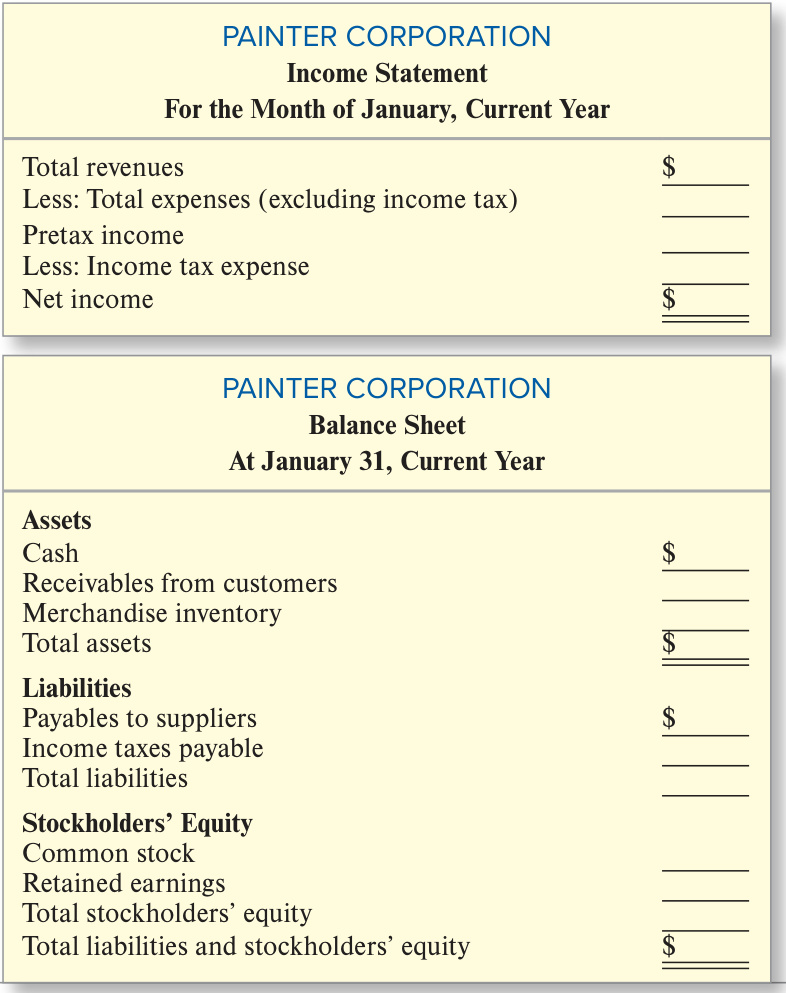

# Ch01 Financial Statements and Business Decisions  

Le-Nature’s Inc. designed its business strategy to ride the growing wave of interest in noncarbonated beverages. And apparently its strategy was a huge success. Its financial statements reported growth in sales from \$156 to \$275 million in just three years. How did this small family-run business compete with the likes of Coke and Pepsi in this growing market? The business press suggested the first key to its success was manufacturing a broad range of products that fit into the fastest growing “healthy” segments: flavored waters, teas, and fruit drinks. Founder and CEO Gregory Podlucky said that an obsessive drive for quality and efficiency was just as critical. Matching customers’ concerns for the environment and healthy living, Le-Nature’s was praised as one of the first companies to switch to environmentally friendlier PET plastic bottles and to employ safe in-bottle pasteurization. Its 21st-century manufacturing operation in Latrobe, Pennsylvania, produced everything that goes into its products, from the injection-molded PET bottles to the final packaging. Complete control over the whole process assures quality and provides the flexibility to respond quickly to changes in customers’ demands. When convenience stores moved to larger-sized drinks or school cafeterias switched from carbonated beverages to healthier drinks, Le-Nature’s could change its production to meet the customers’ needs. The company even opened a second new state-of-the-art manufacturing facility in Arizona to meet the apparent growing demand.  

But here is the twist: Just three short months later, investigators discovered that LeNature’s phenomenal sales growth was more fiction than fact. How could this apparent success story portrayed in the financial statements really be one of the most remarkable frauds in history?  

Chapter 1 concentrates on the key financial statements that businesspeople rely upon when they evaluate a company’s performance as well as the importance of accurate financial statements in making our economic system work. We discuss these issues in the context of Le-Nature’s rise and fall.  

### LEARNING OBJECTIVES  

After studying this chapter, you should be able to:  

1-1 Recognize the information conveyed in each of the four basic financial statements and the way that it is used by different decision makers (investors, creditors, and managers). p. 6  

1-2 Identify the role of generally accepted accounting principles (GAAP) in determining financial statement content and managers’, directors’, and auditors’ responsibilities for ensuring the accuracy of the financial statements. p.17 

Accounting knowledge will be valuable to you only if you can apply it in the real world. Learning is also easier when it takes place in real contexts. So at the beginning of each chapter, we always provide some background about the business that will provide the context for the chapter discussion.  

### Understanding The Business

Le-Nature’s Inc., our focus company for this chapter, was founded by Gregory Podlucky and his brother Jonathan, who initially were the sole owners or **stockholders** of the company. They were also the managers of the company. Using expertise gained working at their parents’ brewery (Stoney’s Beer), the brothers were early believers in the trend toward healthier, noncarbonated beverages. Like most entrepreneurs, their growth ambitions quickly outpaced their own financial resources. So they turned to banks, including Wells Fargo Bank and other lenders, to finance additional manufacturing facilities and equipment. Different units of Wells Fargo continued to arrange lending to Le-Nature’s as the need arose, becoming its largest lender or **creditor**. Creditors make money on the loans by charging **interest**. The Podluckys also convinced others to buy stock in Le-Nature’s. These individuals became part owners or stockholders along with the Podluckys. The stockholders hoped to receive a portion of what the company earned in the form of cash payments called **dividends** and to eventually sell their share of the company at a higher price than they paid. Creditors are more willing to lend and stock prices usually rise when creditors and investors expect the company to do well in the future. Both groups estimate future performance, in part, based on information in the company’s financial statements.  

EXHIBIT 1.1  

The Accounting System and Decision Makers  

  
Micolas/Shutterstock; nirat/iStock/Getty Images Plus; Anton Violin/Shutterstock; Pressmaster/Shutterstock; kzenon/123RF  

### The Accounting System  

Managers (often called **internal decision makers**) need information about the company’s business activities to manage the operating, investing, and financing activities of the firm. Stockholders and creditors (often called **external decision makers**) need information about these same business activities to assess whether the company will be able to pay back its debts with interest and pay dividends. All businesses must have an **accounting** system that collects and processes financial information about an organization’s business activities and reports that information to decision makers. Le-Nature’s business activities included:  

+ **Financing Activities**: borrowing or paying back money to lenders and receiving additional funds from stockholders or paying them dividends.   
+ **Investing Activities**: buying or selling items such as plant and equipment used in the production of beverages.   
+ **Operating Activities**: the day-to-day process of purchasing raw tea and other ingredients from suppliers, manufacturing beverages, delivering them to customers, collecting cash from customers, and paying suppliers.  

Exhibit 1.1 outlines the two parts of the accounting system. Internal managers typically require continuous, detailed information because they must plan and manage the day-to-day operations of the organization. Developing accounting information for internal decision makers, called **managerial** or **management accounting**, is the subject of a separate accounting course. The focus of this text is accounting for external decision makers, called **financial accounting**, and the four basic financial statements and related disclosures that are periodically produced by that system.  

**Why Study Financial Accounting?**

No matter what your business career goals, you can’t get away from financial accounting. You may want to work for an investment firm, a bank, or an accounting firm that would be involved in the financing of companies like Le-Nature’s. We will focus much of our discussion on the perspectives of investors, creditors, and preparers of financial statements. However, you might not be aware that managers within the firm also make direct use of financial statements. For example, marketing managers and credit managers use customers’ financial statements to decide whether to extend credit to their customers. Supply chain managers analyze suppliers’ financial statements to see whether the suppliers have the resources to meet demand and invest in future development. Both the employees’ unions and company human resource managers use financial statements as a basis for contract negotiations over pay rates. Financial statement figures even serve as a basis for calculating employee bonuses. Regardless of the functional area of management in which you are employed, you will use financial statement data.  

We begin with a brief but comprehensive overview of the information reported in the four basic financial statements and the people and organizations involved in their preparation and use. This overview provides a context in which you can learn the more detailed material presented in the chapters that follow. Then we will discuss the parties that are responsible for the accuracy of financial statements as well as the consequences  of  misstated  financial  statements.  Le-Nature’s  stockholders  and creditors used its financial statements to learn more about the company before making their investment and lending decisions. In doing so, they assumed that the statements accurately represented Le-Nature’s financial condition.  

$~$

**Your Goals for Chapter 1**

To understand the way in which creditors and stockholders used Le-Nature’s financial statements, we must first understand what specific information is presented in the four basic financial statements for a company such as Le-Nature’s. PLEASE NOTE: Rather than trying to memorize the definitions of every term used in this chapter, try to focus your attention on learning the general content, structure, and use of the statements. Specifically:  

Content: the categories of items (often called elements) reported on each of the four statements.  

Structure: the equation that shows how the elements within the statement are organized and related.  

Use: how the information is used by stockholders and creditors to make investment and lending decisions.  

The Pause for Feedback–Self-Study Quizzes at key points in the chapter will help you assess whether you have reached these goals. If you have difficulty with the Self-Study Quizzes, Guided Help videos provide narrated, animated, step-by-step walk-throughs at key points to help you with the material. Remember that because this chapter is an overview, each concept discussed here will be discussed again in Chapters 2 through 5.  

Organization of the Chapter:

  

### LEARNING OBJECTIVE 1-1

Recognize the information conveyed in each of the four basic financial statements and the way that it is used by different decision makers (investors, creditors, and managers).  

## 1.1 The Four Basic Financial Statements: An Overview  

Four financial statements are normally prepared by profit-making organizations for use by investors, creditors, and other external decision makers.  

1.	On its **balance sheet**, Le-Nature’s reports the economic resources it owns and the sources of financing for those resources.   
2.	On its **income statement**, Le-Nature’s reports its ability to sell goods for more than their cost to produce and sell.   
3.	On its **statement of stockholders’ equity**, Le-Nature’s reports additional contributions from or payments to investors and the amount of income the company reinvested for future growth.   
4.	On its **statement of cash flows**, Le-Nature’s reports its ability to generate cash and how it was used.  

The four basic statements can be prepared at any point in time (such as the end of the year, quarter, or month) and can apply to any time span (such as one year, one quarter, or one month). Like most companies, Le-Nature’s prepared financial statements for external users (investors and creditors) at the end of each quarter (known as quarterly reports) and at the end of the year (known as annual reports).  

### The Balance Sheet  

The purpose of the balance sheet (statement of financial position) is to report the financial position (amount of assets, liabilities, and stockholders’ equity) of an accounting entity at a particular point in time. We can learn a great deal about what the balance sheet reports just by reading the statement from the top. The balance sheet Le-Nature’s Inc. presented to creditors and stockholders is shown in Exhibit 1.2.  

###  

  

### EXHIBIT 1.2  

### Structure  

Notice that the heading specifically identifies four significant items related to the statement:  

1.	Name of the entity, Le-Nature’s Inc.   
2.	Title of the statement, Balance Sheet.   
3.	Specific date of the statement, At December 31, 2020.   
4.	Unit of measure (in millions of dollars).  

Balance Sheet  

The organization for which financial data are to be collected, called an accounting entity, must be precisely defined. On the balance sheet, the business entity itself, not the business owners, is viewed as owning the resources it uses and being responsible for its debts. The heading of each statement indicates the time dimension of the report. The balance sheet is like a financial snapshot indicating the entity’s financial position at a specific point in time—in this case, December 31, 2020—which is stated clearly on the balance sheet. Financial reports are normally denominated in the currency of the country in which they are located. U.S. companies report in U.S. dollars, Canadian companies in Canadian dollars, and Mexican companies in Mexican pesos. Le-Nature’s statements report in millions of dollars. That is, they round the last six digits to the nearest million dollars. The listing of Cash $\mathbb{S}10.6$ on Le-Nature’s balance sheet actually means $^{\S10,600,000}$ .  

### Balance Sheet  

$=$   
Liabilities   
+   
Stockholders   
Equity  

Notice that Le-Nature’s balance sheet has three major captions: assets, liabilities, and stockholders’ equity. The basic accounting equation, often called the balance sheet equation, explains their relationship:  

  
The basic accounting equation shows what we mean when we refer to a company’s financial position: the economic resources that the company owns and the sources of financing for those resources.  

  
Adrian Bradshaw/EPA/Newscom  

### Elements  

Assets are the economic resources owned by the entity. Le-Nature’s lists four items under the category Assets. The exact items listed as assets on a company’s balance sheet depend on the nature of its operations. But these are common names used by many companies. The four items listed by Le-Nature’s are the economic resources needed to manufacture and sell beverages to retailers and vending companies. Each of these economic resources is expected to provide future benefits to the firm. To prepare to manufacture the beverages, Le-Nature’s first needed cash to purchase land on which to build factories and install production machinery (property, plant, and equipment). Le-Nature’s then began purchasing ingredients and producing beverages, which led to the balance assigned to inventories. When Le-Nature’s sells its beverages to grocery stores and others, it sells them on credit and receives promises to pay called accounts receivable, which are collected in cash later.  

Every asset on the balance sheet is initially measured at the total cost incurred to acquire it. Balance sheets do not generally show the amounts for which the assets could currently be sold.  

Liabilities and stockholders’ equity are the sources of financing for the company’s economic resources. Liabilities indicate the amount of financing provided by creditors. They are the company’s debts or obligations. Under the category Liabilities, Le-Nature’s lists two items. The accounts payable arise from the purchase of goods or services from suppliers on credit without a formal written contract (or a note). The notes payable to banks result from cash borrowings based on a formal written debt contract with banks.  

Stockholders’ equity indicates the amount of financing provided by owners of the business and reinvested earnings.2 The investment of cash and other assets in the business by the stockholders is called common stock. The amount of earnings (profits) reinvested in the business (and thus not distributed to stockholders in the form of dividends) is called retained earnings.  

In Exhibit 1.2, the Stockholders’ Equity section reports two items. The founders and other stockholders’ investment of $\mathbb{555.7}$ million is reported as common stock. Le-Nature’s total earnings (or losses incurred) less all dividends paid to the stockholders since formation of the corporation equals $\mathbb{S}64$ million and is reported as retained earnings. Total stockholders’ equity is the sum of the common stock plus the retained earnings.  

### Interpreting Assets, Liabilities, and Stockholders’ Equity on the Balance Sheet  

Assessment of Le-Nature’s assets is important to its creditors, Wells Fargo Bank and others, and its stockholders because assets provide a basis for judging whether the company has sufficient resources available to operate. Assets are also important because they could be sold for cash in the event that Le-Nature’s goes out of business.  

Le-Nature’s debts are important because creditors and stockholders are concerned about whether the company has sufficient sources of cash to pay its debts. Le-Nature’s debts are also relevant to Wells Fargo Bank’s decision to lend money to the company because existing creditors share its claim against LeNature’s assets. If a business does not pay its creditors, the creditors may force the sale of assets sufficient to meet their claims.  

Le-Nature’s stockholders’ equity is important to Wells Fargo Bank because creditors’ claims legally come before those of owners. If Le-Nature’s goes out of business and its assets are sold, the proceeds of that sale must be used to pay back creditors before the stockholders receive any money. Thus, creditors consider stockholders’ equity a protective “cushion.”  

We just learned the balance sheet is a statement of financial position that reports dollar amounts for a company’s assets, liabilities, and stockholders’ equity at a specific point in time. These elements are related in the basic accounting equation: Assets $=$ Liabilities $^+$ Stockholders’ Equity. Before you move on, complete the following questions to test your understanding of these concepts.  

### S E L F - S T U D Y  Q U I Z  

1.	 Le-Nature’s assets are listed in one section and liabilities and stockholders’ equity in another. Notice that the two sections balance in conformity with the basic accounting equation. In the following chapters, you will learn that the basic accounting equation is the basic building block for the entire accounting process. Your task here is to verify that total assets ( $\mathbb{S}527.4$ million) is correct using the numbers for liabilities and stockholders’ equity presented in Exhibit 1.2.  

Assets $=$ Liabilities $^+$ Stockholders’ Equity  

### Don’t skip the SELFSTUDY QUIZZES!  

They are designed to help ensure you understand the material before moving on.  

2.	 Learning which items belong in each of the balance sheet categories is an important first step in understanding their meaning. Without referring to Exhibit 1.2, mark each balance sheet item in the following list as an asset (A), a liability (L), or a stockholders’ equity (SE) item.  

Accounts payable Property, plant, and equipment Accounts receivable Inventories Cash Notes payable Common stock Retained earnings  

After you have completed your answers, check them below.  

Related Homework: M1-1, M1-2, E1-2, E1-3  

S o l u t i o n  t o S E L F - S T U DY  Q U I Z  

### The Income Statement  

### Structure  

The income statement (statement of income, statement of earnings, statement of operations)3 reports the accountant’s primary measure of performance of a business, revenues less expenses during the accounting period. While the term profit is used widely for this measure of performance, accountants prefer to use the technical terms net income or net earnings. Le-Nature’s net income measures its success in selling beverages for more than the cost to generate those sales.  

A quick reading of Le-Nature’s income statement (Exhibit 1.3) indicates a great deal about its purpose and content. The heading identifies the name of the entity, the title of the report, and the unit of measure used in the statement. Unlike the balance sheet, however, which reports as of a certain date, the income statement reports for a specified period of time (in this case for the year ended December 31, 2020). The time period covered by the financial statements (one year in this case) is called an accounting period. Notice that Le-Nature’s income statement has three major captions: revenues, expenses, and net income. The income statement equation that describes their relationship is:  

<html><body><table><tr><td>Income</td></tr><tr><td>Statement</td></tr><tr><td>Revenues</td></tr><tr><td>+lncreases</td></tr><tr><td>-Expenses NetIncome</td></tr></table></body></html>  

<html><body><table><tr><td>Revenues</td><td>Expenses</td><td>NetIncome</td></tr><tr><td>Resourcesearned</td><td>Resourcesused</td><td>Revenuesearned</td></tr><tr><td>fromdeliveryof goodsandservices</td><td>(incurred)toearn</td><td>minusexpenses</td></tr><tr><td></td><td>period'srevenue</td><td>incurred</td></tr></table></body></html>  

### Elements  

Companies earn revenues from the sale of goods or services to customers (in Le-Nature’s case, from the sale of beverages). Revenues normally are amounts expected to be received for goods or services that have been delivered to a customer, whether or not the customer has paid for the goods or services. Retail stores such as Walmart and McDonald’s often receive cash from consumers at the time of sale. However, when Le-Nature’s delivers its beverages to retail stores, it receives a promise of future payment called an account receivable, which later is collected in cash. In either case, the business recognizes total sales (cash and credit) as revenue for the  

### EXHIBIT 1.3  

Income Statement  

<html><body><table><tr><td>LE-NATURE'SINC. IncomeStatement For the Year Ended December 31, 2020 (in millions of dollars)</td><td>EXPLANATION Nameoftheentity Titleofthestatement Accountingperiod</td></tr><tr><td>Revenues Sales revenue $ 275.1 Expenses</td><td>Unitofmeasure Cashandpromisesreceivedfromsaleofbeverages Costtoproducebeveragessold</td></tr><tr><td>Cost of goods sold 140.8 Selling, general, and administrative</td><td></td></tr><tr><td>expenses 77.1 Interest expense 17.2 40.0</td><td>Otheroperatingexpenses(utilities,deliverycosts,etc.）</td></tr><tr><td>Income beforeincome taxes Incometaxexpense 17.1 Net income 22.9 The notes are an integral part of these financial statements.</td><td>Costofusingborrowedfunds Incometaxesonperiod'sincomebeforeincometaxes Revenuesearnedminusexpensesincurred</td></tr></table></body></html>  

period. Various terms are used in income statements to describe different sources of revenue (e.g., provision of services, sale of goods, rental of property). Le-Nature’s lists only one, sales revenue, in its income statement.  

Expenses represent the dollar amount of resources the entity used to earn revenues during the period. Expenses reported in one accounting period actually may be paid for in another accounting period. Some expenses require the payment of cash immediately, while others require payment at a later date. Some also may require the use of another resource, such as an inventory item, which may have been paid for in a prior period. Le-Nature’s lists four types of expenses on its income statement, which are described in Exhibit 1.3. These expenses include income tax expense, which, as a corporation, Le-Nature’s must pay on the subtotal income before income taxes.  

Net income or net earnings (often called “the bottom line”) is the excess of total revenues over total expenses. If total expenses exceed total revenues, a net loss is reported.4 We noted earlier that revenues are not necessarily the same as collections from customers and expenses are not necessarily the same as payments to suppliers. As a result, net income normally does not equal the net cash generated by operations. This latter amount is reported on the cash flow statement discussed later in this chapter.  

### FINANCIAL ANALYSIS  

  

### Analyzing the Income Statement: Beyond the Bottom Line  

Investors and creditors such as Wells Fargo Bank closely monitor a firm’s net income because it indicates the firm’s ability to sell goods and services for more than they cost to produce and deliver. Investors buy stock when they believe that future earnings will improve and lead to dividends and the ability to sell their stock for more than they paid. Lenders also rely on future earnings to provide the resources to repay loans. The details of the statement also are important. For example, Le-Nature’s had to sell more than $\mathbb{5}275$ million worth of beverages to make just under $\mathbb{S}23$ million. If a competitor were to lower prices just 10 percent, forcing Le-Nature’s to do the same, its net income could easily turn into a net loss. These fac tors and others help investors and creditors estimate the company’s future earnings.  

### P A U S E  F O R  F E E D B A C K  

As noted above, the income statement is a statement of operations that reports revenues, expenses, and net income for a stated period of time. To practice your understanding of these concepts, complete the following questions.  

S E L F - S T U D Y  Q U I Z  

1.	 Learning which items belong in each of the income statement categories is an important first step in understanding their meaning. Without referring to Exhibit 1.3, mark each income statement item in the following list as a revenue (R) or an expense (E).  

Cost of goods sold Sales revenue Income tax Selling, general, and administrative  

2.	 Assume that during the period 2020, Le-Nature’s delivered beverages for which customers paid or promised to pay amounts totaling $\mathbb{S}275.1$ million. During the same period, it collected $\mathbb{S}250.0$ million in cash from its customers. Without referring to Exhibit 1.3, indicate which of these two amounts will be shown on Le-Nature’s income statement as sales revenue for 2020. Why did you select your answer?  

  
Keith Srakocic/AP Images  

3.	 Assume that during the period 2020, Le-Nature’s produced beverages with a total cost of production of $\mathbb{S}142.1$ million. During the same period, it delivered to customers beverages that cost a total of $\Phi140.8$ million to produce. Without referring to Exhibit 1.3, indicate which of the two numbers will be shown on Le-Nature’s income statement as cost of goods sold expense for 2020. Why did you select your answer?  

After you have completed your answers, check them below.  

Related Homework: M1-1, M1-2, E1-6  

### Statement of Stockholders’ Equity  

### Structure  

Le-Nature’s prepares a separate statement of stockholders’ equity, shown in Exhibit 1.4. The heading identifies the name of the entity, the title of the report, and the unit of measure used in the statement. Like the income statement, the statement of stockholders’ equity covers a specified period of time (the accounting period), which in this case is one year. The statement reports the changes in each of the company’s stockholders’ equity accounts during that period.  

Le-Nature’s had no changes in common stock during the period. Had it issued or repurchased common stock during the year, the transactions would be reported on separate lines. The retained earnings column reports the way that net income and the distribution of dividends affected the company’s financial position during the accounting period. Net income earned during the year increases the balance of retained earnings, showing the relationship of the income statement to the balance sheet.5 Declaring dividends to the stockholders decreases retained earnings. The retained earnings equation that describes these relationships is:  

Statement of Stockholders’ Equity  

  

S o l u t i o n  t o S E L F - S T U DY  Q U I Z  

1.	 E, E, R, E (reading down the columns).   
2.	 Sales revenue in the amount of $\mathbb{S}275.1$ million is recognized. Sales revenue is normally reported on the income statement when goods or services have been delivered to customers who have either paid or promised to pay for them in the future.   
3.	 Cost of goods sold expense is $\mathbb{S}140.8$ million. Expenses are the dollar amount of resources used up to earn revenues during the period. Only those beverages that have been delivered to customers have been used up.  

### Elements  

The statement starts with the beginning balances in the stockholders’ equity accounts, lists the increases and decreases, and reports the resulting ending balances. The retained earnings portion of the statement in Exhibit 1.4 begins with Le-Nature’s beginning-of-the-year retained earnings. The current year’s net income reported on the income statement is added and the current year’s dividends are subtracted from this amount. During 2020, Le-Nature’s earned $\mathfrak{S}22.9$ million, as shown on the income statement (Exhibit 1.3). This amount was added to the beginning-of-the-year retained earnings. Also, during 2020, Le-Nature’s declared and paid a total of $\mathbb{S}2.0$ million in dividends to its stockholders. This amount was subtracted in computing end-of-the-year retained earnings on the balance sheet. Note that retained earnings increased by the portion of income reinvested in the business $\mathbb{S}22.9$ million − $\mathfrak{S}2.0$ million $=\,\mathfrak{S}20.9\$ million). The ending retained earnings amount of $\mathbb{S}64.0$ million is the same as that reported in Exhibit  1.2 on Le-Nature’s balance sheet. Thus, the retained earnings portion of the statement indicates the relationship of the income statement to the balance sheet.  

### FINANCIAL ANALYSIS  

  

### Interpreting Retained Earnings  

Reinvestment of earnings, or retained earnings, is an important source of financing for Le-Nature’s, representing more than 12 percent of its financing. Creditors such as Wells Fargo Bank closely monitor a firm’s statement of stockholders’ equity because the firm’s policy on dividend payments to the stockholders affects its ability to repay its debts. Every dollar Le-Nature’s pays to stockholders as a dividend is not available for use in paying back its debt to Wells Fargo. Investors examine retained earnings to determine whether the company is reinvesting a sufficient portion of earnings to support future growth.  

The statement of stockholders’ equity explains changes in stockholders’ equity accounts, including the change in the retained earnings balance caused by net income and dividends during the reporting period. Check your understanding of these relationships by completing the following question.  

Assume that a company’s financial statements reported the following amounts: beginning retained earnings, $\mathbb{S}5{,}510$ ; total assets, $\mathbb{S}20{,}450$ ; dividends, $\mathbb{S}900$ ; cost of goods sold expense, $\mathbb{S}19{,}475$ ; and net income, $\mathbb{S}1,780$ . Without referring to Exhibit 1.4, compute ending retained earnings.  

After you have completed your answer, check it below.  

Related Homework: E1-13  

Beginning Retained Earnings (\$5,510) $^+$ Net Income (\$1,780) − Dividends $(\mathbb{S}900)=$ Ending Retained Earnings (\$6,390).  

Statement of Stockholders’ Equity Beginning balance   
+Increases   
−Decreases Ending balances  

### Relationships Among the Income Statement, Statement of Stockholders’ Equity, and Balance Sheet  

Our discussion of the basic financial statements has focused on what elements are reported in each statement, how the elements are related by the equation for each statement, and how the information is important to the decisions of investors, creditors, and others. We also have discovered how the statements, all of which are outputs from the same system, are related to one another. In particular, we learned:  

1.	Net income from the income statement results in an increase in ending retained earnings on the statement of stockholders’ equity.   
2.	Ending retained earnings from the statement of stockholders’ equity is one of the two components of stockholders’ equity on the balance sheet.  

Thus, we can think of the income statement as explaining, through the statement of stockholders’ equity, how the operations of the company improved or harmed the financial position of the company during the year. These relationships are illustrated in Exhibit 1.5 for Le-Nature’s financial statements.  

  
Relationships Among LeNature’s Statements  

### P A U S E  F O R  F E E D B A C K  

Thus far, we have covered the content (elements), structure (equation), and relationships among the income statement, statement of stockholders’ equity, and balance sheet that is illustrated in Exhibit 1.5. Check your understanding of these key points by completing the following questions.  

### S E L F - S T U D Y  Q U I Z  

Assume that you are the president of Brightlight Mobile Games Company. At the end of the first year of operations (December 31), the following financial data for the company are available:  

Accounts payable owed to suppliers $^\textrm{\scriptsize\Phi8},000$ Common stock (December 31) \$ 43,600 Cash 26,300 Dividends declared and paid during Equipment owned, at cost less used portion 41,900 the current year 11,600 Receivables from customers (all considered Expenses (excluding income taxes) 82,000 collectible) 11,800 Income tax expense at 20 percent $\times$ pretax Salary payable (on December 31, will be income; all paid this year ? paid on January 10) 12,000 Sales revenue 117,000 (Note: The beginning balances in Common stock and Retained earnings are zero because it is the first year of operations.)  

Required:  

1.	 Prepare a summarized income statement for the year.   
2.	 Prepare a statement of stockholders’ equity for the year.   
3.	 Prepare a balance sheet at December 31.  

For additional step-by-step video instruction on preparing the balance sheet, income statement, and statement of stockholders’ equity, go to mhhe.com/libby_gh1-1.  

Related Homework: E1-14, P1-1  

### Statement of Cash Flows  

### Structure  

Le-Nature’s statement of cash flows is presented in Exhibit 1.6. The statement of cash flows (cash flow statement) divides Le-Nature’s cash inflows and outflows (receipts and payments) into the three primary categories of cash flows in a typical business: cash flows from operating, investing, and financing activities. The heading identifies the name of the entity, the title of the report, and the unit of measure used in the statement. Like the income statement, the cash flow statement covers a specified period of time (the accounting period), which in this case is one year.  

As discussed earlier in this chapter, reported revenues do not always equal cash collected from customers because some sales may be on credit. Also, expenses reported on the income statement may not be equal to the cash paid out during the period because expenses may be incurred in one period and paid for in another. Because the income statement does not provide information concerning cash flows, accountants prepare the statement of cash flows to report inflows and outflows of cash. The cash flow statement equation describes the causes of the change in cash reported on the balance sheet from the end of the last period to the end of the current period:  

### This Guided Help video reviews the  

key topics in the chapter covered to this point (balance sheet, income statement, and statement of stockholders’ equity). Watch it before moving on!  

  

### Statement of  

+/−CFO   
+/−CFI   
+/−CFF Change in Cash  

Note that each of the three cash flow sources can be positive or negative.  

<html><body><table><tr><td colspan="2">BRIGHTLIGHTMOBILEGAMESCOMPANY Income Statement For the Year Ended December 31,</td></tr><tr><td colspan="2">Current Year Sales revenue $117,000 Expenses 82,000 Pretax income 35,000 Incometaxexpense 7,000</td></tr><tr><td colspan="2">Net income $ 28,000 2. BRIGHTLIGHTMOBILEGAMESCOMPANY</td></tr><tr><td colspan="2">StatementofStockholders'Equity For the Year Ended December 31, Current Year Common Retained Earnings</td></tr><tr><td colspan="2">Stock Balance January 1, Current year Stock issuance $43,600 Net income $28,000 Dividends (11,600) BalanceDecember31,CurrentYear $43,600 $16,400</td></tr></table></body></html>  

S o l u t i o n  t o S E L F - S T U DY  Q U I Z  

### BRIGHTLIGHT MOBILE GAMES COMPANY  

### December 31, Current Year  

### Assets  

  

### Elements  

Cash flows from operating activities are cash flows that are directly related to earning income. For example, when customers pay Le-Nature’s for the beverages it has delivered to them, it lists the amounts collected as cash collected from customers. When Le-Nature’s pays salaries to its production employees or pays bills received from its tea suppliers, it includes the amounts in cash paid to suppliers and employees.  

Cash flows from investing activities include cash flows related to the acquisition or sale of the company’s plant and equipment and investments. This year, Le-Nature’s had only one cash outflow from investing activities, the purchase of additional manufacturing equipment to meet growing demand for its products.  

Cash flows from financing activities are cash flows directly related to the financing of the enterprise itself. They involve the receipt or payment of money to investors and creditors (except for suppliers). This year, Le-Nature’s borrowed additional money from the bank to purchase most of the new manufacturing equipment. It also paid out dividends to the stockholders.6  

The positive and negative subtotals for cash flows from operating, investing, and financing activities are added to determine the change in cash during the period. Then, the change in cash during the period is added to the beginning cash balance, resulting in the ending cash balance. This balance should be the same as the amount reported on the balance sheet at the end of the period. Thus, the cash flow statement explains how the operating, investing, and financing activities of the company affected the cash balance on the balance sheet during the year.  

### FINANCIAL ANALYSIS  

### Interpreting the Cash Flow Statement  

Bankers often consider the Operating Activities section to be most important because it indicates the company’s ability to generate cash from sales to meet its current cash needs. Any amount left over can be used to pay back the bank debt or expand the company. Stockholders will invest in a company only if they believe that it will eventually generate more cash from operations than it uses so that cash will become available to pay dividends and expand.  

The statement of cash flows reports inflows and outflows of cash for a stated period of time classified into three categories: operating, investing, and financing activities. Answer the following questions to test your understanding of the concepts involved.  

1.	 Assume that during the period 2020, Le-Nature’s delivered beverages to customers who paid or promised to pay a total of $\mathbb{S}275.1$ million. During the same period, it collected $\mathbb{S}250.0\$ million in cash from customers. Which of the two amounts will be shown on Le-Nature’s cash flow statement for 2020?   
2.	 Your task here is to verify that Le-Nature’s cash balance increased by $\mathbb{S}9.0$ million during the year using the totals for cash flows from operating, investing, and financing activities presented in Exhibit 1.5. Recall the cash flow statement equation:  

$+/-$ Cash Flows from Operating Activities (CFO) $+/-$ Cash Flows from Investing Activities (CFI) +/− Cash Flows from Financing Activities (CFF) Change in Cash  

After you have completed your answers, check them below.  

Related Homework: E1-15  

### Notes and Financial Statement Formats  

At the bottom of each of Le-Nature’s four basic financial statements is this statement: “The notes are an integral part of these financial statements.” This is the accounting equivalent of the Surgeon General’s warning on a package of cigarettes. It warns users that failure to read the notes (footnotes) to the financial statements will result in an incomplete picture of the company’s financial health. Throughout this book, we will discuss many note disclosures because understanding their content is critical to understanding the company.  

A few additional formatting conventions are worth noting here. Assets are listed on the balance sheet by ease of conversion to cash. Liabilities are listed by their maturity (due date). Most financial statements include the monetary unit sign (in the United States, the $\mathfrak{S}$ ) beside the first dollar amount in a group of items (e.g., the cash amount in the assets). Also, it is common to place a single underline below the last item in a group before a total or subtotal (e.g., property, plant, and equipment). For group totals (e.g., total assets), a dollar sign is placed beside each amount and a double underline is set below. The same conventions are followed in all four basic financial statements.  

### Summary of the Four Basic Financial Statements  

We have learned a great deal about the content of the four basic financial statements. Exhibit 1.7 summarizes this information. Take a few minutes to review the information in the exhibit before you move on to the next section of the chapter.  

## 1.2 Resbonsibilities for the Accounting Communication Process

For decision makers to use the information in Le-Nature’s financial statements effectively, they have to know (1) the information conveyed by the statements and the measurement rules applied in computing the numbers on the statements and (2) that the numbers on the statements are correct. The rules that determine the content and measurement rules of the statements are called generally accepted accounting principles, or GAAP.  

### LEARNING OBJECTIVE 1-2  

Identify the role of generally accepted accounting principles (GAAP) in determining financial statement content and managers’, directors’, and auditors’ responsibilities for ensuring the accuracy of the financial statements.  

### S o l u t i o n s  t o  

S E L F - S T U DY  Q U I Z  

### EXHIBIT 1.7  

Summary of the Four Basic Financial Statements  

<html><body><table><tr><td>Financial Statement</td><td>Purpose</td><td>Structure</td><td>Examples of Content</td></tr><tr><td>BalanceSheet (Statementof Financial Position)</td><td>Reports the financial position (economic resources and sources of financing) of an accounting entity at a point in time.</td><td>Balance Sheet Assets Liabilities + Stockholders' Equity</td><td>Cash, accounts receivable,plantand equipment, long-term debt, common stock</td></tr><tr><td>Income Statement (Statement of Income, Statement of Earnings, Statement of Operations)</td><td>Reports the accountant's primary measureofeconomic performance during the accounting period.</td><td>Income Statement Revenues +lncreases -Expenses Net Income</td><td>Sales revenue, cost of goods sold, selling expense, interest expense</td></tr><tr><td>Statementof Stockholders'Equity</td><td>Reports changes in the company's common stock and retained earnings during the accounting period.</td><td>Statement of Stockholders' Equity Beginning balance +lncreases -Decreases Ending balances</td><td>Beginning and ending stockholders equity balances, stock issuances, net income,dividends</td></tr><tr><td>Statement of Cash Flows (Cash Flow Statement)</td><td>Reports inflows (receipts) and outflows (payments) of cash during the accounting period in the categories operating,investing, and financing.</td><td>Statement of CashFlows +/-CFO +/-CFI +/-CFF Change in Cash</td><td>Cashcollectedfrom customers, cash paid to suppliers, cash paid to purchase equipment, cash borrowed from banks</td></tr></table></body></html>  

### Generally Accepted Accounting Principles  

How Are Generally Accepted Accounting Principles Determined?  

In the United States, Congress created the Securities and Exchange Commission (SEC) and gave it broad powers to determine the measurement rules for financial statements that companies issuing stock to the public (publicly traded companies) must provide to stockholders.7 The SEC has worked with organizations of professional accountants and other interested parties to establish groups that are given the primary responsibilities to work out the detailed rules that become generally accepted accounting principles. Today, the Financial Accounting Standards Board (FASB) has this responsibility. The official pronouncements of the FASB are called the FASB Accounting Standards Codification.  

### What Concepts Guide the Setting of Accounting Standards?  

The FASB relies on a conceptual framework outlined in Exhibit 1.8 to provide a structure for developing specific accounting standards. It states that the primary objective of financial reporting to external users is to provide financial information about the reporting entity that  

### EXHIBIT 1.8  

is useful to existing and potential investors, lenders, and other creditors in making decisions about providing resources to the company. Most users are interested in information to help them assess the amounts, timing, and uncertainty of a business’s future cash inflows and outflows. To be useful, the information must be relevant to the decisions of these external users and be a faithful representation of the economic substance of the company’s activities. Information is relevant if it helps evaluate the company’s past behavior and predict its future activities. Faithful representation requires that the information be complete and free from bias and other forms of error.  

Comparability, verifiability, timeliness, and understandability are qualitative characteristics that enhance the usefulness of information that is relevant and faithfully represented. For example, our discussions of financial analysis will emphasize the importance of comparing information for the same company over time, as well as against those of competitors. Such comparisons are valid only if the information is prepared on a consistent and comparable basis. These characteristics of useful information guide the FASB in deciding what financial information should be reported.  

### Why Is GAAP Important to Managers and External Users?  

Generally accepted accounting principles (GAAP) are of great interest to the companies that must prepare financial statements, their auditors, and the readers of the statements. Companies incur the cost of preparing the statements and bear the major economic consequences of their publication, which include, among others:  

1.	Effects on the selling price of a company’s stock.   
2.	Effects on the amount of bonuses received by management and employees.   
3.	Loss of competitive information to other companies.  

As a consequence of these and other concerns, changes in GAAP are actively debated, political lobbying often takes place, and final rules are a compromise among the wishes of interested parties. Most managers do not need to learn all the details included in these standards. Our approach is to focus on those details that have the greatest impact on the numbers presented in financial statements and are appropriate for an introductory course.  

### INTERNATIONAL PERSPECTIVE  

### The International Accounting Standards Board and Global Accounting Standards  

Financial accounting standards and disclosure requirements are adopted by national regulatory agencies. Since 2002, 144 jurisdictions have adopted International Financial Reporting Standards (IFRS) issued by the International Accounting Standards Board (IASB). Examples of jurisdictions requiring the use of IFRS currently include:  

•	 European Union (Germany, France, the Netherlands, Belgium, Bulgaria, Poland, etc.) and United Kingdom   
•	 Australia and New Zealand  

•	 Hong Kong (S.A.R. of China), Malaysia, and Republic of Korea  

• Brazil and Chile Canada and Mexico  

In the United States, the Securities and Exchange Commission now allows foreign companies whose stock is traded in the United States to use IFRS. To prepare you to deal with statements prepared under U.S. GAAP and IFRS, we will point out key differences between IFRS and U.S. GAAP. The basic principles and practices we discuss in Chapters 1 through 4 apply equally to both sets of standards.  

Source: IFRS Foundation, 2020  

### Ensuring the Accuracy of Financial Statements  

### What if the Numbers Are Wrong?  

Shortly after the issuance of the statements presented in this chapter in 2005 (yes, it happened in 2005, not 2020), Le-Nature’s worked with the Wachovia Capital Markets group from Wells Fargo Bank to borrow an additional $\mathbb{S}285$ million from various lenders. Why would lenders agree to risk such a large amount? Le-Nature’s financial statements presented a picture of a growth company with amazing future prospects. Reported revenues grew from $\mathbb{S}40$ to $\mathbb{S}275$ million (or nearly 600 percent) in just six years! Reported net income rose by 2,400 percent in the same period! Clearly, Le-Nature’s looked like a good bet. But if the numbers are wrong, all bets are off.  

The truth about Le-Nature’s was revealed when several non-family-member stockholders suspected that all was not right and filed a lawsuit. Court records reveal an amazing story. Reported annual sales of $\mathbb{S}275$ million were really about $\mathbb{S}32$ million. Gregory Podlucky and his co-conspirators forged checks, invoices, and revenue and expense records to massively overstate revenues and profits. The $\mathbb{S}10.6$ million its balance sheet claimed for cash turned out to be $\mathbb{S}1.8$ million. The balance sheet also understated liabilities by $\mathbb{S}200$ million. The company was never a real success—it was all fake.  

Podlucky was borrowing more and more money and using it to pay off his earlier creditors (this is called a Ponzi scheme). At the same time, he was stealing cash to support a lavish lifestyle. A sample of the resulting newspaper headlines follows:  

Market Predicts Le-Nature’s Is All Washed Up Le-Nature’s Fraud: 2 More Sentenced in $\mathbb{S800M}$ Fraud Ex-Pa. soft-drink CEO gets 20 years in prison  

### Accountant Guilty of Helping CEO Commit Fraud  

While this crime may read like a fantastic novel, the consequences for many were severe.   
This was the largest fraud ever heard in the Federal District Court of Western Pennsylvania.   
The final prison tally is listed below.  

<html><body><table><tr><td colspan="2">ThePrisonTally</td></tr><tr><td>Defendant</td><td>Sentence</td></tr><tr><td>Gregory Podlucky, CEO Robert Lynn, President AndrewMurin,Consultant Jonathan Podlucky, COO Karla Podlucky (CEO's wife) G.Jesse Podlucky (CEO's son) Donald Pollinger, Businessman Tammy Jo Andreycak, Bookkeeper</td><td>20 years in federal prison 15 years in federal prison 10 years in federal prison 5 years in federal prison 414 years in federal prison 9 years in federal prison 5 years in federal prison 5 years in federal prison</td></tr></table></body></html>  

Crime clearly did not pay for Podlucky and his co-conspirators. The auditors who missed the fraud agreed to pay $\mathbb{S}50$ million to the creditors, and Wachovia Capital Markets, which marketed the loans, agreed to pay $\mathbb{S}80$ million.  

### Ethical Conduct  

Ethics are standards of conduct for judging right from wrong, honest from dishonest, and fair from unfair. Intentional misreporting of financial statements in the Le-Nature’s case was clearly unethical and illegal. However, many situations are less clear-cut and require that individuals weigh one moral principle (e.g., honesty) against another (e.g., loyalty to a friend). When money is involved, people can easily fool themselves into believing that bad acts are justified. To avoid falling prey to this tendency, when faced with an ethical dilemma, it is often recommended that you follow a three-step process:  

1.	Identify the benefits of a decision (often to the manager or employee involved) and who will be harmed (other employees, owners, creditors, the environment).  

2.	Identify alternative courses of action.  

3.	Choose the one you would like your family and friends to see reported on your local news. That is usually the ethical choice.  

In the Le-Nature’s case, Podlucky and his co-conspirators clearly did not follow this process. Little besides the jewelry and the Latrobe plant were left to satisfy Le-Nature’s over $\mathbb{S}800$ million in debts. The nonfamily stockholders lost all of their money. Over 240 plant workers lost their jobs. And the town of Latrobe, Pennsylvania, suffered a severe economic blow.  

### Responsibility and the Need for Internal Controls  

As a manager in a business, you are responsible for setting up systems to prevent and detect unethical behavior. Primary responsibility for the information in the financial statements lies with management, represented by the highest officer of the company and the highest financial officer. Companies should take three important steps to assure investors that the company’s records are accurate:  

1.	They should maintain a system of internal controls over both the records and the assets of the company.  

2.	They should hire outside independent auditors to audit the fairness of the financial statements.  

3.	They should form a committee of the board of directors to oversee the integrity of these other safeguards.  

### Three steps to ensure the accuracy of records and safeguarding of assets:  

  

The term internal controls refers to the process by which a company safeguards its assets and provides reasonable assurance regarding the reliability of the company’s financial reporting, the effectiveness and efficiency of its operations, and its compliance with applicable laws and regulations. Internal control procedures should extend to all assets: cash, receivables, investments, plant and equipment, and so on. Controls that ensure the accuracy of the financial records are designed to prevent inadvertent errors and outright fraud. External independent auditors audit the financial reports to ensure that they represent what they claim and conform with generally accepted accounting principles. Because strong internal controls increase the reliability of the financial statements, internal control procedures are also reviewed by the outside independent auditor.  

These safeguards failed in Le-Nature’s case. The company had no controls, the independent auditors were duped by management, and the board included only Podlucky’s cronies. Although financial statement fraud is a fairly rare event, the misrepresentations in Le-Nature’s statements aptly illustrate the importance of fairly presented financial statements to investors and creditors.  

### D E M O N S T R A T I O N C A S E  

At the end of each chapter, one or more demonstration cases are presented. These cases provide an overview of the primary issues discussed in the chapter. Each demonstration case is followed by a recommended solution. You should read the case carefully and then prepare your own solution before you study the recommended solution. This self-evaluation is highly recommended. The introductory case presented here reviews the elements reported on the income statement, statement of stockholders’ equity, and balance sheet and how the elements within the statements are related.  

Best Buy Co., Inc., sells a wide range of consumer electronics and home appliances from its over 1,000 stores and online. Following is a list of the financial statement items and amounts adapted from a recent Best Buy income statement and balance sheet. The numbers are presented in millions of dollars for the year ended February 1, 2020. Assume that the company did not issue or retire stock during the year. Retained earnings at the beginning of the year was $\mathbb{S}2{,}448$ and dividends were $\mathbb{S}536$ .  

<html><body><table><tr><td>Accountspayable</td><td>$8,060</td><td>Long-term debt</td><td>$4,052</td></tr><tr><td>Accountsreceivable</td><td>1,149</td><td>Netincome</td><td>1,541</td></tr><tr><td>Cash</td><td>2,229</td><td>Salesrevenue</td><td>43,638</td></tr><tr><td>Commonstock</td><td>26</td><td>Netpropertyandequipment</td><td>6,734</td></tr><tr><td>Costofsales</td><td>33,590</td><td>Retained earnings</td><td>3,453</td></tr><tr><td>Incomebeforeincometaxes</td><td>1,993</td><td>Selling,general,andadministrativeexpenses</td><td>7,991</td></tr><tr><td>Incometaxexpense</td><td>452</td><td>Totalassets</td><td>15,591</td></tr><tr><td>Interestexpense</td><td>64</td><td>Totalliabilities</td><td>12,112</td></tr><tr><td rowspan="2">Merchandiseinventories</td><td rowspan="2">5,479</td><td>Totalliabilities andshareholders'equity</td><td>15,591</td></tr><tr><td>Totalshareholders'equity</td><td>3,479</td></tr></table></body></html>  

### Required:  

For more help on preparing the balance sheet, income, statement, and statement of stockholders’equity, watch the Guided Help video that can be found at mhhe.com/ libby11e_gh1  

1.	 Prepare a balance sheet, an income statement, and a statement of stockholders’ equity for the year following the formats in Exhibits 1.2, 1.3, and 1.4, respectively.   
2.	 Specify what information these three statements provide.   
3.	 Indicate the other statement that would be included in Best Buy annual report.   
4.	 Securities regulations require that Best Buy statements be subject to an independent audit. Suggest why Best Buy might voluntarily subject its statements to an independent audit if there were no such requirement.  

SUGGESTED SOLUTION  

<html><body><table><tr><td colspan="2">BEST BUY CO.,INC BEST BUY CO.,INC Balance Sheet Income Statement At February 1, 2020 For the Year Ended February 1, 2020 (in millions of dollars) (in millions of dollars) Assets $43,638</td></tr><tr><td colspan="2">Revenues Cash $ 2,229 Sales revenue Accounts receivable 1,149 Expenses Merchandise inventories 5,479 Cost of sales 33,590 Net property and equipment 6,734 Selling, general, and administrative expenses 7,991 Total assets $15,591 Interest expense 64 Liabilities and shareholders’ equity Income before income taxes 1,993 Liabilities: Income tax expense 452 Accounts payable $ 8,060 Net income 1,541 Long-term debt 4,052 Total liabilities 12,112 BESTBUYCO.,INC Shareholders'equity: Statement of Stockholders'Equity Common stock 26 For the Year Ended February 1, 2020 Retained earnings 3,453 (in millions of dollars) Totalshareholders'equity 3,479 Common Retained Total liabilities and Stock Earnings shareholders’ equity $15,591 Balance February 2, 2019 $26 $2,448 + Net income 1,541 - Dividends (536) Balance February 1, 2020 $26 $3,453</td></tr></table></body></html>  

2.	 The balance sheet reports the amount of assets, liabilities, and stockholders’ equity of an accounting entity at a point in time. The income statement reports the accountant’s primary measure of performance of a business, revenues less expenses, during the accounting period. The statement of stockholders’ equity reports on changes in the stockholders’ equity accounts during the accounting period.  

3.	 Best Buy also would present a statement of cash flows.  

4.	 Users will have greater confidence in the accuracy of financial statement information if they know that the people who audited the statements were required to meet professional standards of ethics and competence.  

### Chapter Supplement A  

### Types of Business Entities  

This textbook emphasizes accounting for profit-making business entities. The three main types of business entities are sole proprietorship, partnership, and corporation. A sole proprietorship is an unincorporated business owned by one person; it usually is small in size and is common in the service, retailing, and farming industries. Often the owner is the manager. Legally, the business and the owner are not separate entities. Accounting views the business as a separate entity, however, that must be accounted for separately from its owner.  

A partnership is an unincorporated business owned by two or more persons known as partners. The agreements between the owners are specified in a partnership contract. This contract deals with matters such as division of income each reporting period and distribution of resources of the business on termination of its operations. A partnership is not legally separate from its owners. Legally, each partner in a general partnership is responsible for the debts of the business (each general partner has unlimited liability). The partnership, however, is a separate business entity to be accounted for separately from its several owners.  

A corporation is a business incorporated under the laws of a particular state. The owners are called stockholders or shareholders. Ownership is represented by shares of capital stock that usually can be bought and sold freely. When the organizers file an approved application for incorporation, the state issues a charter. This charter gives the corporation the right to operate as a separate legal entity, separate and apart from its owners. The stockholders enjoy limited liability. Stockholders are liable for the corporation’s debts only to the extent of their investments. The corporate charter specifies the types and amounts of stock that can be issued. Most states require a minimum of two or three stockholders and a minimum amount of resources to be contributed at the time of organization. The stockholders elect a governing board of directors, which in turn employs managers and exercises general supervision of the corporation. Accounting also views the corporation as a separate business entity that must be accounted for separately from its owners. Limited liability companies (LLCs) and limited liability partnerships (LLPs) have many characteristics similar to corporations.  

In terms of economic importance, the corporation is the dominant form of business organization in the United States. This dominance is caused by the many advantages of the corporate form: (1) limited liability for the stockholders, (2) continuity of life, (3) ease in transferring ownership (stock), and (4) opportunities to raise large amounts of money by selling shares to a large number of people. The primary disadvantage of a corporation is that its income may be subject to double taxation (income is taxed when it is earned and again when it is distributed to stockholders as dividends). In this textbook, we emphasize the corporate form of business. Nevertheless, the accounting concepts and procedures that we discuss also apply to other types of businesses.  

### Chapter Supplement B  

### Employment in the Accounting Profession Today  

Since 1900, accounting has attained the stature of professions such as law, medicine, engineering, and architecture. As with all recognized professions, accounting is subject to professional competence requirements, is dedicated to service to the public, requires a high level of academic study, and rests on a common body of knowledge. An accountant may be licensed as a certified public accountant, or CPA. This designation is granted only on completion of requirements specified by the state that issues the license. Although CPA requirements vary among states, they include a college degree with a specified number of accounting courses and a total of 150 credit hours, good character, professional experience, and successful completion of a professional examination. The CPA examination is prepared by the American Institute of Certified Public Accountants.  

Accountants (including CPAs) commonly are engaged in professional practice or are employed by businesses, government entities, nonprofit organizations, and so on. Accountants employed in these activities may take and pass a professional examination to become a certified management accountant, or CMA (the CMA examination is administered by the Institute of Management Accountants), or a certified internal auditor, or CIA (the CIA examination is administered by the Institute of Internal Auditors). Specialists in areas such as fraud examination may also apply for certification in those specialty areas (e.g., CFE).  

### Practice of Public Accounting  

Although an individual may practice public accounting, usually two or more individuals organize an accounting firm in the form of a partnership (in many cases, a limited liability partnership, or LLP). Accounting firms vary in size from a one-person office, to regional firms, to the Big Four firms (Deloitte, Ernst & Young (EY), KPMG, and Pricewaterhouse Coopers (PwC)), which have hundreds of offices located worldwide. Accounting firms usually render three types of services: audit or assurance services, management consulting or advisory services, and tax services.  

### Audit or Assurance Services  

Audit or assurance services are independent professional services that improve the quality of information for decision makers. The most important assurance service performed by the CPA in public practice is financial statement auditing. The purpose of an audit is to lend credibility to the financial reports, that is, to ensure that they fairly represent what they claim. An audit involves an examination of the financial reports (prepared by the management of the entity) to ensure that they conform with GAAP. Other areas of assurance services include electronic commerce integrity and security and information systems reliability.  

### Management Consulting or Advisory Services  

Many independent CPA firms offer management consulting services. These services usually are accounting based and encompass such activities as the design and installation of accounting and profit-planning and control (budget) systems; financial advice; forecasting; inventory controls; cost-effectiveness studies;  

and operational analysis. To maintain their independence, CPAs are prohibited from performing certain consulting services for the public companies that they audit.  

### Tax Services  

CPAs in public practice usually provide income tax services to their clients. These services include both tax planning as a part of the decision-making process and the determination of the income tax liability (reported on the annual income tax return). Because of the increasing complexity of state and federal tax laws, a high level of competence is required, which CPAs specializing in taxation can provide. The CPA’s involvement in tax planning often is quite significant. Most major business decisions have significant tax impacts; in fact, tax-planning considerations often govern certain business decisions.  

### Employment by Organizations  

Many accountants, including CPAs, CMAs, and CIAs, are employed by profit-making and nonprofit organizations. An organization, depending on its size and complexity, may employ from a few to hundreds of accountants. In a business enterprise, the chief financial officer is a key member of the management team. This responsibility usually entails a wide range of management, financial, and accounting duties.  

In a business entity, accountants typically are engaged in a wide variety of activities, such as general management, general accounting, cost accounting, profit planning and control (budgeting), internal auditing, and information systems management. A primary function of the accountants in organizations is to provide data that are useful for internal managerial decision making and for controlling operations. The functions of external reporting, tax planning, control of assets, and a host of related responsibilities normally also are performed by accountants in industry.  

### Employment in the Public and Not-for-Profit Sector  

The vast and complex operations of governmental units, from the local to the international level, create a need for accountants. The same holds true for other not-for-profit organizations such as hospitals and universities. Accountants employed in the public and not-for-profit sectors perform functions similar to those performed by their counterparts in private organizations. The Government Accountability Office (GAO) and the regulatory agencies, such as the SEC and Federal Communications Commission (FCC), also use the services of accountants in carrying out their regulatory duties.  

### C H A P T E R  T A K E - A W A Y S  

1-1.	 Recognize the information conveyed in each of the four basic financial statements and the way that it is used by different decision makers (investors, creditors, and managers). p. 6  

The balance sheet is a statement of financial position that reports dollar amounts for the assets, liabilities, and stockholders’ equity at a specific point in time.  

The income statement is a statement of operations that reports revenues, expenses, and net income for a stated period of time.  

The statement of stockholders’ equity explains changes in stockholders’ equity accounts (common stock and retained earnings) that occurred during a stated period of time.  

The statement of cash flows reports inflows and outflows of cash for a stated period of time.  

The statements are used by investors and creditors to evaluate different aspects of the firm’s financial position and performance.  

1-2.	 Identify the role of generally accepted accounting principles (GAAP) in determining financial statement content and managers’, directors’, and auditors’ responsibilities for ensuring accuracy of the financial statements. p. 17  

GAAP refers to the measurement rules used to develop the information in financial statements. Knowledge of GAAP is necessary for accurate interpretation of the numbers in financial statements. Management has primary responsibility for the accuracy of a company’s financial information. Auditors are responsible for expressing an opinion on the fairness of the financial statement presentations based on their examination of the reports and records of the company.  

Users will have confidence in the accuracy of financial statement numbers only if the people associated with their preparation and audit have reputations for ethical behavior and competence. Management and auditors also can be held legally liable for fraudulent financial statements.  

In this chapter, we studied the basic financial statements that communicate financial information to external users. Chapters 2, 3, and 4 provide a more detailed look at financial statements and examine how to translate data about business transactions into these statements. Learning how to translate back and forth between business transactions and financial statements is the key to using financial statements in planning and decision making. Chapter 2 begins our discussion of the way that the accounting function collects data about business transactions and processes the data to provide periodic financial statements, with emphasis on the balance sheet. To accomplish this purpose, Chapter 2 discusses key accounting concepts, the accounting model, transaction analysis, and analytical tools. We examine the typical business activities of an actual service-oriented company to demonstrate the concepts in Chapters 2, 3, and 4.  

### F I N D I N G  F I N A N C I A L  I N F O R M A T I O N  

<html><body><table><tr><td>BalanceSheet Assets = Liabilities + Stockholders'Equity</td><td>IncomeStatement Revenues - Expenses NetIncome</td></tr><tr><td></td><td></td></tr><tr><td>StatementofStockholders'Equity</td><td>StatementofCashFlows</td></tr><tr><td>Beginningbalance</td><td>+/-CashFlows from OperatingActivities</td></tr><tr><td>+Increases -Decreases</td><td>+/-CashFlows fromInvestingActivities</td></tr><tr><td>Endingbalance</td><td>+/- Cash Flows from Financing Activities Net Change in Cash</td></tr></table></body></html>  

### K E Y  T E R M S  

Accounting A system that collects and processes (analyzes, measures, and records) financial information about an organization and reports that information to decision makers. p. 4   
Accounting Entity The organization for which financial data are to be collected. p. 7   
Accounting Period The time period covered by the financial statements. p. 10   
Audit An examination of the financial reports to ensure that they represent what they claim and conform with generally accepted accounting principles. p. 21   
Balance Sheet (Statement of Financial Position) Reports the amount of assets, liabilities, and stockholders’ equity of an accounting entity at a point in time. p. 6   
Basic Accounting Equation (Balance Sheet Equation) Assets $=$ Liabilities $^+$ Stockholders’ Equity. p. 8   
Faithful Representation Requires that the information be complete, neutral, and free from error. p. 19   
Generally Accepted Accounting Principles (GAAP) The measurement and disclosure rules used to develop the information in financial statements. p. 17   
Income Statement (Statement of Income, Statement of Earnings, Statement of Operations) Reports the revenues less the expenses of the accounting period. p. 10   
Internal Controls Processes by which a company provides reasonable assurance regarding the reliability of the company’s financial reporting, the effectiveness and efficiency of its operations, and its compliance with applicable laws and regulations. p. 21   
Notes (Footnotes) Provide supplemental information about the financial condition of a company, without which the financial statements cannot be fully understood. p. 17   
Primary Objective of Financial Reporting to External Users To provide financial information about the reporting entity that is useful to existing and potential investors, lenders, and other creditors in making decisions about providing resources to the entity. p. 18   
Relevant Information Information that can influence a decision; it has predictive and/or feedback value. p. 19   
Statement of Cash Flows (Cash Flow Statement) Reports inflows and outflows of cash during the accounting period in the categories of operating, investing, and financing. p. 15   
Statement of Stockholders’ Equity The statement reports the changes in each of the company’s stockholders’ equity accounts during the period. p. 12  

### 1.	 Define accounting.  

2.	 Briefly distinguish financial accounting from managerial accounting.   
3.	 The accounting process generates financial reports for both internal and external users. Identify some   
of the groups of users.   
4.	 Briefly distinguish investors from creditors.   
5.	 What is an accounting entity? Why is a business treated as a separate entity for accounting purposes?   
6.	 Complete the following:  

Name of Statement Alternative Title  

a.	 Income statement a.   
b.	 Balance sheet b.   
c.	 Cash Flow Statement c.   
7.	 What information should be included in the heading of each of the four primary financial statements?   
8.	 What are the purposes of (a) the income statement, $(b)$ the balance sheet, (c) the statement of cash flows, and (d) the statement of stockholders’ equity?   
9.	 Explain why, for companies whose fiscal years end on December 31, the income statement and the statement of cash flows are dated “For the Year Ended December 31,” whereas the balance sheet is dated “At December 31.”   
10.	 Briefly explain the importance of assets and liabilities to the decisions of investors and creditors.   
11.	 Briefly define net income and net loss.   
12.	 Explain the equation for the income statement. What are the three major items reported on the income statement?   
13.	 Explain the equation for the balance sheet. Define the three major components reported on the balance sheet.   
14.	 Explain the equation for the statement of cash flows. Explain the three major components reported on the statement of cash flows.   
15.	 Explain the equation for retained earnings. Explain the four major items reported on the statement of stockholders’ equity related to retained earnings.   
16.	 The financial statements discussed in this chapter are aimed at external users. Briefly explain how a company’s internal managers in different functional areas (e.g., marketing, purchasing, human resources) might use financial statement information from their own and other companies.   
17.	 Briefly describe the way that accounting measurement rules (generally accepted accounting principles) are determined in the United States.   
18.	 Briefly explain the responsibility of company management and the independent auditors in the accounting communication process.   
19.	 (Supplement A) Briefly differentiate between a sole proprietorship, a partnership, and a corporation.   
20.	 (Supplement B) List and briefly explain the three primary services that CPAs in public practice provide.  

### M U LT I P L E - C H O I C E  Q U E S T I O N S  

1.	 Which of the following is not one of the four basic financial statements?  

a.	 Balance sheet. c.	 Income statement.   
b.	 Audit report. d.	 Statement of cash flows.  

2.	 As stated in the audit report, or Report of Independent Accountants, the primary responsibility for a company’s financial statements lies with  

a.	 The owners of the company. c.	 The auditors.   
b.	 Independent financial analysts. d.	 The company’s management.  

3.	 Which of the following is true?  

a.	 FASB creates SEC. c.	 SEC creates AICPA.   
b.	 GAAP creates FASB. d.	 FASB creates U.S. GAAP.  

4.	 Which of the following regarding retained earnings is false?  

a.	 Retained earnings is increased by net income and decreased by a net loss.   
b.	 Retained earnings is a component of stockholders’ equity on the balance sheet.  

c.	 Retained earnings is an asset on the balance sheet. d.	 Retained earnings represents earnings not distributed to stockholders in the form of dividends.   
5.	 Which of the following is not one of the four items required to be shown in the heading of a financial statement? a.	 The financial statement preparer’s name. b.	 The title of the financial statement. c.	 The unit of measure in the financial statement. d.	 The name of the business entity.   
6.	 Which of the following statements regarding the statement of cash flows is true? a.	 The statement of cash flows separates cash inflows and outflows into three major categories: operating, investing, and financing. b.	 The ending cash balance shown on the statement of cash flows must agree with the amount shown on the balance sheet for the same fiscal period. c.	 The total increase or decrease in cash shown on the statement of cash flows must agree with the “bottom line” (net income or net loss) reported on the income statement. d.	 Both (a) and (b) are true. e.	 All of the above are true.   
7.	 Which of the following is not a typical note included in an annual report? a.	 A note describing the auditor’s opinion of the management’s past and future financial planning for the business. b.	 A note providing more detail about a specific item shown in the financial statements. c.	 A note describing the accounting rules applied in the financial statements. d.	 A note describing financial disclosures about items not appearing in the financial statements.   
8.	 Which of the following is true regarding the income statement? a.	 The income statement is sometimes called the statement of operations. b.	 The income statement reports revenues, expenses, and liabilities. c.	 The income statement reports only revenue for which cash was received at the point of sale. d.	 The income statement reports the financial position of a business at a particular point in time.   
9.	 Which of the following is false regarding the balance sheet? a.	 The accounts shown on a balance sheet represent the basic accounting equation for a particular business entity. b.	 The retained earnings balance shown on the balance sheet must agree with the ending retained earnings balance shown on the statement of stockholders’ equity. c.	 The balance sheet reports the changes in specific account balances over a period of time. d.	 The balance sheet reports the amount of assets, liabilities, and stockholders’ equity of an accounting entity at a point in time.   
10.	 Which of the following regarding GAAP is true? a.	 U.S. GAAP is the body of accounting knowledge followed by all countries in the world. b.	 Changes in GAAP can affect the interests of managers and stockholders. c.	 GAAP is the abbreviation for generally accepted auditing procedures. d.	 Changes to GAAP must be approved by the Senate Finance Committee.  

### M I N I - E X E R C I S E S  

### connect  

### M1-1 LO1-1  

### Matching Elements with Financial Statements  

Match each element with its financial statement by entering the appropriate letter in the space provided.  

Financial Statement  

(1)	 Expenses   
(2)	 Cash flow from investing activities   
(3)	 Assets   
(4)	 Dividends   
(5)	 Revenues   
(6)	 Cash flow from operating activities   
(7)	 Liabilities   
(8)	 Cash flow from financing activities   
A.	Balance sheet   
B.	Income statement   
C.	Statement of stockholders’ equity   
D.	Statement of cash flows  

### Matching Financial Statement Items to Financial Statement Categories  

Mark each item in the following list as an asset (A), liability (L), or stockholders’ equity (SE) item that would appear on the balance sheet or a revenue (R) or expense (E) item that would appear on the income statement.  

(1)	 Retained earnings (6)	 Inventories (2)	 Accounts receivable (7)	 Interest expense (3)	 Sales revenue (8)	 Accounts payable (4)	 Property, plant, and equipment (9)	 Land (5)	 Cost of goods sold  

### Identifying Important Accounting Abbreviations  

The following is a list of important abbreviations used in the chapter. These abbreviations also are used widely in business. For each abbreviation, give the full designation. The first one is an example.  

  

M1-3   
LO1-2  

### Matching Definitions with Terms or Abbreviations  

Match each definition with its related term or abbreviation by entering the appropriate letter in the space provided.  

<html><body><table><tr><td colspan="2"></td><td>Delmmton</td></tr><tr><td>(1）SEC</td><td></td><td>A. A system that collects and processes financial information about</td></tr><tr><td>(2）Audit (3）Sole proprietorship (4）Corporation</td><td></td><td>an organization and reports that information to decision makers. B.Information that helps evaluate the company's past behavior</td></tr><tr><td rowspan="7">(5）Accounting (6）Accounting entity (7）Audit report (8）Publicly traded (9）Partnership （10）FASB</td><td></td><td>and predict its future.</td></tr><tr><td></td><td>C. An unincorporated business owned by two or more persons. D. The organization for which financial data are to be collected</td></tr><tr><td></td><td>(separate and distinct from its owners).</td></tr><tr><td></td><td>E. An incorporated entity that issues shares of stock as evi- denceof ownership.</td></tr><tr><td></td><td>F.An examination of the financial reports to ensure that</td></tr><tr><td>（11）CPA （12） Relevant information</td><td>they represent what they claim and conform with generally</td></tr><tr><td>（13）GAAP</td><td>accepted accounting principles. G. Certified public accountant. H. An unincorporated business owned by one person. I. A report that describes the auditor's opinion of the fairness of the financial statement presentations and the evidence gathered to support that opinion. J. Securities and Exchange Commission. K. Financial Accounting Standards Board. L.A company with stock that can be bought and sold by inves- tors on established stock exchanges. M. Generally accepted accounting principles.</td></tr></table></body></html>  

### Matching Financial Statement Items to Financial Statement Categories  

According to its annual report, P&G’s billion-dollar brands include Pampers, Tide, Ariel, Always, Pantene, Bounty, Charmin, Downy, Olay, Crest, Vicks, Gillette, and others. The following are items taken from its recent balance sheet and income statement. Note that different companies use slightly different titles for the same item. Mark each item in the following list as an asset (A), liability (L), or stockholders’ equity  

E1-1   
LO1-1, 1-2  

(SE) item that would appear on the balance sheet or a revenue (R) or expense (E) item that would appear on the income statement.  

(1)	 Accounts receivable (9)	 Income taxes   
(2)	 Cash and cash equivalents (10)	 Accounts payable   
(3)	 Net sales (11)	 Trademarks and other intangible assets   
(4)	 Debt due within one year (12)	 Property, plant, and equipment   
(5)	 Taxes payable (13)	 Long-term debt   
(6)	 Retained earnings (14)	 Inventories   
(7)	 Cost of products sold (15)	 Interest expense   
(8)	 Selling, general, and administrative expense  

### E1-3  

LO1-1  

Tootsie Roll Industries  

### Matching Financial Statement Items to Financial Statement Categories  

Tootsie Roll Industries is engaged in the manufacture and sale of candy. Major products include Tootsie Rolls, Tootsie Roll Pops, Tootsie Pop Drops, Tootsie Flavor Rolls, Charms, and Blow-Pop lollipops. The following items were listed on Tootsie Roll’s recent income statement and balance sheet. Mark each item from the balance sheet as an asset (A), liability (L), or shareholders’ equity (SE) and mark each item from the income statement as a revenue (R) or expense (E) item.  

(1)	 Bank loans (10)	 Machinery and equipment (2)	 Selling, marketing, and administrative expenses (11)	 Net product sales (3)	 Accounts payable (12)	 Inventories (4)	 Dividends payable (13)	 Trademarks (5)	 Retained earnings (14)	 Buildings (6)	 Cash and cash equivalents (15)	 Land (7)	 Accounts receivable (16)	 Income taxes payable (8)	 Provision for income taxes\* (17)	 Rental and royalty costs (9)	 Product cost of goods sold (18)	 Investments (in other companies)  

\*In the United States, “provision for income taxes” is most often used as a synonym for “income tax expense.”  

### E1-4  

LO1-1  

Honda Motor Corporation  

### Preparing a Balance Sheet  

Honda Motor Corporation of Japan is a leading international manufacturer of automobiles, motorcycles, all-terrain vehicles, and personal watercraft. As a Japanese company, it follows Japanese GAAP and reports its financial statements in billions of yen (the sign for yen is ¥). A simplified version of its recent balance sheet contained the following items (in billions). Prepare a balance sheet as of March 31, current year, solving for the missing amount. (Hint: Exhibit 1.2 in the chapter provides a good model for completing this exercise.)  

Cash and cash equivalents ¥ 2,106   
Common stock 231   
Accounts payable and other current liabilities 5,429   
Inventories 1,364   
Investments 597   
Long-term debt 4,022   
Net property, plant, and equipment 3,200   
Other assets 8,606   
Other liabilities 1,938   
Retained earnings 7,338   
Total assets 18,958   
Total liabilities and stockholders’ equity ?   
Trade accounts, notes, and other receivables 3,085   
Source: Honda Motor Corporation  

### E1-5 LO1-1  

### Completing a Balance Sheet and Inferring Net Income  

Bennett Griffin and Chula Garza organized Cole Valley Book Store as a corporation; each contributed $^{\S80,000}$ cash to start the business and received 4,000 shares of common stock. The store completed its first year of operations on December 31, current year. On that date, the following financial items for the year were determined: December 31, current year, cash on hand and in the bank, $^\mathrm{\textregistered}_{}^{}\mathrm{{5}}\mathrm{{,600}}$ ; December 31, current year, amounts due from customers from sales of books, $\mathbb{S}39{,}000$ ; unused portion of store and office equipment, $\mathbb{s}73{,}000$ ; December 31, current year, amounts owed to publishers for books purchased, $\mathbb{S}12{,}000$ ; one-year note payable to a local bank for $\mathbb{S}3{,}000$ . No dividends were declared or paid to the stockholders during the year.  

Required:  

1.	 Complete the following balance sheet as of the end of the current year. 2.	 What was the amount of net income for the year? (Hint: Use the retained earnings equation [Beginning Retained Earnings $+\,\mathrm{Net}$ Income − Dividends $=$ Ending Retained Earnings] to solve for net income.)  

  

### Analyzing Revenues and Expenses and Preparing an Income Statement  

Assume that you are the owner of Campus Connection, which specializes in items that interest students. At the end of January of the current year, you find (for January only) this information:  

a.	 Sales, per the cash register tapes, of $\mathbb{S}150{,}000$ , plus one sale on credit (a special situation) of $\mathbb{S}2{,}500$ . $\boldsymbol{b}$ .	 With the help of a friend (who majored in accounting), you determine that all of the goods sold during January cost $\mathbb{S}70{,}000$ to purchase.  

c.	 During the month, according to the checkbook, you paid $\mathbb{S}37{,}000$ for salaries, rent, supplies, advertising, and other expenses; however, you have not yet paid the $\mathbb{S}900$ monthly utilities for January.  

Required:  

On the basis of the data given (disregard income taxes), what was the amount of net income for January? Show computations. (Hint: A convenient form to use has the following major side captions: Revenues, Expenses, and the difference—Net Income.)  

E1-6   
LO1-1  

### Preparing an Income Statement  

Sysco Corp. is one of the nation’s leading distributors of food and related products to restaurants, universities, hotels, and other customers. A simplified version of its recent income statement contained the following items (in millions). Prepare an income statement for the year ended June 30, current year. (Hint: First order the items as they would appear on the income statement and then confirm the values of the subtotals and totals. Exhibit 1.3 in the chapter provides a good model for completing this exercise.)  

Cost of sales \$44,814   
Income taxes 371   
Interest expense 303   
Net earnings 1,395   
Sales 55,371   
Earnings before income taxes 1,766   
Selling, general, and administration expense 8,504   
Other revenues 16   
Total expenses (excluding income taxes) 53,621   
Total revenues 55,387   
Source: Sysco Corp.  

E1-7   
LO1-1   
Sysco Corp.  

### E1-8 Analyzing Revenues and Expenses and Completing an Income Statement  

Neighborhood Realty, Incorporated, has been operating for three years and is owned by three investors. S. Bhojraj owns 60 percent of the total outstanding stock of 9,000 shares and is the managing executive in charge. On December 31, current year, the following financial items for the entire year were determined: commissions earned and collected in cash, $\mathbb{S}150{,}900$ , plus $\mathbb{S}16{,}800$ uncollected; rental service fees earned and collected, $^{\S20,000}$ ; salaries expense paid, $\mathbb{S}62,740$ ; commissions expense paid, $\mathbb{S}35{,}330$ ; payroll taxes paid, $\mathbb{S}2{,}500$ ; rent paid for January through November, $\mathbb{S}2{,}475$ (not including December rent yet to be paid); utilities expense paid, $\mathbb{5}1,600$ ; promotion and advertising paid, $\mathbb{S}7,750$ ; income taxes paid, $\mathbb{S}15{,}660$ ; and miscellaneous expenses paid, $\mathbb{S}500$ . There were no other unpaid expenses at December 31. Also during the year, the company paid the owners “out-of-profit” cash dividends amounting to $\mathbb{S}12{,}000$ . Complete the following income statement:  

  

E1-9   
LO1-1  

### Inferring Values Using the Income Statement and Balance Sheet Equations  

Review the chapter explanations of the income statement and the balance sheet equations. Apply these equations in each independent case to compute the two missing amounts for each case. Assume that it is the end of the first full year of operations for the company. (Hint: Organize the listed items as they are presented in the balance sheet and income statement equations and then compute the missing amounts.)  

<html><body><table><tr><td>Independent Cases</td><td>Total Revenues</td><td>Total Expenses</td><td>Net Income (Loss)</td><td>Total Assets</td><td>Total Liabilities</td><td>Stockholders' Equity</td></tr><tr><td>A</td><td>$93,500</td><td>$75,940</td><td>$</td><td>$140,200</td><td>$56,500</td><td>$</td></tr><tr><td>B</td><td></td><td>75,834</td><td>14,740</td><td>107,880</td><td></td><td>77,500</td></tr><tr><td>C</td><td>68,120</td><td>76,430</td><td></td><td>98,200</td><td>69,850</td><td></td></tr><tr><td>D</td><td>55,804</td><td></td><td>21,770</td><td></td><td>20,300</td><td>78,680</td></tr><tr><td>E</td><td>84,840</td><td>75,320</td><td></td><td></td><td>25,520</td><td>80,000</td></tr></table></body></html>  

### Inferring Values Using the Income Statement and Balance Sheet Equations  

Review the chapter explanations of the income statement and the balance sheet equations. Apply these equations in each independent case to compute the two missing amounts for each case. Assume that it is the end of the first full year of operations for the company. (Hint: Organize the listed items as they are presented in the balance sheet and income statement equations and then compute the missing amounts.)  

<html><body><table><tr><td>Independent Cases</td><td>Total Revenues</td><td>Total Expenses</td><td>Net Income (Loss)</td><td>Total Assets</td><td>Total Liabilities</td><td>Stockholders Equity</td></tr><tr><td>A</td><td>$242,300</td><td>$196,700</td><td>$</td><td>$253,500</td><td>$ 75,000</td><td>$</td></tr><tr><td>B</td><td></td><td>186,500</td><td>29,920</td><td>590,000</td><td></td><td>350,600</td></tr><tr><td>C</td><td>73,500</td><td>91,890</td><td></td><td>260,400</td><td>190,760</td><td></td></tr><tr><td>D</td><td>35,840</td><td></td><td>9,840</td><td></td><td>190,430</td><td>97,525</td></tr><tr><td>E</td><td>224,130</td><td>209,500</td><td></td><td></td><td>173,650</td><td>360,100</td></tr></table></body></html>  

### Preparing an Income Statement and Balance Sheet  

E1-11   
LO1-1  

Painter Corporation was organized by five individuals on January 1 of the current year. At the end of January of the current year, the following monthly financial data are available:  

Total revenues \$305,000   
Total expenses (excluding income taxes) 189,000   
Income tax expense (all unpaid as of January 31) 25,000   
Cash balance, January 31 65,150   
Receivables from customers (all considered collectible) 44,700   
Merchandise inventory (by inventory count at cost) 94,500   
Payables to suppliers for merchandise purchased from them   
(will be paid during February of the current year) 25,950   
Common stock 62,400  

No dividends were declared or paid during January.  

Required: Complete the following two statements:  

  

### Preparing an Income Statement and Balance Sheet  

Analytics Corporation was organized on January 1, current year. At the end of the current year, the following financial data are available:  

Total revenues \$299,000   
Total expenses (excluding income taxes) 184,000   
Income tax expense (all unpaid as of December 31) 34,500   
Cash 70,150   
Receivables from customers (all considered collectible) 34,500   
Merchandise inventory (by inventory count at cost) 96,600   
Payables to suppliers for merchandise purchased from them   
(will be paid during the following year) 26,450   
Common stock 59,800  

No dividends were declared or paid during the first year.  

Required: Complete the following two statements:  

  

### E1-13 LO1-1  

### Preparing a Statement of Stockholders’ Equity  

Plummer Stonework Corporation was organized on January 1, 2022. For its first two years of operations, it reported the following:  

Net income for 2022 \$ 31,000   
Net income for 2023 42,000   
Dividends for 2022 14,200   
Dividends for 2023 18,700   
Total assets at the end of 2022 130,000   
Total assets at the end of 2023 250,000   
Common stock at the end of 2022 100,000   
Common stock at the end of 2023 100,000  

### Preparing a Summarized Income Statement, Statement of Stockholders’ Equity, and Balance Sheet  

Bennett Inc. was organized four years ago. At the end of the current year, the following financial data are available:  

Beginning retained earnings \$ 193 Common stock \$ 120   
Cash 281 Ending retained earnings ?   
Other assets 443 Expenses 1,301   
Revenues 1,401 Liabilities 331   
Dividends 20  

Required: Complete the following three statements:  

  

### E1-15 LO1-1  

### Focus on Cash Flows: Matching Cash Flow Statement Items to Categories  

The following items were taken from a recent cash flow statement. Note that different companies use slightly different titles for the same item. Mark each item in the list as a cash flow from operating activities (O), investing activities (I), or financing activities (F). Place parentheses around the letter if it is a cash outflow.  

(1)	 Purchases of property, plant, and equipment   
(2)	 Cash received from customers   
(3) Cash paid for dividends to stockholders   
(4) Cash paid to suppliers   
(5) Income taxes paid   
(6) Cash paid to employees   
(7) Cash proceeds received from sale of investment in another company   
(8)	 Repayment of borrowings  

### P R O B L E M S  

### connect  

### P1-1 LO1-1  

### Preparing an Income Statement, Statement of Stockholders’ Equity, and Balance Sheet (AP1-1)  

Assume that you are the president of Highlight Construction Company. At the end of the first year of operations (December 31), the following financial data for the company are available:  

Cash \$ 25,600 Receivables from customers (all considered collectible) 10,800 Inventory of merchandise (based on physical count and priced at cost) 81,000 Equipment owned, at cost less used portion 42,000 Accounts payable owed to suppliers 46,140 Salary payable (on December 31, this was   
owed to an employee who will be paid on January 10) 2,520 Total sales revenue 128,400 Expenses, including the cost of the merchandise sold (excluding income taxes) 80,200 Income tax expense at $30\%\times$ Pretax income; all paid during the current year ? Common stock (December 31) 87,000 Dividends declared and paid during the current year 10,000 (Note: The beginning balances in Common Stock and Retained Earnings   
are zero because it is the first year of operations.)  

Required:  

Using the financial statement exhibits in the chapter as models and showing computations:  

1.	 Prepare a summarized income statement for the year.   
2.	 Prepare a statement of stockholders’ equity for the year.   
3.	 Prepare a balance sheet at December 31.  

### P1-2 LO1-1  

### Analyzing a Student’s Business and Preparing an Income Statement (AP1-2)  

During the summer between his junior and senior years, James Cook needed to earn sufficient money for the coming academic year. Unable to obtain a job with a reasonable salary, he decided to try the lawn care business for three months. After a survey of the market potential, James bought a used pickup truck on June 1 for $\mathbb{S}1{,}800$ . On each door he painted “James Cook Lawn Service, Phone 471-4487.” He also spent $\mathbb{s}900$ for mowers, trimmers, and tools. To acquire these items, he borrowed $\mathbb{S}3{,}000$ cash by signing a note payable promising to pay the $\mathbb{S}3{,}000$ plus interest of $\mathbb{S}78$ at the end of the three months (ending August 31). By the end of the summer, James had done a lot of work and his bank account looked good. This prompted him to wonder how much profit the business had earned.  

A review of the check stubs showed the following: Bank deposits of collections from customers totaled $\mathbb{s}15{,}000$ . The following checks had been written: gas, oil, and lubrication, $\mathbb{S}1\!,\!050$ ; pickup repairs, $\mathbb{S}250$ ; mower repair, $\mathbb{S}110$ ; miscellaneous supplies used, $\mathbb{S}80$ ; helpers, $\mathbb{S}5{,}400$ ; payroll taxes, $\mathbb{S}190$ ; payment for assistance in preparing payroll tax forms, $\mathbb{S}25$ ; insurance, $\mathbb{S}125$ ; telephone, $\mathbb{S}110$ ; and $\mathbb{S}3{,}078$ to pay off the note including interest (on August 31). A notebook kept in the pickup, plus some unpaid bills, reflected that customers still owed him $\mathbb{S}700$ for lawn services rendered and that he owed \$180 for gas and oil (credit card charges). He estimated that the cost for use of the truck and the other equipment (called depreciation) for three months amounted to $\mathbb{S}600$ .  

lequll   
1.	 Prepare a quarterly income statement for James Cook Lawn Service for the months June, July, and August. Use the following main captions: Revenues from Services, Expenses, and Net Income. Assume that the company will not be subject to income tax.   
2.	 Do you see a need for one or more additional financial reports for this company for the quarter and thereafter? Explain.  

### Comparing Income with Cash Flow (Challenging) (AP1-3)  

Huang Trucking Company was organized on January 1. At the end of the first quarter (three months) of operations, the owner prepared a summary of its activities as shown in item $(a)$ of the following table:  

<html><body><table><tr><td></td><td colspan="2">Computation of</td></tr><tr><td>Summary of Transactions</td><td>Income</td><td>Cash</td></tr><tr><td>a.Services performed for customers,$66,000,of which $11,000 remained uncollected attheend of thequarter.</td><td>+$66,000</td><td>+$55,000</td></tr><tr><td>b.Cash borrowed from the local bank, $56,000 (one-year note).</td><td></td><td></td></tr><tr><td>c.Small service truck purchased at the end of the quarter to be used in the business for two years starting the next quarter: Cost, $12,500 cash.</td><td></td><td></td></tr><tr><td>d. Wagesearned byemployees,$25,000,of whichone-half remained unpaid at the end of the quarter.</td><td></td><td></td></tr><tr><td>e.s Service supplies purchased for use in the business, $3,800 cash, of which $900 were unused(still onhand) at the end of the quarter.</td><td></td><td></td></tr><tr><td>f. Other operating expenses, $38,000, of which $6,500 remained unpaid at the end of the quarter.</td><td></td><td></td></tr><tr><td>g. .Based only on these transactions, compute the following for the quarter: Income (or loss) Cash inflow (or outflow)</td><td></td><td></td></tr></table></body></html>  

Required:   
1.	 For items $(b)$ through $(g)$ , enter what you consider to be the correct amounts. Enter a zero when appropriate. The first transaction is illustrated.   
2.	 For each transaction, explain the basis for your response in requirement (1).  

### connect  

A LT E R N A T E  P R O B L E M S  

### Preparing an Income Statement, Statement of Stockholders’ Equity, and Balance Sheet (P1-1)  

AP1-1   
LO1-1  

Assume that you are the president of Influence Corporation. At the end of the first year (December 31) of operations, the following financial data for the company are available:  

Cash \$13,150   
Receivables from customers (all considered collectible) 10,900   
Inventory of merchandise (based on physical count and priced at cost) 27,000   
Equipment owned, at cost less used portion 66,000   
Accounts payable owed to suppliers 31,500   
Salary payable (on December 31, this was owed to an employee who will be paid on January 10) 1,500   
Total sales revenue 100,000   
Expenses, including the cost of the merchandise sold (excluding income taxes) 68,500   
Income tax expense at $30\%\times\mathrm{I}$ Pretax income; all paid during December of the current year ?   
Common stock at the end of the current year 62,000  

No dividends were declared or paid during the current year. The beginning balances in Common Stock and Retained Earnings are zero because it is the first year of operations.  

Required:  

Using the financial statement exhibits in the chapter as models and showing computations:   
1.	  Prepare a summarized income statement for the year.   
2.	  Prepare a statement of stockholders’ equity for the year.   
3.	  Prepare a balance sheet at year end.  

### Analyzing a Student’s Business and Preparing an Income Statement (P1-2)  

Upon graduation from high school, Sam List immediately accepted a job as an electrician’s assistant for a large local electrical repair company. After three years of hard work, Sam received an electrician’s license and decided to start his own business. He had saved $\mathbb{S}12{,}000$ , which he invested in the business. First, he transferred this amount from his savings account to a business bank account for List Electric Repair Company, Incorporated. His lawyer had advised him to start as a corporation. He then purchased a used panel truck for $^{\S9,000}$ cash and secondhand tools for $\mathbb{S}1{,}500$ ; rented space in a small building; inserted an ad in the local paper; and opened the doors on October 1. Immediately, Sam was very busy; after one month, he employed an assistant.  

Although Sam knew practically nothing about the financial side of the business, he realized that a number of reports were required and that costs and collections had to be controlled carefully. At the end of the year, prompted in part by concern about his income tax situation (previously he had to report only salary), Sam recognized the need for financial statements. His assistant developed some financial statements for the business. On December 31, with the help of a friend, she gathered the following data for the three months just ended. Bank account deposits of collections for electric repair services totaled $\mathbb{S}32{,}000$ . The following checks had been written: electrician’s assistant, $\mathbb{S}7{,}500$ ; payroll taxes, $\mathbb{S}175$ ; supplies purchased and used on jobs, $\mathbb{S}9{,}500$ ; oil, gas, and maintenance on truck, $\mathbb{S}1\mathcal{,}200$ ; insurance, $\mathbb{S}700$ ; rent, $\mathbb{S}500$ ; utilities and telephone, $\mathbb{S}825$ ; and miscellaneous expenses (including advertising), $\mathbb{S}600$ . Also, uncollected bills to customers for electric repair services amounted to $\mathbb{S}3{,}500$ . The $\mathbb{S}250$ rent for December had not been paid. Sam estimated the cost of using the truck and tools (depreciation) during the three months to be $\mathbb{S}1{,}200$ . Income taxes for the three-month period were $\mathbb{S}3{,}930$ .  

Required:  

1.	 Prepare a quarterly income statement for List Electric Repair for the three months October through December. Use the following main captions: Revenues from Services, Expenses, Pretax Income, and Net Income.   
2.	  Do you think that Sam may need one or more additional financial reports for the quarter and there after? Explain.  

### AP1-3 LO1-1  

### Comparing Income with Cash Flow (Challenging) (P1-3)  

Choice Chicken Company was organized on January 1. At the end of the first quarter (three months) of operations, the owner prepared a summary of its activities as shown in transaction $(a)$ of the following table:  

<html><body><table><tr><td></td><td colspan="2">Computation of</td></tr><tr><td>Summary of Transactions</td><td>Income</td><td>Cash</td></tr><tr><td>a.Services performed for customers, $85,000, of which $15,000 remained uncollected at the end of the quarter.</td><td>+$85,000</td><td>+$70,000</td></tr><tr><td>b.Cash borrowed from the local bank,$25,000 (one-year note).</td><td></td><td></td></tr><tr><td>c.Small service truck purchased at the end of the quarter to be used in the business for two years starting the next quarter: Cost, $8,oo0 cash.</td><td></td><td></td></tr><tr><td>d.Wages earned by employees, $36,000, of which one-sixth remained unpaid at the end of the quarter.</td><td></td><td></td></tr><tr><td>e.s Service supplies purchased for use in the business, $4,000 cash, of which $1,ooo were unused (still on hand) at the end of the quarter.</td><td></td><td></td></tr><tr><td>f. Other operating expenses, $31,0o0, of which one-half remained unpaid at the end of the quarter.</td><td></td><td></td></tr><tr><td>g. Based only on these transactions, compute the following for the quarter: Income (or loss) Cash inflow (or outflow)</td><td></td><td></td></tr></table></body></html>  

1.	  For items $(b)$ through $(g)$ , enter what you consider to be the correct amounts. Enter a zero when appropriate. The first transaction is illustrated. 2.	  For each transaction, explain the basis for your response in requirement (1).  

  

### connect  

C O N T I N U I N G  P R O B L E M  

### Financial Statements for a New Business Plan  

CON1-1  

Penny Cassidy is considering forming her own pool service and supply company, Penny’s Pool Service & Supply, Inc. She has decided to incorporate the business to limit her legal liability. She expects to invest $\mathbb{S}20{,}000$ of her own savings and receive 1,000 shares of common stock. Her plan for the first year of operations forecasts the following amounts at December 31, the end of the current year: cash in bank, $\mathbb{52}{,}900$ ; amounts due from customers for services rendered, $\mathbb{S}2{,}300$ ; pool supplies inventory, $\mathbb{S}4\small{,}600$ ; equipment, $\mathbb{S}28{,}000$ ; amounts owed to Pool Corporation, Inc., a pool supply wholesaler, $\mathbb{S}3{,}500$ ; note payable to the bank, $\mathbb{S}5{,}000$ . Penny forecasts first-year sales of $\mathbb{S}60{,}000$ , wages of $\mathbb{S}24{,}000$ , cost of supplies used of $\Phi8{,}200$ , other administrative expenses of $\mathbb{S}4,500$ , and income tax expense of $\mathbb{S}4\mathrm{,}000$ . She expects to pay herself a $\mathbb{S}10{,}000$ dividend as the sole stockholder of the company.  

Required:   
If Penny’s estimates are correct, what would the following first-year financial statements look like for   
Penny’s Pool Service & Supply (use Exhibits 1.2, 1.3, and 1.4 as models)?  

1.	 Income statement   
2.	 Statement of stockholders’ equity   
3.	 Balance sheet  

### connect  

C A S E S  A N D  P R O J E C T S  

### Annual Report Cases  

### Finding Financial Information  

CP1-1 LO1-1, 1-2 Target Corporation  

Refer to the financial statements of Target Corporation in Appendix B at the end of this book.  

Required:  

Skim the annual report. Look at the income statement, balance sheet, and cash flow statement closely and attempt to infer what kinds of information they report. Then answer the following questions based on the report.  

1.	 What best describes the types of products Target sells?  

a.	 Electronics b.	 Sporting goods c.	 General merchandise and food d.	 Mexican food 2.	 On what date does Target’s most recent reporting year end? a.	 February 1, 2020 b.	 December 31, 2020 c.	 January 30, 2021 d.	 December 31, 2021  

3.	 For how many years does it present complete balance sheets, income statements, and cash flow statements?  

b.	 2 balance sheets, 3 income statements, and 3 cash flow statements.   
c.	 2 balance sheets, 2 income statements, and 3 cash flow statements.  

4.	 Are its financial statements audited by independent CPAs? How do you know? a.	 Yes, as indicated in the “Report of Independent Registered Public Accounting Firm.”  

5.	 Did its total assets increase or decrease over the last year? a.	 Increase b.	 Decrease  

6.	 How much inventory (in dollars) did the company have as of January 30, 2021, in millions (accountants would call this the ending balance)?  

a. $\mathbb{S}66,177$   
b. $\mathbb{S}8{,}992$   
c. $^{\mathbb{S}8,511}$   
d. $\mathbb{S}10{,}653$  

7.	 Write out the basic accounting (balance sheet) equation and provide the values in millions of dollars reported by the company as of January 30, 2021.  

a. $\S51{,}248=\S36{,}808+\S14{,}440$   
$b$ . $\mathbb{8}93,561-\mathbb{4}89,\!193=\mathbb{54},368$  

### CP1-2  

LO1-1, 1-2 Walmart Inc.  

### Finding Financial Information  

Refer to the financial statements of Walmart Inc. in Appendix C at the end of this book. All dollar amounts are in millions.  

Required:  

1.	 What is the amount of “Consolidated net income” for the most recent year?   
2.	 What amount of revenue was earned in the most recent year?   
3.	 How much does the company report for inventories as of January 31, 2021?   
4.	 By what amount did cash and cash equivalents\* change during the most recent year?   
5.	 Who is the auditor for the company?  

\*Cash equivalents are short-term investments readily convertible to cash whose value is unlikely to change.  

### CP1-3  

### Comparing Companies within an Industry  

Target Corporation Walmart Inc.  

Refer to the financial statements of Target Corporation in Appendix B and Walmart Inc. in Appendix C.  

### Required:  

1.	 Total assets is a common measure of the size of a company. Which company had the higher total assets at the end of the most recent year? (Note: Some companies will label a year that has a January 30 year-end as having a fiscal year-end dated one year earlier. For example, a January 30, 2021, yearend may be labeled as Fiscal 2020 because the year actually has more months that fall in the 2020 calendar year than in the 2021 calendar year.)  

a. Target b.	 Walmart  

2.	 Net sales (or net revenue) is also a common measure of the size of a company. Which company had the higher net sales for the most recent year?  

a.	 Target b.	 Walmart  

3.	 Both companies sell a wide variety of general merchandise and food. In what account would you find the general merchandise and food in the companies’ stores and warehouses at year end?  

a.	 Property and equipment $b$ .	 Cost of sales c.	 Accounts payable d.	 Inventory or Inventories  

### Evaluating Data to Support a Loan Application (Challenging)  

On January 1 of the current year, three individuals organized Northwest Company as a corporation. Each individual invested $\mathbb{S}10{,}000$ cash in the business. On December 31 of the current year, they prepared a list of resources owned (assets) and debts owed (liabilities) to support a company loan request for $\mathbb{S}70{,}000$ submitted to a local bank. None of the three investors had studied accounting. The two lists prepared were as follows:  

### Company Resources  

Cash \$12,000   
Service supplies inventory (on hand) 7,000   
Service trucks (four, practically new) 57,000   
Personal residences of organizers (three houses) 190,000   
Service equipment used in the business (practically new) 30,000   
Bills due from customers (for services already completed) 15,000   
Total \$311,000  

### Company Obligations  

Unpaid wages to employees \$19,000   
Unpaid taxes 8,000   
Owed to suppliers 10,000   
Owed on service trucks and equipment (to a finance company) 45,000   
Loan from organizer 10,000   
Total \$92,000  

Required:  

Prepare a short memo in which you discuss the following:  

1.	 Which of these items do not belong on the balance sheet? (Bear in mind that the company is considered to be separate from the owners.)   
2.	 What additional questions would you raise about the measurement of items on the list? Explain the basis for each question.   
3.	 If you were advising the local bank on its loan decision, which amounts on the lists would create special concerns? Explain the basis for each concern and include any recommendations that you have.   
4.	 In view of your responses to (1) and (2), what do you think the amount of stockholders’ equity (i.e., assets minus liabilities) of the company would be? Show your computations.  

### Using Financial Reports: Identifying and Correcting Deficiencies in an Income Statement and Balance Sheet  

CP1-5   
LO1-1  

Precision Corporation was organized on January 1, 2021. At the end of 2021, the company had not yet employed an accountant; however, an employee who was “good with numbers” prepared the following statements at that date:  

### PRECISION CORPORATION December 31, 2021  

Income from sales of merchandise \$180,000 Total amount paid for goods sold during 2021 (90,000) Selling costs (25,000) Depreciation (on service vehicles used) (12,000) Income from services rendered 52,000 Salaries and wages paid (62,000)  

  

Required:  

1.	 List all deficiencies that you can identify in these statements. Give a brief explanation of each one. 2.	 Prepare a proper income statement (correct net income is $^{\S32,250}$ and income tax expense is $\mathbb{S}10,750)$ and balance sheet (correct total assets are $\mathbb{S}140{,}0001$ ).  

### Critical Thinking Cases  

### CP1-6 LO1-2  

Making Decisions as an Owner: Deciding about a Proposed Audit  

You are one of three partners who own and operate Mary’s Maid Service. The company has been operating for seven years. One of the other partners has always prepared the company’s annual financial statements. Recently you proposed that the statements be audited each year because it would benefit the partners and preclude possible disagreements about the division of profits. The partner who prepares the statements proposed that his Uncle Ray, who has a lot of financial experience, can do the job and at little cost. Your other partner remained silent.  

Required:  

1.	 What position would you take on the proposal? Justify your response.   
2.	 What would you strongly recommend? Give the basis for your recommendation.  

### CP1-7 LO1-2  

Evaluating an Ethical Dilemma: Ethics and Auditor Responsibilities  

A key factor that an auditor provides is independence. The AICPA Code of Professional Conduct states that “a member in public practice should be independent in fact and appearance when providing auditing and other attestation services.”  

Required:   
Do you consider the following circumstances to suggest a lack of independence? Justify your position. (Use your imagination. Specific answers are not provided in the chapter.)   
1.	 Jack Jones is a partner with a large audit firm and is assigned to the Ford audit. Jack owns 10 shares of Ford.   
2.	 Melissa Chee has invested in a mutual fund company that owns 500,000 shares of Target stock. She is the auditor of Sears.   
3.	 Bob Franklin is a clerk/typist who works on the audit of AT&T. He has just inherited 50,000 shares of AT&T stock. (Bob enjoys his work and plans to continue despite his new wealth.)   
4.	 Nancy Sodoma worked on weekends as the controller for a small business that a friend started. Nancy quit the job in midyear and now has no association with the company. She works full time for a large CPA firm and has been assigned to do the audit of her friend’s business.   
5.	 Mark Jacobs borrowed $\mathbb{S}100{,}000$ for a home mortgage from First City National Bank. The mortgage was granted on normal credit terms. Mark is the partner in charge of the First City audit.  

### You as Analyst: Online Company Research  

### Examining an Annual Report (an Individual or Team Project)  

In your web browser, search for the investor relations page of a public company you are interested in (e.g., Papa John’s investor relations). Select SEC Filings or Annual Report or Financials to obtain the 10-K for the most recent year available.\*  

Required:  

Answer the following questions based on the annual report (10-K) that you have downloaded:  

1.	 What types of products or services does it sell?   
2.	 On what day of the year does its fiscal year end?   
3.	 For how many years does it present complete: a.	 Balance sheets? $b$ .	 Income statements? c.	 Cash flow statements?   
4.	 Are its financial statements audited by independent CPAs? If so, indicate who performs the audit.   
5.	 Did its total assets increase or decrease over last year? By what percentage? (Percentage change is calculated as [Current year − Last year] $\div$ Last year. Show supporting computations.)   
6.	 Did its net income increase or decrease over last year? By what percentage?  

\*Alternatively, you can go to sec.gov, click on Company Filings (under the search box), and type the name of the public company you want to find. Once at the list of filings, type 10-K in the Filing Type box. The most recent 10-K annual report will be at the top of the list. Click on Interactive Data for a list of the parts or the entire report to examine.  

CP1-8   
LO1-1, 1-2  

### connect  

BUSINESS ANALYTICS AND DATA VISUALIZATION WITH EXCEL AND TABLEAU  

Connect offers a variety of exercises to assess Excel skills, data visualization, interpretation, and analysis, including auto-graded Tableau Dashboard Activities, Applying Excel problems, and Integrated Excel problems.  

  

Most companies make data-driven decisions for most aspects of their businesses, such as, where to open a new store, understanding customer preferences, which mix of products to produce, and trends. These exercises will introduce you to current analytical tools.  

Images used throughout chapter: Question of ethics: mushmello/Shutterstock; Pause for feedback: McGraw Hill; Guided help: McGraw Hill; Financial analysis: McGraw Hill; Focus on cash flows: Hilch/ Shutterstock; Key ratio analysis: guillermain/123RF; Data analytics: Hilch/Shutterstock; Tip: McGraw Hill; ESG reporting: McGraw Hill; International perspective: Hilch/Shutterstock; Internal control alert icon: McGraw Hil  

