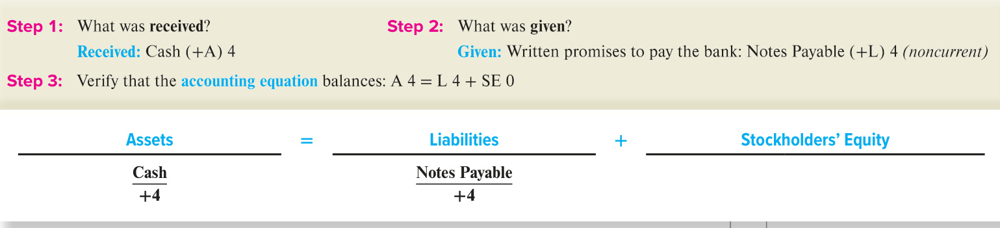
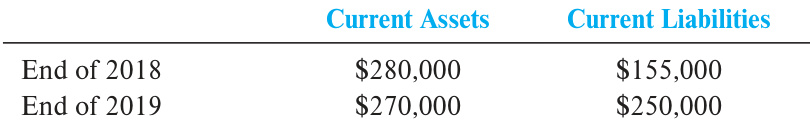

# Ch02 Investing and Financing Decisions and the Accounting System   

ntrepreneur and chef Steve Ells had a vision for a restaurant that serves food fast but uses higher-quality fresh ingredients and classic cooking techniques found in finer restaurants. In 1993, he borrowed $^{\Phi85,000}$ cash from his family to open his first Chipotle Mexican Grill in a former Dolly Madison ice cream store in Denver, Colorado. Chipotle Mexican Grill soon became a leader in the “fast-casual” segment of the restaurant industry. As of March 31, 2020, the Chipotle chain operated nearly 2,600 restaurants in the United States, 40 internationally, and three non-Chipotle restaurants called Pizzeria Locale following a similar business model.  

How did Chipotle grow so fast? First, Chipotle’s mission to provide “Food with Integrity” jump-started its tremendous growth. It was committed to making meals with fresh food, using responsibly raised meat, and purchasing organic produce and dairy products from local farmers, which appealed to customers who were beginning to demand healthier food options. Then, in 1999, McDonald’s Corporation became the majority stockholder by investing about $\Phi360$ million in Chipotle. This provided funding for its early growth from 19 stores to nearly 490 restaurants by the end of 2005. In January 2006, Chipotle “went public.” In its IPO, or initial public offering, it issued stock to the public for the first time (listed on the New York Stock Exchange as CMG). Then, McDonald’s spun off (sold its ownership in) Chipotle for nearly $\Phi1.4$ billion—a handsome profit of over $\Phi1$ billion.  

## LEARNING OBJECTIVES  

## After studying this chapter, you should be able to:  

2-1	 Define the key accounting assumptions, principles, and elements related to the balance sheet. p. 47   
2-2 Identify what constitutes a business transaction and recognize common balance sheet account titles used in business. p. 50   
2-3	 Apply transaction analysis to simple business transactions in terms of the accounting equation: Assets $=$ Liabilities $+$ Stockholders’ Equity. p. 52   
2-4	 Determine the impact of business transactions on the balance sheet using two basic tools: journal entries and T-accounts. p. 58   
2-5	 Prepare a trial balance and simple classified balance sheet and analyze the company using the current ratio. p. 68   
2-6	 Identify investing and financing transactions and demonstrate how they impact cash flows. p. 74  

Robert Evans Alamy Stock Photo  

The $\Phi\boldsymbol{1}73$ million Chipotle raised from its IPO along with its operating profits funded additional store growth. It also has invested in enhancing information technology to meet the increasing need for digital engagement, including mobile and artificial intelligence (AI) ordering and marketing. The company uses the AI information, for example, to add new assembly lines for processing online and delivery orders when needed. It announced in June 2020 that it is partnering with GrubHub to expand its delivery footprint, and, in July 2020, it said that 60 percent of its new restaurants will feature a drive-through, or “Chipotlane”—Chipotle continues to invest in its buildings, equipment, and technology for future growth.  

## UNDERSTANDING THE BUSINESS  

The “fast-casual” segment of the $\Phi4$ trillion global restaurant industry generates approximately $\Phi60$ billion in sales annually. What identifies a restaurant as fast-casual? Typically, customers can order online, use the digital app, or order in person. However, unlike fast food restaurants, the food is made to order, typically in view of the customers and without full table service, and is served in modern and upscale surroundings, with checks typically ranging between $\Phi8$ and $\Phi16$ . Chipotle Mexican Grill has been a leader in this segment, although competition has increased and growth in this industry segment has slowed in recent years.  

  
Learn more about Chipotle from founder, Steve Ells, by listening to the NPR podcast Chipotle: Steve Ells: How I Built This. How I Built This NPR podcasts are about innovators, entrepreneurs, idealists, and the movements they built.  

Franchising is common in chain restaurants. The largest restaurant to use franchising is Subway, with nearly 42,000 restaurants—all franchised. Franchising involves selling  

## Chipotle Mexican Grill  

EXPANDING ONE OF THE HOTTEST CHAINS BUILT ON SUSTAINABILITY  

chipotle.com  

Focus on learning the material well in Chapters 2, 3, and 4 since it is essential to understanding the rest of the chapters in the text. Commit your time now. It will pay off later.  

the right to use or sell a product or service to another. This is an easy way for someone to start his or her own business because the franchisor (the seller, such as Noodles & Company) often provides site location, design, marketing, and management training support in exchange for initial franchise fees and ongoing royalty fees usually based on weekly sales. At Noodles & Company, for example, only 85 percent of the stores are company-owned.  

Unlike most restaurant chains, however, Chipotle does not franchise the business. All restaurants are company-owned. Developing a new site, usually on rented or leased property, costs on average about $\Phi835,000$ . In 2019, Chipotle spent nearly $\Phi334{\mathrm{~mil}}.$ - lion on new and renovated property and equipment. The creation of new restaurants to meet consumer demand for healthier food options explains most of the changes in Chipotle’s assets and liabilities from year to year. To understand how the result of Chipotle Mexican Grill’s growth strategy is communicated in the balance sheet, we must answer the following questions:  

•	 What business activities cause changes in the balance sheet amounts from one period to the next? •	 How do specific business activities affect each of the balance sheet amounts? •	 How do companies keep track of the balance sheet amounts?  

In the first chapter, you learned about the importance of accounting in business decisions and the structure of basic financial statements, their relationships, and key terms. The next three chapters build on Chapter 1 as we use Chipotle’s activities to illustrate new tools and concepts necessary to develop, report, and use real financial statements. In this chapter, we focus on some common asset acquisition activities (often called investing activities), along with related financing activities, such as borrowing funds from creditors or selling stock to investors to provide the cash necessary to acquire the assets. Operating activities that affect both the income statement and the balance sheet are covered in Chapters 3 and 4. Let’s begin with the basic concepts related to measuring and reporting these activities.  

  
ORGANIZATION OF THE CHAPTER  

## WHAT INFORMATION IS INCLUDED IN THE BALANCE SHEET?  

## Recognition and Measurement Concepts  

Before we discuss accountants’ definitions for the elements of the balance sheet, we should consider three assumptions and a measurement concept that underlie much of our application of these definitions. First, the separate entity assumption states that each business’s activities must be accounted for separately from the personal activities of its owners, all other persons, and other entities. This means, for example, that, when an owner purchases property for personal use, the property is not an asset of the business. Second, under the going concern assumption (also called the continuity assumption), unless there is evidence to the contrary, we assume that the business will continue operating into the foreseeable future, long enough to meet its contractual commitments and plans. This means, for example, that if there was a high likelihood of bankruptcy, then its assets should be valued and reported on the balance sheet as if the company were to be liquidated (that is, discontinued, with all of its assets sold and all debts paid). Under the monetary unit assumption, each business entity accounts for and reports its financial results primarily in terms of the national monetary unit (e.g., dollars in the United States, yen in Japan, and euros in Germany), without any adjustment for changes in purchasing power (e.g., inflation).  

Finally, accountants measure the elements of the balance sheet initially at their cost (historical cost), which is the cash-equivalent value on the date of the transaction. For example, assets are initially recorded on the exchange date at the cash paid plus the dollar value of all noncash considerations, such as the trade-in value of a used asset. We will discuss the conditions under which these values are adjusted to other amounts, such as their market value, starting in Chapter 6 of this text. With these assumptions in mind, we are now ready to discuss accountants’ definitions of the elements of the balance sheet.  

## Elements of the Balance Sheet  

The four financial statements—balance sheet, income statement, statement of stockholders’ (shareholders’ or owners’) equity, and statement of cash flows—along with the notes to the statements provide the structure for the information communicated to users. As we learned in Chapter 1, assets, liabilities, and stockholders’ equity are the elements of a corporation’s balance sheet. The conceptual framework defines them as follows.  

## Assets  

Assets are economic resources owned or controlled by a company; they have measurable value and are expected to benefit the company by producing cash inflows or reducing cash outflows in the future. As shown in Chipotle’s balance sheet presented in Exhibit 2.1, most companies list assets in order of liquidity, or how soon an asset is expected by management to be turned into cash or used. Notice that several of Chipotle’s assets are categorized as current assets. Current assets are those resources that Chipotle will use or turn into cash within one year (the next 12 months). Chipotle’s current assets include Cash, Short-Term Investments (in the stocks and bonds of other companies), Accounts Receivable (due from customers and others), Supplies (to make and serve the food), and Prepaid Expenses (for rent, insurance, and advertising paid in advance of use). For manufacturers that produce and sell goods and merchandisers who sell already-completed goods, Inventory (for goods to be sold) also would be listed after Accounts Receivable. Inventory is always considered a current asset, regardless of how long it takes to produce and sell the inventory. Another common account title is Other Current Assets, which is a summary of several smaller accounts. These are typical titles used by most entities.  

All other assets are considered long term (or noncurrent). That is, they are to be used or turned into cash after the coming year. For Chipotle, that includes property and equipment (Land, Buildings, and Equipment), Operating lease right-of-use assets (for rented facilities, primarily stores in shopping centers), and Intangibles (nonphysical assets such as trademarks and patents) used over several years. Chipotle also may acquire the stocks and bonds of other companies as Long-Term Investments, discussed in detail in Appendix A.  

## LEARNING OBJECTIVE 2-1  

Define the key accounting assumptions, principles, and elements related to the balance sheet.  

  
Ben Margot/AP Photo  

## EXHIBIT 2.1  

## CHIPOTLE MEXICAN GRILL, INC.  

## EXPLANATIONS  

Chipotle Mexican Grill, Inc., Balance Sheet  

## Consolidated Balance Sheet\*  

## December 31, 2019  

## (in millions of dollars, except per share data)  

“Consolidated” means all subsidiaries are combined Point in time for which the balance sheet was prepared  

Current Assets  

## ASSETS  

Ownership of other companies’ stocks and bonds Amounts due from customers and others Food, beverage, and packaging supplies on hand Rent, advertising, and insurance paid in advance  

Summary of assets to be used or turned into cash within one year  

Noncurrent Assets  

Buildings owned Includes furniture and fixtures  

Cost of property and equipment at date of acquisition Amount of cost used in past operations  

Current Assets: Cash \$  481 Short-term investments 400 Accounts receivable 81 Supplies 26 Prepaid expenses 85 Total current assets 1,073   
Property and Equipment: Land 13 Buildings 1,811 Equipment 836 Total cost 2,660 Accumulated depreciation (1,201) Net property and equipment 1,459 Operating lease right-of-use assets 2,505   
Intangible assets 69   
Total assets \$5,106   
LIABILITIES AND STOCKHOLDERS’ EQUITY   
Current Liabilities: Accounts payable \$   116 Unearned revenue 95 Accrued expenses payable: Wages payable 127 Utilities payable 156 Current lease liabilities 173 Total current liabilities 667   
Notes payable 77   
Long-term lease liabilities 2,678 Total liabilities 3,422   
Stockholders’ Equity: Common stock $\mathbb{S}0.01$ par value) 1 Additional paid-in capital 1,466 Treasury stock (2,699) Retained earnings 2,916 Total stockholders’ equity 1,684   
Total liabilities and stockholders’ equity $\mathbb{S}5,106$   
\*The information has been adapted from actual statements   
and simplified for this chapter.  

Facilities rented under leases with right to use the assets Rights, such as patents, trademarks, and licenses  

Current Liabilities  

Amount due to suppliers Unredeemed gift cards  

Amount due to employees Amount due for electric, gas, and telephone utilities Amount due on rented facilities within the next year  

Noncurrent Liabilities  

Summary of liabilities to be settled within one year Amount owed on loans from banks Amount due on rented facilities after one year  

Stockholders’ Equity  

Total par value of stock issued by company to investors Excess amount received from investors over par  

Amount paid to repurchase its own stock from investors Undistributed earnings reinvested in the company  

## Liabilities  

Liabilities are defined as measurable obligations resulting from a past transaction; they are expected to be settled in the future by transferring assets or providing services. Entities that a company owes money to are called creditors.  

Similar to how assets are reported in order of liquidity, liabilities are usually listed on the balance sheet in order of maturity (how soon an obligation is to be paid). Liabilities that Chipotle will need to pay or settle within the coming year (with cash, goods, other current assets, or services) are classified as current liabilities. Chipotle’s current liabilities include Accounts Payable (to suppliers), Unearned Revenue (for unredeemed gift cards that have been purchased by customers), Accrued Expenses Payable (more specifically, Wages Payable and Utilities Payable, although additional accrued liabilities may include Interest Payable, among others) and Current Lease Liabilities representing the current amount owed on leases from renting facilities, for example, in shopping centers. Companies may also include Income Taxes Payable (due to federal, state, and local governments) and Other Current Liabilities (a summary of several smaller accounts). Distinguishing current assets and current liabilities assists external users of the financial statements in assessing the amounts and the timing of future cash flows.  

Chipotle’s noncurrent liabilities include Notes Payable (written promises to pay the amount borrowed and interest as specified in the signed agreement) and Long-term Lease Liabilities (the amount owed beyond the next 12 months for rent of buildings).  

## Stockholders’ Equity  

Stockholders’ equity (also called shareholders’ equity or owners’ equity) is the residual interest in the assets of the entity after subtracting liabilities. It is a combination of the financing provided by the owners and by business operations.  

•	 Financing Provided by Owners is referred to as contributed capital. Owners invest in the business by providing cash and sometimes other assets, receiving in exchange shares of stock as evidence of ownership. The largest investors in Chipotle’s stock are financial institutions (mutual funds, pension funds, etc.). The directors and executive officers also own stock, as do other corporate employees and the general public. Common Stock and Additional Paid-in Capital are the accounts used to represent the amount investors paid to Chipotle when they purchased the stock from the company. Note, however, that the Treasury Stock account reduces stockholders’ equity. Treasury Stock represents the amount Chipotle paid to its investors when the company repurchased from investors a portion of previously issued common stock. Treasury Stock will be discussed in more detail in Chapter 11.  

•	 Financing Provided by Operations is referred to as earned capital or retained earnings. When companies earn profits, they can be distributed to owners as dividends or reinvested in the business. The portion of profits reinvested in the business is called Retained Earnings. Companies with a growth strategy, such as Chipotle, often pay little or no dividends to retain funds for expansion. A look at Chipotle’s balance sheet (Exhibit 2.1) indicates that its growth has been financed by substantial reinvestment of earnings ( $^{\leftmoon,916}$ million).  

We just learned the elements of the balance sheet (assets, liabilities, and stockholders’ equity) and how assets and liabilities are usually classified (current or noncurrent). Current assets (including inventory) are expected to be used or turned into cash within the next 12 months and current liabilities are expected to be paid or satisfied within the next 12 months with cash, services, or other current assets.  

## S E L F - S T U D Y  Q U I Z  

The following is a list of items from a recent balance sheet of McDonald’s Corporation. Indicate on the line provided whether each of the following is usually categorized on the balance sheet as a current asset (CA), noncurrent asset (NCA), current liability (CL), noncurrent liability (NCL), or stockholders’ equity (SE).  

a. Retained Earnings d.	 Prepaid Expenses g.	 Accounts Payable b. Inventories e. Additional Paid-in Capital h.	 Property and Equipment c. Accounts Receivable f. Long-Term Debt i. Accrued Payroll  

After you have completed your answers, check them below.  

Related Homework: M2-4, M2-5, E2-3, P2-1  

## FINANCIAL ANALYSIS  

## LEARNING OBJECTIVE 2-2  

Identify what constitutes a business transaction and recognize common balance sheet account titles used in business.  

## Unrecorded but Valuable Assets and Liabilities  

Many very valuable intangible assets, such as trademarks, patents, and copyrights that are developed inside a company (not purchased), are not reported on the balance sheet. For example, Facebook’s balance sheet reveals no listing for the Facebook trademark because it was developed internally over time through research, development, and advertising (it was not purchased). Likewise, the Coca-Cola Company does not report any asset for its patented Coke formula, although it does report more than $\mathbb{S}9.2$ billion in various trademarks that it has purchased.  

Many large companies have some form of off-balance-sheet financing—obligations not reported as liabilities on the balance sheet. For example, Chipotle’s recent 10-K states that “leases with an initial term of 12 months or less . . . are not recorded on the consolidated balance sheets.” The notes to the financial statements indicated that the company incurred about $\mathbb{S}3$ million in short-term lease cost out of about ${\mathbb S}345$ million. This illustrates the importance of reading the notes, not just the financial statements, when analyzing a company’s financial information and predicting future cash flows.  

Now that we have reviewed the basic elements of the balance sheet and related recognition and measurement concepts as part of the conceptual framework, let’s see what economic activities cause changes in the amounts reported on the balance sheet.  

## WHAT BUSINESS ACTIVITIES CAUSE CHANGES IN FINANCIAL STATEMENT AMOUNTS?  

## Nature of Business Transactions  

Accounting focuses on certain events that have an economic impact on the entity. Those events that are recorded as part of the accounting process are called transactions. The first step in translating the results of business events to financial statement numbers is determining which events to include. As the definitions of assets and liabilities indicate, only economic resources and obligations resulting from past transactions are recorded on the balance sheet. Transactions include two types of events:  

1.	External events: These are exchanges of assets, goods, or services by one party for assets, services, or promises to pay (liabilities) from one or more other parties. Examples include the purchase of a machine from a supplier for cash, sale of merchandise to customers on account (store credit), borrowing of cash from a bank and signing a promissory note for repayment, and investment of cash in the business by the owners in exchange for ownership shares.  

a. SE b. CA c. CA d. CA e. SE f. NCL g. CL h. NCA i. CL 2.	Internal events: These include certain events that are not exchanges between the business and other parties but nevertheless have a direct and measurable effect on the entity. Examples include using up insurance paid in advance and using buildings and equipment over several years.  

Throughout this textbook, the word transaction is used in the broad sense to include both types of events.  

Some important events that have a future economic impact on a company, however, are not reflected in the financial statements. In most cases, signing a contract is not considered to be an accounting transaction because it involves only the exchange of promises, not of assets such as cash, goods, services, or property. For example, assume that Chipotle signs an employment contract with a new regional manager. From an accounting perspective, no transaction has occurred because no exchange of assets, goods, or services has been made. Each party to the contract has exchanged promises—the manager agrees to work; Chipotle agrees to pay the manager for the work. For each day the new manager works, however, the exchange of services for pay results in a transaction that Chipotle must record. Because of their importance, long-term employment contracts and other commitments may need to be disclosed in notes to the financial statements.  

## Accounts  

To accumulate the dollar effect of transactions on each financial statement item, organizations use a standardized format called an account. The resulting balances are kept separate for financial statement purposes. To facilitate the recording of transactions, each company establishes a chart of accounts, a list of all account titles and their unique numbers. The accounts are usually organized by financial statement element, with asset accounts listed first, followed by liability, stockholders’ equity, revenue, and expense accounts in that order. Exhibit 2.2 lists various account titles that are quite common and are used by most companies. The exhibit also provides special notes to help you in learning account titles. When you are completing assignments and are unsure of an account title, refer to this listing for help.  

Every company creates its own chart of accounts to fit the nature of its business activities. For example, a small lawn care service may have an asset account titled Lawn Mowing Equipment, but  

  

A recordable transaction occurs when assets, goods, or services are either received or given. An exchange of two promises does not make a transaction.  

  

## LEARNING OBJECTIVE 2-3  

Apply transaction analysis to simple business transactions in terms of the accounting model: Assets $=$ Liabilities $^+$ Stockholders’ Equity.  

a large corporation such as Dell is unlikely to report such an account on its balance sheet. These differences in accounts will become more apparent as we examine the balance sheets of various companies. Because each company has its own chart of accounts, you should not try to memorize a typical chart of accounts, but focus instead on understanding the nature of each typical account by where it is located in the financial statements. Then when you see a company that uses a slightly different title, you will understand what it means. For example, some companies use the terms Trade Accounts Receivable (same as Accounts Receivable) or Merchandise Inventory (same as Inventory). In homework problems, you will either be given the account names or be expected to select appropriate names, similar to the ones in Exhibit 2.2. Once you select a name for an account, you must use that exact name in all transactions affecting that account.  

The accounts you see in the financial statements of most large corporations are actually summations (or aggregations) of a number of specific accounts in their recordkeeping system. For example, Chipotle keeps separate accounts for food, beverage, and packaging supplies but combines them under Supplies on the balance sheet. Wages Payable under Accrued Expenses Payable summarizes several accounts with smaller balances related to workers’ compensation liability and other benefits owed to employees such as medical, dental, and vision health insurance, paid meal breaks, tuition reimbursement, life insurance, and free burritos.  

## HOW DO TRANSACTIONS AFFECT ACCOUNTS?  

Managers’ business decisions often result in transactions that affect the financial statements. For example, decisions to expand the number of stores, advertise a new product, change an employee benefit package, and invest excess cash all would affect the financial statements. Sometimes these decisions have unintended consequences as well. The decision to purchase additional inventory for cash in anticipation of a major sales initiative, for example, will increase inventory and decrease cash. But if there is no demand for the additional inventory, the lower cash balance also will reduce the company’s ability to pay its other obligations.  

Because business decisions often involve an element of risk, managers should understand exactly how transactions impact the financial statements. The process for determining the effects of transactions is called transaction analysis.  

## Principles of Transaction Analysis  

Transaction analysis is the process of studying a transaction to determine its economic effect on the entity in terms of the accounting equation. We outline the process in this section of the chapter and create a visual tool representing the process (the transaction analysis model). The basic accounting equation and two principles are the foundation for this model. Recall from Chapter 1 that the basic accounting equation for a business that is organized as a corporation is as follows:  

## Assets $\mathbf{\Psi}(\mathbf{A})=$ Liabilities $(\mathbf{L})+$ Stockholders’ Equity (SE)  

The two principles underlying the transaction analysis process follow:  

•	 Every transaction affects at least two accounts; correctly identifying those accounts and the direction of the effects (whether an increase or a decrease) is critical. •	 The accounting equation must remain in balance after each transaction.  

Success in performing transaction analysis depends on a clear understanding of these principles.   
Study the following material well.  

## Dual Effects  

The idea that every transaction has at least two effects on the basic accounting equation is known as the dual effects concept. (From this concept, accountants have developed what is known as the double-entry system of recordkeeping.) Most transactions with external parties involve an exchange by which the business entity both receives something and gives up something in return.  

For example, suppose Chipotle purchased tomatoes (supplies) and paid cash. In this exchange, Chipotle would receive food supplies (an increase in an asset) and in return would give up cash (a decrease in an asset).  

  

In analyzing this transaction, we determined that the accounts affected were Supplies and Cash. However, most supplies are purchased on credit (that is, money is owed to suppliers). In that case, Chipotle would engage in two separate transactions at different points in time:  

<html><body><table><tr><td>A =</td><td>L</td><td>+</td><td>SE</td><td></td></tr><tr><td>+/-</td><td></td><td></td><td></td><td></td></tr></table></body></html>  

<html><body><table><tr><td>A =</td><td>L</td><td>+</td><td>SE</td></tr><tr><td>+</td><td>+</td><td></td><td></td></tr></table></body></html>  

  

<html><body><table><tr><td>A</td><td>=</td><td></td><td>+</td><td>SE</td></tr></table></body></html>  

Tomatoes: Jill Fromer/Photodisc/ Getty Images; Invoices: Fuse/ Getty Images; Money: Jules Frazier/Photodisc/Getty Images  

## Balancing the Accounting Equation  

Notice in the previous tomato purchase illustrations that the accounting equation for each transaction remained in balance. The accounting equation must remain in balance after each transaction. That is, total assets (resources) must equal total liabilities and stockholders’ equity (claims to resources). If all correct accounts have been identified and the appropriate direction of the effect on each account has been determined, the equation should remain in balance. Exhibit 2.3 lists the steps to follow in analyzing investing and financing transactions, with an example of applying the steps. Follow these steps in all illustrations and assignments in this chapter.  

## Analyzing Common Transactions  

To illustrate the use of the transaction analysis process, let’s consider hypothetical transactions of Chipotle that are also common to most businesses. Remember that this chapter presents investing and financing transactions that affect only the balance sheet accounts. “Investing” does not just mean buying other companies’ stocks and bonds. Investing activities by a company are those in which the company typically buys or sells its noncurrent assets (growing or shrinking its productive capacity) as well as investments (current or noncurrent). Financing activities are those in which the company borrows or repays loans (typically from banks) and sells or repurchases its common stock and pays dividends (activities with stockholders).  

## EXHIBIT 2.3  

Analyzing Investing and Financing Transactions  

## Steps to follow in analyzing investing and financing transactions:  

## AA  ccoommppaannyy  bboorrrroowwss $\mathbb{s}100$ ffrroomm  aa  bbaannkk  

Step 1:	 Ask $\rightarrow$ What was received? •	Identify the account(s) affected •	Classify the account(s) by type of element: ◦	 Asset (A) ◦	 Liability (L) ◦	 Stockholders’ Equity (SE) •	Determine the direction and amount of the effect(s): ◦	 The account increased $(+)$ ◦	 The account decreased $(-)$   
Step 2: Ask $\rightarrow$ What was given? •	Repeat—Identify, Classify, and Determine effect  

CCaasshh  ((++AA))  110000 Step 2: What was given? A written promise to repay the loan called NNootteess  PPaayyaabbllee $(+\mathrm{L})$ 110000 Step 3: Is the accounting equation in balance? A $100=\mathrm{L}\;100+\mathrm{SE}\;0$  

$$
\frac{A}{+100}=\frac{1}{+100}+\frac{55}{}
$$  

Step 3:	 Verify $\rightarrow$ Is the accounting equation in balance? (Does $\mathbf{A}=\mathbf{L}+\mathbf{S}\mathbf{E}?$ )  

Assume that Chipotle engages in the following events during the first quarter of 2020, the first three months following the balance sheet in Exhibit 2.1. Account titles are from that balance sheet, and remember that, for simplicity, all amounts are in millions, except per share data:  

(a) Chipotle issued (sold) 100 additional shares of common stock with a par value of $\mathbb{S0.01}$ per share at a market value of $\mathbf{50.17}$ per share, receiving $\bf{517}$ in cash from investors—a financing activity. Each share of common stock usually has a nominal (low) par value printed on the face of the certificate. Par value is a legal amount per share established by the board of directors; it has no relationship to the market price of the stock (additional discussion in Chapter 11). Chipotle’s common stock has a par value of $\mathbb{S}0.01$ per share, and in this transaction, each share sold for $\mathbb{S}0.17$ per share. When a corporation issues common (capital) stock, the transaction affects separate accounts:  

•	 Received from shareholders: Cash or other considerations for the market value of the shares given (100 shares $\times\,\mathbb{S}0.17$ market value per share $=\mathbb{5}17_{.}$ ).  

•	 Given to shareholders: Common Stock for the number of shares issued times the par value per share $(100\ \mathrm{shares}\times\mathbb{9}0.01\$ par value per share $=\S1$ ) and Additional Paid-in Capital (or Paid-in Capital or Contributed Capital in Excess of Par) for the excess received above par $(100\ \mathrm{shares}\times\mathbb{9}0.16\$ per share in excess over par value per share [that is, $\mathbb{S}0.17$ market value per share − $\mathbb{S}0.01$ par value per share] $=\mathbb{S}16$ ).  

SStteepp  11:: Step 2: What was given? RReecceeiivveedd:: $\mathrm{\DeltaA})$ 17 Given: Additional stock shares $\rightarrow$ Common Stock $\mathrm{(+SE)}$ )1 (100 shares × \$0.01 per share) Additional Paid-in Capital $\left(+\mathrm{SE}\right)$ ）16 (100 shares $\times\,\mathcal{S}O.l6$ per share)  

SStteepp  33:: $17=\mathrm{~L~}0+\mathrm{SE~}17$  

<html><body><table><tr><td>Assets</td><td rowspan="3"></td><td>Liabilities +</td><td rowspan="3"></td><td colspan="2" rowspan="3">Stockholders'Equity +16</td></tr><tr><td>Cash</td><td>CommonStock Additional Paid-in Capital</td></tr><tr><td>+17</td><td>+1</td></tr></table></body></html>  

  

Companies that need cash to buy or build additional facilities often seek funds by selling stock to investors as in transaction $(a)$ or by borrowing from creditors as in transaction $(b)$ . Any transactions with stockholders (usually issuing additional stock and paying dividends) and transactions with banks (borrowing and repaying loans) are financing activities.  

(c) Chipotle purchased for cash $\pmb{\mathbb{S}26}$ in new equipment and $\pmb{55}$ in additional intangible assets—an investing activity.  

(d) Chipotle acquired $\mathbf{520}$ in additional land and $\mathbb{S40}$ in new buildings, signed leases for $\mathbf{586}$ for right-of-use (ROU) assets, paid $\pmb{\mathbb{S29}}$ in cash, and signed $\mathfrak{s}6$ in current leases and $\mathbf{\hat{s}111}$ in long-term leases to rent facilities—an investing activity.  

SStteepp  11:: RReecceeiivveedd:: $(+\mathrm{A})$ Buildings $(+\mathrm{A})$ Operating Lease Right-of-Use Assets $(+\mathrm{A})$  

SStteepp  22:: What was given? GGiivveenn:: Current Lease Liabilities $\mathrm{(+L)}$ Long-Term Lease Liabilities $\mathrm{(+L)}$  

<html><body><table><tr><td colspan="4">Assets</td><td colspan="2">Liabilities</td><td rowspan="2">+</td><td rowspan="2">Stockholders'Equity</td></tr><tr><td></td><td></td><td></td><td>Operating</td><td>Current</td><td>Long-Term</td></tr><tr><td></td><td></td><td></td><td>LeaseROU</td><td>Lease</td><td>Lease</td><td></td><td></td></tr><tr><td>Cash</td><td>Land</td><td>Buildings</td><td>Assets</td><td>Liabilities</td><td>Liabilities</td><td></td><td></td></tr><tr><td>-29</td><td>+20</td><td>+40</td><td>+86</td><td>+6</td><td>+111</td><td></td><td></td></tr></table></body></html>  

Purchasing and selling property, equipment, and investments in the stock of other companies are investing activities. In the investing transactions in (c) and (d), notice that more than two accounts were affected.  

## (e) Chipotle sold \$19 in its short-term investments for $\bf{519}$ cash—an investing activity.  

<html><body><table><tr><td>Step 1:What was received? Received: Cash (+A) 19</td><td></td><td>Step 2: What was given?</td><td>Given: Short-Term Investments (-A) 19</td></tr><tr><td>Step3:</td><td colspan="3">:Verify that the accounting equation balances: A O = L O + SE 0</td></tr><tr><td colspan="2"></td><td></td><td>Stockholders'Equity +</td></tr><tr><td colspan="2">Assets</td><td>Liabilities</td><td></td></tr><tr><td colspan="2">Cash Short-TermInvestments +19 -19</td><td></td><td></td></tr></table></body></html>  

(f) Within the quarter, assume Chipotle paid $\pmb{\mathbb{S1}}$ on the note payable in $\mathbf{\mu}(b)$ above (ignore any interest on the loan in this chapter)—a financing activity.  

SStteepp  11:: What was received? SStteepp  22:: What was given? RReecceeiivveedd:: GGiivveenn:: Notes Payable (-L) 1  

SStteepp  33:: Verify that the accounting equation balances: A $\left(1\right)=\mathrm{{L}}\left(1\right)+\mathrm{{SE}}\left(0\right)$  

<html><body><table><tr><td>Assets</td><td rowspan="3"></td><td>Liabilities 十</td></tr><tr><td>Cash</td><td>Notes Payable</td></tr><tr><td>-1 -1</td><td>Stockholders’Equity</td></tr></table></body></html>  

(g) Chipotle repurchased a portion of its issued common stock from investors for $\mathbf{5103}$ cash—a financing activity. When a company buys back its stock, it is accounted for in a new type of account called a contra-account. A contra-account reduces an account or section of a financial statement it is related to. In this case, the account is called Treasury Stock and it reduces total stockholders’ equity. Treasury Stock accounting and reporting are discussed in more depth in Chapter 11.  

SStteepp  11:: What was received? Step 2: What was given? RReecceeiivveedd:: Given: Cash (-A) 103 claims to the company's assets): Treasury Stock (-SE)103  

SStteepp  33:: $(103)=\mathrm{L}\;0+\mathrm{SE}$ (103)  

<html><body><table><tr><td>Assets</td><td></td><td>Liabilities</td><td>Stockholders’Equity +</td></tr><tr><td>Cash</td><td></td><td></td><td>Treasury Stock</td></tr><tr><td>-103</td><td></td><td></td><td>-103</td></tr></table></body></html>  

(h) Chipotle does not pay dividends, but instead reinvests profits into growing the business. However, for illustration purposes, assume Chipotle’s board of directors declared that the Company will pay a total of $\pmb{\mathbb{s}}2$ in cash as dividends to shareholders next quarter. Dividends are a distribution of profits (from Retained Earnings) to shareholders. When cash dividends are declared, a liability, Dividends Payable, is created until the cash is distributed to shareholders. This is a financing activity, but it does not yet involve paying cash until next quarter.  

SStteepp  11:: Step 2: What was given? RReecceeiivveedd:: GGiivveenn:: $\mathrm{(+L)}$ 2 assets: Retained Earnings (-SE) 2  

SStteepp  33:: $0=\mathrm{L~}2+\mathrm{SE}$ (2)  

<html><body><table><tr><td>Assets</td><td rowspan="5"></td><td>Liabilities +</td><td rowspan="5"></td><td>Stockholders'Equity</td></tr><tr><td></td><td>DividendsPayable</td><td>Retained Earnings</td></tr><tr><td></td><td>+2</td><td>-2</td></tr><tr><td></td><td></td><td></td></tr></table></body></html>  

Transaction analysis involves identifying accounts affected in a transaction (by title), recognizing that at least two accounts are affected, classifying the accounts (asset, liability, or stockholders’ equity), and determining the direction of the effect on the account (increase or decrease). If all accounts and effects are correct, then the fundamental accounting equation $\mathrm{{(A=L+SE)}}$ ) will remain in balance. Practice is the most effective way to develop your transaction analysis skills.  

S E L F - S T U D Y  Q U I Z  

For the following transactions:  

1.	 Analyze each using the three-step process in Exhibit 2.3 (what was received, what was given, and verify that the accounting equation balances). Including account names, direction of effects, type of accounts, and amounts.  

2.	 Indicate the effects on the accounting equation in the chart below. Answer from the standpoint of the business. (a)	 Paul Knepper contributes $^{\S50,000}$ cash to establish Florida Flippers, Inc., a new scuba business organized as a corporation; in exchange, he receives 25,000 shares of common stock with a par value of $\mathbb{S}0.10$ per share. Florida Flippers buys a small building near the ocean for $\mathbb{S}250{,}000$ , paying $^\mathrm{\Phi25,000}$ cash and signing a 10-year note payable for the rest. (c)	 Florida Flippers purchased $\mathbb{S}10{,}000$ in short-term investments for $\mathbb{S}10{,}000$ cash.  

<html><body><table><tr><td colspan="4"></td><td>Liabilities</td><td rowspan="2">+</td><td colspan="2">Stockholders'Equity</td></tr><tr><td></td><td>Cash</td><td>Assets Short-Term</td><td></td><td></td><td>Common</td><td>Additional</td></tr><tr><td>(a)</td><td></td><td>Investments</td><td>Building</td><td>NotesPayable</td><td></td><td>Stock</td><td>Paid-in Capital</td></tr><tr><td></td><td></td><td></td><td></td><td></td><td></td><td></td><td></td></tr><tr><td></td><td></td><td></td><td></td><td></td><td></td><td></td><td></td></tr></table></body></html>  

After you have completed your answers, check them below. If your answers did not agree with ours, we recommend that you go back to each event to make sure that you have completed each of the steps of transaction analysis.  

G U I D E D H E L P  2 - 1  

For additional step-by-step video instruction on analyzing transaction effects, go to mhhe.com/libby_gh2-1.  

Related Homework: M2-6, E2-4, E2-5, P2-2   

<html><body><table><tr><td colspan="6"></td><td></td></tr><tr><td colspan="3">Step 1:Received</td><td colspan="2">Step 2: Given</td><td colspan="2">Step3:Accounting Equation</td><td></td></tr><tr><td colspan="3" rowspan="2">(a) Cash(+A)50,000</td><td colspan="2">25,000 shares × $0.10 par value</td><td colspan="3" rowspan="2">A50,000=L0+SE50.000</td><td rowspan="2"></td></tr><tr><td>CommonStock(+SE)2,500 and AdditionalPaid-in Capital(+SE)47,500</td></tr><tr><td colspan="2">(b) Building (+A) 250,000</td><td colspan="3">Cash(-A) 25,000 and Notes Payable (+L) 225,000</td><td colspan="3">A 225,000=L225,000+SE0</td></tr><tr><td colspan="3">(c) Short-term Investments(+A)10,000 Assets Liabilities +</td><td colspan="2">Cash (-A)10,000</td><td colspan="3">AO=L0+SE0</td></tr><tr><td colspan="7"></td><td>Stockholders'Equity</td></tr><tr><td>Cash</td><td>Short-Term Investments +10,000</td><td colspan="2">Building</td><td>Notes</td><td colspan="2">Common Stock +2,500</td><td>Additional</td></tr><tr><td colspan="2">(a) +50,000 (b) -25,000 (c) -10,000</td><td colspan="2">+250,000</td><td colspan="3">Payable +225,000</td><td>Paid-in Capital +47,500</td></tr></table></body></html>  

S o l u t i o n s  t o S E L F - S T U DY  Q U I Z  

## LEARNING OBJECTIVE 2-4  

Determine the impact of business transactions on the balance sheet using two basic tools: Journal entries and T-accounts.  

## HOW DO COMPANIES KEEP TRACK OF ACCOUNT BALANCES?  

For most organizations, recording transaction effects and keeping track of account balances in the manner just presented is impractical. To handle the multitude of daily transactions that a business generates, companies establish accounting systems, usually computerized, that follow a cycle. Exhibit 2.4 presents the primary activities of the accounting cycle performed during the accounting period separately from those that occur at the end of the accounting period. In Chapters 2 and 3, we will illustrate hypothetical transactions during Chipotle’s first quarter of 2020 (following steps 1–3 in Exhibit 2.4). In Chapter 4, we will complete the accounting cycle by discussing and illustrating activities at the end of the period to adjust the records, prepare financial statements, and finally close the accounting records.  

  

## As future business  

managers, you should develop your understanding and use of these tools in financial analysis. For those studying accounting, this knowledge is the foundation for an understanding of the accounting system and future accounting coursework.  

During the accounting period, transactions that result in exchanges between the company and external parties are first analyzed to determine the accounts and effects. The effects are then recorded in the general journal, a listing in chronological order of each transaction’s effects. To determine account balances, the accounts are updated by posting the effects listed in the general journal to the respective accounts in the general ledger, a record of effects to and balances of each account.  

These formal records are based on two very important tools used by accountants: journal entries and T-accounts. From the standpoint of accounting systems design, these analytical tools are a more efficient way to reflect the effects of transactions, determine account balances, and prepare financial statements. After we explain how to perform transaction analysis using these tools, we illustrate their use in financial analysis.  

## The Direction of Transaction Effects  

As we saw earlier in this chapter, transaction effects increase and decrease assets, liabilities, and stockholders’ equity accounts. To reflect these effects efficiently, we need to structure the transaction analysis model in a manner that shows the direction of the effects. As shown in Exhibit 2.5, each account is set up as a “T” with the following structure:  

•	 Increases in asset accounts are on the left because assets are on the left side of the accounting equation $\mathbf{\mu}(\mathbf{A}=\mathbf{L}+\mathbf{SE})$ ).   
•	 Increases in liability and stockholders’ equity accounts are on the right because they are on the right side of the accounting equation $\mathbf{\mu}(\mathbf{A}=\mathbf{L}+\mathbf{SE})$ ).  

Also notice that  

•	 The term debit (dr for short) always refers to the left side of the T.   
•	 The term credit (cr for short) always refers to the right side of the T.  

## Start of the Next Accounting Period  

  

During the Accounting Period Analyze each transaction Record entries in the journal Post effects to the ledger  

At the End of the Accounting Period  

  

Prepare trial balance Adjust revenues and expenses (use Steps 1–4) Prepare and disseminate financial statements Close income statement accounts (use Steps 1–4)  

End of the Accounting Period  

  

Basic Transaction Analysis Model  

## EXHIBIT 2.5  

As a consequence:  

•	 Asset accounts increase on the left (debit) side and normally have debit balances. It would be highly unusual for an asset account, such as Inventory, to have a negative (credit) balance. •	 Liability and stockholders’ equity accounts increase on the right (credit) side and normally have credit balances.  

In summary:  

<html><body><table><tr><td>Assets</td><td></td><td>Liabilities</td><td></td><td>Stockholders'Equity</td></tr><tr><td>with Debits</td><td rowspan="3"></td><td>with Credits</td><td></td><td>with Credits</td></tr><tr><td>Accountshave debitbalances</td><td>Accountshave creditbalances</td><td></td><td>Accountshave creditbalances</td></tr></table></body></html>  

In Chapter 3, we will add revenue and expense account effects to Retained Earnings in our model. Until then, as you are learning to perform transaction analysis, you should refer to the transaction analysis model in Exhibit 2.5 often until you can construct it on your own without assistance.  

Many students have trouble with accounting because they forget that the term debit is simply the left side of an account and the term credit is simply the right side of an account. Perhaps someone once told you that you were a credit to your school or your family. As a result, you may think that credits are good and debits are bad. Such is not the case. Just remember that debit is on the left and credit is on the right.  

If you have identified the correct accounts and effects through transaction analysis, the accounting equation will remain in balance. The total dollar value of all debits will equal the total dollar value of all credits in a transaction. For an extra measure of assurance, add this equality check (Debits $=$ Credits) to the transaction analysis process.  

From Exhibit 2.5, we learned that each account can increase and decrease. In the transaction analysis model, the effect of a transaction on each element can be represented with a T with one side increasing and the other side decreasing. Asset accounts on the left side of the accounting equation increase their balances on the left side of the T. Liability and stockholders’ equity accounts are on the right side of the  

## Reminder: Debit is  

on the left side and Credit is on the right side of a T-account. And that’s it!  

accounting equation and increase their balances on the right side of the T. In accounting, the left side of the T is called the debit side and the right is called the credit side. Most accounts have a balance on the positive side.  

## S E L F - S T U D Y  Q U I Z  

The following is a list of accounts from a balance sheet of The Wendy’s Company. Indicate on the line provided whether each of the following usually has a debit (DR) or credit (CR) balance.  

(a) Accounts Payable (d) Properties (land, buildings, and equipment) (g) Cash (b) Retained Earnings (e) Inventories (h) Long-Term Debt (c) Accrued Expenses Payable (f) Notes Receivable (due in five years) (i) Accounts Receivable  

After you have completed your answers, check them below.  

Related Homework: M2-7, M2-8, E2-3, P2-1  

Tip When accountants look at a correct journal entry, they can tell you   
what the transaction was.   
You should be able to do   
this, too!  

## Analytical Tools  

## The Journal Entry  

In an accounting system, transactions are recorded in chronological order in a general journal (or, simply, journal). After analyzing the business documents (such as purchase invoices, receipts, and cash register tapes) that describe a transaction, the effects on the accounts are recorded in the journal using debits and credits. The journal entry, then, is an accounting method for expressing the effects of a transaction on accounts. It is written in a debits-equal-credits format. To illustrate, we refer back to event $(a)$ in Chipotle’s transaction analysis in the previous section.  

(a) Assume Chipotle issued (sold) 100 additional shares of common stock with a par value of $\mathbf{\hat{s0.01}}$ per share at a market value of $\mathbf{50.17}$ per share, receiving $\mathbf{517}$ in cash from investors.  

The journal entry for event $(a)$ in the Chipotle illustration is as follows:  

  

Notice the following:  

  

The debited accounts (on top) represent what was received.  

The credited accounts (on bottom) represent what was given.  

•	 It is useful to include a date or some form of reference for each transaction. The debited accounts are written first (on top) with the amounts recorded in the left (debit) column. The credited accounts are written below the debits and are usually indented in manual records; the credited amounts are written in the right column. The order of the debited accounts or credited accounts does not matter, as long as the debits are on top and the credits are on the bottom and indented to the right.   
•	 Dollar signs are not needed.   
•	 Total debits $(\mathbb{S}17)$ equal total credits $(\mathbb{S}1+\mathbb{S}16=\mathbb{S}17)$ ).   
•	 Three accounts are affected by this transaction. Any journal entry that affects more than two accounts is called a compound entry. Many transactions in this and subsequent chapters require a compound journal entry.  

(a) CR; (b) CR; (c) CR; (d) DR; (e) DR; (f) DR; (g) DR; (h) CR; (i) DR •	 As you can see in the illustration of a formal bookkeeping system in Exhibit 2.6, an additional line is written below the journal entry as an explanation of the transaction. For simplicity, explanations will not be included in this text.  

While you are learning to perform transaction analysis, use the symbols A, L, and SE next to each account title in journal entries, as is illustrated in the journal entry for event $(a)$ . Specifically identifying an account as an asset (A), a liability (L), or a stockholders’ equity account (SE) clarifies the transaction analysis and makes journal entries easier to write. For example, if Cash is to be increased, we write Cash $(+\mathbf{A})$ . Throughout subsequent chapters, we include the direction of the effect along with the symbol to help you understand the effects of each transaction on the financial statements. By using the symbols in event $(a)$ , we can easily see that assets are affected by $+\mathbb{S}17$ and stockholders’ equity accounts are affected by $+\mathbb{S}17.$ The accounting equation $\mathbf{A}=\mathbf{L}+\mathbf{S}\mathbf{E}$ remains in balance.  

A note of caution: Many students try to memorize journal entries without understanding or using the transaction analysis model. As more detailed transactions are presented in subsequent chapters, the task becomes increasingly more difficult. In the long run, memorizing, understanding, and using the transaction analysis model presented here will save you time and prevent confusion.  

## The T-Account  

By themselves, journal entries do not provide the balances in accounts. After the journal entries have been recorded, the dollar amounts to each account affected by the transaction are posted (transferred) to determine the new account balances. (In most computerized accounting systems, this happens automatically.)  

As a group, the accounts are called a general ledger. In the manual accounting system used by some small businesses, the ledger is often a three-ring binder with a separate page for each account. In a computerized system, accounts are stored on the computer’s memory or in the cloud. See Exhibit 2.6 for an illustration of a journal page and the related ledger pages. Note  

<html><body><table><tr><td colspan="8">General Journal Page G1</td></tr><tr><td>Date</td><td>Ref.</td><td colspan="3">AccountTitlesandExplanation</td><td>Debit</td><td>Credit</td><td rowspan="7"></td></tr><tr><td>1-2-20</td><td>101</td><td colspan="3">(in millions) Cash (+A)</td><td>17</td><td></td></tr><tr><td></td><td>301</td><td colspan="3">Common stock(+SE)</td><td></td><td>1</td></tr><tr><td></td><td>302</td><td colspan="2">Additional paid-incapital(+SE)</td><td></td><td>16</td><td></td></tr><tr><td></td><td></td><td colspan="2">(Investmentbystockholders.)</td><td></td><td></td><td></td></tr><tr><td colspan="7"></td></tr><tr><td colspan="7">GeneralLedger CASH 101 Debit</td></tr><tr><td>Date</td><td>Ref.</td><td colspan="2">Explanation</td><td>Credit</td><td colspan="2">Balance</td></tr><tr><td></td><td></td><td>Balance</td><td></td><td></td><td colspan="2">481</td></tr><tr><td>1-2-20</td><td>G1</td><td colspan="2"></td><td></td><td colspan="3">498</td></tr><tr><td colspan="8">301</td></tr><tr><td colspan="8">General Ledger COMMONSTOCK</td></tr><tr><td>Date</td><td>Ref.</td><td>Explanation</td><td>Debit</td><td>Credit</td><td colspan="2">Balance</td></tr><tr><td>1-2-20</td><td>G1</td><td>Balance</td><td></td><td></td><td colspan="2">1 2</td></tr><tr><td></td><td></td><td></td><td></td><td></td><td colspan="2"></td></tr><tr><td colspan="8">General Ledger ADDITIONALPAID-INCAPITAL 302</td></tr><tr><td colspan="8"></td></tr><tr><td>Date</td><td>Ref.</td><td>Explanation Balance</td><td>Debit</td><td>Credit</td><td colspan="2">Balance</td></tr><tr><td>1-2-20</td><td>G1</td><td></td><td></td><td></td><td colspan="2">1,466</td></tr><tr><td></td><td></td><td></td><td></td><td>16</td><td colspan="2">1,482</td></tr><tr><td colspan="8"></td></tr></table></body></html>  

## Tip  

Memorize and use the transaction analysis model for all transactions.  

## EXHIBIT 2.6  

Posting Transaction Effects from the Journal to the Ledger  

that the debit amount of $\mathbb{S}17$ to Cash from the journal entry for event $\overline{{(a)}}$ has been posted to the debit column on the Cash ledger page. Likewise, the credit amounts of $\mathbb{S}1$ and $\mathbb{S}16$ in the journal entry have been posted to the credit columns on the respective Common Stock and Additional Paid-in Capital ledger pages. Again, dollar signs are not needed.  

One very useful tool for summarizing the transaction effects and determining the balances for individual accounts is a T-account, a simplified representation of a ledger account. Exhibit 2.7 shows the T-accounts for Chipotle’s Cash and Common Stock accounts based on event $(a)$ (the same would also be done for the Additional Paid-in Capital T-account). Notice the following:  

•	 For Cash, which is classified as an asset, increases are shown on the left and decreases appear on the right side of the T-account. For Common Stock, however, increases are shown on the right and decreases on the left because Common Stock is a stockholders equity account.   
•	 Every T-account starts with a beginning balance.   
•	 It is important to include the reference to the journal entry next to the debit or credit in each T-account. In our illustration, it is (a). For companies, it would be a date. This cross-referencing allows the transactions to be traced between the journal entries and T-accounts.   
•	 When all of the transactions have been posted to a T-account, a horizontal line is drawn across it, similar to the line that is drawn in a mathematical problem, to signify that a balance is to be determined.   
•	 An ending balance is written on the appropriate side of the T-account.  

Some small businesses still use handwritten or manually maintained accounts in this T-account format. Computerized systems retain the concept but not the format of the T-account (that is, a positive number is written on the positive side of the T-account).  

To find the account balances, we can express the T-accounts as equations:  

  

A word on terminology: The words debit and credit may be used as verbs, nouns, and adjectives. For example, we can say that Chipotle’s Cash account was debited (verb) when stock was issued to investors, meaning that the amount was entered on the left side of the T-account. Or we can say that a credit (noun) was entered on the right side of an account. Common Stock may be described as a credit account (adjective). These terms will be used instead of left and right throughout the rest of this textbook. The next section illustrates the steps to follow in analyzing the effects of transactions, recording the effects in journal entries, and determining account balances using T-accounts.  

  

  

## Inferring Business Activities from T-Accounts  

T-accounts are useful primarily for instructional and analytical purposes. In many cases, we will use T-accounts to determine what transactions a company engaged in during a period. For example, the primary transactions affecting Accounts Payable for a period are purchases of assets on account from suppliers (increasing the account) and cash payments to suppliers (decreasing the account). If we know the beginning and ending balances of Accounts Payable and the amount of purchases on account (for credit) during a period, we can determine the amount of cash paid. A T-account analysis would include the following:  

<html><body><table><tr><td colspan="4">-Accounts Payable (L)+ 600</td></tr><tr><td colspan="3">Cashpayments tosuppliers? 1,500</td><td colspan="2">Beg. bal. Purchases on account</td></tr><tr><td colspan="3">300</td><td></td><td>End. bal.</td></tr><tr><td>Solution: Beginning Balance</td><td>+</td><td>Purchaseson Account</td><td>Cash Payments to Suppliers</td><td>Ending Balance</td></tr><tr><td>$600</td><td>+</td><td>$1,500</td><td>? ？ 二</td><td>$ 300 $1,800</td></tr></table></body></html>  

## Transaction Analysis Illustrated  

In this section, we will use the hypothetical quarterly investing and financing transactions for Chipotle Mexican Grill (events $[a]$ to $[h]_{.}$ ) that were analyzed earlier to demonstrate recording journal entries and posting effects to the relevant T-accounts. Note that the accounting equation remains in balance and that debits equal credits after each entry. In the T-accounts, the amounts from Chipotle’s December 31, 2019, balance sheet (Exhibit 2.1) have been inserted as the beginning balances.  

Study the following illustration carefully, including the explanations of transaction analysis. Careful study is essential to an understanding of (1) the accounting model, (2) transaction analysis, (3) the dual effects of each transaction, and (4) the system of balancing the debits and credits and the accounting equation for each transaction. The most effective way to learn these critical concepts, which are basic to material throughout the rest of the text, is to practice, practice, practice.  

(a) Assume Chipotle issued (sold) 100 additional shares of common stock with a par value of $\mathbf{\hat{s0.01}}$ per share at a market value of $\mathbf{50.17}$ per share, receiving $\mathbf{517}$ in cash from investors—an financing activity. Common stock is recorded at par $(100\;\mathrm{shares}\times\mathbb{9}0.01\$ par value per share) and Additional Paid-in Capital is recorded for the excess over par value (100 shares × $\mathcal{S}0.16$ per share).  

## Don’t memorize  

entries. Instead, app transaction analysis to   
determine journal entries   
and T-account effects . . . and   
Practice! Practice! Practice!  

<html><body><table><tr><td rowspan="8"></td><td colspan="4"></td><td>Debit</td><td>Credit</td><td rowspan="8"></td></tr><tr><td colspan="4">(a)Cash(+A)</td><td>17</td><td></td></tr><tr><td></td><td colspan="3">Common stock (+SE)</td><td></td><td>1</td></tr><tr><td></td><td colspan="3">Additional paid-in capital (+SE)</td><td></td><td>16</td></tr><tr><td></td><td>Assets</td><td colspan="2">Liabilities +</td><td colspan="2">Stockholders'Equity +1</td></tr><tr><td>Cash</td><td>+17</td><td colspan="6">Commonstock</td></tr><tr><td colspan="4"></td><td colspan="4">Additional paid-in capital +16</td></tr><tr><td>1/1/20</td><td>+ Cash (A) - 481</td><td></td><td>Common Stock (SE) + 1 1</td><td colspan="2"></td><td>-Additional Paid-in Capital(SE)+</td></tr><tr><td>(a)</td><td>17</td><td colspan="2"></td><td colspan="2">1/1/20 (a)</td><td colspan="2">1,466 1/1/20 16 (a)</td></tr></table></body></html>  

The effects reflected in the journal entry have been posted to the appropriate T-accounts. Notice that if an account was debited such as Cash, that effect was written in the debit column of the Cash T-account. Similarly, if an account was credited such as Common Stock, that effect was written in the credit column of the T-account. Also notice that the January 1, 2020, beginning balances are the same as the ending balances at December 31, 2019 (see Exhibit 2.1), and are indicated on the respective positive side of the account—assets have debit balances and liabilities and stockholders’ equity accounts have credit balances.  

(b) Chipotle borrowed $\pmb{\mathbb{S4}}$ from its local bank, signing a note to be paid in three years (a noncurrent liability)—a financing activity.  

<html><body><table><tr><td colspan="7">Debit Credit</td></tr><tr><td colspan="3">(b)Cash(+A)</td><td colspan="2"></td><td>4</td><td></td></tr><tr><td></td><td></td><td colspan="3">Notes payable (+L)</td><td></td><td>4</td></tr><tr><td></td><td>Assets</td><td colspan="3">Liabilities +</td><td colspan="2">Stockholders’Equity</td></tr><tr><td>Cash</td><td rowspan="5"></td><td>+4</td><td rowspan="2">Notespayable +4</td><td colspan="3"></td></tr><tr><td></td><td>+ Cash (A) -</td><td colspan="3">Notes Payable (L)+</td></tr><tr><td>1/1/20</td><td>481</td><td colspan="3">77 1/1/20</td></tr><tr><td>(a) (b)</td><td>17 4</td><td colspan="3">4 (b)</td></tr></table></body></html>  

(c) Chipotle purchased for cash $\left.526\right.$ in new equipment and $\pmb{55}$ in additional intangible assets—an investing activity.  

  

(d) Chipotle acquired $\mathbf{520}$ in additional land and $\mathbb{S40}$ in new buildings, signed leases for $\mathbb{S86}$ for right-of-use (ROU) assets, paid $\mathbf{529}$ in cash, and signed $\mathfrak{s}6$ in current leases and $\mathbf{\hat{s}111}$ in long-term leases to rent facilities—a financing activity.  

<html><body><table><tr><td colspan="4"></td><td>Debit</td><td>Credit</td></tr><tr><td colspan="4">(d)Land(+A)</td><td>20</td><td></td></tr><tr><td></td><td></td><td>Buildings(+A)</td><td>40</td><td></td><td></td></tr><tr><td></td><td></td><td>Operatinglease right-of-use assets (+A)</td><td>86</td><td></td><td></td></tr><tr><td></td><td></td><td>Cash(-A)</td><td></td><td></td><td>29</td></tr><tr><td></td><td></td><td>Currentleaseliabilities(+L)</td><td></td><td></td><td>6</td></tr><tr><td colspan="4">Long-termleaseliabilities (+L)</td><td></td><td>111</td></tr></table></body></html>  

<html><body><table><tr><td colspan="4">Assets +20</td><td colspan="4">Liabilities +6</td><td colspan="2">Stockholders'Equity</td><td></td></tr><tr><td colspan="4">Land Buildings +40 OperatingleaseROU assets +86 Cash</td><td colspan="4">Currentleaseliabilities Long-term lease liabilities +111</td><td></td><td></td><td></td></tr><tr><td colspan="4">+ Cash (A) -</td><td colspan="3">+ Land (A) -</td><td colspan="4">+Buildings (A) -</td></tr><tr><td>1/1/20 (a) (b)</td><td>481 17 31 4 29</td><td>(c) (d)</td><td>-29 1/1/20 (d)</td><td>13 20</td><td></td><td>1/1/20 (d)</td><td>1,811 40</td><td></td><td></td></tr><tr><td colspan="4">+ Operating Lease ROU Assets (A)</td><td colspan="4">Current Lease Liabilities (L) +</td><td colspan="2">-Long-Term Lease Liabilities(L) +</td><td></td></tr><tr><td colspan="4">1/1/20 2,505 (d) 86</td><td colspan="4">173 1/1/20 6 (d)</td><td colspan="4">2,678 1/1/20 111 (d)</td></tr></table></body></html>  

(e) Chipotle sold ${\bf519}$ in its short-term investments for $\bf{519}$ cash—an investing activity.  

  

(f) Within the quarter, assume Chipotle paid $\mathbf{s1}$ on the note payable in $\mathbf{\mu}(b)$ above (ignore any interest on the loan in this chapter)—a financing activity.  

  
(g) Chipotle repurchased a portion of its issued common stock from investors for $\mathbf{5103}$ cash—a financing activity. When a company buys back its stock, it is accounted for in a new type of account called a contra-account. A contra-account reduces an account or section of a financial statement it is related to. In this case, the account is called Treasury Stock and it reduces total stockholders’ equity. Treasury Stock accounting and reporting are discussed in more depth in Chapter 11.  

<html><body><table><tr><td colspan="2"></td><td>Debit</td><td>Credit</td></tr><tr><td colspan="2">(g)Treasury stock(-SE)</td><td>103</td><td></td></tr><tr><td colspan="2">Cash (-A)</td><td></td><td>103</td></tr><tr><td colspan="2">Assets Liabilities +</td><td colspan="2">Stockholders'Equity</td></tr><tr><td colspan="2">Cash -103</td><td colspan="2">Treasury Stock -10</td></tr></table></body></html>  

Tip Reminder: Debiting Treasury Stock increases the account,   
but it has a negative effect on   
stockholders’ equity.  

<html><body><table><tr><td colspan="4">+ Cash (A)一</td><td colspan="3">+ Treasury Stock (SE)一</td></tr><tr><td>1/1/20</td><td>481</td><td></td><td></td><td>1/1/20</td><td>2,699</td><td></td></tr><tr><td>(a)</td><td>17</td><td>31</td><td>(c)</td><td>(g)</td><td>103</td><td></td></tr><tr><td>(b)</td><td>4</td><td>29</td><td>(d)</td><td></td><td></td><td></td></tr><tr><td>(e)</td><td>19</td><td>1</td><td>(f</td><td></td><td></td><td></td></tr><tr><td></td><td></td><td>103</td><td>(g)</td><td></td><td></td><td></td></tr></table></body></html>  

(h) Chipotle does not pay dividends, but instead reinvests profits into growing the business. However, for illustration purposes, assume Chipotle’s board of directors declared that the Company will pay a total of $\pmb{\mathbb{s}}2$ in cash as dividends to shareholders next quarter. Dividends are a distribution of profits (from Retained Earnings) to shareholders. When cash dividends are declared, a liability is created until the cash is distributed to shareholders. Because Dividends Payable was not listed on the December 31, 2019, balance sheet (see Exhibit 2.1), it has a $\mathbb{S}0$ balance on January 1, 2020.  

<html><body><table><tr><td></td><td colspan="4"></td><td>Debit</td><td>Credit</td></tr><tr><td colspan="4"></td><td></td><td>2</td><td></td></tr><tr><td></td><td></td><td colspan="2">(h)Retainedearnings(-SE) Dividends payable (+L)</td><td></td><td colspan="2">2</td></tr><tr><td></td><td>Assets</td><td colspan="5">Liabilities + Stockholders'Equity</td></tr><tr><td rowspan="4"></td><td rowspan="2"></td><td colspan="5">Dividendspayable +2 Retained earnings</td></tr><tr><td colspan="2">-Dividends Payable (L) +</td><td colspan="2">-2</td></tr><tr><td colspan="2"></td><td></td><td colspan="2">Retained Earnings (SE)+</td></tr><tr><td colspan="2"></td><td colspan="2">0 1/1/20 2 (h) (h)</td><td colspan="2">2,916 1/1/20 2</td></tr></table></body></html>  

Now we can determine the balances in the T-accounts that changed during the quarter based on the hypothetical transactions. As shown in Exhibit 2.8, each T-account is listed with the beginning balances and transaction effects with references. Then a line is drawn across the T-account after the last transaction effect with the balance indicated below the summation line on the positive side.  

<html><body><table><tr><td colspan="2">XHIBIT 2.8</td><td colspan="4">+ Cash (A) - 1/1/20</td><td colspan="3">+ Short-Term Investments (A) —</td><td colspan="3">+ Land (A) -</td></tr><tr><td colspan="2">Accounts</td><td>481 17</td><td colspan="2">31</td><td>1/1/20</td><td>400 19</td><td></td><td>1/1/20</td><td>13</td><td></td></tr><tr><td></td><td>(a) (9) (3)</td><td>4 29 19 1</td><td>(c) (d) (f)</td><td></td><td>381</td><td></td><td>(e)</td><td>(d) 20 33</td><td></td><td></td></tr><tr><td></td><td></td><td>357</td><td>103</td><td>(g)</td><td></td><td></td><td></td><td></td><td></td><td></td></tr><tr><td colspan="2">+ Buildings (A) -</td><td colspan="2">+ Equipment (A) -</td><td></td><td colspan="2">+ Operating Lease ROU Assets (A)</td><td colspan="2"></td><td>+ Intangible Assets (A) -</td><td></td></tr><tr><td>1/1/20 1,811 (d) 40</td><td></td><td>1/1/20 836 (c) 26</td><td></td><td></td><td>1/1/20 2,505 (d)</td><td>86</td><td></td><td>1/1/20 (c)</td><td>69 5</td><td></td></tr><tr><td>1,851</td><td></td><td>862</td><td></td><td></td><td>2,591</td><td></td><td></td><td></td><td>74</td><td></td></tr><tr><td colspan="2">- Dividends Payable (L) +</td><td>- Current Lease Liabilities (L) +</td><td></td><td></td><td></td><td>- Notes Payable (L) +</td><td></td><td> Long-Term Lease Liabilities (L) +</td><td></td><td></td></tr><tr><td colspan="2">0</td><td></td><td>173</td><td>1/1/20</td><td></td><td>77</td><td>1/1/20</td><td></td><td>2,678</td><td>1/1/20</td></tr><tr><td></td><td>2 2=</td><td>1/1/20 (h)</td><td></td><td>6 (d) 179</td><td>(f)</td><td>1</td><td>4 (b) 80</td><td></td><td>2,789</td><td>111 (d)</td></tr><tr><td colspan="2">- Common Stock (SE) +</td><td>- Additional Paid-in Capital (SE) +</td><td></td><td></td><td>+ Treasury Stock (SE) -</td><td></td><td></td><td>－Retained Earnings (SE) +</td><td></td><td></td></tr><tr><td colspan="2">1 1</td><td colspan="2">1/1/20</td><td>1,466 51/1/20</td><td colspan="2">1/1/20 02,699</td><td colspan="2"></td><td></td><td>2,916 1/1/20</td></tr><tr><td colspan="2"></td><td>(a)</td><td></td><td>16 (D)</td><td>(g)</td><td>103</td><td></td><td>(h)</td><td>2</td><td></td></tr><tr><td colspan="2"></td><td colspan="2"></td><td>1,482</td><td></td><td>2,802</td><td></td><td></td><td></td><td>2,914</td></tr></table></body></html>  

Accountants analyze and then record transactions in the general journal in chronological order in journal entry form. Debited accounts are written on top with amounts in the left column and credited accounts are written on the bottom with amounts in the right column. Then the effects are posted in the general ledger (similar to a T-account). Each page of the ledger represents a different account that has a debit (left) side and a credit (right) side. To post transaction effects, the amount for each account in a journal entry is written in the appropriate debit or credit column on the ledger page to obtain account balances. Refer to Exhibit 2.5 for the transaction analysis model.  

S E L F - S T U D Y  Q U I Z  

Record the following transactions in good journal entry form and post the effects to the T-accounts.   
Because this is a new company, all T-accounts start with a beginning balance of $\mathbb{s}0$ .   
(a) Paul Knepper contributes $\mathbb{S}50{,}000$ cash to establish Florida Flippers, Inc., a new scuba business organized as a corporation; he receives in exchange 25,000 shares of stock with a $\mathbb{S}0.10$ per share par value.   
(b) Florida Flippers buys a small building near the ocean for $\mathbb{S}250{,}000$ , paying $\mathbb{S}25{,}000$ in cash and signing a 10-year note payable for the rest.   
(c) Florida Flippers purchased $\mathbb{S}10{,}000$ in short-term investments for $\mathbb{S}10{,}000$ cash.  

After you have completed your answers, check them below.  

G U I D E D H E L P  2 - 2  

For additional step-by-step video instruction on analyzing, recording, and posting transaction effects and classifying accounts, go to mhhe.com/libby_gh2-2.  

Related Homework: M2-9, M2-10, E2-6, E2-7, E2-8, E2-9, E2-10, E2-13, E2-14, E2-15, E2-16, P2-3, P2-5, CON2-1  

(a) Cash $(+\mathbf{A})$ 50,000 Common stock $\mathrm{(+SE)}$ 2,500 [25,000 shares × \$0.10 par] Additional paid-in capital $\mathrm{(+SE)}$ 47,500   
(b) Buildings $(+\mathbf{A})$ 250,000 Cash (−A) 25,000 Notes payable $\left(+\mathrm{L}\right)$ 225,000   
(c) Short-term investments $(+\mathbf{A})$ 10,000 Cash (−A) 10,000  

S o l u t i o n s  t o  

S E L F - S T U DY  Q U I Z  

  

## LEARNING OBJECTIVE 2-5  

Prepare a trial balance and simple classified balance sheet and analyze the company using the current ratio.  

## Using Data Analytics for Business Expansion  

Data Analytics (also called Business Intelligence and Big Data) has exploded in the past several years, but what is it? SAS (a world leader in business analytics software and services) describes it as follows:  

Big data analytics examines large amounts of data to uncover hidden patterns, correlations and other insights. With today’s technology, it’s possible to analyze your data and get answers from it almost immediately. . . .2  

By collecting structured data from various sources inside the business (from accounting, human resources, supply chain, and sales) and unstructured data from outside the business (from social media, customers, and weather and traffic patterns), companies worldwide are now making more data-driven business decisions. These decisions can be aimed at decreasing costs, identifying new innovative opportunities, launching new products and services, and transforming the business for the future.  

Beginning in 2017, Chipotle increased its investment in technological innovations, such as digital/ mobile ordering, which provides more information about its customers. Chipotle also uses data analytics for new restaurant site selection. The company gathers demographic and business information about each area, as well as information on competitors and other restaurants, and uses a predictive model to project sales and return on investment for each potential restaurant site. Chipotle, like most companies, understands the importance of creating a data-driven culture to change the way it thinks.  

What does this shift to a data-driven culture mean for students? Competition for talented individuals with strong analytical skills is extreme. Zoher Karu, vice president, global customer optimization and data at eBay, stated it this way:  

Talent is critical along any data and analytics journey. And analytics talent by itself is no longer sufficient, in my opinion. We cannot have people with singular skills. And the way I build out my organization is I look for people with a major and a minor. You can major in analytics, but you can minor in marketing strategy. Because if you don’t have a minor, how are you going to communicate with other parts of the organization? Otherwise, the pure data scientist will not be able to talk to the database administrator, who will not be able to talk to the market-research person, who which [sic] will not be able to talk to the email-channel owner, for example. You need to make sound business decisions, based on analytics, that can scale.3  

## HOW IS THE BALANCE SHEET PREPARED AND ANALYZED?  

Although no operating activities occurred yet (they will be illustrated in Chapter 3), it is possible to create a balance sheet based solely on the investing and financing activities recorded previously. Usually, businesses first will create a trial balance spreadsheet for internal purposes before preparing statements for external users. A trial balance lists the names of the T-accounts in one column, usually in financial statement order (assets, liabilities, stockholders’ equity, revenues, and expenses), with their ending debit or credit balances in the next two columns. Debit balances are indicated in the left column and credit balances are indicated in the right column. Then the two columns are totaled to provide a check on the equality of the debits and credits. Errors in a computer-generated trial balance may exist if wrong accounts and/or amounts are used in the journal entries.  

<html><body><table><tr><td colspan="2">File</td><td>Home Insert</td><td>Page Layout</td><td></td><td>Formulas Data</td><td>Review</td><td>View</td><td>Help</td></tr><tr><td colspan="2">L22</td><td colspan="2">X √</td><td>f</td><td></td><td>C</td><td></td><td></td></tr><tr><td></td><td>A</td><td colspan="5">B</td><td>D</td><td>E</td></tr><tr><td>1</td><td></td><td colspan="5">CHIPOTLEMEXICANGRILL--TRIALBALANCE</td><td></td><td></td></tr><tr><td>2</td><td></td><td colspan="5">March31,2020</td><td></td><td></td></tr><tr><td>3</td><td></td><td colspan="5">Debit</td><td>Credit</td><td></td></tr><tr><td>4</td><td></td><td colspan="2">Cash</td><td></td><td>357</td><td></td><td></td></tr><tr><td>5</td><td></td><td colspan="2">Short-terminvestments</td><td></td><td>381</td><td></td><td>*</td></tr><tr><td>6</td><td></td><td colspan="2">Accounts receivable</td><td></td><td>81</td><td></td><td>*</td></tr><tr><td>7</td><td></td><td colspan="2">Supplies</td><td></td><td>26</td><td></td><td></td></tr><tr><td>8</td><td></td><td colspan="2">Prepaid expenses</td><td></td><td>85</td><td></td><td></td></tr><tr><td>6</td><td>Land</td><td colspan="2"></td><td></td><td>33</td><td></td><td></td></tr><tr><td>10</td><td></td><td colspan="2">Buildings and leased assets</td><td></td><td>1,851</td><td></td><td>*</td></tr><tr><td>11</td><td></td><td colspan="2">Equipment</td><td></td><td>862</td><td></td><td>*</td></tr><tr><td>12</td><td></td><td colspan="2">Accumulated depreciation</td><td></td><td></td><td>1,201</td><td>*</td></tr><tr><td>13</td><td></td><td colspan="2">Operating lease right-of-use assets</td><td></td><td>2,591</td><td></td><td></td></tr><tr><td>14</td><td></td><td colspan="2">Intangible assets</td><td></td><td>74</td><td></td><td>*</td></tr><tr><td>15</td><td></td><td colspan="2">Accounts payable</td><td></td><td></td><td>116</td><td>*</td></tr><tr><td>16</td><td></td><td colspan="2">Unearned revenue</td><td></td><td></td><td>95</td><td></td></tr><tr><td>17</td><td></td><td colspan="2">Wages payable</td><td></td><td></td><td>127</td><td></td></tr><tr><td>18</td><td></td><td colspan="2">Utilities payable</td><td></td><td></td><td>156</td><td></td></tr><tr><td>19</td><td></td><td colspan="2">Dividends payable</td><td></td><td></td><td>2</td><td></td></tr><tr><td>20</td><td></td><td colspan="2">Current lease liabilities</td><td></td><td></td><td>179</td><td>*</td></tr><tr><td>21</td><td></td><td colspan="2">Notes payable</td><td></td><td></td><td>80</td><td>* *</td></tr><tr><td>22</td><td></td><td colspan="2">Long-term lease liabilities</td><td></td><td></td><td>2,789 *</td><td></td></tr><tr><td>23</td><td></td><td colspan="2">Common stock</td><td></td><td></td><td>2</td><td>*</td></tr><tr><td>24</td><td></td><td colspan="2">Additional paid-in capital</td><td></td><td></td><td>1,482 *</td><td></td></tr><tr><td>25</td><td></td><td colspan="2">Treasury stock</td><td></td><td>2,802</td><td>*</td><td></td></tr><tr><td>26</td><td></td><td colspan="2">Retained earnings</td><td></td><td></td><td>2,914 *</td><td></td></tr><tr><td>27</td><td></td><td colspan="2"></td><td></td><td></td><td></td><td></td></tr><tr><td>28</td><td>Total</td><td colspan="2"></td><td>9,143</td><td>9,143</td><td></td><td>Debits = Credits!</td></tr><tr><td>29</td><td></td><td colspan="2"></td><td></td><td></td><td></td><td></td></tr><tr><td>30</td><td>*</td><td colspan="2">Balance changed due to hypothetical investing and financing</td><td></td><td></td><td></td><td></td></tr><tr><td>31</td><td></td><td colspan="2">transactions during the first quarter of 2020.</td><td></td><td></td><td></td><td></td></tr><tr><td colspan="2"></td><td colspan="4"></td><td></td><td></td></tr></table></body></html>  

Chipotle’s trial balance based on hypothetical quarterly transactions follows. The account balances that did not change are taken from the December 31, 2019, balance sheet in Exhibit 2.1. The accounts that did change due to the transactions illustrated in this chapter are noted with an asterisk $(^{*})$ ; their balances are taken from the T-accounts in Exhibit 2.8.  

## Classified Balance Sheet  

The balance sheet in Exhibit 2.9 was prepared from the trial balance shown above based on hypothetical quarterly transactions. As a formal statement for external users, it needs a good  

## EXHIBIT 2.9  

Chipotle Mexican Grill’s First Quarter 2020 Balance Sheet (based on hypothetical investing and financing activities)  

## CHIPOTLE MEXICAN GRILL, INC.  

Consolidated Balance Sheets\* (in millions of dollars, except per share data)  

<html><body><table><tr><td></td><td>March 31, 2020</td><td>December 31, 2019</td></tr><tr><td>ASSETS</td><td></td><td></td></tr><tr><td>Current Assets:</td><td></td><td></td></tr><tr><td>Cash</td><td>$ 357</td><td>$ 481</td></tr><tr><td>Short-term investments</td><td>381</td><td>400</td></tr><tr><td>Accounts receivable</td><td>81</td><td>81</td></tr><tr><td>Supplies</td><td>26</td><td>26</td></tr><tr><td>Prepaid expenses</td><td>85</td><td>85</td></tr><tr><td>Total current assets</td><td>930</td><td>1,073</td></tr><tr><td>Property and Equipment:</td><td></td><td></td></tr><tr><td>Land</td><td>33</td><td>13</td></tr><tr><td>Buildings</td><td>1,851</td><td>1,811</td></tr><tr><td>Equipment</td><td>862</td><td>836</td></tr><tr><td>Total cost</td><td>2,746</td><td>2,660</td></tr><tr><td>Accumulated depreciation</td><td>(1,201)</td><td>(1,201)</td></tr><tr><td>Net property and equipment</td><td>1,545</td><td>1,459</td></tr><tr><td>Operating lease right-of-use assets</td><td>2,591</td><td>2,505</td></tr><tr><td>Intangible assets</td><td>74</td><td>69</td></tr><tr><td>Total assets</td><td>$5,140</td><td>$5,106</td></tr><tr><td>LIABILITIESANDSTOCKHOLDERS'EQUITY Current Liabilities:</td><td></td><td></td></tr><tr><td>Accounts payable</td><td>$116</td><td>$116</td></tr><tr><td>Unearned revenue</td><td>95</td><td>95</td></tr><tr><td>Accrued expenses payable:</td><td></td><td></td></tr><tr><td>Wages payable</td><td>127</td><td>127</td></tr><tr><td>Utilities payable</td><td>156</td><td>156</td></tr><tr><td>Dividends payable</td><td>2</td><td></td></tr><tr><td>Current lease liabilities</td><td>179</td><td>173</td></tr><tr><td>Total current liabilities</td><td>675</td><td>667</td></tr><tr><td>Notes payable</td><td>80</td><td>77</td></tr><tr><td>Long-term lease liabilities</td><td>2,789</td><td>2,678</td></tr><tr><td>Total liabilities</td><td>3,544</td><td>3,422</td></tr><tr><td>Stockholders'Equity:</td><td></td><td></td></tr><tr><td>Common stock ($0.01 par value per share)</td><td>2</td><td>1</td></tr><tr><td>Additional paid-in capital</td><td>1,482</td><td>1,466</td></tr><tr><td>Treasury stock</td><td>(2,802)</td><td>(2,699)</td></tr><tr><td>Retained earnings</td><td>2,914</td><td>2,916</td></tr><tr><td>Total stockholders’ equity</td><td>1,596</td><td>1,684</td></tr><tr><td>Total liabilities and stockholders’ equity</td><td>$5,140</td><td>$5,106</td></tr><tr><td></td><td></td><td></td></tr></table></body></html>

\*Reflects simplified December 31, 2019, figures and hypothetical March 31, 2020, information.  

heading (name of the company, title of the statement, date, and if the dollars are in thousands or millions). Notice in Exhibit 2.9 several additional features:  

•	 The assets and liabilities are classified into two categories: current and noncurrent. Current assets are those to be used or turned into cash within the upcoming year, whereas noncurrent assets are those that will last longer than one year. Current liabilities are those obligations to be paid or settled within the next 12 months with current assets.   
•	 Dollar signs are indicated at the top and bottom of the asset section and top and bottom of the liabilities and shareholders’ equity section. More than that tends to look messy.   
•	 The statement includes comparative data. That is, it compares the actual but simplified account balances at December 31, 2019, with those at March 31, 2020, based on assumed quarterly transactions. When multiple periods are presented, the most recent balance sheet amounts are usually listed on the left, but not always (look carefully).   
•	 Unlike Chipotle, most companies do not provide a total liabilities line on the balance sheet. To determine total liabilities on those statements, add total current liabilities and  

each of the noncurrent liabilities.  

## INTERNATIONAL PERSPECTIVE  

## Understanding Foreign Financial Statements  

Although IFRS (International Financial Reporting Standards) differ from U.S. GAAP (Generally Accepted Accounting Principles), it uses the same system of analyzing, recording, and summarizing the results of business activities that you have learned in this chapter. One place where IFRS differs from GAAP is in the formatting of financial statements.  

Financial statements prepared using GAAP and IFRS include the same elements (assets, liabilities, revenues, expenses, etc.). However, a single, consistent format has not been mandated. Consequently, various formats have evolved over time, with those in the United States differing from those typically used internationally. The formatting differences include  

<html><body><table><tr><td colspan="3">GAAP IFRS</td></tr><tr><td rowspan="2">BalanceSheetOrder Similaraccountsare shown,buttheorderof liquidity(for assets)and theorderofmaturity(for liabilities)differ</td><td>Assets: Stockholders'Equity</td><td>Assets:</td></tr><tr><td>Current Noncurrent Liabilities: Stockholders'Equity Current Liabilities: Noncurrent Current</td><td>Noncurrent Current Noncurrent</td></tr></table></body></html>  

On the balance sheet, GAAP begins with current items, whereas IFRS begins with noncurrent items.  Consistent  with  this, assets  are  listed  in  decreasing  order  of  liquidity  under  GAAP,  but, internationally, assets are usually listed in increasing order of liquidity. IFRS similarly emphasizes longerterm financing sources by listing equity before liabilities and, within liabilities, by listing noncurrent liabilities before current liabilities (decreasing time to maturity). The key to avoiding confusion is to be sure to pay attention to the subheadings in the statement. Any account under the heading “liabilities” must be a liability.  

## Ratio Analysis in Decision Making  

Why do the classifications of current and noncurrent on the balance sheet matter? Users of financial information compute a number of ratios in analyzing a company’s past performance and financial condition as input in predicting its future potential. How ratios change over time and how they compare to the ratios of the company’s competitors or industry averages provide valuable information about a company’s strategies for its operating, investing, and financing activities. We introduce here the first of many ratios that will be presented throughout the rest of this textbook, with a final summary of ratio analysis in Chapter 13.  

## KEY RATIO ANALYSIS  

Current Ratio  

ANALYTICAL QUESTION  

Does the company have the short-term resources to pay its short-term obligations?  

RATIO AND COMPARISONS  

$$
\mathbf{Current\;Ratio}={\frac{\mathbf{Current\;Assets}}{\mathbf{Current\;Liabilities}}}
$$  

The 2019 ratio for Chipotle is (dollars in millions):  

$$
\frac{\mathfrak{s}1,073}{\mathfrak{s}667}=1.609
$$  

<html><body><table><tr><td colspan="3">COMPARISONSOVERTIME</td></tr><tr><td colspan="3">Chipotle Mexican Grill,I Inc.</td></tr><tr><td>2017</td><td>2018</td><td>2019</td></tr><tr><td>1.944</td><td>1.811</td><td>1.609</td></tr></table></body></html>  

<html><body><table><tr><td colspan="2">COMPARISONSWITHCOMPETITORS</td></tr><tr><td>ElPolloLoco Holdings,! Inc.</td><td>Shake Shack, Inc.</td></tr><tr><td>2019</td><td>2019</td></tr><tr><td>0.334</td><td>0.882</td></tr></table></body></html>  

  

Offers a classic American menu of premium burgers, hot dogs, crispy chicken, crinkle cut fries, shakes, and more  

INTERPRETATIONS  

## In General  

The current ratio is a very common ratio. Creditors and security analysts use the current ratio to measure the ability of the company to pay its short-term obligations with short-term assets. Generally, the higher the ratio, the more cushion a company has to pay its current obligations if future economic conditions take a downturn. Many industries, such as retail companies and manufacturers, historically face difficult times with sustained dips in the economy. They often have a current ratio at 2.0 (twice as many current economic resources as current obligations) or higher to be able to pay employees, suppliers, and other current obligations until the economy recovers.  

While a ratio above 1.0 normally suggests good liquidity, today, many strong companies use sophisticated management techniques to minimize funds invested in current assets and, as a result, have current ratios below 1.0. Many businesses with strong inflows of cash from customers, like Chipotle and its competitors, also may have a current ratio below 1.0. Likewise, when compared to others in the industry, too high of a ratio may suggest inefficient use of resources.  

## Focus Company Analysis  

Over time, the current ratio for Chipotle shows a high level of liquidity of 1.609, although the ratio has decreased each year since 2017. In 2019, nearly half of its current assets was in cash, which the company uses to fund its rapid growth strategy of opening or renovating over 130 new restaurants annually, many with Chipotlanes for drive-through service.  

Compared with competitors in the fast-casual restaurant industry, Chipotle reports a much higher current ratio than Shake Shack and El Pollo Loco. Shake Shack operates over 275 restaurants worldwide, all company owned. Its strategy is to open a significant portion of new stores in airports. The approximately 480 El Pollo Loco restaurants are located primarily in the southwest United States and are approximately 40 percent company-owned and 60 percent franchised. El Pollo Loco’s plans are to grow its loyalty program and expand franchising opportunities. Franchising does not typically require the higher cash flow levels needed for expanding company-owned facilities. Companies in the restaurant industry tend to have high cash inflows from customers as well as sophisticated cash management systems that enable them to maintain lower cash balances, and thus lower current ratios.  

## A Few Cautions  

The current ratio may be a misleading measure of liquidity if significant funds are tied up in assets that cannot be easily converted into cash. A company with a high current ratio still might have liquidity problems if the majority of its current assets consists of slow-moving inventory. Analysts also recognize that managers can manipulate the current ratio by engaging in certain transactions just before the close of the fiscal year. In most cases, for example, the current ratio can be improved by paying creditors immediately prior to the preparation of financial statements.  

  
Selected Focus Companies Current Ratios  

## P A U S E F O R F E E D B A C K  

We just learned that the current ratio measures a company’s ability to pay short-term obligations with short-term assets—a liquidity measure. It is computed by dividing current assets by current liabilities. A ratio above 1.0 is normally considered good, although some may need a higher ratio and others with good cash management systems and/or strong cash flows can have a ratio below 1.0 (i.e., more current liabilities than current assets).  

S E L F - S T U D Y  Q U I Z  

Yum! Brands, Inc., is the world’s largest quick-service restaurant company that develops, franchises, and operates over 50,000 units in more than 150 countries and territories through three restaurant concepts (KFC, Pizza Hut, and Taco Bell). The company reported the following balances on its recent balance sheets (in millions). Compute Yum! Brands’ current ratio for the three years presented. Round your answers to three decimal places.  

<html><body><table><tr><td colspan="3">(dollars in millions)</td></tr><tr><td></td><td>CURRENT ASSETS</td><td>CURRENT LIABILITIES</td></tr><tr><td rowspan="3">2019 2018 2017</td><td>$1,527</td><td>$1,541</td></tr><tr><td>1,207</td><td>1,301</td></tr><tr><td>2,507</td><td>1,512</td></tr></table></body></html>  

What do these results suggest about Yum! Brands’ liquidity in the current year and over time?  

After you have completed your answers, check them on the next page.  

G U I D E D H E L P  2 - 3  

For additional step-by-step video instruction on computing and interpreting the current ratio, go to mhhe.   
com/libby_gh2-3.  

## Related Homework: M2-12, E2-16  

## LEARNING OBJECTIVE 2-6  

Identify investing and financing transactions and demonstrate how they impact cash flows.  

## Investing and Financing Activities  

As discussed in Chapter 1, companies report cash inflows and outflows over a period in their statement of cash flows, which is divided into three categories: operating, investing, and financing activities:  

•	 Operating activities are covered in Chapter 3.   
•	 Investing activities include buying and selling noncurrent assets and short- and long-term investments. Financing activities include borrowing and repaying debt, including short-term bank loans; issuing and repurchasing stock; and paying dividends.  

You must see CASH in the transaction for it to affect the statement of cash flows.  

Only transactions affecting cash are reported on the statement. An important step in constructing and analyzing the statement of cash flows is identifying the various transactions as operating (O), investing (I), or financing (F). Let’s analyze the Cash T-account for Chipotle’s transactions in this chapter. Refer to transactions (a)–(h) illustrated earlier in this chapter.  

  

## P A U S E  F O R  F E E D B A C K  

As we discussed, every transaction affecting cash can be classified as an operating (discussed in Chapter 3), investing, or financing effect. Investing effects relate to purchasing/selling investments or noncurrent assets such as property and equipment or lending funds to/receiving repayment from others. Financing effects relate to borrowing or repaying banks, issuing stock to investors, repurchasing stock from investors, or paying dividends to investors.  

## S E L F - S T U D Y  Q U I Z  

Indicate whether the following transactions from a recent annual statement of cash flows for Apple Inc. were investing (I) or financing (F) activities and the direction of their effects on cash $^+$ for increases; − for decreases):  

S o l u t i o n s  t o S E L F - S T U DY  Q U I Z  

Current Ratio: 2019 \$1,527 ÷ \$1,541 = 0.991 2018 1,207 ÷ 1,301 = 0.928 2017 2,507 ÷ 1,512 = 1.658  

Yum! Brands’ most recent current ratio hovers near 1.0, although it has fluctuated over the past three years. The 0.991 ratio suggests that the company currently has sufficient current assets to settle short-term obligations. There is no concern about liquidity because Yum! Brands is a cash-oriented business and maintains a strong cash management system.  

<html><body><table><tr><td>Transactions</td><td>TypeOfActivity (I Or F)</td><td>EffectOnCashFlows (-0 +)</td></tr><tr><td>1.Purchasedinvestments</td><td></td><td></td></tr><tr><td>2.Issuedcommonstock</td><td></td><td></td></tr><tr><td>3. Acquired property, plant, and equipment</td><td></td><td></td></tr><tr><td>4.Soldinvestments</td><td></td><td></td></tr><tr><td>5.Purchasedintangible assets(e.g.,patents)</td><td></td><td></td></tr></table></body></html>  

After you have completed your answers, check them below.  

## Related Homework: M2-14, E2-19, E2-20, P2-4, CON2-1  

On April 1, 2023, three ambitious college students started Terrific Lawn Maintenance Corporation. A summary of transactions completed through April 7, 2023, for Terrific Lawn Maintenance Corporation follows:  

a.	 To each of the three investors, issued 500 shares of stock (1,500 shares in total) with a par value of $\mathbb{S}0.10$ per share in exchange for a total of $\mathbb{S}9{,}000$ cash.   
$b$ .	 Acquired rakes and other hand tools (equipment) with a list price of $\mathbb{S}690$ for $\mathbb{S}600$ ; paid the hardware store $\mathbb{S}200$ cash and signed a three-month note for the balance.   
$c$ .	 Ordered three lawn mowers and two edgers from XYZ Lawn Supply, Inc., for $\mathbb{S}4\mathrm{,}000$ .   
d.	 Purchased four acres of land for the future site of a storage garage; paid cash, $\mathbb{S}5{,}000$ .   
e.	 Received the mowers and edgers that had been ordered, signing a note to pay XYZ Lawn Supply in full in 18 months.   
$f_{\cdot}$ Sold for $\mathbb{S}1{,}250$ one acre of land to the city for a park. Accepted a note from the city for payment by the end of the month.   
g.	 One of the owners borrowed $\mathbb{S}3{,}000$ from a local bank for personal use.  

## Required:  

1.	 Set up T-accounts for Cash, Notes Receivable (from the city), Equipment (hand tools and mowing equipment), Land, Short-Term Notes Payable (to the hardware store), Long-Term Notes Payable (to the equipment supply company), Common Stock, and Additional Paid-in Capital. Beginning balances are $\mathbb{s}0$ ; indicate these beginning balances in the T-accounts. Analyze each transaction using the transaction analysis model and the process outlined in the chapter and prepare journal entries in chronological order. Enter the effects of the transactions in the appropriate T-accounts; identify each amount with its letter in the preceding list. Compute ending balances for each T-account.  

ASSETS $=$ LIABILITIES STOCKHOLDERS’ EQUITY (many accounts) (many accounts) Contributed Capital (2 accounts) Earned Capital (1 account)  

<html><body><table><tr><td></td><td></td><td>Debit</td><td>Credit</td><td colspan="2">CommonStockand AdditionalPaid-inCapital</td><td colspan="2">Retained Earnings</td></tr><tr><td>Debit</td><td>Credit</td><td></td><td></td><td></td><td></td><td>+</td><td></td></tr><tr><td></td><td></td><td></td><td></td><td></td><td>Credit</td><td>Debit</td><td>Credit</td></tr><tr><td></td><td></td><td></td><td></td><td></td><td>Investment</td><td>Dividends</td><td>Netcome</td></tr><tr><td></td><td></td><td></td><td></td><td></td><td>by owners</td><td>declared</td><td>(expandedin</td></tr><tr><td></td><td></td><td></td><td></td><td></td><td></td><td></td><td>Ch. 3)</td></tr></table></body></html>  

<html><body><table><tr><td>1.1-</td><td>2.F+</td><td>3.1-</td><td>4.I+</td><td>5.1-</td></tr></table></body></html>  

2.	 Use the balances in the T-accounts developed in the previous requirement to prepare a classified balance sheet for Terrific Lawn Maintenance Corporation at April 7, 2023.  

3.	 Identify transactions $(a){-}(g)$ as investing or financing activities affecting cash flows and the direction of each effect. Use $+\mathrm{I}$ for investing inflow, $-\mathrm{I}$ for investing outflow, $+\mathrm{F}$ for financing inflow, and $-\mathrm{F}$ for financing outflow.  

Check your answers with the solution in the following section.  

## SUGGESTED SOLUTION  

1.	 Transaction Analysis:  

<html><body><table><tr><td>Received:</td><td>Given:</td></tr><tr><td>a.Cash (+A) $9,000</td><td>Common Stock(+SE) $150</td></tr><tr><td rowspan="2"></td><td>(1,500 shares × $0.10 parvalue per share)</td></tr><tr><td>AdditionalPaid-in Capital(+SE) $8,850($9,000- $150)</td></tr><tr><td rowspan="2">b.Equipment(+A)$600</td><td>Cash (-A) $200</td></tr><tr><td>Short-Term Notes Payable (+L) $400</td></tr><tr><td></td><td>c. Not a transactiona promise to pay for a promise to deliver from the supplier</td></tr><tr><td>d.Land (+A) $5,000</td><td>Cash (-A) $5,000</td></tr><tr><td>e.Equipment(+A)$4,000</td><td>Long-Term Notes Payable (+L) $4,000</td></tr><tr><td></td><td>f.Notes Receivable(+A)$1,250Land (-A) $1,250 (1/4 of the $5,000 cost of the land)</td></tr><tr><td>g. Not a transaction of the business-separate-entity assumption</td><td></td></tr></table></body></html>  

<html><body><table><tr><td colspan="2">Equality Checks: Alldebits=credits</td><td colspan="2">SE</td></tr><tr><td colspan="2">Eachequationbalances L</td><td colspan="2">+</td></tr><tr><td colspan="2">A +9,000</td><td colspan="2">+9,000</td></tr><tr><td colspan="2"></td><td colspan="2"></td></tr><tr><td colspan="2">A L</td><td colspan="2">+ SE</td></tr><tr><td colspan="2">+400 +400</td><td colspan="2"></td></tr><tr><td colspan="2"></td><td colspan="2"></td></tr><tr><td colspan="2">A L</td><td colspan="2">+ SE</td></tr><tr><td colspan="2">+/-5,000</td><td colspan="2"></td></tr><tr><td colspan="2">A</td><td>+</td><td>SE</td></tr><tr><td colspan="2">L +4,000 +4,000</td><td></td><td></td></tr><tr><td colspan="2">L</td><td></td><td>SE</td></tr><tr><td colspan="2">A</td><td>+</td><td></td></tr><tr><td colspan="2">+/-1,250</td><td></td><td></td></tr></table></body></html>  

<html><body><table><tr><td>Journal Entries</td><td>Debit</td><td>Credit</td></tr><tr><td>(a) Cash (+A)</td><td>9,000</td><td></td></tr><tr><td>Common stock (+SE)</td><td></td><td>150</td></tr><tr><td>Additional paid-in capital (+SE)</td><td></td><td>8,850</td></tr><tr><td>(b) Equipment (+A)</td><td>600</td><td></td></tr><tr><td>Cash (-A)</td><td></td><td>200</td></tr><tr><td>Short-term notes payable (+L)</td><td></td><td>400</td></tr><tr><td>(c) No transaction</td><td></td><td></td></tr><tr><td>(d) Land (+A)</td><td>5,000</td><td></td></tr><tr><td>Cash (-A)</td><td></td><td>5,000</td></tr><tr><td>(e) Equipment (+A)</td><td>4,000</td><td></td></tr><tr><td>Long-term notes payable (+L)</td><td></td><td>4,000</td></tr><tr><td>(f) Notes receivable (+A)</td><td>1,250</td><td></td></tr><tr><td>Land (-A)</td><td></td><td>1,250</td></tr><tr><td>(g) No transaction</td><td></td><td></td></tr></table></body></html>  

## T-Accounts:  

<html><body><table><tr><td>4/1/23 (a)</td><td>0 9,000 5,000</td><td>200</td><td>(b)</td><td>4/1/23 (f)</td><td>0 1,250</td><td></td><td>4/1/23 (b) 600</td><td>0</td></tr><tr><td></td><td>3,800</td><td></td><td>(d)</td><td>1,250</td><td></td><td>(e)</td><td>4,000 4,600</td><td></td></tr></table></body></html>  

<html><body><table><tr><td colspan="3">十 Land (A) -</td><td colspan="3">一 Short-Term Notes Payable e(L) 十</td><td colspan="3">Long-Term Notes Payable (L) +</td></tr><tr><td rowspan="3">4/1/23 (d)</td><td rowspan="3">0 5,000 3,750</td><td rowspan="3">1,250</td><td colspan="3">0</td><td></td><td colspan="2"></td></tr><tr><td></td><td>4/1/23</td><td>(b)</td><td></td><td>0</td><td>4/1/23 (e)</td></tr><tr><td>(f)</td><td>400 400</td><td></td><td></td><td>4,000 4,000</td><td></td></tr></table></body></html>  

<html><body><table><tr><td colspan="2">-Common Stock (SE) 十</td><td colspan="3">Additional Paid-in Capital (SE) 十</td></tr><tr><td></td><td>0</td><td>4/1/23</td><td>0</td><td>4/1/23 (a)</td></tr><tr><td></td><td>150 150</td><td>(a)</td><td></td><td>8,850 8,850</td></tr></table></body></html>  

2.	 Classified Balance Sheet:  

TERRIFIC LAWN MAINTENANCE CORPORATION Balance Sheet April 7, 2023   
Assets   
Current Assets: Cash \$ 3,800 Notes receivable 1,250 Total current assets 5,050   
Equipment 4,600   
Land 3,750   
Total assets \$13,400   
Liabilities and Stockholders’ Equity   
Current Liabilities: Short-term notes payable \$ 400 Total current liabilities 400   
Long-term notes payable 4,000 Total liabilities 4,400   
Stockholders’ Equity: Common stock $\mathbf{\hat{S}0.10}$ par) 150 Additional paid-in capital 8,850 Total stockholders’ equity 9,000   
Total liabilities and stockholders’ equity \$13,400  

## 3.	 Cash Flows:  

<html><body><table><tr><td colspan="3">+ Cash (A) -</td></tr><tr><td>4/1/23 (a) 9,000</td><td>0 200 5,000</td><td>(q) (d)</td></tr><tr><td>3,800</td><td></td><td></td></tr></table></body></html>  

Only transactions (a), $(b)$ , and $(d)$ affect cash flows (as shown in the Cash T-account).  

(a) $+\mathrm{F}$ for $\mathbb{S}9{,}000$ (b) $-\mathrm{I}$ for $\mathbb{S}200$ (d) $-\mathrm{I}$ for $\Phi5{,}000$  

## C H A P T E R  T A K E - A W A Y S  

2-1.	 Define the key accounting assumptions, principles, and elements related to the balance sheet. p. 47 Assumptions:  

Separate entity assumption—Transactions of the business are accounted for separately from transactions of the owner.   
Going concern assumption—A business is expected to continue to operate into the foreseeable future. Monetary unit assumption—Financial information is reported in the national monetary unit with out adjustment for changes in purchasing power.  

## Principles:  

Historical cost principle—Financial statement elements should be recorded at the cash-equivalent cost on the date of the transaction; however, these values may be adjusted to other amounts, such as market value, depending on certain conditions.  

Elements of the balance sheet:  

Assets—Economic resources owned or controlled by a company; they have measurable value and are expected to benefit the company by producing cash inflows or reducing cash outflows in the future. Liabilities—Measurable obligations resulting from a past transaction; they are expected to be settled in the future by transferring assets or providing services. Stockholders’ equity—Residual interest of owners in the assets of the entity after settling liabilities; the financing provided by the owners (contributed capital) and by business operations (earned capital).  

2-2.	 Identify what constitutes a business transaction and recognize common balance sheet account titles used in business. p. 50  

•	 An exchange of cash, goods, or services for cash, goods, services, or promises between a business and one or more external parties to a business (not the exchange of a promise for a promise), or  

•	 A measurable internal event, such as adjustments for the use of assets in operations.  

An account is a standardized format that organizations use to accumulate the dollar effects of transactions related to each financial statement item. Typical balance sheet account titles include the following:  

•	 Assets: Cash, Accounts Receivable, Inventory, Prepaid Expenses, Investments, Property (buildings and land) and Equipment, and Intangibles (rights without physical substance).   
•	 Liabilities: Accounts Payable, Notes Payable, Accrued Expenses Payable, Unearned Revenues, and Taxes Payable.   
•	 Stockholders’ Equity: Common Stock, Additional Paid-in Capital, and Retained Earnings.  

2-3.	 Apply transaction analysis to simple business transactions in terms of the accounting model: Assets = Liabilities $^+$ Stockholders’ Equity. p. 52  

To determine the economic effect of a transaction on an entity in terms of the accounting equation, each transaction must be analyzed to determine the accounts (at least two) that are affected. In an exchange, the company receives something and gives up something. If the accounts, direction of the effects, and amounts are correctly analyzed, the accounting equation will stay in balance.  

Systematic transaction analysis includes (1) determining the accounts that were received and were given in the exchange, including the type of each account (A, L, or SE), the amounts, and the direction of the effects, and (2) determining that the accounting equation remains in balance.  

2-4.	 Determine the impact of business transactions on the balance sheet using two basic tools: journal entries and T-accounts. p. 58  

•	 Journal entries express the effects of a transaction on accounts in a debits-equal-credits format. The accounts and amounts to be debited are listed first. Then the accounts and amounts to be credited are listed below the debits and indented, resulting in debit amounts on the left and credit amounts on the right. Each entry needs a reference (date, number, or letter).   
•	 T-accounts summarize the transaction effects for each account. These tools can be used to determine balances and draw inferences about a company’s activities.  

2-5.	 Prepare a trial balance and simple classified balance sheet and analyze the company using the current ratio. p. 68  

A trial balance lists all accounts and their balances, with debit balances in the left column and credit balances in the right column. The two columns are totaled to determine if debits equal credits.  

Classified balance sheets are structured as follows:  

•	 Assets are categorized as current assets (those to be used or turned into cash within the year, with inventory always considered a current asset) and noncurrent assets, such as long-term investments, property and equipment, and intangible assets.   
Liabilities are categorized as current liabilities (those that will be paid with current assets) and long-term liabilities.   
Stockholders’ equity accounts are listed as Common Stock (number of shares $\times$ par value per share) and Additional Paid-in Capital (number of shares $\times$ excess of issue price over par value per share) first, followed by Retained Earnings (earnings reinvested in the business).  

The current ratio (Current Assets $\div$ Current Liabilities) measures a company’s liquidity, that is, the ability of the company to pay its short-term obligations with current assets.  

2-6.	 Identify investing and financing transactions and demonstrate how they impact cash flows. p. 74  

A statement of cash flows reports the sources and uses of cash for the period by the type of activity that generated the cash flow: operating, investing, and financing. Investing activities include purchas ing and selling investments and long-term assets, and making loans and receiving principal repay ments from others. Financing activities include borrowing from and repaying to banks the principal amount on loans, issuing and repurchasing stock, and paying dividends.  

In this chapter, we discussed the accounting model and transaction analysis. Journal entries and T-accounts were used to record the results of transaction analysis for investing and financing decisions that affect balance sheet accounts. In Chapter 3, we continue our detailed look at the financial statements, in particular the income statement. The purpose of Chapter 3 is to build on your knowledge by discussing the measurement of revenues and expenses and illustrating the transaction analysis of operating decisions.  

Current ratio measures the ability of the company to pay its short-term obligations with current assets. Although a ratio above 1.0 indicates sufficient current assets to meet obligations when they come due, many companies with sophisticated cash management systems have ratios below 1.0 (see Key Ratio Analysis on p. 72.)  

## F I N D I N G F I N A N C I A L  I N F O R M A T I O N  

  

## K E Y  T E R M S  

Account A standardized format that organizations use to accumulate the dollar effect of transactions on each financial statement item p. 51  

Accounting Cycle The process used by entities to analyze and record transactions, adjust the records at the end of the period, prepare financial statements, and prepare the records for the next cycle p. 58   
Additional Paid-in Capital (Paid-in Capital, Contributed Capital in Excess of Par) The amount of contributed capital less the par value of the stock p. 54   
Assets Economic resources owned or controlled by a company; they have measurable value and are expected to benefit the company by producing cash inflows or reducing cash outflows in the future p. 47  

Common Stock The basic voting stock issued by a corporation p. 54  

Cost (Historical Cost) The cash-equivalent value of an asset on the date of the transaction p. 47   
Credit The right side of an account p. 59   
Current Assets Assets that will be used or turned into cash within one year p. 47   
Current Liabilities Short-term obligations that will be paid or settled within the coming year in cash, goods, other current assets, or services p. 49   
Debit The left side of an account p. 59   
Going Concern Assumption Businesses are assumed to continue to operate into the foreseeable future (also called the continuity assumption) p. 47   
Journal Entry The accounting method for expressing the effects of a transaction on accounts in a debits-equal-credits   
format p. 60  

Liabilities Measurable obligations resulting from a past transaction; they are expected to be settled in the future by transferring assets or providing services p. 48  

Monetary Unit Assumption Accounting information should be measured and reported in the national monetary unit without any adjustments for changes in purchasing power p. 47  

## Par Value  

(1) The nominal value per share of stock as specified in the corporate charter   
(2) Also, another name for bond principal, or the maturity amount of a bond (in Chapter 10) p. 54  

Retained Earnings Cumulative earnings of a company that are not distributed to the owners and are reinvested in the business p. 49 Separate Entity Assumption Business transactions are separate from the transactions of owners p. 47  

Stockholders’ Equity (Shareholders’ or Owners’ Equity) The financing provided by the owners and the operations of the business p. 49 T-Account A tool for summarizing transaction effects for each account, determining balances, and drawing inferences about a company’s activities p. 62  

## Transaction  

(1) An exchange between a business and one or more external parties to a business or   
(2) A measurable internal event such as the use of assets in operations p. 50  

Transaction Analysis The process of studying a transaction to determine its economic effect on the business in terms of the accounting equation p. 52  

Trial Balance A list of all accounts with their balances to provide a check on the equality of the debits and credits p. 68  

## Q U E S T I O N S  

1.	 Explain what the following accounting terms mean:  

a.	 Separate entity assumption c.	 Going concern assumption  

b.	 Monetary unit assumption d.	 Historical cost principle   
2.	 Why are accounting assumptions necessary?   
3.	 Define the following: a.	 Asset d.	 Current liability b.	 Current asset e.	 Additional paid-in capital c.	 Liability f.	 Retained earnings   
4.	 For accounting purposes, what is an account? Explain why accounts are used in an accounting system.   
5.	 What is the accounting equation?   
6.	 Define a business transaction in the broad sense and give an example of two different kinds of transactions.   
7.	 Explain what debit and credit mean.   
8.	 Briefly explain what is meant by transaction analysis. What are the three steps in transaction analysis?   
9.	 What two accounting equalities must be maintained in transaction analysis?   
10.	 What is a journal entry?   
11.	 What is a T-account? What is its purpose?   
12.	 How is the current ratio computed and interpreted?   
13.	 What transactions are classified as investing activities in a statement of cash flows? What transactions are classified as financing activities?  

M U LT I P L E - C H O I C E  Q U E S T I O N S  

1.	 If a publicly traded company is trying to maximize its perceived value to decision makers external to the corporation, the company is most likely to understate which of the following on its balance sheet?  

a.	 Assets c.	 Retained Earnings b.	 Common Stock d.	 Liabilities 2.	 Which of the following is not an asset? a.	 Investments c.	 Prepaid Expense b.	 Land d.	 Additional Paid-in Capital  

3.	 Total liabilities on a balance sheet at the end of the year are $\mathbb{S}150{,}000$ , retained earnings at the end of the year are $^{\S80,000}$ , net income for the year is $\mathbb{S}60{,}000$ , common stock is $\mathbb{S}40{,}000$ , and additional paid-in capital is $\mathbb{S}20{,}000$ . What amount of total assets would be reported on the balance sheet at the end of the year?  

a. $\mathbb{S}290{,}000$ c. $\mathbb{S}205{,}000$   
b. $\mathbb{S}270{,}000$ d. $\mathbb{S}15{,}000$  

4.	 The dual-effects concept can best be described as follows:  

a.	 When one records a transaction in the accounting system, at least two effects on the basic accounting equation will result.   
b.	 When an exchange takes place between two parties, both parties must record the transaction.   
c.	 When a transaction is recorded, both the balance sheet and the income statement must be impacted.   
d.	 When a transaction is recorded, one account will always increase and one account will always decrease.  

5.	 The T-account is a tool commonly used for analyzing which of the following?  

a.	 Increases and decreases to a single account in the accounting system.   
b.	 Debits and credits to a single account in the accounting system.   
c.	 Changes in specific account balances over a time period.   
d.	 All of the above describe how T-accounts are used by accountants.  

6.	 Which of the following describes how assets are listed on the balance sheet?  

a.	 In alphabetical order.   
b.	 In order of magnitude, lowest value to highest value.   
c.	 From most liquid to least liquid.   
d.	 From least liquid to most liquid.  

7.	 The Cash T-account has a beginning balance of $\mathbb{S}21{,}000$ . During the year, $\mathbb{S}100{,}000$ was debited and $\mathbb{S}110{,}000$ was credited to the account. What is the ending balance of Cash?  

a. $\mathbb{S}11{,}000$ debit balance b. $\mathbb{S}11{,}000$ credit balance c. $\mathbb{S}31{,}000$ credit balance d. $\mathbb{S}31{,}000$ debit balance  

8.	 Which of the following statements are true regarding the balance sheet?  

1.	 One cannot determine the true fair market value of a company by reviewing its balance sheet.   
2.	 Certain internally generated assets, such as a trademark, are not reported on a company’s balance sheet.   
3.	 A balance sheet shows only the ending balances, in a summarized format, of all balance sheet accounts in the accounting system as of a particular date.   
a.	 None are true.   
b.	 Statements 1 and 2 only are true.   
c.	 Statements 2 and 3 only are true.   
d.	 Statements 1, 2, and 3 are true.  

9.	 At the end of a recent year, The Gap, Inc., reported total assets of $\mathbb{S}13,679$ million, current assets of $\mathbb{S4},516$ million, total liabilities of $^{\mathbb{S}10,363}$ million, current liabilities of $^{\S3,209}$ million, and stockholders’ equity of $\mathbb{S}3{,}316$ million. What is its current ratio and what does this suggest about the company?  

a.	 The ratio of 1.32 suggests that The Gap has liquidity problems.   
b.	 The ratio of 1.41 suggests that The Gap has sufficient liquidity.   
c.	 The ratio of 1.32 suggests that The Gap has greater current assets than current liabilities.  

d.	 The ratio of 1.41 suggests that The Gap is not able to pay its short-term obligations with current assets.  

10.	 Which of the following is not a financing activity on the statement of cash flows?  

a.	 When the company lends money.   
b.	 When the company borrows money.   
c.	 When the company pays dividends.   
d.	 When the company issues stock to shareholders.  

## Matching Definitions with Terms  

Match each definition with its related term by entering the appropriate letter in the space provided. There should be only one definition per term (that is, there are more definitions than terms).  

## Definition  

## M2-1 LO2-1, 2-4  

<html><body><table><tr><td colspan="2">1 (1） Going concern assumption</td></tr><tr><td rowspan="7">(2） Historical cost principle (3) Credits (4）Assets (5）Account</td><td>A.=Liabilities + Stockholders'Equity. B.Reports assets,liabilities, and stockholders’equity.</td></tr><tr><td></td></tr><tr><td>C. Accounts for a business separate from its owners. D.Increase assets; decrease liabilities and stockholders'equity.</td></tr><tr><td>E.An exchange between an entity and other parties.</td></tr><tr><td>F.The concept that businesses will operate into the</td></tr><tr><td>foreseeablefuture. G.Decrease assets;increaseliabilities and stockholders'equity</td></tr><tr><td>H. The concept that assets should be recorded at the amount paid on the date of the transaction. I.A standardized formatused to accumulate data about each itemreportedonfinancialstatements.</td></tr></table></body></html>  

## Matching Definitions with Terms  

Match each definition with its related term by entering the appropriate letter in the space provided. There should be only one definition per term (that is, there are more definitions than terms).  

## Definition  

## M2-2 LO2-1, 2-2, 2-3, 2-4  

<html><body><table><tr><td rowspan="3">(1） Journal entry (2) A =L+ SE,and Debits=Credits (3）Assets =Liabilities + Stockholders'Equity (4）Liabilities (5) Income statement, balance sheet, statementofstockholders'equity, andstatementofcashflows H.Every transaction has at least two effects. 1. Measurable obligations from a past transaction that</td><td>A.Accounting equation. B.Fourperiodicfinancial statements. C. The two equalities in accounting that aid in providing G.Cumulative earnings of a company that are not</td></tr><tr><td>accuracy. D. The results of transaction analysis in accounting format E.The account that is debited when money is borrowed from a bank.</td></tr><tr><td>F.Economic resources owned or controlled by a com pany, with measurable value and expected future benefits. distributedtotheowners. areexpectedtobesettledin thefuturebytransferring assets or providing services.</td></tr></table></body></html>  

## Identifying Events as Accounting Transactions  

For each of the following events, which ones result in an exchange transaction for Dittman Company (Y for yes and N for no)?  

(1)	 Six investors in Dittman Company sold their stock to another investor.   
(2)	 The founding owner, Megan Dittman, purchased additional stock in another company.   
(3)	 The company borrowed $^{\S2,\500,000}$ from a local bank.   
(4)	 Dittman Company leased a machine for two years.   
(5)	 The company lent $\mathbb{S}300{,}000$ to a supplier.   
(6)	 Dittman Company ordered supplies from Staples to be delivered next week.  

## Classifying Accounts on a Balance Sheet  

The following are the accounts of Rosa-Perez Company:  

(1)	 Accounts Payable (9)	Long-Term Investments (2)	 Accounts Receivable (10)	Notes Payable (due in three years) (3)	 Buildings (11)	 Notes Receivable (due in six months) (4)	 Cash (12)	Prepaid Rent (5)	 Common Stock (13)	Retained Earnings (6)	 Land (14)	Supplies (7)	 Merchandise Inventory (15)	Utilities Payable (8)	 Income Taxes Payable (16)	Wages Payable  

In the space provided, classify each as it would be reported on a balance sheet. Use:  

CA for current asset CL for current liability SE for stockholders’ equity NCA for noncurrent asset NCL for noncurrent liability  

## M2-5  

LO2-1, 2-2  

## Classifying Accounts on a Balance Sheet  

The following are the accounts of Woods-Michelson Corporation:  

(1)	 Additional Paid-in Capital (8)	Notes Payable (due in six months) (2)	 Buildings and Leased Assets (9)	Prepaid Insurance (3)	 Current Lease Liabilities (10)	Short-Term Investments (4)	 Dividends Payable (11)	 Trade Accounts Receivable (5)	 Equipment (12)	Treasury Stock (6)	 Intangible Assets (13)	Unearned Revenue (7)	 Long-Term Lease Liabilities  

In the space provided, classify each as it would be reported on a balance sheet. Use:  

CA for current asset CL for current liability SE for stockholders’ equity NCA for noncurrent asset NCL for noncurrent liability  

## M2-6 LO2-3  

## Determining Financial Statement Effects of Several Transactions  

For each of the following transactions of JonesSpa Corporation for the month of January, indicate the accounts, the amounts, and the direction of the effects on the accounting equation. A sample is provided.  

a.	 (Sample) Borrowed $\mathbb{S}30{,}000$ from a local bank; the loan is due in nine months.   
$\boldsymbol{b}$ .	 Lent $\mathbb{S}10{,}000$ to an affiliate; accepted a note due in one year.   
c.	 Sold to investors 100 additional shares of stock with a par value of $\mathbb{S}0.10$ per share and a market price of $\mathbb{S}5$ per share; received cash.   
d.	 Purchased $\mathbb{S}15{,}000$ of equipment, paying $\mathbb{S}5{,}000$ cash and signing a note for the rest due in one year.   
e.	 Declared $\mathbb{S}2{,}000$ in cash dividends to stockholders, to be paid in February.  

  

## M2-7 LO2-4  

## Identifying Increase and Decrease Effects on Balance Sheet Elements  

Complete the following table by entering either the word increase or decrease in each column.  

  

## Identifying Debit and Credit Effects on Balance Sheet Elements  

Complete the following table by entering either the word debit or credit in each column.  

  

## Recording Simple Transactions  

For each transaction in M2-6 (including the sample), write the journal entry in the proper form.  

M2-9   
LO2-4  

  

Remember: Debits are on top and credits are on the bottom and indented.  

## Completing T-Accounts  

For each transaction in M2-6 (including the sample), post the effects to the appropriate T-accounts and determine ending account balances. Beginning balances are provided.  

M2-10   
LO2-4  

<html><body><table><tr><td colspan="2">Cash</td><td colspan="2">NotesReceivable</td><td colspan="2">Equipment</td></tr><tr><td>Beg. bal. 900</td><td></td><td>Beg. bal. 1,000</td><td></td><td>Beg. bal. 15,100</td><td></td></tr><tr><td></td><td></td><td></td><td></td><td rowspan="3"></td><td rowspan="3"></td></tr><tr><td colspan="2">NotesPayable</td><td>DividendsPayable</td><td></td></tr><tr><td></td><td>3,000 Beg. bal.</td><td></td><td>0 Beg. bal.</td></tr><tr><td></td><td></td><td></td><td></td><td colspan="2"></td></tr><tr><td colspan="2">CommonStock</td><td colspan="2">Additional Paid-in Capital</td><td colspan="2">Retained Earnings</td></tr><tr><td></td><td>1,000 Beg. bal.</td><td></td><td>3,000 Beg. bal.</td><td></td><td>10,000 Beg. bal.</td></tr><tr><td></td><td></td><td></td><td></td><td></td><td></td></tr></table></body></html>  

## Preparing a Trial Balance  

Complete M2-10 and then prepare a trial balance for JonesSpa Corporation as of January 31.  

M2-11   
LO2-5  

## Preparing a Simple Classified Balance Sheet  

Starting with the beginning balances in M2-10 and given the transactions in M2-6 (including the sample), prepare a balance sheet for JonesSpa Corporation as of January 31, classified into current and noncurrent assets and liabilities.  

M2-12   
LO2-5  

## Computing and Interpreting the Current Ratio  

Calculate the current ratio for Matteo’s Taco Company at the end of 2018 and 2019, based on the following data:  

M2-13 LO2-5 Chipotle  

  

What does the result suggest about the company over time? What can you say about the ratio for Matteo’s Taco Company when compared to Chipotle’s 2019 ratio of 1.609?  

  

## Identifying Transactions as Investing or Financing Activities on the Statement of Cash Flows  

For the transactions in M2-6 (including the sample), identify each as an investing (I) activity or financing (F) activity on the statement of cash flows for January.  

## E X E R C I S E S  

## connect  

## E2-1  

## Matching Definitions with Terms  

Match each definition with its related term by entering the appropriate letter in the space provided. There should be only one definition per term (that is, there are more definitions than terms).  

## Definition  

<html><body><table><tr><td rowspan="7">(1） Transaction (2) Going concern assumption (3）Balance sheet (4）Liabilities (5） Assets = Liabilities + Stockholders'Equity (6） Notes payable (7）Common stock (8） Historical cost principle (9）Account （10）Dual effects （11） Retained earnings (12） Current assets （14） Par value （15）Debits （16）Accountsreceivable （17） Monetary unit assumption （18） Stockholders'equity</td><td>A.Economic resources to be used or turned into cash within one year. L. Represents the shares issued at par value. M.The account that is credited when money is borrowed from a bank. N. Accounting information should be measured and reported in the national monetary unit without adjustment for changes in purchasing power. O. Cumulative earnings of a company that are not distributed to the owners. P. Measurable obligations resulting from a past transaction that are expected to be settled in the future by transferring assets or providing services. Q. Every transaction has at least two effects on the accounting equation. R. Financing provided by owners and by business operations. S.The concept to exercise care not to overstate assets and rev- enues or understate liabilities and expenses. T. Useful information has predictive and feedback value. U. Relatively small amounts not likely to influence users’ deci- sions are to be recorded in the most cost-beneficial way. V. Measurable economic resources expected to be used or turned intocashbeyond the next 12months. W. Useful information should be complete, neutral, and free from error. X.A legal amount per share.</td></tr><tr><td>B.Reports assets, liabilities, and stockholders'equity. C. Business transactions are accounted for separately from the transactions of the owners. D. Increase assets; decrease liabilities and stockholders’ equity.</td></tr><tr><td>E. An exchange between an entity and one or more external</td></tr><tr><td>parties to a business.</td></tr><tr><td>F. The concept that businesses will operate into the foreseeable</td></tr><tr><td>future. G. Decrease assets; increase liabilities and stockholders’ equity.</td></tr><tr><td>H. The concept that assets should be recorded at the cash- equivalent value on the exchange date.</td></tr><tr><td>(13） Separate entity assumption I. A standardized format used to accumulate the dollar effect of transactions on each financial statement item. J. Amounts owed from customers. K. The accounting equation.</td></tr></table></body></html>  

## Identifying Account Titles  

The following are independent situations.  

a.	 A new company is formed and sells 100 shares of $\mathbb{S}1$ par value stock for $\mathbb{S}12$ per share to investors.   
$\boldsymbol{b}$ .	 A company purchases for $\mathbb{S}18{,}000$ cash a new delivery truck that has a list, or sticker, price of $\mathbb{S}21{,}000$ .   
c.	 A women’s clothing retailer orders 30 new display stands for $\mathbb{S}300$ each for future delivery.   
d.	 A company orders and receives 10 personal computers for office use for which it signs a note promising to pay $^\mathrm{\Phi25,000}$ within three months.   
e.	 A construction company signs a contract to build a new $\mathbb{S}500{,}000$ warehouse for a corporate customer. At the signing, the corporation writes a check for $^{\S50,000}$ to the construction company as the initial payment for the construction (receiving construction in progress). Answer from the standpoint of the corporation (not the construction company).   
f.	 A publishing firm purchases for $\mathbb{S}40{,}000$ cash the copyright (an intangible asset) to a manuscript for an introductory accounting text.   
g.	 A manufacturing firm declares a $\mathbb{S}100{,}000$ cash dividend to be distributed to stockholders next period.   
h.	 A company purchases a piece of land for $\mathbb{S}50{,}000$ cash. An appraiser for the buyer values the land at $^{\S52,500.}$ .   
i.	 A manufacturing company acquires the patent (an intangible asset) on a new digital satellite system for television reception, paying $\mathbb{S}500{,}000$ cash and signing a $\mathbb{S}400{,}000$ note payable due in one year.   
j.	 A local company is a sole proprietorship (one owner); its owner buys a car for $\mathbb{S}10{,}000$ for personal use. Answer from the local company’s point of view.   
k.	 A company purchases 100 shares of Apple Inc. common stock as an investment for $\mathbb{S}5{,}000$ cash.   
l.	 A company borrows $\mathbb{S}1{,}000$ from a local bank and signs a six-month note for the loan.   
m.	A company pays $\mathbb{S}1{,}500$ principal on its note payable (ignore interest).  

Required:  

1.	 Indicate the appropriate account titles, if any, affected in each of the preceding events. Consider what is received and what is given.   
2.	 At what amount would you record the truck in $(b)?$ The land in $(h)?$ What measurement principle are you applying?   
3.	 For (c), what accounting concept did you apply? For $(j)$ , what accounting concept did you apply?  

## Classifying Accounts and Their Usual Balances  

As described in a recent annual report, Verizon Communications provides wireless voice and data services across one of the most extensive wireless networks in the United States. Verizon now serves more than 100 million customers, making it the largest wireless service provider in the United States in terms of the total number of customers. The following are accounts from a recent balance sheet for Verizon:  

(1) Accounts Receivable (6) Long-Term Investments (11) Inventories (2) Retained Earnings (7) Plant, Property, and Equipment (12) Additional Paid-in Capital (3) Accrued Expenses Payable (8) Accounts Payable (13) Current Lease Obligations (4) Prepaid Expenses (9) Short-Term Investments (14) Operating Lease Right-of-Use Assets (5) Common Stock (10) Long-Term Debt (15) Treasury Stock  

Required:  

For each account, indicate (1) whether the account is usually classified as a current asset (CA), noncurrent asset (NCA), current liability (CL), noncurrent liability (NCL), or stockholders’ equity (SE) item and (2) whether the account usually has a debit or credit balance.  

## E2-3  

LO2-1, 2-2, 2-4 Verizon Communications  

## Determining Financial Statement Effects of Several Transactions  

The following events occurred for Johnson Company:  

a.	 Received investment of cash by organizers and distributed to them 1,000 shares of $\mathbb{S}1$ par value common stock with a market price of $\mathbb{S}40$ per share.   
$\boldsymbol{b}$ .	 Leased $\mathbb{S}15{,}000$ of equipment, paying $\mathbb{S}3{,}000$ in cash and signing a long-term right-of-use lease for the rest owed.   
c.	 Borrowed $\mathbb{S}10{,}000$ cash from a bank.   
d.	 Loaned $\mathbb{S}800$ to an employee who signed a note due in six months.   
e.	 Purchased \$13,000 of land; paid $^\mathrm{\Phi4,000}$ in cash and signed a note for the balance.  

E2-4   
LO2-3  

Required:  

For each of the events (a) through (e), perform transaction analysis and indicate the account, amount, and direction of the effect $^+$ for increase and − for decrease) on the accounting equation. Check that the accounting equation remains in balance after each transaction. Use the following headings:  

Event Assets Liabilities Stockholders’ Equity  

LO2-1, 2-3 Nike, Inc.  

## Determining Financial Statement Effects of Several Transactions  

Nike, Inc., with headquarters in Beaverton, Oregon, is one of the world’s leading manufacturers of athletic shoes and sports apparel. The following activities occurred during a recent year. The amounts are rounded to millions, except for par value.  

a.	 Purchased additional buildings for $\mathbb{S}303$ and equipment for $\mathbb{S}1{,}202$ ; paid $\mathbb{S}432$ in cash and signed a long-term note for the rest.  

$\boldsymbol{b}$ .	 Issued 10 shares of $\mathbb{S}1$ par value common stock for $\mathbb{S}885$ cash.   
c.	 Declared $\mathbb{S}1,491$ in dividends to be paid in the following year.   
d.	 Purchased additional short-term investments for $\mathbb{S}2,426$ cash.   
e.	 Several Nike investors sold their own stock to other investors on the stock exchange for $\mathbb{S}7{,}150$ .   
$|f_{\cdot}\rrangle$ Sold $\mathbb{S}2,379$ in short-term investments for $\mathbb{S}2,379$ in cash.   
g.	 Borrowed $^{\S6,134}$ from a bank; signed a note due in 20 years.   
h.	 Repurchased its common stock for $\mathbb{S}3{,}067$ in cash.  

Required:  

1.	 For each of the events $(a)$ through $(h)$ , perform transaction analysis and indicate the account, amount in millions, and direction of the effect on the accounting equation. Check that the accounting equation remains in balance after each transaction. Use the following headings:  

  

2.	 Explain your response to event (e).  

## E2-6 LO2-4  

## Recording Investing and Financing Activities  

Refer to E2-4.  

  

Remember: Debits go on the top and credits the bottom indented.  

Required:  

For each of the events (a) through (e) in E2-4, prepare journal entries, checking that debits equal credits.  

E2-7   
LO2-1, 2-4  

## Recording Investing and Financing Activities  

Refer to E2-5.  

Required:  

1.	 For each of the events (a) through $(h)$ in E2-5, prepare journal entries, checking that debits equal credits.   
2.	 Explain your response to event $(e)$ .  

## E2-8 LO2-4  

## Recording Investing and Financing Activities  

Kelsey Baker founded GolfDeals.com at the beginning of February. GolfDeals.com sells new and used golf equipment online. The following events occurred in February:  

a.	 Borrowed $\mathbb{S}30{,}000$ cash from a bank, signing a note due in three years.   
$\boldsymbol{b}$ .	 Received investment of cash by organizers and distributed to them 500 shares of $\mathbb{S}0.10$ par value common stock with a market price of $\mathbb{S}30$ per share.   
c.	 Leased a warehouse for $\mathbb{S}115{,}000$ , paying $\mathbb{S}3{,}000$ in cash and signing a 10-year right-of-use lease for the balance.   
d.	 Purchased computer and office equipment for $\mathbb{S}20{,}000$ , paying $\mathbb{S}4{,}000$ in cash and signing a note payable to the manufacturer for the rest.   
e.	 Loaned $\mathbb{S}1\!,\!000$ to an employee who signed a note due in three months. f.	 Paid $\mathbb{S}2{,}000$ to the manufacturers in $\overline{{(d)}}$ above.   
g.	 Purchased short-term investments for $\mathbb{S}10{,}000$ cash.  

Required: For each of the events $(a)$ through $(g)$ , prepare journal entries, checking that debits equal credits.  

## Analyzing the Effects of Transactions in T-Accounts  

Griffin Service Company, Inc., was organized by Bennett Griffin and five other investors (that is, six in total). The following activities occurred during the year:  

a.	 Received $\mathbb{S}70{,}000$ cash from the six investors; each investor was issued 8,400 shares of common stock with a par value of $\mathbb{S}0.10$ per share.   
b.	 Signed a five-year lease for $^{\S150,000}$ for the right to use a building each year.   
c.	 Purchased equipment for use in the business at a cost of $\mathbb{S}18{,}000$ ; one-fourth was paid in cash and the company signed a note for the balance (due in six months).   
d.	 Signed an agreement with a cleaning service to pay $\mathbb{S}120$ per week for cleaning the corporate offices next year.   
e.	 Received an additional contribution from investors who provided $\mathbb{S}3{,}000$ in cash and land valued at $\mathbb{S}15{,}000$ in exchange for 1,000 shares of stock in the company.   
$|f_{\cdot}\rrangle$ Lent $\mathbb{S}2{,}500$ to one of the investors, who signed a note due in six months.   
g.	 Bennett Griffin borrowed $\mathbb{S}7{,}000$ for personal use from a local bank, signing a one-year note.  

## Required:  

1.	 Create T-accounts for the following accounts: Cash, Notes Receivable, Equipment, Land, Operating Lease Right-of-Use Assets, Notes Payable, Long-Term Lease Liabilities, Common Stock, and Additional Paid-in Capital. Beginning balances are $\mathbb{s}0$ . For each of the transactions $(a)$ through $(g)$ , record the effects of the transaction in the appropriate T-accounts. Include good referencing and totals for each T-account.  

2.	 Using the balances in the T-accounts, fill in the following amounts for the accounting equation:  

Assets \$ Liabilities \$ + Stockholders’ Equity $\mathfrak{S}_{.}$  

E2-9   
LO2-4  

3.	 Explain your responses to events $(d)$ and $(g)$ .  

## Analyzing the Effects of Transactions in T-Accounts  

Precision Builders construction company was incorporated by Chris Stoscheck. Assume the following activities occurred during the year:  

a.	 Received from three investors $\mathbb{S}60{,}000$ cash and land valued at $\mathbb{S}35{,}000$ ; each investor was issued 1,000 shares of common stock with a par value of $\mathbb{S}0.10$ per share.   
b.	 Purchased construction equipment for use in the business at a cost of $^{\S36,000}$ ; one-fourth was paid in cash and the company signed a note for the balance (due in six months).   
c.	 Lent $\mathbb{S}2{,}500$ to one of the investors, who signed a note due in six months.   
d.	 Chris Stoscheck purchased a truck for personal use; paid $\mathbb{S}5{,}000$ down and signed a one-year note for $\mathbb{S}22{,}000$ .   
e.	 Paid $\mathbb{S}12{,}000$ on the note for the construction equipment in $(b)$ ) (ignore interest).  

Required:  

1.	 Create T-accounts for the following accounts: Cash, Notes Receivable, Equipment, Land, Notes Payable, Common Stock, and Additional Paid-in Capital. Beginning balances are $\mathbb{S}0$ . For each of the transactions $(a)$ through (e), record the effects of the transaction in the appropriate T-accounts. Include good referencing and totals for each T-account.  

2.	 Using the balances in the T-accounts, fill in the following amounts for the accounting equation:  

Assets \$_ Liabilities \$ Stockholders’ Equity $\mathfrak{S}_{.}$  

3.	 Explain your response to event $(d)$ .   
4.	 Compute the market value per share of the stock issued in (a).  

E2-10   
LO2-4   
Precision Builders  

## Inferring Investing and Financing Transactions and Preparing a Balance Sheet  

During its first week of operations ending January 7, FastTrack Sports Inc. completed six transactions with the dollar effects indicated in the following schedule:  

<html><body><table><tr><td rowspan="2">Accounts</td><td rowspan="2"></td><td rowspan="2"></td><td colspan="6">DOLLAREFFECTOFEACHOF THESIX TRANSACTIONS</td><td rowspan="2">Ending Balance</td></tr><tr><td>1</td><td>2</td><td>3</td><td>4</td><td>5</td><td>6</td></tr><tr><td>Cash</td><td></td><td></td><td>$15,000</td><td>$75,000</td><td>$(5,000)</td><td>$(1,000)</td><td>$(9,500)</td><td>$(4,000)</td><td></td></tr><tr><td>Notes receivable (short-term)</td><td></td><td></td><td></td><td></td><td></td><td>1,000</td><td></td><td></td><td></td></tr><tr><td>Storefixtures</td><td></td><td></td><td></td><td></td><td></td><td></td><td>9,500</td><td></td><td></td></tr><tr><td>Operatingleaseright-of-use assets</td><td></td><td></td><td></td><td></td><td>135,000</td><td></td><td></td><td></td><td></td></tr><tr><td>Notespayable(dueinthreemonths)</td><td></td><td></td><td></td><td>75,000</td><td></td><td></td><td></td><td>(4,000)</td><td></td></tr><tr><td>Long-term leaseliabilities</td><td></td><td></td><td></td><td></td><td>130,000</td><td></td><td></td><td></td><td></td></tr><tr><td>Common stock(15,000 shares)</td><td></td><td></td><td>1,500</td><td></td><td></td><td></td><td></td><td></td><td></td></tr><tr><td>Additional paid-in capital</td><td></td><td></td><td>13,500</td><td></td><td></td><td></td><td></td><td></td><td></td></tr></table></body></html>  

Required:   
1.	 Write a brief explanation of transactions (1) through (6). Explain any assumptions that you made.   
2.	 Compute the ending balance in each account and prepare a classified balance sheet for FastTrack Sports Inc. on January 7.  

## E2-12 LO2-4, 2-5  

## Inferring Investing and Financing Transactions and Preparing a Balance Sheet  

During its first month of operations in March, Volz Cleaning, Inc., completed six transactions with the dollar effects indicated in the following schedule:  

<html><body><table><tr><td rowspan="3">Accounts</td><td rowspan="3"></td><td rowspan="3"></td><td colspan="6">DOLLAREFFECT OFEACHOF THESIXTRANSACTIONS</td><td rowspan="3">Ending Balance</td></tr><tr><td>1 2</td><td>3</td><td>4</td><td>5</td><td>6</td></tr><tr><td></td><td></td><td></td><td></td><td></td><td></td></tr><tr><td>Cash</td><td></td><td></td><td>$45,000</td><td>$(8,000)</td><td>$(2,000)</td><td>$(7,000)</td><td>$3,000</td><td>$(4,000)</td><td></td></tr><tr><td>Investments(short-term)</td><td></td><td></td><td></td><td></td><td></td><td>7,000</td><td>(3,000)</td><td></td><td></td></tr><tr><td></td><td>Notesreceivable(dueinsixmonths)</td><td></td><td></td><td></td><td>2,000</td><td></td><td></td><td></td><td></td></tr><tr><td>Computerequipment</td><td></td><td></td><td></td><td></td><td></td><td></td><td></td><td>$4,000</td><td></td></tr><tr><td>Delivery truck</td><td></td><td></td><td></td><td>35,000</td><td></td><td></td><td></td><td></td><td></td></tr><tr><td></td><td>Notespayable (due in 10 years)</td><td></td><td></td><td>27,000</td><td></td><td></td><td></td><td></td><td></td></tr><tr><td></td><td>Common stock (3,000 shares)</td><td></td><td>6,000</td><td></td><td></td><td></td><td></td><td></td><td></td></tr><tr><td>Additional paid-in capital</td><td></td><td></td><td>39,000</td><td></td><td></td><td></td><td></td><td></td><td></td></tr></table></body></html>  

Required:   
1.	 Write a brief explanation of transactions (1) through (6). Explain any assumptions that you made.   
2.	 Compute the ending balance in each account and prepare a classified balance sheet for Volz Cleaning, Inc., at the end of March.  

## E2-13 LO2-4  

## Recording Journal Entries  

Jameson Corporation was organized on May 1. The following events occurred during the first month.  

a.	 Received $\mathbb{S}70{,}000$ cash and a building valued at $\mathbb{S}250{,}000$ from the five investors who organized Jameson Corporation. Each investor received 100 shares of $\mathbb{S}10$ par value common stock.   
b.	 Ordered store fixtures costing $\mathbb{S}15{,}000$ .   
c.	 Borrowed $\mathbb{S}18{,}000$ cash and signed a note due in two years.   
d.	 Purchased $\mathbb{S}11{,}000$ of equipment, paying $\mathbb{S}1{,}500$ in cash and signing a six-month note for the balance.   
e.	 Lent $\mathbb{S}2{,}000$ to an employee who signed a note to repay the loan in three months.   
f.	 Received and paid for the store fixtures ordered in $(b)$ .  

Required:  

Prepare journal entries for transactions $(a)$ through $(f)$ . Be sure to use good referencing and categorize each account as an asset (A), liability (L), or stockholders’ equity (SE) item. If a transaction does not require a journal entry, explain the reason.  

## Recording Journal Entries  

Alphabet Inc. is the parent company for a collection of businesses—the largest of which is Google.   
The following activities were adapted from a recent annual report of Alphabet Inc. Dollars are in millions;   
shares are as shown. a.	 Issued 8,000 shares of $\mathbb{S}0.001$ par value stock for $\mathbb{S}202$ .   
$\boldsymbol{b}$ .	 Ordered $\mathbb{S}6{,}540$ of equipment.   
c.	 Collected $\mathbb{S}1{,}419$ cash on a note receivable.   
d.	 Borrowed $^{\mathbb{S}4,291}$ from banks, signing long-term notes.   
e.	 Sold short-term investments at their cost of $\mathbb{S}73{,}959$ .   
$|f_{\cdot}\!$ Received equipment ordered in $(b)$ ; paid cash.   
g.	 Repurchased its common stock for $^{\Phi4,846}$ cash.   
h.	 Repaid $^{\S4,377}$ cash on bank borrowings (ignore interest). E2-14   
LO2-4   
Alphabet Inc. Google  

Required:  

Prepare journal entries for transactions $(a)$ through $(h)$ . Show your answers in millions of dollars. Be sure to use good referencing and categorize each account as an asset (A), liability (L), or stockholders’ equity (SE) item. If a transaction does not require a journal entry, explain the reason.  

## Analyzing the Effects of Transactions Using T-Accounts and Interpreting the Current Ratio as a Manager of the Company  

Higgins Company began operations last year. You are a member of the management team investigating expansion ideas that will require borrowing funds from banks. On January 1, the start of the current year, Higgins’ T-account balances were as follows:  

Assets:  

  

Required:  

1.	 Using the data from these T-accounts, determine the amounts for the following on January 1 of the current year:  

Assets \$ Liabilities \$ + Stockholders’ Equity \$ 2.	 Prepare journal entries for transactions $(a)$ through (e) for the current year. Be sure to use good referencing and categorize each account as an asset (A), a liability (L), or a stockholders’ equity (SE) account. If the transaction does not require a journal entry, explain the reason.  

a.	 Borrowed $\mathbb{S}4\mathrm{,}000$ from a local bank, signing a note due in three years $b$ .	 Sold $\mathbb{S}1{,}500$ of the investments for $\mathbb{S}1{,}500$ cash.   
$c$ .	 Sold one-half of the property and equipment for $\mathbb{S}1{,}500$ in cash.   
$d$ .	 Declared $\mathbb{S}800$ in cash dividends to stockholders.   
e.	 Paid dividends to stockholders.   
3.	 Enter the effects of the transactions in 2. above in the T-accounts. You will need to create a new T-account for Dividends Payable as well, with a $\mathbb{s}0$ beginning balance. Be sure to use good referencing.   
4.	 Prepare a trial balance at December 31.   
5.	 Prepare a classified balance sheet at December 31 of the current year in good form.   
6.	 Calculate the current ratio at December 31 of the current year, rounding your answer to two decimal places. If the industry average for the current ratio is 1.50, what does your computation suggest to you about Higgins Company? Would you suggest that Higgins Company increase its short-term liabilities? Why or why not?  

## Analyzing the Effects of Transactions Using T-Accounts, Preparing a Balance Sheet, and Evaluating the Current Ratio over Time as a Bank Loan Officer  

Bailey Delivery Company, Inc., was organized in 2021 in Wisconsin. The following transactions occurred during the year:  

a.	 Received cash from investors in exchange for 10,000 shares of stock (par value of $\mathbb{S}1.00$ per share) with a market value of $\mathbb{S4}$ per share. b.	 Purchased land in Wisconsin for $\mathbb{S}16{,}000$ , signing a one-year note (ignore interest). c.	 Bought two used delivery trucks for operating purposes at the start of the year at a cost of $^{\S10,000}$ each; paid $\mathbb{S}4\mathrm{,}000$ cash and signed a note due in three years for the rest (ignore interest). d.	 Paid $\mathbb{S}1{,}000$ cash to a truck repair shop for a new motor for one of the trucks. (Increase the account you used to record the purchase of the trucks because the productive life of the truck has been improved.) e.	 Sold one-fourth of the land for $\mathbb{S}4\mathrm{,}000$ to Pablo Development Corporation, which signed a six-month note. f.	 Stockholder Helen Bailey paid $\mathbb{S}27{,}600$ cash for a vacant lot (land) in Canada for her personal use.  

Required:  

1.	 Set up appropriate T-accounts with beginning balances of zero for Cash, Short-Term Notes Receivable, Land, Equipment, Short-Term Notes Payable, Long-Term Notes Payable, Common Stock, and Additional Paid-in Capital.  

a.	 Using the T-accounts, record the effects of transactions (a) through (f) by Bailey Delivery Company. b.	 Explain your analysis of transaction $(f)$ . 2.	 Prepare a trial balance at December 31, 2021. 3.	 Prepare a classified balance sheet for Bailey Delivery Company at December 31, 2021.  

4.	 At the end of the next two years, Bailey Delivery Company reported the following amounts on its balance sheets:  

December 31, 2022 December 31, 2023   

<html><body><table><tr><td>CurrentAssets</td><td>$52,000</td><td>$ 47,000</td></tr><tr><td>Long-TermAssets</td><td>38,000</td><td>73,000</td></tr><tr><td>TotalAssets</td><td>90,000</td><td>120,000</td></tr><tr><td>Short-TermNotesPayable</td><td>23,000</td><td>40,000</td></tr><tr><td>Long-Term Notes Payable</td><td>17,000</td><td>20,000</td></tr><tr><td>TotalLiabilities</td><td>40,000</td><td>60,000</td></tr><tr><td>Stockholders'Equity</td><td>50,000</td><td>60,000</td></tr></table></body></html>  

Compute the company’s current ratio for 2021, 2022, and 2023. What is the trend and what does this suggest about the company?  

5.	 At the beginning of year 2024, Bailey Delivery Company applied to your bank for a $\mathbb{S}50{,}000$ short-term loan to expand the business. The vice president of the bank asked you to review the information and make a recommendation on lending the funds based solely on the results of the current ratio. What recommendation would you make to the bank’s vice president about lending the money to Bailey Delivery Company?  

## E2-17 LO2-4  

## Explaining the Effects of Transactions on Balance Sheet Accounts Using T-Accounts  

Waldman Furniture Repair Service, a company with two stockholders, began operations on June 1. The following T-accounts indicate the activities for the month of June.  

<html><body><table><tr><td colspan="4">Cash (A)</td><td colspan="2">NotesReceivable(A)</td><td colspan="4">Tools and Equipment (A)</td></tr><tr><td>6/1</td><td>0</td><td></td><td>6/1</td><td>0</td><td></td><td>6/1</td><td>0</td><td></td><td></td></tr><tr><td>a.</td><td>20,000</td><td>1,800</td><td>b. b.</td><td>1,800</td><td></td><td>a.</td><td>5,000</td><td>900</td><td>d.</td></tr><tr><td>d.</td><td>900</td><td>10,000</td><td></td><td></td><td></td><td></td><td></td><td></td><td></td></tr></table></body></html>  

<html><body><table><tr><td colspan="3">Building (A)</td><td colspan="3">NotesPayable(L)</td><td colspan="4">Common Stock (100,000 shares) (SE)</td></tr><tr><td>6/1</td><td>0</td><td></td><td></td><td>0</td><td>6/1</td><td></td><td></td><td>0</td><td>6/1</td></tr><tr><td>C.</td><td>40,000</td><td></td><td></td><td>30,000</td><td>C.</td><td></td><td>2,000</td><td></td><td>a.</td></tr></table></body></html>  

<html><body><table><tr><td colspan="3">Additional Paid-in Capital (SE)</td></tr><tr><td></td><td>0</td><td>6/1</td></tr><tr><td></td><td>23,000</td><td>a.</td></tr></table></body></html>  

Required: Explain events (a) through (d) that resulted in the entries in the T-accounts.  

## Inferring Typical Investing and Financing Activities in Accounts  

The following T-accounts indicate the effects of normal business transactions:  

E2-18   
LO2-4  

Required:   

<html><body><table><tr><td colspan="3">Equipment</td><td colspan="3">NotesReceivable</td><td colspan="3">NotesPayable</td></tr><tr><td rowspan="2">1/1</td><td>500 250</td><td></td><td rowspan="2">1/1</td><td>150</td><td></td><td></td><td>100</td><td rowspan="2">1/1</td></tr><tr><td>?</td><td></td><td></td><td></td><td>170</td><td></td></tr><tr><td rowspan="2">12/31</td><td>100</td><td></td><td></td><td></td><td>225</td><td></td><td></td><td></td></tr><tr><td></td><td></td><td>12/31</td><td>170</td><td></td><td></td><td>160</td><td>12/31</td></tr></table></body></html>  

1.	 Describe the typical investing and financing transactions that affect each T-account. That is, what economic events occur to make each of these accounts increase and decrease? 2.	 For each T-account, compute the missing amount.  

## Identifying Investing and Financing Activities Affecting Cash Flows  

Foot Locker, Inc., is a large global retailer of athletic footwear and apparel selling directly to customers and through the Internet. It includes the Foot Locker family of stores, Champs Sports, Footaction, Runners Point, and Sidestep. The following are a few of Foot Locker’s investing and financing activities as reflected in a recent annual statement of cash flows.  

a.	 Capital expenditures (for the purchase of property, plant, and equipment).   
b.	 Repurchases of common stock from investors.   
c.	 Sale of short-term investments.   
d.	 Issuance of common stock.   
e.	 Purchases of short-term investments.   
$|f_{\cdot}\!$ Dividends paid on common stock. Required:   
For activities $(a)$ through $(f)$ , indicate whether the activity is investing (I) or financing (F) and the direction of the effect on cash flows ( $^+$ for increases cash; − for decreases cash). E2-19   
LO2-6   
Foot Locker, Inc.  

  

## Identifying Investing and Financing Activities Affecting Cash Flows  

Marriott International, Inc., is a leading global lodging company, with more than 7,000 properties in 134 countries. Information adapted from the company’s recent annual statement of cash flows indicates the following investing and financing activities during that year (simplified, in millions of dollars):  

a. Additional borrowing from banks \$1,397   
$b_{\cdot}$ . Purchase of investments 47   
c. Sale of assets and investments (assume sold at cost) 395   
$d,$ . Issuance of stock 7   
e. Purchases of property, plant, and equipment 653   
$f_{\cdot}$ Payment of debt principal 835   
$\scriptstyle g.$ . Dividends paid 612   
h. Receipt of principal payment on a note receivable 51  

E2-20   
LO2-6   
Marriott International, Inc.  

  

Required:  

For activities (a) through $(h)$ , indicate whether the activity is investing (I) or financing (F) and the direction of the effects on cash flows $^{\downarrow}$ for increases cash; − for decreases cash).  

## E2-21  

## LO2-1, 2-2, 2-5, 2-6  

## Finding Financial Information as a Potential Investor  

You are considering investing the cash you inherited from your grandfather in various stocks. You have received the annual reports of several major companies.  

## Required:  

For each of the following items, indicate where you would locate the information in an annual report. The information may be in more than one location.  

1.	 Total current assets.   
2.	 Amount of debt principal repaid during the year.   
3.	 Summary of significant accounting policies.   
4.	 Cash received from sales of noncurrent assets.   
5.	 Amount of dividends paid during the year.   
6.	 Short-term obligations.   
7.	 Date of the statement of financial position.  

## P R O B L E M S  

## connect  

## P2-1  

LO2-1, 2-2, 2-4 Exxon Mobil Corporation  

## Identifying Accounts on a Classified Balance Sheet and Their Normal Debit or Credit Balances (AP2-1)  

Exxon Mobil Corporation explores, produces, refines, markets, and supplies crude oil, natural gas, and petroleum products in the United States and around the world. The following are accounts from a recent balance sheet of Exxon Mobil Corporation:  

Balance Sheet Debit or Credit Classification Balance (1)	 Notes and Loans Payable (short-term) (2)	 Materials and Supplies (3)	 Common Stock (4)	 Intangible Assets (5)	 Income Taxes Payable (6)	 Long-Term Debt (7)	 Property, Plant, and Equipment (8)	 Retained Earnings (9)	 Notes and Accounts Receivable (short-term) (10)	 Investments (long-term) (11)	 Cash and Cash Equivalents (12)	 Accounts Payable and Accrued Liabilities (13)	 Crude Oil, Products and Merchandise (14)	 Additional Paid-in Capital  

Required:  

For each account, indicate how it normally should be categorized on a classified balance sheet. Use CA for current asset, NCA for noncurrent asset, CL for current liability, NCL for noncurrent liability, and SE for stockholders’ equity. Also indicate whether the account normally has a debit or credit balance.  

## P2-2  

## LO2-2, 2-3, 2-5  

## Determining Financial Statement Effects of Various Transactions (AP2–2)  

East Hill Home Healthcare Services was organized five years ago by four friends who each invested $^{\S10,000}$ in the company and, in turn, were issued in total 8,000 shares of $\mathbb{S}1.00$ par value common stock. To date, they are the only stockholders. At the end of last year, the accounting records reflected total assets of $\mathbb{S}700{,}000$ $\mathbb{S}50{,}000$ cash; $\mathbb{S}500{,}000$ land; $^{\S50,000}$ equipment; and $\mathbb{S}100{,}000$ buildings), total liabilities of $^{\S200,000}$ (short-term notes payable \$100,000 and long-term notes payable $\mathbb{S}100{,}000;$ ), and stockholders’ equity of $^{\nonumber}{\mathbb{S}}500{,}000$ $\mathbb{S}20{,}000$ common stock; $\mathbb{S}80{,}000$ additional paid-in capital; and $\mathbb{S}400{,}000$ retained earnings). During the current year, the following summarized events occurred:  

a.	 Sold 9,000 additional shares of stock to the original organizers for a total of $\mathbb{S}90{,}000$ cash.   
b.	 Purchased a building for $\mathbb{S}60{,}000$ , equipment for $\mathbb{S}15{,}000$ , and four acres of land for $\mathbb{S}14{,}000$ ; paid $\mathbb{s}9{,}000$ in cash and signed a note for the balance (due in 15 years). (Hint: Five different accounts are affected.)   
c.	 Sold one acre of land acquired in $(b)$ for $\mathbb{S}3{,}500$ cash to another company.   
d.	 Purchased short-term investments for $\mathbb{S}18{,}000$ cash.   
e.	 One stockholder reported to the company that 300 shares of his East Hill stock had been sold and transferred to another stockholder for $\mathbb{S}3{,}000$ cash.   
f.	 Lent one of the shareholders $\mathbb{S}5{,}000$ for moving costs and received a signed, six-month note from the shareholder.   
g.	 Borrowed $\Phi8{,}000$ from a local bank; signed a note due in six months.  

Required:  

1.	 Was East Hill Home Healthcare Services organized as a sole proprietorship, a partnership, or a corporation? Explain the basis for your answer.   
2.	 During the current year, the records of the company were inadequate. You were asked to prepare the summary of transactions shown above. To develop a quick assessment of their economic effects on East Hill Home Healthcare Services, you have decided to complete the tabulation that follows and to use plus $(+)$ for increases and minus $(-)$ for decreases for each account. The first event is used as an example.  

<html><body><table><tr><td colspan="2">ASSETS</td><td></td><td></td><td>LIABILITIES</td><td rowspan="2">十 Long-Term</td><td rowspan="2">STOCKHOLDERS'EQUITY</td><td rowspan="2">Common</td><td rowspan="2">Additional Retained</td></tr><tr><td></td><td>Short-Term Notes Land</td><td></td><td></td><td>Short-Term</td></tr><tr><td></td><td>Cash InvestmentsReceivable</td><td>Buildings Equipment</td><td></td><td></td><td>Notes Payable Notes Payable</td><td>Stock</td><td>Paid-in</td><td> Capital Earnings</td></tr><tr><td>Beg. 50,000 (a) +90,000</td><td></td><td>500,000100,000 50,000</td><td>一</td><td>100,000</td><td>100,000</td><td>20,000 +9,000</td><td>80,000 +81,000</td><td>400,000</td></tr></table></body></html>  

3.	 Did you include the transaction between the two stockholders—event (e)—in the tabulation? Why?   
4.	 Based only on the completed tabulation, provide the following amounts (show computations):  

5.	 Compute the current ratio for the current year. Round your answer to two decimal places. What does this suggest about the company?  

## Recording Transactions in T-Accounts, Preparing the Balance Sheet from a Trial Balance, and Evaluating the Current Ratio (AP2-3)  

## P2-3 LO2-2, 2-4, 2-5  

Jaguar Plastics Company has been operating for three years. At December 31 of last year, the accounting records reflected the following:  

  

Cash \$22,000 Accounts payable \$15,000   
Investments (short-term) 3,000 Accrued liabilities payable 4,000   
Accounts receivable 3,000 Notes payable (current) 7,000   
Inventory 20,000 Notes payable (noncurrent) 87,000   
Notes receivable (long-term) 1,000 Long-term lease liabilities 63,000   
Equipment 50,000 Common stock 10,000   
Factory building 90,000 Additional paid-in capital 117,000   
Operating lease right-of-use assets 140,000 Retained earnings 31,000   
Intangible assets 5,000  

During the current year, the company had the following summarized activities:  

a.	 Purchased short-term investments for $\mathbb{S}10{,}000$ cash.   
$\boldsymbol{b}$ .	 Lent $\mathbb{S}5{,}000$ to a supplier, who signed a two-year note.   
c.	 Leased equipment that cost $\mathbb{S}{\mathrm{18}}{\mathrm{,000}};$ paid $\mathbb{S}{\downarrow},000$ cash and signed a five-year right-of-use lease for the balance.  

d.	 Hired a new president at the end of the year. The contract was for $\mathbb{S}85{,}000$ per year plus options to purchase company stock at a set price based on company performance. The new president begins her position on January 1 of next year.  

e.	 Issued an additional 2,000 shares of $\mathbb{S}0.50$ par value common stock for $\mathbb{S}11{,}000$ cash.   
f.	 Borrowed $\mathbb{S}9{,}000$ cash from a local bank, payable in three months.   
g.	 Purchased a patent (an intangible asset) for $\mathbb{S}3{,}000$ cash.   
h.	 Built an addition to the factory for $\mathbb{S}24{,}000$ ; paid $\mathbb{S}8{,}000$ in cash and signed a three-year note for the balance.   
i.	 Returned defective equipment to the manufacturer, receiving a cash refund of $\mathbb{S}1{,}000$ .  

Required:  

1.	 Create T-accounts for each of the accounts taken from the accounting records shown above and enter the end-of-year balances as the beginning balances for the current year.   
2.	 Record each of the events for the current year in T-accounts (including referencing) and determine the ending balances.   
3.	 Explain your response to event $(d)$ .   
4.	 Prepare a trial balance at December 31 of the current year.   
5.	 Prepare a classified balance sheet at December 31 of the current year. Include a good heading.   
6.	 Compute the current ratio for the current year. Round to two decimal places. What does this suggest about Jaguar Plastics?  

## P2-4 LO2-6  

Identifying Effects of Transactions on the Statement of Cash Flows (AP2-4)  

Refer to P2-3.  

Required:  

Using events (a) through $(i)$ in P2-3, indicate whether each is an investing (I) or financing (F) activity for the year and the direction of the effect on cash flows $^{\downarrow}$ for increase and − for decrease). If there is no effect on cash flows, write NE.  

Recording Transactions, Preparing Journal Entries, Posting to T-Accounts, Preparing the Balance Sheet, and Evaluating the Current Ratio (AP2-5)  

Apple Inc., headquartered in Cupertino, California, designs, manufactures, and markets smartphones, personal computers, tablets, wearables, and accessories, and sells a variety of related services. The following is Apple’s (simplified) balance sheet from a recent year (fiscal year ending on the last Saturday of September).  

<html><body><table><tr><td>APPLEINC. ConsolidatedBalanceSheet September28,2019 (dollars in millions)</td></tr><tr><td>ASSETS Current assets:</td></tr><tr><td>Cash $ 48,844</td></tr><tr><td>Short-term investments 51,713 Accountsreceivable 22,926</td></tr><tr><td>Inventories 4,106</td></tr><tr><td>Other current assets 35,230 Total current assets 162,819</td></tr><tr><td>Long-term investments 105,341</td></tr><tr><td>Property, plant, and equipment, net 37,378</td></tr><tr><td>Other noncurrent assets 32,978</td></tr><tr><td>Total assets $338,516</td></tr><tr><td></td></tr></table></body></html>  

  

Assume that the following transactions (in millions) occurred during the next fiscal year (ending on September 26, 2020):  

a.	 Borrowed $^{\Phi18,266}$ from banks due in two years.   
b.	 Purchased additional investments for $\mathbb{S}21{,}000$ cash; one-fifth were long term and the rest were short term.   
c.	 Purchased property, plant, and equipment; paid $^{\S9,571}$ in cash and signed a short-term note for $\mathbb{S}1,410$ .   
d.	 Issued additional shares of common stock for $\mathbb{S}1{,}469$ in cash; total par value was $\mathbb{S}1$ and the rest was in excess of par value.   
e.	 Sold short-term investments costing $^{\Phi18,810}$ for $^{\Phi18,810}$ cash.   
$|f_{\cdot}\rrangle$ Declared $^{\Phi11,126}$ in dividends to be paid at the beginning of the next fiscal year.  

## Required:  

1.	 Prepare a journal entry for each transaction. Use the account titles in the Apple balance sheet and show answers in millions of dollars.   
2.	 Create T-accounts for each balance sheet account and include the September 28, 2019, balances; create a new account, Dividends Payable, with a $\mathbb{s}0$ beginning balance. Post each journal entry to the appropriate T-accounts.   
3.	 Prepare a trial balance at September 26, 2020.   
4.	 Prepare a classified balance sheet for Apple at September 26, 2020, based on these transactions. Include a good heading.   
5.	 Compute Apple’s current ratio on September 26, 2020. Round your answer to two decimal places. What does this suggest about the company?  

## Identifying Accounts on a Classified Balance Sheet and Their Normal Debit or Credit Balances (P2-1)  

According to a recent Form 10-K report of Mattel, Inc., the company “designs, manufactures, and markets a broad variety of toy products worldwide.” Mattel’s brands include Barbie, Hot Wheels, Fisher-Price toys, Matchbox, and American Girl brand dolls and accessories. The following are several of the accounts from a recent balance sheet:  

Balance Sheet Debit or Credit Classification Balance (1)	Prepaid Expenses (2)	Inventories (3)	Accounts Receivable (4)	Long-Term Debt (5)	Treasury Stock (6)	Right-of-Use Assets (7)	Accounts Payable (8)	Income Taxes Payable (9)	Property, Plant, and Equipment (10)	Retained Earnings (11)	Additional Paid-in Capital (12)	Noncurrent Lease Liabilities (13)	Accrued Liabilities (14)	Common Stock  

## LO2-2, 2-3, 2-5  

Required:  

Indicate how each account normally should be categorized on a classified balance sheet. Use CA for current asset, NCA for noncurrent asset, CL for current liability, NCL for noncurrent liability, and SE for stockholders’ equity. Also indicate whether the account normally has a debit or credit balance.  

## Determining Financial Statement Effects of Various Transactions (P2-2)  

Russeck Incorporated is a small manufacturing company that makes model trains to sell to toy stores. It has a small service department that repairs customers’ trains for a fee. The company has been in business for five years. At the end of the company’s prior fiscal year ending on December 31, the accounting records reflected total assets of $\mathbb{S}500{,}000$ (cash, $\mathbb{S}120{,}000$ ; equipment, $^{\mathbb{S}70,000}$ ; buildings, $\mathbb{5}310\mathrm{,}000\mathrm{;}$ ), total liabilities of $\mathbb{S}200{,}000$ (all long-term notes payable), and total stockholders’ equity of $\mathbb{S}300{,}000$ (common stock with a par value of $\mathbb{S}1.00$ per share, $\mathbb{S}20{,}000$ ; additional paid-in capital, $\mathbb{S}200{,}000$ ; retained earnings, $^{\S80,000)}$ . During the current year, the following summarized events occurred:  

a.	 Borrowed $\mathbb{S}11{,}000$ cash from the bank and signed a 10-year note.   
$\boldsymbol{b}$ .	 Purchased model train molding equipment for $\mathbb{S}30{,}000$ , paying $\mathbb{S}3{,}000$ in cash and signing a note due in six months for the balance.   
c.	 Issued an additional 10,000 shares of common stock for $\mathbb{S}20{,}000$ cash.   
d.	 Purchased a delivery truck (equipment) for $\mathbb{S}10{,}000$ ; paid $\mathbb{S}5{,}000$ cash and signed a short-term note payable for the remainder.   
e.	 Lent $\mathbb{S}2{,}000$ cash to the company president, Kal Russeck, who signed a note with terms showing the principal plus interest due in six months.   
f.	 Purchased $^\mathrm{\Phi}_{\mathbb{}}85{,}000$ in long-term investments.   
g.	 A stockholder sold $\mathbb{S}5{,}000$ of his common stock in Russeck Incorporated to his neighbor.  

## Required:  

1.	 Was Russeck Incorporated organized as a sole proprietorship, a partnership, or a corporation? Explain the basis for your answer. 2.	 During the current year, the records of the company were inadequate. You were asked to prepare the summary of transactions shown above. To develop a quick assessment of their economic effects on Russeck Incorporated, you have decided to complete the tabulation that follows and to use plus $(+)$ for increases and minus $(-)$ for decreases for each account. The first transaction is used as an example.  

<html><body><table><tr><td></td><td colspan="4">ASSETS</td><td colspan="2">LIABILTTIES</td><td colspan="3">STOCKHOLDERS'EQUITY</td></tr><tr><td></td><td></td><td>Short-Term</td><td>Long-Term</td><td></td><td>Short-Term</td><td>Long-Term</td><td>Common</td><td>Additional</td><td>Retained</td></tr><tr><td></td><td>Cash</td><td>NotesReceivable</td><td>eInvestments</td><td>Equipment Buildings 70,000</td><td>Notes Payable</td><td>eNotesPayable</td><td>Stock</td><td>Paid-in ( Capital</td><td>Earnings</td></tr><tr><td>Beg. (a)</td><td>120,000 +11,000</td><td></td><td></td><td>310,000</td><td></td><td>200,000 +11,000</td><td>20,000</td><td>200,000</td><td>80,000</td></tr></table></body></html>  

3.	 Did you include event $(g)$ in the tabulation? Why?   
4.	 Based on beginning balances plus the completed tabulation, provide the following amounts (show computations): a.	 Total assets at the end of the year. $b$ .	 Total liabilities at the end of the year. c.	 Total stockholders’ equity at the end of the year. d.	 Cash balance at the end of the year. e.	 Total current assets at the end of the year.   
5.	 Compute the current ratio for the current year. Round your answer to two decimal places. What does this suggest about the company?  

## Recording Transactions in T-Accounts, Preparing the Balance Sheet, and Evaluating the Current Ratio (P2-3)  

AP2-3 LO2-2, 2-4, 2-5 Ethan Allen Interiors Inc.  

Ethan Allen Interiors Inc. is a leading interior design company and manufacturer and retailer of home furnishings in the United States and abroad. The following is adapted from Ethan Allen’s recent annual financial statements for fiscal year ending on June 30. Dollar amounts are in thousands.  

Cash \$ 20,824 Accounts payable \$ 35,485   
Accounts receivable 14,247 Unearned revenue 56,714   
Inventories 162,389 Accrued expenses payable 30,077   
Prepaid expenses and Long-term debt (includes the   
other current assets 18,830 current portion of $\mathbb{S}550$ ) 1,066   
Property, plant, and equipment 245,246 Other long-term liabilities 23,080   
Intangible assets 45,128 Common stock $\mathbb{S}0.01$ par value) 491   
Long-term investments 2,108 Additional paid-in capital 377,913   
Other assets 1,579 Treasury stock 656,597   
Retained earnings 642,122  

Assume that the following events occurred in the first quarter ended September 30 of the next fiscal year:  

a.	 Issued 1,600 additional shares of stock for $\mathbb{S}1\!,\!020$ in cash.   
$\boldsymbol{b}$ .	 Purchased $\mathbb{S}3{,}400$ in additional intangibles for cash.   
c.	 Ordered $\mathbb{S}43,500$ in wood and other raw materials for the manufacturing plants.   
d.	 Sold equipment at its cost for $\mathbb{S}4\mathcal{,}020$ cash.   
e.	 Purchased $\mathbb{S}2\mathcal{S}80$ in long-term investments for cash.   
$|f_{\cdot}\!$ Purchased property, plant, and equipment; paid $\mathbb{S}1{,}830$ in cash and signed additional long-term notes for $\mathbb{S}9{,}400$ .   
g.	 Sold at cost other assets for $\mathbb{S}310$ cash.   
h.	 Declared $\mathbb{S}300$ in dividends.  

## Required:  

1.	 Create T-accounts for each of the accounts listed above, including a new account Dividends Payable. Enter the balances at June 30 as the beginning balances for the quarter (in thousands of dollars). The account Treasury Stock reduces stockholders’ equity; its balance is on the debit side of the T-account.   
2.	 Record each of the transactions for the first quarter ended September 30 in the T-accounts (including referencing) and determine the ending balances.   
3.	 Explain your response to event (c).   
4.	 Prepare a trial balance at September 30.   
5.	 Prepare a classified balance sheet at September 30.   
6.	 Compute the current ratio for the quarter ended September 30. Round your answer to three decimal places. What does this suggest about Ethan Allen Interiors Inc.?  

## Identifying Effects of Transactions on the Statement of Cash Flows (P2-4)  

## Required:  

Using the events $(a)$ through $(h)$ in AP2-3, indicate whether each transaction is an investing (I) or financing (F) activity for the quarter and the direction and amount of the effect on cash flows $^{\downarrow}$ for increase and − for decrease). If there is no effect on cash flows, write NE.  

Recording Transactions, Preparing Journal Entries, Posting to T-Accounts, Preparing the Balance Sheet, and Evaluating the Current Ratio (P2-5)  

Kiwi, Inc., headquartered in Boston, Massachusetts, designs, manufactures, and markets headphones and other audio components. The following is Kiwi’s (simplified) balance sheet from a recent fiscal year ending on June 30.  

<html><body><table><tr><td>KIWI, INC. CONSOLIDATEDBALANCESHEET June 30,2022 (dollars in thousands)</td></tr><tr><td>ASSETS Current assets: Cash $ 14,004</td></tr><tr><td>Short-term investments 11,361 Accounts receivable 17,656 Inventories 2,131</td></tr><tr><td>Other current assets 24,107 Total current assets 69,259</td></tr><tr><td>Long-term investments 131,546 Property, plant, and equipment, net 20,844 Other noncurrent assets 12,658</td></tr><tr><td>Total assets $234,307 LIABILITIESANDSTOCKHOLDERS'EQUITY</td></tr><tr><td>Current liabilities: Accounts payable $ 30,520</td></tr><tr><td></td></tr><tr><td>Accrued expenses 18,653</td></tr><tr><td>Unearned revenue 8,587</td></tr><tr><td>Short-term notes payable 6,376 Total current liabilities 64,136</td></tr><tr><td>Long-term debt 29,303 Other noncurrent liabilities 28,157 Total liabilities 121,596 Stockholders’ equity: Common stock ($0.01 par value) 1 Additional paid-in capital 25,112 Retained earnings 87,598 Total stockholders'equity 112,711 Total liabilities and shareholders’ equity $234,307</td></tr></table></body></html>  

Assume that the following transactions (in thousands) occurred during the next fiscal year (ending on June 30, 2023):  

a.	 Borrowed $^{\Phi18,296}$ from banks due in two years.   
b.	 Purchased additional investments for $\mathbb{S}23{,}800$ cash; one-fifth were long term and the rest were short term.   
c.	 Purchased property, plant, and equipment; paid $\mathbb{S}9{,}603$ in cash and signed a short-term note for $\mathbb{S}1{,}440$ .  

d.	 Issued additional shares of common stock for $\mathbb{S}1{,}500$ in cash; total par value was $\mathbb{S}1$ and the rest was in excess of par value.  

e.	 Sold short-term investments costing $\mathbb{S}{19}{,}038$ for $\mathbb{S}{19}{,}038$ cash.   
$\lfloor f.$ Declared $\mathbb{S}11{,}156$ in dividends to be paid at the beginning of the next fiscal year.   
1.	 Prepare a journal entry for each transaction. Use the account titles on the Kiwi balance sheet and show answers in thousands of dollars.   
2.	 Create T-accounts for each balance sheet account and include the June 30, 2022, balances; create a new account, Dividends Payable, with a $\mathbb{s}0$ beginning balance. Post each journal entry to the appro priate T-accounts.   
3.	 Prepare a trial balance at June 30, 2023.   
4.	 Prepare a classified balance sheet for Kiwi at June 30, 2023, based on these transactions.   
5.	 Compute Kiwi’s current ratio on June 30, 2023. (Round your answer to two decimal places.) What does this suggest about the company?  

## connect  

## C O N T I N U I N G  P R O B L E M  

## Accounting for the Establishment of a New Business (the Accounting Cycle)  

CON2-1   
LO2-4, 2-5, 2-6  

Penny Cassidy has decided to start her business, Penny’s Pool Service & Supply, Inc. (PPSS). There is much to do when starting a new business. Here are some transactions that have occurred in PPSS in March.  

a.	 Received $^{\S25,000}$ cash and a large delivery van with a value of $^{\S36,000}$ from Penny, who was given 4,000 shares of $\mathbb{S}0.05$ par value common stock in exchange.   
$\boldsymbol{b}$ .	 Purchased land with a small office and warehouse by paying $\mathbb{S}10{,}000$ cash and signing a 10-year note payable to the local bank for $\mathbb{S}80{,}000$ . The land has a value of $\mathbb{S}18{,}000$ and the building’s value is $\mathbb{S}72{,}000$ . Use separate accounts for land and buildings.   
c.	 Purchased new computer equipment from Dell for $\mathbb{S}2{,}500$ cash, and purchased other office equipment for $\mathbb{S}4\mathrm{,}000$ , signing a note payable due in six months to the office equipment manufacturer.   
d.	 Hired a receptionist for the office at a salary of $\mathbb{S}1{,}500$ per month; the receptionist will begin working for PPSS starting in April.   
e.	 Paid $\mathbb{S}1{,}000$ on the note payable to the bank [in $(b)$ above] at the end of March (ignore interest).   
$|f_{\cdot}\!$ Purchased short-term investments in the stock of other companies for $\mathbb{S}5{,}000$ cash.   
g.	 Ordered $\mathbb{S}10{,}000$ in inventory from Pool Corporation, Inc., a pool supply wholesaler, to be received in April.  

## Required:  

1.	 For each of the events $(a)$ through $(g)$ , prepare journal entries if a transaction of the business exists, checking that debits equal credits. If a transaction does not exist, explain why there is no transaction for the business.  

2.	 Create T-accounts and post each of the transactions to determine balances at March 31. Because this is a new business, beginning balances are $\mathbb{s}0$ .  

3.	 Prepare a trial balance on March 31 to check that debits equal credits after the transactions are posted to the T-accounts.  

4.	 From the trial balance, prepare a classified balance sheet (with current assets and current liabilities sections) at March 31 (before the beginning of operations in April).  

5.	 For each of the events $(a)$ through $(g)$ , indicate if it is an investing activity (I) or financing activity (F) and the direction ( $^+$ for increases; − for decreases) and amount of the effect on cash flows using the following structure. Write NE if there is no effect on cash flows.  

<html><body><table><tr><td>Type of Activity (L, F, or NE)</td><td>Effect on Cash Flows or - and amount)</td></tr><tr><td>(a)</td><td></td></tr><tr><td>(b) etc.</td><td></td></tr></table></body></html>  

6.	 Calculate the current ratio at March 31. Round your answer to three decimal places. What does this ratio indicate about the ability of PPSS to pay its current liabilities?  

## Annual Report Cases  

## CP2-1  

LO2-1, 2-2, 2-5, 2-6 Target Corporation  

## Finding Financial Information  

Refer to the financial statements of Target Corporation in Appendix B at the end of this book. All dollar amounts are in millions. (Note:  Fiscal year 2019 for Target runs from February 2, 2019 to February 1, 2020.) 1.	 What is the title used by Target for its balance sheets?  

a.	 Consolidated Balance Sheets b.	 Consolidated Statements of Financial Position c.	 Consolidated Statements of Balances d.	 Consolidated Statements of Operations   
2.	 On the balance sheets, what is the most recent fiscal year reported? a.	 Fiscal year 2020, ending on February 1, 2020 $b$ .	 Fiscal year 2021, ending on January 30, 2021 c.	 Fiscal year 2021, ending on February 1, 2020 d.	 Fiscal year 2020, ending on January 30, 2021   
3.	 What amount does the company report for inventory at the end of the most recent year? a. $\mathbb{S}8{,}992$ , which represents the expected selling price for the inventory b. $\mathbb{S}10{,}653$ , which represents the cost of the inventory c. $\mathbb{S}10{,}653$ , which represents the expected selling price for the inventory d. $\mathbb{S}8{,}992$ , which represents the cost of the inventory   
4.	 Which of the following is not a component of property and equipment? a.	 Computer hardware and software $b$ .	 Land c.	 Inventory d.	 Fixtures and equipment   
5.	 What is the current ratio for the most recent fiscal year and what does this suggest about the compan a.	 1.40, suggesting that Target is highly liquid. b.	 0.89, suggesting that Target is not able to pay its short-term obligations. c.	 1.03, suggesting that Target has sufficient current assets to pay current liabilities. d.	 2.55, suggesting that Target is doing very well.  

## CP2-2  

LO2-1, 2-2, 2-5, 2-6Walmart Inc.  

## Finding Financial Information  

Refer to the financial statements of Walmart Inc. in Appendix C at the end of this book. All dollar amounts are in millions.  

1.	 What amount does the company report for common stock for the most recent year (in millions)?  

2.	 What is the amount of total liabilities at the end of the most recent year?  

3.	 What is the company’s current ratio for the most recent year (round to two decimal places)?  

4.	 If the company were liquidated at the end of the most recent year, are the shareholders guaranteed to receive $^{\mathbb{S}87,531}$ (total equity)?  

5.	 Regarding your answer to 4. above, why or why not?  

a.	 By law, shareholders are entitled to receive the amount in Retained Earnings of $^{\,\!588,763}$ .   
$b$ .	 Total equity is a residual balance; shareholders will receive what remains in cash and assets after the creditors have been satisfied.   
c.	 Shareholders are entitled to receive the total equity because that amount represents the residual interest to shareholders.   
$d,$ .	 Walmart shareholders are guaranteed to receive $\mathbb{S}80{,}925$ and those with a noncontrolling interest are entitled to receive $\mathbb{S}6{,}606$ .  

## Comparing Companies within an Industry  

Refer to the following:  

Target Corporation in Appendix B,   
Walmart Inc. in Appendix C, and the   
Industry Ratio Report in Appendix D at the end of this book. All dollar amounts are in millions of dollars.   
1.	 Compute the current ratio for both companies (round your answers to two decimal places).  

  

## Walmart $=$  

2.	 Compared to each other, are these two companies more or less able to satisfy short-term obligations with current assets? a.	 Target is less able than Walmart to satisfy short-term obligations with current assets. $b$ .	 Target is more able than Walmart to satisfy short-term obligations with current assets. c.	 Both companies’ ratios suggest they are each likely to satisfy short-term obligations with current assets.   
3.	 How does each company compare to the industry regarding the current ratio? a.	 Target and Walmart are both less liquid than the industry average. $b$ .	 Target and Walmart are more liquid than the industry average. c.	 Target is less liquid and Walmart is more liquid than the industry average. d.	 Target is more liquid and Walmart is less liquid than the industry average.   
4.	 How is the current ratio influenced by these companies’ choice to lease space instead of buying facilities? a.	 Current lease liabilities will increase the current ratio. $b$ .	 Leasing facilities instead of buying space has no effect on the current ratio. c.	 Current lease liabilities increase the denominator in the ratio, reducing the ratio. d.	 Operating lease assets decrease the current ratio.   
5.	 Which company’s current ratio increased from the year ended in 2020 to the year ended in 2021? a.	 Target’s current ratio increased between 2020 and 2021. $b$ .	 Walmart’s current ratio increased between 2020 and 2021. c.	 Neither company’s current ratio increased between 2020 and 2021. d.	 Both company’s current ratio increased between 2020 and 2021.  

CP2-3 LO2-2, 2-5, 2-6 Target Corporation Walmart Inc.  

  

## Financial Reporting and Analysis Cases  

## Broadening Financial Research Skills: Locating Financial Information on the SEC’s Database  

The Securities and Exchange Commission (SEC) regulates companies that issue stock on the stock market. It receives financial reports from public companies electronically under a system called EDGAR (Electronic Data Gathering and Retrieval Service). Using the Internet, anyone may search the database for the reports that have been filed.  

Using your Web browser, access the EDGAR database at sec.gov. To search the database, click on “Filings” in the menu bar near the top of the page and then select “Company Filing Search” in the drop-down menu. Then type in “Chipotle Mexican Grill” for the company name in the search window and press enter.  

## Required:  

To look at SEC filings, type in “10-Q” in the space indicating “Filing Type” and press enter. All of the Form 10-Q quarterly reports will be listed in reverse chronological order. Skim down the “Filing Date” column until you locate the Form 10-Q filed July 29, 2020. Click on the “Documents” for that report, click on the 10-Q document (first item), and skim to the Table of Contents.  

1.	 Click on “Financial Statements” and locate the “Condensed Consolidated Balance Sheets.” a.	 What was the amount in thousands of dollars of Chipotle’s total assets at the end of the most recent quarter reported? $b$ .	 Did current liabilities increase or decrease since December 31, 2019? c.	 Compute the current ratio (round your answer to three decimal places). How does it compare to the ratio indicated for Chipotle Mexican Grill in the chapter at December 31, 2019? What does this suggest about the company?  

CP2-4 LO2-2, 2-5, 2-6 Chipotle Mexican Grill  

  

2.	 Skim to the Chipotle “Consolidated Statements of Cash Flows.” a.	 What amount in thousands of dollars did Chipotle spend on “leasehold improvements, property and equipment” for the six months ended June 30, 2020? (Leasehold improvements are major renovations, such as adding elevators, to rented property.) b.	 What was the total amount in thousands of dollars of cash flows used in financing activities?  

## Using Financial Reports: Evaluating the Reliability of a Balance Sheet  

Frances Sabatier asked a local bank for a $\mathbb{S}50{,}000$ loan to expand her small company. The bank asked Frances to submit a financial statement of the business to supplement the loan application. Frances prepared the following balance sheet.  

<html><body><table><tr><td>FSCOMPUTING Balance Sheet June30,2023</td></tr><tr><td>Assets Cash and investments $ 9,000 Inventory 30,000 Equipment 46,000 Personal residence (monthly payments, $2,800) 300,000 Remaining assets 20,000 Total assets $405,000</td></tr><tr><td>Liabilities Short-termdebttosuppliers $ 62,000 Long-term debt on equipment 38,000 Total debt 100,000 Stockholders'equity 305,000 Total liabilities and stockholders’equity $405,000</td></tr></table></body></html>  

Required: The balance sheet has several flaws. However, there is one major deficiency. Identify it and explain its significance.  

## CP2-6  

LO2-2, 2-4, 2-5 Twitter, Inc.  

## Using Financial Reports: Analyzing the Balance Sheet  

Recent balance sheets are provided for Twitter, Inc., a global platform for real-time public self-expression and conversation. Show your answers in thousands of dollars.  

<html><body><table><tr><td colspan="3">TWITTER, INC. CONSOLIDATEDBALANCESHEETS*</td></tr><tr><td>(In thousands, unless otherwise specified)</td><td>Dec. 31, 2019</td><td>Dec. 31, 2018</td></tr><tr><td>ASSETS</td><td></td><td></td></tr><tr><td>Current assets:</td></tr><tr><td>Cash and cash equivalents</td><td>$1,799,082</td><td>$1,894,444</td></tr><tr><td>Short-terminvestments</td><td>4,839,970</td><td>4,314,957</td></tr><tr><td>Accountsreceivable</td><td>850,184</td><td>788,700</td></tr><tr><td>Prepaid expenses and other current assets</td><td>130,839</td><td>112,935</td></tr><tr><td>Total current assets</td><td>7,620,075</td><td>7,111,036</td></tr><tr><td>Property and equipment, net</td><td>1,031,781</td><td>885,078</td></tr><tr><td>Operating lease right-of-use assets</td><td>697,095</td><td></td></tr><tr><td>Intangible assets</td><td>1,311,805</td><td>1,272,294</td></tr><tr><td>Othernoncurrentassets</td><td>2,042,633</td><td>894,164</td></tr><tr><td>Total assets</td><td>$12,703,389</td><td>$ 10,162,572</td></tr></table></body></html>  

<html><body><table><tr><td colspan="3">TWITTER, INC. CONSOLIDATEDBALANCESHEETS*</td></tr><tr><td>(In thousands, unless otherwise specified)</td><td>Dec. 31, 2019</td><td>Dec. 31, 2018</td></tr><tr><td>LIABILITIESANDSTOCKHOLDERS'EQUITY Current liabilities: Accountspayable</td><td></td><td>$ 145,186</td></tr><tr><td>Accrued and other currentliabilities Operating lease liabilities, short-term Finance lease liabilities, short-term</td><td>$ 161,148 500,893 146,959 23,476</td><td>1,303,079 68,046</td></tr><tr><td>Total current liabilities</td><td>832,476</td><td>1,516,311</td></tr><tr><td>Notes payable</td><td>2,508,800</td><td>1,730,922</td></tr><tr><td>Operating lease liabilities, long-term</td><td>609,245</td><td>24,394</td></tr><tr><td>Finance lease liabilities, long-term</td><td>205 48,277</td><td>85,351</td></tr><tr><td>Other long-term liabilities</td><td></td><td></td></tr><tr><td>Total liabilities</td><td>3,999,003</td><td>3,356,978</td></tr><tr><td>Stockholders’ equity:</td><td></td><td></td></tr><tr><td>Common stock, $0.000005 par value</td><td>4</td><td>4</td></tr><tr><td></td><td>8,692,796</td><td>8,259,663</td></tr><tr><td>Additional paid-in capital</td><td></td><td></td></tr><tr><td>Retained earnings (accumulated deficit)</td><td>11,586</td><td>(1,454,073)</td></tr><tr><td>Total stockholders’ equity</td><td>8,704,386</td><td>6,805,594</td></tr><tr><td></td><td></td><td></td></tr><tr><td>Total liabilities and stockholders' equity</td><td>$12,703,389</td><td>$10,162,572</td></tr></table></body></html>

Source: Twitter, Inc.  

\*These statements have been simplified for instructional purposes.  

## Required:  

1.	 Is Twitter a corporation, sole proprietorship, or partnership? Explain the basis of your answer.   
2.	 Use the company’s balance sheet to determine the amounts in the accounting equation $\mathrm{{(A=L+SE}}$ ) at the end of the most recent year.   
3.	 Calculate the company’s current ratio on December 31, 2019, and on December 31, 2018 (round your answers to three decimal places). Interpret the ratios that you calculated. What other information would make your interpretation more useful?   
4.	 Prepare the journal entry the company will make in 2020 assuming it pays its December 31, 2019, accounts payable balance in full.   
5.	 Does the company appear to have been profitable over its years in business? On what account are you basing your answer? Assuming no dividends were paid, how much was net income (or net loss) in thousands of dollars in the most recent year? If it is impossible to determine without an income statement, state so.  

## Critical Thinking Cases  

## Making a Decision as a Financial Analyst: Preparing and Analyzing a Balance Sheet  

Your best friend from home writes you a letter about an investment opportunity that has come her way. A company is raising money by issuing shares of stock and wants her to invest $\mathbb{S}20{,}000$ (her recent inheritance from her great-aunt’s estate). Your friend has never invested in a company before and, knowing that you are a financial analyst, asks that you look over the balance sheet and send her some advice. An unaudited balance sheet, in only moderately good form, is enclosed with the letter.  

There is only one disclosure note, and it states that the building was purchased for $\mathbb{S}65{,}000$ , has been depreciated by $\mathbb{S}5{,}000$ on the books, and still carries a mortgage (shown in the liability section). The note also states that, in the opinion of the company president, the building is “easily worth $^{\S98,000.}$ .”  

<html><body><table><tr><td colspan="2">LETTUCEDOTHIS.COM,INC. Balance Sheet For the Most Recent Year Ending December 31</td></tr><tr><td>Accountsreceivable Cash Inventory Furniture and fixtures Delivery truck Buildings (estimated market value) Total assets Accounts payable Payroll taxes payable Notes payable (due in three years) Mortgage payable Total liabilities Contributed capital (issued 2,000 shares, $2 par value per share) $ 80,000 Retained earnings Totalstockholders'equity</td><td>$ 8,000 1,000 8,000 52,000 12,000 98,000 $179,000 $ 16,000 13,000 15,000 50,000 S 94,000 5,000 85,000</td></tr></table></body></html>  

Celadon Group, Inc.  

Required:  

1.	 Draft a new balance sheet for your friend, correcting any errors you note. (If any of the account balances need to be corrected, you may need to adjust the retained earnings balance correspondingly.) If there are no errors or omissions, so state. 2.	 Write a letter to your friend explaining the changes you made to the balance sheet, if any, and offer your comments on the company’s apparent financial condition based only on this information. Suggest other information your friend might want to review before coming to a final decision on whether to invest.  

## Evaluating an Ethical Dilemma: Analyzing Management Incentives  

On December 5, 2019, the Securities and Exchange Commission (SEC) charged two top executives of Celadon Group, Inc., an Indiana-based trucking company, for their participation in an accounting fraud. The SEC alleged that “they sought to conceal losses by engaging in a scheme to buy and sell trucks at inflated prices, in some cases double or triple their fair market value . . . As alleged in our complaint, these members of Celadon’s C-suite lied to its auditor and investors to try to conceal millions of dollars of overvalued trucks,” said Joel R. Levin, Director of the SEC’s Chicago Regional Office. “The SEC will continue to pursue corporate officers who employ schemes to inflate financial statements and defraud investors.” (Source: sec.gov/news/press-release/2019-253)  

Epilogue: On December 9, 2019, Celadon Group, Inc., filed for bankruptcy and in March 2020, it auctioned off assets as part of the bankruptcy agreement.  

## Required:  

1.	 Describe the parties who were harmed or helped by this fraud.   
2.	 Explain how greed may have contributed to the fraud.  

## You As Analyst: Online Company Research  

Analysis of Investing and Financing Activities of a Public Company (an Individual or Team Project)  

In your web browser, search for the investor relations page of a public company you are interested in (e.g., Papa John’s investor relations). Select SEC Filings or Annual Report or Financials to obtain the 10-K for the most recent year available.\*  

Required:  

1.	 Go to the Balance Sheet. For the most recent year: $a$ .	 What is the date of the balance sheet? $b$ .	 What are the top three asset accounts by size? c.	 What is the percentage of each to total assets? (Calculated as Asset A/Total Assets) d.	 What are the top three liability accounts by size? e.	 What is the percentage of each to total liabilities? (Calculated as Liability A/Total Liabilities) $f_{\cdot}$ What are the significant changes, if any, in stockholders’ equity? $\scriptstyle g.$ .	 Does the company’s investment in assets come primarily from liabilities or stockholders’ equity?  

2.	 Ratio Analysis:  

a.	 What does the current ratio measure in general? $b$ .	 Compute the current ratio for each of the last three years. (You will need to look at the prior year’s 10-K for the third year of numbers.) c.	 What do your results suggest about the company over time? 3.	 Go to the Statement of Cash Flows. For the most recent year: a.	 What are the major investing activities (by dollar size)? $b$ .	 Was total cash flow from investing activities positive or negative? $c$ .	 What are the major financing activities (by dollar size)? $d,$ .	 Was total cash flow from financing activities positive or negative?  

\*Alternatively, you can go to sec.gov, click on Company Filings (under the search box), type in the name of the public company you want to find. Once at the list of filings, type 10-K in the Filing Type box. The most recent 10-K annual report will be at the top of the list. Click on Interactive Data for a list of the parts or the entire report to examine.  

## connect  

Connect offers a variety of exercises to assess Excel skills, data visualization, interpretation, and analysis, including auto-graded Tableau Dashboard Activities, Applying Excel problems, and Integrated Excel problems.  

Most companies make data-driven decisions for most aspects of their businesses, such as, where to open a new store, understanding customer   
preferences, which mix of products to produce, and trends.   
These exercises will introduce you to current analytical tools.  

Images used throughout chapter: Question of ethics: mushmello/Shutterstock; Pause for feedback: McGraw Hill; Guided help: McGraw Hill; Financial analysis: McGraw Hill; Focus on cash flows: Hilch/ Shutterstock; Key ratio analysis: guillermain/123RF; Data analytics: Hilch/Shutterstock; Tip: McGraw Hill; ESG reporting: McGraw Hill; International perspective: Hilch/Shutterstock  

