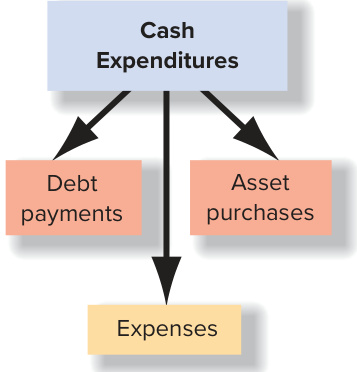

# Ch03 Operating Decisions and the Accounting System

hipotle Mexican Grill keeps operations simple, offering a few menu items (­burritos, burrito bowls, tacos, and salads). Within these items, customers can choose from a variety of meats, tofu, veggies beans, rice, and additional items such as salsa, guacamole, cheese, lettuce, and queso—creating hundreds of options. The focused menu allows Chipotle to concentrate on the source of the food items, a challenging activity given the smaller and often costlier market for organic meats, ­produce, and dairy products. Anticipating changes in these food costs and sources is critical to determining menu prices and controlling costs.  

To control quality and increase efficiency, the company purchases key ingredients such as meat, beans, rice, cheese, and tortillas from a small number of suppliers and other raw materials from approved sources. Twenty-three independently owned and operated regional distribution centers purchase from these suppliers and then deliver the items as needed to the Chipotle restaurants in each region. To ensure food safety, Chipotle provides training for local farmers, utilizes advanced technology to trace the source of the food from suppliers to the restaurants, uses the sous vide (slow-cooking in hot water bath) method to control any pathogens or bacteria in meat, and provides bonuses to crew teams who meet specific food safety goals, among other measures. The second highest cost for Chipotle, as with most restaurants, is hiring and developing its over 91,000 employees. The food is prepared from scratch on stoves and grills, not with microwaves and other automated cooking techniques. Each employee  

## LEARNING OBJECTIVES  

## After studying this chapter, you should be able to:  

3-1	 Describe a typical business operating cycle and explain the necessity for the time period assumption. p. 110   
3-2 Explain how business activities affect the elements of the income statement. p. 112   
3-3 Explain the accrual basis of accounting and apply the revenue and expense recognition principles to measure income. p. 116   
3-4 Apply transaction analysis to examine and record the effects of operating activities on the financial statements. p. 121   
3-5	 Prepare a classified income statement. p. 129   
3-6	 Compute and interpret the net profit margin ratio. p. 131   
3-7	 Identify operating transactions and demonstrate how they affect cash flows. p. 133  

is cross-trained in all aspects of preparing the food—from grilling, to making fresh salsa and guacamole, to cooking rice—and creating a positive interactive experience for customers. The company has a strong culture of employee professional and personal development with numerous incentives to build and retain strong leadership. ­Chipotle’s Cultivate Education program provides tuition reimbursement and has a ­Debt-Free Degree program at selected colleges, including Paul Quinn College, one of the oldest historically black colleges in the country. These programs contribute to retention, with about 80 percent of its general managers promoted from within Chipotle.  

Chipotle also competes using marketing strategies. In 2018, Chipotle began to utilize more aggressive marketing efforts, including “addressable TV” ads (targeting selective segments of on-demand or live TV shows), digital marketing, online ordering, and a loyalty program. Having these initiatives in place allowed Chipotle to respond rapidly to the Covid-19 pandemic, resulting in a surge in on-line ordering and deliveries.  

## UNDERSTANDING THE BUSINESS  

  
Learn more about Chipotle from founder, Steve Ells, by listening to the NPR podcast Chipotle: Steve Ells: How I Built This. How I Built This NPR podcasts are about innovators, entrepreneurs, idealists, and the movements they built.  

Over Chipotle’s history since 1993, the restaurant industry has become extremely competitive with many established as well as new concept restaurants adopting service and sourcing formats similar to Chipotle’s. For example, in 2012, McDonald’s ­Corporation announced a requirement that suppliers need to phase out stalls that restrict the movement of pregnant pigs, a change made in direct response to Chipotle’s TV video on its ethical stance aired at the Grammy Awards. Taco Bell created its urban Taco Bell ­Cantina model with a menu featuring “gourmet” food items. Jack in the Box, Inc., expanded its Qdoba Mexican Grill chain to compete in the fast-casual segment of the restaurant industry. The newer concepts feature Mediterranean, Indian, farm-to-table, fish-to-table, and vegetarian cuisine, with many more popping up every day that focus on selective food sourcing, food prepared on-site, and a service model that allows customers to choose exactly what they want to eat. For example, the fast-growing,  

## Chipotle Mexican Grill  

IT’S MORE THAN MEAT, GUACAMOLE, AND TORTILLAS  

## chipotle.com  

fast-casual concepts include City Barbecue offering smoked in-house meats and sides, Sweetgreen with seasonal salads and grain bowls, and Bibibop Asian Grill with Korean flavors using healthy ingredients.  

Restaurants have to manage economic downturns and shifts in consumer tastes for healthier food choices while facing the competition. The Covid-19 pandemic, for example, created tremendous upheaval in the restaurant industry. To respond, most of the fast-casual restaurants began offering drive-through or curbside pick-up, digital ordering, and delivery service, supported by digital technology. Based on their projections of these forces, companies set goals for their performance. Published income statements provide the primary basis for comparing projections to the actual results of operations. To understand how business plans and the results of operations are reflected on the income statement, we need to answer the following questions:  

1.	 How do business activities affect the income statement?   
2.	 How are business activities measured?   
3.	 How are business activities reported on the income statement?  

In Chapter 2, we illustrated the use of transaction analysis, journal entries, and T-accounts for investing and financing activities. In this chapter, we apply these tools for operating activities, as illustrated with hypothetical quarterly transactions for Chipotle that involve the sale of food to the public. The results of these activities are reported on the income statement.  

  
ORGANIZATION OF THE CHAPTER  

## LEARNING OBJECTIVE 3-  

Describe a typical business operating cycle and explain the necessity for the time period assumption.  

## HOW DO BUSINESS ACTIVITIES AFFECT THE INCOME STATEMENT?  

## The Operating Cycle  

The long-term objective for any business is to turn cash into more cash. If a company is to stay in business, this excess cash must be generated from operations (that is, from the activities for which the business was established), not from borrowing money or selling long-lived assets.  

Companies (1) acquire inventory and the services of employees and (2) sell inventory or ­services to customers. The operating (cash-to-cash) cycle begins when a company receives goods to sell, then continues when the company pays for them and sells the goods to customers (or, in the case of a service company, has employees work to provide services to customers). It ends when customers pay cash to the company. The length of time for completion of the operating cycle depends on the nature of the business.  

  
Left: Digital Vision/Getty Images; Top: Juanmonino/Getty Images; Right: Tetra Images/Getty Images; Bottom: Jeff Kowalsky/Bloomberg/Getty Images  

The operating cycle for Chipotle is relatively short. It spends cash to purchase fresh ingredients, prepares the food, and sells it to customers for cash. In some companies, inventory is paid for well before it is sold. Amazon.com, for example, builds its inventory for months preceding the year-end holiday season. It may borrow funds from banks to pay for the inventory, and then it repays the loans with interest when it receives cash from customers. In other companies, cash is received from customers well after a sale takes place. For example, furniture retailers such as Ethan Allen often allow customers to make monthly payments over several years. Shortening the operating cycle by creating incentives that encourage customers to buy sooner and/or pay faster improves a company’s cash flows.  

Until a company ceases its activities, the operating cycle is repeated continuously. However, decision makers require information periodically about the company’s financial condition and performance. To measure income for a specific period of time, accountants follow the time period assumption, which assumes that the long life of a company can be reported in shorter time periods, such as months, quarters, and years.1 Two types of issues arise in reporting periodic income to users:  

1.	Recognition issues: When should the effects of operating activities be recognized (recorded)?  

2.	Measurement issues: What amounts should be recognized?  

## LEARNING OBJECTIVE 3-2  

Explain how business activities affect the elements of the income statement.  

Before we examine the rules accountants follow in resolving these issues, however, let’s examine the elements of the income statement that are affected by operating activities.  

## Elements of the Income Statement  

Exhibit 3.1 shows a recent income statement for Chipotle, simplified for the purposes of this chapter. It has multiple subtotals, such as income from operations and income before income taxes. This format is known as multiple step and is very common.2 In fact, you can tell if a company uses the multiple-step format if you see the Income from Operations subtotal (also called Operating Income).  

## Operating Activities  

Revenues are the amounts earned and recorded from a company’s day-to-day business activities, mostly when a company sells products or provides services to customers or clients (the central  

## EXHIBIT 3.1  

Chipotle Mexican Grill’s Income Statement  

## CHIPOTLE MEXICAN GRILL, INC.  

## EXPLANATIONS  

Consolidated Statement of Income For the Year ended December 31, 2019 (in millions of dollars, except per share data)  

Operating section (central focus of business)  

Other Items section (not central focus of business)  

<html><body><table><tr><td>Restaurant sales revenue $5,586</td></tr><tr><td>Restaurant operating expenses:</td></tr><tr><td>Supplies expense 1,848</td></tr><tr><td>Wages expense 1,472</td></tr><tr><td>Rent expense 363</td></tr><tr><td>Insuranceexpense 201</td></tr><tr><td>Utilities expense 102</td></tr><tr><td>Repairs expense 73</td></tr><tr><td>Other operating expenses 384</td></tr><tr><td>Generalandadministrativeexpenses: Training expense 321</td></tr><tr><td>Advertisingexpense 142</td></tr><tr><td>Depreciation expense 213</td></tr><tr><td>Loss on disposalof assets 23</td></tr><tr><td>Total operating expenses 5,142</td></tr><tr><td>Income from operations 444</td></tr><tr><td>Other items: Interestrevenue 17</td></tr><tr><td>Interest expense (3)</td></tr><tr><td>Income before income taxes 458</td></tr><tr><td>Income tax expense 108</td></tr><tr><td>Net income $ 350</td></tr><tr><td>Earnings per share $12.62</td></tr><tr><td></td></tr><tr><td>*The information has been adapted from actual statements andsimplifiedforthischapter.</td></tr></table></body></html>  

Period of time that financial performance was measured  

Earned from providing food service to customers during the year  

Cost of food, drink, and packaging supplies used during the year Cost of employee wages and salaries for work during the year Cost of renting facilities used during the year Cost of insurance coverage used during the year Cost of electric and gas used during the year Cost of repairing buildings and equipment during the year Summary of other operating costs used during the year  

Cost of training employees and managers during the year Cost of advertising done during the year Portion of cost of buildings and equipment used during the year Cost of assets sold during the year minus exchange price  

Subtraction of operating expenses from operating revenues   
Revenues/expenses/gains/losses from investments/debt during the year   
Earned from investments during the year   
Incurred on debt owed during the year  

Also called Provision for Income Taxes for the year Difference between all revenues and expenses for the year $=\hat{\mathcal{S}}3\hat{\mathcal{S}}\mathcal{O}$ million $\div27.74$ million weighted average shares of stock outstanding (from Chipotle’s 10-K)  

Source: Chipotle Mexican Grill, Inc.  

2Another common format, single step, reorganizes all accounts from the multiple-step format. All revenues and gains are listed together and all expenses and losses except taxes are listed together. The expense subtotal is then subtracted from the revenue subtotal to arrive at income before income taxes, the same subtotal as on the multiple-step statement. In the single-step format, there is no subtotal for income from operations or a separate section for other items.  

focus of the business). When Chipotle sells salad bowls to consumers, it has earned revenue. When revenue is earned, usually Cash or Accounts Receivable (amounts due from customers) increases. Sometimes if a customer pays for goods or services in advance, for example, when buying a Chipotle gift card, the company creates a liability account, usually Unearned (or Deferred) Revenue. At this point, no revenue has been earned. There is simply a receipt of cash in exchange for a promise to provide a good or service in the future. Later, when the company provides the promised goods or services to the customer paying with the gift card, then the revenue is recognized and the liability is eliminated.  

Many companies generate revenues from a variety of sources. For example, General Motors reports revenues from its automotive sales as well as from providing financing to customers. In the restaurant industry, many companies, such as McDonald’s Corporation, have companyowned stores but also sell franchise rights. The franchisor (seller) reports revenues from both the sales of food in company-owned stores and the fees from franchisees. Chipotle does not sell franchises. Therefore, the company generates revenue from one source—sales of food orders to customers—that is reported in the Restaurant Sales Revenue account.  

Expenses are the costs of operating the business that are incurred to generate revenues during the period. Usually, many expenses are incurred (that is, the resources or services of others that are used) in making a sale or providing a service. When Chipotle’s employees prepare and serve food to customers, Chipotle incurs an expense for using employee labor to generate revenue. The company uses electric service to operate equipment and light its facilities, and it uses food and paper supplies. Without incurring these expenses, Chipotle could not generate revenues. Expenses may be incurred before, after, or at the same time as they are paid in cash. When an expense is incurred, assets such as Supplies decrease (are used up) or liabilities such as Wages Payable or Utilities Payable increase. The following are Chipotle’s primary expenses:  

## Restaurant Operating Expenses:  

Supplies Expense. In Chipotle’s restaurant operations, any food ingredients or beverage and packaging supplies that are used to produce and sell meals are expensed as they are used. For Chipotle, this is its largest expense at $\mathbb{S}1{,}848$ million in 2019. In companies with a manufacturing or merchandising focus, the most significant expense is usually Cost of Sales (or Cost of Goods Sold), representing the cost of inventory used in generating sales.  

Wages Expense. When salaried and hourly employees work and generate sales for Chipotle, the company incurs an expense, although wages and salaries will be paid later. Wages Expense of $\mathbb{S}1{,}472$ million is Chipotle’s second largest expense. In purely service-oriented companies in which no products are produced or sold, the cost of having employees generate revenues is usually the largest expense. For example,  

­Federal Express reported over $\mathbb{S}25{,}031$ million in salaries expense for the year ended May 31, 2020.  

•	 Rent Expense, Insurance Expense, Utilities Expense, and Repairs Expense. Renting facilities, insuring property and equipment at the stores, using utilities, and repairing and maintaining facilities and equipment are typical expenses related to operating stores. Usually, rent and insurance are paid before occupying the facilities, but utilities and repairs are paid after occupying the facilities.  

Other Operating Expenses. These expenses include a wide variety of accounts with smaller dollar balances.  

General and Administrative Expenses: General and Administrative Expenses include costs of training employees and managers, advertising, and other expenses not directly related to operating stores. These often include expenses such as renting headquarters facilities and paying executive salaries.  

Depreciation Expense: When a company uses buildings and equipment to generate revenues, a part of the cost of these assets is reported as an expense called Depreciation Expense. Chapter 8 discusses methods for estimating the amount of depreciation expense.  

Some students con  

fuse the terms expenditure and expense. An expenditure is an outlay of cash for any purpose— including to buy equipment, pay off a bank loan, and pay for equipment repair. Not all expenditures are for expenses. Expenses, on the other hand, are costs incurred to generate revenue during the period— most expenses are not paid in cash when incurred.  

  

Tip Note that selling short- or long-term investments above or   
below cost also results in   
gains or losses, but these are   
reported in the Other Items   
section of the multiple-step   
income ­statement (they are   
not ­operating activities).  

Losses (Gains) on Disposal of Assets: Companies sell property, plant, and equipment from time to time to maintain modern facilities. When assets other than investments are sold or disposed of for more than their cost minus the amount of cost depreciated in the past, gains result. If they are sold or disposed of for less than their cost minus the amount of cost depreciated in the past, losses result. In 2019, Chipotle reported a loss on disposal of assets of $\mathbb{S}23$ million.  

Revenues minus expenses from operating activities equals Income from Operations (also called Operating Income)—a measure of the profit from central ongoing operations.  

## Other Items  

Not all activities affecting an income statement are central to ongoing operations. Any revenues, expenses, gains, or losses that result from these other activities are not included as part of income from operations but are instead categorized as Other Items. Typically, these include the following:  

•	 Interest Revenue (also Investment Revenue, Investment Income, or Dividend Revenue). Using excess cash to purchase stocks or bonds in other companies is not a part of Chipotle’s central operation of making and selling fresh Mexican food. Therefore, any interest or dividends earned on investments in other companies is not included as operating revenue.  

•	 Interest Expense. Likewise, for most businesses, borrowing money is not central to ongoing operations. Thus, the cost of using that money (called interest) is not an operating expense. Financial institutions such as banks are the exception where incurring interest expense and earning interest revenue are central to their operations.  

•	 Losses (Gains) on Sale of Investments. When investments are sold for less (or more) than the original cost, a loss (or gain) results and is reported as an Other Item on the income statement. In 2019, Chipotle did not report any gain or loss from selling investments.  

## Income Tax Expense  

Operating expenses are subtracted from operating revenues to determine Income before Income Taxes (also called Pretax Income). From this subtotal, Income Tax Expense (also called Provision for Income Taxes) is calculated by applying the tax rates of the federal, state, local, and foreign taxing authorities. Chipotle’s effective tax rate in 2019 was 23.6 percent $\mathbb{S}108$ million in income tax expense divided by $\mathbb{S}458$ million in income before income taxes). This indicates that, for every dollar of income before taxes that Chipotle made in 2019, the company paid nearly $\mathfrak{s}0.24$ to taxing authorities.  

## Earnings per Share  

Corporations are required to disclose earnings per share on the income statement or in the notes to the financial statements. This ratio is widely used in evaluating the operating performance and profitability of a company. At this introductory level, we can compute earnings per share simply as:  

  

\*As you will learn in Chapter 11: (1) If there are preferred stock dividends, the amount is subtracted from net income in the numerator, (2) the denominator for weighted average shares is a complex computation, and (3) outstanding shares are those that are currently held by the shareholders.  

Please note, however, that the calculation of the ratio is actually much more complex and beyond the scope of this course. For simplicity, we use the $\mathbb{S}350$ million net income in Exhibit 3.1 as the numerator and approximately 27.74 million weighted average number of shares as computed by Chipotle for the denominator. For 2019, Chipotle reported $\mathbb{S}12.62$ in earnings for each share of stock owned by investors.  

## Using Data Analytics in the Restaurant Industry to Increase Revenues and Decrease Costs  

Restaurants are using a variety of technologies including kiosks, mobile apps, and tableside tablets from which ordering data can be mined to analyze purchasing profiles. Data analytics also facilitates monitoring employee performance, improving scheduling, boosting customer loyalty, and maximizing marketing efficiency. Here are a few examples of restaurants that use data analytics to optimize performance, make better and faster decisions, reduce costs, and improve the customer experience:  

Panera Bread was one of the first restaurants to install ordering kiosks to (1) encourage menu browsing, (2) capture customer preferences, (3) fine-tune the menu based on preferences, (4) produce shorter lines for a better customer experience, (5) ensure better order accuracy to improve operational efficiency and reduce waste, and (6) save and/or redeploy labor costs.  

McDonald’s uses data to predict customer demand in drive-thru sales. By ensuring adequate staffing and alerting staff to the spike in demand, the efficiency of operations is improved along with enhancing the customer experience.  

Wendy’s analyzes big data on past sales and customer demographics to identify the most profitable new restaurant locations.  

•	 Pizza Hut uses software to track customer eye movements on digital, interactive menus in some of its restaurants to discover what customers subconsciously want.  

Dunkin’ mines data from its mobile loyalty program called DD Perks to send customers targeted offers at specific times.  

SOURCES: hotschedules.com/blog/biggest-restaurant-brands-use-big-data-stay-competitive/; delltechnologies.com/ en-us/video-collateral/panera_case_study_in_big_data_analytics_and_data_science_bluedata.htm; michiganstateuniversityonline.com/resources/business-analytics/dining-on-big-data/; pymnts.com/mobile-order-ahead/2019/ how-dunkin-uses-ai-for-order-ahead-analytics/.  

## HOW ARE OPERATING ACTIVITIES RECOGNIZEDAND MEASURED?  

There is more than one way to recognize and measure operating activities. Many sole proprietors and small partnerships, such as dental and doctors’ offices, choose to use the cash basis accounting method3 to determine performance. It is simple and is permitted for tax purposes. With cash basis accounting, owners record each transaction as money changes hands—paying a vendor in cash is a cash outflow and receiving cash from a customer or client is a cash inflow. This basis produces net cash flow information that is often quite adequate for organizations that do not need to report to external users.  

Using cash basis accounting may lead to an incorrect interpretation of company performance and financial position:  

•	 Revenues and expenses are often postponed or accelerated long before or after goods and service are delivered, and  

  

•	 Other than cash, assets and liabilities of the company are not reported in financial statements.  

For these reasons, cash basis financial statements are not very useful to external decision makers. Therefore, generally accepted accounting principles require accrual basis accounting fo financial reporting.  

## LEARNING OBJECTIVE 3-3  

Explain the accrual basis of accounting and apply the revenue and expense recognition principles to measure income.  

## Accrual Accounting, in short:  

Recognize Revenues when EARNED (performed, delivered) Recognize Expenses when INCURRED (resources used or debts incurred) to generate revenues in the same period  

## Accrual Accounting  

In accrual basis accounting, revenues are recognized when goods and services are provided to customers (they are earned), and expenses are recognized in the same period as the revenues to which they relate (resources are used or debts are incurred to generate revenues), regardless of when cash is received or paid. The two basic accounting principles that determine when revenues and expenses are recorded under accrual basis accounting are the revenue recognition principle and the expense recognition principle (also called the matching principle).  

## Revenue Recognition Principle  

The core revenue recognition principle specifies both the timing and amount of revenue to be recognized during an accounting period. It requires that a company recognize revenue (1) when the company transfers promised goods or services to customers (2) in the amount it expects to be entitled to receive. The five steps to follow for recognizing revenue, especially when a sales contract is more complex,4 are:  

Step 1.	 Identify the contract (written, verbal, or implied agreement) between the company and customer.  

Example: A contract is created when Chipotle agrees to sell you a sofritas burrito.  

## Step 2.	 Identify the seller’s performance obligations (promised goods and services).  

Example: Some contracts involve one performance obligation—to deliver a sofritas burrito. However, other contracts include multiple obligations. Apple Inc. has identified up to three performance obligations involving the sale of certain products such as the iPhone: (1) to deliver the iPhone and its software; (2) to provide product-related bundled services including iCloud, Siri, and Maps; and (3) to provide future unspecified software upgrades for the iPhone.  

Step 3.	 Determine the transaction price (the amount the seller expects to be entitled to receive from the customer).  

Example: For Chipotle, the transaction price is the amount shown on the menu minus any discounts, coupons, and loyalty program awards— $^{\bullet9}$ from the Chipotle customer, for example. For Apple, the transaction price is the total price for the iPhone to be paid by the customer— $\mathbb{-S}750$ , for example.  

## Step 4.	 Allocate the transaction price to the performance obligations.  

Example: For a single performance obligation, the full price relates to the delivery to the customer. However, when Apple sells (1) an iPhone, (2) product-related bundled services, and (3) a promise to provide future software upgrades, the transaction price is split among the three obligations by referring to the prices of each part sold separately.  

Step 5.	 Recognize revenue when each performance obligation is satisfied (or over time if a service is ­provided over time).  

Example: Chipotle recognizes revenue upon delivery of the burrito to the customer. Apple will recognize as revenue a substantial portion of the allocated transaction price of the iPhone itself when it is delivered. Then, it will recognize a portion of the second and third obligations as they are provided to customers.  

For most contracts discussed in this text, the revenue recognition steps are easy to apply. For example, Chipotle (1) agrees to (2) deliver a burrito that has been ordered by a customer for (3) the menu price with (4) the entire menu price (5) recognized on delivery of the burrito to the customer. The critical point for revenue recognition under the five-step model is when goods or services are delivered, not when cash is received from customers. Cash may be received before, after, or at the time of delivery as illustrated in Exhibit 3.2. Let’s see how to handle each of these cases.  

  

1	 Cash is received before the goods or services are delivered. Chipotle sells gift cards to customers for cash in exchange for the promise to provide future food orders. Because Chipotle has not delivered food at that point, it records no revenue. Instead, it creates a liability account called Unearned Revenue (or Deferred Revenue), representing the amount of food service owed to the customers. Later, when customers redeem their gift cards and Chipotle delivers the food, it earns and records the revenue while reducing the liability account because it has satisfied its promise to deliver.  

Cash is received in the same period as the goods or services are delivered. As is a typical timing of cash receipts and revenue recognition in the restaurant industry, Chipotle receives cash from most customers within a few minutes of them receiving their food. Chipotle delivers the food to the customer as ordered in exchange for cash, earning revenue in the process.  

3	 Cash is received after the goods or services are delivered. When a business sells goods or services on account (creating Accounts Receivable due from customers), the revenue is earned when the goods or services are delivered, not when cash is received at a later date. Let’s assume that, to boost business, Chipotle agrees to deliver food ordered by select customers, such as departments at area colleges or local businesses. These customers pay for the food order when Chipotle bills them at the end of the month, rather than when they receive the food. When delivered, Chipotle records both Restaurant Sales Revenue and the asset Accounts Receivable, representing the customer’s promise to pay in the future for past food deliveries. When the customer pays its monthly bill, Chipotle will increase its Cash account and decrease the asset Accounts Receivable.  

Companies usually disclose their revenue recognition practices in the financial statement note titled Significant Accounting Policies or in a separate note. The following excerpt from Note 1 to recent financial statements describes how Chipotle recognizes its revenue:  

1.	 Description of Business and Summary of Significant Accounting Policies  

Revenue Recognition  

We generally recognize revenue, net of discounts and incentives, when payment is tendered at the point of sale. .  

## Delivery  

We offer our customers delivery in almost all of our geographic regions. . . . We . . . recognize revenue, including delivery fees, when the delivery partner transfers food to the customer. .  

## CHIPOTLE MEXICAN GRILL  

REAL WORLD EXCERPT: 2019 Annual Report  

Gift Cards  

. . Gift card balances are initially recorded as unearned revenue. We recognize revenue from gift cards when the gift card is redeemed by the customer. .  

## P A U S E  F O R  F E E D B A C K  

We just learned the revenue recognition principle’s criteria: Recognize revenue (1) when the company transfers promised goods or services to customers (2) in the amount it expects to be entitled to receive. Regardless of when cash is paid by customers, revenue is recognized upon delivery (satisfaction of performance obligations).  

## S E L F - S T U D Y  Q U I Z  

Complete this quiz now to make sure you can apply the revenue recognition principle. The following transactions are samples of typical monthly operating activities of Papa John’s International, Inc. (dollars in thousands), a company that makes and delivers pizza and sells franchises.  

(a)	 In January, Papa John’s company-owned restaurants sold food to customers for $\mathbb{S}32{,}000$ cash.   
(b)	 In January, Papa John’s sold new franchises for $\mathbb{S}625$ cash, providing $\mathbb{S}400$ in services to these new franchisees during January; the remainder of the services will be provided over the next three months.   
(c)	 In January, Papa John’s received $\mathbb{S}210$ in cash from customers as deposits on large orders to be delivered in February.   
(d)	 In January, Papa John’s delivered $\mathbb{S}1{,}630$ in pizza to select customers on account; the customers will pay when billed at the end of January.   
(e)	 In January, customers paid $\mathbb{S}1{,}200$ on account to Papa John’s from December deliveries of pizza.   
$(f)$ In January, Papa John’s delivered $\mathbb{S}385$ in pizza to customers who provided deposits in December.  

## Required:  

Creating a table with headings as shown below, if revenue is to be recognized in January, indicate the title of the revenue account and the amount of revenue to be recognized. For account titles, name the revenue account based on the nature of the transaction. For example, sales to customers are Restaurant Sales Revenue and sales of franchises are Franchise Fee Revenue.  

  

  

## G U I D E D  H E L P  3 - 1  

After you have completed your answers, check them below.  

For additional video instruction on identifying revenues in the proper period and the amount, go to mhhe.com/libby_gh3-1.  

Related Homework: M3-2, E3-2  

S o l u t i o n s  t o S E L F - S T U DY  Q U I Z  

<html><body><table><tr><td>RevenueAccountTitle</td><td>AmountofRevenue Recognized in January</td></tr><tr><td>(a)RestaurantSalesRevenue</td><td>$32,000</td></tr><tr><td>(b)FranchiseFeeRevenue</td><td>$ 400</td></tr><tr><td>(c) No revenue earned in January</td><td></td></tr><tr><td>(d)RestaurantSalesRevenue</td><td>$1,630</td></tr><tr><td>(e) No revenue earned in January</td><td></td></tr><tr><td>fRestaurantSalesRevenue</td><td>一 $ 385</td></tr></table></body></html>  

  

## Expense Recognition Principle  

The expense recognition principle (also called the matching principle) requires that costs incurred to generate revenues be recognized in the same period—a matching of costs with benefits. For example, when Chipotle’s restaurants provide food service to customers, revenue is earned. The costs of generating the revenue include expenses incurred such as these:  

•	 Salaries and wages to employees who worked during the period.   
•	 Utilities for the electricity used during the period.   
•	 Food, beverage, and packaging supplies used during the period.   
•	 Facilities rented during the period.   
•	 Grills and other equipment used during the period.  

As with revenues and cash receipts, expenses are recorded as incurred, regardless of when cash is paid. Cash may be paid (1) before, (2) during, or (3) after an expense is incurred (see Exhibit 3.3). An entry will be made on the date the expense is incurred and another on the date the cash is paid, if they occur at different times. Let’s see how to handle each of these cases related to the expense recognition principle.  

1	 Cash is paid before the expense is incurred to generate revenue. Companies purchase many assets that are used to generate revenues in future periods. Examples include buying insurance for future coverage, paying rent for future use of space, and acquiring supplies and equipment for future use. When revenues are generated in the future, the company records an expense for the portion of the cost of the assets used—costs are matched with the benefits. As an example, assume Chipotle signs a two-year ­contract with a repair company for service any time over the contracted years at no additional cost in exchange for a cash prepayment. When acquired, the service ­contract is recorded as an asset called Prepaid Expenses that will benefit future ­periods. When the service is used the following month, Repairs Expense is recorded for the month and the asset Prepaid Expenses is reduced to the balance yet to be used. ­Similarly, rent, insurance, and advertising that are prepaid are often recorded in an asset account called Prepaid Expenses and expensed when used.  

Cash is paid in the same period as the expense is incurred to generate revenue. Expenses are sometimes incurred and paid for in the period in which they arise. An example is paying for repairs on grills the day of the service. If Chipotle spends $\mathbb{S}275$ cash to repair grills so that food can be prepared to sell, an expense is incurred and recorded (Repairs Expense).  

  

3	 Cash is paid after the cost is incurred to generate revenue. Although rent and supplies are typically purchased before they are used, many costs are paid after goods or services have been received and used, including using utilities in the current period that are not paid for until the following period, using borrowed funds and incurring Interest Expense to be paid in the future, and owing wages to employees who worked in the current period. When Chipotle restaurants receive repair service on the last day of the accounting period, and the bills are handed to the restaurant managers that day, the company records Repairs Expense and Accounts Payable in the period the service is used, not when cash is paid.  

  

## P A U S E  F O R  F E E D B A C K  

The expense recognition principle (or matching principle) requires that costs incurred to generate revenues be recognized in the same period—that costs are matched with the revenues they generate. Regardless of when cash is paid, expense is recorded when incurred.  

## S E L F - S T U D Y  Q U I Z  

Complete this quiz now to make sure you can apply the expense recognition principle. The following transactions are samples of typical monthly operating activities of Papa John’s International, Inc. (dollars in thousands).  

(a)	 At the beginning of January, Papa John’s restaurants paid $\mathbb{S}3{,}000$ in rent for the months of January, February, and March.   
(b)	 In January, Papa John’s paid suppliers $\mathbb{S}10{,}000$ on account for supplies received in December.   
(c)	 In January, the food and paper products supplies used in making and selling pizza products to customers were $\mathbb{S}9{,}500$ . The supplies were purchased in December on account.   
(d)	 In late January, Papa John’s received a $\mathbb{S}400$ utility bill for electricity used in January. The bill will be paid in February.  

## Required:  

Creating a table with headings as shown below, if an expense is to be recognized in January, indicate the title of the expense account and the amount of expense to be recognized.  

  

After you have completed your answers, check them below.  

  

## G U I D E D H E L P  3 - 2  

For additional step-by-step video instruction on identifying revenue and expense accounts and amounts for a given period, go to mhhe.com/libby11e_gh3-2.  

Related Homework: M3-3, E3-3  

S o l u t i o n s  t o S E L F - S T U DY  Q U I Z  

Expense Account Title Amount of Expense Recognized in January  

(a) Rent Expense (b) No expense in January (c) Supplies Expense (d) Utilities Expense  

$\mathbb{S}1{,}000$ $^{\S3,000\div3}$ months) Supplies will be expensed when used. $\mathbb{S}9{,}500$ \$  400  

## Management’s Incentives to Violate Accounting Rules  

Investors in the stock market base their decisions on their expectations of a company’s future earnings. When companies announce quarterly and annual earnings information, investors evaluate how well the companies have met expectations and adjust their investing decisions accordingly. Companies that fail to meet expectations often experience a decline in stock price. Thus, managers are motivated to produce earnings results that meet or exceed investors’ expectations to bolster stock prices. Greed may lead some managers to make unethical accounting and reporting decisions, often involving falsifying revenues and expenses. While this sometimes fools people for a short time, it rarely works in the long run and often leads to very bad consequences.  

Fraud is a criminal offense for which managers may be sentenced to jail. A couple of historic fraud cases involving faulty revenue and expense accounting are discussed briefly below:  

•	 In 2002, WorldCom, the second largest long-distance telephone company in the United States at the time (now merged into Verizon), violated the expense recognition principle by recording $\mathbb{S}11$ billion in expenses as assets, thus overstating assets and overstating net income. This act to inflate earnings was perpetrated to boost WorldCom’s sagging stock price. Bernie Ebbers, age 65 and former CEO of WorldCom, was convicted and found guilty in 2005 and subsequently sentenced to 25 years in prison. At the time, this was the largest accounting fraud in U.S. history. [Post-script: Ebbers was released from prison in December 2019 due to declining health and died in February 2020.]  

ZZZZ Best was a carpet cleaning company started by teenager Barry Minkow who took the company public in 1986 when he was 20. However, the company was one of the largest accounting and investments frauds ever perpetrated by a single person. Among numerous criminal or questionable activities, Minkow violated the revenue recognition principle by creating fictitious sales to boost the company’s earnings and stock price and appear strong to attract large investment deals. But the company was a sham, one that its auditing firm failed to discover. At the age of 23, Minkow was convicted and sentenced to 25 years in prison and ordered to pay $\mathbb{S}26$ million in restitution. The audit firm paid $\mathbb{S}35$ million for failing to uncover the fraud. Investors and lenders reportedly lost $\mathbb{S}100$ million. [Post-script: After early release in 1995, Minkow pursued numerous fraudulent activities and was sentenced to federal prison two additional times before being released in 2019 and ordered to pay over $\mathbb{S}580$ million in restitution.]  

Many others are affected by accounting fraud. Shareholders lose stock value, employees may lose their jobs (and pension funds, as in the case of Enron), and customers and suppliers may become wary of dealing with a company operating under the cloud of fraud. As a manager, you may face an ethical dilemma in the workplace. The ethical decision to make is the one you will be proud of 20 years later.  

## THE EXPANDED TRANSACTION ANALYSIS MODEL  

We have discussed the variety of business activities affecting the income statement and how they are measured. Next, we need to determine how these business activities are recorded in the accounting system and reflected in the financial statements. Chapter 2 covered investing and financing activities that affect assets, liabilities, and stockholders’ equity. We now expand the transaction analysis model to include operating activities that also affect revenues and expenses.  

## Transaction Analysis Rules  

The complete transaction analysis model presented in Exhibit 3.4 includes all five elements: assets, liabilities, stockholders’ equity, revenues, and expenses. Recall that the Retained Earnings account is the accumulation of all past revenues and expenses minus any income distributed to  

## LEARNING OBJECTIVE 3-4  

Apply transaction analysis to examine and record the effects of operating activities on the financial statements.  

  

  

  

DO memorize and use the transaction alysis model for all transactions. DON’T memorize journal entries—there are just too many throughout the text and they can be complex.  

stockholders as dividends (that is, earnings not retained in the business).5 When net income is positive, Retained Earnings increases; a net loss decreases Retained Earnings.  

To aid your learning, you should be able to construct the transaction analysis model in Exhibit 3.4 on your own without assistance and use it to analyze transactions. It will be very beneficial in future chapters when completing assignments and analyzing more complex transactions. Now let’s study Exhibit  3.4 carefully to remember how the model is constructed and to understand the impact of operating activities on both the balance sheet and income statement:  

•	 All accounts can increase or decrease, although revenues and expenses mostly tend to increase throughout a period. For accounts on the left side of the accounting equation, the increase symbol $+$ is written on the left side of the T-account. For accounts on the right side of the accounting equation, the increase symbol $+$ is written on the right side of the T-account, except for expenses, which increase on the left side of the T-account. That is because, as expenses increase, they have an opposite effect on net income, the Retained Earnings account (which increases on the credit side), and thus Stockholders’ Equity.  

•	 Debits (dr) are written on the left of each T-account and credits (cr) are written on the right.  

•	 Every transaction affects at least two accounts.  

When a revenue or expense is recorded, either an asset or a liability will be affected as well:  

•	 Revenues increase stockholders’ equity through the account Retained Earnings and therefore have credit balances (the positive side of Retained Earnings). Recording revenue requires either increasing an asset (such as Accounts Receivable when selling goods on account to customers) or decreasing a liability (such as Unearned Revenue that was recorded in the past when cash was received from customers before being earned).  

•	 Expenses decrease stockholders’ equity through Retained Earnings. As expenses increase, they have the opposite effect on net income, which affects Retained Earnings. Therefore, they have debit balances (opposite of the positive credit side in Retained Earnings). That is, to increase an expense, you debit it, thereby decreasing net income and Retained Earnings. Recording an expense requires either decreasing an asset (such as Supplies when used) or increasing a liability (such as Wages Payable when money is owed to employees).  

When revenues exceed expenses, the company reports net income, increasing Retained Earnings and stockholders’ equity. However, when expenses exceed revenues, a net loss results that decreases Retained Earnings and thus stockholders’ equity.  

## EXHIBIT 3.5  

Steps for Analyzing Any Transaction  

Step 1: Was a revenue earned by delivering goods or services? • If so, debit the account for what was received $(+\mathbf{A},-\mathbf{L})$ and credit the revenue account $(+\mathbf{R},+\mathbf{S}\mathbf{E})$  

OR	 Was an expense incurred to generate revenue in the current period?  

• If so, debit the expense account $(+\mathbf{E},-\mathbf{S}\mathbf{E})$ and credit the account for what was given $(-\mathbf{A},+\mathbf{L})$  

OR,	 if neither a revenue was earned or an expense was incurred, what was received and given? debit the account for what was received $(+\mathbf{A},-\mathbf{L})$ credit the account for what was given $(-\mathbf{A},+\mathbf{L})$  

Step 2:	 Verify $\rightarrow$ Is the accounting equation in balance? (Does $\mathbf{A}=\mathbf{L}+\mathbf{S}\mathbf{E}?$ ) Do debits $=$ credits?  

Example: Chipotle delivers a food order for $\pm25$ and receives cash from the customer.  

SStteepp  11::      YYeess Cash (received) $(+\mathbf{A})$ 25 Restaurant sales revenue $(+\mathbf{R},+\mathbf{S}\mathbf{E})$  

SStteepp  22::      YYeess  

$$
\textrm{A}25=\textrm{L}0+\textrm{S E}25\frac{\textrm{A}}{+25}=\frac{\textrm{L}}{+25}+\frac{5\mathsf{E}}{+25}
$$  

ddeebbiittss $=$ credits? Yes Debits 25; Credits 25  

In summary:  

  

  

## Expenses increase on  

the left side (the debit side) of the T-account to reduce net income, retained earnings, and stockholders’ equity.  

The steps to follow in analyzing transactions presented in Chapter 2 are now modified to determine the effects of earning revenues and incurring expenses as well. Now, as shown in Exhibit 3.5, when a transaction occurs, the questions to ask are (1) was a revenue earned or expense incurred and (2) is the accounting equation in balance based on the analysis.  

## Analyzing Common Transactions  

Next, we continue our discussion with hypothetical operating activities for Chipotle Mexican Grill, building on the company’s trial balance presented in Exhibit 2.8 (in Chapter 2) that included only investing and financing transactions assumed to have occurred during the first quarter of 2020.  

Using the transaction analysis steps in Exhibit  3.5, we now analyze, record, and post to the T-accounts the effects of this chapter’s operating activities that we assume occurred ­during the first quarter. The T-accounts begin with the trial balance amounts in Exhibit 2.8. All amounts are in millions of dollars, except per share information. You should notice, in each journal entry, that:  

•	 When a revenue or expense is recorded, we insert $(+\boldsymbol{\mathrm{R}},+\boldsymbol{\mathrm{SE}})$ for revenues and $(+\mathrm{E},-\mathrm{SE})$ for expenses to emphasize the effect of the transaction on the accounting equation and to help you see that the equation remains in balance.  

•	 Debits equal credits—another check you should make when preparing journal entries.  

(1)	 During the first quarter, assume Chipotle sold food and beverages to customers for $^{\S1,359}$ ; $\pmb{\mathbb{S44}}$ was sold to universities on account (to be paid by the universities next quarter) and the rest was received in cash from customers. NOTE: To measure revenues and expenses in a new period, these accounts begin with $\mathbb{S}0$ balances.  

<html><body><table><tr><td colspan="3"></td><td>Debit</td><td>Credit</td></tr><tr><td></td><td colspan="3">() Cash (+A)</td><td>1,315</td><td></td></tr><tr><td></td><td></td><td>Accounts receivable (+A)</td><td>44</td><td></td><td></td></tr><tr><td></td><td></td><td>Restaurantsales revenue (+R,+SE)</td><td></td><td></td><td>1,359</td></tr></table></body></html>  

  

(2)	 Assume Chipotle purchased food, beverage, and packaging supplies costing $\bf{\Phi}_{5459}$ during the quarter, paying $\bf{5379}$ in cash, and owing the rest on account to the suppliers.  

<html><body><table><tr><td rowspan="7"></td><td colspan="3"></td><td colspan="3"></td><td>Credit</td></tr><tr><td colspan="3"></td><td></td><td>Debit 459</td><td></td><td></td></tr><tr><td></td><td colspan="3">(2)Supplies(+A) Cash (-A)</td><td></td><td></td><td>379</td></tr><tr><td></td><td colspan="3">Accountspayable(+L)</td><td></td><td>80</td><td></td></tr><tr><td></td><td colspan="3">=</td><td></td><td></td><td></td></tr><tr><td colspan="3">Assets Supplies +459</td><td colspan="5">Liabilities + Stockholders'Equity Accountspayable +80</td></tr><tr><td colspan="3">Cash</td><td colspan="3">-379</td><td colspan="3"></td></tr><tr><td>Bal.</td><td>+ Cash (A) -</td><td colspan="2"></td><td></td><td colspan="3">+Supplies(A)一</td><td>-AccountsPayable(L)+</td><td></td></tr><tr><td>(1)</td><td colspan="2">357 1,315</td><td>379</td><td>Bal. (2) (2) 459</td><td colspan="2">26</td><td></td><td>116 80</td><td>Bal. (2)</td></tr></table></body></html>  

(3)	 At the beginning of January, Chipotle paid $\mathbb{S207}$ cash for rent, insurance, and advertising to be used in the future (all included in the account Prepaid Expenses until used).  

  

(4) Chipotle paid $\mathbb{S65}$ as training expense for management during the quarter.  

<html><body><table><tr><td colspan="2"></td><td colspan="2">Debit</td><td>Credit</td></tr><tr><td colspan="2">(4) Training expense (+E,-SE)</td><td colspan="2">65</td><td></td></tr><tr><td colspan="2">Cash (-A)</td><td colspan="2"></td><td>65</td></tr><tr><td colspan="4">Assets Liabilities + Stockholders'Equity</td></tr><tr><td colspan="2">cash -65</td><td colspan="2">Training expense (+E)</td></tr></table></body></html>  

<html><body><table><tr><td colspan="4"></td><td colspan="3">+ Training Expense (E)一</td></tr><tr><td rowspan="3">Bal. (1)</td><td>+ Cash (A) - 357</td><td></td><td></td><td>Bal.</td><td>0</td></tr><tr><td>1,315</td><td>379</td><td>(2) (4)</td><td>65</td><td></td></tr><tr><td></td><td>207</td><td>(3)</td><td></td><td></td></tr><tr><td colspan="3">65 (4)</td><td></td><td></td><td></td></tr></table></body></html>  

(5)	 Chipotle paid employees $\pmb{\mathbb{S342}}$ for work this quarter and $\mathbb{s}47$ for work last quarter (recorded last quarter as Wages Expense and Wages Payable for the amount owed to employees who worked then).  

<html><body><table><tr><td></td><td>Debit</td><td>Credit</td></tr><tr><td>(5) Wages expense (+E,-SE)</td><td>342</td><td></td></tr><tr><td>Wages payable (-L)</td><td>47</td><td></td></tr><tr><td>Cash (-A)</td><td></td><td>389</td></tr></table></body></html>  

  

(6)	 Chipotle sold land costing $\pmb{\mathbb{S21}}$ for $\pmb{\mathbb{s}}\mathbf{1}2$ cash, resulting in a loss of $\bf{59}$ on the disposal of the asset.  

  

Tip Losses on asset disposals are treated similarly to expenses. Use $+\pm$ for losses and $+\pm$ for gains.  

<html><body><table><tr><td colspan="4">+ Cash (A) 一</td><td colspan="3">+ Land (A) 一</td><td colspan="4">+ Loss on Disposal of Assets (E) -</td></tr><tr><td>Bal.</td><td>357</td><td></td><td></td><td>Bal.</td><td>33</td><td></td><td>Bal.</td><td>0</td><td></td><td></td></tr><tr><td>(1)</td><td>1,315</td><td>379</td><td>(2)</td><td></td><td>21</td><td>(6)</td><td>(6)</td><td>9</td><td></td><td></td></tr><tr><td rowspan="3">(6)</td><td>12</td><td>207</td><td></td><td></td><td></td><td></td><td></td><td></td><td></td><td></td></tr><tr><td></td><td>65</td><td></td><td></td><td></td><td></td><td></td><td></td><td></td><td></td></tr><tr><td></td><td>389</td><td>345</td><td></td><td></td><td></td><td></td><td></td><td></td><td></td></tr></table></body></html>  

(7)	 Chipotle received $\bf{561}$ cash from customers paying on their accounts.  

  

(8)	 During the quarter, assume Chipotle paid $\overline{{{\bf566}}}$ on accounts payable to suppliers and paid $\pmb{\mathbb{S25}}$ on utilities payable (recorded last quarter as Utilities Expense and Utilities Payable for the amount owed for utility service used last year).  

  

(9)	 Chipotle paid $\bf{5117}$ for utilities used during the quarter and paid $\mathbb{S35}$ for repairs of its buildings and equipment during the quarter.   

<html><body><table><tr><td rowspan="7">Cash</td><td colspan="4"></td><td>Debit</td><td>Credit</td></tr><tr><td colspan="4">(9) Utilities expense (+E,-SE)</td><td>117</td><td></td></tr><tr><td colspan="4">Repairs expense (+E,-SE)</td><td>35</td><td></td></tr><tr><td colspan="4">Cash (-A)</td><td></td><td>152</td></tr><tr><td colspan="4">Liabilities</td><td colspan="2">Stockholders'Equity -117</td></tr><tr><td colspan="2">Assets -152</td><td colspan="4">+ Utilities expense (+E) Repairs expense (+E)</td></tr><tr><td colspan="4">+ Cash (A) -</td><td colspan="3">Bal. (9)</td></tr><tr><td colspan="2">Bal. 357 (1) 1,315 (6) 12 (7) 61</td><td>379 (2) 207 (3) 65 (4) 389 (5) 91 (8) 152 (9)</td><td colspan="4">+Utilities Expense (E)一 Bal. 0 (9) 117</td><td>-35 + Repairs Expense (E) 一 0 35</td></tr></table></body></html>  

(10)	During the quarter, Chipotle sold gift cards to customers for $\pmb{535}$ in cash (expected to be redeemed for food next quarter).  

<html><body><table><tr><td rowspan="5"></td><td></td><td colspan="6"></td><td>Credit</td></tr><tr><td colspan="2"></td><td colspan="3"></td><td>Debit 35 +</td><td></td><td></td></tr><tr><td>(10) Cash (+A)</td><td colspan="6"></td><td></td></tr><tr><td></td><td colspan="6">Unearned revenue (+L)</td><td>35 Stockholders'Equity</td></tr><tr><td>Assets</td><td colspan="6">= Liabilities +35 Unearnedrevenue</td></tr><tr><td>Cash</td><td rowspan="4"></td><td colspan="2">+ Cash (A) -</td><td></td><td colspan="4">+35</td></tr><tr><td rowspan="2">Bal. (1) (6) (7) (10)</td><td>357 1,315 12</td><td rowspan="2">379 207</td><td colspan="3">Unearned Revenue (L) + 95</td><td>Bal.</td></tr><tr><td>61 35</td><td>(2) (3) 65 (4) 389 (5) 91 (8) 152 (9)</td><td colspan="3">35 (10)</td></tr></table></body></html>  

  

(11)	 Assume Chipotle received $\overline{{\bf{53}}}$ cash as interest revenue earned during the quarter.   

<html><body><table><tr><td colspan="4">Balance Sheet Accounts:</td><td></td><td colspan="4"></td><td></td><td colspan="3"></td></tr><tr><td colspan="4">+ Cash (A) -</td><td colspan="3">+ Short-Term Investments (A) -</td><td colspan="3">+ Accounts Receivable (A) -</td><td colspan="3">+ Supplies (A) -</td></tr><tr><td>Bal. (1)</td><td>357 1,315</td><td>379</td><td>(2)</td><td>Bal. 381</td><td></td><td></td><td>Bal. 81</td><td></td><td></td><td>Bal. 26</td><td></td><td></td></tr><tr><td>(6)</td><td>12</td><td>207</td><td>(3)</td><td colspan="3">381</td><td>(1)</td><td>44 61</td><td>(7)</td><td>(2)</td><td>459</td><td></td></tr><tr><td>(7) (10)</td><td>61 35</td><td>65 389</td><td>(4) (5)</td><td colspan="3"></td><td>64</td><td></td><td></td><td></td><td>485</td><td></td></tr><tr><td>(11)</td><td>3</td><td>91 152</td><td>(8) (9)</td><td colspan="3">+ Prepaid Expenses (A) -</td><td>33</td><td>+ Land (A) -</td><td></td><td></td><td>+ Buildings (A) -</td><td></td></tr><tr><td></td><td>500</td><td></td><td></td><td>Bal. 85 (3) 207</td><td></td><td></td><td>Bal.</td><td>21</td><td>(6)</td><td>Bal. 1,851 1,851</td><td></td><td></td></tr><tr><td></td><td></td><td></td><td></td><td>292</td><td></td><td></td><td>12</td><td></td><td></td><td></td><td></td><td></td></tr><tr><td colspan="3">+ Equipment (A) -</td><td colspan="3">- Accumulated Depreciation (A) +</td><td colspan="3">+ Operating Lease ROU Assets (A)</td><td></td><td colspan="3">+ Intangible Assets (A) -</td></tr><tr><td>Bal.</td><td>862</td><td></td><td></td><td></td><td>1,201</td><td>Bal.</td><td>Bal. 2,591</td><td></td><td></td><td>Bal.</td><td>74</td><td></td></tr><tr><td></td><td>862</td><td></td><td></td><td></td><td>1,201</td><td></td><td>2,591</td><td></td><td></td><td></td><td>74</td><td></td></tr><tr><td colspan="3">- Accounts Payable (L) +</td><td></td><td colspan="3">-Unearned Revenue (L) +</td><td>- Wages Payable (L) +</td><td></td><td></td><td></td><td>-Utilities Payable (L) +</td><td></td></tr><tr><td>(8)</td><td>66</td><td>116 80</td><td>Bal. (2)</td><td></td><td>95 35</td><td>Bal. (10)</td><td>(5) 47</td><td>127</td><td>Bal.</td><td>(8)</td><td>25</td><td>156 Bal.</td></tr><tr><td></td><td></td><td>130</td><td></td><td></td><td>130</td><td></td><td></td><td>80</td><td></td><td></td><td></td><td>131</td></tr><tr><td colspan="3">- Dividends Payable (L) +</td><td></td><td colspan="3">- Current Lease Liabilities (L) +</td><td>- Notes Payable (L) +</td><td></td><td></td><td></td><td></td><td> Long-Term Lease Liabilities (L) +</td></tr><tr><td></td><td></td><td>2</td><td>Bal.</td><td></td><td>179</td><td>Bal.</td><td></td><td>80</td><td>Bal.</td><td></td><td>2,789</td><td>Bal.</td></tr><tr><td colspan="3">2</td><td></td><td></td><td>179</td><td></td><td></td><td>80</td><td></td><td></td><td></td><td>2,789</td></tr><tr><td colspan="3"></td><td></td><td colspan="3"></td><td></td><td></td><td></td><td></td><td></td><td></td></tr><tr><td></td><td>- Common Stock (SE) +</td><td></td><td></td><td></td><td>-Additional Paid-in Capital (SE) +</td><td></td><td></td><td>+ Treasury Stock (SE) -</td><td></td><td></td><td>-Retained Earnings (SE) +</td><td></td></tr><tr><td></td><td></td><td>2 12</td><td>Bal.</td><td></td><td>1,482 1,482</td><td>Bal.</td><td>Bal. 2,802 2,802</td><td></td><td></td><td></td><td></td><td>2,914 Bal. 2,914 (Continued)</td></tr></table></body></html>  

Next, we determine the balances in all of the T-accounts, especially those affected by the operating activities this quarter, by adding the positive side and subtracting the negative side in each T-account. The beginning balances in the T-accounts in Exhibit 3.6 are taken from Exhibit 2.8.  

T-Accounts Summary  

## EXHIBIT 3.6  

T-Accounts Summary (Concluded)  

## Income Statement Accounts:  

<html><body><table><tr><td colspan="3">RestaurantSalesRevenue (R) +</td><td colspan="3">一 InterestRevenue (R) +</td></tr><tr><td></td><td>0 1,359</td><td>Bal. (1)</td><td></td><td>0 3</td><td>Bal. (11)</td></tr><tr><td></td><td>1,359</td><td></td><td></td><td>3</td><td></td></tr></table></body></html>  

$^+$ Utilities Expense (E) −  

+ Repairs Expense (E) −  

+ Wages Expense (E)   

<html><body><table><tr><td>Bal.</td><td>0 342</td><td></td><td>Bal.</td><td></td><td>0</td><td>Bal.</td><td>0 35</td><td></td><td>Bal.</td><td>0</td><td></td></tr><tr><td>(5)</td><td>342</td><td></td><td></td><td>(9)</td><td>117 117</td><td></td><td>(9)</td><td>35</td><td>(4)</td><td>65 65</td><td></td></tr></table></body></html>  

+ Training Expense (E) −  

+ Loss on Disposal of Assets (E) −   

<html><body><table><tr><td>Bal. (6)</td><td>0 9</td></tr><tr><td>9 二</td><td></td></tr></table></body></html>  

## P A U S E  F O R  F E E D B A C K  

We just illustrated the steps in analyzing and recording transactions, including those involving earning revenue and incurring expenses.  

Transaction Analysis Steps:  

Step 1: Ask $\rightarrow$ Was a revenue earned by delivering goods or services? · If so, debit the account for what was received $(+\mathbf{A},-\mathbf{L})$ and credit the revenue account $(+\mathbf{R},+\mathbf{S}\mathbf{E})$ OR Was an expense incurred to generate revenue in the current period? · If so, debit the expense account $\mathbf{\nabla}\cdot\mathbf{+E},$ ,-SE) and credit the account for what was given $(-\mathbf{A},+\mathbf{L})$ OR, if neither a revenue was earned or an expense was incurred, what was received and given? debit the account for what was received $(+\mathbf{A},-\mathbf{L})$ credit the account for what was given $(-\mathbf{A},+\mathbf{L})$  

Step 2: Verify $\rightarrow$ Is the accounting equation in balance? (Does $\mathbf{A}=\mathbf{L}+\mathbf{S}\mathbf{E}?$ ddeebbiittss $=$ credits?  

## S E L F - S T U D Y  Q U I Z  

Now it’s your turn. Analyze and record in good form the journal entries for each of the selected June transactions for Florida Flippers, Inc., a scuba diving and instruction business. Then post the effects to the T-accounts. Account titles and beginning balances are provided in the T-accounts that follow. Be sure to check that debits equal credits in each journal entry and that the accounting equation remains in balance.  

a.	 In June, new customers paid Florida Flippers $\mathbb{S}8{,}200$ in cash for diving trips; $\mathbb{S}5{,}200$ was for trips made in June and the rest is for trips that will be provided in July.   
$b$ .	 In June, customers paid $\mathbb{S}3{,}900$ in cash for instruction they received in May.   
c.	 At the beginning of June, Florida Flippers paid a total of $\mathbb{S}6{,}000$ cash for insurance to cover the months of June, July, and August.   
d.	 In June, Florida Flippers paid $\mathbb{S}4\small{,}000$ in wages to employees who worked in June.  

<html><body><table><tr><td colspan="2">+ Cash (A) -</td><td colspan="2">+ Accounts Receivable (A) 一</td><td colspan="3">+ Prepaid Insurance (A) -</td></tr><tr><td>Beg. 25,000</td><td></td><td>Beg. 4,500</td><td></td><td>Beg.</td><td>0</td><td></td></tr><tr><td>End.</td><td></td><td>End.</td><td></td><td>End.</td><td></td><td></td></tr><tr><td colspan="2">- Unearned Revenue (L) +</td><td colspan="3">Diving Trip Revenue</td><td colspan="2"></td></tr><tr><td></td><td>0 Beg.</td><td></td><td>(R)+ 0</td><td></td><td>+ Wages Expense</td><td>(E)一</td></tr><tr><td></td><td></td><td></td><td>Beg.</td><td>Beg.</td><td>0</td><td></td></tr><tr><td></td><td>End.</td><td></td><td>End.</td><td>End.</td><td></td><td></td></tr></table></body></html>  

After you have completed your answers, check them below.  

## G U I D E D H E L P 3 - 3  

For additional step-by-step video instruction on analyzing, recording, and posting transaction effects, go to mhhe.com/libby11e_gh3-3.  

Related Homework: M3-4, M3-5, E3-6, E3-7, E3-8, E3-9, E3-12, E3-14, E3-17, P3-2, P3-4, P3-6, P3-7, CON3-1, COMP3-1  

## HOW IS THE INCOME STATEMENT PREPARED AND ANALYZED?  

As we discussed in Chapter 2, companies can prepare financial statements at any point in time. Before we consider creating any statements for Chipotle, however, we must first determine that the debits equal credits by generating a trial balance. Accounts are listed in financial statement order: assets, liabilities, stockholders’ equity, revenues/gains, and expenses/losses. The balances are taken from the T-accounts in Exhibit 3.6.  

  

Prepare a classified income statement.  

## S o l u t i o n s  t o  

S E L F - S T U DY  Q U I Z  

<html><body><table><tr><td></td><td>Debit</td><td>Credit</td></tr><tr><td>a.Cash (+A)</td><td>8,200</td><td></td></tr><tr><td>Diving trip revenue (+R, +SE)</td><td></td><td>5,200</td></tr><tr><td>Unearned revenue (+L)</td><td></td><td>3,000</td></tr><tr><td>b. Cash (+A)</td><td>3,900</td><td></td></tr><tr><td>Accountsreceivable(-A)</td><td></td><td>3,900</td></tr><tr><td>c.Prepaid insurance (+A)</td><td>6,000</td><td></td></tr><tr><td>Cash (-A)</td><td></td><td>6,000</td></tr><tr><td>d.Wages expense (+E,-SE)</td><td>4,000</td><td></td></tr><tr><td>Cash (-A)</td><td></td><td>4,000</td></tr></table></body></html>  

<html><body><table><tr><td colspan="4">+ Cash (A) -</td><td colspan="3">+ Accounts Receivable (A) —</td><td colspan="3">+ Prepaid Insurance (A) -</td></tr><tr><td>Beg.</td><td>25,000</td><td></td><td>(c)</td><td rowspan="2">Beg. 4,500</td><td rowspan="2">3,900 (9)</td><td rowspan="2">Beg. (c)</td><td rowspan="2">6,000</td><td rowspan="2">0</td></tr><tr><td>(a)</td><td>8,200</td><td>6,000</td><td></td></tr><tr><td>(q)</td><td>3,900</td><td>4,000</td><td>(d)</td><td>End. 600</td><td></td><td></td><td>End. 6,000</td><td></td><td></td></tr><tr><td>End.</td><td>27,100</td><td></td><td></td><td></td><td>- Diving Trip Revenue (R) +</td><td></td><td>+ Wages Expense (E) -</td><td></td><td></td></tr><tr><td></td><td>- Unearned Revenue (L) +</td><td>0</td><td>Beg.</td><td></td><td>0</td><td>Beg.</td><td>Beg.</td><td>0</td><td></td></tr><tr><td></td><td></td><td>3,000</td><td>(a)</td><td></td><td>5,200 5,200</td><td>(a)</td><td>(d)</td><td>4,000</td><td></td></tr><tr><td></td><td></td><td>3,000</td><td>End.</td><td></td><td></td><td>End.</td><td>End.</td><td>4,000</td><td></td></tr></table></body></html>  

<html><body><table><tr><td>File Home</td><td></td><td>Insert</td><td>Page Layout</td><td></td><td>Formulas</td><td>Data</td></tr><tr><td colspan="5">B42 X fc</td><td colspan="3"></td></tr><tr><td></td><td>A</td><td colspan="4">B</td><td>C D</td><td>E</td></tr><tr><td>1</td><td colspan="5">CHIPOTLE MEXICAN GRILL</td><td></td><td></td></tr><tr><td>2</td><td colspan="5">UNADJUSTED TRIAL BALANCE*</td><td></td><td></td></tr><tr><td>3</td><td colspan="5"></td><td></td><td></td></tr><tr><td>4</td><td colspan="5">(inmillionsofdollars)</td><td>Credit</td><td></td></tr><tr><td>5</td><td>Cash</td><td colspan="2">March 31,2020</td><td>Debit 500</td><td></td><td></td></tr><tr><td>6</td><td></td><td colspan="2">Short-term investments</td><td>381</td><td></td><td></td></tr><tr><td>7</td><td></td><td colspan="2">Accountsreceivable</td><td></td><td>64</td><td></td></tr><tr><td>8</td><td></td><td colspan="2">Supplies</td><td>485</td><td></td><td></td></tr><tr><td>9</td><td></td><td colspan="2">Prepaid expenses</td><td>292</td><td></td><td></td></tr><tr><td>10</td><td></td><td colspan="2">Land</td><td></td><td>12</td><td></td></tr><tr><td>11 12</td><td></td><td colspan="2">Buildings</td><td>1,851</td><td></td><td></td></tr><tr><td></td><td></td><td colspan="2">Equipment</td><td>862</td><td></td><td></td></tr><tr><td>13</td><td></td><td colspan="2">Accumulated depreciation</td><td></td><td>1,201</td><td></td></tr><tr><td>14</td><td></td><td colspan="2">Operatingleaseright-of-use assets</td><td>2,591</td><td></td><td></td></tr><tr><td>15</td><td></td><td colspan="2">Intangible assets</td><td></td><td>74</td><td></td></tr><tr><td>16</td><td></td><td colspan="2">Accounts payable</td><td></td><td></td><td>130</td></tr><tr><td>17</td><td></td><td colspan="2">Unearned revenue</td><td></td><td></td><td>130</td></tr><tr><td>18</td><td></td><td colspan="2">Wages payable</td><td></td><td></td><td>80</td></tr><tr><td>19</td><td></td><td colspan="2">Utilities payable</td><td></td><td></td><td>131</td></tr><tr><td>20</td><td></td><td colspan="2">Dividends payable</td><td></td><td></td><td>2</td></tr><tr><td>21</td><td></td><td colspan="2">Current lease liabilities</td><td></td><td></td><td>179</td></tr><tr><td>22</td><td></td><td colspan="2">Notes payable</td><td></td><td></td><td>80</td></tr><tr><td>23</td><td></td><td colspan="2">Long-termleaseliabilities</td><td></td><td>2,789</td><td></td></tr><tr><td>24</td><td></td><td colspan="2">Common stock</td><td></td><td></td><td>2</td></tr><tr><td>25</td><td></td><td colspan="2">Additionalpaid-incapital</td><td></td><td>1,482</td><td></td></tr><tr><td>26</td><td></td><td colspan="2">Treasury stock</td><td>2,802</td><td></td><td></td></tr><tr><td>27</td><td></td><td colspan="2">Retained earnings</td><td></td><td>2,914</td><td></td></tr><tr><td>28</td><td></td><td colspan="2">Restaurant sales revenue</td><td></td><td>1,359</td><td></td></tr><tr><td>29</td><td></td><td colspan="2">Interestrevenue</td><td></td><td></td><td>3</td></tr><tr><td>30</td><td></td><td colspan="2">Wages expense</td><td>342</td><td></td><td></td></tr><tr><td>31</td><td></td><td colspan="2">Utilities expense</td><td>117</td><td></td><td></td></tr><tr><td>32</td><td></td><td colspan="2">Repairs expense</td><td>35</td><td></td><td></td></tr><tr><td>33</td><td></td><td colspan="2">Training expense</td><td>65</td><td></td><td></td></tr><tr><td>34</td><td></td><td colspan="2">Loss on disposal of assets</td><td>9</td><td></td><td></td></tr><tr><td>35</td><td></td><td colspan="2">Total</td><td>10,482</td><td>10,482</td><td></td></tr><tr><td>36</td><td></td><td colspan="2"></td><td></td><td></td><td></td></tr><tr><td>37</td><td></td><td colspan="2">*Based on hypothetical transactions for the first quarter ended March 31,2020;balances are not yet adjusted.</td><td></td><td></td><td></td></tr><tr><td>38</td><td></td><td colspan="4"></td><td></td></tr></table></body></html>  

Microsoft Corporation  

Although debits do equal credits, why is the trial balance labeled “unadjusted”? Does it make sense that supplies were purchased during the quarter, but no Supplies Expense was recorded to show the amount of supplies used? How likely is it that gift cards were sold, but none were redeemed by customers during the quarter? And didn’t Chipotle use property and equipment during the quarter to generate revenues? The answer to all of these questions is that no end-of-period adjustments have been made yet to reflect all revenues earned and expenses incurred during the quarter. Therefore, the trial balance is unadjusted until all adjustments are made, as we illustrate in Chapter 4.  

## Classified Income Statement  

Exhibit 3.7 presents the classified income statement. Classified means it is categorized into Operating activities and Other items, but note that, because it is based on unadjusted balances, it would not be presented to external users.  

When comparing this statement with Chipotle’s 2019 income statement in Exhibit 3.1, we notice that the income from operations for the first quarter $(\Phi794)$ exceeds income from operations for all of 2019 $(\Phi444)$ . Because a more representative amount for one quarter would be about 25 percent, obviously, numerous adjustments are necessary to revenues and expenses, such as providing food service to customers with gift cards (earning a revenue) and using food, packaging, and beverage supplies, renting facilities, and using buildings and equipment during the quarter to generate revenue (incurring expenses). We would not want to use the information for analysis until it has been adjusted. Instead, we use the 2019 income statement in Exhibit 3.1 to determine how effective Chipotle’s management is at generating profit.  

## KEY RATIO ANALYSIS  

## Net Profit Margin Ratio  

## ANALYTICAL QUESTION  

How effective is management at generating profit (that is, at generating revenue and controlling costs) on every dollar of sales?  

## LEARNING OBJECTIVE 3-6  

Compute and interpret the net profit margin ratio.  

<html><body><table><tr><td>CHIPOTLE MEXICAN GRILL,INC. Consolidated Statement of Income* UNADJUSTED For the Quarter ended March 31, 2020 (in millions of dollars)</td></tr><tr><td>Restaurant salesrevenue $1,359 Restaurant operating expenses: Wages expense 342</td></tr><tr><td>Utilitiesexpense 117 Repairs expense 35</td></tr><tr><td>General and administrative expenses: Training expense 65 Loss on disposal of assets 9</td></tr><tr><td>Totaloperatingexpenses 568 Income from operations 791</td></tr><tr><td>Other items: Interest revenue Net income *Based on hypothetical activities for the quarter.</td></tr><tr><td>3 Incomebeforeincometaxes 794 Income tax expense 0 $ 794</td></tr></table></body></html>  

## EXHIBIT 3.7  

Unadjusted Income Statement  

## RATIO AND COMPARISONS  

\*Net sales is sales revenue less any returns from customers and other reductions. For companies in the service industry, total operating revenues is equivalent to net sales.  

The 2019 ratio for Chipotle using reported amounts (from Exhibit 3.1) is (dollars in millions):  

$$
\frac{\mathbb{9350}}{\mathbb{95},\mathbb{586}}=0.0627\ \mathrm{{or}}\ 6.27\%
$$  

<html><body><table><tr><td colspan="3">COMPARISONSOVERTIME</td><td rowspan="8"></td><td colspan="2">COMPARISONSWITHCOMPETITORS</td></tr><tr><td colspan="3">ChipotleMexican Grill, Inc.</td><td>ElPolloLoco Holdings</td><td>Shake ShackInc.</td></tr><tr><td>2017</td><td>2018</td><td>2019</td><td>2019</td><td>2019</td></tr><tr><td>0.0394</td><td>0.0363</td><td>0.0627</td><td>0.0563</td><td>0.041</td></tr></table></body></html>  

## INTERPRETATIONS  

In General Net profit margin measures how much of every sales dollar generated during the period is profit. Over time, a rising net profit margin signals more efficient management of sales and expenses. Differences among industries result from the nature of the products or services provided and the intensity of competition. Differences among competitors in the same industry reflect how each company responds to changes in competition (and demand for the product or service) and changes in managing sales volume, sales price, and costs. Financial analysts expect well-run businesses to maintain or improve their net profit margin over time.  

Focus Company Analysis Chipotle’s net profit margin varied over the three-year period. The 2017 and 2018 ratios were below $\mathbb{S}0.04$ in net income for every dollar of sales revenue. Management reported that, although sales revenue increased both of those years, costs increased as well. In March 2018, Chipotle hired Brian Niccol as Chief Executive Officer, with great hopes of re-energizing the company after a string of food safety issues in prior years. Under his leadership, in 2018, the company undertook a corporate restructuring, including a move of its headquarters to Newport Beach, CA, consolidation or closure of other corporate offices, and incurred additional costs as a result (such as, employee severance and transition costs, relocation costs, and lease termination costs among others). The company also started equipping restaurants with second food “make lines” to address the growing delivery and pick-up orders. In 2019, the net profit margin jumped to 6.27 percent, as sales revenue continued to increase (much of that due to a 7.1 percent increase in digital sales) and operating costs as a percentage of revenues decreased, despite its continuing investment in improved digital platforms and expanded delivery capabilities. This suggests that, from 2018 to 2019, Chipotle’s management was more effective at generating revenues and controlling costs.  

El Pollo Loco and Shake Shack each had a lower net profit margin than Chipotle, suggesting that Chipotle was more effective at generating revenue while controlling costs than those competitors in 2019. El Pollo Loco had a 2 percent increase in restaurant sales, opened only two company-operated and two franchised restaurants, and had an increase in labor, delivery, utility, and repair costs. Shake Shack also expanded its number of restaurant openings and partnered with Grubhub to expand delivery service. Revenue increased over 29 percent, but operating costs grew faster which included one-time costs for upgrading financial and operational systems to support growth initiatives. Differences in business strategies, size, and locations explain some of the variation in ratio analysis across competitors.  

A Few Cautions The decisions that management makes to maintain the company’s net profit margin in the current period may have negative long-run implications. Analysts should perform additional analysis of the ratio to identify trends in each component of revenues and expenses. This involves dividing each line on the income statement by net sales. Statements presented with these percentages are called commonsized income statements. Changes in the percentages of the individual components of net income provide information on shifts in management’s strategies.  

## Operating Activities  

In this chapter, we focus on cash flows from operating activities: cash from operating sources, primarily customers, and cash to suppliers and others involved in operations. The accounts most often associated with operating activities are current assets, such as Accounts Receivable, Inventories, and Prepaid Expenses, and current liabilities, such as Accounts Payable, Wages Payable, and Unearned Revenue.  

As discussed in Chapter 2, companies report cash inflows and outflows over a period of time in their statement of cash flows. This statement is divided into three categories:  

•	 	O — Operating activities include those primarily with customers and suppliers, and interest payments on debt and earnings on investments.   
I — Investing activities include buying and selling noncurrent assets and investments.   
•	  F — Financing activities include borrowing and repaying debt, including short-term bank loans; issuing and repurchasing stock; and paying dividends.  

Only transactions affecting cash are reported on the statement. An important step in constructing and analyzing the statement of cash flows (discussed in Chapter 12) is identifying the various transactions as operating, investing, or financing. Let’s analyze the Cash T-account for Chipotle’s assumed transactions in this chapter, adding to transactions (a)—(g) from Chapter 2. Refer to transactions $(I){-}(I I)$ illustrated earlier in the chapter and remember, if you see Cash in a transaction, it will be reflected on the statement of cash flows.  

## LEARNING OBJECTIVE 3-7  

Identify operating transactions and demonstrate how they affect cash flows.  

  

As we discussed, every transaction affecting cash can be classified either as an operating, investing, or financing effect.  

Operating effects relate to receipts of cash from customers, payments to suppliers (employees, utilities, and other suppliers of goods and services for operating the business), and any interest paid or investment income received.  

Investing effects relate to purchasing/selling investments or property and equipment or lending funds to/receiving repayment from others.  

Financing effects relate to borrowing or repaying banks, issuing stock to investors, repurchasing stock from investors, or paying dividends to investors.  

## S E L F - S T U D Y  Q U I Z  

Mattel, Inc., designs, manufactures, and markets a broad variety of toys (e.g., Barbie, Hot Wheels, Fisher-Price brands, and American Girl dolls) worldwide. Indicate whether these transactions from a recent statement of cash flows were operating (O), investing (I), or financing (F) activities and the direction of their effects on cash ( $^{\downarrow}$ for increases in cash; − for decreases in cash):  

<html><body><table><tr><td>TRANSACTIONS</td><td>TVPEOFACTIVITY (O,I,ORF)</td><td>EFFECTONCASHFLOWS (+ OR-)</td></tr><tr><td>1. Purchases of property, plant, and equipment</td><td></td><td></td></tr><tr><td>2.Receipts from customers</td><td></td><td></td></tr><tr><td>3.Payments of dividends</td><td></td><td></td></tr><tr><td>4.Payments to employees</td><td></td><td></td></tr><tr><td>5.Receipts ofinvestment income</td><td></td><td></td></tr></table></body></html>

After you have completed your answers, check them below.  

Related Homework: M3-10, E3-11, E3-15, P3-3, P3-5, P3-8  

## D E M O N S T R A T I O N C A S E  

This case is a continuation of the Terrific Lawn Maintenance Corporation transactions introduced in Chapter 2. In that chapter, the company was established and supplies, property, and equipment were purchased. Terrific Lawn is now ready for business. The balance sheet at April 7, 2023, based on the first week of investing and financing activities (from Chapter 2) is as follows:  

<html><body><table><tr><td>TERRIFICLAWNMAINTENANCECORPORATION Balance Sheet April 7, 2023</td></tr><tr><td>Assets</td></tr><tr><td>Current Assets:</td></tr><tr><td>Cash $ 3,800</td></tr><tr><td>Notes receivable 1,250</td></tr><tr><td>Total current assets 5,050</td></tr><tr><td>Equipment 4,600 Land 3,750</td></tr><tr><td>Total assets $13,400</td></tr><tr><td>Liabilities and Stockholders’ Equity</td></tr><tr><td>CurrentLiabilities: 400</td></tr><tr><td>Short-term notes payable $</td></tr><tr><td>Total current liabilities 400</td></tr><tr><td>Long-term notes payable 4,000</td></tr><tr><td>Total liabilities 4,400</td></tr><tr><td>Stockholders'Equity: Common stock ($0.10 par) 150 8,850</td></tr><tr><td>Additional paid-in capital</td></tr><tr><td></td></tr><tr><td>Totalstockholders'equity 9,000</td></tr><tr><td>Total liabilities and stockholders’ equity $13,400</td></tr></table></body></html>  

The following additional activities occurred during the rest of April 2023:  

a.	 Purchased and used during April gasoline for mowers and edgers, paying $\mathbb{S}90$ in cash at a local gas station.   
$b$ .	 In early April, received from the city $\mathbb{S}1{,}600$ cash in advance for lawn maintenance service for April through July $\mathbb{S}400$ each month). (Record the entire amount as Unearned Revenue.)   
c.	 In early April, purchased $\mathbb{S}300$ of insurance covering six months, April through September. (Record the entire payment as Prepaid Expenses.)   
d.	 Mowed lawns for residential customers who are billed every two weeks. A total of $\mathbb{S}5{,}200$ of service was billed in April.   
e.	 Residential customers paid $\mathbb{S}3{,}500$ on their accounts.   
$f_{\cdot}$ Paid wages every two weeks. Total cash paid in April was $\mathbb{S}3{,}900$ .   
$\ g.$ .	 Received a bill for $\mathbb{S}320$ from the local gas station for additional gasoline purchased on account and used in April. The bill will be paid in May.   
$h$ .	 Paid $\mathbb{S}700$ principal and $\mathbb{S}40$ interest on note owed to XYZ Lawn Supply.   
$i.$ Paid $\mathbb{S}100$ on accounts payable.   
$j.$ .	 Collected $\mathbb{S}1{,}250$ principal and $\mathbb{S}12$ interest on the note owed by the city to Terrific Lawn Maintenance Corporation.  

## Required:  

1.	 a. On a separate sheet of paper, set up T-accounts for Cash, Accounts Receivable, Notes Receivable, Prepaid Expenses, Equipment, Land, Accounts Payable, Short-Term Notes Payable, Unearned Revenue (same as deferred revenue), Long-Term Notes Payable, Common Stock, Additional Paid-in Capital, Retained Earnings, Mowing Revenue, Interest Revenue, Wages Expense, Fuel Expense, and Interest Expense. Beginning balances for the balance sheet accounts should be taken from the preceding balance sheet. Beginning balances for operating accounts are $\mathbb{s}0$ . Indicate these balances on the T-accounts. $b$ .	 Analyze each transaction, referring to the expanded transaction analysis model presented in this chapter. c.	 On a separate sheet of paper, prepare journal entries in chronological order and indicate their effects on the accounting model (Assets $=$ Liabilities $^+$ Stockholders’ Equity). Include the equality checks: (1) Debits $=$ Credits and (2) the accounting equation is in balance. d.	 Enter the effects of each transaction in the appropriate T-accounts. Identify each amount with its letter in the preceding list of activities. e.	 Compute balances in each of the T-accounts.  

2.	 Use the amounts in the T-accounts to prepare an unadjusted classified income statement for Terrific Lawn Maintenance Corporation for the month ended April 30, 2023. (Adjustments to accounts will be presented in Chapter 4.)  

3.	 On the Cash T-account, identify each transaction as O for operating activity, I for investing activity, or F for financing activity. Now check your answers with the following suggested solution.  

## SUGGESTED SOLUTION  

1.	 b. and c. Transaction analysis, journal entries, and the effect on the accounting model:  

<html><body><table><tr><td>Journal Entries</td><td>Debit</td><td>Credit</td><td rowspan="4">Equality Checks for All Debits = Credits · Equation balances + SE +E -90 +5,200</td></tr><tr><td>(a) Fuel expense (+E,-SE)</td><td>90</td><td>A</td></tr><tr><td>Cash (-A)</td><td></td><td>90</td></tr><tr><td>(b) Cash (+A)</td><td>1,600</td><td>L -90 +1,600 +1,600</td></tr><tr><td>Unearned revenue (+L)</td><td></td><td>1,600</td></tr><tr><td>(c) Prepaid expenses (+A)</td><td>300</td><td>+300</td></tr><tr><td>Cash (-A)</td><td></td><td>300 -300</td></tr><tr><td>(d)Accounts receivable (+A)</td><td>5,200</td><td></td></tr><tr><td>Mowing revenue (+R, +SE)</td><td></td><td>5,200 +R</td></tr><tr><td>(e) Cash (+A)</td><td>3,500</td><td>+5,200 +3,500</td></tr><tr><td>Accounts receivable (-A)</td><td></td><td>3,500 -3,500</td></tr><tr><td>(f) Wages expense (+E, -SE)</td><td>3,900</td><td></td></tr><tr><td>Cash (-A)</td><td></td><td>3,900 -3,900 +E -3,900</td></tr><tr><td>(g) Fuel expense (+E, -SE)</td><td>320</td><td></td></tr><tr><td>Accounts payable (+L)</td><td></td><td>320 +320 +E -320</td></tr><tr><td>(h) Interest expense (+E, -SE)</td><td></td><td></td></tr><tr><td>Long-term notes payable (-L)</td><td>40 700</td><td></td></tr><tr><td>Cash (-A)</td><td></td><td>-740 -700 +E -40</td></tr><tr><td>(i) Accounts payable (-L)</td><td></td><td>740</td></tr><tr><td></td><td>100</td><td></td></tr><tr><td>Cash (-A)</td><td></td><td>100 -100 -100</td></tr><tr><td>(i) Cash (+A)</td><td>1,262</td><td></td></tr><tr><td>Notes receivable (-A) Interest revenue (+R,+SE)</td><td></td><td>1,250 +1,262 +R +12 12 -1,250</td></tr></table></body></html>  

1.	 a., d., and e. T-Accounts: Assets   

<html><body><table><tr><td colspan="4">Assets + Cash (A) -</td><td colspan="4">+Accounts Receivable (A)一</td><td colspan="4">+ Notes Receivable (A) -</td></tr><tr><td rowspan="4">Beg. (9) (e) (i)</td><td rowspan="4">3,800 1,600 3,500 1,262</td><td rowspan="2">90</td><td></td><td>Beg.</td><td>0</td><td></td><td>Beg.</td><td>1,250</td><td></td><td></td></tr><tr><td>(a)</td><td>(d)</td><td>5,200</td><td>3,500 (3)</td><td></td><td></td><td>1,250</td><td>(i)</td></tr><tr><td rowspan="2">300 3,900</td><td rowspan="2">(c) (f)</td><td rowspan="2"></td><td rowspan="2">1,700</td><td rowspan="2"></td><td rowspan="2"></td><td rowspan="2">0</td><td rowspan="2"></td><td rowspan="2"></td></tr><tr><td></td></tr><tr><td colspan="2"></td><td>740 100</td><td></td><td>(h) (i)</td><td colspan="3"></td><td></td><td></td><td></td><td></td></tr><tr><td colspan="2"></td><td>5,032</td><td></td><td></td><td></td><td></td><td></td><td></td><td></td><td></td><td></td></tr><tr><td colspan="2"></td><td>+ Prepaid Expenses (A) -</td><td></td><td></td><td></td><td>+ Equipment (A) -</td><td></td><td></td><td>+ Land (A) -</td><td></td><td></td></tr><tr><td colspan="2">Beg. (c)</td><td>0</td><td></td><td></td><td>Beg.</td><td>4,600</td><td></td><td>Beg.</td><td>3,750</td><td></td><td></td></tr><tr><td colspan="2"></td><td>300 300</td><td></td><td></td><td></td><td>4,600</td><td></td><td></td><td>3,750</td><td></td><td></td></tr><tr><td colspan="2"></td><td></td><td></td><td></td><td></td><td></td><td></td><td></td><td></td><td></td><td></td></tr></table></body></html>  

## Liabilities  

− Accounts Payable (L) +  

<html><body><table><tr><td>(i)</td><td>0 100 320</td><td>Beg. (g)</td></tr><tr><td></td><td>220</td></tr></table></body></html>  

− Long-Term Notes Payable (L) +  

<html><body><table><tr><td>(h)</td><td>700</td><td>4,000</td><td>Beg.</td></tr><tr><td></td><td></td><td>3,300</td><td></td></tr></table></body></html>  

Stockholders’ Equity  

− Short-Term Notes Payable (L) +  

<html><body><table><tr><td></td><td></td><td>400 Beg.</td></tr><tr><td></td><td>400</td></tr></table></body></html>  

− Unearned Revenue $(\mathsf{L})+$  

<html><body><table><tr><td></td><td>0 1,600</td><td>Beg. (b)</td></tr><tr><td></td><td>1,600</td><td></td></tr></table></body></html>  

− Common Stock (SE) +  

<html><body><table><tr><td></td><td></td><td>150</td><td>Beg.</td></tr><tr><td></td><td></td><td>150</td><td></td></tr></table></body></html>  

## Revenues  

<html><body><table><tr><td colspan="4">AdditionalF Paid-in Capital (SE) 十</td></tr><tr><td></td><td></td><td>8,850</td><td>Beg.</td></tr><tr><td></td><td></td><td>8,850</td><td></td></tr></table></body></html>  

− Retained Earnings (SE) +  

<html><body><table><tr><td></td><td>0</td><td>Beg.</td></tr><tr><td></td><td>0</td><td></td></tr></table></body></html>  

− Mowing Revenue (R) +  

<html><body><table><tr><td></td><td>0 5,200</td><td>Beg. (d)</td></tr><tr><td></td><td>5,200</td><td></td></tr></table></body></html>  

− Interest Revenue (R) +  

<html><body><table><tr><td></td><td></td><td>0 12</td><td>Beg. (i)</td></tr><tr><td></td><td></td><td>12</td><td></td></tr></table></body></html>  

Expenses   

<html><body><table><tr><td>Beg. (f)</td><td>0 3,900</td><td></td><td></td></tr><tr><td></td><td>3,900</td><td></td><td></td></tr></table></body></html>  

+ Wages Expense (E) −  

<html><body><table><tr><td colspan="4">+FueTExpenise (E)-</td></tr><tr><td>Beg.</td><td>0 90</td><td></td><td></td></tr><tr><td>(a) (g)</td><td>320</td><td></td><td></td></tr><tr><td></td><td>410</td><td></td><td></td></tr></table></body></html>  

+ Interest Expense (E) −   

<html><body><table><tr><td></td><td></td><td></td></tr><tr><td>Beg.</td><td>0</td><td></td></tr><tr><td>(h)</td><td>40 40</td><td></td></tr></table></body></html>  

2.	Income Statement:  

<html><body><table><tr><td>TERRIFICLAWNMAINTENANCECORPORATION UnadjustedIncomeStatement FortheMonthEndedApril30,2023</td></tr><tr><td>Mowing revenue $5,200 Operating expenses: Wages expense 3,900 Fuel expense 410 Totaloperatingexpenses 4,310 Incomefrom operations 890 Other items: Interest revenue 12 Interest expense (40) Income before taxes 862 Income tax expense 0 Netincome $ 862</td></tr></table></body></html>  

## 3.	 Cash flow activities identified $\mathbf{O}=$ operating, ${\bf I}=$ investing, and $\mathbf{F}=$ financing):  

<html><body><table><tr><td colspan="3"></td><td colspan="4">+ Cash (A)-</td><td rowspan="2"></td></tr><tr><td></td><td></td><td>Beg.</td><td>3,800</td><td></td><td></td></tr><tr><td>Fromcustomers</td><td>0+</td><td>(b)</td><td>1,600</td><td>90</td><td>(a)</td><td>-0 To suppliers of fuel</td><td></td></tr><tr><td>Fromcustomers</td><td>0+</td><td>(e)</td><td>3,500</td><td>300</td><td>(c)</td><td>-0</td><td>To suppliers of insurance coverage</td></tr><tr><td>$12forinterest+0;$1,250forprincipal</td><td>+1</td><td>(i)</td><td>1,262</td><td>3,900</td><td>(f)</td><td>-0</td><td>To employees</td></tr><tr><td></td><td></td><td></td><td></td><td>740</td><td>(h)</td><td>-0</td><td>$40forinterest;-F $700 for principal</td></tr><tr><td></td><td></td><td></td><td></td><td>100</td><td>(i)</td><td>-0</td><td>To suppliers</td></tr><tr><td></td><td></td><td></td><td>5,032</td><td></td><td></td><td></td><td></td></tr></table></body></html>  

## C H A P T E R  T A K E - A W A Y S  

3-1.	 Describe a typical business operating cycle and explain the necessity for the time period assumption. p. 110  

The operating cycle, or cash-to-cash cycle, is the time needed to purchase goods or services from suppliers, sell the goods or services to customers, and collect cash from customers. Time period assumption—to measure and report financial information periodically, we assume the long life of a company can be cut into shorter periods.  

3-2.	 Explain how business activities affect the elements of the income statement. p. 112 •	 Elements of the income statement: a.	Revenues—the amounts earned and recorded from a company’s day-to-day business activities, mostly when a company sells products or provides services to customers or clients (the central focus of the business). b.	Expenses—the costs of operating the business that are incurred to generate revenues during the period. c.	Gains—result primarily from the disposal of assets for more than their cost minus the amount of cost depreciated in the past. d.	Losses—result primarily from the disposal of assets for less than their cost minus the amount of cost depreciated in the past.  

3-3.	 Explain the accrual basis of accounting and apply the revenue and expense recognition principles to measure income. p. 116  

In accrual basis accounting, revenues are recognized when earned and expenses are recognized when incurred.  

•	 Revenue recognition principle—recognize revenues (1) when the company transfers promised goods or services to customers (2) in the amount it expects to be entitled to receive. The five-step model for determining when and the amount to recognize revenue is:  

(1)	 identify the contract,   
(2)	 identify the seller’s performance obligations (promised goods and services), (3)	 determine the transaction price,   
(4)	 allocate the transaction price to the performance obligations, and   
(5)	 recognize revenue when each performance obligation is satisfied.  

Expense recognition principle (matching)—recognize expenses when they are incurred in generating revenue (a matching of costs with benefits).  

3-4.	 Apply transaction analysis to examine and record the effects of operating activities on the financial statements. p. 121  

The expanded transaction analysis model includes revenues and expenses:  

  

3-5.	 Prepare a classified income statement. p. 129  

Until the accounts have been updated to include all revenues earned and expenses incurred in the period (due to a difference in the timing of when cash is received or paid), the financial statements are unadjusted:  

•	 Income Statement—net income is needed to determine ending Retained Earnings; classifications include Operating Revenues, Operating Expenses (to determine Income from Operations), Other Items (to determine Pretax Income), Income Tax Expense, Net Income (or Net Loss), and Earnings per Share [Net income (or loss) $\div$ Weighted average number of shares of common stock outstanding].  

3-6.	 Compute and interpret the net profit margin ratio. p. 131  

The net profit margin ratio (Net Income [or Net Loss] $\div$ Net Sales [or Operating Revenues]) measures the profit generated per dollar of sales (operating revenues). The higher the ratio when compared to competitors or over time, the more effective the company is at generating revenues and/or controlling costs.  

3-7.	 Identify operating activities and demonstrate how they affect cash flows. p. 133  

On the Statement of Cash Flows, operating activities include those primarily with customers and suppliers, but interest payments and earnings on investments are also included, unlike how these are reported on the income statement (under Other Items). Only when cash is received or paid in an operating activity is the statement of cash flows affected.  

In this chapter, we discussed the operating cycle and accounting concepts relevant to income determination: the time period assumption, definitions of the income statement elements (revenues, expenses, gains, and losses), the revenue recognition principle, and the expense recognition principle. The accounting principles are defined in accordance with the accrual basis of accounting, which requires revenues to be recorded when earned and expenses to be recorded when incurred in the process of generating revenues. We expanded the transaction analysis model introduced in Chapter 2 by adding revenues and expenses and prepared an unadjusted classified income statement. In Chapter 4, we discuss the activities that occur at the end of the accounting period: the adjustment process, the preparation of adjusted financial statements, and the closing process.  

Net profit margin ratio measures the profit generated per dollar of sales (operating revenues). A high ratio as compared to competitors or over time suggests that a company is generating revenues and/or controlling expenses more effectively. The ratio is computed as follows (see the “Key Ratio Analysis” box on pages 131–132):  

## F I N D I N G F I N A N C I A L  I N F O R M A T I O N  

<html><body><table><tr><td colspan="2">Balance Sheet</td><td>Current Liabilities IncomeStatement</td><td></td></tr><tr><td colspan="2">Current Assets</td><td>Accounts payable</td><td>Revenues (operating)</td></tr><tr><td>Cash</td><td></td><td>Short-term notes payable</td><td>Sales (from various operating activities)</td></tr><tr><td>Short-term investments</td><td></td><td>Accrued expensespayable</td><td>Expenses (operating)</td></tr><tr><td>Accountsreceivable</td><td></td><td>(e.g., wages, taxes)</td><td>Cost of goods sold (used inventory)</td></tr><tr><td>Inventory (goods to be sold)</td><td></td><td>Unearnedrevenue</td><td>Rent, wages, depreciation, insurance, etc.</td></tr><tr><td>Supplies</td><td></td><td>Currentleaseliabilities</td><td>Losses (gains) on disposal of assets</td></tr><tr><td>Prepaid expenses</td><td></td><td>Noncurrent Liabilities</td><td>Operating Income</td></tr><tr><td>Noncurrent Assets</td><td></td><td>Long-term notes payable</td><td></td></tr><tr><td>Long-term investments</td><td></td><td>Long-term debt</td><td>Other Items</td></tr><tr><td>Land</td><td></td><td>Long-term lease liabilities</td><td>Interest expense</td></tr><tr><td>Buildings</td><td></td><td>Stockholders’Equity</td><td>Interest revenue</td></tr><tr><td>Equipment</td><td></td><td>Common stock</td><td>Losses (gains) on sale of investments</td></tr><tr><td></td><td>(Accumulated depreciation)</td><td>Additional paid-in capital</td><td>Pretax Income</td></tr><tr><td></td><td>Operating lease right-of-use assets</td><td>(Treasury stock)</td><td>Income taxexpense</td></tr><tr><td>Intangible assets</td><td></td><td>Retained earnings</td><td>Net Income</td></tr><tr><td colspan="2"></td><td></td><td>Earnings per Share</td></tr></table></body></html>  

## Statement of Cash Flows  

Operating Activities $^+$ Cash from customers $^+$ Cash from interest and dividends − Cash to suppliers − Cash to employees − Interest paid − Income taxes paid  

## Notes  

Under Summary of Significant Accounting Policies Description of the company’s revenue recognition policy.  

## K E Y  T E R M S  

Accrual Basis Accounting Revenues are recognized when goods and services are provided to customers, and expenses are recognized in the same period as the revenues to which they relate, regardless of when cash is received or paid p. 116  

Expense Recognition Principle (or Matching Principle) Expenses are recorded in the same time period when incurred to generate revenue p. 119  

Expenses The costs of operating the business that are incurred to generate revenues during the period p. 113  

Gains Result primarily from the disposal of assets for more than their cost minus the amount of cost depreciated in the past p. 114  

Losses Result primarily from the disposal of assets for less than their cost minus the amount of cost depreciated in the past p. 118  

Operating (Cash-to Cash) Cycle The time it takes for a company to pay cash to suppliers, sell goods and service to customers, and collect cash from customers p. 111  

Operating Income (Income from Operations) Net sales (operating revenues) less operating expenses (including cost of goods sold) p. 114  

Revenue Recognition Principle Revenues are recognized when the company transfers promised goods or service to customers in the amount it expects to receive p. 116  

Revenues The amounts earned and recorded from a company’s dayto-day business activities, mostly when a company sells products or provides services to customers or clients p. 112  

Time Period Assumption The long life of a company can be reported in shorter time periods, such as months, quarters, and years p. 111  

## Q U E S T I O N S  

1.	 Describe a typical business operating cycle.   
2.	 Explain what the time period assumption means.   
3.	 Write the income statement equation and define each element.  

4.	 Explain the difference between  

a.	 Revenues and gains. b.	 Expenses and losses. 5.	 Define accrual accounting and contrast it with cash basis accounting.  

6.	 For revenue to be recognized under accrual basis accounting:  

a.	 What are the steps for determining the amount and timing of revenue recognition? b.	 What is the critical point for when to record revenue?   
7.	 Explain the expense recognition principle.   
8.	 Explain why stockholders’ equity is increased by revenues and decreased by expenses.  

9.	 Explain why revenues are recorded as credits and expenses are recorded as debits.  

10.	 Complete the following matrix by entering either debit or credit in each cell:  

<html><body><table><tr><td>Item</td><td>Increase</td><td>Decrease</td></tr><tr><td>Revenues</td><td></td><td></td></tr><tr><td>Losses</td><td></td><td></td></tr><tr><td>Gains</td><td></td><td></td></tr><tr><td>Expenses</td><td></td><td></td></tr></table></body></html>  

11.	 Complete the following matrix by entering either increase or decrease in each cell:  

<html><body><table><tr><td>Item</td><td>Debit</td><td>Credit</td></tr><tr><td>Revenues</td><td></td><td></td></tr><tr><td>Losses</td><td></td><td></td></tr><tr><td>Gains</td><td></td><td></td></tr><tr><td>Expenses</td><td></td><td></td></tr></table></body></html>  

12.	 Identify whether the following transactions affect cash flow from operating, investing, or financing activities and indicate the effect of each on cash $^+$ for increase and − for decrease). If there is no cash flow effect, write “None.”  

<html><body><table><tr><td>Transaction</td><td>Operating, Investing, or Financing EffectonCash</td><td>Direction of the Effect on Cash</td></tr><tr><td>Cashpaid tosuppliers</td><td></td><td></td></tr><tr><td>Sale of goods on account</td><td></td><td></td></tr><tr><td>Cash received from customers</td><td></td><td></td></tr><tr><td>Purchaseofinvestments</td><td></td><td></td></tr><tr><td>Cash paid for interest</td><td></td><td></td></tr><tr><td>Issuanceofstockforcash</td><td></td><td></td></tr></table></body></html>  

13.	 State the equation for the net profit margin ratio and explain how it is interpreted.  

1.	 Which of the following is not a specific account in a company’s chart of accounts?  

a.	 Gain on Sale of Assets b.	 Interest Revenue c.	 Net Income d.	 Unearned Revenue  

2.	 Which of the following is not one of the criteria that normally must be met for revenue to be recognized according to the revenue recognition principle for accrual basis accounting?  

a.	 Cash has been collected.   
b.	 Services have been performed.   
c.	 Goods have been transferred.  

d.	 The amount the company expects to be entitled to receive is determinable.  

3.	 The expense recognition principle controls  

a.	 Where on the income statement expenses should be presented.   
b.	 When costs are recognized as expenses on the income statement.   
c.	 The ordering of current assets and current liabilities on the balance sheet.   
d.	 How costs are allocated between Cost of Sales (sometimes called Cost of Goods Sold) and general and administrative expenses.  

4.	 When expenses exceed revenues in a given period,  

a.	 Retained earnings are not impacted.   
b.	 Retained earnings are decreased.   
c.	 Retained earnings are increased.   
d.	 One cannot determine the impact on retained earnings without additional information.  

5.	 On January 1, 2023, Anson Company started the year with a $\mathbb{S}300{,}000$ credit balance in Retained Earnings, a $^{\S50,000}$ balance in Common Stock, and a $\mathbb{S}300{,}000$ balance in Additional Paid-in ­Capital. During 2023, the company earned net income of $\mathbb{S}45{,}000$ , declared a dividend of $\mathbb{S}15{,}000$ , and issued 900 additional shares of stock (par value of $\mathbb{S}1$ per share) for $\mathbb{S}10{,}000$ . What is total stockholders’ equity on December 31, 2023? a. $^{\S692,500}$ . b. $\mathbb{S}695{,}000$ . c. $\mathbb{S}690{,}000$ . d.	 None of the above.  

6.	 During 2023, CliffCo Inc. incurred operating expenses of $\mathbb{S}250{,}000$ , of which $\mathbb{S}150{,}000$ was paid in cash; the balance will be paid in January 2024. Transaction analysis of operating expenses for 2023 should reflect only the following:  

a.	 Decrease stockholders’ equity, $\mathbb{S}150{,}000$ ; decrease assets, $\mathbb{S}150{,}000$ .   
b.	 Decrease assets, $\mathbb{S}250{,}000$ ; decrease stockholders’ equity, $\mathbb{S}250{,}000$ .   
c.	 Decrease stockholders’ equity, $\mathbb{S}250{,}000$ ; decrease assets, $\mathbb{S}150{,}000$ ; increase liabilities, $\mathbb{S}100{,}000$ . d.	 Decrease assets, $\mathbb{S}250{,}000$ ; increase liabilities, $\mathbb{S}100{,}000$ ; decrease stockholders’ equity, $\mathbb{S}150{,}000$ .   
e.	 None of the above is correct.  

7.	 Which of the following is the entry to be recorded by a law firm when it receives a $\mathbb{S}2{,}000$ retainer from a new client at the initial client meeting? a.	 Debit to Cash, $\mathbb{S}2{,}000$ ; credit to Legal Fees Revenue, $\mathbb{S}2{,}000$ . b.	 Debit to Accounts Receivable, $\mathbb{S}2{,}000$ ; credit to Legal Fees Revenue, $\mathbb{S}2{,}000$ . c.	 Debit to Unearned Revenue, $\mathbb{S}2{,}000$ ; credit to Legal Fees Revenue, $\mathbb{S}2{,}000$ . d.	 Debit to Cash, $\mathbb{S}2{,}000$ ; credit to Unearned Revenue, $\mathbb{S}2{,}000$ . e.	 Debit to Unearned Revenue, $\mathbb{S}2{,}000$ ; credit to Cash, $\mathbb{S}2{,}000$ .  

8.	 You have observed that the net profit margin ratio for a retail chain has increased steadily over the last three years. The most likely explanation is which of the following?  

a.	 Salaries for upper management as a percentage of total expenses have decreased over the last three years.   
b.	 A successful advertising campaign increased sales companywide, but with no increases in operating expenses.   
c.	 New stores were added throughout the last three years and sales increased as a result of the additional new locations.   
d.	 The company began construction of a new, larger main office location three years ago that was put into use at the end of the second year.  

9.	 Cash payments for salaries are reported in what section of the statement of cash flows?  

a.	 Operating.   
b.	 Investing.   
c.	 Financing.   
d.	 None of the above.  

10.	 This period a company collects $\mathbb{S}\,100$ cash on an account receivable from a customer for a sale last period. How would the receipt of cash impact the following two financial statements this period?  

a. Revenue $+\,\mathbb{S}100$ Inflow from investing b. No impact Inflow from operations c. Revenue − $\mathbb{S}100$ Inflow from operations d.	 No impact Inflow from financing  

## connect  

## M I N I - E X E R C I S E S  

## Matching Definitions with Terms  

Match each definition with its related term by entering the appropriate letter in the space provided. There should be only one definition per term (that is, there are more definitions than terms).  

M3-1   
LO3-1, 3-2, 3-3  

<html><body><table><tr><td>Term</td><td>Definition</td></tr><tr><td>(1） Losses (2） Expense recognition principle (3）Revenues (4）Timeperiod assumption (5） Operating cycle</td><td>A.Record revenues when earned and measurable(when the company transfers promised goods or services to customers, it shouldrecordtheamountitexpectstobeentitledtoreceive). B. The time it takes to purchase goods or services from suppliers, sell goods or services to customers, and collect cash from customers. C. Record expenses when incurred in earning revenue. D. The costs of operating the business that are incurred to generaterevenues during theperiod. E. Report the long life of a company in shorter time periods. F. The amounts earned and recorded from a company's day-to-day business activities, mostly when a company sells products or provides services to customers or clients. G.Resultprimarilyfrom the disposal of assetsforlessthan their cost minus the amount of cost depreciated in the past.</td></tr></table></body></html>  

## Identifying Revenues  

The following transactions are July activities of Bennett’s Bowling, Inc., which operates several bowling centers, offering customers lanes for games, snack bar service, and merchandise for sale from the pro shop. If revenue is to be recognized in July, indicate the revenue account title and amount. If revenue is not to be recognized in July, explain why.  

## M3-2 LO3-2, 3-3  

Use account titles that represent the source. For example, providing games to customers would be Games Revenue.  

<html><body><table><tr><td>Activity</td><td>RevenueAccountTitle</td><td>AmountofRevenue</td></tr><tr><td>a.Bennett'scollected$15,000fromcustomersfor games played in July.</td><td></td><td></td></tr><tr><td>b.Bennett'sservedcustomersfoodfromits snackbar; received$800 in cash.</td><td></td><td></td></tr><tr><td>c.Bennett'sreceived$400fromcustomerswhopurchased merchandise from the pro shop in June on account.</td><td></td><td></td></tr><tr><td>d.The men's and ladies'bowling leagues gaveBennett's a deposit of $2,500 for the upcoming fall season.</td><td></td><td></td></tr></table></body></html>  

## How to answer equation effects questions:  

•  Following transaction ­analysis steps in Exhibit 3.5, if revenue was earned, i­ndicate that on the ­schedule (with $+)$ Indicate what was received: An asset (with $+.$ ) or a ­reduction of a liability (with −) Fill in what the effects were for determining net income   
Whatever the effect is on net income is also the effect on stockholders’ equity All other elements would have no effect Check that the accounting equation balances  

## Identifying Expenses  

The following transactions are July activities of Bennett’s Bowling, Inc., which operates several bowling centers, offering customers lanes for games, snack bar service, and merchandise for sale from the pro shop. If expense is to be recognized in July, indicate the expense account title and amount. If expense is not to be recognized in July, explain why.  

<html><body><table><tr><td>Activity</td><td>Expense Account Title</td><td>Amount ofExpense</td></tr><tr><td>e.Bennett's purchased $680 in food supplies for thesnackbar;paid$590incashandowedthe rest on account with the supplier.</td><td></td><td></td></tr><tr><td>fBennett'spaid$5o0ontheelectricitybillfor June (recorded as an expense in June).</td><td></td><td></td></tr><tr><td>g. Bennett's paid $3,600 to employees for work in July.</td><td></td><td></td></tr><tr><td>h.Bennett's purchased $1,500 in insurance for coveragefromAugust 1 toNovember 1.</td><td></td><td></td></tr><tr><td>i.Bennett's paid $700 to plumbers for repairing a broken pipe in the restrooms.</td><td></td><td></td></tr><tr><td>j.Bennett'sreceived theJulyelectricitybill fon $900 to be paid in August.</td><td></td><td></td></tr></table></body></html>  

## Recording Revenues  

For each of the transactions in M3-2, write the journal entry in good form.  

## Recording Expenses  

For each of the transactions in M3-3, write the journal entry in good form.  

## Determining the Financial Statement Effects of Operating Activities Involving Revenues  

The following transactions are July activities of Bennett’s Bowling, Inc., which operates several bowling centers, offering customers lanes for games, snack bar service, and merchandise for sale from the pro shop. For each of the following transactions, complete the tabulation, indicating the amount and effect $^{+}$ for increase and − for decrease) of each transaction. (Remember that $\mathrm{{A=L+SE}}$ ; ${\mathrm{R-E=NI}}$ ; and NI affects SE through Retained Earnings.) Write NE if there is no effect. The first transaction is provided as an example.  

<html><body><table><tr><td></td><td colspan="3">BALANCE SHEET</td><td colspan="3">INCOME STATEMENT</td></tr><tr><td>Transaction</td><td>Assets</td><td>Liabilities</td><td>Stockholders' Equity</td><td>Revenues</td><td>Expenses</td><td>Net Income</td></tr><tr><td>a.Bennett's collected $15,000 fromcustomersforgames played in July.</td><td>+15,000</td><td>NE</td><td>+15,000</td><td>+15,000</td><td>NE</td><td>+15,000</td></tr><tr><td>b.Bennett's served custom- ers food from its snack bar; received $800 in cash.</td><td></td><td></td><td></td><td></td><td></td><td></td></tr><tr><td>Bennett's received $400 from customers who purchased merchandise in June from theproshopon account.</td><td></td><td></td><td></td><td></td><td></td><td></td></tr><tr><td>d .The men's and ladies' bowl- ing leagues gave Bennett's a deposit of $2,500 for the upcoming fall season.</td><td></td><td></td><td></td><td></td><td></td><td></td></tr></table></body></html>  

## Determining the Financial Statement Effects of Operating Activities Involving Expenses  

The following transactions are July activities of Bennett’s Bowling, Inc., which operates several bowling centers, offering customers lanes for games, snack bar service, and merchandise for sale from the pro shop. For each of the following transactions, complete the tabulation, indicating the amount and effect ( $\dagger$ for increase and − for decrease) of each transaction. (Remember that $\mathrm{{A=L+SE}}$ ; ${\mathrm{R-E=NI}}$ ; and NI affects SE through Retained Earnings.) Write NE if there is no effect. The first transaction is provided as an example.  

<html><body><table><tr><td rowspan="2"></td><td colspan="3">BALANCE SHEET</td><td colspan="3">INCOMESTATEMENT</td></tr><tr><td>Assets</td><td>Liabilities</td><td>Stockholders' Equity</td><td>Revenues</td><td>Expenses</td><td>Net Income</td></tr><tr><td>Transaction e. Bennett's purchased $680 in food supplies for the snack bar; paid $590 in cash and owed the rest on account with the supplier.</td><td>+680 -590</td><td>+90</td><td>NE</td><td>NE</td><td>NE</td><td>NE</td></tr><tr><td>f.Bennett's paid $500 on the elec- tricity bill for June (recorded as an expense in June).</td><td></td><td></td><td></td><td></td><td></td><td></td></tr><tr><td>g. Bennett's paid $3,600 to employ- ees for work in July.</td><td></td><td></td><td></td><td></td><td></td><td></td></tr><tr><td>h. Bennett's purchased $1,500 in insurance for coverage from August 1 to November 1.</td><td></td><td></td><td></td><td></td><td></td><td></td></tr><tr><td>i.Bennett's paid $700 to plumbers for repairing a broken pipe in the restrooms.</td><td></td><td></td><td></td><td></td><td></td><td></td></tr><tr><td>j.Bennett's received the July elec- tricity bill for $900 to be paid in August.</td><td></td><td></td><td></td><td></td><td></td><td></td></tr></table></body></html>  

M3-7   
LO3-4  

## How to answer equation effects questions:  

Following transaction analysis steps in Exhibit 3.5,   
if expense was incurred, indicate that on the schedule (with $^+$ )   
Indicate what was given: A reduction of an asset   
(with −) or a liability (with $^+$ ) Fill in what the effects   
were for determining net income [NOTE: Increasing expenses decreases net income!]   
Whatever the effect is   
on net income is also the effect on stockholders’   
equity   
All other elements would have no effect   
Check that the accounting equation balances  

## Preparing a Simple Income Statement  

Given the transactions in M3-6 and M3-7 (including the examples), prepare an unadjusted income statement for Bennett’s Bowling, Inc., for the month of July.  

## Computing and Explaining the Net Profit Margin Ratio  

The following data are from annual reports of Jen’s Jewelry Company:  

<html><body><table><tr><td></td><td>2024</td><td>2023</td><td>2022</td></tr><tr><td>Totalassets</td><td>$60,000</td><td>$53,000</td><td>$ 41,000</td></tr><tr><td>Totalliabilities</td><td>14,000</td><td>11,000</td><td>6,000</td></tr><tr><td>Total stockholders’equity</td><td>46,000</td><td>42,000</td><td>35,000</td></tr><tr><td>Salesrevenue</td><td>163,000</td><td>151,000</td><td>132,000</td></tr><tr><td>Netincome</td><td>51,000</td><td>45,000</td><td>25,000</td></tr></table></body></html>  

Compute Jen’s net profit margin ratio for each year. What do these results suggest to you about Jen’s Jewelry Company?  

## Identifying the Operating Activities in a Statement of Cash Flows  

Given the transactions in M3-6 and M3-7 (including the examples), indicate how the transactions will affect the statement of cash flows for Bennett’s Bowling, Inc., for the month of July. Create a table similar  

M3-8   
LO3-5  

to the one below for transactions (a) through (j). Use O for operating, I for investing, and F for financing activities and indicate the direction of their effects on cash $^{+}$ for increases in cash; − for decreases in cash). Also include the amount of cash to be reported on the statement. If there is no effect on the statement of cash flows, write NE.  

<html><body><table><tr><td>Transaction</td><td>Type of Activity (0, I, or F)</td><td>Effect on Cash Flows + or一 and amount)</td></tr><tr><td>a.</td><td></td><td></td></tr><tr><td>b.</td><td></td><td></td></tr><tr><td>etc.</td><td></td><td></td></tr></table></body></html>  

## E X E R C I S E S  

## connect  

## E3-1  

## LO3-1, 3-2, 3-3  

## Matching Definitions with Terms  

Match each definition with its related term by entering the appropriate letter in the space provided. There should be only one definition per term (that is, there are more definitions than terms).  

<html><body><table><tr><td>Term</td><td colspan="2">Definition</td></tr><tr><td rowspan="8">(1） Expenses (2) Gains (3） Revenue recognition principle (4) Cash basis accounting (5） Unearned revenue (6） Operating cycle (7） Accrual basis accounting (8） Prepaid expenses</td><td>incurred to generate revenues during the period. L. The retained earnings equation. M.Aliability account used to record cashreceived</td><td>A. Report the long life of a company in shorter periods. B. Record expenses in the same time period as incurred in earning revenue.</td></tr><tr><td>（10） Ending Retained Earnings = Beginning Retained Earnings + Net Income -Dividends Declared</td><td>C. The time it takes to purchase goods or services from suppliers,sell goods or services to customers, and collect cash from customers. D.Recordrevenueswhen earned and expenseswhen incurred. (9） Revenues - Expenses = Net Income E. Result primarily from the disposal of assets for</td></tr><tr><td></td><td>more than their cost minus the amount of cost depreciated in the past.</td></tr><tr><td></td><td>F.An asset account used torecord cashpaidbefore expenses have been incurred. G. Revenues are recognized when the company</td></tr><tr><td></td><td>transfers promised goods or services to customers in the amount it expects to receive.</td></tr><tr><td></td><td>H. Result primarily from the disposal of assets for less than their cost minus the amount of cost depreciated in the past.</td></tr><tr><td>1.</td><td>Record revenues when received and expenses when paid. J.The income statement equation. K. The costs of operating the business that are before revenues have been earned.</td></tr></table></body></html>  

## E3-2 LO3-2, 3-3  

## Identifying Revenues  

Revenues are normally recognized when the company transfers promised goods or services in the amount the company expects to be entitled to receive. Assume that the following transactions occurred in September:  

a.	 A popular ski magazine company receives a total of $\mathbb{S}12{,}345$ today from subscribers. The subscriptions begin in the next fiscal year. Answer from the magazine company’s standpoint.  

$\mathbb{\bar{b}}$ .	 On September 1 of the current year, a bank lends $\mathbb{S}15{,}000$ to a company; the note principal and $\mathbb{S}1{,}500$ $(\mathbb{S}15,000\times10$ percent) annual interest are due in one year. Answer from the bank’s standpoint.   
c.	 Fucillo Automotive Group (offering a wide variety of car and truck brands) sells a Ford F-150 truck with a list, or “sticker,” price of $\mathbb{S}34{,}050$ for $\mathbb{S}32{,}000$ cash.   
d.	 Macy’s department store orders 1,000 men’s shirts for $\mathbb{S}21$ each for future delivery from PVH Corp. manufacturer of IZOD, ARROW, Van Heusen, Calvin Klein, and Tommy Hilfiger and other brandname apparel. The terms require payment in full within 30 days of delivery. Answer from PVH Corp.’s standpoint.   
e.	 PVH Corp. completes production of the shirts described in $(d)$ and delivers the order. Answer from PVH’s standpoint.   
f.	 PVH Corp. receives payment from Macy’s for the events described in $(d)$ and (e). Answer from PVH’s standpoint.   
g.	 A customer purchases a ticket from American Airlines for $\mathbb{S}780$ cash to travel the following January. Answer from American Airlines’s standpoint.   
h.	 Ford Motor Company issues $\mathbb{S}15$ million in new common stock.   
i.	 Michigan State University receives $\mathbb{\S}{27}\mathrm{,}440\mathrm{,}000$ cash for 80,000 seven-game season football tickets to be played in the upcoming season.   
j.	 Michigan State plays the first football game referred to in $(i)$ .   
k.	 Precision Builders signs a contract with a customer for the construction of a new $^{\Phi1,500,000}$ warehouse. At the signing, Precision receives a check for $\mathbb{S}200{,}000$ as a deposit on the future construction. Answer from Precision’s standpoint.   
l.	 Best Buy receives inventory of 100 laptop computers from Dell; Best Buy promises to pay $^{\S60,000}$ within three months. Answer from Dell’s standpoint.   
m.	Amazon.com delivers a $\mathbb{S}300$ lamp to a customer who charges the purchase on his Amazon Store Card. Answer from Amazon’s standpoint. Required:   
For each of the transactions, if revenue is to be recognized in September, indicate the revenue account title and amount. If revenue is not to be recognized in September, explain why.  

## Identifying Expenses  

Revenues are normally recognized when a company transfers promised goods or services to customers in the amount the company expects to be entitled to receive. Expense recognition is guided by an attempt to match the costs associated with the generation of those revenues to the same time period. Assume that the following transactions occurred in January:  

a.	 McGraw-Hill Education uses $\mathbb{S}3{,}800$ worth of electricity and natural gas in its headquarters building for which it has not yet been billed.   
b.	 At the beginning of January, Turner Construction Company pays $\mathbb{S}1{,}350$ for magazine advertising to run in monthly publications each of the first three months of the year.   
c.	 Dell pays its computer service technicians $\mathbb{S}403{,}000$ in salaries for the two weeks ended January 7. Answer from Dell’s standpoint.   
d.	 Iowa State University orders 200,000 football tickets from its printer and prepays $\mathbb{S}8{,}340$ for the custom printing. The first game will be played in September. Answer from the university’s standpoint.   
e.	 The campus bookstore receives 500 accounting texts at a cost of $\mathbb{S}210$ each. The terms indicate that payment is due within 30 days of delivery.   
$|f_{\cdot}\rrangle$ During the last week of January, the campus bookstore sold 400 accounting texts received in $(e)$ at a sales price of $\mathbb{S}280$ each.   
g.	 Fucillo Automotive Group pays its salespersons $\mathbb{S}63{,}800$ in commissions related to December automobile sales. Answer from Fucillo’s standpoint.   
h.	 On January 31, Fucillo Automotive Group determines that it will pay its salespersons $\mathbb{S}5560$ in commissions related to January sales. The payment will be made in early February. Answer from Fucillo’s standpoint.   
$i.$ A new grill is received and installed at a Wendy’s restaurant at the end of the day on January 31; a $\mathbb{S}12,750$ cash payment is made on that day to the grill supply company. Answer from Wendy’s standpoint.   
j.	 Mall of America (in Bloomington, MN) had janitorial supplies costing $\mathbb{S}3{,}500$ in storage. An additional $\mathbb{S}2{,}600$ worth of supplies was purchased during January. At the end of January, $\mathbb{S}1{,}400$ worth of janitorial supplies remained in storage.   
k.	 An Emory University employee works eight hours, at $\overline{{\mathbb{S}23}}$ per hour, on January 31; however, payday is not until February 3. Answer from the university’s point of view.   
l.	 Wang Company paid $\mathbb{S}4\mathrm{,}800$ for a fire insurance policy on January 1. The policy covers 12 months beginning on January 1. Answer from Wang’s point of view.   
m.	Derek Incorporated has its delivery van repaired in January for $\mathbb{S}600$ and charges the amount on account.   
n.	 Hass Company, a farm equipment company, receives its phone bill at the end of January for $\mathbb{S}154$ for January calls. The bill has not been paid to date.   
o.	 Martin Company receives and pays in January a $\mathbb{S}2{,}034$ invoice (bill) from a consulting firm for services received in January. Answer from Martin’s standpoint.   
p.	 Parillo’s Taxi Company pays a $\mathbb{S}595$ invoice from a consulting firm for services received and recorded in December.   
q.	 PVH Corp., manufacturer of IZOD, ARROW, Van Heusen, Calvin Klein, and Tommy Hilfiger apparel among other brands, completes production of 450 men’s shirts ordered by Macy’s department stores at a cost of $\mathbb{S}21$ each and delivers the order in January. Answer from PVH Corp.’s standpoint.  

## Required:  

For each of the transactions, if an expense is to be recognized in January, indicate the expense account title and the amount. If an expense is not to be recognized in January, indicate why.  

## E3-4 LO3-4  

Amazon.com, Inc.  

## Determining Financial Statement Effects of Various Transactions  

Amazon.com, Inc., headquartered in Seattle, WA, started its electronic commerce business in 1995 and expanded rapidly. The following transactions occurred during a recent year (dollars in millions):  

a.	 Issued stock for $\mathbb{S}623$ cash (example).   
$\boldsymbol{b}$ .	 Purchased equipment costing $\mathbb{S}6{,}320$ , paying $\mathbb{S4},893$ in cash and charging the rest on account. c.	 Paid $\mathbb{S}5{,}000$ in principal and $\mathbb{S}300$ in interest expense on long-term debt.   
d.	 Earned $\mathbb{S}280,522$ in sales revenue; collected $\mathbb{S}223{,}949\$ in cash with the customers owing the rest on their Amazon credit card accounts.   
e.	 Incurred $^{\Phi25,249}$ in shipping expenses, all on credit.   
$|f_{\cdot}\rrangle$ Paid $\mathbb{S}118{,}241$ cash on accounts owed to suppliers.   
g.	 Incurred $\mathbb{S}{\mathrm{18}}{\mathrm{,}}878$ in marketing expenses; paid cash.   
h.	 Collected $^{\S38,200}$ in cash from customers paying on their Amazon credit card accounts.   
i.	 Borrowed $\mathbb{S}16{,}231$ in cash as long-term debt.   
j.	 Used inventory costing $\mathbb{S}165,536$ when sold to customers. (The expense title for the using up of inventory sold to customers is Cost of Goods Sold.)   
k.	 Paid $\mathbb{S}830$ in income tax recorded as an expense in the prior year.  

For problem-solving help, see the marginal tips in M3-6 and M3-7.  

## Required:  

For each of the transactions, complete the tabulation, indicating the effect ( $^+$ for increase and − for decrease) of each transaction. (Remember that $\mathrm{{A}=\mathrm{{L}+\mathrm{{SE}}}}$ ; ${\bf R}\mathrm{~-~}{\bf E}={\bf N}{\bf I}$ ; and $\mathbf{M}$ affects SE through Retained Earnings.) Write NE if there is no effect. The first transaction is provided as an example.  

<html><body><table><tr><td></td><td colspan="3">BALANCESHEET</td><td colspan="3">INCOMESTATEMENT</td></tr><tr><td>Transaction</td><td>Assets</td><td>Liabilities</td><td>Stockholders Equity</td><td>Revenues</td><td>Expenses</td><td>NetIncome</td></tr><tr><td>(a) (example)</td><td>+623</td><td>NE</td><td>+623</td><td>NE</td><td>NE</td><td>NE</td></tr></table></body></html>  

## E3-5  

## LO3-4  

## Wolverine World Wide, Inc.  

## Determining Financial Statement Effects of Various Transactions  

Wolverine World Wide, Inc., designs, markets, and licenses casual, industrial, performance outdoor, and athletic footwear and apparel under a variety of brand names, such as Hush Puppies, Wolverine, Merrell, Sperry, and Saucony, to a global market. The following transactions occurred during a recent year. Dollars are in millions.  

a.	 Issued common stock to investors for $\mathbb{S}21.4$ cash (example).  

$\boldsymbol{b}$ .	 Purchased $\mathbb{S}1,626.6$ of additional inventory on account.   
c.	 Paid $\mathbb{S}40.1$ on long-term debt principal and $\mathbb{S}3.7$ in interest on the debt.   
d.	 Sold $\mathbb{S}2{,}350.0$ of products to customers on account.   
e.	 Cost of the products sold was $\mathbb{S}1{,}426.6$ .   
$|f_{\cdot}\rrangle$ Paid cash dividends of $\mathbb{S}23.0\$ to shareholders.   
g.	 Purchased for cash $\mathbb{S}32.4$ in additional property, plant, and equipment.   
h.	 Incurred $\mathbb{S}713.6\,\$ in selling expenses, paying three-fourths in cash and owing the rest on account.   
i.	 Earned $\mathbb{S}0.50$ of interest on investments, receiving 80 percent in cash.   
j.	 Incurred $\mathbb{S}35.0$ in interest expense to be paid at the beginning of next year.  

Required:  

For each of the transactions, complete the tabulation, indicating the effect ( $^+$ for increase and − for decrease) of each transaction. (Remember that $\mathrm{{A}=\mathrm{{L}+\mathrm{{SE}}}}$ ; ${\bf R}\mathrm{~-~}{\bf E}={\bf N}{\bf I}$ ; and $\mathbf{M}$ affects SE through Retained Earnings.) Write NE if there is no effect. The first transaction is provided as an example.  

Tip For problem-solving help, see the marginal tips in M3-6 and M3-7.  

<html><body><table><tr><td></td><td colspan="3">BALANCE SHEET</td><td colspan="3">INCOME STATEMENT</td></tr><tr><td>Transaction</td><td>Assets</td><td>Liabilities</td><td>Stockholders Equity</td><td>Revenues</td><td>Expenses</td><td>Net Income</td></tr><tr><td>(a) (example)</td><td>+ 21.4</td><td>NE</td><td>+ 21.4</td><td>NE</td><td>NE</td><td>NE</td></tr></table></body></html>  

## Recording Journal Entries  

## E3-6  

LO3-4 Sysco Corporation  

Sysco Corporation, formed in 1969, is the largest global distributor of food service products, serving restaurants, hotels, schools, hospitals, and other institutions. The following summarized transactions are typical of those that occurred in a recent year (dollars are in millions).  

a.	 Purchased buildings costing $\mathbb{S}432$ and equipment costing $\mathbb{S}254$ for cash.   
b.	 Borrowed $\mathbb{S}119$ from a bank, signing a short-term note.   
c.	 Provided $\mathbb{S}55{,}371$ in service to customers during the year, with $^{\mathbb{S}28,558}$ on account and the rest received in cash.   
d.	 Paid $^{\S132,074}$ cash on accounts payable.   
e.	 Purchased $\mathbb{S}41{,}683$ of inventory on account.   
$|f_{\cdot}\rrangle$ Paid payroll, $\mathbb{S}6{,}540$ during the year.   
g.	 Received $\mathbb{S}22{,}043$ on account paid by customers.   
h.	 Purchased and used fuel of $\mathbb{S}1,750$ in delivery vehicles during the year (paid for in cash).   
i.	 Declared $\mathbb{S}698$ in dividends at the end of the year to be paid the following year.   
$|j.$ Incurred $\mathbb{S}121$ in utility usage during the year; paid $\mathbb{S}110$ in cash and owed the rest on account.  

Required:  

For each of the transactions, prepare journal entries. Determine whether the accounting equation remains in balance and debits equal credits after each entry.  

## Recording Journal Entries  

E3-7   
LO3-4   
Vail Resorts, Inc.  

Vail Resorts, Inc., owns and operates over 30 premier ski resort properties (located in the Colorado Rocky Mountains, the Lake Tahoe area, the upper midwest, the northeast, mid-Atlantic states, and Australia). The company also owns a collection of luxury hotels, resorts, and lodging properties. The company sells lift tickets, ski and snowboard lessons, and ski equipment. The following hypothetical December transactions are typical of those that occur at the resorts.  

a.	 Borrowed $\Phi2{,}300{,}000$ from the bank on December 1, signing a note payable due in six months.   
b.	 Purchased a new snowplow for $\mathbb{S}98{,}000$ cash on December 31.   
c.	 Purchased ski equipment inventory for $^{\S35,000}$ on account to sell in the ski shops.   
d.	 Incurred $\mathbb{S}62{,}000$ in routine repairs expense for the chairlifts; paid cash.   
e.	 Sold \$390,000 of January through March season passes and received cash. f.	 Sold a pair of skis from inventory in a ski shop to a customer for $\mathbb{S}700$ on account.   
g.	 The cost of the skis sold in $(f)$ was $\mathbb{S}400$ .   
h.	 Sold daily lift passes in December for a total of $\mathbb{S}320{,}000$ in cash.   
i.	 Received a $\mathbb{S}3{,}500$ deposit on a townhouse to be rented for five days in January.   
j.	 Paid half the charges incurred on account in (c).   
k.	 Received $\mathbb{S}400$ on account from the customer in $(f)$ .   
l.	 Paid $\mathbb{S}245{,}000$ in wages to employees for the month of December.  

Required:  

1.	 Prepare journal entries for each transaction. (Remember to check that debits equal credits and that the accounting equation is in balance after each transaction.)   
2.	 Assume that Vail Resorts had a $\mathbb{S}1{,}000$ balance in Accounts Receivable at the beginning of December. Determine the ending balance in the Accounts Receivable account at the end of December based on transactions $(a)$ through $(l)$ . Show your work in T-account format.  

## E3-8 LO3-4  

## Recording Journal Entries  

Griffin Air Transport Service, Inc., providing air delivery service for businesses, has been in operation for three years. The following transactions occurred in February:  

February 1 Paid $\mathbb{S}275$ for rent of hangar space in February.   
February 2 Purchased fuel costing $\mathbb{S}490$ on account for the next flight to Dallas.   
February 4 Received customer payment of $\mathbb{S}820$ to ship several items to Philadelphia next month.   
February 7 Flew cargo from Denver to Dallas; the customer paid $\mathbb{S}910$ for the air transport.   
February 10 Paid $\mathbb{S}175$ for an advertisement in the local paper to run on February 19.   
February 14 Paid pilot $\mathbb{S}2{,}300$ in wages for flying in January (recorded as expense in January).   
February 18 Flew cargo for two customers from Dallas to Albuquerque for $\mathbb{S}3{,}800$ ; one customer paid $\mathbb{S}1{,}600$ cash and the other asked to be billed.   
February 25 Purchased on account $\mathbb{S}2{,}550$ a supply of spare parts for the planes.   
February 27 Declared a $\mathbb{S}200$ cash dividend to be paid in March.  

Required:  

Prepare journal entries for each transaction. Be sure to categorize each account as an asset (A), liability (L), stockholders’ equity (SE), revenue (R), or expense (E).  

## E3-9  

## LO3-3, 3-4  

## Analyzing the Effects of Transactions in T-Accounts  

Stacey’s Piano Rebuilding Company has been operating for one year. At the start of the second year, its income statement accounts had zero balances and its balance sheet account balances were as follows:  

Cash \$6,400 Accounts payable \$ 9,600   
Accounts receivable 32,000 Unearned revenue 3,840   
Supplies 1,500 Long-term note payable 48,500   
Equipment 9,500 Common stock 1,600   
Land 7,400 Additional paid-in capital 7,000   
Building 25,300 Retained earnings 11,560  

Required:  

1.	 Create T-accounts for the balance sheet accounts and for these additional accounts: Rebuilding Fees Revenue, Rent Revenue, Wages Expense, Utilities Expense, and Interest Expense. Enter the begin ning balances.   
2.	 Enter the following transactions for January of the second year into the T-accounts, using the letter of each transaction as the reference: a.	 Rebuilt and delivered five pianos in January to customers who paid $\mathbb{S}19{,}000$ in cash. $b$ .	 Received a $\mathbb{S}600$ deposit from a customer who wanted her piano rebuilt. c.	 Rented a part of the building to a bicycle repair shop; received $\mathbb{S}850$ for rent in January. $d$ .	 Received $\mathbb{S}7{,}200$ from customers as payment on their accounts. e.	 Received an electric and gas utility bill for $\mathbb{S}400$ to be paid in February.   
f.	 Ordered $\mathbb{S}960$ in supplies.  

g.	 Paid \$2,300 on account in January.  

h.	 Received from the home of Stacey Eddy, the major shareholder, a $\mathbb{S}920$ tool (equipment) to use in the business in exchange for 100 shares of $\mathbb{S}1$ par value stock.   
$i.$ Paid $\mathbb{S}16,500$ in wages to employees who worked in January.   
$j.$ .	 Declared and paid a $\mathbb{S}2\mathcal{,}200$ dividend (reduce Retained Earnings and Cash).   
$k$ .	 Received and paid cash for the supplies in $(f)$ .   
$l.$ Paid $\mathbb{S}320$ in interest expense incurred this year on the long-term note payable.  

3.	 Using the data from the T-accounts, amounts for the following at the end of January of the second year were  

Revenues $\mathfrak{S}$ − Expenses $\mathbb{S}_{--}=\mathbf{N}\epsilon$ t Income $\mathfrak{S}$ Assets $\mathbb{S}_{--}=$ Liabilities $\Phi$ $^+$ Stockholders’ Equity \$  

## Preparing an Income Statement  

Refer to E3-9.  

E3-10   
LO3-5  

Required:   
Use the ending balances in the T-accounts in E3-9 to prepare an unadjusted classified income statement for January of the second year (ignore income taxes).  

## Identifying Activities Affecting the Statement of Cash Flows  

Refer to E3-9.  

Required: Use the transactions in E3-9 to identify the operating (O), investing (I), and financing (F) activities and the direction $^{+}$ for increase, − for decrease) and amount of the effect. If there is no effect, use NE.  

## Recording Journal Entries and Posting Effects to T-Accounts  

At January 1 (beginning of its fiscal year), Freeman Inc., a financial services consulting firm, reported the following account balances (in thousands, except for par and market value per share):  

E3-12   
LO3-3, 3-4   
Cash $\mathbb{S}1{,}900$ Accounts payable \$ 210   
Short-term investments 410 Unearned revenue 1,320   
Accounts receivable 3,570 Salaries payable 870   
Supplies 150 Short-term note payable 780   
Prepaid expenses 4,720 Common stock $\mathbb{S}1$ par value) 50   
Office equipment 1,050 Additional paid-in capital 6,560   
Retained earnings 2,010  

## Required:  

1.	 Prepare journal entries for the following transactions for the current year. Use the balance sheet account titles above and the revenue or expense account titles mentioned in requirement (2):  

a.	 Received $\mathbb{S}9{,}500$ cash for consulting services rendered.   
$b$ .	 Issued 10 additional shares of common stock at a market price of $\mathbb{S}120$ per share.   
$c$ .	 Purchased $\mathbb{S}640$ of office equipment, paying 25 percent in cash and owing the rest on a short-term note.   
$d.$ Received $\mathbb{S}890$ from clients for consulting services to be performed in the next year.   
$e$ .	 Bought $\mathbb{S}470$ of supplies on account.   
$f_{\cdot}$ Incurred and paid $\mathbb{S}1{,}800$ in utilities for the current year.   
$g$ .	 Consulted for clients in the current year for fees totaling $\mathbb{S}1{,}620$ , due from clients in the next year.   
h.	 Received $\mathbb{S}2\mathcal{S}80$ from clients paying on their accounts.   
i.	 Incurred $^{\mathbb{S}6,210}$ in salaries in the current year, paying $\mathbb{S}5{,}300$ and owing the rest (to be paid next year).   
$j$ .	 Purchased $\mathbb{S}1{,}230$ in short-term investments and paid $\mathbb{S}800$ for insurance coverage beginning in the next fiscal year.   
k.	 Received $\mathbb{S}10$ in interest revenue earned in the current year on short-term investments.   
2.	 Create T-accounts for the balance sheet accounts and for these additional accounts: Consulting Fees Revenue, Interest Revenue, Salaries Expense, and Utilities Expense. Enter the beginning balances of the balance sheet accounts. Freeman’s income statement accounts had zero balances. Post the journal entry effects in requirement (1) above into the T-accounts, using the letter of each transaction as the reference.   
3.	 Using the data from the T-accounts, amounts for the following at the end of the current year were  

Revenues $\mathfrak{S}$ − Expenses $\mathbb{S}_{--}=\mathbf{Ne}$ t Income $\mathfrak{S}$ Assets $\mathbb{S}_{--}=$ Liabilities $\Phi$ $^+$ Stockholders’ Equity $\mathfrak{S}$  

## Preparing an Income Statement  

Refer to E3-12.  

Required:  

Use the ending balances in the T-accounts in E3-12 to prepare in good form an unadjusted classified income statement for the current year ended December 31. (Ignore income taxes.)  

## E3-14 LO3-4  

## Analyzing the Effects of Transactions in T-Accounts  

J. Kamas and G. Charrier have been operating a catering business for several years. In March, the partners plan to expand by opening a retail sales shop. They have decided to form the business as a corporation called Traveling Gourmet, Inc. The following transactions occurred in March:  

a.	 Received $^{\S80,000}$ cash from each of the two shareholders to form the corporation, in addition to $\mathbb{S}2{,}000$ in accounts receivable, $\mathbb{S}5{,}300$ in equipment, a van (equipment) appraised at a fair value of $\mathbb{S}13{,}000$ , and $\mathbb{S}1{,}200$ in supplies. Gave the two owners each 500 shares of common stock with a par value of $\mathbb{S}1$ per share.  

$\boldsymbol{b}$ .	 Purchased a vacant store for sale in a good location for $\mathbb{S}360{,}000$ , making a $\mathbb{S}72{,}000$ cash down payment and signing a 10-year mortgage note from a local bank for the rest.   
c.	 Borrowed $^{\S50,000}$ from the local bank on a 10 percent, one-year note.   
d.	 Purchased food and paper supplies costing $^{\Phi10,200}$ in March; paid cash.   
e.	 Catered four parties in March for $\mathbb{S}4\mathcal{,}200$ ; $\mathbb{S}1{,}600$ was billed and the rest was received in cash.   
$|f_{\cdot}\!$ Sold food at the retail store for $\mathbb{S}16{,}900$ cash.   
g.	 Used food and paper supplies costing $^{\S10,830}$ .   
h.	 Received a $\mathbb{S}420$ telephone bill for March to be paid in April.   
i.	 Paid $\mathbb{S}363$ in gas for the van in March.   
$|j.$ Paid $\mathbb{S}6{,}280$ in wages to employees who worked in March.   
${\boldsymbol k}$ .	 Paid a $\mathbb{S}300$ dividend from the corporation to each owner.   
l.	 Purchased $\mathbb{S}50{,}000$ of equipment (refrigerated display cases, cabinets, tables, and chairs) and renovated and decorated the new store for $\mathbb{S}20{,}000$ (added to the cost of the building); paid cash.  

Required:  

1.	 Set up appropriate T-accounts for Cash, Accounts Receivable, Supplies, Equipment, Building, Accounts Payable, Note Payable, Mortgage Payable, Common Stock, Additional Paid-in Capital, Retained Earnings, Food Sales Revenue, Catering Sales Revenue, Supplies Expense, Utilities Expense, Wages Expense, and Fuel Expense. 2.	 Record in the T-accounts the effects of each transaction for Traveling Gourmet, Inc., in March. Identify the amounts with the letters starting with (a). Compute ending balances.  

## E3-15 LO3-5, 3-7  

## Preparing an Income Statement, Identifying Cash Flow Effects, and Analyzing Results  

Refer to E3-14.  

Required:  

Use the balances and activity in the completed T-accounts in E3-14 to respond to the following:   
1.	 Prepare an unadjusted classified income statement in good form for the month of March.   
2.	 Identify operating (O), investing (I), and financing (F) activities affecting cash flows. Include the direction and amount of the effect. If there is no effect on cash flows, use NE for both the effect and the amount.   
3.	 What do you think about the success of this company based on the results of the first month of operations? (Hint: Compare net income to cash flows from operations.)  

## Inferring Operating Transactions and Preparing an Income Statement and Balance Sheet  

Kate’s Kite Company (a corporation) sells and repairs kites from manufacturers around the world. Its stores are located in rented space in malls and shopping centers. During its first month of operations ended April 30, Kate’s Kite Company completed eight transactions with the dollar effects indicated in the following schedule:  

<html><body><table><tr><td rowspan="2">Accounts</td><td colspan="8">DOLLAREFFECTOFEACHOFTHEEIGHTTRANSACTIONS</td><td rowspan="2">Ending Balance</td></tr><tr><td>(a)</td><td>(b)</td><td>(c)</td><td>(d)</td><td>(e)</td><td>(f)</td><td>(g)</td><td>(h)</td></tr><tr><td>Cash</td><td>$82,000</td><td>$(15,400)</td><td>$(6,200)</td><td>$ 9,820</td><td></td><td>$(1,300)</td><td>$(2,480)</td><td>$3,960</td><td></td></tr><tr><td>AccountsReceivable</td><td></td><td></td><td></td><td>4,180</td><td></td><td></td><td></td><td></td><td></td></tr><tr><td>Inventory</td><td></td><td></td><td>24,800</td><td>(7,000)</td><td></td><td></td><td></td><td></td><td></td></tr><tr><td>Prepaid Expenses</td><td></td><td></td><td></td><td></td><td></td><td></td><td>1,860</td><td></td><td></td></tr><tr><td>Store Fixtures</td><td></td><td>15,400</td><td></td><td></td><td></td><td></td><td></td><td></td><td></td></tr><tr><td>Accounts Payable</td><td></td><td></td><td>18,600</td><td></td><td>$ 1,480</td><td></td><td></td><td></td><td></td></tr><tr><td>Unearned Revenue</td><td></td><td></td><td></td><td></td><td></td><td></td><td></td><td>2,510</td><td></td></tr><tr><td>Common Stock ($1 par value)</td><td>10,000</td><td></td><td></td><td></td><td></td><td></td><td></td><td></td><td></td></tr><tr><td>Additional Paid-in Capital</td><td>72,000</td><td></td><td></td><td></td><td></td><td></td><td></td><td></td><td></td></tr><tr><td>Sales Revenue</td><td></td><td></td><td></td><td>14,000</td><td></td><td></td><td></td><td>1,450</td><td></td></tr><tr><td>Cost of Sales</td><td></td><td></td><td></td><td>7,000</td><td></td><td></td><td></td><td></td><td></td></tr><tr><td>Wages Expense</td><td></td><td></td><td></td><td></td><td></td><td>1,300</td><td></td><td></td><td></td></tr><tr><td>Rent Expense</td><td></td><td></td><td></td><td></td><td></td><td></td><td>620</td><td></td><td></td></tr><tr><td>Utilities Expense</td><td></td><td></td><td></td><td></td><td>1,480</td><td></td><td></td><td></td><td></td></tr><tr><td></td><td></td><td></td><td></td><td></td><td></td><td></td><td></td><td></td><td></td></tr></table></body></html>  

Required:   
1.	 Write a brief explanation of transactions $(a)$ through $(h)$ . Include any assumptions that you made.   
2.	 Compute the ending balance in each account and prepare an unadjusted classified income statement and a classified balance sheet for Kate’s Kite Company on April 30.  

## Analyzing the Effects of Transactions Using T-Accounts and Interpreting the Net Profit Margin Ratio as a Financial Analyst  

E3-17   
LO3-4, 3-6  

Massa Company, which has been operating for three years, provides marketing consulting services worldwide for dot-com companies. You are a financial analyst assigned to report on the Massa management team’s effectiveness at managing its assets efficiently. At the start of 2024 (its fourth year), Massa’s account balances were as follows. Dollars are in thousands.  

Accounts payable \$2,400 Long-term investments $\mathbb{S}6{,}400$   
Accounts receivable 8,000 Long-term notes payable 1,600   
Additional paid-in capital 4,000 Rent expense 0   
Cash 3,200 Retained earnings 3,200   
Common stock $\mathbb{S}0.10$ par value) 800 Travel expense 0   
Consulting fee revenue 0 Wages expense 0   
Interest revenue 0 Unearned revenue 5,600   
Utilities expense 0  

Required: 1.	 Using the data from this list, amounts for the following on January 1, 2024, were  

Assets \$ $=$ Liabilities \$ $^+$ Stockholders’ Equity $\mathfrak{S}$ 2.	 Create T-accounts and start with the list above as beginning balances. Then, enter in the T-accounts the following transactions for 2024: a.	 Provided $^{\S58,000}$ in services to clients who paid $\mathbb{S}48{,}000$ in cash and owed the rest on account. $b$ .	 Received $\Phi5{,}600$ cash from clients on account. c.	 Received $\mathbb{S}400$ in cash as interest revenue on investments. $d.$ .	 Paid $\mathbb{S}36{,}000$ in wages, $\mathbb{S}12{,}000$ in travel, $\mathbb{S}7{,}600$ in rent, and $\mathbb{S}1{,}600$ on accounts payable. e.	 Received $\mathbb{S}1{,}600$ in cash from clients in advance of services Massa will provide next year. $f_{\cdot}$ Received a utility bill for $\mathbb{S}800$ for 2024 services. $g$ .	 Declared and immediately paid $\mathbb{S}480$ in dividends to stockholders.  

3.	 Compute ending balances in the T-accounts to determine amounts for the following on December 31, 2024:  

Revenues \$ − Expenses $\mathbb{S}\_{--}=1$ Net Income \$ Assets \$ $=$ Liabilities $\mathbb{S}\_+\mathbb{S}$ tockholders’ Equity \$ 4.	 Calculate the net profit margin ratio for 2024. If the company had a net profit margin ratio of 2.9 percent in 2023 and 2.5 percent in 2022, what does your computation suggest to you about Massa Company? What would you say in your report?  

## E3-18  

LO3-4 Gannett Co., Inc.  

## Inferring Transactions and Computing Effects Using T-Accounts  

Gannett Co., Inc., states in a recent annual report that it is “an innovative, digitally focused media and marketing solutions company committed to fostering the communities in our network and helping them build relationships with their local businesses.” Gannett owns media assets including “USA TODAY, local media organizations in 46 states in the United States and Guam, and Newsquest” (in the United Kingdom with over 140 local media brands). Gannett also owns digital marketing services companies ReachLocal, UpCurve, WordStream, and runs the largest U.S. media-owned events business Gatehouse Live. Gannett’s annual report included the following accounts. Dollars are in millions:  

<html><body><table><tr><td colspan="3">AccountsReceivable</td><td colspan="3">PrepaidExpenses</td><td colspan="3">Unearned Subscriptions Revenue</td></tr><tr><td rowspan="2">1/1</td><td rowspan="2">174</td><td></td><td rowspan="2">1/1</td><td>50</td><td></td><td rowspan="2"></td><td>105</td><td>1/1</td></tr><tr><td></td><td>?</td><td></td><td>795</td></tr><tr><td rowspan="2">12/31</td><td>1,394</td><td></td><td></td><td>1,142</td><td></td><td>2</td><td></td><td></td></tr><tr><td>439</td><td></td><td>12/31</td><td>129</td><td></td><td></td><td>219</td><td>12/31</td></tr></table></body></html>  

Required:  

1.	 For each T-account, describe the typical transactions that affect each account (that is, the economic events that occur to make these accounts increase and decrease).   
2.	 For each T-account, compute the missing amounts.  

## E3-19 LO3-5, 3-6  

## Finding Financial Information as an Investor  

You are evaluating your current portfolio of investments to determine those that are not performing to your expectations. You have all of the companies’ most recent annual reports.  

Required:  

For each of the following, indicate where you would locate the information in an annual report. (Hint: The information may be in more than one location.)  

1.	 Description of a company’s primary business(es).   
2.	 Income taxes paid.   
3.	 Accounts receivable.   
4.	 Cash flow from operating activities.   
5.	 Description of a company’s revenue recognition policy.   
6.	 The inventory sold during the year.   
7.	 The data needed to compute the net profit margin ratio.  

## Recording Nonquantitative Journal Entries (AP3-1)  

The following is a list of accounts for Sanjeev Corporation, which has been operating for three years. These accounts are listed and numbered for identification. Following the accounts is a series of transactions. For each transaction, indicate the account(s) that should be debited and credited by entering the appropriate account number(s) to the right of each transaction. If no journal entry is needed, write none after the transaction. The first transaction is used as an example.  

<html><body><table><tr><td>AccountNo.</td><td>AccountTitle</td><td>AccountNo.</td><td>AccountTitle</td></tr><tr><td>1</td><td>Cash</td><td>10</td><td>IncomeTaxesPayable</td></tr><tr><td>2</td><td>AccountsReceivable</td><td>11</td><td>CommonStock</td></tr><tr><td>3</td><td>Supplies</td><td>12</td><td>AdditionalPaid-in Capital</td></tr><tr><td>4</td><td>PrepaidExpenses</td><td>13</td><td>RetainedEarnings</td></tr><tr><td>5</td><td>Equipment</td><td>14</td><td>ServiceRevenue</td></tr><tr><td>6</td><td>Patents</td><td>15</td><td>Operating Expenses (wages, supplies)</td></tr><tr><td>7</td><td>AccountsPayable</td><td>16</td><td>IncomeTaxExpense</td></tr><tr><td>8</td><td>NotePayable</td><td>17</td><td>InterestExpense</td></tr><tr><td>9</td><td>WagesPayable</td><td></td><td></td></tr></table></body></html>  

<html><body><table><tr><td>Transactions</td><td></td><td>Debit</td><td>Credit</td></tr><tr><td></td><td>a.Example:Purchased equipment for usein the business;paid one-third</td><td>5</td><td>1,8</td></tr><tr><td></td><td>cash and signed a note payable for the balance.</td><td></td><td></td></tr><tr><td></td><td>b. Paid cash for salaries and wages earned by employees this period.</td><td></td><td></td></tr><tr><td></td><td>c.Paid cash on accounts payable for expenses incurred last period.</td><td></td><td></td></tr><tr><td></td><td>d.Purchased supplies to be used later; paid cash.</td><td></td><td></td></tr><tr><td></td><td>e. Performed services this period on credit.</td><td></td><td></td></tr><tr><td></td><td>f.Collected cash on accounts receivable for services performed last period.</td><td></td><td></td></tr><tr><td></td><td>g. Issued stock to new investors for cash greater than par value.</td><td></td><td></td></tr><tr><td></td><td>h.Paid operating expenses incurred this period.</td><td></td><td></td></tr><tr><td></td><td>i. Incurred operating expenses this period to be paid next period.</td><td></td><td></td></tr><tr><td></td><td>j. Purchased a patent (an intangible asset); paid cash.</td><td></td><td></td></tr><tr><td></td><td>k. Collected cash for services performed this period.</td><td></td><td></td></tr><tr><td></td><td>I.Used some of the supplies on hand for operations.</td><td></td><td></td></tr><tr><td></td><td>m. Paid three-fourths of the income tax expense incurred for the year; the balance will be paid next year.</td><td></td><td></td></tr><tr><td></td><td></td><td></td><td></td></tr><tr><td></td><td>principal and part interest expense.</td><td></td><td></td></tr><tr><td></td><td>o. On the last day of the current period, paid cash for an insurance policy covering the next two years.</td><td></td><td></td></tr></table></body></html>  

## Recording Journal Entries (AP3-2)  

Ryan Terlecki organized a new Internet company, CapUniverse, Inc. The company specializes in baseballtype caps with logos printed on them. Ryan, who is never without a cap, believes that his target market is college and high school students. You have been hired to record the transactions occurring in the first month of operations.  

## P3-2 LO3-4  

a.	 Issued 2,000 shares of $\mathbb{S}0.01$ par value common stock to investors for cash at $\mathbb{S}20$ per share.   
$\boldsymbol{b}$ .	 Borrowed $\mathbb{S}60{,}000$ from the bank to provide additional funding to begin operations; the note is due in two years.   
c.	 Paid $\mathbb{S}3{,}000$ cash for rent of a warehouse: $\mathbb{S}1{,}500$ for the current month’s rent and another $\mathbb{S}1{,}500$ for next month’s rent.   
d.	 Paid $^\mathrm{\textregistered}\mathrm{,}400$ for a one-year fire insurance policy on the warehouse (recorded as a prepaid expense).   
e.	 Purchased furniture and fixtures for the warehouse for $\mathbb{S}15{,}000$ , paying $\mathbb{S}3{,}000$ cash and the rest on account. The amount is due within 30 days.   
f.	 Purchased for $\Phi2{,}800$ cash Indiana University, University of Washington, Notre Dame, The University of Texas at Austin, The Ohio State University, and Michigan State University baseball caps as inventory to sell online.   
g.	 Placed advertisements on Google for a total of $\mathbb{S}350$ cash; the ads were run immediately.   
h.	 Sold caps totaling $\mathbb{S}1,700$ , half of which was charged on account.   
i.	 The cost of the caps sold in $(h)$ was $\mathbb{S}900$ .   
j.	 Made full payment for the furniture and fixtures purchased on account in (e).   
k.	 Received $\mathbb{S}210$ from a customer on account.  

LO3-4, 3-7 The Wendy’s Company  

Required:  

For each of the transactions, prepare journal entries. Be sure to categorize each account as an asset (A), liability (L), stockholders’ equity (SE), revenue (R), or expense (E).  

## Determining Financial Statement Effects of Various Transactions and Identifying Cash Flow Effects (AP3-3)  

According to a recent annual report of The Wendy’s Company, it “is the world’s third largest quickservice restaurant company in the hamburger sandwich segment” with more than 6,700 restaurants worldwide. The company owns and operates about 5 percent of the restaurants and sells franchises for the other 95 percent. The following activities were inferred from a recent annual report.  

a.	 Purchased food and paper products; paid part in cash and the rest on account.  

b.	 Purchased additional investments.  

c.	 Incurred restaurant operating costs in company-owned facilities; paid part in cash and the rest on account.  

d.	 Served food to customers for cash.  

e.	 Used food and paper products.  

f.	 Paid cash dividends.  

g.	 Sold franchises, receiving part in cash and the rest in notes due from franchisees.  

h.	 Paid interest on debt incurred and due during the period.  

Required:  

1.	 For each of the transactions, complete the tabulation, indicating the effect ( $^+$ for increase and − for decrease) of each transaction. (Remember that $\mathrm{{A=L+SE}}$ ; ${\mathrm{R-E=NI}}$ ; and $\mathrm{\DeltaNI}$ affects SE through Retained Earnings.) Write NE if there is no effect. The first transaction is provided as an example.  

<html><body><table><tr><td></td><td colspan="3">BALANCESHEET</td><td colspan="3">INCOMESTATEMENT</td></tr><tr><td>Transaction</td><td>Assets</td><td>Liabilities</td><td>Stockholders Equity</td><td>Revenues</td><td>Expenses</td><td>NetIncome</td></tr><tr><td>(n)</td><td>+/-</td><td>+</td><td>NE</td><td>NE</td><td>NE</td><td>NE</td></tr></table></body></html>  

## P3-4 LO3-4, 3-5, 3-6  

2.	 Where, if at all, would each transaction be reported on the statement of cash flows? Use O for operating activities, I for investing activities, F for financing activities, and NE if the transaction would not be included on the statement.  

## Analyzing the Effects of Transactions Using T-Accounts, Preparing an Income ­Statement, and Evaluating the Net Profit Margin Ratio as a Manager (AP3-4)  

Kaylee James, a connoisseur of fine chocolate, opened Kaylee’s Sweets in Collegetown on February 1. The shop specializes in a selection of gourmet chocolate candies and a line of gourmet ice cream. You have been hired as manager. Your duties include maintaining the store’s financial records. The following transactions occurred in February, the first month of operations.  

a.	 Received four shareholders’ contributions totaling $^{\S30,200}$ cash to form the corporation; issued 400 shares of $\mathbb{S}0.10\$ par value common stock.  

b.	 Paid three months’ rent for the store at $\mathbb{S}1,750$ per month (recorded as prepaid expenses).   
c.	 Purchased and received candy inventory for $\mathbb{S}6{,}000$ on account, due in 60 days.   
d.	 Purchased supplies for $\mathbb{S}1{,}560$ cash.   
e.	 Negotiated and signed a two-year $\mathbb{S}11{,}000$ loan at the bank, receiving cash at the time.   
$|f_{\cdot}\rrangle$ Used the money from $(e)$ to purchase a computer for $\mathbb{S}2,750$ (for recordkeeping and inventory tracking); used the balance for furniture and fixtures for the store.   
g.	 Placed a grand opening advertisement in the local paper for $\mathbb{S}400$ cash; the ad ran in the current month.   
h.	 Made sales on Valentine’s Day totaling $\mathbb{S}3{,}500$ ; $\mathbb{S}2{,}675$ was in cash and the rest on accounts receivable. i.	 The cost of the candy sold in $(h)$ above was $\mathbb{S}1{,}600$ . (Reminder: Used inventory is an expense called Cost of Goods Sold.)   
j.	 Made a $\mathbb{S}550$ payment on accounts payable.   
k.	 Incurred and paid employee wages of $\mathbb{S}1{,}300$ .   
l.	 Collected accounts receivable of $\mathbb{S}600$ from customers.   
m.	Made a repair to one of the display cases for $\mathbb{S}400$ cash.   
n.	 Made cash sales of $\mathbb{S}1{,}200$ during the rest of the month.   
o.	 The cost of the candy sold in $(n)$ above was $\mathbb{S}600$ .  

## Required:  

1.	 Set up appropriate T-accounts for Cash, Accounts Receivable, Supplies, Inventory, Prepaid Expenses, Equipment, Furniture and Fixtures, Accounts Payable, Notes Payable, Common Stock, Additional Paid-in Capital, Sales Revenue, Cost of Goods Sold (expense), Repair Expense, Advertising Expense, and Wage Expense. All accounts begin with zero balances.   
2.	 Record in the T-accounts the effects of each transaction for Kaylee’s Sweets in February, referencing each transaction in the accounts with the transaction letter. Show the ending balances in the T-accounts.   
3.	 Prepare an unadjusted income statement at the end of the first month of operations ended February 28.   
4.	 Write a short memo to Kaylee offering your opinion on the results of operations during the first month of business.   
5.	 After three years in business, you are being evaluated for a promotion. One measure is how effectively  

you managed the sales and expenses of the business. The following data are available:  

<html><body><table><tr><td></td><td>2025*</td><td>2024</td><td>2023</td></tr><tr><td>Totalassets</td><td>$88,000</td><td>$58,500</td><td>$52,500</td></tr><tr><td>Totalliabilities</td><td>49,500</td><td>22,000</td><td>18,500</td></tr><tr><td>Total stockholders’equity</td><td>38,500</td><td>36,500</td><td>34,000</td></tr><tr><td>Netsalesrevenue</td><td>93,500</td><td>82,500</td><td>55,000</td></tr><tr><td>Netincome</td><td>22,000</td><td>11,000</td><td>4,400</td></tr></table></body></html>

\*At the end of 2025, Kaylee decided to open a second store, requiring loans and inventory purchases prior to the store’s opening in early 2026.  

Compute the net profit margin ratio for each year and evaluate the results, including if you think you should be promoted. Why?  

## Identifying Cash Flow Effects (AP3-5)  

Refer to P3-4.  

P3-5   
LO3-7  

Required:  

For the transactions listed in P3-4, indicate the type of effect on cash flows (O for operating, I for investing, and F for financing) and the direction ( $^{+}$ for increase and − for decrease) and amount of the effect. If there is no effect, write NE for both the effect and amount.  

## Analyzing the Effects of Transactions Using T-Accounts, Preparing an Income Statement, and Evaluating the Net Profit Margin Ratio (AP3-6)  

Following are selected account balances (in millions of dollars) from a recent United Parcel Service (UPS) annual report, followed by several typical transactions. Assume that the following are account balances on December 31 (end of the prior fiscal year):  

P3-6 LO3-4, 3-5, 3-6 United Parcel Service  

<html><body><table><tr><td>Account</td><td>Balance</td><td>Account</td><td>Balance</td></tr><tr><td>Property, plant, and equipment (net)</td><td>$30,482</td><td>Receivables</td><td>$9,552</td></tr><tr><td>Retainedearnings</td><td>9,105</td><td>Othercurrentassets</td><td>809</td></tr><tr><td>Accountspayable</td><td>5,555</td><td>Cash</td><td>5,238</td></tr><tr><td>Prepaidexpenses</td><td>108</td><td>Spare parts,supplies,and fuel</td><td>511</td></tr><tr><td>Accruedexpensespayable</td><td>2,552</td><td>Othernon-currentliabilities</td><td>1,437</td></tr><tr><td>Long-termnotespayable</td><td>21,320</td><td>Othercurrentliabilities</td><td>1,641</td></tr><tr><td>Othernon-currentassets</td><td>1,082</td><td>Additional paid-in capital</td><td>150</td></tr><tr><td>Common stock($0.01 par value)</td><td>9</td><td></td><td></td></tr></table></body></html>  

These accounts are not necessarily in good order and have normal debit or credit balances. (Note: Because these are not all of UPS’s accounts, these will not balance in a trial balance.) Assume the following transactions (in millions, except for par value) occurred the next fiscal year beginning January 1 (the current year):  

a.	 Provided delivery service to customers, who paid $\mathbb{S}1{,}390$ in cash and owed $\mathbb{S}24,704$ on account.   
$\boldsymbol{b}$ .	 Purchased new equipment costing $\mathbb{S}3{,}434$ ; signed a long-term note.   
c.	 Paid $\mathbb{S}7{,}864$ cash to rent equipment and aircraft, with $\mathbb{S}3{,}136$ for rent this year and the rest for rent next year (a prepaid expense).   
d.	 Spent $\mathbb{S}864$ cash to repair facilities and equipment during the year.   
e.	 Collected $^{\Phi24,285}$ from customers on account.   
$|f_{\cdot}\!$ Repaid $\mathbb{S}150$ on a long-term note (ignore interest).   
g.	 Issued 200 million additional shares of $\mathbb{S}0.01$ par value stock for $\mathbb{S}16$ (that’s $\mathbb{S}16$ million).   
h.	 Paid employees $^{\S9,276}$ for work during the year.   
i.	 Purchased spare parts, supplies, and fuel for the aircraft and equipment for $\mathbb{S}6{,}564$ cash.   
$|j.$ Used $\Phi6{,}450$ in spare parts, supplies, and fuel for the aircraft and equipment during the year.   
${\boldsymbol k}$ .	 Paid $\mathbb{S}784$ on accounts payable.   
l.	 Ordered $\mathbb{S}88$ in spare parts and supplies.  

Required:  

1.	 Prepare journal entries for each transaction. Use the account titles that UPS uses as listed above for balance sheet account effects.   
2.	 Prepare T-accounts for the current year from the preceding list; enter the ending balances from December 31 as the respective beginning balances for January 1 of the current year. You will need additional T-accounts for income statement accounts; enter zero for beginning balances. Post the effects of the transactions in the T-accounts, and compute ending balances.   
3.	 Prepare an unadjusted income statement for the current year ended December 31.   
4.	 Compute the company’s net profit margin ratio for the current year ended December 31. Round your answer to two decimal places. What do the results suggest to you about UPS?  

## Recording Journal Entries (AP3-7)  

Cedar Fair, L.P. (Limited Partnership), is one of the largest regional amusement park operators in the world, owning 11 amusement parks, two water parks, and four hotels. The parks include Cedar Point in Ohio; Valleyfair near Minneapolis/St. Paul; Dorney Park and Wildwater Kingdom near Allentown, Pennsylvania; Worlds of Fun in Kansas City; Great America in Santa Clara, California; Canada’s Wonderland near Toronto, Canada, Schlitterbahn Waterpark & Resort New Braunfels in New Braunfels, Texas; and Schlitterbahn Waterpark Galveston in Galveston, Texas, among several others. The following are summarized transactions similar to those that occurred in a recent year. Dollars are in thousands.  

a.	 Guests at the parks paid $\mathbb{S}795{,}271$ cash in admissions.   
$\boldsymbol{b}$ .	 The primary operating expenses for the year were employee wages of $^{\Phi433,416}$ , with $\mathbb{S}401{,}630$ paid in cash and the rest to be paid to employees in the following year.   
c.	 Cedar Fair paid $\mathbb{5}47{,}100$ principal on long-term notes payable.   
d.	 The parks sell merchandise in park stores. The cash received during the year for sales was $\mathbb{S}365{,}693$ .   
e.	 The cost of the merchandise inventory sold during the year was $\mathbb{S}92{,}057$ .   
f.	 Cedar Fair purchased and built additional rides and other equipment during the year, paying $\mathbb{S}90{,}190$ in cash.   
g.	 Guests may stay in the parks at accommodations owned by the company. During the year, accommodations revenue was $^{\Phi82,994}$ ; $\mathbb{S}81{,}855$ was paid by the guests in cash and the rest was owed on account.   
h.	 Interest incurred and paid on long-term debt was $^{\S153,326}$ .   
i.	 The company purchased $^{\mathbb{S}147,531}$ in inventory for the park stores during the year, paying $\mathbb{S}119{,}431$ in cash and owing the rest on account.   
j.	 Advertising costs for the parks were $^{\mathbb{S}140,426}$ for the year; $\mathbb{S}134{,}044$ was paid in cash and the rest was owed on account.   
k.	 Cedar Fair paid $\mathbb{S}11{,}600$ on accounts payable during the year.  

Required: For each of these transactions, record journal entries. Use the letter of each transaction as its reference.  

## Identifying Cash Flow Effects (AP3-8)  

Refer to P3-7.  

Required:  

For the transactions listed in P3-7, use the following chart to identify whether each transaction results in a cash flow effect from operating (O), investing (I), or financing (F) activities and indicate the direction and amount of the effect on cash $^{\downarrow}$ for increase and − for decrease). If there is no cash flow effect, write NE in each column. The first transaction is provided as an example.  

<html><body><table><tr><td>Operating,</td><td>Investing, ，or</td><td>Direction and Amount of</td></tr><tr><td>Transaction</td><td>Financing Effect</td><td>the Effect (in thousands)</td></tr><tr><td>(D)</td><td></td><td>+795,271</td></tr></table></body></html>  

## connect  

A LT E R N A T E P R O B L E M S  

## Recording Nonquantitative Journal Entries (P3-1)  

The following is a series of accounts for Kruger & Laurenzo, Incorporated, which has been operating for two years. The accounts are listed and numbered for identification. Following the accounts is a series of transactions. For each transaction, indicate the account(s) that should be debited and credited by entering the appropriate account number(s) to the right of each transaction. If no journal entry is needed, write none after the transaction. The first transaction is given as an example.  

AP3-1   
LO3-4  

<html><body><table><tr><td>AccountNo.</td><td>AccountTitle</td><td>AccountNo.</td><td>AccountTitle</td></tr><tr><td>1</td><td>Cash</td><td>9</td><td>WagesPayable</td></tr><tr><td>2</td><td>AccountsReceivable</td><td>10</td><td>IncomeTaxesPayable</td></tr><tr><td>3</td><td>Supplies</td><td>11</td><td>CommonStock</td></tr><tr><td>4</td><td>PrepaidExpenses</td><td>12</td><td>AdditionalPaid-in Capital</td></tr><tr><td>5</td><td>Buildings</td><td>13</td><td>Retained Earnings</td></tr><tr><td>6</td><td>Land</td><td>14</td><td>ServiceRevenue</td></tr><tr><td>7</td><td>AccountsPayable</td><td>15</td><td>Other Expenses (wages,supplies,interest)</td></tr><tr><td>8</td><td>Mortgage Payable</td><td>16</td><td>IncomeTaxExpense</td></tr></table></body></html>  

a.	 Example: Issued stock to new investors. 1 11, 12   
$b_{\cdot}$ .	 Incurred and recorded operating expenses on credit to be paid next period.   
c.	 Purchased on credit but did not use supplies this period.   
$d.$ .	 Performed services for customers this period on credit.   
e.	 Prepaid a fire insurance policy this period to cover the next 12 months.   
$f_{\cdot}$ Purchased a building this period by making a 20 percent cash down payment and signing a mortgage loan for the balance.   
$\ g.$ .	 Collected cash this year for services rendered and recorded in the prior year.   
h.	 Collected cash for services rendered this period.   
i.	 Paid cash this period for wages earned and recorded last period.   
$j.$ .	 Paid cash for operating expenses charged on accounts payable in the prior period.   
$k$ .	 Paid cash for operating expenses incurred in the current period.   
l.	 Made a payment on the mortgage loan, which was part principal repayment and part interest.   
m.	This period a shareholder sold some shares of her stock to another person for an amount above the original issuance price.   
$n$ .	 Used supplies on hand to clean the offices.   
o.	 Recorded income taxes for this period to be paid at the beginning of the next period.   
$p$ .	 Declared and paid a cash dividend this period.  

## Recording Journal Entries (P3-2)  

Jimmy Langenberger is the president of TemPro, Inc., a company that provides temporary employees for not-for-profit companies. TemPro has been operating for five years; its revenues are increasing with each passing year. You have been hired to help Jimmy analyze the following transactions for the first two weeks of April:  

a.	 Billed the local United Way office $\mathbb{S}23{,}500$ for temporary services provided.  

$\boldsymbol{b}$ .	 Paid $\mathbb{S}3{,}005$ for supplies purchased and recorded on account last period.   
c.	 Purchased supplies for the office for $\mathbb{S}2{,}600$ on account.   
d.	 Purchased a new computer for the office costing $\mathbb{S}3{,}800$ cash.   
e.	 Placed an advertisement in the local paper for $\mathbb{S}1{,}400$ cash.   
$|f_{\cdot}\!$ Paid employee wages of $\mathbb{S}11{,}900$ . Of this amount, $\mathbb{S}3{,}800$ had been earned by employees and recorded in the Wages Payable account in the prior period.   
g.	 Issued 3,000 additional shares of common stock for cash at $\mathbb{S}45$ per share in anticipation of building a new office. The common stock had a par value of $\mathbb{S}0.50$ per share.   
h.	 Received $\mathbb{S}12,500$ on account from the local United Way office for the services provided in $(a)$ .   
i.	 Billed Family & Children’s Services $\mathbb{S}14,500$ for services rendered.   
j.	 Purchased land as the site of a future office for $\mathbb{S}10{,}000$ . Paid $\mathbb{S}3{,}000$ cash as a down payment and signed a note payable for the balance.   
k.	 Received the April telephone bill for $\mathbb{S}1{,}950$ to be paid next month.  

Required:  

For each of the transactions, prepare journal entries. Be sure to categorize each account as an asset (A), liability (L), stockholders’ equity (SE), revenue (R), or expense (E).  

Determining Financial Statement Effects of Various Transactions and Identifying Cash Flow Effects (P3-3)  

The TJX Companies, Inc., parent company of T.J. Maxx, Marshalls, Homegoods, and others, is “the leading off-price apparel and home fashions retailer in the United States and worldwide,” with over 4,500 stores.  

a.	 Example: Incurred expenses; paid part in cash and part on credit.   
b.	 Paid interest on long-term debt.   
c.	 Sold merchandise to customers on account. (Indicate the effects of earning a revenue.)   
d.	 Provided merchandise inventory to customers in (c) above. (Indicate the effects of using products to generate revenue.)   
e.	 Sold equipment for cash for more than its cost.   
f.	 Collected cash on account.   
g.	 Used supplies.   
h.	 Repaid long-term debt principal.   
i.	 Received interest on investments.   
j.	 Purchased equipment; paid part in cash and part on credit.   
k.	 Paid cash on account to suppliers.   
l.	 Issued additional stock for cash.   
m.	Paid rent to mall owners.   
Required:   
1.	 For each of the transactions, complete the tabulation, indicating the effect ( $^+$ for increase and − for decrease) of each transaction. (Remember that $\mathrm{{A=L+SE}}$ ; ${\mathrm{R-E=NI}}$ ; and NI affects SE through Retained Earnings.) Write NE if there is no effect. The first transaction is provided as an example.  

<html><body><table><tr><td></td><td colspan="3">BALANCESHEET</td><td colspan="3">INCOMESTATEMENT</td></tr><tr><td>Transaction</td><td>Assets</td><td>Liabilities</td><td>Stockholders Equity</td><td>Revenues</td><td>Expenses</td><td>NetIncome</td></tr><tr><td>(a)</td><td></td><td></td><td></td><td>NE</td><td></td><td></td></tr></table></body></html>  

2.	 For each transaction, indicate where, if at all, it would be reported on the statement of cash flows. Use O for operating activities, I for investing activities, F for financing activities, and NE if the transaction would not be included on the statement.  

## Analyzing the Effects of Transactions Using T-Accounts, Preparing an Income Statement, and Evaluating the Net Profit Margin Ratio as a Manager (P3-4)  

Alpine Stables, Inc., is established in Denver, Colorado, on April 1, 2023, to provide stables, animal care, and grounds for riding and showing horses. You have been hired as the new assistant controller. The following transactions for April 2023 are provided for your review.  

a.	 Received contributions of $\mathbb{S}60{,}000$ in cash from five investors $\mathbb{S}12{,}000$ each), a barn valued at $\mathbb{S}100{,}000$ , land valued at $\mathbb{S}90{,}000$ , and supplies valued at $\mathbb{S}12{,}000$ . Each investor received 3,000 shares of stock with a par value of $\mathbb{S}0.01$ per share.   
$\boldsymbol{b}$ .	 Built a small barn for $\mathbb{S}62{,}000$ . The company paid half the amount in cash on April 1, 2023, and signed a three-year note payable for the balance.   
c.	 Provided $^{\,\Phi35,260}$ in animal care services for customers, all on credit.   
d.	 Rented stables to customers who cared for their own animals; received cash of $^{\Phi13,200}$ .   
e.	 Received from a customer $\mathbb{S}2{,}400$ to board her horse in May, June, and July (record as unearned revenue).   
$|f_{\cdot}\rrangle$ Purchased hay and feed supplies on account for $\mathbb{S}3{,}810$ to be used in the summer.   
g.	 Paid $\mathbb{S}1{,}240$ in cash for water utilities incurred in the month.   
h.	 Paid $\mathbb{S}2,700$ on accounts payable for previous purchases.   
i.	 Received $\mathbb{S}10{,}000$ from customers on accounts receivable.   
$|j.$ Paid $\mathbb{S}6{,}000$ in wages to employees who worked during the month.   
k.	 At the end of the month, purchased a two-year insurance policy for $\mathbb{S}3{,}600$ .   
l.	 Received an electric utility bill for $\mathbb{S}1\!,\!800$ for usage in April; the bill will be paid next month.   
m.	Paid $\mathbb{S}100$ cash dividend to each of the five investors at the end of the month.  

Required:  

1.	 Set up appropriate T-accounts. All accounts begin with zero balances.   
2.	 Record in the T-accounts the effects of each transaction for Alpine Stables in April, referencing each transaction in the accounts with the transaction letter. Show the ending balances in the T-accounts.   
3.	 Prepare an unadjusted income statement for April.   
4.	 Write a short memo to the five owners offering your opinion on the results of operations during the first month of business.   
5.	 After three years in business, you are being evaluated for a promotion to chief financial officer. One measure is how effectively you have managed the revenues and expenses of the business. The follow ing annual data are available:  

<html><body><table><tr><td></td><td>2025*</td><td>2024</td><td>2023</td></tr><tr><td>Totalassets</td><td>$480,000</td><td>$320,000</td><td>$300,000</td></tr><tr><td>Totalliabilities</td><td>125,000</td><td>28,000</td><td>30,000</td></tr><tr><td>Total stockholders’equity</td><td>355,000</td><td>292,000</td><td>270,000</td></tr><tr><td>Operatingrevenue</td><td>450,000</td><td>400,000</td><td>360,000</td></tr><tr><td>Netincome</td><td>50,000</td><td>30,000</td><td>(10,000)</td></tr></table></body></html>

\*At the end of 2025, Alpine Stables decided to build an indoor riding arena for giving lessons year-round. The company borrowed construction funds from a local bank in 2025 and the arena was opened in early 2026.  

Compute the net profit margin ratio for each year and evaluate the results, including if you think you should be promoted. Why?  

## Identifying Cash Flow Effects (P3-5)  

## AP3-5 LO3-7  

Refer to AP3-4.  

Required:  

For the transactions listed in AP3-4, indicate the type of activity (O for operating, I for investing, and F for financing) and the direction $^{+}$ for increase, − for decrease) and amount of the effect. If the transaction had no effect on cash flows, write NE for both the effect and amount.  

## AP3-6  

LO3-4, 3-5, 3-6 Exxon Mobil Corporation  

Analyzing the Effects of Transactions Using T-Accounts, Preparing an Income ­Statement, and Evaluating the Net Profit Margin Ratio (P3-6)  

The following are selected account balances from a recent balance sheet of Exxon Mobil Corporation. The accounts have normal debit or credit balances, but they are not necessarily listed in good order. The amounts are shown in millions of dollars for the end of the prior year. Assume the year-end is December 31.  

Cash \$ 3,089 Short-term investments $\mathfrak{S}$ 985   
Long-term notes payable 26,342 Retained earnings 421,341   
Accounts receivable 26,966 Accounts payable 41,831   
Inventories 18,528 Income taxes payable 1,580   
Other long-term debt 21,416 Prepaid expenses 484   
Property and equipment, net 253,018 Long-term investments 43,164   
Common stock 15,637 Other assets and intangibles 16,363   
Other current assets 1,469 Short-term notes payable 20,578  

Source: Exxon Mobil Corp.  

The following is a list of hypothetical transactions for January of the current year (in millions of dollars):  

a.	 Purchased new equipment for $\mathbb{S}1{,}610$ on account.   
$\boldsymbol{b}$ .	 Received $\mathbb{S}3{,}100$ on accounts receivable.   
c.	 Received and paid $\mathbb{S}3$ for utility bills for utility usage during January.   
d.	 Earned $\mathbb{S}39,780$ in sales of fuel to gas station franchisee customers, all on account.   
e.	 Used $^{\mathbb{S},984}$ of fuel inventory in the sales to customers in $(d)$ . [Title the account Cost of Sales.] $|f_{\cdot}\rrangle$ Paid employees $\mathbb{S}1{,}238$ for wages earned during the month.   
g.	 Paid three-fourths of the income taxes payable (rounded to the nearest million).   
h.	 Purchased $\mathbb{S}23$ in supplies on account (include in Inventories).   
i.	 Prepaid $\mathbb{S}82$ to rent a warehouse next month.   
$|j.$ Paid $\mathbb{S}10$ of other long-term debt principal and $\mathbb{S}1$ in interest expense on the debt.   
k.	 Purchased a patent (an intangible asset) for $\mathbb{S}6$ cash.  

Required:  

1.	 Prepare journal entries for each transaction. Use the account titles that Exxon Mobil uses in the list above when a balance sheet account is affected.  

2.	 Prepare T-accounts for the current year from the preceding list; enter the beginning balances based on the prior year’s December 31 ending balances. You will need additional T-accounts for income statement accounts; enter zero for beginning balances. Post the effects of the transactions in the T-accounts, and compute ending balances.   
3.	 Prepare an unadjusted income statement for January of the current year.   
4.	 Compute the company’s net profit margin ratio for the month ended January 31 of the current year. What does it suggest to you about Exxon Mobil Corporation?  

## Recording Journal Entries (P3-7)  

Waterfun Park, Inc., is a large regional waterpark operator in the southern United States. The following are summarized transactions similar to those that occurred in a recent year. Dollars are in thousands.  

AP3-7   
LO3-4  

a.	 Guests at the parks paid $\mathbb{S}641{,}042$ cash in admissions.   
$\boldsymbol{b}$ .	 Waterfun Park paid $\mathbb{S}49{,}800$ principal on long-term notes payable.   
c.	 Waterfun Park purchased and built additional water rides and other equipment during the year, paying $\mathbb{S}98{,}290$ in cash.   
d.	 Guests may stay in the parks at accommodations owned by the company. During the year, accommodations revenue was $\mathbb{S}90{,}194$ ; $\mathbb{S}88{,}605$ was paid by the guests in cash and the rest was owed on account.   
e.	 The primary operating expenses for the year were employee wages of $\mathbb{S}469{,}416$ , with $\mathbb{S}437,630$ paid in cash and the rest to be paid to employees in the following year.   
$|f_{\cdot}\rrangle$ The park sells merchandise in park stores. The cash received during the year for sales was ${\mathbb{S401}},693$ .   
g.	 The cost of the merchandise inventory sold during the year was $^{\S101,057}$ .   
h.	 Interest incurred and paid on long-term debt was $^{\S171,326}$ .   
i.	 The company purchased $\mathbb{S}161{,}031$ in inventory for the park stores during the year, paying $\mathbb{S}130{,}231$ in cash and owing the rest on account.   
j.	 Waterfun Park paid $\mathbb{S}13{,}400$ on accounts payable during the year.   
k.	 Advertising costs for the parks were $\mathbb{S}153{,}926$ for the year; $^{\mathbb{S}143,944}$ was paid in cash and the rest was owed on account.  

Required: For each of these transactions, record journal entries. Use the letter of each transaction as its reference.  

## Identifying Cash Flow Effects (P3-8)  

Refer to AP3-7.  

Required:  

For the transactions listed in AP3-7, use the following chart to identify whether each transaction results in a cash flow effect from operating (O), investing (I), or financing (F) activities and indicate the direction and amount of the effect on cash ( $^+$ for increase and − for decrease). If there is no cash flow effect, write NE in each column. The first transaction is provided as an example.  

  

## connect  

## Accounting for Operating Activities in a New Business (the Accounting Cycle)  

Penny’s Pool Service & Supply, Inc. (PPSS), had the following transactions related to operating the business in its first year’s busiest quarter ended September 30:  

a.	 Placed and paid for $\mathbb{S}2{,}600$ in advertisements with several area newspapers (including the online versions), all of which ran in the newspapers during the quarter.   
b.	 Cleaned pools for customers for $\mathbb{S}19{,}200$ , receiving $\mathbb{S}16{,}000$ in cash with the rest owed by customers who will pay when billed in October.  

CON3-1   
LO3-4, 3-5, 3-6  

c.	 Paid Pool Corporation, Inc., a pool supply wholesaler, $\mathbb{S}10{,}600$ for inventory received by PPSS in May. d.	 As an incentive to maintain customer loyalty, PPSS offered customers a discount for prepaying next year’s pool cleaning service. PPSS received $\mathbb{S}10{,}000$ from customers who took advantage of the discount.  

e.	 Paid the office receptionist $\mathbb{S}4{,}500$ , with $\mathbb{S}1{,}500$ owed from work in the prior quarter and the rest from work in the current quarter. Last quarter’s amount was recorded as an expense and a liability, Wages Payable.   
f.	 Had the company van repaired, paying $\mathbb{S}310$ to the mechanic.   
g.	 Paid $\mathbb{S}220$ for phone, water, and electric utilities used during the quarter.   
h.	 Received $\mathbb{S}75$ cash in interest earned during the current quarter on short-term investments.   
i.	 Received a property tax bill for $\mathbb{S}600$ for use of the land and building in the quarter; the bill will be paid next quarter.   
j.	 Paid $\mathbb{S}2{,}400$ for the next quarter’s insurance coverage.  

## Required:  

1.	 For each of the events, prepare journal entries, checking that debits equal credits. 2.	 Based only on these quarterly transactions, prepare a classified income statement (with income from operations determined separately from other items) for the quarter ended September 30. 3.	 Calculate the net profit margin ratio at September 30. What does this ratio indicate about the ability of PPSS to control operations?  

## C O M P R E H E N S I V E  P R O B L E M (CHAPTERS 1–3)  

## connect  

  

LO1-1, 2-4, 2-5, 3-4, 3-5, 3-6  

Recording Journal Entries, Posting Effects to T-Accounts, Preparing Unadjusted ­Financial Statements, and Performing Ratio Analysis  

In April 2023, Sarah Jones created a new business, IthacaDeep, Inc., offering therapeutic deep tissue massage for stress reduction, pain management, injury recovery, and relief from muscle strains and tightness experienced by anyone, especially athletes, fitness enthusiasts, runners, and physical laborers. You have been hired to record the transactions occurring in the first month of operations.  

a.	 Received investment of cash by three organizers and issued to them a total of 200 shares of $\mathbb{S}0.01$ par value stock with a market price of $\mathbb{S}40$ per share.  

b.	 Borrowed $\mathbb{S}20{,}000$ from a local bank, signing a note due in three years.  

c.	 Signed a one-year lease for a space near a health club, paying $\mathbb{S}600$ for April rent and $\mathbb{S}1{,}800$ for rent for May, June, and July.  

d.	 Purchased equipment costing $^\mathrm{\Phi}_{\mathbb{}}15{,}200\$ , paying 20 percent in cash and owing the rest on account to the supplier, due in 60 days.  

e.	 Ordered a business computer and printer from Dell for $\mathbb{52}\mathrm{,}900$ .  

$|f_{\cdot}\rrangle$ Loaned $\mathbb{S}1{,}000$ to an employee who signed a note due in three months.  

g.	 Purchased supplies for $\mathbb{S}2{,}600$ on account.  

h.	 Paid Facebook $\mathbb{S}2{,}000$ as a budget for advertising. (Facebook charges the advertiser’s account per click, drawing down the balance. The average click is $\mathbb{S}0.27.$ )  

i.	 Paid $\mathbb{S}2{,}400$ for 12 months of insurance coverage, with one-twelfth covering April and the rest covering the remainder of the fiscal year (end of March next year).  

j.	 Purchased short-term investments for $\mathbb{S}10{,}000$ cash.  

${\boldsymbol k}$ .	 Along with her four other licensed massage therapists, Sarah and her team provided $\mathbb{S}42{,}000$ of deep tissue service to clients in April who paid half in cash and agreed to pay the rest in May.  

m.	At the end of April, received a $\mathbb{S}310$ utility bill for the use of gas and electric in April. The bill will be paid in May.  

n.	 Paid $\mathbb{S}1{,}500$ on the long-term note owed to the bank (ignore interest).  

o.	 Earned and received $\mathbb{S}35$ in interest on the short-term investments.  

$p$ .	 Sent the team to Boston in April to receive additional specialty training, costing IthacaDeep $\mathbb{S}2{,}100$ cash.   
q.	 Received $\mathbb{S}1{,}400$ from clients for a series of services to be performed beginning in May.  

Required:  

1.	 Prepare journal entries for each transaction, using the letter next to each as a reference.   
2.	 Create T-accounts and post the effects of the transactions to the T-accounts.   
3.	 Prepare an unadjusted trial balance for IthacaDeep, Inc., at the end of April.   
4.	 Prepare an unadjusted classified income statement (include a line for income tax expense and earnings per share), statement of stockholders’ equity, and classified balance sheet from the trial balance created in requirement (3) above.   
5.	 Compute the following ratios: (1) current ratio and (2) net profit margin ratio. Round your answers to two decimal points. What do your results suggest about IthacaDeep, Inc.?  

## connect  

C A S E S  A N D  P R O J E C T S  

## Annual Report Cases  

## Finding Financial Information  

Refer to the financial statements of Target Corporation in Appendix B at the end of this book. All dollar amounts are in millions.  

What is the format of Target’s income statement and how do you know this?   
a.	 Single-step format because Other Revenue is included in Total revenue.   
$b$ .	 Multiple-step format because the company reports interest expense separately from operating expenses.   
c.	 Single-step format because the statement is condensed.   
d.	 Multiple-step format because the company separates continued operations from discontinued operations.  

CP3-1 LO3-2, 3-4, 3-6 Target Corporation  

  

2.	 How much did Target’s sales revenue increase or decrease in the most recent year?  

a.	 Decreased $^\mathrm{\Phi}_{\mathbb{S}15,270}$ $b$ .	 Increased $^{\Phi15,449}$ $c$ .	 Increased $\mathbb{S}15{,}270$ d.	 Decreased $^\mathrm{\Phi}_{\mathbb{}}15,449$  

3.	 What is the largest expense on the income statement for the most recent year, and how much did it change from the previous year (in millions)?  

a.	 Selling, general and administrative expenses, which increased $\Phi2{,}382$   
$b$ .	 Cost of sales, which decreased $\mathbb{S}1{,}565$   
$c$ .	 Depreciation and amortization, which increased $\mathbb{S}133$   
d.	 Cost of sales, which increased $\mathbb{S}11{,}313$  

4.	 A Target shareholder has complained that “more dividends should be paid because the company had net earnings of $\mathbb{S4},368$ million. Since this amount is all cash, more of it should go to the owners.” Is this a valid assumption and why?  

a.	 The assumption is not valid, because the reported amount of net earnings is based on applying accrual accounting principles in which revenues are recorded when earned and expenses are recorded when incurred, regardless of when cash is received or paid. $b$ .	 The assumption is valid, because the income statement is based on applying the cash accounting principles in which cash received is revenue and cash paid is an expense. c.	 The assumption is valid because Target has $^{\mathbb{S}8,511}$ in cash to distribute. d.	 The assumption is not valid, because, over the life of the business, total earnings will not equal total net cash flow. 5.	 What is Target’s net profit margin ratio for the most recent year based on total revenue and what does is suggest about Target? a.	 0.0390, suggesting that Target earned $\mathbb{S}3.90\$ for every dollar of total revenue. b.	 0.0699, suggesting that Target is doing very well. c.	 0.0467, suggesting that Target earned $\mathbb{S}4.67$ for every dollar of total revenue. d.	 0.0473, suggesting that Target earned $\mathbb{S}4.73$ for every dollar of sales.  

## CP3-2  

## Finding Financial Information  

Refer to the financial statements of Walmart Inc. in Appendix C at the end of this book. All dollar amounts are in millions.  

1.	 What amount does the company report for consolidated net income for the most recent year (in millions)?   
2.	 What is the amount of income tax expense for the most recent year?   
3.	 What is the company’s net profit margin percentage for the most recent year based on consolidated net income (round to two decimal places)?   
4.	 How much did Walmart pay in cash dividends for the most recent year? (Hint: Look at the Statements of Cash Flows.)   
5.	 Total revenues were higher in fiscal year ending in 2021 than in fiscal year ending in 2020. Why was consolidated net income lower? a.	 Operating costs and expenses were $6.19\%$ higher in fiscal year ending 2021 than in 2020. b.	 Operating income increased by $9.63\%$ , but the largest change was a $39.5\%$ increase in the provision for income taxes in fiscal year ending in 2021, causing the lower consolidated net income. c.	 The membership and other income total was $11.56\%$ lower in fiscal year ending 2021 than in the previous year.  

## CP3-3  

LO3-2, 3-4, 3-6 Target Corporation Walmart Inc.  

Percentage change (This year’s amount − Last year’s amount) divided by Last year’s  

Comparing Companies within an Industry  

Refer to the following: Target Corporation in Appendix B, Walmart Inc. in Appendix C, and the Industry Ratio Report in Appendix D at the end of this book.  

All dollar amounts are in millions of dollars.  

1.	 What was each company’s percentage change in total revenues between the fiscal year ending in 2020 and the fiscal year ending in 2021? Round to three decimal places and indicate whether the amount increased or decreased.  

## Target’s percentage change in total revenues $=$  

Walmart’s percentage change in total revenues $=$  

  

2.	 Compute the net profit margin ratio for both companies (round your answers to three decimal places.) for the fiscal years ending:  

January 30, 2021 Target $=$ January 31, 2021 Walmart $=$ February 1, 2020 Target $=$ January 31, 2020 Walmart $=$ 3.	 Compared over time and with each other, how effective was management at generating revenues and controlling expenses from the previous year to the current year?  

  

a.	 Both companies’ ratios suggest their managements are effective at generating revenues and/or controlling costs over time.   
b.	 Target is more effective over time, while Walmart is less effective over time at generating revenues and/or controlling costs.   
c.	 Target is less effective over time at generating revenues and/or controlling costs as compared to Walmart which was more effective at generating revenues and/or controlling costs over time.   
d.	 Walmart’s management is doing poorly at generating revenues and controlling costs over time.   
How does each company compare to the industry regarding the net profit margin ratio?   
a.	 Target and Walmart are both less effective at generating revenues and/or controlling costs than the industry average.   
$b$ .	 Target and Walmart are more effective at generating revenues and/or controlling costs than the industry average.   
$c$ .	 Target is less effective at generating revenues and/or controlling costs and Walmart is more effective at generating revenues and/or controlling costs than the industry average.   
$d,$ .	 Target is more effective at generating revenues and/or controlling costs and Walmart is less effective at generating revenues and/or controlling costs than the industry average.  

5.	 How is the net profit margin ratio influenced by these companies’ choice to take on more debt? a.	 Debt will increase the net profit margin ratio. $b$ .	 Increasing debt has no effect on the net profit margin ratio. $c$ .	 The interest on increased debt obligations decreases the numerator in the ratio, decreasing the ratio. d.	 Operating lease assets decrease the current ratio.  

## Financial Reporting and Analysis Case  

## Analyzing a Company over Time  

Below is five years of Statement of Income data for Dollar General Corporation, one of the largest discount retailers in the United States:  

## (Amounts in millions)  

Net sales   
Cost of goods sold   
Gross profit   
Selling, general and administrative expenses   
Operating profit   
Interest expense   
Other (income) expense   
Income before income taxes   
Income tax expense   
Net income   
CP3-4   
LO3-6   
Dollar General Corporation  

<html><body><table><tr><td colspan="5">YEARENDED</td></tr><tr><td>January29, 2021</td><td>January31, 2020</td><td>February 1, 2019</td><td>February 2, 2018</td><td>February3, 2017</td></tr><tr><td>$33,746.8</td><td>$27,754.0</td><td>$25,625.0</td><td>$23,471.0</td><td>$21,986.6</td></tr><tr><td>23,027.9</td><td>19,264.9</td><td>17,821.1</td><td>16,249.6</td><td>15,204.0</td></tr><tr><td>10,718.9</td><td>8,489.1</td><td>7,803.9</td><td>7,221.4</td><td>6,782.6</td></tr><tr><td>7,164.1</td><td>6,186.8</td><td>5,687.6</td><td>5,213.6</td><td>4,719.2</td></tr><tr><td>3,554.8</td><td>2,302.3</td><td>2,116.3</td><td>2,007.8</td><td>2,063.4</td></tr><tr><td>150.4</td><td>100.6</td><td>99.9</td><td>97.0</td><td>97.8</td></tr><tr><td>0.0</td><td>0.0</td><td>1.0</td><td>3.5</td><td>0.0</td></tr><tr><td></td><td></td><td></td><td></td><td></td></tr><tr><td>3,404.4 749.3</td><td>2,201.7</td><td>2,015.4 425.9</td><td>1,907.3</td><td>1,965.6</td></tr><tr><td></td><td>489.1</td><td></td><td>368.3</td><td>714.5</td></tr><tr><td>$ 2,655.1</td><td>$1,712.6</td><td>$ 61,589.5</td><td>$ 1,539.0</td><td>$ 1,251.1</td></tr></table></body></html>  

1.	 Compute the net profit margin ratio for each of the years presented, rounding your answers to three decimal places. 2.	 What trends do you observe over time and what do the trends suggest about Dollar General?  

## Critical Thinking Cases  

Making a Decision as a Bank Loan Officer: Analyzing and Restating Financial Statements That Have Major Deficiencies (Challenging)  

Julio Estela started a small boat repair service company during the current year. He is interested in obtaining a $\mathbb{S}100{,}000$ loan from your bank to build a dry dock to store boats for customers. At the end of the year, he prepared the following statements based on information stored in a large filing cabinet:  

CP3-5   
LO3-3, 3-4, 3-5  

## ESTELA COMPANY  

<html><body><table><tr><td colspan="3">ProfitfortheCurrentYear</td></tr><tr><td>Servicefeescollectedincashduringthecurrentyear Cashdividendsreceived</td><td></td><td>55,000 10,000</td></tr><tr><td>Total</td><td></td><td>65,000</td></tr><tr><td>Expense for operations paid during the current year</td><td>$22,000</td><td></td></tr><tr><td>Cashstolen</td><td>500</td><td></td></tr><tr><td>New tools purchased during the current year (cash paid)</td><td>1,000</td><td></td></tr><tr><td>Suppliespurchasedforuse onservicejobs(cashpaid)</td><td>3,200</td><td></td></tr><tr><td>Total</td><td></td><td>26,700</td></tr><tr><td>Profit</td><td></td><td>$ 38,300</td></tr></table></body></html>  

  

The following is a summary of completed transactions:  

a.	 Received the following contributions (at fair value) to the business from the owner when it was started in exchange for 1,000 shares of $\mathbb{S}1$ par value common stock in the new company:  

Building $\mathbb{S}21{,}000$ Land $\mathbb{S}20{,}000$ Tools and equipment 17,000 Cash 1,000 b.	 Earned service fees during the current year of $^\mathrm{\Phi}_{\mathbb{}}87,000$ ; of the cash collected, $\mathbb{S}20{,}000$ was for deposits from customers on work to be done by Julio in the next year.  

c.	 Received the cash dividends on shares of ABC Industrial stock purchased by Julio Estela six years earlier (the stock was not owned by the company).   
d.	 Incurred operating expenses during the current year of $\mathbb{S}61{,}000$ .   
e.	 Determined amount of supplies on hand (unused) at the end of the current year as $\mathbb{S}700$ .   
f.	 A temporary employee, subsequently fired, stole $\mathbb{S}500$ cash from the business. There was no insurance coverage for theft.   
g.	 Purchased tools and equipment during the year.  

Required:  

1.	 Did Julio prepare the income statement on a cash basis or an accrual basis? Explain how you can tell. Which basis should be used? Explain why.   
2.	 Reconstruct the correct entries under accrual accounting principles and post the effects to T-accounts.   
3.	 Prepare an accrual-based income statement, statement of stockholder’s equity (only one shareholder), and a classified balance sheet. Explain (using footnotes) the reason for each change that you make to the income statement.   
4.	 What additional information would assist you in formulating your decision regarding the loan to Julio?   
5.	 Based on the revised financial statements and any additional information needed, write a letter to Julio explaining your decision at this time regarding the loan.  

## CP3-6 LO3-3  

## Evaluating an Ethical Dilemma  

Mike Lynch is the manager of an upstate New York regional office for an insurance company. As the regional manager, his compensation package comprises a base salary, commissions, and a bonus when the region sells new policies in excess of its quota. Mike has been under enormous pressure lately, stemming largely from two factors. First, he is experiencing a mounting personal debt due to a family member’s illness. Second, compounding his worries, the region’s sales of new policies have dipped below the normal quota for the first time in years.  

You have been working for Mike for two years, and like everyone else in the office, you consider yourself lucky to work for such a supportive boss. You also feel great sympathy for his personal problems over the last few months. In your position as accountant for the regional office, you are only too aware of the drop in new policy sales and the impact this will have on the manager’s bonus. While you are working late at year-end, Mike stops by your office.  

Mike asks you to change the manner in which you have accounted for a new property insurance policy for a large local business. A substantial check for the premium came in the mail on December 31, the last day of the reporting year. The premium covers a period beginning on January 5. You deposited the check and correctly debited Cash and credited an unearned revenue account. Mike says, “Hey, we have the money this year, so why not count the revenue this year? I never did understand why you accountants are so picky about these things anyway. I’d like you to change the way you have recorded the transaction. I want you to credit a revenue account. And anyway, I’ve done favors for you in the past, and I am asking for such a small thing in return.” With that, he leaves for the day.  

Required:  

1.	 How should you handle this situation?   
2.	 What are the ethical implications of Mike’s request?   
3.	 Who are the parties who would be helped or harmed if you complied with the request?   
4.	 If you fail to comply with his request, how will you explain your position to him in the morning?  

## You As Analyst: Online Company Research  

## Examining Operating Activities of a Public Company (an Individual or Team Project)  

In your web browser, search for the investor relations page of a public company you are interested in (e.g., Papa John’s investor relations). Select SEC Filings or Annual Report or Financials to obtain the 10-K for the most recent year available.\*  

CP3-7   
LO3-2, 3-3, 3-6  

Required:  

1.	 Go to the Income Statement (Statement of Income, Statement of Earnings, Statement of Operations). For the most recent year: $a$ .	 What is (are) the major revenue accounts(s)? $b$ .	 What percentage is each to total operating revenues? (Calculated as Revenue A/Total Operating Revenues) $c$ .	 What is (are) the three top expense account(s) by size? d.	 What is the percentage of each to total operating expenses? (Calculated as Expense A/Total Operating Expenses)   
2.	 Describe the company’s revenue recognition policy, if reported (usually in the Significant Accounting Policies note to the financial statements), and how it has followed the conditions of the revenue recognition principle.   
3.	 Ratio Analysis: a.	 What does the net profit margin ratio measure in general? $b$ .	 Compute the net profit margin ratio for each of the last three years. c.	 What do your results suggest about the company over time?  

\*Alternatively, you can go to sec.gov, click on Company Filings (under the search box), type in the name of the public company you want to find. Once at the list of filings, type 10-K in the Filing Type box. The most recent 10-K annual report will be at the top of the list. Click on Interactive Data for a list of the parts or the entire report to examine.  

## connect  

Connect offers a variety of exercises to assess Excel skills, data visualization, interpretation, and analysis, including auto-graded Tableau Dashboard Activities, Applying Excel problems, and Integrated Excel problems.  

Images used throughout chapter: Question of ethics: mushmello/Shutterstock; Pause for feedback: McGraw Hill; Guided help: McGraw Hill; Financial analysis: McGraw Hill; Focus on cash flows: Hilch/ Shutterstock; Key ratio analysis: guillermain/123RF; Data analytics: Hilch/Shutterstock; Tip: McGraw Hill; ESG reporting: McGraw Hill; International perspective: Hilch/Shutterstock  

