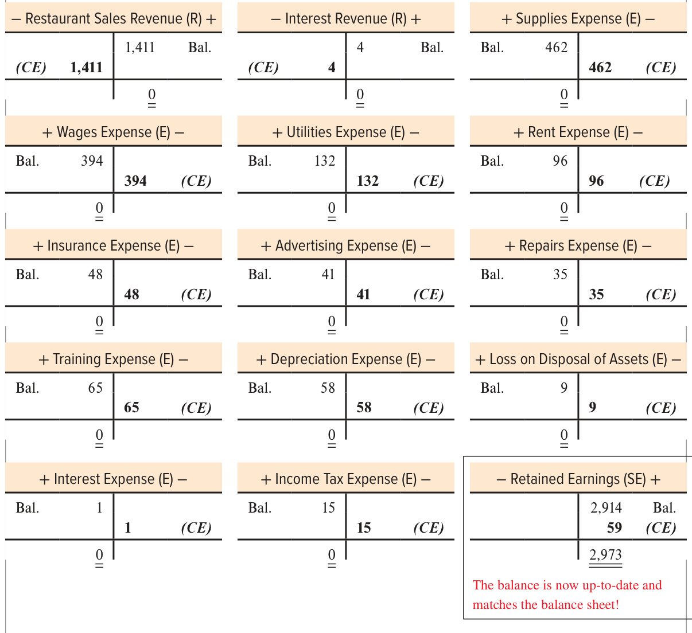
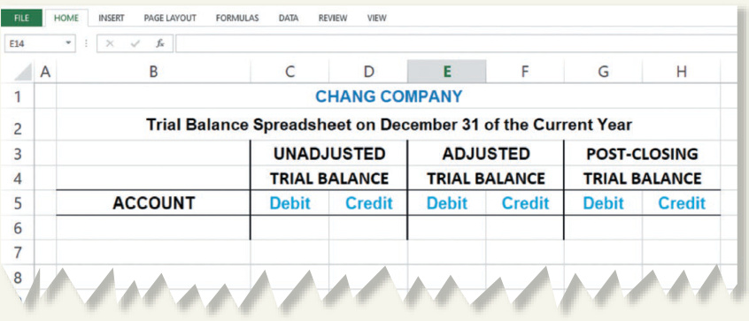

# Ch04 Adjustments, Financial Statements, and the Closing Process  

## chapter  

he end of the accounting period is a very busy time for Chipotle Mexican Grill. Although the last day of the fiscal year for Chipotle falls on the last day of December each year, the financial statements are not distributed to users until management and the external auditors (independent CPAs) make many critical evaluations.  

Management at the corporate headquarters must ensure that the correct amounts are reported on the balance sheet and income statement. This often requires estimations, assumptions, and judgments about the timing of revenue and expense recognition and values for assets and liabilities. The auditors have to (1) assess the strength of the controls established by management to safeguard the company’s assets and ensure the accuracy of the financial records and (2) evaluate the appropriateness of estimates and accounting principles used by management in determining revenues and expenses.  

Managers of most companies understand the need to present financial information fairly so as not to mislead users. However, because end-of-period adjustments are the most complex portion of the annual recordkeeping process, they are prone to error. External auditors examine the company’s records on a test, or sample, basis. To maximize the chance of detecting any errors significant enough to affect users’ decisions, CPAs allocate more of their testing to transactions most likely to be in error.  

Several accounting research studies have documented the most error-prone transactions for medium-size manufacturing companies. End-of-period adjustment errors,  

## LEARNING OBJECTIVES  

## After studying this chapter, you should be able to:  

4-1 Explain the purpose of adjustments and analyze the adjustments necessary at the end of the period to update revenues and expenses and related balance sheet accounts. p. 172  

4-2	 Present an income statement with earnings per share, a statement of stockholders’ equity, and a balance sheet. p. 183  

4-3	 Compute and interpret the total asset turnover ratio. p. 188 4-4	 Explain the closing process. p. 190 such as failure to provide adequate product warranty liability, failure to include items that should be expensed, and end-of-period transactions recorded in the wrong period (called cut-off errors), are in the top category and thus receive a great deal of attention from auditors.  

  
Richard Drew/AP Photo   
Learn more about Chipotle from founder, Steve Ells, by listening to the NPR podcast Chipotle: Steve Ells: How I Built This. How I Built This NPR podcasts are about innovators, entrepreneurs, idealists, and the movements they built.  

For 2019, Chipotle’s year-end estimation and auditing process took until February 4, 2020, the date on which the auditor Ernst & Young LLP completed the audit work and signed its audit opinion. At that point, the financial statements were made available to the public and submitted to the U.S. Securities and Exchange Commission, about five weeks after the end of the year.  

## UNDERSTANDING THE BUSINESS  

Managers are responsible for preparing financial statements that will be useful to investors, creditors, and others. Financial information is most useful for analyzing the past and predicting the future when it is considered by users to be of high quality. Highquality information is information that is relevant (that is, material and able to influence users’ decisions) and a faithful representation of what is being reported (that is, complete, free from error, and unbiased in portraying economic reality).  

Users expect revenues and expenses to be reported in the proper period based on the revenue and expense recognition principles discussed in Chapter 3. Revenues are to be recorded when earned, and expenses are to be recorded when incurred, regardless of when cash receipts or payments occur. Many operating activities take place over a period of time or over several periods, such as using insurance that has been prepaid or owing wages to employees for past work. Because recording these and similar activities daily is often very costly, most companies wait until the end of the period (annually, but monthly and quarterly as well) to make adjustments to record related revenues and expenses in the correct period. These entries update the records and are the focus of this chapter.  

## Chipotle Mexican Grill  

ESTIMATING REVENUES AND EXPENSES AT YEAR-END  

## chipotle.com  

Tip If you find this material to be challenging, study this chapter well,   
review prior chapters when   
unsure (especially revenue   
and expense recognition in   
Chapter 3), and PRACTICE,   
PRACTICE, PRACTICE!  

In this chapter, we emphasize the use of the same analytical tools illustrated in Chapters 2 and 3 (journal entries and T-accounts) and the application of the revenue and expense recognition principles discussed in Chapter 3 to understand how common adjustments are analyzed and recorded at the end of the accounting period. These tools provide the foundation for understanding adjustments that require additional estimation and judgments by management, which we discuss in future chapters. Then, in this chapter, we prepare financial statements using adjusted accounts, and finally, we illustrate how to prepare the accounting records for the next period by performing a process called closing the books.  

## ORGANIZATION OF THE CHAPTER  

  

## LEARNING OBJECTIVE 4-1  

Explain the purpose of adjustments and analyze the adjustments necessary at the end of the period to update revenues and expenses and related balance sheet accounts.  

## ADJUSTING REVENUES AND EXPENSES  

## Accounting Cycle  

Exhibit 4.1 presents the basic steps in the accounting cycle. As initially discussed in Chapter 2, the accounting cycle is the process followed by entities to analyze and record transactions, adjust the records at the end of the period, prepare financial statements, and prepare the records for the next cycle. During the accounting period, transactions that result in exchanges between the company and other external parties are analyzed and recorded in the general journal in chronological order (journal entries), and the related accounts are updated in the general ledger (T-accounts), similar to our Chipotle illustrations in Chapters 2 and 3. In this chapter, we examine the end-of-period steps that focus primarily on adjustments to record revenues and expenses in the proper period and to update the balance sheet accounts for reporting purposes.  

## Purpose of Adjustments  

Accounting systems are designed to record most recurring daily transactions, particularly those involving cash. As cash is received or paid, it is recorded in the accounting system. In general, this focus on cash works well, especially when cash receipts and payments occur in the same period as the activities that produce revenues and expenses. However, as illustrated in Exhibit 4.2, cash is not always received in the period in which the company earns revenue; likewise, cash is not always paid in the period in which the company incurs an expense.  

## Start of the Next Accounting Period  

During the Accounting Period Analyze each transaction Record entries in the journal Post effects to the ledger  

  

##  

At the End of the Accounting Period Prepare trial balance Adjust revenues and expenses (use Steps 1–4) Prepare and disseminate financial statements Close income statement accounts (use Steps 1–  

## End of the Accounting Period  

How does the accounting system record revenues and expenses when one transaction is needed to record a cash receipt or payment and another transaction is needed to record revenue when it is earned or an expense when it is incurred? The solution to the problem created by such differences in timing is to record adjusting entries at the end of every accounting period, so that:  

•	Revenues are recorded when they are earned (the revenue recognition principle),   
•	Expenses are recorded when they are incurred to generate revenue (the expense recognition principle),   
•	Assets are reported at amounts that represent the probable future benefits remaining at the end of the period, and   
•	Liabilities are reported at amounts that represent the probable future sacrifices of assets or services owed at the end of the period.  

Companies wait until the end of the accounting period to adjust their accounts because adjusting the records daily would be very costly and time-consuming. Adjusting entries are required every time a company wants to prepare financial statements for external users.  

Exhibit 4.2 provides a list of the deferral and accrual balance sheet accounts that are affected by adjusting entries at the end of the accounting period. In practice, almost every account, except Cash, could require an adjustment. We will illustrate the process involved in analyzing and recording Chipotle Mexican Grill’s adjustments, common to most companies, before preparing Chipotle’s financial statements for the first quarter of 2020 based on adjusted balances.  

  

## Revenue earned / expense incurred over time  

Cash will be received or paid in the future  

## DEFERRALS:  

Prepaid Expenses (A) Examples: Prepaid Expenses for insurance, rent, and advertising, Supplies, and Buildings and Equipment   
Unearned (or Deferred) Revenue (L) Examples: Unearned Revenue for gift cards, subscriptions, and airline tickets sold, and Customer Deposits  

## ACCRUALS:  

Unrecorded Receivables (A) Examples: Interest Receivable, Rent Receivable, and sometimes Accounts Receivable   
Unrecorded Payables (L) Examples: Utilities Payable, Taxes Payable Wages Payable, Interest Payable, and sometimes Accounts Payable  

## Adjustment Process  

Exhibit 4.3 describes the process for analyzing and recording adjusting entries when:  

•	Cash was received or paid in the past (creating deferred revenue and expense accounts until they are earned or incurred over time) $\rightarrow$ Examples $\pmb{\mathrm{~\circ~}}$ and $\boldsymbol{\Theta}$ .  

•	Cash will be received or paid in the next period for revenues and expenses that were earned or incurred in the current period but have not been recorded (creating accrued revenues until cash is received and accrued expenses until cash is paid) $\rightarrow$ Examples $\otimes$ and $\pmb{\odot}$  

  

## Reminder:  

Revenues and expenses are increased in adjusting entries. Cash is never in an adjusting entry.  

Now let’s illustrate the adjustment process for Chipotle at the end of the first quarter of 2020. For each of the following adjustments, we shorten the term adjusting journal entry to AJE for ease of labeling. Also, note that the beginning balance in each T-account is taken from the unadjusted T-accounts in Exhibit 3.6. Finally, as you learned in Chapters 2 and 3, it is important to continue to check that debits equal credits in each entry and that the accounting equation remains in balance. In the following adjustments, all amounts are in millions of dollars, and all entries and the accounting equation are in balance.  

## Deferred Revenues ( 1  in Exhibit 4.3)  

When a customer pays for goods or services before the company delivers them, the company records the amount of cash received in a deferred (unearned) revenue account. This unearned revenue is a liability representing the company’s promise to perform or deliver the goods or services in the future. Recognition of (recording) the revenue is postponed (deferred) until the company meets its obligation.  

## Ask: Was revenue earned that is not yet recorded and . . .  

  

## Cash was received in the past? Deferral  

Debit the account recorded when cash was received in the past Credit the revenue account for what was earned\* Example:  

<html><body><table><tr><td></td><td>Debit</td><td>Credit</td></tr><tr><td>Unearned revenue (-L)</td><td>600</td><td></td></tr><tr><td>Gift card revenue (+R,+SE)</td><td></td><td>600</td></tr></table></body></html>  

## OR  

## Cash will be received in the future? Accrual  

Debit the account for what is owed to the company Credit the revenue account for what was earned\* Example:  

<html><body><table><tr><td></td><td>Debit</td><td>Credit</td></tr><tr><td>Interestreceivable (+A)</td><td>60</td><td></td></tr><tr><td>Interestrevenue (+R,+SE)</td><td></td><td>60</td></tr></table></body></html>  

Was an expense incurred that has not yet been recorded and . . .  

## Cash was paid in the past? Deferral  

Debit the expense account for what was incurred\* Credit the account recorded when cash was paid in the past Example:  

<html><body><table><tr><td></td><td>Debit</td><td>Credit</td></tr><tr><td>Rent expense (+E,-SE)</td><td>100</td><td></td></tr><tr><td>Prepaid rent expense (-A)</td><td></td><td>100</td></tr></table></body></html>  

4 Cash will be paid in the future? Accrual  

Debit the expense account for what was incurred\* Credit the account for what the company owes Example:  

<html><body><table><tr><td></td><td>Debit</td><td>Credit</td></tr><tr><td>Wages expense (+E,-SE)</td><td>1,000</td><td></td></tr><tr><td>Wages payable (+L)</td><td></td><td>1,000</td></tr></table></body></html>  

Verify: Does the accounting equation remain in balance and do debits equal credits? NOTE: Cash is never included in an adjusting entry because either it was recorded in the past or it will be recorded in the future. \*Sometimes the amount is given, sometimes it must be calculated, and sometimes it must be estimated.  

AJE 1 Unearned Revenue Chipotle had an unadjusted balance of $\mathbb{S}130$ in Unearned Revenue at the end of the quarter, representing gift card purchases by customers in the past. However, during the quarter, customers redeemed a portion of the gift cards for $\mathbb{S}52$ in food service. If no adjustment has been made at the end of the quarter, the liability is overstated, and the revenue is understated. An adjusting entry is needed to correct the balances $\rightarrow$ Reduce Unearned Revenue and increase Restaurant Sales Revenue for $\pmb{\mathbb{S52}}$ .  

  

Additional examples of deferred revenues include magazine subscription sales by publishing companies; season tickets sold in advance to sporting events, plays, and concerts by these types of organizations; air flight tickets sold in advance by airlines; and rent received in advance by landlords. Each of these requires an adjusting entry at the end of the accounting period to report the amount of revenue earned during the period.  

## Accrued Revenues ( $\circledcirc$ in Exhibit 4.3)  

Sometimes companies perform services or provide goods (i.e., earn revenue) before customers pay. Because cash is owed, the revenue that was earned may not have been recorded. Revenues that have been earned but have not yet been recorded at the end of the accounting period are called accrued revenues.  

AJE 2 Interest on Investments Assume that the short-term investments owned by Chipotle earned $\mathbb{S}1$ in additional interest revenue for the current quarter, but the cash will be received in the next quarter. Because no entry was recorded yet, the asset to reflect what is owed to Chipotle and the revenue are both understated. An adjusting entry is needed to correct the balances $\rightarrow$ Increase Interest Receivable and Increase Interest Revenue for $\pmb{\mathbb{S1}}$ .  

  

## Deferred Expenses ( $\Theta$ in Exhibit 4.3)  

Assets represent resources with probable future benefits to the company. Many assets are used over time to generate revenues, including supplies, prepaid expenses for insurance, advertising, and rent, and buildings and equipment. These assets are deferred expenses (that is, recording the expenses for using these assets is deferred to the future). At the end of every period, an adjustment must be made to record the amount of the asset that was used during the period.  

## Tip  

## TIP  

Reminder: The beginning balance in each account is the unadjusted balance from Exhibit 3.6.  

Interest Receivable is a new account. When  

creating a new account title, call it what it is—This would not be called Notes Receivable, for example.  

AJE 3 Supplies The Supplies account includes food, beverage, and paper products that Chipotle purchased throughout the quarter. At the end of the quarter, the Supplies account has a balance of $\mathbb{S}485$ , but Chipotle counted $\mathbb{S}23$ of supplies on hand, indicating supplies were used. Since no adjustment has been made yet, the asset is overstated and the expense is understated by the amount that has been used during the quarter. An adjusting entry is needed to correct the balances $\rightarrow$ Increase Supplies Expense and decrease Supplies for $\mathbb{S462}$ $\mathbf{\hat{S}485}$ available for use − $\pmb{\mathbb{S}23}$ remaining at the end $=\mathbb{S}462$ used during the quarter).  

  

AJE 4 Prepaid Expenses Among other things, the Prepaid Expenses unadjusted account balance of $\mathbb{5}292$ includes  

• $\mathbb{S}128$ paid at the end of last quarter for rental of facilities at $\mathbb{S}32$ per month, • $\mathbb{S}96$ for insurance coverage for six months beginning January 1, 2020, and • $\mathbb{S}41$ for advertising during the quarter.  

By the end of the quarter, each of these prepaid expenses has been used for three months. Since no adjustment has been made yet, the asset is overstated and the expense is understated by the amount that has been used during the quarter. An adjusting entry is needed to correct the balances $\rightarrow$ Increase the appropriate expense accounts and decrease Prepaid Expenses for the following amount:  

  
Total prepaid expenses used during the quarter  

Draw a timeline when you need to visualize the number of months, ., for computations.  

  
$\times\,3$ months $={\mathfrak{S}}48$ insurance used in first quarter  

<html><body><table><tr><td></td><td>Debit</td><td>Credit</td></tr><tr><td>(AJE 4)Rent expense (+E,-SE)</td><td>96</td><td></td></tr><tr><td>Insurance expense (+E,-SE)</td><td>48</td><td></td></tr><tr><td>Advertising expense (+E,-SE)</td><td>41</td><td></td></tr><tr><td>Prepaid expenses (-A)</td><td></td><td>185</td></tr></table></body></html>  

  

AJE 5 Buildings and Equipment Chipotle’s Buildings and Equipment accounts are listed at cost. The accounts increase by the cost of the assets when they are acquired and decrease by the cost of the assets when they are sold or disposed of. However, these assets also are used over time to generate revenue. A part of their cost should be recorded as an expense in the same period (following the expense recognition principle). Accountants say that buildings and equipment, but not land, depreciate over time as they are used. In accounting, depreciation is an allocation of the cost of buildings and equipment over their estimated useful lives to the organization.  

To keep track of the asset’s historical cost, the amount that has been used is not subtracted directly from the asset account. Instead, it is accumulated in a new kind of account called a contra-account. Contra-accounts are accounts that are directly linked to another account or financial statement section, but with an opposite balance. For Buildings and Equipment, the contra-account for the total cost used to date is called Accumulated Depreciation. Accumulated Depreciation increases with the amount of depreciation expense for the period and decreases when an asset is sold for the portion used in prior periods. We will designate contra-accounts with an X in front of the type of account to which it is related. For example, this contra-account will be shown as Accumulated Depreciation (XA).  

Because assets have debit balances, Accumulated Depreciation has a credit balance. On the balance sheet, the amount that is reported for property and equipment is its net book value (also called the book value or carrying value), which equals the ending balance in the property and equipment accounts (total cost of property and equipment) minus the ending balance in the Accumulated Depreciation account (used cost of buildings and equipment).  

  

## Land does not depreciate in an account  

ing sense: Buildings and equipment wear away and will need to be replaced at some time in the future, but land will not.  

  

Treasury Stock is also  

a contra-account and reduces stockholders’   
equity. This and Accumulated   
Depreciation are the first two   
of several contra-accounts you   
will learn throughout the text.   
Tip When we say that something is “net,” we mean that two accounts   
or totals have been sub  
tracted. For example, Net   
Income is the result of sub  
tracting expenses from rev  
enues. You will see this term   
used throughout the text.  

<html><body><table><tr><td colspan="2">COST + Property and Equipment (A) 一</td><td colspan="2">USEDCOST - Accumulated Depreciation (XA) 十</td><td>UNUSEDCOST 二 NETBOOKVALUE</td></tr><tr><td>Beg. Bal. Assetpurchases (at cost)</td><td>Assetdisposals (at cost)</td><td>Assetdisposals (for assets' usedcost)</td><td>Beg. Bal. Depreciationexpense (used in current period)</td><td>Amount reported on the</td></tr><tr><td>End.Bal.</td><td></td><td></td><td>End. Bal.</td><td>balancesheet</td></tr></table></body></html>  

For Chipotle, based on unadjusted balances (from Exhibit 3.6 with dollars in millions), Land, Buildings, and Equipment (property and equipment) have a total cost of $\mathbb{S}2,725$ and Accumulated Depreciation has a credit balance of $\mathbb{S}1{,}201$ . On the balance sheet, property and equipment would be reported net of those two amounts and written as follows:  

## Property and equipment (net of accumulated depreciation of $\mathbb{S}1{,}201$ ) $\mathbb{S}1{,}524$  

Depreciation is discussed in much greater detail in Chapter 8. Until then, we will give you the amount of depreciation estimated by the company. Assume Chipotle estimates depreciation to be $\mathbb{S}232$ per year. For the quarter, depreciation expense would be $\mathbf{558}$ $\mathbb{S}232\times3$ months/12 months).  

At the end of the quarter, since no adjustment has been made yet, the net assets (property and equipment minus accumulated depreciation) are overstated, and the expense is understated by the amount that has been used during the quarter. An adjusting entry is needed to correct the balances $\rightarrow$ Increase Depreciation Expense and increase Accumulated Depreciation for $\mathbf{558}$ .  

  

## Accrued Expenses ( 4  in Exhibit 4.3)  

Numerous expenses are incurred in the current period without being paid until the next period. Common examples include Wages Expense for the wages owed to employees who worked during the period, Interest Expense incurred on debt owed during the period, and Utilities Expense for the water, gas, and electricity used during the period. These accrued expenses accumulate (accrue) over time but are not recognized as expenses with the related liability until the end of the period through an adjusting entry.  

AJE 6 Wages Assume that Chipotle’s employees worked two days at the end of the quarter, earning $\mathbb{S}26$ per day, but they will not be paid until next quarter. The $\mathbb{S}26$ per day accrues (grows) until paid. Because no entry was recorded yet, the liability to reflect what is owed by Chipotle and the related expense are both understated. An adjusting entry is needed to correct the balances $\rightarrow$ Increase Wages Expense and Increase Wages Payable for $\pmb{\mathbb{S52}}$ $\mathbf{526}$ per day $\times\,2$ days).  

<html><body><table><tr><td colspan="4"></td><td colspan="2">Debit</td><td>Credit</td></tr><tr><td colspan="4">(AJE 6)Wages expense (+E,-SE)</td><td colspan="2">52</td><td></td></tr><tr><td colspan="4">Wages payable (+L)</td><td></td><td colspan="2"></td></tr><tr><td colspan="2">Assets</td><td colspan="2">Liabilities +</td><td colspan="3">52 Stockholders'Equity</td></tr><tr><td colspan="2">Wagespayable</td><td colspan="6">+52 Wages expense (+E)</td></tr><tr><td colspan="3">+ Wages Expense (E) 一</td><td colspan="4">-Wages Payable (L) +</td></tr><tr><td>Bal.</td><td>342</td><td></td><td></td><td colspan="2">80</td><td>Bal.</td></tr><tr><td rowspan="2">(AJE 6)</td><td colspan="2" rowspan="2">52 394</td><td colspan="2"></td><td colspan="2" rowspan="2">52</td><td rowspan="2">(AJE 6) 132</td></tr><tr><td colspan="2"></td></tr></table></body></html>  

−52  

•	 Principal $\rightarrow$ the amount borrowed (or loaned) and •	 Interest $\rightarrow$ the cost of borrowing (or lending)—that is, the cost of using another’s money.  

Principal on debt remains due until paid, but interest on the borrowing accrues over time and is paid according to the debt contract. Based on the assumed transactions in Chapters 2 and 3, Chipotle had a principal balance of $\mathbf{580}$ in long-term notes payable at the end of the current quarter. There is no adjustment needed for the Notes Payable account (the principal).  

However, interest expense is incurred by Chipotle for the quarter and it will be paid in the future. Assume that the annual interest rate on Chipotle’s borrowings is 5.0 percent. Because no entry for interest expense was recorded yet this quarter, the liability to reflect what interest is owed by Chipotle and the related expense are both understated. An adjusting entry is needed to correct the balances $\rightarrow$ Increase Interest Expense and Increase Interest Payable determined by the following formula:  

  

## Tip  

## Two important points:  

The interest rate we give you will always be the annual rate. In short, the formula is: $\mathsf{P}\times\mathsf{R}\times\mathsf{T}/12$ P is principal. R is annual interest rate. $\mathbb{T}/12$ is time—the number of months out of 12 since the last accrual.  

AJE 8 Utilities Most organizations receive utility bills after using utility services such as electricity, natural gas, and telephone. At the end of the period, managers estimate what the expense should be based on prior bills, or the company receives a bill soon after the end of the period but before the financial statements are completed. In either case, the usage of utility services accrues throughout the period. Assume Chipotle received a utility bill for $\mathbb{S}15$ for utility service near the end of the quarter. Because no entry was recorded yet, the liability to reflect what is owed by Chipotle and the related expense are both understated. An adjusting entry is needed to correct the balances $\rightarrow$ Increase Utilities Expense and Increase Utilities Payable for $\mathbf{515}$ .  

<html><body><table><tr><td></td><td>Debit</td><td>Credit</td></tr><tr><td>(AJE 8) Utilities expense (+E,-SE)</td><td>15</td><td></td></tr><tr><td>Utilities payable (+L)</td><td></td><td>15</td></tr><tr><td>Assets Liabilities</td><td colspan="2">+ Stockholders'Equity</td></tr></table></body></html>  

There are many other kinds of taxes companies pay.  

Examples: Sales taxes, property taxes, payroll taxes, and state and local income taxes.  

<html><body><table><tr><td colspan="3">+UtilitiesB Expense (E)一</td><td colspan="3">- Utilities Payable (L) +</td></tr><tr><td>Bal.</td><td>117</td><td></td><td></td><td>131</td><td>Bal.</td></tr><tr><td>(AJE8)</td><td>15</td><td></td><td></td><td>15</td><td>(AJE 8)</td></tr><tr><td></td><td>132</td><td></td><td></td><td>146</td><td></td></tr></table></body></html>  

AJE 9 Income Taxes The final adjusting entry is to record the accrual of income taxes that will be paid in the next quarter. This requires computing adjusted pretax income and applying the appropriate tax rate:  

Then, compute income tax expense. Assume Chipotle estimated a tax rate of 20.0 percent for the quarter, with the taxes due next quarter. Computation of the quarterly income tax expense is  

<html><body><table><tr><td>Pretax income</td><td></td><td>Income taxrate</td><td></td><td>Income tax expense</td></tr><tr><td>$74</td><td>×</td><td>0.20</td><td></td><td>$15 for the quarter</td></tr><tr><td rowspan="3"></td><td></td><td></td><td></td><td>(roundedtothe nearest</td></tr><tr><td></td><td></td><td></td><td>dollar-which is in millions)</td></tr><tr><td></td><td></td><td></td><td></td></tr></table></body></html>  

Because no entry was recorded yet, the liability to reflect the income taxes owed by Chipotle and the related expense are both understated. An adjusting entry is needed to correct the balances $\rightarrow$ Increase Income Tax Expense and Increase Income Taxes Payable for $\bf{515}$ .  

<html><body><table><tr><td colspan="2"></td><td>Debit</td><td>Credit</td></tr><tr><td colspan="2">(AJE 9) Income tax expense (+E,-SE)</td><td>15</td><td></td></tr><tr><td colspan="2">Income taxes payable (+L)</td><td></td><td>15</td></tr><tr><td>Assets Liabilities</td><td colspan="3">Stockholders'Equity</td></tr><tr><td colspan="2">Income taxes payable +15</td><td colspan="3">Income tax expense (+E) -15</td></tr><tr><td colspan="2">+ Income Tax Expense (E) -</td><td colspan="3">-Income Taxes Payable (L) +</td></tr><tr><td>Bal. 0 (AJE 9) 15</td><td colspan="2"></td><td colspan="2">0 Bal. 15 (AJE 9)</td></tr><tr><td colspan="2">15</td><td colspan="2">15</td></tr></table></body></html>  

In all of the above adjustments, you may have noticed that the Cash account was never adjusted. The cash has already been received or paid by the end of the period, or it will be received or paid in the next period. Adjustments are required to record revenues and expenses in the proper period because the cash part of the transaction is at a different point in time. In addition, each adjusting entry always included at least one income statement account and at least one balance sheet account. Now it’s your turn to practice the adjustment process.  

Adjustments are necessary at the end of the accounting cycle to record all revenues and expenses in the proper period and to reflect the proper valuation for assets and liabilities.  

Deferred revenues (liabilities) have balances at the end of the period because cash was received before it was earned. If all or part of the liability has been satisfied by the end of the period, revenue needs to be recorded and the liability reduced.   
Accrued revenue adjustments are necessary when the company has earned revenue but the cash will be received in the next period. Because nothing has been recorded yet, revenue needs to be recognized and an asset (a receivable) increased.   
Deferred expenses (assets) have balances at the end of the period because cash was paid in the past by the company for the assets. If all or part of the asset has been used to generate revenues in the period, an expense needs to be recorded and the asset reduced.   
Accrued expense adjustments are necessary when the company has incurred an expense but the cash will be paid in the next period. Because nothing has been recorded yet, an expense needs to be recognized and a liability (a payable) increased.  

S E L F - S T U D Y  Q U I Z  

For practice, complete the following adjustments using the process outlined in Exhibit 4.3: Ask  

(1)	Was revenue earned that is not yet recorded and cash was received in the past—a Deferred Revenue? Increase revenue; decrease liability   
(2)	Was revenue earned that is not yet recorded and cash will be received in the future—an Accrued Revenue? Increase revenue; increase asset (a receivable)   
(3)	Was an expense incurred that has not yet been recorded and cash was paid in the past—a Deferred Expense? Increase expense; decrease asset   
(4)	Was an expense incurred that has not yet been recorded and cash will be paid in the future— an Accrued Expense? Increase expense; increase liability (a payable)  

Florida Flippers, a scuba diving and instruction business, completed its first year of operations on December 31.  

AJE 1:	 Florida Flippers received $\mathbb{S}6{,}000$ from customers on November 15 for diving trips to the Bahamas in December and January of the next year. The $\mathbb{S}6{,}000$ was recorded in Unearned Revenue on that date. By the end of December, one-third of the diving trips had been completed.   
AJE 2:	 On December 31, Florida Flippers provided advanced diving instruction to 10 customers who will pay the business $\mathbb{S}800$ in January of next year. No entry was made when the instruction was provided.   
AJE 3:	 On September 1, Florida Flippers paid $\mathbb{S}24{,}000$ for insurance for the 12 months beginning on September 1. The amount was recorded as Prepaid Insurance on September 1.   
AJE 4:	 On March 1, Florida Flippers borrowed $\mathbb{S}300{,}000$ at 12 percent. Interest is payable each March 1 for three years.  

Required:  

Answer (1), (2), and (3) using the following chart headings and record the adjusting journal entry.  

<html><body><table><tr><td rowspan="2"></td><td rowspan="2">(1) Title of revenue earnedor expense incurred</td><td rowspan="2">(2) Titleofassetor liability account tooffsetcash received/paid in the past or cash tobereceived/paid in thefuture</td><td rowspan="2">(3) Amount</td><td colspan="3">Adjusting Journal Entry</td></tr><tr><td>Accounts</td><td>Debit</td><td>Credit</td></tr><tr><td>AJE1</td><td></td><td></td><td></td><td></td><td></td><td></td></tr></table></body></html>  

After you have completed your answers, check them at the bottom of page below.  

## G U I D E D  H E L P  4 - 1  

For additional step-by-step video instruction on recording adjusting entries, go to mhhe.com/libby_gh4-1.  

Related Homework: M4-4, M4-6, E4-2, E4-3, E4-4, E4-5, E4-6, E4-8, E4-9, E4-12, E4-14, E4-16, E4-18, E4-19, E4-20, P4-2, P4-3, P4-6, P4-7, CON4-1, COMP4-1, COMP4-2, CP4-9  

## A QUESTION OF ETHICS  

## Adjustments and Incentives  

Owners and managers of companies are most directly affected by the information presented in financial statements. If the financial performance and condition of the company appear strong, the company’s stock price rises. Shareholders usually receive dividends and increase their investment value. Managers often receive bonuses based on the strength of a company’s financial performance, and many in top management are compensated with options to buy their company’s stock at prices below market value. The higher the market value, the more compensation they earn.  

S o l u t i o n s  t o S E L F - S T U DY  Q U I Z  

<html><body><table><tr><td></td><td></td><td></td><td></td><td></td><td colspan="3">Adjusting Journal Entry</td></tr><tr><td></td><td></td><td>(1)</td><td>(2)</td><td>(3) Amount</td><td>Accounts</td><td>Debit</td><td>Credit</td></tr><tr><td>AJE1</td><td></td><td>Diving Trip Revenue</td><td>Unearned Revenue</td><td>$6,000 ×3 = 1 $2,000 earned</td><td>Unearned revenue (-L) Diving trip revenue (+R, +SE)</td><td>2,000</td><td>2,000</td></tr><tr><td>AJE2</td><td></td><td>Instruction Revenue</td><td>Accounts Receivable</td><td>$800 earned (given)</td><td>Accounts receivable(+A) Instruction revenue (+R, +SE)</td><td>800</td><td>800</td></tr><tr><td>AJE3</td><td></td><td>Insurance Expense</td><td>Prepaid Expense</td><td>$24.000×4months/ 12 months = $8,000 used</td><td>Insurance expense (+E,-SE) Prepaid expense (-A)</td><td>8,000</td><td>8,000</td></tr><tr><td>AJE4</td><td></td><td>Interest Expense</td><td>Interest Payable</td><td>$300,000 × 0.12 x 10 $30,000 12 incurred and owed</td><td>Interest expense (+E,-SE) Interest payable (+L)</td><td>30,000</td><td>30,000</td></tr></table></body></html>  

When actual performance lags behind expectations, managers and owners may be tempted to manipulate accruals and deferrals to make up part of the difference. For example, managers may record cash received in advance of being earned as revenue in the current period or may fail to accrue certain expenses at year-end. Evidence from studies of large samples of companies indicates that some managers do engage in such fraudulent behavior. This research is borne out by enforcement actions, against companies and sometimes against their auditors, by the U.S. Securities and Exchange Commission (SEC), the independent, federal agency responsible for overseeing the fair functioning of the securities markets and for protecting investors. From 2015 through 2020, the SEC brought an annual average of over 800 enforcement actions against corporations and executives for reasons including financial reporting and disclosure issues. In 2020 alone, the SEC obtained over $\mathbb{S}4.5$ billion in monetary remedies for ill-gotten gains and penalties.\*  

In many of these cases, the firms involved, their managers, and their auditors are penalized for such actions. Furthermore, owners suffer because news of an SEC investigation negatively affects the company’s stock price.  

\*U.S. Securities and Exchange Commission Division of Enforcement 2020 Annual Report (November 2, 2020). Available at sec.gov/reports.  

## PREPARING FINANCIAL STATEMENTS  

As you learned in Chapter 1, the financial statements are interrelated—that is, the numbers from one statement flow into the next statement. Exhibit 4.4 highlights the interconnections among the statements using the fundamental accounting equation, followed by a summary structure of each statement demonstrating relationships.  

## LEARNING OBJECTIVE 4-2  

Present an income statement with earnings per share, a statement of stockholders’ equity, and a balance sheet.  

## EXHIBIT 4.4  

  
Interrelationships of Financial Statements  

Another way of presenting the relationships among the statements follows.  

  

(1)	The first statement to prepare is the Income Statement which reports that revenues minus expenses yields net income.  

(2)	Net income is a component in determining total stockholders’ equity. Net income (or net loss) and dividends declared to stockholders affect Retained Earnings and any additional issuances or repurchases of stock during the period affect the balances in Common Stock and Additional Paid-in Capital, all of which appear on the Statement of Stockholders’ Equity.   
(3)	Stockholders’ Equity is a component of the Balance Sheet.  

## Thus, if a number on the income statement changes or is in error, it will impact the other statements.  

Before we prepare a complete set of financial statements, let’s update Chipotle’s trial balance to reflect the adjustments assumed in this chapter, providing us with the adjusted balances needed for the statements. The spreadsheet in Exhibit 4.5 has three sets of debit-credit columns: one for the unadjusted balances from the T-accounts in Exhibit 3.6, then the effects of the adjustments AJE 1 through AJE 9, and finally, the adjusted balances that are determined by adding or subtracting the adjustment across each row. Again, we note that the total debits equal the total credits in each of the sets. Also notice that nearly every revenue and expense account was adjusted and several new accounts were created during the adjustment process at the end of the period (e.g., Interest Receivable and Depreciation Expense). It is from these adjusted balances that we will prepare an income statement, a statement of stockholders’ equity (which includes a column for Retained Earnings), and a balance sheet. Only Retained Earnings is yet to be updated with the effects of the adjustments on net income. It will be updated during the closing process discussed after financial statements are prepared and disseminated.  

## Income Statement  

The income statement is prepared first because net income is a component of Retained Earnings.   
The first quarter 2020 income statement for Chipotle based on the adjusted trial balance follows.  

<html><body><table><tr><td>CHIPOTLEMEXICANGRILL,INC. Consolidated Statement of Income* For the quarter ended March 31, 2020 (in millions of dollars, except per share data)</td></tr><tr><td>Restaurant sales revenue $1,411</td></tr><tr><td>Restaurant operating expenses: Supplies expense</td></tr><tr><td>462 Wages expense 394</td></tr><tr><td>Rent expense 96</td></tr><tr><td>Insurance expense 48</td></tr><tr><td>Utilities expense 132</td></tr><tr><td>Repairs expense 35 General and administrative expenses:</td></tr><tr><td>Training expense 65 Advertising expense 41 Depreciation expense 58</td></tr><tr><td>Loss on disposal of assets 9 Total operating expenses 1,340</td></tr><tr><td>Income from operations 71 Other items:</td></tr><tr><td>Interest revenue 4 Interest expense (1)</td></tr><tr><td>Income before income taxes 74</td></tr><tr><td>Income tax expense 15 Net income $ 59 Earnings per share (for the quarter) $ 0.39 *Based on hypothetical transactions in Chapters 2, 3, and 4.</td></tr></table></body></html>  

<html><body><table><tr><td colspan="2"></td><td>Y</td><td>fc</td><td></td><td></td><td></td><td></td><td></td><td>diaLl</td></tr><tr><td></td><td>Tile R51</td><td></td><td></td><td></td><td></td><td></td><td></td><td></td><td></td></tr><tr><td></td><td>A</td><td colspan="8">B C D E F G H</td></tr><tr><td>1</td><td colspan="8">CHIPOTLEMEXICANGRILL</td><td></td></tr><tr><td>2 3</td><td colspan="8">Trial Balance Spreadsheet</td></tr><tr><td>4</td><td colspan="8">At March31,2020</td></tr><tr><td>5 6</td><td></td><td colspan="2">(in millionsof dollars)</td><td colspan="3">UNADJUSTED Credit</td><td>ADJUSTMENTS</td><td>ADJUSTED</td><td>NOTE: Cash did change because is never adjust</td></tr><tr><td>7</td><td>Cash</td><td></td><td>Debit 500</td><td></td><td></td><td>Debit</td><td>Credit</td><td>Debit Credit</td><td></td></tr><tr><td></td><td></td><td>Short-terminvestments</td><td></td><td></td><td></td><td></td><td></td><td>500</td><td></td></tr><tr><td>8</td><td></td><td>Accountsreceivable</td><td>381</td><td></td><td></td><td></td><td></td><td>381</td><td></td></tr><tr><td>9</td><td></td><td></td><td>64</td><td></td><td></td><td></td><td></td><td>64</td><td></td></tr><tr><td>10</td><td></td><td>Interestreceivable</td><td></td><td></td><td>(AJE 2)</td><td></td><td>1</td><td>1</td><td></td></tr><tr><td>11</td><td></td><td>Supplies</td><td>485</td><td></td><td>(AJE3)</td><td></td><td>462</td><td>23</td><td></td></tr><tr><td>12</td><td></td><td>Prepaid expenses</td><td>292</td><td></td><td>(AJE 4)</td><td></td><td>185</td><td>107</td><td></td></tr><tr><td>13</td><td>Land</td><td></td><td>12</td><td></td><td></td><td></td><td></td><td>12</td><td></td></tr><tr><td>14</td><td></td><td>Buildings</td><td>1,851</td><td></td><td></td><td></td><td></td><td>1,851</td><td></td></tr><tr><td>15</td><td></td><td>Equipment</td><td>862</td><td></td><td></td><td></td><td></td><td>862</td><td></td></tr><tr><td>16</td><td></td><td>Accumulated depreciation</td><td></td><td>1,201</td><td>(AJE 5)</td><td></td><td>58</td><td></td><td>1,259</td></tr><tr><td>17</td><td></td><td>Operatingleaseright-of-useassets Intangible assets</td><td>2,591</td><td></td><td></td><td></td><td></td><td>2,591</td><td></td></tr><tr><td>18</td><td></td><td>Accounts payable</td><td>74</td><td>130</td><td></td><td></td><td></td><td>74</td><td>For each accou 130 add and/or sub</td></tr><tr><td>19 20</td><td></td><td>Unearnedrevenue</td><td></td><td>130</td><td>(AJE 1)</td><td>52</td><td></td><td></td><td>78 across the ro</td></tr><tr><td>21</td><td></td><td>Wagespayable</td><td></td><td>80</td><td>(AJE 6)</td><td></td><td>52</td><td></td><td>132 130 credit -52 d</td></tr><tr><td>22</td><td></td><td>Utilities payable</td><td></td><td>131</td><td>(AJE 8)</td><td></td><td>15</td><td></td><td>146 78 credit</td></tr><tr><td>23</td><td></td><td>Interest payable</td><td></td><td></td><td>(AJE 7)</td><td></td><td>1</td><td></td><td>1</td></tr><tr><td>24</td><td></td><td>Income taxes payable</td><td></td><td></td><td>(AJE 9)</td><td></td><td>15</td><td></td><td>15 2</td></tr><tr><td>25</td><td>Dividends payable</td><td></td><td></td><td>2</td><td></td><td></td><td></td><td></td><td></td></tr><tr><td>26</td><td></td><td>Currentleaseliabilities</td><td></td><td>179</td><td></td><td></td><td></td><td></td><td>179</td></tr><tr><td>27</td><td>Notespayable</td><td></td><td></td><td>80</td><td></td><td></td><td></td><td></td><td>80 2,789</td></tr><tr><td>28</td><td></td><td>Long-term lease liabilities</td><td></td><td>2,789</td><td></td><td></td><td></td><td></td><td>2</td></tr><tr><td>29</td><td></td><td>Common stock</td><td></td><td>2</td><td></td><td></td><td></td><td></td><td>Retained Earni does not yet inc</td></tr><tr><td>30</td><td></td><td>Additional paid-in capital</td><td></td><td>1,482</td><td></td><td></td><td></td><td></td><td>1,482 the net incom</td></tr><tr><td>31</td><td>Treasury stock</td><td></td><td>2,802</td><td></td><td></td><td></td><td></td><td>2,802</td><td></td></tr><tr><td>32</td><td></td><td>Retained earnings</td><td></td><td>2,914</td><td></td><td></td><td></td><td></td><td>2,914</td></tr><tr><td>33</td><td></td><td>Restaurant salesrevenue</td><td></td><td>1,359</td><td>(AJE 1)</td><td></td><td>52</td><td></td><td>effects. 1,411</td></tr><tr><td>34</td><td>Interestrevenue</td><td></td><td></td><td>3</td><td>(AJE 2)</td><td></td><td>1</td><td></td><td>Itwill after th 4</td></tr><tr><td>35</td><td>Supplies expense</td><td></td><td></td><td></td><td>(AJE3)</td><td>462</td><td></td><td>462</td><td>closing proces</td></tr><tr><td>36</td><td>Wages expense</td><td></td><td>342</td><td></td><td>(AJE 6)</td><td>52</td><td></td><td>394</td><td></td></tr><tr><td>37</td><td>Utilities expense</td><td></td><td>117</td><td></td><td>(AJE 8)</td><td>15</td><td></td><td>132</td><td></td></tr><tr><td>38</td><td>Rent expense</td><td></td><td></td><td></td><td>(AJE 4)</td><td>96</td><td></td><td>96</td><td></td></tr><tr><td>39</td><td>Insurance expense</td><td></td><td></td><td></td><td>(AJE 4)</td><td>48</td><td></td><td>48</td><td></td></tr><tr><td>40</td><td>Advertisingexpense</td><td></td><td></td><td></td><td>(AJE 4)</td><td>41</td><td></td><td>41</td><td></td></tr><tr><td>41</td><td>Repairs expense</td><td></td><td>35</td><td></td><td></td><td></td><td></td><td>35 65 58 9 1 15 10,624</td><td>10,624 Debits = Credits</td></tr><tr><td>42 43 44 45 46 47 T0 49</td><td>Trainingexpense Interest expense Incometaxexpense Total</td><td>Depreciation expense Loss on disposal of assets *Based on hypothetical transactions for the first quarter ended March 31,2020.</td><td>65 9 - 10,482</td><td>10,482</td><td>(AJE 5) (AJE 7) (AJE 9)</td><td>58 1 15 841</td><td>841</td></table></body></html>

Microsoft Excel  

You will note that the earnings per share (EPS) ratio is reported on the income statement. It is widely used in evaluating the operating performance and profitability of a company, and it is the only ratio required to be disclosed on the statement or in the notes to the statements. The actual computation of the ratio is quite complex and appropriate for more advanced accounting courses. In this text, we simplify the earnings per share computation as:  

  
\*As you will learn in Chapter 11: (1) If there are preferred stock dividends, the amount is subtracted from net income in the numerator, (2) the denominator for weighted average shares is a complex computation, and (3) outstanding shares are those that are currently held by the shareholders.   
From transaction (a) in Ch. 2 From transaction (g) in Ch. 2 From the income statement From transaction (h) in Ch. 2 On the balance sheet  

The denominator in the EPS ratio is the weighted average number of shares outstanding (NOTE: Until Chapter 11, we compute a simple average—the number at the beginning of the period plus the number at the end of the period, divided by 2). For our Chipotle Mexican Grill illustration, the number of shares at the beginning of 2020 (end of 2019) was 100 million shares [computed by dividing the $\mathbb{S}1$ (in millions) Common Stock amount reported on the December 31, 2019, balance sheet in Exhibit 2.1 by the $\mathbb{S}0.01$ par value per share (listed next to Common Stock in Exhibit 2.1)]. During the first quarter of 2020, we illustrated an issuance of an additional 100 million shares for a total of 200 million shares at the end of the quarter. Therefore, the average number of shares outstanding was 150 million for the quarter [(Beg. $100+\mathrm{{End.}~200})/2=150$ average]. The quarterly EPS for Chipotle in our illustration is $\mathbb{S}0.39$ per share:  

$\mathrm{EPS}=\mathrm{\frac{\oint59~net~income~for~the~quarter}{150~a v e r a g e~n u m b e r~o f~s h a r e s~o u t s t a n d i n g}}=\S0.39$ for the quarter  

## Statement of Stockholders’ Equity  

The final total from the income statement, net income, is carried forward to the Retained Earnings column of the statement of stockholders’ equity. To this, the additional elements of the statement are added. Dividends declared and an additional stock issuance (from Chapter 2) also are included in the statement:  

<html><body><table><tr><td colspan="5">CHIPOTLEMEXICAN GRILL,INC. Consolidated Statement of Stockholders’Equity* For the quarter ended March 31,2020 (in millions of dollars)</td></tr><tr><td></td><td>Common Stock</td><td>Additional Paid-in Capital</td><td>Treasury Stock</td><td>Retained Earnings</td><td>Total Stockholders' Equity</td></tr><tr><td>BalanceonDecember31,2019</td><td>$1 1</td><td>$1,466 16</td><td>$(2,699)</td><td>$2,916</td><td>$1,684 17</td></tr><tr><td>Additionalstockissuance Stockrepurchase</td><td></td><td></td><td>(103)</td><td></td><td>(103)</td></tr><tr><td>Netincome</td><td></td><td></td><td></td><td>59</td><td>59</td></tr><tr><td>Dividends declared</td><td></td><td></td><td></td><td>(2)</td><td>(2)</td></tr><tr><td>BalanceonMarch31,2020</td><td>$2</td><td>$1,482</td><td>$(2,802)</td><td>$2,973</td><td>$1,655</td></tr><tr><td colspan="6">*Based on hypothetical transactions in Chapter 2, 3, and 4.</td></tr></table></body></html>  

## Balance Sheet  

The ending balances for Common Stock, Additional Paid-in Capital, Treasury Stock, and Retained Earnings from the statement of stockholders’ equity are included on the balance sheet that follows. You will notice that the contra-asset account Accumulated Depreciation (used cost) has been subtracted from the total of the land, buildings, and equipment accounts (at cost) to reflect net book value (or carrying value) at period-end for balance sheet purposes. Also recall that assets are listed in order of liquidity and liabilities are listed in order of due dates. Current assets are those used or turned into cash within one year (as well as inventory). Current liabilities are obligations to be paid with current assets within one year. We present a comparative balance sheet that shows the amounts at two points in time: December 31, 2019 and March 31, 2020.  

<html><body><table><tr><td colspan="3">CHIPOTLEMEXICANGRILL,INC. Consolidated Balance Sheets* (in millions of dollars, except per share data)</td></tr><tr><td></td><td>March 31, 2020</td><td>December 31, 2019</td></tr><tr><td></td><td></td><td></td></tr><tr><td>ASSETS Current Assets:</td><td></td><td></td></tr><tr><td>Cash</td><td>500</td><td>$ 481</td></tr><tr><td>Short-term investments</td><td>381</td><td>400</td></tr><tr><td>Accounts receivable</td><td>64</td><td>81</td></tr><tr><td>Interest receivable</td><td>1</td><td></td></tr><tr><td>Supplies</td><td>23</td><td>26</td></tr><tr><td>Prepaid expenses</td><td>107</td><td>85</td></tr><tr><td>Total current assets</td><td>1,076</td><td>1,073</td></tr><tr><td></td><td></td><td></td></tr><tr><td>Property and Equipment: Land</td><td>12</td><td>13</td></tr><tr><td>Buildings</td><td>1,851</td><td>1,811</td></tr><tr><td>Equipment</td><td>862</td><td>836</td></tr><tr><td>Total cost</td><td>2,725</td><td>2,660</td></tr><tr><td>Accumulated depreciation</td><td>(1,259)</td><td>(1,201)</td></tr><tr><td>Net property and equipment</td><td>1,466</td><td>1,459</td></tr><tr><td>Operating least right-of-use assets</td><td>2,591</td><td>2,505</td></tr><tr><td>Intangible assets</td><td>74</td><td>69</td></tr><tr><td>Total assets</td><td>$ 5,207</td><td>$5,106</td></tr><tr><td>LIABILITIES ANDSTOCKHOLDERS'EQUITY</td><td></td><td></td></tr><tr><td>Current Liabilities:</td><td></td><td></td></tr><tr><td>Accounts payable Unearned revenue</td><td>$130 78</td><td>$ 116 95</td></tr><tr><td>Accrued expenses payable:</td><td></td><td></td></tr><tr><td>Wages payable</td><td>132</td><td>127</td></tr><tr><td>Utilities payable</td><td>146</td><td>156</td></tr><tr><td>Interest payable</td><td>1</td><td></td></tr><tr><td>Income taxes payable</td><td>15</td><td></td></tr><tr><td></td><td>2</td><td></td></tr><tr><td>Dividends payable</td><td></td><td></td></tr><tr><td>Current lease liabilities</td><td>179</td><td>173</td></tr><tr><td>Total current liabilities</td><td>683</td><td>667</td></tr><tr><td>Notes payable</td><td>80</td><td>77</td></tr><tr><td>Long-term lease liabilities</td><td>2,789</td><td>2,678</td></tr><tr><td>Total liabilities</td><td>3,552</td><td>3,422</td></tr><tr><td>Stockholders'Equity:</td><td></td><td></td></tr><tr><td>Common stock ($o.01 par value per share)</td><td>2</td><td>1</td></tr><tr><td>Additional paid-in capital</td><td>1,482</td><td>1,466</td></tr><tr><td>Treasury stock</td><td>(2,802)</td><td>(2,699)</td></tr><tr><td>Retained earnings</td><td>2,973</td><td>2,916</td></tr><tr><td>Total stockholders’equity</td><td>1,655</td><td>1,684</td></tr><tr><td>Total liabilities and stockholders'equity</td><td>$5,207</td><td>$5,106</td></tr><tr><td></td><td></td><td></td></tr></table></body></html>  

## Cash Flows from Operations, Net Income, and the Quality of Earnings  

As presented in the previous chapters, the statement of cash flows explains the difference between the ending and beginning balances in the Cash account on the balance sheet during the accounting period. Put simply, the cash flow statement is a categorized list of all transactions of the period that affected the Cash account. The three categories are operating, investing, and financing activities. Because no adjustments made in this chapter affected cash, the cash flow categories identified on the Cash T-account at the end of Chapter 3 remain the same.  

Many standard financial analysis texts warn analysts to look for unusual deferrals and accruals when they attempt to predict future periods’ earnings. They often suggest that wide disparities between net income and cash flow from operations are a useful warning sign. For example, Subramanyan suggests the following:  

Accounting accruals determining net income rely on estimates, deferrals, allocations, and valuations. These considerations sometimes allow more subjectivity than do the factors determining cash flows. For this reason we often relate cash flows from operations to net income in assessing its quality. Some users consider earnings of higher quality when the ratio of cash flows from operations divided by net income is greater. This derives from a concern with revenue recognition or expense accrual criteria yielding high net income but low cash flows (emphasis added).\*  

The cash flows from operations to net income ratio is illustrated and discussed in more depth in Chapter 12.  

\*Source: K. Subramanyan, Financial Statement Analysis, New York: McGraw-Hill Education, 2014, 428.  

## LEARNING OBJECTIVE 4-3  

Compute and interpret the total asset turnover ratio.  

## Total Asset Turnover Ratio  

ANALYTICAL QUESTION  

How efficient is management in using assets (its resources) to generate sales?  

## RATIO AND COMPARISONS  

\*To compute “average”: (Beginning balance $^+$ Ending balance) $\div2$  

Selected Focus Companies’ Total Asset Turnover Ratios  

The 2019 ratio for Chipotle is (dollars in millions):  

$$
\frac{95,586}{93,686^{*}}=1.516
$$  

  

<html><body><table><tr><td colspan="3">Comparisons OverTime</td></tr><tr><td colspan="3">Chipotle Mexican Grill, Inc.</td></tr><tr><td>2017</td><td>2018</td><td>2019</td></tr><tr><td>2.198</td><td>2.257</td><td>1.516</td></tr></table></body></html>  

<html><body><table><tr><td colspan="2">Comparisons With Competitors</td></tr><tr><td>El PolloLoco Holdings, Inc.</td><td>Shake Shack Inc.</td></tr><tr><td>2019</td><td>2019</td></tr><tr><td>0.823</td><td>0.753</td></tr></table></body></html>  

## INTERPRETATIONS  

In General The total asset turnover ratio measures how efficient management is at using assets to generate sales. Over time or compared to competitors, the higher the asset turnover is, the more efficient assets are being utilized to generate revenues. A company’s products or services and business strategy contribute significantly to its asset turnover ratio. However, when competitors are similar, management’s ability to control the firm’s assets is vital in determining its success. Stronger financial performance improves the asset turnover ratio.  

Creditors and security analysts use this ratio to assess a company’s effectiveness at controlling both current and noncurrent assets. In a well-run business, creditors expect the ratio on a quarterly basis to fluctuate due to seasonal upswings and downturns. For example, as inventory is built up prior to a heavy sales season, companies need to borrow funds. The asset turnover ratio declines with this increase in assets. Eventually, the season’s high sales provide the cash needed to repay the loans. The asset turnover ratio then rises with the increased sales.  

Focus Company Analysis Chipotle’s total asset turnover ratio decreased from 2018 to 2019, primarily due to a reporting requirement change in 2019. The total assets in 2019 more than doubled because operating lease right-of-use assets (the majority of the Chipotle’s facilities) are now required to be included on the balance sheet in assets along with the lease liabilities. Previously, these were reported in the notes to the financial statements. If we exclude the leased assets from the 2019 total assets amount, then the ratio becomes 2.296. Using this revised ratio, asset turnover increased over time. This suggests that Chipotle’s management used assets more efficiently over time to generate operating revenues.  

Chipotle’s total asset turnover ratio is higher than that for both El Pollo Loco and Shake Shack in 2019. This is due in part to differences in business strategies. Chipotle has been one of the largest fastcasual and fastest-growing restaurant chains, and it is significantly larger (with over $\mathbb{S}5$ billion in total assets at the end of 2019) than its two competitors (each with under $\mathbb{S}1$ billion in total assets at the end of 2019). In addition, approximately 60 of El Pollo Loco restaurants are franchised and 12 percent of Shake Shack’s are licensed, whereas Chipotle’s restaurants are all company-owned. Also, Chipotle’s much larger size enhances its efficiency.  

A Few Cautions While the total asset turnover ratio may decrease due to seasonal fluctuations, a declining ratio also may be caused by changes in corporate policies leading to a rising level of assets. Examples include relaxing credit policies for new customers or reducing collection efforts in accounts receivable. And, as we noted above, a change in accounting and reporting requirements can also have an impact. A detailed analysis of the changes in the key components of assets and a review of the notes to the financial statements to identify accounting and reporting changes are needed to determine the causes of a change in the asset turnover ratio and thus management’s decisions.  

## DATA ANALYTICS  

## The SEC Uses Data Analytics  

The U.S. Securities and Exchange Commission formed the Financial Reporting and Audit (FRAud) Group under the Division of Enforcement, which concentrates on detecting fraud and prosecuting corporations and individuals for violations involving false or misleading financial statements and disclosures. The SEC uses data analytics to build a more proactive enforcement program. The FRAud Group relies on statistical modeling and other data tools, for example, to analyze narratives in financial statements submitted to the SEC by public corporations to identify subtle differences in the tone and language that provide quantifiable measures of risk (and potential fraud). Also, the Division’s Earnings Per Share Initiative uses risk-based data analytics to uncover potential accounting and disclosure violations often caused by earnings management practices to hide weak performances that were not expected.  

## Quick Closing Entry  

Revenue and gain accounts (R) are debited.   
Expense and loss accounts (E) are credited.   
Retained Earnings is credited if there is net income $(\mathsf{R}>\mathsf{E})$ or debited if there is net loss   
$(\mathsf{R}<\mathsf{E})$ for the difference:   
$\mathsf{R}-\mathsf{E}=$ net income or net loss.  

## CLOSING THE BOOKS  

## End of the Accounting Cycle  

As shown in the steps of the accounting cycle in Exhibit 4.1, all adjusting entries are recorded and posted to update the accounts and then the financial statements are prepared and disseminated to users. A closing process is needed as the last step in the accounting cycle to mark the end of the current period and the beginning of the next.  

First, before illustrating the process, notice special labels for the accounts in Exhibit 4.4:  

•	 Balance sheet accounts (assets, liabilities, and stockholders’ equity) are considered permanent accounts, indicating that they retain their balances from the end of one period to the beginning of the next. For example, Chipotle’s December 31, 2019 Cash balance of $\mathbb{S}481$ million is the beginning Cash balance of the first quarter of 2020. The only time a permanent account has a zero balance is when the item it represents is no longer owned or owed.   
•	 Income statement accounts (revenues, expenses, gains, and losses accounts) are temporary accounts because their balances accumulate during a period to determine financial performance for the period. However, the accounts must start with a zero balance at the beginning of the next period to determine next period’s financial performance. For example, notice in the T-accounts for $A J E\,4$ that the three expense accounts begin with $\mathbb{S}0$ balances and accumulate amounts through the transaction. A process is needed to return these income statement accounts to a $\mathbb{S}0$ balance for the beginning of the next quarter.  

Another issue is that the Retained Earnings account balance is not correct until the closing process is complete. Retained Earnings increases with the period’s net income and decreases with dividends declared (and net losses) for the period. You can see in Chipotle’s Statement of Stockholders’ Equity on page 186 that Retained Earnings should have an ending balance of $\Phi2{,}973$ million. However, the trial balance spreadsheet in Exhibit 4.5 shows a balance for Retained Earnings of $\mathbb{S}2{,}914$ . The Retained Earnings T-account does not yet include the effects of net income. The closing process is needed to move net income (a subtotal) to Retained Earnings.  

The final step in the accounting cycle, closing the books, is done by recording a closing journal entry and posting the effects to the appropriate accounts. A closing entry has two purposes:  

1.	To transfer the balances in the temporary accounts (income statement accounts) to Retained Earnings.   
2.	To establish a zero balance in each of the temporary accounts to start the accumulation in the next accounting period.  

The closing entry is dated the last day of the accounting period, entered in the usual debitsequal-credits format (in the journal), and immediately posted to the ledger (or T-accounts). The income statement (temporary) accounts with debit balances are credited and the income statement (temporary) accounts with credit balances are debited. The net amount, equal to net income, affects Retained Earnings.  

To illustrate the process, we create an example using just a few accounts. Assume Ashley Company had the following partial adjusted trial balance and related T-accounts:  

  

Follow the examples from (1) the trial balance to (2) the closing entry to (3) the postings to the T-accounts:  

•	 Every revenue account (with a credit balance) was debited to make the ending balances $\mathbb{S}0$ (e.g., see the green arrow example) .   
•	 Every expense and loss account (with a debit balance) was credited to make the ending balances $\mathbb{S}0$ (e.g., see the red arrow example).   
•	 The revenues and expenses were “closed” (zeroed out by moving the balances) to Retained Earnings – equal to net income of $\mathbb{S}90$ .  This is also the number that makes the debits equal to the credits (see the blue arrow).  

We will now prepare the closing entry (CE) for Chipotle at March 31, 2020, although companies close their records usually only at the end of the fiscal year. These amounts are taken from the adjusted trial balance spreadsheet in Exhibit 4.5. The effects on the accounting equation and the posting of the effects to the income statement and Retained Earnings T-accounts follow the closing entry. Notice that the $\mathbb{S}59$ increase in Retained Earnings equals net income and all income statement accounts have $\mathbb{S}0$ balances.  

<html><body><table><tr><td></td><td>Debit</td><td>Credit</td></tr><tr><td>(CE) Restaurant sales revenue (-R,-SE)</td><td>1,411</td><td></td></tr><tr><td>Interestrevenue (-R,-SE)</td><td>4</td><td></td></tr><tr><td>Supplies expense (-E,+SE)</td><td></td><td>462</td></tr><tr><td>Wages expense (-E,+SE)</td><td></td><td>394</td></tr></table></body></html>  

## Tip  

Most companies use computerized accounting applications (from desktop to cloudbased packages) to record journal entries, produce trial balances and financial statements, and close the books. As an example, for small- to medium-sized businesses, QuickBooks® is a popular accounting software package that offers advanced and cloud capabilities.  

<html><body><table><tr><td></td><td>Debit</td><td>Credit</td></tr><tr><td>Utilities expense (-E,+SE)</td><td></td><td>132</td></tr><tr><td>Rent expense (-E,+SE)</td><td></td><td>96</td></tr><tr><td>Insurance expense (-E,+SE)</td><td></td><td>48</td></tr><tr><td>Advertising expense (-E, +SE)</td><td></td><td>41</td></tr><tr><td>Repairs expense (-E, +SE)</td><td></td><td>35</td></tr><tr><td>Training expense (-E,+SE)</td><td></td><td>65</td></tr><tr><td>Depreciation expense (-E, +SE)</td><td></td><td>58</td></tr><tr><td>Loss on disposal of assets (-E,+SE)</td><td></td><td>6</td></tr><tr><td>Interest expense (-E, +SE)</td><td></td><td>1</td></tr><tr><td>Income tax expense (-E,+SE)</td><td></td><td>15</td></tr><tr><td>Retained earnings(+SE)</td><td></td><td>59</td></tr></table></body></html>  

## Beginning balances are from the adjusted trial balance in Exhibit 4.5:  

  

## P A U S E  F O R F E E D B A C K  

The process of closing the books (after adjustments) includes making all temporary account balances (from the income statement) zero and transferring the difference (net income) to Retained Earnings.  

The following is an adjusted trial balance from a recent year for Mattel, Inc. (designer, manufacturer, and marketer of popular toys including American Girl and Barbie dolls, Fisher-Price toys, and Hot Wheels). Record the closing journal entry at the end of the accounting cycle to close the books for Mattel.  

<html><body><table><tr><td>FILE</td><td>HOME</td><td>INSERT</td><td></td><td>PAGELAYOUT</td><td>FORMULAS</td><td>DATA</td><td>REVIEW</td><td>VIEW</td><td></td><td></td></tr><tr><td colspan="2" rowspan="3">Paste</td><td colspan="2" rowspan="2">Cut Copy FormatPainter</td><td colspan="2">Calibri 11 BIU-</td><td rowspan="2"></td><td rowspan="2">三</td><td rowspan="2"></td><td rowspan="2">WrapText Merge&Center</td><td rowspan="2">Gener</td></tr><tr><td>三</td></tr><tr><td colspan="2">Clipboard G34</td><td colspan="7">+ Font Alignment X f</td></tr><tr><td colspan="2">A</td><td colspan="7">B C D</td></tr><tr><td>1</td><td></td><td colspan="7">MATTEL,INC.--ADJUSTEDTRIALBALANCE</td></tr><tr><td>2</td><td colspan="6">At a recent year-end</td><td></td><td></td></tr><tr><td>3</td><td colspan="6">(in millions)</td><td>Debit</td><td>Credit</td></tr><tr><td>4</td><td colspan="6">Cash and cash equivalents</td><td>1,079</td><td></td></tr><tr><td>5</td><td colspan="6">Accountsreceivable</td><td>1,129</td><td></td></tr><tr><td>6</td><td colspan="6">Inventories</td><td>601</td><td></td></tr><tr><td>7</td><td colspan="6">Prepaid expenses</td><td>303</td><td></td></tr><tr><td>8</td><td colspan="6">Land</td><td>49</td><td></td></tr><tr><td>9</td><td colspan="6">Buildings</td><td>517</td><td></td></tr><tr><td>10</td><td colspan="6">Machineryandequipment</td><td>1,790</td><td></td></tr><tr><td>11</td><td colspan="6">Software</td><td>385</td><td></td></tr><tr><td>12</td><td colspan="6">Accumulateddepreciation</td><td></td><td>1,956</td></tr><tr><td>13</td><td colspan="6">Other assets</td><td>2,342</td><td></td></tr><tr><td></td><td colspan="6"></td><td></td><td>572</td></tr><tr><td>14</td><td colspan="6">Accounts payable</td><td></td><td>802</td></tr><tr><td>15 16</td><td colspan="6">Accruedexpensespayable</td><td></td><td>3,123</td></tr><tr><td></td><td colspan="6">Long-term debt</td><td></td><td>484</td></tr><tr><td>17</td><td colspan="6">Otherliabilities</td><td></td><td>441</td></tr><tr><td>18</td><td colspan="6">Commonstock</td><td></td><td>1,809</td></tr><tr><td>19</td><td colspan="6">Additionalpaid-incapital</td><td>2,390</td><td></td></tr><tr><td>20</td><td colspan="6">Treasury stock</td><td></td><td>2,452</td></tr><tr><td>21 22</td><td colspan="6">Retained earnings</td><td></td><td>4,882</td></tr><tr><td>23</td><td colspan="6">Salesrevenue Interest revenue</td><td></td><td>7</td></tr><tr><td>24</td><td colspan="6">Cost of sales</td><td>3,061</td><td></td></tr><tr><td>25</td><td colspan="6">Advertisingexpenses</td><td>642</td><td></td></tr><tr><td>26</td><td colspan="6"></td><td>1,521</td><td></td></tr><tr><td>27</td><td colspan="6">Other selling and administrative expenses Interest expense</td><td>105</td><td></td></tr><tr><td>28</td><td colspan="6">Loss on disposal of assets</td><td>65</td><td></td></tr><tr><td>29</td><td colspan="6">Incometaxexpense</td><td>549</td><td></td></tr><tr><td>30</td><td colspan="6">Total</td><td>16,528 16,528</td><td></td></tr><tr><td></td><td colspan="6"></td><td></td><td></td></tr></table></body></html>  

Source: Mattel, Inc.  

After you have completed your answers, check them with the solutions at the bottom of the next page.  

G U I D E D H E L P  4 - 2  

For additional step-by-step video instruction on recording a closing entry at the end of a given period, go to mhhe.com/libby_gh4-2.  

Related Homework: M4-13, E4-12, E4-22, P4-6, P4-7, CON4-1, COMP 4-1, COMP4-2, CP4-5  

## Post-Closing Trial Balance  

As an additional step of the accounting information processing cycle, a post-closing trial balance should be prepared as a check that debits still equal credits and that all temporary accounts have been closed. It would have the structure of the trial balance shown in Exhibit 4.5 with only balance sheet accounts having balances. The income statement accounts should be $\mathbb{S}0$ . The accounting cycle for the period is now complete.  

## D E M O N S T R A T I O N C A S E  

We take our final look at the accounting activities of Terrific Lawn Maintenance Corporation by illustrating the activities at the end of the accounting cycle: the adjustment process, financial statement preparation, and the closing process. No adjustments had been made to the accounts to reflect all revenues earned and expenses incurred in April. The trial balance for Terrific Lawn on April 30, 2023, based on the unadjusted balances in Chapter 3, is as follows:  

<html><body><table><tr><td>FILE</td><td>HOME</td><td>INSERT</td><td></td><td>PAGELAYOUT</td><td>FORMULAS</td><td>DATA</td><td>REVIEW</td><td colspan="2">VIEW</td></tr><tr><td rowspan="3">Paste</td><td colspan="2" rowspan="2">6Cut Copy FormatPainter</td><td colspan="2">Calibri B</td><td rowspan="2">A A</td><td rowspan="2"></td><td rowspan="2">WrapText</td><td rowspan="2">Merge&Center</td><td rowspan="2">Gene</td></tr><tr><td>11 田</td><td>三</td></tr><tr><td colspan="2">Clipboard H33</td><td colspan="7">Font Alignment fx</td></tr><tr><td colspan="2">A</td><td colspan="7">B C</td></tr><tr><td>1</td><td colspan="6">TERRIFICLAWNMAINTENANCECORPORATION</td><td>D</td><td></td></tr><tr><td>2</td><td colspan="6">UnadjustedTrial BalanceatApril30,2023</td><td></td><td></td></tr><tr><td>3</td><td colspan="6">(in millions)</td><td>Debit</td><td>Credit</td></tr><tr><td>4</td><td colspan="6">Cash</td><td></td><td></td></tr><tr><td></td><td colspan="6">Accountsreceivable</td><td>5,032 1,700</td><td></td></tr><tr><td>5</td><td colspan="6"></td><td>300</td><td></td></tr><tr><td>6</td><td colspan="6">Prepaid expenses Equipment (cost)</td><td></td><td></td></tr><tr><td>7</td><td colspan="6">Accumulateddepreciation(usedcost)</td><td>4,600</td><td>0</td></tr><tr><td>8</td><td colspan="6">Land</td><td>3,750</td><td></td></tr><tr><td>9</td><td colspan="6">Accounts payable</td><td></td><td>220</td></tr><tr><td>10 11</td><td colspan="6">Wages payable</td><td></td><td>0</td></tr><tr><td>12</td><td colspan="6">Utilitiespayable</td><td></td><td>0</td></tr><tr><td>13</td><td colspan="6">Short-termnotespayable</td><td></td><td>400</td></tr><tr><td>14</td><td colspan="6">Interest payable</td><td></td><td>0</td></tr><tr><td>15</td><td colspan="6">Incometaxpayable</td><td></td><td>0</td></tr><tr><td>16</td><td colspan="6">Unearnedrevenue</td><td></td><td>1,600</td></tr><tr><td>17</td><td colspan="6">Long-term notes payable</td><td></td><td>3,300</td></tr><tr><td>18</td><td colspan="6">Common stock</td><td></td><td>150</td></tr><tr><td>19</td><td colspan="6">Additionalpaid-in capital</td><td></td><td>8,850</td></tr><tr><td>20</td><td colspan="6">Retained earnings</td><td></td><td>0</td></tr><tr><td>21</td><td colspan="6">Mowing revenue</td><td></td><td>5,200</td></tr><tr><td>22</td><td colspan="6">Interestrevenue</td><td></td><td>12</td></tr><tr><td>23</td><td colspan="6">Wages expense</td><td>3,900</td><td></td></tr><tr><td>24</td><td colspan="6">Fuelexpense</td><td>410</td><td></td></tr><tr><td>25</td><td colspan="6">Insuranceexpense</td><td>0</td><td></td></tr><tr><td>26</td><td colspan="6">Utilitiesexpense</td><td>0</td><td></td></tr><tr><td>27</td><td colspan="6">Depreciation expense</td><td>0</td><td></td></tr><tr><td>28</td><td colspan="6">Interestexpense</td><td>40</td><td></td></tr><tr><td>29</td><td colspan="6">Incometaxexpense</td><td>0</td><td></td></tr><tr><td>30</td><td colspan="6">Total</td><td>19,732</td><td>19,732</td></tr><tr><td></td><td colspan="6"></td><td></td><td></td></tr></table></body></html>  

S o l u t i o n s  t o S E L F - S T U DY  Q U I Z  

<html><body><table><tr><td>ClosingEntry</td><td>Debit</td><td>Credit</td><td rowspan="9">NOTE:Since expensesexceed revenues, Mat- telhadanetloss whichreduced stockholders equity.</td></tr><tr><td>Salesrevenue(-R,-SE)</td><td>4,882</td><td></td></tr><tr><td>Interest revenue(-R,-SE)</td><td>7</td><td></td></tr><tr><td>Retained earnings (-SE)</td><td>1,054</td><td></td></tr><tr><td>Cost of sales (-E,+SE)</td><td></td><td>3,061</td></tr><tr><td>Advertising expenses(-E,+SE)</td><td></td><td>642</td></tr><tr><td>Other selling and administrative expenses(-E,+SE)</td><td></td><td>1,521</td></tr><tr><td>Interest expense (-E,+SE)</td><td></td><td>105</td></tr><tr><td>Loss on disposal of assets(-E,+SE)</td><td></td><td>65</td></tr><tr><td>Income tax expense (-E,+SE)</td><td></td><td>549</td></tr></table></body></html>  

Additional information follows:  

a.	 The $\mathbb{S}1{,}600$ in Unearned Revenue represents four months of service from April through July.  

$b$ .	 Prepaid Expenses includes insurance costing $\mathbb{S}300$ for coverage for six months (April through September).  

c.	 Mowers, edgers, rakes, and hand tools (equipment) have been used in April to generate revenues. The company estimates $\mathbb{S}300$ in depreciation each year.  

d.	 Wages have been paid through April 28. Employees worked the last two days of April and will be paid in May. Wages accrue at $\mathbb{S}200$ per day.  

e.	 An extra telephone line was installed in April at an estimated cost of $\mathbb{S}50$ , including hookup and usage charges. No entry has yet been recorded. The utility bill will be received and paid in May.  

$f_{\cdot}$ Interest accrues on the outstanding short-term and long-term notes payable at an annual rate of 12 percent. The $\mathbb{S}3,700$ total in principal has been outstanding all month.  

g.	 The estimated income tax rate for Terrific Lawn is 25 percent. Round to the nearest dollar.  

## Adjusting Entry Analysis  

## Required:  

1.	 Prepare the adjusting journal entries for April, using the account titles shown in the trial balance. In your analysis, be sure to use the process outlined in Exhibit 4.3.  

2.	 Prepare an adjusted trial balance.  

3.	 Prepare an income statement, statement of stockholders’ equity, and balance sheet from the amounts in the adjusted trial balance. Include earnings per share on the income statement. The company issued 1,500 shares.  

4.	 Prepare the closing entry for the month ended April 30, 2023.  

5.	Compute the following ratios for the month (round to three decimal places):  

a.	 Current ratio b.	 Net profit margin c.	 Total asset turnover  

Now you can check your answers with the following solutions.  

## SUGGESTED SOLUTION  

1.	 Adjusting entries  

Answer and then prepare the   
appropriate entry for one of   
the following:   
( 1) Was revenue earned and cash received in the past? (increase revenue; decrease liability)—deferral   
( 2) Was revenue earned and will cash be received in the future? (increase revenue; increase asset)—accrual   
(	3)	Was an expense incurred and cash paid in the past? (increase expense; decrease asset)—deferral   
(	4)	Was an expense incurred and will cash be paid in the future? (increase expense; increase liability)—accrual  

(Continued)   

<html><body><table><tr><td>AJE</td><td>Debit</td><td>Credit</td></tr><tr><td>a. Unearned revenue (-L)</td><td>400</td><td></td></tr><tr><td>Mowing revenue (+R, +SE)</td><td></td><td>400</td></tr><tr><td>$1,600× 1/4=$400earned inApril</td><td></td><td></td></tr><tr><td>b.Insurance expense (+E,-SE)</td><td>50</td><td></td></tr><tr><td>Prepaid expenses (-A)</td><td></td><td>50</td></tr><tr><td>$300×1/6=$50insurance used inApril</td><td></td><td></td></tr><tr><td>c.Depreciation expense (+E,-SE)</td><td>25</td><td></td></tr><tr><td>Accumulateddepreciation(+XA,-A)</td><td></td><td>25</td></tr><tr><td>$300×1/12=$25depreciationinApril</td><td></td><td></td></tr></table></body></html>  

<html><body><table><tr><td rowspan="2">Unadjustedbalances</td><td>Revenues</td><td>-Expenses</td><td rowspan="2"></td></tr><tr><td>$ 5,212</td><td>$4,350 <From trial balance</td></tr><tr><td>AJE (a)</td><td>400</td><td></td><td></td></tr><tr><td>AJE (b)</td><td></td><td>50</td><td></td></tr><tr><td>AJE (c)</td><td></td><td>25</td><td></td></tr><tr><td>AJE (d)</td><td></td><td>400</td><td></td></tr><tr><td>AJE (e)</td><td></td><td>50</td><td></td></tr><tr><td>AJE (f)</td><td></td><td>37</td><td></td></tr><tr><td rowspan="2">Adjustedbalances</td><td>$ 5,612</td><td>$4,912</td><td>=$700Pretaxincome</td></tr><tr><td></td><td></td><td>×0.25Taxrate</td></tr><tr><td></td><td>Incometaxexpense</td><td></td><td>$175</td></tr></table></body></html>  

<html><body><table><tr><td>AJE</td><td>Debit</td><td>Credit</td></tr><tr><td>d.Wages expense (+E,-SE)</td><td>400</td><td></td></tr><tr><td>Wages payable (+L)</td><td></td><td>400</td></tr><tr><td>$200perday×2days=$400incurredinApril</td><td></td><td></td></tr><tr><td>e.Utilities expense (+E,-SE)</td><td>50</td><td></td></tr><tr><td>Utilities payable (+L)</td><td></td><td>50</td></tr><tr><td>$50isestimatedasincurredinApril</td><td></td><td></td></tr><tr><td>f.Interest expense (+E,-SE)</td><td>37</td><td></td></tr><tr><td>Interest payable (+L)</td><td></td><td>37</td></tr><tr><td>$3,700principal×0.12annualratex 1/12=$37interestincurredinApril</td><td></td><td></td></tr><tr><td>g. Income tax expense (+E,-SE)</td><td>175</td><td></td></tr><tr><td>Income tax payable (+L)</td><td></td><td>175</td></tr></table></body></html>  

2. Adjusted trial balance   

<html><body><table><tr><td></td><td colspan="9">FILE INSERT</td></tr><tr><td>Paste</td><td colspan="2">HOME 6Cut Copy FormatPainter</td><td colspan="2">PAGELAYOUT Calibri 11 BIU-田- Font</td><td>FORMULAS A</td><td>DATA</td><td>REVIEW VIEW WrapText</td><td>ACROBAT General Merge&Center</td><td>$-%，</td><td>Co For</td></tr><tr><td colspan="7">Clipboard X f</td><td>Alignment</td><td></td><td>Number</td><td></td></tr><tr><td colspan="9">G46</td><td>D</td></tr><tr><td>1</td><td>A</td><td colspan="4">B TERRIFICLAWNMAINTENANCECORPORATION</td><td></td><td>C</td><td></td><td></td></tr><tr><td></td><td colspan="7"></td><td></td><td></td></tr><tr><td>2</td><td colspan="6">(in millions)</td><td>Adjusted Trial Balance at April 30, 2023</td><td></td><td></td></tr><tr><td>3</td><td colspan="6"></td><td>Debit</td><td>Credit</td><td></td></tr><tr><td>4</td><td colspan="6">Cash</td><td>5,032</td><td></td><td></td></tr><tr><td>5</td><td colspan="6">Accounts receivable</td><td>1,700</td><td></td><td></td></tr><tr><td>6</td><td colspan="6">Prepaid expenses Equipment (cost)</td><td>250</td><td colspan="2"></td></tr><tr><td>7</td><td colspan="6">Accumulated depreciation (used cost)</td><td>4,600</td><td colspan="2"></td></tr><tr><td>8</td><td colspan="6">Land</td><td>3,750</td><td colspan="2">25</td></tr><tr><td>9 10</td><td colspan="6">Accounts payable</td><td></td><td colspan="2">220</td></tr><tr><td>11</td><td colspan="6">Wages payable</td><td></td><td colspan="2">400</td></tr><tr><td>12</td><td colspan="6">Utilities payable</td><td></td><td colspan="2">50</td></tr><tr><td>13</td><td colspan="6">Short-term notes payable</td><td></td><td colspan="2">400</td></tr><tr><td>14</td><td colspan="6">Interest payable</td><td></td><td colspan="2">37</td></tr><tr><td>15</td><td colspan="6">Income taxpayable</td><td></td><td colspan="2">175</td></tr><tr><td>16</td><td colspan="4">Unearned revenue</td><td></td><td colspan="2"></td><td>1,200</td></tr><tr><td>17</td><td colspan="4">Long-term notes payable</td><td></td><td colspan="2"></td><td>3,300</td></tr><tr><td>18</td><td colspan="4">Common stock</td><td></td><td colspan="2"></td><td>150</td></tr><tr><td>19</td><td colspan="4">Additionalpaid-incapital</td><td></td><td colspan="2"></td><td>8,850</td></tr><tr><td>20</td><td colspan="4">Retained earnings</td><td></td><td colspan="2">0</td><td></td></tr><tr><td>21</td><td colspan="4">Mowing revenue</td><td></td><td colspan="2"></td><td>5,600</td></tr><tr><td>22</td><td colspan="4">Interestrevenue</td><td>4,300</td><td colspan="2"></td><td>12</td></tr><tr><td>23</td><td colspan="4">Wages expense</td><td>410</td><td colspan="2"></td><td></td></tr><tr><td>24</td><td colspan="4">Fuel expense</td><td>50</td><td colspan="2"></td><td></td></tr><tr><td>25</td><td colspan="4">Insuranceexpense</td><td>50</td><td colspan="2"></td><td></td></tr><tr><td>26</td><td colspan="4">Utilities expense</td><td>25</td><td colspan="2"></td><td></td></tr><tr><td>27</td><td colspan="4">Depreciation expense Interest expense</td><td colspan="2">77</td><td colspan="2"></td></tr><tr><td>28 29</td><td colspan="4">Income tax expense</td><td colspan="2">175</td><td colspan="2"></td></tr><tr><td>30</td><td colspan="4">Total</td><td colspan="2">20,419</td><td colspan="2">20,419</td></tr><tr><td></td><td colspan="4"></td><td colspan="2"></td><td colspan="2"></td></tr></table></body></html>  

## TERRIFIC LAWN MAINTENANCE CORPORATION Income Statement For the Month Ended April 30, 2023  

<html><body><table><tr><td>Operating revenues: Mowing revenue $5,600</td></tr><tr><td>Operating expenses:</td></tr><tr><td>Wagesexpense 4,300 Fuel expense 410</td></tr><tr><td>Insurance expense 50</td></tr><tr><td>Utilities expense 50</td></tr><tr><td>Depreciation expense 25</td></tr><tr><td>Total operating expenses 4,835</td></tr><tr><td>Operating income 765</td></tr><tr><td>Other items:</td></tr><tr><td>Interestrevenue 12 Interest expense (77)</td></tr><tr><td>Pretax income</td></tr><tr><td>700 Income tax expense 175</td></tr><tr><td></td></tr><tr><td>Net Income $ 525</td></tr><tr><td>Earnings per share (for the month) ($525 ÷ 1,500 shares) $ 0.35</td></tr></table></body></html>  

  

  

4.	 Closing entry:  

<html><body><table><tr><td>CE</td><td>Debit</td><td>Credit</td></tr><tr><td>Mowingrevenue(-R,-SE)</td><td>5,600</td><td></td></tr><tr><td>Interest revenue (-R,-SE)</td><td>12</td><td></td></tr><tr><td>Wages expense(-E,+SE)</td><td></td><td>4,300</td></tr><tr><td>Fuel expense (-E,+SE)</td><td></td><td>410</td></tr><tr><td>Insurance expense (-E, +SE)</td><td></td><td>50</td></tr><tr><td>Utilities expense (-E,+SE)</td><td></td><td>50</td></tr><tr><td>Depreciation expense(-E,+SE)</td><td></td><td>25</td></tr><tr><td>Interest expense (-E, +SE)</td><td></td><td>77</td></tr><tr><td>Income tax expense (-E,+SE)</td><td></td><td>175</td></tr><tr><td>Retained earnings (+SE)</td><td></td><td>525</td></tr></table></body></html>  

## 5.	Ratios:  

_C_u_r_r_e_n_t _A_s_s_et_s_ _\$_6,_9_8_2_ a. Current Ratio $=$ ​   = 2.813 Current Liabilities \$2,482  

b. Net Profit Margin for $\mathrm{April}=\frac{\mathrm{~\tiny~\textnormal~{~Net~Income~}~}}{\mathrm{~\tiny~\textnormal~{~Net~Sales~}~}}=\frac{\S525}{\S5,600}=0.094$ or $9.4\%$ (or Operating Revenues)  

Net Sales c. Total Asset Turnover for $\mathrm{April}=\frac{\mathrm{(or~Operating~Revenues)}}{\mathrm{Average~Total~Assets}}\!\!=\!\frac{\mathfrak{F5.600}}{\mathfrak{F7.653.50^{*}}}\!=\!0.732$  

$$
^{\ast}(\mathrm{Beginning}\;\mathbb{S}0+\mathrm{Ending}\;\mathbb{S}15,307)\div2=\mathbb{S}7,653.50
$$  

## C H A P T E R  T A K E - A W A Y S  

4-1.	 Explain the purpose of adjustments and analyze the adjustments necessary at the end of the period to update revenues and expenses and related balance sheet accounts. p. 172  

•	 Adjusting entries are necessary at the end of the accounting period to measure income properly, correct errors, and provide for adequate valuation of balance sheet accounts. These are the types:  

Deferrals: •	 Revenue earned and cash received in the past (recorded as a liability)—Increase revenue, decrease liability •	 Expense incurred and cash paid in the past (recorded as an asset)—Increase expense, decrease asset Accruals: •	 Revenue earned and cash to be received in the future (not yet recorded)—Increase revenue, increase asset (receivable) •	 Expense incurred and cash to be paid in the future (not yet recorded)—Increase expense, increase liability (payable) •	 Recording adjusting entries has no effect on the Cash account.  

4-2.	 Present an income statement with earnings per share, a statement of stockholders’ equity, and a balance sheet. p. 183  

Adjusted account balances are used in preparing the following financial statements:  

<html><body><table><tr><td>Incomes Statement: Operatingrevenues -Operatingexpenses</td></tr><tr><td>Operatingincome(orloss) +/-Other items</td></tr><tr><td>Pretaxincome -Incometaxexpense</td></tr><tr><td>Netincome</td></tr><tr><td>Earningspershare</td></tr></table></body></html>  

Statement of Stockholders’ Equity: Beg. Common stock $^+$ New issuances Beg. Additional paid-in capital $^+$ New issuances   
−Beg. Treasury stock $^+$ New stock repurchases Beg. Retained Earnings $^+$ Net income − Dividends declared   
Ending stockholders’ equity  

## 4-3.	 Compute and interpret the total asset turnover ratio. p. 188  

The total asset turnover ratio (Net Sales (or Operating Revenues) $\div$ Average Total Assets) measures sales generated per dollar of assets. A rising total asset turnover signals more efficient management of assets.  

4-4.	 Explain the closing process. p. 190  

Temporary accounts (revenues, expenses, gains, and losses) are closed to a zero balance at the end of the accounting period to allow for the accumulation of income statement items in the following period and to update Retained Earnings for the period’s net income. To close these accounts, debit each revenue and gain account, credit each expense and loss account, and record the difference (equal to net income) to Retained Earnings.  

<html><body><table><tr><td colspan="2"></td><td>Debit</td><td>Credit</td></tr><tr><td>(CE) Each revenue (-R,-SE)</td><td></td><td>XX</td><td></td></tr><tr><td>Each gain (-R,-SE)</td><td></td><td>XX</td><td></td></tr><tr><td></td><td>Each expense (-E, +SE)</td><td></td><td>XX</td></tr><tr><td>Each loss (-E,+SE)</td><td></td><td></td><td>XX</td></tr><tr><td></td><td>Retainedearnings(+SE)*</td><td></td><td>XX</td></tr></table></body></html>  

This chapter discussed the important steps in the accounting cycle that take place at year-end. These include the adjustment process, the preparation of the basic financial statements, and the closing process that prepares the records for the next accounting period. This end to the internal portions of the accounting cycle, however, is just the beginning of the process of communicating accounting information to external users.  

In the next chapter, we take a closer look at more sophisticated financial statements and related disclosures. We also examine the process by which financial information is disseminated to professional analysts, investors, the Securities and Exchange Commission, and the public, and the role each plays in analyzing and interpreting the information. These discussions will help you consolidate much of what you have learned about the financial reporting process from previous chapters. It also will preview many of the important issues we address in later chapters. These later chapters include many other adjustments that involve difficult and complex estimates about the future, such as estimates of customers’ ability to make payments to the company for purchases on account, the useful lives of new machines, and future amounts that a company may owe on warranties of products sold in the past. Each of these estimates and many others can have significant effects on the stream of net earnings that companies report over time.  

Total asset turnover measures the sales generated per dollar of assets. A high or rising ratio suggests that the company is managing its assets more efficiently. It is computed as follows (see the “Key Ratio Analy sis” box in the Preparing Financial Statements section) (p. 188):  

<html><body><table><tr><td>Currentassets Noncurrentassets</td><td></td></tr><tr><td>Totalassets Currentliabilities</td><td></td></tr><tr><td>Noncurrentliabilities</td><td>Stockholders'equity</td></tr><tr><td>Total liabilities and stockholders' equity</td><td></td></tr></table></body></html>  

The credit to Retained Earnings assumes net income is positive. If the total of expenses/losses exceeds the total of revenues/gains, Retained Earnings would be debited (reduced) for the amount of the net loss.  

## F I N D I N G F I N A N C I A L  I N F O R M A T I O N  

<html><body><table><tr><td>Balance Sheet CurrentAssets</td><td>CurrentLiabilities Accrued expenses include: Interest payable Wages payable</td><td>Income Statement Revenues</td></tr><tr><td>Accrued revenues include: Interest receivable Rent receivable</td><td rowspan="4">Deferred revenues include:</td><td rowspan="4">Increased by adjusting entries</td></tr><tr><td>Accounts receivable</td></tr><tr><td>Utilities payable Expenses Income tax payable Increased by adjusting entries</td></tr><tr><td>PretaxIncome Income tax expense</td></tr><tr><td>Deferred expenses include: Supplies Prepaid expenses (insurance,</td><td rowspan="4">Unearned revenue</td><td>NetIncome</td></tr><tr><td>rent, and advertising)</td><td></td></tr><tr><td>NoncurrentAssets Deferred expenses include:</td><td></td></tr><tr><td>Buildings Equipment</td><td>Notes</td></tr><tr><td></td><td rowspan="4"></td><td>InVariousNotes(ifnot on the</td></tr><tr><td>Operatingleaseright-of-use</td><td>balancesheet)</td></tr><tr><td>assets Intangible assets</td><td>Details of accrued expenses payable</td></tr><tr><td></td><td>Interest paid and income taxes paid</td></tr><tr><td>StatementofCashFlows</td><td colspan="2"></td></tr></table></body></html>  

## K E Y  T E R M S  

Accrued Expenses Liabilities (payables) created when expenses are incurred, but cash will be paid in the future; created at end of period during the adjustment process to reflect the amount of expense incurred that the company will pay in the future p. 178 Accrued Revenues Assets (receivables) created when revenues are earned, but cash will be collected from customers in the future; created at end of period during the adjustment process to reflect the amount of revenue earned by providing goods or services over time to customers who will pay in the future p. 175  

Adjusting Entries Entries necessary at the end of the accounting period to measure all revenues and expenses of that period and update assets and liabilities p. 173  

Closing Entries Made at the end of the accounting period to transfer balances in temporary (income statement) accounts to Retained Earnings and to establish a zero balance in each of the temporary accounts for beginning the next accounting period p. 190  

Contra-Account An account that is an offset to, or reduction of, the primary account or financial statement section p. 177  

Deferred Expenses Assets created when purchased in the past before being used to generate revenues; need to be adjusted at the end of the period to reflect the amount of expense incurred by using the assets over time p. 175   
Deferred (Unearned) Revenues Liabilities created from collecting cash from customers before providing goods or services to customers; need to be adjusted at the end of the period to reflect the amount of revenue earned by providing goods or services over time to customers p. 174   
Net Book Value (Carrying Value or Book Value) The acquisition cost of an asset less its accumulated depreciation, depletion (of natural resources), or amortization (of intangible assets) p. 177   
Permanent Accounts The balance sheet accounts that carry their ending balances into the next accounting period p. 190   
Post-Closing Trial Balance Prepared as an additional step in the accounting cycle to check that debits equal credits and all temporary accounts have been closed (have zero balances) p. 193   
Temporary Accounts Income statement (and sometimes Dividends Declared) accounts that are closed to Retained Earnings at the end of the accounting period p. 190  

## Q U E S T I O N S  

1.	 What is the purpose of recording adjusting entries?   
2.	 List the four types of adjusting entries and give an example of each type.   
3.	 What is a contra-asset? Give an example of one.   
4.	 Explain how the financial statements relate to each other.   
5.	 What is the equation for each of the following statements: (a) income statement, (b) balance sheet,   
and (c) statement of stockholders’ equity?   
6.	 Explain the effect of adjusting entries on cash.   
7.	 How is earnings per share computed and interpreted?   
8.	 How is the total asset turnover ratio computed and interpreted?   
9.	 What are the purposes for closing the books?   
10.	 Differentiate between permanent and temporary accounts.   
11.	 Explain why the income statement accounts are closed but the balance sheet accounts are not.   
12.	 What is a post-closing trial balance? Is it a useful part of the accounting information processing cycle? Explain.  

## M U LT I P L E - C H O I C E  Q U E S T I O N S  

1.	 Which of the following accounts would not appear in a closing entry?  

a.	 Salary Expense c.	 Accumulated Depreciation b.	 Interest Income d.	 Retained Earnings  

2.	 Which account is least likely to appear in an adjusting journal entry?  

a.	 Cash c.	 Property Tax Expense b.	 Interest Receivable d.	 Salaries Payable  

3.	 On October 1, 2023, the $\mathbb{S}12{,}000$ premium on a one-year insurance policy for the building was paid and recorded as Prepaid Insurance Expense. On December 31, 2023 (end of the accounting period), what adjusting entry is needed?  

a.	 Insurance expense $\left(+\mathrm{E}\right)$ 2,000 Prepaid insurance expense (−A) 2,000   
b.	 Insurance expense $\left(+\mathrm{E}\right)$ 3,000 Prepaid insurance expense (−A) 3,000   
c.	 Prepaid insurance expense $(+\mathbf{A})$ 3,000 Insurance expense $\left(-\mathrm{E}\right)$ 3,000   
d.	 Prepaid insurance expense $(+\mathbf{A})$ 9,000 Insurance expense (−E) 9,000  

4.	 On June 1, 2022, Oakcrest Company signed a three-year $\mathbb{S}110{,}000$ note payable with 9 percent interest. Interest is due on June 1 of each year beginning in 2023. What amount of interest expense should be reported on the income statement for the year ended December 31, 2022?  

a. $\Phi5{,}250$ c. $\Phi4{,}950$   
b. $\mathbb{S}9{,}900$ d. $^{\S5,775}$  

5.	 Failure to make an adjusting entry to recognize accrued salaries payable would cause which of the following? (Hint:  See Tip for how to analyze the effects.)  

For “effects” questions such as this, do the following: 1. Write out what the entry should have been, then  

a.	 An understatement of expenses, liabilities, and stockholders’ equity.   
b.	 An understatement of expenses and liabilities and an overstatement of stockholders’ equity.   
c.	 An  overstatement  of  assets  and  stockholders’ equity.   
d.	 An overstatement of assets and liabilities.   
2.	Put the effects of NOT doing the entry (O—overstated, U—understated) in the equations (see table below) [or the effects of doing the entry $^{(+}$ for increase, − for decrease)], and   
3.	Determine the rest of the equation effects starting with the income statement (and remember—whatever the effect is on net income, it is also the effect on stockholders’ equity).  

## Example:  

6.	 An adjusted trial balance  

Failed to record $^{\mathbb{S5}}$ of supplies used:  

1. Supplies expense $\mathbf{(+E,}$ −SE)	5 Supplies (− A)  

  

a.	 Shows the ending account balances in a “debit” and “credit” format before posting the adjusting journal entries.   
b.	 Is prepared after closing entries have been posted.   
c.	 Shows  the  ending  account  balances  resulting from the adjusting journal entries in a “debit” and “credit” format.   
d.	 Is a tool used by financial analysts to review the performance of publicly traded companies.  

The answer is:  

Assets, stockholders’ equity, and net income are overstated by $^{\mathbb{S5}}$ , and expenses are understated by $^{\Phi5}$ .  

7.	 JJ Company owns a building. Which of the following statements regarding depreciation as used by accountants is false? a.	 As depreciation is recorded, stockholders’ equity is reduced. b.	 Depreciation is an estimated expense to be recorded over the building’s estimated useful life. c.	 As depreciation is recorded, the net book value of the asset is reduced. d.	 As the value of the building decreases over time, it “depreciates.”  

8.	 At the beginning of the current year, Donna Company had $\mathbb{S}1{,}000$ of supplies on hand. During the current year, the company purchased supplies amounting to $\mathbb{S}6{,}400$ (paid for in cash and debited to Supplies). At the end of the current year, a count of supplies reflected $\mathbb{S}2{,}000$ . The adjusting entry Donna Company would record at the end of the current year to adjust the Supplies account would include a  

a.	 Debit to Supplies for $\mathbb{S}2{,}000$ . c.	 Credit to Supplies for $\Phi5{,}400$ .   
b.	 Credit to Supplies Expense for $\mathbb{S}5{,}400$ . d.	 Debit to Supplies Expense for $\Phi4{,}400$ .  

9.	 According to GAAP, what ratio must be reported on the financial statements or in the notes to the statements?  

a.	 Earnings per share ratio. c.	 Net profit margin ratio.   
b.	 Return on equity ratio. d.	 Current ratio.  

10.	 If a company is successful in acquiring several large buildings at the end of the year, what is the effect on the total asset turnover ratio?  

a.	 The ratio will increase. c.	 The ratio will decrease.   
b.	 The ratio will not change. d.	 Either (a) or (c).  

## M I N I - E X E R C I S E S  

## connect  

## M4-1 LO4-1  

## Preparing a Trial Balance  

Nash Company has the following adjusted accounts and balances at year-end (June 30):  

Accounts payable \$ 250 Interest expense \$ 70   
Accounts receivable 420 Interest income 60   
Accrued expenses payable 160 Inventories 710   
Accumulated depreciation 250 Land 300   
Additional paid-in capital 300 Long-term debt 1,360   
Buildings and equipment 1,300 Prepaid expenses 30   
Cash 175 Rent expense 460   
Common stock 100 Retained earnings 150   
Cost of sales 780 Salaries expense 640   
Depreciation expense 150 Sales revenue 2,400   
Income taxes expense 135 Unearned fees 90   
Income taxes payable 50  

Prepare an adjusted trial balance in good form for the Nash Company at June 30.  

## M4-2 LO4-1  

## Matching Definitions with Terms  

Match each definition with its related term by entering the appropriate letter in the space provided.  

<html><body><table><tr><td>Definition</td><td>Term</td></tr><tr><td>(1) A revenue not yet earned; collected in advance.</td><td>A.Accruedexpense</td></tr><tr><td>(2) Rentnotyet collected;already earned.</td><td>B.Deferredexpense</td></tr><tr><td>(3) Property taxesincurred;notyetpaid.</td><td>C.Accruedrevenue</td></tr><tr><td>（4) Rent revenue collected; not yet earned.</td><td>D.Deferredrevenue</td></tr><tr><td>(5) An expense incurred; not yet paid or recorded.</td><td></td></tr><tr><td>(6) Office supplies on hand to be used next accounting period.</td><td></td></tr><tr><td>(7) An expense not yet incurred; paid in advance.</td><td></td></tr><tr><td>(8)Arevenueearned;notyetcollected.</td><td></td></tr></table></body></html>  

## Matching Definitions with Terms  

Match each item with its related term by entering the appropriate letter in the space provided.  

<html><body><table><tr><td>Item</td><td></td><td>Term</td></tr><tr><td>(1）Atyear-end,service revenue of $1,oo0was collected in</td><td></td><td>A.Accruedexpense</td></tr><tr><td>cashbutwasnotyetearned.</td><td></td><td>B.Deferred expense</td></tr><tr><td>(2）Interest of $550 on a note receivable was earned at year-end,</td><td></td><td>C.Accruedrevenue</td></tr><tr><td>although collection of the interest is not due until the following year.</td><td>D.Deferred revenue</td><td></td></tr><tr><td>(3）Atyear-end,wagespayableof$5,600hadnotbeen recorded orpaid. (4） Office supplies were purchased during the year for $7o0, and</td><td></td><td></td></tr><tr><td>$100 of them remained on hand (unused) at year-end.</td><td></td><td></td></tr><tr><td>(5） $8,0o0 of the equipment's cost was used during the year, but</td><td></td><td></td></tr><tr><td>not yet recorded. (6）A$720billfor utilityusagefor thelast monthof theyear was received,but not yet paid or recorded.</td><td></td><td></td></tr></table></body></html>  

## Recording Adjusting Entries (Deferred Accounts)  

In each of the following transactions $(a)$ through (c) for Catena’s Marketing Company, use the process illustrated in the chapter to record the adjusting entry at the end of the current year, December 31. The process includes (1) determining if revenue was earned or an expense was incurred and (2) determining whether cash was received or paid in the past or will be received or paid in the future.  

a.	 Collected $\mathbb{S}1{,}200$ rent for the period December 1 of the current year to April 1 of next year, which was credited to Unearned Rent Revenue on December 1.   
b.	 Purchased a machine for $\mathbb{S}32{,}000$ cash on January 1. The company estimates annual depreciation at $\mathbb{S}3{,}200$ .   
c.	 Paid $\mathbb{S}5{,}000$ for a two-year insurance premium on July 1 of the current year; debited Prepaid Insurance for that amount.  

M4-4   
LO4-1  

## Determining Financial Statement Effects of Adjusting Entries (Deferred Accounts)  

For each of the transactions in M4-4, indicate the amounts and the direction of effects of the adjusting entry on the elements of the balance sheet and income statement. Using the following format, indicate $+$ for increase, − for decrease, and NE for no effect.  

## M4-5 LO4-1  

p When asked to determine effects, see the tip next to Multiple Choice   
Question 5.  

  

## Recording Adjusting Entries (Accrued Accounts)  

In each of the following transactions $(a)$ through (c) for Catena’s Marketing Company, use the process illustrated in the chapter to record the adjusting entry at the end of the current year, December 31. The process includes (1) determining if revenue was earned or an expense was incurred and (2) determining whether cash was received or paid in the past or will be received or paid in the future.  

a.	 Estimated electricity usage at $\mathbb{S}450$ for December; to be paid in January of next year.   
b.	 On September 1 of the current year, loaned $\mathbb{S}6{,}000$ to an officer who will repay the loan principal and interest in one year at an annual interest rate of 14 percent.   
c.	 Owed wages to 10 employees who worked four days at $\mathbb{S}200$ each per day at the end of the current year. The company will pay employees at the end of the first week of next year.  

M4-6   
LO4-1  

## Determining Financial Statement Effects of Adjusting Entries (Accrued Accounts)  

For each of the transactions in M4-6, indicate the amounts and the direction of effects of the adjusting entry on the elements of the balance sheet and income statement. Using the following format, indicate $+$ for increase, − for decrease, and NE for no effect.  

  

## Reporting an Income Statement with Earnings per Share  

Catena’s Marketing Company has the following adjusted trial balance at the end of the current year. Cash dividends of $\mathbb{S}600$ were declared at the end of the year, and 500 additional shares of common stock $(\mathbb{S}0.10\$ par value per share) were issued at the end of the year for $\mathbb{S}3{,}000$ in cash (for a total at the end of the year of 800 shares). These effects are included below:  

<html><body><table><tr><td>FILE</td><td>HOME</td><td>INSERT</td><td></td><td>PAGELAYOUT</td><td>FORMULAS</td><td>DATA</td><td>REVIEW</td><td>VIEW</td><td></td></tr><tr><td></td><td>XCut Copy</td><td></td><td>Calibri</td><td>11</td><td></td><td>A</td><td></td><td>WrapText</td><td></td></tr><tr><td>Paste Clipboard</td><td>FormatPainter</td><td></td><td>BI Font</td><td>田</td><td></td><td></td><td></td><td>Merge&Center Alignment</td><td></td></tr><tr><td colspan="8">F29 √ f</td><td></td><td></td></tr><tr><td></td><td></td><td colspan="7"></td><td>D</td></tr><tr><td>A</td><td colspan="7">B CATENA'SMARKETINGCOMPANY</td><td>C</td><td></td></tr><tr><td>1 2</td><td colspan="8"></td><td>AdjustedTrialBalanceattheEndoftheCurrentYear</td></tr><tr><td>3</td><td colspan="7">(inmillions)</td><td>Debit</td><td>Credit</td></tr><tr><td>4</td><td colspan="8">Cash</td></tr><tr><td></td><td colspan="4">Accountsreceivable</td><td colspan="2"></td><td colspan="2">1,500 2,200</td><td></td></tr><tr><td>5 6</td><td colspan="7"></td><td>100</td><td></td></tr><tr><td>7</td><td colspan="4">Interest receivable Prepaid insurance</td><td colspan="2"></td><td colspan="2">1,600</td><td></td></tr><tr><td>8</td><td colspan="4">Long-termnotesreceivable</td><td colspan="2"></td><td colspan="2">2,800</td><td></td></tr><tr><td>9</td><td colspan="7">Equipment</td><td>15,290</td><td></td></tr><tr><td>10</td><td colspan="4">Accumulateddepreciation</td><td colspan="2"></td><td colspan="2"></td><td>3,000</td><td></td></tr><tr><td>11</td><td colspan="7">Accountspayable</td><td></td><td colspan="2">2,400</td></tr><tr><td>12</td><td colspan="4">Dividends payable</td><td colspan="2"></td><td colspan="2"></td><td>600</td></tr><tr><td>13</td><td colspan="4">Accruedexpensespayable</td><td colspan="2"></td><td></td><td>3,920</td></tr><tr><td>14</td><td colspan="4">Incometaxespayable</td><td colspan="2"></td><td colspan="2"></td><td>1,680</td></tr><tr><td>15</td><td colspan="7">Unearnedrentrevenue</td><td></td><td colspan="2">500</td></tr><tr><td>16</td><td colspan="7">Commonstock(8o0shares)</td><td></td><td colspan="2">80</td></tr><tr><td>17</td><td colspan="7">Additional paid-in capital</td><td></td><td colspan="2">3,620</td></tr><tr><td>18</td><td colspan="7">Retained earnings</td><td></td><td colspan="2">1,400</td></tr><tr><td>19</td><td colspan="7">Sales revenue</td><td></td><td colspan="2">38,500</td></tr><tr><td>20</td><td colspan="7">Rent revenue</td><td></td><td>800 100</td></tr><tr><td>21 22</td><td colspan="4">Interestrevenue Wages expense</td><td colspan="4"></td><td>19,500</td></tr><tr><td>23</td><td colspan="4">Depreciation expense</td><td colspan="2"></td><td>1,800</td><td></td><td></td></tr><tr><td>24</td><td colspan="7">Utilities expense</td><td>380</td><td></td></tr><tr><td>25</td><td colspan="4">Insurance expense</td><td colspan="2"></td><td colspan="2">750</td><td></td></tr><tr><td>26</td><td colspan="4">Rent expense</td><td colspan="2"></td><td colspan="2">9,000 1,680</td><td></td></tr><tr><td>27</td><td colspan="4">Income tax expense</td><td colspan="2"></td><td colspan="2"></td><td></td></tr><tr><td>28</td><td colspan="4">Total</td><td colspan="2"></td><td colspan="2">56,600</td><td>56,600</td></tr></table></body></html>  

Prepare a multistep income statement in good form for the current year. Include the operating income subtotal and earnings per share (rounded to two decimal places).  

## Reporting a Statement of Stockholders’ Equity  

Refer to M4-8. Prepare a statement of stockholders’ equity in good form for the current year. Beginning balances for stockholders’ equity accounts are: Common stock, $\mathbb{S}30$ ; Additional paid-in capital, $\mathbb{S}670$ ; and Retained earnings, $\mathbb{S}2{,}000$ .  

## Reporting a Balance Sheet  

Refer to M4-8. Prepare a classified balance sheet in good form for the end of the current year.  

M4-10   
LO4-2  

## Effects of Adjustments on the Statement of Cash Flows  

Refer to M4-4 and M4-6. Explain how the year-end adjustments affect the operating, investing, and financing activities on the statement of cash flows for Catena’s Marketing Company.  

M4-11   
LO4-2  

## Analyzing Total Asset Turnover  

Compute total assets for Catena’s Marketing Company based on the adjusted trial balance in M4-8. Then compute the company’s total asset turnover (rounded to two decimal places) for the current year, assuming total assets at the end of the prior year were $\mathbb{S}16{,}050$ .  

M4-12   
LO4-3  

## Recording a Closing Entry  

Refer to the adjusted trial balance for Catena’s Marketing Company in M4-8. Prepare the closing entry at the end of the current year.  

M4-13   
LO4-4  

## connect  

## Preparing a Trial Balance  

Jameson Consultants, Inc., provides marketing research for clients in the retail industry. At the end of the current year, the company had the following unadjusted accounts with normal debit and credit balances:  

Depreciation expense \$ 8,000 Travel expense \$ 23,990   
Cash 153,000 Gain on sale of land 6,000   
Salaries expense 1,610,000 Accounts payable 96,830   
Accounts receivable 225,400 Additional paid-in capital 220,000   
Income taxes payable 3,030 Rent expense (on leased computers) 152,080   
Utilities expense 25,230 Salaries payable 25,650   
Investment income 10,800 Supplies 12,200   
Common stock 3,370 Interest expense 17,200   
Notes payable 160,000 Retained earnings ?   
Accumulated depreciation 18,100 Buildings and equipment 623,040   
Supplies expense 21,050 Unearned consulting fees 32,500   
Prepaid expenses 10,200 Land 60,000   
Consulting fees revenue 2,564,200 Professional development expense 18,600   
Investments 325,000   
E4-1   
LO4-1  

Required:  

Prepare in good form an unadjusted trial balance for Jameson Consultants, Inc., at the end of the current year.  

## Identifying Adjusting Entries from Unadjusted Trial Balance  

Facebook, Inc., which also owns Instagram, Messenger, WhatsApp, and Oculus (virtual reality products), generates substantially all of its revenue from selling advertising placements to marketers. Following is a trial balance listing accounts that Facebook uses. Assume that the balances are unadjusted at the end of a recent fiscal year ended December 31.  

<html><body><table><tr><td colspan="2">File</td><td>Home</td><td>Insert</td><td>Page Layout</td><td>Formulas FACEBOOK,INC. At December31</td><td>Data</td><td>Review</td><td></td><td>View</td></tr><tr><td colspan="2">G9</td><td colspan="8">X</td></tr><tr><td></td><td>A</td><td colspan="5">B</td><td></td><td>D</td><td></td></tr><tr><td>1</td><td colspan="5"></td><td>C</td><td colspan="2"></td><td></td></tr><tr><td>2</td><td colspan="7">Unadjusted Trial Balance (in millions of dollars)</td><td></td><td></td></tr><tr><td>3</td><td colspan="7"></td><td></td><td></td></tr><tr><td>4</td><td colspan="7"></td></tr><tr><td>5</td><td colspan="4">Cash</td><td>Debit</td><td colspan="2">Credit</td><td></td></tr><tr><td>6</td><td colspan="4">Marketablesecurities(short-terminvestments)</td><td>17,576 44,378</td><td colspan="2"></td><td></td></tr><tr><td>7</td><td colspan="4">Accountsreceivable</td><td>11,335</td><td colspan="2"></td><td></td></tr><tr><td>8</td><td colspan="4">Prepaid expenses and othercurrent assets</td><td>2,381</td><td colspan="2"></td><td></td></tr><tr><td>9</td><td colspan="4">Land</td><td>1,326</td><td colspan="2"></td><td></td></tr><tr><td>10</td><td colspan="4">Buildings</td><td>35,264</td><td colspan="2"></td><td></td></tr><tr><td>11</td><td colspan="4">Network,computer,and officeequipment</td><td colspan="2">24,461</td><td></td><td></td></tr><tr><td>12</td><td colspan="4">Accumulateddepreciation</td><td colspan="2"></td><td>15,418</td><td></td></tr><tr><td>13</td><td colspan="4">Operatingleaseright-of-useassets</td><td colspan="2">9,348</td><td></td><td></td></tr><tr><td>14</td><td colspan="4">Intangible assets</td><td colspan="2">19,673</td><td></td><td></td></tr><tr><td>15</td><td colspan="4">Other assets</td><td colspan="2">2,758</td><td></td><td></td></tr><tr><td>16</td><td colspan="4">Accounts payable</td><td colspan="2"></td><td></td><td>1,331</td></tr><tr><td>17</td><td colspan="4">Operatingleaseliabilities,current</td><td></td><td colspan="2"></td><td>1,023</td></tr><tr><td>18</td><td colspan="4">Accrued expensesandothercurrentliabilities</td><td></td><td colspan="2"></td><td>11,152</td></tr><tr><td>19</td><td colspan="4">Deferredrevenue and deposits</td><td></td><td colspan="2"></td><td>382</td></tr><tr><td>20</td><td colspan="4">Othercurrentliabilities</td><td></td><td colspan="2"></td><td>1,093</td></tr><tr><td>21</td><td colspan="4">Operatingleaseliabilities,noncurrent</td><td></td><td colspan="2"></td><td>9,631</td></tr><tr><td>22</td><td colspan="4">Otherliabilities</td><td></td><td colspan="2"></td><td>6,414</td></tr><tr><td>23</td><td colspan="4">Common stock</td><td></td><td colspan="2"></td><td>1</td></tr><tr><td>24</td><td colspan="4">Additionalpaid-incapital</td><td></td><td colspan="2">50,017</td><td></td></tr><tr><td>25</td><td colspan="4">Retained earnings</td><td></td><td colspan="2">42,892 85,965</td><td></td></tr><tr><td>26</td><td colspan="4">Revenue Interestandotherincome</td><td></td><td colspan="2"></td><td>509</td></tr><tr><td>27 28</td><td colspan="4">Costofrevenue</td><td>16,692</td><td colspan="2"></td><td></td></tr><tr><td>29</td><td colspan="4">Researchanddevelopmentexpense</td><td>18,447</td><td colspan="2"></td><td></td></tr><tr><td>30</td><td colspan="4"></td><td>11,591</td><td colspan="2"></td><td></td></tr><tr><td></td><td colspan="4">Marketingandsales Generaland administrative</td><td>6,564</td><td colspan="2"></td><td></td></tr><tr><td>31</td><td colspan="4">Provisionforincometaxes(incometaxexpense)</td><td>4,034</td><td colspan="2"></td><td></td></tr><tr><td>32 33</td><td colspan="4">Totals</td><td>225,828</td><td colspan="2">225,828</td><td></td></tr><tr><td>34</td><td colspan="4"></td><td></td><td colspan="2"></td><td></td></tr></table></body></html>

Microsoft Excel  

Required:  

1.	 Based on the information in the unadjusted trial balance, list types of adjustments on the balance sheet that may need to be adjusted at December 31 and the related income statement account for each (no computations are necessary). You may need to make assumptions.   
2.	 Which accounts should be closed at the end of the year? Why?  

## Recording Adjusting Entries  

Dodie Company completed its first year of operations on December 31. All of the year’s entries have been recorded except for the following:  

a.	 At year-end, employees earned wages of $\mathbb{S}4\mathrm{,}000$ , which will be paid on the next payroll date in January of next year.   
b.	 At year-end, the company had earned interest revenue of $\mathbb{S}1{,}500$ . The cash will be collected March 1 of the next year.  

Required:  

1.	 What is the annual reporting period for this company?   
2.	 Identify whether each transaction results in adjusting a deferred or an accrued account. Using the process illustrated in the chapter, prepare the required adjusting entry for transactions $(a)$ and $(b)$ . Include appropriate dates and write a brief explanation of each entry.   
3.	 Why are these adjustments made?  

## Recording Adjusting Entries  

Elana’s Traveling Veterinary Services, Inc., completed its first year of operations on December 31. All of the year’s entries have been recorded except for the following:  

a.	 On March 1 of the current year, the company borrowed $\mathbb{S}60{,}000$ at a 10 percent interest rate to be repaid in five years.   
b.	 On the last day of the current year, the company received a $\mathbb{S}360$ utility bill for utilities used in December. The bill will be paid in January of next year.  

Required:  

E4-4   
LO4-1  

1.	 What is the annual reporting period for this company?   
2.	 Identify whether each transaction results in adjusting a deferred or an accrued account. Using the process illustrated in the chapter, prepare the required adjusting entry for transactions $(a)$ and $(b)$ . Include appropriate dates and write a brief explanation of each entry.   
3.	 Why are these adjustments made?  

## Recording Adjusting Entries and Reporting Balances in Financial Statements  

$\mathbb{A}+\mathbb{T}$ Williamson Company is making adjusting entries for the year ended December 31 of the current year. In developing information for the adjusting entries, the accountant learned the following:  

a.	 A two-year insurance premium of $\mathbb{S}4\mathrm{,}800$ was paid on October 1 of the current year for coverage beginning on that date. The bookkeeper debited the full amount to Prepaid Insurance on October 1. b.	 At December 31 of the current year, the following data relating to Shipping Supplies were obtained from the records and supporting documents.  

Shipping supplies on hand, January 1 of the current year \$13,000   
Purchases of shipping supplies during the current year 75,000   
Shipping supplies on hand, counted on December 31 of the current year 20,000  

Required:  

E4-5   
LO4-1, 4-2  

1.	 Using the process illustrated in the chapter, record the adjusting entry for insurance at December 31 of the current year.   
2.	 Using the process illustrated in the chapter, record the adjusting entry for supplies at December 31 of the current year, assuming that the shipping supplies purchased during the current year were debited in full to the account Shipping Supplies.   
3.	 What amount should be reported on the current year’s income statement for Insurance Expense? For Shipping Supplies Expense?   
4.	 What amount should be reported on the current year’s balance sheet for Prepaid Insurance? For Ship ping Supplies?  

## Recording Adjusting Entries and Reporting Balances in Financial Statements  

Gauge Construction Company is making adjusting entries for the year ended March 31 of the current year. In developing information for the adjusting entries, the accountant learned the following:  

a.	 The company paid $\mathbb{S}1{,}800$ on January 1 of the current year to have advertisements placed in the local monthly neighborhood paper. The ads were to be run from January through June. The bookkeeper debited the full amount to Prepaid Advertising on January 1.  

b.	 At March 31 of the current year, the following data relating to Construction Equipment were obtained from the records and supporting documents.  

Construction equipment (at cost) \$340,000   
Accumulated depreciation (through March 31 of the prior year) 132,000   
Estimated annual depreciation for using the equipment 34,000  

## Required:  

1.	 Using the process illustrated in the chapter, record the adjusting entry for advertisements at March 31 of the current year.   
2.	 Using the process illustrated in the chapter, record the adjusting entry for the use of construction equipment during the current year.   
3.	 What amount should be reported on the current year’s income statement for Advertising Expense? For Depreciation Expense?   
4.	 What amount should be reported on the current year’s balance sheet for Prepaid Advertising? For Construction Equipment (at net book value)?  

## E4-7 LO4-1  

## Determining Financial Statement Effects of Adjusting Entries  

Refer to E4-3 and E4-5.  

Required:  

When asked to determine effects, see the tip next to Multiple Choice  

For each of the transactions in E4-3 and E4-5, indicate the amount and the direction of effects of the adjusting entry on the elements of the balance sheet and income statement. Using the following format, indicate $^+$ for increase, − for decrease, and NE for no effect.  

<html><body><table><tr><td></td><td colspan="3">BALANCESHEET</td><td colspan="3">INCOMESTATEMENT</td></tr><tr><td>Transaction</td><td>Assets</td><td>Liabilities</td><td>Stockholders'Equity</td><td>Revenues</td><td>Expenses</td><td>NetIncome</td></tr><tr><td>E4-3a.</td><td></td><td></td><td></td><td></td><td></td><td></td></tr><tr><td>E4-3 b.</td><td></td><td></td><td></td><td></td><td></td><td></td></tr><tr><td>E4-5a.</td><td></td><td></td><td></td><td></td><td></td><td></td></tr><tr><td>E4-5 b.</td><td></td><td></td><td></td><td></td><td></td><td></td></tr></table></body></html>  

## E4-8 LO4-1  

## Recording Seven Typical Adjusting Entries  

Trotman’s Variety Store is completing the accounting process for the current year just ended, December 31. The transactions during the year have been journalized and posted. The following data with respect to adjusting entries are available:  

a.	 Wages earned by employees during December, unpaid and unrecorded at December 31, amounted to $\mathbb{S}2,700$ . The last payroll was December 28; the next payroll will be January 6.  

b.	 Office supplies on hand at January 1 of the current year totaled $\mathbb{S}450$ . Office supplies purchased and debited to Office Supplies during the year amounted to $\mathbb{S}500$ . The year-end count showed $\mathbb{S}275$ of supplies on hand. c.	 One-fourth of the basement space is rented to Kathy’s Specialty Shop for $\mathbb{S}560$ per month, payable monthly. At the end of the current year, the rent for November and December had not been collected or recorded. Collection is expected in January of the next year.  

d.	 The store used delivery equipment all year that cost $\mathbb{S}60{,}500$ ; $\mathbb{S}12{,}100$ was the estimated annual depreciation.   
e.	 On July 1 of the current year, a two-year insurance premium amounting to $\mathbb{S}2{,}400$ was paid in cash and debited in full to Prepaid Insurance. Coverage began on July 1 of the current year.   
f.	 The remaining basement of the store is rented for $\mathbb{S}1{,}600$ per month to another merchant, M. Carlos, Inc. Carlos sells compatible, but not competitive, merchandise. On November 1 of the current year, the store collected six months’ rent in the amount of $\mathbb{S}9{,}600$ in advance from Carlos; it was credited in full to Unearned Rent Revenue when collected.   
g.	 Trotman’s Variety Store operates a repair shop to meet its own needs. The shop also does repairs for M. Carlos. At the end of the current year, Carlos had not paid $\mathbb{S}800$ for completed repairs. This amount has not yet been recorded as Repair Shop Revenue. Collection is expected during January of next year.  

Required:  

Prepare the adjusting entries that should be recorded for Trotman’s Variety Store at December 31 of the current year.  

## Recording Seven Typical Adjusting Entries  

Johnson’s Boat Yard, Inc., repairs, stores, and cleans boats for customers. It is completing the accounting process for the year just ended on November 30. The transactions for the past year have been journalized and posted. The following data with respect to adjusting entries at year-end are available:  

a.	 Johnson’s winterized (cleaned and covered) three boats for customers at the end of November but did not record the service for $\mathbb{S}3{,}300$ .   
b.	 On October 1, Johnson’s paid $\mathbb{S}2\mathcal{,}200$ to the local newspaper for an advertisement to run every Thursday for 12 weeks. All ads have been run except for three Thursdays in December to complete the 12-week contract.   
c.	 Johnson’s borrowed $^{\S300,000}$ at an 11 percent annual interest rate on April 1 of the current year to expand its boat storage facility. The loan requires Johnson’s to pay the interest quarterly until the note is repaid in three years. Johnson’s paid quarterly interest on July 1 and October 1.   
d.	 The Sanjeev family paid Johnson’s $\mathbb{S}4{,}500$ on November 1 to store its sailboat for the winter until May 1 of the next fiscal year. Johnson’s credited the full amount to Unearned Storage Revenue on November 1.   
e.	 Johnson’s used boat-lifting equipment that cost $\mathbb{S}180{,}000$ ; $\mathbb{S}18{,}000$ was the estimated depreciation for the current year.   
$|f_{\cdot}\rrangle$ Boat repair supplies on hand at the beginning of the current year totaled $\mathbb{S}{18,900}$ . Repair supplies purchased and debited to Supplies during the year amounted to $\mathbb{S}45{,}200$ . The year-end count showed $\mathbb{S}15{,}600$ of the supplies on hand.   
g.	 Wages of $\mathbb{S}5{,}600$ earned by employees during November were unpaid and unrecorded at November 30. The next payroll date will be December 5 of the next fiscal year.  

Required: Prepare the adjusting entries that should be recorded for Johnson’s at November 30, end of the current year.  

## Determining Financial Statement Effects of Seven Typical Adjusting Entries  

Refer to E4-8.  

Required:   
For each of the transactions in E4-8, indicate the amount and the direction of effects of the adjusting entry on the elements of the balance sheet and income statement. Using the following format, indicate $^+$ for increase, − for decrease, and NE for no effect.  

<html><body><table><tr><td rowspan="2">Transaction</td><td colspan="3">BALANCESHEET</td><td colspan="3">INCOMESTATEMENT</td></tr><tr><td>Assets</td><td>Liabilities</td><td>Stockholders'Equity</td><td>Revenues</td><td>Expenses</td><td>NetIncome</td></tr><tr><td></td><td></td><td></td><td></td><td></td><td></td><td></td></tr></table></body></html>  

## Determining Financial Statement Effects of Seven Typical Adjusting Entries  

Refer to E4-9.  

Required:  

For each of the transactions in E4-9, indicate the amount and the direction of effects of the adjusting entry on the elements of the balance sheet and income statement. Using the following format, indicate $^+$ for increase, − for decrease, and NE for no effect.  

  

## Recording Transactions Including Adjusting and Closing Entries  

The following accounts are used by Emily Consultants Company, with a fiscal year ending December 31.  

Codes Accounts Codes Accounts A Cash M Common Stock and Additional Paid-in Capital B Short-term Investments N Retained Earnings C Office Supplies O Service Revenue D Accounts Receivable P Interest Revenue E Office Equipment Q Gain on Sale of Investments F Accumulated Depreciation R Wage Expense G Notes Payable S Depreciation Expense H Wages Payable T Interest Expense I Interest Payable U Supplies Expense J Unearned Service Revenue V Income tax expense K Dividends Payable W None of the above L Income Taxes Payable  

Required:  

For each of the following independent situations, prepare the journal entry by entering the appropriate code(s) and amount(s). The first transaction is used as an example.  

<html><body><table><tr><td rowspan="2">IndependentSituations</td><td colspan="2">DEBIT</td><td colspan="2">CREDIT</td></tr><tr><td>Code</td><td>Amount</td><td>Code</td><td>Amount</td></tr><tr><td>a.Accrued wages,unrecorded and unpaid atyear-end,$400 (example))</td><td>R</td><td>400</td><td>H</td><td>400</td></tr><tr><td>b.Service revenue earned but not yet collected at year-end, $600.</td><td></td><td></td><td></td><td></td></tr><tr><td>C. Dividends declared during the year, $9oo, to be paid next year.</td><td></td><td></td><td></td><td></td></tr><tr><td>d. Office supplies on hand during the year, $400; supplies on hand atyear-end,$160.</td><td></td><td></td><td></td><td></td></tr><tr><td>e.Service revenue collected from customers in advance during the year, $1,500.</td><td></td><td></td><td></td><td></td></tr><tr><td>f. Depreciation expense for the year, $1,000.</td><td></td><td></td><td></td><td></td></tr><tr><td>g. Earned all but $800 of (e) by the end of the year.</td><td></td><td></td><td></td><td></td></tr><tr><td>h. Sold $2,000 in investments at a gain of $150.</td><td></td><td></td><td></td><td></td></tr><tr><td>i. Interest on $5,0oo, 8 percent note payable (borrowed on October 1 of this year); not yet recorded or paid at year end.</td><td></td><td></td><td></td><td></td></tr></table></body></html>  

<html><body><table><tr><td rowspan="2">Independent Situations</td><td colspan="2">DEBIT</td><td colspan="2">CREDIT</td></tr><tr><td>Code</td><td>Amount</td><td>Code</td><td>Amount</td></tr><tr><td>j.Balance atyear-end inthefollowing accounts: ·Servicerevenue,$186,000 Interest revenue,$35 Gain on saleofinvestments,$150 Wage expense,$130,000 Depreciation expense, $1,000 Interest expense, $100 Supplies expense,$240 Dividendspayable,$900 Incometaxexpense,$1,100 Preparetheclosingentry.</td><td></td><td></td><td></td><td></td></tr></table></body></html>  

## Determining Financial Statement Effects of Three Adjusting Entries  

Gordon Company started operations on January 1 of the current year. It is now December 31, the end of the current annual accounting period. The part-time bookkeeper needs your help to analyze the following three transactions:  

a.	 During the year, the company purchased office supplies that cost $\mathbb{S}3{,}000$ . At the end of the year, office supplies of $\mathbb{S}800$ remained on hand.   
b.	 On January 1 of the current year, the company purchased a special machine for cash at a cost of $\mathbb{S}25{,}000$ . The machine’s cost is estimated to depreciate at $\mathbb{S}2{,}500$ per year.   
c.	 On July 1, the company paid cash of $\mathbb{S}1{,}000$ for a two-year premium on an insurance policy on the machine; coverage began on July 1 of the current year.  

Required: Complete the following schedule with the amounts that should be reported for the current year:   

<html><body><table><tr><td>SelectedBalanceSheetAccounts at December31</td><td>AmounttoBe Reported</td></tr><tr><td>Assets Equipment Accumulateddepreciation Netbookvalueofequipment Office supplies Prepaid insurance</td><td></td></tr><tr><td>SelectedIncomeStatementAccounts</td><td></td></tr><tr><td>fortheYearEndedDecember31 Expenses Depreciation expense Officesuppliesexpense Insurance expense</td><td>$</td></tr></table></body></html>  

E4-13   
LO4-1, 4-2  

## Recording Journal Entries for Two Notes (Challenging)  

Warren Corporation had the following transactions in Year 1:  

1.	 On April 1, Warren received a $\mathbb{S}30{,}000$ , 10 percent note from a customer in settlement of a $^{\S30,000}$ account receivable. According to the terms, the principal and interest on the note are payable at the end of 12 months on March 31. 2.	 On August 1, to meet a cash shortage, Warren obtained a $\mathbb{S}20{,}000$ , 12 percent loan from a local bank. The principal and interest on the note are payable at the end of six months on January 31.  

E4-14   
LO4-1  

Required:  

Warren Corporation’s year-end is December 31. Record all the entries related to the notes in Years 1 and 2. The relevant dates are:  

Campbell Soup Company  

## E4-15  

## Inferring Transactions  

Campbell Soup Company is a manufacturer and marketer of branded food and beverages including familiar products such as Campbell’s soups, Swanson broths, Prego pasta sauce, $V8$ juices, and Pepperidge Farm baked goods. The following information is from a recent annual report (in millions of dollars):  

<html><body><table><tr><td colspan="4">Accrued Compensation Accrued Income Taxes Payable andBenefits</td><td colspan="4"></td></tr><tr><td rowspan="2">15</td><td rowspan="2">Beg. bal.</td><td rowspan="2">Payable 234</td><td rowspan="2">Beg. bal.</td><td colspan="4">AccruedInterestPayable</td></tr><tr><td></td><td>97</td><td></td><td>Beg. bal.</td></tr><tr><td>(a) 2</td><td>174 (9)</td><td>(c) ）</td><td>429 (d)</td><td></td><td>(e) 363</td><td>？</td><td></td></tr><tr><td></td><td>24 End.bal.</td><td></td><td></td><td></td><td></td><td>79</td><td>End.bal.</td></tr><tr><td></td><td></td><td></td><td>252 End. bal.</td><td></td><td></td><td></td><td></td></tr></table></body></html>  

Source: Campbell Soup Company  

Required:  

1.	 Identify the nature of each of the transactions $(a)$ through (f). Specifically, what activities cause the accounts to increase and decrease?   
2.	 For transactions $(a)$ , $(c)$ , and $(f)$ , compute the amount.  

## E4-16 LO4-1  

## Analyzing the Effects of Errors on Financial Statement Items  

Kinney-Harvey, Inc., publishers of movie and song trivia books, made the following errors in adjusting the accounts at year-end (December 31):  

a.	 Did not accrue $\mathbb{S}1{,}400$ owed to the company by another company renting part of the building as a storage facility.  

$\boldsymbol{b}$ .	 Recorded $\mathbb{S}15{,}000$ depreciation on the equipment costing $\mathbb{S}115{,}000$ ; should have recorded $\mathbb{S}20{,}000$ . c.	 Failed to adjust the Unearned Fee Revenue account to reflect that $\mathbb{S}1{,}500$ was earned by the end of the year. d.	 Recorded a full year of accrued interest expense on a $\mathbb{S}17{,}000$ , 9 percent note payable that has been outstanding only since November 1.  

e.	 Failed to adjust Prepaid Insurance to reflect that $\mathbb{S}650$ of insurance coverage had been used.  

Required:  

1.	 For each error, prepare $(a)$ the adjusting journal entry that was made, if any, and $(b)$ the adjusting journal entry that should have been made at year-end.   
2.	 Using the following headings, indicate the effect of each error and the amount of the effect (that is, the difference between the entry that was or was not made and the entry that should have been made). Use O if the effect overstates the item, U if the effect understates the item, and NE if there is no effect. (Reminder: Assets $=$ Liabilities $^+$ Stockholders’ Equity; Revenues Expenses $=\mathrm{Net}$ Income; and Net Income accounts are closed to Retained Earnings, a part of Stockholders’ Equity.)  

<html><body><table><tr><td rowspan="2">Transaction</td><td colspan="3">BALANCESHEET</td><td colspan="3">INCOMESTATEMENT</td></tr><tr><td>Assets</td><td>Liabilities</td><td>Stockholders'Equity</td><td>Revenues</td><td>Expenses</td><td>NetIncome</td></tr><tr><td>n</td><td></td><td></td><td></td><td></td><td></td><td></td></tr></table></body></html>  

## Analyzing the Effects of Adjusting Entries on the Income Statement and Balance Sheet  

On December 31, Fawzi Company prepared an income statement and balance sheet and failed to take into account four adjusting entries. The income statement, prepared on this incorrect basis, reflected pretax income of $\mathbb{S}65{,}000$ . The balance sheet (before the effect of income taxes) reflected total assets, $\mathbb{S}185{,}000;$ ; total liabilities, $\mathbb{S}90{,}000$ ; and stockholders’ equity, $^\mathrm{\Phi}_{\mathbb{}}195{,}000$ . The data for the four adjusting entries follow:  

a.	 Wages amounting to $\mathbb{S}37{,}000$ for the last three days of December were not paid and not recorded (the next payroll will be at the beginning of next year).   
b.	 Depreciation of $\mathbb{S}{19}{,}000$ for the year on equipment that cost $\mathbb{S}190{,}000$ was not recorded.   
c.	 Rent revenue of $\mathbb{S}10{,}500$ was collected on December 1 of the current year for office space for the period December 1 to February 28 of the next year. The $\mathbb{S}10{,}500$ was credited in full to Unearned Rent Revenue when collected.   
d.	 Income taxes were not recorded. The income tax rate for the company is 21 percent.  

Required: Complete the following tabulation to correct the financial statements for the effects of the four errors (indicate deductions with parentheses):   

<html><body><table><tr><td colspan="2">Items NetIncome</td><td colspan="2">TotalAssets TotalLiabilities</td><td colspan="2">Stockholders Equity</td></tr><tr><td>Balancesreported</td><td>$65,000</td><td>$185,000</td><td>$90,000</td><td>$95,000</td></tr><tr><td>Additionaladjustments:</td><td></td><td></td><td></td><td></td></tr><tr><td>a.Wages</td><td></td><td></td><td></td><td></td></tr><tr><td>b.Depreciation</td><td></td><td></td><td></td><td></td></tr><tr><td>c.Rentrevenue</td><td></td><td></td><td></td><td></td></tr><tr><td>Adjustedbalances</td><td></td><td></td><td></td><td></td></tr><tr><td>d.Income taxes</td><td></td><td></td><td></td><td></td></tr><tr><td>Correctbalances</td><td></td><td></td><td></td><td></td></tr></table></body></html>  

## Recording the Effects of Adjusting Entries and Reporting a Corrected Income Statement and Balance Sheet  

E4-18   
LO4-1, 4-2  

On December 31, the bookkeeper for Grillo Company prepared the following income statement and balance sheet summarized here but neglected to consider three adjusting entries.  

<html><body><table><tr><td></td><td>As Prepared</td><td>Effects of Adjusting Entries</td><td>Corrected Amounts</td></tr><tr><td>Income Statement</td><td></td><td></td><td></td></tr><tr><td>Revenues</td><td>$ 97,000</td><td></td><td></td></tr><tr><td>Expenses</td><td>(73,000)</td><td></td><td></td></tr><tr><td>Income tax expense</td><td></td><td></td><td></td></tr><tr><td>Net income</td><td>$ 24,000</td><td></td><td></td></tr><tr><td>Balance Sheet</td><td></td><td></td><td></td></tr><tr><td>Assets Cash</td><td>$ 20,000</td><td></td><td></td></tr><tr><td>Accounts receivable</td><td>22,000</td><td></td><td></td></tr><tr><td>Rent receivable</td><td></td><td></td><td></td></tr><tr><td>Equipment Accumulated depreciation</td><td>50,000</td><td></td><td></td></tr><tr><td></td><td>(10,000)</td><td></td><td></td></tr><tr><td></td><td>$ 82,000</td><td></td><td></td></tr><tr><td>Liabilities</td><td></td><td></td><td></td></tr><tr><td>Accounts payable</td><td>$ 10,000</td><td></td><td></td></tr><tr><td>Income taxes payable</td><td></td><td></td><td></td></tr><tr><td></td><td></td><td></td><td></td></tr><tr><td>Stockholders’Equity</td><td></td><td></td><td></td></tr><tr><td>Common stock</td><td>10,000</td><td></td><td></td></tr><tr><td>Additional paid-in capital</td><td>30,000</td><td></td><td></td></tr><tr><td></td><td></td><td></td><td></td></tr><tr><td>Retained earnings</td><td>32,000</td><td></td><td></td></tr><tr><td></td><td></td><td></td><td></td></tr><tr><td></td><td></td><td></td><td></td></tr><tr><td></td><td></td><td></td><td></td></tr><tr><td></td><td>$ 82,000</td><td></td><td></td></tr><tr><td></td><td></td><td></td><td></td></tr><tr><td></td><td></td><td></td><td></td></tr></table></body></html>  

Data on the three adjusting entries follow:  

a.	 Rent revenue of $\mathbb{S}2{,}500$ earned in December of the current year was neither collected nor recorded.   
$\boldsymbol{b}$ .	 Depreciation of $\mathbb{S}4{,}500$ on the equipment for the current year was not recorded.   
c.	 Income tax expense of $\mathbb{S}5{,}100$ for the current year was neither paid nor recorded.  

Required:  

1.	 Prepare the three adjusting entries that were omitted. Use the account titles shown in the income statement and balance sheet data.   
2.	 Complete the two columns to the right in the preceding tabulation to show the effects of the adjusting entries and the corrected amounts on the income statement and balance sheet.  

## Reporting a Correct Income Statement with Earnings per Share to Include the Effects of Adjusting Entries and Evaluating Total Asset Turnover as an Auditor  

Jay, Inc., a party rental business, completed its third year of operations on December 31. Because this is the end of the annual accounting period, the company bookkeeper prepared the following tentative income statement:  

<html><body><table><tr><td colspan="2">IncomeStatement</td></tr><tr><td>Rentrevenue</td><td>$109,000</td></tr><tr><td>Expenses:</td><td></td></tr><tr><td>Salariesandwagesexpense</td><td>26,500</td></tr><tr><td>Maintenanceexpense</td><td>12,000</td></tr><tr><td>Rent expense</td><td>8,800</td></tr><tr><td>Utilities expense</td><td>4,300</td></tr><tr><td>Gasandoilexpense</td><td>3,000</td></tr><tr><td>Miscellaneous expenses (items not listed elsewhere)</td><td>1,000</td></tr><tr><td>Total expenses</td><td>55,600</td></tr><tr><td>Income</td><td>$ 53,400</td></tr></table></body></html>  

You are an independent CPA hired by the company to audit the company’s accounting systems and review the financial statements. In your audit, you developed additional data as follows:  

a.	 Salaries and wages for the last three days of December amounting to $\mathbb{S}730$ were not recorded or paid. $\boldsymbol{b}$ .	 Jay estimated telephone usage at $\mathbb{S}440$ for December, but nothing has been recorded or paid. c.	 Depreciation on rental autos, amounting to $\mathbb{S}24{,}000$ for the current year, was not recorded. d.	 Interest on a $\mathbb{S}15{,}000$ , one-year, 8 percent note payable dated October 1 of the current year was not recorded. The 8 percent interest is payable on the maturity date of the note. e.	 Maintenance expense excludes \$1,100, representing the cost of maintenance supplies used during the current year. f.	 The Unearned Rent Revenue account includes $\mathbb{S}4\mathrm{,}100$ of revenue to be earned in January of next year. g.	 The income tax expense is $\Phi5{,}800$ . Payment of income tax will be made next year.  

## Required:  

1.	 For items $(a)$ through $(g)$ , what adjusting entry should Jay record at December 31? If none is required, explain why.   
2.	 Prepare a corrected income statement for the current year in good (with subheadings for income from Operations and Other Item), including earnings per share (rounded to two decimal places). Assume that 7,000 shares of stock are outstanding all year. Show computations.   
3.	 Assume the beginning-of-the-year balance for Jay’s total assets was $^{\S58,020}$ and its ending balance for total assets was $\mathbb{S}65{,}180$ . Compute the total asset turnover ratio (rounded to two decimal places) based on the corrected information. What does this ratio suggest? If the average total asset turnover ratio for the industry is 2.31, what might you infer about Jay, Inc.?  

## Recording Four Adjusting Entries and Completing the Trial Balance Worksheet  

Green Valley Company prepared the following trial balance at the end of its first year of operations ending December 31. To simplify the case, the amounts given are in thousands of dollars. The “Ref.” column is for the reference letter of the adjusting entry effect.  

  

Other data not yet recorded at December 31 include  

a. Insurance expired during the current year, $\mathbb{S}6$ . b. Wages payable, $\mathbb{S4}$ .   
c. Depreciation expense for the current year, $^{\mathbb{S}9}$ . d. Income tax expense, $\mathbb{S}7.$  

Required:  

1. Prepare the adjusting entries for the current year.   
2. Complete the trial balance Adjustments and Adjusted columns.  

## Reporting an Income Statement, Statement of Stockholders’ Equity, and Balance Sheet  

Refer to E4-20.  

E4-21   
LO4-2  

Required:  

Using the adjusted balances for Green Valley Company in E4-20, prepare an income statement, statement of stockholders’ equity, and balance sheet for the current year.  

## Recording A Closing Entry  

Refer to E4-20.  

E4-22   
LO4-4  

Required:  

1. What are the purposes for “closing the books” at the end of the accounting period? 2. Using the adjusted balances for Green Valley Company in E4-20, prepare the closing entry for the current year.  

## P4-1  

## LO4-1  

Papa John’s International Inc.  

## Preparing a Trial Balance (AP4-1)  

Papa John’s International Inc. operates and franchises pizza delivery and carryout restaurants worldwide. The following is an alphabetical list of accounts and amounts reported in a recent year’s set of financial statements. The accounts have normal debit or credit balances and the dollars are rounded to the nearest million.  

<html><body><table><tr><td>Accounts payable $ 32 Interest expense</td></tr><tr><td>Accountsreceivable</td></tr><tr><td>$ 11 65 Interest revenue 1 31</td></tr><tr><td>Accrued expenses payable 68 Inventories Accumulated depreciation 406 Land</td></tr><tr><td>34 Additional paid-in capital 184 Lease right-of-use assets 158</td></tr><tr><td>Advertising expense 72 Long-term debt 470</td></tr><tr><td>Buildings and leasehold improvements 228 Long-term lease liabilities 133</td></tr><tr><td></td></tr><tr><td>Cash 22 Long-term notes receivable 16</td></tr><tr><td>Common stock 1 Loss on impairment of assets 2</td></tr><tr><td>Cost of sales 1,059 Other assets 48</td></tr><tr><td>Current lease liabilities 25 Other long-term liabilities 73</td></tr><tr><td>Depreciation expense 44 Prepaid expenses and other current assets 45</td></tr><tr><td>Equipment 379 Rent and utilities expense 62</td></tr><tr><td>General and administrative expenses 78 Restaurant and franchise sales revenue 1,784</td></tr><tr><td>Income taxexpense 34 Retained earnings ？</td></tr><tr><td>Income tax receivable 4 Salaries and benefits expense 240</td></tr><tr><td>Income taxes payable 11 Short-term notes receivable 4</td></tr><tr><td>Intangible assets 87 Treasury stock 597</td></tr><tr><td>Unearned revenue 6</td></tr></table></body></html>  

Reminder: When you need to create a new account title, be as specific as possible. For example, property taxes would not be called income taxes.  

Source: Papa John’s International Inc.  

## LO4-1  

Required:  

1.	 Prepare an adjusted trial balance.   
2.	 How did you determine the amount for retained earnings?  

## P4-2 Recording Adjusting Entries (AP4-2)  

All of the current year’s entries for Zimmerman Company have been made, except the following adjusting entries. The company’s annual accounting year ends on December 31.  

a.	 On September 1 of the current year, Zimmerman collected six months’ rent of $\mathbb{\Phi}9\mathrm{,}600$ on storage space. At that date, Zimmerman debited Cash and credited Unearned Rent Revenue for $\mathbb{\Phi}9\mathrm{,}600$ .   
b.	 On October 1 of the current year, the company borrowed $\mathbb{S}18{,}000$ from a local bank and signed a oneyear, 12 percent note for that amount. The principal and interest are payable on the maturity date.   
c.	 Depreciation of $\Phi4{,}400$ must be recognized on a service truck purchased in July of the current year at a cost of $\mathbb{S}22{,}000$ .   
d.	 Cash of $\mathbb{S}3{,}000$ was collected on November 1 of the current year for services to be rendered evenly over the next year beginning on November 1 of the current year. Unearned Service Revenue was credited when the cash was received.   
e.	 On November 1 of the current year, Zimmerman paid a one-year premium for property insurance, $\mathbb{S}8{,}400$ for coverage starting on that date. Cash was credited and Prepaid Insurance was debited for this amount.   
f.	 The company earned service revenue of $\mathbb{S}4\mathrm{,}000$ on a special job that was completed December 29 of the current year. Collection will be made during January of the next year. No entry has been recorded.   
g.	 At December 31 of the current year, wages earned by employees totaled $^\mathrm{\Phi}_{\Phi}14{,}000$ . The employees will be paid on the next payroll date in January of the next year.   
h.	 On December 31 of the current year, the company estimated it owed $\mathbb{S}400$ for this year’s property taxes on land. The tax will be paid when the bill is received in January of next year.  

Required:  

1.	 Indicate whether each transaction relates to a deferred revenue, deferred expense, accrued revenue, or accrued expense. 2.	 Give the adjusting entry required for each transaction at December 31 of the current year.  

## Recording Adjusting Entries (AP4-  

Mellor Towing Company provides hauling and delivery services for other businesses. It is at the end of its accounting year ending December 31. The following data that must be considered were developed from the company’s records and related documents:  

a.	 On January 1 of the current year, the company purchased a new hauling van at a cash cost of $\mathbb{S}38{,}000$ . Depreciation estimated at $\mathbb{S}3{,}800$ for the year has not been recorded for the current year.   
b.	 During the current year, office supplies amounting to $\mathbb{S}1\!,\!000$ were purchased for cash and debited in full to Supplies. At the end of last year, the count of supplies remaining on hand was $\mathbb{S}400$ . The inventory of supplies counted on hand at the end of the current year was $\mathbb{S}180$ .   
c.	 On December 31 of the current year, Lanie’s Garage completed repairs on one of Mellor Towing’s trucks at a cost of $\mathbb{52}\mathrm{,}600$ ; the amount is not yet recorded by Mellor Towing and by agreement will be paid during January of next year.   
d.	 On December 31 of the current year, property taxes on land owned during the current year were estimated at $\mathbb{S}1{,}900$ . The taxes have not been recorded and will be paid in the next year when billed.   
e.	 On December 31 of the current year, the company completed towing service for an out-of-state company for $\mathbb{S}4\mathrm{,}000$ payable by the customer within 30 days. No cash has been collected, and no journal entry has been made for this transaction.   
$|f_{\cdot}\rrangle$ On July 1 of the current year, a three-year insurance premium on equipment in the amount of $\mathbb{S}900$ was paid and debited in full to Prepaid Insurance on that date. Coverage began on July 1 of the current year.   
g.	 On October 1 of the current year, the company borrowed $^{\S25,000}$ from the local bank on a two-year, 10 percent note payable. The principal plus interest is payable at the end of 24 months.   
h.	 The income before any of the adjustments or income taxes was $\mathbb{S}30{,}000$ . The company’s income tax rate is 21 percent. (Hint: Compute adjusted pre-tax income based on $(a)$ through $(g)$ to determine income tax expense.) Round the income tax computation to the nearest dollar.  

Required:  

1.	 Indicate whether each transaction relates to a deferred revenue, deferred expense, accrued revenue, or accrued expense. 2.	 Prepare the adjusting entry required for each transaction at December 31 of the current year.  

## Determining Financial Statement Effects of Adjusting Entries (AP4-4)  

Refer to the information regarding Zimmerman Company in P4-2.  

Required:  

1.	 Indicate whether each transaction relates to a deferred revenue, deferred expense, accrued revenue, or accrued expense.   
2.	 Using the following headings, indicate the effect of each adjusting entry and the amount of the effect. Use $^+$ for increase, − for decrease, and NE for no effect. (Reminder: Assets $=$ Liabilities $^+$ Stockholders’ Equity; Revenues − Expense $\mathrm{s=Net}$ Income; and Net Income accounts are closed to Retained Earnings, a part of Stockholders’ Equity.)  

<html><body><table><tr><td rowspan="2">Transaction</td><td colspan="3">BALANCESHEET</td><td colspan="3">INCOMESTATEMENT</td></tr><tr><td>Assets</td><td>Liabilities</td><td>Stockholders'Equity</td><td>Revenues</td><td>Expenses</td><td>NetIncome</td></tr><tr><td></td><td></td><td></td><td></td><td></td><td></td><td></td></tr></table></body></html>  

## Determining Financial Statement Effects of Adjusting Entries (AP4-5)  

Refer to the information regarding Mellor Towing Company in P4-3.  

Required:  

1. Indicate whether each transaction relates to a deferred revenue, deferred expense, accrued revenue, or accrued expense.  

2. Using the following headings, indicate the effect of each adjusting entry and the amount of each. Use $^+$ for increase, − for decrease, and NE for no effect. (Reminder: Assets $=$ Liabilities $^+$ Stockholders’ Equity; Revenues − Expense $\mathrm{s=Net}$ Income; and Net Income accounts are closed to Retained Earnings, a part of Stockholders’ Equity.)  

  

## Inferring Year-End Adjustments, Computing Earnings per Share and Total Asset Turnover, and Recording Closing Entries (AP4-6)  

Ramirez Company is completing the information processing cycle at its fiscal year-end on December 31. Following are the correct balances at December 31 for the accounts both before and after the adjusting entries.  

  

Required:  

1. Compare the amounts in the columns before and after the adjusting entries to reconstruct the adjusting entries made in the current year. Provide an explanation of each.   
2. Compute the amount of net income assuming that it is based on the amounts (a) before adjusting entries and $(b)$ after adjusting entries. Which net income amount is correct? Explain why.   
3. Compute earnings per share (rounded to two decimal places), assuming that 3,000 shares of stock are outstanding all year.   
4. Compute the total asset turnover ratio (rounded to two decimal places), assuming total assets at the beginning of the year were $^{\S110,000}$ . If the industry average is 0.49, what does this suggest to you about Ramirez Company?   
5. Record the closing entry at December 31 of the current year.  

## Recording Adjusting and Closing Entries and Preparing a Balance Sheet and Income Statement Including Earnings per Share (AP4-7)  

Tunstall, Inc., a small service company, keeps its records without the help of an accountant. After much effort, an outside accountant prepared the following unadjusted trial balance as of the end of the annual accounting period on December 31:  

<html><body><table><tr><td>FILE</td><td>HOME 6Cut</td><td></td><td>INSERT</td><td>PAGELAYOUT</td><td>FORMULAS</td><td></td><td>DATA REVIEW</td><td>VIEW</td><td></td><td></td><td></td><td></td><td></td><td></td></tr><tr><td colspan="2"></td><td colspan="3">Calibri Copy</td><td colspan="2">11 A</td><td></td><td colspan="2">WrapText</td><td>General</td><td colspan="2" rowspan="3">Conditional Format as FormattingTableStyles</td><td rowspan="3">Cell</td><td rowspan="3">Insert</td><td rowspan="3"></td></tr><tr><td colspan="2" rowspan="2">Paste</td><td rowspan="2">FormatPainter Clipboard</td><td colspan="3">BIU- 田</td><td rowspan="2"></td><td rowspan="2">Alignment</td><td rowspan="2">Merge&Center %， Number</td></tr><tr><td rowspan="2"></td><td rowspan="2">Font</td></tr><tr><td rowspan="2">fx</td><td rowspan="2"></td><td colspan="9" rowspan="2"></td></tr><tr><td></td><td>Styles</td></tr><tr><td>G29</td><td>A</td><td colspan="10">B</td><td></td></tr><tr><td>1</td><td></td><td>TUNSTALL, INC.</td><td colspan="10">D</td><td></td></tr><tr><td>2</td><td></td><td colspan="10"></td><td></td></tr><tr><td></td><td></td><td colspan="10">Undjusted Trial Balance at December 31</td><td></td></tr><tr><td>3</td><td></td><td colspan="7"></td><td>Debit 42,000</td><td>Credit</td><td></td></tr><tr><td>4</td><td></td><td colspan="7">Cash</td><td>11,600</td><td></td><td></td></tr><tr><td>5 6</td><td></td><td colspan="7">Accountsreceivable</td><td>900</td><td></td><td></td></tr><tr><td>7</td><td></td><td colspan="7">Supplies</td><td>800</td><td></td><td></td></tr><tr><td>8</td><td></td><td colspan="7">Prepaid insurance Service trucks</td><td>19,000</td><td></td><td></td></tr><tr><td>9</td><td></td><td colspan="7">Accumulated depreciation</td><td></td><td>9,200</td><td></td></tr><tr><td>10</td><td></td><td colspan="7">Other assets</td><td>8,300</td><td></td><td></td></tr><tr><td>11</td><td></td><td colspan="7">Accounts payable</td><td></td><td>3,000</td><td></td></tr><tr><td>12</td><td></td><td colspan="7">Wages payable</td><td></td><td></td><td></td></tr><tr><td>13</td><td></td><td colspan="7">Income taxespayable</td><td></td><td></td><td></td></tr><tr><td>14</td><td></td><td colspan="7">Note payable (3 years; 10% interest due each September 30)</td><td></td><td>17,000</td><td></td></tr><tr><td>15</td><td></td><td colspan="7">Common stock (5,000 shares outstanding)</td><td></td><td>400</td><td></td></tr><tr><td>16</td><td></td><td colspan="7">Additional paid-incapital</td><td></td><td>19,000</td><td></td></tr><tr><td>17</td><td></td><td colspan="7">Retained earnings</td><td></td><td>6,000</td><td></td></tr><tr><td>18</td><td></td><td colspan="7">Servicerevenue</td><td></td><td>61,360</td><td></td></tr><tr><td>19</td><td></td><td colspan="7">Wagesexpense</td><td>16,200</td><td></td><td></td></tr><tr><td>20</td><td></td><td colspan="7">Remaining expenses(not detailed;excludes income tax)</td><td>17,160</td><td></td><td></td></tr><tr><td>21</td><td></td><td colspan="7">Income taxexpense</td><td></td><td></td><td></td></tr><tr><td>22</td><td></td><td colspan="7">Total</td><td>115,960</td><td>115,960</td><td></td><td></td></tr><tr><td></td><td></td><td colspan="18"></td></tr></table></body></html>  

Data not yet recorded at December 31 included  

a. The supplies count on December 31 reflected $\mathbb{S}300$ in remaining supplies on hand to be used in the next year.   
b. Insurance expired during the current year, $\mathbb{S}800$ .   
c. Depreciation expense for the current year, $\mathbb{S}3,700$ .   
d. Wages earned by employees not yet paid on December 31, $\mathbb{S}640$ .   
e. Three months of interest expense (for the note payable borrowed on October 1 of the current year) was incurred in the current year.   
f. Income tax expense, $\mathbb{S}5{,}540$ .  

Required:  

1. Record the adjusting entries.   
2. Prepare an income statement (with Operating Income and Other Items sections) and a classified balance sheet that include the effects of the preceding six transactions.   
3. Record the closing entry.  

## connect'  

## AP4-1 LO4-1  

Tesla, Inc.  

## Preparing a Trial Balance (P4-1)  

Tesla, Inc., designs, develops, manufactures, sells, and leases fully electric vehicles, energy generation and storage systems, and service related to its products. The following is a simplified list of accounts and amounts reported in recent financial statements. The accounts have normal debit or credit balances, and the dollars are rounded to the nearest million. The fiscal year ends on December 31.  

<html><body><table><tr><td>Accountspayable</td><td>$ 3,771</td><td>Equipment</td><td>$9,747</td></tr><tr><td>Accounts receivable</td><td>1,324</td><td>Intangible assets</td><td>537</td></tr><tr><td>Accrued liabilities</td><td>3,222</td><td>Interest expense</td><td>685</td></tr><tr><td>Accumulated deficit(fromnetlosses)</td><td>？</td><td>Interest income</td><td>89</td></tr><tr><td>Accumulated depreciation</td><td>3,734</td><td>Inventory</td><td>3,552</td></tr><tr><td>Additional paid-in capital</td><td>14,228</td><td>Land and buildings</td><td>3,788</td></tr><tr><td>Automotive costofrevenues</td><td>16,398</td><td>Long-termlease liabilities</td><td>11,634</td></tr><tr><td>Automotiverevenues</td><td>20,821</td><td>Operatingleaseright-of-use assets</td><td>3,665</td></tr><tr><td>Cash</td><td>6,514</td><td>Other assets</td><td>9,662</td></tr><tr><td>Common stock</td><td>1</td><td>Other long-term liabilities</td><td>3,898</td></tr><tr><td>Computer equipment</td><td>595</td><td>Other operating expenses</td><td>149</td></tr><tr><td>Current leaseliabilities</td><td>1,785</td><td>Prepaid expenses and other current assets</td><td>713</td></tr><tr><td>Customerdeposits</td><td>726</td><td>Provisionforincome taxes(income taxexpense)</td><td>110</td></tr><tr><td>Customernotesreceivable(noncurrent)</td><td>393</td><td>Research and development expenses</td><td>1,343</td></tr><tr><td>Deferred revenue</td><td>1,163</td><td>Selling, general, and administrative expenses</td><td>2,646</td></tr><tr><td>Energy generation cost of revenues</td><td>1,341</td><td>Services costof revenues</td><td>2,770</td></tr><tr><td>Energy generation revenues</td><td>1,531</td><td>Servicesrevenues</td><td>2,226</td></tr></table></body></html>  

Source: Tesla, Inc.  

Required:   
1.	  Prepare an adjusted trial balance at December 31.   
2.	  How did you determine the amount for accumulated deficit (from net losses)?  

## AP4-2 LO4-1  

## Recording Adjusting Entries (P4-2)  

Hannah Company’s annual accounting year ends on June 30. All of the entries for the current year have been made, except the following adjusting entries:  

a.	 On March 30 of the current year, Hannah paid a six-month premium for property insurance, $\mathbb{S}3{,}200$ , for coverage starting on that date. Cash was credited and Prepaid Insurance was debited for this amount.   
$\boldsymbol{b}$ .	 On June 1 of the current year, Hannah collected two months’ maintenance revenue of $\mathbb{S}450$ . At that date, Hannah debited Cash and credited Unearned Maintenance Revenue for $\mathbb{S}450$ .   
c.	 At June 30 of the current year, wages of $\mathbb{S}900$ were earned by employees but not yet paid. The employ ees will be paid on the next payroll date in July, the beginning of the next fiscal year.   
d.	 Depreciation of $\mathbb{S}3{,}000$ must be recognized on a service truck that cost $\mathbb{S}15{,}000$ when purchased on July 1 of the current year.   
e.	 Cash of $\mathbb{S}4\mathcal{,}200$ was collected on May 1 of the current year for services to be rendered evenly over the next year beginning on May 1 of the current year. Unearned Service Revenue was credited when the cash was received.   
f.	 On February 1 of the current year, the company borrowed $\mathbb{S}18{,}000$ from a local bank and signed a one year, 9 percent note for that amount, with the principal and interest payable on the maturity date.   
g.	 On June 30 of the current year, the company estimated that it owed $\mathbb{S}500$ in property taxes on land it owned in the second half of the current fiscal year. The taxes will be paid when billed in August of the next fiscal year.   
h.	 The company earned service revenue of $\mathbb{S}2{,}000$ on a special job that was completed June 29 of the current year. Collection will be made during July and no entry has been recorded.  

Required:  

1.	 Indicate whether each transaction relates to a deferred revenue, deferred expense, accrued revenue, or accrued expense.   
2.	 Prepare the adjusting entry required for each transaction at June 30.  

## Recording Adjusting Entries  

Bill’s Catering Company is at its accounting year-end on December 31. The following data that must be considered were developed from the company’s records and related documents:  

a.	 During the current year, office supplies amounting to $\mathbb{S}1{,}200$ were purchased for cash and debited in full to Supplies. At the beginning of the year, the count of supplies on hand was $\mathbb{S}450$ ; at the end of the year, the count of supplies on hand was $\mathbb{S}400$ .   
b.	 On December 31 of the current year, the company catered an evening gala for a local celebrity. The $\mathbb{S}7{,}440$ bill is due from the customer by the end of January of next year. No cash has been collected, and no journal entry has been made for this transaction.   
c.	 On October 1 of the current year, a one-year insurance premium on equipment in the amount of $\mathbb{S}1{,}200$ was paid and debited in full to Prepaid Insurance on that date. Coverage began on November 1 of the current year.   
d.	 On December 31 of the current year, repairs on one of the company’s delivery vans were completed at a cost estimate of $\mathbb{S}600$ ; the amount has not yet been paid or recorded by Bill’s. The repair shop will bill Bill’s Catering at the beginning of January of next year.   
e.	 In November of the current year, Bill’s Catering signed a lease for a new retail location, providing a down payment of $\mathbb{S}2{,}100$ for the first three months’ rent that was debited in full to Prepaid Rent. The lease began on December 1 of the current year.   
$|f_{\cdot}\rrangle$ On July 1 of the current year, the company purchased new refrigerated display counters at a cash cost of $\mathbb{S}18{,}000$ . Depreciation of $\mathbb{S}2{,}570$ has not been recorded for the current year.   
g.	 On November 1 of the current year, the company loaned $\mathbb{S}4\mathrm{,}000$ to one of its employees on a one-year, 12 percent note. The principal plus interest is payable by the employee at the end of 12 months.   
h.	 The income before any of the adjustments or income taxes was $\mathbb{S}22{,}400$ . The company’s income tax rate is 25 percent. (Hint: Compute adjusted pretax income based on $(a)$ through $(g)$ to determine income tax expense.)  

Required:  

1.	 Indicate whether each transaction relates to a deferred revenue, deferred expense, accrued revenue, or accrued expense. 2.	 Prepare the adjusting entry required for each transaction at December 31 of the current year.  

## Determining Financial Statement Effects of Adjusting Entries (P4-4)  

Refer to the information regarding Hannah Company in AP4-2.  

Required:  

1.	 Indicate whether each transaction relates to a deferred revenue, deferred expense, accrued revenue, or accrued expense.   
2.	 Using the following headings, indicate the effect of each adjusting entry and the amount of the effect. Use $^+$ for increase, − for decrease, and NE for no effect. (Reminder: Assets $=$ Liabilities $^+$ Stockholders’ Equity; Revenues − Expens $\mathsf{s s}=\mathsf{N e t}$ Income; and Net Income accounts are closed to Retained Earnings, a part of Stockholders’ Equity.)  

  

## Determining Financial Statement Effects of Adjusting Entries (P4-5)  

Refer to the information regarding Bill’s Catering Company in AP4-3.  

Required:  

1.	 Indicate whether each transaction relates to a deferred revenue, deferred expense, accrued revenue, or accrued expense.  

2. Using the following headings, indicate the effect of each adjusting entry and the amount of each. Use $^+$ for increase, − for decrease, and NE for no effect. (Reminder: Assets $=$ Liabilities $^+$ Stockholders’ Equity; Revenues − Expenses $=$ Net Income; and Net Income accounts are closed to Retained Earnings, a part of Stockholders’ Equity.)  

  

## AP4-6 LO4-1, 4-3, 4-4  

Inferring Year-End Adjustments, Computing Earnings per Share and Total Asset Turnover, and Recording Closing Entries (P4-6)  

Taos Company is completing the information processing cycle at the end of its fiscal year on December 31. Following are the correct balances at December 31 of the current year for the accounts both before and after the adjusting entries for the current year.  

<html><body><table><tr><td>FILE</td><td>HOME</td><td colspan="2">INSERT</td><td colspan="2">PAGELAYOUT</td><td>FORMULAS</td><td>DATA</td><td>REVIEW VIEW</td><td colspan="8"></td></tr><tr><td colspan="2"></td><td colspan="3">Calibri</td><td colspan="2"></td><td colspan="2"></td><td colspan="2">WrapText Merge&Center</td><td colspan="2"></td><td colspan="2" rowspan="2">Conditional Format as Cell FormattingTableStyles</td><td rowspan="2"></td><td rowspan="2">苗 Inse</td><td rowspan="2"></td></tr><tr><td>Paste</td><td>目Copy FormatPainter</td><td></td><td>BI</td><td></td><td></td><td></td><td></td><td>Alignment</td><td>General 写%，</td><td colspan="2">Number</td></tr><tr><td colspan="11">Clipboard Font K23 √ f</td><td colspan="6">Styles</td></tr><tr><td colspan="11"></td><td></td><td></td><td></td><td></td><td></td><td></td></tr><tr><td>A</td><td colspan="11">F</td><td></td><td>G</td><td>H</td><td>1</td><td></td><td></td></tr><tr><td>1</td><td colspan="11">B C D E RAMIREZCOMPANY</td><td></td><td></td><td></td><td></td><td></td><td></td></tr><tr><td>2</td><td colspan="11"></td><td></td><td></td><td></td><td colspan="2"></td><td></td></tr><tr><td>3</td><td colspan="11">Trial BalanceSpreadsheetonDecember31of the CurrentYear UNADJUSTED</td><td></td><td>ADJUSTMENTS Debit</td><td></td><td colspan="2">ADJUSTED</td><td></td></tr><tr><td>4</td><td colspan="11">Debit Credit</td><td>Ref. Credit</td><td></td><td>Debit</td><td>Credit</td><td></td><td></td></tr><tr><td>5</td><td colspan="11">Cash 18,000</td><td></td><td></td><td></td><td>18,000</td><td></td><td></td></tr><tr><td>6</td><td colspan="11">Accountsreceivable 1,200 </td><td></td><td></td><td></td><td>1,500</td><td></td><td></td></tr><tr><td>7</td><td colspan="11">Prepaid rent</td><td></td><td></td><td></td><td>800</td><td></td><td></td></tr><tr><td>8</td><td colspan="11">Property, plant, and equipment</td><td>52,500</td><td></td><td></td><td>208,000</td><td></td><td></td></tr><tr><td>9</td><td colspan="11">208,000 Accumulated depreciation</td><td></td><td></td><td></td><td></td><td>70,000 </td><td></td></tr><tr><td>10</td><td colspan="11">Income taxes payable</td><td></td><td></td><td></td><td></td><td>4,650</td><td></td></tr><tr><td>11</td><td colspan="11">Unearnedrevenue</td><td></td><td></td><td></td><td></td><td>8,000</td><td></td></tr><tr><td>12</td><td colspan="11">Common stock and additional paid-in capital</td><td>16,000 110,000</td><td></td><td></td><td></td><td>110,000</td><td></td></tr><tr><td>13</td><td colspan="11">Retained earnings, January 1</td><td>21,700</td><td></td><td></td><td></td><td>21,700</td><td></td></tr><tr><td>14</td><td colspan="11">Service revenue</td><td>83,000</td><td></td><td></td><td></td><td>92,500</td><td></td></tr><tr><td>15</td><td colspan="11">Salary expense 56,000</td><td></td><td></td><td></td><td>56,000</td><td></td><td></td></tr><tr><td>16</td><td colspan="11">Depreciation expense</td><td></td><td></td><td></td><td>17,500</td><td></td><td></td></tr><tr><td>17</td><td colspan="11">Rent expense</td><td></td><td></td><td></td><td>400</td><td></td><td></td></tr><tr><td>18</td><td colspan="11">Incometaxexpense</td><td></td><td></td><td></td><td>4,650</td><td></td><td></td></tr><tr><td>19</td><td colspan="11">Total</td><td>283,200 283,200</td><td></td><td></td><td>306,850</td><td>306,850</td><td></td></tr><tr><td></td><td colspan="11"></td><td></td><td></td><td></td><td></td><td></td><td></td></tr></table></body></html>  

Required:  

1. Compare the amounts in the columns before and after the adjusting entries to reconstruct the adjusting entries made in the current year. Provide an explanation of each.   
2. Compute the amount of net income, assuming that it is based on the amount (a) before adjusting entries and $(b)$ after adjusting entries. Which net income amount is correct? Explain why.   
3. Compute earnings per share (rounded to two decimal places), assuming that 5,000 shares of stock are outstanding.   
4. Assuming total assets were $^{\S136,000}$ at the beginning of the year, compute the total asset turnover ratio (rounded to two decimal places). What does this tell you about Taos Company?   
5. Record the closing entry at December 31 of the current year.  

## Recording Adjusting and Closing Entries and Preparing a Balance Sheet and Income Statement Including Earnings per Share (P4-7)  

South Bend Repair Service Co. keeps its records without the help of an accountant. After much effort, an outside accountant prepared the following unadjusted trial balance as of the end of the annual accounting period on December 31:  

  

Data not yet recorded at December 31 of the current year include  

a. Depreciation expense for the current year, $\mathbb{S}3{,}000$ .   
b. Insurance expired during the current year, $\mathbb{S}450$ .   
c. Wages earned by employees but not yet paid on December 31 of the current year, $\mathbb{S}2{,}100$ .   
d. The supplies count at the end of the current year reflected $\mathbb{S}800$ in remaining supplies on hand to be used in the next year.   
e. Seven months of interest expense (on the note payable borrowed on June 1 of the current year) was incurred in the current year.   
f. Income tax expense was $\mathbb{S}1{,}914$ .  

Required:  

1. Record the adjusting entries.   
2. Prepare an income statement (with Operating Income and Other Items sections, and earnings per share) and a classified balance sheet for the current year to include the effects of the preceding six transactions. Round earnings per share to the nearest penny.   
3. Record the closing entry.  

## connect  

C O N T I N U I N G  P R O B L E M  

## End of the Accounting Cycle: Recording Adjustments, Preparing Statements, and Closing the Books  

CON4-1   
LO4-1, 4-2, 4-4  

Penny’s Pool Service & Supply, Inc. (PPSS) is completing the accounting process for the first year of operations ended on December 31. Transactions during the year have been journalized and posted. The following trial balance spreadsheet reflects the unadjusted balances on December 31:  

<html><body><table><tr><td>File</td><td>Home</td><td>Insert</td><td>PageLayout</td><td></td><td>Formulas</td><td>Data</td><td>Review</td><td>View</td><td>Help</td><td>Power Pivot</td><td></td></tr><tr><td>F43</td><td></td><td></td><td>fx</td><td colspan="8"></td></tr><tr><td></td><td colspan="9"></td><td>G</td><td></td><td></td></tr><tr><td></td><td colspan="9" rowspan="16">A B C E PENNY'SPOOLSERVICE&SUPPLY,INC.</td><td></td><td></td><td>H</td><td></td><td></td></tr><tr><td>1</td><td></td><td></td><td></td><td></td><td></td><td></td><td></td><td></td></tr><tr><td>2</td><td colspan="4">TrialBalanceonDecember31(theendofthefirstyearofoperations)</td><td colspan="4"></td><td colspan="2">ADJUSTMENTS</td><td></td></tr><tr><td>3</td><td colspan="3"></td><td>Debit</td><td>UNADJUSTED</td><td></td><td>ADJUSTMENTS</td><td></td><td></td><td></td><td></td></tr><tr><td>4</td><td colspan="3"></td><td>28,765</td><td>Credit</td><td>Ref.</td><td>Debit</td><td>Credit</td><td>Debit</td><td>Credit</td><td></td></tr><tr><td>5</td><td colspan="3">Cash</td><td>5,000</td><td></td><td></td><td></td><td></td><td></td><td></td><td></td></tr><tr><td>6</td><td colspan="3">Short-terminvestments</td><td>5,200</td><td></td><td></td><td></td><td></td><td></td><td></td><td></td></tr><tr><td>7</td><td colspan="3">Accountsreceivable</td><td></td><td></td><td></td><td></td><td></td><td></td><td></td><td></td></tr><tr><td>8</td><td colspan="3">Interestreceivable Supplies</td><td></td><td></td><td></td><td></td><td></td><td></td><td></td><td></td></tr><tr><td>6</td><td colspan="3">Prepaid expenses</td><td>25,400 6,300</td><td></td><td></td><td></td><td></td><td></td><td></td><td></td></tr><tr><td>10</td><td colspan="3">Land</td><td>18,000</td><td></td><td></td><td></td><td></td><td></td><td></td><td></td></tr><tr><td>11 12</td><td colspan="3">Equipment</td><td>82,500</td><td></td><td></td><td></td><td></td><td></td><td></td><td></td></tr><tr><td>13</td><td colspan="3">Buildings</td><td>72,000</td><td></td><td></td><td></td><td></td><td></td><td></td><td></td></tr><tr><td>14</td><td colspan="3">Accumulateddepreciation</td><td></td><td></td><td></td><td></td><td></td><td></td><td></td><td></td></tr><tr><td>15</td><td colspan="3">Accountspayable</td><td></td><td>4,100</td><td></td><td></td><td></td><td></td><td></td><td></td></tr><tr><td>16</td><td colspan="3">Wagespayable</td><td></td><td>400</td><td></td><td></td><td></td><td></td><td></td><td></td></tr><tr><td>17</td><td colspan="3">Utilitiespayable</td><td></td><td></td><td></td><td></td><td></td><td></td><td></td><td></td></tr><tr><td>18</td><td colspan="3">Unearnedrevenue</td><td></td><td>24,000</td><td></td><td></td><td></td><td></td><td></td><td></td></tr><tr><td>19</td><td colspan="3">Interestpayable</td><td></td><td></td><td></td><td></td><td></td><td></td><td></td><td></td></tr><tr><td>20</td><td colspan="3">Incometaxespayable</td><td></td><td></td><td></td><td></td><td></td><td></td><td></td><td></td></tr><tr><td>21</td><td colspan="3">Notes payable (current)</td><td></td><td>4,000</td><td></td><td></td><td></td><td></td><td></td><td></td></tr><tr><td>22</td><td colspan="3">Notespayable(noncurrent)</td><td></td><td>79,000</td><td></td><td></td><td></td><td></td><td></td><td></td></tr><tr><td>23</td><td colspan="3">Commonstock</td><td></td><td>200</td><td></td><td></td><td></td><td></td><td></td><td></td></tr><tr><td>24</td><td colspan="3">Additionalpaid-incapital</td><td></td><td>60,800</td><td></td><td></td><td></td><td></td><td></td><td></td></tr><tr><td>25</td><td colspan="3">Retainedearnings</td><td></td><td></td><td></td><td></td><td></td><td></td><td></td><td></td></tr><tr><td>26</td><td colspan="3">Poolingcleaningrevenue</td><td></td><td>122,200</td><td></td><td></td><td></td><td></td><td></td><td></td></tr><tr><td>27</td><td colspan="3">Interestrevenue</td><td></td><td>75</td><td></td><td></td><td></td><td></td><td></td><td></td></tr><tr><td>28</td><td colspan="3">Advertisingexpense</td><td>2,600</td><td></td><td></td><td></td><td></td><td></td><td></td><td></td></tr><tr><td>29</td><td colspan="3">Wagesexpense</td><td>46,000</td><td></td><td></td><td></td><td></td><td></td><td></td><td></td></tr><tr><td>30</td><td colspan="3">Supplies expense</td><td></td><td></td><td></td><td></td><td></td><td></td><td></td><td></td></tr><tr><td>31</td><td colspan="3">Repairs expense</td><td>310 2,100 600 294,775</td><td>294,775</td><td></td><td></td><td></td><td></td><td></td><td></td></tr><tr><td>32 33 34 35 36 37 38 Total</td><td colspan="3">Utilitiesexpense Insurance expense Depreciationexpense Propertytaxexpense Interestexpense Incometaxexpense</td></table></body></html>  

Microsoft Excel  

The data for the adjusting entries follows:  

a.	 PPSS owed $\mathbb{S}7{,}500$ in wages to the office receptionist and three assistants for working the last 10 days in December. The employees will be paid early next year.   
$\boldsymbol{b}$ .	 On October 1 of the current fiscal year, PPSS received $\mathbb{S}24{,}000$ from customers who prepaid pool cleaning service for one year beginning on November 1 of the current year.   
c.	 The company received a $\mathbb{S}520$ utility bill for December utility usage. It will be paid early next year.   
d.	 PPSS borrowed $\mathbb{579}{,}000$ from a local bank on August 1, signing a one-year, 12 percent note. The note and interest are due on August 1 next year. Round to the nearest dollar.   
e.	 On December 31, PPSS cleaned and winterized a customer’s pool for $\mathbb{S}800$ , but the service was not yet recorded on December 31.   
f.	 On November 1 of the current fiscal year, PPSS purchased a two-year insurance policy for $\mathbb{S}4{,}200$ , with coverage beginning on that date. The amount was recorded as Prepaid Expenses when paid.   
g.	 On December 31, PPSS had $\mathbb{S}3{,}100$ of pool cleaning supplies on hand after purchasing supplies costing $^{\mathbb{S}25,400}$ during the year from Pool Corporation, Inc.   
h.	 PPSS estimated that depreciation on its buildings and equipment was $\mathbb{S}8{,}300$ for the year.   
i.	 At December 31, $\mathbb{S}110$ of interest on investments was earned that will be received in the next year.   
j.	 The company’s income tax rate for the year was 22 percent. Round to the nearest dollar.  

## Required:  

1.	 Prepare adjusting entries for Penny’s Pool Service & Supply, Inc., on December 31, of the current year.   
2.	 Complete the trial balance spreadsheet (enter adjustments and determine the adjusted balances).  

3.	 Prepare a multiple-step income statement (with a subtotal for Income from Operations, a section on Other Items) and earnings per share (Note: 4,000 shares outstanding at end of the year), a statement of stockholder’s equity, and a classified balance sheet (with current assets and liabilities). Round earnings per share to two decimal places.   
4.	 Prepare the closing entry.  

## connect  

## Recording Transactions (Including Adjusting and Closing Entries), Preparing Financial Statements, and Performing Ratio Analysis  

Brothers Herm and Steve Hargenrater began operations of their tool and die shop (H & H Tool) on January 1, 1987, in Meadville, PA. The annual reporting period ends December 31. Assume that the trial balance on January 1, 2023, was as follows:  

<html><body><table><tr><td>FILE</td><td>HOME</td><td>INSERT</td><td colspan="2">PAGE LAYOUT</td><td>FORMULAS DATA REVIEW</td><td colspan="4">VIEW</td></tr><tr><td colspan="2">135</td><td></td><td colspan="3">fx</td><td colspan="4"></td></tr><tr><td rowspan="2"></td><td rowspan="2">A</td><td rowspan="2"></td><td colspan="5"></td><td rowspan="2"></td></tr><tr><td colspan="3">B</td><td></td><td></td></tr><tr><td>1</td><td></td><td colspan="5">H&HTOOL</td><td></td><td></td></tr><tr><td>2</td><td></td><td colspan="5">TrialBalanceatJanuary1,2023</td><td></td><td></td></tr><tr><td>3</td><td></td><td colspan="5">（dollarsinmillions,exceptnumberofsharesandparvalue) Debit</td><td>Credit</td><td></td></tr><tr><td>4</td><td></td><td colspan="5">Cash</td><td>6</td><td></td></tr><tr><td>5</td><td></td><td colspan="5">Accountsreceivable</td><td>5</td><td></td></tr><tr><td>6</td><td></td><td colspan="5">Supplies</td><td>13</td><td></td></tr><tr><td>7</td><td></td><td colspan="5">Land</td><td></td><td></td></tr><tr><td>8</td><td></td><td colspan="5">Equipment</td><td>78</td><td></td></tr><tr><td>9</td><td></td><td colspan="5">Accumulated depreciation(onequipment)</td><td>8</td><td></td></tr><tr><td>10</td><td></td><td colspan="5">Other noncurrent assets (not detailed to simplify)</td><td>1</td><td></td></tr><tr><td>11</td><td></td><td colspan="5">Accounts payable</td><td></td><td></td></tr><tr><td>12</td><td></td><td colspan="5">Wages payable</td><td></td><td></td></tr><tr><td>13</td><td></td><td colspan="5">Interest payable</td><td></td><td></td></tr><tr><td>14</td><td></td><td colspan="5">Dividendspayable</td><td></td><td></td></tr><tr><td>15</td><td></td><td colspan="5">Incometaxes payable</td><td></td><td></td></tr><tr><td>16</td><td></td><td colspan="5">Long-term notes payable</td><td></td><td></td></tr><tr><td>17</td><td></td><td colspan="5">Common stock (8 million shares, $0.50 par value) all year)</td><td></td><td>4</td></tr><tr><td>18</td><td></td><td colspan="5">Additionalpaid-incapital</td><td></td><td>80</td><td></td></tr><tr><td>19</td><td></td><td colspan="5">Retained earnings</td><td></td><td>17</td><td></td></tr><tr><td>20</td><td></td><td colspan="5">Servicerevenue</td><td></td><td></td><td></td></tr><tr><td>21</td><td></td><td colspan="5">Depreciation expense</td><td></td><td></td><td></td></tr><tr><td>22</td><td></td><td colspan="5">Suppliesexpense</td><td></td><td></td><td></td></tr><tr><td>23</td><td></td><td colspan="5">Wagesexpense</td><td></td><td></td><td></td></tr><tr><td>24</td><td></td><td colspan="5">Interest expense</td><td></td><td></td><td></td></tr><tr><td>25</td><td></td><td colspan="5">Incometaxexpense</td><td></td><td></td><td></td></tr><tr><td>26</td><td></td><td colspan="5">Miscellaneous expenses(not detailed to simplify)</td><td></td><td></td><td></td></tr><tr><td>27</td><td></td><td colspan="5">Total</td><td>109</td><td>109</td><td></td></tr><tr><td></td><td></td><td colspan="5"></td><td></td><td></td><td></td></tr><tr><td></td><td></td><td colspan="5"></td><td></td><td></td><td></td></tr></table></body></html>  

COMP4-1   
LO4-1, 4-2, 4-3, 4-4   
H & H Tool  

  

Transactions during 2023 follow. All dollars are in millions, except number of shares and per share amounts:  

a.	 Borrowed $\mathbb{S}15$ cash on a five-year, 8 percent note payable, dated March 1, 2023.   
b.	 Sold 4 million additional shares of common stock for cash at $\mathbb{S}1$ market value per share on January 1, 2023.   
c.	 Purchased land for a future building site; paid cash, $\mathbb{S}13$ .   
d.	 Earned $\mathbb{S}215$ in revenues for 2023, including $\mathbb{S}52$ on credit and the rest in cash.   
e.	 Incurred $\mathbb{S}89$ in wages expense and $\mathbb{S}25$ in miscellaneous expenses for 2023, with $\mathbb{S}20$ on credit and the rest paid in cash.   
f.	 Collected accounts receivable, $\mathbb{S}34$ .   
g.	 Purchased other noncurrent assets, $\mathbb{S}15$ cash.   
h.	 Purchased supplies on account for future use, $\mathbb{S}27$ .   
i.	 Paid accounts payable, $\mathbb{S}26$ .   
j.	 Declared cash dividends on December 1, $\mathbb{S}25$ .   
k.	 Signed a three-year $\mathbb{S}33$ service contract to start February 1, 2024.   
l.	 Paid the dividends in $(j)$ on December 31. Data for adjusting entries (amounts in millions): m.	Supplies counted on December 31, 2023, $\mathbb{S}18$ .   
n.	 Depreciation for the year on the equipment, $\mathbb{S}10$ .   
o.	 Interest accrued on notes payable (to be computed).   
p.	 Wages earned by employees since the December 24 payroll but not yet paid, $\mathbb{S}16$ .   
q.	 Income tax expense, $\mathbb{S}11$ , payable in 2024.  

Required:  

1.	 Set up T-accounts for the accounts on the trial balance and enter beginning balances.   
2.	 Prepare journal entries for transactions $(a)$ through $(l)$ and post them to the T-accounts.   
3.	 Journalize and post the adjusting entries $(m)$ through $(q)$ .   
4.	 Prepare an income statement (including earnings per share rounded to two decimal places), statement of stockholders’ equity, and balance sheet.   
5.	 Identify the type of transaction for $(a)$ through $(l)$ for the statement of cash flows (O for operating, I for investing, F for financing) and the direction and amount of the effect.   
6.	 Journalize and post the closing entry.   
7.	 Compute the following ratios (rounded to two decimal places) for 2023 and explain what the results suggest about the company: a.	 Current ratio b.	 Total asset turnover c.	 Net profit margin  

## Recording Transactions (Including Adjusting and Closing Entries), Preparing Financial Statements, and Performing Ratio Analysis  

Aubrae and Tylor Williamson began operations of their furniture repair shop (Furniture Refinishers, Inc.) on January 1, 2019. The annual reporting period ends December 31. The trial balance on January 1, 2024, was as follows:  

<html><body><table><tr><td>FILE</td><td>HOME</td><td>INSERT</td><td>PAGE LAYOUT FORMULAS</td><td colspan="3">DATA REVIEW VIEW</td></tr><tr><td colspan="2">129</td><td colspan="5"></td></tr><tr><td></td><td></td><td colspan="5">B C D</td></tr><tr><td>1</td><td></td><td colspan="5">FURNITUREREFINISHERS,INC.</td></tr><tr><td>2</td><td></td><td colspan="5">TrialBalanceatJanuary1,2024</td></tr><tr><td>3</td><td></td><td colspan="5">Debit</td></tr><tr><td>4</td><td></td><td colspan="5">Cash</td></tr><tr><td>5</td><td></td><td colspan="3">Accounts receivable</td><td>5,000 4,000</td><td>Credit</td></tr><tr><td>6</td><td></td><td colspan="5">Supplies</td><td>2,000</td></tr><tr><td>7</td><td></td><td colspan="5">Small tools</td><td>6,000</td></tr><tr><td>8</td><td></td><td colspan="5"></td><td></td></tr><tr><td>9</td><td></td><td colspan="5">Equipment Accumulateddepreciation(onequipment)</td><td></td></tr><tr><td>10</td><td></td><td colspan="5">Other noncurrent assets (not detailed to simplify)</td><td>9,000</td></tr><tr><td>11</td><td></td><td colspan="5">Accounts payable</td><td>7,000</td></tr><tr><td></td><td></td><td colspan="5"></td><td></td></tr><tr><td>12</td><td></td><td colspan="5">Dividends payable</td><td></td></tr><tr><td>13</td><td></td><td colspan="5">Notes payable</td><td></td></tr><tr><td>14</td><td></td><td colspan="5">Wages payable</td><td></td></tr><tr><td>15</td><td></td><td colspan="5">Interestpayable Incometaxespayable</td><td></td></tr><tr><td>16 17</td><td></td><td colspan="5">Unearnedrevenue</td><td></td></tr><tr><td>18</td><td></td><td colspan="5">Common stock (60,000 shares, $0.10 par value) all year)</td><td>6,000</td></tr><tr><td>19</td><td></td><td colspan="5">Additionalpaid-in capital</td><td>9,000</td></tr><tr><td>20</td><td></td><td colspan="5"></td><td>4,000</td></tr><tr><td></td><td></td><td colspan="5">Retained earnings</td><td></td></tr><tr><td>21</td><td></td><td colspan="5">Service revenue</td><td></td></tr><tr><td>22</td><td></td><td colspan="5">Depreciationexpense</td><td></td></tr><tr><td>23</td><td></td><td colspan="5">Wages expense</td><td></td></tr><tr><td>24</td><td></td><td colspan="5">Interestexpense</td><td></td></tr><tr><td>25 26</td><td></td><td colspan="5">Incometaxexpense Miscellaneous expenses(notdetailed to simplify)</td><td></td></tr><tr><td></td><td></td><td colspan="5">Total</td><td>26,000 26,000</td></tr><tr><td>27</td><td></td><td colspan="5"></td><td></td></tr></table></body></html>  

a.	 Sold 10,000 additional shares of capital stock for cash at $\mathbb{S}0.50$ market value per share at the beginning of the year.   
b.	 Borrowed $\mathbb{S}20{,}000$ cash on July 1, 2024, signing a one-year, 10 percent note payable.   
c.	 Purchased equipment for $\mathbb{S}18{,}000$ cash on July 1, 2024.   
d.	 Earned $\mathbb{S}70{,}000$ in revenues for 2024, including $^\mathrm{\Phi}_{\Phi}14{,}000$ on credit and the rest in cash.   
e.	 Incurred $\mathbb{S}27{,}000$ in wages expense and $\mathbb{S}8{,}000$ in miscellaneous expenses for 2024, with $\mathbb{S}7{,}000$ on credit and the rest paid with cash.   
$|f_{\cdot}\rrangle$ Purchased additional small tools, $\mathbb{S}3{,}000$ cash.   
g.	 Collected accounts receivable, $\Phi8{,}000$ .   
h.	 Paid accounts payable, $\mathbb{S}11{,}000$ .   
i.	 Purchased $\mathbb{S}10{,}000$ of supplies on account.   
$|j.$ Declared a cash dividend on December 1, $\mathbb{S}10{,}000$ .   
k.	 Received a $\mathbb{S}3{,}000$ deposit on work to start January 15, 2025.   
l.	 Paid the dividends in $(j)$ on December 31.  

Data for adjusting entries:  

m.	Supplies of $\mathbb{S}4\mathrm{,}000$ and small tools of $\Phi8{,}000$ were counted on December 31, 2024 (debit Miscellaneous Expenses).   
n.	 Depreciation for 2024, $\mathbb{S}2{,}000$ .   
o.	 Interest accrued on notes payable (to be computed).   
p.	 Wages earned since the December 24 payroll but not yet paid, $\mathbb{S}3{,}000$ .   
q.	 Income tax expense was $\mathbb{S}4\small{,}000$ , payable in 2025.  

## Required:  

1.	 Set up T-accounts for the accounts on the trial balance and enter beginning balances.   
2.	 Prepare journal entries for transactions $(a)$ through $(l)$ and post them to the T-accounts.   
3.	 Journalize and post the adjusting entries $(m)$ through $(q)$ .   
4.	 Prepare an income statement (including earnings per share rounded to two decimal places), statement of stockholders’ equity, and balance sheet.   
5.	 Identify the type of transaction for $(a)$ through $(l)$ for the statement of cash flows (O for operating, I for investing, F for financing) and the direction and amount of the effect.   
6.	 Journalize and post the closing entry.   
7.	 Compute the following ratios (rounded to two decimal places) for 2024 and explain what the results suggest about the company: a.	 Current ratio $b$ .	 Total asset turnover c.	 Net profit margin  

## connect'  

## Annual Report Cases  

## Finding Financial Information  

Refer to the financial statements of Target Corporation in Appendix B at the end of this book. All dollar amounts are in millions.  

CP4-1 LO4-1, 4-3, 4-4 Target Corporation  

  

1.	 Did the company accrue more or pay more for wages and benefits in the most recent fiscal year and by how much? a.	 Target accrued more by $\mathbb{S}519$ . $b$ .	 Target accrued more by $\mathbb{S}1{,}677$ . $c$ .	 Target paid more by $\mathbb{S}1{,}158$ . d.	 Target paid more by $\mathbb{S}1,716$ . e.	 Cannot determine the effect or amount by the information provided.  

2.	 Did the company receive more or accrue more for accounts and other receivables in the most recent fiscal year and by how much? a.	 Target received more by $\mathbb{S}133$ . $b$ .	 Target accrued more by $\mathbb{S}259$ . c.	 Target accrued more by $\mathbb{S}133$ . $d,$ .	 Target received more by $\mathbb{S}259$ . e.	 Cannot determine the effect or amount by the information provided.  

3.	 Of the $\mathbb{S}935$ balance in gift card liability on February 1, 2020, what adjusting entry did Target make to recognize revenue during the most recent year for gift cards redeemed by customers?  

<html><body><table><tr><td colspan="2">Debit</td><td colspan="2">Credit</td></tr><tr><td>a.</td><td>Cash 1,035</td><td>Gift card liability</td><td>1,035</td></tr><tr><td>b.</td><td>Cash</td><td>739 Salesrevenue</td><td>739</td></tr><tr><td>C.</td><td>Salesrevenue 739</td><td>Gift card liability</td><td>739</td></tr><tr><td>d.</td><td>Giftcardliability</td><td>639 Salesrevenue</td><td>639</td></tr></table></body></html>  

4.	 What is(are) Target’s revenue recognition policy(ies) for merchandise sales?  

a .	 Target records Target gift card sales upon redemption, which is typically within one year of issuance.   
b.	 Target records almost all retail store revenues at the point of sale.   
c.	 Target records digital sales upon delivery to the customer.   
d.	 All of the above are revenue recognition policies for Target.  

5.	 Which of the following is included in the closing entry for Target for the most recent year?  

a.	 Debit to Cost of Sales, $\mathbb{S}66,177$   
b. Credit to Selling, General and Administrative expenses, $\mathbb{S}18{,}615$   
c.	 Debit to Accumulated Depreciation, $\mathbb{S}20{,}278$   
d.	 Credit to Sales Revenue, $\mathbb{\Phi}{92}{,}400$   
e.	 Debit to Retained Earnings, $^{\S4,368}$  

6.	 What is the total asset turnover ratio for the most recent fiscal year and what does this suggest about the company?  

a.	 1.99, suggesting that Target’s management generates $\mathbb{S}1.99\$ in operating revenues for every dollar of assets.   
b.	 0.51, suggesting that Target generates $\mathbb{S}0.51$ for every dollar of sales revenue.   
c.	 0.09, suggesting that Target’s management is not effective at utilizing assets to generate earnings.   
d.	 2.47, suggesting that Target’s management is effective at balancing the ratio of current assets to total assets.  

## Finding Financial Information  

Refer to the financial statements of Walmart Inc. in Appendix C at the end of this book. All dollar amounts are in millions.  

1.	 Did the company accrue more or pay more in income taxes during the most recent year? By how much?   
2.	 By what percentage did Accrued liabilities increase from the prior year to the most recent year (round the percentage to two decimal places)?   
3.	 If Walmart sold $\mathbb{S}3{,}620$ in gift cards to customers during the most recent year, what adjusting entry did Walmart record for the gift cards that were redeemed for merchandise?   
4.	 What is Walmart’s total asset turnover on total operating revenues for the most recent fiscal year ended in 2021 (round to two decimal places)?   
5.	 In the fiscal year ended in 2020, Walmart’s total asset turnover ratio was 2.28 and, in the fiscal year ended in 2019, total asset turnover ratio was 2.41. Between 2019 and 2020, what does this suggest about Walmart over time? a.	 Walmart’s management generated fewer sales over time. $b$ .	 Walmart was less liquid, but the company is still able to pay short-term obligations with current assets. c.	 Walmart’s management was less effective at generating revenues or controlling costs over time. d.	 Walmart’s management was less effective at utilizing assets to generate sales over time.  

## Comparing Companies within an Industry  

Refer to the following:  

Target Corporation in Appendix B,   
Walmart Inc. in Appendix C, and the   
Industry Ratio Report in Appendix D at the end of this book.  

All dollar amounts are in millions of dollars.  

1.	 Compute the total asset turnover ratio on total operating revenues for both companies (round your answers to two decimal places).  

  

2.	 Compared to each other, is the management of these two companies more or less effective at utilizing assets to generate sales?  

$a$ .	 Target’s management is less effective than Walmart’s management at utilizing assets to generate sales.   
$b$ .	 Target’s management is less effective at controlling expenses than Walmart’s management.   
$c$ .	 Both companies’ ratios suggest that their management teams are each likely to generate revenues with current assets.   
d.	 Target’s management is doing poorly.  

3.	 How does each company’s management compare to the industry regarding the total asset turnover ratio? a.	 Target’s and Walmart’s managements are both more effective at utilizing assets to generate revenues than the average company in the industry.  

$b$ .	 Target’s management is less effective and Walmart’s management is more effective at utilizing assets to generate revenues than the average company in the industry.   
$c$ c. Target’s management is more effective and Walmart’s management is less effective at generating sales and controlling costs with assets compared to the industry average.   
d.	 Target’s management is weaker than Walmart’s management because of its smaller size.  

4.	 If both companies failed to record the adjusting entry for depreciation expense for the most recent year, what impact will that have on the total asset turnover ratio?  

a.	 There will be no effect on either company’s total asset turnover ratio.   
$b$ .	 Failure to record the adjusting entry for depreciation expense understates expenses, resulting in higher net income and a higher asset turnover ratio for the year.   
c.	 Failure to record depreciation expense overstates assets, resulting in a higher denominator and lower total asset turnover ratio for the year.   
d.	 Target’s ratio will be closer to Walmart’s ratio.  

5.	 For each company, calculate the percentage change from fiscal year ended in 2020 to the fiscal year ended in 2021 for each of the following accounts (round your percentage to two decimal places):  

<html><body><table><tr><td>Percentage Change in:</td><td>Target</td><td>Walmart</td></tr><tr><td>Total operating revenues</td><td></td><td></td></tr><tr><td>Cost of sales</td><td></td><td></td></tr></table></body></html>  

Which company’s management was more effective at controlling costs between fiscal years ended 2020 and 2021?  

## Financial Reporting and Analysis Cases  

## Computing Amounts on Financial Statements and Finding Financial Information  

The following information was provided by the records of Dupont Circle Apartments (a corporation) at the end of the current annual fiscal period, December 31:  

CP4-4   
LO4-1, 4-2  

## Rent  

a.	 Rent revenue collected in cash during the current year for occupancy in the current year, $\mathbb{S}500{,}000$ . b.	 Rent revenue earned for occupancy in December of the current year; not collected until the following year, $\mathbb{S}10{,}000$ .  

c.	 In December of the current year, rent revenue collected in advance for January of the following year, $\mathbb{S}14{,}000$ .  

## Salaries  

d.	 Cash payment in January of the current year to employees for work in December of the prior year (accrued in the prior year), $\mathbb{S}6{,}000$ .  

e.	 Salaries incurred and paid during the current year, $^{\mathbb{S}70,000}$  

f.	 Salaries earned by employees during December of the current year that will be paid in January of the next year, $\mathbb{S}3{,}000$ .  

g.	 Cash advances to employees in December of the current year for salaries that will be earned in January of the next year, $\mathbb{S}2{,}000$ .  

## Supplies  

h.	 Maintenance supplies on January 1 of the current year (balance on hand), $\mathbb{S}7{,}000$ .   
i.	 Maintenance supplies purchased for cash during the current year, $\mathbb{S}8{,}000$ .   
j.	 Maintenance supplies counted on December 31 of the current year, $\mathbb{S}2{,}000$ .  

Required:  

For each of the following accounts, compute the balance to be reported in the current year, the statement the account will be reported on, and the effect (direction and amount) on cash flows $^{\downarrow}$ for increases cash and − for decreases cash). (Hint: Create T-accounts to determine balances.)  

<html><body><table><tr><td>Account</td><td>Current Year Balance</td><td>Financial Statement</td><td>Effecton CashFlows</td></tr><tr><td>1.Rent revenue</td><td></td><td></td><td></td></tr><tr><td>2.Salaryexpense</td><td></td><td></td><td></td></tr><tr><td>3.Maintenance supplies expense</td><td></td><td></td><td></td></tr><tr><td>4. Rentreceivable</td><td></td><td></td><td></td></tr><tr><td>5.Receivables from employees</td><td></td><td></td><td></td></tr><tr><td>6. Maintenancesupplies</td><td></td><td></td><td></td></tr><tr><td>7. Unearnedrentrevenue</td><td></td><td></td><td></td></tr><tr><td>8.Salariespayable</td><td></td><td></td><td></td></tr></table></body></html>  

Using Financial Reports: Inferring Adjusting Entries and Information Used in Computations and Recording Closing Entries  

The pre-closing balances in the T-accounts of Chang Company at the end of the third year of operations follow. The current year’s adjusting entries are identified by letters.  

<html><body><table><tr><td>Cash</td><td>Note Payable (6% interest rate)</td><td>Common Stock (10,000 shares)</td><td></td></tr><tr><td>Bal. 25,000</td><td></td><td>Bal. 10,000</td><td>Bal. 10,000</td></tr><tr><td>Maintenance Supplies</td><td>Interest Payable</td><td></td><td>Additional Paid-in Capital</td></tr><tr><td>Bal. 800 (a)</td><td>500</td><td>(b) 600</td><td>Bal. 40,000</td></tr><tr><td>Service Equipment</td><td>Income Taxes Payable</td><td></td><td>Retained Earnings</td></tr><tr><td>Bal. 90,000</td><td>()</td><td>13,020</td><td>Bal. 12,000</td></tr><tr><td>Accumulated Depreciation</td><td>Wages Payable</td><td colspan="2">Service Revenue</td></tr><tr><td>Bal. (d)</td><td>21,000 (e) 9,000</td><td>400</td><td>Bal. 214,000 (c) 10,000</td></tr><tr><td>Remaining Assets</td><td>Unearned Revenue</td><td></td><td>Expenses</td></tr><tr><td>Bal. 44,800</td><td>(c) 10,000 Bal. 13,600</td><td>Bal. 160,000</td><td></td></tr><tr><td colspan="2"></td><td>(a) 500</td><td></td></tr><tr><td colspan="2"></td><td>(b) 600 (d)</td></tr><tr><td colspan="2"></td><td>9,000</td></tr><tr><td colspan="2">(e)</td><td>400</td></tr><tr><td colspan="2">(f)</td><td>13,020</td></tr></table></body></html>  

Required: 1.	 Develop three trial balances for Chang Company using the following format:  

  

2.	 Write an explanation for each adjusting entry.   
3.	 Record the closing journal entry at the end of the current year.   
4.	 What was the average income tax rate for the current year?   
5.	 What was the average issue (sale) price per share of the common stock?  

## Using Financial Reports: Analyzing the Effects of Adjustments  

Carey Land Company, a closely held corporation, invests in commercial rental properties. Carey’s annual accounting period ends on December 31. At the end of each year, numerous adjusting entries must be made because many transactions completed during current and prior years have economic effects on the financial statements of the current and future years. Assume that the current year is 2024.  

Required: This case concerns four transactions that have been selected for your analysis. Answer the questions for each.  

CP4-6   
LO4-1, 4-2  

Transaction (a): On January 1, 2023, the company purchased office equipment costing $\mathbb{S}14{,}000$ for use   
in the business. The company estimates that the equipment’s cost should be allocated at $\mathbb{S}1{,}000$ annually.   
1.	 Over how many accounting periods will this transaction directly affect Carey’s financial statements? Explain.   
2.	 How much depreciation expense was reported on the 2023 and 2024 income statements?   
3.	 How should the office equipment be reported on the December 31, 2025 balance sheet?   
4.	 Would Carey make an adjusting entry at the end of each year during the life of the equipment? Explain your answer.  

Transaction (b): On September 1, 2024, Carey collected $\mathbb{S}30{,}000$ rent on office space. This amount represented the monthly rent in advance for the six-month period September 1, 2024, through February 28, 2025. Unearned Rent Revenue was increased (credited) and Cash was increased (debited) for $\mathbb{S}30{,}000$ .  

1.	 Over how many accounting periods will this transaction affect Carey’s financial statements? Explain.   
2.	 How much rent revenue on this office space should Carey report on the 2024 income statement? Explain.   
3.	 Did this transaction create a liability for Carey as of the end of 2024? Explain. If yes, how much?   
4.	 Should Carey make an adjusting entry on December 31, 2025? Explain why. If your answer is yes, prepare the adjusting entry.  

Transaction (c): On December 31, 2024, Carey owed employees unpaid and unrecorded wages of $^{\S7,500}$ because the employees worked the last three days in December 2024. The next payroll date is January 5, 2025.  

1.	 Over how many accounting periods will this transaction affect Carey’s financial statements? Explain. 2.	 How will this $\mathbb{S}7{,}500$ affect Carey’s 2024 income statement and balance sheet? 3.	 Should Carey make an adjusting entry on December 31, 2024? Explain why. If your answer is yes, prepare the adjusting entry.  

Transaction (d): On January 1, 2024, Carey agreed to supervise the planning and subdivision of a large tract of land for a customer, J. Cirba. This service job that Carey will perform involves four separate phases. By December 31, 2024, three phases had been completed to Cirba’s satisfaction. The remaining phase will be performed during 2025. The total price for the four phases (agreed on in advance by both parties) was $\mathbb{S}60{,}000$ . Each phase involves about the same amount of services. On December 31, 2024, Carey had collected no cash for the services already performed.  

1.	 Should Carey record any service revenue on this job for 2024? Explain why. If yes, how much?   
2.	 If your answer to part (1) is yes, should Carey make an adjusting entry on December 31, 2024? If yes, prepare the entry. Explain.   
3.	 What entry will Carey make when it completes the last phase, assuming that the full contract price is collected on the completion date, February 15, 2025?  

## Using Financial Reports: Analyzing Financial Information in a Sale of a Business (Challenging)  

Lisa Knight owns and operates Lisa’s Day Spa and Salon, Inc. She has decided to sell the business and retire, and is in discussions with Helen Bailey, the owner of a regional chain of day spas. The discussions are at the complex stage of agreeing on a price. Among the important factors have been the financial statements of the business. Lisa’s secretary, Alisha, under Lisa’s direction, maintained the records. Each year they developed a statement of profits on a cash basis; no balance sheet was prepared. Upon request, Lisa provided the Helen with the following statement for 2023 prepared by Alisha:  

<html><body><table><tr><td>LISA'SDAYSPAANDSALON,INC StatementofProfits2023</td></tr><tr><td>Spa fees collected $1,215,000 Expenses paid: Rentfor office space $130,000 Utilities expense 43,600 Telephone expense 12,200 Salaries expense 562,000 Supplies expense 31,900 Miscellaneousexpenses 12,400 Total expenses 792,100 Profit for the year 422,900</td></tr></table></body></html>  

Upon agreement of the parties, you have been asked to examine the financial figures for 2023. Helen said, “I question the figures because, among other things, they appear to be on a 100 percent cash basis.” Your investigations revealed the following additional data at December 31, 2023:  

a.	 Of the $^{\S1,215,000}$ in spa fees collected in 2023, $^{\S142,000}$ was for services performed prior to 2023.   
$\boldsymbol{b}$ .	 At the end of 2023, spa fees of $\mathbb{\Omega}29{,}000$ for services performed during the year were uncollected.   
c.	 Office equipment owned and used by Lisa cost $\mathbb{S}205{,}000$ . Depreciation was estimated at $\mathbb{S}20{,}500$ annually.   
d.	 A count of supplies at December 31, 2023, reflected $\mathbb{S}5{,}200$ worth of items purchased during the year that were still on hand. Also, the records for 2022 indicated that the supplies on hand at the end of that year were $\mathbb{S}3{,}125$ .   
e.	 At the end of 2023, the secretary whose salary is $\mathbb{S}24{,}000$ per year had not been paid for December because of a long trip that extended to January 15, 2024.   
$|f_{\cdot}\rrangle$ The December 2023 telephone bill for $\mathbb{S}1{,}400$ has not been recorded or paid. In addition, the $\mathbb{S}12{,}200$ amount on the statement of profits includes payment of the December 2022 bill of $\mathbb{S}1{,}800$ in January 2023.  

g.	 The $\mathbb{S}130{,}000$ office rent paid was for 13 months (it included the rent for January 2024).  

Required:  

1.	 On the basis of this information, prepare a corrected income statement for 2023 (ignore income taxes). Show your computations for any amounts changed from those in the statement prepared by Lisa’s secretary. (Suggestion: Format solution with four column headings: Items; Cash Basis per Lisa’s Statement, $\mathfrak{S}$ ; Explanation of Changes; and Corrected Basis, $\Phi.$ )   
2.	 Write a memo to Lisa Knight and Helen Bailey to support your schedule prepared in requirement (1). The purpose should be to explain the reasons for your changes and to suggest other important items that should be considered in the pricing decision.  

## Using Financial Reports: Evaluating Financial Information as a Bank Loan Officer  

Zoltar Moving Co. has been in operation for over 30 years providing moving services for local households and businesses. It is now December 31, 2024, the end of the annual accounting period. Assume that the company has not done well financially during the year, although revenue has been fairly good. The two stockholders manage the company, but they have not given much attention to recordkeeping. In view of a serious cash shortage, they have applied to your bank for a $\mathbb{S}30{,}000$ loan. You requested a complete set of financial statements. The following 2024 annual financial statements were prepared by a clerk and then were given to your bank.  

Income Statement  

For the Period Ended December 31, 2024  

ZOLTAR MOVING CO.   

<html><body><table><tr><td>Transportationrevenue</td><td>$85,000</td></tr><tr><td>Expenses:</td><td></td></tr><tr><td>Salariesexpense</td><td>17,000</td></tr><tr><td>Supplies expense</td><td>12,000</td></tr><tr><td>Otherexpenses</td><td>18,000</td></tr><tr><td>Totalexpenses</td><td>47,000</td></tr><tr><td>Netincome</td><td>$38,000</td></tr></table></body></html>  

Required:   

<html><body><table><tr><td>ZOLTARMOVINGCO. Balance Sheet AtDecember31,2024</td><td></td></tr><tr><td>Assets</td><td>$ 2,000</td></tr><tr><td>Cash</td><td>3,000</td></tr><tr><td>Receivables</td><td>4,000</td></tr><tr><td>Supplies</td><td>40,000</td></tr><tr><td>Equipment Prepaid insurance</td><td>6,000</td></tr><tr><td>Remaining assets</td><td>27,000</td></tr><tr><td></td><td>$82,000</td></tr><tr><td>Total assets Liabilities</td><td></td></tr><tr><td>Accounts payable</td><td>$ 9,000</td></tr><tr><td>Stockholders’Equity</td><td></td></tr><tr><td>Common stock (10,000 shares outstanding)</td><td>30,000</td></tr><tr><td>Retained earnings</td><td>43,000</td></tr><tr><td>Total liabilities and stockholders' equity</td><td>$82,000</td></tr></table></body></html>  

After briefly reviewing the statements and “looking into the situation,” you requested that the statements be redone (with some expert help) to “incorporate depreciation, accruals, inventory counts, income taxes, and so on.” As a result of a review of the records and supporting documents, the following additional information was developed:  

a.	 The Supplies of $\mathbb{S}4\mathrm{,}000$ shown on the balance sheet has not been adjusted for supplies used during 2024. A count of the supplies on hand on December 31, 2024, showed $\mathbb{S}1\!,\!800$ worth of supplies remaining.   
b.	 The insurance premium paid in 2024 was for years 2024 and 2025. The total insurance premium was debited in full to Prepaid Insurance when paid in 2024 and no adjustment has been made.   
c.	 The equipment cost $^{\S40,000}$ when purchased January 1, 2024. It has an estimated annual depreciation of $\Phi8{,}000$ . No depreciation has been recorded for 2024.   
d.	 Unpaid (and unrecorded) salaries at December 31, 2024, amounted to $\mathbb{S}3{,}200$ .   
e.	 At December 31, 2024, transportation revenue collected in advance amounted to $\mathbb{S}7{,}000$ . This amount was credited in full to Transportation Revenue when the cash was collected earlier during 2024.   
f.	 The income tax rate is 25 percent.  

1.	 Record the six adjusting entries required on December 31, 2024, based on the preceding additional information.  

2.	 Recast the preceding statements after taking into account the adjusting entries. You do not need to use classifications on the statements. Suggested form for the solution:  

<html><body><table><tr><td rowspan="2">Items</td><td rowspan="2">Amounts</td><td colspan="2">CHANGES</td><td rowspan="2">Corrected Amounts</td></tr><tr><td>Debit</td><td>Credit</td></tr><tr><td>(List here each item from the twostatements)</td><td>Reported</td><td></td><td></td><td></td></tr></table></body></html>  

3.	 Omission of the adjusting entries caused: a.	 Net income to be overstated or understated (select one) by $\mathbb{S}_{.}$ $b$ .	 Total assets on the balance sheet to be overstated or understated (select one) by $\mathbb{S}_{.}$ c.	 Total liabilities on the balance sheet to be overstated or understated (select one) by $\mathfrak{S}_{.}$   
4.	 For both the unadjusted and adjusted balances, calculate these ratios for the company: $(a)$ earnings per share (rounded to two decimal places) and $(b)$ total asset turnover (rounded to three decimal places), assuming the correct amount of total assets at the beginning of the year was $^{\mathbb{S}46,400}$ . There were 10,000 shares outstanding all year. Explain the causes of the differences and the impact of the changes on financial analysis.   
5.	 Write a letter to the company explaining the results of the adjustments, your analysis, and your decision regarding the loan.  

## Evaluating the Effect of Adjusting Unearned Subscriptions on Cash Flows and Performance as a Manager  

You are the regional sales manager for Jackie Branco News Company. Jackie is making adjusting entries for the year ended March 31, 2024. On September 1, 2023, customers in your region paid $^{\S36,000}$ cash for three-year magazine subscriptions beginning on that date. The magazines are published and mailed to customers monthly. These were the only subscription sales in your region during the year.  

## Required:  

1.	 What amount should be reported as cash from operations on the statement of cash flows for the year ended March 31, 2024?   
2.	 What amount should be reported on the income statement for subscriptions revenue for the year ended March 31, 2024.   
3.	 What amount should be reported on the March 31, 2024, balance sheet for unearned subscriptions revenue?   
4.	 Prepare the adjusting entry at March 31, 2024, assuming that the subscriptions received on September 1, 2023, were recorded for the full amount in Unearned Subscriptions Revenue.   
5.	 The company expects your region’s annual revenue target to be $\mathbb{S}9{,}000$ . a.	 Evaluate your region’s performance, assuming that the revenue target is based on cash sales. b.	 Evaluate your region’s performance, assuming that the revenue target is based on accrual accounting.  

## You As Analyst: Online Company Research  

Analyzing Accruals, Earnings per Share, and Net Profit Margin of a Public Company (an Individual or Team Project)  

In your web browser, search for the investor relations page of a public company you are interested in (e.g., Papa Johns investor relations). Select SEC Filings or Annual Report or Financials (whichever the website provides) to obtain the 10-K for the most recent year available.\*  

## Required:  

1.	 Go to the Income Statement (Statement of Income, Statement of Earnings, Statement of Operations). For the most recent year, what is the company’s basic earnings per share for each of the three years reported?  

2.	 Go to the Balance Sheet for the most recent year:  

a.	 List the accounts and amounts of accrued expenses payable on the most recent balance sheet. You may need to search the notes to the statements for detail. $b$ .	 What is the ratio of the total accrued expenses payable to total liabilities? 3.	 Ratio Analysis: a.	 What does the total asset turnover ratio measure in general? $b$ .	 Using Item 6. Selected Financial Data in the 10-K (or prior 10-K reports, if there is no Item 6 information), what is the company’s total asset turnover ratio (rounded to three decimal places) for the last three years? c.	 What do your results suggest about the company? (You may refer to Item 7. Management’s Discussion and Analysis of Financial Condition and Results of Operations. It provides information on why numbers changed.)  

\*Alternatively, you can go to sec.gov, click on Company Filings (under the search box), and type the name of the public company you want to find. Once at the list of filings, type 10-K in the Filing Type box. The most recent 10-K annual report will be at the top of the list. Click on Interactive Data for a list of the parts or the entire report to examine.  

## connect  

BUSINESS ANALYTICS AND DATA VISUALIZATION WITH EXCEL AND TABLEAU  

Connect offers a variety of exercises to assess Excel skills, data visualization, interpretation, and analysis, including auto-graded Tableau Dashboard Activities, Applying Excel problems, and Integrated Excel problems.  

