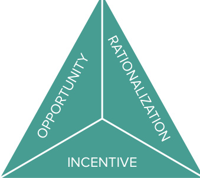
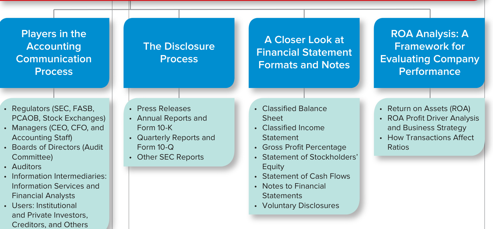
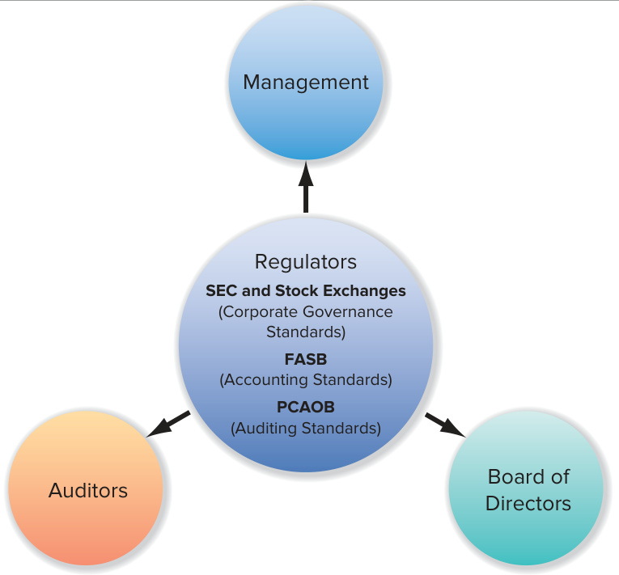
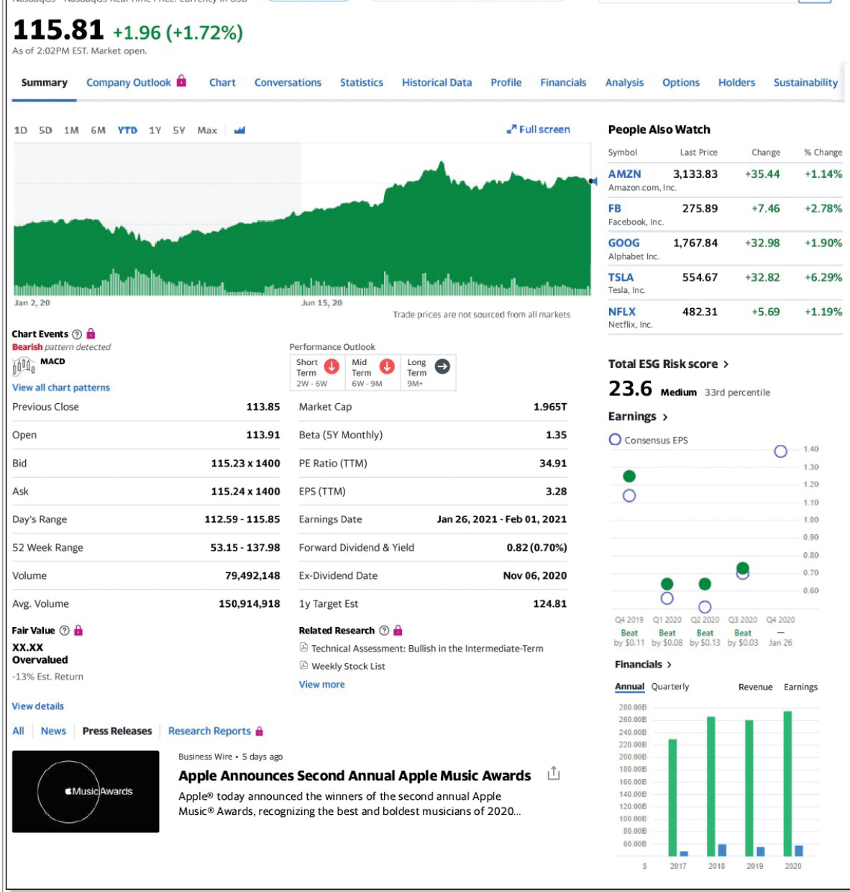
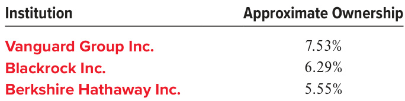
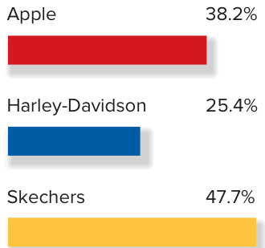
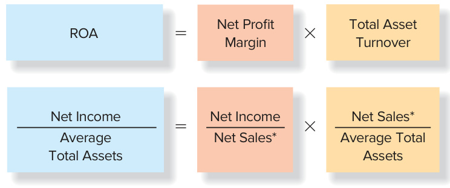
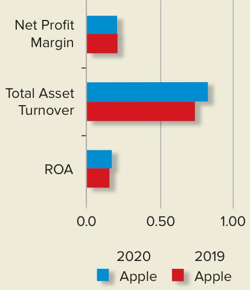
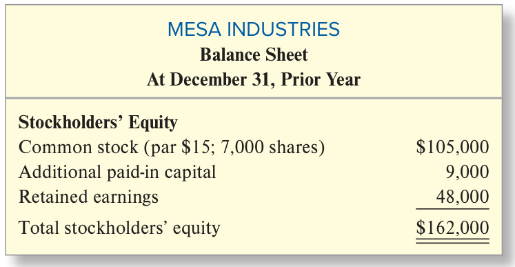

# Ch05 Communicating and Analyzing Accounting Information  

t is the rare person today who has not been affected by Apple products and ­services. From the first commercially viable personal computer, the Apple II introduced in 1977, to the raft of mobile communication and media devices, personal computers, software, and App Store content that we all use today, Apple has fundamentally changed the way we work, play, and interact. Apple Inc. the company is a far cry from the startup incorporated by Steve Jobs, Steve Wozniak, and a group of venture capitalists in 1977. Its 1977 sales of $\Phi1$ million rose to $\Phi1$ billion by 1982 and exceeded $^{\Phi274}$ billion in 2020. To accomplish this feat, Apple didn’t just invent new products; it created whole new product categories such as the personal music player, the smartphone, and the tablet. And its laserlike focus on superior ease-of-use; seamless integration of hardware, software, and content; innovative design; and frequent updating make it very difficult for others to compete.  

Apple’s financial statements reflect its phenomenal sales and profit growth and convey this information to the stock market. Apple’s stock price more than tripled over the last five years in response to news of its success.  

Financial statement information will only affect a company’s stock price if the market believes in the integrity of the financial communication process. As a publicly traded company, Apple Inc. is required to provide detailed information in regular filings with the Securities and Exchange Commission. As the certifying officers of the company, current President and CEO Timothy Cook and Senior Vice President and Chief Financial  

## LEARNING OBJECTIVES  

## After studying this chapter, you should be able to:  

5-1	 Recognize the people involved in the accounting communication process (regulators, managers, directors, auditors, information intermediaries, and users), their roles in the process, and the guidance they receive from legal and professional standards. p. 239  

5-2	 Identify the steps in the accounting communication process, including the issuance of press releases, annual reports, quarterly reports, and SEC filings, as well as the role of online information services in this process. p. 244  

5-3 Recognize and apply the different financial statement and disclosure formats used by companies in practice and analyze the gross profit percentage. p. 247  

5-4	 Analyze a company’s performance based on return on assets and its components and the effects of transactions on financial ratios. p. 257  

  

## Apple Inc.  

COMMUNICATING FINANCIAL INFORMATION AND CORPORATE STRATEGY grinvalds/iStock Editorial/Getty Images  

Officer Luca Maestri are responsible for the accuracy of the filings. The board of directors and auditors monitor the integrity of the system that produces the disclosures. Integrity in communication with investors and other users of financial statements is key to maintaining relationships with suppliers of capital.  

## UNDERSTANDING THE BUSINESS  

Apple Inc.’s best-known products and services are the iPhone, iPad, Mac, AirPods, iCloud, and the App Store. The company sells its products and services worldwide through its own Apple Store retail and online stores, as well as through third-party cellphone companies such as AT&T and Verizon and retailers such as Best Buy. Components for its products are produced and final assembly is performed by outsourcing partners, primarily located in Asia. Apple invests considerable sums in research and development, marketing, and advertising and is known for introducing new and innovative products long before the end of existing products’ life cycles.  

Apple also invests in corporate governance: procedures designed to ensure that the company is managed in the interests of the shareholders. Much of its corporate governance system is aimed at ensuring integrity in the financial reporting process. Good corporate governance eases the company’s access to capital, lowering both the costs of borrowing (interest rates) and the perceived riskiness of Apple’s stock.  

Apple knows that when investors lose faith in the truthfulness of a firm’s accounting numbers, they also normally punish the company’s stock. Disclosure of an accounting fraud causes, on average, a 20 percent drop in the price of a company’s stock. The extreme accounting scandals at Le-Nature’s Inc. (discussed in Chapter 1), Enron, and WorldCom caused their stock to become worthless. U.S. securities laws require that companies maintain and report that they have internal controls that ensure the accuracy of their financial reports.  

## A QUESTION OF ETHICS  

  
THE FRAUD TRIANGLE  

## The Fraud Triangle  

Three conditions are necessary for financial statement fraud to occur. There must be (1) an incentive to commit fraud, (2) the opportunity to commit fraud, and (3) the ability to rationalize the misdeed. These conditions make up what antifraud experts call the fraud triangle. A good system of corporate governance is designed to address these conditions. Clear lines of responsibility and sure and severe punishment counteract incentives to commit fraud. Strong internal controls and oversight by directors and auditors reduce opportunity to commit fraud. A strong code of ethics, ethical actions by those at the top of the organization, fair dealings with employees, and rewards for whistle-blowing make it more difficult for individuals to rationalize fraud. Financial statement users also have a role to play in preventing fraud. While even the savviest user can still be surprised by fraudulent reports in some cases, accounting knowledge and healthy skepticism are the best protection from such surprises.  

Chapters 2 through 4 focused on the mechanics of preparing the income statement, balance sheet, statement of stockholders’ equity, and cash flow statement. Based on your better understanding of financial statements, we will next take a closer look at the people involved and the regulations that govern the process that conveys accounting information to statement users in the Internet age. We also will take a more detailed look at statement formats and additional disclosures provided in financial reports to help you learn how to find relevant information. Finally, we will examine a general framework for assessing a company’s business strategy and performance based on these reports.  

  
ORGANIZATION OF THE CHAPTER  

  

## EXHIBIT 5.1  

Ensuring the Integrity of Financial Information  

## PLAYERS IN THE ACCOUNTINGCOMMUNICATION PROCESS  

Exhibit 5.1 summarizes the major actors involved and the regulations designed to ensure the integrity of the financial reporting process.  

## Regulators (SEC, FASB, PCAOB, Stock Exchanges)  

The mission of the U.S. Securities and Exchange Commission (SEC) is to protect investors and maintain the integrity of the securities markets. As part of this mission, the SEC oversees the work of the Financial Accounting Standards Board (FASB), which sets generally accepted accounting principles (GAAP), and the Public Company Accounting Oversight Board (PCAOB) which sets auditing standards for independent auditors (CPAs) of public companies.  

The SEC staff also reviews the reports filed with it for compliance with its standards, investigates irregularities, and punishes violators. During 2019 and 2020, the SEC brought 154 enforcement actions related to issuer financial reporting.1 As a consequence, a number of company officers and auditors have been fined and lost their rights to appear before the SEC. In prior years, a number of high-profile company officers have been sentenced to jail for their actions. Consequences to the company can include large financial penalties as well as bankruptcy, as in the cases of Le-Nature’s, Enron, and WorldCom. You can read about recent SEC enforcement actions at: sec.gov/divisions/enforce/friactions.shtml  

## Managers (CEO, CFO, and Accounting Staff)  

The primary responsibility for the information in Apple’s financial statements and related disclosures lies with management, specifically the highest officer in the company, often called the chief executive officer (CEO), and the highest officer associated with the financial and accounting side of the business, often called the chief financial officer (CFO). At Apple and all public companies, these two officers must personally certify that  

•	 Each report filed with the Securities and Exchange Commission does not contain any untrue material statement or omit a material fact and fairly presents in all material respects the financial condition, results of operations, and cash flows of the company.  

## LEARNING OBJECTIVE 5-1  

Recognize the people involved in the accounting communication process (regulators, managers, directors, auditors, information intermediaries, and users), their roles in the process, and the guidance they receive from legal and professional standards.  

•	 There are no significant deficiencies and material weaknesses in the internal controls over financial reporting.   
•	 They have disclosed to the auditors and audit committee of the board any weaknesses in internal controls or any fraud involving management or other employees who have a significant role in financial reporting.  

An example of management’s report on the financial statements and internal controls can be found in Appendix B. Executives who knowingly certify false financial reports are subject to a fine of $\mathbb{S5}$ million and a 20-year prison term. The members of the accounting staff, who actually prepare the details of the reports, also bear professional responsibility for the accuracy of this information, although their legal responsibility is smaller. Their future professional success depends heavily on their reputation for honesty and competence. Accounting managers responsible for financial statements with material errors are routinely fined and fired and often have difficulty finding other employment.  

## Board of Directors (Audit Committee)  

As Apple’s statement on corporate governance indicates, the board of directors (elected by the stockholders) oversees the chief executive officer and other senior management in the competent and ethical operation of Apple on a day-to-day basis and assures that the long-term interests of shareholders are being served. The audit committee of the board, which must be composed of nonmanagement (independent) directors with financial knowledge, is responsible for ensuring that processes are in place for maintaining the integrity of the company’s accounting, financial statement preparation, and financial reporting. It is responsible for hiring the company’s independent auditors. Members of the audit committee meet separately with the auditors to discuss management’s compliance with their financial reporting responsibilities.  

## Auditors  

The SEC requires publicly traded companies to have their financial statements and related ­disclosures and their control systems over the financial reporting process audited by an independent registered public accounting firm (independent auditor) following auditing standards established by the PCAOB. Many privately owned companies also have their statements audited. By signing an unqualified (clean) audit opinion, a CPA firm assumes part of the financial responsibility for the fairness of the financial statements and related presentations. This opinion, which adds credibility to the statements, also is often required by agreements with lenders and private investors. Subjecting the company’s statements to independent verification reduces the risk that the company’s financial condition is misrepresented in the statements. As a result, rational investors and lenders should lower the rate of return (interest) they charge for providing capital. An example of an unqualified audit opinion is presented under Report of  

  
sakkmesterke/123RF  

Independent Registered Public Accounting Firm in Appendix B of this text. Ernst & Young (EY) is currently Apple’s auditor. Ernst & Young, Deloitte, KPMG, and PricewaterhouseCoopers (PwC) make up what are referred to as the “Big $4^{\circ}$ CPA firms. Each of these firms employ thousands of CPAs in offices scattered throughout the world. They audit the great majority of publicly traded companies as well as many that are privately held. Some public companies and most private companies are audited by smaller CPA firms. A list of the auditors for selected focus companies follows.  

<html><body><table><tr><td>Focus Company</td><td>Industry</td><td>Auditor</td></tr><tr><td>Starbucks</td><td>Coffee</td><td>Deloitte</td></tr><tr><td>Skechers</td><td>Footwear</td><td>BDO</td></tr><tr><td>WaltDisney</td><td>Entertainment</td><td>PricewaterhouseCoopers</td></tr></table></body></html>  

## How Data Analytics Are Affecting What Auditors Do  

Modern data analytics are changing the world of auditing. The availability of more data from clients’ enterprisewide accounting systems, which combine the various record-keeping functions within an organization, has allowed access now to entire populations of transactions instead of smaller statistical samples as in the past. This eases identification of trends, patterns, and outliers, which become the focus for further investigation. For example, deliberate or unintentional mistakes in manual journal entries (such as the adjusting entries you learned about in Chapter 4) are often a source of financial statement error. Even for a large multinational client, auditors can now examine the whole population of manual entries to determine particular locations and types of transactions generating unexpected numbers of entries, which the auditor then examines further.  

Data analytics also make it easier to correlate information from various parts of the clients’ accounting systems such as sales invoices, shipping records, and cash receipts to identify areas where undetected misstatements may exist (audit risks). As companies digitize more data sources for their own decision making such as call center records, search tracking and shopping cart data, and social media feeds, this same information will help auditors better anticipate potential areas of high audit risk such as inventory obsolescence and warranty liabilities. The ability to understand client accounting systems and to apply predictive models and data visualization tools to data extracted from client systems is fast becoming a key part of the auditor’s skill set.  

## Information Intermediaries: Information Services and Financial Analysts  

Students sometimes view the communication process between companies and financial ­statement users as a simple process of mailing the report to individual shareholders who read the report and then make investment decisions based on what they have learned. This simple picture is far from today’s reality. Now most investors rely on company websites, information services, and financial analysts to gather and analyze information.  

Companies actually file their SEC forms electronically through the EDGAR (Electronic Data Gathering, Analysis, and Retrieval) Service, which is sponsored by the SEC. Each fact in the report is now tagged to identify its source and meaning using a language called iXBRL. Users can retrieve information from EDGAR within 24 hours of its submission, long before it is available through the mail. EDGAR is a free service available on the web under “Filings” at: sec.gov  

Most companies also provide direct access to their financial statements and other information over the web. You can view this information for Apple at: investor.apple.com  

Information services allow investors to gather their own information about the company and monitor the recommendations of a variety of analysts. Financial analysts and other sophisticated users obtain much of the information they use from the wide variety of commercial online information services. Fee-based services such as S&P Global Market Intelligence provide broad access to financial statements and news information. A growing number of other resources offering a mixture of free and fee-based information exist on the web. These include: finance.google.com, finance.yahoo.com, and marketwatch.com.  

Exhibit  5.2 suggests the wide range of information about Apple available on the Yahoo! Finance website. It includes stock price and financial statement information, news accounts, and important future events related to Apple. To see what has happened to Apple since this chapter was written, go to finance.yahoo.com and search for AAPL to see how Apple has fared compared to its competitors.  

Financial analysts receive accounting reports and other information about the company from online information services. They also gather information through conversations with company executives and visits to company facilities and competitors. The results of their analyses are combined into analysts’ reports. Analysts’ reports normally include forecasts of future quarterly and annual earnings per share and share price; a buy, hold, or sell recommendation for the  

## EXHIBIT 5.2  

Yahoo! Finance Information about Apple  

  

  
Source: Yahoo! Finance  

company’s shares; and explanations for these judgments. In making their earnings forecasts, the analysts rely heavily on their knowledge of the way the accounting system translates business events into the numbers on a company’s financial statements, which is the subject matter of this text. Individual analysts often specialize in particular industries (such as sporting goods or energy companies). Analysts are regularly evaluated based on the accuracy of their forecasts, as well as the profitability of their stock picks. A sample of these forecasts and stock recommendations for Apple at the time this chapter was written follow:  

<html><body><table><tr><td>Firm</td><td>Stock Recommendation</td><td>Earnings per Share Forecastfor2021</td><td>Earnings per Share Forecast for 2022</td></tr><tr><td>CreditSuisse</td><td>Neutral</td><td>3.72</td><td>4.13</td></tr><tr><td>WellsFargo</td><td>Overweight</td><td>3.98</td><td>4.42</td></tr><tr><td>RBC Capital</td><td>Outperform</td><td>4.07</td><td>4.35</td></tr><tr><td>DeutscheBank</td><td>Buy</td><td>4.01</td><td>4.42</td></tr><tr><td>Consensusof38 Banalysts</td><td>Buy</td><td>3.94</td><td>4.28</td></tr></table></body></html>  

Analysts often work in the research departments of brokerage and investment banking houses such as Credit Suisse, mutual fund companies such as Fidelity Investments, and investment advisory services such as Value Line that sell their advice to others. Through their reports and recommendations, analysts are transferring their knowledge of accounting, the company, and the industry to customers who lack this expertise.  

## FINANCIAL ANALYSIS  

## Information Services and Your Job Search  

Information services have become the primary tool for professional analysts who use them to analyze ­competing firms. Information services are also an important source of information for job seekers. ­Potential employers expect job applicants to demonstrate knowledge of their companies during an interview, and online information services are an excellent source of company information. The best place to begin learning about potential employers is to visit their websites. Be sure to read the material in the employment section and the investor relations section of the site. To learn more about online information services, contact the business or reference librarian at your college or university or explore the websites discussed in this section.  

## Users: Institutional and Private Investors, Creditors, and Others  

Institutional investors include pension funds (associated with companies, unions, or government agencies); mutual funds; and endowment, charitable foundation, and trust funds (such as the endowment of your college or university). These institutional stockholders usually employ their own analysts, who also rely on the information intermediaries just discussed. Institutional shareholders control the majority of publicly traded shares of U.S. companies. For example, at the time this chapter was written, institutional investors own 59 percent of Apple stock. Apple’s three largest institutional investors follow:  

  

Most small investors own stock in companies such as Apple indirectly through mutual and pension funds.  

Private investors include large individual investors such as the venture capitalists who originally invested directly in Apple, as well as small retail investors who buy shares of publicly traded companies through brokers such as Fidelity. Retail investors often lack the expertise to understand financial statements and the resources to gather data efficiently. They often rely on the advice of information intermediaries or turn their money over to the management of mutual and pension funds (institutional investors).  

Lenders, or creditors, include suppliers, banks, commercial credit companies, and other financial institutions that lend money to companies. Lending officers and financial analysts in these organizations use the same public sources of information. They also use additional financial information (e.g., monthly statements) that companies often agree to provide as part of the lending contract. Lenders are the primary external user group for financial statements of private companies. Institutional and private investors also become creditors when they buy a company’s publicly traded bonds.  

Financial statements also play an important role in the relationships between suppliers and customers. Customers evaluate the financial health of suppliers to determine whether they will be reliable, up-to-date sources of supply. Suppliers evaluate their customers to estimate their future needs and ability to pay debts. Competitors also attempt to learn useful information about a company from its statements. The potential loss of competitive advantage is one of the costs of public financial disclosures. Small amounts do not have to be reported separately or accounted for precisely according to GAAP if they would not influence users’ decisions. Accountants usually designate such items and amounts as immaterial. Determining material amounts is often very subjective.  

## P A U S E  F O R  F E E D B A C K  

In this section, we learned the roles of different parties in the accounting communication process and the guidance they receive from legal and professional standards. Management of the reporting company decides the appropriate format and level of detail to present in its financial reports. Independent audits increase the credibility of the information. Directors monitor managers’ compliance with reporting standards and hire the auditor. The SEC staff reviews public financial reports for compliance with legal and professional standards and punishes violators. Financial statement announcements from public companies usually are first transmitted to users through online information services. Analysts play a major role in making financial statement and other information available to average investors through their stock recommendations and earnings forecasts. Before you move on, complete the following exercise to test your understanding of these concepts.  

## S E L F - S T U D Y  Q U I Z  

Match the key terms in the left column with their definitions in the right column.  

1.	 Material amount a.	 Management primarily responsible for accounting information.   
2.	 CEO and CFO b.	 An independent party who verifies financial statements.   
3.	 Financial analyst c.	 Amount large enough to influence users’ decisions. d.	 Managers of pension, mutual, endowment, and other funds who invest   
4.	 Auditor on the behalf of others.   
5.	 Institutional investors e.	 An individual who analyzes financial information and provides advice.  

After you have completed your answers, check them below.  

Related Homework: M5-1, E5-1  

## LEARNING OBJECTIVE 5-2  

Identify the steps in the accounting communication process, including the issuance of press releases, annual reports, quarterly reports, and SEC filings, as well as the role of online information services in this process.  

## THE DISCLOSURE PROCESS  

As noted in our discussion of information services and information intermediaries, the accounting communication process includes more steps and participants than one might imagine. SEC regulation FD, for “Fair Disclosure,” requires that companies provide all investors equal access to all important company news. Managers and other insiders also are prohibited from trading their company’s shares based on nonpublic (insider) information so that no party benefits from early access.  

## Press Releases  

To provide timely information to external users and to limit the possibility of selective leakage of information, Apple and other public companies announce quarterly and annual earnings through a press release as soon as the verified figures (audited for annual and reviewed for  

1. c; 2. a; 3. e; 4. b; 5. d.  

quarterly earnings) are available. Apple normally issues its earnings press releases within four weeks of the end of the accounting period. The announcements are sent electronically to the major print and electronic news services, including Dow Jones and Bloomberg, which make them immediately available to subscribers. Exhibit 5.3 shows an excerpt from a typical earnings press release for Apple that includes key financial figures. This excerpt is followed by management’s discussion of the results and condensed income statements and balance sheets, which will be included in the formal report to shareholders, distributed after the press release.  

## APPLE REPORTS FOURTH QUARTER RESULTS  

Company revenue sets September quarter record, Services and Mac revenue reach new all-time high  

Cupertino, California—October 29, 2020—Apple today announced financial results for its fiscal 2020 fourth quarter ended September 26, 2020. The Company posted record September quarter revenue of $\mathbb{S}64.7$ billion and quarterly earnings per diluted share of $\mathbb{5}0.73$ . International sales accounted for 59 percent of the quarter’s revenue.  

“Our outstanding September quarter performance concludes a remarkable fiscal year, where we established new all-time records for revenue, earnings per share, and free cash flow, in spite of an extremely volatile and challenging macro environment,” said Luca Maestri, Apple’s CFO. “Our sales results and the unmatched loyalty of our customers drove our active installed base of devices to an all-time high in all of our major product categories. We also returned nearly $\mathbb{S}22$ billion to shareholders during the quarter, as we maintain our target of reaching a net cash neutral position over time.”  

## EXHIBIT 5.3  

Earnings Press Release Excerpt for Apple Inc.  

## APPLE  

REAL WORLD EXCERPT: Press Release  

Source: Apple press release, October 29, 2020.  

Many companies, including Apple, follow these press releases with a conference call during which senior managers answer analysts’ questions about the quarterly results. These calls are open to the investing public. (Go to apple.com/investor/earnings-call/ to listen to Apple’s most recent conference call.) Listening to these recordings is a good way to learn about a company’s business strategy and its expectations for the future, as well as key factors that analysts consider when they evaluate a company.  

Companies such as Apple also issue press releases concerning other important events such as new product announcements. Press releases related to annual earnings and quarterly earnings often precede the issuance of the quarterly or annual report by 15 to 45 days. This time is necessary to prepare the additional detail and to distribute those reports.  

## Annual Reports and Form 10-K  

For privately held companies, annual reports are relatively simple documents. They normally include only the following:  

1.	Four basic financial statements: income statement, balance sheet, stockholders’ equity or retained earnings statement, and cash flow statement.   
2.	Related notes (footnotes).   
3.	Report of Independent Accountants (Auditor’s Opinion) if the statements are audited.  

The annual reports of public companies filed on Form 10-K are significantly more elaborate mainly because of additional SEC reporting requirements. SEC reports are normally referred to by number (for example, the “10-K”). The principal components of the financial disclosures in the 10-K include:  

Item 1. Business: Description of business operations and company strategy.  

Item 7. Management’s Discussion and Analysis of Financial Condition and Results of Operations: Management’s views on the causes of its successes and failures during the reporting period and the risks it faces in the future.  

Item 8. Financial Statements and Supplemental Data: The four basic financial statements and related notes, the report of management, and the auditor’s report (Report of Independent Registered Public Accounting Firm).  

Except for the Management’s Discussion and Analysis (MD&A), most of these elements have been covered in earlier chapters. MD&A includes an explanation of key figures on the financial statements and the risks the company faces in the future. The Form 10-K also provides a more detailed description of the business, including its products, product development, sales and marketing, manufacturing, and competitors. It also lists properties owned or leased, any legal proceedings it is involved in, and significant contracts it has signed.  

## Quarterly Reports and Form 10-Q  

Quarterly reports for private companies include condensed financial statements providing fewer details than annual statements and only key notes to the statements. They are not audited and so are marked unaudited. Private companies normally prepare quarterly reports for their lenders. Public companies file their quarterly reports on Form 10-Q with the SEC. The Form 10-Q contains most of the information items provided in the financial section of the 10-K and some additional items.  

## Other SEC Reports  

Public companies must file other reports with the SEC. These include the current events report Form 8-K, which is used to disclose any material event not previously reported that is important to investors (e.g., auditor changes, mergers). Other filing requirements for public companies are described on the SEC website.  

## ENVIRONMENTAL, SOCIAL, & GOVERNANCE (ESG) REPORTING  

## Performance Beyond the Bottom Line  

In the last decade, most large public companies have started to publish a report on the sustainability of their operations, often called a corporate social responsibility (CSR) or environmental, social, and governance (ESG) report. Why the big change? Managers today are increasingly aware that the way they did business in the past might not work tomorrow. ESG reports help investors assess the long-term consequences of the company’s broader business strategy.  

According to the Center for Audit Quality\*:  

•	 The E (for environmental) component of ESG information encompasses how a company manages risks and opportunities related to climate, pollution, waste, and other environmental factors. •	 The S (for social) component of ESG includes labor and supply-chain standards, employee health and safety, product quality and safety, privacy and data security, and diversity and inclusion policies and efforts. •	 The G (for governance) component of ESG incorporates information about a company’s corporate governance including the board structure and diversity; executive compensation; and policies on lobbying, political contributions, and bribery and corruption.  

These reports can range in coverage from a single paragraph dealing with key environmental impacts to Apple’s reporting of its ESG Index which is 22 pages long. You can find the Apple ESG Index 2020 at: investor.apple.com/esg/default.aspx  

## A CLOSER LOOK AT FINANCIAL STATEMENT FORMATS AND NOTES  

The financial statements shown in previous chapters provide a good introduction to their content and structure. In this section, we will discuss three additional characteristics of financial statements and the related disclosures that are designed to make them more useful to investors, creditors, and analysts:  

•	 Comparative financial statements. To allow users to compare performance from period to period, companies report financial statement values for the current period and one or more prior periods. Apple and most U.S. companies present two years’ balance sheets and three years’ income statements, cash flow statements, and statements of ­stockholders’ equity.  

•	 Additional subtotals and classifications in financial statements. You should not be confused when you notice slightly different statement formats used by different companies. In this section, we will focus on similarities and differences in the classifications and line items presented on Apple’s and Chipotle’s balance sheet, income statement, and cash flow statement.  

•	 Additional disclosures. Most companies present voluminous notes that are necessary to understand a company’s performance and financial condition. In addition, certain complex transactions require additional statement disclosures. We take a closer look at some of Apple’s note disclosures to prepare you for more detailed discussions in the remaining chapters in this text.  

## Classified Balance Sheet  

Exhibit 5.4 shows the September 26, 2020, balance sheet for Apple. This balance sheet looks very similar in structure to the balance sheet for Chipotle presented in Chapter 4, but it is presented for two years as it is in Apple’s annual report on Form 10-K. The statement classifications (current vs. noncurrent assets and current vs. noncurrent liabilities) play a major role in our discussion of ratio analysis (e.g., the current ratio in Chapter 2).  

The specific accounts listed on a company’s balance sheet will differ depending on the nature of the company’s business. For example, nearly 65 percent of FedEx Corporation’s assets are its property and equipment which include its owned and leased aircraft, handling equipment, and vehicles. Consequently, FedEx reports separately the cost of its land, buildings, and equipment on the face of the balance sheet, as well as the accumulated depreciation on the total property and equipment. On the other hand, property, plant, and equipment makes up less than 12 percent of Apple’s assets, and Apple reports it on a single line. Companies also have the option to disaggregate balance sheet line items in the notes to the financial statements. We will illustrate that type of note later in the chapter.  

When you first look at a new set of financial statements, try not to be confused by differences in terminology. When interpreting line items you have never seen before, be sure to consider their description and their classification.  

## Classified Income Statement  

Apple’s 2020 consolidated income statement is reprinted in Exhibit 5.5. It presents the income statement followed by earnings per share for three years, as required by the SEC. Apple’s income statement includes one subtotal not included in Chipotle’s. Like many manufacturing and merchandising (retail and wholesale) companies that sell goods, Apple reports the subtotal Gross Profit (also called Gross Margin), which is the difference between net sales and cost of goods sold (also called cost of sales). It is important to note that regardless of whether a company reports a gross profit subtotal, the income statement presents the same information. Apple also separately reports revenues and cost of sales for its sales of its products (iPhones, etc.) and its services (AppleCare, digital content, iCloud storage, etc.). This disaggregation  

## LEARNING OBJECTIVE 5-3  

Recognize and apply   
the different financial   
statement and disclosure formats used by   
companies in practice and analyze the gross profit percentage.  

## APPLE  

REAL WORLD EXCERPT: Annual Report  

Assets that will be used or turned into cash within one year  

Assets that will be used or turned into cash beyond one year  

Obligations that will be paid or settled within one year  

Obligations that will be paid or settled after one year  

Capital contributed by shareholders Earnings reinvested in the company  

Consolidated Balance Sheets (In millions, except number of shares which are reflected in thousands and par value)   

<html><body><table><tr><td></td><td>September 26,2020</td><td>September 28,2019</td></tr><tr><td colspan="3">ASSETS</td></tr><tr><td colspan="3">Current assets:</td></tr><tr><td>Cash and cash equivalents</td><td>$ 39,789</td><td>$ 50,224</td></tr><tr><td>Short-termmarketable securities</td><td>52,927</td><td>51,713</td></tr><tr><td>Accounts receivable,net</td><td>16,120</td><td>22,926</td></tr><tr><td>Inventories</td><td>4,061</td><td>4,106</td></tr><tr><td>Vendor non-trade receivables</td><td>21,325</td><td>22,878</td></tr><tr><td>Other current assets</td><td>11,228</td><td>12,329</td></tr><tr><td>Total current assets</td><td>145,450</td><td>164,176</td></tr><tr><td colspan="3">Non-current assets:</td></tr><tr><td>Long-term marketable securities</td><td>100,887</td><td>105,341</td></tr><tr><td>Property, plant and equipment, net</td><td>36,766</td><td>37,378</td></tr><tr><td>Other non-current assets</td><td>40,785</td><td>31,621</td></tr><tr><td>Total non-current assets</td><td>178,438</td><td>174,340</td></tr><tr><td>Total assets</td><td>$323,888</td><td>$338,516</td></tr><tr><td colspan="3">LIABILITIESANDSHAREHOLDERS'EQUITY</td></tr><tr><td colspan="3">Current liabilities:</td></tr><tr><td>Accounts payable</td><td>$ 42,296</td><td>$ 46,236</td></tr><tr><td>Other current liabilities</td><td>42,684</td><td>37,720</td></tr><tr><td>Deferred revenue</td><td>6,643</td><td>5,522</td></tr><tr><td>Commercial paper</td><td>4,996</td><td>5,980</td></tr><tr><td>Current portion of long-term debt</td><td>8,773</td><td>10,260</td></tr><tr><td>Total current liabilities</td><td>105,392</td><td>105,718</td></tr><tr><td colspan="3">Non-current liabilities:</td></tr><tr><td>Long-term debt</td><td>98,667</td><td>91,807</td></tr><tr><td>Other non-current liabilities</td><td>54,490</td><td>50,503</td></tr><tr><td>Total non-current liabilities</td><td>153,157</td><td>142,310</td></tr><tr><td>Total liabilities</td><td>258,549</td><td>248,028</td></tr><tr><td colspan="3">Shareholders' equity: Common stock and additional paid-in capital,</td></tr><tr><td colspan="3">$0.00001 par value: 50,400,000 shares authorized; 16,976,763 and</td></tr><tr><td>17,772,945 shares issued and outstanding, respectively</td><td>50,779</td><td>45,174</td></tr><tr><td>Retained earnings</td><td>14,966</td><td>45,898</td></tr><tr><td>Accumulated other comprehensive income/(loss)</td><td>(406)</td><td>(584)</td></tr><tr><td>Total shareholders' equity</td><td>65,339</td><td>90,488</td></tr><tr><td>Total liabilities and shareholders' equity</td><td>$323,888</td><td>$338,516</td></tr></table></body></html>

Source: Apple Inc.   
\*Apple's statements have been simplified for purposes of our discussion.  

APPLE INC. Consolidated Statement of Operations (In millions, except number of shares which are reflected in thousands and per share amounts)   

<html><body><table><tr><td rowspan="2"></td><td colspan="3">Years ended</td></tr><tr><td>September 26, 2020</td><td>September 28, 2019</td><td>September 29, 2018</td></tr><tr><td>Net sales:</td><td></td><td></td><td></td></tr><tr><td>Products</td><td>$220,747</td><td>$213,883</td><td>$225,847</td></tr><tr><td>Services</td><td>53,768</td><td>46,291</td><td>39,748</td></tr><tr><td>Total net sales</td><td>274,515</td><td>260,174</td><td>265,595</td></tr><tr><td>Cost of sales:</td><td></td><td></td><td></td></tr><tr><td>Products</td><td>151,286</td><td>144,996</td><td>148,164</td></tr><tr><td>Services</td><td>18,273</td><td>16,786</td><td>15,592</td></tr><tr><td>Total cost of sales</td><td>169,559</td><td>161,782</td><td>163,756</td></tr><tr><td>Gross margin</td><td>104,956</td><td>98,392</td><td>101,839</td></tr><tr><td>Operating expenses:</td><td></td><td></td><td></td></tr><tr><td>Research and development</td><td>18,752</td><td>16,217</td><td>14,236</td></tr><tr><td>Selling, general and administrative</td><td>19,916</td><td>18,245</td><td>16,705</td></tr><tr><td>Total operating expenses</td><td>38,668</td><td>34,462</td><td>30,941</td></tr><tr><td>Operating income</td><td>66,288</td><td>63,930</td><td>70,898</td></tr><tr><td>Other income/(expense),net</td><td>803</td><td>1,807</td><td>2,005</td></tr><tr><td>Income before provision for income taxes</td><td>67,091</td><td>65,737</td><td>72,903</td></tr><tr><td>Provision forincome taxes</td><td>9,680</td><td>10,481</td><td>13,372</td></tr><tr><td>Net income</td><td>$ 57,411</td><td>$ 55,256</td><td>S 59,531</td></tr><tr><td>Earnings per share:</td><td></td><td></td><td></td></tr><tr><td>Basic</td><td>$ 3.31</td><td>$ 2.99</td><td>$ 3.00</td></tr><tr><td>Shares used in computing earnings per share:</td><td></td><td></td><td></td></tr><tr><td>Basic</td><td>17,352,119</td><td>18,471,336</td><td>19,821,510</td></tr></table></body></html>

\*Apple's statements have been simplified for purposes of our discussion.  

## Source: Apple Inc.  

highlights the growing role of services in Apple’s sales portfolio. Another subtotal—Operating Income (also called Income from Operations)—is computed by subtracting operating expenses from gross profit.  

Nonoperating (other) Items are revenues, expenses, gains, and losses that do not relate to the company’s primary operations. Examples include interest income, interest expense, and gains and losses on the sale of investments. These nonoperating items are added to or subtracted from income from operations to obtain Income before Income Taxes, also called Pretax Earnings. At this point, Provision for Income Taxes (Income Tax Expense) is subtracted to obtain Net Income. Some companies show fewer subtotals on their income statements. No difference exists in the revenue, expense, gain, and loss items reported using the different formats. Only the categories and subtotals differ.  

When a major component of a business is sold or abandoned, income or loss from that component earned before the disposal, as well as any gain or loss on disposal, is included as ­Discontinued Operations. The item is presented separately because it is not useful in predicting the future income of the company given its nonrecurring nature. If discontinued operations are reported, an additional subtotal is presented before this item for Income from Continuing Operations  

APPLE   
REAL WORLD EXCERPT:   
Annual Report  

Operating activities (central focu of the business)  

Other items (not the main focus of the business)  

Income tax expense = Net Income/Weighted Average Number of Shares of Common Stock Outstanding  

Finally, Earnings per Share is reported. Simple computations of earnings per share (EPS) are as follows:  

## Net Income Earnings per Share\* $=$ Weighted Average Number of Shares of Common Stock Outstanding  

\*As you will learn in Chapter 11: (1) If there are preferred stock dividends, the amount is subtracted from net income in the numerator, (2) the denominator for weighted average shares is a complex computation, and (3) outstanding shares are those that are currently held by the shareholders.  

## FINANCIAL ANALYSIS  

## APPLE INC.  

Consolidated Statement of Comprehensive Income Three months ended June 27, 2020  

Net income $\mathbb{S}{\,}11{,}253$ Other comprehensive income/(loss): Change in foreign currency translation 194 Change in unrealized gains/losses on derivative instruments (1,042) Change in unrealized gains/losses on marketable debt securities 3,087 Total comprehensive income \$13,492  

## Statement of Comprehensive Income  

Both the FASB and the IASB require an additional statement entitled the Statement of Comprehensive Income, which can be presented separately or in combination with the income statement. When presented separately, the statement starts with Net Income, the bottom line of the income statement. Following this total would be the components of other comprehensive income. The Net Income and Other Comprehensive Income items are then combined to create a total called Comprehensive Income (the bottom line for this statement). The following summarizes the information Apple presented in a recent quarterly report. Other Comprehensive Income items include fair value changes on certain marketable securities, which are discussed in Appendix A, as well as other items discussed in more advanced accounting classes.  

## P A U S E  F O R  F E E D B A C K  

## S E L F - S T U D Y  Q U I Z  

Evenifcompanles use different subtotals, information services such as Yahoo! Finance put companies’ statements into a standard format to allow for easier comparisons. Consequently, experienced analysts often rely on the services for financial statement data.  

As Apple’s statements suggest, most statements are classified and include subtotals that are relevant to analysis. On the balance sheet, the most important distinctions are between current and noncurrent assets and liabilities. On the income statement, the subtotals gross profit and income from operations are most important. So the next step in preparing to analyze financial statements is to see if you understand the effects of transactions you already have studied on these subtotals. The following questions will test your ability to do so.  

1.	 Complete the following tabulation, indicating the direction $^+$ for increase, − for decrease, and NE for no effect) and amount of the effect of each transaction. Consider each item independently. (Hint: Prepare journal entries for each transaction. Then consider the balance sheet or income statement classification of each account affected to come up with your answers.)  

a.	 Recorded and paid rent expense of $\mathbb{S}200$ .   
$b$ .	 Recorded the sale of services on account for $\mathbb{S}400$ .  

<html><body><table><tr><td>Transaction</td><td>Current Assets</td><td>Gross Profit</td><td>Incomefrom Operations</td></tr><tr><td>a.</td><td></td><td></td><td></td></tr><tr><td>b.</td><td></td><td></td><td></td></tr></table></body></html>  

After you have completed your answers, check them at the bottom of this page.  

## G U I D E D  H E L P  5 - 1  

For additional step-by-step video instruction on preparing the balance sheet and income statement from a trial balance, go to mhhe.com/libby_gh5-1.  

Related Homework: M5-4, M5-5, E5-14, E5-15, P5-5, CON5-1  

## KEY RATIO ANALYSIS  

  

## Gross Profit Percentage  

The key subtotals on the income statement we just discussed also play a major role in financial ratio analysis. As we noted above, net sales less cost of goods sold equals the subtotal gross profit or gross margin. Analysts often examine gross profit as a percentage of sales (the gross profit or gross margin percentage).  

## ANALYTICAL QUESTION  

How effective is management in selling goods and services for more than the costs to purchase or produce them?  

## RATIO AND COMPARISONS  

The gross profit percentage ratio is computed as follows:  

$$
\mathrm{Gross\Profit\Percentage=\frac{Gross\Profit^{\star}}{N e t\ S a l e s}}
$$  

\*Gross Profit $=$ Net Sales − Cost of Sales  

The ratio for 2020 for Apple is:  

$$
\frac{\S104,956}{\S274,515}=0.382\:(38.2\%)
$$  

Selected Focus Companies’ Gross Profit Percentage Ratios  

<html><body><table><tr><td>ComparisonsOverTime</td><td>Comparison With Competitor</td></tr><tr><td>Apple 2020</td><td>HP</td></tr><tr><td>2018 2019</td><td>2020</td></tr><tr><td>38.3% 37.8% 38.2%</td><td>18.4%</td></tr></table></body></html>  

## INTERPRETATIONS  

In General The gross profit percentage measures a company’s ability to charge premium prices and produce goods and services at low cost. All other things equal, a higher gross profit results in higher net income.  

Business strategy, as well as competition, affects the gross profit percentage. Companies pursuing a product-differentiation strategy use research and development and product promotion activities to convince customers of the superiority or distinctiveness of the company’s products. This allows them to charge premium prices, producing a higher gross profit percentage. Companies following a low-cost strategy rely  

  

<html><body><table><tr><td>1.a. Rent expense (+E,-SE)</td><td>200</td><td>b.Accounts receivable (+A)</td><td>400</td></tr><tr><td>Cash (-A)</td><td>200</td><td>Salesrevenue (+R,+SE)</td><td>400</td></tr><tr><td>-200,NE,-200</td><td></td><td>+400,+400,+400</td><td></td></tr></table></body></html>  

## S o l u t i o n  t o  

S E L F - S T U DY  Q U I Z  

on more efficient management of production to reduce costs and increase the gross profit percentage. Managers, analysts, and creditors use this ratio to assess the effectiveness of the company’s product development, marketing, and production strategy.  

Focus Company Analysis Apple’s gross profit percentage has remained fairly steady over the past three years and remains well above that of its competitor, HP. At the beginning of the chapter, we discussed key elements of Apple’s business strategy that focused on introducing new integrated technologies, product lines, and styles, as well as managing production and inventory costs. Each of these elements can have a large effect on gross profit. Its Form 10-K indicates that its various product lines have different gross profit percentages so that product mix can affect the overall gross profit percentage. Introducing new products with higher initial cost structures can decrease gross profit percentage.  

A Few Cautions To assess the company’s ability to sustain its gross profits, you must understand the sources of any change in the gross profit percentage. For example, an increase in margin resulting from increased sales of high-margin new products can be eroded by actions of competitors or increases in component costs for popular products. Also, higher prices must often be sustained with higher R&D and advertising costs, which reduce net income and can offset any increase in gross profit. This has not been the case for Apple in recent years as we will see later in the chapter. Apple’s astonishing gross profit results in an industry-leading net profit margin and return on assets.  

## Statement of Stockholders’ Equity  

The statement of stockholders’ (shareholders’) equity reports the changes in each of the company’s stockholders’ equity accounts during the accounting period. Exhibit 5.6 presents Apple’s 2020 consolidated statement of stockholders’ equity. The statement has a column for each stockholders equity account and one for the effect on total stockholders’ equity. (Apple combines the common stock account and additional paid-in capital accounts.) The first row of the statement starts with the beginning balances in each account, which correspond to the prior year’s ending balances on the balance sheet. Each row that follows lists each event that occurred during the period that affected any stockholders’ equity accounts. Apple reported net income of $\Phi57{,}411$ for the year, which increases retained earnings. Apple declared dividends of $\mathbb{S}14{,}087$ , which is subtracted from retained earnings. Apple issued shares of common stock during the year. Apple also repurchased and retired shares. This topic is discussed in Chapter 11. The final row lists the ending balance in the accounts, which correspond to the ending balances on the balance sheet. Public companies must present information for the prior three years in their statements of stockholders’ equity. So Apple’s 2018 and 2019 statements would be presented above the information shown in Exhibit 5.6.  

<html><body><table><tr><td colspan="5">APPLEINC. ConsolidatedStatements ofShareholders’Equity (in millions)</td></tr><tr><td></td><td>CommonStockand AdditionalPaid-In Capital</td><td>Retained Earnings</td><td>AccumulatedOther Comprehensive Income/(Loss)</td><td>Total Shareholders' Equity</td></tr><tr><td>BalancesasofSeptember28,2019</td><td>$ 45,174</td><td>$ 45,898</td><td>$(584)</td><td>$90,488</td></tr><tr><td>Netincome</td><td></td><td>57,411</td><td>178</td><td>57,411</td></tr><tr><td>Other comprehensive income/(loss) Dividends and dividend equivalents declared</td><td></td><td>(14,087)</td><td></td><td>178</td></tr><tr><td></td><td>5,605</td><td></td><td></td><td>(14,087)</td></tr><tr><td>Stockissued</td><td></td><td>(74,256)</td><td></td><td>5,605 (74,256)</td></tr><tr><td>Stockrepurchased</td><td></td><td>$ 14,966</td><td>$ (406)</td><td>$65,339</td></tr><tr><td>Balances as ofSeptember 26,2020</td><td>$50,779</td><td></td><td></td><td></td></tr></table></body></html>  

## Statement of Cash Flows  

We introduced the three cash flow statement classifications in prior chapters:  

Cash Flows from Operating Activities. This section reports cash flows associated with ­earning income (primarily related to dealings with customers, suppliers, interest, and ­earnings on investments).  

Cash Flows from Investing Activities. Cash flows in this section are associated with the ­purchase and sale of (1) productive assets (other than inventory) and (2) investments in other companies.  

Cash Flows from Financing Activities. These cash flows are related to financing the business through borrowing and repaying loans from financial institutions, stock (equity) issuances and repurchases, and dividend payments.  

Exhibit 5.7 presents Apple’s 2020 consolidated statement of cash flows. The first section (Cash Flows from Operating Activities) can be reported using either the direct or indirect method. For Apple, this first section is reported using the indirect method, which presents a reconciliation of net income on an accrual basis to cash flows from operations.  

The Operating Activities section prepared using the indirect method helps the analyst understand the causes of differences between a company’s net income and its cash flows. Net income and cash flows from operating activities can be quite different. Remember that the income statement is prepared under the accrual concept. Revenues are recorded when earned without regard to when the related cash flows occur. Likewise, expenses are matched with revenues and recorded in the same period without regard to when the related cash flows occur.  

In the indirect method, the Operating Activities section starts with net income computed under the accrual concept and then eliminates noncash items, leaving cash flow from operating activities:  

<html><body><table><tr><td>Netincome (ssol) +/-Adjustments for noncashitems Cash provided by operating activities</td></tr></table></body></html>  

The items listed between these two amounts explain the reasons they differ. For example, because no cash is paid during the current period for Apple’s depreciation expense reported on the income statement, this amount is added back to net income to eliminate its effect. Similarly, increases and decreases in certain assets and liabilities (called operating assets and liabilities) also account for some of the difference between net income and cash flow from operations. For example, sales on account increase net income as well as the current asset accounts receivable, but sales on account do not increase cash. As we cover different portions of the income statement and balance sheet in more detail in Chapters 6 through 11, we also will discuss the relevant sections of the cash flow statement. Then we discuss the complete cash flow statement in detail in Chapter 12.  

## Notes to Financial Statements  

While the numbers reported on the various financial statements provide important information, users require additional details to facilitate their analysis. All financial reports include additional information in notes that follow the statements. Apple’s 2020 notes include three types of information:  

1.	Descriptions of the key accounting rules applied in the company’s statements.   
2.	Additional detail supporting reported numbers.   
3.	Relevant financial information not disclosed on the statements.  

## APPLE  

REAL WORLD EXCERPT: Annual Report  

Cash flows associated with earning income computed by eliminating noncash items from net income  

Cash flows associated with purchase and sale of productive assets and investments  

Cash flows associated with borrowing and repaying loans, issuing and repurchasing stock, and paying dividends  

APPLE INC.   

<html><body><table><tr><td colspan="4">Consolidated Statements of Cash Flows (in millions)</td></tr><tr><td></td><td>September 26, 2020</td><td>Years ended September 28, 2019</td><td>September 29, 2018</td></tr><tr><td>Cash and cash equivalents, beginning balances</td><td>$ 50,224</td><td>$25,913</td><td>$ 620,289</td></tr><tr><td>Operating activities:</td><td></td><td></td><td></td></tr><tr><td>Netincome Adjustments to reconcile net income to cash</td><td>57,411</td><td>55,256</td><td>59,531</td></tr><tr><td>generated by operating activities:</td><td></td><td></td><td></td></tr><tr><td>Depreciation and amortization</td><td>11,056</td><td>12,547</td><td>10,903</td></tr><tr><td>Other noncash items</td><td>6,517</td><td>5,076</td><td>(27,694)</td></tr><tr><td>Changes in operating assets and liabilities:</td><td>5,690</td><td>(3,488)</td><td>34,694</td></tr><tr><td>Cash generated by operating activities</td><td>80,674</td><td>69,391</td><td>77,434</td></tr><tr><td>Investing activities:</td><td></td><td></td><td></td></tr><tr><td>Purchases of marketable securities</td><td>(114,938)</td><td>(39,630)</td><td>(71,356)</td></tr><tr><td>Proceedsfrom maturities of marketable securities</td><td>69,918</td><td>40,102</td><td>55,881</td></tr><tr><td>Proceedsfrom sales of marketable securities</td><td>50,473</td><td>56,988</td><td>47,838</td></tr><tr><td>Payments for acquisition of property, plant, and equipment</td><td>(7,309)</td><td>(10,495)</td><td>(13,313)</td></tr><tr><td>Payments made in connection with business acquisitions, net</td><td>(1,524)</td><td>(624)</td><td>(721)</td></tr><tr><td>Purchases of non-marketable securities</td><td>(210)</td><td>(1,001)</td><td>(1,871)</td></tr><tr><td>Proceeds from non-marketable securities</td><td>92</td><td>1,634</td><td>353</td></tr><tr><td>Other</td><td>(791)</td><td>(1,078)</td><td>(745)</td></tr><tr><td>Cash generated by/(used in) investing activities</td><td>(4,289)</td><td>45,896</td><td>16,066</td></tr><tr><td>Financing activities:</td><td></td><td></td><td></td></tr><tr><td>Proceedsfrom issuance of common stock</td><td>880</td><td>781</td><td>669</td></tr><tr><td>Proceeds from issuance of term debt, net</td><td>16,091</td><td>6,963</td><td>6,969</td></tr><tr><td>Repayments of term debt</td><td>(12,629)</td><td>(8,805)</td><td>(6,500)</td></tr><tr><td>Payments for dividends</td><td>(14,081)</td><td>(14,119)</td><td>(13,712)</td></tr><tr><td>Repurchases of common stock</td><td>(72,358)</td><td>(66,897)</td><td>(72,738)</td></tr><tr><td>Other financing activities</td><td>(4,723)</td><td>(8,899)</td><td>(2,564)</td></tr><tr><td>Cash used in financing activities</td><td>(86,820)</td><td>(90,976)</td><td>(87,876)</td></tr><tr><td>Increase/(Decrease)in cash and cashequivalents</td><td>(10,435)</td><td>24,311</td><td>5,624</td></tr><tr><td>Cash and cash equivalents, ending balances</td><td>$ 39,789</td><td>$ 50,224</td><td>$25,913</td></tr><tr><td>Supplemental cash flow disclosure:</td><td></td><td></td><td></td></tr><tr><td>Cash paid for income taxes, net</td><td>$ 9,501</td><td>$ 15,263</td><td>$10,417</td></tr><tr><td></td><td></td><td></td><td></td></tr><tr><td>Cash paid for interest</td><td>$ 3,002</td><td>$3,423</td><td>$ 3,022</td></tr></table></body></html>

  
Source: Apple Inc.  

Total change in cash End of year cash on balance sheet  

## Accounting Rules Applied in the Company’s Statements  

One of the first notes is typically a summary of significant accounting policies. As you will see in your study of subsequent chapters, generally accepted accounting principles (GAAP) permit companies to select from alternative methods for measuring the effects of transactions.  

The  summary of significant accounting policies tells the user which accounting methods the company has adopted. Apple’s accounting policy for property, plant, and equipment is as follows:  

## NOTE 1 – SUMMARY OF SIGNIFICANT ACCOUNTING POLICIES  

Property, Plant, and Equipment  

Depreciation on property, plant, and equipment is recognized on a straight-line basis over the estimated useful lives of the assets, which for buildings is the lesser of 40 years or the remaining life of the building; between one and five years for machinery and equipment, including product tooling and manufacturing process equipment; and the shorter of lease term or useful life for leasehold improvements. Capitalized costs related to internal-use software are amortized on a straight-line basis over the estimated useful lives of the assets, which range from three to seven years.  

## APPLE  

REAL WORLD EXCERPT: Annual Report  

We will discuss alternative depreciation methods in Chapter 8. Without an understanding of the various accounting methods used, it is impossible to analyze a company’s financial results effectively.  

## Additional Detail Supporting Reported Numbers  

The second category of notes provides supplemental information concerning the data shown on the financial statements. Among other information, these notes may show revenues broken out by geographic region or business segment, describe unusual transactions, and/or offer expanded detail on a specific classification. For example, in Note 4, Apple indicates the makeup of property, plant, and equipment presented on the balance sheet.  

## NOTE 4 – CONSOLIDATED FINANCIAL STATEMENT DETAILS Property, Plant, and Equipment, Net  

Land and buildings   
Machinery, equipment, and internal-use software   
Leasehold improvements Gross property, plant, and equipment   
Accumulated depreciation and amortization Total property, plant, and equipment, net  

<html><body><table><tr><td>2020</td><td>2019</td></tr><tr><td>$ 17,952</td><td>$ 17,085</td></tr><tr><td>75,291</td><td>69,797</td></tr><tr><td>10,283</td><td>9,075</td></tr><tr><td>103,526</td><td>95,957</td></tr><tr><td>(66,760)</td><td>(58,579)</td></tr><tr><td>$ 36,766</td><td>$ 37,378</td></tr></table></body></html>  

## APPLE  

REAL WORLD EXCERPT: Annual Report  

## Relevant Financial Information Not Disclosed on the Statements  

The final category includes information that impacts the company financially but is not shown on the statements. Examples include information on legal matters and contractual agreements that do not result in an asset or liability on the balance sheet. In Note 10, Apple disclosed the details of its commitments under supply agreements, which total over $\mathbb{S}8$ billion and are not shown as a liability on the balance sheet.  

## NOTE 10 – COMMITMENTS AND CONTINGENCIES  

Unconditional Purchase Obligations  

## APPLE  

REAL WORLD EXCERPT: Annual Report  

The Company has entered into certain off-balance sheet commitments that require the future purchase of goods or services (“unconditional purchase obligations”). The Company’s unconditional purchase obligations primarily consist of payments for supplier arrangements, Internet and telecommunication services, intellectual property licenses, and content creation. Future payments under noncancelable unconditional purchase obligations having a remaining term in excess of one year as of September 26, 2020, are as follows (in millions):  

2021 \$ 3,476   
2022 2,885   
2023 1,700   
2024 357   
2025 104   
Thereafter 130   
Total \$ 8,652  

## APPLE  

REAL WORLD EXCERPT: Annual Report  

## Voluntary Disclosures  

GAAP and SEC regulations set only the minimum level of required financial disclosures. Many companies provide important disclosures beyond those required. For example, in its annual report, 10-K, and recent earnings press release, Apple discloses sales by major product category, which helps investors track the success of new products.  

Net sales by product for 2020, 2019, and 2018 were as follows (in millions):  

<html><body><table><tr><td>Netsalesbyproduct:</td><td>2020</td><td>2019</td><td>2018</td></tr><tr><td>iPhone</td><td>$137,781</td><td>$142,381</td><td>$164,888</td></tr><tr><td>Mac</td><td>28,622</td><td>25,740</td><td>25,198</td></tr><tr><td>iPad</td><td>23,724</td><td>21,280</td><td>18,380</td></tr><tr><td>Wearables,Home,andAccessories</td><td>30,620</td><td>24,482</td><td>17,381</td></tr><tr><td>Services</td><td>53,768</td><td>46,291</td><td>39,748</td></tr><tr><td>Totalnetsales</td><td>$274,515</td><td>$260,174</td><td>$265,595</td></tr></table></body></html>  

## INTERNATIONAL PERSPECTIVE  

## Differences in Accounting Methods Acceptable under IFRS and U.S. GAAP  

Financial accounting standards and disclosure requirements are adopted by national regulatory agencies. Many countries, including the members of the European Union, have adopted International Financial Reporting Standards (IFRS) issued by the International Accounting Standards Board (IASB). IFRS are similar to U.S. GAAP, but there are several important differences. A partial list of the differences at the time this chapter was written is presented below, along with the chapter in which these issues will be addressed:  

<html><body><table><tr><td>Difference</td><td>U.S.GAAP</td><td>IFRS</td><td>Chapter</td></tr><tr><td>Last-infirst-out(LIFO)methodforinventory</td><td>Permitted</td><td>Prohibited</td><td>7</td></tr><tr><td>Reversalofinventorywrite-downs</td><td>Prohibited</td><td>Required</td><td>7</td></tr><tr><td>Basis for property, plant, and equipment</td><td>Historical cost</td><td>Fairvalueorhistoricalcost</td><td>8</td></tr><tr><td>Developmentcosts</td><td>Expensed</td><td>Capitalized</td><td>8</td></tr><tr><td>Debttoberefinanced</td><td>Current</td><td>Noncurrent</td><td>６</td></tr><tr><td>Recognition ofcontingentliabilities</td><td>Probable</td><td>Morelikelythannot</td><td>9</td></tr><tr><td>Stockholders'equityaccounts</td><td>Commonstock</td><td>Share capital</td><td>11</td></tr><tr><td>Interestreceivedoncashflowstatement</td><td>Paid-in capital Operating</td><td>Sharepremium</td><td></td></tr><tr><td>Interestpaidoncashflowstatement</td><td>Operating</td><td>Operatingorinvesting Operatingorfinancing</td><td>12 12</td></tr></table></body></html>  

The FASB and IASB are working together to eliminate some of these differences.  

## RETURN ON ASSETS ANALYSIS: A FRAMEWORK FOR EVALUATING COMPANY PERFORMANCE  

Evaluating company performance is the primary goal of financial statement analysis. Company managers, as well as competitors, use financial statements to better understand and evaluate a company’s business strategy. Analysts, investors, and creditors use these same statements to judge company performance when they estimate the value of the company’s stock and its creditworthiness. Our discussion of the financial data contained in accounting reports has now reached the point where we can develop an overall framework for using those data to evaluate company performance. The most general framework for evaluating company performance is called return on assets (ROA) analysis.  

## KEY RATIO ANALYSIS  

## Return on Assets (ROA)  

## ANALYTICAL QUESTION  

During the period, how well has management used the company’s total investment in assets financed by both debt holders and stockholders?  

RATIO AND COMPARISONS  

$$
{\mathrm{Return~on~Assets}}={\frac{\mathrm{Net~Income}^{*}}{\mathrm{Average~Total~Assets}^{\dagger}}}
$$  

\*In more complex return on assets analyses, interest expense (net of tax) and noncontrolling interest are added back to net income in the numerator of the ratio because the measure assesses return on capital independent of its source. Average Total Assets $=$ (Beginning Total Assets $^+$ Ending Total Assets) $\div2$ .  

The 2020 ratio for Apple:  

## LEARNING OBJECTIVE 5-4  

Analyze a company’s performance based on return on assets and its components and the effects of transactions on financial ratios.  

$$
\frac{957,411}{(9323,888+338,516)/2}=0.173\:(17.3\%)
$$  

<html><body><table><tr><td>Comparisons OverTime</td><td>Comparison With Competitor</td></tr><tr><td>Apple</td><td>HP</td></tr><tr><td>2018 2019 2020</td><td>2020</td></tr><tr><td>16.1% 15.7% 17.3%</td><td>8.3%</td></tr></table></body></html>  

## INTERPRETATIONS  

Selected Focus Companies’ Return on Assets Ratios  

In General ROA measures how much the firm earned for each dollar of investment in assets. It is the broadest measure of profitability and management effectiveness, independent of financing strategy. Firms with higher ROA are doing a better job of selecting and managing investments, all other things equal. Because it is independent of the source of financing (debt vs. equity), it can be used to evaluate performance at any level within the organization. It is often computed on a division-by-division or product line basis and used to evaluate division or product line managers’ relative performance.  

Focus Company Analysis After a relatively consistent return on assets in 2018 and 2019, the increase in Apple’s return on assets in 2020 was mainly due to a decrease in average assets accompanied by consistent net income. Specifically, marketable securities have decreased dramatically over the last three years. Apple has issued dividends and continued a stock buyback program to return the excess assets to shareholders.  

A Few Cautions Like all ratios, the key to interpreting change is to dig deeper to understand the reason for each change. Our next topic, ROA Profit Driver Analysis and Business Strategy, is aimed at doing just that.  

## ROA Profit Driver Analysis and Business Strategy  

Effective analysis of Apple’s performance also requires understanding why its ROA differs both from prior levels and from those of its competitors. ROA profit driver analysis (also called ROA decomposition or DuPont analysis) breaks down ROA into the two factors shown in Exhibit 5.8. These factors are often called profit drivers or profit levers because they describe the two ways that management can improve ROA. They are measured by the key ratios you learned in ­Chapters 3 and 4.  

1.	Net profit margin $=$ Net Income $\div$ Net Sales\*. It measures how much of every sales ­dollar is profit. It can be increased by  

a.	 Increasing sales volume.   
b.	 Increasing sales price.   
c.	 Decreasing cost of goods sold and operating expenses.  

2.	Total asset turnover $=$ Net Sales $^\ast\div$ Average Total Assets. It measures how many sales dollars the company generates with each dollar of assets (efficiency of use of assets). It can be increased by  

a.	 Centralizing distribution to reduce inventory kept on hand.   
b.	 Consolidating production facilities in fewer factories to reduce the amount of assets necessary to generate each dollar of sales.   
c.	 Increasing sales volume or sales price without a proportionate increase in inventories kept on hand or production facilities.  

## EXHIBIT 5.8  

ROA Profit Driver Analysis  

  
\*or Operating Revenues.  

These two ratios report on the effectiveness of the company’s operating and investing activities, respectively.  

Successful manufacturers often follow one of two business strategies. The first is a high-value or product-differentiation strategy. Companies following this strategy rely on research and development and product promotion to convince customers of the superiority or distinctiveness of their products. This allows the company to charge higher prices and earn a higher net profit margin. The second is a low-cost strategy, which relies on efficient management of accounts receivable, inventory, and productive assets to produce high asset turnover.  

The ROA profit driver analysis presented in Exhibit 5.9 indicates the sources of Apple’s ROA and compares them to the same figures for HP. Apple follows a classic high-value strategy, developing a reputation for the most innovative products in its markets. The success of this strategy is evident in its market-leading net profit margin of 0.209 or $20.9\%$ . This means that 20.9 cents of every sales dollar is net profit. This compares with HP’s $5.0\%$ net profit margin.  

HP primarily follows a low-cost strategy by offering excellent products and service at competitive prices. The efficiency of HP’s operations is evident in its higher total asset turnover of 1.662 compared to Apple’s 0.829. Apple has produced a much higher ROA than HP because its phenomenal net profit margin more than offsets its lower total asset turnover, and its stock price has responded accordingly.  

If Apple follows the same strategy it has in the past, the secret to maintaining its ROA must be continued product development to support premium selling prices. In 2020, Apple made major strides in new product development and the success of its new product introductions bodes well for a high ROA in the longer term. As the preceding discussion indicates, a company can take many different actions to try to affect its profit drivers. To understand the impact of these actions, financial analysts disaggregate each of the profit drivers into more detailed ratios. For example, the total asset turnover ratio is further disaggregated into turnover ratios for specific assets such as accounts receivable, inventory, and fixed assets. We will develop our understanding of these more specific ratios in the next seven chapters of the book. Then, in Chapter 13, we will combine the ratios in a comprehensive review.  

## How Transactions Affect Ratios  

Apple and other companies know that investors and creditors follow their key financial ratios closely. Changes in ROA and its components can have a major effect on a company’s stock price and interest rates that lenders charge. As a consequence, company managers closely follow the effects of their actual and planned transactions on these same key financial ratios. We already have learned how to determine the effects of transactions on key subtotals on the income statement and balance sheet (gross profit, current assets, etc.). So we are only one step away from being able to compute the effects of transactions on ratios. The following three-step process will help you do so:  

1.	Journalize the transaction to determine its effects on various accounts, just as we did in Chapters 2 through 4.   
2.	Determine which accounts belong to the financial statement subtotals or totals in the numerator (top) and denominator (bottom) of the ratio and the direction of their effects.   
3.	Evaluate the combined effects from step 2 on the ratio.  

Let’s try a few examples to get a feel for the process. What would be the effect of the ­following transactions on the ratios indicated (ignoring taxes)? The examples we will consider illustrate that the effect depends on what part of the ratio, numerator (top) and/or denominator ­(bottom), is affected. We need to consider three cases.  

Determining the  

effects of transactions on a financial ratio requires that you separately determine the effects on the numerator and denominator. When only one of the two is affected, the answer is simple When both are affected, the effect will depend on whether they are affected by the same or different amounts.  

<html><body><table><tr><td>ROAProfitDrivers</td><td>Formulas</td><td>Apple</td><td>HP</td></tr><tr><td>Net Profit Margin</td><td>NetIncome/NetSales*</td><td>0.209</td><td>0.050</td></tr><tr><td>TotalAsset Turnover</td><td>×1 NetSales*/Average TotalAssets</td><td>0.829</td><td>1.662</td></tr><tr><td>二 ：ReturnonAssets</td><td>二 ：NetIncome/Average TotalAssets</td><td>0.173</td><td>0.083</td></tr></table></body></html>

\* or Operating Revenues  

## EXHIBIT 5.9  

Apple vs. HP ROA Profit Driver Analysis  

## What if only the numerator or denominator is affected?  

Example 1: Assume Apple incurred an additional $\mathbb{S}1{,}000$ in research and development expense paid for in cash (all numbers in millions). What would be the effect on the net profit margin ratio? The entry would be:  

<html><body><table><tr><td></td><td>Debit</td><td>Credit</td></tr><tr><td>Research and development expense (+E,-SE)</td><td>1,000</td><td></td></tr><tr><td>Cash (-A)</td><td></td><td>1,000</td></tr></table></body></html>  

Note that the transaction would decrease the numerator Net Income and have no effect on the denominator Net Sales. The ratio was 0.209 (using numbers from Exhibit 5.5). It would decrease to 0.205 as follows.  

<html><body><table><tr><td colspan="2">NetIncome</td><td>NetSales</td><td>Net Profit Margin</td></tr><tr><td>As reported:</td><td>$57,411</td><td>$274,515</td><td>0.209</td></tr><tr><td>Transaction effect:</td><td>(1,000)</td><td></td><td></td></tr><tr><td>Aftertransaction:</td><td>$56,411</td><td>$274,515</td><td>0.205</td></tr></table></body></html>  

This example illustrates a general point about the effect of transactions on ratios. If a transaction only affects the numerator or denominator of the ratio, it will have the following effects on the ratio:  

<html><body><table><tr><td>Ratio Changes Given Changes in NumeratororDenominator</td></tr><tr><td>Numerator Ratio</td></tr><tr><td>Increases Increases</td></tr><tr><td>Decreases Decreases</td></tr><tr><td>Denominator</td></tr><tr><td>Increases Decreases</td></tr><tr><td>Decreases Increases</td></tr></table></body></html>  

## What if both the numerator and denominator are affected but by different amounts?  

Example 2: Consider the same transaction as in Example 1. What would be the effect on the return on assets ratio? Note that the transaction would decrease the numerator Net Income by $\mathbb{s}1\mathrm{,}000$ . It also would decrease the ending total assets by $\mathbb{S}1{,}000$ but have no effect on beginning total assets. So the denominator, average total assets, would decrease by only $\mathbb{S}500$ :  

$\mathrm{Avg.\;Total\;Assets}=(\S323,\S88+\S338,\S16-\S1,000)/2=\S330,702$  

The ratio was 0.173 in Exhibit 5.9. It would decrease as follows:  

<html><body><table><tr><td></td><td>NetIncome</td><td>Avg. Total Assets</td><td>Return on Assets</td><td></td></tr><tr><td>As reported:</td><td>$ 57,411</td><td>$331,202</td><td></td><td>0.173</td></tr><tr><td>Transaction effect:</td><td>(1,000)</td><td></td><td>(500)</td><td></td></tr><tr><td>After transaction:</td><td>$: 56,411</td><td></td><td>$330,702</td><td>0.171</td></tr></table></body></html>  

This example illustrates a second general point about the effect of transactions on ratios. If a transaction affects the numerator by more than it affects the denominator, or if it affects the denominator by more than it affects the numerator, you must compute the effect with the numbers given.  

## What if the numerator and denominator are affected by the same amount?  

Example 3: Assume Apple paid $\mathbb{S}4\mathrm{,}000$ of accounts payable in cash (all numbers in millions). What would be the effect on the current ratio? The entry would be  

<html><body><table><tr><td></td><td>Debit</td><td>Credit</td></tr><tr><td>Accounts payable (-L)</td><td>4,000</td><td></td></tr><tr><td>Cash (-A)</td><td></td><td>4,000</td></tr></table></body></html>  

Note that the transaction would decrease the numerator, Current Assets, and the denominator, Current Liabilities, by the same amount. The ratio was 1.38 (using numbers from Exhibit 5.4). It would increase as follows.  

<html><body><table><tr><td></td><td>CurrentAssets</td><td>Current tLiabilities</td><td>CurrentRatio</td></tr><tr><td>As reported:</td><td>$145,450</td><td>$105,392</td><td>1.38</td></tr><tr><td>Transaction effect:</td><td>(4,000)</td><td>(4,000)</td><td></td></tr><tr><td>Aftertransaction:</td><td>$141,450</td><td>$101,392</td><td>1.40</td></tr></table></body></html>  

This example illustrates a third general point about the effect of transactions on ratios. If a transaction affects the numerator and denominator of the ratio by the same amount, the effect will depend on whether the original ratio value was greater or less than 1.00:  

<html><body><table><tr><td colspan="3">Ratio Changes Given Same Change in Numerator andDenominator</td></tr><tr><td>Numerator and</td><td colspan="2"></td></tr><tr><td>Denominator</td><td>Ratio<1</td><td>Ratio>1</td></tr><tr><td>Increaseboth</td><td>Increases</td><td>Decreases</td></tr><tr><td>Decreaseboth</td><td>Decreases</td><td>Increases</td></tr></table></body></html>  

ROA measures how well management used the company’s invested capital during the period. Its two determinants, net profit margin and asset turnover, indicate why ROA differs from prior levels or the ROAs of competitors. They also suggest strategies to improve ROA in future periods. The effect of an individual transaction on a financial ratio depends on its effects on both the numerator and denominator of the ratio.  

  
S E L F - S T U D Y  Q U I Z  

1.	 We used profit driver analysis in Exhibit 5.9 to explain why a company has an ROA different from its competitors at a single point in time. This type of analysis is called cross-sectional analysis. Profit driver analysis also can be used to explain how changes in net profit margin (Net Income/Net Sales) and total asset turnover (Net Sales/Average Total Assets) changed Apple’s ROA over time. This type of analysis often is called timeseries analysis. Following is the recent year’s ROA analysis for Apple Inc. Using profit driver analysis, explain why Apple’s ROA has increased.  

<html><body><table><tr><td>ROAProfitDrivers</td><td>2020</td><td>2019</td></tr><tr><td>NetIncome/NetSales</td><td>0.209</td><td>0.212</td></tr><tr><td>x Net Sales/Average Total Assets</td><td>0.829</td><td>0.739</td></tr><tr><td>= Net Income/Average Total Assets</td><td>0.173</td><td>0.157</td></tr></table></body></html>  

2.	 What would be the direction of the effect of the following transactions on the following ratios ( $^+$ for increase, − for decrease, and NE for no effect)? Consider each item independently.  

a.	 Recorded and paid rent expense of $\mathbb{S}200$ .   
$b$ .	 Recorded the sale of services on account for $\mathbb{S}400$ .  

<html><body><table><tr><td>Transaction</td><td>Gross Profit Percentage</td><td>ReturnonAssets</td><td>CurrentRatio</td></tr><tr><td>a.</td><td></td><td></td><td></td></tr><tr><td>b.</td><td></td><td></td><td></td></tr></table></body></html>  

After you have completed your answers, check them at the bottom of the next page.  

## G U I D E D H E L P 5 - 2  

For additional step-by-step video instruction on conducting ROA profit driver analysis, go to mhhe. com/libby_gh5-2  

Related homework: M5-7; E5-17, E5-18, E5-19, P5-6  

## D E M O N S T R A T I O N C A S E  

(Complete  the  following  requirements  before  proceeding  to  the  suggested  solution.)  Microsoft ­Corporation is the developer of a broad line of computer software, including the Windows operating systems and Word (word processing) and Excel (spreadsheet) applications. Following is a list of the financial statement items and amounts adapted from a recent Microsoft income statement and ­balance sheet. These items have normal debit and credit balances and are reported in millions of ­dollars. For that year, 7,568 million (weighted average) shares of stock were outstanding. The company closed its books on June 30, 2020.  

<html><body><table><tr><td>Accountspayable</td><td>$12,530</td><td>Othercurrentliabilities</td><td>$13,776</td></tr><tr><td>Accountsreceivable(net)</td><td>32,011</td><td>Otherincome(expense),net</td><td>77</td></tr><tr><td>Accruedcompensation</td><td>7,874</td><td>Otherinvestments</td><td>2,965</td></tr><tr><td>Cashandshort-terminvestments</td><td>136,527</td><td>Othernoncurrentassets</td><td>72,280</td></tr><tr><td>Commonstockandpaid-incapital</td><td>80,552</td><td>Property,plant,and equipment (net)</td><td>$ 44,151</td></tr><tr><td>Costofgoodssold</td><td>46,078</td><td>Provisionforincometaxes</td><td>8,755</td></tr><tr><td>Generalandadministrative</td><td>5,111</td><td>Researchanddevelopment</td><td>19,269</td></tr><tr><td>Incometaxespayable</td><td>2,130</td><td>Retainedearnings</td><td>37,752</td></tr><tr><td>Long-termliabilities</td><td>110,697</td><td>Sales andmarketing</td><td>19,598</td></tr><tr><td>Netrevenue</td><td>143,015</td><td>Unearnedrevenue</td><td>36,000</td></tr><tr><td>Othercurrentassets</td><td>13,377</td><td></td><td></td></tr></table></body></html>  

## Required:  

1.	 Prepare in good form a classified (multiple-step) income statement (showing gross profit, operating income, income before income taxes, net income, and earnings per share) and a classified balance sheet for the year.   
2.	 Compute the company’s ROA. Briefly explain its meaning using ROA profit driver analysis. ­(Microsoft’s total assets at the beginning of the year were $\mathbb{S}286,556$ million.)   
3.	 If Microsoft had an additional $\mathbb{S}1{,}500$ in general and administrative expenses (paid for in cash), what would be the effect on its ROA (increase, decrease, or no effect)?  

S o l u t i o n  t o S E L F - S T U DY  Q U I Z  

1. Apple’s 1.6 percent increase $(17.3\%-15.7\%)$ ) in ROA resulted from an increase in its total asset turnover. The balance sheet presented in Exhibit 5.4 indicates that much of this increase in asset turnover resulted from the decrease in cash and accounts receivable.   
2. a. Rent expense $(+\mathrm{E},-\mathrm{SE})$ 200 b. Accounts receivable $(+\mathbf{A})$ 400 Cash (−A) 200 Sales revenue $(+\mathrm{R},+\mathrm{SE})$ 400 NE, −, −, +, +, +  

1.  

<html><body><table><tr><td colspan="2">MICROSOFTCORPORATION Income Statements (In millions, except per share amounts)</td></tr><tr><td colspan="2">YearEndedJune30,2020</td></tr><tr><td>Netrevenue</td><td>$143,015</td></tr><tr><td>Cost of goods sold</td><td>46,078</td></tr><tr><td>Gross profit</td><td>96,937</td></tr><tr><td>Research and development</td><td>19,269</td></tr><tr><td>Sales and marketing</td><td>19,598</td></tr><tr><td>General and administrative</td><td>5,111</td></tr><tr><td>Operatingincome</td><td>52,959</td></tr><tr><td>Nonoperating income and expenses:</td><td></td></tr><tr><td>Other income (expense), net</td><td>77</td></tr><tr><td>Income before income taxes</td><td>53,036</td></tr><tr><td>Provision for income taxes</td><td>8,755</td></tr><tr><td>Net income</td><td>S 44,281 $ 5.85</td></tr><tr><td colspan="2">Earnings per share</td></tr><tr><td colspan="2">MICROSOFTCORPORATION</td></tr><tr><td colspan="2">Balance Sheet</td></tr><tr><td colspan="2">June 30,2020</td></tr><tr><td colspan="2">(in millions)</td></tr><tr><td colspan="2">ASSETS</td></tr><tr><td>Current assets:</td><td></td></tr><tr><td>Cash and short-term investments</td><td>$136,527</td></tr><tr><td>Accounts receivable (net)</td><td>32,011</td></tr><tr><td>Other currentassets</td><td>13,377</td></tr><tr><td>Total current assets</td><td>181,915</td></tr><tr><td>Noncurrent assets:</td><td></td></tr><tr><td>Property and equipment, net</td><td>44,151</td></tr><tr><td>Other investments</td><td>2,965 72,280</td></tr><tr><td>Other noncurrent assets Total assets</td><td>$301,311</td></tr><tr><td>LIABILITIESANDSTOCKHOLDERS</td><td></td></tr><tr><td colspan="2">EQUITY</td></tr><tr><td>Current liabilities:</td><td>$ 12,530</td></tr><tr><td>Accounts payable</td><td></td></tr><tr><td>Accruedcompensation</td><td>7,874</td></tr><tr><td>Income taxes payable</td><td>2,130</td></tr><tr><td>Unearned revenue</td><td>36,000</td></tr><tr><td>Other current liabilities</td><td>13,776</td></tr><tr><td>Total current liabilities</td><td>72,310</td></tr><tr><td>Long-term liabilities</td><td>110,697</td></tr><tr><td>Total liabilities</td><td>183,007</td></tr><tr><td>Stockholders’equity:</td><td></td></tr><tr><td>Common stock and paid-in capital</td><td>80,552</td></tr><tr><td>Retained earnings</td><td>37,752</td></tr><tr><td>Total stockholders’equity</td><td>118,304</td></tr><tr><td>Total liabilities and stockholders’ equity</td><td>$301,311</td></tr></table></body></html>  

<html><body><table><tr><td colspan="2">FiscalYear Ending June 30, 2020</td></tr><tr><td>Net Income/Net Sales</td><td>0.31</td></tr><tr><td>xNetSales/Average TotalAssets</td><td>0.49</td></tr><tr><td>NetIncome/Average TotalAssets</td><td>0.15</td></tr></table></body></html>  

For the year ended June 30, Microsoft earned an ROA of 15 percent. Microsoft maintains high net profit margins, earning $\mathbb{S}0.31$ of net income for every $\mathbb{S}1$ of net sales, and asset efficiency of $\mathbb{S}0.49$ in sales generated for each $\mathbb{S}1$ of assets. The analysis also indicates Microsoft’s dominance of the computer software business, which allows the company to charge premium prices for its products.  

<html><body><table><tr><td>3。 General and administrative expenses (+E, -SE)</td><td>1,500</td><td></td></tr><tr><td>Cash(-A)</td><td></td><td>1,500</td></tr></table></body></html>  

The numerator Net Income would decrease by $\mathbb{S}1{,}500$ and the denominator Average Total Assets would decrease by $\mathbb{S}750$ . As a consequence, ROA would decrease.  

## C H A P T E R  T A K E - A W A Y S  

5-1.	 Recognize the people involved in the accounting communication process (regulators, managers, directors, auditors, information intermediaries, and users), their roles in the process, and the guidance they receive from legal and professional standards. p. 239  

Management of the reporting company must decide on the appropriate format (categories) and level of detail to present in its financial reports. Independent audits increase the credibility of the information. Directors monitor managers’ compliance with reporting standards and hire the auditor. Financial statement announcements from public companies usually are first transmitted to users through online information services. The SEC staff reviews public financial reports for compliance with legal and professional standards, investigates irregularities, and punishes violators. Analysts play a major role in making financial statement and other information available to average investors through their stock recommendations and earnings forecasts.  

5-2.	 Identify the steps in the accounting communication process, including the issuance of press releases, annual reports, quarterly reports, and SEC filings, as well as the role of online information services in this process. p. 244  

Earnings are first made public in press releases. Companies follow these announcements with annual and quarterly reports containing statements, notes, and additional information. Public companies must file additional reports with the SEC, including the 10-K, 10-Q, and 8-K, which contain more details about the company. Online information services are the key source of dissemination of this information to sophisticated users.  

5-3.	 Recognize and apply the different financial statement and disclosure formats used by companies in practice and analyze the gross profit percentage. p. 247  

Most statements are classified and include subtotals that are relevant to analysis. On the balance sheet, the most important distinctions are between current and noncurrent assets and liabilities. On the income and cash flow statements, the distinction between operating and nonoperating items is most important. The notes to the statements provide descriptions of the accounting rules applied, add more information about items disclosed on the statements, and present information about economic events not included in the statements.  

5-4.	 Analyze a company’s performance based on return on assets and its components and the effects of transactions on financial ratios. p. 257  

ROA measures how well management used the company’s invested capital during the period. Its two determinants, net profit margin and asset turnover, indicate why ROA differs from prior levels or the ROAs of competitors. They also suggest strategies to improve ROA in future periods. The effect of an individual transaction on a financial ratio depends on its effects on both the numerator and denominator of the ratio.  

In Chapter 6, we will begin our in-depth discussion of individual items presented in financial statements. We will start with two of the most liquid assets, cash and accounts receivable, and transactions that involve revenues and certain selling expenses. Accuracy in revenue recognition and the related recognition of cost of goods sold (discussed in Chapter 7) are the most important determinants of the accuracy—and, thus, the usefulness—of financial statements. We will also introduce concepts related to the management and control of cash and receivables, a critical business function. A detailed understanding of these topics is crucial to future managers, accountants, and financial analysts.  

## K E Y  R A T I O S  

Gross profit percentage measures the excess of sales prices over the costs to purchase or produce the goods or services sold as a percentage. It is computed as follows (see the “Key Ratio Analysis” box in the A Closer Look at Financial Statement Formats and Notes section):  

$$
{\mathrm{Gross~Profit~Percentage}}={\frac{\mathrm{Gross~Profit}}{\mathrm{Net~Sales}}}
$$  

Return on assets (ROA) measures how much the firm earned for each dollar of investment. It is computed as follows (see the “Key Ratio Analysis” box in the Return on Assets section):  

## F I N D I N G  F I N A N C I A L  I N F O R M A T I O N  

## Balance Sheet  

Assets (by order of liquidity) Current assets (short-term) Noncurrent assets Total assets  

Liabilities (by order of time to maturity) Current liabilities (short-term) Long-term liabilities Total liabilities  

Stockholders’ equity (by source) Common stock and Additional paid-in capital (by owners) Retained earnings (accumulated earnings minus accumulated dividends declared) Total stockholders’ equity Total liabilities and stockholders’ equity  

## Income Statement  

Net sales − Cost of goods sold Gross profit − Operating expenses Income from operations $+/-$ Nonoperating revenues/expenses and gains/ losses Income before income taxes − Income tax expense Net income Earnings per share  

<html><body><table><tr><td></td><td>Common Stock</td><td>Add'1Paid-in Capital</td><td>Retained Earnings</td><td>lotal Stockholders Equity</td></tr><tr><td>Beginningbalance</td><td>XX</td><td>XX</td><td>XX</td><td>XX</td></tr><tr><td>Netincome</td><td></td><td></td><td>XX</td><td>XX</td></tr><tr><td>Dividendsdeclared</td><td></td><td></td><td>(xx)</td><td>(xx)</td></tr><tr><td>Stockissued</td><td>XX</td><td>XX</td><td></td><td>XX</td></tr><tr><td>Stockretired</td><td>(xx)</td><td>(xx)</td><td></td><td>(xx)</td></tr><tr><td>Ending balance</td><td>XX</td><td>XX</td><td>XX</td><td>XX</td></tr></table></body></html>  

## Statement of Stockholders’ Equity  

## Statement of Cash Flows  

Operating activities: Net income $+/-$ Adjustments for noncash items Cash provided by operating activities   
Investing activities:   
Financing activities:  

## Notes  

Key Classifications Descriptions of accounting rules applied in the statements Additional detail supporting reported numbers Relevant financial information not disclosed on the statements  

## K E Y  T E R M S  

Board of Directors Elected by the shareholders to represent their interests; its audit committee is responsible for maintaining the integrity of the company’s financial reports. p. 240  

Corporate Governance The procedures designed to ensure that the company is managed in the interests of the shareholders. p. 237 Earnings Forecasts Predictions of earnings for the future ­accounting period, prepared by financial analysts. p. 242 Financial Accounting Standards Board (FASB) The private sector body given the primary responsibility to work out the detailed rules that become generally accepted accounting principles. p. 239 $\mathbf{Form}\otimes\mathbf{-K}$ The report used by publicly traded companies to disclose any material event not previously reported that is important to investors. p. 246  

Form 10-K The annual report that publicly traded companies must file with the SEC. p. 245   
$\mathbf{Form\10-Q}$ The quarterly report that publicly traded companies must file with the SEC. p. 246  

Gross Profit (Gross Margin) Net sales less cost of goods sold. p. 247 Institutional Investors Managers of pension, mutual, endowment, and other funds that invest of the behalf of others. p. 243  

Lenders (Creditors) Suppliers and financial institutions that lend money to companies. p. 243   
Material Amounts Amounts that are large enough to influence a user’s decision. p. 244   
Press Release A written public news announcement normally ­distributed to major news services. p. 244   
Private Investors Individuals who purchase shares in companies. p. 243   
Public Company Accounting Oversight Board (PCAOB) The private sector body given the primary responsibility to work out detailed auditing standards. p. 239   
Securities and Exchange Commission (SEC) The U.S. government agency that determines the financial statements and other disclosures that public ­companies must provide to stockholders and the measurement rules that they must use in producing those statements. p. 239   
Unqualified (Clean) Audit Opinion Auditor’s statement that the financial statements are fair presentations in all material respects in conformity with GAAP and that the company maintained effective internal controls over financial reporting. p. 240  

## Q U E S T I O N S  

1.	 Describe the roles and responsibilities of management and independent auditors in the financial reporting process.   
2.	 Define the following three users of financial accounting disclosures and the relationships among them: (a) financial analysts, $(b)$ private investors, and (c) institutional investors.   
3.	 Briefly describe the role of information services in the communication of financial information.   
4.	 Explain what a material amount is.   
5.	 What basis of accounting (cash or accrual) does GAAP require on the (a) income statement, $(b)$ balance sheet, and (c) statement of cash flows?   
6.	 Briefly explain the normal sequence and form of financial reports produced by private companies in a typical year.   
7.	 Briefly explain the normal sequence and form of financial reports produced by public companies in a typical year.   
8.	 What are the four major subtotals or totals on the income statement?   
9.	 List the six major classifications reported on a balance sheet.   
10.	 For property, plant, and equipment, as reported on the balance sheet, explain (a) cost, $(b$ ) accumulated depreciation, and (c) net book value.   
11.	 Briefly explain the major classifications of stockholders’ equity for a corporation.   
12.	 What are the three major classifications on a statement of cash flows?   
13.	 What are the three major categories of notes or footnotes presented in annual reports? Cite an example of each.   
14.	 Briefly define return on assets and what it measures.  

## M U LT I P L E - C H O I C E  Q U E S T I O N S  

1.	 If average total assets increase, but net income, net sales, and average stockholders’ equity remain the same, what is the impact on the return on assets ratio? a.	 Increases. b.	 Decreases. c.	 Remains the same. d.	 Cannot be determined without additional information.  

2.	 If a company plans to differentiate its products by offering low prices and discounts for items packaged in bulk (like a discount retailer that requires memberships for its customers), which component in the ROA profit driver analysis is the company attempting to boost?  

a.	 Net profit margin. c.	 Financial leverage.   
b.	 Asset turnover. d.	 All of the above.  

3.	 If a company reported the following items on its income statement (cost of goods sold $\mathbb{S}6{,}000$ , income tax expense $\mathbb{S}2{,}000$ , interest expense $\mathbb{S}500$ , operating expenses $\mathbb{S}3{,}500$ , sales revenue $\mathbb{S}14\small{,}000\mathrm{)}$ ), what amount would be reported for the subtotal “income from operations”?  

a. $\Phi8{,}000$ c. $\mathbb{S}4{,}500$   
b. $\mathbb{S}2{,}000$ d. $\mathbb{S}4\mathrm{,}000$  

4.	 Which of the following is one of the possible nonrecurring items that must be shown in a separate line item below the Income from Continuing Operations subtotal in the income statement?  

a.	 Gains and losses from the sale of fixed assets. c.	 Extraordinary items.   
b.	 Discontinued operations. d.	 Both a and b.  

5.	 Which of the following reports is filed annually with the SEC?  

a.	 Form 10-Q c.	 Form 8-K b.	 Form 10-K d.	 Press release  

6.	 Which of the following would normally not be found in the notes to the financial statements?  

a.	 Accounting rules applied in the company’s financial statements.   
b.	 Additional detail supporting numbers reported in the company’s financial statements.   
c.	 Relevant financial information not presented in the company’s financial statements.   
d.	 All of the above would be found in the notes to the financial statements.  

7.	 Which of the following is not a normal function of a financial analyst?  

a.	 Issue earnings forecasts.   
b.	 Examine the records underlying the financial statements to certify their conformance with GAAP.   
c.	 Make buy, hold, and sell recommendations on companies’ stock.   
d.	 Advise institutional investors on their securities holdings.  

8.	 The classified balance sheet format allows one to ascertain quickly which of the following?  

a.	 The most valuable asset of the company.   
b.	 The specific due date for all liabilities of the company.   
c.	 What liabilities must be paid within the upcoming year.   
d.	 None of the above.  

9.	 When a company issues stock with a par value, what columns are typically presented in the statement of stockholders’ equity?  

a.	 Common Stock; Additional Paid-In Capital; and Property, Plant, and Equipment, Net.   
b.	 Cash; and Property, Plant, and Equipment, Net.   
c.	 Common Stock; Additional Paid-In Capital; and Retained Earnings.   
d.	 Common Stock; Additional Paid-In Capital; and Cash.  

10.	 Net income was $\mathbb{S}850{,}000$ . Beginning and ending assets were $^{\S8,500,000}$ and $\mathbb{\Phi}9\small{,}600\small{,}000$ , respectively. What was the return on assets (ROA)?  

a. $9.39\%$ c. $9.94\%$   
b. $10.59\%$ d. $10.41\%$  

## connect  

## M I N I - E X E R C I S E S  

## Matching Players in the Accounting Communication Process with Their Definitions  

Match each player with the related definition by entering the appropriate letter in the space provided.  

## Players  

## Definitions  

(1) Independent auditor A.	Adviser who analyzes financial and other economic information   
(2) CEO and CFO to form forecasts and stock recommendations.   
(3) Users B.	 Institutional and private investors and creditors (among others).   
(4) Financial analyst C.	Chief executive officer and chief financial officer who have primary responsibility for the information presented in financial statements. D.	Independent CPA who examines financial statements and attests to their fairness.  

Identifying the Disclosure Sequence  

Indicate the order in which the following disclosures or reports are normally issued by public companies.  

No. Title Form 10-K Earnings press release Annual report  

M5-3   
LO5-3  

Finding Financial Information: Matching Financial Statements with the Elements of Financial Statements  

Match each financial statement with the items presented on it by entering the appropriate letter in the space provided.  

Elements of Financial Statements Financial Statements (1) Expenses A.	Income statement (2) Cash from operating activities B.	 Balance sheet (3) Losses C.	Cash flow statement (4) Assets D.	None of the above (5) Revenues (6) Cash from financing activities (7) Gains (8) Owners’ equity (9) Liabilities (10) Assets personally owned by a stockholder  

## M5-4 LO5-3  

Determining the Effects of Transactions on Balance Sheet and Income Statement Categories  

Complete the following tabulation, indicating the sign of the effect ( $^{+}$ for increase, − for decrease, and NE for no effect) of each transaction. Consider each item independently.  

a.	 Recorded sales on account of $\mathbb{S}300$ and related cost of goods sold of $\mathbb{S}200$ .   
b.	 Recorded advertising expense of $\mathbb{S}10$ incurred but not paid for.  

<html><body><table><tr><td>Transaction</td><td>CurrentAssets</td><td>Gross Profit</td><td>CurrentLiabilities</td></tr><tr><td>a.</td><td></td><td></td><td></td></tr><tr><td>b.</td><td></td><td></td><td></td></tr></table></body></html>  

## M5-5 LO5-3  

Determining Financial Statement Effects of Sales and Cost of Goods Sold and Issuance of Stock  

Using the following categories, indicate the effects of the following transactions. Use $^+$ for increase and for decrease and indicate the accounts affected and the amounts.  

a.	 Sales on account were $\mathbb{S}1{,}800$ and related cost of goods sold was $\mathbb{S}1{,}200$ .   
b.	 Issued 5,000 shares of $\mathbb{S}1$ par value stock for $\mathbb{S}60{,}000$ cash.  

  

## M5-6 LO5-3  

## Recording Sales and Cost of Goods Sold and Issuance of Stock  

Prepare journal entries for each transaction listed in M5-5.  

## Computing and Interpreting Return on Assets  

Saunders, Inc., recently reported the following December 31 amounts in its financial statements (dollars in thousands):  

<html><body><table><tr><td></td><td>Current Year</td><td>Prior Year</td></tr><tr><td>Gross profit</td><td>S 200</td><td>$120</td></tr><tr><td>Netincome</td><td>100</td><td>40</td></tr><tr><td>Totalassets</td><td>1,000</td><td>800</td></tr><tr><td>Total shareholders'equity</td><td>800</td><td>600</td></tr></table></body></html>  

Compute return on assets for the current year. What does this ratio measure?  

## connect  

## E X E R C I S E S  

## Matching Players in the Accounting Communication Process with Their Definitions  

Match each player with the related definition by entering the appropriate letter in the space provided.  

E5-1   
LO5-1  

## Matching Definitions with Information Releases Made by Public Companies  

Definitions   

<html><body><table><tr><td>Players</td><td>Definitions</td></tr><tr><td>(1） Financial analyst (2） Creditor (3）Independent auditor</td><td>A. Financial institution or supplier that lends money to the company. B. Chief executive officer and chief financial officer who have pri-</td></tr><tr><td rowspan="4">(4）Private investor (5）SEC (6）Informationservice (7）Institutionalinvestor (8） CEO and CFO</td><td>mary responsibility for the information presented infinancial statements.</td></tr><tr><td>C.Manager of pension, mutual, and endowment funds that invest on the behalf of others.</td></tr><tr><td>D. Securities and Exchange Commission,which regulates finan- cialdisclosurerequirements.</td></tr><tr><td>E.A company that gathers,combines,and transmits (paper and electronic)financial andrelated informationfrom various sources. F.Adviser who analyzes financial and other economic informa- tiontoformforecastsandstockrecommendations. G. Individual who purchases shares in companies. H.Independent CPA who examines financial statements and atteststotheirfairness.</td></tr></table></body></html>  

Following are the titles of various information releases. Match each definition with the related release by entering the appropriate letter in the space provided.  

## Information Release  

(1) Form 10-Q (2) Quarterly report (3) Press release (4) Annual report (5) Form 10-K (6) Form 8-K  

A.	Report of special events (e.g., auditor changes, mergers) filed by public companies with the SEC.   
B.	 Brief unaudited report for quarter normally containing summary income statement and balance sheet.   
C.	Quarterly report filed by public companies with the SEC that contains additional unaudited financial information.   
D.	Written public news announcement that is normally distributed to major news services.   
E.	 Annual report filed by public companies with the SEC that contains additional detailed financial information.   
F.	 Report containing the four basic financial statements for the year, related notes, and often statements by management and auditors.  

## Finding Financial Information: Matching Information Items to Financial Reports  

Following are information items included in various financial reports. Match each information item with the report(s) where it would most likely be found by entering the appropriate letter(s) in the space provided.  

<html><body><table><tr><td>InformationItem</td><td>Report</td></tr><tr><td>(1) Summarized financial data for five-year period. (2）Notes tofinancial statements. (3）Thefourbasicfinancialstatementsfortheyear. (4）Summarizedincome statementinformationfor the quarter. (5） Detailed discussion of the company's competition. (6）Initial announcement of hiring of new vice president for sales. (9）Complete quarterlyincome statement,balance sheet,and cash</td><td>A.Form 10-Q B.Annualreport C.Form 8-K D.Pressrelease E.Quarterly report</td></tr><tr><td colspan="2">(7）Initial announcement of quarterly earnings.</td></tr><tr><td>(8）Description ofthoseresponsiblefor thefinancial statements. flowstatement. (10) Announcement of a change in auditors.</td><td>F.Form 10-K G.Noneoftheabove</td></tr></table></body></html>  

## E5-4  

## Ordering the Classifications on a Typical Balance Sheet  

Following is a list of classifications on the balance sheet. Number them in the order in which they normally appear on a balance sheet.  

<html><body><table><tr><td>No. Title</td></tr><tr><td>Long-termliabilities</td></tr><tr><td>Currentliabilities</td></tr><tr><td>Long-term investments</td></tr><tr><td>Intangibleassets</td></tr><tr><td>Commonstockandadditionalpaid-incapital</td></tr><tr><td>Currentassets</td></tr><tr><td>Retained earnings</td></tr><tr><td></td></tr><tr><td>Property, plant, and equipment Othernoncurrentassets</td></tr></table></body></html>  

## E5-5  

## LO5-3  

## Campbell Soup Company  

## Preparing a Classified Balance Sheet  

Campbell Soup Company is the world’s leading maker and marketer of soup and sells other well-known brands of food in 160 countries. Presented here are the items listed on a simplified version of its recent balance sheet (dollars in millions) presented in alphabetical order:  

Accounts payable $\mathbb{S}1{,}049$ Other assets \$ 283   
Accounts receivable 575 Other current assets 80   
Accrued expenses 693 Other current debt 1,333   
Cash and cash equivalents 859 Other noncurrent liabilities 6,728   
Common stock, $\mathbb{S}0.0375$ par value 406 Property, plant, and equipment, net 2,368   
Intangible assets 7,336 Retained earnings 2,163   
Inventories 871   
Source: Campbell Soup Company  

Required:  

Prepare a classified consolidated balance sheet for Campbell Soup for the current year (ended July 31) using the categories presented in the chapter.  

## E5-6 LO5-3  

The Hershey Company  

Preparing and Interpreting a Classified Balance Sheet with Discussion of Terminology (Challenging)  

The Hershey Company is a global confectionery leader known for its branded portfolio of chocolate, sweets, mints, and other great-tasting snacks. The Company has more than 80 brands worldwide including such iconic brand names as Hershey’s, Reese’s, Kisses, Jolly Rancher, and Ice Breakers, which are sold in approximately 85 countries worldwide. Presented here are the items listed on a simplified version of its recent balance sheet (dollars in thousands) in alphabetical order:  

Accounts payable \$ 550,828 Other assets (noncurrent) \$ 543,033   
Accounts receivable, net 568,509 Other intangibles, net 1,341,166   
Accrued short-term liabilities 702,372 Other long-term liabilities 855,795   
Additional paid-in capital 1,142,210 Other payables 19,921   
Cash and cash equivalents 493,262 Prepaid expenses and other 240,080   
Common stock 221,553 current assets   
(221,553,025 shares outstanding) Property, plant, and equipment, net 2,153,139   
Goodwill 1,985,955 Retained earnings 381,231   
Inventories 815,251 Short-term debt 735,672   
Long-term debt 3,530,813  

Source: The Hershey Company  

Required: 1.	 Prepare a classified consolidated balance sheet for The Hershey Company for the current year (ended December 31) using the categories presented in the chapter. 2.	 Three of the items end in the term net. Explain what this term means in each case.  

## Preparing a Classified (Multiple-Step) Income Statement  

Macy’s, Inc., operates the two best-known high-end department store chains in North America: Macy’s and Bloomingdale’s. The following simplified data (in millions) were taken from its recent annual report for the year ended February 1:  

Cost of sales \$15,171   
Federal, state, and local income tax expense 164   
Interest expense 205   
Interest income 20   
Net sales 25,331   
Other operating expenses 249   
Selling, general, and administrative expenses 8,998   
Source: Macy’s, Inc.  

E5-7 LO5-3 Macy’s, Inc.  

Required:   
Prepare a complete classified (multiple-step) consolidated statement of income for the company (showing gross margin, operating income, and income before income taxes).  

## Preparing a Classified (Multiple-Step) Income Statement and Computing the Gross Profit Percentage  

E5-8   
LO5-3  

The following data were taken from the records of Township Corporation at December 31 of the current year:  

Sales revenue \$85,000 Gross profit 30,000 Selling (distribution) expense 7,000 Administrative expense ? Pretax income 13,000 Income tax rate 35% Shares of stock outstanding 2,500  

Required:  

Prepare a complete classified (multiple-step) income statement for the company (showing both gross profit and income from operations). Show all computations. (Hint: Set up the side captions or rows starting with sales revenue and ending with earnings per share; rely on the amounts and percentages given to infer missing values.) What is the gross profit percentage?  

## Preparing a Classified (Multiple-Step) Income Statement (Challenging)  

Salesforce.com, inc., is a leading provider of enterprise software, delivered through the cloud, with a focus on customer relationship management, or CRM. The Company helps its customers to connect with their customers through cloud, mobile, social, blockchain, voice, advanced analytics, and artificial intelligence (“AI”) technologies. Presented below are the items adapted from its recent income statement for the year ended January 31 (in millions, except per share amounts). Net earnings per share was $\mathbb{S}0.15$ , and the weighted-average shares used in the computation were 829 million.  

Cost of subscription and support revenues \$ 3,198 Professional services and   
Cost of professional services and other revenues $\mathbb{S}1,055$ other revenues 1,037 Other income 243 General and administrative expense 1,704 Marketing and sales expense 7,930 Income tax expense 580 Research and development expense 2,766 Subscription and support revenues 16,043   
Source: salesforce.com, inc.  

Required:  

1.	 Recognizing that Salesforce has two sources of operating revenues, prepare a classified (multiple-step) income statement for Salesforce following the format and using the subtotals presented in Exhibit 5.5. 2.	 Which source of operating revenues produces the higher gross profit?  

## E5-10 LO5-3  

## Inferring Income Statement Values  

Supply the missing dollar amounts for the current year income statement of NexTech Company for each of the following independent cases. (Hint: Organize each case in the format of the classified or multiple-step income statement discussed in the chapter. Rely on the amounts given to infer the missing values.)  

<html><body><table><tr><td></td><td>Case A</td><td>Case B</td><td>Case C</td><td>Case D</td><td>Case E</td></tr><tr><td>Salesrevenue</td><td>$800</td><td>$600</td><td>$500</td><td>$？</td><td>$?</td></tr><tr><td>Sellingexpense</td><td>？</td><td>50</td><td>80</td><td>350</td><td>240</td></tr><tr><td>Costofgoodssold</td><td>？</td><td>150</td><td>？</td><td>500</td><td>320</td></tr><tr><td>Incometaxexpense</td><td>？</td><td>30</td><td>20</td><td>50</td><td>20</td></tr><tr><td>Gross margin</td><td>375</td><td>？</td><td>？</td><td>？</td><td>440</td></tr><tr><td>Pretaxincome</td><td>200</td><td>300</td><td>？</td><td>200</td><td>？</td></tr><tr><td>Administrativeexpense</td><td>125</td><td>？</td><td>70</td><td>120</td><td>80</td></tr><tr><td>Netincome</td><td>150</td><td>？</td><td>50</td><td>？</td><td>100</td></tr></table></body></html>  

## E5-11 LO5-3  

## Inferring Income Statement Values  

Supply the missing dollar amounts for the current year income statement of BGT Company for each of the following independent cases. (Hint: Organize each case in the format of the classified or multiple-step income statement discussed in the chapter. Rely on the amounts given to infer the missing values.)  

<html><body><table><tr><td></td><td>Case A</td><td>Case B</td><td>Case C</td><td>Case D</td><td>Case E</td></tr><tr><td>Salesrevenue</td><td>$770</td><td>$?</td><td>$？</td><td>$600</td><td>$1,050</td></tr><tr><td>Pretaxincome</td><td>？</td><td>？</td><td>150</td><td>130</td><td>370</td></tr><tr><td>Incometaxexpense</td><td>65</td><td>210</td><td>60</td><td>45</td><td>？</td></tr><tr><td>Costofgoodssold</td><td>？</td><td>320</td><td>125</td><td>250</td><td>？</td></tr><tr><td>Gross margin</td><td>？</td><td>880</td><td>？</td><td>？</td><td>630</td></tr><tr><td>Selling expense</td><td>90</td><td>275</td><td>45</td><td>70</td><td>？</td></tr><tr><td>Netincome</td><td>115</td><td>275</td><td>？</td><td>？</td><td>240</td></tr><tr><td>Administrativeexpense</td><td>200</td><td>120</td><td>80</td><td>？</td><td>175</td></tr></table></body></html>  

## E5-12  

## Stock Issuances and the Statement of Stockholders’ Equity  

In a recent year, Tapestry Inc., parent company of major fashion brands Coach New York, Kate Spade New York, and Stuart Weitzman, issued 1,300,000 shares of its $\mathbb{S}0.01$ par value stock for $^{\S10,500,000}$  

(these numbers are rounded). These additional shares were issued under an employee stock option plan. Prepare the line on the statement of stockholders’ equity that would reflect this transaction. The statement has the following columns:  

<html><body><table><tr><td colspan="2">Common Stock</td><td>Additional</td><td></td><td>Total</td></tr><tr><td rowspan="2">Shares</td><td></td><td>Paid-in</td><td>Retained</td><td>Stockholders</td></tr><tr><td>Amount</td><td>Capital</td><td>Earnings</td><td>Equity</td></tr></table></body></html>  

## Inferring Stock Issuances and Cash Dividends from Changes in Stockholders’ Equity  

Consolidated Edison, Inc. (Con Edison), is a public utility company operating primarily in New York whose annual revenues exceed $\mathbb{S}12$ billion. It reported the following December 31 simplified balances in its statement of stockholders’ equity (dollars in millions):  

<html><body><table><tr><td></td><td>Current Year</td><td>Prior Year</td></tr><tr><td>Commonstock</td><td>35</td><td>S 34</td></tr><tr><td>Paid-in capital</td><td>8,054</td><td>7,117</td></tr><tr><td>Retained earnings</td><td>11,100</td><td>10,728</td></tr><tr><td>Source:ConsolidatedEdison,Inc.</td><td></td><td></td></tr></table></body></html>  

During the current year, Con Edison reported net income of $\mathbb{S}1{,}343$ .  

Required:  

E5-13   
LO5-3   
Consolidated Edison, Inc.  

1.	 How much did Con Edison declare in dividends for the year? 2.	 Assume that the only other transaction that affected stockholders’ equity during the current year was a single stock issuance for cash. Recreate the journal entry reflecting the stock issuance (in millions).  

## Determining the Effects of Transactions on Balance Sheet and Income Statement Categories  

Hasbro is one of the world’s leading toy manufacturers and the maker of such popular board games as Monopoly, Scrabble, and Clue, among others. Listed here are selected aggregate transactions from a recent year (dollars in millions). Complete the following tabulation, indicating the sign $^{+}$ for increase, − for decrease, and NE for no effect) and amount of the effect of each transaction. Consider each item independently.  

a.	 Recorded sales on account of $\mathbb{\Phi}4,720.2$ and related cost of goods sold of $\mathbb{S}1{,}807.8$ .   
b.	 Issued debt due in six months with a principal amount of $\mathbb{S}2,355$ .   
c.	 Incurred research and development expense of $\mathbb{S}262.2$ , which was paid in cash.  

E5-14 LO5-3 Hasbro  

<html><body><table><tr><td>Transaction</td><td>Current Assets</td><td>Gross Profit</td><td>Current Liabilities</td></tr><tr><td>a.</td><td></td><td></td><td></td></tr><tr><td>b.</td><td></td><td></td><td></td></tr><tr><td>C.</td><td></td><td></td><td></td></tr></table></body></html>  

## Determining the Effects of Transactions on Balance Sheet, Income Statement, and Statement of Cash Flows Categories  

Listed here are selected aggregate transactions for ModernStyle Furniture Company from the first quarter of a recent year (dollars in millions). Complete the following tabulation, indicating the sign ( $^{+}$ for increase, − for decrease, and NE for no effect) and amount of the effect of each transaction. Consider each item independently.  

a.	 Recorded collections of cash from customers owed on open account of $\mathbb{S}40.8$ .   
$|b\rrangle$ .	 Repaid $\mathbb{S}5.6$ in principal on line of credit with a bank with principal payable within one year.  

<html><body><table><tr><td>Transaction</td><td>Current Assets</td><td>Gross Profit</td><td>Current Liabilities</td><td>Cash Flow from Operating Activities</td></tr><tr><td></td><td></td><td></td><td></td><td></td></tr><tr><td></td><td></td><td></td><td></td><td></td></tr><tr><td></td><td></td><td></td><td></td><td></td></tr></table></body></html>  

E5-15   
LO5-3  

## E5-16 LO5-3  

## Preparing a Simple Statement of Cash Flows Using the Indirect Method  

Avalos Corporation is preparing its annual financial statements at December 31 of the current year. Listed here are the items on its statement of cash flows presented in alphabetical order. Parentheses indicate that a listed amount should be subtracted on the cash flow statement. The beginning balance in cash was $\mathbb{S}25{,}000$ and the ending balance was $^{\S50,000}$ .  

Cash borrowed on three-year note \$30,000 Decrease in accounts payable (3,000) Decrease in inventory 1,000 Increase in accounts receivable (9,000) Land purchased (36,000) Net income 25,000 New delivery truck purchased for cash (7,000) Stock issued for cash 24,000  

Required:  

Prepare the current year statement of cash flows for Avalos Corporation. The section reporting cash flows from operating activities should be prepared using the indirect method discussed in the chapter.  

## E5-17  

The TJX Companies, Inc.  

  

## Analyzing and Interpreting Return on Assets  

The TJX Companies, Inc., which operates the T.J. Maxx, Marshalls, and HomeGoods chains, is the leading off-price apparel and home fashions retailer in the United States and worldwide. Presented here are selected recent income statement and balance sheet amounts (dollars in thousands).  

<html><body><table><tr><td></td><td>Current Year</td><td>Prior Year</td></tr><tr><td>Netsales</td><td>$38,972,934</td><td>$35,864,664</td></tr><tr><td>Netincome</td><td>3,059,798</td><td>2,607,948</td></tr><tr><td>Averageshareholders'equity</td><td>5,098,458</td><td>4,829,454</td></tr><tr><td>Averagetotalassets</td><td>14,192,022</td><td>13,470,912</td></tr><tr><td>Source:The TJX Companies,Inc.</td><td></td><td></td></tr></table></body></html>  

Required:  

1.	 Compute ROA for the current and prior years and explain the meaning of the change.   
2.	 Explain the major cause(s) of the change in ROA using ROA profit driver analysis.  

## E5-18  

## LO5-4  

Papa John’s  

  

## Analyzing and Evaluating Return on Assets from a Security Analyst’s Perspective  

Papa John’s operates and franchises pizza delivery and carryout restaurants in 49 countries. Presented here are selected years’ income statement and balance sheet amounts (dollars in thousands).  

<html><body><table><tr><td></td><td>Current t Year</td><td>Prior rYear</td></tr><tr><td>Netsales</td><td>$1,619,248</td><td>$1,662,871</td></tr><tr><td>Netincome</td><td>4,866</td><td>2,474</td></tr><tr><td>Averageshareholders'equity</td><td>(310,335)</td><td>(204,984)</td></tr><tr><td>Averagetotalassets</td><td>663,309</td><td>595,897</td></tr><tr><td>Source:PapaJohn'sInternational,Inc.</td><td></td><td></td></tr></table></body></html>  

Required:  

1.	 Compute ROA for the current and prior years and explain the meaning of the change. 2.	 Would security analysts more likely increase or decrease their estimates of share value on the basis of this change? Explain.  

## E5-19  

## Determining the Effects of Transactions on Ratios  

What would be the direction of the effect of the following transactions on the following ratios $^{\downarrow}$ for increase, − for decrease, and NE for no effect)? Consider each item independently.  

a.	 Repaid principal of $\mathbb{S}2{,}000$ on a long-term note payable with the bank.   
b.	 Recorded rent expense of $\mathbb{S}{\mathrm{100}}$ paid for in cash.  

<html><body><table><tr><td>Transaction</td><td>Net Profit Margin</td><td>ReturnonAssets</td><td>Current Ratio</td></tr><tr><td>a.</td><td></td><td></td><td></td></tr><tr><td>b.</td><td></td><td></td><td></td></tr></table></body></html>  

## connect  

## P R O B L E M S  

## Preparing a Balance Sheet and Analyzing Some of Its Parts (AP5-1)  

Exquisite Jewelers is developing its annual financial statements for the current year. The following amounts were correct at December 31, current year: cash, $\mathbb{S}58{,}000$ ; accounts receivable, $\mathbb{S}71{,}000$ ; merchandise inventory, $^{\S154,000}$ ; prepaid insurance, $\mathbb{S}1{,}500$ ; investment in stock of $Z$ Corporation (long-term), ${\mathfrak{s}}36{,}000$ ; store equipment, $\mathbb{S}67{,}000$ ; used store equipment held for disposal, $\mathbb{S}9{,}000$ ; accumulated depreciation, store equipment, $\mathbb{S}{19}{,}000$ ; accounts payable, $^\mathrm{\Phi}_{\mathbb{5}2,500}$ ; long-term note payable, $\mathbb{S}42{,}000$ ; income taxes payable, $\mathbb{S}9{,}000$ ; retained earnings, $\mathbb{S}164{,}000$ ; and common stock, 100,000 shares outstanding, par value $\mathbb{s}1.00$ per share (originally sold and issued at $\mathbb{S}1.10$ per share).  

Required:  

1.	 Based on these data, prepare a December 31, current year, balance sheet. Use the following major subtotals, and totals (list the individual items in the appropriate locations): $a$ .	 Total current assets and Total assets. $b$ .	 Total current liabilities and Total liabilities. c.	 Total contributed capital, Total stockholders’ equity, and Total liabilities and stockholders’ equity.   
2.	 What is the net book value of the store equipment? Explain what this value means.  

## Preparing a Statement of Stockholders’ Equity (AP5-2)  

At the end of the prior annual reporting period, Barnard Corporation’s balance sheet showed the following:  

P5-1   
LO5-3  

<html><body><table><tr><td colspan="2">BARNARDCORPORATION Balance Sheet AtDecember31,PriorYear</td></tr><tr><td>Stockholders'Equity Contributed capital</td><td></td></tr><tr><td>Common stock (par $15; 5,500 shares) Paid-in capital</td><td>82,500 13,000</td></tr><tr><td>Total contributed capital</td><td>95,500</td></tr><tr><td>Retained earnings</td><td>44,000</td></tr><tr><td>Total stockholders'equity</td><td>$139,500</td></tr></table></body></html>  

During the current year, the following selected transactions (summarized) were completed:  

a.	 Sold and issued 1,000 shares of common stock at $\mathbb{S}35$ cash per share (at year-end).   
$\boldsymbol{b}$ .	 Determined net income, $\mathbb{S}37{,}000$ .   
c.	 Declared and paid a cash dividend of $\mathbb{S}2$ per share on the beginning shares outstanding.  

## Preparing a Classified (Multiple-Step) Income Statement and Interpreting the Gross Profit Percentage (AP5-3)  

Nordstrom, Inc., is a leading fashion retailer that offers customers an extensive selection of high-quality fashion brands focused on apparel, shoes, cosmetics, and accessories for women, men, young adults, and children. The items reported on its income statement for an earlier year (ended February 1) are presented here (dollars in millions) in simplified form in alphabetical order:  

Cost of goods sold \$ 9,932   
Interest expense 102   
Net revenue 15,524   
Other selling, general, and administrative expenses 4,808   
Income tax expense 186   
Weighted average shares outstanding 155   
Source: Nordstrom, Inc.  

Required:  

Prepare a classified (multiple-step) consolidated income statement (showing gross profit, operating income, and income before income taxes). Include a presentation of earnings per share. What is the gross profit percentage? Explain its meaning.  

## P5-4 LO5-3  

## Preparing Both an Income Statement and a Balance Sheet from a Trial Balance (AP5-4)  

Jordan Sales Company (organized as a corporation on April 1, 2021) has completed the accounting cycle for the second year, ended March 31, 2023. Jordan also has completed a correct trial balance as follows:  

<html><body><table><tr><td>FILE</td><td>HOME</td><td>INSERT</td><td>PAGE LAYOUT</td><td></td><td>FORMULAS</td><td>DATA</td><td>REVIEW</td><td>VIEW</td><td></td><td></td><td></td><td></td><td></td><td></td><td>≥AutoSum</td><td></td></tr><tr><td rowspan="3">Paste</td><td colspan="2">Cut Copy Format Painter</td><td colspan="2">Calibri A</td><td></td><td></td><td rowspan="3">WrapText</td><td rowspan="3">Number</td><td>General %′</td><td rowspan="3"></td><td rowspan="3">Condlitional Format as Cell FormattingTableStyles Styles</td><td rowspan="3"></td><td rowspan="3">Insert Delete Format Cells</td><td rowspan="3"></td><td rowspan="3">Clear Editing</td><td rowspan="3">Sort & Filter </td></tr><tr><td></td><td>BIU</td><td></td><td>田</td><td></td><td>Merge&Center Alignment</td></tr><tr><td rowspan="2">Clipboard A33</td><td rowspan="2">X</td><td rowspan="2">Font f</td><td rowspan="2"></td></tr><tr><td></td><td colspan="8">A</td></tr><tr><td></td><td colspan="10"></td><td>C</td><td></td><td></td><td></td><td></td></tr><tr><td>1</td><td></td><td colspan="10">B</td><td></td><td></td><td></td><td></td></tr><tr><td>2</td><td colspan="10">JORDANSALESCOMPANY</td><td></td><td></td><td></td><td></td></tr><tr><td>3</td><td colspan="10">TrialBalanceAtMarch31,2023</td><td></td><td>Credit</td><td></td></tr><tr><td>4</td><td colspan="10">AccountTitles Debit</td><td></td><td></td><td></td></tr><tr><td>5</td><td colspan="11">Cash $58,000</td><td></td></tr><tr><td></td><td colspan="11">Accountsreceivable 49,000</td><td></td></tr><tr><td>6</td><td colspan="11">Office supplies inventory 1,000</td><td></td></tr><tr><td>7 8</td><td colspan="11">Automobiles (company cars) 34,000 Accumulated depreciation,automobiles $14,000</td><td></td></tr><tr><td>9</td><td colspan="11">Office equipment 3,000</td><td></td></tr><tr><td>10</td><td colspan="11">Accumulated depreciation, office equipment</td><td>1,000</td></tr><tr><td>11</td><td colspan="11">Accounts payable</td><td>22,000</td></tr><tr><td>12</td><td colspan="11">Income taxes payable</td><td>0</td></tr><tr><td>13</td><td colspan="11">Salaries and commissions payable</td><td>2,000</td></tr><tr><td>14</td><td colspan="11">Note payable, long-term</td><td>33,000</td></tr><tr><td>15</td><td colspan="11">Capital stock (par $1; 33,000 shares)</td><td>33,000</td></tr><tr><td>16</td><td colspan="11">Paid-in capital</td><td>5,000</td></tr><tr><td>17</td><td colspan="11">Retained earnings (on April 1, 2022)</td><td>7,500</td></tr><tr><td>18</td><td colspan="11">Dividendsdeclared andpaid duringthecurrentyear 10,500</td><td></td></tr><tr><td>19</td><td colspan="11">Sales revenue</td><td>000'66</td></tr><tr><td>20</td><td colspan="11">Cost of goods sold 33,000</td><td></td></tr><tr><td>21</td><td colspan="11">Operating expenses (detail omitted to conserve time) 19,000</td><td></td></tr><tr><td>22</td><td colspan="11">Depreciation expense (on autos and including $5o0 on office equipment) 8,000 1,000</td><td></td></tr><tr><td>23</td><td colspan="11">Interestexpense</td><td></td></tr><tr><td>24</td><td colspan="11">Income taxexpense (not yet computed)</td><td></td></tr><tr><td>25</td><td colspan="11">Total $216,500</td><td>$216,500</td></tr></table></body></html>  

Required: Complete the financial statements as follows:  

a.	 Classified (multiple-step) income statement for the reporting year ended March 31, 2023. Include income tax expense, assuming a 25 percent tax rate. Use the following subtotals: Gross Profit, Total Operating Expenses, Income from Operations, Income before Income Taxes, Net Income, and EPS.   
b.	 Classified balance sheet at the end of the reporting year, March 31, 2023. Include (1) income taxes for the current year in Income Taxes Payable and (2) dividends in Retained Earnings. Use the following captions (list each item under these captions):  

## Assets  

Current assets Noncurrent assets  

Stockholders’ Equity Contributed capital Retained earnings  

## Liabilities  

Current liabilities Long-term liabilities  

## Determining and Interpreting the Effects of Transactions on Income Statement ­Categories and Return on Assets (AP5-5)  

Sonos, Inc., designs, develops, manufactures, and sells multi-room audio products. The Sonos sound system provides customers with an immersive listening experience created by the design of its speakers and components, a proprietary software platform, and the ability to stream content from a variety of sources over the customer’s wireless network or over Bluetooth. In an earlier year, it reported the following on its income statement (dollars in millions).  

Net sales \$1,326   
Costs and expenses Cost of sales 754 Research and development 215 Selling, general, and administrative 384   
Operating income (loss) (27)   
Interest and other income (expense), net 7   
Loss before provision for income taxes (20)   
Provision for income taxes 0   
Net loss \$ (20)   
Source: Sonos, Inc.  

P5-5 LO5-3, 5-4 Sonos, Inc.  

The company’s beginning and ending assets were $\mathbb{S}762$ and $\mathbb{S}816$ , respectively.  

Required:  

Listed here are hypothetical additional transactions. Assuming that they also occurred during the fiscal year, complete the following tabulation, indicating the sign of the effect of each additional transaction ( $^+$ for increase, − for decrease, and NE for no effect). Consider each item independently and ignore taxes. (Hint: Construct the journal entry for each transaction before evaluating its effect.)  

a.	 Recorded sales on account of $\mathbb{S}400$ and related cost of goods sold of $\mathbb{S}300$ .   
b.	 Incurred additional research and development expense of $\mathbb{S}100$ , which was paid in cash.   
c.	 Issued additional shares of common stock for $\mathbb{S}260$ cash.   
d.	 Declared and paid dividends of $\mathbb{S}90$ .  

<html><body><table><tr><td>Transaction</td><td>Gross Profit</td><td>Operating Income</td><td>Return on Assets</td></tr><tr><td>a.</td><td></td><td></td><td></td></tr><tr><td>b.</td><td></td><td></td><td></td></tr><tr><td>C</td><td></td><td></td><td></td></tr><tr><td>d.</td><td></td><td></td><td></td></tr></table></body></html>  

## P5-6  

## Determining the Effects of Transactions on Ratios (AP5-6)  

Mateo Inc. is a retailer of men’s and women’s clothing aimed at college-age customers. Listed below are additional transactions that Mateo was considering at the end of the accounting period.  

Required:  

Complete the following tabulation, indicating the sign of the effect of each additional transaction $^+$ for increase, − for decrease, and NE for no effect). Consider each item independently and ignore taxes. (Hint: Construct the journal entry for each transaction before evaluating its effect.)  

a.	 Borrowed $\mathbb{S}3{,}000$ on a line of credit with the bank.   
$\boldsymbol{b}$ .	 Incurred salary expense of $\mathbb{S}1{,}000$ paid for in cash.   
c.	 Provided $\mathbb{S}2{,}000$ of services on account.   
d.	 Purchased $\mathbb{S}700$ of inventory on account.   
e.	 Sold $\mathbb{S}500$ of goods on account. The related cost of goods sold was $\mathbb{S}300$ . Gross profit margin was 45 percent before this sale.  

<html><body><table><tr><td>Transaction</td><td>Total Asset Turnover</td><td>Return onAssets</td><td>Gross Profit Percentage</td></tr><tr><td>a.</td><td></td><td></td><td></td></tr><tr><td>b.</td><td></td><td></td><td></td></tr><tr><td>C.</td><td></td><td></td><td></td></tr><tr><td>d.</td><td></td><td></td><td></td></tr><tr><td>e.</td><td></td><td></td><td></td></tr></table></body></html>  

## P5-7  

## Preparing a Multiple-Step Income Statement with Discontinued Operations (AP5-7)  

Cloud Comfort, Inc.  

Cloud Comfort, Inc., researches, designs, manufactures, and distributes interior furnishings for use in various environments including office, health care, educational, and residential settings. The items reported on its income statement for the year ended December 31, 2020, are presented here (dollars in millions) in alphabetical order:  

Cost of products sold \$1,575 Income tax expense 49 Interest expense 19 Loss on sale of discontinued operations, net of income taxes (8) Net sales 2,490 Other expense 20 Selling, general, and administrative expenses 643 Source: Cloud Comfort, Inc.  

## Required:  

Using appropriate headings and subtotals, prepare a multiple-step consolidated income statement (showing gross profit, operating income, and any other subheadings you deem appropriate).  

## A L T E R N A T E  P R O B L E M S  

## connect  

  

## AP5-1 LO5-3  

## Preparing a Balance Sheet and Analyzing Some of Its Parts (P5-1)  

TangoCo is developing its annual financial statements for the current year. The following amounts were correct at December 31, current year: cash, $\mathbb{S}48{,}800$ ; investment in stock of PIL Corporation (longterm), $^{\mathbb{S}36,400}$ ; store equipment, $^{\Phi67,200}$ ; accounts receivable, $\mathbb{S}71{,}820$ ; inventory, $\mathbb{S}154{,}000$ ; prepaid rent, $\mathbb{S}1\mathrm{,}120$ ; used store equipment held for disposal, $\mathbb{S}\mathbb{2}{,}800$ ; accumulated depreciation, store equipment, $\mathbb{S}13{,}440$ ; income taxes payable, $\mathbb{S}9{,}800$ ; long-term note payable, $\mathbb{S}32{,}000$ ; accounts payable, $\begin{array}{r l r}{\lefteqn{\mathbb{S}58,800;}}\end{array}$ retained earnings, $\mathbb{S}165{,}100$ ; and common stock, 100,000 shares outstanding, par value $\mathbb{S}1$ per share (originally sold and issued at $\mathbb{S}1.10$ per share).  

Required:  

1.	 Based on these data, prepare a December 31, current year, balance sheet. Use the following major captions (list the individual items under these captions): a.	 Assets: Current Assets and Noncurrent Assets. $b$ .	 Liabilities: Current Liabilities and Long-Term Liabilities. c.	 Stockholders’ Equity: Contributed Capital and Retained Earnings.   
2.	 What is the net book value of the store equipment? Explain what this value means.  

## Preparing a Statement of Stockholders’ Equity (P5  

  

At the end of the prior annual reporting period, Mesa Industries’ balance sheet showed the following:  

  

During the current year, the following selected transactions (summarized) were completed:  

a.	 Sold and issued 1,500 shares of common stock at $\mathbb{S}26$ cash per share (at year-end).   
b.	 Determined net income, $\mathbb{S}46{,}000$ .   
c.	 Declared and paid a cash dividend of $\mathbb{S}1$ per share on the beginning shares outstanding.  

Required:  

AP5-2   
LO5-3  

Prepare a statement of stockholders’ equity for the year ended December 31, current year. Be sure to show both the dollar amount and number of shares of common stock.  

## Preparing a Classified (Multiple-Step) Income Statement and Interpreting the Gross Profit Percentage (P5-3)  

Target Corporation, is a general merchandise retailer that sells products through its stores and digital channels. The company offers everyday essentials and merchandise at discounted prices. The items reported on its income statement for an earlier year (ended February 1) are presented here (dollars in millions) in simplified form in alphabetical order:  

Cost of goods sold \$54,864   
Interest expense 468   
Net revenue 78,112   
Selling, general, and administrative expenses 18,590   
Provision for income taxes 909   
Weighted average shares outstanding 510.9   
Source: Target Corporation  

AP5-3   
LO5-3   
Target Corporation  

Required:  

Prepare a classified (multiple-step) consolidated income statement (showing gross profit, operating income, and income before income taxes). Include a presentation of basic earnings per share. What is the gross profit percentage? Explain its meaning.  

Dynamite Sales (organized as a corporation on September 1, 2022) has completed all but the closing process in the accounting cycle for the second year ended August 31, 2024. Dynamite’s trial balance follows:  

<html><body><table><tr><td colspan="14"></td></tr><tr><td>File</td><td></td><td>Home</td><td></td><td>Insert</td><td>Page Layout</td><td>Formulas</td><td></td><td>Data</td><td>Review</td><td>View</td><td>Help</td><td>Power Pivot</td><td></td><td></td></tr><tr><td>G30</td><td colspan="10"></td><td></td><td></td><td></td><td></td><td></td></tr><tr><td></td><td></td><td></td><td>B</td><td></td><td>fx</td><td></td><td></td><td></td><td></td><td></td><td>C</td><td></td><td></td><td></td></tr><tr><td></td><td>A</td><td colspan="9"></td><td></td><td></td><td>D</td><td></td></tr><tr><td>2</td><td></td><td colspan="9">DYNAMITESALES Trial Balance</td><td></td><td></td><td></td></tr><tr><td>3</td><td></td><td colspan="9">At August 31, 2024</td><td></td><td></td><td></td></tr><tr><td>4</td><td></td><td colspan="9"></td><td>Debit</td><td>Credit</td><td></td></tr><tr><td>5</td><td>Cash</td><td colspan="9"></td><td>47,700</td><td></td><td></td></tr><tr><td>6</td><td></td><td colspan="9">Accountsreceivable</td><td>38,320</td><td></td><td></td></tr><tr><td>7</td><td></td><td colspan="9">Office supplies</td><td>270</td><td></td><td></td></tr><tr><td>8</td><td></td><td colspan="9">Company vehicles (delivery vans)</td><td>27,000</td><td></td><td></td></tr><tr><td>6</td><td colspan="9"></td><td>2,700</td><td></td><td>9,000</td><td rowspan="3"></td></tr><tr><td>10</td><td>Equipment</td><td colspan="9">Accumulated depreciation, company vehicles</td><td></td></tr><tr><td>11</td><td></td><td colspan="9">Accumulated depreciation, equipment</td><td>900</td></tr><tr><td>12</td><td></td><td colspan="9">Accounts payable</td><td>16,225</td><td></td></tr><tr><td>13</td><td></td><td colspan="9">Income taxes payable</td><td></td><td></td></tr><tr><td>14</td><td></td><td colspan="9">Salaries payable</td><td>1,350</td><td></td></tr><tr><td>15</td><td></td><td colspan="9">Long-term debt</td><td>22,000</td><td></td></tr><tr><td>16</td><td></td><td colspan="9">Common stock(par $1; 29,000)</td><td>29,000</td><td></td></tr><tr><td>17</td><td></td><td colspan="9">Additional paid-in capital</td><td>4,500</td><td></td></tr><tr><td>18</td><td></td><td colspan="9">Retained earnings (includes $4,200 in dividends declared and paid during the year)</td><td>2,415</td><td></td></tr><tr><td>19</td><td></td><td colspan="9">Sales revenue</td><td>81,000</td><td></td></tr><tr><td>20</td><td></td><td colspan="9">Cost of goods sold</td><td>27,000</td><td></td></tr><tr><td>21</td><td></td><td colspan="9">Operatingexpenses(detail omitted toconservetime) 16,200</td><td></td><td></td></tr><tr><td>22</td><td></td><td colspan="9">Depreciation expense</td><td>4,950</td><td></td></tr><tr><td>23</td><td></td><td colspan="9">Interest expense</td><td>2,250</td><td></td></tr><tr><td>24</td><td></td><td colspan="9">Income taxexpense (not yet computed)</td><td></td><td></td></tr><tr><td>25</td><td></td><td colspan="9"></td><td>166.390</td><td>166.390</td></tr><tr><td>26</td><td>Totals</td><td colspan="9"></td><td></td><td></td><td></td></tr><tr><td></td><td colspan="9"></td><td></td><td></td><td></td><td></td></tr></table></body></html>  

Required: Complete the financial statements, as follows:  

a.	 Classified  (multiple-step)  income  statement  for  the  reporting  year  ended  August  31,  2024. Include income tax expense, assuming a 25 percent tax rate. Use the following subtotals: Gross Profit, Total Operating Expenses, Income from Operations, Income before Income Taxes, Net Income, and EPS.  

b.	 Classified balance sheet at the end of the reporting year, August 31, 2024. Include (1) income taxes for the current year in Income Taxes Payable and (2) dividends in Retained Earnings. Use the following captions (list each item under these captions).  

Stockholders’ Equity  

Current assets Noncurrent assets  

Contributed capital Retained earnings  

Liabilities Current liabilities Long-term liabilities  

## Determining and Interpreting the Effects of Transactions on Income Statement ­Categories and Return on Assets (P5-5)  

Avon Products, Inc., is a leading manufacturer and marketer of beauty products and related merchandise. The company sells its products in 79 countries through a combination of direct selling and use of individual sales representatives. Presented here is an earlier year’s income statement (dollars in millions).  

Net sales \$4,763.2   
Costs and expenses:   
Cost of sales 2,010.1   
Selling, general, and administrative 2,627.5   
Operating income (loss) 125.6   
Interest and other income (expenses), net 12.8   
Income (loss) before provision (benefit) for income taxes 138.4   
Provision (benefit) for income taxes 103.1   
Net income (loss) \$ 35.3  

Avon’s beginning and ending total assets were $\mathbb{S}3010.1$ and $\mathbb{S}3086.3$ , respectively.  

Required:  

1.	 Listed below are hypothetical additional transactions. Assuming that they also occurred during the fiscal year, complete the following tabulation, indicating the sign of the effect of each additional transaction ( $^+$ for increase, − for decrease, and NE for no effect). Consider each item independently and ignore taxes.  

a.	 Recorded and received additional interest income of $\mathbb{S}7.$ $b$ .	 Purchased $\mathbb{S}80$ of additional inventory on open account. c.	 Recorded and paid additional advertising expense of $\mathbb{S}16$ . d.	 Issued additional shares of common stock for $\mathbb{S}40$ cash.  

<html><body><table><tr><td>Transaction</td><td>Operating Income (Loss)</td><td>Net Income</td><td>Return on Assets</td></tr><tr><td>a.</td><td></td><td></td><td></td></tr><tr><td>b.</td><td></td><td></td><td></td></tr><tr><td>C.</td><td></td><td></td><td></td></tr><tr><td>d.</td><td></td><td></td><td></td></tr></table></body></html>  

2.	 Assume that next period, Avon does not pay any dividends, does not issue or retire stock, and earns 20 percent more than during the current period. If total assets increase by 5 percent, will Avon’s ROA next period be higher, lower, or the same as in the current period? Why?  

## Determining the Effects of Transactions on Ratios (P5-6)  

HarveySafe Inc. is a provider of commercial and residential security and monitoring systems. Listed below are additional transactions that Harvey was considering at the end of the accounting period.  

Required:  

Complete the following tabulation, indicating the sign of the effect of each additional transaction ( $^+$ for increase, − for decrease, and NE for no effect). Consider each item independently and ignore taxes. (Hint: Construct the journal entry for each transaction before evaluating its effect.)  

a.	 Borrowed $\mathbb{S}17{,}000$ on a line of credit with the bank.  

b.	 Incurred salary expense of $\mathbb{S}2{,}000$ paid for in cash.  

c.	 Provided $\mathbb{S}4{,}000$ of services on account.  

d.	 Purchased $\mathbb{S}1{,}600$ of inventory on account.  

e.	 Sold $\mathbb{S}800$ of goods on account. The related cost of goods sold was $\mathbb{S}500$ . Gross profit margin was 40 percent before this sale.  

<html><body><table><tr><td>Transaction</td><td>TotalAssetTurnover</td><td>ReturnonAssets</td><td>Gross ProfitPercentage</td></tr><tr><td>a.</td><td></td><td></td><td></td></tr><tr><td>b.</td><td></td><td></td><td></td></tr><tr><td>C.</td><td></td><td></td><td></td></tr><tr><td>d.</td><td></td><td></td><td></td></tr><tr><td>e.</td><td></td><td></td><td></td></tr></table></body></html>  

## AP5-7  

## Preparing a Multiple-Step Income Statement with Discontinued Operations (P5-7)  

Newell Brands Inc.  

Newell Brands Inc. is a leading global consumer goods company with a strong portfolio of well-known brands, including Sharpie, Paper Mate, Mr. Coffee, Rubbermaid, Yankee Candle, and others. The items reported on its income statement for the year ended December 31, 2019, are presented here (dollars in millions) in alphabetical order:  

Cost of Products Sold \$6,495.5 Income Tax Benefit 1,037.7 Interest and Other Nonoperating Expense 369.9 Impairment expense of goodwill, intangibles and other assets 1,223.0 Loss from discontinued operations, net of tax (79.5) Net Sales 9,714.9 Other Expense 27.1 Selling, General, and Administrative Expenses 2,451.0 Source: Newell Brands Inc.  

Required:  

Using appropriate headings and subtotals, prepare a multiple-step consolidated income statement (showing gross profit, operating income, and any other subheadings you deem appropriate). Note that the company has an income tax benefit (they are receiving money back from the government) related to its loss.  

## C O N T I N U I N G  P R O B L E M S  

## connect  

## (CON5-1)  

## Evaluating the Impact of Transactions on Statement Categories and Ratios  

After completing her first year of operations, Penny Cassidy used a number of ratios to evaluate the performance of Penny’s Pool Service & Supply, Inc. She was particularly interested in the effects of the following transactions from the last quarter:  

a.	 Paid herself a dividend of $\mathbb{S}10{,}000$ as the sole stockholder.   
b.	 Recorded advance payments from customers of $\mathbb{S}2{,}000$ .   
c.	 Paid the current month’s rent in cash, $\mathbb{S}500$ .   
d.	 Purchased a new truck for $\mathbb{S}14{,}000$ and signed a note payable for the whole amount. The truck was not placed in service until January of the second year of operations.   
e.	 Recorded depreciation expense on office equipment of $\mathbb{S}600$ .   
f.	 Accrued interest expense on the note payable to the bank was $\mathbb{S}400$ .  

## Required:  

(Hint: Construct the journal entry for each transaction before evaluating its effect.)   
1.	 Complete the following table, indicating the effects of each transaction on each financial statement category listed for the first year of operations. Indicate the amount and use $^+$ for increase, − for decrease, and NE for no effect.  

<html><body><table><tr><td>Transaction</td><td>Gross Profit</td><td>Operating Income (Loss)</td><td>CurrentAssets</td></tr><tr><td>a.</td><td></td><td></td><td></td></tr><tr><td>etc.</td><td></td><td></td><td></td></tr></table></body></html>  

2. Complete the following table, indicating the sign of the effects of each transaction on the financial ratio listed for the first year of operations. Use $^+$ for increase, − for decrease, and NE for no effect.  

<html><body><table><tr><td>Transaction</td><td>Net Profit Margin</td><td>Total Asset Turnover</td><td>Return on Assets</td></tr><tr><td>a.</td><td></td><td></td><td></td></tr><tr><td>etc.</td><td></td><td></td><td></td></tr></table></body></html>  

## Preparing an Income Statement and Balance Sheet and Computing Gross Profit Percentage and Return on Assets for a Public Company  

Pool Corporation, Inc., is the world’s largest wholesale distributor of swimming pool supplies and equip ment. It is a publicly traded corporation that trades on the NASDAQ exchange under the symbol POOL. It sells these products to swimming pool repair and service businesses like Penny’s Pool Service & Supply, Inc.; swimming pool builders; and retail swimming pool stores. The majority of these customers are small, family-owned businesses like Penny’s. Its trial balance and additional information adapted from a recent year ended December 31 are presented below. All numbers are in thousands.  

<html><body><table><tr><td colspan="2">File</td><td>Home</td><td></td><td>Insert</td><td>Page Layout</td><td></td><td>Formulas Data</td><td>Review</td><td>Viey</td></tr><tr><td colspan="2">U39</td><td colspan="7">X f</td></tr><tr><td></td><td></td><td colspan="3">B</td><td colspan="3">C</td><td></td></tr><tr><td></td><td>A</td><td colspan="6">D</td><td></td></tr><tr><td>1</td><td></td><td colspan="6">POOL CORPORATION,INC.</td><td></td></tr><tr><td>2 3</td><td colspan="8">Trial Balance</td></tr><tr><td>4</td><td colspan="6">AtDecember31,CurrentYear Debit</td><td>Credit</td><td></td></tr><tr><td>5</td><td colspan="6">Cashandcashequivalents</td><td></td><td></td></tr><tr><td></td><td>Receivables,net</td><td colspan="4"></td><td>28,583 226,539</td><td></td><td></td></tr><tr><td>6 7</td><td></td><td colspan="3">Product inventories, net</td><td></td><td>702,274</td><td></td></tr><tr><td>8</td><td></td><td colspan="3">Prepaid expenses and othercurrent assets</td><td>16,172</td><td></td><td></td></tr><tr><td>6</td><td colspan="3">Property and equipment, net</td><td colspan="2"></td><td>112,246</td><td></td></tr><tr><td>10</td><td></td><td colspan="3"></td><td>199,634</td><td></td><td></td></tr><tr><td>11</td><td colspan="3">Intangible assets Operatingleaseassets</td><td colspan="2"></td><td>176,689</td><td></td></tr><tr><td>12</td><td colspan="3">Othernoncurrentassets,net</td><td colspan="2"></td><td>21,129</td><td></td></tr><tr><td>13</td><td colspan="3">Accountspayable</td><td colspan="2"></td><td>261,963</td><td></td></tr><tr><td>14</td><td colspan="3">Accruedexpensesandothercurrentliabilities</td><td colspan="2"></td><td></td><td>60,813</td></tr><tr><td>15</td><td colspan="3">Currentportion of long-term debt</td><td colspan="2"></td><td>11,745</td><td></td></tr><tr><td>16</td><td colspan="3">Operatingleaseliability,current</td><td colspan="2"></td><td></td><td>56,325</td></tr><tr><td>17</td><td colspan="3">Long-term debt</td><td colspan="2"></td><td>499,662</td><td></td></tr><tr><td>18</td><td colspan="3">Operating lease liability, noncurrent</td><td colspan="2"></td><td>122,010</td><td></td></tr><tr><td>19</td><td colspan="3">Otherlong-termliabilities</td><td colspan="2"></td><td>60,568</td><td></td></tr><tr><td>20</td><td colspan="3">Common stock</td><td colspan="2"></td><td></td><td>40</td></tr><tr><td>21</td><td colspan="3">Additionalpaid-incapital</td><td colspan="2"></td><td>485,239</td><td></td></tr><tr><td>22</td><td colspan="3">Retained (deficit) earnings</td><td colspan="2"></td><td>336,674</td><td></td></tr><tr><td>23</td><td colspan="3">Netsales</td><td colspan="2"></td><td>3,199,517 2,274,592</td><td></td></tr><tr><td>24</td><td colspan="3">Cost of sales</td><td colspan="2"></td><td></td><td></td></tr><tr><td>25</td><td colspan="3">Sellingand administrativeexpenses</td><td colspan="2"></td><td>583,679 23,510</td><td></td></tr><tr><td>26</td><td colspan="3">Interestexpense</td><td colspan="2"></td><td></td><td></td></tr><tr><td>27</td><td colspan="3">Provisionforincome taxes</td><td colspan="2"></td><td>56,161</td><td></td></tr><tr><td>28</td><td colspan="4"></td><td>4,757,882</td><td>4,757,882</td><td></td></tr><tr><td>29</td><td colspan="4"></td><td></td><td></td><td></td></tr></table></body></html>  

## Required:  

1.	 Prepare a classified consolidated statement of income (with earnings per share) and consolidated balance sheet for the current year. Number of shares outstanding used in computation of earnings per share was 39,833.   
2.	 Compute gross profit percentage and return on assets. Total assets at the beginning of the year was $\Phi1{,}240{,}871$ .  

## connect  

## Annual Report Cases  

LO5-2, 5-3, 5-4 Target Corporation  

## Finding Financial Information  

Refer to the financial statements of Target given in Appendix B at the end of this book. At the bottom of each statement, the company warns readers to “Refer to Notes to Consolidated Financial Statements.” The following questions illustrate the types of information that you can find in the financial statements and accompanying notes. (Hint: Use the notes.) All dollar amounts are in millions.  

## Required:  

1.	 What items were included as Noncurrent assets on the balance sheet? (Select all that apply.)  

a.	 Property and equipment b.	 Operating lease assets c.	 Inventory d.	 Other noncurrent assets e.	 Deferred income taxes 2.	 How much land did the company own at the end of the most recent reporting year? a. $^{\S26,879}$ b. $\mathbb{S}5{,}914$ c. $\Phi6{,}141$ d. $\mathbb{S}6{,}036$ e.	 None of the above  

3.	 What percentage of Accrued and other current liabilities was “Gift card liability” at the end of the current year (round to one decimal place)?  

a. $16.9\%$   
$b$ . $11.3\%$   
c. $4.7\%$   
d. $28.2\%$   
e.	 None of the above  

4.	 At what point were digitally originated (website) sales recognized as revenue?  

a.	 When the order is placed $b$ .	 When the order is shipped c.	 When the order is paid for d.	 Upon delivery or pickup e.	 None of the above  

5.	 The company reported cash flows from operating activities of $\mathbb{S}10,525$ . However, its net income was only $^{\S4,369}$ for the current year. What was the largest single cause of the difference?  

$a$ .	 Depreciation and amortization   
$b$ .	 Increase in Accounts payable   
c.	 Increase in Inventory   
$d,$ .	 Expenditures for property and equipment   
e.	 Deferred income taxes  

6.	 Calculate the company’s ROA for the year ended January 30, 2021. Round your percentage answer to two decimal places.  

a. $9.29\%$   
$b$ . $5.61\%$   
c. $8.52\%$   
d. $29.33\%$   
e.	 None of the above  

## Finding Financial Information  

Refer to the financial statements of Walmart given in Appendix C at the end of this book. At the bottom of each statement, the company warns readers that “The accompanying notes are an integral part of these financial statements.” The following questions illustrate the types of information that you can find in the financial statements and accompanying notes. (Hint: Use the notes.) All dollar amounts are in millions Required:  

1.	 What subtotals does Walmart report on its income statement? Select all that apply.  

a.	 Gross profit $b$ .	 Income before income taxes c. Operating income d. Total current assets e.	 Cash dividends declared  

2.	 The company spent $^{\Phi10,264}$ on purchases of Property and equipment and $\mathbb{S}180$ on business acquisitions during the most recent year. Were operating activities or financing activities the major source of cash for these expenditures?  

3.	 What was the company’s largest asset (net) at the end of the most recent year?   
4.	 What are the two largest components of the company’s “Current liabilities”?  

5.	 Over what useful lives is “Transportation equipment” depreciated?  

6.	 What percentage of gross “Property and equipment” is composed of “Buildings and improvements”? Round the percentage to two decimal places.  

7.	 (a)	 Compute the company’s gross profit percentage for the most recent two years. Round the percentages to two decimal places. (b)	 Has it increased or decreased? (c) Explain the meaning of the change. Note that Walmart uses the term “Total revenues” in place of “Net sales.”  

CP5-2   
LO5-2, 5-3  

  

Walmart, Inc.  

## Comparing Companies within an Industry  

Refer to the financial statements of Target (Appendix B) and Walmart (Appendix C) at the end of this book. Required:  

1.	 (a) Compute return on assets for the most recent year. Round the percentage to two decimal places. (b) Which company provided the highest return on invested capital during the current year? 2.	 (a) Compare the ROA profit driver analysis for Target and Walmart. Round the Net profit margin percentage and Total asset turnover to two decimal places. (b) Which company outperforms or underperforms the other on each ratio? 3.	 Which is the more important cause of the difference in ROA: Net profit margin or Total asset turnover?  

CP5-3   
LO5-4  

Target Corporation Walmart, Inc.  

## Financial Reporting and Analysis Case  

## Using Financial Reports: Financial Statement Inferences  

The following amounts were selected from the annual financial statements for Genesis Corporation at December 31, 2024 (end of the third year of operations):  

From the 2024 income statement: Sales revenue \$ 275,000 Cost of goods sold (170,000) All other expenses (including income tax) (95,000) Net income \$ 10,000  

CP5-4   
LO5-3   
From the December 31, 2024, balance sheet:   
Current assets \$ 90,000   
All other assets 212,000   
Total assets \$ 302,000   
Current liabilities \$ 40,000   
Long-term liabilities 66,000   
Capital stock (par $\mathbb{S}10$ ) 100,000   
Paid-in capital 16,000   
Retained earnings 80,000   
Total liabilities and stockholders’ equity \$ 302,000  

Required:  

Analyze the data on the 2024 financial statements of Genesis by answering the questions that follow.   
Show computations.  

1.	 What was the gross margin on sales?   
2.	 What was the amount of EPS?   
3.	 If the income tax rate was 25 percent, what was the amount of pretax income?   
4.	 What was the average sales price per share of the capital stock?   
5.	 Assuming that no dividends were declared or paid during 2024, what was the beginning balance   
(January 1, 2024) of retained earnings?  

## Critical Thinking Cases  

## Making Decisions as a Manager: Evaluating the Effects of Business Strategy on Return on Assets  

Sony is a world leader in the manufacture of consumer and commercial electronics as well as in the entertainment and insurance industries. Its ROA has decreased over the last three years.  

Required:  

Indicate the most likely effect of each of the changes in business strategy on Sony’s ROA for the next period and future periods ( $^{+}$ for increase, − for decrease, and NE for no effect), assuming all other things are unchanged. Explain your answer for each. Treat each item independently.  

a.	 Sony decreases its investment in research and development aimed at products to be brought to market in more than one year. b.	 Sony begins a new advertising campaign for a movie to be released during the next year.  

<html><body><table><tr><td>Strategy Change</td><td>CurrentPeriod ROA</td><td>Future Periods'ROA</td></tr><tr><td>a.</td><td></td><td></td></tr><tr><td>b.</td><td></td><td></td></tr></table></body></html>  

## CP5-6 LO5-1, 5-3  

## Making a Decision as an Auditor: Effects of Errors on Income, Assets, and Liabilities  

Megan Company (not a corporation) was careless about its financial records during its first year of operations, the current year. It is December 31 of the current year the end of the annual accounting period. An outside CPA has examined the records and discovered numerous errors, all of which are described here. Assume that each error is independent of the others.  

Required:  

Analyze each error and indicate its effect on the current year’s and the next year’s net income, assets, and liabilities if not corrected. Do not assume any other errors. Use these codes to indicate the effect of each dollar amount: $\mathbf{O}=$ overstated, $\mathrm{U}=$ understated, and $\mathrm{\DeltaNE=}$ no effect. Write an explanation of your analysis of each transaction to support your response. The first transaction is used as an example.  

<html><body><table><tr><td rowspan="3"></td><td colspan="6">Effect on</td></tr><tr><td colspan="2">Net Income</td><td colspan="2">Assets</td><td colspan="2">Liabilities</td></tr><tr><td>Current Year</td><td>Next Year</td><td>Current Year</td><td>Next Year</td><td>Current Year</td><td>Next Year</td></tr><tr><td>Independent Errors 1. Depreciation expense for the current year not recorded in the current year, $950.</td><td>0 $950</td><td>NE</td><td>0 $950</td><td>0 $950</td><td>NE</td><td>NE</td></tr><tr><td>2. Wages earned by employees during the currentyear notrecorded or paid in the current year but recorded and paid in the next year, $500.</td><td></td><td></td><td></td><td></td><td></td><td></td></tr><tr><td>3. Revenue earned during the current year but not collected or recorded until the next year, $600.</td><td></td><td></td><td></td><td></td><td></td><td></td></tr><tr><td>4. Amount paid in the current year and recorded as expense in the current year but not an expense until the next year, $200.</td><td></td><td></td><td></td><td></td><td></td><td></td></tr><tr><td>5. Revenue collected in the current year and recorded as revenue in the current year but not earned until the next year, $900.</td><td></td><td></td><td></td><td></td><td></td><td></td></tr><tr><td>6.Sale of services and cash collected in the current year. Recorded as a debit to Cash and as a credit to Accounts Receivable, $300.</td><td></td><td></td><td></td><td></td><td></td><td></td></tr><tr><td>7. On December 31 of the current year, bought land on credit for $8,0o0; not recorded until payment was made on February 1 of the next year.</td><td></td><td></td><td></td><td></td><td></td><td></td></tr></table></body></html>

Following is a sample explanation of the first error:  

Failure to record depreciation in the current year caused depreciation expense to be too low; therefore, net income was overstated by $\mathbb{S}950$ . Accumulated depreciation also is too low by $\mathbb{S}950$ , which causes assets to be overstated by $\mathbb{S}950$ until the error is corrected.  

## Evaluating an Ethical Dilemma: Management Incentives and Fraudulent Financial Statements  

Netherlands-based Royal Ahold ranked among the world’s three largest food retailers. In the United States it operated the Stop & Shop and Giant supermarket chains. Its subsidiary, U.S. Foodservice, Inc. (“USF”) was a leading food distributor for commercial customers. The U.S. Justice Department and Securities and Exchange Commission and its Dutch counterparts brought criminal and civil charges against the company and executives from both the Dutch parent company and its U.S. subsidiary for overstating earnings by more than $\mathbb{S}1$ billion. U.S. officials also brought charges against representatives of USF’s suppliers who provided outside auditors with fraudulent audit confirmations aimed at supporting the fictitious numbers. The U.S. Attorney’s Office for the Southern District of New York described the U.S.-based part of the accounting fraud as follows:  

Between 2000 and early 2003, USF was one of the United States’ leading distributors of food and related products, supplying customers including restaurants and cafeterias. USF typically purchased the products it resold from a variety of suppliers at full price. However, the suppliers often refunded a portion of the purchase price to USF in the form of negotiated rebates, known as “promotional allowances.” Promotional allowances reduced USF’s cost of sales and thereby increased the company’s earnings.  

CP5-7 LO5-1, 5-3 Royal Ahold  

During this time period, Kaiser and others falsely inflated USF’s earnings by causing USF to record hundreds of millions of dollars in fictitious promotional allowances that had not been earned. Press Release from the U.S. Attorney’s Office Southern District of New York, December 7, 2011.  

Required:  

Using news reports and press releases from relevant regulators and prosecutors (a Google search for “Ahold Accounting Fraud” will uncover many documents), answer the following questions.  

1.	 Whom did the courts and regulatory authorities hold responsible for the misstated financial statements?   
2.	 Did the company cooperate with investigations into the fraud? How did this affect the penalties imposed against the company?   
3.	 How might executive compensation plans that tied bonuses to accounting earnings have motivated unethical conduct in this case?  

## You as Analyst: Online Company Research  

## Analyzing the Accounting Communication Process (an Individual or Team Project)  

In your web browser, search for the investor relations page of a public company you are interested in (e.g., Papa John’s investor relations). Select SEC Filings or Annual Report or Financials to obtain the 10-K for the most recent year available.\*  

## Required:  

Answer the following questions based on the annual report (10-K) that you have downloaded:  

1.	 What formats are used to present the a.	 Balance Sheets? b.	 Income Statements? c.	 Operating Activities section of the Statements of Cash Flows?   
2.	 Find one footnote for each of the following and describe its contents in brief: a.	 An accounting rule applied in the company’s statements. b.	 Additional detail about a reported financial statement number. c.	 Relevant financial information but with no number reported in the financial statements.   
3.	 Using electronic sources, find one article reporting the company’s annual earnings announcement. When is it dated and how does that date compare to the balance sheet date?   
4.	 Using electronic sources, find two analysts’ reports for your company. a.	 Give the date, name of the analyst, and his or her recommendation from each report. b.	 Discuss why the recommendations are similar or different. Look at the analysts’ reasoning for their respective recommendations.   
5.	 Using the SEC EDGAR website (sec.gov), what is the most recent document filed by your company with the SEC (e.g., 8-K, S-1) and what did it say in brief?   
6.	 Ratio analysis: a.	 What does the return on total assets ratio measure in general? $b$ .	 Compute the ROA ratio for the last three years. c.	 What do your results suggest about the company? d.	 If available, find the industry ratio for the most recent year, compare it to your results, and discuss why you believe your company differs from or is similar to the industry ratio.   
7.	 Use the ROA profit driver analysis to determine the cause(s) of any differences in the ROA ratio over the last three years. (Remember that you computed the three profit driver ratios in the last three chapters.)  

\*Alternatively, you can go to sec.gov, click on Company Filings (under the search box), and type the name of the public company you want to find. Once at the list of filings, type 10-K in the Filing Type box. The most recent 10-K annual report will be at the top of the list. Click on Interactive Data for a list of the parts or the entire report to examine.  

Connect offers a variety of exercises to assess Excel skills, data visualization, interpretation, and analysis, including auto-graded Tableau Dashboard Activities, Applying Excel problems, and Integrated Excel problems.  

Images used throughout chapter: Question of ethics: mushmello/Shutterstock; Pause for feedback: McGraw Hill; Guided help: McGraw Hill; Financial analysis: McGraw Hill; Focus on cash flows: Hilch/ Shutterstock; Key ratio analysis: guillermain/123RF; Data analytics: Hilch/Shutterstock; Tip: McGraw Hill; ESG reporting: McGraw Hill; International perspective: Hilch/Shutterstock; Internal control alert icon: McGraw Hill  

