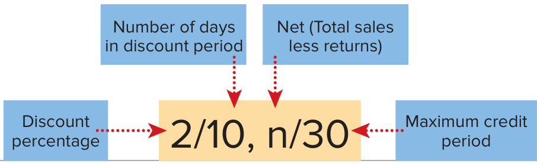
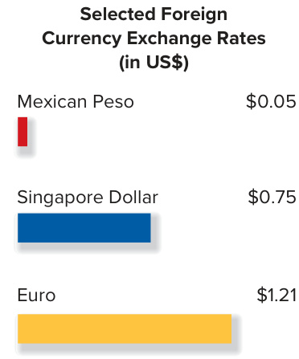
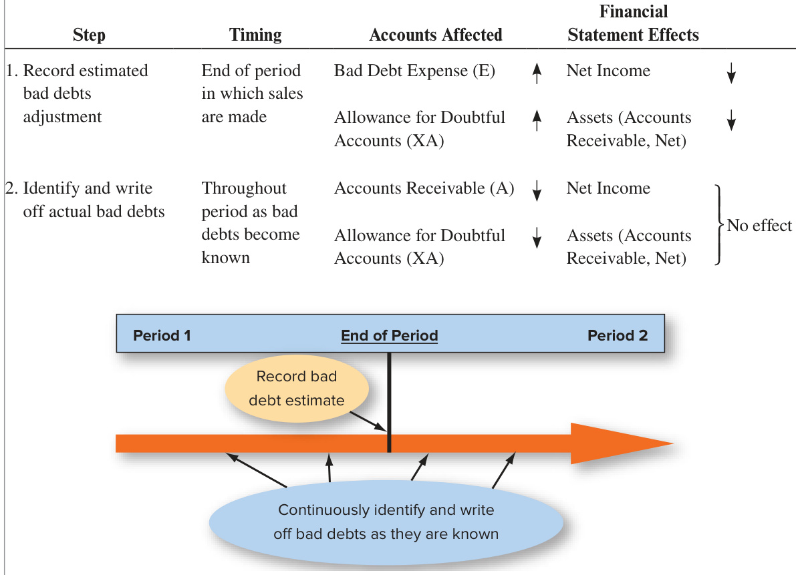
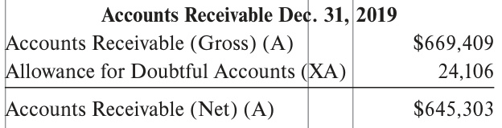
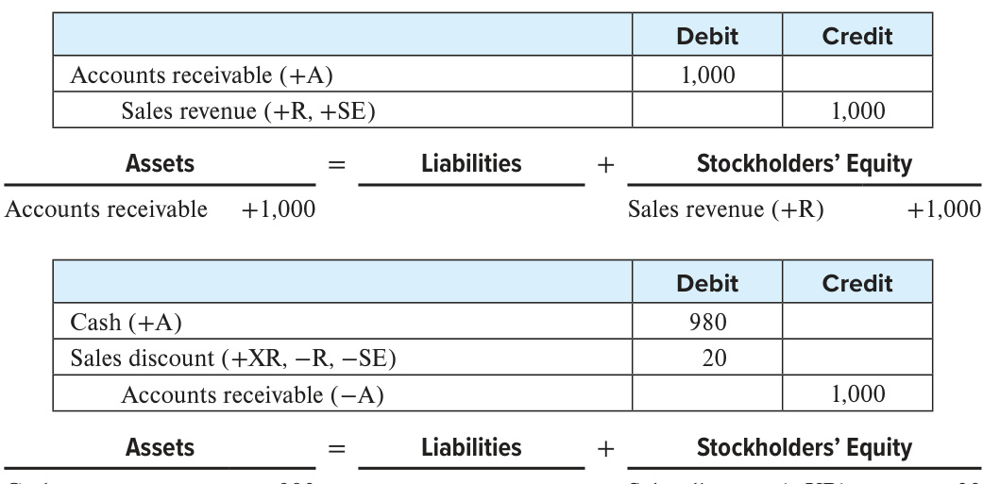
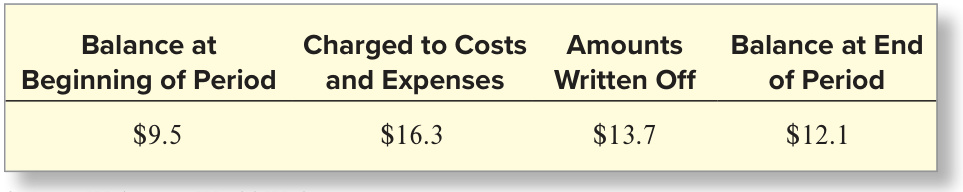

# Ch06 Reporting and Interpreting Sales Revenue, Receivables, and Cash

Since its founding in 1992, Skechers U.S.A., Inc., has become a major player in the active, casual, dress casual, and athletic footwear market reporting over $5.2 billion in sales for 2019. Its growth strategy requires building brand recognition by developing and introducing additional innovative footwear that satisfy the company’s high standards for styling, quality, comfort, and affordability. Skechers accurately recognized changing tastes in footwear both for work and play and focuses on a price point in the largest segment of the footwear market. It also supports increased brand recognition with focused advertising relying on celebrity endorsements. But unlike athletic apparel titans such as Nike and Under Armour who contract mainly with the biggest current names in sports, Skechers celebrity endorsers are a mix of former and current athletes and entertainers including Clayton Kershaw, Brooke Henderson, Howie Long, David Ortiz, Tony Romo, Matt Kuchar, and Sugar Ray Leonard. These endorsers appeal to the broad range of customers for Skechers more than 3,000 footwear styles covering every age and activity.  

Skechers currently markets more than 3,000 footwear styles for men, women, and children. To sell its footwear, it has developed a very successful multichannel distribution system. First, it sells to department and specialty stores such as Kohl’s and Dick’s Sporting Goods where it acts as a wholesaler. It also sells directly to consumers through more than 800 Skechers retail stores and online at skechers.com. Its wholesale and retail channels present different accounting issues that we will focus on in this chapter. Outside of the United States, it continues to penetrate new markets through its international subsidiaries and joint ventures in Asia, Canada, Europe, and elsewhere. These international ventures have been the largest source of recent sales growth.  

## LEARNING OBJECTIVES  

## After studying this chapter, you should be able to:  

6-1	 Analyze the impact of credit card sales, sales discounts, sales returns, and sales of bundled items on the amounts reported as net sales. p. 293 Estimate, report, and evaluate the effects of uncollectible accounts receivable (bad debts) on financial statements. p. 298   
6-3 Analyze and interpret the receivables turnover ratio and the effects of accounts receivable on cash flows. p. 304  

6-4	 Report, control, and safeguard cash. p. 307  

## Skechers U.S.A.  

BUILDING BRANDS TO BUILD GROSS PROFIT  

  

Kevin Khoo/Shutterstock  

## UNDERSTANDING THE BUSINESS  

Planning Skechers’ growth strategy requires careful coordination of sales activities, as well as cash collections from customers. Much of this coordination revolves around allowing consumers to use credit cards, providing business customers discounts for early payment, and allowing sales returns and allowances under certain circumstances—strategies that motivate customers to buy its products and make payment for their purchases. These activities affect net sales revenue, the top line on the income statement. Coordinating sales and cash collections from customers also involves managing bad debts, which affect selling, general, and administrative expenses on the income statement and cash and accounts receivable on the balance sheet. Net sales, accounts receivable, and cash are the focus of this chapter. We also will introduce the receivables turnover ratio as a measure of the efficiency of credit-granting and collection activities. Finally, because the cash collected from customers is also a tempting target for fraud and embezzlement, we will discuss how accounting systems commonly include controls to prevent and detect such misdeeds.  

## Accounting for Net Sales Revenue  

Measuring and Reporting Receivables  

## Reporting and Safeguarding Cash  

Motivating Sales and Collections Credit Card Sales to Consumers Sales Discounts to Businesses Sales Returns and Allowances Reporting Net Sales Revenue Recognition for Bundled Goods and Services  

Classifying Receivables Accounting for Bad Debts Reporting Accounts Receivable and Bad Debts Estimating Bad Debts Control over Accounts Receivable Receivables Turnover Ratio  

Cash and Cash Equivalents Defined Cash Management Internal Control of Cash Reconciliation of the Cash Accounts and the Bank Statements  

## ACCOUNTING FOR NET SALES REVENUE  

As indicated in Chapter 3, the revenue recognition principle requires that revenues be recorded when the company transfers goods and services to customers, in the amount it expects to be entitled to receive. For sellers of goods, sales revenue is recorded when title and risks of ownership transfer to the buyer. The point at which title (ownership) changes hands is determined by the shipping terms in the sales contract. When goods are shipped FOB (free on board) shipping point, title changes hands at shipment and the buyer normally pays for shipping. When they are shipped FOB destination, title changes hands on delivery and the seller normally pays for shipping. Skechers ships its goods to retailers, such as Kohl’s and Dick’s, FOB shipping point. Revenues from goods shipped FOB shipping point are normally recognized at shipment. Revenues from goods shipped FOB destination are normally recognized at delivery.  

Service companies most often record sales revenue when they have provided services to the buyer. Companies disclose the revenue recognition rule they follow in the footnote to the financial statements entitled Summary of Significant Accounting Policies. In that note, Skechers reports the following:  

## SKECHERS U.S.A.  

REAL WORLD EXCERPT: Quarterly Report  

## NOTES TO CONSOLIDATED FINANCIAL STATEMENTS  

1. Summary of Significant Accounting Policies Revenue Recognition  

The Company recognizes revenue when control of the promised goods or services is transferred to its customers in an amount that reflects the consideration the Company expects to be entitled to in exchange for those goods or services. . . . The Company recognizes revenue on wholesale sales upon shipment as that is when the customer obtains control of the promised goods. . . . For in-store sales, the Company recognizes revenue at the point of sale. For sales made through its websites, the Company recognizes revenue upon shipment to the customer which is when the customer obtains control of the promised good. . . .  

Source: Skechers U.S.A., Inc.  

The appropriate amount of revenue to record is the amount it expects to be entitled to receive. Revenue recognition for more complex sales contracts with multiple performance obligations requires application of the five-step process which is discussed at the end of this section.  

## Motivating Sales and Collections  

Some sales practices differ depending on whether sales are made to businesses or consumers. Skechers sells footwear and apparel to other businesses, which then sell the goods to consumers. It also operates its own online and physical retail stores that sell footwear directly to consumers.  

Skechers and other companies use a variety of methods to motivate both groups of customers to buy its products and make payment for their purchases. The principal methods include (1) allowing consumers to use credit cards to pay for purchases, (2) providing business customers direct credit and discounts for early payment, and (3) allowing returns from all customers under certain circumstances. These methods, in turn, affect the way we compute net sales revenue.  

## Credit Card Sales to Consumers  

Skechers accepts cash or credit card payment for its retail store and online sales. Retailers accept credit cards (mainly Visa, Mastercard, and American Express) for a variety of reasons:  

1.	Increasing customer traffic.   
2.	Avoiding the costs of providing credit directly to consumers, including recordkeeping and bad debts (discussed later).   
3.	Lowering losses due to bad checks.   
4.	Avoiding losses from fraudulent credit card sales. (As long as the retailer follows the credit card company’s verification procedure, the credit card company [e.g., Visa] absorbs any losses.)   
5.	Receiving money faster. (Because credit card receipts can be deposited directly in its bank account, Skechers receives its money faster than it would if it provided credit directly to consumers.)  

The credit card company charges a fee for the service it provides. For example, when Skechers deposits its credit card receipts in the bank, it might receive credit for only 97 percent of the sales price. The credit card company is charging a 3 percent fee (the credit card discount) for its services. If daily credit card sales were $\mathbb{S}3{,}000$ , Skechers would report the following:  

Sales revenue $\mathbb{S}\;3{,}000$ Less: Credit card discounts $(0.03\times\mathbb{8}3,000)$ 90 Net sales (reported on the income statement) \$2,910  

The accounting by the retailer is the same when a consumer uses a contactless mobile payment app such as Google Pay or Apple Pay to charge a purchase to one of their credit cards.  

## Sales Discounts to Businesses  

Most of Skechers’ sales to businesses are credit sales on open account; that is, there is no formal written promissory note or credit card. When Skechers sells footwear to retailers on credit, credit terms are printed on the sales document and invoice (bill) sent to the customer. Often credit terms are abbreviated. For example, if the full price is due within 30 days of the invoice date, the credit terms would be noted as ${\bf{n}}/30.$ . Here, the n means the sales amount net of, or less, any sales returns.  

## LEARNING OBJECTIVE 6-1  

Analyze the impact of credit card sales, sales discounts, sales returns, and sales of bundled items on the amounts reported as net sales.  

  
Early Payment Incentive  

In some cases, a sales discount (often called a cash discount) is granted to the purchaser to encourage early payment.1 For example, Skechers could offer terms of $2/10,\,\mathrm{n}/30$ , which means that the customer may deduct 2 percent from the invoice price if cash payment is made within 10 days from the date of sale. If cash payment is not made within the 10-day discount period, the full sales price (less any returns) is due within a maximum of 30 days.  

Companies offer this sales discount to encourage customers to pay more quickly. This provides two benefits:  

1.	Prompt receipt of cash from customers reduces the necessity to borrow money to meet operating needs.   
2.	Because customers tend to pay bills providing discounts first, a sales discount also decreases the chances that the customer will run out of funds before the company’s bill is paid.  

Companies commonly record sales discounts taken by subtracting the discount from sales if payment is made within the discount period. For example, if credit sales of $\mathbb{S}1{,}000$ are recorded with terms $2/10,\mathfrak{n}/30$ and payment of $\mathbb{S}980$ $\mathbb{5}1,000\times0.98=\mathbb{5}980$ ) is made within the discount period, net sales of the following amount would be reported:  

Sales revenue $\begin{array}{r}{\mathbb{8}1,\!000}\\ {\frac{20}{\mathbb{9}\mathbb{8}0}}\end{array}$ Less: Sales discounts $(0.02\times\mathbb{1},000)$ ) Net sales (reported on the income statement)  

If payment is made after the discount period, the full $\mathbb{S}1{,}000$ would be reported as net sales. Accounting for sales discounts is discussed in more detail in the Supplement at the end of this chapter. Any quantity discounts or rebates provided to customers also must be subtracted in the computation of net sales.  

## FINANCIAL ANALYSIS  

## To Take or Not to Take the Discount, That Is the Question  

Purchasers often pay within the discount period because the savings are substantial. With terms 2/10, $\mathfrak{n}/30$ , customers save 2 percent by paying 20 days early (on the 10th day instead of the 30th). This translates into a 37 percent annual interest rate. To calculate the annual interest rate, first compute the interest rate for the discount period. When the 2 percent discount is taken, the customer pays only 98 percent of the gross sales price. For example, on a $\mathbb{S}100$ sale with terms $2/10,\mathrm{n}/30$ , $\mathbb{S}2$ would be saved and $\mathbb{S}98$ would be paid 20 days early.  

The interest rate for the 20-day discount period and the annual interest rate are computed as follows:  

_A_m__o_u_nt_ _S_a_ve_d_ $=$ Interest Rate for 20 Days Interest Rate for 20 Days×​ _2_0_ _d_a_y_s_  ​ Annual Interest   
Amount Paid Rate $\frac{\mathfrak{P}2}{\mathfrak{P}98}=2.04\%\;\mathrm{for}\;20\;\mathrm{Days}$ $2.04\%\times{\frac{365\ {\mathrm{days}}}{20\ {\mathrm{days}}}}\,{=}{\frac{37.23\%}{\mathrm{Interest}}}$ A Rnatneu a l  

As long as the bank’s interest rate is less than the interest rate associated with failing to take cash discounts, the customer will save by taking the cash discount. For example, even if credit customers had to borrow from the bank at a rate as high as 15 percent, they would save a great deal.  

## Sales Returns and Allowances  

Retailers and consumers have a right to return unsatisfactory or damaged merchandise and receive a refund or an adjustment to their bill. Such returns are often accumulated in a separate account called Sales Returns and Allowances and must be deducted from gross sales revenue in determining net sales. This account informs Skechers’ managers of the volume of returns and allowances and thus provides an important measure of the quality of customer service. Assume that Fontana’s Shoes of Ithaca, New York, buys 40 pairs of athletic shoes (at $\mathbb{S}50$ each) from Skechers for $^{\S2,000}$ on account. Before paying for the shoes, Fontana’s discovers that 10 pairs of shoes are not the color ordered and returns them to Skechers.3 Skechers would compute net sales as follows:  

$$
{\begin{array}{l l l}{{\mathrm{Sales~revenue}}}&{}&{{\S2,000}}\\ {{\mathrm{Less:~Sales~returns~and~allowances~(10~pairs\times\S50)}}}&{}&{{\frac{500}{\sqrt{1.500}}}}\\ {{\mathrm{Net~sales~(reported~on~the~income~statement)}}}&{}&{{\S1,500}}\end{array}}
$$  

Cost of goods sold related to the 10 pairs of shoes also would be reduced.  

## Reporting Net Sales  

On the company’s books, credit card discounts, sales discounts, and sales returns and allowances are accounted for separately to allow managers to monitor the costs of credit card use, sales discounts, and returns. Using the numbers in the preceding examples, the amount of net sales reported on the income statement is computed in the following manner:  

Sales revenue \$6,000   
Less: Credit card discounts (a contra-revenue) 90   
Sales discounts (a contra-revenue) 20   
Sales returns and allowances (a contra-revenue) 500   
Net sales (included on the first line of the income statement) \$5,390  

Net Sales to all customers is the top line reported on Skechers’ income statement, presented in Exhibit 6.1. Skechers indicates in its revenue recognition footnote that the appropriate subtractions are made.  

<html><body><table><tr><td colspan="4">SKECHERSU.S.A.,INC.ANDSUBSIDIARIES Consolidated Statements of Earnings (partial) Years endedDecember31,2019,2018,2017 (amounts in thousands)</td></tr><tr><td></td><td>2019</td><td>2018</td><td>2017</td></tr><tr><td>Net sales</td><td>$5,220,051</td><td>$4,642,068</td><td>$4,164,160</td></tr><tr><td>Cost ofsales</td><td>2,728,894</td><td>2,418,463</td><td>2,225,271</td></tr><tr><td>Gross profit</td><td>2,491,157</td><td>2,223,605</td><td>1,938,889</td></tr><tr><td>Royalty income</td><td>22,493</td><td>20,582</td><td>16,666</td></tr><tr><td></td><td>$2,513,650</td><td>$2,244,187</td><td>$1,955,555</td></tr><tr><td>Operatingexpenses:</td><td></td><td></td><td></td></tr><tr><td>Selling</td><td>369,901</td><td>350,435</td><td>327,201</td></tr><tr><td>General and administrative</td><td>1,625,306</td><td>1,455,987</td><td>1,245,474</td></tr><tr><td></td><td>1,995,207</td><td>1,806,422</td><td>1,572,675</td></tr><tr><td>Earningsfrom operations</td><td>518,443</td><td>437,765</td><td>$ 382,880</td></tr></table></body></html>

Source: Skechers U.S.A., Inc.  

  

The amount of revenue to record is the entitled to receive. Consequently, credit card discounts, sales discounts, and sales returns and allowances must be subtracted to compute net sales.  

## EXHIBIT 6.1  

Net Sales on the Income Statement  

## SKECHERS U.S.A.  

REAL WORLD EXCERPT: Annual Report  

## NOTES TO CONSOLIDATED FINANCIAL STATEMENTS  

1. Summary of Significant Accounting Policies  

Revenue Recognition  

. . . Allowances for estimated returns, discounts, . . . and chargebacks are provided for when related revenue is recorded. . . . Allowance for returns, sales allowances and customer chargebacks are recorded against revenue.  

Source: Skechers U.S.A., Inc.  

## A QUESTION OF ETHICS  

## Volume Discounts/Rebates and Earnings Misstatements at Monsanto  

In 2016, the SEC found that agribusiness company Monsanto had materially misstated company revenues and earnings by improperly accounting for volume discounts and rebates offered to retailers and distributors of its flagship product, Roundup. In an attempt to offset the effects of generic competition for Roundup, Monsanto instituted new discount and rebate programs. As we learned in Chapter 3 and in this chapter, net sales revenue should be recorded “in the amount the company expects to be entitled to receive.” This rule requires that Monsanto reduce the amount of reported net sales by the expected rebates in the period of sale. Instead, Monsanto delayed recording these reductions until the following year, overstating net sales and earnings before taxes by $\mathbb{S}44.5$ million and $\mathbb{S}48$ million, respectively, over two years. Monsanto also improperly accounted for additional rebates of more than $\mathbb{S}56$ million as selling, general, and administrative expense instead of a reduction in net sales. This practice overstated gross profit, an important measure used by analysts to assess competitive pricing pressure, but did not affect income before taxes. Monsanto agreed to pay an $\mathbb{S}80$ million penalty to settle these violations and three Monsanto managers paid penalties of between $\mathbb{S}30{,}000$ and $^\mathrm{\Phi}_{\mathbb{}}55{,}000$ for their involvement in the scheme. And Monsanto’s CEO and CFO returned bonuses of $\mathbb{53}\mathrm{,}165\mathrm{,}852$ and $^{\S728,843}$ they had received as a result of the earnings overstatements, though they were not found to be involved in personal misconduct.  

In the last section, we learned to analyze the impact of credit card sales, sales discounts, and sales returns, all of which reduce the amounts reported as net sales. Both credit card discounts and sales or cash discounts promote faster receipt of cash. Sales returns and allowances include refunds and adjustments to customers’ bills for defective or incorrect merchandise.  

Before you move on, complete the following questions to test your understanding of these concepts.  

1.	 Assume that Skechers sold $^{\mathbb{S}30,000}$ worth of footwear to various retailers with terms $1/10$ , $\upmu/30$ and half of that amount was paid within the discount period. Gross retail store and online sales were $\Phi5{,}000$ for the same period; 80 percent of these sales were paid for with credit cards with a 3 percent discount and the rest were paid for with cash. Compute net sales for the period. 2.	 During the fourth quarter of 2019, Skechers’ net sales totaled $\mathbb{S}1,330,732$ and cost of sales was $^{\Phi692,983}$ . What was Skechers’ gross profit for the fourth quarter of 2019?  

After you have completed your answers, check them at the bottom of the next page.  

For additional step-by-step video instruction on computing net sales and gross profit, go to mhhe.com/ libby_gh6-1  

Related Homework: M6-1, M6-2, E6-1, E6-2, E6-3, E6-4  

## Revenue Recognition for Bundled Goods and Services: A Five-Step Process  

Bundling of goods and services within one sales contract is common in a variety of industries. For example, Verizon sells its cell phones at a discount when purchased as part of a two-year service contract. When Jaguar sells its new cars to customers, it bundles a fairly complete fiveyear warranty and five years of scheduled maintenance “free” with the purchase. And when Apple sells its iPad, the contract with its customer includes not only the iPad and software essential to the functioning of the product, but future upgrades relating to the essential software. When a seller promises to provide more than one good or service in a single sales contract, FASB standards specify a five-step process to determine the amount to be recognized as revenue. Let’s assume that the total selling price for an iPad is $\mathbb{S}500$ , (1) $\mathbb{S}450$ of which relates to the hardware with essential software and (2) $\mathbb{S}50$ of which relates to future software upgrades that would be provided over five years. In this case, we would apply the five-step process as follows:  

<html><body><table><tr><td>Step1:Identifythecontractbetweenthecompanyandcustomer.</td><td>Bundled:iPad“withessentialsoftware”andrelatedfutureupgradeservices</td></tr><tr><td>Step 2: ：Identifytheperformanceobligations(promisedgoodsand services).</td><td>#1Hardwarewithessentialsoftware #2Futuresoftwareupgrades</td></tr><tr><td>Step 3: Determine the transaction price.</td><td>$500 total</td></tr><tr><td>Step4:Allocate thetransactionpriceto theperformance obligations.</td><td>#1H Hardwarewithessentialsoftware→S450 #2 Future software upgrades→$50</td></tr><tr><td>Step5:R Recognizerevenuewheneachperformanceobligationissatis- fied(orovertimeifaserviceisprovidedovertime).</td><td>#1H Hardware with essential software → $450 in year 1 #2 Future software upgrades → $50/5 = $10 each year for five years</td></tr></table></body></html>  

As a result, revenue from the contract would be recognized as follows:  

<html><body><table><tr><td>Year</td><td>1</td><td>2</td><td>3</td><td>4</td><td>5</td><td>Total</td></tr><tr><td>Revenue</td><td>$450 + $10 = $460</td><td>$10</td><td>$10</td><td>$10</td><td>$10</td><td>$500</td></tr></table></body></html>  

## MEASURING AND REPORTING RECEIVABLES  

## Classifying Receivables  

Receivables may be classified in three common ways. First, they may be classified as either an account receivable or a note receivable. An accounts receivable is created by a credit sale on an open account. For example, an account receivable is created when Skechers sells shoes on  

S o l u t i o n s  t o S E L F - S T U DY  Q U I Z  

<html><body><table><tr><td colspan="2">GrossSales</td><td>$35,000</td></tr><tr><td colspan="2">Less: Sales Discounts (0.01 × 1/2 × $30,000)</td><td>150</td></tr><tr><td colspan="2">Credit Card Discounts (0.03× 0.80× $5,000)</td><td>120</td></tr><tr><td colspan="2">NetSales</td><td>$ 34,730</td></tr><tr><td colspan="2"></td><td></td></tr><tr><td>2. NetSales</td><td>$1,330,732</td><td></td></tr><tr><td>CostofSales</td><td>692,983</td><td></td></tr><tr><td>GrossProfit</td><td>637,749</td><td></td></tr></table></body></html>  

open account to Dick’s. A notes receivable is a promise in writing (a formal document) to pay (1) a specified amount of money, called the principal, at a definite future date known as the maturity date and (2) a specified amount of interest at one or more future dates. The interest is the amount charged for use of the principal.  

Second, receivables may be classified as trade or nontrade receivables. A trade receivable is created in the normal course of business when a sale of merchandise or services on credit occurs. A nontrade receivable arises from transactions other than the normal sale of merchandise or services. For example, if Skechers loaned money to a new vice president to help finance a home at the new job location, the loan would be classified as a nontrade receivable. Third, in a classified balance sheet, receivables also are classified as either current or noncurrent (short term or long term), depending on when the cash is expected to be collected. Skechers reports Trade Accounts Receivable from customers and classifies the asset as a current asset because the accounts receivable are all due to be paid within one year. It also reports Other Receivables in a much smaller amount, and also classifies that asset as a current asset.  

## LEARNING OBJECTIVE 6-2  

Estimate, report, and evaluate the effects of uncollectible accounts receivable (bad debts) on financial statements.  

## INTERNATIONAL PERSPECTIVE  

  

Export (international) sales are a growing part of the U.S. economy. For example, international sales amounted to 57.9 percent of Skechers net sales in 2019. Most export sales to businesses are on credit. When a buyer agrees to pay in its local currency, Skechers cannot add the resulting accounts receivable, which are denominated in foreign currency, directly to its U.S. dollar accounts receivable. Skechers’ accountants first must convert them to U.S. dollars using the end-of-period exchange rate between the two currencies. For example, if a French department store owed Skechers $\epsilon20{,}000$ (euros, the common currency of the European Monetary Union) on December 31, 2019, and each euro was worth ${\mathrm{US}}\mathbb{1}.21$ on that date, Skechers would add $\mathrm{US}\Phi24{,}200$ to its accounts receivable on the balance sheet.  

## Accounting for Bad Debts  

For billing and collection purposes, Skechers keeps a separate accounts receivable account for each business customer (retailer) that resells its footwear (called a subsidiary account). The accounts receivable amount on the balance sheet represents the total of these individual customer accounts.  

When Skechers extends credit to its commercial customers, it knows that some of these customers will not pay their debts. The expense recognition principle requires recording of bad debt expense in the same accounting period in which the related sales are made. This presents an important accounting problem. Skechers may not learn which particular customers will not pay until the next accounting period. So, at the end of the period of sale, it normally does not know which customers’ accounts receivable are bad debts.  

Skechers resolves this problem by using the allowance method to measure bad debt expense. The allowance method is based on estimates of the expected amount of bad debts. Two primary steps in employing the allowance method are:  

1.	Making the end-of-period adjusting entry to record estimated bad debt expense.   
2.	Writing off specific accounts determined to be uncollectible during the period.  

## Recording Bad Debt Expense Estimates  

Bad debt expense (doubtful accounts expense, uncollectible accounts expense, provision for uncollectible accounts) is the expense associated with estimated uncollectible accounts receivable. An adjusting journal entry at the end of the accounting period records the bad debt estimate. For the year ended December 31, 2019, Skechers estimated bad debt expense to be ${\mathfrak{S}}6{,}402$ (all numbers in thousands of dollars)4 and made the following adjusting entry:  

<html><body><table><tr><td></td><td>Debit</td><td>Credit</td></tr><tr><td>Baddebtexpense (+E,-SE)</td><td>6,402</td><td></td></tr><tr><td>Allowancefor doubtful accounts S (+XA,-A)</td><td></td><td>6,402</td></tr><tr><td>Assets Liabilities</td><td>+</td><td>Stockholders'Equity</td></tr></table></body></html>

Allowance for doubtful accounts −6,402 Bad debt expense $\left(+\mathrm{E}\right)$ −6,402  

Tip An adjusting journal entry at the end of the accounting period records the bad debt estimate.  

The Bad Debt Expense is included in the category “General and Administrative” expenses on the income statement. It decreases net income and stockholders’ equity. Accounts Receivable could not be credited in the journal entry because there is no way to know which customers’ accounts receivable are involved. So the credit is made, instead, to a contra-asset account called Allowance for Doubtful Accounts (Allowance for Bad Debts or Allowance for Uncollectible Accounts). As a contra-asset, the balance in Allowance for Doubtful Accounts is always subtracted from the balance of the asset Accounts Receivable. Thus, the entry decreases the net book value of Accounts Receivable and total assets.  

## Writing Off Specific Uncollectible Accounts  

Throughout the year, when it is determined that a customer will not pay its debts (e.g., due to bankruptcy), the write-off of that individual bad debt is recorded through a journal entry. Now that the specific uncollectible customer account receivable has been identified, it can be removed with a credit. At the same time, we no longer need the related estimate in the contraasset Allowance for Doubtful Accounts, which is removed by a debit. The journal entry summarizing Skechers’ total write-offs of $\mathbb{S}7{,}912$ during 2019 follows:  

<html><body><table><tr><td></td><td>Debit</td><td>Credit</td></tr><tr><td>Allowancefor doubtful accounts S(-XA,+A)</td><td>7,912</td><td></td></tr><tr><td>Accounts receivable (-A)</td><td></td><td>7,912</td></tr><tr><td>Assets Liabilities</td><td colspan="2">+ Stockholders'Equity</td></tr></table></body></html>

Allowance for doubtful accounts $+7\small{,}912$ Accounts receivable −7,912  

debts are written off throughout the period   
when it is determined that a   
customer won’t pay its debts.  

Notice that this journal entry did not affect any income statement accounts. It did not record a bad debt expense because the estimated expense was recorded with an adjusting entry in the period of sale. Also, the entry did not change the net book value of accounts receivable because the decrease in the asset account (Accounts Receivable) was offset by the decrease in the contraasset account (Allowance for Doubtful Accounts). Thus, it also did not affect total assets.  

## FINANCIAL ANALYSIS  

## Bad Debt Recoveries  

When a company receives a payment on an account that already has been written off, the journal entry to write off the account is reversed to put the receivable back on the books and then the collection of cash is recorded. For example, if the previously written-off amount was $\mathbb{S}677$ , it would make the following entries:  

<html><body><table><tr><td></td><td>Debit</td><td>Credit</td></tr><tr><td>Accountsreceivable(+A)</td><td>677</td><td></td></tr><tr><td>Allowance for doubtful accounts (+XA,-A)</td><td></td><td>677</td></tr><tr><td>Cash (+A)</td><td>677</td><td></td></tr><tr><td>Accountsreceivable(-A)</td><td></td><td>677</td></tr></table></body></html>  

Note that these entries, like the original write-off, do not affect total assets or net income. Only the estimate of bad debts affects these amounts.  

## Summary of the Accounting Process  

It is important to remember that accounting for bad debts is a two-step process:  

  
Skechers’ complete 2019 accounting process for bad debts can now be summarized in terms of the changes in Accounts Receivable (Gross) and the Allowance for Doubtful Accounts:  

  

<html><body><table><tr><td colspan="4">Accounts Receivable (Gross) (A)</td></tr><tr><td>Beginningbalance</td><td>527,529</td><td>Collectionsonaccount</td><td>5,070,259</td></tr><tr><td>Salesonaccount</td><td>5,220,051</td><td>Write-offs</td><td>7,912</td></tr><tr><td>Endingbalance</td><td>669,409</td><td></td><td></td></tr><tr><td colspan="4">Allowance for Doubtful Accounts (XA)</td></tr><tr><td rowspan="2">Write-offs</td><td rowspan="2">7,912</td><td>Beginningbalance</td><td>25,616</td></tr><tr><td>Bad debt expense adjustment</td><td>6,402</td></tr><tr><td></td><td></td><td>Endingbalance</td><td>24,106</td></tr></table></body></html>  

Accounts Receivable (Gross) includes the total accounts receivable, both collectible and uncollectible. The balance in the Allowance for Doubtful Accounts is the portion of the accounts receivable balance the company estimates to be uncollectible. Accounts Receivable (Net) reported on the balance sheet is the portion of the accounts the company expects to collect (or its estimated net realizable value).  

## Reporting Accounts Receivable and Bad Debts  

Analysts who want information on Skechers’ receivables will find Accounts Receivable, net of allowance for doubtful accounts (the net book value), of $^{\S645,303}$ and $^{\S501,913}$ for year-end 2019 and 2018, respectively, reported on the balance sheet (Exhibit 6.2). Skechers reports the balance in the Allowance for Doubtful Accounts $^{\leftmoon24,106}$ in 2019 and $\mathbb{S}25{,}616$ in 2018) within the account title. Other companies report the balance in the Allowance for Doubtful Accounts in a note. Accounts Receivable (Gross), the total accounts receivable, can be computed by adding the two amounts together.  

<html><body><table><tr><td colspan="3">SKECHERSU.S.A.,INC.ANDSUBSIDIARIES CONSOLIDATEDBALANCESHEETS(partial) December31,2019and2018 (amounts in thousands)</td></tr><tr><td></td><td>2019</td><td>2018</td></tr><tr><td>ASSETS Current assets:</td><td></td><td></td></tr><tr><td>Cashandcashequivalents</td><td>$ 824,876</td><td>$ 872,237</td></tr><tr><td>Short-terminvestments Trade accounts receivable, less allowances of $24,106 in</td><td>112,037 645,303</td><td>100,029 501,913</td></tr><tr><td>2019 and $25,616 in 2018 Otherreceivables</td><td></td><td></td></tr><tr><td></td><td>53,932</td><td>55,683 863,260</td></tr><tr><td>Inventories Prepaid expenses and other current assets</td><td>1,069,863</td><td></td></tr><tr><td></td><td>113,580</td><td>79,018</td></tr><tr><td>Total current assets</td><td>$2,819,591</td><td>$2,472,140</td></tr></table></body></html>

Source: Skechers U.S.A., Inc.  

The amounts of bad debt expense and accounts receivable written off for the period, if material, are reported on a schedule that publicly traded companies must include in their Annual Report Form 10-K filed with the SEC. Exhibit 6.3 presents this schedule from Skechers 2019 filing.  

## EXHIBIT 6.2  

Accounts Receivable on the Partial Balance Sheet  

## SKECHERS U.S.A.  

REAL WORLD EXCERPT: Annual Report  

SCHEDULE II—VALUATION AND QUALIFYING ACCOUNTS Years Ended December 31, 2019, 2018 and 2017   
  

<html><body><table><tr><td colspan="5">(amounts in thousands)</td></tr><tr><td>Allowancefor Doubtful</td><td>Balanceat Beginning</td><td></td><td>BadDebt Write Expense Offs</td><td>Balance at End of</td></tr><tr><td>Accounts</td><td>of Year</td><td>Additions</td><td>Deductions</td><td>Year</td></tr><tr><td>December31,2017</td><td>$16,594</td><td>$12,773</td><td>8,851</td><td>$20,516</td></tr><tr><td>December31,2018</td><td>20,516 25,616</td><td>15,485</td><td>10,385</td><td>25,616 24,106</td></tr><tr><td>December31,2019</td><td></td><td>6,402</td><td>7,912</td><td></td></tr></table></body></html>

Source: Skechers U.S.A., Inc.  

When receivables are material, companies must employ the allowance method to account for uncollectibles. These are the steps in the process:  

a.	 The end-of-period adjusting entry to record the estimate of bad debt expense and increase the allowance for doubtful accounts.   
b.	 Writing off specific accounts determined to be uncollectible during the period to eliminate the specific uncollectible account receivable and decrease the allowance for doubtful accounts.  

The adjusting entry reduces net income as well as net accounts receivable. The write-off affects neither. Before you move on, complete the following questions to test your understanding of these concepts.  

## EXHIBIT 6.3  

Accounts Receivable Valuation Schedule (Form 10-K)  

## SKECHERS U.S.A.  

REAL WORLD EXCERPT: Annual Report  

## S E L F - S T U D Y  Q U I Z  

In a recent year, Crocs™, Inc., a Skechers competitor, had a beginning credit balance in the Allowance for Doubtful Accounts of $\mathbb{S}10{,}959$ (all numbers in thousands of dollars). It wrote off accounts receivable totaling $^{\Phi4,249}$ during the year and made a bad debt expense adjustment for the year of $\mathbb{S}1{,}566$ .  

1.	 What adjusting journal entry did Crocs make for bad debts at the end of the year?   
2.	 Make the journal entry summarizing Crocs’s total write-off of bad debts during the year.   
3.	 Compute the balance in the Allowance for Doubtful Accounts at the end of the year.  

After you have completed your answers, check them at the bottom of this page.  

  

## G U I D E D H E L P  6 - 2  

For additional step-by-step video instruction on preparing journal entries related to bad debts, go to mhhe.com/libby_gh6-2.  

Related Homework: M6-3, M6-4, E6-8  

## Estimating Bad Debts  

The bad debt expense amount recorded in the end-of-period adjusting entry often is estimated based on either (1) a percentage of total credit sales for the period or (2) an aging of accounts receivable. Both methods are acceptable under GAAP and are widely used. The percentage of credit sales method is simpler to apply, but the aging method is generally more accurate. Many companies use the simpler method on a weekly or monthly basis and use the more accurate method on a monthly or quarterly basis to check the accuracy of the earlier estimates. In our example, both methods produce exactly the same estimate, which rarely occurs in practice.  

## Percentage of Credit Sales Method  

The percentage of credit sales method bases bad debt expense on the historical percentage of credit sales that result in bad debts. The average percentage of credit sales that result in bad debts can be computed by dividing total bad debt losses by total credit sales. A company that has been operating for some years has sufficient experience to project probable future bad debt losses. For example, if we assume that, during the year 2020, Skechers expected bad debt losses of 1.0 percent of credit sales, and its credit sales were $\Phi1{,}970{,}000$ (all numbers in thousands), it would estimate the current year’s bad debts as  

  

## The percentage of credit sales method  

is a simple one-step process where the current period’s bad debt expense is directly estimated.  

Credit sales \$1,970,000   
$\times$ Bad debt loss rate $(1.0\%)$ ) × .01   
Bad debt expense \$ 19,700  

This amount would be directly recorded as Bad Debt Expense (and an increase in Allowance for Doubtful Accounts) in the current year. Our beginning balance in the Allowance for  

S o l u t i o n s  t o S E L F - S T U DY  Q U I Z  

1. Bad debt expense $\mathrm{(+E}$ , −SE) 1,566 Allowance for doubtful accounts $\mathbf{\Psi}_{+\mathrm{XA}}$ , −A) 1,566   
2. Allowance for doubtful accounts (−XA, $+\mathbf{A}_{,}$ ) 4,249 Accounts receivable (−A) 4,249   
3. Beginning Balance $^+$ Bad Debt Expense Estimate − Write-Offs $=$ Ending Balance: $\mathbb{5}10,959+1,566-4,249=\mathbb{5}8,276$  

Doubtful Accounts for 2020 would be the ending balance for 2019. Assuming write-offs during 2020 of $^{\mathbb{S}14,106}$ , the ending balance is computed as follows:  

<html><body><table><tr><td colspan="3">AllowanceforDoubtful Accounts (XA)</td><td rowspan="2"></td></tr><tr><td rowspan="2">2020Write-offs 14,106</td><td rowspan="2">2020Beginning gbalance</td><td rowspan="2">24,106</td></tr><tr><td></td></tr><tr><td rowspan="4"></td><td>2020Baddebtexpense</td><td></td><td>Percentofcredit</td></tr><tr><td>adjustment</td><td>19,700</td><td>salesestimate</td></tr><tr><td></td><td></td><td></td></tr><tr><td></td><td></td><td></td></tr></table></body></html>  

2020 Ending balance $\mathcal{Y}=29,700$  

## Aging of Accounts Receivable  

The aging of accounts receivable method relies on the fact that, as accounts receivable become older and more overdue, it is less likely that they will be collected. For example, a receivable that was due in 30 days but has not been paid after 120 days is less likely to be collected, on average, than a similar receivable that remains unpaid after 45 days.  

If Skechers split its assumed 2020 ending balance in accounts receivable (gross) of $^{\S670,000}$ into three age categories, it would first examine the individual customer accounts receivable and sort them into the three age categories. Based on prior experience, management would then estimate the probable bad debt loss rates for each category: for example, not yet due, 1 percent; 1 to 90 days past due, 6 percent; over 90 days, 30 percent.  

As illustrated in the aging schedule below, this would result in an estimate of total uncollectible amounts of $\mathbb{5}29{,}700$ , the estimated ending balance that should be in the Allowance for Doubtful Accounts. From this, the adjustment to record Bad Debt Expense (and an increase in Allowance for Doubtful Accounts) for 2020 would be computed as follows:  

Aging Schedule 2020   

<html><body><table><tr><td colspan="2">Aged accountsreceivable</td><td>Estimated Percentage Uncollectible</td><td></td><td>Estimated Amount Uncollectible</td></tr><tr><td colspan="3">Not yet due $450,000</td><td></td><td></td></tr><tr><td colspan="2">170,000</td><td>×</td><td>1% 二 6%</td><td>$ 4,500</td></tr><tr><td colspan="2">Up to90 days past due Over 90 days past due</td><td>× 30%</td><td></td><td>10,200 15,000</td></tr><tr><td colspan="3">50,000 Estimated ending balance in Allowance for Doubtful Accounts</td><td></td><td>29,700</td></tr><tr><td colspan="3">Less:Balance in Allowance for Doubtful Accounts before adjustment ($24,106-$14,106)</td><td></td><td>10,000</td></tr><tr><td colspan="3">BadDebtExpensefor theyear</td><td></td><td>$19,700</td></tr><tr><td colspan="3">Allowance for Doubtful Accounts (XA)</td><td></td><td></td></tr><tr><td rowspan="2">2020Write-offs 14,106</td><td>2020Beginningbalance 2020Baddebtexpense</td><td></td><td>24,106</td><td></td></tr><tr><td>adjustment</td><td>？</td><td>=19,700← Total estimated</td><td></td></tr><tr><td></td><td>2020Ending balance</td><td></td><td>29,700</td><td>uncollectible accounts</td></tr></table></body></html>  

## Comparison of the Two Methods  

It is important to recognize that the approach to recording bad debt expense using the percentage of credit sales method is different from that for the aging method:  

•	 Percentage of credit sales. Directly compute the amount to be recorded as Bad Debt Expense on the income statement for the period in the adjusting journal entry. •	 Aging of Accounts Receivable. Compute the estimated ending balance we would like to have in the Allowance for Doubtful Accounts on the balance sheet after we make the necessary adjusting entry. The difference between the current balance in the account and the estimated balance is recorded as the adjusting entry for Bad Debt Expense for the period.  

## The aging of accounts receivable method is a  

three-step process where (1) the estimated ending balance in the allowance is calculated, (2) which is compared to the current balance, (3) to compute the bad debt expense adjustment for the period.  

## SKECHERS U.S.A.  

REAL WORLD EXCERPT: Form 10-K  

## LEARNING OBJECTIVE 6-3  

Analyze and interpret the receivables turnover ratio and the effects of accounts receivable on cash flows.  

In either case, the balance sheet presentation for 2020 would show Accounts Receivable, less Allowance for Doubtful Accounts, of $^{\Phi640,300}$ $(\mathbb{5}670,\!000-\mathbb{5}29,\!700)$ .  

## Actual Write-Offs Compared with Estimates  

Skechers’ Form 10-K provides clear information on its approach to estimating uncollectible accounts:  

## CRITICAL ACCOUNTING POLICIES  

Allowance for Bad Debts . . .  

The Company provides a reserve, charged against revenue and its receivables, for estimated losses that may result from its customers’ inability to pay. To minimize the likelihood of uncollectability, customers’ credit-worthiness is reviewed and adjusted periodically in accordance with external credit reporting services, financial statements issued by the customer and the Company’s experience with the account. When a customer’s account becomes significantly past due, the Company generally places a hold on the account and discontinues further shipments to that customer, minimizing further risk of loss. The Company determines the amount of the reserve by analyzing known uncollectible accounts, aged receivables, economic conditions in the customers’ countries or industries, historical losses and its customers’ credit-worthiness. Amounts later determined and specifically identified to be uncollectible are charged against this reserve.  

Source: Skechers U.S.A., Inc.  

If uncollectible accounts actually written off differ from the estimated amount previously recorded, a higher or lower amount of bad debt expense is recorded in the next period to make up for the previous period’s error in estimate. For example, Skechers reported that during the second quarter of 2020, it “recorded an incremental $\mathbb{S}10.2$ million in bad debt expense, due to the expected impact of the COVID-19 pandemic on wholesale customers around the world.” When estimates are found to be incorrect, financial statement values for prior annual accounting periods are not corrected.  

## Control over Accounts Receivable  

Many managers forget that extending credit will increase sales volume, but unless the related receivables are collected, they do not add to the bottom line. Companies that emphasize sales without monitoring the collection of credit sales soon find much of their current assets tied up in accounts receivable. The following practices can help minimize bad debts:  

1.	Require approval of customers’ credit history by a person independent of the sales and collections functions.   
2.	Age accounts receivable periodically and contact customers with overdue payments.   
3.	Reward both sales and collections personnel for speedy collections so that they work as a team.  

To assess the effectiveness of overall credit-granting and collection activities, managers and analysts often compute the receivables turnover ratio.  

## KEY RATIO ANALYSIS  

## Receivables Turnover Ratio  

## ANALYTICAL QUESTION  

How effective are credit-granting and collection activities?  

## RATIO AND COMPARISONS  

The receivables turnover ratio is computed as follows (see Exhibits 6.1 and 6.2):  

The 2019 receivables turnover ratio for Skechers:  

$$
\frac{\mathbb{S}5,220,051}{(\mathbb{S}645,303+\mathbb{S}501,913)/2}=9.1
$$  

<html><body><table><tr><td colspan="3">Comparisons OverTime</td></tr><tr><td colspan="3">Skechers U.S.A.</td></tr><tr><td>2017</td><td>2018</td><td>2019</td></tr><tr><td>11.4</td><td>10.2</td><td>9.1</td></tr></table></body></html>  

<html><body><table><tr><td colspan="2">Comparisons With Competitors</td></tr><tr><td>WolverineWorldWide</td><td>Crocs</td></tr><tr><td>2019</td><td>2019</td></tr><tr><td>6.6</td><td>12.0</td></tr></table></body></html>  

## INTERPRETATIONS  

In General The receivables turnover ratio reflects how many times average trade receivables are recorded and collected during the period. The higher the ratio, the faster the collection of receivables. A higher ratio benefits the company because it can invest the money collected to earn interest income or reduce borrowings to reduce interest expense. Overly generous payment schedules and ineffective collection methods keep the receivables turnover ratio low. Analysts and creditors watch this ratio because a sudden decline may mean that a company is extending payment deadlines in an attempt to prop up lagging sales or is even recording sales that will later be returned by customers. Many managers and analysts compute the related number, average collection period or average days sales in receivables, which is equal to $365\div$ Receivables Turnover Ratio. It indicates the average time it takes a customer to pay its accounts. For Skechers, the amount would be computed as follows for 2019:  

$$
\mathrm{Average~Collection~Period}=\frac{365}{\mathrm{Receivables~Turnover}}=\frac{365}{9.1}=40.1~\mathrm{days}
$$  

Focus Company Analysis Skechers’ receivables turnover decreased from 11.4 in 2017 to 9.1 in 2019. This indicates that the company is taking more time to convert its receivables into cash. Compared to the receivables turnover ratios of its competitors, Skechers’ ratio is below that of Crocs and ahead of that of Wolverine World Wide, which markets Merrell, Sperry, Wolverine, and Keds.  

A Few Cautions Because differences across industries and between firms in the manner in which customer purchases are financed can cause dramatic differences in the ratio, a particular firm’s ratio should be compared only with its prior years’ figures or with other firms in the same industry following the same financing practices.  

## F OC US  ON  CAS H  F LOW S  

## Accounts Receivable  

The change in accounts receivable can be a major determinant of a company’s cash flow from operations. While the income statement reflects the revenues of the period, the cash flow from operating activities reflects cash collections from customers. Because sales on account increase the balance in accounts receivable and cash collections from customers decrease the balance in accounts receivable, the change in accounts receivable from the beginning to the end of the period is the difference between sales and collections.  

## EFFECT ON STATEMENT OF CASH FLOWS  

In General When there is a net decrease in accounts receivable for the period, cash collected from customers is more than revenue; thus, the decrease must be added in computing cash flows from operations. When a net increase in accounts receivable occurs, cash collected from customers is less than revenue; thus, the increase must be subtracted in computing cash flows from operations.\*  

<html><body><table><tr><td></td><td>EffectonCashFlows</td></tr><tr><td>Operatingactivities(indirectmethod) Netincome</td><td>XXX</td></tr><tr><td>Adjustedfor</td><td></td></tr><tr><td>Addaccountsreceivabledecrease or</td><td></td></tr><tr><td>Subtractaccountsreceivableincrease</td><td></td></tr></table></body></html>  

Focus Company Analysis The excerpt below shows the Operating Activities section of Skechers’ statement of cash flows. Sales growth outpaced collections during 2019 to result in an increase in Skechers balance in receivables. This increase is subtracted in reconciling net income to cash flow from operating activities because revenues are higher than cash collected from customers for 2019. When receivables decrease, the amount of the decrease in receivables is added in reconciling net income to cash flow from operating activities because cash collected from customers is higher than revenues.  

<html><body><table><tr><td></td><td>2019</td></tr><tr><td>Cashflowsfromoperatingactivities Net earnings Adjustments toreconcile netincome to net cash provided by</td><td>$427,252</td></tr><tr><td>operating activities:</td><td></td></tr><tr><td>Changes in operating assets and liabilities: Receivables</td><td>(118,390)</td></tr><tr><td>Inventories</td><td>(171,903)</td></tr><tr><td>Netcashprovidedbyoperatingactivities $426,552</td><td></td></tr></table></body></html>  

When using the percentage of sales method, you directly compute the bad debt expense for the period by multiplying the amount of credit sales by the bad debt loss rate. With the aging method, you compute the estimated ending balance in the allowance and solve for the bad debt expense. This process involves multiplying the amount in each age category by the estimated percentage uncollectible to produce the estimated ending balance in the allowance for doubtful accounts. The difference between the estimated ending balance and the balance in the allowance before the adjustment becomes the bad debt expense for the year. Before you move on, try an example of the more difficult aging method computations based on Crocs’s numbers reported in an earlier year.  

1.	 In an earlier year, Skechers’ competitor Crocs reported a beginning balance in the Allowance for Doubtful Accounts of $\Phi5{,}262$ . It also wrote off bad debts amounting to $\mathbb{S}2{,}551$ during the year. At the end of the year, it computed total estimated uncollectible accounts using the aging method to be $\mathbb{S}3{,}973$ (all numbers in thousands of dollars). What amount did Crocs record as bad debt expense for the period? (Solution approach: Use the Allowance for Doubtful Accounts T-account or the following equation to solve for the missing value.)  

Allowance for Doubtful Accounts (XA)  

<html><body><table><tr><td colspan="2"></td></tr><tr><td></td><td></td></tr><tr><td></td><td></td></tr><tr><td colspan="2">Estimated endingbalanceinAllowancefor Doubtful Accounts</td></tr><tr><td colspan="2">Less:CurrentbalanceinAllowanceforDoubtfulAccounts</td></tr><tr><td colspan="2">BadDebtExpensefortheyear</td></tr></table></body></html>  

The accounts receivable turnover ratio measures the effectiveness of credit-granting and collection activities. Faster turnover means faster receipt of cash from your customers. To test whether you understand this concept, answer the following question:  

2.	 Indicate whether granting later payment deadlines (e.g., 60 days instead of 30 days) will most likely increase or decrease the accounts receivable turnover ratio. Explain.  

After you have completed your answers, check them below.  

G U I D E D H E L P 6 - 3  

For additional step-by-step video instruction on estimating and reporting bad debts using the aging method, go to mhhe.com/libby_gh-3.  

Related Homework: M6-5, E6-13, E6-14, E6-15  

## REPORTING AND SAFEGUARDING CASH Cash and Cash Equivalents Defined  

Cash is defined as money or any instrument that banks will accept for deposit and immediate credit to a company’s account, such as a check, money order, or bank draft. Cash equivalents are investments with original maturities of three months or less that are readily convertible to cash and whose value is unlikely to change (i.e., they are not sensitive to interest rate changes).  

## LEARNING OBJECTIVE 6-4  

Report, control, and safeguard cash.  

S o l u t i o n s  t o S E L F - S T U DY  Q U I Z  

<html><body><table><tr><td colspan="3">Allowance for Doubtful Accounts (XA)</td></tr><tr><td>Write-offs 2,551</td><td>Beginningbalance Bad debt expense (solve)</td><td>5,262 1,262 3,973 $3,973 2,711 $1,262</td></tr><tr><td colspan="3">Endingbalance</td></tr><tr><td colspan="3">EstimatedendingbalanceinAllowanceforDoubtfulAccounts</td></tr><tr><td colspan="3">Less:Current balance inAllowance for Doubtful Accounts ($5,262-$2,551)</td></tr><tr><td colspan="3">BadDebtExpensefortheyear</td></tr></table></body></html>  

2. Granting later payment deadlines will most likely decrease the accounts receivable turnover ratio because later collections from customers will increase the average accounts receivable balance (the denominator of the ratio), decreasing the ratio.  

Typical instruments included as cash equivalents are bank certificates of deposit and Treasury bills that the U.S. government issues to finance its activities.  

Like most companies, Skechers combines all of its bank accounts and cash equivalents into one amount, Cash and Cash Equivalents, on the balance sheet. It also reports that the book values of cash equivalents on the balance sheet equal their fair market values—which we should expect given the nature of the instruments (investments whose value is unlikely to change).  

## Cash Management  

Many businesses receive a large amount of cash, checks, and credit card receipts from their customers each day. Anyone can spend cash, so management must develop procedures to safeguard the cash it uses in the business. Effective cash management involves more than protecting cash from theft, fraud, or loss through carelessness. Other cash management responsibilities include:  

1.	Accurate accounting so that reports of cash flows and balances may be prepared.   
2.	Controls to ensure that enough cash is available to meet (a) current operating needs, $(b)$ maturing liabilities, and (c) unexpected emergencies.   
3.	Prevention of the accumulation of excess amounts of idle cash. Idle cash earns no revenue. Therefore, it often is invested in securities to earn a return until it is needed for operations.  

## Internal Control of Cash  

Because cash is the asset most vulnerable to theft and fraud, a significant number of internal control procedures should focus on cash. You already have observed internal control procedures for cash, although you may not have known it at the time. At most movie theaters, one employee sells tickets and another employee collects them. Having one employee do both jobs would be less expensive, but that single employee could easily steal cash and admit a patron without issuing a ticket. If different employees perform the tasks, a successful theft requires the participation of both. Effective internal control of cash should include the following:  

1.	Separation of duties.  

  

a.	 Complete separation of the jobs of receiving cash and disbursing cash.   
b.	 Complete separation of the procedures of accounting for cash receipts and cash disbursements. c.	 Complete separation of the physical handling of cash and all phases of the accounting function.   
.	Prescribed policies and procedures. a.	 Require that all cash receipts be deposited in a bank daily. Keep any cash on hand under strict control.   
b.	 Require separate approval of the purchases and the actual cash payments. Prenumbered checks should be used. Special care must be taken with payments by electronic funds transfers because they involve no controlled documents (checks). c.	 Assign the responsibilities for cash payment approval and check-signing or electronic funds transfer transmittal to different individuals. d.	 Require monthly reconciliation of bank accounts with the cash accounts on the company’s books (discussed in detail in the next section).  

## A QUESTION OF ETHICS  

## Ethics and the Need for Internal Control  

Some people are bothered by the recommendation that all well-run companies should have strong internal control procedures. These people believe that control procedures suggest that management does not trust the company’s employees. Although the vast majority of employees are trustworthy, employee theft does cost businesses billions of dollars each year. Interviews with convicted felons indicate that in many cases they stole from their employers because they thought that it was easy and that no one cared (there were no internal control procedures).  

Many companies have a formal code of ethics that requires high standards of behavior in dealing with customers, suppliers, fellow employees, and the company’s assets. Although each employee is ultimately responsible for his or her own ethical behavior, internal control procedures can be thought of as important value statements from management.  

## Reconciliation of the Cash Accounts and the Bank Statements Content of a Bank Statement  

Proper use of the bank accounts can be an important internal cash control procedure. Each month, the bank provides the company (the depositor) with a bank statement. Online banking provides this same information on a daily basis. The bank statement and the online banking site list (1) each paper or electronic deposit recorded by the bank during the period, (2) each paper or electronic payment cleared by the bank during the period, (3) the bank charges or deductions (such as service charges) made directly to the company’s account by the bank, and (4) the balance in the company’s account. A typical bank statement for ROW.COM, Inc., is shown in Exhibit 6.4.  

Exhibit 6.4 lists four items that need explanation. Notice the $\mathbb{S}500$ , $\mathbb{S}100$ , and $\mathbb{S}2,150\$ items listed in the Checks and Debits column and coded EFT.5 This is the code for electronic funds transfers. ROW.COM pays its electricity, rent, and insurance bills using electronic checking. When it orders the electronic payments, it records these items on the company’s books in the same manner as a paper check. So no additional entry is needed.  

Example of a Bank Statement  

<html><body><table><tr><td colspan="7">★ Texas AUSTIN,TEXAS78789 Commerce PHONE:512/476-6611 Bank ACCOUNT STATEMENT ROW.COM, Inc. NUMBER DATE 877-95861 30-Jun-22</td></tr><tr><td colspan="7">1000BlankRoad Austin,Texas 78703</td></tr><tr><td>Date</td><td colspan="2">Description</td><td>Activity in Date Order Checks and Debits (14)</td><td>Deposits and Credits (5)</td><td colspan="2">Balance</td></tr><tr><td>31-May</td><td colspan="2">Balance Last Statement</td><td></td><td></td><td colspan="2">7,762.40</td></tr><tr><td>02-Jun</td><td colspan="2">Austin Energy-EFT</td><td>500.00</td><td></td><td colspan="2">7,262.40</td></tr><tr><td>02-Jun</td><td colspan="2">Deposit</td><td></td><td>3,000.00</td><td colspan="2">10,262.40</td></tr><tr><td>03-Jun</td><td colspan="2">Check 120</td><td>55.00</td><td></td><td colspan="2">10,207.40</td></tr><tr><td>unr-60</td><td colspan="2">State Farm - EFT</td><td>100.00</td><td></td><td colspan="2">10,107.40</td></tr><tr><td>09-Jun</td><td colspan="2">Deposit</td><td></td><td>500.00</td><td colspan="2">10,607.40</td></tr><tr><td>10-Jun</td><td colspan="2">Check 122</td><td>8.20</td><td></td><td colspan="2">10,599.20</td></tr><tr><td>11-Jun</td><td colspan="2">Longhorn Real Estate - EFT</td><td>2,150.00</td><td></td><td colspan="2">8,449.20</td></tr><tr><td>18-Jun</td><td colspan="2">Check125</td><td>46.80</td><td></td><td colspan="2">8,402.40</td></tr><tr><td>18-Jun</td><td colspan="2">INT</td><td></td><td>20.00</td><td colspan="2">8,422.40</td></tr><tr><td>19-Jun</td><td colspan="2">Check127</td><td>208.00</td><td></td><td colspan="2">8,214.40</td></tr><tr><td>24-Jun</td><td colspan="2">Check128</td><td>82.70</td><td></td><td colspan="2">8,131.70</td></tr><tr><td>24-Jun</td><td colspan="2">Deposit</td><td></td><td>230.00</td><td colspan="2">8,361.70</td></tr><tr><td>25-Jun</td><td colspan="2">NSF</td><td>18.00</td><td></td><td colspan="2">8,343.70</td></tr><tr><td>25-Jun</td><td colspan="2">Check129</td><td>144.40</td><td></td><td colspan="2">8,199.30</td></tr><tr><td>26-Jun</td><td colspan="2">Check132</td><td>22.52</td><td></td><td colspan="2">8,176.78</td></tr><tr><td>26-Jun</td><td colspan="2">Deposit</td><td></td><td>300.00</td><td colspan="2">8,476.78</td></tr><tr><td>27-Jun</td><td colspan="2">Check 130</td><td>96.50</td><td></td><td colspan="2">8,380.28</td></tr><tr><td>30-Jun</td><td colspan="2">Check 126</td><td>52.08</td><td></td><td colspan="2">8,328.20</td></tr><tr><td>30-Jun</td><td colspan="2">SC</td><td>6.00</td><td></td><td colspan="2">8,322.20</td></tr><tr><td>30-Jun</td><td colspan="2">This Statement SC-Service Charge EFT-ElectronicFunds Transfer</td><td>3,490.20</td><td>4,050.00</td><td colspan="2">8,322.20</td></tr><tr><td colspan="8">Code: INT-Interest Earned NSF-Not Sufficient Funds</td></tr></table></body></html>  

Notice that listed in the Checks and Debits column there is a deduction for $\mathbb{S}18$ coded NSF. This entry refers to a check for $\mathbb{S}18$ received from a customer and deposited by ROW.COM with its bank. The bank processed the check through banking channels to the customer’s bank, but the account did not have sufficient funds to cover the check. The customer’s bank therefore returned it to ROW.COM’s bank, which then charged it back to ROW.COM’s account. This type of check often is called an NSF check (not sufficient funds). The NSF check is now a receivable; consequently, ROW.COM must make an entry to debit Receivables and credit Cash for the $\mathbb{S}18$ .  

Notice the $\mathbb{S}6$ listed on June 30 in the Checks and Debits column and coded SC. This is the code for bank service charges. The bank statement included a memo by the bank explaining this service charge (which was not documented by a check). ROW.COM must make an entry to reflect this $\mathbb{S}6$ decrease in the bank balance as a debit to a relevant expense account, such as Bank Service Expense, and a credit to Cash.  

Notice the $\mathbb{S}20$ listed on June 18 in the Deposits and Credits column and coded INT for interest earned. The bank pays interest on checking account balances, and it increased ROW.COM’s account for interest earned during the period. ROW.COM must record the interest by making an entry to debit Cash and credit Interest Income for the $\mathbb{S}20$ .  

## Need for Reconciliation  

A bank reconciliation is the process of comparing (reconciling) the ending cash balance in the company’s records and the ending cash balance reported by the bank on the monthly bank statement (or on the online banking site). A bank reconciliation should be completed at the end of each month. Usually, the ending cash balance as shown on the bank statement does not agree with the ending cash balance shown by the related Cash ledger account on the books of the company. For example, the Cash ledger account of ROW.COM showed the following at the end of June (ROW.COM has only one checking account):  

<html><body><table><tr><td colspan="3">Cash (A)</td></tr><tr><td>June1balance</td><td>7,753.40</td><td></td></tr><tr><td>June deposits</td><td>5,830.00</td><td>June payments 4,543.40</td></tr><tr><td>Ending balance</td><td>9,040.00</td><td></td></tr></table></body></html>  

The $88,322.20\$ ending cash balance shown on the bank statement (Exhibit 6.4) differs from the $\mathbb{\Phi}{9}\mathrm{{,}}040\mathrm{{.}}00$ ending balance of cash shown on the books of ROW.COM. Most of this difference exists because of timing differences in the recording of transactions:  

1.	Some transactions affecting cash were recorded in the books of ROW.COM but were not shown on the bank statement.   
2.	Some transactions were shown on the bank statement but had not been recorded in the books of ROW.COM.  

Some of the difference also may be caused by errors in recording transactions.  

The most common causes of differences between the ending bank balance and the ending book balance of cash are as follows:  

1.	Outstanding checks. These are checks written by the company and recorded in the company’s ledger as credits to the Cash account that have not cleared the bank (they are not shown on the bank statement as a deduction from the bank balance). The outstanding checks are identified by comparing the list of canceled checks on the bank statement with the record of checks (such as check stubs or a journal) maintained by the company.  

2.	Deposits in transit. These are deposits sent to the bank by the company and recorded in the company’s ledger as debits to the Cash account. The bank has not recorded these deposits (they are not shown on the bank statement as an increase in the bank balance). Deposits in transit usually happen when deposits are made one or two days before the close of the period covered by the bank statement. Deposits in transit are determined by comparing the deposits listed on the bank statement with the company deposit records.  

3.	Bank service charges. These are expenses for bank services listed on the bank statement but not recorded on the company’s books.  

4.	NSF checks. These are “bad checks” or “bounced checks” that have been deposited but must be deducted from the company’s cash account and rerecorded as accounts receivable.  

5.	Interest. This is the interest paid by the bank to the company on its bank balance.  

6.	Errors. Both the bank and the company may make errors, especially when the volume of cash transactions is large.  

## Bank Reconciliation Illustrated  

The general format for the bank reconciliation follows:  

<html><body><table><tr><td>Ending cash balance per books</td><td>$xxx</td><td>Ending cash balance per bank statement</td><td>$xxx</td></tr><tr><td>+ Interest paid by bank</td><td>XX</td><td>+ Depositsintransit</td><td>XX</td></tr><tr><td>-NSF checks/Service charges</td><td>XX</td><td>-Outstanding checks</td><td>XX</td></tr><tr><td>± Company errors</td><td>XX</td><td>± Bank errors</td><td>XX</td></tr><tr><td>Ending correctcashbalance</td><td>$xxx</td><td>Ending gcorrectcashbalance</td><td>$xxx</td></tr></table></body></html>  

Exhibit 6.5 shows the bank reconciliation prepared by ROW.COM for the month of June to reconcile the ending bank balance $(\mathbb{S}8,322.20)$ with the ending book balance $(\mathbb{S}9,040.00)$ . On the completed reconciliation, the correct cash balance is $\mathbb{\Phi}{9}\mathrm{{,}}045\mathrm{{.}}00$ . This correct balance is the amount that should be shown in the Cash account after the reconciliation. Because ROW.COM has only one checking account and no cash on hand, it is also the correct amount of cash that should be reported on the balance sheet.6  

ROW.COM followed these steps in preparing the bank reconciliation:  

1.	Identify the outstanding checks. A comparison of the checks and electronic payments listed on the bank statement with the company’s record of all checks drawn and electronic payments made showed the following checks were still outstanding (had not cleared the bank) at the end of June:  

<html><body><table><tr><td>Check No.</td><td>Amount</td></tr><tr><td>121</td><td>$ 145.00</td></tr><tr><td>123</td><td>815.00</td></tr><tr><td>131</td><td>117.20</td></tr><tr><td>Total</td><td>$1,077.20</td></tr></table></body></html>  

This total was entered on the reconciliation as a deduction from the bank account.   
These checks will be deducted by the bank when they clear the bank.  

Bank Reconciliation Illustrated  

<html><body><table><tr><td colspan="3">ROW.COM,INC. Bank Reconciliation For the Month Ending June 30, 2022</td></tr><tr><td>Company's Books</td><td colspan="2">Bank Statement</td></tr><tr><td>Ending cash balance per books</td><td>$9,040.00</td><td>Ending cash balance per bank statement $8,322.20</td></tr><tr><td rowspan="4">Additions Interest paid by the bank Error in recording payment</td><td>Additions</td><td></td></tr><tr><td>20.00 Deposit in transit</td><td>1,800.00</td></tr><tr><td>9.00</td><td></td></tr><tr><td>9,069.00</td><td>10,122.20</td></tr><tr><td>Deductions</td><td>Deductions</td><td></td></tr><tr><td>NSFcheckofR.Smith</td><td>18.00 Outstanding checks</td><td>1,077.20</td></tr><tr><td>Bankservicecharges</td><td>6.00</td><td></td></tr><tr><td>Ending correct cash balance</td><td>$9,045.00 Endingcorrectcashbalance</td><td>$9,045.00</td></tr></table></body></html>  

2.	Identify the deposits in transit. A comparison of the deposit slips on hand with those listed on the bank statement revealed that a deposit of $\mathbb{S}1{,}800$ made on June 30 was not listed on the bank statement. This amount was entered on the reconciliation as an addition to the bank account. It will be added by the bank when it records the deposit.  

## 3.	Record bank charges and credits:  

a.	 Interest received from the bank, $\mathbb{S}20.$ —entered on the bank reconciliation as an addition to the book balance; it already has been included in the bank balance. b.	 NSF check of R. Smith, $\mathbb{S}18\cdot$ —entered on the bank reconciliation as a deduction from the book balance; it has been deducted from the bank balance. c.	 Bank service charges, $\mathbb{S}6.$ —entered on the bank reconciliation as a deduction from the book balance; it has been deducted from the bank balance.  

4.	Determine the impact of errors. At this point, ROW.COM found that the reconciliation did not balance by $^{\mathbb{S}9}$ . Upon checking the journal entries made during the month, the electronic payment on June 9 for $\mathbb{S}100$ to pay an account payable was found. The payment was recorded in the company’s accounts as $\mathbb{S}109$ . Therefore, $^{\mathbb{S}9}$ (i.e., $\mathbb{S}109\mathrm{~-~}$ $\mathbb{S}100)$ ) must be added to the book cash balance on the reconciliation; the bank cleared the electronic payment for the correct amount, $\mathbb{S}100$ .  

Note that in Exhibit 6.5 the two sections of the bank reconciliation now agree at a correct cash balance of $\mathbb{\Phi}{9}\mathrm{{,}}045\mathrm{{.}}00$ .  

A bank reconciliation as shown in Exhibit 6.5 accomplishes two major objectives:  

1.	It checks the accuracy of the bank balance and the company cash records, which involves developing the correct cash balance. The correct cash balance (plus cash on hand, if any) is the amount of cash that is reported on the balance sheet.   
2.	It identifies any previously unrecorded transactions or changes that are necessary to cause the company’s Cash account(s) to show the correct cash balance. Any transactions or changes on the company’s books side of the bank reconciliation need journal entries. Therefore, the following journal entries based on the company’s books side of the bank reconciliation (Exhibit 6.5) must be entered into the company’s records:  

<html><body><table><tr><td></td><td>Debit</td><td>Credit</td></tr><tr><td>(a) Cash (+A)</td><td>20</td><td></td></tr><tr><td>Interest income (+R,+SE)</td><td></td><td>20</td></tr><tr><td>Torecordinterestbybank.</td><td></td><td></td></tr><tr><td>(b)Accountsreceivable(+A)</td><td>18</td><td></td></tr><tr><td>Cash (-A)</td><td></td><td>18</td></tr><tr><td>TorecordNSFcheck.</td><td></td><td></td></tr><tr><td>(c)Bankserviceexpense(+E,-SE)</td><td>6</td><td></td></tr><tr><td>Cash (-A)</td><td></td><td>6</td></tr><tr><td>Torecord servicefeeschargedbybank.</td><td></td><td></td></tr><tr><td>(d) Cash (+A)</td><td>9</td><td></td></tr><tr><td>Accounts payable (+L) Tocorrecterrormadeinrecordingacheckpayabletoacreditor.</td><td></td><td>6</td></tr></table></body></html>  

<html><body><table><tr><td>Assets</td><td>Liabilities</td><td>十 Stockholders'Equity</td></tr><tr><td>Cash (+20,-18,-6,+9) +5</td><td>Accountspayable +9</td><td>Interest income (+R) +20</td></tr><tr><td>Accountsreceivable +18</td><td></td><td>Bank service expense (+E) -6</td></tr></table></body></html>  

Notice again that all of the additions and deductions on the company’s books side of the reconciliation need journal entries to update the Cash account. The additions and deductions on the bank statement side do not need journal entries because they will work out automatically when they clear the bank.  

Cash is the most liquid of all assets, flowing continually into and out of a business. As a result, a number of critical control procedures, including the reconciliation of bank accounts, should be applied. Also, management of cash may be critically important to decision makers who must have cash available to meet current needs yet must avoid excess amounts of idle cash that produce no revenue. To see if you understand the basics of a bank reconciliation, answer the following questions:  

S E L F - S T U D Y  Q U I Z  

Indicate which of the following items discovered while preparing a company’s bank reconciliation will result in adjustment of the cash balance on the balance sheet.  

1.	 Outstanding checks.   
2.	 Deposits in transit.   
3.	 Bank service charges.   
4.	 NSF checks that were deposited.  

After you have completed your answers, check them at the bottom of this page.  

## Related Homework: M6-6  

D E M O N S T R AT I O N  C A S E  A  

(Complete the requirements before proceeding to the suggested solutions.) Wholesale Warehouse Stores sold $\mathbb{S}950{,}000$ in merchandise during 2022. Of this amount, $\mathbb{S}400{,}000$ was on credit with terms $2/10$ , $\mathfrak{n}/30$ (75 percent of these amounts were paid within the discount period), $\mathbb{S}500{,}000$ was paid with credit cards (there was a 3 percent credit card discount), and the rest was paid in cash. On December 31, 2022 The Accounts Receivable balance was $\mathbb{S}80{,}000$ . The beginning balance in the Allowance for Doubtful Accounts was $\mathbb{S}9{,}000$ and $\mathbb{S}6{,}000$ of bad debts was written off during the year.  

## Required:  

1.	 Compute net sales for 2022, assuming that sales and credit card discounts are treated as contra-revenues.   
2.	 Assume that Wholesale uses the percentage of sales method for estimating bad debt expense and that it estimates that 2 percent of credit sales will produce bad debts. Record bad debt expense for 2022.   
3.	 Assume instead that Wholesale uses the aging of accounts receivable method and that it estimates that $\mathbb{S}10{,}000$ worth of current accounts is uncollectible. Record bad debt expense for 2022.  

## SUGGESTED SOLUTION  

1.	 Both sales discounts and credit card discounts should be subtracted from sales revenues in the computation of net sales.  

Sales revenue \$950,000   
Less: Sales discounts $(0.02\times0.75\times\mathbb{9}400,000)$ 6,000   
Credit card discounts $(0.03\times\mathbb{9500},000)$ 15,000   
Net sales \$929,000  

## S o l u t i o n s  t o  

S E L F - S T U DY  Q U I Z  

2.	 The percentage estimate of bad debts should be applied to credit sales. Cash sales never produce bad debts.  

<html><body><table><tr><td colspan="2">Baddebt texpense (+E,-SE)(0.02 ×$400,000)</td><td>8,000</td><td></td></tr><tr><td colspan="2">Allowancefordoubtful accounts (+XA,-A)</td><td></td><td>8,000</td></tr><tr><td colspan="2" rowspan="2">Assets Liabilities Allowancefor doubtful accounts -8,000</td><td colspan="2">Stockholders'Equity</td></tr><tr><td colspan="2">Baddebt expense (+E) -8,000</td></tr></table></body></html>  

3.	 The entry made when using the aging of accounts receivable method is the estimated balance minus the current balance.  

Estimated ending balance in Allowance for Doubtful Accounts \$10,000   
Less: Current balance in Allowance for Doubtful Accounts $(\mathbb{5}9,000-\mathbb{5}6,000)$ 3,000   
Bad Debt Expense for the year \$ 7,000  

<html><body><table><tr><td colspan="2">Bad debt expense (+E,-SE)</td><td>7,000</td><td></td></tr><tr><td colspan="2">Allowancefor doubtful 1 accounts (+XA,-A)</td><td></td><td>7,000</td></tr><tr><td colspan="2">Assets Liabilities</td><td colspan="2">+ Stockholders'Equity</td></tr><tr><td colspan="2">Allowancefor doubtful Iaccounts -7,000 expense (+E)</td><td colspan="2">Baddebt -7,000</td></tr></table></body></html>  

## D E M O N S T R AT I O N  C A S E  B  

(Complete the requirements before proceeding to the suggested solution that follows.) Laura Anne Long, a freshman at a large state university, has just received her first checking account statement. This was her first chance to attempt a bank reconciliation. She had the following information to work with:  

Bank balance, September 1 \$1,150   
Deposits during September 650   
Checks cleared during September 900   
Bank service charge 25   
Bank balance, October 1 875  

Laura was surprised that the deposit of $\mathbb{S}50$ she made on September 29 had not been posted to her account and was pleased that her rent check of $\mathbb{S}200$ had not cleared her account. Her checkbook balance on October 1 was $\mathbb{S}750$ .  

## Required:  

1.	 Complete Laura’s bank reconciliation.   
2.	 Why is it important for individuals such as Laura and businesses to do a bank reconciliation each month?  

## SUGGESTED SOLUTION  

1.	 Laura’s bank reconciliation:  

<html><body><table><tr><td colspan="3">Laura'sBooks</td></tr><tr><td>October1cashbalance Additions</td><td>$750</td><td>BankStatement October1cashbalance $875 Additions</td></tr><tr><td>None</td><td></td><td>Depositintransit 50</td></tr><tr><td>Deductions Bankservicecharge</td><td>Deductions Outstanding check</td><td>(200)</td></tr><tr><td>Correctcashbalance</td><td>(25) $725</td><td>Correctcashbalance $725</td></tr></table></body></html>  

2.	 Bank statements, whether personal or business, should be reconciled each month. This process helps ensure that a correct balance is reflected in the account owner’s books. Failure to reconcile a bank statement increases the chance that an error will not be discovered and may result in bad checks being written. Businesses must reconcile their bank statements for an additional reason: The correct balance that is calculated during reconciliation is recorded on the balance sheet.  

## Chapter Supplement  

## Recording Discounts and Returns  

Credit card discounts and cash discounts must be recorded as contra-revenues that reduce reported net sales. For example, if the credit card company is charging a 3 percent fee for its service and Skechers’ online credit card sales are $\mathbb{S}3{,}000$ for January 2, Skechers will record the following:  

<html><body><table><tr><td colspan="2"></td><td>Debit</td><td>Credit</td></tr><tr><td colspan="2">Cash (+A)</td><td>2,910</td><td></td></tr><tr><td colspan="2">Creditcard discount(+XR,-R,-SE)</td><td>90</td><td></td></tr><tr><td colspan="2">Sales revenue (+R,+SE)</td><td></td><td>3,000</td></tr><tr><td colspan="2">Assets Liabilities</td><td colspan="2">Stockholders'Equity</td></tr><tr><td colspan="2">+ Cash +2,910 Creditcard discount(+XR)</td><td colspan="2">Sales revenue (+R) +3,000 -90</td></tr></table></body></html>  

Similarly, if credit sales of $\mathbb{S}1{,}000$ are recorded with terms $2/10,\,\mathrm{n}/30$ $\mathbb{5}1,000\times0.98=\mathbb{5}980$ ) and payment is made within the discount period, Skechers will record the following:  

  
Cash $+980$ Sales discount $(+\Chi\mathsf{R})$ −20   
Accounts receivable −1,000  

Sales returns and allowances should always be treated as a contra-revenue that reduces net sales. Assume that Dick’s Sporting Goods buys 40 pairs of shoes from Skechers for $\mathbb{S}2{,}000$ on account. On the date of sale, Skechers makes the following journal entry:  

<html><body><table><tr><td></td><td>Debit</td><td>Credit</td></tr><tr><td>Accounts receivable(+A)</td><td>2,000</td><td></td></tr><tr><td>Salesrevenue (+R,+SE)</td><td></td><td>2,000</td></tr><tr><td>Assets Liabilities 一</td><td colspan="2">+ Stockholders'Equity</td></tr></table></body></html>  

Before paying for the shoes, however, Dick’s Sporting Goods discovers that 10 pairs of shoes are not the color ordered and returns them to Skechers. On that date Skechers records:  

<html><body><table><tr><td></td><td>Debit</td><td>Credit</td></tr><tr><td>Salesreturnsandallowances (+XR,-R,-SE)</td><td>500</td><td></td></tr><tr><td>Accounts receivable (-A)</td><td></td><td>500</td></tr><tr><td>Assets Liabilities 十</td><td colspan="2">Stockholders'Equity</td></tr></table></body></html>  

Accounts receivable −500 Sales returns and allowances $\mathrm{+XR})$ ) −500  

In addition, the related cost of goods sold entry for the 10 pairs of shoes would be reversed.  

## C H A P T E R  T A K E - A W A Y S  

6-1.	 Analyze the impact of credit card sales, sales discounts, sales returns, and sales of bundled items on the amounts reported as net sales. p. 293  

Credit card discounts and sales or cash discounts must be recorded as contra-revenues that reduce net sales. Sales returns and allowances, which also should be treated as a contra-revenue, also reduce net sales. Sales of bundled items must be accounted for using the five-step process to allocate sales price to performance obligations.  

6-2.	 Estimate, report, and evaluate the effects of uncollectible accounts receivable (bad debts) on financial statements. p. 298  

When receivables are material, companies must employ the allowance method to account for uncollectibles. These are the steps in the process:  

a.	 The end-of-period adjusting entry to record bad debt expense estimates. b.	 Writing off specific accounts determined to be uncollectible during the period. The adjusting entry reduces net income as well as net accounts receivable. The related expense must be recorded as an operating expense. The write-off affects neither net income nor net accounts receivable.  

6-3.	 Analyze and interpret the receivables turnover ratio and the effects of accounts receivable on cash flows. p. 303  

a.	 Receivables turnover ratio—This ratio measures the effectiveness of credit-granting and collection activities. It reflects how many times average trade receivables were recorded and collected during the period. Analysts and creditors watch this ratio because a sudden decline in it may mean that a company is extending payment deadlines in an attempt to prop up lagging sales or is recording sales that later will be returned by customers.   
b.	 Effects on cash flows—When a net decrease in accounts receivable for the period occurs, cash collected from customers is always more than revenue and cash flows from operations increase. When a net increase in accounts receivable occurs, cash collected from customers is always less than revenue. Thus, cash flows from operations decline.  

6-4. Report, control, and safeguard cash. p. 307  

Cash is the most liquid of all assets, flowing continually into and out of a business. As a result, a number of critical control procedures, including the reconciliation of bank accounts, should be applied. Also, management of cash may be critically important to decision makers, who must have cash available to meet current needs yet must avoid excess amounts of idle cash that produce no revenue.  

Closely related to recording revenue is recording the cost of what was sold. Chapter 7 will focus on transactions related to inventory and cost of goods sold. This topic is important because cost of goods sold has a major impact on a company’s gross profit and net income, which are watched closely by investors, analysts, and other users of financial statements. Increasing emphasis on quality, productivity, and costs have further focused production managers’ attention on cost of goods sold and inventory. Because inventory cost figures play a major role in product introduction and pricing decisions, they also are important to marketing and general managers. Finally, because inventory accounting has a major effect on many companies’ tax liabilities, this is an important place to introduce the effect of taxation on management decision making and financial reporting.  

Receivables turnover ratio measures the effectiveness of credit-granting and collection activities. It is computed as follows (see the “Key Ratio Analysis” box in the Measuring and Reporting Receivables section):  

_N__et_ _S_al_e_s Receivables Turnover = ​ Average Ne t T rade Ac coun ts Re ceivable ​  

## F I N D I N G  F I N A N C I A L  I N F O R M A T I O N  

## Balance Sheet  

## Income Statement  

Under Current Assets Accounts receivable (net of allowance for doubtful accounts)  

Revenues Net sales (sales revenue less discounts and sales returns and allowances)   
Expenses Selling, general, and administrative expenses (including bad debt expense)  

## Statement of Cash Flows  

## Notes  

Under Operating Activities (indirect method) Net income $^+$ decreases in accounts receivable (net) − increases in accounts receivable (net)  

Under Summary of Significant Accounting Policies Revenue recognition policy   
Under a Separate Note on Form 10-K Bad debt expense and write-offs of bad debts  

## K E Y  T E R M S  

Accounts Receivable (Trade Receivables or Receivables) Open accounts owed to the business by trade customers. p. 297   
Aging of Accounts Receivable Method Estimates uncollectible accounts based on the age of each account receivable. p. 303   
Allowance for Doubtful Accounts (Allowance for Bad Debts or Allowance for Uncollectible accounts) Contra-asset account containing the estimated uncollectible accounts receivable. p. 299   
Allowance Method Bases bad debt expense on an estimate of uncollectible accounts. p. 298   
Bad Debt Expense (Doubtful Accounts Expense, Uncollectible Accounts Expense, or Provision for Uncollectible Accounts) Expense associated with estimated uncollectible accounts receivable. p. 298   
Bank Reconciliation Process of verifying the accuracy of both the bank statement and the cash accounts of a business. p. 310   
Bank Statement A monthly report from a bank that shows deposits recorded, checks cleared, other debits and credits, and a running bank balance. This same information is available on a daily basis from the bank’s online banking site. p. 309   
Cash Money or any instrument that banks will accept for deposit and immediate credit to a company’s account, such as a check, money order, or bank draft. p. 307   
Cash Equivalents Short-term investments with original maturities of three months or less that are readily convertible to cash and whose value is unlikely to change. p. 307   
Credit Card Discount Fee charged by the credit card company for its services. p. 293   
Net Sales The top line reported on the income statement. Net sales $=$ Sales revenue − (Credit card discounts $^+$ Sales discounts $^+$ Sales returns and allowances). p. 295   
Notes Receivable Written promises that require another party to pay the business under specified conditions (amount, time, interest). p. 297   
Percentage of Credit Sales Method Bases bad debt expense on the historical percentage of credit sales that result in bad debts. p. 302   
Sales (or Cash) Discount Cash discount offered to encourage prompt payment of an account receivable. p. 294   
Sales Returns and Allowances A reduction of sales revenues for   
return of or allowances for unsatisfactory goods. p. 295  

## Q U E S T I O N S  

1.	 Explain the difference between sales revenue and net sales. 2.	 What is gross profit or gross margin on sales? In your explanation, assume that net sales revenue was $\mathbb{S}100{,}000$ and cost of goods sold was $\mathbb{S}60{,}000$ . 3.	 What is a credit card discount? How does it affect amounts reported on the income statement? 4.	 What is a sales discount? Use $1/10,\,\mathrm{n}/30$ in your explanation. 5.	 What is the distinction between sales allowances and sales discounts? 6.	 Differentiate accounts receivable from notes receivable. 7.	 Which basic accounting principle is the allowance method of accounting for bad debts designed to satisfy? 8.	 Using the allowance method, is bad debt expense recognized in (a) the period in which sales related to the uncollectible account are made or $(b)$ the period in which the seller learns that the customer is unable to pay? 9.	 What is the effect of the write-off of bad debts (using the allowance method) on $(a)$ net income and (b) accounts receivable, net? 10.	 Does an increase in the receivables turnover ratio generally indicate faster or slower collection of receivables? Explain. 11.	 Define cash and cash equivalents in the context of accounting. Indicate the types of items that should be included and excluded. 12.	 Summarize the primary characteristics of an effective internal control system for cash. 13.	 Why should cash-handling and cash-recording activities be separated? How is this separation accomplished? 14.	 What are the purposes of a bank reconciliation? What balances are reconciled? 15.	 Briefly explain how the total amount of cash reported on the balance sheet is computed.  

## M U LT I P L E - C H O I C E Q U E S T I O N S  

1.	 Sales discounts with terms $2/10,\,\mathrm{n}/30$ mean:  

a.	 10 percent discount for payment within 30 days.  

b.	 2 percent discount for payment within 10 days or the full amount (less returns) due within 30 days.   
c.	 Two-tenths of a percent discount for payment within 30 days.   
d.	 None of the above.  

2.	 Gross sales total $^{\S300,000}$ , one-half of which were credit sales. Sales returns and allowances of $\mathbb{S}15{,}000$ apply to the credit sales, sales discounts of 2 percent were taken on all of the net credit sales, and credit card sales of $\mathbb{S}100{,}000$ were subject to a credit card discount of 3 percent. What is the dollar amount of net sales?  

a. $\mathbb{\S}{227}\mathrm{,000}$ c. $^{\S279,300}$   
b. $\mathbb{5}229{,}800$ d. $\mathbb{S}240{,}000$  

3.	 A company has been successful in reducing the amount of sales returns and allowances. At the same time, a credit card company reduced the credit card discount from 3 percent to 2 percent. What effect will these changes have on the company’s net sales, all other things equal?  

a.	 Net sales will not change. c.	 Net sales will decrease.   
b.	 Net sales will increase. d.	 Either (b) or (c).  

4.	 When a company using the allowance method writes off a specific customer’s $\mathbb{S}100{,}000$ account receivable from the accounting system, which of the following statements is/are true?  

1.	 Total stockholders’ equity remains the same.   
2.	 Total assets remain the same.   
3.	 Total expenses remain the same.   
a.	 2 c.	 1 and 2   
b.	 1 and 3 d.	 1, 2, and 3  

5.	 You have determined that Company X estimates bad debt expense with an aging of accounts receivable schedule. Company X’s estimate of uncollectible receivables resulting from the aging analysis equals $\mathbb{S}250$ . The beginning balance in Allowance for Doubtful Accounts was $\mathbb{S}220$ . Write-offs of bad debts during the period were $\mathbb{S}180$ . What amount would be recorded as bad debt expense for the current period?  

a. $\mathbb{S}180$ c. $\mathbb{S}210$   
b. $\mathbb{S}250$ d. $\mathbb{S}220$  

6.	 Upon review of the most recent bank statement, you discover that you recently received a “not sufficient funds check” from a customer. Which of the following describes the actions to be taken when preparing your bank reconciliation?  

Balance per Books a. No change b. Decrease c. Decrease d. Increase  

## Balance per Bank Statement  

Decrease Increase No change Decrease  

7.	 Which of the following is not a step toward effective internal control over cash?  

a.	 Require signatures from a manager and one financial officer on all checks.   
b.	 Require that cash be deposited daily at the bank.   
c.	 Require that the person responsible for removing the cash from the register have no access to the accounting records.   
d.	 All of the above are steps toward effective internal control.  

8.	 When using the allowance method, as bad debt expense is recorded,  

a.	 Total assets remain the same and stockholders’ equity remains the same.   
b.	 Total assets decrease and stockholders’ equity decreases.   
c.	 Total assets increase and stockholders’ equity decreases.   
d.	 Total liabilities increase and stockholders’ equity decreases.  

9.	 Which of the following best describes the proper presentation of accounts receivable in the financial statements?  

a.	 Gross accounts receivable plus the allowance for doubtful accounts in the asset section of the balance sheet.   
b.	 Gross accounts receivable in the asset section of the balance sheet and the allowance for doubtful accounts in the expense section of the income statement.   
c.	 Gross accounts receivable less bad debt expense in the asset section of the balance sheet.   
d.	 Gross accounts receivable less the allowance for doubtful accounts in the asset section of the balance sheet.  

10.	 Which of the following is not a component of net sales?  

a.	 Sales returns and allowances b.	 Sales discounts c.	 Cost of goods sold d.	 Credit card discounts  

## connect  

## Reporting Net Sales with Sales Discounts  

Merchandise invoiced at $\mathbb{S}9{,}500$ is sold on terms $1/10,\,\mathrm{n}/30$ . If the buyer pays within the discount period, what amount will be reported on the income statement as net sales?  

## Reporting Net Sales with Sales Discounts, Credit Card Discounts, and Sales Returns  

Total gross sales for the period include the following:  

Credit card sales (discount $3\%$ ) Sales on account $(2/5,\mathrm{n}/60)$  

Sales returns related to sales on account were $\mathbb{S}650$ . All returns were made before payment. One-half of the remaining sales on account were paid within the discount period. The company treats all discounts and returns as contra-revenues. What amount will be reported on the income statement as net sales?  

## M6-3 LO6-2  

## Recording Bad Debts  

Prepare journal entries for each transaction listed.  

a.	 During the period, bad debts are written off in the amount of $^{\mathbb{S}14,500}$ .   
b.	 At the end of the period, bad debt expense is estimated to be $\mathbb{S}16{,}000$ .  

## M6-4 LO6-2  

Determining Financial Statement Effects of Bad Debts  

Using the following categories, indicate the effects of the following transactions. Use $^+$ for increase and − for decrease and indicate the accounts affected and the amounts.  

a.	 At the end of the period, bad debt expense is estimated to be $\mathbb{S}15{,}000$ .   
$\boldsymbol{b}$ .	 During the period, bad debts are written off in the amount of $\mathbb{S}9{,}500$ .  

Assets Liabilities Stockholders’ Equity  

## M6-5  

## Determining the Effects of Credit Policy Changes on Receivables Turnover Ratio  

Indicate the most likely effect of the following changes in credit policy on the receivables turnover ratio ( $^+$ for increase, − for decrease, and NE for no effect).  

a.	 Granted credit with shorter payment deadlines.   
b.	 Increased effectiveness of collection methods.   
c.	 Granted credit to less creditworthy customers.  

## M6-6 LO6-4  

## Matching Reconciling Items to the Bank Reconciliation  

Indicate whether the following items would be added $(+)$ or subtracted $(-)$ from the company’s books or the bank statement during the construction of a bank reconciliation.  

<html><body><table><tr><td>Reconciling Item</td><td>Company's Books Bank Statement</td></tr><tr><td></td><td></td></tr><tr><td>a. Outstanding checks b.Bank service charge</td><td></td></tr><tr><td>c. Deposit in transit</td><td></td></tr></table></body></html>  

## M6 LO6-4  

## -7 (Chapter Supplement) Recording Sales Discounts  

A sale is made for $\mathbb{S}6{,}000$ ; terms are $3/10,\,\mathrm{n}/30$ . Give the required entry to record the sale and the collection entry, assuming that it is during the discount period.  

## E X E R C I S E S  

## connect  

## E6-1 LO6-1  

## Reporting Net Sales with Credit Sales and Sales Discounts  

During the months of January and February, Hancock Corporation sold goods to three customers. The sequence of events was as follows:  

Jan.  6 Sold goods for $\mathbb{S}1{,}500$ to S. Green and billed that amount subject to terms $2/10,\,\mathrm{n}/30$ . 6 Sold goods to M. Munoz for $\mathbb{S}850$ and billed that amount subject to terms $2/10,\,\mathrm{n}/30$ . 14 Collected cash due from S. Green.   
Feb. 2 Collected cash due from M. Munoz. 28 Sold goods for $\mathbb{S}400$ to R. Reynolds and billed that amount subject to terms $2/10,\,\mathrm{n}/45$ .  

Required:  

Assuming that Sales Discounts is treated as a contra-revenue, compute net sales for the two months ended February 28.  

## Reporting Net Sales with Credit Sales, Sales Discounts, and Credit Card Sales  

The following transactions were selected from the records of OceanView Company:  

July 12 Sold merchandise to Customer R, who charged the $\mathbb{S}3{,}000$ purchase on his Visa credit card. Visa charges OceanView a 2 percent credit card fee. 15 Sold merchandise to Customer S at an invoice price of $\mathbb{S}9{,}000$ ; terms $3/10,\,\mathrm{n}/30$ . 20 Sold merchandise to Customer T at an invoice price of $\mathbb{S}4\mathrm{,}000$ ; terms $3/10,\,\mathrm{n}/30$ . 23 Collected payment from Customer S from July 15 sale.   
Aug. 25 Collected payment from Customer T from July 20 sale.  

E6-2   
LO6-1  

Required:  

Assuming that Sales Discounts and Credit Card Discounts are treated as contra-revenues, compute net sales for the two months ended August 31.  

Reporting Net Sales with Credit Sales, Sales Discounts, Sales Returns, and Credit Card Sales  

The following transactions were selected from among those completed by Bennett Retailers in November and December:  

Nov. 20 Sold 20 items of merchandise to Customer B at an invoice price of $\mathbb{S}5{,}500$ (total); terms $3/10,\ensuremath{\,\mathrm n}/30$ . 25 Sold two items of merchandise to Customer C, who charged the $\mathbb{S}400$ (total) sales price on her Visa credit card. Visa charges Bennett Retailers a 2 percent credit card fee. 28 Sold 10 identical items of merchandise to Customer D at an invoice price of $\mathbb{S}9{,}000$ (total); terms $3/10,\,\mathrm{n}/30$ . 29 Customer D returned one of the items purchased on the 28th; the item was defective and credit was given to the customer.   
Dec. 6 Customer D paid the account balance in full. 20 Customer B paid in full for the invoice of November 20.  

Required:  

Assume that Sales Returns and Allowances, Sales Discounts, and Credit Card Discounts are treated as contra-revenues; compute net sales for the two months ended December 31.  

Determining the Effects of Credit Sales, Sales Discounts, Credit Card Sales, and Sales Returns and Allowances on Income Statement Categories  

E6-4   
LO6-1  

Griffin Shoe Company records Sales Returns and Allowances, Sales Discounts, and Credit Card Discounts as contra-revenues. Complete the following tabulation, indicating the effect $^{+}$ for increase, − for decrease, and NE for no effect) and amount of the effects of each transaction, including related cost of goods sold.  

July 12 Sold merchandise to customer at factory store who charged the $\mathbb{S}300$ purchase on her American Express card. American Express charges a 1 percent credit card fee. Cost of goods sold was $\mathbb{S}175$ .   
July 15 Sold merchandise to Customer $\mathrm{T}$ at an invoice price of $\mathbb{S}5{,}000$ ; terms $3/10,\ensuremath{\,\mathrm n}/30$ . Cost of goods sold was $\mathbb{S}2{,}500$ .   
July 20 Collected cash due from Customer T.   
July 21 Before paying for the order, a customer returned shoes with an invoice price of $\mathbb{S}900$ ; cost of goods sold was $\mathbb{S}600$ .  

<html><body><table><tr><td>Transaction</td><td>NetSales</td><td>Cost of Goods Sold</td><td>Gross Profit</td></tr><tr><td>July 12</td><td></td><td></td><td></td></tr><tr><td>July 15</td><td></td><td></td><td></td></tr><tr><td>July 20</td><td></td><td></td><td></td></tr><tr><td>July 21</td><td></td><td></td><td></td></tr></table></body></html>  

E6-5   
LO6-1  

## Evaluating the Annual Interest Rate Implicit in a Sales Discount with Discussion of Management Choice of Financing Strategy  

Clark’s Landscaping bills customers subject to terms $3/10,\,\mathrm{n}/50$ .  

Required:  

1.	 Compute the annual interest rate implicit in the sales discount. (Round to two decimal places.) 2.	 If his bank charges 15 percent interest, should the customer borrow from the bank so that he can take advantage of the discount? Explain your recommendation.  

## E6-6  

## Determining Revenue from a Bundled Sale  

Assume that on June 30, Dell sells a laptop computer with a one-year cloud service contract for $\mathbb{S}1{,}000$ . Its fiscal year ends September 30 of the current year. Dell estimates that the value of the hardware sold is $\mathbb{s}960$ and the cloud service contract is $\mathbb{S}40$ .  

Required:  

Following the five-step process for revenue recognition, answer the following questions:   
1.	 Identify the contract between the company and customer.   
2.	 Identify the performance obligations (components of the bundled sale).   
3.	 Determine the transaction price.   
4.	 Allocate the transaction price to the performance obligations.   
5.	 Determine the amount of revenue that should be recorded related to the bundled sale in the current year and in the following year.  

## E6-7  

LO6-1 Verizon  

## Determining Revenue from a Bundled Sale  

Assume that Verizon normally sells a Samsung S21 phone for $\mathbb{S}480$ and charges $\mathbb{S}60$ per month for a one-year cell service contract. Assume further that on January 1, Verizon offered a special package price combining the phone and the one-year service contract for $\mathbb{S}75$ per month.  

Required:  

1.	 Identify the contract between the company and the customer.   
2.	 Identify the performance obligations (components of the bundled sale).   
3.	 Determine the transaction price.   
4.	 Allocate the transaction price to the performance obligations proportionately based on the normal retail prices of the performance obligations.   
5.	 Determine the amount of revenue that should be recorded related to the bundled sale in the first quarter (January 1 to March 31).  

## E6-8 LO6-2  

## Reporting Bad Debt Expense and Accounts Receivable  

At the end of the prior year, Durney’s Outdoor Outfitters reported the following information.  

Accounts Receivable, Dec. 31, prior year   

<html><body><table><tr><td>Accounts Receivable (Gross) (A)</td><td>$48,067</td></tr><tr><td>Allowance for DoubtfulAccounts (XA)</td><td>8,384</td></tr><tr><td>Accounts Receivable (Net) (A)</td><td>$39,683</td></tr></table></body></html>  

During the current year, sales on account were $^{\S304,423}$ , collections on account were $\mathbb{S}289{,}850$ , write-offs of bad debts were $\Phi6\!,\!969$ , and the bad debt expense adjustment was $\Phi4,685$ .  

Required:  

Show how the amounts related to Accounts Receivable and Bad Debt Expense would be reported on the income statement and balance sheet for the current year. (Hint: Complete the Accounts Receivable and Allowance for Doubtful Accounts T-accounts to determine the balance sheet values.)  

## Recording Bad Debt Expense Estimates and Write-Offs Using the Percentage of Credit Sales Method  

During the current year, Witz Electric, Inc., recorded credit sales of $^{\Phi1,300,000}$ . Based on prior experience, it estimates a 1 percent bad debt rate on credit sales.  

Required: Prepare journal entries for each transaction:  

a.	 On September 29 of the current year, an account receivable for $\mathbb{S}4{,}000$ from March of the current year was determined to be uncollectible and was written off. b.	 The appropriate bad debt expense adjustment was recorded for the current year.  

E6-9   
LO6-2  

## Recording Bad Debt Expense Estimates and Write-Offs Using the Percentage of Credit Sales Method  

During the current year, Sun Electronics, Incorporated, recorded credit sales of $^{\S5,000,000}$ . Based on prior experience, it estimates a 2 percent bad debt rate on credit sales.  

Required: Prepare journal entries for each transaction:  

a.	 On November 13 of the current year, an account receivable for $\mathbb{S}98{,}000$ from a prior year was determined to be uncollectible and was written off. b.	 At year-end, the appropriate bad debt expense adjustment was recorded for the current year.  

E6-10   
LO6-2  

Determining Financial Statement Effects of Bad Debts Using the Percentage of Credit Sales Method  

Using the following categories, indicate the effects of the transactions listed in E6-10. Use $^+$ for increase and − for decrease and indicate the accounts affected and the amounts.  

E6-11   
LO6-2  

  

Recording and Determining the Effects of Bad Debt Transactions on Income Statement Categories Using the Percentage of Credit Sales Method  

During the current year, Giatras Electronics recorded credit sales of $\mathbb{S}680{,}000$ . Based on prior experience, it estimates a 3.5 percent bad debt rate on credit sales.  

E6-12   
LO6-2  

## Required:  

1.	 Prepare journal entries for each of the following transactions. a. On October 28 of the current year, an account receivable for $\Phi2{,}800$ from a prior year was determined to be uncollectible and was written off. $b$ . At year-end, the appropriate bad debt expense adjustment was recorded for the current year.   
2.	 Complete the following tabulation, indicating the amount and effect $^{\downarrow}$ for increase, − for decrease, and NE for no effect) of each transaction.  

<html><body><table><tr><td>Transaction</td><td>NetSales</td><td>Gross Profit</td><td>Income from Operations</td></tr><tr><td></td><td></td><td></td><td></td></tr><tr><td>b.</td><td></td><td></td><td></td></tr></table></body></html>  

## Computing Bad Debt Expense Using Aging Analysis  

Lin’s Dairy uses the aging approach to estimate bad debt expense. The ending balance of each account receivable is aged on the basis of three time periods as follows: (1) not yet due, $\mathbb{S}22{,}000$ ; (2) up to 120 days past due, $\mathbb{S}6{,}500$ ; and (3) more than 120 days past due, $\Phi2{,}800$ . Experience has shown that for each age group, the average loss rate on the amount of the receivables at year-end due to uncollectibility is (1) 3 percent, (2) 14 percent, and (3) 34 percent, respectively. At the end of the current year, the Allowance for Doubtful Accounts balance is $\mathbb{S}1{,}200$ (credit) before the end-of-period adjusting entry is made.  

Required:  

What amount should be recorded as Bad Debt Expense for the current year?  

## E6-14 LO6-2  

## Recording and Reporting a Bad Debt Estimate Using Aging Analysis  

Casilda Company uses the aging approach to estimate bad debt expense. The ending balance of each account receivable is aged on the basis of three time periods as follows: (1) not yet due, $\mathbb{S}50{,}000$ ; (2) up to 180 days past due, $\mathbb{S}14{,}000$ ; and (3) more than 180 days past due, $\mathbb{S}4\mathrm{,}000$ . Experience has shown that for each age group, the average loss rate on the amount of the receivables at year-end due to uncollectibility is (1) 3 percent, (2) 12 percent, and (3) 30 percent, respectively. At December 31, the end of the current year, the Allowance for Doubtful Accounts balance is $\mathbb{S}200$ (credit) before the end-of-period adjusting entry is made.  

Required:  

1.	 Prepare the appropriate bad debt expense adjusting entry for the current year. 2.	 Show how the various accounts related to accounts receivable should be shown on the December 31, current year, balance sheet.  

## E6-15 LO6-2  

## Recording and Reporting a Bad Debt Estimate Using Aging Analysis  

Chou Company uses the aging approach to estimate bad debt expense. The ending balance of each account receivable is aged on the basis of three time periods as follows: (1) not yet due, $\mathbb{\S}{295,000}$ ; (2) up to 120 days past due, $^\mathrm{\Phi_{5}5,000}$ ; and (3) more than 120 days past due, $\mathbb{S}18{,}000$ . Experience has shown that for each age group, the average loss rate on the amount of the receivables at year-end due to uncollectibility is (1) 2.5 percent, (2) 11 percent, and (3) 30 percent, respectively. At December 31, the end of the current year, the Allowance for Doubtful Accounts balance is $\mathbb{S}100$ (credit) before the end-of-period adjusting entry is made.  

Required:  

1.	 Prepare the appropriate bad debt expense adjusting entry for the current year. 2.	 Show how the various accounts related to accounts receivable should be shown on the December 31, current year, balance sheet.  

## E6-16 LO6-2  

## SAP  

## Interpreting Bad Debt Disclosures  

SAP is a global company headquartered in Germany. SAP is a market leader in enterprise application software and also a leading experience management, analytics, and business intelligence company. In a recent annual report, it disclosed the following information concerning its allowance for doubtful accounts (euros in millions denoted as €):  

<html><body><table><tr><td>Balanceat Beginning of Period</td><td>Charged to Costs andExpenses</td><td>Amounts WrittenOff</td><td>BalanceatEnd ofPeriod</td></tr><tr><td>663</td><td>18</td><td>(10)</td><td>107</td></tr></table></body></html>

Source: SAP Financial Statements  

Required:  

1.	 Record summary journal entries related to the allowance for doubtful accounts for the current year. 2.	 If SAP had written off an additional €10 million of accounts receivable during the period, how would receivables, net and net income have been affected? Explain why.  

## Interpreting Bad Debt Disclosures  

Wolverine World Wide designs and markets Merrell, Sperry, Wolverine, and Keds shoes. Its products are sold through department stores and specialty and Internet retailers. In a recent annual report, it disclosed the following information concerning its allowance for doubtful accounts (in millions):  

  
Source: Wolverine World Wide  

Required:  

1.	 Record summary journal entries related to the allowance for doubtful accounts for the current year. 2.	 If Wolverine World Wide had written off $\mathbb{S}5$ million less of accounts receivable during the period, how would receivables, net, and net income have been affected? Explain why.  

## Inferring Bad Debt Write-Offs and Cash Collections from Customers  

On its recent financial statements, Hassell Fine Foods reported the following information about net sales revenue and accounts receivable (amounts in thousands):  

<html><body><table><tr><td></td><td>Current Year</td><td>Prior Year</td></tr><tr><td>Accounts receivable, net of allowances of $153 and $117 Netsalesrevenue</td><td>$13,589 60,420</td><td>$11,338 51,122</td></tr></table></body></html>  

According to its Form 10-K, Hassell recorded bad debt expense of $\mathbb{S}88$ and there were no bad debt recoveries during the current year. (Hint: Refer to the summary of the effects of accounting for bad debts on the Accounts Receivable (Gross) and the Allowance for Doubtful Accounts T-accounts. Use the T-accounts to solve for the missing values.)  

Required:  

1.	 What amount of bad debts was written off during the current year? 2.	 Based on your answer to requirement (1), solve for cash collected from customers for the current year, assuming that all of Hassell’s sales during the period were on open account.  

## Inferring Bad Debt Write-Offs and Cash Collections from Customers  

Microsoft develops, produces, and markets a wide range of computer software, including the Windows operating system. On its recent financial statements, Microsoft reported the following information about net sales revenue and accounts receivable (amounts in millions).  

E6-19 LO6-2 Microsoft  

<html><body><table><tr><td></td><td>Current Year</td><td>Prior Year</td></tr><tr><td>Accounts receivable, net of allowances of $411 and $377 Netsalesrevenue</td><td>$29,524 66,069</td><td>$26,481 64,497</td></tr></table></body></html>  

Source: Microsoft Corporation  

According to its Form 10-K, Microsoft recorded bad debt expense of $\mathbb{S}116$ and there were no bad debt recoveries during the current year. (Hint: Refer to the summary of the effects of accounting for bad debts on the Accounts Receivable (Gross) and the Allowance for Doubtful Accounts T-accounts. Use the T-accounts to solve for the missing values.)  

Required:  

1.	 What amount of bad debts was written off during the current year? 2.	 Based on your answer to requirement (1), solve for cash collected from customers for the current year, assuming that all of Microsoft’s sales during the period were on open account.  

## Inferring Bad Debt Expense and Determining the Impact of Uncollectible Accounts on Income (Including Tax Effects) and Working Capital  

A recent annual report for CVS contained the following information (dollars in thousands) at the end of its fiscal year:  

<html><body><table><tr><td></td><td>Year 2</td><td>Year 1</td></tr><tr><td>Accountsreceivable</td><td>$19,936,000</td><td>$17,918,000</td></tr><tr><td rowspan="2">Less:Allowancefordoubtful accounts</td><td>319,000</td><td>287,000</td></tr><tr><td>$19,617,000</td><td>$17,631,000</td></tr></table></body></html>

Source: CVS Health Corporation  

A footnote to the financial statements disclosed that uncollectible accounts amounting to $\mathbb{5}79{,}000$ and $\mathbb{5}37,000$ were written off as bad debts during Year 2 and Year 1, respectively. Assume that the tax rate for CVS was 21 percent.  

Required:  

1.	 Determine the bad debt expense for Year 2 based on the preceding facts. (Hint: Use the Allowance for Doubtful Accounts T-account to solve for the missing value.)   
2.	 Working capital is defined as current assets minus current liabilities. How was CVS’s working capital affected by the write-off of $\mathbb{579}{,}000$ in uncollectible accounts during Year 2? What impact did the recording of bad debt expense have on working capital in Year 2?   
3.	 How was net income affected by the $^{\Phi79,000}$ write-off during Year 2? What impact did recording bad debt expense have on net income for Year 2?  

## E6-21 LO6-2  

Recording, Reporting, and Evaluating a Bad Debt Estimate Using the Percentage of Credit Sales Method  

During the current year, Robby’s Camera Shop had sales revenue of $\mathbb{S}170{,}000$ , of which $^{\mathbb{S}75,000}$ was on credit. At the start of the current year, Accounts Receivable showed a $\mathbb{S}16{,}000$ debit balance and the Allowance for Doubtful Accounts showed a $\mathbb{S}900$ credit balance. Collections of accounts receivable during the current year amounted to $\mathbb{S}60{,}000$ .  

Data during the current year follow:  

a.	 On December 31, an Account Receivable (J. Doe) of $\mathbb{S}1,700$ from a prior year was determined to be uncollectible; therefore, it was written off immediately as a bad debt.   
b.	 On December 31, on the basis of experience, a decision was made to continue the accounting policy of basing estimated bad debt losses on 1.5 percent of credit sales for the year.  

Required:  

1.	 Give the required journal entries for the two items on December 31, the end of the accounting period. 2.	 Show how the amounts related to Accounts Receivable and Bad Debt Expense would be reported on the income statement and balance sheet for the current year. Disregard income tax considerations. 3.	 On the basis of the data available, does the 1.5 percent rate appear to be reasonable? Explain.  

## E6-22 LO6-2  

Recording, Reporting, and Evaluating a Bad Debt Estimate Using the Percentage of Credit Sales Method  

During the current year, Bob’s Ceramics Shop had sales revenue of $\mathbb{S}60{,}000$ , of which $\mathbb{S}25{,}000$ was on credit. At the start of the current year, Accounts Receivable showed a $\mathbb{S}3{,}500$ debit balance and the Allowance for Doubtful Accounts showed a $\mathbb{S}300$ credit balance. Collections of accounts receivable during the current year amounted to $\mathbb{S}18{,}000$ .  

Data during the current year follow:  

a.	 On December 31, an Account Receivable (Toby’s Gift Shop) of $\mathbb{S}550$ from a prior year was determined to be uncollectible; therefore, it was written off immediately as a bad debt.  

b.	 On December 31, on the basis of experience, a decision was made to continue the accounting policy of basing estimated bad debt losses on 2 percent of credit sales for the year.  

## Required:  

1.	 Give the required journal entries for the two items on December 31, the end of the accounting period. 2.	 Show how the amounts related to Accounts Receivable and Bad Debt Expense would be reported on the income statement and balance sheet for the current year. Disregard income tax considerations. 3.	 On the basis of the data available, does the 2 percent rate appear to be reasonable? Explain.  

## Recording, Reporting, and Evaluating a Bad Debt Estimate Using Aging Analysis  

Brown Cow Dairy uses the aging approach to estimate bad debt expense. The ending balance of each account receivable is aged on the basis of three time periods as follows: (1) not yet due, $\mathbb{S}14{,}000$ ; (2) up to 120 days past due, $\mathbb{S}4{,}500$ ; and (3) more than 120 days past due, $\mathbb{S}2{,}500$ . Experience has shown that for each age group, the average loss rate on the amount of the receivables at year-end due to uncollectibility is (1) 2 percent, (2) 12 percent, and (3) 30 percent, respectively. At December 31 (end of the current year), the Allowance for Doubtful Accounts balance is $\mathbb{S}800$ (credit) before the end-of-period adjusting entry is made. Data during the current year follow:  

a.	 During December, an Account Receivable (Patty’s Bake Shop) of $\mathbb{S}750$ from a prior sale was determined to be uncollectible; therefore, it was written off immediately as a bad debt. b.	 On December 31, the appropriate adjusting entry for the year was recorded.  

## Required:  

1.	 Give the required journal entries for the two items listed above.   
2.	 Show how the amounts related to Accounts Receivable and Bad Debt Expense would be reported on the income statement and balance sheet for the current year. Disregard income tax considerations.   
3.	 On the basis of the data available, does the estimate resulting from the aging analysis appear to be reasonable? Explain.  

E6-23   
LO6-2  

## Computing and Interpreting the Receivables Turnover Ratio  

A recent annual report for FedEx contained the following data:  

E6-24 LO6-3 FedEx  

<html><body><table><tr><td rowspan="2"></td><td colspan="2">(dollars in thousands)</td></tr><tr><td>Current t Year</td><td>Previous Year</td></tr><tr><td>Accountsreceivable</td><td>9,416,000</td><td>$8,882,000</td></tr><tr><td>Less:Allowances</td><td>300,000</td><td>401,000</td></tr><tr><td>Netaccountsreceivable</td><td>$ 9,116,000</td><td>$8,481,000</td></tr><tr><td>Net sales (assume all on credit)</td><td>$69,693,000</td><td></td></tr></table></body></html>

Source: FedEx Corporation  

Required: 1.	 Determine the receivables turnover ratio and average days sales in receivables for the current year. 2.	 Explain the meaning of each calculated number.  

## Computing and Interpreting the Receivables Turnover Ratio  

A recent annual report for Adobe Inc. contained the following data:  

E6-25 LO6-3 Adobe Inc.  

<html><body><table><tr><td rowspan="2"></td><td colspan="2">(dollars in thousands)</td></tr><tr><td>Current Year</td><td>Previous Year</td></tr><tr><td>Accountsreceivable</td><td>1,544,459</td><td>$1,330,559</td></tr><tr><td>Less:Allowances</td><td>9,650</td><td>14,981</td></tr><tr><td>Netaccountsreceivable</td><td>1,534,809</td><td>$1,315,578</td></tr><tr><td>Net sales (assume all on credit)</td><td>$11,171,297</td><td></td></tr></table></body></html>

Source: Adobe Inc.  

Required:  

1.	 Determine the receivables turnover ratio and average days sales in receivables for the current year.   
2.	 Explain the meaning of each calculated number.  

## Interpreting the Effects of Sales Declines and Changes in Receivables on Cash Flow from Operations  

Tupperware Brands Corporation is engaged in the marketing, manufacture, and sale of design-centric preparation, storage and serving solutions for the kitchen and home and beauty products through international brands. Assume that two recent years produced a combination of declining sales revenue and net income, culminating in a net income of only $\mathbb{S}12{,}400$ (all numbers in thousands). Yet Tupperware was able to report positive cash flows from operations in the current year of $\mathbb{S}87{,}400$ . Contributing to that positive cash flow was the change in accounts receivable. The current and prior years’ balance sheets reported the following:  

<html><body><table><tr><td rowspan="2"></td><td colspan="2">amounts in thousands</td></tr><tr><td>Ci urrent Year</td><td>Prior Year</td></tr><tr><td>Accountsreceivable,netof allowances</td><td>$110,700</td><td>$144,700</td></tr></table></body></html>  

Required:  

1.	 On the current year’s cash flow statement (indirect method), how would the change in accounts receivable affect cash flow from operations? Explain why it would have this effect.   
2.	 Explain how declining sales revenue often leads to (a) declining accounts receivable and $(b)$ ) cash collections from customers being higher than sales revenue.  

## E6-27 LO6-4  

## Preparing Bank Reconciliation and Entries and Reporting Cash  

Bentley Company’s June 30 bank statement and June ledger account for cash are summarized below:  

<html><body><table><tr><td colspan="4">BANKSTATEMENT</td></tr><tr><td></td><td>Checks</td><td>Deposits</td><td>Balance</td></tr><tr><td>Balance,June 1 Deposits during June Checks cleared duringJune Bankservicecharges Balance,June30</td><td>$16,600 40</td><td>$16,200</td><td>$ 6,500 22,700 6,100 6,060 6,060</td></tr><tr><td colspan="4"></td></tr><tr><td>June 1 Balance June Deposits</td><td>Cash (A) 6,500 June 18,100</td><td>Checkswritten</td><td>19,000</td></tr></table></body></html>  

Required:  

1.	 Reconcile the bank account. A comparison of the checks written with the checks that have cleared   
the bank shows outstanding checks of $\mathbb{S}2,400$ . A deposit of $\mathbb{S}1{,}900$ is in transit at the end of June.   
2.	 Give any journal entries that should be made as a result of the bank reconciliation.   
3.	 What is the balance in the Cash account after the reconciliation entries?   
4.	 What is the total amount of cash that should be reported on the balance sheet at June 30?  

## E6-28 LO6-4  

## Preparing Bank Reconciliation and Entries and Reporting Cash  

The September 30 bank statement for Bennett Company and the September ledger account for cash are summarized here:  

<html><body><table><tr><td colspan="4">BANKSTATEMENT</td></tr><tr><td></td><td>Checks</td><td>Deposits</td><td>Balance</td></tr><tr><td>Balance,September 1</td><td></td><td></td><td>6,500</td></tr><tr><td>Depositsrecorded duringSeptember</td><td></td><td>$26,900</td><td>33,400</td></tr><tr><td>Checks cleared during September</td><td>$27,400</td><td></td><td>6,000</td></tr><tr><td>NSFchecks-BettyBrown</td><td>170</td><td></td><td>5,830</td></tr><tr><td>Bank service charges</td><td>60</td><td></td><td>5,770</td></tr><tr><td>Balance, September 30</td><td></td><td></td><td>5,770</td></tr></table></body></html>  

<html><body><table><tr><td colspan="5">Cash (A)</td></tr><tr><td>Sept. 1 Sept. Deposits</td><td>Balance</td><td>6,500 28,100</td><td>Sept. Checks written</td><td>28,900</td></tr></table></body></html>  

No outstanding checks and no deposits in transit were carried over from August; however, there are deposits in transit and checks outstanding at the end of September.  

Required:  

1.	 Reconcile the bank account.   
2.	 Give any journal entries that should be made as the result of the bank reconciliation.   
3.	 What should the balance in the Cash account be after the reconciliation entries?   
4.	 What total amount of cash should the company report on the September 30 balance sheet?  

## (Chapter Supplement) Recording Credit Sales, Sales Discounts, Sales Returns, and Credit Card Sales  

E6-29  

The following transactions were selected from among those completed by Hailey Retailers in the current year:  

Nov. 20 Sold two items of merchandise to Customer B, who charged the $\mathbb{S}450$ (total) sales price on her Visa credit card. Visa charges Hailey a 2 percent credit card fee. 25 Sold 14 items of merchandise to Customer C at an invoice price of $\Phi2{,}800$ (total); terms $2/10,\,\mathrm{n}/30$ . 28 Sold 12 identical items of merchandise to Customer D at an invoice price of $\mathbb{S}7{,}200$ (total); terms $2/10,\,\mathrm{n}/30$ . 30 Customer D returned one of the items purchased on the $28\mathrm{th}$ ; the item was defective and credit was given to the customer.   
Dec. 6 Customer D paid the account balance in full. 30 Customer C paid in full for the invoice of November 25.  

Required:  

1.	 Give the appropriate journal entry for each of these transactions. Do not record cost of goods sold.   
2.	 Compute Net Sales.  

## connect  

## P R O B L E M S  

## Reporting Net Sales and Expenses with Discounts, Returns, and Bad Debts (AP6-1)  

P6-1   
LO6-1, 6-2  

The following data were selected from the records of Sykes Company for the year ended December 31, current year.  

Balances January 1, current year Accounts receivable (various customers) \$120,000 Allowance for doubtful accounts 8,000  

In the following order, except for cash sales, the company sold merchandise and made collections on   
credit terms $2/10,\,\mathrm{n}/30$ (assume a unit sales price of $\mathbb{S}500$ in all transactions). Transactions during current year   
a.	 Sold merchandise for cash, $\mathbb{S}235{,}000$ .   
b.	 Sold merchandise to R. Smith; invoice price, $\mathbb{S}11{,}500$ .   
c.	 Sold merchandise to K. Miller; invoice price, $\mathbb{S}26{,}500$ .   
d.	 Two days after purchase date, R. Smith returned one of the units purchased in $(b)$ and received account credit. e.	 Sold merchandise to B. Sears; invoice price, $\mathbb{S}24{,}000$ .   
f.	 R. Smith paid his account in full within the discount period.   
g.	 Collected $\mathbb{S}98{,}000$ cash from customer sales on credit in prior year, all within the discount periods.   
h.	 K. Miller paid the invoice in $(c)$ within the discount period.   
i.	 Sold merchandise to R. Roy; invoice price, $\mathbb{S}{19}{,}000$ .   
j.	 Three days after paying the account in full, K. Miller returned seven defective units and received a cash refund.   
k.	 After the discount period, collected $\mathbb{S}6{,}000$ cash on an account receivable on sales in a prior year.   
l.	 Wrote off a prior year account of $\mathbb{S}3{,}000$ after deciding that the amount would never be collected.   
m.	The estimated bad debt rate used by the company was 1.5 percent of credit sales net of returns.  

Required:  

1.	 Using the following categories, indicate the effect of each listed transaction, including the write-off of the uncollectible account and the adjusting entry for estimated bad debts (ignore cost of goods sold). Indicate the sign and amount of the effect or use NE for no effect. The first transaction is used as an example.  

<html><body><table><tr><td>Sales Revenue</td><td>Sales Discounts (taken)</td><td>Returns and Allowances</td><td>Bad Debt Expense</td></tr><tr><td>+235,000</td><td>Sales NE</td><td>NE</td><td>NE</td></tr></table></body></html>  

2.	 Show how the accounts related to the preceding sale and collection activities should be reported on the current year income statement.  

Recording Bad Debts and Interpreting Disclosure of Allowance for Doubtful Accounts (AP6-2)  

General Mills, Inc., is a leading global manufacturer and marketer of branded consumer foods sold through retail stores. It recently disclosed the following information concerning the Allowance for Doubtful Accounts on its Form 10-K Annual Report submitted to the Securities and Exchange Commission. A summary of the Allowance for Doubtful Accounts is as follows (dollars in millions):  

<html><body><table><tr><td rowspan="2"></td><td rowspan="2">Balanceat Beginning ofYear</td><td rowspan="2">Additions (Charges)to Expense</td><td rowspan="2"></td><td rowspan="2">BalanceAt Endof Year</td></tr><tr><td>Write-Offs</td></tr><tr><td>Year 1</td><td>$24.3</td><td>$</td><td>$22.6</td><td>$28.4</td></tr><tr><td>Year 2</td><td>28.4</td><td>23.9</td><td>?</td><td>28.8</td></tr><tr><td>Year3</td><td>28.8</td><td>25.9</td><td>21.5</td><td>33.2</td></tr></table></body></html>

Source: General Mills, Inc.  

Required: 1.	 Record summary journal entries related to bad debts for Year 3. 2.	 Supply the missing dollar amounts noted by (?) for Year 1 and Year 2.  

## P6-3 LO6-2  

## Determining Bad Debt Expense Based on Aging Analysis (AP6-3)  

Blue Skies Equipment Company uses the aging approach to estimate bad debt expense at the end of each accounting year. Credit sales occur frequently on terms $\ensuremath{\mathrm{n}}/60$ . The balance of each account receivable is aged on the basis of three time periods as follows: (1) not yet due, (2) up to one year past due, and (3) more than one year past due. Experience has shown that for each age group, the average loss rate on the amount of the receivable at year-end due to uncollectibility is (a) 3 percent, (b) 9 percent, and (c) 28 percent, respectively.  

At December 31, 2022 (end of the current accounting year), the Accounts Receivable balance was $^{\S48,700}$ and the Allowance for Doubtful Accounts balance was $\mathbb{S}920$ (credit). In determining which accounts have been paid, the company applies collections to the oldest sales first. To simplify, only five customer accounts are used; the details of each on December 31, 2022, follow:  

<html><body><table><tr><td>Date</td><td>Explanation</td><td>Debit</td><td>Credit</td><td>Balance</td></tr><tr><td colspan="5">B.Brown-Account Receivable</td></tr><tr><td rowspan="4">3/11/2021 6/30/2021 1/31/2022</td><td>Sale 13,000</td><td></td><td>13,000</td></tr><tr><td>Collection</td><td>3,000</td><td>10,000</td></tr><tr><td>Collection</td><td>3,800</td><td>6,200</td></tr><tr><td colspan="3">D.Donalds-Account Receivable</td></tr><tr><td rowspan="4">2/28/2022 4/15/2022 11/30/2022</td><td colspan="2">Sale 21,000</td><td>21,000</td></tr><tr><td colspan="2">Collection 8,000</td><td>13,000</td></tr><tr><td colspan="2">Collection 6,000</td><td>7,000</td></tr><tr><td colspan="2">N. Napier-Account Receivable</td><td></td></tr><tr><td rowspan="4">11/30/2022 12/15/2022</td><td>Sale 8,000 Collection</td><td rowspan="2"></td><td>8,000</td></tr><tr><td>1,000</td><td>7,000</td></tr><tr><td colspan="2">S.Strothers-Account Receivable</td><td></td></tr><tr><td colspan="3"></td><td></td></tr><tr><td rowspan="8">3/2/2020 4/15/2020 9/1/2021 10/15/2021 2/1/2022 3/1/2022 12/31/2022 12/30/2022 Sale</td><td rowspan="8">Sale 4,000 Collection Sale</td><td></td><td>4,000</td></tr><tr><td>4,000</td><td>-0-</td></tr><tr><td>9,000</td><td>9,000</td></tr><tr><td>Collection 4,500</td><td>4,500</td></tr><tr><td>21,000</td><td>25,500</td></tr><tr><td>Sale Collection 4,000</td><td>20,500</td></tr><tr><td>5,000 4,000</td><td>24,500 4,000</td></tr><tr><td colspan="2">Sale T.Thomas-AccountReceivable</td></tr></table></body></html>  

Required:  

1.	 Compute the total accounts receivable in each age category.   
2.	 Compute the estimated uncollectible amount for each age category and in total.   
3.	 Give the adjusting entry for bad debt expense at December 31, 2022.   
4.	 Show how the amounts related to accounts receivable should be presented on the 2022 income state  
ment and balance sheet.  

Preparing an Income Statement and Computing the Receivables Turnover Ratio with Discounts, Returns, and Bad Debts (AP6-4)  

Tungsten Company, Inc., sells heavy construction equipment. There are 10,000 shares of capital stock outstanding. The annual fiscal period ends on December 31. The following condensed trial balance was taken from the general ledger on December 31, current year:  

<html><body><table><tr><td>AccountTitles</td><td>Debit</td><td>Credit</td></tr><tr><td>Cash</td><td>$ 33,600</td><td></td></tr><tr><td>Accounts receivable (net)</td><td>14,400</td><td></td></tr><tr><td>Inventory,ending</td><td>52,000</td><td></td></tr><tr><td>Operationalassets</td><td>40,000</td><td></td></tr><tr><td>Accumulateddepreciation</td><td></td><td>$16,800</td></tr><tr><td>Liabilities</td><td></td><td>24,000</td></tr><tr><td>Capitalstock</td><td></td><td>72,000</td></tr><tr><td>Retained earnings, January 1, current year</td><td></td><td>9,280</td></tr><tr><td></td><td></td><td>(Continued)</td></tr></table></body></html>  

<html><body><table><tr><td>Account Titles</td><td>Debit</td><td>Credit</td></tr><tr><td>Salesrevenue</td><td></td><td>147,100</td></tr><tr><td>Salesreturnsandallowances</td><td>5,600</td><td></td></tr><tr><td>Cost of goods sold</td><td>78,400</td><td></td></tr><tr><td>Sellingexpense</td><td>14,100</td><td></td></tr><tr><td>Administrativeexpense</td><td>15,400</td><td></td></tr><tr><td>Baddebtexpense</td><td>1,600</td><td></td></tr><tr><td>Sales discounts</td><td>6,400</td><td></td></tr><tr><td>Incometaxexpense</td><td>7,680</td><td></td></tr><tr><td>Totals</td><td>$269,180</td><td>$269,180</td></tr></table></body></html>  

Required:  

1.	 Beginning with the amount for net sales, prepare an income statement (showing both gross profit and income from operations).   
2.	 The beginning balance in Accounts Receivable (net) was $\mathbb{S}16{,}000$ . Compute the receivables turnover ratio and explain its meaning.  

## P6-5 LO6-4  

## Preparing a Bank Reconciliation and Related Journal Entries (AP6-5)  

The bookkeeper at Jefferson Company has not reconciled the bank statement with the Cash account, saying, “I don’t have time.” You have been asked to prepare a reconciliation and review the procedures with the bookkeeper.  

The April 30, current year, bank statement and the April ledger account for Cash showed the following (summarized):  

<html><body><table><tr><td colspan="4">BANKSTATEMENT</td></tr><tr><td>Balance, April 1, current year</td><td>Checks</td><td>Deposits</td><td>Balance $31,000</td></tr><tr><td>Deposits during April Interest collected Checks cleared during April NSF check-A. B. Wright Bank service charges Balance, April 30, current year</td><td>$43,000 160 50</td><td>$37,100 1,180</td><td>68,100 69,280 26,280 26,120 26,070 26,070</td></tr><tr><td colspan="4"></td></tr><tr><td colspan="4"></td></tr><tr><td colspan="2">Apr. 1 Balance Apr. Deposits</td><td colspan="2">Cash (A) 23,500 Apr. Checks written 41,100 41,500</td></tr></table></body></html>  

A comparison of checks written before and during April with the checks cleared through the bank showed outstanding checks at the end of April of $\Phi5{,}600$ (including $\mathbb{S}3,700$ written before and $\Phi1{,}900$ written during April). No deposits in transit were carried over from March, but a deposit was in transit at the end of April.  

Required:  

1.	 Prepare a detailed bank reconciliation for April.   
2.	 Give any required journal entries as a result of the reconciliation. Why are they necessary?   
3.	 What was the beginning balance in the Cash account in the ledger on May 1, current year?   
4.	 What total amount of cash should be reported on the balance sheet at the end of April?  

## Computing Outstanding Checks and Deposits in Transit and Preparing a Bank Reconciliation and Journal Entries (AP6-6)  

The August, current year, bank statement for Allison Company and the August, current year, ledger account for cash follow:  

<html><body><table><tr><td colspan="5">BANKSTATEMENT</td></tr><tr><td>Date</td><td colspan="2">Checks and EFTs</td><td colspan="2">Deposits Balance</td></tr><tr><td>Aug. 1 2</td><td></td><td></td><td></td><td>$17,510</td></tr><tr><td>3</td><td>$</td><td>320</td><td>$11,700</td><td>17,190 28,890</td></tr><tr><td>4</td><td></td><td>430</td><td></td><td>28,460</td></tr><tr><td>5</td><td></td><td>270</td><td></td><td>28,190</td></tr><tr><td></td><td></td><td></td><td></td><td></td></tr><tr><td>9</td><td></td><td>880</td><td></td><td>27,310</td></tr><tr><td>10</td><td></td><td>250EFT</td><td></td><td>27,060</td></tr><tr><td>15</td><td></td><td></td><td>4,000</td><td>31,060</td></tr><tr><td>21</td><td></td><td>350</td><td></td><td>30,710</td></tr><tr><td>24</td><td></td><td>20,400</td><td></td><td>10,310</td></tr><tr><td>25</td><td></td><td></td><td>6,500</td><td>16,810</td></tr><tr><td>30</td><td></td><td>850EFT</td><td></td><td>15,960</td></tr><tr><td>30</td><td></td><td></td><td>2,350*</td><td>18,310</td></tr><tr><td>31</td><td></td><td>120t</td><td></td><td>18,190</td></tr><tr><td>*interest collected.</td><td></td><td></td><td></td><td></td></tr><tr><td>Bank service charge.</td><td></td><td></td><td></td><td></td></tr><tr><td></td><td></td><td></td><td></td><td></td></tr><tr><td></td><td></td><td>Cash (A)</td><td></td><td></td></tr><tr><td>Aug.1 Balance Deposits</td><td></td><td>16,490</td><td>Checks written and electronic funds transfers</td><td></td></tr><tr><td></td><td></td><td></td><td>Aug.2</td><td></td></tr><tr><td></td><td></td><td></td><td></td><td>EFT 250</td></tr><tr><td>Aug. 2</td><td></td><td>11,700</td><td>4</td><td>880</td></tr><tr><td>12</td><td></td><td>4,000</td><td>15</td><td>280</td></tr><tr><td>24</td><td></td><td>6,500</td><td>17</td><td>510</td></tr><tr><td>31</td><td></td><td>5,200</td><td>18</td><td>EFT 850</td></tr><tr><td></td><td></td><td></td><td></td><td></td></tr><tr><td></td><td></td><td></td><td>20</td><td>350</td></tr><tr><td></td><td></td><td></td><td>23</td><td>20,400</td></tr></table></body></html>  

Outstanding checks at the end of July were for $\mathbb{S}270$ , $\mathbb{S}430$ , and $\mathbb{S}320$ . No deposits were in transit at the end of July.  

Required:  

1.	 Compute the deposits in transit at the end of August by comparing the deposits on the bank statement to the deposits listed on the cash ledger account.   
2.	 Compute the outstanding checks at the end of August by comparing the checks listed on the bank statement with those on the cash ledger account and the list of outstanding checks at the end of July.   
3.	 Prepare a bank reconciliation for August.   
4.	 Give any journal entries that the company should make as a result of the bank reconciliation. Why are they necessary?   
5.	 What total amount of cash should be reported on the August 31, current year, balance sheet?  

## (Chapter Supplement) Recording Sales, Returns, and Bad Debts (AP6-7)  

Use the data presented in P6-1, which were selected from the records of Sykes Company for the year ended December 31, current year.  

## Required:  

1.	 Give the journal entries for these transactions, including the write-off of the uncollectible account and the adjusting entry for estimated bad debts. Do not record cost of goods sold. Show computations for each entry.  

2.	 Show how the accounts related to the preceding sale and collection activities should be reported on the current year income statement.  

## A L T E R N A T E  P R O B L E M S  

## connect  

## Reporting Net Sales and Expenses with Discounts, Returns, and Bad Debts (P6-1)  

The following data were selected from the records of Sharkim Company for the year ended December 31, current year.  

<html><body><table><tr><td>Balances January 1, current year:</td><td></td></tr><tr><td>Accounts receivable (various customers)</td><td>$116,000</td></tr><tr><td>Allowance for doubtful accounts</td><td>5,200</td></tr></table></body></html>  

In the following order, except for cash sales, the company sold merchandise and made collections on credit terms $2/10,\,\mathrm{n}/30$ (assume a unit sales price of $\mathbb{S}500$ in all transactions).  

Transactions during the current year  

a.	 Sold merchandise for cash, $\mathbb{S}227{,}000$ .   
$\boldsymbol{b}$ .	 Sold merchandise to Karen Corp.; invoice price, $\mathbb{S}12{,}000$ .   
c.	 Sold merchandise to White Company; invoice price, $\mathbb{S}23,500$ .   
d.	 Karen paid the invoice in $(b)$ within the discount period.   
e.	 Sold merchandise to Cavendish Inc.; invoice price, $\mathbb{S}26{,}000$ . $|f_{\cdot}\!$ Two days after paying the account in full, Karen returned one defective unit and received a cash refund.   
g.	 Collected $^{\Phi88,200}$ cash from customer sales on credit in prior year, all within the discount periods.   
h.	 Three days after purchase date, White returned seven of the units purchased in (c) and received account credit.  

i.	 White paid its account in full within the discount period.  

j.	 Sold merchandise to Delta Corporation; invoice price, $\mathbb{S}18{,}500$ .   
k.	 Cavendish $(e)$ paid its account in full after the discount period.   
l.	 Wrote off a prior year account of $\mathbb{S}2{,}400$ after deciding that the amount would never be collected.   
m.	The estimated bad debt rate used by the company was 4 percent of credit sales net of returns.  

Required:  

1.	 Using the following categories, indicate the effect of each listed transaction, including the write-off of the uncollectible account and the adjusting entry for estimated bad debts (ignore cost of goods sold). Indicate the sign and amount of the effect or use NE to indicate no effect. The first transaction is used as an example.  

<html><body><table><tr><td>Sales Revenue</td><td>Sales Discounts (taken)</td><td>Sales Returns and Allowances</td><td>Bad Debt Expense</td></tr><tr><td>+227,000</td><td>NE</td><td>NE</td><td>NE</td></tr></table></body></html>  

(a)  

2.	 Show how the accounts related to the preceding sale and collection activities should be reported on the current year income statement.  

## AP6-2  

## LO6-2 V.F. Corporation  

Recording Bad Debts and Interpreting Disclosure of Allowance for Doubtful Accounts (P6-2)  

V.F. Corporation is a global leader in the design, production, procurement, marketing and distribution of branded lifestyle apparel, footwear and related products. Their largest brands are Vans $\textsuperscript{\textregistered}$ , The North Face®, Timberland®, Wrangler®, and Lee®. Assume that it recently disclosed the following information  

<html><body><table><tr><td colspan="4">Schedulell</td></tr><tr><td colspan="4">ValuationandQualifyingAccounts (amounts in thousands)</td></tr><tr><td rowspan="2"></td><td>Balanceat Charged to</td><td></td><td>Balance</td></tr><tr><td>Beginning of Costs and Year</td><td></td><td>At End of Year</td></tr><tr><td></td><td>Expenses</td><td>Write-Offs</td><td></td></tr><tr><td>Year 3</td><td>$24,993 $22,553 26,266</td><td>(?)</td><td>$28,367</td></tr><tr><td>Year 2</td><td>(?)</td><td>3,932</td><td>24,993</td></tr><tr><td>Year 1 20,538</td><td>21,046</td><td>15,318</td><td>(?)</td></tr></table></body></html>

Source: V.F. Corporation  

Required: 1.	 Record summary journal entries related to bad debts for Year 1. 2.	 Supply the missing dollar amounts noted by (?) for Year 1, Year 2, and Year 3.  

## Determining Bad Debt Expense Based on Aging Analysis (P6-3)  

Assume that Witz and Steenhoven, Inc. uses the aging approach to estimate bad debt expense at the end of each accounting year. Credit sales occur frequently on terms $\mathrm{n}/45$ . The balance of each account receivable is aged on the basis of four time periods as follows: (1) not yet due, (2) up to 6 months past due, (3) 6 to 12 months past due, and (4) more than 1 year past due. Experience has shown that for each age group, the average loss rate on the amount of the receivable at year-end due to uncollectibility is (a) 1 percent, (b) 5 percent, (c) 20 percent, and (d) 50 percent, respectively.  

At December 31, 2022 (end of the current accounting year), the Accounts Receivable balance was $\mathbb{5}39{,}500$ and the Allowance for Doubtful Accounts balance was $\mathbb{S}1{,}550$ (credit). In determining which accounts have been paid, the company applies collections to the oldest sales first. To simplify, only five customer accounts are used; the details of each on December 31, 2022, follow:  

<html><body><table><tr><td>Date</td><td>Explanation</td><td>Debit</td><td>Credit</td><td>Balance</td></tr><tr><td colspan="5">R.Devens-Account Receivable</td></tr><tr><td>3/13/2022 5/12/2022 9/30/2022</td><td>Sale Collection</td><td>19,000</td><td>10,000</td><td>19,000 9,000</td></tr><tr><td>11/01/2021 06/01/2022</td><td colspan="2">Collection C.Howard-AccountReceivable Sale 31,000</td><td>7,000</td><td>2,000 31,000</td></tr><tr><td>12/01/2022 10/31/2022</td><td colspan="2">Collection Collection D.McClain-Account Receivable Sale 12,000</td><td>20,000 5,000</td><td>11,000 6,000 12,000</td></tr><tr><td>12/10/2022 05/02/2022 06/01/2022</td><td colspan="3">Collection 8,000 T.Skibinski-AccountReceivable Sale 15,000 Sale 10,000</td><td>4,000 15,000 25,000 10,000</td></tr><tr><td>06/15/2022 Collection 07/15/2022 Collection 10/01/2022 Sale 12/30/2022 Sale</td><td colspan="3">15,000 10,000 26,000 H.Wu-Account Receivable</td><td>0 14,500</td></tr><tr><td colspan="3">11/15/2022 Collection 12/15/2022 Sale 4,500 13,000</td><td>16,000</td><td>26,000 10,000 13,000</td></tr></table></body></html>  

Required:  

1.	 Compute the total accounts receivable in each age category.   
2.	 Compute the estimated uncollectible amount for each age category and in total.   
3.	 Give the adjusting entry for bad debt expense at December 31, 2022.   
4.	 Show how the amounts related to accounts receivable should be presented on the 2022 income state  
ment and balance sheet.  

Preparing an Income Statement and Computing the Receivables Turnover Ratio with Discounts, Returns, and Bad Debts (P6-4)  

Perry Corporation is a local grocery store organized seven years ago as a corporation. At that time, a total of 10,000 shares of common stock were issued to the three organizers. The store is in an excellent location and sales have increased each year. At the end of the current year, the bookkeeper prepared the following statement (assume that all amounts are correct; note the incorrect terminology and format):  

<html><body><table><tr><td colspan="2">PERRYCORPORATION Profit and Loss December 31, currentyear</td></tr><tr><td>Sales</td><td>Debit Credit</td></tr><tr><td>Cost of goods sold $ 98,000 Salesreturnsand allowances</td><td>$184,000</td></tr><tr><td>Selling expense</td><td>9,000 17,000</td></tr><tr><td>Administrative andgeneral expense</td><td>18,000</td></tr><tr><td>Baddebtexpense</td><td>2,000</td></tr><tr><td>Sales discounts</td><td>8,000</td></tr><tr><td>Income tax expense</td><td>10,900</td></tr><tr><td>Net profit</td><td></td></tr><tr><td></td><td>21,100</td></tr><tr><td>Totals</td><td></td></tr><tr><td></td><td>$184,000 $184,000</td></tr></table></body></html>  

Required:  

1.	 Beginning with the amount of net sales, prepare an income statement (showing both gross profit and income from operations).   
2.	 The beginning and ending balances in accounts receivable were $\mathbb{S}16{,}000$ and $\mathbb{S}18{,}000$ , respectively. Compute the receivables turnover ratio and explain its meaning.  

## AP6-5 LO6-4  

## Preparing a Bank Reconciliation and Related Journal Entries (P6-5)  

The bookkeeper at Washington Company has not reconciled the bank statement with the Cash account, saying, “I don’t have time.” You have been asked to prepare a reconciliation and review the procedures with the bookkeeper.  

The May 31, Current Year, bank statement and the May ledger account for cash showed the following (summarized):  

<html><body><table><tr><td colspan="4">BANKSTATEMENT</td></tr><tr><td></td><td>Checks</td><td>Deposits</td><td>Balance $32,600 70,200 71,440 25,240 25,000</td></tr><tr><td>Balance,May 1,CurrentYear Deposits during May Interestcollected Checks cleared duringMay NSF check-B.C.Wong Bankservicecharges Balance,May 31,Current Year</td><td colspan="3">$37,600 1,240 $46,200 240 50</td></tr><tr><td colspan="4"></td></tr><tr><td>May1Balance MayDeposits</td><td>Cash (A) 25,500 43.200</td><td>May Checks written</td><td>24,950 24,950 42,500</td></tr></table></body></html>  

A comparison of checks written before and during May with the checks cleared through the bank showed outstanding checks at the end of May of $\mathbb{S}3{,}400$ (including $\mathbb{S}2{,}040$ written before and $\mathbb{S}1{,}360$ written during May). No deposits in transit were carried over from March, but a deposit was in transit at the end of May.  

Required:  

1.	 Prepare a detailed bank reconciliation for May.   
2.	 Give any required journal entries as a result of the reconciliation. Why are they necessary?   
3.	 What was the beginning balance in the Cash account in the ledger on June 1, current year?   
4.	 What total amount of cash should be reported on the balance sheet at the end of May?  

## Computing Outstanding Checks and Deposits in Transit and Preparing a Bank Reconciliation and Journal Entries (P6-6)  

The December 31, current year, bank statement for Rivas Company and the December current year ledger account for cash follow.  

<html><body><table><tr><td colspan="4">BANKSTATEMENT</td></tr><tr><td>Date</td><td>Checks and EFTs</td><td>Deposits</td><td>Balance</td></tr><tr><td>Dec.1</td><td></td><td>$17,000</td><td>$48,000</td></tr><tr><td>2</td><td>$400; 300</td><td></td><td>64,300</td></tr><tr><td>4</td><td>7,000; 90</td><td></td><td>57,210</td></tr><tr><td>6</td><td>120; 180; 1,600 EFT</td><td>28,000</td><td>55,310</td></tr><tr><td>11</td><td>500;1,200; 70</td><td></td><td>81,540</td></tr><tr><td>13</td><td>480; 700; 1,900</td><td></td><td>78,460</td></tr><tr><td>17</td><td>12,000; 8,000 EFT</td><td>36,000</td><td>58,460</td></tr><tr><td>23</td><td>60; 23,500</td><td></td><td>70,900</td></tr><tr><td>26</td><td>900; 2,650</td><td></td><td>67,350</td></tr><tr><td>28</td><td>2,200; 5,200</td><td>19,000</td><td>59,950</td></tr><tr><td>30 31</td><td>17,000;1,890; 300*</td><td>5,250#</td><td>59,760</td></tr><tr><td>*NSF check, J. Left, a customer. +Bank service charge.</td><td>1,650; 1,350; 150t</td><td></td><td>61,860</td></tr><tr><td colspan="4">+Interest collected.</td></tr><tr><td colspan="4">Dec. 1 Balance 64,100 Checks written during December: 60 28,000 36,000 19,000</td></tr><tr><td colspan="4" rowspan="5">Deposits Dec.11 23 30 31</td><td>1,650</td></tr><tr><td>Cash (A) 17,000</td><td>5,000 2,650 5,200</td></tr><tr><td>700</td><td>1,890 2,200</td></tr><tr><td>3,500 EFT 1,600 13,000</td><td>7,000</td></tr><tr><td>1,350 120 180 90 12,000 23,500 70 500 900 1,200</td><td>300 480 EFT 8,000 1,900</td></tr></table></body></html>  

The November, current year, bank reconciliation showed the following: correct cash balance at November 30, $\mathbb{S}64{,}100$ ; deposits in transit on November 30, $\mathbb{S}17{,}000$ ; and outstanding checks on November 30, $\mathbb{8}400+\mathbb{8}500=\mathbb{8}900$ .  

## Required:  

1.	 Compute the deposits in transit as of December 31, current year, by comparing the deposits on the bank statement to the deposits listed on the cash ledger account and the list of deposits in transit at the end of November.   
2.	 Compute the outstanding checks at December 31, current year, by comparing the checks listed on the bank statement with those on the cash ledger account and the list of outstanding checks at the end of November.   
3.	 Prepare a bank reconciliation at December 31, current year.   
4.	 Give any journal entries that should be made as a result of the bank reconciliation made by Rivas Company. Why are they necessary?   
5.	 What total amount of cash should be reported on the December 31, current year, balance sheet?  

## AP6-7  

## (Chapter Supplement) Recording Sales, Returns, and Bad Debts  

Use the data presented in AP6-1, which were selected from the records of Sharkim Company for the year ended December 31, current year.  

## Required:  

1.	 Give the journal entries for these transactions, including the write-off of the uncollectible account and the adjusting entry for estimated bad debts. Do not record cost of goods sold. Show computations for each entry.   
2.	 Show how the accounts related to the preceding sale and collection activities should be reported on the current year income statement.  

## C O N T I N U I N G  P R O B L E M  

## connect  

  

## CON6-1  

LO6-1, 6-2 Pool Corporation, Inc.  

Computing Net Sales and Recording Bad Debt Estimates and Write-Offs  

Pool Corporation, Inc., is the world’s largest wholesale distributor of swimming pool supplies and equipment.  

Required:  

1.	 Pool Corp. reported the following information related to bad debt estimates and write-offs for a recent year. Prepare journal entries for the bad debt expense adjustment and total write-offs of bad debts for the current year.  

<html><body><table><tr><td colspan="2">Allowance for doubtful accounts:</td></tr><tr><td>Balance at beginning of year Baddebtexpense Write-offs</td><td>$6,182 2,768 (3,478)</td></tr><tr><td>Balanceatendofyear</td><td>$5,472</td></tr><tr><td>Source:PoolCorporation</td><td></td></tr></table></body></html>  

2.	 Pool Corp. reduces net sales by the amount of sales returns and allowances, cash discounts, and credit card fees. Bad debt expense is recorded as part of selling and administrative expense. Assume that gross sales revenue for the month was $^{\S137,256}$ , bad debt expense was $\mathbb{S}146,$ , sales discounts were $\mathbb{S}1{,}134$ , sales returns were $\mathbb{S}856$ , and credit card fees were $\mathbb{S}1{,}849$ . What amount would Pool Corp. report for net sales for the month?  

## C A S E S A N D P R O J E C T S  

## connect  

## Annual Report Cases  

## CP6-1  

## LO6-1, 6-2, 6-3 Target Corporation  

## Finding Financial Information  

Refer to the financial statements of Target given in Appendix B at the end of this book.  

## Required:  

1.	 What does the company include in its category of cash and cash equivalents? How close do you think the disclosed amount is to actual fair market value? (Hint: The notes may be helpful in answering this question.) a.	 All assets with a fair value measurement. b.	 Highly liquid investments with an original maturity of three months or less from the time of purchase. c.	 Cash and accounts receivable (net). d.	 Cash and bank overdrafts. e.	 None of the above.   
2.	 What expenses does Target subtract from Total revenue (net sales) in the computation of Operating income? (Select all that apply.) a.	 Cost of sales b.	 Selling, General, and administrative expenses  

c.	 Net interest expense d.	 Provision for income taxes e.	 Depreciation and amortization  

3.	 Compute Target’s receivables turnover ratio for the current year using the “Total revenue” for net sales and the account “Accounts and other receivables.” Round your answer to the nearest whole number.  

4.	 What characteristic of its business is the main cause Target’s receivables turnover ratio is so high? a.	 Its net profit margin is very high. $b$ .	 Most of its sales are for cash or credit cards such as Visa and Mastercard. c.	 It sells a wide variety of merchandise and food.  

## Finding Financial Information  

Refer to the financial statements of Walmart given in Appendix C at the end of this book. All dollar amounts in the statements are in millions.  

CP6-2 LO6-2, 6-3 Walmart, Inc.  

## Required:  

1.	 (a)	 How much cash and cash equivalents does the company report at the end of the current year? (Enter your answer in millions.) (b)	 Note that Walmart is a large international company. What amount (in billions) of its cash and cash equivalents may not be freely transferable to the United States?   
2.	 (a)	 What was the change in receivables, net (in millions) between last year and the current year? (b)	 What was the direction of the effect of the change in receivables, net on net cash provided by operating activities for the current year? • Increase Decrease  

3.	 Walmart’s total receivables, net were $\mathfrak{s}6.5$ billion at the end of the current year. What amount (in billions) were receivables from transactions with customers?  

4.	 Did Walmart disclose the amount in the “reserve for doubtful accounts?” If they did not, what is the most likely reason the amount was omitted? •	 Yes, because it is required by U.S. GAAP. No, because they are not “material amounts.”   
5.	 Where does the company disclose its revenue recognition policy? •	 On the income statement beside “Total Revenue.” • In note 1 under “Revenue Recognition.”   
6.	 When does the company record revenues for the “sale” of gift cards? When the customer pays for the gift card. When the card is redeemed and the customer purchases merchandise using the gift card.  

## Comparing Companies within an Industry  

Refer to the financial statements of Target (Appendix B) and Walmart (Appendix C) and the Industry Ratio Report (Appendix D) at the end of this book.  

CP6-3 LO6-1, 6-3 Target Corporation Walmart, Inc.  

## Required:  

1.	 Compute the receivables turnover ratio for both companies for the most recent year. For Target, use the “Accounts and other receivables” account for the denominator. For Walmart, use the “receivables from transactions with customers, net” account for the denominator.  

  

<html><body><table><tr><td></td><td>Target</td><td>Walmart</td></tr><tr><td>Receivables turnover</td><td></td><td></td></tr></table></body></html>  

2.	 What characteristic of their businesses causes their receivables turnover ratios to be so high? $a$ .	 Their net profit margins are very high. $b$ .	 Most of their sales are for cash or credit cards such as Visa and Mastercard. c.	 They sell a wide variety of merchandise and food.  

3.	 How do Target and Walmart account for expected or estimated customer returns? a.	 They are subtracted from sales revenue in the computation of net sales. b.	 They are recorded as an increase in “Cost of sales.” c.	 They are recorded as an increase in “Selling, general, and administrative” expense.  

## Critical Thinking Cases  

## CP6-4  

## Evaluating an Ethical Dilemma: Management Incentives, Revenue Recognition, and Sales with the Right of Return  

Symbol Technologies, Inc.  

Symbol Technologies, Inc., was a fast-growing maker of bar-code scanners. According to the federal charges, Tomo Razmilovic, the CEO at Symbol, was obsessed with meeting the stock market’s expectation for continued growth. His executive team responded by improperly recording revenue and allowances for returns, as well as a variety of other tricks, to overstate revenues by $\mathbb{S}230$ million and pretax earnings by $\mathbb{S}530$ million. What makes this fraud nearly unique is that virtually the whole senior management team was charged with participating in the six-year fraud. In April 2015, the SEC settled with the last of the 13 Symbol executives that were defendants in the case. Razmilovic, the former CEO, fled the country to avoid prosecution and was still at large at the time of the final settlement. The exact nature of the fraud is described in the following excerpts from the SEC civil complaint. Concerning sales of goods, the complaint alleged that “Defendant Borghese, Symbol’s former head of sales, spearheaded the revenue recognition fraud. Whenever actual sales fell short of Razmilovic’s target, Borghese stuffed the distribution channel by granting resellers return rights and contingent payment terms in side agreements that he negotiated or authorized. . . . In addition, Borghese employed multiple schemes for claiming revenue before it was earned, such as shipping the wrong product when the product ordered by the customer was unavailable. . . . In a related scheme that Burke originated, Mortenson and Donlon also caused revenue to be recognized in several quarters on shipments that did not occur until the next quarter. To conceal this premature recognition of revenue, Mortenson and Donlon, acting at the direction of Borghese and others, secured backdated phony ‘bill and hold’ letters from the customers.”  

Concerning sales of service, the complaint alleged that “Defendant Heuschneider, finance director for Symbol’s customer service division, artificially inflated the service revenue reported by Symbol . . . by directing subordinates to make multimillion dollar fraudulent entries that improperly accelerated revenue recognition on existing service contracts. Heuschneider also fabricated revenue by improperly ‘renewing’ dormant or cancelled service contracts without the customer’s approval.”  

Source: SECURITIES AND EXCHANGE COMMISSION, Plaintiff, against SYMBOL TECHNOLOGIES, INC., TOMO RAZMILOVIC, KENNETH JAEGGI, LEONARD GOLDNER, BRIAN BURKE, MICHAEL DEGENNARO, FRANK BORGHESE, CHRISTOPHER DESANTIS, JAMES HEUSCHNEIDER, GREGORY MORTENSON, JAMES DEAN, and ROBERT DOLON, Defendants. Dated: New York, New York June 3, 2004.  

Required:  

1.	 What facts, if any, presented in the complaint suggest that Symbol violated the revenue recognition principle?   
2.	 Assuming that Symbol did recognize revenue when goods were shipped, how could it have properly accounted for the fact that customers had a right to cancel the contracts (make an analogy with accounting for bad debts)?   
3.	 What do you think may have motivated management to falsify the statements? Why was management concerned with reporting continued growth in net income?   
4.	 Explain who was hurt by management’s unethical conduct.   
5.	 Assume that you are the auditor for other firms. After reading about the fraud, what types of transactions would you pay special attention to in the audit of your clients in this industry? What ratio might provide warnings about possible channel stuffing?  

## CP6-5 LO6-4  

## Evaluating Internal Control  

Cripple Creek Company has one trusted employee who, as the owner said, “handles all of the bookkeeping and paperwork for the company.” This employee is responsible for counting, verifying, and recording cash receipts and payments; making the weekly bank deposit; preparing checks for major expenditures (signed by the owner); making small expenditures from the cash register for daily expenses; and collecting accounts receivable. The owners asked the local bank for a $\mathbb{S}20{,}000$ loan. The bank asked that an audit be performed covering the year just ended. The independent auditor (a local CPA), in a private conference with the owner, presented some evidence of the following activities of the trusted employee during the past year.  

a.	 Cash sales sometimes were not entered in the cash register and the trusted employee pocketed approximately $\mathbb{S}50$ per month.   
b.	 Cash taken from the cash register (and pocketed by the trusted employee) was replaced with expense memos with fictitious signatures (approximately $\mathbb{S}12$ per day).   
c.	 A $\mathbb{S}300$ collection on an account receivable of a valued out-of-town customer was pocketed by the trusted employee and was covered by making a $\mathbb{S}300$ entry as a debit to Sales Returns and a credit to Accounts Receivable.   
d.	 An $\mathbb{S}800$ collection on an account receivable from a local customer was pocketed by the trusted employee and was covered by making an $\mathbb{S}800$ entry as a debit to Allowance for Doubtful Accounts and a credit to Accounts Receivable.  

Required:  

1.	 What was the approximate amount stolen during the past year?   
2.	 What would be your recommendations to the owner?  

## You as Analyst: Online Company Research  

## Analyzing the Accounting Communication Process (an Individual or Team Project)  

In your web browser, search for the investor relations page of a public company you are interested in (e.g., Papa John’s investor relations). Select SEC Filings or Annual Report or Financials to obtain the 10-K for the most recent year available.\*  

CP6-6   
LO6-2, 6-3  

Required:  

Answer the following questions based on the annual report (10-K) that you have downloaded:  

1.	 If your company lists receivables in its balance sheet, what percentage of total assets does receivables represent for each of the last three years? If your company does not list receivables, discuss why this is so.   
2.	 Ratio analysis a.	 What does the receivables turnover ratio measure in general? $b$ .	 If your company lists receivables, compute the ratio for the last three years. $c$ .	 What do your results suggest about the company? d.	 If available, find the industry ratio for the most recent year, compare it to your results, and discuss why you believe your company differs or is similar to the industry ratio.   
3.	 If your company lists receivables, use the 10-K to determine what additional disclosure is available concerning the allowance for doubtful accounts. (Usually the information is in a separate schedule, Item 15.) What is bad debt expense as a percentage of sales for the last three years?   
4.	 What is the effect of the change in receivables on cash flows from operating activities for the most recent year (that is, did the change increase or decrease operating cash flows)? Explain your answer.  

\*Alternatively, you can go to sec.gov, click on Company Filings (under the search box), and type the name of the public company you want to find. Once at the list of filings, type 10-K in the Filing Type box. The most recent 10-K annual report will be at the top of the list. Click on Interactive Data for a list of the parts or the entire report to examine.  

Connect offers a variety of exercises to assess Excel skills, data visualization, interpretation, and analysis, including auto-graded Tableau Dashboard Activities, Applying Excel problems, and Integrated Excel problems.  

Images used throughout chapter: Question of ethics: mushmello/Shutterstock; Pause for feedback: McGraw Hill; Guided help: McGraw Hill; Financial analysis: McGraw Hill; Focus on cash flows: Hilch/ Shutterstock; Key ratio analysis: guillermain/123RF; Data analytics: Hilch/Shutterstock; Tip: McGraw Hill; ESG reporting: McGraw Hill; International perspective: Hilch/Shutterstock; Internal control alert icon: McGraw Hill  

