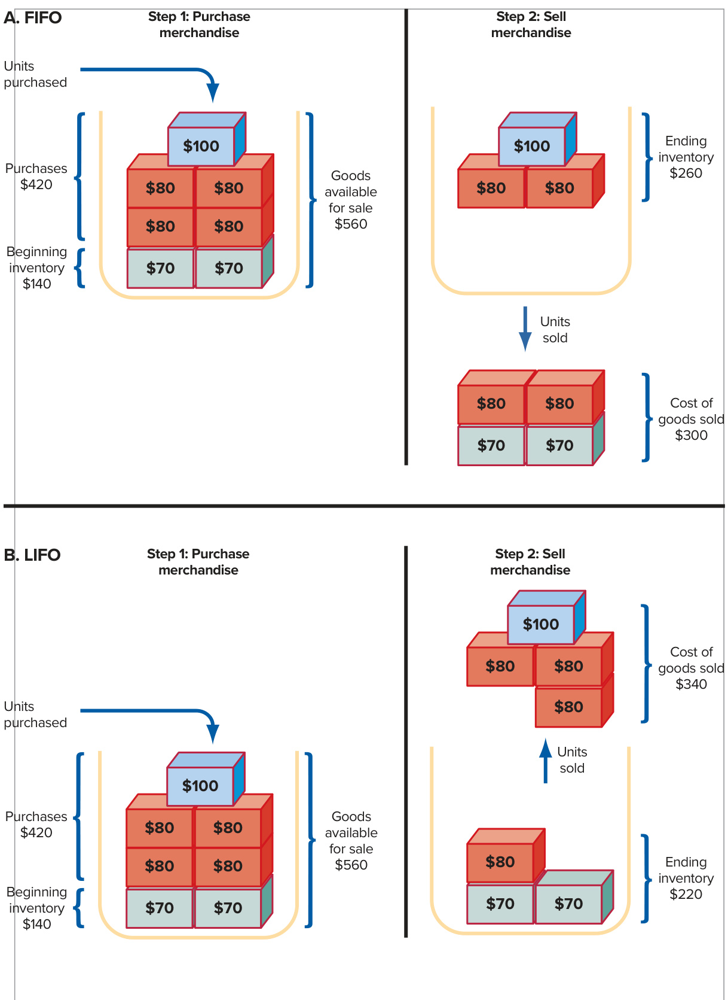

# Ch07 Reporting and Interpreting Cost of Goods Sold and Inventory  

## chapter  

he Harley-Davidson eagle trademark was once known best as a popular request in tattoo parlors. Now, Harley-Davidson dominates the heavyweight motorcycle market in North America with a 49.1 percent market share. Harley is also a market leader in Japan and Australia and has captured between 9 and 11 percent of the European market in recent years.  

But the heavyweight king is facing rough waters ahead. Industrywide U.S. motorcycle sales have been declining and the strong U.S. dollar has hurt international sales. Harley responded with an aggressive plan to enhance profitability through continuous improvement in manufacturing, product development, and business operations. Harley introduced the “More Roads” plan in an attempt to grow the sport and promote the experience of motorcycling to new customers, which the company sees as necessary to sustain business over the long term. In addition to expanding its customer base, Harley also hopes to grow its international business to make up 50 percent of its sales. Controlling inventory quality, quantities, and cost is key to maintaining gross profit margin. Introducing new products to stay ahead of major competitors Honda and BMW and providing a premium dealer experience to all of Harley’s customers also will increase gross margin. Finally, selecting appropriate accounting methods for inventory can have a dramatic effect on the amount Harley-Davidson pays in income taxes. ­Harley produced solid financial results in 2019, but continuous improvement in all of these areas will be necessary for the Harley-Davidson eagle to continue its rise.  

## LEARNING OBJECTIVES  

## After studying this chapter, you should be able to:  

7-1	 Apply the cost principle to identify the amounts that should be included in inventory and cost of goods sold for typical retailers, wholesalers, and manufacturers. p. 345   
7-2 Report inventory and cost of goods sold using the four inventory costing methods. p. 350   
7-3 Decide when the use of different inventory costing methods is beneficial to a company. p. 355   
7-4 Report inventory at the lower of cost or net realizable value. p. 358   
7-5 Understand methods for controlling inventory and analyze the effects of inventory errors on financial statements. p. 359   
7-6 Evaluate inventory management using the inventory turnover ratio and analyze the effects of inventory on cash flows. p. 361  

  

## HarleyDavidson, Inc.  

BUILDING A LEGEND INTO A WORLD-CLASS MANUFACTURER  

harley-davidson.com  

## UNDERSTANDING THE BUSINESS  

The cost and quality of inventory are concerns faced by all modern manufacturers and merchandisers, and so we turn our attention to cost of goods sold (cost of sales, cost of products sold) on the income statement and inventory on the balance sheet. Exhibit 7.1 presents the relevant excerpts from Harley-Davidson’s financial statements that include these accounts. Note that Cost of Goods Sold is subtracted from Net Sales to produce Gross Profit on its income statement. On the balance sheet, Inventory is a current asset; it is reported below cash, marketable securities, and accounts and finance receivables because it is less liquid than those assets.  

The primary goals of inventory management are to have sufficient quantities of highquality inventory available to serve customers’ needs while minimizing the costs of carrying inventory (production, storage, obsolescence, and financing). Low quality leads to customer dissatisfaction, returns, and a decline in future sales. Also, purchasing or producing too few units of a hot-selling item causes stock-outs, which mean lost sales revenue and decreases in customer satisfaction. Conversely, purchasing too many units of a slow-selling item increases storage costs as well as interest costs on short-term borrowings used to finance the purchases. It even may lead to losses if the merchandise cannot be sold at normal prices.  

The accounting system plays three roles in the inventory management process. First, the system must provide accurate information for preparation of periodic financial statements and tax returns. Second, it must provide up-to-date information on inventory quantities and costs to facilitate ordering and manufacturing decisions. Third, because inventories are subject to theft and other forms of misuse, the system also must provide the information needed to help protect these important assets.  

## EXHIBIT 7.1  

Income Statement and Balance Sheet Excerpts  

HARLEY-DAVIDSON, INC. REAL WORLD EXCERPT: Annual Report  

<html><body><table><tr><td colspan="3">IHKLLTDHVTDSOTN,NC. ConsolidatedStatementsofIncome (Inthousands)* 12MonthsEnded</td></tr><tr><td>Dec.31,2019</td><td>Dec.31,2018</td><td>Dec.31,2017</td></tr><tr><td>NetSales</td><td>$5,361,789 $5,716,875</td><td>$5,647,224</td></tr><tr><td>CostofGoodsSold 3,229,798</td><td>3,351,796</td><td>3,272,330</td></tr><tr><td>GrossProfit</td><td>$2,131,991 $2,365,079</td><td>$2,374,894</td></tr></table></body></html>  

<html><body><table><tr><td colspan="3">HARLEY-DAVIDSON,INC ConsolidatedBalanceSheet (In thousands)*</td></tr><tr><td></td><td>Dec.31, 2019</td><td>Dec.31, 2018</td></tr><tr><td>Assets</td><td></td><td></td></tr><tr><td>Currentassets:</td><td>$833,868</td><td></td></tr><tr><td>Cash and cash equivalents Marketable securities</td><td></td><td>$1,203,766 10,007</td></tr><tr><td>Accountsreceivable,net</td><td></td><td></td></tr><tr><td></td><td>259,334</td><td>306,474 2,214,424</td></tr><tr><td>Finance receivables, net</td><td>2,272,522</td><td></td></tr><tr><td>Inventories, net</td><td>603,571 64,554</td><td>556,128</td></tr><tr><td>Restricted cash</td><td>168,974</td><td>49,275</td></tr><tr><td>Other current assets Totalcurrentassets</td><td>$4,202,823</td><td>144,368 $4,484,442</td></tr></table></body></html>

Source: Harley-Davidson, Inc. \*Harley-Davidson’s statements have been simplified for purposes of our discussion.  

Harley’s mix of product lines makes it a particularly good example for this chapter. Although best known as a manufacturer of motorcycles, Harley also purchases and resells completed products such as its popular line of Motorclothes apparel. In the second case, it acts as a wholesaler. Both the motorcycle and Motorclothes product lines are sold to the company’s network of independent dealers. From an accounting standpoint, these independent dealers are Harley-Davidson’s customers. The independent dealers are the retailers who sell the products to the public.  

We begin this chapter with a discussion of the makeup of inventory, the important choices management must make in the financial and tax reporting process, and how these choices affect the financial statements and taxes paid. Then we discuss how managers and analysts evaluate the efficiency of inventory management. Finally, we briefly discuss how accounting systems are organized to keep track of inventory quantities and costs for decision making and control. This topic will be the principal subject matter of your managerial accounting course.  

## ORGANIZATION OF THE CHAPTER  

  

## NATURE OF INVENTORY AND COST OF GOODS SOLD  

## Items Included in Inventory  

Inventory is tangible property that is (1) held for sale in the normal course of business or (2) used to produce goods or services for sale. Inventory is reported on the balance sheet as a current asset because it normally is used or converted into cash within one year or the next ­operating cycle. The types of inventory normally held depend on the characteristics of the business. Merchandisers (wholesale or retail businesses) hold the following:  

Merchandise inventory Goods (or merchandise) held for resale in the normal course of ­business. The goods usually are acquired in a finished condition and are ready for sale ­without further processing.  

For Harley-Davidson, merchandise inventory includes the Motorclothes line and the parts and   
accessories it purchases for sale to its independent dealers. Manufacturing businesses hold three types of inventory:  

Raw materials inventory Items acquired for processing into finished goods. These items are included in raw materials inventory until they are used, at which point they become part of work in process inventory.  

Work in process inventory Goods in the process of being manufactured but not yet complete. When completed, work in process inventory becomes finished goods inventory.  

Finished goods inventory Manufactured goods that are complete and ready for sale.  

Inventories related to Harley-Davidson’s motorcycle manufacturing operations are recorded in these accounts.  

## LEARNING OBJECTIVE 7-1  

Apply the cost principle to identify the amounts that should be included in inventory and the cost of goods sold for typical retailers, wholesalers, and manufacturers.  

## HARLEY-DAVIDSON, INC.  

REAL WORLD EXCERPT: Annual Report  

<html><body><table><tr><td>HARLEY-DAVIDSON,INC NotestoConsolidatedFinancialStatements</td></tr><tr><td>2.ADDITIONALBALANCESHEETANDCASHFLOWINFORMATION Inventories,net(inthousands)</td></tr><tr><td>2019 2018</td></tr><tr><td>Rawmaterialsandworkinprocess $235,433 $ 177,110</td></tr><tr><td>Motorcyclefinishedgoods 280,306 301,630</td></tr><tr><td>Parts&accessoriesandgeneralmerchandise 144,258 136,027</td></tr><tr><td>InventoryatlowerofFIFOcostornetrealizablevalue 659,997 614,767</td></tr></table></body></html>

Source: Harley-Davidson, Inc.  

Note that Harley-Davidson combines the raw materials and work in process into one number. Other companies separate the two components. The parts and accessories and general merchandise category includes purchased parts and Motorclothes and other accessories that make up merchandise inventory.  

## Costs Included in Inventory Purchases  

Goods in inventory are initially recorded at cost. Inventory cost includes the sum of the costs incurred  in bringing an article to usable or salable condition and location. When ­Harley-Davidson purchases raw materials and merchandise inventory, the amount recorded should include the invoice price to be paid plus other expenditures related to the purchase, such as freight charges to deliver the items to its warehouses (freight-in) and inspection and preparation costs. Any ­purchase returns and allowances or purchase discounts taken are subtracted. In general, the company should cease accumulating purchase costs when the raw materials are ready for use or when the merchandise inventory is ready for shipment. Any additional costs related to selling the inventory to the dealers, such as marketing department salaries and dealer training sessions, are incurred after the inventory is ready for use. So they should be included in selling, general, and administrative expenses in the period in which they are incurred.  

## FINANCIAL ANALYSIS  

## Applying the Materiality Constraint in Practice  

Incidental costs such as inspection and preparation costs often are not material in amount (see the discussion of materiality in Chapter 5) and do not have to be assigned to the inventory cost. Thus, for practical reasons, many companies use the invoice price, less returns and discounts, to assign a unit cost to raw materials or merchandise and record other indirect expenditures as a separate cost that is reported as an expense.  

## Flow of Inventory Costs  

The flow of inventory costs for merchandisers (wholesalers and retailers) is relatively simple, as Exhibit 7.2A shows. When merchandise is purchased, the merchandise inventory account is increased. When the goods are sold, cost of goods sold is increased and merchandise inventory is decreased.  

EXHIBIT 7.2 Flow of Inventory Costs  

  

The flow of inventory costs in a manufacturing environment is more complex, as diagrammed in Exhibit 7.2B. First, raw materials (also called direct materials) must be purchased. For Harley-Davidson, these raw materials include steel and aluminum castings, forgings, sheet, and bars, as well as certain motorcycle component parts produced by its small network of suppliers, including electronic fuel injection systems, batteries, and tires. When they are used, the cost of these materials is removed from the raw materials inventory and added to the work in process inventory.  

Two other components of manufacturing cost, direct labor and factory overhead, also are added to the work in process inventory when they are used. Direct labor cost represents the earnings of employees who work directly on the products being manufactured. Factory overhead costs include all other manufacturing costs. For example, the factory supervisor’s salary and the cost of heat, light, and power to operate the factory are included in factory overhead. When the motorcycles are completed and ready for sale, the related amounts in work in process inventory are transferred to finished goods inventory. When the finished goods are sold, cost of goods sold increases, and finished goods inventory decreases.  

As Exhibit 7.2 indicates, there are three stages to inventory cost flows for both merchandisers and manufacturers. The first involves purchasing and/or production activities. In the second stage, these activities result in additions to inventory accounts on the balance sheet. In the third stage, the inventory items are sold and the amounts become cost of goods sold expense on the income statement. Because the flow of inventory costs from merchandise inventory and finished goods to cost of goods sold are very similar, we will focus the rest of our discussion on merchandise inventory.  

## Cost of Goods Sold Equation  

Cost of goods sold (CGS) expense is directly related to sales revenue. Sales revenue during an accounting period is the number of units sold multiplied by the sales price. Cost of goods sold is the same number of units multiplied by their unit costs.  

  
H. Mark Weidman Photography/Alamy Stock Photo  

Let’s examine the relationship between cost of goods sold on the income statement and inventory on the balance sheet. Harley-Davidson starts each accounting period with a stock of inventory called beginning inventory (BI). During the accounting period, new purchases (P) are added to inventory. The sum of the two amounts is the goods available for sale during that period. What remains unsold at the end of the period becomes ending inventory (EI) on the balance sheet. The portion of goods available for sale that is sold becomes cost of goods sold on the income statement. The ending inventory for one accounting period then becomes the beginning inventory for the next period. The relationships between these various inventory amounts are brought together in the cost of goods sold equation:  

$$
\mathsf{B}\mathsf{I}+\mathsf{P}-\mathsf{E}\mathsf{I}=\mathsf{C}\mathsf{G}\mathsf{S}
$$  

Be sure to include beginning inventory in all cost of goods sold alculations.  

To illustrate, assume that Harley-Davidson began the period with $\mathbb{S}40{,}000$ worth of Motorclothes in beginning inventory, purchased additional merchandise during the period for $\mathbb{S}5{,}000$ , and had $\mathbb{\Phi}35{,}000$ left in inventory at the end of the period. These amounts are combined as follows to compute cost of goods sold of $\mathbb{S}60{,}000$ :  

<html><body><table><tr><td>Beginning inventory</td><td>$40,000</td></tr><tr><td>+ Purchases of merchandise during the year</td><td>55,000</td></tr><tr><td>Goodsavailableforsale</td><td>95,000</td></tr><tr><td>Endinginventory Costofgoodssold</td><td>35,000 $60,000</td></tr></table></body></html>  

These same relationships are illustrated in Exhibit 7.3 and can be represented in the merchandise inventory T-account as follows:  

<html><body><table><tr><td colspan="3">Merchandise Inventory (A)</td></tr><tr><td>Beginninginventory</td><td>40,000</td><td></td></tr><tr><td>Add:Purchases of inventory</td><td>55,000</td><td>Deduct: Cost of goods sold 60,000</td></tr><tr><td>Endinginventory</td><td>35,000</td><td></td></tr></table></body></html>  

If three of these four values are known, either the cost of goods sold equation or the inventory T-account can be used to solve for the fourth value.  

## EXHIBIT 7.3  

Cost of Goods Sold for Merchandise Inventory  

Beginning inventory +Purchases of merchandise ­during the year Goods available for sale −Ending inventory Cost of goods sold  

  

Inventory should include all items owned that are held for resale. Costs flow into inventory when goods are purchased or manufactured. They flow out (as an expense) when they are sold or disposed of. The cost of goods sold equation describes these flows.  

S E L F - S T U D Y  Q U I Z  

1.	 Assume the following facts for Harley-Davidson’s Motorclothes leather baseball jacket product line for the year 2022.  

Beginning inventory: 400 units at unit cost of $\mathbb{S}75$ .   
Purchases: 600 units at unit cost of $\mathbb{S}75$ .   
Sales: 700 units at a sales price of $\mathbb{S}100$ (cost per unit $\mathbb{S}75$ ).  

Using the cost of goods sold equation, compute the dollar amount of goods available for sale, ending inventory, and cost of goods sold of leather baseball jackets for the period.  

Beginning inventory   
+ Purchases of merchandise during the year Goods available for sale   
−Ending inventory Cost of goods sold  

2.	 Assume the following facts for Harley-Davidson’s Motorclothes leather baseball jacket product line for the year 2023.  

Beginning inventory: 300 units at unit cost of $\mathbb{S}75$ .   
Ending inventory: 600 units at unit cost of $\mathbb{S}75$ .   
Sales: 1,100 units at a sales price of $\mathbb{S}100$ (cost per unit $\mathbb{S}75$ ).  

Using the cost of goods sold equation, compute the dollar amount of purchases of leather baseball jackets for the period. Remember that if three of these four values are known, the cost of goods sold equation can be used to solve for the fourth value.  

Beginning inventory   
+ Purchases of merchandise during the year   
−Ending inventory Cost of goods sold  

After you have completed your answers, check them below.  

G U I D E D H E L P 7 -  

For additional step-by-step video instruction on using the cost of goods sold equation to compute ­relevant income statement amounts, go to mhhe.com/libby_gh7-1.  

## Related Homework: M7-4, E7-2, E7-3, E7-4  

S o l u t i o n s  t o  

S E L F - S T U DY  Q U I Z  

<html><body><table><tr><td colspan="2">Beginning inventory (400 × $75) $30,000</td></tr><tr><td colspan="2">+Purchases of merchandise during the year (600 × $75) 45,000</td></tr><tr><td colspan="2">Goodsavailableforsale(1,000x$75) 75,000</td></tr><tr><td colspan="2">-Ending inventory(300× $75) 22,500</td></tr><tr><td colspan="2">Costof goods sold(700× $75) $52,500</td></tr><tr><td colspan="2">2.BI=300×$75=$22.500</td></tr><tr><td colspan="2">BI+P-EI=CGS EI=600×$75=$45,000 $22,500+P-$45,000=$82,500</td></tr><tr><td colspan="2">CGS=1,100×$75=$82,500 P=$105,000 (1,400×$75)</td></tr></table></body></html>  

## Perpetual and Periodic Inventory Systems  

The amount of purchases for the period is always accumulated in the accounting system. The amount of cost of goods sold and ending inventory can be determined by using one of two ­different inventory systems: perpetual or periodic.  

## Perpetual Inventory System  

Report inventory and cost of goods sold using the four inventory costing methods.  

To this point in the text, all journal entries for purchase and sales transactions have been recorded using a perpetual inventory system. In a perpetual inventory system, purchase transactions are recorded directly in an inventory account. When each sale is recorded, a companion cost of goods sold entry is made, decreasing inventory and recording cost of goods sold. You already have experienced the starting point for that process when your purchases are scanned at the checkout counter at Walmart or Target. Not only does that process determine how much you must pay the cashier, it also removes the sold items from the store inventory records. As a result, information on cost of goods sold and ending inventory is available on a continuous (perpetual) basis.  

In a perpetual inventory system, a detailed record is maintained for each type of merchandise stocked, showing (1) units and cost of the beginning inventory, (2) units and cost of each purchase, (3) units and cost of the goods for each sale, and (4) units and cost of the goods on hand at any point in time. This up-to-date record is maintained on a transaction-by-transaction basis. Most modern companies could not survive without this information. And as a consumer, you access that same information every time you search Amazon.com for merchandise and are told, “Only 4 left in stock—order soon” or “Out of stock.”  

As noted at the beginning of the chapter, cost, quality, and customer service pressures brought on by increasing competition, combined with dramatic declines in the cost of information systems, have made sophisticated perpetual inventory systems a requirement at all but the smallest companies. As a consequence, we will continue to focus on perpetual inventory systems throughout the book.  

## Periodic Inventory System  

Under the periodic inventory system, no up-to-date record of inventory is maintained during the year. An actual physical count of the goods remaining on hand is required at the end of each period. The number of units of each type of merchandise on hand is multiplied by unit cost to compute the dollar amount of the ending inventory. Cost of goods sold is calculated using the cost of goods sold equation.  

Because the amount of inventory is not known until the end of the period when the inventory count is taken, the amount of cost of goods sold cannot be reliably determined until the inventory count is complete. The primary disadvantage of a periodic inventory system is the lack of inventory information. Managers are not informed about low or excess stock situations.  

## INVENTORY COSTING METHODS  

In the Motorclothes example presented in the Self-Study Quiz, the cost of all units of the leather baseball jackets was the same— $-\mathbb{S}75$ . If inventory costs normally did not change, this would be the end of our discussion. As we are all aware, however, the prices of most goods do change. In recent years, the costs of many manufactured items such as automobiles and motorcycles have risen gradually. In some industries such as computers, costs of production have dropped dramatically along with retail prices.  

When inventory costs have changed, which inventory items are treated as sold or remaining in inventory can turn profits into losses and cause companies to pay or save millions in taxes. A simple example will illustrate these dramatic effects. Do not let the simplicity of our example mislead you. It applies broadly to actual company practices.  

Assume that a Harley-Davidson dealer had the indicated inventory on hand and made purchases during January as follows:  

Jan.  1 Had beginning inventory of two units of a Model A leather jacket at $\mathbb{S}70$ each.   
Jan. 12 Purchased four units of the Model A leather jacket at $\mathbb{S}80$ each.   
Jan. 14 Purchased one unit of the Model A leather jacket at $\mathbb{S}100$ .   
Jan. 15 Sold four units of the Model A leather jacket for $\mathbb{S}120$ each.  

Note that the cost of the leather jacket rose rapidly during January. On January 15, four units are sold for $\mathbb{S}120$ each and revenues of $\mathbb{S}480$ are recorded. What amount is recorded as cost of goods sold? The answer depends on which specific goods we assume are sold. Four generally accepted inventory costing methods are available for determining cost of goods sold:  

1.	Specific identification.   
2.	First-in, first-out (FIFO).   
3.	Last-in, first-out (LIFO).   
4.	Average cost.  

The four inventory costing methods are alternative ways to assign the total dollar amount of goods available for sale between (1) ending inventory and (2) cost of goods sold. The first method identifies individual items that remain in inventory or are sold. The remaining three methods assume that the inventory costs follow a certain flow.  

## Specific Identification Method  

When the specific identification method is used, the cost of each item sold is individually identified and recorded as cost of goods sold. This method requires keeping track of the purchase cost of each item. In the leather jacket example, any four of the items could have been sold. If we assume that one of the $\mathbb{S}70$ items, two of the $\mathbb{S}80$ items, and the one $\mathbb{S}100$ item have been sold, the cost of those items $(\mathbb{S}70+\mathbb{S}80+\mathbb{S}80+\mathbb{S}100)$ would become cost of goods sold $(\mathbb{S}330)$ . The cost of the remaining items (two $\mathbb{S}80$ items and one $\mathbb{S}70$ item) would be ending inventory $(\mathbb{5}80+\mathbb{5}80+\mathbb{5}70=\mathbb{5}230)$ ).  

The specific identification method is impractical when large quantities of similar items are stocked. On the other hand, when dealing with expensive unique items such as houses or fine jewelry, this method is appropriate. As a consequence, most inventory items are accounted for using one of three cost flow assumptions.  

## Cost Flow Assumptions  

The choice of an inventory costing method is NOT based on the physical flow of goods on and off the shelves. That is why they are called cost flow assumptions. A useful tool for representing inventory cost flow assumptions is a bin, or container. Try visualizing these inventory costing methods as flows of inventory in and out of the bin.  

## First-In, First-Out Method  

The first-in, first-out method, frequently called FIFO, assumes that the earliest goods purchased (the first ones in) are the first goods sold, and the last goods purchased are left in ending inventory. Under FIFO, cost of goods sold and ending inventory are computed as if the flows in and out of the FIFO inventory bin in Exhibit 7.4A had taken place. First, each purchase is treated as if it were deposited in the bin from the top in sequence (two units of beginning inventory at $\mathfrak{s}70$ followed by purchases of four units at $\mathbb{S}80$ and one unit at $\mathbb{S}100$ ), producing goods available for sale of $\mathbb{S}560$ . Each good sold is then removed from the bottom in sequence (two units at $\mathfrak{s}70$ and two at $\mathbb{S}80$ ); first in is first out. These goods totaling $\mathbb{S}300$ become cost of goods sold (CGS). The remaining units (two units at $\mathbb{S}80$ and one unit at $\mathbb{S}100=\mathbb{S}260)$ ) become ending inventory. FIFO allocates the oldest unit costs to cost of goods sold and the newest unit costs to ending inventory.  

to customers, firms may use any of the three cost flow assumptions described in this chapter. We discuss the rationale for managers’ choices later in the chapter.  

FIFO and LIFO Inventory Flows  

  

## Cost of Goods Sold Calculation (FIFO)  

Beginning inventory $^+$ Purchases  

(2 units at $\mathbb{S}70$ each)   
(4 units at $\mathbb{S}80$ each)   
(1 unit at $\mathbb{S}100$ )   
(2 units at $\mathbb{S}80$ each and 1 unit at $\mathbb{S}100$ )   
(2 units at $\mathbb{S}70$ each and 2 units at $\mathbb{S}80$ each)  

\$140   
320   
100   
560   
260   
\$300  

Goods available for sale − Ending inventory Cost of goods sold  

## Last-In, First-Out Method  

The last-in, first-out method, often called LIFO, assumes that the most recently purchased goods (the last ones in) are sold first and the oldest units are left in ending inventory. It is illustrated by the LIFO inventory bin in Exhibit 7.4B. As in FIFO, each purchase is treated as if it were deposited in the bin from the top (two units of beginning inventory at $\mathbb{S}70$ followed by purchases of four units at $\mathbb{S}80$ and one unit at $\mathbb{S}100$ ), resulting in the goods available for sale of $\mathbb{S}560$ . Unlike FIFO, however, each good sold is treated as if it were removed from the top in sequence (one unit at $\mathbb{S}100$ followed by three units at $\mathbb{S}80$ ). These goods totaling $\mathbb{5}340$ become cost of goods sold (CGS). The remaining units (one at $\mathbb{S}80$ and two at $\mathbb{5}70=\mathbb{5}220_{.}$ ) become ending inventory. LIFO allocates the newest unit costs to cost of goods sold and the oldest unit costs to ending inventory.  

<html><body><table><tr><td colspan="3">Cost of GoodsSold Calculation (LIFO)</td></tr><tr><td rowspan="3">Beginninginventory +Purchases</td><td>(2 units at $70 each)</td><td>$140</td></tr><tr><td>(4 units at $80 each)</td><td>320</td></tr><tr><td>(1 unit at $100)</td><td>100</td></tr><tr><td>Goodsavailableforsale</td><td></td><td>560</td></tr><tr><td>Endinginventory</td><td>(2 units at $70 each and 1 unit at $80)</td><td>220</td></tr><tr><td>Costofgoodssold</td><td>(3 units at $80 each and 1 unit at $100)</td><td>$340</td></tr></table></body></html>  

The LIFO cost flow assumption is the exact opposite of the FIFO cost flow assumption:  

<html><body><table><tr><td></td><td>FIFO</td><td>LIFO</td></tr><tr><td>Costof goods sold on incomestatement Inventory on balance sheet</td><td>Oldestunit costs Newestunitcosts</td><td>Newestunitc costs Oldestunit costs</td></tr></table></body></html>  

## Average Cost Method  

The average cost method (weighted average cost method) uses the weighted average unit cost of the goods available for sale for both cost of goods sold and ending inventory. The weighted average unit cost of the goods available for sale is computed as follows:  

<html><body><table><tr><td>Number of Units</td><td></td><td>Unit Cost</td><td>=</td><td>Total Cost</td></tr><tr><td>2</td><td>X</td><td>$ 70</td><td>=</td><td>$ 140</td></tr><tr><td>4</td><td>X</td><td>$ 80</td><td>=</td><td>320</td></tr><tr><td>1-</td><td>X</td><td>$100</td><td>=</td><td>100</td></tr><tr><td>7</td><td></td><td></td><td></td><td>$560</td></tr><tr><td></td><td></td><td></td><td></td><td></td></tr></table></body></html>  

$$
\mathsf{A v e r a g e\ c o s t}=\frac{\sqrt[5]{560}}{7\;\mathsf{U n i t s}}=\mathfrak{H}80
$$  

Cost of goods sold and ending inventory are assigned the same weighted average cost per unit of $\mathbb{S}80$ .   

<html><body><table><tr><td colspan="3">Cost of Goods Sold Calculation (Average Cost)</td></tr><tr><td>Beginninginventory</td><td>(2 units at $70 each)</td><td>$140</td></tr><tr><td rowspan="3">+Purchases</td><td>(4 units at $80 each)</td><td>320</td></tr><tr><td>(1 unit at $100)</td><td>100</td></tr><tr><td>(7units at $80average cost each)</td><td>560</td></tr><tr><td>Goodsavailableforsale -Endinginventory</td><td>(3units at $80 average cost each)</td><td>240</td></tr><tr><td>Costofgoodssold</td><td>(4 units at $80average cost each)</td><td>$320</td></tr></table></body></html>  

## Perpetual Inventory Systems and Cost Flow Assumptions in Practice  

You should have noted that, in our example, all inventory units were purchased before a sale was made and cost of goods sold recorded. In reality, most companies make numerous purchases and sales of the same inventory item throughout the accounting period. How can we apply our simple example to these circumstances given that companies normally employ perpetual inventory systems?  

In practice, firms follow a two-step process:  

1.	Virtually all accounting systems that keep track of the costs of individual items do so on a FIFO or average cost basis, regardless of the cost flow assumption used for financial reporting.   
2.	As a consequence, companies that wish to report under LIFO convert the outputs of their perpetual inventory system to LIFO with an adjusting entry at the end of each period. By waiting until the end of the period to calculate this LIFO adjustment, LIFO ending inventory and cost of goods sold are calculated as if all purchases during the period were recorded before cost of goods sold was calculated and recorded.  

In other words, our simple example of how to calculate cost of goods sold applies even though a company actually tracks the number of units bought and sold on a perpetual basis.  

## INTERNATIONAL PERSPECTIVE  

## LIFO and International Comparisons  

While U.S. GAAP allows companies to choose between FIFO, LIFO, and average cost inventory accounting methods, International Financial Reporting Standards (IFRS) currently prohibit the use of LIFO. U.S. GAAP also allows different inventory accounting methods to be used for different types of inventory items and even for the same item in different locations. IFRS requires that the same method be used for all inventory items that have a similar nature and use. These differences can create comparability problems when one attempts to compare companies across international borders. For example, Harley-Davidson uses LIFO to value most U.S. inventories and FIFO for non–U.S. inventories, while Honda (of Japan) uses FIFO for all inventories. Each individual country’s tax laws determine the acceptability of different inventory methods for tax purposes.  

## Financial Statement Effects of Inventory Methods  

Each of the four alternative inventory costing methods is in conformity with GAAP and the tax law. To understand why managers choose different methods in different circumstances, we first must understand their effects on the income statement and balance sheet. Exhibit $7.5\;\mathrm{sum}.$ marizes the financial statement effects of the FIFO, LIFO, and average cost inventory methods in our example, assuming $\mathbb{S}80$ in other expenses and a 25 percent tax rate. Remember that the methods differ only in the dollar amount of goods available for sale allocated to cost of goods sold versus ending inventory. For that reason, the method that gives the highest ending inventory amount also gives the lowest cost of goods sold and the highest gross profit, income tax expense, and net income amounts, and vice versa. The weighted average cost method generally gives net income and inventory amounts that are between the FIFO and LIFO extremes.  

In our example, recall that unit costs were increasing. When unit costs are rising, LIFO produces lower net income and a lower inventory valuation than FIFO. Even in inflationary times, some companies’ costs decline. When unit costs are declining, LIFO produces higher net income and higher inventory valuation than FIFO. These effects, which hold as long as inventory quantities are constant or rising, are summarized in the following table:  

<html><body><table><tr><td>FIFO LIFO Average Cost</td></tr><tr><td>EffectontheIncomeStatement Sales</td></tr><tr><td>$480 $480 $480</td></tr><tr><td>Cost ofgoodssold 300 340 320</td></tr><tr><td>Grossprofit 180 140 160</td></tr><tr><td>Otherexpenses 80 80 80</td></tr><tr><td>Incomebeforeincometaxes 100 60 80 Income tax expense (25%) 25 15 20</td></tr><tr><td>Net income $ 75 $ 45 $ 60 Effecton theBalanceSheet Inventory $260 $220 $240</td></tr></table></body></html>  

<html><body><table><tr><td>IncreasingCosts:NormalFinancialStatementEffects</td><td>FIFO</td><td>LIFO</td></tr><tr><td>Costofgoodssoldonincomestatement Netincome Incometaxes</td><td>Lower Higher Higher</td><td>Higher Lower Lower</td></tr><tr><td>Inventoryonbalancesheet DecreasingCosts:NormalFinancialStatementEffects</td><td>Higher FIFO</td><td>Lower LIFO</td></tr><tr><td>Costofgoodssoldonincomestatement Netincome Incometaxes Inventoryonbalancesheet</td><td>Higher Lower Lower Lower</td><td>Lower Higher Higher Higher</td></tr></table></body></html>  

## Managers’ Choice of Inventory Methods  

What motivates companies to choose different inventory costing methods? Most managers choose accounting methods based on two factors:  

1.	Net income effects (managers prefer to report higher earnings for their companies). 2.	Income tax effects (managers prefer to pay the least amount of taxes allowed by law as late as possible—the least–latest rule of thumb).  

Any conflict between the two motives is normally resolved by choosing one accounting method for external financial statements and a different method for preparing the company’s tax return. The choice of inventory costing methods is a special case, however, because of what is called the LIFO conformity rule: If LIFO is used on the U.S. income tax return, it also must be used to calculate inventory and cost of goods sold for the financial statements.  

## Increasing Cost Inventories  

•	 For inventory with increasing costs, LIFO is used on the tax return because it normally results in lower income taxes.  

This is illustrated in Exhibit 7.5, where income before income taxes was lowered from $\mathbb{s}100$ under FIFO to $\mathbb{S}60$ under LIFO. On the income tax expense line, this lowers income taxes from  

## EXHIBIT 7.5  

Financial Statement Effects of Inventory Costing Methods  

## LEARNING OBJECTIVE 7-3  

Decide when the use of different inventory costing methods is beneficial to a company.  

In the U.S., managers normally choose LIFO to account for their increasing cost inventories to reduce income taxes. They choose FIFO or average cost for their decreasing cost and non-U.S. inventories.  

$\mathbb{S}25$ under FIFO to $\mathbb{S}15$ under LIFO, generating cash tax savings of $\mathbb{S}10$ under LIFO.3 The LIFO conformity rule leads companies to adopt LIFO for both tax and financial reporting purposes for increasing cost inventories located in the United States. Harley-Davidson is a fairly typical company facing increasing costs. Assuming an average tax rate of 25 percent, it has saved approximately $\mathbb{S}15$ million in taxes from the date it adopted the LIFO method through 2019.  

For inventory located in countries that do not allow LIFO for tax purposes or that do not have a LIFO conformity rule, companies with increasing costs most often use FIFO or average cost to report higher income on the income statement.  

## Decreasing Cost Inventories  

## •	 For inventory with decreasing costs, FIFO is most often used for both the tax return and financial statements.  

Using this method (along with lower of cost or net realizable value, discussed later) produces the lowest tax payments for companies with decreasing cost inventories. Many high-technology companies are facing declining costs. In such circumstances, the FIFO method, in which the oldest, most expensive goods become cost of goods sold, produces the highest cost of goods sold, the lowest pretax earnings, and thus the lowest income tax liability. For example, Apple and HP account for inventories using the FIFO method.  

Because most companies in the same industry face similar cost structures, clusters of companies in the same industries often choose the same accounting method.  

## Consistency in Use of Inventory Methods  

It is important to remember that regardless of the physical flow of goods, a company can use any of the inventory costing methods. Also, a company is not required to use the same inventory costing method for all inventory items, and no particular justification is needed for the selection of one or more of the acceptable methods. Harley-Davidson, and most large companies, use different inventory methods for different inventory items. However, accounting rules require companies to apply their accounting methods on a consistent basis over time. A company is not permitted to use LIFO one period, FIFO the next, and then go back to LIFO. A change in method is allowed only if the change will improve the measurement of financial results and financial position.  

## A QUESTION OF ETHICS  

## LIFO and Conflicts between Managers’ and Owners’ Interests  

We have seen that the selection of an inventory method can have significant effects on the financial statements. Company managers may have an incentive to select a method that is not consistent with the owners’ objectives. For example, during a period of rising prices, using LIFO may be in the best interests of the owners because LIFO often reduces a company’s tax liability. However, if managers’ compensation is tied to reported profits, they may prefer FIFO, which typically results in higher profits.  

While a well-designed compensation plan should reward managers for acting in the best interests of the owners, that is not always the case. Clearly, a manager who selects an accounting method that is not optimal for the company solely to increase his or her compensation is engaging in questionable ethical behavior.  

Four different inventory costing methods may be used to allocate costs between the units remaining in inventory and the units sold, depending on economic circumstances. The methods include specific identification, FIFO, LIFO, and average cost. Each of the inventory costing methods conforms to GAAP. Remember that the cost flow assumption need not match the physical flow of inventory. The following questions test your understanding of the FIFO and LIFO methods.  

S E L F - S T U D Y  Q U I Z  

1.	 Compute cost of goods sold and pretax income for 2021 under the FIFO and LIFO accounting methods. Assume that a company’s beginning inventory and purchases for 2021 included:  

Beginning inventory 10 units $\circledcirc\mathbb{S}$ 6 each Purchases January 5 units $@$ $\mathbb{S}10$ each Purchases May 5 units $\mathcal{O}\,\mathbb{S}12$ each  

During 2021, 15 units were sold for $\mathbb{S}20$ each, and other operating expenses totaled $\mathbb{S}100$ . 2.	 Compute cost of goods sold and pretax income for 2022 under the FIFO and LIFO accounting methods. (Hint: The 2021 ending inventory amount from Part 1 becomes the 2022 beginning inventory amount.) Assume that the company’s purchases for 2022 included:  

Purchases March 6 units $\mathcal{O}\,\mathbb{S}13$ each Purchases November 5 units $\mathcal{O}\,\mathbb{S}14$ each  

During 2022, 10 units were sold for $\mathbb{S}24$ each, and other operating expenses totaled $\mathbb{S}70$ . 3.	 Which method would you recommend that the company adopt? Why?  

After you have completed your answers, check them below.  

## G U I D E D  H E L P  7 - 2  

For additional step-by-step video instruction on computing ending inventory and cost of goods sold using different cost flow assumptions, go to mhhe.com/libby_gh7-2.  

Related Homework: E7-5, E7-6, E7-7, E7-8, E7-9, E7-10, E7-11, P7-2, P7-3, P7-4  

S o l u t i o n s  t o  

S E L F - S T U DY  Q U I Z  

  

## VALUATION AT LOWER OF COST OR NET REALIZABLE VALUE  

Inventories should be measured initially at their purchase cost in conformity with the cost principle. When the net realizable value (NRV) (sales price less costs to sell) of goods remaining in ending inventory falls below cost, these goods must be assigned a unit cost equal to their current estimated net realizable value. This rule is known as measuring inventories at the lower of cost or net realizable value (lower of cost or market).  

This departure from the cost principle is based on the conservatism constraint, which requires special care to avoid overstating assets and income. It is particularly important for two types of companies: (1) high-technology companies such as HP that manufacture goods for which costs of production and selling price are declining and (2) companies such as American Eagle ­Outfitters that sell seasonal goods such as clothing, the value of which drops dramatically at the end of each selling season (fall or spring).  

Under lower of cost or net realizable value, companies recognize a “holding” loss in the period in which the net realizable value of an item drops, rather than in the period the item is sold. The holding loss is the difference between the purchase cost and the lower net realizable value. It is added to the cost of goods sold for the period. To illustrate, assume that HP had the following in the current period ending inventory:  

<html><body><table><tr><td colspan="3"></td><td rowspan="2">NetRealizable Value (NRV) per Item</td><td rowspan="2">LowerofCost orNRV per Item</td><td rowspan="2">TotalLowerof Costor Net Realizable Value</td></tr><tr><td>Item</td><td>Quantity</td><td>Costper Item</td></tr><tr><td>Intelchips</td><td>1,000</td><td>$250</td><td>$200</td><td>$200</td><td>1,000 × $200 = $200,000</td></tr><tr><td>Diskdrives</td><td>400</td><td>100</td><td>110</td><td>100</td><td>400 × $100 = 40,000</td></tr></table></body></html>  

The 1,000 Intel chips should be recorded in the ending inventory at the current net realizable value $(\mathbb{S}200)$ because it is lower than the cost $(\mathbb{S}250)$ . HP makes the following journal entry to record the write-down:  

  

Because the net realizable value of the disk drives $(\mathbb{S}110)$ is higher than the original cost $\left\langle\mathbb{S}100\right\rangle$ , no write-down is necessary. The drives remain on the books at their cost of $\mathbb{S}100$ per unit ( $\mathbb{S}40{,}000$ in total). Recognition of holding gains on inventory is not permitted by GAAP.  

The write-down of the Intel chips to market produces the following effects on the income statement and balance sheet:  

<html><body><table><tr><td>Effects of Lower of Cost or NRV Write-Down</td><td>Current Period</td><td>Next Period (if sold)</td></tr><tr><td>Cost of goods sold</td><td>Increase $50,000</td><td>Decrease $50,000</td></tr><tr><td>Pretax income</td><td>Decrease $50,000</td><td>Increase $50,000</td></tr><tr><td>Ending inventory /onbalancesheet</td><td>Decrease $50,000</td><td>Unaffected</td></tr></table></body></html>  

Note that the effects in the period of sale are the opposite of those in the period of the writedown. Lower of cost or net realizable value changes only the timing of cost of goods sold. It transfers cost of goods sold from the period of sale to the period of write-down.  

Note that in the two examples that follow, both Harley-Davidson, which is a mixed LIFO company, and HP, which is a FIFO company, report the use of lower of cost or net realizable value for financial statement purposes.  

## HARLEY-DAVIDSON, INC.  

Notes to Consolidated Financial Statements  

1. SUMMARY OF SIGNIFICANT ACCOUNTING POLICIES  

Inventories, net—Substantially all inventories located in the U.S. are valued using the last-in, firstout (LIFO) method. Other inventories totaling $\mathbb{S}326.5$ million and $\mathbb{S}247.6$ million at December 31, 2019 and 2018, respectively, are valued at the lower of cost or net realizable value using the first-in, first-out (FIFO) method.  

## HARLEY-DAVIDSON, INC.  

REAL WORLD EXCERPT: Annual Report  

Source: Harley-Davidson, Inc.  

## HP INC. AND SUBSIDIARIES  

Notes to Consolidated Financial Statements  

NOTE 1: Overview and Summary of Significant Accounting Policies  

We state our inventory at the lower of cost or market on a first-in, first-out basis. We make adjustments to reduce the cost of inventory to its net realizable value at the product group level for estimated excess or obsolescence. Factors influencing these adjustments include changes in demand, technological changes, product life cycle and development plans, component cost trends, product pricing, physical deterioration and quality issues.  

## HP INC.  

REAL WORLD EXCERPT: Annual Report  

## CONTROL OF INVENTORY  

## Internal Control of Inventory  

After cash, inventory is the asset second most vulnerable to theft. Efficient management of inventory to avoid the cost of stock-outs and overstock situations is also crucial to the profitability of most companies. As a consequence, a number of control features focus on safeguarding inventories and providing up-to-date information for management decisions. Key among these are:  

1.	Separation of responsibilities for inventory accounting and physical handling of inventory.  

2.	Storage of inventory in a manner that protects it from theft and damage.   
3.	Limiting access to inventory to authorized employees.   
4.	Maintaining perpetual inventory records (described earlier in this chapter).   
5.	Comparing perpetual records to periodic physical counts of inventory.  

## LEARNING OBJECTIVE 7-5  

Understand methods for controlling inventory and analyze the effects of inventory errors on financial statements.  

  

  

## Errors in Measuring Ending Inventory  

As the cost of goods sold equation indicates, a direct relationship exists between ending inventory and cost of goods sold because items not in the ending inventory are assumed to have been sold. Thus, the measurement of ending inventory quantities and costs affects both the balance sheet (assets) and the income statement (cost of goods sold, gross profit, and net income). The measurement of ending inventory affects not only the net income for that period but also the net income for the next accounting period. This two-period effect occurs because the ending inventory for one period is the beginning inventory for the next accounting period.  

Greeting card maker Gibson Greetings overstated its net income by 20 percent because one division overstated ending inventory for the year. You can compute the effects of the error on both the current year’s and the next year’s income before taxes using the cost of goods sold equation. Assume that ending inventory was overstated by $\mathbb{S}10{,}000$ due to a clerical error that was not discovered. This would have the following effects in the current year and next year:  

<html><body><table><tr><td></td><td>Current</td><td>Year</td><td colspan="2">Next Year</td></tr><tr><td>Beginning</td><td>inventory</td><td></td><td>Beginninginventory</td><td>Overstated$10,000</td></tr><tr><td>+Purchasesofmerchandise during the year</td><td></td><td></td><td>+Purchasesofmerchandise during the year</td><td></td></tr><tr><td>-Ending inventory</td><td></td><td>Overstated $10,000</td><td>-Ending inventory</td><td></td></tr><tr><td>Cost of goods sold</td><td></td><td>Understated$10,000</td><td>Cost of goods sold</td><td>Overstated$10,000</td></tr></table></body></html>  

Because cost of goods sold was understated, income before taxes would be overstated by $\mathbb{S}10{,}000$ in the current year. And, because the current year’s ending inventory becomes next year’s beginning inventory, it would have the opposite effects the next year. Because cost of goods sold was overstated, income before taxes would be understated by $\mathbb{S}10{,}000$ in the next year.  

Each of these errors would flow into retained earnings so that at the end of the current year, retained earnings would be overstated by $\mathbb{S}10{,}000$ (less the related income tax expense). This error would be offset in the next year, and retained earnings and inventory at the end of next year would be correct.  

In this example, we assumed that the overstatement of ending inventory was inadvertent, the result of a clerical error. However, inventory fraud is a common form of financial statement fraud.  

## P A U S E F O R F E E D B A C K  

An error in the measurement of ending inventory affects cost of goods sold on the current period’s income statement and ending inventory on the balance sheet. Because this year’s ending inventory becomes next year’s beginning inventory, it also affects cost of goods sold in the following period by the same amount but in the opposite direction. These relationships can be seen through the cost of goods sold equation $(\mathrm{BI}+\mathrm{P}-\mathrm{EI}=\mathrm{CGS})$ .  

## S E L F - S T U D Y  Q U I Z  

Assume that it is now the end of 2022 and Bennett-Griffin, Inc., is undergoing its first audit by an independent CPA. The annual income statement prepared by the company is presented here. Assume further that the independent CPA discovers that the ending inventory for 2022 was understated by $\mathbb{S}15{,}000$ . Correct and reconstruct the income statement in the space provided.  

## For the Year Ended December 31  

<html><body><table><tr><td></td><td colspan="2">2022Uncorrected</td><td>2022Corrected</td></tr><tr><td>Salesrevenue</td><td colspan="3">$750,000</td></tr><tr><td>Cost ofgoods sold</td><td></td><td></td><td></td></tr><tr><td>Beginning inventory</td><td>$ 45,000</td><td></td><td></td></tr><tr><td>Add purchases</td><td>460,000</td><td></td><td></td></tr><tr><td>Goodsavailableforsale</td><td>505,000</td><td></td><td></td></tr><tr><td>Less endinginventory</td><td>40,000</td><td></td><td></td></tr><tr><td>Cost of goods sold</td><td></td><td>465,000</td><td></td></tr><tr><td>Gross margin on sales</td><td></td><td>285,000</td><td></td></tr><tr><td>Operatingexpenses</td><td></td><td>275,000</td><td></td></tr><tr><td>Pretaxincome</td><td></td><td>10,000</td><td></td></tr><tr><td>Income tax expense (20%)</td><td></td><td>2,000</td><td></td></tr><tr><td>Netincome</td><td></td><td>$ 8,000</td><td></td></tr></table></body></html>  

After you have completed your answers, check them below.  

G U I D E D H E L P  7 - 3  

For additional step-by-step video instruction on correcting the income statement for errors in ending inventory, go to mhhe.com/libby_gh7-3  

Related Homework: M7-8, E7-14, E7-15, P7-6  

## EVALUATING INVENTORY MANAGEMENT Measuring Efficiency in Inventory Management  

As noted at the beginning of the chapter, the primary goals of inventory management are to have sufficient quantities of high-quality inventory available to serve customers’ needs while minimizing the costs of carrying inventory (production, storage, obsolescence, and financing). The inventory turnover ratio is an important measure of the company’s success in balancing these conflicting goals.  

## LEARNING OBJECTIVE 7-6  

Evaluate inventory management using the inventory turnover ratio and analyze the effects of inventory on cash flows.  

S o l u t i o n s  t o S E L F - S T U DY  Q U I Z  

<html><body><table><tr><td colspan="2">Salesrevenue $750,000</td></tr><tr><td>Costofgoodssold</td><td></td></tr><tr><td>Beginninginventory</td><td>$45,000</td></tr><tr><td>Add purchases</td><td>460,000</td></tr><tr><td>Goodsavailableforsale</td><td>505,000</td></tr><tr><td>Lessendinginventory</td><td>55,000</td></tr><tr><td>Costofgoodssold</td><td>450,000</td></tr><tr><td>Gross margin on sales</td><td>300,000</td></tr><tr><td>Operating expenses</td><td>275,000</td></tr><tr><td>Pretaxincome</td><td>25,000</td></tr><tr><td>Income tax expense (20%)</td><td>5,000</td></tr><tr><td>Netincome</td><td>20,000</td></tr></table></body></html>

Note: An ending inventory error in one year affects pretax income by the amount of the error. In the next year, the ending inventory error affects pretax income again by the same amount, but in the opposite direction.  

Selected Focus Companies’ Inventory Turnover  

National Beverage 9.39  

5.11  

2.82  

## Inventory Turnover  

## ANALYTICAL QUESTION  

How efficient are inventory management activities?  

## RATIO AND COMPARISONS  

$$
\mathrm{Inventory~Turnover}=\frac{\mathrm{Cost~of~Goods~Sold}}{\mathrm{Average~Inventory}}
$$  

The 2019 ratio for Harley-Davidson (see Exhibit 7.1 for the inputs to the equation):  

$$
\frac{\mathfrak{S3},229,798}{(\mathfrak{S603},\mathfrak{I71}+\mathfrak{S556},\mathbf{128})/2}\!=5.6
$$  

<html><body><table><tr><td>Comparisons OverTime</td><td colspan="2">ComparisonsWith Competitors</td></tr><tr><td>Harley-Davidson</td><td>Polaris</td><td>HondaMotor</td></tr><tr><td>2017 2018 2019</td><td>2019</td><td>2019</td></tr><tr><td>6.3 6.1 5.6</td><td>4.9</td><td>8.1</td></tr></table></body></html>  

## INTERPRETATIONS  

In General The inventory turnover ratio reflects how many times average inventory was produced and sold during the period. A higher ratio indicates that inventory moves more quickly through the production process to the ultimate customer, reducing storage and obsolescence costs. Because less money is tied up in inventory, the excess can be invested to earn interest income or reduce borrowing, which reduces interest expense. More efficient purchasing and production techniques, such as just-in-time inventory, as well as high product demand cause this ratio to be high. Analysts and creditors also watch the inventory turnover ratio because a sudden decline may mean that a company is facing an unexpected drop in demand for its products or is becoming sloppy in its production management. Many managers and analysts compute the related number, average days to sell inventory, which, for Harley-Davidson, is equal to  

$$
\mathrm{\Delta}={\frac{365}{\mathrm{Inventory~Turnover}}}={\frac{365}{5.6}}=65.2~\mathrm{days}
$$  

It indicates the average time it takes the company to produce and deliver inventory to customers.  

Focus Company Analysis Harley-Davidson’s inventory turnover has steadily declined from 6.3 in 2017 to 5.6 in 2019. Harley’s ratio is higher than that of motorcycle, off-road vehicle, and snowmobile manufacturer Polaris but lower than that of giant Japanese auto and motorcycle manufacturer Honda.  

A Few Cautions Differences across industries in purchasing, production, and sales processes cause dramatic differences in this ratio. For example, restaurants such as Papa John’s, which must turn over their perishable inventory very quickly, tend to have much higher inventory turnover. A particular firm’s ratio should be compared only with its figures from prior years or with figures for other firms in the same industry.  

The inventory turnover ratio measures the efficiency of inventory management. It reflects how many times average inventory was produced and sold during the period. Analysts and creditors watch this ratio because a sudden decline may mean that a company is facing an unexpected drop in demand for its products or is becoming sloppy in its production management. Before you move on, complete the following questions to test your understanding of these concepts.  

## S E L F - S T U D Y  Q U I Z  

Refer to the Key Ratio Analysis for Harley-Davidson’s inventory turnover. Based on the computations for 2019, answer the following question. If Harley-Davidson had been able to manage its inventory more efficiently and decrease purchases and ending inventory by $\mathbb{S}20{,}000$ for 2019, would its inventory turnover ratio have increased or decreased? Explain.  

After you have completed your answer, check it below.  

Related Homework: M7-9, E7-16, P7-7  

## Inventory Methods and Financial Statement Analysis  

What would analysts do if they wanted to compare two companies that prepared their statements using different inventory accounting methods? Before meaningful comparisons could be made, one company’s statements would have to be converted to a comparable basis. Making such a conversion is eased by the requirement that U.S. public companies using LIFO also report beginning and ending inventory on a FIFO basis in the notes if the FIFO values are materially different. We can use this information along with the cost of goods sold equation to convert the balance sheet and income statement to the FIFO basis.  

## Converting the Income Statement to FIFO  

Recall that the choice of a cost flow assumption affects how goods available for sale are allocated to ending inventory and cost of goods sold. It does not affect the recording of purchases. Ending inventory will be different under the alternative methods, and, because last year’s ending inventory is this year’s beginning inventory, beginning inventory also will be different:  

<html><body><table><tr><td>Beginning inventory + Purchases of1 merchandise during theyear</td><td>Different Same Different</td></tr><tr><td>Ending inventory Cost of goods sold</td><td>Different</td></tr></table></body></html>  

This equation suggests that if we know the differences between a company’s inventory valued at LIFO and FIFO for both beginning and ending inventory, we can compute the difference in cost of goods sold. Exhibit 7.6 shows Harley-Davidson’s 2018 disclosure of the differences between LIFO and FIFO values for beginning and ending inventory. These amounts, referred to as the LIFO reserve or “Excess of FIFO over LIFO,” are disclosed by LIFO users in their inventory footnotes.  

Using Harley-Davidson’s LIFO reserve values reported in the footnote presented in Exhibit 7.6, we see that cost of goods sold would have been $^{\S6,284}$ lower had it used FIFO.  

<html><body><table><tr><td>Beginning LIFOReserve (Excess sofFIFO over LIFO) Less: :Ending LIFO Reserve (Excess of FIFO over LIFO)</td><td>$52,355 (58,639)</td></tr><tr><td>Difference in Costof GoodsSold under FIFO</td><td>($6,284)</td></tr></table></body></html>  

Inventory turnover would have increased because the denominator of the ratio (average inventory) would have decreased by $\mathbb{S}10{,}000$ .  

## S o l u t i o n s  t o  

$$
\frac{\mathfrak{S3},229,798}{(\mathfrak{S58}3,\mathfrak{S}71+\mathfrak{F556},\mathfrak{128})/2}=5.7
$$  

## HARLEY-DAVIDSON, INC.  

REAL WORLD EXCERPT: Annual Report  

LIFO Reserve Inventory reported on the balance shee  

<html><body><table><tr><td colspan="2">HARLEY-DAVIDSON,INC NotestoConsolidatedFinancialStatements 2.ADDITIONALBALANCESHEETANDCASHFLOWSINFORMATION Inventories,net（inthousands)</td></tr><tr><td></td><td>2018 2017</td></tr><tr><td></td><td></td></tr><tr><td>InventoryatlowerofFIFOcostornetrealizablevalue ExcessofFIFOoverLIFOcost</td><td>614,767 590,557 (52,355)</td></tr><tr><td>Totalinventories,net</td><td>(58,639) $556,128 $538,202</td></tr></table></body></html>  

Source: Harley-Davidson, Inc.  

Because FIFO cost of goods sold expense is lower, income before income taxes would have been $^{\S6,284}$ higher. Income taxes would be that amount times its 2018 tax rate of 21 percent5 higher had it used FIFO.  

<html><body><table><tr><td>Difference in pretax income underFIFO Taxrate</td><td>$ 6,284 ×.21</td></tr><tr><td>Difference in taxes under FIFO</td><td>$ 1,320</td></tr></table></body></html>  

Combining the two effects, net income would be increased by the change in cost of goods sold of $^{\S6,284}$ and decreased by the change in income tax expense of $\mathbb{S}1{,}320$ , resulting in an overall increase in net income of $\mathbb{S4}\mathrm{,}964\$ .  

Decrease in Cost of Goods Sold Expense (Income increases) \$ 6,284   

<html><body><table><tr><td>IncreaseinIncome eTaxExpense (Incomedecreases)</td><td>(1,320)</td></tr><tr><td>IncreaseinNetIncomeunderFIFO</td><td>$4,964</td></tr></table></body></html>  

These Harley-Davidson computations are for 2018. It is important to note that even companies that usually face increasing costs occasionally face decreasing costs. For example, during 2019, Harley-Davidson’s costs of new inventory declined due to manufacturing ­efficiencies. As a result, even though LIFO usually saves the company taxes, Harley paid extra taxes in 2019.  

## Converting Inventory on the Balance Sheet to FIFO  

You can adjust the inventory amounts on the balance sheet to FIFO by substituting the FIFO values in the note $^{\,\!8614,767}$ and $\mathbb{S}590{,}557$ for 2018 and 2017, respectively) for the LIFO values (see Exhibit 7.6). Alternatively, you can add the LIFO reserve to the LIFO value on the balance sheet to arrive at the same numbers.  

## LIFO and Inventory Turnover Ratio  

For many LIFO companies, the inventory turnover ratio can be deceptive. Remember that, for these companies, the beginning and ending inventory numbers that make up the denominator of the ratio will be artificially small because they reflect older, lower costs. Consider Deere & Co., manufacturer of John Deere farm, lawn, and construction equipment. Its inventory note lists the following values:  

## DEERE & COMPANY  

REAL WORLD EXCERPT: Annual Report  

<html><body><table><tr><td colspan="3">DEERE&COMPANY Notes toConsolidatedFinancial Statements (dollars in millions)</td></tr><tr><td></td><td>2019</td><td>2018</td></tr><tr><td colspan="3">Inventories:</td></tr><tr><td>TotalFIFOvalue</td><td>$7,645</td><td>$7,786</td></tr><tr><td>LessadjustmenttoLIFOvalue</td><td>1,670</td><td>1,637</td></tr><tr><td>Inventories</td><td></td><td>$6,149</td></tr><tr><td></td><td>$5,975</td><td></td></tr></table></body></html>

Source: Deere & Company  

John Deere’s cost of goods sold for 2019 was $\mathbb{5}26,792$ million. If the ratio were computed using the reported LIFO inventory values for the ratio, it would be  

$$
\mathrm{Inventory~Turnover~Ratio}=\frac{\S26,792}{(\S5,975+\S6,149)/2}=4.4
$$  

Converting cost of goods sold (the numerator) to a FIFO basis and using the more current FIFO inventory values in the denominator, it would be  

$$
\mathrm{Inventory~Turnover~Ratio}=\frac{\sqrt[52]{6.792}-(51.670-\sqrt[6]{1.637})}{(\sqrt[57]{,645}+\sqrt[57]{,786})/2}=3.5\
$$  

Note that the major difference between the two ratios is in the denominator. FIFO inventory values are roughly 27 percent higher than the LIFO values. The LIFO beginning and ending inventory numbers are artificially small because they reflect older, lower costs.  

The selection of an inventory costing method is important because it will affect reported income, income tax expense (and hence cash flow), and the inventory valuation reported on the balance sheet. In a period of rising prices, FIFO normally results in a higher net income and higher taxes than LIFO; in a period of falling prices, the opposite occurs. The choice of methods is normally made to minimize taxes. Answer the following question to practice converting cost of goods sold and pretax income from the LIFO to the FIFO method for a company facing increasing prices.  

In a recent year, Caterpillar Inc., a major manufacturer of farm and construction equipment, reported pretax earnings of $\mathbb{S}7{,}812$ million. Its inventory note indicated “if the FIFO (first-in, first-out) method had been in use, inventories would have been $\mathbb{S}2{,}086$ and $\mathbb{S}2{,}009$ higher than reported at the end of the current and prior year, respectively.”\* (The amounts noted are for the LIFO reserve.) Convert pretax earnings for the current year from a LIFO to a FIFO basis.  

Beginning LIFO Reserve (Excess of FIFO over LIFO)   
Less: Ending LIFO Reserve (Excess of FIFO over LIFO)   
Difference in cost of goods sold under FIFO   
Pretax income (LIFO)   
Difference in pretax income under FIFO   
Pretax income (FIFO) After you have completed your answers, check them below.   
\*Source: Caterpillar Inc.  

  

## G U I D E D  H E L P  7 - 4  

For additional step-by-step video instruction on converting ending inventory, cost of goods sold, and pretax income from LIFO to FIFO, go to mhhe.com/libby_gh7-4  

Related Homework: E7-17, E7-18  

## Inventory and Cash Flows  

When companies expand production to meet increases in demand, this increases the amount of inventory reported on the balance sheet. However, when companies overestimate demand for a product, they usually produce too many units of the slow-selling item. This increases storage costs as well as the interest costs on short-term borrowings that finance the inventory. It even may lead to losses if the excess inventory cannot be sold at normal prices. The cash flow statement often provides the first sign of such problems.  

## F O C U S  O N  CASH F LOW S  

## Inventory  

As with a change in accounts receivable, a change in inventories can have a major effect on a ­company’s cash flow from operations. Cost of goods sold on the income statement may be more or less than the amount of cash paid to suppliers during the period. Because most inventory is purchased on open credit (borrowing from suppliers is normally called accounts payable), reconciling cost of goods sold with cash paid to suppliers requires consideration of the changes in both the Inventory and Accounts Payable accounts.  

The simplest way to think about the effects of changes in inventory is that buying (increasing) inventory eventually decreases cash, while selling (decreasing) inventory eventually increases cash. Similarly, borrowing from suppliers, which increases accounts payable, increases cash. Paying suppliers, which decreases accounts payable, decreases cash.  

S o l u t i o n s  t o S E L F - S T U DY  Q U I Z  

<html><body><table><tr><td>BeginningLIFOReserve</td><td>$2,009</td><td>Pretax income (LIFO)</td><td>$ 7,812</td></tr><tr><td>Less:Ending LIFO Reserve</td><td>2,086</td><td>Differencein pretaxincome</td><td>77</td></tr><tr><td>Differenceincostofgoodssold</td><td>$ 77</td><td>Pretax income (FIFO)</td><td>$7,889</td></tr></table></body></html>  

## EFFECT ON STATEMENT OF CASH FLOWS  

In General When a net decrease in inventory for the period occurs, sales are greater than purchases; thus, the decrease must be added in computing cash flows from operations.  

When a net increase in inventory for the period occurs, sales are less than purchases; thus, the increase must be subtracted in computing cash flows from operations.  

When a net decrease in accounts payable for the period occurs, payments to suppliers are greater than new purchases on account; thus, the decrease must be subtracted in computing cash flows from operations. When a net increase in accounts payable for the period occurs, payments to suppliers are less than new purchases on account; thus, the increase must be added in computing cash flows from operations.  

  

Focus Company Analysis When the inventory balance increases during the period, as was the case at Harley-Davidson in 2019, the company has purchased or produced more inventory than it has sold. Thus, the increase is subtracted in the computation of cash flow from operations. Conversely, when the inventory balance decreases during the period, the company has sold more inventory than it purchased or produced. Thus, the decrease is added in the computation of cash flow from operations. When the accounts payable balance increases during the period, the company has borrowed more from suppliers than it has paid them (or postponed payments). Thus, the increase is added in the computation of cash flow from operations.\*  

<html><body><table><tr><td>HARLEY-DAVIDSON,INC. ConsolidatedStatementof CashFlows YearEndedDecember31,2019 (dollars in thousands)</td></tr><tr><td>Cashflows from operating activities: NetIncome $423,635</td></tr><tr><td>Adjustments to reconcile net income to net cash provided by operating activities: Depreciation 232,537</td></tr><tr><td>Changes in current assets and current liabilities:</td></tr><tr><td>Inventories (47,576)</td></tr><tr><td>Accounts payable and accrued liabilities (18,462)</td></tr><tr><td></td></tr><tr><td>Total adjustments 444,637 Net cash (used by) provided by continuing operating activities $ 868,272</td></tr></table></body></html>

Source: Harley-Davidson, Inc.  

(Complete the requirements before proceeding to the suggested solution that follows.) This case reviews the application of the FIFO and LIFO inventory costing methods and the inventory turnover ratio.  

Balent Appliances distributes a number of household appliances. One product, microwave ovens, has been selected for case purposes. Assume that the following summarized transactions were completed during the year ended December 31, 2022, in the order given (assume that all transactions are cash):  

<html><body><table><tr><td></td><td>Units</td><td>UnitCost</td></tr><tr><td>a.Beginning ginventory</td><td>11</td><td>$200</td></tr><tr><td>b.Newinventory purchases</td><td>9</td><td>220</td></tr><tr><td>c. Sales (selling price, $420)</td><td>8</td><td>?</td></tr></table></body></html>  

## Required:  

1.	 Compute the following amounts, assuming the application of the FIFO and LIFO inventory costing methods:  

<html><body><table><tr><td></td><td>Ending gInventory</td><td>CostofGoodsSold</td></tr><tr><td>Units</td><td>Dollars</td><td>Units Dollars</td></tr><tr><td>FIFO</td><td></td><td></td></tr><tr><td></td><td></td><td></td></tr><tr><td>LIFO</td><td></td><td></td></tr><tr><td></td><td></td><td></td></tr><tr><td></td><td></td><td></td></tr></table></body></html>  

2.	 Assuming that inventory cost was expected to follow current trends, which method would you suggest that Balent select to account for these inventory items? Explain your answer.  

3.	 Assuming that other operating expenses were $\mathbb{S}500$ and the income tax rate is 25 percent, prepare the income statement for the period using your selected method.  

4.	 Compute the inventory turnover ratio for the current period using your selected method. What does it indicate?  

## SUGGESTED SOLUTION  

1.  

<html><body><table><tr><td rowspan="2"></td><td colspan="2">Ending Inventory</td><td colspan="2">CostofGoodsSold</td></tr><tr><td>Units</td><td>Dollars</td><td>Units</td><td>Dollars</td></tr><tr><td>FIFO</td><td>12</td><td>$2,580</td><td>8</td><td>$1,600</td></tr><tr><td>LIFO</td><td>12</td><td>$2,420</td><td>8</td><td>$1,760</td></tr></table></body></html>  

Computations   
FIFO inventory (costed at end of period)   
LIFO inventory (costed at end of period)   

<html><body><table><tr><td>Beginning inventory (11 unitsx $200) + Purchases (9 unitsx $220)</td><td>$2,200 1,980</td></tr><tr><td>Goods availablefor sale</td><td>$4,180</td></tr></table></body></html>  

Goods available for sale (from above) \$4,180   
− Ending inventory $\mathrm{:(9\units\times\mathcal{S}220)+(3\ u n i t s\times\mathcal{S}200)]}$  2,580   
Cost of goods sold (8 units $\times\,\mathbb{S}200$ ) \$1,600   
Goods available for sale (from above) \$4,180   
− Ending inventory $\mathrm{(11~units\times\mathfrak{H}200)+(1~u n i t\times\mathfrak{H}220)]}$ 2,420   
Cost of goods sold (8 units $\times\,\mathbb{S}220$ ) \$1,760  

2.	 LIFO should be selected. Because costs are rising, LIFO produces higher cost of goods sold, lower pretax income, and lower income tax payments. It is used on the tax return and income statement because of the LIFO conformity rule.  

3.  

  

## Computations  

Sales $\cdot=8\times\mathfrak{S}420=\mathbb{8}3.360$  

4.	 Inventory turnover ratio $=$ Cost of Goods Sold $\div$ Average Inventory $\begin{array}{r l r l}{=}&{{}}&{\qquad51.760\qquad}&{{}\div[(\mathbb{5}2,200+\mathbb{5}2,420)\div2=\mathbb{5}2,310]}\\ {=}&{{}}&{\qquad0.76\qquad}&{{}}\end{array}$  

The inventory turnover ratio reflects how many times average inventory was produced or purchased and sold during the period. Thus, Balent Appliances purchased and sold its average inventory less than one time during the year.  

## Chapter Supplement A  

## FIFO Cost of Goods Sold under Periodic and Perpetual Inventory Systems and End of Period Adjustments to LIFO  

The purpose of this supplement is to compare the calculation of FIFO cost of goods sold under a periodic versus a perpetual inventory system. As we noted in the chapter, calculations of FIFO cost of goods sold will always be the same under both systems. Companies that wish to report under LIFO will then convert the FIFO amount of cost of goods sold to the LIFO amount with an adjusting entry. Consider the following company purchase and sales data for the month of January. Note that beginning inventory is 2,000 units, purchases are 14,000 units, and sales are 9,000 units.  

<html><body><table><tr><td></td><td>Units</td><td>UnitCost</td></tr><tr><td>January 1 Beginning inventory</td><td>2,000</td><td>$20.60</td></tr><tr><td>January5Sold January 13 Purchased</td><td>1,000 6,000</td><td>22.00</td></tr><tr><td>January17Sold January 25Purchased January27Sold</td><td>3,000 8,000 5,000</td><td>25.10</td></tr></table></body></html>  

## FIFO (First-in, First-out)  

FIFO assumes that the oldest goods are the first ones sold. Using a periodic inventory calculation, the 9,000 oldest goods available during the month would include the 2,000 in beginning inventory, the  

6,000 purchased on January 13, and 1,000 of the units purchased January 25. Cost of goods sold would be calculated as follows:  

<html><body><table><tr><td colspan="2">CostofGoodsSold</td></tr><tr><td>Units UnitCost</td><td>TotalCost</td></tr><tr><td>2,000 $20.60 6,000 22.00 1,000</td><td>$ 41,200 132,000 25,100</td></tr><tr><td>25.10 Total</td><td>$198,300</td></tr></table></body></html>  

Using a perpetual inventory calculation, we would compute the cost of goods sold for each sale separately using the oldest goods available at the time of each sale.  

<html><body><table><tr><td colspan="3">CostofGoodsSold</td></tr><tr><td>DateofSale</td><td>Units UnitCost</td><td>TotalCost</td></tr><tr><td>Jan. 5</td><td>1,000 $20.60</td><td>$ 20,600</td></tr><tr><td>Jan. 17</td><td>1,000 20.60</td><td>20,600</td></tr><tr><td rowspan="3">Jan.27</td><td>2,000 22.00</td><td>44,000</td></tr><tr><td>4,000 22.00</td><td>88,000</td></tr><tr><td>1,000 25.10</td><td>25,100</td></tr><tr><td>Total</td><td></td><td>$198,300</td></tr></table></body></html>  

Note that cost of goods sold is $^{\S198,300}$ using both computations. This is true because the oldest goods available during the month are the same as the oldest goods available at the time of each sale. This will always be true.  

The summary journal entry for cost of goods sold for the month would be:  

<html><body><table><tr><td colspan="2"></td><td>Debit</td><td>Credit</td></tr><tr><td colspan="2">Cost of goods sold (+E,-SE)</td><td>198,300</td><td></td></tr><tr><td colspan="2">Inventory(-A)</td><td></td><td>198,300</td></tr><tr><td>Assets</td><td>Liabilities +</td><td colspan="2">Stockholders' Equity</td></tr></table></body></html>

Inventory −198,300 Cost of Goods Sold $\left(+\mathrm{E}\right)$ −198,300  

## Adjustments to Report Under LIFO (Last-in, First-out)  

LIFO assumes that the newest goods are the first ones sold. To convert the FIFO amounts kept in the company’s record keeping system to LIFO, the company would first perform a periodic inventory calculation where the 9,000 newest goods available during the month would include the 8,000 units purchased January 25 and 1,000 of the units purchased on January 13. Cost of goods sold would be calculated as follows:  

<html><body><table><tr><td colspan="2">CostofGoodsSold</td></tr><tr><td>Units UnitCost</td><td>TotalCost</td></tr><tr><td>8,000</td><td>$25.10 $200,800</td></tr><tr><td>1,000 22.00</td><td>22,000</td></tr><tr><td>Total</td><td>$222,800</td></tr></table></body></html>  

The company would then prepare an adjusting entry to increase (debit) Cost of Goods Sold from the FIFO amount of $^{\S198,300}$ to the LIFO amount $^{\S222,800}$ and decrease (credit) Inventory by the same amount $\langle\Phi222,800-\Phi198,300=\Phi24,500\rangle$ ).  

<html><body><table><tr><td></td><td>Debit</td><td>Credit</td></tr><tr><td>Costof goods sold (+E,-SE)</td><td>24,500</td><td></td></tr><tr><td>Inventory (-A)</td><td></td><td>24,500</td></tr></table></body></html>  

<html><body><table><tr><td>Assets</td><td>Liabilities 十</td><td>Stockholders'Equity</td></tr><tr><td>Inventory -24,500</td><td></td><td>Cost of Goods Sold (+E) -24,500</td></tr></table></body></html>  

In actual accounting systems, the credit is often made to a contra-asset account called LIFO Reserve (or simply Excess of FIFO over LIFO Cost).  

## Why You Won’t See LIFO Perpetual Calculations in Practice  

Even if a company’s perpetual inventory information system is sophisticated enough to instantaneously record the arrival of new inventory, it is unlikely that it will have sufficient information concerning invoice pricing, returns, allowances, and discounts to instantaneously compute a unit cost for those goods. Also, consider the number of calculations of goods available for sale that would have to be made by a company that has numerous sales and purchases of many different inventory items. This makes it very costly or impossible for most companies to apply LIFO using a perpetual calculation. In most cases, there is also an added tax savings that results from the simpler periodic computation.  

## Chapter Supplement B  

## Additional Issues in Measuring Inventory Purchases  

## Purchase Returns and Allowances  

Purchased goods may be returned to the vendor if they do not meet specifications, arrive in damaged condition, or are otherwise unsatisfactory. Purchase returns and allowances require a reduction in the cost of inventory purchases and the recording of a cash refund or a reduction in the liability to the vendor. For example, assume that Harley-Davidson returned to a supplier damaged harness boots that cost $\mathbb{S}1{,}000$ . The return would be recorded as follows:  

<html><body><table><tr><td></td><td>Debit</td><td>Credit</td></tr><tr><td>Accounts payable (-L) (or Cash +A)</td><td>1,000</td><td></td></tr><tr><td>Inventory(-A)</td><td></td><td>1,000</td></tr><tr><td>Assets</td><td>Liabilities + Stockholders'</td><td>Equity</td></tr></table></body></html>  

Inventory −1,000 Accounts Payable −1,000  

## Purchase Discounts  

Cash discounts must be accounted for by both the seller and the buyer (accounting by the seller was discussed in Chapter 6). When merchandise is bought on credit, terms such as $2/10,\,\mathrm{n}/30$ are sometimes specified. That is, if payment is made within 10 days from the date of purchase, a 2 percent cash discount known as the purchase discount is granted for prompt payment of the account. If payment is not made within the discount period, the full invoice cost is due 30 days after the purchase.  

Assume that on January 17, Harley-Davidson bought goods that had a $\mathbb{S}1\!,\!000$ invoice price with terms $2/10,\,\mathrm{n}/30$ . The purchase would be recorded as follows (using what is called the gross method):  

<html><body><table><tr><td colspan="2"></td><td>Debit</td><td>Credit</td></tr><tr><td colspan="3">DateofPurchase</td><td></td></tr><tr><td>Jan.17</td><td>Inventory (+A)</td><td>1,000</td><td></td></tr><tr><td></td><td>Accounts payable (+L)</td><td>+</td><td>1,000</td></tr><tr><td colspan="2">Assets 二 Liabilities</td><td colspan="2">Stockholders' Equit</td></tr></table></body></html>

Inventory +1,000 Accounts Payable +1,000  

<html><body><table><tr><td colspan="2"></td><td>Debit</td><td>Credit</td></tr><tr><td colspan="2">DateofPayment,withintheDiscountPeriod</td><td></td><td></td></tr><tr><td>Jan.26</td><td>Accounts payable (-L)</td><td>1,000</td><td></td></tr><tr><td></td><td>Inventory(-A)</td><td></td><td>20</td></tr><tr><td></td><td>Cash(-A)</td><td></td><td>980</td></tr></table></body></html>  

  

If for any reason Harley-Davidson did not pay within the 10-day discount period, the following entry would be needed:  

<html><body><table><tr><td colspan="2"></td><td>Debit</td><td>Credit</td></tr><tr><td colspan="2">DateofPayment,aftertheDiscount Period</td><td></td><td></td></tr><tr><td>Feb.1</td><td>Accounts payable (-L)</td><td>1,000</td><td></td></tr><tr><td></td><td>Cash (-A)</td><td></td><td>1,000</td></tr></table></body></html>  

  

Cash −1,000 Accounts Payable −1,000  

## C H A P T E R  T A K E - A W A Y S  

7-1.	 Apply the cost principle to identify the amounts that should be included in inventory and cost of goods sold for typical retailers, wholesalers, and manufacturers. p. 345  

Inventory should include all items owned that are held for resale. Costs flow into inventory when goods are purchased or manufactured. They flow out (as an expense) when they are sold or disposed of. In conformity with the expense matching principle, the total cost of the goods sold during the period must be matched with the sales revenue earned during the period. A company can keep track of the ending inventory and cost of goods sold for the period using (1) the perpetual inventory system, which is based on the maintenance of detailed and continuous inventory records, and (2) the periodic inventory system, which is based on a physical count of ending inventory and use of the cost of goods sold equation to determine cost of goods sold.  

## 7-2.	 Report inventory and cost of goods sold using the four inventory costing methods. p. 350  

The chapter discussed four different inventory costing methods used to allocate costs between the units remaining in inventory and the units sold and their applications in different economic circumstances. The methods discussed were specific identification, FIFO, LIFO, and average cost. Each of the inventory costing methods conforms to GAAP. Public companies using LIFO must provide note disclosures that allow conversion of inventory and cost of goods sold to FIFO amounts. Remember that the cost flow assumption need not match the physical flow of inventory.  

## 7-3.	 Decide when the use of different inventory costing methods is beneficial to a company. p. 355  

The selection of an inventory costing method is important because it will affect reported income, income tax expense (and hence cash flow), and the inventory valuation reported on the balance sheet. In a period of rising prices, FIFO normally results in higher net income and higher taxes than LIFO; in a period of falling prices, the opposite occurs. The choice of methods is normally made to minimize taxes.  

7-4.	 Report inventory at the lower of cost or net realizable value. p. 358  

Ending inventory should be measured based on the lower of actual cost or net realizable value (NRV). This practice can have a major effect on the statements of companies facing declining costs. Damaged, obsolete, and out-of-season inventories also should be written down to their current estimated net realizable value if below cost. The lower of cost or NRV adjustment increases cost of goods sold, decreases income, and decreases reported inventory in the year of the write-down.  

7-5 Understand methods for controlling inventory and analyze the effects of inventory errors on financial statements. p. 359  

Various control procedures can limit inventory theft or mismanagement. An error in the measurement of ending inventory affects cost of goods sold on the current period’s income statement and ending inventory on the balance sheet. Because this year’s ending inventory becomes next year’s beginning inventory, it also affects cost of goods sold in the following period by the same amount but in the opposite direction. These relationships can be seen through the cost of goods sold equation $(\mathrm{BI}+\mathrm{P}-\mathrm{EI}=\mathrm{CGS})$ .  

7-6.	 Evaluate inventory management using the inventory turnover ratio and analyze the effects of inventory on cash flows. p. 361  

The inventory turnover ratio measures the efficiency of inventory management. It reflects how many times average inventory was produced and sold during the period. Analysts and creditors watch this ratio because a sudden decline may mean that a company is facing an unexpected drop in demand for its products or is becoming sloppy in its production management. When a net decrease in inventory for the period occurs, sales are more than purchases; thus, the decrease must be added in computing cash flows from operations. When a net increase in inventory for the period occurs, sales are less than purchases; thus, the increase must be subtracted in computing cash flows from operations.  

In this and previous chapters, we discussed the current assets of a business. These assets are critical to operations, but many of them do not directly produce value. In Chapter 8, we will discuss the noncurrent assets property, plant, and equipment; intangibles; and natural resources. Many of the noncurrent assets produce value, such as a factory that manufactures cars. These assets present some interesting accounting problems because they benefit a number of accounting periods.  

## K E Y  R A T I O  

Inventory turnover ratio measures the efficiency of inventory management. It reflects how many times average inventory was produced and sold during the period (see the “Key Ratio Analysis” box in the Evaluating Inventory Management section):  

## F I N D I N G F I N A N C I A L  I N F O R M A T I O N  

## Balance Sheet  

## Income Statement  

Under Current Assets Inventories  

Expenses Cost of goods sold  

## Statement of Cash Flows  

## Notes  

Under Operating Activities (indirect method)   
Net income − increases in inventory $^+$ decreases in inventory $^+$ increases in accounts payable − decreases in accounts payable   
Under Summary of Significant Accounting Policies Description of management’s choice of inventory accounting policy (FIFO, LIFO, etc.)   
In Separate Note If not listed on balance sheet, components of inventory (merchandise, raw materials, work in progress, finished goods) If using LIFO, LIFO reserve (excess of FIFO over LIFO)  

## K E Y  T E R M S  

Average Cost Method Uses the weighted average unit cost of the goods available for sale for both cost of goods sold and ending inventory. p. 353   
Cost of Goods Sold Equation $\mathbf{B}\mathbf{I}+\mathbf{P}-\mathbf{E}\mathbf{I}=\mathbf{C}\mathbf{G}\mathbf{S}$ . p. 348   
Direct Labor The earnings of employees who work directly on the products being manufactured. p. 347   
Factory Overhead Manufacturing costs that are not raw material or direct labor costs. p. 347   
Finished Goods Inventory Manufactured goods that are complete and ready for sale. p. 345   
First-In, First-Out (FIFO) Method An inventory costing method that assumes that the first goods purchased (the first in) are the first goods sold. p. 351   
Goods Available for Sale The sum of beginning inventory and purchases (or transfers to finished goods) for the period. p. 348   
Inventory Tangible property held for sale in the normal course of business or used in producing goods or services for sale. p. 345   
Last-In, First-Out (LIFO) Method An inventory costing method that assumes that the most recently purchased units (the last in) are sold first. p. 353   
LIFO Reserve A contra-asset for the excess of FIFO over LIFO inventory. p. 363   
Lower of Cost or Net Realizable Value Valuation method departing from the cost principle; it serves to recognize a loss when net realizable value drops below cost. p. 358   
Merchandise Inventory Goods held for resale in the ordinary course of business. p. 345   
Net Realizable Value (NRV) The expected sales price less selling costs (e.g., repair and disposal costs). p. 358   
Periodic Inventory System An inventory system in which ending inventory and cost of goods sold are determined at the end of the accounting period based on a physical inventory count. p. 350   
Perpetual Inventory System An inventory system in which a detailed inventory record is maintained, recording each purchase and sale during the accounting period. p. 350   
Purchase Discount Cash discount received for prompt payment of an account. p. 371   
Purchase Returns and Allowances A reduction in the cost of ­purchases associated with unsatisfactory goods. p. 371   
Raw Materials Inventory Items acquired for the purpose of ­processing into finished goods. p. 345   
Specific Identification Method An inventory costing method that identifies the cost of the specific item that was sold. p. 351   
Work in Process Inventory Goods in the process of being ­manufactured. p. 345  

## Q U E S T I O N S  

1.	 Why is inventory an important item to both internal (management) and external users of financial statements?   
2.	 What are the general guidelines for deciding which items should be included in inventory?   
3.	 Explain the application of the cost principle to an item in the ending inventory.   
4.	 Define goods available for sale. How does it differ from cost of goods sold?   
5.	 Define beginning inventory and ending inventory.   
6.	 The chapter discussed four inventory costing methods. List the four methods and briefly explain each.   
7.	 Explain how income can be manipulated when the specific identification inventory costing method is used.   
8.	 Contrast the effects of LIFO versus FIFO on reported assets (i.e., the ending inventory) when (a) prices are rising and $(b)$ prices are falling.   
9.	 Contrast the income statement effect of LIFO versus FIFO (i.e., on pretax income) when (a) prices are rising and $(b)$ prices are falling.   
10.	 Contrast the effects of LIFO versus FIFO on cash outflow and inflow.   
11.	 Explain briefly the application of the lower of cost or net realizable value concept to ending inventory and its effect on the income statement and balance sheet when net realizable value is lower than cost.   
12.	 When a perpetual inventory system is used, unit costs of the items sold are known at the date of each sale. In contrast, when a periodic inventory system is used, unit costs are known only at the end of the accounting period. Why are these statements correct?  

1.	 Consider the following information: ending inventory, $\mathbb{S}24{,}000$ ; sales, $\mathbb{S}250{,}000$ ; beginning inventory, $\mathbb{S}30{,}000$ ; selling and administrative expenses, $\mathbb{S}70{,}000$ ; and purchases, $\mathbb{S}90{,}000$ . What is cost of goods sold?  

a. $^{\mathbb{S}86,000}$ c. $^{\mathbb{S}96,000}$   
b. $\mathbb{S}94{,}000$ d. $\mathbb{S}84{,}000$  

2.	 The inventory costing method selected by a company will affect  

a.	 The balance sheet. c.	 The statement of retained earnings.   
b.	 The income statement. d.	 All of the above.  

3.	 Which of the following is not a component of the cost of manufactured inventory?  

a.	 Administrative overhead c.	 Raw materials b.	 Direct labor d.	 Factory overhead  

4.	 Consider the following information: beginning inventory, 10 units $@$ $\mathbb{S}20$ per unit; first purchase, 35 units $\@{\mathbb S}22$ per unit; second purchase, 40 units $\@{\mathbb{S}}24$ per unit; 50 units were sold. What is cost of goods sold using the FIFO method of inventory costing?  

a. $\mathbb{S}1{,}090$ c. $\mathbb{S}1\!,\!180$   
b. $\mathbb{S}1{,}060$ d. $\mathbb{S}1{,}200$  

5.	 Consider the following information: beginning inventory, 10 units $\@{\mathbb S}20$ per unit; first purchase, 35 units $@$ $\mathbb{S}22$ per unit; second purchase, 40 units $@$ $\mathbb{S}24$ per unit; 50 units were sold. What is cost of goods sold using the LIFO method of inventory costing?  

a. $\mathbb{S}1{,}090$ c. $\mathbb{S}1\!,\!180$   
b. $\mathbb{S}1{,}060$ d. $\mathbb{S}1{,}200$  

6.	 An increasing inventory turnover ratio  

a.	 Indicates a longer time span between the ordering and receiving of inventory.   
b.	 Indicates a shorter time span between the ordering and receiving of inventory.   
c.	 Indicates a shorter time span between the purchase and sale of inventory.   
d.	 Indicates a longer time span between the purchase and sale of inventory.  

7.	 If the ending balance in accounts payable decreases from one period to the next, which of the following is true?  

a.	 Cash payments to suppliers exceeded current period purchases.   
b.	 Cash payments to suppliers were less than current period purchases.   
c.	 Cash receipts from customers exceeded cash payments to suppliers.   
d.	 Cash receipts from customers exceeded current period purchases.  

8.	 Which of the following regarding the lower of cost or net realizable value (NRV) rule for inventory are true?  

(1)	The lower of cost or NRV rule is an example of the historical cost principle.   
(2)	When the net realizable value of inventory drops below the cost shown in the financial records, net income is reduced.   
(3)	When the net realizable value of inventory drops below the cost shown in the financial records, total assets are reduced.  

a.	 (1) c.	 (2) and (3) b.	 (2) d.	 All three 9.	 Which inventory method provides a better matching of current costs with sales revenue on the income statement and outdated values for inventory on the balance sheet?  

a.	 FIFO c.	 LIFO b.	 Average cost d.	 Specific identification 10.	 Which of the following is false regarding a perpetual inventory system?  

a.	 Physical counts are not needed because records are maintained on a transaction-by-transaction basis.   
b.	 The balance in the inventory account is updated with each inventory purchase and sales transaction.   
c.	 Cost of goods sold is increased as sales are recorded.   
d.	 Managers are regularly informed about low or excess stock information.  

## M7-1 LO7-1  

## Matching Inventory Items to Type of Business  

Match the type of inventory with the type of business in the following matrix:  

<html><body><table><tr><td></td><td colspan="2">TYPEOFBUSINESS</td></tr><tr><td>TypeofInventory</td><td>Merchandising</td><td>Manufacturing</td></tr><tr><td>Workinprocess Finished goods Merchandise Rawmaterials</td><td></td></tr></table></body></html>  

## M7-2 LO7-1  

## Recording the Cost of Purchases for a Merchandiser  

Select Apparel purchased 90 new shirts and recorded a total cost of $\Phi2{,}258$ , determined as follows:  

<html><body><table><tr><td>Invoicecost</td><td>$1,800</td></tr><tr><td>Shippingcharges</td><td>185</td></tr><tr><td>Importtaxesandduties</td><td>165</td></tr><tr><td>Interest (6.0%) on $1,800 borrowed from the bank to finance the purchase</td><td>108</td></tr><tr><td></td><td>$2,258</td></tr></table></body></html>  

Required: Make the needed corrections in this calculation. Give the journal entry (or entries) to record this purchase in the correct amount, assuming a perpetual inventory system. Show computations.  

## M7-3 LO7-1  

## Identifying the Cost of Inventories for a Manufacturer  

Operating costs incurred by a manufacturing company become either (1) part of the cost of inventory to be expensed as cost of goods sold at the time the finished goods are sold or (2) expenses at the time they are incurred. Indicate whether each of the following costs belongs in category (1) or (2).  

a.	 Wages of factory workers   
b.	 Costs of raw materials purchased   
c.	 Sales salaries   
d.	 Heat, light, and power for the factory building   
e.	 Heat, light, and power for the headquarters office building  

## M7-4  

LO7-1  

## JCPenney Company, Inc.  

## Inferring Purchases Using the Cost of Goods Sold Equation  

JCPenney Company, Inc., is a major department store chain. The dominant portion of the company’s business consists of providing merchandise and services to consumers through department stores and online. In a prior annual report, JCPenney reported cost of goods sold of $^\mathrm{\Phi8,174}$ million, ending inventory for the current year of $\mathbb{S}2,762$ million, and ending inventory for the previous year of $\mathbb{5}2,854$ million.  

Required:   
Is it possible to develop a reasonable estimate of the merchandise purchases for the year? If so, prepare the estimate; if not, explain why.  

## Matching Financial Statement Effects to Inventory Costing Methods  

Indicate whether the FIFO or LIFO inventory costing method normally produces each of the following effects under the listed circumstances.  

a.	 Declining costs Highest net income Highest inventory   
b.	 Rising costs Highest net income Highest inventory  

## Matching Inventory Costing Method Choices to Company Circumstances  

Indicate whether the FIFO or LIFO inventory costing method would normally be selected when inventory costs are rising. Explain why.  

M7-6   
LO7-3  

## Reporting Inventory under Lower of Cost or Net Realizable Value  

Wood Company had the following inventory items on hand at the end of the year:  

M7-7   
LO7-4  

<html><body><table><tr><td>Quantity</td><td></td><td>Cost perItem</td><td>NetRealizable Value per Item</td></tr><tr><td>ItemA</td><td>70</td><td>$110</td><td>$100</td></tr><tr><td>Item B</td><td>30</td><td>60</td><td>85</td></tr></table></body></html>  

Computing the lower of cost or net realizable value on an item-by-item basis, determine what amount would be reported on the balance sheet for inventory.  

## Determining the Financial Statement Effects of Inventory Errors  

Assume the prior year ending inventory was understated by $\mathbb{S}50{,}000$ . Explain how this error would affect the prior year and current year pretax income amounts. What would be the effects if the prior year ending inventory were overstated by $\mathbb{S}50{,}000$ instead of understated?  

M7-8   
LO7-5  

## Determining the Effects of Inventory Management Changes on Inventory Turnover Ratio  

Indicate the most likely effect of the following changes in inventory management on the inventory turnover ratio (use $^+$ for increase, − for decrease, and NE for no effect).  

a.	 Have parts inventory delivered daily by suppliers instead of weekly.   
$b$ .	 Extend payments for inventory purchases from 15 days to 30 days.   
c.	 Shorten production process from 10 days to 8 days.  

M7-9   
LO7-6  

  

  

## connect  

## Analyzing Items to Be Included in Inventory  

Based on its physical count of inventory in its warehouse at year-end, December 31 of the current year, Plummer Company planned to report inventory of $^{\S34,000}$ . During the audit, the independent CPA developed the following additional information:  

a.	 Goods from a supplier costing $\mathbb{S}700$ are in transit with UPS on December 31 of the current year. The terms are FOB shipping point (explained in the “Required” section). Because these goods had not yet arrived, they were excluded from the physical inventory count.  

E7-1   
LO7-1  

b.	 Plummer delivered samples costing $\mathbb{S}1{,}800$ to a customer on December 27 of the current year, with the understanding that they would be returned to Plummer on January 15 of the next year. Because these goods were not on hand, they were excluded from the inventory count.  

c.	 On December 31 of the current year, goods in transit to customers, with terms FOB shipping point, amounted to $\mathbb{S}6{,}500$ (expected delivery date January 10 of the next year). Because the goods had been shipped, they were excluded from the physical inventory count.  

d.	 On December 31 of the current year, goods in transit to customers, with terms FOB destination, amounted to $\mathbb{S}1{,}500$ (expected delivery date January 10 of the next year). Because the goods had been shipped, they were excluded from the physical inventory count.  

Required:  

Plummer’s accounting policy requires including in inventory all goods for which it has title. Note that the point where title (ownership) changes hands is determined by the shipping terms in the sales contract. When goods are shipped “FOB shipping point,” title changes hands at shipment and the buyer normally pays for shipping. When they are shipped “FOB destination,” title changes hands on delivery, and the seller normally pays for shipping. Begin with the $^{\S34,000}$ inventory amount and compute the correct amount for the ending inventory. Explain the basis for your treatment of each of the preceding items. (Hint: Set up three columns: Item, Amount, and Explanation.)  

## E7-2  

## Inferring Missing Amounts Based on Income Statement Relationships  

Supply the missing dollar amounts for the income statement for each of the following independent cases. (Hint: In Case B, work from the bottom up.)  

<html><body><table><tr><td></td><td>Case A</td><td>Case B</td><td>Case C</td></tr><tr><td>Netsalesrevenue Beginninginventory Purchases Goods availableforsale Endinginventory Cost of goods sold Gross profit Expenses Pretax income (loss)</td><td>$7,500 $11,200 4,500 ？ 9,000 ？ ？ 300 $ 500</td><td>$ ？ $ 7,000 ? 15,050 11,050 ? 800 ？ $ (200)</td><td>$5,050 $ 4,000 9,500 13,500 ？ 4,200 ？ 700 $ 150</td></tr></table></body></html>  

## E7-3 LO7-1  

## Inferring Missing Amounts Based on Income Statement Relationships  

Supply the missing dollar amounts for the income statement for each of the following independent cases:  

<html><body><table><tr><td>Cases</td><td>Sales Revenue</td><td>Beginning Inventory</td><td>Purchases</td><td>Total Available</td><td>Ending Inventory</td><td>Cost of Goods Sold</td><td>Gross Profit</td><td>Expenses</td><td>Pretax Income (Loss)</td></tr><tr><td>A</td><td>$ 650</td><td>$100</td><td>$700</td><td>$ ？</td><td>$500</td><td>$?</td><td>$?</td><td>$200</td><td>$?</td></tr><tr><td>B</td><td>1,100</td><td>200</td><td>900</td><td>？</td><td>？</td><td>？</td><td>？</td><td>150</td><td>150</td></tr><tr><td>C</td><td>？</td><td>150</td><td>?</td><td>？</td><td>300</td><td>200</td><td>400</td><td>100</td><td>？</td></tr><tr><td>D</td><td>800</td><td>？</td><td>550</td><td>？</td><td>300</td><td>？</td><td>？</td><td>200</td><td>200</td></tr><tr><td>E</td><td>1,000</td><td>？</td><td>900</td><td>1,100</td><td>？</td><td>？</td><td>500</td><td>？</td><td>(50)</td></tr></table></body></html>  

## E7-4 LO7-1  

## Inferring Merchandise Purchases  

Abercrombie and Fitch is a leading retailer of casual apparel for men, women, and children. Assume that you are employed as a stock analyst and your boss has just completed a review of the new Abercrombie annual report. She provided you with her notes, but they are missing some information that you need. Her notes show that the ending inventory for Abercrombie in the current and previous years was $\mathbb{8424},393,000$ and $\mathbb{\Phi}{399}\mathrm{,}795\mathrm{,}000$ , respectively. Net sales for the current year were $\mathbb{8}3,492,690,000$ . Cost of goods sold was $^{\S1,408,848,000.}$ . Income before taxes was $^{\S55,161,000}$ . For your analysis, you determine that you need to know the amount of purchases for the year.  

Required:  

Can you develop the information from her notes? Explain and show calculations. (Hint: Use the cost of goods sold equation or the inventory T-account to solve for the needed value.)  

## Calculating Ending Inventory and Cost of Goods Sold under FIFO, LIFO, and Average Cost  

Nittany Company uses a periodic inventory system. At the end of the annual accounting period, December 31 of the current year, the accounting records provided the following information for product 1:  

E7-5   
LO7-2  

<html><body><table><tr><td></td><td>Units</td><td>UnitCost</td></tr><tr><td>Inventory, December 31, prior year Forthecurrentyear:</td><td>2,000</td><td>$5</td></tr><tr><td>Purchase,March21</td><td>5,000</td><td>6</td></tr><tr><td>Purchase,August 1</td><td>3,000</td><td>8</td></tr><tr><td>Inventory,December 31,current year</td><td>4,000</td><td></td></tr></table></body></html>  

Required: Compute ending inventory and cost of goods sold for the current year under FIFO, LIFO, and average cost inventory costing methods. (Hint: Set up adjacent columns for each case.)  

## Calculating Ending Inventory and Cost of Goods Sold under FIFO, LIFO, and Average Cost  

Hamilton Company uses a periodic inventory system. At the end of the annual accounting period, December 31 of the current year, the accounting records provided the following information for product 1:  

<html><body><table><tr><td></td><td>Units</td><td>UnitCost</td></tr><tr><td>Inventory, December 31, prior year Forthecurrentyear:</td><td>2,000</td><td>$5</td></tr><tr><td>Purchase,March 21</td><td>6,000</td><td>4</td></tr><tr><td>Purchase, August 1</td><td>4,000</td><td>2</td></tr><tr><td>Inventory, December 31, current year</td><td>3,000</td><td></td></tr><tr><td></td><td></td><td></td></tr></table></body></html>  

Required:   
Compute ending inventory and cost of goods sold under FIFO, LIFO, and average cost inventory costing   
methods. (Hint: Set up adjacent columns for each case.)  

## Analyzing and Interpreting the Financial Statement Effects of LIFO and FIFO  

Emily Company uses a periodic inventory system. At the end of the annual accounting period, December 31 of the current year, the accounting records provided the following information for product 2:  

E7-7   
LO7-2, 7-3  

<html><body><table><tr><td></td><td>Units</td><td>UnitCost</td></tr><tr><td>Inventory,December 31,prioryear Forthecurrentyear:</td><td>3,000</td><td>$9</td></tr><tr><td>Purchase, April 11</td><td>9,000</td><td>10</td></tr><tr><td>Purchase,June1</td><td>7,000</td><td>15</td></tr><tr><td>Sales($50 each)</td><td>10,000</td><td></td></tr><tr><td>Operating expenses (excluding income tax expense)</td><td>$190,000</td><td></td></tr></table></body></html>  

Required:  

1.	 Prepare a separate income statement through pretax income that details cost of goods sold for (a) Case A: FIFO and (b) Case B: LIFO. For each case, show the computation of the ending inventory and cost of goods sold. (Hint: Set up adjacent columns for each case.)  

2.	 Compare the pretax income and the ending inventory amounts between the two cases. Explain the similarities and differences. 3.	 Which inventory costing method may be preferred for income tax purposes? Explain.  

## Analyzing and Interpreting the Financial Statement Effects of LIFO and FIFO  

Givoly Inc. uses a periodic inventory system. At the end of the annual accounting period, December 31 of the current year, the accounting records provided the following information for product 2:  

<html><body><table><tr><td></td><td>Units</td><td>Unit Cost</td></tr><tr><td>Inventory,December 31,prior year For the currentyear:</td><td>7,000</td><td>$11</td></tr><tr><td>Purchase,March5</td><td>19,000</td><td>9</td></tr><tr><td>Purchase,September19</td><td>10,000</td><td>5</td></tr><tr><td>Sale ($28each)</td><td>8,000</td><td></td></tr><tr><td>Sale($30each)</td><td>16,000</td><td></td></tr><tr><td>Operating expenses(excluding income tax expense)</td><td>$400,000</td><td></td></tr></table></body></html>  

Required:  

1.	 Prepare a separate income statement through pretax income that details cost of goods sold for (a) Case A: FIFO and (b) Case B: LIFO. For each case, show the computation of the ending inventory and cost of goods sold. (Hint: Set up adjacent columns for each case.)   
2.	 Compare the pretax income and the ending inventory amounts between the two cases. Explain the similarities and differences.   
3.	 Which inventory costing method may be preferred for income tax purposes? Explain.  

Evaluating the Choice among Three Alternative Inventory Methods Based on Cash Flow Effects  

Following is partial information for the income statement of Audio Solutions Company under three different inventory costing methods, assuming the use of a periodic inventory system:  

<html><body><table><tr><td></td><td>FIFO</td><td>LIFO</td><td>Average Cost</td></tr><tr><td>Costofgoodssold</td><td></td><td></td><td></td></tr><tr><td>Beginning inventory (400 units @ $28)</td><td>$11,200</td><td>$11,200</td><td>$11,200</td></tr><tr><td>Purchases(475units @ $35)</td><td>16,625</td><td>16,625</td><td>16,625</td></tr><tr><td>Goodsavailableforsale Ending inventory(525 units)</td><td></td><td></td><td></td></tr><tr><td>Cost of goods sold</td><td></td><td>S</td><td>S</td></tr><tr><td></td><td></td><td></td><td></td></tr><tr><td>Sales,350 units; unit sales price,$50 Expenses,$1,700</td><td></td><td></td><td></td></tr></table></body></html>  

Required:  

1.	 Compute cost of goods sold under the FIFO, LIFO, and average cost inventory costing methods.   
2.	 Prepare an income statement through pretax income for each method.   
3.	 Rank the three methods in order of income taxes paid (favorable cash flow) and explain the basis for your ranking.  

## Evaluating the Choice among Three Alternative Inventory Methods Based on Cash Flow Effects  

Following is partial information for the income statement of Arturo Technologies Company under three different inventory costing methods, assuming the use of a periodic inventory system:  

<html><body><table><tr><td></td><td>FIFO</td><td>LIFO</td><td>Average Cost</td></tr><tr><td>Cost of goods sold</td><td></td><td></td><td></td></tr><tr><td>Beginning inventory (400 units @ $30)</td><td>$12,000</td><td>$12,000</td><td>$12,000</td></tr><tr><td>Purchases (400 units @ $20)</td><td>8,000</td><td>8,000</td><td>8,000</td></tr><tr><td>Goodsavailableforsale</td><td></td><td></td><td></td></tr><tr><td>Ending inventory (500 units)</td><td></td><td></td><td></td></tr><tr><td>Cost of goods sold</td><td></td><td></td><td></td></tr><tr><td>Sales, 300 units; unit sales price,$50 Expenses,$2,500</td><td></td><td></td><td></td></tr></table></body></html>  

Required:   
1.	 Compute cost of goods sold under the FIFO, LIFO, and average cost inventory costing methods.   
2.	 Prepare an income statement through pretax income for each method.   
3.	 Rank the three methods in order of preference based on income taxes paid (favorable cash flow) and explain the basis for your ranking.  

## Evaluating the Choice among Three Alternative Inventory Methods Based on Income and Cash Flow Effects  

E7-11  

Daniel Company uses a periodic inventory system. Data for the current year: beginning merchandise inventory (ending inventory December 31, prior year), 2,000 units at $\mathbb{S}38$ ; purchases, 8,000 units at $\mathbb{s}40$ ; expenses (excluding income taxes), $^{\S184,500}$ ; ending inventory per physical count at December 31, ­current year, 1,800 units; sales, 8,200 units; sales price per unit, $\mathbb{S}75$ ; and average income tax rate, 20 percent.  

Required: 1.	 Compute cost of goods sold and prepare income statements under the FIFO, LIFO, and average cost inventory costing methods. Use a format similar to the following:   

<html><body><table><tr><td rowspan="2">Cost of Goods Sold</td><td colspan="4">INVENTORYCOSTINGMETHOD</td></tr><tr><td>Units</td><td>FIFO</td><td>LIFO</td><td>Average Cost</td></tr><tr><td>Beginning inventory Purchases Goods available for sale Ending inventory</td><td></td><td>S</td><td>$</td><td>$</td></tr><tr><td colspan="5">Cost of goods sold</td></tr><tr><td>Income Statement Salesrevenue</td><td>FIFO</td><td></td><td>LIFO</td><td>Average Cost</td></tr><tr><td></td><td>$</td><td></td><td>S</td><td>$</td></tr><tr><td>Cost of goods sold Gross profit Expenses Pretaxincome Income tax expense Net income</td><td>$</td><td>S</td><td></td><td></td></tr></table></body></html>  

2.	 Between FIFO and LIFO, which method is preferable in terms of (a) net income and $(b)$ income taxes paid (cash flow)? Explain. 3.	 What would your answer to requirement (2) be, assuming that prices were falling? Explain.  

Reporting Inventory at Lower of Cost or Net Realizable Value  

H.T. Tan Company is preparing the annual financial statements dated December 31 of the current year. Ending inventory information about the five major items stocked for regular sale follows:  

<html><body><table><tr><td rowspan="2">Item</td><td colspan="3">ENDINGINVENTORY,CURRENTYEAR</td></tr><tr><td>Quantity onHand</td><td>UnitCostWhen Acquired (FiFO)</td><td>NetRealizableValue (Market)atYear-End</td></tr><tr><td>A</td><td>50</td><td>$15</td><td>$12</td></tr><tr><td>B</td><td>80</td><td>30</td><td>40</td></tr><tr><td>C</td><td>10</td><td>48</td><td>52</td></tr><tr><td>D</td><td>70</td><td>25</td><td>30</td></tr><tr><td>E</td><td>350</td><td>10</td><td>5</td></tr></table></body></html>  

Required:  

Compute the valuation that should be used for the current year ending inventory using lower of cost or net realizable value applied on an item-by-item basis. (Hint: Set up columns for Item, Quantity, Total Cost, Total Net Realizable Value, and Lower of Cost or NRV.)  

## E7-13 LO7-4  

Reporting Inventory at Lower of Cost or Net Realizable Value  

Sanchez Company was formed on January 1 of the current year and is preparing the annual financial statements dated December 31, current year. Ending inventory information about the four major items stocked for regular sale follows:  

<html><body><table><tr><td rowspan="2">Item</td><td colspan="3">ENDINGINVENTORY,CURRENTYEAR</td></tr><tr><td>Quantity onHand</td><td>UnitCostWhen Acquired(FiFo)</td><td>NetRealizableValue (Market)atYear-End</td></tr><tr><td>A</td><td>30</td><td>$20</td><td>$15</td></tr><tr><td>B</td><td>55</td><td>40</td><td>44</td></tr><tr><td>C</td><td>35</td><td>52</td><td>55</td></tr><tr><td>D</td><td>15</td><td>27</td><td>32</td></tr></table></body></html>  

Required:  

1.	 Compute the valuation that should be used for the current year ending inventory using lower of cost or net realizable value applied on an item-by-item basis. (Hint: Set up columns for Item, Quantity, Total Cost, Total Net Realizable Value, and Lower of Cost or NRV.)   
2.	 What will be the effect of the write-down of inventory to lower of cost or net realizable value on cost of goods sold for the year ended December 31, current year?  

## E7-14 LO7-5  

## Analyzing and Interpreting the Impact of an Inventory Error  

Griffin Corporation prepared the following two income statements (simplified for illustrative purposes):  

<html><body><table><tr><td></td><td>FIRSTQUARTER</td><td>SECONDQUARTER</td><td></td></tr><tr><td>Salesrevenue</td><td>$12,800</td><td></td><td>$18,300</td></tr><tr><td>Cost of goods sold</td><td></td><td></td><td></td></tr><tr><td>Beginning inventory</td><td>$4,200</td><td>$ 3,700</td><td></td></tr><tr><td>Purchases</td><td>2,800</td><td>12,200</td><td></td></tr><tr><td>Goodsavailableforsale</td><td>7,000</td><td></td><td>15,900</td></tr><tr><td>Endinginventory</td><td>3,700</td><td></td><td>9,000</td></tr><tr><td>Costofgoodssold</td><td></td><td>3,300</td><td>6,900</td></tr><tr><td>Gross profit</td><td></td><td>9,500</td><td>11,400</td></tr><tr><td>Expenses</td><td></td><td>4,800</td><td>5,300</td></tr><tr><td>Pretaxincome</td><td></td><td>$ 4,700</td><td>$ 6,100</td></tr></table></body></html>  

During the third quarter, it was discovered that the ending inventory for the first quarter should have been $\mathbb{S}4\mathcal{,}280$ .  

Required:  

1.	 What effect did this error have on the combined pretax income of the two quarters? Explain.   
2.	 Did this error affect the EPS amounts for each quarter? (See Chapter 5 for discussion of EPS.) Explain.   
3.	 Prepare corrected income statements for each quarter.   
4.	 Set up a schedule with the following headings to reflect the comparative effects of the correct and incorrect amounts on the income statement:  

<html><body><table><tr><td></td><td colspan="3">FIRST QUARTER</td><td colspan="3">SECOND QUARTER</td></tr><tr><td>IncomeStatementItem</td><td>Incorrect</td><td>Correct</td><td>Error</td><td>Incorrect</td><td>Correct</td><td>Error</td></tr></table></body></html>  

## Analyzing and Interpreting the Impact of an Inventory Error  

Grants Corporation prepared the following two income statements (simplified for illustrative purposes):  

<html><body><table><tr><td>FIRSTQUARTER SECONDQUARTER</td></tr><tr><td>Salesrevenue $11,000 Cost of goods sold</td></tr><tr><td>$18,000</td></tr><tr><td>Beginning inventory $4,000 $ 3,800</td></tr><tr><td>Purchases 3,000 13,000</td></tr><tr><td>Goods availableforsale 7,000 16,800 Ending inventory</td></tr><tr><td>3,800 9,000 Costof goods sold</td></tr><tr><td>3,200 7,800 2,800 4,200</td></tr><tr><td>Gross profit 7,800 10,200 Expenses 5,000 6,000 Pretaxincome</td></tr></table></body></html>  

During the third quarter, it was discovered that the ending inventory for the first quarter should have been $^{\S4,400}$ .  

Required:  

1.	 What effect did this error have on the combined pretax income of the two quarters? Explain.   
2.	 Did this error affect the EPS amounts for each quarter? (See Chapter 5 for discussion of EPS.) Explain.   
3.	 Prepare corrected income statements for each quarter.   
4.	 Set up a schedule with the following headings to reflect the comparative effects of the correct and incorrect amounts on the income statement:  

<html><body><table><tr><td></td><td colspan="3">FIRST QUARTER</td><td colspan="3">SECOND QUARTER</td></tr><tr><td>IncomeStatementItem</td><td>Incorrect</td><td>Correct</td><td>Error</td><td>Incorrect</td><td>Correct</td><td>Error</td></tr></table></body></html>  

## Analyzing and Interpreting the Inventory Turnover Ratio  

Dell Inc. is the leading manufacturer of personal computers. In a recent year, it reported the following in millions of dollars:  

E7-16 LO7-6 Dell Inc.  

<html><body><table><tr><td>Netsalesrevenue</td><td>$78,660</td></tr><tr><td>Costofsales</td><td>58,606</td></tr><tr><td>Beginning inventory</td><td>2,538</td></tr><tr><td>Ending inventory</td><td>2,678</td></tr></table></body></html>

Source: Dell Inc.  

Required:  

1.	 Determine the inventory turnover ratio and average days to sell inventory for the current year.   
2.	 Explain the meaning of each number.  

Analyzing and Interpreting the Effects of the LIFO/FIFO Choice on Inventory Turnover Ratio  

The records at the end of January of the current year for Young Company showed the following for a particular kind of merchandise:  

Beginning Inventory at FIFO: 19 Units $\circledcirc\mathbb{S}16=\mathbb{8}304$ Beginning Inventory at LIFO: 19 Units $\circledcirc\mathbb{S}12=\mathbb{S}228$  

<html><body><table><tr><td>January Transactions</td><td>Units</td><td>UnitCost</td><td>TotalCost</td></tr><tr><td>Purchase, January 9</td><td>25</td><td>$13</td><td>$325</td></tr><tr><td>Purchase, January 20</td><td>50</td><td>19</td><td>950</td></tr><tr><td>Sale, January 21 (at $38 per unit)</td><td>40</td><td></td><td></td></tr><tr><td>Sale,January 27(at $39 p per unit)</td><td>25</td><td></td><td></td></tr></table></body></html>  

Required:  

Compute the inventory turnover ratio for the month of January under the FIFO and LIFO inventory costing methods (show computations and round to the nearest dollar). Which costing method is more accurate indicator of the efficiency of inventory management? Explain.  

## E7-18 LO7-6  

## Ford Motor Company  

## Analyzing Notes to Adjust Inventory from LIFO to FIFO  

The following note was contained in a recent Ford Motor Company annual report:  

<html><body><table><tr><td colspan="3">NOTE8.INVENTORIES-AUTOMOTIVESECTOR Inventories at December 31 were as follows (dollars in millions)</td></tr><tr><td></td><td>Current Year</td><td>Previous Year $2,812</td></tr><tr><td>Rawmaterial,workinprocess,&supplies Finishedproducts Totalinventories atFIFO LessLIFOadjustment Total</td><td>$2,847 3,982 6,829 (928) $5,901</td><td>3,970 6,782 (865) $5,917</td></tr><tr><td colspan="3"></td></tr><tr><td colspan="3">About one-third of inventories were determined under thelast-in,first-out method.</td></tr></table></body></html>

Source: Ford Motor Company  

Required:  

1.	 What amount of ending inventory would have been reported in the current year if Ford had used only FIFO?  

2.	 The cost of goods sold reported by Ford for the current year was $\mathbb{S}113{,}345$ million. Determine the cost of goods sold that would have been reported if Ford had used only FIFO for both years. 3.	 Explain why Ford management chose to use LIFO for certain of its inventories.  

## Analyzing Notes to Adjust Inventory from LIFO to FIFO  

## BorgWarner Inc.  

BorgWarner Inc. is a leading global supplier of highly engineered automotive systems and components primarily for powertrain applications. The following note was contained in its recent annual report:  

<html><body><table><tr><td colspan="3">NOTE3.INVENTORIES,NET as of December 31 (in millions)</td></tr><tr><td></td><td>Current Year</td><td>Prior Year</td></tr><tr><td>Rawmaterials and supplies Workinprogress Finished goods FIFOinventories LIFOreserve Totalinventories,net</td><td>$319.5 89.0 115.5 524.0 (18.3) $505.7</td><td>$279.8 78.0 116.3 474.1 (16.0) $458.1</td></tr></table></body></html>

Source: BorgWarner Inc.  

Required:  

1.	 What amount of ending inventory would have been reported in the current year if BorgWarner had used only FIFO?   
2.	 The cost of goods sold reported by BorgWarner for the current year was $\mathbb{S}6{,}548.7$ million. Determine the cost of goods sold that would have been reported if BorgWarner had used only FIFO for both years.   
3.	 Explain why BorgWarner management chose to use LIFO for certain of its inventories.  

## Interpreting the Effect of Changes in Inventories and Accounts Payable on Cash Flow from Operations  

In its recent annual report, PepsiCo included the following information in its balance sheets (dollars in millions):  

<html><body><table><tr><td colspan="3">CONSOLIDATEDBALANCESHEETS</td></tr><tr><td></td><td>CurrentYear</td><td>PreviousYear</td></tr><tr><td>Inventories</td><td>$2,947</td><td>$2,723</td></tr><tr><td>Accountspayable</td><td>15,017</td><td>14,243</td></tr></table></body></html>

Source: PepsiCo  

Required:   
Explain the effects of the changes in inventory and accounts payable on cash flow from operating activities for the current year.  

## (Chapter Supplement A) FIFO and LIFO Cost of Goods Sold under Periodic versus ­Perpetual Inventory Systems  

E7-21  

Assume that a retailer’s beginning inventory and purchases of a popular item during January included (1) 300 units at $^{\Phi7}$ in beginning inventory on January 1, (2) 450 units at $\mathbb{S}8$ purchased on January 8, and (3) 750 units at $^{\mathbb{S}9}$ purchased on January 29. The company sold 350 units on January 12 and 550 units on January 30.  

1.	 Calculate the cost of goods sold for the month of January under $(a)$ FIFO (periodic calculation), (b) FIFO (perpetual calculation), and (c) LIFO (periodic calculation). 2.	 Which cost flow assumption would you recommend to management and why?  

## (Chapter Supplement B) Recording Sales and Purchases with Cash Discounts  

Scott’s Cycles sells merchandise on credit terms of $2/15,\,\mathrm{n}/30$ . A sale invoiced at $\mathbb{S}1{,}500$ (cost of sales $\mathbb{5}975)$ was made to Shannon Allen on February 1. The company uses the gross method of recording sales discounts.  

## Required:  

1.	 Give the journal entry to record the credit sale. Assume use of the perpetual inventory system.   
2.	 Give the journal entry, assuming that the account was collected in full on February 9.   
3.	 Give the journal entry, assuming instead that the account was collected in full on March 2.  

On March 4, the company purchased bicycles and accessories from a supplier on credit, invoiced at $^{\S9,000}$ ; the terms were $3/10,\,\mathrm{n}/30$ . The company uses the gross method to record purchases.  

## Required:  

4.	 Give the journal entry to record the purchase on credit. Assume use of the perpetual inventory system. 5.	 Give the journal entry, assuming that the account was paid in full on March 12. 6.	 Give the journal entry, assuming instead that the account was paid in full on March 28.  

## P R O B L E M S  

## ®®  

## P7-1 LO7-1  

## Analyzing Items to Be Included in Inventory (AP7-1)  

Travis Company has just completed a physical inventory count at year-end, December 31 of the current year. Only the items on the shelves, in storage, and in the receiving area were counted and costed on a FIFO basis. The inventory amounted to $\mathbb{S}80{,}000$ . During the audit, the independent CPA developed the following additional information:  

a.	 Goods costing $\mathbb{S}900$ were being used by a customer on a trial basis and were excluded from the inventory count at December 31 of the current year.  

.	 Goods in transit on December 31 of the current year, from a supplier, with terms FOB destination (explained in the “Required” section), cost $\mathbb{S}900$ . Because these goods had not yet arrived, they were excluded from the physical inventory count.  

c.	 On December 31 of the current year, goods in transit to customers, with terms FOB shipping point, amounted to $\mathbb{S}1,700$ (expected delivery date January 10 of next year). Because the goods had been shipped, they were excluded from the physical inventory count.  

d.	 On December 28 of the current year, a customer purchased goods for cash amounting to $\mathbb{S}2{,}650$ and left them “for pickup on January 3 of next year.” Travis Company had paid $\mathbb{S}1,750$ for the goods and, because they were on hand, included the latter amount in the physical inventory count.  

.	 On the date of the inventory count, the company received notice from a supplier that goods ordered earlier at a cost of $\mathbb{S}3{,}550$ had been delivered to the transportation company on December 27 of the current year; the terms were FOB shipping point. Because the shipment had not arrived by December 31 of the current year, it was excluded from the physical inventory count.  

f.	 On December 31 of the current year, the company shipped $\mathbb{S}700$ worth of goods to a customer, FOB destination. The goods are expected to arrive at their destination no earlier than January 8 of next year. Because the goods were not on hand, they were not included in the physical inventory count.  

One of the items sold by the company has such a low volume that management planned to drop it last year. To induce Travis Company to continue carrying the item, the manufacturer-supplier provided the item on a “consignment basis.” This means that the manufacturer-supplier retains ownership of the item, and Travis Company (the consignee) has no responsibility to pay for the items until they are sold to a customer. Each month, Travis Company sends a report to the manufacturer on the number sold and remits cash for the cost. At the end of December of the current year, Travis Company had six of these items on hand; therefore, they were included in the physical inventory count at $\mathbb{S}950$ each.  

## Required:  

Assume that Travis’s accounting policy requires including in inventory all goods for which it has title. Note that the point where title (ownership) changes hands is determined by the shipping terms in the sales contract. When goods are shipped “FOB shipping point,” title changes hands at shipment, and the buyer normally pays for shipping. When they are shipped “FOB destination,” title changes hands on delivery, and the seller normally pays for shipping. Begin with the $\mathbb{S}80{,}000$ inventory amount and compute the correct amount for the ending inventory. Explain the basis for your treatment of each of the preceding items. (Hint: Set up three columns: Item, Amount, and Explanation.)  

## Analyzing the Effects of Four Alternative Inventory Methods (AP7-2)  

Kirtland Corporation uses a periodic inventory system. At the end of the annual accounting period, December 31, the accounting records for the most popular item in inventory showed the following:  

<html><body><table><tr><td>Transactions</td><td>Units</td><td>UnitCost</td></tr><tr><td>Beginninginventory,January 1 Transactions duringtheyear:</td><td>400</td><td>$3.00</td></tr><tr><td>a.Purchase,January 30</td><td>300</td><td>3.40</td></tr><tr><td>b.Purchase,May 1</td><td>460</td><td>4.00</td></tr><tr><td>c.Sale ($5 each)</td><td>(160)</td><td></td></tr><tr><td>d.Sale ($5 each)</td><td>(700)</td><td></td></tr><tr><td colspan="3"></td></tr></table></body></html>  

Required:  

Compute the amount of $(a)$ goods available for sale, $(b)$ ending inventory, and (c) cost of goods sold at December 31 under each of the following inventory costing methods (show computations and round to the nearest dollar):  

1.	 Average cost (round the average cost per unit to the nearest cent).   
2.	 First-in, first-out.   
3.	 Last-in, first-out.   
4.	 Specific identification, assuming that the first sale was selected two-fifths from the beginning inventory and three-fifths from the purchase of January 30. Assume that the second sale was selected from the remainder of the beginning inventory, with the balance from the purchase of May 1.  

## Evaluating Four Alternative Inventory Methods Based on Income and Cash Flow (AP7-3)  

At the end of January of the current year, the records of Donner Company showed the following for a particular item that sold at $\mathbb{S}16$ per unit:  

P7-3   
LO7-2, 7-3  

<html><body><table><tr><td>Transactions</td><td>Units</td><td>Amount</td></tr><tr><td>Inventory, January 1</td><td>500</td><td>$2,365</td></tr><tr><td>Purchase, January 12</td><td>600</td><td>3,600</td></tr><tr><td>Purchase,January 26 Sale</td><td>160</td><td>1,280</td></tr><tr><td>Sale</td><td>(370)</td><td></td></tr><tr><td></td><td>(250)</td><td></td></tr></table></body></html>  

Required:  

1.	 Assuming the use of a periodic inventory system, prepare a summarized income statement through gross profit for the month of January under each method of inventory: $(a)$ average cost (round the average cost per unit to the nearest cent), $(b)$ FIFO, (c) LIFO, and $(d)$ specific identification. For specific identification, assume that the first sale was selected from the beginning inventory and the second sale was selected from the January 12 purchase. Show the inventory computations in detail.   
2.	 Between FIFO and LIFO, which method results in the higher pretax income? Which method results in the higher EPS?   
3.	 Between FIFO and LIFO, which method results in the lower income tax expense? Explain, assuming a 20 percent average tax rate.   
4.	 Between FIFO and LIFO, which method produces the more favorable cash flow? Explain.  

## Evaluating the LIFO and FIFO Choice When Costs Are Rising and Falling (AP7-4)  

Income is to be evaluated under four different situations as follows:  

P7-4   
LO7-2, 7-3  

a.	 Prices are rising: (1)	 Situation A: FIFO is used. (2)	 Situation B: LIFO is used.   
b.	 Prices are falling: (1)	 Situation C: FIFO is used.   
(2)	 Situation D: LIFO is used.  

The basic data common to all four situations are sales, 500 units for $\mathbb{S}15{,}000$ ; beginning inventory, 300 units; purchases, 400 units; ending inventory, 200 units; and operating expenses, $\mathbb{S}4\mathrm{,}000$ . The following tabulated income statements for each situation have been set up for analytical purposes:  

<html><body><table><tr><td rowspan="2"></td><td colspan="2">PRICES RISING</td><td colspan="2">PRICESFALLING</td></tr><tr><td>Situation A FIFO</td><td>Situation B LIFO</td><td>Situation C FIFO</td><td>Situation D LIFO</td></tr><tr><td>Salesrevenue</td><td>$15,000</td><td>$15,000</td><td>$15,000</td><td>$15,000</td></tr><tr><td>Cost of goods sold:</td><td></td><td></td><td></td><td></td></tr><tr><td>Beginning inventory</td><td>3,300</td><td>？</td><td>？</td><td>？</td></tr><tr><td>Purchases</td><td>4,800</td><td>？</td><td>？</td><td></td></tr><tr><td>Goods available for sale</td><td>8,100</td><td>？</td><td>？</td><td>？</td></tr><tr><td>Ending inventory</td><td>2,400</td><td>？</td><td>？</td><td>？</td></tr><tr><td>Cost of goods sold</td><td>5,700</td><td>？</td><td>？</td><td>？</td></tr><tr><td>Gross profit</td><td>9,300</td><td>？</td><td>？</td><td>？</td></tr><tr><td>Expenses</td><td>4,000</td><td>4,000</td><td>4,000</td><td>4,000</td></tr><tr><td>Pretaxincome</td><td>5,300</td><td>？</td><td>？</td><td>?</td></tr><tr><td>Income tax expense (30%)</td><td>1,590</td><td>？</td><td>？</td><td>？</td></tr><tr><td>Net income</td><td>3,710</td><td>？</td><td>?</td><td></td></tr></table></body></html>  

Required:  

1.	 Complete the preceding tabulation for each situation. In Situations A and B (prices rising), assume the following: beginning inventory, 300 units at $\mathbb{S}11=\mathbb{S}3,300$ ; purchases, 400 units at $\mathbb{S}12=\mathbb{8}4,800$ . In Situations C and D (prices falling), assume the opposite; that is, beginning inventory, 300 units at $\mathbb{S}12=\mathbb{8}3,600$ ; purchases, 400 units at $\mathbb{S}11=\mathbb{S}4{,}400$ . Use periodic inventory procedures.   
2.	 Analyze the relative effects on pretax income and net income as demonstrated by requirement (1) when prices are rising and when prices are falling.   
3.	 Analyze the relative effects on the cash position for each situation.   
4.	 Would you recommend FIFO or LIFO? Explain.  

## Evaluating the Income Statement and Cash Flow Effects of Lower of Cost or Net ­Realizable Value (AP7-5)  

Jaffa Company prepared its annual financial statements dated December 31 of the current year. The company applies the FIFO inventory costing method; however, the company neglected to apply lower of cost or net realizable value to the ending inventory. The preliminary current year income statement follows:  

<html><body><table><tr><td colspan="2">Salesrevenue $300,000</td></tr><tr><td>Costofgoodssold Beginning inventory</td><td>$ 33,000</td></tr><tr><td>Purchases</td><td>184,000</td></tr><tr><td>Goods available for sale</td><td></td></tr><tr><td>Ending inventory (FIFO cost)</td><td>217,000 50,450</td></tr><tr><td>Cost of goods sold</td><td></td></tr><tr><td></td><td>166,550</td></tr><tr><td>Gross profit</td><td>133,450</td></tr><tr><td>Operating expenses</td><td>62,000</td></tr><tr><td>Pretaxincome</td><td>71,450</td></tr><tr><td>Income tax expense (30%)</td><td>21,435</td></tr><tr><td>Netincome</td><td>50,015</td></tr></table></body></html>  

Assume that you have been asked to restate the current year financial statements to incorporate lower of cost or NRV. You have developed the following data relating to the current year ending inventory:  

<html><body><table><tr><td rowspan="2">Item</td><td rowspan="2">Quantity</td><td colspan="2">Acquisition Cost</td><td rowspan="2">Net Realizable ValuePer Unit</td></tr><tr><td>Unit</td><td>Total</td></tr><tr><td>A B C D</td><td>3,050 1,500 7,100 3,200</td><td>$3.00 5.50 1.50 7.00</td><td>$ 9,150 8,250 10,650 22,400 $50,450</td><td>$4.00 3.50 3.50 4.00</td></tr></table></body></html>  

Required:  

1.	 Restate the income statement to reflect lower of cost or net realizable value valuation of the current year ending inventory. Apply lower of cost or NRV on an item-by-item basis and show computations.   
2.	 Compare and explain the lower of cost or net realizable value effect on each amount that was changed on the income statement in requirement (1).   
3.	 What is the conceptual basis for applying lower of cost or net realizable value to merchandise inventories?   
4.	 Thought question: What effect did lower of cost or net realizable value have on the current year cash flow? What will be the long-term effect on cash flow?  

## Analyzing and Interpreting the Effects of Inventory Errors (AP7-6)  

The income statement for Pruitt Company summarized for a four-year period shows the following:  

<html><body><table><tr><td></td><td>2016</td><td>2017</td><td>2018</td><td>2019</td></tr><tr><td>Salesrevenue</td><td>$2,025,000</td><td>$2,450,000</td><td>$2,700,000</td><td>$2,975,000</td></tr><tr><td>Cost of goods sold</td><td>1,505,000</td><td>1,627,000</td><td>1,782,000</td><td>2,113,000</td></tr><tr><td>Gross profit</td><td>520,000</td><td>823,000</td><td>918,000</td><td>862,000</td></tr><tr><td>Expenses</td><td>490,000</td><td>513,000</td><td>538,000</td><td>542,000</td></tr><tr><td>Pretaxincome</td><td>30,000</td><td>310,000</td><td>380,000</td><td>320,000</td></tr><tr><td>Income tax expense (30%)</td><td>9,000</td><td>93,000</td><td>114,000</td><td>96,000</td></tr><tr><td>Netincome</td><td>21,000</td><td>217,000</td><td>266,000</td><td>224,000</td></tr></table></body></html>  

An audit revealed that in determining these amounts, the ending inventory for 2017 was overstated by $^{\S18,000}$ . The company uses a periodic inventory system.  

Required:  

1.	 Recast the income statements to reflect the correct amounts, taking into consideration the inventory error.   
2.	 Compute the gross profit percentage for each year (a) before the correction and $(b)$ after the correction.   
3.	 What effect would the error have had on the income tax expense assuming a 30 percent average rate?  

## Evaluating the Effects of Manufacturing Changes on Inventory Turnover Ratio and Cash Flows from Operating Activities (AP7-7)  

Mears and Company has been operating for five years as an electronics component manufacturer specializing in cellular phone components. During this period, it has experienced rapid growth in sales revenue and in inventory. Mr. Mears and his associates have hired you as Mears’s first corporate controller. You have put into place new purchasing and manufacturing procedures that are expected to reduce inventories by approximately one-third by year-end. You have gathered the following data related to the changes:  

  

Required:  

1.	 Compute the inventory turnover ratio based on two different assumptions: a.	 Those presented in the preceding table (a decrease in the balance in inventory). $b$ .	 No change from the beginning-of-the-year inventory balance.   
2.	 Compute the effect of the projected change in the inventory balance on cash flow from operating activities for the year (indicate the sign and amount of effect).   
3.	 On the basis of the preceding analysis, write a brief memo explaining how an increase in inventory turnover can result in an increase in cash flow from operating activities. Also explain how this increase can benefit the company.  

## A L T E R N A T E P R O B L E M S  

## connect  

## AP7-1 LO7-1  

## Analyzing Items to be Included in Inventory (P7-1)  

Sabre Company has just completed a physical inventory count at year-end, December 31 of the current year. Only the items on the shelves, in storage, and in the receiving area were counted and costed on a FIFO basis. The inventory amounted to $\mathbb{S}96{,}000$ . During the audit, the independent CPA developed the following additional information:  

a.	 Goods costing $\mathbb{S}350$ were being used by a customer on a trial basis and were excluded from the inventory count at December 31 of the current year.   
$\boldsymbol{b}$ .	 On December 28 of the current year, a customer purchased goods for cash amounting to $\mathbb{S}3{,}000$ and left them “for pickup on January 3 of next year.” Sabre Company had paid $\mathbb{S}1{,}900$ for the goods and, because they were on hand, included the latter amount in the physical inventory count. Goods in transit on December 31 of the current year, from a supplier, with terms FOB destination (explained in the “Required” section), cost $\mathbb{S}1{,}400$ . Because these goods had not yet arrived, they were excluded from the physical inventory count.   
d.	 On December 31 of the current year, goods in transit to customers, with terms FOB shipping point, amounted to $\mathbb{S}2\mathrm{,}200$ (expected delivery date January 10 of next year). Because the goods had been shipped, they were excluded from the physical inventory count.   
e.	 On December 31 of the current year, the company shipped $\mathbb{S}650$ worth of goods to a customer, FOB destination. The goods are expected to arrive at their destination no earlier than January 8 of next year. Because the goods were not on hand, they were not included in the physical inventory count.   
f.	 On the date of the inventory count, the company received notice from a supplier that goods ordered earlier at a cost of $\mathbb{S}4\mathcal{,}200$ had been delivered to the transportation company on December 27 of the current year; the terms were FOB shipping point. Because the shipment had not arrived by December 31 of the current year, it was excluded from the physical inventory count.   
g.	 One of the items sold by the company has such a low volume that management planned to drop it last year. To induce Sabre Company to continue carrying the item, the manufacturer-supplier provided the item on a “consignment basis.” This means that the manufacturer-supplier retains ownership of the item, and Sabre Company (the consignee) has no responsibility to pay for the items until  

they are sold to a customer. Each month, Sabre Company sends a report to the manufacturer on the number sold and remits cash for the cost. At the end of December of the current year, Sabre Company had five of these items on hand; therefore, they were included in the physical inventory count at $\mathbb{S}800$ each.  

Required:  

Assume that Sabre’s accounting policy requires including in inventory all goods for which it has title. Note that the point where title (ownership) changes hands is determined by the shipping terms in the sales contract. When goods are shipped “FOB shipping point,” title changes hands at shipment, and the buyer normally pays for shipping. When they are shipped “FOB destination,” title changes hands on delivery, and the seller normally pays for shipping. Begin with the $\mathbb{\Phi}{96,000}$ inventory amount and compute the correct amount for the ending inventory. Explain the basis for your treatment of each of the preceding items. (Hint: Set up three columns: Item, Amount, and Explanation.)  

## Analyzing the Effects of Four Alternative Inventory Methods (P7-2)  

Dixon Company uses a periodic inventory system. At the end of the annual accounting period, December 31, the accounting records for the most popular item in inventory showed the following:  

<html><body><table><tr><td>Transactions</td><td>Units</td><td>UnitCost</td></tr><tr><td>Beginninginventory,January 1 Transactionsduringthecurrentperiod:</td><td>390</td><td>$32.00</td></tr><tr><td>a.Purchase,February 20</td><td>700</td><td>34.25</td></tr><tr><td>b.Purchase,June30</td><td>460</td><td>37.00</td></tr><tr><td>c.Sale ($50 each)</td><td>(70)</td><td></td></tr><tr><td>d.Sale($50each)</td><td>(750)</td><td></td></tr></table></body></html>  

Required:  

Compute the cost of $(a)$ goods available for sale, $(b)$ ending inventory, and (c) goods sold at December 31 under each of the following inventory costing methods (show computations and round to the nearest dollar):  

1.	 Average cost (round average cost per unit to the nearest cent).   
2.	 First-in, first-out.   
3.	 Last-in, first-out.   
4.	 Specific identification, assuming that the first sale was selected two-fifths from the beginning inventory and three-fifths from the purchase of February 20. Assume that the second sale was selected from the remainder of the beginning inventory, with the balance from the purchase of June 30.  

## Evaluating Four Alternative Inventory Methods Based on Income and Cash Flow (P7-3)  

At the end of January of the current year, the records of NewRidge Company showed the following for a particular item that sold at $\mathbb{S}16$ per unit:  

AP7-3   
LO7-2, 7-3  

<html><body><table><tr><td>Transactions</td><td>Units</td><td>Amount</td></tr><tr><td>Inventory,January1</td><td>120</td><td>$960</td></tr><tr><td>Purchase, January 12 Purchase,January 26</td><td>380 200</td><td>3,420 2,200</td></tr><tr><td>Sale</td><td></td><td></td></tr><tr><td></td><td>(100)</td><td></td></tr><tr><td>Sale</td><td>(140)</td><td></td></tr></table></body></html>  

Required:  

1.	 Assuming the use of a periodic inventory system, prepare a summarized income statement through gross profit for January under each method of inventory: (a) average cost, $(b)$ FIFO, (c) LIFO, and $(d)$ specific identification. For specific identification, assume that the first sale was selected from the beginning inventory and the second sale was selected from the January 12 purchase. Show the inventory computations (including for ending inventory) in detail.  

2.	 Between FIFO and LIFO, which method results in the higher pretax income? Which method results in the higher EPS?   
3.	 Between FIFO and LIFO, which method results in the lower income tax expense? Explain, assuming a 20 percent average tax rate.   
4.	 Between FIFO and LIFO, which method produces the more favorable cash flow? Explain.  

## Evaluating the LIFO and FIFO Choice When Costs Are Rising and Falling (P7-4)  

Income is to be evaluated under four different situations as follows:   
a.	 Prices are rising: (1)	 Situation A: FIFO is used. (2)	 Situation B: LIFO is used.   
b.	 Prices are falling: (1)	 Situation C: FIFO is used. (2)	 Situation D: LIFO is used.  

The basic data common to all four situations are sales, 510 units for $\mathbb{S}13{,}260$ ; beginning inventory, 340 units; purchases, 410 units; ending inventory, 240 units; and operating expenses, $\Phi5{,}000$ . The following tabulated income statements for each situation have been set up for analytical purposes:  

<html><body><table><tr><td rowspan="2"></td><td colspan="2">PRICESRISING</td><td colspan="2">PRICESFALLING</td></tr><tr><td>Situation A FIFO</td><td>Situation B LIFO</td><td>Situation C FIFO</td><td>Situation D LIFO</td></tr><tr><td>Salesrevenue</td><td>$13,260</td><td>$13,260</td><td>$13,260</td><td>$13,260</td></tr><tr><td>Cost of goods sold:</td><td></td><td></td><td></td><td></td></tr><tr><td>Beginning inventory</td><td>3,060</td><td>？</td><td>？</td><td>？</td></tr><tr><td>Purchases</td><td>4,100</td><td>？</td><td>？</td><td>？</td></tr><tr><td>Goods availablefor sale</td><td>7,160</td><td>？</td><td>？</td><td>?</td></tr><tr><td>Ending inventory</td><td>2,400</td><td>？</td><td>？</td><td>?</td></tr><tr><td>Cost of goods sold</td><td>4,760</td><td>？</td><td>？</td><td>？</td></tr><tr><td>Gross profit</td><td>8,500</td><td>？</td><td>？</td><td>?</td></tr><tr><td>Expenses</td><td>5,000</td><td>5,000</td><td>5,000</td><td>5,000</td></tr><tr><td>Pretaxincome</td><td>3,500</td><td>？</td><td>？</td><td>？</td></tr><tr><td>Income tax expense (30%)</td><td>1,050</td><td>？</td><td>？</td><td>?</td></tr><tr><td>Netincome</td><td>$ 2,450</td><td>？</td><td>？</td><td>？</td></tr></table></body></html>  

Required:  

1.	 Complete the preceding tabulation for each situation. In Situations A and B (prices rising), assume the following: beginning inventory, 340 units at $\mathbb{\Phi}^{9}=\mathbb{\Phi}3,060$ ; purchases, 410 units at $^{\mathbb{S}10}=\mathbb{S}4{,}100$ . In Situations C and D (prices falling), assume the opposite; that is, beginning inventory, 340 units at $\mathbb{S}10=\mathbb{S}3,400$ ; purchases, 410 units at $\Phi9=\mathbb{1}3,690$ . Use periodic inventory procedures.   
2.	 Analyze the relative effects on pretax income and net income as demonstrated by requirement (1) when prices are rising and when prices are falling.   
3.	 Analyze the relative effects on the cash position for each situation.   
4.	 Would you recommend FIFO or LIFO? Explain.  

## AP7-5 LO7-4  

## Evaluating the Income Statement and Cash Flow Effects of Lower of Cost or Net Realizable Value (P7-5)  

Hadera Company prepared its annual financial statements dated December 31 of the current year. The company applies the FIFO inventory costing method; however, the company neglected to apply lower of cost or net realizable value to the ending inventory. The preliminary current year income statement follows:  

<html><body><table><tr><td colspan="2">Salesrevenue $500,000</td></tr><tr><td colspan="2">Cost of goods sold:</td></tr><tr><td>Beginning inventory</td><td>$ 45,000</td></tr><tr><td>Purchases</td><td>202,000</td></tr><tr><td>Goods available for sale</td><td>247,000</td></tr><tr><td>Ending inventory</td><td>55,900 191,100</td></tr><tr><td colspan="2">Cost of goods sold</td></tr><tr><td colspan="2">Gross profit</td></tr><tr><td colspan="2">308,900 Operatingexpenses 174,000</td></tr><tr><td colspan="2">Pretaxincome 134,900</td></tr><tr><td colspan="2">Income tax expense (25%) 33,725</td></tr><tr><td colspan="2">Netincome $101,175</td></tr></table></body></html>  

Assume that you have been asked to restate the current year financial statements to incorporate lower of cost or NRV. You have developed the following data relating to the current year ending inventory:  

<html><body><table><tr><td rowspan="2">Item</td><td rowspan="2">Quantity</td><td colspan="2">Acquisition Cost</td><td rowspan="2">Net Realizable ValuePer Unit</td></tr><tr><td>Unit</td><td>Total</td></tr><tr><td>A</td><td>2,900</td><td>$2.00</td><td>$ 5,800</td><td>$2.50</td></tr><tr><td>B</td><td>1,600</td><td>6.00</td><td>9,600</td><td>4.00</td></tr><tr><td>C D</td><td>6,500</td><td>1.00</td><td>6,500</td><td>3.00</td></tr><tr><td></td><td>4,000</td><td>8.50</td><td>34,000</td><td>6.00</td></tr></table></body></html>  

Required:  

1.	 Restate the income statement to reflect lower of cost or net realizable value valuation of the current year ending inventory. Apply lower of cost or NRV on an item-by-item basis and show computations.   
2.	 Compare and explain the lower of cost or net realizable value effect on each amount that was changed on the income statement in requirement (1).   
3.	 What is the conceptual basis for applying lower of cost or net realizable value to merchandise inventories?   
4.	 Thought question: What effect did lower of cost or net realizable value have on the current year cash flow? What will be the long-term effect on cash flow?  

## Analyzing and Interpreting the Effects of Inventory Errors (P7-6)  

The income statements for four consecutive years for Colca Company reflected the following summarized amounts:  

<html><body><table><tr><td></td><td>2016 2017</td><td>2018</td><td></td><td>2019</td></tr><tr><td>Salesrevenue</td><td>$ 60,000</td><td>$63,000</td><td>$ 65,000</td><td>$ 68,000</td></tr><tr><td>Cost ofgoods sold</td><td>39,000</td><td>43,000</td><td>44,000</td><td>46,000</td></tr><tr><td>Grossprofit</td><td>21,000</td><td>20,000</td><td>21,000</td><td>22,000</td></tr><tr><td>Expenses</td><td>16,000</td><td>17,000</td><td>17,000</td><td>19,000</td></tr><tr><td>Pretaxincome</td><td>$5,000</td><td>3,000</td><td>4,000</td><td>$3,000</td></tr></table></body></html>  

Subsequent to development of these amounts, it has been determined that the physical inventory taken on December 31, 2017, was understated by $\mathbb{S}2{,}000$ .  

## Required:  

1.	 Recast the income statements to reflect the correct amounts, taking into consideration the inventory error.   
2.	 Compute the gross profit percentage for each year (a) before the correction and $(b)$ after the correction.   
3.	 What effect would the error have had on the income tax expense, assuming a 30 percent average rate?  

## Evaluating the Effects of Manufacturing Changes on Inventory Turnover Ratio and Cash Flows from Operating Activities (P7-7)  

Connors LLC has been operating for three years as a lumber producer specializing in pine, aspen, and hardwoods. During this period, it has experienced rapid growth in sales revenue and in inventory. Mr. Connors and his associates have hired you as Connors’s first corporate controller. You have put into place new purchasing and manufacturing procedures that are expected to reduce inventories by approximately one-third by year-end. You have gathered the following data related to the changes:  

<html><body><table><tr><td rowspan="2"></td><td colspan="2">(dollars in thousands)</td></tr><tr><td>Beginning ofYear</td><td>EndofYear (projected)</td></tr><tr><td>Inventory</td><td>$62,035</td><td>$41,560</td></tr><tr><td rowspan="2">Cost of goods sold</td><td></td><td>CurrentYear (projected)</td></tr><tr><td></td><td>$687,780</td></tr></table></body></html>  

Required:  

1.	 Compute the inventory turnover ratio based on two different assumptions: a.	 Those presented in the preceding table (a decrease in the balance in inventory). $b$ .	 No change from the beginning-of-the-year inventory balance.   
2.	 Compute the effect of the projected change in the inventory balance on cash flow from operating activities for the year (indicate the sign and amount of effect).   
3.	 On the basis of the preceding analysis, write a brief memo explaining how an increase in inventory turnover can result in an increase in cash flow from operating activities. Also explain how this increase can benefit the company.  

## C O N T I N U I N G  P R O B L E M  

## connect  

  

## CON7-1  

LO7-2, 7-3 Pool Corporation, Inc.  

## Evaluating the Choice of Inventory Method When Costs Are Rising and Falling  

Pool Corporation, Inc., reported in its recent annual report that “In 2010, our industry experienced some price deflation. . . . In 2011, our industry experienced more normalized price inflation of approximately 2 percent overall despite price deflation for certain chemical products.” This suggests that in some years Pool’s overall inventory costs rise, and in some years they fall. Furthermore, in many years, the costs of some inventory items rise while others fall. Assume that Pool has only two product items in its inventory this year. Purchase and sales data are presented below.  

<html><body><table><tr><td rowspan="2">Transaction</td><td colspan="2">Inventory Item A</td><td colspan="2">InventoryItemB</td></tr><tr><td>Units</td><td>UnitCost</td><td>Units</td><td>UnitCost</td></tr><tr><td>Beginning inventory</td><td>40</td><td>$6</td><td>40</td><td>$6</td></tr><tr><td>Purchases,February7</td><td>80</td><td>8</td><td>80</td><td>5</td></tr><tr><td>Purchases,March 16</td><td>100</td><td>9</td><td>100</td><td>3</td></tr><tr><td>Sales,April 28</td><td>160</td><td></td><td>160</td><td></td></tr></table></body></html>  

Required:  

1.	 Compute cost of goods sold for each of the two items separately using the FIFO and LIFO inventory costing methods.   
2.	 Between FIFO and LIFO, which method is preferable in terms of (a) net income and $(b)$ income taxes paid (cash flow)? Answer the question for each item separately. Explain.  

## connect  

## Computing and Reporting Net Sales, Cost of Goods Sold, Bad Debt Expense, Accounts Receivable (net), and Ending Inventory  

Easley-O’Hara Office Equipment sells furniture and technology solutions to consumers and to businesses. Most consumers pay for their purchases with credit cards and business customers make purchases on open account with terms $1/10$ , net 30. Costs of furniture inventory purchases have generally been rising and costs of computer inventory purchases have generally been declining. The company’s income tax rate is 20 percent. Casey Easley, the general manager, was particularly interested in the financial statement effects of the following facts related to first quarter operations.  

a.	 Credit card sales (discount 2 percent) were $\mathbb{S}30{,}000$ .   
b.	 Sales on account were $^{\S80,000}$ . The company expects one-half of the accounts to be paid within the discount period.   
c.	 The company computed cost of goods sold for the transactions in $(a)$ and $(b)$ above under FIFO and LIFO for its two product lines and chose the method for each product that minimizes income taxes:  

<html><body><table><tr><td></td><td>FIFO</td><td>LIFO</td></tr><tr><td>Furniture</td><td>$25,000</td><td>$28,000</td></tr><tr><td>Computer equipment</td><td>30,000</td><td>26,000</td></tr></table></body></html>  

d.	 During the period, the company wrote off $\mathbb{S}1\!,\!000$ worth of bad debts.  

e.	 At the end of the period, the company estimated that 1.5 percent of gross sales on account would prove to be uncollectible.   
f.	 Costs to deliver furniture to customers were $\mathbb{S}3{,}000$ .   
g.	 Rent, utilities, salaries, and other operating expenses were $\mathbb{S}20{,}000$ .   
h.	 At the end of the period, the company discovered that the net realizable value of ending inventory was $\mathbb{S}800$ less than original cost.  

## Required:  

Complete the following table, indicating the effects of each transaction on each income statement line item or subtotal listed. Indicate the amount and use $^+$ for increase and − for decrease; leave the space blank for no effect. (Hint: Remember that any item that affects revenues or expenses also affects Income Tax Expense by the amount of the revenue or expense times the income tax rate.) When you are done, sum across the columns to produce Easley-O’Hara’s income statement for the quarter. (Hint: We recommend that you create an Excel spreadsheet in the form of the table below to complete this problem.)  

COMP7-1   
LO6-1, 6-2, 7-1, 7-2,   
7-3, 7-4  

<html><body><table><tr><td></td><td colspan="6">Transaction</td></tr><tr><td></td><td>a.</td><td>b.</td><td></td><td>d.</td><td>e.</td><td></td><td>h.</td></tr><tr><td>Netsales</td><td></td><td></td><td></td><td></td><td></td><td></td><td></td></tr><tr><td>Cost of goods sold</td><td></td><td></td><td></td><td></td><td></td><td></td><td></td></tr><tr><td>Grossprofit</td><td></td><td></td><td></td><td></td><td></td><td></td><td></td></tr><tr><td>Selling, general, and administrative expenses Incomebeforeincometaxes</td><td></td><td></td><td></td><td></td><td></td><td></td><td></td></tr><tr><td>Incometaxexpense</td><td></td><td></td><td></td><td></td><td></td><td></td><td></td></tr><tr><td>Netincome</td><td></td><td></td><td></td><td></td><td></td><td></td><td></td></tr></table></body></html>  

## Annual Report Cases  

## CP7-1  

LO7-1, 7-2, 7-4, 7-5 Target Corporation  

## Finding Financial Information  

Refer to the financial statements of Target given in Appendix B at the end of this book. All dollar amounts in the statements and answers are in millions.  

## Required:  

1.	 How much inventory does the company hold at the end of the most recent year?  

a. $^{\Phi44,949}$ d. $\mathbb{S}10{,}653$ b. $\mathbb{S}8{,}992$ e.	 None of the above c. $\mathbb{S}20,756$  

2.	 Estimate the amount of inventory that the company purchased during the current year. (Hint: Use the cost of goods sold equation and ignore “certain buying, occupancy, and warehousing expenses.”)  

a. $\mathbb{S}67{,}838$ d. $\mathbb{S}10{,}653$ b. $\mathbb{S}64,516$ e.	 None of the above c. $\mathbb{S}66,177$  

3.	 What method does the company use to determine the cost of its inventory?  

a.	 FIFO d.	 Specific Identification b.	 LIFO e.	 None of the above c.	 Average Cost  

4.	 What is the inventory turnover ratio and average days to sell inventory for the current year and what does this suggest about the company? (Round your answer to two decimal places.)  

a.	 7.36, suggesting that, on average, it takes the company 49.59 days to sell an item of inventory.   
b.	 6.21, suggesting that, on average, it takes the company 58.78 days to sell an item of inventory.   
c.	 6.74, suggesting that, on average, it takes the company 54.15 days to sell an item of inventory.   
d.	 9.53, suggesting that, on average, it takes the company 38.30 days to sell an item of inventory.   
e.	 None of the above  

## CP7-2  

LO7-2, 7-4, 7-5, 7-7 Walmart Inc.  

## Finding Financial Information  

Refer to the financial statements of Walmart, given in Appendix C at the end of this book.  

## Required:  

1.	 The company uses LIFO to account for its “Walmart U.S. inventory” and FIFO to account for its “Walmart International inventory.” Is there anything special about U.S. GAAP that may have caused Walmart to select LIFO to account for its Walmart U.S. inventory on its financial statements? a.	 IFRS does not allow use of LIFO. b.	 The LIFO conformity rule requires that if LIFO is used on the U.S. tax return, it must be used on the financial statements. c.	 U.S. GAAP requires that the LIFO method must be used for all inventories. d.	 U.S. GAAP requires that different methods be used for domestic and foreign inventories.   
2.	 If the company overstated ending inventory by $\mathbb{S}100$ million for the year ended January 31, 2021, what would be the corrected value for Income before Income Taxes for that year (in millions)?   
3.	 Compute the inventory turnover ratio for the current year. (Round your answer to two decimal places.)   
4.	 If Walmart’s inventory turnover ratio is higher this year than last year, what does this suggest about Walmart over time? a.	 It takes the company more days to sell an item of inventory. $b$ .	 The selling prices that Walmart charges have increased. c.	 Inventory is moving more quickly through the process of purchasing and delivering products to the ultimate consumer. d.	 None of the above.  

## Comparing Companies within an Industry  

Refer to the financial statements of Target (Appendix B) and Walmart (Appendix C) and the Industry Ratio Report (Appendix D) at the end of this book.  

Required:  

1.	 Compute the inventory turnover ratio for both companies for the current year.  

CP7-3   
LO7-5   
Target Corporation Walmart Inc.  

$$
\mathbf{Target}=\overbrace{\phantom{\left.\sum_{k=1}^{M}\mathbf{E}_{0}\mathbf{Imart}=\overbrace{\left.\sum_{k=1}^{M}\mathbf{E}_{k}\mathbf{Imart}\tilde{\mathbf{t}}\times\left[\mathbf{1}_{\left|\boldsymbol{k}}^{\mathrm{T}}\mathbf{E}_{k}^{\mathrm{T}}\mathbf{E}_{k}^{\mathrm{T}}\mathbf{E}_{k}^{\mathrm{T}}\right]\right|_{0}^{T}}\right|_{0}^{T}}}^{\mathbf{T}\mathbf{almart}}
$$  

2.	 What do you infer from the difference?  

a.	 Walmart is moving inventory more quickly through the process of purchasing and delivering products to the ultimate consumer than is Target. $b$ .	 Target’s management is less effective at controlling expenses than Walmart’s management. $c$ .	 Both companies’ ratios suggest that their management teams are each likely to generate revenues from inventory sales. d.	 Walmart is collecting money from customers more quickly than Target.   
3.	 Compare the inventory turnover ratio for both companies to the industry average. Are these two companies doing better or worse than the industry average in turning over their inventory? a.	 Target’s and Walmart’s managements are both more effective than the average company in the industry. $b$ .	 Target’s management is less effective and Walmart’s management is more effective than the average company in the industry. $c$ .	 Target’s management is more effective and Walmart’s management is less effective compared to the industry average. d.	 Target’s management is weaker than Walmart’s management because of its smaller size.   
4.	 Both companies sell similar types of merchandise. Would you expect them to use the same or different inventory costing methods for their U.S. inventories? Why? (Hint: Their inventory footnotes will tell you what inventory costing methods they use.) a.	 Different because Walmart is larger than Target. $b$ .	 Different because Walmart has a higher inventory turnover ratio than Target. c.	 Same because U.S. GAAP requires all companies to use the same costing method for inventory. d.	 Same because unit costs of inventory generally change in the same direction for both Target and Walmart.  

## Financial Reporting and Analysis Cases  

Using Financial Reports: Interpreting the Effect of Charging Costs to Inventory as Opposed to Current Operating Expenses  

Dana Incorporated designs and manufactures component parts for the vehicular, industrial, and mobile off-highway original equipment markets. In a prior annual report, Dana’s inventory note indicated the following:  

Dana changed its method of accounting for inventories effective January 1 . . . to include in inventory certain production-related costs previously charged to expense. This change in accounting principle resulted in a better matching of costs against related revenues. The effect of this change in accounting increased inventories by $\mathbb{S}23.0\$ and net income by $\mathbb{S}12.9$ .  

Required:  

1.	 Under Dana’s previous accounting method, certain production costs were recognized as expenses on the income statement in the period they were incurred. When will they be recognized under the new accounting method? 2.	 Explain how including these costs in inventory increased both inventories and net income for the year.  

CP7-4   
LO7-1   
Dana Incorporated  

  

## Using Financial Reports: Evaluating the Choice between LIFO and FIFO Based on an Inventory Note  

An annual report for International Paper Company included the following note:  

The last-in, first-out inventory method is used to value most of International Paper’s U.S. inventories . . . If the first-in, first-out method had been used, it would have increased total inventory balances by approximately $8293$ million and $\mathbb{S}290$ million at December 31, 2017, and 2016, respectively.  

## CP7-5  

LO7-3 International Paper Company  

For the year 2017, International Paper Company reported net income (after taxes) of $^{52,144}$ million. At December 31, 2017, the balance of International Paper Company’s retained earnings account was $\mathbb{S}6,180$ million.  

Required:  

1.	 Determine the amount of net income that International Paper would have reported in 2017 if it had used the FIFO method (assume a 30 percent tax rate).   
2.	 Determine the amount of retained earnings that International Paper would have reported at the end of 2017 if it always had used the FIFO method (assume a 30 percent tax rate).   
3.	 Use of the LIFO method reduced the amount of taxes that International Paper had to pay in 2017 compared with the amount that would have been paid if International Paper had used FIFO. Calculate the amount of this reduction (assume a 30 percent tax rate).  

## Critical Thinking Cases  

## CP7-6  

LO7-3 Seneca Foods  

## Making a Decision as a Financial Analyst: Analysis of the Effect of a Change to LIFO  

A press release for Seneca Foods (licensee of the Libby’s brand of canned fruits and vegetables) included the following information:  

The current year’s net earnings were $^{\Phi8,019,000}$ or $\mathfrak{S}0.65$ per diluted share, compared with $\mathbb{8}32{,}067{,}000$ or $\mathbb{S}2.63$ per diluted share, last year. These results reflect the Company’s decision to implement the LIFO (last-in, first-out) inventory valuation method effective December 30, 2007 (fourth quarter). The effect of this change was to reduce annual pretax earnings by $^{\S28,165,000}$ and net earnings by $^{\S18,307,000}$ or $\mathbb{S}1.50$ per share $\mathbb{S}1.49$ diluted) below that which would have been reported using the Company’s previous inventory method. The Company believes that in this period of significant inflation, the use of the LIFO method better matches current costs with current revenues. This change also results in cash savings of $^{\Phi,858,000}$ by reducing the Company’s income taxes, based on statutory rates. If the Company had remained on the FIFO (firstin, first-out) inventory valuation method, the pretax results, less non-operating gains and losses, would have been an all-time record of $\mathbb{842},644,000$ , up from $\mathbb{8}40\mathrm{,}009\mathrm{,}000$ in the prior year.  

Required:  

As a new financial analyst at a leading Wall Street investment banking firm, you are assigned to write a memo outlining the effects of the accounting change on Seneca’s financial statements. In your report, be sure to include the following:  

1.	 Why did management adopt LIFO?   
2.	 By how much did the change affect pretax earnings and ending inventory? Verify that the amount of the tax savings listed in the press release is correct. At the time, the corporate tax rate was 35 percent.   
3.	 As an analyst, how would you react to the decrease in income caused by the adoption of LIFO? Consider all of the information in the press release.  

## CP7-7  

## LO7-5  

## Micro Warehouse  

## Evaluating an Ethical Dilemma: Earnings, Inventory Purchases, and Management Bonuses  

Micro Warehouse was a computer software and hardware online and catalog sales company.\* A 1996 Wall Street Journal article disclosed the following:  

## MICRO WAREHOUSE IS REORGANIZING TOP MANAGEMENT  

Micro Warehouse Inc. announced a “significant reorganization” of its management, including the resignation of three senior executives. The move comes just a few weeks after the Norwalk, Conn., computer catalogue sales company said it overstated earnings by $\mathbb{S}28$ million since 1992 as a result of accounting irregularities. That previous disclosure prompted a flurry of shareholder lawsuits against the company. In addition, Micro Warehouse said it is cooperating with an “informal inquiry” by the Securities and Exchange Commission.  

Source: Stephen E. Frank, The Wall Street Journal, November 21, 1996, B2. Copyright $\circledcirc$ 1996 by Dow Jones & Co. Used with permission.  

Its Form 10-Q quarterly report filed with the Securities and Exchange Commission two days before indicated that inaccuracies involving understatement of purchases and accounts payable in current and prior periods amounted to $\mathbb{S}47.3$ million. It also indicated that, as a result, $\mathbb{S}2.2$ million of executive bonuses for 1995 would be rescinded. Micro Warehouse’s total tax rate is approximately 40.4 percent. Both cost of goods sold and executive bonuses are fully deductible for tax purposes.  

As a new staff member at Micro Warehouse’s auditing firm, you are assigned to write a memo outlining the effects of the understatement of purchases and the rescinding of the bonuses. In your report, be sure to include the following:  

1.	 The total effect on pretax and after-tax earnings of the understatement of purchases. 2.	 The total effect on pretax and after-tax earnings of the rescinding of the bonuses. 3.	 An estimate of the percentage of after-tax earnings management is receiving in bonuses. 4.	 A discussion of why Micro Warehouse’s board of directors may have decided to tie managers’ compensation to reported earnings and the possible relation between this type of bonus scheme and the accounting errors.  

## You as Analyst: Online Company Research  

Examining an Annual Report (an Individual or Team Project)  

In your web browser, search for the investor relations page of a public company you are interested in (e.g., Papa John’s investor relations). Select SEC Filings or Annual Report or Financials to obtain the 10-K for the most recent year available.\*  

Required:  

Answer the following questions based on the annual report (10-K) that you have downloaded:  

1.	 If your company lists inventories in its balance sheet, what percentage of total assets does inventories represent for each of the last three years? If your company does not list inventories, discuss why this is so.   
2.	 If your company lists inventories, what inventory costing method is applied to U.S. inventories? $a$ .	 What do you think motivated this choice? $b$ .	 If the company uses LIFO, how much higher or lower would net income before taxes be if it had used FIFO or a similar method instead?   
3.	 Ratio Analysis: a.	 What does the inventory turnover ratio measure in general? $b$ .	 If your company reports inventories, compute the ratio for the last three years. $c$ .	 What do your results suggest about the company? $d,$ .	 If available, find the industry ratio for the most recent year, compare it to your results, and discuss why you believe your company differs or is similar to the industry ratio.   
4.	 What is the effect of the change in inventories on cash flows from operating activities for the most recent year (i.e., did the change increase or decrease operating cash flows)? Explain your answer.  

\*Alternatively, you can go to sec.gov, click on Company Filings (under the search box), and type the name of the public company you want to find. Once at the list of filings, type 10-K in the Filing Type box. The most recent 10-K annual report will be at the top of the list. Click on Interactive Data for a list of the parts or the entire report to examine.  

Connect offers a variety of exercises to assess Excel skills, data visualization, interpretation, and analysis, including auto-graded Tableau Dashboard Activities, Applying Excel problems, and Integrated Excel problems.  

Images used throughout chapter: Question of ethics: mushmello/Shutterstock; Pause for feedback: McGraw Hill; Guided help: McGraw Hill; Financial analysis: McGraw Hill; Focus on cash flows: Hilch/ Shutterstock; Key ratio analysis: guillermain/123RF; Data analytics: Hilch/Shutterstock; Tip: McGraw Hill; ESG reporting: McGraw Hill; International perspective: Hilch/Shutterstock  

