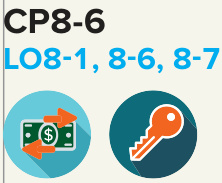

# Ch08 Reporting and Interpreting Property, Plant, and Equipment; Intangibles; and Natural Resources  

FedEx Corporation is the parent holding company of a portfolio of business segments, including  

+ FedEx Express—the world’s largest express transportation company,   
+ FedEx Ground—a leading North American provider of small-package ground delivery services,   
+ FedEx Freight—a leading North American provider of less-than-truckload freight services, and   
+ FedEx Office—providing document and business services and retail access to package transportation businesses.  

With over 670 aircraft and 180,000 vehicles in 220 countries and territories, its over 500,000 team members handle over 250 million daily tracking requests. It is a capitalintensive company with more than $\Phi33.6\$ billion in net property, plant, and equipment. In the year ending May 31, 2020 alone, FedEx spent nearly $\Phi5.9$ billion on capital expenditures, primarily for new aircraft and ground vehicles.  

## LEARNING OBJECTIVES  

## After studying this chapter, you should be able to:  

8-1	 Define, classify, and explain the nature of long-lived productive assets and interpret the fixed asset turnover ratio. p. 402   
8-2	 Apply the cost principle to measure the acquisition and maintenance of property, plant, and equipment. p. 404   
8-3	 Apply various cost allocation methods as assets are held and used over time. p. 411   
8-4	 Explain the effect of asset impairment on the financial statements. p. 421   
8-5	 Analyze the disposal of property, plant, and equipment. p. 422   
8-6	 Apply measurement and reporting concepts for intangible assets and natural resources. p. 424   
8-7	 Explain how the acquisition, use, and disposal of long-lived assets impact cash flows. p. 430  

## FedEx Corporation  

MANAGING PRODUCTIVE CAPACITY FOR THE WORLD’S LEADER IN AIR CARGO SERVICES  

fedex.com  

## UNDERSTANDING THE BUSINESS  

Because the demand for package and cargo delivery is seasonal, with peak demand occurring during the November and December holidays, and because international air cargo service is dependent on trade negotiations between countries, planning for productive capacity in the cargo and package delivery services industry is very difficult. FedEx’s managers must determine how many aircraft and vehicles are needed in which cities at what points in time to meet shifting demand. If a cargo plane takes off from Memphis, Tennessee (where FedEx is headquartered) en route to New York City with unused cargo space, the economic value associated with the unused space is lost for that flight. There is no way to sell the unused space to a customer once the cargo plane has left the airport. Unlike a manufacturer, a cargo and package delivery company cannot “inventory” the unused space for future sale.  

With the tremendous growth in e-commerce as a fundamental part of the retail industry and an increasingly connected world, competition in this industry is fierce. The focus of retailers is to get a product to a customer in the fastest, most convenient way possible and at as low a shipping cost as possible. FedEx competes directly with United Parcel Service (UPS), the U.S. Post Office, DHL International, and many large airlines (e.g., Delta among others). Much of the battle for both residential and business-to-business customers is fought in terms of property, plant, and equipment. Managers devote considerable time and utilize data analytics to plan optimal levels of productive capacity, and financial analysts closely review a company’s statements to determine the impact of management’s decisions.  

This chapter is organized according to the life cycle of long-lived assets—acquisition, use, and disposal. First, we will discuss the measuring and reporting issues related to land, buildings, and equipment. Then we will discuss the measurement and reporting issues for intangible assets and natural resources. Among the issues we will discuss are the maintenance, use, and disposal of property and equipment over time and the measurement and reporting of assets considered impaired in their ability to generate future cash flows.  

## ORGANIZATION OF THE CHAPTER  

## Acquisition and Maintenance of Plant and Equipment  

Use, Impairment, and Disposal of Plant and Equipment  

## ntangible Assets and Natural Resources  

Classifying Long-Lived Assets   
Measuring and Recording   
Acquisition Cost   
Fixed Asset Turnover Ratio   
Repairs, Maintenance, and   
Improvements   
• Depreciation Concepts   
• Alternative Depreciation Methods   
• How Managers Choose   
Measuring Asset Impairment Disposal of Property, Plant, and Equipment  

Acquisition and Amortization of Intangible Assets Acquisition and Depletion of Natural Resources  

## LEARNING OBJECTIVE 8-1  

Define, classify, and explain the nature of longlived productive assets and interpret the fixed asset turnover ratio.  

## EXHIBIT 8.1  

## ACQUISITION AND MAINTENANCE OF PLANT AND EQUIPMENT  

FedEx Corporation’s Asset Section of the Balance Sheet  

FEDEX CORPORATION REAL WORLD EXCERPT: 2020 Annual Report  

Exhibit 8.1 shows the asset section of the balance sheet from FedEx’s annual report for the fiscal year ended May 31, 2020. Nearly 46 percent of FedEx’s total assets are property and equipment. FedEx also reports other assets with probable long-term benefits. Let’s begin by classifying these assets.  

<html><body><table><tr><td rowspan="2">FEDEXCORPORATION (in millions)</td><td colspan="2">Consolidated Balance Sheets (partial)</td></tr><tr><td></td><td>May 31</td></tr><tr><td></td><td>2020</td><td>2019</td></tr><tr><td>ASSETS CURRENTASSETS(summarized)</td><td>$16,383</td><td>$13,086</td></tr><tr><td>PROPERTYANDEQUIPMENT,ATCOST</td><td></td><td></td></tr><tr><td>Aircraftandrelated equipment</td><td>24,518</td><td>22,793</td></tr><tr><td>Package handling and ground support equipment</td><td>11,382</td><td>10,409</td></tr><tr><td>Information technology</td><td>6,884</td><td>6,268</td></tr><tr><td>Vehicles and trailers</td><td>9,101</td><td>8,339</td></tr><tr><td>Facilities and other</td><td>13,139</td><td>11,702</td></tr><tr><td>Gross property and equipment</td><td>65,024</td><td>59,511</td></tr><tr><td>Less accumulated depreciation and amortization</td><td>31,416</td><td>29,082</td></tr><tr><td>Net property and equipment</td><td>33,608</td><td>30,429</td></tr><tr><td>OTHERLONG-TERMASSETS</td><td></td><td></td></tr><tr><td></td><td></td><td></td></tr><tr><td>Operating lease right-of-use assets, net</td><td>13,917</td><td></td></tr><tr><td>Goodwill</td><td>6,372</td><td>6,884</td></tr><tr><td>Other assets</td><td>3,257</td><td>4,004</td></tr><tr><td rowspan="2">Total other long-term assets</td><td>23,546</td><td>10,888</td></tr><tr><td>$73,537</td><td>$54,403</td></tr></table></body></html>

Source: FedEx Corporation  

## Classifying Long-Lived Assets  

The resources that determine a company’s productive capacity often are called long-lived assets. These assets, which are listed as noncurrent assets on the balance sheet, may be either tangible or intangible and have the following characteristics:  

1.	Tangible assets have physical substance; that is, they can be touched. The three kinds of long-lived tangible assets are  

  

a.	 Land used in operations. As is the case with FedEx, land often is not shown as a separate item on the balance sheet.  

$b$ .	 Buildings, fixtures, and equipment used in operations. For FedEx, this category includes aircraft and ground equipment to service the aircraft, information technology, and vehicles and trailers. (Note: Land, buildings, fixtures, and equipment also are called property, plant, and equipment or fixed assets.)  

c.	 Natural resources used in operations. FedEx does not report any natural resources on its balance sheet. However, companies in other industries report natural resources such as timber tracts and silver mines.  

2.	Intangible assets are long-lived assets without physical substance that confer specific rights on their owner. Examples are patents, copyrights, franchises, licenses, and trademarks. FedEx also reports over $\mathbb{S}6$ billion of goodwill on its balance sheet. Goodwill represents many of the intangible assets acquired through mergers and acquisitions, which we discuss briefly in this chapter.  

## KEY RATIO ANALYSIS  

  

Fixed Asset Turnover  

ANALYTICAL QUESTION  

How effectively is management utilizing fixed assets to generate revenues?  

RATIO AND COMPARISONS  

  

Selected Focus Companies’ Fixed Asset Turnover Ratios  

The ratio for FedEx for the fiscal year ended May 31, 2020 is (dollars in millions):  

Chipotle Mexican Grill 3.93  

  

Skechers  

<html><body><table><tr><td>ComparisonsOverTime</td><td>Comparisons With Competitor</td></tr><tr><td>FedEx Corporation</td><td>UnitedParcelService</td></tr><tr><td>2018 2019 2020</td><td>2020</td></tr><tr><td>2.42 2.39 2.16</td><td>2.70</td></tr></table></body></html>  

## INTERPRETATIONS  

In General The fixed asset turnover ratio measures the sales dollars generated by each dollar of fixed assets (land, buildings, and equipment) used. Creditors and security analysts use this ratio to assess a company’s effectiveness at generating sales from its fixed assets. A high rate normally suggests effective management. An increasing rate over time signals more efficient fixed asset use.  

Focus Company Analysis FedEx’s fixed asset turnover ratio decreased each year between 2018 and 2020. This suggests that FedEx was less efficient in using its property, plant, and equipment over time. In 2019, FedEx and Amazon ended their express delivery contract, resulting in about a one percent reduction in operating revenues in 2019 and 2020. With the explosion in e-commerce, intensified by the Covid-19 pandemic, and Amazon’s expanding commitment to build its own Amazon Air cargo service, FedEx shifted its strategy to focus on the broader retail market, such as Walmart and Target. United Parcel Service (UPS), on the other hand, picked up the capacity with Amazon that FedEx lost in those years.  

A Few Cautions A lower or declining fixed asset turnover rate may indicate that a company is expanding (by acquiring additional productive assets) in anticipation of higher future sales. An increasing ratio also could signal that a firm has cut back on capital expenditures due to a downturn in business. This is not the case at FedEx, which continues to expand and upgrade its fleet of planes, vehicles, equipment, and information technology. As a consequence, appropriate interpretation of the fixed asset turnover ratio requires an investigation of related activities.  

## LEARNING OBJECTIVE 8-2  

Apply the cost principle to measure the acquisition and maintenance of property, plant, and equipment.  

  
DaveAlan/iStock Unreleased/Getty Images  

## Measuring and Recording Acquisition Cost  

Under the cost principle, all reasonable and necessary expenditures made in acquiring and preparing an asset for use (or sale, as in the case of inventory) should be recorded as the cost of the asset. These include any sales taxes, legal fees, transportation costs, and installation costs to acquire and prepare the asset for use. These expenditures are capitalized (recorded as part of the total cost of the asset), not recorded as expenses in the current period. However, any interest charges associated with the purchase are recorded as expenses as incurred.  

In addition to purchasing buildings and equipment, a company may acquire undeveloped land, typically with the intent to build a new factory or office building. When a company purchases land, all of the incidental costs of the purchase, such as title fees, sales commissions, legal fees, title insurance, delinquent taxes, and surveying fees, should be included in its cost.  

Sometimes a company purchases an old building or used machinery for the business operations. Renovation and repair costs incurred by the company prior to the asset’s use should be included as a part of its total cost. Also, when purchasing land, buildings, and equipment as a group (known as a basket purchase), the total cost is allocated to each asset in proportion to the asset’s market value relative to the total market value of the assets as a whole [e.g., Building Cost $=$ (Market value of building/ Total market value of the basket purchase) $\times$ Total cost of the basket purchase].  

In 2017, FedEx signed a deal with ATR (headquartered in Toulouse, France), the world’s largest regional turbo-prop plane manufacturer, to purchase over several years 50 ATR 72-600F freighter aircraft. This fuel-efficient plane provides fast, economical services to small- and medium-sized businesses around the world, as part of FedEx Express’s Feeder fleet renewal program. For illustration, assume that FedEx took delivery of a new ATR cargo plane on June 1, 2023 (the beginning of FedEx’s fiscal year) with the following information:  

•	 List price $=\mathbb{S}26.8\$ million  

•	 Discount offered by $\mathrm{ATR}={\mathbb S}\,1.8$ million for signing the purchase agreement •	 Transportation (delivery) costs paid by $\mathrm{FedEx}=\mathbb{8}400,000$ •	 Preparation (e.g., detailing of FedEx logo) costs paid by $\mathrm{FedEx}=\mathbb{8}600,000$  

The amount recorded for the purchase, called the acquisition cost, is the net cash amount paid for the asset, or when noncash assets are used as payment, the fair value of the asset given or asset received, whichever can be more clearly determined (called the cash equivalent price). FedEx would calculate the acquisition cost of the new aircraft as follows:  

Invoice price \$26,800,000   
Less: Discount from ATR (1,800,000)   
Net cash invoice price 25,000,000   
Add: Transportation charges paid by FedEx 400,000   
Preparation costs paid by FedEx 600,000   
Cost of the aircraft (added to the asset account) \$26,000,000  

## For Cash  

Assuming that FedEx paid cash for the aircraft and related transportation and preparation costs, the transaction is recorded as follows (in millions):  

<html><body><table><tr><td colspan="3"></td><td>Debit</td><td>Credit</td></tr><tr><td colspan="3">Aircraft(+A)</td><td>26</td><td></td></tr><tr><td colspan="3">Cash (-A)</td><td></td><td>26</td></tr><tr><td>Assets</td><td colspan="3">Liabilities + Stockholders'Equity</td></tr><tr><td colspan="2">Aircraft +26 Cash -26</td><td colspan="3"></td></tr></table></body></html>  

It might seem unusual for FedEx to pay cash to purchase new assets that cost $\mathbb{S}26$ million, but this is often the case. When it acquires productive assets, a company may pay with cash that was generated from operations or cash recently borrowed. It also is possible for the seller to finance the purchase on credit.  

## For Debt  

Now let’s assume that FedEx signed a note payable for the new aircraft and paid cash for the transportation and preparation costs. In that case, FedEx would record the following journal entry (in millions):  

<html><body><table><tr><td colspan="3"></td><td>Debit</td><td>Credit</td></tr><tr><td colspan="3">Aircraft(+A)</td><td>26</td><td></td></tr><tr><td colspan="3">Cash(-A)</td><td></td><td>1</td></tr><tr><td colspan="3">Note payable (+L)</td><td></td><td>25</td></tr><tr><td>Assets</td><td>Liabilities</td><td colspan="3">+ Stockholders'Equity</td></tr><tr><td colspan="2">Aircraft +26 Note payable Cash -1</td><td colspan="4">+25</td></tr></table></body></html>  

Instead of signing a note payable, another option is to utilize schemes that include leasing aircraft. About four in ten commercial aircraft carrying passengers are leased. FedEx owns approximately 95 percent of its aircraft, but leases a significant amount of national, regional, and metropolitan sorting facilities, retail facilities, and administrative buildings, land, and equipment. Effective in 2019, companies are required to report most types of leases on the balance sheet as Operating Lease Right-of-Use Assets, with the related obligations reported as debt entitled Operating Lease Liabilities. FedEx reported $\mathbb{S}13{,}917$ million in operating lease right-of-use assets on May 31, 2020. Because leases confer right-of-use to the company using the asset, these are considered intangible assets and are not included in property, plant, and equipment (fixed assets). The lessee (the one using the asset) will recognize (1) depreciation of the right-of-use assets and (2) interest on the lease liability. Additional discussion of leases is provided in Chapter 9, with advanced discussion in other accounting courses.  

Companies widely use leasing—from office buildings and shopping centers to vehicles, farm equipment, and airplanes. Beginning in 2019 as required by new accounting standards, many companies, especially airlines and retailers, reported significant increases in assets and debt due to leases. Remember: Don’t include the right-of-use assets in total fixed assets; they are intangible assets.  

## For Equity (or Other Noncash Considerations)  

Noncash consideration, such as the company’s common stock or a right given by the company to the seller to purchase the company’s goods or services at a special price, also might be part of the transaction. When noncash consideration is included in the purchase of an asset, the cashequivalent cost (fair value of the asset given or received) is determined.  

Assume that FedEx gave ATR 1,000,000 shares of new $\mathbb{S}1.00$ par value common stock with a market value of $\mathbb{S}10$ per share and paid the balance of the plane plus transportation and preparation costs in cash. The journal entry and transaction effects follow (in millions):  

  

able and necessary expenditures made in acquiring and preparing an asset for its intended use should be recorded as part of the cost of the asset—they should be capitalized! But, after the asset is ready to use, no other costs, such as insurance on the asset while in use, are capitalized.  

Capitalized Expenditures: Wages paid   
Materials and supplies paid Interest paid  

## By Construction  

In some cases, a company may construct an asset for its own use instead of buying it from a manufacturer. When a company does so, the cost of the asset includes all the necessary costs associated with construction, such as labor, materials, and, in most situations, a portion of the interest incurred during the construction period, called capitalized interest. The amount of interest expense that is capitalized is recorded by debiting the asset and crediting cash when the interest is paid. The amoun of interest to be capitalized is a complex computation discussed in detail in other accounting courses. Capitalizing labor, materials, and a portion of interest expense has the effect of increasing assets, decreasing expenses, and increasing net income in the current period. Let’s assume FedEx constructed a new hangar, paying $\mathbb{S}8$ million in labor costs and $\mathbb{S}11$ million in supplies and materials. FedEx also paid $\mathbb{S}1$ million in interest expense during the year related to the construction project. The company would record the following journal entry (in millions):  

  

In a recent annual report, FedEx Corporation included a note on capitalized interest for financing aircraft purchases and modifications, construction of facilities, and software development:  

## FEDEX CORPORATION  

REAL WORLD EXCERPT: 2020 Annual Report  

## Note 1  

Summary of Significant Accounting Policies  

CAPITALIZED INTEREST. Interest on funds used to finance the acquisition and modification of aircraft, including purchase deposits, construction of certain facilities, and development of certain software up to the date the asset is ready for its intended use, is capitalized and included in the cost of the asset if the asset is actively under construction. Capitalized interest was $\mathbb{S}54$ million in 2020, $\mathbb{S}64$ million in 2019 and $\mathbb{S}61$ million in 2018.  

Source: FedEx Corporation  

We just learned how to measure the cost of operational assets acquired under various methods. In general, all necessary and reasonable costs to ready the asset for its intended use are part of the cost of the asset. Assets can be acquired with cash, with debt, and/or with the company’s stock (at market value).  

## S E L F - S T U D Y  Q U I Z  

It’s your turn to apply these concepts by answering the following questions. In a recent year, McDonald’s Corporation purchased property, plant, and equipment. Assume the following for the purchase of the equipment (in millions, except share and per share amounts):  

$\mathbb{S}1{,}200$ list price Suppliers gave McDonald’s a 10 percent discount $\mathbb{S}10$ for transportation costs to deliver the equipment (paid by McDonald’s) $\mathbb{S}32$ for installation and preparation of the equipment before use $\mathbb{S}1$ in maintenance contracts to cover repairs to the equipment during use For payment: ∘	 Issued 1 million shares of $\mathbb{S}1$ common stock with a market value of $\mathbb{S}40$ per share Signed a one-year note payable for $\mathbb{S}800$ with a four percent interest rate, all due in the following year Paid the remainder in cash   
1.	 Record the journal entry for the purchase of the equipment.   
2.	 Indicate the accounts, amounts, and effects ( $^{\pm}$ for increase; − for decrease) of the purchase on the accounting equation.   
3.	 Was the $\mathbb{S}1$ in maintenance contracts included in the cost of the equipment? Why or why not?  

After you have completed your answers, check them below.  

G U I D E D H E L P 8 - 1  

For additional step-by-step video instruction on recording long-lived asset purchases, go to mhhe.com/ libby_gh8-1.  

## Related Homework: E8-3, E8-4, E8-5, P8-1, P8-3  

  

## Repairs, Maintenance, and Improvements  

Most assets require substantial expenditures during their lives to maintain or enhance their productive capacity. These expenditures include cash outlays for ordinary repairs and maintenance, major repairs, replacements, and additions. Expenditures that are made after an asset has been acquired are classified as follows:  

1.	Ordinary repairs and maintenance are expenditures that maintain the productive capacity of the asset during the current accounting period only. These expenditures are recurring in nature, involve relatively small amounts at each occurrence, and do not directly increase the productive life, operating efficiency, or capacity of the asset. These cash outlays are recorded as expenses in the current period.  

In the case of FedEx, examples of ordinary repairs would include changing the oil in the aircraft engines, replacing the lights in the control panels, and cleaning the sorting facilities. Although the cost of individual ordinary repairs is relatively small, in the aggregate these expenditures can be substantial. For the year ended May 31, 2020, FedEx reported $\mathbb{52}{,}893$ million in Maintenance and Repairs on its income statement. The following summary entry represents how these expenditures would have been recorded by FedEx (in millions):  

REAL WORLD EXCERPT: 2020 Annual Report  

## FEDEX CORPORATION  

<html><body><table><tr><td colspan="3"></td><td>Debit</td><td>Credit</td></tr><tr><td colspan="3">Maintenance and repairs expense (+E,-SE)</td><td>2,893</td><td></td></tr><tr><td colspan="3">Cash (-A)</td><td></td><td>2,893</td></tr><tr><td>Assets</td><td colspan="3">Liabilities +</td></tr><tr><td>h -2,893</td><td></td><td colspan="3">Stockholders'Equity Maintenanceandrepairsexpense (+E) -2,89</td></tr></table></body></html>  

2.	Improvements are expenditures that increase the productive life, operating efficiency, or capacity of the asset. These capital expenditures are added to the appropriate asset accounts (i.e., they are capitalized). They occur infrequently, involve large amounts of money, and increase an asset’s economic usefulness in the future through either increased efficiency or longer life. Examples include additions, major overhauls, complete reconditioning, and major replacements and improvements, such as the complete replacement of an engine on an aircraft.  

FedEx’s annual report includes a description of what it capitalizes, which follows the accounting for capital expenditures:  

## Note 1  

Summary of Significant Accounting Policies  

PROPERTY AND EQUIPMENT. Expenditures for major additions, improvements and flight equipment modifications are capitalized when such costs are determined to extend the useful life of the asset or are part of the cost of acquiring the asset. Expenditures for equipment overhaul costs of engines or airframes prior to their operational use are capitalized as part of the cost of such assets as they are costs required to ready the asset for its intended use.  

Source: FedEx Corporation  

Assume that FedEx spent $\mathbb{S}300$ million in 2023 to modify the cargo area of its oldest aircraft to reduce weight, resulting in 9 percent greater fuel efficiency and lower operating costs. The summary entry below represents how these expenditures would have been recorded by FedEx as capital expenditures:  

  

In many cases, no clear line distinguishes improvements (assets) from ordinary repairs and maintenance (expenses). In these situations, managers must exercise professional judgment and make a subjective decision. Capitalizing expenses will increase assets and net income in the current year, lowering future years’ income by the amount of the annual depreciation. On the other hand, for tax purposes, expensing the amount in the current period will lower taxes immediately. Because the decision to capitalize or expense is subjective, auditors review the items reported as capital expenditures and ordinary repairs and maintenance closely.  

To avoid spending too much time classifying additions and improvements (capital expenditures) and repair expenses (revenue expenditures), some companies develop simple policies to govern the accounting for these expenditures. For example, one large computer company expenses all individual items that cost less than $\mathbb{S}1{,}000$ . Such policies are acceptable because immaterial (relatively small dollar) amounts will not affect users’ decisions when analyzing financial statements.  

## A QUESTION OF ETHICS  

## WorldCom: Hiding Billions in Expenses through Capitalization  

When expenditures that should be recorded as current period expenses are improperly capitalized as part of the cost of an asset, the effects on the financial statements can be enormous. In one of the largest accounting frauds in history, WorldCom (now part of Verizon) inflated its income and cash flows from operations by billions of dollars in just such a scheme. This fraud turned WorldCom’s actual losses into large profits.  

Over five quarters in 2001 and 2002, the company initially announced that it had capitalized $\mathbb{5}3.8$ billion that should have been recorded as operating expenses. By early 2004, auditors discovered $\mathbb{S}11$ billion in necessary restatements (reductions to previously reported pretax income) for 2000 and 2001. Accounting for expenses as capital expenditures increases current income because it spreads a single period’s operating expenses over many future periods as depreciation expense. It increases cash flows from operations by moving cash outflows from the operating section to the investing section of the cash flow statement.  

## ENVIRONMENTAL, SOCIAL, & GOVERNANCE (ESG) REPORTING  

## Being a Global Citizen  

FedEx publishes an ESG report at sustainability.fedex.com that “covers FedEx corporate social responsibility (CSR) strategies, goals, programs, and progress.” Its 2020 Global Citizenship Report, for example, highlights its innovative technologies to focus on meeting customers’ and employees’ needs and being environmentally conscious. The innovations include: Using emissions-free e-bikes in high-congestion areas to reduce the company’s environmental footprint; expanding its fleet of electric vehicles; replacing and modernizing older aircraft with more fuelefficient planes (the company uses a lot of jet fuel!) such as the ATR 72-600F purchases for its FedEx Express Feeder fleet; obtaining jet fuel from alternative low-carbon renewable jet fuel sources; optimizing vehicle routes to reduce fuel usage; investing in autonomous vehicles (e.g., robots—Roxo™, the SameDay Bot and drones using Alphabet’s Wing technology); installing solar and fuel cell technologies; and enhancing the recycling of packaging.  

  
Aviation Images Ltd/Alamy Stock Photo  

  

  

FEDEX CORPORATION REAL WORLD EXCERPT: 2020 Global Citizenship Report  

The report provides metrics on CSR goals and progress. For example, Goal: Reduce aircraft emissions intensity 30 percent from 2005 baseline by 2020; Progress: 24 percent reduction (not yet achieved due to certain inefficient aircraft that had not yet been retired). As stated in the report, “Collectively, our sustainability efforts have contributed to an approximately $40\%$ reduction in $\mathbf{CO}_{2}$ emissions intensity across the enterprise. . .” Here is a small excerpt from the many metrics displayed in the 2020 Global Citizenship Report:  

<html><body><table><tr><td>FUEL-ANDENERGY-SAVINGINITIATIVES</td><td colspan="3">Energy saved (terajoules)</td><td colspan="3">CO2e emissions avoided (metric tons)</td></tr><tr><td>EnergySaved (terajoules)</td><td>FY17</td><td>FY18</td><td>FY19</td><td>FY17</td><td>FY18</td><td>FY19</td></tr><tr><td>On-siteSolarElectricityGeneration</td><td>75</td><td>76</td><td>85</td><td>12,425</td><td>12,504</td><td>13,447</td></tr><tr><td>FacilityEnergyEfficiency</td><td></td><td></td><td></td><td></td><td></td><td></td></tr><tr><td>Initiatives(i). (i)</td><td>793</td><td>828</td><td>915</td><td>164,018</td><td>171,252</td><td>179,638</td></tr><tr><td>FedExFuel Sense (jetfuel)</td><td>12,510</td><td>13,436</td><td>15,571</td><td>849,183</td><td>912,023</td><td>1,054,418</td></tr><tr><td>FedExExpressAircraftFleet Modernization</td><td>12,705</td><td>15,591</td><td>19,992</td><td>862,420</td><td>1,058,368</td><td>1,355,852</td></tr><tr><td>FedExExpress Reduce,Replace,</td><td></td><td></td><td></td><td></td><td></td><td></td></tr><tr><td>RevolutionizeVehicleEfficiency</td><td>3,113</td><td>3,401</td><td>3,627</td><td>219,714</td><td>240,171</td><td>255,666</td></tr><tr><td>FedExFreightIntermodal Rail Usage</td><td>3,408</td><td>3,787</td><td>4,022</td><td>264,296</td><td>296,511</td><td>281,278</td></tr><tr><td>TotalEnergySaved/EmissionsAvoided</td><td>32,604</td><td>37,119</td><td>44,211</td><td>2,372,056</td><td>2,690,828</td><td>3,140,299</td></tr></table></body></html>  

(i) Facility energy efficiency initiatives include building lighting retrofits and energy management systems. (ii) $\mathrm{CO}_{2}\mathrm{e}$ calculated using the EPA GHG Calculator. FY19 emissions uses EPA GHG Calculator’s updated emission factors.  

Source: FedEx Corporation  

## P A U S E F O R F E E D B A C K  

Practice these applications for operational assets as they are used over time: repairing or maintaining (expensed in current period) and adding to or improving (capitalized as part of the cost of the asset).  

## S E L F - S T U D Y  Q U I Z  

A building that originally cost $\mathbb{S}400{,}000$ has been used over the past 10 years and needs continual maintenance and repairs. For each of the following expenditures, indicate whether it should be expensed in the current period or capitalized as part of the cost of the asset.  

Expense or Capitalize? 1. Major replacement of electrical wiring throughout the building. 2. Repairs to the front door of the building. 3. Annual cleaning of the filters on the building’s air-conditioning system. 4. Significant repairs due to damage from an unusual and infrequent flood.  

After you have completed your answers, check them below.  

Related Homework: M8-3, E8-6, E8-7, E8-8, E8-24  

1. Capitalize 2. Expense 3. Expense 4. Capitalize  

When a company acquires a new long-lived asset as illustrated above, management must ensure that sound internal controls are established and followed to safeguard the asset. One of the most important controls is to create a registry (a record) of each fixed asset with relevant information, such as the purchase date, serial number, acquisition date, and cost. Another useful physical control is to “tag” each asset with an identifying number. Technology simplifies tagging and tracking, especially for moveable assets such as computer monitors, by using QR codes attached to the asset paired with mobile technology (a smartphone or scanner). An annual review comparing the asset registry to the physical QR code provides a real-time snapshot of assets and their locations. In addition, management strengthens internal controls by establishing and following policies on capitalization of expenditures for fixed assets, generally accepted depreciation methods to be used, and approval procedures for acquisition and disposition of assets.  

While most large companies have strong controls for acquisition, the controls surrounding disposition of assets often are lacking. When fixed assets are sold, it is important that management established procedures to segregate duties—that is, a different person is needed for each point in the sale: Approving the sale, recording the sale in the accounting system, reconciling accounting records, and physically possessing the cash from the sale. Otherwise, there is a risk of loss to the company. Now, let’s discuss the use, impairment and disposal of property and equipment.  

## USE, IMPAIRMENT, AND DISPOSAL OF PLANT AND EQUIPMENT  

## Depreciation Concepts  

Except for land, which is considered to have an unlimited life, a long-lived asset with a limited useful life, such as an airplane, represents the prepaid cost of a bundle of future services or benefits. The expense recognition (matching) principle requires that a portion of an asset’s cost be allocated as an expense in the same period that revenues are generated by its use. FedEx Corporation earns revenue when it provides cargo and delivery service and incurs an expense when using its aircraft to generate the revenue.  

The term used to identify the matching of the cost of using buildings and equipment with the revenues they generate is depreciation. Thus, depreciation is the process of allocating the cost of buildings and equipment over their productive lives using a systematic and rational method.  

  

  
Using the asset    Depreciation Expense each year  

  

## Reminder: Establishing internal controls  

is the responsibility of management. Auditors have a duty to test the internal controls for weaknesses that could impact financial information.  

## LEARNING OBJECTIVE 8-3  

Apply various cost allocation methods as assets are held and used over time.  

Again $\twoheadrightarrow$ In accounting, depreciation is mply a cost allocation concept—net book value is reduced as the asset is used to generate revenue. It has nothing to do with an asset’s market value (as if you were going to sell it) because your intent is to use it.  

On financial statements:  

Income Statement Depreciation expense: Estimated cost used in current period  

Balance Sheet  

Property, Plant, Accumulated Net and Equipment  −Depreciation $=$ Book Value (Cost) (Used cost) (Unused cost)  

Students often are confused by the concept of depreciation as accountants use it. In accounting, depreciation is a process of cost allocation, not a process of determining an asset’s current market value or worth. When an asset is depreciated, the remaining balance sheet amount probably does not represent its current market value. On balance sheets subsequent to acquisition, the undepreciated cost is not measured on a market or fair value basis.  

As we discussed in Chapter 4, an adjusting journal entry is needed at the end of each period to reflect the use of buildings and equipment for the period:  

<html><body><table><tr><td></td><td>Debit</td><td>Credit</td></tr><tr><td>Depreciationexpense e(+E,-SE)</td><td>X,XXX</td><td></td></tr><tr><td>Accumulated depreciation (+XA,-A)</td><td>+</td><td>X,XXX</td></tr><tr><td>Assets Liabilities</td><td colspan="2">Stockholders'Equity</td></tr></table></body></html>  

Accumulated depreciation $\mathbf{\Psi}_{\mathrm{+XA}}$ ) −x,xxx  

Depreciation expense $\left(+\mathrm{E}\right)$ −x,xxx  

The amount of depreciation recorded during each period is reported on the income statement as Depreciation Expense. The amount of depreciation expense accumulated since the acquisition date is reported on the balance sheet as a contra-account, Accumulated Depreciation, and deducted from the related asset’s cost. The net amount on the balance sheet is called net book value or carrying value. The net book value (or carrying value or book value) of a long-lived asset is its acquisition cost less the accumulated depreciation from the acquisition date to the balance sheet date.  

From the balance sheet excerpt in Exhibit 8.1, we see that FedEx’s acquisition cost for property and equipment is $\mathbb{S}65{,}024$ million on May 31, 2020. The accumulated is millic (amortization is the name for allocating costs of intangible assets and is discussed later in the chapter). Thus, the book value is reported as net property and equipment of $\mathbb{S}33{,}608$ million. FedEx also reported depreciation and amortization expense of $\mathbb{S}3{,}615$ million on its income statement for the year ended May 31, 2020.  

  

##  

## Balance Sheet  

## Book Value as an Approximation of Remaining Life  

Some analysts compare the book value of assets to their original cost as an approximation of their remaining life. If the book value of an asset is 100 percent of its cost, it is a new asset; if the book value is 25 percent of its cost, the asset has about 25 percent of its estimated life remaining. In FedEx’s case, the book value of its property and equipment $(\Phi33,608)$ was nearly 52 percent of its original cost $(\Phi65,\b{024})$ on May 31, 2020, compared to 51 percent for United Parcel Service and 58 percent for German company Deutsche Post DHL Group.  

This comparison suggests that the flight equipment of FedEx and UPS may be slightly older than the equipment at DHL. However, this comparison is only a rough approximation and is influenced by some of the accounting issues discussed in the next section, including how fast a company depreciates its buildings and equipment.  

Once an asset’s cost is determined, to calculate depreciation expense, three pieces of information are required for each asset:  

\*	 Estimated useful life to the company.   
\*	 Estimated residual (or salvage) value at the end of the asset’s useful life to the company.  

Depreciation method.  

Estimated useful life represents management’s estimate of the asset’s useful economic life to the company rather than its total economic life to all potential users. The asset’s expected physical life is often longer than the company intends to use the asset. Economic life may be expressed in terms of years or units of capacity, such as the number of hours a machine is expected to operate or the number of units it can produce. FedEx’s wide-body aircraft fleet is expected to fly for more than 30 years, but FedEx has goals of reducing fuel emissions by replacing its older aircraft with modern fuel-efficient equipment. For accounting purposes, FedEx assigns an estimated useful life range between 5 and 30 years depending on the type of cargo plane (e.g., Boeing 777F, ATR 72-600F). At the end of its useful life to FedEx, a plane may be sold. The subsequent owner of the aircraft (likely a regional or foreign airline) would use an estimated useful life based on its own policies.  

## FINANCIAL ANALYSIS  

  

## Differences in Estimated Lives within a Single Industry  

Notes to recent actual financial statements of various air cargo and package delivery companies reveal the following estimates for the useful lives of flight equipment:  

<html><body><table><tr><td>Company</td><td>EstimatedUsefulLife (in years)</td></tr><tr><td>FedEx:Wide-body aircraft</td><td>15 to30</td></tr><tr><td>Narrow-body aircraft</td><td>5 to18</td></tr><tr><td>UnitedParcelService</td><td>12 to40</td></tr><tr><td>DeutschePostDHL Group</td><td>15to20</td></tr></table></body></html>  

The differences in the estimated lives may be attributed to a number of factors such as the type of aircraft used by each company, equipment replacement plans, operational differences, and the degree of management’s conservatism. In addition, given the same type of aircraft, companies that plan to use the equipment over fewer years may estimate higher residual values than companies that plan to use the equipment longer.  

Differences in estimated lives and residual values of assets can have a significant impact on a comparison of the profitability of the competing companies. Analysts must be certain to identify the causes of differences in depreciable lives.  

Book Value as a Percentage of Original Cost  

  

Notice that, since the asset’s useful life and  

residual values are estimates, depreciation expense is an estimate. Companies ask equipment suppliers what the entire expected life is (say 20 years). Then, management decides, based on the company’s own experience with similar assets and policies on equipment renewal, as to the estimated life and residual value to assign (say, 15 years with a 10 percent value at the end).  

Estimated residual (or salvage) value represents management’s estimate of the amount the company expects to recover upon disposal of the asset at the end of its estimated useful life. The residual value may be the estimated value of the asset as salvage or scrap or its expected value if sold to another user. In the case of FedEx’s aircraft, residual value may be the amount it expects to receive when it sells the asset to a small regional or foreign air cargo company that operates older equipment. The notes to FedEx’s financial statements state that “Substantially all property and equipment have no material residual values.”  

## Alternative Depreciation Methods  

Because of significant differences among companies and the assets they own, accountants have not been able to agree on a single best method of depreciation. As a result, managers may choose from several acceptable depreciation methods that match depreciation expense with the revenues generated in a period. They also may choose different methods for specific assets or groups of assets. Once selected, the method should be applied consistently over time to enhance comparability of financial information. We will discuss three depreciation methods:  

1.	Straight-line—when an asset’s usage is the same each period.  

2.	Units-of-production—when an asset’s usage varies each period depending on activity or productivity during the period.   
3.	Declining-balance—when an asset is more efficient in its early years of usage, producing more revenue, but is less efficient over time.  

To illustrate each method, let’s assume that FedEx acquired a new delivery van on June 1, 2023, the start of its fiscal year. The relevant information is shown in Exhibit 8.2.  

## Straight-Line Method  

## EXHIBIT 8.2  

The vast majority of companies, including FedEx, select the straight-line depreciation method for financial reporting. It is the simplest method, and it is used when no other cost allocation method provides a better matching of revenues and expenses. Under the straight-line method, an equal portion of an asset’s depreciable cost is allocated to each accounting period over the asset’s estimated useful life. The straight-line formula follows:  

Data for Illustrating the Computation of Depreciation under Alternative Methods  

  

In this formula, “Cost minus Residual Value” (C - RV, for short) is the amount to be depreciated, also called the depreciable cost. The formula “1/Useful Life” is the straight-line rate. Using the data provided in Exhibit 8.2, the depreciation expense for $[1/\mathrm{UL}$ , for short) FedEx’s new delivery van would be $\mathbb{S}20{,}000$ per year, calculated as follows:  

<html><body><table><tr><td>(C</td><td>RV)</td><td>×</td><td>1/UL</td><td>Depreciation Expense</td></tr><tr><td>($ 62,500 一</td><td>$2,500)</td><td>×</td><td>1/3years</td><td>$20,000 peryear</td></tr></table></body></html>  

<html><body><table><tr><td colspan="3"></td></tr><tr><td colspan="3">AcquisitionofNewDeliveryVan#91-DHH16335PA</td></tr><tr><td>Cost,purchasedonJune1,2023</td><td>$62,500</td><td></td></tr><tr><td>Estimatedresidualvalue</td><td>2,500</td><td></td></tr><tr><td>Estimatedusefullife</td><td></td><td>3 yearsOR100.000miles</td></tr><tr><td>Actualmilesdrivenin:</td><td>YearendedMay31,2024</td><td>30.000miles</td></tr><tr><td></td><td>Year ended May31,2025</td><td>50,000miles</td></tr><tr><td></td><td>Year ended May 31,2026</td><td>20,000miles</td></tr></table></body></html>  

Companies often create a depreciation schedule that shows the computed amount of depreciation expense each year over the entire useful life of the asset. The new delivery van’s depreciation schedule is created in an Excel spreadsheet using the data in Exhibit 8.2:  

  

  
Microsoft Excel  

Notice that:  

•	 Depreciation expense is a constant amount each year.  

•	 Accumulated depreciation increases by an equal amount each year. •	 Net book value decreases by the same amount each year until it equals the estimated residual value.  

This is the reason for the name straight-line method. Notice, too, that the adjusting entry can be prepared from this schedule, and the effects on the income statement and balance sheet are known. FedEx uses the straight-line method for all its assets as reported in the notes to recent financial statements:  

## NOTE 1.  

PROPERTY AND EQUIPMENT. . . . For financial reporting purposes, we record depreciation and amortization of property and equipment on a straight-line basis over the asset’s service life or related lease term, if shorter.  

FEDEX CORPORATION REAL WORLD EXCERPT: 2020 Annual Report  

Source: FedEx Corporation  

The company reported approximately $\mathbb{S}3.6$ billion in depreciation (annual amount of used cost for property and equipment) and amortization expense (annual amount of used cost for intangible assets) for the year ending May 31, 2020, equal to 5.2 percent of the company’s revenues for that year.  

## Units-of-Production Method  

The units-of-production depreciation method relates depreciable cost to total estimated productive output or activity level. It can be used for depreciating equipment when production or activity levels vary over time, generating varying amounts of revenue—a good matching of expenses  

with revenues. The formula to estimate annual depreciation expense under this method is as follows:  

Units-of-Production Formula: (Cost − Residual Value)/Estimated total production (or activity level) units  

Unit Rate $\times$ Actual production or activity level for the period $=$ Depreciation Expense  

First, divide the depreciable cost (cost minus residual value) by the estimated total production or activity level to determine the depreciation unit rate. In our illustration, the delivery vehicle’s unit rate is:  

<html><body><table><tr><td>(C</td><td>RV) Esttotal</td><td>prod</td><td>UnitRate</td></tr><tr><td>($62,500</td><td>一 $2,500)</td><td>100,000r miles $0.60p</td><td>per mile Unit Rate</td></tr></table></body></html>  

Then multiply the unit rate by the actual production or activity level for the period to determine the period’s depreciation expense. Based on the information in Exhibit 8.2, the depreciation schedule for the delivery vehicle under the units-of-production method follows:  

## Units-of-Production  

<html><body><table><tr><td>File</td><td></td><td>Home Insert</td><td>Page Layout</td><td></td><td>Formulas</td><td>Data Review</td><td>View</td><td>Help Power Pivot</td><td></td><td></td></tr><tr><td colspan="3">D15</td><td colspan="11">√ f</td></tr><tr><td colspan="2">A</td><td colspan="2">B</td><td colspan="2">C D</td><td>E</td><td>F</td><td>G</td><td>H</td><td></td></tr><tr><td>1</td><td></td><td colspan="4"></td><td></td><td></td><td></td><td></td><td></td></tr><tr><td>2</td><td></td><td colspan="4">Units-of-Production Method:</td><td></td><td>Delivery Van #91-DHH16335PA</td><td></td><td></td><td></td></tr><tr><td>3</td><td></td><td colspan="4">(C-RV)/Est.total activity =</td><td>Unit Rate</td><td></td><td></td><td></td><td></td></tr><tr><td>4</td><td></td><td colspan="4">($62,500 - $2,500)/100,000 miles =</td><td>$0.60</td><td>Depreciation</td><td>Accumulated</td><td>Net</td><td></td></tr><tr><td>5</td><td></td><td colspan="4">Computation</td><td></td><td>Expense</td><td>Depreciation</td><td>Book Value</td><td></td></tr><tr><td>6</td><td></td><td colspan="2">Year ending</td><td colspan="2">Unit Rate x Actual Activity</td><td></td><td>(for AJE)</td><td>(Balance after AJE)</td><td>(C-AD)</td><td></td></tr><tr><td>7</td><td></td><td>6/1/2023</td><td colspan="3">Cost at acquisition</td><td></td><td></td><td>$0</td><td>$62,500</td><td></td></tr><tr><td>8</td><td></td><td>5/31/2024</td><td>$0.60</td><td colspan="2">x30,000 miles</td><td></td><td>$18,000</td><td>$18,000</td><td>$44,500</td><td></td></tr><tr><td>9</td><td></td><td>5/31/2025</td><td>$0.60</td><td colspan="2">x50,000 miles</td><td></td><td>$30,000</td><td>$48,000</td><td>$14,500</td><td></td></tr><tr><td>10</td><td></td><td>5/31/2026</td><td>$0.60</td><td colspan="2">x20,000 miles</td><td></td><td>$12,000</td><td>$60,000</td><td>$2,500</td><td></td></tr><tr><td>11</td><td></td><td></td><td colspan="3"></td><td></td><td></td><td colspan="2">Equal to</td><td></td></tr><tr><td>12</td><td></td><td></td><td colspan="3"></td><td></td><td></td><td colspan="2">estimated Residual Value at end of useful life</td><td></td></tr><tr><td>13</td><td></td><td></td><td colspan="3"></td><td></td><td></td><td colspan="2"></td><td></td></tr><tr><td>14</td><td></td><td></td><td colspan="3"></td><td></td><td></td><td></td><td></td><td></td></tr><tr><td></td><td></td><td></td><td colspan="3"></td><td></td><td></td><td></td><td></td><td></td></tr></table></body></html>

Microsoft Excel  

Notice that, from period to period, depreciation expense, accumulated depreciation, and book value vary directly with the miles of usage. In the units-of-production method, depreciation expense is a variable expense because it varies directly with production or use.  

Also notice that, the net book value at the end of the vehicle’s useful life equals the estimated residual value. You might wonder what happens if the total estimated productive output differs from actual total output. Remember that the estimate is management’s best guess of total output. If any difference occurs at the end of the asset’s life, the final adjusting entry to depreciation expense should be for the amount needed to bring the asset’s net book value equal to the asset’s estimated residual value. For example, if, in the year ending May 31, 2026, FedEx’s delivery van ran 25,000 actual miles, the same amount of depreciation expense, $^{\Phi12,000,}$ , would be recorded.  

Although FedEx does not use the units-of-production method, the Exxon Mobil Corporation, a major energy company that explores, produces, transports, and sells crude oil and natural gas worldwide, does, as a note to the company’s annual report explains:  

## NOTES TO CONSOLIDATED FINANCIAL STATEMENTS  

1.	 Summary of Accounting Policies  

Depreciation, Depletion and Amortization. Depreciation, depletionE aXnXd OamN orMtizOaBtiIoLn  are primarily determined under either the unit-of-production method oCr OthRe PstOraRigAhTt-IliOneN method, which is based on estimated asset service life taking obsolescence RinEtAoL  cWonOsiRdLeDr aEtiXoCnE.  

Acquisition costs of proved properties are amortized using a unit-o2f0-p1r9 oAdnunctuiaol nR empeotrhtod, computed on the basis of total proved oil and gas reserves.  

Source: Exxon Mobil Corporation  

The units-of-production method is used when activity or production level is the best determinant of life. It is applied most commonly for depreciating and depleting natural resources and related property, based on an estimate of an asset’s total future productive capacity or output, which is difficult to determine. This is another example of the degree of subjectivity inherent in accounting.  

## Declining-Balance Method  

If an asset is considered to be more efficient or productive when it is newer, managers might choose the declining-balance depreciation method to match a higher depreciation expense with higher revenues in the early years of an asset’s life and a lower depreciation expense with lower revenues in the later years. We say, then, that this is an accelerated depreciation method. Although accelerated methods are seldom used for financial reporting purposes, the method that is used more frequently than others is the declining-balance method.  

Declining-balance depreciation is based on applying a rate exceeding the straight-line rate to the asset’s net book value over time. The rate is often double (two times) the straight-line rate and is termed the double-declining-balance rate. For example, if the straight-line rate is 10 percent $[1\div10$ years) for a 10-year estimated useful life, then the declining-balance rate is 20 percent ( $2\times$ the straight-line rate). Other typical acceleration rates are 1.5 times and 1.75 times. The double-declining-balance rate is adopted most frequently by companies employing an accelerated method, so we will use it in our illustration, with information from Exhibit 8.2. The formula is:  

  

There are two important differences between this method and the others described previously:  

1.	Notice that accumulated depreciation, not residual value, is included in the formula. Because accumulated depreciation increases each year, net book value (Cost minus Accumulated Depreciation) decreases. The double-declining rate is applied to a lower net book value each year, resulting in a decline in depreciation expense over time.  

EXXON MOBIL CORPORATION REAL WORLD EXCERPT 2019 Annual Report  

## Beware $\rightarrow$ Unlike  

the other methods, this formula calculates depreciation expense into perpetuity—net book value decreases each period, but never reaches $\mathfrak{s o.}$ . Check each period that the net book value does not drop below residual value!  

## 2.	As with the other methods, the net book value should not be depreciated below the residual value:  

•	 Occasionally, before the end of the estimated useful life, if the annual computation reduces net book value below residual value, only the amount of depreciation expense needed to make net book value equal to residual value is recorded, and no additional depreciation expense is computed in subsequent years.  

More likely, in the last year of the asset’s estimated useful life, whatever amount is needed to bring net book value to residual value is recorded, regardless of the amount of the computation as shown in the following double-declining-balance depreciation schedule:  

  

<html><body><table><tr><td>File</td><td>Home</td><td>Insert</td><td> Page Layout</td><td>Formulas Data</td><td>Review View</td><td>Help Power Pivot</td><td></td><td></td></tr><tr><td>D17</td><td colspan="6">√</td><td></td><td></td></tr><tr><td></td><td>A</td><td>B</td><td colspan="2">C</td><td>D</td><td>E</td><td>F</td><td></td></tr><tr><td>1</td><td></td><td colspan="2"></td><td></td><td></td><td></td><td></td><td></td></tr><tr><td>2</td><td colspan="2"></td><td colspan="2">Double-Declining-Balance Method</td><td></td><td>DeliveryVan#91-DHH16335PA</td><td></td><td></td></tr><tr><td>3</td><td></td><td></td><td></td><td></td><td>Depreciation</td><td>Accumulated</td><td>Net</td><td></td></tr><tr><td>4</td><td></td><td>Year</td><td></td><td>Computation</td><td>Expense</td><td>Depreciation</td><td>BookValue</td><td></td></tr><tr><td>5</td><td></td><td>Ending</td><td></td><td>(C-AD) x 2/UL</td><td>(for AJE)</td><td>(Balance after AJE)</td><td>(C-AD)</td><td></td></tr><tr><td>6</td><td></td><td>6/1/2023</td><td>Cost at acquisition</td><td></td><td></td><td>$0</td><td>$62,500</td><td></td></tr><tr><td>7</td><td></td><td>5/31/2024</td><td></td><td>($62,500 -$0)x 2/3</td><td>$41,667</td><td>$41,667</td><td>$20,833</td><td></td></tr><tr><td>8</td><td></td><td>5/31/2025</td><td></td><td>($62,500 -$41,667)x2/3</td><td>$13,889</td><td>$55,556</td><td>$6,944</td><td></td></tr><tr><td>9</td><td></td><td>5/31/2026</td><td>Endofuseful life→</td><td></td><td>$4,444</td><td>$60,000</td><td>$2,500</td><td></td></tr><tr><td>10</td><td></td><td></td><td></td><td>3.</td><td></td><td>2. SetAccumulated</td><td></td><td></td></tr><tr><td>11</td><td></td><td></td><td colspan="5">SetDepreciation Expense equal to depreciable cost(C-RV)</td><td>1.</td></tr><tr><td>12</td><td></td><td></td><td colspan="5">Depreciation equal minus prior Accumulated</td><td colspan="2">In the last year of asset's usefullife,setNetBookValue</td></tr><tr><td>13</td><td></td><td></td><td></td><td>Depreciation balance.</td><td></td><td>to depreciable cost (C-RV).</td><td>equal to Residual Value.</td><td></td><td></td></tr><tr><td>14</td><td></td><td></td><td></td><td></td><td></td><td></td><td></td><td>Then work backwards.</td><td></td></tr></table></body></html>

Microsoft Excel  

An asset should never be depreciated below the point at which net book value equals its residual value. In the illustration, the asset owned by FedEx has an estimated residual value of $\mathbb{S}2{,}500$ . Prior to the last year, the net book value remains above $\mathbb{S}2{,}500$ . In the last year of the asset’s useful life, regardless of the computation, the correct depreciation expense is the amount that will reduce the net book value to $\mathbb{S}2{,}500$ . To determine the amount to record in fiscal year 2026, work backwards from the net book value column: (1) First, indicate the amount needed for net book value ( $^{\mathbb{S}2,500}$ residual value at the end of the asset’s useful life); (2) then, determine what the balance in accumulated depreciation should be when fully depreciated $(\mathbb{S}62,500\mathrm{\,\,}\mathrm{cost}-\mathbb{S}2,500$ residual value $=860{,}000)$ ; and (3) finally, compute the amount of depreciation expense necessary to increase the balance in accumulated depreciation to $\mathbb{S}60{,}000$ $\mathbb{S}60{,}000$ balance needed in accumulated ­depreciation − $^{\S55,556}$ prior balance in accumulated depreciation $=\mathbb{S}4\mathcal{A}4\mathcal{A})$ ).  

## In Summary  

Regardless of the depreciation method a company chooses, the total amount of depreciation expense over the useful life will be the same. In our illustration, that would be $\mathbb{S}60{,}000$ for each method. The three depreciation methods, the formula for each, and the pattern of depreciation expense over time for each method are summarized as follows:  

<html><body><table><tr><td>Method</td><td>Formula</td><td>PatternofDepreciation Expense</td></tr><tr><td>Straight-line</td><td>(Cost-ResidualValue)x1/UsefulLife</td><td>Equal amounts eachyear</td></tr><tr><td>Units-of-production</td><td>(Cost-Residual Value)/Estimated Total Production =Unit Rate XAnnualProduction</td><td>Varying amounts based onproductionlevel</td></tr><tr><td>Double-declining-balance</td><td>(Cost-Accumulated 1Depreciation)x2/UsefulLife</td><td>Decliningamountsovertime</td></tr></table></body></html>  

## Impact of Alternative Depreciation Methods  

Assume that you are comparing two companies that are exactly the same, except that one uses accelerated depreciation (declining-balance) and the other uses the straight-line method. Which company would you expect to report a higher net income? Actually, this question is a bit tricky. The answer is that you cannot say for certain which company’s income would be higher.  

The accelerated methods report higher depreciation and therefore lower net income during the early years of an asset’s life. As the age of the asset increases, this effect reverses. Therefore, companies that use accelerated depreciation report lower depreciation expense and higher net income during the later years of an asset’s life. The graph illustrates the pattern of depreciation over the life of an asset for the straight-line and declining-balance methods discussed in this chapter. When the curve for the accelerated declining-balance method falls below the line for the straight-line method, the accelerated method produces a higher net income than the straight-line method. However, total depreciation expense by the end of the asset’s life is the same for each method.  

Users of financial statements must understand the impact of alternative depreciation methods used over time. Differences in depreciation methods rather than real economic differences can cause significant variation in reported net incomes.  

  
Summary Depreciation Expense   
Year ’22 ’23 ’24  

## P A U S E F O R F E E D B A C K  

The three cost allocation methods discussed in this section are:  

Straight-line: (Cost − Residual Value) $\times\,1/$ Useful Life Units-of-production: (Cost − Residual Value)/Estimated Total Production $=$ Unit Rate $\times$ Actual Production  

Double-declining-balance: (Cost − Accumulated Depreciation) $\times\,2/$ Useful Life  

Practice these methods using the following information.  

S E L F - S T U D Y  Q U I Z  

Assume that Southwest Airlines has acquired new computer equipment at a cost of $\mathbb{S}240{,}000$ . The equipment has an estimated life of six years, an estimated operating life of 50,000 hours, and an estimated residual value of $\mathbb{S}30{,}000$ . Determine depreciation expense for the first full year under each of the following methods:  

1.	 Straight-line method.   
2.	 Units-of-production method (assume the equipment ran for 8,000 hours in the first year).   
3.	 Double-declining-balance method.  

After you have completed your answers, check them below.  

G U I D E D  H E L P  8 - 2  

  

For additional step-by-step video instruction on using the three cost allocation methods discussed in this section, go to mhhe.com/libby_gh8-2.  

Related Homework: M8-4, M8-5, M8-6, E8-4, E8-5, E8-9, E8-10, E8-11, E-14, CON 8-1  

S o l u t i o n s  t o S E L F - S T U DY  Q U I Z  

## Increased Profitability Due to an Accounting Adjustment? Reading  

## the Notes  

Financial analysts are particularly interested in changes in accounting estimates because they can have a large impact on a company’s before-tax operating income. In 2017, United States Steel Corporation increased the estimated useful life of its machinery and equipment. The change reduced depreciation expense for the year by approximately $\mathbb{S}106$ million and would reduce expenses by a similar amount each year over the remaining life of the assets. Analysts pay close attention to this number because it represents increased profitability due merely to an accounting adjustment.  

## How Managers Choose  

## Financial Reporting  

For financial reporting purposes, corporate managers must determine which depreciation method provides the best matching of revenues and expenses for any given asset. If the asset is expected to provide benefits evenly over time or no other method is more systematic or rational, then the straight-line method is preferred. Managers also find this method to be easy to use and to explain. Also, during the early years of an asset’s life, the straight-line method reports higher income than the accelerated methods do. For these reasons, the straight-line method is, by far and away, the most common.  

On the other hand, certain assets produce more revenue in their early lives because they are more efficient than in later years. In this case, managers select an accelerated method to allocate cost.  

## Tax Reporting  

FedEx Corporation, like most public companies, maintains two sets of accounting records. Both sets of records reflect the same transactions, but the transactions are accounted for using two different sets of measurement rules. One set is prepared under GAAP for reporting to stockholders. The other set is prepared to determine the company’s tax obligation under the Internal Revenue Code. The reason that the two sets of rules are different is simple: The objectives of GAAP and the Internal Revenue Code differ.  

<html><body><table><tr><td>Financial Reporting(GAAP)</td><td>TaxReporting(IRC)</td></tr><tr><td>The objective of financial reporting is to provide economicinformationaboutabusinessthat is useful in projecting future cash flows of the business. Financial reporting rules follow generally accepted accountingprinciples.</td><td>TheobjectiveoftheInternalRevenueCode is to raise sufficient revenues to pay for the expendituresof thefederalgovernment.Many of the Code's provisions aredesigned to encourage certainbehaviorsthatarethoughttobenefit society(e.g.,contributionstocharitiesaremade tax deductible to encourage people to support worthyprograms).</td></tr></table></body></html>  

In some cases, differences between the Internal Revenue Code and GAAP leave the manager no choice but to maintain separate records. In other cases, the differences are the result of management choice. When given a choice among acceptable tax accounting methods, managers apply what is called the least and the latest rule. All taxpayers want to pay the lowest amount of tax that is legally permitted and at the latest possible date. If you had the choice of paying $^{\S100,000}$ to the federal government at the end of this year or at the end of next year, you would choose the end of next year. By doing so, you could invest the money for an extra year and earn a significant return on the investment.  

## Two Sets of Books  

When they first learn that companies maintain two sets of books, some people question the ethics or legality of the practice. In reality, it is both legal and ethical to maintain separate records for tax and financial reporting purposes. However, these records must reflect the same transactions. Understating revenues or overstating expenses on a tax return can result in financial penalties and/or imprisonment. Accountants who aid tax evaders also can be fined or imprisoned and lose their professional licenses.  

Most corporations use the IRS-approved Modified Accelerated Cost Recovery System (MACRS) to calculate depreciation expense for their tax returns, while choosing the straightline method for financial reporting purposes. MACRS is similar to the declining-balance method and is applied over relatively short asset lives to yield high depreciation expense in the early years. The high depreciation expense reported under MACRS reduces a corporation’s taxable income and therefore the amount it must pay in taxes. MACRS provides an incentive for corporations to invest in modern property, plant, and equipment to be competitive in world markets. However, MACRS is not acceptable for financial reporting purposes.  

By maintaining two sets of books, corporations can defer (delay) paying millions and sometimes billions of dollars in taxes. The following companies reported significant gross deferred tax obligations in their most recent annual reports. Much of these deferrals were due to differences in their choice of asset cost allocation (depreciation) methods:  

<html><body><table><tr><td>Company</td><td>DeferredTax Liabilities</td><td>Percentage DuetoApplying Different Depreciation Methods</td></tr><tr><td>FedEx Corporation</td><td>$9,120million</td><td>96%</td></tr><tr><td>GeneralMotors Company</td><td>$2,414 million</td><td>69</td></tr><tr><td>Amazon.com</td><td>$12,478million</td><td>44</td></tr><tr><td>CostcoWholesale Corporation</td><td>$1,950million</td><td>41</td></tr></table></body></html>  

## Measuring Asset Impairment  

As we discussed in Chapter 2, assets are defined as economic resources owned or controlled by a company that have measurable value and are expected to provide benefits to the company by producing cash inflows or reducing cash outflows in the future. On the date of the exchange, an asset is measured at historical cost. Subsequently, corporations must review long-lived tangible and most intangible assets for possible impairment when events or changed circumstances cause the estimated future cash flows of these assets to fall below their book value. The three steps to follow are:  

SStteepp  11::  CCoonnssiiddeerr  wwhheetthheerr  iinnddiiccaattoorrss  ooff  iimmppaaiirrmmeenntt  aarree  pprreesseenntt..  

Companies must look for indicators or triggers to decide when to impair assets. Factors include:  

Significant pattern of decline in the market price of the asset   
Lower demand for a medium- to long-term period due to global economic conditions Severe change in economic or legal factors affecting the company or its assets (e.g.. regulatory or technology changes)   
Obsolescence or physical damage to the asset   
Asset is held for disposal or is part of a restructuring  

## LEARNING OBJECTIVE 8-4  

Explain the effect of asset impairment on the financial statements.  

## Estimating future cash flows is subjec  

tive and requires management to use significant judgment, basing future cash flow projections on reasonable and supportable assumptions for conditions that will exist over the remaining useful life of the asset. External auditors will review the assumptions for reasonableness.  

After determining that the indicators suggest asset impairment, the three numbers needed are:  

## NBV Step 2 FCF Step 3 FV  

## SStteepp  22::  TTeesstt  tthhee  rreeccoovveerraabbiilliittyy  ooff  tthhee  lloonngg--lliivveedd  aasssseettss..  

When indicators of impairment exist, management assesses if the asset's net book value is recoverable through estimated future cash flows (i.e., will estimated future cash flows equal Or exceed the net book value?). If net book value is recoverable, no impairment exists.  

The asset is impaired if not recoverable when:  

​​NNeett  bbooookk  vvaalluuee $\mathrm{(NBV)>}$ EEssttiimmaatteedd  ffuuttuurree  ccaasshh  fflloowwss  ((FFCCFF))  

## SStteepp  33::  MMeeaassuurree  tthhee  iimmppaaiirrmmeenntt  ooff  tthhee  lloonngg--lliivveedd  aasssseettss..  

For any asset considered to be impaired, companies recognize a loss for the difference between the asset's net book value and its fair value (a market concept, usually determined by discounting estimated future cash flows). Note: Discounting cash flows will be discussed in Chapter 9. Until then, we will give you the fair value amount.  

The impaired asset is written down to fair value:  

$$
\mathrm{{t\book\value\(NBV)-Fair\value\(FV)=Impairment\loss}}
$$  

A journal entry is made to record the loss due to impairment and reduce the asset. The fair value then becomes the new book value and is not written back up if conditions change in the future.  

Asset write-downs increase during tough times. To illustrate measuring impairment losses, Delta Air Lines reported the following in its 2020 10-K report (Note 2). Dollars are in millions:  

Step 1 $\rightarrow$ Indicators: “The unprecedented, widespread and persistent impact of COVID-19 and the related travel restrictions and social distancing measures implemented throughout the world have significantly reduced demand for air travel. . . (T)he spread of the virus and the resulting global pandemic have significantly affected our entire network.”  

Step 2 $\rightarrow$ Recoverability: 383 aircraft were affected.  

​Net book value $\mathbb{S}4\mathcal{,}909>$ Estimated future cash flows $\mathbb{S}900$ (assumed) The assets are impaired.  

Step 3 $\rightarrow$ Impairment measurement: The aircraft were retired from service.  

## LEARNING OBJECTIVE 8-5  

​Net book value $\mathbb{S4},909\$ − Fair value $\Phi500=\mathbb{94},\mathbf{409}$ impairment loss Journal entry to record the impairment loss:  

Analyze the disposal of property, plant, and equipment.  

<html><body><table><tr><td colspan="2"></td><td>Debit</td><td>Credit</td></tr><tr><td colspan="2">Loss due to impairment(+E,-SE)</td><td>4,409</td><td></td></tr><tr><td colspan="2">Aircraft(-A)</td><td></td><td>4,409</td></tr><tr><td colspan="2">Assets Liabilities 十 一</td><td colspan="2">Stockholders'Equity</td></tr></table></body></html>  

Loss due to impairment $\left(+\mathrm{E}\right)$ −4,409  

## Disposal of Property, Plant, and Equipment  

In some cases, a business may dispose of an asset involuntarily, as the result of a casualty such as a storm, fire, theft, or accident. Often losses for involuntary disposals are covered by insurance. However, more likely, a company may voluntarily decide not to hold a long-lived asset for its entire estimated life. For example, the company may drop a product from its line and no longer need the equipment that was used to produce it, or managers may want to replace a machine with a more efficient one. These disposals include sales, trade-ins, and retirements.  

Disposals of long-lived assets seldom occur on the last day of the accounting period. Therefore, depreciation must be recorded on the date of disposal for the amount of cost used since the last time depreciation was recorded. Therefore, the disposal of a depreciable asset usually requires two journal entries:  

1.	An entry to update the depreciation expense and accumulated depreciation accounts.  

2.	An entry to record the disposal. The cost of the asset and any accumulated depreciation at the date of disposal must be removed from the accounts. The difference between any resources received on the disposal of an asset and its net book value on the date of disposal is treated as a gain or loss on the disposal of the asset. This gain (or loss) is reported in operations on the income statement.  

Assume that at the end of year 17, FedEx sold an aircraft that was no longer needed. The aircraft was sold for $\mathbb{S}11.0\$ million cash. The $\mathbb{S}30.0$ million original cost of the cargo plane was depreciated using the straight-line method over 25 years with no residual value ( $\mathbb{S}1.2$ million depreciation expense per year). The last accounting for depreciation was at the end of Year 16. The computations of the gain or loss on disposal follows (in millions):  

  

The entries and effects of the transaction on the date of the sale are as follows (dollars in millions):  

1.	Update depreciation expense for Year 17:  

<html><body><table><tr><td></td><td>Debit</td><td>Credit</td></tr><tr><td>Depreciation expense (+E,-SE)</td><td>1.2</td><td></td></tr><tr><td>Accumulated depreciation (+XA,-A)</td><td></td><td>1.2</td></tr></table></body></html>  

2.	Record the sale:  

<html><body><table><tr><td></td><td>Debit</td><td>Credit</td></tr><tr><td>Cash(+A)</td><td>11.0</td><td></td></tr><tr><td>Accumulated depreciation (-XA,+A)</td><td>20.4</td><td></td></tr><tr><td>Aircraft(-A)</td><td></td><td>30.0</td></tr><tr><td>Gain on sale of assets (+R,+SE)</td><td></td><td>1.4</td></tr></table></body></html>  

<html><body><table><tr><td>Assets 一</td><td>Liabilities +</td><td>Stockholders Equity</td><td></td></tr><tr><td>mulateddepreciation (+XA) -1.2</td><td></td><td colspan="2">Depreciation expense (+E) -1.2</td></tr><tr><td>+11.0</td><td></td><td></td><td>+1.4</td></tr><tr><td></td><td></td><td>Gain on sale of asset (+R)</td><td></td></tr></table></body></html>  

(2) Cash Aircraft −30.0 Accumulated depreciation (−XA) +20.4  

We learned that, when disposing of an operational asset, you must first record depreciation expense for usage of the asset since the last time it was recorded. Then eliminate the asset at cost and its related accumulated depreciation. The difference between the cash received, if any, and the net book value of the asset is either a gain or loss on disposal.  

Now let’s assume the same facts as illustrated in the example above except that the asset was sold for $\mathbb{S}2.0$ million cash.  

Required:  

1.	 Prepare the two entries on the date of the sale: (a) Update depreciation expense for Year 17. (b) Record the sale.   
2.	 Show the effects on the accounting equation.  

<html><body><table><tr><td>Assets</td><td>一</td><td>Liabilities</td><td>+</td><td>Stockholders'Equity</td></tr><tr><td>(1)</td><td></td><td></td><td></td><td></td></tr><tr><td>(2)</td><td></td><td></td><td></td><td></td></tr></table></body></html>  

After you have completed your answers, check them below.  

## LEARNING OBJECTIVE 8-6  

  

Apply measurement and reporting concepts for intangible assets and natural resources.  

S o l u t i o n s  t o S E L F - S T U DY  Q U I Z  

## G U I D E D H E L P 8 - 3  

For additional step-by-step video instruction on recording a disposal of an asset, go to mhhe.com/ libby_gh8-3.  

Related Homework: M8-8, E8-15, E8-16, E8-17, E8-18, P8-5  

## INTANGIBLE ASSETS AND NATURAL RESOURCES Acquisition and Amortization of Intangible Assets  

Intangible assets are increasingly important resources for organizations. An intangible asset, like any other asset, has value because of certain rights and privileges often conferred by law on its owner. Unlike tangible assets such as land and buildings, however, an intangible asset has no material or physical substance. Instead, the majority of intangible assets usually are evidenced by a legal document. The most common types of intangible assets are the following:  

•	 Goodwill (recognized in a business merger or acquisition).  

•	 Trademarks.   
•	 Copyrights.   
•	 Technology (computer software and website).   
•	 Patents.   
•	 Franchises.   
•	 Licenses and operating rights.   
•	 Others, including customer lists/relationships, noncompete covenants, and contracts and agreements.  

<html><body><table><tr><td colspan="5"></td></tr><tr><td>(a)</td><td colspan="3">Depreciationexpense(+E,-SE)</td><td>1.2</td></tr><tr><td></td><td colspan="3">Accumulated Depreciation(+XA,-A)</td><td colspan="2">1.2</td></tr><tr><td>(b)</td><td colspan="3">Cash (+A) 2.0</td><td></td><td></td></tr><tr><td></td><td colspan="3">Accumulated depreciation(-XA,+A)</td><td>20.4</td><td></td></tr><tr><td></td><td colspan="3">Loss on sale of assets (+E,-SE)</td><td>7.6</td><td></td></tr><tr><td></td><td colspan="3">Aircraft (-A)</td><td></td><td>30.0</td></tr><tr><td colspan="3">Assets Liabilities + (a)Accumulateddepreciation(+XA)</td><td colspan="3">Stockholders'Equity</td></tr><tr><td colspan="2" rowspan="4">(b)Aircraft Accumulateddepreciation(-XA) Cash</td><td rowspan="12">-1.2</td><td colspan="3"></td></tr><tr><td></td><td>Depreciation expense (+E) Loss on sale of asset (+E)</td><td>-1.2</td></tr><tr><td>-30.0</td><td></td><td>-7.6</td></tr><tr><td colspan="3">+20.4 +2.0</td></tr></table></body></html>  

As reported by FedEx in its 2020 10-K report, “Intangible assets primarily include customer relationships, technology assets and trademarks acquired in business combinations.”  

Accounting for intangible assets has become increasingly important due to the tremendous expansion in computer information systems, Web technologies, intellectual property development, and the frenzy in companies purchasing other companies at high prices, with the expectation that these intangible resources will provide significant future benefits to the company. Intangible assets are recorded at historical cost only if they have been purchased. If these assets are developed internally by the company, they are expensed when incurred.  

Upon acquisition of intangible assets, managers determine whether the separate intangibles have definite or indefinite lives:  

•	 Definite Life. The cost of an intangible asset with a definite life is allocated on a straightline basis each period over its useful life in a process called amortization that is similar to depreciation. Most companies do not estimate a residual value for their intangible assets because they are expected to be used by the company, not sold to others. Amortization expense is included on the income statement each period, and the intangible assets are reported at cost less accumulated amortization on the balance sheet.  

Let’s assume a company purchases a patent for $^{\S800,000}$ and intends to use it for 20 years (its legal life). The adjusting entry to record $\mathbb{S}40{,}000$ in amortization expense $^{\leftmoon800,000\div20}$ years) is as follows:  

<html><body><table><tr><td colspan="2"></td><td>Debit</td><td>Credit</td></tr><tr><td colspan="2">Amortization expense (+E,-SE)</td><td>40,000</td><td></td></tr><tr><td colspan="2">Patents (-A)</td><td></td><td>40,000</td></tr><tr><td colspan="2">Assets Liabilities +</td><td colspan="2">Stockholders'Equity</td></tr><tr><td colspan="2">Patents -40,000</td><td colspan="2">Amortization expense (+E) -40,000</td></tr></table></body></html>  

•	 Indefinite Life. Intangible assets with indefinite lives are not amortized. Instead, these assets must be reviewed at least annually for possible impairment of value by first using qualitative factors to determine whether it is more likely than not (i.e., it is greater than a 50 percent likelihood) that the fair value of the indefinite-life intangible is less than its carrying amount. Qualitative factors can include, for example, negative effects due to increases in costs, decreases in cash flows beyond expectations, an economic downturn, or deterioration in the industry. If it is more likely, then the company must perform a quantitative test to determine the amount of the impairment loss, which is the difference between the net book value and the fair value.  

## Goodwill  

The term goodwill, as used by most business people, means the favorable reputation that a company has with its customers. Goodwill arises from factors such as customer confidence, reputation for good service or quality goods, location, outstanding management team, and financial standing. From its first day of operations, a successful business continually builds goodwill. In this context, the goodwill is said to be internally generated and is not reported as an asset (i.e., it was not purchased).  

By far, the most frequently reported intangible asset is goodwill (cost in excess of net assets acquired). The only way to record and report goodwill as an asset is to purchase another business. Often the purchase price of the business exceeds the fair value of all of its net assets (assets minus liabilities). Why would a company pay more for a business as a whole than it would pay if it bought the assets individually? The answer is to obtain its goodwill. You easily could buy modern bottling equipment to produce and sell a new cola drink, but you would not make as much money as you would if you acquired the goodwill associated with Coke or Pepsi brand names.  

For accounting purposes, goodwill is defined as the difference between the purchase price of a company as a whole and the fair value of its net assets (assets minus liabilities) that are identifiable. For example, in 2019, Salesforce.com, Inc. (a leading provider of cloud-delivered enterprise software focusing on customer relationship management) bought Tableau Software, Inc. (an analytics platform enabling users to easily access, prepare, analyze, and present findings of their data). The total purchase price that Salesforce.com agreed to pay $\mathbb{S}14{,}845$ million) exceeded the fair value of Tableau’s net assets ( $^{\mathbb{S4},039}$ million). As shown below, Salesforce paid the extra $\mathbb{S}10{,}806$ million to acquire goodwill associated with Tableau’s business.  

<html><body><table><tr><td>Salesforce.com'sPurchaseof TableauSoftware In Millions</td></tr><tr><td>Purchase price $14,845</td></tr><tr><td>Less:Fair value of purchased assets and assumed liabilities:</td></tr><tr><td>Currentassets 1,274</td></tr><tr><td>Operating lease right-of-use assets and other assets 664</td></tr><tr><td>Intangibleassets(identifiabletechnology,customer</td></tr><tr><td>relationships,andother) 3,252</td></tr><tr><td>Liabilities (1,151)</td></tr><tr><td>4,039 Netassets,atfairvalue</td></tr><tr><td>Goodwill $10,806</td></tr></table></body></html>  

In many acquisitions, the amount recorded as Goodwill can be very large. For example, Cisco Systems, which designs, manufactures, and sells Internet-based networking and other products and services, has a long-term strategy of growth by acquisition, spending $\mathbb{S}14.2$ billion buying companies just between July 2015 and January 2021 alone. Of the nearly $\mathbb{S}14.2$ billion total cost of these acquisitions, $\mathbb{S}10.5$ billion was recorded as Goodwill. That represents over 30 percent of the $\mathbb{5}34.7$ billion in Goodwill reported on Cisco’s January 23, 2021 quarterly balance sheet and the largest asset reported out of $\mathbb{S}95.6$ billion in total assets.  

Goodwill is considered to have an indefinite life and, as described in the previous section, must be tested for possible impairment for indefinite-life intangibles. Cisco reported the following policy:  

## 2. Summary of Significant Accounting Policies  

CISCO SYSTEMS, INC. REAL WORLD EXCERPT: 2020 Annual Report  

Goodwill and Purchased Intangible Assets  

Goodwill is tested for impairment on an annual basis in the fourth fiscal quarter and, when specific circumstances dictate, between annual tests. When impaired, the carrying value of goodwill is written down to fair value.  

Source: Cisco Systems, Inc.  

## Trademarks  

A trademark is a special name, image, or slogan identified with a product or a company; it is protected by law. Trademarks are among the most valuable assets a company can own. For example, most of us cannot imagine The Walt Disney Company without Mickey Mouse. Similarly, you probably enjoy your favorite soft drink more because of the image that has been built up around its name than because of its taste. Many people can identify the shape of a corporate logo as quickly as they can recognize the shape of a stop sign. Although trademarks are valuable assets, they are rarely seen on balance sheets. The reason is simple: Intangible assets are not recorded unless they are purchased. Companies often spend millions of dollars developing trademarks, but most of those expenditures are recorded as expenses rather than being capitalized as an intangible asset.  

## Copyrights  

A copyright gives the owner the exclusive right to publish, use, and sell a literary, musical, or artistic piece for a period not exceeding 70 years after the author’s death.2 The book you are reading has a copyright to protect the publisher and authors. It is against the law, for example, for an instructor to copy several chapters from this book and hand them out in class. A copyright that is purchased is recorded at cost.  

  
D. Hurst/Alamy Stock Photo  

## Technology  

The number of companies reporting a technology intangible asset continues to rise, with website and computer software development costs becoming increasingly significant. For website development, costs related to acquiring a domain name and developing graphics are capitalized as an intangible asset. For computer software, any costs incurred during the preliminary concept phase of a software project should be expensed. Once the software project reaches “technological feasibility” (the point at which there is a detailed program design or completion of a working model), the direct costs of the actual development, such as coding and testing the software, should be capitalized as an intangible asset.  

If the software is obtained or developed for internal use by the company, the intangible asset is amortized usually over a short useful life with the amortization reported on the income statement as a general expense. For projects that produce a software product that is to be sold, leased, or marketed to customers, the amortization expense is included as a part of the cost of sales. Annually, if the unamortized cost of the software product is higher than the product’s net realizable value (the selling price of the product less the selling costs related to its completion and disposal), the intangible asset is written down to the net realizable value.  

At December 31, 2019, IBM Corporation reported $\mathbb{S}15{,}235$ million in intangible assets, including completed technology and capitalized software. Together with $^{\S58,222}$ million in goodwill, total intangible assets account for over 48 percent of IBM’s total assets:  

<html><body><table><tr><td>Intangible assets:</td><td>In millions</td></tr><tr><td>Clientrelationships</td><td>$ 7,488</td></tr><tr><td>Completed technology</td><td>4,861</td></tr><tr><td>Patents/trademarks</td><td>1,856</td></tr><tr><td>Capitalized software</td><td>1,006</td></tr><tr><td rowspan="2">Other</td><td>24</td></tr><tr><td>$15,235</td></tr><tr><td>Goodwill</td><td>$58,222</td></tr></table></body></html>

Source: International Business Machines Corporation  

INTERNATIONAL BUSINESS MACHINES CORPORATION REAL WORLD EXCERPT: 2019 Annual Report  

## Note A.  

## SIGNIFICANT ACCOUNTING POLICIES  

Software Costs  

Costs that are related to the conceptual formulation and design of licensed software programs are expensed as incurred to research, development and engineering expense; costs that are incurred to produce the finished product after technological feasibility has been established are capitalized as an intangible asset. Capitalized amounts are amortized on a straight-line basis over periods ranging up to three years and are recorded in software cost within cost of sales. The company performs periodic reviews to ensure that unamortized program costs remain recoverable from future revenue.  

The company capitalizes certain costs that are incurred to purchase or develop internal-use software. Capitalized costs are amortized on a straight-line basis over periods ranging up to three years and are recorded in selling, general and administrative expense or cost of sales.  

Source: International Business Machines Corporation  

  

Do not capitalize research and development expenses—R & D is NOT an intangible asset.  

Note in the IBM excerpt above that costs of “formulation and design of licensed software programs are expensed as incurred to research, development and engineering expense.” If an intangible asset is developed internally, the cost of development normally is recorded as research and development expense. Research and development costs are not capitalized as an intangible asset under U.S. GAAP due to too much uncertainty as to future benefits. For example, one of the top ten global research-based biopharmaceutical companies is Gilead Sciences, which focuses on discovering, developing, and commercializing innovative medicines primarily for HIV/AIDS, liver, blood, cancer, inflammation, and respiratory diseases. Gilead Sciences recently reported it spent about $\mathbb{S}9.1$ billion annually on research to discover new products. These amounts were reported as expenses on the income statement, not assets, because research and development expenditures typically do not possess sufficient probability of resulting in measurable future cash flows. If Gilead Sciences had spent an equivalent amount to purchase patents for new products from other drug companies, it would have recorded the expenditures as assets.  

## Patents  

A patent is an exclusive right granted by the federal government for a period of 20 years, typically granted to the inventor of a new product or process.3 The patent enables the owner to use, manufacture, and sell both the subject of the patent and the patent itself. It prevents a competitor from simply copying a new invention or discovery until the inventor has had time to earn an economic return on the new product. Without the protection of a patent, inventors likely would be unwilling to search for new products. Patents are recorded at their purchase price or, if developed internally, at only their registration and legal costs because GAAP requires the immediate expensing of research and development costs.  

## Franchises  

Franchises may be granted by the government or a business for a specified period and purpose. A city may grant one company a franchise to distribute gas to homes for heating purposes, or a company may sell franchises, such as the right to operate a KFC restaurant (owned by Yum! Brands). Franchise agreements are contracts that can have a variety of provisions. They usually require an investment by the franchisee; therefore, they should be accounted for as intangible assets by the franchisee. The life of the franchise agreement depends on the contract. It may be a single year or an indefinite period. For example, as of December 29, 2019, Papa John’s International, a franchisor, had 5,395 stores around the world, and about 89 percent were franchises. The franchise agreement covers a 10-year term that is renewable. In the United States, to obtain a new Papa John’s franchise, an eligible franchisee pays an initial franchise fee of $^{\S5,000}$ to Papa John’s. This amount is then recorded by the franchisee as an intangible asset. The franchise agreement also requires that monthly payments of 5 percent of net sales at each franchise be remitted to Papa John’s and that at least 8 percent of net sales be spent monthly for marketing purposes (for national and/or local initiatives).  

## Licenses and Operating Rights  

There are many types of licenses and operating rights, such as permission for companies to use airwaves for radio and television broadcasts or land for cable and telephone lines. For passenger and cargo airlines, a landing/takeoff slot pair (for use during a specified time period at a certain airport) is permission granted to an airline by the airport operator and authorized by the International Air Transport Association (IATA) worldwide and the Federal Aviation Administration (FAA) in the United States.  

Landing slots at airports, especially those that are congested, are extremely valuable. The airline must use the slots to keep them. In June 2020, the agencies approved the transfer of one slot to FedEx for the Hong Kong—Singapore route when UPS decided to give up its landing slots. Airlines can also sell slots to each other. The highest price paid to-date for a slot pair was $\mathbb{S}75$ million by Oman Air to Air France/KLM for the right to land at and take off from Heathrow Airport in London during peak hours. In a recent annual report, Delta Air Lines reported over $\S3.2$ billion in international and domestic landing slots, classifying them as intangible assets with indefinite lives.  

## Acquisition and Depletion of Natural Resources  

You are probably most familiar with large companies that are involved in manufacturing (Ford Motor Company, Stanley Black & Decker), distribution (Macy’s, Home Depot), or services (Marriott International, United Parcel Service). A number of large companies, some of which are less well known, develop raw materials and products from natural resources, including mineral deposits such as gold or iron ore, oil wells, and timber tracts. These resources often are called wasting assets because they are depleted (i.e., physically used up). Companies that develop natural resources are critical to the economy because they produce essential items such as lumber for construction, fuel for heating and transportation, and food for consumption. Because of the significant effect they can have on the environment, these companies attract considerable public attention. Concerned citizens often read the financial statements of companies involved in the exploration for oil, coal, and various ores to determine the amount of money they spend to protect the environment.  

When natural resources are acquired or developed, they are recorded using the cost principle. As a natural resource is used up, its acquisition cost must be apportioned among the periods in which revenues are earned in conformity with the expense recognition principle. The term depletion describes the process of allocating a natural resource’s cost over the period of its exploitation.4 The units-of-production method often is applied to compute depletion.  

When a natural resource such as a timber tract is depleted, the company obtains inventory (timber). Because depleting the natural resource is necessary to obtain the inventory, the deple tion computed during a period is not expensed immediately but is capitalized as part of the cost  

## LEARNING OBJECTIVE 8-7  

Explain how the acquisition, use, and disposal of long-lived assets impact cash flows.  

of the inventory. Only when the inventory is sold does the company record an expense (Cost of Sales). Consider the following illustration:  

A timber tract costing $^{\S530,000}$ is depleted over its estimated cutting period based on a “cutting” rate of approximately 20 percent per year as in the following entry. Note that the amount of the natural resource that is depleted is capitalized as inventory, not expensed. When the inventory is sold, the cost of goods sold will be included as an expense on the income statement.  

<html><body><table><tr><td></td><td>Debit</td><td>Credit</td></tr><tr><td>Inventory (+A)</td><td>106,000</td><td></td></tr><tr><td>Timber tract (-A)</td><td></td><td>106,000</td></tr><tr><td>Assets 一</td><td>Liabilities +</td><td>Stockholders'Equity</td></tr></table></body></html>

Inventory +106,000 Timber tract −106,000  

International Paper Company is a global producer of renewable fiber-based packaging, pulp, and paper products. The company owns, manages, or has harvesting rights to approximately 314,000 acres of forests in Brazil and Russia. Its December 31, 2020, balance sheet lists Forestlands of $\mathbb{S}311$ million as an important natural resource. As the timber is harvested, it is recorded as Inventory, consisting of raw materials and finished pulp, paper, and packaging of $^{\S2,050}$ million at the end of 2020.  

## F O C U S O N  CASH F LOW S  

## Productive Long-lived Assets, Depreciation, and Amortization EFFECT ON STATEMENT OF CASH FLOWS  

The indirect method for preparing the operating activities section of the statement of cash flows (discussed in Chapter 12) involves reconciling net income on the accrual basis (reported on the income statement) to cash flows from operations. This means that, among other adjustments, (1) revenues and expenses that do not involve cash and (2) gains and losses that relate to investing or financing activities (not operations) should be eliminated.  

When depreciation is recorded, no cash payment is made (i.e., there is no credit to Cash). Because depreciation expense (a noncash expense) is subtracted in calculating net income on the income statement, it must be added back to net income to eliminate its effect. Likewise, because any gain (or loss) on the sale of long-lived assets (an investing activity) is added (or subtracted) to determine net income, it must be subtracted from (or added to) net income to eliminate its effect.  

In General The acquisition, sale, depreciation, and amortization of long-term assets are reflected on a company’s cash flow statement as indicated in the following table:  

<html><body><table><tr><td></td><td>EffectonCashFlows</td></tr><tr><td>Operating activities (indirect method) Netincome</td><td>$xxx</td></tr><tr><td>Adjustedfor:</td><td></td></tr><tr><td>Depreciation and amortizationexpense</td><td>+</td></tr><tr><td>Gainsonsaleoflong-livedassets</td><td>一</td></tr><tr><td>Lossesonsaleoflong-livedassets</td><td>+</td></tr><tr><td>Losses due to asset impairment write-downs Investingactivities</td><td>+</td></tr><tr><td>Purchaseoflong-livedassets</td><td></td></tr><tr><td>Saleoflong-livedassets</td><td>+</td></tr></table></body></html>  

Focus Company Analysis The following is a condensed version of FedEx’s statement of cash flows for the year ended May 31, 2020. Buying and selling long-lived assets are investing activities (i.e., the company is growing or shrinking itself). FedEx used $\mathbb{S}5{,}868$ million in cash to purchase property and equipment. FedEx’s cash flow statement also listed $\mathbb{S}22$ million in cash received from selling property and equipment during the year. Note: Selling long-lived assets is not an operating activity. Therefore, any gains (losses) on sales of long-term assets that were included in net income must be deducted from (added to) net income in the operating section to eliminate the effect of the sale. Unless they are large, these gain and loss adjustments normally are not specifically highlighted on the statement of cash flows. FedEx did not list any gains or losses as adjustments on the May 31, 2020, statement of cash flows.  

In capital-intensive industries such as airlines, cargo delivery companies, hotels, and automobile manufacturing companies, depreciation and amortization expenses are each a significant noncash expense. In FedEx’s case, depreciation and amortization expense is usually the single largest adjustment to net income in determining cash flows from operations. For example, the adjustment for depreciation and amortization expense shown below was 71 percent of operating net cash flows of $^{\S5,097}$ million.  

<html><body><table><tr><td>FEDEXCORPORATION ConsolidatedStatement ofCashFlows (partial) For theYearEndedMay31,2020</td></tr><tr><td>(In millions) Cash Flows from Operating Activities: $1,286</td></tr><tr><td>Netincome Adjustments to reconcile net income to cash provided by operating activities:</td></tr><tr><td>Depreciation and amortization 3,615 Other(summarized) 196</td></tr><tr><td>Net cash provided by (used in) operating activities 5,097 Cash Flows from Investing Activities:</td></tr><tr><td>Capital expenditures(purchasesofproperty and equipment) (5,868)</td></tr><tr><td>Proceeds from asset dispositions and other 22 Net cash used in investing activities (5,846)</td></tr><tr><td></td></tr></table></body></html>  

## FINANCIAL ANALYSIS  

## A Misinterpretation  

Some analysts misinterpret the meaning of a noncash expense, saying that “cash is provided by depreciation.” Although depreciation is added in the operating section of the statement of cash flows, depreciation is not a source of cash. Cash from operations can be provided only by selling goods and services. A company with a large amount of depreciation expense does not generate more cash compared with a company that reports a small amount of depreciation expense, assuming that they are exactly the same in every other respect. While depreciation expense reduces the amount of reported net income for a company, it does not reduce the amount of cash generated by the company because it is a noncash expense. Remember that the effects of recording depreciation are a reduction in stockholders’ equity and a reduction in fixed assets, not in cash. That is why, on the statement of cash flows, depreciation expense is added back to net income on an accrual basis to compute cash flows from operations (on a cash basis).  

Although depreciation is a noncash expense, the depreciation for tax purposes can affect a company’s cash flows. Depreciation is a deductible expense for income tax purposes. The higher the amount of depreciation recorded by a company for tax purposes, the lower the company’s taxable income and the taxes it must pay. Because taxes must be paid in cash, a reduction in a company’s results reduces the company’s cash outflows (i.e., lower net income leads to lower tax payments).  

## D E M O N S T R AT I O N  C A S E  A  

(Resolve the requirements before proceeding to the suggested solution that follows.) Diversified Industries started as a residential construction company. In recent years, it has expanded into heavy construction, ready-mix concrete, construction supplies, and earth-moving services. Assume the company completed the following transactions during 2023. Amounts have been simplified.  

## 2023  

Jan. 1 The management acquired a 10-year-old building for $\mathbb{S}775{,}000$ and the land on which it was situated for $^{\S130,000}$ . It paid $^{\S180,000}$ in cash and signed a mortgage note payable for the rest.   
Jan. 12 Paid $\mathbb{S}38{,}000$ in renovation costs on the building prior to use.   
July 10 Paid $\mathbb{S}4{,}200$ for ordinary repairs on the building.   
Dec. 31 Year-end adjustments:   
a. The building will be depreciated on a straight-line basis over an estimated useful life of 30 years. The estimated residual value is $\mathbb{S}33{,}000$ .   
$b$ . Diversified purchased another company several years ago at $\mathbb{S}100{,}000$ over the fair value of the net assets acquired. The goodwill has an indefinite life.   
c. At the beginning of the year, the company owned equipment with a cost of $\mathbb{S}650{,}000$ and accumulated depreciation of $\mathbb{S}150{,}000$ . The equipment is being depreciated using the double-declining-balance method, with a useful life of 20 years and no residual value.   
d. At year-end, the company tested its long-lived assets for possible impairment of their value. It identified a piece of old excavation equipment with a cost of $\mathbb{S}156{,}000$ and remaining book value of $\mathbb{S}120{,}000$ . Due to its smaller size and lack of safety features, the old equipment has limited use. The future cash flows are expected to be $\mathbb{S}40{,}000$ and the fair value is determined to be $\mathbb{S}35{,}000$ . No other assets including goodwill were found to be impaired.  

December 31 is the end of Diversified’s annual accounting period.  

## Required:  

1.	 Indicate the accounts affected and the amount and direction $^+$ for increase and − for decrease) of the effect of each of the preceding events (Jan. 1, Jan. 12, July 10, and adjustments $a$ through $d$ ) on the financial statement categories at the end of the year. Use the following headings:  

Date Assets $=$ Liabilities $^+$ Stockholders’ Equity  

2.	 Record the December 31, 2023, adjusting journal entries $(a)$ and $(c)$ only.  

3.	 Show the December 31, 2023, balance sheet classification and amount reported for each of the following items:  

Fixed assets—land, building, and equipment Intangible asset—goodwill  

4.	 Assuming that the company had operating revenues of $\mathbb{S}1{,}000{,}000$ for the year and a net book value of $\mathbb{S}500{,}000$ for fixed assets at the beginning of the year, compute the fixed asset turnover ratio. Round your answer to two decimal places. Explain its meaning.  

## SUGGESTED SOLUTION  

1.	 Effects of events (with computations):  

<html><body><table><tr><td>Date</td><td>Assets</td><td></td><td>Liabilities</td><td>+</td><td>Stockholders'Equity</td></tr><tr><td rowspan="3">Jan.1</td><td>Cash</td><td>-180,000</td><td>Notepayable +725,000</td><td></td><td></td></tr><tr><td>Land</td><td>+130,000</td><td></td><td></td><td></td></tr><tr><td>Building</td><td>+775,000</td><td></td><td></td><td></td></tr><tr><td rowspan="2">Jan.12 (1)</td><td>Cash</td><td>-38,000</td><td></td><td></td><td></td></tr><tr><td>Building</td><td>+38,000</td><td></td><td></td><td></td></tr><tr><td>July 10 (2)</td><td>Cash</td><td>-4,200</td><td></td><td>Repairs expense (+E)</td><td>-4,200</td></tr><tr><td>Dec.31a (3)</td><td>Accumulated depreciation (+XA)</td><td>-26,000</td><td></td><td>Depreciation expense (+E)</td><td>-26,000</td></tr><tr><td>Dec.31b (4)</td><td>No entry</td><td></td><td></td><td></td><td></td></tr><tr><td>Dec.31 c (5)</td><td>Accumulated depreciation(+XA)</td><td>-50,000</td><td></td><td>Depreciationexpense (+E)</td><td>-50,000</td></tr><tr><td>Dec.31 d (6)</td><td>Equipment</td><td>-85,000</td><td></td><td>Loss due to impairment (+E)</td><td>-85,000</td></tr></table></body></html>  

(1)	 Capitalize the $^{\S38,000}$ expenditure because it is necessary to prepare the asset for use.  

(2)	 This is an ordinary repair and should be expensed.  

(3)  

<html><body><table><tr><td>CostofBuilding</td><td colspan="2">Straight-Line Depreciation</td></tr><tr><td>Initialp purchaseprice</td><td>$775,000</td><td>($813,000 cost-$33,000 residual value)×</td></tr><tr><td>Renovationspriortouse</td><td>38,000</td><td>1/30y years =$26,000 annualdepreciation</td></tr><tr><td>Acquisitioncost</td><td>$813,000</td><td></td></tr></table></body></html>  

(4)	 Goodwill has an indefinite life and is therefore not amortized. We will test for impairment later.  

(5)	 Double-declining-balance depreciation  

(\$650,000 cost − $\mathbb{S}150{,}000$ accumulated depreciation) $\times\,2/20$ years $=\mathbf{550,000}$ depreciation for 2023.  

(6)	 Asset impairment  

Impairment Test: The book value of old equipment, $\mathbb{S}120{,}000$ , exceeds expected future cash flows, $\mathbb{S}40{,}000$ . The asset is impaired.  

<html><body><table><tr><td colspan="2">Impairment Loss</td></tr><tr><td>Bookvalue</td><td>$120,000</td></tr><tr><td>Less:Fairvalue Lossdue toimpairment</td><td>-35,000 85,000</td></tr><tr><td></td><td></td></tr></table></body></html>  

2.	 Adjusting entries at December 31, 2023:  

<html><body><table><tr><td></td><td></td><td>Debit</td><td>Credit</td></tr><tr><td>a.</td><td>Depreciation expense (+E，-SE)</td><td>26,000</td><td></td></tr><tr><td></td><td>Accumulated depreciation (+XA,-A)</td><td></td><td>26,000</td></tr><tr><td>C.</td><td>Depreciation expense e(+E，-SE)</td><td>50,000</td><td></td></tr><tr><td></td><td>Accumulated depreciation (+XA,-A)</td><td></td><td>50,000</td></tr></table></body></html>  

3.	 Partial balance sheet, December 31, 2023:  

  

4.	 Fixed asset turnover ratio:  

$\mathrm{\frac{Operating~Revenues~(Net~Sales)}}_{\mathrm{(Beginning~Net~Fixed~Asset~Balance~+~}}=\mathrm{\frac{~51,000,000}{~(5500,000~+~51,282,000)~\div~2~}}=1.12$ Ending Net Fixed Asset Balance) $\div2$  

This construction company is capital intensive. The fixed asset turnover ratio measures the company’s efficiency at using its investment in property, plant, and equipment to generate sales. For 2023, Diversified generated $\mathbb{S}1.12\$ in operating revenues for every dollar of total net fixed assets.  

## D E M O N S T R AT I O N  C A S E  B  

In 2024, Diversified Industries, a residential construction company, acquired a gravel pit (designated Gravel Pit #1) to support its construction operations. The company completed the following transactions during 2024 related to the gravel pit. Amounts have been simplified and the company’s fiscal year ends on December 31.  

June 19 Bought Gravel Pit #1 for $^{\S50,000}$ cash. It was estimated that 100,000 cubic yards of gravel could be removed. Aug. 1 Paid $\mathbb{S}10{,}000$ for costs of preparing the new gravel pit for exploitation. Nov. 10 12,000 cubic yards of gravel were removed from Gravel Pit #1 to be used or sold in 2025.  

Required: Record the June 19, August 1, and November 10 transactions.  

SUGGESTED SOLUTION \* Cost of Gravel Pit Initial purchase price Preparation costs Total cost  

<html><body><table><tr><td></td><td></td><td>Debit</td><td>Credit</td></tr><tr><td>June 19</td><td>Gravelpit #1(+A)</td><td>50,000</td><td></td></tr><tr><td></td><td>Cash (-A)</td><td></td><td>50,000</td></tr><tr><td>Aug. 1</td><td>Gravelpit #1(+A)</td><td>10,000</td><td></td></tr><tr><td></td><td>Cash (-A)</td><td></td><td>10,000</td></tr><tr><td>Nov.10*</td><td>Gravel inventory (+A)</td><td>7,200</td><td></td></tr><tr><td></td><td>Gravel pit #1 (-A)</td><td></td><td>7,200</td></tr></table></body></html>  

Units-of-Production Depletion \$50,000 Depletion Rate: $\mathbb{S}60,000\cos\mathrm{t}\div100,000$ estimated production $=\mathbb{S}0.60$ per unit 10,000 Depletion Expense: $\mathbb{S}0.60$ per unit $\times\,12{,}000$ actual production $=\mathbb{S}7{,}200$ . \$60,000 Capitalize the depletion expense to gravel inventory.  

## Chapter Supplement  

## Changes in Depreciation Estimates  

Depreciation is computed using two estimates: useful life and residual value. These estimates are made at the time a depreciable asset is acquired. As experience with the asset accumulates, one or both of these initial estimates may need to be revised. In addition, any improvements that extend the asset’s useful life may be added to the original acquisition cost at some time during the asset’s use. When it is clear that either estimate should be revised to a material degree or that the asset’s cost has changed, the undepreciated asset balance (less any residual value at that date) should be apportioned over the remaining estimated life from the current year into the future. This is called a prospective change in estimate.  

To compute the new depreciation expense due to a change in estimate for any of the depreciation methods described here, substitute the net book value for the original acquisition cost, the new residual value for the original amount, and the estimated remaining life in place of the original estimated life. An illustration using the straight-line method follows.  

  

Assume FedEx purchased an aircraft for $^{\Phi60,000,000}$ with an estimated useful life of 20 years and estimated residual value of $^{\Phi3,000,000}$ . Shortly after the start of Year 5, FedEx changed the initial estimated life to 25 years and lowered the estimated residual value to $\mathbb{52}\mathrm{,}400\mathrm{,}000$ . At the end of Year 5, the computa tion of the new amount for depreciation expense is as follows:  

## Original depreciation expense  

  

## Depreciation in years 5 through 25 based on changes in estimates  

(Net Book Value − New Residual Value) $\times\,1/$ Remaining Years $=$ New Depreciation Expense $(\S48,\S00,\,\!000-\S2,\!400,\!000)\times1/21$ years = $=\mathfrak{S}2{,}200{,}000$ per year  

Companies also may change depreciation methods (e.g., from declining balance to straight line). Such a change requires significantly more disclosure because it violates the consistency principle, which requires that accounting information reported in the financial statements should be comparable across accounting periods. Under GAAP, changes in accounting estimates and depreciation methods should be made only when a new estimate or accounting method “better measures” the periodic income of the business.  

  
Straight-Line Depreciation Expense with a Change in Estimate   
\$2,850,000  

## P A U S E  F O R  F E E D B A C K  

When management changes an estimate used in a depreciation computation, the net book value at the time of the change minus any expected residual value is allocated over the remaining useful life of the asset to the company.  

## S E L F - S T U D Y  Q U I Z  

Assume that FedEx owned a delivery truck that originally cost $\mathbb{S}100{,}000$ . When purchased at the beginning of 2019, the truck had an estimated useful life of 10 years with no residual value. At the beginning of 2024, after operating the truck for five years, FedEx determined that the remaining life was only two more years. FedEx uses the straight-line method.  

1.	 What is the truck’s net book value at the beginning of 2024?   
2.	 Based on this change in estimate, what amount of depreciation should be recorded each year over the remaining life of the asset?  

After you have completed your answers, check them below.  

## C H A P T E R T A K E - A W A Y S  

8-1.	 Define, classify, and explain the nature of long-lived productive assets and interpret the fixed asset turnover ratio. p. 402  

a.	 Productive assets are those that a business retains for long periods of time for use in the course of normal operations rather than for sale. They may be divided into tangible assets (land, buildings, equipment, natural resources) and intangible assets (including goodwill, patents, and franchises).   
b.	 The cost allocation method utilized affects the amount of net property, plant, and equipment that is used in the computation of the fixed asset turnover ratio. Accelerated methods reduce book value and increase the turnover ratio.  

8-2.	 Apply the cost principle to measure the acquisition and maintenance of property, plant, and equipment. p. 404  

The acquisition cost of property, plant, and equipment is the cash-equivalent purchase price plus all reasonable and necessary expenditures made to acquire and prepare the asset for its intended use. These assets may be acquired using cash, debt, or stock or through self-construction. Expenditures made after the asset is in use are either additions and improvements or ordinary repairs (expenses): a.	 Ordinary repairs and maintenance provide benefits during the current accounting period only.  

Amounts are debited to appropriate current expense accounts when the expenses are incurred. $b$ .	 Improvements provide benefits for one or more accounting periods beyond the current period. Amounts are debited to the appropriate asset accounts (they are capitalized) and depreciated, depleted, or amortized over their useful lives.  

8-3.	 Apply various cost allocation methods as assets are held and used over time. p. 411  

Cost allocation methods: In conformity with the expense matching principle, cost less any estimated residual value is allocated to expense over the periods benefited. Because of depreciation, the net book value of an asset declines over time and net income is reduced by the amount of the expense.  

S o l u t i o n s  t o S E L F - S T U DY  Q U I Z  

1. (Cost $\mathbb{S}100,000\mathrm{~-~}$ Residual Value $\mathbb{5}0)\times1/10=\mathbb{5}10,000$ Original Annual Depreciation $\mathbb{S}10{,}000$ Annual Depreciation Expense $\times\,5$ Years $=850{,}000$ Accumulated Depreciation Net Book Value After 5 Years $=$ Cost $^{\S100,000\mathrm{~-~}}$ − Accumulated Depreciation $\mathbb{S}50\small{,}000=\mathbb{S}50\small{,}000$ 2. (Net Book Value $^{\S50,000}$ − Residual Value $\mathbb{S}0)\times1/2$ (2-year remaining life) $=\mathbb{S}25{,}000$ Depreciation Expense per Year  

Common depreciation methods include straight-line (a constant amount over time), units-of-production (a variable amount over time), and double-declining-balance (a decreasing amount over time).   
a.	 Depreciation—buildings and equipment.   
b.	 Amortization—intangibles.   
c.	 Depletion—natural resources.  

8-4.	 Explain the effect of asset impairment on the financial statements. p. 421  

When events or changes in circumstances reduce the estimated future cash flows of long-lived assets below their book value, the book values should be written down (by recording a loss) to the fair value of the assets.  

8-5.	 Analyze the disposal of property, plant, and equipment. p. 422  

When assets are disposed of through sale or abandonment, a.	 Record additional depreciation since the last adjustment was made.   
b.	 Remove the cost of the old asset and its related accumulated depreciation, depletion, or amortization.   
c.	 Recognize the cash proceeds.   
d.	 Recognize any gain or loss when the asset’s net book value is not equal to the cash received.  

8-6.	 Apply measurement and reporting concepts for intangible assets and natural resources. p. 424  

The cost principle should be applied in recording the acquisition of intangible assets and natural resources. Intangibles with definite useful lives are amortized using the straight-line method. Intan gibles with indefinite useful lives, including goodwill, are not amortized but are reviewed at least annually for impairment. Report intangible assets at net book value on the balance sheet. Natural resources should be depleted (typically by the units-of-production method) with the amount of the depletion expense usually capitalized to an inventory account.  

8-7.	 Explain how the acquisition, use, and disposal of long-lived assets impact cash flows. p. 430  

Depreciation expense is a noncash expense that has no effect on cash. It is added back to net income on the statement of cash flows to determine cash from operations. Acquiring and disposing of longlived assets are investing activities.  

In previous chapters, we discussed business and accounting issues related to the assets that a company holds. In Chapters 9, 10, and 11, we shift our focus to the other side of the balance sheet to see how managers finance business operations and the acquisition of productive assets. We discuss various types of liabilities in Chapters 9 and 10 and examine stockholders’ equity in Chapter 11.  

## K E Y  R A T I O  

The fixed asset turnover ratio measures how efficiently a company utilizes its investment in property, plant, and equipment over time. Its ratio can then be compared to competitors’ ratios. The fixed asset turnover ratio is computed as follows (see the “Key Ratio Analysis” box in the Acquisition and Maintenance of Plant and Equipment section on p. 403):  

## F I N D I N G F I N A N C I A L  I N F O R M A T I O N  

## Balance Sheet  

## Income Statement  

Under Noncurrent Assets   
Property, plant, and equipment (net of accumulated depreciation)   
Natural resources (net of accumulated depletion)   
Intangibles (net of accumulated amortization, if any)   
Under Operating Expenses   
Depreciation, depletion, and amortization expense or included in   
Selling, general, and administrative expenses and   
Cost of goods sold (with the amount for depreciation expense disclosed in a note)  

<html><body><table><tr><td rowspan="7"></td><td>StatementofCashFlows Notes UnderOperatingActivities(indirectmethod) Netincome</td></tr><tr><td>UnderSummaryofSignificantAccountingPolicies Descriptionofmanagement'schoicefordepre</td></tr><tr><td>ciationandamortizationmethods,includinguse fullives,andthe amountof annualdepreciation</td></tr><tr><td>+ Depreciation and amortization expense</td></tr><tr><td>-Gainsonsalesofassets expense,if not listed ontheincome statement. + Losses on sales or impairment of assets UnderaSeparateFootnote UnderInvestingActivities +Salesofassetsfor cash -Purchasesof assetsfor cash</td></tr><tr><td>If not specified on thebalance sheet,a listing of</td></tr><tr><td>themajorclassificationsoflong-livedassets at costandthebalanceinaccumulateddeprecia- tion,depletion,andamortization.</td></tr></table></body></html>  

## K E Y  T E R M S  

Acquisition cost The net cash equivalent amount paid or to be paid for an asset p. 404  

Amortization The systematic and rational allocation of the acquisition cost of an intangible asset over its useful life p. 425  

Capitalized interest Interest expenditures included in the cost of a self-constructed asset p. 406  

Declining-balance depreciation Method that allocates the net book value (cost minus accumulated depreciation) of an asset over its useful life based on a multiple of the straight-line rate, thus assigning more depreciation to early years and less depreciation to later years of an asset’s life p. 417  

Depletion Systematic and rational allocation of the cost of a natural resource over the period of its exploitation p. 429  

Depreciable cost Cost minus residual value; the amount to be allocated over an asset’s useful life p. 414  

Depreciation The process of allocating the cost of buildings and equipment (but not land) over their productive lives using a systematic and rational method p. 411  

Estimated residual (or salvage) value The estimated amount to be recovered by the company, less disposal costs, at the end of an asset’s estimated useful life p. 414  

Estimated useful life The expected service life of an asset to the present owner p. 413  

Franchise A contractual right to sell certain products or services, use certain trademarks, or perform activities in a geographical region p. 428  

Goodwill (Cost in Excess of Net Assets Acquired) For accounting purposes, the excess of the purchase price of an acquired business over the fair value of the acquired business’s assets and liabilities p. 426  

Improvements Expenditures that increase the productive life, operating efficiency, or capacity of an asset; recorded as increases in asset accounts, not as expenses p. 408   
Intangible assets Assets that have special rights but not physical substance p. 403   
Licenses and operating rights Obtained through agreements with governmental units or agencies that permit owners to use public property in performing their services p. 429   
Natural resources Assets occurring in nature, such as mineral deposits, timber tracts, oil, and gas p. 429   
Net book value (carrying value or book value) The acquisition cost of an asset less its accumulated depreciation, amortization (for intangible assets), or depletion (for natural recourses) p. 412   
Ordinary repairs and maintenance Expenditures that maintain the productive capacity of an asset during the current accounting period only; recorded as expenses for the period p. 408   
Patent Granted by the federal government for an invention; gives the owner the exclusive right to use, manufacture, and sell the subject of the patent p. 428   
Straight-line depreciation Method that allocates the depreciable cost of an asset in equal periodic amounts over its useful life p. 414   
Tangible assets Assets that have physical substance p. 403   
Technology Includes costs capitalized for computer software and website development p. 427   
Trademark An exclusive legal right to use a special name, image, or slogan p. 426   
Units-of-production depreciation Method that allocates the depreciable cost of an asset over its useful life based on the relationship of its periodic output or activity level to its total estimated output or activity level p. 415  

## Q U E S T I O N S  

1.	 Define long-lived assets. Why are they considered to be a “bundle of future services”?   
2.	 How is the fixed asset turnover ratio computed? Explain its meaning.   
3.	 What are the classifications of long-lived assets? Explain each.   
4.	 Under the cost measurement concept, what amounts should be included in the acquisition cost of a   
long-lived asset?   
5.	 Describe the relationship between the expense matching principle and accounting for long-lived assets.  

6.	 Distinguish between ordinary repairs and improvements. How is each accounted for?   
7.	 Distinguish among depreciation, depletion, and amortization.   
8.	 In computing depreciation, three pieces of information must be known or estimated; identify and explain the nature of each.   
9.	 The estimated useful life and residual value of a long-lived asset relate to the current owner or user rather than all potential users. Explain this statement.   
10.	 What type of depreciation expense pattern is used under each of the following methods and when is its use appropriate? a.	 The straight-line method. b.	 The units-of-production method. c.	 The double-declining-balance method.   
11.	 Over what period should an addition or improvement to an existing long-lived asset be depreciated? Explain   
12.	 What is asset impairment? How is it accounted for?   
13.	 When equipment is sold for more than net book value, how is the transaction recorded? What if the equipment is sold for less than net book value? What is net book value?   
14.	 Define intangible asset. What period should be used to amortize an intangible asset with a definite life?   
15.	 Define goodwill. When is it appropriate to record goodwill as an intangible asset?   
16.	 Why is depreciation expense added to net income (indirect method) on the statement of cash flows?  

## M U LT I P L E - C H O I C E  Q U E S T I O N  

1.	 Miga Company and Porter Company both bought a new delivery truck a few years ago on January 1. Both companies paid exactly the same cost, $\mathbb{S}30{,}000$ , for their respective vehicles. As of December 31 of the current year, the net book value of Miga’s truck was less than Porter Company’s net book value for the same vehicle. Which of the following is an acceptable explanation for the difference in net book value?  

a.	 Miga Company estimated a lower residual value, but both estimated the same useful life and both elected straight-line depreciation.   
b.	 Both companies elected straight-line depreciation, but Miga Company used a longer estimated life.   
c.	 Because GAAP specifies rigid guidelines regarding the calculation of depreciation, this situation is not possible.   
d.	 Miga Company is using the straight-line method of depreciation, and Porter Company is using the double-declining-balance method of depreciation.  

2.	 Leslie, Inc., followed the practice of depreciating its building on a straight-line basis. A building was purchased last year and had an estimated useful life of 25 years and a residual value of $\mathbb{S}20{,}000$ . The company’s depreciation expense for last year was $\mathbb{S}15{,}000$ on the building. What was the original cost of the building?  

a. $\mathbb{S}395{,}000$   
b. $\mathbb{S}500{,}000$   
c. $\mathbb{S}520{,}000$   
d.	 Cannot be determined from the information given.  

3.	 Maks, Inc., uses straight-line depreciation for all of its depreciable assets. Maks sold a used piece of machinery on December 31 of this year that it purchased on January 1 of last year for $\mathbb{S}10{,}000$ . The asset had a five-year life, zero residual value, and $\mathbb{S}2{,}000$ accumulated depreciation as of December 31 of last year. If the sales price of the used machine was $\mathbb{S}7{,}500$ , the resulting gain or loss upon the sale was which of the following amounts?  

a.	 Loss of $\mathbb{S}500$ d.	 Gain of $\mathbb{S}1{,}500$ b.	 Gain of $\mathbb{S}500$ e.	 No gain or loss upon the sale. c.	 Loss of $\mathbb{S}1{,}500$  

4.	 Under which method(s) of depreciation is an asset’s net book value the depreciable base (the amount to be depreciated)?  

a.	 Straight-line method b.	 Declining-balance method c.	 Units-of-production method d.	 All of the above  

5.	 What assets should be amortized using the straight-line method?  

6.	 A company wishes to report the highest earnings possible for financial reporting purposes. Therefore, when calculating depreciation, a.	 It will follow the MACRS depreciation tables prescribed by the IRS. b.	 It will select the shortest lives possible for its assets. c.	 It will select the lowest residual values for its assets. d.	 It will estimate higher residual values for its assets.   
7.	 How many of the following statements regarding goodwill are true? •	 Goodwill is not reported unless purchased in an exchange. •	 Goodwill must be reviewed annually for possible impairment. •	 Impairment of goodwill results in a decrease in net income. a. Three b. Two c. One d. None  

8.	 Company X is going to retire equipment that is fully depreciated with no residual value. The equipment will simply be disposed of, not sold. Which of the following statements is true?  

1 – Total assets will not change as a result of this transaction.   
2 – Net income will not be impacted as a result of this transaction.   
3 – This transaction will not impact cash flow. a. Only statement 2 is true. b. Only statements 1 and 2 are true. c. Only statement 3 is true. d. All of the statements are true.  

9.	 When recording depreciation, which of the following statements is true?  

a.	 Total assets increase and stockholders’ equity increases.   
b.	 Total assets decrease and total liabilities increase.   
c.	 Total assets decrease and stockholders’ equity increases.   
d.	 None of the above are true.  

10.	 (Chapter Supplement) Irish Industries purchased a machine for $\mathbb{S}65{,}000$ and is depreciating it using the straight-line method over a life of 10 years, with a residual value of $\mathbb{S}3{,}000$ . At the beginning of the sixth year, a major overhaul was made costing $\mathbb{S}5{,}000$ , and the total estimated useful life was extended to 13 years with a residual value of $\mathbb{S}3{,}000$ . Depreciation expense for Year 6 is  

a. $\mathbb{S}1{,}885$ . d. $\mathbb{S}3{,}625$ .   
b. $\mathbb{S}2{,}000$ . e. $\mathbb{S}4{,}500$ .   
c. $\mathbb{S}3{,}250$ .  

For each of the 10 long-lived assets shown below, indicate its nature and the related cost allocation concept. Use the following abbreviations:  

<html><body><table><tr><td colspan="4"></td><td rowspan="2">Cost Nature Allocation</td></tr><tr><td>Asset</td><td>Nature</td><td>Cost Allocation</td><td>Asset</td></tr><tr><td>(1) Tractors</td><td></td><td></td><td>(6) Operating license (7) Productionplant Patent</td><td></td></tr><tr><td>(2) Land in use</td><td></td><td></td><td></td><td></td></tr><tr><td>(3) Timber tract</td><td></td><td>(8)</td><td></td><td></td></tr><tr><td>Warehouse</td><td></td><td>(9)</td><td>Silvermine</td><td></td></tr><tr><td>（4）</td><td></td><td></td><td></td><td></td></tr><tr><td>(5) New engine for old machine</td><td></td><td></td><td>(10) Land held for sale</td><td></td></tr></table></body></html>  

## Computing and Evaluating the Fixed Asset Turnover Ratio  

The following information was reported by Young’s Air Cargo Service for 2020:  

Net fixed assets (beginning of year) \$1,500,000   
Net fixed assets (end of year) 2,300,000   
Net operating revenues for the year 3,600,000   
Net income for the year 1,600,000  

M8-2   
LO8-1   
FedEx Corporation  

Compute the company’s fixed asset turnover ratio (rounded to two decimal places) for the year. What can you say about Young’s ratio when compared to FedEx’s 2020 ratio of 2.16?  

## Identifying Capital Expenditures and Expenses  

For each of the following transactions, enter the correct letter to the left to show the type of expenditure. Use the following:  

Type of Expenditure Transactions   
C Capital expenditure (1)  Purchased a patent, $\mathbb{S}4,300$ cash.   
E Expense (2)  Paid $\mathbb{S}10{,}000$ for monthly salaries.   
N Neither (3)  Paid cash dividends, $\mathbb{S}20{,}000$ . (4)  Purchased a machine, $\mathbb{S}7{,}000$ ; gave a long-term note. (5)  Paid three-year insurance premium, $\mathbb{S}900$ . (6)  Paid for routine maintenance, $\mathbb{S}200$ , on credit. (7)  Paid $\mathbb{S}400$ for ordinary repairs. (8)  Paid $\mathbb{S}6{,}000$ for improvements that lengthened the asset’s productive life. (9)  Paid $\mathbb{S}20{,}000$ cash for addition to old building.  

M8-3   
LO8-2  

## Computing Book Value (Straight-Line Depreciation)  

Calculate the book value of a three-year-old machine that has a cost of $\mathbb{S}31{,}000$ , an estimated residual value of $\mathbb{S}1{,}000$ , and an estimated useful life of five years. The company uses straight-line depreciation.  

M8-4   
LO8-3  

## Computing Book Value (Double-Declining-Balance Depreciation)  

Calculate the book value of a three-year-old machine that has a cost of $^\mathrm{\Phi_{5}5,000}$ , an estimated residual value of $\Phi5{,}000$ , and an estimated useful life of five years. The company uses double-declining-balance depreciation. Round to the nearest dollar.  

M8-5   
LO8-3  

## Computing Book Value (Units-of-Production Depreciation)  

Calculate the book value of a three-year-old machine that has a cost of $\mathbb{S}26{,}000$ , an estimated residual value of $\mathbb{S}1{,}000$ , and an estimated useful life of 50,000 machine hours. The company uses units-of-production depreciation and ran the machine 3,200 hours in Year 1; 7,050 hours in Year 2; and 7,500 hours in Year 3.  

## Identifying Asset Impairment  

For each of the following scenarios, indicate whether an asset has been impaired (Y for yes and N for no) and, if so, the amount of loss that should be recorded.  

M8-6   
LO8-3  

<html><body><table><tr><td></td><td>Book Value</td><td>Estimated Future CashFlows</td><td>Fair Value</td><td>Is Asset Impaired?</td><td>Amount of Loss</td></tr><tr><td>a.Machine</td><td>S 15,500</td><td>$ 10,000</td><td>9,500</td><td></td><td></td></tr><tr><td>b. Copyright</td><td>31,000</td><td>41,000</td><td>37,900</td><td></td><td></td></tr><tr><td>c.Factory building</td><td>58,000</td><td>29,000</td><td>27,000</td><td></td><td></td></tr><tr><td>d. Building</td><td>227,000</td><td>227,000</td><td>200,000</td><td></td><td></td></tr></table></body></html>  

## M8-8 LO8-5  

## Recording the Disposal of a Long-Lived Asset (Straight-Line Depreciation)  

As part of a major renovation at the beginning of the year, Bonham’s Bakery sold shelving units (store fixtures) that were 10 years old for $\mathbb{S}1{,}800$ cash. The original cost of the shelves was $\mathbb{S}6{,}500$ and they had been depreciated on a straight-line basis over an estimated useful life of 12 years with an estimated residual value of $\mathbb{S}800$ . Record the sale of the shelving units.  

## M8-9 LO8-6  

## Computing Goodwill and Patents  

Elizabeth Pie Company has been in business for 50 years and has developed a large group of loyal restaurant customers. Giant Bakery Inc. has made an offer to buy Elizabeth Pie Company for $^{\Phi5,000,000}$ . The book value of Elizabeth Pie’s recorded assets and liabilities on the date of the offer is $^{\S4,300,000}$ with a fair value of $\mathbb{54,}500,000$ . Elizabeth Pie also (1) holds a patent for a pie crust fluting machine that the company invented (the patent with a fair value of $\mathbb{S}300{,}000$ was never recorded by Elizabeth Pie because it was developed internally) and (2) estimates goodwill from loyal customers to be $\mathbb{S}310{,}000$ (also never recorded by the company). Should Elizabeth Pie Company management accept Giant Bakery’s offer of $\mathbb{S}5,000,000?$ If so, compute the amount of goodwill that Giant Bakery should record on the date of the purchase.  

## M8-10  

## Preparing the Statement of Cash Flows  

Garrett Company had the following activities for a recent year ended December 31: Sold land that cost $\mathbb{s}20{,}000$ for $\mathbb{S}20{,}000$ cash; purchased $\mathbb{S}181{,}000$ of equipment, paying $\mathbb{S}156{,}000$ in cash and signing a note payable for the rest; and recorded $\mathbb{S}5{,}500$ in depreciation expense for the year. Net income for the year was $^{\S18,000}$ . Compute (1) cash provided by operating activities and (2) cash used in investing activities for the year based on the data provided.  

## E X E R C I S E S  

## connect  

## E8-1  

LO8-1 Hasbro, Inc.  

## Preparing a Classified Balance Sheet  

The following is a list of account titles and amounts (dollars in millions) from a recent annual report of Hasbro, Inc., a leading manufacturer of games, toys, and interactive entertainment software for children and families:  

Buildings and improvements \$  195 Machinery, equipment, and software   \$  493   
Prepaid expenses and other current assets 310 Accumulated depreciation 534   
Allowance for doubtful accounts 17 Inventories 446   
Other noncurrent assets 585 Tools, dies, and molds 71   
Accumulated amortization (other intangibles) 769 Other intangibles 1,415   
Cash and cash equivalents 4,580 Land and improvements 3   
Goodwill 495 Accounts receivable 1,428   
Lease right-of-use assets 154  

Source: Hasbro, Inc.  

Required:   
Prepare the asset section of the balance sheet for Hasbro, Inc., classifying the assets into Current Assets; Property, Plant, and Equipment (net); and Other Assets.  

## Computing and Interpreting the Fixed Asset Turnover Ratio from a Financial Analyst’s Perspective  

The following data were included in a recent Apple Inc. annual report $\mathfrak{S}$ in millions):  

<html><body><table><tr><td>Inmillions</td><td>2017</td><td>2018</td><td>2019</td><td>2020</td></tr><tr><td>Netsales</td><td>$229,234</td><td>$265,595</td><td>$260,174</td><td>$274,515</td></tr><tr><td>Net property, plant, and equipment</td><td>33,783</td><td>41,304</td><td>37,378</td><td>36,766</td></tr><tr><td></td><td></td><td></td><td></td><td></td></tr></table></body></html>

Source: Apple Inc.  

Required:  

1.	 Compute Apple’s fixed asset turnover ratio for 2018, 2019, and 2020. Round your answers to two decimal points.   
2.	 How might a financial analyst interpret the results?  

## Computing and Recording Cost and Depreciation of Assets (Straight-Line Depreciation)  

Shahia Company bought a building for $^{\S382,000}$ cash and the land on which it was located for $^{\S107,000}$ cash. The company paid transfer costs of $\mathbb{S}9{,}000$ $^{\mathbb{S}3,000}$ for the building and $\mathbb{S}6{,}000$ for the land). Renovation costs on the building before it could be used were $\mathbb{S}21{,}000$ .  

E8-3   
LO8-2, 8-3  

## Required:  

1.	 Give the journal entry to record the purchase of the property, including all relevant expenditures. Assume that all transactions were for cash and that all purchases occurred at the start of the year. 2.	 Compute straight-line depreciation at the end of one year, assuming an estimated 10-year useful life and a $\mathbb{S}15{,}000$ estimated residual value. 3.	 What would be the net book value of the property (land and building) at the end of Year 2?  

## Determining Financial Statement Effects of an Asset Acquisition and Depreciation (Straight-Line Depreciation)  

During Year 1, Ashkar Company ordered a machine on January 1 at an invoice price of $\mathbb{S}21{,}000$ . On the date of delivery, January 2, the company paid $\mathbb{S}6{,}000$ on the machine, with the balance on credit at 10 percent interest due in six months. On January 3, it paid $\mathbb{S}1{,}000$ for freight on the machine. On January 5, Ashkar paid installation costs relating to the machine amounting to $\mathbb{S}2{,}500$ . On July 1, the company paid the balance due on the machine plus the interest. On December 31 (the end of the accounting period), Ashkar recorded depreciation on the machine using the straight-line method with an estimated useful life of 10 years and an estimated residual value of $\mathbb{S}3{,}000$ .  

Required (round all amounts to the nearest dollar):  

1.	 Indicate the effects (accounts, amounts, and $^+$ or $^-$ ) of each transaction (on January 1, 2, 3, and 5 and July 1) on the accounting equation. Use the following schedule:  

2.	 Compute the acquisition cost of the machine.   
3.	 Compute the depreciation expense to be reported for Year 1.   
4.	 What impact does the interest paid on the 10 percent note have on the cost of the machine? Under   
what circumstances can interest expense be included in acquisition cost?   
5.	 What would be the net book value of the machine at the end of Year 2?   
E8-4   
LO8-2, 8-3  

## Determining Financial Statement Effects of an Asset Acquisition and Depreciation (Straight-Line Depreciation)  

Steve’s Outdoor Company purchased a new delivery van on January 1 for $\mathbb{\Phi}45{,}000$ plus $\mathbb{S}3{,}800$ in sales tax. The company paid $\mathbb{S}12{,}800$ cash on the van (including the sales tax), signing an 8 percent note for the ${\mathbb S}36,000$ balance due in nine months (on September 30). On January 2, the company paid cash of $\mathbb{s}700$ to have the company name and logo painted on the van. On September 30, the company paid the balance due on the van plus the interest. On December 31 (the end of the accounting period), Steve’s Outdoor recorded depreciation on the van using the straight-line method with an estimated useful life of five years and an estimated residual value of $\mathbb{S}4{,}500$ .  

E8-5   
LO8-2, 8-3  

Required (round all amounts to the nearest dollar):   
1.	 Indicate the effects (accounts, amounts, and $^+$ or $^-$ ) of each transaction (on January 1, 2, and September 30) on the accounting equation. Use the following schedule:  

Date Assets Liabilities Stockholders’ Equity  

2.	 Compute the acquisition cost of the van.   
3.	 Compute the depreciation expense to be reported for Year 1.   
4.	 What impact does the interest paid on the 8 percent note have on the cost of the van? Under what   
circumstances can interest expense be included in acquisition cost?   
5.	 What would be the net book value of the van at the end of Year 2?  

LO8-2, 8-3  

## Recording Depreciation and Repairs (Straight-Line Depreciation)  

Manrow Growers, Inc., owns equipment for sowing and harvesting its organic fruit, vegetables, and tree nuts that are sold to local restaurants and grocery stores. At the beginning of this year, an asset account for the company showed the following balances:  

Equipment \$350,000   
Accumulated depreciation through the end of last year 165,000  

During the current year, the following expenditures were incurred for the equipment:  

<html><body><table><tr><td>Major overhaul of the equipment on January1 of the current year that improved efficiency $42,000</td></tr><tr><td>Routinemaintenanceandrepairsontheequipment 5,000</td></tr></table></body></html>  

The equipment is being depreciated on a straight-line basis over an estimated life of eight years with a $\mathbb{S}20{,}000$ estimated residual value. The annual accounting period ends on December 31.  

Required:  

1.	 Give the adjusting entry that was made at the end of last year for depreciation on the equipment.   
2.	 Starting at the beginning of the current year, what is the remaining estimated life?   
3.	 Give the journal entries to record the two expenditures during the current year.  

## E8-7 LO8-2, 8-3  

## Recording Depreciation and Repairs (Straight-Line Depreciation)  

Hulme Company operates a small manufacturing facility as a supplement to its regular service activities. At the beginning of the current year, an asset account for the company showed the following balances:  

<html><body><table><tr><td>Manufacturingequipment $120.000</td></tr><tr><td>Accumulated depreciation through the end of last year 57,600</td></tr></table></body></html>  

During the current year, the following expenditures were incurred for the equipment:  

Major overhaul of the equipment on January 2 the current year that improved efficiency $\mathbb{S}13{,}000$ Routine repairs on the equipment 1,000  

The equipment is being depreciated on a straight-line basis over an estimated life of 15 years with a $^{\S12,000}$ estimated residual value. The annual accounting period ends on December 31.  

Required:  

1.	 Give the adjusting entry that was made at the end of last year for depreciation on the manufacturing equipment. 2.	 Starting at the beginning of the current year, what is the remaining estimated life? 3.	 Give the journal entries to record the two expenditures during the current year.  

## Determining Financial Statement Effects of Depreciation and Repairs (Straight-Line Depreciation)  

Refer to the information in E8-7.  

Required:   
Indicate the effects (accounts, amounts, and $^+$ or $-$ ) of the items below on the accounting equation. Use   
the following schedule:  

Date Assets Liabilities Stockholders’ Equity  

1.	 The adjustment for depreciation at the end of last year.   
2.	 The two expenditures during the current year.  

## Computing Depreciation under Alternative Methods  

Assume Purity Ice Cream Company, Inc., in Ithaca, NY, bought a new ice cream production kit (pasteurizer/homogenizer, cooler, aging vat, freezer, and filling machine) at the beginning of the year at a cost of $^{\S152,000}$ . The estimated useful life was four years, and the residual value was $\mathbb{S}8{,}000$ . Assume that the estimated productive life of the machine was 16,000 hours. Actual annual usage was 5,500 hours in Year 1; 3,800 hours in Year 2; 3,200 hours in Year 3; and 3,500 hours in Year 4.  

Required:  

1.	 Complete a separate depreciation schedule for each of the alternative methods. A sample schedule is shown below. Round your answers to the nearest dollar.  

a. Straight-line.   
b. Units-of-production (use two decimal places for the per unit output factor).   
c. Double-declining-balance. E8-9   
LO8-3   
Purity Ice Cream Company, Inc.  

<html><body><table><tr><td colspan="5">Method:</td></tr><tr><td>Year</td><td>Computation</td><td>Depreciation Expense</td><td>Accumulated Depreciation</td><td>Net BookValue</td></tr><tr><td>At acquisition</td><td></td><td></td><td></td><td></td></tr><tr><td>1</td><td></td><td></td><td></td><td></td></tr><tr><td>2</td><td></td><td></td><td></td><td></td></tr><tr><td>etc.</td><td></td><td></td><td></td><td></td></tr></table></body></html>  

2.	 Assuming that the machine was used directly in the production of one of the ice cream products that the company manufactures and sells, what factors might management consider in selecting a preferable depreciation method in conformity with the expense recognition principle?  

## Computing Depreciation under Alternative Methods  

Strong Metals Inc. purchased a new stamping machine at the beginning of the year at a cost of $^{\S950,000}$ . The estimated residual value was $^{\S50,000}$ . Assume that the estimated useful life was five years and the estimated productive life of the machine was 300,000 units. Actual annual production was as follows:  

E8-10   
LO8-3  

<html><body><table><tr><td>Year</td><td>Units</td></tr><tr><td>1</td><td>70,000</td></tr><tr><td>2</td><td>67,000</td></tr><tr><td>3</td><td>50,000</td></tr><tr><td>4</td><td>73,000</td></tr><tr><td>5</td><td>40,000</td></tr></table></body></html>  

## Required:  

1.	 Complete a separate depreciation schedule for each of the alternative methods. A sample schedule is shown below. Round your answers to the nearest dollar. a. Straight-line. b. Units-of-production (use two decimal places for the per unit output factor). c. Double-declining-balance.  

<html><body><table><tr><td colspan="5">Method:</td></tr><tr><td>Year</td><td>Computation</td><td>Depreciation Expense</td><td>Accumulated Depreciation</td><td>Net BookValue</td></tr><tr><td>At acquisition</td><td></td><td></td><td></td><td></td></tr><tr><td>1</td><td></td><td></td><td></td><td></td></tr><tr><td>2</td><td></td><td></td><td></td><td></td></tr><tr><td>etc.</td><td></td><td></td><td></td><td></td></tr></table></body></html>  

2.	 Assuming that the machine was used directly in the production of one of the products that the company manufactures and sells, what factors might management consider in selecting a preferable depreciation method in conformity with the expense recognition (matching) principle?  

## E8-11 LO8-3  

## Computing Depreciation under Alternative Methods  

At the beginning of the year, Palermo Brothers, Inc., purchased a new plastic water bottle-making machine at a cost of $\mathbb{\Phi}45{,}000$ . The estimated residual value was $\mathbb{S}5{,}000$ . Assume that the estimated useful life was four years and the estimated productive life of the machine was 400,000 units. Actual annual production was as follows:  

<html><body><table><tr><td>Year</td><td>Units</td></tr><tr><td>1</td><td>120,000</td></tr><tr><td>2</td><td>90,000</td></tr><tr><td>3</td><td>110,000</td></tr><tr><td>4</td><td>80,000</td></tr></table></body></html>  

Required:  

1.	 Complete a separate depreciation schedule for each of the alternative methods. Round your answers to the nearest dollar. a. Straight-line. $b$ . Units-of-production (use two decimal places for the per unit output factor). c. Double-declining-balance.  

<html><body><table><tr><td colspan="5">Method:</td></tr><tr><td></td><td></td><td>Depreciation</td><td>Accumulated</td><td>Net</td></tr><tr><td>Year Atacquisition</td><td>Computation</td><td>Expense</td><td>Depreciation</td><td>BookValue</td></tr><tr><td>1</td><td></td><td></td><td></td><td></td></tr><tr><td>2</td><td></td><td></td><td></td><td></td></tr><tr><td></td><td></td><td></td><td></td><td></td></tr><tr><td>etc.</td><td></td><td></td><td></td><td></td></tr></table></body></html>  

2.	 Assuming that the machine was used directly in the production of one of the products that the company manufactures and sells, what factors might management consider in selecting a preferable depreciation method in conformity with the expense recognition principle?  

Microsoft Corporation is a leading technology company with products ranging from operating systems, productivity applications, server applications, business solution applications, software development tools, to devices including PCs, tablets, and gaming and entertainment consoles. Its recent quarterly report contained the following note:  

## NOTE 1—ACCOUNTING POLICIES  

Estimates and Assumptions  

In July 2020, we completed an assessment of the useful lives of our server and network equipment and determined we should increase the estimated useful life of server equipment from three years to four years and increase the estimated useful life of network equipment from two years to four years. This change in accounting estimate was effective beginning fiscal year 2021. Based on the carrying amount of server and network equipment included in property and equipment, net as of June 30, 2020, the effect of this change in estimate for the three months ended September 30, 2020, was an increase in operating income of $\mathbb{S}927$ million and net income of $\mathbb{S}763$ million . . .  

Source: Microsoft Corporation  

Required: Why do you think Microsoft changed its depreciation method for property, plant, and equipment?  

Interpreting Management’s Choice of Different Depreciation Methods for Tax and Financial Reporting  

A recent annual report for FedEx includes the following information:  

For financial reporting purposes, we record depreciation and amortization of property and equipment on a straight-line basis over the asset’s service life or related lease term, if shorter. For income tax purposes, depreciation is computed using accelerated methods when applicable.  

E8-13   
LO8-3   
FedEx Corporation  

Source: FedEx Corporation  

Required: Explain why FedEx uses different depreciation methods for financial reporting and tax purposes.  

## Computing Depreciation and Book Value for Two Years Using Alternative Depreciation Methods  

Schrade Company bought a machine for $\mathbb{S}96{,}000$ cash. The estimated useful life was four years and the estimated residual value was $\mathbb{S}6{,}000$ . Assume that the estimated useful life in productive units is 120,000. Units actually produced were 43,000 in Year 1 and 45,000 in Year 2.  

## Required:  

1.	 Determine the appropriate amounts to complete the following schedule. Show computations, and round to the nearest dollar.  

E8-14   
LO8-3, 8-7   
2.	 Which method would result in the lowest Earnings per Share for Year 1? For Year 2?   
3.	 Which method would result in the highest amount of cash outflows in Year 1? Why?  

<html><body><table><tr><td></td><td colspan="2">Depreciation Expense for</td><td colspan="2">NetBookValue attheEnd of</td></tr><tr><td>MethodofDepreciation</td><td>Year 1</td><td>Year 2</td><td>Year 1</td><td>Year 2</td></tr><tr><td>Straight-line</td><td></td><td></td><td></td><td></td></tr><tr><td>Units-of-production</td><td></td><td></td><td></td><td></td></tr><tr><td>Double-declining-balance</td><td></td><td></td><td></td><td></td></tr></table></body></html>  

## E8-15  

## Inferring Asset Impairment and Recording Disposal of an Asset  

United Parcel Service  

In a recent 10-K report, United Parcel Service states it “is the world’s largest package delivery company, a leader in the United States less-than-truckload industry, and the premier provider of global supply chain management solutions.” The following note and data were reported:  

## NOTE 1—SUMMARY OF ACCOUNTING POLICIES  

Property, Plant and Equipment  

We review long-lived assets for impairment when circumstances indicate the carrying amount of an asset may not be recoverable based on the undiscounted future cash flows. If the carrying amount of the asset is determined not to be recoverable, a write-down to fair value is recorded. Fair values are determined based on quoted market values, discounted cash flows, or external appraisals, as appropriate.  

Source: United Parcel Service  

<html><body><table><tr><td colspan="2">DollarsinMillions</td></tr><tr><td>Cost of property and equipment (beginning of year)</td><td>$54,488</td></tr><tr><td>Cost of property and equipment (end of year)</td><td>59,727</td></tr><tr><td>Capital expenditures during the year</td><td>6,380</td></tr><tr><td>Accumulated depreciation(beginning ofyear)</td><td>27,912</td></tr><tr><td>Accumulated depreciation(end of year)</td><td>29,245</td></tr><tr><td>Depreciationexpenseduringtheyear</td><td>2,360</td></tr><tr><td>Cost of property and equipment sold during theyear</td><td>1,141</td></tr><tr><td>Accumulated depreciation on property sold</td><td>1,027</td></tr><tr><td>Cashreceivedonpropertysold</td><td>65</td></tr></table></body></html>  

Required:  

1.	 Reconstruct the journal entry for the disposal of property and equipment during the year. 2.	 Compute the amount of property and equipment that United Parcel wrote off as impaired during the year, if any. (Hint: Set up T-accounts.)  

## E8-16  

LO8-5 Delta Air Lines Amazon.com  

## Recording the Disposal of an Asset at Three Different Sale Prices  

Delta Air Lines owns hundreds of aircraft, with about 60 percent of its fleet consisting of Boeing aircraft, while Airbus aircraft make up about 40 percent. It sold seven used Boeing 767-300 jets to Amazon.com as Amazon plans to expand its growing Amazon Air cargo service. The average age of the jets is about 20 years old.  

Assume the records of the company reflected the following for the jets that were sold:  

<html><body><table><tr><td>Aircraft cost $62,500,000 Accumulated depreciation 46,800,000</td></tr></table></body></html>  

Required:  

1.	 Give the journal entry for the disposal of the airplanes, assuming that the airplanes sold for a. $^{\S15,700,000}$ cash $b$ . $^{\Phi16,300,000}$ cash c. $\mathbb{5}14{,}600{,}000$ cash   
2.	 Based on the three preceding situations, explain the effects of the disposal of an asset.  

## Recording the Disposal of an Asset at Three Different Sale Prices  

Marriott International is a worldwide operator, franchisor, and licensor of hotels, residential, and timeshare properties totaling nearly $\mathbb{S}1.8$ billion in net property and equipment. Assume that Marriott replaced furniture that had been used in the business for five years. The records of the company reflected the following regarding the sale of the existing furniture:  

<html><body><table><tr><td>Furniture (cost)</td><td>$8,000,000</td></tr><tr><td>Accumulated depreciation</td><td>7,700,000</td></tr></table></body></html>  

Required:  

1.	 Give the journal entry for the disposal of the furniture, assuming that it was sold for a. $\mathbb{S}300{,}000$ cash b. $\mathbb{S}900{,}000$ cash c. $\mathbb{S}100{,}000$ cash   
2.	 Based on the three preceding situations, explain the effects of the disposal of an asset.  

## Inferring Asset Age and Recording Accidental Loss on a Long-Lived Asset (Straight-Line Depreciation)  

E8-18   
LO8-3, 8-5  

On January 1 of the current year, the records of Khouri Corporation showed the following regarding a truck:  

<html><body><table><tr><td>Equipment (estimated residual value,$9,000)</td><td>$25,000</td></tr><tr><td>Accumulated depreciation (straight-line, three years)</td><td>6,000</td></tr></table></body></html>  

On December 31 of the current year, the delivery truck was a total loss as the result of an accident.  

Required:  

1.	 Based on the data given, compute the estimated useful life of the truck that was used for recording depreciation.   
2.	 Give all journal entries with respect to the truck on December 31 of the current year, assuming there was no insurance coverage on the truck. Show computations.   
3.	 Assuming Khouri had casualty insurance on the truck and received $\mathbb{S}13{,}000$ from the insurance company for the accident, would there be a gain or loss recorded for the disposal of the asset? If so how much?  

## Computing the Acquisition and Depletion of a Natural Resource  

Freeport-McMoRan Copper & Gold Inc., headquartered in Phoenix, Arizona, is a leading international mining company of copper, gold, and molybdenum. Its revenues were over $\mathbb{S}14$ billion in a recent year.  

Assume that in February of last year, Freeport-McMoRan paid $^{\S800,000}$ for a mineral deposit in Indonesia. During March, it spent $\mathbb{S}70{,}000$ in preparing the deposit for exploitation. It was estimated that 1,000,000 total cubic yards could be extracted economically. During last year, 60,000 cubic yards were extracted. During January of the current year, the company spent another $\mathbb{S}6{,}000$ for additional developmental work that increased the estimated productive capacity of the mineral deposit.  

Required:  

1.	 Compute the acquisition cost of the deposit in last year.   
2.	 Compute depletion for last year.   
3.	 Compute the net book value of the deposit in the current year after payment of the January develop mental costs. E8-19   
LO8-6   
Freeport-McMoRan Copper & Gold, Inc.  

## Computing and Reporting the Acquisition and Amortization of Three Different Intangible Assets  

E8-20   
LO8-6  

Trotman Company had three intangible assets at the end of the current year:  

a.	 Computer software and website development technology purchased on January 1 of the prior year for $\mathbb{S}70{,}000$ . The technology is expected to have a four-year useful life to the company with no residual value.   
$\boldsymbol{b}$ .	 A patent purchased from Ian Zimmer on January 1 of the current year for a cash cost of $\mathbb{S}6{,}000$ . Zimmer had registered the patent with the U.S. Patent and Trademark Office five years ago. Trotman intends to use the patent for its remaining life.   
c.	 A trademark purchased for $\mathbb{S}13{,}000$ on November 1 of the current year. Management decided the   
trademark has an indefinite life.  

## Required:  

1.	 Compute the amortization of each intangible at December 31 of the current year. The company does not use contra-accounts.   
2.	 Show how these assets and any related expenses should be reported on the balance sheet and income statement for the current year.  

## E8-21 LO8-6  

## Computing and Reporting the Acquisition and Amortization of Three Different Intangible Assets  

Springer Company had three intangible assets at the end of 2023 (end of the accounting year):  

a.	 A copyright purchased on January 1, 2023, for a cash cost of $^{\mathbb{S}14,500}$ . The copyright is expected to have a 10-year useful life to Springer.   
b.	 Goodwill of $\mathbb{S}65{,}000$ from the purchase of the Hartford Company on July 1, 2022.   
c.	 A patent purchased on January 1, 2022, for $\mathbb{S}48{,}000$ . The inventor had registered the patent with the U.S. Patent and Trademark Office on January 1, 2018. Springer intends to use the patent for its remaining life.  

Required:  

1.	 Compute the amortization of each intangible at December 31, 2023. The company does not use contra-accounts.   
2.	 Show how these assets and any related expenses should be reported on the balance sheet and income statement for 2023. (Assume there has been no impairment of goodwill.)  

## E8-22 LO8-6  

Starbucks Corporation  

## Recording Leasehold Improvements and Related Amortization  

Starbucks Corporation is “the premier roaster, marketer and retailer of specialty coffee in the world, operating in 83 countries” with over 32,000 company-operated and licensed stores worldwide. Assume that Starbucks planned to open a new store on Beacon Street near Boston College and obtained a 10-year lease starting October 1 (the beginning of the current fiscal year). The company had to renovate the facility by installing an elevator costing $\mathbb{S}325{,}000$ . Amounts spent to enhance leased property are capitalized as intangible assets called Leasehold Improvements. The elevator will be amortized over the useful life of the lease.  

Required:  

1.	 Give the journal entry to record the installation of the new elevator.   
2.	 Give any adjusting entries required on September 30 (the end of the current fiscal year) related to the new elevator. Show computations.  

## E8-23 LO8-3  

## (Chapter Supplement) Recording a Change in Estimate  

Refer to E8-7.  

Required:  

Give the adjusting entry that should be made by Hulme Company at the end of the current year for depreciation of the manufacturing equipment, assuming no change in the original estimated life or residual value. Show computations. Round answer to the nearest dollar.  

## E8-24 LO8-2, 8-3  

(Chapter Supplement) Recording and Explaining Depreciation, Improvements, and Changes in Estimated Useful Life and Residual Value (Straight-Line Depreciation)  

At the end of the prior year ending on December 31, O’Connor Company’s records reflected the following for Machine A:  

<html><body><table><tr><td>Cost when acquired</td><td>$30,000</td></tr><tr><td>Accumulated depreciation</td><td>10,200</td></tr></table></body></html>  

At the beginning of January of the current year, the machine was renovated at a cost of $\mathbb{S}15{,}500$ . As a result, the estimated life increased from five years to eight years, and the residual value increased from $\mathbb{S}4,500$ to $\mathbb{S}6{,}500$ . The company uses straight-line depreciation.  

Required:  

1.	 Give the journal entry to record the renovation.   
2.	 How old was the machine at the end of the prior year?   
3.	 Give the adjusting entry at the end of the current year to record straight-line depreciation for the year.   
4.	 Explain the rationale for your entries in requirements 1 and 3.  

## (Chapter Supplement) Computing the Effect of a Change in Useful Life and Residual Value on Financial Statements and Cash Flows (Straight-Line Depreciation)  

Yukelson Company owns the building occupied by its administrative office. The office building was reflected in the accounts at the end of last year as follows:  

<html><body><table><tr><td>Costwhen acquired $330,000</td></tr><tr><td>Accumulated depreciation (based on straight-line depreciation, an</td></tr><tr><td>estimatedlifeof50 years, and a $30,000 residual value) 78,000</td></tr></table></body></html>  

During January of this year, on the basis of a careful study, management decided that the total estimated useful life should be changed to 30 years (instead of 50) and the residual value reduced to $\mathbb{S}22{,}500$ (from $^{\S30,000)}$ . The depreciation method will not change.  

Required:  

1.	 Compute the annual depreciation expense prior to the change in estimates.   
2.	 Compute the annual depreciation expense after the change in estimates.   
3.	 What will be the net effect of the change in estimates on the balance sheet, net income, and cash flows for this year?  

## connect  

## Explaining the Nature of a Long-Lived Asset and Determining and Recording the Financial Statement Effects of Its Purchase (AP8-1)  

P8-1   
LO8-1, 8-2  

On January 2, Summers Company received a machine that the company had ordered with an invoice price of $^\mathrm{\Phi}_{\mathbb{}}85{,}000$ . Freight costs of $\mathbb{S}1\!,\!000$ were paid by the vendor per the sales agreement. The company exchanged the following on January 2 to acquire the machine:  

a.	 Issued 2,000 shares of Summers Company common stock, par value $\mathbb{S}1$ (market value, $\mathbb{S}3.50$ per share). $\boldsymbol{b}$ .	 Signed a note payable for $\mathbb{S}60{,}000$ with an 11.5 percent interest rate (principal plus interest are due April 1 of the current year).  

c.	 The balance of the invoice price was on account with the vendor, to be paid in cash by January 12.  

On January 3, Summers Company paid $\mathbb{S}2{,}400$ cash for installation costs to prepare the machine for use.  

On January 12, Summers Company paid the balance due on its accounts payable to the vendor.  

Required:  

1.	 What are the classifications of long-lived assets? Explain their differences. 2.	 Record the purchase on January 2, the installation costs on January 3, and the subsequent payment on January 12. Show computations. 3.	 Indicate the accounts, amounts, and effects $^{+}$ for increase and − for decrease) of the purchase and subsequent cash payment on the accounting equation. Use the following structure:  

  

4.	 What is the cost of the machine recorded on Summers’s records? Explain the basis you used for any questionable items.  

## Analyzing the Effects of Repairs, an Addition, and Depreciation (AP8-2)  

A recent annual report for Delta Air Lines included the following note:  

## NOTE 1. SUMMARY OF SIGNIFICANT ACCOUNTING POLICIES  

Maintenance Costs  

We record maintenance costs related to our fleet in aircraft maintenance materials and outside repairs. Maintenance costs are expensed as incurred, except for costs incurred under power-bythe-hour contracts, which are expensed based on actual hours flown. Modifications that enhance the operating performance or extend the useful lives of airframes or engines are capitalized and amortized over the remaining estimated useful life of the asset or the remaining lease term, whichever is shorter.  

Source: Delta Air Lines  

Assume that Delta made extensive repairs on an airplane engine, increasing the fuel efficiency and extending the useful life of the airplane. The existing airplane originally cost $\mathbb{\S}{45,000,000}$ , and by the end of last year, it was half depreciated based on use of the straight-line method, a 20-year estimated useful life, and no residual value. During the current year, the following transactions related to the airplane were made:  

a.	 Ordinary repairs and maintenance expenditures for the year, $\mathbb{S}7{,}000{,}000$ cash.  

$\boldsymbol{b}$ .	 Extensive and major repairs to the airplane’s engine, $\mathbb{5}2{,}700{,}000$ cash. These repairs were completed at the end of the current year.  

c.	 Recorded depreciation for the current year.  

Required:  

1.	 Applying the policies of Delta, complete the following, indicating the effects for the preceding expenditures for the current year. If there is no effect on an account, write NE on the line.  

<html><body><table><tr><td></td><td>Aircraft</td><td>Accumulated Depreciation</td><td>Depreciation Expense</td><td>Repairs Expense</td><td>Cash</td></tr><tr><td>Balance January 1</td><td>$45,000,000</td><td>$22,500,000</td><td></td><td></td><td></td></tr><tr><td>a.</td><td></td><td></td><td></td><td></td><td></td></tr><tr><td>b.</td><td></td><td></td><td></td><td></td><td></td></tr><tr><td>c.</td><td></td><td></td><td></td><td></td><td></td></tr><tr><td>BalanceDecember31</td><td></td><td></td><td></td><td></td><td></td></tr></table></body></html>  

2.	 What was the net book value of the aircraft on December 31 of the current year?   
3.	 Explain the effect of depreciation on cash flows.  

## P8-3 LO8-2, 8-3 Primo Fitness  

## Computing the Acquisition Cost and Recording Depreciation under Three Alternative Methods (AP8-3)  

At the beginning of the year, Plummer’s Sports Center bought three used fitness machines from Primo Fitness, an established supplier of used, new and refurbished gym equipment in Southern California. The machines immediately were overhauled and started operating. The machines were different; therefore, each had to be recorded separately in the accounts.  

<html><body><table><tr><td></td><td>MachineA</td><td>MachineB</td><td>MachineC</td></tr><tr><td>Invoice epricepaidfor asset</td><td>$11,000</td><td>$30,000</td><td>$8,000</td></tr><tr><td>Shipping gcosts (paid by Plummer)</td><td>500</td><td>1,000</td><td>500</td></tr><tr><td>Renovation costs prior to use</td><td>2,500</td><td>1,000</td><td>1,500</td></tr></table></body></html>  

Required: 1.	 Compute the cost of each machine.   
2.	 Give the entry to record depreciation expense at the end of Year 1, assuming the following:  

<html><body><table><tr><td rowspan="2">Machine</td><td colspan="2">ESTIMATES</td><td rowspan="2">Depreciation Method</td></tr><tr><td>Life</td><td>Residual Value</td></tr><tr><td>A</td><td>5 years</td><td>$1,000</td><td>Straight-line</td></tr><tr><td>B</td><td>60,000hours</td><td>2,000</td><td>Units-of-production</td></tr><tr><td>C</td><td>4 years</td><td>1,500</td><td>Double-declining-balance</td></tr></table></body></html>  

## Inferring Depreciation Amounts and Determining the Effects of a Depreciation Error on Key Ratios (AP8-4)  

Best Buy Co., Inc., headquartered in Richfield, Minnesota, is one of the leading consumer electronics retailers, operating more than 1,100 stores across the globe. The following was reported in a recent annual report:  

P8-4 LO8-1, 8-3 Best Buy Co., Inc.  

<html><body><table><tr><td colspan="3">CONSOLIDATEDBALANCESHEETS (partial)</td></tr><tr><td>($ in millions)</td><td>Current Year</td><td>Prior Year</td></tr><tr><td colspan="3">ASSETS</td></tr><tr><td>Property and Equipment</td><td></td><td></td></tr><tr><td>Land and buildings</td><td>$ 650</td><td>$ 637</td></tr><tr><td>Leaseholdimprovements</td><td>2,203</td><td>2,119</td></tr><tr><td>Fixtures and equipment</td><td>6,286</td><td>5,865</td></tr><tr><td>Property under capital and finance leases</td><td>89</td><td>579</td></tr><tr><td></td><td>9,228</td><td>9,200</td></tr><tr><td>Less accumulated depreciation Net property and equipment</td><td>6,900 2,328</td><td>6,690 2,510</td></tr><tr><td></td><td></td><td></td></tr></table></body></html>

Source: Best Buy Co., Inc.  

Required:  

1.	 Assuming that Best Buy did not sell any property, plant, and equipment in the current year, what was the amount of depreciation expense recorded during the current year?   
2.	 Assume that Best Buy failed to record depreciation during the current year. Indicate the effect of the error (i.e., overstated, understated, or no effect) on the following ratios: a.	 Earnings per share.   
$b$ .	 Fixed asset turnover.   
c.	 Current ratio.   
d.	 Return on assets.  

## Recording and Interpreting the Disposal of Three Long-Lived Assets (AP8-5)  

During the current year, Yost Company disposed of three different assets. On January 1 of the current year, prior to the disposal of the assets, the accounts reflected the following:  

P8-5   
LO8-3, 8-5  

<html><body><table><tr><td colspan="3">Original Residual</td><td>Estimated</td><td>Accumulated Depreciation</td></tr><tr><td>Asset</td><td>Cost</td><td>Value</td><td>Life</td><td>(straight line)</td></tr><tr><td>MachineA</td><td>S 21,000</td><td>$ 3,000</td><td>years</td><td>$15,750 (7 years)</td></tr><tr><td>MachineB</td><td>120,000</td><td>14,000</td><td>10years</td><td>84,800 (8 years)</td></tr><tr><td>Machine C</td><td>85,000</td><td>5,000</td><td>15 years</td><td>64,000 (12 years)</td></tr></table></body></html>  

## LO8-2, 8-3, 8-6  

The machines were disposed of during the current year in the following ways:  

a.	 Machine A: Sold on January 1 for $\Phi5{,}000$ cash.   
b.	 Machine B: Sold on December 31 for $\mathbb{S}30{,}500$ ; received cash, $\mathbb{S}22,500$ , and an $\Phi8{,}000$ interest-bearing (12 percent) note receivable due at the end of 12 months.   
c.	 Machine C: On January 1, this machine suffered irreparable damage from an accident. On January 10, a salvage company removed the machine at no cost.  

Required:  

1.	 Give all journal entries related to the disposal of each machine in the current year.   
2.	 Explain the accounting rationale for the way that you recorded each disposal.  

## Recording Journal Entries Related to Various Long-Lived Assets (AP8-6)  

During the current year ending on December 31, BSP Company completed the following transactions:  

a.	 On January 1, purchased a patent for $\mathbb{S}28{,}000$ cash (estimated useful life, seven years).   
$\boldsymbol{b}$ .	 On January 1, purchased another business for $\mathbb{S}164{,}000$ cash, including $\mathbb{S}10{,}000$ for goodwill. The assets included accounts receivable with a fair value of $\mathbb{S}12{,}000$ and property and equipment with a fair value of $^{\S142,000}$ (with a residual value of $\mathbb{S}15{,}000$ and estimated useful life of 10 years). The company assumed no liabilities. Goodwill has an indefinite life.   
c.	 On December 31, constructed a storage shed on land leased from D. Heald. The cost of the shed was $\mathbb{S}15{,}600$ . The company uses the straight-line amortization method. The lease will expire in three years. (Amounts spent to enhance leased property are capitalized as intangible assets called Leasehold Improvements.)   
d.	 Total expenditures for ordinary repairs were $\mathbb{S}5{,}500$ during the current year.   
e.	 On December 31 of the current year, sold Machine A for $\mathbb{S}6{,}000$ cash. Original cost was $\mathbb{S}25{,}000$ ; accumulated depreciation to December 31 of the prior year was $\mathbb{S}16{,}000$ (on a straight-line basis with a $\Phi5{,}000$ residual value and five-year useful life).   
f.	 On December 31 of the current year, paid $\mathbb{S}5{,}000$ for a complete reconditioning of Machine B acquired on January 1 of the prior year. Original cost, $\mathbb{S}31{,}000$ ; accumulated depreciation to December 31 of the prior year was $\mathbb{S}1{,}600$ (on a straight-line basis with a $\mathbb{S}7{,}000$ residual value and 15-year useful life).  

Required:  

1.	 Record journal entries for transactions $(a)$ through $(f)$ .  

2.	 For each of the assets involved in transactions $(a)$ through $(f)$ , record the adjusting entry for depreciation or amortization expense at the end of the current year. If no adjusting entry is needed, explain why.  

## P8-7 LO8-3, 8-6  

Computing Goodwill from the Purchase of a Business and Related Depreciation and Amortization (AP8-7)  

The notes to a recent annual report from Suzie’s Shoe Corporation indicated that the company acquired another company, Steve’s Shoes, Inc.  

Assume that Suzie’s acquired Steve’s Shoes on January 5 of the current year. Suzie’s acquired the name of the company and all of its assets for $\mathbb{S}750{,}000$ cash. Suzie’s did not assume the liabilities. The transaction was closed on January 5 of the current year, at which time the balance sheet of Steve’s Shoes reflected the following book values. An independent appraiser estimated the following market values for the assets.  

<html><body><table><tr><td colspan="3">STEVE'SSHOES,INC.</td></tr><tr><td>January5oftheCurrentYear</td><td>BookValue</td><td>Market Value</td></tr><tr><td>Accounts receivable (net)</td><td>$ 50,000</td><td>$50,000</td></tr><tr><td>Inventory</td><td>385,000</td><td>350,000</td></tr><tr><td>Fixed assets (net)</td><td>156,000</td><td>208,000</td></tr><tr><td>Otherassets</td><td>4,000</td><td>10,000</td></tr><tr><td>Total assets</td><td>$595,000</td><td></td></tr><tr><td>Liabilities</td><td>$ 75,000</td><td></td></tr><tr><td>Stockholders'equity</td><td>520,000</td><td></td></tr><tr><td>Total liabilities and stockholders’ equity</td><td>$595,000</td><td></td></tr><tr><td></td><td></td><td></td></tr></table></body></html>  

Required:  

1.	 Compute the amount of goodwill resulting from the purchase. (Hint: Assets are purchased at market value in conformity with the cost principle.)   
2.	 Compute the adjustments that Suzie’s Shoes Corporation would make at the end of the current year (ending December 31) for the following items acquired from Steve’s Shoes: a.	 Depreciation of the fixed assets (straight line), assuming an estimated remaining useful life of 10 years and no residual value. b.	 Goodwill (an intangible asset with an indefinite life).  

## Computing Amortization, Book Value, and Asset Impairment Related to Different Intangible Assets (AP8-8)  

Starn Tool & Manufacturing Company, located in Meadville, PA, provides component machining for robotics, drones, vision systems, and special machines and assemblies for the aerospace, military, commercial, automotive, and medical industries. Assume the company has five different intangible assets to be accounted for and reported on the financial statements. The management is concerned about the amortization of the cost of each of these intangibles. Facts about each intangible follow:  

a.	 Patent. The company purchased a patent for a new tool at a cash cost of $^\mathrm{\Phi}_{\mathbb{}}55{,}900\$ on January 1, 2023. The patent has an estimated useful life of 13 years.   
$\boldsymbol{b}$ .	 Copyright. On January 1, 2023, the company purchased a copyright for $\mathbb{S}22{,}500$ cash. It is estimated that the copyrighted item will have no value by the end of 10 years.   
c.	 Franchise. The company obtained a franchise from H & H Tool Company to make and distribute a special item for the automotive industry. It obtained the franchise on January 1, 2023, at a cash cost of $\mathbb{S}14{,}400$ for a 10-year period.   
d.	 License. On January 1, 2022, the company secured a license from the city to operate a special service for a period of five years. Total cash expended to obtain the license was $\mathbb{S}14{,}000$ .   
e.	 Goodwill. The company purchased another business in January 2020 for a cash lump sum of $\mathbb{S}400{,}000$ . Included in the purchase price was “Goodwill, $\mathbb{S}40{,}000$ .” Company executives stated that “the goodwill is an important long-lived asset to us.” It has an indefinite life.  

## Required:  

1.	 Compute the amount of amortization that should be recorded for each intangible asset at the end of the annual accounting period, December 31, 2023.   
2.	 Give the book value of each intangible asset on December 31, 2024.   
3.	 Assume that on January 2, 2025, the copyrighted item was likely impaired in its ability to continue to produce strong revenues due to a legal dispute. The other intangible assets were not affected. Starn estimated that the copyright would be able to produce future cash flows of $\mathbb{S}17{,}000$ . The fair value of the copyright was determined to be $\mathbb{S}16{,}000$ . Compute the amount, if any, of the impairment loss to be recorded.   
P8-8   
LO8-3, 8-4, 8-6   
Starn Tool & Manufacturing   
Company  

## (Chapter Supplement) Analyzing and Recording Entries Related to a Change in Estimated Life and Residual Value (AP8-9)  

Springer International Publishing, headquartered in Berlin, Germany, is a leading global publisher of scientific, technical, and medical journals and books for researchers in academia, scientific institutions, and corporate  

P8-9   
LO8-3   
Springer International   
Publishing  

R&D departments. For print publications, assume that Springer owns a Didde press (now manufactured by Graphic Systems Services) that was acquired at an original cost of $\mathbb{S}400{,}000$ . It is being depreciated on a straight-line basis over a 20-year estimated useful life and has a $^\mathrm{\Phi50,000}$ estimated residual value. At the end of the prior year, the press had been depreciated for a full six years. At the beginning of January of the current year, a decision was made, on the basis of improved maintenance procedures, that a total estimated useful life of 25 years and a residual value of $\mathbb{S}73{,}000$ would be more realistic. The accounting period ends December 31.  

Required:  

1.	 Compute $(a)$ the amount of depreciation expense recorded in the prior year and $(b)$ the book value of the printing press at the end of the prior year.   
2.	 Give the adjusting entry for depreciation at December 31 of the current year. Show computations (round amount to the nearest dollar).  

## A L T E R N A T E  P R O B L E M S  

## connect  

  

## AP8-1 LO8-1, 8-2  

Explaining the Nature of a Long-Lived Asset and Determining and Recording the Financial Statement Effects of Its Purchase (P8-1)  

On June 1, the Wallace Corp. received a machine it had ordered with an invoice price of $\mathbb{S}60{,}000$ . Freight costs of $\mathbb{S}650$ were paid by the vendor per the sales agreement. The company exchanged the following on June 1 to acquire the machine:  

a.	 Issued 2,000 shares of Wallace Corp. common stock, par value $\mathbb{S}2$ (market value, $\mathbb{S}6$ per share).   
$b.$ Signed a 12 percent note payable for $\mathbb{S}40{,}000$ ; principal and interest are due September 1 of the current year.   
c.	 The balance of the invoice price was on account with the vendor, to be paid in cash on July 1. On June 3, Wallace Corp. paid $\mathbb{S}1{,}500$ cash for installation costs.   
On July 1, Wallace Corp. paid the balance due on its accounts payable to the vendor.  

Required:  

1.	 What are the classifications of long-lived assets? Explain their differences. 2.	 Record the purchase on June 1, the payment of the installation costs on June 3, and the subsequent payment on July 1. Show computations. 3.	 Indicate the accounts, amounts, and effects $^{+}$ for increase and − for decrease) of the purchase and subsequent cash payment on the accounting equation. Use the following structure:  

  

4.	 What was the cost of the equipment recorded by Wallace Corp.? Explain the basis you used for any questionable items.  

## AP8-2  

LO8-2, 8-3  

AMERCO U-Haul International, Inc.  

## Analyzing the Effects of Repairs, an Addition, and Depreciation (P8-2)  

A recent annual report for AMERCO, the holding company for U-Haul International, Inc., included the following note:  

## NOTES TO CONSOLIDATED FINANCIAL STATEMENTS  

Note 3. Accounting Policies  

Property, Plant and Equipment  

Our Property, plant and equipment is stated at cost. Interest expense, if any, incurred during the initial construction of buildings and rental equipment is considered part of cost. Depreciation is computed for financial reporting purposes using the straight line or an accelerated method based on a declining balance formula over the following estimated useful lives: rental equipment 2–20 years and buildings and non-rental equipment 3–55 years. Routine maintenance costs are charged to operating expense as they are incurred.  

Source: AMERCO  

AMERCO subsidiaries own property, plant, and equipment that are utilized in the manufacture, repair, and rental of U-Haul equipment and that provide offices for U-Haul. Assume that AMERCO made extensive repairs on an existing building and added a new wing. The building is a garage and repair facility for rental trucks that serve the Seattle area. The existing building originally cost $\mathbb{S}330{,}000$ , and by the end of its fifth year, the building was one-quarter depreciated on the basis of a 20-year estimated useful life and no residual value. Assume straight-line depreciation. During the sixth year, the following transactions related to the building were made:  

a.	 Ordinary repairs and maintenance expenditures for the year, $\mathbb{S}6{,}000$ cash.   
$\boldsymbol{b}$ .	 Extensive and major repairs to the roof of the building, $\mathbb{S}17{,}000$ cash. These repairs were completed on December 31.   
c.	 Record depreciation for the current year.  

Required: 1.	 Applying the policies of AMERCO, complete the following, indicating the effects for the preceding expenditures for the sixth year. If there is no effect on an account, write NE on the line.   

<html><body><table><tr><td></td><td>Building</td><td>Accumulated Depreciation</td><td>Depreciation Expense</td><td>Repairs Expense</td><td>Cash</td></tr><tr><td>Balance January 1</td><td>$330,000</td><td>$82,500</td><td></td><td></td><td></td></tr><tr><td>a.</td><td></td><td></td><td></td><td></td><td></td></tr><tr><td>b.</td><td></td><td></td><td></td><td></td><td></td></tr><tr><td>c.</td><td></td><td></td><td></td><td></td><td></td></tr><tr><td>BalanceDecember31</td><td></td><td></td><td></td><td></td><td></td></tr></table></body></html>  

2.	 What was the book value of the building on December 31 of the sixth year?   
3.	 Explain the effect of depreciation on cash flows.  

## Computing the Acquisition Cost and Recording Depreciation under Three Alternative Methods (P8-3)  

AP8-3   
LO8-2, 8-3  

At the beginning of the year, Ramos Inc. bought three used machines from Santaro Corporation. The machines immediately were overhauled and started operating. The machines were different; therefore, each had to be recorded separately in the accounts.  

<html><body><table><tr><td></td><td>MachineA</td><td>MachineB</td><td>Machine ec</td></tr><tr><td>Invoice price of the asset</td><td>$12,200</td><td>$32,500</td><td>$21,700</td></tr><tr><td>Shipping costs</td><td>1,600</td><td>1,100</td><td>1,100</td></tr><tr><td>Renovation costs prior to use</td><td>600</td><td>1,400</td><td>1,600</td></tr></table></body></html>  

By the end of the first year, each machine had been operating 7,000 hours.  

Required:  

1.	 Compute the cost of each machine.   
2.	 Give the entry to record depreciation expense at the end of Year 1 (with separate accumulated depreciation accounts for each machine), assuming the following:  

<html><body><table><tr><td colspan="4">ESTIMATES</td></tr><tr><td>Machine</td><td>Life</td><td>ResidualValue</td><td>Depreciation Method</td></tr><tr><td>A</td><td>8 years</td><td>$1,000</td><td>Straight-line</td></tr><tr><td>B</td><td>33,000hours</td><td>2,000</td><td>Units-of-production</td></tr><tr><td>C</td><td>5years</td><td>1,400</td><td>Double-declining-balance</td></tr></table></body></html>  

## Inferring Depreciation Amounts and Determining the Effects of a Depreciation Error on Key Ratios (P8-4)  

The Gap, Inc., is a global retailer of apparel, accessories, and personal care products for women, men, and children under the Gap, Banana Republic, Old Navy, Athleta, Intermix, Janie and Jack, and Hill City brands. The Company operates approximately 3,900 stores across the globe, as well as online. The following is a note from a recent annual report:  

## Note 2. Additional Financial Statement Information  

Property and Equipment  

Property and equipment are stated at cost less accumulated depreciation and consist of the following:  

<html><body><table><tr><td>($inmillions)</td><td>CurrentYear</td><td>PriorYear</td></tr><tr><td>Leaseholdimprovements</td><td>$ 2,923</td><td>$ 3,104</td></tr><tr><td>Furniture and equipment</td><td>2,802</td><td>2,732</td></tr><tr><td>Software</td><td>1,626</td><td>1,525</td></tr><tr><td>Land, buildings, and building improvements</td><td>1,408</td><td>1,123</td></tr><tr><td>Construction-in-progress</td><td>202</td><td>183</td></tr><tr><td>Propertyandequipment,atcost</td><td>8,961</td><td>8,667</td></tr><tr><td>Less:Accumulated depreciation</td><td>(5,839)</td><td>(5,755)</td></tr><tr><td>Property and equipment, net of accumulated depreciation</td><td>$ 3,122</td><td>2,912</td></tr></table></body></html>  

Source: The Gap, Inc.  

Required:  

1.	 Assuming The Gap, Inc., had no asset impairment write-offs and sold property, plant, and equipment in the most recent year with a cost of $\mathbb{S}568$ million and an accumulated depreciation of $\mathbb{S}439$ million, what was the amount of depreciation expense recorded in the current year?   
2.	 Assume that The Gap, Inc., failed to record depreciation in the current year. Indicate the effect of the error (i.e., overstated, understated, or no effect) on the following ratios: a.	 Earnings per share. b.	 Fixed asset turnover. c.	 Current ratio. d.	 Return on assets.  

## AP8-5 LO8-3, 8-5  

## Recording and Interpreting the Disposal of Three Long-Lived Assets (P8-5)  

During the current year ended December 31, Rank Company disposed of three different assets. On January 1 of the current year, prior to their disposal, the asset accounts reflected the following:  

<html><body><table><tr><td></td><td>Original</td><td>Residual</td><td>Estimated</td><td>Accumulated Depreciation (straight line)</td></tr><tr><td>Asset</td><td>Cost</td><td>Value</td><td>Life</td><td></td></tr><tr><td>MachineA MachineB</td><td>$24,000 16,500</td><td>$2,000 5,000</td><td>5！ years 20 years</td><td>$17,600 (4 years) 4,025 (7 years)</td></tr><tr><td>MachineC</td><td>59,200</td><td>3,200</td><td>14years</td><td>48,000 (12 years)</td></tr></table></body></html>  

The machines were disposed of during the current year in the following ways:  

a.	 Machine A: Sold on January 1 for $\mathbb{S}6,750$ cash.   
b.	 Machine B: Sold on December 31 for $\mathbb{S}8{,}000$ ; received cash, $\mathbb{S}2{,}000$ , and a $\mathbb{S}6{,}000$ interest-bearing (10 percent) note receivable due at the end of 12 months.   
c.	 Machine C: On January 1, this machine suffered irreparable damage from an accident and was scrapped.  

Required: 1.	 Prepare all journal entries related to the disposal of each machine. 2.	 Explain the accounting rationale for the way in which you recorded each disposal.  

## Determining Financial Statement Effects of Activities Related to Various Long-Lived Assets (P8-6)  

During the current year ending December 31, Nguyen Corporation completed the following transactions:  

a.	 On January 1, purchased a license for $\mathbb{S}7{,}200$ cash (estimated useful life, four years).   
$\boldsymbol{b}$ .	 On January 1, repaved the parking lot of the building leased from H. Lane. The cost was $\mathbb{S}17{,}800$ ; the estimated useful life was five years with no residual value. The lease will expire in 10 years. (Amounts spent to enhance leased property are capitalized as intangible assets called Leasehold Improvements.)   
c.	 On July 1, purchased another business for $\mathbb{S}120{,}000$ cash. The fair market value of the purchased assets included $\mathbb{S}32{,}000$ in inventory and $\mathbb{S}83{,}000$ in equipment (with a residual value of $\mathbb{S}12{,}000$ and estimated useful life of 10 years). Nguyen also assumed $\mathbb{S}24{,}000$ in accounts payable. The remainder was goodwill with an indefinite life.   
d.	 On December 31, sold Machine A for $\mathbb{S}6{,}000$ cash. Original cost, $\mathbb{S}21{,}500$ ; accumulated depreciation (straight line) to December 31 of the prior year, $\mathbb{S}13{,}500$ $^{\mathbb{S}3,500}$ residual value and four-year life).   
e.	 Total expenditures during the current year for ordinary repairs were $\mathbb{S}6,700$ .   
$|f_{\cdot}\!$ On December 31, paid $\Phi8{,}000$ for a complete reconditioning of Machine B. Original cost, $\mathbb{S}18{,}000$ ; accumulated depreciation to December 31 of the prior year, $\mathbb{S}12{,}000$ (based on the straight-line method using a $\mathbb{S}2{,}000$ residual value and four-year life).  

AP8-6   
LO8-2, 8-3, 8-6  

Required:  

1.	 Record the journal entries for transactions $(a)$ through $(f)$ . 2.	 For each of the assets involved in transactions $(a)$ through (f), record the adjusting entry for deprecia tion or amortization expense at the end of the current year on December 31.  

## Computing Goodwill from the Purchase of a Business and Related Depreciation and Amortization (P8-7)  

The notes to a recent annual report from Lakshmi Financial Services Corporation indicated that the company acquired another company, Sanjeev Insurance Company.  

Assume that Lakshmi finalized the purchase of Sanjeev on January 2 of the current year. Lakshmi acquired all of Sanjeev’s assets and assumed Sanjeev’s liabilities for $\mathbb{S}1,400,000$ cash. On January 2, Sanjeev Insurance Company’s balance sheet reflected the following book value. An independent appraiser estimated the following fair market value for the assets.  

AP8-7   
LO8-3, 8-6  

<html><body><table><tr><td colspan="3">SANJEEVINSURANCECOMPANY</td></tr><tr><td>OnJanuary 2of theCurrentYear</td><td>BookValue</td><td>FairMarketValue</td></tr><tr><td>Accountsreceivable</td><td>$ 370,000</td><td>$ 370,000</td></tr><tr><td>Short-terminvestments</td><td>930,000</td><td>$1,090,000</td></tr><tr><td>Equipment (net)</td><td>70,000</td><td>25,000</td></tr><tr><td>Operating lease right-of-use assets</td><td>154,000</td><td>180,000</td></tr><tr><td>Total assets</td><td>$1,524,000</td><td></td></tr><tr><td>Accountspayable</td><td>$ 6,000</td><td>$ 6,000</td></tr><tr><td>Unearnedrevenue(depositsfrom clients)</td><td>1,002,000</td><td>1,002,000</td></tr><tr><td>Lease liabilities</td><td>140,000</td><td>130,000</td></tr><tr><td>Stockholders'equity</td><td>376,000</td><td></td></tr><tr><td>Totalliabilities andstockholders'equity</td><td>$1,524,000</td><td></td></tr></table></body></html>  

Required: 1.	 Compute the amount of goodwill resulting from the purchase. (Hint: Identifiable assets and liabilities are purchased at market value in conformity with the cost principle.)  

2.	 Compute the adjustments that Lakshmi Financial Services Corporation would make at the end of the current year (ending December 31) for the following items acquired from Sanjeev’s Insurance Company: a.	 Depreciation of equipment (straight-line), assuming an estimated remaining useful life of eight years and no residual value. b.	 Goodwill (an intangible asset with an indefinite life).  

## Computing Amortization, Book Value, and Asset Impairment Related to Different Intangible Assets (P8-8)  

Carey Corporation has five different intangible assets to be accounted for and reported on the financial statements. The management is concerned about the amortization of the cost of each of these intangibles. Facts about each intangible follow:  

a.	 Goodwill. The company started business in January 2010 by purchasing another business for a cash lump sum of $\mathbb{S}650{,}000$ . Included in the purchase price was “Goodwill, $^\mathrm{\textregistered75,000}$ .” Company executives stated that “the goodwill is an important long-lived asset to us.” It has an indefinite life.  

b.	 Patent. The company purchased a patent at a cash cost of $\mathbb{S}18{,}600$ on January 1, 2023. It is amortized over its expected useful life of 10 years.   
c.	 Copyright. On January 1, 2023, the company purchased a copyright for $\mathbb{S}24,750$ cash. It is estimated that the copyrighted item will have no value by the end of 30 years.   
d.	 Franchise. The company obtained a franchise from Cirba Company to make and distribute a special item. It obtained the franchise on January 1, 2023, at a cash cost of $\mathbb{S}19{,}200$ for a 12-year period.   
e.	 License. On January 1, 2022, the company secured a license from the city to operate a special service for a period of seven years. Total cash expended to obtain the license was $\mathbb{S}21,700$ .  

Required:  

1.	 Compute the amount of amortization that should be recorded for each intangible asset at the end of the annual accounting period, December 31, 2023.   
2.	 Give the book value of each intangible asset on January 1, 2026.   
3.	 Assume that on January 1, 2026, the franchise was likely impaired in its ability to continue to produce strong revenues due to a weakened demand for the products. The other intangible assets were not affected. Carey estimated that the franchise would be able to produce future cash flows of $\mathbb{S}13,500$ . The fair value of the franchise was determined to be $\mathbb{S}12{,}000$ . Compute the amount, if any, of the impairment loss to be recorded.  

## AP8-9 LO8-3  

(Chapter Supplement) Analyzing and Recording Entries related to a Change in Estimated Life and Residual Value (P8-9)  

Ramirez Foods Company acquired a corn flour milling machine for $\mathbb{S}20{,}000$ and depreciated it on a straight-line basis over an eight-year useful life with a residual value of $\mathbb{S}3{,}000$ . At the end of the prior year, the machine had been depreciated for a full five years. At the beginning of January of the current year, based on new information, the total estimated useful life would be 13 years with a residual value of $\mathbb{S}1{,}375$ . The company’s accounting period ends December 31.  

## Required:  

1.	 Compute (a) the amount of depreciation expense recorded in the prior year and (b) the book value of the milling machine at the end of the prior year. 2.	 Give the adjusting entry for depreciation at December 31 of the current year.  

## C O N T I N U I N G  P R O B L E M  

## connect  

## CON8-1  

## Asset Acquisition, Depreciation, and Disposal  

## LO8-2, 8-3, 8-5  

Pool Corporation, Inc., is the world’s largest wholesale distributor of swimming pool supplies and equipment. Assume Pool Corporation purchased for cash new loading equipment for the warehouse on January 1 of Year 1, at an invoice price of $\mathbb{S}72{,}000$ . It also paid $\mathbb{S}2{,}000$ for freight on the equipment, $\mathbb{S}1{,}300$ to prepare the equipment for use in the warehouse, and $\mathbb{S}800$ for insurance to cover the equipment during operation in Year 1. The equipment was estimated to have a residual value of $\mathbb{S}3{,}300$ and be used over three years or 24,000 hours.  

1.	 Record the purchase of the equipment, freight, preparation costs, and insurance on January 1 of Year 1.   
2.	 Create a depreciation schedule assuming Pool Corporation uses the straight-line method.   
3.	 Create a depreciation schedule assuming Pool Corporation uses the double-declining-balance method. Round answers to the nearest dollar.   
4.	 Create a depreciation schedule assuming Pool Corporation uses the units-of-production method, with actual production of 8,000 hours in Year 1; 7,400 hours in Year 2; and 8,600 hours in Year 3.   
5.	 On December 31 of Year 2 before the year-end adjustments, the equipment was sold for $\mathbb{S}22,500$ . Record the sale of the equipment assuming the company used the straight-line method.  

  

## connect  

## C OMPR EHENSIV E P ROBL EM  (CHA P T E R S  6 – 8 )  

Complete the requirements for each of the following Independent cases:  

Case A. Keurig Dr Pepper, is a leading worldwide integrated brand owner, bottler, and distributor of non-alcoholic beverages. Key brands include Dr Pepper, Snapple, 7-UP, Mott’s juices, A&W root beer, Canada Dry ginger ale, Bai antioxidant infusion drinks, and Green Mountain coffee among others, plus the innovative Keurig single-serve coffee system.  

The following represents selected data from recent financial statements of Keurig Dr Pepper (dollars in millions):  

COMP8-1 LO3-6, 5-3, 6-2, 7-2, 7-4, 8-3, 8-4, 8-5, 8-6 Keurig Dr Pepper  

<html><body><table><tr><td colspan="3">KEURIGDRPEPPER</td></tr><tr><td colspan="3">Consolidated Balance Sheets (partial)</td></tr><tr><td>(in millions)</td><td>December 31,20x3</td><td>December31,20x2</td></tr><tr><td colspan="3">Assets Current assets: Cash and cash equivalents $240 $75 Accountsreceivable(net of allowances</td></tr><tr><td colspan="3">of $21 and $9, respectively) 1,048 1,115</td></tr><tr><td colspan="3">Consolidated Statements of Income (Partial) For the Year Ended</td></tr><tr><td rowspan="2">(in millions)</td><td colspan="3">December31</td></tr><tr><td>20×3</td><td>20×2 20×1</td></tr><tr><td>Net sales</td><td>$11,618</td><td>$11,120 $7,442</td></tr><tr><td>Net income</td><td>$ 1,325</td><td>$ 1,254 $589</td></tr></table></body></html>

Source: Keurig Dr Pepper  

The company also reported bad debt expense of $\mathbb{S}17$ million in $20\!\times\!3$ , $\mathbb{S}2$ million in $20\!\times\!2$ , and $\mathbb{S}5$ million in $20\!\times\!1$ .  

1.	 Record the company’s write-offs of uncollectible accounts for $20\!\times\!3$ .  

2.	 Assuming all sales were on credit, what amount of cash did Keurig Dr Pepper collect from customers in $20\!\times\!3?$  

3.	 Compute the company’s net profit margin (with the percentage rounded to one decimal place) for the three years presented. What does the trend suggest to you about Keurig Dr Pepper?  

Case B. Samuda Enterprises uses the aging approach to estimate bad debt expense. At the end of the current year, Samuda reported a balance in accounts receivable of $\mathbb{S}620{,}000$ and estimated that $\mathbb{S}12{,}400$ of its accounts receivable would likely be uncollectible. The allowance for doubtful accounts has a $\mathbb{S}1{,}500$ debit balance at year-end (i.e., more was written off during the year than the balance in the account).  

1.	 What amount of bad debt expense should be recorded for the current year?   
2.	 What amount will be reported on the current year’s balance sheet for accounts receivable?  

Case C. At the end of the current year, the unadjusted trial balance of Branco, Inc., indicated $\mathbb{S}6,530,000$ in Accounts Receivable, a credit balance of $\mathbb{S}9{,}200$ in Allowance for Doubtful Accounts, and Sales Revenue (all on credit) of $\mathbb{5}155,380,000$ . Based on knowledge that the current economy is in distress, Branco increased its bad debt rate estimate to 0.3 percent of credit sales.  

1.	 What amount of bad debt expense should be recorded for the current year?   
2.	 What amount will be reported on the current year’s balance sheet for accounts receivable?  

Case D. Tompkins Company reports the following inventory record for November:  

<html><body><table><tr><td colspan="4">INVENTORY</td></tr><tr><td>Date</td><td>Activity</td><td>#ofUnits</td><td>Cost/Unit</td></tr><tr><td>November1</td><td>Beginning balance</td><td>100</td><td>$16</td></tr><tr><td>November4</td><td>Purchase</td><td>300</td><td>19</td></tr><tr><td>November7</td><td>Sale (@ $50 per unit)</td><td>200</td><td></td></tr><tr><td>November13</td><td>Purchase</td><td>500</td><td>21</td></tr><tr><td>November22</td><td>Sale (@ $50 per unit)</td><td>500</td><td></td></tr></table></body></html>  

Selling, administrative, and depreciation expenses for the month were $\mathbb{S}16{,}000$ . Tompkins’s effective tax rate is 25 percent.  

1.	 Calculate the cost of ending inventory and the cost of goods sold under each of the following methods (assume a periodic inventory system): a.	 First-in, first-out. b.	 Last-in, first-out. c.	 Weighted average (round unit cost to the nearest penny).   
2.	 Based on your answers in requirement (1): a.	 What is the gross profit percentage under the FIFO method (round your percentage to two decimal places)? $b$ .	 What is net income under the LIFO method? $c$ .	 Which method would you recommend to Tompkins for tax and financial reporting purposes? Explain your recommendation.   
3.	 Tompkins applied the lower of cost or market method to value its inventory for reporting purposes at the end of the month. Assuming Tompkins used the FIFO method and that inventory had a market replacement value of $\mathbb{S}19.50$ per unit, what would Tompkins report on the balance sheet for inventory? Why?  

Case E. Delso Company purchased the following on January 1, $20\!\times\!1$ :  

•	 Office equipment at a cost of $\mathbb{S}60{,}000$ with an estimated useful life to the company of three years and a residual value of $\mathbb{S}15{,}000$ . The company uses the double-declining-balance method of depre ciation for the equipment. •	 Factory equipment at an invoice price of $^{\S880,000}$ plus shipping costs of $\mathbb{S}20{,}000$ . The equipment has an estimated useful life of 100,000 hours and no residual value. The company uses the units-ofproduction method of depreciation for the equipment. •	 A patent at a cost of $\mathbb{S}330{,}000$ with an estimated useful life of 15 years. The company uses the straight-line method of amortization for intangible assets with no residual value. The company’s year ends on December 31.   
1.	 Prepare a partial depreciation schedule for $20\!\times\!1$ , $20\!\times\!2$ , and $20\!\times\!3$ for the following assets (round your answers to the nearest dollar): a.	 Office equipment. $b$ .	 Factory equipment. The company used the equipment for 8,000 hours in $20\!\times\!1$ , 9,200 hours in $20\!\times\!2$ , and 8,900 hours in $20\times3$ .   
2.	 On January 1, $20\!\times\!4$ , Delso altered its corporate strategy dramatically. The company sold the factory equipment for $\mathbb{S}700{,}000$ in cash. Record the entry related to the sale of the factory equipment.   
3.	 On January 1, $20\!\times\!4$ , when the company changed its corporate strategy, the demand for one of its products produced by using the patent was significantly reduced. Its patent had estimated future cash flows of \$210,000 and a fair value of \$190,000. What would the company report on the income statement (account and amount) regarding the patent on January 1, $20\!\times\!4?$ Explain your answer.  

## Complete the requirements for the following:  

Becky Olson established her corporation, Olson Sports, Inc., several years ago in Boulder, Colorado, to sell hiking and ski equipment in her store and online. The annual reporting period for the company ends December 31. Becky prepared the adjusted trial balance below at the end of 2023. However, her CPA audited the trial balance information she presented and found several items that need to be updated before financial statements can be prepared. These items are listed below Becky’s trial balance. All amounts in the trial balance and in the listed items to be updated are in thousands of dollars.  

<html><body><table><tr><td>File</td><td>Home</td><td>Insert</td><td></td><td> Page Layout</td><td>Formulas</td><td>Data Review</td><td>View</td><td>Help</td><td></td></tr><tr><td colspan="2">G11</td><td colspan="6">√ f</td><td></td><td></td></tr><tr><td></td><td>A</td><td colspan="3">B</td><td>C</td><td></td><td>D</td><td>E</td><td></td></tr><tr><td>1</td><td></td><td colspan="4"></td><td></td><td></td><td></td><td></td></tr><tr><td>2</td><td></td><td colspan="6">OLSOn SPORTS, InC.</td><td></td><td></td></tr><tr><td>3</td><td></td><td colspan="6">Adjusted Trial Balance</td><td></td><td></td></tr><tr><td>4</td><td></td><td colspan="6">Decenber 31, 2023</td><td></td><td></td></tr><tr><td>5</td><td></td><td colspan="6">(prepared by Becky Olson)</td><td></td><td></td></tr><tr><td>6</td><td>($ in thousands)</td><td colspan="6"></td><td>Debit</td><td>Credit</td></tr><tr><td>7</td><td>Cash</td><td colspan="6"></td><td>570</td><td></td></tr><tr><td>8</td><td>Accounts receivable</td><td colspan="6"></td><td>373</td><td></td></tr><tr><td>9</td><td colspan="6">Allowance for doubtful accounts</td><td></td><td></td><td>18</td></tr><tr><td>10</td><td colspan="6">Inventories</td><td>539</td><td></td><td></td></tr><tr><td>11</td><td colspan="6">Prepaid expenses</td><td>59</td><td></td><td></td></tr><tr><td>12</td><td colspan="6">Land</td><td>22</td><td></td><td></td></tr><tr><td>13</td><td colspan="6">Building</td><td>189</td><td></td><td></td></tr><tr><td>14</td><td colspan="6">Equipment (furniture,fixtures, and computers)</td><td>360</td><td></td><td></td></tr><tr><td>15</td><td colspan="6">Accumulated depreciation</td><td></td><td></td><td>222</td></tr><tr><td>16</td><td colspan="6">Software</td><td>90</td><td></td><td></td></tr><tr><td>17</td><td colspan="6">Patents</td><td></td><td>1</td><td></td></tr><tr><td>18</td><td colspan="6">Goodwill</td><td>161</td><td></td><td></td></tr><tr><td>19</td><td colspan="6">Accounts payable</td><td></td><td></td><td>252</td></tr><tr><td>20</td><td colspan="6">Accrued liabilities</td><td></td><td></td><td>182</td></tr><tr><td>21</td><td colspan="6">Income taxes payable</td><td></td><td></td><td>16</td></tr><tr><td>22</td><td colspan="6">Long-term debt</td><td></td><td></td><td>49</td></tr><tr><td>23</td><td colspan="6">Common stock</td><td></td><td></td><td>3</td></tr><tr><td>24</td><td colspan="6">Additional paid-in capital</td><td></td><td></td><td>243</td></tr><tr><td>25</td><td colspan="6">Retained earnings</td><td></td><td></td><td>1,107</td></tr><tr><td>26</td><td colspan="6">Sale revenue</td><td></td><td>2,487</td><td></td></tr><tr><td>27</td><td colspan="6">Credit card discounts</td><td>53</td><td></td><td></td></tr><tr><td>28</td><td colspan="6">Cost of sales</td><td>1,306</td><td></td><td></td></tr><tr><td>29</td><td colspan="6">Advertising expense</td><td>145</td><td></td><td></td></tr><tr><td>30</td><td colspan="6">Utilities expense</td><td></td><td>85</td><td></td></tr><tr><td>31</td><td colspan="6">Wages expense</td><td>625</td><td></td><td></td></tr><tr><td>32</td><td colspan="6">Interest expense</td><td></td><td>1</td><td></td></tr><tr><td>33</td><td colspan="6">Total</td><td>4,579</td><td></td><td>4,579</td></tr><tr><td>34</td><td colspan="6"></td><td></td><td></td><td></td></tr></table></body></html>

Microsoft Corporation  

a.	 On the last day of the year, failed to record the $\mathbb{S}100$ sale of hiking merchandise to a customer who paid with his Visa credit card. Visa charges Olson Sports a 3 percent fee.   
b.	 On December 31, failed to write off a $\mathbb{S}3$ bad debt.  

c.	 Failed to record bad debt expense for the year. After the write-off in $\overline{{(b)}}$ , based on an aging of the accounts receivable, Olson Sports calculated that $\mathbb{S}21$ will likely be uncollectible.  

d.	 The auditor noted that the inventory is listed on the trial balance at current cost using the first-in, firstout method. However, it should be measured using the last-in, first-out method. Beginning inventory was 15 units at $\mathbb{S}10$ per unit, the April 10 purchase was 40 units at $\mathbb{S}11$ per unit, the July 2 purchase was 52 units at $\mathbb{S}13$ per unit, and the October 4 purchase was 28 units at $\mathbb{S}16$ per unit. The count of inventory on hand at the end of the year was 35 units.  

.	 Failed to record $\mathbb{S}10$ in new store fixtures (equipment) that arrived at Olson Sports’s shipping dock during the last week of the year, with payment due to the manufacturer within 30 days. Olson Sports paid $\mathbb{S}1$ cash for delivery and $\mathbb{S}3$ to install the new fixtures.  

f.	 On December 31, failed to record the sale of old computers (equipment) with a cost of $\mathbb{S}20$ and a net book value of $\mathbb{S}8$ for $\mathbb{S}3$ cash. When they were sold, no depreciation had been recorded for the year. Olson Sports depreciates computer equipment using the straight-line method with a residual value of $\mathbb{S4}$ over a four-year useful life. (Hint: Prepare two entries.)  

g.	 Failed to amortize the accounting software that Olson Sports purchased at the beginning of the year. It is estimated to have a three-year useful life with no residual value. The company does not use a contra-account. h.	 Failed to record the annual depreciation for the building and furniture (equipment):  

•	 The building is depreciated using the straight-line method with a residual value of $^{\mathbb{S}9}$ over a 20-year useful life.   
•	 Furniture costing $\mathbb{S}120$ is depreciated using the double-declining-balance method with a residual value of $\mathbb{S}20$ over a 10-year useful life. The accumulated depreciation of the furniture at the begin ning of the year was $\mathbb{S}60$ .  

i.	 Failed to record income tax expense for the year. Including the effects of the above entries, record Olson Sports’s income tax expense at an effective rate of 24 percent. Round your answer to the nearest dollar.  

## Required:  

1.	 Prepare journal entries to record the transactions and adjustments listed in (a) through (i).   
2.	 If you are completing this problem manually, create T-accounts, using the trial balance information as beginning balances, and then post the entries from requirement 1 to the T-accounts. Then prepare a revised adjusted trial balance. (If you are completing this problem in Connect, this requirement will be completed automatically for you using your responses to requirement 1.)   
3.	 Prepare Olson Sports’s annual income statement (multiple-step format with income from operations subtotal), statement of stockholders’ equity, and classified balance sheet.  

## C A S E S  A N D P R O J E C T S  

## connect  

## Annual Report Cases  

## CP8-1  

LO8-1, 8-2, 8-3, 8-4, 8-5, 8-6, 8-7 Target Corporation  

## Finding Financial Information  

Refer to the financial statements of Target Corporation in Appendix B at the end of this book. All dollar amounts are in millions. Use the notes to the financial statements for answering some of the questions.  

1.	 How much did the company spend on property and equipment (capital expenditures) in the most recent fiscal year and where did you find this information? a. $^{\S26,879}$ , found on the balance sheet. b. $^{\Phi26,283}$ , found on the balance sheet. c. $\mathbb{S}2{,}649\$ , found on the statement of cash flows. d. $\mathbb{S}3{,}516$ , found on the statement of cash flows. e. $\mathbb{S}1\!,\!210$ , determined from information on the balance sheet.   
2.	 What is the percentage of Target’s cost of computer hardware and software to its total cost of property and equipment for the most recent year? Round to the one decimal place. a.	 5.9 percent b.	 10.3 percent c.	 5.4 percent d.	 39.6 percent e.	 Cannot determine the percentage from the information provided.  

3.	 Using information (1) on the cash received from disposal of property and equipment, (2) that all noncash losses for the most recent year related to the disposal of property and equipment, and (3) that the accumulated depreciation on the property and equipment that was sold was $\mathbb{S}1{,}311$ , what was the original cost of the property and equipment that was sold during the most recent year? (Hints: Review the statement of cash flows and reconstruct the journal entry made to dispose of the property and equipment.)  

a. $\mathbb{S}1\!,\!439$ c. $^{\mathbb{S}1,397}$   
b. $\mathbb{S}1{,}353$ d.	 Some other amount.  

4.	 What method does Target use to depreciate its property and equipment?  

a.	 Units-of-production c.	 Straight-line $b$ .	 Declining-balance d.	 MACRS  

5.	 What was the amount of Goodwill reported for the most recent year?  

a. $\mathbb{S}668$   
$b$ . $\mathbb{S}663$   
c. $\mathbb{S}37$   
d. $\mathbb{S}631$   
e.	 Goodwill is not disclosed in the Target 10-K report.  

6.	 How much did Target recognize as impairment losses in fiscal year ending February 1, 2020?  

a. $\mathbb{S}92$ c. $\mathbb{S}62$   
b. $\mathbb{S}23$ d. $\mathbb{s}0$  

7.	 What was Target’s fixed asset turnover ratio for the most recent year presented and what does is suggest about Target?  

a.	 3.48, suggesting that Target’s management is efficient in utilizing fixed assets to generate sales.   
b.	 3.52, suggesting that Target’s management is efficient in utilizing fixed assets to generate total operating revenues.   
c.	 1.97, suggesting that Target’s management is not efficient in utilizing fixed assets to generate sales.   
d.	 0.16, suggesting that Target’s management is not efficient in utilizing assets to generate net income.  

## Finding Financial Information  

Refer to the financial statements of Walmart Inc. in Appendix C at the end of this book. All dollar amounts are in millions.  

CP8-2 LO8-1, 8-3 Walmart Inc.  

1.	 What depreciation method does Walmart use for its property and equipment?   
2.	 What was the balance of accumulated depreciation as of the end of the most recent year?   
3.	 Record the summary adjusting journal entry that Walmart would have recorded for depreciation and amortization for the most recent year? (Hint: Review the statement of cash flows.)   
4.	 What is Walmart’s fixed asset turnover on total operating revenues for the most recent fiscal year ended in 2021 (round to two decimal places)?   
5.	 In the fiscal year ended in 2020, Walmart’s fixed asset turnover ratio was 5.00 and, in the fiscal year ended in 2019, fixed asset turnover ratio was 4.85. Between 2019 and 2020, what does this suggest about Walmart over time? a.	 Walmart’s management was less efficient at utilizing fixed assets to generate operating revenues over time. b. Walmart’s management sold property and equipment in 2020. Walmart’s management was more effective at generating revenues or controlling costs over time. d.	 Walmart’s management was more efficient at utilizing fixed assets to generate operating revenues over time.  

  

## Comparing Companies within an Industry  

Refer to the following:  

Target Corporation in Appendix B, Walmart Inc. in Appendix C, and the Industry Ratio Report in Appendix D at the end of this book.  

CP8-3 LO8-1, 8-3, 8-5 Target Corporation Walmart Inc.  

All dollar amounts are in millions of dollars.  

1.	 Compute the fixed asset turnover ratio on total operating revenues for both companies (round your answers to two decimal places).  

  

2.	 Compared to each other, is the management of these two companies more or less effective at utilizing fixed assets to generate operating revenue? a.	 Target’s management is less effective than Walmart’s management at utilizing fixed assets to generate sales. $b$ .	 Target’s management is less effective at controlling expenses than Walmart’s management. c.	 Both companies’ ratios suggest that their management teams are each likely to generate revenues with current assets. d.	 Target’s management is doing poorly.   
3.	 How does each company’s management compare to the industry regarding the fixed asset turnover ratio? a.	 Target’s management is less effective and Walmart’s management is more effective at utilizing fixed assets to generate revenues than the average company in the industry. $b$ .	 Target’s management is more effective and Walmart’s management is less effective at generating sales and controlling costs with assets compared to the industry average. c.	 Target’s and Walmart’s managements are both less effective at utilizing fixed assets to generate operating revenues than the average company in the industry. d.	 Target’s management is weaker than Walmart’s management because of its smaller size.   
4.	 If both companies failed to record the entry for the impairment of property and equipment for the most recent year, what impact will that have on the fixed asset turnover ratio? a.	 There will be no effect on either company’s fixed asset turnover ratio. $b$ .	 Failure to record the entry for impairment understates operating expenses, resulting in higher net income and a higher fixed asset turnover ratio for the year. c.	 Target’s ratio will be higher than Walmart’s ratio. d.	 Failure to record the impairment of property and equipment overstates assets, resulting in a higher denominator and lower fixed asset turnover ratio for the year.  

5.	 For each company, calculate the percentage change in property and equipment (net) from fiscal year ended in 2020 to the fiscal year ended in 2021 for Target and Walmart (round your percentage to two decimal places and use $^+$ if the percentage change increased and − if the percentage change decreased):  

<html><body><table><tr><td>Percentage Change in:</td><td>Target</td><td>Walmart</td></tr><tr><td>Property and equipment (net)</td><td></td><td></td></tr></table></body></html>  

Both companies had capital expenditures and recorded depreciation during the most recent year. What does the percentage change result suggest about each company’s activities regarding property and equipment during the most recent year?  

## Financial Reporting and Analysis Cases  

## CP8-4  

LO8-3 Sysco Corporation  

## Using Financial Reports: Analyzing the Age of Assets  

As stated in its recent annual report, “Sysco Corporation . . . is the largest global distributor of food and related products primarily to the foodservice or food-away-from-home industry. We provide products and related services to over 625,000 customer locations, including restaurants, healthcare and educational facilities, lodging establishments and other foodservice customers.” A note in a recent annual report for Sysco contained the following information:  

<html><body><table><tr><td>(in thousands)</td><td>CurrentYear</td></tr><tr><td>Land</td><td>493,694</td></tr><tr><td>Buildingsandimprovements</td><td>4,854,307</td></tr><tr><td>Fleet and equipment</td><td>3,561,500</td></tr><tr><td>Computerhardware and software</td><td>1,258,980</td></tr><tr><td>Accumulateddepreciation</td><td>10,168,481 (5,709,914) $4,458,567</td></tr></table></body></html>

Source: Sysco Corporation  

Depreciation expense (in thousands of dollars) charged to operations was $\mathbb{S}705{,}200$ in the current year.   
Depreciation generally is computed using the straight-line method for financial reporting purposes.  

Required:  

1.	 What is your best estimate of the average expected life for Sysco’s depreciable assets? Round your answer to one decimal place.   
2.	 What is your best estimate of the average age of Sysco’s depreciable assets? Round your answer to one decimal place.  

## Evaluating the Effect of Alternative Depreciation Methods on Key Ratios from an Analyst’s Perspective  

You are a financial analyst for Ford Motor Company and have been asked to determine the impact of alternative depreciation methods. For your analysis, you have been asked to compare methods based on a machine that cost $\mathbb{S}106{,}000$ . The estimated useful life is 13 years and the estimated residual value is $^{\S2,000}$ . The machine has an estimated useful life in productive output of 200,000 units. Actual output was 20,000 in Year 1 and 16,000 in Year 2. (Round results to the nearest dollar.)  

## Required:  

1.	 For years 1 and 2 only, prepare separate depreciation schedules assuming: a.	 Straight-line method. $b$ .	 Units-of-production method. c.	 Double-declining-balance method.   
2.	 Evaluate each method in terms of its effect on cash flow, fixed asset turnover, and earnings per share (EPS). Assuming that Ford Motor Company is most interested in reducing taxes and maintaining a high EPS for Year 1, what would you recommend to management? Would your recommendation change for Year 2? Why or why not?   
CP8-5   
LO8-1, 8-3   
Ford Motor Company  

  

## Using Financial Reports: Analyzing Fixed Asset Turnover Ratio and Cash Flows  

Karl Company operates in both the beverage and entertainment industries. In June 2013, Karl purchased Good Time, Inc., which produces and distributes motion picture, television, and home video products and recorded music; publishes books; and operates theme parks and retail stores. The purchase resulted in $\S2.7$ billion in goodwill. Since then, Karl has undertaken a number of business acquisitions and divestitures (sales of businesses) as the company expands into the entertainment industry. Selected data from a recent annual report are as follows (amounts are in U.S. dollars in millions):  

<html><body><table><tr><td>Property, Plant, Equipment, and Intangibles from theConsolidatedBalanceSheet</td><td>Current Year</td><td>Prior Year</td></tr><tr><td>Film costs,net of amortization Artists’contracts,advances, and other entertainment assets</td><td>$1,272 761</td><td>$ 991 645</td></tr><tr><td>Property, plant, and equipment, net Excess of cost over fair value of assets acquired FromtheConsolidatedStatementofIncome</td><td>2,733 3,076</td><td>2,559 3,355</td></tr><tr><td>Totalrevenues</td><td>$9,714</td><td>$10,644</td></tr><tr><td>From theConsolidatedStatementofCashFlows Income from continuing operations Adjustments:</td><td>$ 880</td><td>$ 445</td></tr><tr><td>Depreciation Amortization Other adjustments (summarized)</td><td>289 208 (1,618)</td><td>265 190 (256)</td></tr><tr><td>Net cash (used in) provided by continuing operations</td><td>(241)</td><td>644</td></tr><tr><td>From theNotes to theFinancial Statements Accumulated depreciation on property, plant, and equipment</td><td>$1,178</td><td>$ 1,023</td></tr></table></body></html>  

  

Required:  

1.	 Compute the cost of the property, plant, and equipment at the end of the current year. Explain your answer.   
2.	 What was the approximate age of the property, plant, and equipment at the end of the current year? Round your answer to one decimal place.   
3.	 Compute the fixed asset turnover ratio (rounded to one decimal place) for the current year. Explain your results.   
4.	 What is “excess of cost over fair value of assets acquired?”   
5.	 On the consolidated statement of cash flows, why are the depreciation and amortization amounts added to income from continuing operations?  

## CP8-7  

LO8-1, 8-5, 8-7 Eastman Kodak  

## Using Financial Reports: Inferring the Sale of Assets  

Eastman Kodak is “a global technology company focused on print and advanced materials and chemicals, which provides hardware, software, consumables and services primarily to customers in commercial print, packaging, publishing, manufacturing and entertainment.” In a recent annual report, the cost of property, plant, and equipment at the end of the current year was $\mathbb{S}604$ million. At the end of the previous year, it had been $^{\S611}$ million. During the current year, the company bought $\mathbb{S}15$ million worth of new equipment. The balance of accumulated depreciation at the end of the current year was $\mathbb{S}423$ million; at the end of the previous year it was $\mathbb{5}395$ million. Depreciation expense for the current year was $\mathbb{S}48$ million. The company reported a $\mathbb{S}13$ million gain on the disposition of property, plant, and equipment. There were no impairment losses during the current year.  

Required:  

What amount of proceeds (in millions of dollars) did Eastman Kodak receive when it sold property, plant, and equipment during the current year? (Hint: Set up T-accounts.)  

## Critical Thinking Cases  

## CP8-8 LO8-1, 8-2  

## Evaluating an Ethical Dilemma: A Real-Life Example  

Assume you work as a staff member in a large accounting department for a multinational public company. Your job requires you to review documents relating to the company’s equipment purchases. Upon verifying that purchases are properly approved, you prepare journal entries to record the equipment purchases in the accounting system. Typically, you handle equipment purchases costing $\mathbb{S}100{,}000$ or less.  

This morning, you were contacted by the executive assistant to the chief financial officer (CFO). She says that the CFO has asked to see you immediately in his office. Although your boss’s boss has attended a few meetings where the CFO was present, you have never met the CFO during your three years with the company. Needless to say, you are anxious about the meeting.  

Upon entering the CFO’s office, you are warmly greeted with a smile and friendly handshake. The CFO compliments you on the great work that you’ve been doing for the company. You soon feel a little more comfortable, particularly when the CFO mentions that he has a special project for you. He states that he and the CEO have negotiated significant new arrangements with the company’s equipment suppliers, which require the company to make advance payments for equipment to be purchased in the future. The CFO says that, for various reasons that he didn’t want to discuss, he will be processing the payments through the operating division of the company rather than the equipment accounting group. Given that the payments will be made through the operating division, they will initially be classified as operating expenses of the company. He indicates that clearly these advance payments for property and equipment should be recorded as assets, so he will be contacting you at the end of every quarter to make an adjusting journal entry to capitalize the amounts inappropriately classified as operating expenses. He advises you that a new account, called Prepaid Equipment, has been established for this purpose. He quickly wraps up the meeting by telling you that it is important that you not talk about the special project with anyone. You assume he doesn’t want others to become jealous of your new important responsibility.  

A few weeks later, at the end of the first quarter, you receive a voicemail from the CFO stating, “The adjustment that we discussed is $\mathbb{S}771,000,000$ for this quarter.” Before deleting the message, you replay it to make sure you heard it right. Your company generates over $\mathbb{S}8$ billion in revenues and incurs $\mathbb{S}6$ billion in operating expenses every quarter, but you’ve never made a journal entry for that much money. So, just to be sure there’s not a mistake, you send an e-mail to the CFO confirming the amount. He phones you back immediately to abruptly inform you, “There’s no mistake. That’s the number.” Feeling embarrassed that you may have annoyed the CFO, you quietly make the adjusting journal entry.  

For each of the remaining three quarters in that year and for the first quarter in the following year, you continue to make these end-of-quarter adjustments. The “magic number,” as the CFO liked to call it, was $^{\S560,000,000}$ for Q2, $\mathbb{\Phi}{742,745,000}$ for Q3, $\mathbb{\Phi}{941},000,000$ for Q4, and $^{\S818,204,000}$ for Q1 of the following year. During this time, you’ve had several meetings and lunches with the CFO where he provides you the magic number, sometimes supported with nothing more than a Post-it note with the number written on it. He frequently compliments you on your good work and promises that you’ll soon be in line for a big promotion.  

Despite the CFO’s compliments and promises, you are growing increasingly uncomfortable with the journal entries that you’ve been making. Typically, whenever an ordinary equipment purchase involves an advance payment, the purchase is completed a few weeks later. At that time, the amount of the advance is removed from an Equipment Deposit account and transferred to the appropriate equipment account. This hasn’t been the case with the CFO’s special project. Instead, the Prepaid Equipment account has continued to grow, now standing at over $\mathbb{S}3.8$ billion. There’s been no discussion about how or when this balance will be reduced, and no depreciation has been recorded for it.  

Just as you begin to reflect on the effect the adjustments have had on your company’s fixed assets, operating expenses, and operating income, you receive a call from the vice president for internal audit. She needs to talk with you this afternoon about “a peculiar trend in the company’s fixed asset turnover ratio and some suspicious journal entries that you’ve been making.”  

## Required:  

1.	 Complete the following table to determine what the company’s accounting records would have looked like had you not made the journal entries as part of the CFO’s special project. Comment on how the decision to capitalize amounts, which were initially recorded as operating expenses, has affected the level of income from operations in each quarter.  

<html><body><table><tr><td></td><td colspan="2">Q1Year 1 (March31)</td><td colspan="2">Q2Year 1 (June 30)</td><td colspan="2">Q3Year 1 (September30)</td><td colspan="2">Q4Year 1 (December 31)</td><td colspan="2">Q1Year 2 (March 31)</td></tr><tr><td>(amounts in millions of U.S. dollars)</td><td>With the Entries</td><td>Without the Entries</td><td>With the Entries</td><td>Without the Entries</td><td>With the Entries</td><td>Without the Entries</td><td>With the Entries</td><td>Without the Entries</td><td>With the Entries</td><td>Without the Entries</td></tr><tr><td>Property and equipment, net</td><td>$38,614</td><td>$</td><td>$35,982</td><td>$</td><td>$38,151</td><td>$</td><td>$38,809</td><td>$</td><td>$39,155</td><td>$</td></tr><tr><td>Salesrevenues</td><td>8,825</td><td>8,825</td><td>8,910</td><td>8,910</td><td>8,966</td><td>8,966</td><td>8,478</td><td>8,478</td><td>8,120</td><td>8,120</td></tr><tr><td>Operatingexpenses</td><td>7,628</td><td></td><td>8,526</td><td></td><td>7,786</td><td></td><td>7,725</td><td></td><td>7,277</td><td></td></tr><tr><td>Incomefromoperations</td><td>1,197</td><td></td><td>384</td><td></td><td>1,180</td><td></td><td>753</td><td></td><td>843</td><td></td></tr></table></body></html>  

2.	 Using the publicly reported numbers (which include the special journal entries that you recorded), compute the fixed asset turnover ratio (rounded to two decimal places) for the periods ended Q2–Q4 of Year 1 and Q1 of Year 2. What does the trend in this ratio suggest to you? Is this consistent with the changes in operating income reported by the company?  

3.	 Before your meeting with the vice president for internal audit, you think about the above computations and the variety of peculiar circumstances surrounding the “special project” for the CFO. What in particular might have raised your suspicion about the real nature of your work?  

4.	 Your meeting with internal audit was short and unpleasant. The vice president indicated that she had discussed her findings with the CFO before meeting with you. The CFO claimed that he too had noticed the peculiar trend in the fixed asset turnover ratio but that he hadn’t had a chance to investigate it further. He urged internal audit to get to the bottom of things, suggesting that perhaps someone might be making unapproved journal entries. Internal audit had identified you as the source of the journal entries and had been unable to find any documents that approved or substantiated the entries. She ended the meeting by advising you to find a good lawyer. Given your current circumstances, describe how you would have acted earlier had you been able to foresee where it might lead you.  

5.	 In the real case on which this one is based, the internal auditors agonized over the question of whether they had actually uncovered a fraud or whether they were jumping to the wrong conclusion. The Wall Street Journal mentioned this on October 30, 2002, by stating, “it was clear . . . that their findings would be devastating for the company. They worried about whether their revelations would result in layoffs. Plus, they feared that they would somehow end up being blamed for the mess.” Beyond the personal consequences mentioned in this quote, describe other potential ways in which the findings of the internal auditors would likely be devastating for the publicly traded company and those associated with it.  

Source: Susan Pulliam and Deborah Solomon, “How Three Unlikely Sleuths Exposed Fraud at WorldCom,” The Wall Street Journal, October 30, 2012.  

Epilogue: This case is based on a fraud committed at WorldCom (now called Verizon). The case draws its numbers, the nature of the unsupported journal entries, and the CFO’s role in carrying out the fraud from a report issued by WorldCom’s bankruptcy examiner. Year 1 in this case was actually 2001 and Year 2 was 2002. This case excludes other fraudulent activities that contributed to WorldCom’s $\mathbb{S}11$ billion fraud. The 63-year-old CEO was sentenced to 25 years in prison for planning and executing the biggest fraud in the history of American business. The CFO, who cooperated in the investigation of the CEO, was sentenced to five years in prison.  

## CP8-9  

## Evaluating the Impact of Capitalized Interest on Cash Flows and Fixed Asset Turnover from an Analyst’S Perspective  

You are a financial analyst charged with evaluating the asset efficiency of companies in the hotel industry. Recent financial statements for Marriott International include the following note:  

## 5. PROPERTY AND EQUIPMENT, NET  

Property and equipment is stated at cost, including interest incurred during development and construction periods, less accumulated depreciation. Interest capitalized as a cost of property and equipment was $\mathbb{S}6$ million, $\mathbb{S}3$ million, and $\mathbb{S4}$ million for the years ended December 31, 2019, December 31, 2018, and December 31, 2017, respectively.  

Source: Marriott International  

Required:  

1.	 Assume that Marriott followed this policy for a major construction project this year. Explain why Marriott’s policy increases, decreases, or has no effect on the following: a.	 Cash flows. b.	 Fixed asset turnover ratio.   
2.	 Normally, how would your answer to requirement $(1b)$ affect your evaluation of Marriott’s effectiveness in utilizing fixed assets?   
3.	 If the fixed asset turnover ratio decreases due to interest capitalization, does this change indicate a real decrease in efficiency? Why or why not?  

## You as Analyst: Online Company Research  

## CP8-10  

LO8-1, 8-2, 8-3, 8-4, 8-5, 8-6, 8-7  

## Analysis of Long-Lived Assets of a Public Company (an Individual or Team Project)  

In your web browser, search for the investor relations page of a public company you are interested in (e.g., Papa Johns investor relations). Select SEC Filings or Annual Report or Financials to obtain the 10-K for the three most recent years available.\*  

## Required:  

1.	 Go to the Balance Sheets and/or the Notes for the three most recent consecutive years: a.	 List the accounts and amounts of the company’s long-lived assets (land, buildings, equipment, various intangible assets, goodwill, natural resources, and/or any other type) for the last three years. b.	 What is the percentage of each account to its respective total assets for each year (rounded to two decimal places)? c.	 What do the results of your trend analysis suggest about the strategy your company has followed with respect to investing in long-lived assets?  

2.	 Go to the Balance Sheet and Notes for the most recent year:  

a.	 What cost allocation method(s) and estimates does the company disclose for each type of longlived asset listed in (1a.)? i.	 What was the amount of depreciation expense? ii.	 If any, what was the amount of amortization expense? iii.	 Where did you find this information? $b$ .	 What percentage of property, plant, and equipment (rounded to two decimal places) has been used as of the end of the most recent year? (Accumulated depreciation/Cost) c.	 What amount, if any, of interest was capitalized to property, plant, and equipment?   
d.	 For asset impairment: i.	 What does the company disclose regarding asset impairment policies? ii.	 What was its impairment loss, if any? e.	 What does the company report about acquisitions and mergers for the most recent year (i.e., what other companies did your company purchase or merge with and what was the acquisition price)?   
.	 Ratio analysis:   
a.	 What does the fixed asset turnover ratio measure in general?   
b.	 Compute the ratio for the most recent three years. Round your answers to two decimal places. i.	 What do your trend results suggest about the company? ii.	 If your company’s industry ratio for the current year was 2.0, what does this comparison suggest about your company?   
Go to the Statement of Cash Flows. For the most recent year:   
a.	 What were capital expenditures? $b$ .	 What amount did the company report for the disposal (sale) of long-lived assets? c.	 In what section of the statement of cash flows—operating, investing, or financing—did you find the information for $a$ and $b$ ? d.	 Was depreciation and/or amortization expense added back or subtracted from net income in the operating section of the statement of cash flows? Why are they added back or subtracted on the statement of cash flows?  

\*Alternatively, you can go to sec.gov, click on Company Filings (under the search box), and type the name of the public company you want to find. Once at the list of filings, type 10-K in the Filing Type box. The most recent 10-K annual reports will be at the top of the list. Click on Interactive Data for a list of the parts or the entire report to examine.  

## connect  

Connect offers a variety of exercises to assess Excel skills, data visualization, interpretation, and analysis, including auto-graded Tableau Dashboard Activities, Applying Excel problems, and Integrated Excel problems.  

Images used throughout chapter: Question of ethics: mushmello/Shutterstock; Pause for feedback: McGraw Hill; Guided help: McGraw Hill; Financial analysis: McGraw Hill; Focus on cash flows: Hilch/ Shutterstock; Key ratio analysis: guillermain/123RF; Data analytics: Hilch/Shutterstock; Tip: McGraw Hill; ESG reporting: McGraw Hill; International perspective: Hilch/Shutterstock; Internal control alert icon: McGraw Hill  

