# Ch09 Reporting and Interpreting Liabilities

Scompany has approximately 350,000 employees working in over 32,000 stores enues of $\Phi23.5$ billion.  

Starbucks has ambitious growth plans for the future, intending to grow to 55,000 stores by 2030. To be successful, management must focus on a number of critical financing activities. These activities will generate funds to finance the current operating activities of the business and the long-term assets that will permit the company to grow in the future.  

## UNDERSTANDING THE BUSINESS  

Businesses finance the acquisition of assets from two external sources: funds supplied by creditors (debt) and funds provided by owners (equity). The mixture of debt and equity a business uses is called its capital structure. In addition to selecting a capital structure, management can select from a variety of sources from which to borrow money, as illustrated by the liability section of the balance sheet from Starbucks shown in Exhibit 9.1. What factors do managers consider when they borrow money? Two key factors are risk and cost. Debt capital is risky because payments associated with debt are a company’s legal obligation. If a company cannot meet a required debt payment (either principal or interest) because of a temporary cash shortage, creditors may force the company into bankruptcy and require the sale of assets to satisfy the debt. Due to the risks associated with debt financing, managers devote considerable time and effort analyzing alternative borrowing arrangements.  

## LEARNING OBJECTIVES  

## After studying this chapter, you should be able to:  

9-1	 Define, measure, and report current liabilities. p. 474   
9-2 Compute and interpret the accounts payable turnover ratio. p. 475   
9-3 Report notes payable and explain the time value of money. p. 480   
9-4 Report contingent liabilities. p. 482   
9-5 Explain the importance of working capital and its impact on cash flows. p. 484   
9-6 Report long-term liabilities. p. 485   
9-7 Compute and explain present values. p. 487   
9-8	 Apply the present value concept to the reporting of long-term liabilities. p. 492  

## Starbucks  

  
thaweerat/Shutterstock  

Companies that include debt in their capital structure also must make strategic decisions concerning the balance between short-term and long-term debt. To evaluate a company’s capital structure, financial analysts calculate a number of accounting ratios. In this chapter, we will discuss both short-term and long-term debt, as well as some important accounting ratios. We also will introduce present values and discuss the role present values play in how long-term liabilities are reported on a company’s balance sheet. In Chapter 10, we discuss a special category of long-term debt, bond securities. We conclude our discussion of a firm’s capital structure by examining stockholders’ equity in Chapter 11.  

RECORDING AND REPORTING LIABILITIES starbucks.com  

Learn more about Starbucks from owner, Howard Schultz, by listening to the NPR podcast Starbucks: Howard Schultz: How I Built This. How I Built This NPR podcasts are about innovators, entrepreneurs, idealists, and the movements they built.  

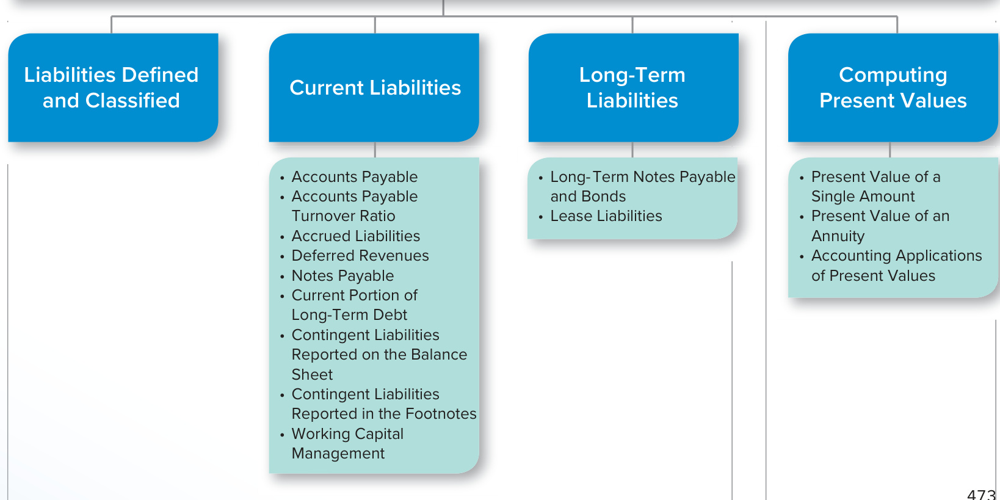  
ORGANIZATION OF THE CHAPTER  

## STARBUCKS  

REAL WORLD EXCERPT: Annual Report  

## LEARNING OBJECTIVE 9-1  

<html><body><table><tr><td colspan="2">STARBUCKSCORPORATION CONSOLIDATEDBALANCESHEETS (in millions)</td></tr><tr><td>Sept.27, 2020</td><td>Sept.29,2019</td></tr><tr><td>Current liabilities:</td><td></td></tr><tr><td>Accountspayable $</td><td>997.9 $ 1,189.7</td></tr><tr><td>Accrued liabilities 1,160.7</td><td>1,753.7</td></tr><tr><td>Accrued payroll and benefits 696.0</td><td>664.6</td></tr><tr><td>Income taxes payable 98.2</td><td>1,291.7</td></tr><tr><td>Current portion of operating lease liability 1,248.8</td><td></td></tr><tr><td>Stored value card liability and current portion of deferred revenue 1,456.5</td><td>1,269.0</td></tr><tr><td>Short-term debt 438.8</td><td></td></tr><tr><td>Current portion of long-term debt</td><td>1,249.9</td></tr><tr><td>Total currentliabilities</td><td>7,346.8 6,168.7</td></tr><tr><td>Long-term debt 14,659.6</td><td>11,167.0</td></tr><tr><td>Operatinglease liability</td><td>7,661.7</td></tr><tr><td>Deferred revenue</td><td>6,598.5 6,744.4</td></tr><tr><td>Other long-term liabilities</td><td>907.3 1,370.5</td></tr><tr><td>Total liabilities</td><td>$37,173.9 $25,450.6</td></tr></table></body></html>

Source: Starbucks Corporation  

Define, measure, and report current liabilities.  

## LIABILITIES DEFINED AND CLASSIFIED  

Most people have a reasonable understanding of the definition of the word liability. Accountants formally define liabilities as the probable future sacrifice of economic benefits that arise from past transactions. As Exhibit 9.1 shows, as of September 27, 2020 (Starbucks’s fiscal year ends on the Sunday closest to September 30), Starbucks had borrowed $\mathbb{5}15{,}909{.}5$ million, the sum of the “current portion of long-term debt” $(\Phi1,249.9)$ and “long-term debt” $(\Phi14,659.6)$ These past transactions obligate the company to pay cash to its creditors at some time in the future, and therefore are reported as liabilities on the balance sheet.  

When a liability is first recorded, it is measured in terms of its current cash equivalent, which is the cash amount a creditor would accept to settle the liability immediately. Although Starbucks borrowed $\mathbb{5}15{,}909{.}5$ million, it will repay much more than that because the company also must pay interest on the debt. Interest that will be paid in the future is not included in the reported amount of the liability because it accrues and becomes a liability with the passage of time.  

Like most businesses, Starbucks has several kinds of liabilities as well as a wide range of creditors. The list of liabilities on the balance sheet differs from one company to the next because different operating activities result in different types of liabilities. The liability section of Starbucks’s balance sheet begins with the caption Current liabilities. Current liabilities are expected to be paid with current assets within the current operating cycle of the business or within one year of the balance sheet date, whichever is longer. Noncurrent liabilities include all other liabilities.  

## CURRENT LIABILITIES  

Many current liabilities have a direct relationship to the operating activities of a business. In other words, specific operating activities are financed, in part, by a related current liability. Some examples from Starbucks’s balance sheet (Exhibit 9.1) are  

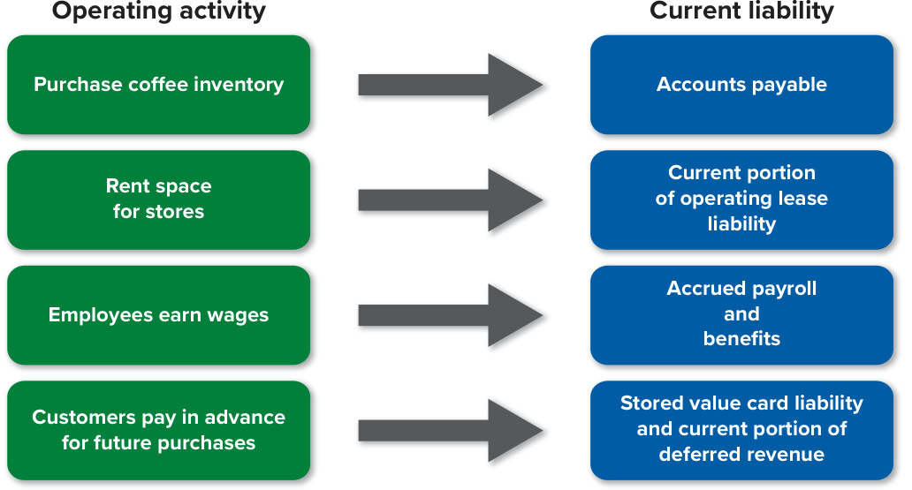  

Early in this chapter, we mentioned that Starbucks is opening a lot of new stores each year. As a result, it must buy additional inventory, rent more store space, and hire more employees. By understanding the relationship between operating activities and current liabilities, an analyst can explain changes in the various current liability accounts.  

We now will discuss the current liability accounts that are common to most balance sheets.  

## Accounts Payable  

Most companies in the course of running their day-to-day operations purchase goods and services from other businesses. Typically, these purchases are made on credit with cash payments made after the goods and services have been provided. As a result, these transactions create obligations to pay suppliers in the near future. Most companies list such obligations on their balance sheets as accounts payable (sometimes called trade accounts payable).  

For many companies, buying on credit from suppliers is a relatively inexpensive way to finance the purchase of inventory because interest does not normally accrue on accounts payable. As an incentive to encourage more sales, some suppliers offer generous credit terms that may allow buyers to resell merchandise and collect cash before payment must be made to the supplier.  

Some managers may be tempted to delay payment to suppliers as long as possible to conserve cash. This strategy can create problems for suppliers, who also must pay their bills. Most successful companies develop positive working relationships with suppliers to facilitate receiving quality goods and services. A positive relationship can be destroyed by slow payments. In addition, financial analysts become concerned if a business does not meet its obligations to suppliers on a timely basis because such slowness can indicate that a company is experiencing financial difficulties. Both managers and analysts use the accounts payable turnover ratio to evaluate how effectively a company is managing its accounts payable.  

## LEARNING OBJECTIVE 9-2  

Compute and interpret the accounts payable turnover ratio.  

$$
\begin{array}{l}{{\S7,694.9\div\S1,093.8^{*}=7.04}}\\ {{{}^{*}(\S997.9+\S1,\S9.7)\div2}}\end{array}
$$  

<html><body><table><tr><td colspan="3">COMPARISONSOVERTIME</td></tr><tr><td colspan="3">Starbucks</td></tr><tr><td>2018</td><td>2019</td><td>2020</td></tr><tr><td>8.09</td><td>7.20</td><td>7.04</td></tr></table></body></html>  

<html><body><table><tr><td colspan="2">COMPARISONSWITHCOMPETITORS</td></tr><tr><td>Monster Beverages</td><td>McDonald's</td></tr><tr><td>2020</td><td>2020</td></tr><tr><td>6.57</td><td>8.07</td></tr></table></body></html>  

## INTERPRETATIONS  

In General The accounts payable turnover ratio measures how quickly management pays suppliers. A high accounts payable ratio normally suggests that a company is paying its suppliers in a timely manner. To make interpreting the ratio more intuitive, analysts often divide it into the number of days in a year:  

In 2020 the average number of days it took Starbucks to pay its accounts payable was  

$$
365~\mathrm{Days}\div7.04=51.85~\mathrm{Days}
$$  

This means that, on average, Starbucks took between 51 and 52 days to pay its suppliers in 2020.  

Focus Company Analysis Analyzing the average number of days payables are outstanding indicates that in 2020, Starbucks paid its suppliers more slowly than in 2018 (51.85 days versus 45.12 days), Relative to its competitors, Starbucks paid its suppliers more quickly than Monster Beverages but more slowly than McDonald’s. On average, Monster Beverages took 55.56 days to pay its suppliers and McDonald’s took 45.23 days. Suppliers like being paid as soon as possible and may extend benefits (e.g., faster shipments or preferential treatment when supply is limited) to companies that pay quickly.  

A Few Cautions The accounts payable turnover ratio is an average based on all accounts payable. As such, the ratio does not tell us how quickly a company is paying each of its suppliers. It is possible for a company to pay some suppliers quickly and others late and yet still end up with an acceptable ratio. This is not meant to suggest that the ratio is not useful. It simply implies that the more you know about the numbers used to calculate a ratio, the more fully you can understand the ratio’s implications.  

## Accrued Liabilities  

In many situations, a business incurs an expense in one accounting period and makes the cash payment in a future period. Accrued liabilities are expenses that have been incurred before the end of an accounting period but have not yet been paid. These expenses include items such as insurance, rent and wages. The fiscal 2020 balance sheet for Starbucks lists accrued liabilities of $^{\S1,160.7}$ million. Accrued liabilities are recorded by recognizing an expense for the period and an associated liability. For example, when a company records wages expense for a period but does not immediately pay the expense, it will record an accrued wages or payroll liability on its balance sheet.  

## Accrued Taxes Payable  

Like individuals, corporations must pay federal taxes on the income they earn. Corporations also may pay state and local income taxes and, in some cases, foreign income taxes. The notes to Starbucks’s Annual Report include the following information pertaining to taxes:  

## STARBUCKS  

<html><body><table><tr><td colspan="4">INCOMETAXES Note 14:</td></tr><tr><td colspan="4">Provision for income taxes (in millions): Fiscal YearEnded Sept.27, 2020</td></tr><tr><td>Current Taxes:</td><td></td><td>Sept.29,2019</td><td>Sept.30,2018</td></tr><tr><td colspan="4"></td></tr><tr><td>U.S.federal</td><td>$49.9 36.9</td><td>$ 1,414.3 447.8</td><td>$156.2</td></tr><tr><td>U.S. state & local</td><td>181.4</td><td>458.3</td><td>52.0</td></tr><tr><td>Foreign</td><td></td><td></td><td>327.0</td></tr><tr><td>Totalcurrenttaxes</td><td>$268.2</td><td>$2,320.4</td><td>$535.2</td></tr></table></body></html>

Source: Starbucks Corporation  

For Starbucks and most other corporations, income taxes represent a major cost and are therefore carefully monitored by management and various taxing authorities (e.g., the Internal Revenue Service).  

## Accrued Compensation and Related Costs  

At the end of each accounting period, employees usually have earned salaries that have not yet been paid. Unpaid salaries may be reported as part of a general accrued liability account on the balance sheet or as a separate item, as is the case with Starbucks. As shown in Exhibit 9.1, Starbucks reports “accrued payroll and benefits” of $\mathbb{S}696.0$ million. Benefits refer to items such as retirement programs, vacation time, and health insurance that employees have earned during the reporting period but have not taken or been paid.  

Let’s take a closer look at vacation time as an example. Typically, a business grants employees paid vacation time based on the number of months they have worked. The cost of vacation time must be recorded in the year employees earn the vacation time by working rather than the year they actually take vacation. If Starbucks estimates the cost of earned vacation time to be $\mathbb{s}125{,}000$ , accountants make the following adjusting entry at the end of the accounting period.  

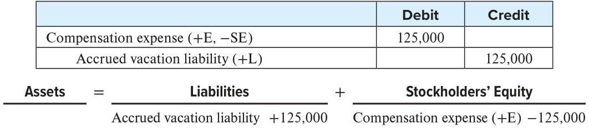  

When employees take vacations (for example, next summer), the accountants record the following:  

<html><body><table><tr><td></td><td>Debit</td><td>Credit</td></tr><tr><td>Accrued vacation liability (-L)</td><td>125,000</td><td></td></tr><tr><td>Cash (-A)</td><td></td><td>125,000</td></tr><tr><td colspan="3">Assets Liabilities + Stockholders'Equity</td></tr></table></body></html>  

Cash −125,000 Accrued vacation liability −125,000  

Starbucks does not separately disclose the amount of accrued vacation liability. Instead, the company reports this liability as part of “accrued payroll and benefits.” For most companies, the amount of accrued vacation liability is not large enough to warrant its own line item on the balance sheet.  

## Payroll Taxes  

All payrolls are subject to a variety of taxes, including federal, state, and local income taxes; Social Security taxes; and federal and state unemployment taxes. Employees pay some of these taxes and employers pay others. While we will look at only the three largest taxes, reporting is similar for other types of payroll tax.  

  

Employee Income Taxes Employers are required to withhold income taxes for each employee. The amount of income tax withheld is recorded by the employer as a current liability and remains a liability until the amount is paid to the government (usually quarterly).  

Employee and Employer FICA Taxes Social Security taxes often are called FICA taxes because they are required by the Federal Insurance Contributions Act. These taxes are imposed in equal amounts on both employees and employers. Though employers only pay their portion of the taxes, they withhold the employees’ portion from their paychecks as part of an employee’s payroll deductions. The current Social Security tax rate is 6.2 percent for employees and 6.2 percent for employers, so 12.4 percent total. The Social Security tax is capped, meaning that the tax only applies to wages up to a certain amount. The capped amount for 2021 is $^{\S142,800}$ per employee. In addition, a separate 1.45 percent Medicare tax applies to all employee income. Therefore, the FICA tax rate is 7.65 percent (6.2 percent $+~1.45$ percent) on income up to and including $^{\S142,800}$ and 1.45 percent on income above $^{\S142,800}$ . Employees who earn above $\mathbb{S}200{,}000$ have withheld an “additional Medicare tax” of 0.9 percent. Unlike all other FICA taxes, this additional Medicare tax is paid only by employees, not by employers. However, employers also will withhold this additional tax as part of an employee’s payroll deductions.  

Employer Unemployment Taxes Employers are charged unemployment taxes through the Federal Unemployment Tax Act (FUTA) and State Unemployment Tax Acts (SUTA). These programs provide financial support to employees who lose their jobs through no fault of their own. The FUTA tax rate is 6.0  percent. The tax applies to the first $\mathbb{S}7{,}000$ paid to each employee as wages during the year. SUTA tax rates vary by state.  

Hopefully by now you have realized that the cost of hiring employees is much more than the amount that those employees actually receive in wages. To illustrate recording payroll taxes, let’s assume that Starbucks accumulated the following information in its records for the first two weeks of June 2021:  

Salaries earned \$1,800,000   
Income taxes withheld 275,000   
FICA taxes (employees’ share) 137,700   
FUTA taxes 2,300   
SUTA taxes 8,500  

Companies generally record two journal entries to account for payroll taxes. The first entry records the amount of cash paid to employees and the various deductions withheld from employees’ paychecks:  

<html><body><table><tr><td colspan="2"></td><td>Debit</td><td>Credit</td></tr><tr><td colspan="2">Compensation expense (+E,-SE)</td><td>1,800,000</td><td></td></tr><tr><td colspan="3">Employee income taxes withheld (+L)</td><td>275,000</td></tr><tr><td colspan="2">FICApayable(+L)</td><td></td><td>137,700</td></tr><tr><td colspan="2">Cash (-A)</td><td></td><td>1,387,300</td></tr><tr><td colspan="4"></td></tr><tr><td>Assets Cash -1,387,300</td><td>Liabilities FICA payable +137,700 Employeeincome taxeswithheld +275.000</td><td colspan="2">Stockholders'Equity + Compensation expense (+E) -1,800,000</td></tr></table></body></html>  

The second entry records the taxes that employers must pay from their own funds. Federal and state laws require these tax payments. Assuming all employees earn less than $\mathbb{S}200{,}000$ , the FICA tax amount is equal to the amount that is paid by employees:  

<html><body><table><tr><td></td><td>Debit</td><td>Credit</td></tr><tr><td>Compensation expense (+E,-SE)</td><td>148,500</td><td></td></tr><tr><td>FICA payable (+L)</td><td></td><td>137,700</td></tr><tr><td>FUTA payable (+L)</td><td></td><td>2,300</td></tr><tr><td>SUTA payable (+L)</td><td></td><td>8,500</td></tr></table></body></html>  

<html><body><table><tr><td>Assets 一</td><td>Liabilities</td><td>十</td><td>Stockholders'Equity</td></tr></table></body></html>  

FICA payable +137,700 Compensation expense $\left(+\mathrm{E}\right)$ −148,500   
FUTA payable + 2,300   
SUTA payable +8,500  

## Deferred Revenues  

In most business transactions, cash is paid when a product or service is delivered, or soon there­ after. In some cases, however, cash is paid in advance of delivery. You probably have paid for an airline ticket in advance. The airline company receives cash for the ticket you purchased, but it does not provide the service (the flight) until a future date. When a company collects cash before the related revenue has been earned, the cash is called deferred revenues, or, occasionally, unearned revenues. Under the revenue recognition principle introduced in Chapter 3, revenue cannot be recorded until it has been earned. Deferred revenues are reported as a liability because cash has been collected from customers, but the company has not delivered a product or service, and thus the related revenue has not been earned by the end of the accounting period. The obligation to provide a product or service in the future still exists. These obligations are classified as current or long term, depending on when a company expects to provide the product or service.  

A Starbucks card, which allows customers to pay for their purchases in advance, is an example of deferred revenues. Advantages for the customer include convenience at the point of sale and the accumulation of loyalty rewards. Advantages for Starbucks include the ability to collect and use customers’ cash before they actually purchase anything, while also collecting information on the purchasing habits of individual customers. Starbucks’s balance sheet shown in Exhibit 9.1 reports that the current liability at the end of fiscal 2020 associated with unused Starbucks cards totaled $\mathbb{S}1{,}456.5$ million. Starbucks explains the amount with the following note:  

“Amounts loaded onto stored value cards are initially recorded as deferred revenue and recognized as revenue upon redemption.”  

  

Deferred revenues are a liability until the company earns the revenues by delivering a good or service to customers.  

## STARBUCKS  

REAL WORLD EXCERPT: Notes to the Financial Statements  

Source: Starbucks Corporation  

Starbucks has historically used the phrase “stored value cards” even though many customers today carry their balance on their mobile app and not on a physical card. Regardless, the accounting for Starbucks is the same. When the company receives cash from the customer it increases its “stored value card liability” by the amount of cash received. When the customer later places an order, Starbucks reduces its “stored value card liability” by the amount of the order and recognizes revenue. This latter entry is an example of an adjusting journal entry, which we covered in Chapter 4.  

## BUSINESS ANALYTICS  

## Using mobile app data to understand customer behavior  

At the end of 2020, nearly a quarter of all transactions at Starbucks were completed using its mobile app. Were you one of them? If so, you provide data that Starbucks collects and analyzes to help them make informed operating decisions. For example, Starbucks uses artificial intelligence software to analyze how a customer’s purchase history is associated with things like geographic location, weather, day of the week, and time of the day. Starbucks uses the output of this analysis to decide what products to emphasize in a given geographic location, and when to push information about these products to customers. The company uses similar software to analyze where to locate new stores. The next time you purchase a product at Starbucks pause to consider that your purchase data will be used to create the company’s next annual report, and quite likely, the next special offer you receive on your phone.  

## LEARNING OBJECTIVE 9-3  

Report notes payable and explain the time value of money.  

  

To calculate interest for a period you need: (1)  

the principle amount of the loan and (2) the interest rate per period.  

## Notes Payable  

When a company borrows money, it normally signs a formal written contract with a bank and reports the amount borrowed as a note payable. The contract specifies the amount borrowed, the date by which it must be repaid, and the interest rate associated with the borrowing.  

Banks and other creditors are willing to lend cash because they will earn interest in return. Earning interest by loaning money to others reflects the time value of money. To the borrower, interest reflects the cost of using someone else’s money and is therefore an expense. To lenders, interest reflects the benefit of allowing someone else to use their money and is therefore revenue. You need two pieces of information to calculate interest: (1) the principle (i.e., the cash that was borrowed) and (2) the interest rate per period. To calculate the interest rate per period you may need to adjust the annual interest rate to a monthly, weekly, or even daily rate. For example, the formula based on a monthly rate is  

Principa $\times$ Annual Interest Rate $\times$ Number of Months/12 Months $=$ Interest for the Period  

To illustrate, assume that on November 1, a company with a December 31 fiscal year-end borrows $^{\S100,000}$ cash for six months. The annual interest rate is 12 percent. The principle and interest are payable on April 30 of the following year. The note is recorded in the accounts as follows:  

<html><body><table><tr><td colspan="2"></td><td>Debit</td><td>Credit</td></tr><tr><td colspan="2">Cash (+A)</td><td>100,000</td><td></td></tr><tr><td colspan="2">Notes payable (+L)</td><td></td><td>100,000</td></tr><tr><td>Assets</td><td>Liabilities</td><td>+</td><td>Stockholders'Equity</td></tr></table></body></html>  

Cash +100,000 Notes Payable +100,000 $^+$ Cash $\mathbb{S}100{,}000$ (principal) $^+$ Interest expense $\mathbb{S}2,000$ $^+$ Note payable $\mathbb{S}100{,}000$ $^+$ Interest payable $\mathbb{S}2,000$  

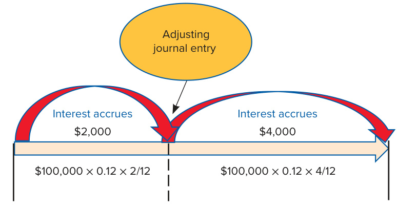  

April 30, Year 2 $^+$ Interest expense \$4,000 $^+$ Interest payable \$4,000 – Interest payable $\mathbb{S}6,000$ – Note payable \$100,000 – Cash \$106,000 (principa $^+$ interest)  

Interest is an expense incurred when companies borrow money. Companies record interest expense for a given accounting period, regardless of when they actually pay the bank cash for interest. In the above example, the company borrowed the money on November 1. By the end of the fiscal year, December 31, the company has incurred two months of interest expense. Because the company will not pay interest until April 30, it will report a current liability on its balance sheet to reflect the future obligation to the bank.  

The computation to determine the amount of interest incurred during the two months and the associated liability is  

  

The entry to record interest expense and interest payable for the two months is  

Interest payable $+2{,}000$ Interest expense $\left(+\mathrm{E}\right)$ −2,000   

<html><body><table><tr><td></td><td>Debit</td><td>Credit</td></tr><tr><td>Interestexpense (+E,-SE)</td><td>2,000</td><td></td></tr><tr><td>Interest payable (+L)</td><td></td><td>2,000</td></tr><tr><td>Assets Liabilities +</td><td colspan="2">Stockholders' Equity</td></tr></table></body></html>  

On April 30, the company has incurred an additional four months of interest expense for the period January–April. The entry to record this expense and the associated liability is  

<html><body><table><tr><td></td><td>Debit</td><td>Credit</td></tr><tr><td>Interestexpense (+E,-SE)</td><td>4,000</td><td></td></tr><tr><td>Interest payable (+L)</td><td></td><td>4,000</td></tr><tr><td>Assets 一 Liabilities</td><td colspan="2">+ Stockholders' Equity</td></tr></table></body></html>

Interest payable $+4{,}000$ Interest expense $\left(+\mathrm{E}\right)$ −4,000  

Also on April 30, the company pays the bank $\mathbb{S}6{,}000$ cash for six months of interest and pays back the principal since the loan was a six-month loan. The cash payment for interest consists of the $\mathbb{S}2{,}000$ of interest owed for November and December, plus the $\mathbb{S}4{,}000$ of interest owed for January–April. The following journal entry reflects the cash payment to the bank to repay the principal amount and to pay for interest.  

<html><body><table><tr><td></td><td>Debit</td><td>Credit</td></tr><tr><td>Interestpayable (-L)</td><td>6,000</td><td></td></tr><tr><td>Notes payable (-L)</td><td>100,000</td><td></td></tr><tr><td>Cash (-A)</td><td></td><td>106,000</td></tr><tr><td colspan="3">Assets Liabilities + Stockholders'Equit</td></tr></table></body></html>  

Cash −106,000 Interest payable −6,000   
Note payable −100,000  

## Current Portion of Long-Term Debt  

The distinction between current and long-term debt is important for both managers and analysts. A company must have sufficient cash on hand to repay current debt. To provide accurate information on how much of its long-term debt is due in the current year, a company must reclassify its long-term debt as a current liability within a year of its maturity date. For example, as shown in Exhibit 9.1 and highlighted below, Starbucks expects to pay $\Phi1,249.9\$ million of its long-term debt in the current year. The remaining $\Phi14,659.6\$ million is due sometime after the current year.  

<html><body><table><tr><td>Sept.27,2020 Sept.29,2019</td></tr><tr><td>Currentliabilities:</td></tr><tr><td>Currentp portion of long-term debt 1,249.9</td></tr><tr><td>Long-term debt 14,659.6 11,167.0</td></tr></table></body></html>  

In the footnotes to its 2020 Annual Report, Starbucks explains that its long-term debt consists of notes that mature on various dates out to 2050. Accounting for these long-term notes is a lot like accounting for bonds, which we will cover in Chapter 10.  

## Refinancing Debt: Current or Long-Term Liability?  

Instead of repaying a loan from current cash, a company may refinance it either by negotiating a new loan agreement with a new maturity date or by taking out a new loan and using the proceeds to pay off the old loan. If a company intends to refinance a currently maturing loan with a new long-term loan and has the ability to do so, the current loan should be classified as a long-term liability. It is not a current liability because current liabilities are short-term obligations that are expected to be paid with current assets within the current operating cycle or one year, whichever is longer.  

LEARNING OBJECTIVE 9-4 Report contingent liabilities.  

## Contingent Liabilities Reported on the Balance Sheet  

Some recorded liabilities are based on estimates because the exact amount will not be known until a future date. For example, a contingent liability is created when a company offers a warranty with a product it sells. The cost of providing future repair work must be estimated and recorded as a liability (and expense) in the period in which the product is sold.  

As an example, assume Starbucks estimates that it will have to provide $\mathbb{S}150{,}000$ of warranty services to customers who purchased coffee brewing equipment this year. In addition to recording the sale of the brewing equipment, Starbucks would record the following:  

<html><body><table><tr><td></td><td>Debit</td><td>Credit</td></tr><tr><td>Warrantyexpense (+E,-SE)</td><td>150,000</td><td></td></tr><tr><td>Warranty payable (+L)</td><td></td><td>150,000</td></tr><tr><td>Assets Liabilities</td><td colspan="2">+ Stockholders'Equity</td></tr></table></body></html>

Warranty payable +150,000 Warranty expense $\left(+\mathrm{E}\right)$ −150,000  

Over time, as customers return defective equipment, Starbucks would decrease the warranty payable account and either refund the customer cash or fix the equipment and return it to the customer.  

## Contingent Liabilities Reported in the Footnotes  

Each of the liabilities that we have discussed is reported on the balance sheet at a specific dollar amount because each involves the probable future sacrifice of economic benefits. Some transactions or events create only a reasonably possible (but not probable) future sacrifice of economic benefits. These situations create contingent liabilities that are reported in the footnotes, but not on a company’s balance sheet.  

Whether a contingent liability is reported on the balance sheet, in the notes to the financial statements, or not at all depends on two factors: (1) the probability of a future economic sacrifice and (2) the ability of management to estimate the amount of the liability. The following table illustrates the possibilities:  

<html><body><table><tr><td></td><td>Probable</td><td>ReasonablyPossible</td><td>Remote</td></tr><tr><td>Amountcanbereasonablyestimated</td><td>Recordasliability</td><td>Discloseinfootnotes</td><td>Disclosure not required</td></tr><tr><td>Amountcannotbereasonablyestimated</td><td>Discloseinfootnotes</td><td>Discloseinfootnotes</td><td>Disclosurenotrequired</td></tr></table></body></html>  

The probabilities of occurrence are defined in the following manner:  

•	 Probable–The future event or events are likely to occur.   
•	 Reasonably possible–The chance of the future event or events occurring is more than remote but less than likely.   
•	 Remote–The chance of the future event or events occurring is slight.  

## Contingent Liability Examples  

  
Zerbor/Shutterstock; ohrim/Shutterstock  

## INTERNATIONAL PERSPECTIVE  

## It’s a Matter of Degree  

The assessment of future probabilities is inherently subjective, but both U.S. GAAP and IFRS provide some guidance. Under U.S. GAAP, “probable” has been defined as likely to occur, which is commonly interpreted to mean having a greater than 70 percent chance of occurring. Under IFRS, “probable” is defined as more likely than not to occur, which implies more than a 50 percent chance of occurring. This difference means that for some contingent liabilities, IFRS would require the reporting of a liability on the balance sheet whereas GAAP would simply require footnote disclosure.  

In summary,  

•	 A liability that is both probable and the amount can be reasonably estimated must be recorded and reported on the balance sheet.   
•	 A liability that is (1) probable but the amount cannot be reasonably estimated, or (2) reasonably possible regardless of whether the amount can be estimated, must be disclosed in a footnote.   
•	 Remote contingencies do not require any type of disclosure.  

Since 2010, Starbucks has been fighting a lawsuit in the State of California. Below are excerpts from Starbucks’s 2020 Annual Report pertaining to this lawsuit:  

On April 13, 2010, an organization named Council for Education and Research on Toxics (“Plaintiff”) filed a lawsuit in the Superior Court of the State of California. . .  

. . Plaintiff alleges that the Company and the other defendants failed to provide warnings for their coffee products of exposure to the chemical acrylamide as required under California Health and Safety Code section 25249.5, the California Safe Drinking Water and Toxic Enforcement Act of 1986, better known as Proposition 65. . . The Plaintiff asserts that every consumed cup of coffee, absent a compliant warning, is equivalent to a violation under Proposition 65. . .  

The Company, as part of a joint defense group organized to defend against the lawsuit, disputes the claims of the Plaintiff. Acrylamide is not added to coffee but is present in all coffee in small amounts (parts per billion) as a byproduct of the coffee bean roasting process. . . On June 22, 2018, the California Office of Environmental Health Hazard Assessment (OEHHA) proposed a new regulation clarifying that cancer warnings are not required for coffee under Proposition 65.  

On June 3, 2019, the Office of Administrative Law (OAL) approved the coffee exemption regulation. . . The plaintiff has not yet filed a Notice of Appeal. Starbucks believes that the likelihood that the Company will ultimately incur a loss in connection with this litigation is less than reasonably possible. Accordingly, no loss contingency was recorded for this matter.  

## STARBUCKS  

REAL WORLD EXCERPT: Notes to the Financial Statements  

Consistent with the table shown earlier, Starbucks has not recorded a liability because management deemed a loss to be “less than reasonably possible.” Therefore, disclosure in a footnote was sufficient.  

## LEARNING OBJECTIVE 9-5  

Explain the importance of working capital and its impact on cash flows.  

## Working Capital Management  

Information about current liabilities is very important to managers and analysts because these obligations must be paid in the near future. Analysts say that a company has liquidity if it has the ability to meet its current obligations. A number of financial measures are useful in evaluating liquidity, including the current ratio (introduced in Chapter 2) and the dollar amount of working capital. Working capital is defined as the dollar difference between current assets and current liabilities. Working capital is important to both managers and financial analysts because it has a significant impact on the health and profitability of a company. Starbucks’s working capital at the end of fiscal 2020 was:  

## Current assets−Current liabilities $=$ Working capital \$7,806.4 \$7,346.8 \$459.6  

Working capital reflects the amount Starbucks would have left over if it used all of its current assets to pay off all of its current liabilities.  

Managers actively manage working capital accounts to achieve a balance between a company’s short-term obligations and the resources to satisfy those obligations. If a business has too little working capital, it runs the risk of not being able to meet its obligations. On the other hand, too much working capital may tie up resources in unproductive assets. Excess inventory, for example, ties up dollars that could be invested more profitably elsewhere in the business and incurs additional costs associated with storage and deterioration.  

Changes in working capital accounts are also important to managers and analysts because they have a direct impact on the cash flows from operating activities reported on the statement of cash flows.  

## F O C U S  ON  CASH F LOW S  

## Working Capital and Cash Flows  

Many working capital accounts have a direct relationship to income-producing activities. Accounts receivable, for example, are related to sales revenue: Accounts receivable increase when sales are made on credit. Cash is collected when customers pay their bills. Similarly, accounts payable increase when inventory is purchased on credit. A cash outflow occurs when the account is paid. We discuss how to use changes in working capital accounts to create the operating section of the statement of cash flows in Chapter 12.  

Companies classify liabilities as either current or long term. Our discussion to this point has focused on current liabilities, which are short-term obligations that will be paid in cash (or other current assets) within the current operating cycle or one year, whichever is longer. In the next section, we turn our attention to long-term liabilities. Before you move on, complete the following questions to test your understanding of the concepts we have covered.  

For each of the following events, state whether Starbucks’s working capital will increase, decrease, or not change:  

1.	 Starbucks purchases inventory on credit.   
2.	 Starbucks borrows $^{\Phi1,000,000}$ in long-term debt.   
3.	 Starbucks pays cash to reduce its rent payable account by $\mathbb{S}750{,}000$ .   
4.	 Starbucks pays employee salaries with cash.  

After you have completed your answers, check them below.  

For additional step-by-step video instruction, go to mhhe.com/libby_gh9-1.  

Related Homework: M9-1, M9-2, M9-5, M9-6, E9-1, E9-10  

  

## LONG-TERM LIABILITIES  

Report long-term liabilities.  

Long-term liabilities include all obligations that are not classified as current liabilities, such as long-term notes payable and bonds payable. Most companies borrow money on a long-term basis in order to purchase assets, like property or equipment. In some cases, a company may pledge specific assets as security for repayment. If the company defaults on the loan, then the bank has the right to take ownership of the assets. A loan supported by this type of agreement is called secured debt. Agreements in which the bank relies primarily on the borrower’s integrity and general earning power to repay the loan are called unsecured debt.  

## Long-Term Notes Payable and Bonds  

Companies can raise capital directly from a number of financial service organizations including banks, insurance companies, and pension plans. Raising capital from one of these organizations is known as a private placement. The resulting liability often is called a note payable, which is a written promise to pay a stated sum at one or more specified future dates called the maturity date(s).  

In many cases, a company’s need for capital exceeds the financial ability of any single bank or other creditor. In these situations, the company may issue publicly traded debt called bonds. The opportunity to sell a bond security in established markets provides bondholders with an important benefit. Without involving the company, bondholders can sell their bond securities to other investors prior to maturity if they have an immediate need for cash. We will discuss bonds in detail in the next chapter.  

Accounting for long-term debt is based on the same concepts used in accounting for shortterm debt. A liability is recorded when the debt is incurred and interest expense is recorded with the passage of time.  

Business operations are global in nature, with many corporations operating manufacturing facilities around the world. In order to support these foreign operations, companies sometimes borrow money from foreign banks. Borrowing money in a foreign currency raises some interesting accounting and management issues.  

## INTERNATIONAL PERSPECTIVE  

## Borrowing in Foreign Currencies  

Many corporations with foreign operations elect to finance those operations with foreign debt to lessen exchange rate risk. Exchange rate risk exists because the relative value of each nation’s currency varies on virtually a daily basis.  

In attempting to mitigate exchange rate risk, Amazon.com states the following in the footnotes to its 2020 Annual Report:  

## AMAZON  

REAL WORLD EXCERPT: Notes to the Financial Statements  

“Net sales and related expenses generated from our internationally-focused stores. . .are primarily denominated in the functional currencies of the corresponding stores and primarily include Euros, British Pounds, and Japanese Yen.”  

## AMAZON  

REAL WORLD EXCERPT: Notes to the Financial Statements  

For reporting purposes, accountants must convert, or translate, foreign debt into U.S. dollars at the end of the accounting period in order to report the debt on a U.S. company’s balance sheet. In the same footnote excerpted above, Amazon.com discusses how it does this by stating:  

“Assets and liabilities of these subsidiaries are translated into U.S. dollars at period-end exchange rates. . 99  

## Lease Liabilities  

Companies often lease assets rather than purchase them. We saw this reflected on Chipotle’s balance sheet in Chapter 2. When a company leases an asset, it enters into a contractual agreement with the owner of the asset. In the language of contracts (and accounting), the party that owns the asset is referred to as the lessor. The party that pays for the right to use the asset is referred to as the lessee. We focus on accounting for leases from the lessee’s perspective. For accounting purposes, a lessee can lease an asset by signing either a short-term lease (12 months or less) or a longer-term lease. Longer-term leases are more common and are classified as either finance leases or operating leases depending on whether effective control of the leased asset remains with the lessor or is transferred to the lessee.  

## Accounting for finance leases and operating leases  

How do accountants determine if a longer-term lease should be recorded as a finance lease or an operating lease? GAAP helps guide them through this determination by stating that if a lease meets any of the following five criteria, it is considered a finance lease:  

a.	 The lease transfers ownership of the underlying asset to the lessee by the end of the lease term.   
b.	 The lease grants the lessee an option to purchase the underlying asset that the lessee is reasonably certain to exercise.   
c.	 The lease term is for the major part of the remaining economic life of the underlying asset. . . .   
d.	 The present value of the sum of the lease payments and any residual value guaranteed by the lessee . . . equals or exceeds substantially all of the fair value of the underlying asset.   
e.	 The underlying asset is of such a specialized nature that it is expected to have no alternative use to the lessor at the end of the lease term.\*  

The five criteria are aimed at establishing whether the lessor maintains effective control of the leased asset or whether effective control has been transferred to the lessee. If any of the five criteria are met, then effective control (i.e., substantially all of the risks and rewards of ownership) is transferred to the lessee and the lease is a finance lease. If none of the criteria are met, then effective control remains with the lessor and the lease is an operating lease.  

The accounting required to initially record a finance lease and an operating lease is the same: Both require the recognition of a lease asset and a lease liability. The amount recognized is the current cash equivalent of the required future lease payments. Assume that Starbucks signs a four-year lease for a new delivery truck and that Starbucks’s accountants have determined that the current cash equivalent of the lease is $\mathbb{S}250{,}000$ . Upon signing the lease, Starbucks records the following entry:  

<html><body><table><tr><td></td><td>Debit</td><td>Credit</td></tr><tr><td>Lease asset (+A)</td><td>250,000</td><td></td></tr><tr><td>Lease liability (+L)</td><td>+</td><td>250,000 Stockholders'Equity</td></tr><tr><td>Assets Liabilities 一</td></tr></table></body></html>

Lease asset +250,000 Lease liability +250,000  

Accounting for the lease over its life differs depending on whether the lease is a finance lease or an operating lease. The differences are discussed in detail in more advanced accounting courses. At this point, just keep in mind two key aspects of accounting for longer-term leases. First, regardless of whether the lease is determined to be a finance lease or an operating lease, the company must record a lease asset and a lease liability upon signing the lease agreement. Second, the amount recorded as the lease asset and the lease liability is the current cash equivalent of the required future lease payments. In the above example, you were given the current cash equivalent of the lease. In the next section, we will learn how accountants compute current cash equivalents, commonly referred to as present values.  

## Accounting for short-term leases  

A short-term lease is a lease for 12 months or less (including expected renewals and extensions) that does not contain a purchase option that the lessee is expected to exercise. A company does not record a lease asset or a lease liability when it signs a short-term lease. Instead the company simply records lease expense over the life of the lease. As an example of a short-term lease, assume that on December 31, Starbucks signs a short-term lease agreement to rent five delivery trucks for the month of January. The agreement stipulates that Starbucks must pay $\mathbb{S}10{,}000$ at the end of January. No entry is recorded at the time the lease is signed on December 31. The only entry recorded comes at the end of January to recognize lease expense:  

<html><body><table><tr><td colspan="2"></td><td>Debit</td><td>Credit</td></tr><tr><td colspan="2">Lease expense (+E,-SE)</td><td>10,000</td><td></td></tr><tr><td colspan="2">Cash (-A)</td><td></td><td>10,000</td></tr><tr><td colspan="2">Assets Liabilities + 一</td><td colspan="2">Stockholders'Equity</td></tr><tr><td colspan="2">Cash -10,000</td><td colspan="2">Leasee expense (+E) -10,000</td></tr></table></body></html>  

## COMPUTING PRESENT VALUES  

Our discussion of longer-term leases raises an interesting question about liabilities: Is the liability today the amount of cash that will be paid in the future? For example, if I agree to pay you $\mathbb{S}10{,}000$ five years from now, should I report a liability of $\mathbb{S}10{,}000$ on my personal balance sheet? If I can earn interest on my money, the answer is “no.” To understand why, it is important for you to understand that money invested in an interest-bearing account grows over time. We briefly introduced this concept earlier in the chapter and referred to it as the time value of money. The time value of money plays an important role in how companies report long-term liabilities, such as long-term notes as well as bonds, the topic of Chapter 10.  

Compute and explain present values.  

The concept of present value (PV) is based on the time value of money. Quite simply, money received today is worth more than money to be received one year from today (or at any other future date) because it can be used to earn interest. If you invest $\mathbb{S}1{,}000$ today at 10 percent, you will have $\mathbb{S}1\!,\!100$ in one year. In contrast, if you receive $\Phi1\!,\!000$ one year from today, you will lose the opportunity to earn the $\mathbb{S}100$ in interest revenue. The difference between the $\Phi1\!,\!000$ and the $^{\S1,100}$ is the interest that can be earned during the year, which reflects the time value of money.  

In one of your math classes, you have probably already solved some problems involving the time value of money. In the typical problem, you are told a certain dollar amount has been deposited in a savings account earning a specified rate of interest. You are asked to compute the dollar amount in the savings account after a certain number of years. This is an example of a future value (FV) problem: How much is a given dollar amount today worth in the future if it grows at a specified interest rate? For example, if you deposited $\mathbb{S}100$ today in a savings account that earns 10 percent interest, how much would you have after one year?  

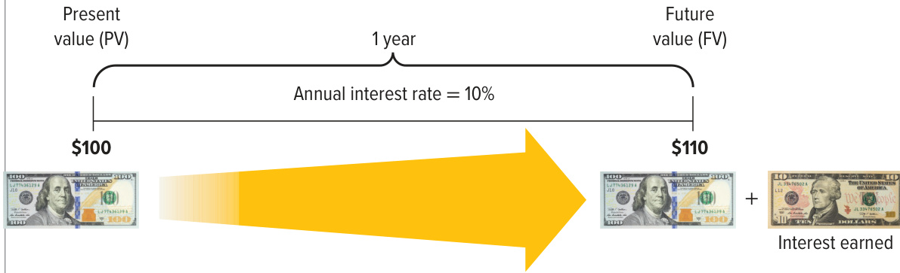  
NICK FIELDING/Alamy Stock Photo; Steve Stock /Alamy Stock Photo  

## ANSWER: $\bf{5110}$  

In this chapter we focus on how to solve the opposite problem. In present value problems, you are asked to compute the amount you would need to deposit today at a specified interest rate to have a given dollar amount in the future. For example, if you needed $\mathbb{S}110$ in one year, how much would you need to deposit in a savings account today if the savings account earns 10 percent interest?  

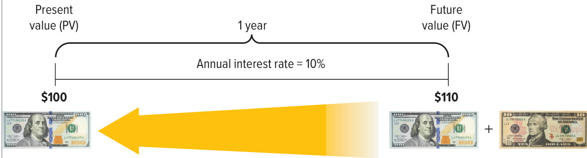  
NICK FIELDING/Alamy Stock Photo; Steve Stock /Alamy Stock Photo  

## ANSWER: $\mathbf{5100}$  

There are two basic types of present value problems: those involving single amounts like the example above and those involving a stream of future amounts. Understanding and being able to compute both types is important when accounting for certain long-term liabilities.  

## Present Value of a Single Amount  

To compute the present value of a single amount, you must discount the amount to be received or paid in the future at $i$ interest rate for $n$ periods. The formula to compute the present value of a single amount is  

While the formula is not difficult to use, most analysts use present value tables, calculators, or Excel. We strongly encourage you to visit Connect for tutorials on how to compute present values using each of these tools. To do so, see “Guided Help $9{-}2^{\circ}$ on the next page. For the examples that follow, we provide the inputs required to compute each present value using tables, calculators, and Excel.  

Assume that today is January 1, 2022, and you need to make a $\mathbb{S}1{,}000$ cash payment on December 31, 2024. At an interest rate of 10 percent per year, how much would you need to deposit today to have exactly $\mathbb{S}1{,}000$ on December 31, 2024? You could discount the amount year by year to figure out how much you would need to deposit today, but it is easier to use Table E.1, Appendix E, Present Value of $\mathbb{S}1.$ For $i=10\%$ , $n=3$ periods, we find that the present value factor is 0.75131. The present value of $\mathbb{S}1{,}000$ to be paid at the end of three years can be computed as follows:  

$$
\hphantom{0}\S1,000\times0.75131=\S751.31
$$  

Once you have computed a present value amount, it is important that you understand what it means. The $\mathbb{S}751.31\$ is the amount you would have to deposit today in order to have exactly $\mathbb{S}1\!,\!000$ three years from today, assuming an interest rate of 10 percent. Conceptually, you should be indifferent between paying $\mathbb{S}751.31\$ today and paying $\mathbb{S}1{,}000$ in three years. If you had $\mathbb{S}751.3\$ 1 today and did not want to worry about having to come up with $\mathbb{S}1{,}000$ in three years, you could simply deposit the money in a savings account and at 10 percent interest it would grow to $\mathbb{S}1{,}000$ in three years. How the deposit of $\mathbb{S}751.31\$ grows to equal $\mathbb{S}1{,}000$ is shown in Exhibit 9.2.  

From Table E.1: interest rate $(i)=10\%$ , periods $(n)=3$ : Factor $=0.75131$   
Using Calculator: rate $(i)=10$ , periods $(n)=3$ , $\mathrm{pmt}=\mathbb{S}0,\,\mathrm{FV}=-\mathbb{S}1{,}000$   
Using Excel: Rate $(i)=.10$ , Nper $(n)=3$ , $\mathrm{Pmt}={\mathfrak{S}}0,\,\mathrm{Fv}=-{\mathfrak{S}}1{,}000$  

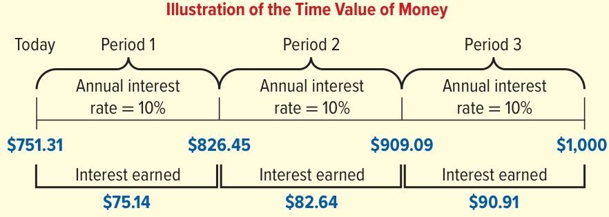  

## EXHIBIT 9.2  

How a Deposit Grows to \$1,000  

## P A U S E  F O R F E E D B A C K  

So far we have discussed the first type of present value problems–those involving a single future amount. In the next section, we will discuss annuities, which involve a stream of future amounts. Before you move on, complete the following questions to test your understanding of the present value concepts we have covered so far.  

S E L F - S T U D Y  Q U I Z  

1.	 If the interest rate in a present value problem increases from 8 percent to 10 percent, will the present value increase or decrease?   
2.	 Assuming an annual interest rate of 5 percent, what amount should you deposit today if you need $\mathbb{S}10{,}000$ in 10 years?  

After you have completed your answers, check them below.  

For additional step-by-step video instructions on how to compute present values, go to mhhe.com/ libby_gh9-2.  

Related Homework: M9-9, E9-14, E9-19, P9-10  

## Present Value of an Annuity  

Instead of a single amount, many business problems involve multiple cash payments over a number of periods. An annuity is a series of consecutive payments characterized by  

1.	An equal dollar amount each period.   
2.	Interest periods of equal length (e.g., a year, half a year, quarterly, or monthly).   
3.	The same interest rate each period.  

Examples of annuities include monthly rent payments on an apartment or quarterly lease payments on a car.  

We compute the present value of an annuity by discounting each of the equal periodic amounts back to today. The present value of an annuity of $\mathbb{S}1$ for three periods at 10 percent may be represented graphically as follows:  

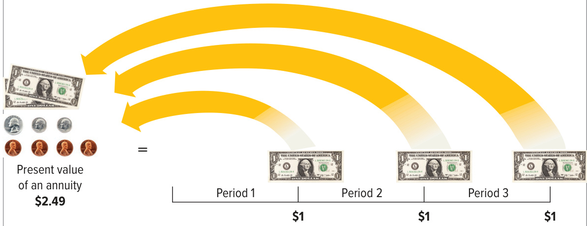  
nimon/Shutterstock; Brandon Laufenberg/Getty Images  

Applying this concept to a purchase decision, assume you purchase a piece of equipment and agree to pay $\mathbb{S}1{,}000$ cash each December 31 for three years. How much would you need to deposit today at an annual interest rate of 10 percent to make each $\mathbb{S}1{,}000$ payment? We could use Table E.1, Appendix E, to calculate the present value as follows:  

<html><body><table><tr><td>Year</td><td>Amount</td><td>Factor from Table E. 1, Appendix E,i =10%</td><td></td><td>Present Value</td></tr><tr><td>1</td><td>$1,000</td><td>0.90909 (n = 1)</td><td>=</td><td>$ 909.09</td></tr><tr><td>2</td><td>$1,000</td><td>0.82645 (n = 2)</td><td>=</td><td>$ 826.45</td></tr><tr><td>3</td><td>$1,000</td><td>0.75131 (n = 3)</td><td>三</td><td>$751.31</td></tr><tr><td></td><td></td><td>Total present value</td><td>=</td><td>$2,486.85</td></tr></table></body></html>

1. The present value will decrease. 2. $\mathbb{8}10,000\times0.61391=\mathbb{8}6,139.10$  

We can compute the present value of this annuity more easily, however, by using Table E.2, Appendix E, as follows:  

$$
\S1,000\times2.48685=\S2,486.85
$$  

Let’s now connect the amount we computed above to the three required $\Phi1\!,\!000$ payments. As shown in Exhibit 9.3, if you deposited $\mathbb{S}2,486.85$ today at an interest rate of 10 percent, that amount would grow to $\mathbb{S}2{,}735{.}54$ after one year $(\mathbb{S}2,486.85+$ interest of $\mathbb{S}248.69)$ ). At that point you would make your first $\mathbb{S}1{,}000$ payment and have $\mathbb{S}1,735.54$ left. The $\mathbb{S}1,735.54$ would grow to $\Phi1{,}909{.}09\$ over the next year $^{(\S1,735.54+}$ interest of $\mathbb{S}173.551\$ ). At that point you would make your second $\Phi1\!,\!000$ payment and have $\mathbb{S}909.09\$ left. The $\mathbb{S}909.09\$ would grow to exactly $^{\mathparagraph1,000}\$ over the next year $^{\leftmoon}\rightmoon09.09\,+$ interest of $\mathbb{S}90.91\$ ), and you would be able to make your last $\mathbb{s}1{,}000$ payment. Thus, at an interest rate of 10 percent, depositing $\mathbb{S}2,486.85$ today would allow you to make the three required $\Phi1\!,\!000$ payments at the end of the next three years.  

<html><body><table><tr><td>Beginning of Year</td><td>十</td><td>InterestEarned During Year</td><td></td><td>End of Year</td><td></td><td>Payment</td><td>二</td><td>Remaining Balance</td></tr><tr><td>$2,486.85</td><td>十</td><td>$248.69</td><td></td><td>$2,735.54</td><td></td><td>$1,000.00</td><td>=</td><td>$1,735.54</td></tr><tr><td>1,735.54</td><td>+</td><td>173.55</td><td>二</td><td>1,909.09</td><td></td><td>1,000.00</td><td>二</td><td>909.09</td></tr><tr><td>909.09</td><td>+</td><td>90.91</td><td></td><td>1,000.00</td><td></td><td>1,000.00</td><td></td><td>0</td></tr></table></body></html>  

## Interest Rates and Interest Periods  

The preceding illustrations assumed annual periods for compounding and discounting. Although interest rates are almost always quoted on an annual basis, most compounding periods encountered in business are less than one year. When interest periods are less than a year, the values of $\displaystyle{n}$ and $i$ must be adjusted to be consistent with the length of the interest period.  

To illustrate, 12 percent interest compounded annually for five years requires the use of $n=5$ and $i=12\%$ . If compounding is quarterly, however, the interest period is one-quarter of a year (i.e., four periods per year), and the quarterly interest rate is one-quarter of the annual rate (i.e., 3 percent per quarter). Therefore, 12 percent interest compounded quarterly for five years requires use of $n=20$ and $i=3\%$ .  

From Table E.2: interest rate $(i)=10\%$ , periods $(n)=3$ : Factor $=2.48685$   
Using Calculator: rate $(i)=10$ , periods $(n)=3$ , $\mathrm{pmt}=-\mathbb{S}1,000,\,\mathrm{FV}=\mathbb{S}0$   
Using Excel: Rate $(i)=0.10$ , Nper $(n)=3$ , $\mathrm{\DeltaPmt}=-\mathbb{S}1,000,\,\mathrm{Fv}=\mathbb{S}0$  

## EXHIBIT 9.3  

Illustration of an Annuity over Time  

## Truth in Advertising  

## A QUESTION OF ETHICS  

Online and television advertisements are easy to misinterpret if the consumer does not understand the time value of money. For example, perhaps you have seen advertisements that promise “No payments for one year!” It is important to realize that “no payments” does not mean “no interest.” In almost all cases, during the “no payments” year, interest is accruing (being added to the amount owed) and, depending on the interest rate, can add significantly to the total amount customers must pay back.  

Another misleading advertisement relates to lotteries, which often promise to make winners instant millionaires. In some cases, however, the lottery amount is paid out over a long period of time, for example, $\mathbb{S}25{,}000$ each year for 40 years. The winner will receive $^{\Phi1,000,000}$ $^{\,\!}\mathbb{S}25,\!000\times40$ years), but the present value of this annuity at 8 percent is only $\mathbb{S}298{,}000$ . While most winners are happy to get the money, they are not really millionaires.  

Now that you understand the time value of money, keep an eye out for advertisements that include dollar amounts in the future. There are a lot of them out there, and knowing how to compute present values will help you more fully understand their implications.  

## LEARNING OBJECTIVE 9-8  

Apply the present value concept to the reporting of long-term liabilities.  

From Table E.1: interest rate $(i)=12\%$ , periods $(n)=2$ : Factor $=0.79719$   
Using Calculator: rate $(i)=12$ , periods $(n)=2$ , $\mathrm{pmt}=\mathbb{S}0,\,\mathrm{FV}=-\mathbb{S}200,000$   
Using Excel: Rate $(i)=0.12$ , Nper $(n)=2$ , Pmt = \$0, $\mathrm{Fv}=-\mathbb{8}200,000$  

## Accounting Applications of Present Values  

Many business transactions that affect long-term liabilities require accountants to compute present values. We provide three brief examples below before transitioning to accounting for bonds in the next chapter.  

## Computing the Amount of a Liability with a Single Payment  

Assume that on January 1, 2022, Starbucks bought new delivery trucks by signing a note and agreeing to pay $\mathbb{S}200{,}000$ on December 31, 2023. This type of arrangement is often referred to as a “non-interest-bearing” note because no interest payments are required over the life of the note. Do not confuse “non-interest-bearing” with “no interest.” The interest is simply built into the final payment, in this case the $\mathbb{S}200{,}000$ payment on December 31, 2023. Assume that the annual market interest rate applicable to the note is 12 percent.  

To record this transaction, Starbucks’s accountants first must compute the present value of the single amount to be paid in the future. The problem can be shown graphically as follows:  

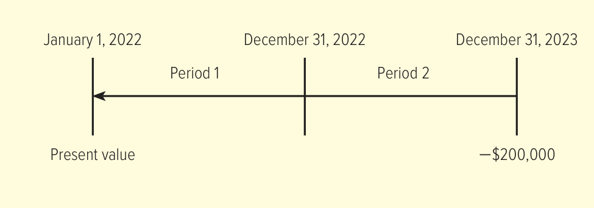  

The present value of the $\mathbb{S}200{,}000$ payment is computed as follows:  

$$
\Phi200,000\times0.79719=\Phi159,438
$$  

After computing the present value, Starbucks records the following journal entry:  

<html><body><table><tr><td></td><td>Debit</td><td>Credit</td></tr><tr><td>Delivery trucks (+A)</td><td>159,438</td><td></td></tr><tr><td>Note payable (+L)</td><td>+</td><td>159,438 Stockholders'Equity</td></tr><tr><td colspan="3">Assets Liabilities</td></tr></table></body></html>  

Delivery trucks +159,438 Note payable +159,438  

At the end of each year, Starbucks must record the implied interest expense.  

<html><body><table><tr><td>December 31,2022</td><td>Debit</td><td>Credit</td></tr><tr><td>Interest expense (+E,-SE)</td><td>19,133*</td><td></td></tr><tr><td>Notep payable (+L)</td><td></td><td>19,133</td></tr></table></body></html>  

$^{*}\mathbb{S}159{,}438$ note payable balance $\times\,0.12$ annual interest rate $={\mathbb{S}}19{,}133$ . When added to $^{\S159,438}$ , the note payable balance is now $\mathbb{S}178{,}571$ .  

<html><body><table><tr><td>Assets</td><td>Liabilities +</td><td>Stockholders'Equity</td></tr><tr><td></td><td>Note payable +19,133</td><td>Interest expense (+E) -19,133</td></tr></table></body></html>  

<html><body><table><tr><td>December 31,2023</td><td>Debit</td><td>Credit</td></tr><tr><td>Intereste expense (+E,-SE)</td><td>21,429*</td><td></td></tr><tr><td>Note payable (+L)</td><td></td><td>21,429</td></tr></table></body></html>

$^{\ast}\mathbb{S}178{,}571$ note payable balance $\times\,0.12$ annual interest rate $={\mathbb{S}21,429}$ . When added to $^{\S178,571}$ , the note payable balance is now $\mathbb{S}200{,}000$ .  

<html><body><table><tr><td>Assets</td><td>Liabilities 十</td><td>Stockholders'Equity</td></tr><tr><td></td><td>Note payable +21,429</td><td>Interest expense (+E) -21,429</td></tr></table></body></html>  

At the end of two years, Starbucks must repay the loan amount. The amount owed is the balance in the note payable account, which started at $^{\mathbb{5159},438}$ and grew as we added interest over the two-year period to now equal exactly $\mathbb{S}200{,}000$ $(\Phi159,\!438+\Phi19,\!133+\Phi21,\!429)$ ). To repay the loan, Starbucks would record the following journal entry:  

<html><body><table><tr><td>December31,2023</td><td>Debit</td><td>Credit</td></tr><tr><td>Note payable (-L)</td><td>200,000</td><td></td></tr><tr><td>Cash (-A)</td><td></td><td>200,000</td></tr><tr><td>Assets Liabilities</td><td colspan="2">十 Stockholders'Equity</td></tr></table></body></html>

Cash −200,000 Note payable −200,000  

## Computing the Amount of a Liability with an Annuity  

On January 1, 2022, assume Starbucks bought several new espresso machines. The company elected to finance the purchase with a note payable to be paid off in three end-of-year payments of $\mathbb{S}163{,}685$ . Each payment includes principal plus interest on any unpaid balance. The annual interest rate is 11 percent. Payments are due on December 31, 2022, 2023, and 2024. This problem can be shown graphically as follows:  

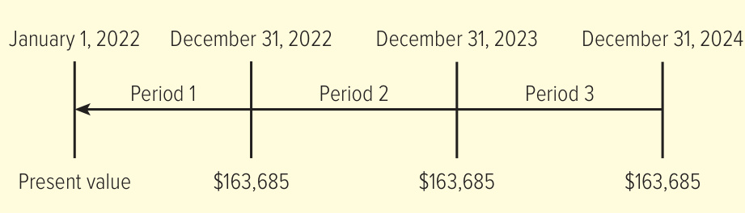  

The present value of the note is the amount Starbucks would have to deposit today at 11 percent interest to cover the three $\mathbb{S}163{,}685$ payments. This is an annuity because payments are made in three equal installments. The present value of the note is computed as follows:  

$$
\S163,\S85\times2.44371=\S399,\S99
$$  

When Starbucks purchases the new espresso machines on January 1, 2022, it records the following journal entry:  

<html><body><table><tr><td>January 1,2022</td><td>Debit</td><td>Credit</td></tr><tr><td>Espresso machines (+A)</td><td>399,999</td><td></td></tr><tr><td>Note payable (+L)</td><td></td><td>399,999</td></tr><tr><td>Assets Liabilities</td><td>十</td><td>Stockholders'Equit</td></tr></table></body></html>  

From Table E.2: interest rate $(i)=11\%$ , periods $(n)=3$ : Factor $=2.44371$   
Using Calculator: rate $(i)=11$ , periods $(n)=3$ , $\mathrm{pmt}=-\mathbb{S}{163}{,685},\mathrm{FV}=\mathbb{S}0$   
Using Excel: Rate $(i)=0.11$ , Nper $(n)=3$ , $\mathrm{Pmt}=-\mathbb{S}163,685,\mathrm{Fv}=\mathbb{S}0$  

At the end of each year over the three-year life of the note, Starbucks records the following journal entries:  

<html><body><table><tr><td>December31,2022</td><td>Debit</td><td>Credit</td></tr><tr><td>Note payable (-L)</td><td>119,685</td><td></td></tr><tr><td>Interestexpense (+E,-SE)</td><td>44,000*</td><td></td></tr><tr><td>Cash (-A)</td><td></td><td>163,685</td></tr></table></body></html>

$^{*}\mathbb{S}399{,}999$ note payable balance $\times\,0.11$ annual interest rate $=\mathbb{S}44{,}000$ . The remaining payable balance after recording this entry is $^{\S280,314}$ .  

<html><body><table><tr><td>Assets</td><td>Liabilities + Note payable</td></tr><tr><td>Cash -163,685</td><td>Stockholders'Equity -119,685 Interest expense (+E) -44,000</td></tr></table></body></html>  

<html><body><table><tr><td>December31,2023</td><td>Debit</td><td>Credit</td></tr><tr><td>Note payable (-L)</td><td>132,850</td><td></td></tr><tr><td>Intereste expense (+E,-SE)</td><td>30,835*</td><td></td></tr><tr><td>Cash (-A)</td><td></td><td>163,685</td></tr></table></body></html>

$^{*}\mathbb{S}280,314$ note payable balance $\times\,0.11$ annual interest rate $={\S}30{,}{8}3{5}$ . The remaining payable balance after recording this entry is $^{\S147,464}$ .  

<html><body><table><tr><td>Assets -163,685</td><td>Liabilities</td><td>十 Stockholders'Equity</td></tr><tr><td>Cash</td><td>Notepayable -132,850</td><td>Interest expense (+E) -30,835</td></tr></table></body></html>  

<html><body><table><tr><td>December31,2024</td><td>Debit</td><td>Credit</td></tr><tr><td>Note payable (-L)</td><td>147,464</td><td></td></tr><tr><td>Interestexpense (+E,-SE)</td><td>16,221*</td><td></td></tr><tr><td>Cash (-A)</td><td></td><td>163,685</td></tr></table></body></html>

$^{*}\mathbb{S}147,464$ note payable balance $\times\,0.11$ annual interest rate $=\mathbb{S}16{,}221$ .  

<html><body><table><tr><td>Assets 一</td><td></td><td>Liabilities</td><td>+</td><td>Stockholders'Equity</td></tr></table></body></html>  

Cash −163,685 Note payable −147,464 Interest expense $\left(+\mathrm{E}\right)$ −16,221  

After Starbucks makes the last cash payment of $\mathbb{S}163,685$ , the balance in the Note payable account is zero.  

## Present Values Involving Both an Annuity and a Single Payment  

From Table E.2: interest rate $(i)=1\%$ , periods $(n)=20$ : Factor $=18.04555$ Using Excel or a Calculator: see single calculation below  

In some business situations, a company may agree to make periodic payments (an annuity) in addition to a single payment at the end of the agreement. Assume Starbucks bought new coffee roasting equipment and agreed to pay the supplier $\mathbb{S}1{,}000$ per month for 20 months and an additional $\mathbb{S}40{,}000$ at the end of 20 months. The supplier is charging 12 percent interest per year, or 1 percent per month. In this type of problem, you can determine the present value of the total obligation by computing the present value of each part. In other words, you compute the present value of the annuity and the present value of the single payment and add the two amounts together, as follows:  

Step 1:	 Compute the present value of the annuity using Table E.2, Appendix E:  

$$
\mathbb{1}1.000\times18.04555=\mathbb{5}18.046
$$  

Step 2:	 Compute the present value of the single payment using Table E.1, Appendix E:  

$$
\hphantom{-}\S40,\hphantom{-}000\times0.81954=\S32,782
$$  

$\mathbb{S}{18}{,}046$ (present value of 20 months of annuity payments) + 32,782 (present value of single sum at the end of 20 months) $\overline{{{\Phi50.828}}}$ (present value of the total obligation)  

Using Calculator: rate $(i)=1$ , periods $(n)=20$ , $\mathrm{pmt}\,{=}\,{-}81{,}000$ , $\mathrm{FV}\!=\!-\!\mathbb{8}40{,}000$ Using Excel: Rate $(i)\!=\!0.01$ , Nper $(n)\!=\!20$ , $\mathrm{Pmt}=-\mathbb{8}1\small{,}000$ , $\mathrm{Fv}=-\mathbb{S}40{,}000$  

The $\mathbb{S}50{,}828$ is the present value of all the cash payments that Starbucks must make under this agreement. Starbucks would record this amount as a liability. This amount can be computed as a single calculation using a calculator or Excel.  

In the next chapter, we will use the present value techniques you have just learned to understand how to account for bonds.  

## D E M O N S T R A T I O N  C A S E  

(Try to answer the questions before proceeding to the suggested solutions that follow.) Patagonia completed several transactions during the year. In each case, decide if a liability (or liabilities) should be recorded and, if so, determine the amount. Assume the current date is December 31 and all transactions occurred over the last year.  

1.	 Employees earned salaries of $\mathbb{S}100{,}000$ , which have not been paid at year-end.   
2.	 Patagonia borrowed $\mathbb{S}100{,}000$ on June 30 at an annual interest rate of 7 percent. As of December 31, no payments associated with this loan have been made.   
3.	 A customer prepaid $\mathbb{S}250$ for a custom waterproof jacket. The customer will pick up the jacket next month.   
4.	 The company lost a lawsuit for $\mathbb{S}250{,}000$ but plans to appeal.   
5.	A new truck was leased for a period equal to 95 percent of the expected life of the truck.   
6.	On December 31, a bank loaned money to Patagonia. Patagonia agreed to repay the bank $\mathbb{S}100{,}000$ on December 31 next year. The annual interest rate is 5 percent.   
7.	 Patagonia signed a loan agreement that requires it to pay $^{\S50,000}$ per year for 20 years. The annual interest rate is 8 percent.  

## SUGGESTED SOLUTION  

1.	 A liability of $\mathbb{S}100{,}000$ should be recorded.  

2.	 The amount borrowed $\left(\mathbb{S}100,000\right)$ should be recorded as a liability on June 30. In addition, interest accrued but not paid should be recorded as a liability at year-end. This amount is $\mathbb{S}100,000\times7\%\times$ $6/12=\mathbb{8}3{,}500$ .   
3.	 The amount the customer paid $(\mathbb{S}250)$ is a liability (deferred revenue) until the customer picks up the jacket, at which point the $\mathbb{S}250$ becomes revenue.   
4.	 Unless Patagonia can make a convincing argument that it is not probable it will have to pay the $\mathbb{S}250{,}000$ , the company should record the amount as a liability.   
5.	The lease covers 95 percent of the estimated life of the truck, which would be considered a major part of the remaining economic life of the asset. It therefore should be accounted for as a finance lease, and a lease asset and lease liability should be recorded. The amount is the present value of the lease payments (which were not given in the problem).   
6.	Patagonia should record a liability equal to the present value of the obligation. Using Table E.1, Appendix E $i=5\%$ , $n=1$ ), the amount is $\mathbb{5}100,\!000\times0.95238=\mathbb{5}95,\!238$ .   
7.	 Patagonia should record a liability for the present value of the obligation. Using Table E.2, Appendix E $i=8\%$ , $n=20$ ), the amount is $\mathbb{S}50{,}000\times9.81815=\mathbb{S}490{,}908$ .  

## Chapter Supplement A  

Present Value Computations Using a Calculator or Excel  

While the present value tables at the end of this book are useful for educational purposes, most present value problems in business are solved using a financial calculator or Excel. To review how to use a financial calculator or Excel to solve present value problems, use the instructions below or go to the videos posted to the Additional Student Resources on Connect.  

## Calculating Present Values Using the HP 10bII+  

## SAMPLE PROBLEM INPUTS:  

$\mathbf{N}=$ Number of periods: 3 $\mathbf{\left|I/YR=\right|}$ Interest rate/period: $10\%$ $\mathbf{PMT}=$ Payments/period: $-\mathbb{S}500$ $\mathrm{FV}=$ Future value: $-\mathbb{S}1{,}000$  

Step 1: Turn on, set payments per year to 1, and clear prior inputs:  

•	 Turn your calculator on by pressing the “ON” button (A).   
•	 Press “1”.   
•	 Press the orange-colored shift key (B).   
•	 Press the “P/YR” key (C).   
•	 To confirm the change, press the orange-colored shift key (B), then press “C ALL” (D). You should briefly see “1 $\mathrm{P_{-}}\mathrm{Yr}^{*}$ on your screen. This step also will clear all prior inputs from your calculator.  

Step 2: Enter the number of periods: •	 Press “3”, then press “N” (E).  

Step 3: Enter the interest rate per period:  

•	 Press $^{*}10^{*}$ , then press “I/YR” (F). NOTE: When using an HP 10bII+, you should enter the whole number “10” for $I O\%$ , not the decimal 0.10.  

Step 4: Enter the amount of any annuity payments:  

•	 Press $500^{\circ}$ , then press $^{\ast}+/-^{\ast}$ (G), then press “PMT” (C). •	 NOTE: If you are calculating the present value of a single amount, there are no annuity payments. When there are no annuity payments, skip STEP 4 or press “0” then press “PMT” (C).  

Step 5: Enter the future amount:  

•	 Press $\cdot1{,}000^{*}$ , then press $^{*}\!+\!/-^{*}$ (G), then press “FV” (H).  

Step 6: Compute the present value:  

•	 Press “PV” (I).  

## ANSWER: $\mathbb{S}1,994.74$  

  
Courtesy of Weili Ge  

NOTE: If you omit the annuity payment of \$500 in STEP 4 and solve for the present value of a single amount (\$1,000), the answer is $\!\!\!\S75l.3l.$ .  

## Calculating Present Values Using the TI BA II Plus  

## SAMPLE PROBLEM INPUTS:  

$\mathbf{N}=$ Number of periods: 3 $\big|\mathrm{I}/\mathbf{Y}\mathbf{R}=\mathbf{\Psi}$ Interest rate/period: 10% $\scriptstyle\left|\mathbf{PMT}\right|\,=$ Payments/period: −\$500 FV $\equiv$ Future value: −\$1,000  

Step 1: Turn on and clear prior inputs:  

•	 Turn your calculator on by pressing the “ON/OFF” button (A). Clear prior inputs by pressing the yellow “2ND” key (B), then “CLR TVM” (C).  

Step 2: Enter the number of periods:  

•	 Press “3”, then press “N” (D).  

Step 3: Enter the interest rate per period:  

Press “ $10^{\circ}$ , then press “I/Y” (E).   
NOTE: When using a TI BA II Plus, you should enter the whole number “10” for $I O\%,$ , not the decimal 0.10.  

Step 4: Enter the amount of any annuity payments:  

•	 Press $\mathrm{{}^{\ast}500^{\circ}}$ , then press $^{\ast}+/-^{\ast}$ (F), then press “PMT” (G).   
•	 NOTE: If you are calculating the present value of a single amount, there are no annuity payments. When there are no annuity payments, skip STEP 4 or press ${\mathrm{~}}^{\prime}{\cal O}^{\prime\prime}$ then press “PMT” (G).  

Step 5: Enter the future amount:  

•	 Press “ $1{,}000^{*}$ , then press $\mathbf{\dot{\omega}}+\mathbf{\omega}/-\mathbf{\omega}^{\mathfrak{s}}$ (F), then press “FV” (C).  

Step 6: Compute the present value:  

•	 Press “CPT” (H), then “PV” (I).  

ANSWER: $\mathbb{S}1,994.74$  

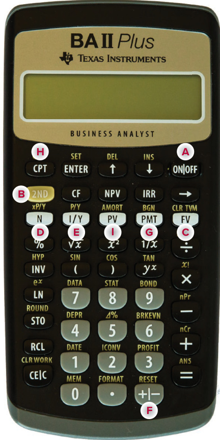  

NOTE: If you omit the annuity payment of \$500 in STEP 4 and solve for the present value of a single amount (\$1,000), the answer is $\!\!\!\S75l.3l.$ .  

Courtesy of Weili Ge  

## Calculating Present Values Using the HP 12C  

## SAMPLE PROBLEM INPUTS:  

$\mathbf{N}=$ Number of periods: 3 $\mathrm{{I/YR=}}$ Interest rate/period: $10\%$ $\mathbf{PMT}=$ Payments/period: $-\,{\mathbb S}500$ $\mathrm{FV}=$ Future value: $\phantom{0}{-}\,\mathbb{S}1\phantom{,000}$  

Step 1: Turn on and clear prior inputs:  

•	 Turn your calculator on by pressing the “ON” button (A). Clear  prior  inputs  by  pressing  the  orangecolored shift key (B), then “CLEAR FIN” (C).  

Step 2: Enter the number of periods:  

•	 Press “3”, then press “n” (D).  

Step 3: Enter the interest rate per period:  

•	 Press “10”, then press “i” (E). NOTE: When using an HP 12C, you should enter the whole number “10” for $I O\%,$ , not the decimal 0.10.  

Step 4: Enter the amount of any annuity payments:  

•	 Press “ $500^{\circ}$ , then press “CHS” (F), then press “PMT” (G). NOTE: If you are calculating the present value of a single amount, there are no annuity payments. When there are no annuity payments, skip STEP 4 or press “0”, then press “PMT” (G).  

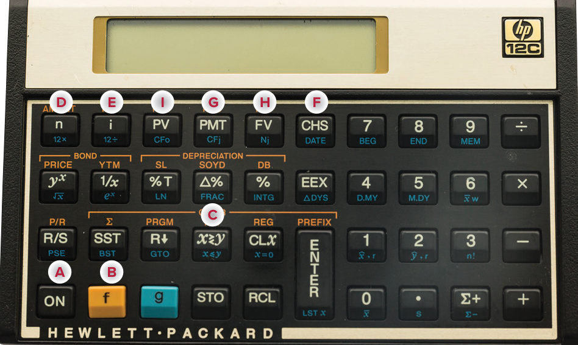  

Step 5: Enter the future amount:  

•	 Press “ $1{,}000^{*}$ , then press “CHS” (F), then press “FV” (H).  

Step 6: Compute the present value:  

•	 Press “PV” (I).  

ANSWER: $\mathbb{S}1,994.74$  

NOTE: If you omit the annuity payment of \$500 in STEP 4 and solve for the present value of a single amount (\$1,000), the answer is $\!\!\!\S75l.3l.$ .  

## Calculating Present Values Using Excel  

## SAMPLE PROBLEM INPUTS:  

$\mathbf{N}=$ Number of periods: 3 $\mathrm{{\small{I/Y}}{\bf R}}={}$ Interest rate/period: 10% $\mathbf{PMT}=$ Payments/period: − \$500 $\mathrm{FV}=$ Future value: − \$1,000  

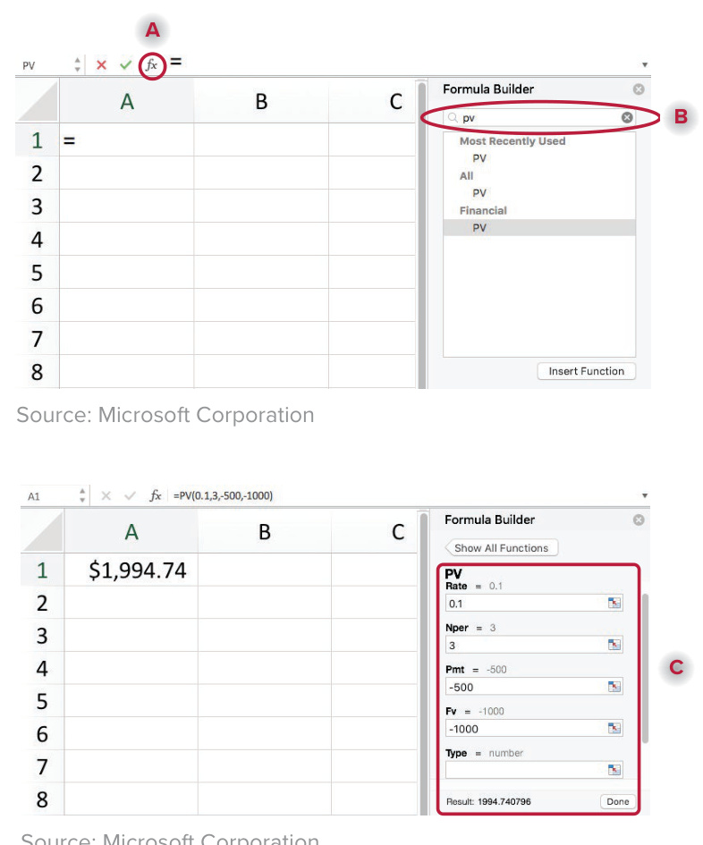  

Step 1: Opening the Formula Builder:  

Open Excel on your computer.   
•	 Click the “fx” function symbol (A) in the menu bar to open the Formula Builder.  

Step 2: Locate the present value (PV) formula:  

•	 In the Formula Builder search bar (B), type in “PV”.   
•	 Double-click on “PV” shown in the search results.  

## Step 3: Enter the interest rate:  

•	 You will enter inputs directly into boxes in the Formula Builder (C).   
In the “Rate” box enter .10.   
•	 NOTE: When using Excel, you should enter the decimal .10 and not the whole number “10” for $I0\%$ .  

Step 4: Enter the number of periods:  

•	 In the “Nper” box enter “3”.  

Step 5: Enter the amount of any annuity payments:  

•	 In the “Pmt” box enter $\mathrm{^{\ast}-500^{\ast}}$ . •	 NOTE: If you are calculating the present value of a single amount, there are no annuity payments. When there are no annuity payments, you would leave the “Pmt” box empty or enter ${}^{\ast}\!O$ ”.  

## Step 6: Enter the future amount:  

•	 In the “Fv” box enter $\mathbf{\omega}^{*}-1000^{*}$ .  

Step 7: The last box:  

•	 Leave the “Type” box empty   
•	 NOTE: Entering “1” here tells Excel to assume that payments are at the beginning of the period. Entering ${^\circ}$ or leaving this box blank tells Excel to assume that payments are at the end of the period (which is what we want).  

## ANSWER: $\mathbb{S}1,994.74$  

NOTE: If you omit the annuity payment of \$500 in STEP 5 and solve for the present value of a single amount (\$1,000), the answer is $\!\!\!\S75l.3l.$ .  

## Chapter Supplement B  

## Deferred Taxes  

In Chapter 8 you learned that companies follow GAAP for financial reporting but the Internal Revenue Code when creating their tax returns. Following different rules can create what are called temporary tax differences. Temporary tax differences are the result of a company reporting revenues and expenses on its income statement in a different time period than it reports them on its tax return. If the difference between financial reporting and tax reporting will result in a lower tax bill in the future, it results in the creation of an asset. If the difference will result in a higher tax bill in the future, it results in the creation of a liability. We call these assets and liabilities deferred tax assets and deferred tax liabilities. In this chapter supplement, we focus on understanding deferred tax liabilities.  

A company creates a deferred tax liability when it:  

•	 Reports revenue on this period’s income statement that it does not report on its tax return until a future period or   
•	 Reports an expense on this period’s tax return that it does not report on its income statement until a future period.  

Both circumstances result in this period’s accounting income reported on the income statement being higher than this period’s tax income reported on the company’s tax return. An example is when a company pays expenses in advance. In certain situations, the company includes the advance payment as an expense on its tax return in the period it pays the cash. For financial reporting purposes, the company is required to recognize the advance payment as an asset on its balance sheet until it actually incurs the expense in a future period. When this happens, the company then uses the asset to satisfy the expense.  

Another accounting area that often results in a deferred tax liability is depreciation. Many companies use straight-line depreciation for financial reporting purposes and an accelerated depreciation method for tax purposes. Let’s consider a simple example. Assume that in the current year, Starbucks owns a piece of equipment that originally cost $\mathbb{S}10$ million. The current book value (cost less accumulated depreciation) on the balance sheet is $\mathbb{S}8.5$ million. For tax purposes, the book value is $\mathfrak{s}6.5$ million. The $\mathbb{S}2$ million difference is a result of Starbucks using straight-line depreciation for financial reporting and accelerated depreciation for tax purposes. Starbucks has been able to delay or defer paying federal income taxes by reporting more depreciation on its tax return than it reports on its income statement.  

The amount of deferred tax liability is computed by multiplying the timing difference by the corporate tax rate (21 percent):  

$$
\mathbf{Deferred\;Tax\;Liability}=\mathbb{S}2\;\mathbf{million}\times\mathbf{0.21}=\mathbb{S}420,\mathbf{0}00
$$  

If there are no other deferred tax items, Starbucks will report a deferred tax liability on its balance sheet of $\mathbb{S}420{,}000$ .  

At the end of the following year, Starbucks again would compare the GAAP book value of the piece of equipment to the tax book value. Assume that the GAAP book value is $\mathbb{S}8.2$ million and the tax book value is $\mathbb{S}6$ million. The timing difference is $\mathbb{S}2.2$ million, resulting in a deferred tax liability of $\mathbb{S}462{,}000$ ( $\mathbb{S}2.2$ million $\times\,0.21$ ).  

The Income tax expense reported under GAAP is the amount needed to complete a journal entry once the company has computed the amount it will pay the IRS for taxes and the change in its deferred taxes. Based on our example, the change in the deferred tax liability for Starbucks is $\mathbb{S}42{,}000$ $(\mathbb{S}462,\!000\,-\!]$ $^{\S420,000)}$ . Assume the company completes its tax return and determines it owes the IRS $\mathbb{S}550{,}000$ for taxes. The company would record the following:  

<html><body><table><tr><td></td><td>Debit</td><td>Credit</td></tr><tr><td>Incometaxexpense (+E,-SE)</td><td>592,000</td><td></td></tr><tr><td>Deferred taxes (+L)</td><td></td><td>42,000</td></tr><tr><td>Income taxes payable (+L)</td><td></td><td>550,000</td></tr></table></body></html>  

  
Deferred taxes $+42{,}000$ Income tax expense $\left(+\mathrm{E}\right)$ −592,000 Income taxes payable $+550{,}000$  

The computation of deferred taxes involves some complexities that are discussed in advanced accounting courses. At this point, you need to understand only that deferred tax assets and liabilities are the result of temporary differences between a company’s income statement and its tax return. Each temporary difference has an impact on the income statement in one accounting period and the tax return in another.  

## C H A P T E R  T A K E - A W A Y S  

## 9-1.	 Define, measure, and report current liabilities. p. 476  

Accountants define liabilities as probable future sacrifices of economic benefits that arise from past transactions. Liabilities are classified on the balance sheet as either current or long term. Current liabilities are short-term obligations that will be paid within the current operating cycle of the business or within one year of the balance sheet date, whichever is longer. Long-term liabilities are all obligations not classified as current.  

9-2.	 Compute and interpret the accounts payable turnover ratio. p. 477  

To compute this ratio, divide cost of goods sold by average accounts payable. This ratio reflects how quickly management is paying its suppliers and is considered to be a measure of liquidity. Liquidity is a company’s ability to meet its current obligations.  

9-3.	 Report notes payable and explain the time value of money. p. 482  

Companies sign a note when they borrow money. The note specifies the amount borrowed, when it must be repaid, and the interest rate associated with the loan. Accountants report the amount borrowed, and any unpaid interest, as liabilities. The time value of money refers to the principle that a given amount of money deposited in an interest-bearing account increases over time.  

## 9-4.	 Report contingent liabilities. p. 484  

A contingent liability is a potential liability that has arisen as the result of a past event. An example is a warranty. The past event is the sale of the item. The potential liability is the possibility that the company will have to honor the warranty. Contingent liabilities are reported on the balance sheet if they are probable and the amount can be estimated. If they are probable but the amount cannot be estimated, or if they are only reasonably possible regardless of whether the amount can be estimated, then they are reported in the footnotes.  

9-5.	 Explain the importance of working capital and its impact on cash flows. p. 486  

Working capital is defined as current assets minus current liabilities. Working capital is used to fund the operating activities of a business. Changes in working capital accounts are important to managers and analysts because they have a direct impact on the cash flows from operating activities reported on a company’s cash flow statement.  

9-6.	 Report long-term liabilities. p. 487  

Any liability that is not a current liability is a long-term liability. Many long-term liabilities are reported on the balance sheet at their present value, which is the amount a company would have to pay today at a given interest rate to satisfy the obligation.  

9-7.	 Compute and explain present values. p. 489  

The present value concept is based on the time value of money. Money received today is worth more than the same amount of money to be received in the future because of interest rates. We can compute the present value of a single amount or the present value of a stream of amounts (called an annuity) using present value tables, a financial calculator, or Excel.  

9-8.	 Apply the present value concept to the reporting of long-term liabilities. p. 494  

A liability involves the payment of some amount at a future date. With long-term liabilities, the reported liability is not the dollar value of the future payment(s), but rather the present value of the future payment(s).  

In this chapter, we focused on the reporting of current liabilities and introduced how to compute and interpret present values. In the next chapter, we discuss a company’s capital structure and how long-term liabilities, like bonds, fit into that structure.  

Accounts payable turnover is a measure of how quickly a company pays its suppliers. It is computed as follows (see the “Key Ratio Analysis” box in the Current Liabilities section):  

_C_o_s_t_s _o_f_ _G_o_o_d_s_ S_o_l_d_ Accounts Payable Turnover = ​ Average A cco unts  Payabl e ​  

F I N D I N G F I N A N C I A L  I N F O R M A T I O N  

## Balance Sheet  

## Income Statement  

Under Current Liabilities Accounts payable Accrued liabilities Deferred revenues Notes payable Current portion of long-term debt   
Under Noncurrent Liabilities Long-term debt Leases Deferred taxes Bonds  

Liabilities are shown only on the balance sheet, never on the income statement. Transactions affecting liabilities often also affect income statement accounts. For example, employee salaries earned but not yet paid affect an income statement account (salary expense) and a balance sheet account (salaries payable).  

## Statement of Cash Flows  

## Notes  

Under Operating Activities Cash inflows and outflows associated with a company’s operations, which often involve working capital accounts (current assets and current liabilities).   
Under Financing Activities Cash inflows and outflows associated with equity and debt, including long-term liabilities like notes and bonds.   
Under Summary of Significant Accounting Policies A brief description of the accounting for certain liabilities.   
Under Separate Notes Additional details about both short-term liabilities (e.g., deferred revenue) and long-term liabilities (e.g., notes). Additional details about contingent liabilities, especially legal issues.  

## K E Y  T E R M S  

Accrued Liabilities Expenses that have been incurred but have not been paid at the end of the accounting period. p. 478  

Long-Term Liabilities All of the entity’s obligations that are not classified as current liabilities. p. 487  

Annuity A series of periodic cash receipts or payments that are equal in amount each interest period. p. 492  

Operating Lease Effective control of the leased asset remains with the lessor. p. 488  

Contingent Liability A potential liability that has arisen as the result of a past event; it is not a definitive liability until some future event occurs. p. 484  

Present Value The current value of an amount to be received in the future; a future amount discounted for compound interest.  

## p. 490  

Deferred Tax Liability Created when differences in financial reporting and tax reporting cause accounting income to be higher than tax income in a given period. p. 502  

Short-Term Lease A lease for 12 months or less (including expected renewals and extensions) that does not contain a purchase option that the lessee is expected to exercise. p. 489  

Finance Lease Effective control of the leased asset is transferred to the lessee. p. 488  

Future Value The sum to which an amount will increase as the result of compound interest. p. 490  

Temporary Tax Differences Result from companies reportin revenues and expenses on their income statements in a different time period than they report them on their tax returns. p. 502  

Lessee The party that pays for the right to use the leased asset.  

## p. 488  

Lessor The party that owns a leased asset. p. 488   
Liquidity The ability to pay current obligations. p. 486  

Time Value of Money Principle that a given amount of money deposited in an interestbearing account increases over time. p. 482 Working Capital The dollar difference between total current assets and total current liabilities. p. 486  

## Q U E S T I O N S  

1.	 Define liability. Differentiate between a current liability and a long-term liability.   
2.	 What financial statement is the primary source of information about the liabilities of a company?   
3.	 In their balance sheets, what do companies call obligations to pay suppliers in the near future?   
4.	 What does the accounts payable turnover ratio tell you about a company? How is the ratio computed?   
5.	 Define accrued liability. What is an example of an accrued liability?   
6.	 Define note payable. When must a company reclassify a long-term note payable as a current liability?   
7.	 On April 1 of the current year, a company borrowed $\mathbb{S}4\mathrm{,}000$ from a bank. The annual interest rate was 12 percent. When the company prepares its year-end financial statements on December 31, how much will it report as interest expense associated with this note?   
8.	 Define deferred revenue. Why is it a liability?   
9.	 Define contingent liability. What conditions must be met in order for a contingent liability to be   
reported on a company’s balance sheet?  

10.	 Define working capital. How is working capital computed?  

11.	 When a company signs a finance lease, does it record an asset and a liability on its balance sheet?   
12.	 Explain the concept of the time value of money.   
13.	 If you hold a valid contract that will pay you $\mathbb{S}8{,}000$ cash in 10 years and the going annual rate of   
interest is 10 percent, what is the contract’s present value? Show your computations.   
14.	 Define annuity.  

15.	 Using Table E.1 in Appendix E, fill in the present value factors for the following interest rates and periods:  

<html><body><table><tr><td colspan="4">PresentValueFactors</td></tr><tr><td colspan="4">i=5% i=10%</td></tr><tr><td rowspan="3">PVof$1 PV of annuity of $1</td><td>n=4</td><td>n=7</td><td>i=14% n=10</td></tr><tr><td></td><td></td><td></td></tr><tr><td></td><td></td><td></td></tr></table></body></html>  

16.	 You purchased a new car and promised to pay the dealership five payments of $\Phi8{,}000$ at the end of each of the next five years. The applicable annual interest rate is 8 percent. What is the present value of this annuity?  

1.	 What is the present value factor for an annuity of five periods and an interest rate of 10 percent?  

a.	 0.62092 c.	 3.79079   
b.	 4.32948 d.	 7.72173  

2.	 The university golf team needs to buy a car to travel to tournaments. A dealership in Bellevue has agreed to the following terms: $\mathbb{S}4\mathrm{,}000$ down plus 20 monthly payments of $\mathbb{S}750$ . A dealership in Seattle will agree to $\mathbb{S}1{,}000$ down plus 20 monthly payments of $\mathbb{S}850$ . The local bank is currently charging an annual interest rate of 12 percent for car loans. Which is the better deal, and why?  

a.	 The Seattle offer is better because the total payments of $\mathbb{S}18{,}000$ are less than the total payments of $\mathbb{S}{19}{,}000$ to be made to the Bellevue dealership.   
b.	 The Bellevue offer is better because the cost in terms of present value is less than the present value cost of the Seattle offer.   
c.	 The Bellevue offer is better because the monthly payments are less.   
d.	 The Seattle offer is better because the cash down payment is less.   
e.	 The Seattle offer is better because the cost in terms of present value is less than the present value cost of the Bellevue offer.  

3.	 Which of the following best describes accrued liabilities?  

a.	 Long-term liabilities.   
b.	 Current amounts owed to suppliers of inventory.   
c.	 Current liabilities to be recognized as revenue in a future period.   
d.	 Current amounts owed, but not yet paid, to various parties at the end of an accounting period.  

4.	 Brad & Kelly Company has borrowed $\mathbb{S}100{,}000$ from the bank to be repaid over the next five years, with payments beginning next month. Which of the following best describes the presentation of this debt in the balance sheet as of today (the date of borrowing)?  

a. $\mathbb{S}100{,}000$ in the Long-Term Liability section.   
b. $\mathbb{S}100{,}000$ plus the interest to be paid over the five-year period in the Long-Term Liability section.   
c.	 A portion of the $\mathbb{S}100{,}000$ in the Current Liability section and the remainder of the principal in the Long-Term Liability section.   
d.	 A portion of the $\mathbb{S}100{,}000$ plus interest in the Current Liability section and the remainder of the   
principal plus interest in the Long-Term Liability section.  

5.	 A company is facing a lawsuit from a customer. It is possible, but not probable, that the company will have to pay a settlement that management estimates to be $\mathbb{1}2{,}000{,}000$ . How would this fact be reported in the financial statements to be issued at the end of the current month?  

a. $\mathbb{1}2{,}000{,}000$ in the Current Liability section.   
b. $\mathbb{1}2{,}000{,}000$ in the Long-Term Liability section.   
c.	 In a descriptive narrative in the footnote section.   
d.	 None because disclosure is not required.  

6.	 Which of the following transactions would usually cause accounts payable turnover to increase?  

a.	 Payment of cash to a supplier for merchandise previously purchased on credit. b.	 Collection of cash from a customer. c.	 Purchase of merchandise on credit. d.	 None of the above.   
7.	 How is working capital calculated? a.	 Current assets multiplied by current liabilities. b.	 Current assets plus current liabilities. c.	 Current assets minus current liabilities. d.	 Current assets divided by current liabilities.   
8.	 The present value of an annuity of $\mathbb{S}10{,}000$ per year for 10 years discounted at 8 percent is what  

amount?  

a. $\mathbb{S}5{,}002$ c. $^{\Phi53,349}$   
b. $^{\mathbb{S}67,101}$ d. $^{\S80,000}$  

9.	 Phoebe Company borrowed $\mathbb{S}100{,}000$ at 8 percent interest for three months. How much interest does the company owe at the end of three months?  

a. $\Phi8{,}000$ c. $\mathbb{S}800$   
b. $\mathbb{S}2{,}000$ d. $\mathbb{S}200$  

10.	 Raija received a gift from his grandmother of $\mathbb{S}100{,}000$ . She has promised to pay Raija the $\mathbb{S}100{,}000$ in equal installments at the end of each year for the next 10 years. Raija wants to know how much the $\mathbb{S}100{,}000$ is worth in today’s dollars. Which of the following will Raija need to calculate this amount?  

a.	 The anticipated interest rate and the present value of $\mathbb{S}1$ table.   
b.	 The anticipated interest rate and the future value of $\mathbb{S}1$ table.   
c.	 The anticipated interest rate and the future value table for annuities.   
d.	 The anticipated interest rate and the present value table for annuities.  

## M I N I - E X E R C I S E S  

## connect  

## M9-1 LO9-1  

## Understanding Current Liabilities  

Which of the following will increase a company’s current liabilities?  

1.	 A company purchases a new truck with cash.   
2.	 A company receives cash from taking out a long-term loan.   
3.	 A company collects half of its accounts receivable balance.   
4.	 A company purchases inventory on credit.   
5.	 A company purchases new manufacturing equipment with cash.  

## M9-2 LO9-2  

## Computing and Interpreting Accounts Payable Turnover  

Nelson Company reported cost of goods sold of $\mathbb{S}690{,}000$ last year and $\mathbb{S}720{,}000$ this year. Nelson also reported accounts payable of $\mathbb{S}250{,}000$ last year and $\mathbb{S}230{,}000$ this year. Compute this year’s accounts pay able turnover ratio for Nelson. Interpret the number.  

## Computing Interest Expense  

Rainier Company borrowed $\mathbb{S}600{,}000$ for three months. The annual interest rate on the loan was 11 percent. Rainiers fiscal year ends on December 31. Rainier borrowed the $^{\S600,000}$ one month prior to the  

end of its current fiscal year and paid back the $\mathbb{S}600{,}000$ plus interest two months into its current fiscal year. In regards to this loan, how much interest expense, if any, would Rainier report at the end of its last fiscal year? At the end of its current fiscal year?  

## Recording a Note Payable  

Danali Corporation borrowed $\mathbb{S}290{,}000$ on October 1. The note carried a 10 percent interest rate with the principal and interest payable on May 1 of next year. Prepare the journal entry to record the note on October 1. Prepare the adjusting entry to record accrued interest on December 31, the end of Danali’s fiscal year.  

M9-4   
LO9-3  

## Reporting Contingent Liabilities  

Buzz Coffee Shops is famous for its large servings of hot coffee. Last year a customer spilled a cup of hot coffee on himself and decided to file a lawsuit against Buzz for $^{\Phi1,000,000}$ . Buzz’s management thinks the chances of the company having to pay anything to the customer are remote. The case went to trial this year, and Buzz was found guilty of serving hot coffee in the wrong type of cup. The judge ordered Buzz to pay the customer $\mathbb{S}200{,}000$ . What is the proper reporting of the lawsuit in each year?  

M9-5   
LO9-4  

## Computing Working Capital  

The balance sheet for Yakima Corporation reported the following: noncurrent assets, $\mathbb{S}240{,}000$ ; total assets, $\mathbb{S}360{,}000$ ; noncurrent liabilities, $\mathbb{S}176{,}000$ ; total stockholders’ equity, $\mathbb{S}94{,}000$ . Compute Stevenson’s working capital.  

M9-6   
LO9-5  

## Analyzing the Impact of Transactions on Working Capital  

Ospry Company has working capital in the amount of $\Phi1{,}240{,}000$ . For each of the following transactions, determine whether working capital will increase, decrease, or remain the same.  

a.	 Paid accounts payable in the amount of $\mathbb{S}50{,}000$ .   
b.	 Recorded accrued salaries in the amount of $\mathbb{S}100{,}000$ .   
c.	 Borrowed $\mathbb{S}250{,}000$ from a local bank, to be repaid in 90 days.   
d.	 Purchased $\mathbb{S}20{,}000$ of new inventory on credit.  

M9-7   
LO9-5  

## Accounting for Long-Term Liabilities: Leases  

StarGaze Company leased a truck for three months. Accounting guidance classifies the lease as a shortterm lease. StarGaze makes lease payments of $\mathbb{S}800$ at the end of each month. What journal entry will StarGaze enter upon signing the lease? What journal entry will StarGaze enter when it makes its first lease payment of $\mathbb{S}800$ cash to the leasing company?  

M9-8   
LO9-6  

## Computing the Present Value of a Single Payment  

What is the present value of $\mathbb{S}500{,}000$ to be paid in 10 years? The annual interest rate is 8 percent.  

M9-9   
LO9-7  

## Computing the Present Value of an Annuity  

What is the present value of 10 equal payments of $\mathbb{S}15{,}000$ to be made at the end of each year for the next 10 years? The annual interest rate is 10 percent.  

M9-10   
LO9-7  

## Computing the Present Value of a Complex Contract  

Global Stores is downsizing and must let some employees go. Employees volunteering to leave are being offered a severance package of $\mathbb{S}118{,}000$ cash, another $\mathbb{S}129{,}000$ to be paid in one year, and an annuity of $^{\S27,500}$ to be paid each year for six years with the first payment coming at the end of this year. What is the present value of the total severance package, assuming an annual interest rate of 5 percent?  

M9-11   
LO9-7  

## Computing Present Values and Recording Long-Term Liabilities  

Mukilteo Company signed a note to purchase a new piece of equipment. The note requires Mukilteo to pay $\mathbb{S}50{,}000$ to the equipment manufacturer at the end of two years. Using a discount rate of 6 percent, compute the present value of this long-term liability, and provide the journal entry Mukilteo will record on the day it purchases the piece of equipment and signs the note.  

M9-12   
LO9-8  

## connect  

## E9-1  

## Identifying Current Liabilities, Computing Working Capital, and Explaining Working Capital  

Cauce Corporation is preparing its year-end balance sheet. The company records show the following selected amounts at the end of the year:  

Total assets \$530,000   
Total noncurrent assets 362,000   
Liabilities:   
Notes payable $8\%$ , due in 5 years) 15,000   
Accounts payable 56,000   
Income taxes payable 14,000   
Liability for withholding taxes 3,000   
Rent revenue collected in advance 7,000   
Bonds payable (due in 15 years) 90,000   
Wages payable 7,000   
Property taxes payable 3,000   
Note payable ( $10\%$ , due in 6 months) 12,000   
Interest payable 400   
Common stock 100,000  

Required:  

1.	 Identify current liabilities and compute working capital. Why is working capital important to management?   
2.	 Would your computation be different if the company reported $\mathbb{S}250{,}000$ worth of contingent liabilities in the notes to its financial statements? Explain.  

## E9-2 LO9-1  

## Recording Payroll Costs  

Palouse Company completed the salary and wage payroll for the month of March. The payroll provided the following details:  

Salaries and wages earned by employees \$200,000   
Employee income taxes withheld 40,000   
Employee government insurance premiums withheld 1,000   
FICA payroll taxes\* 15,000   
\*Assessed on both employer and employee (i.e., \$15,000 each).  

Required:  

1.	 Provide the journal entry to record the payroll for March, including employee deductions. Assume employees have been paid but that Palouse has yet to transfer any withholdings to the government. 2.	 Provide the journal entry to record the employer’s payroll taxes, which have not yet been paid to the government.  

3.	 Provide a combined journal entry to show the payment of all amounts owed to governmental agencies.  

## E9-3 LO9-1  

## Computing Payroll Costs; Discussion of Labor Costs  

Oaks Company has completed the payroll for the month of January, reflecting the following data:  

Salaries and wages earned \$86,000   
Employee income taxes withheld 10,000   
FICA payroll taxes\* 6,000  

\*Assessed on both employer and employee (i.e., \$6,000 each).  

## Required:  

1.	 What was the total labor cost to the company? What was the amount of the employees’ take-home pay?   
2.	 List the liabilities and their amounts reported on the company’s January 31 balance sheet, assuming the employees have been paid but that no transfers have been made to government agencies.   
3.	 A junior accountant at Oaks stated in a meeting that giving all employees a 5 percent raise would have cost Oaks $\mathbb{S}4,300$ $\left\langle{\mathbb S}86,000\times0.05\right)$ in the month of January. Do you agree?  

## Recording a Note Payable through Its Time to Maturity with Strategy Discussion  

Many businesses borrow money during periods of increased business activity to finance inventory and accounts receivable. Nordstrom, Inc., is one of America’s most prestigious retailers. Each Christmas season, Nordstrom builds up its inventory to meet the needs of Christmas shoppers. A large portion of these Christmas sales are on credit. As a result, Nordstrom often collects cash from the sales several months after Christmas. Assume that on November 1 of this year, Nordstrom borrowed $\mathbb{S}4.8$ million cash from Bank of America to meet short-term obligations. Nordstrom signed an interest-bearing note and promised to repay the $\mathbb{S}4.8$ million in six months. The annual interest rate was 8 percent. All interest will accrue and be paid when the note is due in six months. Nordstrom’s accounting period ends December 31.  

E9-4 LO9-1, 9-3 Nordstrom, Inc. Bank of America  

Required:  

1.	 Provide the journal entry to record the note on November 1.   
2.	 Provide any adjusting entry required at the end of the annual accounting period on December 31.   
3.	 Provide the journal entry to record payment of the note and interest on the maturity date, April 30.   
4.	 If Nordstrom needs extra cash during every Christmas season, should management borrow money on   
a long-term basis to avoid the necessity of negotiating a new short-term loan each year?  

## Determining Financial Statement Effects of Transactions Involving Notes Payable  

Using the data from the previous exercise, complete the following requirements.  

Required:  

Determine the financial statement effects for each of the following: $(a)$ the issuance of the note on November 1, (b) the impact of the adjusting entry at the end of the accounting period, and (c) payment of the note and interest on April 30. Indicate the effects (e.g., Cash $^+$ or −) using the format below. You do not need to include amounts, just accounts and the direction in which they are affected.  

E9-5   
LO9-1, 9-3  

  

## Determining the Impact of Transactions, Including Analysis of Cash Flows  

Jose Company sells a wide range of goods through two retail stores operated in adjoining cities. Jose purchases most of the goods it sells in its stores on credit, promising to pay suppliers later. Occasionally, a short-term note payable is used to obtain cash for current use. The following transactions were selected from those occurring during the fiscal year, which ends on December 31:  

a.	 Purchased merchandise on credit for $\mathbb{S}18{,}000$ on January 10.  

$\boldsymbol{b}$ .	 Borrowed $\mathbb{\Phi}45{,}000$ cash on March 1 from City Bank by signing an interest-bearing note payable. The note is due at the end of six months (August 31) and has an annual interest rate of 10 percent payable at maturity.  

E9-6   
LO9-1, 9-3, 9-5  

## Required:  

1.	 Describe the impact of each transaction on the balance sheet equation. Indicate the effects (e.g., $\mathrm{Cash+or-}]$ ) using the format below. You do not need to include amounts, just accounts and the direction in which they are affected.  

Date Assets Liabilities Stockholders’ Equity  

2.	 What amount of cash is paid on the maturity date of the note?   
3.	 Discuss the impact of each transaction on Vernon’s cash flows.  

## E9-7  

LO9-2 Skullcandy  

## Calculating and Explaining the Accounts Payable Turnover Ratio  

Skullcandy designs, markets, and distributes audio and gaming headphones, earbuds, and speakers. Assume that last year, Skullcandy reported cost of goods sold of $\mathbb{S}158$ million. Assume that this year, cost of goods sold was $\mathbb{S}117$ million. Accounts payable was $\mathbb{S}23$ million at the end of last year and $\mathbb{S}17$ million at the end of this year.  

Required:  

1.	 For this year, compute the average number of days that Skullcandy’s accounts payable are outstanding. 2.	 Assume  Skullcandy’s  closest  competitor  reports  that  the  average  number  of  days  that  its accounts payable are outstanding is 30. Comment on Skullcandy’s number relative to its competitor’s number.  

## E9-8  

North Face U.S. Bank  

## Reporting Notes Payable and Calculating Interest Expense  

North Face is one of the world’s most popular outdoor apparel companies. Assume that North Face borrows $\mathbb{S}2$ million from U.S. Bank and signs a note promising to pay back the $\mathbb{S}2$ million in nine months, at which time North Face also will pay any accrued interest. The interest rate on the note is 8 percent.  

## Required:  

1.	 Prepare the journal entry North Face will record when it signs the note and receives the cash. 2.	 Prepare the journal entry that North Face will record when it pays off the note and any accrued interest after nine months.  

## E9-9  

## Reporting Contingent Liabilities  

James Soda is a regional soda manufacturer. James is currently facing three lawsuits, summarized below:  

a.	 A customer is suing James for $\mathbb{S}1$ million because he claims to have found a piece of glass in his soda. Management deems the probability that James will lose the lawsuit and have to pay $\mathbb{S}1$ million as reasonably possible.  

b.	 An employee is suing James for $\mathbb{S}500{,}000$ for an injury she incurred in the parking lot while walking to work. Management deems the probability that James will lose the lawsuit as probable but estimates that a reasonable payout will be $\mathbb{S}100{,}000$ , not $\mathbb{S}500{,}000$ .   
c.	 A customer is suing James for $\mathbb{S}300{,}000$ because her last name is James and she claims James stole her name. Management deems the probability that James will lose the lawsuit and have to pay \$300,000 as remote.  

Required:  

How should James report each of the lawsuits in its financial statements and footnotes?  

## E9-10  

LO9-5 Saks Fifth Avenue  

## Using Working Capital  

Saks Fifth Avenue’s balance sheet for a recent year revealed the following information:  

Current assets \$750,000   
Noncurrent assets 450,000   
Noncurrent liabilities 400,000   
Stockholders’ equity 380,000  

Determine the amount of working capital reported in the balance sheet.  

## E9-11  

LO9-6 Peloton Corporation  

## Reporting a Long-Term Liability  

Peloton Corporation sells fitness products and associated subscription services. Effective management of its properties is a key to its success. As the following note in a recent annual report indicates, Peloton leases various types of property:  

The Company leases facilities under operating leases with various expiration dates through 2039. The Company leases space for its corporate headquarters and the operation of its production studio facilities, retail showrooms, microstores, distribution centers, warehouses, factories, and other office spaces  

Required:  

Should Peloton report lease liabilities on its balance sheet? Explain. If the obligation should be reported as a liability, how should the amount be measured?  

## Evaluating Lease Alternatives  

As the new vice president for consumer products at Whole Foods, you are attending a meeting to discuss a serious problem associated with delivering merchandise to customers. Bob Smith, director of logistics, summarized the problem: “It’s easy to understand; we just don’t have enough delivery trucks given our recent growth.” Barb Bader from the accounting department responded: “Maybe it’s easy to understand, but it’s impossible to do anything. Because of Wall Street’s concern about the amount of debt on our balance sheet, we’re under a freeze and can’t borrow money to acquire new assets. There’s nothing we can do.”  

On the way back to your office after the meeting, your assistant offers a suggestion: “Why don’t we just lease the trucks we need using short-term leases that we’ll renew each year? That way we can get the assets we want without having to record a liability on the balance sheet.”  

How would you respond to this suggestion?  

E9-12 LO9-6 Whole Foods  

## Computing Four Present Value Problems  

On January 1 of this year, Skamania Company completed the following transactions (assume a 10  percent annual interest rate):  

a.	 Bought a delivery truck and agreed to pay $\mathbb{S}60{,}000$ at the end of three years.   
$\boldsymbol{b}$ .	 Rented an office building and was given the option of paying $\mathbb{S}10{,}000$ at the end of each of the next three years or paying $\mathbb{S}28{,}000$ immediately.   
c.	 Established a savings account by depositing a single amount that will increase to $\mathbb{S}90{,}000$ at the end of seven years.   
d.	 Decided to deposit a single sum in the bank that will provide 10 equal annual year-end payments of $\mathbb{S}40{,}000$ to a retired employee (payments starting December 31 of this year).  

Required (show computations and round to the nearest dollar):  

1.	 In $(a)$ , what is the cost of the truck that should be recorded at the time of purchase?   
2.	 In $(b)$ , which option for the office building results in the lowest present value?   
3.	 In $(c)$ , what single amount must be deposited in this account on January 1 of this year?   
4.	 In $(d)$ , what single sum must be deposited in the bank on January 1 of this year?   
E9-13   
LO9-7  

## Computing a Present Value  

An investment will pay $\mathbb{S}20{,}000$ at the end of the first year, $\mathbb{S}30{,}000$ at the end of the second year, and $\mathbb{\ s s}0\mathrm{,}000$ at the end of the third year. Determine the present value of this investment using a 10 percent annual interest rate.  

E9-14   
LO9-7  

## Computing a Present Value Involving an Annuity and a Single Payment  

An investment will pay $\mathbb{S}15{,}000$ at the end of each year for eight years and a one-time payment of $\mathbb{S}150{,}000$ at the end of the eighth year. Determine the present value of this investment using a 7 percent annual interest rate.  

E9-15   
LO9-7  

## Computing a Present Value Involving an Annuity and a Single Payment  

The Jenkins Corporation has purchased an executive jet. The company has agreed to pay $\mathbb{S}200{,}000$ per year for the next 10 years and an additional $^{\S1,000,000}$ at the end of the 10th year. The seller of the jet is charging 6 percent annual interest. Determine the liability that would be recorded by Jenkins.  

E9-16   
LO9-8  

## Computing a Present Value Involving an Annuity and a Single Payment  

You have decided to buy a used car. The dealer has offered you two options:  

a.	 Pay $\mathbb{S}500$ per month for 20 months and an additional $\mathbb{S}12{,}000$ at the end of 20 months. The dealer is charging an annual interest rate of 24 percent.   
b.	 Make a one-time payment of $\mathbb{S}14{,}906$ , due when you purchase the car.  

In present value terms, which offer is a better deal?  

E9-17   
LO9-7  

## E9-18 LO9-7  

## Using Present Value Concepts for Decision Making  

You have just won the state lottery and have two choices for collecting your winnings. You can collect $^{\S100,000}$ today or receive $\mathbb{S}20{,}000$ at the end of each year for the next seven years. A financial analyst has told you that you can earn 10 percent on your investments. Which alternative should you select?  

## E9-19 LO9-7  

## Calculating a Retirement Fund  

You are a financial adviser working with a client who wants to retire in eight years. The client has a savings account with a local bank that pays 9 percent annual interest. The client wants to deposit an amount that will provide her with $^{\Phi1,000,000}$ when she retires. Currently, she has $^{\S300,000}$ in the account. How much additional money should she deposit now to provide her with $^{\Phi1,000,000}$ when she retires?  

## E9-20 LO9-7  

## Determining an Educational Fund  

Judge Drago has decided to set up an educational fund for his favorite granddaughter, Emma, who will start college in one year. The judge plans to deposit an amount in a savings account that pays 9 percent annual interest. He wants to deposit an amount that is sufficient to permit Emma to withdraw $\mathbb{S}20{,}000$ for tuition starting in one year and continuing each year for a total of four years. How much should he deposit today to provide Emma with a fund to pay for her college tuition?  

## E9-21 LO9-6  

## (Chapter Supplement B) Computing Deferred Income Tax  

The following information pertains to the Lanina Corporation.  

<html><body><table><tr><td></td><td>Year1</td><td>Year 2</td></tr><tr><td>Incometaxes payable</td><td>$250,000</td><td>$290,000</td></tr><tr><td>Increase in deferred tax liability</td><td>54,000</td><td>58,000</td></tr></table></body></html>  

Required:  

1.	 For each year, compute income tax expense (assume that no taxes have been paid).   
2.	 Explain why tax expense is not simply the amount of cash paid during the year.  

## E9-22 LO9-6  

## (Chapter Supplement B) Recording Deferred Income Tax  

The balance sheet for Nair Corporation provided the following summarized pretax data:  

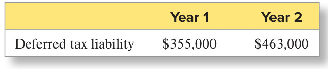  

The income statement reported tax expense for Year 2 in the amount of $^{\S580,000}$ .  

Required:  

1.	 What was the amount of income taxes payable for Year 2?   
2.	 Explain why management incurs the cost of maintaining separate tax and financial accounting records.  

## E9-23  

## LO9-7, FUTURE VALUES  

## Computing Future Values: Deposit Required and Accounting for a Single-Sum Savings Account  

On January 1, Steph Grant decided to deposit $^{\S58,800}$ in a savings account that will provide funds four years later to send his son to college. The savings account will earn 8 percent annually. Any interest earned will be added to the fund at year-end (rather than withdrawn).  

Required (show computations and round to the nearest dollar):  

1.	 How much will be available in four years?   
2.	 Assume that Steph Grant follows GAAP. Provide the journal entry that Steph Grant should make on January 1.  

3.	 What is the total interest for the four years? 4.	 Assume that Steph Grant follows GAAP. Provide the journal entry that Steph Grant should make on (a) December 31 of the first year and $(b)$ December 31 of the second year.  

## Computing Future Values: Recording Growth in a Savings Account with Equal Periodic Payments  

At the end of each year, you plan to deposit $\mathbb{S}2{,}000$ in a savings account. The account will earn 9 percent annual interest, which will be added to the fund balance at year-end. The first deposit will be made at the end of Year 1.  

Required (show computations and round to the nearest dollar):   
1.	 Assume you follow GAAP. Provide the journal entry you should enter at the end of Year 1. 2.	 What will be the balance in the savings account at the end of the 10th year (i.e., after 10 deposits)? 3.	 What is the interest earned on the 10 deposits?   
4.	 How much interest revenue did the fund earn in the second year? In the third year?   
5.	 Assume you follow GAAP. Provide the journal entries you should enter at the end of the second and third years.  

E9-24 LO9-7, FUTURE VALUES  

## connect  

## Recording and Reporting Current Liabilities (AP9-1)  

Vigeland Company completed the following transactions during Year 1. Vigeland’s fiscal year ends on December 31.  

Jan.	 15 Purchased and paid for merchandise. The invoice amount was $\mathbb{S}26,500$ ; assume a perpetual inventory system.   
Apr. 	 1 Borrowed $\mathbb{S}700{,}000$ from Summit Bank for general use; signed a 10-month, 6  percent annual interest-bearing note for the money.   
June	14 Received a $\mathbb{S}15{,}000$ customer deposit for services to be performed in the future.   
July	 15 Performed $\mathbb{S}3,750$ of the services paid for on June 14.   
Dec.	12 Received electric bill for $^{\Phi27,860}$ . Vigeland plans to pay the bill in early January. 31 Determined wages of $\mathbb{S}15{,}000$ were earned but not yet paid on December 31 (disregard payroll taxes).  

Required:  

1.	 Prepare journal entries for each of these transactions.   
2.	 Prepare all adjusting entries required on December 31.   
P9-1   
LO9-1  

## Recording and Reporting Current Liabilities and identifying Cash Flow Effects (AP9-2)  

Roger Company completed the following transactions during Year 1. Roger’s fiscal year ends on December 31.  

Jan.	 8 Purchased merchandise for resale on account. The invoice amount was $\mathbb{S}14{,}860$ ; assume a perpetual inventory system. 17 Paid January 8 invoice.   
Apr.	 1 Borrowed $^{\S35,000}$ from National Bank for general use; signed a 12-month, 8  percent annual interest-bearing note for the money.   
June	 3 Purchased merchandise for resale on account. The invoice amount was $\mathbb{S}17{,}420$ .   
July	 5 Paid June 3 invoice.   
Aug.	 1 Rented office space in one of Roger’s buildings to another company and collected six months’ rent in advance amounting to $\mathbb{S}6{,}000$ .   
Dec. 20 Received a $\mathbb{S}100$ deposit from a customer as a guarantee to return a trailer borrowed for 30 days. 31 Determined wages of $\mathbb{S}9{,}500$ were earned but not yet paid on December 31 (disregard payroll taxes).  

P9-2   
LO9-1, 9-5  

Required:  

1.	 Prepare journal entries for each of these transactions.   
2.	 Prepare all adjusting entries required on December 31.   
3.	 What is the total amount of liabilities arising from these transactions that will be reported on the fis  
cal year-end balance sheet?   
4.	 For each transaction state whether operating cash flows increase, decrease, or are not affected.  

Determining Financial Effects of Transactions Affecting Current Liabilities (AP9-3)  

Use the data from Problem P9-2 to complete this problem.  

Required:  

For each transaction (including adjusting entries) listed in Problem P9-2, indicate the effects (e.g., Cash + or −) using the format below. You do not need to include amounts, just accounts and the direction in which they are affected.  

## Date Assets Liabilities Stockholders’ Equity  

P9-4   
LO9-1  

Recording and Reporting Accrued Liabilities and Deferred Revenue with Discussion of Accrual versus Cash Accounting (AP9-4)  

During its first year of operations, Walnut Company completed the following two transactions. The annual accounting period ends December 31.  

a.	 Paid and recorded wages of $\mathbb{S}130{,}000$ during Year 1; however, at the end of Year 1, three days’ wages are unpaid and have not yet been recorded because the weekly payroll will not be paid to employees until January 6 of Year 2. Wages for the three days are $\mathbb{S}4{,}000$ . b.	 Collected rent revenue of $\mathbb{S}2{,}400$ on December 12 of Year 1 for office space that Walnut rented to another company. The rent collected was for 30 days from December 12 of Year 1 to January 10 of Year 2.  

Required:  

1.	 With respect to wages, provide the adjusting entry required at the end of Year 1 and the journal entry required on January 6 of Year 2.   
2.	 With respect to rent revenue, provide the journal entry for the collection of rent on December 12 and the adjusting entry required on December 31.   
3.	 What is the total amount of liabilities arising from these transactions that will be reported on the balance sheet on December 31 of Year 1?   
4.	 Explain why the accrual method of accounting provides more useful information to financial analysts than the cash method of accounting.  

## P9-5 LO9-1  

Determining Financial Statement Effects of Transactions Involving Accrued Liabilities and Deferred Revenue (AP9-5)  

Use the data from Problem P9-4 to complete this problem.  

Required:  

For each transaction (including adjusting entries) listed in Problem P9-4, indicate the effects (e.g., Cash $\downarrow$ or −) using the format below. You do not need to include amounts, just accounts and the direction in which they are affected.  

  

## P9-6  

LO9-1, 9-4 Dell Computers Walt Disney  

## Determining Financial Statement Effects of Various Liabilities (AP9-6)  

Dell Computers is a leader in the computer industry with over $\mathbb{S}90$ billion in sales each year. A recent annual report for Dell contained the following note:  

## Warranty  

The Company records warranty liabilities for estimated costs of fulfilling its obligations under standard limited hardware and software warranties at the time of sale. The liability for standard warranties is included in accrued and other current and other non-current liabilities in the Consolidated Statements of Financial Position.  

1.	 Assume that estimated warranty costs for the current year are $\mathbb{S}500$ million and that $\mathbb{S}400$ million of warranty work was performed during the year. Provide the journal entries required to recognize warranty expense and the warranty services provided during the year. Assume that all warranty services were paid for with cash.  

Walt Disney is a well-recognized brand in the entertainment industry with products ranging from broadcast media to parks and resorts. The following note is from a recent annual report:  

## Revenue Recognition  

Sales of theme park tickets are recognized when the tickets are used. Sales of annual passes are recognized ratably over the period for which the pass is available for use.  

2.	 Assume that in the current year, Disney collected $\mathbb{S}90$ million in tickets that have not yet been used. Also in the current year, Disney estimates that $\mathbb{S}5$ million worth of tickets that have been sold in the past will not be used in the current year or in the future. Provide the journal entries required to recognize $(a)$ the receipt of the $\mathbb{S}90$ million in cash and $(b)$ the $\mathbb{S}5$ million that Disney estimates will not be used.  

## Calculating and Explaining the Accounts Payable Turnover Ratio (AP9-7)  

Columbia Sportswear is an outdoor and active lifestyle apparel and footwear company. Assume that last year, Columbia reported cost of goods sold of $\mathbb{S}941$ million. This year, cost of goods sold was $^{\mathparagraph1,146}$ million. Accounts payable was $\mathbb{S}174$ million at the end of last year and $\mathbb{S}214$ million at the end of this year.  

Required:  

1.	 For this year, compute the average number of days that Columbia’s accounts payable are outstanding. 2.	 Assume the apparel and footwear industry reports an average number of days that accounts payable are outstanding of 72. Comment on Columbia’s number relative to the industry average.  

P9-7   
LO9-2   
Columbia Sportswear  

## Making Decisions about Contingent Liabilities (AP9-8)  

For each of the following situations, determine whether the company should (a) report a liability on the balance sheet, $(b)$ disclose a contingent liability in the footnotes, or (c) not report the situation. Justify your conclusions.  

1.	 An automobile company introduces a new car. Past experience demonstrates that lawsuits will be filed as soon as the new model is involved in any accidents. The company believes it is highly probable that at least one jury will award damages to people injured in an accident, but it is unable to estimate the amount of any payout.   
2.	 A research scientist determines that the company’s best-selling product may infringe on another company’s patent. If the other company discovers the infringement and files suit, which is unlikely, your company could lose millions.   
3.	 As part of land development for a new housing project, your company has polluted a natural lake. Under state law, you must clean up the lake once you complete development. The development project will take five to eight years to complete. Current estimates indicate that it will cost $\mathbb{S}3$ million to clean up the lake.   
4.	 Your company has just been notified that it is being sued by a customer. The probability of the customer winning is deemed to be probable, but the amount of any loss cannot be reliably estimated.   
5.	 A key customer is unhappy with the quality of a major construction project. The company believes that the customer is being unreasonable but, to maintain goodwill, has decided to do $\mathbb{S}250{,}000$ in repairs next year.  

P9-8   
LO9-4  

## Determining Cash Flow Effects (AP9-9)  

For each of the following transactions, determine whether cash flows from operating activities will increase, decrease, or remain the same:  

a.	 Purchased merchandise on credit.   
$\boldsymbol{b}$ .	 Paid an account payable in cash.   
c.	 Accrued payroll for the month but did not pay it.   
d.	 Borrowed money from the bank. The term of the note is 90 days.   
e.	 Reclassified a long-term note as a current liability.   
f.	 Paid accrued interest expense.   
g.	 Disclosed a contingent liability based on a pending lawsuit  

P9-9   
LO9-5  

  

h.	 Paid back the bank for money borrowed in $\overline{{(d)}}$ . Ignore interest.  

i.	 Collected cash from a customer for services that will be performed in the next accounting period (i.e., deferred revenues are recorded).  

## P9-10 LO9-7, 9-8  

## Computing Present Values (AP9-10)  

On January 1, Boston Company completed the following transactions (use a 7 percent annual interest rate for all transactions):  

a.	 Promised to pay a fixed amount of $\mathbb{S}6{,}000$ at the end of each year for seven years and a one-time payment of $\mathbb{S}115{,}000$ at the end of the 7th year.   
$\boldsymbol{b}$ .	 Established a plant remodeling fund of $\mathbb{S}490{,}000$ to be available at the end of Year 8. A single sum that will grow to $\mathbb{S}490{,}000$ will be deposited on January 1 of this year.   
c.	 Agreed to pay a severance package to a discharged employee. The company will pay $^{\mathbb{S}75,000}$ at the end of the first year, $\mathbb{S}112{,}500$ at the end of the second year, and $\mathbb{S}150{,}000$ at the end of the third year.   
d.	 Purchased a $\mathbb{S}170{,}000$ machine on January 1 of this year for $\mathbb{S}34{,}000$ cash. A five-year note is signed for the balance. The note will be paid in five equal year-end payments starting on December 31 of this year.  

Required (show computations and round to the nearest dollar):  

1.	 In transaction $(a)$ , determine the present value of the debt.   
2.	 In transaction $(b)$ , what single sum amount must the company deposit on January 1 of this year? What is the total amount of interest revenue that will be earned?   
3.	 In transaction $(c)$ , determine the present value of this obligation.   
4.	 In transaction $(d)$ , what is the amount of each of the equal annual payments that will be paid on the note? What is the total amount of interest expense that will be incurred?  

## P9-11 LO9-7  

## Comparing Options Using Present Value Concepts (AP9-11)  

After hearing a knock at your front door, you are surprised to see the Prize Patrol from your state’s online lottery agency. Upon opening your door, you learn you have won the lottery of $\mathbb{S}12.5$ million. You discover that you have three options: (1) you can receive $\mathbb{S}1.25$ million per year for the next 10 years, (2) you can have $\mathbb{S}10$ million today, or (3) you can have $\mathbb{S4}$ million today and receive $\mathbb{S}1$ million for each of the next eight years. Your lawyer tells you that it is reasonable to expect to earn an annual return of 10 percent on investments. All else equal, which option do you prefer? What factors influence your decision?  

## P9-12 LO9-6  

## (Chapter Supplement B) Recording and Reporting Deferred Income Tax: Depreciation (AP9-12)  

Wapato Corporation purchased a new piece of equipment at the beginning of Year 1 for $^{\S1,000,000}$ . The expected life of the asset is 20 years with no residual value. The company uses straight-line depreciation for financial reporting purposes and accelerated depreciation for tax purposes (the accelerated method results in $\mathbb{S}120{,}000$ of depreciation in Year 1 and $\mathbb{S}100{,}000$ of depreciation in Year 2). The company’s federal income tax rate is 21 percent. The company determined its income tax obligations for Year 1 and Year 2 were $\mathbb{S}400{,}000$ and $\mathbb{S}625{,}000$ , respectively.  

Required:  

1.	 Compute the deferred income tax amount reported on the balance sheet for each year. Explain why the deferred income tax is a liability.   
2.	 Compute income tax expense for each year.  

## P9-13  

## LO9-7, FUTURE VALUES  

## Computing Future Values of a Single Amount and an Annuity (AP9-13)  

a.	 A friend of yours, Grace, wants to purchase a house in five years. To save for the house, Grace decides to deposit $\mathbb{S}112{,}000$ in a savings account on January 1 of this year. The savings account will earn 6 percent annually. Any interest earned will be added to the fund at year-end (rather than withdrawn). .	 At the end of each year, a different friend, Claire, plans to deposit $\mathbb{S}9{,}000$ in a savings account. The account will earn 9 percent annual interest, which will be added to the fund balance at year-end. Claire will make her first deposit at the end of this year.  

Required (show computations and round to the nearest dollar):  

1.	 In $(a)$ , how much will be available at the end of five years? What is the total interest earned over the five years?   
2.	 In $(b)$ , what will be the balance in the savings account at the end of the 8th year (i.e., after 8 deposits)? What is the interest earned on the 8 deposits?  

## Recording and Reporting Current Liabilities (P9-1)  

Chukanut Company completed the following transactions during Year 1. Chukanut’s fiscal year ends on December 31.  

Jan.	 20 Paid cash for office supplies (held as office supplies inventory). The invoice amount was $\mathbb{S}17{,}900$ .   
Apr.	 1 Borrowed $\mathbb{S}458{,}000$ from Royal Bank for general use; signed an 12-month, 4 percent annual interest-bearing note for the money.   
June	18 Received a $\mathbb{S}17{,}000$ customer deposit for services to be performed in the future.   
July	 22 Performed $\mathbb{S}6{,}240$ of the services paid for on June 18.   
Dec.	17 Received utility bill for $\mathbb{S}8{,}900$ . Chukanut plans to pay the bill in early February. 31 Determined wages of $\mathbb{S}12{,}000$ were earned but not yet paid on December 31 (disregard payroll taxes).  

Required:  

1.	 Prepare journal entries for each of these transactions.   
2.	 Prepare all adjusting entries required on December 31. Assume that $\mathbb{S}10{,}000$ of the office supplies purchased were used and expensed during the year.  

## Recording and Reporting Current Liabilities and identifying Cash Flow Effects (P9-2)  

Sturgis Company completed the following transactions during Year 1. Sturgis’s fiscal year ends on December 31.  

AP9-2   
LO9-1, 9-5  

Jan.	 15 Recorded tax expense for the year in the amount of $\mathbb{S}125{,}000$ and recognized a tax liability for the same amount. 31 Paid previously accrued interest expense in the amount of $^\mathrm{\Phi}_{\mathbb{S}2,000}$ .   
Apr.	30 Borrowed $\mathbb{S}550{,}000$ from Commerce Bank; signed a 12-month, 12 percent annual interestbearing note for the money.   
June	 3 Purchased merchandise for resale on account. The invoice amount was $^{\Phi75,820}$ .   
July	 5 Paid June 3 invoice in full.   
Aug.	31 Signed contract to provide security service to a small apartment complex and collected six months’ fees in advance amounting to $\mathbb{S}12{,}000$ .   
Dec.	31 Reclassified a long-term liability in the amount of $\mathbb{S}100{,}000$ as a current liability. 31 Determined salary and wages of $\mathbb{S}85{,}000$ earned but not yet paid December 31 (disregard payroll taxes).  

Required:  

1.	 Prepare journal entries for each of these transactions.  

2.	 Prepare all adjusting entries required on December 31.   
3.	 What is the total amount of liabilities arising from these transactions that will be reported on the fiscal year-end balance sheet?   
4.	 For each transaction, state whether operating cash flows increase, decrease, or are not affected.  

## Determining Financial Effects of Transactions Affecting Current Liabilities (P9-3)  

Use data from Problem AP9-2 to complete this problem.  

AP9-3   
LO9-1, 9-5  

Required:  

For each transaction (including adjusting entries) listed in Problem AP9-1, indicate the effects (e.g., Cash $\downarrow$ or −) using the format below. You do not need to include amounts, just accounts and the direction in which they are affected.  

## Recording and Reporting Accrued Liabilities and Deferred Revenue with Discussion of Accrual versus Cash Accounting (P9-4)  

During its first year of operations, Chestnut Company completed the following two transactions. The annual accounting period ends December 31.  

a.	 Paid and recorded wages of $\mathbb{S}89{,}000$ during Year 1; however, at the end of Year 1, three days’ wages are unpaid and have not yet been recorded because the weekly payroll will not be paid to employees until January 9 of Year 2. Wages for the three days are $\mathbb{S}7{,}000$ .  

b.	 Collected rent revenue of $\mathbb{S}7{,}900$ on December 14 of Year 1 for office space that Chestnut rented to another company. The rent collected was for 30 days from December 14 of Year 1 to January 12 of Year 2. Required:  

1.	 With respect to wages, provide the adjusting entry required at the end of Year 1 and the journal entry required on January 9 of Year 2.   
2.	 With respect to rent revenue, provide the journal entry for the collection of rent on December 14 and the adjusting entry required on December 31.   
3.	 What is the total amount of liabilities arising from these transactions that will be reported on the balance sheet on December 31 of Year 1?   
4.	 Explain why the accrual method of accounting provides more useful information to decision makers than the cash method of accounting.  

## AP9-5 LO9-1  

## Determining Financial Statement Effects of Transactions Involving Accrued Liabilities and Deferred Revenue (P9-5)  

Use the data from Alternate Problem AP9-4 to complete this problem.  

Required:  

For each transaction (including adjusting entries) listed in Alternate Problem AP9-4, indicate the effects (e.g., Cash $^+$ or −) using the format below. You do not need to include amounts, just accounts and the direction in which they are affected.  

  

## AP9-6  

## LO9-1, 9-4  

Ford Motor Company Beyond Meats  

## Determining Financial Statement Effects of Various Liabilities (P9-6)  

Ford Motor Company is one of the world’s largest companies, with annual sales of cars and trucks in excess of $\mathbb{S}155$ billion. A recent annual report for Ford contained the following note:  

## Warranties  

We accrue obligations for warranty costs at the time of sale using a patterned estimation model that includes historical information regarding the nature, frequency, and average cost of claims for each vehicle line by model year.  

1.	 Assume that this year Ford paid cash to service warranty claims in the amount of $\mathbb{S}4.0$ billion. Ford also accrued expenses for warranties in the amount of $\mathbb{S}3.9$ billion. If Ford had a balance in its accrued warranties account of $\mathbb{S}1.0$ billion to start the year, what is the balance at the end of the year?  

Beyond Meats is a plants-based food company. The company reported the following in a recent annual report:  

## Revenue Recognition  

Revenue is recognized at the point in which the performance obligation under the terms of a contract with the customer have been satisfied and control has transferred. 2.	 Assume that Beyond Meats collected $\mathbb{S}23$ million in December for sales that will be completed in January, the first month of the company’s next fiscal year. What is the amount of unearned revenue that should be reported on this year’s balance sheet and next year’s balance sheet associated with the $\mathbb{S}23$ million?  

## AP9-7 LO9-2  

Tootsie Roll Industries, Inc.  

## Calculating and Explaining the Accounts Payable Turnover Ratio (P9-7)  

Tootsie Roll Industries, Inc., is engaged in the manufacture and sale of confectionery products. Assume that last year, Tootsie Roll reported cost of goods sold of $\mathbb{S}352$ million. This year, cost of goods sold was $\mathbb{S}342$ million. Accounts payable was $^{\mathbb{S}\mathbb{1}}$ million at the end of last year and $\mathbb{S}12$ million at the end of this year.  

Required:  

1.	 For this year, compute the average number of days that Tootsie Roll’s accounts payable are outstanding.   
2.	 Assume the confectionery products industry reports an average number of days that accounts payable are outstanding of 30. Comment on Tootsie Roll’s number relative to the industry average.  

## Making Decisions about Contingent Liabilities (P9-8)  

For each of the following situations, determine whether the company should (a) report a liability on the balance sheet, $(b)$ disclose a contingent liability in the footnotes, or (c) not report the situation. Justify your conclusions.  

1.	 A company that manufactures mountain climbing equipment introduces a new type of climbing rope. Past experience demonstrates that lawsuits will be filed as soon as the new rope is involved in any serious climbing accidents. The company believes it is highly probable that at least one jury will award damages to climbers injured in an accident, but it is unable to estimate the amount of any payout.   
2.	 An analyst puts out a report that claims a company’s best-selling product may infringe on another company’s patent. If the other company discovers the infringement and files suit, which is deemed to be highly unlikely, the company could lose millions.   
3.	 As part of a large construction project to build a new dam, your company has polluted a nearby river. Under state law, you must clean up the river once the dam project is complete. The dam project will take eight to ten years to complete. Current estimates indicate that it will cost $\mathbb{S}7$ million to clean up the river.   
4.	 Your company sells coffee and is being sued by a customer who spilled hot coffee on her lap while driving. Due to a faulty lid issue that you are aware of, the probability of the customer winning is deemed to be probable, but the amount of any loss cannot be reliably estimated.   
5.	 A patient is unhappy with the quality of a hip replacement he received. The hospital believes that the patient is being unreasonable but has informed the patient that it will do additional procedures on the hip at no charge to the patient. The procedures will cost the hospital $^{\S50,000}$ .  

## Determining Cash Flow Effects (P9-9)  

For each of the following transactions, determine whether cash flows from operating activities will increase, decrease, or remain the same:  

a.	 Purchased merchandise for cash.   
b.	 Paid salaries and wages that were earned last period, but not paid last period.   
c.	 Paid taxes to the federal government.   
d.	 Borrowed money from the bank. The term of the note is two years.   
e.	 Withheld FICA taxes from employees’ paychecks and immediately paid the government.   
f.	 Recorded accrued interest expense.   
g.	 Paid cash as the result of losing a lawsuit. A contingent liability associated with the liability had been recorded.   
h.	 Paid salaries and wages for the current month in cash.   
i.	 Performed services for a customer who had paid for them in the previous accounting period (i.e., deferred revenue is earned).  

## Computing Present Values (P9-10)  

AP9-10   
LO9-7, 9-8  

On January 1, Ellsworth Company completed the following transactions (use an 8 percent annual interest rate for all transactions):  

a.	 Borrowed $\mathbb{1}2{,}000{,}000$ to be repaid in five years. Agreed to pay a fixed amount of $\mathbb{S}150{,}000$ at the end of each year for five years and a one-time payment of $\mathbb{S}2{,}000{,}000$ at the end of the 5th year.   
$\boldsymbol{b}$ .	 Established a plant remodeling fund of $\mathbb{S}1{,}000{,}000$ to be available at the end of Year 10. A single sum that will grow to $^{\Phi1,000,000}$ will be deposited on January 1 of this year.   
c.	 Purchased a $^{\S750,000}$ machine on January 1 of this year and paid cash, $\mathbb{S}400{,}000$ . A four-year note is signed for the balance. The note will be paid in four equal year-end payments starting on December 31   
of this year.   
Required (show computations and round to the nearest dollar):   
1.	 In transaction (a), determine the present value of the debt.   
2.	 In transaction $(b)$ , what single amount must the company deposit on January 1 of this year? What is the total amount of interest revenue that will be earned?   
3.	 In transaction $(c)$ , what is the amount of each of the equal annual payments that will be paid on the note? What is the total amount of interest expense that will be incurred?  

## AP9-11 LO9-7  

## Comparing Options Using Present Value Concepts (P9-11)  

After completing a long and successful career as senior vice president for a large bank, you are preparing for retirement. Visiting the human resources office, you find that you have several retirement options: (1) you can receive an immediate cash payment of $\mathbb{S}750{,}000$ , (2) you can receive $\mathbb{S}60{,}000$ per year for life (you have a life expectancy of 20 years), or (3) you can receive $\mathbb{S}50{,}000$ per year for 10 years and then $^{\S80,000}$ per year for life (this option is intended to give you some protection against inflation). You have determined that you can earn 6 percent annual interest on your investments. All else equal, which option do you prefer and why?  

## AP9-12 LO9-6  

(Chapter Supplement B) Recording and Reporting Deferred Income Tax: Depreciation (P9-12)  

Gig Harbor Company purchased a new piece of shipping equipment at the beginning of Year 1 for $^{\S1,800,000}$ . The expected life of the asset is 15 years with no residual value. The company uses straight-line depreciation for financial reporting purposes and accelerated depreciation for tax purposes (the accelerated method results in $\mathbb{S}220{,}000$ of depreciation in Year 1 and $\mathbb{S}200{,}000$ of depreciation in Year 2). The company’s federal income tax rate is 21 percent. The company determined its income tax obligations for Year 1 and Year 2 were $\mathbb{S}600{,}000$ and $\mathbb{S}825{,}000$ , respectively.  

Required:   
1.	 Compute the deferred income tax amount reported on the balance sheet for each year. Explain why the deferred income tax is a liability.   
2.	 Compute income tax expense for each year.  

## AP9-13  

## LO9-7, FUTURE VALUES  

## Computing Future Values (P9-13)  

Assume that on January 1 of Year 1, Tesla, Inc., decided to start a fund to build an addition to its plant. Tesla will deposit $^{\S320,000}$ in the fund at each year-end, starting on December 31 of Year 1. The fund will earn 9 percent annual interest, which will be added to the balance at each year-end. The accounting period ends December 31 of each year.  

Required: Complete the following fund accumulation schedule:  

<html><body><table><tr><td>Date</td><td>CashPayment</td><td>InterestEarned</td><td>FundIncrease</td><td>FundBalance</td></tr><tr><td>Dec.31,Year 1</td><td></td><td></td><td></td><td></td></tr><tr><td>Dec.31,Year 2</td><td></td><td></td><td></td><td></td></tr><tr><td>Dec.31,Year 3</td><td></td><td></td><td></td><td></td></tr><tr><td>Total</td><td></td><td></td><td></td><td></td></tr></table></body></html>  

## connect  

## CON9-1  

LO9-1, 9-3 Pool Corporation, Inc.  

## Recording and Reporting Liabilities  

Pool Corporation, Inc., sells swimming pool supplies and equipment. It is a publicly traded corporation that trades on the NASDAQ exchange. The majority of Pool’s customers are small, family-owned businesses. Assume Pool Corporation completed the following transactions during the current year. Pool’s fiscal year ends on December 31.  

Sept.	15 Paid a supplier \$125,000 for  inventory previously purchased on credit.  

Oct.	 1 Borrowed $\mathbb{S}900{,}000$ from Southwest Bank for general use; signed an 11-month, 5 percent annual interest-bearing note for the money.   
Oct.	 5 Received a $\mathbb{S}40{,}000$ customer deposit from Joe Lipscomb for services to be performed in the future.   
Oct.	15 Performed $\mathbb{S}18{,}000$ of the services paid for by Mr. Lipscomb.   
Dec.	12 Received electric bill for $\mathbb{S}12{,}000$ . Pool plans to pay the bill in early January. 31 Determined wages of $\mathbb{S}52{,}000$ earned but not yet paid on December 31 (disregard payroll taxes).  

Required:  

1.	 Prepare journal entries for each of these transactions.   
2.	 Prepare all adjusting entries required on December 31.  

## connect  

C A S E S  A N D  P R O J E C T S  

## Annual Report Cases  

## Finding Financial Information  

CP9-1   
LO9-1, 9-2, 9-6   
Target  

Refer to the financial statements and footnotes of Target given in Appendix B at the end of this book. All dollar amounts are in millions.  

Required:  

1.	 What is the amount of accrued wages and benefits at the end of the most recent fiscal year?  

a. $\mathbb{S}1{,}931$ d. $\mathbb{S}169$   
b. $\mathbb{S}1\!,\!677$ e. $\mathbb{S}2{,}382$   
c. $\mathbb{S}6,122$  

2.	 In Chapter 9, we have used the term “deferred revenue.” What term does Target use to reflect cash that it has received for goods or services that it will provide in the future?  

a. Unearned Revenue d.	 Gift Card Liability $b$ .	 Deferred Sales e.	 None of the above c.	 Other Revenue  

3.	 What is the amount of “deferred revenue” Target reports at the end of the most recent fiscal year?  

a. $\mathbb{S}935$ d. $\mathbb{S}1{,}939$   
b. $^{\S1,161}$ e. $^{\S4,368}$   
c. $\mathbb{S}1{,}035$  

4.	 For the most recent fiscal year, compute the accounts payable turnover ratio for Target.  

a.	 5.81 d.	 5.14   
b.	 8.11 e.	 6.67   
c.	 3.82  

5.	 What is the amount of long-term liabilities at the end of the most recent fiscal year?  

a. $^{\Phi51,248}$ d. $^{\S20,125}$   
b. $\mathbb{S}16{,}683$ e. $^{\Phi14,440}$   
c. $\mathbb{S}11{,}536$  

## Finding Financial Information  

CP9-2   
LO9-1, 9-2, 9-3, 9-6   
Walmart Refer to the financial statements and footnotes of Walmart given in Appendix C at the end of this book.   
All dollar amounts are in millions.  

1.	 What is the amount of accrued wages and benefits at the end of the most recent fiscal year?   
2.	 What is the gift card liability balance at the end of the most recent fiscal year?   
3.	 Where is the gift card liability reported on the balance sheet?  

a.	 Short-term Borrowings d.	 Accrued Liabilities $b$ .	 Accounts Payable e.	 None of the above c.	 Unearned Revenue  

4.	 For the most recent fiscal year, compute the accounts payable turnover ratio for Walmart. (Round your answer to two decimal places.)  

5.	 What is the amount of long-term liabilities at the end of the most recent fiscal year?   
6.	 What is the amount of its long-term debt that Walmart expects to pay within one year?  

## CP9-3  

LO9-2, 9-5  

## Comparing Companies within an Industry  

Refer to the financial statements of Target (Appendix B) and Walmart (Appendix C) and the Industry Ratio Report (Appendix D) at the end of this book.  

Required:  

1.	 Compute the accounts payable turnover ratio for both companies for the most recent fiscal year. (Round your answer to two decimal places.)  

  

2.	 What do you infer from the difference? a.	 Walmart is paying its suppliers more quickly than Target. $b$ .	 Target’s management is less effective at controlling expenses than Walmart’s management. c.	 Target is paying its suppliers more quickly than Walmart. $d,$ .	 Walmart is collecting money from customers more quickly than Target.  

3.	 Compare the accounts payable turnover ratios for Target and Walmart to the average accounts payable turnover ratio for the retail industry. Are Target and Walmart paying suppliers more quickly or more slowly than the industry average?  

a.	 Target is paying its suppliers more quickly than the industry average, but Walmart is paying its suppliers more slowly.   
$b$ .	 Both Walmart and Target are paying their suppliers more slowly than the industry average.   
c.	 Walmart is paying its suppliers more quickly than the industry average, but Target is paying its suppliers more slowly.   
d.	 Both Walmart and Target are paying their suppliers more quickly than the industry average.   
Compute working capital for both companies for the most recent fiscal year.  

  

5.	 How would you interpret the working capital amounts you calculated for Target and Walmart?  

a.	 Target’s current assets are sufficient to cover its current liabilities, but Walmart’s current assets are insufficient to cover its current liabilities.   
$b$ .	 Both Walmart and Target have current assets that are sufficient to cover their current liabilities.   
c.	 Walmart’s current assets are sufficient to cover its current liabilities, but Target’s current assets are insufficient to cover its current liabilities.   
d.	 Both Walmart and Target have current assets that are insufficient to cover their current liabilities.  

## Financial Reporting and Analysis Case  

## CP9-4 LO9-7  

## Analyzing Hidden Interest in a Real Estate Deal: Present Value  

You are researching the housing market in Bloomington, Indiana, and you come upon an advertisement offering to sell a house for $\mathbb{S}240{,}000$ with a zero interest rate mortgage. All you have to do is agree to make $\mathbb{S}4{,}000$ payments $\langle\mathbb{S}240,\!000\div60$ months) at the end of each month for five years. If you do so, the advertisement says you will not be charged any interest. When you see the offer, mortgages are typically being granted at a 6 percent annual interest rate.  

Required:  

1.	 If the builder demands a 6 percent return on investment, what is the actual value of the house? How much “implied” interest will you pay over the five years as you are paying off the house? The present value factor for an annuity with 60 periods and an interest rate of 0.5 percent (6 percent/12 months) is 51.72556.  

2.	 If the builder is actually demanding a 6 percent return on investment, why would she advertise the mortgage as a “zero interest rate mortgage”?  

## Critical Thinking Case  

## Evaluating an Ethical Dilemma: Fair Advertising  

A State Lottery Commission ran the following advertisement:  

The Lotto jackpot for this month’s drawing is $\mathbb{S}10$ million, which will be paid out to the winning ticket in equal installments at the end of each year over the next 20 years.  

Do you agree that the lottery winner has won $\mathbb{S}10$ million? If not, what amount is more accurate? State any assumptions you make.  

## You as Analyst: Online Company Research  

## Examining a Company’s Liabilities  

In your web browser, search for the investor relations page of a public company you are interested in (e.g., Nike investor relations). Select SEC Filings or Annual Report or Financials to obtain the 10-K for the most recent year available.\*  

Required:  

1.	 In the most recent fiscal year, what is the company’s largest current liability? What current liability has increased the most since last year? What current liability has decreased the most since last year? Provide your answers in dollar amounts and percentages.   
2.	 Compute the accounts payable turnover ratio for the last two years.   
3.	 Does the company report any notes payable? If so, is the interest rate on the notes payable reported in the footnotes? What does the interest rate tell you about the risk of loaning funds to the company?   
4.	 Does the company report any contingent liabilities on the balance sheet or in the footnotes? If so, what does the way the company reports its contingent liabilities tell you about management’s beliefs about probable payment?   
5.	 What is the company’s working capital for the last two years? Any concerns?   
6.	 In the most recent fiscal year, what is the company’s largest long-term liability? What long-term liability has increased the most since last year? What long-term liability has decreased the most since last year? Provide your answers in dollar amounts and percentages.  

\*Alternatively, you can go to sec.gov, click on Company Filings (under the search box), type in the name of the public company you want to find. Once at the list of filings, type 10-K in the Filing Type box. The most recent 10-K annual report will be at the top of the list. Click on Interactive Data for a list of the parts or the entire report to examine.  

## connect  

Connect offers a variety of exercises to assess Excel skills, data visualization, interpretation, and analysis, including auto-graded Tableau Dashboard Activities, Applying Excel problems, and Integrated Excel problems.  

Images used throughout chapter: Question of ethics: mushmello/Shutterstock; Pause for feedback: McGraw Hill; Guided help: McGraw Hill; Financial analysis: McGraw Hill; Focus on cash flows: Hilch/ Shutterstock; Key ratio analysis: guillermain/123RF; Data analytics: Hilch/Shutterstock; Tip: McGraw Hill; ESG reporting: McGraw Hill; International perspective: Hilch/Shutterstock  

CP9-6   
LO9-1, 9-2, 9-3, 9-4,   
9-5, 9-6  

