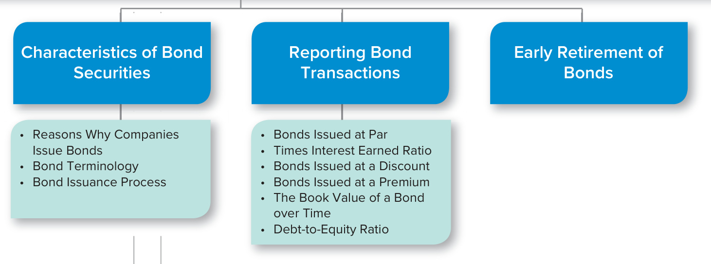
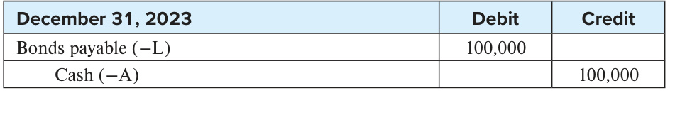

# Ch10 Reporting and Interpreting Bond Securities

In 1995, Amazon.com opened its virtual doors and began selling books online out of a garage in Bellevue, Washington. The company grew rapidly and went public two years later. Today, Amazon does much, much more than sell books. Amazon has over a million full-time and part-time employees worldwide and reported sales of $\Phi386$ billion in fiscal 2020. The technology and infrastructure necessary to support Amazon’s growth could not have been developed without billions of dollars of investment. One of the strengths of our economic system is the ability of companies to raise large amounts of money from investors. In this chapter, we will discuss how companies raise money from investors by issuing debt securities in the bond markets. The bond markets are where companies go to sell debt securities and where investors go to purchase and trade debt securities. The debt securities purchased and traded in the bond markets are generically referred to as “bonds” by the press and investors. The companies issuing debt securities in the bond markets, however, almost always refer to these securities as “notes” in their financial statements. You will see this distinction in the Real World Excerpts in this chapter. In the next chapter, Chapter 11, we will continue our discussion of a company’s capital structure by discussing money raised from shareholders through the issuance of stock in the equity markets.  

## LEARNING OBJECTIVES  

## After studying this chapter, you should be able to:  

10-1	 Describe the characteristics of bond securities. p. 525  

10-2	 Report bonds payable and interest expense for bond securities issued at par. p. 531   
10-3	 Compute and analyze the times interest earned ratio. p. 533   
10-4	 Report bonds payable and interest expense for bond securities issued at a discount. p. 534   
10-5	 Report bonds payable and interest expense for bond securities issued at a premium. p. 538   
10-6	 Compute and analyze the debt-to-equity ratio. p. 544   
10-7	 Report the early retirement of bond securities. p. 544   
10-8	 Explain how bond securities are reported on the statement of cash flows. p. 545  

Amazon ISSUING AND REPORTING BONDS  

  

Polaris/Newscom  

For Amazon to maintain its position as an industry leader, it must reinvest large amounts of money in its business. Last year alone, the company spent almost $\Phi40$ billion purchasing property, equipment, and software. Like most large companies, Amazon has raised capital to support its operations by both selling debt securities in the bond markets and issuing stock in the equity markets. Amazon has disclosed detailed information concerning its long-term debt in the note shown in Exhibit 10.1. Some of the terminology in this note will be new to you. After studying this chapter, you will understand each of the terms used in the note.  

## UNDERSTANDING THE BUSINESS  

As we learned in Chapter 9, a company’s capital structure is the mixture of debt and equity it uses to finance its operations. Almost all companies employ some debt in their capital structure, with large companies often borrowing billions of dollars. Borrowing such a large amount from an individual bank is often impractical, so companies issue bond securities (bonds) to the investing public instead. Companies are not the only entities that go to the bond markets to raise capital; governments around the world also issue bonds for the same reason.  

After bond securities have been issued, they are traded on established exchanges such as the New York Bond Exchange. The ability to sell a bond on the bond exchange is a significant advantage for investors because it provides them with liquidity, or the ability to convert their investments into cash. If you lend money directly to a corporation for 20 years, you must wait 20 years before you will get your principal back. In contrast,  

## EXHIBIT 10.  

Excerpts from Amazon’s Long-Term Debt Note  

## AMAZON  

REAL WORLD EXCERPT: Notes to Financial Statements  

<html><body><table><tr><td colspan="3">NOTE5-Debt</td><td rowspan="2">December 31, 2020</td></tr><tr><td></td><td>Maturities</td><td>December 31, 2019</td></tr><tr><td>2012Notes issuanceof $3.0billion</td><td>2022</td><td>1,250</td><td>1,250</td></tr><tr><td>2014 Notes issuance of $6.0 billion</td><td>2021-2044</td><td>5,000</td><td>5,000</td></tr><tr><td>2017Notes issuance of $17.0 billion</td><td>2023-2057</td><td>17,000</td><td>16,000</td></tr><tr><td>2020Notesissuanceof$10.0billion</td><td>2023-2060</td><td></td><td>10,000</td></tr><tr><td>Credit Facility</td><td></td><td>740</td><td>338</td></tr><tr><td colspan="2">Otherlong-term debt</td><td>830</td><td>586</td></tr><tr><td colspan="2">Total face value oflong-term debt</td><td>24,820</td><td>33,174</td></tr><tr><td colspan="2">Unamortizeddiscountandissuancecosts,net</td><td>(101)</td><td>(203)</td></tr><tr><td colspan="2">Less current portion of long-term debt</td><td>(1,305)</td><td>(1,155) $31,816</td></tr><tr><td colspan="2">Long-term debt reported on thebalance sheet</td><td>$23,414</td><td></td></tr></table></body></html>

Source: Amazon Corporation  

if you lend money by purchasing a bond in the bond markets, you can always sell it to another investor if you need cash before the bond matures.  

The liquidity associated with being able to trade debt securities in the bond markets offers an important advantage to corporations. Most investors are reluctant to lend money for long periods with no opportunity to receive cash prior to maturity. If they do so, they demand a higher interest rate to compensate for the illiquidity. By issuing more liquid debt that investors can easily buy and sell in the bond markets, companies are able to reduce the cost of long-term borrowing.  

This chapter begins with a basic overview of the characteristics of bonds before moving on to discuss accounting for bonds from issuance to maturity. The chapte closes with a discussion of the early retirement of bonds.  

  
ORGANIZATION OF THE CHAPTER  

## CHARACTERISTICS OF BOND SECURITIES  

## Reasons Why Companies Issue Bonds  

Companies issue both stock and bonds to raise capital. Several reasons why a company might choose to issue bonds instead of stock include:  

1.	Stockholders maintain control. Issuing bonds allows shareholders to maintain their current level of control. Bondholders do not vote or share in any dividend payments made to shareholders.  

2.	A portion of interest expense is tax deductible. The new tax law passed in late 2017 caps, but does not eliminate, the tax deductibility of interest associated with bonds. The tax deductibility of interest reduces the net cost of borrowing. In contrast, dividends are not tax deductible.  

3.	Issuing bonds can increase the return to shareholders. If a company can borrow at a low interest rate and invest in projects that earn a high rate of return it can increase the return to shareholders. For example, assume that Drone Delivery Company delivers critical medical supplies to search-and-rescue operations in remote locations. The company has shareholders’ equity of $\mathbb{S}100{,}000$ invested in various types of drone equipment and earns net income of $\mathbb{S}20{,}000$ per year. Management plans to purchase new drones that will cost $\mathbb{S}100{,}000$ and are expected to earn an additional $\mathbb{S}20{,}000$ per year. To fund the purchase of the new drones should management issue new stock or borrow the money at an interest rate of 8 percent? Assuming that Drone has not yet met its tax deductibility cap, the following analysis shows borrowing the money will increase the return to the company’s shareholders:  

## LEARNING OBJECTIVE 10-1  

characteristics of bond securities.  

<html><body><table><tr><td></td><td>Option 1</td><td>Option 2</td></tr><tr><td>IncomeStatementImpact:</td><td>Issue Stock</td><td>Borrow</td></tr><tr><td>Incomebeforeinterest&taxes</td><td>$ 40,000</td><td>$ 40,000</td></tr><tr><td>Interestexpense(8%x $100,000)</td><td></td><td>8,000</td></tr><tr><td>Incomebeforetaxes</td><td>40,000</td><td>32,000</td></tr><tr><td>Income taxes expense (21%)</td><td>8,400</td><td>6,720</td></tr><tr><td>Netincome</td><td>$ 31,600</td><td>$ 25,280</td></tr><tr><td>BalanceSheetImpact:</td><td></td><td></td></tr><tr><td>Stockholders'equity</td><td>$200,000</td><td>$100,000</td></tr><tr><td>Ratio Impact: Return on equity (net income/stockholders'equity)</td><td>15.80%</td><td>25.28%</td></tr></table></body></html>  

The above example illustrates why a company might choose to issue bonds instead of stock. So what are the potential disadvantages to issuing bonds? Here are two:  

1.	Risk of bankruptcy. Interest payments to bondholders are fixed charges that must be paid each period whether the corporation earns income or incurs a loss.  

2.	Negative impact on cash flows. Bonds must be repaid at a specified time in the future. Management must be able to generate sufficient cash to repay the debt or have the ability to refinance it.  

## Bond Terminology  

A bond usually requires the payment of interest over its life with repayment of principal on the maturity date. The bond principal is (1) the amount a company must pay to bondholders at the maturity date and (2) the amount used to compute the bond’s periodic cash interest payments. The bond principal also is called the face value, par value, or maturity value. All bonds have a face value. For most individual bonds, the face value is $\mathbb{S}1{,}000$ , but it can be any amount.  

  

A bond always specifies a coupon rate (also called the stated rate, contract rate, or nominal rate) and the frequency of periodic cash interest payments. These interest payments are sometimes called coupon payments. A bond’s coupon rate is always stated in annual terms. This means that if interest is paid annually, or once per year, the periodic cash interest payment is computed simply as the bond’s face value times its coupon rate. If the interest payment is made more frequently, computing the cash interest payment requires that the coupon rate be converted to a rate per interest period before it is multiplied by the bond’s face value. For example, the following table reflects how a bond’s cash interest payment is calculated when interest is paid annually, semiannually, and quarterly. The face value of the bond is $\mathbb{S}1{,}000$ and the coupon rate is 8 percent.  

<html><body><table><tr><td>Frequency of Interest Payment</td><td>Interest Rate per Interest Period</td><td>Cash Payment per Interest Period</td></tr><tr><td>Annual (once per year)</td><td>8%×1 =8%</td><td>$1,000×8%=$80</td></tr><tr><td>Semiannual (twiceperyear)</td><td>8%× 1/2 = 4%</td><td>$1,000×4%=$40</td></tr><tr><td>Quarterly (four times per year)</td><td>8% × 1/4 = 2%</td><td>$1,000 × 2% =$20</td></tr></table></body></html>  

As shown above, if the bond pays interest annually, bondholders will receive one interest payment of $\mathbb{S}80$ during the year. If the bond pays interest semiannually, bondholders will receive a $\mathbb{S40}$ interest payment every six months, for a total of $\mathbb{S}80$ a year. If the bond pays interest quarterly, bondholders will receive a $\mathbb{S}20$ interest payment every three months, for a total of $\mathbb{S}80$ a year. Note that in all cases, $\mathbb{S}80$ in interest is paid per year.  

Different types of bonds have different characteristics to appeal to investors with different risk and return preferences. A retired person may be willing to receive a lower interest rate in return for greater security. This type of investor might want a secured bond that pledges a specific asset as security in case the company cannot repay the bond. Another type of investor might be willing to accept a low interest rate and a bond that is not backed by a specific asset (an unsecured bond) in return for the opportunity to convert the bond into common stock at some point in the future. These types of bonds are called convertible bonds. Companies try to design bond features that are attractive to different groups of investors just as automobile manufacturers try  

  

## Bond Issuance Process  

When Amazon decides to issue securities in the bond markets, it prepares a bond indenture and a bond prospectus. The indenture is a legal document that specifies all the details of the bond offering. The prospectus is a regulatory document that is filed with the Securities and Exchange Commission. It also specifies all the details of the bond offering. These details include the maturity date, the rate of interest to be paid, the date of each interest payment, and other characteristics of the bonds, such as whether the bonds are callable or convertible. The prospectus also describes any covenants designed to protect bondholders. Typical covenants include limitations on new debt that the company might issue in the future, limitations on the payment of dividends to shareholders, or requirements that the company maintain certain minimum accounting ratios, such as the debt-to-equity ratio, discussed later in this chapter. Management prefers covenants that are not overly restrictive. Bondholders, however, prefer more restrictive covenants, which lessen the risk of the investment. Besides being described in the prospectus, bond covenants also are typically reported in the notes to the financial statements. Amazon’s note states:  

“We are not subject to any financial covenants under the Notes.”  

A company’s prospectus and annual report also describe to potential investors how the proceeds from the bond issuance will be used. Amazon states in its annual report that it used the money for general corporate purposes and the acquisition of Whole Foods Market.  

When a bond is issued to an investor, the investor receives a bond certificate. All bond certificates for the same bond issuance, whether an actual paper certificate or an electronic certificate, contain the same information. The certificates show the maturity date, coupon rate, interest dates, and other characteristics. An independent party, called the trustee, is usually appointed to represent the bondholders. A trustee’s duties are to ascertain whether the issuing company has fulfilled all provisions of the bond contract.  

## AMAZON  

REAL WORLD EXCERPT: Notes to Financial Statements  

  

## Bond Rating Agencies and Their Assessments of Default Risk  

Because of the large amount of money involved and the complexities associated with bonds, several agencies exist to evaluate the risk that a bond issuer will not be able to meet the requirements specified in the prospectus. This risk is called default risk. Standard & Poor’s, Moody’s, and Fitch use letter ratings to specify the quality of a bond. Higher-quality bonds have lower default risk, as shown in the table below. Many banks, mutual funds, and trusts are permitted to invest only in investment-grade bonds.  

<html><body><table><tr><td>Standard&Poor's</td><td>Moody's</td><td>Fitch</td><td>Description</td><td>Risk</td></tr><tr><td>AAA</td><td>Aaa</td><td>AAA</td><td>Highest investment grade</td><td rowspan="6">Low risk</td></tr><tr><td>AA</td><td>Aa</td><td>AA</td><td></td></tr><tr><td>A</td><td>A</td><td>A</td><td></td></tr><tr><td>BBB</td><td>Baa</td><td>BBB</td><td>Lowest investment grade</td></tr><tr><td>BB</td><td>Ba</td><td>BB</td><td>Highest junk bond grade</td></tr><tr><td>B</td><td>B</td><td>B</td><td></td></tr><tr><td>CCC</td><td>Caa</td><td>CCC</td><td></td></tr><tr><td>CC</td><td>Ca</td><td>CC</td><td></td></tr><tr><td>C D</td><td>C C</td><td>C DDD</td><td>In default or unrated High risk</td></tr></table></body></html>  

## REPORTING BOND TRANSACTIONS  

When Amazon issued its bonds, it specified two types of cash payments in the bond contract:  

1.	Principal. As noted in the previous section, this amount is usually a single payment that is made when the bonds are retired at the end of their life. It is also called the face value, par value, or maturity value. We will use the term face value throughout the rest of the chapter. 2.	Cash interest payments. These payments, which are sometimes referred to as coupon payments, represent an annuity and are computed by multiplying the bond’s face value times the coupon rate. The bond contract specifies whether the interest payments are made quarterly, semiannually, or annually. When you are asked to work problems in which interest payments are made more frequently than once a year, be sure and use the interest rate per period in your calculations. For example, consider a bond with the following characteristics:  

Face value: $\mathbb{S}1{,}000$   
Term: 10 years   
Coupon rate: $6\%$ (annual)   
Interest paid: Semiannually (twice a year)  

If you are asked to compute the cash interest payment for this bond, you will need to use an interest rate per period of 3 percent (the semiannual coupon rate). The calculation is  

<html><body><table><tr><td colspan="4">Cash Interest Payment Computation $1,000 × (6% x %2 = 3%) = $30</td></tr><tr><td rowspan="2"></td><td colspan="2"></td><td rowspan="2"></td></tr><tr><td>Facevalue</td><td colspan="2">Interestrateperperiod</td></tr></table></body></html>  

The issuing company does not determine the price at which the bonds sell. Instead, the market determines the price using the present value concepts introduced in the last chapter. To determine the present value of the bond, simply compute the present value of the principal (a single payment) and the present value of the interest payments (an annuity) and add the two amounts together.  

Investors demand a certain rate of return to compensate them for the risks related to a particular company’s bond offering. The demanded rate of return is called the market interest rate (also known as the yield or effective interest rate). Because the market rate is the interest rate investors demand on the day a bond is issued, it is the rate that should be used in computing the present value of a bond. The relationship between the market interest rate and the price of a bond is shown in the following figure. Note that as market interest rates rise the price of a bond falls and vice versa. This is because of the important role the market interest rate plays in determining the present value of a bond.  

  

On the day a company issues a bond, the market interest rate will be either the same as the coupon rate, greater than the coupon rate, or less than the coupon rate. The relationship between the market interest rate and the bond’s coupon rate determines whether the bond is issued at par, at a premium, or at a discount. When the market interest rate equals the coupon rate, the bond sells at par; when the market interest rate is greater than the coupon rate, the bond sells at a discount; and when the market interest rate is less than the coupon rate, the bond sells at a premium. This relationship can be shown graphically as follows:  

A bond’s coupon rate relative to the market interest rate determines   
if a bond is issued at a pre  
mium, a discount, or at par.  

  

In commonsense terms, when a bond’s coupon rate is less than the rate investors demand, investors will not buy the bond unless its price is reduced (i.e., a discount must be provided). When a bond’s coupon rate is more than investors demand, investors will be willing to pay a premium to buy the bond.  

It is important to keep in mind that regardless of whether a bond is issued at par, at a discount, or at a premium, investors always will earn the market rate of return. To illustrate, consider a company that issues three separate bonds on the same day. The bonds are the same except that one has a coupon rate of 8 percent, another a rate of 10 percent, and a third a rate of 12 percent. If the market rate of interest is 10 percent on the date all three bonds are issued, the first bond will be issued at a discount, the second at par, and the third at a premium. As a result, an investor who purchases any one of the bonds will earn the market interest rate of 10 percent. During the life of the bond, its market price will change as market interest rates change. While this information is reported in the financial press, it does not affect the company’s financial statements and the way its interest payments are accounted for from one period to the next. The interest rates that matter for accounting purposes are the bond’s coupon rate (which does not change over time) and the market interest rate on the day the bond is issued.  

## DATA ANALYTICS  

## Using Artificial Intelligence (AI) to Invest in Bonds  

Individuals who invest in bonds often spend considerable time and effort gathering and assessing vast amounts of market information (e.g., market interest rates, general economic conditions) as well as company-specific information. Using technology to expand and expedite this process would allow investors to make more informed, quicker decisions. Companies are stepping in to help. For example, AllianceBernstein, a global investment-management and research firm, has created Abbie, a virtual assistant based on artificial intelligence that helps investors make bond investing decisions. You can read more about Abbie’s abilities here: alliancebernstein.com/fixed-income/bonds/abbie.htm  

In the next section of this chapter, we will see how to account for bonds issued at par, at a discount, and at a premium.  

## P A U S E F O R F E E D B A C K  

There are a lot of definitions associated with accounting for bonds. Before we move on, it is important that you understand these new terms. Let’s review them.  

## S E L F - S T U D Y  Q U I Z  

Define the following:  

1.	 Market interest rate.   
2.	 Synonyms for market interest rate.   
3.	 Coupon rate.   
4.	 Synonyms for coupon rate.   
5.	 Bond discount.   
6.	 Bond premium.  

After you have completed your answers, check them below.  

S o l u t i o n s  t o S E L F - S T U DY  Q U I Z  

1. The market interest rate is the interest rate demanded by investors for a bond at the time the bond is issued. It is the rate investors use in their present value computations to determine how much they will pay for the bond.   
2. The market interest rate also is called a bond’s yield or its effective interest rate.   
3. Coupon rate is specified on the bond and is the rate used to compute the cash interest payment.   
4. Coupon rate is also called the stated rate, contract rate, or nominal rate.   
5. A bond that sells for less than its face value is sold at a discount. This occurs when the coupon rate is less than the market interest rate.   
6. A bond that sells for more than its face value is sold at a premium. This occurs when the coupon rate is greater than the market interest rate.  

## Bonds Issued at Par  

  

Bonds sell at their face (par) value when the market interest rate that investors demand is equal to the interest rate stated in the bond contract (the coupon rate). To illustrate, let’s assume that on January 1, 2022, Amazon issues bonds with a coupon rate of 10 percent and a face value of $\mathbb{s}100{,}000$ . On the date of issuance, investors are willing to pay Amazon $\mathbb{S}100{,}000$ in cash (which means that the bonds are being sold at par). The bonds start accruing interest on January 1, 2022, and will pay interest each June 30 and December 31. The bonds mature in two years on December 31, 2023.  

## LEARNING OBJECTIVE 10-2  

Report bonds payable and interest expense for bond securities issued at par.  

  

The amount of money a company receives when it sells bonds is the present value of the future cash flows associated with the bonds. In issuing the bonds described above, Amazon agrees to make two types of payments in the future: a single payment of $\mathbb{S}100{,}000$ when the bond matures in two years and an annuity of $\Phi5{,}000$ $[\mathbb{S}100,\!000\times(10\%\times\%$ year)] payable twice a year for two years. The 10 percent in the equation is the bond’s coupon rate. The bond payments can be shown graphically as follows:  

  

We use the bond’s market interest rate per period (in this case $10\%\div2=5\%$ ) to compute the bond’s present value. As we discussed in the previous chapter, the present value of the bond payments can be computed using the tables in Appendix E, a financial calculator, or Excel:  

<html><body><table><tr><td></td><td>PresentValue</td></tr><tr><td>Single principal payment at maturity: $100,000 × 0.82270</td><td>82,270</td></tr><tr><td>+Annuity cash interest payment:$5,000× 3.54595</td><td>17,730</td></tr><tr><td>= Issue price (proceeds from sale) of the bonds</td><td>$100.000</td></tr></table></body></html>  

From Table E.1: interest rate $(i)=5\%$ periods $(n)=4$ Factor $=0.82270$   
From Table E.2: interest rate $(i)=5\%$ periods $(n)=4$ Factor $=3.54595$   
Using Calculator: rate $(i)=5$ periods $(n)=4$ $\mathrm{pmt}=-\mathbb{8}5{,}000$ , $\operatorname{FV}=-\mathbb{5}100{,}000$   
Using Excel: Rate $(i)=0.05$ Nper $(n)=4$ $\mathrm{Pmt}=-\mathbb{8}5{,}000$ , $\operatorname{Fv}=-\mathbb{8}100{,}000$  

When the market rate of interest equals the coupon rate, the present value of the future cash flows associated with a bond always equals the bond’s face value amount. Remember a bond’s selling price is determined by the present value of its future cash flows, not the face value. On the date Amazon issues the bonds, it records a bond liability equal to the amount investors are willing to pay for the bonds:  

<html><body><table><tr><td>January 1,2022</td><td>Debit</td><td>Credit</td></tr><tr><td>Cash (+A)</td><td>100,000</td><td></td></tr><tr><td>Bonds payable (+L)</td><td></td><td>100,000</td></tr></table></body></html>  

  

Cash +100,000 Bonds payable +100,000  

Bonds may pay interest each month, each quarter, each half-year, or each year. In all cases, to determine the bond’s selling price, you would determine the present value of the bond’s cash flows using the number of interest periods in the bond’s life as well as the market interest rate per period.  

## P A U S E F O R F E E D B A C K  

Calculating the issuance price of a bond requires an investor to know the market rate of interest, the number of periods until the bond matures, and the bond’s face value. Let’s practice calculating the issuance price of a bond before we move on.  

## S E L F - S T U D Y  Q U I Z  

Assume that Amazon issues bonds with a face value of $\mathbb{S}500{,}000$ that will mature in two years. The bonds pay interest at the end of each year. On the date of issuance, the coupon rate and market rate of interest are the same: 8 percent. Compute the issuance price of the bonds.  

After you have completed your answer, check it below.  

  

## G U I D E D H E L P  1 0 - 1  

For additional step-by-step instruction, go to mhhe.com/libby_gh10-1.  

Related Homework: M10-2, E10-3, E10-4, P10-2, P10-3, P10-4  

## Reporting Interest Expense for Bonds Issued at Par  

Continuing with our example, the investors who bought the Amazon bonds did so with the expectation that they would earn interest over the life of the bond. Amazon will pay interest at 10 percent per year on the face value of the bonds each June 30 and December 31 until the  

$\mathbb{S}500,000\times0.85734=\mathbb{S}428,670$ (\$500,000 × 0.08) × 1.78326 = 71,330 = \$500,000  

bond’s maturity date. The amount of interest each period will be $\mathbb{S}5{,}000$ (\$100,000 × 0.10 × ½ year). The entry to record each interest payment is as follows:  

<html><body><table><tr><td>June 30 andDecember31ofeach year</td><td>Debit</td><td>Credit</td></tr><tr><td>Interestexpense (+E,-SE)</td><td>5,000</td><td></td></tr><tr><td>Cash (-A)</td><td></td><td>5,000</td></tr><tr><td>Assets Liabilities</td><td colspan="2">+ Stockholders' Equity</td></tr></table></body></html>

Cash −5,000 Interest expense $\left(+\mathrm{E}\right)$ −5,000  

Interest expense is reported on the income statement. Because interest is related to financing activities rather than operating activities, it is normally not included in operating expenses on the income statement. Instead, interest expense is typically reported just below “income from operations” on the income statement. A portion of the income statement for Amazon shows how interest expense is usually reported.  

AMAZON.COM, INC.CONSOLIDATED STATEMENTS OF OPERATIONS(in millions)  

## AMAZON  

REAL WORLD EXCERPT: Partial Income Statement  

<html><body><table><tr><td></td><td colspan="3">YearEndedDecember31</td></tr><tr><td></td><td>2018</td><td>2019</td><td>2020</td></tr><tr><td></td><td></td><td></td><td></td></tr><tr><td>Operatingincome</td><td>$12,421</td><td>$14,541</td><td>$22,899</td></tr><tr><td>Interestincome</td><td>440</td><td>832</td><td>555</td></tr><tr><td>Interestexpense</td><td>(1,417)</td><td>(1,600)</td><td>(1,647)</td></tr><tr><td>Otherincome(expense),net</td><td>(183)</td><td>203</td><td>2,371</td></tr><tr><td>Total non-operating income (expense)</td><td>(1,160)</td><td>(565)</td><td>1,279</td></tr><tr><td>Incomebeforeincometaxes</td><td>11,261</td><td>13,976</td><td>24,178</td></tr></table></body></html>

Source: Amazon.com, Inc.  

  
Mark HertzbergZUMA Wire/ Alamy  

Bond interest payment dates rarely coincide with the last day of a company’s fiscal year. Under the expense recognition principle introduced in Chapter 3, interest expense that has been incurred but not paid must be accrued at the end of the accounting period. If Amazon’s fiscal year ended on May 31 instead of December 31, the company would accrue interest for five months and report that amount as interest expense on its income statement and the same amount as interest payable on its balance sheet.  

Because interest payments are a legal obligation of the company, financial analysts want to be certain that the company is generating sufficient resources to meet its interest obligations. The times interest earned ratio is useful when making this assessment.  

## KEY RATIO ANALYSIS  

## Times Interest Earned ANALYTICAL QUESTION  

Is Amazon generating sufficient resources from its profit-making activities to meet its current interest obligations?  

## LEARNING OBJECTIVE 10-3  

Compute and analyze the times interest earned ratio.  

## RATIO AND COMPARISONS  

The times interest earned ratio is computed as follows:  

The 2020 ratio for Amazon (dollars in millions):  

$$
[\S21,\S31+\S1,\S47+\S2,\S63]/\S1,647=15.69
$$  

## LEARNING OBJECTIVE 10-4  

Report bonds payable and interest expense for bond securities issued at a discount.  

From Table E.1: interest rate $(i)=6\%$ periods $(n)=4$ Factor $=0.79209$   
From Table E.2: interest rate $(i)=6\%$ periods $(n)=4$ Factor $=3.46511$   
Using Calculator: rate $(i)=6$ periods $(n)=4$ $\mathrm{pmt}=-\mathbb{8}5{,}000$ , $\operatorname{FV}=-\mathbb{5}100{,}000$   
Using Excel: Rate $(i)=0.06$ Nper $(n)=4$ $\mathrm{Pmt}=-\mathbb{8}5{,}000$ , $\textstyle\operatorname{Fv}=-\mathbb{8}100{,}000$  

<html><body><table><tr><td colspan="3">Comparisons Over Time</td><td rowspan="2"></td><td colspan="2">Comparisons With Competitors</td></tr><tr><td colspan="3">Amazon</td><td>eBay</td><td>Walmart</td></tr><tr><td>2018</td><td>2019</td><td>2020</td><td>2020</td><td>2020</td></tr><tr><td>8.95</td><td>9.73</td><td>15.69</td><td>22.46</td><td>8.62</td></tr></table></body></html>  

## INTERPRETATIONS  

In General Analysts view a high times interest earned ratio more favorably than a low one. The ratio shows the amount of income earned for each dollar of interest expense. A high ratio indicates an extra margin of protection in case profitability deteriorates. Analysts are particularly interested in a company’s ability to meet its required interest payments because failure to do so could result in bankruptcy.  

Focus Company Analysis In 2020, profit-making activities for Amazon generated $\mathbb{S}15.69$ for each dollar of interest. The ratio has fluctuated over time from a low of $\mathbb{S}8.95$ in 2018 to a high of $\mathbb{S}15.69\$ in 2020. The large increase in 2020 is mainly due to a large jump in net income in 2020, eBay has an even higher ratio $822.46)$ while Walmart’s ratio is considerably lower $(\mathfrak{S}8.62)$ .  

A Few Cautions The times interest earned ratio is often misleading for new or rapidly growing companies, which tend to invest considerable resources to build their capacity for future operations. In such cases, the times interest earned ratio will reflect significant amounts of interest expense associated with borrowing to support expansion plans but not the future income that likely will come from expanding. For this reason, analysts should consider the company’s long-term strategy when interpreting this ratio.  

## Bonds Issued at a Discount  

  

Bonds sell at a discount when the market interest rate is greater than the coupon rate. To illustrate, let’s assume that the market interest rate is 12 percent on January 1, 2022, when Amazon sells its bonds (which have a face value of $\mathbb{S}100{,}000)$ ). The bonds mature in two years and have a coupon rate of 10 percent. Interest is payable twice a year on June 30 and December 31. Because the coupon rate (10 percent) is less than the market interest rate (12 percent) on the date of issuance, the bonds sell at a discount.  

To compute what investors will be willing to pay for the bonds given the difference in interest rates, we can use the tables in Appendix E. As in the previous example, the number of periods is four and the interest rate is the market interest rate per period; in this case, 6 percent ( $12\%\times$ ½ year). With this information, we can compute the cash issue price of the Amazon bonds as follows:  

Present Value  

Single principal payment at maturity: $\mathbb{\S}100,\!000\times0.79209$  

\$79,209  

$^+$ Annuity cash interest payment: $\mathbb{5}5.000\times3.46511$  

Issue (sale) price of bonds  

17,326   
\$96,535  

Thus, if the market interest rate is 12 percent on the date of issuance, investors will be willing to pay Amazon $\mathbb{S}96{,}535$ for the bonds. Some people refer to this price as 96.5, which indicates the selling price was 96.5 percent of the bond’s face value $(96.5=\mathbb{5}96,535\div\mathbb{5}100,000)$ .  

There are two acceptable methods for recording a bond that is sold at a discount; both result in the same dollar value being reported on a company’s balance sheet. The first method explicitly keeps track of the bond discount by incorporating it into the journal entries. The second method implicitly keeps track of the bond discount but does not incorporate it into the journal entries. Regardless of the method used, the dollar value reported on the balance sheet (the bond payable book value) is identical, as shown in the example below. Using both methods, the journal entries to record the sale of Amazon’s bonds issued at a discount are:  

WITH DISCOUNT ACCOUNT   
WITHOUT DISCOUNT ACCOUNT   

<html><body><table><tr><td colspan="2">January1,2022</td><td colspan="2">Debit</td><td>Credit</td><td colspan="2">January 1,2022</td><td></td><td colspan="2">Debit</td><td>Credit</td></tr><tr><td colspan="2">Cash (+A)</td><td colspan="2">96,535</td><td></td><td colspan="2">Cash (+A)</td><td></td><td colspan="2">96,535</td></tr><tr><td colspan="2">Bond discount (-L) Bonds payable book value: $96,535 ($100.000-$3.465)</td><td>3,465</td><td colspan="2">100,000</td><td>Bonds payable (+L)</td><td></td><td></td><td colspan="2">96,535</td></tr><tr><td colspan="4">Bonds payable (+L)</td><td></td><td></td><td></td><td colspan="3"></td></tr><tr><td colspan="4">Assets Liabilities +</td><td>Stockholders' Equity</td><td colspan="2">Assets</td><td colspan="3">Liabilities +</td><td>Stockholders' Equity</td></tr><tr><td colspan="4">Cash +96,535 Bonds payable +100,000 Bond discount -3,465</td><td>Cash +96,535</td><td colspan="2">Bonds payable Bondspayablebookvalue:$96,535</td><td colspan="3">+96,535</td></tr></table></body></html>  

Bond discount is sometimes referred to as a contra-liability account since it is debited when the bonds are issued and shown as a negative number under liabilities. This account is not separately disclosed on Amazon’s balance sheet. Instead, the balance sheet reports the bonds payable at their book value $(\mathbb{S}96,535)$ , which is the face value of the bonds less the unamortized discount $(\mathbb{5}100,000-\mathbb{5}3,465)$ ). Note that reporting bonds payable at their book value results in the same amount being reported on the balance sheet $^{(\Phi96,535)}$ , regardless of whether a bond discount is explicitly recorded in the journal entry.  

While Amazon received only $\mathbb{S}96{,}535$ when it sold the bonds, it must repay $\mathbb{S}100{,}000$ when the bonds mature. The $\mathbb{S}3{,}465$ of additional cash that Amazon must pay at maturity is incrementally reflected in interest expense and added to the book value of the liability each period over the life of the bond. This causes interest expense to reflect the market interest rate (also referred to as the effective interest rate), while the cash being paid to bondholders each period reflects the coupon rate. The accounting method used to record interest expense is referred to as the effective-interest amortization method.  

Throughout the remainder of Chapter 10 we use the bond discount account in all journal entries. We duplicate the text and show all journal entries without the bond discount account in the Chapter Supplement at the end of the chapter.  

## Reporting Interest Expense on Bonds Issued at a Discount Using Effective-Interest Amortization (with Discount Account)  

Under the effective-interest amortization method, a company computes interest expense in a given period by multiplying the bonds payable book value times the market rate of interest on the date of issuance. When bonds are issued at a discount, using a market interest rate that is greater than the coupon rate results in interest expense each period being greater than the cash  

a bond discount account is used, the dollar amounts reported on a company’s balance sheet are the same.  

owed for interest each period. The difference between interest expense and the cash owed for interest is the amount of the bond discount amortized during the period. This process can be summarized as follows:  

Recall that the cash owed for interest is computed by multiplying the bond’s face value $(\mathbb{S}100,000)$ by the coupon rate per period $\mathrm{~\,~}10\%\times\,\%$ year). Thus, Amazon owes bondholders cash of $\mathbb{S}5{,}000$ each June 30 and again on December 31. The first interest payment on the bonds is made on June 30, 2022. Following the three steps outlined above, interest expense and the amount of the bond discount amortized are:  

Step 1:	 Interest expense: $\mathfrak{G}96,535\times(0.12\times\%\mathtt{y e a r})=\underline{{55}},792$  

  
Effective-interest amortization causes these amounts to change each period because the book value of the bonds changes each period.  

Step 2:	 Cash owed for interest: $\lVert00,000\times(0.10\times1/2\,\mathsf{y e a r})=55,000$  

Step 3:	 Amortized amount: $\S5,792-\S5,000=\S792$  

The journal entry Amazon would enter is:  

<html><body><table><tr><td></td><td></td><td></td><td></td><td></td><td rowspan="8">these chang becau ofthe each</td></tr><tr><td>June30,2022</td><td></td><td></td><td>Debit</td><td>Credit</td></tr><tr><td>Interestexpense e（+E,-SE）</td><td></td><td></td><td>5,792</td><td></td></tr><tr><td>Bond discount (+L)</td><td></td><td></td><td></td><td>792</td></tr><tr><td>Cash (-A)</td><td></td><td></td><td></td><td>5,000</td></tr><tr><td>Assets</td><td></td><td colspan="4">Liabilities Stockholders'Equity +</td></tr><tr><td></td><td></td><td colspan="4">COLT 5.792</td></tr></table></body></html>  

Bonds payable book value: \$97,327 $(\Phi100,000-\Phi3,465+\Phi792)$  

Each period, the amortization of the bond discount increases the bond’s book value, bringing it closer to the $\mathbb{S}100{,}000$ that is due at maturity. The amortization of the bond discount can be thought of as the amount of interest earned by the bondholders in a given period that will be paid to them when the bonds mature. During the first interest period, Amazon’s bondholders earned interest of $\mathbb{S}5,792$ but received only $\mathbb{S}5{,}000$ in cash. The additional $\mathbb{S}792$ was added to the book value of the bond and will be paid to bondholders when the bonds mature and investors receive the full face value $(\mathbb{S}100,000)$ .  

Interest expense for the next interest period must reflect the change in the bonds payable book value. Amazon calculates interest expense for the second half of 2022 by multiplying the bonds payable book value on June 30, 2022 $(\Phi97,327)$ by the market rate of interest per period $[\mathfrak{G}97,327\times(12\%\times\%\mathrm{\;year})=\mathfrak{F}5,840]$ . With interest expense equal to $\Phi5{,}840$ and cash owed for interest equal to $\mathbb{S}5{,}000$ , the amount of the bond discount amortized on December 31, 2022, is $\mathbb{S}840\mathrm{.}$ :  

<html><body><table><tr><td>December31,2022</td><td>Debit</td><td>Credit</td></tr><tr><td>Interest expense (+E,- SE)</td><td>5,840</td><td></td></tr><tr><td>Bond discount (+L)</td><td></td><td>840</td></tr><tr><td>Cash (-A)</td><td></td><td>5,000</td></tr><tr><td>Assets Liabilities</td><td colspan="2">+ Stockholders'Equity</td></tr></table></body></html>

Cash −5,000 Bond discount $+840$ Interest expense $\left(+\mathrm{E}\right)$ −5,840 Bonds payable book value: $\mathbf{\mathbb{S}98,167}$ $(\mathbb{5}100,000-\mathbb{5}3,465+\mathbb{5}792+\mathbb{5}840)$  

Notice that interest expense for December 31, 2022, is more than interest expense for June 30, 2022. Amazon effectively borrowed more money during the second half of the year because of the unpaid interest accrued during the first half of the year. Because of the amortization of the bond discount, the book value of the bond and interest expense increase each year during the life of the bond. This process can be illustrated with the amortization schedule shown below:  

  

## Note that:  

•	 Cash owed for interest (column a) is computed by multiplying the bond’s face value by the coupon rate per period.  

•	 Interest expense (column b) is computed by multiplying the book value of the bonds at the beginning of the period (column d) by the market interest rate. Note that the book value of a bond at the beginning of a period is the book value of the bond at the end of the previous period. •	 Amortization of the bond discount is computed by subtracting cash owed for interest (column a) from interest expense (column b). •	 The new book value of the bonds (column d) is computed by adding amortization of the bond discount (column c) to the book value at the beginning of the period.  

In summary, under the effective-interest amortization method, interest expense changes each accounting period as the book value of the bonds changes each accounting period.  

## P A U S E F O R F E E D B A C K  

## S E L F - S T U D Y  Q U I Z  

Calculating the cash paid to investors each period and interest expense each period requires investors to know the coupon rate, the market rate of interest, and the carrying value of the bonds at the beginning of each period. Let’s practice calculating the cash paid to investors and interest expense before we move on.  

  

## G U I D E D  H E L P  1 0 - 2  

## LEARNING OBJECTIVE 10-5  

Report bonds payable and interest expense for bond securities issued at a premium.  

From Table E.1: interest rate $(i)=4\%$ periods $(n)=4$ Factor $=0.85480$   
From Table E.2: interest rate $(i)=4\%$ periods $(n)=4$ Factor $=3.62990$   
Using Calculator: rate $(i)=4$ periods $(n)=4$ $\mathrm{pmt}=-\mathbb{8}5{,}000$ , $\operatorname{FV}=-\mathbb{5}100{,}000$   
Using Excel: Rate $(i)=0.04$ Nper $(n)=4$ $\mathrm{Pmt}=-\mathbb{8}5{,}000$ , $\operatorname{Fv}=-\mathbb{8}100{,}000$  

Assume that Amazon issued bonds with a face value of $\mathbb{S}100{,}000$ and a coupon rate of 5 percent. The bonds mature in 10 years and pay interest annually. The bonds were sold when the annual market interest rate was 6 percent at a price of $\mathbb{S}92{,}640$ .  

1.	 What amount of cash was owed for interest at the end of the first year? 2.	 Using the effective-interest amortization method, what amount of interest expense would Amazon report at the end of the first year?  

After you have completed your answers, check them below.  

For additional step-by-step instruction on how to account for a bond issued at a discount, go to mhhe.com/libby_gh10-2.  

Related Homework: M10-6, E10-3, E10-4, E10-7, E10-8, E10-10, P10-3, P10-4, P10-6, P10-7  

## Bonds Issued at a Premium  

  

Recall that bonds sell at a discount when the market interest rate is greater than the bond’s coupon rate. When the market interest rate is less than the bond’s coupon rate, the bonds sell at a premium. To demonstrate how to account for bonds issued at a premium, let’s use the same Amazon example as before but assume that the market interest rate is now 8 percent while the coupon rate remains the same, at 10 percent. Like before, the bonds are issued on January 1, 2022; pay interest semiannually; and mature in two years.  

The present value of the bonds described above can be computed from the tables contained in Appendix E using the factor for four periods and an interest rate of 4 percent per period ( $8\%\times\%$ year):  

<html><body><table><tr><td>PresentValue</td></tr><tr><td>Single principal payment at maturity: $100,000 x 0.85480</td></tr><tr><td>85.480 + Annuity cash interest payment: $5,000 × 3.62990</td></tr><tr><td>18,150 Issue(sale)priceofbonds</td></tr><tr><td>$103.630</td></tr></table></body></html>  

1. Cash owed for interest: $\mathbb{S}100,000\times5\%=\mathbb{55,000}$   
2. Interest expense: $\mathbb{S}92,640\times6\%=\mathbb{55},558$  

Accounting for bonds issued at a premium is similar to accounting for bonds issued at a discount. Companies can explicitly use a bond premium account in their journal entries or implicitly keep track of the premium amount. We show both side-by-side below, and then, as we did with bond discounts, we present all subsequent journal entries using a bond premium account. We duplicate the text and show all journal entries without the bond premium account in the Chapter Supplement at the end of the chapter. The January 1, 2022, issuance of Amazon’s bonds at a premium would be recorded as follows:  

WITH PREMIUM ACCOUNT   
WITHOUT PREMIUM ACCOUNT   

<html><body><table><tr><td>January 1,2022</td><td>Debit</td><td></td><td>Credit</td><td></td><td></td><td></td><td>Debit</td><td>Credit</td></tr><tr><td>Cash (+A)</td><td>103,630</td><td></td><td></td><td>January1,2022 Cash (+A)</td><td></td><td></td><td>103,630</td><td></td></tr><tr><td>Bond premium (+L)</td><td></td><td></td><td>3,630</td><td>Bonds payable (+L)</td><td></td><td></td><td></td><td>103,630</td></tr><tr><td>Bonds payable (+L)</td><td></td><td></td><td>100,000 Equity</td><td></td><td></td><td></td><td></td><td></td></tr><tr><td colspan="5">Stockholders'</td><td></td><td colspan="3">Stockholders'</td></tr><tr><td>Assets Cash +103,630</td><td colspan="3">Liabilities 十 Bonds payable +100,000 Bond premium +3,630</td><td>Assets Cash +103,630</td><td colspan="3">Liabilities Bonds payable +103,630</td><td>+ Equity</td></tr><tr><td colspan="5">Bonds payable book value: $103,630 ($100,000 + $3,630)</td><td colspan="4">Bondspayablebookvalue:$103,630</td></tr></table></body></html>  

Bond premium is sometimes referred to as an adjunct-liability account. Like the bond discount account, the bond premium account is not separately disclosed on Amazon’s balance sheet. Instead, the balance sheet reports the bonds payable at their book value $(\mathbb{S}103,630)$ , which is their face value plus the unamortized premium $\left(\mathbb{S}100,000\,+\,\mathbb{S}3,630\right)$ . Note that reporting bonds payable at their book value results in the same amount being reported on the balance sheet $(\mathbb{S}103,630)$ regardless of whether a bond premium is explicitly recorded in the journal entry.  

## Reporting Interest Expense on Bonds Issued at a Premium Using Effective-Interest Amortization (with Premium Account)  

As with the discount account, the recorded premium of $\mathbb{S}3{,}630$ must be apportioned to each interest period so that interest expense reflects the market (effective) interest rate that Amazon is actually paying. To compute interest expense and the amount of the premium to be amortized each period, we follow the same three steps that we followed to compute these amounts when the bonds were issued at a discount:  

Regardless of whether a bond premium account is used, the dollar amounts reported on a company’s balance sheet are the same.  

  

## EXHIBIT 10.2  

The Change in the Book Value of a Bond Over Time  

Step 1:	 Interest expense: $\{9103,630\times(0.08\times\mathcal{V}_{2}\,\mathsf{y e a r})=\S4,145$  

Step 2:	 Cash owed for interest: $\lVert00,000\times(0.10\times\mathcal{V}_{2}\,\mathsf{y e a r})=\S5,000$  

Step 3:	 Amortized amount: $\S4,145-\S5,000=-\ S855$  

The journal entry Amazon would enter is:  

<html><body><table><tr><td>June 30,2022</td><td>Debit</td><td>Credit</td></tr><tr><td>Interestexpense (+E,-SE)</td><td>4,145</td><td></td></tr><tr><td>Bondp premium (-L)</td><td>855</td><td></td></tr><tr><td>Cash (-A)</td><td></td><td>5,000</td></tr></table></body></html>  

<html><body><table><tr><td>Assets 一</td><td>Liabilities</td><td>+</td><td>Stockholders'Equity</td></tr></table></body></html>  

Cash −5,000 Bond premium −855 Interest expense $\left(+\mathrm{E}\right)$ −4,145 Bonds payable book value: $\mathbf{\hat{s}102,775}$ $(\mathbb{5}100,000+\mathbb{5}3,630-\mathbb{5}855)$  

The basic difference between effective-interest amortization of a bond discount and a bond premium is that the amortization of a discount increases the book value of the liability and the amortization of a premium decreases it. Both serve the same purpose: to bring the liability to the bond’s face value at the maturity date. This is illustrated in Exhibit 10.2.  

  

  

Regardless of whether a company issues bonds at par, at a discount, or at a premium, the company will enter the same journal entry when it retires the bonds at maturity. For our Amazon example, the journal entry would be  

  

Cash −100,000 Bonds payable −100,000  

Calculating the cash paid to investors each period and interest expense each period requires investors to know the coupon rate, the market rate of interest, and the carrying value of the bonds at the beginning of each period. Let’s practice calculating the cash paid to investors and interest expense before we move on.  

Assume that Amazon issued bonds with a face value of $\mathbb{S}100{,}000$ and a coupon rate of 9 percent. The bonds mature in 10 years and pay interest annually. The bonds were sold when the annual market interest rate was 8 percent at a price of $^{\S106,710}$ .  

1.	 What amount of cash was owed for interest at the end of the first year? 2.	 Using the effective-interest amortization method, what amount of interest expense would Amazon report at the end of the first year?  

Answers are on the next page.  

For additional step-by-step instruction on how to account for a bond issued at a premium, go to mhhe .com/libby_gh10-3.  

Related Homework: M10-9, E10-3, E10-4, E10-13, E10-15, E10-16, P10-3, P10-4, P10-9, P10-10, P10-11  

## FINANCIAL ANALYSIS  

## Zero Coupon Bonds  

So far, we have discussed bonds that pay interest over their life and have a principal payment due at the end of their life, which are the most common type of bond issued by companies to raise capital. For a number of reasons, companies may choose to issue bonds that have unique features. The concepts you have learned will help you understand these bonds. For example, a company might issue a bond that does not pay periodic cash interest. These bonds are typically called zero coupon bonds. Why would an investor buy a bond that did not pay interest? Our discussion of bond discounts has probably given you a good idea of the answer. The coupon interest rate on a bond can be virtually any amount (including zero) and investors will price the bond so that they earn the market rate of interest. A bond with a zero coupon interest rate is simply a deeply discounted bond that will sell for substantially less than the amount due at maturity (its face value).  

Let’s use the $\mathbb{S}100{,}000$ Amazon bond to illustrate a zero coupon rate. Assume that the market interest rate is 10 percent and the bond does not make any cash interest payments to bondholders over its life. The bond matures in five years. The selling price of the bond is the present value of the maturity amount because no other cash payments will be made over the life of the bond. We can compute the present value with the tables contained in Appendix E, using the factor for five periods and an interest rate of 10 percent:  

Present Value  

From Table E.1: interest rate $(i)=10\%$ periods $(n)=5$ Factor $=0.62092$   
Using Calculator: rate $(i)=10$ periods $(n)=5$ $\mathrm{pmt}=-80$ , $\operatorname{FV}=-\mathbb{5}100{,}000$   
Using Excel: Rate $(i)=0.10$ Nper $(n)=5$ $\mathrm{\mathbf{P}m t}=-\mathbb{S}0,$ , Fv = −\$100,000  

Single principal payment at maturity: $\mathbb{5}100,\!000\times0.62092$  

Accounting for a zero coupon bond is no different from accounting for other bonds issued at a discount. However, the amount of the discount is much larger. For example, the bond discount in the above example is $\mathbb{S}37{,}908$ $(\mathbb{S}100,\!000-\mathbb{S}62,\!092)$ . Over the five-year life of the bond, this amount will decrease until it is zero at the end of the bond’s life.  

While zero coupon bonds do not pay cash interest, they have been priced to provide investors with a market rate of interest. Notice that the bonds payable book value in our example $(\mathbb{5}62,092)$ is much lower than the maturity value $(\mathbb{S}100,000)$ . This is because the price investors are willing to pay has been discounted such that when they receive the $\mathbb{S}100{,}000$ at the end of the five years, they will have earned an interest rate of 10 percent, the market rate of interest on the issue date.  

## Accounting for Issuance Costs  

For the sake of simplicity, the examples in this chapter assume that the company issuing bonds does not incur any issuance costs. This is not typically the case in the business world. When companies issue bonds, they almost always hire another company (or companies) to help them with the offering. These companies are called underwriters, and they charge a fee. Accounting for this fee is quite simple. The amount of the fee is deducted from the proceeds of the bond issuance. If after deducting fees the total amount received is less than the face value of the bonds, the bonds are issued at a discount. If after deducting fees the amount received is greater than the face value of the bonds, the bonds are issued at a premium.  

## Reporting Interest Expense Using Straight-Line Amortization  

GAAP requires that companies use the effective-interest method to amortize bond discounts and bond premiums. However, GAAP permits companies to use straight-line amortization when results do not materially differ from results computed using the effective-interest method. With straight-line amortization, a company simply takes the total amount of the discount or the premium at issuance, divides it by the number of periods in the bond’s life, and amortizes that amount each period. For example, the total amount of the premium in the Amazon example above was $\mathbb{S}3{,}630$ and the bonds paid interest over four periods. Using straight-line amortization, Amazon would amortize $\mathbb{S}907.50$ each period over the life of the bonds. The amortization schedule would reflect:  

  

Other  than  the  amounts,  the  journal  entries  using  straight-line  amortization  and effective-interest amortization are the same. Because straight-line amortization is only permitted by GAAP under specific circumstances, we focus on the effective-interest method in this chapter.  

## LEARNING OBJECTIVE 10-6  

Compute and analyze the debt-to-equity ratio.  

## Debt-to-Equity  

## ANALYTICAL QUESTION  

What is the relationship between the amount of capital provided by owners and the amount of capital provided by creditors?  

## RATIO AND COMPARISONS  

The debt-to-equity ratio is computed as follows:  

Debt-to-Equity $=$ Total Liabilities $\div$ Total Stockholders’ Equity  

The 2020 ratio for Amazon is  

$$
\mathbb{S}227,791\div\mathbb{S}93,404=2.44
$$  

<html><body><table><tr><td colspan="3">Comparisons OverTime</td><td rowspan="2"></td><td colspan="2">Comparisons With Competitors</td></tr><tr><td colspan="3">Amazon</td><td>eBay</td><td>Walmart</td></tr><tr><td>2018</td><td>2019</td><td>2020</td><td>2020</td><td>2020</td></tr><tr><td>2.73</td><td>2.63</td><td>2.44</td><td>4.42</td><td>1.90</td></tr></table></body></html>  

## INTERPRETATIONS  

In  General A  high  ratio  indicates  that  a  company  relies  heavily  on  debt  financing  relative  to equity financing. Heavy reliance on debt financing increases the risk that a company may not be able to meet its contractual financial obligations (e.g., principal and interest payments) during a business downturn.  

Focus Company Analysis The debt-to-equity ratio for Amazon has remained relatively constant over the past three years. The 2020 ratio reflects that for each dollar of stockholders’ equity, Amazon has $\mathbb{S}2.44$ of liabilities. eBay’s debt-to-equity ratio (4.42) is higher than Amazon’s ratio while Walmart’s debt-to-equity ratio. is lower (1.90).  

A Few Cautions The debt-to-equity ratio tells only part of the story with respect to the risks associated with a company’s debt. It does not help the analyst understand whether the company’s operations can support its debt. As a result, most analysts would evaluate the debt-to-equity ratio within the context of the amount of cash the company can generate from operating activities.  

## EARLY RETIREMENT OF BONDS  

Report the early retirement of bond securities.  

Bonds often are issued for long periods, such as 20 or 30 years. Some bonds have a call feature that allows the issuing company to call (retire) the bonds early. A call feature most often requires the issuing company to pay investors an amount greater than the bond’s face value to retire the bonds before their maturity date. The amount often is stated as a percentage of the bond’s face value and is described in the bond indenture or bond prospectus.  

Assume that several years ago, Amazon issued callable bonds with a face value of $\mathbb{S}100{,}000$ . The bonds were issued at a premium, and the call feature allows Amazon to retire the bonds early by paying bondholders 102 percent of face value. If Amazon decides to call the bonds early, it will pay bondholders $^{\S102,000}$ cash and remove the bond liability from its balance sheet. Any difference between the cash paid to retire the bonds and the book value of the bond liability is recorded as a gain or loss on the income statement. For example, if the book value of Amazon’s bonds was $\mathbb{S}101{,}000$ at the time the bonds were retired, Amazon would recognize a loss on early retirement of $\mathbb{S}1{,}000$ on its income statement; Amazon had to pay bondholders $^{\mathbb{S}102,000}$ cash to remove a $\mathbb{S}101{,}000$ liability from its balance sheet. The journal entry would be:  

WITH PREMIUM ACCOUNT   
WITHOUT PREMIUM ACCOUNT   

<html><body><table><tr><td>Datebonds areretired</td><td>Debit</td><td>Credit</td><td colspan="3">Datebondsareretired</td><td>Debit</td><td>Credit</td></tr><tr><td>Bonds payable (-L)</td><td>100,000</td><td></td><td>Bonds payable (-L)</td><td></td><td></td><td>101,000</td><td></td></tr><tr><td>Bond premium (-L)</td><td>1,000</td><td></td><td>Loss on bond call (+E,-SE)</td><td></td><td></td><td>1,000</td><td></td></tr><tr><td>Loss on bond call (+E,-SE)</td><td>1,000</td><td></td><td>Cash (-A)</td><td></td><td></td><td></td><td>102,000</td></tr><tr><td>Cash (-A)</td><td></td><td>102,000</td><td></td><td></td><td></td><td></td><td></td></tr></table></body></html>  

<html><body><table><tr><td colspan="4"></td><td colspan="4">Stockholders</td><td colspan="2"></td><td colspan="2">Stockholders</td></tr><tr><td rowspan="2">Assets</td><td rowspan="2"></td><td colspan="2">Liabilities</td><td rowspan="2">+ Equity</td><td rowspan="2">Assets</td><td rowspan="2"></td><td colspan="2">Liabilities</td><td rowspan="2"></td><td rowspan="2">+</td><td rowspan="2">Equity</td></tr><tr><td>Losson</td><td>-1,000</td></tr><tr><td>Cash -102,000</td><td>Bonds payable Bond premium</td><td></td><td>-100,000 -1,000</td><td>bondcall (+E)</td><td>Cash -102,000</td><td>Bonds payable</td><td></td><td>101,000</td><td></td><td>Loss on bond call (+E) -1,000</td></tr></table></body></html>  

In some cases, a company may elect to retire bonds early by purchasing them on the open market, just as an investor would. This approach is necessary when the bonds do not have a call feature. Even when the bonds have a call feature, retiring them by purchasing them on the open market is attractive when the cost of doing so is less than the cost of paying the call premium. What could cause the price of a bond to fall? The most common cause is a rise in interest rates. As you may have noticed during our discussion of present values, bond prices move in the opposite direction of interest rates. If interest rates go up, bond prices fall, and vice versa. If interest rates go up enough, a company may decide that it makes good economic sense to retire its bonds early by purchasing them on the open market regardless of whether the bonds have a call feature.  

  

## F OC US  O N  CAS H  F LOW S  

## Bond Transactions and the Statement of Cash Flows  

The cash a company receives when it issues bonds is reported as a cash inflow from financing activities on the statement of cash flows. The repayment of principal is reported as a cash outflow from financing activities. Many students are surprised to learn that the payment of interest is not reported as a financing activity on the statement of cash flows. Interest expense is reported on the income statement and is considered a cost of doing business during each accounting period. As a result, and as discussed further in Chapter 12, GAAP requires that cash paid for interest payments be reported as an operating activity on the statement of cash flows.  

## LEARNING OBJECTIVE 10-8  

Explain how bond securities are reported on the statement of cash flows.  

<html><body><table><tr><td>Transaction</td><td>WhereReportedonCashFlowStatement</td></tr><tr><td>Cashpaidforinterest</td><td>OperatingActivities</td></tr><tr><td>Cashreceivedwhenbondsareissued</td><td>+ Financing Activities</td></tr><tr><td>Cash paid when bonds mature or are retired</td><td>Financing Activities</td></tr></table></body></html>  

Focus Company Analysis Below is an excerpt from Amazon’s cash flow statement showing its financing activities. The excerpt reflects the cash inflows and outflows Amazon experienced during the period associated with issuing and paying back debt. Analysts are particularly interested in the financing activities section of the statement of cash flows because it provides important insights about the capital structure of a company.  

AMAZON REAL WORLD EXCERPT: Statement of Cash Flows  

## D E M O N S T R A T I O N C A S E  

## LEARNING OBJECTIVE $\mathbb{O}\!\!\!\operatorname{cu}$  

## AMAZON.COM, INC. CONSOLIDATED STATEMENTS OF CASH FLOWS (in millions)  

Report bonds payable and interest expense for bond securities issued at a discount.  

<html><body><table><tr><td rowspan="2"></td><td colspan="3">YearEndedDecember31,</td></tr><tr><td>2018</td><td>2019</td><td>2020</td></tr><tr><td>FINANCINGACTIVITIES:</td><td></td><td></td><td></td></tr><tr><td>Proceedsfromshort-termdebt,andother</td><td>$ 886</td><td>$ 1,402</td><td>$ 6,796</td></tr><tr><td>Repaymentsofshort-termdebt,andother</td><td>(813)</td><td>(1,518)</td><td>(6,177)</td></tr><tr><td>Proceedsfromlong-term debt</td><td>182</td><td>871</td><td>10,525</td></tr><tr><td>Repaymentsoflong-termdebt</td><td>(155)</td><td>(1,166)</td><td>(1,553)</td></tr><tr><td>Principal repayments of finance leases</td><td>(7,449)</td><td>(9,628)</td><td>(10,642)</td></tr><tr><td>Principalrepaymentsoffinancing obligations</td><td>(337)</td><td>(27)</td><td>(53)</td></tr><tr><td>Net cash provided by (used in) financing activities</td><td>(7,686)</td><td>(10,066)</td><td>(1,104)</td></tr></table></body></html>

MariaX/Shutterstock  

( $T\!\!r y$ to answer the questions below before reading the suggested solution that follows.) To raise funds to build a new plant, the managers of Zeus Company decide to issue bonds. The bond prospectus states the following:  

Face value of the bonds: $\mathbb{S}100{,}000$ .   
Date of issue: January 1, 2022; due in 10 years.   
Coupon rate: 12 percent per year, payable semiannually on June 30 and December 31.  

The bonds were sold on January 1, 2022, at 106 percent of face value. Assume the annual market rate of interest on the date of issue was 11 percent.  

## Required:  

1.	 How much cash did Zeus Company receive from the sale of the bonds? Show computations.   
2.	 Were the bonds issued at a discount or a premium? What was the amount of the discount or premium?   
3.	 How much cash does Zeus owe bondholders for interest on June 30, 2022?   
4.	 Assume Zeus uses the effective-interest amortization method. What amount of interest expense will   
Zeus recognize on June 30, 2022?  

## SUGGESTED SOLUTION  

1.	 Sale price of the bonds: $\begin{array}{r}{\mathbb{S}100,\!000\times1.06=\mathbb{\Phi}106,\!000.}\end{array}$ .   
2.	 The bonds were issued at a premium. The amount of the premium was $\mathbb{8}6,000\left(\mathbb{5}106,\!000-\mathbb{5}100,\!000\right)$ .   
3.	 Cash paid for interest on June 30, 2022: $\begin{array}{r}{\mathbb{S}100,000\times(12\%\times\%\mathrm{~year})=\mathbb{S}6,000.}\end{array}$ .   
4.	 Interest expense recognized on June 30, 2022: $\begin{array}{r}{\mathbb{S}106,\!000\times(11\%\times\%\ \mathrm{year})=\mathbb{S}5,\!830.}\end{array}$ .  

## Chapter Supplement  

Accounting for Bonds without a Discount Account or Premium Account  

In this chapter supplement we duplicate the text from Chapter 10 but show all journal entries without the bond discount or bond premium accounts.  

Bonds Issued at a Discount  

Bonds sell at a discount when the market interest rate is greater than the coupon rate. To illustrate, let’s assume that the market interest rate is 12 percent on January 1, 2022, when Amazon sells its bonds (which have a face value of $\mathbb{S}100{,}000)$ ). The bonds mature in two years and have a coupon rate of 10 percent. Interest is payable twice a year on June 30 and December 31. Because the coupon rate (10 percent) is less than the market interest rate (12 percent) on the date of issuance, the bonds sell at a discount.  

To compute what investors will be willing to pay for the bonds given the difference in interest rates, we can use the tables in Appendix E. The number of periods is four and the interest rate is the market interest rate per period; in this case, 6 percent ( $12\%\times\%$ year). With this information, we can compute the cash issue price of the Amazon bonds as follows:  

<html><body><table><tr><td>PresentValue</td></tr><tr><td>Single principal payment at maturity: $100,000 × 0.79209</td></tr><tr><td>$79,209</td></tr><tr><td>+ Annuity cash interest payment: $5,000 × 3.46511</td></tr><tr><td>17,326 Issue(sale)price ofbonds $96,535</td></tr></table></body></html>  

Thus, if the market interest rate is 12 percent on the date of issuance, investors will be willing to pay Amazon $^{\mathbb{S}96,535}$ for the bonds. Some people refer to this price as 96.5, which indicates the selling price was $96.5\$ percent of the bond’s face value $96.5=\mathbb{5}96,535\div\mathbb{5}100,000)$ .  

From Table E.1: interest rate $(i)=6\%$ periods $(n)=4$ Factor $=0.79209$   
From Table E.2: interest rate $(i)=6\%$ periods $(n)=4$ Factor $=3.46511$   
Using Calculator: rate $(i)=6$ periods $(n)=4$ $\mathrm{pmt}=-\mathbb{8}5{,}000$ , $\operatorname{FV}=-\mathbb{5}100{,}000$   
Using Excel: Rate $(i)=0.06$ Nper $(n)=4$ $\mathrm{Pmt}=-\mathbb{8}5{,}000$ , $\operatorname{Fv}=-\mathbb{8}100{,}000$  

There are two acceptable methods for recording a bond that is sold at a discount; both result in the same dollar value being reported on a company’s balance sheet. The first method explicitly keeps track of the bond discount by incorporating it into the journal entries. The second method implicitly keeps track of the bond discount but does not incorporate it into the journal entries. Regardless of the method used, the dollar value reported on the balance sheet (the bond payable book value) is identical, as shown in the example below. Using both methods, the journal entries to record the sale of Amazon’s bonds issued at a discount are:  

a bond discount account is used, the dollar amounts reported on a company’s balance sheet are the same.  

WITH DISCOUNT ACCOUNT   
WITHOUT DISCOUNT ACCOUNT   

<html><body><table><tr><td colspan="3">January1,2022</td><td>Debit</td><td>Credit</td><td colspan="4">January1,2022</td><td>Debit</td><td>Credit</td></tr><tr><td colspan="3">Cash (+A)</td><td>96,535</td><td></td><td colspan="3">Cash (+A)</td><td></td><td>96,535</td><td></td></tr><tr><td colspan="3">Bond discount (-L)</td><td>3,465</td><td></td><td>Bonds payable (+L)</td><td></td><td></td><td></td><td></td><td>96,535</td></tr><tr><td colspan="3">Bonds payable (+L)</td><td></td><td>100,000 Equity</td><td></td><td></td><td></td><td colspan="3"></td></tr><tr><td colspan="11"></td></tr><tr><td colspan="2">Assets</td><td colspan="3">Liabilities +</td><td>Stockholders' Assets</td><td></td><td>Liabilities</td><td colspan="2">+</td><td>Stockholders Equity</td></tr><tr><td colspan="2">Cash +96,535 Bonds payable Bond discount Bondspayablebookvalue:$96,535 ($100,000 -$3,465)</td><td colspan="3">+100,000 -3,465</td><td>Cash +96,535</td><td colspan="2">Bonds payable Bondspayablebookvalue:$96,535</td><td colspan="3">+96,535</td></tr></table></body></html>  

Bond discount is sometimes referred to as a contra-liability account since it is debited when the bonds are issued and shown as a negative number under liabilities. This account is not separately disclosed on Amazon’s balance sheet. Instead, the balance sheet reports the bonds payable at their book value $(\mathbb{S}96,535)$ , which is the face value of the bonds less the unamortized discount $(\mathbb{5}100,000-\mathbb{5}3,465)$ . Note that reporting bonds payable at their book value results in the same amount being reported on the balance sheet $(\Phi96,535)$ , regardless of whether a bond discount is explicitly recorded in the journal entry.  

While Amazon received only $\mathbb{S}96{,}535$ when it sold the bonds, it must repay $\mathbb{S}100{,}000$ when the bonds mature. The $\mathbb{S}3{,}465$ of additional cash that Amazon must pay at maturity is incrementally reflected in interest expense and added to the book value of the liability each period over the life of the bond. This causes interest expense to reflect the market interest rate (also referred to as the effective interest rate), while the cash being paid to bondholders each period reflects the coupon rate. The accounting method used to record interest expense is referred to as the effective-interest amortization method.  

## Reporting Interest Expense on Bonds Issued at a Discount Using  

Effective-Interest Amortization (without Discount Account)  

Under the effective-interest amortization method, a company computes interest expense in a given period by multiplying the bonds payable book value times the market rate of interest on the date of issuance. When bonds are issued at a discount, using a market interest rate that is greater than the coupon rate results in interest expense each period being greater than the cash owed for interest each period. The difference between interest expense and the cash owed for interest is the amount of the bond discount amortized during the period. This process can be summarized as follows:  

  

Recall that the cash owed for interest is computed by multiplying the bond’s face value $^{\leftmoon}\leftmoon100,000\right)$ by the coupon rate per period $10\%\times\%$ year). Thus, Amazon owes bondholders cash of $\Phi5{,}000$ each June 30 and again on December 31. The first interest payment on the bonds is made on June 30, 2022. Following the three steps outlined above, interest expense and the amount of the bond discount amortized are:  

## Step 1:	 Interest expense: $\mathfrak{G}96,535\times(0.12\times\%\mathtt{y e a r})=\underline{{55}},792$  

Step 2:	 Cash owed for interest: $\lVert00,000\times(0.10\times1/2\,\mathsf{y e a r})=55,000$  

Step 3:	 Amortized amount: $\S5,792-\S5,000=\S792$  

The journal entry Amazon would enter is:  

Effective-interest amortization   

<html><body><table><tr><td></td><td></td><td colspan="4"></td><td rowspan="3">causestheseamounts changeeachperiodbe thebookvalueoftheb</td></tr><tr><td>June30,2022</td><td></td><td></td><td>Debit</td><td></td><td>Credit</td></tr><tr><td>Interest expense (+E,-SE)</td><td></td><td></td><td></td><td>5,792</td><td></td></tr><tr><td>Bonds payable (+L)</td><td></td><td></td><td></td><td></td><td>792</td><td rowspan="6">changeseachperiod.</td></tr><tr><td>Cash(-A)</td><td></td><td></td><td></td><td></td><td>5,000</td></tr><tr><td>Assets</td><td></td><td>Liabilities +</td><td></td><td></td><td></td></tr><tr><td>Cash</td><td>-5,000</td><td>Bondspayable +792</td><td>Interestexpense</td><td>Equity (+E)</td><td>-5,792</td></tr></table></body></html>  

Bonds payable book value: \$97,327 $(\mathbb{5}96,535+\mathbb{5}792)$  

Each period, the amortization of the bond discount increases the bond’s book value, bringing it closer to the $\mathbb{S}100{,}000$ that is due at maturity. The amortization of the bond discount can be thought of as the amount of interest earned by the bondholders in a given period that will be paid to them when the bonds mature. During the first interest period, Amazon’s bondholders earned interest of $\mathbb{S}5,792$ but received only $\mathbb{S}{\downarrow}\mathrm{,}000$ in cash. The additional $\mathbb{S}792$ was added to the book value of the bond and will be paid to bondholders when the bonds mature and investors receive the full face value $\left.\dot{\mathbb{S}}100,000\right)$ .  

Interest expense for the next interest period must reflect the change in the bonds payable book value. Amazon calculates interest expense for the second half of 2022 by multiplying the bonds payable book value on June 30, 2022 $^{(\mathbb{S}97,327)}$ by the market rate of interest per period $[\mathbb{S}97,327\times(12\%\times\%$ year) = $^{\S5,840]}$ . With interest expense equal to $\Phi5{,}840$ and cash owed for interest equal to $\mathbb{S}5{,}000$ , the amount of the bond discount amortized on December 31, 2022, is $\mathbb{S}840$ :  

<html><body><table><tr><td>December31,2022</td><td>Debit</td><td>Credit</td></tr><tr><td>Intereste expense (+E,-SE)</td><td>5,840</td><td></td></tr><tr><td>Bonds payable (+L)</td><td></td><td>840</td></tr><tr><td>Cash (-A)</td><td></td><td>5,000</td></tr></table></body></html>  

<html><body><table><tr><td>Assets</td><td>Liabilities</td><td>+</td><td>Stockholders'Equity</td></tr></table></body></html>

Cash −5,000 Bonds payable $+840$ Interest expense $\left(+\mathrm{E}\right)$ −5,840   
Bonds payable book value: $\mathbf{\mathbb{S}98,167}$ $(\mathbb{S}96,535+\mathbb{S}792+\mathbb{S}840)$  

Notice that interest expense for December 31, 2022, is more than interest expense for June 30, 2022. Amazon effectively borrowed more money during the second half of the year because of the unpaid interest accrued during the first half of the year. Because of the amortization of the bond discount, the book value of the bond and interest expense increase each year during the life of the bond. This process can be illustrated with the amortization schedule shown below:  

  

## Note that:  

•	 Cash owed for interest (column a) is computed by multiplying the bond’s face value by the coupon rate per period.   
•	 Interest expense (column b) is computed by multiplying the book value of the bonds at the beginning of the period (column d) by the market interest rate. Note that the book value of a bond at the begin ning of a period is the book value of the bond at the end of the previous period.   
•	 Amortization of the bond discount is computed by subtracting cash owed for interest (column a) from interest expense (column b).   
•	 The new book value of the bonds (column d) is computed by adding amortization of the bond discount (column c) to the book value at the beginning of the period.  

In summary, under the effective-interest amortization method, interest expense changes each accounting period as the book value of the bonds changes each accounting period.  

## P A U S E  F O R  F E E D B A C K  

Calculating the cash paid to investors each period and interest expense each period requires investors to know the coupon rate, the market rate of interest, and the carrying value of the bonds at the beginning of each period. Let’s practice calculating the cash paid to investors and interest expense before we move on.  

## S E L F - S T U D Y  Q U I Z  

Assume that Amazon issued bonds with a face value of $\mathbb{S}100{,}000$ and a coupon rate of 5 percent. The bonds mature in 10 years and pay interest annually. The bonds were sold when the annual market interest rate was 6 percent at a price of $\mathbb{S}92{,}640$ .  

1.	 What amount of cash was owed for interest at the end of the first year? 2.	 Using the effective-interest amortization method, what amount of interest expense would Amazon report at the end of the first year?  

After you have completed your answers, check them below.  

  

## G U I D E D H E L P  1 0 - 4  

For additional step-by-step instruction on how to account for a bond issued at a discount, go to mhhe .com/libby_gh10-4.  

Related Homework: M10-5, E10-3, E10-4, E10-7, E10-9, E10-10, P10-3, P10-4, P10-6, P10-8  

## LEARNING OBJECTIVE 10-5  

Report bonds payable and interest expense for bond securities issued at a premium.  

From Table E.1: interest rate $(i)=4\%$ periods $(n)=4$ Factor $=0.85480$   
From Table E.2: interest rate $(i)=4\%$ periods $(n)=4$ Factor $=3.62990$   
Using Calculator: rate $(i)=4$ periods $(n)=4$ $\mathrm{pmt}=-\mathbb{8}5{,}000$ , $\operatorname{FV}=-\mathbb{5}100{,}000$   
Using Excel: Rate $(i)=0.04$ Nper $(n)=4$ $\mathrm{Pmt}=-\mathbb{8}5{,}000$ , Fv = −\$100,000  

## Bonds Issued at a Premium  

  

Recall that bonds sell at a discount when the market interest rate is greater than the bond’s coupon rate. When the market interest rate is less than the bond’s coupon rate, the bonds sell at a premium. To demonstrate how to account for bonds issued at a premium, let’s use the same Amazon example as before but assume that the market interest rate is now 8 percent while the coupon rate remains the same, at 10 percent. Like before, the bonds are issued on January 1, 2022; pay interest semiannually; and mature in two years.  

The present value of the bonds described above can be computed from the tables contained in Appendix E using the factor for four periods and an interest rate of 4 percent per period $8\%\times\%$ year):  

## Present Value  

Single principal payment at maturity: $\mathbb{S}100,000\times0.85480$  

\$ 85,480  

$^+$ Annuity cash interest payment: $\mathbb{85}\mathrm{,000}\times3.62990$  

Issue (sale) price of bonds  

18,150   
\$103,630   
1. Cash owed for interest: $\mathbb{S}100,000\times5\%=\mathbb{55,000}$   
2. Interest expense: $\mathbb{S}92,640\times6\%=\mathbb{55},558$  

Accounting for bonds issued at a premium is similar to accounting for bonds issued at a discount. Companies can explicitly use a bond premium account in their journal entries or implicitly keep track of the premium amount. We show both side-by-side below, and then, as we did with bond discounts, we present all subsequent journal entries without using a bond premium account. The January 1, issuance of Amazon’s bonds at a premium would be recorded as follows:  

WITHOUT PREMIUM ACCOUNT  

WITH PREMIUM ACCOUNT   

<html><body><table><tr><td colspan="3">January1,2022</td><td>Debit</td><td>Credit</td><td colspan="4">January1,2022</td><td>Debit</td><td>Credit</td></tr><tr><td colspan="3">Cash (+A)</td><td>103,630</td><td></td><td colspan="2">Cash (+A)</td><td></td><td>103,630</td><td></td></tr><tr><td colspan="3">Bond premium (+L)</td><td></td><td>3,630</td><td>Bonds payable (+L)</td><td></td><td></td><td></td><td>103,630</td></tr><tr><td colspan="3">Bonds payable (+L)</td><td></td><td>100,000</td><td></td><td></td><td></td><td></td><td></td></tr><tr><td colspan="3"></td><td>Stockholders + Equity +100,000</td><td></td><td></td><td></td><td></td><td colspan="2">Stockholders'</td></tr><tr><td colspan="4">Assets Liabilities Cash +103,630 Bonds payable Bond premium +3,630 Bonds payable book value:$103,630 ($100.000+$3.630)</td><td>Assets Cash +103,630</td><td>Bonds payable Bonds payablebook value:$103,630</td><td>Liabilities +103,630</td><td colspan="3">+ Equity</td></tr></table></body></html>  

Bond premium is sometimes referred to as an adjunct-liability account. Like the bond discount account, the bond premium account is not separately disclosed on Amazon’s balance sheet. Instead, the balance sheet reports the bonds payable at their book value $(\Phi103,630)$ , which is their face value plus the unamortized premium $(\mathbb{S}100,000+\mathbb{S}3,630)$ . Note that reporting bonds payable at its book value results in the same amount being reported on the balance sheet $^{\,\!\Phi103,630)}$ regardless of whether a bond premium is explicitly recorded in the journal entry.  

Reporting Interest Expense on Bonds Issued at a Premium Using Effective-Interest Amortization (without Premium Account)  

The recorded premium of $\mathbb{S}3{,}630$ must be apportioned to each interest period so that interest expense reflects the market (effective) interest rate that Amazon is actually paying. To compute interest expense and the amount of the premium to be amortized each period, we follow the same three steps that we followed to compute these amounts when the bonds were issued at a discount:  

  
Step 1:	 Interest expense: $\{103,630\times(0.08\times\mathcal{V}_{2}\,\mathsf{y e a r})=\S4,145$  

Step 2:	 Cash owed for interest: $\lVert00,000\times(0.10\times\mathcal{V}_{2}\,\mathsf{y e a r})=\S5,000$ Step 3:	 Amortized amount: $\S4,145-\S5,000=-\S855$  

The journal entry Amazon would enter is:  

<html><body><table><tr><td>June30,2022</td><td>Debit</td><td>Credit</td></tr><tr><td>Interest expense (+E,-SE)</td><td>4,145</td><td></td></tr><tr><td>Bonds payable (-L)</td><td>855</td><td></td></tr><tr><td>Cash (-A)</td><td></td><td>5,000</td></tr><tr><td>Assets = Liabilities</td><td colspan="2">+ Stockholders'Equity</td></tr></table></body></html>  

Cash −5000 Bonds payable −855 Interest expense $\mathrm{\Theta}(\mathrm{+}\mathrm{E})$ −4,145  

Bonds payable book value: \$102,775 (\$103,630 − \$855)  

The basic difference between effective-interest amortization of a bond discount and a bond premium is that the amortization of a discount increases the book value of the liability and the amortization of a premium decreases it. Both serve the same purpose: to bring the liability to the bond’s face value at the maturity date. This is illustrated in the figure below.  

  
The following schedule illustrates the amortization of a premium over the life of a bond.  

  

Regardless of whether a company issues bonds at par, at a discount, or at a premium, the company will enter the same journal entry when the bonds mature. For our Amazon example, the journal entry would be:  

<html><body><table><tr><td>December31,2023</td><td>Debit</td><td>Credit</td></tr><tr><td>Bonds payable (-L)</td><td>100,000</td><td></td></tr><tr><td>Cash (-A)</td><td></td><td>100,000</td></tr><tr><td>Assets Liabilities</td><td>+</td><td>Stockholders' Equit</td></tr></table></body></html>  

Cash −100,000 Bonds payable −100,000  

Calculating the cash paid to investors each period and interest expense each period requires investors to know the coupon rate, the market rate of interest, and the carrying value of the bonds at the beginning of each period. Let’s practice calculating the cash paid to investors and interest expense before we move on.  

S E L F - S T U D Y  Q U I Z  

Assume that Amazon issued bonds with a face value of $\mathbb{S}100{,}000$ and a coupon rate of 9 percent. The bonds mature in 10 years and pay interest annually. The bonds were sold when the annual market interest rate was 8 percent at a price of $\mathbb{S}106,710$ .  

1.	 What amount of cash was owed for interest at the end of the first year? 2.	 Using the effective-interest amortization method, what amount of interest expense would Amazon report at the end of the first year?  

After you have completed your answers, check them below.  

G U I D E D H E L P 1 0 - 5  

For additional step-by-step instruction on how to account for a bond issued at a premium without a premium account, go to mhhe.com/libby_gh10-5.  

Related Homework: M10-8, E10-3, E10-4, E10-14, E10-15, E10-16, P10-3, P10-4, P10-9, P10-10, P10-12  

## C H A P T E R  T A K E - A W A Y S  

10-1.	Describe the characteristics of bond securities. p. 525  

Bond securities are commonly referred to as just “bonds.” Companies issue bonds to raise long-term capital. Bonds offer a number of advantages compared to stock, including the tax deductibility of interest up to a cap and the fact that control of a company is not diluted when it issues bonds instead of stock. Bonds do carry additional risk, however, because interest and principal payments are not discretionary.  

10-2.	Report bonds payable and interest expense for bond securities issued at par. p. 531  

Three types of events must be recorded over the life of a typical bond: (1) the receipt of cash when the bond is sold, (2) the periodic payment of interest, and (3) the repayment of the bond’s face value at maturity. The amount of cash a company receives when it issues a bond is the present value of the future cash flows associated with the bond. When the market interest rate and the coupon rate are the same, the bond will sell at par (face value).  

10-3.	Compute and analyze the times interest earned ratio. p. 533  

The times interest earned ratio reflects the amount of income earned for each dollar of interest expense. It is a measure of a company’s ability to meet its interest obligations. It is computed by comparing interest expense to net income after adding back interest expense and income tax expense.  

10-4.	Report bonds payable and interest expense for bond securities issued at a discount. p. 534  

Bonds are sold at a discount whenever the coupon rate is less than the market interest rate. A discount is the difference between the selling price of a bond and the bond’s face value when the bond is sold for less than its face amount. Companies have the option of explicitly keeping track of the bond discount by incorporating it into journal entries or implicitly keeping track of the bond discount and not including it in journal entries. Regardless, the same amount is reported as bonds payable on a company’s balance sheet.  

10-5.	Report bonds payable and interest expense for bond securities issued at a premium. p. 538  

Bonds are sold at a premium whenever the coupon rate is greater than the market interest rate. A premium is the difference between the selling price of a bond and the bond’s face value when the bond is sold for more than its face value. Companies have the option of explicitly keeping track of the bond premium by incorporating it into journal entries or implicitly keeping track of the bond premium and not including it in journal entries. Regardless, the same amount is reported as bonds payable on a company’s balance sheet.  

10-6.	Compute and analyze the debt-to-equity ratio. p. 544  

The debt-to-equity ratio compares the amount of debt to the amount of equity on a company’s balance sheet. It is an important ratio because of the high risk associated with debt capital; debt capital requires interest and principal payments.  

10-7.	Report the early retirement of bond securities. p. 544  

A company may retire a bond before its maturity date, by either purchasing the bond in the open market or activating a call feature if the bond contains such a feature. The difference between the book value of the bond and the amount paid to retire the bond is reported as a gain or loss on the company’s income statement.  

10-8.	Explain how bond securities are reported on the statement of cash flows. p. 545  

Cash received from issuing a bond and cash paid to retire a bond at maturity are financing cash flows. Cash paid for interest is an operating cash flow.  

## K E Y R A T I O S  

Times interest earned ratio reflects the amount of income earned for each dollar of interest expense. It is a measure of a company’s ability to meet its interest obligations. The ratio is computed as follows (see the “Key Ratio Analysis” box in the Reporting Bond Transactions section):  

Debt-to-equity ratio compares the amount of debt on a company’s balance sheet to the amount of equity. The ratio is computed as follows (see the “Key Ratio Analysis” box in the Reporting Bond Transactions section):  

## F I N D I N G F I N A N C I A L  I N F O R M A T I O N  

## Balance Sheet  

## Income Statement  

Bonds are normally listed as long-term liabilities. An exception occurs when the bonds are within one year of maturity, in which case they are reported as current liabilities with the title “Current Portion of Long-Term Debt.”  

Issuing bonds and retiring bonds do not affect the income statement. Recognizing interest expense and any gain or loss from early retirement does affect the income statement. Most companies report interest expense in a separate category on the income statement.  

## Statement of Cash Flows  

Under Operating Activities − Cash outflows for interest payments Under Financing Activities $^+$ Cash inflows from issuing bonds − Cash outflows from retiring bonds  

## Notes  

Under Summary of Significant Accounting Policies A brief description of how a company accounts for long-term liabilities, including bonds.  

nder a Separate Note Most companies include a separate note where they describe in more detail their accounting for long-term debt, including the type of debt, maturity dates, and interest rates. The note also typically describes any special features associated with the debt, such as whether bonds can be called early. Typically in a company’s financial statements and footnotes, bonds are referred to as “notes.”  

## K E Y  T E R M S  

Bond Certificate The document investors receive when they purchase bond securities. p. 527  

Bond Discount The difference between the selling price of a bond and the bond’s face value when the bond is sold for less than par. p. 529 Bond Premium The difference between the selling price of a bond and the bond’s face value when the bond is sold for more than par. p. 529 Bond Principal (Face Value, Par Value, Maturity Value) The amount a company pays bondholders on the maturity date and the amount used to compute the bond’s periodic cash interest payments. p. 525 Callable Bonds Bonds containing a call feature that allows the bond issuer the option of retiring the bonds early. p. 527 Convertible Bonds Bonds that may be converted to other securities of the issuer (usually common stock). p. 526 Coupon Rate (Stated Rate, Contract Rate, Nominal Rate) The interest rate specified on a bond, and the rate used to compute the bond’s periodic cash interest payment. p. 526 Covenants Legally binding agreements between a bond issuer and a bondholder. p. 527  

Debenture Unsecured bonds; no assets are pledged as guarantee of repayment at maturity. p. 527  

Effective-Interest Amortization A method of amortizing a bond discount or bond premium that reflects the effective interest rate a company pays bondholders over the life of a bond. p. 535, 548   
Indenture A legal document that describes all the details of a debt security to potential buyers. p. 527   
Market Interest Rate (Yield, Effective Interest Rate) The rate of return investors demand for a company’s bonds on the date the bonds are issued, and the rate used to compute the bond’s interest expense each period. p. 529   
Prospectus A regulatory filing that describes all the details of a debt or equity security to potential buyers. p. 527   
Secured Bond Specific assets are pledged as a guarantee of repayment at maturity. p. 526   
Straight-Line Amortization An alternative method of amortizing bond discounts and premiums that allocates an equal dollar amount to each interest period. It is only permitted by GAAP under specific circumstances. p. 543   
Trustee An independent party appointed to represent the bondholders. p. 527  

## Q U E S T I O N S  

1.	 From the perspective of the issuer, what are some advantages of issuing bonds instead of stock?   
2.	 What are the primary characteristics of a bond? For what purposes are bonds usually issued?   
3.	 What is the difference between an unsecured and a secured bond?   
4.	 Differentiate between a bond indenture and a bond prospectus.   
5.	 What is a bond covenant?   
6.	 Differentiate between a bond’s coupon rate and the market rate of interest.   
7.	 Explain what determines whether a bond is issued at a discount or a premium.   
8.	 When calculating the present value of a bond’s future cash flows, do investors use the coupon rate or   
market interest rate as the discount rate?   
9.	 What is the book value of a bond?   
10.	 What is the formula used for calculating the cash payment bond investors will receive for interest each   
period? What is the formula used to calculate interest expense each period?   
11.	 How is the debt-to-equity ratio computed? What does the debt-to-equity ratio tell you?   
12.	 When market interest rates increase, do bond prices increase or decrease?  

## M U LT I P L E - C H O I C E Q U E S T I O N S  

1.	 Annual interest expense for a bond continues to increase over the life of the bonds. Which of the following explains this?  

a.	 The market rate of interest has increased since the bonds were sold.   
b.	 The coupon rate has increased since the bonds were sold.   
c.	 The bonds were sold at a discount.   
d.	 The bonds were sold at a premium.  

2.	 Which of the following is an advantage of issuing bonds when compared to issuing additional shares of stock in order to raise capital?  

a.	 When the bonds are issued, bondholders obtain voting rights.   
b.	 Bonds pay smaller dividends than stock.   
c.	 Up to a cap, interest expense is tax deductible.   
d.	 All of the above are advantages associated with bonds.  

3.	 A bond with a face value of $\mathbb{S}100{,}000$ has a coupon rate of 8 percent. The bond matures in 10 years and pays interest annually. When the bond is issued, the market rate of interest is 10 percent. What amount will investors pay for this bond when it is issued?  

a. $\mathbb{S}100{,}000$ c. $^{\Phi49,157}$   
b. $^{\mathbb{S}87,711}$ d. $\mathbb{S}113,421$  

4.	 Which account would not be included in the debt-to-equity ratio calculation?  

a.	 Unearned Revenue. c.	 Income Taxes Payable b.	 Retained Earnings. d.	 All of the above are included.  

5.	 Which of the following is false when a bond is issued at a premium?  

a.	 The bond will issue for an amount above its face value.   
b.	 The bond’s book value will be greater than the bond’s face value.   
c.	 Interest expense will exceed the cash interest payments.   
d.	 All of the above are false.  

6.	 A bond with a face value of $\mathbb{S}100{,}000$ was issued for $\mathbb{S}93{,}500$ on January 1 of this year. The stated rate of interest was 8 percent and the market rate of interest was 10 percent when the bond was sold. Interest is paid annually. How much interest will be paid on December 31 of this year?  

a. $\mathbb{S}10{,}000$ c. $\mathbb{S}7{,}480$   
b. $\Phi8{,}000$ d. $\mathbb{S}9{,}350$  

7.	 To determine whether a bond will be sold at a premium, at a discount, or at face value, one must know which of the following pairs of information?  

a.	 Face value and the coupon rate on the date the bond is issued.   
b.	 Face value and the market rate of interest on the date the bond is issued.   
c.	 The coupon rate and the market rate of interest on the date the bond is issued.   
d.	 The coupon rate and the stated rate on the date the bond is issued.  

8.	 When using the effective-interest method of amortization, interest expense reported in the income statement is impacted by the  

a.	 Face value of the bonds.   
b.	 Coupon rate stated in the bond certificate.   
c.	 Market rate of interest on the date the bonds were issued.   
d.	 Both (a) and (b).  

9.	 A bond with a face value of $\mathbb{S}100{,}000$ is sold on January 1. The bond has a coupon rate of 10 percent and matures in 10 years. When the bond was issued, the market rate of interest was 10 percent. On December 31, the market rate of interest increased to 11 percent. What amount should be reported on December 31 as the bond liability on the balance sheet?  

a. $\mathbb{S}100{,}000$ c. $\mathbb{S}94{,}460$   
b. $^\mathrm{\Phi}_{94,112}$ d. $\mathbb{S}87,562$  

10.	 When using the effective-interest method of amortization, the book value of a bond changes by what amount on each interest payment date?  

a.	 Interest expense.   
b.	 Cash interest payment.   
c.	 The difference between interest expense and the cash interest payment.   
d.	 None of the above.  

## Finding Financial Information  

For each of the following items, specify whether the information would most likely be found on the balance sheet, the income statement, the statement of cash flows, or in the notes to the statements.  

1.	 The amount of a bond liability.   
2. A description of any bond covenants.   
3. The coupon rates associated with bond issuances.   
4. Interest expense for the period.   
5.	 The maturity dates associated with bond issuances.   
6.	 Cash interest paid for the period.   
M10-1   
LO10-1, 10-2, 10-8  

## Computing the Price of a Bond Issued at Par  

Williams Company plans to issue bonds with a face value of $\mathbb{S}600{,}000$ and a coupon rate of 8 percent. The bonds will mature in 10 years and pay interest semiannually every June 30 and December 31. All of the bonds are sold on January 1 of this year. Determine the issuance price of the bonds assuming an annual market rate of interest of 8 percent.  

M10-2   
LO10-2  

## Understanding Financial Ratios  

The debt-to-equity and times interest earned ratios were discussed in this chapter. Which is a better indicator of a company’s ability to meet its required interest payments? Explain.  

M10-3   
LO10-3, 10-6  

## Computing the Times Interest Earned Ratio  

Oak Corporation’s financial statements for the current year showed the following:  

<html><body><table><tr><td colspan="2">IncomeStatement</td></tr><tr><td>Revenues</td><td>$800,000</td></tr><tr><td>Expenses</td><td>(620,000)</td></tr><tr><td>Interestexpense</td><td>(12,600)</td></tr><tr><td>Pretaxincome</td><td>167,400</td></tr><tr><td>Income tax (21%)</td><td>(35,154)</td></tr><tr><td>Netincome</td><td>$132,246</td></tr></table></body></html>  

M10-4   
LO10-3  

Compute Oak’s times interest earned ratio.  

## Computing the Price of a Bond Issued at a Discount  

Trew Company plans to issue bonds with a face value of $\mathbb{S}900{,}000$ and a coupon rate of 6 percent. The bonds will mature in 10 years and pay interest semiannually every June 30 and December 31. All of the bonds are sold on January 1 of this year. Determine the issuance price of the bonds assuming an annual market rate of interest of 8.5 percent.  

M10-5   
LO10-4  

## Recording the Issuance and Interest Payments of a Bond Issued at a Discount (with Discount Account)  

Coffman Company sold bonds with a face value of $\mathbb{S}1{,}000{,}000$ for $\mathbb{S}940,248$ . The bonds have a coupon rate of 10 percent, mature in 10 years, and pay interest semiannually every June 30 and December 31. All of the bonds were sold on January 1 of this year. Using a discount account, record the sale of the bonds on January 1 and the payment of interest on June 30 of this year. Coffman uses the effective-interest amortization method. Assume an annual market rate of interest of 11 percent.  

M10-6   
LO10-4  

## M10-7 LO10-4  

(Chapter Supplement) Recording the Issuance and Interest Payments of a Bond Issued at a Discount (without Discount Account)  

Coffman Company sold bonds with a face value of $\mathbb{S}1{,}000{,}000$ for $\mathbb{S}940,248$ . The bonds have a coupon rate of 10 percent, mature in 10 years, and pay interest semiannually every June 30 and December 31. All of the bonds were sold on January 1 of this year. Record the sale of the bonds on January 1 and the payment of interest on June 30 of this year, without the use of a discount account. Coffman uses the effectiveinterest amortization method. Assume an annual market rate of interest of 11 percent.  

## M10-8 LO10-5  

Computing the Price of a Bond Issued at a Premium  

Waterhouse Company plans to issue bonds with a face value of $\mathbb{S}500{,}000$ and a coupon rate of 10 percent. The bonds will mature in 10 years and pay interest semiannually every June 30 and December 31. All of the bonds are sold on January 1 of this year. Determine the issuance price of the bonds assuming an annual market rate of interest of 8 percent.  

## M10-9 LO10-5  

Recording the Issuance and Interest Payments of a Bond Issued at a Premium (with Premium Account)  

Wapato Company sold bonds with a face value of $\mathbb{S}850{,}000$ for $\mathbb{5}909,701$ . The bonds have a coupon rate of 8 percent, mature in 10 years, and pay interest annually every December 31. All of the bonds were sold on January 1 of this year. Using a premium account, record the sale of the bonds on January 1 and the payment of interest on December 31 of this year. Wapato uses the effective-interest amortization method. Assume an annual market rate of interest of 7 percent.  

## M10-10 LO10-5  

(Chapter Supplement) Recording the Issuance and Interest Payments of a Bond Issued at a Premium (without Premium Account)  

Wapato Company sold bonds with a face value of $\mathbb{S}850{,}000$ for $\mathbb{5}909,701$ . The bonds have a coupon rate of 8 percent, mature in 10 years, and pay interest annually every December 31. All of the bonds were sold on January 1 of this year. Record the sale of the bonds on January 1 and the payment of interest on December 31 of this year, without the use of a premium account. Wapato uses the effective-interest amortization method. Assume an annual market rate of interest of 7 percent.  

## M10-11 LO10-4  

Recording the Issuance and Interest Payments of a Bond Issued at a Discount (StraightLine Amortization with a Discount Account)  

Alana Company sold bonds with a face value of $\mathbb{S}600{,}000$ for $\mathbb{S}580{,}000$ . The bonds have a coupon rate of 10 percent, mature in 10 years, and pay interest semiannually every June 30 and December 31. All of the bonds were sold on January 1 of this year. Using a discount account, record the sale of the bonds on January 1 and the payment of interest on June 30 of this year. Alana uses the straight-line amortization method.  

## M10-12 LO10-4  

(Chapter Supplement) Recording the Issuance and Interest Payments of a Bond Issued at a Discount (Straight-Line Amortization without a Discount Account)  

Alana Company sold bonds with a face value of $\mathbb{S}600{,}000$ for $\mathbb{S}580{,}000$ . The bonds have a coupon rate of 10 percent, mature in 10 years, and pay interest semiannually every June 30 and December 31. All of the bonds were sold on January 1 of this year. Record the sale of the bonds on January 1 and the payment of interest on June 30 of this year, without the use of a discount account. Alana uses the straight-line amortization method.  

## M10-13 LO10-7  

Interest Rates and the Early Retirement of Debt  

If interest rates fell after the issuance of a bond and the company decided to retire the debt early, would you expect the company to report a gain or loss on debt retirement? How would the company’s balance sheet and income statement be affected?  

## M10-14 LO10-8  

The Cash Flow Effects of Retiring Bonds and Paying Interest  

In what section of the statement of cash flows would you find cash paid for principal when a bond matures? In what section would you find cash paid for interest each period?  

## Interpreting Information Reported in the Business Press  

Apple recently issued a series of bonds with various maturity dates. The information below pertains to one of Apple’s bonds:  

  

Explain why investors would care about knowing the coupon rate and yield percentages. Assume that over the next several weeks the yield went down to 3.10. How would this decrease affect Apple’s financial statements?  

E10-1 LO10-1 Apple  

## Evaluating Bond Features  

You are a personal financial planner working with a married couple in their early 40s who have decided to invest $\mathbb{S}100{,}000$ in corporate bonds. You have found two bonds that you think will interest your clients. One is a zero coupon bond issued by PepsiCo with an effective interest rate of 9 percent and a maturity date of 2031. It is callable at par. The other is a Walt Disney bond that matures in 2093. It has an effective interest rate of 9.5 percent and is callable at 102 percent of par. Which of the two bonds is less likely to be called if interest rates fall over the next few years?  

E10-2 LO10-1 PepsiCo Walt Disney  

## Computing Issue Prices of Bonds Sold at Par, at a Discount, and at a Premium  

LaTanya Corporation is planning to issue bonds with a face value of $\mathbb{S}100{,}000$ and a coupon rate of 8 percent. The bonds mature in seven years. Interest is paid annually on December 31. All of the bonds will be sold on January 1 of this year.  

Required:   
Compute the issue (sales) price on January 1 of this year for each of the following independent cases   
(show computations): a.	 Case A: Market interest rate (annual): 8 percent.   
b.	 Case B: Market interest rate (annual): 6 percent.   
c.	 Case C: Market interest rate (annual): 9 percent.  

E10-3   
LO10-2, 10-4, 10-5  

## Computing Issue Prices of Bonds Sold at Par, at a Discount, and at a Premium  

Kalani Corporation is planning to issue bonds with a face value of $\mathbb{S}500{,}000$ and a coupon rate of 6 percent. The bonds mature in 10 years and pay interest semiannually every June 30 and December 31. All of the bonds will be sold on January 1 of this year.  

Required:  

Compute the issue (sales) price on January 1 of this year for each of the following independent cases (show computations):  

a.	 Case A: Market interest rate (annual): 4 percent.   
b.	 Case B: Market interest rate (annual): 6 percent.   
c.	 Case C: Market interest rate (annual): 8.5 percent.  

E10-4   
LO10-2, 10-4, 10-5  

## Determining the Effects of Issuing Bonds on the Debt-to-Equity Ratio  

On January 1 of this year, Denver Corporation sold bonds with a face value of $\mathbb{S}300{,}000$ and a coupon rate of 6 percent. The bonds mature in 10 years and pay interest annually every December 31. At the time the bonds were issued, the annual market rate of interest was 6 percent. The company uses the effective interest amortization method.  

E10-5   
LO10-2, 10-6  

## Required:  

1.	 When the bonds were issued, did Denver’s debt-to-equity ratio increase, decrease, or stay the same? 2.	 At the end of the first year, when Denver made its first interest payment to investors and recorded interest expense, did its debt-to-equity ratio increase, decrease, or stay the same?  

## E10-6 LO10-3, 10-6  

## Analyzing Financial Ratios  

You have just started your first job as a financial analyst for a large stock brokerage company. Your boss, a senior analyst, has finished a detailed report evaluating bonds issued by two different companies. She stopped by your desk to ask for help and said: “I have compared two ratios for the companies and found something interesting.” She went on to explain that the debt-to-equity ratio for Applied Engineering is much lower than the industry average and that the one for Innovative Engineering is much higher. On the other hand, the times interest earned ratio for Applied Engineering is much higher than the industry average, and the ratio for Innovative Engineering is much lower. Your boss then asked you to think about what the ratios indicate about the two companies so that she could include the explanation in her report. How would you respond to your boss?  

## E10-7  

LO10-4  

General Motors Corporation  

## Computing the Price of a Bond Issued at a Discount  

Assume General Motors Corporation is planning to issue bonds with a face value of $\mathbb{S}250{,}000$ and a coupon rate of 6 percent. The bonds mature in five years and pay interest semiannually every June 30 and December 31. All of the bonds were sold on January 1 of this year. Determine the issuance price of the bonds assuming an annual market rate of interest of 8 percent.  

## E10-8 LO10-4  

## Recording and Reporting a Bond Issued at a Discount (with Discount Account)  

Denzel Corporation is planning to issue bonds with a face value of $\mathbb{S}600{,}000$ and a coupon rate of 7.5 percent. The bonds mature in four years and pay interest semiannually every June 30 and December 31. All of the bonds were sold on January 1 of this year. Denzel uses the effective-interest amortization method and also uses a discount account. Assume an annual market rate of interest of 8.5 percent.  

Required:  

1.	 Provide the journal entry to record the issuance of the bonds.   
2.	 Provide the journal entry to record the interest payment on June 30 of this year.   
3.	 What bonds payable amount will Denzel report on its June 30 balance sheet?  

## E10-9 LO10-4  

## (Chapter Supplement) Recording and Reporting a Bond Issued at a Discount (without Discount Account)  

Denzel Corporation is planning to issue bonds with a face value of $\mathbb{S}600{,}000$ and a coupon rate of 7.5 percent. The bonds mature in four years and pay interest semiannually every June 30 and December 31. All of the bonds were sold on January 1 of this year. Denzel uses the effective-interest amortization method and does not use a discount account. Assume an annual market rate of interest of 8.5 percent.  

## Required:  

1.	 Provide the journal entry to record the issuance of the bonds.   
2.	 Provide the journal entry to record the interest payment on June 30 of this year.   
3.	 What bond payable amount will Denzel report on its June 30 balance sheet?  

## E10-10 LO10-4  

Preparing a Bond Amortization Schedule for a Bond Issued at a Discount and Determining Reported Amounts  

On January 1 of this year, Ikuta Company issued a bond with a face value of $\mathbb{S}100{,}000$ and a coupon rate of 5 percent. The bond matures in three years and pays interest every December 31. When the bond was issued, the annual market rate of interest was 6 percent. Ikuta uses the effective-interest amortization method.  

## Required:  

1.	 Complete a bond amortization schedule for all three years of the bond’s life. 2.	 What amounts will be reported on the income statement and balance sheet at the end of Year 1 and Year 2?  

Santa Corporation issued a bond on January 1 of this year with a face value of $\mathbb{S}1{,}000$ . The bond’s coupon rate is 6 percent and interest is paid once a year on December 31. The bond matures in three years. The annual market rate of interest was 8 percent at the time the bond was sold. The following amortization schedule pertains to the bond issued:  

<html><body><table><tr><td colspan="17">File Home Insert Page Layout Formulas Data Review</td></tr><tr><td colspan="4">M11</td><td>X</td><td colspan="2"></td><td colspan="4"></td><td>View</td></tr><tr><td></td><td></td><td></td><td colspan="2"></td><td></td><td colspan="2"></td><td></td><td>F</td><td></td><td>9</td></tr><tr><td>1</td><td>A</td><td>B</td><td colspan="2"></td><td>C</td><td colspan="2">D</td><td>E</td><td></td><td></td><td></td></tr><tr><td>2</td><td></td><td></td><td colspan="2">Date</td><td>Cash Paid</td><td colspan="2">Interest Expense</td><td>Amortization</td><td></td><td>Balance</td><td></td></tr><tr><td>3</td><td></td><td></td><td colspan="2">1/1/20x1</td><td></td><td colspan="2"></td><td></td><td></td><td>948</td><td></td></tr><tr><td>4</td><td></td><td></td><td colspan="2">12/31/20x1</td><td>60</td><td colspan="2">76</td><td>16</td><td></td><td>964</td><td></td></tr><tr><td>5</td><td></td><td></td><td colspan="2">12/31/20x2</td><td>60</td><td colspan="2">77</td><td>17</td><td></td><td>981</td><td></td></tr><tr><td>6</td><td></td><td></td><td colspan="2">12/31/20x3</td><td>60</td><td colspan="2">79</td><td>19</td><td></td><td>1,000</td><td></td></tr><tr><td></td><td></td><td colspan="2"></td><td></td><td colspan="2"></td><td></td><td></td><td></td><td></td><td></td></tr></table></body></html>  

Required:  

1.	 What was the bond’s issue price?  

2.	 Did the bond sell at a discount or a premium? How much was the premium or discount? 3.	 What amount(s) should be shown on the balance sheet for bonds payable at $12/31/20\!\times\!1$ and $12/31/20\mathrm{x}2$ . 4.	 Show how the following amounts were computed for Year 2: (a) $\mathbb{S}60$ , $(b$ ) $\Phi77,$ (c) $\mathbb{S}17,$ , and (d) $\mathbb{S}981$ .  

## Explaining Why Debt Is Issued at a Price Other Than Par  

A prior annual report of American Airlines contained the following note:  

The Company recorded the issuance of $\mathbb{S}775$ million in bonds (net of $\mathbb{S}25$ million discount) as long-term debt on the consolidated balance sheet. The bonds bear interest at fixed rates, with an average effective rate of 8.06 percent, and mature over various periods of time, with a final maturity in 2031.  

After reading this note, an investor asked her financial advisor why the company didn’t simply sell the notes for an effective yield that equaled the coupon rate, thereby avoiding the need to account for a small discount over the next 20 years. Prepare a written response to this question.  

E10-12 LO10-4, 10-5 American Airlines  

## Recording and Reporting a Bond Issued at a Premium (with Premium Account)  

Park Corporation is planning to issue bonds with a face value of $\mathbb{S}2{,}000{,}000$ and a coupon rate of 10 percent. The bonds mature in 10 years and pay interest semiannually every June 30 and December 31. All of the bonds were sold on January 1 of this year. Park uses the effective-interest amortization method and also uses a premium account. Assume an annual market rate of interest of 8.5 percent.  

Required:  

E10-13   
LO10-5   
1.	 Provide the journal entry to record the issuance of the bonds.   
2.	 Provide the journal entry to record the interest payment on June 30 of this year.   
3.	 What bonds payable amount will Park report on its June 30 balance sheet?  

## (Chapter Supplement) Recording and Reporting a Bond Issued at a Premium (without Premium Account)  

Park Corporation is planning to issue bonds with a face value of $\mathbb{S}2{,}000{,}000$ and a coupon rate of 10 percent. The bonds mature in 10 years and pay interest semiannually every June 30 and December 31. All of the bonds were sold on January 1 of this year. Park uses the effective-interest amortization method and does not use a premium account. Assume an annual market rate of interest of 8.5 percent.  

E10-14   
LO10-5  

Required:  

1.	 Provide the journal entry to record the issuance of the bonds.   
2.	 Provide the journal entry to record the interest payment on June 30 of this year.   
3.	 What bonds payable amount will Park report on its June 30 balance sheet?  

## E10-15 LO10-5  

Preparing a Bond Amortization Schedule for a Bond Issued at a Premium and Determining Reported Amounts  

On January 1 of this year, Houston Company issued a bond with a face value of $\mathbb{S}10{,}000$ and a coupon rate of 5 percent. The bond matures in three years and pays interest every December 31. When the bond was issued, the annual market rate of interest was 4 percent. Houston uses the effective-interest amortization method.  

Required:  

1.	 Complete a bond amortization schedule for all three years of the bond’s life.   
2.	 What amounts will be reported on the income statement and balance sheet at the end of Year 1 and Year 2?   
E10-16   
LO10-5, 10-8  

Recording and Analyzing the Cash Flow Effects of a Bond Issued at a Premium (with Premium Account)  

On January 1 of this year, LeBron Company issued bonds with a face value of $\mathbb{S}1$ million and a coupon rate of 9 percent. The bonds mature in 10 years and pay interest semiannually every June 30 and December 31. When the bonds were issued, the annual market rate of interest was 8 percent. Lebron uses the effective-interest amortization method. Record the issuance of the bonds on January 1 of this year. How will LeBron’s statement of cash flows be affected on January 1, June 30, and December 31 of this year?  

## E10-17 LO10-7  

Recording the Early Retirement of a Bond  

Several years ago, Tamika Company issued bonds with a face value of $^{\Phi1,000,000}$ at par. As a result of declining interest rates, the company has decided to call the bond at a call premium of 5 percent over par. Record the retirement of the bonds.  

## E10-18 LO10-7  

Recording the Early Retirement of a Bond Issued at a Discount (with Discount Account)  

Several years ago, Nicole Company issued bonds with a face value of $^{\mathbb{S}1,000,000}$ for $\mathbb{\Phi}{945}{,}000$ . As a result of declining interest rates, the company has decided to call the bond at a call premium of 5 percent over par. The bonds have a current book value of $\mathbb{S}984{,}000$ . Record the retirement of the bonds, using a discount account.  

## E10-19 LO10-7  

(Chapter Supplement) Recording the Early Retirement of a Bond Issued at a Discount (without Discount Account)  

Several years ago, Nicole Company issued bonds with a face value of $^{\S1,000,000}$ for $\mathbb{\Phi}{945}{,}000$ . As a result of declining interest rates, the company has decided to call the bond at a call premium of 5 percent over par. The bonds have a current book value of $^{\mathbb{S}984,000}$ . Record the retirement of the bonds without using a discount account.  

## E10-20 LO10-4  

Recording and Reporting a Bond Issued at a Discount (Straight-Line Amortization with Discount Account)  

On January 1 of this year, Clearwater Corporation sold bonds with a face value of $^{\S750,000}$ and a coupon rate of 8 percent. The bonds mature in 10 years and pay interest annually every December 31. Clearwater uses the straight-line amortization method and also uses a discount account. Assume an annual market rate of interest of 9 percent.  

Required:  

1.	 Provide the journal entry to record the issuance of the bonds.   
2.	 Provide the journal entry to record the interest payment on December 31 of this year.   
3.	 What bonds payable amount will Clearwater report on its December 31 balance sheet?  

## E10-21 LO10-4  

(Chapter Supplement) Recording and Reporting a Bond Issued at a Discount (StraightLine Amortization without Discount Account)  

On January 1 of this year, Clearwater Corporation sold bonds with a face value of $^{\S750,000}$ and a coupon rate of 8 percent. The bonds mature in 10 years and pay interest annually every December 31. Clearwater uses the straight-line amortization method and does not use a discount account. Assume an annual market rate of interest of 9 percent.  

Required:  

1.	 Provide the journal entry to record the issuance of the bonds.   
2.	 Provide the journal entry to record the interest payment on December 31 of this year.   
3.	 What bonds payable amount will Clearwater report on its December 31 balance sheet?  

## Recording and Reporting a Bond Issued at a Premium (Straight-Line Amortization with Premium Account)  

On January 1 of this year, Kona Corporation sold bonds with a face value of $\Phi1{,}400{,}000$ and a coupon rate of 8 percent. The bonds mature in four years and pay interest semiannually every June 30 and December 31. Kona uses the straight-line amortization method and also uses a premium account. Assume an annual market rate of interest of 6 percent.  

E10-22   
LO10-5  

Required:  

1.	 Provide the journal entry to record the issuance of the bonds.   
2.	 Provide the journal entry to record the interest payment on June 30 of this year.   
3.	 What bonds payable amount will Victor report on its June 30 balance sheet?  

## (Chapter Supplement) Recording and Reporting a Bond Issued at a Premium (StraightLine Amortization without a Premium Account)  

E10-23   
LO10-5  

On January 1 of this year, Kona Corporation sold bonds with a face value of $\Phi1{,}400{,}000$ and a coupon rate of 8 percent. The bonds mature in four years and pay interest semiannually every June 30 and December 31. Kona uses the straight-line amortization method and does not use a premium account. Assume an annual market rate of interest of 6 percent.  

Required:  

1.	 Provide the journal entry to record the issuance of the bonds.   
2.	 Provide the journal entry to record the interest payment on June 30 of this year.   
3.	 What bonds payable amount will Victor report on its June 30 balance sheet?  

Determining How Bond Transactions Affect the Statement of Cash Flows  

Determine whether each of the following events results in an inflow or outflow of cash. For those that affect cash, state whether the inflow or outflow would be considered an operating, investing, or financing cash flow under GAAP.  

E10-24   
LO10-8  

## Required:  

1.	 A bond with a face value of $\mathbb{S}1{,}000{,}000$ is issued for $\mathbb{\Phi}{960}{,}000$ .   
2.	 At year-end, $\mathbb{S}45{,}000$ accrued interest payable is recorded and $\mathbb{S}1{,}000$ of the bond discount is   
amortized.   
3.	 Early in the second year, the accrued interest recorded in requirement (2) is paid.   
4.	 The debt matures at the end of the fifth year.  

## connect  

## P R O B L E M S  

## Analyzing the Use of Debt (AP10-1)  

Last year, Arbor Corporation reported the following:  

P10-1   
LO10-1, 10-6  

<html><body><table><tr><td colspan="2">BalanceSheet</td></tr><tr><td>TotalAssets</td><td>$800,000</td></tr><tr><td>TotalLiabilities</td><td>500,000</td></tr><tr><td>Total Shareholders'Equity</td><td>300,000</td></tr><tr><td></td><td></td></tr></table></body></html>  

This year, Arbor is considering whether to issue more debt to fund a $\mathbb{S}100{,}000$ project or to issue additional shares of common stock. Both options will bring in exactly $\mathbb{S}100{,}000$ . Arbor’s current debt contracts contain a debt covenant that requires it to maintain a debt-to-equity ratio of 2.0 or less.  

## Required:  

1.	 Calculate Arbor’s current debt-to-equity ratio.   
2.	 Calculate Arbor’s debt-to-equity ratio assuming it funds the project using additional debt.   
3.	 Calculate Arbor’s debt-to-equity ratio assuming it funds the project by issuing common stock.   
4.	 How do you recommend Arbor fund the project?  

## P10-2 LO10-2  

## Reporting Bonds Issued at Par (AP10-2)  

On January 1 of this year, Nowell Company issued bonds with a face value of $\mathbb{S}100{,}000$ and a coupon rate of 8 percent. The bonds mature in five years and pay interest semiannually every June 30 and December 31. When the bonds were sold, the annual market rate of interest was 8 percent.  

Required:  

1.	 What was the issue price on January 1 of this year?   
2.	 What amount of interest expense should be recorded on June 30 and December 31 of this year?   
3.	 What amount of cash is owed to investors on June 30 and December 31 of this year?   
4.	 What is the book value of the bonds on December 31 of this year? December 31 of next year?  

## P10-3  

## LO10-2, 10-4, 10-5  

Comparing Bonds Issued at Par, at a Discount, and at a Premium (AP10-3)  

On January 1 of this year, Barnett Corporation sold bonds with a face value of $\mathbb{S}500{,}000$ and a coupon rate of 7 percent. The bonds mature in 10 years and pay interest annually on December 31. Barnett uses the effective-interest amortization method. Ignore any tax effects. Each case is independent of the other cases.  

Required:   
Complete the following table. The interest rates provided are the annual market rate of interest on the date the bonds were issued.  

<html><body><table><tr><td>CaseA (7%)</td><td>CaseB (8%)</td><td>Case C (6%)</td></tr><tr><td>a.Cashreceived atissuance</td><td></td><td></td></tr><tr><td>b. Interest expense recorded in Year 1</td><td></td><td></td></tr><tr><td>c. Cash paid for interest in Year 1 d. Cash paid at maturity for bond principal</td><td></td><td></td></tr></table></body></html>  

## P10-4  

## LO10-2, 10-4, 10-5  

## Computing Issue Prices of Bonds Sold at Par, at a Discount, and at a Premium (AP10-4)  

Rosh Corporation is planning to issue bonds with a face value of $^{\S800,000}$ and a coupon rate of 8 percent. The bonds mature in four years and pay interest semiannually every June 30 and December 31. All of the bonds will be sold on January 1 of this year.  

Required:  

Compute the issue (sales) price on January 1 of this year for each of the following independent cases (show computations):  

a.	 Case A: Market interest rate (annual): 8 percent.   
b.	 Case B: Market interest rate (annual): 6 percent.   
c.	 Case C: Market interest rate (annual): 10 percent.  

## P10-5 LO10-3, 10-4, 10-6  

Recording a Bond Issued at a Discount and Determining How the Issuance Affects Ratios (AP10-5)  

On January 1 of this year, Cunningham Corporation issued bonds with a face value of $\mathbb{S}200{,}000$ and a coupon rate of 6 percent. The bonds mature in 10 years and pay interest annually every December 31. When the bonds were sold, the annual market rate of interest was 8 percent. The company uses the effective-interest amortization method. By December 31 of this year, the annual market rate of interest had increased to 10 percent.  

## Required:  

1.	 What is the issuance price of the bonds on January 1?   
2.	 What amount of interest expense is recorded on December 31 of this year?   
3.	 Determine whether the company’s debt-to-equity ratio and times interest earned ratio increase, decrease, or stay the same when (a) the bonds are issued and $(b)$ interest expense is recorded and cash is paid to investors for interest.  

## Recording and Reporting Bonds Issued at a Discount (AP10-6)  

PowerTap Utilities is planning to issue bonds with a face value of $\mathbb{S}1{,}000{,}000$ and a coupon rate of 10 percent. The bonds mature in 10 years and pay interest semiannually every June 30 and December 31. All of the bonds were sold on January 1 of this year. PowerTap uses the effective-interest amortization method. Assume an annual market rate of interest of 12 percent.  

P10-6   
LO10-4  

Required:  

1.	 What was the issue price on January 1 of this year?   
2.	 What amount of interest expense should be recorded on June 30 and December 31 of this year?   
3.	 What amount of cash should be paid to investors June 30 and December 31 of this year?   
4.	 What is the book value of the bonds on June 30 and December 31 of this year?  

## Recording and Reporting a Bond Issued at a Discount (with Discount Account) (AP10-7)  

P10-7   
LO10-4  

Claire Corporation is planning to issue bonds with a face value of $\mathbb{S}100{,}000$ and a coupon rate of 8 percent. The bonds mature in two years and pay interest quarterly every March 31, June 30, September 30, and December 31. All of the bonds were sold on January 1 of this year. Claire uses the effective-interest amortization method and also uses a discount account. Assume an annual market rate of interest of 12 percent.  

## Required:  

1.	 Provide the journal entry to record the issuance of the bonds.   
2.	 Provide the journal entry to record the interest payment on March 31, June 30, September 30, and December 31 of this year.   
3.	 What bonds payable amount will Claire report on this year’s December 31 balance sheet?  

## (Chapter Supplement) Recording and Reporting a Bond Issued at a Discount (without Discount Account) (AP10-8)  

P10-8   
LO10-4  

Claire Corporation is planning to issue bonds with a face value of $\mathbb{S}100{,}000$ and a coupon rate of 8 percent. The bonds mature in two years and pay interest quarterly every March 31, June 30, September 30, and December 31. All of the bonds were sold on January 1 of this year. Claire uses the effective-interest amortization method and does not use a discount account. Assume an annual market rate of interest of 12 percent.  

Required:  

1.	 Provide the journal entry to record the issuance of the bonds.   
2.	 Provide the journal entry to record the interest payment on March 31, June 30, September 30, and December 31 of this year.   
3.	 What bonds payable amount will Claire report on this year’s December 31 balance sheet?  

## Recording and Reporting Bonds Issued at a Premium (AP10-9)  

P10-9   
LO10-5  

Cron Corporation is planning to issue bonds with a face value of $\mathbb{S}700{,}000$ and a coupon rate of 13 percent. The bonds mature in five years and pay interest semiannually every June 30 and December 31. All of the bonds were sold on January 1 of this year. Cron uses the effective-interest amortization method. Assume an annual market rate of interest of 12 percent.  

Required:  

1.	 What was the issue price on January 1 of this year?   
2.	 What amount of interest expense should be recorded on June 30 and December 31 of this year?   
3.	 What amount of cash should be paid to investors June 30 and December 31 of this year?   
4.	 What is the book value of the bonds on June 30 and December 31 of this year?  

## Preparing a Bond Amortization Schedule for a Bond Issued at a Premium (AP10-10)  

On January 1 of this year, Olive Corporation issued bonds. Interest is payable once a year on December 31. The bonds mature at the end of four years. Olive uses the effective-interest amortization method. The partially completed amortization schedule below pertains to the bonds:  

<html><body><table><tr><td colspan="13">File Home Insert Page Layout Formulas Data Review View</td></tr><tr><td colspan="13"></td></tr><tr><td colspan="3">N6</td><td colspan="2"></td><td colspan="2">X f</td><td></td><td colspan="3"></td><td></td></tr><tr><td></td><td>A</td><td colspan="2">B</td><td></td><td></td><td colspan="2">D</td><td>E</td><td>F</td><td></td><td>G</td></tr><tr><td>1</td><td></td><td colspan="2">Date</td><td></td><td>Cash</td><td colspan="2">Interest</td><td>Amortization</td><td>Balance</td><td></td><td></td></tr><tr><td>2 3</td><td></td><td colspan="2">1/1/20x1</td><td></td><td></td><td colspan="2"></td><td></td><td>48,813</td><td></td><td></td></tr><tr><td>4</td><td></td><td colspan="2">12/31/20x1</td><td></td><td>3,600</td><td colspan="2">3,417</td><td>183</td><td>48,630</td><td></td><td></td></tr><tr><td>5</td><td></td><td colspan="2">12/31/20x2</td><td></td><td>2</td><td colspan="2">?</td><td></td><td>48,434</td><td></td><td></td></tr><tr><td>6</td><td></td><td colspan="2">12/31/20×3</td><td></td><td>?</td><td colspan="2">?</td><td>210</td><td>?</td><td></td><td></td></tr><tr><td>7</td><td></td><td colspan="2">12/31/20x4</td><td></td><td>?</td><td colspan="2">3,376</td><td>?</td><td>48,000</td><td></td><td></td></tr><tr><td>8</td><td></td><td colspan="2"></td><td></td><td></td><td colspan="2"></td><td></td><td></td><td></td><td></td></tr><tr><td></td><td></td><td colspan="2"></td><td></td><td></td><td colspan="2"></td><td></td><td></td><td></td><td></td></tr></table></body></html>  

Required:  

1.	 Complete the amortization schedule.   
2.	 When the bonds mature at the end of $20\!\times\!4$ , what amount of principal will Olive pay investors?   
3.	 How much cash was received on the day the bonds were issued (sold)?   
4.	 Were the bonds issued at a premium or a discount? If so, what was the amount of the premium or   
discount?   
5.	 How much cash will be disbursed for interest each period and in total over the life of the bonds?   
6.	 What is the coupon rate?   
7.	 What was the annual market rate of interest on the date the bonds were issued?   
8.	 What amount of interest expense will be reported on the income statement for $20\!\times\!2$ and $20{\times}3?$   
9.	 What amount will be reported on the balance sheet for bonds payable at the end of $20\!\times\!2$ and $20\times3!$ ?  

## P10-11 LO10-5  

Recording and Reporting a Bond Issued at a Premium (with Premium Account) (AP10-11)  

Serotta Corporation is planning to issue bonds with a face value of $\mathbb{S}300{,}000$ and a coupon rate of 12 percent. The bonds mature in two years and pay interest quarterly every March 31, June 30, September 30, and December 31. All of the bonds were sold on January 1 of this year. Serotta uses the effective-interest amortization method and also uses a premium account. Assume an annual market rate of interest of 8 percent.  

Required:  

1.	 Provide the journal entry to record the issuance of the bonds.   
2.	 Provide the journal entry to record the interest payment on March 31, June 30, September 30, and December 31 of this year.   
3.	 What bonds payable amount will Serotta report on this year’s December 31 balance sheet?  

## P10-12 LO10-5  

(Chapter Supplement) Recording and Reporting a Bond Issued at a Premium (without Premium Account) (AP10-12)  

Serotta Corporation is planning to issue bonds with a face value of $\mathbb{S}300{,}000$ and a coupon rate of 12 percent. The bonds mature in two years and pay interest quarterly every March 31, June 30, September 30, and December 31. All of the bonds were sold on January 1 of this year. Serotta uses the effective-interest amortization method and does not use a premium account. Assume an annual market rate of interest of 8 percent.  

Required:  

1.	 Provide the journal entry to record the issuance of the bonds.   
2.	 Provide the journal entry to record the interest payment on March 31, June 30, September 30, and December 31 of this year.   
3.	 What bonds payable amount will Serotta report on this year’s December 31 balance sheet?  

## Recording the Early Retirement of a Bond Issued at a Premium (with Premium Account) (AP10-13)  

Several years ago, Cyclop Company issued bonds with a face value of $^{\downarrow1,000,000}$ for $\mathbb{S}1\small{,}045\small{,}000$ . As a result of declining interest rates, the company has decided to call the bonds at a call premium of 5 percent over par. The bonds have a current book value of $^{\Phi1,010,000}$ . Record the retirement of the bonds, using a premium account.  

P10-13   
LO10-7  

## (Chapter Supplement) Recording the Early Retirement of a Bond Issued at a Premium (without Premium Account) (AP10-14)  

Several years ago, Cyclop Company issued bonds with a face value of $^{\Phi1,000,000}$ for $\mathbb{5}1\small{,}045\small{,}000$ . As a result of declining interest rates, the company has decided to call the bonds at a call premium of 5 percent over par. The bonds have a current book value of $^{\Phi1,010,000}$ . Record the retirement of the bonds and do not use a premium account.  

P10-14   
LO10-7  

## connect  

## A LT E R N A T E  P R O B L E M S  

## Analyzing the Use of Debt (P10-1)  

Last year, Spruce Company reported the following:  

<html><body><table><tr><td colspan="2">BALANCESHEET</td></tr><tr><td>TotalAssets</td><td>$900,000</td></tr><tr><td>TotalLiabilities</td><td>600.000</td></tr><tr><td>TotalShareholders'Equity</td><td>300,000</td></tr></table></body></html>  

This year, Spruce is considering whether to issue more debt to fund a $\mathbb{S}200{,}000$ project or to issue additional shares of common stock. Both options will bring in exactly $\mathbb{S}200{,}000$ . Spruce’s current debt contracts contain a debt covenant that requires it to maintain a debt-to-equity ratio of 2.5 or less.  

Required:  

AP10-1   
LO10-1, 10-6   
1.	 Calculate Spruce’s current debt-to-equity ratio.   
2.	 Calculate Spruce’s debt-to-equity ratio assuming it funds the project using additional debt.   
3.	 Calculate Spruce’s debt-to-equity ratio assuming it funds the project by issuing common stock.   
4.	 How do you recommend Spruce fund the project?  

## Reporting Bonds Issued at Par (P10-2)  

On January 1 of this year, Keshon Corporation issued bonds with a face value of $\mathbb{S}2{,}000{,}000$ and a coupon rate of 10 percent. The bonds mature in five years and pay interest semiannually every June 30 and December 31. When the bonds were sold, the annual market rate of interest was 10 percent.  

Required:  

1.	 What was the issue price on January 1 of this year?   
2.	 What amount of interest expense should be recorded on June 30 and December 31 of this year?   
3.	 What amount of cash interest should be paid on June 30 and December 31 of this year?   
4.	 What is the book value of the bonds on December 31 of this year? December 31 of next year?   
AP10-2   
LO10-2  

## Comparing Bonds Issued at Par, at a Discount, and at a Premium (P10-3)  

On January 1 of this year, Diego Corporation sold bonds with a face value of $\mathbb{S}500{,}000$ and a coupon rate of 5 percent. The bonds mature in 10 years and pay interest annually on December 31. Diego uses the effective-interest amortization method. Ignore any tax effects. Each case is independent of the other cases.  

AP10-3   
LO10-2, 10-4, 10-5  

Required:   
Complete the following table. The interest rates provided are the annual market rate of interest on the date the bonds were issued.  

<html><body><table><tr><td>CaseA (5%)</td><td>CaseB (7%)</td><td>CaseC(4%)</td></tr><tr><td>a.Cashreceivedatissuance</td><td></td><td></td></tr><tr><td>b. Interest expense recorded in Year 1 c. Cash paid for interest in Year 1</td><td></td><td></td></tr><tr><td>d. Cash paid at maturity for bond principal</td><td></td><td></td></tr></table></body></html>  

## AP10-4  

## LO10-2, 10-4, 10-5  

## Computing Issue Prices of Bonds Sold at Par, at a Discount, and at a Premium (P10-4)  

Enchantment Corporation is planning to issue bonds with a face value of $\mathbb{S}400{,}000$ and a coupon rate of 4 percent. The bonds mature in four years and pay interest semiannually every June 30 and December 31. All of the bonds will be sold on January 1 of this year.  

Required:   
Compute the issue (sales) price on January 1 of this year for each of the following independent cases   
(show computations): a.	 Case A: Market interest rate (annual): 4 percent.   
b.	 Case B: Market interest rate (annual): 2 percent.   
c.	 Case C: Market interest rate (annual): 6 percent.  

## AP10-5  

## LO10-3, 10-4, 10-6  

Recording a Bond Issued at a Discount and Determining How the Issuance Affects Ratios (P10-5)  

On January 1 of this year, Yellowstone Corporation issued bonds with a face value of $\mathbb{S}400{,}000$ and a coupon rate of 6 percent. The bonds mature in 10 years and pay interest annually every December 31. When the bonds were sold, the annual market rate of interest was 8 percent. The company uses the effective-interest amortization method. By December 31 of this year, the annual market rate of interest had increased to 10 percent.  

Required:  

1.	 What is the issuance price of the bonds on January 1?   
2.	 What amount of interest expense is recorded on December 31 of this year?   
3.	 Determine whether the company’s debt-to-equity ratio and times interest earned ratio increase, decrease, or stay the same when (a) the bonds are issued and $(b)$ interest expense is recorded and cash is paid to investors for interest.  

## AP10-6 LO10-4  

## Recording and Reporting Bonds Issued at a Discount (P10-6)  

On January 1 of this year, Avaya Corporation issued bonds with a face value of $\mathbb{S}2{,}000{,}000$ and a coupon rate of 6 percent. The bonds mature in five years and pay interest annually on December 31. When the bonds were sold, the annual market rate of interest was 7 percent. Avaya uses the effective-interest amortization method.  

Required:  

1.	 What was the issue price on January 1 of this year?   
2.	 What amount of interest expense should be recorded on December 31 of this year? December 31 of   
next year?   
3.	 What amount of cash interest should be paid on December 31 of this year? December 31 of next year?   
4.	 What is the book value of the bonds on December 31 of this year? December 31 of next year?  

## AP10-7 LO10-4  

## Recording and Reporting a Bond Issued at a Discount (with Discount Account) (P10-7)  

Zues Corporation is planning to issue bonds with a face value of $^{\S800,000}$ and a coupon rate of 4 percent. The bonds mature in two years and pay interest semiannually every June 30 and December 31. All of the bonds were sold on January 1 of this year. Zues uses the effective-interest amortization method and also uses a discount account. Assume an annual market rate of interest of 6 percent.  

Required:  

1. Provide the journal entry to record the issuance of the bonds.   
2. Provide the journal entry to record the interest payment on June 30 and December 31 of this year.   
3. What bonds payable amount will Zues report on this year’s December 31 balance sheet?  

## (Chapter Supplement) Recording and Reporting a Bond Issued at a Discount (without Discount Account) (P10-8)  

Makani Corporation is planning to issue bonds with a face value of $^{\S800,000}$ and a coupon rate of 4 percent. The bonds mature in two years and pay interest semiannually every June 30 and December 31. All of the bonds were sold on January 1 of this year. Makani uses the effective-interest amortization method and does not use a discount account. Assume an annual market rate of interest of 6 percent.  

Required:  

AP10-8   
LO10-4   
1. Provide the journal entry to record the issuance of the bonds.   
2. Provide the journal entry to record the interest payment on June 30 and December 31 of this year.   
3. What bonds payable amount will Makani report on this year’s December 31 balance sheet?  

## Recording and Reporting Bonds Issued at a Premium (P10-9)  

On January 1 of this year, Pablo Insurance Corporation issued bonds with a face value of $\mathbb{S}4\small{,}000\small{,}000$ and a coupon rate of 9 percent. The bonds mature in five years and pay interest annually every December 31. When the bonds were sold, the annual market rate of interest was 6 percent. Thomas uses the effectiveinterest amortization method.  

Required:  

1. What was the issue price on January 1 of this year?   
2. What amount of interest expense should be recorded on December 31 of this year? December 31 of   
next year?   
3. What amount of cash interest should be paid on December 31 of this year? December 31 of next year?   
4. What is the book value of the bonds on December 31 of this year? December 31 of next year?   
AP10-9   
LO10-5  

## Preparing a Bond Amortization Schedule for a Bond Issued at a Premium (P10-10)  

On January 1 of this year, Phoebe Corporation issued bonds. Interest is payable once a year on December 31. The bonds mature at the end of four years. Phoebe uses the effective-interest amortization method. The partially completed amortization schedule below pertains to the bonds:  

AP10-10   
LO10-5  

<html><body><table><tr><td colspan="10">File Home Insert Page Layout Formulas Data Review View</td></tr><tr><td colspan="10"></td></tr><tr><td colspan="3">N6</td><td colspan="2">f</td><td colspan="5"></td></tr><tr><td></td><td>A</td><td colspan="2">B</td><td></td><td colspan="2">D</td><td>E</td><td>F</td><td>G</td></tr><tr><td>1</td><td></td><td colspan="2"></td><td></td><td colspan="2"></td><td></td><td></td><td></td></tr><tr><td>2</td><td></td><td colspan="2">Date</td><td>Cash</td><td colspan="2">Interest</td><td>Amortization</td><td>Balance</td><td></td></tr><tr><td>3</td><td></td><td>1/1/20×1</td><td></td><td></td><td colspan="2"></td><td></td><td>$48,851</td><td></td></tr><tr><td>4</td><td></td><td>12/31/20x1</td><td></td><td>$2,640</td><td colspan="2">$2,443</td><td>$197</td><td>48,654</td><td></td></tr><tr><td>5</td><td></td><td>12/31/20×2</td><td></td><td>?</td><td colspan="2">？</td><td>？</td><td>48,446</td><td></td></tr><tr><td>6</td><td></td><td>12/31/20x3</td><td></td><td>？</td><td colspan="2">？</td><td>218</td><td>?</td><td></td></tr><tr><td>7</td><td></td><td>12/31/20×4</td><td></td><td>?</td><td colspan="2">2,411</td><td></td><td>48,000</td><td></td></tr><tr><td>8</td><td></td><td></td><td></td><td></td><td colspan="2"></td><td></td><td></td><td></td></tr><tr><td colspan="2"></td><td colspan="2"></td><td></td><td colspan="2"></td><td></td><td></td><td></td></tr></table></body></html>  

Required:  

1. Complete the amortization schedule.   
2. When the bonds mature at the end of $20\!\times\!4$ , what amount of principal will Phoebe pay investors?   
3. How much cash was received on the day the bonds were issued (sold)?   
4. Were the bonds issued at a premium or a discount? If so, what was the amount of the premium or   
discount?   
5. How much cash will be disbursed for interest each period and in total over the life of the bonds?   
6. What is the coupon rate?   
7.	 What was the annual market rate of interest on the date the bonds were issued?   
8.	 What amount of interest expense will be reported on the income statement for $20\mathrm{x}2$ and $20\mathrm{x}3?$   
9.	 What amount will be reported on the balance sheet for bonds payable at the end of $20\mathrm{x}2$ and $20\mathrm{x}3?$  

## AP10-11 LO10-5  

Recording and Reporting a Bond Issued at a Premium (with Premium Account) (P10-11)  

Lemond Corporation is planning to issue bonds with a face value of $\mathbb{S}200{,}000$ and a coupon rate of 10 percent. The bonds mature in three years and pay interest semiannually every June 30 and December 31. All the bonds were sold on January 1 of this year. Lemond uses the effective-interest amortization method and also uses a premium account. Assume an annual market rate of interest of 8.5 percent.  

Required:  

1.	 Provide the journal entry to record the issuance of the bonds.   
2.	 Provide the journal entry to record the interest payment on June 30 and December 31 of this year.   
3.	 What bonds payable amount will Lemond report on this year’s December 31 balance sheet?  

## AP10-12 LO10-5  

(Chapter Supplement) Recording and Reporting a Bond Issued at a Premium (without Premium Account) (P10-12)  

Lemond Corporation is planning to issue bonds with a face value of $\mathbb{S}200{,}000$ and a coupon rate of 10 percent. The bonds mature in three years and pay interest semiannually every June 30 and December 31. All of the bonds were sold on January 1 of this year. Lemond uses the effective-interest amortization method and does not use a premium account. Assume an annual market rate of interest of 8.5 percent.  

Required:  

1.	 Provide the journal entry to record the issuance of the bonds.   
2.	 Provide the journal entry to record the interest payment on June 30 and December 31 of this year.   
3.	 What bonds payable amount will Lemond report on this year’s December 31 balance sheet?  

## AP10-13 LO10-7  

Recording the Early Retirement of a Bond Issued at a Premium (with Premium Account) (P10-13)  

Several years ago, Ben & John Company issued bonds with a face value of $\mathbb{S}2{,}000{,}000$ for $\mathbb{S}2{,}090{,}000$ . As a result of declining interest rates, the company has decided to call the bonds at a call premium of 5 percent over par. The bonds have a current book value of $\mathbb{S}2{,}020{,}000.$ . Record the retirement of the bonds, using a premium account.  

## AP10-14 LO10-7  

(Chapter Supplement) Recording the Early Retirement of a Bond Issued at a Premium (without Premium Account) (P10-14)  

Several years ago, Max Company issued bonds with a face value of $\mathbb{S}2{,}000{,}000$ for $\mathbb{1}2\small{,}090\small{,}000$ . As a result of declining interest rates, the company has decided to call the bonds at a call premium of 5 percent over par. The bonds have a current book value of $\mathbb{S}2{,}020{,}000$ . Record the retirement of the bonds and do not use a premium account.  

## C O N T I N U I N G  P R O B L E M  

## connect  

## CON10-1  

LO10-2, 10-5 Pool Corporation, Inc.  

## Recording and Reporting Liabilities  

Pool Corporation, Inc., sells swimming pool supplies and equipment. It is a publicly traded corporation that trades on the NASDAQ exchange. The majority of Pool’s customers are small, family-owned businesses. Assume that Pool issued bonds with a face value of $^{\S750,000,000}$ on January 1 of this year and that the coupon rate is 5 percent. At the time of the borrowing, the annual market rate of interest was 4 percent. The debt matures in 10 years, and Pool makes interest payments semiannually on June 30 and December 31.  

Required:  

1.	 What was the issue price on January 1 of this year?   
2.	 What amount of interest expense should be recorded on June 30 and December 31 of this year?   
3.	 What amount of cash interest should be paid on June 30 and December 31 of this year?   
4.	 What is the book value of the bonds on June 30 and December 31 of this year?  

## Annual Report Cases  

## Finding Financial Information  

Refer to the financial statements and footnotes of Target given in Appendix B at the end of this book. All dollar amounts are in millions.  

Required:  

1.	 Where does Target report the amount of cash paid for interest during the most recent fiscal year?  

a.	 Statement of Operations $b$ . Statement of Shareholders’ Investment c.	 Statement of Cash Flows d.	 Statement of Financial Position e.	 None of the above  

2.	 What is the amount of cash Target paid for interest during the most recent fiscal year?  

a. $\mathbb{S}939$ d. $\mathbb{S}1{,}343$   
b. $\mathbb{S}1\!,\!031$ e. $\mathbb{5}977$   
c. $\mathbb{S}2{,}480$  

3.	 What is the amount of long-term debt that Target added during the most recent fiscal year?  

a. $\mathbb{S}4{,}250$ d. $\mathbb{S}1,770$   
b. $\mathbb{S}2{,}480$ e. $\mathbb{S}3{,}607$   
c. $\mathbb{S}3{,}250$  

4.	 Target has an agreement to borrow money if needed. What is the total amount the company can borrow under what it calls its “unsecured revolving credit facility”?  

a. $\mathbb{S}2{,}500$ d. $\mathbb{S}1{,}939$ b. $\mathbb{S}3{,}607$ e.	 None of the above c. $\mathbb{S}11{,}536$  

5.	 For the most recent fiscal year, compute the debt-to-equity ratio for Target.  

a.	 1.39 d.	 1.16   
b.	 2.55 e.	 3.55   
c.	 0.39  

CP10-1   
LO10-1, 10-2, 10-6, 10-8   
Target  

## Finding Financial Information  

Refer to the financial statements and footnotes of Walmart given in Appendix C at the end of this book.   
All dollar amounts are in millions.   
CP10-2   
LO10-1, 10-2, 10-6, 10-8   
Walmart  

## Required:  

1.	 What is the amount of cash Walmart paid for interest during the most recent fiscal year?   
2.	 What is the amount of long-term debt that Walmart issued during the most recent fiscal year?   
3.	 What is the amount of Walmart’s long-term debt that will mature in fiscal year 2024?   
4.	 What is the amount of cash Walmart paid to retire long-term debt during the most recent fiscal year?   
5.	 For the most recent fiscal year, compute the debt-to-equity ratio for Walmart. (Round your answer to  

two decimal places)  

  

## Comparing Companies within an Industry  

Refer to the financial statements of Target (Appendix B) and Walmart (Appendix C) and the Industry Ratio Report (Appendix D) at the end of this book.  

Required:  

1.	 Compute the debt-to-equity ratio for both companies for the most recent fiscal year. (Round your answer to two decimal places)  

CP10-3   
LO10-3, 10-6  

  

2.	 Which company relied more heavily on debt financing relative to equity financing during the most recent fiscal year?  

b.	 Walmart   
3.	 Compare the debt-to-equity ratios for Target and Walmart to the average debt-to-equity ratio for the retail industry. Do Target and Walmart rely more or less heavily on debt financing relative to equity financing compared to the industry average? a.	 Target relies more heavily on debt financing relative to equity financing compared to the industry average, but Walmart relies less heavily. b.	 Both Target and Walmart rely less heavily on debt financing relative to equity financing compared to the industry average. c.	 Walmart relies more heavily on debt financing relative to equity financing compared to the industry average, but Target relies less heavily. d.	 Both Target and Walmart rely more heavily on debt financing relative to equity financing compared to the industry average.   
4.	 Compute the times interest earned ratio for both companies for the most recent fiscal year. Round your answer to two decimal places. (Hint: Include any interest expense related to capital leases and financing obligations when calculating the times interest earned ratio for Walmart.)  

$$
\mathbf{Target}=\overbrace{\phantom{\left.\sum_{k=1}^{3}\sum_{i=1}^{2}\sum_{p=1}^{P_{k}^{(i)}}\left(\frac{-\kappa^{(i)}}{\varepsilon_{0}c_{p,k}^{(i)}}\partial_{t}\tilde{Q}_{p,k}^{(i)}(\mathrm{d}_{\rho}Q_{p,k}^{(i)})+\mathrm{c.c}\right)\right|_{0}^{T}}}^{\mathbf{Talmart}}
$$  

5.	 Which company generated a greater amount of income relative to interest expense during the most recent fiscal year? a.	 Target b.	 Walmart  

## CP10-4 Analyzing Zero Coupon Bonds from an Actual Company  

## LO10-4 Apple  

Apple recently issued a zero coupon bond. The zero coupon bond has a face value of $\mathbb{S}1$ billion and matures in six years. Assume that when the bonds were sold to the public, the annual market rate of interest was 3 percent.  

Required:  

1.	 Explain why an investor would buy a bond with a zero coupon (interest) rate. 2.	 How much did Apple receive when it issued the bonds with a face value of $\mathbb{S}1$ billion? 3.	 How much would Apple have received if the annual market rate of interest remained at 3 percent, and the bonds matured in 10 years?  

## Critical Thinking Cases  

## CP10-5 LO10-1  

## Evaluating an Ethical Dilemma  

You work for a small company that is considering investing in a new artificial intelligence business. Financial projections suggest that the company will be able to earn in excess of $\mathbb{S}40$ million per year on an investment of $\mathbb{S}100$ million. The company president suggests borrowing the money by issuing bonds that will carry a 7 percent interest rate. He says, “This is better than printing money! We won’t have to invest a penny of our own money, and we get to keep $\mathbb{S}33$ million per year after we pay interest to the bondholders.” As you think about the proposed transaction, you feel a little uncomfortable about taking advantage of the creditors in this fashion. You feel that it must be wrong to earn such a high return by using money that belongs to other people. Is this an ethical business transaction?  

## CP10-6 LO10-1  

## Evaluating an Ethical Dilemma  

Assume that you are a portfolio manager for a large money management company. The majority of the money you manage is from retired school teachers who depend on the income you earn on their investments. You have invested a significant amount of money in the bonds of a large corporation and have just received a call from the company’s president explaining that it is unable to meet its current interest obligations because of deteriorating business operations related to a global pandemic. The president has a recovery plan that will take at least two years. During that time, the company will not be able to pay interest on the bonds and, she admits, if the plan does not work, bondholders will probably lose more than half of their money. As a creditor, you can force the company into immediate bankruptcy and probably get back at least 90 percent of the bondholders’ money. You also know that your decision will cause at least 10,000 people to lose their jobs if the company ceases operations. Given only these two options, what should you do?  

## You as Analyst: Online Company Research  

## Examining a Company’s Long-term Liabilities  

In your web browser, search for the investor relations page of a public company you are interested in (e.g., Zoom investor relations). Select SEC Filings or Annual Report or Financials to obtain the 10-K for the most recent year available.\*  

Required:  

1.	 Has the company issued any long-term debt, either bonds or notes? If so, read the footnote and list any unusual features (e.g., callable, convertible, secured by specific collateral).   
2.	 If the company issued any bond securities (which may be referred to as “notes” in the footnotes), were they issued at par, a premium, or a discount? If they were issued at a premium or discount, does the company use the straight-line or effective-interest amortization method?  

3.	 Ratio analysis:  

a.	 What does the debt-to-equity ratio measure in general?   
$b$ .	 Compute the ratio for the company for the last three years.   
c.	 What do your results suggest about the company?   
d.	 If available, find the industry ratio for the most recent year, compare it to your results, and discuss why you believe the company differs from or is similar to the industry ratio.  

4.	 Ratio analysis:  

a.	 What does the times interest earned ratio measure in general? $b$ .	 Compute the ratio for the company for the last three years. If interest expense is not separately disclosed, you will not be able to compute the ratio. If so, state why you think it is not separately disclosed. $c$ .	 What do your results suggest about the company? d.	 If available, find the industry ratio for the most recent year, compare it to your results, and discuss why you believe the company differs from or is similar to the industry ratio. 5.	 Examine the company’s statement of cash flows for the most recent year. Were there any cash inflows or outflows associated with the issuance of debt, payment of interest, or repayment of principal reported on the statement of cash flows? In what section were these inflows and/or outflows reported in the statement of cash flows?  

\*Alternatively, you can go to sec.gov, click on Company Filings (under the search box), type in the name of the public company you want to find. Once at the list of filings, type 10-K in the Filing Type box. The most recent 10-K annual report will be at the top of the list. Click on Interactive Data for a list of the parts or the entire report to examine.  

CP10-7 LO10-1, 10-2, 10-3, 10-4, 10-5, 10-6, 10-8  

Connect offers a variety of exercises to assess Excel skills, data visualization, interpretation, and analysis, including auto-graded Tableau Dashboard Activities, Applying Excel problems, and Integrated Excel problems.  

Images used throughout chapter: Question of ethics: mushmello/Shutterstock; Pause for feedback: McGraw Hill; Guided help: McGraw Hill; Financial analysis: McGraw Hill; Focus on cash flows: Hilch/ Shutterstock; Key ratio analysis: guillermain/123RF; Data analytics: Hilch/Shutterstock; Tip: McGraw Hill; ESG reporting: McGraw Hill; International perspective: Hilch/Shutterstock  

