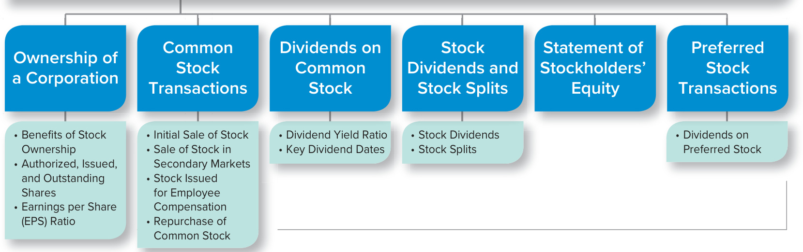
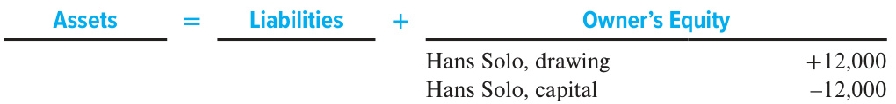

# Ch11 Reporting and Interpreting Stockholders’ Equity  

Microsoft Corporation’s mission is to empower every person and every organization on the planet to achieve more. To do so, Microsoft focuses on helping companies reinvent and improve their business processes, by building on being one of the two largest providers of cloud computing services, and by expanding the use of personal computers around the world. Microsoft has also stated ambitious sustainability goals. The first goal is for its operations to be carbon negative by 2030. The second goal is for the company to have removed from the environment all the carbon it has emitted since it was founded almost 50 years ago. Can the company achieve these goals? Time will tell, but with revenues in 2020 of $\Phi143$ billion and total assets of $\Phi301$ billion, the company has the resources to be ambitious and the desire to drive change. Microsoft discusses its commitment to building a more sustainable future in the ESG Reporting box below. In this chapter, we study the role that stockholders’ equity plays in funding a business and the strategies that managers use to maximize stockholders’ wealth.  

## UNDERSTANDING THE BUSINESS  

To some people, the words corporation and business are almost synonymous. You’ve probably heard friends refer to a career in business as “the corporate world.” Equating business with corporations is understandable because corporations are the dominant form of business organization in terms of volume of operations. If you were to write the names of 10 familiar businesses on a piece of paper, probably all of them would be corporations.  

## LEARNING OBJECTIVES  

## After studying this chapter, you should be able to:  

11-1	 Explain the role of stock in the capital structure of a corporation. p. 577   
11-2	 Compute and analyze the earnings per share ratio. p. 579   
11-3	 Describe the characteristics of common stock and report common stock transactions. p. 579   
11-4	 Discuss and report dividends. p. 584   
11-5	 Compute and analyze the dividend yield ratio. p. 584   
11-6	 Discuss and report stock dividends and stock splits. p. 588   
11-7	 Describe the information reported on the statement of stockholders’ equity. p. 591   
11-8	 Describe the characteristics of preferred stock and report preferred stock transactions. p. 593   
11-9	 Discuss the impact of stock transactions on cash flows. p. 594  

  
JeanLucIchard/Shutterstock  

## ENVIRONMENTAL, SOCIAL, & GOVERNANCE (ESG) REPORTING  

## Microsoft  

On its official blog, Microsoft publicly commits to a more sustainable future by stating “Solving our planet’s carbon issues will require technology that does not exist today. That’s why a significant part of our endeavor involves putting Microsoft’s balance sheet to work to stimulate and accelerate the development of carbon removal technology. Our new Climate Innovation Fund will commit to invest $\mathbb{S}1$ billion over the next four years into new technologies and expand access to capital around the world to people working to solve this problem. We understand that this is just a fraction of the investment needed, but our hope is that it spurs more governments and companies to invest in new ways as well.”  

ISSUING AND REPORTING STOCK  

Microsoft’s stock is traded on the National Association of Securities Dealers Automated Quotations (NASDAQ) Stock Market under the symbol MSFT. As of July 27, 2020, Microsoft had just under 92,000 registered holders of its common stock.  

The popularity of the corporate form can be attributed to a critical advantage that corporations have over sole proprietorships and partnerships: They can raise large amounts of capital because both large and small investors easily can participate in their ownership. This ease of participation is related to several factors.  

•  Shares of stock can be purchased in small amounts. You could buy a single share of Microsoft stock for about $^{\Phi220}$ and become one of the owners of this successful company.   
Ownership interests can be transferred easily through the sale of shares on established markets such as the New York Stock Exchange or the NASDAQ Stock Exchange, where Microsoft’s stock is traded.  

## EXHIBIT 11.  

Excerpt from Consolidated Balance Sheets for Microsoft  

## MICROSOFT  

REAL WORLD EXCERPT: Annual Report  

<html><body><table><tr><td colspan="3">MICROSOFTCORPORATION ConsolidatedBalanceSheets ($ in millions)</td></tr><tr><td></td><td>June30,2020</td><td>June 30,2019</td></tr><tr><td>Stockholders'equity:</td><td></td><td></td></tr><tr><td>Common stock and paid-in capital - shares authorized</td><td></td><td></td></tr><tr><td>24,000; outstanding 7,571 and 7,643</td><td>80,552</td><td>78,520</td></tr><tr><td>Retained earnings</td><td>34,566</td><td>24,150</td></tr><tr><td>Accumulated other comprehensive income (loss)</td><td>3,186</td><td>(340)</td></tr><tr><td>Totalstockholders'equity</td><td>$118,304</td><td>$102,330</td></tr></table></body></html>  

Source: Microsoft Corporation  

•  Stock ownership provides investors with limited liability. In the event of bankruptcy, creditors have claims against only the corporation’s assets, not the assets of the individual owners.  

Many Americans own stock either directly or indirectly through a mutual fund or pension program. Stock ownership offers them the opportunity to earn higher returns than they could depositing money in a bank account or investing in corporate bonds. Unfortunately, stock ownership also involves risks. The appropriate balance between risk and the expected return on an investment depends on individual preferences.  

Exhibit 11.1 presents financial information from Microsoft’s annual report.  

Notice that the stockholders’ equity section of Microsoft’s balance sheet lists two primary sources of equity:  

1.	 Contributed capital from the sale of stock. This is the amount of money stockholders invested through the purchase of shares. For Microsoft, contributed capital is the amount in the Common Stock and paid-in capital accounts $^{1}\mathbb{S}80{,}552$ million for fiscal 2020).   
2.	 Earned capital generated by the company’s profit-making activities. Earned capital is kept track of in the Retained Earnings account (referred to as an “accumulated deficit” when negative). Retained earnings is the cumulative amount of net income the corporation has earned since it organized as a corporation, less the cumulative amount of dividends paid since it organized.  

  
ORGANIZATION OF THE CHAPTER  

## OWNERSHIP OF A CORPORATION  

The corporation is the only business form the law recognizes as a separate entity. As a distinct entity, the corporation enjoys a continuous existence separate and apart from its owners. It may own assets, incur liabilities, expand and contract in size, sue others, be sued, and enter into contracts independently of its stockholder owners.  

To protect everyone’s rights, the creation and governance of corporations are tightly regulated by law. Corporations are created by application to a state government (not the federal government). Corporations are governed by a board of directors elected by the stockholders.  

Each state has different laws governing the organization of corporations created within its boundaries. Microsoft incorporated in the state of Washington and has its headquarters in Redmond, Washington. You will find that an unusually large number of corporations are incorporated in Delaware even though their headquarters are located in a different state. Companies choose Delaware for incorporation because the state has some of the most favorable tax laws for corporations.  

## Benefits of Stock Ownership  

When you invest in a corporation, you are known as a stockholder or shareholder. As a stockholder, you receive shares of stock that you subsequently can sell on established stock exchanges. Owners of common stock receive a number of benefits:  

•	 A voice in management. You may vote in the stockholders’ meeting on major issues concerning management of the corporation.   
•	 Dividends. If a company pays dividends, you receive a proportional share of the distribution of profits.   
•	 Residual claim. You will receive a proportional share of the distribution of remaining assets upon the liquidation of the company.  

Stockholders, unlike creditors, are able to vote at the annual stockholders’ meeting. Each share of stock typically represents one vote. The following notice of the annual meeting of stockholders, referred to as a proxy statement, was recently sent to all owners of Microsoft stock:  

NOTICE OF ANNUAL MEETING OF STOCKHOLDERS  

<html><body><table><tr><td>Date</td><td>December2,2020</td></tr><tr><td>Time</td><td>8:00 a.m. Pacific Time</td></tr><tr><td>Virtual Meeting</td><td>This year's meeting is a virtual shareholders meeting</td></tr><tr><td>Record Date</td><td>October 8, 2020. Only shareholders of record at the close of business on the record date are entitled to receive notice of, and to vote at, the Annual Meeting.</td></tr><tr><td>Proxy Voting</td><td>Make your vote count. Please vote your shares promptly to ensure the via the Internet, by telephone, or by signing, dating, and returning the enclosed proxy card or voting instruction form will save the expense of</td></tr><tr><td rowspan="4">Items of Business</td><td>additional solicitation.We arerequesting your vote to: Elect the 12 director nominees named in this Proxy Statement</td></tr><tr><td>Approve, on a nonbinding advisory basis, the compensation paid to our</td></tr><tr><td>named executive officers ("say-on-pay vote") Ratify the selection of Deloitte & Touche LLP as our independent</td></tr><tr><td>auditorforfiscalyear2021 Vote on Shareholder Proposal: Report on Employee Representation on</td></tr><tr><td rowspan="2"></td><td></td></tr><tr><td>Board of Directors Transact other business that may properly come before the Annual Meeting</td></tr></table></body></html>

Source: Microsoft Corporation  

## LEARNING OBJECTIVE 11-1  

Explain the role of stock in the capital structure of a corporation.  

## MICROSOFT  

REAL WORLD EXCERPT: Notice of Stockholders’ Meeting  

The  proxy  statement  also  contained  information  concerning  the  people  who  were nominated to be members of the board of directors as well as detailed information about executive compensation and the audit fees charged by Deloitte & Touche. Because most stockholders do not actually attend the annual meeting, the notice included information about how absentee stockholders can mail their votes in or cast their votes using the Internet or a telephone.  

Stockholders have ultimate authority in a corporation. The board of directors and, indirectly, all employees are accountable to the stockholders.  

## Authorized, Issued, and Outstanding Shares  

A company’s corporate charter specifies the maximum number of shares the company is authorized to sell to the public. This maximum is referred to as the number of authorized shares. The shares a company has actually sold to the public represent the number of issued shares. For reasons we discuss later, a company might want to buy back shares that have already been sold to the public. Shares that have been bought back can be retired or held as treasury stock. Shares held as treasury stock are considered issued shares but not outstanding shares. Outstanding shares represent the total number of shares owned by stockholders on any particular date. Thus, when a company buys back shares and holds them as treasury stock, it creates a difference between the number of issued shares and the number of outstanding shares of its stock. Shares that are retired resume a status of being authorized but not issued.  

Recall that Microsoft is incorporated in Washington State. Washington State is one of a small number of states that do not allow treasury stock, so Microsoft retires all shares that it repurchases each year. In fiscal 2020, Microsoft reports in its notes to its financial statements that it repurchased and retired 126 million shares of common stock. Since those shares are not listed as treasury stock, Microsoft’s number of outstanding shares is equal to its number of issued shares. When this is the case, companies typically only list the number of outstanding shares on their balance sheets. You can see this for Microsoft in Exhibit 11.1. The information reported in Exhibit 11.1 is summarized below:  

  
VDB Photos/Shutterstock  

<html><body><table><tr><td>MICROSOFTCORPORATION CommonStockShares June30,2020(inmillions)</td></tr><tr><td>Authorizedshares</td><td>24,000</td></tr><tr><td>Issuedshares</td><td>7,571</td></tr><tr><td>Less:Treasuryshares</td><td>0</td></tr><tr><td>Outstandingshares</td><td>7,571</td></tr></table></body></html>  

Knowing the number of shares outstanding is important because this number is used in the calculation of various ratios, including the earnings per share ratio.  

## Earnings per Share (EPS)  

## ANALYTICAL QUESTION  

How well is a company performing?  

## LEARNING OBJECTIVE 11-2  

Compute and analyze the earnings per share ratio.  

## RATIO AND COMPARISONS  

Earnings per share is computed as follows:  

Earnings per Share $=$ Net Income $\varepsilon_{\mathrm{~\div~}}$ Weighted Average Number of Common Shares Outstanding \*Any preferred dividends (discussed later in this chapter) should be subtracted from net income.  

The 2020 ratio for Microsoft:  

$$
\mathbb{S}44,281\mathrm{{\million}\div7,610\mathrm{{\million}\,s h a r e s}^{\dagger}=\mathbb{S}5.82}
$$  

$^\dagger$ The weighted average number of common shares outstanding is reported on the income statement.  

<html><body><table><tr><td colspan="3">COMPARISONSOVERTIME</td></tr><tr><td colspan="3">Microsoft</td></tr><tr><td>2018</td><td>2019</td><td>2020</td></tr><tr><td>$2.15</td><td>$5.11</td><td>$5.82</td></tr></table></body></html>  

## INTERPRETATIONS  

<html><body><table><tr><td colspan="2">COMPARISONSWITHCOMPETITORS</td></tr><tr><td>IBM</td><td>Intel</td></tr><tr><td>2020</td><td>2020</td></tr><tr><td>$6.28</td><td>$4.98</td></tr></table></body></html>  

In General You probably have seen newspaper headlines announcing a company’s earnings. Notice that those news stories normally report earnings on an earnings per share (EPS) basis. EPS is a popular measure because it emphasizes the amount of earnings attributable to a single share of outstanding common stock. Because the number of outstanding shares of common stock changes over time, and is different across firms, using EPS rather than just net income allows analysts and investors to make “profitability per share” comparisons across time and across firms. Companies are required to report EPS on their income statements.  

Focus Company Analysis For Microsoft, net income has increased over the last three years while the weighted average number of common shares outstanding has remained relatively constant. This has caused the company’s EPS to increase over the three years. Relative to its competitors, Microsoft’s 2020 EPS ratio is less than IBM’s ratio but greater than Intel’s ratio. We can compare EPS numbers across firms of different sizes because EPS captures the amount of earnings attributable to a single share of outstanding common stock, regardless of the size of a company or the number of shares of stock outstanding.  

A Few Cautions While EPS is an effective and widely used measure of profitability per share, it does not necessarily indicate how a company will perform in the future. Stock price is a better indication of expected future performance. For example, if two companies have identical EPS numbers, but the stock price of one company is double that of the other company, investors expect greater future performance from the firm with the higher stock price. EPS is a measure of performance per share of stock over a prior period, while stock price is an indication of expected performance over future periods. It is important to keep this in mind when analyzing EPS numbers across time and across firms.  

## COMMON STOCK TRANSACTIONS  

All corporations issue common stock, and some elect to issue a second type of stock called preferred stock. In this section, we discuss common stock. Near the end of the chapter, we discuss preferred stock.  

Common stock is held by investors who are the “owners” of a corporation. Though stockholders are owners and have the right to vote and share in the profitability of the business through dividends, they do not actively participate in managing the business. Instead, they elect a board of directors and it is the board’s role to hire and monitor executives who manage a company’s activities on a day-to-day basis.  

## LEARNING OBJECTIVE 11-3  

Describe the characteristics of common stock and report common stock transactions.  

Depending on state law, a company’s common stock may be required to have a par value, a nominal value per share established in the corporate charter. Par value has no relationship to the market value of a stock. For example, Microsoft’s common stock has a par value of \$0.00000625 per share while its stock price is over $\mathbb{S}220$ per share.  

The original purpose of assigning a par value to a share of common stock was to protect creditors by specifying a permanent amount of capital that owners could not withdraw before a bankruptcy, which would leave creditors with something in the event that a company did not succeed. This permanent amount of capital is called legal capital. Though the requirement to assign a par value and maintain legal capital is embedded in state law, in today’s business world it does little to protect creditors. Like Microsoft, companies have simply transitioned to assigning an extremely low par value. Many companies assign a par value of $\mathbb{S}0.01$ per share, which means that any legal capital requirements are too low to meaningfully protect creditors. As a result, creditors have adopted other protection mechanisms, like the debt covenants we discussed in Chapter 10, to provide some protection in the event that a company performs poorly. There are some states that require the issuance of no-par value stock. When a corporation issues no-par stock, legal capital is defined by state law.  

## Initial Sale of Stock  

An initial public offering, or IPO, involves the very first sale of a company’s stock to the public (i.e., when the company first “goes public”). You have probably heard stories of a new company’s stock price increasing dramatically the day of its IPO. While investors sometimes earn significant returns on IPOs, they also take significant risks. Once a company’s stock has been traded on established markets, additional sales of new stock to the public are called seasoned offerings.  

Most sales of stock to the public are cash transactions. To illustrate the accounting for an initial sale of stock, assume that Microsoft sold 1 million shares of its $\mathbb{5}0.00000625$ par value stock for $\mathbb{S}220$ per share. The company would record the following journal entry:  

<html><body><table><tr><td colspan="2"></td><td>Debit</td><td>Credit</td></tr><tr><td colspan="2">Cash (+A) (1,000,000 × $220)</td><td>220,000,000</td><td></td></tr><tr><td colspan="2">Common stock(+SE)（1,000,000×$0.00000625)</td><td></td><td>6</td></tr><tr><td colspan="2">Additionalpaid-incapital(+SE)</td><td></td><td>219,999,994</td></tr><tr><td colspan="2">Assets Liabilities</td><td colspan="2">Stockholders'Equity</td></tr><tr><td colspan="4">Cash +220,000,000 Commonstock +6 Additionalpaid-incapital +219,999,994</td></tr></table></body></html>  

Notice that the Common Stock account is credited for the number of shares sold times the par value per share. The Additional Paid-in Capital account is credited for the remainder, which is the amount “in addition” to par value that the company received when it issued the shares. In rare cases, a corporate charter may specify a “stated value” rather than a “par value.” For accounting purposes, the two values are used in the same way. If there is no par or stated value, the entire proceeds from the sale will be entered in the Common Stock account.  

## Sale of Stock in Secondary Markets  

When a company sells stock to the public, the transaction is between the issuing corporation and the investor. Subsequent to the initial sale, investors can sell shares to other investors without directly affecting the corporation. For example, if investor Ed deHaan sold 1,000 shares of Microsoft stock to investor Amanda Winn, Microsoft would not record a journal entry. Mr. deHaan received cash for the shares he sold, and Ms. Winn received stock for the cash she paid. Microsoft was not a part of the transaction and therefore did not receive or pay anything.  

Each business day, The Wall Street Journal reports the results of thousands of transactions between investors in secondary markets, such as the New York Stock Exchange (NYSE) and the NASDAQ market. Stockholders expect to earn money on their investments through dividends if a company pays dividends and through increases in a company’s stock price. In many instances, senior management has been replaced because of a stock’s poor performance in the stock market.  

## Stock Issued for Employee Compensation  

One of the advantages of the corporate form is the ability to separate the management of a business from its ownership. Separation also can be a disadvantage because some managers may not act in the owners’ best interests. This potential problem can be addressed in a number of ways. For example, compensation packages can be developed to reward employees for meeting goals that are important to stockholders. Another strategy is to offer employees stock, either directly through stock awards or indirectly through stock options. Stock awards grant shares of stock to employees that vest on future dates. Stock options give employees the right to buy stock in the future at a fixed price. Both stock awards and stock options provide an incentive for employees to take actions that increase a company’s stock price, thereby aligning their interests with the interests of stockholders. Microsoft uses equity compensation to incentivize its executives and explains why in the following disclosure:  

  
Top: Roman Malanchuk/123RF; Left: Image Source, all rights reserved.; Right: Ariel Skelley/Blend Images LLC; Bottom: tupungato/Getty Images  

## PAY MIX  

At least 70 percent of the annual target compensation opportunity for our Named Executives is equity-based to incentivize a long-term focus and align their interests with those of our shareholders. Our Compensation Committee structures the pay mix for our annual target total compensation opportunities to place a higher proportion in equity awards than the companies in our compensation peer group.  

## MICROSOFT  

  
Source: Microsoft Corporation 2020 Proxy Statement  

REAL WORLD EXCERPT Equity Compensation  

## Repurchase of Stock  

A corporation may want to repurchase its stock from existing stockholders for a number of reasons. One common reason is the existence of an employee bonus plan that provides workers with shares of the company’s stock as part of their compensation. Because of Securities and Exchange Commission regulations concerning newly issued shares, most companies find it less costly to give employees repurchased shares than to issue new ones. In addition, if a company were to pay bonuses with newly issued shares each period, it would increase the number of shares in the market, which would decrease the company’s stock price. Increasing the number of shares also would dilute existing stockholders’ investments, as each share of stock they own would be worth less. By repurchasing shares to fulfill bonus obligations, companies avoid this dilutive effect. As discussed earlier, stock that has been repurchased and is held by the issuing corporation is called treasury stock. Treasury shares have no voting, dividend, or other stockholder rights while they are held as treasury stock.  

When companies repurchase shares from the market, they pay cash and receive their own stock. Since Microsoft is required by Washington State law to retire shares it repurchases, let’s assume that a competitor, IBM, repurchased 100,000 shares of its stock in the open market when it was selling for $\mathbb{S}140$ per share. To reflect the repurchase, the company would record the following journal entry:  

<html><body><table><tr><td></td><td>Debit</td><td>Credit</td></tr><tr><td>Treasury stock(+XSE,-SE)(100,000× $140)</td><td>14,000,000</td><td></td></tr><tr><td>Cash(-A) sh -14,000,000</td><td>Treasurystock</td><td>14,000,000 -14,000,000</td></tr><tr><td colspan="3">Assets Liabilities + Stockholders'Equity</td></tr><tr><td colspan="4"></td></tr></table></body></html>  

Intuitively, many students expect the Treasury Stock account to be reported as an asset. Such is not the case because a company cannot own itself. The Treasury Stock account is therefore a contra-equity account, which is why Treasury Stock is shown as a negative number on a company’s balance sheet. This practice makes sense because treasury stock is considered issued but not outstanding. Thus, when stock is repurchased and held in treasury, it is not removed from the Common Stock account but rather is shown as its own separate account within stockholders’ equity, and because repurchasing the shares reduced assets (cash), it reduces equity. As the information in Exhibit 11.2 indicates, IBM reported treasury stock in the amount of $^{\Phi169,339}$ million on its balance sheet as of December 31, 2020.  

Before concluding this section, let’s revisit Microsoft and the retirement of repurchased shares. When a company repurchases shares and retires them, it records the outflow of cash paid for the shares and removes the exact amounts that were added to common stock and additiona  

## IBM  

REAL WORLD EXCERPT: Annual Report  

<html><body><table><tr><td colspan="3">IBMCORPORATION ConsolidatedBalanceSheets ($ in millions)</td></tr><tr><td rowspan="2"></td><td colspan="2">December 31,</td></tr><tr><td>2020</td><td>2019</td></tr><tr><td>Stockholders’Equity</td><td></td><td></td></tr><tr><td>Common stock and additional paid-in capital</td><td>$ 56,556</td><td>$ 55,895</td></tr><tr><td>Retained earnings</td><td>162,717</td><td>162,954</td></tr><tr><td>Treasurystock,atcost</td><td>(169,339)</td><td>(169,413)</td></tr><tr><td>Accumulated other comprehensiveloss</td><td>(29,337)</td><td>(28,597)</td></tr><tr><td>Noncontrollinginterest</td><td>129</td><td>144</td></tr><tr><td>Total stockholders'equity</td><td>$ 20,727</td><td>20,985</td></tr><tr><td>*Amountsmaynotaddduetorounding.</td><td></td><td></td></tr></table></body></html>  

paid-in capital when the stock was originally issued. The journal entry also involves increasing an additional paid-in capital account or decreasing retained earnings, depending on whether the shares were repurchased at a price lower or higher than the original share price. Accounting for share retirements is covered in more detail in advanced accounting courses.  

When a company sells its treasury stock, it does not report an accounting profit or loss on the transaction, even if it sells the stock for more or less than it originally cost to repurchase the shares. GAAP does not permit a corporation to report income or losses from investments in its own stock because transactions with the owners are not considered normal profit-making activities. Based on the previous example, assume that IBM reissues 10,000 shares of treasury stock for $\mathbb{S}150$ per share. Remember that the company had repurchased the shares for $\mathbb{S}140$ per share. Because the reissue price $\mathbf{\bar{\mathbb{S}}150}$ per share) is higher than the repurchase price ( $\mathbb{S}140$ per share), stockholders’ equity would increase by $\mathbb{S}10$ per reissued share, or $^{\S100,000}$ total (10,000 shares $\times\ \mathbb{S}10^{"}$ ). IBM would record the following journal entry when it reissues the shares:  

<html><body><table><tr><td></td><td>Debit</td><td>Credit</td></tr><tr><td>Cash (+A) (10,000 × $150)</td><td>1,500,000</td><td></td></tr><tr><td>Treasury stock (-XSE,+SE)(10,000 × $140)</td><td></td><td>1,400,000</td></tr><tr><td>Additional paid-in capital (+SE)</td><td></td><td>100,000</td></tr></table></body></html>  

<html><body><table><tr><td colspan="2">Assets</td><td>Liabilities</td><td>+ Stockholders'Equity</td><td></td></tr><tr><td rowspan="2">Cash</td><td rowspan="2">+1,500,000</td><td></td><td>Treasury stock</td><td>+1,400,000</td></tr><tr><td></td><td>Additional paid-in capital</td><td>+100,000</td></tr></table></body></html>  

If the treasury stock had been reissued at $\mathbb{S}130$ per share, stockholders’ equity would decrease by $\mathbb{S}10$ per reissued share, or $\mathbb{S}100{,}000$ total (10,000 shares $\times\,\mathfrak{S}10^{'}$ ). The $\mathbb{S}10$ is the difference between the reissue price $\mathbb{S}130$ per share) and the repurchase price $\mathbb{S}140$ per share). The journal entry IBM would record if the reissue price were $\mathbb{S}130$ per share is:  

<html><body><table><tr><td></td><td>Debit</td><td>Credit</td></tr><tr><td>Cash (+A) (10,000 × $130)</td><td>1,300,00</td><td></td></tr><tr><td>Additional paid-in capital(-SE)</td><td>100,000</td><td></td></tr><tr><td>Treasury stock (-XSE,+SE)(10,000 × $140)</td><td></td><td>1,400,000</td></tr></table></body></html>  

<html><body><table><tr><td colspan="2">Assets</td><td>Liabilities</td><td>+ Stockholders'Equity</td><td></td></tr><tr><td rowspan="2">Cash</td><td rowspan="2">+1,300,000</td><td></td><td>Treasury stock</td><td>+1,400,000</td></tr><tr><td></td><td>Additionalpaid-in capital</td><td>-100,000</td></tr></table></body></html>  

We have looked at several transactions involving the sale and repurchase of common stock. In the next section, we will discuss dividends. Before we move on, complete the following questions to test your understanding of the concepts we have covered so far.  

1.	 Assume that Apple Produce issued 10,000 shares of its common stock for $\mathbb{S}150{,}000$ cash. The stock has a par value of $\mathbb{S}2$ per share. Prepare the journal entry to record this transaction.  

2.	 Assume that Apple Produce repurchased 5,000 shares of its stock in the open market when the stock was selling for $\mathbb{S}12$ per share. Record this transaction.   
3.	 If Apple Produce’s common stock did not have a par value, how would the journal entries in (1) and (2) change?  

After you have completed your answers, check them below.  

## G U I D E D H E L P  1 1 - 1  

  

For additional step-by-step video instruction, go to mhhe.com/libby_gh11-1.  

## LEARNING OBJECTIVE 11-4  

Discuss and report dividends.  

Related Homework: M11-4, E11-1, E11-2, E11-15, E11-16, P11-4  

## DIVIDENDS ON COMMON STOCK  

The return from investing in a company’s common stock can come from two sources: stock price appreciation and dividends. Some investors prefer to buy stocks that pay little or no dividends because companies that reinvest the majority of their earnings back into their operations tend to increase their future earnings potential, along with their stock price. Wealthy investors in high tax brackets prefer to receive their return in the form of higher stock prices because capital gains may be taxed at a lower rate than dividend income. Other investors, such as those who are retired and need a steady income, prefer to receive their return in the form of dividends. These investors often seek stocks that will pay relatively high dividends, such as utility stocks. Because of the importance of dividends to many investors, analysts often compute the dividend yield ratio to evaluate a company’s dividend policy.  

## LEARNING OBJECTIVE 11-5  

Compute and analyze the dividend yield ratio.  

## KEY RATIO ANALYSIS  

## Dividend Yield  

## ANALYTICAL QUESTION  

How much does a company pay out in dividends each year relative to its share price?  

## RATIO AND COMPARISONS  

The dividend yield ratio is computed as follows:  

Dividend Yield $=$ Dividends per Share $\div$ Market Price per Share  

The 2020 ratio for Microsoft: $\mathbb{5}2.04\div\mathbb{5}202.49=1.01\%$  

S o l u t i o n s  t o S E L F - S T U DY  Q U I Z  

<html><body><table><tr><td colspan="3">COMPARISONSOVERTIME</td></tr><tr><td colspan="3">Microsoft</td></tr><tr><td>2018</td><td>2019</td><td>2020</td></tr><tr><td>1.76%</td><td>1.40%</td><td>1.01%</td></tr></table></body></html>  

<html><body><table><tr><td colspan="2">COMPARISONSWITHCOMPETITORS</td></tr><tr><td>IBM</td><td>Intel</td></tr><tr><td>2020</td><td>2020</td></tr><tr><td>5.24%</td><td>2.82%</td></tr></table></body></html>  

1. Cash $(+\mathbf{A})$ 150,000 Common stock $\mathrm{(+SE)}$ $(\mathbb{S}2\times10,000)$ 20,000 Additional paid-in capital $\mathrm{(+SE)}$ (remainder) 130,000   
2. Treasury stock $+\mathrm{XSE}$ , −SE) 60,000 Cash (−A) 60,000  

3. In journal entry (1), you would credit Common stock for 150,000. There would be no “Additional paid-in capital” account in the transaction. Journal entry (2) would not change.  

## INTERPRETATIONS  

In General Individuals who invest in the common stock of a company can earn a return from both dividends and capital appreciation (increases in the market price of the stock). The dividend yield ratio reflects the return on investment absent any capital appreciation or, said differently, the return attributed solely to the dividends a company pays.  

Focus Company Analysis Microsoft’s stock price at the end of fiscal 2020 was $\mathbb{S}202.49\$ . If you had invested this amount in Microsoft and received the dividends that Microsoft paid out during 2020, your return attributable to dividends would have been 1.01 percent. Even though Microsoft has increased its dividend over the last three years (from $\mathbb{S}1.68$ in 2018 to $\mathbb{S}2.04\$ in 2020), its dividend yield ratio has declined. This decline is driven by the significant increase in Microsoft’s stock price from $\mathbb{S}95.37$ at the end of fiscal 2018 to $\mathbb{S}202.49\$ at the end of fiscal 2020. In addition to a declining dividend yield ratio over time, Microsoft’s dividend yield ratio falls below that of two of its competitors: IBM’s dividend yield ratio is 5.24 percent and Intel’s dividend yield ratios is 2.82 percent.  

A Few Cautions Remember that the dividend yield ratio tells only part of the return on investment story; it does not reflect capital appreciation as reflected in the increase in a company’s stock price over time. Often potential capital appreciation is a much more important consideration for investors. Though Micro soft pays a dividend, it also reinvests a portion of each year’s earnings back into operations to fuel growth. Analysts should consider a company’s dividend yield ratio in conjunction with other return measures when assessing a company’s performance.  

## Key Dividend Dates  

The declaration and payment of a dividend involve several key dates. Let’s review these dates based on information reported on Microsoft’s Investor Relations website.  

<html><body><table><tr><td>DividendperCommonShare</td><td>DateofDeclaration</td><td>DateofRecord</td><td>Date of Payment</td></tr><tr><td>Q1: $0.51</td><td>September 18,2019</td><td>November21,2019</td><td>December12,2019</td></tr><tr><td>Q2: $0.51</td><td>December4,2019</td><td>February 20, 2020</td><td>March12,2020</td></tr><tr><td>Q3: $0.51</td><td>March9,2020</td><td>May21,2020</td><td>June11,2020</td></tr><tr><td>Q4: $0.51</td><td>June 17,2020</td><td>August20,2020</td><td>September10,2020</td></tr><tr><td>$2.04</td><td></td><td></td><td></td></tr></table></body></html>

Source: Microsoft Corporation  

## MICROSOFT  

REAL WORLD EXCERPT: Investor Relations Website  

This excerpt contains three important dates:  

1.	Declaration date. The declaration date is the date on which the board of directors officially approves the dividend. As soon as the board declares a dividend, a liability is created and must be recorded.  

2.	Date of record. The record date follows the declaration date; it is the date on which the corporation prepares the list of current stockholders who will receive the dividend payment. The dividend is payable only to those names listed on the record date. No journal entry is made on this date.  

3.	Date of payment. The payment date is the date on which cash is disbursed to pay the dividend liability.  

##  

A company records a journal entry on the declaration date and the date of payment. No journal entry is recorded on the date of record.  

These three dates apply to all cash dividends and can be shown graphically as follows:  

  

On the declaration date, a company records a liability related to the dividend. To illustrate, on September 18, 2019, Microsoft records the following journal entry. The $\mathbb{S}3{,}886$ million was reported by Microsoft in its second-quarter earnings press release.  

<html><body><table><tr><td></td><td>Debit</td><td>Credit</td></tr><tr><td>Retained earnings (-SE)</td><td>3,886,000,000</td><td></td></tr><tr><td>Dividends payable (+L) Liabilities</td><td>+</td><td>3,886,000,000</td></tr><tr><td>Assets</td><td colspan="2">Stockholders'Equity</td></tr></table></body></html>

Dividends payable +\$3,886,000,000 Retained earnings −\$3,886,000,000  

The payment of the liability on December 12 is recorded as follows:  

<html><body><table><tr><td></td><td>Debit</td><td>Credit</td></tr><tr><td>Dividends payable (-L)</td><td>3,886,000,000</td><td></td></tr><tr><td>Cash (-A) Assets</td><td>+</td><td>3,886,000,000 Stockholders'Equity</td></tr><tr><td colspan="3">Liabilities</td></tr></table></body></html>  

Cash −\$3,886,000,000 Dividends payable −\$3,886,000,000  

Notice that the declaration and payment of a cash dividend reduce assets (cash) and stockholders’ equity (retained earnings) by the same amount. This observation explains the two fundamental requirements for payment of a cash dividend:  

1.	Sufficient retained earnings or net income. The corporation must have accumulated a sufficient amount of retained earnings, or earned a sufficient amount of income during the period, to cover the amount of the dividend.   
2.	Sufficient cash. The corporation must have sufficient cash to pay the dividend and meet the operating needs of the business. The mere fact that the Retained Earnings account has a large credit balance does not mean that the board of directors can declare and pay a cash dividend. The cash generated in the past by earnings represented in the Retained Earnings account may have been spent to acquire inventory, buy operational assets, and pay liabilities. Consequently, no necessary relationship exists between the balance of retained earnings and the balance of cash on any particular date. Quite simply, retained earnings is not cash.  

Investors should be careful to research a company’s dividend policy before investing. In the United States, regardless of how profitable a company is, there is no legal obligation for companies to declare dividends. Many very successful companies have never paid dividends while other equally successful companies pay out a large percentage of their earnings each year as a dividend.  

The dividend policy for a company is determined by the board of directors. In some other countries, dividend payments are not discretionary and are required by law. In Brazil, for example, companies are legally required to pay out at least 25 percent of their net income in dividends each year.  

While U.S. companies are under no legal obligation to declare dividends, once the board of directors declares a dividend (i.e., creates a dividend payable), there is a legal obligation to pay that dividend. In the case of a corporate bankruptcy, dividends payable would be a legally enforceable claim against the company.  

## FINANCIAL ANALYSIS  

## Impact of Dividends on Stock Price  

Another date that is important in understanding dividends has no accounting implications. The date one business day before the date of record is known as the ex-dividend date. This date is established by the stock exchanges to account for the fact that it takes time to officially transfer stock from a seller to a buyer. If you buy stock before the ex-dividend date, you will be listed as the owner on the date of record and will receive the dividend. If you buy stock on the ex-dividend date or later, the previous owner will be listed as the owner on the date of record and will therefore receive the dividend.  

If you follow stock prices, you will notice that they often fall on the exdividend date. The stock is worth less on that date because it no longer includes the right to receive the next dividend.  

  
Gorodenkoff/Shutterstock  

  

One of the reasons that investors buy common stock is to earn dividends. We have discussed dividends paid with cash. In the next section, we will look at dividends paid with stock. Before we move on, complete the following questions to test your understanding of the concepts we have covered so far.  

S E L F - S T U D Y  Q U I Z  

1.	 On which dividend date is a liability created?   
2.	 A cash outflow occurs on which dividend date?   
3.	 Which dividend date does not require a journal entry?  

After you have completed your answers, check them below.  

G U I D E D  H E L P  1 1 - 2  

For additional step-by-step video instruction, go to mhhe.com/libby_gh11-2.  

Related Homework: M11-7, M11-8, E11-20, E11-21, P11-9, P11-10  

1. Date of declaration.   
2. Date of payment.   
3. Date of record.  

S o l u t i o n s  t o S E L F - S T U DY  Q U I Z  

## STOCK DIVIDENDS AND STOCK SPLITS  

## Stock Dividends  

Unless stated otherwise, the term dividend means a cash dividend. Though cash dividends are by far the most common type of dividend, companies also can distribute additional shares of stock as a dividend. A stock dividend is a distribution of additional shares of a company’s own stock to its stockholders on a pro rata basis at no cost to the stockholder.  

  
Left: Dave and Les Jacobs/Blend Images LLC; Right: VDB Photos/Shutterstock  

The phrase pro rata basis means that each stockholder receives additional shares equal to the percentage of shares held. A stockholder with 10 percent of the outstanding shares would receive 10 percent of any additional shares issued as a stock dividend.  

The economic value of a stock dividend is the subject of much debate. In reality, a stock dividend by itself has no economic value. All stockholders receive a pro rata distribution of shares, which means that each stockholder owns exactly the same portion of the company as before. The value of an investment is determined by the percentage of the company a stockholder owns, not by the number of shares held. If you get change for a dollar, you do not have more wealth because you hold four quarters instead of one dollar. Similarly, if you own 10 percent of a company, you are not wealthier simply because the company declares a stock dividend and gives you (and all other stockholders) more shares of stock. Both before and after the stock dividend, you own 10 percent of the company.  

The stock market reacts immediately when a stock dividend is issued, and the stock price falls. Theoretically, if the stock price was $\updownarrow60$ before a stock dividend and the company doubles the number of shares outstanding by issuing a stock dividend, the price of the company’s stock should fall to $\mathbb{S}30$ . In reality, the fall in price may not be exactly proportional to the number of new shares issued. In some cases, the stock dividend makes the stock more attractive to new investors. Many investors prefer to buy stock in round lots, typically in multiples of 100 shares. An investor with $\mathbb{S}10{,}000$ might not buy a stock selling for $\mathbb{S}150$ , for instance, because she cannot afford to buy 100 shares. However, she might buy the stock if the price were less than $\mathbb{S}100$ as the result of a stock dividend. In such cases, the stock price decrease at the time of a stock dividend will likely not be exactly proportional to the number of new shares issued.  

When a company’s board of directors declares a stock dividend, the company transfers an amount from the Retained Earnings account (or the Additional Paid-in Capital account) into the Common Stock account to reflect the additional shares issued. The amount transferred depends on whether the stock dividend is classified as a large stock dividend or a small stock dividend.  

A large stock dividend involves the distribution of additional shares that amount to more than 20–25 percent of currently outstanding shares. A small stock dividend involves the distribution of shares that amount to less than 20–25 percent of currently outstanding shares. Because a large stock dividend significantly decreases a company’s stock price, GAAP requires the amount transferred to the Common Stock account to be based on the par value of the stock. In the case of a small stock dividend, GAAP requires the amount transferred to be based on the market price of the stock, with the par value amount being transferred to the Common Stock account and the excess transferred to the Additional Paid-in Capital account.  

To demonstrate how the accounting for stock dividends works, assume Microsoft declared a large stock dividend that resulted in an additional 40,000,000 shares of $\mathbb{S}0.00000625$ par value stock being distributed to stockholders. On the date of declaration, Microsoft would record the following journal entry:  

<html><body><table><tr><td></td><td>Debit</td><td>Credit</td></tr><tr><td>Retained earnings (-SE) ($0.00000625 × 40,000,000)</td><td>250</td><td></td></tr><tr><td>Common stock(+SE)($0.00000625× 40,000,000)</td><td></td><td>250</td></tr><tr><td>Assets Liabilities</td><td>十 Stockholders'Equity Retainedearnings Commonstock</td><td>-$250 +$250</td></tr></table></body></html>  

Now assume Microsoft declared a small stock dividend that resulted in an additional 4,000,000 shares being distributed to stockholders. On the date of declaration, Microsoft’s stock was trading at $\mathbb{S}220$ per share. The journal entry Microsoft would enter is:  

<html><body><table><tr><td></td><td>Debit</td><td>Credit</td></tr><tr><td>Retained earnings (-SE)($220 market price × 4,000,000)</td><td>880,000,000</td><td></td></tr><tr><td>Common stock (+SE) ($0.00000625 par value × 4,000,000)</td><td></td><td>25</td></tr><tr><td>Additionalpaid-incapital(+SE)(remainder)</td><td>Additionalpaid-incapital</td><td>879,999,975 -880,000,000 25 +879,999,975</td></tr><tr><td>Assets Liabilities +</td><td colspan="2">Stockholders'Equity Retainedearnings Commonstock</td></tr></table></body></html>  

It is important to note that regardless of whether a stock dividend is classified as large or small, there is no change in the total amount of stockholders’ equity. Both large and small stock dividends merely redistribute amounts within the stockholders’ equity section of the balance sheet.  

## Stock Splits  

Stock splits are not dividends. While they are similar to a stock dividend in the sense that they distribute additional shares of stock to stockholders, they are quite different in terms of how they impact accounts in the stockholders’ equity section of the balance sheet.  

Whether a company distributes additional shares of stock by declaring a stock dividend or by initiating a stock split often is determined by state law. In a stock split, a company commits to giving stockholders a specified number of additional shares for each share that they currently hold. For example, when a company declares a two-for-one stock split, a stockholder who owned one share of stock before the split will own two shares of stock after the split. In essence, the one share has been “split” into two shares. A company’s footnotes will state whether the stock split applies to all authorized, issued, and outstanding shares.  

  
Left: Image Source, all rights reserved; Right: VDB Photos/Shutterstock  

When a company initiates a stock split, it also reduces the par value of its stock so that the total dollar amount in the Common Stock account remains unchanged. For instance, if Microsoft executes a two-for-one stock split, thereby doubling the number of shares issued, it would reduce the par value of its stock from $\hphantom{-}80.000000025\hphantom{-}$ to \$0.000003125. Microsoft has executed many stock splits since it went public in 1981, which is one of the reasons its par value is so small. In contrast to a stock dividend, a stock split does not change any account balances in the stockholders’ equity section of the balance sheet.  

In both a stock dividend and a stock split, the stockholder receives more shares of stock without having to invest additional resources to acquire the shares. A stock dividend requires a journal entry; a stock split does not but is disclosed in the notes to the financial statements. The comparative effects of a large stock dividend versus a stock split may be summarized as follows:  

<html><body><table><tr><td colspan="4">STOCKHOLDERS'EQUITY</td></tr><tr><td></td><td>Before</td><td>Aftera1o0%Stock Dividend</td><td>Aftera2-for-1 Stock Split</td></tr><tr><td rowspan="3">Number of shares outstanding Par value per share</td><td>300,000</td><td>600,000</td><td>600,000</td></tr><tr><td>$ 1.00</td><td>$ 1.00</td><td>$ 0.50</td></tr><tr><td>300,000</td><td>600,000</td><td>300,000</td></tr><tr><td>Commonstock Retained earnings</td><td>650,000</td><td>350,000</td><td>650,000</td></tr><tr><td>Totalstockholders'equity</td><td>$950,000</td><td>$950,000</td><td>$950,000</td></tr></table></body></html>  

It is quite common for companies to announce a “stock split” but to account for the distribution of additional shares as a large stock dividend. Companies typically do this to avoid changing the par value of their common stock. Such announcements are referred to as initiating a “stock split effected in the form of a stock dividend.” Whenever you see this phrase, know that the company has accounted for the transaction as a large stock dividend.  

## P A U S E F O R F E E D B A C K  

We have concluded our discussion of common stock by looking at stock dividends and stock splits. In the next section, we will provide a brief introduction to the statement of stockholders’ equity and then discuss preferred stock. Before you move on, complete the following questions to test your understanding of the concepts we have covered so far.  

## S E L F - S T U D Y  Q U I Z  

Barton Corporation issued 100,000 shares of common stock (par value $\mathbb{S}0.10)$ ) by declaring a stock dividend. At the time the dividend was declared, Barton’s stock was trading at $\mathbb{S}30$ per share.  

1.	 Record this transaction, assuming it is classified as a small stock dividend. 2.	 Record this transaction, assuming that it is classified as a large stock dividend. 3.	 If Barton were to distribute the same number of shares by announcing a stock split, what journal entry would be required?  

After you have completed your answers, check them below.  

## G U I D E D H E L P 1 1 - 3  

For additional step-by-step video instruction, go to mhhe.com/libby_gh11-3.  

Related Homework: M11-10, E11-17, E11-22, E11-23, E11-24, P11-11  

S o l u t i o n s  t o S E L F - S T U DY  Q U I Z  

<html><body><table><tr><td>1. Retainedearnings S(-SE)($30×100,000)</td><td>3,000,000</td></tr><tr><td>Common stock(+SE)($0.10×100,000)</td><td>10,000</td></tr><tr><td>Additional paid-in capital (+SE) (remainder)</td><td>2,990,000</td></tr><tr><td>Retained earnings (-SE) ($0.10 × 100,000)</td><td>10,000</td></tr><tr><td>Common stock(+SE)($0.10×100,000)</td><td>10,000</td></tr></table></body></html>

3. No journal entry is required in the case of a stock split.  

## STATEMENT OF STOCKHOLDERS’ EQUITY  

The purpose of the statement of stockholders’ equity is to show how accounts in the stockholders’ equity section of the balance sheet have changed over the accounting period. Common accounts shown are common stock, additional paid-in capital, treasury stock or repurchased stock, and retained earnings. The statement of stockholders’ equity for Microsoft is shown in Exhibit 11.3.  

As you review Exhibit 11.3, you will observe many of the issues discussed in this chapter. Notice for example that in fiscal 2020 Microsoft:  

1.	Issued common stock totaling $\mathbb{S}1{,}343$ million.   
2.	Repurchased common stock totaling $^{\mathbb{S}4,599}$ million.   
3.	Granted stock-based compensation totaling $^\mathrm{55,289}$ million.   
4.	Reported net income of $\mathbb{S}44{,}281$ million, which increased retained earnings.   
5.	Issued a common stock cash dividend totaling $^{\mathbb{S}15,483}$ million, which decreased   
retained earnings.  

At the bottom of the statement is a section entitled “Accumulated other comprehensive income (loss).” This section captures several important items that are reported as a part of comprehensive income, but not net income. Examples of items that are not included in the computation of net income include:  

1.	Unrealized holding gains or losses from certain types of debt securities. Under GAAP, gains and losses from holding certain types of debt securities are reported on the income statement only when the securities are sold. Unrealized gains and losses that occur before the securities are sold are included in comprehensive income.  

<html><body><table><tr><td colspan="4">STOCKHOLDERS'EQUITYSTATEMENTS (in millions)</td></tr><tr><td>Year Ended June 30,</td><td>2020</td><td>2019</td><td>2018</td></tr><tr><td>Common stock and paid-in capital</td><td></td><td></td><td></td></tr><tr><td rowspan="3">Balance, beginning of period Common stock issued Common stock repurchased</td><td>$ 78,520</td><td>$71,223</td><td>$69,315</td></tr><tr><td>1,343</td><td>6,829</td><td>1,002</td></tr><tr><td>(4,599)</td><td>(4,195)</td><td>(3,033)</td></tr><tr><td>Stock-based compensation expense Other, net</td><td>5,289</td><td>4,652 11</td><td>3,940 (1)</td></tr><tr><td></td><td>(1)</td><td>78,520</td><td>71,223</td></tr><tr><td>Balance, end of period</td><td>80,552</td><td></td><td></td></tr><tr><td>Retained earnings Balance, beginning of period</td><td>24,150</td><td>13,682</td><td>17,769</td></tr><tr><td>Net income</td><td>44,281</td><td>39,240</td><td>16,571</td></tr><tr><td>Common stock cash dividends</td><td>(15,483)</td><td>(14,103)</td><td>(12,917)</td></tr><tr><td>Common stock repurchased</td><td>(18,382)</td><td>(15,346)</td><td>(7,699)</td></tr><tr><td>Cumulative effect of accounting changes</td><td>0</td><td>677</td><td>(42)</td></tr><tr><td>Balance, end of period</td><td>34,566</td><td>24,150</td><td>13,682</td></tr><tr><td>Accumulated other comprehensive income (loss)</td><td></td><td></td><td></td></tr><tr><td>Balance, beginning of period</td><td>(340)</td><td>(2,187)</td><td>627</td></tr><tr><td>Other comprehensiveincome (loss)</td><td>3,526</td><td>1,914</td><td>(2,856)</td></tr><tr><td>Cumulative effect of accounting changes</td><td>0</td><td>(67)</td><td>42</td></tr><tr><td></td><td></td><td></td><td></td></tr><tr><td>Balance, end of period</td><td>3,186</td><td>(340)</td><td>(2,187)</td></tr><tr><td>Total stockholders’ equity Cash dividends declared per common share</td><td>$118,304 $ 2.04</td><td>$102,330 $ 1.84</td><td>$82,718 $ 1.68</td></tr></table></body></html>

Amounts may not add due to rounding. Source: Microsoft Corporation  

Describe the information reported on the statement of stockholders’ equity.  

## EXHIBIT 11.3  

Excerpt from Statement of Stockholders’ Equity for Microsoft  

MICROSOFT   
REAL WORLD EXCERPT:   
Annual Report  

2.	Foreign currency translation gains and losses. Many U.S. companies have foreign subsidiaries that conduct business using foreign currencies. Incorporating the financial statements of these foreign subsidiaries into a U.S. company’s financial statements requires the use of a foreign currency exchange rate. Changes in exchange rates from year to year result in foreign currency translation gains and losses. These gains and losses are included in comprehensive income.  

The above list is not comprehensive. If you choose to take a more advanced accounting course, you will learn a great deal more about the components of comprehensive income.  

## P A U S E  F O R  F E E D B A C K  

We just covered the statement of stockholders’ equity, and in previous chapters you learned about the accounts included in a company’s balance sheet. Before we transition to discussing preferred stock, test your knowledge of where information is reported in the financial statements by completing the quiz below.  

## S E L F - S T U D Y  Q U I Z  

Identify whether the following information is reported in a company’s balance sheet and/or its statement of stockholders’ equity.  

## S E L F - S T U D Y  Q U I Z  

1.	 Ending balance of accounts receivable   
2.	 Common stock repurchased during the year   
3.	 Ending balance of long-term debt   
4.	 Cash dividends declared during the year   
5.	 Net income earned during the year   
6.	 Ending balance of retained earnings  

  

## G U I D E D  H E L P  1 1 - 4  

For additional step-by-step video instruction on how to create an income statement, statement of stockholders’ equity, and balance sheet, go to mhhe.com/libby_gh11-4.  

Related Homework: M11-6, E11-4, E11-6, E11-8, E11-9, E11-14, P11-2, P11-5, P11-10  

## S o l u t i o n s  t o S E L F - S T U DY  Q U I Z  

1. Balance sheet   
2. Statement of stockholders’ equity   
3. Balance sheet   
4. Statement of stockholders’ equity   
5. Statement of stockholders’ equity   
6. Balance sheet and statement of stockholders’ equity  

## PREFERRED STOCK TRANSACTIONS  

In addition to common stock, some corporations issue preferred stock. The journal entries required to record the issuance and repurchase of preferred stock are the same as the journal entries required to record the issuance and repurchase of common stock. Preferred stock, however, differs from common stock in a number of ways. The most significant differences are:  

•	 Preferred stock typically does not have voting rights. Without voting rights, preferred stock does not appeal to investors who want some control over the operations of a corporation. The lack of voting rights is one of the reasons some corporations issue preferred stock to raise capital: Issuing preferred stock permits them to raise money without issuing additional common shares with voting rights.  

•	 Preferred stock is less risky. Generally, preferred stock is less risky than common stock because holders receive priority payment of dividends and distribution of assets if the corporation goes out of business. Usually a specified amount per share must be paid to preferred stockholders before any remaining assets can be distributed to the common stockholders.  

•	 Preferred stock typically has a fixed dividend rate. For example, “6 percent preferred stock, par value $\mathbb{S}10$ per share,” pays an annual dividend of 6 percent of par value, or $\mathbb{S}0.60$ per share. If preferred stock had no par value, the preferred dividend would be specified as $\updelta0.60$ per share. The fixed dividend is attractive to certain investors who want stable income from their investments.  

Describe the characteristics of preferred stock and report preferred stock transactions.  

## Dividends on Preferred Stock  

Preferred stock offers several dividend preferences over common stock. The two most common preferences are a current dividend preference and a cumulative dividend preference.  

## Current Dividend Preference  

The current dividend preference requires a company to pay dividends to preferred stockholders before paying dividends to common stockholders. This preference is always a feature of preferred stock. After the current dividend preference has been met and if no other preference is operative, dividends can be paid to the common stockholders. To illustrate, assume Wally Company has the following stock outstanding:  

<html><body><table><tr><td>WALLYCOMPANY</td></tr><tr><td>Preferred stock: 6%, $20 parvalue,2,000s shares outstanding = $40,000 Commons stock:$10 parvalue,5,000s shares outstanding = $50,000</td></tr></table></body></html>  

Assuming a current dividend preference only, dividends would be allocated as follows:  

<html><body><table><tr><td>Example</td><td>TotalDividends</td><td>6%PreferredStock</td><td>CommonStock</td></tr><tr><td>No. 1</td><td>$3,000</td><td>$2,400</td><td>$ 600</td></tr><tr><td>No.2</td><td>18,000</td><td>2,400</td><td>15,600</td></tr></table></body></html>

\*Preferred dividend calculation: $\mathbb{S}20$ par value $\times\:0.06\times2{,}000$ shares $=\mathbb{S}2{,}400$ .  

## Cumulative Dividend Preference  

The cumulative dividend preference requires any unpaid dividends on preferred stock to accumulate. This cumulative unpaid amount, known as dividends in arrears, must be paid before any common dividends can be paid. Of course, if the preferred stock is noncumulative, dividends can never be in arrears, and therefore any dividend that is not declared is permanently lost. Preferred stock is usually cumulative.  

To illustrate the cumulative dividend preference, assume that Wally Company’s preferred stock in the above example is cumulative and that dividends have been in arrears for two years.  

  

\*Preferred dividend calculation: —Current dividend preference: $\mathbb{S}20$ par value $\times\:0.06\times2{,}000$ shares $=\mathbb{S}2{,}400$ —Dividends in arrears: $\mathbb{S}2,400\times2$ years $=\mathbb{S}4{,}800$ —Total preferred dividend: $\mathbb{S}2,400+\mathbb{S}4,800=\mathbb{S}7,200$  

REAL WORLD EXCERPT: 2020 Annual Report  

## PUBLIC STORAGE  

## LEARNING OBJECTIVE 11-9  

Discuss the impact of stock transactions on cash flows.  

The existence of dividends in arrears on preferred stock can limit a company’s ability to pay dividends to common stockholders and can affect a company’s future cash flows. Because dividends are never an actual liability until the board of directors declares them, dividends in arrears are not reported on the balance sheet. Instead, they are disclosed in the notes to the financial statements.  

## FINANCIAL ANALYSIS  

## Preferred Stock and Limited Voting Rights  

Though not typical, some preferred stock has special voting rights. For example, the excerpt below is from Public Storage’s 2020 Annual Report:  

The holders of our Preferred Shares have general preference rights with respect to liquidation, quarterly distributions and any accumulated unpaid distributions. Except as noted below, holders of the Preferred Shares do not have voting rights. In the event of a cumulative arrearage equal to six quarterly dividends, holders of all outstanding series of preferred shares . . . will have the right to elect two additional members to serve on our board of trustees (our “Board”) until the arrearage has been cured. At December 31, 2020, there were no dividends in arrears.  

Source: Public Storage  

This special voting right allows preferred stockholders to have some say in operational matters if the company has had difficulty paying dividends for an extended period of time.  

## F O C U S O N  CASH F LOW S  

## Financing Activities  

Transactions involving stock have a direct impact on the capital structure of a business. The cash inflows and outflows associated with these transactions are reported in the Financing Activities section of the statement of cash flows.  

## EFFECT ON STATEMENT OF CASH FLOWS  

In General As reflected in the following table on the next page, cash receipts from investors are reported as cash inflows, and cash payments to investors are reported as cash outflows:  

<html><body><table><tr><td>EffectonCashFlows</td></tr><tr><td>Financingactivities</td></tr><tr><td>Issuance of common or preferred stock</td></tr><tr><td>Commonstockrepurchased(treasurystock)</td></tr><tr><td>Saleoftreasurystock +</td></tr><tr><td>Paymentofcashdividends</td></tr><tr><td></td></tr></table></body></html>  

Focus Company Analysis The Financing Activities section of Microsoft’s Statement of Cash Flows is shown in Exhibit 11.4. Notice that for each of the last three years, Microsoft has paid out a significant amount of cash to repurchase common stock and to pay dividends.  

<html><body><table><tr><td colspan="4">MICROSOFTCORPORATION CashFlowsStatements (In millions)</td></tr><tr><td>YearEndedJune30</td><td>2020</td><td>2019</td><td>2018</td></tr><tr><td>Financing Repayments of short-term debt, maturities of 90 days of less, net</td><td>$ 0</td><td>$ 0</td><td>$(7,324)</td></tr><tr><td>Proceedsfromissuanceofdebt</td><td>0</td><td>0</td><td>7,183</td></tr><tr><td>Cash premium on debt exchange</td><td>(3,417)</td><td>0</td><td>0</td></tr><tr><td>Repaymentsof debt</td><td>(5,518)</td><td>(4,000)</td><td>(10,060)</td></tr><tr><td>Common stockissued</td><td>1,343</td><td>1,142</td><td>1,002</td></tr><tr><td>Common stockrepurchased</td><td>(22,968)</td><td>(19,543)</td><td>(10,721)</td></tr><tr><td>Common stockcashdividendspaid</td><td>(15,137)</td><td>(13,811)</td><td>(12,699)</td></tr><tr><td>Other, net</td><td>(334)</td><td>(675)</td><td>(971)</td></tr><tr><td>Net cash used in financing</td><td>$(46,031)</td><td>$(36,887)</td><td>$(33,590)</td></tr></table></body></html>

Source: Microsoft Corporation  

## EXHIBIT 11.4  

Excerpt from Statement of Cash Flows for Microsoft  

## MICROSOFT  

REAL WORLD EXCERPT: Annual Report  

D E M O N S T R A T I O N C A S E (Try to answer the questions before proceeding to the suggested solutions that follow.) This case focuses on the organization and operations for the first year of Chap 6 Corporation. Chap 6 became a corporation on January 1 of this year. The corporate charter authorized the following stock:  

Common stock, no-par value, 20,000 shares Preferred stock, 5 percent, $\mathbb{S}100$ par value, 5,000 shares  

The following summarized transactions, selected from Chap 6’s first year of operations, were completed on the dates indicated:  

a. January Sold a total of 8,000 shares of common stock to investors for $\mathbb{S}50$ cash per share.   
b. February Sold 2,000 shares of preferred stock to investors for $\mathbb{S}102$ cash per share.   
c. March Declared, but has yet to pay, a cash dividend of $\mathbb{S}1$ per share of common stock.   
d. July Repurchased 100 shares of preferred stock, that were initially sold in February, for $\mathbb{S}104$ cash per share. The repurchased shares are being held as treasury shares.   
e. August Resold 20 shares of the preferred treasury stock for $\mathbb{S}105$ per share.  

## Required:  

1.	 Provide the appropriate journal entries with a brief explanation for each transaction.  

2.	 Prepare the stockholders’ equity section of the balance sheet for Chap 6 at the end of Year 1. Assume retained earnings at the end of Year 1 equals $\mathbb{S}23{,}000$ .  

## SUGGESTED SOLUTION  

1.	 Journal entries:  

<html><body><table><tr><td>a.Cash (+A)</td><td>400,000</td><td></td></tr><tr><td>Common stock (+SE)</td><td></td><td>400,000</td></tr><tr><td>Sale of no-par common stock ($50 × 8,000 shares = $400,000).</td><td></td><td></td></tr><tr><td>b. Cash (+A)</td><td>204,000</td><td></td></tr><tr><td>Preferred stock (+SE)</td><td></td><td>200,000</td></tr><tr><td>Additional paid in capital, preferred stock (+SE)</td><td></td><td>4,000</td></tr><tr><td>Sale of $100 par value preferred stock ($ 102 × 2,000 shares = $204,000).</td><td></td><td></td></tr><tr><td>c. Retained earnings (-SE)</td><td>8,000</td><td></td></tr><tr><td>Dividends payable (+L)</td><td></td><td>8,000</td></tr><tr><td>Declared cash dividend ($1 x 8,000 shares = $8,000).</td><td></td><td></td></tr><tr><td>d. Treasury stock (+XSE,-SE)</td><td>10,400</td><td></td></tr><tr><td>Cash (-A)</td><td></td><td>10,400</td></tr><tr><td>Repurchased 100 shares of preferred stock ($104 × 100 shares = $10,400).</td><td></td><td></td></tr><tr><td>e. Cash (+A)</td><td>2,100</td><td></td></tr><tr><td>Treasury stock(-XSE,+SE)</td><td></td><td>2,080</td></tr><tr><td>Additional paid-in capital, preferred stock (+SE)</td><td></td><td>20</td></tr><tr><td>Resold 20 shares of the preferred treasury stock at $105 ($105 × 20 shares = $2,100).</td><td></td><td></td></tr></table></body></html>  

2.	 Stockholders’ equity section of the balance sheet:  

CHAP 6 CORPORATION Partial Balance Sheet At End of Year 1 Stockholders’ Equity Preferred stock, $5\%$ ( $\mathbb{S}100$ par value; 5,000 shares authorized, 2,000 shares issued, 1,920 shares outstanding) \$200,000 Additional paid-in capital, preferred stock 4,020 Common stock (no-par value; 20,000 shares authorized, 8,000 shares issued and outstanding) 400,000 Retained earnings 23,000 Preferred treasury stock (80 shares) (8,320) Total stockholders’ equity \$618,700  

## Chapter Supplement  

Accounting for the Equity of Sole Proprietorships and Partnerships  

Owner’s Equity for a Sole Proprietorship  

A sole proprietorship is an unincorporated business owned by one person. Only two owner’s equity accounts are typically used. The first is a capital account for the proprietor (e.g., Hans Solo, capital). The second is a drawing or withdrawal account for the proprietor (e.g., Hans Solo, drawing).  

The capital account of a sole proprietorship serves two purposes: to record investments by the owner and to accumulate the income or loss each accounting period. The drawing account is used to record the owner’s withdrawals of cash or other assets from the business during an accounting period. The drawing account is a temporary account that is closed to the owner’s capital account at the end of each accounting period. Thus, the capital account reflects the cumulative total of all investments by the owner and all earnings of the entity less all withdrawals by the owner.  

In most respects, the accounting for a sole proprietorship is the same as for a corporation. Exhibit 11.5 presents the recording of selected transactions of Hans Solo Aviation and the Statement of owner’s Equity.  

## Selected Entries during Year 1  

## January 1, Year 1  

Hans Solo started an aviation business by investing $\mathbb{S}150{,}000$ of personal savings.  

<html><body><table><tr><td></td><td>Debit</td><td>Credit</td></tr><tr><td>Cash (+A)</td><td>150,000</td><td></td></tr><tr><td>Hans Solo, capital 1(+OE)</td><td></td><td>150,000</td></tr></table></body></html>  

<html><body><table><tr><td>Assets</td><td>Liabilities</td><td>+</td></tr><tr><td>Cash +150,000</td><td></td><td>Owner'sEquity Hans Solo, capital +150,000</td></tr></table></body></html>  

## During Year 1  

Each month during the year, (so 12 times total) Hans withdrew $\mathbb{S}1{,}000$ cash from the business for personal living costs.  

<html><body><table><tr><td colspan="2">EachMonth</td><td>Debit</td><td>Credit</td></tr><tr><td colspan="2">Hans Solo, drawing (-OE)</td><td>1,000</td><td></td></tr><tr><td colspan="2">Cash (-A)</td><td></td><td>1,000</td></tr><tr><td>Assets</td><td colspan="3">Liabilities + Owner'sEquity</td></tr></table></body></html>

Cash  

Note: At the end of Year 1, after the last withdrawal, the drawing account reflected a debit balance of $S\o{l}{2},O O O.$ .  

## December 31, Year 1  

At the end of Year 1, $\mathbb{S}418{,}000$ of revenues and $\mathbb{S}400{,}000$ of expenses were closed to the owner’s capital account.  

<html><body><table><tr><td></td><td>Debit</td><td>Credit</td></tr><tr><td>Revenueaccounts (-R, closing entry)</td><td>418,000</td><td></td></tr><tr><td>Expense accounts (-E,closing entry)</td><td></td><td>400,000</td></tr><tr><td>Hans Solo, capital (+OE)</td><td></td><td>18,000</td></tr></table></body></html>  

<html><body><table><tr><td>Assets</td><td>Liabilities</td><td>+ Owner'sEquity</td><td></td></tr><tr><td></td><td></td><td>Closerevenueaccounts</td><td>-418,000</td></tr><tr><td></td><td></td><td>Close expense accounts</td><td>+400,000</td></tr><tr><td></td><td></td><td>Hans Solo, capital</td><td>+18,000</td></tr></table></body></html>  

## EXHIBIT 11.5  

Accounting for Owner’s Equity for a Sole Proprietorship  

## At the end of Year 1, the drawing account was closed.  

<html><body><table><tr><td></td><td>Debit</td><td>Credit</td></tr><tr><td>Hans Solo, capital (-OE)</td><td>12,000</td><td></td></tr><tr><td>Hans Solo,drawing (+OE,closing entry)</td><td></td><td>12,000</td></tr></table></body></html>  

  

<html><body><table><tr><td>HANSSOLOAVIATION Statement of Owner'sEquity FortheYearEndedDecember31,Year1</td></tr><tr><td>Owner'sEquity Hans Solo,capital,January 1,Year 1 S 0</td></tr><tr><td>Add:InvestmentsduringYear1 150,000 Add:NetincomeforYear1 18,000 Total 168.000 Less:Drawings forYear 1 (12,000) Hans Solo,capital,December 31,Year 1 $156,000</td></tr></table></body></html>  

Because a sole proprietorship does not pay income taxes, its financial statements do not reflect income tax expense or income taxes payable. Instead, the net income of a sole proprietorship is taxed when it is included on the owner’s personal income tax return. Likewise, any withdrawal by the sole proprietor is not recognized as an expense but rather is accounted for as a distribution of capital.  

## Owners’ Equity for a Partnership  

The Uniform Partnership Act, which most states have adopted, defines a partnership as “an association of two or more persons to carry on as co-owners of a business for profit.” Small businesses and professionals such as accountants, doctors, and lawyers often use the partnership form of business.  

A partnership is formed by two or more persons reaching mutual agreement about the terms of the relationship. The agreement between the partners constitutes a partnership contract and specifies matters such as division of periodic income, management responsibilities, transfer or sale of partnership interests, disposition of assets upon liquidation, and procedures to be followed in case of the death of a partner or disagreements. If the partnership agreement does not specify these matters, the laws of the resident state take precedence.  

The primary advantages of a partnership are (1) ease of formation, (2) complete control by the partners, and (3) lack of income taxes on the business itself. The primary disadvantage is the unlimited liability of each partner for the partnership’s debts. If the partnership does not have sufficient assets to satisfy outstanding debt, creditors of the partnership can seize the partners’ personal assets.  

As with a sole proprietorship, accounting for a partnership follows the same underlying principles as any other form of business organization, except for those entries that directly affect owners’ equity. Accounting for partners’ equity follows the same pattern as for a sole proprietorship, except that separate capital and drawing accounts are established for each partner. The net income of a partnership is divided among the partners in accordance with the partnership agreement.  

Exhibit 11.6 presents selected journal entries and a Statement of Owners’ Equity for Mirror Image Partners to illustrate the accounting for partnerships.  

## Selected Entries during Year 1  

## January 1, Year 1  

Serena and Venus organized Mirror Image Partners on January 1. Serena and Venus contributed cash to the partnership in the amount of $\mathbb{S}60{,}000$ and $\mathbb{S}40{,}000$ , respectively.  

Accounting for Owners’ Equity for a Partnership  

<html><body><table><tr><td></td><td>Debit</td><td>Credit</td></tr><tr><td>Cash (+A)</td><td>100,000</td><td></td></tr><tr><td>Serena, capital (+OE)</td><td></td><td>60,000</td></tr><tr><td>Venus,capital (+OE)</td><td></td><td>40,000</td></tr></table></body></html>  

  

## During Year 1  

Each month during the year (so 12 times total), Serena withdrew $\mathbb{S}1{,}000$ cash and Venus withdrew $\mathbb{S}650$ cash for personal use.  

<html><body><table><tr><td>EachMonth</td><td>Debit</td><td>Credit</td></tr><tr><td>Serena, drawing (-OE)</td><td>1,000</td><td></td></tr><tr><td>Venus,drawing (-OE)</td><td>650</td><td></td></tr><tr><td>Cash (-A)</td><td></td><td>1,650</td></tr></table></body></html>  

  

Note: At the end of Year 1, after the last withdrawal, the drawing accounts for Serena and Venus reflected debit balances of $\it{\Omega}\it{S}\it{I2},\it{O O0}$ and $\mathcal{S}7\!,\!\mathcal{8}O\!O,$ , respectively.  

## December 31, Year 1  

At the end of Year 1, $^{\S630,000}$ of revenues and $\mathbb{S}600{,}000$ of expenses were closed to the owners’ capital accounts. The partnership agreement specified Serena would receive 60 percent of earnings and Venus would receive 40 percent.  

<html><body><table><tr><td></td><td>Debit</td><td>Credit</td></tr><tr><td>Revenue accounts (-R,closing entry)</td><td>630,000</td><td></td></tr><tr><td>Expense accounts (-E, closing entry)</td><td></td><td>600,000</td></tr><tr><td>Serena, capital (+OE) ($30,000 × 0.60)</td><td></td><td>18,000</td></tr><tr><td>Venus, capital (+OE) ($30,000 x 0.40)</td><td></td><td>12,000</td></tr></table></body></html>  

<html><body><table><tr><td>Assets</td><td></td><td>Liabilities +</td><td>Owners' Equity</td><td></td></tr><tr><td></td><td></td><td></td><td>Closerevenueaccounts</td><td>-630,000</td></tr><tr><td></td><td></td><td></td><td>Close expense accounts</td><td>+600,000</td></tr><tr><td></td><td></td><td></td><td>Serena, capital</td><td>+18,000</td></tr><tr><td></td><td></td><td></td><td>Venus,capital</td><td>+12,000</td></tr></table></body></html>  

At the end of Year 1, the drawing accounts were closed.  

Concluded  

<html><body><table><tr><td></td><td>Debit</td><td>Credit</td></tr><tr><td>Serena,capital(-OE)</td><td>12,000</td><td></td></tr><tr><td>Venus,capital (-OE)</td><td>7,800</td><td></td></tr><tr><td>Serena,drawing (+OE,closing entry)</td><td></td><td>12,000</td></tr><tr><td>Venus,drawing (+OE,closing entry)</td><td></td><td>7,800</td></tr></table></body></html>  

<html><body><table><tr><td>Assets</td><td>Liabilities</td><td>Owners Equity</td></tr><tr><td></td><td></td><td>+12,000</td></tr><tr><td></td><td></td><td>Serena, drawing Venus, drawing +7,800</td></tr><tr><td></td><td></td><td>Serena, capital</td></tr><tr><td></td><td></td><td>-12,000 Venus, capital -7,800</td></tr></table></body></html>  

<html><body><table><tr><td colspan="4">MIRRORIMAGEPARTNERS StatementofOwners'Equity For theYearEndedDecember31,Year 1</td></tr><tr><td></td><td>Serena</td><td>Venus</td><td>Total</td></tr><tr><td>Investment,January 1,Year 1</td><td>$ 0 60,000</td><td>$ 0 40,000</td><td>$ 0</td></tr><tr><td>Add:InvestmentsduringYear1</td><td></td><td></td><td>100,000</td></tr><tr><td>Add:NetincomeforYear1</td><td>18,000</td><td>12,000</td><td>30,000</td></tr><tr><td>Totals</td><td>78,000</td><td>52,000</td><td>130,000</td></tr><tr><td>Less: Drawings during Year 1</td><td>(12,000)</td><td>(7,800)</td><td>(19,800)</td></tr><tr><td>Owner's equity, December 31, Year 1</td><td>$66,000</td><td>$44,200</td><td>$110,200</td></tr></table></body></html>  

Like a sole proprietorship, a partnership does not report income tax expense on its income statement. Partners must report their share of the partnership profits on their individual tax returns. Also like sole proprietorships, withdrawals by the partners are not recorded as expenses but rather are treated as distributions of capital.  

## C H A P T E R  T A K E - A W A Y S  

## connect  

11-1.	Explain the role of stock in the capital structure of a corporation. p. 577  

Issuing stock is one way corporations raise capital. Corporations issue stock by selling shares to investors, who then become owners of the corporation. Investors can trade their stock on established stock exchanges.  

11-2.	Compute and analyze the earnings per share ratio. p. 579  

The earnings per share (EPS) ratio is computed by dividing net income by the weighted average number of common shares outstanding. The EPS ratio facilitates the comparison of companies based on how much they earn per share of common stock outstanding.  

11-3.	Describe the characteristics of common stock and report common stock transactions. p. 579  

Common stock is the basic voting stock issued by a corporation. Many states require common stock to have a par value. Common stock transactions consist of (1) the initial sale of shares, (2) repurchasing shares, (3) declaring and paying cash dividends, and (4) initiating stock dividends and stock splits.  

Investors earn a return on their stock investment through stock price appreciation, the receipt of cash dividends, or both. Cash dividends are payments to stockholders, typically on a per share basis. A company records a dividend as a liability when its board of directors declares the dividend (i.e., on the date of declaration). The liability is satisfied when the company pays the cash dividend to stockholders (i.e., on the date of payment).  

11-5.	Compute and analyze the dividend yield ratio. p. 584  

The dividend yield ratio is computed by dividing dividends per share by a stock’s market price per share. The dividend yield ratio measures an investor’s return on investment attributed to the dividends a company pays.  

11-6.	Discuss and report stock dividends and stock splits. p. 588  

Stock dividends and stock splits are both ways for companies to distribute additional shares of stock to existing stockholders. When a company initiates a stock dividend, it records a journal entry that transfers the dividend amount from the retained earnings account to the common stock account and, if applicable, the additional paid-in capital account. When a company initiates a stock split, no journal entry is required; rather, the company simply increases the number of shares issued and decreases the par value per share.  

11-7.	Describe the information reported on the statement of stockholders’ equity. p. 591  

The statement of stockholders’ equity is one of the four financial statements required by GAAP. It shows how accounts that affect the stockholders’ equity section of the balance sheet have changed over the accounting period. Examples of accounts reported are common stock, preferred stock, repurchased shares or treasury stock, retained earnings, and components of comprehensive income.  

11-8.	Describe the characteristics of preferred stock and report preferred stock transactions. p. 593  

The purpose of preferred stock is the same as that of common stock: to raise capital. Preferred stock differs from common stock in that it is issued on a more selective basis, typically does not have voting rights, has a current dividend preference, and may have a cumulative dividend preference. A current dividend preference specifies that preferred stockholders will receive dividends before common stockholders. A cumulative dividend preference specifies that preferred stockholders will receive any past unpaid dividends before common stockholders receive current dividends.  

11-9.	Discuss the impact of stock transactions on cash flows. p. 594  

Any cash inflows or outflows associated with a company’s stock are reported in the Financing Activities section of the company’s statement of cash flows. Typical inflows are the issuance of stock and the reselling of treasury shares. Typical outflows are the repurchase of common stock and the pay ment of dividends.  

This chapter concludes a major section of the book. In the previous five chapters, we have discussed individual sections of the balance sheet. We will now shift our focus to the statement of cash flows. In the next chapter, you will learn how companies report cash transactions on the statement of cash flows and how companies use information from the balance sheet and income statement to create the statement of cash flows.  

The earnings per share ratio reflects how much a company earned per share of common stock outstanding. The ratio is computed as follows (see the “Key Ratio Analysis” box in the Ownership of a Corporation section):  

  

The dividend yield ratio measures the return on investment attributable to the dividends a company pays. The ratio is computed as follows (see the “Key Ratio Analysis” box in the Dividends on Common Stock section):  

## F I N D I N G F I N A N C I A L  I N F O R M A T I O N  

## Balance Sheet  

Under Current Liabilities   
Dividends, once declared by the board of directors, are reported as a current liability until paid.   
Under Stockholders’ Equity   
Typical accounts include: Common stock Preferred stock Repurchased shares or treasury stock Additional paid-in capital Retained earnings  

## Income Statement  

Capital stock transactions do not affect the income statement. Dividends paid are not an expense. They are a distribution of income and are, therefore, taken directly out of stockholders’ equity by reducing retained earnings.  

## Statement of Cash Flows  

Under Financing Activities $^+$ Cash inflows from initial sale of stock $^+$ Cash inflows from sale of treasury stock − Cash outflows for repurchasing stock − Cash outflows for dividends  

## Statement of Stockholders’ Equity  

This statement reports detailed information concerning stockholders’ equity, including Beginning and ending balances in each equity account, Impact of transactions such as issuing stock, repurchasing stock, earning income and paying dividends, Information concerning any gains or losses that affect comprehensive income.  

## Notes  

Under Summary of Significant Accounting Policies Capital stock is typically not discussed in detail in the summary footnote.   
Under a Separate Note Most companies report information about their employee stock option plans and information about stock transactions that occurred during the period. Information about dividends declared and paid and any dividends in arrears on preferred stock are also reported in the notes.  

## K E Y  T E R M S  

Authorized Shares The maximum number of shares of stock a corporation can issue as specified in its charter. p. 578   
Common Stock The basic voting stock issued by a corporation. p. 579   
Cumulative Dividend Preference Requires any unpaid dividends on preferred stock to accumulate. These cumulative preferred dividends must be paid before any common dividends can be paid. p. 593   
Current Dividend Preference Requires that dividends be paid to preferred stockholders before any dividends are paid to common stockholders. p. 593   
Declaration Date The date on which the board of directors officially approves a dividend. p. 585   
Dividends in Arrears Dividends on cumulative preferred stock that have not been paid in prior years. p. 593   
Issued Shares The total number of shares of stock that have been sold. p. 578   
Legal Capital The permanent amount of capital defined by state law that must remain invested in the business; serves as a cushion for creditors. p. 580   
No-Par Value Stock Capital stock that has no par value as specified in the corporate charter. p. 580   
Outstanding Shares The total number of shares of stock that are owned by stockholders on any particular date. p. 578   
Par Value The nominal value per share of stock as specified in the corporate charter. p. 580   
Payment Date The date on which a cash dividend is paid to the stockholders of record. p. 585   
Preferred Stock Stock that has specified rights over common stock. p. 593   
Record Date The date on which the corporation prepares the list of current stockholders who will receive the dividend when paid. p. 585   
Stock Dividend A distribution of additional shares of a corporation’s own stock on a pro rata basis at no cost to existing stockholders. p. 588   
Stock Split Gives stockholders a specified number of additional shares for each share that they currently hold. p. 589   
Treasury Stock A corporation’s own stock that has been repurchased. Shares held as treasury stock are considered issued shares but not outstanding shares. p. 578   
1.	 Define the term corporation and identify the primary advantages of organizing as a corporation.   
2.	 What is a corporate charter?   
3.	 Explain each of the following terms: (a) authorized shares, (b) issued shares, and (c) outstanding shares.   
4.	 Differentiate between common stock and preferred stock.   
5.	 Explain the distinction between par value and no-par value stock.   
6.	 Define additional paid-in capital.   
7.	 Explain the difference between contributed capital and earned capital. How is each represented in the stockholders’ equity section of a company’s balance sheet?   
8.	 Define treasury stock. Why do corporations repurchase common stock?   
9.	 How is treasury stock reported on the balance sheet? If a corporation resells treasury stock at a price above or below the price paid to originally acquire the treasury shares, how does it record this difference?   
10.	 What are the two basic requirements to support the declaration of a cash dividend? What are the effects of a cash dividend on assets and stockholders’ equity?   
11.	 Define stock dividend. How does a stock dividend differ from a cash dividend?   
12.	 Define stock split. How does a stock split differ from a stock dividend?   
13.	 Identify and explain the three important dates with respect to dividends.   
14.	 How does preferred stock differ from common stock?   
15.	 Differentiate between cumulative and noncumulative preferred stock.  

## M U LT I P L E - C H O I C E  Q U E S T I O N S  

1.	 Katz Corporation has issued 400,000 shares of common stock and holds 20,000 shares of treasury stock. Katz’s charter authorized the issuance of 500,000 shares. The company has declared and paid a dividend of $\mathbb{S}1$ per share on outstanding common stock. What is the total amount of the dividend paid to common stockholders?  

a. $\mathbb{S}400{,}000$ c. $^{\S380,000}$   
b. $\mathbb{S}20{,}000$ d. $\mathbb{S}500{,}000$  

2.	 Which statement regarding treasury stock is false?  

a.	 Treasury stock is considered to be issued but not outstanding.   
b.	 Treasury stock has no voting, dividend, or liquidation rights.   
c.	 Treasury stock reduces total equity on the balance sheet.   
d.	 None of the above are false.  

3.	 Which of the following statements about stock dividends is true?  

a.	 Stock dividends are reported on the statement of cash flows.   
b.	 Stock dividends are reported on the statement of stockholders’ equity.   
c.	 Stock dividends increase total equity.   
d.	 Stock dividends decrease total equity.  

4.	 Which order best describes the largest number of shares to the smallest number of shares?  

a.	 Shares authorized, shares issued, shares outstanding. b.	 Shares issued, shares outstanding, shares authorized. c.	 Shares outstanding, shares issued, shares authorized. d.	 Shares in the treasury, shares outstanding, shares issued. 5.	 A company issued 100,000 shares of common stock with a par value of $\mathbb{S}1$ per share. The stock sold for $\mathbb{S}20$ per share. By what amount will stockholders’ equity increase?  

a. $\mathbb{S}100{,}000$ c. $\mathbb{1}2{,}000{,}000$   
b.	 \$1,900,000 d.	 Stockholders’ equity will not change.   
6.	 Which of the following dates does not require a journal entry? a.	 Date of declaration. b.	 Date of record. c.	 Date of payment. d.	 A journal entry is recorded on all of these dates.   
7.	 A company has net income of $\mathbb{S}225{,}000$ and declares and pays dividends in the amount of $^\mathrm{\textregistered75,000}$ . What is the net impact on retained earnings? a.	 Increase of $\mathbb{S}225{,}000$ c.	 Increase of $\mathbb{S}150{,}000$ b.	 Decrease of $^{\Phi75,000}$ d.	 Decrease of $^{\S150,000}$   
8.	 Which statement regarding dividends is false? a.	 Dividends represent a distribution of corporate profits to owners. b.	 Both stock and cash dividends reduce retained earnings. c.	 Cash dividends paid to stockholders reduce net income. d.	 None of the above statements are false.   
9.	 When treasury stock is purchased with cash, what is the impact on the balance sheet equation? a.	 No change: The reduction of the asset cash is offset with the addition of the asset treasury stock. b.	 Assets decrease and stockholders’ equity increases. c.	 Assets increase and stockholders’ equity decreases. d.	 Assets decrease and stockholders’ equity decreases.   
10.	 Conceptually, does a 2-for-1 stock split immediately increase an investor’s personal wealth? a.	 No, because the stock price per share drops by half when the number of shares doubles. b.	 Yes, because the investor has more shares. c.	 Yes, because the investor acquired additional shares without paying a brokerage fee. d.	 Yes, because the investor will receive more in cash dividends by owning more shares.  

## M I N I - E X E R C I S E S  

## connect  

## M11-1 LO11-1  

## Sources of Equity and Retained Earnings  

There are two primary sources of equity reported in the stockholders’ equity section of a company’s balance sheet: contributed capital and earned capital. Earned capital is kept track of in the retained earnings account. What increases retained earnings and what decreases retained earnings?  

## M11-2 LO11-1  

## Computing the Number of Issued Shares  

The balance sheet for Ronlad Corporation reported 168,000 shares outstanding, 268,000 shares authorized, and 10,000 shares of treasury stock. How many shares have been issued?  

## M11-3 LO11-2  

## Earnings per Share Ratio  

How is the earnings per share (EPS) ratio calculated? On what financial statement will an investor find EPS for a given company?  

## M11-4 LO11-3  

## Recording the Sale of Common Stock  

To expand operations, Aragon Consulting issued 170,000 shares of previously unissued stock with a par value of $\mathbb{S}1.$ . Investors purchased the stock for $\mathbb{S}21$ per share. Record the sale of this stock. Would your journal entry be different if the par value was $\mathbb{S}2$ per share? If so, record the sale of stock with a par value of $\mathbb{S}2$ .  

## M11-5  

LO11-3, 11-8 Microsoft  

## Comparing Common Stock and Preferred Stock  

Your parents have just retired and have asked you for some financial advice. They have decided to invest $^{\S100,000}$ in a company very similar to Microsoft. The company has issued both common and preferred stock. Describe the differences between common stock and preferred stock to your parents.  

## M11-6 LO11-3  

## Determining the Effects of Treasury Stock Transactions  

Skykomish Corporation purchased 20,000 shares of its own stock from investors for $\mathbb{S}45$ per share. The next year, the company resold 5,000 of the repurchased shares for $\mathbb{S}50$ per share, and the following year it resold 10,000 of the repurchased shares for $\mathbb{S}37$ per share. Determine the impact (increase, decrease, or no change) of each of these transactions on the following:  

1. Total assets   
2. Total liabilities   
3. Total stockholders’ equity   
4. Net income  

## Determining the Amount of a Dividend  

Cole Company has 288,000 shares of common stock authorized, 260,000 shares issued, and 60,000 shares of treasury stock. The company’s board of directors has declared a dividend of 65 cents per share. What is the total amount of the dividend that will be paid?  

M11-7   
LO11-4  

## Recording Dividends  

On April 15 of this year, the board of directors for Jedi Company declared a cash dividend of 65 cents per share payable to stockholders of record on May 20. The dividends will be paid on June 14. The company has 100,000 shares of stock outstanding. Prepare any necessary journal entries for each date.  

M11-8   
LO11-4  

## Dividend Yield Ratio  

How is the dividend yield ratio calculated? Explain what the dividend yield ratio tells you about a company.  

M11-9   
LO11-5  

## Determining the Impact of Stock Dividends and Stock Splits  

Reliable Tools Corporation announced a 100 percent stock dividend. Determine the impact (increase, decrease, no change) of this dividend on the following:  

1. Total assets   
2. Total liabilities   
3. Common stock   
4. Total stockholders’ equity   
5. Market value per share of common stock  

Assume that instead of announcing a stock dividend, the company announced a 2-for-1 stock split. Determine the impact of the stock split on each of the above.  

M11-10   
LO11-6  

## Reporting Stock Transactions on the Statement of Cash Flows  

During the year, University Food Systems issued stock, repurchased stock, declared a cash dividend, and declared a 2-for-1 stock split. How will each of these transactions affect University’s statement of cash flows?  

M11-11   
LO11-9  

## connect  

## Computing Shares Outstanding  

In a recent annual report, Rosh Corporation disclosed that 60,000,000 shares of common stock have been authorized. At the beginning of the fiscal year, a total of 36,356,357 shares had been issued and the number of shares in treasury stock was 7,171,269. During the year, 558,765 additional shares were issued, and the number of treasury shares increased by 3,034,188. Determine the number of shares outstanding at the end of the year.  

E11-1   
LO11-1  

## Computing Number of Shares  

The charter of Vista West Corporation specifies that it is authorized to issue 300,000 shares of common stock. Since the company was incorporated, it has sold a total of 160,000 shares (at $\mathbb{S}16$ per share) to the public. It has bought back a total of 25,000. The par value of the stock is $\mathbb{S}3$ . When the stock was bough back from the public, the market price was $\mathbb{S}40$ .  

E11-2   
LO11-1, 11-3  

LO11-1, 11-3, 11-7, 11-8  

1.	 Determine the authorized shares.   
2.	 Determine the issued shares.   
3.	 Determine the outstanding shares.  

Required:  

## Determining the Effects of the Issuance of Common and Preferred Stock  

Lucas Company was issued a charter by the state of Indiana on January 15 of this year. The charter authorized the following:  

Common stock, $\mathbb{S}10$ par value, 103,000 shares authorized Preferred stock, 9 percent, par value $\mathbb{S}8$ per share, 4,000 shares authorized  

During the year, the following transactions took place in the order presented:  

a.	 Sold and issued 20,000 shares of common stock at $\mathbb{S}16$ cash per share.   
$\boldsymbol{b}$ .	 Sold and issued 3,000 shares of preferred stock at $\mathbb{S}20$ cash per share.   
c.	 At the end of the year, the company reported net income of $\mathbb{S}60{,}000$ . No dividends were declared.  

Required:  

1.	 Prepare the stockholders’ equity section of the balance sheet at the end of the year. 2.	 Assume that you are a common stockholder. If Lucas needed additional capital, would you prefer to have it issue additional common stock or additional preferred stock? Explain.  

## E11-4  

## LO11-1, 11-2, 11-3  

## Reporting Stockholders’ Equity  

The financial statements for Highland Corporation included the following selected information:  

  

The common stock was sold at a price of $\mathbb{S}30$ per share.  

Required:  

1.	 What is the amount of additional paid-in capital?   
2.	 What was the amount of retained earnings at the beginning of the year?   
3.	 How many shares are in treasury stock?   
4.	 Compute earnings per share (assume the weighted average shares outstanding is equal to the shares   
outstanding).  

## E11-5  

## LO11-1, 11-3, 11-4, 11-7  

## Reporting Stockholders’ Equity and Determining Dividend Policy  

Tarrant Corporation was organized this year to operate a financial consulting business. The charter authorized the following stock: common stock, $\mathbb{S}10$ par value, 11,500 shares authorized. During the year, the following selected transactions were completed:  

a.	 Sold 5,600 shares of common stock for cash at $\mathbb{S}20$ per share.   
b.	 Sold 1,000 shares of common stock for cash at $\mathbb{S}25$ per share.   
c.	 At year-end, the company reported net income of $\mathbb{S}12{,}000$ . No dividends were declared.  

Required:  

1.	 Provide the journal entries required to record the sale of common stock in $(a)$ and $(b)$ .   
2.	 Prepare the stockholders’ equity section of the balance sheet at the end of the year.  

## E11-6  

LO11-1, 11-3, 11-7 Dillard’s  

## Finding Amounts Missing from the Stockholders’ Equity Section  

Assume that the stockholders’ equity section on the balance sheet of Dillard’s, a popular department store, is shown below. During the year, the company reported net income of $\mathbb{S}463,909,000$ and declared and paid dividends of \$10,002,000.  

<html><body><table><tr><td>Stockholders'Equity:</td><td>CurrentYear</td><td>Last Year</td></tr><tr><td>Commonstock,ClassA118,529,925and117,706,523 shares issued; ? and ? shares outstanding</td><td>118,530</td><td>117,707</td></tr><tr><td>Common stock,ClassB (convertible)-4,010,929 shares issuedandoutstanding</td><td>40,000</td><td>40,000</td></tr><tr><td>Additionalpaid-in capital</td><td>828,796,000</td><td>805,422,000</td></tr><tr><td>Retained earnings</td><td>3,107,344,000</td><td>?</td></tr><tr><td>Less treasury stock, at cost, Class A-73,099,319 and 61,740,439shares</td><td>(1,846,312,000)</td><td>(1,355,526,000)</td></tr></table></body></html>  

Required: Answer the following questions. Show your computations.  

1.	 What is the par value of Dillard’s Class A common stock?   
2.	 How many shares of Class A Common Stock were outstanding at the end of last year and the end of the current year?   
3.	 What amount was reported in the Retained Earnings account at the end of last year?   
4.	 How is the dollar amount in the treasury stock account at the end of the current year reflected on the asset side of the balance sheet?   
5.	 During the current year, by what amount did treasury stock transactions increase or decrease stockholders’ equity?   
6.	 At the end of the current year, what was the average price paid per share for shares held in treasury stock?  

## Reporting Stockholders’ Equity  

Williamson Corporation was organized to operate a tax preparation business. The charter authorized the following stock: common stock, $\mathbb{S}2$ par value, 80,000 shares authorized. During the first year, the following selected transactions were completed:  

a.	 Sold 50,000 shares of common stock for cash at $\mathbb{S}50$ per share.   
b.	 Repurchased 2,000 shares at $\mathbb{S}52$ per share.  

Required:  

1.	 Provide the journal entries required for the transactions in $(a)$ and $(b)$ .   
2.	 Prepare the stockholders’ equity section of the balance sheet at the end of the year. Assume retained earnings at the end of the year was $\mathbb{S}200{,}000$ .  

E11-7   
LO11-1, 11-3, 11-7  

## Reporting Stockholders’ Equity  

Ruth’s Chris Steakhouse is the largest upscale steakhouse company in the United States, based on total company- and franchisee-owned restaurants. The company’s menu features a broad selection of high-quality steaks and other premium offerings. Assume that the following information is from a recent annual report:  

a.	 Common stock, $\mathbb{S}0.01$ par value; 100,000,000 shares authorized; 34,990,170 issued and outstanding at the end of the current year; 34,333,858 issued and outstanding at the end of last year.   
b.	 Additional paid-in capital: $^{\Phi169,107,000}$ at the end of the current year and $\mathbb{5}155,455,000$ at the end of last year.   
c.	 Accumulated deficit: $^{(568,804,000)}$ at the end of last year.   
d.	 In the current year, net income was $\mathbb{5}16{,}455{,}000$ and a cash dividend of $^{\Phi7,138,000}$ was paid.  

Required:  

Prepare the stockholders’ equity section of the balance sheet to reflect the above information for the current year and last year.  

## E11-8  

LO11-1, 11-3, 11-7 Ruth’s Chris Steakhouse  

## Determining the Effects of Transactions on Stockholders’ Equity  

Quick Fix-It Corporation was organized at the beginning of this year to operate several car repair businesses in a large metropolitan area. The charter issued by the state authorized the following stock:  

Common stock, $\mathbb{S}10$ par value, 98,000 shares authorized Preferred stock $,\mathbb{S}50$ par value, 8 percent, 59,000 shares authorized  

E11-9   
LO11-1, 11-3, 11-7, 11-8  

During January and February of this year, the following stock transactions were completed:  

a.	 Sold 78,000 shares of common stock at $\mathbb{S}20$ cash per share.   
b.	 Sold 20,000 shares of preferred stock at $\mathbb{S}80$ cash per share.   
c.	 Repurchased 4,000 shares of common stock for $\mathbb{S}20$ cash per share.  

Required:  

Net income for the year was $\mathbb{S}210{,}000$ ; cash dividends declared and paid at year-end were $^{\S50,000}$ . Prepare the stockholders’ equity section of the balance sheet at the end of the year.  

## E11-10 LO11-2  

## Computing Earnings per Share  

Below is select information from DC United Company’s income statement. At the end of the current year, the weighted average number of common shares outstanding was 132,000.  

<html><body><table><tr><td colspan="2">SelectDatafromIncomeStatement,EndofCurrentYear</td></tr><tr><td>Sales</td><td>$942,000</td></tr><tr><td>Costofgoodssold</td><td>800,000</td></tr><tr><td>Operatingexpenses</td><td>80,000</td></tr><tr><td>Taxexpense</td><td>15,000</td></tr></table></body></html>  

Required: Calculate EPS for DC United.  

## E11-11  

LO11-3, 11-8  

## Recording Stockholders’ Equity Transactions  

On-Line Learning Corporation obtained a charter at the beginning of this year that authorized 52,000 shares of no-par common stock and 23,000 shares of preferred stock, $\mathbb{S}10$ par value. The corporation was organized by four individuals who purchased a total of 20,000 shares of the common stock. The remaining shares were to be sold to other individuals. During the year, the following selected transac tions occurred:  

a.	 Issued 5,000 shares of common stock to each of the four organizers for $\mathbb{S}20$ cash per share.   
b.	 Sold 6,000 shares of common stock to an outside investor at $\mathbb{S}40$ cash per share.   
c.	 Sold 7,000 shares of preferred stock to an outside investor at $\mathbb{S}30$ cash per share.  

Required:  

1.	 Provide the journal entries required to record transactions $(a)$ through $(c)$ .   
2.	 Is it ethical to sell stock to outsiders at a higher price than the amount paid by the organizers?  

## E11-12  

LO11-1, 11-3, 11-4 Procter & Gamble (P&G)  

## Finding Information Missing from an Annual Report  

Procter & Gamble (P&G) sells products that are part of most of our daily lives, including Crest, Duracell, Olay, Gillette, Tide, and Vicks. A recent annual report for P&G contained the following information:  

a.	 Retained earnings at the end of last year totaled $^{\Phi80,197}$ million.   
b.	 Net income for the current year was $\mathbb{S}11{,}643$ million.   
c.	 Par value of the stock is $\mathbb{S}1$ per share.   
d.	 Cash dividends declared in the current year were $\mathbb{S}6{,}850$ million.   
e.	 The Common Stock account totaled $^{\Phi4,009}$ million at the end of the current year and $\mathbb{S4}\mathrm{,}009$ million at the end of last year.  

Required (assume that no other information concerning stockholders’ equity is relevant): 1.	 Calculate the number of shares issued at the end of the current year. 2.	 Calculate the amount of retained earnings at the end of the current year.  

## E11-13 LO11-3  

## Recording and Analyzing Treasury Stock Transactions  

Rock Bottom Gold Company recently repurchased 7 million shares of its common stock for $\mathbb{S}47$ per share and is holding the shares as treasury stock. The intent of the repurchase was to increase earnings per share to be more in line with competitors.  

Required:  

1.	 Determine the impact of the stock repurchase on total assets, total liabilities, and total stockholders’ equity.   
2.	 Prepare the journal entry to record the repurchase.   
3.	 How will this transaction affect the cash flow statement?  

## Preparing the Stockholders’ Equity Section of the Balance Sheet and Evaluating Dividend Policy  

The following information was extracted from the records of TAC Corporation at the end of the fiscal year after all adjusting entries were completed:  

Common stock $\mathbb{S}20$ par value; 100,000 shares authorized, 34,000 shares issued, 32,000 shares outstanding) \$680,000 Additional paid-in capital 163,000 Dividends declared and paid during the year 16,000 Retained earnings at the beginning of the year 75,000 Treasury stock at cost (2,000 shares) (25,000) Net income \$ 30,000 Current stock price per share \$ 22.29  

E11-14 LO11-1, 11-3, 11-4, 11-5, 11-7  

  

Required:  

1.	 Prepare the stockholders’ equity section of the balance sheet at the end of the fiscal year. 2.	 Compute and evaluate the dividend yield ratio. Determine the number of shares of stock that received dividends.  

## Recording and Analyzing Treasury Stock Transactions  

During the year the following selected transactions affecting stockholders’ equity occurred for Orlando Corporation:  

a. Apr.   1 Repurchased 200 shares of the company’s common stock at $\mathbb{S}20$ cash per share.   
$b$ . June 14 Sold 40 of the shares purchased on April 1 for $\mathbb{S}25$ cash per share.   
c. Sept.  1 Sold 30 of the shares purchased on April 1 for $\mathbb{S}15$ cash per share.  

Required:  

1.	 Provide the journal entries to record each of the transactions in $(a)$ through $(c)$ .   
2.	 Describe the impact, if any, that these transactions have on the income statement.   
E11-15   
LO11-3  

## Recording and Analyzing Treasury Stock Transactions  

During the year, the following selected transactions affecting stockholders’ equity occurred for Navajo Corporation:  

a. Feb.   1 Repurchased 160 shares of the company’s common stock at $\mathbb{S}20$ cash per share.   
b. July  15 Sold 80 of the shares purchased on February 1 for $\mathbb{S}21$ cash per share.   
c. Sept.  1 Sold 50 of the shares purchased on February 1 for $\mathbb{S}19$ cash per share.  

Required:  

1.	 Provide the journal entries to record each of the transactions in $(a)$ through $(c)$ . 2.	 What impact does repurchasing common stock and holding it as treasury stock have on dividends paid? 3.	 What impact does the sale of treasury stock for an amount higher than the purchase price have on net income and the statement of cash flows?  

E11-16   
LO11-3, 11-4, 11-9  

  

## Analyzing the Impact of Dividend Policy  

Peters and Associates is a small manufacturer of electronic connections for local area networks. Consider the three cases below as independent situations.  

Case 1: Peters increases its cash dividend by 50 percent, but no other changes occur in the company’s operations. Case 2: The company’s income and operating cash flows increase by 50 percent, but this does not change its dividends.  

Case 3: Peters issues a 50 percent stock dividend, but no other changes occur.  

E11-17   
LO11-2, 11-4, 11-6, 11-9  

Required:  

1.	 How will each case affect Peters’s statement of cash flows?   
2.	 How will each case affect Peters’s earnings per share ratio?  

## E11-18  

LO11-4, 11-8, 11-9  

Computing Dividends on Preferred Stock and Analyzing Differences  

The records of Seahawks Company reflected the following balances in the stockholders’ equity accounts at the end of the current year:  

Common stock, $\mathbb{S}12$ par value, 50,000 shares outstanding Preferred stock, 10 percent, $\mathbb{S}10$ par value, 5,000 shares outstanding Retained earnings, $\mathbb{S}216{,}000$  

On September 1 of the current year, the board of directors was considering the distribution of an $^{\S85,000}$ cash dividend. No dividends were paid during the previous two years. You have been asked to determine dividend amounts under two independent assumptions (show computations):  

a.	 The preferred stock is noncumulative.   
$\boldsymbol{b}$ .	 The preferred stock is cumulative.  

Required:  

1.	 Determine the total and per share amounts that would be paid to the common stockholders and the preferred stockholders under the two independent assumptions. 2.	 Will the statement of cash flows be affected differently under the two independent assumptions?  

## E11-19  

## LO11-4, 11-6, 11-8  

## Determining the Impact of Dividends  

Kraken Corporation has the following capital stock outstanding at the end of the current year:  

Preferred stock, 6 percent, $\mathbb{S}15$ par value, 8,000 outstanding shares Common stock, $\mathbb{S}8$ par value, 30,000 outstanding shares  

On October 1 of the current year, the board of directors declared dividends as follows:  

Preferred stock: Cash dividend, payable December 20 of the current year Common stock: 50 percent common stock dividend issuable December 20 of the current year  

On October 1 of the current year, the market price of Kraken’s preferred stock was $\mathbb{S}40$ per share, and the market price of its common stock was $\mathbb{S}32$ per share.  

Required:  

Explain how the preferred stock dividend and common stock dividend affect the company’s total assets, total liabilities, and total stockholders’ equity.  

## E11-20  

LO11-3, 11-4 Nordstrom Inc.  

## Recording the Payment of Dividends  

A recent annual report for Nordstrom Inc. disclosed that the company declared and paid dividends on common stock in the amount of $\mathbb{S}1.20\$ per share. During the year, Nordstrom had 1,000,000,000 authorized shares of common stock and 191,200,000 issued shares. There is no treasury stock.  

Required:  

Assume Nordstrom declared the entire dividend ( $\mathbb{S}1.20\$ per share) on February 20 and subsequently paid the dividend on March 1. Provide the journal entries to record the declaration and payment of dividends.  

## E11-21  

LO11-3, 11-4 Procter & Gamble (P&G)  

## Recording Dividends  

Procter & Gamble (P&G) brands touch the lives of people around the world. Assume that in the current year the company had 10 billion shares of common stock authorized, 4 billion shares issued, and 3 billion shares outstanding. Par value is $\mathbb{S}1$ per share. P&G has been paying a dividend for over 100 years.  

Required:  

Assume that P&G declared a dividend of $\mathbb{S}2.45$ per share on October 1 to stockholders of record on October 15. P&G paid the dividend on October 20. Prepare journal entries as appropriate for each date.  

## Analyzing Stock Dividends and Comparing to Stock Splits  

At the beginning of the year, the stockholders’ equity section of the balance sheet of Solutions Corporation reflected the following:  

Common stock $\mathbb{S}12$ par value; 65,000 shares authorized, 30,000 shares outstanding) \$360,000 Additional paid-in capital 120,000 Retained earnings 580,000  

On February 1, the board of directors declared a 60 percent stock dividend to be issued April 30. The market value of the stock on February 1 was $\mathbb{S}15$ per share. The market value of the stock on April 30 was $\mathbb{S}18$ per share. Required:  

1.	 Fill in the follow table.  

<html><body><table><tr><td rowspan="2"></td><td colspan="2">Stockholders'Equity</td></tr><tr><td>BeforeStock Dividend</td><td>AfterStock Dividend</td></tr><tr><td>Common stock, $12 par value; 65,000 shares authorized; 30,000 shares issued and outstanding(before)</td><td></td><td></td></tr><tr><td>48,0o0 shares issued and outstanding (after)</td><td></td><td></td></tr><tr><td>Additional paid-in capital Retainedearnings</td><td></td><td>———</td></tr><tr><td>Totalstockholders'equity</td><td></td><td></td></tr><tr><td></td><td></td><td></td></tr></table></body></html>  

2.	 Show how the stock dividend affects total assets, total liabilities, and total stockholders’ equity.  

3.	 If instead of declaring a stock dividend the company had announced a 3-for-1 stock split for all authorized, issued, and outstanding shares, how would the accounts in the stockholders’ equity section of the balance sheet change?  

## Comparing Stock Dividends and Stock Splits  

On July 1, Davidson Corporation had the following capital structure:  

  

Required: Complete the table below for each of the two following independent cases:  

Case 1: The board of directors declared and issued a 50 percent stock dividend when the stock was selling at $\mathbb{S}12$ per share.  

Case 2: The board of directors announced a 6-for-5 stock split. The market price prior to the split was $\mathbb{S}12$ per share.  

E11-23   
LO11-6  

<html><body><table><tr><td></td><td>Before Dividend</td><td>After Stock Dividend</td><td>After Stock Split</td></tr><tr><td>Items</td><td>or Split</td><td></td><td></td></tr><tr><td>Commonstockaccount</td><td>$1</td><td></td><td>S</td></tr><tr><td>Parvalueper share Shares outstanding</td><td>#</td><td></td><td></td></tr><tr><td>Additional paid-in capital</td><td>$900,000</td><td></td><td>$#$</td></tr><tr><td>Retainedearnings</td><td>$700,000</td><td>$#$$</td><td></td></tr><tr><td>Totalstockholders'equity</td><td></td><td></td><td></td></tr></table></body></html>  

Comparing Cash Dividends and Stock Dividends  

Weili Corporation has 80,000 shares of common stock outstanding with a par value of $\mathbb{S}8$ . Required:  

1.	 Complete the table below for each of the two following independent cases:  

Case 1: The board of directors declared and issued a 40 percent stock dividend when the stock was selling at $\mathbb{S}25$ per share.  

Case 2: The board of directors declared and paid a cash dividend of $\mathbb{S}2$ per share.  

<html><body><table><tr><td>Items</td><td>Before Dividend</td><td>After Stock Dividend</td><td>After Cash Dividend</td></tr><tr><td>Commonstockaccount</td><td></td><td></td><td>$</td></tr><tr><td>Par value per share</td><td>$8</td><td>$</td><td>$</td></tr><tr><td>Sharesoutstanding</td><td>#</td><td>#</td><td>#</td></tr><tr><td>Additional paid-in capital</td><td>$280,000</td><td>$</td><td>$</td></tr><tr><td>Retainedearnings</td><td>$2,100,000</td><td></td><td>$</td></tr><tr><td>Totalstockholders'equity</td><td></td><td></td><td>$</td></tr></table></body></html>  

2.	 Explain how Case 1 and Case 2 will be reported on the statement of cash flows.  

## E11-25 LO11-7  

(Chapter Supplement) Accounting for Equity Transaction for Sole Proprietorships and Partnerships  

Case 1: Matsumoto Training Academies is a sole proprietorship. To start the business, the owner, Mr. Tanaka, contributed $\mathbb{S}500{,}000$ cash. During the year the owner withdrew $\mathbb{S}30{,}000$ cash. Net income for the year was $\mathbb{S}45{,}000$ .   
Case 2: Galaxy Robotics is a partnership with two partners. To start the business, the owners, Mrs. Curtis and Mr. Wilson, each contributed $\mathbb{S}300{,}000$ cash and agreed to split all earnings 50/50. During the year, Mrs. Curtis withdrew $\mathbb{S}15{,}000$ cash and Mr. Wilson withdrew $\mathbb{S}25{,}000$ cash. Net income for the year was $\mathbb{S}60{,}000$ .  

Required:  

1.	 Create the statement of owner’s equity for Matsumoto Training at the end of the year.   
2.	 Create the statement of Owner’s equity for Galaxy Robotics at the end of the year.  

## P R O B L E M S  

## connect  

## P11-1  

## LO11-1, 11-2, 11-3, 11-4, 11-6  

Finding Missing Amounts (AP11-1)  

At the end of the year, the records of Kwan Corporation provided the following selected and incomplete data:  

Common stock $\mathbb{S}10$ par value); no changes in account during the year.   
Shares authorized: 200,000.   
Shares issued: (all shares were issued at $\mathbb{S}17$ per share; $\mathbb{52}\mathrm{,}125\mathrm{,}000$ total cash collected).   
Treasury stock: 3,000 shares (repurchased at $\mathbb{S}20$ per share).   
The treasury stock was acquired after a stock split was announced.   
Net income: $\mathbb{S}240,340$ .   
Dividends declared and paid: $\mathbb{S}123{,}220\$ .   
Retained earnings beginning balance: \$555,000.  

Required:  

1.	 Determine: a.	 The number of authorized shares. $b$ .	 The number of issued shares. c.	 The number of outstanding shares.   
2.	 What is the balance in the Additional paid-in capital account?   
3.	 What is earnings per share (EPS)?   
4.	 What was the dividend paid per share?   
5.	 In what section of the balance sheet should treasury stock be reported? What is the amount of treasury stock that should be reported?   
6.	 Assume that the board of directors voted a 2-for-1 stock split. After the stock split, what will be the par value per share? How many shares will be outstanding?   
7.	 Provide the journal entry associated with the stock split above. If no journal entry is required, explain why.   
8.	 Disregard the stock split in (7). Assume instead that a 10 percent stock dividend was declared before any treasury stock was acquired. The market price of the common stock at the time the dividend was declared was $\mathbb{S}21$ . Provide the journal entry associated with the stock dividend. If no journal entry is required, explain why.  

## Preparing the Stockholders’ Equity Section of the Balance Sheet (AP11-2)  

Witt Corporation received its charter during January of this year. The charter authorized the following stock:  

Preferred stock: 10 percent, $\mathbb{S}10$ par value, 21,000 shares authorized Common stock: $\mathbb{S}8$ par value, 50,000 shares authorized  

During the year, the following transactions occurred in the order given:  

a.	 Issued 40,000 shares of the common stock for $\mathbb{S}12$ per share.   
b.	 Issued 5,500 shares of the preferred stock for $\mathbb{S}16$ per share.   
c.	 Issued 3,000 shares of the common stock for $\mathbb{S}15$ per share and 1,000 shares of the preferred stock for $\mathbb{S}26$ per share.   
d.	 Net income for the year was $\mathbb{S}96{,}000$ .  

Required: Prepare the stockholders’ equity section of the balance sheet at the end of the year.  

P11-2   
LO11-1, 11-3, 11-7, 11-8  

Recording Transactions Affecting Stockholders’ Equity (AP11-3)  

King Corporation began operations in January of the current year. The charter authorized the following stock:  

Preferred stock: 10 percent, $\mathbb{S}10$ par value, 40,000 shares authorized Common stock: $\mathbb{S}5$ par value, 85,000 shares authorized  

During the current year, the following transactions occurred in the order given:  

a.	 Issued 66,000 shares of common stock for $^{\mathbb{S}9}$ per share.   
$\boldsymbol{b}$ .	 Issued 9,000 shares of the preferred stock for $\mathbb{S}20$ per share.   
c.	 Issued 1,000 shares of the preferred stock for $\mathbb{S}20$ per share and 2,500 shares of common stock for $^{\S10}$ per share.  

P11-3   
LO11-1, 11-3, 11-8  

Required: Provide the journal entries required to record each of the transactions in (a) through (c).  

Recording Transactions and Comparing Par and No-Par Stock (AP11-4)  

The following was in the financial press pertaining to GoDaddy Corporation:  

GoDaddy’s (GDDY) stock was sold for $\mathbb{S}26$ per share during its opening day of trading. GoDaddy sold 23 million shares at its IPO.  

P11-4 LO11-1, 11-3 GoDaddy Corporation  

Required:  

1.	 Record the issuance of stock, assuming the stock was no-par value common stock.   
2.	 Record the issuance of stock, assuming the common stock had a par value of $\mathbb{S}2$ per share.   
3.	 Should a stockholder care whether a company issues par or no-par value stock? Explain.  

LO11-1, 11-3, 11-7  

## Preparing the Stockholders’ Equity Section after Selected Transactions (AP11-5)  

United Resources Company obtained a charter from the state in January of this year. The charter authorized 200,000 shares of common stock with a par value of $\mathbb{S}1$ . During the year, the company earned $\mathbb{s}{590},\!000$ . Also during the year, the following selected transactions occurred in the order given:  

a.	 Sold 100,000 shares of the common stock in an initial public offering for $\mathbb{S}12$ per share.   
b.	 Repurchased 20,000 shares of the previously issued shares for $\mathbb{S}15$ per share and is holding them as treasury stock.   
c.	 Resold 5,000 shares of treasury stock for $\mathbb{S}18$ per share.  

## LO11-3, 11-4, 11-6, 11-9  

Required: Prepare the stockholders’ equity section of the balance sheet at the end of the year.  

Analyzing Stockholders’ Equity Transactions, Including Treasury Stock (AP11-6)  

1.	 Explain how a stock dividend differs from a cash dividend.   
2.	 Explain how a large stock dividend differs from a small stock dividend.   
3.	 Explain how reselling treasury stock for more than it was purchased affects the income statement and   
the statement of cash flows.   
4.	 Explain why a company might purchase treasury stock.  

LO11-3, 11-9 Apple  

## Analyzing Treasury Stock Transactions (AP11-7)  

Apple designs, manufactures, and markets smartphones, personal computers, tablets, wearables and accessories, and sells a variety of related services. Apple employs over 135,000 people in the United States. A recent statement of cash flows contained the following information (in millions):  

<html><body><table><tr><td></td><td>Year3</td><td>Year2</td><td>Year1</td></tr><tr><td>Cash flows from financing activities: Repurchases of commonstock</td><td>(66,897)</td><td>(72,738)</td><td>(32,900)</td></tr></table></body></html>  

Required:  

1.	 Prepare the journal entry to record the repurchase of common stock in Year 3. 2.	 Assume that Apple resold some of the treasury stock. The shares were originally purchased for $^{\mathbb{S}9}$ million and were resold for $\mathbb{S}10$ million. Prepare the journal entry to record the sale of the treasury shares.  

## P11-8  

## LO11-4, 11-6, 11-8  

Comparing Stock and Cash Dividends (AP11-8)  

Chicago Company reported the following information at the end of the current year:  

<html><body><table><tr><td>Common stock($8 par value; 35,000 shares outstanding)</td><td>$280,000</td></tr><tr><td>Preferreds stock,10%($15 p par value; 8,000 shares outstanding)</td><td>120,000</td></tr><tr><td>Retainede earnings</td><td>281,000</td></tr></table></body></html>  

The board of directors is considering the distribution of a cash dividend to the two groups of stockholders. No dividends were declared during the previous two years. Assume the three cases below are independent of each other.  

Case A: The preferred stock is noncumulative; the total amount of all dividends is $\mathbb{S}31{,}000$ .   
Case B: The preferred stock is cumulative; the total amount of all dividends is $^{\S36,000}$ .   
Case C: The preferred stock is cumulative; the total amount of all dividends is $\mathbb{S}90{,}000$ .  

Required:  

1.	 Compute the amount of dividends, in total and per share, that would be payable to each class of stockholders for each case. Show computations. 2.	 Assume Chicago Company issued a 30 percent common stock dividend on the outstanding shares when the market value per share was $\mathbb{S}24$ . Fill in the table below to show how the stock dividend and Case C would affect total assets, total liabilities, and total stockholders’ equity.  

<html><body><table><tr><td rowspan="2"></td><td colspan="2">AMOUNTOFDOLLARINCREASE(DECREASE)</td></tr><tr><td>CashDividend-Case C</td><td>StockDividend</td></tr><tr><td>Item Totalassets</td><td></td><td></td></tr><tr><td>Totalliabilities</td><td></td><td></td></tr><tr><td>Totalstockholders'equity</td><td></td><td></td></tr><tr><td></td><td></td><td></td></tr></table></body></html>  

## Analyzing Dividend Policy (AP11-9)  

Heather and Scott, two young financial analysts, were reviewing financial statements for Google, one of the world’s largest technology companies. Scott noted that the company did not report any dividends in the financing activity section of the statement of cash flows and said, “I have heard that Google is a very profitable company. If it’s so profitable, why isn’t it paying any dividends?” Heather wasn’t convinced that Scott was looking in the right place for dividends but didn’t say anything.  

Scott continued the discussion by noting, “Sales for Google are up nearly 46 percent over the previous two years, while net income is up over $\mathbb{S}3$ billion compared to last year, and cash flows from operating activities are up over $\mathbb{S}6$ billion to a total of $\mathbb{S}54$ billion.”  

At that point, Heather noted that the statement of cash flows reported that Google had spent $\mathbb{S}23$ billion in capital expenditures and $\mathbb{S}1$ billion paying back debt. She was confused about whether Google was in a good position to pay dividends or not.  

Required: 1.	 Is Heather’s concern that Scott is looking at the wrong section of the statement of cash flows justified? 2.	 Is there a right time for a company like Google to start paying a dividend?  

P11-9   
LO11-4, 11-9   
Google  

## Preparing the Stockholders’ Equity Section of the Balance Sheet and Evaluating Dividend Policy (AP11-10)  

The following information was extracted from the records of Cascade Company at the end of the fiscal year after all adjusting entries were completed:  

P11-10   
LO11-1, 11-3, 11-4,   
11-5, 11-7  

<html><body><table><tr><td>Common stock($0.01 par value; 200,000 shares authorized, 54,000sharesissued,52,000sharesoutstanding) 540 Additional paid-in capital 456.000 Dividends declared and paid during theyear 22,000 Retained earnings at the end of the year 312,000 Treasury stock at cost (2,000 shares) (15,000) Netincome 95,000 Current stock price per share 10.00</td></tr></table></body></html>  

Required:  

1.	 Prepare the stockholders’ equity section of the balance sheet at the end of the fiscal year. 2.	 Compute and evaluate the dividend yield ratio. Determine the number of shares of stock that received dividends.  

## Comparing Cash Dividends, Stock Dividends, and Stock Splits (AP11-11)  

Just prior to the end of the fiscal year, Biofuel Corporation reported the following information:  

Common stock (\$0.10 par value) \$ 60,000   
Additional paid-in capital 1,900,000   
Retained earnings 800,000   
Treasury stock -0-   
Cash flows from financing activities 19,000   
P11-11   
LO11-4, 11-6, 11-9  

Required:  

Complete the table below for each of the three following independent cases:  

Case 1: The board of directors declared a cash dividend of $\mathbb{S}0.02$ per share.  

Case 2: The board of directors declared and issued a 100 percent stock dividend when the stock was selling at $\mathbb{S}10$ per share.  

Case 3: The board of directors announced a 2-for-1 stock split. The market price prior to the split was $\mathbb{S}10$ per share.  

<html><body><table><tr><td>Items</td><td>BeforeAny Dividends</td><td>AfterCash Dividend</td><td>AfterStock Dividend</td><td>After StockSplit</td></tr><tr><td>Commonstockaccount</td><td>$ 60,000</td><td>$</td><td>$</td><td>$</td></tr><tr><td>Parvaluepershare</td><td>$ 0.10</td><td>$</td><td>$</td><td>$</td></tr><tr><td>Shares outstanding</td><td>#</td><td>#</td><td>#</td><td>#</td></tr><tr><td>Additional paid-in capital</td><td>$1,900,000</td><td>$</td><td>$</td><td></td></tr><tr><td>Retained earnings</td><td>$ 800,000</td><td>$</td><td>$</td><td>$$</td></tr><tr><td>Totalstockholders'equity</td><td>$</td><td>$</td><td>$</td><td>$</td></tr><tr><td>Cash flowsfrom financing activities</td><td>$ 19,000</td><td>S</td><td>$</td><td></td></tr></table></body></html>  

P11-12   
LO11-1, 11-7  

(Chapter Supplement) Comparing the Equity Sections for Alternative Forms of Organization (AP11-12)  

Assume for each of the following independent cases that the annual accounting period ends on December 31. Revenues for the year were $^{\mathbb{S}144,000}$ . Expenses for the year were $\mathbb{S}164{,}000$ .  

Case A: Assume that RiseUp Company is a sole proprietorship owned by Mrs. Rise. Prior to the closing entries, the capital account reflects a balance of $\mathbb{S}52{,}000$ and the drawing account shows a balance of $\mathbb{S}9{,}000$ .  

Case B: Assume that RiseUp Company is a partnership owned by Mrs. Rise and Mr. Up. Prior to the closing entries, the owners’ equity accounts reflect the following balances: Rise, Capital, $\mathbb{S}43{,}000$ ; Up, Capital, $\mathbb{S}43{,}000$ ; Rise, Drawings, $\mathbb{S}5{,}000$ ; and Up, Drawings, $\mathbb{S}7{,}000$ . Profits and losses are divided equally.  

Case C: Assume that RiseUp Company is a corporation.  

Required:  

1.	 Provide all the closing entries required at December 31 for each of the separate cases.   
2.	 Show how the statement of equity would appear at December 31 for Case A and Case B.  

## A L T E R N A T E  P R O B L E M S  

## connect  

## AP11-1  

## LO 11-1, 11-2, 11-3, 11-4  

## Finding Missing Amounts (P11-1)  

At the end of the year, the records of Duo Corporation provided the following selected and incomplete data:  

Common stock: $^{\Phi1,500,000}$ ( $\mathbb{S}1$ par value; no changes in account during the year).   
Shares authorized: 5,000,000.   
Shares issued: (all shares were issued at $\mathbb{S}80$ per share).   
Shares held as treasury stock: 100,000 shares (repurchased at $\mathbb{S}60$ per share).   
Net income: $\Phi4{,}800{,}000$ .   
Dividends declared and paid: $\mathbb{S}2$ per share.   
Retained earnings beginning balance: $\mathbb{\S}{82}\mathrm{,}900\mathrm{,}000$ .  

Required:  

1.	 Answer the following: a.	 How many issued shares are there? b.	 How many outstanding shares are there?  

2.	 What is the balance in the Additional Paid-in Capital account?   
3.	 What is earnings per share (EPS)?   
4.	 What was the total dividend paid during the year?   
5.	 In what section of the balance sheet should treasury stock be reported? What is the amount of trea  
sury stock that should be reported?  

## Preparing the Stockholders’ Equity Section of the Balance Sheet (P11-2)  

Salish Corporation received its charter during January of this year. The charter authorized the following stock:  

Preferred stock: 10 percent, $\mathbb{S}10$ par value, 31,000 shares authorized Common stock: $\mathbb{S}8$ par value, 60,000 shares authorized  

During the year, the following transactions occurred in the order given:  

a.	 Issued 25,000 shares of the common stock for $\mathbb{S}12$ per share.   
$\boldsymbol{b}$ .	 Issued 10,000 shares of the preferred stock for $\mathbb{S}16$ per share.   
c.	 Issued 5,000 shares of the common stock for $\mathbb{S}15$ per share and 2,000 shares of the preferred stock for $\mathbb{S}26$ per share.   
d.	 Net income for the year was $^{\mathbb{S}106,000}$ .  

Required: Prepare the stockholders’ equity section of the balance sheet at the end of the year.  

AP11-2   
LO11-1, 11-3, 11-7, 11-8  

## Recording Transactions Affecting Stockholders’ Equity (P11-3)  

Kameamea Company was granted a charter on January 1 that authorized the following stock:  

Common stock: $\mathbb{S}40$ par value; 100,000 shares authorized Preferred stock: 8 percent; $\mathbb{S}5$ par value; 20,000 shares authorized  

During the year, the following transactions occurred in the order given:  

a.	 Issued 30,000 shares of the common stock for $\mathbb{S}40$ per share and 5,000 shares of the preferred stock for $\mathbb{S}26$ per share.   
$\boldsymbol{b}$ .	 Issued 2,000 shares of preferred stock when the stock was selling for $\mathbb{S}32$ .   
c.	 Repurchased 3,000 shares of the common stock issued earlier. Paid $\mathbb{S}38$ per share.  

Required: Provide the journal entries required to record each of the transactions in $(a)$ through (c).  

AP11-3   
LO 11-1, 11-3, 11-8  

## Recording Transactions and Comparing Par and No-Par Stock (P11-4)  

The following was in the financial press pertaining to Zoom Video Communications:  

Zoom’s (ZM) stock was sold for $\mathbb{S}65$ per share during its opening day of trading. Zoom sold 21 million shares at its IPO.  

Required:  

1.	 Record the issuance of stock, assuming the stock was no-par value common stock.   
2.	 Record the issuance of stock, assuming the common stock had a par value of $\mathbb{S}1$ per share.   
3.	 Should a stockholder care whether a company issues par or no-par value stock? Explain.  

AP11-4   
LO11-1, 11-3   
Zoom Video Communications  

## Preparing the Stockholders’ Equity Section after Selected Transactions (P11-5)  

Mulkilteo Company obtained a charter from the state in January of this year. The charter authorized 1,000,000 shares of common stock with a $\mathbb{S}5$ par value. During the year, the company earned $\mathbb{S}429{,}000$ . Also during the year, the following selected transactions occurred in the order given:  

a.	 Sold 700,000 shares of the common stock for $\mathbb{S}54$ per share.   
b.	 Repurchased 25,000 shares for $\mathbb{S}50$ per share.  

Required: Prepare the stockholders’ equity section of the balance sheet at the end of the year.  

AP11-5   
LO 11-1, 11-3, 11-7  

## Analyzing Stockholders’ Equity Transactions, including Treasury Stock (P11-6)  

LO11-3, 11-4, 11-6, 11-9  

1.	 Explain how a stock dividend differs from a cash dividend.   
2.	 Explain how a large stock dividend differs from a small stock dividend.   
3.	 Explain how reselling treasury stock for less than it was purchased affects the income statement and the statement of cash flows.   
4.	 Explain why a company might purchase treasury stock and then reissue those treasury shares as part of an employee bonus plan.  

AP11-7   
LO11-3, 11-9  

## Analyzing Treasury Stock Transactions (P11-7)  

IBM recently redefined its strategy to focus the company on cloud computing and artificial intelligence. IBM employs over 345,000 people across more than 175 countries. Assume a recent statement of cash flows contained the following information (in millions):  

<html><body><table><tr><td></td><td>Year3</td><td>Year r2</td><td>Year1</td></tr><tr><td>Cashflows from financing activities:</td><td></td><td></td><td></td></tr><tr><td>Repurchases of common s stock</td><td>(45,000)</td><td>(22,860)</td><td>-0-</td></tr></table></body></html>  

Required:  

1.	 Prepare the journal entry to record the repurchase of common stock in Year 2. 2.	 Assume that IBM resold some of the treasury stock. The shares were originally purchased for $\mathbb{S}8$ million and were resold for $^{\mathbb{S}9}$ million. Prepare the journal entry to record the sale of the treasury shares.  

## AP11-8  

## LO 11-4, 11-6, 11-8  

## Comparing Stock and Cash Dividends (P11-8)  

Kainen Company reported the following information at the end of the year:  

<html><body><table><tr><td>Commonstock ($1 par value; 500,000 shares outstanding) $500,000</td></tr><tr><td>par value; 21,000 shares outstanding) 210,000</td></tr><tr><td>Preferred stock, 8% ($10 Retainede earnings</td></tr><tr><td>900,000</td></tr></table></body></html>  

The board of directors is considering the distribution of a cash dividend to the two groups of stockholders. No dividends were declared during the previous two years. Assume the three cases below are independent of each other.  

Case A: The preferred stock is noncumulative; the total amount of all dividends is $\mathbb{S}25{,}000$ .   
Case B: The preferred stock is cumulative; the total amount of all dividends is $^\mathrm{\Phi25,000}$ .   
Case C: The preferred stock is cumulative; the total amount of all dividends is $^\mathrm{\Phi}_{\Phi}75{,}000$ .  

Required:  

1.	 Compute the amount of dividends, in total and per share, that would be payable to each class of stockholders for each case. Show computations. 2.	 Assume Kainen Company issued a 40 percent common stock dividend on the outstanding shares when the market value per share was $\mathbb{S}50$ . Fill in the table below to show how the stock dividend and Case C would affect total assets, total liabilities, and total stockholders’ equity.  

<html><body><table><tr><td rowspan="2">Item</td><td colspan="2">AMOUNTOFDOLLARINCREASE(DECREASE)</td></tr><tr><td>Cash Dividend-Case C</td><td>StockDividend</td></tr><tr><td>Totalassets</td><td></td><td>S</td></tr><tr><td>Totalliabilities</td><td></td><td></td></tr><tr><td>Totalstockholders'equity</td><td></td><td></td></tr></table></body></html>  

## AP11-9 LO11-4, 11-9 Facebook  

## Analyzing Dividend Policy (P11-9)  

Alonzo and Mika, two students in a financial statement analysis class, were reviewing financial statements for Facebook, one of the world’s largest social-media companies. Alonzo noted that the company did not report any dividends in the financing activity section of the statement of cash flows and said, “I have heard that Facebook is a very profitable company. If it’s so profitable, why isn’t it paying any dividends?” Mika wasn’t convinced that Alonzo was looking in the right place for dividends but didn’t say anything.  

Alonzo continued his analysis and noted, “Revenues for Facebook are up nearly $\mathbb{S}15$ billion over the previous year, while net income is up almost $\mathbb{S}2$ billion compared to last year, and the company reported over $\mathbb{S}38$ billion in operating cash flows.”  

At that point, Mika noted that the statement of cash flows reported that Facebook had spent almost $^{\S34}$ billion to purchase marketable securities and $\mathbb{S}6$ billion to repurchase stock. She was confused about whether Facebook was in a good position to pay dividends or not.  

Required:  

1.	 Is Mika’s concern that Alonzo is looking at the wrong section of the statement of cash flows justified?   
2.	 Is there a right time for a company like Facebook to start paying a dividend?  

## Preparing the Stockholders’ Equity Section of the Balance Sheet and Evaluating Dividend Policy (P11-10)  

The following information was extracted from the records of Olympic Company at the end of the fiscal year after all adjusting entries were completed:  

Common stock ( $\mathbb{S}0.05$ par value; 400,000 shares authorized, 108,000 shares issued, 106,000 shares outstanding) \$ 5,400 Additional paid-in capital 756,000 Dividends declared and paid during the year 36,000 Retained earnings at the end of the year 215,000 Treasury stock at cost (2,000 shares) (16,000) Net income \$105,000 Current stock price per share \$ 8.00  

AP11-10   
LO11-1, 11-3, 11-4,   
11-5, 11-7  

Required:  

1.	 Prepare the stockholders’ equity section of the balance sheet at the end of the fiscal year. 2.	 Compute and evaluate the dividend yield ratio. Determine the number of shares of stock that received dividends.  

## Comparing Cash Dividends, Stock Dividends, and Stock Splits (P11-11)  

Just prior to the end of the fiscal year, Climate Corporation reported the following information:  

<html><body><table><tr><td>Common stock ($0.20 par value)</td><td>$120,000</td></tr><tr><td>Additional paid-in capital</td><td>820,000</td></tr><tr><td>Retainedearnings</td><td>680,000</td></tr><tr><td>Treasury stock</td><td></td></tr><tr><td>Cash flows from financing activities</td><td>33,000</td></tr></table></body></html>  

AP11-11   
LO11-4, 11-6, 11-9  

Required:  

Complete the table below for each of the three following independent cases:  

Case 1: The board of directors declared a cash dividend of $\mathbb{S}0.04$ per share.  

Case 2: The board of directors declared and issued a 100 percent stock dividend when the stock was selling at $\mathbb{S}15$ per share.  

Case 3: The board of directors announced a 2-for-1 stock split. The market price prior to the split was $\mathbb{S}16$ per share.  

<html><body><table><tr><td>Items</td><td>BeforeAny Dividends</td><td>AfterCash Dividend</td><td>AfterStock Dividend</td><td>After Stock Split</td></tr><tr><td>Commonstockaccount</td><td>$120,000</td><td>S</td><td>$</td><td>$</td></tr><tr><td>Par value per share</td><td>$ 0.20</td><td>A</td><td></td><td>$</td></tr><tr><td>Shares outstanding</td><td>#</td><td>#</td><td></td><td></td></tr><tr><td>Additional paid-in capital</td><td>$820,000</td><td></td><td>#$$</td><td></td></tr><tr><td>Retained earnings</td><td>$680,000</td><td></td><td></td><td>$$#</td></tr><tr><td>Total stockholders’equity</td><td></td><td></td><td>$</td><td>$</td></tr><tr><td>Cashflows fromfinancingactivities</td><td>$ 33,000</td><td></td><td>$</td><td>$</td></tr></table></body></html>  

## (Chapter Supplement) Comparing the Equity Sections for Alternative Forms of Organization (P11-12)  

Assume for each of the following independent cases that the annual accounting period ends on December 31. Revenues for the year were $\mathbb{S}288{,}000$ . Expenses for the year were $^{\S328{,}000}$ .  

Case A: Assume that Weather Company is a sole proprietorship owned by Mrs. Snow. Prior to the closing entries, the capital account reflects a balance of $^{\mathbb{S}104,000}$ and the drawing account shows a balance of $\mathbb{S}18{,}000$ .   
Case B: Assume that Weather Company is a partnership owned by Mrs. Snow and Mr. Rain. Prior to the closing entries, the owners’ equity accounts reflect the following balances: Snow, Capital, $\mathbb{S}86{,}000$ ; Rain, Capital, $\mathbb{S}86{,}000$ ; Snow, Drawings, $\mathbb{S}10{,}000$ ; and Rain, Drawings, $\mathbb{S}14{,}000$ . Profits and losses are divided equally.   
Case C: Assume that Weather Company is a corporation.  

Required:  

1.	 Provide all the closing entries required at December 31 for each of the separate cases.   
2.	 Show how the statement of equity would appear at December 31 for Case A and Case B.  

## C O N T I N U I N G P R O B L E M  

## connect  

  

## CON11-1  

LO11-3, 11-4 Pool Corporation, Inc.  

## Recording and Reporting Stockholders’ Equity Transactions  

Pool Corporation, Inc., sells swimming pool supplies and equipment. It is a publicly traded corporation that trades on the NASDAQ exchange. The majority of Pool’s customers are small, family-owned businesses. The company issued the following press release:  

COVINGTON, La., Oct. 30, 2020 (GLOBE NEWSWIRE)–Pool Corporation (Nasdaq: POOL) announced today that its Board of Directors declared a quarterly cash dividend of $\mathbb{S}0.58$ per share. The dividend will be payable on November 25, 2020, to holders of record on November 12, 2020.  

The Company also announced in its 2020 Annual Report that it had repurchased $\mathbb{S}23.2$ million of its common stock in the open market.  

## Required:  

1.	 Record the repurchase of shares by Pool assuming all shares were repurchased at one time and Pool is holding the shares as treasury stock.   
2.	 Prepare all necessary entries associated with the dividend. Assume that at the time of the dividend, Pool was authorized to issue 100 million shares and had 43 million shares outstanding.  

## C O M P R E H E N S I V E  P R O B L E M (CHAPTERS 9–11)  

## connect  

Answer the questions below. Treat each case as being independent from the other cases.  

Case A: The charter for Tazlina Corporation authorized the following stock:  

Common stock, $\mathbb{S}10$ par value, 103,000 shares authorized Preferred stock (noncumulative), 9 percent, $\mathbb{S}8$ par value, 4,000 shares authorized  

The company sold 40,000 shares of common stock and 3,000 shares of preferred stock. During the year, the following selected transactions were completed in the order given:  

1.	 Tazlina declared and paid dividends in the amount of $\mathbb{S}10{,}000$ . How much was paid to the holders of preferred stock? How much was paid to the common stockholders?   
2.	 Tazlina repurchased 5,000 shares of common stock and is holding the shares as treasury stock. After this transaction, how many shares of common stock were outstanding?   
3.	 Provide the journal entry if Tazlina sold 1,000 shares of treasury stock for $\mathbb{S}25$ per share. The treasury stock was repurchased at $\mathbb{S}20$ per share.   
4.	 Describe how the balance sheet equation (assets $=$ liabilities $^+$ stockholders’ equity) would be affected if Tazlina declared a 2-for-1 stock split.  

Case B: Ospry, Corporation has working capital in the amount of $\mathbb{\Phi}{960},000$ . For each of the following transactions, determine whether working capital will increase, decrease, or remain the same.  

1.	 Paid accounts payable in the amount of $\mathbb{S}10{,}000$ .   
2.	 Recorded rent payable in the amount of $\mathbb{S}22{,}000$ .   
3.	 Collected $\mathbb{S}5{,}000$ in accounts receivable.   
4.	 Purchased $\mathbb{S}20{,}000$ of new inventory for cash.  

Case C: Eyak Corporation is planning to issue $^{\S1,000,000}$ worth of bonds with a coupon rate of 5 percent. The bonds mature in 10 years and pay interest annually. All of the bonds were sold on January 1 of this year.  

Required:  

Compute the issue (sale) price on January 1 under each independent assumption below (show computations):  

1.	 Assume an annual market interest rate of 5 percent.   
2.	 Assume an annual market interest rate of 4 percent.   
3.	 Assume an annual market interest rate of 6 percent.  

Case D: Miller Bikes is a national chain of upscale bicycle shops. The company has followed a successful strategy of locating near major universities. Miller has the opportunity to expand into several new markets but must raise additional capital. The company has engaged in the following transactions: •	 Issued 45,000 additional shares of common stock. The stock has a $\mathbb{S}1$ par value. The shares sold for $\mathbb{S}25$ per share. •	 Issued bonds. These bonds have a face value of $^{\Phi1,000,000}$ and a coupon rate of 10 percent. The bonds mature in 10 years and pay interest semiannually. When the bonds were issued, the annual market rate of interest was 8 percent.  

Required:  

1.	 Record the sale of the bonds.   
2.	 Record the issuance of the stock.  

## connect  

C A S E S  A N D  P R O J E C T S  

## Annual Report Cases  

## Finding Financial Information  

Refer to the financial statements and footnotes of Target given in Appendix B at the end of this book. All dollar amounts are in millions.  

Required:  

CP11-1   
LO11-1, 11-3, 11-4, 11-7,   
11-9   
Target  

1.	 What is the amount of cash Target paid to repurchase shares of their own stock during the most recent fiscal year?  

a. $\mathbb{S}1{,}343$ d. $\mathbb{S}1{,}343$ b. $\mathbb{S}745$ e.	 \$977 c. $\mathbb{S}23$  

2.	 What is the total par value (not par value per share) of the common stock Target reported at the end of the most recent fiscal year?  

a. $\mathbb{S}42$ d. $^{\Phi14,440}$ b. $\mathbb{S}500$ e.	 None of the above c. $^{\mathbb{S}6,329}$  

3.	 How many shares of common stock did Target have outstanding at the end of the most recent fiscal year?  

a.	 504,198,962 d.	 5,000,000 b. 6,000,000,000 e.	 None of the above c.	 500,877,129  

4.	 What is the amount of shareholders’ equity Target reported at the end of the most recent fiscal year?  

a. $^{\Phi14,440}$ d. $\mathbb{S}8{,}825$ b. $^{\mathbb{S}6,329}$ e.	 None of the above c. $\mathbb{S}11{,}833$  

5.	 What is the amount of dividends per share Target declared during the most recent fiscal year?  

a. $\mathbb{S}2.54$ d. $\mathbb{S}2.62\$ b. $\mathbb{S}1.95\$ e.	 None of the above c. $\mathbb{S}2.70$  

## CP11-2  

LO11-1, 11-3, 11-4, 11-7, 11-9 Walmart  

## Finding Financial Information  

Refer to the financial statements and footnotes of Walmart given in Appendix C at the end of this book.   
All dollar amounts are in millions.  

Required:  

1.	 What is the amount of cash Walmart paid to repurchase shares of their own stock during the most recent fiscal year?   
2.	 What is the total par value (not par value per share) of the common stock Walmart reported at the end of the most recent fiscal year?   
3.	 How many shares of common stock did Walmart have outstanding at the end of the most recent fiscal year?   
4.	 What is the amount of shareholders’ equity Walmart reported at the end of the most recent fiscal year?   
5.	 What is the amount of dividends per share Walmart declared during the most recent fiscal year?  

## CP11-3  

LO11-2, 11-3, 11-4, 11-5  

## Comparing Companies within an Industry  

Refer to the financial statements of Target (Appendix B) and Walmart (Appendix C) and the Industry Ratio Report (Appendix D) at the end of this book.  

Required: 1.	 Compare basic earnings per share for Target and Walmart.  

  

2.	 How would repurchasing treasury stock influence the basic earnings per share ratios for Target and Walmart?  

a.	 Increase the basic earnings per share ratios for both Target and Walmart.  

$b$ .	 Increase the basic earnings per share ratio for Walmart but decrease the ratio for Target.   
c.	 Decrease the basic earnings per share ratios for both Target and Walmart.   
d.	 Increase the basic earnings per share ratio for Target but decrease the ratio for Walmart.  

3.	 Compare the amount of dividends per share Target and Walmart declared during the most recent fiscal year.  

$$
\mathbf{Target}=\overbrace{\phantom{\left.\sum_{k=1}^{3}\sum_{i=1}^{2}\sum_{p=1}^{P_{k}^{(i)}}\left(\frac{-\kappa^{(i)}}{\varepsilon_{0}c_{p,k}^{(i)}}\partial_{t}\tilde{Q}_{p,k}^{(i)}(\mathrm{d}_{\rho}Q_{p,k}^{(i)})+\mathrm{c.c}\right)\right|_{0}^{T}}}^{\mathbf{Talmart}}
$$  

4.	 Compute the dividend yield ratio for both companies for the most recent fiscal year. Round your answer to two decimal places. (Note: Target and Walmart’s stock price at the end of the most recent fiscal year was $\mathbb{S}181.17$ and $\mathbb{S}139.27$ , respectively.)  

$$
\mathbf{Target}=\overbrace{\phantom{\left.\sum_{k=1}^{3}\sum_{i=1}^{2}\sum_{p=1}^{P_{k}^{(i)}}\left(\frac{-\kappa^{(i)}}{\varepsilon_{0}c_{p,k}^{(i)}}\partial_{t}\tilde{Q}_{p,k}^{(i)}(\mathrm{d}_{\rho}Q_{p,k}^{(i)})+\mathrm{c.c}\right)\right|_{0}^{T}}}^{\mathbf{Talmart}}
$$  

5.	 Which company paid out a greater amount of dividends relative to its share price during the most recent fiscal year? □	 Target □	 Walmart  

## Financial Reporting and Analysis Case  

## Computing Dividends for an Actual Company  

A recent annual report for Apple Inc. contained the following information (dollars in millions):  

<html><body><table><tr><td>Stockholders'Equity</td><td>2020</td></tr><tr><td>Common stock and additional paid-in capital, $0.o0001 parvalue, 50.4 billion shares authorized, 17.0 billion shares issued and outstanding Retained earnings</td><td>$50,779 14,966</td></tr><tr><td>Source:Apple.Inc</td><td></td></tr></table></body></html>  

In 2020, Apple declared dividends equal to $\mathbb{S}0.795$ per share. Assume all of the dividends were paid with cash by year end. Approximately how much cash in total did Apple pay to stockholders for dividends in 2020?  

CP11-4 LO11-4 Apple Inc.  

## Critical Thinking Cases  

## Evaluating an Ethical Dilemma  

You are a member of the board of directors of a large company that has been in business for more than 100 years. The company is proud of the fact that it has paid dividends every year it has been in business. Because of this stability, many retired people have invested large portions of their savings in your common stock. Unfortunately, the company has struggled for the past few years as it tries to introduce new products and is considering not paying a dividend this year. The president wants to skip the dividend in order to have more cash to invest in product development: “If we don’t invest this money now, we won’t get these products to market in time to save the company. I don’t want to risk thousands of jobs.” One of the most senior board members speaks next: “If we don’t pay the dividend, thousands of retirees will be thrown into financial distress. Even if you don’t care about them, you have to recognize our stock price will crash when they all sell.” The company treasurer proposes an alternative: “Let’s skip the cash dividend and pay a stock dividend. We can still say we’ve had a dividend every year.” The entire board now turns to you for your opinion. What should the company do?  

CP11-5   
LO11-4, 11-6  

## Evaluating an Ethical Dilemma  

You are the president of a very successful biotech company that has had a remarkably profitable year. You have determined that the company has more than $\mathbb{S}10$ million in excess cash that was generated by operating activities during the year. You are thinking about paying it out to stockholders as a special dividend. You discuss the idea with your vice president, who reacts angrily to your suggestion:  

Our stock price has gone up by 200 percent in the last year alone. What more do we have to do for the owners? The people who really earned that money are the employees who have been working 12 hours a day, 6 or 7 days a week, to make the company successful. Most of them didn’t even take vacations last year. I say we have to pay out bonuses and nothing extra for the stockholders.  

As president, you know that you are hired by the board of directors, which is elected by the stockholders. What is your responsibility to both groups? How would you recommend allocating the $\mathbb{s}10$ million?  

CP11-6   
LO11-4  

  

## You as Analyst: Online Company Research  

## CP11-7  

## Examining a Company’s Stockholders’ Equity  

In your web browser, search for the investor relations page of a public company you are interested in (e.g., Zoom investor relations). Select SEC Filings or Annual Report or Financials to obtain the 10-K for the most recent year available.\*  

Required:  

1.	 a.  Assess the company’s capital structure. Does the company tend to favor issuing equity or borrowing to support its business? b.  From the notes to the financial statements, identify any additional information about the stockholders’ equity accounts that you feel would be important to someone analyzing the company as a potential investment.   
2.	 Examine the statement of cash flows and the statement of stockholders’ equity. a.	 What amount of stock, if any, was issued in the most recent year? b.	 How much cash did the issuance generate for the company? c.	 What was the average market value per share of the issuance?   
3.	 What amount of treasury stock, if any, did the company repurchase during the year? Did it resell any of its treasury stock?   
4.	 What types of dividends, if any, did the company declare during the year? If declared, how much was paid out in cash for dividends during the year?  

\*Alternatively, you can go to sec.gov, click on Company Filings (under the search box), type in the name of the public company you want to find. Once at the list of filings, type 10-K in the Filing Type box. The most recent 10-K annual report will be at the top of the list. Click on Interactive Data for a list of the parts or the entire report to examine.  

## connect  

Connect offers a variety of exercises to assess Excel skills, data visualization, interpretation, and analysis, including auto-graded Tableau Dashboard Activities, Applying Excel problems, and Integrated Excel problems.  

