# Ch12 Statement of Cash Flows  

While once best known for its Shasta and Faygo carbonated soft drinks, National Beverage now focuses on its innovative LaCroix sparkling waters, Rip It energy products, and Everfresh juices. These products bring its well-known reputation for flavor variety to the growing number of health-conscious consumers. “Healthy Transformation” and “Flavor Innovation” combined with attractive packaging are its key points of differentiation from its much larger competitors. And its diverse product lines can meet all of the beverage needs of a wide variety of consumers and retailers. However, for its strategy to earn profits for shareholders, National Beverage also must be a cost-effective producer and distributor. It maintains product quality and cost discipline through centralized purchasing and by owning and operating all of its production and bottling facilities. Its 12 plants, strategically located near customer distribution centers in different markets, reduce distribution costs and allow National Beverage to tailor its products and media promotions to regional tastes.  

Although it may seem puzzling, growing profitable operations do not always ensure positive cash flow. As we have seen in earlier chapters, this occurs because the timing of revenues and expenses does not always match cash inflows and outflows. As a consequence, National Beverage must carefully manage cash flows as well as profits. For the same reasons, financial analysts must consider the information provided in National Beverage’s cash flow statement in addition to its income statement and balance sheet.  

## LEARNING OBJECTIVES  

## After studying this chapter, you should be able to:  

12-1	 Classify cash flow statement items as part of net cash flows from operating, investing, and financing activities. p. 628   
12-2	 Report and interpret cash flows from operating activities using the indirect method. p. 635   
12-3	 Analyze and interpret the quality of income ratio. p. 641   
12-4	 Report and interpret cash flows from investing activities. p. 642   
12-5	 Analyze and interpret the capital acquisitions ratio. p. 644   
12-6	 Report and interpret cash flows from financing activities. p. 645   
12-7	 Understand the format of the cash flow statement and additional cash flow disclosures. p. 647  

  
The Washington Post/Getty Images  

## UNDERSTANDING THE BUSINESS  

Clearly, net income is important, but cash flow is also critical to a company’s success. Cash flow permits a company to expand operations, replace worn assets, take advantage of new investment opportunities, and pay dividends to its owners. Some Wall Street analysts go so far as to say “Cash flow is king.” Both managers and analysts need to understand the various sources and uses of cash that are associated with business activity.  

The cash flow statement focuses attention on a firm’s ability to generate cash internally, its management of operating assets and liabilities, and the details of its investments and its external financing. It is designed to help both managers and analysts answer important cash-related questions such as these:  

Will the company have enough cash to pay its short-term debts to suppliers and other creditors without additional borrowing?   
Is the company adequately managing its accounts receivable and inventory?   
Has the company made necessary investments in new productive capacity?   
•  Did the company generate enough cash flow internally to finance necessary investments, or did it rely on external financing?   
•  Is the company changing the makeup of its external financing?  

We begin our discussion with an overview of the statement of cash flows. Then we examine the information reported in each section of the statement in depth. The chapter ends with a discussion of additional cash flow disclosures.  

## National Beverage Corporation  

PRODUCING HEALTHIER BEVERAGES FOR CUSTOMERS AND CASH FLOWS FOR SHAREHOLDERS  

nationalbeverage.com  

## ORGANIZATION OF THE CHAPTER  

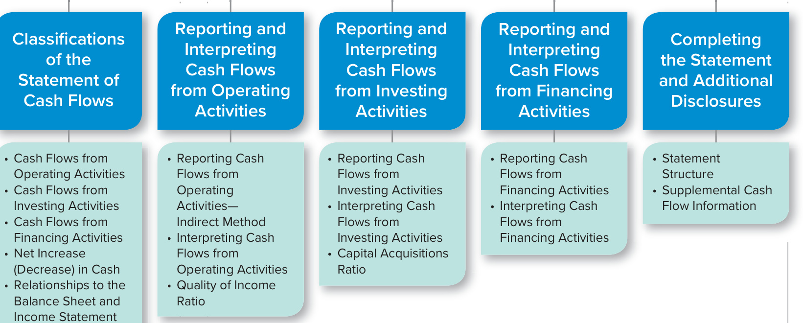  

• Preliminary Steps in Preparing the Cash Flow Statement  

## LEARNING OBJECTIVE 12-1  

Classify cash flow statement items as part of net cash flows from operating, investing, and financing activities.  

## CLASSIFICATIONS OF THE STATEMENT OF CASH FLOWS  

Basically, the statement of cash flows explains how the amount of cash on the balance sheet at the beginning of the period has become the amount of cash reported at the end of the period. For purposes of this statement, the definition of cash includes cash and cash equivalents. Cash equivalents are short-term, highly liquid investments that are both  

1.	Readily convertible to known amounts of cash and  

2.	So near to maturity there is little risk that their value will change if interest rates change.  

Generally, only investments with original maturities of three months or less qualify as a cash equivalent under this definition.1 Examples of cash equivalents are Treasury bills (a form of short-term U.S. government debt), money market funds, and commercial paper (short-term notes payable issued by large corporations).  

As you can see in Exhibit 12.1, the statement of cash flows reports cash inflows and outflows in three broad categories: (1) operating activities, (2) investing activities, and (3) financing activities. Together, these three cash flow categories explain the change in cash from the beginning balance to the ending balance on the balance sheet.  

## NATIONAL BEVERAGE CORP. Consolidated Statement of Cash Flows\* Year Ended April 27, 2019  

## EXHIBIT 12.1  

Consolidated Statement of Cash Flows  

(dollars in thousands)   
Cash flows from operating activities:   
Net income $\mathbb{S}{140,853}$   
Adjustments to reconcile net income to net cash provided by (used in) operating   
activities: Depreciation and amortization 13,444   
Changes in operating assets and liabilities: Accounts receivable (481) Inventories (9,782) Prepaid expenses 5,676 Accounts payable (8,651 Accrued expenses 1,018   
Net cash provided by operating activities 142,077   
Cash flows from investing activities:   
Purchases of property, plant, and equipment (38,333)   
Proceeds from disposal of property, plant, and equipment 18   
Purchase of short-term investments (1,252)   
Proceeds from sale of short-term investments 3,685   
Net cash used by investing activities (35,882)   
Cash flows from financing activities:   
Repayment of principal on long-term debt   
Proceeds from issuance of long-term debt 825   
Repurchase of stock   
Proceeds from issuance of stock 1,576   
Payment of cash dividends (141,391   
Net cash used by financing activities (138,990)   
Net Increase (Decrease) in Cash and Equivalents (32,795)   
Cash and Equivalents—Beginning of Year 189,864   
Cash and Equivalents—End of Year \$157,069  

## NATIONAL BEVERAGE CORP.  

REAL WORLD EXCERPT: Annual Report  

## Cash Flows from Operating Activities  

Cash flows from operating activities (cash flows from operations) are the cash inflows and outflows that relate directly to revenues and expenses reported on the income statement. There are two alternative approaches for presenting the operating activities section of the statement:  

1.	The direct method reports the components of cash flows from operating activities as gross receipts and gross payments.  

<html><body><table><tr><td>Inflows</td><td>Outflows</td></tr><tr><td>Cashreceivedfrom: Customers Dividendsandinterestoninvestments</td><td>Cash paid for: Purchaseofservices(electricity,etc.) andgoodsforresale Salariesandwages Incometaxes Interestonliabilities</td></tr></table></body></html>  

The difference between the inflows and outflows is called net cash provided by (used by) operating activities. National Beverage experienced a net cash inflow of $\mathbb{S}142{,}077$ (all amounts in thousands) from its operations for the fiscal year ended April 27, 2019 (hereafter 2019). Though the FASB recommends the direct method, it is rarely used in the United States. Many financial executives have reported that they do not use it because it is more expensive to implement than the indirect method. Both the FASB and the IASB are considering a proposal to require this method, but intense opposition from the preparer community continues.  

2.	The indirect method starts with net income from the income statement and then eliminates noncash items to arrive at net cash inflow (outflow) from operating activities.  

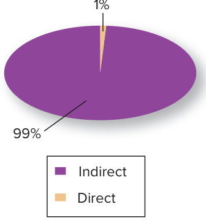  
Use of Direct and Indirect Method by U.S. Companies  

Net income +/− Adjustments for noncash items Net cash inflow (outflow) from operating activities  

Ninety-nine percent of large U.S. companies, including National Beverage, use the indirect method.2 Notice in Exhibit 12.1 that in 2019 National Beverage reported positive net income of $\mathbb{S}140{,}853$ but generated positive cash flows from operating activities of $\mathbb{S}142{,}077$ . Why would income and cash flows from operating activities differ? Remember that on the income statement, revenues are recorded when they are earned, withou regard to when the related cash inflows occur. Similarly, expenses are matched with revenues and recorded without regard to when the related cash outflows occur.  

For now, the most important thing to remember about the two methods is that they are simply alternative ways to arrive at the same number. The total amount of cash flows from operating activities is always the same (an inflow of $^{\S142,077}$ in National Beverage’s case), regardless of whether it is computed using the direct or indirect method, as illustrated below.  

  

Cash flow from operating activities is the same regardless of   
whether it is computed using   
the direct or indirect method.  

<html><body><table><tr><td colspan="2">Direct*</td><td colspan="2">Indirect</td></tr><tr><td>Cashcollectedfromcustomers</td><td>$1,013,624</td><td>Netincome</td><td>$140,853</td></tr><tr><td>Cashpaymentstosuppliers</td><td>(648,188)</td><td>Depreciationandamortization</td><td>13,444</td></tr><tr><td>Cashpaymentsforotherexpenses</td><td>(180,133)</td><td>Changesin operatingassets andliabilities</td><td>(12,220)</td></tr><tr><td>Cashpaymentsforinterest</td><td>(202)</td><td></td><td></td></tr><tr><td>Cashpaymentsforincome taxes</td><td>(43,024)</td><td></td><td></td></tr><tr><td>Netcashprovidedbyoperatingactivities</td><td>142,077</td><td>Net cash provided by operating activities</td><td>$142,077</td></tr></table></body></html>

\*The direct amounts are estimated from National Beverage’s disclosures.  

## Cash Flows from Investing Activities  

Cash flows from investing activities are cash inflows and outflows related to the purchase and disposal of long-lived productive assets and investments in the securities of other companies. Typical cash flows from investing activities include  

<html><body><table><tr><td>Inflows</td><td>Outflows</td></tr><tr><td>Cashreceivedfrom: Sale or disposal of property,plant,</td><td>Cash paid for: Purchaseofproperty,plant,</td></tr><tr><td>and equipment Saleormaturityofinvestmentsin securities</td><td>andequipment Purchaseofinvestmentsin securities</td></tr></table></body></html>  

The difference between these cash inflows and outflows is called net cash provided by (used by) investing activities.  

For National Beverage, this amount was an outflow of $\mathbb{S}35{,}882$ for 2019. All of the activity was related to purchases and sales of short-term investments and the purchase and sale of property, plant, and equipment. Because total purchases exceeded cash collected from sales, there was a net cash outflow.  

## Cash Flows from Financing Activities  

Cash flows from financing activities include exchanges of cash with creditors (debtholders) and owners (stockholders). Usual cash flows from financing activities include the following:  

<html><body><table><tr><td>Inflows</td><td>Outflows</td></tr><tr><td>Cashreceivedfrom: Borrowing on notes,mortgages,bonds,etc., fromcreditors Issuingstocktoowners</td><td>Cash paid for: Repayment of principal to creditors (excluding interest, which is an operating activity) Repurchasingstockfromowners Dividendstoowners</td></tr></table></body></html>  

The difference between these cash inflows and outflows is called net cash provided by (used by) financing activities.  

National Beverage experienced a net cash outflow from financing activities of $\mathbb{S}138{,}990$ for 2019. The Financing Activities section of its statement shows that National Beverage received proceeds in the amount of $\mathbb{S}825$ from issuing long-term debt and $\mathbb{S}1{,}576$ from issuing stock and paid $^{\Phi141,391}$ in dividends.3  

## Net Increase (Decrease) in Cash  

The combination of the net cash flows from operating activities, investing activities, and financing activities must equal the net increase (decrease) in cash for the reporting period. For the year 2019, National Beverage reported a net decrease in cash of $\mathbb{5}32,795$ , which explains the change in cash on the balance sheet from the beginning balance of $\mathbb{S}189{,}864$ to the ending balance of $^{\mathbb{S}157,069}$ .  

<html><body><table><tr><td>Netcashprovidedbyoperating activities</td><td>$142,077</td></tr><tr><td>Net cash used in investing activities</td><td>(35,882) (138,990)</td></tr><tr><td>Netcashusedinfinancingactivities</td><td></td></tr><tr><td>Netdecreaseincashandequivalents</td><td>(32,795) 189,864</td></tr><tr><td>Cash-Beginningofyear Cash-Endofyear</td><td>Beginningandendingba $157,069 fromthebalancesheet</td></tr></table></body></html>  

We just discussed the three main sections of the cash flow statement: Cash Flows from Operating Activities, which are related to earning income from normal operations; Cash Flows from Investing Activities, which are related to the acquisition and sale of productive assets; and Cash Flows from Financing Activities, which are related to external financing of the enterprise. The net cash inflow or outflow for the year is the same amount as the increase or decrease in cash and cash equivalents for the year on the balance sheet. To make sure you understand the appropriate classifications of the different cash flows, answer the following questions before you move on.  

## S E L F - S T U D Y  Q U I Z  

A listing of some typical cash flows reported on a direct method statement of cash flows follows. Indicate whether each item is disclosed in the Operating Activities (O), Investing Activities (I), or Financing Activities (F) section of the statement of cash flows.  

1. Proceeds from issuance of long-term debt.   
2. Collections from customers.   
3. Payment of interest on debt.   
4. Purchase of property, plant, and equipment.   
5. Proceeds from disposal of investment securities.  

After you have completed your answers, check them below.  

Related Homework: M12-3, E12-3  

To give you a better understanding of the statement of cash flows, we now discuss National Beverage’s statement in more detail, including the way in which it relates to the balance sheet and income statement. Then we examine how each section of the statement describes a set of important decisions made by National Beverage’s management. Last, we examine how financial analysts use each section to evaluate the company’s performance.  

## Relationships to the Balance Sheet and Income Statement  

Preparing and interpreting the cash flow statement requires an analysis of the balance sheet and income statement accounts that relate to the three sections of the cash flow statement. In previous chapters, we emphasized that companies record transactions as journal entries that are posted to T-accounts, which are used to prepare the income statement and the balance sheet. But companies cannot prepare the statement of cash flows using the amounts recorded in the T-accounts because those amounts are based on accrual accounting. Instead, they must analyze the numbers recorded under the accrual method and adjust them to a cash basis. To prepare the statement of cash flows, they need the following data:  

1.	Comparative balance sheets used in calculating the cash flows from all activities (operating, investing, and financing).   
2.	A complete income statement used primarily in calculating cash flows from operating activities.   
3.	Additional details concerning selected accounts where the total change in an account balance during the year does not reveal the underlying nature of the cash flows.  

Our approach to preparing and understanding the cash flow statement focuses on the changes in the balance sheet accounts. It relies on a simple manipulation of the balance sheet equation:  

​Assets $=$ Liabilities $^+$ Stockholders’ Equity  

First, assets can be split into cash and noncash assets:  

​Cash + Noncash Assets $=$ Liabilities $^+$ Stockholders’ Equity  

If we move the noncash assets to the right side of the equation, then ​Cash $=$ Liabilities $^+$ Stockholders’ Equity − Noncash Assets  

1. F 2. O 3. O 4. I 5. I  

<html><body><table><tr><td>Category</td><td>Transaction</td><td>Cash Effect</td><td>OtherAccountAffected</td></tr><tr><td rowspan="5">Operating</td><td>Collectaccountsreceivable</td><td>+Cash</td><td>-Accounts Receivable (A)</td></tr><tr><td>Pay accounts payable</td><td>-Cash</td><td>-Accounts Payable (L)</td></tr><tr><td>Prepay rent</td><td>-Cash</td><td>+Prepaid Rent (A)</td></tr><tr><td>Pay interest</td><td>-Cash</td><td>-Retained Earnings (SE)</td></tr><tr><td>Sale for cash</td><td>+Cash</td><td>+Retained Earnings (SE)</td></tr><tr><td rowspan="2">Investing</td><td>Purchase equipmentfor cash</td><td>-Cash</td><td>+Equipment (A)</td></tr><tr><td>Sell investment securities for cash</td><td>+Cash</td><td>-Investments (A)</td></tr><tr><td rowspan="3">Financing</td><td>Pay back debt to bank</td><td>-Cash</td><td>-Notes Payable-Bank (L)</td></tr><tr><td>Issue stockfor cash</td><td>+Cash</td><td>+CommonStockandAdditional</td></tr><tr><td></td><td></td><td>Paid-in Capital (SE)</td></tr></table></body></html>  

Given this relationship, the changes $(\Delta)$ in cash between the beginning and the end of the period must equal the changes $(\Delta)$ in the amounts on the right side of the equation between the beginning and the end of the period:  

$$
\triangle\mathsf{C a s h}=\triangle\mathsf{L i a b i l i t i e s}+\triangle\mathsf{S t o c k h o l d e r s}^{\prime}\mathsf{E q u i t y}-\triangle\mathsf{N o n c a s h}\mathsf{A s s e t s}
$$  

Thus, any transaction that changes cash must be accompanied by a change in liabilities, stockholders’ equity, or noncash assets. Exhibit 12.2 illustrates this concept for selected cash transactions.  

## Preliminary Steps in Preparing the Cash Flow Statement  

Based on this logic, we use the following preliminary steps to prepare the cash flow statement:  

1.	Determine the change in each balance sheet account. From this year’s ending balance, subtract this year’s beginning balance (i.e., last year’s ending balance).   
2.	Classify each change as relating to operating (O), investing (I), or financing (F) activities by marking them with the corresponding letter. Use Exhibit 12.3 as a guide.  

The balance sheet accounts related to earning income (operating items) should be marked with an O. These accounts are often called operating assets and liabilities. The accounts that should be marked with an O include the following:  

Selected Cash Transactions and Their Effects on Other Balance Sheet Accounts  

## EXHIBIT 12.2  

•	 Most current assets (other than short-term investments, which relate to investing activities, and cash).   
•	 Most current liabilities (other than amounts owed to investors and financial institutions,5 all of which relate to financing activities).   
•	 Retained Earnings, because it increases by the amount of net income, which is the starting point for the operating section. (Retained Earnings also decreases by dividends declared and paid, which is a financing outflow noted by an F.)  

## EXHIBIT 12.  

Comparative Balance Sheets and Current Income Statement  

## NATIONAL BEVERAGE CORP.  

REAL WORLD EXCERPT: Annual Report  

## NATIONAL BEVERAGE CORP.  

Consolidated Balance Sheets\* (dollars in thousands)  

<html><body><table><tr><td rowspan="5">ash on Cash C</td><td colspan="3"></td></tr><tr><td></td><td>April 27 2019</td><td>April 28, 2018</td></tr><tr><td>Assets</td><td></td><td></td></tr><tr><td>Current assets:</td><td></td><td></td></tr><tr><td>Cash and equivalents</td><td>$ 157,069 2,914</td><td>$189,864 5,347</td></tr><tr><td>C</td><td>Short-term investments</td><td></td></tr><tr><td>Accounts receivable</td><td>84,841</td><td>84,360</td></tr><tr><td>Inventories</td><td>70,702</td><td>60,920</td></tr><tr><td>Prepaid expenses</td><td>6,800</td><td>12,476</td></tr><tr><td>Total current assets</td><td>322,326</td><td>352,967</td></tr><tr><td></td><td>Property, plant, and equipment-net</td><td>130,736 105,865</td></tr><tr><td>Total assets</td><td>$453,062</td><td>$458,832</td></tr><tr><td>Liabilities and Stockholders' Equity</td><td></td><td></td></tr><tr><td>Current liabilities:</td><td></td><td></td></tr><tr><td>Accounts payable</td><td>$ 66,202</td><td>$ 74,853</td></tr><tr><td>C Accrued expenses</td><td>30,835</td><td>29,817</td></tr><tr><td>Total current liabilities</td><td>97,037</td><td></td></tr><tr><td>Long-term debt</td><td>23,547</td><td>104,670</td></tr><tr><td>Stockholders’ equity:</td><td></td><td>22,722</td></tr><tr><td></td><td>658</td><td></td></tr><tr><td>Common stock</td><td></td><td>657</td></tr><tr><td>Additional paid-in capital</td><td>19,933</td><td>18,358</td></tr><tr><td>nd F Retained earnings</td><td>311,887</td><td>312,425</td></tr><tr><td>Total stockholders'equity</td><td>332,478</td><td>331,440</td></tr><tr><td>Totalliabilitiesandstockholders'equity</td><td>$453,062</td><td>$458,832</td></tr><tr><td>+The Accumulated Depreciation account also is related to operations because it relates to depreciation.</td><td></td><td></td></tr></table></body></html>  

Consolidated Statement of Income\* For the Fiscal Year Ended April 27, 2019 (dollars in thousands)  

NATIONAL BEVERAGE CORP.   

<html><body><table><tr><td>Net sales $1,014,105</td></tr><tr><td>Cost of sales 629,755</td></tr><tr><td>Gross profit 384,350</td></tr><tr><td>Operatingexpenses:</td></tr><tr><td>Selling,general, and administrative expenses 186,827 Depreciation andamortization expense 13,444</td></tr><tr><td>Totaloperatingexpenses 200,271</td></tr><tr><td>OperatingIncome 184,079</td></tr><tr><td>Interest expense 202</td></tr><tr><td>Incomebeforeprovisionforincometaxes 183,877</td></tr><tr><td>Provisionforincometaxes 43,024</td></tr><tr><td>Netincome $ 140,853</td></tr><tr><td>*Certainamountshavebeen adjustedforpedagogicalpurposes.</td></tr></table></body></html>

Source: National Beverage Corp.  

In Exhibit 12.3, all of the operating assets and liabilities have been marked with an O. These items include  

•	 Accounts Receivable •	 Inventories •	 Prepaid Expenses •	 Accounts Payable •	 Accrued Expenses  

As we have noted, retained earnings are also relevant to operations.  

The balance sheet accounts related to investing activities should be marked with an I. These include all of the remaining assets on the balance sheet. In Exhibit 12.3 these items include  

•	 Short-Term Investments •	 Property, Plant, and Equipment, Net  

The balance sheet accounts related to financing activities should be marked with an F. These include all of the remaining liability and stockholders’ equity accounts on the balance sheet. In Exhibit 12.3 these items include  

•	 Long-Term Debt   
•	 Common Stock   
•	 Additional Paid-in Capital   
•	 Retained Earnings (for decreases resulting from dividends declared and paid)  

Next, we use this information to prepare each section of the statement of cash flows.  

## REPORTING AND INTERPRETING CASH FLOWSFROM OPERATING ACTIVITIES  

As noted earlier, the operating section can be prepared in two formats, and nearly all U.S. companies choose the indirect method. As a result, we discuss the indirect method here and the direct method in Supplement A at the end of the chapter.  

Recall that  

1.	Cash flow from operating activities is always the same regardless of whether it is computed using the direct or indirect method.   
2.	The investing and financing sections are always presented in the same manner regardless of the format of the operating section.  

## Reporting Cash Flows from Operating Activities—Indirect Method  

Exhibit 12.3 shows National Beverage’s comparative balance sheets and income statement. Remember that the indirect method starts with net income and converts it to cash flows from operating activities. This involves adjusting net income for the differences in the timing of accrual basis net income and cash flows. The general structure of the operating activities section is  

## Operating Activities  

Net income   
Adjustments to reconcile net income to cash flow from operating activities: $^+$ Depreciation and amortization expense − Gain on sale of investing assets $^+$ Loss on sale of investing assets $^+$ Decreases in operating assets $^+$ Increases in operating liabilities − Increases in operating assets − Decreases in operating liabilities   
Net Cash Flow from Operating Activities  

## LEARNING OBJECTIVE 12-2  

Report and interpret cash flows from operating activities using the indirect method.  

The indirect method operating activities section starts with net income and removes revenues and expenses that do not affect cash.  

## EXHIBIT 12.4  

National Beverage Corp.: Schedule for Net Cash Flow from Operating Activities, Indirect Method (dollars in thousands)  

## CONVERSION OF NET INCOME TO NET CASH FLOW FROM OPERATING ACTIVITIES  

<html><body><table><tr><td>Items</td><td>Amount</td><td>Explanation</td></tr><tr><td>Net income,accrual basis</td><td>$140,853</td><td>From income statement.</td></tr><tr><td>Add(subtract)to convert to cash basis:</td><td></td><td></td></tr><tr><td>Depreciation and amortization</td><td>13,444</td><td>Add back because depreciation and amortization expense does not affect cash.</td></tr><tr><td>Accountsreceivableincrease</td><td>(481)</td><td>Subtract because cash collected from customers is less than accrual basis</td></tr><tr><td>Inventoryincrease</td><td>(9,782)</td><td>revenues. Subtract because purchases are more than cost</td></tr><tr><td>Prepaid expenses decrease</td><td>5,676</td><td>of goods sold expense. Add because cash prepayments for expenses</td></tr><tr><td>Accounts payable decrease</td><td>(8,651)</td><td>are less than accrual basis expenses. Subtract because cash payments to suppliers are more than amounts purchased on</td></tr><tr><td>Accrued expensesincrease</td><td>1,018</td><td>account (borrowed from suppliers). Add because cash payments for expenses are</td></tr><tr><td>Net cash provided by operating activities</td><td>$ 142,077</td><td>less than accrual basis expenses. Subtotal on the statement of cash flows.</td></tr></table></body></html>  

To keep track of all the additions and subtractions made to convert net income to cash flows from operating activities, it is helpful to set up a schedule to record the computations. We will construct a schedule for National Beverage in Exhibit 12.4.  

We begin our schedule presented in Exhibit 12.4 with net income of $\mathbb{S}140{,}853$ taken from National Beverage’s income statement (Exhibit 12.3). Completing the operating section using the indirect method involves two steps:  

Step 1:	 Adjust net income for depreciation and amortization expense and gains and losses on sale of investing assets such as property, plant, and equipment and investments. Recording depreciation and amortization expense does not affect the cash account (or any other operating asset or liability). It affects a noncurrent investing asset (Property, plant, and equipment, net). Because depreciation and amortization expense is subtracted in computing net income but does not affect cash, we always add it back to convert net income to cash flow from operating activities. In the case of National Beverage, we need to remove the effect of depreciation and amortization expense by adding back $^{\S13,444}$ to net income (see Exhibit 12.4).  

If National Beverage had sold property, plant, and equipment at a gain or loss, the amount of cash received would be classified as an investing cash inflow. Because all of the cash received is an investing cash flow, an adjustment also must be made in the operating activities section to avoid double counting the gain or loss. Gains on sales of property, plant, and equipment are subtracted and losses on such sales are added to convert net income to cash flow from operating activities. We illustrate the relevant computations and adjustments for gains and losses on the sale of long-term assets in Supplement B at the end of the chapter.  

Step 2:	 Adjust net income for changes in assets and liabilities marked as operating (O). Each change in operating assets (other than cash and short-term investments) and liabilities (other than amounts owed to owners and financial institutions) causes a difference between net income and cash flow from operating activities. When converting net income to cash flow from operating activities, apply the following general rules:  

Add the change when an operating asset decreases or an operating liability increases.   
Subtract the change when an operating asset increases or an operating liability decreases.  

Understanding what makes these assets and liabilities increase and decrease is the key to understanding the logic of these additions and subtractions.  

## Change in Accounts Receivable  

We illustrate this logic with the first operating item (O) listed on National Beverage’s balance sheet (Exhibit 12.3), accounts receivable. Remember that the income statement reflects sales revenue, but the cash flow statement must reflect cash collections from customers. As the following accounts receivable T-account illustrates, when sales revenues are recorded, accounts receivable increases, and when cash is collected from customers, accounts receivable decreases.  

<html><body><table><tr><td></td><td colspan="3">Accounts Receivable (A)</td></tr><tr><td rowspan="3">Change $481</td><td>Beginning balance</td><td>84,360</td><td></td></tr><tr><td>Salesrevenue (on account)</td><td>1,014,105</td><td>Collectionsfromcustomers 1,013,624</td></tr><tr><td>Ending gbalance</td><td>84,841</td><td></td></tr></table></body></html>  

In the National Beverage example, cash collections from customers are less than sales revenue reported on the income statement by $\S1,\!014,\!105-\S1,\!013,\!624=\S481.$ Because less money was collected from customers, this amount must be subtracted from net income to convert to cash flows from operating activities. Note that this amount is also the same as the change in the accounts receivable account:  

<html><body><table><tr><td>Ending balance 一 Beginning balance</td><td>$84,841</td></tr><tr><td>Change</td><td>84,360 481</td></tr></table></body></html>  

This same underlying logic is used to determine adjustments for the other operating assets and liabilities.  

To summarize, the income statement reflects revenues of the period, but cash flow from operating activities must reflect cash collections from customers. Sales on account increase the balance in accounts receivable, and collections from customers decrease the balance.  

<html><body><table><tr><td colspan="3">Accounts Receivable (A)</td></tr><tr><td>Beginning</td><td>84,360</td><td></td></tr><tr><td>Increase</td><td>481</td><td></td></tr><tr><td>Ending</td><td>84,841</td><td></td></tr></table></body></html>  

The balance sheet for National Beverage Corp. (Exhibit 12.3) indicates an increase in accounts receivable of $\mathbb{S}481$ for the period, which means that cash collected from customers is lower than revenue. To convert to cash flows from operating activities, the amount of the increase (the amount of sales over and above collections) must be subtracted in Exhibit 12.4. (A decrease is added.)  

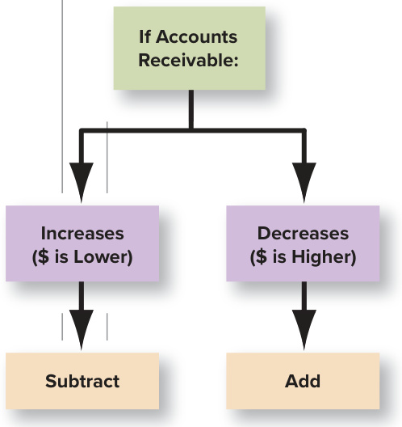  

## Change in Inventory  

The income statement reflects merchandise sold for the period, whereas cash flow from operating activities must reflect cash purchases. As shown in the Inventories T-account, purchases of goods increase the balance in inventory, and recording merchandise sold decreases the balance in inventory.  

<html><body><table><tr><td colspan="2">Inventories (A)</td><td colspan="3">Inventories (A)</td></tr><tr><td>Beg. balance</td><td></td><td>Beg.</td><td>60,920</td><td></td></tr><tr><td>Purchases</td><td>Costs of goods sold</td><td>Increase</td><td>9,782</td><td></td></tr><tr><td>End.bal.</td><td></td><td>End.</td><td>70,702</td><td></td></tr></table></body></html>  

National Beverage’s balance sheet (Exhibit 12.3) indicates that inventory increased by $\mathbb{S}9\mathrm{,}782$ , which means that the amount of purchases is more than the amount of merchandise sold. The increase (the extra goods purchased) must be subtracted from net income to convert to cash flow from operating activities in Exhibit 12.4. (A decrease is added.)  

## Change in Prepaid Expenses  

The income statement reflects expenses of the period, but cash flow from operating activities must reflect the cash payments. Cash prepayments increase the balance in prepaid expenses, and recording of expenses decreases the balance in prepaid expenses.  

<html><body><table><tr><td colspan="2">Prepaid Expenses (A)</td><td colspan="3">Prepaid Expenses (A)</td></tr><tr><td>Beg. bal.</td><td></td><td>Beg.</td><td>12,476</td><td></td></tr><tr><td>Cashp prepayments</td><td>Servicesused (expense)</td><td></td><td></td><td>Decrease 5,676</td></tr><tr><td>End.bal.</td><td></td><td>End.</td><td>6,800</td><td></td></tr></table></body></html>  

The National Beverage balance sheet (Exhibit 12.3) indicates a $\mathbb{S}5{,}676$ decrease in prepaid expenses, which means that new cash prepayments are less than the amount of expenses. The decrease (the extra expenses) must be added to net income in Exhibit 12.4.  

## Change in Accounts Payable  

Cash flow from operations must reflect cash purchases, but not all purchases are for cash. Purchases on account increase accounts payable and cash paid to suppliers decreases accounts payable.  

<html><body><table><tr><td colspan="2">Accounts Payable (L)</td><td colspan="4">Accounts Payable (L)</td></tr><tr><td>Beg. bal.</td><td></td><td></td><td></td><td>Beg.</td><td>74,853</td></tr><tr><td>Cashpayments</td><td>Purchasesonaccount</td><td>Decrease</td><td>8,651</td><td></td><td></td></tr><tr><td>End.bal.</td><td></td><td></td><td></td><td>End.</td><td>66,202</td></tr></table></body></html>  

National Beverage’s accounts payable decreased by $\Phi8{,}651$ , which means that cash payments were more than purchases on account. This decrease (the extra cash payments) must be subtracted in Exhibit 12.4. (An increase is added.)  

## Change in Accrued Expenses  

The income statement reflects all accrued expenses, but the cash flow statement must reflect actual payments for those expenses. Recording accrued expenses increases the balance in the liability accrued expenses and cash payments for the expenses decrease accrued expenses.  

<html><body><table><tr><td colspan="2">Accrued Expenses (L)</td><td colspan="2">Accrued Expenses (L)</td></tr><tr><td rowspan="2">Pay off accruals</td><td>Beg. bal.</td><td>Beg.</td><td>29,817</td></tr><tr><td>Accrued expenses</td><td>Increase</td><td>1,018</td></tr><tr><td></td><td>End.bal.</td><td>End.</td><td>30,835</td></tr></table></body></html>  

National Beverage’s accrued expenses (Exhibit 12.3) increased by $\mathbb{S}1{,}018$ which indicates that cash paid for the expenses is less than accrual basis expenses. The increase (the lower cash paid) must be added in Exhibit 12.4. (A decrease is subtracted.)  

## Summary  

We can summarize the typical additions and subtractions that are required to reconcile net income with cash flow from operating activities as follows:  

<html><body><table><tr><td rowspan="3">Item</td><td colspan="2">ADDITIONSANDSUBTRACTIONS TORECONCILENETINCOMETOCASH FLOWFROMOPERATINGACTIVITIES</td></tr><tr><td>WhenItemIncreases</td><td>WhenItemDecreases</td></tr><tr><td>+</td><td>NA</td></tr><tr><td>Depreciationandamortization Gainonsaleoflong-termassets</td><td></td><td></td></tr><tr><td></td><td></td><td>NA</td></tr><tr><td>Lossonsaleoflong-termassets Accountsreceivable</td><td>+</td><td>NA</td></tr><tr><td>Inventory</td><td></td><td>+</td></tr><tr><td>Prepaidexpenses</td><td></td><td>+</td></tr><tr><td>Accountspayable</td><td>+</td><td>+</td></tr><tr><td>Accruedexpenseliabilities</td><td>+</td><td></td></tr><tr><td></td><td></td><td></td></tr></table></body></html>  

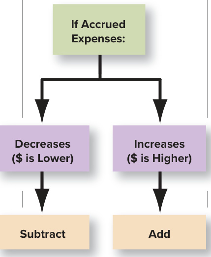  

Notice again in this table that to reconcile net income to cash flow from operating activities, you must:  

•	 Add the change when an operating asset decreases or an operating liability increases.   
•	 Subtract the change when an operating asset increases or an operating liability decreases.  

The cash flow statement for National Beverage (Exhibit 12.1) shows the same additions and subtractions to reconcile net income to cash flow from operating activities described in Exhibit 12.4.  

## INTERNATIONAL PERSPECTIVE  

## Classification of Interest on the Cash Flow Statement  

U.S. GAAP and IFRS differ in the cash flow statement treatment of interest received and interest paid as follows:  

<html><body><table><tr><td></td><td>InterestReceived</td><td>InterestPaid</td></tr><tr><td>U.S.GAAP</td><td>Operating</td><td>Operating</td></tr><tr><td>IFRS</td><td>Operating orInvesting</td><td>Operating or Financing</td></tr></table></body></html>  

Under U.S. GAAP, interest paid and received are both classified as operating cash flows because the related revenue and expense enter into the computation of net income. This makes it easier to compare net income to cash flow from operations. It also benefits the financial statement user by ensuring comparability across companies. IFRS, on the other hand, allows interest received to be classified as either operating or investing and interest paid to be classified as either operating or financing. This recognizes that interest received results from investing activities, whereas interest paid, like dividends paid, involves payments to providers of financing. However, the alternative classifications may be confusing to financial statement readers.  

## Tip  

When preparing the indirect method operating section, (1) add operating asset decreases and operating liability increases, and (2) subtract operating asset increases and operating liability decreases.  

## P A U S E  F O R  F E E D B A C K  

The indirect method for reporting cash flows from operating activities reports a conversion of net income to net cash flow from operating activities. The conversion involves additions and subtractions for (1) expenses (such as depreciation expense) and revenues that do not affect current assets or current liabilities and (2) changes in each of the individual current assets (other than cash and short-term investments) and current liabilities (other than short-term debt to financial institutions, current maturities of long-term debt, and dividends payable, which relate to financing), which reflect differences in the timing of accrual basis net income and cash flows. To test whether you understand these concepts, answer the following questions before you move on.  

## S E L F - S T U D Y  Q U I Z  

Indicate which of the following items taken from Coca-Cola Company’s cash flow statement would be added $(+)$ , subtracted $(-)$ , or not included (NA) in the reconciliation of net income to cash flow from operations.  

1. Increase in inventories. 4. Decrease in accounts receivable.   
2. Issuances of stock. 5. Increase in accounts payable.   
3. Amortization expense. 6. Increase in prepaid expenses.  

After you have completed your answers, check them below.  

  

## G U I D E D H E L P  1 2 - 1  

For additional step-by-step video instruction on preparing the operating section of the statement of cash flows using the indirect method, go to mhhe.com/libby_gh12-1.  

Related Homework: M12-1, M12-2, E12-1  

  

## Interpreting Cash Flows from Operating Activities  

The operating activities section of the cash flow statement focuses attention on the firm’s ability to generate cash internally through operations and its management of operating assets and operating liabilities (also called operating working capital). Most analysts believe that this is the most important section of the statement because, in the long run, operations are the only source of cash. That is, investors will not invest in a company if they do not believe that cash generated from operations will be available to pay them dividends or expand the company. Similarly, creditors will not lend money if they do not believe that cash generated from operations will be available to pay back the loan. For example, many dot-com companies crashed when investors lost faith in their ability to turn business ideas into cash flows from operations.  

A common rule of thumb followed by financial and credit analysts is to avoid firms with rising net income but falling cash flow from operations. Rapidly rising inventories or receivables often predict a slump in profits and the need for external financing. A true understanding of the meaning of the difference requires a detailed understanding of its causes.  

In 2019, National Beverage reported that cash flow from operations was higher than net income. What caused this relationship? To answer these questions, we must carefully analyze how National Beverage’s operating activities are reported in its cash flow statement. To properly interpret this information, we also must learn more about the beverage industry. National Beverage normally reports higher cash flow from operations than net income because of the effect of depreciation and amortization, which reduces income but is not a cash outflow. At the same time, it carefully manages the assets and liabilities that enter into the operating cash flow calculation, keeping those total changes to a minimum. Many analysts compute the quality of income ratio as a general sign of the ability to generate cash through operations.  

## Quality of Income Ratio  

ANALYTICAL QUESTION  

How much cash does each dollar of net income generate?  

## RATIO AND COMPARISONS  

National Beverage Corp.’s ratio for the year 2019 was  

$$
\frac{\mathbb{S}142,077}{\mathbb{S}140,853}\!=\!1.01\left(101\%\right)
$$  

<html><body><table><tr><td colspan="3">COMPARISONSOVERTIME</td><td colspan="2">COMPARISONSWITHCOMPETITORS</td></tr><tr><td colspan="3">NationalB Beverage</td><td>Coca-Cola</td><td>PepsiCo</td></tr><tr><td>2019</td><td>2018</td><td>2017</td><td>2019</td><td>2019</td></tr><tr><td>1.01</td><td>1.03</td><td>1.07</td><td>1.17</td><td>1.31</td></tr></table></body></html>  

## INTERPRETATIONS  

In General The quality of income ratio measures the portion of income that was generated in cash. All other things equal, a higher quality of income ratio indicates greater ability to finance operating and other cash needs from operating cash inflows. A higher ratio also indicates that it is less likely that the company is using aggressive revenue recognition policies to increase net income, and therefore is less likely to experience a decline in earnings in the future. When this ratio does not equal 1.0, analysts must establish the sources of the difference to determine the significance of the findings. There are four potential causes of any difference:  

1.	 The corporate life cycle (growth or decline in sales). When sales are increasing, receivables and inventory normally increase faster than accounts payable. This often reduces operating cash flows below income, which, in turn, reduces the ratio. When sales are declining, the opposite occurs, and the ratio increases.  

2.	 Seasonality. Seasonal (from quarter to quarter) variations in sales and purchases of inventory can cause the ratio to deviate from 1.0 during particular quarters.  

## LEARNING OBJECTIVE 12-3  

3.	 Changes in revenue and expense recognition. Aggressive revenue recognition or failure to accrue appropriate expenses will inflate net income and reduce the ratio.  

Analyze and interpret the quality of income ratio.  

4.	 Changes in management of operating assets and liabilities. Inefficient management will increase operating assets and decrease liabilities, reducing operating cash flows and the quality of income ratio. More efficient management, such as shortening of customer payment terms, will have the opposite effect.  

Focus Company Analysis During the past three years, National Beverage’s quality of income ratio has stayed relatively stable. Its ratio is below those of Coca-Cola and PepsiCo. National Beverage’s lower ratio generally would be judged negatively by analysts and would prompt them to read the management’s discussion and analysis section of the annual report to determine its causes.  

  
Selected Focus Company Comparisons   
SSttaarrbbuucckkss  

A Few Cautions The quality of income ratio can be interpreted based only on an understanding of the company’s business operations and strategy. For example, a low ratio for a quarter can be due simply to normal seasonal changes. However, it also can indicate obsolete inventory, slowing sales, or failed expansion plans. To test for these possibilities, analysts often analyze this ratio in tandem with the accounts receivable turnover and inventory turnover ratios.  

  

INVESTORS CHRONICLE REAL WORLD EXCERPT  

## Fraud and Cash Flows from Operations  

The cash flow statement often gives outsiders the first hint that financial statements may contain errors and irregularities. The importance of this indicator as a predictor is receiving more attention in the United States and internationally. Investors Chronicle reported on an accounting fraud at a commercial credit company, suggesting the following.  

. . a look at Versailles’s cash flow statement—an invaluable tool in spotting creative accounting—should have triggered misgivings. In the company’s last filed accounts . . . Versailles reported operating profits of . . . $\mathbb{S}25$ million but a cash outflow from operating activities of $\mathbb{S}24$ million . . . such figures should . . . have served as a warning. After all, what use is a company to anyone if it reports only accounting profits which are never translated into cash?  

## LEARNING OBJECTIVE 12-4  

Report and interpret cash flows from investing activities.  

Remember that the investing and financing activities are always presented using the “direct method.” That is, they list the gross receipts and payments due to each activity.  

Source: James Chapman, “Creative Accounting: Exposed!,” Investors Chronicle, March 2, 2001.  

As noted in earlier chapters, unethical managers sometimes attempt to reach earnings targets by manip ulating accruals and deferrals of revenues and expenses to inflate income. Because these adjusting entries do not affect the cash account, they have no effect on the cash flow statement. A growing difference between net income and cash flow from operations can be a sign of such manipulations. This early warn ing sign has signaled some famous bankruptcies, such as that of W. T. Grant in 1975. The company had inflated income by failing to make adequate accruals of expenses for uncollectible accounts receivable and obsolete inventory. The more astute analysts noted the growing difference between net income and cash flow from operations and recommended selling the stock long before the bankruptcy.  

## REPORTING AND INTERPRETING CASH FLOWS FROM INVESTING ACTIVITIES  

## Reporting Cash Flows from Investing Activities  

Preparing this section of the cash flow statement requires an analysis of the accounts related to property, plant, and equipment; intangible assets; and investments in the securities of other companies. Normally, the relevant balance sheet accounts include Short-Term Investments and long-term asset accounts such as Long-Term Investments and Property, Plant, and Equipment. The following relationships are the ones that you will encounter most frequently:  

<html><body><table><tr><td>Related Balance Sheet Account(s)</td><td>InvestingActivity</td><td>Cash Flow Effect</td></tr><tr><td>Property,plant,andequipment and intangible assets (patents,etc.)</td><td>Purchase of property, plant, and equipment or intangibleassetsforcash</td><td>Outflow</td></tr><tr><td rowspan="3">Short-orlong-terminvestments(stocks andbondsofothercompanies)</td><td>Saleofproperty,plant,andequipment or intangibleassetsforcash</td><td>Inflow</td></tr><tr><td>Purchaseofinvestmentsecuritiesforcash</td><td>Outflow</td></tr><tr><td>Sale(maturity)ofinvestmentsecuritiesforcash</td><td>Inflow</td></tr></table></body></html>  

Remember that:  

•	 Only purchases paid for with cash or cash equivalents are included. •	 The amount of cash that is received from the sale of assets is included, regardless of whether the assets are sold at a gain or loss.  

<html><body><table><tr><td>Items</td><td>CashInflows (Outflows)</td><td>Explanation</td></tr><tr><td>Cashflowsfrominvestingactivities: Purchases of property, plant, and equipment Proceeds from disposal of property, plant,and</td><td>$(38,333) 18</td><td>Paymentincashforequipment Receipt of cash from sale of</td></tr><tr><td>equipment Purchaseofshort-terminvestments</td><td>(1,252)</td><td>equipment Paymentincashfornewinvestments</td></tr><tr><td>Proceedsfromsaleofshort-terminvestments Netcashusedbyinvestingactivities</td><td>3,685 $(35,882)</td><td>Receiptofcashfromsaleofinvestments</td></tr></table></body></html>  

## EXHIBIT 12.5  

National Beverage Corp.: Schedule for Net Cash Flow from Investing Activities (dollars in thousands)  

In National Beverage’s case, the balance sheet (Exhibit 12.3) shows two investing assets (noted with an I) that have changed during the period: Property, Plant, and Equipment, Net, and Short-Term Investments. To determine the causes of these changes, accountants need to search the related company records.  

## Property, Plant, and Equipment, Net  

Analysis of National Beverage Corp.’s records reveals that the company purchased new property, plant, and equipment for $^{\mathbb{S}38,333}$ in cash, which is a cash outflow. The company also sold old equipment for $\mathbb{S}18$ in cash, an amount equal to its net book value. This is a cash inflow. These investing items are listed in the schedule of investing activities in Exhibit 12.5. These items, less the amount of depreciation and amortization expense added back in the Operations section $(\Phi13,444)$ , explain the increase in property, plant, and equipment, net, of $\mathbb{S}24{,}871$ .  

<html><body><table><tr><td colspan="3">Property, Plant, and Equipment, Net (A)</td></tr><tr><td>Beginning</td><td>105,865</td><td>Sold 18</td></tr><tr><td>Purchased</td><td>38,333</td><td>Depreciation and amortization 13,444</td></tr><tr><td>Ending</td><td>130,736</td><td></td></tr></table></body></html>  

## Investments  

National Beverage’s records indicate that it purchased $\mathbb{S}1{,}252$ in short-term investments during the year for cash, which is an investing cash outflow. The company also sold short-term investments for $\mathbb{S}3{,}685$ , an amount equal to their net book value. These investing items are listed in the schedule of investing activities in Exhibit 12.5. They explain the $\Phi2{,}433$ decrease in shortterm investments reported on the balance sheet. Changes in long-term investments would be treated in the same fashion.  

<html><body><table><tr><td colspan="4">Short-TermInvestments (A)</td></tr><tr><td>Beginning</td><td>5,347</td><td></td><td></td></tr><tr><td>Purchased</td><td>1,252</td><td>Sold</td><td>3,685</td></tr><tr><td>Ending</td><td>2,914</td><td></td><td></td></tr></table></body></html>  

The net cash flow from investing activities resulting from these four items is a $\mathbb{S}35{,}882$ outflow (see Exhibit 12.5).  

## Interpreting Cash Flows from Investing Activities  

Two common ways to assess a company’s ability to internally finance its expansion needs are the capital acquisitions ratio and free cash flow.  

## LEARNING OBJECTIVE 12-5  

Analyze and interpret the capital acquisitions ratio.  

Selected Focus Company Comparisons  

## Capital Acquisitions Ratio  

ANALYTICAL QUESTION  

To what degree was the company able to finance purchases of property, plant, and equipment with cash provided by operating activities?  

## RATIO AND COMPARISONS  

C__as_h_ _F_lo__w_ f_r_o_m_ _O_p_e_r_at_i_n_g _A_c_t_iv_it_i_e_s ​Capital Acquisitions Ratio $=$ Cash Paid for Property, Plant, and Equipment National Beverage’s ratio for 2019 was $\frac{\Re{142},\mathbf{077}}{\Im{38},333}=3.71$  

Examine the ratio using two techniques:  

<html><body><table><tr><td colspan="3">COMPARISONSOVERTIME</td><td colspan="2">COMPARISONSWITHCOMPETITORS</td></tr><tr><td colspan="3">NationalE Beverage</td><td>Coca-Cola</td><td>PepsiCo</td></tr><tr><td>2019</td><td>2018</td><td>2017</td><td>2019</td><td>2019</td></tr><tr><td>3.71</td><td>4.84</td><td>8.15</td><td>5.10</td><td>2.28</td></tr></table></body></html>  

## INTERPRETATIONS  

In General The capital acquisitions ratio reflects the portion of purchases of property, plant, and equipment financed from operating activities (without the need for outside debt or equity financing or the sale of other investments or fixed assets). A high ratio indicates less need for outside financing for current and future expansion. It benefits the company because it provides the company opportunities for strategic acquisitions, avoids the cost of additional debt, and reduces the risk of bankruptcy that comes with additional leverage (see Chapter 10).  

Focus Company Analysis National Beverage’s capital acquisitions ratio has decreased from 8.15 to 3.71 in recent years. It still generates more than sufficient cash to meet its investing needs. As a consequence, when credit markets tighten during a financial downturn, National Beverage’s investment plans are unaffected. National Beverage also has maintained a ratio that is higher than one of its larger competitors,  

PepsiCo, but lower than Coca-Cola’s.  

A Few Cautions Because the needs for investment in plant and equipment differ dramatically across industries (e.g., airlines versus pizza delivery restaurants), a particular firm’s ratio should be compared only with its prior years’ figures or with other firms in the same industry. Also, a high ratio may indicate a failure to update plant and equipment, which can limit a company’s ability to compete in the future.  

## FINANCIAL ANALYSIS  

## Free Cash Flow  

Managers and analysts often calculate free cash $\mathbf{flow}^{8}$ as a measure of a firm’s ability to pursue long-term investment opportunities. Free cash flow is normally calculated as follows:  

Free Cash Flow $=$ Cash Flow from Operating Activities −  Dividends − Capital Expenditures  

Any positive free cash flow is available for additional capital expenditures, investments in other companies, and mergers and acquisitions without the need for external financing or reductions in dividends to shareholders. While free cash flow is considered a positive sign of financial flexibility, it also can represent a hidden cost to shareholders. Sometimes managers use free cash flow to pursue unprofitable investments just for the sake of growth or to obtain perquisites (such as fancy offices and corporate jets) that do not benefit the shareholders. In these cases, the shareholders would be better off if free cash flow were paid as additional dividends or used to repurchase the company’s stock on the open market.  

## REPORTING AND INTERPRETING CASH FLOWSFROM FINANCING ACTIVITIES  

## Reporting Cash Flows from Financing Activities  

Financing activities are associated with generating capital from creditors and owners. This section of the cash flow statement reflects changes in two current liabilities, Notes Payable to Financial Institutions (often called short-term debt) and Current Maturities of Long-Term Debt, as well as changes in long-term liabilities and stockholders’ equity accounts. These balance sheet accounts relate to the issuance and retirement of debt and stock and the payment of dividends. The following relationships are the ones that you will encounter most frequently:  

<html><body><table><tr><td>RelatedBalanceSheetAccount(s)</td><td>Financing Activity</td><td>Cash Flow Effect</td></tr><tr><td>Short-termdebt(notespayable)</td><td>Borrowingcashfrombanks orotherfinancialinstitutions</td><td>Inflow</td></tr><tr><td rowspan="3">Long-term debt</td><td>Repaymentofloanprincipal</td><td>Outflow</td></tr><tr><td>Issuanceofbondsforcash</td><td>Inflow</td></tr><tr><td>Repayment of bond principal</td><td>Outflow</td></tr><tr><td>Commonstockandadditional paid-in capital</td><td>Issuanceofstockforcash</td><td>Inflow</td></tr><tr><td rowspan="2">Retainedearnings</td><td>Repurchase(retirement)of stockwith cash</td><td>Outflow</td></tr><tr><td>Paymentofcashdividends</td><td>Outflow</td></tr></table></body></html>  

Remember that:  

•	 Cash repayments of principal are cash flows from financing activities.  

•	 Interest payments are cash flows from operating activities. Because interest expense is reported on the income statement, the related cash flow is shown in the operating section.  

•	 Dividend payments are cash flows from financing activities. Dividend payments are not reported on the income statement because they represent a distribution of income to owners. Therefore, they are shown in the financing section.  

•	 If debt or stock is issued for other than cash, it is not included in this section.  

To compute cash flows from financing activities, you should review changes in debt and stockholders’ equity accounts. In the case of National Beverage Corp., the analysis of changes in the balance sheet (Exhibit 12.3) finds that only long-term debt, common stock, and additional paid-in capital changed during the period (noted with an F) and retained earnings changed (noted with an F and an O).  

## Short- and Long-Term Debt  

When there is additional borrowing or principal repayments on long-term debt owed to financial institutions and investors, those amounts are financing cash flows. The appropriate amounts are determined by analyzing the long-term debt account. For 2019 the company repaid zero  

Report and interpret cash flows from financing activities.  

Tip Interest payments are operating cash flows while dividend payments are financing cash flows.  

## EXHIBIT 12.6  

National Beverage Corp.: Schedule for Net Cash Flow from Financing Activities (dollars in thousands)  

<html><body><table><tr><td>Items</td><td>CashInflows (Outflows)</td><td>Explanation</td></tr><tr><td>Cashflowsfromfinancingactivities: Repayment of principal onlong-term debt Proceedsfromissuanceoflong-termdebt</td><td>$ 825</td><td>Cash payments of principal on long-term debt Cash proceedsfrom issuinglong-term debt</td></tr><tr><td>Repurchaseofstock Proceedsfromissuanceofstock</td><td>一 1,576</td><td>Cash payments to repurchase common stock Cashproceedsfromissuingcommonstock</td></tr><tr><td>Paymentofcashdividends Netcashusedbyfinancingactivities</td><td>(141,391) ($138,990)</td><td>Cashpaymentsofdividendstoshareholders Subtotalonthestatementofcashflows</td></tr></table></body></html>  

in principal on long-term debt. This amount is listed in the schedule of financing activities in Exhibit 12.6. There were no additional borrowings on long-term debt.  

<html><body><table><tr><td colspan="3">Long-Term Debt (L)</td></tr><tr><td></td><td>Beginning</td><td>22,722</td></tr><tr><td>Retire (repay)</td><td>0 Issue (borrow)</td><td>825</td></tr><tr><td></td><td>Ending</td><td>23,547</td></tr></table></body></html>  

If the company had borrowed or repaid short-term debt to financial institutions, it would be treated in the same fashion.  

## Common Stock and Additional Paid-in Capital  

National Beverage’s change in common stock and additional paid-in capital resulted from two decisions. National Beverage decided not to repurchase any outstanding stock during the year. But the company did issue common stock for $\mathbb{S}1{,}576$ in cash, which is a financing cash inflow.9 This accounts for the $\mathbb{S}1{,}576$ increase in common stock and additional paid-in capital. The amount is listed as an inflow in the schedule of financing activities in Exhibit 12.6.  

<html><body><table><tr><td colspan="3">Common Stock (SE)</td><td colspan="3">Additional Paid-in Capital (SE)</td></tr><tr><td></td><td>Beginning</td><td>657</td><td></td><td>Beginning</td><td>18,358</td></tr><tr><td>Repurchase</td><td>Issue</td><td>1</td><td>Repurchase</td><td>Issue</td><td>1,575</td></tr><tr><td></td><td>Ending</td><td>658</td><td></td><td>Ending</td><td>19,933</td></tr></table></body></html>  

## Retained Earnings  

Finally, retained earnings should be analyzed. Retained earnings rise when income is earned and fall when dividends are declared and paid. National Beverage earned $\mathbb{S}140{,}853$ in income and paid $^{\S141,391}$ in dividends during 2019. National Beverage’s dividend payment is listed on the schedule of financing activities in Exhibit 12.6.  

<html><body><table><tr><td colspan="4">Retained Earnings (SE)</td></tr><tr><td></td><td></td><td>Beginning</td><td>312,425</td></tr><tr><td>Dividends</td><td>141,391</td><td>NetIncome</td><td>140,853</td></tr><tr><td></td><td></td><td>Ending</td><td>311,887</td></tr></table></body></html>  

## Interpreting Cash Flows from Financing Activities  

The long-term growth of a company is normally financed from three sources: internally generated funds (cash from operating activities), the issuance of stock, and money borrowed on a long-term basis. As we discussed in Chapter 10, companies can adopt a number of different capital structures (the balance of debt and equity). The financing sources that management uses to fund growth will have an important impact on the firm’s risk and return characteristics. The statement of cash flows shows how management has elected to fund its growth. This information is used by analysts who wish to evaluate the capital structure and growth potential of a business.  

As we discussed, the investing section of the statement of cash flows includes cash payments to acquire fixed assets and short- and long-term investments and cash proceeds from the sale of fixed assets and short- and long-term investments. Cash inflows from financing activities include cash proceeds from the issuance of short- and long-term debt and common stock. Cash outflows include cash principal payments on short- and long-term debt, cash paid for the repurchase of the company’s stock, and cash dividend payments. Check your understanding of these concepts by answering the following questions before you move on.  

## S E L F - S T U D Y  Q U I Z  

Indicate which of the following items taken from the cash flow statement of Coca-Cola Company would be reported in the Investing section (I) or the Financing section (F) and whether the amount would be an inflow $(+)$ or an outflow $(-)$ .  

1. Purchases of investments.   
2. Proceeds from issuance of debt (to bank).   
3. Cash dividends paid.   
4. Proceeds from issuance of common stock.   
5. Proceeds from disposals of property, plant, and equipment.  

After you have completed your answers, check them below.  

G U I D E D H E L P  1 2 - 2  

  

For additional step-by-step video instruction on preparing the investing and financing sections of the statement of cash flows, go to mhhe.com/libby_gh12-2.  

Related Homework: M12-1, E12-1, E12-2  

## COMPLETING THE STATEMENT AND ADDITIONALDISCLOSURES  

## Statement Structure  

Refer to the formal statement of cash flows for National Beverage Corp. shown in Exhibit 12.1. As you can see, it is a simple matter to construct the statement after the detailed analysis of the accounts and transactions has been completed (shown in Exhibits 12.4, 12.5, and 12.6). Exhibit 12.7 summarizes the general structure of the statement for companies that use the indirect method for the operating section. When the net increase or decrease in cash and cash equivalents is added to the cash and cash equivalents taken from the beginning-of-period amount on the balance sheet, it equals the end-of-period cash and cash equivalents amount reported on the balance sheet. Companies also must provide two other disclosures related to the cash flow statement.  

## LEARNING OBJECTIVE 12-7  

Understand the format of the cash flow statement and additional cash flow disclosures.  

## EXHIBIT 12.  

## Statement of Cash Flows (Indirect Method)  

## Operating Activities:  

Structure of the Statement of Cash Flows (Indirect Method)  

$^+$ Depreciation and amortization expense − Gain on sale of long-term assets $^+$ Loss on sale of long-term assets $^+$ Decreases in operating assets $^+$ Increases in operating liabilities − Increases in operating assets − Decreases in operating liabilities  

## Net Cash Flow from Operating Activities  

## Investing Activities:  

− Purchase of property, plant, and equipment or intangible assets $^+$ Sale of property, plant, and equipment or intangible assets − Purchase of investment securities + Sale (maturity) of investment securities  

## Net Cash Flow from Investing Activities  

## Financing Activities:  

$^+$ Borrowing from bank or other financial institution   
− Repayment of loan principal   
$^+$ Issuance of bonds for cash   
− Repayment of bond principal   
$^+$ Issuance of stock   
− Repurchase (retirement) of stock   
− Payment of (cash) dividends  

<html><body><table><tr><td>Net increase or decrease in cash and cash equivalents</td></tr><tr><td>Cash and cash equivalents at beginning of period</td></tr><tr><td>Cash and cash equivalents ate end of period</td></tr></table></body></html>  

## Supplemental Cash Flow Information  

Two additional required cash flow disclosures are normally listed at the bottom of the statement or in the notes.  

## Noncash Investing and Financing Activities  

Certain transactions are important investing and financing activities but have no cash flow effects. These are called noncash investing and financing activities. For example, the purchase of a $\mathbb{S}100{,}000$ building with a $\mathbb{S}100{,}000$ mortgage given by the former owner does not cause either an inflow or an outflow of cash. As a result, these noncash activities are not listed in the three main sections of the cash flow statement. However, supplemental disclosure of these transactions is required, in either narrative or schedule form. National Beverage’s statement of cash flows does not list any noncash investing and financing activities.  

## Cash Paid for Interest and Income taxes  

Companies that use the indirect method of presenting cash flows from operations also must provide two other figures: cash paid for interest and cash paid for income taxes.  

During an earlier year (ended April 30), National Beverage Corp. reported net income of $\mathbb{S}24,742$ (all numbers in thousands of dollars). The company also reported the following activities:  

a.	 Purchased equipment for $\mathbb{S}6{,}658$ in cash. d.	 Sold short-term investments for $\mathbb{S}112,450$ ,   
b.	 Disposed of equipment for $\mathbb{S}167$ in cash, its their net book value on the date of sale. net book value on the date of sale. $e_{\cdot}$ .	 Issued stock for $\mathbb{S}950$ in cash.   
c.	 Purchased short-term investments for $f_{\cdot}$ Repurchased treasury stock for $\mathbb{S}305$ in cash. $^{\S109,450}$ . $\ g.$ .	 Depreciation of equipment was $\mathbb{S}8{,}891$ for the year.  

Its comparative balance sheets are presented below.  

<html><body><table><tr><td colspan="3">NATIONALBEVERAGECORP. Balance Sheets* April 30</td></tr><tr><td>(dollars in thousands)</td><td>Current Year</td><td>Prior Year</td></tr><tr><td>Assets</td><td></td><td></td></tr><tr><td>Current assets: Cash and cash equivalents</td><td>$ 84,140</td><td>$ 51,497</td></tr><tr><td>Short-term investments</td><td></td><td>3,000</td></tr><tr><td>Accounts receivable</td><td>53,735</td><td>49,186</td></tr><tr><td>Inventories</td><td>39,612</td><td>38,754 12,009</td></tr><tr><td>Prepaid expenses</td><td>5,552</td><td></td></tr><tr><td>Total current assets Equipment, net</td><td>183,039 79,381</td><td>154,446 81,781</td></tr><tr><td>Total assets</td><td>$262,420</td><td>$236,227</td></tr><tr><td>Liabilities and Stockholders' Equity</td><td></td><td></td></tr><tr><td>Current liabilities:</td><td></td><td></td></tr><tr><td>Accounts payable</td><td>$ 48,005</td><td>$ 49,803</td></tr><tr><td>Accrued expenses</td><td>44,403</td><td>41,799</td></tr><tr><td>Total current liabilities</td><td>92,408</td><td>91,602</td></tr><tr><td>Stockholders’ equity:</td><td></td><td></td></tr><tr><td>Common stock and additional paid-in capital</td><td>9,803</td><td>9,158</td></tr><tr><td>Retained earnings</td><td>160,209</td><td>135,467</td></tr><tr><td>Total stockholders’equity</td><td>170,012</td><td>144,625</td></tr><tr><td>Total liabilities and stockholders’ equity</td><td>$262,420</td><td>$236,227</td></tr><tr><td></td><td></td><td></td></tr><tr><td>*This statement has been modified for instructional purposes.</td><td></td><td></td></tr></table></body></html>

Source: National Beverage Corp.  

## Required:  

Based on this information, prepare the cash flow statement using the indirect method. Evaluate cash flows reported in the statement.  

SUGGESTED SOLUTION  

NATIONAL BEVERAGE CORP. Statement of Cash Flows\* Year ended April 30 (dollars in thousands) Cash flows from operating activities: Net income \$ 24,742 Adjustments to reconcile net income to cash flow from operating activities: Depreciation and amortization 8,891 Changes in assets and liabilities: Accounts receivable (4,549) Inventory (858) Prepaid expenses 6,457 Accounts payable (1,798) Accrued expenses 2,604 Net cash provided by operating activities 35,489 Cash flows from investing activities: Purchases of property, plant, and equipment (6,658) Proceeds from disposal of property, plant, and 167 equipment Purchase of short-term investments (109,450) Proceeds from sale of short-term investments 112,450 Net cash used in investing activities (3,491) Cash flows from financing activities: Purchase of treasury stock (305) Proceeds from issuance of stock 950 Net cash provided by financing activities 645 Net increase in cash and cash equivalents 32,643 Cash and cash equivalents at beginning of period 51,497 Cash and cash equivalents at end of period \$ 84,140 \*This statement has been modified for instructional purposes.  

National Beverage reported positive profits and even higher cash flows from operations for the year. This difference between the two is caused primarily by decreases in prepaid expenses and depreciation. This also suggests that National Beverage is carefully managing its current assets and current liabilities so that it has more than sufficient cash on hand to cover the costs of purchases of additional equipment without the need to borrow additional funds. This cash can be used for future expansion or to pay future dividends to stockholders.  

## Chapter Supplement A  

Reporting Cash Flows from Operating Activities—Direct Method  

The direct method presents a summary of all operating transactions that result in either a debit or a credit to cash. It is prepared by adjusting each item on the income statement from an accrual basis to a cash basis. We will complete this process for all of the revenues and expenses reported in National Beverage’s income statement in Exhibit 12.3 and accumulate them in a new schedule in Exhibit 12.8.  

<html><body><table><tr><td colspan="2">Cash flows from operating activities (Direct method)</td></tr><tr><td>Cashcollectedfromcustomers</td><td>$1,013,624</td></tr><tr><td>Cash payments to suppliers</td><td>(648,188)</td></tr><tr><td>Cash payments for other expenses</td><td>(180,133)</td></tr><tr><td>Cash payments for interest</td><td>(202)</td></tr><tr><td>Cash payments for income taxes</td><td>(43,024)</td></tr><tr><td>Netcashprovidedbyoperatingactivities</td><td>142,077</td></tr></table></body></html>  

## EXHIBIT 12.8  

National Beverage Corp.: Schedule for Net Cash Flow from Operating Activities, Direct Method (dollars in thousands)  

## Converting Revenues to Cash Inflows  

When sales are recorded, accounts receivable increases, and when cash is collected, accounts receivable decreases. Thus, the following formula will convert sales revenue amounts from the accrual basis to the cash basis:  

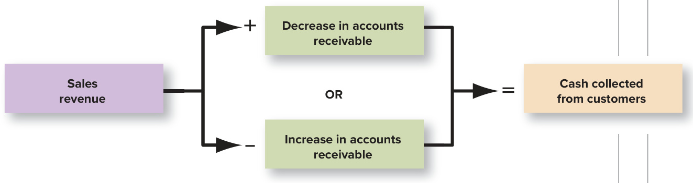  

Using information from National Beverage’s income statement and balance sheet presented in Exhibit 12.3, we can compute cash collected from customers as follows:  

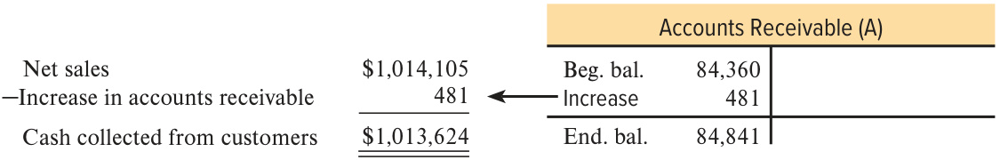  

## Converting Cost of Goods Sold to Cash Paid to Suppliers  

Cost of goods sold represents the cost of merchandise sold during the accounting period. It may be more or less than the amount of cash paid to suppliers during the period. In National Beverage’s case, inventory increased during the year because the company bought more merchandise from suppliers than it sold to customers. If the company paid cash to suppliers of inventory, it must have paid more cash to suppliers than the amount of cost of goods sold, so the increase in inventory must be added to compute cash paid to suppliers.  

Typically, companies owe their suppliers money (an accounts payable balance will appear on the balance sheet). To convert cost of goods sold to cash paid to suppliers, the borrowing and repayments represented by the accounts payable also must be considered. Borrowing increases cash and accounts payable and repayment decreases cash and accounts payable, so National Beverage’s increase in accounts payable also must be subtracted in the computation. Cost of goods sold can therefore be converted to a cash basis in the following manner:  

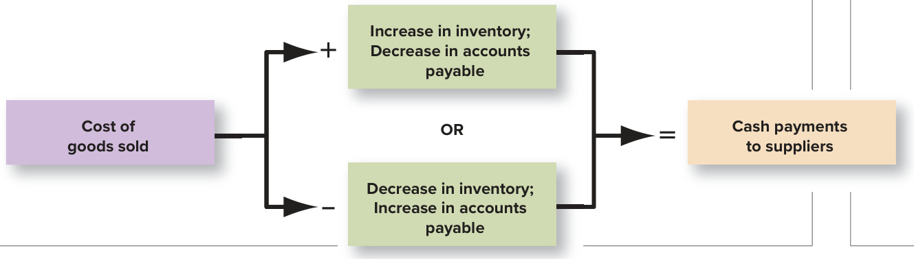  

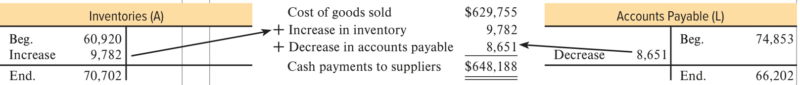  

## Converting Operating Expenses to a Cash Outflow  

The total amount of an expense on the income statement may differ from the cash outflow associated with that activity. Some expenses are paid before they are recognized as expenses (e.g., prepaid rent). When prepayments are made, the balance in the asset prepaid expenses increases; when expenses are recorded, the balance in prepaid expenses decreases. When National Beverage’s prepaid expenses decreased by ${\mathfrak{s l}}_{,676}$ during the period, it paid less cash than it recorded as operating expenses. The decrease must be subtracted in computing cash paid for expenses.  

Some other expenses are paid for after they are recognized (e.g., accrued expenses). In this case, when expenses are recorded, the balance in the liability accrued expenses increases; when payments are made, the balance in accrued expenses decreases. When National Beverage’s accrued expenses increased by $^{\mathparagraph1,018}$ it paid less cash than it recorded as operating expenses. The increase must be subtracted in computing cash paid for expenses.  

Generally, other expenses can be converted from the accrual basis to the cash basis in the following manner:  

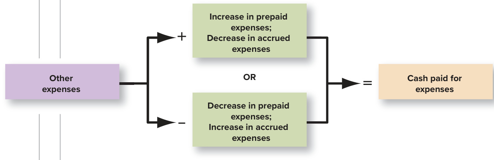  

Using information from Exhibit 12.3, we can compute cash paid for expenses for National Beverage as follows:  

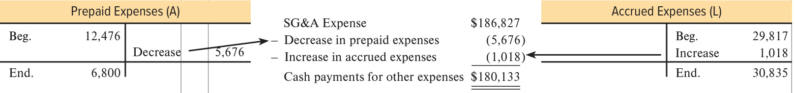  

National Beverage also reports $\mathbb{S}202$ of interest expense.10 Because there is no interest payable balance, we can see that interest expense must be equal to cash payments for interest expense.  

Interest expense $\mathbb{S}202$ No changes in interest payable 0 Cash payments for interest \$202  

<html><body><table><tr><td colspan="2">Thesamelogiccanbe applied toincometaxes.National Beveragepresentsincometaxexpense of $43,024. Because there is no balance in Income Taxes Payable (or change in Deferred Taxes),income</td><td rowspan="6"></td></tr><tr><td colspan="2">taxespaidmustbethesame asincometaxexpense.</td></tr><tr><td>Incometaxexpense</td><td>$43,024 0</td></tr><tr><td>No change in taxes payable Cashpaymentsforincometaxes totherelatedoperatingcashflowamounts:</td><td>$43,024</td></tr><tr><td colspan="2"></td></tr><tr><td colspan="2">The amounts from all the operating cash inflows and outflows computed above are accumulated in Exhibit12.8. To summarize, the following adjustments must commonly be made to convert income statement items</td></tr></table></body></html>  

<html><body><table><tr><td>Income Statement Account</td><td>+/- Change in Balance Sheet Account(s)</td><td>Operating Cash Flow</td></tr><tr><td>Salesrevenue</td><td>+DecreaseinAccounts Receivable (A) -IncreaseinAccounts Receivable(A)</td><td>=Collectionsfromcustomers</td></tr><tr><td>Interest/Dividendrevenue</td><td>+DecreaseinInterest/DividendsReceivable (A) -Increase inInterest/Dividends Receivable (A)</td><td>= Collections of interest/dividends oninvestments</td></tr><tr><td rowspan="4">Costofgoodssold</td><td>+Increase in Inventory (A)</td><td rowspan="4">= Payments to suppliers of inventory</td></tr><tr><td>-Decrease in Inventory (A)</td></tr><tr><td>-Increase in Accounts Payable (L)</td></tr><tr><td>+Decrease in Accounts Payable (L)</td></tr><tr><td rowspan="4">Otherexpenses</td><td>+Increase in Prepaid Expenses (A)</td><td rowspan="2">=Payments to suppliers of services (e.g., rent, utilities, wages,</td></tr><tr><td>-Decrease in Prepaid Expenses (A)</td></tr><tr><td>-Increase in Accrued Expenses (L)</td><td rowspan="2">interest)</td></tr><tr><td>+Decrease in Accrued Expenses (L)</td></tr><tr><td rowspan="4">Income tax expense</td><td>+Increase in Prepaid Income Taxes (Deferred Taxes)(A)</td><td rowspan="4">=Payments of income taxes</td></tr><tr><td>-Decrease in Prepaid Income Taxes (Deferred Taxes) (A)</td></tr><tr><td>-Increase in Income Taxes Payable (Deferred Taxes) (L)</td></tr><tr><td>+Decrease in Income Taxes Payable (Deferred Taxes) (L)</td></tr></table></body></html>  

It is important to note again that the net cash inflow or outflow is the same regardless of whether the direct or indirect method of presentation is used (in National Beverage’s case, an inflow of $\mathbf{\Phi5142,077})$ . The two methods differ only in terms of the details reported on the statement.  

## P A U S E F O R F E E D B A C K  

S E L F - S T U D Y  Q U I Z  

Indicate which of the following line items taken from the cash flow statement would be added $(+)$ , subtracted $(-)$ , or not included (NA) in the cash flow from operations section when the direct method is used.  

1. Increase in inventories.   
2. Payment of dividends to stockholders.   
3. Cash collections from customers.   
4. Purchase of plant and equipment for cash.   
5. Payments of interest to debtholders.   
6. Payment of taxes to the government.  

After you have completed your answers, check them below.  

Related Homework: M12-3, E12-3  

## Chapter Supplement B  

## Adjustment for Gains and Losses on Sale of Long-Term Assets—Indirect Method  

As noted earlier, the Operating Activities section of the cash flow statement prepared using the indirect method may include an adjustment for gains and losses on the sale of long-term assets reported on the income statement. As discussed in Chapter 8, when property, plant, and equipment is sold for more (less) than its net book value, a gain (loss) on disposal results. If property, plant, and equipment with an original cost of $\mathbb{S}10{,}000$ and accumulated depreciation of $\mathbb{S}4\mathrm{,}000$ is sold for $\mathbb{S}8{,}000$ cash, the following entry is made.  

## $\mathfrak{S}8\mathrm{,}000$ Investing cash inflow  

## $\mathbb{S}2{,}000$ subtraction in the Operating section  

<html><body><table><tr><td></td><td>Debit</td><td>Credit</td></tr><tr><td>Cash(+A)</td><td>8,000</td><td></td></tr><tr><td>Accumulateddepreciation 1(-XA,+A)</td><td>4,000</td><td></td></tr><tr><td>Property, plant, and equipment t（-A)</td><td></td><td>10,000</td></tr><tr><td>Gain on disposal (+R, +SE) ($8,000 - $6,000)</td><td></td><td>2,000</td></tr></table></body></html>  

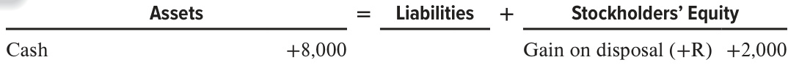  

Accumulated depreciation +4,000   
Property, plant, and equipment −10,000  

The whole $\mathbb{S}8{,}000$ inflow of cash is an investing cash inflow, but the reported gain of $\mathbb{S}2{,}000$ also is shown on the income statement. Because the gain is included in the computation of income, it is necessary to remove (subtract) the $\mathbb{S}2{,}000$ gain from the Operating Activities section of the statement to avoid double counting.  

## Cash flows from operating activities  

Net income $\mathbb{S}140{,}853$ Adjustments to reconcile net income to cash flow from operating activities: Gain on disposal of property, plant, and equipment (2,000)  

Net cash provided by operating activities  

## Cash flows from investing activities  

Purchases of property, plant, and equipment Proceeds from disposal of property, plant, and equipment 8,000  

Net cash used in investing activities  

If the company had sold the same asset for $\mathbb{S}5{,}000$ cash, the following entry would be made:  

## $\mathfrak{S}5,000$ Investing cash inflow  

$\mathbb{S}1,000$ addition in the Operating section  

<html><body><table><tr><td></td><td>Debit</td><td>Credit</td></tr><tr><td>Cash(+A)</td><td>5,000</td><td></td></tr><tr><td>Accumulated depreciation (-XA, +A)</td><td>4,000</td><td></td></tr><tr><td>Loss on disposal (+E,-SE) ($5,000 - $6,000)</td><td>1,000</td><td></td></tr><tr><td>Property, plant, and equipment (-A)</td><td></td><td>10,000</td></tr></table></body></html>  

Accumulated depreciation +4,000   
Property, plant, and equipment −10,000  

On the cash flow statement, the loss of $\mathbb{S}1{,}000$ must be removed (added back) in the computation of cash from operating activities, and the total cash collected of $\mathbb{S}5{,}000$ must be shown in the investing activities section of the statement.  

Net income Adjustments to reconcile net income to cash flow from operating activities: Loss on disposal of property, plant, and equipment  

Net cash provided by operating activities  

## Cash flows from investing activities  

Purchases of property, plant, and equipment Proceeds from disposal of property, plant, and equipment  

Net cash used in investing activities  

## Chapter Supplement C  

## T-Account Approach (Indirect Method)  

When we began our discussion of preparing the statement of cash flows, we noted that changes in cash must equal the sum of the changes in all other balance sheet accounts. Based on this idea, we used the following three steps to prepare the statement of cash flows:  

1.	 Determine the change in each balance sheet account. From this year’s ending balance, subtract this year’s beginning balance (i.e., last year’s ending balance). 2.	 Identify the cash flow category or categories to which each account relates. 3.	 Create schedules that summarize operating, investing, and financing cash flows.  

Instead of creating separate schedules for each section of the statement, many accountants prefer to prepare a single large T-account to represent the changes that have taken place in cash subdivided into the three sections of the cash flow statement. Such an account is presented in Panel A of Exhibit 12.9. The  

## EXHIBIT 12.9  

T-Approach to Preparing the Statement of Cash Flows (Indirect Method)  

## Panel A: Changes in Cash Account  

<html><body><table><tr><td colspan="4">Cash (A)</td></tr><tr><td>Operating</td><td></td><td></td><td></td></tr><tr><td>(1) Net Income</td><td>140,853</td><td>481</td><td>(3)AccountsReceivable</td></tr><tr><td>(2) Depreciation and Amortization</td><td>13,444</td><td>9,782</td><td>(4)Inventory</td></tr><tr><td>(5) Prepaid Expenses</td><td>5,676</td><td>8,651</td><td>(6)Accounts Payable</td></tr><tr><td>(7）Accrued Expenses</td><td>1,018</td><td></td><td></td></tr><tr><td>Net cash provided by operating activities</td><td>142,077</td><td></td><td></td></tr><tr><td>Investing</td><td></td><td></td><td></td></tr><tr><td>(9) Disposals of Property, Plant, and Equipment</td><td>18</td><td>38,333</td><td>(8) Purchases of Property, Plant, and Equipment</td></tr><tr><td>(11) Sales of Short-Term Investments</td><td>3,685</td><td></td><td>1,252 (10) Purchases of Short-Term Investments</td></tr><tr><td></td><td></td><td></td><td>35,882 Net cash used in investing activities</td></tr><tr><td>Financing (12)Issuance of Long-Term Debt</td><td></td><td></td><td></td></tr><tr><td>(13)Issuance of Stock</td><td>825 1,576</td><td></td><td>141,391 (14) Payment of Dividends</td></tr><tr><td></td><td></td><td></td><td></td></tr><tr><td></td><td></td><td></td><td>138,990 Net cash used in financing activities</td></tr><tr><td></td><td></td><td></td><td></td></tr><tr><td>Net decrease in cash and cash equivalents</td><td></td><td>32,795</td><td></td></tr><tr><td></td><td></td><td></td><td></td></tr></table></body></html>  

## EXHIBIT 12.9 (Concluded)  

Panel B: Changes in Noncash Accounts   

<html><body><table><tr><td colspan="5">Accounts Receivable (A)</td><td colspan="4">Inventory (A)</td><td colspan="4">Prepaid Expenses (A)</td></tr><tr><td>Beg. bal.</td><td>84,360</td><td></td><td></td><td></td><td>Beg. bal.</td><td>60,920</td><td></td><td>Beg. bal.</td><td>12,476</td><td></td><td></td></tr><tr><td>(3) Increase</td><td>481</td><td></td><td></td><td></td><td>(4) Increase</td><td>9,782</td><td></td><td></td><td></td><td>(5) Decrease</td><td>5,676</td></tr><tr><td>End. bal.</td><td>84,841</td><td></td><td></td><td></td><td>End. bal.</td><td>70,702</td><td></td><td>End. bal.</td><td>6,800</td><td></td><td></td></tr><tr><td colspan="4">Accounts Payable (L)</td><td></td><td colspan="4">Accrued Expenses (L)</td><td colspan="3">Property, Plant & Equipment, Net (A)</td></tr><tr><td>(6) Decrease</td><td>8,651</td><td>Beg. bal.</td><td></td><td>74,853</td><td></td><td>Beg. bal.</td><td>29,817 (7) Increase 1,018</td><td>Beg. bal. (8) Purchases</td><td>105,865 38,333</td><td>(2) Depreciation 13,444 (9) Disposals</td><td>18</td></tr><tr><td></td><td></td><td>End. bal.</td><td></td><td>66,202</td><td></td><td>End. bal.</td><td>30,835</td><td>End. bal.</td><td>130,736</td><td></td><td></td></tr><tr><td colspan="4">Short-Term Investments (A)</td><td></td><td colspan="4">Long-Term Debt (L)</td><td colspan="3">Common Stock (SE)</td></tr><tr><td>Beg. bal.</td><td>5,347</td><td></td><td></td><td></td><td></td><td>Beg. bal.</td><td>22,722</td><td></td><td></td><td>Beg. bal.</td><td>657</td></tr><tr><td>(10) Purchases</td><td>1,252</td><td></td><td></td><td>(11) Disposals 3,685</td><td></td><td></td><td>(12) Borrowings</td><td>825</td><td></td><td>(13) Stock issued</td><td>1</td></tr><tr><td>End. bal.</td><td>2,914</td><td></td><td></td><td></td><td></td><td></td><td>End. bal.</td><td>23,547</td><td></td><td>End. bal.</td><td>658</td></tr><tr><td colspan="4">Additional Paid-In Capital (SE)</td><td colspan="6">Retained Earnings (SE)</td><td rowspan="5"></td><td rowspan="5"></td></tr><tr><td></td><td></td><td>Beg. bal.</td><td></td><td>18,358</td><td></td><td></td><td>Beg. bal.</td><td>312,425</td></tr><tr><td></td><td></td><td></td><td>(13) Stock issued</td><td>1,575</td><td>(14) Dividends</td><td>141,391</td><td>(1) Net income</td><td>140,853</td></tr><tr><td></td><td></td><td>End. bal.</td><td></td><td></td><td>19,933</td><td></td><td>End. bal.</td><td>311,887</td></tr></table></body></html>  

cash account in Panel A shows increases in cash as debits and decreases in cash as credits. Note how each section matches the three schedules that we prepared for National Beverage’s cash flows presented in Exhibits 12.4, 12.5, and 12.6. Panel B includes the same T-accounts for the noncash balance sheet accounts we used in our discussion of each cash flow statement section in the body of the chapter. Note how each change in the noncash balance sheet accounts has a number referencing the change in the cash account that it accompanies. The statement of cash flows presented in Exhibit 12.1 can be prepared in proper format based on the information in the cash flow T-account.  

## C H A P T E R  T A K E - A W A Y S  

12-1.	Classify cash flow statement items as part of net cash flows from operating, investing, and financing activities. p. 628  

The cash flow statement has three main sections: Cash Flows from Operating Activities, which are related to earning income from normal operations; Cash Flows from Investing Activities, which are related to the acquisition and sale of productive assets; and Cash Flows from Financing Activities, which are related to external financing of the enterprise. The net cash inflow or outflow for the year is the same amount as the increase or decrease in cash and cash equivalents for the year on the balance sheet. Cash equivalents are highly liquid investments with original maturities of three months or less.  

12-2.	Report and interpret cash flows from operating activities using the indirect method. p. 635  

The indirect method for reporting cash flows from operating activities reports a conversion of net income to net cash flow from operating activities. The conversion involves additions and subtractions for (1) noncurrent accruals, including expenses (such as depreciation expense) and revenues that do not affect operating assets or operating liabilities, and (2) changes in each of the individual operating assets (other than cash) and operating liabilities, which reflect differences in the timing of accrual basis net income and cash flows.  

The quality of income ratio (Cash Flow from Operating Activities $\div$ Net Income) measures the portion of income that was generated in cash. A higher quality of income ratio indicates greater ability to finance operating and other cash needs from operating cash inflows. A higher ratio also indicates that it is less likely that the company is using aggressive revenue recognition policies to increase net income.  

12-4.	Report and interpret cash flows from investing activities. p. 642  

Investing activities reported on the cash flow statement include cash payments to acquire fixed assets, intangibles, and short- and long-term investments and cash proceeds from the sale of fixed assets, intangibles, and short- and long-term investments.  

12-5.	Analyze and interpret the capital acquisitions ratio. p. 644  

The capital acquisitions ratio (Cash Flow from Operating Activities $\div$ Cash Paid for Property, Plant, and Equipment) reflects the portion of purchases of property, plant, and equipment financed from operating activities without the need for outside debt or equity financing or the sale of other investments or fixed assets. A high ratio benefits the company because it provides the company with oppor tunities for strategic acquisitions.  

12-6.	Report and interpret cash flows from financing activities. p. 645  

Cash inflows from financing activities include cash proceeds from the issuance of short- and longterm debt and common stock. Cash outflows include cash principal payments on short- and longterm debt, cash paid for the repurchase of the company’s stock, and cash dividend payments. Cash payments associated with interest are a cash flow from operating activities.  

12-7.	Understand the format of the cash flow statement and additional cash flow disclosures. p. 647  

The statement of cash flows splits transactions that affect cash into three categories: Operating, Investing, and Financing Activities. The operating section is most often prepared using the indirect method that begins with Net Income and adjusts the amount to eliminate noncash transactions. Noncash investing and financing activities are investing and financing activities that do not involve cash. They include, for example, purchases of fixed assets with long-term debt or stock, exchanges of fixed assets, and exchanges of debt for stock. These transactions are disclosed only as supplemental disclosures to the cash flow statement, along with cash paid for taxes and interest when using the indirect method.  

Throughout the preceding chapters, we emphasized the conceptual basis of accounting. An understanding of the rationale underlying accounting is important for both preparers and users of financial statements. In Chapter 13, we bring together our discussion of the major users of financial statements and how they analyze and use these statements. We discuss and illustrate many widely used analytical techniques discussed in earlier chapters, as well as additional techniques. As you study Chapter 13, you will see that an understanding of accounting rules and concepts is essential for effective analysis of financial statements.  

The quality of income ratio indicates what portion of income was generated in cash. It is computed as follows (see the “Key Ratio Analysis” box in the Reporting and Interpreting Cash Flows from Operating Activities section):  

The capital acquisitions ratio measures the ability to finance purchases of plant and equipment from operations. It is computed as follows (see the “Key Ratio Analysis” box in the Reporting and Interpreting Cash Flows from Investing Activities section):  

## F I N D I N G F I N A N C I A L  I N F O R M A T I O N  

## Balance Sheet  

## Income Statement  

Changes in Assets, Liabilities, and Stockholders’ Equity  

Net Income and Noncurrent Accruals  

## Statement of Cash Flows  

Cash Flows from Operating Activities Cash Flows from Investing Activities Cash Flows from Financing Activities Separate Schedule (or note): Noncash investing and financing activities Interest and taxes paid  

## Notes  

Under Summary of Significant Accounting Policies Definition of cash equivalents   
Under Separate Note (if not listed on cash flow statement) Noncash investing and financing activities Interest and taxes paid  

## K E Y  T E R M S  

Cash Equivalents Short-term investments with original maturities of three months or less that are readily convertible to cash and whose value is unlikely to change. p. 628  

Cash Flows from Financing Activities Cash inflows and outflows related to external sources of financing (owners and creditors) for the enterprise. p. 631  

Cash Flows from Investing Activities Cash inflows and outflows related to the acquisition or sale of productive facilities and investments in the securities of other companies. p. 630  

## Cash Flows from Operating Activities (Cash Flows from  

Operations) Cash inflows and outflows directly related to earnings from normal operations. p. 629  

Direct Method A method of presenting the operating activities section of the statement of cash flows that reports components of cash flows from operating activities as gross receipts and gross payments. p. 629 Free Cash Flow Cash Flows from Operating Activities less Dividends less Capital Expenditures. p. 644 Indirect Method A method of presenting the operating activities section of the statement of cash flows that adjusts net income to compute cash flows from operating activities. p. 630 Noncash Investing and Financing Activities Transactions that do not have direct cash flow effects; reported as a supplement to the statement of cash flows in narrative or schedule form. p. 648  

## Q U E S T I O N S  

1.	 Compare the purposes of the income statement, the balance sheet, and the statement of cash flows.   
2.	 What information does the statement of cash flows report that is not reported on the other required financial statements?   
3.	 What are cash equivalents? How are purchases and sales of cash equivalents reported on the statement of cash flows?   
4.	 What are the major categories of business activities reported on the statement of cash flows? Define each of these activities.   
5.	 What are the typical cash inflows from operating activities? What are the typical cash outflows from operating activities?   
6.	 Under the indirect method, depreciation expense is added to net income to report cash flows from operating activities. Does depreciation cause an inflow of cash?   
7.	 Explain why cash payments during the period for purchases and for salaries are not specifically reported as cash outflows on the statement of cash flows, under the indirect method.   
8.	 Explain why a $\mathbb{S}50{,}000$ increase in inventory during the year must be included in developing cash flows from operating activities under both the direct and indirect methods.   
9.	 Compare the two methods of reporting cash flows from operating activities in the statement of cash flows.   
10.	 What are the typical cash inflows from investing activities? What are the typical cash outflows from investing activities?   
11.	 What are the typical cash inflows from financing activities? What are the typical cash outflows from financing activities?   
12.	 What are noncash investing and financing activities? Give two examples. How are they reported on the statement of cash flows?   
13.	 How is the sale of equipment reported on the statement of cash flows under the indirect method?  

1.	 In what order do the three sections of the statement of cash flows usually appear when reading from top to bottom?  

a.	 Financing, Investing, Operating b.	 Investing, Operating, Financing c.	 Operating, Financing, Investing d.	 Operating, Investing, Financing  

2.	 Total cash inflow in the operating section of the statement of cash flows should include which of the following?  

a.	 Cash received from customers at the point of sale.   
b.	 Cash collections from customer accounts receivable.   
c.	 Cash received in advance of revenue recognition (unearned revenue).   
d.	 All of the above.  

3.	 If the balance in prepaid expenses has increased during the year, what action should be taken on the statement of cash flows when following the indirect method, and why?  

a.	 The change in the account balance should be subtracted from net income because the net increase in prepaid expenses did not impact net income but did reduce the cash balance.   
b.	 The change in the account balance should be added to net income because the net increase in prepaid expenses did not impact net income but did increase the cash balance.   
c.	 The net change in prepaid expenses should be subtracted from net income to reverse the income statement effect that had no impact on cash.   
d.	 The net change in prepaid expenses should be added to net income to reverse the income statement effect that had no impact on cash.  

4.	 Consider the following: Net income $=\mathbb{S}10{,}000$ , depreciation expense $=\mathbb{S}2{,}000$ , accounts receivable increased by $\mathbb{S}800$ , inventory decreased by $\mathbb{S}100$ , and accounts payable increased by $\mathbb{S}500$ . Based on this information alone, what is cash flow from operating activities?  

a. $\mathbb{S}12{,}000$ c. $\mathbb{S}11{,}800$   
b. $\mathbb{S}11{,}600$ d. $\mathbb{S}13{,}400$  

5.	 Which of the following would not appear in the investing section of the statement of cash flows?  

a.	 Purchase of inventory.   
b.	 Sale of obsolete equipment used in the factory.   
c.	 Purchase of land for a new office building.   
d.	 All of the above would appear in the investing section.  

6.	 Which of the following items would not appear in the financing section of the statement of cash flows? a.	 The repurchase of the company’s own stock. b.	 The receipt of dividends. c.	 The repayment of debt. d.	 The payment of dividends.  

7.	 Which of the following is not added to net income when computing cash flows from operations under the indirect method?  

a.	 The net increase in accounts payable.   
b.	 The net decrease in accounts receivable.   
c.	 Depreciation expense reported on the income statement.   
d.	 All of the above are added to net income.  

8.	 Consider the following: Issued common stock for $\mathbb{S}18{,}000$ , sold office equipment for $\mathbb{S}1\!,\!200$ , paid cash dividends of $\mathbb{S}4\mathrm{,}000$ , purchased investments for $\mathbb{S}2{,}000$ , and paid accounts payable of $\mathbb{S}4\mathrm{,}000$ What was the net cash inflow (outflow) from financing activities?  

a. $\mathbb{S}20{,}000$ c. $(\Phi20{,}000)$   
b. $\mathbb{S}14{,}000$ d. $(\Phi14,000)$  

9.	 Consider the following: Issued common stock for $\mathbb{S}18{,}000$ , sold office equipment for $\mathbb{S}1{,}200$ , paid cash dividends of $\mathbb{S}4\mathrm{,}000$ , purchased investments for $\mathbb{S}2{,}000$ , and purchased new equipment for $\mathbb{S}4{,}000$ . What was the net cash inflow (outflow) from investing activities?  

a. $\mathbb{S}20{,}200$ c. $(\Phi10,800)$   
b. $(\mathbb{S}2,800)$ d. $(\Phi4,800)$  

10.	 The total change in cash as shown near the bottom of the statement of cash flows for the year should agree with which of the following?  

a.	 The difference in retained earnings when reviewing the comparative balance sheet.   
b.	 Net income or net loss as found on the income statement.   
c.	 The difference in cash when reviewing the comparative balance sheet.   
d.	 None of the above.  

## M I N I - E X E R C I S E S  

## connect  

##  

## M12-1 LO12-1  

MolsonCoors Beverage Company  

## Matching Items Reported to Cash Flow Statement Categories (Indirect Method)  

MolsonCoors Beverage Company is the world’s fifth largest brewer. In the United States, its tie to the magical appeal of the Rocky Mountains is one of its most powerful trademarks. Some of the items included in its recent annual consolidated statement of cash flows presented using the indirect method are listed here. Indicate whether each item is disclosed in the Operating Activities (O), Investing Activities (I), or Financing Activities (F) section of the statement or use (NA) if the item does not appear on the statement. (Note: This is the exact wording used on the actual statement.)  

1.	Purchase of stock. [This involves repurchase of the company’s own stock.]   
2.	Principal payment on long-term debt.   
3.	Proceeds from sale of properties.   
4.	Inventories (decrease).   
5.	Accounts payable (decrease).   
6.	Depreciation and amortization.  

## M12-1 LO12-2  

## Determining the Effects of Account Changes on Cash Flow from Operating Activities (Indirect Method)  

Indicate whether each item would be added $(+)$ or subtracted $(-)$ in the computation of cash flow from operating activities using the indirect method.  

1.	Accrued expenses (increase).   
2.	Inventories (increase).   
3.	Accounts receivable (decrease).   
4.	Accounts payable (decrease).   
5.	Depreciation, depletion, and amortization.  

## M12-3 LO12-1 Telstra  

## Matching Items Reported to Cash Flow Statement Categories (Direct Method)  

Telstra, Australia’s largest telecommunications and media company, has net revenue of more than $\mathfrak{S}26$ billion (Australian). Some of the items included in its recent annual consolidated statement of cash flows presented using the direct method are listed here. Indicate whether each item is disclosed in the Operating Activities (O), Investing Activities (I), or Financing Activities (F) section of the statement or use (NA) if the item does not appear on the statement. (Note: This is the exact wording used on the actual statement.)  

1.	Receipts from customers.   
2.	Dividends paid.   
3.	Payment for share buy-back (repurchase of company stock).   
4.	Proceeds from sale of property, plant, and equipment.   
5.	Repayments of borrowings (bank debt).   
6.	Income taxes paid.  

## Analyzing the Quality of Income Ratio  

Casey Corporation reported net income of $^{\S102,000}$ , depreciation expense of $\mathbb{S}2{,}000$ , and cash flow from operations of $\mathbb{S}86,500$ . Compute the quality of income ratio. What does the ratio tell you about the company’s ability to finance operating and other cash needs from operating cash inflows?  

M12-4   
LO12-3  

## Computing Cash Flows from Investing Activities  

Based on the following information, compute cash flows from investing activities.  

Cash collections from customers $\mathbb{S}550$ Sale of used equipment 400 Depreciation expense 200 Purchase of short-term investments 635  

M12-5   
LO12-4  

## Computing Cash Flows from Financing Activities  

Based on the following information, compute cash flows from financing activities.  

Purchase of short-term investments \$500   
Dividends paid 700   
Interest paid 300   
Additional short-term borrowing from bank 1,200   
M12-6   
LO12-6  

## Reporting Noncash Investing and Financing Activities  

Which of the following transactions qualify as noncash investing and financing activities (select all that apply)? Purchase of building with mortgage payable. Additional short-term borrowing from bank. Dividends paid in cash. Purchase of equipment with short-term investments.  

M12-7   
LO12-7  

## connect  

## E X E R C I S E S  

## Matching Items Reported to Cash Flow Statement Categories (Indirect Method)  

Adidas AG is a global company that designs and markets sports and fitness products, including footwear, apparel, and accessories. Some of the items included in its recent annual consolidated statement of cash flows presented using the indirect method are listed here.  

Indicate whether each item is disclosed in the Operating Activities (O), Investing Activities (I), or Financing Activities (F) section of the statement or use (NA) if the item does not appear on the statement. (Note: This is the exact wording used on the actual statement.)  

1. Dividends paid.   
2. Repayments of short-term borrowings.   
3. Depreciation and amortization.   
4. Proceeds from reissuance of treasury shares to employees.   
5. [Change in] Accounts payable and other liabilities.   
6. Cash collections from customers.   
7. Purchase of investments.   
8. Net income.   
9. Purchase of property, plant, and equipment.   
10. Increase in receivables and other assets.  

E12-1 LO12-1 Adidas AG  

## Matching Items Reported to Cash Flow Statement Categories (Indirect Method)  

Dell Technologies Inc. is a global technology provider that brings together hardware, software, and services. Some of the items included in its recent annual consolidated statement of cash flows presented using the indirect method are listed here.  

Indicate whether each item is disclosed in the Operating Activities (O), Investing Activities (I), or Financing Activities (F) section of the statement or use (NA) if the item does not appear on the statement. (Note: This is the exact wording used on the actual statement.)  

1. [Change in] Accounts payable.   
2. Depreciation and amortization.   
3. [Change in] Inventories.   
4. Maturities and sales of investments.   
5. Proceeds from debt.   
6. Payments to suppliers and employees.   
7. Proceeds from sale of facilities, land, and other assets.   
8. [Change in] Deferred revenue.   
9. Repurchases of Dell Common Stock.   
10. Net income.  

## E12-3  

LO12-1 Woolworths Group  

## Matching Items Reported to Cash Flow Statement Categories (Direct Method)  

Woolworths Group is one of the largest retailers in Australia and New Zealand. Some of the items included in its recent annual consolidated statement of cash flows presented using the direct method are listed here.  

Indicate whether each item is disclosed in the Operating Activities (O), Investing Activities (I), or Financing Activities (F) section of the statement or use (NA) if the item does not appear on the statement. (Note: This is the exact wording used on the actual statement.)  

1. Proceeds from the sale of property, plant, and equipment.   
2. Net interest paid.   
3. Payments for intangible assets.   
4. Payments to suppliers and employees.   
5. Proceeds from borrowings.   
6. Dividends paid.   
7. Income tax paid.   
8. Receipts from customers.   
9. Payments for the purchase of investments.   
10. Proceeds from the issue of equity securities.  

## E12-4 LO12-1 Caterpillar  

## Determining Cash Flow Statement Effects of Transactions  

Caterpillar is the world’s leading manufacturer of construction and mining equipment. For each of the following transactions, indicate whether net cash inflows (outflows) from operating activities (NCFO), investing activities (NCFI), or financing activities (NCFF) are affected and whether the effect is an inflow $(+)$ or outflow $(-)$ , or use (NE) if the transaction has no effect on cash. (Hint: Determine the journal entry recorded for the transaction. The transaction affects net cash flows if and only $i f$ the account Cash is affected.)  

1. Recorded an adjusting entry to record accrued salaries expense.   
2. Paid cash to purchase new equipment.   
3. Collected payments on account from customers.  

4. Recorded and paid interest on debt to creditors.   
5. Declared and paid cash dividends to shareholders.   
6. Sold used equipment for cash at book value.   
7. Prepaid rent for the following period.   
8. Repaid principal on revolving credit loan from bank.   
9. Purchased raw materials inventory on account.   
10. Made payment to suppliers on account.  

## Determining Cash Flow Statement Effects of Transactions  

Harley-Davidson is a leading manufacturer of heavy-weight motorcycles. For each of the following recent transactions, indicate whether net cash inflows (outflows) from operating activities (NCFO), investing activities (NCFI), or financing activities (NCFF) are affected and whether the effect is an inflow $\left(+\right)$ or outflow $(-)$ , or use (NE) if the transaction has no effect on cash. (Hint: Determine the journal entry recorded for the transaction. The transaction affects net cash flows if and only if the account Cash is affected.)  

1. Purchased raw materials inventory on account.   
2. Prepaid rent for the following period.   
3. Purchased new equipment by signing a three-year note.   
4. Recorded an adjusting entry for expiration of a prepaid expense.   
5. Recorded and paid income taxes to the federal government.   
6. Purchased investment securities for cash.   
7. Issued common stock for cash.   
8. Collected payments on account from customers.   
9. Sold equipment for cash equal to its net book value.   
10. Issued long-term debt for cash.  

E12-5   
LO12-1   
Harley-Davidson  

## Comparing the Direct and Indirect Methods  

To compare statement of cash flows reporting under the direct and indirect methods, enter check marks to indicate which items are used with each method.  

E12-6   
LO12-1  

<html><body><table><tr><td colspan="2">STATEMENTOF CASHFLOWSMETHOD</td></tr><tr><td>Cash Flows (and Related Changes)</td><td>Direct Indirect</td></tr><tr><td>1.Accounts payable,increase or decrease</td></tr><tr><td>2. Payments to employees</td></tr><tr><td>3.Cash collectionsfrom customers</td></tr><tr><td>4.Accounts receivable,increase or decrease</td></tr><tr><td>5.Payments to suppliers</td></tr><tr><td>6.Inventory, increase or decrease</td></tr><tr><td>7.Wagespayable,increase or decrease</td></tr><tr><td>8. Depreciation expense</td></tr><tr><td>9. Net income 10. Cash flows from operating activities</td></tr><tr><td>11.Cash flows from investing activities</td></tr><tr><td>12.Cash flows from financing activities</td></tr><tr><td>13. Net increase or decrease in cash during the period</td></tr><tr><td></td></tr></table></body></html>  

## Reporting Cash Flows from Operating Activities (Indirect Method)  

The following information pertains to Peak Heights Company:  

<html><body><table><tr><td colspan="2">IncomeStatementforCurrentYear</td></tr><tr><td>Sales Expenses</td><td>$93,000</td></tr><tr><td>Cost of goods sold</td><td>$51,875</td></tr><tr><td>Depreciation expense Salariesexpense</td><td>6,000 69,875</td></tr><tr><td>Net income</td><td>12,000 $23,125</td></tr><tr><td></td><td></td></tr><tr><td>PartialBalanceSheet</td><td>Current Year Prior Year</td></tr><tr><td>Accountsreceivable</td><td>$10,500 $12,000</td></tr><tr><td>Inventory</td><td>13,000 8,000</td></tr><tr><td>Salariespayable</td><td>2,250</td></tr><tr><td></td><td>800</td></tr></table></body></html>  

Required:   
Present the operating activities section of the statement of cash flows for Peak Heights Company using the indirect method.  

## E12-8 LO12-2  

Reporting and Interpreting Cash Flows from Operating Activities from an Analyst’s Perspective (Indirect Method)  

Rodriguez Company completed its income statement and comparative balance sheet for the current year and provided the following information:  

<html><body><table><tr><td colspan="2">Income Statement for Current Year</td></tr><tr><td>Servicerevenue</td><td>$54,000</td></tr><tr><td>Expenses</td><td></td></tr><tr><td>Salaries</td><td>$46,000</td></tr><tr><td>Depreciation</td><td>4,500</td></tr><tr><td>Amortizationofcopyrights</td><td>200</td></tr><tr><td>Other expenses</td><td>9,700 60,400</td></tr><tr><td>Netloss</td><td>$ (6,400)</td></tr><tr><td>Partial BalanceSheet</td><td>Current Year Prior Year</td></tr><tr><td>Accountsreceivable</td><td>$ 8,000 $13,000</td></tr><tr><td>Salaries payable</td><td>12,000 1,000</td></tr><tr><td>Otheraccruedliabilities</td><td>1,000 2,800</td></tr><tr><td></td><td></td></tr></table></body></html>  

In addition, Rodriguez bought a small service machine for $\mathbb{S}5{,}000$ .  

Required:  

1.	 Present the operating activities section of the statement of cash flows for Rodriguez Company using the indirect method.   
2.	 What were the major reasons that Rodriguez was able to report a net loss but positive cash flow from operations? Explain why the reasons for the difference between cash flow from operations and net income are important to financial analysts.  

## E12-9 LO12-2  

Reporting and Interpreting Cash Flows from Operating Activities from an Analyst’s Perspective (Indirect Method)  

A number of years ago, a leading media company’s annual report contained the following information (dollars in millions):  

<html><body><table><tr><td>Netloss</td><td>$(13,402)</td></tr><tr><td>Depreciation,amortization,andimpairments</td><td>34,790</td></tr><tr><td>Decreaseinreceivables</td><td>1,245</td></tr><tr><td>Increaseininventories</td><td>5,766</td></tr><tr><td>Decreaseinaccountspayable</td><td>445</td></tr><tr><td>Additionstoequipment</td><td>4,377</td></tr></table></body></html>  

Required:  

1.	 Based on this information, compute cash flow from operating activities using the indirect method.   
2.	 What were the major reasons that the media company was able to report a net loss but positive cash flow from operations? Explain why the reasons for the difference between cash flow from operations and net income are important to financial analysts.  

## Reporting and Interpreting Cash Flows from Operating Activities with Loss on Sale of Equipment (Indirect Method)  

Parra Company completed its income statement and comparative balance sheet for the current year and provided the following information:  

E12-10   
LO12-2  

<html><body><table><tr><td>Servicerevenue Expenses:</td><td></td><td>$125,000</td></tr><tr><td>Salaries</td><td>$92,000</td><td></td></tr><tr><td>Depreciation</td><td>8,500</td><td></td></tr><tr><td>Utilities</td><td>8,000</td><td></td></tr><tr><td>Loss on sale of equipment</td><td>2,500</td><td>111,000</td></tr><tr><td>Net income</td><td></td><td>$ 14,000</td></tr><tr><td>PartialBalanceSheet</td><td>Current Year</td><td>Prior Year</td></tr><tr><td></td><td>$14,000</td><td></td></tr><tr><td>Accountsreceivable</td><td>19,000</td><td>$24,000 8,000</td></tr><tr><td>Salariespayable</td><td>7,000</td><td>9,000</td></tr><tr><td>Other accrued liabilities</td><td></td><td></td></tr><tr><td>Land</td><td>52,000</td><td>57,000</td></tr></table></body></html>  

Required:   
Present the operating activities section of the statement of cash flows for Parra Company using the indirect method.  

## Inferring Balance Sheet Changes from the Cash Flow Statement (Indirect Method)  

A recent statement of cash flows for Colgate-Palmolive reported the following information (dollars in millions):  

<html><body><table><tr><td colspan="2">OPERATINGACTIVITIES</td></tr><tr><td>Netincome</td><td>$2,554</td></tr><tr><td>Depreciation</td><td>421</td></tr><tr><td>Cash effect of changes in</td><td></td></tr><tr><td>Receivables</td><td>(130)</td></tr><tr><td>Inventories</td><td>(130)</td></tr><tr><td>Othercurrentassets</td><td>54</td></tr><tr><td>Payables</td><td>199</td></tr><tr><td>Other</td><td>(72)</td></tr><tr><td>Netcashprovidedbyoperations</td><td>$2,896</td></tr></table></body></html>

Source: Colgate-Palmolive  

E12-11   
LO12-2   
Colgate-Palmolive  

Required:  

Based on the information reported on the statement of cash flows for Colgate-Palmolive, determine whether the following accounts increased or decreased during the period: Receivables, Inventories, Other Current Assets, and Payables.  

## Inferring Balance Sheet Changes from the Cash Flow Statement (Indirect Method)  

A recent statement of cash flows for Apple contained the following information (dollars in millions):  

<html><body><table><tr><td colspan="2">OPERATIONS</td></tr><tr><td>Netincome</td><td>$57,411</td></tr><tr><td>Depreciation and amortization</td><td>17,573</td></tr><tr><td>Changes in operating assets and liabilities:</td><td></td></tr><tr><td>Accountsreceivable,net</td><td>8,470</td></tr><tr><td>Inventories</td><td>(127)</td></tr><tr><td>Other current assets</td><td>(9,588)</td></tr><tr><td>Accountspayable</td><td>(4,062)</td></tr><tr><td>Deferredrevenue</td><td>2,081</td></tr><tr><td>Othercurrentliabilities</td><td>8,916</td></tr><tr><td>Cashgenerated by operating activities</td><td>$80,674</td></tr><tr><td></td><td></td></tr></table></body></html>

Source: Apple  

Required:  

For each of the asset and liability accounts listed on the statement of cash flows, determine whether the account balances increased or decreased during the period.  

## E12-13  

(Chapter Supplement B) Computing and Reporting Cash Flow Effects of Sale of Plant and Equipment  

During two recent years, Perez Construction, Inc., disposed of the following plant and equipment:  

<html><body><table><tr><td></td><td>Year 1</td><td>Year 2</td></tr><tr><td>Plant and equipment (at cost)</td><td>$75,000</td><td>$13,500</td></tr><tr><td>Accumulated depreciation on equipment disposed of</td><td>40,385</td><td>3,773</td></tr><tr><td>Cashreceived</td><td>17,864</td><td>12,163</td></tr><tr><td>Gain 1(loss)on sale</td><td>(16,751)</td><td>2,436</td></tr></table></body></html>  

Required:  

1.	 Determine the cash flow from the sale of property for each year that would be reported in the investing activities section of the cash flow statement.   
2.	 Perez uses the indirect method for the operating activities section of the cash flow statement. What amounts related to the sales would be added or subtracted in the computation of Net Cash Flows from Operating Activities for each year?  

## E12-14  

(Chapter Supplement B) Computing and Reporting Cash Flow Effects of the Sale of Equipment  

During the period, Sanchez Company sold some excess equipment at a loss. The following information was collected from the company’s accounting records:  

<html><body><table><tr><td>FromtheIncomeStatement</td><td>$ 1,500</td></tr><tr><td>Depreciationexpense Lossonsaleofequipment</td><td>2,300</td></tr><tr><td>FromtheBalanceSheet</td><td></td></tr><tr><td>Beginning equipment</td><td>82,500</td></tr><tr><td>Endingequipment</td><td>72,000</td></tr><tr><td>Beginning accumulated depreciation</td><td>43,000</td></tr><tr><td>Ending accumulated depreciation</td><td>41,000</td></tr></table></body></html>  

No new equipment was bought during the period.  

## Required:  

1.	 For the equipment that was sold, determine its original cost, its accumulated depreciation, and the cash received from the sale. (Use the equipment and accumulated depreciation T-accounts to infer the book value of the equipment sold.)   
2.	 Sanchez Company uses the indirect method for the Operating Activities section of the cash flow statement. What amount related to the sale would be added or subtracted in the computation of Net Cash Flows from Operating Activities?   
3.	 What amount related to the sale would be added or subtracted in the computation of Net Cash Flows from Investing Activities?  

## Analyzing Cash Flows from Operating Activities; Interpreting the Quality of Income Ratio  

A recent annual report for PepsiCo contained the following information for the period (dollars in millions):  

<html><body><table><tr><td>Netincome</td><td>$6,462</td></tr><tr><td>Depreciation and amortization</td><td>2,737</td></tr><tr><td>Increaseinaccountsreceivable</td><td>666</td></tr><tr><td>Increaseininventory</td><td>331</td></tr><tr><td>Increaseinprepaidexpense</td><td>27</td></tr><tr><td>Increase in accounts payable</td><td>520</td></tr><tr><td>Decrease in taxes payable</td><td>340</td></tr><tr><td>Increaseinothercurrentliabilities</td><td>589</td></tr><tr><td>Cashdividendspaid</td><td>3,157</td></tr><tr><td>Sharerepurchases</td><td>2,489</td></tr></table></body></html>

Source: PepsiCo  

E12-15 LO12-2, 12-3 PepsiCo  

Required:  

1.	 Compute cash flows from operating activities for PepsiCo using the indirect method.   
2.	 Compute the quality of income ratio.   
3.	 What were the major reasons that PepsiCo’s quality of income ratio did not equal 1.0?  

## Reporting Cash Flows from Investing and Financing Activities  

Oering’s Furniture Corporation is a Virginia-based manufacturer of furniture. In a recent year, it reported the following activities:  

E12-16   
LO12-4, 12-6  

<html><body><table><tr><td>Netincome Purchase of property, plant, and equipment Borrowingsunderline of credit(bank) Proceedsfromissuanceofstock Cashreceivedfromcustomers Paymentstoreducelong-termdebt Saleofmarketablesecurities Proceeds from sale of property and equipment Dividendspaid Interestpaid Purchase of treasury stock(stock repurchase)</td><td>$5,135 2,071 1,117 11 37,164 46 219 6,894 277 90 2,583</td></tr></table></body></html>  

Required: Based on this information, present the investing and financing activities sections of the cash flow statement.  

## Preparing a Statement of Cash Flows (Indirect Method)  

Shallow Waters Company was started several years ago by two diving instructors. The company’s comparative balance sheets and income statement are presented below, along with additional information.  

<html><body><table><tr><td></td><td>Current Year</td><td>Prior Year</td></tr><tr><td>BalanceSheet atDecember 31</td><td></td><td></td></tr><tr><td>Cash</td><td>$ 4,000</td><td>$4,500</td></tr><tr><td>Accountsreceivable</td><td>1,300</td><td>800</td></tr><tr><td>Prepaid expenses</td><td>100</td><td>250</td></tr><tr><td>Equipment</td><td>700</td><td>0</td></tr><tr><td></td><td>S 6,100</td><td>$5,550</td></tr><tr><td>Wages payable</td><td>$ 650</td><td>$1,100</td></tr><tr><td>Common stock and additional paid-in capital</td><td>1,700</td><td>1,400</td></tr><tr><td>Retained earnings</td><td>3,750</td><td>3,050</td></tr><tr><td></td><td>$ 6,100</td><td>$5,550</td></tr><tr><td>Income Statement for Current Year</td><td></td><td></td></tr><tr><td>Lessonsrevenue</td><td>$34,550</td><td></td></tr><tr><td>Wages expense</td><td>(30,200)</td><td></td></tr><tr><td>Other expenses</td><td>(3,650)</td><td></td></tr><tr><td></td><td></td><td></td></tr><tr><td>Net income</td><td>$ 700</td><td></td></tr></table></body></html>  

## E12-18 LO12-2, 12-4, 12-6  

Additional Data:  

a.	 Prepaid expenses relate to rent paid in advance.   
b.	 Other expenses were paid in cash.   
c.	 Purchased equipment for $\mathbb{S}700$ cash at the end of the current year to be used starting in the following year.   
d.	 An owner contributed capital by paying $\mathbb{S}300$ cash in exchange for the company’s stock.  

Prepare the statement of cash flows for the year ended December 31, current year, using the indirect method.  

## Preparing a Statement of Cash Flows (Indirect Method)  

Computer Service and Repair was started five years ago by two college roommates. The company’s comparative balance sheets and income statement are presented below, along with additional information.  

<html><body><table><tr><td></td><td>Current Year</td><td>Prior Year</td></tr><tr><td>BalanceSheet atDecember 31</td><td></td><td></td></tr><tr><td>Cash Accountsreceivable</td><td>$ 3,300</td><td>$4,000</td></tr><tr><td></td><td>700</td><td>500</td></tr><tr><td>Prepaid expenses</td><td>100</td><td>50</td></tr><tr><td>Equipment</td><td>350</td><td>0</td></tr><tr><td>Accumulated depreciation</td><td>(50)</td><td>0</td></tr><tr><td></td><td>$ 4,400</td><td>$4,550</td></tr><tr><td>Wages payable</td><td>$ 350</td><td>$1,100</td></tr><tr><td>Short-term note payable</td><td>300</td><td>0</td></tr><tr><td>Common stock</td><td>1,000</td><td>1,000</td></tr><tr><td>Retained earnings</td><td>2,750</td><td>2,450</td></tr><tr><td></td><td>4,400</td><td>$4,550</td></tr><tr><td>Income Statement for Current Year</td><td></td><td></td></tr><tr><td>Service revenue</td><td>$ 34,000</td><td></td></tr><tr><td>Depreciation expense</td><td>(50)</td><td></td></tr><tr><td>Salaries expense</td><td>(30,000)</td><td></td></tr><tr><td>Other expenses</td><td>(3,650)</td><td></td></tr><tr><td></td><td></td><td></td></tr><tr><td>Net income</td><td>$ 300</td><td></td></tr></table></body></html>  

Additional Data:  

a.	 Prepaid expenses relate to rent paid in advance.   
b.	 Other expenses were paid in cash.   
c.	 Purchased equipment for $\mathbb{S}350$ cash at the beginning of the current year and recorded $\mathbb{S}50$ of depreciation expense at the end of the current year.   
d.	 At the end of the current year, the company signed a short-term note payable to the bank for $\mathbb{S}300$ .  

Required: Prepare the statement of cash flows for the year ended December 31, current year, using the indirect method.  

Reporting and Interpreting Cash Flows from Investing and Financing Activities with Discussion of Management Strategy  

Gibraltar Industries is a Buffalo, New York–based manufacturer and distributor of building products for residential, industrial, infrastructure, renewable energy, and conservation markets. In a recent year, it reported the following activities:  

Acquisitions (investments in other companies) \$(313,686) Increase in inventories (5,719) Depreciation and amortization 20,915 Long-term debt reduction (6,656) Net cash provided by operating activities 89,104 Net income 64,566 Net proceeds from issuance of common stock 1,119 Net proceeds from sale of property and equipment 77 Proceeds from long-term debt 85,000 Proceeds from sale of other equity investments 2,000 Purchases of property, plant, and equipment (13,068)  

Source: Gibraltar Industries  

E12-19 LO12-4, 12-5, 12-6 Gibraltar Industries  

Required:  

1.	 Based on this information, present the investing and financing activities sections of the cash flow statement.   
2.	 Compute the capital acquisitions ratio. What does the ratio tell you about Gibraltar’s ability to finance purchases of property, plant, and equipment with cash provided by operating activities?   
3.	 What main purpose do you think Gibraltar’s management had in mind for the cash generated by issuing long-term debt?  

Reporting Noncash Transactions on the Statement of Cash Flows; Interpreting the Effect on the Capital Acquisitions Ratio  

An analysis of Courtney Corporation’s operational asset accounts provided the following information:  

a.	 Acquired a large machine that cost $^{\S36,000}$ . Courtney paid for it by giving a $\mathbb{S}15{,}000$ , 12 percent interest-bearing note due at the end of two years and 500 shares of its common stock, with a par value of $\mathbb{S}10$ per share and a market value of $\mathbb{S}42$ per share.  

$\boldsymbol{b}$ .	 Acquired a small machine that cost $\mathbb{S}12,700$ . Full payment was made by transferring a tract of land that had a book value of $\mathbb{S}12,700$ .  

E12-20   
LO12-5, 12-7  

Required:  

1.	 Show how this information should be reported on the statement of cash flows. 2.	 What would be the effect of these transactions on the capital acquisitions ratio? How might these transactions distort one’s interpretation of the ratio?  

## (Chapter Supplement A) Reporting Cash Flows from Operating Activities from an Analyst’s Perspective (Direct Method)  

Refer to the information for Peak Heights Company in Exercise 12-7.  

E12-21  

Required:  

Present the operating activities section of the statement of cash flows for Peak Heights Company using the direct method.  

## E12-22  

(Chapter Supplement A) Reporting and Interpreting Cash Flows from Operating Activities from an Analyst’s Perspective (Direct Method)  

Refer to the information for Rodriguez Company in Exercise 12-8.  

Required:   
1.	 Present the operating activities section of the statement of cash flows for Rodriguez Company using the direct method. Assume that other accrued liabilities relate to other expenses on the income statement.   
2.	 What were the major reasons that Rodriguez was able to report a net loss but positive cash flow from operations? Why are the reasons for the difference between cash flow from operations and net income important to financial analysts?  

## E12-23  

(Chapter Supplement A) Reporting and Interpreting Cash Flows from Operating Activities from an Analyst’s Perspective (Direct Method)  

Refer to the following summarized income statement and additional selected information for Trumansburg, Inc.  

<html><body><table><tr><td>Income Statement Revenues $150,800</td></tr><tr><td>Cost of sales</td></tr><tr><td>55,500 Gross margin 95,300</td></tr><tr><td>Salary expense 55,400</td></tr><tr><td>Depreciation and amortization 33,305</td></tr><tr><td>Other expense 9,600</td></tr><tr><td>Net loss before tax (3,005) Incometaxexpense 1,500 Net loss</td></tr><tr><td>$ (4,505)</td></tr><tr><td>Other information:</td></tr><tr><td>Decrease in receivables $ 800 Decrease in inventories 230 1,500</td></tr><tr><td>Increase in prepaid expenses</td></tr><tr><td>Increase in accounts payable 1,750</td></tr><tr><td>Decrease in accrued liabilities 602</td></tr><tr><td></td></tr><tr><td>Increase in income taxes payable 1,280</td></tr></table></body></html>  

Required:  

1.	 Based on this information, compute cash flow from operating activities using the direct method. Assume that prepaid expenses and accrued liabilities relate to other expense.   
2.	 What were the major reasons that Trumansburg was able to report a net loss but positive cash flow from operations? Why are the reasons for the difference between cash flows from operations and net income important to financial analysts?  

## E12-24  

(Chapter Supplement C) Preparing a Statement of Cash Flows, Indirect Method: T-Account Method  

GolfGear & More, Inc., is a regional and online golf equipment retailer. The company reported the following for the current year:  

Purchased a long-term investment for cash, $\mathbb{S}15{,}000$ .   
Paid cash dividend, $\mathbb{S}12{,}000$ .   
Sold equipment for $\mathbb{S}6{,}000$ cash (cost, $\mathbb{S}21{,}000$ ; accumulated depreciation, $\mathbb{S}15{,}000;$ ).   
Issued shares of no-par stock, 500 shares at $\mathbb{S}12$ per share cash.   
Net income was $\mathbb{S}20{,}200$ .   
Depreciation expense was $\mathbb{S}3{,}000$  

<html><body><table><tr><td></td><td>Balances 12/31/CurrentYear</td><td>Balances 12/31/Prior Year</td></tr><tr><td>Cash</td><td>$ 19,200</td><td>$ 20,500</td></tr><tr><td>Accountsreceivable</td><td>22,000</td><td>22,000</td></tr><tr><td>Merchandiseinventory</td><td>75,000</td><td>68,000</td></tr><tr><td>Investments</td><td>15,000</td><td>0</td></tr><tr><td>Equipment</td><td>93,500</td><td>114,500</td></tr><tr><td>Accumulateddepreciation</td><td>(20,000)</td><td>(32,000)</td></tr><tr><td>Total</td><td>$204,700</td><td>$193,000</td></tr><tr><td>Accountspayable</td><td>$ 14,000</td><td>$ 17,000</td></tr><tr><td>Wages payable</td><td>1,500</td><td>2,500</td></tr><tr><td>Income taxes payable</td><td>4,500</td><td>3,000</td></tr><tr><td>Notespayable</td><td>54,000</td><td>54,000</td></tr><tr><td>Common stock and additional paid-in capital</td><td>106,000</td><td>100,000</td></tr><tr><td>Retained earnings</td><td>24,700</td><td>16,500</td></tr><tr><td>Total</td><td>$204,700</td><td>$193,000</td></tr></table></body></html>  

## Required:  

1.	 Following Chapter Supplement C, complete a T-account worksheet to be used to prepare the statement of cash flows for the current year. 2.	 Based on the T-account worksheet, prepare the statement of cash flows for the current year in proper format.  

## connect  

## Preparing a Statement of Cash Flows (Indirect Method) (AP12-1)  

Sharp Screen Films, Inc., is developing its annual financial statements at December 31, current year. The statements are complete except for the statement of cash flows. The completed comparative balance sheets and income statement are summarized as follows:  

<html><body><table><tr><td></td><td>Current Year</td><td>Prior Year</td></tr><tr><td colspan="3">Balance sheet at December 31</td></tr><tr><td>Cash</td><td>$ 73,250</td><td>$ 63,500</td></tr><tr><td>Accounts receivable</td><td>15,250</td><td>21,350</td></tr><tr><td>Merchandise inventory</td><td>23,450</td><td>18,000</td></tr><tr><td>Property and equipment</td><td>209,250</td><td>160,350</td></tr><tr><td>Less: Accumulated depreciation</td><td>(57,450)</td><td>(45,750)</td></tr><tr><td></td><td>$263,750</td><td>$217,450</td></tr><tr><td>Accounts payable</td><td>$ 16,500</td><td>$ 19,000</td></tr><tr><td>Wages payable</td><td>2,000</td><td>2,700</td></tr><tr><td>Note payable, long-term</td><td>56,300</td><td>71,000</td></tr><tr><td>Common stock and additional paid-in capital</td><td>103,950</td><td>65,900</td></tr><tr><td>Retained earnings</td><td>85,000</td><td>58,850</td></tr><tr><td></td><td>$263,750</td><td>$217,450</td></tr><tr><td>Income statement for current year</td><td></td><td></td></tr><tr><td colspan="3"></td></tr><tr><td>Sales</td><td>$205,000</td><td></td></tr><tr><td>Cost of goods sold</td><td>(123,500)</td><td></td></tr><tr><td>Depreciation expense</td><td>(11,700)</td><td></td></tr><tr><td>Other expenses</td><td>(43,000)</td><td></td></tr><tr><td>Net income</td><td>$ 26,800</td><td></td></tr></table></body></html>  

P12-1   
LO12-1, 12-2, 12-4, 12-6  

Additional Data:  

a.	 Bought equipment for cash, $\mathbb{S}48{,}900$ .   
$\boldsymbol{b}$ .	 Paid $\mathbb{S}14,700$ on the long-term note payable.   
c.	 Issued new shares of stock for $\mathbb{S}38{,}050$ cash.   
d.	 Dividends of $\mathbb{S}650$ were declared and paid.   
e.	 Other expenses all relate to wages.   
f.	 Accounts payable includes only inventory purchases made on credit.  

Required:  

1.	 Prepare the statement of cash flows using the indirect method for the year ended December 31, current year.   
2.	 Based on the cash flow statement, write a short paragraph explaining the major sources and uses of cash by Sharp Screen Films during the current year.  

## P12-2  

## Preparing a Statement of Cash Flows (Indirect Method) (AP12-2)  

BGP Electrical Supply is developing its annual financial statements at December 31, current year. The statements are complete except for the statement of cash flows. The completed comparative balance sheets and income statement are summarized:  

<html><body><table><tr><td></td><td>Current Year</td><td>Prior Year</td></tr><tr><td colspan="3">Balance sheet atDecember 31</td></tr><tr><td>Cash</td><td>$ 37,000</td><td>$ 29,000</td></tr><tr><td>Accounts receivable</td><td>32,000</td><td>28,000</td></tr><tr><td>Merchandise inventory</td><td>41,000</td><td>38,000</td></tr><tr><td>Property and equipment</td><td>132,000</td><td>111,000</td></tr><tr><td>Less:Accumulated depreciation</td><td>(41,000)</td><td>(36,000)</td></tr><tr><td></td><td>$201,000</td><td>$170,000</td></tr><tr><td>Accounts payable</td><td>$ 36,000</td><td>$ 27,000</td></tr><tr><td>Accrued wages expense</td><td>1,200</td><td>1,400</td></tr><tr><td>Note payable, long-term</td><td>38,000</td><td>44,000</td></tr><tr><td>Common stock and additional paid-in capital</td><td>88,600</td><td>72,600</td></tr><tr><td>Retained earnings</td><td>37,200</td><td>25,000</td></tr><tr><td></td><td>$201,000</td><td>$170,000</td></tr><tr><td colspan="3">Income statement for current year</td></tr><tr><td>Sales</td><td>$120,000</td><td></td></tr><tr><td>Cost of goods sold</td><td>(70,000)</td><td></td></tr><tr><td>Other expenses</td><td>(37,800)</td><td></td></tr><tr><td>Net income</td><td>$ 12,200</td><td></td></tr></table></body></html>  

Additional Data:  

a.	 Bought equipment for cash, $\mathbb{S}21{,}000$ .   
$\boldsymbol{b}$ .	 Paid $\mathbb{S}6{,}000$ on the long-term note payable.   
c.	 Issued new shares of stock for $\mathbb{S}16{,}000$ cash.   
d.	 No dividends were declared or paid.   
e.	 Other expenses included depreciation, $\Phi5{,}000$ ; wages, $\mathbb{S}20{,}000$ ; taxes, $\mathbb{S}6{,}000$ ; other, $\Phi6{,}800$ .   
f.	 Accounts payable includes only inventory purchases made on credit. Because there are no liability accounts relating to taxes or other expenses, assume that these expenses were fully paid in cash.  

## Required:  

1.	 Prepare the statement of cash flows for the year ended December 31, current year, using the indirect method. 2.	 Based on the cash flow statement, write a short paragraph explaining the major sources and uses of cash during the current year.  

## (Chapter Supplement A) Preparing a Statement of Cash Flows (Direct Method) (AP12-3)  

Use the information concerning Sharp Screen Films, Inc., provided in Problem 12-1 to fulfill the following requirements.  

Required:  

1.	 Prepare the statement of cash flows using the direct method for the year ended December 31, current year. 2.	 Based on the cash flow statement, write a short paragraph explaining the major sources and uses of cash by Sharp Screen Films during the current year.  

## (Chapter Supplement A) Comparing Cash Flows from Operating Activities (Direct and Indirect Methods) (AP12-4)  

Omega Company’s accountants have just completed the income statement and balance sheet for the year and have provided the following information (dollars in thousands):  

<html><body><table><tr><td colspan="2">INCOMESTATEMENT</td></tr><tr><td>Salesrevenue Expenses Costofgoodssold Depreciationexpense Salariesexpense Rent expense Insuranceexpense Utilitiesexpense Interest expense on bonds Loss on saleofinvestments Netloss</td><td>$ 22,600 $10,500 2,000 4,070 3,200 1,100 850 450 650 22,820 $ (220)</td></tr></table></body></html>  

<html><body><table><tr><td colspan="3">SELECTEDBALANCESHEETACCOUNTS</td></tr><tr><td></td><td>CurrentYear</td><td>PriorYear</td></tr><tr><td>Merchandiseinventory</td><td>$150</td><td>$ 65</td></tr><tr><td>Accountsreceivable</td><td>440</td><td>620</td></tr><tr><td>Accountspayable</td><td>285</td><td>212</td></tr><tr><td>Salaries payable</td><td>38</td><td>23</td></tr><tr><td>Rent payable</td><td>4</td><td>10</td></tr><tr><td>Prepaid rent</td><td>6</td><td>7</td></tr><tr><td>Prepaidinsurance</td><td>17</td><td>4</td></tr><tr><td></td><td></td><td></td></tr></table></body></html>

Other Data: The company issued $\mathbb{S}30{,}000$ , 8 percent bonds payable at par during the year.  

P12-4  

Required:  

1.	 Prepare the cash flows from operating activities section of the statement of cash flows using the direct method.   
2.	 Prepare the cash flows from operating activities section of the statement of cash flows using the indirect method.  

## (Chapter Supplement B) Preparing a Statement of Cash Flows with Gain on Sale of Equipment (Indirect Method) (AP12-5)  

XS Supply Company is developing its annual financial statements at December 31, current year. The statements are complete except for the statement of cash flows. The completed comparative balance sheets and income statement are summarized below:  

P12-5   
LO12-2, 12-4, 12-6  

<html><body><table><tr><td></td><td>Current Year</td><td>Prior Year</td></tr><tr><td>Balance sheet at December 31</td><td></td><td></td></tr><tr><td>Cash</td><td>$ 34,000</td><td>$ 29,000</td></tr><tr><td>Accounts receivable</td><td>35,000</td><td>28,000</td></tr><tr><td>Merchandise inventory</td><td>41,000</td><td>38,000</td></tr><tr><td>Property and equipment</td><td>121,000</td><td>100,000</td></tr><tr><td>Less: Accumulated depreciation</td><td>(30,000)</td><td>(25,000)</td></tr><tr><td></td><td>$201,000</td><td>$170,000</td></tr><tr><td></td><td></td><td></td></tr><tr><td>Accounts payable</td><td>$ 36,000</td><td>$ 27,000</td></tr><tr><td>Wages payable</td><td>1,200</td><td>1,400</td></tr><tr><td>Note payable, long-term</td><td>38,000</td><td>44,000</td></tr><tr><td>Common stock and additional paid-in capital</td><td>88,600</td><td>72,600</td></tr><tr><td>Retained earnings</td><td>37,200</td><td>25,000</td></tr><tr><td></td><td>$201,000</td><td>$170,000</td></tr><tr><td>Income statement for current year</td><td></td><td></td></tr><tr><td>Sales</td><td>$120,000</td><td></td></tr><tr><td>Gain on sale of equipment</td><td>1,000</td><td></td></tr><tr><td>Cost of goods sold</td><td>(70,000)</td><td></td></tr><tr><td>Other expenses</td><td>(38,800)</td><td></td></tr><tr><td>Net income</td><td>$ 12,200</td><td></td></tr><tr><td></td><td></td><td></td></tr></table></body></html>  

Additional Data:  

a.	 Bought equipment for cash, $\mathbb{S}31{,}000$ . Sold equipment with original cost of $\mathbb{S}10{,}000$ , accumulated depreciation of $\mathbb{S}7{,}000$ , for $\mathbb{S}4\mathrm{,}000$ cash.   
$\boldsymbol{b}$ .	 Paid $\mathbb{S}6{,}000$ on the long-term note payable.   
c.	 Issued new shares of stock for $\mathbb{S}16{,}000$ cash.   
d.	 No dividends were declared or paid.   
e.	 Other expenses included depreciation, $\mathbb{S}12{,}000$ ; wages, $\mathbb{S}13{,}000$ ; taxes, $\mathbb{S}6{,}000$ ; and other, $\mathbb{S}7{,}800$ .   
f.	 Accounts payable includes only inventory purchases made on credit. Because there are no liability accounts relating to taxes or other expenses, assume that these expenses were fully paid in cash.   
Required: 1.	 Prepare the statement of cash flows for the year ended December 31, current year, using the indirect method.  

2.	 Evaluate the statement of cash flows.  

## P12-6  

(Chapter Supplement C) Preparing a Statement of Cash Flows, Indirect Method, Using the T-Account Approach (AP12-6)  

Hanks Company is developing its annual financial statements at December 31, current year. The statements are complete except for the statement of cash flows. The completed comparative balance sheets and income statement are summarized as follows:  

<html><body><table><tr><td></td><td>CurrentYear</td><td>PriorYear</td></tr><tr><td>BalancesheetatDecember31 Cash $178,000</td><td>33,000</td><td>18,000</td></tr><tr><td>Accountsreceivable</td><td>26,000</td><td>28,000</td></tr><tr><td>Merchandiseinventory Fixed assets (net)</td><td>39,000 80,000</td><td>36,000 72,000 $154,000</td></tr></table></body></html>  

<html><body><table><tr><td colspan="2">CurrentYear</td><td>Prior Year</td></tr><tr><td colspan="2">Accountspayable $ 27,000</td><td>$ 21,000</td></tr><tr><td colspan="2">Wagespayable 1,500</td><td>1,000</td></tr><tr><td colspan="2">Notepayable,long-term 42,000</td><td>48,000</td></tr><tr><td colspan="2">Common stock, no par 78,500</td><td>60,000</td></tr><tr><td colspan="2">Retainedearnings 29,000</td><td>24,000</td></tr><tr><td colspan="2">$178,000</td><td>$154,000</td></tr><tr><td colspan="2">Incomestatementforcurrentyear Sales $ 80,000</td><td></td></tr><tr><td colspan="2">Cost of goods sold</td><td>(43,000)</td></tr><tr><td colspan="2">Expenses</td><td>(30,000)</td></tr><tr><td colspan="2">Net income $</td><td>7,000</td></tr></table></body></html>  

Additional Data:  

a.	 Bought fixed assets for cash, $\mathbb{S}12{,}000$ .   
$\boldsymbol{b}$ .	 Paid $\mathbb{S}6{,}000$ on the long-term note payable.   
c.	 Sold unissued common stock for $\mathbb{S}18{,}500$ cash.   
d.	 Declared and paid a $\mathbb{S}2{,}000$ cash dividend.   
e.	 Incurred the following expenses: depreciation, $\mathbb{S}4{,}000$ ; wages, $\mathbb{S}12{,}000$ ; taxes, $\mathbb{S}2{,}000$ ; and other, $\mathbb{S}12{,}000$ .  

Required:  

1.	 Prepare the statement of cash flows T-accounts using the indirect method to report cash flows from operating activities.   
2.	 Prepare the statement of cash flows.   
3.	 Prepare a schedule of noncash investing and financing activities if necessary.  

## connect  

A LT E R N A T E  P R O B L E M S  

## Preparing a Statement of Cash Flows (Indirect Method) (P12-1)  

AP12-1   
LO12-1, 12-2, 12-4, 12-6  

Ingersol Construction Supply Company is developing its annual financial statements at December 31, current year. The statements are complete except for the statement of cash flows. The completed comparative balance sheets and income statement are summarized as follows:  

<html><body><table><tr><td></td><td>Current Year</td><td>Prior Year</td></tr><tr><td>BalancesheetatDecember31</td><td></td><td></td></tr><tr><td>Cash</td><td>$ 34,000</td><td>$ 29,000</td></tr><tr><td>Accountsreceivable</td><td>45,000</td><td>28,000</td></tr><tr><td>Merchandise inventory</td><td>32,000</td><td>38,000</td></tr><tr><td>Property and equipment</td><td>121,000</td><td>100,000</td></tr><tr><td>Less:Accumulated depreciation</td><td>(30,000)</td><td>(25,000)</td></tr><tr><td></td><td>$202,000</td><td>$170,000</td></tr><tr><td>Accounts payable</td><td>$ 36,000</td><td>$ 27,000</td></tr><tr><td>Wages payable</td><td>2,200</td><td>1,400</td></tr><tr><td>Note payable, long-term</td><td>40,000</td><td>46,000</td></tr><tr><td>Common stock and additional paid-in capital</td><td>86,600</td><td>70,600</td></tr><tr><td>Retained earnings</td><td>37,200</td><td>25,000</td></tr><tr><td></td><td>$202,000</td><td>$170,000</td></tr><tr><td>Income statementfor current year</td><td></td><td></td></tr><tr><td>Sales</td><td>$135,000</td><td></td></tr><tr><td>Cost of goods sold</td><td></td><td></td></tr><tr><td></td><td>(70,000)</td><td></td></tr><tr><td>Other expenses</td><td>(37,800)</td><td></td></tr><tr><td>Net income</td><td>$ 27,200</td><td></td></tr></table></body></html>  

Additional Data:  

a.	 Bought equipment for cash, $\mathbb{S}21{,}000$ .   
$\boldsymbol{b}$ .	 Paid $\mathbb{S}6{,}000$ on the long-term note payable.   
c.	 Issued new shares of stock for $\mathbb{S}16{,}000$ cash.   
d.	 Dividends of $\mathbb{S}15{,}000$ were declared and paid in cash.   
e.	 Other expenses included depreciation, $\Phi5{,}000$ ; wages, $\mathbb{S}20{,}000$ ; taxes, $\mathbb{S}6{,}000$ ; and other, $\mathbb{S}6{,}800$ .   
f.	 Accounts payable includes only inventory purchases made on credit. Because there are no liability accounts relating to taxes or other expenses, assume that these expenses were fully paid in cash. Required:   
1.	 Prepare the statement of cash flows using the indirect method for the year ended December 31, current year.   
2.	 Evaluate the statement of cash flows.  

## AP12-2  

## Preparing a Statement of Cash Flows (Indirect Method) (P12-2)  

Audio House, Inc., is developing its annual financial statements at December 31, current year. The statements are complete except for the statement of cash flows. The completed comparative balance sheets and income statement are summarized as follows:  

<html><body><table><tr><td></td><td>Current Year</td><td>Prior Year</td></tr><tr><td colspan="3">Balancesheet atDecember31</td></tr><tr><td>Cash</td><td>$ 64,000</td><td>$ 65,000</td></tr><tr><td>Accountsreceivable</td><td>15,000</td><td>20,000</td></tr><tr><td>Inventory</td><td>22,000</td><td>20,000</td></tr><tr><td>Property and equipment</td><td>210,000</td><td>150,000</td></tr><tr><td>Less:Accumulated depreciation</td><td>(60,000)</td><td>(45,000)</td></tr><tr><td></td><td>$251,000</td><td>$210,000</td></tr><tr><td>Accounts payable</td><td>$ 8,000</td><td>$ 19,000</td></tr><tr><td>Taxes payable</td><td>2,000</td><td>1,000</td></tr><tr><td>Note payable, long-term</td><td>86,000</td><td>75,000</td></tr><tr><td>Common stock and additional paid-in capital</td><td>75,000</td><td>70,000</td></tr><tr><td>Retained earnings</td><td>80,000</td><td>45,000</td></tr><tr><td></td><td>$251,000</td><td>$210,000</td></tr><tr><td>Income statement for Current Year</td><td></td><td></td></tr><tr><td>Sales</td><td>$190,000</td><td></td></tr><tr><td>Cost of goods sold</td><td>(90,000)</td><td></td></tr><tr><td>Other expenses</td><td>(60,000)</td><td></td></tr><tr><td>Net income</td><td></td><td></td></tr><tr><td></td><td>$ 40,000</td><td></td></tr></table></body></html>  

Additional Data:  

a.	 Bought equipment for cash, $\mathbb{S}60{,}000$ .   
$\boldsymbol{b}$ .	 Borrowed an additional $\mathbb{S}11{,}000$ and signed an additional long-term note payable.   
c.	 Issued new shares of stock for $\Phi5{,}000$ cash.   
d.	 Dividends of $\mathbb{S}5{,}000$ were declared and paid in cash.   
e.	 Other expenses included depreciation, $\mathbb{S}15{,}000$ ; wages, $\mathbb{S}20{,}000$ ; and taxes, $\mathbb{S}25{,}000$ .   
f.	 Accounts payable includes only inventory purchases made on credit.  

## Required:  

1.	 Prepare the statement of cash flows for the year ended December 31, current year, using the indirect method.   
2.	 Based on the cash flow statement, write a short paragraph explaining the major sources and uses of cash during the current year.  

## (Chapter Supplement A) Preparing a Statement of Cash Flows (Direct Method) (P12-3)  

Use the information concerning Ingersol Construction Supply Company provided in Alternate Problem 12-1 to fulfill the following requirements.  

Required:   
1.	 Prepare the statement of cash flows using the direct method for the year ended December 31, current year.   
2.	 Evaluate the statement of cash flows.  

## (Chapter Supplement A) Comparing Cash Flows from Operating Activities (Direct and Indirect Methods) (P12-4)  

AP12-4  

Athena Company’s accountants have just completed the income statement and balance sheet for the year and have provided the following information (dollars in thousands):  

<html><body><table><tr><td colspan="2">INCOMESTATEMENT</td></tr><tr><td>Salesrevenue Expenses</td><td>$64,900</td></tr><tr><td>Cost of goods sold</td><td>$32,300</td></tr><tr><td>Depreciationexpense Salaries expense</td><td>7,500 12,100</td></tr><tr><td>Rent expense</td><td>9,000</td></tr><tr><td>Insuranceexpense</td><td>3,600</td></tr><tr><td>Utilitiesexpense</td><td>2,400</td></tr><tr><td>Interest expense on bonds</td><td>2,250</td></tr><tr><td>Loss onsaleofinvestments</td><td></td></tr><tr><td></td><td>1,050</td></tr><tr><td>Total expenses</td><td>70,200</td></tr><tr><td>Net loss</td><td>$(5,300)</td></tr></table></body></html>  

<html><body><table><tr><td colspan="3">SELECTEDBALANCESHEETACCOUNTS</td></tr><tr><td></td><td>Current Year</td><td>PriorYear</td></tr><tr><td>Merchandiseinventory</td><td>$350</td><td>$480</td></tr><tr><td>Accountsreceivable</td><td>520</td><td>370</td></tr><tr><td>Accountspayable</td><td>310</td><td>290</td></tr><tr><td>Salariespayable</td><td>130</td><td>170</td></tr><tr><td>Rent payable</td><td>90</td><td>80</td></tr><tr><td>Prepaid rent</td><td>160</td><td>110</td></tr><tr><td>Prepaidinsurance</td><td>70</td><td>100</td></tr></table></body></html>  

Other Data: The company issued $\mathbb{S}50{,}000$ , 9 percent bonds payable at par during the year.  

Required:  

1.	 Prepare the cash flows from operating activities section of the statement of cash flows using the direct method.   
2.	 Prepare the cash flows from operating activities section of the statement of cash flows using the indirect method.  

## (Chapter Supplement B) Preparing a Statement of Cash Flows with Gain on Sale of Equipment (Indirect Method) (P12-5)  

Golden Deer Company is developing its annual financial statements at December 31, current year. The statements are complete except for the statement of cash flows. The completed comparative balance sheets and income statement are summarized below:  

AP12-5   
LO12-2, 12-4, 12-6  

<html><body><table><tr><td></td><td>Current Year</td><td>Prior Year</td></tr><tr><td colspan="3">Balance sheet atDecember31</td></tr><tr><td>Cash</td><td>$ 57,000</td><td>$ 61,000</td></tr><tr><td>Accountsreceivable</td><td>37,000</td><td>41,000</td></tr><tr><td>Merchandise inventory</td><td>63,000</td><td>57,000</td></tr><tr><td>Property and equipment</td><td>65,000</td><td>39,000</td></tr><tr><td>Less: Accumulated depreciation</td><td>(38,000)</td><td>(26,000)</td></tr><tr><td></td><td>$184,000</td><td>$172,000</td></tr><tr><td>Accounts payable</td><td>$ 42,000</td><td>$ 38,000</td></tr><tr><td>Wages payable</td><td>3,000</td><td>12,000</td></tr><tr><td>Note payable, long-term</td><td>22,000</td><td>30,000</td></tr><tr><td>Common stock and additional paid-in capital</td><td>67,000</td><td>58,000</td></tr><tr><td>Retained earnings</td><td>50,000</td><td>34,000</td></tr><tr><td></td><td>$184,000</td><td>$172,000</td></tr><tr><td>Income statement for current year</td><td></td><td></td></tr><tr><td colspan="3"></td></tr><tr><td>Sales</td><td>$165,000</td><td></td></tr><tr><td>Gain on sale of equipment</td><td>2,000</td><td></td></tr><tr><td>Cost of goods sold</td><td>(102,000)</td><td></td></tr><tr><td>Other expenses</td><td>(49,000)</td><td></td></tr><tr><td>Net income</td><td>$ 16,000</td><td></td></tr></table></body></html>  

Additional Data:  

a.	 Bought equipment for cash, $\mathbb{S}40{,}000$ . Sold equipment with original cost of $\mathbb{S}14{,}000$ , accumulated depreciation of $\mathbb{S}10{,}000$ , for $\mathbb{S}6{,}000$ cash.   
$\boldsymbol{b}$ .	 Paid $\mathbb{S}8{,}000$ on the long-term note payable.   
c.	 Issued new shares of stock for $\mathbb{S}9{,}000$ cash.   
d.	 No dividends were declared or paid.   
e.	 Other expenses included depreciation, $\mathbb{S}22{,}000$ ; wages, $\mathbb{S}16{,}300$ ; taxes, $\mathbb{S}5{,}000$ ; and other, $\mathbb{S}5{,}700$ . f.	 Accounts payable includes only inventory purchases made on credit. Because there are no liability  

Required:  

1.	 Prepare the statement of cash flows for the year ended December 31, current year, using the indirect method.   
2.	 Evaluate the statement of cash flows.  

## AP12-6  

(Chapter Supplement C) Preparing a Statement of Cash Flows, Indirect Method, Using the T-Account Approach (P12-6)  

Murray Company is developing its annual financial statements at December 31, current year. The statements are complete except for the statement of cash flows. The completed comparative balance sheets and income statement are summarized as follows:  

<html><body><table><tr><td></td><td>CurrentYear</td><td>PriorYear</td></tr><tr><td colspan="3">BalancesheetatDecember31</td></tr><tr><td rowspan="6">Cash Accountsreceivable Inventory Property, plant, and equipment Less:Accumulateddepreciation</td><td>40,000</td><td>36,000</td></tr><tr><td>34,000</td><td>29,000</td></tr><tr><td>55,000</td><td>44,000</td></tr><tr><td>85,000</td><td>68,000</td></tr><tr><td></td><td></td></tr><tr><td>(45,000) $169.000</td><td>(38,000) $139,000</td></tr></table></body></html>  

<html><body><table><tr><td>Accountspayable</td><td>$ 19,000 $12,000</td></tr><tr><td>Wagespayable</td><td>5,000 4,000 45,000</td></tr><tr><td>Long-term debt</td><td>35,000</td></tr><tr><td>Common stock and additional paid-in capital</td><td>78,000 58,000</td></tr><tr><td>Retained earnings</td><td>32,000 20,000 $169,000</td></tr><tr><td></td><td>$139,000</td></tr><tr><td>Incomestatementforcurrentyear</td><td></td></tr><tr><td>Sales</td><td>$ 98,000</td></tr><tr><td>Cost of goods sold Other expenses</td><td>(41,000)</td></tr><tr><td></td><td>(40,000)</td></tr><tr><td>Netincome</td><td>17,000</td></tr></table></body></html>  

Additional Data:  

a.	 Bought fixed assets for cash, $\mathbb{S}17{,}000$ .   
$\boldsymbol{b}$ .	 Paid $\mathbb{S}10{,}000$ of principal on the long-term note payable.   
c.	 Sold unissued common stock for $\mathbb{S}20{,}000$ cash.   
d.	 Declared and paid a $\mathbb{S}5{,}000$ cash dividend.   
e.	 Incurred the following expenses: depreciation, $\mathbb{S}7{,}000$ ; wages, $\mathbb{S}18{,}000$ ; taxes, $\mathbb{S}4\mathrm{,}000$ ; and other, $\mathbb{S}11{,}000$ .  

Required:  

1.	 Prepare the statement of cash flows T-accounts using the indirect method to report cash flows from operating activities.   
2.	 Prepare the statement of cash flows.   
3.	 Prepare a schedule of noncash investing and financing activities if necessary.  

## connect  

C O N T I N U I N G  P R O B L E M  

## Preparing the Statement of Cash Flows (Indirect Method)  

Presented in alphabetical order below are the line items including the subtotals and totals (with some simplifications) from Pool Corporation’s recent statement of cash flows prepared using the indirect method. Using these line items, prepare Pool Corporation’s statement of cash flows in good form for the year ended December 31 following the format presented in Exhibit 12.1 (all dollar amounts in thousands).  

Accounts payable \$ 6,402 Accrued expenses and other current liabilities 20,682 Acquisition of businesses (5,934) Amortization 1,559 Cash and cash equivalents at beginning of year 9,721 Cash and cash equivalents at end of year 17,487 Change in cash and cash equivalents 7,766 Depreciation 9,746 Loss on sale of property and equipment 263 Net cash provided by operating activities 75,103 Net cash used in financing activities (41,759) Net cash used in investing activities (25,578) Net income 71,993 Other financing activities 944 Other operating assets 8,635 Payments of cash dividends (26,470) Payments on long-term debt and other long-term liabilities (149)  

CON12-1   
LO12-1, 12-2, 12-4,   
12-6, 12-7   
Pool Corporation  

## Annual Report Cases  

## CP12-1  

## LO12-2, 12-4, 12-6, 12-7 Target Corporation  

## Finding Financial Information  

Refer to the financial statements of Target given in Appendix B at the end of this book.  

## Required:  

1.	 Does Target, use the direct or indirect method to report cash flows from operating activities? How did you know? a.	 Direct because it lists the individual sources and uses of cash resulting from operations. b.	 Direct because it reconciles or explains the differences between net earnings and cash provided by operations. c.	 Indirect because it reconciles or explains the differences between net earnings and cash provided by operations. d.	 Indirect because is separates cash flows into operating, investing, and financing activities. e.	 None of the above.   
2.	 What was the largest “Changes in operating accounts” in the operating section of the most recent cash flow statement? Explain the direction of its effect in the reconciliation. a.	 Depreciation and amortization which is added because it is a non-cash expense. b.	 Accounts payable which increased. The increase in borrowing caused an increase in cash, all other things being equal. c.	 Inventory which increased. The increase in inventory purchases caused a decrease in cash, all other things being equal. d.	 Other assets which increased. The small change means that the resulting change in cash is very large, all other things being equal. e.	 None of the above.   
3.	 Explain why the “Share-based compensation” and “Depreciation and amortization” items were added in the reconciliation of net income to net cash provided by operating activities. a.	 They are expenses that do not affect cash or other operating assets or liabilities. b.	 They are financing and investing cash flows, respectively. c.	 They are “Changes in operating accounts.” d.	 All of the above. e.	 None of the above.   
4.	 What was free cash flow (in millions of dollars) for the year ended January 30, 2021 (denoted as fis  

cal 2020 in Target’s statements)?  

## Finding Financial Information  

Refer to the financial statements of Walmart given in Appendix C at the end of this book.  

Required:  

1.	 On the statement of cash flows, what was the largest item (in absolute value) listed under “Adjustments to reconcile consolidated net income to net cash provided by operating activities” during the most recent reporting year? Explain the direction of its effect in the reconciliation.  

a.	 “Depreciation and amortization” which is added because it is an expense that does not affect cash or other operating assets or liabilities.   
$b$ .	 “Accounts payable” which increased. The increase in borrowing caused an increase in cash, all other things being equal.   
c.	 “Losses on disposal of business operations” which is an investing cash outflow.   
d.	 “Dividends paid” which decreases net income and Net cash provided by operating activities.   
e.	 None of the above.  

2.	 What amount of tax payments did the company make during the most recent reporting year? Where did you find the information?  

a. $\Phi6{,}858$ from the “Provision for income taxes” on the Consolidated Statements of Income.   
$b$ . $\Phi1{,}911$ under “Deferred income taxes” in the operating activities section of the Consolidated Statements of Cash Flows.   
c. $^{\S5,271}$ in the “Supplemental disclosure of cash flow information” located near the bottom of the Consolidated Statements of Cash Flows.   
$d,$ .	 It is not disclosed in Walmart’s annual report.   
e.	 None of the above.  

3.	 Has the company paid cash dividends during the last three years? If so, how much have they paid in total (in millions of dollars)? (Ignore dividends paid to noncontrolling interest.)  

□	 Yes □	 No  

4.	 Examine Walmart’s investing and financing activities. List the company’s three largest uses of cash during the most recent year.  

a.	 “Payments for property and equipment,” “Proceeds from disposal of property and equipment,” and “Other investing activities.”   
b.	 “Repayments of long-term debt,” “Proceeds from disposal of property and equipment,” and “Payments for business acquisitions.”   
c.	 “Repayments of long-term debt,” “Dividends paid,” and “Purchase of company stock.”   
d.	 “Payments for property and equipment,” “Repayments of long-term debt,” and “Dividends paid.”   
e.	 None of the above.  

## Comparing Companies within an Industry  

Refer to the financial statements of Target (Appendix B) and Walmart (Appendix C), and the Industry Ratio Report (Appendix D) at the end of this book.  

## Required:  

1.	 Compute the quality of income ratio for both companies for the most recent reporting year. Which company has a better quality of income ratio?  

## CP12-3  

LO12-3, 12-5 Target Corporation Walmart Inc.  

$$
\mathbf{Target}=\overbrace{\phantom{\left.\sum_{k=1}^{M}\mathbf{C_{\lambda}}\mathbf{I}\tilde{\mathbf{m}}\mathbf{a}\mathbf{r}\mathbf{t}=\overbrace{\left.\sum_{k=1}^{M}\mathbf{C_{\lambda}}\mathbf{I}\tilde{\mathbf{m}}\mathbf{a}\mathbf{r}\mathbf{t}^{\prime}\mathbf{H}_{\rho}\mathbf{H}_{\rho}\mathbf{H}_{\rho}^{\mathrm{T}}\right|_{0}^{T}}}^{\mathbf{Talmart}}}\right|
$$  

2.	 Compare the quality of income ratio for both companies to the industry average. Are these companies producing more or less cash from operating activities relative to net income than the average company in the industry?  

a.	 Target and Walmart are generating less cash from operating activities per dollar of net income than the industry average. $b$ .	 Target and Walmart are generating more cash from operating activities per dollar of net income than the industry average. c.	 Target is generating less and Walmart is generating more cash from operating activities per dollar of net income than the industry average. d.	 Target is generating more and Walmart is generating less cash from operating activities per dollar of net income than the industry average. 3.	 Compute the capital acquisitions ratio for both companies for the most recent reporting year.  

  

Compare their abilities to finance purchases of property, plant, and equipment with cash provided by   
operating activities (select one).   
□	 Target has a greater ability to finance purchases of property, plant, and equipment with cash provided by operating activities.   
□	 Walmart has a greater ability to finance purchases of property, plant, and equipment with cash provided by operating activities.   
Compare the capital acquisitions ratio for both companies to the industry average. How does each   
company’s ability to finance the purchase of property, plant, and equipment with cash provided by   
operating activities compare with that of other companies in the industry?   
a.	 Target and Walmart are less able to finance purchases of property, plant, and equipment with cash provided by operating activities than the industry average.   
$b$ .	 Target and Walmart are more able to finance purchases of property, plant, and equipment with cash provided by operating activities than the industry average.   
c.	 Target is less able and Walmart is more able to finance purchases of property, plant, and equipment with cash provided by operating activities than the industry average.   
d.	 Target is more able and Walmart is less able to finance purchases of property, plant, and equipment with cash provided by operating activities than the industry average.  

## Financial Reporting and Analysis Cases  

## CP12-4  

LO12-1, 12-2, 12-4, 12-6 Rocky Mountain Chocolate Factory  

## Preparing a Complex Statement of Cash Flows (Indirect Method)  

Rocky Mountain Chocolate Factory manufactures an extensive line of premium chocolate candies for sale at its franchised and company-owned stores in malls throughout the United States. Its balance sheet as of May 31, the end of the first quarter of a recent year, is presented along with an analysis of selected accounts and transactions:  

<html><body><table><tr><td colspan="3">ROCKY MOUNTAIN CHOCOLATE FACTORY, INC. Balance Sheets</td></tr><tr><td>Assets</td><td>May 31 (Unaudited)</td><td>February 29</td></tr><tr><td>Current assets Cash and cash equivalents Accounts and notes receivable-trade, less allowance for doubtful accounts of $43,196 at May 31 and $28,196 at</td><td>$ 921,505</td><td>$ 528,787</td></tr><tr><td>February 29 Inventories</td><td>1,602,582 2,748,788</td><td>1,463,901 2,504,908</td></tr><tr><td>Deferred tax asset</td><td>59,219</td><td>59,219</td></tr><tr><td>Other</td><td>581,508</td><td>224,001</td></tr><tr><td>Total current assets</td><td>5,913,602</td><td>4,780,816</td></tr><tr><td>Property and equipment-at cost</td><td>14,010,796</td><td>12,929,675</td></tr><tr><td>Less accumulated depreciation and amortization</td><td>(2,744,388)</td><td>(2,468,084)</td></tr><tr><td></td><td>11,266,408</td><td>10,461,591</td></tr><tr><td>Other assets Notes and accounts receivable due after one year Goodwill and other intangibles, net of accumulated amortization</td><td></td><td></td></tr><tr><td></td><td>100,206</td><td>111,588</td></tr><tr><td rowspan="3">of $259,641 at May 31 and $253,740 at February 29 Other</td><td></td><td></td></tr><tr><td>330,359 574,130</td><td>336,260</td></tr><tr><td>1,004,695 $18,184,705</td><td>624,185 1,072,033 $16,314,440</td></tr></table></body></html>  

<html><body><table><tr><td>Liabilities and Equity May 31 (Unaudited)February 29</td></tr><tr><td>Current liabilities</td></tr><tr><td>$ 0 $ 1,000,000</td></tr><tr><td>Short-term debt Current maturities of long-term debt 429,562 134,538</td></tr><tr><td>Accounts payable-trade 1,279,455 998,520</td></tr><tr><td>Accrued liabilities 714,473 550,386</td></tr><tr><td>Income taxes payable 11,198 54,229</td></tr><tr><td></td></tr><tr><td>Total current liabilities 2,434,688 2,737,673</td></tr><tr><td>Long-term debt, less current maturities 4,193,290 2,183,877</td></tr><tr><td>Deferred income taxes 275,508 275,508 Stockholders'Equity</td></tr><tr><td>Common stock-authorized 7,250,000 shares, $0.03 par</td></tr><tr><td>value; issued 3,034,302 shares at May 31 and at February 29 91,029 91,029 9,703,985</td></tr><tr><td>Additional paid-in capital 9,703,985 Retained earnings 2,502,104 2,338,267</td></tr><tr><td>12,297,118 12,133,281 Less common stock held in treasury, at cost-129,153 shares at May 31 and at February 29 1,015,899 1,015,899 11,281,219 11,117,382 $18,184,705 $16,314,440 The accompanying notes are an integral part of these statements.</td></tr></table></body></html>  

Source: Rocky Mountain Chocolate Factory, Inc.  

Analysis of Selected Accounts and Transactions:  

a.	 Net income was $\mathbb{S}163{,}837.$ . Notes and accounts receivable due after one year relate to operations.   
$b$ .	 Depreciation and amortization totaled $\mathbb{\Phi}282{,}205$ .   
c.	 No “other” noncurrent assets (which relate to investing activities) were purchased this period.   
d.	 No property, plant, and equipment were sold during the period. No goodwill was acquired or sold.   
e.	 Proceeds from issuance of long-term debt were $\mathbb{S}4,659,466$ , and principal payments were $\Phi2{,}355{,}029\$ .   
(Combine the current maturities with the long-term debt in your analysis.) $f_{\cdot}$ No dividends were declared or paid.   
g.	 Ignore the “deferred tax asset” and “deferred income taxes” accounts.  

Required: Prepare a statement of cash flows for the quarter ended May 31, using the indirect method.  

## Making a Decision as a Financial Analyst: Analyzing Cash Flow for a New Company  

Carlyle Golf, Inc., was formed in September of last year. The company designs, contracts for the manufacture of, and markets a line of men’s golf apparel. A portion of the statement of cash flows for Carlyle follows:  

<html><body><table><tr><td colspan="2">CURRENTYEAR</td></tr><tr><td>Cash flows from operating activities Netincome Depreciation Noncash compensation(stock) Deposits with suppliers Increaseinprepaid assets Increasein accountspayable 81,765 Increaseinaccruedliabilities Netcashflowsfromoperating activities</td><td>$(460,089) 3,554 254,464 (404,934) (42,260) 24,495 $(543,005)</td></tr></table></body></html>  

Management expects a solid increase in sales in the near future. To support the increase in sales, it plans to add $\mathbb{S}2.2$ million to inventory. The company did not disclose a sales forecast. At the end of the current year, Carlyle had less than $\mathbb{S}1{,}000$ in cash. It is not unusual for a new company to experience a loss and negative cash flows during its start-up phase.  

Required:  

As a financial analyst recently hired by a major investment bank, you have been asked to write a short memo to your supervisor evaluating the problems facing Carlyle. Emphasize typical sources of financing that may or may not be available to support the expansion.  

## Critical Thinking Case  

## CP12-6  

LO12-1, 12-2, 12-6 Enron  

## Ethical Decision Making: A Real-Life Example  

In February 19, 2004, press release, the Securities and Exchange Commission described a number of fraudulent transactions that Enron executives concocted in an effort to meet the company’s financial targets. One particularly well-known scheme is called the “Nigerian barge” transaction, which took place in the fourth quarter of 1999. According to court documents, Enron arranged to sell three electricitygenerating power barges moored off the coast of Nigeria. The “buyer” was the investment banking firm of Merrill Lynch. Although Enron reported this transaction as a sale in its income statement, it turns out this was no ordinary sale. Merrill Lynch didn’t really want the barges and had only agreed to buy them because Enron guaranteed, in a secret side deal, that it would arrange for the barges to be bought back from Merrill Lynch within six months of the initial transaction. In addition, Enron promised to pay Merrill Lynch a hefty fee for doing the deal. In an interview on National Public Radio on August 17, 2002, Michigan Senator Carl Levin declared, “(T)he case of the Nigerian barge transaction was, by any definition, a loan.”  

## Required:  

1.	 Discuss whether the Nigerian barge transaction should have been considered a loan rather than a sale. As part of your discussion, consider the following questions. Doesn’t the Merrill Lynch payment to Enron at the time of the initial transaction automatically make it a sale, not a loan? What aspects of the transaction are similar to a loan? Which aspects suggest that the four criteria for revenue recognition (summarized near the end of Chapter 3) were not fulfilled?  

2.	 The income statement effect of recording the transaction as a sale rather than a loan is fairly clear: Enron was able to boost its revenues and net income. What is somewhat less obvious, but nearly as important, are the effects on the statement of cash flows. Describe how recording the transaction as a sale rather than as a loan would change the statement of cash flows.  

3.	 How would the two different statements of cash flows (described in your response to requirement 2) affect financial statement users?  

## You as Analyst: Online Company Research  

## CP12-7  

## LO12-1, 12-2, 12-3, 12-4, 12-5, 12-6  

## Team Project: Analyzing Cash Flows  

In your web browser, search for the investor relations page of a public company you are interested in (e.g., Papa John’s investor relations). Select SEC Filings or Annual Report or Financials to obtain the 10-K for the most recent year available.\*  

## Required:  

Answer the following questions based on the annual report (10-K) that you have downloaded:  

1.	 Which of the two basic reporting approaches for cash flows from operating activities did the company adopt?  

2.	 What is the quality of income ratio for the most current year? What were the major causes of differences between net income and cash flow from operations?  

3.	 What is the capital acquisitions ratio for the three-year period presented in total? How is the company financing its capital acquisitions?   
4.	 What portion of the cash from operations in the current year is being paid to stockholders in the form of dividends?  

\*Alternatively, you can go to sec.gov, click on Company Filings (under the search box), type in the name of the public company you want to find. Once at the list of filings, type 10-K in the Filing Type box. The most recent 10-K annual report will be at the top of the list. Click on Interactive Data for a list of the parts or the entire report to examine.  

Connect offers a variety of exercises to assess Excel skills, data visualization, interpretation, and analysis, including auto-graded Tableau Dashboard Activities, Applying Excel problems, and Integrated Excel problems.  

Images used throughout chapter: Question of ethics: mushmello/Shutterstock; Pause for feedback: McGraw Hill; Guided help: McGraw Hill; Financial analysis: McGraw Hill; Focus on cash flows: Hilch/ Shutterstock; Key ratio analysis: guillermain/123RF; Data analytics: Hilch/Shutterstock; Tip: McGraw Hill; ESG reporting: McGraw Hill; International perspective: Hilch/Shutterstock  

