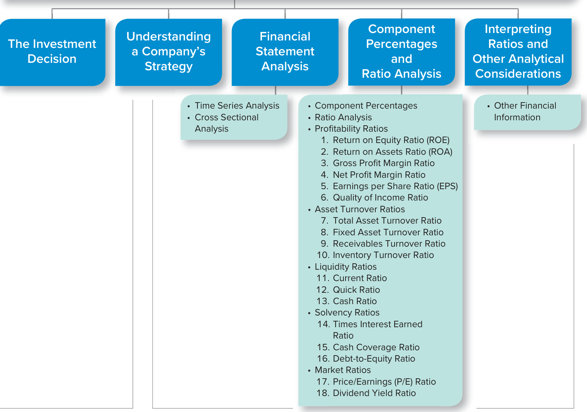
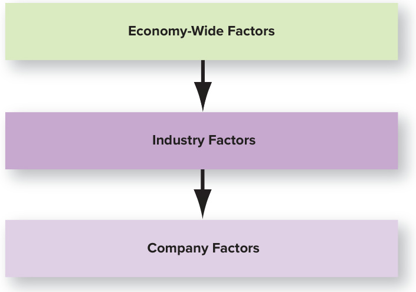
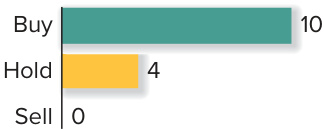
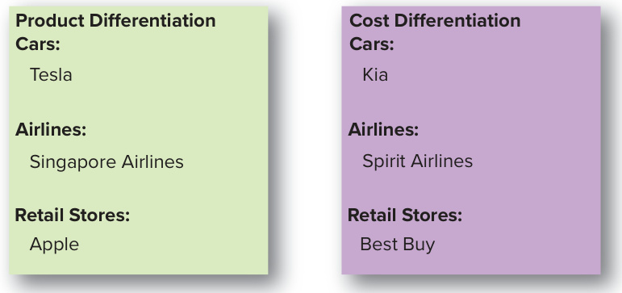
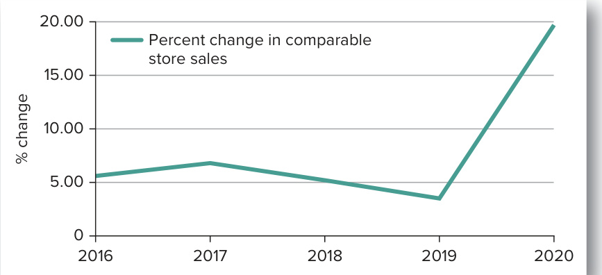
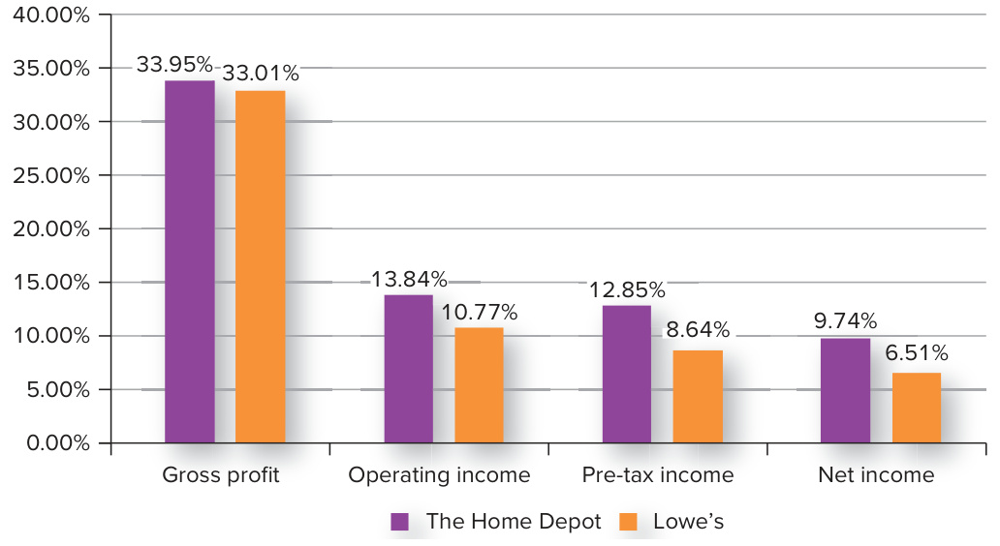
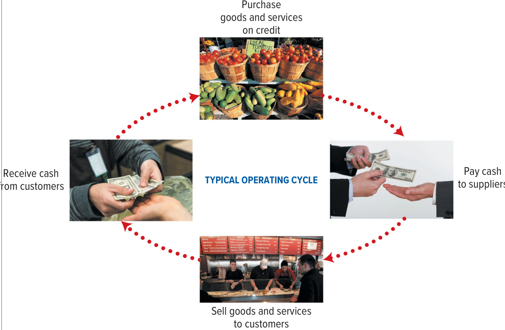
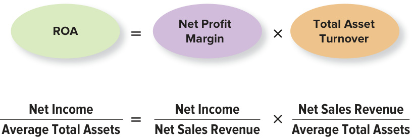
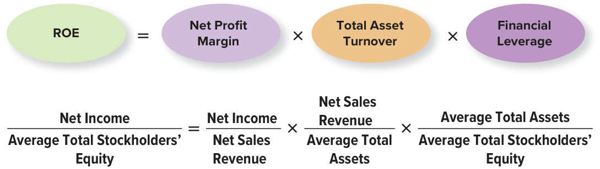

# Ch13 Analyzing Financial Statements  

he history of The Home Depot is an unusual success story. Founded in 1978 in Atlanta, The Home Depot has grown to be America’s largest home improvement  

retailer, with over 2,200 stores in the United States, Canada, and Mexico. Financial statements for The Home Depot are presented in Exhibit 13.1. As you can see, The Home Depot has grown both sales and net income over the last three years. As you analyze Exhibit 13.1 and read other disclosures in this chapter, it is helpful to keep in mind that The Home Depot’s fiscal year ends on the Sunday nearest to January 31. This means that “fiscal 2020” ended on January 31, 2021; “fiscal 2019” ended on February 2, 2020; and “fiscal 2018” ended on February 3, 2019.  

With the recent improvement in the company’s financial results, would you want to invest in The Home Depot? A number of professional analysts think you should, including those who work for Guggenheim Securities, a full-service, integrated investment banking and brokerage company. In a January 2021 research report on The Home Depot, Guggenheim analysts wrote: “We believe shares are poised to outperform. . .As a result, we are upgrading the shares to BUY from NEUTRAL. . .”  

Professional analysts consider a large number of factors in developing the type of recommendation contained in the Guggenheim research report, including information reported in a company’s financial statements. In this chapter, we use accounting information and a variety of analytical tools to study The Home Depot and its major competitor, Lowe’s.  

## LEARNING OBJECTIVES  

## After studying this chapter, you should be able to:  

13-1	 Explain how a company’s business strategy affects financial statement   
analysis. p. 692   
13-2	 Discuss ways to analyze financial statements. p. 693   
13-3	 Compute and interpret component percentages. p. 695   
13-4	 Compute and interpret profitability ratios. p. 697   
13-5	 Compute and interpret asset turnover ratios. p. 701   
13-6	 Compute and interpret liquidity ratios. p. 706   
13-7	 Compute and interpret solvency ratios. p. 708   
13-8	 Compute and interpret market ratios. p. 709  

  
Melissa Golden/Redux  

## UNDERSTANDING THE BUSINESS  

Companies spend billions of dollars each year preparing financial reports as well as other information that is important to investors like corporate sustainability reports. These statements are then made available to current and prospective investors. Most companies no longer mail this information to investors, but rather make it available online. The Home Depot’s financial information, as well as its sustainability report, are available from its Investor Relations website at ir.homedepot.com.  

The reason that The Home Depot and other companies spend so much money to provide information to investors is simple: Financial statements and related information help people make better economic decisions. In fact, the information is designed primarily to meet the needs of external decision makers, including present and potential owners, investment analysts, and creditors.  

## The Home Depot  

FINANCIAL ANALYSIS: BRINGING IT ALL TOGETHER  

homedepot.com  

## EXHIBIT 13.  

The Home Depot Select Financial Statements  

## THE HOME DEPOT  

REAL WORLD EXCERPT: Annual Report  

CONSOLIDATED STATEMENTS OF EARNINGS   

<html><body><table><tr><td>in millions,except per share data</td><td>Fiscal 2020</td><td>Fiscal 2019</td><td>Fiscal 2018</td></tr><tr><td>Net sales</td><td>$132,110</td><td>$110,225</td><td>$108,203</td></tr><tr><td>Cost of sales</td><td>87,257</td><td>72,653</td><td>71,043</td></tr><tr><td>Gross profit</td><td>44,853</td><td>37,572</td><td>37,160</td></tr><tr><td>Operating Expenses:</td><td></td><td></td><td></td></tr><tr><td>Selling, general and administrative</td><td>24,447</td><td>19,740</td><td>19,513</td></tr><tr><td>Depreciation and amortization</td><td>2,128</td><td>1,989</td><td>1,870</td></tr><tr><td>Impairment 1loss</td><td></td><td></td><td>247</td></tr><tr><td>Total operating expenses</td><td>26,575</td><td>21,729</td><td>21,630</td></tr><tr><td>Operating income</td><td>18,278</td><td>15,843</td><td>15,530</td></tr><tr><td>Interest and other (income) expense:</td><td></td><td></td><td></td></tr><tr><td>Interest and investment income</td><td>(47)</td><td>(73)</td><td>(93)</td></tr><tr><td>Interest expense</td><td>1,347</td><td>1,201</td><td>1,051</td></tr><tr><td>Other</td><td></td><td></td><td>16</td></tr><tr><td>Interest and other, net</td><td>1,300</td><td>1,128</td><td>974</td></tr><tr><td>Earnings before provision for income taxes</td><td>16,978</td><td>14,715</td><td>14,556</td></tr><tr><td>Provision for income taxes</td><td>4,112</td><td>3,473</td><td>3,435</td></tr><tr><td>Net Earnings</td><td>$ 12,866</td><td>$ $11,242</td><td>S 11,121</td></tr><tr><td>Basic weighted average common shares</td><td>1,074</td><td>1,093</td><td>1,137</td></tr><tr><td>Basic earnings per share</td><td>$ 11.98</td><td>$ 10.29</td><td>$ 9.78</td></tr><tr><td>Diluted weighted average common shares</td><td>1,078</td><td>1,097</td><td>1,143</td></tr><tr><td>Diluted earnings per share</td><td>$ 11.94</td><td>$ 10.25</td><td>$ 9.73</td></tr></table></body></html>  

CONSOLIDATED BALANCE SHEETS   
THE HOME DEPOT, INC   

<html><body><table><tr><td>inmillions,exceptpersharedata</td><td>End of Fiscal 2020</td><td>End of Fiscal 2019</td></tr><tr><td>Assets</td></tr><tr><td>Current assets:</td><td>$ 2,133</td></tr><tr><td>Cash and cash equivalents</td><td>$ 7,895</td></tr><tr><td>Receivables, net</td><td>2,992</td></tr><tr><td>Merchandise inventories Other current assets</td><td>2,106 16,627 14,531 1,040</td></tr><tr><td></td><td>963</td></tr><tr><td>Total current assets</td><td>28,477 19,810</td></tr><tr><td>Net property and equipment</td><td>24,705 22,770 5,595</td></tr><tr><td>Operatingleaseright-of-use assets</td><td>5,962</td></tr><tr><td>Goodwill Other assets</td><td>7,126 2,254 807</td></tr><tr><td>Total assets</td><td>4,311 $70,581 $51,236 $974</td></tr><tr><td>Liabilities and Stockholders’ Equity</td></tr><tr><td>Current liabilities:</td></tr><tr><td>Short-term debt $</td></tr><tr><td>Accounts payable 11,606 7,787 1,494</td></tr><tr><td>Accrued salaries and related expenses 2,463 Sales taxes payable</td></tr><tr><td>774 605 2,116 55 1,839</td></tr><tr><td>Deferred revenue 2,823 Income taxes payable 193 Current installments of long-term debt 1,416</td></tr></table></body></html>  

<html><body><table><tr><td>in millions,except pershare data</td><td>End of Fiscal 2020</td><td>End of Fiscal 2019</td></tr><tr><td>Current operating lease liabilities</td><td>828</td><td>828</td></tr><tr><td>Other accrued expenses</td><td>3,063</td><td>2,677</td></tr><tr><td>Total current liabilities</td><td>23,166</td><td>18,375</td></tr><tr><td>Long-term debt, excluding current installments</td><td>35,822</td><td>28,670</td></tr><tr><td>Long-term operatingleaseliabilities</td><td>5,356</td><td>5,066</td></tr><tr><td>Deferred income taxes</td><td>1,131</td><td>706</td></tr><tr><td>Other long-term liabilities</td><td>1,807</td><td>1,535</td></tr><tr><td>Totalliabilities Common stock, par value $0.05; authorized: 10,000</td><td>67,282</td><td>54,352</td></tr><tr><td>shares; issued: 1,789 shares at end of Fiscal 2020, and 1,786 shares at end of Fiscal 2019; outstanding: 1,077 shares at end of Fiscal 2020 and end of Fiscal 2019</td><td></td><td></td></tr><tr><td>Paid-in capital</td><td>89</td><td>89</td></tr><tr><td>Retained earnings</td><td>11,540</td><td>11,001</td></tr><tr><td></td><td>58,134</td><td>51,729</td></tr><tr><td>Accumulatedothercomprehensiveloss</td><td>(671)</td><td>(739)</td></tr><tr><td>Treasury stock, at cost, 712 shares at end of Fiscal 2020,</td><td></td><td></td></tr><tr><td>and 709 shares at end of Fiscal 2019</td><td>(65,793)</td><td>(65,196)</td></tr><tr><td>Total stockholders’ equity (deficit)</td><td>3,299</td><td>(3,116)</td></tr><tr><td>Total liabilities and stockholders’ equity</td><td>$70,581</td><td>$51,236</td></tr></table></body></html>  

THE HOME DEPOT, INC. CONSOLIDATED STATEMENTS OF CASH FLOWS   

<html><body><table><tr><td>in millions</td><td>Fiscal 2020</td><td>Fiscal 2019</td><td>Fiscal 2018</td></tr><tr><td>Cash Flows from Operating Activities:</td><td></td><td>$11,242</td><td>$11,121</td></tr><tr><td>Net earnings Reconciliation of net earnings to net cash</td><td>$12,866</td><td></td><td></td></tr><tr><td>provided by operating activities:</td><td></td><td></td><td></td></tr><tr><td>Depreciation and amortization</td><td>2,519</td><td>2,296</td><td>2,152</td></tr><tr><td>Stock-based compensation expense</td><td>310</td><td>251</td><td>282</td></tr><tr><td>Impairment loss</td><td></td><td></td><td>247</td></tr><tr><td>Changes in receivables, net</td><td>(465)</td><td>(170)</td><td>33</td></tr><tr><td>Changes in merchandise inventories</td><td>(1,657)</td><td>(593)</td><td>(1,244)</td></tr><tr><td>Changes in other current assets</td><td>43</td><td>(135)</td><td>(257)</td></tr><tr><td>Changes in accounts payable and accrued expenses</td><td>5,118</td><td>32</td><td>870</td></tr><tr><td>Changes in deferred revenue</td><td>702</td><td>334</td><td>80</td></tr><tr><td>Changes in income taxes payable</td><td>(149)</td><td>44</td><td>(42)</td></tr><tr><td>Changes in deferred income taxes</td><td>(569)</td><td>202</td><td>26</td></tr><tr><td>Other operating activities</td><td>121</td><td>184</td><td>(103)</td></tr><tr><td>Net cash provided by operating activities</td><td>18,839</td><td>13,687</td><td>13,165</td></tr><tr><td>Cash Flows from Investing Activities:</td><td></td><td></td><td></td></tr><tr><td>Capital expenditures</td><td>(2,463)</td><td>(2,678)</td><td></td></tr><tr><td>Payments for businesses acquired, net</td><td>(7,780)</td><td></td><td>(2,442)</td></tr><tr><td>Other investing activities</td><td>73</td><td>25</td><td>(21)</td></tr><tr><td></td><td></td><td></td><td>47</td></tr><tr><td>Net cash used in investing activities</td><td>(10,170)</td><td>(2,653)</td><td>(2,416)</td></tr><tr><td>Cash Flows from Financing Activities:</td><td></td><td></td><td></td></tr><tr><td>Repayments of short-term debt, net</td><td>(974)</td><td>(365)</td><td>(220)</td></tr><tr><td>Proceedsfromlong-term debt,net of discount</td><td></td><td></td><td></td></tr><tr><td>and premiums Repayments of long-term debt</td><td>7,933 (2,872)</td><td>3,420 (1,070)</td><td>3,466 (1,209)</td></tr></table></body></html>  

<html><body><table><tr><td>inmillions</td><td>Fiscal 2020</td><td>Fiscal 2019</td><td>Fiscal 2018</td></tr><tr><td>Repurchases of common stock</td><td>(791)</td><td>(6,965)</td><td>(9,963)</td></tr><tr><td>Proceedsfromsalesofcommonstock</td><td>326</td><td>280</td><td>236</td></tr><tr><td>Cash dividends</td><td>(6,451)</td><td>(5,958)</td><td>(4,704)</td></tr><tr><td>Other financing activities</td><td>(154)</td><td>(140)</td><td>(153)</td></tr><tr><td>Net cash used in financing activities</td><td>(2,983)</td><td>(10,798)</td><td>(12,547)</td></tr><tr><td>Change in cash and cash equivalents</td><td>5,686</td><td>236</td><td>(1,798)</td></tr><tr><td>Effect of exchange rate changes on cash and cash equivalents</td><td></td><td></td><td></td></tr><tr><td>Cash and cash equivalents at beginning of year</td><td>76 2,133</td><td>119 1,778</td><td>(19) 3,595</td></tr><tr><td>Cash and cash equivalents at end of year</td><td>$ 7,895</td><td>$ 2,133</td><td>$ 1,778</td></tr><tr><td>Supplemental Disclosures:</td><td></td><td></td><td></td></tr><tr><td>Cash paid for income taxes</td><td>$ 4,654</td><td>$ 3,220</td><td></td></tr><tr><td>Cashpaidforinterest,net ofinterestcapitalized</td><td>1,241</td><td>1,112</td><td>$ 3,774 1,035</td></tr><tr><td>Non-cash capital expenditures</td><td>274</td><td>136</td><td>248</td></tr></table></body></html>  

Source: The Home Depot, Inc.  

  
ORGANIZATION OF THE CHAPTER  

## THE INVESTMENT DECISION  

Of the people who use financial statements, investors are perhaps the single largest group. They often rely on the advice of professional analysts, who develop recommendations on widely held stocks such as The Home Depot. Investors who use analysts’ reports pay close attention to their recommendations. As this book was being written, 14 professional analysts issued the following investment recommendations for The Home Depot:  

Perhaps the most important thing to notice about this summary of investment recommendations is that not all analysts agree on whether investors should purchase The Home Depot’s stock. This level of disagreement shows that financial analysis is part art and part science. In considering an investment in stock, investors should evaluate the company’s future income and growth potential on the basis of three factors:  

  

1.	Economy-wide factors. Often the overall health of the economy has a direct impact on the performance of an individual company. Investors should consider data such as the unemployment rate, general inflation rate, and changes in interest rates. For example, J.P. Morgan’s research report discusses both “disposable income” and “consumer savings” as factors to consider when analyzing The Home Depot (J.P. Morgan North America Equity Research, January 7, 2021).  

2.	Industry factors. Certain events can impact a specific industry differently than other industries or the economy as a whole. For example, a research report from Oppenheimer Equity Research emphasizes that even during a general economic downturn due to the COVID-19 pandemic, data “. . .highlights clearly continued, persistent outsized demand growth within the home improvement category, as consumers spend more time at home. . .” (Oppenheimer Equity Research, January 29, 2021).  

3.	Individual company factors. To properly analyze a company, good analysts do not rely solely on the information reported in a company’s financial statements and other reports. They visit the company, buy its products, and read about it in the business press. If you are considering an investment in The Home Depot, you should visit its stores and assess its product offerings and the service it provides to customers in addition to analyzing its financial statements and other reports. An example of company-specific information is contained in the J.P. Morgan report, which states that The Home Deport “. . .believes its supply chain capabilities and overall proposition (price and assortment) are differentiating factors for the Pro customer vs. its competitors. . .” (J.P. Morgan North America Equity Research, January 7, 2021). Analysts who, over time, have repeatedly visited The Home Depot stores are in a good position to assess whether the company’s statements about price and assortment are true.  

Besides considering these factors, investors should understand a company’s business strategy when evaluating its financial statements. A company’s business strategy directly affects the accounts you will see on its financial statements.  

  

## UNDERSTANDING A COMPANY’S STRATEGY  

Financial statement analysis involves more than just “crunching numbers.” Before you start looking at numbers, you should know what you are looking for. While financial statements reflect transactions, each of those transactions is the result of a company’s operating decisions as it implements its business strategy.  

  

Businesses can earn a high rate of return by following different strategies. There are two fundamental strategies:  

1.	Product differentiation. Under this strategy, companies offer products with unique benefits, such as high quality or unusual style or features. These unique benefits allow a company to charge higher prices. In general, a product differentiation strategy results in higher profit margins but lower inventory turnover.   
2.	Cost differentiation. Under this strategy, companies attempt to operate more efficiently than their competitors, which permits them to offer lower prices to attract customers. In general, a cost differentiation strategy results in lower profit margins but higher inventory turnover.  

You can probably think of a number of companies that have followed one of these two basic strategies. Here are some examples:  

  

## THE HOME DEPOT  

REAL WORLD EXCERPT: 10-K Report  

The best place to start financial analysis is with a solid understanding of a company’s business strategy. To evaluate how well a company is doing, you must know what managers are trying to do. You can learn a great deal about a company’s business strategy by reading its annual report or 10-K, especially the letter from the president and management’s discussion and analysis (MD&A). It also is useful to read other reports (e.g., sustainability or ESG reports) and articles about the company in the business press.  

The Home Depot’s business strategy is described in its 10-K report as follows:  

Our ability to operate successfully and meet the needs of our customers in the pandemic environment successfully was due in significant part to the transformational journey we began in 2017 to create the One Home Depot experience, our vision of an interconnected, frictionless shopping experience that enables our customers to seamlessly blend the digital and physical worlds. Our multi-year accelerated investment program to create this experience is now largely complete. Our investments have been guided by the following strategies:  

Invest using a “customer-back” approach Reinforce our position as the product authority in home improvement Deliver a best-in-class, interconnected shopping experience Extend our low-cost provider position  

These strategic investments are designed to extend our current competitive advantages. We believe our primary competitive advantages are: (1) our culture and associates, (2) our premium real estate, (3) our world-class merchandising organization, (4) our flexible supply chain, and (5) our digital experience. Taken together, our One Home Depot vision and execution of the related strategies are helping us to meet our two principal business objectives: continue to grow our share of the highly competitive market in which we operate and deliver shareholder value. We believe that our efforts to build the One Home Depot experience, and the groundwork we laid in these areas over the past decade, position us well to meet our objectives in any environment and have been particularly important in navigating the challenges created by the pandemic. We achieved record sales in fiscal 2020, while remaining focused on two key priorities: the safety and well-being of our associates and customers and providing our customers and communities with the products and services they need.  

Source: The Home Depot, Inc.  

This description of The Home Depot’s strategy serves as a guide for our financial analysis.  

## FINANCIAL STATEMENT ANALYSIS  

Analyzing financial data without a basis for comparison is not informative. For example, would you be impressed with a company that earned $\mathbb{S}1$ million last year? You are probably thinking, “It depends.” $\mathbf{A}\,\mathbb{S}1$ million profit might be very good for a company that lost money the year before but not good for a company that made $\mathbb{S}500$ million the preceding year. It might be good for a small company but not for a very large company. And it might be considered good if all the other companies in the industry lost money the same year but not good if they all earned much larger profits. As you can see from this simple example, financial results cannot be evaluated in isolation.  

To properly analyze the information reported in financial statements, you must develop appropriate comparisons. The task of finding appropriate comparisons requires judgment and is not always easy. Financial analysis is a sophisticated skill, not a mechanical process.  

There are two general methods for making financial comparisons. The first compares a company to itself in prior years. The second compares a company to other companies at a point in time or across time.  

1.	Comparing across time. In this type of analysis, which often is referred to as “time-series analysis,” information is compared over time. For example, a key measure of performance for most retail companies is the change in sales at existing stores, which often is referred to as “comparable store sales.” The time-series chart below shows that The Home Depot’s comparable store sales growth over the last five years. This chart clearly shows the uptick in home improvement projects in 2020.  

## LEARNING OBJECTIVE 13-2  

Discuss ways to analyze financial statements.  

  
Source: The Home Depot, Inc.  

## THE HOME DEPOT  

REAL WORLD EXCERPT: 10-K Report  

Comparable sales is a measure that highlights the performance of our existing locations and websites by measuring the change in net sales for a period over the comparable prior-period of equivalent length. Comparable sales includes sales at all locations, physical and online, open greater than 52 weeks (including remodels and relocations) and excludes closed stores. Retail stores become comparable on the Monday following their $52^{\mathrm{nd}}$ week of operation. Total comparable sales increased 19.7 percent in fiscal 2020, reflecting a 10.5 percent increase in comparable average ticket and an 8.6 percent increase in comparable customer transactions.  

Remember the phrase “garbage in, garbage out” when considering industry information found on the Internet. Make sure you know what formulas are being used to calculate a ratio and where the ratio inputs are coming from before relying on the ratio’s output for financial analysis.  

Source: The Home Depot, Inc.  

2.	Comparing across companies. In this type of analysis, which often is referred to as “cross-sectional analysis,” information for multiple companies is compared at a point in time or across time. We have seen that financial results are often affected by industry and economy-wide factors. By comparing a company with other companies in the same line of business, an analyst can gain better insight into the company’s performance.  

Finding comparable companies is often difficult. Few companies do the exact same thing as their competitors. For example, Gap, Nordstrom, Target, Walmart, and Urban Outfitters are all apparel retailers, but not all could be considered comparable companies for purposes of financial analysis. These retailers offer different levels of quality and appeal to different types of customers.  

The federal government has developed the North American Industry Classification System (NAICS) for use in reporting economic data. The system assigns a specific industry code to each corporation based on its business operations. Analysts often use these six-digit codes to identify companies that have similar business operations. In addition, you can find multiple online resources, such as Yahoo! Finance or Google Finance, that provide industry information. Because of the diversity of companies included in any given industry classification, and the potential difference in how ratios are calculated, these data should be used with great care. For this reason, some analysts prefer to compare two companies that are very similar instead of using industry-wide comparisons.  

## A QUESTION OF ETHICS  

## Insider Information  

A company’s accountants often are aware of important financial information before it is made available to the public. This is called insider information. Some people might be tempted to buy or sell stock based on insider information, but to do so is a serious criminal offense. The Securities and Exchange Commission has brought a number of cases against individuals who traded on insider information. Their convictions resulted in large fines and time served in jail.  

In some cases, determining whether something is insider information is difficult. For example, an individual could overhear a comment made in the company elevator by two executives. Is this insider information? A well-respected Wall Street investment banker offers good advice on dealing with such situations: “If you are not sure if something is right or wrong, apply the newspaper headline test. Ask yourself how you would feel to have your family and friends read about what you had done in the newspaper.” Interestingly, many people who have spent time in jail and lost small fortunes in fines because of insider trading say that the most difficult part of the process was telling their families.  

To uphold the highest ethical standard, many public accounting firms have adopted rules that prevent their staff from investing in companies that they audit. Such rules are designed to ensure that a company’ auditors will not be tempted to engage in insider trading.  

## COMPONENT PERCENTAGES AND RATIO ANALYSIS  

## Component Percentages  

All analysts use various tools to analyze a company’s financial statements. Two popular tools are component percentages and ratio analysis. Component percentages express each item on a financial statement as a percentage of a single base amount. The base amount on the income statement is net sales. To compute component percentages on the income statement, each amount reported is divided by net sales. The base amount on the balance sheet is total assets. To compute component percentages on the balance sheet, each amount is divided by total assets.  

Exhibit 13.2 shows a component percentage analysis for The Home Depot’s income statement. The percentages reported in Exhibit 13.2 were calculated by taking the dollar amounts reported on The Home Depot’s income statement shown in Exhibit 13.1 and dividing them by net sales. If you simply reviewed the dollar amounts on the income statement, you might miss important insights. For example, cost of sales expense increased by $\mathbb{S}14{,}604$ million in fiscal 2020. This increase might seem to reflect a decline in operating efficiency until it is compared with sales productivity. A component percentage analysis provides an important insight: This expense category essentially stayed constant at approximately 66 percent from 2018 to 2020, reflecting that The Home Depot was able to increase sales without having to pay more on average for the items sold to generate those sales.  

The component analysis (in Exhibit 13.2) also reflects that net income (which The Home Depot refers to as “net earnings”) has remained relatively constant at just below or just above 10 percent over the three-year period. This suggests that The Home Depot is finding ways to maintain its operating efficiency across time.  

Compute and interpret component percentages.  

## EXHIBIT 13.2  

Component Percentages for The Home Depot  

<html><body><table><tr><td rowspan="2">dollarsinmillions</td><td colspan="2">Fiscal 2020</td><td colspan="2">Fiscal 2019</td><td colspan="2">Fiscal 2018</td></tr><tr><td>$</td><td>% of Net Sales</td><td>$</td><td>% of Net Sales</td><td>$</td><td>% of Net Sales</td></tr><tr><td>Net sales</td><td>$132,110</td><td></td><td>$110,225</td><td></td><td>$108,203</td><td></td></tr><tr><td>Cost of sales</td><td></td><td>66.0%</td><td></td><td>65.9%</td><td></td><td>65.7%</td></tr><tr><td>Gross profit</td><td>44,853</td><td>34.0</td><td>37,572</td><td>34.1</td><td>37,160</td><td>34.3</td></tr><tr><td>Operating expenses:</td><td></td><td></td><td></td><td></td><td></td><td></td></tr><tr><td>Selling, general and administrative</td><td>24,447</td><td>18.5</td><td>19,740</td><td>17.9</td><td>19,513</td><td>18.0</td></tr><tr><td>Depreciation and amortization</td><td>2,128</td><td>1.6</td><td>1,989</td><td>1.8</td><td>1,870</td><td>1.7</td></tr><tr><td>Impairment loss</td><td></td><td></td><td></td><td></td><td>247</td><td>0.2</td></tr><tr><td>Total operating expenses</td><td>26,575</td><td>20.1</td><td>21,729</td><td>19.7</td><td>21,630</td><td>20.0</td></tr><tr><td>Operatingincome</td><td>18,278</td><td>13.8</td><td>15,843</td><td>14.4</td><td>15,530</td><td>14.4</td></tr><tr><td>Interest and other (income) expense:</td><td></td><td></td><td></td><td></td><td></td><td></td></tr><tr><td>Interest and investment income</td><td>(47)</td><td></td><td>(73)</td><td>(0.1)</td><td>(93)</td><td>(0.1)</td></tr><tr><td>Interestexpense</td><td>1,347</td><td>1.0</td><td>1,201</td><td>1.1</td><td>1,051</td><td>1.0</td></tr><tr><td>Other</td><td></td><td></td><td></td><td></td><td>16</td><td></td></tr><tr><td>Interest and other, net</td><td>1,300</td><td>1.0</td><td>1,128</td><td>1.0</td><td>974</td><td>0.9</td></tr><tr><td>Earnings before provision for income taxes</td><td>16,978</td><td>12.9</td><td>14,715</td><td>13.3</td><td>14,556</td><td>13.5</td></tr><tr><td>Provisionforincome taxes</td><td>4,112</td><td>3.1</td><td>3,473</td><td>3.2</td><td>3,435</td><td>3.2</td></tr><tr><td>Net earnings</td><td>$ 12,866</td><td>9.7%</td><td>$ 11,242</td><td>10.2%</td><td>$ 11,121</td><td>10.3</td></tr></table></body></html>

Source: The Home Depot, Inc.  

## BUSINESS ANALYTICS  

## Using Data Visualization Tools to Assess a Company’s Performance  

Many analysts use data visualization tools (e.g., Tableau or Microsoft BI) to help them analyze a company’s financial data. This type of data analytics is especially useful when communicating findings during meetings or in printed form. The nearby bar chart visually displays key income percentages for The Home Depot from Exhibit 13.2, along with comparable data from its competitor, Lowe’s. The chart allows you to easily see that The Home Depot and Lowe’s have comparable gross profit margins, but that The Home Depot has higher operating, pre-tax, and net income margins.  

  
Source: Data from The Home Depot, Inc., and Lowe’s  

## Ratio Analysis  

Component percentages are a type of ratio. Ratios simply express one number relative to another number. With component percentages, both the numerator and the denominator of the ratio come from the same financial statement, either the income statement or the balance sheet. This does not have to be the case. As an example, assume you want to know how effective a company is in using its assets to generate net income. Answering this question is difficult if you only know that the company earned net income of $\mathbb{S}500{,}000$ . Comparing income to total assets provides additional insights. If total assets are $\mathbb{S5}$ million, for example, then the relationship of earnings to assets is $\mathbb{8}500,000\div\mathbb{8}5,000,000=10\%$ . This measure indicates a different level of performance than would be the case if total assets were $\mathbb{S}250$ million. Ratio analysis helps decision makers identify significant relationships and make meaningful comparisons.  

Of the many ratios that can be computed using a company’s financial statements, analysts focus on those that are most useful in a given situation. Comparing cost of goods sold to longterm debt is not meaningful because these items have no natural relationship. Instead, an analyst often will compute certain widely used ratios and then decide which additional ratios could be relevant to a particular decision. Research and development costs as a percentage of sales is not a meaningful ratio for some companies, for example, but it is useful when analyzing companies that depend on new products, such as a pharmaceutical company.  

When you compute ratios, remember a basic fact about financial statements: Balance sheet amounts are as of a specific point in time while income statement amounts relate to a period of time. To adjust for this difference, most analysts use the average balance sheet amount when comparing a balance sheet number to an income statement number. The average is computed by adding the beginning and ending amounts of a balance sheet account and dividing the total by two. Making this adjustment allows you to compare the average balance sheet amount that corresponds to the period for which the income statement number was generated. In specific cases, analysts will use the ending balance sheet amount. Doing so is appropriate only if there is not a significant difference between the beginning and ending balances. For consistency, we use average balance sheet amounts unless there is a specific reason to use the ending balance. When that is the case, we will provide the logic behind our choice.  

Financial statement analysis involves a lot of judgment. The more clearly you define the questions you want answered, the easier it is to select the most appropriate ratios to compute. We will discuss several ratios that are appropriate to most situations. They can be grouped into the categories shown in Exhibit 13.3.  

Profitability is a primary measure of the overall success of a company. Profitability ratios focus on net income and how it compares to other amounts reported on the financial statements. Return on equity is a widely used measure of profitability.  

## 1. Return on Equity Ratio (ROE)  

## Remember that when a ratio compares an  

## Profitability Ratios  

income statement amount to a balance sheet amount, the average balance sheet amount is typically used. You can calculate the average by adding the beginning and ending amounts of the balance sheet account and dividing the total by two.  

Compute and interpret profitability ratios.  

## LEARNING OBJECTIVE 13-4  

Return on equity relates income earned to the investment made by a company’s owners. This ratio reflects the simple fact that investors expect to earn a return on the money they invest in a company. The return on equity ratio is computed as follows:  

Return on Equity Ratio (ROE)=​ _ Average Total Stockholders” Equity _N_e_t _I_n_c_o_m_e_ ${\mathrm{The~Home~Depot~}}2020={\frac{\mathfrak{G}12,866}{\mathfrak{G}3,299^{*}}}=390.00\%$  

\*We normally use average stockholders’ equity for the denominator; however, because The Home Depot reported negative stockholders’ equity in fiscal 2019, we are using the ending balance for fiscal year 2020. For comparability reasons, we are also using the ending balance for Lowe’s.  

The Home Depot earned 390.00 percent on the owners’ investment. Another way to interpret this number is to say that, on average, for every $\mathbb{S}1.00$ equity investors contributed to The Home Depot, the company earned $\mathbb{S}3.90\$ in fiscal 2020. Was this return good or bad? To answer this question, we need to compare 390.00 percent to what The Home Depot’s ROE was in prior years, or to its competitors’ ROE in 2020. ROE for Lowe’s was 406.05 percent, indicating that Lowe’s produced a better return on its owners’ investment than did The Home Depot in fiscal 2020. We must interpret this ratio with caution, however, given The Home Depot has recently repurchased a considerable amount of treasury stock from the market, which has caused its stockholders’ equity to be negative in fiscal 2019 and fiscal 2018.  

## 2. Return on Assets Ratio (ROA)  

Another test of profitability compares income to the total assets used to generate the income. Return on assets is computed as follows:  

$$
{\begin{array}{r l}&{{\mathrm{~eturn~on~Assets~Ratio~(ROA)}}={\frac{\mathrm{Net~Income}}{\mathrm{Average~Total~Asset}}}}\\ &{\qquad{\mathrm{~The~Home~Depot~2020}}={\frac{\oint12,866}{\oint60,909^{\ast}}}=21.12\%}\\ &{\qquad{\frac{\star(\oint51,236+\oint70,581)}{2}}=\oint60.909}\end{array}}
$$  

This implies that, on average, for every $\mathbb{S}1.00$ of assets reported on The Home Depot’s balance sheet, the company earned just over 21 cents in fiscal 2020. The ROA for Lowe’s was  

## EXHIBIT 13.3  

## RATIO  

Widely Used Accounting Ratios  

## Profitability Ratios  

1. Return on equity ratio (ROE)   
2. Return on assets ratio (ROA)   
3. Gross profit margin ratio   
4. Net profit margin ratio   
5. Earnings per share ratio (EPS)   
6. Quality of income ratio  

## _N_e_t _I_n_c_o_m_e_  

## Asset Turnover Ratios  

7. Total asset turnover ratio   
8. Fixed asset turnover ratio   
9. Receivables turnover ratio   
10. Inventory turnover ratio  

Net Sales Revenue Average Total Assets _N__et_ _S_al_e_s_ _R_e_v_e_n_u_e Average Net Fixed Assets _N_e_t_ C_r_e_d_it_ _S_al_e_s_ Average Net Receivables _C_o_s_t _o_f _G_o_o_d_s_ _S_o_ld_ Average Inventory  

## Liquidity Ratios  

11. Current ratio   
12. Quick ratio   
13. Cash ratio  

Cash & Cash Equivalents $^+$ Net Accounts Receivable $^+$ _M__a_r_k__e_t_a__b_l_e_ _S__e_c_u__ri_t_i_e_s_ Current Liabilities  

_C_a_s_h_ &_ _C_a_s_h_ _E_q_u_iv_a_l_e_n_ts_Current Liabilities  

## Solvency Ratios  

_N_e_t_ I_n_c_o_m_e_ $^+$ I_n_t_er_e_s_t _E_x_p_e_n_s_e $^+$ _I_n_co__m_e_ T_a_x_ _E_x_p_e_ns_e_  

14. Times interest earned ratio   
15. Cash coverage ratio   
16. Debt-to-equity ratio  

## Market Ratios  

17. Price/Earnings (P/E) ratio   
18. Dividend yield ratio  

\*We list the basic computation for each ratio. Analysts sometimes adjust these basic computations depending on the analysis they are conducting.  

13.54 percent, considerably lower than the ROA for The Home Depot. This comparison indicates that The Home Depot is utilizing its assets to generate income more effectively than Lowe’s.  

Some analysts modify the basic ROA computation listed above by adding interest expense (net of tax) to the numerator of the ratio. The logic for making this adjustment is that the denominator of the ratio includes resources (assets) provided by both owners and creditors, so the numerator should include the return that was available to both groups. Interest expense is therefore added back because it was previously deducted in the computation of net income. Note, too, that when making this adjustment, interest expense often is measured net of income tax. The net of tax amount is used when interest is deductible for tax purposes, which it is up to a cap.  

## 3. Gross Profit Margin Ratio  

The gross profit margin ratio (also referred to as the gross profit percentage) reflects gross profit as a percent of sales. If not shown separately on a company’s income statement, gross profit is computed by subtracting cost of sales from net sales. The gross profit margin ratio is computed as follows:  

$$
\begin{array}{r}{\mathrm{Gross~Profit~Margin~Ratio=\frac{Gross\;Profit}{N e t\;S a l e s\;R e v e n u e}}}\\ {\mathrm{The~Home~Depot~}2020=\frac{\;\Phi44,853}{\Phi132,110}=33.95\%}\end{array}
$$  

Lowe’s had a similar gross profit margin ratio: 33.01 percent. This implies that, after subtracting the direct costs associated with selling products, both The Home Depot and Lowe’s had between 33 and 34 cents of each dollar of sales remaining to cover other expenses. The fact that The Home Depot and Lowe’s have almost identical gross profit margin ratios indicates that the two companies likely follow similar business strategies and sell similar products, perhaps even sourced from the same suppliers.  

## 4. Net Profit Margin Ratio  

The net profit margin ratio reflects net income as a percent of sales. It is computed as follows:  

$$
\mathrm{Net\:Profit\:Margin\;Ratio}=\frac{\mathrm{Net\:Income}}{\mathrm{Net\:Sales\:Revenue}}
$$  

$$
{\mathrm{The~Home~Depot~}}2020={\frac{\S12,866}{\S132,110}}=9.74\%
$$  

For fiscal 2020, each dollar of The Home Depot’s sales generated over 9 cents of profit. In comparison, Lowe’s earned 6.51 percent, or approximately 6.5 cents for each dollar of sales. These numbers reflect that for each dollar of sales, The Home Depot is subtracting just under 91 cents in expenses while Lowe’s is subtracting approximately 94 cents.  

While both the gross profit margin ratio and the net profit margin ratio are good measures of operating efficiency, you should be careful not to analyze them in isolation because they do not consider the resources needed to earn income. It is very difficult to compare profit margins for companies in different industries. For example, profit margins are low in the food industry while profit margins in the jewelry industry are high. Both types of businesses can be quite profitable, however, because a high sales volume can compensate for a low profit margin. Grocery stores have low profit margins, but they generate a high sales volume from a broad customer base that tends to purchase items on a daily or weekly basis. Although jewelry stores earn comparatively more profit from each sales dollar, fewer people purchase jewelry and typically do so only occasionally. Thus, jewelry stores tend to have fewer sales transactions than grocery stores.  

The trade-off between profit margin and sales volume can be stated in simple terms: Would you prefer to have 5 percent of $^{\Phi1,000,000}$ or 10 percent of $^{\Phi100,000?}$ As you can see, a larger profit margin percentage is not always better in terms of total dollars earned.  

## 5. Earnings per Share Ratio (EPS)  

The earnings per share ratio is a measure of return on investment that is based on the number of common shares outstanding. EPS is computed as follows:  

Earnings per Share Ratio (EPS) $=$ ​ _W_e_i_g_h_te_d_ _A_ v_e_r a_g_e_ _NN_ue_ tm _I_bn_ecr_ o _om_f e_S_h _a_re_s_ _O_ u_t_st_a_n_d_in_g_ The Home Depot $2020=\frac{\mathbb{S}12,866}{1,074}=\mathbb{S}11.98$ 6_ ​   = \$11.98 per share  

You often can obtain the weighted average number of shares outstanding, as well as EPS, from the bottom of a company’s income statement (see Exhibit 13.1). Earnings per share is probably the single most widely reported ratio, and it is the only ratio required by GAAP. Analysts develop their own estimates of future EPS and the stock price of a company may change significantly if the actual EPS differs from their estimate. Lowe’s EPS in fiscal 2020 was $\mathbb{5}7.77$ per share, so less than The Home Depot’s EPS. When analyzing EPS numbers for a company, keep in mind that managers can significantly alter EPS by selling shares of common stock or repurchasing shares of common stock. For example, when managers choose to repurchase shares of common stock, it reduces the denominator of the EPS ratio but does not affect the numerator. The overall effect is an increase in EPS.  

## 6. Quality of Income Ratio  

Most financial analysts are concerned about the quality of a company’s income because some accounting procedures can be used to report higher income. For example, a company that uses a short estimated life for a depreciable asset will report lower income in the asset’s early years relative to an identical company that uses a longer estimated life. One method of evaluating the quality of a company’s income is to compare its reported income to its cash flows from operating activities, as follows:  

$$
{\begin{array}{l}{{\mathrm{Quality~of~Income~Ratio}}={\frac{\mathrm{Cash~Flows~from~Operating~Activities}}{\mathrm{Net~Income}}}}\\ {{\mathrm{The~Home~Depot~}}2020={\frac{\oint18,839}{\oint12,866}}=1.46}\end{array}}
$$  

A general rule of thumb is that a quality of income ratio that is higher than 1.00 indicates high-quality income because each dollar of income is supported by one or more dollars of cash flows. A ratio that is below 1.00 represents lower-quality income. Lowe’s quality of income ratio is 1.89, so both Lowe’s and The Home Depot have quality of income ratios above 1.00.  

We have discussed several profitability ratios. Profitability ratios focus on income and how it compares to other amounts reported on the financial statements. Next we will discuss asset turnover ratios. Before you move on, complete the following to test your understanding of the concepts we have covered so far.  

Show how to compute the following ratios:  

For additional step-by-step video instruction on calculating ratios, go to mhhe.com/libby_gh13-1.  

Recommended Homework: M13-3, M13-4, E13-5, P13-3  

## Asset Turnover Ratios  

Asset turnover ratios focus on capturing how efficiently a company uses its assets. For example, acquiring and selling inventory is a key activity for many companies. The inventory turnover ratio helps analysts evaluate a company’s ability to sell its inventory. Another example is the receivables turnover ratio, which helps analysts evaluate a company’s ability to collect its receivables. These and other asset turnover ratios are discussed below.  

## LEARNING OBJECTIVE 13-5  

Compute and interpret asset turnover ratios.  

## 7. Total Asset Turnover Ratio  

The total asset turnover ratio captures how well a company uses its assets to generate revenue. The ratio is computed as follows:  

$$
{\mathrm{The~Home~Depot~}}2020={\frac{\S132,110}{\S60,909^{\ast}}}=2.17
$$  

$$
\cfrac{\ast(\Phi51,236+\Phi70,581)}{2}=\Phi60,909
$$  

A total asset turnover ratio of 2.17 implies that, on average, each dollar of assets on The Home Depot’s balance sheet generates $\mathbb{S}2.17$ of revenue. Lowe’s total asset turnover ratio is 2.08. Comparing the two indicates that The Home Depot is slightly more effective than Lowe’s at using its assets to generate revenue. As the table below indicates, The Home Depot’s total asset turnover has declined over the last three years. This decline is likely something analysts will keep a close eye on in the future.  

<html><body><table><tr><td></td><td>2020</td><td>2019</td><td>2018</td></tr><tr><td>TotalAssetTurnover</td><td>2.17</td><td>2.31</td><td>2.44</td></tr></table></body></html>  

__N_et_ _in_c_o__m_e_ 1. Return on Equity Ratio $=$ Average Total Stockholders’ Equity  

## S o l u t i o n s  t o  

## S E L F - S T U DY  Q U I Z  

__N_et_ _In_c_o__m_e 2. Return on Assets Ratio $=$ Average Total Assets  

__N_e_t _I_n_c_o_m__e 3. Net Profit Margin Ratio $=$ Net Sales Revenue  

## 8. Fixed Asset Turnover Ratio  

Whereas the total asset turnover ratio captures how well a firm uses all of its assets to generate revenues, the fixed asset turnover ratio focuses more narrowly on how well a company uses its fixed assets to generate revenues. The term fixed assets is synonymous with property, plant, and equipment. The ratio is computed as follows:  

$$
{\mathrm{The~Home~Depot~}}2020={\frac{\S132,110}{\S23,738^{\star}}}=5.57
$$  

$$
\frac{^{\ast}(\Phi22,770+\Phi24,705)}{2}=\Phi23,738
$$  

Lowe’s fiscal 2020 fixed asset turnover ratio is 4.73. The Home Depot’s ratio is higher, indicating it is more effective at using its fixed assets to generate revenues. For each dollar The Home Depot invested in property, plant, and equipment, the company was able to generate $\S5.57$ in sales revenue, while Lowe’s could generate only $\mathbb{54.73}$ .  

## 9. Receivables Turnover Ratio  

Being able to efficiently collect accounts receivable is critical to a company. Analysts know this and therefore keep close watch on a company’s receivables turnover ratio. The receivables turnover ratio is computed as follows:  

$$
\cfrac{^{\dagger}(\mathbb{S}2,106+\mathbb{S}2,992)}{2}=\mathbb{S}2,549
$$  

A high receivables turnover ratio suggests that a company collects its accounts receivable many times during a year. The Home Depot, on average, collects its accounts receivable over 51 times a year. Granting credit to customers with poor credit and ineffective collection efforts will produce a low receivables turnover ratio. While a very low ratio is obviously a problem, a very high ratio also can be troublesome because it suggests an overly stringent credit policy that could cause lost sales and profits.  

  

The receivables turnover ratio often is converted to reflect the number of days, on average, it takes a company to collect its receivables. The computation is as follows:  

The Home Depot’s average days to collect receivables ratio implies that it takes the company an average of just over seven days to collect its accounts receivable. Although the receivables turnover ratio normally provides useful insights, the one for The Home Depot is not meaningful. It is highly unlikely that The Home Depot collects cash from its credit customers in just seven days. Because we did not know the amount of The Home Depot’s credit sales, we used total sales as an approximation. In this case, the approximation is not reasonable. Most customers use a bank credit card such as MasterCard or Visa. From The Home Depot’s perspective, a sales transaction involving a bank credit card is recorded as a cash sale because the credit card company quickly transfers cash to The Home Depot and then takes on the responsibility of collecting from the customer. As a result, many of The Home Depot’s sales are actually cash sales, invalidating the assumption that total sales are a reasonable proxy for credit sales. This situation illustrates that ratio analysis involves more than the mere computation of numbers. Analysts must evaluate the results based on their understanding of a company’s business strategy.  

## 10. Inventory Turnover Ratio  

Like the receivables turnover ratio, the inventory turnover ratio is a measure of operating efficiency. It is computed as follows:  

$$
\mathrm{Inventory~Turnover~Ratio}={\frac{\mathrm{Cost~of~Goods~Sold}}{\mathrm{Average~Inventorv}}}
$$  

$$
\cfrac{\ast(\Phi14,531+\Phi16,627)}{2}=\Phi15,579
$$  

Because a company normally realizes profit each time inventory is sold, an increase in this ratio is usually favorable. If the ratio is too high, however, it may be an indication that sales were lost because desired items were not in stock. A company must balance the cost of holding inventory with the potential cost of losing a sale.  

On average, The Home Depot’s inventory was acquired and sold to customers over 5 times during the year. The inventory turnover ratio is critical for The Home Depot because of its business strategy. It wants to be able to offer customers the right product when they need it at a price that beats the competition. Inventory turnover for Lowe’s was 4.09. Historically, The Home Depot has enjoyed an advantage over Lowe’s in terms of inventory management. The Home Depot’s effectiveness in inventory management means that the company is able to tie up less money in carrying inventory compared to Lowe’s.  

Turnover ratios vary significantly from one industry to the next. Companies in the food industry (grocery stores and restaurants) have high inventory turnover ratios because their inventory is subject to rapid deterioration. Companies that sell expensive merchandise (automobiles and high-fashion clothes) have much lower ratios because sales tend to be less frequent, but customers want to have a selection to choose from so companies in these industries must still carry significant inventory.  

Like  the  receivables  turnover  ratio,  the  inventory  turnover  ratio  often  is  converted to reflect the number of days, on average, it takes a company to sell its inventory. The computation is  

Using Ratios to Analyze the Operating Cycle  In Chapter 3, we introduced the concept of a company’s operating cycle, which is the time it takes for a company to pay cash to its suppliers, sell goods to its customers, and collect cash from its customers. Analysts are interested in the operating cycle because it helps them evaluate a company’s cash needs and is a good indicator of operating efficiency.  

  
Top: Digital Vision/Getty Images; Left: Juanmonino/Getty Images; Right: Tetra Images/Getty Images; Bottom: eff Kowalsky/Bloomberg/Getty Images  

The operating cycle for most companies involves three distinct phases: the acquisition of inventory, the sale of the inventory, and the collection of cash from the customer. We have discussed several ratios that are helpful when evaluating a company’s operating cycle:  

<html><body><table><tr><td>Ratio*</td><td>OperatingActivity</td></tr><tr><td>Accountspayableturnoverratio</td><td>Purchaseofinventory</td></tr><tr><td>Inventory turnover ratio</td><td>Saleofinventory</td></tr><tr><td>Receivablesturnoverratio</td><td>Collectionofcashfromcustomers</td></tr><tr><td colspan="2">*We discussed the accounts payable turnover ratio in Chapter 9.The inventory turnover ratioand thereceivablesturnoverratioarediscussedinthischapter.</td></tr></table></body></html>  

Each of the ratios measures the number of days it takes, on average, to complete an operating activity. We already have computed two of the needed ratios for The Home Depot, so if we compute the accounts payable turnover ratio, we can analyze the company’s operating cycle:  

$$
\cfrac{*(\Phi7,787+\Phi11,606)}{2}=\Phi9,697
$$  

The numbers of days it takes The Home Depot to complete each phase of its operating cycle are  

<html><body><table><tr><td>Ratio</td><td>Time</td></tr><tr><td>Average days to pay payables</td><td>40.56days</td></tr><tr><td>Average days toselli inventory</td><td>65.17days</td></tr><tr><td>Average days to collect receivables</td><td>7.04 days</td></tr></table></body></html>  

Examining each phase of the operating cycle helps us understand the cash needs of the company. The Home Depot, on average, pays for its inventory 40 days after it receives it. It takes, on average, just over 72 days $(65.17\,+\,7.04)$ ) for it to sell its inventory and collect cash from its customers. Therefore, The Home Depot must invest cash in its operating activities 32 days (72 days − 40 days) between the time it pays its vendors and the time it collects from its customers. Companies prefer to minimize the time between paying vendors and collecting cash from customers because it frees up cash for other productive purposes. The Home Depot could reduce this time by slowing payments to creditors or by increasing how quickly it turns over its inventory.  

  

## ROA Profit Driver Analysis and the DuPont Model  

As introduced in Chapter 5, one of the most general frameworks for evaluating a company’s profit drivers is to examine its Return on Assets (ROA). ROA can be broken down into two components:  

  

In mathematical terms, canceling out like items on the right side of the above equation shows that the left and right sides are equivalent. Examining the additional information on the right side allows an analyst to tell a much richer story about a company’s performance than can be told by examining just ROA. For example, a company can increase its ROA by increasing its net profit margin or by increasing the revenue it generates from its asset base (its total asset turnover).  

Breaking down ROA into its two components allows you to more fully understand what underlies a company’s performance. With this knowledge, you can better assess whether a company is effectively implementing its business strategy, especially when you examine how the ratios change across time. For example, The Home Depot’s ROA in 2019 was 23.61 percent. ROA decreased to 21.12 percent in 2020. What drove the decrease? Examining the components of ROA reflects that The Home Depot’s ROA decreased as a result of both its profit margin decreasing (from 10.20 percent in 2019 to 9.74 percent in 2020) and its asset turnover ratio decreasing (from 2.31 in 2019 to 2.17 in 2020). This implies that The Home Depot was less effective at using its assets to generate revenues and less effective at earning a profit on the revenues it did earn.  

Some analysts include a third component in their analysis: financial leverage ​(​ a_v_e_ra_g_e _atvo_et_raal_  gs_et _ otc_okt_ahl_ oa_lsd_se_e rts_s’ _e_ qu_i_ty_ ​) When financial leverage is added to the model, it is commonly referred to as the DuPont model.  

  

Financial leverage is the difference between Return on Equity (ROE) and Return on Assets (ROA) and reflects the extent to which a company uses its liabilities to leverage up its return to stockholders. Financial leverage and the full DuPont model are discussed in more detail in Financial Statement Analysis classes.  

## Liquidity Ratios  

Liquidity refers to a company’s ability to meet its short-term obligations. Because most short-term obligations will be paid with current assets, liquidity ratios focus on the relationship between current assets and current liabilities. The ability to pay current liabilities is an important factor in evaluating a company’s short-term financial strength. In this section, we discuss three ratios that are used to measure liquidity: the current ratio, the quick ratio, and the cash ratio.  

## 11. Current Ratio  

The current ratio measures to what extent a company’s total current assets cover its total current liabilities on a specific date. It is computed as follows:  

$$
{\mathrm{The~Home~Depot~}}2020={\frac{\mathfrak{G}28,477}{\mathfrak{G}23,166}}=1.23
$$  

A ratio greater than 1 implies that a company’s current assets are sufficient to cover its current liabilities. If a company’s current ratio is less than 1, analysts will want to understand how the company intends to meet its short-term obligations. At the end of fiscal 2020, The Home Depot had $\mathbb{S}1.23$ in current assets for each $\mathbb{S}1.00$ in current liabilities. Lowe’s had $\mathbb{S}1.19$ in current assets for each $\mathbb{S}1.00$ in current liabilities.  

To properly use the current ratio, analysts must understand the nature of a company’s business. Many manufacturing companies have developed sophisticated systems to minimize the amount of inventory they must hold. These systems, called just-in-time inventory, are designed to have an inventory item arrive just when it is needed. While these systems can work well for manufacturing companies, they typically do not work well for retail companies. Customers expect to find merchandise in the store when they want it, and it has proven difficult to precisely forecast consumer behavior. As a result, most retailers have comparatively high current ratios because they must carry large inventories. The Home Depot, for example, maintains an inventory of 35,000 different products in a typical store, and 1 million different products online.  

The optimal level of the current ratio depends on the business environment in which a company operates. If cash flows are predictable and stable, the current ratio can be low, even less than 1. For example, Procter & Gamble, a strong and fiscally conservative company, often has a current ratio less than one; its current ratio for fiscal 2020 was 0.85. When cash flows are highly variable, a higher current ratio is desirable.  

Analysts become concerned if a company’s current ratio is high compared to that of other companies in its industry. A firm is operating inefficiently when it ties up too much money in inventory or accounts receivable. It is also important to keep in mind that current assets other than cash need to be converted to cash before they can be used to satisfy current obligations.  

## 12. Quick Ratio  

The quick ratio, sometimes referred to as the acid test, is a more stringent test of short-term liquidity than is the current ratio. The quick ratio compares quick assets, defined as cash and near-cash assets, to current liabilities. Quick assets include cash, net accounts receivable, and marketable securities. Inventory is omitted from quick assets because of the uncertainty of the timing of cash flows from its sale. Prepaid expenses also are excluded from quick assets. The quick ratio is computed as follows:  

  

$$
2020=\frac{(\mathbb{5}7,895+\mathbb{5}2,992+\mathbb{5}0)}{\mathbb{5}23,166}=0.47
$$  

The quick ratio is a measure of whether the highly liquid assets of a company, those that can be converted to cash quickly, are sufficient to cover current liabilities. The Home Depot has 47 cents in cash and near-cash assets for every $\mathbb{S}1.00$ in current liabilities. This margin of safety is typical of the retail industry and would be considered a sufficient margin in light of the large amount of cash The Home Depot generates from its operating activities $\mathbb{S}18.8$ billion in fiscal 2020). In comparison, the quick ratio for Lowe’s is significantly lower (0.28).  

## 13. Cash Ratio  

Cash is the lifeblood of a business. Without cash, a company cannot pay its employees or meet its obligations to creditors. Even a profitable business will fail without sufficient cash. One measure of the adequacy of available cash, called the cash ratio, is computed as follows:  

$$
\begin{array}{c}{{\mathrm{Cash\;Ratio}=\frac{\mathrm{Cash\;\&\;Cash\;Equivalents}}{\mathrm{Current\;Liabilities}}}}\\ {{\mathrm{The\;Home\;Depot\;2020=\frac{\sqrt[\objectObject]{395}}{\sqrt[\object Object]{166}}}=0.34}}\end{array}
$$  

In fiscal 2020, The Home Depot’s cash ratio was 0.34. The Home Depot’s cash ratio indicates that the company has on hand 34 cents of cash for each $\mathbb{S}1.00$ of current liabilities. Would analysts be concerned about this number? Not likely. It is important to keep in mind that not all of The Home Depot’s current liabilities need to be paid immediately. It therefore does not need to keep enough cash on hand at any point in time to cover all of its short-term obligations. As mentioned previously, The Home Depot’s statement of cash flows shows that the company generated $\mathbb{S}18.8$ billion in cash from its operating activities in fiscal 2020. As a result, it is highly likely that The Home Depot will have sufficient cash on hand when the time comes to meet any given current liability. Many analysts believe the cash ratio should not be too high because holding excessive amounts of cash implies that the company is not investing the cash in more productive assets to grow the business.  

We have discussed several asset turnover ratios and liquidity ratios. Asset turnover ratios capture how efficiently a company uses its assets. Liquidity ratios focus on a company’s ability to meet its short-term obligations. Next we will discuss solvency ratios. Before you move on, complete the following to test your understanding of the concepts we have covered so far.  

S E L F - S T U D Y  Q U I Z  

Show how to compute the following ratios:  

1.	 Current ratio $=$   
2.	 Quick ratio $=$   
3.	 Cash ratio $=$  

After you have completed your answers, check them below.  

  

For additional step-by-step video instruction on calculating ratios, go to mhhe.com/libby_gh13-2.  

Recommended Homework: M13-5, M13-6, E13-8, E13-9, E13-10, E13-12, P13-3  

S o l u t i o n s  t o S E L F - S T U DY  Q U I Z  

## Solvency Ratios  

Solvency refers to a company’s ability to meet its long-term obligations. Solvency ratios measure this ability and include the times interest earned, cash coverage, and debt-to-equity ratios.  

## 14. Times Interest Earned Ratio  

Interest payments are a fixed obligation. If a company fails to make required interest payments, creditors may force it into bankruptcy. Because of the importance of meeting interest payments, analysts often compute a ratio called times interest earned:  

$2020={\frac{(\mathbb{5}12,866+\mathbb{5}1,347+\mathbb{5}4,112)}{\mathbb{5}1,347}}=13.60{\mathrm{~Time}}$  

The times interest earned ratio compares the income available to pay interest in a period to a company’s interest obligation for the same period. Interest expense and income tax expense are included in the numerator because these amounts are available to pay interest. The times interest earned ratio represents a margin of protection for creditors. In fiscal 2020, The Home Depot generated $\mathbb{S}13.60$ in income for each $\mathbb{S}1.00$ of interest expense, a high ratio that indicates a secure position for creditors.  

Some analysts believe that the times interest earned ratio is flawed because interest expense is paid in cash, not with net income. These analysts prefer to use the cash coverage ratio.  

## 15. Cash Coverage Ratio  

Given the importance of having enough cash on hand to make required interest payments, it is easy to understand why many analysts use the cash coverage ratio. It is computed as follows:  

$$
\mathrm{The\;Home\;Depot}\;2020={\frac{\S18,839}{\S1,241}}=15.18
$$  

The Home Depot’s cash coverage ratio shows that the company generated $\mathbb{S}15.18$ in cash for every $\mathbb{S}1.00$ of interest paid, which is strong coverage. Some analysts modify the basic cash coverage ratio by adding back to the numerator interest paid and income taxes paid. These amounts are typically disclosed separately at the bottom of a company’s statement of cash flows, as they are for The Home Depot in Exhibit 13.1.  

## 16. Debt-to-Equity Ratio  

The debt-to-equity ratio expresses a company’s debt as a proportion of its stockholders’ equity. It is computed as follows:  

$$
\mathrm{The\;Home\;Depot}\;2020=\frac{\mathfrak{F}67,282}{\mathfrak{F}3,299}=20.39
$$  

In fiscal 2020, for each $\mathbb{S}1.00$ of stockholders’ equity, The Home Depot had $\mathbb{S}20.39\$ of liabilities. By comparison, Lowe’s debt-to-equity ratio was higher at $\mathbb{S}31.52\$ .  

Debt is risky for a company because specific interest payments must be made even if the company has not earned sufficient income to pay them. In contrast, dividends are always at the company’s discretion and are not legally enforceable until they are declared by the board of directors. Thus, equity capital is associated with fewer contractual payments than is debt.  

Despite the risk associated with debt, however, most companies obtain significant amounts of resources from creditors because of the advantages of borrowing money. For example, interest expense is a deductible expense, up to a cap, on a company’s income tax return. Weighing these benefits against the contractual obligations that accompany debt results in companies using a mix of debt and equity financing. Analysts evaluate this mix by computing the debt-toequity ratio.  

## Market Ratios  

Some ratios, often called market ratios, relate the current price per share of a company’s stock to the return that accrues to stockholders. Analysts find these ratios helpful because they are based on the current value of an owner’s investment in a company.  

## 17. Price/Earnings (P/E) Ratio  

The price/earnings $(\mathrm{P/E})$ ratio measures the relationship between the current market price of a company’s stock and its earnings per share. At the end of fiscal 2020, The Home Depot’s stock was trading at $\mathbb{5269.13}$ per share. EPS for fiscal 2020 was $\mathbb{S}11.98\$ . With this information, we can compute The Home Depot’s $\mathrm{P/E}$ ratio as follows:  

## LEARNING OBJECTIVE 13-8  

Compute and interpret market ratios.  

$$
\begin{array}{r l}&{\mathrm{Price/Earnings~Ratio}=\frac{\mathrm{Market~Price~per~Share}}{\mathrm{Earnings~per~Share}}}\\ &{\mathrm{The~Home~Depot~2020}=\frac{\S269.13}{\S11.98}=22.47}\end{array}
$$  

This $\mathrm{P/E}$ ratio indicates that The Home Depot’s stock was selling at a price that was just over 20 times its earnings per share. The $\mathrm{P/E}$ ratio reflects the stock market’s assessment of a company’s future performance. A high ratio indicates that earnings are expected to grow rapidly. Lowe’s $\mathrm{P/E}$ ratio is 21.33. The $\mathrm{P/E}$ ratios for The Home Depot and Lowe’s indicate that the market expects them to perform well in the future.  

In economic terms, the value of a stock is determined by calculating the present value of the company’s future earnings. Thus, a company that expects to increase its earnings in the future is worth more than one that cannot grow its earnings (assuming other factors are the same). However, while a high $\mathrm{P/E}$ ratio and good growth prospects are considered favorable, there are risks. When a company with a high $\mathrm{P/E}$ ratio does not meet the level of earnings expected by the market, the negative impact on its stock can be dramatic.  

## 18. Dividend Yield Ratio  

When investors buy stock, they can earn a return on their investment through dividends or price appreciation. The dividend yield ratio reflects the return on investment absent any capital appreciation, or, said differently, the return attributed solely to the dividends a company pays. Not all companies report the cash dividend they paid per share on their statement of cash flows or statement of stockholders’ equity, so you may need to search their 10-K to find the information. The Home Depot paid dividends of $\mathbb{S}6.00$ per share in fiscal 2020. At the end of fiscal 2020, its stock price was $\mathbb{5269.13}$ per share. Its dividend yield ratio is computed as follows:  

Dividend Yield Ratio $=$ Market Price per Share _D_i_vi_d_e_n_d_s_ _pe_r_ _S_h_a_re_ The Home Depot $2020=\frac{\mathbb{1}6.00}{\mathbb{1}269.13}=2.23\%$  

  
AB Forces News Collection/ Alamy Stock Photo  

In recent years, the dividend yield for The Home Depot has been between 2.23 and 2.46 percent, so relatively stable. The dividend yield for most stocks is not high compared to alternative investments. Investors are willing to accept low dividend yields if they expect that the price of a stock will increase while they own it. Investors who bought The Home Depot stock did so knowing they would receive a dividend, but they also were expecting its stock price to increase. In contrast, stocks with low growth potential tend to offer much higher dividend yields than do stocks with high growth potential. Stocks with high dividend yields often appeal to retired investors who need current income rather than future growth potential.  

The dividend yield for Lowe’s is slightly less than that for The Home Depot, 1.38 percent in fiscal 2020. The nearby chart shows average dividend yields for several different industries.  

## P A U S E  F O R  F E E D B A C K  

We have discussed several solvency and market ratios. Solvency ratios focus on a company’s ability to meet its long-term obligations. Market ratios relate the current price per share of a company’s stock to the return that accrues to stockholders. Next we will discuss important analytical considerations. Before you move on, complete the following to test your understanding of the concepts we have covered so far.  

## S E L F - S T U D Y  Q U I Z  

Show how to compute the following ratios:  

1.	 Cash coverage ratio $=$   
2.	 Debt-to-equity ratio $=$   
3.	 Price/earnings ratio $=$  

After you have completed your answers, check them below.  

  

## G U I D E D  H E L P  1 3 - 3  

For additional step-by-step video instruction on calculating ratios, go to mhhe.com/libby_gh13-3.  

Recommended Homework: M13-8, M13-9, E13-12, E13-13, P13-3, P13-10  

S o l u t i o n s  t o S E L F - S T U DY  Q U I Z  

1. Cash Coverage Ratio $=$ Cash Flows from Operating Activities $\div$ Interest Paid   
2. Debt-to-Equity Ratio $=$ Total Liabilities $\div$ Total Stockholders’ Equity   
3. Price/Earnings Ratio $=$ Market Price per Share $\div$ Earnings per Share  

## INTERPRETING RATIOS AND OTHER ANALYTICAL CONSIDERATIONS  

Except for earnings per share, the computation of financial ratios has not been standardized by the accounting profession. Thus, analysts must decide which ratios to use and how to compute them based on their decision objective. When using ratios computed by others, analysts are careful to note how each ratio is computed.  

As we have seen, ratios can be interpreted only by comparing them to other ratios or a benchmark value. Some ratios, by their very nature, are unfavorable at either very high or very low values. For example, a very low current ratio may indicate an inability to meet short-term obligations, while a very high current ratio may indicate excessive current assets. Furthermore, an optimal ratio for one company may not be optimal for another. Comparing ratios for two firms is appropriate only if the companies are comparable in terms of their industry, operations, and accounting policies.  

Because ratios are based on the aggregation of information, they may obscure underlying factors that are of interest to the analyst. For example, a current ratio that is considered optimal can obscure a short-term liquidity problem in a company with a large amount of inventory but a minimal amount of cash with which to meet short-term obligations. Examining multiple ratios, like the quick ratio and cash ratio in conjunction with the current ratio, can uncover this type of problem.  

In other cases, analysis cannot uncover obscured problems. For example, consolidated statements include financial information about a parent company and its subsidiaries. The parent company could have a low current ratio and the subsidiary a high one, but when their statements are consolidated, their current ratios are in effect averaged and can fall within an acceptable range. The fact that the parent company could have a serious liquidity problem is obscured.  

A company’s accounting policy choices will influence its ratios. This is important because different companies rarely use exactly the same accounting policies. For example, two companies that purchase the exact same asset will report different net income amounts if one uses accelerated depreciation while the other uses straight-line depreciation. These different amounts will influence any ratios that include net income. Analysts who do not understand how a company’s accounting choices influence its ratios could draw inappropriate conclusions. It is therefore critical that analysts understand a company’s accounting policies before interpreting its ratios. A company’s accounting policies are described in the footnotes to its financial statements.  

## Other Relevant Information  

Understanding the broader economic environment in which a company operates and other relevant information is important when interpreting its ratios and analyzing a company. Some things that analysts commonly consider are:  

Remember that only earnings per share (EPS) is defined by GAAP. It is therefore critical that you understand the formula being used, and the source of the inputs, before relying on the output of any ratio computation. Just remember, “garbage in, garbage out.”  

1.	Rapid growth. Growth in total sales does not always indicate that a company is successful. Total sales can increase as a result of a company selling more at its existing stores, it can increase as a result of a company opening new stores, or it can increase as a result of a company purchasing another company. Growth driven by purchasing another company or new-store sales might obscure the fact that existing stores are not meeting customer needs and are experiencing declining sales. To help analysts sort out what is driving sales growth, companies often report a figure we discussed at the beginning of this chapter called “comparable store sales.” This figure captures the growth in sales for stores that have been in existence for some period of time, typically 13 months or more. The Home Depot discusses comparable store sales growth in its 2020 10-K:  

## THE HOME DEPOT  

REAL WORLD EXCERPT: 10-K Report  

Total comparable sales increased 19.7 percent in fiscal 2020, reflecting a 10.5 percent increase in comparable average ticket and an 8.6 percent increase in comparable customer transactions. The increase in comparable sales reflected a number of factors, including increased consumer demand across our core categories and the execution of our strategic efforts to drive an enhanced interconnected experience in both the physical and digital worlds. The increase in comparable average ticket and comparable customer transactions was primarily driven by an increase in the number of products sold per transaction and stronger in-store and online customer engagement, as well as commodity price inflation primarily from lumber.  

Source: The Home Depot, Inc.  

2.	Uneconomical expansion. In the pursuit of growth, some companies will open stores in less desirable locations. These poor locations can cause a company’s average productivity to decline. One measure of productivity in the retail industry is sales volume per square foot of selling space. The Home Depot reports sales volume per square foot in its 2020 10-K report:  

<html><body><table><tr><td>Year</td><td>Sales per Square Foot</td></tr><tr><td>2020</td><td>$543.74</td></tr><tr><td>2019</td><td>454.82</td></tr><tr><td>2018</td><td>446.86</td></tr><tr><td>2017</td><td>417.02</td></tr><tr><td>2016</td><td>390.78</td></tr></table></body></html>  

As the table shows, sales per square foot has grown from $\mathbb{5}390.78$ in 2016 to $\mathbb{S}543.74\$ in 2020, a good sign that The Home Depot is not opening stores in undesirable locations.  

3.	Non-financial information. Remember that analyzing a company involves much more than simply analyzing its financial statements and ratios. For example, to get a sense for how a company is implementing its strategy, analysts will often visit individual stores and perhaps talk to customers and suppliers. Information obtained during these visits helps analysts better understand how a company’s strategy is actually being implemented in its stores. Another example pertains to researching and understanding how a company is addressing risks associated with the environmental, social and governance issues it faces. With an understanding of these broad non-financial factors, analysts are better able to interpret a company’s current financial information as well as make more informed predictions about future performance.  

## ENVIRONMENTAL, SOCIAL, & GOVERNANCE (ESG) REPORTING  

As you learned in Chapter 5, most large public companies have started to publish a report on the sustainability of their operations. These reports go by various names. Two of the most common names are corporate social responsibility (CSR) report and environmental, social and governance (ESG) report. The Home Depot uses the term “responsibility report,” which can be accessed from its investor relations website (ir.homedepot.com). In its 10-K, The Home Depot also extensively discusses its goals related to diversity, sustainability, and environmental impact. Below is an excerpt from this section of its 10-K.  

<html><body><table><tr><td>Year Announced</td><td>Goal</td><td>Progress</td></tr><tr><td>2015</td><td>Store Energy Usage: Reduce our U.S. stores'kilowatt-hour energy use by 20% over 2010 levels by 2020</td><td>Completed</td></tr><tr><td>2015</td><td>Renewable/Alternative Energy Sources: Produce and procure, on an annual basis, 135 megawatts of energy through renewable or alternative energy sources, such as wind, solar and fuel cell</td><td>Completed</td></tr><tr><td>2017</td><td>technology, by 2020 Customer Greenhouse Gas Emissions: Help reduce North American customers’ greenhouse gas emissions by 20 million</td><td>Completed</td></tr><tr><td>2017</td><td>metric tons by 2020 Customer Energy and Water Savings: Help customers save $2.5 billion in electricity costs and reduce water use by 250 billion gallons by 2020</td><td>Completed</td></tr><tr><td>2017</td><td>Paint Chemical Reduction: Reduce suspect chemicals in paints by 2020</td><td>Completed</td></tr><tr><td>2018</td><td>Cleaning Products Chemical Reduction: Reduce suspect chemicals in cleaning products by 2022</td><td>In Process</td></tr><tr><td>2018</td><td>Science-Based Carbon Emissions Targets: Commit to 2.1% annual reduction in carbon emissions, with the goal to achieve a</td><td>In Process</td></tr><tr><td>2019</td><td>40% reduction by 2030 and 50% reduction by 2035 Recyclable Packaging: Exclude expanded polystyrene foam (EPS) and polyvinyl chloride (PVC) film from the packaging</td><td>In Process</td></tr><tr><td>2020</td><td>of private-brand products we sell, replacing them with easier-to- recycle materials by 2023 NEW GOALforRenewable/AlternativeEnergySources:Produce or procure,on an annual basis,335 megawatts of renewable or alternative energyby 2025</td><td>In Process</td></tr></table></body></html>

Home Depot  

## C H A P T E R  T A K E - A W A Y S  

13-1.	Explain how a company’s business strategy affects financial statement analysis. p. 692  

Financial statements reflect transactions. Transactions are the result of a company carrying out its operating decisions as it implements its business strategy. Thus, an understanding of a company’s business strategy provides the context for conducting financial statement analysis.  

13-2.	Discuss ways to analyze financial statements. p. 693  

Analysts use financial statements to understand a company’s current and past performance, as well as to make predictions about future performance. The data reported in a company’s financial statements can be used for either time-series analysis (comparing a company or companies over time) or cross-sectional analysis (comparing similar companies at a point in time).  

13-3.	Compute and interpret component percentages. p. 695  

Component percentages express each item on a financial statement as a percentage of a single base amount. The base amount on the income statement is net sales. To compute component percentages on the income statement, each amount reported is divided by net sales. The base amount on the balance sheet is total assets. To compute component percentages on the balance sheet, each amount is divided by total assets. Component percentages are evaluated by comparing them over time or by comparing them with percentages for similar companies.  

13-4.	Compute and interpret profitability ratios. p. 697  

Profitability ratios focus on income and how it compares to other amounts reported on the financial statements. Exhibit 13.3 lists these ratios and shows how to compute them. Profitability ratios are evaluated by comparing them over time or by comparing them with ratios for similar companies.  

13-5.	Compute and interpret asset turnover ratios. p. 701  

Asset turnover ratios focus on capturing how effectively a company uses its assets. Exhibit 13.3 lists these ratios and shows how to compute them. Asset turnover ratios are evaluated by comparing them over time or by comparing them with ratios for similar companies.  

13-6.	Compute and interpret liquidity ratios. p. 706  

Liquidity ratios focus on evaluating a company’s ability to meet its short-term obligations. Exhibit 13.3 lists these ratios and shows how to compute them. Liquidity ratios are evaluated by comparing them over time or by comparing them with ratios for similar companies.  

13-7.	Compute and interpret solvency ratios. p. 708  

Solvency ratios focus on evaluating a company’s ability to meet its long-term obligations. Exhibit 13.3 lists these ratios and shows how to compute them. Solvency ratios are evaluated by comparing them over time or by comparing them with ratios for similar companies.  

13-8.	Compute and interpret market ratios. p. 709  

Market ratios relate the current price per share of a company’s stock to the return that accrues to stockholders. Exhibit 13.3 lists these ratios and shows how to compute them. Market ratios are evaluated by comparing them over time or by comparing them with ratios for similar companies.  

## F I N D I N G F I N A N C I A L  I N F O R M A T I O N  

## Balance Sheet  

## Income Statement  

Ratios are not reported on the balance sheet. Analysts do, however, use balance sheet information to compute various ratios. Most analysts use an average of the beginning and ending amounts for balance sheet accounts when comparing balance sheet numbers to income statement numbers.  

Earnings per share is the only ratio that is required to be reported on the financial statements. It is reported at the bottom of the income statement.  

## Statement of Cash Flows  

## Statement of Stockholders’ Equity  

Ratios are not reported on the statement of cash flows. Analysts, however, do use cash flow information to compute various ratios.  

Ratios are not reported on the statement of stockholders’ equity. Analysts, however, do use amounts from this statement to compute various ratios.  

## Notes  

Under Summary of Significant Accounting Policies This note describes a company’s accounting policies. Understanding a company’s accounting policies is critical to interpreting its ratios, especially when comparing ratios across companies.  

Under Separate Notes  

There is a vast amount of information reported in a company’s footnotes. At times, you will need to retrieve information from a footnote in order to calculate a specific ratio.  

Asset Turnover Ratios Ratios that capture how efficiently a company uses its assets. p. 701  

Component Percentages Express each item on a particular financial statement as a percentage of a single base amount. p. 695 Liquidity Ratios Ratios that measure a company’s ability to meet its currently maturing obligations. p. 706  

Market Ratios Ratios that relate the current price per share of a company’s stock to the return that accrues to stockholders. p. 709  

Profitability Ratios Ratios that compare income with one or more primary activities. p. 697  

Ratio Analysis An analytical tool that measures the proportional relationship between two financial statement amounts. p. 695   
Solvency Ratios Ratios that measure a company’s ability to meet its long-term obligations. p. 708  

Q U E S T I O N S  

1.	 Who are the primary users of a company’s financial statements?   
2.	 When considering an investment in stock, investors should evaluate the company’s future income and   
growth potential on the basis of what three factors?   
3.	 How does product differentiation differ from cost differentiation?   
4.	 What are the two general methods for making financial comparisons?   
5.	 What are component percentages? Why are they useful?   
6.	 What is ratio analysis? Why is it useful?   
7.	 What do profitability ratios focus on? What is an example of a profitability ratio and how is it   
computed?   
8.	 What do turnover ratios focus on? What is an example of a turnover ratio and how is it computed?   
9.	 What do liquidity ratios focus on? What is an example of a liquidity ratio and how is it computed?   
10.	 What do solvency ratios focus on? What is an example of a solvency ratio and how is it computed?   
11.	 What do market ratios focus on? What is an example of a market ratio and how is it computed?   
12.	 Explain how a company’s accounting policy choices can affect its ratios.   
13.	 Explain why rapid growth in total sales might not necessarily be a good thing for a company.  

M U LT I P L E - C H O I C E  Q U E S T I O N S  

1.	 A company has total assets of $\mathbb{S}500{,}000$ and noncurrent assets of $\mathbb{S}400{,}000$ . Current liabilities are $\mathbb{S}40{,}000$ . What is the current ratio?  

a.	 12.5   
b.	 10.0   
c.	 2.5   
d.	 Cannot be determined without additional information.  

2.	 Which of the following would not change the receivables turnover ratio for a retail company?  

a.	 Increases in the retail prices of inventory.   
b.	 A change in credit policy.   
c.	 Increases in the cost incurred to purchase inventory d.	 None of the above.  

3.	 Which of the following ratios is used to analyze liquidity?  

a.	 Earnings per share ratio.   
b.	 Debt-to-equity ratio.   
c.	 Current ratio.   
d.	 Both (a) and (c).  

4.	 The two components of the return on asset ratio are  

a.	 Gross profit margin ratio and return on equity ratio.   
b.	 Net profit margin ratio and earnings per share ratio.   
c.	 Net profit margin ratio and total asset turnover ratio.   
d.	 Return on equity ratio and earnings per share ratio.  

5.	 Which of the following ratios is required by GAAP?  

a.	 Earnings per share ratio.   
b.	 Price/earnings ratio.   
c.	 Dividend yield ratio.   
d.	 All of the above are required by GAAP.  

6.	 A company has quick assets of $\mathbb{S}300{,}000$ and current liabilities of $\mathbb{S}150{,}000$ . The company purchased $^{\S50,000}$ in inventory on credit. After the purchase, the quick ratio would be  

a.	 2.0 c.	 1.5   
b.	 2.3 d.	 1.75  

7.	 The inventory turnover ratio for Natural Foods Stores is 14.6. The company reported cost of goods sold in the amount of $^{\Phi1,500,000}$ and total sales of $\Phi2{,}500{,}000$ . What is the average amount of inventory for Natural Foods?  

a. $\mathbb{S}102,740$ c. $\mathbb{S}100{,}000$   
b. $^{\mathparagraph171,233}$ d. $\mathbb{S}60{,}000$  

8.	 Given the following ratios for four companies, which company is least likely to experience problems paying its current liabilities promptly?  

Receivables Quick Ratio Turnover Ratio a. 1.2 58 b. 1.2 25 c. 1.0 55 d. 0.5 60  

9.	 A decrease in selling and administrative expenses would impact what ratio? a.	 Fixed asset turnover ratio. b.	 Times interest earned ratio. c.	 Quick ratio. d.	 Current ratio.  

10.	 A creditor is least likely to use what ratio when analyzing a company that has borrowed funds on a long-term basis? a.	 Cash coverage ratio. b.	 Debt-to-equity ratio. c.	 Times interest earned ratio. d.	 Dividend yield ratio.  

## M I N I - E X E R C I S E S  

## connect  

## M13-1 LO13-3  

## Inferring Financial Information Using Component Percentages  

A large retailer reported revenue of $\mathbb{5}1,665,000$ . The company’s gross profit percentage was 44 percent. What amount of cost of goods sold did the company report?  

## M13-2 LO13-3  

## Inferring Financial Information Using Component Percentages  

A consumer products company reported a 5.4 percent increase in sales from Year 1 to Year 2. Sales in Year 1 were $\mathbb{S}29{,}600$ . In Year 2, the company reported cost of goods sold in the amount of $^{\mathbb{S}9,107.}$ . What was the gross profit percentage in Year 2?  

## M13-3 LO13-4  

## Computing the Return on Equity Ratio  

Compute the return on equity ratio for Year 2 given the following data:  

<html><body><table><tr><td></td><td>Year 2</td><td>Year 1</td></tr><tr><td>Netincome</td><td>183,000</td><td>159,000</td></tr><tr><td>Stockholders’equity</td><td>1,100,000</td><td>1,250,000</td></tr><tr><td>Totala assets</td><td>2,460,000</td><td>2,630,000</td></tr><tr><td></td><td></td><td></td></tr><tr><td>Interestexpense</td><td>42,000</td><td>32,000</td></tr></table></body></html>  

## Computing the Return on Asset Ratio  

Compute the return on asset ratio for Year 2 given the following data:  

<html><body><table><tr><td></td><td>Year 2</td><td>Year 1</td></tr><tr><td>Total asset turnover ratio</td><td>2.10</td><td>1.90</td></tr><tr><td>Net profit margin ratio</td><td>12.00%</td><td>10.00%</td></tr></table></body></html>  

## Analyzing the Inventory Turnover Ratio  

A manufacturer reported an inventory turnover ratio of 8.6 last year. This year, management introduced a new inventory control system that was expected to reduce average inventory levels by 25 percent. Cost of goods sold is expected to increase due to the price of raw materials increasing. Given this information, would you expect the inventory turnover ratio to increase or decrease this year relative to last year? Explain.  

M13-5   
LO13-5  

## Using the Current Ratio to Infer Financial Information  

Kamrath Company reported total assets of $\Phi1{,}400{,}000$ and noncurrent assets of $\mathbb{S}480{,}000$ . The company also reported a current ratio of 3.5. What amount of current liabilities did the company report?  

M13-6   
LO13-6  

## Analyzing Financial Relationships  

Ramesh Company has prepared preliminary financial results that are now being reviewed by the accountants. You notice that the current ratio is 2.4 and the quick ratio is 3.7. You recognize that this is unusual. Does it imply that a mistake has been made? Explain.  

M13-7   
LO13-6  

## Calculating the Times Interest Earned Ratio  

In the current year, Salmon Company reported sales of $\mathbb{S}1{,}420{,}000$ , interest expense of $\mathbb{S}12{,}000$ , income tax expense of $\mathbb{S}13{,}000$ , and net income of $\mathbb{S}52{,}000$ . What is Salmon’s times interest earned ratio?  

M13-8   
LO13-7  

## Inferring Financial Information Using a Ratio  

Zion Company earned $\mathbb{S}6.50$ per share and paid dividends of $\mathbb{S}3.50$ per share. The company reported a dividend yield of 5 percent. What was the price of the stock?  

M13-9   
LO13-8  

## Analyzing the Impact of Accounting Alternatives  

Seattle Corporation is considering changing its inventory method from FIFO to LIFO. Assume that inventory prices have been increasing. All else equal, what impact would you expect the change to have on the following ratios: net profit margin, fixed asset turnover ratio, current ratio, and quick ratio?  

M13-10   
LO13-4, 13-5, 13-6  

  

## connect  

## E X E R C I S E S  

## Using Financial Information to Identify Companies  

The following selected financial data pertain to four unidentified companies:  

E13-1   
LO13-1, 13-2, 13-3,   
13-5, 13-6  

<html><body><table><tr><td rowspan="2"></td><td colspan="4">COMPANIES</td></tr><tr><td>1</td><td>2</td><td>3</td><td>4</td></tr><tr><td>Balance Sheet Data(component %)</td><td></td><td></td><td></td><td></td></tr><tr><td>Cash</td><td>3.5%</td><td>4.7%</td><td>8.2%</td><td>11.7%</td></tr><tr><td>Accountsreceivable</td><td>16.9</td><td>28.9</td><td>16.8</td><td>51.9</td></tr><tr><td>Inventory</td><td>46.8</td><td>35.6</td><td>57.3</td><td>0.0</td></tr><tr><td>Property and equipment</td><td>18.3</td><td>21.7</td><td>7.6</td><td>18.7</td></tr><tr><td>Income Statement Data (component %)</td><td></td><td></td><td></td><td></td></tr><tr><td>Cost ofgoodssold</td><td>78.0%</td><td>77.5%</td><td>55.8%</td><td>0.0%</td></tr><tr><td>Profitbeforetaxes</td><td>2.1</td><td>0.7</td><td>1.2</td><td>3.2</td></tr><tr><td>SelectedRatios</td><td></td><td></td><td></td><td></td></tr><tr><td>Currentratio</td><td>1.3</td><td>1.5</td><td>1.6</td><td>1.2</td></tr><tr><td>Inventory turnover ratio</td><td>3.6</td><td>9.8</td><td>1.5</td><td>N/A*</td></tr></table></body></html>

\*N/A = Not applicable  

In no particular order, the four unidentified companies are:  

a.	 High-end clothing store b.	 Advertising agency c.	 Wholesale candy company d.	 Car manufacturer Required:  

Match each company with its financial information.  

Using Financial Information to Identify Companies  

The following selected financial data pertain to four unidentified companies:  

LO13-1, 13-2, 13-3, 13-5, 13-6   

<html><body><table><tr><td rowspan="2"></td><td colspan="4">COMPANIES</td></tr><tr><td>1</td><td>2</td><td>3</td><td>4</td></tr><tr><td colspan="5">Balance Sheet Data (component %) Cash Accountsreceivable</td></tr><tr><td rowspan="4">Inventory Property and equipment</td><td>7.3%</td><td>21.6%</td><td>6.1%</td><td>11.3%</td></tr><tr><td>28.2</td><td>39.7</td><td>3.2</td><td>22.9</td></tr><tr><td>21.6</td><td>0.6</td><td>1.8</td><td>27.5</td></tr><tr><td>32.1</td><td>18.0</td><td>74.6</td><td>25.1</td></tr><tr><td colspan="5">Income Statement Data (component %) Cost of goods sold</td></tr><tr><td>Profitbeforetaxes</td><td>84.7% 1.7</td><td>0.0% 3.2</td><td>0.0% 2.4</td><td>56.6% 6.9</td></tr><tr><td>Selected Ratios Current ratio</td><td>1.5</td><td>1.2</td><td></td><td></td></tr><tr><td></td><td></td><td></td><td>0.6</td><td>1.9</td></tr><tr><td>Inventory turnoverratio</td><td>27.4</td><td>N/A*</td><td>N/A*</td><td>3.3</td></tr></table></body></html>

${}^{\ast}\mathrm{N}/\mathrm{A}=\mathrm{Not}$ applicable   
In no particular order, the four unidentified companies are:  

a.	 Travel agency   
b.	 Hotel   
c.	 Meat processing company   
d.	 Drug company  

## LO13-1, 13-2, 13-3, 13-5, 13-6  

## Using Financial Information to Identify Companies  

The following selected financial data pertain to four unidentified companies:  

<html><body><table><tr><td rowspan="3"></td><td colspan="4">COMPANIES</td></tr><tr><td>1</td><td>2</td><td>3</td><td>4</td></tr><tr><td></td><td></td><td></td><td></td></tr><tr><td>Balance Sheet Data(component %)</td><td></td><td></td><td></td><td></td></tr><tr><td>Cash</td><td>5.1%</td><td>8.8%</td><td>6.3%</td><td>10.4%</td></tr><tr><td>Accountsreceivable</td><td>13.1</td><td>41.5</td><td>13.8</td><td>4.9</td></tr><tr><td>Inventory</td><td>4.6</td><td>3.6</td><td>65.1</td><td>35.8</td></tr><tr><td>Property and equipment</td><td>53.1</td><td>23.0</td><td>8.8</td><td>35.7</td></tr><tr><td>Income Statement Data (component %)</td><td></td><td></td><td></td><td></td></tr><tr><td>Cost of goods sold</td><td>0.0%</td><td>0.0%</td><td>54.8%</td><td>77.5%</td></tr><tr><td>Profitbeforetaxes</td><td>0.3</td><td>16.0</td><td>3.9</td><td>1.5</td></tr><tr><td>Selected Ratios</td><td></td><td></td><td></td><td></td></tr><tr><td>Current ratio</td><td>0.7</td><td>2.2</td><td>1.9</td><td>1.4</td></tr><tr><td>Inventory turnoverratio</td><td>N/A*</td><td>N/A*</td><td>1.4</td><td>15.5</td></tr></table></body></html>

Required: Match each company with its financial information.   
${}^{\ast}\mathrm{N}/\mathrm{A}=\mathrm{Not}$ applicable  

## In no particular order, the four unidentified companies are:  

a.	 Cable TV company   
b.	 Grocery store   
c.	 Accounting firm   
d.	 High-end jewelry store   
Required:   
Match each company with its financial information.  

## Using Financial Information to Identify Companies  

The following selected financial data pertain to four unidentified companies:  

E13-4   
LO13-1, 13-2, 13-3,   
13-5, 13-6 a.	 Full-line department store   
b.	 Wholesale fish company   
c.	 Automobile dealer (low-priced used cars)   
d.	 Restaurant   
Required:   
Match each company with its financial information.  

<html><body><table><tr><td rowspan="3"></td><td colspan="4">COMPANIES</td></tr><tr><td>1</td><td>2</td><td>3</td><td>4</td></tr><tr><td></td><td></td><td></td><td></td></tr><tr><td>Balance Sheet Data (component %)</td><td></td><td></td><td></td><td></td></tr><tr><td>Cash</td><td>11.6%</td><td>6.6%</td><td>5.4%</td><td>7.1%</td></tr><tr><td>Accountsreceivable</td><td>4.6</td><td>18.9</td><td>8.8</td><td>35.6</td></tr><tr><td>Inventory</td><td>7.0</td><td>45.8</td><td>65.7</td><td>26.0</td></tr><tr><td>Property andequipment</td><td>56.0</td><td>20.3</td><td>10.1</td><td>21.9</td></tr><tr><td>Income Statement Data (component %)</td><td></td><td></td><td></td><td></td></tr><tr><td>Cost of goods sold</td><td>43.3%</td><td>63.6%</td><td>85.9%</td><td>84.2%</td></tr><tr><td>Profitbeforetaxes</td><td>2.7</td><td>1.4</td><td>1.1</td><td>0.9</td></tr><tr><td>SelectedRatios</td><td></td><td></td><td></td><td></td></tr><tr><td>Current ratio</td><td>0.7</td><td>2.1</td><td>1.2</td><td>1.3</td></tr><tr><td>Inventory turnover ratio</td><td>30.0</td><td>3.5</td><td>5.6</td><td>16.7</td></tr></table></body></html>

In no particular order, the four unidentified companies are:  

## Calculating Component Percentages  

Compute the component percentages for Trixy Magic’s income statement below. Discuss any trends you observe.  

E13-5   
LO13-3  

<html><body><table><tr><td colspan="7">TRIXYMAGIC,INC Consolidated Statements of Earnings (in millions)</td></tr><tr><td></td><td>Fiscal 2021</td><td>% Sales</td><td>Fiscal 2020</td><td>% Sales</td><td>Fiscal 2019</td><td>% Sales</td></tr><tr><td>Net sales</td><td>$56,223</td><td>100.00%</td><td>$53,417</td><td>100.00%</td><td>$50,521</td><td>100.00%</td></tr><tr><td>Cost of sales</td><td>36,665</td><td></td><td>34,941</td><td></td><td>33,194</td><td></td></tr><tr><td>Gross margin</td><td>19,558</td><td></td><td>18,476</td><td></td><td>17,327</td><td></td></tr><tr><td>Expenses:</td><td></td><td></td><td></td><td></td><td></td><td></td></tr><tr><td>Selling, general, and administrative</td><td>13,281</td><td></td><td>12,865 1,462</td><td></td><td>12,244</td><td></td></tr><tr><td>Depreciation</td><td>1,485 516</td><td></td><td>476</td><td></td><td>1,523</td><td></td></tr><tr><td>Interest-net</td><td>15,282</td><td></td><td>14,803</td><td></td><td>423 14,190</td><td></td></tr><tr><td>Total expenses</td><td>4,276</td><td></td><td>3,673</td><td></td><td>3,137</td><td></td></tr><tr><td>Pre-taxearnings</td><td>1,578</td><td></td><td>1,387</td><td></td><td>1,178</td><td></td></tr><tr><td>Income taxprovision</td><td>$ 2,698</td><td></td><td>$ 2,286</td><td></td><td>$ 1,959</td><td></td></tr><tr><td>Net earnings</td><td></td><td></td><td></td><td></td><td></td><td></td></tr></table></body></html>  

Matching Each Ratio with Its Formula  

Match each ratio or percentage with its formula.  

Ratio or Percentage  

Formulas  

1.	 Net profit margin ratio A.	 Net Income $\div$ Net Sales Revenue   
2.	 Inventory turnover ratio B.	 Days in Year $\div$ Receivables Turnover Ratio   
3.	 Average days to collect receivables C.	 Net Income $\div$ Average Total Stockholders’ Equity   
4.	 Dividend yield ratio D.	 Net Income $\div$ Weighted Average Number of Common Shares Outstanding   
5.	 Return on equity ratio E.	 (Cash & Cash Equivalents $^+$ Net Accounts Receivable $^+$ Marketable   
6.	 Current ratio Securities) $\div$ Current Liabilities   
7.	 Debt-to-equity ratio F.	 Current Assets $\div$ Current Liabilities   
8.	 Price/earnings ratio G.	 Cost of Goods Sold $\div$ Average Inventory   
9.	 Receivables turnover ratio H.	 Net Credit Sales $\div$ Average Net Receivables   
10.	 Average days to sell inventory I.	 Days in Year $\div$ Inventory Turnover Ratio   
11.	 Earnings per share ratio J.	 Total Liabilities $\div$ Total Stockholders’ Equity   
12.	 Return on assets ratio K.	 Dividends per Share $\div$ Market Price per Share   
13.	 Quick ratio L.	 Market Price per Share $\div$ Earnings per Share   
14.	 Times interest earned ratio M.	 Net Income $\div$ Average Total Assets   
15.	 Cash coverage ratio N.	 Cash Flows from Operating Activities $\div$ Interest Paid   
16.	 Fixed asset turnover ratio O.	 Net Sales Revenue $\div$ Average Net Fixed Assets   
P.	 (Net Income $^+$ Interest Expense $^+$ Income Tax Expense) $\div$ Interest Expense  

## E13-7  

## LO13-3, 13-5 Procter & Gamble  

## Computing Turnover Ratios  

Procter & Gamble is a multinational corporation that manufactures and markets many household products. In a recent year, sales for the company were $^\mathrm{\Phi}_{\mathbb{}}83{,}062$ (all amounts in millions). The annual report did not disclose the amount of credit sales, so we will assume that 90 percent of sales were on credit. The average gross profit on sales was 49 percent. Additional account balances were  

<html><body><table><tr><td></td><td>Ending</td><td>Beginning</td></tr><tr><td>Accounts receivable (net)</td><td>$6,386</td><td>$6,508</td></tr><tr><td>Inventory</td><td>6,759</td><td>6,909</td></tr></table></body></html>  

Required:  

Compute Procter & Gamble’s receivables turnover ratio and its inventory turnover ratio. On average, how many days does it take for the company to collect its accounts receivable and sell its inventory?  

## E13-8 LO13-3, 13-5  

## Computing Turnover Ratios  

Sales for the year for Fuji Company were $^{\Phi1,000,000}$ , 70 percent of which were on credit. The average gross profit on sales was 40 percent. Additional account balances were  

<html><body><table><tr><td></td><td>Ending</td><td>Beginning</td></tr><tr><td>Accounts receivable (net)</td><td>$60,000</td><td>$45,000</td></tr><tr><td>Inventory</td><td>25,000</td><td>70,000</td></tr></table></body></html>  

Required:  

Compute the turnover for the accounts receivable and inventory, the average days to collect receivables, and the average days to sell inventory.  

## E13-9 LO13-6  

## Analyzing the Impact of Selected Transactions on the Current Ratio  

Assume current assets totaled $\mathbb{S}120{,}000$ and the current ratio was 1.5 before the following independent   
transactions:   
(1)	Purchased merchandise for $\mathbb{S}40{,}000$ on short-term credit.   
(2)	Purchased a delivery truck for $^\mathrm{\Phi}_{\mathbb{}}25{,}000$ . Paid $\mathbb{S}3{,}000$ cash and signed a two-year interest-bearing note for the balance.  

Required: Compute the current ratio after each independent transaction.  

## Analyzing the Impact of Selected Transactions on the Current Ratio  

The Bombay Company, Inc., sold a line of home furnishings that included furniture, wall decor, and decorative accessories. Bombay operated through a network of retail locations throughout the United States and Canada, as well as through its direct-to-customer operations and international licensing arrangements. The company was forced to file for bankruptcy. In its last financial statement prior to bankruptcy, Bombay reported current assets of $\mathbb{S}161,604,000$ and current liabilities of $\mathbb{*}113,909,000$ .  

Required:  

Determine the impact of the following independent transactions on the current ratio for Bombay: 1.	 Sold long-term assets for cash.   
2.	 Accrued severance pay and benefits for employees who were terminated.   
3.	 Wrote down the carrying value of certain inventory items that were deemed to be obsolete. 4.	 Acquired new inventory; supplier was not willing to provide normal credit terms, so an 18-month interest-bearing note was signed. E13-10   
LO13-6   
The Bombay Company, Inc.  

## Inferring Financial Information from Ratios  

Dollar General Corporation operates general merchandise stores that feature quality merchandise at low prices. All stores are located in the United States, predominantly in small towns in midwestern and southeastern states. In a recent year, the company reported average inventories of $\mathbb{S}1{,}668$ million and an inventory turnover ratio of 8.0. Average total fixed assets were $\mathbb{S}2{,}098$ million, and the fixed asset turnover ratio was 9.0. What amount did Dollar General report as gross profit in the current year?  

E13-11   
LO13-3, 13-5   
Dollar General Corporation  

## Computing Asset Turnover, Liquidity, and Solvency Ratios  

Cintas designs and manufactures uniforms for corporations throughout the United States and Canada. The company’s stock is traded on the NASDAQ. Selected information from the company’s financial statements follows.  

E13-12   
LO13-5, 13-6, 13-7   
Cintas   
Required:   
Compute the following ratios for the current year: Receivables turnover ratio (assume that all sales were credit sales) Inventory turnover ratio Current ratio Cash ratio Times interest earned ratio Cash coverage ratio  

<html><body><table><tr><td colspan="3">CINTAS (in millions)</td></tr><tr><td colspan="3">Current Year Prior Year</td></tr><tr><td>Select Income Statement Information</td><td>$4,552</td><td></td></tr><tr><td>Net revenue</td><td>2,637</td><td>$4,316</td></tr><tr><td>Cost of goods sold</td><td>1,303</td><td>2,529 1,222</td></tr><tr><td>Selling, general, and administrative expenses</td><td>72</td><td>70</td></tr><tr><td>Interest expense Income tax expense</td><td>233</td><td>184</td></tr><tr><td>Net income</td><td>374</td><td>315</td></tr><tr><td>Select Statement of Cash FlowsInformation Cash paid for interest Cash flows from operating activities</td><td>65 608</td><td>69 553</td></tr><tr><td>SelectBalanceSheetInformation Cash and equivalents</td><td>513</td><td></td></tr><tr><td>Marketablesecurities</td><td></td><td>352</td></tr><tr><td>Accountsreceivable</td><td>508</td><td>6</td></tr><tr><td>Inventories</td><td>251</td><td>505</td></tr><tr><td></td><td>26</td><td>240</td></tr><tr><td>Prepaid expense and other current assets</td><td>150</td><td>25</td></tr><tr><td>Accounts payable</td><td></td><td>121</td></tr><tr><td>Current accrued expenses</td><td>377</td><td>342</td></tr><tr><td>Current portion of long-term debt</td><td>1</td><td>8</td></tr><tr><td>Other current liabilities</td><td>102</td><td>85</td></tr><tr><td>Long-term debt</td><td>1,300</td><td>1,301</td></tr><tr><td></td><td></td><td></td></tr></table></body></html>  

## E13-13 LO13-8  

## Inferring Financial Information Using Market Ratios  

Wakon Company earned $\mathbb{S}3.25\$ per share and paid dividends of $\mathbb{s}0.75$ per share. The company reported a dividend yield of 3 percent. What was the price of Wakon’s stock?  

## P R O B L E M S  

## connect  

## P13-1  

## LO13-1, 13-2, 13-3, 13-4, 13-6, 13-7, 13-8  

## Analyzing Ratios (AP13-1)  

Company X and Company Y are two giants of the retail industry. Both offer full lines of moderately priced merchandise. In the last fiscal year, annual sales for Company X totaled $\mathbb{S}53$ billion and annual sales for Company Y totaled $\mathbb{S}20$ billion. Compare the two companies as a potential investment based on the following ratios:  

<html><body><table><tr><td>RatiosforCurrentYear</td><td>CompanyX</td><td>CompanyY</td></tr><tr><td>P/E</td><td>11.0</td><td>12.9</td></tr><tr><td>Gross profit margin ratio</td><td>28.6</td><td>39.3</td></tr><tr><td>Net profit margin ratio</td><td>2.8</td><td>5.7</td></tr><tr><td>Current ratio</td><td>2.0</td><td>1.4</td></tr><tr><td>Cash coverage ratio</td><td>0.7</td><td>2.2</td></tr><tr><td>Debt-to-equityratio</td><td>1.4</td><td>2.0</td></tr><tr><td>Return on equity ratio</td><td>12.0</td><td>27.8</td></tr><tr><td>Return on assetsratio</td><td>5.2</td><td>9.3</td></tr><tr><td>Dividendyieldratio</td><td>Not applicable</td><td>1.4</td></tr><tr><td>Earnings per share ratio</td><td>$5.17</td><td>$5.20</td></tr></table></body></html>  

## P13-2  

## LO13-2, 13-5, 13-6, 13-7, 13-8  

## Analyzing an Investment by Comparing Selected Ratios (AP13-2)  

You have the opportunity to invest $\mathbb{S}10{,}000$ in one of two companies from a single industry. The only information you have is below. Which company would you select? Justify your choice.  

<html><body><table><tr><td>RatiosforCurrentYear</td><td>Company A</td><td>CompanyB</td><td>IndustryAverage</td></tr><tr><td>Currentratio</td><td>1.30</td><td>1.00</td><td>1.20</td></tr><tr><td>Quickratio</td><td>0.80</td><td>0.75</td><td>0.80</td></tr><tr><td>Debt-to-equity ratio</td><td>0.90</td><td>3.45</td><td>1.10</td></tr><tr><td>Inventory turnover ratio</td><td>18.20</td><td>12.00</td><td>12.20</td></tr><tr><td>Price/earnings ratio</td><td>22.01</td><td>19.20</td><td>21.25</td></tr><tr><td>Dividendyieldratio</td><td>1.84</td><td>1.02</td><td>1.04</td></tr></table></body></html>  

## Calculating Profitability, Turnover, Liquidity, and Solvency Ratios (AP13-3)  

Using the financial information presented in Exhibit 13.1, calculate the following ratios for fiscal 2020 for The Home Depot:  

Return on equity ratio   
Return on assets ratio   
Total asset turnover ratio   
Inventory turnover ratio   
Current ratio   
Quick ratio   
Cash coverage ratio   
Debt-to-equity ratio  

## Computing Ratios and Comparing Alternative Investment Opportunities (AP13-4)  

The current year financial statements for Blue Water Company and Prime Fish Company are presented below.  

P13-4   
LO13-3, 13-4, 13-5, 13-6,   
13-7, 13-8  

<html><body><table><tr><td></td><td>Blue Water</td><td>Prime Fish</td></tr><tr><td colspan="3">Balance Sheet</td></tr><tr><td>Cash</td><td>$41,000</td><td>$ 21,000</td></tr><tr><td>Accounts receivable (net)</td><td>38,000</td><td>31,000</td></tr><tr><td>Inventory</td><td>99,000</td><td>40,000</td></tr><tr><td>Property & equipment (net)</td><td>140,000</td><td>401,000</td></tr><tr><td>Other assets</td><td>84,000</td><td>305,000</td></tr><tr><td>Total assets</td><td>$ 402,000</td><td>$ 798,000</td></tr><tr><td>Current liabilities</td><td>$ 99,000</td><td>$ 49,000</td></tr><tr><td>Long-term debt (interest rate: 10%)</td><td>65,000</td><td>60,000</td></tr><tr><td>Capital stock ($10 par value)</td><td>148,000</td><td>512,000</td></tr><tr><td>Additional paid-in capital</td><td>29,000</td><td>106,000</td></tr><tr><td>Retained earnings</td><td>61,000</td><td>71,000</td></tr><tr><td>Total liabilities and stockholders’ equity</td><td>$ 402,000</td><td>$ 798,000</td></tr><tr><td>Income Statement</td><td></td><td></td></tr><tr><td>Sales revenue (1/3 on credit)</td><td>$ 447,000</td><td>$ 802,000</td></tr><tr><td>Cost of goods sold</td><td>(241,000)</td><td>(400,000)</td></tr><tr><td>Operating expenses</td><td>(161,000)</td><td>(311,000)</td></tr><tr><td>Net income</td><td>$ 45,000</td><td>$ 91,000</td></tr><tr><td>Other data</td><td></td><td></td></tr><tr><td>Per share stock price at end of current year</td><td>$ 22</td><td>$ 15</td></tr><tr><td>Averageincometaxrate</td><td>30%</td><td>30%</td></tr><tr><td>Dividends declared and paid in current year</td><td>$ 33,000</td><td>$ 148,000</td></tr></table></body></html>  

Both companies are in the fish catching and manufacturing business. Both have been in business approximately 10 years, and each has had steady growth. The management of each has a different viewpoint in many respects. Blue Water is more conservative, and as its president has said, “We avoid what we consider to be undue risk.” Neither company is publicly held.  

## Required:  

1.	 Using year-end balances for all ratios, compute the following ratios: PROFITABILITY RATIOS: 1.	 Return on equity 2.	 Return on assets 3.	 Gross profit margin  

4.	 Net profit margin 5.	 Earnings per share ASSET TURNOVER RATIOS 6.	 Total asset turnover 7.	 Fixed asset turnover 8.	 Receivables turnover 9.	 Inventory turnover LIQUIDITY RATIOS 10.	 Current ratio 11.	 Quick ratio 12.	 Cash ratio SOLVENCY RATIO 13.	 Debt to equity ratio MARKET RATIOS: 14.	 Price/earnings ratio 15.	 Dividend yield ratio 2.	 Based on the ratios you computed, which company is more efficient at collecting its accounts receivable and turning over its inventory?  

## P13-5 LO13-3, 13-6  

## Computing Differences and Comparing Financial Statements Using Percentages (AP13-5)  

The comparative financial statements for Chinook Company are below:  

<html><body><table><tr><td></td><td>Year 2</td><td>Year 1</td></tr><tr><td colspan="3">Income Statement</td></tr><tr><td>Sales revenue Cost of goods sold</td><td>$190,000</td><td>$167,000 100,000</td></tr><tr><td></td><td>112,000</td><td></td></tr><tr><td>Gross profit Operating expenses and interest expense</td><td>78,000</td><td>67,000 53,000</td></tr><tr><td></td><td>56,000</td><td></td></tr><tr><td>Pretax income</td><td>22,000</td><td>14,000</td></tr><tr><td>Income tax</td><td>8,000</td><td>4,000</td></tr><tr><td>Net income</td><td>$ 14,000</td><td>$ $10,000</td></tr><tr><td>Balance Sheet Cash</td><td>$4,000</td><td>$7,000</td></tr><tr><td>Accounts receivable (net)</td><td>14,000</td><td>18,000</td></tr><tr><td>Inventory</td><td>40,000</td><td>34,000</td></tr><tr><td>Property and equipment (net)</td><td>45,000</td><td>38,000</td></tr><tr><td>Total assets</td><td>$103,000</td><td>$ $97,000</td></tr><tr><td>Current liabilities (no interest)</td><td></td><td></td></tr><tr><td>Long-term liabilities (interest rate: 10%)</td><td>$ 16,000</td><td>$ 17,000</td></tr><tr><td>Common stock ($5 par value, 6,000 shares outstanding)</td><td>45,000 30,000</td><td>45,000 30,000</td></tr><tr><td>Retained earnings</td><td>12,000</td><td>5,000</td></tr><tr><td></td><td></td><td></td></tr><tr><td>Total liabilities and stockholders’ equity</td><td>$103,000</td><td>97,000</td></tr></table></body></html>  

Required: 1.	 Complete the following columns for each line item in the preceding comparative financial statements:  

<html><body><table><tr><td colspan="2">INCREASE E(DECREASE)from Year 1to Year 2</td></tr><tr><td>Line Item Name</td><td>Amount Percent</td></tr></table></body></html>  

2.	 By what amount did the current ratio change from Year 1 to Year 2?  

## Computing Comparative Financial Statements and ROA Profit Driver Ratios (AP13-6)  

Use the data given in P13-5 for Chinook Company.  

Required:  

1.	 Compute component percentages for Year 2.   
2.	 Compute return on assets, total asset turnover, and the net profit margin for Year 2.   
P13-6   
LO13-3, 13-4, 13-5  

## Analyzing Financial Statements Using Ratios (AP13-7)  

Use the data in P13-5 for Chinook Company. Assume that the stock price per share is $\mathbb{S}28$ and that dividends in the amount of $\mathbb{S}3.50\$ per share were paid during Year 2. Compute the following ratios:  

Earnings per share ratio   
Current ratio   
Quick ratio   
Cash ratio   
Price/earnings ratio   
Dividend yield ratio  

P13-7   
LO13-4, 13-6, 13-8  

## Analyzing the Impact of Alternative Inventory Methods on Selected Ratios (AP13-8)  

Company A uses the FIFO method to account for inventory and Company B uses the LIFO method. The two companies are exactly alike except for the difference in inventory cost flow assumptions. Costs of inventory items for both companies have been rising steadily in recent years, and each company has increased its inventory each year. Ignore tax effects.  

Required:  

Identify which company will report the higher amount for each of the following ratios.  

1.	 Net profit margin ratio   
2.	 Earnings per share ratio   
3.	 Inventory turnover ratio   
4.	 Current ratio   
5.	 Debt-to-equity ratio   
P13-8   
LO13-4, 13-5, 13-6, 13-7  

## Computing and Analyzing Ratios (AP13-9)  

The financial statements for Lainey’s Famous Pizza are below. Lainey’s operates more than 250 locations in 30 states and 11 countries.  

Required:  

1.	 Compute the following ratios for Year 3 using information from the company’s financial statements. a.	 Return on equity ratio $b$ .	 Net profit margin ratio c.	 Inventory turnover ratio d.	 Current ratio e.	 Quick ratio $f_{\cdot}$ Debt-to-equity ratio g.	 Price/earnings ratio (assume a market price per share of $\mathbb{S}1.12\$ )   
2.	 Does Lainey’s Famous Pizza’s inventory turnover ratio seem reasonable to you?   
P13-9   
LO13-4, 13-5, 13-6,   
13-7, 13-8 Year 3 Year 2 Year 1   
Costs and expenses: Food, beverage, and paper supplies 158,732 154,181 165,526 Labor 247,133 247,350 247,276 Direct operating and occupancy 142,420 141,973 140,367 Cost of sales 548,285 543,504 553,169 General and administrative 50,731 50,791 51,642 Depreciation and amortization 37,006 40,181 40,299 Pre-opening costs 3,269 1,843 4,478 Loss on impairment of property and equipment 18,702 22,941 13,336 Store closure costs 1,708 539 1,033 Litigation, settlement, and other costs 8,759 1,609 736 Total costs and expenses 668,460 661,408 664,693   
Operating income 2,771 3,278 12,381 Interest expense, net (16) (788) (1,324)   
Income before income tax (benefit)/provision 2,755 2,490 11,057 Income tax (benefit)/provision (5,839) (2,091) 2,395   
Net income \$ 8,594 \$ 4,581 \$ 8,662 二 二   
Net income per common share: Basic \$ 0.35 \$ 0.19 \$ 0.34 二 二 二 Diluted \$ 0.35 \$ 0.19 \$ 0.34 二   
Weighted average shares used in calculating net income per common share: Basic 24,488 24,064 25,193 Diluted 24,488 24,143 25,211  

<html><body><table><tr><td colspan="3">LAINEY'SFAMOUSPIZZA,INC.,ANDSUBSIDIARIES ConsolidatedStatementsofOperations</td></tr><tr><td>(amounts in thousands, except for per share data)</td><td>Year3</td><td>Year 2 Year 1</td></tr><tr><td>Revenues:</td><td></td><td></td></tr><tr><td>Restaurantsales</td><td>$659,606 $652,185</td><td>$665,616</td></tr><tr><td>Royalties from licensing agreement</td><td>6,122 7,739</td><td>6,580</td></tr><tr><td>Domesticfranchiserevenues</td><td>3,100</td><td>2,684 2,757</td></tr><tr><td>Internationalfranchiserevenues</td><td>2,403</td><td>2,078 2,121</td></tr><tr><td>Totalrevenues</td><td>671,231</td><td>664,686 677,074</td></tr></table></body></html>  

LAINEY’S FAMOUS PIZZA, INC., AND SUBSIDIARIES  

Consolidated Balance Sheets (in thousands, except for share data)  

Assets   
Current assets:   
Cash and cash equivalents \$ 21,230 \$ 21,424   
Receivables 11,594 12,541   
Inventories 5,827 5,557   
Current deferred tax asset, net 8,225 7,076   
Prepaid rent 231 4,957   
Other prepaid expenses 2,518 2,031   
Total current assets 49,625 53,586   
Property and equipment, net 250,446 255,416   
Noncurrent deferred tax asset, net 22,101 25,011   
Goodwill 4,622 4,622   
Other intangibles, net 4,837 4,714   
Other assets 8,313 6,909   
Total assets \$339,944 \$350,258  

Liabilities and Stockholders’ Equity   
Current liabilities: Accounts payable Accrued compensation and benefits  

\$ 17,075 \$ 11,263   
23,273 23,201  

<html><body><table><tr><td></td><td>Year 3 Year 2</td></tr><tr><td>Accrued rent</td><td>20,424 19,287</td></tr><tr><td>Deferred rent credits</td><td>4,058 3,745</td></tr><tr><td>Other accrued liabilities</td><td>13,690 10,915</td></tr><tr><td>Gift card liability</td><td>14,577 20,640</td></tr><tr><td>Store closurereserve</td><td>54 326</td></tr><tr><td>Total current liabilities</td><td>93,151 89,377</td></tr><tr><td>Long-term debt</td><td>22,300</td></tr><tr><td>Other liabilities</td><td>9,886 7,728</td></tr><tr><td>Deferred rent credits, net of current portion</td><td>33,177 32,478</td></tr><tr><td>Income taxes payable, net of current portion</td><td>319 9,125</td></tr><tr><td>Commitments and contingencies</td><td></td></tr><tr><td>Stockholders’ equity:</td><td></td></tr><tr><td>Common stock-$0.01 par value, 80,000,000 shares authorized, 24,579,797 and 24,195,800 shares issued and</td><td></td></tr><tr><td>outstanding at the end of Year 3 and Year 2, respectively</td><td>242</td></tr><tr><td>Additional paid-in capital</td><td>246</td></tr><tr><td>Retained earnings</td><td>179,563 174,000</td></tr><tr><td>Totalstockholders'equity</td><td>23,602 15,008</td></tr><tr><td>Total liabilities and stockholders? equity</td><td>203,411 189,250 $339,944 $350,258</td></tr></table></body></html>  

## Identifying Companies Based on the Price/Earnings Ratio (AP13-10)  

The price/earnings ratio provides important information concerning the stock market’s assessment of the growth potential of a business. The following are price/earnings ratios for selected companies. Match the company with its ratio and explain how you made your selections. If you are not familiar with a company, you should visit its website.  

<html><body><table><tr><td>Company</td><td>Price/Earnings Ratio</td></tr><tr><td>1. Apple 2. Peabody Energy Corporation (coal) 3.1 Tesla</td><td>A.2 B.1,053 C.35</td></tr></table></body></html>  

P13-10   
LO13-8   
Apple   
Peabody Energy Corporation   
Tesla  

A LT E R N A T E  P R O B L E M S  

## Analyzing Ratios (P13-1)  

Coca-Cola and PepsiCo are well-known international beverage and snack companies. Compare the two companies as a potential investment based on the following ratios:  

AP13-1   
LO13-1, 13-2, 13-3, 13-4,   
13-6, 13-7, 13-8   
Coca-Cola   
PepsiCo  

<html><body><table><tr><td>Ratio</td><td>Coca-Cola</td><td>PepsiCo</td></tr><tr><td>P/E</td><td>65.0</td><td>26.5</td></tr><tr><td>Gross profit margin ratio</td><td>69.3</td><td>58.4</td></tr><tr><td>Net profit margin ratio</td><td>12.2</td><td>8.8</td></tr><tr><td>Quick ratio</td><td>0.4</td><td>0.7</td></tr><tr><td>Currentratio</td><td>0.6</td><td>1.1</td></tr><tr><td>Debt-to-equityratio</td><td>0.7</td><td>0.4</td></tr><tr><td>Return on equity ratio</td><td>27.4</td><td>29.1</td></tr><tr><td>Return on assetsratio</td><td>28.0</td><td>16.6</td></tr><tr><td>Dividendyieldratio</td><td>1.0</td><td>1.6</td></tr></table></body></html>  

## Analyzing an Investment by Comparing Selected Ratios (P13-2)  

You have the opportunity to invest $\mathbb{S}10{,}000$ in one of two companies from a single industry. The only information you have is below. Which company would you select? Justify your choice.  

<html><body><table><tr><td>RatiosforCurrentYear</td><td>Company A</td><td>Company B</td><td>IndustryAverage</td></tr><tr><td>Currentratio</td><td>1.00</td><td>1.02</td><td>1.20</td></tr><tr><td>Quickratio</td><td>0.80</td><td>0.79</td><td>0.95</td></tr><tr><td>Debt-to-equityratio</td><td>1.25</td><td>1.34</td><td>0.70</td></tr><tr><td>Inventory turnover ratio</td><td>8.20</td><td>14.00</td><td>18.20</td></tr><tr><td>Price/earnings ratio</td><td>4.01</td><td>9.20</td><td>21.25</td></tr><tr><td>Dividendyieldratio</td><td>1.74</td><td>2.24</td><td>6.04</td></tr></table></body></html>  

## AP13-3 LO13-4, 13-5, 13-6, 13-7, 13-8  

## Calculating Profitability, Turnover, Liquidity, Solvency, and Market Ratios (P13-3)  

Using the financial information presented in Exhibit 13.1, calculate the following ratios for fiscal 2020 for The Home Depot:  

Net profit margin ratio   
Quality of income ratio   
Receivables turnover ratio   
Cash ratio   
Times interest earned ratio   
Price/earnings ratio (assume a market price per share of $\mathbb{S}250$ )  

## AP13-4  

## LO13-5, 13-6, 13-7  

Computing and Interpreting Ratios (P13-4)  

Tabor Company has just prepared the following comparative annual financial statements for the current year:  

<html><body><table><tr><td colspan="3">TABORCOMPANY Comparative Income Statement For theYearsEndedDecember31</td></tr><tr><td colspan="3">Current Year Prior Year Sales revenue (one-half on credit) $110,000 $99,000 Cost of goods sold 52,000 48,000 51,000 37,000 14,000</td></tr><tr><td colspan="3">Gross profit 58,000 Expenses (including $4,0o0 interest expense each year) 40,000 Pretax income 18,000 Income tax expense (30%) 5,400 Net income 12,600</td></tr><tr><td colspan="3">4,200 $ 9,800 TABORCOMPANY Comparative Balance Sheet At December31</td></tr><tr><td colspan="3">Current Year Prior Year Assets</td></tr><tr><td colspan="3">Cash $ 49,500 $ 18,000 32,000 38,000</td></tr><tr><td colspan="3">Accountsreceivable 37,000 Inventory 25,000</td></tr><tr><td colspan="3">Property & equipment (net) 95,000 105,000 Total assets $193,000</td></tr><tr><td colspan="3">$206,500 Liabilities</td></tr><tr><td colspan="3">Accounts payable $ 42,000 $ 35,000 Income taxes payable 1,000 500 Note payable, long-term 40,000 40,000</td></tr></table></body></html>  

<html><body><table><tr><td></td><td>CurrentYear</td><td>Prior rYear</td></tr><tr><td>Stockholders'equity</td><td></td><td></td></tr><tr><td>Capital stock ($5 par value)</td><td>90,000</td><td>90,000</td></tr><tr><td>Retained earnings</td><td>33,500</td><td>27,500</td></tr><tr><td>Total liabilities andstockholders’equity</td><td>$206,500</td><td>$193,000</td></tr></table></body></html>  

Required:  

1.	 Using average balances for balance sheet accounts and year-end balances for all income statemen accounts, compute the following ratios for the current year: ASSET TURNOVER RATIOS 1.	 Total asset turnover 2.	 Fixed asset turnover 3.	 Receivables turnover 4.	 Inventory turnover LIQUIDITY RATIOS 5.	 Current ratio 6.	 Quick ratio 7.	 Cash ratio SOLVENCY RATIO 8.	 Times interest earned 9.	 Cash coverage ratio 10.	 Debt to equity ratio  

Assume cash flows from operating activities were $\mathbb{S}14{,}600$ and cash paid for interest was $\Phi3{,}800$ 2.	 Comment on the receivables turnover and inventory turnover ratios. Any concerns?  

## Computing Differences and Comparing Financial Statements Using Percentages (P13-5)  

The comparative financial statements for Summer Corporation are below:  

AP13-5   
LO13-3, 13-6  

<html><body><table><tr><td>Year 2 Year 1</td></tr><tr><td>Income Statement</td></tr><tr><td>Sales revenue $453,000 $447,000</td></tr><tr><td>Cost of goods sold 250,000 241,000</td></tr><tr><td>Gross profit 203,000 206,000</td></tr><tr><td>Operating expenses (including interest on bonds) 167,000 168,000</td></tr><tr><td>Pretax income 36,000 38,000</td></tr><tr><td>Income tax 10,800 11,400</td></tr><tr><td>Net income $ 25,200 $ 26,600</td></tr><tr><td>Balance Sheet</td></tr><tr><td>Cash S 6,800 $3,900</td></tr><tr><td>Accounts receivable (net) 42,000 29,000</td></tr><tr><td>Merchandise inventory 25,000 18,000</td></tr><tr><td>Prepaid expenses 200 100</td></tr><tr><td>Property and equipment (net) 130,000 120,000</td></tr><tr><td>Total assets $204,000 $171,000</td></tr><tr><td>Accounts payable $ 17,000 $18,000</td></tr><tr><td>Income taxespayable 1,000 1,000</td></tr><tr><td>Bonds payable (interest rate: 10%) 70,000 50,000</td></tr><tr><td>Common stock ($10 par value, 10,000 shares outstanding) 100,000 100,000</td></tr><tr><td>Retained earnings 16,000 2,000</td></tr><tr><td>Total liabilities and stockholders’equity $204,000 $171,000</td></tr></table></body></html>  

Required: 1.	 Complete the following columns for each line item in the preceding comparative financial statements:  

<html><body><table><tr><td colspan="2">INCREASE(DECREASE) fromYear 1 ToYear2</td></tr><tr><td>LineItemName</td><td>Amount Percent</td></tr></table></body></html>  

2.	 By what amount did the current ratio change from Year 1 to Year 2?  

AP13-6   
LO13-3, 13-4, 13-5  

## Computing Comparative Financial Statements and ROA Profit Driver Ratios (P13-6)  

Use the data given in AP13-5 for Summer Corporation.  

Required:   
1.	 Compute component percentages for Year 2.   
2.	 Compute return on assets, total asset turnover, and the net profit margin for Year 2.  

## AP13-7 LO13-4, 13-6, 13-8  

## Analyzing Financial Statements Using Ratios (P13-7)  

Use the data in AP13-5 for Summer Corporation. Assume that the stock price per share is $\mathbb{S}22$ and that dividends in the amount of $\mathbb{S}5.00$ per share were paid during Year 2. Compute the following ratios:  

Earnings per share ratio   
Current ratio   
Quick ratio   
Cash ratio   
Price/earnings ratio   
Dividend yield ratio  

## AP13-8  

## LO13-4, 13-5, 13-6, 13-7  

## Analyzing the Impact of Alternative Inventory Methods on Selected Ratios (P13-8)  

Wolf Company uses the LIFO method to account for inventory and Tiger Company uses the FIFO method. The two companies are exactly alike except for the difference in inventory cost flow assumptions. Costs of inventory items for both companies have been rising steadily in recent years, and each company has increased its inventory each year. Ignore tax effects.  

Required:   
Identify which company will report the higher amount for each of the following ratios. 1.	 Net profit margin ratio 2.	 Earnings per share ratio 3.	 Inventory turnover ratio 4.	 Current ratio 5.	 Debt-to-equity ratio  

## AP13-9  

## LO13-4, 13-5, 13-6, 13-7  

## Computing and Analyzing Ratios (P13-9)  

The financial statements for Lainey’s Famous Pizza are below. Lainey’s operates more than 250 locations in 30 states and 11 countries.  

Required  

1.	 Compute the following ratios for Year 3 using information from the company’s financial statements. a.	 Return on assets ratio $b$ .	 Gross profit margin ratio c.	 Fixed asset turnover ratio d.	 Receivables turnover ratio (use total revenues as a proxy for net credit sales) e.	 Cash ratio $f_{\cdot}$ Debt-to-equity ratio   
2.	 Does Lainey’s Famous Pizza’s receivables turnover ratio concern you at all? Assume that receivables turned over 65 times in Year 2.  

<html><body><table><tr><td colspan="4">Consolidated Statements of Operations (amounts in thousands, except for per share data)</td></tr><tr><td></td><td>Year 3</td><td>Year 2</td><td>Year 1</td></tr><tr><td>Revenues:</td><td></td><td></td><td></td></tr><tr><td>Restaurant sales</td><td>$659,606</td><td>$652,185</td><td>$665,616</td></tr><tr><td>Royalties from licensing agreement</td><td>6,122</td><td>7,739</td><td>6,580</td></tr><tr><td>Domestic franchise revenues</td><td>3,100</td><td>2,684</td><td>2,757</td></tr><tr><td>International franchise revenues</td><td>2,403</td><td>2,078</td><td>2,121</td></tr><tr><td>Total revenues</td><td>671,231</td><td>664,686</td><td>677,074</td></tr><tr><td>Costs and expenses:</td><td></td><td></td><td></td></tr><tr><td>Food, beverage, and paper supplies Labor</td><td>158,732 247,133</td><td>154,181 247,350</td><td>165,526 247,276</td></tr><tr><td>Direct operating and occupancy</td><td>142,420</td><td>141,973</td><td>140,367</td></tr><tr><td>Cost of sales</td><td>548,285</td><td>543,504</td><td>553,169</td></tr><tr><td>General and administrative</td><td>50,731</td><td>50,791</td><td>51,642</td></tr><tr><td>Depreciation and amortization</td><td>37,006</td><td>40,181</td><td>40,299</td></tr><tr><td>Pre-opening costs</td><td>3,269</td><td>1,843</td><td>4,478</td></tr><tr><td>Loss on impairment of property and equipment</td><td>18,702</td><td>22,941</td><td>13,336</td></tr><tr><td>Store closure costs</td><td>1,708</td><td>539</td><td>1,033</td></tr><tr><td>Litigation, settlement, and other costs</td><td>8,759</td><td>1,609</td><td>736</td></tr><tr><td>Total costs and expenses</td><td>668,460</td><td>661,408</td><td>664,693</td></tr><tr><td>Operating income</td><td>2,771</td><td></td><td></td></tr><tr><td>Interest expense, net</td><td></td><td>3,278</td><td>12,381</td></tr><tr><td>Income beforeincome tax (benefit)/provision</td><td>(16)</td><td>(788)</td><td>(1,324)</td></tr><tr><td></td><td>2,755</td><td>2,490</td><td>11,057</td></tr><tr><td>Income tax (benefit)/provision Net income</td><td>(5,839)</td><td>(2,091)</td><td>2,395</td></tr><tr><td>Net income per common share:</td><td>$ 8,594</td><td>S 4,581</td><td>$ 8,662</td></tr><tr><td>Basic</td><td>$ 0.35</td><td>$ 0.19</td><td>$ 0.34</td></tr><tr><td>Diluted Weighted average shares used in calculating</td><td>$ 0.35</td><td>$ 0.19</td><td>$ 0.34</td></tr><tr><td>net income per common share: Basic</td><td></td><td></td><td></td></tr><tr><td>Diluted</td><td>24,488 24,488</td><td>24,064 24,143</td><td>25,193 25,211</td></tr><tr><td colspan="4">LAINEY'SFAMOUSPIZZA,INC.,ANDSUBSIDIARIES</td></tr><tr><td colspan="4">Consolidated Balance Sheets</td></tr><tr><td colspan="4"></td></tr><tr><td colspan="4">(in thousands, except for share data) Year 3 Year 2</td></tr></table></body></html>  

<html><body><table><tr><td></td><td>Year 3</td><td>Year 2</td></tr><tr><td>Assets</td><td></td><td></td></tr><tr><td>Currentassets:</td><td></td><td></td></tr><tr><td>Cashandcashequivalents</td><td>$ 21,230</td><td>$ 21,424</td></tr><tr><td>Receivables</td><td>11,594</td><td>12,541</td></tr><tr><td>Inventories Currentdeferredtaxasset,net</td><td>5,827</td><td>5,557</td></tr><tr><td>Prepaid rent</td><td>8,225</td><td>7,076</td></tr><tr><td>Otherprepaidexpenses</td><td>231</td><td>4,957 2,031</td></tr><tr><td>Totalcurrentassets</td><td>2,518</td><td>53,586</td></tr><tr><td>Property and equipment, net</td><td>49,625 250,446</td><td>255,416</td></tr><tr><td>Noncurrent deferred tax asset,net</td><td></td><td></td></tr><tr><td></td><td>22,101</td><td>25,011</td></tr></table></body></html>  

<html><body><table><tr><td></td><td>Year 3</td><td>Year 2</td></tr><tr><td>Goodwill</td><td>4,622</td><td>4,622</td></tr><tr><td>Other intangibles, net</td><td>4,837</td><td>4,714</td></tr><tr><td>Other assets</td><td>8,313</td><td>6,909</td></tr><tr><td>Total assets</td><td>$339,944</td><td>$350,258</td></tr><tr><td>Liabilities and Stockholders’ Equity Current liabilities:</td><td></td><td></td></tr><tr><td>Accounts payable</td><td>17,075</td><td>611,263</td></tr><tr><td>Accrued compensation and benefits</td><td>23,273</td><td>23,201</td></tr><tr><td>Accrued rent</td><td>20,424</td><td>19,287</td></tr><tr><td>Deferred rent credits</td><td>4,058</td><td>3,745</td></tr><tr><td>Other accrued liabilities</td><td>13,690</td><td>10,915</td></tr><tr><td>Gift card liability</td><td>14,577</td><td>20,640</td></tr><tr><td>Store closure reserve</td><td>54</td><td>326</td></tr><tr><td>Total current liabilities</td><td>93,151</td><td>89,377</td></tr><tr><td>Long-term debt</td><td></td><td>22,300</td></tr><tr><td>Other liabilities</td><td>9,886</td><td>7,728</td></tr><tr><td>Deferred rent credits, net of current portion</td><td>33,177</td><td>32,478</td></tr><tr><td>Income taxes payable, net of current portion</td><td>319</td><td>9,125</td></tr><tr><td>Commitments and contingencies</td><td></td><td></td></tr><tr><td>Stockholders’ equity:</td><td></td><td></td></tr><tr><td>Common stock-$0.01 par value,80,000,000</td><td></td><td></td></tr><tr><td>shares authorized,24,579,797and24,195,800shares issued</td><td></td><td></td></tr><tr><td>and outstanding at the end of Year 3 and Year 2, respectively</td><td>246</td><td>242</td></tr><tr><td>Additional paid-in capital</td><td>179,563</td><td>174,000</td></tr><tr><td>Retained earnings</td><td>23,602</td><td>15,008</td></tr><tr><td>Total stockholders’equity</td><td>203,411</td><td>189,250</td></tr><tr><td>Total liabilities and stockholders'equity</td><td>$339,944</td><td>$350,258</td></tr></table></body></html>  

## AP13-10 LO13-8  

Zoom Video Communications A-Mark Precious Metals  

## Identifying Companies Based on the Price/Earnings Ratio (P13-10)  

The price/earnings ratio provides important information concerning the stock market’s assessment of the growth potential of a business. The following are price/earnings ratios for selected companies. Match the company with its ratio and explain how you made your selections. If you are not familiar with a company, you should visit its website.  

<html><body><table><tr><td>Company</td><td>Price/Earnings Ratio</td></tr><tr><td>1. Boeing</td><td>A.46</td></tr><tr><td>2. Zoom Video Communications</td><td>B.5</td></tr><tr><td>3.1 A-MarkPrecious Metals</td><td>C.147</td></tr></table></body></html>  

## connect  

  

## CON13-1  

LO13-4, LO13-5, LO13-6, LO13-7, LO13-8 Pool Corporation, Inc.  

## Computing Ratios  

Pool Corporation, Inc., sells swimming pool supplies and equipment. It is a publicly traded corporation that trades on the NASDAQ exchange. The majority of Pool’s customers are small, family-owned businesses.  

Required:   
1.	 Using the SEC EDGAR service at sec.gov or the company’s investor relations website, download the current annual report for Pool Corporation.  

2.	 Compute the following ratios:  

a.	 Return on assets ratio   
b.	 Net profit margin ratio   
c.	 Inventory turnover ratio   
d.	 Current ratio   
e.	 Cash coverage ratio   
$f_{\cdot}$ Debt-to-equity ratio   
g.	 Price/earnings ratio (Hint: You will need to go to another source, such as Google Finance, to get the market price per share at the end of the fiscal year.)  

## connect  

C A S E S  A N D  P R O J E C T S  

## Annual Report Cases  

## Finding Financial Information  

CP13-1   
LO13-4, 13-5, 13-6,   
Target  

Refer to the financial statements and footnotes of Target given in Appendix B at the end of this book. All dollar amounts are in millions. Round your answers to two decimal places.  

Required:  

1.	 For the most recent fiscal year, compute the return on equity ratio for Target.  

a.	 36.91 percent b.	 30.25 percent c.	 24.98 percent d.	 33.25 percent e.	 None of the above  

2.	 For the most recent fiscal year, compute the return on assets ratio for Target.  

a.	 9.29 percent b. 10.21 percent c.	 8.52 percent d.	 13.91 percent e.	 None of the above  

3.	 For the most recent fiscal year, compute the net profit margin for Target.  

a.	 6.99 percent b.	 4.67 percent c.	 8.52 percent d.	 4.73 percent e.	 None of the above  

4.	 For the most recent fiscal year, compute the inventory turnover ratio for Target.  

a.	 6.22   
b.	 7.36   
c.	 5.15   
d.	 6.74   
e.	 None of the above  

5.	 For the most recent fiscal year, compute the current ratio for Target.  

a.	 0.89   
b.	 1.03   
c.	 0.97   
d.	 1.24   
e.	 None of the above  

## Finding Financial Information  

Refer to the financial statements and footnotes of Walmart given in Appendix C at the end of this book. All dollar amounts are in millions. Round your answers to two decimal places. For calculations that require net income, use the “Consolidated net income” amount reported by Walmart.  

CP13-2   
LO13-4, 13-5, 13-6,   
Walmart  

Required:  

1.	 For the most recent fiscal year, compute the return on equity ratio for Walmart.   
2.	 For the most recent fiscal year, compute the return on assets ratio for Walmart.   
3.	 For the most recent fiscal year, compute the net profit margin for Walmart.   
4.	 For the most recent fiscal year, compute the inventory turnover ratio for Walmart.  

5.	 For the most recent fiscal year, compute the current ratio for Walmart.  

## CP13-3  

LO13-2, 13-4, 13-5, 13-6, 13-7, 13-8  

## Comparing Companies within an Industry  

Refer to the financial statements of Target (Appendix B) and Walmart (Appendix C) and the Industry Ratio Report (Appendix D) at the end of this book.  

## Required:  

1.	 Compute the total asset turnover ratio for both companies for the most recent fiscal year. Round your answer to two decimal places.  

$$
\mathbf{Target}=\overbrace{\phantom{\left.\sum_{k=1}^{M}\mathbf{C_{\lambda}^{\prime}}\mathbf{R_{\lambda}^{\prime}}\mathbf{R_{\lambda}^{\prime}}\mathbf{H_{\Xi}^{\prime}}\mathbf{Q_{\lambda}^{\prime}}\mathbf{H_{\Xi}^{\prime}}\mathbf{Q_{\lambda}^{\prime}}\mathbf{H_{\Xi}^{\prime}}\mathbf{Q_{\lambda}^{\prime}}\mathbf{H_{\Xi}^{\prime}}\mathbf{Q_{\lambda}^{\prime}}\mathbf{H_{\Xi}^{\prime}}\mathbf{Q_{\lambda}^{\prime}}\right|_{0}^{T}}}^{\mathbf{Talmart}}
$$  

2.	 Compare the total asset turnover ratios for Target and Walmart to the average total asset turnover ratio for the retail industry. Are Target and Walmart more or less effective at using their assets to generate revenue compared to the industry average?  

a.	 Both Target and Walmart are more effective at using their assets to generate revenue than the industry average.   
$b$ .	 Walmart is more effective at using their assets to generate revenue compared to the industry average, but Target is less effective.   
c.	 Target is more effective at using their assets to generate revenue compared to the industry average, but Walmart is less effective.   
d.	 Both Target and Walmart are less effective at using their assets to generate revenue than the industry average.  

3.	 Compute the cash coverage ratio for both companies for the most recent fiscal year. Round your answer to two decimal places.  

  

4.	 Which company generated a greater amount of cash from operating activities relative to interest paid during the most recent fiscal year?  

Target □ Walmart  

5.	 Compute the price/earnings ratio for both companies for the most recent fiscal year. Round your answer to two decimal places. (Note: Target and Walmart’s stock price at the end of the most recent fiscal year was $\mathbb{S}181.17$ and $\mathbb{S}139.27$ , respectively.)  

$$
\mathbf{Target}=\overbrace{\phantom{\left.\sum_{k=1}^{3}\sum_{i=1}^{2}\sum_{p=1}^{P_{k}^{(i)}}\left(\frac{-\kappa^{(i)}}{\varepsilon_{0}c_{p,k}^{(i)}}\partial_{t}\tilde{Q}_{p,k}^{(i)}(\mathrm{d}_{\rho}Q_{p,k}^{(i)})+\mathrm{c.c}\right)\right|_{0}^{T}}}^{\mathbf{Talmart}}
$$  

6.	 According to their price/earnings ratio, which company does the market expect will increase their earnings more rapidly in the future?  

□ Target □ Walmart  

## Financial Reporting and Analysis Case  

CP13-4   
LO13-1, 13-4 13-5  

## Interpreting Financial Results Based on Corporate Strategy  

In this chapter, we discussed the importance of analyzing financial results based on an understanding of the company’s business strategy. Using the two components of the ROA ratio (net profit margin and total asset turnover), we illustrated how different strategies could earn high returns for investors. Assume that two companies in the same industry adopt fundamentally different strategies. One manufactures high-end consumer electronics. Its products employ state-of-the-art technology, and the company offers a high level of customer service both before and after the sale. The other company emphasizes low cost with good performance. Its products utilize well-established technology but are never innovative. Customers buy these products at large, self-service warehouses and are expected to install the products using information contained in printed brochures. Which of the two components of the ROA ratio would you expect to differ for these companies as a result of their different business strategies?  

## Inferring Information from the Two Components of the ROA Ratio  

In this chapter, we discussed the two components of the ROA ratio (net profit margin and total asset turnover). Using your knowledge of the two components, find the missing amount in each of the following cases:  

Case 1: ROA is 10 percent; net income is $\mathbb{S}20{,}000$ ; the total asset turnover ratio is 5; and net sales are $\mathbb{S}1{,}000{,}000$ . What is the amount of average total assets?  

Case 2: Net income is $^{\S1,500,000}$ ; net sales are $^{\S8,000,000}$ ; and the total asset turnover ratio is 8. What is the amount of average total assets?   
Case 3: ROA is 50 percent; the net profit margin is 10 percent; average total assets are $^{\S1,000,000}$ ; and the total asset turnover ratio is 5. What are net sales?   
Case 4: Net income is $\mathbb{S}50{,}000$ ; the total asset turnover ratio is 5; and net sales are $^{\Phi1,000,000}$ . What is ROA?  

CP13-5   
13-4, 13-5  

## Critical Thinking Case  

## Evaluating an Ethical Dilemma  

Barton Company requested a large loan from First Federal Bank to acquire a tract of land for future expansion. Barton reported current assets of $^{\Phi1,900,000}$ $\mathbb{S}430{,}000$ in cash) and current liabilities of $\Phi1\mathrm{,}075\mathrm{,}000$ . First Federal denied the loan request for a number of reasons, including the fact that the current ratio was below 2:1. When Barton was informed of the loan denial, the controller of the company immediately paid $\mathbb{S}420{,}000$ that was owed to several trade creditors. The controller then asked First Federal to recompute the current ratio and reconsider the loan application. Based on these abbreviated facts, would you recommend that First Federal approve the loan request? Why? Are the controller’s actions ethical?  

CP13-6   
LO13-6  

## You as Analyst: Online Company Research  

## Examining an Annual Report  

In your web browser, search for the investor relations page of a public company you are interested in (e.g., Zoom investor relations). Select SEC Filings or Annual Report or Financials to obtain the 10-K for the most recent year available.  

Required:  

For the company you selected, compute and interpret each of the ratios in Exhibit 13.3. Most of the information you need will be in the financial statements, though some may come from the footnotes or management’s discussion and analysis section.  

Images used throughout chapter: Question of ethics: mushmello/Shutterstock; Pause for feedback: McGraw Hill; Guided help: McGraw Hill; Financial analysis: McGraw Hill; Focus on cash flows: Hilch/ Shutterstock; Key ratio analysis: guillermain/123RF; Data analytics: Hilch/Shutterstock; Tip: McGraw Hill; ESG reporting: McGraw Hill; International perspective: Hilch/Shutterstock  

CP13-7   
LO13-3, 13-4, 13-5, 13-6,   
13-7, 13-8  