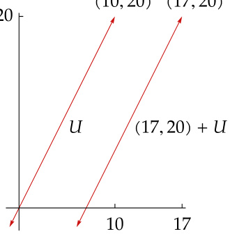

# Ch03 Linear Maps  

So far our attention has focused on vector spaces. No one gets excited about vector spaces. The interesting part of linear algebra is the subject to which we now turn—linear maps.  

We will frequently use the powerful fundamental theorem of linear maps, which states that the dimension of the domain of a linear map equals the dimension of the subspace that gets sent to 0 plus the dimension of the range. This will imply the striking result that a linear map from a finite-dimensional vector space to itself is one-to-one if and only if its range is the whole space.  

A major concept that we will introduce in this chapter is the matrix associated with a linear map and with a basis of the domain space and a basis of the target space. This correspondence between linear maps and matrices provides much insight into key aspects of linear algebra.  

This chapter concludes by introducing product, quotient, and dual spaces.  

In this chapter we will need additional vector spaces, which we call $U$ and 𝑊, in addition to $V.$ Thus our standing assumptions are now as follows.  

standing assumptions for this chapter 𝐅denotes 𝐑or 𝐂. 𝑈, 𝑉, and $W$ denote vector spaces over 𝐅.  

3A Vector Space of Linear Maps  

## Definition and Examples of Linear Maps  

Now we are ready for one of the key definitions in linear algebra.  

3.1 definition: linear map  

A linear map from $V$ to $W$ is a function $T\colon V\ \rightarrow\ W$ with the following properties.  

## additivity  

$T(u+v)=T u+T v$ for all $u,v\in V.$ .  

homogeneity $T(\lambda v)=\lambda(T v)$ for all $\lambda\in\mathbf{F}$ and all $v\in V.$ .  

Note that for linear maps we often Some mathematicians use the phrase use the notation $T v$ as well as the usual linear transformation, which means function notation $T(v)$ . the same as linear map.  

## 3.2 notation: $\mathscr{L}(V,W),\,\mathscr{L}(V)$  

The set of linear maps from $V$ to $W$ is denoted by $\mathcal{L}(V,W)$ . The set of linear maps from $V$ to $V$ is denoted by ${\mathcal{L}}(V)$ . In other words, $\mathcal{L}(V)=\mathcal{L}(V,V)$ .  

Let’s look at some examples of linear maps. Make sure you verify that each of the functions defined in the next example is indeed a linear map:  

3.3 example: linear maps  

## zero  

In addition to its other uses, we let the symbol 0 denote the linear map that takes every element of some vector space to the additive identity of another (or possibly the same) vector space. To be specific, $0\in\mathcal{L}(V,W)$ is defined by  

$$
0v=0.
$$  

The 0 on the left side of the equation above is a function from $V$ to $W_{s}$ , whereas the 0 on the right side is the additive identity in $W.$ . As usual, the context should allow you to distinguish between the many uses of the symbol 0.  

## identity operator  

The identity operator, denoted by $I$ , is the linear map on some vector space that takes each element to itself. To be specific, $I\in{\mathcal{L}}(V)$ is defined by  

## differentiation  

Define $D\in{\mathcal{L}}({\mathcal{P}}(\mathbf{R}))$ by  

$$
{\cal D}p=p^{\prime}.
$$  

The assertion that this function is a linear map is another way of stating a basic result about differentiation: $(f\!+g)^{\prime}=f^{\prime}+g^{\prime}$ and $(\lambda f)^{\prime}=\lambda f^{\prime}$ whenever $f,g$ are differentiable and $\lambda$ is a constant.  

## integration  

Define $T\in{\mathcal{L}}({\mathcal{P}}(\mathbf{R}),\mathbf{R})$ by  

$$
T p=\int_{0}^{1}p.
$$  

The assertion that this function is linear is another way of stating a basic result about integration: the integral of the sum of two functions equals the sum of the integrals, and the integral of a constant times a function equals the constant times the integral of the function.  

## multiplication by $x^{2}$  

Define a linear map $T\in{\mathcal{L}}({\mathcal{P}}(\mathbf{R}))$ by  

$$
(T p)(x)=x^{2}p(x)
$$  

for each $x\in\mathbb{R}$ .  

## backward shift  

Recall that $\mathbf{F}^{\infty}$ denotes the vector space of all sequences of elements of 𝐅. Define a linear map $T\in{\mathcal{L}}(\mathbf{F}^{\infty})$ by  

$$
T(x_{1},x_{2},x_{3},\dots)=(x_{2},x_{3},\dots).
$$  

## from $\mathbf{R}^{3}$ to $\mathbf{R}^{2}$  

Define a linear map $T\in\mathcal{L}(\mathbb{R}^{3},\mathbb{R}^{2})$ by  

$$
T(x,y,z)=(2x-y+3z,7x+5y-6z).
$$  

## from $\mathbf{F}^{n}$ to $\mathbf{F}^{m}$  

To generalize the previous example, let $m$ and $n$ be positive integers, let $A_{j,k}\in\mathbf{F}$ for each $j=1,...,m$ and each $k=1,...,n$ , and define a linear map $T\in{\mathcal{L}}(\mathbf{F}^{n},\mathbf{F}^{m})$ by  

$$
T(x_{1},...,x_{n})=(A_{1,1}x_{1}+\cdots+A_{1,n}\,x_{n},...,A_{m,1}x_{1}+\cdots+A_{m,n}\,x_{n}).
$$  

Actually every linear map from $\mathbf{F}^{n}$ to $\mathbf{F}^{m}$ is of this form.  

## composition  

Fix a polynomial $q\in\mathcal{P}(\mathbb{R})$ . Define a linear map $T\in{\mathcal{L}}({\mathcal{P}}(\mathbf{R}))$ by  

$$
(T p)(x)=p{\bigl(}q(x){\bigr)}.
$$  

The existence part of the next result means that we can find a linear map that takes on whatever values we wish on the vectors in a basis. The uniqueness part of the next result means that a linear map is completely determined by its values on a basis.  

Suppose $v_{1},...,v_{n}$ is a basis of $V$ and $w_{1},...,w_{n}\in W$ . Then there exists a unique linear map $T\colon V\rightarrow W$ such that  

$$
T v_{k}=w_{k}
$$  

for each $k=1,...,n$ .  

Proof First we show the existence of a linear map $T$ with the desired property. Define $T\colon V\rightarrow W$ by  

$$
T(c_{1}v_{1}+\cdots+c_{n}v_{n})=c_{1}w_{1}+\cdots+c_{n}w_{n},
$$  

where $c_{1},...,c_{n}$ are arbitrary elements of 𝐅. The list $v_{1},...,v_{n}$ is a basis of $V.$ Thus the equation above does indeed define a function $T$ from $V$ to $W$ (because each element of $V$ can be uniquely written in the form $c_{1}v_{1}+\cdots+c_{n}v_{n})$ .  

For each $k$ , taking $c_{k}=1$ and the other $c$ ’s equal to 0 in the equation above shows that $T v_{k}=w_{k}$ .  

If $u,v\in V$ with $u=a_{1}v_{1}+\cdots+a_{n}v_{n}$ and $v=c_{1}v_{1}+\cdots+c_{n}v_{n}$ , then  

$$
\begin{array}{r l}&{T(u+v)=T\bigl((a_{1}+c_{1})v_{1}+\cdots+(a_{n}+c_{n})v_{n}\bigr)}\\ &{\qquad\qquad=(a_{1}+c_{1})w_{1}+\cdots+(a_{n}+c_{n})w_{n}}\\ &{\qquad\quad=(a_{1}w_{1}+\cdots+a_{n}w_{n})+(c_{1}w_{1}+\cdots+c_{n}w_{n})}\\ &{\qquad\quad=T u+T v.}\end{array}
$$  

Similarly, if $\lambda\in\mathbf{F}$ and $v=c_{1}v_{1}+\cdots+c_{n}v_{n}$ , then  

$$
\begin{array}{r l}&{T(\lambda v)=T(\lambda c_{1}v_{1}+\cdots+\lambda c_{n}v_{n})}\\ &{\qquad=\lambda c_{1}w_{1}+\cdots+\lambda c_{n}w_{n}}\\ &{\qquad=\lambda(c_{1}w_{1}+\cdots+c_{n}w_{n})}\\ &{\qquad=\lambda T v.}\end{array}
$$  

Thus $T$ is a linear map from $V$ to $W.$ .  

To prove uniqueness, now suppose that $T\in{\mathcal{L}}(V,W)$ and that $T v_{k}=w_{k}$ for each $k\,=\,1,...,n$ . Let $c_{1},...,c_{n}\,\in\,\mathbf{F}$ . Then the homogeneity of $T$ implies that $T(c_{k}v_{k})=c_{k}w_{k}$ for each $k=1,...,n$ . The additivity of $T$ now implies that  

$$
T(c_{1}v_{1}+\cdots+c_{n}v_{n})=c_{1}w_{1}+\cdots+c_{n}w_{n}.
$$  

Thus $T$ is uniquely determined on span $(v_{1},...,v_{n})$ by the equation above. Because $v_{1},...,v_{n}$ is a basis of $V.$ , this implies that $T$ is uniquely determined on $V,$ as desired.  

We begin by defining addition and scalar multiplication on $\mathcal{L}(V,W)$ .  

3.5 definition: addition and scalar multiplication on $\mathcal{L}(V,W)$  

Suppose $S,T\in\mathcal{L}(V,W)$ and $\lambda\in\mathbf{F}$ . The sum $S+T$ and the product $\lambda T$ are the linear maps from $V$ to $W$ defined by  

$$
(S+T)(v)=S v+T v\quad{\mathrm{and}}\quad(\lambda T)(v)=\lambda(T v)
$$  

for all $v\in V.$ .  

You should verify that $S+T$ and $\lambda T$ as defined above are indeed linear maps. In other words, if $S,T\,\in\,\mathcal{L}(V,W)$ and $\lambda\in\mathbf{F}$ , then $S+T\in\mathcal{L}(V,W)$ and $\lambda T\in$ $\mathcal{L}(V,W)$ .  

Because we took the trouble to define addition and scalar multiplication on $\mathcal{L}(V,W)$ , the next result should not be a surprise.  

Linear maps are pervasive throughout mathematics. However, they are not as ubiquitous as imagined by people who seem to think cos is a linear map from 𝐑to 𝐑when they incorrectly write that cos $(x\!+\!y)$ equals cos $x+\mathrm{cos}$ 𝑦and that cos $2x$ equals $2\cos x$ .  

## 3.6 $\mathcal{L}(V,W)$ is a vector space  

With the operations of addition and scalar multiplication as defined above, $\mathcal{L}(V,W)$ is a vector space.  

The routine proof of the result above is left to the reader. Note that the additive identity of $\mathcal{L}(V,W)$ is the zero linear map defined in Example 3.3.  

Usually it makes no sense to multiply together two elements of a vector space, but for some pairs of linear maps a useful product exists, as in the next definition.  

3.7 definition: product of linear maps  

If $T\in{\mathcal{L}}(U,V)$ and $S\in{\mathcal{L}}(V,W)$ , then the product $S T\in\mathcal{L}(U,W)$ is defined by  

$$
(S T)(u)=S(T u)
$$  

for all $u\in U$ .  

Thus $S T$ is just the usual composition $S\circ T$ of two functions, but when both functions are linear, we usually write $S T$ instead of $S\circ T.$ . The product notation $S T$ helps make the distributive properties (see next result) seem natural.  

Note that $S T$ is defined only when $T$ maps into the domain of 𝑆. You should verify that $S T$ is indeed a linear map from $U$ to $W$ whenever $T\in{\mathcal{L}}(U,V)$ and $S\in{\mathcal{L}}(V,W)$ .  

## associativity  

$(T_{1}T_{2})T_{3}\,=\,T_{1}(T_{2}T_{3})$ whenever $T_{1}$ , $T_{2}$ , and $T_{3}$ are linear maps such that the products make sense (meaning $T_{3}$ maps into the domain of $T_{2}$ , and $T_{2}$ maps into the domain of $T_{1}$ ).  

## identity  

$T I=I T=T$ whenever $T\in{\mathcal{L}}(V,W)$ ; here the first $I$ is the identity operator on $V,$ and the second $I$ is the identity operator on $W$ .  

## distributive properties  

$(S_{1}\,+\,S_{2})T\ =\ S_{1}T\,+\,S_{2}T$ and $S(T_{1}\,+\,T_{2})~=~S T_{1}\,+\,S T_{2}$ whenever $T,T_{1},T_{2}\in\mathcal{L}(U,V)$ and $S,S_{1},S_{2}\in\mathcal{L}(V,W)$ .  

The routine proof of the result above is left to the reader.  

Multiplication of linear maps is not commutative. In other words, it is not necessarily true that $S T=T S$ , even if both sides of the equation make sense.  

3.9 example: two noncommuting linear maps from ${\mathcal{P}}(\mathbf{R})$ to 𝒫(𝐑)  

Suppose $D\in\mathcal{L}(\mathcal{P}(\mathbf{R}))$ is the differentiation map defined in Example 3.3 and $T\in{\mathcal{L}}({\mathcal{P}}(\mathbf{R}))$ is the multiplication by $x^{2}$ map defined earlier in this section. Then  

$$
\begin{array}{r}{\big((T D)p\big)(x)=x^{2}p^{\prime}(x)\quad\mathrm{but}\quad\big((D T)p\big)(x)=x^{2}p^{\prime}(x)+2x p(x).}\end{array}
$$  

Thus $T D\neq D T$ —differentiating and then multiplying by $x^{2}$ is not the same as multiplying by $x^{2}$ and then differentiating.  

3.10 linear maps take 0 to 0  

Suppose $T$ is a linear map from $V$ to $W.$ . Then $T(0)=0$ .  

Proof By additivity, we have  

$$
T(0)=T(0+0)=T(0)+T(0).
$$  

Add the additive inverse of $T(0)$ to each side of the equation above to conclude that $T(0)=0$ .  

Suppose $m,b\in\mathbb{R}$ . The function $f\colon\ensuremath{\mathbf{R}}\to\ensuremath{\mathbf{R}}$ defined by  

$$
f(x)=m x+b
$$  

is a linear map if and only if $b=0$ (use 3.10). Thus the linear functions of high school algebra are not the same as linear maps in the context of linear algebra.  

1 Suppose $b,c\in\mathbb{R}$ . Define $T\colon\mathbf{R}^{3}\rightarrow\mathbf{R}^{2}$ by  

$$
T(x,y,z)=(2x-4y+3z+b,6x+c x y z).
$$  

Show that $T$ is linear if and only if $b=c=0$ .  

2 Suppose $b,c\in\mathbb{R}$ . Define $T\colon\mathcal{P}(\mathbb{R})\rightarrow\mathbb{R}^{2}$ by  

$$
T p={\Big(}3p(4)+5p^{\prime}(6)+b p(1)p(2),\int_{-1}^{2}x^{3}p(x)\,d x+c\sin p(0){\Big)}.
$$  

Show that $T$ is linear if and only if $b=c=0$ .  

3 Suppose that $T\,\in\,{\mathcal{L}}(\mathbf{F}^{n},\mathbf{F}^{m})$ . Show that there exist scalars $A_{j,k}\in\mathbf{F}$ for $j=1,...,m$ and $k=1,...,n$ such that  

$$
T(x_{1},...,x_{n})=(A_{1,1}x_{1}+\cdots+A_{1,n}\,x_{n},...,A_{m,1}x_{1}+\cdots+A_{m,n}\,x_{n})
$$  

for every $(x_{1},...,x_{n})\in\mathbf{F}^{n}$ .  

This exercise shows that the linear map $T$ has the form promised in the second to last item of Example 3.3.  

4 Suppose $T\,\in\,{\mathcal{L}}(V,W)$ and $v_{1},...,v_{m}$ is a list of vectors in $V$ such that $T v_{1},...,T v_{m}$ is a linearly independent list in $W.$ Prove that $v_{1},...,v_{m}$ is linearly independent.  

5 Prove that $\mathcal{L}(V,W)$ is a vector space, as was asserted in 3.6.  

6 Prove that multiplication of linear maps has the associative, identity, and distributive properties asserted in 3.8.  

7 Show that every linear map from a one-dimensional vector space to itself is multiplication by some scalar. More precisely, prove that if dim $V=1$ and $T\in{\mathcal{L}}(V)$ , then there exists $\lambda\in\mathbf{F}$ such that $T v=\lambda v$ for all $v\in V.$ .  

8 Give an example of a function $\varphi\colon\mathbf{R}^{2}\rightarrow\mathbf{R}$ such that  

$$
\varphi(a v)=a\varphi(v)
$$  

for all $a\in\mathbb{R}$ and all $\boldsymbol{v}\in\mathbb{R}^{2}$ but $\varphi$ is not linear.  

This exercise and the next exercise show that neither homogeneity nor additivity alone is enough to imply that a function is a linear map.  

9 Give an example of a function $\varphi\colon\mathbf{C}\rightarrow\mathbf{C}$ such that  

$$
\varphi(w+z)=\varphi(w)+\varphi(z)
$$  

for all $w,z\in\mathbf{C}$ but $\varphi$ is not linear. (Here $\mathbf{C}$ is thought of as a complex vector space.)  

There also exists a function $\varphi\colon\mathbb{R}\rightarrow\mathbb{R}$ such that $\varphi$ satisfies the additivity condition above but $\varphi$ is not linear. However, showing the existence of such a function involves considerably more advanced tools.  

10 Prove or give a counterexample: If $q\,\in\,\mathcal{P}(\mathbb{R})$ and $T\colon{\mathcal{P}}(\mathbf{R})\,\rightarrow\,{\mathcal{P}}(\mathbf{R})$ is defined by $T p=q\circ p$ , then $T$ is a linear map.  

The function $T$ defined here differs from the function $T$ defined in the last bullet point of 3.3 by the order of the functions in the compositions.  

11 Suppose $V$ is finite-dimensional and $T\in{\mathcal{L}}(V)$ . Prove that $T$ is a scalar multiple of the identity if and only if $S T=T S$ for every $S\in{\mathcal{L}}(V)$ .  

12 Suppose $U$ is a subspace of $V$ with $U\neq V.$ . Suppose $S\,\in\,{\mathcal{L}}(U,W)$ and $S\ne0$ (which means that $S u\ne0$ for some $u\in U$ ). Define $T\colon V\rightarrow W$ by  

$$
T v={\left\{\begin{array}{l l}{S v}&{{\mathrm{if~}}v\in U,}\\ {0}&{{\mathrm{if~}}v\in V{\mathrm{~and~}}\,v\not\in U.}\end{array}\right.}
$$  

Prove that $T$ is not a linear map on $V.$  

13 Suppose $V$ is finite-dimensional. Prove that every linear map on a subspace of $V$ can be extended to a linear map on $V.$ In other words, show that if $U$ is a subspace of $V$ and $S\in{\mathcal{L}}(U,W)$ , then there exists $T\in{\mathcal{L}}(V,W)$ such that $T u=S u$ for all $u\in U$ .  

The result in this exercise is used in the proof of 3.125.  

14 Suppose $V$ is finite-dimensional with dim $V>0$ , and suppose $W$ is infinitedimensional. Prove that $\mathcal{L}(V,W)$ is infinite-dimensional.  

15 Suppose $v_{1},...,v_{m}$ is a linearly dependent list of vectors in $V.$ Suppose also that $W\ne\ \{0\}$ . Prove that there exist $w_{1},...,w_{m}\,\in\,W$ such that no $T\in{\mathcal{L}}(V,W)$ satisfies $T v_{k}=w_{k}$ for each $k=1,...,m$ .  

16 Suppose $V$ is finite-dimensional with dim $V>1$ . Prove that there exist $S,T\in{\mathcal{L}}(V)$ such that $S T\neq T S$ .  

17 Suppose $V$ is finite-dimensional. Show that the only two-sided ideals of ${\mathcal{L}}(V)$ are $\{0\}$ and ${\mathcal{L}}(V)$ .  

A subspace $\mathcal{E}$ of ${\mathcal{L}}(V)$ is called a two-sided ideal of ${\mathcal{L}}(V)$ if $T E\in{\mathcal{E}}$ and $E T\in{\mathcal{E}}$ for all $E\in{\mathcal{E}}$ and all $T\in{\mathcal{L}}(V)$ .  

## Null Space and Injectivity  

In this section we will learn about two subspaces that are intimately connected with each linear map. We begin with the set of vectors that get mapped to 0.  

## 3.11 definition: null space, null 𝑇  

For $T\in{\mathcal{L}}(V,W)$ , the null space of $T$ , denoted by null $T$ , is the subset of $V$ consisting of those vectors that $T$ maps to 0:  

$$
{\mathrm{null}}\,T=\{v\in V:T v=0\}.
$$  

3.12 example: null space  

• If $T$ is the zero map from $V$ to $W.$ , meaning that $T v=0$ for every $v\in V,$ then null $T=V.$  

• Suppose $\varphi\,\in\,\mathcal{L}(\mathbf{C}^{3},\mathbf{C})$ is defined by $\varphi(z_{1},z_{2},z_{3})\,=\,z_{1}\,+\,2z_{2}\,+\,3z_{3}$ . Then null $\varphi$ equals $\{(z_{1},z_{2},z_{3})\in\mathbf{C}^{3}:z_{1}+2z_{2}+3z_{3}=0\}$ , which is a subspace of the domain of $\varphi$ . We will soon see that the null space of each linear map is a subspace of its domain.  

•Suppose $D\,\in\,{\mathcal{L}}({\mathcal{P}}(\mathbf{R}))$ is the differentiation map defined by $D p=p^{\prime}$ . The only functions whose derivative equals the zero function are the constant functions. Thus the null space of $D$ equals the set of constant functions.  

The word “null” means zero. Thus the term “null space”should remind you of the connection to 0. Some mathematicians use the term kernel instead of null space.  

• Suppose that $T\ \in\ {\mathcal{L}}({\mathcal{P}}(\mathbb{R}))$ is the multiplication by $x^{2}$ map defined by $(T p)(x)=x^{2}p(x)$ . The only polynomial $p$ such that $x^{2}p(x)=0$ for all $x\in\mathbb{R}$ is the 0 polynomial. Thus null $T=\{0\}$ .  

• Suppose $T\in{\mathcal{L}}(\mathbf{F}^{\infty})$ is the backward shift defined by  

$$
T(x_{1},x_{2},x_{3},\dots)=(x_{2},x_{3},\dots).
$$  

Then $T(x_{1},x_{2},x_{3},\dots)$ equals 0 if and only if the numbers $x_{2},x_{3},\ldots$ are all 0.   
Thus null $T=\left\{(a,0,0,\dots):a\in\mathbf{F}\right\}$ .  

The next result shows that the null space of each linear map is a subspace of the domain. In particular, 0 is in the null space of every linear map.  

## 3.13 the null space is a subspace  

Suppose $T\in{\mathcal{L}}(V,W)$ . Then null $T$ is a subspace of 𝑉.  

Proof Because $T$ is a linear map, $T(0)=0$ (by 3.10). Thus $0\in\mathrm{null}\:T$ . Suppose $u,v\in\mathrm{null}\,T.$ Then  

$$
T(u+v)=T u+T v=0+0=0.
$$  

Hence $u+v\in$ null $T.$ . Thus null $T$ is closed under addition.  

Suppose $u\in\mathrm{null}\:T$ and $\lambda\in\mathbf{F}$ . Then  

$$
T(\lambda u)=\lambda T u=\lambda0=0.
$$  

Hence $\lambda u\in\mathrm{null}\:T$ . Thus null $T$ is closed under scalar multiplication.  

We have shown that null $T$ contains 0 and is closed under addition and scalar multiplication. Thus null $T$ is a subspace of $V$ (by 1.34).  

As we will soon see, for a linear map the next definition is closely connected to the null space.  

3.14 definition: injective  

A function $T\colon V\rightarrow W$ is called injective if $T u=T v$ implies $u=v$ .  

We could rephrase the definition above to say that $T$ is injective if $u\ne v$ implies that $T u\ne T v$ . Thus $T$ is injective  

The term one-to-one means the same as injective.  

if and only if it maps distinct inputs to distinct outputs.  

The next result says that we can check whether a linear map is injective by checking whether 0 is the only vector that gets mapped to 0. As a simple application of this result, we see that of the linear maps whose null spaces we computed in 3.12, only multiplication by $x^{2}$ is injective (except that the zero map is injective in the special case $V=\{0\}.$ ).  

3.15 injectivity $\Longleftrightarrow$ null space equals $\{0\}$  

Let $T\in{\mathcal{L}}(V,W)$ . Then $T$ is injective if and only if null $T=\{0\}$ .  

Proof First suppose $T$ is injective. We want to prove that null $T\;=\;\{0\}$ . We already know that $\{0\}\subseteq$ null $T$ (by 3.10). To prove the inclusion in the other direction, suppose $v\in\mathrm{null}\,T.$ . Then  

$$
T(v)=0=T(0).
$$  

Because $T$ is injective, the equation above implies that $v\,=\,0$ . Thus we can conclude that null $T=\{0\}$ , as desired.  

To prove the implication in the other direction, now suppose null $T=\{0\}$ . We want to prove that $T$ is injective. To do this, suppose $u,v\in V$ and $T u=T v$ . Then  

$$
0=T u-T v=T(u-v).
$$  

Thus $u-v$ is in null $T$ , which equals $\{0\}$ . Hence $u-v=0$ , which implies that $u=v$ . Hence $T$ is injective, as desired.  

Now we give a name to the set of outputs of a linear map.  

## 3.16 definition: range  

For $T\in{\mathcal{L}}(V,W)$ , the range of $T$ is the subset of $W$ consisting of those vectors that are equal to $T v$ for some $v\in V$ :  

range $T=\{T v:v\in V\}$ .  

3.17 example: range  

• If $T$ is the zero map from $V$ to $W.$ , meaning that $T v=0$ for every $v\in V,$ then range $T=\{0\}$ .  

• Suppose $T\in\mathcal{L}(\mathbb{R}^{2},\mathbb{R}^{3})$ is defined by $T(x,y)=(2x,5y,x+y)$ . Then  

$$
\operatorname{range}T=\{(2x,5y,x+y):x,y\in\mathbf{R}\}.
$$  

Note that range $T$ is a subspace of $\mathbf{R}^{3}$ . We will soon see that the range of each element of $\mathcal{L}(V,W)$ is a subspace of $W$ .  

• Suppose $D\in{\mathcal{L}}({\mathcal{P}}(\mathbf{R}))$ is the differentiation map defined by $D p=p^{\prime}$ ′. Because for every polynomial $q\in\mathcal{P}(\mathbb{R})$ there exists a polynomial $p\in{\mathcal{P}}(\mathbb{R})$ such that $p^{\prime}=q$ , the range of $D$ is ${\mathcal{P}}(\mathbf{R})$ .  

The next result shows that the range of each linear map is a subspace of the vector space into which it is being mapped.  

3.18 the range is a subspace  

If $T\in{\mathcal{L}}(V,W)$ , then range $T$ is a subspace of 𝑊.  

Proof Suppose $T\in{\mathcal{L}}(V,W)$ . Then $T(0)\,=\,0$ (by 3.10), which implies that $0\in$ range $T$ .  

If $w_{1},w_{2}\in$ range $T$ , then there exist $v_{1},v_{2}\in V$ such that $T v_{1}\,=\,w_{1}$ and $T v_{2}=w_{2}$ . Thus  

$$
T(v_{1}+v_{2})=T v_{1}+T v_{2}=w_{1}+w_{2}.
$$  

Hence $w_{1}+w_{2}\in$ range $T$ . Thus range $T$ is closed under addition.  

If $w\in$ range $T$ and $\lambda\in\mathbf{F}$ , then there exists $v\in V$ such that $T v=w$ . Thus  

$$
T(\lambda v)=\lambda T v=\lambda w.
$$  

Hence $\lambda w\in$ range $T$ . Thus range $T$ is closed under scalar multiplication.  

We have shown that range $T$ contains 0 and is closed under addition and scalar multiplication. Thus range $T$ is a subspace of $W$ (by 1.34).  

A function $T\colon V\rightarrow W$ is called surjective if its range equals 𝑊.  

To illustrate the definition above, note that of the ranges we computed in 3.17, only the differentiation map is surjective (except that the zero map is surjective in the special case $W=\{0\}$ ).  

Whether a linear map is surjective depends on what we are thinking of as the vector space into which it maps.  

Some people use the term onto, which means the same as surjective.  

3.20 example: surjectivity depends on the target space  

The differentiation map $D\in\mathcal{L}(\mathcal{P}_{5}(\mathbf{R}))$ defined by $D p=p^{\prime}$ is not surjective, because the polynomial $x^{5}$ is not in the range of $D$ . However, the differentiation map $S\in\mathcal{L}(\mathcal{P}_{5}(\mathbf{R}),\mathcal{P}_{4}(\mathbf{R}))$ defined by $S p=p^{\prime}$ is surjective, because its range equals ${\mathcal{P}}_{4}(\mathbf{R})$ , which is the vector space into which 𝑆maps.  

## Fundamental Theorem of Linear Maps  

The next result is so important that it gets a dramatic name.  

3.21 fundamental theorem of linear maps  

Suppose $V$ is finite-dimensional and $T\in{\mathcal{L}}(V,W)$ . Then range $T$ is finitedimensional and  

$$
\dim V=\dim\operatorname{null}T+\dim\operatorname{range}T.
$$  

Proof Let $u_{1},...,u_{m}$ be a basis of null $T$ ; thus dim null $T=m$ . The linearly independent list $u_{1},...,u_{m}$ can be extended to a basis  

$$
u_{1},...,u_{m},v_{1},...,v_{n}
$$  

of $V\,(\mathrm{by}\,2.32)$ . Thus dim $V=m+n$ . To complete the proof, we need to show that range $T$ is finite-dimensional and dim range $T=n$ . We will do this by proving that $T v_{1},...,T v_{n}$ is a basis of range $T.$ .  

Let $v\in V.$ Because $u_{1},...,u_{m},v_{1},...,v_{n}$ spans $V,$ we can write  

$$
v=a_{1}u_{1}+\cdots+a_{m}u_{m}+b_{1}v_{1}+\cdots+b_{n}v_{n},
$$  

where the $a$ ’s and $b$ ’s are in 𝐅. Applying $T$ to both sides of this equation, we get  

$$
T v=b_{1}T v_{1}+\cdots+b_{n}T v_{n},
$$  

where the terms of the form $T u_{k}$ disappeared because each $u_{k}$ is in null $T$ . The last equation implies that the list $T v_{1},...,T v_{n}$ spans range $T.$ . In particular, range $T$ is finite-dimensional.  

## To show $T v_{1},...,T v_{n}$ is linearly independent, suppose $c_{1},...,c_{n}\in\mathbf{F}$ and  

$$
c_{1}T v_{1}+\cdots+c_{n}T v_{n}=0.
$$  

Then  

$$
T(c_{1}v_{1}+\cdots+c_{n}v_{n})=0.
$$  

Hence  

$$
c_{1}v_{1}+\cdots+c_{n}v_{n}\in\mathrm{null}\,T.
$$  

Because $u_{1},...,u_{m}$ spans null $T$ , we can write  

$$
c_{1}v_{1}+\cdots+c_{n}v_{n}=d_{1}u_{1}+\cdots+d_{m}u_{m},
$$  

where the $d$ ’s are in 𝐅. This equation implies that all the $c$ ’s (and $d^{\circ}\mathrm{s})$ are 0 (because $u_{1},...,u_{m},v_{1},...,v_{n}$ is linearly independent). Thus $T v_{1},...,T v_{n}$ is linearly independent and hence is a basis of range $T$ , as desired.  

Now we can show that no linear map from a finite-dimensional vector space to a “smaller” vector space can be injective, where “smaller” is measured by dimension.  

3.22 linear map to a lower-dimensional space is not injective  

Suppose $V$ and 𝑊 are finite-dimensional vector spaces such that $\dim V>\dim W.$ Then no linear map from $V$ to $W$ is injective.  

Proof Let $T\in{\mathcal{L}}(V,W)$ . Then  

$$
\begin{array}{l}{\geq\dim V-\dim W}\\ {>0,}\end{array}
$$  

where the first line above comes from the fundamental theorem of linear maps (3.21) and the second line follows from 2.37. The inequality above states that dim null $T>0$ . This means that null $T$ contains vectors other than 0. Thus $T$ is not injective (by 3.15).  

3.23 example: linear map from $\mathbf{F}^{4}$ to $\mathbf{F}^{3}$ is not injective  

Define a linear map $T\colon\mathbf{F}^{4}\rightarrow\mathbf{F}^{3}$ by  

$$
I(z_{1},z_{2},z_{3},z_{4})=\left({\sqrt{7}}z_{1}+\pi z_{2}+z_{4},97z_{1}+3z_{2}+2z_{3},z_{2}+6z_{3}+7z_{4}\right)
$$  

Because dim $\mathbf{F}^{4}>\dim\mathbf{F}^{3}$ , we can use 3.22 to assert that $T$ is not injective, without doing any calculations.  

The next result shows that no linear map from a finite-dimensional vector space to a “bigger” vector space can be surjective, where “bigger” is measured by dimension.  

3.24 linear map to a higher-dimensional space is not surjective Suppose $V$ and 𝑊 are finite-dimensional vector spaces such that $\dim V<\dim W.$ . Then no linear map from $V$ to $W$ is surjective.  

Proof Let $T\in{\mathcal{L}}(V,W)$ . Then  

dim range $T=\dim V-$ dim null 𝑇  

$$
\begin{array}{l}{\leq\dim V}\\ {\quad<\dim W,}\end{array}
$$  

where the equality above comes from the fundamental theorem of linear maps (3.21). The inequality above states that dim range $T<\dim W.$ This means that range $T$ cannot equal $W.$ Thus $T$ is not surjective.  

As we will soon see, 3.22 and 3.24 have important consequences in the theory of linear equations. The idea is to express questions about systems of linear equations in terms of linear maps. Let’s begin by rephrasing in terms of linear maps the question of whether a homogeneous system of linear equations has a nonzero solution.  

Fix positive integers $m$ and $n$ , and let $A_{j,k}\in\mathbf{F}$ for $j=1,...,m$ and $k=1,...,n$ . Consider the homogeneous system of linear equations  

Homogeneous, in this context, means that the constant term on the right side of each equation below is 0.  

$$
\begin{array}{c}{{\displaystyle\sum_{k=1}^{n}A_{1,k}\,x_{k}=0}}\\ {{\vdots}}\\ {{\displaystyle\sum_{k=1}^{n}A_{m,k}\,x_{k}=0.}}\end{array}
$$  

Clearly $x_{1}\,=\,\cdots\,=\,x_{n}\,=\,0$ is a solution of the system of equations above; the question here is whether any other solutions exist.  

Define $T\colon\mathbf{F}^{n}\to\mathbf{F}^{m}$ by  

$$
T(x_{1},...,x_{n})={\biggl(}\sum_{k\,=\,1}^{n}A_{1,k}\,x_{k},...,\sum_{k\,=\,1}^{n}A_{m,k}\,x_{k}{\biggr)}.
$$  

The equation $T(x_{1},...,x_{n})=0$ (the 0 here is the additive identity in $\mathbf{F}^{m},$ , namely, the list of length $m$ of all $0^{\circ}\mathrm{s}$ ) is the same as the homogeneous system of linear equations above.  

Thus we want to know if null $T$ is strictly bigger than $\{0\}$ , which is equivalent to $T$ not being injective (by 3.15). The next result gives an important condition for ensuring that $T$ is not injective.  

A homogeneous system of linear equations with more variables than equations has nonzero solutions.  

Proof Use the notation and result from the discussion above. Thus $T$ is a linear map from $\mathbf{F}^{n}$ to $\mathbf{F}^{m}.$ , and we have a homogeneous system of $m$ linear equations with $n$ variables $x_{1},...,x_{n}$ . From 3.22 we see that $T$ is not injective if $n>m$ .  

Example of the result above: a homogeneous system of four linear equations with five variables has nonzero solutions.  

Now we consider the question of whether an inhomogeneous system of linear equations has no solutions for some choice of the constant terms. To rephrase this question in terms of a linear map, fix  

Inhomogeneous, as used in this context, means that the constant term on the right side of at least one equation below does not equal 0.  

positive integers $m$ and $n$ , and let $A_{j,k}\in\mathbf{F}$ for all $j=1,...,m$ and all $k=1,...,n$ . For $c_{1},...,c_{m}\in\mathbf{F}$ , consider the system of linear equations  

$$
\begin{array}{c}{{\displaystyle\sum_{k=1}^{n}A_{1,k}\,x_{k}=c_{1}}}\\ {{\vdots}}\\ {{\displaystyle\sum_{k=1}^{n}A_{m,k}\,x_{k}=c_{m}.}}\end{array}
$$  

3.27  

The question here is whether there is some choice of $c_{1},...,c_{m}\in\mathbf{F}$ such that no solution exists to the system above.  

Define $T\colon\mathbf{F}^{n}\,\to\,\mathbf{F}^{m}$ as in 3.25. The equation $T(x_{1},...,x_{n})\,{=}\,(c_{1},...,c_{m})$ is the same as the system of equations 3.27. Thus we want to know if range $T\neq\mathbf{F}^{m}.$ . Hence we can rephrase our question about not having a solution for some choice of $c_{1},...,c_{m}\in\mathbf{F}$ as follows: What  

The results 3.26 and 3.28, which compare the number of variables and the number of equations, can also be proved using Gaussian elimination. The abstract approach taken here seems to provide cleaner proofs.  

condition ensures that $T$ is not surjective? The next result gives one such condition.  

3.28 inhomogeneous system of linear equations  

An inhomogeneous system of linear equations with more equations than variables has no solution for some choice of the constant terms.  

Proof Use the notation and result from the example above. Thus $T$ is a linear map from $\mathbf{F}^{n}$ to $\mathbf{F}^{m},$ and we have a system of $m$ equations with $n$ variables $x_{1},...,x_{n}$ . From 3.24 we see that $T$ is not surjective if $n<m$ .  

Example of the result above: an inhomogeneous system of five linear equations with four variables has no solution for some choice of the constant terms.  

1 Give an example of a linear map $T$ with dim null $T=3$ and dim range $T=2$ .  

Suppose $S,T\in{\mathcal{L}}(V)$ are such that range $S\subseteq$ null $T$ . Prove that $(S T)^{2}=0$ .  

3 Suppose $v_{1},...,v_{m}$ is a list of vectors in $V.$ Define $T\in\mathcal{L}(\mathbf{F}^{m},V)$ by  

$$
T(z_{1},...,z_{m})=z_{1}v_{1}+\cdots+z_{m}v_{m}.
$$  

(a) What property of $T$ corresponds to $v_{1},...,v_{m}$ spanning $V^{\epsilon}$ 2  

(b) What property of $T$ corresponds to the list $v_{1},...,v_{m}$ being linearly independent?  

Show that $\{T\in\mathcal{L}(\mathbb{R}^{5},\mathbb{R}^{4})$ ∶dim null $T>2\}$ is not a subspace of $\mathcal{L}(\mathbf{R}^{5},\mathbf{R}^{4})$ .  

Give an example of $T\in{\mathcal{L}}(\mathbb{R}^{4})$ such that range $T=\mathrm{null}\,T$ .  

Prove that there does not exist $T\in{\mathcal{L}}(\mathbb{R}^{5})$ such that range $T=\mathrm{null}\,T$ .  

Suppose $V$ and $W$ are finite-dimensional with $2\leq\dim V\leq\dim W.$ . Show that $\{T\in\mathcal{L}(V,W):T$ is not injective} is not a subspace of $\mathcal{L}(V,W)$ .  

Suppose $V$ and $W$ are finite-dimensional with $\dim V\geq\dim W\geq2$ . Show that $\{T\in\mathcal{L}(V,W):T$ is not surjective $\left.\begin{array}{r l}\end{array}\,\right\}$ is not a subspace of $\mathcal{L}(V,W)$ .  

Suppose $T\in{\mathcal{L}}(V,W)$ is injective and $v_{1},...,v_{n}$ is linearly independent in $V.$ .   
Prove that $T v_{1},...,T v_{n}$ is linearly independent in $W.$ .  

Suppose $v_{1},...,v_{n}$ spans $V$ and $T\in{\mathcal{L}}(V,W)$ . Show that $T v_{1},...,T v_{n}$ spans range $T$ .  

1 Suppose that $V$ is finite-dimensional and that $T\in{\mathcal{L}}(V,W)$ . Prove that there exists a subspace $U$ of $V$ such that  

$$
U\cap{\mathrm{null}}\,T=\{0\}\quad{\mathrm{and}}\quad{\mathrm{range}}\,T=\{T u:u\in U\}.
$$  

12 Suppose $T$ is a linear map from $\mathbf{F}^{4}$ to $\mathbf{F}^{2}$ such that  

$\mathrm{null}\,T=\left\{(x_{1},x_{2},x_{3},x_{4})\in\mathbf{F}^{4}:x_{1}=5x_{2}\right.$  

Prove that $T$ is surjective.  

13 Suppose $U$ is a three-dimensional subspace of $\mathbf{R}^{8}$ and that $T$ is a linear map from $\mathbf{R}^{8}$ to $\mathbf{R}^{5}$ such that null $T=U$ . Prove that $T$ is surjective.  

14 Prove that there does not exist a linear map from $\mathbf{F}^{5}$ to $\mathbf{F}^{2}$ whose null space equals $\{(x_{1},x_{2},x_{3},x_{4},x_{5})\in\mathbf{F}^{5}:x_{1}=3x_{2}$ and $x_{3}=x_{4}=x_{5}\}$ .  

15 Suppose there exists a linear map on $V$ whose null space and range are both finite-dimensional. Prove that $V$ is finite-dimensional.  

16 Suppose $V$ and $W$ are both finite-dimensional. Prove that there exists an injective linear map from $V$ to $W$ if and only if dim $V\leq\dim W.$ .  

7 Suppose $V$ and $W$ are both finite-dimensional. Prove that there exists a surjective linear map from $V$ onto $W$ if and only if dim $V\geq\dim W$ .  

Suppose $V$ and $W$ are finite-dimensional and that $U$ is a subspace of $V.$ Prove that there exists $T\,\in\,{\mathcal{L}}(V,W)$ such that null $T\,=\,U$ if and only if dim $\begin{array}{r}{\mathsf{\Pi}_{l}U\geq\dim V-\dim W.}\end{array}$ .  

Suppose $W$ is finite-dimensional and $T\in{\mathcal{L}}(V,W)$ . Prove that $T$ is injective if and only if there exists $S\in{\mathcal{L}}(W,V)$ such that $S T$ is the identity operator on $V.$  

0 Suppose $W$ is finite-dimensional and $T\in{\mathcal{L}}(V,W)$ . Prove that $T$ is surjective if and only if there exists $S\in{\mathcal{L}}(W,V)$ such that $T S$ is the identity operator on $W.$ .  

21 Suppose $V$ is finite-dimensional, $T\in{\mathcal{L}}(V,W)$ , and $U$ is a subspace of $W_{\cdot}$ . Prove that $\{v\in V:T v\in U\}$ is a subspace of $V$ and  

$$
\dim\{v\in V:T v\in U\}=\dim\operatorname{null}T+\dim(U\cap\operatorname{range}T).
$$  

22 Suppose $U$ and $V$ are finite-dimensional vector spaces and $S\in{\mathcal{L}}(V,W)$ and $T\in{\mathcal{L}}(U,V)$ . Prove that  

$$
\dim\operatorname{null}S T\leq\dim\operatorname{null}S+\dim\operatorname{null}T.
$$  

23 Suppose $U$ and $V$ are finite-dimensional vector spaces and $S\in{\mathcal{L}}(V,W)$ and $T\in{\mathcal{L}}(U,V)$ . Prove that  

## dim $\mathrm{range}\,S T\leq\mathrm{min}\{\mathrm{dim}\,\mathrm{range}\,S,\mathrm{dim}\,\mathrm{range}\,T\}.$  

24 (a) Suppose dim $V=5$ and $S,T\in{\mathcal{L}}(V)$ are such that $S T=0$ . Prove that dim range $T S\le2$ . (b) Give an example of $S,T\in\mathcal{L}(\mathbf{F}^{5})$ with $S T=0$ and dim range $T S=2$ .   
25 Suppose that $W$ is finite-dimensional and $S,T\;\in\;\mathcal{L}(V,W)$ . Prove that null $S\subseteq$ null $T$ if and only if there exists $E\in{\mathcal{L}}(W)$ such that $T=E S$ .   
26 Suppose that $V$ is finite-dimensional and $S,T\;\in\;\mathcal{L}(V,W)$ . Prove that range $S\subseteq$ range $T$ if and only if there exists $E\in{\mathcal{L}}(V)$ such that $S=T E$ .   
27 Suppose $P\in{\mathcal{L}}(V)$ and $P^{2}=P$ . Prove that $V=\mathrm{null}\,P\oplus$ range $P$ .   
28 Suppose $D\in\mathcal{L}(\mathcal{P}(\mathbf{R}))$ is such that deg $D p=(\deg p)-1$ for every nonconstant polynomial $p\in{\mathcal{P}}(\mathbb{R})$ . Prove that $D$ is surjective.  

The notation $D$ is used above to remind you of the differentiation map that sends a polynomial $p$ to $p^{\prime}$ .  

29 Suppose $p\in{\mathcal{P}}(\mathbb{R})$ . Prove that there exists a polynomial $q\in{\mathcal{P}}(\mathbb{R})$ such that $5q^{\prime\prime}+3q^{\prime}=p$ .  

This exercise can be done without linear algebra, but it’s more fun to do it using linear algebra.  

30 Suppose $\varphi\in{\mathcal{L}}(V,\mathbf{F})$ and $\varphi\neq0$ . Suppose $u\in V$ is not in null $\varphi$ . Prove that  

$$
V=\operatorname{null}\varphi\oplus\{a u:a\in\mathbf{F}\}.
$$  

31 Suppose $V$ is finite-dimensional, $X$ is a subspace of $V.$ , and $Y$ is a finitedimensional subspace of 𝑊. Prove that there exists $T\in{\mathcal{L}}(V,W)$ such that null $T=X$ and range $T=Y$ if and only if dim $X+\dim Y=\dim V.$  

32 Suppose $V$ is finite-dimensional with dim $V>1$ . Show that if $\varphi\colon{\mathcal{L}}(V)\to\mathbf{F}$ is a linear map such that $\varphi(S T)\;=\;\varphi(S)\varphi(T)$ for all $S,T\,\in\,{\mathcal{L}}(V)$ , then $\varphi=0$ .  

Hint: The description of the two-sided ideals of ${\mathcal{L}}(V)$ given by Exercise 17 in Section 3A might be useful.  

33 Suppose that $V$ and $W$ are real vector spaces and $T\,\in\,{\mathcal{L}}(V,W)$ . Define $T_{\mathbf{C}}\colon V_{\mathbf{C}}\to W_{\mathbf{C}}$ by  

$$
T_{\mathbf{C}}(u+i v)=T u+i T v
$$  

for all $u,v\in V.$ .  

(a) Show that $T_{\mathbf{C}}$ is a (complex) linear map from $V_{C}$ to $W_{\mathbf{C}}$ . (b) Show that $T_{\mathbf{C}}$ is injective if and only if $T$ is injective. (c) Show that range $T_{\mathbf{C}}=W_{\mathbf{C}}$ if and only if range $T=W$  

See Exercise 8 in Section 1B for the definition of the complexification $V_{\mathbf{C}}$ The linear map $T_{\mathbf{C}}$ is called the complexification of the linear map $T.$ .  

## Representing a Linear Map by $a$ Matrix  

We know that if $v_{1},...,v_{n}$ is a basis of $V$ and $T\colon V\rightarrow W$ is linear, then the values of $T v_{1},...,T v_{n}$ determine the values of $T$ on arbitrary vectors in $V.$ —see the linear map lemma (3.4). As we will soon see, matrices provide an efficient method of recording the values of the $T v_{k}$ ’s in terms of a basis of $W.$ .  

3.29 definition: matrix, $A_{j,k}$  

Suppose 𝑚and $n$ are nonnegative integers. An $m$ -by- $^{\cdot n}$ matrix $A$ is a rectangular array of elements of $\mathbf{F}$ with $m$ rows and $n$ columns:  

$$
A={\left(\begin{array}{c c c}{A_{1,1}}&{\cdots}&{A_{1,n}}\\ {\vdots}&{}&{\vdots}\\ {A_{m,1}}&{\cdots}&{A_{m,n}}\end{array}\right)}.
$$  

The notation $A_{j,k}$ denotes the entry in row $j$ , column $k$ of $A$ .  

3.30 example: $A_{j,k}$ equals entry in row 𝑗, column 𝑘of 𝐴  

Thus $A_{2,3}$ refers to the entry in the second row, third column of $A$ , which means that $A_{2,3}=7$ .  

When dealing with matrices, the first index refers to the row number; the second index refers to the column number.  

Now we come to the key definition in this section.  

3.31 definition: matrix of a linear map, ${\mathcal{M}}(T)$  

Suppose $T\in{\mathcal{L}}(V,W)$ and $v_{1},...,v_{n}$ is a basis of $V$ and $w_{1},...,w_{m}$ is a basis of $W.$ The matrix of $T$ with respect to these bases is the $m$ -by- $_n$ matrix ${\mathcal{M}}(T)$ whose entries $A_{j,k}$ are defined by  

$$
T v_{k}=A_{1,k}w_{1}+\cdots+A_{m,k}w_{m}.
$$  

If the bases $v_{1},...,v_{n}$ and $w_{1},...,w_{m}$ are not clear from the context, then the notation $\mathcal{M}(T,(v_{1},...,v_{n})$ , $(w_{1},...,w_{m}))$ is used.  

The matrix ${\mathcal{M}}(T)$ of a linear map $T\in{\mathcal{L}}(V,W)$ depends on the basis $v_{1},...,v_{n}$ of $V$ and the basis $w_{1},...,w_{m}$ of $W_{\cdot}$ , as well as on $T.$ However, the bases should be clear from the context, and thus they are often not included in the notation.  

To remember how ${\mathcal{M}}(T)$ is constructed from $T$ , you might write across the top of the matrix the basis vectors $v_{1},...,v_{n}$ for the domain and along the left the basis vectors $w_{1},...,w_{m}$ for the vector space into which $T$ maps, as follows:  

$$
\mathcal{M}(T)=\begin{array}{c}{\begin{array}{c}{w_{1}}\\ {w_{1}}\\ {\vdots}\\ {w_{m}}\end{array}}\end{array}\!\rightleftharpoons\!\begin{array}{c}{\begin{array}{r l r l r l r l}{v_{1}}&{\cdots}&{v_{k}}&{\cdots}&{v_{n}}&\\ &{}&&{A_{1,k}}&&\\ &&{\vdots}&&{}&\\ &&{}&&{A_{m,k}}&\end{array}}\end{array}\,.
$$  

In the matrix above only the $k^{\mathrm{th}}$ column is shown. Thus the second index of each displayed entry of the matrix above is $k$ . The picture above should remind you that $T\boldsymbol{v}_{k}$ can be computed from ${\mathcal{M}}(T)$ by multiplying each entry in the $k^{\mathrm{th}}$ column by the corresponding $w_{j}$ from the left column, and then adding up the resulting vectors.  

The $k^{t h}$ column of ${\mathcal{M}}(T)$ consists of the scalars needed to write $T\boldsymbol{v}_{\boldsymbol{k}}$ as $a$ linear combination of $w_{1},...,w_{m}$ :  

$$
T{v_{k}}=\sum_{j\mathop{=}1}^{m}A_{j,k}w_{j}.
$$  

If $T$ is a linear map from $\mathbf{F}^{n}$ to $\mathbf{F}^{m};$ , then unless stated otherwise, assume the bases in question are the standard ones (where the $k^{\mathrm{th}}$ basis vector is 1 in the $k^{\mathrm{th}}$ slot and 0 in all other slots). If you think $\mathit{\Pi}_{[f]}\;\mathit{\Pi}_{T}$ is a linear map from an $n$ -dimensional vector space to an $m$ -dimensional vector space, then ${\mathcal{M}}(T)$ is an 𝑚-by-𝑛matrix.  

of elements of $\mathbf{F}^{m}$ as columns of $m$ numbers, then you can think of the $k^{\mathrm{th}}$ column of ${\mathcal{M}}(T)$ as $T$ applied to the $k^{\mathrm{th}}$ standard basis vector.  

3.32 example: the matrix of a linear map from $\mathbf{F}^{2}\;t o\;\mathbf{F}^{3}$  

Suppose $T\in\mathcal{L}(\mathbf{F}^{2},\mathbf{F}^{3})$ is defined by  

$$
T(x,y)=(x+3y,2x+5y,7x+9y).
$$  

Because $T(1,0)=(1,2,7)$ and $T(0,1)=(3,5,9)$ , the matrix of $T$ with respect to the standard bases is the 3-by-2 matrix below:  

$$
\mathcal{M}(T)=\left(\begin{array}{l l}{1}&{3}\\ {2}&{5}\\ {7}&{9}\end{array}\right)\!.
$$  

When working with ${\mathcal P}_{m}({\bf F})$ , use the standard basis $1,x,x^{2},...,x^{m}$ unless the context indicates otherwise.  

3.33 example: matrix of the differentiation map from ${\mathcal{P}}_{3}(\mathbf{R})$ to ${\mathcal{P}}_{2}(\mathbf{R})$  

Suppose $D\in\mathcal{L}(\mathcal{P}_{3}(\mathbf{R}),\mathcal{P}_{2}(\mathbf{R}))$ is the differentiation map defined by $D p=p^{\prime}$ . Because $(x^{n})^{\prime}=n x^{n-1}.$ , the matrix of $D$ with respect to the standard bases is the 3-by-4 matrix below:  

$$
\mathcal{M}(D)=\left(\begin{array}{c c c c}{{0}}&{{1}}&{{0}}&{{0}}\\ {{0}}&{{0}}&{{2}}&{{0}}\\ {{0}}&{{0}}&{{0}}&{{3}}\end{array}\right)\!.
$$  

## Addition and Scalar Multiplication of Matrices  

For the rest of this section, assume that $U,\,V.$ , and $W$ are finite-dimensional and that a basis has been chosen for each of these vector spaces. Thus for each linear map from $V$ to $W_{s}$ , we can talk about its matrix (with respect to the chosen bases).  

Is the matrix of the sum of two linear maps equal to the sum of the matrices of the two maps? Right now this question does not yet make sense because although we have defined the sum of two linear maps, we have not defined the sum of two matrices. Fortunately, the natural definition of the sum of two matrices has the right properties. Specifically, we make the following definition.  

## 3.34 definition: matrix addition  

The sum of two matrices of the same size is the matrix obtained by adding corresponding entries in the matrices:  

$$
\begin{array}{r l}{\left(\begin{array}{c c c}{A_{1,1}}&{\cdots}&{A_{1,n}}\\ {\vdots}&&{\vdots}\\ {A_{m,1}}&{\cdots}&{A_{m,n}}\end{array}\right)+\left(\begin{array}{c c c}{C_{1,1}}&{\cdots}&{C_{1,n}}\\ {\vdots}&&{\vdots}\\ {C_{m,1}}&{\cdots}&{C_{m,n}}\end{array}\right)}\\ &{=\left(\begin{array}{c c c}{A_{1,1}+C_{1,1}}&{\cdots}&{A_{1,n}+C_{1,n}}\\ {\vdots}&&{\vdots}\\ {A_{m,1}+C_{m,1}}&{\cdots}&{A_{m,n}+C_{m,n}}\end{array}\right)}\end{array}
$$  

In the next result, the assumption is that the same bases are used for all three linear maps $S+T,S$ , and $T$ .  

3.35 matrix of the sum of linear maps  

Suppose $S,T\in\mathcal{L}(V,W)$ . Then $\mathcal{M}(S+T)=\mathcal{M}(S)+\mathcal{M}(T)$ .  

The verification of the result above follows from the definitions and is left to the reader.  

Still assuming that we have some bases in mind, is the matrix of a scalar times a linear map equal to the scalar times the matrix of the linear map? Again, the question does not yet make sense because we have not defined scalar multiplication on matrices. Fortunately, the natural definition again has the right properties.  

3.36 definition: scalar multiplication of a matrix  

The product of a scalar and a matrix is the matrix obtained by multiplying each entry in the matrix by the scalar:  

$$
\lambda{\left(\begin{array}{c c c}{A_{1,1}}&{\cdots}&{A_{1,n}}\\ {\vdots}&&{\vdots}\\ {A_{m,1}}&{\cdots}&{A_{m,n}}\end{array}\right)}={\left(\begin{array}{c c c}{\lambda A_{1,1}}&{\cdots}&{\lambda A_{1,n}}\\ {\vdots}&&{\vdots}\\ {\lambda A_{m,1}}&{\cdots}&{\lambda A_{m,n}}\end{array}\right)}.
$$  

## $\left({\begin{array}{r r}{3}&{1}\\ {-1}&{5}\end{array}}\right)+\left({\begin{array}{r r}{4}&{2}\\ {1}&{6}\end{array}}\right)=\left({\begin{array}{r r}{6}&{2}\\ {-2}&{10}\end{array}}\right)+\left({\begin{array}{r r}{4}&{2}\\ {1}&{6}\end{array}}\right)=\left({\begin{array}{r r}{10}&{4}\\ {-1}&{16}\end{array}}\right)$  

In the next result, the assumption is that the same bases are used for both the linear maps $\lambda T$ and $T$ .  

3.38 the matrix of a scalar times a linear map  

Suppose $\lambda\in\mathbf{F}$ and $T\in{\mathcal{L}}(V,W)$ . Then $\mathcal{M}(\lambda T)=\lambda\mathcal{M}(T)$ .  

The verification of the result above is also left to the reader.  

Because addition and scalar multiplication have now been defined for matrices, you should not be surprised that a vector space is about to appear. First we introduce a bit of notation so that this new vector space has a name, and then we find the dimension of this new vector space.  

## 3.39 notation: 𝐅𝑚,𝑛  

For 𝑚and $n$ positive integers, the set of all $m$ -by- $\cdot n$ matrices with entries in 𝐅 is denoted by $\mathbf{F}^{m,n}.$  

3.40 dim 𝐅𝑚,𝑛 𝑚𝑛  

Suppose $m$ and $n$ are positive integers. With addition and scalar multiplication defined as above, $\mathbf{F}^{m,n}$ is a vector space of dimension 𝑚𝑛.  

Proof The verification that $\mathbf{F}^{m,n}$ is a vector space is left to the reader. Note that the additive identity of $\mathbf{F}^{m,n}$ is the $m$ -by- $\cdot n$ matrix all of whose entries equal 0.  

The reader should also verify that the list of distinct $m$ -by- $_n$ matrices that have 0 in all entries except for a 1 in one entry is a basis of $\mathbf{F}^{m,n}.$ . There are 𝑚𝑛such matrices, so the dimension of $\mathbf{F}^{m,n}$ equals 𝑚𝑛.  

## Matrix Multiplication  

Suppose, as previously, that $v_{1},...,v_{n}$ is a basis of $V$ and $w_{1},...,w_{m}$ is a basis of $W.$ .   
Suppose also that $u_{1},...,u_{p}$ is a basis of $U$ .  

Consider linear maps $T\colon U\to V$ and $S\colon V\rightarrow W.$ . The composition $S T$ is a linear map from $U$ to $W_{\cdot}$ . Does ${\mathcal{M}}(S T)$ equal $\mathcal{M}(S)\mathcal{M}(T)?$ This question does not yet make sense because we have not defined the product of two matrices. We will choose a definition of matrix multiplication that forces this question to have a positive answer. Let’s see how to do this.  

Suppose ${\mathcal{M}}(S)=A$ and $\mathcal{M}(T)=B$ . For $1\leq k\leq p$ , we have  

$$
\begin{array}{l l r}{{\displaystyle(S T)u_{k}=S\bigg(\sum_{r=1}^{n}B_{r,k}v_{r}\bigg)}}\\ {{\displaystyle}}\\ {{\displaystyle}}\\ {{\displaystyle}}\\ {{\displaystyle}}\\ {{\displaystyle}}\\ {{\displaystyle}}\\ {{\displaystyle}}\\ {{\displaystyle}}\end{array}\int_{-1}^{n}B_{r,k}\frac{m}{j-1}A_{j,r}w_{j}}\\ {{\displaystyle}}\\ {{\displaystyle}}\\ {{\displaystyle}}\end{array}
$$  

Thus ${\mathcal{M}}(S T)$ is the $m$ -by- $\cdot p$ matrix whose entry in row $j$ , column $k$ , equals  

$$
\sum_{r\mathop{=}1}^{n}A_{j,r}B_{r,k}.
$$  

Now we see how to define matrix multiplication so that the desired equation $\mathcal{M}(S T)=\mathcal{M}(S)\mathcal{M}(T)$ holds.  

## 3.41 definition: matrix multiplication  

Suppose $A$ is an $m$ -by- $\cdot n$ matrix and $B$ is an $n$ -by- $\boldsymbol{\cdot}\boldsymbol{p}$ matrix. Then $A B$ is defined to be the $m$ -by- $\cdot p$ matrix whose entry in row $j$ , column $k$ , is given by the equation  

$$
(A B)_{j,k}=\sum_{r\mathop{=}1}^{n}A_{j,r}B_{r,k}.
$$  

Thus the entry in row $j$ , column $k$ , of $A B$ is computed by taking row $j$ of $A$ and column $k$ of $B$ , multiplying together corresponding entries, and then summing.  

Note that we define the product of two matrices only when the number of columns of the first matrix equals the number of rows of the second matrix.  

You may have learned this definition of matrix multiplication in an earlier course, although you may not have seen this motivation for it.  

3.42 example: matrix multiplication  

Here we multiply together a 3-by-2 matrix and a 2-by-4 matrix, obtaining a 3-by-4 matrix:  

$$
{\left(\begin{array}{l l}{1}&{2}\\ {3}&{4}\\ {5}&{6}\end{array}\right)}{\left(\begin{array}{l l l l}{6}&{5}&{4}&{3}\\ {2}&{1}&{0}&{-1}\end{array}\right)}={\left(\begin{array}{l l l l}{10}&{7}&{4}&{1}\\ {26}&{19}&{12}&{5}\\ {42}&{31}&{20}&{9}\end{array}\right)}.
$$  

Matrix multiplication is not commutative— $.A B$ is not necessarily equal to 𝐵𝐴even if both products are defined (see Exercise 10). Matrix multiplication is distributive and associative (see Exercises 11 and 12).  

In the next result, we assume that the same basis of $V$ is used in considering $T\,\in\,{\mathcal{L}}(U,V)$ and $S\,\in\,{\mathcal{L}}(V,W)$ , the same basis of $W$ is used in considering $S\in{\mathcal{L}}(V,W)$ and $S T\in\mathcal{L}(U,W)$ , and the same basis of $U$ is used in considering $T\in{\mathcal{L}}(U,V)$ and $S T\in\mathcal{L}(U,W)$ .  

3.43 matrix of product of linear maps  

If $T\in{\mathcal{L}}(U,V)$ and $S\in{\mathcal{L}}(V,W)$ , then $\mathcal{M}(S T)=\mathcal{M}(S)\mathcal{M}(T)$ .  

The proof of the result above is the calculation that was done as motivation before the definition of matrix multiplication.  

In the next piece of notation, note that as usual the first index refers to a row and the second index refers to a column, with a vertically centered dot used as a placeholder.  

3.44 notation: 𝐴𝑗,⋅ , $A_{.,k}$  

Suppose $A$ is an $m$ -by- $^{\cdot n}$ matrix.  

• If $1\leq j\leq m$ , then $A_{j,}$ ⋅denotes the 1-by- $^{\cdot n}$ matrix consisting of row $j$ of $A$ . • If $1\leq k\leq n$ , then $A_{.,k}$ denotes the $m$ -by-1 matrix consisting of column $k$ of $A$ .  

3.45 example: $A_{j,}$ ⋅equals $j^{t h}$ row of 𝐴and $A_{.,k}$ equals $k^{t h}$ column of 𝐴  

The notation $A_{2,}$ ⋅denotes the second row of $A$ and $A_{.,2}$ denotes the second column of $A$ . Thus if $A={\left(\begin{array}{l l l}{8}&{4}&{5}\\ {1}&{9}&{7}\end{array}\right)}$ then  

$$
A_{2,\cdot}={\left(\begin{array}{l l l}{1}&{9}&{7}\end{array}\right)}\quad{\mathrm{and}}\quad A_{\cdot,2}={\left(\begin{array}{l}{4}\\ {9}\end{array}\right)}.
$$  

The product of a 1-by- $_n$ matrix and an $n$ -by-1 matrix is a 1-by-1 matrix. However, we will frequently identify a 1-by-1 matrix with its entry. For example,  

$$
{\left(\begin{array}{l l}{3}&{4}\end{array}\right)}{\left(\begin{array}{l}{6}\\ {2}\end{array}\right)}={\left(\begin{array}{l}{26}\end{array}\right)}
$$  

because $3\cdot6+4\cdot2=26$ . However, we can identify ( 26 ) with 26, writing ( 3 4 $){\left(\begin{array}{l}{6}\\ {2}\end{array}\right)}=26.$  

The next result uses the convention discussed in the paragraph above to give another way to think of matrix multiplication. For example, the next result and the calculation in the paragraph above explain why the entry in row 2, column 1, of the product in Example 3.42 equals 26.  

Suppose $A$ is an $m$ -by- $^{\cdot n}$ matrix and $B$ is an $n$ -by- $\cdot p$ matrix. Then  

$$
(A B)_{j,k}=A_{j,}\,B_{\cdot,k}
$$  

if $1\leq j\leq m$ and $1\leq k\leq p$ . In other words, the entry in row $j$ , column $k$ , of $A B$ equals (row $j$ of $A$ ) times (column $k$ of $B$ ).  

Proof Suppose $1\leq j\leq m$ and $1\leq k\leq p$ . The definition of matrix multiplication states that  

$$
(A B)_{j,k}=A_{j,1}B_{1,k}+\cdots+A_{j,n}B_{n,k}.
$$  

The definition of matrix multiplication also implies that the product of the 1-by- $\cdot n$ matrix $A_{j,}$ ⋅and the $n$ -by-1 matrix $B_{.,k}$ is the 1-by-1 matrix whose entry is the number on the right side of the equation above. Thus the entry in row $j$ , column $k$ , of $A B$ equals (row $j$ of $A$ ) times (column $k$ of $B$ ).  

The next result gives yet another way to think of matrix multiplication. In the result below, $(A B)_{\cdot,k}$ is column $k$ of the $m$ -by- $\cdot p$ matrix $A B$ . Thus $(A B)_{\cdot,k}$ is an $m$ -by-1 matrix. Also, $A B_{.,k}$ is an $m$ -by-1 matrix because it is the product of an $m$ -by- $_n$ matrix and an $n$ -by-1 matrix. Thus the two sides of the equation in the result below have the same size, making it reasonable that they might be equal.  

3.48 column of matrix product equals matrix times column  

Suppose $A$ is an $m$ -by- $^{\cdot n}$ matrix and $B$ is an $n$ -by- $\cdot p$ matrix. Then  

$$
(A B)_{\cdot,k}=A B_{\cdot,k}
$$  

if $1\leq k\leq p$ . In other words, column $k$ of $A B$ equals $A$ times column $k$ of $B$ .  

Proof As discussed above, $(A B)_{\cdot,k}$ and $A B_{.,k}$ are both $m$ -by-1 matrices. If $1\leq$ $j\le m$ , then the entry in row $j$ of $(A B)_{\cdot,k}$ is the left side of 3.47 and the entry in row $j$ of $A B_{\cdot,k}$ is the right side of 3.47. Thus $(A B)_{\cdot,k}=A B_{\cdot,k}$ .  

Our next result will give another way of thinking about the product of an $m$ -by- $_n$ matrix and an $n$ -by-1 matrix, motivated by the next example.  

3.49 example: product of a 3-by-2 matrix and a 2-by-1 matrix  

Use our definitions and basic arithmetic to verify that  

$$
{\left(\begin{array}{l l}{1}&{2}\\ {3}&{4}\\ {5}&{6}\end{array}\right)}{\left(\begin{array}{l}{5}\\ {1}\end{array}\right)}={\left(\begin{array}{l}{7}\\ {19}\\ {31}\end{array}\right)}=5{\left(\begin{array}{l}{1}\\ {3}\\ {5}\end{array}\right)}+1{\left(\begin{array}{l}{2}\\ {4}\\ {6}\end{array}\right)}.
$$  

Thus in this example, the product of a 3-by-2 matrix and a 2-by-1 matrix is a linear combination of the columns of the 3-by-2 matrix, with the scalars (5 and 1) that multiply the columns coming from the 2-by-1 matrix.  

3.50 linear combination of columns  

Suppose $A$ is an $m$ -by- $^{\cdot n}$ matrix and $b=\left(\begin{array}{c}{{b_{1}}}\\ {{\vdots}}\\ {{b_{n}}}\end{array}\right)$ is an $n$ -by-1 matrix. Then  

$$
A b=b_{1}A_{.,1}+\cdots+b_{n}\,A_{.,n}.
$$  

In other words, $A b$ is a linear combination of the columns of $A$ , with the scalars that multiply the columns coming from $b$ .  

Proof If $k\in\{1,...,m\}$ , then the definition of matrix multiplication implies that the entry in row $k$ of the $m$ -by-1 matrix $A b$ is  

$$
A_{k,1}b_{1}+\cdots+A_{k,n}b_{n}.
$$  

The entry in row $k$ of $b_{1}A_{\cdot,1}+\cdots+b_{n}\,A_{\cdot,n}$ also equals the number displayed above. Because $A b$ and $b_{1}A_{\cdot,1}+\cdots+b_{n}\,A_{\cdot,n}$ have the same entry in row $k$ for each $k\in\{1,...,m\}$ , we conclude that $A b=b_{1}A_{.,1}+\cdots+b_{n}\,A_{.,n}.$ .  

Our two previous results focus on the columns of a matrix. Analogous results hold for the rows of a matrix. Specifically, see Exercises 8 and 9, which can be proved using appropriate modifications of the proofs of 3.48 and 3.50.  

The next result is the main tool used in the next subsection to prove the column–row factorization (3.56) and to prove that the column rank of a matrix equals the row rank (3.57). To be consistent with the notation often used with the column–row factorization, including in the next subsection, the matrices in the next result are called $C$ and $R$ instead of $A$ and $B$ .  

3.51 matrix multiplication as linear combinations of columns  

Suppose $C$ is an $m$ -by- $^{\prime}c$ matrix and $R$ is a $c$ -by- $\cdot n$ matrix.  

(a) If $k\;\in\;\{1,...,n\}$ , then column $k$ of $C R$ is a linear combination of the columns of $C$ , with the coefficients of this linear combination coming from column $k$ of $R$ .   
(b) If $j\in\{1,...,m\}$ , then row $j$ of $C R$ is a linear combination of the rows of $R$ , with the coefficients of this linear combination coming from row $j$ of $C$ .  

Proof Suppose $k\,\in\,\{1,...,n\}$ . Then column $k$ of $C R$ equals ${C R}_{.,k}$ (by 3.48), which equals the linear combination of the columns of $C$ with coefficients coming from $R_{.,k}$ (by 3.50). Thus (a) holds.  

To prove (b), follow the pattern of the proof of (a) but use rows instead of columns and use Exercises 8 and 9 instead of 3.48 and 3.50.  

We begin by defining two nonnegative integers associated with each matrix.  

## 3.52 definition: column rank, row rank  

Suppose $A$ is an $m$ -by- $^{\cdot n}$ matrix with entries in 𝐅.  

The column rank of $A$ is the dimension of the span of the columns of $A$ in 𝐅𝑚,1.  

• The row rank of $A$ is the dimension of the span of the rows of $A$ in $\mathbf{F}^{1,n}.$  

If $A$ is an $m$ -by- $_n$ matrix, then the column rank of $A$ is at most $n$ (because $A$ has $n$ columns) and the column rank of $A$ is also at most $m$ (because dim $\mathbf{F}^{m,1}=m_{.}$ ). Similarly, the row rank of $A$ is also at most $\sin\{m,n\}$ .  

3.53 example: column rank and row rank of a 2-by-4 matrix  

Suppose  

$$
A={\left(\begin{array}{l l l l}{4}&{7}&{1}&{8}\\ {3}&{5}&{2}&{9}\end{array}\right)}.
$$  

The column rank of $A$ is the dimension of  

$$
\operatorname{span}{\left(\left(\begin{array}{l}{4}\\ {3}\end{array}\right),\left(\begin{array}{l}{7}\\ {5}\end{array}\right),\left(\begin{array}{l}{1}\\ {2}\end{array}\right),\left(\begin{array}{l}{8}\\ {9}\end{array}\right)\right)}
$$  

in $\mathbf{F}^{2,1}.$ . Neither of the first two vectors listed above in $\mathbf{F}^{2,1}$ is a scalar multiple of the other. Thus the span of this list of length four has dimension at least two. The span of this list of vectors in $\mathbf{F}^{2,1}$ cannot have dimension larger than two because dim $\mathbf{F}^{2,1}=2$ . Thus the span of this list has dimension two, which means that the column rank of $A$ is two.  

The row rank of $A$ is the dimension of  

$$
\mathrm{span}\Big(\left(\begin{array}{l l l l}{4}&{7}&{1}&{8}\end{array}\right),\left(\begin{array}{l l l l}{3}&{5}&{2}&{9}\end{array}\right)\Big)
$$  

in $\mathbf{F}^{1,4}.$ . Neither of the two vectors listed above in $\mathbf{F}^{1,4}$ is a scalar multiple of the other. Thus the span of this list of length two has dimension two, which means that the row rank of $A$ is two.  

We now define the transpose of a matrix.  

## 3.54 definition: transpose, $A^{\mathfrak{t}}$  

The transpose of a matrix $A$ , denoted by $A^{\mathfrak{t}}$ , is the matrix obtained from $A$ by interchanging rows and columns. Specifically, if $A$ is an $m$ -by- $^{\cdot n}$ matrix, then $A^{\mathfrak{t}}$ is the $n$ -by- $^{.m}$ matrix whose entries are given by the equation  

3.55 example: transpose of a matrix  

$$
\mathrm{~f~}A={\left(\begin{array}{l l}{{\ 5}}&{{\ -7}}\\ {{\ 3}}&{{\ 8}}\\ {{\ -4}}&{{\ 2}}\end{array}\right)},\operatorname{then}A^{\mathrm{t}}={\left(\begin{array}{l l l}{{\ 5}}&{{\ 3}}&{{\ -4}}\\ {{\ -7}}&{{\ 8}}&{{\ 2}}\end{array}\right)}.
$$  

Note that here $A$ is a 3-by-2 matrix and $A^{\mathrm{t}}$ is a 2-by-3 matrix.  

The transpose has nice algebraic properties: $(A+B)^{\mathrm{t}}=A^{\mathrm{t}}+B^{\mathrm{t}},$ , $(\lambda A)^{\mathrm{t}}=\lambda A^{\mathrm{t}},$ , and $(A C)^{\mathrm{t}}=C^{\mathrm{t}}A^{\mathrm{t}}$ for all $m$ -by- $_n$ matrices $A,B$ , all $\lambda\in\mathbf{F}$ , and all $n$ -by- $\cdot p$ matrices $C$ (see Exercises 14 and 15).  

The next result will be the main tool used to prove that the column rank equals the row rank (see 3.57).  

3.56 column–row factorization  

Suppose $A$ is an $m$ -by- $_n$ matrix with entries in $\mathbf{F}$ and column rank $c\geq1$ . Then there exist an $m$ -by- $^{\prime}c$ matrix $C$ and a $c$ -by- $\cdot n$ matrix $R$ , both with entries in $\mathbf{F}$ , such that $A=C R$ .  

Proof Each column of $A$ is an $m$ -by-1 matrix. The list $A_{.,1},...,A_{.,n}$ of columns of $A$ can be reduced to a basis of the span of the columns of $A$ (by 2.30). This basis has length $c$ , by the definition of the column rank. The $c$ columns in this basis can be put together to form an $m$ -by- $^{\prime}c$ matrix $C$ .  

If $k\in\{1,...,n\}$ , then column $k$ of $A$ is a linear combination of the columns of 𝐶. Make the coefficients of this linear combination into column $k$ of a $c\cdot$ -by- $\cdot n$ matrix that we call $R$ . Then $A=C R$ , as follows from 3.51(a).  

In Example 3.53, the column rank and row rank turned out to equal each other. The next result states that this happens for all matrices.  

3.57 column rank equals row rank  

Suppose $A\in\mathbf{F}^{m,n}.$ . Then the column rank of $A$ equals the row rank of $A$ .  

Proof Let $c$ denote the column rank of $A$ . Let $A\,=\,C R$ be the column–row factorization of $A$ given by 3.56, where $C$ is an $m$ -by- $^{\cdot c}$ matrix and $R$ is a $c\cdot$ -by- $\cdot n$ matrix. Then 3.51(b) tells us that every row of $A$ is a linear combination of the rows of $R$ . Because $R$ has $c$ rows, this implies that the row rank of $A$ is less than or equal to the column rank $c$ of $A$ .  

To prove the inequality in the other direction, apply the result in the previous paragraph to $A^{\mathfrak{t}}$ , getting  

$$
\begin{array}{l}{A=\operatorname{row}\operatorname{rank}\operatorname{of}A^{\mathrm{t}}}\\ {\leq\operatorname{column}\operatorname{rank}\operatorname{of}A^{\mathrm{t}}}\\ {=\operatorname{row}\operatorname{rank}\operatorname{of}A.}\end{array}
$$  

Because the column rank equals the row rank, the last result allows us to dispense with the terms “column rank” and “row rank” and just use the simpler term “rank”.  

## 3.58 definition: rank  

The rank of a matrix $A\in\mathbf{F}^{m,n}$ is the column rank of $A$ .  

See 3.133 and Exercise 8 in Section 7A for alternative proofs that the column rank equals the row rank.  

## Exercises 3C  

1 Suppose $T\in{\mathcal{L}}(V,W)$ . Show that with respect to each choice of bases of $V$ and $W,$ the matrix of $T$ has at least dim range $T$ nonzero entries.  

2 Suppose $V$ and $W$ are finite-dimensional and $T\,\in\,{\mathcal{L}}(V,W)$ . Prove that dim range $T=1$ if and only if there exist a basis of $V$ and a basis of $W$ such that with respect to these bases, all entries of ${\mathcal{M}}(T)$ equal 1.  

3 Suppose $v_{1},...,v_{n}$ is a basis of $V$ and $w_{1},...,w_{m}$ is a basis of $W.$ .  

(a) Show that if $S,T\in\mathcal{L}(V,W)$ , then $\mathcal{M}(S+T)=\mathcal{M}(S)+\mathcal{M}(T).$ .   
(b) Show that if $\lambda\in\mathbf{F}$ and $T\in{\mathcal{L}}(V,W)$ , then $\mathcal{M}(\lambda T)=\lambda\mathcal{M}(T)$ .  

This exercise asks you to verify 3.35 and 3.38.  

4 Suppose that $D\in\mathcal{L}(\mathcal{P}_{3}(\mathbf{R}),\mathcal{P}_{2}(\mathbf{R}))$ is the differentiation map defined by $D p=p^{\prime}$ . Find a basis of ${\mathcal{P}}_{3}(\mathbf{R})$ and a basis of ${\mathcal{P}}_{2}(\mathbf{R})$ such that the matrix of $D$ with respect to these bases is  

$$
{\left(\begin{array}{l l l l}{1}&{0}&{0}&{0}\\ {0}&{1}&{0}&{0}\\ {0}&{0}&{1}&{0}\end{array}\right)}.
$$  

Compare with Example 3.33. The next exercise generalizes this exercise.  

5 Suppose $V$ and $W$ are finite-dimensional and $T\in{\mathcal{L}}(V,W)$ . Prove that there exist a basis of $V$ and a basis of $W$ such that with respect to these bases, all entries of ${\mathcal{M}}(T)$ are 0 except that the entries in row $k_{\cdot}$ , column $k_{\cdot}$ , equal 1 if $1\leq k\leq$ dim range $T.$ .  

6 Suppose $v_{1},...,v_{m}$ is a basis of $V$ and $W$ is finite-dimensional. Suppose $T\in{\mathcal{L}}(V,W)$ . Prove that there exists a basis $w_{1},...,w_{n}$ of $W$ such that all entries in the first column of ${\mathcal{M}}(T)$ [with respect to the bases $v_{1},...,v_{m}$ and $w_{1},...,w_{n}]$ are 0 except for possibly a 1 in the first row, first column.  

In this exercise, unlike Exercise 5, you are given the basis of $V$ instead of being able to choose a basis of $V.$  

7 Suppose $w_{1},...,w_{n}$ is a basis of $W$ and $V$ is finite-dimensional. Suppose $T\in{\mathcal{L}}(V,W)$ . Prove that there exists a basis $v_{1},...,v_{m}$ of $V$ such that all entries in the first row of ${\mathcal{M}}(T)$ [with respect to the bases $v_{1},...,v_{m}$ and $w_{1},...,w_{n}]$ are 0 except for possibly a 1 in the first row, first column.  

In this exercise, unlike Exercise 5, you are given the basis of 𝑊instead of being able to choose a basis of 𝑊.  

8 Suppose $A$ is an $m$ -by- $\cdot n$ matrix and $B$ is an $n$ -by- $\cdot p$ matrix. Prove that  

$$
(A B)_{j,}=A_{j,}{B}
$$  

for each $1\leq j\leq m$ . In other words, show that row $j$ of $A B$ equals (row $j$ of $A$ ) times $B$ .  

This exercise gives the row version of 3.48.  

9 Suppose $a={\left(\begin{array}{l l l}{a_{1}}&{\cdots}&{a_{n}}\end{array}\right)}$ is a 1-by- $_n$ matrix and $B$ is an $n$ -by- $\cdot p$ matrix. Prove that  

$$
a B=a_{1}B_{1,.}+\cdots+a_{n}B_{n,.}\;.
$$  

In other words, show that $a B$ is a linear combination of the rows of $B$ , with the scalars that multiply the rows coming from $a$ .  

This exercise gives the row version of 3.50.  

10 Give an example of 2-by-2 matrices $A$ and $B$ such that $A B\ne B A$ .  

11 Prove that the distributive property holds for matrix addition and matrix multiplication. In other words, suppose $A,B,C,D,E$ , and $F$ are matrices whose sizes are such that $A(B+C)$ and $(D+E)F$ make sense. Explain why $A B+A C$ and $D F+E F$ both make sense and prove that  

$$
A(B+C)=A B+A C\quad{\mathrm{and}}\quad(D+E)F=D F+E F.
$$  

12 Prove that matrix multiplication is associative. In other words, suppose $A,B$ , and $C$ are matrices whose sizes are such that $(A B)C$ makes sense. Explain why $A(B C)$ makes sense and prove that  

$$
(A B)C=A(B C).
$$  

Try to find a clean proof that illustrates the following quote from Emil Artin: “It is my experience that proofs involving matrices can be shortened by $50\%$ if one throws the matrices out.”  

13 Suppose $A$ is an $n$ -by- $_n$ matrix and $1\leq j,k\leq n$ . Show that the entry in row $j$ , column $k$ , of $A^{3}$ (which is defined to mean $A A A$ ) is  

$$
\sum_{p\mathop{=}1}^{n}\sum_{r\mathop{=}1}^{n}A_{j,p}\,A_{p,r}\,A_{r,k}.
$$  

14 Suppose $m$ and $n$ are positive integers. Prove that the function $A\mapsto A^{\mathfrak{t}}$ is a linear map from $\mathbf{F}^{m,n}$ to $\mathbf{F}^{n,m}.$ .  

15 Prove that if $A$ is an $m$ -by- $\cdot n$ matrix and $C$ is an $n$ -by- $\cdot p$ matrix, then  

$$
(A C)^{\mathrm{t}}=C^{\mathrm{t}}A^{\mathrm{t}}.
$$  

This exercise shows that the transpose of the product of two matrices is the product of the transposes in the opposite order.  

16 Suppose $A$ is an $m$ -by- $_n$ matrix with $A\neq0$ . Prove that the rank of $A$ is 1 if and only if there exist $(c_{1},...,c_{m})\in\mathbf{F}^{m}$ and $(d_{1},...,d_{n})\in{\bf F}^{n}$ such that $A_{j,k}=c_{j}d_{k}$ for every $j=1,...,m$ and every $k=1,...,n$ .  

17 Suppose $T\in{\mathcal{L}}(V)$ , and $u_{1},...,u_{n}$ and $v_{1},...,v_{n}$ are bases of $V.$ . Prove that the following are equivalent.  

(a) $T$ is injective.   
(b) The columns of ${\mathcal{M}}(T)$ are linearly independent in $\mathbf{F}^{n,1}$ .   
(c) The columns of ${\mathcal{M}}(T)$ span $\mathbf{F}^{n,1}$ .   
(d) The rows of ${\mathcal{M}}(T)$ span $\mathbf{F}^{1,n}.$ .   
(e) The rows of ${\mathcal{M}}(T)$ are linearly independent in $\mathbf{F}^{1,n}.$ .  

Here ${\mathcal{M}}(T)$ means $\mathcal{M}(T,(u_{1},...,u_{n})$ , $(v_{1},...,v_{n}))$ .  

## 3D Invertibility and Isomorphisms  

## Invertible Linear Maps  

We begin this section by defining the notions of invertible and inverse in the context of linear maps.  

## 3.59 definition: invertible, inverse  

• A linear map $T\in{\mathcal{L}}(V,W)$ is called invertible if there exists a linear map $S\in\mathcal{L}(W,V)$ such that $S T$ equals the identity operator on $V$ and $T S$ equals the identity operator on $W.$ .   
A linear map $S\,\in\,{\mathcal{L}}(W,V)$ satisfying $S T\,=\,I$ and $T S\,=\,I$ is called an inverse of $T$ (note that the first $I$ is the identity operator on $V$ and the second $I$ is the identity operator on $W$ ).  

The definition above mentions “an inverse”. However, the next result shows that we can change this terminology to “the inverse”.  

3.60 inverse is unique  

An invertible linear map has a unique inverse.  

Proof Suppose $T\in{\mathcal{L}}(V,W)$ is invertible and $S_{1}$ and $S_{2}$ are inverses of $T.$ . Then  

$$
S_{1}=S_{1}I=S_{1}(T S_{2})=(S_{1}T)S_{2}=I S_{2}=S_{2}.
$$  

Thus $S_{1}=S_{2}$ .  

Now that we know that the inverse is unique, we can give it a notation.  

3.61 notation: 𝑇  

If $T$ is invertible, then its inverse is denoted by $T^{-1}$ . In other words, if $T\in{\mathcal{L}}(V,W)$ is invertible, then $T^{-1}$ is the unique element of $\mathcal{L}(W,V)$ such that $T^{-1}T=I$ and $T T^{-1}=I.$ .  

3.62 example: inverse of a linear map from $\mathbb{R}^{3}\;t o\;\mathbb{R}^{3}$  

Suppose $T\;\in\;{\mathcal{L}}({\mathbb{R}}^{3})$ is defined by $T(x,y,z)~=~(-y,x,4z)$ . Thus $T$ is a counterclockwise rotation by $90^{\circ}$ in the $x y$ -plane and a stretch by a factor of 4 in the direction of the $z$ -axis.  

Hence the inverse map $T^{-1}\in\mathcal{L}(\mathbb{R}^{3})$ is the clockwise rotation by $90^{\circ}$ in the $x y$ -plane and a stretch by a factor of $\frac14$ in the direction of the $z_{\mathrm{\cdot}}$ -axis:  

$$
\begin{array}{r}{T^{-1}(x,y,z)=\big(y,-x,\frac{1}{4}z\big).}\end{array}
$$  

The next result shows that a linear map is invertible if and only if it is one-toone and onto.  

## 3.63 invertibility $\Longleftrightarrow$ injectivity and surjectivity  

A linear map is invertible if and only if it is injective and surjective.  

Proof Suppose $T\in{\mathcal{L}}(V,W)$ . We need to show that $T$ is invertible if and only if it is injective and surjective.  

First suppose $T$ is invertible. To show that $T$ is injective, suppose $u,v\in V$ and $T u=T v$ . Then  

$$
u=T^{-1}(T u)=T^{-1}(T v)=v,
$$  

so $u=v$ . Hence $T$ is injective.  

We are still assuming that $T$ is invertible. Now we want to prove that $T$ is surjective. To do this, let $w\in W$ . Then $w\,=\,T(T^{-1}w)$ , which shows that $w$ is in the range of $T$ . Thus range $T\;=\;W.$ . Hence $T$ is surjective, completing this direction of the proof.  

Now suppose $T$ is injective and surjective. We want to prove that $T$ is invertible. For each $w\in W_{\mathrm{s}}$ , define $S(w)$ to be the unique element of $V$ such that $T(S(w))=w$ (the existence and uniqueness of such an element follow from the surjectivity and injectivity of $T$ ). The definition of $S$ implies that $T\circ S$ equals the identity operator on $W.$ .  

To prove that $S\circ T$ equals the identity operator on $V,$ let $v\in V.$ . Then  

$$
T\bigl((S\circ T)v\bigr)=(T\circ S)(T v)=I(T v)=T v.
$$  

This equation implies that $(S\circ T)v=v$ (because $T$ is injective). Thus $S\circ T$ equals the identity operator on $V.$  

To complete the proof, we need to show that $S$ is linear. To do this, suppose $w_{1}$ , $w_{2}\in W$ Then  

$$
T\bigl(S(w_{1})+S(w_{2})\bigr)=T\bigl(S(w_{1})\bigr)+T\bigl(S(w_{2})\bigr)=w_{1}+w_{2}.
$$  

Thus $S(w_{1})+S(w_{2})$ is the unique element of $V$ that $T$ maps to $w_{1}+w_{2}$ . By the definition of $S$ , this implies that $S(w_{1}+w_{2})=S(w_{1})+S(w_{2})$ . Hence $S$ satisfies the additive property required for linearity.  

The proof of homogeneity is similar. Specifically, if $w\in W$ and $\lambda\in\mathbf{F}$ , then  

$$
T\bigl(\lambda S(w)\bigr)=\lambda T\bigl(S(w)\bigr)=\lambda w.
$$  

Thus $\lambda S(w)$ is the unique element of $V$ that $T$ maps to $\lambda w$ . By the definition of $S$ , this implies that $S(\lambda w)=\lambda S(w)$ . Hence $S$ is linear, as desired.  

For a linear map from a vector space to itself, you might wonder whether injectivity alone, or surjectivity alone, is enough to imply invertibility. On infinitedimensional vector spaces, neither condition alone implies invertibility, as illustrated by the next example, which uses two familiar linear maps from Example 3.3.  

• The multiplication by $x^{2}$ linear map from ${\mathcal{P}}(\mathbf{R})$ to ${\mathcal{P}}(\mathbf{R})$ (see 3.3) is injective but it is not invertible because it is not surjective (the polynomial 1 is not in the range).  

• The backward shift linear map from $\mathbf{F}^{\infty}$ to $\mathbf{F}^{\infty}$ (see 3.3) is surjective but it is not invertible because it is not injective [the vector $(1,0,0,0,\dots)$ is in the null space].  

In view of the example above, the next result is remarkable—it states that for a linear map from a finite-dimensional vector space to a vector space of the same dimension, either injectivity or surjectivity alone implies the other condition. Note that the hypothesis below that dim $V=\dim W$ is automatically satisfied in the important special case where $V$ is finite-dimensional and $W=V.$  

3.65 injectivity is equivalent to surjectivity $(i f\dim V=\dim W<\infty)$  

Suppose that $V$ and $W$ are finite-dimensional vector spaces, $\dim V=\dim W,$ and $T\in{\mathcal{L}}(V,W)$ . Then  

$T$ is invertible $\Longleftrightarrow\ T$ is injective $\Longleftrightarrow\ T$ is surjective.  

Proof The fundamental theorem of linear maps (3.21) states that  

3.66  

$$
\dim V=\dim\operatorname{null}T+\dim\operatorname{range}T.
$$  

If $T$ is injective (which by 3.15 is equivalent to the condition dim null $T=0$ ), then the equation above implies that  

$$
\dim\operatorname{range}T=\dim V-\dim\operatorname{null}T=\dim V=\dim W,
$$  

which implies that $T$ is surjective (by 2.39).  

Conversely, if $T$ is surjective, then 3.66 implies that  

$$
\dim\operatorname{null}T=\dim V-\dim\operatorname{range}T=\dim V-\dim W=0,
$$  

which implies that $T$ is injective.  

Thus we have shown that $T$ is injective if and only if $T$ is surjective. Thus if $T$ is either injective or surjective, then $T$ is both injective and surjective, which implies that $T$ is invertible. Hence $T$ is invertible if and only if $T$ is injective if and only if $T$ is surjective.  

The next example illustrates the power of the previous result. Although it is possible to prove the result in the example below without using linear algebra, the proof using linear algebra is cleaner and easier.  

3.67 example: there exists a polynomial $p$ such that $\left((x^{2}+5x+7)p\right)^{\prime\prime}=q$ The linear map  

$$
p\mapsto\big((x^{2}+5x+7)p\big)^{\prime\prime}
$$  

from ${\mathcal{P}}(\mathbf{R})$ to itself is injective, as you can show. Thus we are tempted to use 3.65 to show that this map is surjective. However, Example 3.64 shows that the magic of 3.65 does not apply to the infinite-dimensional vector space ${\mathcal{P}}(\mathbf{R})$ . We will get around this problem by restricting attention to the finite-dimensional vector space ${\mathcal P}_{m}({\bf R})$ .  

Suppose $q\in\mathcal{P}(\mathbb{R})$ . There exists a nonnegative integer $m$ such that $q\in\mathcal{P}_{m}(\mathbb{R})$ . Define $T\colon{\mathcal{P}}_{m}(\mathbf{R})\rightarrow{\mathcal{P}}_{m}(\mathbf{R})$ by  

$$
T p=\big((x^{2}+5x+7)p\big)^{\prime\prime}.
$$  

Multiplying a nonzero polynomial by $(x^{2}+5x+7)$ increases the degree by 2, and then differentiating twice reduces the degree by 2. Thus $T$ is indeed a linear map from $\mathcal{P}_{m}(\mathbf{R})$ to itself.  

Every polynomial whose second derivative equals 0 is of the form $a x+b$ , where $a,b\in\mathbf{R}$ . Thus null $T=\{0\}$ . Hence $T$ is injective.  

Thus $T$ is surjective (by 3.65), which means that there exists a polynomial $p\in\mathcal P_{m}(\mathbb{R})$ such that $(x^{2}+5x+7)p)^{\prime\prime}=q$ , as claimed in the title of this example.  

Exercise 35 in Section 6A gives a similar but more spectacular example of using 3.65.  

The hypothesis in the result below that dim $V=\dim W$ holds in the important special case in which $V$ is finite-dimensional and $W=V.$ Thus in that case, the equation $S T=I$ implies that $S T=T S$ , even though we do not have multiplicative commutativity of arbitrary linear maps from $V$ to $V.$  

## 3.68 𝑆𝑇= 𝐼 ⟺ 𝑇𝑆= 𝐼(on vector spaces of the same dimension)  

Suppose $V$ and $W$ are finite-dimensional vector spaces of the same dimension, $S\in{\mathcal{L}}(V,W)$ , and $T\in\mathcal{L}(W,V)$ . Then $S T=I$ if and only if $T S=I,$ .  

Proof First suppose $S T=I.$ . If $v\in V$ and $T v=0$ , then  

$$
v=I v=(S T)v=S(T v)=S(0)=0.
$$  

Thus $T$ is injective (by 3.15). Because $V$ and $W$ have the same dimension, this implies that $T$ is invertible (by 3.65).  

Now multiply both sides of the equation $S T=I$ by $T^{-1}$ on the right, getting  

$$
S=T^{-1}.
$$  

Thus $T S=T T^{-1}=I.$ , as desired.  

To prove the implication in the other direction, simply reverse the roles of $S$ and $T$ (and $V$ and $W$ ) in the direction we have already proved, showing that if $T S=I,$ , then $S T=I.$  

The next definition captures the idea of two vector spaces that are essentially the same, except for the names of their elements.  

## 3.69 definition: isomorphism, isomorphic  

An isomorphism is an invertible linear map.   
Two vector spaces are called isomorphic if there is an isomorphism from one vector space onto the other one.  

Think of an isomorphism $T\colon V\rightarrow W$ as relabeling $v\in V$ as $T v\in W.$ This viewpoint explains why two isomorphic vector spaces have the same vector space properties. The terms “isomorphism” and “invertible linear map” mean the same thing. Use “isomorphism” when you want to emphasize that the two spaces are essentially the same.  

It can be difficult to determine whether two mathematical structures (such as groups or topological spaces) are essentially the same, differing only in the names of the elements of underlying sets. However, the next result shows that we need to look at only a single number (the dimension) to determine whether two vector spaces are isomorphic.  

3.70 dimension shows whether vector spaces are isomorphic  

Two finite-dimensional vector spaces over $\mathbf{F}$ are isomorphic if and only if they have the same dimension.  

Proof First suppose $V$ and $W$ are isomorphic finite-dimensional vector spaces. Thus there exists an isomorphism $T$ from $V$ onto 𝑊. Because $T$ is invertible, we have null $T=\{0\}$ and range $T=W.$ Thus  

The formula  

$$
\dim V=\dim\operatorname{null}T+\dim\operatorname{range}T
$$  

(the fundamental theorem of linear maps, which is 3.21) thus becomes the equation dim $V=\dim W_{*}$ , completing the proof in one direction.  

To prove the other direction, suppose $V$ and $W$ are finite-dimensional vector spaces of the same dimension. Let $v_{1},...,v_{n}$ be a basis of $V$ and $w_{1},...,w_{n}$ be a basis of $W.$ Let $T\in{\mathcal{L}}(V,W)$ be defined by  

$$
T(c_{1}v_{1}+\cdots+c_{n}v_{n})=c_{1}w_{1}+\cdots+c_{n}w_{n}.
$$  

Then $T$ is a well-defined linear map because $v_{1},...,v_{n}$ is a basis of $V.$ . Also, $T$ is surjective because $w_{1},...,w_{n}$ spans $W.$ Furthermore, null $T\;=\;\{0\}$ because $w_{1},...,w_{n}$ is linearly independent. Thus $T$ is injective. Because $T$ is injective and surjective, it is an isomorphism (see 3.63). Hence $V$ and $W$ are isomorphic.  

The previous result implies that each finite-dimensional vector space $V$ is isomorphic to $\mathbf{F}_{\mathrm{~}}^{n}$ , where $n\;=\;\dim V.$ . For example, if $m$ is a nonnegative integer, then 𝒫𝑚(𝐅) is isomorphic to 𝐅𝑚+1.  

Recall that the notation $\mathbf{F}^{m,n}$ denotes the vector space of $m$ -by- $\cdot n$ matrices with entries in 𝐅. If $v_{1},...,v_{n}$ is a basis of $V$ and $w_{1},...,w_{m}$ is a basis of $W_{s}$ , then for each $T\,\in\,{\mathcal{L}}(V,W)$ , we have a matrix $\mathcal{M}(T)\,\,\in\,\,\mathbf{F}^{m,n}$ . Thus once bases have been fixed for $V$ and $W,\,\mathcal{M}$ becomes a function from $\mathcal{L}(V,W)$ to $\mathbf{F}^{m,n}$ . Notice that 3.35 and 3.38 show that $\mathcal{M}$ is a linear map. This linear map is actually an isomorphism, as we now show.  

Every finite-dimensional vector space is isomorphic to some $\mathbf{F}^{n}$ . Thus why not just study $\mathbf{F}^{n}$ instead of more general vector spaces? To answer this question, note that an investigation of $\mathbf{F}^{n}$ would soon lead to other vector spaces. For example, we would encounter the null space and range of linear maps. Although each of these vector spaces is isomorphic to some $\mathbf{F}^{m},$ , thinking of them that way often adds complexity but no new insight.  

## 3.71 $\mathcal{L}(V,W)$ and $\mathbf{F}^{m,n}$ are isomorphic  

Suppose $v_{1},...,v_{n}$ is a basis of $V$ and $w_{1},...,w_{m}$ is a basis of 𝑊. Then $\mathcal{M}$ is an isomorphism between $\mathcal{L}(V,W)$ and $\mathbf{F}^{m,n}.$  

Proof We already noted that $\mathcal{M}$ is linear. We need to prove that $\mathcal{M}$ is injective and surjective.  

We begin with injectivity. If $T\in{\mathcal{L}}(V,W)$ and $\mathcal{M}(T)=0$ , then $T v_{k}=0$ for each $k=1,...,n$ . Because $v_{1},...,v_{n}$ is a basis of $V.$ , this implies $T=0$ . Thus $\mathcal{M}$ is injective (by 3.15).  

To prove that $\mathcal{M}$ is surjective, suppose $A\in\mathbf{F}^{m,n}$ . By the linear map lemma (3.4), there exists $T\in{\mathcal{L}}(V,W)$ such that  

$$
T v_{k}=\sum_{j\mathop{=}1}^{m}A_{j,k}w_{j}
$$  

for each $k=1,...,n$ . Because ${\mathcal{M}}(T)$ equals $A$ , the range of $\mathcal{M}$ equals $\mathbf{F}^{m,n},$ as desired.  

Now we can determine the dimension of the vector space of linear maps from one finite-dimensional vector space to another.  

$$
\begin{array}{r l}{\lefteqn{\left(3.72\quad\dim\mathcal{L}(V,W)=(\dim V)(\dim W)\right.}}\end{array}
$$  

Suppose $V$ and $W$ are finite-dimensional. Then $\mathcal{L}(V,W)$ is finite-dimensional and  

$$
\dim{\mathcal{L}}(V,W)=(\dim V)(\dim W).
$$  

Proof The desired result follows from 3.71, 3.70, and 3.40.  

Previously we defined the matrix of a linear map. Now we define the matrix of a vector.  

## 3.73 definition: matrix of a vector, $\mathcal{M}(v)$  

Suppose $v\in V$ and $v_{1},...,v_{n}$ is a basis of $V.$ The matrix of $v$ with respect to this basis is the $n$ -by-1 matrix  

$$
\mathcal{M}(v)=\left(\begin{array}{c}{b_{1}}\\ {\vdots}\\ {b_{n}}\end{array}\right)\!,
$$  

where $b_{1},...,b_{n}$ are the scalars such that  

$$
v=b_{1}v_{1}+\cdots+b_{n}v_{n}.
$$  

The matrix $\mathcal{M}(v)$ of a vector $v\in V$ depends on the basis $v_{1},...,v_{n}$ of $V,$ as well as on $v$ . However, the basis should be clear from the context and thus it is not included in the notation.  

3.74 example: matrix of a vector  

• The matrix of the polynomial $2-7x+5x^{3}+x^{4}$ with respect to the standard basis of ${\mathcal{P}}_{4}(\mathbf{R})$ is  

$$
{\left(\begin{array}{l}{2}\\ {-7}\\ {0}\\ {5}\\ {1}\end{array}\right)}.
$$  

• The matrix of a vector $x\in\mathbf{F}^{n}$ with respect to the standard basis is obtained by writing the coordinates of $x$ as the entries in an $n$ -by-1 matrix. In other words, if $x=(x_{1},...,x_{n})\in\mathbf{F}_{:}^{n}$ , then  

$$
\mathcal{M}(x)=\left(\begin{array}{c}{x_{1}}\\ {\vdots}\\ {x_{n}}\end{array}\right)\!.
$$  

Occasionally we want to think of elements of $V$ as relabeled to be $n$ -by-1 matrices. Once a basis $v_{1},...,v_{n}$ is chosen, the function $\mathcal{M}$ that takes $v\in V$ to $\mathcal{M}(v)$ is an isomorphism of $V$ onto $\mathbf{F}^{n,1}$ that implements this relabeling.  

Recall that if $A$ is an $m$ -by- $_n$ matrix, then $A_{.,k}$ denotes the $k^{\mathrm{th}}$ column of $A$ , thought of as an $m$ -by-1 matrix. In the next result, $\mathcal{M}(T v_{k})$ is computed with respect to the basis $w_{1},...,w_{m}$ of $W.$ .  

Suppose $T\in{\mathcal{L}}(V,W)$ and $v_{1},...,v_{n}$ is a basis of $V$ and $w_{1},...,w_{m}$ is a basis of 𝑊. Let $1\leq k\leq n$ . Then the $k^{\mathrm{th}}$ column of ${\mathcal{M}}(T)$ , which is denoted by $\mathcal{M}(T)_{\cdot,k}$ , equals $\mathcal{M}(T v_{k})$ .  

Proof The desired result follows immediately from the definitions of ${\mathcal{M}}(T)$ and $\mathcal{M}(T v_{k})$ .  

The next result shows how the notions of the matrix of a linear map, the matrix of a vector, and matrix multiplication fit together.  

3.76 linear maps act like matrix multiplication  

Suppose $T\,\in\,{\mathcal{L}}(V,W)$ and $v\in V.$ Suppose $v_{1},...,v_{n}$ is a basis of $V$ and $w_{1},...,w_{m}$ is a basis of $W.$ Then  

$$
\mathcal{M}(T v)=\mathcal{M}(T)\mathcal{M}(v).
$$  

Proof Suppose $v=b_{1}v_{1}+\cdots+b_{n}v_{n}$ , where $b_{1},...,b_{n}\in\mathbf{F}$ . Thus  

3.77  

$$
T v=b_{1}T v_{1}+\cdots+b_{n}T v_{n}.
$$  

Hence  

$$
\begin{array}{r l}&{\mathcal{M}(T\boldsymbol{v})=b_{1}\mathcal{M}(T\boldsymbol{v}_{1})+\cdots+b_{n}\mathcal{M}(T\boldsymbol{v}_{n})}\\ &{\qquad\qquad=b_{1}\mathcal{M}(T)_{\cdot,1}+\cdots+b_{n}\mathcal{M}(T)_{\cdot,n}}\\ &{\qquad\qquad=\mathcal{M}(T)\mathcal{M}(\boldsymbol{v}),}\end{array}
$$  

where the first equality follows from 3.77 and the linearity of $\mathcal{M}$ , the second equality comes from 3.75, and the last equality comes from 3.50.  

Each $m$ -by- $_n$ matrix $A$ induces a linear map from $\mathbf{F}^{n,1}$ to $\mathbf{F}^{m,1}$ , namely the matrix multiplication function that takes $x\in\mathbf{F}^{n,1}$ to $A x\in\mathbf{F}^{m,1}.$ The result above can be used to think of every linear map (from a finite-dimensional vector space to another finite-dimensional vector space) as a matrix multiplication map after suitable relabeling via the isomorphisms given by ${\mathcal{M}}.$ Specifically, if $T\in{\mathcal{L}}(V,W)$ and we identify $v\in V$ with $\mathcal{M}(v)\in\mathbf{F}^{n,1};$ , then the result above says that we can identify $T v$ with $\mathcal{M}(T)\mathcal{M}(v)$ .  

Because the result above allows us to think (via isomorphisms) of each linear map as multiplication on $\mathbf{F}^{n,1}$ by some matrix $A$ , keep in mind that the specific matrix $A$ depends not only on the linear map but also on the choice of bases. One of the themes of many of the most important results in later chapters will be the choice of a basis that makes the matrix $A$ as simple as possible.  

In this book, we concentrate on linear maps rather than on matrices. However, sometimes thinking of linear maps as matrices (or thinking of matrices as linear maps) gives important insights that we will find useful.  

Notice that no bases are in sight in the statement of the next result. Although ${\mathcal{M}}(T)$ in the next result depends on a choice of bases of $V$ and $W_{s}$ , the next result shows that the column rank of ${\mathcal{M}}(T)$ is the same for all such choices (because range $T$ does not depend on a choice of basis).  

3.78 dimension of range $T$ equals column rank of ${\mathcal{M}}(T)$  

Suppose $V$ and $W$ are finite-dimensional and $T\in{\mathcal{L}}(V,W)$ . Then dim range $T$ equals the column rank of ${\mathcal{M}}(T)$ .  

Proof Suppose $v_{1},...,v_{n}$ is a basis of $V$ and $w_{1},...,w_{m}$ is a basis of $W.$ The linear map that takes $w\in W$ to $\mathcal{M}(w)$ is an isomorphism from $W$ onto the space $\mathbf{F}^{m,1}$ of $m$ -by-1 column vectors. The restriction of this isomorphism to range $T$ [which equals span $(T v_{1},...,T v_{n})$ by Exercise 10 in Section 3B] is an isomorphism from range $T$ onto span $\left(\mathcal{M}(T v_{1}),...,\mathcal{M}(T v_{n})\right)$ . For each $k\,\in\,\{1,...,n\}$ , the $m$ -by-1 matrix $\mathcal{M}(T v_{k})$ equals column $k$ of ${\mathcal{M}}(T)$ . Thus  

as desired.  

**Change of Basis**

In Section 3C we defined the matrix  

$$
\mathcal{M}(T,(v_{1},...,v_{n}),(w_{1},...,w_{m}))
$$  

of a linear map $T$ from $V$ to a possibly different vector space $W_{s}$ , where $v_{1},...,v_{n}$ is a basis of $V$ and $w_{1},...,w_{m}$ is a basis of $W.$ . For linear maps from a vector space to itself, we usually use the same basis for both the domain vector space and the target vector space. When using a single basis in both capacities, we often write the basis only once. In other words, if $T\in{\mathcal{L}}(V)$ and $v_{1},...,v_{n}$ is a basis of $V.$ then the notation $\mathcal{M}(T,(v_{1},...,v_{n}))$ is defined by the equation  

$$
\mathcal{M}(T,(v_{1},...,v_{n}))=\mathcal{M}(T,(v_{1},...,v_{n}),(v_{1},...,v_{n})).
$$  

If the basis $v_{1},...,v_{n}$ is clear from the context, then we can write just ${\mathcal{M}}(T)$ .  

## 3.79 definition: identity matrix, I  

Suppose $n$ is a positive integer. The $n$ -by- $^{\cdot n}$ matrix  

$$
\left(\begin{array}{l l l}{1}&{}&{0}\\ {}&{\ddots}&{}\\ {0}&{}&{1}\end{array}\right)
$$  

with 1’s on the diagonal (the entries where the row number equals the column number) and 0’s elsewhere is called the identity matrix and is denoted by $I.$ .  

In the definition above, the 0 in the lower left corner of the matrix indicates that all entries below the diagonal are 0, and the 0 in the upper right corner indicates that all entries above the diagonal are 0.  

With respect to each basis of $V,$ , the matrix of the identity operator $I\in{\mathcal{L}}(V)$ is the identity matrix $I.$ Note that the symbol $I$ is used to denote both the identity operator and the identity matrix. The context indicates which meaning of $I$ is intended. For example, consider the equation $\mathcal{M}(I)=I$ ; on the left side $I$ denotes the identity operator, and on the right side $I$ denotes the identity matrix.  

If $A$ is a square matrix (with entries in 𝐅, as usual) of the same size as $I.$ , then $A I=I A=A$ , as you should verify.  

## 3.80 definition: invertible, inverse, $A^{-1}$  

A square matrix $A$ is called invertible if there is a square matrix $B$ of the same size such that $A B=B A=I;$ ; we call $B$ the inverse of $A$ and denote it by $A^{-1}.$ .  

The same proof as used in 3.60 shows that if $A$ is an invertible square matrix, then there is a unique matrix $B$ such that $A B\ =\ B A\ =\ I$ (and thus the notation $B=A^{-1}$ is justified).  

Some mathematicians use the terms nonsingular and singular, which mean the same as invertible and noninvertible.  

If $A$ is an invertible matrix, then $\left(A^{-1}\right)^{-1}=A$ because  

$$
A^{-1}A=A A^{-1}=I.
$$  

Also, if $A$ and $C$ are invertible square matrices of the same size, then $A C$ is invertible and $(A C)^{-1}=C^{-1}A^{-1}$ because  

$$
\begin{array}{r l}&{(A C)\big(C^{-1}A^{-1}\big)=A\big(C C^{-1}\big)A^{-1}}\\ &{\quad\quad\quad\quad\quad=A I A^{-1}}\\ &{\quad\quad\quad\quad\quad\quad=A A^{-1}}\\ &{\quad\quad\quad\quad\quad\quad=I,}\end{array}
$$  

and similarly $\bigl(C^{-1}A^{-1}\bigr)(A C)=I.$  

The next result holds because we defined matrix multiplication to make it true—see 3.43 and the material preceding it. Now we are just being more explicit about the bases involved.  

## 3.81 matrix of product of linear maps  

Suppose $T\in{\mathcal{L}}(U,V)$ and $S\in{\mathcal{L}}(V,W)$ . If $u_{1},...,u_{m}$ is a basis of $U,v_{1},...,v_{n}$ is a basis of $V,$ and $w_{1},...,w_{p}$ is a basis of $W.$ , then  

$$
\begin{array}{r l r}{\lefteqn{\mathcal{M}(S T,(u_{1},...,u_{m}),(w_{1},...,w_{p}))=}}\\ &{}&{\mathcal{M}(S,(v_{1},...,v_{n}),(w_{1},...,w_{p}))\mathcal{M}(T,(u_{1},...,u_{m}),(v_{1},...,v_{n})).}\end{array}
$$  

The next result deals with the matrix of the identity operator $I$ with respect to two different bases. Note that the $k^{\mathrm{th}}$ column of $\mathcal{M}(I,(u_{1},...,u_{n})$ , $(v_{1},...,v_{n}))$ consists of the scalars needed to write $u_{k}$ as a linear combination of the basis $v_{1},...,v_{n}$ .  

In the statement of the next result, $I$ denotes the identity operator from $V$ to $V.$ . In the proof, $I$ also denotes the $n$ -by- $_n$ identity matrix.  

3.82 matrix of identity operator with respect to two bases  

Suppose that $u_{1},...,u_{n}$ and $v_{1},...,v_{n}$ are bases of $V.$ Then the matrices  

$$
\mathcal{M}(I,(u_{1},...,u_{n}),(v_{1},...,v_{n}))\quad\mathrm{and}\quad\mathcal{M}(I,(v_{1},...,v_{n}),(u_{1},...,u_{n}))
$$  

are invertible, and each is the inverse of the other.  

Proof In 3.81, replace $w_{k}$ with $u_{k}$ , and replace $S$ and $T$ with $I$ , getting  

$$
I=\mathcal{M}\big(I,(v_{1},...,v_{n}),(u_{1},...,u_{n})\big)\mathcal{M}\big(I,(u_{1},...,u_{n}),(v_{1},...,v_{n})\big).
$$  

Now interchange the roles of the $u$ ’s and $v$ ’s, getting  

$$
I=\mathcal{M}(I,(u_{1},...,u_{n}),(v_{1},...,v_{n}))\mathcal{M}(I,(v_{1},...,v_{n}),(u_{1},...,u_{n})).
$$  

These two equations above give the desired result.  

3.83 example: matrix of identity on $\mathbf{F}^{2}$ with respect to two bases  

Consider the bases (4, 2), (5, 3) and $(1,0),(0,1)\quad$ of $\mathbf{F}^{2}.$ Because $I(4,2)\;=\;$ $4(1,0)+2(0,1)$ and $I(5,3)=5(1,0)+3(0,1)$ , we have  

$$
\mathcal{M}\Big(I,\big((4,2),(5,3)\big),\big((1,0),(0,1)\big)\Big)=\left(\begin{array}{c c}{4}&{5}\\ {2}&{3}\end{array}\right)\!.
$$  

The inverse of the matrix above is  

$$
{\left(\begin{array}{l l}{\;{\frac{3}{2}}}&{-{\frac{5}{2}}}\\ {-1}&{\;2}\end{array}\right)},
$$  

as you should verify. Thus 3.82 implies that  

$$
{\mathcal{M}}{\Big(}I,{\big(}(1,0),(0,1){\big)},{\big(}(4,2),(5,3){\big)}{\Big)}={\left(\begin{array}{l l}{{\frac{3}{2}}}&{-{\frac{5}{2}}}\\ {-1}&{2}\end{array}\right)}.
$$  

Our next result shows how the matrix of $T$ changes when we change bases. In the next result, we have two different bases of $V,$ , each of which is used as a basis for the domain space and as a basis for the target space. Recall our shorthand notation that allows us to display a basis only once when it is used in both capacities:  

$$
\mathcal{M}(T,(u_{1},...,u_{n}))=\mathcal{M}(T,(u_{1},...,u_{n}),(u_{1},...,u_{n})).
$$  

Suppose $T\in{\mathcal{L}}(V)$ . Suppose $u_{1},...,u_{n}$ and $v_{1},...,v_{n}$ are bases of $V.$ . Let  

$$
\begin{array}{r}{A=\mathcal{M}\big(T,(u_{1},...,u_{n})\big)\quad\mathrm{and}\quad B=\mathcal{M}\big(T,(v_{1},...,v_{n})\big)}\end{array}
$$  

and $C=\mathcal{M}(I,(u_{1},...,u_{n}),(v_{1},...,v_{n}))$ . Then  

$$
A=C^{-1}B C.
$$  

Proof In 3.81, replace $w_{k}$ with $u_{k}$ and replace 𝑆with $I$ , getting  

3.85  

$$
A=C^{-1}\mathcal{M}(T,(u_{1},...,u_{n}),(v_{1},...,v_{n})),
$$  

where we have used 3.82.  

Again use 3.81, this time replacing $w_{k}$ with $v_{k}$ . Also replace $T$ with $I$ and replace $S$ with $T$ , getting  

$$
\mathcal{M}(T,(u_{1},...,u_{n}),(v_{1},...,v_{n}))=B C.
$$  

Substituting the equation above into 3.85 gives the equation $A=C^{-1}B C$ .  

The proof of the next result is left as an exercise.  

3.86 matrix of inverse equals inverse of matrix  

Suppose that $v_{1},...,v_{n}$ is a basis of $V$ and $T\,\in\,{\mathcal{L}}(V)$ is invertible. Then $\mathcal{M}\big(T^{-1}\big)\,=\,\big(\mathcal{M}(T)\big)^{-1}$ , where both matrices are with respect to the basis $v_{1},...,v_{n}$ .  

## Exercises 3D  

1 Suppose $T\in{\mathcal{L}}(V,W)$ is invertible. Show that $T^{-1}$ is invertible and  

$$
\left(T^{-1}\right)^{-1}=T.
$$  

2 Suppose $T\in{\mathcal{L}}(U,V)$ and $S\in{\mathcal{L}}(V,W)$ are both invertible linear maps. Prove that $S T\in\mathcal{L}(U,W)$ is invertible and that $(S T)^{-1}=T^{-1}S^{-1}$ .  

3 Suppose $V$ is finite-dimensional and $T\in{\mathcal{L}}(V)$ . Prove that the following are equivalent.  

(a) $T$ is invertible. (b) $T v_{1},...,T v_{n}$ is a basis of $V$ for every basis $v_{1},...,v_{n}$ of $V.$ . (c) $T v_{1},...,T v_{n}$ is a basis of $V$ for some basis $v_{1},...,v_{n}$ of $V.$  

Suppose $V$ is finite-dimensional and $\dim V\,>\,1$ . Prove that the set of noninvertible linear maps from $V$ to itself is not a subspace of ${\mathcal{L}}(V)$ .  

5 Suppose $V$ is finite-dimensional, $U$ is a subspace of $V.$ , and $S\in{\mathcal{L}}(U,V)$ . Prove that there exists an invertible linear map $T$ from $V$ to itself such that $T u=S u$ for every $u\in U$ if and only if $S$ is injective.  

6 Suppose that $W$ is finite-dimensional and $S,T\;\in\;\mathcal{L}(V,W)$ . Prove that null $S=\mathrm{null}\,T$ if and only if there exists an invertible $E\in{\mathcal{L}}(W)$ such that $S=E T$ .  

7 Suppose that $V$ is finite-dimensional and $S,T\;\in\;\mathcal{L}(V,W)$ . Prove that range $S=$ range $T$ if and only if there exists an invertible $E\in{\mathcal{L}}(V)$ such that $S=T E$ .  

8 Suppose $V$ and $W$ are finite-dimensional and $S,T\in\mathcal{L}(V,W)$ . Prove that there exist invertible $E_{1}\in{\mathcal{L}}(V)$ and $E_{2}\in{\mathcal{L}}(W)$ such that $S=E_{2}T E_{1}$ if and only if dim null $S=$ dim null $T$ .  

9 Suppose $V$ is finite-dimensional and $T\colon V\to W$ is a surjective linear map of $V$ onto $W_{\cdot}$ . Prove that there is a subspace $U$ of $V$ such that $T|_{U}$ is an isomorphism of $U$ onto $W.$ .  

Here $T|_{U}$ means the function $T$ restricted to 𝑈. Thus $T|_{U}$ is the function whose domain is $U_{z}$ , with $T|_{U}$ defined by $T|_{U}(u)=T u$ for every $u\in U.$ .  

10 Suppose $V$ and $W$ are finite-dimensional and $U$ is a subspace of $V.$ Let  

$$
\mathcal{E}=\{T\in\mathcal{L}(V,W):U\subseteq\mathrm{null}\,T\}.
$$  

(a) Show that $\mathcal{E}$ is a subspace of $\mathcal{L}(V,W)$ .  

(b) Find a formula for dim $\mathcal{E}$ in terms of dim $V.$ , dim 𝑊, and dim $U$ .  

Hint: Define $\Phi\colon{\mathcal{L}}(V,W)\,\to\,{\mathcal{L}}(U,W)$ by $\Phi(T)\,=\,T|_{U}$ . What is null $\Phi$ ? What is range $\Phi$ ?  

11 Suppose $V$ is finite-dimensional and $S,T\in{\mathcal{L}}(V)$ . Prove that  

## 𝑆𝑇is invertible $\Longleftrightarrow\ S$ and $T$ are invertible.  

12 Suppose $V$ is finite-dimensional and $S,T,U\in{\mathcal{L}}(V)$ and $S T U=I.$ . Show that $T$ is invertible and that $T^{-1}=U S$ .  

13 Show that the result in Exercise 12 can fail without the hypothesis that $V$ is finite-dimensional.  

14 Prove or give a counterexample: If $V$ is a finite-dimensional vector space and $R,S,T\in{\mathcal{L}}(V)$ are such that $R S T$ is surjective, then $S$ is injective.  

15 Suppose $T\in{\mathcal{L}}(V)$ and $v_{1},...,v_{m}$ is a list in $V$ such that $T v_{1},...,T v_{m}$ spans $V.$ Prove that $v_{1},...,v_{m}$ spans $V.$ .  

16 Prove that every linear map from $\mathbf{F}^{n,1}$ to $\mathbf{F}^{m,1}$ is given by a matrix multiplication. In other words, prove that if $T\in\mathcal{L}(\mathbf{F}^{n,1},\mathbf{F}^{m,1})$ , then there exists an $m$ -by- $_n$ matrix $A$ such that $T x=A x$ for every $x\in\mathbf{F}^{n,1}.$ .  

17 Suppose $V$ is finite-dimensional and $S\in{\mathcal{L}}(V)$ . Define $\mathcal{A}\in\mathcal{L}\big(\mathcal{L}(V)\big)$ by  

$$
\mathcal{A}(T)=S T
$$  

for $T\in{\mathcal{L}}(V)$ .  

(a) Show that dim null ${\mathcal{A}}=(\dim V)\,$ (dim null $S$ ).   
(b) Show that dim range ${\mathcal{A}}=(\dim V)\,$ )(dim range $S$ ).  

18 Show that $V$ and ${\mathcal{L}}(\mathbf{F},V)$ are isomorphic vector spaces.  

19 Suppose $V$ is finite-dimensional and $T\in{\mathcal{L}}(V)$ . Prove that $T$ has the same matrix with respect to every basis of $V$ if and only if $T$ is a scalar multiple of the identity operator.  

20 Suppose $q\in{\mathcal{P}}(\mathbb{R})$ . Prove that there exists a polynomial $p\in{\mathcal{P}}(\mathbb{R})$ such that  

$$
q(x)={\bigl(}x^{2}+x{\bigr)}p^{\prime\prime}(x)+2x p^{\prime}(x)+p(3)
$$  

for all $x\in\mathbb{R}$ .  

21 Suppose $n$ is a positive integer and $A_{j,k}\in\mathbf{F}$ for all $j,k=1,...,n$ . Prove that the following are equivalent (note that in both parts below, the number of equations equals the number of variables).  

(a) The trivial solution $x_{1}\;=\;\cdots\;=\;x_{n}\;=\;0$ is the only solution to the homogeneous system of equations  

$$
\begin{array}{c}{{\displaystyle\sum_{k=1}^{n}A_{1,k}\,x_{k}=0}}\\ {{\vdots}}\\ {{\displaystyle\sum_{k=1}^{n}A_{n,k}\,x_{k}=0.}}\end{array}
$$  

(b) For every $c_{1},...,c_{n}\in\mathbf{F}$ , there exists a solution to the system of equations  

$$
\begin{array}{l}{{\displaystyle\sum_{k\,=\,1}^{n}A_{1,k}\,x_{k}=c_{1}}}\\ {{\vdots}}\\ {{\displaystyle\sum_{k\,=\,1}^{n}A_{n,k}\,x_{k}=c_{n}.}}\end{array}
$$  

22 Suppose $T\in{\mathcal{L}}(V)$ and $v_{1},...,v_{n}$ is a basis of $V.$ Prove that  

23 Suppose that $u_{1},...,u_{n}$ and $v_{1},...,v_{n}$ are bases of $V.$ Let $T\in{\mathcal{L}}(V)$ be such that $T v_{k}=u_{k}$ for each $k=1,...,n$ . Prove that  

$$
\mathcal{M}(T,(v_{1},...,v_{n}))=\mathcal{M}(I,(u_{1},...,u_{n}),(v_{1},...,v_{n})).
$$  

24 Suppose $A$ and $B$ are square matrices of the same size and $A B=I$ . Prove that $B A=I$ .  

## 3E Products and Quotients of Vector Spaces  

## Products of Vector Spaces  

As usual when dealing with more than one vector space, all vector spaces in use should be over the same field.  

## 3.87 definition: product of vector spaces  

Suppose $V_{1},...,V_{m}$ are vector spaces over 𝐅.  

$\bullet$ The product $V_{1}\times\cdots\times V_{m}$ is defined by  

$$
V_{1}\times\cdots\times V_{m}=\{(v_{1},...,v_{m}):v_{1}\in V_{1},...,v_{m}\in V_{m}\}.
$$  

Addition on $V_{1}\times\cdots\times V_{m}$ is defined by  

$$
(u_{1},...,u_{m})+(v_{1},...,v_{m})=(u_{1}+v_{1},...,u_{m}+v_{m}).
$$  

Scalar multiplication on $V_{1}\times\cdots\times V_{m}$ is defined by  

$$
\lambda(v_{1},...,v_{m})=(\lambda v_{1},...,\lambda v_{m}).
$$  

3.88 example: product of the vector spaces ${\mathcal{P}}_{5}({\mathbf{R}})$ and $\mathbf{R}^{3}$  

Elements of $\mathcal{P}_{5}(\mathbf{R})\times\mathbf{R}^{3}$ are lists of length two, with the first item in the list an element of ${\mathcal{P}}_{5}({\mathbf{R}})$ and the second item in the list an element of $\mathbf{R}^{3}.$ .  

For example, $(5-6x+4x^{2}$ , (3, 8, 7)) and $\left(x+9x^{5},(2,2,2)\right)$ are elements of $\mathcal{P}_{5}(\mathbf{R})\times\mathbf{R}^{3}.$ . Their sum is defined by  

$$
\begin{array}{c}{{\big(5-6x+4x^{2},(3,8,7)\big)+\big(x+9x^{5},(2,2,2)\big)}}\\ {{=\big(5-5x+4x^{2}+9x^{5},(5,10,9)\big).}}\end{array}
$$  

Also, $2(5-6x+4x^{2},(3,8,7))=(10-12x+8x^{2},(6,16,14)).$  

The next result should be interpreted to mean that the product of vector spaces is a vector space with the operations of addition and scalar multiplication as defined by 3.87.  

3.89 product of vector spaces is a vector space  

Suppose $V_{1},...,V_{m}$ are vector spaces over 𝐅. Then $V_{1}\times\cdots\times V_{m}$ is a vector space over 𝐅.  

The proof of the result above is left to the reader. Note that the additive identity of $V_{1}\times\cdots\times V_{m}$ is $(0,...,0)$ , where the 0 in the $k^{\mathrm{th}}$ slot is the additive identity of $V_{k}$ . The additive inverse of $(v_{1},...,v_{m})\in V_{1}\times\cdots\times V_{m}$ is $(-v_{1},...,-v_{m})$ .  

3.90 example: $\mathbf{R}^{2}\times\mathbf{R}^{3}\neq\mathbf{R}^{5}$ but $\mathbb{R}^{2}\times\mathbb{R}^{3}$ is isomorphic to $\mathbf{R}^{5}$  

Elements of the vector space $\mathbf{R}^{2}\times\mathbf{R}^{3}$ are lists  

$$
{\big(}(x_{1},x_{2}),(x_{3},x_{4},x_{5}){\big)},
$$  

where $x_{1},x_{2},x_{3},x_{4},x_{5}\in\mathbb{R}$ . Elements of $\mathbf{R}^{5}$ are lists  

$$
(x_{1},x_{2},x_{3},x_{4},x_{5}),
$$  

where $x_{1},x_{2},x_{3},x_{4},x_{5}\in\mathbb{R}$ .  

Although elements of $\mathbb{R}^{2}\times\mathbb{R}^{3}$ and $\mathbf{R}^{5}$ look similar, they are not the same kind of object. Elements of $\mathbb{R}^{2}\times\mathbb{R}^{3}$ are lists of length two (with the first item itself a list of length two and the second item a list of length three), and elements of $\mathbf{R}^{5}$ are lists of length five. Thus $\mathbb{R}^{2}\times\mathbb{R}^{3}$ does not equal $\mathbf{R}^{5}.$ .  

The linear map  

$$
\left((x_{1},x_{2}),(x_{3},x_{4},x_{5})\right)\mapsto(x_{1},x_{2},x_{3},x_{4},x_{5})
$$  

is an isomorphism of the vector space ${\bf R}^{2}\times{\bf R}^{3}$ onto the vector space $\mathbf{R}^{5}.$ . Thus these two vector spaces are isomorphic, although they are not equal.  

This isomorphism is so natural that we should think of it as a relabeling. Some people informally say that ${\mathbf{R}}^{2}{\times}{\mathbf{R}}^{3}$ equals $\mathbf{R}^{5}$ , which is not technically correct but which captures the spirit of identification via relabeling.  

The next example illustrates the idea that we will use in the proof of 3.92.  

3.91 example: a basis of $\mathcal{P}_{2}(\mathbf{R})\times\mathbf{R}^{2}$  

Consider this list of length five of elements of $\mathcal{P}_{2}({\mathbb{R}})\times{\mathbb{R}}^{2}$ :  

$$
\big(1,(0,0)\big),\big(x,(0,0)\big),\big(x^{2},(0,0)\big),\big(0,(1,0)\big),\big(0,(0,1)\big).
$$  

The list above is linearly independent and it spans $\mathcal{P}_{2}({\mathbf{R}})\times{\mathbf{R}}^{2}$ . Thus it is a basis of $\mathcal{P}_{2}({\mathbb{R}})\times{\mathbb{R}}^{2}$ .  

3.92 dimension of a product is the sum of dimensions  

Suppose $V_{1},...,V_{m}$ are finite-dimensional vector spaces. Then $V_{1}\times\cdots\times V_{m}$ is finite-dimensional and  

$$
\dim(V_{1}\times\cdots\times V_{m})=\dim V_{1}+\cdots+\dim V_{m}.
$$  

Proof Choose a basis of each $V_{k}$ . For each basis vector of each $V_{k}$ , consider the element of $V_{1}\times\cdots\times V_{m}$ that equals the basis vector in the $k^{\mathrm{th}}$ slot and 0 in the other slots. The list of all such vectors is linearly independent and spans $V_{1}\times\cdots\times V_{m}$ Thus it is a basis of $V_{1}\times\cdots\times V_{m}$ . The length of this basis is dim $V_{1}+\cdots+\dim V_{m}$ , as desired.  

In the next result, the map $\Gamma$ is surjective by the definition of $V_{1}+\cdots+V_{m}$ . Thus the last word in the result below could be changed from “injective” to “invertible”.  

3.93 products and direct sums  

Suppose that $V_{1},...,V_{m}$ are subspaces of $V.$ . Define a linear map $\Gamma:V_{1}\times\cdots\times V_{m}\rightarrow V_{1}+\cdots+V_{m}$ by  

$$
\Gamma(v_{1},...,v_{m})=v_{1}+\cdots+v_{m}.
$$  

Then $V_{1}+\cdots+V_{m}$ is a direct sum if and only if $\Gamma$ is injective.  

Proof By 3.15, $\Gamma$ is injective if and only if the only way to write 0 as a sum $v_{1}+\cdots+v_{m}$ , where each $v_{k}$ is in $V_{k}$ , is by taking each $v_{k}$ equal to 0. Thus 1.45 shows that $\Gamma$ is injective if and only if $V_{1}+\cdots+V_{m}$ is a direct sum, as desired.  

3.94 a sum is a direct sum if and only if dimensions add up  

Suppose $V$ is finite-dimensional and $V_{1},...,V_{m}$ are subspaces of $V.$ Then $V_{1}+\cdots+V_{m}$ is a direct sum if and only if  

$$
\dim(V_{1}+\cdots+V_{m})=\dim V_{1}+\cdots+\dim V_{m}.
$$  

Proof The map $\Gamma$ in 3.93 is surjective. Thus by the fundamental theorem of linear maps (3.21), $\Gamma$ is injective if and only if  

$$
\dim(V_{1}+\cdots+V_{m})=\dim(V_{1}\times\cdots\times V_{m}).
$$  

Combining 3.93 and 3.92 now shows that $V_{1}+\cdots+V_{m}$ is a direct sum if and only if  

$$
\dim(V_{1}+\cdots+V_{m})=\dim V_{1}+\cdots+\dim V_{m},
$$  

as desired.  

In the special case $m=2$ , an alternative proof that $V_{1}+V_{2}$ is a direct sum if and only if $\dim(V_{1}+V_{2})=\dim V_{1}+\dim V_{2}$ can be obtained by combining 1.46 and 2.43.  

## Quotient Spaces  

We begin our approach to quotient spaces by defining the sum of a vector and a subset.  

## 3.95 notation: 𝑣+ 𝑈  

Suppose $v\in V$ and $U\subseteq V.$ Then $v+U$ is the subset of $V$ defined by  

3.96 example: sum of a vector and a one-dimensional subspace of 𝐑2   
Suppose (10,20)(1  

$$
U=\{(x,2x)\in\mathbf{R}^{2}:x\in\mathbf{R}\}.
$$  

$$
(17,20)+U
$$  

is the line in $\mathbf{R}^{2}$ that contains the point (17, 20) and has slope 2.  

Hence $U$ is the line in $\mathbf{R}^{2}$ through the origin with slope 2. Thus  

Because  

$$
(10,20)\in U\quad\mathrm{and}\quad(17,20)\in(17,20)+U,
$$  

we see that $(17,20)+U$ is obtained by moving $U$ to the right by 7 units.  

  
$(17,20)+U$ is parallel to the subspace 𝑈.  

## 3.97 definition: translate  

For $v\in V$ and $U$ a subset of $V,$ the set $v+U$ is said to be a translate of $U$ .  

3.98 example: translates  

• If $U$ is the line in $\mathbf{R}^{2}$ defined by $U=\left\{(x,2x)\in\mathbb{R}^{2}:x\in\mathbb{R}\right\}$ , then all lines in $\mathbf{R}^{2}$ with slope 2 are translates of $U$ . See Example 3.96 above for a drawing of $U$ and one of its translates.  

• More generally, if $U$ is a line in $\mathbf{R}_{\mathrm{:}}^{2}$ , then the set of all translates of $U$ is the set of all lines in $\mathbf{R}^{2}$ that are parallel to $U$ .  

• If $U=\left\{(x,y,0)\in\mathbb{R}^{3}:x,y\in\mathbb{R}\right\}$ , then the translates of $U$ are the planes in $\mathbf{R}^{3}$ that are parallel to the $x y$ -plane $U$ .  

• More generally, if $U$ is a plane in $\mathbf{R}^{3},$ , then the set of all translates of $U$ is the set of all planes in $\mathbf{R}^{3}$ that are parallel to $U$ (see, for example, Exercise 7).  

3.99 definition: quotient space, 𝑉/𝑈  

Suppose $U$ is a subspace of $V.$ Then the quotient space $V/U$ is the set of all translates of $U$ . Thus  

$$
V/U=\{v+U:v\in V\}.
$$  

• If $U=\left\{(x,2x)\in\mathbb{R}^{2}:x\in\mathbb{R}\right\}$ , then $\mathbf{R}^{2}/U$ is the set of all lines in $\mathbf{R}^{2}$ that have slope 2.  

• If $U$ is a line in $\mathbf{R}^{3}$ containing the origin, then $\mathbf{R}^{3}/U$ is the set of all lines in $\mathbf{R}^{3}$ parallel to $U$ .  

• If $U$ is a plane in $\mathbf{R}^{3}$ containing the origin, then $\mathbf{R}^{3}/U$ is the set of all planes in $\mathbf{R}^{3}$ parallel to $U$ .  

Our next goal is to make $V/U$ into a vector space. To do this, we will need the next result.  

3.101 two translates of a subspace are equal or disjoint  

Suppose $U$ is a subspace of $V$ and $v,w\in V.$ Then  

$$
v-w\in U\iff v+U=w+U\iff(v+U)\cap(w+U)\neq\emptyset.
$$  

Proof First suppose $v-w\in U$ . If $u\in U$ , then  

$$
v+u=w+\left((v-w)+u\right)\in w+U.
$$  

Thus $v+U\subseteq w+U.$ . Similarly, $w+U\subseteq v+U.$ . Thus $v+U=w+U.$ , completing the proof that $v-w\in U$ implies $v+U=w+U$ .  

The equation $v+U=w+U$ implies that $(v+U)\cap(w+U)\neq\emptyset$ . Now suppose $(v+U)\cap(w+U)\neq\emptyset$ . Thus there exist $u_{1},u_{2}\in U$ such that  

$$
v+u_{1}=w+u_{2}.
$$  

Thus $v-w=u_{2}-u_{1}$ . Hence $v-w\in U$ , showing that $(v+U)\cap(w+U)\neq\emptyset$ implies $v-w\in U$ , which completes the proof.  

Now we can define addition and scalar multiplication on $V/U$ .  

3.102 definition: addition and scalar multiplication on 𝑉/𝑈  

Suppose $U$ is a subspace of $V.$ Then addition and scalar multiplication are defined on $V/U$ by  

$$
\begin{array}{c}{{(v+U)+(w+U)=(v+w)+U}}\\ {{\lambda(v+U)=(\lambda v)+U}}\end{array}
$$  

for all $v,w\in V$ and all $\lambda\in\mathbf{F}$ .  

As part of the proof of the next result, we will show that the definitions above make sense.  

Suppose $U$ is a subspace of $V.$ Then $V/U$ , with the operations of addition and scalar multiplication as defined above, is a vector space.  

Proof The potential problem with the definitions above of addition and scalar multiplication on $V/U$ is that the representation of a translate of $U$ is not unique. Specifically, suppose $v_{1},v_{2},w_{1},w_{2}\in V$ are such that  

$$
v_{1}+U=v_{2}+U\quad{\mathrm{and}}\quad w_{1}+U=w_{2}+U.
$$  

To show that the definition of addition on $V/U$ given above makes sense, we must show that $(v_{1}+w_{1})+U=(v_{2}+w_{2})+U.$ .  

By 3.101, we have  

$$
v_{1}-v_{2}\in U\quad{\mathrm{and}}\quad w_{1}-w_{2}\in U.
$$  

Because $U$ is a subspace of $V$ and thus is closed under addition, this implies that $(v_{1}-v_{2})+(w_{1}-w_{2})\in U.$ Thus $(v_{1}+w_{1})-(v_{2}+w_{2})\in U.$ . Using 3.101 again, we see that  

$$
(v_{1}+w_{1})+U=(v_{2}+w_{2})+U,
$$  

as desired. Thus the definition of addition on $V/U$ makes sense.  

Similarly, suppose $\lambda\in\textbf{F}$ . We are still assuming that $v_{1}+U\,=\,v_{2}+U$ . Because $U$ is a subspace of $V$ and thus is closed under scalar multiplication, we have $\lambda(v_{1}-v_{2})\in U.$ Thus $\lambda v_{1}-\lambda v_{2}\in U$ . Hence 3.101 implies that  

$$
(\lambda v_{1})+U=(\lambda v_{2})+U.
$$  

Thus the definition of scalar multiplication on $V/U$ makes sense.  

Now that addition and scalar multiplication have been defined on $V/U$ , the verification that these operations make $V/U$ into a vector space is straightforward and is left to the reader. Note that the additive identity of $V/U$ is $0+U$ (which equals $U$ ) and that the additive inverse of $v+U$ is $(-v)+U$ .  

The next concept will lead to a computation of the dimension of $V/U$ .  

## 3.104 definition: quotient map, 𝜋  

Suppose $U$ is a subspace of $V.$ The quotient map $\pi\colon V\to V/U$ is the linear map defined by  

$$
\pi(v)=v+U
$$  

for each $v\in V.$  

The reader should verify that $\pi$ is indeed a linear map. Although $\pi$ depends on $U$ as well as $V,$ these spaces are left out of the notation because they should be clear from the context.  

Suppose $V$ is finite-dimensional and $U$ is a subspace of $V.$ Then  

$$
\dim V/U=\dim V-\dim U.
$$  

Proof Let $\pi$ denote the quotient map from $V$ to $V/U$ . If $v\in V,$ then $v\!+\!U=0\!+\!U$ if and only if $v\in U\left({\mathsf{b y}}\ 3.101\right)$ , which implies that null $\pi=U$ . The definition of $\pi$ implies range $\pi=V/U$ . The fundamental theorem of linear maps (3.21) now implies dim $V=\dim U+\dim V/U$ , which gives the desired result.  

Each linear map $T$ on $V$ induces a linear map $\widetilde{T}$ on $V/(\mathrm{null}\,T)$ , which we now define.  

3.106 notation:  

Suppose $T\in{\mathcal{L}}(V,W)$ . Define $\widetilde{T}\colon V/(\mathrm{null}\,T)\to W$ by $\widetilde T(v+\mathrm{null}\,T)=T v.$  

To show that the definition of $\widetilde{T}$ makes sense, suppose $u,v\in V$ are such that $u+\mathrm{null}\,T=v+\mathrm{null}\,T.$ . By 3.101, we have $u-v\in\mathrm{null}\,T.$ . Thus $T(u-v)=0$ . Hence $T u\,=\,T v.$ . Thus the definition of $\widetilde{T}$ indeed makes sense. The routine verification that $\widetilde{T}$ is a linear map from $V/(\mathrm{null}\,T)$ to $W$ is left to the reader.  

The next result shows that we can think of $\widetilde{T}$ as a modified version of $T_{\mathbf{\delta}}$ , with a domain that produces a one-to-one map.  

3.107 null space and range of $\widetilde{T}$  

Suppose $T\in{\mathcal{L}}(V,W)$ . Then (a) $\widetilde{T}\circ\pi=T\!.$ , where $\pi$ is the quotient map of $V$ onto $V/(\mathrm{null}\,T)$ );   
(b) $\widetilde{T}$ is injective;   
(c) range $\widetilde{T}=\mathrm{range}\:T;$ ;   
(d) $V/(\mathrm{null}\,T)$ and range $T$ are isomorphic vector spaces.  

## Proof  

(a) If $v\in V,$ then $(\widetilde T\circ\pi)(v)=\widetilde T(\pi(v))=\widetilde T(v+\mathrm{null}\,T)=T v,$ , as desired.  

(b) Suppose $v\,\in\,V$ and $\widetilde{T}(v\,+\,\mathrm{null}\,T)\,=\,0$ . Then $T v\,=\,0$ . Thus $v\,\in\,{\mathrm{null}}\,T.$ . Hence 3.101 implies that 𝑣+ null $T=0+\mathrm{null}\,T_{\mathrm{\Delta}}$ . This implies that null $\widetilde{T}=$ $\{0+\mathrm{null}\,T\}$ . Hence $\widetilde{T}$ is injective, as desired.   
(c) The definition of $\widetilde{T}$ shows that range $\widetilde{T}=\mathrm{range}\,T.$ .   
(d) Now (b) and (c) imply that if we think of 𝑇̃as mapping into range $T$ , then 𝑇̃ is an isomorphism from $V/(\mathrm{null}\,T)$ onto range $T.$ .  

Suppose $T$ is a function from $V$ to $W.$ The graph of $T$ is the subset of $V\times W$ defined by  

$$
{\mathrm{graph~of~}}T=\{(v,T v)\in V\times W:v\in V\}.
$$  

Prove that $T$ is a linear map if and only if the graph of $T$ is a subspace of $V\times W.$ .  

Formally, a function 𝑇from $V$ to 𝑊is a subset $T$ of $V\times W$ such that for each $v\in V,$ there exists exactly one element $(v,w)\in T.$ . In other words, formally a function is what is called above its graph. We do not usually think of functions in this formal manner. However, if we do become formal, then this exercise could be rephrased as follows: Prove that a function $T$ from $V$ to 𝑊is a linear map if and only if $T$ is a subspace of $V\times W.$  

2 Suppose that $V_{1},...,V_{m}$ are vector spaces such that $V_{1}\times\cdots\times V_{m}$ is finitedimensional. Prove that $V_{k}$ is finite-dimensional for each $k=1,...,m$ .  

3 Suppose $V_{1},...,V_{m}$ are vector spaces. Prove that ${\mathcal{L}}(V_{1}\times\cdots\times V_{m},W)$ and $\mathcal{L}(V_{1},W)\times\cdots\times\mathcal{L}(V_{m},W)$ are isomorphic vector spaces.  

4 Suppose $W_{1},...,W_{m}$ are vector spaces. Prove that $\mathcal{L}(V,W_{1}\times\cdots\times W_{m})$ ) and $\mathcal{L}(V,W_{1})\times\cdots\times\mathcal{L}(V,W_{m})$ are isomorphic vector spaces.  

5 For $m$ a positive integer, define $V^{m}$ by  

$$
V^{m}=\underbrace{V\times\cdots\times V}_{m\;{\mathrm{times}}}.
$$  

Prove that $V^{m}$ and $\mathcal{L}(\mathbf{F}^{m},V)$ are isomorphic vector spaces.  

6 Suppose that $v,x$ are vectors in $V$ and that $U,W$ are subspaces of $V$ such that $v+U=x+W.$ . Prove that $U=W.$ .  

7 Let $U=\left\{(x,y,z)\in\mathbf{R}^{3}:2x+3y+5z=0\right\}$ . Suppose $A\subseteq\mathbf{R}^{3}.$ . Prove that $A$ is a translate of $U$ if and only if there exists $c\in\mathbb{R}$ such that  

$$
A=\{(x,y,z)\in\mathbf{R}^{3}:2x+3y+5z=c\}.
$$  

8 (a) Suppose $T\,\in\,{\mathcal{L}}(V,W)$ and $c\in{\cal W}.$ . Prove that $\{x\,\in\,V:\,T x\,=\,c\}$ is either the empty set or is a translate of null $T$ .  

(b) Explain why the set of solutions to a system of linear equations such as 3.27 is either the empty set or is a translate of some subspace of $\mathbf{F}^{n}$ .  

9 Prove that a nonempty subset $A$ of $V$ is a translate of some subspace of $V$ if and only if $\lambda v+(1-\lambda)w\in A$ for all $v,w\in A$ and all $\lambda\in\mathbf{F}$ .  

10 Suppose $A_{1}\,=\,v\,+\,U_{1}$ and ${\cal A}_{2}\,=\,w\,+\,U_{2}$ for some $v,w\,\in\,V$ and some subspaces $U_{1},U_{2}$ of $V.$ Prove that the intersection $A_{1}\cap A_{2}$ is either a translate of some subspace of $V$ or is the empty set.  

11 Suppose $U=\big\{(x_{1},x_{2},\dots)\in\mathbf{F}^{\infty}:x_{k}\neq0$ for only finitely many $k\}$ .  

(a) Show that $U$ is a subspace of $\mathbf{F}^{\infty}.$ .   
(b) Prove that $\mathbf{F}^{\infty}/U$ is infinite-dimensional.  

12 Suppose $v_{1},...,v_{m}\in V.$ Let  

$$
A=\{\lambda_{1}v_{1}+\cdots+\lambda_{m}v_{m}:\lambda_{1},...,\lambda_{m}\in\mathbf{F}
$$  

(a) Prove that $A$ is a translate of some subspace of $V.$ .   
(b) Prove that if $B$ is a translate of some subspace of $V$ and $\{v_{1},...,v_{m}\}\subseteq B$ , then $A\subseteq B$ .   
(c) Prove that $A$ is a translate of some subspace of $V$ of dimension less than $m$ .  

13 Suppose $U$ is a subspace of $V$ such that $V/U$ is finite-dimensional. Prove that $V$ is isomorphic to $U\times(V/U)$ .  

14 Suppose $U$ and $W$ are subspaces of $V$ and $V=U\oplus W.$ . Suppose $w_{1},...,w_{m}$ is a basis of $W.$ Prove that $w_{1}+U,...,w_{m}+U$ is a basis of $V/U$ .  

15 Suppose $U$ is a subspace of $V$ and $v_{1}+U,...,v_{m}+U$ is a basis of $V/U$ and $u_{1},...,u_{n}$ is a basis of $U$ . Prove that $v_{1},...,v_{m},u_{1},...,u_{n}$ is a basis of $V.$  

16 Suppose $\varphi\in{\mathcal{L}}(V,\mathbf{F})$ and $\varphi\neq0$ . Prove that dim $V/(\mathrm{null}\,\varphi)=1.$  

17 Suppose $U$ is a subspace of $V$ such that dim $V/U=1$ . Prove that there exists $\varphi\in{\mathcal{L}}(V,\mathbf{F})$ such that null $\varphi=U$ .  

18 Suppose that $U$ is a subspace of $V$ such that $V/U$ is finite-dimensional.  

(a) Show that if $W$ is a finite-dimensional subspace of $V$ and $\begin{array}{r}{V=U+W,}\end{array}$ then dim $W\geq\dim V/U$ .   
(b) Prove that there exists a finite-dimensional subspace $W$ of $V$ such that dim $W=\dim V/U$ and $V=U\oplus W$ .  

19 Suppose $T\in{\mathcal{L}}(V,W)$ and $U$ is a subspace of $V.$ Let $\pi$ denote the quotient map from $V$ onto $V/U$ . Prove that there exists $S\in{\mathcal{L}}(V/U,W)$ such that $T=S\circ\pi$ if and only if $U\subseteq\mathrm{null}\,T$ .  

## Dual Space and Dual Map  

Linear maps into the scalar field 𝐅play a special role in linear algebra, and thus they get a special name.  

3.108 definition: linear functional  

A linear functional on $V$ is a linear map from $V$ to 𝐅. In other words, a linear functional is an element of ${\mathcal{L}}(V,\mathbf{F})$ .  

3.109 example: linear functionals  

• Define $\varphi\colon\mathbf{R}^{3}\rightarrow\mathbf{R}$ by $\varphi(x,y,z)=4x-5y+2z$ . Then $\varphi$ is a linear functional on $\mathbf{R}^{3}.$ .  

• Fix $(c_{1},...,c_{n})\in\mathbf{F}_{\cdot}^{n}$ . Define $\varphi\colon\mathbf{F}^{n}\to\mathbf{F}$ by $\varphi(x_{1},...,x_{n})=c_{1}x_{1}+\cdots+c_{n}\,x_{n}$ . Then $\varphi$ is a linear functional on $\mathbf{F}^{n}$ .  

• Define $\varphi\colon{\mathcal{P}}(\mathbb{R})\to\mathbb{R}$ by  

$$
\varphi(p)=3p^{\prime\prime}\!(5)+7p(4).
$$  

Then $\varphi$ is a linear functional on ${\mathcal{P}}(\mathbf{R})$ .  

• Define $\varphi\colon{\mathcal{P}}(\mathbb{R})\to\mathbb{R}$ by  

$$
\varphi(p)=\int_{0}^{1}p
$$  

for each $p\in{\mathcal{P}}(\mathbb{R})$ . Then $\varphi$ is a linear functional on ${\mathcal{P}}(\mathbf{R})$ .  

The vector space ${\mathcal{L}}(V,\mathbf{F})$ also gets a special name and special notation.  

3.110 definition: dual space, $V^{\prime}$  

The dual space of $V,$ denoted by $V^{\prime}$ , is the vector space of all linear functionals on $V.$ . In other words, $V^{\prime}=\mathcal{L}(V,\mathbf{F})$ .  

3.111 dim 𝑉′ = dim 𝑉  

Suppose $V$ is finite-dimensional. Then $V^{\prime}$ is also finite-dimensional and  

$$
\dim V^{\prime}=\dim V.
$$  

Proof By 3.72 we have  

$$
\dim V^{\prime}=\dim{\mathcal{L}}(V,\mathbf{F})=(\dim V)(\dim\mathbf{F})=\dim V,
$$  

In the following definition, the linear map lemma (3.4) implies that each $\varphi_{j}$ is well defined.  

## 3.112 definition: dual basis  

If $v_{1},...,v_{n}$ is a basis of $V.$ then the dual basis of $v_{1},...,v_{n}$ is the list $\varphi_{1},...,\varphi_{n}$ of elements of $V^{\prime}$ , where each $\varphi_{j}$ is the linear functional on $V$ such that  

$$
\varphi_{j}(v_{k})={\left\{\begin{array}{l l}{1}&{{\mathrm{if}}\,k=j,}\\ {0}&{{\mathrm{if}}\,k\neq j.}\end{array}\right.}
$$  

3.113 example: the dual basis of the standard basis of $\mathbf{F}^{n}$  

Suppose $n$ is a positive integer. For $1\,\leq\,j\,\leq\,n$ , define $\varphi_{j}$ to be the linear functional on $\mathbf{F}^{n}$ that selects the $j^{\mathrm{th}}$ coordinate of a vector in $\mathbf{F}^{n}$ . Thus  

$$
\varphi_{j}(x_{1},...,x_{n})=x_{j}
$$  

for each $(x_{1},...,x_{n})\in\mathbf{F}^{n}$ .  

Let $e_{1},...,e_{n}$ be the standard basis of $\mathbf{F}^{n}$ . Then  

$$
\varphi_{j}(e_{k})={\left\{\begin{array}{l l}{1}&{\mathrm{if}\,k=j,}\\ {0}&{\mathrm{if}\,k\neq j.}\end{array}\right.}
$$  

Thus $\varphi_{1},...,\varphi_{n}$ is the dual basis of the standard basis $e_{1},...,e_{n}$ of $\mathbf{F}^{n}$ .  

The next result shows that the dual basis of a basis of $V$ consists of the linear functionals on $V$ that give the coefficients for expressing a vector in $V$ as a linear combination of the basis vectors.  

3.114 dual basis gives coefficients for linear combination  

Suppose $v_{1},...,v_{n}$ is a basis of $V$ and $\varphi_{1},...,\varphi_{n}$ is the dual basis. Then  

$$
v=\varphi_{1}(v)v_{1}+\cdots+\varphi_{n}(v)v_{n}
$$  

for each $v\in V.$ .  

Proof Suppose $v\in V.$ Then there exist $c_{1},...,c_{n}\in\mathbf{F}$ such that  

3.115  

$$
v=c_{1}v_{1}+\cdots+c_{n}v_{n}.
$$  

If $j\in\{1,...,n\}$ , then applying $\varphi_{j}$ to both sides of the equation above gives  

$$
\varphi_{j}(v)=c_{j}.
$$  

Substituting the values for $c_{1},...,c_{n}$ given by the equation above into 3.115 shows that $v=\varphi_{1}(v)v_{1}+\cdots+\varphi_{n}(v)v_{n}.$ .  

The next result shows that the dual basis is indeed a basis of the dual space. Thus the terminology “dual basis” is justified.  

3.116 dual basis is a basis of the dual space  

Suppose $V$ is finite-dimensional. Then the dual basis of a basis of $V$ is a basis of $V^{\prime}$ .  

Proof Suppose $v_{1},...,v_{n}$ is a basis of $V.$ . Let $\varphi_{1},...,\varphi_{n}$ denote the dual basis.  

To show that $\varphi_{1},...,\varphi_{n}$ is a linearly independent list of elements of $V^{\prime}$ , suppose $\textstyle{a_{1},...,a_{n}}\in\mathbf{F}$ are such that  

$$
a_{1}\varphi_{1}+\cdots+a_{n}\varphi_{n}=0.
$$  

Now  

$$
(a_{1}\varphi_{1}+\cdots+a_{n}\varphi_{n})(v_{k})=a_{k}
$$  

for each $k=1,...,n$ . Thus 3.117 shows that $a_{1}=\cdots=a_{n}=0$ . Hence $\varphi_{1},...,\varphi_{n}$ is linearly independent.  

Because $\varphi_{1},...,\varphi_{n}$ is a linearly independent list in $V^{\prime}$ whose length equals dim $V^{\prime}$ (by 3.111), we can conclude that $\varphi_{1},...,\varphi_{n}$ is a basis of $V^{\prime}$ (see 2.38).  

In the definition below, note that if $T$ is a linear map from $V$ to $W$ then $T^{\prime}$ is a linear map from $W^{\prime}$ to $V^{\prime}$ .  

## 3.118 definition: dual map, $T^{\prime}$  

Suppose $T\in{\mathcal{L}}(V,W)$ . The dual map of $T$ is the linear map $T^{\prime}\in\mathcal{L}(W^{\prime},V^{\prime})$ defined for each $\varphi\in W^{\prime}$ by  

$$
T^{\prime}(\varphi)=\varphi\circ T.
$$  

If $T\in{\mathcal{L}}(V,W)$ and $\varphi\in W_{:}^{\prime}$ , then $T^{\prime}(\varphi)$ is defined above to be the composition of the linear maps $\varphi$ and $T.$ Thus $T^{\prime}(\varphi)$ is indeed a linear map from $V$ to $\mathbf{F}$ ; in other words, $T^{\prime}(\varphi)\in V^{\prime}$ .  

The following two bullet points show that $T^{\prime}$ is a linear map from $W^{\prime}$ to $V^{\prime}$ .  

• If $\varphi,\psi\in W_{\mathrm{:}}^{\prime}$ , then  

$$
T^{\prime}(\varphi+\psi)=(\varphi+\psi)\circ T=\varphi\circ T+\psi\circ T=T^{\prime}(\varphi)+T^{\prime}(\psi).
$$  

• If $\lambda\in\mathbf{F}$ and $\varphi\in W_{:}^{\prime}$ , then  

$$
T^{\prime}(\lambda\varphi)=(\lambda\varphi)\circ T=\lambda(\varphi\circ T)=\lambda T^{\prime}(\varphi).
$$  

The prime notation appears with two unrelated meanings in the next example: $D^{\prime}$ denotes the dual of the linear map $D$ , and $p^{\prime}$ denotes the derivative of a polynomial $p$ .  

Define $D\colon{\mathcal{P}}(\mathbf{R})\rightarrow{\mathcal{P}}(\mathbf{R})$ by $D p=p^{\prime}$ .  

• Suppose $\varphi$ is the linear functional on ${\mathcal{P}}(\mathbf{R})$ defined by $\varphi(p)\,=\,p(3)$ . Then $D^{\prime}(\varphi)$ is the linear functional on ${\mathcal{P}}(\mathbf{R})$ given by  

$$
\bigl(D^{\prime}(\varphi)\bigr)(p)=(\varphi\circ D)(p)=\varphi(D p)=\varphi\bigl(p^{\prime}\bigr)=p^{\prime}(3).
$$  

Thus $D^{\prime}(\varphi)$ is the linear functional on ${\mathcal{P}}(\mathbf{R})$ taking $p$ to $p^{\prime}(3)$ .  

• Suppose $\varphi$ is the linear functional on ${\mathcal{P}}(\mathbf{R})$ defined by $\varphi(p)\:=\:\int_{0}^{1}p$ . Then $D^{\prime}(\varphi)$ is the linear functional on ${\mathcal{P}}(\mathbf{R})$ given by  

$$
\begin{array}{r l}&{\displaystyle(D^{\prime}(\varphi))(p)=(\varphi\circ D)(p)}\\ &{\quad\quad\quad\quad=\varphi(D p)}\\ &{\quad\quad\quad\quad=\varphi(p^{\prime})}\\ &{\quad\quad\quad\quad=\displaystyle\int_{0}^{1}p^{\prime}}\\ &{\quad\quad\quad\quad\quad=p(1)-p(0)}\end{array}
$$  

Thus $D^{\prime}(\varphi)$ is the linear functional on ${\mathcal{P}}(\mathbf{R})$ taking $p$ to $p(1)-p(0)$  

In the next result, (a) and (b) imply that the function that takes $T$ to $T^{\prime}$ is a linear map from $\mathcal{L}(V,W)$ to $\mathcal{L}(W^{\prime},V^{\prime})$ .  

In (c) below, note the reversal of order from $S T$ on the left to ${T}^{\prime}{S}^{\prime}$ on the right.  

3.120 algebraic properties of dual maps  

Suppose $T\in{\mathcal{L}}(V,W)$ . Then (a) $(S+T)^{\prime}=S^{\prime}+T^{\prime}$ for all $S\in{\mathcal{L}}(V,W)$ ; (b) $(\lambda T)^{\prime}=\lambda T^{\prime}$ for all $\lambda\in\mathbf{F}$ ; (c) $(S T)^{\prime}=T^{\prime}S^{\prime}$ for all $S\in{\mathcal{L}}(W,U)$ .  

Proof The proofs of (a) and (b) are left to the reader. To prove (c), suppose $\varphi\in U^{\prime}$ . Then  

$$
)^{\prime}(\varphi)=\varphi\circ(S T)=(\varphi\circ S)\circ T=T^{\prime}(\varphi\circ S)=T^{\prime}\bigl(S^{\prime}(\varphi)\bigr)=\bigl(T^{\prime}S^{\prime}\bigr)(\varphi),
$$  

where the first, third, and fourth equalities above hold because of the definition of the dual map, the second equality holds because composition of functions is associative, and the last equality follows from the definition of composition.  

The equation above shows that $(S T)^{\prime}(\varphi)~=~\left(T^{\prime}S^{\prime}\right)(\varphi)$ for all $\varphi\;\in\;U^{\prime}$ . Thus $(S T)^{\prime}=T^{\prime}S^{\prime}$ ′.  

Some books use the notation $V^{*}$ and $T^{*}$ for duality instead of $V^{\prime}$ and $T^{\prime}$ . However, here we reserve the notation $T^{*}$ for the adjoint, which will be introduced when we study linear maps on inner product spaces in Chapter 7.  

Our goal in this subsection is to describe null $T^{\prime}$ and range $T^{\prime}$ in terms of range $T$ and null $T.$ . To do this, we will need the next definition.  

## 3.121 definition: annihilator, $U^{0}$  

For $U\subseteq V,$ , the annihilator of $U$ , denoted by $U^{0},$ , is defined by $U^{0}=\{\varphi\in V^{\prime}:\varphi(u)=0{\mathrm{~for~all~}}u\in U\}.$  

3.122 example: element of an annihilator  

Suppose $U$ is the subspace of ${\mathcal{P}}(\mathbf{R})$ consisting of polynomial multiples of $x^{2}.$ . If $\varphi$ is the linear functional on ${\mathcal{P}}(\mathbf{R})$ defined by $\varphi(p)=p^{\prime}(0)$ , then $\varphi\in U^{0}$ .  

For $U\subseteq V,$ the annihilator $U^{0}$ is a subset of the dual space $V^{\prime}$ . Thus $U^{0}$ depends on the vector space containing $U$ , so a notation such as $U_{V}^{0}$ would be more precise. However, the containing vector space will always be clear from the context, so we will use the simpler notation $U^{0}$ .  

3.123 example: the annihilator of a two-dimensional subspace of $\mathbf{R}^{5}$  

Let $e_{1},e_{2},e_{3},e_{4},e_{5}$ denote the standard basis of $\mathbf{R}^{5}$ ; let $\varphi_{1},\varphi_{2},\varphi_{3},\varphi_{4},\varphi_{5}\,\in$ $(\mathbf{R}^{5})$ ′denote the dual basis of $e_{1},e_{2},e_{3},e_{4},e_{5}$ . Suppose  

$$
U=\mathrm{span}(e_{1},e_{2})=\big\{(x_{1},x_{2},0,0,0)\in\mathbf{R}^{5}:x_{1},x_{2}\in\mathbf{R}\big\}.
$$  

We want to show that 𝑈0 = span(𝜑3, 𝜑4, 𝜑5).  

Recall (see 3.113) that $\varphi_{j}$ is the linear functional on $\mathbf{R}^{5}$ that selects the $j^{\mathrm{th}}$ coordinate: $\varphi_{j}(x_{1},x_{2},x_{3},x_{4},x_{5})=x_{j}$ .  

First suppose $\varphi\in\operatorname{span}(\varphi_{3},\varphi_{4},\varphi_{5})$ . Then there exist $c_{3},c_{4},c_{5}\in\mathbb{R}$ such that $\varphi=c_{3}\varphi_{3}+c_{4}\varphi_{4}+c_{5}\varphi_{5}$ . If $(x_{1},x_{2},0,0,0)\in U$ , then  

$$
\varphi(x_{1},x_{2},0,0,0)=(c_{3}\varphi_{3}+c_{4}\varphi_{4}+c_{5}\varphi_{5})(x_{1},x_{2},0,0,0)=0.
$$  

Thus $\varphi\in U^{0}$ . Hence we have shown that span $(\varphi_{3},\varphi_{4},\varphi_{5})\subseteq U^{0}$ .  

To show the inclusion in the other direction, suppose that $\varphi\;\in\;U^{0}$ . Because the dual basis is a basis of $\left(\mathbf{R}^{5}\right)^{\prime}$ , there exist $c_{1},c_{2},c_{3},c_{4},c_{5}\in\mathbb{R}$ such that 𝜑= 𝑐1𝜑1 + 𝑐2𝜑2 + 𝑐3𝜑3 + 𝑐4𝜑4 + 𝑐5𝜑5. Because 𝑒1 ∈𝑈and 𝜑∈𝑈0, we have  

$$
0=\varphi(e_{1})=(c_{1}\varphi_{1}+c_{2}\varphi_{2}+c_{3}\varphi_{3}+c_{4}\varphi_{4}+c_{5}\varphi_{5})(e_{1})=c_{1}.
$$  

Similarly, $e_{2}\,\in\,U$ and thus $c_{2}~=~0$ . Hence $\varphi\;=\;c_{3}\varphi_{3}\,+\,c_{4}\varphi_{4}\,+\,c_{5}\varphi_{5}$ . Thus $\varphi\in\operatorname{span}(\varphi_{3},\varphi_{4},\varphi_{5})$ , which shows that $U^{0}\subseteq\operatorname{span}(\varphi_{3},\varphi_{4},\varphi_{5})$ . Thus $U^{0}=\operatorname{span}(\varphi_{3},\varphi_{4},\varphi_{5})$ .  

3.124 the annihilator is a subspace  

Suppose $U\subseteq V.$ Then $U^{0}$ is a subspace of $V^{\prime}$ .  

Proof Note that $0\in U^{0}$ (here 0 is the zero linear functional on $V$ ) because the zero linear functional applied to every vector in $U$ is the zero vector in $V.$ .  

Suppose $\varphi,\psi\in U^{0}$ . Thus $\varphi,\psi\in V^{\prime}$ and $\varphi(u)=\psi(u)=0$ for every $u\in U$ . If $u\in U$ , then  

$$
(\varphi+\psi)(u)=\varphi(u)+\psi(u)=0+0=0.
$$  

Thus $\varphi+\psi\in U^{0}$ .  

Similarly, $U^{0}$ is closed under scalar multiplication. Thus 1.34 implies that $U^{0}$ is a subspace of $V^{\prime}$ .  

The next result shows that $\mathrm{dim}\,U^{0}$ is the difference of dim $V$ and $\dim U$ . For example, this shows that if $U$ is a two-dimensional subspace of $\mathbf{R}^{5}{}$ , then $U^{0}$ is a three-dimensional subspace of $\left(\mathbf{R}^{5}\right)^{\prime}$ , as in Example 3.123.  

The next result can be proved following the pattern of Example 3.123: choose a basis $u_{1},...,u_{m}$ of $U$ , extend to a basis $u_{1},...,u_{m},...,u_{n}$ of $V_{v}$ , let $\varphi_{1},...,\varphi_{m},...,\varphi_{n}$ be the dual basis of $V^{\prime}$ , and then show that $\varphi_{m+1},...,\varphi_{n}$ is a basis of $U^{0}$ , which implies the desired result. You should construct the proof just outlined, even though a slicker proof is presented here.  

3.125 dimension of the annihilator  

Suppose $V$ is finite-dimensional and $U$ is a subspace of $V.$ Then  

$$
\dim U^{0}=\dim V-\dim U.
$$  

Proof Let $i\in\mathcal{L}(U,V)$ be the inclusion map defined by $i(u)=u$ for each $u\in U$ . Thus $i^{\prime}$ is a linear map from $V^{\prime}$ to $U^{\prime}$ . The fundamental theorem of linear maps (3.21) applied to $i^{\prime}$ shows that  

$$
\dim\mathrm{range}\,i^{\prime}+\dim\mathrm{null}\,i^{\prime}=\dim V^{\prime}.
$$  

However, null $i^{\prime}\,=\,U^{0}$ (as can be seen by thinking about the definitions) and dim $V^{\prime}=\dim V$ (by 3.111), so we can rewrite the equation above as  

3.126  

$$
\dim\mathrm{range}\,i^{\prime}+\dim U^{0}=\dim V.
$$  

If $\varphi\in U^{\prime}$ , then $\varphi$ can be extended to a linear functional $\psi$ on $V$ (see, for example, Exercise 13 in Section 3A). The definition of $i^{\prime}$ shows that $i^{\prime}(\psi)=\varphi$ . Thus $\varphi\in$ range $i^{\prime}$ , which implies that range $i^{\prime}=U^{\prime}$ . Hence  

$$
\dim\mathrm{range}\,i^{\prime}=\dim U^{\prime}=\dim U,
$$  

and then 3.126 becomes the equation dim $U+\dim U^{0}=\dim V,$ as desired.  

The next result can be a useful tool to show that a subspace is as big as possible—see (a)—or to show that a subspace is as small as possible—see (b).  

3.127 condition for the annihilator to equal $\{0\}$ or the whole space  

Suppose $V$ is finite-dimensional and $U$ is a subspace of 𝑉. Then (a) $U^{0}=\{0\}\iff U=V;$ ;   
(b) $U^{0}=V^{\prime}\iff U=\{0\}.$ .  

Proof To prove (a), we have  

$$
{\begin{array}{r l}{U^{0}=\{0\}\iff\dim U^{0}=0}\\ {\iff\dim U=\dim V}\\ {\iff U=V,}\end{array}}
$$  

where the second equivalence follows from 3.125 and the third equivalence follows from 2.39.  

Similarly, to prove (b) we have  

$$
\begin{array}{l}{{U^{0}=V^{\prime}\iff\dim U^{0}=\dim V^{\prime}}}\\ {{\qquad\iff\dim U^{0}=\dim V}}\\ {{\qquad\iff\dim U=0}}\\ {{\qquad\iff U=\{0\},}}\end{array}
$$  

where one direction of the first equivalence follows from 2.39, the second equivalence follows from 3.111, and the third equivalence follows from 3.125.  

The proof of (a) in the next result does not use the hypothesis that $V$ and 𝑊 are finite-dimensional.  

3.128 the null space of $T^{\prime}$  

Suppose $V$ and $W$ are finite-dimensional and $T\in{\mathcal{L}}(V,W)$ . Then (a) nul $.T^{\prime}=(\mathrm{range}\,T)^{0}$ ;  

(b) dim null $T^{\prime}=\dim\mathrm{null}\,T+\dim W-\dim V.$  

## Proof  

(a) First suppose $\varphi\in\mathrm{null}\:T^{\prime}$ . Thus $0=T^{\prime}(\varphi)=\varphi\circ T.$ Hence  

$$
0=(\varphi\circ T)(v)=\varphi(T v)\quad{\mathrm{for~every~}}v\in V.
$$  

Thus $\varphi\in({\mathrm{range}}\,T)^{0}$ . This implies that null $T^{\prime}\subseteq({\mathrm{range}}\,T)^{0}.$ .  

To prove the inclusion in the opposite direction, now suppose $\varphi\in({\mathrm{range}}\,T)^{0}$ . Thus $\varphi(T v)=0$ for every vector $v\in V.$ . Hence $0=\varphi\circ T=T^{\prime}(\varphi)$ . In other words, $\varphi\in\mathrm{null}\:T^{\prime}$ , which shows that (range $T)^{0}\subseteq\mathrm{null}\,T^{\prime}$ , completing the proof of (a).  

$$
{\begin{array}{r l}&{{\mathrm{~'~null~}}T^{\prime}=\dim(\mathrm{range~}T)^{0}}\\ &{\qquad\qquad=\dim W-\dim\mathrm{range~}T}\\ &{\qquad\qquad=\dim W-(\dim V-\dim\mathrm{null~}T)}\\ &{\qquad\qquad=\dim\mathrm{null~}T+\dim W-\dim V,}\end{array}}
$$  

where the first equality comes from (a), the second equality comes from 3.125, and the third equality comes from the fundamental theorem of linear maps (3.21).  

The next result can be useful because sometimes it is easier to verify that $T^{\prime}$ is injective than to show directly that $T$ is surjective.  

3.129 𝑇surjective is equivalent to $T^{\prime}$ injective  

Suppose $V$ and $W$ are finite-dimensional and $T\in{\mathcal{L}}(V,W)$ . Then $T$ is surjective $\Longleftrightarrow\ T^{\prime}$ is injective.  

Proof We have  

$T\in{\mathcal{L}}(V,W)$ is surjective $\begin{array}{r l}&{\iff\operatorname{range}T=W}\\ &{\iff(\operatorname{range}T)^{0}=\{0\}}\\ &{\iff\operatorname{null}T^{\prime}=\{0\}}\\ &{\iff T^{\prime}\ \mathrm{is\injective},}\end{array}$  

where the second equivalence comes from 3.127(a) and the third equivalence comes from 3.128(a).  

3.130 the range of $T^{\prime}$  

Suppose $V$ and $W$ are finite-dimensional and $T\in{\mathcal{L}}(V,W)$ . Then (a) dim range $T^{\prime}=$ dim range $T$ ;   
(b) range $T^{\prime}=(\mathrm{null}\,T)^{0}$ .  

## Proof  

(a) We have  

dim range 𝑇′ = dim 𝑊′ −dim null $T^{\prime}$ ${\begin{array}{r l}&{=\dim W-\dim(\operatorname{range}T)^{0}}\\ &{=\dim\operatorname{range}T,}\end{array}}$  

where the first equality comes from 3.21, the second equality comes from 3.111 and 3.128(a), and the third equality comes from 3.125.  

(b) First suppose $\varphi\in$ range $T^{\prime}$ . Thus there exists $\psi\in W^{\prime}$ such that $\varphi=T^{\prime}(\psi)$ . If $v\in\mathrm{null}\,T$ , then  

$$
\varphi(v)={\big(}T^{\prime}(\psi){\big)}v=(\psi\circ T)(v)=\psi(T v)=\psi(0)=0.
$$  

Hence $\varphi\in(\mathrm{null}\,T)^{0}$ . This implies that range $T^{\prime}\subseteq({\mathrm{null}}\,T)^{0}$ .  

We will complete the proof by showing that range $T^{\prime}$ and $(\mathrm{null}\,T)^{0}$ have the same dimension. To do this, note that  

$$
{\begin{array}{r l}&{\dim\operatorname{range}T^{\prime}=\dim\operatorname{range}T}\\ &{=\dim V-\dim\operatorname{null}T}\\ &{=\dim(\operatorname{null}T)^{0},}\end{array}}
$$  

where the first equality comes from (a), the second equality comes from 3.21, and the third equality comes from 3.125.  

The next result should be compared to 3.129.  

3.131 𝑇injective is equivalent to $T^{\prime}$ surjective  

Suppose $V$ and $W$ are finite-dimensional and $T\in{\mathcal{L}}(V,W)$ . Then $T$ is injective $\Longleftrightarrow\ T^{\prime}$ is surjective.  

Proof We have  

$$
{\begin{array}{r l}&{T{\mathrm{~is~injective}}\iff{\mathrm{null}}\,T=\{0\}}\\ &{\iff({\mathrm{null}}\,T)^{0}=V^{\prime}}\\ &{\iff{\mathrm{range}}\,T^{\prime}=V^{\prime},}\end{array}}
$$  

where the second equivalence follows from 3.127(b) and the third equivalence follows from 3.130(b).  

## Matrix of Dual of Linear Map  

The setting for the next result is the assumption that we have a basis $v_{1},...,v_{n}$ of $V,$ along with its dual basis $\varphi_{1},...,\varphi_{n}$ of $V^{\prime}$ . We also have a basis $w_{1},...,w_{m}$ of $W_{s}$ , along with its dual basis $\psi_{1},...,\psi_{m}$ of $W^{\prime}$ . Thus ${\mathcal{M}}(T)$ is computed with respect to the bases just mentioned of $V$ and $W_{s}$ , and $\mathcal{M}(T^{\prime})$ is computed with respect to the dual bases just mentioned of $W^{\prime}$ and $V^{\prime}$ . Using these bases gives the following pretty result.  

3.132 matrix of $T^{\prime}$ is transpose of matrix of $T$  

Suppose $V$ and $W$ are finite-dimensional and $T\in{\mathcal{L}}(V,W)$ . Then  

$$
\mathcal{M}\big(T^{\prime}\big)=\big(\mathcal{M}(T)\big)^{\sf t}.
$$  

Proof Let $A=\mathcal{M}(T)$ and $C=\mathcal{M}(T^{\prime})$ . Suppose $1\leq j\leq m$ and $1\leq k\leq n$ . From the definition of $\mathcal{M}(T^{\prime})$ we have  

$$
T^{\prime}(\psi_{j})=\sum_{r\mathop{=}1}^{n}C_{r,j}\varphi_{r}.
$$  

The left side of the equation above equals $\psi_{j}\circ T$ . Thus applying both sides of the equation above to $v_{k}$ gives  

$$
\begin{array}{r l}{\lefteqn{(\psi_{j}\circ T)(v_{k})=\sum_{r=1}^{n}C_{r,j}\varphi_{r}(v_{k})}}\\ &{=C_{k,j}.}\end{array}
$$  

We also have  

$$
\begin{array}{l}{{(\psi_{j}\circ T)(v_{k})=\psi_{j}(T v_{k})}}\\ {{\displaystyle\qquad\qquad\qquad=\psi_{j}\!\left(\sum_{r=1}^{m}A_{r,k}w_{r}\right)}}\\ {{\displaystyle\qquad\qquad\quad=\sum_{r=1}^{m}A_{r,k}\psi_{j}(w_{r})}}\\ {{\displaystyle\qquad\qquad\quad=A_{j,k}.}}\end{array}
$$  

Comparing the last line of the last two sets of equations, we have $C_{k,j}\,=\,A_{j,k}$ .   
Thus $C=A^{\mathfrak{t}}$ . In other words, $\mathcal{M}\big(T^{\prime}\big)=\big(\mathcal{M}(T)\big)^{\mathfrak{t}}$ , as desired.  

Now we use duality to give an alternative proof that the column rank of a matrix equals the row rank of the matrix. This result was previously proved using different tools—see 3.57.  

3.133 column rank equals row rank  

Suppose $A\in\mathbf{F}^{m,n}.$ . Then the column rank of $A$ equals the row rank of $A$ .  

Proof Define $T\colon\mathbf{F}^{n,1}\rightarrow\mathbf{F}^{m,1}$ by $T x=A x$ . Thus $\mathcal{M}(T)=A$ , where ${\mathcal{M}}(T)$ is computed with respect to the standard bases of $\mathbf{F}^{n,1}$ and $\mathbf{F}^{m,1}$ . Now  

$$
{\begin{array}{r l}&{=\dim\operatorname{range}T}\\ &{=\dim\operatorname{range}T^{\prime}}\\ &{=\operatorname{column}\operatorname{rank}\operatorname{of}\mathcal{M}(T^{\prime})}\\ &{=\operatorname{column}\operatorname{rank}\operatorname{of}A^{\prime}}\\ &{=\operatorname{row}\operatorname{rank}\operatorname{of}A,}\end{array}}
$$  

where the second equality comes from 3.78, the third equality comes from 3.130(a), the fourth equality comes from 3.78, the fifth equality comes from 3.132, and the last equality follows from the definitions of row and column rank.  

See Exercise 8 in Section 7A for another alternative proof of the result above.  

1 Explain why each linear functional is surjective or is the zero map.  

2 Give three distinct examples of linear functionals on $\mathbf{R}^{[0,1]}$ .  

3 Suppose $V$ is finite-dimensional and $v\in V$ with $v\neq0$ . Prove that there exists $\varphi\in V^{\prime}$ such that $\varphi(v)=1$ .  

4 Suppose $V$ is finite-dimensional and $U$ is a subspace of $V$ such that $U\neq V.$ . Prove that there exists $\varphi\in V^{\prime}$ such that $\varphi(u)=0$ for every $u\in U$ but $\varphi\neq0$ .  

5 Suppose $T\in{\mathcal{L}}(V,W)$ and $w_{1},...,w_{m}$ is a basis of range $T.$ . Hence for each $v\in V,$ there exist unique numbers $\varphi_{1}(v),...,\varphi_{m}(v)$ such that  

$$
T v=\varphi_{1}(v)w_{1}+\cdots+\varphi_{m}(v)w_{m},
$$  

thus defining functions $\varphi_{1},...,\varphi_{m}$ from $V$ to 𝐅. Show that each of the functions $\varphi_{1},...,\varphi_{m}$ is a linear functional on $V.$ .  

6 Suppose $\varphi,\beta\in V^{\prime}$ . Prove that null $\varphi\subseteq\mathrm{null}\,\beta$ if and only if there exists $c\in\mathbf{F}$ such that $\beta=c\varphi$ .  

7 Suppose that $V_{1},...,V_{m}$ are vector spaces. Prove that $(V_{1}\times\cdots\times V_{m})^{\prime}$ and $V_{1}^{\,\,^{\prime}}\times\cdots\times V_{m}^{\,\,^{\prime}}$ are isomorphic vector spaces.  

8 Suppose $v_{1},...,v_{n}$ is a basis of $V$ and $\varphi_{1},...,\varphi_{n}$ is the dual basis of $V^{\prime}$ . Define $\Gamma\colon V\to\mathbf{F}^{n}$ and $\Lambda\colon\mathbf{F}^{n}\to V$ by  

$$
\Gamma(v)=\left(\varphi_{1}(v),...,\varphi_{n}(v)\right)\quad\mathrm{and}\quad\Lambda(a_{1},...,a_{n})=a_{1}v_{1}+\cdots+a_{n}v_{n}.
$$  

Explain why $\Gamma$ and $\Lambda$ are inverses of each other.  

9 Suppose $m$ is a positive integer. Show that the dual basis of the basis $1,x,...,x^{m}$ of $\mathcal{P}_{m}(\mathbf{R})$ is $\varphi_{0},\varphi_{1},...,\varphi_{m}$ , where  

$$
\varphi_{k}(p)={\frac{p^{(k)}(0)}{k!}}.
$$  

Here $p^{(k)}$ denotes the $k^{t h}$ derivative of $p$ , with the understanding that the $0^{t h}$ derivative of $p$ is $p$ .  

10 Suppose $m$ is a positive integer.  

(a) Show that $1,x-5,...,(x-5)^{m}$ is a basis of $\mathcal{P}_{m}(\mathbf{R})$ . (b) What is the dual basis of the basis in (a)?  

11 Suppose $v_{1},...,v_{n}$ is a basis of $V$ and $\varphi_{1},...,\varphi_{n}$ is the corresponding dual basis of $V^{\prime}$ . Suppose $\psi\in V^{\prime}$ ′. Prove that  

12 Suppose $S,T\in\mathcal{L}(V,W)$ .  

(a) Prove that $(S+T)^{\prime}=S^{\prime}+T^{\prime}$ .   
(b) Prove that $(\lambda T)^{\prime}=\lambda T^{\prime}$ for all $\lambda\in\mathbf{F}$ .  

This exercise asks you to verify $(a)$ and $(b)$ in 3.120.  

13 Show that the dual map of the identity operator on $V$ is the identity operator on $V^{\prime}$ .  

14 Define $T\colon\mathbf{R}^{3}\rightarrow\mathbf{R}^{2}$ by  

$$
T(x,y,z)=(4x+5y+6z,7x+8y+9z).
$$  

Suppose $\varphi_{1},\varphi_{2}$ denotes the dual basis of the standard basis of $\mathbf{R}^{2}$ and $\psi_{1},\psi_{2},\psi_{3}$ denotes the dual basis of the standard basis of $\mathbf{R}^{3}.$ .  

(a) Describe the linear functionals $T^{\prime}(\varphi_{1})$ and $T^{\prime}(\varphi_{2})$ .   
(b) Write $T^{\prime}(\varphi_{1})$ and $T^{\prime}(\varphi_{2})$ as linear combinations of $\psi_{1},\psi_{2},\psi_{3}$ .  

15 Define $T\colon{\mathcal{P}}(\mathbf{R})\rightarrow{\mathcal{P}}(\mathbf{R})$ by  

$$
(T p)(x)=x^{2}p(x)+p^{\prime\prime}(x)
$$  

for each $x\in\mathbb{R}$ .  

(a) Suppose $\varphi\in{\mathcal{P}}(\mathbb{R})^{\prime}$ is defined by $\varphi(p)=p^{\prime}(4)$ . Describe the linear functional $T^{\prime}(\varphi)$ on ${\mathcal{P}}(\mathbf{R})$ .  

(b) Suppose $\varphi\in{\mathcal{P}}(\mathbb{R})^{\prime}$ is defined by $\begin{array}{r}{\varphi(p)=\int_{0}^{1}p}\end{array}$ . Evaluate $\left(T^{\prime}(\varphi)\right)(x^{3})$ .  

16 Suppose $W$ is finite-dimensional and $T\in{\mathcal{L}}(V,W)$ . Prove that  

$$
T^{\prime}=0\iff T=0.
$$  

17 Suppose $V$ and $W$ are finite-dimensional and $T\in{\mathcal{L}}(V,W)$ . Prove that $T$ is invertible if and only if $T^{\prime}\in\mathcal{L}(W^{\prime},V^{\prime})$ is invertible.  

18 Suppose $V$ and $W$ are finite-dimensional. Prove that the map that takes $T\;\in\;{\mathcal{L}}(V,W)$ to ${T^{\prime}\,\in\,\mathcal{L}(W^{\prime},V^{\prime})}$ is an isomorphism of $\mathcal{L}(V,W)$ onto $\mathcal{L}(W_{\cdot}^{\prime},V^{\prime})$ .  

19 Suppose $U\subseteq V.$ Explain why  

$$
U^{0}=\{\varphi\in V^{\prime}:U\subseteq\mathrm{null}\,\varphi\}.
$$  

20 Suppose $V$ is finite-dimensional and $U$ is a subspace of $V.$ . Show that  

$$
U=\{v\in V:\varphi(v)=0{\mathrm{~for~every~}}\varphi\in U^{0}\}.
$$  

21 Suppose $V$ is finite-dimensional and $U$ and $W$ are subspaces of $V.$ .  

(a) Prove that $W^{0}\subseteq U^{0}$ if and only if $U\subseteq W.$ .   
(b) Prove that $W^{0}=U^{0}$ if and only if $U=W$ .  

22 Suppose $V$ is finite-dimensional and $U$ and $W$ are subspaces of $V.$ .  

(a) Show that $(U+W)^{0}=U^{0}\cap W^{0}$ .   
(b) Show that $(U\cap W)^{0}=U^{0}+W^{0}$ .  

23 Suppose $V$ is finite-dimensional and $\varphi_{1},...,\varphi_{m}\in V_{\mathrm{:}}^{\prime}$ . Prove that the following three sets are equal to each other.  

$$
\begin{array}{r l}&{\operatorname{span}(\varphi_{1},...,\varphi_{m})}\\ &{\bigl((\mathrm{null}\,\varphi_{1})\cap\cdots\cap(\mathrm{null}\,\varphi_{m})\bigr)^{0}}\\ &{\bigl\{\varphi\in V^{\prime}:(\mathrm{null}\,\varphi_{1})\cap\cdots\cap(\mathrm{null}\,\varphi_{m})\subseteq\mathrm{null}\,\varphi\bigr\}}\end{array}
$$  

24 Suppose $V$ is finite-dimensional and $v_{1},...,v_{m}\in V.$ Define a linear map $\Gamma\colon V^{\prime}\to\mathbf{F}^{m}$ by $\Gamma(\varphi)=\big(\varphi(v_{1}),...,\varphi(v_{m})\big)$ .  

(a) Prove that $v_{1},...,v_{m}$ spans $V$ if and only if $\Gamma$ is injective.   
(b) Prove that $v_{1},...,v_{m}$ is linearly independent if and only if $\Gamma$ is surjective.  

25 Suppose $V$ is finite-dimensional and $\varphi_{1},...,\varphi_{m}\in V_{\mathrm{:}}^{\prime}$ . Define a linear map $\Gamma\colon V\to\mathbf{F}^{m}$ by $\Gamma(v)=(\varphi_{1}(v),...,\varphi_{m}(v))$ .  

(a) Prove that $\varphi_{1},...,\varphi_{m}$ spans $V^{\prime}$ if and only if $\Gamma$ is injective.   
(b) Prove that $\varphi_{1},...,\varphi_{m}$ is linearly independent if and only if $\Gamma$ is surjective.  

26 Suppose $V$ is finite-dimensional and $\Omega$ is a subspace of $V^{\prime}$ . Prove that  

$$
\Omega=\{v\in V:\varphi(v)=0\;\mathrm{for}\;\mathrm{every}\;\varphi\in\Omega\}^{0}.
$$  

27 Suppose $T\ \in\ {\mathcal{L}}\big({\mathcal{P}}_{5}(\mathbf{R})\big)$ and null $T^{\prime}\;=\;\operatorname{span}(\varphi)$ , where $\varphi$ is the linear functional on ${\mathcal{P}}_{5}({\bf R})$ defined by $\varphi(p)=p(8)$ . Prove that  

$$
\mathrm{range}\,T=\{p\in\mathcal{P}_{5}(\mathbf{R}):p(8)=0\}.
$$  

28 Suppose $V$ is finite-dimensional and $\varphi_{1},...,\varphi_{m}$ is a linearly independent list in $V^{\prime}$ Prove that  

$$
\dim\bigl((\mathrm{null}\,\varphi_{1})\cap\cdots\cap(\mathrm{null}\,\varphi_{m})\bigr)=(\dim V)-m.
$$  

29 Suppose $V$ and $W$ are finite-dimensional and $T\in{\mathcal{L}}(V,W)$ .  

(a) Prove that if $\varphi\in W^{\prime}$ and null $T^{\prime}=\operatorname{span}(\varphi)$ , then range $T=\mathrm{null\,}\varphi$ .   
(b) Prove that if $\psi\in V^{\prime}$ and range $T^{\prime}=\operatorname{span}(\psi)$ , then null $T=\mathrm{null}\,\psi$ .  

30 Suppose $V$ is finite-dimensional and $\varphi_{1},...,\varphi_{n}$ is a basis of $V^{\prime}$ . Show that there exists a basis of $V$ whose dual basis is $\varphi_{1},...,\varphi_{n}$ .  

31 Suppose $U$ is a subspace of $V.$ Let $i\colon U\to V$ be the inclusion map defined by $i(u)=u$ . Thus $i^{\prime}\in\mathcal{L}(V_{\cdot}^{\prime}U^{\prime})$ .  

(a) Show that null $i^{\prime}=U^{0}.$ .   
(b) Prove that if $V$ is finite-dimensional, then range $i^{\prime}=U^{\prime}$ .   
(c) Prove that if $V$ is finite-dimensional, then $\tilde{i^{\prime}}$ is an isomorphism from $V^{\prime}/U^{0}$ onto $U^{\prime}$ .  

The isomorphism in $(c)$ is natural in that it does not depend on a choice of basis in either vector space.  

32 The double dual space of $V.$ , denoted by $V^{\prime\prime}$ , is defined to be the dual space of $V^{\prime}$ . In other words, $V^{\prime\prime}=(V^{\prime})^{\prime}.$ Define $\Lambda\colon V\to V^{\prime\prime}$ by  

$$
(\Lambda v)(\varphi)=\varphi(v)
$$  

for each $v\in V$ and each $\varphi\in V^{\prime}$ .  

(a) Show that $\Lambda$ is a linear map from $V$ to $V^{\prime\prime}$ .   
(b) Show that if $T\in{\mathcal{L}}(V)$ , then $T^{\prime\prime}\circ\Lambda=\Lambda\circ T$ , where $T^{\prime\prime}=\left(T^{\prime}\right)^{\prime}$ ′.   
(c) Show that if $V$ is finite-dimensional, then $\Lambda$ is an isomorphism from $V$ onto $V^{\prime\prime}$ .  

Suppose $V$ is finite-dimensional. Then $V$ and $V^{\prime}$ are isomorphic, but finding an isomorphism from $V$ onto $V^{\prime}$ generally requires choosing a basis of $V.$ . In contrast, the isomorphism $\Lambda$ from $V$ onto $V^{\prime\prime}$ does not require a choice of basis and thus is considered more natural.  

33 Suppose $U$ is a subspace of $V.$ Let $\pi\colon V\to V/U$ be the usual quotient map. Thus $\pi^{\prime}\in\mathcal{L}\big((V/U)^{\prime},V^{\prime}\big)$ .  

(a) Show that $\pi^{\prime}$ is injective.   
(b) Show that range $\pi^{\prime}=U^{0}$ .   
(c) Conclude that $\pi^{\prime}$ is an isomorphism from $(V/U)^{\prime}$ onto $U^{0}.$ .  

The isomorphism in $(c)$ is natural in that it does not depend on a choice of basis in either vector space. In fact, there is no assumption here that any of these vector spaces are finite-dimensional.  

