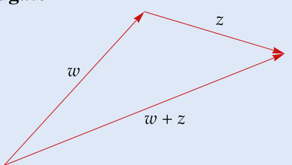

# Ch04 Polynomials  

This chapter contains material on polynomials that we will use to investigate linear maps from a vector space to itself. Many results in this chapter will already be familiar to you from other courses; they are included here for completeness.  

Because this chapter is not about linear algebra, your instructor may go through it rapidly. You may not be asked to scrutinize all the proofs. Make sure, however, that you at least read and understand the statements of all results in this chapter— they will be used in later chapters.  

This chapter begins with a brief discussion of algebraic properties of the complex numbers. Then we prove that a nonconstant polynomial cannot have more zeros than its degree. We also give a linear-algebra-based proof of the division algorithm for polynomials, which is worth reading even if you are already familiar with a proof that does not use linear algebra.  

As we will see, the fundamental theorem of algebra leads to a factorization of every polynomial into degree-one factors if the scalar field is $\mathbf{C}$ or to factors of degree at most two if the scalar field is 𝐑.  

standing assumption for this chapter
+ 𝐅 denotes 𝐑 or 𝐂.  

Before discussing polynomials with complex or real coefficients, we need to learn a bit more about the complex numbers.  

4.1 definition: real part, Re $z_{:}$ , imaginary part, Im 𝑧  

Suppose $z=a+b i$ , where $a$ and $b$ are real numbers.  

• The real part of $z$ , denoted by Re $z$ , is defined by ${\mathrm{Re}}\,z=a$ .  

• The imaginary part of $z$ , denoted by $\operatorname{Im}z$ , is defined by $\quad\operatorname{Im}z=b$ .  

Thus for every complex number $z$ , we have  

$$
z=\mathrm{Re}\,z+(\mathrm{Im}\,z)i.
$$  

4.2 definition: complex conjugate, ${\overline{{z}}},$ , absolute value, |𝑧|  

Suppose $z\in\mathbf{C}$ .  

• The complex conjugate of $z\in\mathbf{C}$ , denoted by $\overline{z}$ , is defined by  

$$
{\overline{{z}}}=\operatorname{Re}z-(\operatorname{Im}z)i.
$$  

• The absolute value of a complex number $z$ , denoted by $|z|$ , is defined by  

$$
|z|={\sqrt{(\mathrm{Re}\,z)^{2}+(\mathrm{Im}\,z)^{2}}}.
$$  

4.3 example: real and imaginary part, complex conjugate, absolute value  

Suppose $z=3+2i$ . Then • Re $z=3$ and $\operatorname{Im}z=2$ ; • ${\overline{{z}}}=3-2i$ ; • $|z|={\sqrt{3^{2}+2^{2}}}={\sqrt{13}}.$  

Identifying a complex number $z\in\mathbf{C}$ with the ordered pair $(\mathrm{Re}\,z,\mathrm{Im}\,z)\in\mathbb{R}^{2}$ identifies $\mathbf{C}$ with $\mathbf{R}^{2}.$ . Note that $\mathbf{C}$ is a one-dimensional complex vector space, but we can also think of $\mathbf{C}$ (identified with $\mathbf{R}^{2}.$ ) as a two-dimensional real vector space.  

The absolute value of each complex number is a nonnegative number. Specifically, if $z\in\mathbf{C}$ , then $|z|$ equals the distance from the origin in $\mathbf{R}^{2}$ to the point $(\mathbf{Re}\,z,\operatorname{Im}z)\in\mathbf{R}^{2}.$ .  

The real and imaginary parts, complex conjugate, and absolute value have the properties listed in the following multipart result.  

You should verify that $z={\overline{{z}}}$ if and only if 𝑧is a real number.  

Suppose $w,z\in\mathbf{C}$ . Then the following equalities and inequalities hold.  

sum of $z$ and $\overline{z}$ $z+{\overline{{z}}}=2\,\mathrm{Re}\,z.$  

difference of $z$ and $\overline{z}$ $z-{\overline{{z}}}=2(\operatorname{Im}z)i.$ .  

product of $z$ and $\overline{z}$ $z{\overline{{z}}}=|z|^{2}.$  

## additivity and multiplicativity of complex conjugate $\overline{{w+z}}=\overline{{w}}+\overline{{z}}$ and $\overline{{w z}}=\overline{{w}}\;\overline{{z}}$ .  

double complex conjugate $\overline{{\overline{{z}}}}=z$ .  

## real and imaginary parts are bounded by $|z|$  

$|\operatorname{Re}z|\leq|z|$ and $|\operatorname{Im}z|\leq|z|$ .  

absolute value of the complex conjugate  

$|\overline{{z}}|=|z|$  

multiplicativity of absolute value $|w z|=|w|\,|z|.$ .  

triangle inequality $|w+z|\leq|w|+|z|.$  

  

Proof Except for the last item above, the routine verifications of the assertions above are left to the reader. To verify the triangle inequality, we have  

Geometric interpretation of triangle inequality: The length of each side of a triangle is less than or equal to the sum of the lengths of the two other sides.  

$$
\begin{array}{r l}&{|w+z|^{2}=(w+z)(\overline{{w}}+\overline{{z}})}\\ &{\qquad\qquad=w\overline{{w}}+z\overline{{z}}+w\overline{{z}}+z\overline{{w}}}\\ &{\qquad\quad=|w|^{2}+|z|^{2}+w\overline{{z}}+\overline{{w\overline{{z}}}}}\\ &{\qquad\quad=|w|^{2}+|z|^{2}+2\operatorname{Re}(w\overline{{z}})}\\ &{\qquad\quad\leq|w|^{2}+|z|^{2}+2|w\overline{{z}}|}\\ &{\qquad\quad=|w|^{2}+|z|^{2}+2|w|\,|z|}\\ &{\qquad\quad=(|w|+|z|)^{2}.}\end{array}
$$  

Taking square roots now gives the desired inequality $|w+z|\leq|w|+|z|$ .  

See Exercise 2 for the reverse triangle inequality.  

Recall that a function $p\colon\mathbf{F}\rightarrow\mathbf{F}$ is called a polynomial of degree $m$ if there exist $a_{0},...,a_{m}\in\mathbf{F}$ with $a_{m}\neq0$ such that  

$$
p(z)=a_{0}+a_{1}z+\cdots+a_{m}z^{m}
$$  

for all $z\in\mathbf{F}$ . A polynomial could have more than one degree if the representation of $p$ in the form above were not unique. Our first task is to show that this cannot happen.  

The solutions to the equation $p(z)=0$ play a crucial role in the study of a polynomial $p\in\mathcal{P}(\mathbf{F})$ . Thus these solutions have a special name.  

4.5 definition: zero of a polynomial  

A number $\lambda\in\mathbf{F}$ is called a zero (or root) of a polynomial $p\in\mathcal{P}(\mathbf{F})$ if  

$$
p(\lambda)=0.
$$  

The next result is the key tool that we will use to show that the degree of a polynomial is unique.  

4.6 each zero of a polynomial corresponds to a degree-one factor  

Suppose 𝑚is a positive integer and $p\in\mathcal{P}(\mathbf{F})$ is a polynomial of degree 𝑚. Suppose $\lambda\in\mathbf{F}$ . Then $p(\lambda)\,=\,0$ if and only if there exists a polynomial $q\in\mathcal{P}(\mathbf{F})$ of degree $m-1$ such that  

$$
p(z)=(z-\lambda)q(z)
$$  

for every $z\in\mathbf{F}$ .  

Proof First suppose $p(\lambda)=0$ . Let $a_{0},a_{1},...,a_{m}\in\mathbf{F}$ be such that  

$$
p(z)=a_{0}+a_{1}z+\cdots+a_{m}z^{m}
$$  

for all $z\in\mathbf{F}$ . Then  

4.7  

$$
p(z)=p(z)-p(\lambda)=a_{1}(z-\lambda)+\cdots+a_{m}(z^{m}-\lambda^{m})
$$  

for all $z\in\mathbf{F}$ . For each $k\in\{1,...,m\}$ , the equation  

$$
z^{k}-\lambda^{k}=(z-\lambda)\sum_{j\,=\,1}^{k}\lambda^{j-1}z^{k-j}
$$  

shows that $z^{k}-\lambda^{k}$ equals $z-\lambda$ times some polynomial of degree $k-1$ . Thus 4.7 shows that $p$ equals $z-\lambda$ times some polynomial of degree $m-1$ , as desired.  

To prove the implication in the other direction, now suppose that there is a polynomial $q\,\in\,\mathcal{P}(\mathbf{F})$ such that $p(z)\,=\,(z-\lambda)q(z)$ for every $z\in\mathbf{F}$ . Then $p(\lambda)=(\lambda-\lambda)q(\lambda)=0$ , as desired.  

Now we can prove that polynomials do not have too many zeros.  

## 4.8 degree 𝑚implies at most 𝑚zeros  

Suppose 𝑚is a positive integer and $p\in\mathcal{P}(\mathbf{F})$ is a polynomial of degree $m$ .   
Then $p$ has at most 𝑚zeros in 𝐅.  

Proof We will use induction on $m$ . The desired result holds if $m=1$ because if $a_{1}\neq0$ then the polynomial $a_{0}+a_{1}z$ has only one zero (which equals $-a_{0}/a_{1})$ . Thus assume that $m>1$ and the desired result holds for $m-1$ .  

If $p$ has no zeros in 𝐅, then the desired result holds and we are done. Thus suppose $p$ has a zero $\lambda\in\mathbf{F}$ . By 4.6, there is polynomial $q\in\mathcal{P}(\mathbf{F})$ of degree $m-1$ such that  

$$
p(z)=(z-\lambda)q(z)
$$  

for every $z\in\mathbf{F}$ . Our induction hypothesis implies that $q$ has at most $m-1$ zeros in 𝐅. The equation above shows that the zeros of $p$ in $\mathbf{F}$ are exactly the zeros of $q$ in $\mathbf{F}$ along with $\lambda$ . Thus $p$ has at most $m$ zeros in $\mathbf{F}$ .  

The result above implies that the coefficients of a polynomial are uniquely determined (because if a polynomial had two different sets of coefficients, then subtracting the two representations of the polynomial would give a polynomial with some nonzero coefficients but infinitely many zeros). In particular, the degree of a polynomial is uniquely defined.  

Recall that the degree of the 0 polynomial is defined to be $-\infty$ . When necessary, use the expected arithmetic with $-\infty$ . For example, $-\infty\,<\,m$ and $-\infty+m=-\infty$ for every integer $m$ .  

The 0 polynomial is declared to have degree $-\infty$ so that exceptions are not needed for various reasonable results such as deg $(p q)=\deg p+\deg q.$ .  

## Division Algorithm for Polynomials  

If $p$ and $s$ are nonnegative integers, with $s~\neq~0$ , then there exist nonnegative integers $q$ and $r$ such that  

$$
p=s q+r
$$  

and $r<s$ . Think of dividing $p$ by $s$ , getting quotient $q$ with remainder $r$ . Our next result gives an analogous result for polynomials. Thus the next result is often called the division algorithm for polynomials, although as stated here it is not really an algorithm, just a useful result.  

The division algorithm for polynomials could be proved without using any linear algebra. However, as is appropriate for a linear algebra textbook, the proof given here uses linear algebra techniques  

Think of the division algorithm for polynomials as giving a remainder polynomial 𝑟when the polynomial 𝑝is divided by the polynomial 𝑠.  

and makes nice use of a basis of ${\mathcal P}_{n}({\bf F})$ , which is the $(n+1)$ -dimensional vector space of polynomials with coefficients in 𝐅and of degree at most $n$ .  

Suppose that $p,s\in\mathcal{P}(\mathbf{F})$ , with $s\neq0$ . Then there exist unique polynomials $q,r\in\mathcal{P}(\mathbf{F})$ such that  

$$
p=s q+r
$$  

and deg $r<\deg s$ .  

Proof Let $n=\deg p$ and let $m=\deg s$ . If $n<m$ , then take $q=0$ and $r=p$ to get the desired equation $p=s q+r$ with deg $r<\deg s$ . Thus we now assume that $n\geq m$ .  

The list  

$$
1,z,...,z^{m-1},s,z s,...,z^{n-m}s
$$  

is linearly independent in ${\mathcal P}_{n}({\bf F})$ because each polynomial in this list has a different degree. Also, the list 4.10 has length $n+1$ , which equals dim ${\mathcal P}_{n}({\bf F})$ . Hence 4.10 is a basis of ${\mathcal P}_{n}({\bf F})$ [by 2.38].  

Because $p\in\mathcal{P}_{n}(\mathbf{F})$ and 4.10 is a basis of ${\mathcal P}_{n}({\bf F})$ , there exist unique constants $a_{0},a_{1},...,a_{m-1}\in\mathbf{F}$ and $b_{0},b_{1},...,b_{n-m}\in\mathbf{F}$ such that  

$$
\begin{array}{r l}&{p=a_{0}+a_{1}z+\cdots+a_{m-1}{z^{m-1}}+b_{0}s+b_{1}z s+\cdots+b_{n-m}{z^{n-m}}s}\\ &{\quad=\underbrace{a_{0}+a_{1}z+\cdots+a_{m-1}{z^{m-1}}}_{r}+s(\underbrace{b_{0}+b_{1}z+\cdots+b_{n-m}{z^{n-m}}}_{q}).}\end{array}
$$  

With $r$ and $q$ as defined above, we see that $p$ can be written as $p=s q+r$ with deg $r<\deg s$ , as desired.  

The uniqueness of $q,r\in\mathcal{P}(\mathbf{F})$ satisfying these conditions follows from the uniqueness of the constants $a_{0},a_{1},...,a_{m-1}\in\mathbf{F}$ and $b_{0},b_{1},...,b_{n-m}\in\mathbf{F}$ satisfying 4.11.  

Factorization of Polynomials over 𝐂  

W have been handling polynomials with complex coefficients and polynomials with real coefficients simultaneously, letting 𝐅 denote 𝐑 or 𝐂. Now we will see differences between these two cases. First we treat polynomials with complex coefficients. Then we will use those results to prove corresponding results for polynomials with real coefficients.  

The fundamental theorem of algebra is an existence theorem. Its proof does not lead to a method for finding zeros. The quadratic formula gives the zeros explicitly for polynomials of degree 2. Similar but more complicated formulas exist for polynomials of degree 3 and 4. No such formulas exist for polynomials of degree 5 and above.  

Our proof of the fundamental theorem of algebra implicitly uses the result that a continuous real-valued function on a closed disk in $\mathbf{R}^{2}$ attains a minimum value. A web search can lead you to several other proofs of the fundamental theorem of algebra. The proof using Liouville’s theorem is particularly nice if you are comfortable with analytic functions. All proofs of the fundamental theorem of algebra need to use some analysis, because the result is not true if 𝐂is replaced, for example, with the set of numbers of the form $c+d i$ where $c,d$ are rational numbers.  

4.12 fundamental theorem of algebra, first version  

Every nonconstant polynomial with complex coefficients has a zero in 𝐂.  

Proof De Moivre’s theorem, which you can prove using induction on $k$ and the addition formulas for cosine and sine, states that if $k$ is a positive integer and $\theta\in\mathbb{R}$ , then  

$$
(\cos\theta+i\sin\theta)^{k}=\cos k\theta+i\sin k\theta.
$$  

Suppose $w\in\mathbf{C}$ and $k$ is a positive integer. Using polar coordinates, we know that there exist $r\geq0$ and $\theta\in\mathbb{R}$ such that  

$$
r(\cos\theta+i\sin\theta)=w.
$$  

De Moivre’s theorem implies that  

$$
\begin{array}{r}{\left(r^{1/k}\Big(\cos{\frac{\theta}{k}}+i\sin{\frac{\theta}{k}}\Big)\right)^{k}=w.}\end{array}
$$  

Thus every complex number has a $k^{\mathrm{th}}$ root, a fact that we will soon use.  

Suppose $p$ is a nonconstant polynomial with complex coefficients and highestorder nonzero term $c_{m}z^{m}.$ . Then $|p(z)|\rightarrow\infty$ as $|z|\to\infty$ (because $|p(z)|/|z^{m}|\rightarrow|c_{m}|$ as $|z|\to\infty]$ ). Thus the continuous function $z\mapsto|p(z)|$ has a global minimum at some point $\zeta\in\mathbf{C}$ . To show that $p(\zeta)=0$ , suppose that $p(\zeta)\neq0$ .  

Define a new polynomial $q$ by  

$$
q(z)=\frac{p(z+\zeta)}{p(\zeta)}.
$$  

The function $z\mapsto|q(z)|$ has a global minimum value of 1 at $z=0$ . Write  

$$
q(z)=1+a_{k}z^{k}+\cdots+a_{m}z^{m},
$$  

where $k$ is the smallest positive integer such that the coefficient of $z^{k}$ is nonzero;   
in other words, $a_{k}\neq0$ .  

Let $\beta\in\mathbf{C}$ be such that $\beta^{k}\,=\,-{\frac{1}{a_{k}}}$ − . There is a constant 𝑐> 1 such that if $t\in(0,1)$ , then  

$$
\begin{array}{r l}&{|q(t\beta)|\le|1+a_{k}t^{k}\beta^{k}|+t^{k+1}c}\\ &{\qquad\qquad=1-t^{k}(1-t c).}\end{array}
$$  

Thus taking $t$ to be $1/(2c)$ in the inequality above, we have $|q(t\beta)|<1$ , which contradicts the assumption that the global minimum of $z\,\mapsto\,|q(z)|$ is 1. This contradiction implies that $p(\zeta)=0$ , showing that $p$ has a zero, as desired.  

Computers can use clever numerical methods to find good approximations to the zeros of any polynomial, even when exact zeros cannot be found. For example, no one will ever give an exact formula for a zero of the polynomial $p$ defined by  

$$
p(x)=x^{5}-5x^{4}-6x^{3}+17x^{2}+4x-7.
$$  

However, a computer can find that the zeros of $p$ are approximately the five numbers $-1.87$ , −0.74, 0.62, 1.47, 5.51.  

The first version of the fundamental theorem of algebra leads to the following factorization result for polynomials with complex coefficients. Note that in this factorization, the zeros of $p$ are the numbers $\lambda_{1},...,\lambda_{m}$ , which are the only values of $z$ for which the right side of the equation in the next result equals 0.  

4.13 fundamental theorem of algebra, second version  

If $p\in{\mathcal{P}}(\mathbf{C})$ is a nonconstant polynomial, then $p$ has a unique factorization (except for the order of the factors) of the form  

$$
p(z)=c(z-\lambda_{1})\cdots(z-\lambda_{m}),
$$  

where $c,\lambda_{1},...,\lambda_{m}\in\mathbf{C}$ .  

Proof Let $p\in{\mathcal{P}}(\mathbf{C})$ and let $m=\deg p$ . We will use induction on $m$ . If $m=1$ , then the desired factorization exists and is unique. So assume that $m>1$ and that the desired factorization exists and is unique for all polynomials of degree $m-1$ .  

First we will show that the desired factorization of $p$ exists. By the first version of the fundamental theorem of algebra (4.12), $p$ has a zero $\lambda\in\mathbf{C}$ . By 4.6, there is a polynomial $q$ of degree $m-1$ such that  

$$
p(z)=(z-\lambda)q(z)
$$  

for all $z\in\mathbf{C}$ . Our induction hypothesis implies that $q$ has the desired factorization, which when plugged into the equation above gives the desired factorization of $p$ .  

Now we turn to the question of uniqueness. The number $c$ is uniquely determined as the coefficient of $z^{m}$ in $p$ . So we only need to show that except for the order, there is only one way to choose $\lambda_{1},...,\lambda_{m}$ . If  

$$
(z-\lambda_{1}){\cdots}(z-\lambda_{m})=(z-\tau_{1}){\cdots}(z-\tau_{m})
$$  

for all $z\in\mathbf{C}$ , then because the left side of the equation above equals 0 when $z=\lambda_{1}$ , one of the $\tau$ ’s on the right side equals $\lambda_{1}$ . Relabeling, we can assume that $\tau_{1}=\lambda_{1}$ . Now if $z\neq\lambda_{1}$ , we can divide both sides of the equation above by $z-\lambda_{1}$ , getting  

$$
(z-\lambda_{2}){\cdots}(z-\lambda_{m})=(z-\tau_{2}){\cdots}(z-\tau_{m})
$$  

for all $z\in\mathbf{C}$ except possibly $z=\lambda_{1}$ . Actually the equation above holds for all $z\in\mathbf{C}$ , because otherwise by subtracting the right side from the left side we would get a nonzero polynomial that has infinitely many zeros. The equation above and our induction hypothesis imply that except for the order, the $\lambda\,\mathrm{\dot{s}}$ are the same as the 𝜏’s, completing the proof of uniqueness.  

A polynomial with real coefficients may have no real zeros. For example, the polynomial $1+x^{2}$ has no real zeros.  

To obtain a factorization theorem over $\mathbf{R}$ , we will use our factorization theorem over 𝐂. We begin with the next result.  

The failure of the fundamental theorem of algebra for 𝐑accounts for the differences between linear algebra on real and complex vector spaces, as we will see in later chapters.  

4.14 polynomials with real coefficients have nonreal zeros in pairs  

Suppose $p\in{\mathcal{P}}(\mathbf{C})$ is a polynomial with real coefficients. If $\lambda\in\mathbf{C}$ is a zero of $p$ , then so is $\overline{{\lambda}}$ .  

Proof Let  

$$
p(z)=a_{0}+a_{1}z+\cdots+a_{m}z^{m},
$$  

where $a_{0},...,a_{m}$ are real numbers. Suppose $\lambda\in\mathbf{C}$ is a zero of $p$ . Then  

$$
a_{0}+a_{1}\lambda+\cdots+a_{m}\lambda^{m}=0.
$$  

Take the complex conjugate of both sides of this equation, obtaining  

$$
a_{0}+a_{1}{\overline{{\lambda}}}+\cdots+a_{m}{\overline{{\lambda}}}^{m}=0,
$$  

where we have used basic properties of the complex conjugate (see 4.4). The equation above shows that $\overline{{\lambda}}$ is a zero of $p$ .  

We want a factorization theorem for polynomials with real coefficients. We begin with the following result.  

Think about the quadratic formula in connection with the result below.  

4.15 factorization of a quadratic polynomial  

Suppose $b,c\in\mathbb{R}$ . Then there is a polynomial factorization of the form  

$$
x^{2}+b x+c=(x-\lambda_{1})(x-\lambda_{2})
$$  

with $\lambda_{1},\lambda_{2}\in\mathbb{R}$ if and only if $b^{2}\geq4c$ .  

## Proof Notice that  

$$
x^{2}+b x+c=\left(x+{\frac{b}{2}}\right)^{2}+\left(c-{\frac{b^{2}}{4}}\right)\!.
$$  

First suppose $b^{2}<4c$ . Then the right side of the equation above is positive for every $x\ \in\ \mathbf{R}$ . Hence the polynomial $x^{2}+b x+c$ has no real zeros and thus cannot be factored in the form  

The equation above is the basis of the technique called completing the square.  

$(x-\lambda_{1})(x-\lambda_{2})$ with $\lambda_{1},\lambda_{2}\in\mathbb{R}$  

Conversely, now suppose $b^{2}\geq4c$ . Then there is a real number $d$ such that $\begin{array}{r}{d^{2}=\frac{b^{2}}{4}-c.}\end{array}$ . From the displayed equation above, we have  

$$
\begin{array}{l}{{{x^{2}}+b x+c=\displaystyle\left(x+\frac{b}{2}\right)^{2}-d^{2}}}\\ {{\qquad\qquad=\displaystyle\left(x+\frac{b}{2}+d\right)\!\left(x+\frac{b}{2}-d\right)\!,}}\end{array}
$$  

which gives the desired factorization.  

The next result gives a factorization of a polynomial over $\mathbf{R}$ . The idea of the proof is to use the second version of the fundamental theorem of algebra (4.13), which gives a factorization of $p$ as a polynomial with complex coefficients. Complex but nonreal zeros of $p$ come in pairs; see 4.14. Thus if the factorization of $p$ as an element of $\mathcal{P}(\mathbf{C})$ includes terms of the form $(x-\lambda)$ with $\lambda$ a nonreal complex number, then $(x-{\overline{{\lambda}}})$ is also a term in the factorization. Multiplying together these two terms, we get  

$$
(x^{2}-2(\mathrm{Re}\,\lambda)x+|\lambda|^{2}),
$$  

which is a quadratic term of the required form.  

The idea sketched in the paragraph above almost provides a proof of the existence of our desired factorization. However, we need to be careful about one point. Suppose $\lambda$ is a nonreal complex number and $(x-\lambda)$ is a term in the factorization of $p$ as an element of $\mathcal{P}(\mathbf{C})$ . We are guaranteed by 4.14 that $(x-{\overline{{\lambda}}})$ also appears as a term in the factorization, but 4.14 does not state that these two factors appear the same number of times, as needed to make the idea above work. However, the proof works around this point.  

In the next result, either $m$ or $M$ may equal 0. The numbers $\lambda_{1},...,\lambda_{m}$ are precisely the real zeros of $p$ , for these are the only real values of $x$ for which the right side of the equation in the next result equals 0.  

4.16 factorization of a polynomial over 𝐑  

Suppose $p\in{\mathcal{P}}(\mathbb{R})$ is a nonconstant polynomial. Then $p$ has a unique factorization (except for the order of the factors) of the form  

$$
p(x)=c(x-\lambda_{1})\cdots(x-\lambda_{m})\bigl(x^{2}+b_{1}x+c_{1}\bigr)\cdots\bigl(x^{2}+b_{M}x+c_{M}\bigr),
$$  

where $c,\lambda_{1},...,\lambda_{m},b_{1},...,b_{M},c_{1},...,c_{M}\in\mathbb{R}$ , with $b_{k}^{2}<4c_{k}$ for each $k$ .  

Proof First we will prove that the desired factorization exists, and after that we will prove the uniqueness.  

Think of $p$ as an element of $\mathcal{P}(\mathbf{C})$ . If all (complex) zeros of $p$ are real, then we have the desired factorization by 4.13. Thus suppose $p$ has a zero $\lambda\in\mathbf{C}$ with $\lambda\not\in\mathbb{R}$ . By 4.14, $\overline{{\lambda}}$ is a zero of $p$ . Thus we can write  

$$
\begin{array}{r l}&{p(x)=(x-\lambda)\big(x-\overline{{\lambda}}\big)q(x)}\\ &{\qquad=\big(x^{2}-2(\operatorname{Re}\lambda)x+|\lambda|^{2}\big)q(x)}\end{array}
$$  

for some polynomial $q\in\mathcal{P}(\mathbf{C})$ of degree two less than the degree of $p$ . If we can prove that $q$ has real coefficients, then using induction on the degree of $p$ completes the proof of the existence part of this result.  

To prove that $q$ has real coefficients, we solve the equation above for $q$ , getting  

$$
q(x)={\frac{p(x)}{x^{2}-2(\mathrm{Re\}\lambda)x+|\lambda|^{2}}}
$$  

for all $x\in\mathbf{R}$ . The equation above implies that $q(x)\in\mathbb{R}$ for all $x\in\mathbf{R}$ . Writing  

$$
q(x)=a_{0}+a_{1}x+\cdots+a_{n-2}x^{n-2},
$$  

where $n=\deg p$ and $a_{0},...,a_{n-2}\in\mathbf{C}$ , we thus have  

$$
0=\operatorname{Im}q(x)=(\operatorname{Im}a_{0})+(\operatorname{Im}a_{1})x+\dots+(\operatorname{Im}a_{n-2})x^{n-2}
$$  

for all $x\in\mathbf{R}$ . This implies that $\operatorname{Im}a_{0},...,\operatorname{Im}a_{n-2}$ all equal 0 (by 4.8). Thus all coefficients of $q$ are real, as desired. Hence the desired factorization exists.  

Now we turn to the question of uniqueness of our factorization. A factor of $p$ of the form $x^{2}+b_{k}x+c_{k}$ with $b_{k}^{2}<4c_{k}$ can be uniquely written as $(x\!-\!\lambda_{k})\big(x\!-\!\overline{{\lambda_{k}}}\big)$ with $\lambda_{k}\in\mathbf{C}$ . A moment’s thought shows that two different factorizations of $p$ as an element of ${\mathcal{P}}(\mathbf{R})$ would lead to two different factorizations of $p$ as an element of $\mathcal{P}(\mathbf{C})$ , contradicting 4.13.  

## Exercises 4  

1 Suppose $w,z\in\mathbf{C}$ . Verify the following equalities and inequalities.  

(a) $z+{\overline{{z}}}=2\operatorname{Re}z$   
(b) $z-{\overline{{z}}}=2(\operatorname{Im}z)i$   
(c) $z{\overline{{z}}}=|z|^{2}$   
(d) $\overline{{w+z}}=\overline{{w}}+\overline{{z}}$ and $\overline{{w z}}=\overline{{w}}\;\overline{{z}}$   
(e) $\overline{{\overline{{z}}}}=z$   
(f) $|\,\mathrm{\bfRe}\,z|\le|z|$ and $|\operatorname{Im}z|\leq|z|$   
(g) ∣𝑧∣ $=|z|$   
(h) $|w z|=|w|\,|z|$   
The results above are the parts of 4.4 that were left to the reader.  

2 Prove that if $w,z\in\mathbf{C}$ , then $\big|\left|w\right|-\left|z\right|\big|\leq\big|w-z\big|.$ . The inequality above is called the reverse triangle inequality.  

3 Suppose $V$ is a complex vector space and $\varphi\in V^{\prime}$ . Define $\sigma\colon V\rightarrow\mathbb{R}$ by $\sigma(v)=\operatorname{Re}\varphi(v)$ for each $v\in V.$ Show that  

$$
\varphi(v)=\sigma(v)-i\sigma(i v)
$$  

for all $v\in V.$ .  

4 Suppose $m$ is a positive integer. Is the set  

$$
\{0\}\cup\{p\in{\mathcal{P}}(\mathbf{F}):\deg p=m\}
$$  

a subspace of ${\mathcal{P}}(\mathbf{F})?$  

5 Is the set  

$$
\{0\}\cup\{p\in{\mathcal{P}}(\mathbf{F}):\deg p{\mathrm{~is~even}}\}
$$  

a subspace of ${\mathcal{P}}(\mathbf{F})?$  

6 Suppose that $m$ and $n$ are positive integers with $m~\leq~n$ , and suppose $\lambda_{1},...,\lambda_{m}\ \in\ \mathbf{F}$ . Prove that there exists a polynomial $p\ \in\ \mathcal{P}(\mathbf{F})$ with $\deg p\;=\;n$ such that $0\;=\;p(\lambda_{1})\;=\;\cdots\;=\;p(\lambda_{m})$ and such that $p$ has no other zeros.  

7 Suppose that $m$ is a nonnegative integer, $z_{1},...,z_{m+1}$ are distinct elements of 𝐅, and $w_{1},...,w_{m+1}\in\mathbf{F}$ . Prove that there exists a unique polynomial $p\in\mathcal{P}_{m}(\mathbf{F})$ such that  

$$
p(z_{k})=w_{k}
$$  

for each $k=1,...,m+1$ .  

This result can be proved without using linear algebra. However, try to find the clearer, shorter proof that uses some linear algebra.  

8 Suppose $p\in{\mathcal{P}}(\mathbf{C})$ has degree 𝑚. Prove that $p$ has $m$ distinct zeros if and only if $p$ and its derivative $p^{\prime}$ have no zeros in common.  

Prove that every polynomial of odd degree with real coefficients has a real zero.  

10 For $p\in{\mathcal{P}}(\mathbb{R})$ , define $T p\colon\mathbf{R}\rightarrow\mathbf{R}$ by  

$$
(T p)(x)={\left\{\begin{array}{l l}{\displaystyle{\frac{p(x)-p(3)}{x-3}}}&{{\mathrm{if~}}x\neq3,}\\ {p^{\prime}(3)}&{{\mathrm{if~}}x=3}\end{array}\right.}
$$  

for each $x\in\mathbf{R}$ . Show that $T p\in{\mathcal{P}}(\mathbb{R})$ for every polynomial $p\in{\mathcal{P}}(\mathbb{R})$ and also show that $T\colon{\mathcal{P}}(\mathbf{R})\rightarrow{\mathcal{P}}(\mathbf{R})$ is a linear map.  

11 Suppose $p\in{\mathcal{P}}(\mathbf{C})$ . Define $q\colon\mathbf{C}\to\mathbf{C}$ by  

$$
q(z)=p(z)\,{\overline{{p(\overline{{z}})}}}.
$$  

Prove that $q$ is a polynomial with real coefficients.  

12 Suppose $m$ is a nonnegative integer and $p\in\mathcal P_{m}(\mathbf{C})$ is such that there are distinct real numbers $x_{0},x_{1},...,x_{m}$ with $p(x_{k})\in\mathbb{R}$ for each $k=0,1,...,m$ . Prove that all coefficients of $p$ are real.  

13 Suppose $p\in\mathcal{P}(\mathbf{F})$ with $p\neq0$ . Let $U=\left\{p q:q\in\mathcal{P}(\mathbf{F})\right\}$ .  

(a) Show that dim $\mathbf{\nabla}_{1}\mathcal{P}(\mathbf{F})/U=\deg p$ .   
(b) Find a basis of $\mathcal{P}(\mathbf{F})/U$ .  

14 Suppose $p,q\in\mathcal{P}(\mathbf{C})$ are nonconstant polynomials with no zeros in common. Let $m=\deg p$ and $n=\deg q$ . Use linear algebra as outlined below in (a)–(c) to prove that there exist $r\in\mathcal{P}_{n-1}(\mathbf{C})$ and $s\in\mathscr{P}_{m-1}(\mathbf{C})$ such that  

$$
r p+s q=1.
$$  

(a) Define $T\colon\mathcal{P}_{n-1}(\mathbf{C})\times\mathcal{P}_{m-1}(\mathbf{C})\rightarrow\mathcal{P}_{m+n-1}(\mathbf{C})\:\mathrm{by}$  

$$
T(r,s)=r p+s q.
$$  

Show that the linear map $T$ is injective.   
(b) Show that the linear map $T$ in (a) is surjective.   
(c) Use (b) to conclude that there exist $r\,\in\,\mathcal P_{n-1}({\bf C})$ and $s\in\mathscr{P}_{m-1}(\mathbf{C})$ such that $r p+s q=1$ .  

