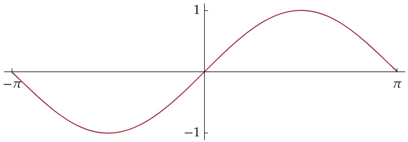

# Ch06 Inner Product Spaces  

In making the definition of a vector space, we generalized the linear structure (addition and scalar multiplication) of 𝐑2and 𝐑3. We ignored geometric features such as the notions of length and angle. These ideas are embedded in the concept of inner products, which we will investigate in this chapter.  

Every inner product induces a norm, which you can think of as a length. This norm satisfies key properties such as the Pythagorean theorem, the triangle inequality, the parallelogram equality, and the Cauchy–Schwarz inequality.  

The notion of perpendicular vectors in Euclidean geometry gets renamed to orthogonal vectors in the context of an inner product space. We will see that orthonormal bases are tremendously useful in inner product spaces. The Gram– Schmidt procedure constructs such bases. This chapter will conclude by putting together these tools to solve minimization problems.  

standing assumptions for this chapter  

+ 𝐅 denotes 𝐑 or 𝐂.   
+ 𝑉 and 𝑊 denote vector spaces over 𝐅.

6A Inner Products and Norms  

## Inner Products  

To motivate the concept of inner product, think of vectors in $\mathbf{R}^{2}$ and $\mathbf{R}^{3}$ as arrows with initial point at the origin. The length of a vector $v$ in $\mathbf{R}^{2}$ or $\mathbf{R}^{3}$ is called the norm of $v$ and is denoted by $\lVert v\rVert$ . Thus for $v=(a,b)\in\mathbb{R}^{2},$ , we have  

$$
\|v\|={\sqrt{a^{2}+b^{2}}}.
$$  

  
This vector 𝑣has norm $\sqrt{a^{2}+b^{2}}$ .  

Similarly, if $v=(a,b,c)\in\mathbb{R}^{3},$ , then $\|v\|={\sqrt{a^{2}+b^{2}+c^{2}}}$ .  

Even though we cannot draw pictures in higher dimensions, the generalization to $\mathbf{R}^{n}$ is easy: we define the norm of $x=(x_{1},...,x_{n})\in\mathbf{R}^{n}$ by  

$$
\left\|x\right\|={\sqrt{x_{1}^{\,2}+\cdots+x_{n}^{\,2}}}.
$$  

The norm is not linear on $\mathbf{R}^{n}.$ . To inject linearity into the discussion, we introduce the dot product.  

6.1 definition: dot product  

For $x,y\in\mathbf{R}^{n},$ , the dot product of $x$ and $y$ , denoted by $x\cdot y$ , is defined by  

$$
x\cdot y=x_{1}y_{1}+\cdots+x_{n}y_{n},
$$  

where $\boldsymbol{x}=(x_{1},...,x_{n})$ and $\boldsymbol{y}=(y_{1},...,y_{n})$ .  

The dot product of two vectors in ${\mathbf{R}}^{n}$ is a number, not a vector. Notice that $x\cdot x=\|x\|^{2}$ for all $x\in\mathbf{R}^{n}$ . Furthermore, the dot product on ${\mathbf{R}}^{n}$ has the following properties.  

• $x\cdot x\geq0$ for all $x\in\mathbf{R}^{n}.$   
• $x\cdot x=0$ if and only if $x=0$ .   
• For $y\in\mathbf{R}^{n}$ fixed, the map from ${\mathbf{R}}^{n}$ to $\mathbf{R}$ that sends $x\in\mathbf{R}^{n}$ to $x\cdot y$ is linear. • $x\cdot y=y\cdot x$ for all $x,y\in\mathbf{R}^{n}.$  

If we think of a vector as a point instead of as an arrow, then $\left\|x\right\|$ should be interpreted to mean the distance from the origin to the point $x,$ .  

An inner product is a generalization of the dot product. At this point you may be tempted to guess that an inner product is defined by abstracting the properties of the dot product discussed in the last paragraph. For real vector spaces, that guess is correct. However, so that we can make a definition that will be useful for both real and complex vector spaces, we need to examine the complex case before making the definition.  

Recall that if $\lambda=a+b i$ , where $a,b\in\mathbf{R}$ , then • the absolute value of $\lambda$ , denoted by $|\lambda|$ , is defined by $|\lambda|=\sqrt{a^{2}+b^{2}}$ ;  

• the complex conjugate of $\lambda$ , denoted by $\overline{{\lambda}}$ , is defined by ${\overline{{\lambda}}}=a-b i$ ;  

• $|\lambda|^{2}=\lambda\overline{{\lambda}}$ .  

See Chapter 4 for the definitions and the basic properties of the absolute value and complex conjugate.  

For $z=(z_{1},...,z_{n})\in\mathbf{C}_{:}^{n}$ , we define the norm of $z$ by  

$$
\|z\|={\sqrt{|z_{1}|^{2}+\cdots+|z_{n}|^{2}}}.
$$  

The absolute values are needed because we want $\|z\|$ to be a nonnegative number. Note that  

$$
\|z\|^{2}=z_{1}{\overline{{z_{1}}}}+\cdots+z_{n}{\overline{{z_{n}}}}.
$$  

We want to think of $\|z\|^{2}$ as the inner product of $z$ with itself, as we did in $\mathbf{R}^{n}.$ . The equation above thus suggests that the inner product of the vector $w=(w_{1},...,w_{n})\in\mathbf{C}^{n}$ with $z$ should equal  

$$
w_{1}{\overline{{z_{1}}}}+\cdots+w_{n}{\overline{{z_{n}}}}.
$$  

If the roles of the $w$ and $z$ were interchanged, the expression above would be replaced with its complex conjugate. Thus we should expect that the inner product of $w$ with $z$ equals the complex conjugate of the inner product of $z$ with $w$ . With that motivation, we are now ready to define an inner product on $V,$ which may be a real or a complex vector space.  

One comment about the notation used in the next definition: • For $\lambda\in\mathbf{C}$ , the notation $\lambda\geq0$ means $\lambda$ is real and nonnegative.  

## 6.2 definition: inner product  

An inner product on $V$ is a function that takes each ordered pair $(u,v)$ of elements of $V$ to a number $\langle u,v\rangle\in\mathbf{F}$ and has the following properties.  

## positivity  

$\langle v,v\rangle\geq0$ for all $v\in V.$ .  

## definiteness  

$\langle v,v\rangle=0$ if and only if $v=0$ .  

## additivity in first slot  

$\langle u+v,w\rangle=\langle u,w\rangle+\langle v,w\rangle$ for all $u,v,w\in V.$  

homogeneity in first slot $\langle\lambda u,v\rangle=\lambda\langle u,v\rangle$ for all $\lambda\in\mathbf{F}$ and all $u,v\in V.$  

## conjugate symmetry  

$\langle u,v\rangle=\overline{{\langle v,u\rangle}}$ for all $u,v\in V.$ .  

Every real number equals its complex conjugate. Thus if we are dealing with a real vector space, then in the last condition above we can dispense with the complex conjugate and simply state that $\langle u,v\rangle=\langle v,u\rangle$ for all $u,v\in V.$  

Most mathematicians define inner products as above, but many physicists use a definition that requires homogeneity in the second slot instead of the first slot.  

## 6.3 example: inner products  

(a) The Euclidean inner product on $\mathbf{F}^{n}$ is defined by  

$$
\left\langle(w_{1},...,w_{n}),(z_{1},...,z_{n})\right\rangle=w_{1}\overline{{z_{1}}}+\cdots+w_{n}\overline{{z_{n}}}
$$  

for all $(w_{1},...,w_{n}),(z_{1},...,z_{n})\in{\bf F}^{n}.$  

(b) If $c_{1},...,c_{n}$ are positive numbers, then an inner product can be defined on $\mathbf{F}^{n}$ by  

$$
\left\langle(w_{1},...,w_{n}),(z_{1},...,z_{n})\right\rangle=c_{1}w_{1}\overline{{z_{1}}}+\cdots+c_{n}w_{n}\overline{{z_{n}}}
$$  

for all $(w_{1},...,w_{n}),(z_{1},...,z_{n})\in{\bf F}^{n}.$  

(c) An inner product can be defined on the vector space of continuous real-valued functions on the interval [−1, 1] by  

$$
\langle f,g\rangle=\int_{-1}^{1}f g
$$  

for all $f,g$ continuous real-valued functions on $[-1,1]$ .  

(d) An inner product can be defined on ${\mathcal{P}}(\mathbf{R})$ by  

$$
\langle p,q\rangle=p(0)q(0)+\int_{-1}^{1}p^{\prime}q^{\prime}
$$  

for all $p,q\in\mathcal{P}(\mathbb{R})$ .  

(e) An inner product can be defined on ${\mathcal{P}}(\mathbf{R})$ by  

$$
\langle p,q\rangle=\int_{0}^{\infty}p(x)q(x)e^{-x}\,d x
$$  

for all $p,q\in\mathcal{P}(\mathbb{R})$  

6.4 definition: inner product space  

An inner product space is a vector space $V$ along with an inner product on $V.$  

The most important example of an inner product space is $\mathbf{F}^{n}$ with the Euclidean inner product given by (a) in the example above. When $\mathbf{F}^{n}$ is referred to as an inner product space, you should assume that the inner product is the Euclidean inner product unless explicitly told otherwise.  

So that we do not have to keep repeating the hypothesis that $V$ and $W$ are inner product spaces, we make the following assumption.  

## 6.5 notation: 𝑉, 𝑊  

For the rest of this chapter and the next chapter, $V$ and $W$ denote inner product spaces over 𝐅.  

Note the slight abuse of language here. An inner product space is a vector space along with an inner product on that vector space. When we say that a vector space $V$ is an inner product space, we are also thinking that an inner product on $V$ is lurking nearby or is clear from the context (or is the Euclidean inner product if the vector space is $\mathbf{F}^{n}$ ).  

6.6 basic properties of an inner product (a) For each fixed $v\in V,$ the function that takes $u\in V$ to $\langle u,v\rangle$ is a linear map from $V$ to $\mathbf{F}$ .  

(b) $\langle0,v\rangle=0$ for every $v\in V.$  

(c) $\langle v,0\rangle=0$ for every $v\in V.$ .  

(d) $\langle u,v+w\rangle=\langle u,v\rangle+\langle u,w\rangle$ for all $u,v,w\in V.$ .  

(e) $\langle u,\lambda v\rangle=\overline{{\lambda}}\langle u,v\rangle$ for all $\lambda\in\mathbf{F}$ and all $u,v\in V.$  

## Proof  

(a) For $v\in V,$ the linearity of $u\mapsto\langle u,v\rangle$ follows from the conditions of additivity and homogeneity in the first slot in the definition of an inner product.  

(b) Every linear map takes 0 to 0. Thus (b) follows from (a).  

(c) If $v\in V,$ then the conjugate symmetry property in the definition of an inner product and (b) show that $\langle v,0\rangle=\overline{{\langle0,v\rangle}}=\overline{{0}}=0$ .  

(d) Suppose $u,v,w\in V.$ Then  

$$
\begin{array}{r l}&{\langle u,v+w\rangle=\overline{{\langle v+w,u\rangle}}}\\ &{\qquad\qquad=\overline{{\langle v,u\rangle+\langle w,u\rangle}}}\\ &{\qquad\quad=\overline{{\langle v,u\rangle}}+\overline{{\langle w,u\rangle}}}\\ &{\qquad\quad=\langle u,v\rangle+\langle u,w\rangle.}\end{array}
$$  

(e) Suppose $\lambda\in\mathbf{F}$ and $u,v\in V.$ Then  

$$
\begin{array}{r l r}&{}&{\langle u,\lambda v\rangle=\overline{{\langle\lambda v,u\rangle}}}\\ &{}&{\qquad=\overline{{\lambda\langle v,u\rangle}}}\\ &{}&{\qquad=\overline{{\lambda}}\;\overline{{\langle v,u\rangle}}}\\ &{}&{\qquad=\overline{{\lambda}}\langle u,v\rangle.}\end{array}
$$  

Our motivation for defining inner products came initially from the norms of vectors on $\mathbf{R}^{2}$ and $\mathbf{R}^{3}.$ . Now we see that each inner product determines a norm.  

## 6.7 definition: norm, ‖𝑣‖  

For $v\in V,$ the norm of $v$ , denoted by $\lVert v\rVert$ , is defined by  

$$
\|v\|={\sqrt{\langle v,v\rangle}}.
$$  

6.8 example: norms  

(a) If $(z_{1},...,z_{n})\in\mathbf{F}^{n}$ (with the Euclidean inner product), then  

$$
\|(z_{1},...,z_{n})\|=\sqrt{|z_{1}|^{2}+\cdots+|z_{n}|^{2}}.
$$  

(b) For $f$ in the vector space of continuous real-valued functions on $[-1,1]$ and with inner product given as in 6.3(c), we have  

$$
\|f\|={\sqrt{\int_{-1}^{1}f^{2}}}.
$$  

6.9 basic properties of the norm  

Suppose $v\in V.$ (a) $\|v\|=0$ if and only if $v=0$ . (b) $\|\lambda v\|=|\lambda|\,\|v\|$ for all $\lambda\in\mathbf{F}$ .  

## Proof  

(a) The desired result holds because $\langle v,v\rangle=0$ if and only if $v=0$ .  

(b) Suppose $\lambda\in\mathbf{F}$ . Then  

$$
\begin{array}{r l r}&{}&{\|\lambda v\|^{2}=\langle\lambda v,\lambda v\rangle}\\ &{}&\\ &{}&{=\lambda\langle v,\lambda v\rangle}\\ &{}&\\ &{}&{=\lambda\overline{{\lambda}}\langle v,v\rangle}\\ &{}&\\ &{}&{=|\lambda|^{2}\,\|v\|^{2}.}\end{array}
$$  

Taking square roots now gives the desired equality.  

The proof of (b) in the result above illustrates a general principle: working with norms squared is usually easier than working directly with norms.  

## 6.10 definition: orthogonal  

Two vectors $u,v\in V$ are called orthogonal if $\langle u,v\rangle=0$ .  

In the definition above, the order of the two vectors does not matter, because $\langle u,v\rangle\,=\,0$ if and only if $\langle v,u\rangle\,=\,0$ . Instead of saying $u$ and $v$ are orthogonal, sometimes we say $u$ is orthogonal to $v$ .  

The word orthogonal comes from the Greek word orthogonios, which means right-angled.  

Exercise 15 asks you to prove that if $u,v$ are nonzero vectors in $\mathbf{R}^{2},$ then  

$$
\langle u,v\rangle=\|u\|\,\|v\|\cos\theta,
$$  

where $\theta$ is the angle between $u$ and $v$ (thinking of $u$ and $v$ as arrows with initial point at the origin). Thus two nonzero vectors in $\mathbf{R}^{2}$ are orthogonal (with respect to the Euclidean inner product) if and only if the cosine of the angle between them is 0, which happens if and only if the vectors are perpendicular in the usual sense of plane geometry. Thus you can think of the word orthogonal as a fancy word meaning perpendicular.  

We begin our study of orthogonality with an easy result.  

## 6.11 orthogonality and 0  

(a) 0 is orthogonal to every vector in $V.$ (b) 0 is the only vector in $V$ that is orthogonal to itself.  

Proof (a) Recall that 6.6(b) states that $\langle0,v\rangle=0$ for every $v\in V.$ .  

(b) If $v\in V$ and $\langle v,v\rangle=0$ , then $v=0$ (by definition of inner product).  

For the special case $V=\mathbf{R}^{2},$ , the next theorem was known over 3,500 years ago in Babylonia and then rediscovered and proved over 2,500 years ago in Greece. Of course, the proof below is not the original proof.  

6.12 Pythagorean theorem  

Suppose $u,v\in V.$ If $u$ and $v$ are orthogonal, then  

$$
\|u+v\|^{2}=\|u\|^{2}+\|v\|^{2}.
$$  

Proof Suppose $\langle u,v\rangle=0$ . Then  

$$
\begin{array}{r l}&{\|u+v\|^{2}=\langle u+v,u+v\rangle}\\ &{\qquad\quad=\langle u,u\rangle+\langle u,v\rangle+\langle v,u\rangle+\langle v,v\rangle}\\ &{\qquad\quad=\|u\|^{2}+\|v\|^{2}.}\end{array}
$$  

Suppose $u,v\in V,$ with $v\ne0$ . We would like to write $u$ as a scalar multiple of $v$ plus a vector $w$ orthogonal to $v$ , as suggested in the picture here.  

  
An orthogonal decomposition: 𝑢expressed as a scalar multiple of 𝑣plus a vector orthogonal to 𝑣.  

To discover how to write $u$ as a scalar multiple of $v$ plus a vector orthogonal to $v$ , let $c\in\mathbf{F}$ denote a scalar. Then  

$$
u=c v+(u-c v).
$$  

Thus we need to choose $c$ so that $v$ is orthogonal to $(u-c v)$ . Hence we want  

$$
0=\langle u-c v,v\rangle=\langle u,v\rangle-c\|v\|^{2}.
$$  

The equation above shows that we should choose $c$ to be $\langle u,v\rangle/\|v\|^{2}$ . Making this choice of $c$ , we can write  

$$
u={\frac{\langle u,v\rangle}{\|v\|^{2}}}v+\bigg(u-{\frac{\langle u,v\rangle}{\|v\|^{2}}}v\bigg).
$$  

As you should verify, the equation displayed above explicitly writes $u$ as a scalar multiple of $v$ plus a vector orthogonal to $v$ . Thus we have proved the following key result.  

## 6.13 an orthogonal decomposition  

<html><body><table><tr><td>(u,0) <u,0) Suppose u, v E V, with v ≠ 0. Set c = and -n=m 0. Then I/oll2 I/oll2 m2+23=n and <w,v) = 0.</td></tr></table></body></html>  

The orthogonal decomposition 6.13 will be used in the proof of the Cauchy– Schwarz inequality, which is our next result and is one of the most important inequalities in mathematics.  

Suppose $u,v\in V.$ Then  

$$
\lvert\langle u,v\rangle\rvert\leq\lVert u\rVert\,\lVert v\rVert.
$$  

This inequality is an equality if and only if one of $u,v$ is a scalar multiple of the other.  

Proof If $v=0$ , then both sides of the desired inequality equal 0. Thus we can assume that $v\ne0$ . Consider the orthogonal decomposition  

$$
u={\frac{\langle u,v\rangle}{\|v\|^{2}}}v+w
$$  

given by 6.13, where $w$ is orthogonal to $v$ . By the Pythagorean theorem,  

$$
\begin{array}{r l}&{\|u\|^{2}=\Big\|\displaystyle\frac{\langle u,v\rangle}{\|v\|^{2}}v\Big\|^{2}+\|w\|^{2}}\\ &{\qquad=\displaystyle\frac{|\langle u,v\rangle|^{2}}{\|v\|^{2}}+\|w\|^{2}}\\ &{\qquad\geq\displaystyle\frac{|\langle u,v\rangle|^{2}}{\|v\|^{2}}.}\end{array}
$$  

6.15  

Multiplying both sides of this inequality by $\|v\|^{2}$ and then taking square roots gives the desired inequality.  

The proof in the paragraph above shows that the Cauchy–Schwarz inequality is an equality if and only if 6.15 is an equality. This happens if and only if $w\,=\,0$ . But $w\,=\,0$ if and only if $u$ is a multiple of $v$ (see 6.13). Thus the Cauchy–Schwarz inequality is an equality if and only if $u$ is a scalar multiple of $v$ or $v$ is a scalar multiple of $u$ (or both; the phrasing has been chosen to cover cases in which either $u$ or $v$ equals 0).  

Augustin-Louis Cauchy (1789–1857) proved 6.16(a) in 1821. In 1859, Cauchy’s student Viktor Bunyakovsky (1804–1889) proved integral inequalities like the one in $6.I6(b)$ . A few decades later, similar discoveries by Hermann Schwarz (1843–1921) attracted more attention and led to the name of this inequality.  

$$
(x_{1}y_{1}+\cdots+x_{n}y_{n})^{2}\leq(x_{1}^{2}+\cdots+x_{n}^{2})(y_{1}^{2}+\cdots+y_{n}^{2}),
$$  

as follows from applying the Cauchy–Schwarz inequality to the vectors $(x_{1},...,x_{n})$ , $(y_{1},...,y_{n})\in\mathbb{R}_{:}^{n}$ , using the usual Euclidean inner product.  

(b) If $f,g$ are continuous real-valued functions on $[-1,1]$ , then  

$$
\Big|\!\int_{-1}^{1}f g\Big|^{2}\leq\Big(\int_{-1}^{1}f^{2}\Big)\Big(\int_{-1}^{1}g^{2}\Big),
$$  

as follows from applying the Cauchy–Schwarz inequality to Example 6.3(c).  

The next result, called the triangle inequality, has the geometric interpretation that the length of each side of a triangle is less than the sum of the lengths of the other two sides.  

Note that the triangle inequality implies that the shortest polygonal path between two points is a single line segment (a polygonal path consists of line segments).  

  
In this triangle, the length of $u+v$ is less than the length of 𝑢plus the length of 𝑣.  

6.17 triangle inequality  

Suppose $u,v\in V.$ Then  

$$
\|u+v\|\leq\|u\|+\|v\|.
$$  

This inequality is an equality if and only if one of $u,v$ is a nonnegative real multiple of the other.  

Proof We have  

$$
\begin{array}{r l}&{\|u+v\|^{2}=\langle u+v,u+v\rangle}\\ &{\qquad\qquad=\langle u,u\rangle+\langle v,v\rangle+\langle u,v\rangle+\langle v,u\rangle}\\ &{\qquad\qquad=\langle u,u\rangle+\langle v,v\rangle+\langle u,v\rangle+\overline{{\langle u,v\rangle}}}\\ &{\quad=\|u\|^{2}+\|v\|^{2}+2\mathsf{R e}\langle u,v\rangle}\\ &{\quad\leq\|u\|^{2}+\|v\|^{2}+2|\langle u,v\rangle|}\\ &{\quad\leq\|u\|^{2}+\|v\|^{2}+2\|u\|\,\|v\|}\\ &{\quad=(\|u\|+\|v\|)^{2},}\end{array}
$$  

where 6.19 follows from the Cauchy–Schwarz inequality (6.14). Taking square roots of both sides of the inequality above gives the desired inequality.  

The proof above shows that the triangle inequality is an equality if and only if we have equality in 6.18 and 6.19. Thus we have equality in the triangle inequality if and only if  

$$
\langle u,v\rangle=\|u\|\,\|v\|.
$$  

If one of $u,v$ is a nonnegative real multiple of the other, then 6.20 holds. Conversely, suppose 6.20 holds. Then the condition for equality in the Cauchy– Schwarz inequality (6.14) implies that one of $u,v$ is a scalar multiple of the other. This scalar must be a nonnegative real number, by 6.20, completing the proof.  

For the reverse triangle inequality, see Exercise 20.  

The next result is called the parallelogram equality because of its geometric interpretation: in every parallelogram, the sum of the squares of the lengths of the diagonals equals the sum of the squares of the lengths of the four sides. Note that the proof here is more straightforward than the usual proof in Euclidean geometry.  

  
The diagonals of this parallelogram are $u+v$ and $u-v$ .  

6.21 parallelogram equality  

Suppose $u,v\in V.$ Then  

$$
\|u+v\|^{2}+\|u-v\|^{2}=2(\|u\|^{2}+\|v\|^{2}).
$$  

Proof We have  

$$
\begin{array}{r l}&{\|u+v\|^{2}+\|u-v\|^{2}=\langle u+v,u+v\rangle+\langle u-v,u-v\rangle}\\ &{\qquad\qquad+\|u\|^{2}+\|v\|^{2}+\langle u,v\rangle+\langle v,u\rangle}\\ &{\qquad\qquad\qquad+\,\|u\|^{2}+\|v\|^{2}-\langle u,v\rangle-\langle v,u\rangle}\\ &{\qquad\qquad\qquad=2\big(\|u\|^{2}+\|v\|^{2}\big),}\end{array}
$$  

as desired.  

## Exercises 6A  

1 Prove or give a counterexample: If $v_{1},...,v_{m}\in V,$ , then  

$$
\sum_{j\,=\,1}^{m}\sum_{k\,=\,1}^{m}\langle v_{j},v_{k}\rangle\ge0.
$$  

2 Suppose $S\in{\mathcal{L}}(V)$ . Define $\langle\cdot,\cdot\rangle_{1}$ by  

$$
\langle u,v\rangle_{1}=\langle S u,S v\rangle
$$  

for all $u,v\in V.$ Show that $\langle\cdot,\cdot\rangle_{1}$ is an inner product on $V$ if and only if $S$ is injective.  

3 (a) Show that the function taking an ordered pair ${\bigl(}(x_{1},x_{2}),(y_{1},y_{2}){\bigr)}$ of elements of $\mathbf{R}^{2}$ to $|x_{1}y_{1}|+|x_{2}y_{2}|$ is not an inner product on $\mathbf{R}^{2}$ . (b) Show that the function taking an ordered pair $((x_{1},x_{2},x_{3})$ , $(y_{1},y_{2},y_{3}))$ of elements of $\mathbf{R}^{3}$ to $x_{1}y_{1}+x_{3}y_{3}$ is not an inner product on $\mathbf{R}^{3}$ .  

4 Suppose $T\,\in\,{\mathcal{L}}(V)$ is such that $\|T v\|\leq\|v\|$ for every $v\in V.$ . Prove that $T-\sqrt{2}\,I$ is injective.  

5 Suppose $V$ is a real inner product space.  

(a) Show that $\langle u+v,u-v\rangle=\|u\|^{2}-\|v\|^{2}$ for every $u,v\in V.$ .   
(b) Show that if $u,v\in V$ have the same norm, then $u+v$ is orthogonal to $u-v$ .   
(c) Use (b) to show that the diagonals of a rhombus are perpendicular to each other.  

6 Suppose $u,v\in V.$ Prove that $\langle u,v\rangle=0\iff\|u\|\leq\|u+a v\|$ for all $a\in\mathbf{F}$ .  

7 Suppose $u,v\in V.$ Prove that $\|a u+b v\|=\|b u+a v\|$ for all $a,b\in\mathbb{R}$ if and only if $\|u\|=\|v\|$ .  

8 Suppose $a,b,c,x,y\ \in\ \mathbb{R}$ and $a^{2}\,+\,b^{2}\,+\,c^{2}\,+\,x^{2}\,+\,y^{2}\;\leq\;1$ . Prove that $a+b+c+4x+9y\leq10.$  

9 Suppose $u,v\in V$ and $\|u\|=\|v\|=1$ and $\langle u,v\rangle=1$ . Prove that $u=v$ .  

10 Suppose $u,v\in V$ and $\|u\|\leq1$ and $\|v\|\leq1$ . Prove that  

$$
\sqrt{1-\|u\|^{2}}\sqrt{1-\|v\|^{2}}\leq1-|\langle u,v\rangle|.
$$  

11 Find vectors $u,v\in\mathbb{R}^{2}$ such that $u$ is a scalar multiple of (1, 3), $v$ is orthogonal to (1, 3), and $(1,2)=u+v$ .  

12 Suppose $a,b,c,d$ are positive numbers.  

(a) Prove that $(a+b+c+d){\left({\frac{1}{a}}+{\frac{1}{b}}+{\frac{1}{c}}+{\frac{1}{d}}\right)}\geq16.$ (b) For which positive numbers $a,b,c,d$ is the inequality above an equality?  

13 Show that the square of an average is less than or equal to the average of the squares. More precisely, show that if $a_{1},...,a_{n}\in\mathbb{R}$ , then the square of the average of $a_{1},...,a_{n}$ is less than or equal to the average of $a_{1}^{\,2},...,a_{n}^{\,2}$ .  

14 Suppose $v\in V$ and $v\neq0$ . Prove that $v/\lVert v\rVert$ is the unique closest element on the unit sphere of $V$ to $v$ . More precisely, prove that if $u\in V$ and $\|u\|=1$ , then  

$$
\left\|v-{\frac{v}{\|v\|}}\right\|\leq\|v-u\|,
$$  

with equality only if $u=v/\|v\|$ .  

15 Suppose $u,v$ are nonzero vectors in $\mathbf{R}^{2}.$ . Prove that  

$$
\langle u,v\rangle=\|u\|\,\|v\|\cos\theta,
$$  

where $\theta$ is the angle between $u$ and $v$ (thinking of $u$ and $v$ as arrows with initial point at the origin).  

Hint: Use the law of cosines on the triangle formed by 𝑢, 𝑣, and $u-v$ .  

16 The angle between two vectors (thought of as arrows with initial point at the origin) in $\mathbf{R}^{2}$ or $\mathbf{R}^{3}$ can be defined geometrically. However, geometry is not as clear in $\mathbf{R}^{n}$ for $n>3$ . Thus the angle between two nonzero vectors $x,y\in\mathbf{R}^{n}$ is defined to be  

$$
\operatorname{arccos}{\frac{\langle x,y\rangle}{\|x\|\,\|y\|}},
$$  

where the motivation for this definition comes from Exercise 15. Explain why the Cauchy–Schwarz inequality is needed to show that this definition makes sense.  

17 Prove that  

$$
\biggl(\sum_{k\,=\,1}^{n}a_{k}b_{k}\biggr)^{2}\leq\biggl(\sum_{k\,=\,1}^{n}k a_{k}^{\,2}\biggr)\biggl(\sum_{k\,=\,1}^{n}\frac{b_{k}^{\,2}}{k}\biggr)
$$  

for all real numbers $a_{1},...,a_{n}$ and $b_{1},...,b_{n}$ .  

18 (a) Suppose $f\colon[1,\infty)\rightarrow[0,\infty)$ is continuous. Show that  

$$
\Big(\int_{1}^{\infty}f\Big)^{2}\leq\int_{1}^{\infty}x^{2}\big(f(x)\big)^{2}\,d x.
$$  

(b) For which continuous functions $f\colon[1,\infty)\rightarrow[0,\infty)$ is the inequality in (a) an equality with both sides finite?  

19 Suppose $v_{1},...,v_{n}$ is a basis of $V$ and $T\,\in\,{\mathcal{L}}(V)$ . Prove that if $\lambda$ is an eigenvalue of $T$ , then  

$$
|\lambda|^{2}\leq\sum_{j\mathop{=}1}^{n}\sum_{k\mathop{=}1}^{n}|\mathcal{M}(T)_{j,k}|^{2},
$$  

where $\mathcal{M}(T)_{j,k}$ denotes the entry in row $j$ , column $k$ of the matrix of $T$ with respect to the basis $v_{1},...,v_{n}$ .  

20 Prove that if $u,v\in V,$ then $\begin{array}{r}{\left|\left|\boldsymbol{u}\right|\right|-\left|\boldsymbol{\ v}\right|\right|\leq\|\boldsymbol{u}-\boldsymbol{v}\|.}\end{array}$  

The inequality above is called the reverse triangle inequality. For the reverse triangle inequality when $V=\mathbf{C}$ , see Exercise 2 in Chapter 4.  

21 Suppose $u,v\in V$ are such that  

$$
\|u\|=3,\quad\|u+v\|=4,\quad\|u-v\|=6.
$$  

What number does $\lVert v\rVert$ equal?  

22 Show that if $u,v\in V,$ then  

$$
\|u+v\|\,\|u-v\|\leq\|u\|^{2}+\|v\|^{2}.
$$  

23 Suppose $v_{1},...,v_{m}\in V$ are such that $\|v_{k}\|\leq1$ for each $k=1,...,m$ . Show that there exist $a_{1},...,a_{m}\in\{1,-1\}$ such that  

$$
\|a_{1}v_{1}+\cdots+a_{m}v_{m}\|\leq\sqrt{m}.
$$  

24 Prove or give a counterexample: If $\|\cdot\|$ is the norm associated with an inner product on $\mathbb{R}_{:}^{2}$ , then there exists $(x,y)\in\mathbb{R}^{2}$ such that $\|(x,y)\|\neq\operatorname*{max}\{|x|,|y|\}$ .  

25 Suppose $p>0$ . Prove that there is an inner product on $\mathbf{R}^{2}$ such that the associated norm is given by  

$$
\|(x,y)\|=\left(|x|^{p}+|y|^{p}\right)^{1/p}
$$  

for all $(x,y)\in\mathbb{R}^{2}$ if and only if $p=2$ .  

26 Suppose $V$ is a real inner product space. Prove that  

$$
\langle u,v\rangle={\frac{\|u+v\|^{2}-\|u-v\|^{2}}{4}}
$$  

for all $u,v\in V.$ .  

27 Suppose $V$ is a complex inner product space. Prove that  

$$
\langle u,v\rangle=\frac{\|u+v\|^{2}-\|u-v\|^{2}+\|u+i v\|^{2}i-\|u-i v\|^{2}i}{4}
$$  

for all $u,v\in V.$ .  

28 A norm on a vector space $U$ is a function  

$$
\Vert\cdot\Vert\colon U\rightarrow[0,\infty)
$$  

such that $\|u\|=0$ if and only if $u\,=\,0$ , $\|\alpha u\|=|\alpha|\|u\|$ for all $\alpha\in\mathbf{F}$ and all $u\in U$ , and $\|u+v\|\leq\|u\|+\|v\|$ for all $u,v\in U.$ . Prove that a norm satisfying the parallelogram equality comes from an inner product (in other words, show that if $\|\cdot\|$ is a norm on $U$ satisfying the parallelogram equality, then there is an inner product $\langle\cdot,\cdot\rangle$ on $U$ such that $\|u\|=\langle u,u\rangle^{1/2}$ for all $u\in U$ ).  

29 Suppose $V_{1},...,V_{m}$ are inner product spaces. Show that the equation  

$$
\left\langle(u_{1},...,u_{m}),(v_{1},...,v_{m})\right\rangle=\langle u_{1},v_{1}\rangle+\cdots+\langle u_{m},v_{m}\rangle
$$  

defines an inner product on $V_{1}\times\cdots\times V_{m}$  

In the expression above on the right, for each $k=1,...,m_{\mathrm{:}}$ , the inner product $\langle u_{k},v_{k}\rangle$ denotes the inner product on $V_{k}$ . Each of the spaces $V_{1},...,V_{m}$ may have a different inner product, even though the same notation is used here.  

30 Suppose $V$ is a real inner product space. For $u,v,w,x\in V,$ define  

$$
\langle u+i v,w+i x\rangle_{\mathbf{C}}=\langle u,w\rangle+\langle v,x\rangle+(\langle v,w\rangle-\langle u,x\rangle)i.
$$  

(a) Show that $\langle\cdot,\cdot\rangle_{\sf C}$ makes $V_{C}$ into a complex inner product space. (b) Show that if $u,v\in V,$ , then  

See Exercise 8 in Section 1B for the definition of the complexification $V_{\mathbf{C}}$ .  

$$
\begin{array}{r}{\langle u,v\rangle_{\mathbf{C}}=\langle u,v\rangle\quad\mathrm{and}\quad\|u+i v\|_{\mathbf{C}}^{2}=\|u\|^{2}+\|v\|^{2}.}\end{array}
$$  

$$
\left\|w-{\frac{1}{2}}(u+v)\right\|^{2}={\frac{\|w-u\|^{2}+\|w-v\|^{2}}{2}}-{\frac{\|u-v\|^{2}}{4}}.
$$  

32 Suppose that $E$ is a subset of $V$ with the property that $u,v\in E$ implies $\bar{\frac12}(\bar{u}+v)\in E$ . Let $w\in V.$ Show that there is at most one point in $E$ that is closest to $w$ . In other words, show that there is at most one $u\in E$ such that  

$$
\|w-u\|\leq\|w-x\|
$$  

for all $x\in E$ .  

33 Suppose $f,g$ are differentiable functions from $\mathbf{R}$ to ${\mathbf{R}}^{n}$ . (a) Show that  

$$
\left\langle f(t),g(t)\right\rangle^{\prime}=\left\langle f^{\prime}(t),g(t)\right\rangle+\left\langle f(t),g^{\prime}(t)\right\rangle\!.
$$  

(b) Suppose $c$ is a positive number and $\|f(t)\|=c$ for every $t\in\mathbb{R}$ . Show that $\left\langle f^{\prime}(t),f(t)\right\rangle=0$ for every $t\in\mathbb{R}$ .  

(c) Interpret the result in (b) geometrically in terms of the tangent vector to a curve lying on a sphere in $\mathbf{R}^{n}$ centered at the origin.  

A function $f$ $\mathrm{~\bf~R~}\to\mathrm{~\bf~R~}^{n}$ is called differentiable if there exist differentiable functions $f_{1},...,f_{n}$ from $\mathbf{R}$ to $\mathbf{R}$ such that $\boldsymbol{f}(t)=\big(f_{1}(t),...,f_{n}(t)\big)$ for each $t\in\mathbb{R}$ . Furthermore, for each $t\in\mathbb{R}$ , the derivative $f^{\prime}(t)\in\mathbf{R}^{n}$ is defined by $\boldsymbol{f}^{\prime}(t)=(f_{1}^{\,\prime}(t),...,f_{n}^{\,\prime}(t)).$ .  

34 Use inner products to prove Apollonius’s identity: In a triangle with sides of length $a,b$ , and $c$ , let $d$ be the length of the line segment from the midpoint of the side of length $c$ to the opposite vertex. Then  

  

35 Fix a positive integer $n$ . The Laplacian $\Delta p$ of a twice differentiable realvalued function $p$ on ${\mathbf{R}}^{n}$ is the function on ${\mathbf{R}}^{n}$ defined by  

$$
\Delta p={\frac{\partial^{2}p}{\partial{x_{1}^{\ 2}}}}+\cdots+{\frac{\partial^{2}p}{\partial{x_{n}^{\ 2}}}}.
$$  

The function $p$ is called harmonic if $\Delta p=0$ .  

A polynomial on ${\mathbf{R}}^{n}$ is a linear combination (with coefficients in $\mathbf{R}$ ) of functions of the form $x_{1}^{\:m_{1}}...x_{n}^{\:m_{n}}$ , where $m_{1},...,m_{n}$ are nonnegative integers.  

Suppose $q$ is a polynomial on ${\mathbf{R}}^{n}$ . Prove that there exists a harmonic polynomial $p$ on $\mathbf{R}^{n}$ such that $p(x)=q(x)$ for every $\boldsymbol{x}\in\mathbb{R}^{n}$ with $\|x\|=1$ . The only fact about harmonic functions that you need for this exercise is that if $p$ is a harmonic function on ${\mathbf{R}}^{n}$ and $p(x)\,=\,0$ for all $\boldsymbol{x}\in\mathbb{R}^{n}$ with $\|x\|=1$ , then $p=0$ .  

Hint: $A$ reasonable guess is that the desired harmonic polynomial $p$ is of the form $q+(1-\|x\|^{2})r$ for some polynomial $r.$ . Prove that there is a polynomial $r$ on $\mathbf{R}^{n}$ such that $q+(1-\|x\|^{2})r$ is harmonic by defining an operator $T$ on $a$ suitable vector space by  

$$
T r=\Delta\big((1-\|x\|^{2})r\big)
$$  

and then showing that $T$ is injective and hence surjective.  

In realms of numbers, where the secrets lie, A noble truth emerges from the deep, Cauchy and Schwarz, their wisdom they apply, An inequality for all to keep.  

Two vectors, by this bond, are intertwined, As inner products weave a gilded thread, Their magnitude, by providence, confined, A bound to which their destiny is wed.  

Though shadows fall, and twilight dims the day, This inequality will stand the test, To guide us in our quest, to light the way, And in its truth, our understanding rest.  

So sing, ye muses, of this noble feat, Cauchy–Schwarz, the bound that none can beat.  

—written by ChatGPT with input Shakespearean sonnet on Cauchy–Schwarz inequality  

Orthonormal Lists and the Gram–Schmidt Procedure  

## 6.22 definition: orthonormal  

$\bullet$ A list of vectors is called orthonormal if each vector in the list has norm 1 and is orthogonal to all the other vectors in the list.  

• In other words, a list $e_{1},...,e_{m}$ of vectors in $V$ is orthonormal if  

$$
\langle e_{j},e_{k}\rangle=\left\{1\begin{array}{l l}{{\mathrm{~}\mathrm{if~}j=k,}}\\ {{\mathrm{~}\mathrm{if~}j\neq k}}\end{array}\right.
$$  

for all $j,k\in\{1,...,m\}$ .  

6.23 example: orthonormal lists  

(a) The standard basis of $\mathbf{F}^{n}$ is an orthonormal list.  

(b) $\textstyle{\Big(}{\frac{1}{\sqrt{3}}},{\frac{1}{\sqrt{3}}},{\frac{1}{\sqrt{3}}}{\Big)},\,{\Big(}{-}{\frac{1}{\sqrt{2}}},{\frac{1}{\sqrt{2}}},0{\Big)}$ is an orthonormal list in $\mathbf{F}^{3}$ . (c) $\textstyle{\Bigl(}{\frac{1}{\sqrt{3}}},{\frac{1}{\sqrt{3}}},{\frac{1}{\sqrt{3}}}{\Bigr)},{\Bigl(}-{\frac{1}{\sqrt{2}}},{\frac{1}{\sqrt{2}}},0{\Bigr)},{\Bigl(}{\frac{1}{\sqrt{6}}},{\frac{1}{\sqrt{6}}},-{\frac{2}{\sqrt{6}}}{\Bigr)}$ is an orthonormal list in $\mathbf{F}^{3}.$  

(d) Suppose $n$ is a positive integer. Then, as Exercise 4 asks you to verify,  

$$
\frac{1}{\sqrt{2\pi}},\frac{\cos x}{\sqrt{\pi}},\frac{\cos2x}{\sqrt{\pi}},...,\frac{\cos n x}{\sqrt{\pi}},\frac{\sin x}{\sqrt{\pi}},\frac{\sin2x}{\sqrt{\pi}},...,\frac{\sin n x}{\sqrt{\pi}}
$$  

is an orthonormal list of vectors in $C[-\pi,\pi]$ , the vector space of continuous real-valued functions on $[-\pi,\pi]$ with inner product  

$$
\langle f,g\rangle=\int_{-\pi}^{\pi}f g.
$$  

The orthonormal list above is often used for modeling periodic phenomena, such as tides.  

(e) Suppose we make ${\mathcal{P}}_{2}(\mathbf{R})$ into an inner product space using the inner product given by  

$$
\langle p,q\rangle=\int_{-1}^{1}p q
$$  

for all $p,q\in\mathcal{P}_{2}(\mathbb{R})$ . The standard basis $1,x,x^{2}$ of ${\mathcal{P}}_{2}(\mathbf{R})$ is not an orthonormal list because the vectors in that list do not have norm 1. Dividing each vector by its norm gives the list $1/\sqrt{2},\sqrt{3/2}x,\sqrt{5/2}x^{2}$ , in which each vector has norm 1, and the second vector is orthogonal to the first and third vectors. However, the first and third vectors are not orthogonal. Thus this is not an orthonormal list. Soon we will see how to construct an orthonormal list from the standard basis $1,x,x^{2}$ (see Example 6.34).  

Orthonormal lists are particularly easy to work with, as illustrated by the next result.  

6.24 norm of an orthonormal linear combination  

Suppose $e_{1},...,e_{m}$ is an orthonormal list of vectors in $V.$ Then  

$$
\|a_{1}e_{1}+\cdots+a_{m}e_{m}\|^{2}=|a_{1}|^{2}+\cdots+|a_{m}|^{2}
$$  

for all $\textstyle{a_{1},...,a_{m}}\in\mathbf{F}$ .  

Proof Because each $e_{k}$ has norm 1, this follows from repeated applications of the Pythagorean theorem (6.12).  

The result above has the following important corollary.  

6.25 orthonormal lists are linearly independent  

Every orthonormal list of vectors is linearly independent.  

Proof Suppose $e_{1},...,e_{m}$ is an orthonormal list of vectors in $V$ and $\textstyle{a_{1},...,a_{m}}\in\mathbf{F}$ are such that  

$$
a_{1}e_{1}+\cdots+a_{m}e_{m}=0.
$$  

Then $|a_{1}|^{2}+\cdots+|a_{m}|^{2}=0$ (by 6.24), which means that all the $a_{k}$ ’s are 0. Thus $e_{1},...,e_{m}$ is linearly independent.  

Now we come to an important inequality.  

6.26 Bessel’s inequality  

Suppose $e_{1},...,e_{m}$ is an orthonormal list of vectors in $V.$ . If $v\in V$ then  

$$
|\langle v,e_{1}\rangle|^{2}+\cdots+|\langle v,e_{m}\rangle|^{2}\leq\|v\|^{2}.
$$  

Proof Suppose $v\in V.$ Then  

$$
\boldsymbol{v}=\underbrace{\langle\boldsymbol{v},\boldsymbol{e}_{1}\rangle\boldsymbol{e}_{1}+\cdots+\langle\boldsymbol{v},\boldsymbol{e}_{m}\rangle\boldsymbol{e}_{m}}_{\boldsymbol{u}}+\underbrace{\boldsymbol{v}-\langle\boldsymbol{v},\boldsymbol{e}_{1}\rangle\boldsymbol{e}_{1}-\cdots-\langle\boldsymbol{v},\boldsymbol{e}_{m}\rangle\boldsymbol{e}_{m}}_{\boldsymbol{w}}.
$$  

Let $u$ and $w$ be defined as in the equation above. If $k\;\in\;\{1,...,m\}$ , then $\langle w,e_{k}\rangle\;=\;\langle v,e_{k}\rangle\,-\,\langle v,e_{k}\rangle\langle e_{k},e_{k}\rangle\;=\;0.$ . This implies that $\langle w,u\rangle~=~0$ . The Pythagorean theorem now implies that  

$$
\begin{array}{r l}&{\|v\|^{2}=\|u\|^{2}+\|w\|^{2}}\\ &{\qquad\geq\|u\|^{2}}\\ &{\qquad=\big|\langle v,e_{1}\rangle\big|^{2}+\cdots+\big|\langle v,e_{m}\rangle\big|^{2},}\end{array}
$$  

where the last line comes from 6.24.  

The next definition introduces one of the most useful concepts in the study of inner product spaces.  

## 6.27 definition: orthonormal basis  

An orthonormal basis of $V$ is an orthonormal list of vectors in $V$ that is also a basis of 𝑉.  

For example, the standard basis is an orthonormal basis of $\mathbf{F}^{n}$ .  

6.28 orthonormal lists of the right length are orthonormal bases  

Suppose $V$ is finite-dimensional. Then every orthonormal list of vectors in $V$ of length dim $V$ is an orthonormal basis of $V.$ .  

Proof By 6.25, every orthonormal list of vectors in $V$ is linearly independent.   
Thus every such list of the right length is a basis—see 2.38.  

6.29 example: an orthonormal basis of $\mathbf{F}^{4}$  

As mentioned above, the standard basis is an orthonormal basis of $\mathbf{F}_{\cdot}^{4}$ We now show that  

$$
\begin{array}{r}{\Big(\frac{1}{2},\frac{1}{2},\frac{1}{2},\frac{1}{2}\Big),\Big(\frac{1}{2},\frac{1}{2},-\frac{1}{2},-\frac{1}{2}\Big),\Big(\frac{1}{2},-\frac{1}{2},-\frac{1}{2},\frac{1}{2}\Big),\Big(-\frac{1}{2},\frac{1}{2},-\frac{1}{2},\frac{1}{2}\Big)}\end{array}
$$  

is also an orthonormal basis of $\mathbf{F}_{\cdot}^{4}$ . We have  

$$
\begin{array}{r}{\left\|\left(\frac{1}{2},\frac{1}{2},\frac{1}{2},\frac{1}{2}\right)\right\|=\sqrt{\frac{1}{2^{2}}+\frac{1}{2^{2}}+\frac{1}{2^{2}}+\frac{1}{2^{2}}}=1.}\end{array}
$$  

Similarly, the other three vectors in the list above also have norm 1. Note that  

$$
\begin{array}{r}{\frac{1}{2},\frac{1}{2},\frac{1}{2}\Big),\Big(\frac{1}{2},\frac{1}{2},-\frac{1}{2},-\frac{1}{2}\Big)\Big\rangle=\frac{1}{2}\cdot\frac{1}{2}+\frac{1}{2}\cdot\frac{1}{2}+\frac{1}{2}\cdot\Big(-\frac{1}{2}\Big)+\frac{1}{2}\cdot\Big(-\frac{1}{2}\Big)=0.}\end{array}
$$  

Similarly, the inner product of any two distinct vectors in the list above also equals 0.  

Thus the list above is orthonormal. Because we have an orthonormal list of length four in the four-dimensional vector space $\mathbf{F}_{\mathrm{~}}^{4}$ , this list is an orthonormal basis of $\mathbf{F}^{4}$ (by 6.28).  

In general, given a basis $e_{1},...,e_{n}$ of $V$ and a vector $v\in V,$ we know that there is some choice of scalars $\textstyle{a_{1},...,a_{n}}\in\mathbf{F}$ such that  

$$
v=a_{1}e_{1}+\cdots+a_{n}e_{n}.
$$  

Computing the numbers $a_{1},...,a_{n}$ that satisfy the equation above can be a long computation for an arbitrary basis of $V.$ . The next result shows, however, that this is easy for an orthonormal basis—just take $\boldsymbol{a}_{k}=\langle\boldsymbol{v},\boldsymbol{e}_{k}\rangle$ .  

Notice how the next result makes each inner product space of dimension $n$ behave like $\mathbf{F}^{n}$ , with the role of the coordinates of a vector in $\mathbf{F}^{n}$ played by $\langle v,e_{1}\rangle,...,\langle v,e_{n}\rangle$ .  

The formula below for ‖𝑣‖ is called Parseval’s identity. It was published in 1799 in the context of Fourier series.  

6.30 writing a vector as a linear combination of an orthonormal basis   
Suppose $e_{1},...,e_{n}$ is an orthonormal basis of $V$ and $u,v\in V.$ Then   
(a) $v=\langle v,e_{1}\rangle e_{1}+\cdots+\langle v,e_{n}\rangle e_{n},$   
(b) $\|v\|^{2}=\big|\langle v,e_{1}\rangle\big|^{2}+\cdots+\big|\langle v,e_{n}\rangle\big|^{2}\!,$   
(c) $\langle u,v\rangle=\langle u,e_{1}\rangle\overline{{\langle v,e_{1}\rangle}}+\cdots+\langle u,e_{n}\rangle\overline{{\langle v,e_{n}\rangle}}.$  

Proof Because $e_{1},...,e_{n}$ is a basis of $V,$ , there exist scalars $a_{1},...,a_{n}$ such that  

$$
v=a_{1}e_{1}+\cdots+a_{n}e_{n}.
$$  

Because $e_{1},...,e_{n}$ is orthonormal, taking the inner product of both sides of this equation with $e_{k}$ gives $\langle v,e_{k}\rangle=a_{k}$ . Thus (a) holds.  

Now (b) follows immediately from (a) and 6.24.  

Taking the inner product of $u$ with each side of (a) and then using the conjugate symmetry of the inner product gives (c).  

6.31 example: finding coefficients for a linear combination  

Suppose we want to write the vector $(1,2,4,7)\in\mathbf{F}^{4}$ as a linear combination of the orthonormal basis  

$$
\begin{array}{r}{\Big(\frac{1}{2},\frac{1}{2},\frac{1}{2},\frac{1}{2}\Big),\Big(\frac{1}{2},\frac{1}{2},-\frac{1}{2},-\frac{1}{2}\Big),\Big(\frac{1}{2},-\frac{1}{2},-\frac{1}{2},\frac{1}{2}\Big),\Big(-\frac{1}{2},\frac{1}{2},-\frac{1}{2},\frac{1}{2}\Big)}\end{array}
$$  

of $\mathbf{F}^{4}$ from Example 6.29. Instead of solving a system of four linear equations in four unknowns, as typically would be required if we were working with a nonorthonormal basis, we simply evaluate four inner products and use 6.30(a), getting that (1, 2, 4, 7) equals  

$$
\begin{array}{r}{7\Big(\frac{1}{2},\frac{1}{2},\frac{1}{2},\frac{1}{2}\Big)-4\Big(\frac{1}{2},\frac{1}{2},-\frac{1}{2},-\frac{1}{2}\Big)+\Big(\frac{1}{2},-\frac{1}{2},-\frac{1}{2},\frac{1}{2}\Big)+2\Big(-\frac{1}{2},\frac{1}{2},-\frac{1}{2},\frac{1}{2}\Big).}\end{array}
$$  

Now that we understand the usefulness of orthonormal bases, how do we go about finding them? For example, does $\mathcal{P}_{m}(\mathbf{R})$ with inner product as in 6.3(c) have an orthonormal basis? The next result will lead to answers to these questions.  

The algorithm used in the next proof is called the Gram–Schmidt procedure. It gives a method for turning a linearly independent list into an orthonormal list with the same span as the original list.  

Jørgen Gram (1850–1916) and Erhard Schmidt (1876–1959) popularized this algorithm that constructs orthonormal lists.  

Suppose $v_{1},...,v_{m}$ is a linearly independent list of vectors in $V.$ Let $f_{1}=v_{1}$ . For $k=2,...,m$ , define $f_{k}$ inductively by  

$$
f_{k}=v_{k}-{\frac{\langle v_{k},f_{1}\rangle}{\|f_{1}\|^{2}}}f_{1}-\cdots-{\frac{\langle v_{k},f_{k-1}\rangle}{\|f_{k-1}\|^{2}}}f_{k-1}.
$$  

For each $k=1,...,m$ , let $e_{k}={\frac{f_{k}}{\|f_{k}\|}}$ 𝑓𝑘 . Then 𝑒1, …, 𝑒𝑚is an orthonormal list of vectors in $V$ such that  

$$
\operatorname{span}(v_{1},...,v_{k})=\operatorname{span}(e_{1},...,e_{k})
$$  

for each $k=1,...,m$ .  

Proof We will show by induction on $k$ that the desired conclusion holds. To get started with $k=1$ , note that because $e_{1}=f_{1}/\|f_{1}\|$ , we have $\|e_{1}\|=1$ ; also, span $(v_{1})=\operatorname{span}(e_{1})$ because $e_{1}$ is a nonzero multiple of $v_{1}$ .  

Suppose $1<k\leq m$ and the list $e_{1},...,e_{k-1}$ generated by 6.32 is an orthonormal list such that  

6.33  

$$
\operatorname{span}(v_{1},...,v_{k-1})=\operatorname{span}(e_{1},...,e_{k-1}).
$$  

Because $v_{1},...,v_{m}$ is linearly independent, we have $v_{k}\notin\operatorname{span}(v_{1},...,v_{k-1})$ . Thus $v_{k}\not\in\mathtt{s p a n}(e_{1},...,e_{k-1})=\mathtt{s p a n}(f_{1},...,f_{k-1})$ , which implies that $f_{k}\neq0$ . Hence we are not dividing by 0 in the definition of $e_{k}$ given in 6.32. Dividing a vector by its norm produces a new vector with norm 1; thus $\|e_{k}\|=1$ .  

Let $j\in\left\{{1,...,k-1}\right\}$ . Then  

$$
\begin{array}{r l}&{\langle e_{k},e_{j}\rangle=\frac{1}{\|f_{k}\|\|f_{j}\|}\langle f_{k},f_{j}\rangle}\\ &{\quad\quad=\frac{1}{\|f_{k}\|\|f_{j}\|}\Big\langle v_{k}-\frac{\langle v_{k},f_{1}\rangle}{\|f_{1}\|^{2}}f_{1}-\cdots-\frac{\langle v_{k},f_{k-1}\rangle}{\|f_{k-1}\|^{2}}f_{k-1},f_{j}\Big\rangle}\\ &{\quad\quad=\frac{1}{\|f_{k}\|\|f_{j}\|}(\langle v_{k},f_{j}\rangle-\langle v_{k},f_{j}\rangle)}\\ &{\quad\quad=0.}\end{array}
$$  

Thus $e_{1},...,e_{k}$ is an orthonormal list.  

From the definition of $e_{k}$ given in 6.32, we see that $v_{k}\;\in\;\mathrm{span}(e_{1},...,e_{k})$ . Combining this information with 6.33 shows that  

$$
\operatorname{span}(v_{1},...,v_{k})\subseteq\operatorname{span}(e_{1},...,e_{k}).
$$  

Both lists above are linearly independent (the 𝑣’s by hypothesis, and the $e$ ’s by orthonormality and 6.25). Thus both subspaces above have dimension $k$ , and hence they are equal, completing the induction step and thus completing the proof.  

Suppose we make ${\mathcal{P}}_{2}(\mathbf{R})$ into an inner product space using the inner product given by  

$$
\langle p,q\rangle=\int_{-1}^{1}p q
$$  

for all $p,q\in\mathcal{P}_{2}(\mathbb{R})$ . We know that $1,x,x^{2}$ is a basis of ${\mathcal{P}}_{2}(\mathbf{R})$ , but it is not an orthonormal basis. We will find an orthonormal basis of ${\mathcal{P}}_{2}(\mathbf{R})$ by applying the Gram–Schmidt procedure with $v_{1}=1$ , $v_{2}=x$ , and $v_{3}=x^{2}$ .  

To get started, take $f_{1}=v_{1}=1$ . Thus $\|f_{1}\|^{2}=\textstyle\int_{-1}^{1}1=2$ . Hence the formula in 6.32 tells us that  

$$
f_{2}=v_{2}-\frac{\langle v_{2},f_{1}\rangle}{\|f_{1}\|^{2}}f_{1}=x-\frac{\langle x,1\rangle}{\|f_{1}\|^{2}}=x,
$$  

where the last equality holds because $\langle x,1\rangle=\textstyle\int_{-1}^{1}t\,d t=0$ .  

The formula above for $f_{2}$ implies that $\begin{array}{r}{\|f_{2}\|^{2}=\int_{-1}^{1}t^{2}\,d t=\frac{2}{3}}\end{array}$ . Now the formula in 6.32 tells us that  

$$
\begin{array}{r}{\epsilon_{3}=v_{3}-\frac{\langle v_{3},f_{1}\rangle}{\|f_{1}\|^{2}}f_{1}-\frac{\langle v_{3},f_{2}\rangle}{\|f_{2}\|^{2}}f_{2}=x^{2}-\frac{1}{2}\langle x^{2},1\rangle-\frac{3}{2}\langle x^{2},x\rangle x=x^{2}-\frac{1}{3}}\end{array}
$$  

The formula above for $f_{3}$ implies that  

$$
\|f_{3}\|^{2}=\int_{-1}^{1}\Bigl(t^{2}-{\textstyle\frac{1}{3}}\Bigr)^{2}\,d t=\int_{-1}^{1}\Bigl(t^{4}-{\textstyle\frac{2}{3}}t^{2}+{\textstyle\frac{1}{9}}\Bigr)\,d t={\textstyle\frac{8}{45}}.
$$  

Now dividing each of $f_{1},f_{2},f_{3}$ by its norm gives us the orthonormal list  

$$
{\sqrt{\textstyle{\frac{1}{2}}}},{\sqrt{\textstyle{\frac{3}{2}}}}x,{\sqrt{\textstyle{\frac{45}{8}}}}{\Big(}x^{2}-{\textstyle{\frac{1}{3}}}{\Big)}.
$$  

The orthonormal list above has length three, which is the dimension of ${\mathcal{P}}_{2}(\mathbf{R})$ .   
Hence this orthonormal list is an orthonormal basis of ${\mathcal{P}}_{2}(\mathbf{R})$ [by 6.28].  

Now we can answer the question about the existence of orthonormal bases.  

6.35 existence of orthonormal basis  

Every finite-dimensional inner product space has an orthonormal basis.  

Proof Suppose $V$ is finite-dimensional. Choose a basis of $V.$ Apply the Gram– Schmidt procedure (6.32) to it, producing an orthonormal list of length dim 𝑉. By 6.28, this orthonormal list is an orthonormal basis of $V.$ .  

Sometimes we need to know not only that an orthonormal basis exists, but also that every orthonormal list can be extended to an orthonormal basis. In the next corollary, the Gram–Schmidt procedure shows that such an extension is always possible.  

Suppose $V$ is finite-dimensional. Then every orthonormal list of vectors in $V$ can be extended to an orthonormal basis of $V.$ .  

Proof Suppose $e_{1},...,e_{m}$ is an orthonormal list of vectors in $V.$ Then $e_{1},...,e_{m}$ is linearly independent (by 6.25). Hence this list can be extended to a basis $e_{1},...,e_{m},v_{1},...,v_{n}$ of $V$ (see 2.32). Now apply the Gram–Schmidt procedure (6.32) to $e_{1},...,e_{m},v_{1},...,v_{n}$ , producing an orthonormal list  

$$
e_{1},...,e_{m},f_{1},...,f_{n};
$$  

here the formula given by the Gram–Schmidt procedure leaves the first 𝑚vectors unchanged because they are already orthonormal. The list above is an orthonormal basis of $V$ by 6.28.  

Recall that a matrix is called upper triangular if it looks like this:  

$$
{\left(\begin{array}{l l l}{*}&{}&{*}\\ {}&{\ddots}&{}\\ {0}&{}&{*}\end{array}\right)},
$$  

where the 0 in the matrix above indicates that all entries below the diagonal equal 0, and asterisks are used to denote entries on and above the diagonal.  

In the last chapter, we gave a necessary and sufficient condition for an operator to have an upper-triangular matrix with respect to some basis (see 5.44). Now that we are dealing with inner product spaces, we would like to know whether there exists an orthonormal basis with respect to which we have an upper-triangular matrix. The next result shows that the condition for an operator to have an uppertriangular matrix with respect to some orthonormal basis is the same as the condition to have an upper-triangular matrix with respect to an arbitrary basis.  

## 6.37 upper-triangular matrix with respect to some orthonormal basis  

Suppose $V$ is finite-dimensional and $T\ \in\ {\mathcal{L}}(V)$ . Then $T$ has an uppertriangular matrix with respect to some orthonormal basis of $V$ if and only if the minimal polynomial of $T$ equals $(z-\lambda_{1})\cdots(z-\lambda_{m})$ for some $\lambda_{1},...,\lambda_{m}\in\mathbf{F}.$ .  

Apply the Gram–Schmidt procedure to $v_{1},...,v_{n}$ , producing an orthonormal basis $e_{1},...,e_{n}$ of $V.$ Because  

Proof Suppose $T$ has an upper-triangular matrix with respect to some basis $v_{1},...,v_{n}$ of $V.$ . Thus span $(v_{1},...,v_{k})$ is invariant under $T$ for each $k\,=\,1,...,n$ (see 5.39).  

$$
\operatorname{span}(e_{1},...,e_{k})=\operatorname{span}(v_{1},...,v_{k})
$$  

for each $k$ (see 6.32), we conclude that span $(e_{1},...,e_{k})$ is invariant under $T$ for each $k=1,...,n$ . Thus, by 5.39, $T$ has an upper-triangular matrix with respect to the orthonormal basis $e_{1},...,e_{n}$ . Now use 5.44 to complete the proof.  

For complex vector spaces, the next result is an important application of the result above. See Exercise 20 for a ver  

Issai Schur (1875–1941) published a proof of the next result in 1909.  

sion of Schur’s theorem that applies simultaneously to more than one operator.  

## 6.38 Schur’s theorem  

Every operator on a finite-dimensional complex inner product space has an upper-triangular matrix with respect to some orthonormal basis.  

Proof The desired result follows from the second version of the fundamental theorem of algebra (4.13) and 6.37.  

## Linear Functionals on Inner Product Spaces  

Because linear maps into the scalar field 𝐅play a special role, we defined a special name for them and their vector space in Section 3F. Those definitions are repeated below in case you skipped Section 3F.  

6.39 definition: linear functional, dual space, $V^{\prime}$  

• A linear functional on $V$ is a linear map from $V$ to 𝐅.   
The dual space of $V,$ , denoted by $V^{\prime}$ , is the vector space of all linear functionals on $V.$ In other words, $V^{\prime}=\mathcal{L}(V,\mathbf{F})$ .  

6.40 example: linear functional on $\mathbf{F}^{3}$  

The function $\varphi\colon\mathbf{F}^{3}\rightarrow\mathbf{F}$ defined by  

$$
\varphi(z_{1},z_{2},z_{3})=2z_{1}-5z_{2}+z_{3}
$$  

is a linear functional on $\mathbf{F}^{3}.$ We could write this linear functional in the form  

$$
\varphi(z)=\langle z,w\rangle
$$  

for every $z\in\mathbf{F}^{3},$ , where $w=(2,-5,1)$ .  

6.41 example: linear functional on ${\mathcal{P}}_{5}({\bf R})$  

The function $\varphi\colon\mathcal{P}_{5}(\mathbb{R})\to\mathbb{R}$ defined by  

$$
\varphi(p)=\int_{-1}^{1}p(t){\big(}\cos(\pi t){\big)}\,d t
$$  

is a linear functional on ${\mathcal{P}}_{5}({\bf R})$ .  

If $v\in V,$ then the map that sends $u$ to $\langle u,v\rangle$ is a linear functional on $V.$ The next result states that every linear functional on $V$ is of this form. For example, we can take $v\,=\,(2,-5,1)$ in Example  

## 6.40.  

The next result is named in honor of Frigyes Riesz (1880–1956), who proved several theorems early in the twentieth century that look very much like the result below.  

Suppose we make the vector space ${\mathcal{P}}_{5}({\mathbf{R}})$ into an inner product space by defining $\langle p,q\rangle=\textstyle\int_{-1}^{1}p q$ . Let $\varphi$ be as in Example 6.41. It is not obvious that there exists $q\in\mathcal{P}_{5}(\mathbb{R})$ such that  

$$
\int_{-1}^{1}p(t)\big(\cos(\pi t)\big)\,d t=\langle p,q\rangle
$$  

for every $p\in\mathcal{P}_{5}(\mathbb{R})$ [we cannot take $q(t)=\cos(\pi t)$ because that choice of $q$ is not an element of ${\mathcal{P}}_{5}({\bf R})]$ . The next result tells us the somewhat surprising result that there indeed exists a polynomial $q\in\mathcal{P}_{5}(\mathbb{R})$ such that the equation above holds for all $p\in\mathcal{P}_{5}(\mathbb{R})$ .  

6.42 Riesz representation theorem  

Suppose $V$ is finite-dimensional and $\varphi$ is a linear functional on $V.$ Then there is a unique vector $v\in V$ such that  

$$
\varphi(u)=\langle u,v\rangle
$$  

for every $u\in V.$  

Proof First we show that there exists a vector $v\in V$ such that $\varphi(u)=\langle u,v\rangle$ for every $u\in V.$ Let $e_{1},...,e_{n}$ be an orthonormal basis of $V.$ Then  

$$
\begin{array}{r l}&{\varphi(u)=\varphi\big(\langle u,e_{1}\rangle e_{1}+\cdots+\langle u,e_{n}\rangle e_{n}\big)}\\ &{\qquad=\langle u,e_{1}\rangle\varphi(e_{1})+\cdots+\langle u,e_{n}\rangle\varphi(e_{n})}\\ &{\qquad=\Big\langle u,\overline{{\varphi(e_{1})}}e_{1}+\cdots+\overline{{\varphi(e_{n})}}e_{n}\Big\rangle}\end{array}
$$  

for every $u\in V,$ , where the first equality comes from 6.30(a). Thus setting  

6.43  

$$
v={\overline{{\varphi(e_{1})}}}e_{1}+\cdots+{\overline{{\varphi(e_{n})}}}e_{n},
$$  

we have $\varphi(u)=\langle u,v\rangle$ for every $u\in V,$ as desired.  

Now we prove that only one vector $v\in V$ has the desired behavior. Suppose $v_{1},v_{2}\in V$ are such that  

$$
\varphi(u)=\langle u,v_{1}\rangle=\langle u,v_{2}\rangle
$$  

for every $u\in V.$ Then  

$$
0=\langle u,v_{1}\rangle-\langle u,v_{2}\rangle=\langle u,v_{1}-v_{2}\rangle
$$  

for every $u\in V.$ . Taking $u\,=\,v_{1}-v_{2}\,$ shows that $v_{1}-v_{2}=0$ . Thus $v_{1}=v_{2}$ , completing the proof of the uniqueness part of the result.  

Suppose we want to find a polynomial $q\in\mathcal{P}_{2}(\mathbb{R})$ such that  

$$
\int_{-1}^{1}p(t){\big(}\cos(\pi t){\big)}\,d t=\int_{-1}^{1}p q
$$  

for every polynomial $p\in\mathcal{P}_{2}(\mathbb{R})$ . To do this, we make ${\mathcal{P}}_{2}(\mathbf{R})$ into an inner product space by defining $\langle p,q\rangle$ to be the right side of the equation above for $p,q\in\mathcal{P}_{2}(\mathbb{R})$ . Note that the left side of the equation above does not equal the inner product in ${\mathcal{P}}_{2}(\mathbf{R})$ of $p$ and the function $t\,\mapsto\,\cos(\pi t)$ because this last function is not a polynomial.  

Define a linear functional $\varphi$ on ${\mathcal{P}}_{2}(\mathbf{R})$ by letting  

$$
\varphi(p)=\int_{-1}^{1}p(t){\big(}\cos(\pi t){\big)}\,d t
$$  

for each $p\in\mathcal{P}_{2}(\mathbb{R})$ . Now use the orthonormal basis from Example 6.34 and apply formula 6.43 from the proof of the Riesz representation theorem to see that if $p\in\mathcal{P}_{2}(\mathbb{R})$ , then $\varphi(p)=\langle p,q\rangle$ , where  

$$
\begin{array}{r l r}{\lefteqn{\gamma(x)=\bigg(\int_{-1}^{1}\sqrt{\frac{1}{2}}\cos(\pi t)\,d t\bigg)\sqrt{\frac{1}{2}}+\bigg(\int_{-1}^{1}\sqrt{\frac{3}{2}}\,t\cos(\pi t)\,d t\bigg)\sqrt{\frac{3}{2}}x}}\\ &{}&{+\;\bigg(\int_{-1}^{1}\sqrt{\frac{45}{8}}\Big(t^{2}-\frac{1}{3}\Big)\cos(\pi t)\,d t\bigg)\sqrt{\frac{45}{8}}\Big(x^{2}-\frac{1}{3}\Big).}\end{array}
$$  

A bit of calculus applied to the equation above shows that  

$$
\begin{array}{r}{q(x)=\frac{15}{2\pi^{2}}\big(1-3x^{2}\big).}\end{array}
$$  

The same procedure shows that if we want to find $q\in\mathcal{P}_{5}(\mathbb{R})$ such that 6.45 holds for all $p\in\mathcal{P}_{5}(\mathbb{R})$ , then we should take  

$$
\begin{array}{r}{q(x)=\frac{105}{8\pi^{4}}\bigg(\big(27-2\pi^{2}\big)+\big(24\pi^{2}-270\big)x^{2}+\big(315-30\pi^{2}\big)x^{4}\bigg).}\end{array}
$$  

Suppose $V$ is finite-dimensional and $\varphi$ a linear functional on $V.$ Then 6.43 gives a formula for the vector $v$ that satisfies  

$$
\varphi(u)=\langle u,v\rangle
$$  

for all $u\in V.$ Specifically, we have  

$$
v={\overline{{\varphi(e_{1})}}}e_{1}+\cdots+{\overline{{\varphi(e_{n})}}}e_{n}.
$$  

The right side of the equation above seems to depend on the orthonormal basis $e_{1},...,e_{n}$ as well as on $\varphi$ . However, 6.42 tells us that $v$ is uniquely determined by $\varphi$ . Thus the right side of the equation above is the same regardless of which orthonormal basis $e_{1},...,e_{n}$ of $V$ is chosen.  

For two additional different proofs of the Riesz representation theorem, see 6.58 and also Exercise 13 in Section 6C.  

1 Suppose $e_{1},...,e_{m}$ is a list of vectors in $V$ such that  

$$
\|a_{1}e_{1}+\cdots+a_{m}e_{m}\|^{2}=|a_{1}|^{2}+\cdots+|a_{m}|^{2}
$$  

for all $\textstyle{a_{1},...,a_{m}}\in\mathbf{F}$ . Show that $e_{1},...,e_{m}$ is an orthonormal list. This exercise provides a converse to 6.24.  

2 (a) Suppose $\theta\in\mathbb{R}$ . Show that both  

$$
(\cos\theta,\sin\theta),(-\sin\theta,\cos\theta)\quad{\mathrm{and}}\quad(\cos\theta,\sin\theta),(\sin\theta,-\cos\theta)
$$  

are orthonormal bases of $\mathbf{R}^{2}$ .  

(b) Show that each orthonormal basis of $\mathbf{R}^{2}$ is of the form given by one of the two possibilities in (a).  

3 Suppose $e_{1},...,e_{m}$ is an orthonormal list in $V$ and $v\in V.$ Prove that  

$$
\|v\|^{2}=\left|\langle v,e_{1}\rangle\right|^{2}+\cdots+\left|\langle v,e_{m}\rangle\right|^{2}\iff v\in\operatorname{span}(e_{1},...,e_{m}).
$$  

4 Suppose $n$ is a positive integer. Prove that  

$$
\frac{1}{\sqrt{2\pi}},\frac{\cos x}{\sqrt{\pi}},\frac{\cos2x}{\sqrt{\pi}},...,\frac{\cos n x}{\sqrt{\pi}},\frac{\sin x}{\sqrt{\pi}},\frac{\sin2x}{\sqrt{\pi}},...,\frac{\sin n x}{\sqrt{\pi}}
$$  

is an orthonormal list of vectors in $C[-\pi,\pi]$ , the vector space of continuous real-valued functions on $[-\pi,\pi]$ with inner product  

$$
\langle f,g\rangle=\int_{-\pi}^{\pi}f g.
$$  

Hint: The following formulas should help.  

$$
{\begin{array}{l}{(\sin x)(\cos y)={\frac{\sin(x-y)+\sin(x+y)}{2}}}\\ {\left(\sin x\right)(\sin y)={\frac{\cos(x-y)-\cos(x+y)}{2}}}\\ {\left(\cos x\right)(\cos y)={\frac{\cos(x-y)+\cos(x+y)}{2}}}\end{array}}
$$  

5 Suppose $f\colon[-\pi,\pi]\,\rightarrow\,\mathbb{R}$ is continuous. For each nonnegative integer $k_{\cdot}$ , define  

$$
\begin{array}{r}{a_{k}=\frac{1}{\sqrt{\pi}}\displaystyle\int_{-\pi}^{\pi}f(x)\cos(k x)\,d x\quad\mathrm{and}\quad b_{k}=\frac{1}{\sqrt{\pi}}\displaystyle\int_{-\pi}^{\pi}f(x)\sin(k x)\,d x.}\end{array}
$$  

Prove that  

$$
{\frac{a_{0}^{\,2}}{2}}+\sum_{k\,=\,1}^{\infty}(a_{k}^{\,2}+b_{k}^{\,2})\leq\int_{-\pi}^{\pi}f^{2}.
$$  

The inequality above is actually an equality for all continuous functions $f\colon[-\pi,\pi]\ \to\ \mathbf{R}$ . However, proving that this inequality is an equality involves Fourier series techniques beyond the scope of this book.  

6 Suppose $e_{1},...,e_{n}$ is an orthonormal basis of $V.$  

(a) Prove that if $v_{1},...,v_{n}$ are vectors in $V$ such that  

$$
\|e_{k}-v_{k}\|<{\frac{1}{\sqrt{n}}}
$$  

for each $k_{\cdot}$ , then $v_{1},...,v_{n}$ is a basis of $V.$  

(b) Show that there exist $v_{1},...,v_{n}\in V$ such that  

$$
\|e_{k}-v_{k}\|\leq{\frac{1}{\sqrt{n}}}
$$  

for each $k_{\cdot}$ , but $v_{1},...,v_{n}$ is not linearly independent.  

This exercise states in $(a)$ that an appropriately small perturbation of an orthonormal basis is a basis. Then $(b)$ shows that the number $1/\!\sqrt{n}$ on the right side of the inequality in $(a)$ cannot be improved upon.  

7 Suppose $T\in{\mathcal{L}}(\mathbf{R}^{3})$ has an upper-triangular matrix with respect to the basis $(1,0,0)$ , (1, 1, 1), (1, 1, 2). Find an orthonormal basis of $\mathbf{R}^{3}$ with respect to which $T$ has an upper-triangular matrix.  

8 Make ${\mathcal{P}}_{2}(\mathbf{R})$ into an inner product space by defining $\langle p,q\rangle=\textstyle\int_{0}^{1}p q$ for all $p,q\in\mathcal{P}_{2}(\mathbb{R})$ .  

(a) Apply the Gram–Schmidt procedure to the basis $1,x,x^{2}$ to produce an orthonormal basis of ${\mathcal{P}}_{2}(\mathbf{R})$ .  

(b) The differentiation operator (the operator that takes $p$ to $p^{\prime}$ ) on ${\mathcal{P}}_{2}(\mathbf{R})$ has an upper-triangular matrix with respect to the basis $1,x,x^{2},$ , which is not an orthonormal basis. Find the matrix of the differentiation operator on ${\mathcal{P}}_{2}(\mathbf{R})$ with respect to the orthonormal basis produced in (a) and verify that this matrix is upper triangular, as expected from the proof of 6.37.  

9 Suppose $e_{1},...,e_{m}$ is the result of applying the Gram–Schmidt procedure to a linearly independent list $v_{1},...,v_{m}$ in $V.$ . Prove that $\langle v_{k},e_{k}\rangle>0$ for each $k=1,...,m$ .  

10 Suppose $v_{1},...,v_{m}$ is a linearly independent list in $V.$ . Explain why the orthonormal list produced by the formulas of the Gram–Schmidt procedure (6.32) is the only orthonormal list $e_{1},...,e_{m}$ in $V$ such that $\langle v_{k},e_{k}\rangle>0$ and span $(v_{1},...,v_{k})=\operatorname{span}(e_{1},...,e_{k})$ for each $k=1,...,m$ .  

The result in this exercise is used in the proof of 7.58.  

11 Find a polynomial $q\in\mathcal{P}_{2}(\mathbb{R})$ such that $\textstyle p{\left({\frac{1}{2}}\right)}=\int_{0}^{1}p q$ for every $p\in\mathcal{P}_{2}(\mathbb{R})$ .   
12 Find a polynomial $q\in\mathcal{P}_{2}(\mathbb{R})$ such that  

for every $p\in\mathcal{P}_{2}(\mathbb{R})$ .  

$$
\int_{0}^{1}p(x)\cos(\pi x)\,d x=\int_{0}^{1}p q
$$  

13 Show that a list $v_{1},...,v_{m}$ of vectors in $V$ is linearly dependent if and only if the Gram–Schmidt formula in 6.32 produces $f_{k}=0$ for some $k\in\{1,...,m\}$ . This exercise gives an alternative to Gaussian elimination techniques for determining whether a list of vectors in an inner product space is linearly dependent.  

14 Suppose $V$ is a real inner product space and $v_{1},...,v_{m}$ is a linearly independent list of vectors in $V.$ . Prove that there exist exactly $2^{m}$ orthonormal lists $e_{1},...,e_{m}$ of vectors in $V$ such that  

$$
\operatorname{span}(v_{1},...,v_{k})=\operatorname{span}(e_{1},...,e_{k})
$$  

for all $k\in\{1,...,m\}$ .  

15 Suppose $\langle\cdot,\cdot\rangle_{1}$ and $\langle\cdot,\cdot\rangle_{2}$ are inner products on $V$ such that $\langle u,v\rangle_{1}=0$ if and only if $\langle u,v\rangle_{2}=0$ . Prove that there is a positive number $c$ such that $\langle u,v\rangle_{1}=c\langle u,v\rangle_{2}$ for every $u,v\in V.$ .  

This exercise shows that if two inner products have the same pairs of orthogonal vectors, then each of the inner products is a scalar multiple of the other inner product.  

16 Suppose $V$ is finite-dimensional. Suppose $\langle\cdot,\cdot\rangle_{1},\,\langle\cdot,\cdot\rangle_{2}$ are inner products on $V$ with corresponding norms $\|\cdot\|_{1}$ and $\|\cdot\|_{2}$ . Prove that there exists a positive number $c$ such that $\|v\|_{1}\leq c\|v\|_{2}$ for every $v\in V.$  

17 Suppose $\mathbf{F}=\mathbf{C}$ and $V$ is finite-dimensional. Prove that if $T$ is an operator on $V$ such that 1 is the only eigenvalue of $T$ and $\|T v\|\leq\|v\|$ for all $v\in V,$ then $T$ is the identity operator.  

18 Suppose $u_{1},...,u_{m}$ is a linearly independent list in $V.$ . Show that there exists $v\in V$ such that $\langle u_{k},v\rangle=1$ for all $k\in\{1,...,m\}$ .  

19 Suppose $v_{1},...,v_{n}$ is a basis of $V.$ Prove that there exists a basis $u_{1},...,u_{n}$ of $V$ such that  

$$
\langle v_{j},u_{k}\rangle=\left\{{0\quad\mathrm{if~}j\neq k},\right.
$$  

20 Suppose $\mathbf{F}=\mathbf{C}$ , $V$ is finite-dimensional, and ${\mathcal{E}}\subseteq{\mathcal{L}}(V)$ is such that  

$$
S T=T S
$$  

for all $S,T\in{\mathcal{E}}$ . Prove that there is an orthonormal basis of $V$ with respect to which every element of $\mathcal{E}$ has an upper-triangular matrix.  

This exercise strengthens Exercise $\boldsymbol{9}(b)$ in Section $5E$ (in the context of inner product spaces) by asserting that the basis in that exercise can be chosen to be orthonormal.  

21 Suppose $\mathbf{F}=\mathbf{C}$ , $V$ is finite-dimensional, $T\in{\mathcal{L}}(V)$ , and all eigenvalues of $T$ have absolute value less than 1. Let $\epsilon>0$ . Prove that there exists a positive integer 𝑚such that $\|T^{m}v\|\leq\epsilon\|v\|$ for every $v\in V.$ .  

22 Suppose $C[-1,1]$ is the vector space of continuous real-valued functions on the interval $[-1,1]$ with inner product given by  

$$
\langle f,g\rangle=\int_{-1}^{1}f g
$$  

for all $f,g\in C[-1,1]$ . Let $\varphi$ be the linear functional on $C[-1,1]$ defined by $\varphi(f)=f(0)$ . Show that there does not exist $g\in C[-1,1]$ such that  

$$
\varphi(f)=\langle f,g\rangle
$$  

for every $f\in C[-1,1]$ .  

This exercise shows that the Riesz representation theorem (6.42) does not hold on infinite-dimensional vector spaces without additional hypotheses on $V$ and $\varphi$ .  

23 For all $u,v\in V,$ define $d(u,v)=\lVert u-v\rVert$ .  

(a) Show that $d$ is a metric on $V.$   
(b) Show that if $V$ is finite-dimensional, then $d$ is a complete metric on $V$ (meaning that every Cauchy sequence converges).   
(c) Show that every finite-dimensional subspace of $V$ is a closed subset of $V$ (with respect to the metric $d$ ).  

This exercise requires familiarity with metric spaces.  

orthogonality at the Supreme Court  

Law professor Richard Friedman presenting a case before the U.S. Supreme Court in 2010:  

Mr. Friedman: I think that issue is entirely orthogonal to the issue here because the Commonwealth is acknowledging—  

Chief Justice Roberts: I’m sorry. Entirely what?   
Mr. Friedman: Orthogonal. Right angle. Unrelated. Irrelevant.   
Chief Justice Roberts: Oh.   
Justice Scalia: What was that adjective? I liked that.   
Mr. Friedman: Orthogonal.   
Chief Justice Roberts: Orthogonal.   
Mr. Friedman: Right, right.   
Justice Scalia: Orthogonal, ooh. (Laughter.)   
Justice Kennedy: I knew this case presented us a problem. (Laughter.)  

6C Orthogonal Complements and Minimization Problems Orthogonal Complements  

## 6.46 definition: orthogonal complement, $U^{\perp}$  

If $U$ is a subset of $V,$ then the orthogonal complement of $U$ , denoted by $U^{\perp}.$ , is the set of all vectors in $V$ that are orthogonal to every vector in $U$ :  

$$
U^{\perp}=\{v\in V:\langle u,v\rangle=0{\mathrm{~for~every~}}u\in U\}.
$$  

The orthogonal complement $U^{\perp}$ depends on $V$ as well as on $U$ . However, the inner product space $V$ should always be clear from the context and thus it can be omitted from the notation.  

6.47 example: orthogonal complements  

• If $V=\mathbf{R}^{3}$ and $U$ is the subset of $V$ consisting of the single point (2, 3, 5), then $U^{\perp}$ is the plane $\left\{(x,y,z)\in\mathbf{R}^{3}:2x+3y+5z=0\right\}$ .  

• If $V=\mathbf{R}^{3}$ and $U$ is the plane $\{(x,y,z)\in\mathbb{R}^{3}:2x+3y+5z=0\}.$ , then $U^{\perp}$ is the line $\{(2t,3t,5t):t\in\mathbf{R}\}$ .  

• More generally, if $U$ is a plane in $\mathbf{R}^{3}$ containing the origin, then $U^{\perp}$ is the line containing the origin that is perpendicular to $U$ .  

• If $U$ is a line in $\mathbf{R}^{3}$ containing the origin, then $U^{\perp}$ is the plane containing the origin that is perpendicular to $U$ .  

• If $V=\mathbf{F}^{5}$ and $U=\left\{(a,b,0,0,0)\in\mathbf{F}^{5}:a,b\in\mathbf{F}\right\}$ , then  

$$
U^{\perp}=\big\{(0,0,x,y,z)\in\mathbf{F}^{5}:x,y,z\in\mathbf{F}\big\}.
$$  

• If $e_{1},...,e_{m},f_{1},...,f_{n}$ is an orthonormal basis of $V,$ , then  

$$
(\operatorname{span}(e_{1},...,e_{m}))^{\perp}=\operatorname{span}(f_{1},...,f_{n}).
$$  

We begin with some straightforward consequences of the definition.  

6.48 properties of orthogonal complement  

(a) If $U$ is a subset of $V,$ then $U^{\perp}$ is a subspace of $V.$   
(b) $\{0\}^{\perp}=V.$   
(c) $V^{\perp}=\{0\}$ .   
(d) If $U$ is a subset of $V.$ then $U\cap U^{\perp}\subseteq\{0\}$ .   
(e) If $G$ and $H$ are subsets of $V$ and $G\subseteq H$ , then $H^{\bot}\subseteq G^{\bot}$ .  

(a) Suppose $U$ is a subset of $V.$ Then $\langle u,0\rangle=0$ for every $u\in U$ ; thus $0\in U^{\perp}$ . Suppose $v,w\in U^{\perp}$ . If $u\in U$ , then  

$$
\langle u,v+w\rangle=\langle u,v\rangle+\langle u,w\rangle=0+0=0.
$$  

Thus $v+w\in U^{\perp},$ , which shows that $U^{\perp}$ is closed under addition.  

Similarly, suppose $\lambda\in\mathbf{F}$ and $v\in U^{\perp}$ . If $u\in U$ , then  

$$
\langle u,\lambda v\rangle=\overline{{{\lambda}}}\langle u,v\rangle=\overline{{{\lambda}}}\cdot0=0.
$$  

Thus $\lambda v\in U^{\perp},$ , which shows that $U^{\perp}$ is closed under scalar multiplication.   
Thus $U^{\perp}$ is a subspace of $V.$ .  

(b) Suppose that $v\in V.$ . Then $\langle0,v\rangle\,=\,0$ , which implies that $v\,\in\,\{0\}^{\perp}$ . Thus $\{0\}^{\perp}=V.$  

(c) Suppose that $v\,\in\,V^{\perp}$ . Then $\langle v,v\rangle\,=\,0$ , which implies that $v\,=\,0$ . Thus $V^{\perp}=\{0\}$ .  

(d) Suppose $U$ is a subset of $V$ and $u\in U\cap U^{\perp}$ . Then $\langle u,u\rangle=0$ , which implies that $u=0$ . Thus $U\cap U^{\perp}\subseteq\{0\}$ .  

(e) Suppose $G$ and $H$ are subsets of $V$ and $G\subseteq H$ . Suppose $v\,\in\,H^{\perp}$ . Then $\langle u,v\rangle=0$ for every $u\in H$ , which implies that $\langle u,v\rangle=0$ for every $u\in G$ . Hence $v\in G^{\perp}$ . Thus $H^{\bot}\subseteq G^{\bot}$ .  

Recall that if $U$ and $W$ are subspaces of $V.$ , then $V$ is the direct sum of $U$ and 𝑊(written $V=U\oplus W)$ if each element of $V$ can be written in exactly one way as a vector in $U$ plus a vector in $W$ (see 1.41). Furthermore, this happens if and only if $V=U+W$ and $U\cap W=\{0\}$ (see 1.46).  

The next result shows that every finite-dimensional subspace of $V$ leads to a natural direct sum decomposition of $V.$ See Exercise 16 for an example showing that the result below can fail without the hypothesis that the subspace $U$ is finitedimensional.  

6.49 direct sum of a subspace and its orthogonal complement  

Suppose $U$ is a finite-dimensional subspace of $V.$ Then  

$$
V=U\oplus U^{\perp}.
$$  

Proof First we will show that  

$$
V=U+U^{\perp}.
$$  

To do this, suppose that $v\in V.$ Let $e_{1},...,e_{m}$ be an orthonormal basis of $U$ . We want to write $v$ as the sum of a vector in $U$ and a vector orthogonal to $U$ .  

$$
\boldsymbol{v}=\underbrace{\langle\boldsymbol{v},\boldsymbol{e}_{1}\rangle\boldsymbol{e}_{1}+\cdots+\langle\boldsymbol{v},\boldsymbol{e}_{m}\rangle\boldsymbol{e}_{m}}_{\boldsymbol{u}}+\underbrace{\boldsymbol{v}-\langle\boldsymbol{v},\boldsymbol{e}_{1}\rangle\boldsymbol{e}_{1}-\cdots-\langle\boldsymbol{v},\boldsymbol{e}_{m}\rangle\boldsymbol{e}_{m}}_{\boldsymbol{w}}.
$$  

Let $u$ and $w$ be defined as in the equation above (as was done in the proof of 6.26). Because each $e_{k}\in U$ , we see that $u\in U$ . Because $e_{1},...,e_{m}$ is an orthonormal list, for each $k=1,...,m$ we have  

$$
\begin{array}{r l}&{\langle w,e_{k}\rangle=\langle v,e_{k}\rangle-\langle v,e_{k}\rangle}\\ &{\ \ \ \ \ \ \ \ \ \ =0.}\end{array}
$$  

Thus $w$ is orthogonal to every vector in span $(e_{1},...,e_{m})$ , which shows that $w\in U^{\perp}$ . Hence we have written $v=u+w$ , where $u\in U$ and $w\in U^{\perp},$ , completing the proof that $V=U+U^{\perp}$ .  

From 6.48(d), we know that $U\cap U^{\perp}\,=\,\{0\}$ . Now equation $V\,=\,U+\,U^{\perp}$ implies that $V=U\oplus U^{\perp}$ (see 1.46).  

Now we can see how to compute dim $U^{\perp}$ from dim $U$ .  

6.51 dimension of orthogonal complement Suppose $V$ is finite-dimensional and $U$ is a subspace of 𝑉. Then $\dim U^{\perp}=\dim V-\dim U.$  

Proof The formula for dim $U^{\perp}$ follows immediately from 6.49 and 3.94.  

The next result is an important consequence of 6.49.  

6.52 orthogonal complement of the orthogonal complement  

Suppose $U$ is a finite-dimensional subspace of $V.$ Then  

$$
U=(U^{\perp})^{\perp}.
$$  

Proof First we will show that  

6.53  

$$
U\subseteq(U^{\bot})^{\bot}.
$$  

To do this, suppose $u\in U$ . Then $\langle u,w\rangle=0$ for every $w\in U^{\perp}$ (by the definition of $U^{\perp}$ ). Because $u$ is orthogonal to every vector in $U^{\perp}$ , we have $u\in(U^{\perp})^{\perp},$ , completing the proof of 6.53.  

To prove the inclusion in the other direction, suppose $v\in(U^{\perp})^{\perp}$ . By 6.49, we can write $v=u+w$ , where $u\in U$ and $w\in U^{\perp}$ . We have $v-u=w\in U^{\perp}$ . Because $v\in(U^{\perp})^{\perp}$ and $u\in(U^{\perp})^{\perp}$ (from 6.53), we have $v-u\in(U^{\perp})^{\perp}$ . Thus $v-u\in U^{\perp}\cap(U^{\perp})^{\perp}$ , which implies that $v-u=0$ [by 6.48(d)], which implies that $v=u$ , which implies that $v\in U$ . Thus $(U^{\perp})^{\perp}\subseteq U$ , which along with 6.53 completes the proof.  

Suppose $U$ is a subspace of $V$ and we want to show that $U\,=\,V.$ In some situations, the easiest way to do this is to show that the only vector orthogonal to  

Exercise 16(a) shows that the result below is not true without the hypothesis that 𝑈is finite-dimensional.  

$U$ is 0, and then use the result below. For example, the result below is useful for Exercise 4.  

6.54 𝑈⟂= {0} ⟺ 𝑈= 𝑉(for 𝑈a finite-dimensional subspace of $V$ )  

Suppose $U$ is a finite-dimensional subspace of $V.$ Then  

$$
U^{\perp}=\{0\}\iff U=V.
$$  

Proof First suppose $U^{\perp}\,=\,\{0\}$ . Then by 6.52, $U\,=\,(U^{\perp})^{\perp}\,=\,\{0\}^{\perp}\,=\,V,$ , as desired.  

Conversely, if $U=V,$ then $U^{\perp}=V^{\perp}=\{0\}$ by 6.48(c).  

We now define an operator $P_{U}$ for each finite-dimensional subspace $U$ of $V.$ .  

6.55 definition: orthogonal projection, $P_{U}$  

Suppose $U$ is a finite-dimensional subspace of $V.$ The orthogonal projection of $V$ onto $U$ is the operator $P_{U}\in{\mathcal{L}}(V)$ defined as follows: For each $v\in V,$ write $v=u+w$ , where $u\in U$ and $w\in U^{\perp}$ . Then let $P_{U}v=u$ .  

The direct sum decomposition $V=U\oplus U^{\perp}$ given by 6.49 shows that each $v\in V$ can be uniquely written in the form $v=u+w$ with $u\in U$ and $w\in U^{\perp}$ . Thus $P_{U}v$ is well defined. See the figure that accompanies the proof of 6.61 for the picture describing $P_{U}v$ that you should keep in mind.  

6.56 example: orthogonal projection onto one-dimensional subspace  

Suppose $u\,\in\,V$ with $u\ne\,0$ and $U$ is the one-dimensional subspace of $V$ defined by $U=\operatorname{span}(u)$ .  

If $v\in V,$ then  

$$
v={\frac{\langle v,u\rangle}{\|u\|^{2}}}u+\bigg(v-{\frac{\langle v,u\rangle}{\|u\|^{2}}}u\bigg),
$$  

where the first term on the right is in span $(u)$ (and thus is in $U$ ) and the second term on the right is orthogonal to $u$ (and thus is in $U^{\perp}$ ). Thus $P_{U}v$ equals the first term on the right. In other words, we have the formula  

$$
P_{U}v={\frac{\langle v,u\rangle}{\|u\|^{2}}}u
$$  

for every $v\in V.$  

Taking $v=u$ , the formula above becomes $P_{U}u=u$ , as expected. Furthermore, taking $v\in\{u\}^{\perp},$ , the formula above becomes $P_{U}v=0$ , also as expected.  

Suppose $U$ is a finite-dimensional subspace of $V.$ Then  

(a) $P_{U}\in{\mathcal{L}}(V)$ ;  

(b) $P_{U}u=u$ for every $u\in U$ ;   
(c) $P_{U}w=0$ for every $w\in U^{\perp}$ ;   
(d) range $P_{U}=U$ ;   
(e) null $P_{U}=U^{\bot}$ ;   
(f) $v-P_{U}v\in U^{\perp}$ for every $v\in V$ ;   
(g) $P_{U}^{\ 2}=P_{U}$ ;   
(h) $\|P_{U}v\|\leq\|v\|$ for every $v\in V$ ;  

(i) if $e_{1},...,e_{m}$ is an orthonormal basis of $U$ and $v\in V,$ then  

$$
P_{U}v=\langle v,e_{1}\rangle e_{1}+\cdots+\langle v,e_{m}\rangle e_{m}.
$$  

## Proof  

(a) To show that $P_{U}$ is a linear map on $V,$ suppose $v_{1},v_{2}\in V.$ Write  

$$
v_{1}=u_{1}+w_{1}\quad{\mathrm{and}}\quad v_{2}=u_{2}+w_{2}
$$  

with $u_{1},u_{2}\in U$ and $w_{1},w_{2}\in U^{\perp}$ . Thus $P_{U}v_{1}=u_{1}$ and $P_{U}v_{2}=u_{2}$ . Now  

$$
v_{1}+v_{2}=(u_{1}+u_{2})+(w_{1}+w_{2}),
$$  

where $u_{1}+u_{2}\in U$ and $w_{1}+w_{2}\in U^{\perp}$ . Thus  

$$
P_{U}(v_{1}+v_{2})=u_{1}+u_{2}=P_{U}v_{1}+P_{U}v_{2}.
$$  

Similarly, suppose $\lambda\in\mathbf{F}$ and $v\in V.$ . Write $\boldsymbol{v}\;=\;\boldsymbol{u}\;+\;\boldsymbol{w}$ , where $u\,\in\,U$ and $w\,\in\,U^{\perp}$ . Then $\lambda v\;=\;\lambda u\,+\,\lambda w$ with $\lambda u\,\in\,U$ and $\lambda w\,\in\,U^{\perp}$ . Thus $P_{U}(\lambda v)=\lambda u=\lambda P_{U}v.$ .  

Hence $P_{U}$ is a linear map from $V$ to $V.$  

(b) Suppose $u\in U$ . We can write $u=u+0$ , where $u\in U$ and $0\in U^{\bot}$ . Thus $P_{U}u=u$ .  

(c) Suppose $w\in U^{\perp}$ . We can write $w=0+w$ , where $0\in U$ and $w\in U^{\perp},$ . Thus $P_{U}w=0$ .  

(d) The definition of $P_{U}$ implies that range $P_{U}\subseteq U$ . Furthermore, (b) implies that $U\subseteq$ range $P_{U}$ . Thus range $P_{U}=U$ .  

(e) The inclusion $U^{\perp}\subseteq\mathrm{null}\,P_{U}$ follows from (c). To prove the inclusion in the other direction, note that if $v\in\mathrm{null}\,P_{U}$ then the decomposition given by 6.49 must be $v=0+v$ , where $0\in U$ and $v\in U^{\perp}$ . Thus null $P_{U}\subseteq U^{\perp}$ .  

## (f) If $v\in V$ and $v=u+w$ with $u\in U$ and $w\in U^{\perp}$ , then  

$$
v-P_{U}v=v-u=w\in U^{\perp}.
$$  

(g) If $v\in V$ and $v=u+w$ with $u\in U$ and $w\in U^{\perp}$ , then  

$$
(P_{U}^{\;2})v=P_{U}(P_{U}v)=P_{U}u=u=P_{U}v.
$$  

(h) If $v\in V$ and $v=u+w$ with $u\in U$ and $w\in U^{\perp},$ , then  

$$
\|P_{U}v\|^{2}=\|u\|^{2}\leq\|u\|^{2}+\|w\|^{2}=\|v\|^{2},
$$  

where the last equality comes from the Pythagorean theorem.  

(i) The formula for $P_{U}v$ follows from equation 6.50 in the proof of 6.49.  

In the previous section we proved the Riesz representation theorem (6.42), whose key part states that every linear functional on a finite-dimensional inner product space is given by taking the inner product with some fixed vector. Seeing a different proof often provides new insight. Thus we now give a new proof of the key part of the Riesz representation theorem using orthogonal complements instead of orthonormal bases as in our previous proof.  

The restatement below of the Riesz representation theorem provides an identification of $V$ with $V^{\prime}$ . We will prove only the “onto” part of the result below because the more routine “one-to-one” part of the result can be proved as in 6.42.  

Intuition behind this new proof: If $\varphi\in V_{\mathrm{:}}^{\prime}$ , $v\in V,$ and $\varphi(u)=\langle u,v\rangle$ for all $u\in V,$ then $v\,\in\,(\mathrm{null}\,\varphi)^{\perp}$ . However, $(\mathrm{null}\,\varphi)^{\perp}$ is a one-dimensional subspace of $V$ (except for the trivial case in which $\varphi=0$ ), as follows from 6.51 and 3.21. Thus we can obtain $v$ be choosing any nonzero element of $(\mathrm{null}\,\varphi)^{\perp}$ and then multiplying by an appropriate scalar, as is done in the proof below.  

6.58 Riesz representation theorem, revisited  

Suppose $V$ is finite-dimensional. For each $v\in V,$ define $\varphi_{v}\in V^{\prime}$ by  

$$
\varphi_{v}(u)=\langle u,v\rangle
$$  

for each $u\in V.$ . Then $v\mapsto\varphi_{v}$ is a one-to-one function from $V$ onto $V^{\prime}$ .  

Proof To show that $v\mapsto\varphi_{v}$ is surjective, suppose $\varphi\in V^{\prime}$ . If $\varphi=0$ , then $\varphi=\varphi_{0}$ . Thus assume $\varphi\neq0$ . Hence null $\varphi\neq V,$ , which implies that $(\mathrm{null}\,\varphi)^{\perp}\,\neq\,\{0\}$ (by 6.49 with $U=\operatorname{null}\varphi)$ .  

Then $v\in(\operatorname{null}\varphi)^{\perp}$ . Also, $v\ne0$ (because $w\not\in\operatorname{null}\varphi)$ .  

Caution: The function $v\ \mapsto\ \varphi_{v}$ is $a$ linear mapping from $V$ to $V^{\prime}$ if $\mathbf{F}=\mathbf{R}$ . However, this function is not linear if $\mathbf{F}=\mathbf{C}$ because $\varphi_{\lambda v}=\overline{{\lambda}}\varphi_{v}$ if $\lambda\in\mathbf{C}$ .  

Let $w\in(\mathrm{null}\,\varphi)^{\perp}$ be such that $w\ne0$ . Let  

$$
v={\frac{\overline{{\varphi(w)}}}{\|w\|^{2}}}w.
$$  

Taking the norm of both sides of 6.59 gives  

6.60  

$$
\|v\|={\frac{|\varphi(w)|}{\|w\|}}.
$$  

Applying $\varphi$ to both sides of 6.59 and then using 6.60, we have  

$$
\varphi(v)={\frac{|\varphi(w)|^{2}}{\|w\|^{2}}}=\|v\|^{2}.
$$  

Now suppose $u\in V.$ Using the equation above, we have  

$$
u=\left(u-\frac{\varphi(u)}{\varphi(v)}v\right)+\frac{\varphi(u)}{\lVert v\rVert^{2}}v.
$$  

The first term in parentheses above is in null $\varphi$ and hence is orthogonal to $v$ . Thus taking the inner product of both sides of the equation above with $v$ shows that  

$$
\langle u,v\rangle=\frac{\varphi(u)}{\|v\|^{2}}\langle v,v\rangle=\varphi(u).
$$  

Thus $\varphi=\varphi_{v}$ , showing that $v\mapsto\varphi_{v}$ is surjective, as desired.  

See Exercise 13 for yet another proof of the Riesz representation theorem.  

## Minimization Problems  

The following problem often arises: Given a subspace $U$ of $V$ and a point $v\ \in\ V,$ find a point $u\~\in~U$ such that $\lVert\boldsymbol{v}-\boldsymbol{u}\rVert$ is as small as possible. The next result shows that $u=P_{U}v$ is the unique solution of this minimization problem.  

The remarkable simplicity of the solution to this minimization problem has led to many important applications of inner product spaces outside of pure mathematics.  

6.61 minimizing distance to a subspace  

Suppose $U$ is a finite-dimensional subspace of $V,v\in V,$ and $u\in U$ . Then  

$$
\|v-P_{U}v\|\leq\|v-u\|.
$$  

Furthermore, the inequality above is an equality if and only if $u=P_{U}v$ .  

## Proof We have  

6.62  

$$
\begin{array}{r l}&{\|v-P_{U}v\|^{2}\leq\|v-P_{U}v\|^{2}+\|P_{U}v-u\|^{2}}\\ &{\qquad\qquad\qquad=\|(v-P_{U}v)+(P_{U}v-u)\|^{2}}\\ &{\qquad\qquad\qquad=\|v-u\|^{2},}\end{array}
$$  

where the first line above holds because $0\leq\|P_{U}v-u\|^{2}$ , the second line above comes from the Pythagorean theorem [which applies because $v-P_{U}v\in U^{\perp}$ by 6.57(f), and $P_{U}v-u\in U]$ , and the third line above holds by simple algebra. Taking square roots gives the desired inequality.  

The inequality proved above is an equality if and only if 6.62 is an equality, which happens if and only if $\|P_{U}v-u\|=0$ , which happens if and only if $u=P_{U}v$ .  

The last result is often combined with the formula 6.57(i) to compute explicit solutions to minimization problems, as in the following example.  

  
$P_{U}v$ is the closest point in $U$ to 𝑣.  

6.63 example: using linear algebra to approximate the sine function  

Suppose we want to find a polynomial $u$ with real coefficients and of degree at most 5 that approximates the sine function as well as possible on the interval $[-\pi,\pi]$ , in the sense that  

$$
\int_{-\pi}^{\pi}\bigl|\sin x-u(x)\bigr|^{2}\,d x
$$  

is as small as possible.  

Let $C[-\pi,\pi]$ denote the real inner product space of continuous real-valued functions on $[-\pi,\pi]$ with inner product  

6.64  

$$
\langle f,g\rangle=\int_{-\pi}^{\pi}f g.
$$  

Let $v\in C[-\pi,\pi]$ be the function defined by $v(x)\,=\,\sin x$ . Let $U$ denote the subspace of $C[-\pi,\pi]$ consisting of the polynomials with real coefficients and of degree at most 5. Our problem can now be reformulated as follows:  

Find $u\in U$ such that $\lVert\boldsymbol{v}-\boldsymbol{u}\rVert$ is as small as possible.  

To compute the solution to our approximation problem, first apply the Gram–Schmidt procedure (using the in  

A computer that can integrate is useful here.  

ner product given by 6.64) to the basis $1,x,x^{2},x^{3},x^{4},x^{5}$ of $U$ , producing an orthonormal basis $e_{1},e_{2},e_{3},e_{4},e_{5},e_{6}$ of $U$ . Then, again using the inner product given by 6.64, compute $P_{U}v$ using 6.57(i) (with $m=6$ ). Doing this computation shows that $P_{U}v$ is the function $u$ defined by  

$$
u(x)=0.987862x-0.155271x^{3}+0.00564312x^{5},
$$  

where the $\pi$ ’s that appear in the exact answer have been replaced with a good decimal approximation. By 6.61, the polynomial $u$ above is the best approximation to the sine function on $[-\pi,\pi]$ using polynomials of degree at most 5 (here “best approximation” means in the sense of minimizing $\begin{array}{r}{\int_{-\pi}^{\pi}|\sin x-u(x)|^{2}\,d x\big)}\end{array}$ .  

To see how good this approximation is, the next figure shows the graphs of both the sine function and our approximation $u$ given by 6.65 over the interval $[-\pi,\pi]$ .  

  
Graphs on $[-\pi,\pi]$ of the sine function (red) and its best fifth degree polynomial approximation 𝑢(blue) from 6.65.  

Our approximation 6.65 is so accurate that the two graphs are almost identical— our eyes may see only one graph! Here the red graph is placed almost exactly over the blue graph. If you are viewing this on an electronic device, enlarge the picture above by $400\%$ near $\pi$ or $-\pi$ to see a small gap between the two graphs.  

Another well-known approximation to the sine function by a polynomial of degree 5 is given by the Taylor polynomial $p$ defined by  

$$
p(x)=x-{\frac{x^{3}}{3!}}+{\frac{x^{5}}{5!}}.
$$  

To see how good this approximation is, the next picture shows the graphs of both the sine function and the Taylor polynomial $p$ over the interval $[-\pi,\pi]$ .  

  
Graphs on $[-\pi,\pi]$ of the sine function (red) and the Taylor polynomial (blue) from 6.66.  

The Taylor polynomial is an excellent approximation to sin $x$ for $x$ near 0. But the picture above shows that for $|x|>2$ , the Taylor polynomial is not so accurate, especially compared to 6.65. For example, taking $x=3$ , our approximation 6.65 estimates sin 3 with an error of approximately 0.001, but the Taylor series 6.66 estimates sin 3 with an error of approximately 0.4. Thus at $x=3$ , the error in the Taylor series is hundreds of times larger than the error given by 6.65. Linear algebra has helped us discover an approximation to the sine function that improves upon what we learned in calculus!  

Suppose $T\in{\mathcal{L}}(V,W)$ and $b\in W.$ Consider the problem of finding $x\in V$ such that  

$$
T x=b.
$$  

For example, if $V=\mathbf{F}^{n}$ and $W=\mathbf{F}^{m}.$ , then the equation above could represent a system of $m$ linear equations in $n$ unknowns.  

If $T$ is invertible, then the unique solution to the equation above is $x=T^{-1}b$ However, if $T$ is not invertible, then for some $b\in W$ there may not exist any solutions of the equation above, and for some $b\in W$ there may exist infinitely many solutions of the equation above.  

If $T$ is not invertible, then we can still try to do as well as possible with the equation above. For example, if the equation above has no solutions, then instead of solving the equation $T x-b=0$ , we can try to find $x\in V$ such that $\|T x-b\|$ is as small as possible. As another example, if the equation above has infinitely many solutions $x\in V,$ then among all those solutions we can try to find one such that $\|x\|$ is as small as possible.  

The pseudoinverse will provide the tool to solve the equation above as well as possible, even when $T$ is not invertible. We need the next result to define the pseudoinverse.  

In the next two proofs, we will use without further comment the result that if $V$ is finite-dimensional and $T\in{\mathcal{L}}(V,W)$ , then null $T$ , $(\mathrm{null}\,T)^{\perp}.$ , and range $T$ are all finite-dimensional.  

6.67 restriction of a linear map to obtain a one-to-one and onto map  

Suppose $V$ is finite-dimensional and $T\in{\mathcal{L}}(V,W)$ . Then $T\vert_{(\mathrm{null}\,T)^{\perp}}$ is a oneto-one map of $\left(\mathrm{null}\,T\right)^{\perp}$ onto range $T.$ .  

Proof Suppose that $v\,\in\,({\mathrm{null}}\,T)^{\perp}$ and $T|_{(\mathrm{null}\,T)^{\perp}}v\;=\;0$ . Hence $T v\,=\,0$ and thus $v\,\in\,(\mathrm{null}\,T)\cap(\mathrm{null}\,T)^{\perp}$ , which implies that $v\,=\,0$ [by 6.48(d)]. Hence null $T|_{(\mathrm{null}\,T)^{\perp}}=\{0\}$ , which implies that $T|_{(\mathrm{null}\,T)^{\perp}}$ is injective, as desired.  

Clearly range $T|_{(\mathrm{null}\,T)^{\perp}}\subseteq$ range $T.$ . To prove the inclusion in the other direction, suppose $w\in$ range $T.$ . Hence there exists $v\in V$ such that $w=T v$ . There exist $u\in$ null $T$ and $x\in({\mathrm{null}}\,T)^{\perp}$ such that $v=u+x$ (by 6.49). Now  

$$
T|_{(\mathrm{null}\,T)^{\perp}}x=T x=T v-T u=w-0=w,
$$  

which shows that $w\in$ range $T|_{(\mathrm{null}\,T)^{\perp}}$ . Hence range $T\subseteq$ range $T|_{(\mathrm{null}\,T)^{\perp}}$ , completing the proof that range $T|_{(\mathrm{null}\,T)^{\perp}}=$ range $T$ .  

Now we can define the pseudoinverse $T^{\dagger}$ (pronounced $^{\bullet\bullet}T$ dagger”) of a linear map $T.$ In the next definition (and from  

To produce the pseudoinverse notation $T^{\dagger}$ in $T_{E}X,$ type T ̂\dagger.  

now on), think of $T\vert_{(\mathrm{null}\,T)^{\perp}}$ as an invertible linear map from (null 𝑇)⟂onto range 𝑇, as is justified by the result above.  

Suppose that $V$ is finite-dimensional and $T\in{\mathcal{L}}(V,W)$ . The pseudoinverse $\boldsymbol{T}^{\dagger}\in\mathcal{L}(W,V)$ of $T$ is the linear map from $W$ to $V$ defined by  

$$
T^{\dagger}w=(T|_{(\mathrm{null}T)^{\perp}})^{-1}P_{\mathrm{range}\,T}\,w
$$  

for each $w\in W.$  

Recall that $P_{\mathrm{range}T}w=0$ if $w\in(\mathrm{range}\,T)^{\perp}$ and $P_{\mathrm{range}\,T}\,w=w$ if $w\in$ range $T.$ . Thus if $w\,\in\,(\mathrm{{range\,}}T)^{\perp},$ , then $T^{\dagger}w\,=\,0$ , and if $w\in$ range $T,$ , then $T^{\dagger}w$ is the unique element of $(\mathrm{null}\,T)^{\perp}$ such that $T(T^{\dagger}w)=w$ .  

The pseudoinverse behaves much like an inverse, as we will see.  

6.69 algebraic properties of the pseudoinverse  

Suppose $V$ is finite-dimensional and $T\in{\mathcal{L}}(V,W)$ .   
(a) If 𝑇is invertible, then 𝑇† = 𝑇−1.   
(b) $T T^{\dagger}=P_{\mathrm{range}\,T}=$ the orthogonal projection of $W$ onto range $T$ .   
(c) $T^{\dagger}T=P_{(\mathrm{null}\,T)^{\perp}}=$ the orthogonal projection of $V$ onto $(\mathrm{null}\,T)^{\perp}$ .  

## Proof  

(a) Suppose $T$ is invertible. Then $(\mathrm{null}\,T)^{\perp}\;=\;V$ and range $T\ =\ W.$ . Thus $T|_{(\mathrm{null}\,T)^{\perp}}=T$ and $P_{\mathrm{range}\,T}$ is the identity operator on $W.$ Hence $T^{\dagger}=T^{-1}$ . (b) Suppose $w\in$ range $T$ . Thus  

$$
T T^{\dagger}w=T(T|_{(\mathrm{null}\,T)^{\perp}})^{-1}w=w=P_{\mathrm{range}\,T}\,w.
$$  

If $w\in(\mathrm{range}\,T)^{\perp}$ , then $T^{\dagger}w=0$ . Hence $T T^{\dagger}w=0=P_{\mathrm{range}T}\,w.$ . Thus $T T^{\dagger}$ and $P_{\mathrm{range}\,T}$ agree on range $T$ and on (range $T)^{\perp}$ . Hence these two linear maps are equal (by 6.49).  

(c) Suppose $v\in(\mathrm{null}\,T)^{\perp}$ . Because $T v\in$ range $T_{\mathbf{\delta}}$ , the definition of $T^{\dagger}$ shows that  

$$
T^{\dagger}(T v)=(T|_{(\mathrm{null}\,T)^{\perp}})^{-1}(T v)=v=P_{(\mathrm{null}\,T)^{\perp}}v.
$$  

If $v\in\mathrm{null}\,T$ , then $T^{\dagger}T v=0=P_{(\mathrm{null}\,T)^{\perp}}v$ . Thus $T^{\dagger}T$ and $P_{(\mathrm{null}\,T)^{\perp}}$ agree on $(\mathrm{null}\,T)^{\perp}$ and on null $T.$ . Hence these two linear maps are equal (by 6.49).  

Suppose that $T\,\in\,{\mathcal{L}}(V,W)$ . If $T$ is The pseudoinverse is also called the surjective, then $T T^{\dagger}$ is the identity opera- Moore–Penrose inverse. tor on $W,$ , as follows from (b) in the result  

above. If $T$ is injective, then $T^{\dagger}T$ is the identity operator on $V,$ as follows from (c) in the result above. For additional algebraic properties of the pseudoinverse, see Exercises 19–23.  

Suppose $T\in{\mathcal{L}}(V,W)$ , $b\in W,$ , and we want to find $x\in V$ that solves the equation  

$$
T x=b.
$$  

If $T$ is invertible, then $x=T^{-1}b$ is the unique solution. If $T$ is not invertible, then $T^{-1}$ is not defined. However, the pseudoinverse $T^{\dagger}$ is defined. Taking $x=T^{\dagger}b$ makes $T x$ as close to $b$ as possible, as shown by (a) of the next result. Thus the pseudoinverse provides what is called a best fit to the equation above.  

Among all vectors $x\in V$ that make $T x$ as close as possible to $b$ , the vector $T^{\dagger}b$ has the smallest norm, as shown by combining (b) in the next result with the condition for equality in (a).  

6.70 pseudoinverse provides best approximate solution or best solution  

Suppose $V$ is finite-dimensional, $T\in{\mathcal{L}}(V,W)$ , and $b\in W.$ .  

(a) If $x\in V,$ then  

$$
\|T(T^{\dagger}b)-b\|\leq\|T x-b\|,
$$  

with equality if and only if $x\in T^{\dagger}b+\mathrm{null}\,T.$ .  

(b) If $x\in T^{\dagger}b+\mathrm{null}\,T$ , then  

$$
\|T^{\dagger}b\|\leq\|x\|,
$$  

with equality if and only if $x=T^{\dagger}b$ .  

## Proof  

(a) Suppose $x\in V.$ Then  

$$
T x-b=(T x-T T^{\dagger}b)+(T T^{\dagger}b-b).
$$  

The first term in parentheses above is in range $T.$ . Because the operator $T T^{\dagger}$ is the orthogonal projection of $W$ onto range $T$ [by 6.69(b)], the second term in parentheses above is in (range $T)^{\perp}$ [see 6.57(f)].  

Thus the Pythagorean theorem implies the desired inequality that the norm of the second term in parentheses above is less than or equal to $\|T x-b\|$ , with equality if and only if the first term in parentheses above equals 0. Hence we have equality if and only if $x-T^{\dagger}b\in{\mathrm{null}}\,T.$ , which is equivalent to the statement that $x\in T^{\dagger}b+\mathrm{null}\,T$ , completing the proof of (a).  

(b) Suppose $x\in T^{\dagger}b+\mathrm{null}\,T.$ . Hence $x-T^{\dagger}b\in{\mathrm{null}}\,T.$ . Now  

$$
x=(x-T^{\dagger}b)+T^{\dagger}b.
$$  

A formula for $T^{\dagger}$ will be given in the next chapter (see 7.78).  

The definition of $T^{\dagger}$ implies that $T^{\dagger}b\,\in\,(\mathrm{null}\,T)^{\perp}$ . Thus the Pythagorean theorem implies that $\|T^{\dagger}b\|\leq\|x\|$ , with equality if and only if $x=T^{\dagger}b$ .  

6.71 example: pseudoinverse of a linear map from $\mathbf{F}^{4}$ to $\mathbf{F}^{3}$  

Suppose $T\in\mathcal{L}(\mathbf{F}^{4},\mathbf{F}^{3})$ is defined by  

$$
T(a,b,c,d)=(a+b+c,2c+d,0).
$$  

This linear map is neither injective nor surjective, but we can compute its pseudoinverse. To do this, first note that range $T=\{(x,y,0):x,y\in\mathbf{F}\}$ . Thus  

$$
P_{\mathrm{range}\,T}(x,y,z)=(x,y,0)
$$  

for each $(x,y,z)\in\mathbf{F}^{3}\,$ . Also,  

$$
\mathrm{null}\,T=\{(a,b,c,d)\in{\bf F}^{4}:a+b+c=0
$$  

The list $(-1,1,0,0)$ , $(-1,0,1,-2)$ of two vectors in null $T$ spans null $T$ because if $(a,b,c,d)\in\mathrm{null}\,T$ then  

$$
(a,b,c,d)=b(-1,1,0,0)+c(-1,0,1,-2).
$$  

Because the list $(-1,1,0,0),(-1,0,1,-2)$ is linearly independent, this list is a basis of null $T$ .  

Now suppose $(x,y,z)\in\mathbf{F}^{3}\,$ . Then  

$$
T^{\dagger}(x,y,z)=(T|_{(\mathrm{null}\,T)^{\perp}})^{-1}P_{\mathrm{range}\,T}(x,y,z)=(T|_{(\mathrm{null}\,T)^{\perp}})^{-1}(x,y,0).
$$  

The right side of the equation above is the vector $(a,b,c,d)\;\in\;\mathbf{F}^{4}$ such that $T(a,b,c,d)=(x,y,0)$ and $(a,b,c,d)\in(\mathrm{null}\,T)^{\perp}$ . In other words, $a,b,c,d$ must satisfy the following equations:  

$$
\begin{array}{r}{a+b+c=x}\\ {2c+d=y}\\ {-a+b=0}\\ {-a+c-2d=0,}\end{array}
$$  

where the first two equations are equivalent to the equation $T(a,b,c,d)=(x,y,0)$ and the last two equations come from the condition for $(a,b,c,d)$ to be orthogonal to each of the basis vectors $(-1,1,0,0)$ , $(-1,0,1,-2)$ in this basis of null $T.$ . Thinking of $x$ and $y$ as constants and $a,\,b,\,c,\,d$ as unknowns, we can solve the system above of four equations in four unknowns, getting  

$$
\begin{array}{r}{\tau=\frac{1}{11}(5x-2y),\;b=\frac{1}{11}(5x-2y),\;c=\frac{1}{11}(x+4y),\;d=\frac{1}{11}(-2x+3y)}\end{array}
$$  

Hence 6.72 tells us that  

$$
\begin{array}{r}{T^{\dagger}(x,y,z)=\frac{1}{11}(5x-2y,5x-2y,x+4y,-2x+3y).}\end{array}
$$  

The formula above for $T^{\dagger}$ shows that $T T^{\dagger}(x,y,z)=(x,y,0)$ for all $(x,y,z)\in\mathbf{F}^{3},$ , which illustrates the equation $T T^{\dagger}=P_{\mathrm{range}\,T}$ from 6.69(b).  

1 Suppose $v_{1},...,v_{m}\in V.$ Prove that  

$$
\{v_{1},...,v_{m}\}^{\perp}=(\operatorname{span}(v_{1},...,v_{m}))^{\perp}.
$$  

2 Suppose $U$ is a subspace of $V$ with basis $u_{1},...,u_{m}$ and  

$$
u_{1},...,u_{m},v_{1},...,v_{n}
$$  

is a basis of $V.$ Prove that if the Gram–Schmidt procedure is applied to the basis of $V$ above, producing a list $e_{1},...,e_{m},f_{1},...,f_{n}$ , then $e_{1},...,e_{m}$ is an orthonormal basis of $U$ and $f_{1},...,f_{n}$ is an orthonormal basis of $U^{\perp}$ .  

3 Suppose $U$ is the subspace of $\mathbf{R}^{4}$ defined by  

$$
U=\operatorname{span}\bigr((1,2,3,-4),(-5,4,3,2)\bigr).
$$  

Find an orthonormal basis of $U$ and an orthonormal basis of $U^{\perp}$ .  

4 Suppose $e_{1},...,e_{n}$ is a list of vectors in $V$ with $\|e_{k}\|=1$ for each $k=1,...,n$ and  

$$
\left\|v\right\|^{2}=\left|\langle v,e_{1}\rangle\right|^{2}+\ldots+\left|\langle v,e_{n}\rangle\right|^{2}
$$  

for all $v\in V.$ Prove that $e_{1},...,e_{n}$ is an orthonormal basis of $V.$  

This exercise provides a converse to $6.3\theta(b)$ .  

5 Suppose that $V$ is finite-dimensional and $U$ is a subspace of $V.$ . Show that $P_{U^{\perp}}=I-P_{U}$ , where $I$ is the identity operator on $V.$ .  

6 Suppose $V$ is finite-dimensional and $T\in{\mathcal{L}}(V,W)$ . Show that  

$$
T=T P_{(\mathrm{null}\,T)^{\perp}}=P_{\mathrm{range}\,T}T.
$$  

7 Suppose that $X$ and $Y$ are finite-dimensional subspaces of $V.$ . Prove that $P_{X}P_{Y}=0$ if and only if $\langle x,y\rangle=0$ for all $x\in X$ and all $y\in Y$ .  

8 Suppose $U$ is a finite-dimensional subspace of $V$ and $v\in V.$ Define a linear functional $\varphi\colon U\to\mathbf{F}$ by  

$$
\varphi(u)=\langle u,v\rangle
$$  

for all $u\in U$ . By the Riesz representation theorem (6.42) as applied to the inner product space $U.$ , there exists a unique vector $w\in U$ such that  

$$
\varphi(u)=\langle u,w\rangle
$$  

for all $u\in U$ . Show that $w=P_{U}v$ .  

9 Suppose $V$ is finite-dimensional. Suppose $P\in{\mathcal{L}}(V)$ is such that $P^{2}=P$ and every vector in null $P$ is orthogonal to every vector in range $P.$ Prove that there exists a subspace $U$ of $V$ such that $P=P_{U}$ .  

10 Suppose $V$ is finite-dimensional and $P\in{\mathcal{L}}(V)$ is such that $P^{2}=P$ and  

$$
\|P v\|\leq\|v\|
$$  

for every $v\in V.$ Prove that there exists a subspace $U$ of $V$ such that $P=P_{U}$ .  

11 Suppose $T\in{\mathcal{L}}(V)$ and $U$ is a finite-dimensional subspace of $V.$ Prove that  

12 Suppose $V$ is finite-dimensional, $T\in{\mathcal{L}}(V)$ , and $U$ is a subspace of $V.$ . Prove that  

$U$ and $U^{\perp}$ are both invariant under $T\,\Longleftrightarrow\,P_{U}T=T P_{U}$ .  

13 Suppose $\mathbf{F}=\mathbf{R}$ and $V$ is finite-dimensional. For each $v\in V,$ let $\varphi_{v}$ denote the linear functional on $V$ defined by  

$$
\varphi_{v}(u)=\langle u,v\rangle
$$  

for all $u\in V.$  

(a) Show that $v\mapsto\varphi_{v}$ is an injective linear map from $V$ to $V^{\prime}$ . (b) Use (a) and a dimension-counting argument to show that $v\mapsto\varphi_{v}$ is an isomorphism from $V$ onto $V^{\prime}$ .  

The purpose of this exercise is to give an alternative proof of the Riesz representation theorem (6.42 and 6.58) when $\mathbf{F}=\mathbf{R}$ . Thus you should not use the Riesz representation theorem as a tool in your solution.  

14 Suppose that $e_{1},...,e_{n}$ is an orthonormal basis of $V.$ Explain why the dual basis (see 3.112) of $e_{1},...,e_{n}$ is $e_{1},...,e_{n}$ under the identification of $V^{\prime}$ with $V$ provided by the Riesz representation theorem (6.58).  

15 In $\mathbf{R}^{4}$ , let  

$$
U=\operatorname{span}\bigl((1,1,0,0),(1,1,1,2)\bigr).
$$  

Find $u\in U$ such that $\|u-(1,2,3,4)\|$ is as small as possible.  

16 Suppose $C[-1,1]$ is the vector space of continuous real-valued functions on the interval [−1, 1] with inner product given by  

$$
\langle f,g\rangle=\int_{-1}^{1}f g
$$  

for all $f,g\in C[-1,1]$ . Let $U$ be the subspace of $C[-1,1]$ defined by  

$$
U=\{f\in C[-1,1]:f(0)=0\}.
$$  

(a) Show that $U^{\perp}=\{0\}$ .  

(b) Show that 6.49 and 6.52 do not hold without the finite-dimensional hypothesis.  

17 Find $p\in\mathcal{P}_{3}(\mathbb{R})$ such that $p(0)=0,p^{\prime}(0)=0$ , and $\int_{0}^{1}\left|2+3x-p(x)\right|^{2}d x$ is as small as possible.  

18 Find $p\in\mathcal{P}_{5}(\mathbb{R})$ that makes $\int_{-\pi}^{\pi}\left|\sin{x}-p(x)\right|^{2}d x$ as small as possible. The polynomial 6.65 is an excellent approximation to the answer to this exercise, but here you are asked to find the exact solution, which involves powers of 𝜋. A computer that can perform symbolic integration should help.  

19 Suppose $V$ is finite-dimensional and $P\in{\mathcal{L}}(V)$ is an orthogonal projection of $V$ onto some subspace of $V.$ . Prove that $P^{\dagger}=P.$ .  

20 Suppose $V$ is finite-dimensional and $T\in{\mathcal{L}}(V,W)$ . Show that  

$$
\mathrm{\Delta~null}\:T^{\dagger}=(\mathrm{range}\:T)^{\perp}\quad\mathrm{and}\quad\mathrm{\range}\:T^{\dagger}=(\mathrm{null}\:T)^{\perp}.
$$  

21 Suppose $T\in\mathcal{L}(\mathbf{F}^{3},\mathbf{F}^{2})$ is defined by  

$$
T(a,b,c)=(a+b+c,2b+3c).
$$  

(a) For $(x,y)\in\mathbf{F}_{:}^{2}$ find a formula for $T^{\dag}(x,y)$ .   
(b) Verify that the equation $T T^{\dagger}\,=\,P_{\mathrm{range}\,T}$ from 6.69(b) holds with the formula for $T^{\dagger}$ obtained in (a).   
(c) Verify that the equation $T^{\dagger}T\,=\,P_{\mathrm{(null}\,T)^{\perp}}$ from 6.69(c) holds with the formula for $T^{\dagger}$ obtained in (a).  

22 Suppose $V$ is finite-dimensional and $T\in{\mathcal{L}}(V,W)$ . Prove that  

$$
T T^{\dagger}T=T\quad{\mathrm{and}}\quad T^{\dagger}T T^{\dagger}=T^{\dagger}.
$$  

Both formulas above clearly hold if $T$ is invertible because in that case we can replace $T^{\dagger}$ with $T^{-1}$ .  

23 Suppose $V$ and $W$ are finite-dimensional and $T\in{\mathcal{L}}(V,W)$ . Prove that  

$$
\begin{array}{r}{(T^{\dagger})^{\dagger}=T.}\end{array}
$$  

The equation above is analogous to the equation $\left(T^{-1}\right)^{-1}=T$ that holds if 𝑇is invertible.  

