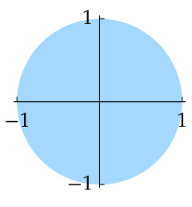
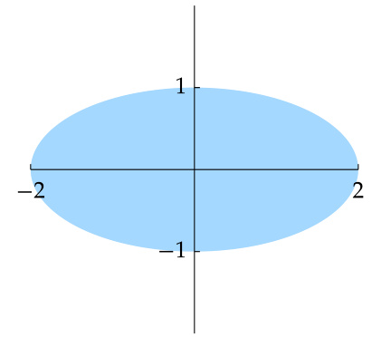
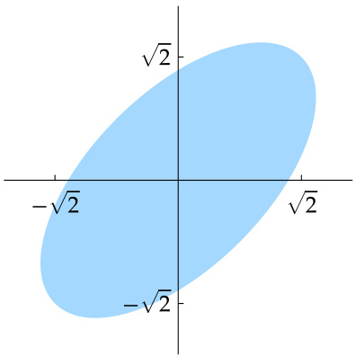
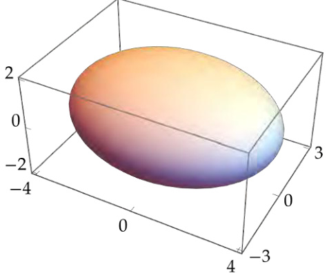
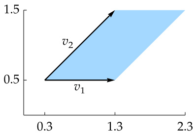
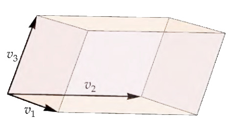
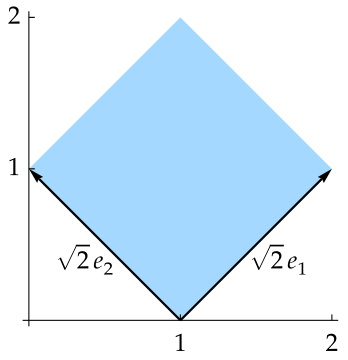
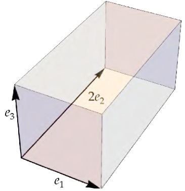
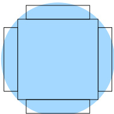
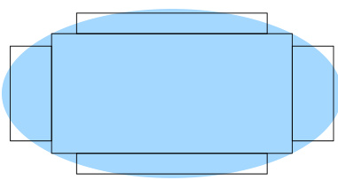

# Ch07 Operators on Inner Product Spaces  

The deepest results related to inner product spaces deal with the subject to which we now turn—linear maps and operators on inner product spaces. As we will see, good theorems can be proved by exploiting properties of the adjoint.  

The hugely important spectral theorem will provide a complete description of self-adjoint operators on real inner product spaces and of normal operators on complex inner product spaces. We will then use the spectral theorem to help understand positive operators and unitary operators, which will lead to unitary matrices and matrix factorizations. The spectral theorem will also lead to the popular singular value decomposition, which will lead to the polar decomposition.  

The most important results in the rest of this book are valid only in finite dimensions. Thus from now on we assume that $V$ and $W$ are finite-dimensional.  

standing assumptions for this chapter  

+ 𝐅 denotes 𝐑 or 𝐂.   
+ 𝑉 and 𝑊 are nonzero finite-dimensional inner product spaces over 𝐅.  

## Adjoints  

>7.1 definition: adjoint, $T^{*}$  
>
>Suppose $T\in{\mathcal{L}}(V,W)$ . The adjoint of $T$ is the function $T^{*}\colon W\to V$ such that  
>
>$$
>\langle T v,w\rangle=\langle v,T^{*}w\rangle
>$$  
>
>for every $v\in V$ and every $w\in W.$  

To see why the definition above makes sense, suppose $T\in{\mathcal{L}}(V,W)$ . Fix $w\in W.$ Consider the linear functional  

$$
v\mapsto\langle T v,w\rangle
$$  

The word adjoint has another meaning in linear algebra. In case you encounter the second meaning elsewhere, be warned that the two meanings for adjoint are unrelated to each other.  

on $V$ that maps $v\,\in\,V$ to $\langle T v,w\rangle$ ; this linear functional depends on $T$ and $w$ . By the Riesz representation theorem (6.42), there exists a unique vector in $V$ such that this linear functional is given by taking the inner product with it. We call this unique vector $T^{*}w$ . In other words, $T^{*}w$ is the unique vector in $V$ such that  

$$
\langle T v,w\rangle=\langle v,T^{*}w\rangle
$$  

for every $v\in V.$  

In the equation above, the inner product on the left takes place in $W$ and the inner product on the right takes place in $V$ . However, we use the same notation $\langle\cdot,\cdot\rangle$ for both inner products.  

7.2 example: adjoint of a linear map from $\mathbf{R}^{3}$ to $\mathbf{R}^{2}$  

Define $T\colon\mathbf{R}^{3}\rightarrow\mathbf{R}^{2}$ by  

$$
T(x_{1},x_{2},x_{3})=(x_{2}+3x_{3},2x_{1}).
$$  

To compute $T^{*}$ , suppose $(x_{1},x_{2},x_{3})\in\mathbf{R}^{3}$ and $(y_{1},y_{2})\in\mathbb{R}^{2}.$ . Then  

$$
\begin{array}{r l}&{\left\langle T(x_{1},x_{2},x_{3}),(y_{1},y_{2})\right\rangle=\left\langle(x_{2}+3x_{3},2x_{1}),(y_{1},y_{2})\right\rangle}\\ &{\qquad\qquad\qquad\quad=x_{2}y_{1}+3x_{3}y_{1}+2x_{1}y_{2}}\\ &{\qquad\qquad\quad=\left\langle(x_{1},x_{2},x_{3}),(2y_{2},y_{1},3y_{1})\right\rangle\!.}\end{array}
$$  

The equation above and the definition of the adjoint imply that  

$$
T^{*}(y_{1},y_{2})=(2y_{2},y_{1},3y_{1}).
$$  

7.3 example: adjoint of $a$ linear map with range of dimension at most 1  

Fix $u\in V$ and $x\in W.$ . Define $T\in{\mathcal{L}}(V,W)$ by  

$$
T v=\langle v,u\rangle x
$$  

for each $v\in V.$ To compute $T^{*}$ , suppose $v\in V$ and $w\in W.$ . Then  

$$
\begin{array}{r l}&{\langle T v,w\rangle=\big\langle\langle v,u\rangle x,w\big\rangle}\\ &{\quad\quad\quad=\langle v,u\rangle\langle x,w\rangle}\\ &{\quad\quad\quad=\big\langle v,\langle w,x\rangle u\big\rangle.}\end{array}
$$  

Thus  

$$
T^{*}w=\langle w,x\rangle u.
$$  

In the two examples above, $T^{*}$ turned out to be not just a function from $V$ to 𝑊but a linear map from $V$ to $W.$ This behavior is true in general, as shown by the next result.  

The two examples above and the proof below use a common technique for computing $T^{*}$ : start with a formula for $\langle T v,w\rangle$ then manipulate it to get just 𝑣in the first slot; the entry in the second slot will then be $T^{*}w$ .  

7.4 adjoint of a linear map is a linear map  

If $T\in{\mathcal{L}}(V,W)$ , then $T^{*}\in\mathcal{L}(W,V)$ .  

Proof Suppose $T\in{\mathcal{L}}(V,W)$ . If $v\in V$ and $w_{1},w_{2}\in W_{2}$ , then  

$$
\begin{array}{r l}&{\langle T v,w_{1}+w_{2}\rangle=\langle T v,w_{1}\rangle+\langle T v,w_{2}\rangle}\\ &{\qquad\qquad\quad=\langle v,T^{*}w_{1}\rangle+\langle v,T^{*}w_{2}\rangle}\\ &{\qquad\qquad\quad=\langle v,T^{*}w_{1}+T^{*}w_{2}\rangle.}\end{array}
$$  

The equation above shows that  

$$
T^{*}(w_{1}+w_{2})=T^{*}w_{1}+T^{*}w_{2}.
$$  

If $v\in V,\lambda\in\mathbf{F}$ , and $w\in W$ , then  

$$
\begin{array}{r l}&{\langle T v,\lambda w\rangle=\overline{{\lambda}}\langle T v,w\rangle}\\ &{\qquad\qquad=\overline{{\lambda}}\langle v,T^{*}w\rangle}\\ &{\qquad\qquad=\langle v,\lambda T^{*}w\rangle.}\end{array}
$$  

The equation above shows that  

$$
T^{*}(\lambda w)=\lambda T^{*}w.
$$  

Thus $T^{*}$ is a linear map, as desired.  

Suppose $T\in{\mathcal{L}}(V,W)$ . Then  

(a) $(S+T)^{*}=S^{*}+T^{*}$ for all $S\in{\mathcal{L}}(V,W)$ ;  

(b) $(\lambda T)^{*}=\overline{{{\lambda}}}T^{*}$ for all $\lambda\in\mathbf{F}$ ;  

(c) $\left(T^{*}\right)^{*}=T$ ;  

(d) $(S T)^{*}=T^{*}S^{*}$ for all $S\in{\mathcal{L}}(W,U)$ (here $U$ is a finite-dimensional inner product space over $\mathbf{F}$ );  

(e) $I^{*}=I$ , where $I$ is the identity operator on $V$ ;  

(f) if $T$ is invertible, then $T^{*}$ is invertible and $\left(T^{*}\right)^{-1}=\left(T^{-1}\right)^{*}$ .  

Proof Suppose $v\in V$ and $w\in W.$ . (a) If $S\in{\mathcal{L}}(V,W)$ , then  

$$
\begin{array}{r l}&{\left\langle(S+T)v,w\right\rangle=\langle S v,w\rangle+\langle T v,w\rangle}\\ &{\qquad\qquad=\left\langle v,S^{*}w\right\rangle+\left\langle v,T^{*}w\right\rangle}\\ &{\qquad\qquad=\left\langle v,S^{*}w+T^{*}w\right\rangle\!.}\end{array}
$$  

Thus $(S+T)^{*}w=S^{*}w+T^{*}w.$ , as desired.  

(b) If $\lambda\in\mathbf{F}$ , then  

$$
\big\langle(\lambda T)v,w\big\rangle=\lambda\langle T v,w\rangle=\lambda\big\langle v,T^{*}w\big\rangle=\big\langle v,\overline{{\lambda}}T^{*}w\big\rangle.
$$  

Thus $(\lambda T)^{*}w=\overline{{{\lambda}}}T^{*}w$ , as desired.  

(c) We have  

$$
\overline{{\langle T^{*}w,v\rangle}}=\overline{{\langle v,T^{*}w\rangle}}=\overline{{\langle T v,w\rangle}}=\langle w,T v\rangle.
$$  

Thus $\left(T^{*}\right)^{*}v=T v$ , as desired.  

(d) Suppose $S\in{\mathcal{L}}(W,U)$ and $u\in U$ . Then  

$$
\langle(S T)v,u\rangle=\langle S(T v),u\rangle=\langle T v,S^{*}u\rangle=\langle v,T^{*}(S^{*}u)\rangle.
$$  

Thus $(S T)^{*}u=T^{*}(S^{*}u)$ , as desired.  

(e) Suppose $u\in V.$ Then  

$$
\langle I u,v\rangle=\langle u,v\rangle.
$$  

Thus $I^{*}v=v$ , as desired.  

(f) Suppose $T$ is invertible. Take adjoints of both sides of the equation $T^{-1}T=I.$ , then use (d) and (e) to show that $T^{*}(T^{-1})^{*}\,=\,I.$ Similarly, the equation $T T^{-1}\ =\ I$ implies $\bigl(T^{-1}\bigr)^{*}T^{*}\;=\;I.$ Thus $\left(T^{-1}\right)^{*}$ is the inverse of $T^{*}$ , as desired.  

If $\mathbf{F}=\mathbf{R}$ , then the map $T\mapsto T^{*}$ is a linear map from $\mathcal{L}(V,W)$ to $\mathcal{L}(W,V)$ , as follows from (a) and (b) of the result above. However, if $\mathbf{F}=\mathbf{C}$ , then this map is not linear because of the complex conjugate that appears in (b).  

The next result shows the relationship between the null space and the range of a linear map and its adjoint.  

7.6 null space and range of $T^{*}$  

Suppose $T\in{\mathcal{L}}(V,W)$ . Then (a) null $T^{*}=(\mathrm{range}\,T)^{\perp}$ ;   
(b) range $T^{*}=(\mathrm{null}\,T)^{\perp}$ ;   
(c) null $T=(\mathrm{range}\,T^{*})^{\perp}$ ;   
(d) range $T=(\mathrm{null}\,T^{*})^{\perp}$ .  

Proof We begin by proving (a). Let $w\in W.$ . Then  

$$
{\begin{array}{r l}&{w\in{\mathrm{null}}\,T^{*}\iff T^{*}w=0}\\ &{\iff\left\langle v,T^{*}w\right\rangle=0\;{\mathrm{for~all}}\;v\in V}\\ &{\iff\left\langle T v,w\right\rangle=0\;{\mathrm{for~all}}\;v\in V}\\ &{\iff w\in({\mathrm{range}}\,T)^{\perp}.}\end{array}}
$$  

Thus null $T^{*}=(\mathrm{range}\,T)^{\perp}$ , proving (a).  

If we take the orthogonal complement of both sides of (a), we get (d), where we have used 6.52. Replacing $T$ with $T^{*}$ in (a) gives (c), where we have used 7.5(c). Finally, replacing $T$ with $T^{*}$ in (d) gives (b).  

As we will soon see, the next definition is intimately connected to the matrix of the adjoint of a linear map.  

7.7 definition: conjugate transpose, $A^{*}$  

The conjugate transpose of an $m$ -by- $_n$ matrix $A$ is the $n$ -by- $^{\cdot m}$ matrix $A^{*}$ obtained by interchanging the rows and columns and then taking the complex conjugate of each entry. In other words, if $j\in\{1,...,n\}$ and $k\in\{1,...,m\}$ , then  

$$
(A^{*})_{j,k}={\overline{{A_{k,j}}}}.
$$  

7.8 example: conjugate transpose of a 2-by-3 matrix  

The conjugate transpose of the 2-by-3 matrix $\left(\begin{array}{c c c}{{2}}&{{3+4i}}&{{7}}\\ {{6}}&{{5}}&{{8i}}\end{array}\right)$ is the 3-by-2 matrix  

$$
{\left(\begin{array}{l l}{\;~~2}&{\;~6}\\ {3-4i}&{\;~~5}\\ {\;~~7}&{-8i}\end{array}\right)}.
$$  

If a matrix $A$ has only real entries, then $A^{*}\ =\ A^{\mathfrak{t}}$ , where $A^{\mathfrak{t}}$ denotes the transpose of $A$ (the matrix obtained by interchanging the rows and the columns).  

The next result shows how to compute the matrix of $T^{*}$ from the matrix of $T.$ . Caution: With respect to nonorthonormal bases, the matrix of $T^{*}$ does not necessarily equal the conjugate transpose of the matrix of $T$ .  

The adjoint of a linear map does not depend on a choice of basis. Thus we frequently emphasize adjoints of linear maps instead of transposes or conjugate transposes of matrices.  

## 7.9 matrix of $T^{*}$ equals conjugate transpose of matrix of 𝑇  

Let $T\ \in\ {\mathcal{L}}(V,W)\,$ . Suppose $e_{1},...,e_{n}$ is an orthonormal basis of $V$ and $f_{1},...,f_{m}$ is an orthonormal basis of $W_{\cdot}$ . Then $\mathcal{M}(T^{*},(f_{1},...,f_{m})$ , $(e_{1},...,e_{n}))$ is the conjugate transpose of $\mathcal{M}(T,(e_{1},...,e_{n})$ , $(f_{1},...,f_{m}))$ . In other words,  

$$
\mathcal{M}\big(T^{\ast}\big)=\big(\mathcal{M}(T)\big)^{\ast}\!.
$$  

Proof In this proof, we will write ${\mathcal{M}}(T)$ and $\mathcal{M}(T^{*})$ instead of the longer expressions $\mathcal{M}(T,(e_{1},...,e_{n})$ , $(f_{1},...,f_{m}))$ and $\mathcal{M}(T^{*},(f_{1},...,f_{m})$ , $(e_{1},...,e_{n}))$ .  

Recall that we obtain the $k^{\mathrm{th}}$ column of ${\mathcal{M}}(T)$ by writing $T e_{k}$ as a linear combination of the $f_{j}$ ’s; the scalars used in this linear combination then become the $k^{\mathrm{th}}$ column of ${\mathcal{M}}(T)$ . Because $f_{1},...,f_{m}$ is an orthonormal basis of $W_{s}$ , we know how to write $T e_{k}$ as a linear combination of the $f_{j}$ ’s [see 6.30(a)]:  

$$
T e_{k}=\langle T e_{k},f_{1}\rangle f_{1}+\cdots+\langle T e_{k},f_{m}\rangle f_{m}.
$$  

Thus  

In the statement above, replace $T$ with $T^{*}$ and interchange $e_{1},...,e_{n}$ and $f_{1},...,f_{m}$ . This shows that the entry in row $j_{\cdot}$ , column $k$ , of $\mathcal{M}(T^{*})$ is $\langle T^{*}f_{k},e_{j}\rangle$ , which equals $\langle f_{k},T e_{j}\rangle$ , which equals $\overline{{\langle T e_{j},f_{k}\rangle}}$ , which equals the complex conjugate of the entry in row $k_{\cdot}$ , column $j$ , of ${\mathcal{M}}(T)$ . Thus $\mathcal{M}\big(T^{*}\big)=\big(\mathcal{M}(T)\big)^{*}$ .  

The Riesz representation theorem as stated in 6.58 provides an identification of $V$ with its dual space $V^{\prime}$ defined in 3.110. Under this identification, the orthogonal complement $U^{\perp}$ of a subset $U\subseteq V$ corresponds to the annihilator $U^{0}$ of $U$ . If $U$ is a subspace of $V,$ then the formulas for the dimensions of $U^{\perp}$ and $U^{0}$ become identical under this identification—see 3.125 and 6.51.  

Suppose $T\colon V\rightarrow W$ is a linear map. Under the identification of $V$ with $V^{\prime}$ and the identification of $W$ with $W_{\,:}^{\prime}$ , the adjoint map $T^{*}\colon W\ \to\ V$ corresponds to the dual map $T^{\prime}\colon W^{\prime}\ \to\ V^{\prime}$ defined in 3.118, as Exercise 32 asks you to verify. Under this identification, the formulas for  

Because orthogonal complements and adjoints are easier to deal with than annihilators and dual maps, there is no need to work with annihilators and dual maps in the context of inner product spaces.  

null $T^{*}$ and range $T^{*}$ [7.6(a) and (b)] then become identical to the formulas for null $T^{\prime}$ and range $T^{\prime}$ [3.128(a) and 3.130(b)]. Furthermore, the theorem about the matrix of $T^{*}$ (7.9) is analogous to the theorem about the matrix of $T^{\prime}$ (3.132).  

Now we switch our attention to operators on inner product spaces. Instead of considering linear maps from $V$ to $W,$ , we will focus on linear maps from $V$ to $V$ ; recall that such linear maps are called operators.  

## 7.10 definition: self-adjoint  

An operator $T\in{\mathcal{L}}(V)$ is called self-adjoint if $T=T^{*}$ .  

If $T\in{\mathcal{L}}(V)$ and $e_{1},...,e_{n}$ is an orthonormal basis of $V,$ , then $T$ is self-adjoint if and only if $\mathcal{M}(T,(e_{1},...,e_{n}))=\mathcal{M}(T,(e_{1},...,e_{n}))^{*}$ , as follows from 7.9.  

7.11 example: determining whether $T$ is self-adjoint from its matrix  

Suppose $c\in\mathbf{F}$ and $T$ is the operator on $\mathbf{F}^{2}$ whose matrix (with respect to the standard basis) is  

$$
\mathcal{M}(T)={\left(\begin{array}{l l}{2}&{c}\\ {3}&{7}\end{array}\right)}.
$$  

The matrix of $T^{*}$ (with respect to the standard basis) is  

$$
\mathcal{M}(T^{*})=\left(\begin{array}{l l}{2}&{3}\\ {\overline{{c}}}&{7}\end{array}\right)\!.
$$  

Thus $\mathcal{M}(T)=\mathcal{M}(T^{*})$ if and only if $c=3$ . Hence the operator $T$ is self-adjoint if and only if $c=3$ .  

A good analogy to keep in mind is that the adjoint on ${\mathcal{L}}(V)$ plays a role similar to that of the complex conjugate on 𝐂. A complex number $z$ is real if and only if $z={\overline{{z}}}$ ; thus a self-adjoint operator $\left\langle T=T^{*}\right\rangle$ ) is analogous to a real number.  

We will see that the analogy discussed above is reflected in some important properties of self-adjoint operators, beginning with eigenvalues in the next result.  

If $\textbf{F}=\textbf{R}$ , then by definition every eigenvalue is real, so the next result is interesting only when $\mathbf{F}=\mathbf{C}$ .  

An operator $T\in{\mathcal{L}}(V)$ is self-adjoint if and only if  

$$
\langle T v,w\rangle=\langle v,T w\rangle
$$  

7.12 eigenvalues of self-adjoint operators  

Every eigenvalue of a self-adjoint operator is real.  

Proof Suppose $T$ is a self-adjoint operator on $V.$ Let $\lambda$ be an eigenvalue of $T$ , and let $v$ be a nonzero vector in $V$ such that $T v=\lambda v.$ . Then  

$$
\lambda\|v\|^{2}=\langle\lambda v,v\rangle=\langle T v,v\rangle=\langle v,T v\rangle=\langle v,\lambda v\rangle={\overline{{\lambda}}}\|v\|^{2}.
$$  

Thus $\lambda=\overline{{\lambda}}$ , which means that $\lambda$ is real, as desired.  

The next result is false for real inner product spaces. As an example, consider the operator $T\in{\mathcal{L}}(\mathbb{R}^{2})$ that is a counterclockwise rotation of $90^{\circ}$ around the origin; thus $T(x,y)=(-y,x)$ . Notice that $T v$ is orthogonal to $v$ for every $\boldsymbol{v}\in\mathbb{R}^{2},$ , even though $T\neq0$ .  

7.13 𝑇𝑣is orthogonal to 𝑣for all $v\iff T=0$ (assuming $\mathbf{F}=\mathbf{C}_{}\,$ )  

Suppose $V$ is a complex inner product space and $T\in{\mathcal{L}}(V)$ . Then $\langle T v,v\rangle=0$ for every $v\in V\iff T=0.$  

Proof If $u,w\in V,$ then  

$$
\begin{array}{r}{\langle T u,w\rangle=\frac{\displaystyle\left\langle T(u+w),u+w\right\rangle-\left\langle T(u-w),u-w\right\rangle}{4}\qquad}\\ {+\:\frac{\displaystyle\left\langle T(u+i w),u+i w\right\rangle-\left\langle T(u-i w),u-i w\right\rangle}{4}\:i,}\end{array}
$$  

as can be verified by computing the right side. Note that each term on the right side is of the form $\langle T v,v\rangle$ for appropriate $v\in V.$ .  

Now suppose $\langle T v,v\rangle=0$ for every $v\in V.$ . Then the equation above implies that $\langle T u,w\rangle=0$ for all $u,w\in V,$ , which then implies that $T u=0$ for every $u\in U$ (take $w=T u$ ). Hence $T=0$ , as desired.  

The next result is false for real inner product spaces, as shown by considering any operator on a real inner product space that is not self-adjoint.  

The next result provides another good example of how self-adjoint operators behave like real numbers.  

7.14 ⟨𝑇𝑣, 𝑣⟩is real for all $v\iff T$ is self-adjoint (assuming $\mathbf{F}=\mathbf{C}_{\mathbf{\theta}}$ )  

Suppose $V$ is a complex inner product space and $T\in{\mathcal{L}}(V)$ . Then  

$T$ is self-adjoint $\iff\langle T v,v\rangle\in\mathbb{R}$ for every $v\in V.$ .  

Proof If $v\in V,$ then  

7.15  

$$
\left\langle T^{*}v,v\right\rangle=\overline{{\left\langle v,T^{*}v\right\rangle}}=\overline{{\left\langle T v,v\right\rangle}}.
$$  

Now  

$$
\begin{array}{r l}&{\iff T-T^{*}=0}\\ &{\iff\left\langle(T-T^{*})v,v\right\rangle=0\;\mathrm{for}\;\mathrm{every}\;v\in V}\\ &{\iff\langle T v,v\rangle-\overline{{\langle T v,v\rangle}}=0\;\mathrm{for}\;\mathrm{every}\;v\in V}\\ &{\iff\langle T v,v\rangle\in\mathbb{R}\;\mathrm{for}\;\mathrm{every}\;v\in V,}\end{array}
$$  

where the second equivalence follows from 7.13 as applied to $T-T^{*}$ and the third equivalence follows from 7.15.  

On a real inner product space $V,$ a nonzero operator $T$ might satisfy $\langle T v,v\rangle=0$ for all $v\in V.$ However, the next result shows that this cannot happen for a selfadjoint operator.  

7.16 𝑇self-adjoint and $\langle T v,v\rangle=0$ for all $v\iff T=0$  

Suppose $T$ is a self-adjoint operator on $V.$ Then  

$$
\langle T v,v\rangle=0\;\mathrm{for}\;\mathrm{every}\;v\in V\iff T=0.
$$  

Proof We have already proved this (without the hypothesis that $T$ is self-adjoint) when $V$ is a complex inner product space (see 7.13). Thus we can assume that $V$ is a real inner product space. If $u,w\in V,$ then  

$$
\langle T u,w\rangle=\frac{\langle T(u+w),u+w\rangle-\langle T(u-w),u-w\rangle}{4},
$$  

as can be proved by computing the right side using the equation  

$$
\langle T w,u\rangle=\langle w,T u\rangle=\langle T u,w\rangle,
$$  

where the first equality holds because $T$ is self-adjoint and the second equality holds because we are working in a real inner product space.  

Now suppose $\langle T v,v\rangle=0$ for every $v\in V.$ . Because each term on the right side of 7.17 is of the form $\langle T v,v\rangle$ for appropriate $v$ , this implies that $\langle T u,w\rangle=0$ for all $u,w\in V.$ This implies that $T u=0$ for every $u\in V$ (take $w=T u$ ). Hence $T=0$ , as desired.  

## Normal Operators  

## 7.18 definition: normal  

An operator on an inner product space is called normal if it commutes with its adjoint.  

• In other words, $T\in{\mathcal{L}}(V)$ is normal if $T T^{*}=T^{*}T_{\mathrm{\scriptsize~*~}}$ .  

Every self-adjoint operator is normal, because if $T$ is self-adjoint then $T^{*}=T$ and hence $T$ commutes with $T^{*}$ .  

7.19 example: an operator that is normal but not self-adjoint  

Let $T$ be the operator on $\mathbf{F}^{2}$ whose matrix (with respect to the standard basis) is  

Thus $T(w,z)=(2w-3z,3w+2z)$ .  

$$
{\left(\begin{array}{l l}{2}&{-3}\\ {3}&{2}\end{array}\right)}.
$$  

This operator $T$ is not self-adjoint because the entry in row 2, column 1 (which equals 3) does not equal the complex conjugate of the entry in row 1, column 2 (which equals $-3$ ).  

The matrix of $T T^{*}$ equals  

$$
{\left(\begin{array}{l l}{2}&{-3}\\ {3}&{2}\end{array}\right)}{\left(\begin{array}{l l}{2}&{3}\\ {-3}&{2}\end{array}\right)},{\mathrm{~which~equals~}}{\left(\begin{array}{l l}{13}&{0}\\ {0}&{13}\end{array}\right)}.
$$  

Similarly, the matrix of $T^{*}T$ equals  

$$
\left(\begin{array}{c c}{{2}}&{{3}}\\ {{-3}}&{{2}}\end{array}\right)\left(\begin{array}{c c}{{2}}&{{-3}}\\ {{3}}&{{2}}\end{array}\right),\mathrm{~which~equals~}\left(\begin{array}{c c}{{13}}&{{0}}\\ {{0}}&{{13}}\end{array}\right).
$$  

Because $T T^{*}$ and $T^{*}T$ have the same matrix, we see that $T T^{*}=T^{*}T_{*}$ Thus $T$ is normal.  

In the next section we will see why normal operators are worthy of special attention. The next result provides a useful characterization of normal operators.  

<html><body><table><tr><td>7.20 T is normal if and only if To and T* have the samenorm</td></tr><tr><td>Suppose T E L(V). Then</td></tr><tr><td>T is normal 1 IIToll=IIT*ll f</td></tr></table></body></html>  

Proof We have  

$$
{\begin{array}{r l}&{1\iff T^{*}T-T T^{*}=0}\\ &{\iff\left<(T^{*}T-T T^{*})v,v\right>=0\ \mathrm{for\;every}\ v\in V}\\ &{\iff\left<T^{*}T v,v\right>=\left<T T^{*}v,v\right>\mathrm{for\;every}\ v\in V}\\ &{\iff\left<T v,T v\right>=\left<T^{*}v,T^{*}v\right>\ \mathrm{for\;every}\ v\in V}\\ &{\iff\|T v\|^{2}=\|T^{*}v\|^{2}\ \mathrm{for\;every}\ v\in V}\\ &{\iff\|T v\|=\|T^{*}v\|\ \mathrm{for\;every}\ v\in V,}\end{array}}
$$  

where we used 7.16 to establish the second equivalence (note that the operator $T^{*}T-T T^{*}$ is self-adjoint).  

The next result presents several consequences of the result above. Compare (e) of the next result to Exercise 3. That exercise states that the eigenvalues of the adjoint of each operator are equal (as a set) to the complex conjugates of the eigenvalues of the operator. The exercise says nothing about eigenvectors, because an operator and its adjoint may have different eigenvectors. However, (e) of the next result implies that a normal operator and its adjoint have the same eigenvectors.  

Suppose $T\in{\mathcal{L}}(V)$ is normal. Then (a) null $T=\mathrm{null}\,T^{*}$ ;  

(b) range $T=$ range $T^{*}$ ;   
(c) $V=\mathrm{null}\,T\oplus$ range $T$ ;   
(d) $T-\lambda I$ is normal for every $\lambda\in\mathbf{F}$ ;  

(e) if $v\in V$ and $\lambda\in\mathbf{F}$ , then $T v=\lambda v$ if and only if $T^{*}v={\overline{{\lambda}}}v$ .  

## Proof  

(a) Suppose $v\in V.$ Then  

$$
v\in\mathrm{null}\,T\iff\|T v\|=0\iff\|T^{*}v\|=0\iff v\in\mathrm{null}\,T^{*},
$$  

where the middle equivalence above follows from 7.20. Thus null $T=\mathrm{null}\,T^{*}$ . (b) We have  

$$
\mathrm{range}\,T=\bigl(\mathrm{\mathbf{null}}\,T^{*}\bigr)^{\perp}=(\mathrm{\mathbf{null}}\,T)^{\perp}=\mathrm{range}\,T^{*},
$$  

where the first equality comes from 7.6(d), the second equality comes from (a) in this result, and the third equality comes from 7.6(b).  

(c) We have  

$$
V=({\mathrm{null}}\,T)\oplus({\mathrm{null}}\,T)^{\perp}={\mathrm{null}}\,T\oplus{\mathrm{range}}\,T^{*}={\mathrm{null}}\,T\oplus{\mathrm{range}}\,T,
$$  

where the first equality comes from 6.49, the second equality comes from 7.6(b), and the third equality comes from (b) in this result.  

(d) Suppose $\lambda\in\mathbf{F}$ . Then  

$$
\begin{array}{r l}&{(T-\lambda I)(T-\lambda I)^{*}=(T-\lambda I)\bigl(T^{*}-\bar{\lambda}I\bigr)}\\ &{\qquad\qquad\qquad\qquad=T T^{*}-\overline{{\lambda}}T-\lambda T^{*}+|\lambda|^{2}I}\\ &{\qquad\qquad\quad=T^{*}T-\overline{{\lambda}}T-\lambda T^{*}+|\lambda|^{2}I}\\ &{\qquad\qquad\quad=(T^{*}-\overline{{\lambda}}I)(T-\lambda I)}\\ &{\qquad\qquad\quad=(T-\lambda I)^{*}(T-\lambda I).}\end{array}
$$  

Thus $T-\lambda I$ commutes with its adjoint. Hence $T-\lambda I$ is normal.  

(e) Suppose $v\in V$ and $\lambda\in\mathbf{F}$ . Then (d) and 7.20 imply that  

$$
\lVert(T-\lambda I)v\rVert=\lVert(T-\lambda I)^{*}v\rVert=\lVert\bigl(T^{*}-\overline{{\lambda}}I\bigr)v\rVert.
$$  

Thus $\|(T-\lambda I)v\|=0$ if and only if $\|(T^{*}-{\overline{{\lambda}}}I)v\|=0$ . Hence $T v=\lambda v$ if and only if $T^{*}v={\overline{{\lambda}}}v$ .  

Because every self-adjoint operator is normal, the next result applies in particular to self-adjoint operators.  

7.22 orthogonal eigenvectors for normal operators  

Suppose $T\,\in\,{\mathcal{L}}(V)$ is normal. Then eigenvectors of $T$ corresponding to distinct eigenvalues are orthogonal.  

Proof Suppose $\alpha,\beta$ are distinct eigenvalues of $T$ , with corresponding eigenvectors $u,v$ . Thus $T u\,=\,\alpha u$ and $T v\,=\,\beta v$ . From 7.21(e) we have $T^{*}v\,=\,{\overline{{\beta}}}v$ . Thus  

$$
\begin{array}{r l}&{(\alpha-\beta)\langle u,v\rangle=\langle\alpha u,v\rangle-\langle u,\overline{{\beta}}v\rangle}\\ &{\qquad\qquad\qquad=\langle T u,v\rangle-\langle u,T^{*}v\rangle}\\ &{\qquad\qquad\quad=0.}\end{array}
$$  

Because $\alpha\neq\beta$ , the equation above implies that $\langle u,v\rangle\,=\,0$ . Thus $u$ and $v$ are orthogonal, as desired.  

As stated here, the next result makes sense only when $\mathbf{F}=\mathbf{C}$ . However, see Exercise 12 for a version that makes sense when $\mathbf{F}=\mathbf{C}$ and when $\mathbf{F}=\mathbf{R}$ .  

Suppose $\mathbf{F}=\mathbf{C}$ and $T\in{\mathcal{L}}(V)$ . Under the analogy between ${\mathcal{L}}(V)$ and 𝐂, with the adjoint on ${\mathcal{L}}(V)$ playing a similar role to that of the complex conjugate on $\mathbf{C}$ , the operators $A$ and $B$ as defined by 7.24 correspond to the real and imaginary parts of $T.$ . Thus the informal title of the result below should make sense.  

7.23 𝑇is normal $\Longleftrightarrow$ the real and imaginary parts of 𝑇commute  

Suppose $\mathbf{F}=\mathbf{C}$ and $T\in{\mathcal{L}}(V)$ . Then $T$ is normal if and only if there exist commuting self-adjoint operators $A$ and $B$ such that $T=A+i B$ .  

Proof First suppose $T$ is normal. Let  

$$
A={\frac{T+T^{*}}{2}}\quad{\mathrm{and}}\quad B={\frac{T-T^{*}}{2i}}.
$$  

Then $A$ and $B$ are self-adjoint and $T=A+i B$ . A quick computation shows that  

$$
A B-B A=\frac{T^{*}T-T T^{*}}{2i}.
$$  

Because $T$ is normal, the right side of the equation above equals 0. Thus the operators $A$ and $B$ commute, as desired.  

To prove the implication in the other direction, now suppose there exist commuting self-adjoint operators $A$ and $B$ such that $T=A+i B$ . Then $T^{*}=A-i B$ . Adding the last two equations and then dividing by 2 produces the equation for $A$ in 7.24. Subtracting the last two equations and then dividing by $2i$ produces the equation for 𝐵in 7.24. Now 7.24 implies 7.25. Because $B$ and $A$ commute, 7.25 implies that $T$ is normal, as desired.  

1 Suppose $n$ is a positive integer. Define $T\in{\mathcal{L}}(\mathbf{F}^{n})$ by  

$$
T(z_{1},...,z_{n})=(0,z_{1},...,z_{n-1}).
$$  

Find a formula for $T^{*}(z_{1},...,z_{n})$ .  

2 Suppose $T\in{\mathcal{L}}(V,W)$ . Prove that  

$$
T=0\iff T^{*}=0\iff T^{*}T=0\iff T T^{*}=0.
$$  

3 Suppose $T\in{\mathcal{L}}(V)$ and $\lambda\in\mathbf{F}$ . Prove that  

$\lambda$ is an eigenvalue of $T\iff\overline{{\lambda}}$ is an eigenvalue of $T^{*}$  

4 Suppose $T\in{\mathcal{L}}(V)$ and $U$ is a subspace of $V.$ Prove that  

$U$ is invariant under $T\iff U^{\perp}$ is invariant under $T^{*}$ .  

5 Suppose $T\in{\mathcal{L}}(V,W)$ . Suppose $e_{1},...,e_{n}$ is an orthonormal basis of $V$ and $f_{1},...,f_{m}$ is an orthonormal basis of $W.$ . Prove that  

$$
\|T e_{1}\|^{2}+\cdots+\|T e_{n}\|^{2}=\|T^{*}f_{1}\|^{2}+\cdots+\|T^{*}f_{m}\|^{2}.
$$  

The numbers $\|T e_{1}\|^{2},...,\|T e_{n}\|^{2}$ in the equation above depend on the orthonormal basis $e_{1},...,e_{n}$ , but the right side of the equation does not depend on $e_{1},...,e_{n}$ . Thus the equation above shows that the sum on the left side does not depend on which orthonormal basis $e_{1},...,e_{n}$ is used.  

6 Suppose $T\in{\mathcal{L}}(V,W)$ . Prove that (a) $T$ is injective $\iff T^{*}$ is surjective; (b) $T$ is surjective $\iff T^{*}$ is injective.  

7 Prove that if $T\in{\mathcal{L}}(V,W)$ , then (a) dim null $T^{*}=\dim$ null $T+\dim W-\dim V;$ ; (b) dim range $T^{*}=$ dim range $T$ .  

8 Suppose $A$ is an $m$ -by- $_n$ matrix with entries in 𝐅. Use (b) in Exercise 7 to prove that the row rank of $A$ equals the column rank of $A$ .  

This exercise asks for yet another alternative proof of a result that was previously proved in 3.57 and 3.133.  

9 Prove that the product of two self-adjoint operators on $V$ is self-adjoint if and only if the two operators commute.  

10 Suppose $\mathbf{F}=\mathbf{C}$ and $T\in{\mathcal{L}}(V)$ . Prove that $T$ is self-adjoint if and only if  

$$
\langle T v,v\rangle=\langle T^{*}v,v\rangle
$$  

11 Define an operator $S\colon\mathbf{F}^{2}\rightarrow\mathbf{F}^{2}$ by $S(w,z)=(-z,w)$ .  

(a) Find a formula for $S^{\ast}$ .   
(b) Show that $S$ is normal but not self-adjoint.   
(c) Find all eigenvalues of $S$ .  

If $\mathbf{F}=\mathbf{R}$ , then $S$ is the operator on $\mathbf{R}^{2}$ of counterclockwise rotation by $90^{\circ}$ .  

12 An operator $B\in{\mathcal{L}}(V)$ is called skew if  

$$
B^{*}=-B.
$$  

Suppose that $T\in{\mathcal{L}}(V)$ . Prove that $T$ is normal if and only if there exist commuting operators $A$ and $B$ such that $A$ is self-adjoint, $B$ is a skew operator, and $T=A+B$ .  

13 Suppose $\mathbf{F}=\mathbf{R}$ . Define $\mathcal{A}\in\mathcal{L}\big(\mathcal{L}(V)\big)$ by $\mathcal{A}T=T^{*}$ for all $T\in{\mathcal{L}}(V)$ .  

(a) Find all eigenvalues of $\mathcal{A}$ .   
(b) Find the minimal polynomial of $\mathcal{A}$ .  

14 Define an inner product on ${\mathcal{P}}_{2}(\mathbf{R})$ by $\langle p,q\rangle\,=\,\int_{0}^{1}p q$ . Define an operator $T\in{\mathcal{L}}({\mathcal{P}}_{2}(\mathbf{R}))$ by  

$$
T(a x^{2}+b x+c)=b x.
$$  

(a) Show that with this inner product, the operator $T$ is not self-adjoint. (b) The matrix of $T$ with respect to the basis $1,x,x^{2}$ is  

$$
{\left(\begin{array}{l l l}{0}&{0}&{0}\\ {0}&{1}&{0}\\ {0}&{0}&{0}\end{array}\right)}.
$$  

This matrix equals its conjugate transpose, even though $T$ is not selfadjoint. Explain why this is not a contradiction.  

15 Suppose $T\in{\mathcal{L}}(V)$ is invertible. Prove that (a) $T$ is self-adjoint $\Longleftrightarrow\ T^{-1}$ is self-adjoint; (b) $T$ is normal $\leftrightarrow\ T^{-1}$ is normal.  

## 16 Suppose $\mathbf{F}=\mathbf{R}$ .  

(a) Show that the set of self-adjoint operators on $V$ is a subspace of ${\mathcal{L}}(V)$ . (b) What is the dimension of the subspace of ${\mathcal{L}}(V)$ in (a) [in terms of $\dim V]^{\prime}$ ?  

17 Suppose $\mathbf{F}=\mathbf{C}$ . Show that the set of self-adjoint operators on $V$ is not a subspace of ${\mathcal{L}}(V)$ .  

18 Suppose dim $V\geq2$ . Show that the set of normal operators on $V$ is not a subspace of ${\mathcal{L}}(V)$ .  

19 Suppose $T\,\in\,{\mathcal{L}}(V)$ and $\|T^{*}v\|\leq\|T v\|$ for every $v\,\in\,V.$ . Prove that $T$ is normal.  

This exercise fails on infinite-dimensional inner product spaces, leading to what are called hyponormal operators, which have a well-developed theory.  

20 Suppose $P\,\in\,{\mathcal{L}}(V)$ is such that $P^{2}\ =\ P_{\!\!\!\!\!\!\!\!\!\!\!\!\!\!\!\!\!\!\!\!\!\!\!\!\!\!\!\!\!\!\!\!\!\!\!\!\!\!\!\!\!\!\!\!\!\!\!\!\!\!\!\!\!\!\!\!\!\!\!\!\!\!\!\!\!\!\!P}$ . Prove that the following are equivalent.  

(a) $P$ is self-adjoint.   
(b) $P$ is normal.   
(c) There is a subspace $U$ of $V$ such that $P=P_{U}$ .  

21 Suppose $D\colon{\mathcal{P}}_{8}(\mathbf{R})\ \to\ {\mathcal{P}}_{8}(\mathbf{R})$ is the differentiation operator defined by $D p\,=\,p^{\prime}$ . Prove that there does not exist an inner product on ${\mathcal{P}}_{8}(\mathbf{R})$ that makes $D$ a normal operator.  

22 Give an example of an operator $T\in{\mathcal{L}}(\mathbf{R}^{3})$ such that $T$ is normal but not self-adjoint.  

23 Suppose $T$ is a normal operator on $V.$ Suppose also that $v,w\in V$ satisfy the equations  

$$
\|v\|=\|w\|=2,\quad T v=3v,\quad T w=4w.
$$  

Show that $\|T(v+w)\|=10$ .  

24 Suppose $T\in{\mathcal{L}}(V)$ and  

$$
a_{0}+a_{1}z+a_{2}z^{2}+\cdots+a_{m-1}z^{m-1}+z^{m}
$$  

is the minimal polynomial of $T.$ Prove that the minimal polynomial of $T^{*}$ is  

$$
{\overline{{a_{0}}}}+{\overline{{a_{1}}}}\,z+{\overline{{a_{2}}}}\,z^{2}+\cdots+{\overline{{a_{m-1}}}}\,z^{m-1}+z^{m}\!.
$$  

This exercise shows that the minimal polynomial of $T^{*}$ equals the minimal polynomial of $T$ if $\mathbf{F}=\mathbf{R}$ .  

25 Suppose $T\,\in\,{\mathcal{L}}(V)$ . Prove that $T$ is diagonalizable if and only if $T^{*}$ is diagonalizable.  

26 Fix $u,x\in V.$ . Define $T\in{\mathcal{L}}(V)$ by $T v=\langle v,u\rangle x$ for every $v\in V.$  

(a) Prove that if $V$ is a real vector space, then $T$ is self-adjoint if and only if the list $u,x$ is linearly dependent. (b) Prove that $T$ is normal if and only if the list $u,x$ is linearly dependent.  

27 Suppose $T\in{\mathcal{L}}(V)$ is normal. Prove that  

$$
\mathrm{null}\,T^{k}=\mathrm{null}\,T\quad\mathrm{and}\quad\mathrm{range}\,T^{k}=\mathrm{range}\,T
$$  

for every positive integer $k$ .  

28 Suppose $T\,\in\,{\mathcal{L}}(V)$ is normal. Prove that if $\lambda\in\textbf{F}$ , then the minimal polynomial of $T$ is not a polynomial multiple of $(x-\lambda)^{2}$ .  

29 Prove or give a counterexample: If $T\in{\mathcal{L}}(V)$ and there is an orthonormal basis $e_{1},...,e_{n}$ of $V$ such that $\|T e_{k}\|=\|T^{*}e_{k}\|$ for each $k=1,...,n$ , then $T$ is normal.  

30 Suppose that $T\,\in\,{\mathcal{L}}(\mathbf{F}^{3})$ is normal and $T(1,1,1)\ =\ (2,2,2)$ . Suppose $(z_{1},z_{2},z_{3})\in\mathrm{null}\:T$ . Prove that $z_{1}+z_{2}+z_{3}=0$ .  

31 Fix a positive integer $n$ . In the inner product space of continuous real-valued functions on $\left[-\pi,\pi\right]$ with inner product $\langle f,g\rangle=\textstyle\int_{-\pi}^{\pi}f g$ , let  

$$
V=\operatorname{span}(1,\cos x,\cos2x,\ldots,\cos n x,\sin x,\sin2x,\ldots,\sin n x).
$$  

(a) Define $D\in{\mathcal{L}}(V)$ by $D f=f^{\prime}$ . Show that $D^{*}=-D$ . Conclude that $D$ is normal but not self-adjoint.  

(b) Define $T\in{\mathcal{L}}(V)$ by $T f=f^{\prime\prime}$ . Show that $T$ is self-adjoint.  

32 Suppose $T\colon V\rightarrow W$ is a linear map. Show that under the standard identification of $V$ with $V^{\prime}$ (see 6.58) and the corresponding identification of $W$ with $W^{\prime}$ , the adjoint map $T^{*}\colon W\to V$ corresponds to the dual map $T^{\prime}\colon W^{\prime}\to V^{\prime}$ . More precisely, show that  

$$
T^{\prime}(\varphi_{w})=\varphi_{T^{*}w}
$$  

for all $w\in W_{\mathrm{s}}$ , where $\varphi_{w}$ and $\varphi_{T^{*}w}$ are defined as in 6.58.  

Recall that a diagonal matrix is a square matrix that is 0 everywhere except possibly on the diagonal. Recall that an operator on $V$ is called diagonalizable if the operator has a diagonal matrix with respect to some basis of $V.$ Recall also that this happens if and only if there is a basis of $V$ consisting of eigenvectors of the operator (see 5.55).  

The nicest operators on $V$ are those for which there is an orthonormal basis of $V$ with respect to which the operator has a diagonal matrix. These are precisely the operators $T\in{\mathcal{L}}(V)$ such that there is an orthonormal basis of $V$ consisting of eigenvectors of $T.$ . Our goal in this section is to prove the spectral theorem, which characterizes these operators as the self-adjoint operators when $\mathbf{F}=\mathbf{R}$ and as the normal operators when $\mathbf{F}=\mathbf{C}$ .  

The spectral theorem is probably the most useful tool in the study of operators on inner product spaces. Its extension to certain infinite-dimensional inner product spaces (see, for example, Section 10D of the author’s book Measure, Integration & Real Analysis) plays a key role in functional analysis.  

Because the conclusion of the spectral theorem depends on 𝐅, we will break the spectral theorem into two pieces, called the real spectral theorem and the complex spectral theorem.  

## Real Spectral Theorem  

To prove the real spectral theorem, we will need two preliminary results. These preliminary results hold on both real and complex inner product spaces, but they are not needed for the proof of the complex spectral theorem.  

You could guess that the next result is true and even discover its proof by thinking about quadratic polynomials with real coefficients. Specifically, suppose $b,c\in\mathbb{R}$ and $b^{2}<4c$ . Let $x$ be a real number. Then  

This completing-the-square technique can be used to derive the quadratic formula.  

$$
x^{2}+b x+c=\left(x+{\frac{b}{2}}\right)^{2}+\left(c-{\frac{b^{2}}{4}}\right)>0.
$$  

In particular, $x^{2}+b x+c$ is an invertible real number (a convoluted way of saying that it is not 0). Replacing the real number $x$ with a self-adjoint operator (recall the analogy between real numbers and self-adjoint operators) leads to the next result.  

## 7.26 invertible quadratic expressions  

Suppose $T\in{\mathcal{L}}(V)$ is self-adjoint and $b,c\in\mathbb{R}$ are such that $b^{2}<4c$ . Then  

$$
T^{2}+b T+c I
$$  

is an invertible operator.  

Proof Let $v$ be a nonzero vector in $V.$ Then  

$$
\begin{array}{r l}&{\displaystyle\left\langle(T^{2}+b T+c I)v,v\right\rangle=\left\langle T^{2}v,v\right\rangle+b\langle T v,v\rangle+c\langle v,v\rangle}\\ &{\quad=\langle T v,T v\rangle+b\langle T v,v\rangle+c\|v\|^{2}}\\ &{\quad\ge\|T v\|^{2}-|b|\,\|T v\|\,\|v\|+c\|v\|^{2}}\\ &{\quad=\bigg(\|T v\|-\frac{\|b\|\,\|v\|}{2}\bigg)^{2}+\bigg(c-\frac{b^{2}}{4}\bigg)\|v\|^{2}}\\ &{\quad\quad\quad\quad\quad\quad\quad\quad\quad\quad\quad\quad\quad}\\ &{\quad\quad\ge0,}\end{array}
$$  

where the third line above holds by the Cauchy–Schwarz inequality (6.14). The last inequality implies that $(T^{2}+b T+c I)v\neq0.$ . Thus $T^{2}+b T+c I$ is injective, which implies that it is invertible (see 3.65).  

The next result will be a key tool in our proof of the real spectral theorem.  

7.27 minimal polynomial of self-adjoint operator  

Suppose $T\in{\mathcal{L}}(V)$ is self-adjoint. Then the minimal polynomial of $T$ equals $(z-\lambda_{1})\cdots(z-\lambda_{m})$ for some $\lambda_{1},...,\lambda_{m}\in\mathbb{R}$ .  

Proof First suppose $\mathbf{F}=\mathbf{C}$ . The zeros of the minimal polynomial of $T$ are the eigenvalues of $T\left[\mathrm{by}\;5.27(\mathrm{a})\right]$ . All eigenvalues of $T$ are real (by 7.12). Thus the second version of the fundamental theorem of algebra (see 6.69) tells us that the minimal polynomial of $T$ has the desired form.  

Now suppose $\mathbf{F}=\mathbf{R}$ . By the factorization of a polynomial over $\mathbf{R}$ (see 4.16) there exist $\lambda_{1},...,\lambda_{m}\in\mathbb{R}$ and $b_{1},...,b_{N},c_{1},...,c_{N}\in\mathbb{R}$ with $b_{k}^{2}<4c_{k}$ for each $k$ such that the minimal polynomial of $T$ equals  

$$
(z-\lambda_{1}){\cdots}(z-\lambda_{m})\bigl(z^{2}+b_{1}z+c_{1}){\cdots}(z^{2}+b_{N}z+c_{N});
$$  

here either $m$ or $N$ might equal 0, meaning that there are no terms of the corresponding form. Now  

$$
(T-\lambda_{1}I)\cdots(T-\lambda_{m}I)\bigl(T^{2}+b_{1}T+c_{1}I\bigr)\cdots\bigl(T^{2}+b_{N}T+c_{N}I\bigr)=0.
$$  

If $N>0$ , then we could multiply both sides of the equation above on the right by the inverse of $T^{2}+b_{N}T+c_{N}I$ (which is an invertible operator by 7.26) to obtain a polynomial expression of $T$ that equals 0. The corresponding polynomial would have degree two less than the degree of 7.28, violating the minimality of the degree of the polynomial with this property. Thus we must have $N=0$ , which means that the minimal polynomial in 7.28 has the form $(z-\lambda_{1})\cdots(z-\lambda_{m})$ , as desired.  

The result above along with 5.27(a) implies that every self-adjoint operator has an eigenvalue. In fact, as we will see in the next result, self-adjoint operators have enough eigenvectors to form a basis.  

The next result, which gives a complete description of the self-adjoint operators on a real inner product space, is one of the major theorems in linear algebra.  

## 7.29 real spectral theorem  

Suppose $\mathbf{F}=\mathbf{R}$ and $T\in{\mathcal{L}}(V)$ . Then the following are equivalent.   
(a) $T$ is self-adjoint.  

(b) $T$ has a diagonal matrix with respect to some orthonormal basis of $V.$  

(c) $V$ has an orthonormal basis consisting of eigenvectors of $T.$ .  

Proof First suppose (a) holds, so $T$ is self-adjoint. Our results on minimal polynomials, specifically 6.37 and 7.27, imply that $T$ has an upper-triangular matrix with respect to some orthonormal basis of $V.$ . With respect to this orthonormal basis, the matrix of $T^{*}$ is the transpose of the matrix of $T.$ . However, $T^{*}\,=\,T.$ . Thus the transpose of the matrix of $T$ equals the matrix of $T.$ Because the matrix of $T$ is upper-triangular, this means that all entries of the matrix above and below the diagonal are 0. Hence the matrix of $T$ is a diagonal matrix with respect to the orthonormal basis. Thus (a) implies (b).  

Conversely, now suppose (b) holds, so $T$ has a diagonal matrix with respect to some orthonormal basis of $V.$ . That diagonal matrix equals its transpose. Thus with respect to that basis, the matrix of $T^{*}$ equals the matrix of $T.$ . Hence $T^{*}=T$ , proving that (b) implies (a).  

The equivalence of (b) and (c) follows from the definitions [or see the proof that (a) and (b) are equivalent in 5.55].  

7.30 example: an orthonormal basis of eigenvectors for an operator  

Consider the operator $T$ on $\mathbf{R}^{3}$ whose matrix (with respect to the standard basis) is  

$$
{\left(\begin{array}{c c c}{14}&{-13}&{8}\\ {-13}&{14}&{8}\\ {8}&{8}&{-7}\end{array}\right)}.
$$  

This matrix with real entries equals its transpose; thus $T$ is self-adjoint. As you can verify,  

$$
\frac{(1,-1,0)}{\sqrt{2}},\frac{(1,1,1)}{\sqrt{3}},\frac{(1,1,-2)}{\sqrt{6}}
$$  

is an orthonormal basis of $\mathbf{R}^{3}$ consisting of eigenvectors of $T$ . With respect to this basis, the matrix of $T$ is the diagonal matrix  

$$
{\left(\begin{array}{c c c}{27}&{0}&{0}\\ {0}&{9}&{0}\\ {0}&{0}&{-15}\end{array}\right)}.
$$  

See Exercise 17 for a version of the real spectral theorem that applies simultaneously to more than one operator.  

The next result gives a complete description of the normal operators on a complex inner product space.  

## 7.31 complex spectral theorem  

Suppose $\mathbf{F}=\mathbf{C}$ and $T\in{\mathcal{L}}(V)$ . Then the following are equivalent.   
(a) $T$ is normal.  

(b) $T$ has a diagonal matrix with respect to some orthonormal basis of $V.$  

(c) $V$ has an orthonormal basis consisting of eigenvectors of $T.$ .  

Proof First suppose (a) holds, so $T$ is normal. By Schur’s theorem (6.38), there is an orthonormal basis $e_{1},...,e_{n}$ of $V$ with respect to which $T$ has an upper-triangular matrix. Thus we can write  

$$
\mathcal{M}(T,(e_{1},...,e_{n}))=\left(\begin{array}{c c c}{a_{1,1}}&{\cdots}&{a_{1,n}}\\ &{\ddots}&{\vdots}\\ {0}&&{a_{n,n}}\end{array}\right)\!.
$$  

We will show that this matrix is actually a diagonal matrix. We see from the matrix above that  

$$
\begin{array}{r l}&{\quad\|T e_{1}\|^{2}=|a_{1,1}|^{2},}\\ &{\quad\|T^{*}e_{1}\|^{2}=|a_{1,1}|^{2}+|a_{1,2}|^{2}+\cdots+|a_{1,n}|^{2}.}\end{array}
$$  

Because $T$ is normal, $\|T e_{1}\|=\|T^{*}e_{1}\|$ (see 7.20). Thus the two equations above imply that all entries in the first row of the matrix in 7.32, except possibly the first entry $a_{1,1}$ , equal 0.  

Now 7.32 implies  

$$
\|T e_{2}\|^{2}=|a_{2,2}|^{2}
$$  

(because $a_{1,2}=0$ , as we showed in the paragraph above) and  

$$
\|T^{*}e_{2}\|^{2}=|a_{2,2}|^{2}+|a_{2,3}|^{2}+\cdots+|a_{2,n}|^{2}.
$$  

Because $T$ is normal, $\|T e_{2}\|=\|T^{*}e_{2}\|$ . Thus the two equations above imply that all entries in the second row of the matrix in 7.32, except possibly the diagonal entry $a_{2,2}$ , equal 0.  

Continuing in this fashion, we see that all nondiagonal entries in the matrix 7.32 equal 0. Thus (b) holds, completing the proof that (a) implies (b).  

Now suppose (b) holds, so $T$ has a diagonal matrix with respect to some orthonormal basis of $V.$ The matrix of $T^{*}$ (with respect to the same basis) is obtained by taking the conjugate transpose of the matrix of $T$ ; hence $T^{*}$ also has a diagonal matrix. Any two diagonal matrices commute; thus $T$ commutes with $T^{*}$ , which means that $T$ is normal. In other words, (a) holds, completing the proof that (b) implies (a).  

The equivalence of (b) and (c) follows from the definitions (also see 5.55).  

See Exercises 13 and 20 for alternative proofs that (a) implies (b) in the previous result.  

Exercises 14 and 15 interpret the real spectral theorem and the complex spectral theorem by expressing the domain space as an orthogonal direct sum of eigenspaces.  

See Exercise 16 for a version of the complex spectral theorem that applies simultaneously to more than one operator.  

The main conclusion of the complex spectral theorem is that every normal operator on a complex finite-dimensional inner product space is diagonalizable by an orthonormal basis, as illustrated by the next example.  

7.33 example: an orthonormal basis of eigenvectors for an operator  

Consider the operator $T\in{\mathcal{L}}(C^{2})$ defined by $T(w,z)=(2w-3z,3w+2z)$ . The matrix of $T$ (with respect to the standard basis) is  

$$
{\left(\begin{array}{l l}{2}&{-3}\\ {3}&{2}\end{array}\right)}.
$$  

As we saw in Example 7.19, $T$ is a normal operator. As you can verify,  

$$
\textstyle{\frac{1}{\sqrt{2}}}(i,1),{\frac{1}{\sqrt{2}}}(-i,1)
$$  

is an orthonormal basis of ${\mathbf{C}}^{2}$ consisting of eigenvectors of $T$ , and with respect to this basis the matrix of $T$ is the diagonal matrix  

$$
{\left(\begin{array}{c c}{2+3i}&{0}\\ {0}&{2-3i}\end{array}\right)}.
$$  

## Exercises 7B  

1 Prove that a normal operator on a complex inner product space is self-adjoint if and only if all its eigenvalues are real.  

This exercise strengthens the analogy (for normal operators) between selfadjoint operators and real numbers.  

2 Suppose $\mathbf{F}=\mathbf{C}$ . Suppose $T\in{\mathcal{L}}(V)$ is normal and has only one eigenvalue. Prove that $T$ is a scalar multiple of the identity operator.  

3 Suppose $\mathbf{F}=\mathbf{C}$ and $T\in{\mathcal{L}}(V)$ is normal. Prove that the set of eigenvalues of $T$ is contained in $\{0,1\}$ if and only if there is a subspace $U$ of $V$ such that $T=P_{U}$ .  

4 Prove that a normal operator on a complex inner product space is skew (meaning it equals the negative of its adjoint) if and only if all its eigenvalues are purely imaginary (meaning that they have real part equal to 0).  

5 Prove or give a counterexample: If $T\in{\mathcal{L}}(\mathbf{C}^{3})$ is a diagonalizable operator, then $T$ is normal (with respect to the usual inner product).  

6 Suppose $V$ is a complex inner product space and $T\in{\mathcal{L}}(V)$ is a normal operator such that $T^{9}=T^{8}$ . Prove that $T$ is self-adjoint and $T^{2}=T$ .  

7 Give an example of an operator $T$ on a complex vector space such that $T^{9}=T^{8}$ but $T^{2}\neq T.$  

8 Suppose $\mathbf{F}=\mathbf{C}$ and $T\in{\mathcal{L}}(V)$ . Prove that $T$ is normal if and only if every eigenvector of $T$ is also an eigenvector of $T^{*}$ .  

9 Suppose $\mathbf{F}=\mathbf{C}$ and $T\in{\mathcal{L}}(V)$ . Prove that $T$ is normal if and only if there exists a polynomial $p\in{\mathcal{P}}(\mathbf{C})$ such that $T^{*}=p(T)$ .  

10 Suppose $V$ is a complex inner product space. Prove that every normal operator on $V$ has a square root.  

An operator $S\in{\mathcal{L}}(V)$ is called a square root of $T\in{\mathcal{L}}(V)$ if $S^{2}=T.$ We will discuss more about square roots of operators in Sections 7C and 8C.  

11 Prove that every self-adjoint operator on $V$ has a cube root.  

An operator $S\in{\mathcal{L}}(V)$ is called a cube root of $T\in{\mathcal{L}}(V)$ if $S^{3}=T.$ .  

12 Suppose $V$ is a complex vector space and $T\in{\mathcal{L}}(V)$ is normal. Prove that if $S$ is an operator on $V$ that commutes with $T$ , then $S$ commutes with $T^{*}$ . The result in this exercise is called Fuglede’s theorem.  

13 Without using the complex spectral theorem, use the version of Schur’s theorem that applies to two commuting operators (take $\mathcal{E}\;=\;\{T,T^{*}\}$ in Exercise 20 in Section 6B) to give a different proof that if ${\textbf{F}}={\textbf{C}}$ and $T\in{\mathcal{L}}(V)$ is normal, then $T$ has a diagonal matrix with respect to some orthonormal basis of $V.$  

14 Suppose $\mathbf{F}\,=\,\mathbf{R}$ and $T\,\in\,{\mathcal{L}}(V)$ . Prove that $T$ is self-adjoint if and only if all pairs of eigenvectors corresponding to distinct eigenvalues of $T$ are orthogonal and $V=E(\lambda_{1},T)\oplus\cdots\oplus E(\lambda_{m},T)$ , where $\lambda_{1},...,\lambda_{m}$ denote the distinct eigenvalues of $T$ .  

15 Suppose $\mathbf{F}=\mathbf{C}$ and $T\in{\mathcal{L}}(V)$ . Prove that $T$ is normal if and only if all pairs of eigenvectors corresponding to distinct eigenvalues of $T$ are orthogonal and $V\,=\,E(\lambda_{1},T)\,\oplus\cdots\,\oplus\,E(\lambda_{m},T)$ , where $\lambda_{1},...,\lambda_{m}$ denote the distinct eigenvalues of $T$ .  

16 Suppose $\mathbf{F}=\mathbf{C}$ and ${\mathcal{E}}\subseteq{\mathcal{L}}(V)$ . Prove that there is an orthonormal basis of $V$ with respect to which every element of $\mathcal{E}$ has a diagonal matrix if and only if $S$ and $T$ are commuting normal operators for all $S,T\in{\mathcal{E}}$ .  

This exercise extends the complex spectral theorem to the context of $a$ collection of commuting normal operators.  

17 Suppose $\mathbf{F}=\mathbf{R}$ and ${\mathcal{E}}\subseteq{\mathcal{L}}(V)$ . Prove that there is an orthonormal basis of $V$ with respect to which every element of $\mathcal{E}$ has a diagonal matrix if and only if $S$ and $T$ are commuting self-adjoint operators for all $S,T\in{\mathcal{E}}$ .  

This exercise extends the real spectral theorem to the context of a collection of commuting self-adjoint operators.  

18 Give an example of a real inner product space $V$ , an operator $T\in{\mathcal{L}}(V)$ , and real numbers $b,c$ with $b^{2}<4c$ such that  

$$
T^{2}+b T+c I
$$  

is not invertible.  

This exercise shows that the hypothesis that $T$ is self-adjoint cannot be deleted in 7.26, even for real vector spaces.  

19 Suppose $T\in{\mathcal{L}}(V)$ is self-adjoint and $U$ is a subspace of $V$ that is invariant under $T.$ .  

(a) Prove that $U^{\perp}$ is invariant under $T.$ .   
(b) Prove that $T|_{U}\in{\mathcal{L}}(U)$ is self-adjoint.   
(c) Prove that $T|_{U^{\bot}}\in\mathcal{L}(U^{\bot})$ is self-adjoint.  

20 Suppose $T\,\in\,{\mathcal{L}}(V)$ is normal and $U$ is a subspace of $V$ that is invariant under $T.$ .  

(a) Prove that $U^{\perp}$ is invariant under $T.$ .   
(b) Prove that $U$ is invariant under $T^{*}$ .   
(c) Prove that $(T|_{U})^{*}=(T^{*})|_{U}$ .   
(d) Prove that $T|_{U}\in{\mathcal{L}}(U)$ and $T|_{U^{\bot}}\in\mathcal{L}(U^{\bot})$ are normal operators.  

This exercise can be used to give yet another proof of the complex spectral theorem (use induction on dim $V$ and the result that $T$ has an eigenvector).  

21 Suppose that $T$ is a self-adjoint operator on a finite-dimensional inner product space and that 2 and 3 are the only eigenvalues of $T.$ . Prove that  

$$
T^{2}-5T+6I=0.
$$  

22 Give an example of an operator $T\in{\mathcal{L}}(\mathbf{C}^{3})$ such that 2 and 3 are the only eigenvalues of $T$ and $T^{2}-5T+6I\neq0$ .  

23 Suppose $T\in{\mathcal{L}}(V)$ is self-adjoint, $\lambda\in\mathbf{F}$ , and $\epsilon>0$ . Suppose there exists $v\in V$ such that $\|v\|=1$ and  

$$
\|T v-\lambda v\|<\epsilon.
$$  

Prove that $T$ has an eigenvalue $\lambda^{\prime}$ such that $|\lambda-\lambda^{\prime}|<\epsilon$ .  

This exercise shows that for a self-adjoint operator, a number that is close to satisfying an equation that would make it an eigenvalue is close to an eigenvalue.  

(a) Suppose $\mathbf{F}=\mathbf{R}$ . Prove that $T$ is diagonalizable if and only if there is a basis of $U$ such that the matrix of $T$ with respect to this basis equals its transpose.   
(b) Suppose $\mathbf{F}=\mathbf{C}$ . Prove that $T$ is diagonalizable if and only if there is a basis of $U$ such that the matrix of $T$ with respect to this basis commutes with its conjugate transpose. This exercise adds another equivalence to the list of conditions equivalent to diagonalizability in 5.55.  

25 Suppose that $T\in{\mathcal{L}}(V)$ and there is an orthonormal basis $e_{1},...,e_{n}$ of $V$ consisting of eigenvectors of $T$ , with corresponding eigenvalues $\lambda_{1},...,\lambda_{n}$ . Show that if $k\in\{1,...,n\}$ , then the pseudoinverse ${\bar{T}}^{\dagger}$ satisfies the equation  

$$
T^{\dagger}e_{k}={\left\{\begin{array}{l l}{{\frac{1}{\lambda_{k}}}e_{k}}&{{\mathrm{if~}}\lambda_{k}\neq0,}\\ {0}&{{\mathrm{if~}}\lambda_{k}=0.}\end{array}\right.}
$$  

## 7.34 definition: positive operator  

An operator $T\in{\mathcal{L}}(V)$ is called positive if $T$ is self-adjoint and  

$$
\langle T v,v\rangle\geq0
$$  

for all 𝑣∈𝑉.  

If $V$ is a complex vector space, then the requirement that $T$ be self-adjoint can be dropped from the definition above (by 7.14).  

7.35 example: positive operators  

(a) Let $T\in\mathcal{L}(\mathbf{F}^{2})$ be the operator whose matrix (using the standard basis) is $\left(\begin{array}{c c}{{2}}&{{-1}}\\ {{-1}}&{{1}}\end{array}\right)$ . Then $T$ is self-adjoint and $\langle T(w,z),(w,z)\rangle=2|w|^{2}\!-\!2\,\mathrm{Re}\big(w\overline{{z}}\big)\!+\!|z|^{2}$ $=|w-z|^{2}+|w|^{2}\geq0$ for all $(w,z)\in\mathbf{F}^{2}$ . Thus $T$ is a positive operator.  

(b) If $U$ is a subspace of $V,$ , then the orthogonal projection $P_{U}$ is a positive operator, as you should verify.  

(c) If $T\in{\mathcal{L}}(V)$ is self-adjoint and $b$ ${\boldsymbol{\gamma}},c\in\mathbb{R}$ are such that $b^{2}<4c$ , then $T^{2}{+}b T{+}c I$ is a positive operator, as shown by the proof of 7.26.  

## 7.36 definition: square root  

An operator $R$ is called a square root of an operator $T$ if $R^{2}=T.$ .  

7.37 example: square root of an operator  

If $T\ \in\ {\mathcal{L}}(\mathbf{F}^{3})$ is defined by $T(z_{1},z_{2},z_{3})~=~(z_{3},0,0)$ , then the operator $R\in\mathcal{L}(\mathbf{F}^{3})$ defined by $R(z_{1},z_{2},z_{3})\:=\:(z_{2},z_{3},0)$ is a square root of $T$ because $R^{2}=T$ , as you can verify.  

The characterizations of the positive operators in the next result correspond to characterizations of the nonnegative numbers among 𝐂. Specifically, a number $z\ \in\ C$ is nonnegative if and only if it has a nonnegative square root, corresponding to condition (d). Also, $z$ is nonnegative if and only if it has a real square root, corresponding to condition (e). Finally, $z$ is nonnegative if and only  

Because positive operators correspond to nonnegative numbers, better terminology would use the term nonnegative operators. However, operator theorists consistently call these positive operators, so we follow that custom. Some mathematicians use the term positive semidefinite operator, which means the same as positive operator.  

if there exists $w\in\mathbf{C}$ such that $z\,=\,{\overline{{w}}}w$ , corresponding to condition (f). See Exercise 20 for another condition that is equivalent to being a positive operator.  

for every $v\in V.$ Thus $T$ is positive, showing that (f) implies (a).  

Let $T\in{\mathcal{L}}(V)$ . Then the following are equivalent.  

(a) $T$ is a positive operator.  

(b) $T$ is self-adjoint and all eigenvalues of $T$ are nonnegative.  

(c) With respect to some orthonormal basis of $V,$ the matrix of $T$ is a diagonal matrix with only nonnegative numbers on the diagonal.  

(d) $T$ has a positive square root.  

(e) $T$ has a self-adjoint square root.  

(f) $T=R^{*}R$ for some $R\in{\mathcal{L}}(V)$ .  

## Proof We will prove that $(\mathrm{a})\Rightarrow(\mathrm{b})\Rightarrow(\mathrm{c})\Rightarrow(\mathrm{d})\Rightarrow(\mathrm{e})\Rightarrow(\mathrm{f})\Rightarrow(\mathrm{a}).$ .  

First suppose (a) holds, so that $T$ is positive, which implies that $T$ is self-adjoint (by definition of positive operator). To prove the other condition in (b), suppose $\lambda$ is an eigenvalue of $T.$ . Let $v$ be an eigenvector of $T$ corresponding to $\lambda$ . Then  

$$
0\leq\langle T v,v\rangle=\langle\lambda v,v\rangle=\lambda\langle v,v\rangle.
$$  

Thus $\lambda$ is a nonnegative number. Hence (b) holds, showing that (a) implies (b).  

Now suppose (b) holds, so that $T$ is self-adjoint and all eigenvalues of $T$ are nonnegative. By the spectral theorem (7.29 and 7.31), there is an orthonormal basis $e_{1},...,e_{n}$ of $V$ consisting of eigenvectors of $T.$ . Let $\lambda_{1},...,\lambda_{n}$ be the eigenvalues of $T$ corresponding to $e_{1},...,e_{n}$ ; thus each $\lambda_{k}$ is a nonnegative number. The matrix of $T$ with respect to $e_{1},...,e_{n}$ is the diagonal matrix with $\lambda_{1},...,\lambda_{n}$ on the diagonal, which shows that (b) implies (c).  

Now suppose (c) holds. Suppose $e_{1},...,e_{n}$ is an orthonormal basis of $V$ such that the matrix of $T$ with respect to this basis is a diagonal matrix with nonnegative numbers $\lambda_{1},...,\lambda_{n}$ on the diagonal. The linear map lemma (3.4) implies that there exists $R\in{\mathcal{L}}(V)$ such that  

$$
R e_{k}=\sqrt{\lambda_{k}}e_{k}
$$  

for each $k=1,...,n$ . As you should verify, $R$ is a positive operator. Furthermore, $R^{2}e_{k}=\lambda_{k}e_{k}=T e_{k}$ for each $k_{\cdot}$ , which implies that $R^{2}=T$ . Thus $R$ is a positive square root of $T.$ . Hence (d) holds, which shows that (c) implies (d).  

Every positive operator is self-adjoint (by definition of positive operator). Thus (d) implies (e).  

Now suppose (e) holds, meaning that there exists a self-adjoint operator $R$ on $V$ such that $T=R^{2}.$ . Then $T=R^{*}R$ (because $R^{*}=R^{\prime}$ ). Hence (e) implies (f).  

Finally, suppose (f) holds. Let $R\,\in\,{\mathcal{L}}(V)$ be such that $T\;=\;R^{*}R$ . Then $T^{*}=\left(R^{*}R\right)^{*}=R^{*}(R^{*})^{*}=R^{*}R=T.$ . Hence $T$ is self-adjoint. To complete the proof that (a) holds, note that  

$$
\langle T v,v\rangle=\left\langle R^{*}R v,v\right\rangle=\langle R v,R v\rangle\geq0
$$  

Every nonnegative number has a unique nonnegative square root. The next result shows that positive operators enjoy a similar property.  

## 7.39 each positive operator has only one positive square root  

Every positive operator on $V$ has a unique positive square root.  

Proof Suppose $T\,\in\,{\mathcal{L}}(V)$ is positive. Suppose $v\,\in\,V$ is an eigenvector of $T.$ . Hence there exists a real number $\lambda\geq0$ such that $T v=\lambda v$ .  

Let $R$ be a positive square root of $T.$ . We will prove that $R v={\sqrt{\lambda}}v$ . This will  

A positive operator can have infinitely many square roots (although only one of them can be positive). For example, the identity operator on $V$ has infinitely many square roots if dim $V>1$ .  

imply that the behavior of $R$ on the eigenvectors of $T$ is uniquely determined. Because there is a basis of $V$ consisting of eigenvectors of $T$ (by the spectral theorem), this will imply that $R$ is uniquely determined.  

To prove that $R v={\sqrt{\lambda}}v$ , note that the spectral theorem asserts that there is an orthonormal basis $e_{1},...,e_{n}$ of $V$ consisting of eigenvectors of $R$ . Because $R$ is a positive operator, all its eigenvalues are nonnegative. Thus there exist nonnegative numbers $\lambda_{1},...,\lambda_{n}$ such that $R e_{k}=\sqrt{\lambda_{k}}e_{k}$ for each $k=1,...,n$ .  

Because $e_{1},...,e_{n}$ is a basis of $V$ , we can write  

$$
v=a_{1}e_{1}+\cdots+a_{n}e_{n}
$$  

for some numbers $\textstyle{a_{1},...,a_{n}}\in\mathbf{F}$ . Thus  

$$
R v=a_{1}{\sqrt{\lambda_{1}}}e_{1}+\cdots+a_{n}{\sqrt{\lambda_{n}}}e_{n}.
$$  

Hence  

$$
\lambda v=T v=R^{2}v=a_{1}\lambda_{1}e_{1}+\cdots+a_{n}\lambda_{n}e_{n}.
$$  

The equation above implies that  

$$
a_{1}\lambda e_{1}+\cdots+a_{n}\lambda e_{n}=a_{1}\lambda_{1}e_{1}+\cdots+a_{n}\lambda_{n}e_{n}.
$$  

Thus $a_{k}(\lambda-\lambda_{k})=0$ for each $k=1,...,n$ . Hence  

$$
v=\sum_{\{k:\:\lambda_{k}=\lambda\}}a_{k}e_{k}.
$$  

Thus  

$$
R v=\sum_{\{k:\,\lambda_{k}=\lambda\}}a_{k}{\sqrt{\lambda}}e_{k}={\sqrt{\lambda}}v,
$$  

as desired.  

The notation defined below makes sense thanks to the result above.  

## 7.40 notation: √𝑇  

For 𝑇a positive operator, $\sqrt{T}$ denotes the unique positive square root of $T.$  

Define operators $S,T$ on $\mathbf{R}^{2}$ (with the usual Euclidean inner product) by  

$$
S(x,y)=(x,2y)\quad{\mathrm{and}}\quad T(x,y)=(x+y,x+y).
$$  

Then with respect to the standard basis of $\mathbf{R}^{2}$ we have  

$$
\mathcal{M}(S)=\left(\begin{array}{c c}{1}&{0}\\ {0}&{2}\end{array}\right)\quad\mathrm{and}\quad\mathcal{M}(T)=\left(\begin{array}{c c}{1}&{1}\\ {1}&{1}\end{array}\right)\!.
$$  

Each of these matrices equals its transpose; thus $S$ and $T$ are self-adjoint. If $(x,y)\in\mathbf{R}^{2}$ , then  

$$
\left\langle S(x,y),(x,y)\right\rangle=x^{2}+2y^{2}\geq0
$$  

and  

$$
\left\langle T(x,y),(x,y)\right\rangle=x^{2}+2x y+y^{2}=(x+y)^{2}\geq0.
$$  

Thus $S$ and $T$ are positive operators.  

The standard basis of $\mathbf{R}^{2}$ is an orthonormal basis consisting of eigenvectors of 𝑆. Note that  

$$
\textstyle{\Big(}{\frac{1}{\sqrt{2}}},{\frac{1}{\sqrt{2}}}{\Big)},{\Big(}{\frac{1}{\sqrt{2}}},-{\frac{1}{\sqrt{2}}}{\Big)}
$$  

is an orthonormal basis of eigenvectors of $T$ , with eigenvalue 2 for the first eigenvector and eigenvalue 0 for the second eigenvector. Thus $\sqrt{T}$ has the same eigenvectors, with eigenvalues $\sqrt{2}$ and 0.  

You can verify that  

$$
\mathcal{M}\big(\sqrt{S}\,\big)=\left(\begin{array}{c c}{1}&{0}\\ {0}&{\sqrt{2}}\end{array}\right)\quad\mathrm{and}\quad\mathcal{M}\big(\sqrt{T}\,\big)=\left(\begin{array}{c c}{\frac{1}{\sqrt{2}}}&{\frac{1}{\sqrt{2}}}\\ {\frac{1}{\sqrt{2}}}&{\frac{1}{\sqrt{2}}}\end{array}\right)
$$  

with respect to the standard basis by showing that the squares of the matrices above are the matrices in 7.42 and that each matrix above is the matrix of a positive operator.  

The statement of the next result does not involve a square root, but the clean proof makes nice use of the square root of a positive operator.  

## 7.43 𝑇positive and $\langle T v,v\rangle=0\implies T v=0$  

Suppose $T$ is a positive operator on $V$ and $v\in V$ is such that $\langle T v,v\rangle\,=\,0$ .   
Then $T v=0$ .  

## Proof We have  

$$
\begin{array}{r}{0=\langle T v,v\rangle=\Big\langle\sqrt{T}\sqrt{T}v,v\Big\rangle=\Big\langle\sqrt{T}v,\sqrt{T}v\Big\rangle=\Big\|\sqrt{T}v\Big\|^{2}.}\end{array}
$$  

Hence $\sqrt{T}v=0$ . Thus $T v=\sqrt{T}\Big(\sqrt{T}v\Big)=0$ , as desired.  

1 Suppose $T\in{\mathcal{L}}(V)$ . Prove that if both $T$ and $-T$ are positive operators, then $T=0$ .  

2 Suppose $T\,\in\,{\mathcal{L}}(\mathbf{F}^{4})$ is the operator whose matrix (with respect to the standard basis) is  

$$
{\left(\begin{array}{l l l l}{2}&{-1}&{0}&{0}\\ {-1}&{2}&{-1}&{0}\\ {0}&{-1}&{2}&{-1}\\ {0}&{0}&{-1}&{2}\end{array}\right)}.
$$  

Show that $T$ is an invertible positive operator.  

3 Suppose $n$ is a positive integer and $T\in{\mathcal{L}}(\mathbf{F}^{n})$ is the operator whose matrix (with respect to the standard basis) consists of all 1’s. Show that $T$ is a positive operator.  

4 Suppose $n$ is an integer with $n>1$ . Show that there exists an $n$ -by- $_n$ matrix $A$ such that all of the entries of $A$ are positive numbers and $A=A^{*}$ , but the operator on $\mathbf{F}^{n}$ whose matrix (with respect to the standard basis) equals $A$ is not a positive operator.  

5 Suppose $T\in{\mathcal{L}}(V)$ is self-adjoint. Prove that $T$ is a positive operator if and only if for every orthonormal basis $e_{1},...,e_{n}$ of $V.$ all entries on the diagonal of $\mathcal{M}(T,(e_{1},...,e_{n}))$ are nonnegative numbers.  

6 Prove that the sum of two positive operators on $V$ is a positive operator.  

7 Suppose $S\in{\mathcal{L}}(V)$ is an invertible positive operator and $T\in{\mathcal{L}}(V)$ is a positive operator. Prove that $S+T$ is invertible.  

8 Suppose $T\in{\mathcal{L}}(V)$ . Prove that $T$ is a positive operator if and only if the pseudoinverse $T^{\dagger}$ is a positive operator.  

9 Suppose $T\,\in\,{\mathcal{L}}(V)$ is a positive operator and $S\in{\mathcal{L}}(W,V)$ . Prove that $S^{\ast}T S$ is a positive operator on $W.$  

10 Suppose $T$ is a positive operator on $V.$ Suppose $v,w\in V$ are such that  

$$
T v=w\quad{\mathrm{and}}\quad T w=v.
$$  

Prove that $v=w$ .  

11 Suppose $T$ is a positive operator on $V$ and $U$ is a subspace of $V$ invariant under $T.$ . Prove that $T|_{U}\in{\mathcal{L}}(U)$ is a positive operator on $U$ .  

12 Suppose $T\in{\mathcal{L}}(V)$ is a positive operator. Prove that $T^{k}$ is a positive operator for every positive integer $k$ .  

(a) Prove that $T-\alpha I$ is a positive operator if and only if $\alpha$ is less than or equal to every eigenvalue of $T$ .   
(b) Prove that $\alpha I-T$ is a positive operator if and only if $\alpha$ is greater than or equal to every eigenvalue of $T$ .  

14 Suppose $T$ is a positive operator on $V$ and $v_{1},...,v_{m}\in V.$ Prove that  

$$
\sum_{j\mathop{=}1}^{m}\sum_{k\mathop{=}1}^{m}\langle T v_{k},v_{j}\rangle\geq0.
$$  

15 Suppose $T\in{\mathcal{L}}(V)$ is self-adjoint. Prove that there exist positive operators $A,B\in{\mathcal{L}}(V)$ such that  

$$
T=A-B\quad{\mathrm{and}}\quad{\sqrt{T^{*}T}}=A+B\quad{\mathrm{and}}\quad A B=B A=0.
$$  

16 Suppose $T$ is a positive operator on $V.$ Prove that  

$$
\mathrm{null}\,\sqrt{T}=\mathrm{null}\,T\quad\mathrm{and}\quad\mathrm{range}\,\sqrt{T}=\mathrm{range}\,T.
$$  

17 Suppose that $T\,\in\,{\mathcal{L}}(V)$ is a positive operator. Prove that there exists a polynomial $p$ with real coefficients such that ${\sqrt{T}}=p(T)$ .  

18 Suppose $S$ and $T$ are positive operators on $V.$ Prove that $S T$ is a positive operator if and only if $S$ and $T$ commute.  

19 Show that the identity operator on $\mathbf{F}^{2}$ has infinitely many self-adjoint square roots.  

20 Suppose $T\in{\mathcal{L}}(V)$ and $e_{1},...,e_{n}$ is an orthonormal basis of $V.$ . Prove that $T$ is a positive operator if and only if there exist $v_{1},...,v_{n}\in V$ such that  

$$
\langle T e_{k},e_{j}\rangle=\langle v_{k},v_{j}\rangle
$$  

for all $j,k=1,...,n$ .  

The numbers $\big\{\langle T e_{k},e_{j}\rangle\big\}_{j,k=1,\dots,n}$ are the entries in the matrix of $T$ with respect to the orthonormal basis $e_{1},...,e_{n}$ .  

21 Suppose $n$ is a positive integer. The $n$ -by- $_n$ Hilbert matrix is the $n$ -by- $\cdot n$ matrix whose entry in row $j$ , column $k$ i s𝑗+𝑘1−1. Suppose 𝑇∈ℒ(𝑉) is an operator whose matrix with respect to some orthonormal basis of $V$ is the $n$ -by- $_n$ Hilbert matrix. Prove that $T$ is a positive invertible operator.  

Example: The 4-by-4 Hilbert matrix is  

$$
{\left(\begin{array}{l l l l l}{1}&{{\frac{1}{2}}}&{{\frac{1}{3}}}&{{\frac{1}{4}}}\\ {{\frac{1}{2}}}&{{\frac{1}{3}}}&{{\frac{1}{4}}}&{{\frac{1}{5}}}\\ {{\frac{1}{3}}}&{{\frac{1}{4}}}&{{\frac{1}{5}}}&{{\frac{1}{6}}}\\ {{\frac{1}{4}}}&{{\frac{1}{5}}}&{{\frac{1}{6}}}&{{\frac{1}{7}}}\end{array}\right)}.
$$  

22 Suppose $T\in{\mathcal{L}}(V)$ is a positive operator and $u\in V$ is such that $\|u\|=1$ and $\|T u\|\geq\|T v\|$ for all $v\in V$ with $\|v\|=1$ . Show that $u$ is an eigenvector of $T$ corresponding to the largest eigenvalue of $T$ .  

23 For $T\in{\mathcal{L}}(V)$ and $u,v\in V,$ , define $\langle u,v\rangle_{T}$ by $\langle u,v\rangle_{T}=\langle T u,v\rangle$ .  

(a) Suppose $T\in{\mathcal{L}}(V)$ . Prove that $\langle\cdot,\cdot\rangle_{T}$ is an inner product on $V$ if and only if $T$ is an invertible positive operator (with respect to the original inner product $\langle\cdot,\cdot\rangle)$ .   
(b) Prove that every inner product on $V$ is of the form $\langle\cdot,\cdot\rangle_{T}$ for some positive invertible operator $T\in{\mathcal{L}}(V)$ .  

24 Suppose $S$ and $T$ are positive operators on $V.$ Prove that  

$$
\mathrm{null}(S+T)=\mathrm{null}\,S\cap\mathrm{null}\,T.
$$  

25 Let $T$ be the second derivative operator in Exercise 31(b) in Section 7A. Show that $-T$ is a positive operator.  

## 7D Isometries, Unitary Operators, and Matrix Factorization  

## Isometries  

Linear maps that preserve norms are sufficiently important to deserve a name.  

<html><body><table><tr><td colspan="2">7.44definition:isometry A linear map S E L(V, W) is called an isometry if</td></tr><tr><td colspan="2">llell = Ilesll for every v E V. In other words, a linear map is an isometry if it preserves norms.</td></tr><tr><td>If S E L(V,W) is an isometry and EVis such thatS=O,then ‘0 = Iloll = Ilesll = Illl yhichimpliesthat7： Thusevery</td><td>TheGreekwordisosmeansequal;the Greekwordmetronmeansmeasure. Thusisometryliterallymeansequal measure.</td></tr></table></body></html>

isometry is injective.  

7.45 example: orthonormal basis maps to orthonormal list $\Longrightarrow$ isometry  

Suppose $e_{1},...,e_{n}$ is an orthonormal basis of $V$ and $g_{1},...,g_{n}$ is an orthonormal list in $W$ . Let $S\,\in\,{\mathcal{L}}(V,W)$ be the linear map such that $S e_{k}~=~g_{k}$ for each $k=1,...,n$ . To show that $S$ is an isometry, suppose $v\in V.$ Then  

$$
v=\langle v,e_{1}\rangle e_{1}+\cdots+\langle v,e_{n}\rangle e_{n}
$$  

and  

$$
\|v\|^{2}=\big|\langle v,e_{1}\rangle\big|^{2}+\cdots+\big|\langle v,e_{n}\rangle\big|^{2}\!,
$$  

where we have used 6.30(b). Applying $S$ to both sides of 7.46 gives  

$$
S v=\langle v,e_{1}\rangle S e_{1}+\cdots+\langle v,e_{n}\rangle S e_{n}=\langle v,e_{1}\rangle g_{1}+\cdots+\langle v,e_{n}\rangle g_{n}.
$$  

Thus  

7.48  

$$
\left\|S v\right\|^{2}=\left|\langle v,e_{1}\rangle\right|^{2}+\cdots+|\langle v,e_{n}\rangle|^{2}\!.
$$  

Comparing 7.47 and 7.48 shows that $\|v\|=\|S v\|$ . Thus $S$ is an isometry.  

The next result gives conditions equivalent to being an isometry. The equivalence of (a) and (c) shows that a linear map is an isometry if and only if it preserves inner products. The equivalence of (a) and (d) shows that a linear map is an isometry if and only if it maps some orthonormal basis to an orthonormal list. Thus the isometries given by Example 7.45 include all isometries. Furthermore, a linear map is an isometry if and only if it maps every orthonormal basis to an orthonormal list [because whether or not (a) holds does not depend on the basis  

The equivalence of (a) and (e) in the next result shows that a linear map is an isometry if and only if the columns of its matrix (with respect to any orthonormal bases) form an orthonormal list. Here we are identifying the columns of an $m$ -by- $\cdot n$ matrix with elements of $\mathbf{F}^{m}$ and then using the Euclidean inner product on $\mathbf{F}^{m}$ .  

7.49 characterization of isometries  

Suppose $S\in{\mathcal{L}}(V,W)$ . Suppose $e_{1},...,e_{n}$ is an orthonormal basis of $V$ and $f_{1},...,f_{m}$ is an orthonormal basis of $W.$ . Then the following are equivalent. (a) $S$ is an isometry.   
(b) $S^{*}S=I,$ .   
(c) $\langle S u,S v\rangle=\langle u,v\rangle$ for all $u,v\in V.$   
(d) $S e_{1},...,S e_{n}$ is an orthonormal list in $W.$ .   
(e) The columns of $\mathcal{M}(S,(e_{1},...,e_{n})$ , $(f_{1},...,f_{m}))$ form an orthonormal list in $\mathbf{F}^{m}$ with respect to the Euclidean inner product.  

Proof First suppose (a) holds, so $S$ is an isometry. If $v\in V$ then  

$$
\begin{array}{r}{-\;S^{*}S)v,v\rangle=\langle v,v\rangle-\big\langle S^{*}S v,v\big\rangle=\|v\|^{2}-\langle S v,S v\rangle=\|v\|^{2}-\|S v\|^{2}=0.}\end{array}
$$  

Hence the self-adjoint operator $I-S^{*}S$ equals 0 (by 7.16). Thus $S^{*}S=I,$ , proving that (a) implies (b).  

Now suppose (b) holds, so $S^{*}S=I.$ . If $u,v\in V$ then  

$$
\langle S u,S v\rangle=\langle S^{*}S u,v\rangle=\langle I u,v\rangle=\langle u,v\rangle,
$$  

See Exercises 1 and 11 for additional conditions that are equivalent to being an isometry.  

proving that (b) implies (c).  

Now suppose that (c) holds, so $\langle S u,S v\rangle\,=\,\langle u,v\rangle$ for all $u,v\in V.$ Thus if $j,k\in\{1,...,n\}$ , then  

$$
\langle S e_{j},S e_{k}\rangle=\langle e_{j},e_{k}\rangle.
$$  

Hence $S e_{1},...,S e_{n}$ is an orthonormal list in $W.$ , proving that (c) implies (d).  

Now suppose that (d) holds, so $S e_{1},...,S e_{n}$ is an orthonormal list in $W.$ . Let $A=\mathcal{M}(S,(e_{1},...,e_{n})$ , $(f_{1},...,f_{m}))$ ). If $k,r\in\{1,...,n\}$ , then  

$$
\sum_{j=1}^{m}A_{j,k}{\overline{{A_{j,r}}}}=\biggl\langle\sum_{j=1}^{m}A_{j,k}f_{j},\sum_{j=1}^{m}A_{j,r}f_{j}\biggr\rangle=\langle S e_{k},S e_{r}\rangle=\left\{\begin{array}{l l}{1}&{\mathrm{if}\;k=r,}\\ {0}&{\mathrm{if}\;k\neq r.}\end{array}\right.
$$  

The left side of 7.50 is the inner product in $\mathbf{F}^{m}$ of columns $k$ and $r$ of $A$ . Thus the columns of $A$ form an orthonormal list in $\mathbf{F}^{m}$ , proving that (d) implies (e).  

Now suppose (e) holds, so the columns of the matrix $A$ defined in the paragraph above form an orthonormal list in $\mathbf{F}^{n}$ . Then 7.50 shows that $S e_{1},...,S e_{n}$ is an orthonormal list in 𝑊. Thus Example 7.45, with $S e_{1},...,S e_{n}$ playing the role of $g_{1},...,g_{n}$ , shows that $S$ is an isometry, proving that (e) implies (a).  

In this subsection, we confine our attention to linear maps from a vector space to itself. In other words, we will be working with operators.  

## 7.51 definition: unitary operator  

An operator $S\in{\mathcal{L}}(V)$ is called unitary if $S$ is an invertible isometry.  

As previously noted, every isometry is injective. Every injective operator on a finite-dimensional vector space is invertible (see 3.65). A standing assumption for this chapter is that $V$ is a finitedimensional inner product space. Thus we could delete the word “invertible” from the definition above without changing the meaning. The unnecessary word  

Although the words “unitary” and “isometry” mean the same thing for operators on finite-dimensional inner product spaces, remember that a unitary operator maps a vector space to itself, while an isometry maps a vector space to another (possibly different) vector space.  

“invertible” has been retained in the definition above for consistency with the definition readers may encounter when learning about inner product spaces that are not necessarily finite-dimensional.  

## 7.52 example: rotation of $\mathbf{R}^{2}$  

Suppose $\theta\in\mathbb{R}$ and $S$ is the operator on $\mathbf{F}^{2}$ whose matrix with respect to the standard basis of $\mathbf{F}^{2}$ is  

$$
{\left(\begin{array}{l l}{\cos\theta}&{-\sin\theta}\\ {\sin\theta}&{\cos\theta}\end{array}\right)}.
$$  

The two columns of this matrix form an orthonormal list in $\mathbf{F}^{2}$ ; hence $S$ is an isometry [by the equivalence of (a) and (e) in 7.49]. Thus $S$ is a unitary operator.  

If $\mathbf{F}\,=\,\mathbf{R}$ , then $S$ is the operator of counterclockwise rotation by $\theta$ radians around the origin of $\mathbf{R}^{2}$ . This observation gives us another way to think about why $S$ is an isometry, because each rotation around the origin of $\mathbf{R}^{2}$ preserves norms.  

The next result (7.53) lists several conditions that are equivalent to being a unitary operator. All the conditions equivalent to being an isometry in 7.49 should be added to this list. The extra conditions in 7.53 arise because of limiting the context to linear maps from a vector space to itself. For example, 7.49 shows that a linear map $S\in{\mathcal{L}}(V,W)$ is an isometry if and only if $S^{*}S=I,$ , while 7.53 shows that an operator $S\in{\mathcal{L}}(V)$ is a unitary operator if and only if $S^{*}S=S S^{*}=I.$  

Another difference is that 7.49(d) mentions an orthonormal list, while 7.53(d) mentions an orthonormal basis. Also, 7.49(e) mentions the columns of ${\mathcal{M}}(T)$ , while 7.53(e) mentions the rows of ${\mathcal{M}}(T)$ . Furthermore, ${\mathcal{M}}(T)$ in 7.49(e) is with respect to an orthonormal basis of $V$ and an orthonormal basis of $W_{s}$ , while ${\mathcal{M}}(T)$ in 7.53(e) is with respect to a single basis of $V$ doing double duty.  

Suppose $S\in{\mathcal{L}}(V)$ . Suppose $e_{1},...,e_{n}$ is an orthonormal basis of $V.$ Then the following are equivalent.  

(a) $S$ is a unitary operator.  

(b) $S^{*}S=S S^{*}=I.$   
(c) $S$ is invertible and $S^{-1}=S^{*}$ .   
(d) $S e_{1},...,S e_{n}$ is an orthonormal basis of $V.$ .   
(e) The rows of $\mathcal{M}(S,(e_{1},...,e_{n}))$ form an orthonormal basis of $\mathbf{F}^{n}$ with respect to the Euclidean inner product.  

(f) $S^{*}$ is a unitary operator.  

Proof First suppose (a) holds, so $S$ is a unitary operator. Hence  

$$
S^{*}S=I
$$  

by the equivalence of (a) and (b) in 7.49. Multiply both sides of this equation by $S^{-1}$ on the right, getting $S^{*}=S^{-1}$ . Thus $S S^{*}=S S^{-1}=I,$ , as desired, proving that (a) implies (b).  

The definitions of invertible and inverse show that (b) implies (c).  

Now suppose (c) holds, so 𝑆is invertible and $S^{-1}=S^{*}$ . Thus $S^{*}S=I.$ . Hence $S e_{1},...,S e_{n}$ is an orthonormal list in $V,$ by the equivalence of (b) and (d) in 7.49. The length of this list equals $\dim V.$ . Thus $S e_{1},...,S e_{n}$ is an orthonormal basis of $V_{v}$ , proving that (c) implies (d).  

Now suppose (d) holds, so $S e_{1},...,S e_{n}$ is an orthonormal basis of $V.$ The equivalence of (a) and (d) in 7.49 shows that $S$ is a unitary operator. Thus  

$$
(S^{*})^{*}S^{*}=S S^{*}=I,
$$  

where the last equation holds because we have already shown that (a) implies (b) in this result. The equation above and the equivalence of (a) and (b) in 7.49 show that $S^{\ast}$ is an isometry. Thus the columns of $\mathcal{M}(S^{*},(e_{1},...,e_{n}))$ form an orthonormal basis of $\mathbf{F}^{n}$ [by the equivalence of (a) and (e) of 7.49]. The rows of $\mathcal{M}(S,(e_{1},...,e_{n}))$ are the complex conjugates of the columns of $\mathcal{M}(S^{*},(e_{1},...,e_{n}))$ . Thus the rows of $\mathcal{M}(S,(e_{1},...,e_{n}))$ form an orthonormal basis of $\mathbf{F}^{n}$ , proving that (d) implies (e).  

Now suppose (e) holds. Thus the columns of $\mathcal{M}(S^{*},(e_{1},...,e_{n}))$ form an orthonormal basis of $\mathbf{F}^{n}$ . The equivalence of (a) and (e) in 7.49 shows that $S^{*}$ is an isometry, proving that (e) implies (f).  

Now suppose (f) holds, so $S^{*}$ is a unitary operator. The chain of implications we have already proved in this result shows that (a) implies (f). Applying this result to $S^{*}$ shows that $\left(S^{\ast}\right)^{\ast}$ is a unitary operator, proving that (f) implies (a).  

We have shown that ${\mathrm{\bf~a}})\Rightarrow{\mathrm{\bf~(b)}}\Rightarrow{\mathrm{(c)}}\Rightarrow{\mathrm{(d)}}\Rightarrow{\mathrm{(e)}}\Rightarrow{\mathrm{(f)}}\Rightarrow{\mathrm{(a)}},$ , completing the proof.  

Recall our analogy between $\mathbf{C}$ and ${\mathcal{L}}(V)$ . Under this analogy, a complex number $z$ corresponds to an operator $S\in{\mathcal{L}}(V)$ , and $\overline{z}$ corresponds to $S^{*}$ . The real numbers $\langle z={\overline{{z}}}\rangle$ ) correspond to the self-adjoint operators $\left(S=S^{*}\right)$ ), and the nonnegative numbers correspond to the (badly named) positive operators.  

Another distinguished subset of 𝐂is the unit circle, which consists of the complex numbers $z$ such that $|z|=1$ . The condition $|z|=1$ is equivalent to the condition $\overline{{z}}z=1$ . Under our analogy, this corresponds to the condition $S^{*}S=I,$ , which is equivalent to $S$ being a unitary operator. Hence the analogy shows that the unit circle in 𝐂corresponds to the set of unitary operators. In the next two results, this analogy appears in the eigenvalues of unitary operators. Also see Exercise 15 for another example of this analogy.  

7.54 eigenvalues of unitary operators have absolute value  

Suppose $\lambda$ is an eigenvalue of a unitary operator. Then $|\lambda|=1$ .  

Proof Suppose $S\in{\mathcal{L}}(V)$ is a unitary operator and $\lambda$ is an eigenvalue of 𝑆. Let $v\in V$ be such that $v\neq0$ and $S v=\lambda v$ . Then  

$$
|\lambda|\,\|v\|=\|\lambda v\|=\|S v\|=\|v\|.
$$  

Thus $|\lambda|=1$ , as desired.  

The next result characterizes unitary operators on finite-dimensional complex inner product spaces, using the complex spectral theorem as the main tool.  

7.55 description of unitary operators on complex inner product spaces  

Suppose $\mathbf{F}=\mathbf{C}$ and $S\in{\mathcal{L}}(V)$ . Then the following are equivalent. (a) $S$ is a unitary operator. (b) There is an orthonormal basis of $V$ consisting of eigenvectors of $S$ whose corresponding eigenvalues all have absolute value 1.  

Proof Suppose (a) holds, so $S$ is a unitary operator. The equivalence of (a) and (b) in 7.53 shows that $S$ is normal. Thus the complex spectral theorem (7.31) shows that there is an orthonormal basis $e_{1},...,e_{n}$ of $V$ consisting of eigenvectors of 𝑆. Every eigenvalue of $S$ has absolute value 1 (by 7.54), completing the proof that (a) implies (b).  

Now suppose (b) holds. Let $e_{1},...,e_{n}$ be an orthonormal basis of $V$ consisting of eigenvectors of $S$ whose corresponding eigenvalues $\lambda_{1},...,\lambda_{n}$ all have absolute value 1. Then $S e_{1},...,S e_{n}$ is also an orthonormal basis of $V$ because  

$$
\langle S e_{j},S e_{k}\rangle=\langle\lambda_{j}e_{j},\lambda_{k}e_{k}\rangle=\lambda_{j}\overline{{\lambda_{k}}}\langle e_{j},e_{k}\rangle=\left\{\begin{array}{l l}{0}&{{\mathrm{if~}}j\neq k,}\\ {1}&{{\mathrm{if~}}j=k}\end{array}\right.
$$  

for all $j,k=1,...,n$ . Thus the equivalence of (a) and (d) in 7.53 shows that $S$ is unitary, proving that (b) implies (a).  

In this subsection, we shift our attention from operators to matrices. This switch should give you good practice in identifying an operator with a square matrix (after picking a basis of the vector space on which the operator is defined). You should also become more comfortable with translating concepts and results back and forth between the context of operators and the context of square matrices.  

When starting with $n$ -by- $\cdot n$ matrices instead of operators, unless otherwise specified assume that the associated operators live on $\mathbf{F}^{n}$ (with the Euclidean inner product) and that their matrices are computed with respect to the standard basis of $\mathbf{F}^{n}$ .  

We begin by making the following definition, transferring the notion of a unitary operator to a unitary matrix.  

## 7.56 definition: unitary matrix  

An $n$ -by- $_n$ matrix is called unitary if its columns form an orthonormal list in $\mathbf{F}^{n}$ .  

In the definition above, we could have replaced “orthonormal list in $\mathbf{F}^{n}$ ” with “orthonormal basis of $\mathbf{F}^{n\,,}$ because every orthonormal list of length $n$ in an $n$ - dimensional inner product space is an orthonormal basis. If $S\,\in\,{\mathcal{L}}(V)$ and $e_{1},...,e_{n}$ and $f_{1},...,f_{n}$ are orthonormal bases of $V,$ then 𝑆is a unitary operator if and only if $\mathcal{M}(S,(e_{1},...,e_{n})$ , $(f_{1},...,f_{n}))$ is a unitary matrix, as shown by the equivalence of (a) and (e) in 7.49. Also note that we could also have replaced “columns” in the definition above with “rows” by using the equivalence between conditions (a) and (e) in 7.53.  

The next result, whose proof will be left as an exercise for the reader, gives some equivalent conditions for a square matrix to be unitary. In (c), $Q v$ denotes the matrix product of $Q$ and $v$ , identifying elements of $\mathbf{F}^{n}$ with $n$ -by-1 matrices (sometimes called column vectors). The norm in (c) below is the usual Euclidean norm on $\mathbf{F}^{n}$ that comes from the Euclidean inner product. In (d), $Q^{*}$ denotes the conjugate transpose of the matrix $Q$ , which corresponds to the adjoint of the associated operator.  

## 7.57 characterizations of unitary matrices  

Suppose $Q$ is an $n$ -by- $\cdot n$ matrix. Then the following are equivalent.   
(a) $Q$ is a unitary matrix.   
(b) The rows of $Q$ form an orthonormal list in $\mathbf{F}^{n}$ .   
(c) $\|Q v\|=\|v\|$ for every $v\in\mathbf{F}^{n}$ .   
(d) $Q^{*}Q\,=\,Q Q^{*}\,=\,I_{\mathrm{g}}$ , the $n$ -by- $^{\cdot n}$ matrix with 1’s on the diagonal and 0’s elsewhere.  

The QR factorization stated and proved below is the main tool in the widely used QR algorithm (not discussed here) for finding good approximations to eigenvalues and eigenvectors of square matrices. In the result below, if the matrix $A$ is in $\mathbf{F}^{n,n},$ , then the matrices $Q$ and $R$ are also in $\mathbf{F}^{n,n}$ .  

7.58 QR factorization  

Suppose $A$ is a square matrix with linearly independent columns. Then there exist unique matrices $Q$ and $R$ such that $Q$ is unitary, $R$ is upper triangular with only positive numbers on its diagonal, and  

$$
A=Q R.
$$  

Proof Let $v_{1},...,v_{n}$ denote the columns of $A$ , thought of as elements of $\mathbf{F}^{n}$ . Apply the Gram–Schmidt procedure (6.32) to the list $v_{1},...,v_{n}$ , getting an orthonormal basis $e_{1},...,e_{n}$ of $\mathbf{F}^{n}$ such that  

7.59  

$$
\operatorname{span}(v_{1},...,v_{k})=\operatorname{span}(e_{1},...,e_{k})
$$  

for each $k=1,...,n$ . Let $R$ be the $n$ -by- $\cdot n$ matrix defined by  

$$
R_{j,k}=\langle v_{k},e_{j}\rangle,
$$  

where $R_{j,k}$ denotes the entry in row $j_{\mathrm{:}}$ , column $k$ of $R$ . If $j>k$ , then $e_{j}$ is orthogonal to span $(e_{1},...,e_{k})$ and hence $e_{j}$ is orthogonal to $v_{k}$ (by 7.59). In other words, if $j>k$ then $\langle v_{k},e_{j}\rangle=0$ . Thus $R$ is an upper-triangular matrix.  

Let $Q$ be the unitary matrix whose columns are $e_{1},...,e_{n}$ . If $k\,\in\,\{1,...,n\}$ , then the $k^{\mathrm{th}}$ column of $Q R$ equals a linear combination of the columns of $Q$ , with the coefficients for the linear combination coming from the $k^{\mathrm{th}}$ column of $R$ —see 3.51(a). Hence the $k^{\mathrm{th}}$ column of $Q R$ equals  

$$
\langle v_{k},e_{1}\rangle e_{1}+\cdots+\langle v_{k},e_{k}\rangle e_{k},
$$  

which equals $v_{k}$ [by 6.30(a)], the $k^{\mathrm{th}}$ column of $A$ . Thus $A=Q R$ , as desired.  

The equations defining the Gram–Schmidt procedure (see 6.32) show that each $v_{k}$ equals a positive multiple of $e_{k}$ plus a linear combination of $e_{1},...,e_{k-1}$ . Thus each $\langle v_{k},e_{k}\rangle$ is a positive number. Hence all entries on the diagonal of $R$ are positive numbers, as desired.  

Finally, to show that $Q$ and $R$ are unique, suppose we also have $A={\widehat{Q}}\,{\widehat{R}}$ , where $\widehat{Q}$ is unitary and $\widehat{R}$ is upper triangular with only positive numbers on its diagonal. Let $q_{1},...,q_{n}$ denote the columns of $\widehat{Q}$ . Thinking of matrix multiplication as above, we see that each $v_{k}$ is a linear combination of $q_{1},...,q_{k}$ , with the coefficients coming from the $k^{\mathrm{th}}$ column of $\widehat{R}$ . This implies that span $(v_{1},...,v_{k})=\operatorname{span}(q_{1},...,q_{k})$ and $\langle v_{k},q_{k}\rangle>0$ . The uniqueness of the orthonormal lists satisfying these conditions (see Exercise 10 in Section 6B) now shows that $q_{k}=e_{k}$ for each $k=1,...,n$ . Hence $\widehat{Q}=Q$ , which then implies that ${\widehat{R}}=R$ , completing the proof of uniqueness.  

The proof of the QR factorization shows that the columns of the unitary matrix can be computed by applying the Gram–Schmidt procedure to the columns of the matrix to be factored. The next example illustrates the computation of the QR factorization based on the proof that we just completed.  

## 7.60 example: QR factorization of a 3-by-3 matrix  

To find the QR factorization of the matrix  

$$
A={\left(\begin{array}{l l l}{1}&{2}&{1}\\ {0}&{1}&{-4}\\ {0}&{3}&{2}\end{array}\right)},
$$  

follow the proof of 7.58. Thus set $v_{1},v_{2},v_{3}$ equal to the columns of $A$ :  

$$
v_{1}=(1,0,0),\quad v_{2}=(2,1,3),\quad v_{3}=(1,-4,2).
$$  

Apply the Gram–Schmidt procedure to $v_{1},v_{2},v_{3}$ , producing the orthonormal list  

$$
\begin{array}{r}{e_{1}=(1,0,0),\quad e_{2}=\Bigl(0,\frac{1}{\sqrt{10}},\frac{3}{\sqrt{10}}\Bigr),\quad e_{3}=\Bigl(0,-\frac{3}{\sqrt{10}},\frac{1}{\sqrt{10}}\Bigr).}\end{array}
$$  

Still following the proof of 7.58, let $Q$ be the unitary matrix whose columns are $e_{1},e_{2},e_{3}$ :  

$$
Q=\left(\begin{array}{c c c}{{1}}&{{0}}&{{0}}\\ {{0}}&{{\frac{1}{\sqrt{10}}}}&{{-\frac{3}{\sqrt{10}}}}\\ {{0}}&{{\frac{3}{\sqrt{10}}}}&{{\frac{1}{\sqrt{10}}}}\end{array}\right).
$$  

As in the proof of 7.58, let $R$ be the 3-by-3 matrix whose entry in row $j$ , column $k$ is $\langle v_{k},e_{j}\rangle$ , which gives  

$$
R=\left(\begin{array}{c c c}{{1}}&{{2}}&{{1}}\\ {{}}&{{\sqrt{10}}}&{{\frac{\sqrt{10}}{5}}}\\ {{}}&{{}}&{{}}\\ {{0}}&{{0}}&{{\frac{7\sqrt{10}}{5}}}\end{array}\right).
$$  

Note that $R$ is indeed an upper-triangular matrix with only positive numbers on the diagonal, as required by the QR factorization.  

Now matrix multiplication can verify that $A=Q R$ is the desired factorization of $A$ :  

$$
\mathcal{R}=\left(\begin{array}{c c c}{1}&{0}&{0}\\ {0}&{\frac{1}{\sqrt{10}}}&{-\frac{3}{\sqrt{10}}}\\ {0}&{\frac{3}{\sqrt{10}}}&{\frac{1}{\sqrt{10}}}\end{array}\right)\left(\begin{array}{c c c}{1}&{2}&{1}\\ {0}&{\sqrt{10}}&{\frac{\sqrt{10}}{5}}\\ {0}&{0}&{\frac{7\sqrt{10}}{5}}\end{array}\right)=\left(\begin{array}{c c c}{1}&{2}&{1}\\ {0}&{1}&{-4}\\ {0}&{3}&{2}\end{array}\right)=\mathcal{A}
$$  

Thus $A=Q R$ , as expected.  

The QR factorization will be the major tool used in the proof of the Cholesky factorization (7.63) in the next subsection. For another nice application of the QR factorization, see the proof of Hadamard’s inequality (9.66).  

If a QR factorization is available, then it can be used to solve a corresponding system of linear equations without using Gaussian elimination. Specifically, suppose $A$ is an $n$ -by- $_n$ square matrix with linearly independent columns. Suppose that $b\in\mathbf{F}^{n}$ and we want to solve the equation $A x=b$ for $x=(x_{1},...,x_{n})\in\mathbf{F}^{n}$ (as usual, we are identifying elements of $\mathbf{F}^{n}$ with $n$ -by-1 column vectors).  

Suppose $A\,=\,Q R$ , where $Q$ is unitary and $R$ is upper triangular with only positive numbers on its diagonal $\stackrel{\cdot}{Q}$ and $R$ are computable from $A$ using just the Gram–Schmidt procedure, as shown in the proof of 7.58). The equation $A x=b$ is equivalent to the equation $Q R x=b$ . Multiplying both sides of this last equation by $Q^{*}$ on the left and using 7.57(d) gives the equation  

$$
R x=Q^{*}b.
$$  

The matrix $Q^{*}$ is the conjugate transpose of the matrix $Q$ . Thus computing $Q^{*}b$ is straightforward. Because $R$ is an upper-triangular matrix with positive numbers on its diagonal, the system of linear equations represented by the equation above can quickly be solved by first solving for $x_{n}$ , then for $x_{n-1}$ , and so on.  

**Cholesky Factorization**

We begin this subsection with a characterization of positive invertible operators in terms of inner products.  

7.61 positive invertible operator  

A self-adjoint operator $T\in{\mathcal{L}}(V)$ is a positive invertible operator if and only if $\langle T v,v\rangle>0$ for every nonzero $v\in V.$ .  

Proof First suppose $T$ is a positive invertible operator. If $v\in V$ and $v\ne0$ , then because $T$ is invertible we have $T v\neq0$ . This implies that $\langle T v,v\rangle\neq0$ (by 7.43). Hence $\langle T v,v\rangle>0$ .  

To prove the implication in the other direction, suppose now that $\langle T v,v\rangle>0$ for every nonzero $v\in V.$ . Thus $T v\neq0$ for every nonzero $v\in V.$ . Hence $T$ is injective. Thus $T$ is invertible, as desired.  

The next definition transfers the result above to the language of matrices. Here we are using the usual Euclidean inner product on $\mathbf{F}^{n}$ and identifying elements of $\mathbf{F}^{n}$ with $n$ -by-1 column vectors.  

## 7.62 definition: positive definite  

A matrix $B\in\mathbf{F}^{n,n}$ is called positive definite if $B^{*}=B$ and  

$$
\langle B x,x\rangle>0
$$  

A matrix is upper triangular if and only if its conjugate transpose is lower triangular (meaning that all entries above the diagonal are 0). The factorization below, which has important consequences in computational linear algebra, writes a positive definite matrix as the product of a lower triangular matrix and its conjugate transpose.  

Our next result is solely about matrices, although the proof makes use of the identification of results about operators with results about square matrices. In the result below, if the matrix $B$ is in $\mathbf{F}^{n,n};$ , then the matrix $R$ is also in $\mathbf{F}^{n,n}.$  

7.63 Cholesky factorization  

Suppose $B$ is a positive definite matrix. Then there exists a unique uppertriangular matrix $R$ with only positive numbers on its diagonal such that  

$$
B=R^{*}R.
$$  

Proof Because $B$ is positive definite, there exists an invertible square matrix $A$ of the same size as $B$ such that $B=A^{*}A$ [by the equivalence of (a) and (f) in 7.38].  

Let $A=Q R$ be the QR factorization of $A$ (see 7.58), where $Q$ is unitary and $R$ is upper triangular with only positive numbers on its diagonal. Then $A^{*}=R^{*}Q^{*}$ .  

Thus  

$$
B=A^{*}A=R^{*}Q^{*}Q R=R^{*}R,
$$  

André-Louis Cholesky (1875–1918) discovered this factorization, which was published posthumously in 1924.  

as desired.  

To prove the uniqueness part of this result, suppose $S$ is an upper-triangular matrix with only positive numbers on its diagonal and $B=S^{*}S$ . The matrix $S$ is invertible because $B$ is invertible (see Exercise 11 in Section 3D). Multiplying both sides of the equation $\b{B}=\b{S}^{*}\b{S}$ by $S^{-1}$ on the left gives the equation $B S^{-1}=S^{*}$ .  

Let $A$ be the matrix from the first paragraph of this proof. Then  

$$
\begin{array}{r l}&{\bigl(A S^{-1}\bigr)^{*}\bigl(A S^{-1}\bigr)=(S^{*})^{-1}A^{*}A S^{-1}}\\ &{\qquad\qquad\qquad\quad=(S^{*})^{-1}B S^{-1}}\\ &{\qquad\qquad\qquad\quad=(S^{*})^{-1}S^{*}}\\ &{\qquad\qquad\qquad\quad=I.}\end{array}
$$  

Thus $A S^{-1}$ is unitary.  

Hence $A=(A S^{-1})S$ is a factorization of $A$ as the product of a unitary matrix and an upper-triangular matrix with only positive numbers on its diagonal. The uniqueness of the QR factorization, as stated in 7.58, now implies that $S=R$ .  

In the first paragraph of the proof above, we could have chosen $A$ to be the unique positive definite matrix that is a square root of $B$ (see 7.39). However, the proof was presented with the more general choice of $A$ because for specific positive definite matrices $B$ , it may be easier to find a different choice of $A$ .  

1 Suppose dim $V\geq2$ and $S\in{\mathcal{L}}(V,W)$ . Prove that $S$ is an isometry if and only if $S e_{1},S e_{2}$ is an orthonormal list in $W$ for every orthonormal list $e_{1},e_{2}$ of length two in $V.$ .  

2 Suppose $T\in{\mathcal{L}}(V,W)$ . Prove that $T$ is a scalar multiple of an isometry if and only if $T$ preserves orthogonality.  

The phrase “𝑇preserves orthogonality” means that $\langle T u,T v\rangle=0$ for all $u,v\in V$ such that $\langle u,v\rangle=0$ .  

3 (a) Show that the product of two unitary operators on $V$ is a unitary operator. (b) Show that the inverse of a unitary operator on $V$ is a unitary operator. This exercise shows that the set of unitary operators on $V$ is a group, where the group operation is the usual product of two operators.  

4 Suppose ${\textbf{F}}={\textbf{C}}$ and $A,B\,\in\,{\mathcal{L}}(V)$ are self-adjoint. Show that $A+i B$ is unitary if and only if $A B=B A$ and $A^{2}+B^{2}=I.$  

5 Suppose $S\in{\mathcal{L}}(V)$ . Prove that the following are equivalent. (a) $S$ is a self-adjoint unitary operator. (b) $S=2P-I$ for some orthogonal projection $P$ on $V.$ . (c) There exists a subspace $U$ of $V$ such that $S u=u$ for every $u\in U$ and $S w=-w$ for every $w\in U^{\perp}$ .  

6 Suppose $T_{1},T_{2}$ are both normal operators on $\mathbf{F}^{3}$ with 2, 5, 7 as eigenvalues. Prove that there exists a unitary operator $S\in\mathcal{L}(\mathbf{F}^{3})$ such that $T_{1}=S^{*}T_{2}S$ .  

7 Give an example of two self-adjoint operators $T_{1},T_{2}\in\mathcal{L}(\mathbf{F}^{4})$ such that the eigenvalues of both operators are 2, 5, 7 but there does not exist a unitary operator $S\in{\mathcal{L}}(\mathbf{F}^{4})$ such that $T_{1}=S^{*}T_{2}S$ . Be sure to explain why there is no unitary operator with the required property.  

8 Prove or give a counterexample: If $S\in{\mathcal{L}}(V)$ and there exists an orthonormal basis $e_{1},...,e_{n}$ of $V$ such that $\|S e_{k}\|=1$ for each $e_{k}$ , then $S$ is a unitary operator.  

12 Prove or give a counterexample: If $S\in{\mathcal{L}}(V)$ is invertible and $\|S^{-1}v\|=\|S v\|$ for every $v\in V,$ then $S$ is unitary.  

9 Suppose $\mathbf{F}=\mathbf{C}$ and $T\in{\mathcal{L}}(V)$ . Suppose every eigenvalue of $T$ has absolute value 1 and $\|T v\|\leq\|v\|$ for every $v\in V.$ Prove that $T$ is a unitary operator.  

10 Suppose $\mathbf{F}=\mathbf{C}$ and $T\in{\mathcal{L}}(V)$ is a self-adjoint operator such that $\|T v\|\leq\|v\|$ for all $v\in V.$ .  

(a) Show that $I-T^{2}$ is a positive operator.   
(b) Show that $T+i{\sqrt{I-T^{2}}}$ is a unitary operator.  

11 Suppose $S\in{\mathcal{L}}(V)$ . Prove that $S$ is a unitary operator if and only if  

$$
\left\{S v:v\in V{\mathrm{~and~}}\|v\|\leq1\right\}=\left\{v\in V:\|v\|\leq1\right\}
$$  

13 Explain why the columns of a square matrix of complex numbers form an orthonormal list in $\mathbf{C}^{n}$ if and only if the rows of the matrix form an orthonormal list in $\mathbf{C}^{n}$ .  

14 Suppose $v\in V$ with $\|v\|=1$ and $b\in\mathbf{F}$ . Also suppose dim $V\geq2$ . Prove that there exists a unitary operator $S\in{\mathcal{L}}(V)$ such that $\langle S v,v\rangle=b$ if and only if $|b|\leq1$ .  

15 Suppose $T$ is a unitary operator on $V$ such that $T-I$ is invertible.  

(a) Prove that $(T+I)(T-I)^{-1}$ is a skew operator (meaning that it equals the negative of its adjoint).  

(b) Prove that if $\mathbf{F}=\mathbf{C}$ , then $i(T+I)(T-I)^{-1}$ is a self-adjoint operator.  

The function $z\mapsto i(z+1)(z-1)^{-1}$ maps the unit circle in $\mathbf{C}$ (except for the point 1) to $\mathbf{R}$ . Thus $(b)$ illustrates the analogy between the unitary operators and the unit circle in $\mathbf{C}$ , along with the analogy between the self-adjoint operators and $\mathbf{R}$ .  

16 Suppose $\mathbf{F}=\mathbf{C}$ and $T\in{\mathcal{L}}(V)$ is self-adjoint. Prove that $(T+i I)(T-i I)^{-1}$ is a unitary operator and 1 is not an eigenvalue of this operator.  

17 Explain why the characterization of unitary matrices given by 7.57 holds.  

18 A square matrix $A$ is called symmetric if it equals its transpose. Prove that if $A$ is a symmetric matrix with real entries, then there exists a unitary matrix $Q$ with real entries such that $Q^{*}A Q$ is a diagonal matrix.  

19 Suppose $n$ is a positive integer. For this exercise, we adopt the notation that a typical element $z$ of $\mathbf{C}^{n}$ is denoted by $z=(z_{0},z_{1},...,z_{n-1})$ . Define linear functionals $\omega_{0},\omega_{1},...,\omega_{n-1}$ on $\mathbf{C}^{n}$ by  

$$
\omega_{j}(z_{0},z_{1},...,z_{n-1})=\frac{1}{\sqrt{n}}\,\sum_{m=0}^{n-1}z_{m}\,e^{-2\pi i j m/n}.
$$  

The discrete Fourier transform is the operator $\mathcal{F}:\mathbf{C}^{n}\to\mathbf{C}^{n}$ defined by  

$$
\mathcal{F}z=\big(\omega_{0}(z),\omega_{1}(z),...,\omega_{n-1}(z)\big).
$$  

(a) Show that $\mathcal{F}$ is a unitary operator on $\mathbf{C}^{n}$ .  

(b) Show that if $(z_{0},...,z_{n-1})\in\mathbf{C}^{n}$ and $z_{n}$ is defined to equal $z_{0}$ , then  

$$
\mathcal{F}^{-1}(z_{0},z_{1},...,z_{n-1})=\mathcal{F}(z_{n},z_{n-1},...,z_{1}).
$$  

(c) Show that ${\mathcal{F}}^{4}=I.$  

The discrete Fourier transform has many important applications in data analysis. The usual Fourier transform involves expressions of the form $\textstyle\int_{-\infty}^{\infty}f(x)e^{-2\pi i t x}d x$ for complex-valued integrable functions $f$ defined on 𝐑.  

20 Suppose $A$ is a square matrix with linearly independent columns. Prove that there exist unique matrices $R$ and $Q$ such that $R$ is lower triangular with only positive numbers on its diagonal, $Q$ is unitary, and $A=R Q$ .  

## Singular Values  

We will need the following result in this section.  

7.64 properties of $T^{*}T$  

Suppose $T\in{\mathcal{L}}(V,W)$ . Then  

(a) $T^{*}T$ is a positive operator on $V$ ;  

(b) null $T^{*}T=\mathrm{null}\,T$ ;  

(c) range $T^{*}T=\mathrm{range}\:T^{*}$ ;  

(d) dim range $T=$ dim range $T^{*}=$ dim range $T^{*}T$ .  

## Proof  

(a) We have  

$$
\bigl(T^{*}T\bigr)^{*}=T^{*}\bigl(T^{*}\bigr)^{*}=T^{*}T.
$$  

Thus $T^{*}T$ is self-adjoint.  

If $v\in V,$ then  

$$
\left\langle(T^{*}T)v,v\right\rangle=\left\langle T^{*}(T v),v\right\rangle=\langle T v,T v\rangle=\|T v\|^{2}\geq0.
$$  

Thus $T^{*}T$ is a positive operator.  

(b) First suppose $v\in$ null $T^{*}T.$ . Then  

$$
\|T v\|^{2}=\langle T v,T v\rangle=\langle T^{*}T v,v\rangle=\langle0,v\rangle=0.
$$  

Thus $T v=0$ , proving that null $T^{*}T\subseteq\mathrm{null}\,T.$ .  

The inclusion in the other direction is clear, because if $v\in V$ and $T v=0$ , then $T^{*}T v=0$ .  

Thus null $T^{*}T=\mathrm{null}\,T$ , completing the proof of (b).  

(c) We already know from (a) that $T^{*}T$ is self-adjoint. Thus  

$$
\mathrm{range}\,T^{*}T=\mathrm{(null}\,T^{*}T\mathrm{)}^{\perp}=\mathrm{(null}\,T\mathrm{)}^{\perp}=\mathrm{range}\,T^{*}\mathrm{,}
$$  

where the first and last equalities come from 7.6 and the second equality comes from (b).  

(d) To verify the first equation in (d), note that  

dim range $T=\dim({\mathrm{null}}\,T^{*})^{\perp}=\dim W-\dim{\mathrm{null}}\,T^{*}=\dim{\mathrm{range}}\,T^{*},$  

The equality dim range $T^{*}=$ dim range $T^{*}T$ follows from (c).  

where the first equality comes from 7.6(d), the second equality comes from 6.51, and the last equality comes from the fundamental theorem of linear maps (3.21).  

The eigenvalues of an operator tell us something about the behavior of the operator. Another collection of numbers, called the singular values, is also useful. Eigenspaces and the notation $E$ (used in the examples) were defined in 5.52.  

## 7.65 definition: singular values  

Suppose $T\in{\mathcal{L}}(V,W)$ . The singular values of $T$ are the nonnegative square roots of the eigenvalues of $T^{*}T_{:}$ , listed in decreasing order, each included as many times as the dimension of the corresponding eigenspace of $T^{*}T.$  

7.66 example: singular values of an operator on $\mathbf{F}^{4}$  

Define $T\,\in\,{\mathcal{L}}(\mathbf{F}^{4})$ by $T(z_{1},z_{2},z_{3},z_{4})\,=\,(0,3z_{1},2z_{2},-3z_{4})$ . A calculation shows that  

$$
T^{*}T(z_{1},z_{2},z_{3},z_{4})=(9z_{1},4z_{2},0,9z_{4}),
$$  

as you should verify. Thus the standard basis of $\mathbf{F}^{4}$ diagonalizes $T^{*}T.$ , and we see that the eigenvalues of $T^{*}T$ are 9, 4, and 0. Also, the dimensions of the eigenspaces corresponding to the eigenvalues are  

$$
\begin{array}{r}{\mathsf{E}(9,T^{*}T)=2\quad\mathrm{and}\quad\mathrm{{dim}}\,E(4,T^{*}T)=1\quad\mathrm{and}\quad\dim E(0,T^{*}T)=1.}\end{array}
$$  

Taking nonnegative square roots of these eigenvalues of $T^{*}T$ and using dimension information from above, we conclude that the singular values of $T$ are 3, 3, 2, 0.  

The only eigenvalues of $T$ are $-3$ and 0. Thus in this case, the collection of eigenvalues did not pick up the number 2 that appears in the definition (and hence the behavior) of $T$ , but the list of singular values does include 2.  

7.67 example: singular values of a linear map from 𝐅4 to 𝐅3  

Suppose $T\in\mathcal{L}(\mathbf{F}^{4},\mathbf{F}^{3})$ has matrix (with respect to the standard bases)  

$$
{\left(\begin{array}{l l l l}{0}&{0}&{0}&{-5}\\ {0}&{0}&{0}&{0}\\ {1}&{1}&{0}&{0}\end{array}\right)}.
$$  

You can verify that the matrix of $T^{*}T$ is  

$$
\left(\begin{array}{l l l l}{1}&{1}&{0}&{0}\\ {1}&{1}&{0}&{0}\\ {0}&{0}&{0}&{0}\\ {0}&{0}&{0}&{25}\end{array}\right)
$$  

and that the eigenvalues of the operator $T^{*}T$ are 25, 2, 0, with dim $E(25,T^{*}T)=1$ , dim $E(2,T^{*}T)\,=\,1$ , and dim $E(0,T^{*}T)\,=\,2$ . Thus the singular values of $T$ are 5, $\sqrt{2},0,0$ .  

7.68 role of positive singular values  

Suppose that $T\in{\mathcal{L}}(V,W)$ . Then (a) $T$ is injective $\iff0$ is not a singular value of $T$ ;  

(b) the number of positive singular values of $T$ equals dim range $T$ ;  

(c) $T$ is surjective $\Longleftrightarrow$ number of positive singular values of $T$ equals dim 𝑊.  

Proof The linear map $T$ is injective if and only if null $T=\{0\}$ , which happens if and only if null $T^{*}T=\{0\}$ [by 7.64(b)], which happens if and only if 0 is not an eigenvalue of $T^{*}T$ , which happens if and only if 0 is not a singular value of $T$ , completing the proof of (a).  

The spectral theorem applied to $T^{*}T$ shows that dim range $T^{*}T$ equals the num  
ber of positive eigenvalues of $T^{*}T$ (counting repetitions). Thus 7.64(c) implies   
that dim range $T$ equals the number of positive singular values of $T$ , proving (b). Use (b) and 2.39 to show that (c) holds.  

The table below compares eigenvalues with singular values.   

<html><body><table><tr><td>listofeigenvalues</td><td>list of singularvalues</td></tr><tr><td>context:vectorspaces</td><td>context:inner product spaces</td></tr><tr><td>definedonlyforlinearmapsfrom avector spacetoitself</td><td>defined for linear mapsfrom aninner product space to a possibly different inner productspace</td></tr><tr><td>can be arbitraryreal numbers (if F =R) or complex numbers (if F = C)</td><td>arenonnegativenumbers</td></tr><tr><td>can be the empty list if F = R</td><td>length of list equals dimension of domain</td></tr><tr><td>includes O < operator is not invertible</td><td>includes O  linear map is not injective</td></tr><tr><td>no standard order, especially if F = C</td><td>always listedindecreasing order</td></tr></table></body></html>  

The next result nicely characterizes isometries in terms of singular values.  

7.69 isometries characterized by having all singular values equal 1  

Suppose that $S\in{\mathcal{L}}(V,W)$ . Then  

𝑆is an isometry $\Longleftrightarrow$ all singular values of 𝑆equal 1.  

## Proof We have  

𝑆is an isometry ⟺ 𝑆𝑆= 𝐼 $\Longleftrightarrow$ all eigenvalues of $S^{\ast}S$ equal 1 $\Longleftrightarrow$ all singular values of $S$ equal 1, where the first equivalence comes from 7.49 and the second equivalence comes from the spectral theorem (7.29 or 7.31) applied to the self-adjoint operator $S^{\ast}S$ .  

The next result shows that every linear map from $V$ to $W$ has a remarkably clean description in terms of its singular values and orthonormal lists in $V$ and $W.$ In the next section we will see several important applications of the singular value decomposition (often called the SVD).  

The singular value decomposition is useful in computational linear algebra because good techniques exist for approximating eigenvalues and eigenvectors of positive operators such as $T^{*}T_{\ i}$ , whose eigenvalues and eigenvectors lead to the singular value decomposition.  

7.70 singular value decomposition  

Suppose $T\,\in\,{\mathcal{L}}(V,W)$ and the positive singular values of $T$ are $s_{1},...,s_{m}$ . Then there exist orthonormal lists $e_{1},...,e_{m}$ in $V$ and $f_{1},...,f_{m}$ in $W$ such that  

7.71  

$$
T v=s_{1}\langle v,e_{1}\rangle f_{1}+\cdots+s_{m}\langle v,e_{m}\rangle f_{m}
$$  

for every $v\in V.$  

Proof Let $s_{1},...,s_{n}$ denote the singular values of $T$ (thus $n=\dim V,$ ). Because $T^{*}T$ is a positive operator [see 7.64(a)], the spectral theorem implies that there exists an orthonormal basis $e_{1},...,e_{n}$ of $V$ with  

$$
T^{\ast}T e_{k}=s_{k}^{2}e_{k}
$$  

for each $k=1,...,n$ .  

For each $k=1,...,m$ , let  

$$
f_{k}={\frac{T e_{k}}{s_{k}}}.
$$  

If $j,k\in\{1,...,m\}$ , then  

$$
\langle f_{j},f_{k}\rangle={\frac{1}{s_{j}s_{k}}}\langle T e_{j},T e_{k}\rangle={\frac{1}{s_{j}s_{k}}}\langle e_{j},T^{*}T e_{k}\rangle={\frac{s_{k}}{s_{j}}}\langle e_{j},e_{k}\rangle={\left\{\begin{array}{l l}{0}&{{\mathrm{if~}}j\neq k,}\\ {1}&{{\mathrm{if~}}j=k.}\end{array}\right.}
$$  

Thus $f_{1},...,f_{m}$ is an orthonormal list in $W$  

If $k\in\{1,...,n\}$ and $k>m$ , then $s_{k}=0$ and hence $T^{*}T e_{k}=0$ (by 7.72), which implies that $T e_{k}=0$ [by 7.64(b)].  

Suppose $v\in V.$ Then  

$$
\begin{array}{r l}&{T\boldsymbol{v}=T\big(\langle\boldsymbol{v},\boldsymbol{e}_{1}\rangle\boldsymbol{e}_{1}+\cdots+\langle\boldsymbol{v},\boldsymbol{e}_{n}\rangle\boldsymbol{e}_{n}\big)}\\ &{\quad\quad=\langle\boldsymbol{v},\boldsymbol{e}_{1}\rangle T\boldsymbol{e}_{1}+\cdots+\langle\boldsymbol{v},\boldsymbol{e}_{m}\rangle T\boldsymbol{e}_{m}}\\ &{\quad\quad=s_{1}\langle\boldsymbol{v},\boldsymbol{e}_{1}\rangle f_{1}+\cdots+s_{m}\langle\boldsymbol{v},\boldsymbol{e}_{m}\rangle f_{m},}\end{array}
$$  

where the last index in the first line switched from $n$ to $m$ in the second line because $T e_{k}=0$ if $k>m$ (as noted in the paragraph above) and the third line follows from 7.73. The equation above is our desired result.  

Suppose $T\in{\mathcal{L}}(V,W)$ , the positive singular values of $T$ are $s_{1},...,s_{m}$ , and $e_{1},...,e_{m}$ and $f_{1},...,f_{m}$ are as in the singular value decomposition 7.70. The orthonormal list $e_{1},...,e_{m}$ can be extended to an orthonormal basis $e_{1},...,e_{\mathrm{dim}\,V}$ of $V$ and the orthonormal list $f_{1},...,f_{m}$ can be extended to an orthonormal basis $f_{1},...,f_{\mathrm{dim}\,W}$ of $W.$ The formula 7.71 shows that  

$$
T e_{k}=\left\{{\stackrel{\textstyle s_{k}f_{k}}{0}}\right.\,\,\,{\mathrm{if}}\,1\leq k\leq m,}\\ {\qquad0\qquad{\mathrm{if}}\,\,m<k\leq\dim V.}
$$  

Thus the matrix of $T$ with respect to the orthonormal bases $(e_{1},...,e_{\mathrm{dim}\,V})$ and $(f_{1},...,f_{\dim W})$ has the simple form  

$$
\mathcal{M}(T,(e_{1},...,e_{\dim V}),(f_{1},...,f_{\dim W}))_{j,k}=\left\{\!\!\begin{array}{l l}{\!s_{k}}&{\mathrm{if}\ 1\leq j=k\leq m,}\\ {\!0}&{\mathrm{otherwise}.}\end{array}\!\!\right.
$$  

If dim $V\,=\,\dim W$ (as happens, for example, if $W\,=\,V_{\/,}$ ), then the matrix described in the paragraph above is a diagonal matrix. If we extend the definition of diagonal matrix as follows to apply to matrices that are not necessarily square, then we have proved the wonderful result that every linear map from $V$ to $W$ has a diagonal matrix with respect to appropriate orthonormal bases.  

7.74 definition: diagonal matrix   
An 𝑀-by- $\cal N$ matrix $A$ is called a diagonal matrix if all entries of the matrix are 0 except possibly $A_{k,k}$ for $k=1,...,\operatorname*{min}\{M,N\}$ .  

The table below compares the spectral theorem (7.29 and 7.31) with the singular value decomposition (7.70).  

<html><body><table><tr><td>spectraltheorem</td><td>singularvaluedecomposition</td></tr><tr><td>describesonlyself-adjointoperators (when F = R)or normal operators (when F = C)</td><td>describes arbitrary linear maps from an innerproductspace</td></tr><tr><td>producesasingleorthonormalbasis</td><td>produces twoorthonormallists,onefor domain space and one for range space, that are not necessarily the same even when range space equals domain space</td></tr><tr><td>differentproofsdepending onwhether F=RorF=C</td><td>sameproofworksregardlessofwhether F=RorF=C</td></tr></table></body></html>  

The singular value decomposition gives us a new way to understand the adjoint and the inverse of a linear map. Specifically, the next result shows that given a singular value decomposition of a linear map $T\in{\mathcal{L}}(V,W)$ , we can obtain the adjoint of $T$ simply by interchanging the roles of the $e$ ’s and the $f$ ’s (see 7.77). Similarly, we can obtain the pseudoinverse $T^{\dagger}$ (see 6.68) of $T$ by interchanging the roles of the $e$ ’s and the $f$ ’s and replacing each positive singular value $s_{k}$ of $T$ with $1/s_{k}$ (see 7.78).  

Recall that the pseudoinverse $T^{\dagger}$ in 7.78 below equals the inverse $T^{-1}$ if $T$ is invertible [see 6.69(a)].  

7.75 singular value decomposition of adjoint and pseudoinverse  

Suppose $T\,\in\,{\mathcal{L}}(V,W)$ and the positive singular values of $T$ are $s_{1},...,s_{m}$ . Suppose $e_{1},...,e_{m}$ and $f_{1},...,f_{m}$ are orthonormal lists in $V$ and $W$ such that  

7.76  

$$
T v=s_{1}\langle v,e_{1}\rangle f_{1}+\cdots+s_{m}\langle v,e_{m}\rangle f_{m}
$$  

for every $v\in V.$ Then  

$$
T^{*}w=s_{1}\langle w,f_{1}\rangle e_{1}+\cdots+s_{m}\langle w,f_{m}\rangle e_{m}
$$  

and  

7.78  

$$
T^{\dagger}w={\frac{\langle w,f_{1}\rangle}{s_{1}}}e_{1}+\cdots+{\frac{\langle w,f_{m}\rangle}{s_{m}}}e_{m}
$$  

for every $w\in W.$ .  

Proof If $v\in V$ and $w\in W$ then  

$$
\begin{array}{r l}&{\langle T v,w\rangle=\langle s_{1}\langle v,e_{1}\rangle f_{1}+\cdots+s_{m}\langle v,e_{m}\rangle f_{m},w\rangle}\\ &{\qquad\qquad=s_{1}\langle v,e_{1}\rangle\langle f_{1},w\rangle+\cdots+s_{m}\langle v,e_{m}\rangle\langle f_{m},w\rangle}\\ &{\qquad\quad=\langle v,s_{1}\langle w,f_{1}\rangle e_{1}+\cdots+s_{m}\langle w,f_{m}\rangle e_{m}\rangle.}\end{array}
$$  

This implies that  

$$
T^{*}w=s_{1}\langle w,f_{1}\rangle e_{1}+\cdots+s_{m}\langle w,f_{m}\rangle e_{m},
$$  

proving 7.77.  

To prove 7.78, suppose $w\in W.$ . Let  

$$
v=\frac{\langle w,f_{1}\rangle}{s_{1}}e_{1}+\cdots+\frac{\langle w,f_{m}\rangle}{s_{m}}e_{m}.
$$  

Apply $T$ to both sides of the equation above, getting  

$$
\begin{array}{r l}&{T v=\frac{\langle w,f_{1}\rangle}{s_{1}}T e_{1}+\cdots+\frac{\langle w,f_{m}\rangle}{s_{m}}T e_{m}}\\ &{\quad=\langle w,f_{1}\rangle f_{1}+\cdots+\langle w,f_{m}\rangle f_{m}}\\ &{\quad=P_{\mathrm{range}T}w,}\end{array}
$$  

where the second line holds because 7.76 implies that $T e_{k}=s_{k}f_{k}$ if $k=1,...,m$ , and the last line above holds because 7.76 implies that $f_{1},...,f_{m}$ spans range $T$ and thus is an orthonormal basis of range $T$ [and hence 6.57(i) applies]. The equation above, the observation that $v\in(\mathrm{null}\,T)^{\perp}$ [see Exercise 8(b)], and the definition of $T^{\dagger}w$ (see 6.68) show that $v=T^{\dagger}w$ , proving 7.78.  

Define $T\in\mathcal{L}(\mathbf{F}^{4},\mathbf{F}^{3})$ by $T(x_{1},x_{2},x_{3},x_{4})=(-5x_{4},0,x_{1}+x_{2})$ . We want to find a singular value decomposition of $T.$ . The matrix of $T$ (with respect to the standard bases) is  

$$
{\left(\begin{array}{l l l l}{0}&{0}&{0}&{-5}\\ {0}&{0}&{0}&{0}\\ {1}&{1}&{0}&{0}\end{array}\right)}.
$$  

Thus, as discussed in Example 7.67, the matrix of $T^{*}T$ is  

$$
{\left(\begin{array}{l l l l}{1}&{1}&{0}&{0}\\ {1}&{1}&{0}&{0}\\ {0}&{0}&{0}&{0}\\ {0}&{0}&{0}&{25}\end{array}\right)},
$$  

and the positive eigenvalues of $T^{*}T$ are 25, 2, with dim $E(25,T^{*}T)\;=\;1$ and dim $E(2,T^{*}T)=1$ . Hence the positive singular values of $T$ are 5, $\sqrt{2}$ .  

Thus to find a singular value decomposition of $T$ , we must find an orthonormal list $e_{1},e_{2}$ in $\mathbf{F}^{4}$ and an orthonormal list $f_{1},f_{2}$ in $\mathbf{F}^{3}$ such that  

$$
T v=5\langle v,e_{1}\rangle f_{1}+\sqrt{2}\langle v,e_{2}\rangle f_{2}
$$  

for all $v\in\mathbb{F}^{4}$ .  

An orthonormal basis of $E(25,T^{*}T)$ is the vector $(0,0,0,1)$ ; an orthonormal basis of $E(2,T^{*}T)$ is the vector ( √1 ,√1 , 0, 0). Thus, following the proof of 7.70, we take  

$$
e_{1}=(0,0,0,1)\quad\mathrm{and}\quad e_{2}=\left(\frac{1}{\sqrt{2}},\frac{1}{\sqrt{2}},0,0\right)
$$  

and  

$$
f_{1}=\frac{T e_{1}}{5}=(-1,0,0)\quad\mathrm{and}\quad f_{2}=\frac{T e_{2}}{\sqrt{2}}=(0,0,1).
$$  

Then, as expected, we see that $e_{1},e_{2}$ is an orthonormal list in $\mathbf{F}^{4}$ and $f_{1},f_{2}$ is an orthonormal list in $\mathbf{F}^{3}$ and  

$$
T v=5\langle v,e_{1}\rangle f_{1}+\sqrt{2}\langle v,e_{2}\rangle f_{2}
$$  

for all $v\in\mathbb{F}^{4}$ . Thus we have found a singular value decomposition of $T$ .  

The next result translates the singular value decomposition from the context of linear maps to the context of matrices. Specifically, the following result gives a factorization of an arbitrary matrix as the product of three nice matrices. The proof gives an explicit construction of these three matrices in terms of the singular value decomposition.  

In the next result, the phrase “orthogonal columns” should be interpreted to mean that the columns are orthogonal with respect to the standard Euclidean inner product.  

Suppose $A$ is an $M$ -by- $^{\cdot n}$ matrix of rank $m\geq1$ . Then there exist an $M_{}$ -by-𝑚 matrix $B$ with orthonormal columns, an $m$ -by- $m$ diagonal matrix $D$ with positive numbers on the diagonal, and an $n$ -by-𝑚matrix $C$ with orthonormal columns such that  

$$
A=B D C^{*}.
$$  

Proof Let $T\colon\mathbf{F}^{n}\,\rightarrow\,\mathbf{F}^{M}$ be the linear map whose matrix with respect to the standard bases equals $A$ . Then dim range $T=m$ (by 3.78). Let  

$$
T v=s_{1}\langle v,e_{1}\rangle f_{1}+\cdots+s_{m}\langle v,e_{m}\rangle f_{m}
$$  

be a singular value decomposition of $T.$ . Let  

$B=$ the $M$ -by-𝑚matrix whose columns are $f_{1},...,f_{m}$ , $D={}$ the $m$ -by-𝑚diagonal matrix whose diagonal entries are $s_{1},...,s_{m}$ , $C=$ the $n$ -by-𝑚matrix whose columns are $e_{1},...,e_{m}$ .  

Let $u_{1},...,u_{m}$ denote the standard basis of $\mathbf{F}^{m}$ . If $k\in\{1,...,m\}$ then  

$$
(A C-B D)u_{k}=A e_{k}-B(s_{k}u_{k})=s_{k}f_{k}-s_{k}f_{k}=0.
$$  

Thus $A C=B D$ .  

Multiply both sides of this last equation by $C^{*}$ (the conjugate transpose of $C$ ) on the right to get  

$$
A C C^{*}=B D C^{*}\!.
$$  

Note that the rows of $C^{*}$ are the complex conjugates of $e_{1},...,e_{m}$ . Thus if $k\in\{1,...,m\}$ , then the definition of matrix multiplication shows that $C^{*}e_{k}=u_{k}$ ; hence $C C^{\ast}e_{k}=e_{k}$ . Thus $A C C^{*}v=A v$ for all $v\in\mathrm{span}(e_{1},...,e_{m})$ .  

If $v\in(\bar{\mathrm{span}}(e_{1},...,e_{m}))^{\perp}$ , then $A v=0$ (as follows from 7.81) and $C^{*}v=0$ (as follows from the definition of matrix multiplication). Hence $A C C^{*}v=A v$ for all $v\in(\operatorname{span}(e_{1},...,e_{m}))^{\perp}$ .  

Because $A C C^{*}$ and $A$ agree on span $(e_{1},...,e_{m})$ and on $\left(\operatorname{span}(e_{1},...,e_{m})\right)^{\perp}$ , we conclude that $A C C^{*}=A$ . Thus the displayed equation above becomes  

$$
A=B D C^{*},
$$  

as desired.  

Note that the matrix $A$ in the result above has $M n$ entries. In comparison, the matrices $B,D$ , and $C$ above have a total of  

$$
m(M+m+n)
$$  

entries. Thus if $M$ and $n$ are large numbers and the rank $m$ is considerably less than $M$ and $n$ , then the number of entries that must be stored on a computer to represent $A$ is considerably less than $M n$ .  

1 Suppose $T\in{\mathcal{L}}(V,W)$ . Show that $T=0$ if and only if all singular values of $T$ are 0.  

2 Suppose $T\in{\mathcal{L}}(V,W)$ and $s>0$ . Prove that $s$ is a singular value of $T$ if and only if there exist nonzero vectors $v\in V$ and $w\in W$ such that  

$$
T v=s w\quad{\mathrm{and}}\quad T^{*}w=s v.
$$  

The vectors $v,w$ satisfying both equations above are called a Schmidt pair.   
Erhard Schmidt introduced the concept of singular values in 1907.  

3 Give an example of $T\in{\mathcal{L}}(C^{2})$ such that 0 is the only eigenvalue of $T$ and the singular values of $T$ are 5, 0.  

4 Suppose that $T\in{\mathcal{L}}(V,W)$ , $s_{1}$ is the largest singular value of $T$ , and $s_{n}$ is the smallest singular value of $T.$ . Prove that  

$$
\{\|T v\|:v\in V\operatorname{and}\|v\|=1\}=[s_{n},s_{1}].
$$  

55 Suppose $T\in{\mathcal{L}}(C^{2})$ is defined by $T(x,y)\,=\,(-4y,x)$ . Find the singular values of $T.$ .  

6 Find the singular values of the differentiation operator $D\,\in\,\mathcal{L}\big(\mathcal{P}_{2}(\mathbf{R})\big)$ defined by $D p=p^{\prime}$ ′, where the inner product on ${\mathcal{P}}_{2}(\mathbf{R})$ is as in Example 6.34.  

7 Suppose that $T\,\in\,{\mathcal{L}}(V)$ is self-adjoint or that ${\textbf{F}}={\textbf{C}}$ and $T\,\in\,{\mathcal{L}}(V)$ is normal. Let $\lambda_{1},...,\lambda_{n}$ be the eigenvalues of $T$ , each included in this list as many times as the dimension of the corresponding eigenspace. Show that the singular values of $T$ are $|\lambda_{1}|,...,|\lambda_{n}|.$ , after these numbers have been sorted into decreasing order.  

8 Suppose $T\in{\mathcal{L}}(V,W)$ . Suppose $s_{1}\geq s_{2}\geq\cdots\geq s_{m}>0$ and $e_{1},...,e_{m}$ is an orthonormal list in $V$ and $f_{1},...,f_{m}$ is an orthonormal list in $W$ such that  

$$
T v=s_{1}\langle v,e_{1}\rangle f_{1}+\cdots+s_{m}\langle v,e_{m}\rangle f_{m}
$$  

for every $v\in V.$  

(a) Prove that $f_{1},...,f_{m}$ is an orthonormal basis of range $T$ .   
(b) Prove that $e_{1},...,e_{m}$ is an orthonormal basis of $\left(\mathrm{null}\,T\right)^{\perp}$ .   
(c) Prove that $s_{1},...,s_{m}$ are the positive singular values of $T.$ .   
(d) Prove that if $k\in\{1,...,m\}$ , then $e_{k}$ is an eigenvector of $T^{*}T$ with corresponding eigenvalue $s_{k}^{\,2}$ .   
(e) Prove that  

$$
T T^{*}w=s_{1}^{2}\langle w,f_{1}\rangle f_{1}+\cdots+s_{m}^{\ 2}\langle w,f_{m}\rangle f_{m}
$$  

for all $w\in W.$ .  

9 Suppose $T\in{\mathcal{L}}(V,W)$ . Show that $T$ and $T^{*}$ have the same positive singular values.  

10 Suppose $T\in{\mathcal{L}}(V,W)$ has singular values $s_{1},...,s_{n}$ . Prove that if $T$ is an invertible linear map, then $T^{-1}$ has singular values  

$$
{\frac{1}{s_{n}}},...,{\frac{1}{s_{1}}}.
$$  

11 Suppose that $T\in{\mathcal{L}}(V,W)$ and $v_{1},...,v_{n}$ is an orthonormal basis of $V.$ Let $s_{1},...,s_{n}$ denote the singular values of $T$ .  

(a) Prove that $\|T v_{1}\|^{2}+\cdots+\|T v_{n}\|^{2}=s_{1}^{2}+\cdots+s_{n}^{2}.$ (b) Prove that if $W=V$ and $T$ is a positive operator, then  

$$
\langle T v_{1},v_{1}\rangle+\cdots+\langle T v_{n},v_{n}\rangle=s_{1}+\cdots+s_{n}.
$$  

See the comment after Exercise $^{5}$ in Section 7A.  

12 (a) Give an example of a finite-dimensional vector space and an operator $T$ on it such that the singular values of $T^{2}$ do not equal the squares of the singular values of $T$ . (b) Suppose $T\,\in\,{\mathcal{L}}(V)$ is normal. Prove that the singular values of $T^{2}$ equal the squares of the singular values of $T.$ .  

13 Suppose $T_{1},T_{2}\;\in\;{\mathcal{L}}(V)$ . Prove that $T_{1}$ and $T_{2}$ have the same singular values if and only if there exist unitary operators $S_{1},S_{2}\in{\mathcal{L}}(V)$ such that $T_{1}=S_{1}T_{2}S_{2}$ .  

14 Suppose $T\in{\mathcal{L}}(V,W)$ . Let $s_{n}$ denote the smallest singular value of $T.$ . Prove that $s_{n}\|v\|\leq\|T v\|$ for every $v\in V.$ .  

15 Suppose $T\in{\mathcal{L}}(V)$ and $s_{1}\geq\cdots\geq s_{n}$ are the singular values of $T$ . Prove that if $\lambda$ is an eigenvalue of $T$ , then $s_{1}\geq|\lambda|\geq s_{n}$ .  

16 Suppose $T\in{\mathcal{L}}(V,W)$ . Prove that $\left(T^{*}\right)^{\dagger}=\left(T^{\dagger}\right)^{*}$ . Compare the result in this exercise to the analogous result for invertible linear maps [see $7.5(f)]$ .  

17 Suppose $T\in{\mathcal{L}}(V)$ . Prove that $T$ is self-adjoint if and only if $T^{\dagger}$ is selfadjoint.  

## 7F Consequences of Singular Value Decomposition  

## Norms of Linear Maps  

The singular value decomposition leads to the following upper bound for $\|T v\|$ .  

7.82 upper bound for $\|T v\|$  

Suppose $T\in{\mathcal{L}}(V,W)$ . Let $s_{1}$ be the largest singular value of $T.$ . Then  

$$
\|T v\|\leq s_{1}\|v\|
$$  

for all $v\in V.$ .  

Proof Let $s_{1},...,s_{m}$ denote the positive singular values of $T,$ , and let $e_{1},...,e_{m}$ be an orthonormal list in $V$ and $f_{1},...,f_{m}$ be  

For a lower bound on $\|T v\|$ , look at Exercise 14 in Section 7E.  

an orthonormal list in $W$ that provide a singular value decomposition of $T.$ . Thus  

7.83  

$$
T v=s_{1}\langle v,e_{1}\rangle f_{1}+\cdots+s_{m}\langle v,e_{m}\rangle f_{m}
$$  

for all $v\in V.$ Hence if $v\in V$ then  

$$
\begin{array}{r l}&{\|T v\|^{2}=s_{1}^{2}\left|\langle v,e_{1}\rangle\right|^{2}+\cdots+s_{m}^{2}\left|\langle v,e_{m}\rangle\right|^{2}}\\ &{\qquad\quad\leq s_{1}^{2}\Big(\big|\langle v,e_{1}\rangle\big|^{2}+\cdots+\big|\langle v,e_{m}\rangle\big|^{2}\Big)}\\ &{\qquad\quad\leq s_{1}^{2}\,\|v\|^{2},}\end{array}
$$  

where the last inequality follows from Bessel’s inequality (6.26). Taking square roots of both sides of the inequality above shows that $\|T v\|\leq s_{1}\|v\|$ , as desired.  

Suppose $T\in{\mathcal{L}}(V,W)$ and $s_{1}$ is the largest singular value of $T$ . The result above shows that  

$$
\|T v\|\leq s_{1}{\mathrm{~for~all~}}v\in V{\mathrm{~with~}}\|v\|\leq1.
$$  

Taking $v=e_{1}$ in 7.83 shows that $T e_{1}=s_{1}f_{1}$ . Because $\|f_{1}\|=1$ , this implies that $\|T e_{1}\|=s_{1}$ . Thus because $\|e_{1}\|=1$ , the inequality in 7.84 leads to the equation  

7.85  

$$
\operatorname*{max}\{\|T v\|:v\in V\,{\mathrm{and}}\,\,\|v\|\leq1\}=s_{1}.
$$  

The equation above is the motivation for the following definition, which defines the norm of $T$ to be the left side of the equation above without needing to refer to singular values or the singular value decomposition.  

## 7.86 definition: norm of a linear map, $\|\cdot\|$  

Suppose $T\in{\mathcal{L}}(V,W)$ . Then the norm of $T$ , denoted by $\lVert T\rVert$ , is defined by  

In general, the maximum of an infinite set of nonnegative numbers need not exist. However, the discussion before 7.86 shows that the maximum in the definition of the norm of a linear map $T$ from $V$ to $W$ does indeed exist (and equals the largest singular value of $T$ ).  

completing the proof of (d).  

We now have two different uses of the word norm and the notation $\|\cdot\|$ . Our first use of this notation was in connection with an inner product on $V,$ when we defined $\|v\|={\sqrt{\langle v,v\rangle}}$ for each $v\in V.$ Our second use of the norm notation and terminology is with the definition we just made of $\lVert T\rVert$ for $T\in{\mathcal{L}}(V,W)$ . The norm $\lVert T\rVert$ for $T\in{\mathcal{L}}(V,W)$ does not usually come from taking an inner product of $T$ with itself (see Exercise 21). You should be able to tell from the context and from the symbols used which meaning of the norm is intended.  

The properties of the norm on $\mathcal{L}(V,W)$ listed below look identical to properties of the norm on an inner product space (see 6.9 and 6.17). The inequality in (d) is called the triangle inequality, thus using the same terminology that we used for the norm on $V.$ For the reverse triangle inequality, see Exercise 1.  

7.87 basic properties of norms of linear maps  

Suppose $T\in{\mathcal{L}}(V,W)$ . Then (a) $\|T\|\geq0$ ;   
(b) $\|T\|=0\iff T=0$ ;   
(c) $\|\lambda T\|=|\lambda|\,\|T\|$ for all $\lambda\in\mathbf{F}$ ;   
(d) $\|S+T\|\leq\|S\|+\|T\|$ for all $S\in{\mathcal{L}}(V,W)$ .  

## Proof  

(a) Because $\|T v\|\geq0$ for every $v\in V,$ the definition of $\lVert T\rVert$ implies that $\|T\|\geq0$ . (b) Suppose $\|T\|=0$ . Thus $T v=0$ for all $v\in V$ with $\|v\|\leq1$ . If $u\in V$ with $u\ne0$ , then  

$$
T u=\|u\|\,T\biggl({\frac{u}{\|u\|}}\biggr)=0,
$$  

where the last equality holds because $u/\|u\|$ has norm 1. Because $T u=0$ for all $u\in V,$ we have $T=0$ .  

Conversely, if $T=0$ then $T v=0$ for all $v\in V$ and hence $\|T\|=0$ .  

(c) Suppose $\lambda\in\mathbf{F}$ . Then  

$$
\begin{array}{r l}&{\|\lambda T\|=\operatorname*{max}\{\|\lambda T v\|:v\in V\mathrm{{and}}\,\|v\|\le1\}}\\ &{\qquad=|\lambda|\operatorname*{max}\{\|T v\|:v\in V\mathrm{and}\,\|v\|\le1\}}\\ &{\qquad=|\lambda|\,\|T\|.}\end{array}
$$  

(d) Suppose $S\in{\mathcal{L}}(V,W)$ . The definition of $\|S+T\|$ implies that there exists $v\in V$ such that $\|v\|\leq1$ and $\|S+T\|=\|(S+T)v\|$ . Now  

$$
\|S+T\|=\big\|(S+T)v\big\|=\|S v+T v\|\le\|S v\|+\|T v\|\le\|S\|+\|T\|,
$$  

For $S,T\in\mathcal{L}(V,W)$ , the quantity $\lVert S-T\rVert$ is often called the distance between $S$ and $T$ . Informally, think of the condition that $\lVert S-T\rVert$ is a small number as meaning that $S$ and $T$ are close together. For example, Exercise 9 asserts that for every $T\in{\mathcal{L}}(V)$ , there is an invertible operator as close to $T$ as we wish.  

7.88 alternative formulas for $\lVert\boldsymbol{T}\rVert$  

Suppose $T\in{\mathcal{L}}(V,W)$ . Then (a) $\|T\|=$ the largest singular value of $T$ ;  

(b) $\|T\|=\operatorname*{max}\{\|T v\|:v\in V$ and $\|v\|=1\,.$ };  

(c) $\|T\|=$ the smallest number $c$ such that $\|T v\|\leq c\|v\|$ for all $v\in V.$  

## Proof  

## (a) See 7.85.  

(b) Let $v\in V$ be such that $0<\|v\|\leq1$ . Let $u=v/\|v\|$ . Then  

$$
\|u\|=\left\|{\frac{v}{\|v\|}}\right\|=1\quad{\mathrm{and}}\quad\|T u\|=\left\|T{\bigl(}{\frac{v}{\|v\|}}{\bigr)}\right\|={\frac{\|T v\|}{\|v\|}}\geq\|T v\|.
$$  

Thus when finding the maximum of $\|T v\|$ with $\|v\|\leq~1$ , we can restrict attention to vectors in $V$ with norm 1, proving (b).  

(c) Suppose $v\in V$ and $v\ne0$ . Then the definition of $\lVert T\rVert$ implies that  

$$
\left\Vert{\boldsymbol{T}}\!\left({\frac{v}{\Vert v\Vert}}\right)\right\Vert\leq\Vert{\boldsymbol{T}}\Vert,
$$  

which implies that  

7.89  

$$
\|T v\|\leq\|T\|\,\|v\|.
$$  

Now suppose $c\ge0$ and $\lVert\boldsymbol{T}\boldsymbol{v}\rVert\leq c\lVert\boldsymbol{v}\rVert$ for all $v\in V.$ This implies that  

$$
\|T v\|\leq c
$$  

for all $v\,\in\,V$ with $\|v\|\leq1$ . Taking the maximum of the left side of the inequality above over all $v\in V$ with $\|v\|\leq1$ shows that $\|T\|\leq c$ . Thus $\lVert T\rVert$ is the smallest number $c$ such that $\|T v\|\leq c\|v\|$ for all $v\in V.$ .  

When working with norms of linear maps, you will probably frequently use the inequality 7.89.  

For computing an approximation of the norm of a linear map $T$ given the matrix of $T$ with respect to some orthonormal bases, 7.88(a) is likely to be most useful. The matrix of $T^{*}T$ is quickly computable from matrix multiplication. Then a computer can be asked to find an approximation for the largest eigenvalue of $T^{*}T$ (excellent numeric algorithms exist for this purpose). Then taking the square root and using 7.88(a) gives an approximation for the norm of $T$ (which usually cannot be computed exactly).  

## 7.90 example: norms  

• If $I$ denotes the usual identity operator on $V,$ , then $\|I\|=1$ .  

• If $T\,\in\,{\mathcal{L}}(\mathbf{F}^{n})$ and the matrix of $T$ with respect to the standard basis of $\mathbf{F}^{n}$ consists of all 1’s, then $\|T\|=n$ .  

• If $T\in{\mathcal{L}}(V)$ and $V$ has an orthonormal basis consisting of eigenvectors of $T$ with corresponding eigenvalues $\lambda_{1},...,\lambda_{n}$ , then $\lVert T\rVert$ is the maximum of the numbers $|\lambda_{1}|,...,|\lambda_{n}|$ .  

• Suppose $T\in\mathcal{L}(\mathbb{R}^{5})$ is the operator whose matrix (with respect to the standard basis) is the 5-by-5 matrix whose entry in row $j$ , column $k$ is $1/(j^{2}+k)$ . Standard mathematical software shows that the largest singular value of $T$ is approximately 0.8 and the smallest singular value of $T$ is approximately $10^{-6}$ . Thus $\|T\|\approx0.8\$ and (using Exercise 10 in Section 7E) $\|T^{-1}\|\approx10^{6}$ . It is not possible to find exact formulas for these norms.  

A linear map and its adjoint have the same norm, as shown by the next result.  

7.91 norm of the adjoint  

Suppose $T\in{\mathcal{L}}(V,W)$ . Then $\|T^{*}\|=\|T\|$ .  

Proof Suppose $w\in W.$ . Then  

$$
\begin{array}{r}{\left\|T^{*}w\right\|^{2}=\left\langle T^{*}w,T^{*}w\right\rangle=\left\langle T T^{*}w,w\right\rangle\leq\left\|T T^{*}w\right\|\left\|w\right\|\leq\left\|T\right\|\left\|T^{*}w\right\|\left\|w\right\|.}\end{array}
$$  

The inequality above implies that  

$$
\|T^{*}w\|\leq\|T\|\,\|w\|,
$$  

which along with $7.88(c)$ implies that $\|T^{*}\|\leq\|T\|$ .  

Replacing $T$ with $T^{*}$ in the inequality $\|T^{*}\|\leq\|T\|$ and then using the equation $\left(T^{*}\right)^{*}=T$ shows that $\|T\|\leq\|T^{*}\|$ . Thus $\|T^{*}\|=\|T\|$ , as desired.  

You may want to construct an alternative proof of the result above using Exercise 9 in Section 7E, which asserts that a linear map and its adjoint have the same positive singular values.  

## Approximation by Linear Maps with Lower-Dimensional Range  

The next result is a spectacular application of the singular value decomposition. It says that to best approximate a linear map by a linear map whose range has dimension at most $k.$ , chop off the singular value decomposition after the first $k$ terms. Specifically, the linear map $T_{k}$ in the next result has the property that dim range $T_{k}=k$ and $T_{k}$ minimizes the distance to $T$ among all linear maps with range of dimension at most $k$ . This result leads to algorithms for compressing huge matrices while preserving their most important information.  

Suppose $T\in{\mathcal{L}}(V,W)$ and $s_{1}\geq\cdots\geq s_{m}$ are the positive singular values of $T$ . Suppose $1\leq k<m$ . Then  

$\operatorname*{min}\{\|T-S\|:S\in\mathcal{L}(V,W)$ and dim range $S\le k\}=s_{k+1}$ .  

Furthermore, if  

$$
T v=s_{1}\langle v,e_{1}\rangle f_{1}+\cdots+s_{m}\langle v,e_{m}\rangle f_{m}
$$  

is a singular value decomposition of $T$ and $T_{k}\in\mathcal{L}(V,W)$ is defined by  

$$
T_{k}v=s_{1}\langle v,e_{1}\rangle f_{1}+\cdots+s_{k}\langle v,e_{k}\rangle f_{k}
$$  

for each $v\in V,$ then dim range $T_{k}=k$ and $\|T-T_{k}\|=s_{k+1}$ .  

## Proof If $v\in V$ then  

$$
\begin{array}{r l}&{\left\|(T-T_{k})v\right\|^{2}=\left\|s_{k+1}\langle v,e_{k+1}\rangle f_{k+1}+\dots+s_{m}\langle v,e_{m}\rangle f_{m}\right\|^{2}}\\ &{\qquad\qquad=s_{k+1}^{\,\,\,2}\,\big|\langle v,e_{k+1}\rangle\big|^{2}+\dots+s_{m}^{\,\,2}\,\big|\langle v,e_{m}\rangle\big|^{2}}\\ &{\qquad\qquad\leq s_{k+1}^{\,\,\,2}\Big(\big|\langle v,e_{k+1}\rangle\big|^{2}+\dots+\big|\langle v,e_{m}\rangle\big|^{2}\Big)}\\ &{\qquad\qquad\leq s_{k+1}^{\,\,\,2}\,\|v\|^{2}.}\end{array}
$$  

Thus $\|T-T_{k}\|\leq s_{k+1}$ . The equation $(T-T_{k})e_{k+1}=s_{k+1}f_{k+1}$ now shows that ‖𝑇−𝑇𝑘‖ = 𝑠𝑘+1.  

Suppose $S\in{\mathcal{L}}(V,W)$ and dim range $S\leq k$ . Thus $S e_{1},...,S e_{k+1}$ , which is a list of length $k+1$ , is linearly dependent. Hence there exist $a_{1},...,a_{k+1}\in\mathbf{F}$ , not all 0, such that  

$$
a_{1}S e_{1}+\cdots+a_{k+1}S e_{k+1}=0.
$$  

Now $a_{1}e_{1}+\cdots+a_{k+1}e_{k+1}\neq0$ because $a_{1},...,a_{k+1}$ are not all 0. We have  

$$
\begin{array}{r l}{\left\|(T-S)(a_{1}e_{1}+\cdots+a_{k+1}e_{k+1})\right\|^{2}=\left\|T(a_{1}e_{1}+\cdots+a_{k+1}e_{k+1})\right\|^{2}}&{}\\ {=\|s_{1}a_{1}f_{1}+\cdots+s_{k+1}a_{k+1}f_{k+1}\|^{2}}\\ &{=s_{1}^{2}\left|a_{1}\right|^{2}+\cdots+s_{k+1}^{2}\left|a_{k+1}\right|^{2}}\\ &{\geq s_{k+1}\!\left(\lvert a_{1}\rvert^{2}+\cdots+\lvert a_{k+1}\rvert^{2}\right)}\\ &{=s_{k+1}\!\left(\lvert a_{1}e_{1}+\cdots+a_{k+1}e_{k+1}\rvert\right|^{2}.}\end{array}
$$  

Because $a_{1}e_{1}+\cdots+a_{k+1}e_{k+1}\neq0$ , the inequality above implies that  

$$
\|T-S\|\geq s_{k+1}.
$$  

Thus $S=T_{k}$ minimizes $\lVert\boldsymbol{T}-\boldsymbol{S}\rVert$ among $S\in{\mathcal{L}}(V,W)$ with dim range $S\leq k$ .  

For other examples of the use of the singular value decomposition in best approximation, see Exercise 22, which finds a subspace of given dimension on which the restriction of a linear map is as small as possible, and Exercise 27, which finds a unitary operator that is as close as possible to a given operator.  

Recall our discussion before 7.54 of the analogy between complex numbers $z$ with $|z|=1$ and unitary operators. Continuing with this analogy, note that every complex number $z$ except 0 can be written in the form  

$$
\begin{array}{l}{{z=\left(\frac{Z}{|z|}\right)|z|\vphantom{\frac{Z}{1}}}}\\ {{\phantom{\frac{Z}{1}}=\left(\frac{Z}{|z|}\right)\sqrt{\overline{{z}}}z,}}\end{array}
$$  

where the first factor, namely, $z/|z|$ , has absolute value 1.  

Our analogy leads us to guess that every operator $T\in{\mathcal{L}}(V)$ can be written as a unitary operator times $\sqrt{T^{*}T}$ . That guess is indeed correct. The corresponding result is called the polar decomposition, which gives a beautiful description of an arbitrary operator on $V.$  

Note that if $T\,\in\,{\mathcal{L}}(V)$ , then $T^{*}T$ is a positive operator [as was shown in 7.64(a)]. Thus the operator $\sqrt{T^{*}T}$ makes sense and is well defined as a positive operator on $V.$  

The polar decomposition that we are about to state and prove says that every operator on $V$ is the product of a unitary operator and a positive operator. Thus we can write an arbitrary operator on $V$ as the product of two nice operators, each of which comes from a class that we can completely describe and that we understand reasonably well. The unitary operators are described by 7.55 if $\mathbf{F}=\mathbf{C}$ ; the positive operators are described by the real and complex spectral theorems (7.29 and 7.31).  

Specifically, consider the case $\mathbf{F}=\mathbf{C}$ , and suppose  

$$
T=S\sqrt{T^{*}T}
$$  

is a polar decomposition of an operator $T\in{\mathcal{L}}(V)$ , where $S$ is a unitary operator. Then there is an orthonormal basis of $V$ with respect to which 𝑆has a diagonal matrix, and there is an orthonormal basis of $V$ with respect to which $\sqrt{T^{*}T}$ has a diagonal matrix. Warning: There may not exist an orthonormal basis that simultaneously puts the matrices of both $S$ and $\sqrt{T^{*}T}$ into these nice diagonal forms—𝑆may require one orthonormal basis and $\sqrt{T^{*}T}$ may require a different orthonormal basis.  

However (still assuming that $\mathbf{F}\,=\,\mathbf{C}\,.$ ), if $T$ is normal, then an orthonormal basis of $V$ can be chosen such that both $S$ and $\sqrt{T^{*}T}$ have diagonal matrices with respect to this basis—see Exercise 31. The converse is also true: If $T\in{\mathcal{L}}(V)$ and $T=S\sqrt{T^{*}T}$ for some unitary operator $S\in{\mathcal{L}}(V)$ such that $S$ and $\sqrt{T^{*}T}$ both have diagonal matrices with respect to the same orthonormal basis of $V,$ , then $T$ is normal. This holds because $T$ then has a diagonal matrix with respect to this same orthonormal basis, which implies that $T$ is normal [by the equivalence of (c) and (a) in 7.31].  

The polar decomposition below is valid on both real and complex inner product spaces and for all operators on those spaces.  

## 7.93 polar decomposition  

Suppose $T\in{\mathcal{L}}(V)$ . Then there exists a unitary operator $S\in{\mathcal{L}}(V)$ such that  

$$
T=S\sqrt{T^{*}T}.
$$  

Proof Let $s_{1},...,s_{m}$ be the positive singular values of $T$ , and let $e_{1},...,e_{m}$ and $f_{1},...,f_{m}$ be orthonormal lists in $V$ such that  

$$
T v=s_{1}\langle v,e_{1}\rangle f_{1}+\cdots+s_{m}\langle v,e_{m}\rangle f_{m}
$$  

for every $v\in V.$ Extend $e_{1},...,e_{m}$ and $f_{1},...,f_{m}$ to orthonormal bases $e_{1},...,e_{n}$ and $f_{1},...,f_{n}$ of $V.$ .  

Define $S\in{\mathcal{L}}(V)$ by  

$$
S v=\langle v,e_{1}\rangle f_{1}+\cdots+\langle v,e_{n}\rangle f_{n}
$$  

for each $v\in V.$ Then  

$$
\begin{array}{r l}&{\Vert S v\Vert^{2}=\Vert\langle v,e_{1}\rangle f_{1}+\dots+\langle v,e_{n}\rangle f_{n}\Vert^{2}}\\ &{\qquad=\vert\langle v,e_{1}\rangle\vert^{2}+\dots+\vert\langle v,e_{n}\rangle\vert^{2}}\\ &{\qquad=\Vert v\Vert^{2}.}\end{array}
$$  

Thus $S$ is a unitary operator.  

Applying $T^{*}$ to both sides of 7.94 and then using the formula for $T^{*}$ given by 7.77 shows that  

$$
T^{*}T v=s_{1}^{2}\langle v,e_{1}\rangle e_{1}+\cdots+s_{m}^{\ 2}\langle v,e_{m}\rangle e_{m}
$$  

for every $v\in V.$ Thus if $v\in V,$ then  

$$
\sqrt{T^{*}T}v=s_{1}\langle v,e_{1}\rangle e_{1}+\cdots+s_{m}\langle v,e_{m}\rangle e_{m}
$$  

because the operator that sends $v$ to the right side of the equation above is a positive operator whose square equals $T^{*}T.$ . Now  

$$
\begin{array}{r l}&{S\sqrt{T^{*}T}v=S\big(s_{1}\langle v,e_{1}\rangle e_{1}+\cdots+s_{m}\langle v,e_{m}\rangle e_{m}\big)}\\ &{\qquad\qquad=s_{1}\langle v,e_{1}\rangle f_{1}+\cdots+s_{m}\langle v,e_{m}\rangle f_{m}}\\ &{\qquad\quad=T v,}\end{array}
$$  

where the last equation follows from 7.94.  

Exercise 27 shows that the unitary operator $S$ produced in the proof above is as close as a unitary operator can be to $T.$ .  

Alternative proofs of the polar decomposition directly use the spectral theorem, avoiding the singular value decomposition. However, the proof above seems cleaner than those alternative proofs.  

## 7.95 definition: ball, 𝐵  

The ball in $V$ of radius 1 centered at 0, denoted by $B$ , is defined by  

$$
B=\{v\in V:\|v\|<1\}.
$$  

If dim $V=2$ , the word disk is sometimes used instead of ball. However, using ball in all dimensions is less confusing. Similarly, if $\dim V=2$ , then the word ellipse is sometimes used instead of the word ellipsoid that we are about to define. Again, using ellipsoid in all dimensions is less confusing.  

You can think of the ellipsoid defined below as obtained by starting with the ball $B$ and then stretching by a factor of $s_{k}$ along each $f_{k}$ axis.  

  
The ball 𝐵in $\mathbf{R}^{2}$ .  

## 7.96 definition: ellipsoid, $E(s_{1}f_{1},...,s_{n}f_{n})$ , principal axes  

Suppose that $f_{1},...,f_{n}$ is an orthonormal basis of $V$ and $s_{1},...,s_{n}$ are positive numbers. The ellipsoid $E(s_{1}f_{1},...,s_{n}f_{n})$ with principal axes $s_{1}f_{1},...,s_{n}f_{n}$ is defined by  

$$
E(s_{1}f_{1},...,s_{n}f_{n})=\biggl\{v\in V:\frac{|\langle v,f_{1}\rangle|^{2}}{s_{1}^{2}}+\cdots+\frac{|\langle v,f_{n}\rangle|^{2}}{s_{n}^{2}}<1\biggr\}.
$$  

The ellipsoid notation $E(s_{1}f_{1},...,s_{n}f_{n})$ does not explicitly include the inner product space $V,$ even though the definition above depends on $V.$ However, the inner product space $V$ should be clear from the context and also from the requirement that $f_{1},...,f_{n}$ be an orthonormal basis of $V.$ .  

  
7.97 example: ellipsoids   
The ellipsoid $E(2f_{1},f_{2})$ in $\mathbf{R}^{2}$ , where $f_{1},f_{2}$ is the standard basis of $\mathbf{R}^{2}$ .  

  

The ellipsoid $E(2f_{1},f_{2})$ in $\mathbf{R}^{2}$ , where $\begin{array}{r}{f_{1}=\left(\frac{{\bar{1}}}{\sqrt{2}},\frac{1}{\sqrt{2}}\right)}\end{array}$ and $\begin{array}{r}{\overbar{f_{2}}=\left(-\frac{1}{\sqrt{2}},\frac{1}{\sqrt{2}}\right)}\end{array}$ .  

  
The ellipsoid $E(4f_{1},3f_{2},2f_{3})$ in $\mathbf{R}^{3}$ , where $f_{1},f_{2},f_{3}$ is the standard basis of $\mathbf{R}^{3}$ .  

The ellipsoid $E(f_{1},...,f_{n})$ equals the ball $B$ in $V$ for every orthonormal basis $f_{1},...,f_{n}$ of $V$ [by Parseval’s identity 6.30(b)].  

## 7.98 notation: 𝑇(Ω)  

For $T$ a function defined on $V$ and $\Omega\subseteq V,$ , define $T(\Omega)$ by  

$$
T(\Omega)=\{T v:v\in\Omega\}.
$$  

Thus if $T$ is a function defined on $V,$ then $T(V)={\mathrm{range}}\,T.$  

The next result states that every invertible operator $T\in{\mathcal{L}}(V)$ maps the ball $B$ in $V$ onto an ellipsoid in $V.$ . The proof shows that the principal axes of this ellipsoid come from the singular value decomposition of $T$ .  

7.99 invertible operator takes ball to ellipsoid  

Suppose $T\in{\mathcal{L}}(V)$ is invertible. Then $T$ maps the ball $B$ in $V$ onto an ellipsoid in $V.$  

Proof Suppose $T$ has singular value decomposition  

$$
T v=s_{1}\langle v,e_{1}\rangle f_{1}+\cdots+s_{n}\langle v,e_{n}\rangle f_{n}
$$  

for all $v\in V,$ where $s_{1},...,s_{n}$ are the singular values of $T$ and $e_{1},...,e_{n}$ and $f_{1},...,f_{n}$ are both orthonormal bases of $V.$ . We will show that $T(B)=E(s_{1}f_{1},...,s_{n}f_{n})$ .  

First suppose $v\,\in\,B$ . Because $T$ is invertible, none of the singular values $s_{1},...,s_{n}$ equals 0 (see 7.68). Thus 7.100 implies that  

$$
{\frac{|\langle T v,f_{1}\rangle|^{2}}{s_{1}^{2}}}+\cdots+{\frac{|\langle T v,f_{n}\rangle|^{2}}{s_{n}^{2}}}=|\langle v,e_{1}\rangle|^{2}+\cdots+|\langle v,e_{n}\rangle|^{2}<1.
$$  

Thus $T v\in E(s_{1}f_{1},...,s_{n}f_{n})$ . Hence $T(B)\subseteq E(s_{1}f_{1},...,s_{n}f_{n})$ .  

To prove inclusion in the other direction, now suppose $w\in E(s_{1}f_{1},...,s_{n}f_{n})$ . Let  

$$
v=\frac{\langle w,f_{1}\rangle}{s_{1}}e_{1}+\cdots+\frac{\langle w,f_{n}\rangle}{s_{n}}e_{n}.
$$  

Then $\|v\|<1$ and 7.100 implies that $T v=\langle w,f_{1}\rangle f_{1}+\cdots+\langle w,f_{n}\rangle f_{n}=w$ . Thus $T(B)\supseteq E(s_{1}f_{1},...,s_{n}f_{n})$ .  

We now use the previous result to show that invertible operators take all ellipsoids, not just the ball of radius 1, to ellipsoids.  

7.101 invertible operator takes ellipsoids to ellipsoids  

Suppose $T\in{\mathcal{L}}(V)$ is invertible and $E$ is an ellipsoid in $V.$ Then $T(E)$ is an ellipsoid in $V.$ .  

Proof There exist orthonormal basis $f_{1},...,f_{n}$ of $V$ and positive numbers $s_{1},...,s_{n}$ such that $E=E(s_{1}f_{1},...,s_{n}f_{n})$ . Define $S\in{\mathcal{L}}(V)$ by  

$$
S(a_{1}f_{1}+\cdots+a_{n}f_{n})=a_{1}s_{1}f_{1}+\cdots+a_{n}s_{n}f_{n}.
$$  

Then $S$ maps the ball $B$ of $V$ onto $E$ , as you can verify. Thus  

$$
T(E)=T\bigl(S(B)\bigr)=(T S)(B).
$$  

The equation above and 7.99, applied to $T S$ , show that $T(E)$ is an ellipsoid in 𝑉.  

Recall (see 3.95) that if $u\in V$ and $\Omega\subseteq V$ then $u+\Omega$ is defined by  

$$
u+\Omega=\{u+w:w\in\Omega\}.
$$  

Geometrically, the sets $\Omega$ and $u+\Omega$ look the same, but they are in different locations.  

In the following definition, if dim $V=2$ then the word parallelogram is often used instead of parallelepiped.  

7.102 definition: $P(v_{1},...,v_{n})$ , parallelepiped  

Suppose $v_{1},...,v_{n}$ is a basis of $V.$ Let  

$$
P(v_{1},...,v_{n})=\{a_{1}v_{1}+\cdots+a_{n}v_{n}:a_{1},...,a_{n}\in(0,1)\}.
$$  

A parallelepiped is a set of the form $u+P(v_{1},...,v_{n})$ for some $u\in V.$ The vectors $v_{1},...,v_{n}$ are called the edges of this parallelepiped.  

  
7.103 example: parallelepipeds   
The parallelepiped $(0.3,0.5)+P\big((1,0),(1,1)\big)$ in $\mathbf{R}^{2}$ .  

  
A parallelepiped in $\mathbf{R}^{3}$ .  

Suppose $u\in V$ and $v_{1},...,v_{n}$ is a basis of $V.$ Suppose $T\in{\mathcal{L}}(V)$ is invertible. Then  

$$
T\bigl(u+P(v_{1},...,v_{n})\bigr)=T u+P(T v_{1},...,T v_{n}).
$$  

Proof Because $T$ is invertible, the list $T v_{1},...,T v_{n}$ is a basis of $V.$ The linearity of $T$ implies that  

$$
T(u+a_{1}v_{1}+\cdots+a_{n}v_{n})=T u+a_{1}T v_{1}+\cdots+a_{n}T v_{n}
$$  

for all $a_{1},...,a_{n}\in(0,1)$ . Thus $T\bigl(u+P(v_{1},...,v_{n})\bigr)=T u+P(T v_{1},...,T v_{n}).$  

Just as the rectangles are distinguished among the parallelograms in $\mathbf{R}^{2}$ , we give a special name to the parallelepipeds in $V$ whose defining edges are orthogonal to each other.  

7.105 definition: box  

A box in $V$ is a set of the form  

$$
u+P(r_{1}e_{1},...,r_{n}e_{n}),
$$  

where $u\in V$ and $r_{1},...,r_{n}$ are positive numbers and $e_{1},...,e_{n}$ is an orthonormal basis of $V.$  

Note that in the special case of $\mathbf{R}^{2}$ each box is a rectangle, but the terminology box can be used in all dimensions.  

  
7.106 example: boxes  

  
$P(e_{1},2e_{2},e_{3})$ , where $e_{1},e_{2},e_{3}$ is the standard basis of $\mathbf{R}^{3}$ .  

The box $(1,0)+P\big(\sqrt{2}\,e_{1},\sqrt{2}\,e_{2}\big)$ , where The box $\begin{array}{r}{e_{1}=\left(\frac{1}{\sqrt{2}},\frac{1}{\sqrt{2}}\right)}\end{array}$ and $\begin{array}{r}{e_{2}=\left(-\frac{1}{\sqrt{2}},\frac{1}{\sqrt{2}}\right)}\end{array}$ .  

Suppose $T\,\in\,{\mathcal{L}}(V)$ is invertible. Then $T$ maps every parallelepiped in $V$ to a parallelepiped in $V$ (by 7.104). In particular, $T$ maps every box in $V$ to a parallelepiped in $V.$ . This raises the question of whether $T$ maps some boxes in $V$ to boxes in $V.$ The following result answers this question, with the help of the singular value decomposition.  

Suppose $T\in{\mathcal{L}}(V)$ is invertible. Suppose $T$ has singular value decomposition  

$$
T v=s_{1}\langle v,e_{1}\rangle f_{1}+\cdots+s_{n}\langle v,e_{n}\rangle f_{n},
$$  

where $s_{1},...,s_{n}$ are the singular values of $T$ and $e_{1},...,e_{n}$ and $f_{1},...,f_{n}$ are orthonormal bases of $V$ and the equation above holds for all $v\in V.$ . Then $T$ maps the box $u+P(r_{1}e_{1},...,r_{n}e_{n})$ onto the box $T u+P(r_{1}s_{1}f_{1},...,r_{n}s_{n}f_{n})$ for all positive numbers $r_{1},...,r_{n}$ and all $u\in V.$  

Proof If $a_{1},...,a_{n}\in(0,1)$ and $r_{1},...,r_{n}$ are positive numbers and $u\in V,$ then  

$$
\begin{array}{r l}&{T(u+a_{1}r_{1}e_{1}+\cdots+a_{n}r_{n}e_{n})=T u+a_{1}r_{1}s_{1}f_{1}+\cdots+a_{n}r_{n}s_{n}f_{n}.}\\ &{\ +\,P(r_{1}e_{1},...,r_{n}e_{n}))=T u+P(r_{1}s_{1}f_{1},...,r_{n}s_{n}f_{n}).}\end{array}
$$  

## Volume via Singular Values  

Our goal in this subsection is to understand how an operator changes the volume of subsets of its domain. Because notions of volume belong to analysis rather than to linear algebra, we will work only with an intuitive notion of volume. Our intuitive approach to volume can be converted into appropriate correct definitions, correct statements, and correct proofs using the machinery of analysis.  

Our intuition about volume works best in real inner product spaces. Thus the assumption that $\mathbf{F}=\mathbf{R}$ will appear frequently in the rest of this subsection.  

If $\dim V\,=\,n$ , then by volume we will mean $n$ -dimensional volume. You should be familiar with this concept in $\mathbf{R}^{3}$ . When $n=2$ , this is usually called area instead of volume, but for consistency we use the word volume in all dimensions. The most fundamental intuition about volume is that the volume of a box (whose defining edges are by definition orthogonal to each other) is the product of the lengths of the defining edges. Thus we make the following definition.  

## 7.108 definition: volume of a box  

Suppose $\mathbf{F}=\mathbf{R}$ . If $u\in V$ and $r_{1},...,r_{n}$ are positive numbers and $e_{1},...,e_{n}$ is an orthonormal basis of $V,$ , then  

$$
\operatorname{volume}(u+P(r_{1}e_{1},...,r_{n}e_{n}))=r_{1}\times\cdots\times r_{n}.
$$  

The definition above agrees with the familiar formulas for the area (which we are calling the volume) of a rectangle in $\mathbf{R}^{2}$ and for the volume of a box in $\mathbf{R}^{3}$ . For example, the first box in Example 7.106 has two-dimensional volume (or area) 2 because the defining edges of that box have length $\sqrt{2}$ and $\sqrt{2}$ . The second box in Example 7.106 has three-dimensional volume 2 because the defining edges of that box have length 1, 2, and 1.  

To define the volume of a subset of $V,$ , approximate the subset by a finite collection of disjoint boxes, and then add up the volumes of the approximating collection of boxes. As we approximate a subset of $V$ more accurately by disjoint unions of more boxes, we get a better approximation to the volume.  

  
Volume of this ball $\approx$ sum of the volumes of the five boxes.  

These ideas should remind you of how the Riemann integral is defined by approximating the area under a curve by a disjoint collection of rectangles. This discussion leads to the following nonrigorous but intuitive definition.  

## 7.109 definition: volume  

Suppose $\mathbf{F}=\mathbf{R}$ and $\Omega\subseteq V.$ Then the volume of $\Omega$ , denoted by volume $\Omega$ , is approximately the sum of the volumes of a collection of disjoint boxes that approximate $\Omega$ .  

We are ignoring many reasonable questions by taking an intuitive approach to volume. For example, if we approximate $\Omega$ by boxes with respect to one basis, do we get the same volume if we approximate $\Omega$ by boxes with respect to a different basis? If $\Omega_{1}$ and $\Omega_{2}$ are disjoint subsets of $V,$ is volume $(\Omega_{1}\cup\Omega_{1})=$ volume $\Omega_{1}+$ volume $\Omega_{2}^{\mathrm{~\,~}}$ ? Provided that we consider only reasonably nice subsets of $V,$ , techniques of analysis show that both these questions have affirmative answers that agree with our intuition about volume.  

7.110 example: volume change by $a$ linear map  

Suppose that $T\ \in\ {\mathcal{L}}(\mathbb{R}^{2})$ is defined by $T v=2\langle v,e_{1}\rangle e_{1}+\langle v,e_{2}\rangle e_{2}$ , where $e_{1},e_{2}$ is the standard basis of $\mathbf{R}^{2}$ . This linear map stretches by a factor of 2 along the $e_{1}$ axis. The ball approximated by five boxes above gets mapped by $T$ to the ellipsoid shown here. Each of the five boxes in the original figure gets mapped to a box of twice the width and the same height as in the original figure. Hence each box gets mapped to a box of twice the volume (area) as in the original figure. The sum of the volumes of the five new boxes approximates the volume of the ellipsoid. Thus $T$ changes the volume of the ball by a factor of 2.  

  
Each box here has twice the width and the same height as the boxes in the previous figure.  

In the example above, $T$ maps boxes with respect to the basis $e_{1},e_{2}$ to boxes with respect to the same basis; thus we can see how $T$ changes volume. In general, an operator maps boxes to parallelepipeds that are not boxes. However, if we choose the right basis (coming from the singular value decomposition!), then boxes with respect to that basis get mapped to boxes with respect to a possibly different basis, as shown in 7.107. This observation leads to a natural proof of the following result.  

Suppose $\mathbf{F}=\mathbf{R}$ , $T\in{\mathcal{L}}(V)$ is invertible, and $\Omega\subseteq V.$ . Then volume $T(\Omega)=$ (product of singular values of $T$ )(volume Ω).  

Proof Suppose $T$ has singular value decomposition  

$$
T v=s_{1}\langle v,e_{1}\rangle f_{1}+\cdots+s_{n}\langle v,e_{n}\rangle f_{n}
$$  

for all $v\in V,$ , where $e_{1},...,e_{n}$ and $f_{1},...,f_{n}$ are orthonormal bases of $V.$  

Approximate $\Omega$ by boxes of the form $u+P(r_{1}e_{1},...,r_{n}e_{n})$ , which have volume $r_{1}\times\cdots\times r_{n}$ . The operator $T$ maps each box $u+P(r_{1}e_{1},...,r_{n}e_{n})$ onto the box $T u+\mathcal{P}(r_{1}s_{1}f_{1},...,r_{n}s_{n}f_{n})$ , which has volume $(s_{1}\times\cdots\times s_{n})(r_{1}\times\cdots\times r_{n})$ .  

The operator $T$ maps a collection of boxes that approximate $\Omega$ onto a collection of boxes that approximate $T(\Omega)$ . Because $T$ changes the volume of each box in a collection that approximates $\Omega$ by a factor of $s_{1}\times\cdots\times s_{n}$ , the linear map $T$ changes the volume of $\Omega$ by the same factor.  

Suppose $T\in{\mathcal{L}}(V)$ . As we will see when we get to determinants, the product of the singular values of $T$ equals |det $T|$ ; see 9.60 and 9.61.  

## Properties of an Operator as Determined by Its Eigenvalues  

We conclude this chapter by presenting the table below. The context of this table is a finite-dimensional complex inner product space. The first column of the table shows a property that a normal operator on such a space might have. The second column of the table shows a subset of 𝐂such that the operator has the corresponding property if and only if all eigenvalues of the operator lie in the specified subset. For example, the first row of the table states that a normal operator is invertible if and only if all its eigenvalues are nonzero (this first row is the only one in the table that does not need the hypothesis that the operator is normal).  

Make sure you can explain why all results in the table hold. For example, the last row of the table holds because the norm of an operator equals its largest singular value (by 7.85) and the singular values of a normal operator, assuming $\mathbf{F}=\mathbf{C}$ , equal the absolute values of the eigenvalues (by Exercise 7 in Section 7E).  

properties of a normal operator eigenvalues are contained in   

<html><body><table><tr><td>invertible</td><td>C\{0}</td></tr><tr><td>self-adjoint</td><td>R</td></tr><tr><td>skew</td><td>{ E C : Re  = 0}</td></tr><tr><td>orthogonal projection</td><td>{0,1}</td></tr><tr><td>positive</td><td>[0, 00)</td></tr><tr><td>unitary</td><td>{ EC : [ = 1}</td></tr><tr><td>norm is less than 1</td><td>{>:}</td></tr></table></body></html>  

1 Prove that if $S,T\in\mathcal{L}(V,W)$ , then $\Big|\|S\|-\|T\|\Big|\leq\|S-T\|.$ . The inequality above is called the reverse triangle inequality.  

2 Suppose that $T\,\in\,{\mathcal{L}}(V)$ is self-adjoint or that ${\textbf{F}}={\textbf{C}}$ and $T\,\in\,{\mathcal{L}}(V)$ is normal. Prove that  

$$
\begin{array}{r}{\|T\|=\operatorname*{max}\{|\lambda|:\lambda\mathrm{~is~an~eigenvalue~of~}T\}.}\end{array}
$$  

3 Suppose $T\in{\mathcal{L}}(V,W)$ and $v\in V$ . Prove that  

$$
\|T v\|=\|T\|\,\|v\|\iff T^{*}T v=\|T\|^{2}v.
$$  

4 Suppose $T\in{\mathcal{L}}(V,W)$ , $v\in V,$ and $\|T v\|=\|T\|\,\|v\|$ . Prove that if $u\in V$ and $\langle u,v\rangle=0$ , then $\langle T u,T v\rangle=0$ .  

5 Suppose $U$ is a finite-dimensional inner product space, $T\in{\mathcal{L}}(V,U)$ , and $S\in{\mathcal{L}}(U,W)$ . Prove that  

$$
\|S T\|\leq\|S\|\,\|T\|.
$$  

6 Prove or give a counterexample: If $S,T\in{\mathcal{L}}(V)$ , then $\|S T\|=\|T S\|$ .  

7 Show that defining $d(S,T)=\lVert S-T\rVert$ for $S,T\in\mathcal{L}(V,W)$ makes $d$ a metric on $\mathcal{L}(V,W)$ .  

This exercise is intended for readers who are familiar with metric spaces.  

8 (a) Prove that if $T\in{\mathcal{L}}(V)$ and $\|I-T\|<1$ , then $T$ is invertible. (b) Suppose that $S\,\in\,{\mathcal{L}}(V)$ is invertible. Prove that if $T\,\in\,{\mathcal{L}}(V)$ and $\|S-T\|<1/\|S^{-1}\|$ , then $T$ is invertible. This exercise shows that the set of invertible operators in ${\mathcal{L}}(V)$ is an open subset of ${\mathcal{L}}(V)$ , using the metric defined in Exercise 7.  

9 Suppose $T\in{\mathcal{L}}(V)$ . Prove that for every $\epsilon>0$ , there exists an invertible operator $S\in{\mathcal{L}}(V)$ such that $0<\|T-S\|<\epsilon$ .  

10 Suppose dim $V>1$ and $T\in{\mathcal{L}}(V)$ is not invertible. Prove that for every $\epsilon\,>\,0$ , there exists $S\,\in\,{\mathcal{L}}(V)$ such that $0\,<\,\|T-S\|\,<\,\epsilon$ and $S$ is not invertible.  

11 Suppose $\mathbf{F}=\mathbf{C}$ and $T\in{\mathcal{L}}(V)$ . Prove that for every $\epsilon>0$ there exists a diagonalizable operator $S\in{\mathcal{L}}(V)$ such that $0<\|T-S\|<\epsilon$ .  

12 Suppose $T\in{\mathcal{L}}(V)$ is a positive operator. Show that $\left\|{\sqrt{T}}\right\|={\sqrt{\|T\|}}$ .  

13 Suppose $S,T\in{\mathcal{L}}(V)$ are positive operators. Show that  

$$
\begin{array}{r}{\|S-T\|\leq\operatorname*{max}\{\|S\|,\|T\|\}\leq\|S+T\|.}\end{array}
$$  

14 Suppose $U$ and $W$ are subspaces of $V$ such that $\|P_{U}-P_{W}\|<1$ . Prove that dim $U=\dim W$ .  

$$
T(z_{1},z_{2},z_{3})=(z_{3},2z_{1},3z_{2}).
$$  

Find (explicitly) a unitary operator $S\in\mathcal{L}(\mathbf{F}^{3})$ such that $T=S\sqrt{T^{*}T}$ .  

16 Suppose $S\in{\mathcal{L}}(V)$ is a positive invertible operator. Prove that there exists $\delta\:>\:0$ such that $T$ is a positive operator for every self-adjoint operator $T\in{\mathcal{L}}(V)$ with $\|S-T\|<\delta$ .  

17 Prove that if $u\,\in\,V$ and $\varphi_{u}$ is the linear functional on $V$ defined by the equation $\varphi_{u}(v)=\langle v,u\rangle$ , then $\|\varphi_{u}\|=\|u\|$ .  

Here we are thinking of the scalar field $\mathbf{F}$ as an inner product space with $\langle\alpha,\beta\rangle=\alpha\overline{{\beta}}$ for all $\alpha,\beta\in\mathbf{F}$ . Thus $\|\varphi_{u}\|$ means the norm of $\varphi_{u}$ as a linear map from $V$ to 𝐅.  

18 Suppose $e_{1},...,e_{n}$ is an orthonormal basis of $V$ and $T\in{\mathcal{L}}(V,W)$ . (a) Prove that ma $\mathfrak{c}\{\|T e_{1}\|,...,\|T e_{n}\|\}\leq\|T\|\leq\big(\|T e_{1}\|^{2}+\cdots+\|T e_{n}\|^{2}\big)^{1/2}$ . (b) Prove that $\|T\|=\big(\|T e_{1}\|^{2}\!+\!\cdots+\!\|T e_{n}\|^{2}\big)^{1/2}$ if and only if dim range $T\leq1$ .  

Here $e_{1},...,e_{n}$ is an arbitrary orthonormal basis of $V,$ not necessarily connected with a singular value decomposition of $T.$ . If $s_{1},...,s_{n}$ is the list of singular values of $T$ , then the right side of the inequality above equals $(s_{1}^{\,2}+\cdots+s_{n}^{\,2})^{1/2},$ , as was shown in Exercise $I I(a)$ in Section $7E$ .  

19 Prove that if $T\in{\mathcal{L}}(V,W)$ , then $\|T^{*}T\|=\|T\|^{2}.$  

This formula for $\lVert\boldsymbol{T}^{*}\boldsymbol{T}\rVert$ leads to the important subject of $C^{*}$ -algebras.  

20 Suppose $T\in{\mathcal{L}}(V)$ is normal. Prove that $\|T^{k}\|=\|T\|^{k}$ for every positive integer $k$ .  

21 Suppose dim $V>1$ and dim $W>1$ . Prove that the norm on $\mathcal{L}(V,W)$ does not come from an inner product. In other words, prove that there does not exist an inner product on $\mathcal{L}(V,W)$ such that  

$$
\operatorname*{max}\{\|T v\|:v\in V\,{\mathrm{and}}\,\|v\|\leq1\}={\sqrt{\langle T,T\rangle}}
$$  

for all $T\in{\mathcal{L}}(V,W)$ .  

22 Suppose $T\,\in\,{\mathcal{L}}(V,W)$ . Let $n\,=\,\dim V$ and let $s_{1}\,\geq\,\cdots\,\geq\,s_{n}$ denote the singular values of $T.$ . Prove that if $1\leq k\leq n$ , then  

$$
\operatorname*{min}\{\|T|_{U}\|:U{\mathrm{~is~a~subspace~of~}}V{\mathrm{~with~}}\dim U=k\}=s_{n-k+1}.
$$  

23 Suppose $T\in{\mathcal{L}}(V,W)$ . Show that $T$ is uniformly continuous with respect to the metrics on $V$ and $W$ that arise from the norms on those spaces (see Exercise 23 in Section 6B).  

24 Suppose $T\in{\mathcal{L}}(V)$ is invertible. Prove that  

$$
\|T^{-1}\|=\|T\|^{-1}\iff{\frac{T}{\|T\|}}
$$  

25 Fix $u,x\in V$ with $u\ne0$ . Define $T\in{\mathcal{L}}(V)$ by $T v=\langle v,u\rangle x$ for every $v\in V.$ Prove that  

$$
\sqrt{T^{*}T}v=\frac{\|x\|}{\|u\|}\langle v,u\rangle u
$$  

for every $v\in V.$  

26 Suppose $T\in{\mathcal{L}}(V)$ . Prove that $T$ is invertible if and only if there exists a unique unitary operator $S\in{\mathcal{L}}(V)$ such that $T=S\sqrt{T^{*}T}$ .  

27 Suppose $T\in{\mathcal{L}}(V)$ and $s_{1},...,s_{n}$ are the singular values of $T.$ . Let $e_{1},...,e_{n}$ and $f_{1},...,f_{n}$ be orthonormal bases of $V$ such that  

$$
T v=s_{1}\langle v,e_{1}\rangle f_{1}+\cdots+s_{n}\langle v,e_{n}\rangle f_{n}
$$  

for all $v\in V.$ Define $S\in{\mathcal{L}}(V)$ by  

$$
S v=\langle v,e_{1}\rangle f_{1}+\cdots+\langle v,e_{n}\rangle f_{n}.
$$  

(a) Show that $S$ is unitary and $\|T-S\|=\operatorname*{max}\{|s_{1}-1|,...,|s_{n}-1|\}.$ .   
(b) Show that if $E\in{\mathcal{L}}(V)$ is unitary, then $\|T-E\|\geq\|T-S\|$ .  

This exercise finds a unitary operator $S$ that is as close as possible (among the unitary operators) to a given operator $T.$ .  

28 Suppose $T\in{\mathcal{L}}(V)$ . Prove that there exists a unitary operator $S\in{\mathcal{L}}(V)$ such that $T={\sqrt{T T^{*}}}\,S$ .  

29 Suppose $T\in{\mathcal{L}}(V)$ .  

(a) Use the polar decomposition to show that there exists a unitary operator $S\in{\mathcal{L}}(V)$ such that $T T^{*}=S T^{*}T S^{*}$ . (b) Show how (a) implies that $T$ and $T^{*}$ have the same singular values.  

30 Suppose $T\in{\mathcal{L}}(V)$ , $S\in{\mathcal{L}}(V)$ is a unitary operator, and $R\in{\mathcal{L}}(V)$ is a positive operator such that $T=S R$ . Prove that $R=\sqrt{T^{*}T}$ .  

This exercise shows that if we write $T$ as the product of a unitary operator and a positive operator (as in the polar decomposition 7.93), then the positive operator equals $\sqrt{T^{*}T}$ .  

31 Suppose $\mathbf{F}=\mathbf{C}$ and $T\in{\mathcal{L}}(V)$ is normal. Prove that there exists a unitary operator $S\in{\mathcal{L}}(V)$ such that $T=S\sqrt{T^{*}T}$ and such that $S$ and $\sqrt{T^{*}T}$ both have diagonal matrices with respect to the same orthonormal basis of $V.$ .  

32 Suppose that $T\,\in\,{\mathcal{L}}(V,W)$ and $T\neq0$ . Let $s_{1},...,s_{m}$ denote the positive singular values of $T.$ . Show that there exists an orthonormal basis $e_{1},...,e_{m}$ of $(\mathrm{null}\,T)^{\perp}$ such that  

$$
T\biggl(E\bigl(\frac{e_{1}}{s_{1}},...,\frac{e_{m}}{s_{m}}\bigr)\biggr)
$$  

equals the ball in range $T$ of radius 1 centered at 0.  

