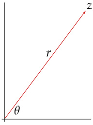

# Ch08 Operators on Complex Vector Spaces  

In this chapter we delve deeper into the structure of operators, with most of the attention on complex vector spaces. Some of the results in this chapter apply to both real and complex vector spaces; thus we do not make a standing assumption that $\mathbf{F}=\mathbf{C}$ . Also, an inner product does not help with this material, so we return to the general setting of a finite-dimensional vector space.  

Even on a finite-dimensional complex vector space, an operator may not have enough eigenvectors to form a basis of the vector space. Thus we will consider the closely related objects called generalized eigenvectors. We will see that for each operator on a finite-dimensional complex vector space, there is a basis of the vector space consisting of generalized eigenvectors of the operator. The generalized eigenspace decomposition then provides a good description of arbitrary operators on a finite-dimensional complex vector space.  

Nilpotent operators, which are operators that when raised to some power equal 0, have an important role in these investigations. Nilpotent operators provide a key tool in our proof that every invertible operator on a finite-dimensional complex vector space has a square root and in our approach to Jordan form.  

This chapter concludes by defining the trace and proving its key properties.  

## standing assumptions for this chapter  

• 𝐅 denotes 𝐑 or 𝐂.   
𝑉 denotes a finite-dimensional nonzero vector space over 𝐅.  

## 8A Generalized Eigenvectors and Nilpotent Operators  

## Null Spaces of Powers of an Operator  

We begin this chapter with a study of null spaces of powers of an operator.  

8.1 sequence of increasing null spaces  

Suppose $T\in{\mathcal{L}}(V)$ . Then  

$$
\{0\}=\mathrm{null}\,T^{0}\subseteq\mathrm{null}\,T^{1}\subseteq\cdots\subseteq\mathrm{null}\,T^{k}\subseteq\mathrm{null}\,T^{k+1}\subseteq\cdots.
$$  

Proof Suppose $k$ is a nonnegative integer and $v\,\in\,\mathrm{null}\,T_{\cdot}^{k}$ Then $T^{k}v\;=\;0$ , which implies that $T^{k+1}v\,=\,T(T^{k}v)\,=\,T(0)\,=\,0$ . Thus $v\in\mathrm{null}\,T^{k+1}.$ Hence null $T^{k}\subseteq\mathrm{null}\,T^{k+1}!$ as desired.  

The following result states that if two consecutive terms in the sequence of subspaces above are equal, then all later terms in the sequence are equal.  

For similar results about decreasing sequences of ranges, see Exercises 6, 7, and 8.  

Suppose $T\in{\mathcal{L}}(V)$ and $m$ is a nonnegative integer such that  

$$
\mathrm{null}\,T^{m}=\mathrm{null}\,T^{m+1}.
$$  

$$
\mathrm{null}\,T^{m}=\mathrm{null}\,T^{m+1}=\mathrm{null}\,T^{m+2}=\mathrm{null}\,T^{m+3}=\cdots.
$$  

Proof Let $k$ be a positive integer. We want to prove that  

$$
\mathrm{null}\:T^{m+k}=\mathrm{null}\:T^{m+k+1}\!.
$$  

We already know from 8.1 that null $T^{m+k}\subseteq\mathrm{null}\,T^{m+k+1}\!.$  

To prove the inclusion in the other direction, suppose $v\in$ null $T^{m+k+1}.$ . Then  

$$
T^{m+1}(T^{k}v)=T^{m+k+1}v=0.
$$  

Hence  

$$
T^{k}v\in{\mathrm{null}}\,T^{m+1}={\mathrm{null}}\,T^{m}.
$$  

Thus $T^{m+k}v=T^{m}(T^{k}v)=0$ , which means that $v\in$ null $T^{m+k}.$ . This implies that null $T^{m+k+1}\subseteq$ null $T^{m+k},$ completing the proof.  

The result above raises the question of whether there exists a nonnegative integer $m$ such that null $T^{m}=\mathrm{null}\,T^{m+1}\!.$ . The next result shows that this equality holds at least when $m$ equals the dimension of the vector space on which $T$ operates.  

Suppose $T\in{\mathcal{L}}(V)$ . Then  

$$
\mathrm{null}\;T^{\dim V}=\mathrm{null}\;T^{\dim V+1}=\mathrm{null}\;T^{\dim V+2}=\cdots.
$$  

Proof We only need to prove that null $T^{\dim V}={\mathrm{null}}\,T^{\dim V+1}$ (by 8.2). Suppose this is not true. Then, by 8.1 and 8.2, we have  

$$
\{0\}=\mathrm{null}\,T^{0}\subsetneq\mathrm{null}\,T^{1}\subsetneq\cdots\subsetneq\mathrm{null}\,T^{\dim V}\subsetneq\mathrm{null}\,T^{\dim V+1},
$$  

where the symbol $\subsetneq$ means “contained in but not equal to”. At each of the strict inclusions in the chain above, the dimension increases by at least 1. Thus dim null $T^{\dim V+1}\geq\dim V+1$ , a contradiction because a subspace of $V$ cannot have a larger dimension than dim $V.$ .  

It is not true that $V=\mathrm{null}\,T\oplus$ range $T$ for every $T\in{\mathcal{L}}(V)$ . However, the next result can be a useful substitute.  

<html><body><table><tr><td>8.4 Vis thedirect sum of null Tdim V and range Tdim V</td></tr><tr><td>Suppose T E L(V). Then</td></tr><tr><td>V = null Tdim V + range Tdim V</td></tr></table></body></html>  

Proof Let $n=\dim V.$ . First we show that  

$$
({\mathrm{null}}\,T^{n})\cap({\mathrm{range}}\,T^{n})=\{0\}.
$$  

Suppose $v\,\in\,({\mathrm{null}}\,T^{n})$ $\cap$ (range $T^{n}$ ). Then $T^{n}v\,=\,0$ , and there exists $u\,\in\,V$ such that $v\,=\,T^{n}u$ . Applying $T^{n}$ to both sides of the last equation shows that $T^{n}v\;=\;T^{2n}u$ . Hence $T^{2n}u\,=\,0$ , which implies that $T^{n}u\,=\,0$ (by 8.3). Thus $v=T^{n}u=0.$ , completing the proof of 8.5.  

Now 8.5 implies that null $T^{n}+$ range $T^{n}$ is a direct sum (by 1.46). Also,  

$$
\dim(\mathrm{null}\,T^{n}\oplus\mathrm{range}\,T^{n})=\dim\mathrm{null}\,T^{n}+\dim\mathrm{range}\,T^{n}=\dim V,
$$  

where the first equality above comes from 3.94 and the second equality comes from the fundamental theorem of linear maps (3.21). The equation above implies that null $T^{n}\oplus$ range $T^{n}=V(\sec2.39)$ , as desired.  

For an improvement of the result above, see Exercise 19.  

8.6 example: $\mathbf{F}^{3}=\mathrm{null}\,T^{3}\,\oplus$ range $T^{3}$ for $T\in\mathcal{L}(\mathbf{F}^{3})$  

Suppose $T\in{\mathcal{L}}(\mathbf{F}^{3})$ is defined by  

$$
T(z_{1},z_{2},z_{3})=(4z_{2},0,5z_{3}).
$$  

Then null $T=\left\{(z_{1},0,0):z_{1}\in\mathbf{F}\right\}$ and range $T=\{(z_{1},0,z_{3}):z_{1},z_{3}\in\mathbf{F}\}$ . Thus null $T\cap$ range $T\neq\{0\}$ . Hence null $T+\mathrm{range}\,T$ is not a direct sum. Also note that null $T+$ range $T\neq\mathbf{F}^{3}.$ . However, we have $T^{3}(z_{1},z_{2},z_{3})=(0,0,125z_{3})$ ). Thus we see that  

$\mathrm{{null}}\,T^{3}=\left\{(z_{1},z_{2},0):z_{1},z_{2}\in\bf{F}\right\}$ and range $T^{3}=\{(0,0,z_{3}):z_{3}\in\mathbf{F}\}$ . Hence $\mathbf{F}^{3}=\mathrm{null}\,T^{3}\,\oplus$ range $T^{3}$ , as expected by 8.4.  

## Generalized Eigenvectors  

Some operators do not have enough eigenvectors to lead to good descriptions of their behavior. Thus in this subsection we introduce the concept of generalized eigenvectors, which will play a major role in our description of the structure of an operator.  

To understand why we need more than eigenvectors, let’s examine the question of describing an operator by decomposing its domain into invariant subspaces. Fix $T\in{\mathcal{L}}(V)$ . We seek to describe $T$ by finding a “nice” direct sum decomposition  

$$
V=V_{1}\oplus\cdots\oplus V_{m},
$$  

where each $V_{k}$ is a subspace of $V$ invariant under $T.$ . The simplest possible nonzero invariant subspaces are one-dimensional. A decomposition as above in which each $V_{k}$ is a one-dimensional subspace of $V$ invariant under $T$ is possible if and only if $V$ has a basis consisting of eigenvectors of $T$ (see 5.55). This happens if and only if $V$ has an eigenspace decomposition  

$$
V=E(\lambda_{1},T)\oplus\cdots\oplus E(\lambda_{m},T),
$$  

where $\lambda_{1},...,\lambda_{m}$ are the distinct eigenvalues of $T$ (see 5.55).  

The spectral theorem in the previous chapter shows that if $V$ is an inner product space, then a decomposition of the form 8.7 holds for every self-adjoint operator if $\mathbf{F}=\mathbf{R}$ and for every normal operator if $\mathbf{F}=\mathbf{C}$ because operators of those types have enough eigenvectors to form a basis of $V$ (see 7.29 and 7.31).  

However, a decomposition of the form 8.7 may not hold for more general operators, even on a complex vector space. An example was given by the operator in 5.57, which does not have enough eigenvectors for 8.7 to hold. Generalized eigenvectors and generalized eigenspaces, which we now introduce, will remedy this situation.  

## 8.8 definition: generalized eigenvector  

Suppose $T\in{\mathcal{L}}(V)$ and $\lambda$ is an eigenvalue of $T.$ A vector $v\in V$ is called a generalized eigenvector of $T$ corresponding to $\lambda$ if $v\neq0$ and  

$$
(T-\lambda I)^{k}v=0
$$  

A nonzero vector $v\in V$ is a generalized eigenvector of $T$ corresponding to $\lambda$ if and only if  

$$
(T-\lambda I)^{\dim V}v=0,
$$  

as follows from applying 8.1 and 8.3 to the operator $T-\lambda I$ .  

Generalized eigenvalues are not defined because doing so would not lead to anything new. Reason: if $(T-\lambda I)^{k}$ is not injective for some positive integer $k_{i}$ , then $T-\lambda I$ is not injective, and hence $\lambda$ is an eigenvalue of $T.$ .  

As we know, an operator on a complex vector space may not have enough eigenvectors to form a basis of the domain. The next result shows that on a complex vector space there are enough generalized eigenvectors to do this.  

## 8.9 a basis of generalized eigenvectors  

Suppose $\mathbf{F}\,=\,\mathbf{C}$ and $T\,\in\,{\mathcal{L}}(V)$ . Then there is a basis of $V$ consisting of generalized eigenvectors of $T$ .  

Proof Let $n\,=\,\dim V.$ . We will use induction on $n$ . To get started, note that the desired result holds if $n=1$ because then every nonzero vector in $V$ is an eigenvector of $T$ .  

Now suppose $n\ \mathrm{~>~}\ 1$ and the desired result holds for all smaller values of dim $V.$ Let $\lambda$ be an eigenvalue of $T.$ . Applying 8.4 to $T-\lambda I$ shows that  

This step is where we use the hypothesis that $\mathbf{F}=\mathbf{C}$ , because if $\mathbf{F}=\mathbf{R}$ then $T$ may not have any eigenvalues.  

$$
V=\mathrm{null}(T-\lambda I)^{n}\oplus\mathrm{range}(T-\lambda I)^{n}.
$$  

If null $(T-\lambda I)^{n}=V,$ , then every nonzero vector in $V$ is a generalized eigenvector of $T$ , and thus in this case there is a basis of $V$ consisting of generalized eigenvectors of $T.$ Hence we can assume that null $(T-\lambda I)^{n}\neq V,$ , which implies that range $(T-\lambda I)^{n}\neq\{0\}$ .  

Also, nu $1\mathrm{I}(T-\lambda I)^{n}\neq\{0\}$ , because $\lambda$ is an eigenvalue of $T$ . Thus we have  

$$
0<\dim\operatorname{range}(T-\lambda I)^{n}<n.
$$  

Furthermore, range $(T-\lambda I)^{n}$ is invariant under $T$ [by 5.18 with $p(z)=(z-\lambda)^{n}]$ . Let $S\in{\mathcal{L}}({\mathrm{range}}(T-\lambda I)^{n})$ equal $T$ restricted to range $(T-\lambda I)^{n}$ . Our induction hypothesis applied to the operator $S$ implies that there is a basis of range $(T-\lambda I)^{n}$ consisting of generalized eigenvectors of $S$ , which of course are generalized eigenvectors of $T.$ Adjoining that basis of range $(T-\lambda I)^{n}$ to a basis of null $(T-\lambda I)^{n}$ gives a basis of $V$ consisting of generalized eigenvectors of $T$ .  

If $\mathbf{F}=\mathbf{R}$ and dim $V>1$ , then some operators on $V$ have the property that there exists a basis of $V$ consisting of generalized eigenvectors of the operator, and (unlike what happens when $\mathbf{F}=\mathbf{C}$ ) other operators do not have this property. See Exercise 11 for a necessary and sufficient condition that determines whether an operator has this property.  

8.10 example: generalized eigenvectors of an operator on $\mathbf{C}^{3}$  

Define $T\in{\mathcal{L}}(\mathbf{C}^{3})$ by  

$$
T(z_{1},z_{2},z_{3})=(4z_{2},0,5z_{3})
$$  

for each $(z_{1},z_{2},z_{3})\in\mathbf{C}^{3}\!.$ . A routine use of the definition of eigenvalue shows that the eigenvalues of $T$ are 0 and 5. Furthermore, the eigenvectors corresponding to the eigenvalue 0 are the nonzero vectors of the form $(z_{1},0,0)$ , and the eigenvectors corresponding to the eigenvalue 5 are the nonzero vectors of the form $(0,0,z_{3})$ . Hence this operator does not have enough eigenvectors to span its domain $\mathbf{C}^{3}$ .  

We compute that $T^{3}(z_{1},z_{2},z_{3})=(0,0,125z_{3})$ . Thus 8.1 and 8.3 imply that the generalized eigenvectors of $T$ corresponding to the eigenvalue 0 are the nonzero vectors of the form $(z_{1},z_{2},0)$ .  

We also have $(T-5I)^{3}(z_{1},z_{2},z_{3})=(-125z_{1}+300z_{2},-1$ $-125z_{2},0)$ . Thus the generalized eigenvectors of $T$ corresponding to the eigenvalue 5 are the nonzero vectors of the form $(0,0,z_{3})$ .  

The paragraphs above show that each of the standard basis vectors of $\mathbf{C}^{3}$ is a generalized eigenvector of $T$ . Thus $\mathbf{C}^{3}$ indeed has a basis consisting of generalized eigenvectors of $T,$ , as promised by 8.9.  

If $v$ is an eigenvector of $T\in{\mathcal{L}}(V)$ , then the corresponding eigenvalue $\lambda$ is uniquely determined by the equation $T v=\lambda v$ , which can be satisfied by only one $\lambda\in\mathbf{F}$ (because $v\neq0$ ). However, if $v$ is a generalized eigenvector of $T$ , then it is not obvious that the equation $(T-\lambda I)^{\dim V}v=0$ can be satisfied by only one $\lambda\in\mathbf{F}$ . Fortunately, the next result tells us that all is well on this issue.  

8.11 generalized eigenvector corresponds to a unique eigenvalue  

Suppose $T\in{\mathcal{L}}(V)$ . Then each generalized eigenvector of $T$ corresponds to only one eigenvalue of $T.$ .  

Proof Suppose $v\in V$ is a generalized eigenvector of $T$ corresponding to eigenvalues $\alpha$ and $\lambda$ of $T.$ . Let $m$ be the smallest positive integer such that $(T\!-\!\alpha I)^{m}v=0$ . Let $n=\dim V.$ Then  

$$
\begin{array}{r l}&{0=(T-\lambda I)^{n}v}\\ &{~~=((T-\alpha I)+(\alpha-\lambda)I)^{n}v}\\ &{~~=\displaystyle\sum_{k\,=\,0}^{n}b_{k}(\alpha-\lambda)^{n-k}(T-\alpha I)^{k}v,}\end{array}
$$  

where $b_{0}=1$ and the values of the other binomial coefficients $b_{k}$ do not matter. Apply the operator $(T-\alpha I)^{m-1}$ to both sides of the equation above, getting  

$$
0=(\alpha-\lambda)^{n}(T-\alpha I)^{m-1}v.
$$  

Because $(T-\alpha I)^{m-1}v\neq0$ , the equation above implies that $\alpha=\lambda$ , as desired.  

We saw earlier (5.11) that eigenvectors corresponding to distinct eigenvalues are linearly independent. Now we prove a similar result for generalized eigenvectors, with a proof that roughly follows the pattern of the proof of that earlier result.  

8.12 linearly independent generalized eigenvectors  

Suppose that $T\in{\mathcal{L}}(V)$ . Then every list of generalized eigenvectors of $T$ corresponding to distinct eigenvalues of $T$ is linearly independent.  

Proof Suppose the desired result is false. Then there exists a smallest positive integer $m$ such that there exists a linearly dependent list $v_{1},...,v_{m}$ of generalized eigenvectors of $T$ corresponding to distinct eigenvalues $\lambda_{1},...,\lambda_{m}$ of $T$ (note that $m\geq2$ because a generalized eigenvector is, by definition, nonzero). Thus there exist $\textstyle{a_{1},...,a_{m}}\in\mathbf{F}$ , none of which are 0 (because of the minimality of $m$ ), such that  

$$
a_{1}v_{1}+\cdots+a_{m}v_{m}=0.
$$  

Let $n=\dim V.$ Apply $(T-\lambda_{m}I)^{n}$ to both sides of the equation above, getting  

8.13  

Thus an operator on $V$ is nilpotent if every nonzero vector in $V$ is a generalized eigenvector of $T$ corresponding to the eigenvalue 0.  

$$
a_{1}(T-\lambda_{m}I)^{n}v_{1}+\cdots+a_{m-1}(T-\lambda_{m}I)^{n}v_{m-1}=0.
$$  

Suppose $k\in\{1,...,m-1\}$ . Then  

$$
(T-\lambda_{m}I)^{n}v_{k}\ne0
$$  

because otherwise $v_{k}$ would be a generalized eigenvector of $T$ corresponding to the distinct eigenvalues $\lambda_{k}$ and $\lambda_{m}$ , which would contradict 8.11. However,  

$$
(T-\lambda_{k}I)^{n}\big((T-\lambda_{m}I)^{n}v_{k}\big)=(T-\lambda_{m}I)^{n}\big((T-\lambda_{k}I)^{n}v_{k}\big)=0.
$$  

Thus the last two displayed equations show that $(T-\lambda_{m}I)^{n}v_{k}$ is a generalized eigenvector of $T$ corresponding to the eigenvalue $\lambda_{k}$ . Hence  

$$
(T-\lambda_{m}I)^{n}v_{1},...,(T-\lambda_{m}I)^{n}v_{m-1}
$$  

is a linearly dependent list (by 8.13) of $m-1$ generalized eigenvectors corresponding to distinct eigenvalues, contradicting the minimality of $m$ . This contradiction completes the proof.  

## Nilpotent Operators  

## 8.14 definition: nilpotent  

An operator is called nilpotent if some power of it equals 0.  

## (a) The operator $T\in\mathcal{L}(\mathbf{F}^{4})$ defined by  

$$
T(z_{1},z_{2},z_{3},z_{4})=(0,0,z_{1},z_{2})
$$  

is nilpotent because $T^{2}=0$ .  

(b) The operator on $\mathbf{F}^{3}$ whose matrix (with respect to the standard basis) is  

$$
\left(\begin{array}{c c c}{{-3}}&{{9}}&{{0}}\\ {{-7}}&{{9}}&{{6}}\\ {{4}}&{{0}}&{{-6}}\end{array}\right)
$$  

is nilpotent, as can be shown by cubing the matrix above to get the zero matrix.  

(c) The operator of differentiation on ${\mathcal P}_{m}({\bf R})$ is nilpotent because the $(m+1)^{\mathrm{th}}$ derivative of every polynomial of degree at most $m$ equals 0. Note that on this space of dimension $m+1$ , we need to raise the nilpotent operator to the power $m+1$ to get the 0 operator.  

The next result shows that when raising a nilpotent operator to a power, we never need to use a power higher than the dimension of the space. For a slightly stronger result, see Exercise 18.  

The Latin word nil means nothing or zero; the Latin word potens means having power. Thus nilpotent literally means having a power that is zero.  

8.16 nilpotent operator raised to dimension of domain is 0  

Suppose $T\in{\mathcal{L}}(V)$ is nilpotent. Then $T^{\mathrm{dim}V}=0$ .  

Proof Because $T$ is nilpotent, there exists a positive integer $k$ such that $T^{k}=0$ .   
Thus null $T^{k}=V.$ Now 8.1 and 8.3 imply that null $T^{\dim V}=V.$ Thus $T^{\mathrm{dim}V}=0$ .  

8.17 eigenvalues of nilpotent operator  

Suppose $T\in{\mathcal{L}}(V)$ .  

(a) If $T$ is nilpotent, then 0 is an eigenvalue of $T$ and $T$ has no other eigenvalues.  

(b) If $\mathbf{F}=\mathbf{C}$ and 0 is the only eigenvalue of $T$ , then $T$ is nilpotent.  

## Proof  

(a) To prove (a), suppose $T$ is nilpotent. Hence there is a positive integer 𝑚such that $T^{m}\,=\,0$ . This implies that $T$ is not injective. Thus 0 is an eigenvalue of $T.$ .  

To show that $T$ has no other eigenvalues, suppose $\lambda$ is an eigenvalue of $T.$ . Then there exists a nonzero vector $v\in V$ such that  

$$
\lambda v=T v.
$$  

Repeatedly applying $T$ to both sides of this equation shows that  

$$
\begin{array}{r}{\lambda^{m}v=T^{m}v=0.}\end{array}
$$  

Thus $\lambda=0$ , as desired.  

(b) Suppose $\mathbf{F}=\mathbf{C}$ and 0 is the only eigenvalue of $T.$ . By 5.27(b), the minimal polynomial of $T$ equals $z^{m}$ for some positive integer $m$ . Thus $T^{m}=0$ . Hence $T$ is nilpotent.  

Exercise 23 shows that the hypothesis that $\mathbf{F}=\mathbf{C}$ cannot be deleted in (b) of the result above.  

Given an operator on $V,$ we want to find a basis of $V$ such that the matrix of the operator with respect to this basis is as simple as possible, meaning that the matrix contains many $\mathrm{0\,\dot{s}}$ . The next result shows that if $T$ is nilpotent, then we can choose a basis of $V$ such that the matrix of $T$ with respect to this basis has more than half of its entries equal to 0. Later in this chapter we will do even better.  

## 8.18 minimal polynomial and upper-triangular matrix of nilpotent operator  

Suppose $T\in{\mathcal{L}}(V)$ . Then the following are equivalent.   
(a) $T$ is nilpotent.  

(b) The minimal polynomial of $T$ is $z^{m}$ for some positive integer 𝑚.  

(c) There is a basis of $V$ with respect to which the matrix of $T$ has the form  

$$
{\left(\begin{array}{l l l}{0}&{}&{*}\\ {}&{\ddots}&{}\\ {0}&{}&{0}\end{array}\right)},
$$  

where all entries on and below the diagonal equal 0.  

Proof Suppose (a) holds, so $T$ is nilpotent. Thus there exists a positive integer $n$ such that $T^{n}\,=\,0$ . Now 5.29 implies that $z^{n}$ is a polynomial multiple of the minimal polynomial of $T.$ . Thus the minimal polynomial of $T$ is $z^{m}$ for some positive integer $m$ , proving that (a) implies (b).  

Now suppose (b) holds, so the minimal polynomial of $T$ is $z^{m}$ for some positive integer $m$ . This implies, by 5.27(a), that 0 (which is the only zero of $z^{m}$ ) is the only eigenvalue of $T.$ This further implies, by 5.44, that there is a basis of $V$ with respect to which the matrix of $T$ is upper triangular. This also implies, by 5.41, that all entries on the diagonal of this matrix are 0, proving that (b) implies (c).  

Now suppose (c) holds. Then 5.40 implies that $T^{\mathrm{dim}V}=0$ . Thus $T$ is nilpotent, proving that (c) implies (a).  

1 Suppose $T\in{\mathcal{L}}(V)$ . Prove that if dim null $T^{4}=8$ and dim null $T^{6}=9$ , then dim null $T^{m}=9$ for all integers $m\geq5$ .  

2 Suppose $T\,\in\,{\mathcal{L}}(V)$ , $m$ is a positive integer, $v\in V$ , and $T^{m-1}v\,\neq\,0$ but $T^{m}v=0$ . Prove that $v,T v,T^{2}v,...,T^{m-1}v$ is linearly independent.  

The result in this exercise is used in the proof of 8.45.  

3 Suppose $T\in{\mathcal{L}}(V)$ . Prove that  

$$
V={\mathrm{null}}\,T\oplus{\mathrm{range}}\,T\iff{\mathrm{null}}\,T^{2}={\mathrm{null}}\,T.
$$  

4 Suppose $T\in{\mathcal{L}}(V),\lambda\in\mathbf{F}$ , and $m$ is a positive integer such that the minimal polynomial of $T$ is a polynomial multiple of $(z-\lambda)^{m}$ . Prove that  

$$
\dim\operatorname{null}(T-\lambda I)^{m}\geq m.
$$  

5 Suppose $T\in{\mathcal{L}}(V)$ and $m$ is a positive integer. Prove that  

$$
\dim\operatorname{null}T^{m}\leq m\dim\operatorname{null}T.
$$  

Hint: Exercise 21 in Section $3B$ may be useful.  

6 Suppose $T\in{\mathcal{L}}(V)$ . Show that  

$$
V={\mathrm{range}}\,T^{0}\supseteq{\mathrm{range}}\,T^{1}\supseteq\cdots\supseteq{\mathrm{range}}\,T^{k}\supseteq{\mathrm{range}}\,T^{k+1}\supseteq\cdots.
$$  

7 Suppose $T\in{\mathcal{L}}(V)$ and $m$ is a nonnegative integer such that  

$$
\geq T^{m}=\mathrm{range}\,T^{m+1}\!.
$$  

Prove that range $T^{k}=$ range $T^{m}$ for all $k>m$ .  

8 Suppose $T\in{\mathcal{L}}(V)$ . Prove that  

$$
\circ\,T^{\dim V}=\mathrm{range}\,T^{\dim V+1}=\mathrm{range}\,T^{\dim V+2}=\cdots.
$$  

9 Suppose $T\in{\mathcal{L}}(V)$ and $m$ is a nonnegative integer. Prove that  

$$
\mathrm{null}\,T^{m}=\mathrm{null}\,T^{m+1}\iff\mathrm{range}\,T^{m}=\mathrm{range}\,T^{m+1}.
$$  

10 Define $T\in{\mathcal{L}}(C^{2})$ by $T(w,z)=(z,0)$ . Find all generalized eigenvectors of $T.$ .  

11 Suppose that $T\,\in\,{\mathcal{L}}(V)$ . Prove that there is a basis of $V$ consisting of generalized eigenvectors of $T$ if and only if the minimal polynomial of $T$ equals $(z-\lambda_{1})\cdots(z-\lambda_{m})$ for some $\lambda_{1},...,\lambda_{m}\in\mathbf{F}$ .  

Assume $\mathbf{F}=\mathbf{R}$ because the case $\mathbf{F}=\mathbf{C}$ follows from $5.27(b)$ and 8.9.  

This exercise states that the condition for there to be a basis of $V$ consisting of generalized eigenvectors of $T$ is the same as the condition for there to be a basis with respect to which $T$ has an upper-triangular matrix (see 5.44). Caution: If $T$ has an upper-triangular matrix with respect to a basis $v_{1},...,v_{n}$ of $V,$ then $v_{1}$ is an eigenvector of 𝑇but it is not necessarily true that $v_{2},...,v_{n}$ are generalized eigenvectors of 𝑇.  

12 Suppose $T\in{\mathcal{L}}(V)$ is such that every vector in $V$ is a generalized eigenvector of $T.$ . Prove that there exists $\lambda\in\mathbf{F}$ such that $T-\lambda I$ is nilpotent.  

13 Suppose $S,T\in{\mathcal{L}}(V)$ and $S T$ is nilpotent. Prove that $T S$ is nilpotent.  

14 Suppose $T\in{\mathcal{L}}(V)$ is nilpotent and $T\neq0$ . Prove $T$ is not diagonalizable.  

15 Suppose $\mathbf{F}=\mathbf{C}$ and $T\in{\mathcal{L}}(V)$ . Prove that $T$ is diagonalizable if and only if every generalized eigenvector of $T$ is an eigenvector of $T$ .  

For $\mathbf{F}=\mathbf{C}\,$ , this exercise adds another equivalence to the list of conditions for diagonalizability in 5.55.  

16 (a) Give an example of nilpotent operators $S,T$ on the same vector space such that neither $S+T$ nor $S T$ is nilpotent. (b) Suppose $S,T\in{\mathcal{L}}(V)$ are nilpotent and $S T=T S$ . Prove that $S+T$ and $S T$ are nilpotent.  

17 Suppose $T\in{\mathcal{L}}(V)$ is nilpotent and $m$ is a positive integer such that $T^{m}=0$ . (a) Prove that $I-T$ is invertible and that $(I-T)^{-1}=I+T+\cdots+T^{m-1}.$ . (b) Explain how you would guess the formula above.  

18 Suppose $T\in{\mathcal{L}}(V)$ is nilpotent. Prove that $T^{1+\mathrm{dimrange\,}T}=0$ If dim range $T<\dim V-1$ , then this exercise improves 8.16.  

19 Suppose $T\in{\mathcal{L}}(V)$ is not nilpotent. Show that  

$$
V=\mathrm{null}\;T^{\mathrm{dim}\,V\,-\,1}\oplus\mathrm{range}\;T^{\mathrm{dim}\,V\,-\,1}\!.
$$  

For operators that are not nilpotent, this exercise improves 8.4.  

20 Suppose $V$ is an inner product space and $T\in{\mathcal{L}}(V)$ is normal and nilpotent. Prove that $T=0$ .  

21 Suppose $T\in{\mathcal{L}}(V)$ is such that null $T^{\dim V-1}\neq\mathrm{null}\,T^{\dim V}.$ . Prove that $T$ is nilpotent and that dim null $T^{k}=k$ for every integer $k$ with $0\leq k\leq\dim V.$ .  

22 Suppose $T\,\in\,{\mathcal{L}}(\mathbf{C}^{5})$ is such that range $T^{4}\ \neq\ {\mathrm{range}}\ T^{5}$ . Prove that $T$ is nilpotent.  

23 Give an example of an operator $T$ on a finite-dimensional real vector space such that 0 is the only eigenvalue of $T$ but $T$ is not nilpotent.  

This exercise shows that the implication $\mathit{\Pi}(b)\implies(a)$ in 8.17 does not hold without the hypothesis that $\mathbf{F}=\mathbf{C}$ .  

24 For each item in Example 8.15, find a basis of the domain vector space such that the matrix of the nilpotent operator with respect to that basis has the upper-triangular form promised by 8.18(c).  

25 Suppose that $V$ is an inner product space and $T\in{\mathcal{L}}(V)$ is nilpotent. Show that there is an orthonormal basis of $V$ with respect to which the matrix of $T$ has the upper-triangular form promised by 8.18(c).  

## 8B Generalized Eigenspace Decomposition  

## Generalized Eigenspaces  

## 8.19 definition: generalized eigenspace, $G(\lambda,T)$  

Suppose $T\in{\mathcal{L}}(V)$ and $\lambda\in\mathbf{F}$ . The generalized eigenspace of $T$ corresponding to $\lambda$ , denoted by $G(\lambda,T)$ , is defined by  

$G(\lambda,T)=\{v\in V:(T-\lambda I)^{k}v=0$  

Thus $G(\lambda,T)$ is the set of generalized eigenvectors of $T$ corresponding to $\lambda$ , along with the 0 vector.  

Because every eigenvector of $T$ is a generalized eigenvector of $T$ (take $k=1$ in the definition of generalized eigenvector), each eigenspace is contained in the corresponding generalized eigenspace. In other words, if $T\in{\mathcal{L}}(V)$ and $\lambda\in\mathbf{F}$ , then $E(\lambda,T)\subseteq G(\lambda,T)$ .  

The next result implies that if $T\in{\mathcal{L}}(V)$ and $\lambda\in\mathbf{F}$ , then the generalized eigenspace $G(\lambda,T)$ is a subspace of $V$ (because the null space of each linear map on $V$ is a subspace of $V$ ).  

8.20 description of generalized eigenspaces  

Suppose $T\in{\mathcal{L}}(V)$ and $\lambda\in\mathbf{F}$ . Then $G(\lambda,T)=\mathrm{null}(T-\lambda I)^{\dim V}\!.$  

Proof Suppose $v\in\mathrm{null}(T-\lambda I)^{\dim V}.$ . The definitions imply $v\in G(\lambda,T)$ . Thus $G(\lambda,T)\supseteq\mathrm{null}(T-\lambda I)^{\dim V}$ .  

Conversely, suppose $v\,\in\,G(\lambda,T)$ . Thus there is a positive integer $k$ such that $v\,\in\,\mathrm{{null}}(T-\lambda I)^{k}$ . From 8.1 and 8.3 (with $T-\lambda I$ replacing $T$ ), we get $v\in\mathrm{null}(T-\lambda I)^{\dim V}.$ Thus $G(\lambda,T)\subseteq\mathrm{null}(T-\lambda I)^{\dim V},$ , completing the proof.  

8.21 example: generalized eigenspaces of an operator on $\mathbf{C}^{3}$  

Define $T\in{\mathcal{L}}(\mathbf{C}^{3})$ by  

$$
T(z_{1},z_{2},z_{3})=(4z_{2},0,5z_{3}).
$$  

In Example 8.10, we saw that the eigenvalues of $T$ are 0 and 5, and we found the corresponding sets of generalized eigenvectors. Taking the union of those sets with $\{0\}$ , we have  

$$
G(0,T)=\big\{(z_{1},z_{2},0):z_{1},z_{2}\in\mathbf{C}\big\}\quad\mathrm{and}\quad G(5,T)=\big\{(0,0,z_{3}):z_{3}\in\mathbf{C}\big\}
$$  

Note that $\mathbf{C}^{3}\!=G(0,T)\oplus G(5,T)$ .  

In Example 8.21, the domain space $\mathbf{C}^{3}$ is the direct sum of the generalized eigenspaces of the operator $T$ in that example. Our next result shows that this behavior holds in general. Specifically, the following major result shows that if $\mathbf{F}=\mathbf{C}$ and $T\in{\mathcal{L}}(V)$ , then $V$ is the direct sum of the generalized eigenspaces of $T$ , each of which is invariant under $T$ and on which $T$ is a nilpotent operator plus a scalar multiple of the identity. Thus the next result achieves our goal of decomposing $V$ into invariant subspaces on which $T$ has a known behavior.  

As we will see, the proof follows from putting together what we have learned about generalized eigenspaces and then using our result that for each operator $T\in{\mathcal{L}}(V)$ , there exists a basis of $V$ consisting of generalized eigenvectors of $T$ .  

8.22 generalized eigenspace decomposition  

Suppose ${\textbf{F}}={\textbf{C}}$ and $T\in{\mathcal{L}}(V)$ . Let $\lambda_{1},...,\lambda_{m}$ be the distinct eigenvalues of $T.$ Then  

(a) $G(\lambda_{k},T)$ is invariant under $T$ for each $k=1,...,m$ ;  

(b) $(T-\lambda_{k}I)|_{G(\lambda_{k},T)}$ is nilpotent for each $k=1,...,m$ ;  

(c) $V=G(\lambda_{1},T)\oplus\cdots\oplus G(\lambda_{m},T).$ .  

## Proof  

(a) Suppose $k\in\{1,...,m\}$ . Then 8.20 shows that  

$$
G(\lambda_{k},T)=\mathrm{null}(T-\lambda_{k}I)^{\dim V}\!.
$$  

Thus 5.18, with $p(z)=(z\!-\!\lambda_{k})^{\dim V},$ implies that $G(\lambda_{k},T)$ is invariant under $T$ , proving (a).  

(b) Suppose $k\in\{1,...,m\}$ . If $v\in G(\lambda_{k},T)$ , then $(T-\lambda_{k}I)^{\dim V}v=0$ (by 8.20). Thus $\big((T-\lambda_{k}I)|_{G(\lambda_{k},T)}\big)^{\dim V}\;=\;0$ . Hence $(T\,-\,\lambda_{k}I)|_{G(\lambda_{k},T)}$ is nilpotent, proving (b).  

(c) To show that $G(\lambda_{1},T)+\cdots+G(\lambda_{m},T)$ is a direct sum, suppose  

$$
v_{1}+\cdots+v_{m}=0,
$$  

where each $v_{k}$ is in $G(\lambda_{k},T)$ . Because generalized eigenvectors of $T$ corresponding to distinct eigenvalues are linearly independent (by 8.12), this implies that each $v_{k}$ equals 0. Thus $G(\lambda_{1},T)+\cdots+G(\lambda_{m},T)$ is a direct sum (by 1.45).  

Finally, each vector in $V$ can be written as a finite sum of generalized eigenvectors of $T$ (by 8.9). Thus  

$$
V=G(\lambda_{1},T)\oplus\cdots\oplus G(\lambda_{m},T),
$$  

proving (c).  

For the analogous result when $\mathbf{F}=\mathbf{R}$ , see Exercise 8.  

If $V$ is a complex vector space and $T\in{\mathcal{L}}(V)$ , then the decomposition of $V$ provided by the generalized eigenspace decomposition (8.22) can be a powerful tool. The dimensions of the subspaces involved in this decomposition are sufficiently important to get a name, which is given in the next definition.  

## 8.23 definition: multiplicity  

Suppose $T\in{\mathcal{L}}(V)$ . The multiplicity of an eigenvalue $\lambda$ of $T$ is defined to be the dimension of the corresponding generalized eigenspace $G(\lambda,T)$ .  

• In other words, the multiplicity of an eigenvalue $\lambda$ of $T$ equals  

The second bullet point above holds because $G(\lambda,T)=\mathrm{null}(T-\lambda I)^{\dim V}$ (see 8.20).  

8.24 example: multiplicity of each eigenvalue of an operator  

Suppose $T\in{\mathcal{L}}(\mathbf{C}^{3})$ is defined by  

$$
T(z_{1},z_{2},z_{3})=(6z_{1}+3z_{2}+4z_{3},6z_{2}+2z_{3},7z_{3}).
$$  

The matrix of $T$ (with respect to the standard basis) is  

$$
{\left(\begin{array}{l l l}{6}&{3}&{4}\\ {0}&{6}&{2}\\ {0}&{0}&{7}\end{array}\right)}.
$$  

The eigenvalues of $T$ are the diagonal entries 6 and 7, as follows from 5.41. You can verify that the generalized eigenspaces of $T$ are as follows:  

$$
G(6,T)=\operatorname{span}\bigr((1,0,0),(0,1,0)\bigr)\quad\mathrm{and}\quad G(7,T)=\operatorname{span}\bigr((10,2,1)\bigr).
$$  

Thus the eigenvalue 6 has multiplicity 2 and the eigenvalue 7 has multiplicity 1. The direct sum $\mathbf{C}^{3}=G(6,T)\oplus G(7,T)$ is the generalized eigenspace decomposition promised by 8.22. A basis of $\mathbf{C}^{3}$ consisting of generalized eigenvectors of $T$ , as promised by 8.9, is  

In this example, the multiplicity of each eigenvalue equals the number of times that eigenvalue appears on the diagonal of an upper-triangular matrix representing the operator. This behavior always happens, as we will see in 8.31.  

$(1,0,0)$ , $(0,1,0)$ , (10, 2, 1). There does not exist a basis of $\mathbf{C}^{3}$ consisting of eigenvectors of this operator.  

In the example above, the sum of the multiplicities of the eigenvalues of $T$ equals 3, which is the dimension of the domain of $T.$ . The next result shows that this holds for all operators on finite-dimensional complex vector spaces.  

Suppose $\mathbf{F}\,=\,\mathbf{C}$ and $T\,\in\,{\mathcal{L}}(V)$ . Then the sum of the multiplicities of all eigenvalues of $T$ equals dim $V.$  

Proof The desired result follows from the generalized eigenspace decomposition (8.22) and the formula for the dimension of a direct sum (see 3.94).  

The terms algebraic multiplicity and geometric multiplicity are used in some books. In case you encounter this terminology, be aware that the algebraic multiplicity is the same as the multiplicity defined here and the geometric multiplicity is the dimension of the corresponding eigenspace. In other words, if $T\in{\mathcal{L}}(V)$ and $\lambda$ is an eigenvalue of $T$ , then  

algebraic multiplicity of $\lambda=\dim\operatorname{null}(T-\lambda I)^{\dim V}=\dim G(\lambda,T),$ geometric multiplicity of $\lambda=\dim\operatorname{null}(T-\lambda I)=\dim E(\lambda,T).$  

Note that as defined above, the algebraic multiplicity also has a geometric meaning as the dimension of a certain null space. The definition of multiplicity given here is cleaner than the traditional definition that involves determinants; 9.62 implies that these definitions are equivalent.  

If $V$ is an inner product space, $T\in{\mathcal{L}}(V)$ is normal, and $\lambda$ is an eigenvalue of $T$ , then the algebraic multiplicity of $\lambda$ equals the geometric multiplicity of $\lambda$ , as can be seen from applying Exercise 27 in Section 7A to the normal operator $T-\lambda I,$ . As a special case, the singular values of $S\in{\mathcal{L}}(V,W)$ (here $V$ and $W$ are both finite-dimensional inner product spaces) depend on the multiplicities (either algebraic or geometric) of the eigenvalues of the self-adjoint operator $S^{\ast}S$ .  

The next definition associates a monic polynomial with each operator on a finite-dimensional complex vector space.  

## 8.26 definition: characteristic polynomial  

Suppose $\mathbf{F}=\mathbf{C}$ and $T\in{\mathcal{L}}(V)$ . Let $\lambda_{1},...,\lambda_{m}$ denote the distinct eigenvalues of $T$ , with multiplicities $d_{1},...,d_{m}$ . The polynomial  

$$
(z-\lambda_{1})^{d_{1}}\cdots(z-\lambda_{m})^{d_{m}}
$$  

is called the characteristic polynomial of $T$  

8.27 example: the characteristic polynomial of an operator  

Suppose $T\in{\mathcal{L}}(\mathbf{C}^{3})$ is defined as in Example 8.24. Because the eigenvalues of $T$ are 6, with multiplicity 2, and 7, with multiplicity 1, we see that the characteristic polynomial of $T$ is $(z-6)^{2}(z-7)$ .  

8.28 degree and zeros of characteristic polynomial  

Suppose $\mathbf{F}=\mathbf{C}$ and $T\in{\mathcal{L}}(V)$ . Then (a) the characteristic polynomial of $T$ has degree $\dim V$ ;  

(b) the zeros of the characteristic polynomial of $T$ are the eigenvalues of $T$ .  

Proof Our result about the sum of the multiplicities (8.25) implies (a). The definition of the characteristic polynomial implies (b).  

Most texts define the characteristic polynomial using determinants (the two definitions are equivalent by 9.62). The approach taken here, which is considerably simpler, leads to the following nice proof of the Cayley–Hamilton theorem.  

8.29 Cayley–Hamilton theorem  

Suppose $\mathbf{F}=\mathbf{C}$ , $T\in{\mathcal{L}}(V)$ , and $q$ is the characteristic polynomial of $T.$ Then $q(T)=0$ .  

Proof Let $\lambda_{1},...,\lambda_{m}$ be the distinct eigenvalues of $T,$ , and let $d_{k}=\dim G(\lambda_{k},T)$ . For each $k\in\{1,...,m\}$ , we know that $(T-\lambda_{k}I)|_{G(\lambda_{k},T)}$ is nilpotent. Thus we have  

$$
(T-\lambda_{k}I)^{d_{k}}\vert_{G(\lambda_{k},T)}=0
$$  

(by 8.16) for each $k\in\{1,...,m\}$ . The generalized eigenspace decom  

Arthur Cayley (1821–1895) published three mathematics papers before completing his undergraduate degree.  

position (8.22) states that every vector in $V$ is a sum of vectors in $G(\lambda_{1},T),...,G(\lambda_{m},T)$ . Thus to prove that $q(T)~=~0$ , we only need to show that $q(T)|_{G(\lambda_{k},T)}=0$ for each $k$ .  

Fix $k\in\{1,...,m\}$ . We have  

$$
q(T)=(T-\lambda_{1}I)^{d_{1}}...(T-\lambda_{m}I)^{d_{m}}.
$$  

The operators on the right side of the equation above all commute, so we can move the factor $(T-\lambda_{k}I)^{d_{k}}$ to be the last term in the expression on the right. Because $(T-\lambda_{k}I)^{d_{k}}\vert_{G(\lambda_{k},T)}=0$ , we have $q(T)|_{G(\lambda_{k},T)}=0$ , as desired.  

The next result implies that if the minimal polynomial of an operator $T\in{\mathcal{L}}(V)$ has degree dim $V$ (as happens almost always—see the paragraphs following 5.24), then the characteristic polynomial of $T$ equals the minimal polynomial of $T.$ .  

8.30 characteristic polynomial is a multiple of minimal polynomial  

Suppose $\mathbf{F}=\mathbf{C}$ and $T\in{\mathcal{L}}(V)$ . Then the characteristic polynomial of $T$ is a polynomial multiple of the minimal polynomial of $T.$ .  

Proof The desired result follows immediately from the Cayley–Hamilton theorem (8.29) and 5.29.  

Now we can prove that the result suggested by Example 8.24 holds for all operators on finite-dimensional complex vector spaces.  

## 8.31 multiplicity of an eigenvalue equals number of times on diagonal  

Suppose $\mathbf{F}=\mathbf{C}$ and $T\in{\mathcal{L}}(V)$ . Suppose $v_{1},...,v_{n}$ is a basis of $V$ such that $\mathcal{M}(T,(v_{1},...,v_{n}))$ is upper triangular. Then the number of times that each eigenvalue $\lambda$ of $T$ appears on the diagonal of $\mathcal{M}(T,(v_{1},...,v_{n}))$ ) equals the multiplicity of $\lambda$ as an eigenvalue of $T$ .  

Proof Let $A=\mathcal{M}(T,(v_{1},...,v_{n}))$ . Thus $A$ is an upper-triangular matrix. Let $\lambda_{1},...,\lambda_{n}$ denote the entries on the diagonal of $A$ . Thus for each $k\in\{1,...,n\}$ , we have  

$$
T v_{k}=u_{k}+\lambda_{k}v_{k}
$$  

for some $u_{k}\in\operatorname{span}(v_{1},...,v_{k-1})$ . Hence if $k\in\{1,...,n\}$ and $\lambda_{k}\neq0$ , then $T v_{k}$ is not a linear combination of $T v_{1},...,T v_{k-1}$ . The linear dependence lemma (2.19) now implies that the list of those $T\boldsymbol{v}_{\boldsymbol{k}}$ such that $\lambda_{k}\neq0$ is linearly independent.  

Let $d$ denote the number of indices $k\,\in\,\{1,...,n\}$ such that $\lambda_{k}\:=\:0$ . The conclusion of the previous paragraph implies that  

$$
\dim\operatorname{range}T\geq n-d.
$$  

Because 𝑛= dim 𝑉= dim null $T+$ dim range $T$ , the inequality above implies that  

$$
\dim\operatorname{null}T\leq d.
$$  

The matrix of the operator $T^{n}$ with respect to the basis $v_{1},...,v_{n}$ is the uppertriangular matrix $A^{n}$ , which has diagonal entries $\lambda_{1}^{\ n},...,\lambda_{n}^{\ n}$ [see Exercise 2(b) in Section 5C]. Because $\lambda_{k}^{\,\,n}=0$ if and only if $\lambda_{k}=0$ , the number of times that 0 appears on the diagonal of $A^{n}$ equals $d$ . Thus applying 8.32 with $T$ replaced with $T^{n}.$ , we have  

$$
\dim\operatorname{null}T^{n}\leq d.
$$  

For $\lambda$ an eigenvalue of $T,$ let $m_{\lambda}$ denote the multiplicity of $\lambda$ as an eigenvalue of $T$ and let $d_{\lambda}$ denote the number of times that $\lambda$ appears on the diagonal of $A$ . Replacing $T$ in 8.33 with $T-\lambda I,$ , we see that  

$$
m_{\lambda}\leq d_{\lambda}
$$  

for each eigenvalue $\lambda$ of $T$ . The sum of the multiplicities $m_{\lambda}$ over all eigenvalues $\lambda$ of $T$ equals $n$ , the dimension of $V$ (by 8.25). The sum of the numbers $d_{\lambda}$ over all eigenvalues $\lambda$ of $T$ also equals $n$ , because the diagonal of $A$ has length $n$ .  

Thus summing both sides of 8.34 over all eigenvalues $\lambda$ of $T$ produces an equality. Hence 8.34 must actually be an equality for each eigenvalue $\lambda$ of $T.$ . Thus the multiplicity of $\lambda$ as an eigenvalue of $T$ equals the number of times that $\lambda$ appears on the diagonal of $A$ , as desired.  

To interpret our results in matrix form, we make the following definition, generalizing the notion of a diagonal matrix. If each matrix $A_{k}$ in the definition below  

Often we can understand a matrix better by thinking of it as composed of smaller matrices.  

is a 1-by-1 matrix, then we actually have a diagonal matrix.  

## 8.35 definition: block diagonal matrix  

A block diagonal matrix is a square matrix of the form  

$$
{\left(\begin{array}{l l l}{A_{1}}&{}&{0}\\ {}&{\ddots}&{}\\ {0}&{}&{A_{m}}\end{array}\right)},
$$  

where $A_{1},...,A_{m}$ are square matrices lying along the diagonal and all other entries of the matrix equal 0.  

8.36 example: a block diagonal matrix  

The 5-by-5 matrix  

$$
A=\left(\begin{array}{c c c c c}{{(\begin{array}{c}{{4}}\end{array})}}&{{0}}&{{0}}&{{0}}&{{0}}\\ {{}}&{{0}}&{{\left(\begin{array}{c c}{{2}}&{{-3}}\\ {{0}}&{{2}}\end{array}\right)}}&{{0}}&{{0}}\\ {{0}}&{{}}&{{0}}&{{0}}&{{0}}\\ {{}}&{{0}}&{{0}}&{{\left(\begin{array}{c c}{{1}}&{{7}}\\ {{0}}&{{1}}\end{array}\right)}}\end{array}\right)
$$  

is a block diagonal matrix with  

$$
A={\left(\begin{array}{l l l}{A_{1}}&{}&{0}\\ {}&{A_{2}}&{}\\ {0}&{}&{A_{3}}\end{array}\right)},
$$  

where  

$$
A_{1}={\left(\begin{array}{l}{4}\end{array}\right)},\quad A_{2}={\left(\begin{array}{l l}{2}&{-3}\\ {0}&{2}\end{array}\right)},\quad A_{3}={\left(\begin{array}{l l}{1}&{7}\\ {0}&{1}\end{array}\right)}.
$$  

Here the inner matrices in the 5-by-5 matrix above are blocked off to show how we can think of it as a block diagonal matrix.  

Note that in the example above, each of $A_{1},\,A_{2},\,A_{3}$ is an upper-triangular matrix whose diagonal entries are all equal. The next result shows that with respect to an appropriate basis, every operator on a finite-dimensional complex vector space has a matrix of this form. Note that this result gives us many more zeros in the matrix than are needed to make it upper triangular.  

Suppose ${\textbf{F}}={\textbf{C}}$ and $T\in{\mathcal{L}}(V)$ . Let $\lambda_{1},...,\lambda_{m}$ be the distinct eigenvalues of $T$ , with multiplicities $d_{1},...,d_{m}$ . Then there is a basis of $V$ with respect to which $T$ has a block diagonal matrix of the form  

$$
{\left(\begin{array}{l l l}{A_{1}}&{}&{0}\\ {}&{\ddots}&{}\\ {0}&{}&{A_{m}}\end{array}\right)},
$$  

where each $A_{k}$ is a $d_{k}$ -by- $d_{k}$ upper-triangular matrix of the form  

$$
A_{k}={\left(\begin{array}{l l l}{\lambda_{k}}&{}&{*}\\ {}&{\ddots}&{}\\ {0}&{}&{\lambda_{k}}\end{array}\right)}.
$$  

Proof Each $(T-\lambda_{k}I)|_{G(\lambda_{k},T)}$ is nilpotent (see 8.22). For each $k$ , choose a basis of $G(\lambda_{k},T)$ , which is a vector space of dimension $d_{k}$ , such that the matrix of $(T-\lambda_{k}I)|_{G(\lambda_{k},T)}$ with respect to this basis is as in 8.18(c). Thus with respect to this basis, the matrix of $T|_{G(\lambda_{k},T)}$ , which equals $(T-\lambda_{k}I)|_{G(\lambda_{k},T)}+\lambda_{k}I|_{G(\lambda_{k},T)}$ , looks like the desired form shown above for $A_{k}$ .  

The generalized eigenspace decomposition (8.22) shows that putting together the bases of the $G(\lambda_{k},T)$ ’s chosen above gives a basis of $V.$ The matrix of $T$ with respect to this basis has the desired form.  

8.38 example: block diagonal matrix via generalized eigenvectors  

Let $T\in{\mathcal{L}}(C^{3})$ be defined by $T(z_{1},z_{2},z_{3})=(6z_{1}+3z_{2}+4z_{3}$ , $6z_{2}+2z_{3},7z_{3})$ . The matrix of $T$ (with respect to the standard basis) is  

$$
{\left(\begin{array}{l l l}{6}&{3}&{4}\\ {0}&{6}&{2}\\ {0}&{0}&{7}\end{array}\right)},
$$  

which is an upper-triangular matrix but is not of the form promised by 8.37. As we saw in Example 8.24, the eigenvalues of $T$ are 6 and 7, and  

$$
G(6,T)=\operatorname{span}\bigr((1,0,0),(0,1,0)\bigr)\quad\mathrm{and}\quad G(7,T)=\operatorname{span}\bigr((10,2,1)\bigr).
$$  

We also saw that a basis of $\mathbf{C}^{3}$ consisting of generalized eigenvectors of $T$ is  

$$
(1,0,0),(0,1,0),(10,2,1).
$$  

The matrix of $T$ with respect to this basis is  

$$
{\left(\begin{array}{l l}{{\left(\begin{array}{l l}{6}&{3}\\ {0}&{6}\end{array}\right)}}&{\;\;\;0}\\ {\;\;0}&{0}&{\;\;{\left(\begin{array}{l}{7}\end{array}\right)}}\end{array}\right)},
$$  

which is a matrix of the block diagonal form promised by 8.37.  

1 Define $T\in{\mathcal{L}}(C^{2})$ by $T(w,z)=(-z,w)$ . Find the generalized eigenspaces corresponding to the distinct eigenvalues of $T$ .  

2 Suppose $T\in{\mathcal{L}}(V)$ is invertible. Prove that $\begin{array}{r}{G(\lambda,T)=G\Big(\frac{1}{\lambda},T^{-1}\Big)}\end{array}$ for every $\lambda\in\mathbf{F}$ with $\lambda\neq0$ .  

3 Suppose $T\,\in\,{\mathcal{L}}(V)$ . Suppose $S\in{\mathcal{L}}(V)$ is invertible. Prove that $T$ and $S^{-1}T S$ have the same eigenvalues with the same multiplicities.  

4 Suppose dim $V\geq2$ and $T\in{\mathcal{L}}(V)$ is such that null $T^{\dim V-2}\neq\mathrm{null}\,T^{\dim V-1}\!.$ . Prove that $T$ has at most two distinct eigenvalues.  

5 Suppose $T\in{\mathcal{L}}(V)$ and 3 and 8 are eigenvalues of $T.$ . Let $n=\dim V.$ Prove that $V=\left({\mathrm{null}}\,T^{n-2}\right)\,\oplus$ (range $T^{n-2}$ ).  

6 Suppose $T\in{\mathcal{L}}(V)$ and $\lambda$ is an eigenvalue of $T.$ . Explain why the exponent of $z-\lambda$ in the factorization of the minimal polynomial of $T$ is the smallest positive integer $m$ such that $(T-\lambda I)^{m}|_{G(\lambda,T)}=0$ .  

7 Suppose $T\in{\mathcal{L}}(V)$ and $\lambda$ is an eigenvalue of $T$ with multiplicity $d$ . Prove that $G(\lambda,T)=\mathrm{{null}}(T-\lambda I)^{d}$ .  

If $\'d<\dim V,$ then this exercise improves 8.20.  

Suppose $T\in{\mathcal{L}}(V)$ and $\lambda_{1},...,\lambda_{m}$ are the distinct eigenvalues of $T$ . Prove that  

$$
V=G(\lambda_{1},T)\oplus\cdots\oplus G(\lambda_{m},T)
$$  

if and only if the minimal polynomial of $T$ equals $(z-\lambda_{1})^{k_{1}}\cdots(z-\lambda_{m})^{k_{m}}$ for some positive integers $k_{1},...,k_{m}$ .  

The case $\textbf{F}=\textbf{C}$ follows immediately from $5.27(b)$ and the generalized eigenspace decomposition (8.22); thus this exercise is interesting only when $\mathbf{F}=\mathbf{R}$ .  

9 Suppose ${\textbf{F}}={\textbf{C}}$ and $T\ \in\ {\mathcal{L}}(V)$ . Prove that there exist $D,N\,\in\,{\mathcal{L}}(V)$ such that $T=D+N$ , the operator $D$ is diagonalizable, $N$ is nilpotent, and $D N=N D$ .  

10 Suppose $V$ is a complex inner product space, $e_{1},...,e_{n}$ is an orthonormal basis of $T$ , and $T\,\in\,{\mathcal{L}}(V)$ . Let $\lambda_{1},...,\lambda_{n}$ be the eigenvalues of $T$ , each included as many times as its multiplicity. Prove that  

$$
|\lambda_{1}|^{2}+\cdots+|\lambda_{n}|^{2}\leq\|T e_{1}\|^{2}+\cdots+\|T e_{n}\|^{2}.
$$  

See the comment after Exercise $^{5}$ in Section 7A.  

11 Give an example of an operator on ${\mathbf{C}}^{4}$ whose characteristic polynomial equals $(z-7)^{2}(z-8)^{2}$ .  

12 Give an example of an operator on ${\mathbf{C}}^{4}$ whose characteristic polynomial equals $(z\!-\!1)(z\!-\!5)^{3}$ and whose minimal polynomial equals $(z-1)(z-5)^{2}$ .  

13 Give an example of an operator on $C^{4}$ whose characteristic and minimal polynomials both equal $z(z-1)^{2}(z-3)$ .  

14 Give an example of an operator on ${\mathbf{C}}^{4}$ whose characteristic polynomial equals $z(z-1)^{2}(z-3)$ and whose minimal polynomial equals $z(z-1)(z-3)$ .  

15 Let $T$ be the operator on ${\mathbf{C}}^{4}$ defined by $T(z_{1},z_{2},z_{3},z_{4})=(0,z_{1},z_{2},z_{3})$ . Find the characteristic polynomial and the minimal polynomial of $T$ .  

16 Let $T$ be the operator on $\mathbf{C}^{6}$ defined by  

$$
T(z_{1},z_{2},z_{3},z_{4},z_{5},z_{6})=(0,z_{1},z_{2},0,z_{4},0).
$$  

Find the characteristic polynomial and the minimal polynomial of $T$  

17 Suppose $\mathbf{F}=\mathbf{C}$ and $P\in{\mathcal{L}}(V)$ is such that $P^{2}=P.$ Prove that the characteristic polynomial of $P$ is $z^{m}(z\!-\!1)^{n}$ , where $m=\dim\operatorname{null}P$ and $n=$ dim range $P.$ .  

18 Suppose $T\in{\mathcal{L}}(V)$ and $\lambda$ is an eigenvalue of $T.$ . Explain why the following four numbers equal each other.  

(a) The exponent of $z-\lambda$ in the factorization of the minimal polynomial of $T$ .  

(b) The smallest positive integer $m$ such that $(T-\lambda I)^{m}|_{G(\lambda,T)}=0.$ (c) The smallest positive integer $m$ such that  

$$
\mathrm{null}(T-\lambda I)^{m}=\mathrm{null}(T-\lambda I)^{m+1}\!.
$$  

(d) The smallest positive integer $m$ such that  

$$
\mathbf{range}(T-\lambda I)^{m}=\mathbf{range}(T-\lambda I)^{m+1}\!.
$$  

19 Suppose $\mathbf{F}=\mathbf{C}$ and $S\in{\mathcal{L}}(V)$ is a unitary operator. Prove that the constant term in the characteristic polynomial of $S$ has absolute value 1.  

20 Suppose that $\mathbf{F}=\mathbf{C}$ and $V_{1},...,V_{m}$ are nonzero subspaces of $V$ such that  

$$
V=V_{1}\oplus\cdots\oplus V_{m}.
$$  

Suppose $T\,\in\,{\mathcal{L}}(V)$ and each $V_{k}$ is invariant under $T.$ . For each $k$ , let $p_{k}$ denote the characteristic polynomial of $T|_{V_{k}}$ . Prove that the characteristic polynomial of $T$ equals $p_{1}\cdots p_{m}$ .  

21 Suppose $p,q\in\mathcal{P}(\mathbf{C})$ are monic polynomials with the same zeros and $q$ is a polynomial multiple of $p$ . Prove that there exists $T\in\mathcal{L}(\mathbf{C}^{\mathrm{deg}q})$ such that the characteristic polynomial of $T$ is $q$ and the minimal polynomial of $T$ is $p$ .  

$$
A={\left(\begin{array}{l l l}{A_{1}}&&{0}\\ &{\ddots}&\\ {0}&&{A_{m}}\end{array}\right)},\quad B={\left(\begin{array}{l l l}{B_{1}}&&{0}\\ &{\ddots}&\\ {0}&&{B_{m}}\end{array}\right)},
$$  

where $A_{k}$ and $B_{k}$ are square matrices of the same size for each $k=1,...,m$ . Show that $A B$ is a block diagonal matrix of the form  

$$
A B={\left(\begin{array}{l l l}{A_{1}B_{1}}&{}&{0}\\ {}&{\ddots}&{}\\ {0}&{}&{A_{m}B_{m}}\end{array}\right)}.
$$  

23 Suppose $\mathbf{F}=\mathbf{R}$ , $T\in{\mathcal{L}}(V)$ , and $\lambda\in\mathbf{C}$ .  

(a) Show that $u+i v\in G(\lambda,T_{\mathsf{C}})$ if and only if $u-i v\in G(\overline{{\lambda}},T_{\mathbf{C}})$ .   
(b) Show that the multiplicity of $\lambda$ as an eigenvalue of $T_{\mathbf{C}}$ equals the multiplicity of $\overline{{\lambda}}$ as an eigenvalue of $T_{\mathbf{C}}$ .   
(c) Use (b) and the result about the sum of the multiplicities (8.25) to show that if dim $V$ is an odd number, then $T_{\mathbf{C}}$ has a real eigenvalue.   
(d) Use (c) and the result about real eigenvalues of $T_{\mathbf{C}}$ (Exercise 17 in Section 5A) to show that if $\dim V$ is an odd number, then $T$ has an eigenvalue (thus giving an alternative proof of 5.34).  

See Exercise 33 in Section 3B for the definition of the complexification $T_{\mathbf{C}}$ .  

## Square Roots of Operators  

Recall that a square root of an operator $T\in{\mathcal{L}}(V)$ is an operator $R\in{\mathcal{L}}(V)$ such that $R^{2}=T$ (see 7.36). Every complex number has a square root, but not every operator on a complex vector space has a square root. For example, the operator on $\mathbf{C}^{3}$ defined by $T(z_{1},z_{2},z_{3})=(z_{2},z_{3},0)$ does not have a square root, as you are asked to show in Exercise 1. The noninvertibility of that operator is no accident, as we will soon see. We begin by showing that the identity plus any nilpotent operator has a square root.  

8.39 identity plus nilpotent has a square root  

Suppose $T\in{\mathcal{L}}(V)$ is nilpotent. Then $I+T$ has a square root.  

Proof Consider the Taylor series for the function $\sqrt{1+x}$ :  

$$
{\sqrt{1+x}}=1+a_{1}x+a_{2}x^{2}+\cdots.
$$  

We do not find an explicit formula for the coefficients or worry about whether the infinite sum converges because we use this equation only as motivation.  

Because $T$ is nilpotent, $T^{m}\;=\;0$ for  

Because 𝑎1 = $a_{1}~=~\textstyle{\frac{1}{2}}$ , the formula above implies that $\textstyle1+{\frac{x}{2}}$ is $a$ good estimate for $\sqrt{1+x}$ when $x$ is small.  

some positive integer 𝑚. In 8.40, suppose we replace $x$ with $T$ and 1 with $I.$ . Then the infinite sum on the right side becomes a finite sum (because $T^{k}=0$ for all $k\geq m$ ). Thus we guess that there is a square root of $I+T$ of the form  

$$
I+a_{1}T+a_{2}T^{2}+\cdots+a_{m-1}T^{m-1}\!.
$$  

Having made this guess, we can try to choose $a_{1},a_{2},...,a_{m-1}$ such that the operator above has its square equal to $I+T.$ . Now  

$$
\begin{array}{r l}&{\bigl(I{+}a_{1}T+a_{2}T^{2}+a_{3}T^{3}+\cdots+a_{m-1}T^{m-1}\bigr)^{2}}\\ &{\qquad=I+2a_{1}T+(2a_{2}+a_{1}^{2})T^{2}+(2a_{3}+2a_{1}a_{2})T^{3}+\cdots}\\ &{\qquad\quad+\ (2a_{m-1}+\mathrm{terms~involving}\ a_{1},...,a_{m-2})T^{m-1}.}\end{array}
$$  

We want the right side of the equation above to equal $I+T.$ . Hence choose $a_{1}$ such that $2a_{1}=1$ (thus $a_{1}=1/2$ ). Next, choose $a_{2}$ such that $2a_{2}+a_{1}^{\,2}=0$ (thus $a_{2}=-1/8)$ . Then choose $a_{3}$ such that the coefficient of $T^{3}$ on the right side of the equation above equals 0 (thus $a_{3}=1/16)$ . Continue in this fashion for each $k=4,...,m-1$ , at each step solving for $a_{k}$ so that the coefficient of $T^{k}$ on the right side of the equation above equals 0. Actually we do not care about the explicit formula for the $a_{k}$ ’s. We only need to know that some choice of the $a_{k}$ ’s gives a square root of $I+T.$ .  

The previous lemma is valid on real and complex vector spaces. However, the result below holds only on complex vector spaces. For example, the operator of multiplication by $-1$ on the one-dimensional real vector space 𝐑has no square root.  

For the proof below, we need to know that every $z\in\mathbf{C}$ has a square root in $\mathbf{C}$ . To show this, write  

$$
z=r(\cos\theta+i\sin\theta),
$$  

where $r$ is the length of the line segment in the complex plane from the origin to $z$ and $\theta$ is the angle of that line segment with the positive horizontal axis. Then  

$$
\begin{array}{r}{{\sqrt{r}}{\left(\cos{\frac{\theta}{2}}+i\sin{\frac{\theta}{2}}\right)}}\end{array}
$$  

is a square root of $z$ , as you can verify by showing that the square of the complex number above equals $z$ .  

  
Representation of a complex number with polar coordinates.  

8.41 over 𝐂, invertible operators have square roots  

Suppose $V$ is a complex vector space and $T\in{\mathcal{L}}(V)$ is invertible. Then $T$ has a square root.  

Proof Let $\lambda_{1},...,\lambda_{m}$ be the distinct eigenvalues of $T.$ . For each $k$ , there exists a nilpotent operator $T_{k}\in\mathcal{L}\big(G(\lambda_{k},T)\big)$ such that $T|_{G(\lambda_{k},T)}=\lambda_{k}I+T_{k}$ [see 8.22(c)]. Because $T$ is invertible, none of the $\lambda_{k}$ ’s equals 0, so we can write  

$$
T|_{G(\lambda_{k},T)}=\lambda_{k}\Biggl(I+\frac{T_{k}}{\lambda_{k}}\Biggr)
$$  

for each $k$ . Because $T_{k}/\lambda_{k}$ is nilpotent, $I+{T_{k}}/{\lambda_{k}}$ has a square root (by 8.39). Multiplying a square root of the complex number $\lambda_{k}$ by a square root of $I+T_{k}/\lambda_{k}$ , we obtain a square root 𝑅𝑘of 𝑇|𝐺(𝜆𝑘,𝑇).  

By the generalized eigenspace decomposition (8.22), a typical vector $v\in V$ can be written uniquely in the form  

$$
v=u_{1}+\cdots+u_{m},
$$  

where each $u_{k}$ is in $G(\lambda_{k},T)$ . Using this decomposition, define an operator $R\in{\mathcal{L}}(V)$ by  

$$
R v=R_{1}u_{1}+\cdots+R_{m}u_{m}.
$$  

You should verify that this operator $R$ is a square root of $T$ , completing the proof.  

By imitating the techniques in this subsection, you should be able to prove that if $V$ is a complex vector space and $T\in{\mathcal{L}}(V)$ is invertible, then $T$ has a $k^{\mathrm{th}}$ root for every positive integer $k$ .  

We know that if $V$ is a complex vector space, then for every $T\in{\mathcal{L}}(V)$ there is a basis of $V$ with respect to which $T$ has a nice upper-triangular matrix (see 8.37). In this subsection we will see that we can do even better—there is a basis of $V$ with respect to which the matrix of $T$ contains 0’s everywhere except possibly on the diagonal and the line directly above the diagonal.  

We begin by looking at two examples of nilpotent operators.  

8.42 example: nilpotent operator with nice matrix  

Let $T$ be the operator on ${\mathbf{C}}^{4}$ defined by  

$$
T(z_{1},z_{2},z_{3},z_{4})=(0,z_{1},z_{2},z_{3}).
$$  

Then $T^{4}=0$ ; thus $T$ is nilpotent. If $v=(1,0,0,0)$ , then $T^{3}v,T^{2}v,T v,v$ is a basis of $\mathbf{C}_{\mathrm{~}}^{4}.$ . The matrix of $T$ with respect to this basis is  

$$
{\left(\begin{array}{l l l l}{0}&{1}&{0}&{0}\\ {0}&{0}&{1}&{0}\\ {0}&{0}&{0}&{1}\\ {0}&{0}&{0}&{0}\end{array}\right)}.
$$  

The next example of a nilpotent operator has more complicated behavior than the example above.  

8.43 example: nilpotent operator with slightly more complicated matrix  

Let $T$ be the operator on $\mathbf{C}^{6}$ defined by  

$$
T(z_{1},z_{2},z_{3},z_{4},z_{5},z_{6})=(0,z_{1},z_{2},0,z_{4},0).
$$  

Then $T^{3}=0$ ; thus $T$ is nilpotent. In contraast to the nice behavior of the nilpotent operator of the previous example, for this nilpotent operator there does not exist a vector $v\in\mathbf{C}^{6}$ such that $T^{5}v,T^{4}v,T^{3}v,T^{2}v,T v,v$ is a basis of $\mathbf{C}^{6}.$ . However, if we take $v_{1}=(1,0,0,0,0,0)$ , $v_{2}=(0,0,0,1,0,0)$ , and $v_{3}=(0,0,0,0,0,1)$ , then $T^{2}v_{1},T v_{1},v_{1},T v_{2},v_{2},v_{3}$ is a basis of $\mathbf{C}^{6}.$ . The matrix of $T$ with respect to this basis is  

$$
{\left(\begin{array}{l l l}{{\left(\begin{array}{l l l}{0}&{1}&{0}\\ {0}&{0}&{1}\\ {0}&{0}&{0}\end{array}\right)}}&{0}&{0}&{0}\\ {\quad0}&{0}&{0}&{\quad{\left(\begin{array}{l l}{0}&{1}\\ {0}&{0}\end{array}\right)}}&{0}\\ {\quad0}&{0}&{0}&{\quad{\left(\begin{array}{l l}{0}&{0}\\ {0}&{0}\end{array}\right)}}&{0}\\ {\quad0}&{0}&{0}&{\quad0}&{\quad{\left(\begin{array}{l}{0}\end{array}\right)}}\end{array}\right)}.
$$  

Here the inner matrices are blocked off to show that we can think of the 6-by-6 matrix above as a block diagonal matrix consisting of a 3-by-3 block with 1’s on the line above the diagonal and 0’s elsewhere, a 2-by-2 block with 1 above the diagonal and 0’s elsewhere, and a 1-by-1 block containing 0.  

Our next goal is to show that every nilpotent operator $T\,\in\,{\mathcal{L}}(V)$ behaves similarly to the operator in the previous example. Specifically, there is a finite collection of vectors $v_{1},...,v_{n}\in V$ such that there is a basis of $V$ consisting of the vectors of the form $T^{j}v_{k}$ , as $k$ varies from 1 to $n$ and $j$ varies (in reverse order) from 0 to the largest nonnegative integer $m_{k}$ such that $T^{m_{k}}v_{k}\neq0$ . With respect to this basis, the matrix of $T$ looks like the matrix in the previous example. More specifically, $T$ has a block diagonal matrix with respect to this basis, with each block a square matrix that is 0 everywhere except on the line above the diagonal.  

In the next definition, the diagonal of each $A_{k}$ is filled with some eigenvalue $\lambda_{k}$ of $T$ , the line directly above the diagonal of $A_{k}$ is filled with 1’s, and all other entries in $A_{k}$ are 0 (to understand why each $\lambda_{k}$ is an eigenvalue of $T$ , see 5.41). The $\lambda_{k}$ ’s need not be distinct. Also, $A_{k}$ may be a 1-by-1 matrix $(\lambda_{k})$ containing just an eigenvalue of $T.$ . If each $\lambda_{k}$ is 0, then the next definition captures the behavior described in the paragraph above (recall that if $T$ is nilpotent, then 0 is the only eigenvalue of $T$ ).  

## 8.44 definition: Jordan basis  

Suppose $T\in{\mathcal{L}}(V)$ . A basis of $V$ is called a Jordan basis for $T$ if with respect to this basis $T$ has a block diagonal matrix  

$$
\left(\begin{array}{c c c}{{A_{1}}}&{{}}&{{0}}\\ {{}}&{{\ddots}}&{{}}\\ {{0}}&{{}}&{{A_{p}}}\end{array}\right)
$$  

in which each $A_{k}$ is an upper-triangular matrix of the form  

$$
A_{k}={\left(\begin{array}{l l l l}{\lambda_{k}}&{1}&&{0}\\ &{\ddots}&{\ddots}&\\ &&{\ddots}&{1}\\ {0}&&&{\lambda_{k}}\end{array}\right)}.
$$  

Most of the work in proving that every operator on a finite-dimensional complex vector space has a Jordan basis occurs in proving the special case below of nilpotent operators. This special case holds on real vector spaces as well as complex vector spaces.  

8.45 every nilpotent operator has a Jordan basis  

Suppose $T\in{\mathcal{L}}(V)$ is nilpotent. Then there is a basis of $V$ that is a Jordan basis for $T$ .  

Proof We will prove this result by induction on $\dim V.$ To get started, note that the desired result holds if dim $V=1$ (because in that case, the only nilpotent operator is the 0 operator). Now assume that dim $V>1$ and that the desired result holds on all vector spaces of smaller dimension.  

Let 𝑚be the smallest positive integer such that $T^{m}\,=\,0$ . Thus there exists $u\in V$ such that $T^{m-1}u\neq0$ . Let  

$$
U=\operatorname{span}(u,T u,...,T^{m-1}u).
$$  

The list $u,T u,...,T^{m-1}u$ is linearly independent (see Exercise 2 in Section 8A). If $U=V,$ then writing this list in reverse order gives a Jordan basis for $T$ and we are done. Thus we can assume that $U\neq V.$ .  

Note that $U$ is invariant under $T.$ By our induction hypothesis, there is a basis of $U$ that is a Jordan basis for $T|_{U}$ . The strategy of our proof is that we will find a subspace $W$ of $V$ such that $W$ is also invariant under $T$ and $V=U\oplus W.$ Again by our induction hypothesis, there will be a basis of $W$ that is a Jordan basis for $T|_{W}$ . Putting together the Jordan bases for $T|_{U}$ and $T|_{W}$ , we will have a Jordan basis for $T$ .  

Let $\varphi\in V^{\prime}$ be such that $\varphi(T^{m-1}u)\neq0.$ . Let  

$$
W=\Big\{v\in V:\varphi(T^{k}v)=0\;{\mathrm{for}}\;{\mathrm{each}}\;k=0,...,m-1\Big\}.
$$  

Then $W$ is a subspace of $V$ that is invariant under $T$ (the invariance holds because if $v\in W$ then $\varphi(T^{k}(T v))=0$ for $k=0,...,m-1$ , where the case $k\,=\,m-1$ holds because $T^{m}=0$ ). We will show that $V=U\oplus W.$ , which by the previous paragraph will complete the proof.  

To show that $U+W$ is a direct sum, suppose $v\in U\cap W$ with $v\ne0$ . Because $v\in U$ , there exist $c_{0},...,c_{m-1}\in\mathbf{F}$ such that  

$$
v=c_{0}u+c_{1}T u+\cdots+c_{m-1}T^{m-1}u.
$$  

Let $j$ be the smallest index such that $c_{j}\neq0$ . Apply $T^{m-j-1}$ to both sides of the equation above, getting  

$$
T^{m-j-1}v=c_{j}T^{m-1}u,
$$  

where we have used the equation $T^{m}\,=\,0$ . Now apply $\varphi$ to both sides of the equation above, getting  

$$
\varphi(T^{m-j-1}v)=c_{j}\varphi(T^{m-1}u)\neq0.
$$  

The equation above shows that $v$ ∉𝑊. Hence we have proved that $U\cap W=\{0\}$ , which implies that $U+W$ is a direct sum (see 1.46).  

To show that $U\oplus W=V.$ , define $S\colon V\to\mathbf{F}^{m}$ by  

$$
S v=\Big(\varphi(v),\varphi(T v),...,\varphi(T^{m-1}v)\Big).
$$  

Thus null $S=W.$ . Hence  

$$
\dim W=\dim\operatorname{null}S=\dim V-\dim\operatorname{range}S\geq\dim V-m,
$$  

where the second equality comes from the fundamental theorem of linear maps (3.21). Using the inequality above, we have  

$$
\dim(U\oplus W)=\dim U+\dim W\geq m+(\dim V-m)=\dim V.
$$  

Thus $U\oplus W=V$ (by 2.39), completing the proof.  

Now the generalized eigenspace decomposition allows us to extend the previous result to operators that may not be  

Camille Jordan (1838–1922) published a proof of 8.46 in 1870.  

nilpotent. Doing this requires that we deal with complex vector spaces.  

<html><body><table><tr><td>8.46 Jordan form</td></tr><tr><td>Suppose F C and d T E L(V). ' Then there is a basis of V that is a Jordan basis for r T.</td></tr></table></body></html>  

Proof Let $\lambda_{1},...,\lambda_{m}$ be the distinct eigenvalues of $T.$ . The generalized eigenspace decomposition states that  

$$
V=G(\lambda_{1},T)\oplus\cdots\oplus G(\lambda_{m},T),
$$  

where each $(T-\lambda_{k}I)|_{G(\lambda_{k},T)}$ is nilpotent (see 8.22). Thus 8.45 implies that some basis of each $G(\lambda_{k},T)$ is a Jordan basis for $(T-\lambda_{k}I)|_{G(\lambda_{k},T)}$ . Put these bases together to get a basis of $V$ that is a Jordan basis for $T.$ .  

## Exercises 8C  

1 Suppose $T\in{\mathcal{L}}(C^{3})$ is the operator defined by $T(z_{1},z_{2},z_{3})\,=\,(z_{2},z_{3},0)$ . Prove that $T$ does not have a square root.  

2 Define $T\in{\mathcal{L}}(\mathbf{F}^{5})$ by $T(x_{1},x_{2},x_{3},x_{4},x_{5})=(2x_{2},3x_{3},-x_{4},4x_{5},0).$ (a) Show that $T$ is nilpotent. (b) Find a square root of $I+T$ .  

3 Suppose $V$ is a complex vector space. Prove that every invertible operator on $V$ has a cube root.  

4 Suppose $V$ is a real vector space. Prove that the operator $-I$ on $V$ has a square root if and only if $\dim V$ is an even number.  

5 Suppose $T\in{\mathcal{L}}(\mathbf{C}^{2})$ is the operator defined by $T(w,z)=(-w-z,9w+5z)$ . Find a Jordan basis for $T.$ .  

6 Find a basis of ${\mathcal{P}}_{4}(\mathbf{R})$ that is a Jordan basis for the differentiation operator $D$ on ${\mathcal{P}}_{4}(\mathbf{R})$ defined by $D p=p^{\prime}$ ′.  

7 Suppose $T\in{\mathcal{L}}(V)$ is nilpotent and $v_{1},...,v_{n}$ is a Jordan basis for $T.$ . Prove that the minimal polynomial of $T$ is $z^{m+1}$ , where $m$ is the length of the longest consecutive string of 1’s that appears on the line directly above the diagonal in the matrix of $T$ with respect to $v_{1},...,v_{n}$ .  

8 Suppose $T\in{\mathcal{L}}(V)$ and $v_{1},...,v_{n}$ is a basis of $V$ that is a Jordan basis for $T.$ . Describe the matrix of $T^{2}$ with respect to this basis.  

9 Suppose $T\in{\mathcal{L}}(V)$ is nilpotent. Explain why there exist $v_{1},...,v_{n}\in V$ and nonnegative integers $m_{1},...,m_{n}$ such that (a) and (b) below both hold. (a) $T^{m_{1}}v_{1},...,T v_{1},v_{1},...,T^{m_{n}}v_{n},...,T v_{n},v_{n}$ is a basis of $V$ . (b) $T^{m_{1}+1}v_{1}=\cdots=T^{m_{n}+1}v_{n}=0.$ .  

10 Suppose $T\in{\mathcal{L}}(V)$ and $v_{1},...,v_{n}$ is a basis of $V$ that is a Jordan basis for $T.$ . Describe the matrix of $T$ with respect to the basis $v_{n},...,v_{1}$ obtained by reversing the order of the $v$ ’s.  

11 Suppose $T\in{\mathcal{L}}(V)$ . Explain why every vector in each Jordan basis for $T$ is a generalized eigenvector of $T$ .  

12 Suppose $T\in{\mathcal{L}}(V)$ is diagonalizable. Show that ${\mathcal{M}}(T)$ is a diagonal matrix with respect to every Jordan basis for $T$ .  

13 Suppose $T\in{\mathcal{L}}(V)$ is nilpotent. Prove that if $v_{1},...,v_{n}$ are vectors in $V$ and $m_{1},...,m_{n}$ are nonnegative integers such that  

$$
T^{m_{1}}v_{1},...,T v_{1},v_{1},...,T^{m_{n}}v_{n},...,T v_{n},v_{n}
$$  

and  

$$
T^{m_{1}+1}v_{1}=\cdots=T^{m_{n}+1}v_{n}=0,
$$  

then $T^{m_{1}}v_{1},...,T^{m_{n}}v_{n}$ is a basis of null $T.$ .  

This exercise shows that $n=$ dim null $T.$ . Thus the positive integer 𝑛that appears above depends only on $T$ and not on the specific Jordan basis chosen for $T.$  

14 Suppose $\mathbf{F}=\mathbf{C}$ and $T\in{\mathcal{L}}(V)$ . Prove that there does not exist a direct sum decomposition of $V$ into two nonzero subspaces invariant under $T$ if and only if the minimal polynomial of $T$ is of the form $(z-\lambda)^{\dim V}$ for some $\lambda\in\mathbf{C}$ .  

We begin this section by defining the trace of a square matrix. After developing some properties of the trace of a square matrix, we will use this concept to define the trace of an operator.  

## 8.47 definition: trace of a matrix  

Suppose $A$ is a square matrix with entries in 𝐅. The trace of $A$ , denoted by tr $A$ , is defined to be the sum of the diagonal entries of $A$ .  

8.48 example: trace of a 3-by-3 matrix  

Suppose  

$$
A={\left(\begin{array}{l l l}{3}&{-1}&{-2}\\ {3}&{\;2}&{-3}\\ {1}&{\;2}&{\;0}\end{array}\right)}.
$$  

The diagonal entries of $A$ , which are shown in red above, are 3, 2, and 0. Thus tr $A=3+2+0=5$ .  

Matrix multiplication is not commutative, but the next result shows that the order of matrix multiplication does not matter to the trace.  

8.49 trace of 𝐴𝐵equals trace of 𝐵𝐴  

Suppose $A$ is an $m$ -by- $^{\cdot n}$ matrix and $B$ is an $n$ -by- $m$ matrix. Then  

$$
\operatorname{tr}(A B)=\operatorname{tr}(B A).
$$  

Proof Suppose  

$$
A=\left(\begin{array}{c c c}{A_{1,1}}&{\cdots}&{A_{1,n}}\\ {\vdots}&&{\vdots}\\ {A_{m,1}}&{\cdots}&{A_{m,n}}\end{array}\right),\quad B=\left(\begin{array}{c c c}{B_{1,1}}&{\cdots}&{B_{1,m}}\\ {\vdots}&&{\vdots}\\ {B_{n,1}}&{\cdots}&{B_{n,m}}\end{array}\right).
$$  

The $j^{\mathrm{th}}$ term on the diagonal of the $m$ -by- $m$ matrix $A B$ equals $\begin{array}{r}{\sum_{k=1}^{n}A_{j,k}B_{k,j}}\end{array}$ . Thus  

$$
\begin{array}{l}{\displaystyle\mathrm{tr}(A B)=\sum_{j=1}^{m}\sum_{k=1}^{n}A_{j,k}B_{k,j}}\\ {\displaystyle=\sum_{k=1}^{n}\sum_{j=1}^{m}B_{k,j}A_{j,k}}\\ {\displaystyle=\sum_{k=1}^{n}\left(k^{\mathrm{th}}\ensuremath{\mathrm{~term~on}}\right.}\\ {\displaystyle=\mathbf{tr}(B A),}\end{array}
$$  

We want to define the trace of an operator $T\in{\mathcal{L}}(V)$ to be the trace of the matrix of $T$ with respect to some basis of $V.$ However, this definition should not depend on the choice of basis. The following result will make this possible.  

8.50 trace of matrix of operator does not depend on basis  

Suppose $T\in{\mathcal{L}}(V)$ . Suppose $u_{1},...,u_{n}$ and $v_{1},...,v_{n}$ are bases of $V.$ . Then  

$$
\mathrm{tr}\,\mathcal{M}(T,(u_{1},...,u_{n}))=\mathrm{tr}\,\mathcal{M}(T,(v_{1},...,v_{n})).
$$  

Proof Let $A=\mathcal{M}(T,(u_{1},...,u_{n}))$ and $B=\mathcal{M}(T,(v_{1},...,v_{n}))$ . The change-ofbasis formula tells us that there exists an invertible $n$ -by- $\cdot n$ matrix $C$ such that $A=C^{-1}B C$ (see 3.84). Thus  

$$
\begin{array}{r l}&{\operatorname{tr}A=\operatorname{tr}\!\left((C^{-1}B)C\right)}\\ &{\quad=\operatorname{tr}\!\left(C(C^{-1}B)\right)}\\ &{\quad=\operatorname{tr}\!\left((C C^{-1})B\right)}\\ &{\quad=\operatorname{tr}B,}\end{array}
$$  

where the second line comes from 8.49.  

Because of 8.50, the following definition now makes sense.  

## 8.51 definition: trace of an operator  

Suppose $T\in{\mathcal{L}}(V)$ . The trace of $T$ , denote tr $T$ , is defined by  

$$
\mathrm{tr}\,T=\mathrm{tr}\,\mathcal{M}(T,(v_{1},...,v_{n})),
$$  

where $v_{1},...,v_{n}$ is any basis of $V.$  

Suppose $T\in{\mathcal{L}}(V)$ and $\lambda$ is an eigenvalue of $T.$ . Recall that we defined the multiplicity of $\lambda$ to be the dimension of the generalized eigenspace $G(\lambda,T)$ (see 8.23); we proved that this multiplicity equals dim null $(T-\lambda I)^{\dim V}$ (see 8.20). Recall also that if $V$ is a complex vector space, then the sum of the multiplicities of all eigenvalues of $T$ equals dim $V$ (see 8.25).  

In the definition below, the sum of the eigenvalues “with each eigenvalue included as many times as its multiplicity” means that if $\lambda_{1},...,\lambda_{m}$ are the distinct eigenvalues of $T$ with multiplicities $d_{1},...,d_{m}$ , then the sum is  

$$
d_{1}\lambda_{1}+\cdots+d_{m}\lambda_{m}.
$$  

Or if you prefer to work with a list of not-necessarily-distinct eigenvalues, with each eigenvalue included as many times as its multiplicity, then the eigenvalues could be denoted by $\lambda_{1},...,\lambda_{n}$ (where $n$ equals dim $V$ ) and the sum is  

$$
\lambda_{1}+\cdots+\lambda_{n}.
$$  

Suppose $\mathbf{F}=\mathbf{C}$ and $T\in{\mathcal{L}}(V)$ . Then tr $T$ equals the sum of the eigenvalues of $T$ , with each eigenvalue included as many times as its multiplicity.  

Proof There is a basis of $V$ with respect to which $T$ has an upper-triangular matrix with the diagonal entries of the matrix consisting of the eigenvalues of $T$ , with each eigenvalue included as many times as its multiplicity—see 8.37. Thus the definition of the trace of an operator along with 8.50, which allows us to use a basis of our choice, implies that tr $T$ equals the sum of the eigenvalues of $T$ , with each eigenvalue included as many times as its multiplicity.  

8.53 example: trace of an operator on $\mathbf{C}^{3}$  

Suppose $T\in{\mathcal{L}}(\mathbf{C}^{3})$ is defined by  

$$
T(z_{1},z_{2},z_{3})=(3z_{1}-z_{2}-2z_{3},3z_{1}+2z_{2}-3z_{3},z_{1}+2z_{2}).
$$  

Then the matrix of $T$ with respect to the standard basis of $\mathbf{C}^{3}$ is  

$$
{\left(\begin{array}{l l r}{3}&{-1}&{-2}\\ {3}&{2}&{-3}\\ {1}&{2}&{0}\end{array}\right)}.
$$  

Adding up the diagonal entries of this matrix, we see that tr $T=5$ .  

The eigenvalues of $T$ are $1,2+3i$ , and $2-3i$ , each with multiplicity 1, as you can verify. The sum of these eigenvalues, each included as many times as its multiplicity, is $1+(2+3i)+(2-3i)$ , which equals 5, as expected by 8.52.  

The trace has a close connection with the characteristic polynomial. Suppose $\mathbf{F}=\mathbf{C}$ , $T\in{\mathcal{L}}(V)$ , and $\lambda_{1},...,\lambda_{n}$ are the eigenvalues of $T$ , with each eigenvalue included as many times as its multiplicity. Then by definition (see 8.26), the characteristic polynomial of $T$ equals  

$$
(z-\lambda_{1})\cdots(z-\lambda_{n}).
$$  

Expanding the polynomial above, we can write the characteristic polynomial of $T$ in the form  

$$
z^{n}-(\lambda_{1}+\cdots+\lambda_{n})z^{n-1}+\cdots+(-1)^{n}(\lambda_{1}\cdots\lambda_{n}).
$$  

The expression above immediately leads to the next result. Also see 9.65, which does not require the hypothesis that $\mathbf{F}=\mathbf{C}$ .  

## 8.54 trace and characteristic polynomial  

Suppose $\mathbf{F}=\mathbf{C}$ and $T\in{\mathcal{L}}(V)$ . Let $n=\dim V.$ Then tr $T$ equals the negative of the coefficient of $z^{n-1}$ in the characteristic polynomial of $T.$ .  

The next result gives a nice formula for the trace of an operator on an inner product space.  

## 8.55 trace on an inner product space  

Suppose $V$ is an inner product space, $T\in{\mathcal{L}}(V)$ , and $e_{1},...,e_{n}$ is an orthonormal basis of $V.$ . Then  

$$
\mathrm{tr}\,T=\langle T e_{1},e_{1}\rangle+\cdots+\langle T e_{n},e_{n}\rangle.
$$  

Proof The desired formula follows from the observation that the entry in row $k$ , column $k$ of $\mathcal{M}(T,(e_{1},...,e_{n}))$ equals $\langle T e_{k},e_{k}\rangle$ [use 6.30(a) with $\boldsymbol{v}=T\boldsymbol{e}_{k}]$ .  

The algebraic properties of the trace as defined on square matrices translate to algebraic properties of the trace as defined on operators, as shown in the next result.  

## 8.56 trace is linear  

The function tr∶ $\mathcal{L}(V)\rightarrow\mathbf{F}$ is a linear functional on ${\mathcal{L}}(V)$ such that  

$$
\operatorname{tr}(S T)=\operatorname{tr}(T S)
$$  

for all $S,T\in{\mathcal{L}}(V)$ .  

Proof Choose a basis of $V.$ All matrices of operators in this proof will be with respect to that basis. Suppose $S,T\in{\mathcal{L}}(V)$ .  

If $\lambda\in\mathbf{F}$ , then  

$$
\mathrm{tr}(\lambda T)=\mathrm{tr}\,\mathcal{M}(\lambda T)=\mathrm{tr}\big(\lambda\mathcal{M}(T)\big)=\lambda\,\mathrm{tr}\,\mathcal{M}(T)=\lambda\,\mathrm{tr}\,T,
$$  

where the first and last equalities come from the definition of the trace of an operator, the second equality comes from 3.38, and the third equality follows from the definition of the trace of a square matrix.  

Also, tr(𝑆+𝑇) $=\operatorname{tr}\mathcal{M}(S+T)=\operatorname{tr}\bigl(\mathcal{M}(S)+\mathcal{M}(T)\bigr)=\operatorname{tr}\mathcal{M}(S)+\operatorname{tr}\mathcal{M}(T)=\operatorname{tr}S+\operatorname{tr}T,$ where the first and last equalities come from the definition of the trace of an operator, the second equality comes from 3.35, and the third equality follows from the definition of the trace of a square matrix. The two paragraphs above show that tr∶ $\mathcal{L}(V)\rightarrow\mathbf{F}$ is a linear functional on ${\mathcal{L}}(V)$ .  

Furthermore,  

tr(𝑆𝑇) $=\mathbf{tr}\,\mathcal{M}(S T)=\mathbf{tr}\big(\mathcal{M}(S)\mathcal{M}(T)\big)=\mathbf{tr}\big(\mathcal{M}(T)\mathcal{M}(S)\big)=\mathbf{tr}\,\mathcal{M}(T S)=\mathbf{tr}(T S)=\mathbf{tr}\big(T S\big)$ ), where the second and fourth equalities come from 3.43 and the crucial third equality comes from 8.49.  

The equations $\mathbf{tr}(S T)\,=\,\mathbf{tr}(T S)$ and tr $I\,=\,\dim V$ uniquely characterize the trace among the linear functionals on ${\mathcal{L}}(V)$ —see Exercise 10.  

The equation $\operatorname{tr}(S T)\,=\,\operatorname{tr}(T S)$ leads to our next result, which does not hold on infinite-dimensional vector spaces (see Exercise 13). However, additional hypotheses on $S,T_{\mathrm{i}}$ , and $V$ lead to an infinitedimensional generalization of the result below, with important applications to quantum theory.  

The statement of the next result does not involve traces, but the short proof uses traces. When something like this happens in mathematics, then usually a good definition lurks in the background.  

8.57 identity operator is not the difference of 𝑆𝑇and 𝑇𝑆  

There do not exist operators $S,T\in{\mathcal{L}}(V)$ such that $S T-T S=I.$  

Proof Suppose $S,T\in{\mathcal{L}}(V)$ . Then  

$$
\mathbf{tr}(S T-T S)=\mathbf{tr}(S T)-\mathbf{tr}(T S)=0,
$$  

where both equalities come from 8.56. The trace of $I$ equals dim $V_{v}$ , which is not 0.   
Because $S T-T S$ and $I$ have different traces, they cannot be equal.  

## Exercises 8D  

1 Suppose $V$ is an inner product space and $v,w\,\in\,V.$ Define an operator $T\in{\mathcal{L}}(V)$ by $T u=\langle u,v\rangle w$ . Find a formula for tr $T.$ .  

2 Suppose $P\in{\mathcal{L}}(V)$ satisfies $P^{2}=P.$ . Prove that  

$$
\mathrm{tr}\,P=\mathrm{dim}\,\mathrm{range}\,P.
$$  

3 Suppose $T\in{\mathcal{L}}(V)$ and $T^{5}=T.$ Prove that the real and imaginary parts of tr $T$ are both integers.  

4 Suppose $V$ is an inner product space and $T\in{\mathcal{L}}(V)$ . Prove that  

$$
\operatorname{tr}T^{*}={\overline{{\operatorname{tr}T}}}.
$$  

5 Suppose $V$ is an inner product space. Suppose $T\,\in\,{\mathcal{L}}(V)$ is a positive operator and tr $T=0$ . Prove that $T=0$ .  

6 Suppose $V$ is an inner product space and $P,Q\,\in\,{\mathcal{L}}(V)$ are orthogonal projections. Prove that tr $(P Q)\geq0$ .  

7 Suppose $T\in{\mathcal{L}}(\mathbf{C}^{3})$ is the operator whose matrix is  

$$
{\left(\begin{array}{l l l}{51}&{-12}&{-21}\\ {60}&{-40}&{-28}\\ {57}&{-68}&{1}\end{array}\right)}.
$$  

Someone tells you (accurately) that $-48$ and 24 are eigenvalues of $T.$ . Without using a computer or writing anything down, find the third eigenvalue of $T.$ .  

9 Suppose $T\in{\mathcal{L}}(V)$ is such that tr $\mathbf{\Psi}^{\prime}(S T)\,=\,0$ for all $S\in{\mathcal{L}}(V)$ . Prove that $T=0$ .  

10 Prove that the trace is the only linear functional $\tau\colon\mathcal{L}(V)\rightarrow\mathbf{F}$ such that  

$$
\tau(S T)=\tau(T S)
$$  

for all $S,T\in{\mathcal{L}}(V)$ and $\tau(I)=\dim V.$  

Hint: Suppose that $v_{1},...,v_{n}$ is a basis of $V.$ . For $j,k\,\in\,\{1,...,n\}$ , define $P_{j,k}\in\mathcal{L}(V)$ by $P_{j,k}(a_{1}v_{1}+\cdots+a_{n}v_{n})=a_{k}v_{j}.$ . Prove that  

$$
\tau(P_{j,k})=\left\{{1\begin{array}{r l}{i f j=k,}\\ {0}&{i f j\neq k.}\end{array}}\right.
$$  

Then for $T\,\in\,{\mathcal{L}}(V)$ , use the equation $\begin{array}{r}{T\,=\,\sum_{k\,=\,1}^{n}\sum_{j\,=\,1}^{n}\mathcal{M}(T)_{j,k}P_{j,k}\;t}\end{array}$ o show that $\tau(T)=\operatorname{tr}T$ .  

11 Suppose $V$ and $W$ are inner product spaces and $T\in{\mathcal{L}}(V,W)$ . Prove that if $e_{1},...,e_{n}$ is an orthonormal basis of $V$ and $f_{1},...,f_{m}$ is an orthonormal basis of $W_{\cdot}$ , then  

$$
\mathrm{tr}(T^{*}T)=\sum_{k\,=\,1}^{n}\sum_{j\,=\,1}^{m}|\langle T e_{k},f_{j}\rangle|^{2}.
$$  

The numbers $\langle T e_{k},f_{j}\rangle$ are the entries of the matrix of $T$ with respect to the orthonormal bases $e_{1},...,e_{n}$ and $f_{1},...,f_{m}$ . These numbers depend on the bases, but tr $(T^{*}T)$ does not depend on a choice of bases. Thus this exercise shows that the sum of the squares of the absolute values of the matrix entries does not depend on which orthonormal bases are used.  

12 Suppose $V$ and $W$ are finite-dimensional inner product spaces.  

(a) Prove that $\langle S,T\rangle=\mathrm{tr}(T^{*}S)$ defines an inner product on $\mathcal{L}(V,W)$ .   
(b) Suppose $e_{1},...,e_{n}$ is an orthonormal basis of $V$ and $f_{1},...,f_{m}$ is an orthonormal basis of 𝑊. Show that the inner product on $\mathcal{L}(V,W)$ from (a) is the same as the standard inner product on $\mathbf{F}^{m n}$ , where we identify each element of $\mathcal{L}(V,W)$ with its matrix (with respect to the bases just mentioned) and then with an element of $\mathbf{F}^{m n}$ .  

Caution: The norm of a linear map $T\in{\mathcal{L}}(V,W)$ as defined by 7.86 is not the same as the norm that comes from the inner product in $(a)$ above. Unless explicitly stated otherwise, always assume that $\|T\|$ refers to the norm as defined by 7.86. The norm that comes from the inner product in $(a)$ is called the Frobenius norm or the Hilbert–Schmidt norm.  

13 Find $S,T\in\mathcal{L}(\mathcal{P}(\mathbf{F}))$ such that $S T-T S=I.$  

Hint: Make an appropriate modification of the operators in Example 3.9. This exercise shows that additional hypotheses are needed on 𝑆and 𝑇to extend 8.57 to the setting of infinite-dimensional vector spaces.  

