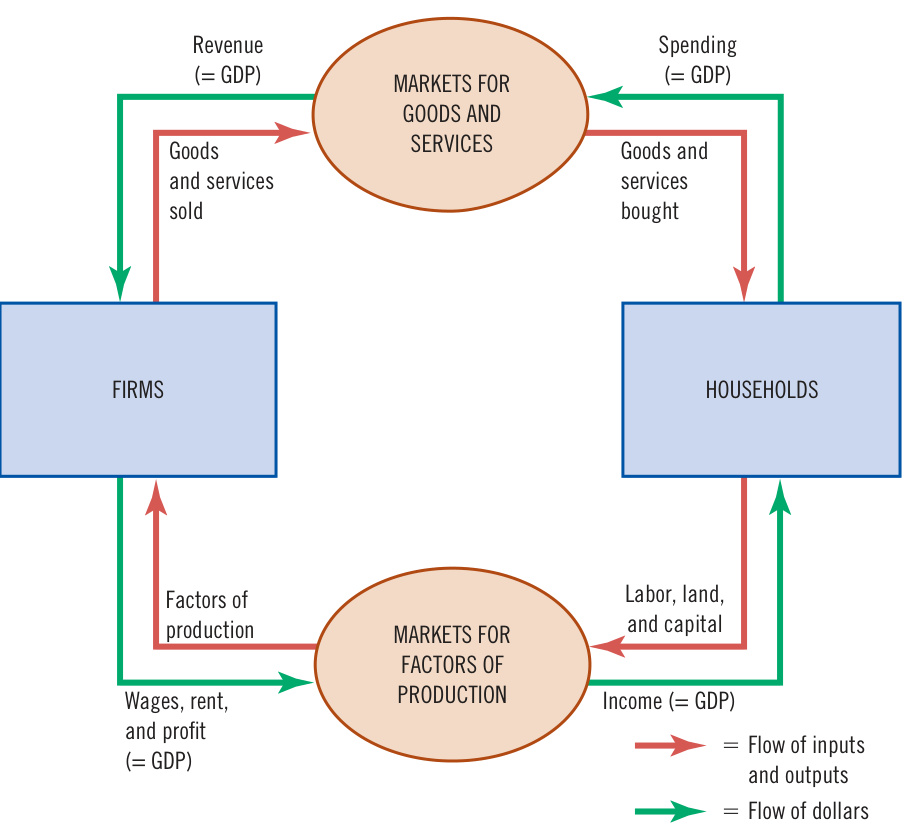
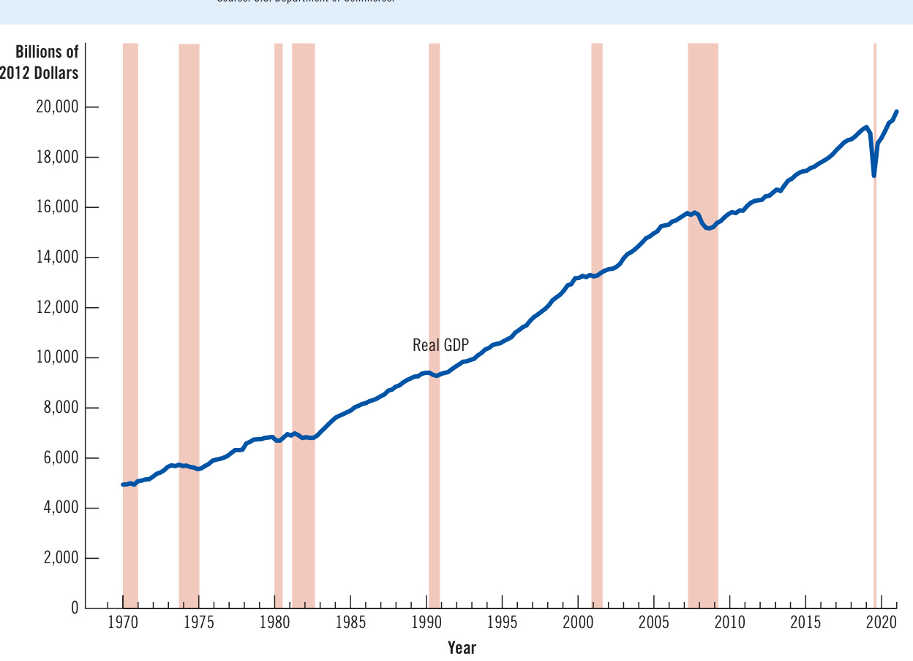

# Ch24 Measuring a Nation’s Income  

When you finish school and look for a full-time job, prevailing economic conditions will, to a large extent, shape your experience. In some years, firms through out the economy are expanding their production of goods and services, employment is rising, and job openings are plentiful. In other years, firms are cutting back production, employment is declining, and help-wanted ads are few and far between. College graduates who start their job hunt in a year of economic expan sion have a much easier time of it than those who start in a year of economic contraction.  

Because the health of the overall economy affects everyone, changes in economic conditions are widely reported. Indeed, the news is filled with economic statistics. These numbers might measure the total income of everyone in the economy (gross domestic product), the rate at which average prices are rising or falling (inflation/deflation), the percentage of the labor force that is out of work (unemployment), total spending at stores (retail sales), or the imbalance of trade between the United States and the rest of the world (the trade deficit). All these statistics are macroeconomic. Rather than focusing on a particular household, firm, or market, they provide information about the entire economy.  

  

## microeconomics  

the study of how households and firms make decisions and how they interact in markets  

## macroeconomics  

the study of economywide phenomena, including inflation, unemployment, and economic growth  

As Chapter 2 discussed, economics is divided into two branches: microeconomics and macroeconomics. Microeconomics studies how individual households and firms make decisions and interact in markets. Macroeconomics studies the economy as a whole, with the goal of explaining changes that affect many households, firms, and markets simultaneously. Macroeconomists address a broad range of questions: Why is average income high in some countries and low in others? Why are prices sometimes rapidly rising and other times more stable? Why do production and employment expand in some years and contract in others? How can the government promote rapid growth in incomes, low inflation, and stable employment? These questions concern the workings of the entire economy, so they fall under the scope of macroeconomics.  

Because the overall economy is a collection of households and firms interacting in many markets, microeconomics and macroeconomics are closely linked. The tools of supply and demand, for instance, are as central to macroeconomic analysis as they are to microeconomic analysis. Yet studying the economy in its entirety raises special challenges. To understand a forest, it’s not enough to analyze each of the trees.  

This chapter and the next discuss some of the data that economists and policymakers use to monitor the performance of the overall economy. Our starting point is gross domestic product (GDP), which measures the total income of a nation. GDP is often thought to be the single best measure of a society’s economic well-being.  

## 24-1  The Economy’s Income and Expenditure  

If you were to judge how a family is doing economically, you might first look at its income. Higher incomes usually translate into higher standards of living—larger houses, better healthcare, fancier cars, more opulent vacations, and so on.  

The same logic applies to a nation’s economy. When judging whether the economy is doing well or poorly, it is natural to look at the aggregate income that everyone in the economy is earning. Gross domestic product allows us to do just that.  

GDP measures two things at once: the total income of everyone in the economy and the total expenditure on the economy’s output of goods and services. GDP can perform the trick of measuring both total income and total expenditure because these two things are the same. For an economy as a whole, income must equal expenditure.  

This is because every transaction has two parties: a buyer and a seller. Every dollar of spending by some buyer is a dollar of income for some seller. If Karen pays Doug $\mathbb{S}100$ to mow her lawn, Doug earns $\mathbb{S}100$ as a seller of a service, and Karen spends $\mathbb{S}100$ as a buyer of the service. The transaction contributes equally to the economy’s income and to its expenditure. Whether GDP is measured as total income or total expenditure, it rises by $\mathbb{S}100$ .  

Another way to see the equality of income and expenditure is with the circularflow diagram in Figure 1. As you may recall from Chapter 2, this diagram describes all the transactions between households and firms. It simplifies matters by assuming that all goods and services are bought by households and that households spend all of their income. In this economy, when households buy goods and services from firms, these expenditures flow through the markets for goods and services. When the firms use the money they receive from sales for workers’ wages, landowners’ rent, and firm owners’ profit, this income flows through the markets for the factors of production. Money continuously flows from households to firms and then back to households.  

GDP measures the flow of money around the economy. We can compute it in two ways: by adding up all the expenditure by households or by adding up all the income (wages, rent, and profit) paid by firms. Because all expenditure in the economy ends up as someone’s income, GDP is the same regardless of how we compute it.  

The actual economy is far more complex than the one shown in Figure 1. Households do not spend all of their income. They pay some of it to the government in taxes and save some for use in the future. In addition, households do not buy all goods and services produced in the economy. Some goods and services are bought by governments for public purposes, and some are bought by firms to expand their production capacity. Yet the basic lesson remains the same: Regardless of whether a household, government, or firm buys a good or service, the transaction always has a buyer and a seller. For the economy as a whole, expenditure equals income.  

## Figure 1  

## The Circular-Flow Diagram  

Households buy goods and services from firms, and firms use their revenue from sales for wages to workers, rent to landowners, and profit to firm owners. GDP equals the total amount spent by households in the markets for goods and services. It also equals the total wages, rent, and profit paid by firms in the markets for the factors of production.  

  

1. An economy’s gross domestic product is a. the excess of spending over income. b. the excess of income over spending. c. total income and total spending. d. total spending as a percent of total income.  

2. Carla bakes a cake and sells it to Norm for $\mathbb{5}10$ . Sam pays Diane $\Phi30$ to tutor him. In this economy, GDP is a. $\mathbb{5}10$ . b. $\mathbb{S}20$ . c. $\Phi30$ . d. $\Phi40$ .  

## 24-2 The Measurement of GDP  

Having discussed gross domestic product in general terms, let’s be more precise about how it is measured. Here is a definition of GDP that focuses on expenditure:  

## gross domestic product (GDP)  

the market value of all final goods and services produced within a country in a given period  

• Gross domestic product (GDP) is the market value of all final goods and services produced within a country in a given period.  

This definition might seem simple enough. But in fact, many subtle issues arise when computing an economy’s GDP. Let’s consider each phrase in this definition.  

## 24-2a “GDP Is the Market Value .  

“You can’t compare apples and oranges.” This adage is often true, yet GDP does exactly that. GDP adds together many different products into a single measure of the value of economic activity. It does this using market prices to translate quantities into a measure of value. Prices are a gauge of value because they reflect the amount people are willing to pay for different goods. If the price of an apple is twice the price of an orange, then an apple contributes twice as much to GDP as an orange.  

## 24-2b “. . . of All . . .  

GDP tries to be comprehensive. It includes all items produced in the economy and sold legally in markets. GDP measures the market value of not just apples and oranges but also pears and grapefruit, books and movies, haircuts and healthcare, and so on.  

GDP also includes the market value of the housing services that flow from the economy’s stock of housing. For rental housing, this value is easy to calculate—the rent equals both the tenant’s expenditure and the landlord’s income. Yet many people do not pay rent because they own their homes. The government includes this owner-occupied housing in GDP by estimating its rental value. In effect, the national income accounts assume that homeowners rent their houses to themselves. This imputed rent is included both in the homeowners’ expenditure and in their income, so it adds to GDP.  

But GDP excludes some products whose value is hard to measure. In this category are most items produced and sold illicitly, such as illegal drugs. GDP also excludes most items that never enter the marketplace because they are produced and consumed at home. For instance, GDP includes vegetables you buy at the grocery store but not those you grow in your garden. When you are working at home, what you produce for your employer is part of GDP, but what you produce for your family is not.  

These exclusions from GDP can lead to paradoxical results. When Karen pays Doug to mow her lawn, that transaction is part of GDP. But suppose Doug and  

Karen marry. Even though Doug may continue to mow Karen’s lawn, the value of the mowing is now left out of GDP because Doug’s service is no longer sold in a market. Their marriage may well enhance their well-being and the total well-being of society, but it reduces GDP.  

## 24-2c “. . . Final . . .  

When Intel makes a microchip that Dell uses to make a computer, the microchip is an intermediate good, and the computer is a final good. GDP includes only the value of final goods because the value of intermediate goods is already included in the prices of the final goods. Adding the market value of the microchip to the market value of the computer would be double counting: It would (incorrectly) count the microchip twice.  

An exception to this principle arises when an intermediate good is produced and, rather than being used, is added to a firm’s inventory of goods for use or sale later. In this case, the intermediate good is taken to be “final” for the moment, and its value as inventory investment is included in GDP. Thus, additions to inventory add to GDP, and when the goods in inventory are later used or sold, the reductions in inventory subtract from GDP.  

## 24-2d  “. . . Goods and Services .  

GDP includes tangible goods (food, clothing, cars) and intangible services (haircuts, house cleaning, doctor visits). When you buy a T-shirt with your favorite band’s logo, you are buying a good, and the purchase price is part of GDP. When you pay to hear a concert by the same band, you are buying a service, and the ticket price is also part of GDP.  

## 24-2e “. . . Produced . . .”  

GDP includes goods and services currently produced. It does not include transactions involving items produced in the past. When Ford produces and sells a new car, the value of the car is included in GDP. But when one person sells a used car to another, the value of the used car is not included in GDP.  

## 24-2f  “. . . Within a Country . . .  

GDP measures the value of production within the geographic confines of a country. When Canadians work temporarily in the United States, their production counts toward U.S. GDP. When Americans own a factory in Haiti, the production at the factory does not contribute to U.S. GDP. (It adds to Haiti’s GDP.) Items are included in a nation’s GDP if they are produced domestically, regardless of the nationality of the producer.  

## $\mathbf{24-2g}$ “. . . In a Given Period.”  

GDP measures the value of production that takes place within a specific interval of time. Usually, that interval is a year or a quarter (three months). GDP measures the economy’s flow of income, as well as its flow of expenditure, during that interval.  

When the government reports the GDP for a quarter, it usually presents GDP “at an annual rate.” This means that the figure reported for quarterly GDP is the amount of income and expenditure during the quarter multiplied by four. The government uses this convention so that quarterly and annual figures on GDP can be compared more easily.  

In addition, when the government reports quarterly GDP, it presents the data after they have been modified by a statistical procedure called seasonal adjustment. The unadjusted data show that the economy produces more goods and services  

during some times of the year than others. (December’s holiday shopping season is a high point.) When monitoring the economy, economists and policymakers often want to look beyond these seasonal changes. Therefore, government statisticians adjust the quarterly data to take out the seasonal cycle. The GDP data reported in the news are always seasonally adjusted.   
Now let’s repeat the definition of GDP:  

• Gross domestic product (GDP) is the market value of all final goods and services produced within a country in a given period.  

This definition focuses on GDP as total expenditure in the economy. But recall that every dollar spent by a buyer of a good or service becomes a dollar of income to the seller of that good or service. Therefore, in addition to adding up total expenditure in the economy to calculate GDP, the government also adds up total income in the economy to arrive at gross domestic income (GDI). GDP and GDI give almost exactly the same number. Why “almost”? The two measures should be precisely the same, but data sources are not perfect. The difference between GDP and GDI is called the statistical discrepancy.  

It should be apparent that GDP is a sophisticated measure of the value of economic activity. In advanced courses in macroeconomics, you will learn more about the nuances of its calculation. But even now, you can see that each phrase in this definition is packed with meaning.  

## Other Measures of Income  

hen the U.S. Department of Commerce computes the nation’s GDP, it also calculates other measures of income to get a more complete picture of what’s happening in the economy. These other measures differ from GDP by excluding or including certain categories of income. What follows is a brief description of five of these income measures, ordered from largest to smallest.  

Gross national product (GNP) is the total income earned by a nation’s permanent residents (called nationals). It differs from GDP in that it includes income that domestic residents earn abroad and excludes income that foreigners earn here. For example, when Canadians work temporarily in the United States, the income from this work is part of U.S. GDP, but it is not part of U.S. GNP. (It is part of Canada’s GNP.) For most countries, including the United States, domestic residents are responsible for most domestic production, so GDP and GNP are quite close. Net national product (NNP) is the total income of a nation’s residents (GNP) minus losses from depreciation. Depreciation is the wear and tear on the economy’s stock of equipment and structures, such as trucks rusting and old computer models becoming obsolete. In the national income accounts prepared by the Department of Commerce, depreciation is called the “consumption of fixed capital.” National income is the total income earned by a nation’s residents in the production of goods and services. It is almost identical to net national product. These two measures differ because of the statistical discrepancy that arises from problems in data collection.  

Personal income is the income that households and noncorporate businesses receive. Unlike national income, it excludes retained earnings, the income that corporations earn but do not pay out to their owners. It also subtracts indirect business taxes (such as sales taxes), corporate income taxes, and contributions for social insurance (mostly Social Security taxes). In addition, personal income includes the interest income that households receive from their holdings of government debt and the income that households receive from government transfer programs, such as welfare and Social Security. Disposable personal income is the income that households and noncorporate businesses have left after satisfying all their obligations to the government. It equals personal income minus personal taxes and certain nontax payments (such as traffic tickets).  

Although the various measures of income differ in detail, they almost always tell the same story about economic conditions. When GDP grows rapidly, these other measures of income tend to grow rapidly. And when GDP falls, these other measures tend to fall as well. As a result, for monitoring fluctuations in the overall economy, it does not matter much which measure of income we use.  

3. If the price of a hot dog is $\mathbb{5}2$ and the price of a hamburger is $\Phi4$ , then 30 hot dogs contribute as much to GDP as _ hamburgers.  

a. 5   
b. 15   
c. 30   
d. 60  

4. Angus the sheep farmer sells wool to Barnaby the knitter for $\mathbb{S}20$ . Barnaby makes two sweaters, each of which has a market price of $\Phi40$ . Collette buys one of them, while the other remains on the shelf of Barnaby’s store to be sold later. What is GDP here? a. $\Phi40$ b. $\Phi60$  

c. $\Phi80$   
d. $\mathbb{S}100$  

5. Desirae, an American college student, moves to Japan for the summer to teach English. Her salary is included a. only in U.S. GDP. b. only in Japan’s GDP. c. in both U.S. GDP and Japan’s GDP. d. in neither U.S. GDP nor Japan’s GDP.  

Answers are at the end of the chapter.  

## 24-3 The Components of GDP  

Spending in an economy takes many forms. At any moment, the Lopez family may be having lunch at Burger King, Ford may be building a car factory, the U.S. Navy may be procuring a submarine, and British Airways may be buying an airplane from Boeing. GDP includes all of these forms of spending on domestically produced goods and services.  

To understand how the economy is using its scarce resources, economists study the composition of GDP among the types of spending. To do this, GDP (denoted as Y) is divided into four components: consumption $(C),$ investment $(I)$ , government purchases $(G)_{\cdot}$ , and net exports (NX):  

$$
\begin{array}{r}{Y=C+I+G+N X.}\end{array}
$$  

This equation is an identity—an equation that must be true given the definitions of the variables in the equation. In this case, because each dollar of expenditure included in GDP is placed into one of the four components, the total of the four components must be equal to GDP. Let’s look at these four components more closely.  

## 24-3a Consumption  

Consumption is spending by households on goods and services except for purchases of new housing. Goods include durable goods, such as automobiles and appliances, and nondurable goods, such as food and clothing. Services include intangible items, such as haircuts and medical care. By convention, household spending on education is also included in consumption of services (although one might argue that it would fit better in the next component).  

## consumption  

spending by households on goods and services, with the exception of purchases of new housing  

## 24-3b  Investment  

Investment is the purchase of goods (called capital goods) that will be used in the future to produce more goods and services. Investment is the sum of purchases of business capital, residential capital, and inventories. Business capital includes business structures (such as a factory or office building), equipment (such as a  

## investment  

spending on business capital, residential capital, and inventories  

worker’s computer), and intellectual property products (such as the software that runs the computer). Residential capital includes the landlord’s apartment building and a homeowner’s personal residence. By convention, the purchase of a new house is the one type of household spending categorized as investment rather than consumption.  

As already noted, inventories deserve special attention. When Apple produces a computer and adds it to its inventory instead of selling it, Apple is assumed to have “purchased” the computer for itself. That is, the national income accounts treat the computer as part of Apple’s investment spending. When Apple later sells the computer out of inventory, the sale will subtract from Apple’s inventory investment, offsetting the positive expenditure of the buyer. Inventories are treated this way because GDP aims to measure the value of the economy’s production, and goods added to inventory are part of that period’s production.  

Notice that GDP accounting uses the word investment in a specialized way. In everyday conversation, this word might make you might think of financial investments, such as stocks, bonds, and mutual funds—topics that we will study later in this book. By contrast, because GDP measures expenditure on goods and services, here the word investment means purchases of goods (such as business capital, residential structures, and inventories) that will be used to produce other goods and services in the future.  

## 24-3c  Government Purchases  

government purchases spending on goods and services by local, state, and federal governments  

Government purchases measure spending on goods and services by federal, state, and local governments. This component includes the salaries of government workers as well as expenditures on public works. The U.S. national income accounts call this spending category government consumption expenditure and gross investment, but this book uses the shorter term government purchases.  

The meaning of government purchases requires some clarification. When the government pays the salary of a soldier or schoolteacher, that salary is included in government purchases. But when the government pays a Social Security benefit to an older person or an unemployment insurance benefit to a recently laid-off worker, the story is different: These are called transfer payments because they are not made in exchange for a currently produced good or service. Transfer payments alter household income but do not reflect the economy’s production. (From a macroeconomic standpoint, they are like negative taxes.) Because GDP is intended to measure income from, and expenditure on, the production of goods and services, transfer payments are not counted as government purchases.  

## 24-3d  Net Exports  

## net exports  

spending on domestically produced goods by foreigners (exports) minus spending on foreign goods by domestic residents (imports)  

Net exports equal the foreign purchases of domestically produced goods (exports) minus the domestic purchases of foreign goods (imports). A domestic firm’s sale to a buyer in another country, such as Boeing’s sale of an airplane to British Airways, increases net exports.  

The net in net exports refers to the fact that imports are subtracted from exports. This subtraction is made because other components of GDP include imports of goods and services. For example, suppose that a household buys a $^\mathrm{\Phi50,000}$ car from Volvo, the Swedish carmaker. This transaction increases consumption by $^\mathrm{\S50,000}$ because car purchases are part of consumer spending. It also reduces net exports by $^\mathrm{\textregistered}_{}50{,}000$ because the car is an import. In other words, net exports include goods and services produced abroad (with a minus sign) because these goods and services are included in consumption, investment, and government purchases (with a plus sign).  

Thus, when a domestic household, $\mathrm{firm},$ or government buys a good or service from abroad, the purchase does not affect GDP because it reduces net exports by the same amount that it raises consumption, investment, or government purchases.  

## The Components of U.S. GDP  

Table 1 shows the composition of U.S. GDP in 2021. In this year, the GDP of the United States was about $\mathbb{S}23$ trillion. Dividing this number by the 2021 U.S. population of 331 million yields GDP per person (sometimes called GDP per capita) and reveals that the income and expenditure of the average American in 2021 was $^{\Phi69,386}$ .  

Consumption made up 68 percent of GDP, or $^\mathrm{\Phi_{4}7,528}$ per person. Investment was $^\mathrm{512,396}$ per person. Government purchases were $^{\,\Phi12,226}$ per person. Net exports were $-\mathbb{S}2,\!764$ per person. This number is negative because Americans spent more on foreign goods than foreigners spent on American goods.  

These data come from the Bureau of Economic Analysis, the part of the U.S. Department of Commerce that produces the national income accounts. You can find more recent data on GDP on its website, http://www.bea.gov.

## Table 1  

## GDP and Its Components  

This table shows total GDP for the U.S. economy in 2021 and the breakdown of GDP among its four components. When reading this table, recall the identity $\begin{array}{r}{Y=\thinspace C+\thinspace I+\thinspace G+\thinspace N X.}\end{array}$  

Source: U.S. Department of Commerce. Parts may not sum to totals due to rounding.  

<html><body><table><tr><td></td><td>Total (inbillionsofdollars)</td><td>PerPerson (in dollars)</td><td>Percent of Total</td></tr><tr><td>Gross domestic product,Y</td><td>$22,994</td><td>$69,386</td><td>100%</td></tr><tr><td>Consumption, C</td><td>15,750</td><td>47,528</td><td>68</td></tr><tr><td>Investment,/</td><td>4,108</td><td>12,396</td><td>18</td></tr><tr><td>Government purchases,G</td><td>4,052</td><td>12,226</td><td>18</td></tr><tr><td>Net exports，Nx</td><td>-916</td><td>-2,764</td><td>-4</td></tr></table></body></html>  

## QuickQuiz  

6. Which of the following does NOT add to U.S. GDP?  

a. Boeing manufactures and sells a plane to Air France.   
b. General Motors builds a new auto factory in North Carolina.   
c. The city of New York pays a salary to a policeman.   
d. The federal government sends a Social Security check to your grandmother.  

7. An American buys a pair of shoes made in Italy. How do the U.S. national income accounts treat the transaction?  

a. Net exports and GDP both rise.   
b. Net exports and GDP both fall.  

c. Net exports fall, while GDP does not change. d. Net exports do not change, while GDP rises. 8. Which is the largest component of GDP? a. consumption b. investment c. government purchases d. net exports  

As we have seen, GDP measures the total spending on goods and services in all markets in the economy. If total spending rises from one year to the next, at least one of two things must be true: (1) the economy is producing a larger output of goods and services, or (2) goods and services are being sold at higher prices. When studying changes in the economy over time, economists want to separate these two effects. In particular, they want a measure of the total quantity of goods and services the economy is producing independent of changes in the prices of those goods and services.  

To do this, economists use a measure called real GDP. Real GDP answers a hypothetical question: What would be the value of the goods and services produced this year if they were valued using the prices that prevailed in some specific year in the past? By evaluating current production using prices fixed at past levels, real GDP shows how the economy’s overall production of goods and services changes over time.  

To see more precisely how real GDP is constructed, consider an example.  

## 24-4a  A Numerical Example  

Table 2 shows some data for an economy that produces only two goods: hot dogs and hamburgers. The table shows the prices and quantities produced of the two goods in the years 2022, 2023, and 2024.  

## Table 2  

## Real and Nominal GDP  

This table shows   
how to calculate real GDP, nominal GDP, and the GDP deflator for a hypothetical   
economy that   
produces only   
hot dogs and   
hamburgers.  

<html><body><table><tr><td colspan="4">Prices and Quantities</td></tr><tr><td>Year</td><td>Quantity ofHot Price of Hot Dogs</td><td>Price of Hamburgers</td><td>Quantity of Hamburgers</td></tr><tr><td>2022 2023</td><td>Dogs $1 100</td><td>$2</td><td>50</td></tr><tr><td>2024</td><td>$2 150</td><td>$3</td><td>100</td></tr><tr><td></td><td>$ 200</td><td>$4</td><td>150</td></tr><tr><td>2022</td><td>Calculating Nominal GDP ($1 per hot dog × 100 hot dogs) + ($2 per hamburger × 50 hamburgers) = $200</td><td></td><td></td></tr><tr><td>2023 2024</td><td>($2 per hot dog × 150 hot dogs) + ($3 per hamburger × 100 hamburgers) = $600 ($3 per hot dog × 200 hot dogs) + ($4 per hamburger × 150 hamburgers) = $1,200 CalculatingRealGDP(baseyear2022)</td><td></td><td></td></tr><tr><td>2022 2023 2024</td><td>($1 per hot dog × 100 hot dogs) + ($2 per hamburger × 50 hamburgers) = $200 ($1 per hot dog × 150 hot dogs) + ($2 per hamburger × 100 hamburgers) = $350 ($1 per hot dog × 200 hot dogs) + ($2 per hamburger × 150 hamburgers) = $500</td><td></td><td></td></tr><tr><td></td><td>Calculating the GDPDeflator</td><td></td><td></td></tr><tr><td>2022 2023 $600/</td><td>($200/$200)× 100 = 100</td><td></td><td></td></tr></table></body></html>  

$$
(\Phi1,200/\Phi500)\times100=240
$$  

To compute total spending in this economy, we multiply the quantities of hot dogs and hamburgers by their prices. In the year 2022, 100 hot dogs are sold at a price of $\mathbb{S}1$ per hot dog, so expenditure on hot dogs equals $\mathbb{S}100$ . In the same year, 50 hamburgers are sold for $\mathbb{S}2$ per hamburger, so expenditure on hamburgers is also $\mathbb{S}100$ . Total expenditure in the economy—the sum of expenditure on hot dogs and hamburgers—is $\mathbb{S}200$ . This amount, the production of goods and services valued at current prices, is called nominal GDP.  

The table shows the calculation of nominal GDP for these three years. Total spending rises from $\mathbb{S}200$ in 2022 to $\mathbb{S}600$ in 2023 and then to $^{\Phi1,200}$ in 2024. Part of this increase is attributable to greater quantities of hot dogs and hamburgers, and part is attributable to higher prices.  

To remove the effect of price changes and obtain a measure of the amount produced, we use real GDP, which is the production of goods and services valued at constant prices. To calculate real GDP, we first designate one year as a base year. We then use the prices of hot dogs and hamburgers in that year to compute the value of goods and services in all the years. In other words, the prices in the base year provide the basis for comparing quantities in different years.  

Suppose that, in our example, 2022 is the designated base year. We can then use the prices in 2022 to compute the value of production in 2022, 2023, and 2024. Table 2 shows these calculations. To compute real GDP for 2022, we multiply the prices of hot dogs and hamburgers in 2022 (the base year) by the quantities of hot dogs and hamburgers produced in 2022. (For the base year, real GDP always equals nominal GDP.) To compute real GDP for 2023, we multiply the prices of hot dogs and hamburgers in 2022 (the base year) by the quantities of hot dogs and hamburgers produced in 2023. Similarly, to compute real GDP for 2024, we multiply the prices in 2022 by the quantities in 2024. We find that real GDP has risen from $\mathbb{S}200$ in 2022 to $\mathbb{S}350$ in 2023 and then to $\mathbb{S}500$ in 2024. This increase must be attributable to an increase in the quantities produced because the prices are being held fixed at base-year levels.  

To sum up: Nominal GDP uses current prices to value the economy’s production of goods and services. Real GDP uses constant base-year prices to value the economy’s production. Because price changes do not affect real GDP, changes in real GDP reflect only changes in the quantities produced. Therefore, real GDP can be interpreted as a measure of the overall economy’s production of goods and services.  

Our goal in computing GDP is to gauge how well the overall economy is performing. Because real GDP measures the economy’s production of goods and services, it reflects the economy’s ability to satisfy people’s material needs and desires. Thus, real GDP is better than nominal GDP for assessing economic well-being. When economists talk about the economy’s GDP, they usually mean real GDP rather than nominal GDP. And when they talk about growth in the economy, they measure that growth as the percentage change in real GDP from one period to another.  

## 24-4b  The GDP Deflator  

To recap: Nominal GDP reflects both the quantities of goods and services the economy is producing and the prices of those goods and services. Real GDP reflects only the quantities produced because it holds prices constant at base-year levels. From these two statistics, we can compute a third, called the GDP deflator, which reflects only the prices of goods and services.  

The GDP deflator is defined as follows:  

$$
\mathrm{GDP~deflator}=\frac{\mathrm{Nominal~GDP}}{\mathrm{Real~GDP}}\times100.
$$  

## nominal GDP  

the production of goods and services valued at current prices  

## real GDP  

the production of goods and services valued at constant prices  

## GDP deflator  

a measure of the price level calculated as the ratio of nominal GDP to real GDP times 100  

Because nominal GDP and real GDP must be the same in the base year, the GDP deflator for the base year always equals 100. The GDP deflator for subsequent years measures the change in nominal GDP from the base year that isn’t attributable to a change in real GDP.  

The GDP deflator measures the current price level relative to the price level in the base year. To see why, consider a couple of simple examples. First, imagine that the quantities produced in the economy rise over time, but prices remain the same. In this case, both nominal and real GDP rise at the same rate, so the GDP deflator is constant. Now suppose that, instead, prices rise, but the quantities produced stay the same. In this second case, nominal GDP rises, but real GDP remains the same, so the GDP deflator rises. In both cases, the GDP deflator reflects what’s happening to prices but not to quantities.  

Return to our numerical example in Table 2. The GDP deflator is computed at the bottom. For the year 2022, nominal GDP is $\mathbb{S}200$ , and real GDP is $\mathbb{S}200,$ so the GDP deflator is 100. (Recall that the deflator is always 100 in the base year.) For the year 2023, nominal GDP is $\mathbb{S}600$ , and real GDP is $\mathbb{S}350$ , so the GDP deflator is 171.  

Economists use the term inflation to describe a situation in which the economy’s overall price level is rising. The inflation rate is the percentage change in some measure of the price level from one period to the next. Using the GDP deflator, the inflation rate between two consecutive years is computed as follows:  

GDP deflator in year 2 − GDP deflator in year 1 Inflation rate in year $2=$ 3 100. GDP deflator in year 1  

Because the GDP deflator rose in year 2023 from 100 to 171, the inflation rate is $100\times(171-100)/100,$ or 71 percent. In 2024, the GDP deflator rose to 240 from 171 the previous year, so the inflation rate is $100\times(240-171)/171,$ or 40 percent.  

The GDP deflator is one measure used to monitor the average level of prices and the rate of inflation. The GDP deflator gets its name because it takes inflation out of nominal GDP—that is, it “deflates” nominal GDP for the rise that is due to price increases. The next chapter examines another measure of the economy’s price level, called the consumer price index and discusses how the two statistics differ.  

## A Half Century of Real GDP  

Real GDP conveys important information. Figure 2 shows quarterly data on real GDP for the U.S. economy since 1970.  

One message from these data is that real GDP grows over time. The real GDP of the U.S. economy in 2021 was about four times its 1970 level. Put differently, the output of goods and services produced in the United States has grown, on average, about 3 percent per year. Because this continued growth in real GDP exceeds the rate of population growth, average Americans today enjoy greater economic prosperity than past generations.  

The GDP data also show that growth is not steady. The upward climb of real GDP is occasionally interrupted by periods when GDP declines, called recessions. Figure 2 marks recessions with shaded vertical bars. (There is no ironclad rule for when the official business cycle dating committee will declare that a recession has occurred, but an old rule of thumb is two consecutive quarters of falling real GDP. An exception is the pandemic recession of 2020, when there was an unusually large fall in GDP that lasted only one quarter.) Recessions are associated not only with lower incomes but also with other forms of distress: rising unemployment, falling profits, increased bankruptcies, and so on.  

  

Much of macroeconomics aims to explain the long-run growth and short-run fluctuations in real GDP. As the coming chapters will show, different models are needed for these two purposes. Because the short-run fluctuations represent deviations from the long-run trend, we first examine the behavior of key macroeconomic variables, including real GDP, in the long run. Later chapters build on this analysis to explain short-run fluctuations. ●  

## QuickQuiz  

9. An economy produces 10 cookies in year 1 at a price of $\mathbb{5}2$ per cookie and 12 cookies in year 2 at a price of $\mathbb{5}3$ per cookie. From year 1 to year 2, real GDP increases by  

a. 20 percent.   
b. 50 percent.   
c. 70 percent.   
d. 80 percent.  

10. If all quantities produced rise by 5 percent and all prices fall by 5 percent, which of the following best describes what occurs? a. Real GDP rises by 5 percent, while nominal GDP falls by 5 percent. b. Real GDP rises by 5 percent, while nominal GDP is unchanged. c. Real GDP is unchanged, while nominal GDP rises by 5 percent. d. Real GDP is unchanged, while nominal GDP falls by 5 percent.  

Earlier, this chapter noted that GDP is often considered the single best measure of society’s economic well-being. Now that we know what GDP is, let’s discuss the basis for this view and the limitations of GDP as a gauge of social welfare.  

As we have seen, GDP measures both the economy’s total income and its total expenditure on goods and services. GDP per person tells us the income and expenditure of the average person. Because most people would prefer to receive higher income and enjoy greater expenditure, GDP per person seems a natural measure of the economic well-being of the typical individual.  

Yet some people dispute the validity of GDP as a measure of well-being. When Senator Robert Kennedy was running for president in 1968, he gave a moving critique of such statistics:  

[Gross domestic product] does not allow for the health of our children, the quality of their education, or the joy of their play. It does not include the beauty of our poetry or the strength of our marriages, the intelligence of our public debate or the integrity of our public officials. It measures neither our courage, nor our wisdom, nor our devotion to our country. It measures everything, in short, except that which makes life worthwhile, and it can tell us everything about America except why we are proud that we are Americans.  

Much of what Robert Kennedy said is correct. Why, then, do we care about GDP?  

The answer is that a larger GDP does, in fact, make it easier to lead better lives. GDP does not measure the health of our children, but nations with larger GDP can afford better healthcare for their children. GDP does not measure the quality of their education, but nations with larger GDP can afford better educational systems. GDP does not measure the beauty of our poetry, but nations with larger GDP can afford to teach more of their citizens to read and enjoy poetry. GDP does not take account of our intelligence, integrity, courage, wisdom, or devotion to country, but these virtues are easier to foster when people are less concerned about the material necessities of life. In short, GDP does not directly measure those things that make life worthwhile, but it does measure our ability to obtain many of the inputs for a worthwhile life.  

GDP is not, however, a perfect measure of well-being. It omits some things that contribute to a good life, such as leisure. Suppose, for instance, that everyone suddenly started working every day of the week rather than taking weekends off to spend with family and friends or on personal pursuits. More goods and services would be produced, and GDP would rise. But despite the increase in GDP, we should not conclude that everyone would be better off. The loss from reduced leisure would offset the gain from producing and consuming a greater quantity of goods and services.  

Because GDP uses market prices to value goods and services, it excludes the value of almost all activity that takes place outside markets. In particular, GDP omits the value of goods and services produced at home. When chefs prepare delicious meals at their restaurants, the value of those meals is part of GDP. But if chefs prepare the same meals for their own families, the value they have added to the raw ingredients is left out of GDP. Similarly, childcare provided in day care centers is part of GDP, whereas childcare provided by parents at home is not. Volunteer work also contributes to the well-being of those in society, but GDP does not reflect these contributions.  

Another thing that GDP excludes is the quality of the environment. Imagine that the government eliminated all environmental regulations. Firms could then produce goods and services without considering the pollution they create, and GDP might rise. Yet well-being would most likely fall. The deterioration in the quality of the air and water would more than offset the gains from greater production.  

GDP also says nothing about the distribution of income. Consider two societies, one in which 100 people have annual incomes of $^\mathrm{\textregistered}_{}50{,}000$ and another in which 10 people earn $^\mathrm{\textregistered}_{}500,000$ and 90 suffer with nothing at all. Both societies have GDP of $\mathbb{S5}$ million and GDP per person of $^\mathrm{\textregistered}_{}50{,}000$ . Yet few people would consider the two situations equivalent. While GDP per person tells us what’s happening to the average person, behind the average lies a large variety of individual experiences.  

In the end, we can conclude that GDP is a good measure of economic well-being for many—but not all—purposes. It is important to keep in mind what GDP includes and what it leaves out.  

## International Differences in GDP and the Quality of Life  

One way to gauge the usefulness of GDP as a measure of economic well-being is to examine international data. Rich and poor countries have vastly different levels of GDP per person. If a large GDP leads to a higher standard of living, then GDP should be strongly correlated with various measures of the quality of life. And, in fact, they are.  

Table 3 shows twelve large nations ranked in order of GDP per person. The table also shows life expectancy at birth, average years of schooling among adults, and an index of life satisfaction built by asking people how they feel about their lives on a scale of 0 to 10 (with 10 being the best). These data show a clear pattern. In rich countries, such as the United States and Germany, people have a life expectancy of about 80, acquire about 13 years of schooling, and rate their life satisfaction at about 7. In poor countries, such as Bangladesh and Nigeria, people typically die about 10 years earlier, have less than half as much schooling, and rate their life satisfaction about 2 points lower on the 10-point scale.  

Data on other aspects of the quality of life tell a similar story. Countries with low GDP per person tend to have more infants with low birth weight, higher rates  

## Table 3  

## GDP and the Quality of Life  

The table shows GDP per person and three other measures of the quality of life for twelve major countries.  

Source: Human Development Indices and Indicators: 2018 Statistical Update, United Nations. Real GDP is for 2017, expressed in 2011 dollars. Average years of schooling is among adults 25 years and older.  

<html><body><table><tr><td></td><td>Real GDP per Person</td><td>Life Expectancy</td><td>Average Years of Schooling</td><td>Overall Life (0 to 10 scale)</td></tr><tr><td>Country United States</td><td>$54,941</td><td>80 years</td><td>13 years</td><td>7.0</td></tr><tr><td>Germany</td><td>46,136</td><td>81</td><td>14</td><td>7.1</td></tr><tr><td>Japan</td><td>38,986</td><td>84</td><td>13</td><td>5.9</td></tr><tr><td>Russia</td><td>24,233</td><td>71</td><td>12</td><td>5.6</td></tr><tr><td>Mexico</td><td>16,944</td><td>77</td><td>9</td><td>6.4</td></tr><tr><td>China</td><td>15,270</td><td>76</td><td>8</td><td>5.1</td></tr><tr><td>Brazil</td><td>13,755</td><td>76</td><td>8</td><td>6.3</td></tr><tr><td>Indonesia</td><td>10,846</td><td>69</td><td>8</td><td>5.1</td></tr><tr><td>India</td><td>6,353</td><td>69</td><td>6</td><td>4.0</td></tr><tr><td>Pakistan</td><td>5,311</td><td>67</td><td>5</td><td>5.8</td></tr><tr><td>Nigeria</td><td>5,231</td><td>54</td><td>6</td><td>5.3</td></tr><tr><td>Bangladesh</td><td>3,677</td><td>73</td><td>6</td><td>4.3</td></tr></table></body></html>  

Some nations are debating what to include in their national income accounts.  

## No Sex, Please, We’re French  

## By Zachary Karabell  

he government of France has just made what on the face of it appears to be a nonannouncement announcement: It will not include illegal drugs and prostitution in its official calculation of the country’s gross domestic product.  

What made the announcement odd was that it never has included such activities, nor have most countries. Nor do most governments announce what they do not plan to do. (“The U.S. government has no intention of sending a man to Venus.”) Yet the French decision comes in the wake of significant pressure from neighboring countries and from the European Union to integrate these activities into national accounts and economic output. That raises a host of questions: Should these activities be included, and if those are, why not others? And what exactly are we measuring—and why?  

Few numbers shape our world today more than GDP. It has become the alpha and omega of national success, used by politicians and pundits as the primary gauge of national strength and treated as a numerical proxy for greatness or the lack thereof.  

Yet GDP is only a statistic, replete with the limitations of all statistics. Created as an outgrowth of national accounts that were themselves only devised in the 1930s, GDP was never an all-inclusive measure, even as it is treated as such. Multiple areas of economic life were left out, including volunteer work and domestic work.  

Now Eurostat, the official statistical agency of the European Union, is leading the drive to include a host of illegal activities in national calculations of GDP, most notably prostitution and illicit drugs. The argument, as a United Nations commission laid out in 2008, is fairly simple: Prostitution and illicit drugs are significant economic activities, and if they’re not factored into economic statistics, then we’re looking at an incomplete picture—which in turn will make it that much harder to craft smart policy. Additionally, different countries have different laws: In the Netherlands, for instance, prostitution is legal, as is marijuana. Those commercial transactions (or at least those that are recorded and taxed) are already part of Dutch GDP. Not including them in Italy’s or Spain’s GDPs can thus make it challenging to compare national numbers.  

That is why Spain, Italy, Belgium, and the U.K. have in recent months moved to include  

of infant mortality, higher rates of maternal mortality, and higher rates of child malnutrition. They also have lower rates of access to electricity, paved roads, and clean drinking water. In these countries, fewer school-age children are actually in school, those who are in school must learn with fewer teachers per student, and illiteracy among adults is more common. The citizens of these nations tend to have fewer televisions, fewer telephones, and fewer opportunities to access the Internet. International data leave no doubt that a nation’s GDP per person is closely associated with its population’s standard of living. ●  

## QuickQuiz  

11. If Mr. Keating quits his job as a teacher to homeschool his own children, GDP  

a. stays the same because he is engaged in the same activity.   
b. rises because he now pays lower income taxes.   
c. falls because his market income decreases.   
d. could rise or fall, depending on the value of homeschooling.  

12. GDP is an imperfect measure of well-being because it  

a. includes physical goods produced but not intangible services.   
b. excludes goods and services provided by the government.   
c. ignores the environmental degradation from economic activity.   
d. is not correlated with other measures of the quality of life.  

illegal drugs and nonlicensed sex trade in their national accounts. The U.K. Office for National Statistics in particular approached its mandate with wonkish seriousness, publishing a 20-page précis of its methodology that explained how it would, say, calculate the dollar amount of prostitution (police records help) or deal with domestically produced drugs versus imported drugs. The result, which will be formally announced in September, will be an additional 10 billion pounds added to Great Britain’s GDP.  

France, however, has demurred. A nation with a clichéd reputation for a certain savoir faire when it comes to sex and other nocturnal activities has decided (or at least its bureaucrats have) that in spite of an EU directive, it will not calculate the effects of illegal activities that are often nonconsensual or nonvoluntary. That is clearly the case for some prostitution—one French minister stated that “street prostitution” is largely controlled by the Mafia—and the same could be reasonably said of the use of some hard drugs, given their addictive nature.  

There is undeniably a strong moralistic component in the French decision. By averring that because they are not voluntary or consensual these exchanges should not be included in GDP, the French government is placing a moral vision of what society should be ahead of an economic vision of what society is. That in turn makes an already messy statistic far messier, and that serves no one’s national interests. . . With all of GDP’s limitations, adding a new moral dimension would only make the number that much less useful. After all, why stop at not including prostitution because it degrades women? Why not refuse to measure coal production because it degrades the environment? Why not leave out cigarette usage because it causes cancer? The list of possible exclusions on this basis is endless.  

If GDP is our current best metric for national output, then at the very least it should attempt to include all measurable output. The usually moralistic United States has actually been including legal prostitution in Nevada and now marijuana sales and consumption in Colorado, California, and Washington without any strong objections based solely on the argument that these are commercial exchanges that constitute this fuzzy entity we call “the economy.” .  

Not measuring drugs and sex won’t make them go away, but it will hobble efforts to understand the messy latticework of our economic lives, all in a futile attempt to excise what we do not like.  

## Questions to Discuss  

1. Do you think illegal activities should be included in GDP? Why or why not?   
2. Are there legal activities that you view as socially undesirable? If so, which ones? Do you think that GDP should include these activities? Why or why not?  

Source: Slate, June 20, 2014.  

## 24-6 Conclusion  

This chapter discussed how economists measure the total income of a nation. Measurement is, of course, only a starting point. Much of macroeconomics is aimed at revealing the long-run and short-run determinants of a nation’s gross domestic product. Why, for example, is GDP per person higher in the United States and Japan than in India and Nigeria? What can poor countries do to promote more rapid growth so they can catch up with rich countries? Why does GDP in all nations rise rapidly in some years and fall in others? How can policymakers reduce the severity of these fluctuations? These are the questions we will take up shortly.  

At this point, it is important to acknowledge the significance of just measuring GDP. We all get some sense of how the economy is doing as we go about our lives. But to do their jobs well, economists and policymakers need concrete data. Quantifying the behavior of the economy with statistics such as GDP is the first step to developing a science of macroeconomics.  

Because every transaction has a buyer and a seller, the economy’s total expenditure must equal its total income. Gross domestic product (GDP) measures an economy’s total expenditure on newly produced goods and services and the total income earned from the production of these goods and services. More precisely, GDP is the market value of all final goods and services produced within a country in a given period. GDP consists of four components of expenditure: consumption, investment, government purchases, and net exports. Consumption includes spending on goods and services by households, with the exception of purchases of new housing. Investment includes spending on business capital, residential capital, and inventories. Government purchases include spending on goods  

and services by local, state, and federal governments. Net exports equal the value of goods and services produced domestically and sold abroad (exports) minus the value of goods and services produced abroad and sold domestically (imports).   
Nominal GDP uses current prices to value the economy’s production of goods and services. Real GDP uses constant base-year prices to value this production. The GDP deflator—calculated from the ratio of nominal GDP to real GDP—measures the level of prices in the economy.   
GDP is a good measure of economic well-being because people usually prefer higher to lower incomes. But it is not a perfect measure of well-being. For example, GDP excludes the value of leisure and the value of a clean environment.  

## Key Concepts  

microeconomics, p. 492   
macroeconomics, p. 492   
gross domestic product (GDP), p. 494   
consumption, p. 497   
investment, p. 497   
government purchases, p. 498   
net exports, p. 498   
nominal GDP, p. 501   
real GDP, p. 501   
GDP deflator, p. 501  

## Questions for Review  

1. Explain why an economy’s income must equal its expenditure.   
2. Which contributes more to GDP—the production of an economy car or the production of a luxury car? Why?   
3. A farmer sells wheat to a baker for $\mathbb{S}2$ . The baker uses the wheat to make a loaf of bread, which a consumer buys for $\mathbb{S}3$ . What is the total contribution of these transactions to GDP?   
4. Many years ago, Sophie paid $\mathbb{S}500$ to put together a record collection. Today, she sold her albums at a garage sale for $\mathbb{S}100$ . How does this sale affect current GDP?   
5. List the four components of GDP. Give an example of each.   
6. Why do economists use real GDP rather than nominal GDP to gauge economic well-being?   
7. In the year 2023, the economy produces 100 loaves of bread that sell for $\mathbb{S}2$ each. In the year 2024, the economy produces 200 loaves of bread that sell for $\Phi3$ each. Calculate nominal GDP, real GDP, and the GDP deflator for each year. (Use 2023 as the base year.) By what percentage does each of these three statistics rise from one year to the next?   
8. Why is it desirable for a country to have a large GDP? Give an example of something that would raise GDP and yet be undesirable.  

## Problems and Applications  

1. What components of GDP (if any) would each of the following transactions affect? Explain. a. Uncle Fester buys a new refrigerator from a domestic manufacturer. b. Aunt Dolly hires a local contractor to build her a new house.  

c. The Huang family buys an old Victorian house from the Ellis family.   
d. You pay a hairdresser for a haircut.   
e. Ford sells a Mustang from its inventory to the Martinez family.   
f. Ford manufactures a Focus and sells it to Avis, the car rental company.   
g. California hires workers to repave Highway 66.   
h. The federal government sends your grandmother a Social Security check.   
i. Your parents buy a bottle of French wine.   
j. Honda expands its factory in Ohio.  

2.  Fill in the blanks:  

<html><body><table><tr><td>Year</td><td>Real GDP (in2000 dollars)</td><td>Nominal GDP (in current dollars)</td><td>GDPdeflator (base year 2000)</td></tr><tr><td>1970</td><td>3,000</td><td>1,200</td><td></td></tr><tr><td>1980</td><td>5,000</td><td></td><td>60</td></tr><tr><td>1990</td><td></td><td>6,000</td><td>100</td></tr><tr><td>2000</td><td></td><td>8,000</td><td></td></tr><tr><td>2010</td><td></td><td>15,000</td><td>200</td></tr><tr><td>2020</td><td>10,000</td><td></td><td>300</td></tr><tr><td>2030</td><td>20,000</td><td>50,000</td><td></td></tr></table></body></html>  

3. The government purchases component of GDP does not include spending on transfer payments such as Social Security. Thinking about the definition of GDP, explain why transfer payments are excluded.  

4. As the chapter states, GDP does not include the value of used goods that are resold. Why would including such transactions make GDP a less informative measure of economic well-being?  

5. Below are some data from the land of milk and honey.  

<html><body><table><tr><td>Year</td><td>Price ofMilk</td><td>Quantity of Milk</td><td>Price ofHoney</td><td>Quantity of Honey</td></tr><tr><td>2023</td><td>$1</td><td>100 quarts</td><td>$2</td><td>50 quarts</td></tr><tr><td>2024</td><td>1</td><td>200</td><td>2</td><td>100</td></tr><tr><td>2025</td><td>2</td><td>200</td><td>4</td><td>100</td></tr></table></body></html>  

a. Compute nominal GDP, real GDP, and the GDP deflator for each year, using 2023 as the base year.   
b. Compute the percentage change in nominal GDP, real GDP, and the GDP deflator in 2024 and 2025 from the preceding year. For each year, identify the variable that does not change. Explain why your answer makes sense.   
c. Did economic well-being increase more in 2024 or 2025? Explain.  

6. Consider an economy that produces only chocolate bars. In year 1, the quantity produced is 3 bars, and the price is $\mathbb{54}$ per bar. In year 2, the quantity produced is 4 bars, and the price is $\mathbb{S5}$ per bar. In  

year 3, the quantity produced is 5 bars, and the price   
is $\mathbb{56}$ per bar. Year 1 is the base year.   
a. What is nominal GDP for each of these three years?   
b. What is real GDP for each of these years?   
c. What is the GDP deflator for each of these years?   
d. What is the percentage growth rate of real GDP from year 2 to year 3?   
e. What is the inflation rate as measured by the GDP deflator from year 2 to year 3?   
f. In this one-good economy, how might you have answered parts (d) and (e) without first answering parts (b) and (c)?  

## 7. Consider the following data on the U.S. economy:  

<html><body><table><tr><td>Year</td><td>Nominal GDP (in billions of dollars)</td><td>GDP Deflator (base year 2012)</td></tr><tr><td>2020</td><td>21,141</td><td>113.6</td></tr><tr><td>2000</td><td>10,287</td><td>78.1</td></tr></table></body></html>  

a. What was the growth rate of nominal GDP between 2000 and 2020? (Hint: The growth rate of a variable $X$ over an $N\!\cdot$ -year period is calculated as $100\times[(X_{\mathrm{final}}/X_{\mathrm{initial}})^{1/N}-1].$ )   
b. What was the growth rate of the GDP deflator between 2000 and 2020?   
c. What was real GDP in 2000 measured in 2012 prices?   
d. What was real GDP in 2020 measured in 2012 prices?   
e. What was the growth rate of real GDP between 2000 and 2020?   
f. Was the growth rate of nominal GDP higher or lower than the growth rate of real GDP? Explain.  

8. Revised estimates of U.S. GDP are usually released by the government near the end of each month. Find a news article that reports on the most recent release, or read the news release yourself at http://www .bea.gov, the website of the U.S. Bureau of Economic Analysis. Discuss the recent changes in real and nominal GDP and in the components of GDP.  

9. A farmer grows wheat and sells the wheat to a miller for $\mathbb{S}100$ The miller turns the wheat into flour and sells the flour to a baker for $\mathbb{S}150$ . The baker turns the flour into bread and sells the bread to consumers for $\mathbb{S}180$ . Consumers eat the bread.  

a. What is GDP in this economy? Explain.   
b. Value added is defined as the value of a producer’s output minus the value of the intermediate goods that the producer buys to make the output. Assuming there are no intermediate goods beyond those described above, calculate the value added of each of the three producers.  

c. What is the total value added of the three producers in this economy? How does it compare to the economy’s GDP? Does this example suggest another way of calculating GDP?  

10. Goods and services that are not sold in markets, such as food produced and consumed at home, are generally not included in GDP. How might this cause the numbers in the second column of Table 3 to be misleading in a comparison of the economic wellbeing of the United States and India? Explain.  

11. The participation of women in the U.S. labor force has risen dramatically since 1970.  

a. How do you think this rise affected GDP?   
b. Now imagine a measure of well-being that includes time spent working in the home and taking leisure. How would the change in this measure of wellbeing compare to the change in GDP?  

c. Can you think of other aspects of well-being that are associated with the rise in women’s labor-force participation? Would it be practical to construct a measure of well-being that includes these aspects?  

12. One day, Barry the Barber, Inc., collects $\mathbb{S}400$ for haircuts. Over the course of this day, his equipment depreciates in value by $\mathbb{S}50$ . Of the remaining $\mathbb{S}350.$ , Barry sends $\mathbb{S}30$ to the government in sales taxes, takes home $\mathbb{S}220$ in wages, and retains $\mathbb{S}100$ in his business to add new equipment in the future. From the $\mathbb{S}220$ that Barry takes home, he pays $\mathbb{S}70$ in income taxes. Based on this information, compute Barry’s contribution to the following measures of income.  

a. gross domestic product b. net national product c. national income d. personal income e. disposable personal income  

<html><body><table><tr><td colspan="13">QuickQuiz Answers</td></tr><tr><td></td><td></td><td></td><td></td><td></td><td></td><td></td><td></td><td></td><td></td><td></td><td></td></tr><tr><td>1.c</td><td>2.d</td><td>3.b</td><td>4.c</td><td>5.b</td><td>6.d</td><td></td><td>7.c 8.a</td><td>9.a</td><td>10. b</td><td>11.c</td><td>12.c</td></tr></table></body></html>  

