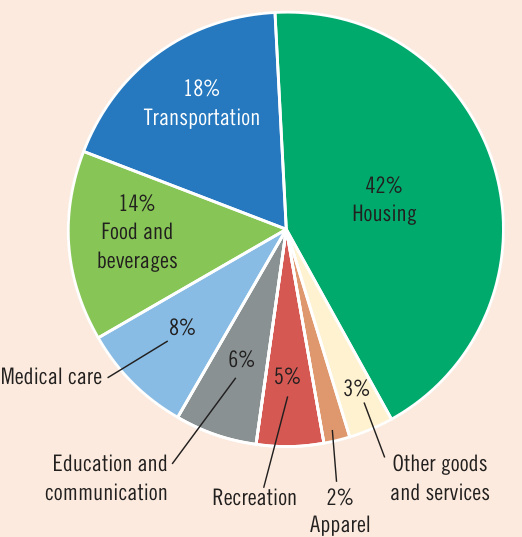
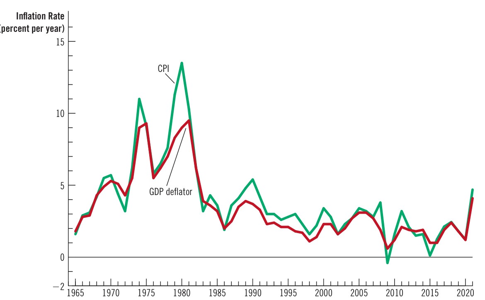
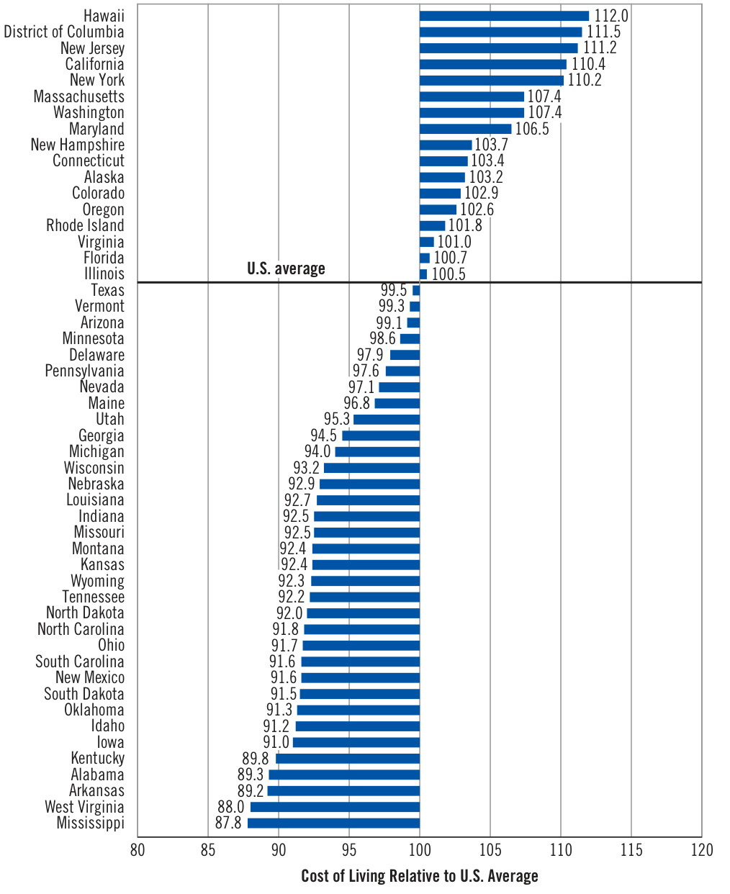
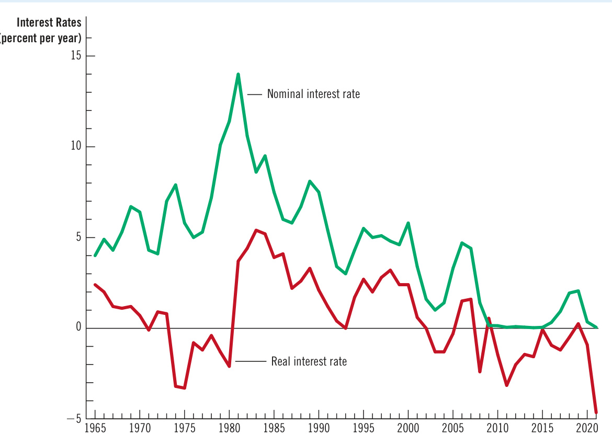

# Ch25 Measuring the Cost of Living  

n 1931, as the U.S. economy was suffering through the Great Depression, the New York Yankees paid a baseball player named Babe Ruth a salary of $^{\Phi80,000}$ . At the time, this pay was extraordinary, even among the stars of baseball. But Ruth was no ordinary player, and he wasn’t short of self-confidence. According to one story, a reporter asked him whether he thought it was right that he made more than President Herbert Hoover, who had a salary of $\mathbb{S}75{,}000$ . Ruth replied, “I had a better year.”  

In 2021, the average salary of major league baseball players was about $\mathbb{S}4.2$ million, and the Los Angeles Dodgers pitcher Trevor Bauer earned $\mathbb{S}38$ million, making him the highest-paid player. At first, this might lead you to think that baseball has become vastly more lucrative over the past nine decades. But as everyone knows, the prices of goods and services have also risen. In 1931, a nickel would buy an ice-cream cone, and a quarter would buy a ticket at the local movie theater. Because prices were so much lower in Babe Ruth’s day, it is not immediately clear whether Ruth enjoyed a higher or lower standard of living than today’s players.  

  

The preceding chapter looked at how economists use gross domestic product (GDP) to measure the quantity of goods and services the economy is producing. This chapter examines how economists measure the overall cost of living. To compare Babe Ruth’s salary of $^\mathrm{\textregistered80,000}$ with today’s salaries, we need to turn dollar figures into meaningful measures of purchasing power. That is exactly the job of a statistic called the consumer price index, or simply the CPI.  

The CPI is used to monitor changes in the cost of living. When the CPI rises, the typical family has to spend more money to maintain the same standard of living. Economists use the term inflation to describe a situation in which the overall price level is rising and deflation for one in which the overall price level is falling. The inflation rate is the percentage change in the price level from the previous period. The preceding chapter showed how inflation can be measured using the GDP deflator. The inflation rate you are likely to hear on the nightly news, however, is based on the CPI, which better reflects the goods and services bought by consumers.  

As we will see in the coming chapters, inflation is a closely watched aspect of macroeconomic performance and a key variable guiding macroeconomic policy. This chapter provides the background for that analysis by discussing how the CPI is constructed and how it can be used to compare dollar figures from different points in time.  

## 25-1 The Consumer Price Index  

consumer price index (CPI) a measure of the overall cost of the goods and services bought by a typical consumer  

The consumer price index (CPI) measures the overall cost of the goods and services bought by a typical consumer. Every month, the Bureau of Labor Statistics (BLS), which is part of the Department of Labor, computes and reports the CPI. This section examines how the CPI is calculated and what problems arise in its measurement. It also discusses how this index compares with the GDP deflator, another measure of the overall level of prices, which we examined in the preceding chapter.  

## 25-1a  How the CPI Is Calculated  

When the BLS calculates the CPI and the inflation rate, it uses data on the prices of thousands of goods and services. To see how these statistics are constructed, consider a simple economy in which consumers buy only two goods: hot dogs and hamburgers. Table 1 shows the five steps that the BLS follows.  

1. Fix the basket. Determine which prices are most important to consumers. If the typical consumer buys more hot dogs than hamburgers, then the price of hot dogs is more important than the price of hamburgers and, therefore, should be given greater weight in measuring the cost of living. The BLS sets these weights by surveying consumers to find the basket of goods and services bought by the typical consumer. In the example in the table, the basket includes 4 hot dogs and 2 hamburgers.   
2. Find the prices. Find the prices of each of the goods and services in the basket at each point in time. The table shows the prices of hot dogs and hamburgers for three different years.   
3. Compute the basket’s cost. Use the data on prices to calculate the cost of the basket of goods and services at different times. The table shows this calculation for each of the three years. Notice that only the prices in the calculation change. By keeping the basket of goods the same (4 hot dogs and   
2 hamburgers), we isolate the effects of price changes from the effects of any quantity changes that might be occurring at the same time.  

Calculating the Consumer Price Index and the Inflation Rate: An Example This table shows how to calculate the CPI and the inflation rate for a hypothetical economy in which consumers buy only hot dogs and hamburgers.   

<html><body><table><tr><td>Year</td><td>Price of Hot Dogs</td><td>PriceofHamburgers</td></tr><tr><td>2022</td><td>$1</td><td>$2</td></tr><tr><td>2023</td><td>2</td><td>3</td></tr><tr><td>2024</td><td>3</td><td>4</td></tr></table></body></html>  

Step 1: Survey Consumers to Determine a Fixed Basket of Goods  

Basket $=4$ hot dogs, 2 hamburgers  

Step 2: Find the Price of Each Good in Each Year  

2022 ( $\mathbb{S}1$ per hot dog 3 4 hot dogs) $^+$ $\mathbb{S}2$ per hamburger $\times\ 2$ hamburgers) $=\S8$ per basket   
2023 ( $\mathbb{S}2$ per hot dog 3 4 hot dogs) $^+$ $\mathbb{5}3$ per hamburger $\times\ 2$ hamburgers) $=\Phi14$ per basket   
2024 ( $\mathbb{5}3$ per hot $\mathsf{d o g}\times4$ hot dogs) $^+$ $\mathbb{54}$ per hamburger $\times\ 2$ hamburgers) $=\Phi20$ per basket  

Step 4: Choose One Year as a Base Year (2022) and Compute the CPI in Each Year  

<html><body><table><tr><td>2022 ($8/$8) × 100 =</td><td>100</td></tr><tr><td>2023</td><td>($14/$8)× 100 = = 175</td></tr><tr><td>2024</td><td>($20/$8) × 100 = 250</td></tr></table></body></html>  

Step 5: Use the CPI to Compute the Inflation Rate from Previous Year   

<html><body><table><tr><td></td><td></td></tr><tr><td>2023</td><td>(175 - 100)/100 × 100 = 75%</td></tr><tr><td></td><td></td></tr><tr><td>2024</td><td>(250 - 175)/175 × 100 = 43%</td></tr><tr><td></td><td></td></tr><tr><td></td><td></td></tr></table></body></html>  

4. Choose a base year and compute the index. Designate one year as the base year, the benchmark against which other years are to be compared. (The choice of base year is arbitrary. The index is used to measure percentage changes in the cost of living, which are the same regardless of the choice of base year.) Once the base year is chosen, the index is calculated as follows:  

Price of basket of goods and services in current year Consumer price index $=$ 3100. Price of basket in base year  

That is, the CPI in any given year is the price of the basket of goods and services in that year divided by the price of the basket in the base year, multiplied by 100.  

In the example in Table 1, 2022 is the base year. In this year, the basket of hot dogs and hamburgers costs $\mathbb{S}8$ . Therefore, to calculate the CPI, the price of the basket in each year is divided by $\mathbb{S}8$ and multiplied by 100. The CPI is 100 in 2022. (The index is always 100 in the base year.) The CPI is 175 in 2023. This means that the price of the basket in 2023 is 175 percent of its price in the base year. Put differently, a basket of goods that costs $\mathbb{S}100$ in the base year costs $\mathbb{S}175$ in 2023. Similarly, the CPI is 250 in 2024, indicating that the price level in 2024 is 250 percent of the price level in the base year.  

## inflation rate  

the percentage change in the price index from the preceding period  

5. Compute the inflation rate. Use the CPI to calculate the inflation rate, the percentage change in the price index from the preceding period. That is, the inflation rate between two consecutive years is computed as follows:  

$$
\mathrm{1\,year\,2}=\frac{\mathrm{CPI\,in\,year\,2-CPI\,in\,year\,1}}{\mathrm{CPI\,in\,year\,1}}\times100.
$$  

As shown at the bottom of Table 1, the inflation rate in our example is 75 percent in 2023 and 43 percent in 2024.  

Although this example simplifies the real world by considering a basket of only two goods, it shows how the BLS computes the CPI and the inflation rate. The BLS collects and processes data on the prices of thousands of goods and services every month and, by following these five steps, determines how quickly the cost of living for the typical consumer is rising. When the BLS makes its monthly announcement of the CPI, you can usually hear the number on the evening news or see it in your newsfeed.  

## core CPI  

a measure of the overall cost of consumer goods and services excluding food and energy  

In addition to the CPI for the overall economy, the BLS calculates several other price indexes. It reports the index for some narrow categories of goods and services, such as food, clothing, and energy. It also calculates the CPI for all goods and services excluding food and energy, a statistic called the core CPI. Because food and energy  

  

## What’s in the CPI’s Basket?  

hen constructing the CPI, the Bureau of Labor Statistics tries to include all the goods and services the typical consumer buys. Moreover, it tries to weight these goods and services according to how much consumers buy of each item.  

Figure 1 shows the breakdown of consumer spending into the major categories of goods and services. By far, the largest category is housing, which makes up 42 percent of the typical consumer’s budget. This includes the cost of shelter (33 percent), fuel and utilities (5 percent), and household furnishings and operation (5 percent). The next largest category, at 18 percent, is transportation, which includes spending on cars, gasoline, buses, subways, and so on. At 14 percent is the category of food and beverages; this includes food at home (8 percent), food away from home (5 percent), and alcoholic beverages (1 percent). Next are medical care at 8 percent, education and communication at 6 percent, and recreation at 5 percent. Apparel, which includes clothing, footwear, and jewelry, makes up 2 percent of the typical consumer’s budget.  

Finally, at 3 percent of spending is a category for other goods and services. This is a catchall for consumer purchases (such as cigarettes, haircuts, and funeral expenses) that do not naturally fit into the other categories.  

## Figure 1  

## The Typical Basket of Goods and Services  

This figure shows how the typical consumer divides spending among various categories of goods and services. The Bureau of Labor Statistics calls each percentage the “relative importance” of the category.  

  

prices show substantial short-run volatility, the core CPI better reflects underlying inflation trends. Finally, the BLS also calculates the producer price index (PPI), which measures the prices of the output of domestic producers. Formerly known as the wholesale price index, it dates back to a Senate report in 1893, making it one of the oldest prices indexes for the U.S. economy.  

## 25-1b  Problems in Measuring the Cost of Living  

The goal of the consumer price index is to measure changes in the cost of living. In other words, the CPI tries to gauge how much incomes must rise to maintain a constant standard of living. The CPI, however, is not a perfect measure. Three problems with the index are widely acknowledged but hard to solve.  

The first problem is substitution bias. When prices change from one year to the next, they do not all change proportionately: Some prices rise more than others, and some even fall. Consumers respond by buying less of the goods with large price increases and by buying more of those with small price increases or price declines. That is, consumers substitute toward goods that become relatively less expensive. If a price index is computed assuming a fixed basket of goods, it ignores consumer substitution and overstates the increase in the cost of living from one year to the next.  

Consider an example. Imagine that apples are initially cheaper than pears, so consumers buy more apples than pears. When setting the CPI’s basket of goods, the BLS will observe consumers’ buying habits and include more apples than pears. Now suppose that next year, pears are cheaper than apples. Consumers will likely buy more pears and fewer apples. But because the basket of goods is fixed, the CPI is calculated as if consumers continued to buy the now expensive apples in the same quantities as before. For this reason, the index measures a larger increase in the cost of living than consumers actually experience.  

A second problem with the CPI arises from the introduction of new goods. When a new good is introduced, consumers have more variety from which to choose, which in turn reduces the cost of maintaining the same level of economic well-being. To see why, suppose you could choose between a $\mathbb{S}100$ gift certificate at a large store that offered a wide array of goods and a $\mathbb{S}100$ gift certificate at a small store with the same prices but a more limited selection. Which would you prefer? Most people would pick the store with greater variety. In essence, with more choices, each dollar is more valuable. The same is true for the economy: As new goods are introduced, consumers have more choices, and each dollar is worth more. But because the CPI is based on a fixed basket of goods and services, it doesn’t reflect the increase in the value of the dollar that results from the introduction of new goods.  

For example, in 2001, Apple introduced the iPod, a small music-playing device that was a precursor to the iPhone. Devices to play music were already available, but they weren’t nearly as portable, powerful, and easy to use. The iPod was a new option that increased consumers’ opportunities. For any given number of dollars, the introduction of the iPod made people better off; conversely, achieving the same level of well-being required fewer dollars. And, of course, this was true again with the subsequent introduction of the iPhone and other smartphones, which could do everything the iPod did and more. A perfect cost-of-living index would have reflected the decrease in the cost of living from the introduction of these gadgets. But because the CPI uses a fixed basket, it does not decrease when new goods are introduced. Eventually, the BLS revised the basket of goods to include the iPod and iPhone, and subsequently, the index reflected changes in their prices. But the reduction in the cost of living associated with the initial introduction of these devices never showed up in the index.  

producer price index (PPI)   
a measure of the cost of a basket of goods and   
services sold by domestic firms  

The third problem with the CPI is unmeasured quality change. If the quality of a good deteriorates from one year to the next while its price remains the same, you are getting a lesser good for the same amount of money, so the value of a dollar falls. Similarly, if the quality rises from one year to the next, the value of a dollar rises. The BLS does its best to account for quality change. When the quality of a good in the basket changes—for example, when a car model has more horsepower or gets better gas mileage from one year to the next—the Bureau adjusts the price of the good to account for the quality change. In doing so, it is trying to compute the price of a basket of goods of constant quality. Despite these efforts, changes in quality remain a problem because quality is hard to measure.  

There is much debate about how severe these measurement problems are and what should be done about them. Studies put the upward bias in measured inflation at about 0.5 to 1.0 percent per year. The issue is important because many government programs use the CPI to adjust for changes in the overall level of prices. Recipients of Social Security, for instance, get annual increases in benefits that are tied to the CPI. Some economists have suggested modifying these programs to correct for the measurement problems by, for instance, reducing the magnitude of the automatic benefit increases. Others, however, say that would be a mistake because older people tend to spend more on healthcare, which often increases in price more rapidly than the standard CPI basket.  

## 25-1c  The GDP Deflator versus the Consumer Price Index  

The preceding chapter examined another measure of the overall level of prices in the economy—the GDP deflator. The GDP deflator is the ratio of nominal GDP to real GDP. Because nominal GDP is current output valued at current prices and real GDP is current output valued at base-year prices, the GDP deflator reflects the current level of prices relative to the level of prices in the base year.  

Economists and policymakers monitor both the GDP deflator and the CPI—along with several other indicators—to gauge how quickly prices are rising. Usually, these two statistics tell a similar story. Yet two important differences can cause them to diverge.  

The first difference is that the GDP deflator reflects the prices of all goods and services produced domestically, while the CPI reflects the prices of all goods and services bought by consumers. For example, suppose that the price of a fighter jet produced by Boeing and sold to the Air Force rises. Even though the plane is part of GDP, it is not part of the basket of goods and services bought by consumers. This price increase shows up in the GDP deflator but not in the CPI.  

As another example, suppose that Fiat raises the price of its cars. Because Fiats are made in Italy, the car is not part of U.S. GDP. But U.S. consumers buy Fiats, so the car is part of the CPI’s basket of goods. A price increase in an imported consumption good, such as a Fiat, shows up in the CPI but not in the GDP deflator.  

Historically, this first difference between the CPI and the GDP deflator has been particularly important when the price of oil changes. The United States has long produced some oil, but it consumed even more, resulting in substantial oil imports. As a result, oil and oil products such as gasoline and heating oil made up a larger share of consumer spending than of GDP. So when the price of oil increased, the CPI increased by much more than the GDP deflator. This phenomenon is less important today. Since 2008, U.S. oil production has increased substantially, reducing the nation’s dependence on oil imports.  

The second and subtler difference between the GDP deflator and the CPI concerns how various prices are weighted to yield a single number for the overall level of prices. The CPI compares the price of a fixed basket of goods and services with the price of the basket in the base year. Only occasionally does the BLS change what’s in the basket. By contrast, the GDP deflator compares the price of currently produced goods and services with the price of those goods and services in the base year. For this reason, the group of goods and services used to compute the GDP deflator changes automatically over time. This difference is not important when all prices are changing proportionately. But if the prices of different goods and services are changing by varying amounts, the weighting of the various prices affects the calculation of the overall inflation rate.  

Figure 2 shows the inflation rate as measured by both the GDP deflator and the CPI for each year since 1965. You can see that sometimes the two measures diverge. When they do, it is possible to go behind these numbers and explain the divergence with the two differences we have discussed. For example, in 1979 and 1980, CPI inflation spiked up by more than inflation as measured by the GDP deflator largely because oil prices more than doubled during these two years. Conversely, in 2009 and 2015, CPI inflation fell well below inflation as gauged by the GDP deflator because of plummeting oil prices. Yet divergence between these two measures is the exception rather than the rule.  

## Figure 2  

Two Measures of Inflation  

This figure shows the inflation rate—the percentage change in the level of prices— as measured by the GDP deflator and the CPI using annual data since 1965. Notice that the two measures of inflation generally move together.  

Source: U.S. Department of Labor; U.S. Department of Commerce.  

  

1. The CPI measures approximately the same economic phenomenon as  

a. nominal GDP.   
b. real GDP.   
c. the GDP deflator.   
d. the unemployment rate.  

2. The largest component in the basket of goods and services used to compute the CPI is  

a. food and beverages.   
b. housing.   
c. medical care.   
d. apparel.   
3. If a Pennsylvania gun manufacturer raises the price of rifles it sells to the U.S. Army, its price hike will increase a. both the CPI and the GDP deflator. b. neither the CPI nor the GDP deflator. c. the CPI but not the GDP deflator. d. the GDP deflator but not the CPI.   
4. Because consumers can sometimes substitute cheaper goods for those that have risen in price, a. the CPI overstates inflation. b. the CPI understates inflation. c. the GDP deflator overstates inflation. d. the GDP deflator understates inflation.  

Answers are at the end of the chapter.  

## 25-2  Correcting Economic Variables for the Effects of Inflation  

Now that we know how price indexes are calculated, let’s see how we might use such an index to compare a dollar figure from the past with a dollar figure in the present.  

## 25-2a  Dollar Figures from Different Times  

Return to the issue of Babe Ruth’s income. Was his salary of $^{\Phi80,000}$ in 1931 high or low compared with the salaries of today’s players?  

To answer this question, we need to know the level of prices in 1931 and the level of prices today. Part of the increase in baseball salaries compensates players for higher prices. To compare Ruth’s salary with the salaries of today’s players, we must inflate Ruth’s salary to turn 1931 dollars into today’s dollars.  

The formula for turning dollar figures from year $T$ into today’s dollars is the following:  

Amount in today’s dollars $=$ Amount in year $T$ dollars $\times$ Price level today Price level in yearT  

A price index such as the CPI measures the price level and determines the size of the inflation correction.  

Let’s apply this formula to Ruth’s salary. Government statistics show a CPI of 15.2 for 1931 and 271 for 2021. That means the overall level of prices has risen by a factor of 17.8 (calculated from 271/15.2). We can use these numbers to measure Ruth’s salary in 2021 dollars as follows:  

$$
{\begin{array}{r l}&{{\mathrm{Salary~in~2021~dollars}}={\mathrm{Salary~in~1931~dollars}}\times{\frac{\mathrm{Price~level~in~2021}}{\mathrm{Price~level~in~1931}}}}\\ &{\qquad\qquad\qquad={\mathrm{~680,000}}\times{\frac{271}{15.2}}}\\ &{\qquad\qquad\qquad={\mathrm{~61}}{\mathrm{.426}}{\mathrm{,}}316}\end{array}}
$$  

We find that Babe Ruth’s 1931 salary is equivalent to a salary today of over $\mathbb{S}1.4$ million. That is a high income, but it is about a third of the average player’s salary  

## Mr. Index Goes to Hollywood  

hat is the most popular movie of all time? The answer might surprise you.  

Movie popularity is often gauged by box office receipts. By that measure, Star Wars: The Force Awakens, released in 2015, is the number-one movie of all time with domestic receipts of $\mathbb{5}937$ million, followed by Avengers: Endgame ( $\mathbb{5}853$ million), Avatar $(\mathfrak{S}761$ million), and Black Panther $(\mathfrak{S}700$ million). But this ranking ignores an important fact: Prices, including those of movie tickets, have risen over time. Inflation gives an advantage to newer films.  

  
“May the force of inflation be with you.”  

When box office receipts are corrected for the effects of inflation, the story is very different. The number-one movie is now Gone with the Wind $^{(\hat{\mathbb{S}}1,851}$ million in 2019 dollars), followed by the original Star Wars (\$1,629 million) and The Sound of Music $(\mathbb{S}1,304\$ million). Star Wars: The Force Awakens $\mathbb{S}989$ million) falls to number 11.  

Gone with the Wind was released in 1939, before everyone had televisions and when about 90 million Americans went to the cinema each week, compared with about 25 million recently. But the movies from that era don’t appear in conventional popularity rankings because ticket prices were only a quarter. And indeed, in the ranking based on nominal box office receipts, Gone with the Wind does not make the top 100 films. Scarlett and Rhett fare a lot better once we correct for the effects of inflation.  

today and less than 4 percent of what the star pitcher Trevor Bauer earns. Various forces, including overall economic growth and the increasing income shares earned by superstars, have substantially raised the living standards of the best athletes.  

Let’s also examine President Hoover’s 1931 salary of $^\mathrm{\textregistered}75,000$ . To translate that figure into 2021 dollars, we again multiply it by the ratio of the price levels in the two years. We find that Hoover’s salary is equivalent to $\mathbb{5}75,000\times(271/15.2),$ , or $^{\Phi1,337,171}$ in 2021 dollars. This is well above President Joe Biden’s salary of $^\mathrm{\textregistered400,000}$ . It seems that President Hoover did have a pretty good year after all.  

## Regional Differences in the Cost of Living  

When you graduate from college, you may have several job offers from which to choose. If the jobs are in different places, however, be careful when comparing how much they pay. The cost of living varies not only over time but also across locations. What seems like a larger paycheck might not turn out to be once you account for regional price differences.  

The Bureau of Economic Analysis uses the data collected for the CPI to compare prices around the United States. It produces a useful statistic called regional price parities. Just as the CPI measures variation in the cost of living from year to year, regional price parities measure differences in the cost of living from state to state.  

Figure 3 shows the regional price parities for 2020. For example, living in Hawaii costs 112.0 percent of what it costs to live in the typical place in the United States (that is, Hawaii is 12.0 percent more expensive than average). Living in Mississippi  

## Regional Variation in the Cost of Living  

This figure shows how the costs of living in the 50 U.S. states and the District of Columbia compare to the U.S. average.  

Source: U.S. Department of Commerce.  

  
Regional Price Parities for States, 2020 $(\mathbb{U}.\mathbb{S}.=10\mathbb{I})$  

costs 87.8 percent of what it costs to live in the typical place (that is, Mississippi is 12.2 percent less expensive than average).  

What accounts for these differences? The prices of goods, such as food and clothing, explain only a small part of these regional differences. Most goods are tradable: They can be easily transported from one state to another. Because of regional trade, large price disparities are unlikely to persist for long.  

Services explain a larger part of regional differences. A haircut, for example, can cost more in one state than in another. If barbers were willing to move to places where the price of a haircut is high, or if customers were willing to fly across the country in search of cheap haircuts, then the prices of haircuts across regions might well converge. But because transporting haircuts is so costly, large price disparities persist.  

Housing services are particularly important for understanding regional differences in the cost of living. Such services represent a large share of a typical consumer’s budget. And once built, a house or apartment building can’t easily be moved, while the land on which it sits is completely immobile. As a result, differences in housing costs can be persistently large. For example, rents in Hawaii are about twice those in Mississippi.  

Keep these facts in mind when it comes time to compare job offers. Look not only at the dollar salaries but also at the local prices of goods and services, especially housing. ●  

## 25-2b  Indexation  

As we have seen, price indexes are used to correct for the effects of inflation when comparing dollar figures from different times. When some dollar amount is automatically corrected for changes in the price level by law or contract, the amount is said to be indexed for inflation.  

For example, some long-term contracts between firms and unions include partial or complete indexation of the wage to the CPI. Such a provision, called a cost-ofliving allowance (or COLA), automatically raises the wage when the CPI rises.  

Indexation is also a feature of many laws. Social Security benefits, for instance, are adjusted every year to compensate recipients for increases in prices. The brackets of the federal income tax—the income levels at which the tax rates change—are also indexed for inflation. There are, however, many ways in which the tax system is not indexed for inflation, even when perhaps it should be. We discuss these issues more fully later in this book.  

## 25-2c  Real and Nominal Interest Rates  

Correcting economic variables for the effects of inflation is particularly important, and somewhat tricky, when we look at data on interest rates. The very concept of an interest rate necessarily involves comparing amounts of money at different points in time. When you deposit your savings in a bank account, you give the bank some money now, and the bank returns your deposit with interest in the future. Similarly, when you borrow from a bank, you get some money now, but you will have to repay the loan with interest in the future. In both cases, to fully understand the deal between you and the bank, it is crucial to acknowledge that future dollars could have a different value than today’s dollars. In other words, you have to correct for the effects of inflation.  

Consider an example. Suppose Sara Saver deposits $^\mathrm{\Phi1,000}$ in a bank account that pays an annual interest rate of 10 percent. A year later, after Sara has accumulated $\mathbb{S}100$ in interest, she withdraws her $^\mathrm{\Phi1,100}$ . Is Sara $\mathbb{S}100$ richer than she was when she made the deposit a year earlier?  

The answer depends on what we mean by “richer.” Sara does have $\mathbb{S}100$ more than she had before. In other words, the number of dollars in her possession has risen by 10 percent. But Sara does not care about the amount of money itself: She cares about what she can buy with it. If prices have risen while her money was in the bank, each dollar now buys less than it did a year ago. In this case, her purchasing power—the amount of goods and services she can buy—has not risen by 10 percent.  

To keep things simple, suppose that Sara is a film buff and spends all her money on movie tickets. When Sara made her deposit, a ticket cost $\mathbb{S}10$ . Her deposit of $^\mathrm{\Phi1,000}$ was equivalent to 100 tickets. A year later, after getting her 10 percent interest, she  

## indexation  

the automatic correction by law or contract of a dollar amount for the effects of inflation  

has $^\mathrm{\Phi1,100}$ . How many tickets can she buy now? The answer depends on what has happened to the price of a ticket. Here are a few scenarios:  

●  Zero inflation: If the price of a ticket remains at $\mathbb{5}10$ , the amount she can buy has risen from 100 to 110 tickets. The 10 percent increase in the number of dollars means a 10 percent increase in her purchasing power. Six percent inflation: If the price of a ticket rises from $\mathbb{S}10$ to $\mathbb{S}10.60_{.}$ , then the number of tickets she can buy has risen from 100 to approximately 104. Her purchasing power has increased by about 4 percent. Ten percent inflation: If the price of a ticket rises from $\mathbb{S}10$ to $\mathbb{S}11$ , she can still buy only 100 tickets. Even though Sara’s dollar wealth has risen, her purchasing power is the same as it was a year earlier. Twelve percent inflation: If the price of a ticket increases from $\mathbb{S}10$ to $\mathbb{S}11.20.$ the number of tickets she can buy has fallen from 100 to approximately 98. Even with her greater number of dollars, her purchasing power has decreased by about 2 percent.  

And if Sara were living in an economy with deflation—negative inflation or, more simply, falling prices—another possibility could arise:  

●  Two percent deflation: If the price of a ticket falls from $\mathbb{S}10$ to $\mathbb{S}9.80_{.}$ , then the number of tickets she can buy rises from 100 to approximately 112. Her purchasing power increases by about 12 percent.  

These examples show that the higher the rate of inflation, the smaller the increase in Sara’s purchasing power. If the rate of inflation exceeds the rate of interest, her purchasing power actually falls. And if there is deflation, her purchasing power rises by more than the rate of interest.  

nominal interest rate the interest rate as usually reported without a correction for the effects of inflation  

real interest rate the interest rate corrected for the effects of inflation  

To understand how much a person earns in a savings account, we need to consider both the interest rate and the change in prices. The interest rate that measures the change in dollar amounts is called the nominal interest rate, and the interest rate corrected for inflation is called the real interest rate. The nominal interest rate, the real interest rate, and inflation are related approximately as follows:  

Real interest rate $=$ Nominal interest rate2Inflation rate.  

The real interest rate is the difference between the nominal interest rate and the rate of inflation. The nominal interest rate tells you how fast the number of dollars in your bank account rises over time, while the real interest rate tells you how fast the purchasing power of your bank account rises over time.  

## Interest Rates in the U.S. Economy  

Figure 4 shows real and nominal interest rates in the U.S. economy since 1965. The nominal interest rate in this figure is the rate on three  

month Treasury bills (although data on other interest rates would be similar). The real interest rate is computed by subtracting the rate of inflation from this nominal interest rate. Here the inflation rate is measured as the percentage change in the CPI.  

One feature of this figure is that the nominal interest rate usually exceeds the real interest rate. This reflects the fact that, while deflation has occurred occasionally,  

This figure shows nominal and real interest rates using annual data since 1965. The nominal interest rate is the rate on a three-month Treasury bill. The real interest rate is the nominal interest rate minus the inflation rate as measured by the CPI. Notice that nominal and real interest rates often do not move together.  

Source: U.S. Department of Labor; U.S. Department of Treasury.  

  

the U.S. economy has experienced rising consumer prices in most years during this period. By contrast, if you look at data for the U.S. economy during the late 19th century or for the Japanese economy in some recent years, you will find significant periods of deflation. During deflation, the real interest rate exceeds the nominal interest rate.  

The figure also shows that because inflation is variable, real and nominal interest rates do not always move together. For example, in the late 1970s, nominal interest rates were high. But because inflation was very high, real interest rates were low. Indeed, during much of the 1970s, real interest rates were negative: Inflation eroded people’s savings more quickly than nominal interest payments increased them. By contrast, in the late 1990s, nominal interest rates were lower than they had been two decades earlier, but real interest rates were higher because inflation was much lower. Yet nominal and real interest rates often move in the same direction: During the coronavirus recession of 2020, for example, nominal interest rates fell to about zero, and real interest rates again turned negative. The coming chapters will examine the economic forces that determine both real and nominal interest rates. ●  

5. If the CPI is 200 for the year 2010 and 300 today, then $\Phi600$ in 2010 has the same purchasing power as has today.  

a. $\Phi400$   
b. $\Phi500$   
c. $\Phi700$   
d. $\mathbb{5900}$  

6. The main reason the cost of living varies across regions of the country is differences in the price of  

a. food.   
b. clothing.   
c. housing.   
d. medical care.  

7. You deposit $\Phi2,000$ in a savings account, and a year later, you have $\Phi2,\!100$ . Meanwhile, the CPI rises from 200 to 204. In this case, the nominal interest rate is percent, and the real interest rate is  

a. 1; 5   
b. 3; 5   
c. 5; 1   
d. 5; 3  

Answers are at the end of the chapter.  

## 25-3 Conclusion  

“A nickel ain’t worth a dime anymore,” the late, great baseball player Yogi Berra once observed. A nickel was never worth a dime, of course, but it’s true that the real values behind the nickel, dime, and dollar have not been stable. Persistent increases in the overall level of prices have been the norm. Such inflation reduces the purchasing power of each unit of money. When comparing dollar figures from different times, it is important to keep in mind that a dollar today is not worth the same as a dollar 20 years ago or, most likely, 20 years from now.  

This chapter has discussed how economists measure the overall level of prices and how they use price indexes to correct economic variables for the effects of inflation. Price indexes allow us to compare dollar figures from different points in time and, therefore, get a better sense of how the economy is changing.  

The discussion of price indexes in this chapter, together with the preceding chapter’s discussion of GDP, is the first step in the study of macroeconomics. Soon we will examine what determines a nation’s GDP and the causes and effects of inflation. Having explained how economists measure macroeconomic quantities and prices in the past two chapters, we are now ready to develop the models that explain movements in these variables.  

Here is our strategy in the upcoming chapters. First, we look at the long-run determinants of real GDP and related variables, such as saving, investment, real interest rates, and unemployment. Second, we look at the long-run determinants of the price level and related variables, such as the money supply, inflation, and nominal interest rates. Last of all, having seen how these variables are determined in the long run, we examine the more complex question of what causes short-run fluctuations in real GDP and the price level. In all of these chapters, the measurement issues we have just discussed will provide the foundation for the analysis.  

The consumer price index (CPI) shows the cost of a basket of goods and services relative to the cost of the same basket in the base year. The index is used to measure the overall level of prices in the economy. The percentage change in the CPI measures the inflation rate. The CPI is an imperfect measure of the cost of living for three reasons. First, it does not account for consumers’ ability to substitute toward goods that become relatively cheaper over time. Second, it does not allow for increases in the purchasing power of the dollar that result from the introduction of new goods. Third, it is distorted by unmeasured changes in the quality of goods and services. Because of these measurement problems, the CPI overstates true inflation. Like the CPI, the GDP deflator measures the overall level of prices in the economy. The two price indexes usually move together, but there are important differences. Unlike the CPI, the GDP deflator reflects the prices of goods and services produced domestically rather than those bought by consumers. As a result, imported goods affect the CPI but not the GDP deflator. In addition, while the CPI uses a fixed basket of goods, the group of goods and services reflected in the GDP deflator automatically changes over time as the composition of GDP changes.  

Dollar figures from different times do not represent a valid comparison of purchasing power. To compare a dollar figure from the past with a dollar figure today, the older figure needs to be inflated using a price index. Various laws and private contracts use price indexes to correct for the effects of inflation. Tax laws, however, are only partially indexed for inflation.  

Correcting for inflation is especially important when looking at interest rates. The nominal interest rate—the interest rate usually reported—is the rate at which the number of dollars in a savings account increases over time. By contrast, the real interest rate is the rate at which the purchasing power of a savings account increases (or decreases) over time. The real interest rate equals the nominal interest rate minus the rate of inflation.  

## Key Concepts  

consumer price index (CPI), p. 512   
inflation rate, p. 514   
core CPI, p. 514   
producer price index (PPI), p. 515   
indexation, p. 521   
nominal interest rate, p. 522   
real interest rate, p. 522  

## Questions for Review  

1. Which do you think has a greater effect on the CPI: a 10 percent increase in the price of chicken or a 10 percent increase in the price of caviar? Why?   
2. Describe the three problems that make the CPI an imperfect measure of the cost of living.   
3. Does an increase in the price of imported French wine affect the CPI or the GDP deflator more? Why?  

4. Over a long period of time, the price of a candy bar rose from $\mathbb{S}0.20$ to $\mathbb{S}1.20$ . Over the same period, the CPI rose from 150 to 300. Adjusted for overall inflation, how much did the price of the candy bar change?  

5. Explain the meanings of nominal interest rate and real interest rate. How are they related?  

1. Suppose that the year you were born, someone bought $\mathbb{S}100$ of goods and services for your baby shower. How much would you guess it would cost today to buy a similar amount of goods and services? Now find data on the CPI and compute the answer based on it. (You can find the BLS’s inflation calculator here: http://www.bls.gov/data/inflation_calculator.htm.)  

2. The residents of Vegopia spend all of their income on cauliflower, broccoli, and carrots. In 2023, they spend a total of $\mathbb{S}200$ for 100 heads of cauliflower, $\mathbb{S}75$ for 50 bunches of broccoli, and $\mathbb{S}50$ for 500 carrots. In 2024, they spend a total of $\mathbb{S}225$ for 75 heads of cauliflower, $\mathbb{S}120$ for 80 bunches of broccoli, and $\mathbb{S}100$ for 500 carrots. a. Calculate the price of one unit of each vegetable in each year. b. Using 2023 as the base year, calculate the CPI for each year. c. What is the inflation rate in 2024?  

3. Suppose that people consume only three goods, as shown in this table:  

<html><body><table><tr><td></td><td>TennisBalls</td><td>GolfBalls</td><td>Bottlesof Gatorade</td></tr><tr><td>2023price</td><td>$2</td><td>$4</td><td>$1</td></tr><tr><td>2023quantity</td><td>100</td><td>100</td><td>200</td></tr><tr><td>2024price</td><td>$2</td><td>$6</td><td>$2</td></tr><tr><td>2024quantity</td><td>100</td><td>100</td><td>200</td></tr></table></body></html>  

a. What is the percentage change in the price of each of the three goods?   
b. Using a method similar to the CPI, compute the percentage change in the overall price level.   
c. If you were to learn that a bottle of Gatorade increased in size from 2023 to 2024, should that information affect your calculation of the inflation rate? If so, how?   
d. If you were to learn that Gatorade introduced new flavors in 2024, should that information affect your calculation of the inflation rate? If so, how?  

4. Go to the website of the Bureau of Labor Statistics (http://www.bls.gov) and find data on the CPI. By how much has the index, including all items, risen over the past year? For which categories of spending have prices risen the most? The least? Have any categories experienced price declines? Can you explain any of these facts?  

5. A small nation idolizes the TV show The Voice. All they produce and consume are karaoke machines and voice lessons, in the following amounts:  

<html><body><table><tr><td></td><td colspan="2">Karaoke Machines</td><td colspan="2">Voice Lessons</td></tr><tr><td></td><td>Quantity</td><td>Price</td><td>Quantity</td><td>Price</td></tr><tr><td>2023</td><td>10</td><td>$40</td><td>6</td><td>$50</td></tr><tr><td>2024</td><td>12</td><td>60</td><td>10</td><td>60</td></tr></table></body></html>  

a. Using a method similar to the CPI, compute the percentage change in the overall price level. Use 2023 as the base year and fix the basket at 5 karaoke machines and 3 voice lessons.   
b. Using a method similar to the GDP deflator, compute the percentage change in the overall price level. Again, use 2023 as the base year.   
c. Is the inflation rate in 2024 the same using the two methods? Explain why or why not.  

6. Which of the problems in the construction of the CPI might be illustrated by each of the following situations? Explain. a. the invention of cell phones b. the introduction of airbags in cars c. increased personal computer purchases in response to a decline in their price d. more scoops of raisins in each package of Raisin Bran e. greater use of fuel-efficient cars after gasoline prices increase  

7. A dozen eggs cost $\mathbb{S}0.88$ in January 1980 and $\mathbb{S}1.47$ in January 2021. The average hourly wage for production and nonsupervisory workers was $\mathbb{S}6.57$ in January 1980 and $\mathbb{S}25.86\$ in January 2021. a. By what percentage did the price of eggs rise? b. By what percentage did the wage rise? c. In each year, how many minutes did a worker have to work to earn enough to buy a dozen eggs? d. Did workers’ purchasing power in terms of eggs rise or fall?  

8. The chapter explains that Social Security benefits are increased each year in proportion to the increase in the CPI, even though most economists believe that the CPI overstates actual inflation. a. If older people consume the same market basket as other people, does Social Security provide senior citizens with an improvement in their standard of living each year? Explain. b. In fact, older people consume more healthcare compared with younger people, and healthcare costs have risen faster than overall inflation. What would you do to determine whether older people are actually better off from year to year?  

9. Suppose that a borrower and a lender agree on the nominal interest rate to be paid on a loan. Then inflation turns out to be higher than they both expected. a. Is the real interest rate on this loan higher or lower than expected? b. Does the lender gain or lose from this unexpectedly high inflation? Does the borrower gain or lose?  

c. Inflation during the 1970s was much higher than most people had expected when the decade began. How did this unexpectedly high inflation affect homeowners who obtained fixed-rate mortgages during the 1960s? How did it affect the banks that lent the money?  

