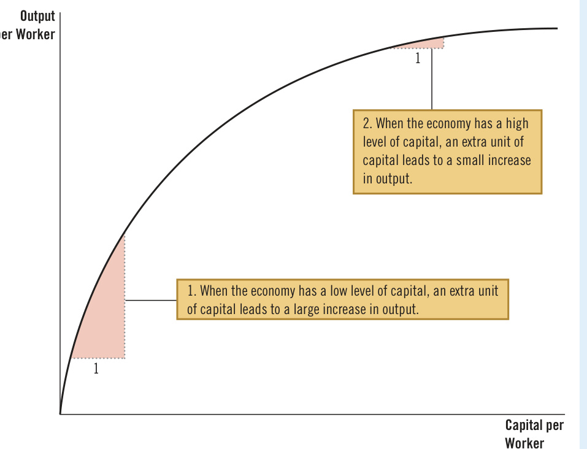
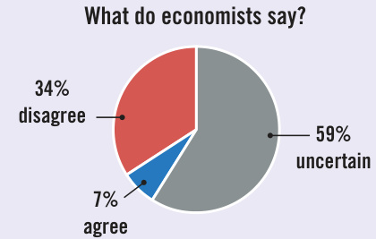
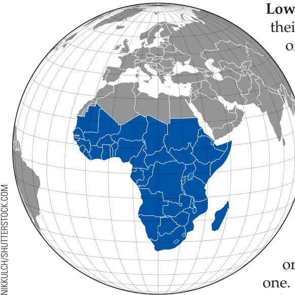

# Ch26 Production and Growth  

When you travel around the world, you see tremendous variation in the standard of living. Adjusted for international differences in prices, the average income in a rich   
country, such as the United States, Japan, or Germany, is about   
10 times the average income in a poor country, such as India,   
Nigeria, or Nicaragua. These income differences are reflected in   
many differences in the quality of life. People in richer countries   
typically have better nutrition, safer housing, better healthcare,   
and longer life expectancy, as well as more automobiles, more   
telephones, and more computers.  

Within individual countries, there are also large changes in the standard of living over time. In the United States over the past century, average income as measured by real gross domestic product (GDP) per person has grown by about 2 percent per year. This rate of growth may seem small, but it implies that average income has roughly doubled every 35 years. That’s why you are likely enjoying a higher standard of living than your grandparents did when they were your age.  

Growth rates vary substantially from country to country. From 1990 to 2020, GDP per person in China grew at an average rate of 8.5 percent per year, resulting in a nearly twelve-fold increase in average income. This growth moved China from being one of the poorest countries in the world to being a middle-income country in roughly one generation. By contrast, over the same time span, income per person in Zimbabwe fell by a total of 24 percent, leaving the typical person in that nation mired in poverty.  

What explains these diverse experiences? How can rich countries maintain their high standard of living? What policies can poor countries pursue to promote more rapid growth and join the developed world? These questions are among the most important in macroeconomics. As the economist Robert Lucas put it, “The consequences for human welfare in questions like these are simply staggering: Once one starts to think about them, it is hard to think about anything else.”  

The previous two chapters discussed how economists measure macroeconomic quantities and prices. We can now begin to study the forces that determine these variables. Recall that an economy’s GDP measures both the total income earned in the economy and the total expenditure on the economy’s output of goods and services. The level of real GDP is a gauge of economic prosperity, and the growth of real GDP is a gauge of economic progress. This chapter focuses on the long-run determinants of the level and growth of real GDP. Later, we will study the short-run fluctuations of real GDP around its long-run trend.  

We proceed here in three steps. First, we examine international data on real GDP per person. These data give a sense of how much the level and growth of living standards vary around the world. Second, we discuss productivity—the amount of goods and services produced for each hour of work. Productivity is the main determinant of a nation’s standard of living, so we carefully consider the numerous factors that influence productivity. Third, we consider the link between productivity and the policies that a nation pursues.  

## 26-1 Economic Growth around the World  

As a starting point for our study of long-run growth, let’s look at the experiences of some of the world’s economies. Table 1 shows data on real GDP per person for 13 countries. For each country, the data span more than a century of history. The first and second columns of the table present the countries and time periods. (The time periods differ somewhat from country to country because of differences in data availability.) The third and fourth columns show estimates of real GDP per person more than a century ago and for a recent year.  

The data on real GDP per person show that living standards vary widely from country to country. Income per person in the United States, for instance, is now almost four times that in China and about ten times that in India. The poorest countries have average levels of income not seen in the developed world for many decades. The typical person in Bangladesh or Pakistan in 2020 had about the same real income as the typical American in 1870.  

The last column of the table shows each country’s growth rate. The growth rate measures how rapidly real income per person increased in the typical year. In the United States, for example, where real income per person was $^{\Phi4,668}$ in 1870 and $^{\Phi63,544}$ in 2020, the growth rate was 1.76 percent per year. This means that if real  

## Table 1  

The Variety of Growth Experiences Source: Robert J. Barro and Xavier Sala-iMartin, Economic Growth (New York: McGrawHill, 1995), Tables 10.2 and 10.3; World Bank online data; and author’s calculations. To account for international price differences, data are PPP-adjusted when available.   

<html><body><table><tr><td></td><td></td><td colspan="2">Real GDPperPerson (in 2020 dollars)</td><td></td></tr><tr><td>Country</td><td>Period</td><td>At Beginning of Period</td><td>At End of Period</td><td>GrowthRate (per year)</td></tr><tr><td>China</td><td>1900-2020</td><td>$834</td><td>$17,312</td><td>2.56%</td></tr><tr><td>Japan</td><td>1890-2020</td><td>1,751</td><td>42,197</td><td>2.48</td></tr><tr><td>Brazil</td><td>1900-2020</td><td>907</td><td>14,836</td><td>2.36</td></tr><tr><td>Mexico</td><td>1900-2020</td><td>1,350</td><td>18,833</td><td>2.22</td></tr><tr><td>Indonesia</td><td>1900-2020</td><td>1,038</td><td>12,074</td><td>2.07</td></tr><tr><td>Germany</td><td>1870-2020</td><td>2,544</td><td>53,694</td><td>2.05</td></tr><tr><td>Canada</td><td>1870-2020</td><td>2,766</td><td>48,073</td><td>1.92</td></tr><tr><td>India</td><td>1900-2020</td><td>786</td><td>6,454</td><td>1.77</td></tr><tr><td>United States</td><td>1870-2020</td><td>4,668</td><td>63,544</td><td>1.76</td></tr><tr><td>Argentina</td><td>1900-2020</td><td>2,671</td><td>20,768</td><td>1.72</td></tr><tr><td>Bangladesh</td><td>1900-2020</td><td>726</td><td>5,083</td><td>1.64</td></tr><tr><td>Pakistan</td><td>1900-2020</td><td>859</td><td>4,877</td><td>1.46</td></tr><tr><td>United Kingdom</td><td>1870-2020</td><td>5,601</td><td>44,916</td><td>1.40</td></tr></table></body></html>  

income per person were to increase by 1.76 percent for each of 150 years beginning at $^{\S4,668,}$ it would end up at $^{\Phi63,544}$ . Of course, income did not rise exactly 1.76 percent every year: Some years it rose by more, other years it rose by less, and in still other years it fell. The growth rate of 1.76 percent per year ignores short-run fluctuations around the long-run trend and represents an average rate of growth for real income per person over many years.  

The countries in Table 1 are ordered by growth rate from the most to least rapid. High on the list are Brazil and China, which had been two of the poorest nations in the world and rose to middle-income status. Also high on the list is Japan, formerly a middle-income nation and now one of the richest.  

Near the bottom of the list are Pakistan and Bangladesh, which were among the poorest nations at the end of the nineteenth century and remain so today. At the bottom of the list is the United Kingdom. In 1870, it was the richest country in the world, with an average income about 20 percent higher than that of the United States and about twice Canada’s. Today, average income in the United Kingdom is 29 percent below that of the United States and 7 percent below Canada’s.  

These data show that the world’s richest countries are not guaranteed to remain the richest and the world’s poorest countries are not doomed to endless poverty. But what explains these changes over time? Why do some countries zoom ahead while others are left behind? These are the questions we take up next.  

  

John D. Rockefeller  

merican Heritage magazine once published a list of the richest Americans of all time. The number 1 spot went to John D. Rockefeller, the oil entrepreneur who lived from 1839 to 1937. According to the magazine’s calculations, his wealth would be the equivalent of about $\S250$ billion today, which roughly equals the wealth of Elon Musk, the technology entrepreneur who is today’s richest American.  

Despite his great wealth, Rockefeller did not enjoy many of the conveniences that we now take for granted. He couldn’t watch television, play video games, surf the Internet, or send e-mail. During the heat of summer, he couldn’t cool his home with air-conditioning. For much of his life, he couldn’t travel by car or plane, and he couldn’t use a phone to call friends or family. He couldn’t take advantage of many vaccines and medicines that doctors today routinely use to protect, prolong, and enhance life.  

Now consider: How much money would someone have to pay you to give up, for the rest of your life, all the modern conveniences that Rockefeller lived without? Would you do it for $\mathbb{S}250$ billion? Perhaps not. And if you wouldn’t, is it fair to say that you are better off than John D. Rockefeller, whose wealth was legendary?  

As the preceding chapter discussed, using standard price indexes to compare sums of money from different times doesn’t fully reflect the introduction of new goods. As a result, the rate of inflation is overestimated. The flip side of this observation is that the rate of real economic growth is underestimated. Pondering Rockefeller’s life shows how significant this problem might be. Because of tremendous technological advances, the average American today is arguably “richer” than the richest American a century ago, even if that reality is lost in standard economic statistics.  

## QuickQuiz  

1. Over the past century, real GDP per person in the United States has grown about percent per year, meaning it has roughly doubled every years.  

a. 2; 14   
b. 2; 35   
c. 5; 14   
d. 5; 35  

2. The world’s rich countries, such as the United States and Germany, have income per person that is about times income per person in the world’s poor countries, such as Pakistan and India.  

a. 2   
b. 4   
c. 10   
d. 30  

3. Over the past century, has experienced particularly strong growth, and has experienced particularly weak growth.  

a. China; the United Kingdom b. China; Canada   
c. the United Kingdom; Canada d. Canada; China  

## 26-2  Productivity: Its Role and Determinants  

Explaining why living standards vary so much from country to country and over time is, in one sense, easy. The answer can be summarized in a single word— productivity. But in another sense, the variation in living standards is deeply puzzling because many factors influence a nation’s productivity.  

Consider a simple model based loosely on Daniel Defoe’s novel Robinson Crusoe about a sailor stranded on a desert island. Because Crusoe lives alone, he catches his own fish, grows his own vegetables, and makes his own clothes. Crusoe’s activities—his production and consumption of fish, vegetables, and clothing—are a simple economy. By examining Crusoe’s economy, we can learn some lessons that also apply to more complex and realistic economies.  

What determines Crusoe’s standard of living? In a word, productivity, the quantity of goods and services produced from each unit of labor. If Crusoe is good at catching fish, growing vegetables, and making clothes, he lives well—or at least as well as possible on that island. If he is bad at doing these things, he lives poorly. Because Crusoe can consume only what he produces, his living standard is tied to his productivity.  

In Crusoe’s economy, it is easy to see that productivity is the key determinant of living standards and that growth in productivity is the key determinant of growth in living standards. The more fish Crusoe catches per hour, the more he can eat at dinner. If he finds a better place to catch fish, his productivity rises. This increase in productivity makes Crusoe better off: He can eat the extra fish, or he can spend less time fishing and devote more time to other things.  

Productivity’s key role in determining living standards is as true for nations as it is for stranded sailors. Recall that GDP measures two things at once about an economy: the total income earned by everyone and the total expenditure on the output of goods and services. GDP can measure these two things simultaneously because, for the overall economy, they must be equal. Put simply, an economy’s income is the economy’s output.  

That means that a nation can enjoy a high standard of living only if it can produce a large quantity of goods and services. Americans live better than Nigerians because American workers are more productive than Nigerian workers. The Japanese have enjoyed more rapid growth in living standards than Argentineans because Japanese workers have experienced more rapid growth in productivity. Recall that one of the Ten Principles of Economics in Chapter 1 is that a country’s standard of living depends on its ability to produce goods and services. That’s just as true for today’s large and complex economies as it is for Crusoe’s small and simple one.  

But seeing the link between living standards and productivity is only the first step. It leads naturally to the next question: Why are some economies so much better at producing goods and services than others?  

## 26-2b  How Productivity Is Determined  

Productivity is uniquely important in determining Robinson Crusoe’s standard of living, but many factors determine Crusoe’s productivity. He will be better at catching fish, for instance, if he has more fishing poles, if he has been trained in the best fishing techniques, if his island has a plentiful fish supply, or if he invents a better fishing lure. Each of these determinants of Crusoe’s productivity—which we can call physical capital, human capital, natural resources, and technological knowledge—has a counterpart in more realistic economies. Let’s consider each factor in turn.  

Physical Capital per Worker  Workers are more productive if they have tools with which to work. The stock of equipment and structures used to produce goods and services is called physical capital, or just capital. For example, when woodworkers  

## productivity  

the quantity of goods and services produced from each unit of labor  

## physical capital  

the stock of equipment and structures that are used to produce goods and services  

make furniture, they use saws, lathes, and drill presses. More tools allow the woodworkers to produce their output more quickly and accurately: A worker with only basic hand tools can make less furniture each week than one with sophisticated and specialized equipment.  

Recall that the inputs used to produce goods and services—labor, capital, and so on—are called the factors of production. An important feature of capital is that it is a produced factor of production. That is, capital is an input into the production process that in the past was an output from the production process. The woodworker uses a lathe to make the leg of a table. Earlier, the lathe itself was the output of a firm that manufactures lathes. The lathe manufacturer, in turn, used other equipment to make its product. Thus, capital is a factor of production used to produce all kinds of goods and services, including more capital.  

human capital the knowledge and skills that workers acquire through education, training, and experience  

Human Capital per Worker  A second determinant of productivity is human capital. This is the economist’s term for the knowledge and skills that workers acquire through education, training, and experience. Human capital includes the skills accumulated in early childhood programs, grade school, high school, college, and on-the-job training for adults in the labor force.  

Education, training, and experience are less tangible than lathes, bulldozers, and buildings, but human capital is like physical capital in many ways. Both raise a nation’s ability to produce goods and services, and both are produced factors of production. Producing human capital requires inputs in the form of teachers, books, and student time. In a sense, students are “workers” who have the important job of producing the human capital they will use in future production.  

natural resources the inputs into the production of goods and services that are provided by nature, such as land, rivers, and mineral deposits  

Natural Resources per Worker  Natural resources are a third determinant of productivity. These are the land, rivers, mineral deposits, and other resources provided by nature and used as inputs into production. Natural resources take two forms: renewable and nonrenewable. A forest, if properly managed, is a renewable resource. When one tree is cut down, a seedling can be planted in its place to be harvested in the future. Oil is a nonrenewable resource. Because oil is produced by nature over many millions of years, there is a limited supply. Once the supply is depleted, it is impossible to create more.  

Differences in natural resources are responsible for some of the differences in standards of living around the world. The historical success of the United States was driven in part by the large supply of land well suited for agriculture. Today, some countries in the Middle East, such as Kuwait and Saudi Arabia, are rich simply because they happen to be on top of some of the largest pools of oil in the world.  

Important as natural resources may be, they are not necessary for an economy to be highly productive. Japan has few natural resources, yet it is one of the richest countries. International trade makes Japan’s success possible. Japan imports oil and other natural resources and exports its manufactured goods. Countries rich in natural resources also benefit from the exchange.  

technological   
knowledge   
society’s understanding   
of the best ways to   
produce goods and   
services  

Technological Knowledge  Technological knowledge, the understanding of the best ways to produce goods and services, is the fourth determinant of productivity. Two hundred years ago, farm technology required a high input of labor to feed an entire population, so most Americans worked on farms. Today, thanks to advances in fertilizers, pesticides, agricultural machinery, and plant hybrids, a small fraction of the population can produce enough food to feed the entire country. This technological change freed up labor, which could then be used to produce other goods and services.  

Technological knowledge takes many forms. Some technology is common knowledge—after one person uses it, everyone becomes aware of it. Once Henry Ford introduced assembly-line production, rival carmakers quickly followed suit. Other technology is proprietary, known only by the company that discovers it. Only the Coca-Cola Company, for instance, knows the recipe for making its soft drink. Still other technology is proprietary for a limited time. When a pharmaceutical company discovers a new drug, the patent system gives that company a temporary right to be its exclusive manufacturer. When the patent expires, however, other companies can make generic versions. All these forms of technological knowledge are important for the economy’s production of goods and services.  

It is worthwhile to distinguish between technological knowledge and human capital. Technological knowledge refers to society’s understanding of how the world works. Human capital refers to the resources expended transmitting this understanding to the people who make use of it. To use an apt metaphor, technological knowledge is the quality of society’s textbooks, while human capital is the amount of time that the population has spent reading them. Productivity depends on both.  

## The Production Function  

conomists often use a production function to describe the relationship between the quantity of inputs used in production and the quantity of output from production. For example, suppose Y denotes the quantity of output, $L$ the quantity of labor, K the quantity of physical capital, $H$ the quantity of human capital, and $N$ the quantity of natural resources. Then we might write  

A doubling of all inputs would be represented in this equation by $\chi=2$ . The right side shows the inputs doubling, and the left side shows output doubling.  

Production functions with constant returns to scale have an interesting and useful implication. To see it, set $\chi=1/L$ so the preceding equation becomes  

$$
\begin{array}{r}{Y=A F(L,\,K,\,H,\,N),}\end{array}
$$  

$$
Y/L=A F(1,\;K/L,\;H/L,\;N/L).
$$  

where $F(\,)$ is a function that shows how the inputs are combined to produce output. A is a variable that reflects the available production technology. As technology improves, A rises, so the economy produces more output from any combination of inputs.  

Many production functions have a property called constant returns to scale. If a production function has constant returns to scale, then doubling all inputs causes the amount of output to double as well. Mathematically, we write that a production function has constant returns to scale if, for any positive number $X,$  

Notice that $Y/L$ is output per worker, which is a measure of productivity. This equation says that labor productivity depends on the amounts of physical capital per worker (K/L), human capital per worker (H/L), and natural resources per worker (N/L) and on the state of technology, as represented by the variable A. The equation summarizes the four determinants of productivity just discussed. ■  

$$
x Y=A F(x L,x K,x H,x N).
$$  

## Are Natural Resources a Limit to Growth?  

whether this growth in population and living standards can continue in the future.  

Some commentators have argued that natural resources will eventually limit how much the world’s economies can grow. The world has only fixed amounts of nonrenewable natural resources such as oil and minerals, and these are gradually depleted over time. As the supplies of these resources dwindle, economic growth will slow, and living standards might even be forced to decline. Or so the argument goes.  

Despite the apparent appeal of this logic, most economists are less concerned about such limits than one might expect. They argue that technological progress often yields ways to avoid these limits. Compare the economy past and present and you will immediately see ways in which the use of natural resources has improved. Modern cars have better gas mileage, and some no longer use gas at all. New houses have better insulation and require less energy to heat and cool. More efficient oil rigs waste less oil in the process of extraction. Recycling allows some nonrenewable resources to be reused. The development of alternative sources of power allows the substitution of renewable for nonrenewable resources. The wind and the sun, for instance, are gradually replacing coal and oil in the generation of electricity.  

In the middle of the twentieth century, some conservationists were concerned about the excessive use of tin and copper. At the time, these were crucial commodities: Tin was used to make many food containers, and copper was needed to make telephone wire. Some people advocated mandatory recycling and rationing of tin and copper so supplies would be available for future generations. Today, however, plastic has replaced tin as a material for many food containers, and phone calls often travel over fiber-optic cables, which are made from sand, or over airwaves, needing no cables at all. Technological progress has made once crucial natural resources less necessary.  

But are these efforts enough to sustain economic growth? One way to answer this question is to look at the prices of natural resources. In a market economy, scarcity is reflected in market prices. If the world were running out of crucial natural resources, then the prices of those resources would be rising over time. But in fact, the opposite is more often true. Natural resource prices exhibit substantial short-run fluctuations, but over long spans, the prices of most natural resources (adjusted for overall inflation) are stable or falling. It appears that our ability to conserve these resources is growing more rapidly than their supplies are dwindling. Market prices give no reason to believe that natural resources are a limit to economic growth. ●  

## QuickQuiz  

4. Increases in the amount of human capital in the economy tend to real incomes because they increase the of labor.  

a. increase; bargaining power b. increase; productivity c. decrease; bargaining power d. decrease; productivity  

5. Most economists are that natural resources will eventually limit economic growth. As evidence, they note that the prices of most natural resources, adjusted for overall inflation, have tended to  

a. concerned; rise b. concerned; fall c. not concerned; rise d. not concerned; fall  

A society’s standard of living depends on its ability to produce goods and services, and its productivity depends on the amounts of physical capital, human capital, and natural resources available per worker, as well as on technological knowledge. Given these relationships, policymakers around the world face a central question: What can government policy do to raise productivity and living standards?  

## 26-3a  Saving and Investment  

Because capital is a produced factor of production, a society can change the amount of capital it has. If the economy produces a large quantity of capital goods today, then tomorrow it will have a larger capital stock and a greater capacity to produce goods and services. One way to raise future productivity, then, is to devote more current resources to the production of capital.  

One of the Ten Principles of Economics in Chapter 1 is that people face tradeoffs. This is especially important when considering the accumulation of capital. Because resources are scarce, devoting more resources to producing capital requires devoting fewer resources to producing goods and services for current consumption. That is, for society to invest more in capital, it must consume less and save more of its current income. The growth that arises from capital accumulation is not a free lunch: It requires that society sacrifice consumption in the present to enjoy higher consumption in the future.  

The next chapter examines in more detail how an economy’s financial markets coordinate saving and investment. It also discusses how government policies influence the amount of saving and investment that take place. At this point, note that encouraging saving and investment is one way a government can promote growth and, in the long run, raise an economy’s standard of living.  

## 26-3b  Diminishing Returns and the Catch-Up Effect  

Suppose that a government pursues policies that raise a country’s saving rate—the percentage of GDP devoted to saving rather than consumption. What happens? With greater saving, fewer resources are needed to make consumption goods, and more are available to make capital goods. As a result, the capital stock increases, leading to rising productivity and more rapid growth in GDP. But how long does this higher rate of growth last? Assuming that the saving rate remains at its new, higher level, does GDP growth stay high indefinitely or only for a period of time?  

The traditional view of the production process is that capital is subject to diminishing returns: As the stock of capital rises, the extra output produced from an additional unit of capital falls. In other words, when workers already have a large quantity of capital to use in producing goods and services, giving them an additional unit of capital increases productivity only slightly. This phenomenon is illustrated in Figure 1, which shows how the amount of capital per worker determines the amount of output per worker, holding constant other determinants of output (such as natural resources and technological knowledge). Capital’s diminishing returns is sometimes called the diminishing marginal product of capital.  

Because of diminishing returns, an increase in the saving rate leads to higher growth only for a while. As the higher saving rate allows more capital to be accumulated, the benefits from additional capital become smaller over time, and growth slows. In the long run, the higher saving rate leads to a higher level of productivity and income but not to higher growth in these variables. Reaching this long run, however, can take quite a while. Studies of international data on economic growth show that increasing the saving rate can lead to substantially higher growth for a period of several decades.  

## diminishing returns  

the property whereby the benefit from an extra unit of an input declines as the quantity of the input increases  

## Illustrating the Production Function  

This figure shows how the amount of capital per worker influences the amount of output per worker. Other determinants of output, including human capital, natural resources, and technology, are held constant. The curve becomes flatter as the amount of capital increases because of diminishing returns to capital.  

## catch-up effect  

the property whereby countries that start off poor tend to grow more rapidly than countries that start off rich  

  

The property of diminishing returns to capital has another important implication: Other things being equal, it is easier for a country to grow quickly if it starts out relatively poor. This effect of initial conditions on subsequent growth is sometimes called the catch-up effect. In poor countries, workers lack even the most rudimentary tools and, as a result, have low productivity. In such conditions, small amounts of capital investment can substantially raise productivity. By contrast, workers in rich countries have high productivity partly because they already have large amounts of capital with which to work. In this case, additional capital investment has a relatively small effect on productivity. Studies of international data on economic growth confirm this catch-up effect: Controlling for other variables, such as the percentage of GDP devoted to investment, poor countries tend to grow at faster rates than rich countries.  

This catch-up effect can help explain some otherwise puzzling facts. From 1960 to 1990, the United States and South Korea devoted a similar share of GDP to investment. Yet over this time, the United States experienced only moderate growth of about 2 percent, while South Korea grew at a rate of more than 6 percent. The catch-up effect explains the difference. In 1960, South Korea had GDP per person less than one-tenth of the U.S. level, in part because previous investment had been so low. With a small initial capital stock, South Korea realized greater benefits to capital accumulation and thus had a higher subsequent growth rate.  

This catch-up effect shows up in other aspects of life. When a school gives an end-of-year award to the “Most Improved” student, that person usually began the year with relatively poor performance. Students who started out not studying find improvement easier than those who always worked hard. Note that it is good to be the “Most Improved,” given the starting point, but it is even better to be the “Best Student.” Similarly, economic growth between 1960 and 1990 was much more rapid in South Korea than in the United States, but GDP per person was still higher in the United States.  

## 26-3c  Investment from Abroad  

Policies aimed at increasing a country’s saving rate can increase investment and long-term economic growth, but saving by domestic residents isn’t the only way for a country to increase its capital stock. Investment by foreigners can do it as well.  

Investment from abroad takes several forms. Ford Motor Company might build a car factory in Mexico. A capital investment that is owned and operated by a foreign entity is called foreign direct investment. Alternatively, an American might buy stock in a Mexican corporation (that is, buy a share in the ownership of the corporation), and the corporation can use the proceeds from the stock sale to build a new factory. An investment financed with foreign money but operated by domestic residents is called foreign portfolio investment. In both cases, Americans provide the resources necessary to increase the stock of capital in Mexico. That is, American saving is being used to finance Mexican investment.  

When foreigners invest in a country, they do so because they expect to earn a return on their investment. Ford’s car factory increases the Mexican capital stock and, therefore, increases Mexican productivity and Mexican GDP. Yet Ford takes some of this additional income back to the United States in the form of profit. Similarly, when an American investor buys Mexican stock, the investor has a right to a portion of the profit the Mexican corporation earns.  

Investment from abroad, therefore, does not have the same effect on all measures of economic prosperity. Recall that a country’s gross domestic product (GDP) is the income earned within the country by both residents and nonresidents, while a country’s gross national product (GNP) is the income earned by residents of the country both at home and abroad. When Ford opens its car factory in Mexico, some of the income the factory generates accrues to people who do not live in Mexico. As a result, foreign investment in Mexico raises the income of Mexicans (measured by GNP) less than it raises the production in Mexico (measured by GDP).  

Nonetheless, investment from abroad is one way for a country to grow. Even though some of the benefits flow back to the foreign owners, this investment does increase the economy’s stock of capital, leading to higher productivity and higher wages. Moreover, investment from abroad is one way for poor countries to learn technologies developed and used in richer countries. For these reasons, many economists recommend that less developed economies encourage investment from abroad. Often, this means removing restrictions on foreign ownership of domestic capital.  

An international organization that tries to promote the flow of capital to poor countries is the World Bank. It obtains funds from countries with abundant capital: Its largest shareholders are the United States, Japan, China, Germany, France, and the United Kingdom. The bank lends to less developed countries so that they can invest in roads, sewer systems, schools, and other types of capital. It also offers the countries advice about how the funds might best be used. The World Bank and its sister organization, the International Monetary Fund, were set up after World War II. One lesson from the war was that economic distress often leads to political turmoil, international tensions, and military conflict. Every country, therefore, has an interest in promoting economic prosperity around the world. The World Bank and the International Monetary Fund were established to achieve that common goal.  

Education—a form of investment in human capital—is at least as important as investment in physical capital for a country’s long-run economic success. In the United States, each year of schooling has historically raised a person’s wage by an average of about 10 percent. In less developed countries, where human capital is especially scarce, the gap between the wages of educated and uneducated workers is even larger. By providing good schools and encouraging people to take advantage of them, government policy can enhance the standard of living.  

Investment in human capital, like investment in physical capital, has an opportunity cost. When students are in school, they forgo the wages they could have earned as members of the labor force. In less developed countries, children often drop out of school at an early age, even though the benefit of additional schooling is high, simply because their labor is needed to help support the family.  

Some economists argue that human capital is particularly important for economic growth because it confers positive externalities. An externality is the effect of one person’s actions on the well-being of a bystander. An educated person, for instance, might generate new ideas about how best to produce goods and services. If these ideas spread so everyone can use them, the ideas are an external benefit of education. In this case, the return from schooling for society is even greater than the return for the individual. This argument justifies the large subsidies to humancapital investment that we observe in the form of public education.  

One problem facing some poor countries is a brain drain—the emigration of highly educated workers to rich countries, where these workers can earn more. If human capital has positive externalities, this brain drain makes those people left behind even poorer. Policymakers face a dilemma. The United States and other rich countries have the best systems of higher education, and it would seem natural for poor countries to send their best students abroad to earn higher degrees. Yet students who have spent time abroad may choose not to return home, and this brain drain will reduce the poor nation’s stock of human capital even further.  

## 26-3e  Health and Nutrition  

The term human capital usually refers to education, but it can describe another type of investment in people: expenditures that lead to a healthier population. The right investments in the health of the population provide one way for a nation to increase productivity and raise living standards.  

The late economic historian Robert Fogel found that improved health from better nutrition has been a significant factor in long-run economic growth. Fogel estimated that in Great Britain in 1780, about one in five people were so malnourished they were incapable of manual labor. Among those who could work, insufficient caloric intake substantially reduced the work effort they could put forth. As nutrition improved, so did workers’ productivity.  

Fogel studied these trends in part by looking at measurements of people’s height. Short stature can be an indicator of malnutrition, especially during gestation and the early years of life. Fogel found that as nations develop economically, people eat more, and the population gets taller. From 1775 to 1975, the average caloric intake in Great Britain rose by 26 percent, and the height of the average man rose by 3.6 inches. Similarly, during the spectacular economic growth in South Korea from 1962 to 1995, caloric consumption rose by 44 percent, and average male height rose by 2 inches. Of course, height is determined by a combination of genetics and environment. But because the population’s genetic makeup is slow to change, such increases in average height are most likely due to changes in the environment—nutrition being the obvious explanation.  

Fogel won the Nobel Prize in Economics in 1993 for his work in economic history, which includes not only his studies of nutrition but also his work on American slavery and the role of railroads in the development of the American economy. In his Nobel lecture, he surveyed the evidence on health and economic growth. Fogel concluded that “improved gross nutrition accounts for roughly 30 percent of the growth of per capita income in Britain between 1790 and 1980.”  

Today, inadequate nutrition is rare in developed nations such as Great Britain and the United States. (Obesity is a more common problem.) But for people in developing nations, poor health and nutrition remain grave problems. The United Nations estimates that about a quarter of the population in sub-Saharan Africa is undernourished.  

The causal link between health and wealth runs in both directions. Poor countries are poor in part because their populations are not healthy, and their populations are not healthy in part because they are poor and cannot afford adequate healthcare and nutrition. Too often, this is a vicious circle. But there is a possibility of a virtuous circle, too: Policies that lead to more rapid growth would improve health outcomes, which in turn would further promote growth.  

## 26-3f  Property Rights and Political Stability  

Another way policymakers can foster economic growth is by protecting property rights and promoting political stability. This issue goes to the very heart of how market economies work.  

Production in market economies arises from the interactions of millions of individuals and firms. When you buy a car, you are buying the output of a car dealer, a car manufacturer, a steel company, an iron ore mining company, and so on. This division of production allows the economy’s factors of production to be used effectively. To achieve this outcome, the economy has to coordinate transactions among these firms and between firms and consumers. Market economies achieve this coordination through market prices. That is, prices are the instrument with which the invisible hand of the marketplace brings supply and demand into balance in each of the thousands of markets that make up the economy.  

Property rights, the ability of people to exercise authority over the resources they own, need to be respected for this process to work. A mining company will not make an effort to mine iron ore if it expects the ore to be stolen. A steel company will not pay for the ore if they expect the mining company to renege on its promise of delivery. For this reason, courts serve an important role in a market economy: They enforce property rights. Through the criminal justice system, the courts discourage theft and fraud. Through the civil justice system, the courts ensure that buyers and sellers live up to their contracts.  

In less developed countries, where the systems of justice often do not work well, a lack of property rights can be a major problem. Contracts are hard to enforce, and fraud often goes unpunished. In some cases, a government not only fails to enforce property rights but actually infringes upon them. To do business in some places, firms are expected to bribe government officials. Such corruption degrades life in many ways. In economic terms, it impedes the coordinating power of markets. It also discourages domestic saving and investment from abroad.  

One threat to property rights is political instability. Frequent revolutions and coups cause doubt about whether property rights will be respected in the future. If a revolutionary government might confiscate the capital of some businesses, as was often true after communist revolutions, domestic residents have less incentive to save, invest, and start new businesses. At the same time, foreigners have less incentive to invest in the country. Even the threat of revolution can depress a nation’s standard of living.  

In short, economic prosperity depends in part on favorable political institutions. A country with an efficient court system, honest government officials, and a stable constitution will enjoy a higher standard of living than a country with a poor court system, corrupt officials, and frequent regime changes.  

## $\mathbf{26-3\,g}$ Free Trade  

Some of the world’s poorest countries have tried to achieve more rapid economic growth by pursuing inward-oriented policies, which aim to increase productivity and living standards by avoiding interaction with the rest of the world. Domestic firms often advance the infant-industry argument, claiming that they need protection from foreign competition to thrive and grow. Together with a general distrust of foreigners, this argument has at times led policymakers in less developed countries to impose tariffs and other trade restrictions.  

Most economists today believe that poor countries are better off pursuing outward-oriented policies that integrate these countries into the world economy. International trade in goods and services can improve the economic well-being of a country’s citizens. Trade is, in some ways, a type of technology. When a country exports wheat and imports textiles, the country benefits as if it had invented a technology for turning wheat into textiles. A country that eliminates trade restrictions will, therefore, experience the same kind of economic growth that would occur after a major technological advance.  

The adverse impact of inward orientation becomes clear when one considers the small size of many less developed economies. The total GDP of Argentina, for instance, is roughly equal to that of Michigan. Imagine what would happen if Michigan residents were prohibited from trading with people living in other states and other countries. Without being able to take advantage of the gains from trade, Michigan would need to produce all the goods it consumes. It would also have to produce all its own capital goods, rather than importing state-of-the-art equipment from elsewhere. Living standards would fall immediately, and the problem would get worse over time. This is what happened when Argentina pursued inwardoriented policies throughout much of the 20th century. In contrast, countries that pursued outward-oriented policies, such as South Korea, Singapore, and Taiwan, enjoyed high rates of economic growth.  

The amount that a nation trades with others is determined not only by government policy but also by geography. Countries with natural seaports find trade easier than those without this resource. It is not a coincidence that many of the world’s major cities, such as New York, San Francisco, and Hong Kong, are located next to oceans. Similarly, because many landlocked countries find international trade more difficult, they tend to have lower levels of income than countries with easy access to waterways.  

## 26-3h  Research and Development  

The primary reason that living standards are higher today than a century ago is that technological knowledge has advanced. The phone, the transistor, the computer, and the electric motor are among the innovations that have expanded the economy’s capacity to produce goods and services.  

Most technological advances come from private research by firms and individual inventors, but there is a public interest in promoting these efforts. To a large extent, knowledge is a public good: Once one person discovers an idea, it enters society’s pool of knowledge, and other people can freely use it. Just as government has a role in providing a public good such as national defense, it also has a role in encouraging the research and development of new technologies.  

The U.S. government has long participated in the creation and dissemination of technological knowledge. A century ago, the government sponsored research about agricultural methods and advised farmers how best to use their land. More recently, the U.S. government, through the Air Force and NASA, has supported aerospace research; as a result, the United States is a leading maker of rockets and planes. The government continues to foster advances in knowledge with research grants from the National Science Foundation and the National Institutes of Health and with tax breaks for firms engaging in research and development.  

Another way in which government policy encourages research is through the patent system. When a person or firm creates an innovative product, such as a new drug, the inventor can apply for a patent. If the product is deemed original, the government awards the patent, which gives the inventor the exclusive right to make the product for a specified number of years. In essence, patents give inventors property rights over their inventions, turning their new ideas from public goods into private ones. This may slow the dissemination of innovations. But by allowing inventors to profit from their inventions—even if only temporarily—the patent system increases the incentive for individuals and firms to engage in research.  

## 26-3i  Population Growth  

Economists and other social scientists have long debated how the size and growth of the population affect a society. The most direct effect is on the size of the labor force: A large population means more workers are available to produce goods and services. The tremendous size of the Chinese population is one reason China is such an important player in the world economy.  

“Future innovations worldwide will not be transformational enough to promote sustained per-capita economic growth rates in the United States and western Europe over the next century as high as those over the past 150 years.”  

  
Source: IGM Economic Experts Panel, February 11, 2014.  

At the same time, however, a large population means there are more people to consume those goods and services. So while a large population leads to a larger total output of goods and services, it need not translate into a higher standard of living for the typical citizen. Indeed, large and small nations are found at all levels of economic development.  

Beyond these obvious effects of population size, population growth interacts with the other factors of production in ways that are more subtle and open to debate.  

Stretching Natural Resources  Thomas Robert Malthus (1766–1834), an English minister and early economic thinker, is famous for the book An Essay on the Principle of Population as It Affects the Future Improvement of Society. In it, he offered a chilling forecast. Malthus argued that an ever-increasing population would continually strain society’s ability to provide for itself. As a result, mankind was doomed to live forever in poverty.  

Malthus’s logic was simple. He began by noting that “food is necessary to the existence of man” and that “the passion between the sexes is necessary and will remain nearly in its present state.” He concluded that “the power of population is infinitely greater than the power in the earth to produce subsistence for man.” According to Malthus, the only check on population growth was “misery and vice.” Attempts by charities or governments to alleviate poverty were counterproductive, he argued, because they allowed the poor to have more children, placing even greater strains on society’s productive capabilities.  

  
Thomas Robert Malthus  

Malthus may have correctly described the world when he lived, but his dire forecast was far off the mark. The world population has increased about sixfold over the past two centuries, but living standards around the world have increased as well. Economic growth has made chronic hunger and malnutrition less common than in Malthus’s day. Modern famines occur from time to time but more often result from income inequality or political instability than from inadequate food production.  

Where did Malthus go wrong? As we discussed earlier in this chapter, growth in human ingenuity has offset the effects of a larger population. Pesticides, fertilizers, mechanized farm equipment, new crop varieties, and other technological advances that Malthus never imagined have allowed each farmer to feed ever greater numbers of people. Even with more mouths to feed, fewer farmers are necessary because each farmer is much more productive.  

Diluting the Capital Stock  While Malthus worried about the effects of population on the use of natural resources, some modern theories of economic growth emphasize its effects on capital accumulation. According to these theories, high population growth reduces GDP per worker because rapid growth in the number of workers forces the capital stock to be spread more thinly. In other words, when population growth is rapid, each worker is equipped with less capital. A smaller quantity of capital per worker leads to lower productivity and lower GDP per worker.  

This problem is most apparent in the case of human capital. Countries with high population growth have many school-age children, placing a larger burden on the educational system. That’s one reason that educational attainment tends to be low in countries with high population growth.  

The differences in population growth around the world are large. In developed countries, such as the United States and those in Western Europe, the population has risen less than 1 percent per year in recent decades and is expected to rise even more slowly in the future. By contrast, in some poor African countries, the population has grown at about 3 percent per year. At this rate, the population doubles every 23 years. This rapid population growth makes it harder to provide workers with the tools and skills needed to achieve high levels of productivity.  

Rapid population growth is not the main reason that less developed countries are poor, but some analysts believe that reducing the rate of population growth would help these countries raise their standards of living. In some countries, this goal is accomplished directly with laws that regulate the number of children families may have. For example, from 1980 to 2015, China allowed only one child per family; couples who violated this rule were subject to substantial fines. In less authoritarian countries, the goal of reduced population growth is accomplished less directly by increasing awareness of birth control techniques.  

Another way in which a country can influence population growth is to apply one of the Ten Principles of Economics: People respond to incentives. Bearing a child, like any decision, has an opportunity cost. When the cost rises, people choose to have smaller families. In particular, women with good educations and employment prospects tend to want fewer children than those with fewer opportunities outside the home. Policies that foster the equal treatment of women are one way  

Promoting Technological Progress  Rapid population growth may depress economic prosperity by reducing the amount of capital each worker has, but it may also have an upside. Some economists have suggested that world population growth has been an engine of technological progress. The mechanism is simple: If there are more people, then there are more scientists, inventors, and engineers helping to advance technology, benefiting everyone.  

The economist Michael Kremer provided some support for this hypothesis in a 1993 article titled “Population Growth and Technological Change: One Million b.c. to 1990.” Kremer began by noting that over the broad span of human history, world growth rates have increased with the world population. For example, world growth was more rapid when the population was 1 billion (around the year 1800) than when the population was only 100 million (around $500\ \mathrm{B.C.})$ . This is consistent with the hypothesis that a larger population induces more technological progress.  

Kremer’s second piece of evidence comes from comparing regions of the world. The melting of the polar icecaps at the end of the Ice Age around $10,000\;{\bf B}.{\bf C}$ . flooded the land bridges and separated the world into distinct regions that could not communicate with one another for thousands of years. If technological progress is more rapid when there are more people to discover things, then the more populous regions should have experienced more rapid growth.  

According to Kremer, that is what happened. The most successful region of the world in 1500 (when European navigators reestablished contact) comprised the “Old World” civilizations of the large Eurasia-Africa region. Next in technological development were the Aztec and Mayan civilizations in the Americas, followed by the hunter-gatherers of Australia, and then the primitive people of Tasmania, who lacked even fire-making and most stone and bone tools.  

The smallest isolated region was Flinders Island, a tiny island between Tasmania and Australia. With the smallest population, Flinders Island had the fewest opportunities for technological advance and seemed to have regressed. Around 3000 b.c., human society on Flinders Island died out completely.  

Kremer concluded from this evidence that larger populations increase the potential for technological advance.  

## Why Is So Much of Africa Poor?  

Many of the poorest people on the planet live in sub-Saharan Africa. In 2020, GDP per person there was only $^\mathrm{53,821}$ , just 22 percent of the of its population lives on less than $\mathbb{S}1.90$ per day, compared with 9 percent of the population worldwide.  

There is no easy explanation for this low level of economic development. Many interrelated forces are at work, and sometimes it is hard to distinguish the causes of poverty from the effects. But here are some clues.  

Low capital investment. Because sub-Saharan Africa has low levels of income and capital per worker, one might expect the returns to capital to be high, making the region an attractive place to invest for both domestic savers and investors abroad. But, in fact, as a percentage of GDP, capital formation in sub-Saharan Africa is several percentage points below the world average. The low level of investment may be driven by some of the following factors.  

  

Sub-Saharan Africa is the poorest region of the world.  

Low educational attainment. For children living in the region, 31 percent stop   
their education before completing primary school, compared with 10 percent of children worldwide. And their quality of schooling is lower as well: The student-teacher ratio in primary schools is 37 in sub-Saharan Africa, compared with a world average of 23. Only 65 percent of adults are literate, compared with 86 percent worldwide. Less educated workers are less productive.  

Poor health. Among one-year-olds in sub-Saharan Africa, 27 percent have not been immunized for DPT (diphtheria, pertussis, and tetanus), and 30 percent have not been immunized for measles—in both cases, about twice the world average. Among children under age 5, 33 percent are malnourished enough to have stunted growth, compared with 22 percent worldwide. Among adults, 1.6 percent are infected with HIV, four times the world average. These statistics not nly reflect extreme personal tragedy but also help explain an economic Less healthy workers are less productive.  

High population growth. The population in sub-Saharan Africa has recently grown about 2.7 percent per year, so it doubles every 26 years. By contrast, the world population has grown 1.1 percent per year, doubling every 64 years. Rapid population growth makes it hard to equip workers with the physical and human capital needed to achieve high productivity.  

Geographic disadvantages. More than 25 percent of the people in sub-Saharan Africa live in a landlocked nation, such as Ethiopia, Uganda, Chad, Niger, and Mali, compared with 7 percent of the world population. Landlocked nations tend to be poor. Without easy access to the oceans for purposes of transport, it is hard for them to take advantage of the gains from trade.  

Restricted freedom. Social scientists have developed indexes to gauge the degree of freedom available to a nation’s citizens. These indexes measure characteristics such as the reliability of the justice system, personal security and safety, freedom of expression, the right to engage in international trade, and so on. Nations in sub-Saharan Africa tend to rank low on these measures, as do those in South Asia, Eastern Europe, and the Middle East. The freest nations tend to be those in Western Europe, Northern Europe, and North America. (Other regions of the world, such as South America, fall between these extreme cases.) These freedom indexes are positively correlated with economic prosperity: Greater freedom is generally associated with higher incomes, perhaps because certain restrictions impede the invisible hand’s ability to allocate resources efficiently.  

Rampant corruption. The governments in many African nations exhibit high levels of corruption. According to Transparency International, a nonprofit organization that monitors corruption, Somalia and South Sudan were the most corrupt countries in the world in 2020, and sub-Saharan Africa overall was the most corrupt region. (The least corrupt countries were New Zealand and Denmark.) High levels of corruption discourage domestic residents from saving and investing and deter investment from abroad.  

The legacy of colonization. The economists Daron Acemoglu and James Robinson attribute the low level of economic development in much of Africa to institutions originally put in place by European colonizers. In the 17th and 18th centuries, Europeans preferred to settle in colonies with moderate climates, such as the United States, Canada, and New Zealand. Because they planned to stay there, Europeans brought inclusive institutions like those in their homelands. Inclusive institutions spread political power widely, respect property rights and the rule of law, and thereby foster economic prosperity. In places with tropical climates, including much of Africa, the colonizers had little interest in permanent settlement. So they established extractive institutions, such as authoritarian governments, designed to exploit the region’s population and natural resources. Even after the colonizers left, the extractive institutions remained and were taken over by new ruling elites, impeding economic development.  

The aftermath of the slave trade. The economist Nathan Nunn has proposed that the low level of African development is partly the result of the international slave trade, which began around 1400 and lasted about 500 years. During this period, about 20 million Africans were enslaved through warfare, kidnappings, and betrayal by friends and relatives. Nunn provides evidence for his hypothesis by showing that the poorest areas of Africa today tend to be those from which the largest number of slaves were taken (even though these areas were not originally the poorest). To explain this finding, he suggests that the slave trade impeded economic development by undermining political and legal institutions and leaving a culture of distrust.  

None of these causes suggests an easy solution to Africa’s problems. But neither is poverty a foregone conclusion. Through a combination of good policy and good luck, the African nation of Botswana has become a middle-income country, with GDP per person about equal to the world average and a rate of extreme poverty less than half of that in the rest of sub-Saharan Africa. Botswana has the disadvantage of being landlocked, and it is plagued by widespread HIV. But compared with most of its neighbors, Botswana has higher investment, better education, lower population growth, higher vaccination rates, lower malnutrition, greater freedoms, and less corruption, as well as being more fortunate for not having an extensive history of enslavement. Once a colonized country, it has become Africa’s oldest continuous democracy. In some ways, Botswana is a model for what a nation can accomplish by focusing on the forces that shape economic growth. ●  

## QuickQuiz  

6. Because capital is subject to diminishing returns, higher saving and investment do not lead to higher a. income in the long run. b. income in the short run. c. growth in the long run. d. growth in the short run.   
7. When the Japanese car maker Toyota expands one of its car factories in the United States, what is the likely impact of this event on the gross domestic product and gross national product of the United States? a. GDP rises, and GNP falls. b. GNP rises, and GDP falls. c. GDP and GNP both rise, but GDP rises by more. d. GDP and GNP both rise, but GNP rises by more.  

8. Thomas Robert Malthus believed that population growth would a. put stress on the economy’s ability to produce food, dooming humans to remain in poverty. b. spread the capital stock too thinly across the labor force, lowering each worker’s productivity. c. promote technological progress because there would be more scientists and inventors. d. eventually decline to sustainable levels, as birth control improved and people had smaller families.  

## INn etwhes The Secret Sauce of American Prosperity  

Among large countries, the United States has long had the highest average income. In this opinion piece, an economist ponders the reasons for that success.  

## Why the U.S. Is Still Richer Than Every Other Large Country  

## By Martin Feldstein  

ach year, the United States produces more per person than most other advanced economies. In 2015 real GDP per capita was $^{\S56,000}$ in the United States. The real GDP per capita in that same year was only $\mathbb{S}47,000$ in Germany, $\mathbb{\Phi}41{,}000$ in France and the United Kingdom, and just $^{\S36,000}$ in Italy, adjusting for purchasing power.  

In short, the U.S. remains richer than its peers. But why? I can think of 10 features that distinguish America from other industrial economies. . . .  

An entrepreneurial culture. Individuals in the U.S. demonstrate a desire to start businesses and grow them, as well as a willingness to take risks. There is less penalty in U.S. culture for failing and starting again. Even students who have gone to college or a business school show this entrepreneurial desire, and it is self-reinforcing: Silicon Valley successes like Facebook inspire further entrepreneurship.  

A financial system that supports entrepreneurship. The U.S. has a more developed system of equity finance than the countries of Europe, including angel investors willing to finance startups and a very active venture capital market that helps finance the growth of those firms. We also have a decentralized banking system, including more than 7,000 small banks, that provides loans to entrepreneurs.  

World-class research universities. U.S. universities produce much of the basic research that drives high-tech entrepreneurship. Faculty members and doctoral graduates often spend time with nearby startups, and the culture of both the universities and the businesses encourage this overlap. Top research universities attract talented students from around the world, many of whom end up remaining in the United States.  

Labor markets that generally link workers and jobs unimpeded by large trade unions, state-owned enterprises, or excessively restrictive labor regulations. Less than $7\%$ of the private sector U.S. labor force is unionized, and there are virtually no state-owned enterprises. While the U.S. does regulate working conditions and hiring, the rules are much less onerous than in Europe. As a result, workers have a better chance of finding the right job, firms find it easier to innovate, and new firms find it easier to get started.  

A growing population, including from immigration. America’s growing population means a younger and therefore more flexible and trainable workforce. Although there are restrictions on immigration to the United States, there are also special rules that provide access to the U.S. economy and a path for citizenship (green cards), based on individual talent and industrial sponsorship. A separate “green card lottery” provides a way for eager people to come to the United States. The country’s ability to attract immigrants has been an important reason for its prosperity.  

A culture (and a tax system) that encourages hard work and long hours. The average employee in the United States works 1,800 hours per year, substantially more  

## 26-4   Conclusion: The Importance of Long-Run Growth  

This chapter discussed what determines the standard of living in a nation and how policymakers can try to raise it through policies that promote economic growth. Most of the analysis is summarized in one of the Ten Principles of Economics: A country’s standard of living depends on its ability to produce goods and services. Policymakers who want to foster growth in living standards must aim to increase productivity by encouraging the rapid accumulation of the factors of production and ensuring these factors are employed as effectively as possible.  

Economists differ on the role of government in promoting economic growth. At the very least, government can lend support to the invisible hand by maintaining property rights and political stability. More controversial is whether government should target and subsidize specific industries that might be especially important for technological progress. These issues are among the most important in economics. The success of one generation’s policymakers in learning and heeding the fundamental lessons about economic growth determines what kind of world the next generation will inherit.  

than the 1,500 hours worked in France and the 1,400 hours worked in Germany (though not as much as the $^{2,200+}$ in Hong Kong, Singapore, and South Korea). In general, working longer means producing more, which means higher real incomes.  

A supply of energy that makes North America energy independent. Natural gas fracking in particular has provided U.S. businesses with plentiful and relatively inexpensive energy.  

A favorable regulatory environment. Although U.S. regulations are far from perfect, they are less burdensome on businesses than the regulations imposed by European countries and the European Union.  

A smaller size of government than in other industrial countries. According to the OECD, outlays of the U.S. government at the federal, state, and local levels totaled $38\%$ of GDP, while the corresponding figure was $44\%$ in Germany, $51\%$ in Italy, and $57\%$ in France. The higher level of government spending in other countries implies not only a higher share of income taken in taxes but also higher transfer payments that reduce incentives to work. It’s no surprise that Americans work a lot; they have extra incentive to do so.  

A decentralized political system in which states compete. Competition  

Source: Harvard Business Review, April 20, 2017.  

among states encourages entrepreneurship and work, and states compete for businesses and for individual residents with their legal rules and tax regimes. Some states have no income taxes and have labor laws that limit unionization. States provide high-quality universities with low tuition for in-state students. They compete in their legal liability rules, too. The legal systems attract both new entrepreneurs and large corporations. The United States is perhaps unique among high-income nations in its degree of political decentralization.  

Will America maintain these advantages? In his 1942 book, Socialism, Capitalism, and Democracy, Joseph Schumpeter warned that capitalism would decline and fail because the political and intellectual environment needed for capitalism to flourish would be undermined by the success of capitalism and by the critique of intellectuals. He argued that popularly elected social democratic parties would create a welfare state that would restrict entrepreneurship.  

Although Schumpeter’s book was published more than 20 years after he had moved from Europe to the United States, his warning seems more appropriate to Europe today than to the United States. The welfare state has grown in the United States, but much less than it has grown in Europe. And the intellectual climate in the United States is much more supportive of capitalism.  

If Schumpeter were with us today, he might point to the growth of the social democratic parties in Europe and the resulting expansion of the welfare state as reasons why the industrial countries of Europe have not enjoyed the same robust economic growth that has prevailed in the United States.  

## Questions to Discuss  

1. Which attributes of the United States listed in this article do you think best explain U.S. prosperity? Why?   
2. Which of the attributes listed in this article do you think are most at risk of being undermined by poor policy choices? Why?   
3. Do you agree with the author’s point of view? On what items do you disagree, and why?  

Mr. Feldstein was a professor of economics at Harvard University.  

## Chapter in a Nutshell  

Economic prosperity, as measured by GDP per person, varies substantially around the world. The average income in the world’s richest countries is more than 10 times that in the poorest. Because growth rates of real GDP also vary substantially, the relative positions of countries can change dramatically over time. The standard of living depends on an economy’s ability to produce goods and services. Productivity, in turn, depends on the physical capital, human capital, natural resources, and technological knowledge available to workers.  

Government policies can try to influence the economy’s growth rate in many ways: by encouraging saving and investment, facilitating investment from abroad, fostering education, promoting good health, maintaining property rights and political stability, allowing free trade, and supporting the research and development of new technologies. The accumulation of capital is subject to diminishing returns: The more capital an economy has, the less additional output it gets from an extra unit of capital. Although higher saving and investment lead to higher growth for a while, growth eventually slows down as capital, productivity, and income rise. Also because of diminishing returns, the return to capital is often high in poor countries. Other things being equal, these countries can grow faster because of the catch-up effect.  

Population growth has various effects on economic growth. More rapid population growth may lower productivity by stretching the supply of natural resources and by reducing the amount of capital available to each worker. But a larger population may enhance the rate of technological progress because there are more scientists and engineers.  

## Key Concepts  

productivity, p. 533   
physical capital, p. 533   
human capital, p. 534   
natural resources, p. 534   
technological knowledge, p. 534   
diminishing returns, p. 537  

catch-up effect, p. 538  

## Questions for Review  

1. What does the level of a nation’s GDP measure? What does the growth rate of GDP measure? Would you rather live in a nation with a high level of GDP and a low growth rate or in a nation with a low level of GDP and a high growth rate?   
2. List and describe four determinants of productivity.   
3. In what way is a college degree a form of capital?   
4. Explain how higher saving leads to a higher standard of living. What might deter a policymaker from trying to raise the rate of saving?   
5. Does a higher rate of saving lead to higher growth temporarily or indefinitely?   
6. Why would removing a trade restriction, such as a tariff, lead to more rapid economic growth?   
7. How does the rate of population growth influence the level of GDP per person?   
8. Describe two ways the U.S. government tries to encourage advances in technological knowledge.  

## Problems and Applications  

1. Most countries, including the United States, import substantial amounts of goods and services from other countries. Yet the chapter says that a nation can enjoy a high standard of living only if it can produce a large quantity of goods and services itself. Can you reconcile these two facts?   
2. Suppose that society decided to reduce consumption and increase investment. a. How would this change affect economic growth? b. What groups in society would benefit from this change? What groups might be hurt?   
3. Societies choose what share of their resources to devote to consumption and what share to devote to   
investment. Some of these decisions involve private   
spending; others involve government spending.   
a. Describe some forms of private spending that represent consumption and some forms that represent investment. The national income accounts include tuition as a part of consumer spending. In your opinion, are the resources you devote to your education a form of consumption or a form of investment?   
b. Describe some forms of government spending that represent consumption and some forms that represent investment. In your opinion, should we view government spending on health programs as a form of consumption or investment? Would  

you distinguish between health programs for the young and health programs for the elderly?  

4. What is the opportunity cost of investing in capital? Do you think a country can overinvest in capital? What is the opportunity cost of investing in human capital? Do you think a country can overinvest in human capital? Explain.  

5. In the 1990s and the first two decades of the 2000s, investors from the Asian economies of Japan and China made significant direct and portfolio investments in the United States. At the time, many Americans were unhappy that this investment was occurring.  

a. In what way was it better for the United States to receive this foreign investment than not to receive it?   
b. In what way would it have been even better for Americans to have made this investment themselves?  

6. In many developing nations, young women have lower enrollment rates in secondary school than young men. Describe several ways in which greater educational opportunities for young women could lead to faster economic growth in these countries.  

7. The International Property Right Index scores countries based on their legal and political  

environments and the extent to which they protect property rights. Go online and find a recent ranking. Choose three countries with high scores and three countries with low scores. Then find estimates of GDP per person in each of these six countries. What pattern do you find? Give two possible interpretations of the pattern.  

8. International data show a positive correlation between income per person and the health of the population. a. Explain how higher income might cause better health outcomes. b. Explain how better health outcomes might cause higher income. c. How might the relative importance of your two hypotheses be relevant for public policy?  

9. The great 18th-century economist Adam Smith wrote, “Little else is requisite to carry a state to the highest degree of opulence from the lowest barbarism but peace, easy taxes, and a tolerable administration of justice: all the rest being brought about by the natural course of things.” Explain how each of the three conditions Smith describes promotes economic growth.  

## QuickQuiz Answers  

1. b 2. c 3. a 4. b 5. d 6. c 7. c 8. a  

magine that after graduating from college (with a degree in economics, of course), you decide to start your own business— an economic forecasting firm. Before selling any forecasts, you have to incur substantial set-up costs. You need computers, printers, software, desks, chairs, and filing cabinets. These are capital goods that your firm will use to produce and sell its services.  

