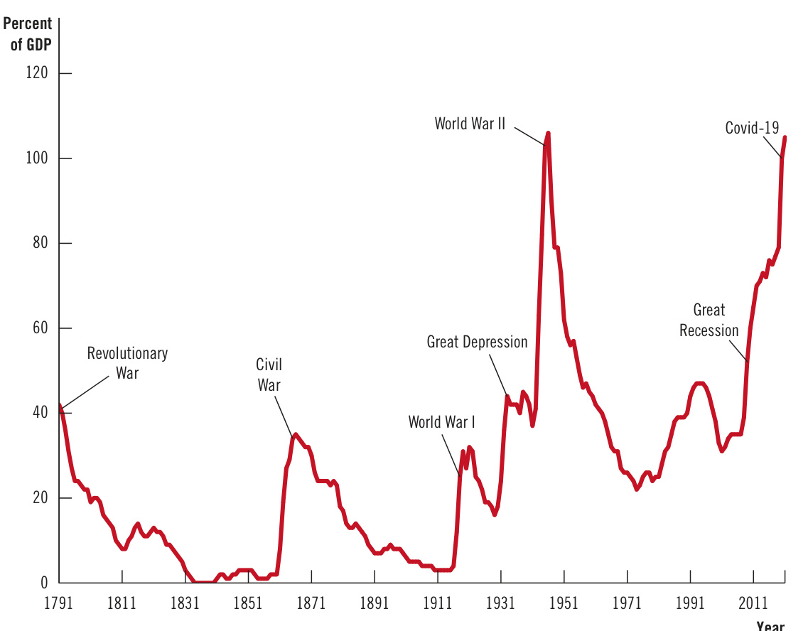

# Ch27 Saving, Investment, and the Financial System  

How do you obtain the funds to invest in this capital? Perhaps you can draw down your own savings. More likely, though, you are like most entrepreneurs, who don’t have enough money on their own to start a new business. You must get the money you need from somewhere else.  

There are various ways to finance these capital investments. You could borrow from a bank, friend, or relative, promising to return the money later and pay interest for the use of it. Or you could convince someone to provide the money in exchange for a share of your future profits. In either case, your investment in computers and office equipment would be financed by someone else’s saving.  

## financial system  

the group of institutions in the economy that help to match one person’s saving with another person’s investment  

The financial system consists of the institutions that help match one person’s saving with another person’s investment. As the previous chapter discussed, saving and investment are key ingredients to long-run economic growth: When a country saves a large portion of its GDP, more resources are available for investment in capital, and greater capital increases a country’s productivity and living standard. The coordination of saving and investment isn’t a simple matter, however. At any time, some people want to save some of their income for the future, and others want to borrow to invest in new and growing businesses. What brings these two groups of people together? What ensures that the supply of funds from those who want to save balances the demand for funds from those who want to invest?  

This chapter examines how the financial system works. First, we discuss the large variety of institutions that make up the economy’s financial system. Second, we examine the relationship between the financial system and some key macroeconomic variables—notably saving and investment. Third, we develop a model of the supply and demand for funds in financial markets. In this simple model, there is only one interest rate, and it functions as the price that adjusts to balance supply and demand. The model shows how government policies affect the interest rate and, in turn, society’s allocation of scarce resources.  

## 27-1  Financial Institutions in the U.S. Economy  

At the broadest level, the financial system moves scarce resources from savers (people who spend less than they earn) to borrowers (people who spend more than they earn). Savers have various goals—from putting aside enough money for a vacation in a few months to putting a child through college in several years to retiring comfortably decades from now. Similarly, borrowers need money for various reasons—from buying a car to buying a house to starting a business. Savers supply their money to the financial system with the expectation that they will get it back with interest later. Borrowers demand money from the financial system with the knowledge that they will be required to pay it back with interest.  

The financial system is made up of the institutions that help coordinate the actions of savers and borrowers. As a prelude to analyzing the economic forces that drive the financial system, let’s consider the most important of these institutions. They can be grouped into two categories: financial markets and financial intermediaries.  

## 27-1a  Financial Markets  

## financial markets  

financial institutions through which savers can directly provide funds to borrowers  

## bond  

a certificate of indebtedness  

Financial markets are the institutions through which a person who wants to save can directly supply funds to a person who wants to borrow. The two most important financial markets are the bond market and the stock market.  

The Bond Market  When Intel, the maker of computer chips, wants to borrow to finance the construction of a new factory, it can borrow directly from the public. It does so by selling bonds. A bond is a certificate of indebtedness that specifies the obligations of the borrower to the buyer of the bond. Put simply, a bond buyer is a lender, and a bond is an IOU. The bond identifies the time at which the loan will be repaid, called the date of maturity, and the rate of interest the borrower will pay periodically until the loan matures. Buyers of the bond give their money to Intel in exchange for this promise of interest and eventual repayment of the amount borrowed, called the principal. The buyers can hold the bond until maturity, or they can sell the bond at an earlier date to someone else.  

There are millions of different bonds in the U.S. economy. When large corporations, the federal government, or state and local governments need to borrow to finance the purchase of a new factory, a new jet fighter, or a new school, they usually do so by issuing bonds. If you look at The Wall Street Journal or the business section of your news service, you will find a listing of the prices and interest rates on some of the most important bond issues. These bonds differ according to four significant characteristics.  

The first is its term—the length of time until the bond matures. Some bonds have short terms, such as a few months, while others have terms for thirty or more years. (The British government has at times even issued bonds that never mature, called perpetuities. These bonds pay interest forever, but the principal never needs to be repaid.) The interest rate on a bond depends, in part, on its term. Long-term bonds are riskier than short-term ones because holders of long-term bonds have to wait longer for repayment of principal. If the holders of a long-term bond need their money earlier than the distant date of maturity, they have no choice but to sell the bond to someone else, perhaps at a reduced price. To compensate for this risk, long-term bonds tend to pay higher interest rates than short-term bonds.  

The second important characteristic of a bond is its credit risk—the probability that the borrower will fail to pay some of the interest or principal. Such a failure to pay is called a default. Borrowers can (and sometimes do) default on their loans by declaring bankruptcy. When bond buyers perceive that the probability of default is high, they demand a higher interest rate as compensation. Because the U.S. government is considered to have low credit risk, U.S. government bonds tend to pay low interest rates. By contrast, financially shaky corporations raise money by issuing high-yield bonds, commonly known as junk bonds, which pay high interest rates. Buyers of bonds can judge credit risk by checking with private agencies that evaluate the financial condition of bond issuers. For example, Standard & Poor’s rates bonds from AAA (the safest) to D (those already in default).  

The third important characteristic of a bond is its tax treatment—the way the tax laws treat the interest earned on it. For most bonds, the interest is taxable income; that is, bond owners have to pay a portion of the interest they earn in income taxes. But when state and local governments issue bonds, called municipal bonds, the bond owners are not required to pay federal income tax on the interest income and, in some cases, may not need to pay state and local taxes either. Because of this tax advantage, bonds issued by state and local governments typically pay a lower interest rate than bonds issued by corporations or the federal government.  

The fourth important characteristic of a bond is whether it offers inflation protection. Most bonds are written in nominal terms—that is, they promise to pay interest and principal in a specific number of dollars (or perhaps another currency). If prices rise and dollars have less purchasing power, the bondholder is worse off. Some bonds, however, index the payments of interest and principal to a measure of inflation so that when prices rise, the payments rise proportionately. Since 1997, the U.S. government has issued such bonds, called Treasury Inflation-Protected Securities (TIPS). Because TIPS offer inflation protection, they generally pay a lower interest rate than similar bonds without this feature.  

The Stock Market  Another way for Intel to raise funds to build a new semiconductor factory is to sell stock in the company. A share of stock represents partial ownership in a firm and is a claim to some of the profits the firm makes. For example, if Intel sells a total of 1,000,000 shares of stock, then each share represents ownership of $1/1{,}000{,}000$ of the business.  

The sale of stock to raise money is called equity finance, while the sale of bonds is called debt finance. Although corporations use both equity and debt finance to raise money for new investments, stocks and bonds are very different. The owner of shares of Intel stock is a part owner of Intel, while the owner of an Intel bond is a creditor of the corporation. If Intel is very profitable, the stockholders enjoy the benefits of these profits, but the bondholders get only the stated interest on their bonds. And if Intel runs into financial trouble, the bondholders are paid what they are due before stockholders receive anything at all. Compared with bonds, stocks carry greater risk but offer potentially higher returns.  

After a corporation issues stock by selling shares to the public, these shares trade on organized stock exchanges. In these transactions, the corporation itself receives no money when its stock changes hands. The most important stock exchanges in the U.S. economy are the New York Stock Exchange and the Nasdaq (National Association of Securities Dealers Automated Quotations). Most of the world’s countries have their own stock exchanges on which the shares of local companies trade, the most important being those in Tokyo, Shanghai, Hong Kong, and London.  

The prices at which shares trade on stock exchanges are determined by supply and demand. Because stock represents ownership in a corporation, the demand for a stock (and thus its price) is in part based on people’s perception of the corporation’s future profitability. When people become optimistic about a company, they raise their demand for its stock and bid up its share price. Conversely, when people’s expectations of a company’s prospects decline, the price of a share falls.  

Stock indexes track the overall level of stock prices. A stock index is computed as an average of a group of stock prices. The most famous stock index is the Dow Jones Industrial Average, which was introduced in 1896. It is calculated from the stock prices of thirty major U.S. companies, such as Disney, Microsoft, Coca-Cola, Boeing, Apple, and Walmart. Another well-known stock index is the Standard & Poor’s 500 Index, which is based on the stock prices of 500 major companies. Because stock prices reflect expected profitability, these indexes are watched closely as possible indicators of future economic conditions.  

## 27-1b  Financial Intermediaries  

financial   
intermediaries   
financial institutions   
through which savers can   
indirectly provide funds   
to borrowers  

Financial intermediaries are financial institutions through which savers can indirectly provide funds to borrowers. The term intermediary reflects the role of these institutions in standing between savers and borrowers. Banks and mutual funds are two of the most important financial intermediaries.  

Banks  Consider the Kim family, which owns a small convenience store. If the Kims want to finance a business expansion, they will proceed differently than Intel. Unlike a large corporation, a small, family-owned business would find it difficult to raise funds in the stock and bond markets. Most buyers of stocks and bonds prefer to buy those issued by larger, more familiar companies. The Kims will most likely finance their business expansion with a loan from a local bank.  

Banks are the financial intermediaries with which people are most familiar. A primary job of banks is to take in deposits from people who want to save and use these deposits to make loans to people who want to borrow. Banks pay depositors interest on their deposits and charge borrowers slightly higher interest on their loans. The difference between these rates of interest covers the banks’ costs and returns some profit to the banks’ owners.  

Besides being financial intermediaries, banks play another important role: They facilitate the exchange of goods and services. People can use bank deposits to buy things by writing a check, making an electronic payment, or using a debit card. In other words, banks help create a special asset, called a medium of exchange, that people can use to engage in transactions. A bank’s role in providing a medium of exchange distinguishes it from many other financial institutions. Stocks and bonds, like bank deposits, offer a store of value for the wealth that people have accumulated in past saving, but they do not offer the easy, cheap, and immediate access to wealth that a person gets by writing a check, tapping a “Pay now” button, or swiping a debit card. For now, we ignore this second role of banks but will return to it later when we discuss the monetary system.  

Mutual Funds  A financial intermediary of increasing importance in the U.S. economy is the mutual fund. A mutual fund is an institution that sells shares to the public and uses the proceeds to buy a selection, or portfolio, of various types of stocks, bonds, or both stocks and bonds. The shareholder of the mutual fund accepts all the risk and return associated with the portfolio. If the value of the portfolio rises, the shareholder benefits; if the value of the portfolio falls, the shareholder suffers the loss.  

The primary advantage of mutual funds (and their close cousins, exchange-traded funds) is that they allow people with small amounts of money to diversify their holdings. Because the value of any single stock or bond is tied to the fortunes of one company, holding a single kind of stock or bond is very risky. By contrast, people who hold a diverse portfolio of stocks and bonds face less risk because they have only a small stake in each company. Mutual funds make this diversification easy. With only a few hundred dollars, a person can buy shares in a mutual fund and, indirectly, become the part owner or creditor of hundreds of major companies. For this service, the company operating the mutual fund typically charges shareholders a fee, usually between 0.1 and 1.5 percent of assets each year.  

A second advantage claimed by mutual fund companies is that the funds can give ordinary people access to the skills of professional money managers. The managers of many mutual funds pay close attention to the developments and prospects of the companies in which they buy stock. These managers buy the stock of companies they view as having profitable futures and sell the stock of companies with less promising prospects. This professional management, it is argued, should increase the return that mutual fund depositors earn on their savings.  

Financial economists, however, are often skeptical of this argument. Because thousands of money managers are paying close attention to each company’s prospects, a company’s stock usually trades at a price that reflects the company’s true value. As a result, it is hard to “beat the market” by buying good stocks and selling bad ones. In fact, mutual funds called index funds, which buy all the stocks in a stock  

## mutual fund  

an institution that sells shares to the public and uses the proceeds to buy a portfolio of stocks and bonds  

  
ARLO AND JANIS by Jimmy Johnson  

index, perform somewhat better on average than mutual funds that take advantage of active trading by professional money managers. The explanation for the superior performance of index funds is that they keep costs low by buying and selling very rarely and by not having to pay the salaries of professional money managers.  

## 27-1c  Summing Up  

The U.S. economy contains a large variety of financial institutions. In addition to the bond market, the stock market, banks, and mutual funds, there are also pension funds, credit unions, insurance companies, and even the local loan shark. These institutions differ in many ways. When analyzing the macroeconomic role of the financial system, however, it is more important to keep in mind that, despite their differences, these financial institutions all serve the same goal: directing the resources of savers into the hands of borrowers.  

## QuickQuiz  

1. Lois wants to publish a local newspaper but doesn’t have the financial resources to start the business. She borrows $\Phi60{,}000$ from her friend Clark, to whom she promises an interest rate of 7 percent, and gets another $\Phi40{,}000$ from her friend Jimmy, to whom she promises 10 percent of her profits. What best describes this situation? a. Clark is a stockholder, and Lois is a bondholder. b. Clark is a stockholder, and Jimmy is a bondholder. c. Jimmy is a stockholder, and Lois is a bondholder. d. Jimmy is a stockholder, and Clark is a bondholder.  

2. A bond tends to pay a high interest rate if it is a. a short-term bond rather than a long-term bond. b. a municipal bond exempt from federal taxation. c. issued by the federal government rather than a corporation. d. issued by a corporation of dubious credit quality.   
3. The main advantage of mutual funds is that they provide a. a return insured by the government. b. an easy way to hold a diversified portfolio. c. an asset that is widely used as the medium of exchange. d. a way to avoid fluctuations in stock and bond prices.  

Answers are at the end of the chapter.  

## 27-2  Saving and Investment in the National Income Accounts  

Events that occur within the financial system are central to developments in the overall economy. As we have just seen, the institutions that make up this system—the bond market, the stock market, banks, and mutual funds—coordinate the economy’s saving and investment. As the previous chapter discussed, saving and investment are important determinants of long-run growth in GDP and living standards. As a result, macroeconomists need to understand how financial markets work and how events and policies affect them.  

As a starting point, let’s consider the key macroeconomic variables that measure activity in these markets. Our emphasis here is not on behavior but on accounting. Accounting refers to the way in which various numbers are defined and added up. A personal accountant might help a family add up its income and expenses. A national income accountant does the same thing for the overall economy. The national income accounts include, in particular, GDP and the many related statistics.  

The rules of national income accounting include several important identities. Recall that an identity is an equation that must be true because of the way the variables in the equation are defined. Identities clarify how different variables are related to one another. Here, we consider some accounting identities that shed light on the macroeconomic role of financial markets.  

## 27-2a  Some Important Identities  

Recall that gross domestic product (GDP) is both total income in an economy and the total expenditure on the economy’s output of goods and services. GDP (denoted as $Y$ ) is divided into four components of expenditure: consumption $(C).$ , investment $(I)$ , government purchases $(G).$ , and net exports (NX):  

$$
\begin{array}{r}{Y=C+I+G+N X.}\end{array}
$$  

This equation is an identity because every dollar of expenditure that shows up on the left side also shows up in one of the four components on the right side. Because of the way each of the variables is defined and measured, this equation must always hold.  

To keep things simple, this chapter assumes that the economy we are examining is closed. A closed economy is one that does not interact with other economies. In particular, a closed economy does not engage in international trade in goods and services, and it does not engage in international borrowing and lending. Actual economies are open economies—that is, they interact with other economies around the world. Nonetheless, assuming a closed economy is a useful simplification with which we can learn some lessons that apply to all economies. Moreover, this assumption applies perfectly to the world economy (interplanetary trade is not yet common!).  

Because a closed economy does not engage in international trade, there are no imports and exports, making net exports (NX) exactly zero. We can simplify the identity as  

$$
\begin{array}{r}{Y=C+I+G.}\end{array}
$$  

This equation states that GDP is the sum of consumption, investment, and government purchases. Each unit of output sold in a closed economy is consumed, invested, or bought by the government.  

To see what this identity says about financial markets, subtract $C$ and $G$ from both sides of this equation to obtain  

$$
Y-C-G=I.
$$  

The left side of this equation $(Y-C-G)$ is the total income in the economy that remains after paying for consumption and government purchases: This amount is called national saving, or just saving, and is denoted $S$ . Substituting S for $Y-C-G,$ we can write the last equation as  

$$
S=I.
$$  

## national saving (saving)  

the total income in the economy that remains after paying for consumption and government purchases  

This equation states that saving equals investment.  

To understand the meaning of national saving, it is helpful to manipulate the definition a bit more. Let $T$ denote the amount that the government collects from households in taxes minus the amount it pays back to households in the form of transfer payments (such as Social Security and welfare). We can then write national saving in either of two ways:  

$$
S=Y-C-G
$$  

or  

$$
S=(Y-T-C)\,+\,(T-G).
$$  

private saving   
the income that   
households have left   
after paying for taxes and   
consumption  

public saving the tax revenue that the government has left after paying for its spending budget surplus an excess of tax revenue over government spending  

budget deficit a shortfall of tax revenue from government spending  

These equations are the same because the two $T s$ in the second equation cancel each other, but each reveals a different way of thinking about national saving. In particular, the second equation separates national saving into two pieces: private saving $(Y-T-C)$ and public saving $(T-G)$ .  

Consider each of these pieces. Private saving is the amount of income that households have left after paying their taxes and paying for their consumption. In particular, because households receive income of $Y.$ , pay taxes of $T,$ and spend $C$ on consumption, private saving is $Y-T-C$ . Public saving is the amount of tax revenue that the government has left after paying for its spending. The government receives $T$ in tax revenue and spends $G$ on goods and services. If $T$ exceeds $G_{\epsilon}$ the government receives more money than it spends. In this case, public saving $(T-G)$ is positive, and the government is said to run a budget surplus. If $G$ exceeds $T,$ the government spends more than it receives in tax revenue. In this case, public saving $(T-G)$ is negative, and the government is said to run a budget deficit.  

Now consider how these accounting identities are related to financial markets. The equation $S=I$ reveals an important fact: For the economy as a whole, saving must equal investment. Yet this fact raises some important questions: What mechanisms lie behind this identity? What coordinates those people who are deciding how much to save and those people who are deciding how much to invest? The answer is the financial system. The bond market, the stock market, banks, mutual funds, and other financial markets and intermediaries stand between the two sides of the $S=I$ equation. They take in the nation’s saving and direct it to the nation’s investment.  

## 27-2b  The Meaning of Saving and Investment  

The terms saving and investment can sometimes be confusing. Most people use these terms casually and sometimes interchangeably. By contrast, the macroeconomists who construct the national income accounts use these terms carefully and distinctly.  

Consider an example. Suppose that Larry earns more than he spends and deposits his unspent income in a bank or uses it to buy some stock or a bond from a corporation. Because Larry’s income exceeds his consumption, he adds to the nation’s saving. Larry might think of himself as “investing” his money, but a macroeconomist would call Larry’s act saving rather than investment.  

In the language of macroeconomics, investment refers to the purchase of new capital, such as equipment or buildings. When Moe borrows from the bank to build himself a new house, he adds to the nation’s investment. (Remember, the purchase of a new house is the one form of household spending that is investment rather than consumption.) Similarly, when the Curly Corporation sells some stock and uses the proceeds to build a new factory, it also adds to the nation’s investment.  

Although the accounting identity $S=I$ shows that saving and investment are equal for the overall economy, it does not mean that saving and investment are equal for every individual household or firm. Larry’s saving can be greater than his investment, and he can deposit the excess in a bank. Moe’s saving can be less than his investment, and he can borrow the shortfall from a bank. Banks and other financial institutions make these individual differences between saving and investment possible by allowing one person’s saving to finance another person’s investment.  

<html><body><table><tr><td colspan="2">QuickQuiz</td></tr><tr><td>4.If the government collects more in tax revenue than it spends, and households consume more than they</td><td>5.A closed economy has income of $1,ooo,govern- ment spending of $200,taxes of $150,and invest-</td></tr><tr><td>get in after-taxincome,then a.private saving andpublic saving arebothpositive.</td><td>ment of $250.What is private saving? a. $100</td></tr><tr><td>b.private saving and public saving are both negative.</td><td>b. $200</td></tr><tr><td>c. private saving is positive, but public saving is</td><td>c. $300</td></tr><tr><td>negative.</td><td>d. $400</td></tr><tr><td>d. private saving is negative, but public saving is positive.</td><td></td></tr></table></body></html>

Answers are at the end of the chapter.  

## 27-3 The Market for Loanable Funds  

Having discussed some of the important financial institutions in our economy and the macroeconomic role of these institutions, we are ready to build a model of financial markets. Our goal is to explain how financial markets coordinate an economy’s saving and investment. The model also provides a tool with which we can analyze government policies that influence saving and investment.  

To keep things simple, we assume that the economy has only one financial market, called the market for loanable funds. All savers deposit their saving in this market, and all borrowers take out their loans there. The term loanable funds refers to the income that people have chosen to save and lend out rather than use for their own consumption and to the amount that investors have chosen to borrow to fund new investment projects. In the market for loanable funds, there is one interest rate, which is both the return to saving and the cost of borrowing.  

The assumption of a single financial market isn’t realistic, as the economy has many types of financial institutions. But recall from Chapter 2 that the art in building an economic model is simplifying the world in order to explain it. For our purposes, we can ignore the diversity of financial institutions and assume that the economy has a single financial market.  

## 27-3a  Supply and Demand for Loanable Funds  

Like most other markets, the economy’s market for loanable funds is governed by supply and demand.  

The supply of loanable funds comes from people who have extra income they want to save and lend out. This lending can occur directly, such as when a household buys a bond from a firm, or indirectly, such as when a household makes a deposit in a bank, which then uses the funds to make loans. In both cases, saving is the source of the supply of loanable funds.  

## market for loanable funds  

the market in which those who want to save supply funds and those who want to borrow to invest demand funds  

The demand for loanable funds comes from households and firms that wish to borrow to make investments. This demand includes families taking out mortgages to buy new homes. It also includes firms borrowing to buy new equipment or build factories. In both cases, investment is the source of the demand for loanable funds.  

The interest rate may be viewed as the price of a loan. It represents the amount that borrowers pay for loans and the amount that lenders receive on their saving. Because a high interest rate makes borrowing more expensive, the quantity of loanable funds demanded falls as the interest rate rises. Similarly, because a high interest rate makes saving more attractive, the quantity of loanable funds supplied rises as the interest rate rises. In other words, the demand curve for loanable funds slopes downward, and the supply curve for loanable funds slopes upward.  

Figure 1 shows the interest rate that balances the supply and demand for loanable funds. In the equilibrium shown, the interest rate is 5 percent, and the quantity of loanable funds demanded and the quantity of loanable funds supplied both equal $^{\Phi1,200}$ billion.  

The adjustment of the interest rate to the equilibrium level occurs for the usual reasons. If the interest rate were lower than the equilibrium level, the quantity of loanable funds supplied would be less than the quantity demanded. The resulting shortage would encourage lenders to raise the interest rate they charge. A higher interest rate would encourage saving (increasing the quantity of loanable funds supplied) and discourage borrowing for investment (decreasing the quantity demanded). Conversely, if the interest rate were higher than the equilibrium level, the quantity of loanable funds supplied would exceed the quantity demanded. As lenders compete for scarce borrowers, interest rates would fall. In this way, the interest rate approaches the equilibrium level at which the supply and demand for loanable funds exactly balance.  

Recall that economists distinguish between the real and nominal interest rate. The nominal interest rate is the interest rate as usually reported—the monetary  

## Figure 1  

## The Market for Loanable Funds  

The interest rate in the economy adjusts to balance the supply and demand for loanable funds. The supply of loanable funds comes from national saving, both private and public. The demand for loanable funds comes from firms and households that want to borrow for purposes of investment. Here, the equilibrium interest rate is 5 percent, and $\mathbb{S}1,200$ billion of loanable funds are supplied and demanded.  

  

return to saving and the monetary cost of borrowing. The real interest rate is the nominal interest rate corrected for changes in the price level: It equals the nominal interest rate minus the inflation rate. Because inflation or deflation changes the value of money over time, the real interest rate more accurately reflects the real return to saving and the real cost of borrowing. Therefore, the supply and demand for loanable funds depend on the real (rather than nominal) interest rate, and the equilibrium in Figure 1 should be interpreted as determining the economy’s real interest rate. For the rest of this chapter, when you see the term interest rate, remember that we are talking about the real interest rate.  

This model of the supply and demand for loanable funds shows that financial markets work much like other markets. In the market for milk, for instance, the price of milk adjusts so the quantity of milk supplied balances the quantity demanded. In this way, the invisible hand coordinates the behavior of dairy farmers and milk drinkers. Once we realize that saving represents the supply of loanable funds and investment represents the demand, we can see how the invisible hand coordinates saving and investment. When the interest rate adjusts to balance supply and demand in the market for loanable funds, it coordinates the behavior of people who want to save (the suppliers of loanable funds) and the behavior of people who want to invest (the demanders of loanable funds).  

We can use this model of the market for loanable funds to examine government policies that affect the economy’s saving and investment. Because the model is just supply and demand in a particular market, use the three steps discussed in Chapter 4. First, decide whether the policy shifts the supply curve or the demand curve. Second, determine the direction of the shift. Third, use the supply-anddemand diagram to see how the equilibrium changes.  

## 27-3b  Policy 1: Saving Incentives  

Many economists and policymakers have advocated increases in saving. Their argument is simple. One of the Ten Principles of Economics in Chapter 1 is that a country’s standard of living depends on its ability to produce goods and services. And as the preceding chapter discussed, saving is an important longrun determinant of a nation’s productivity. If the United States could somehow raise its saving rate, more resources would be available for capital accumulation, GDP would grow more rapidly, and over time, people would enjoy a higher standard of living.  

Another of the Ten Principles of Economics is that people respond to incentives. Many economists have relied on this principle to suggest that the low rate of saving is at least partly attributable to tax laws that discourage saving. The U.S. federal government, as well as many state governments, collects revenue by taxing income, including interest and dividend income. To see the effects of this policy, consider a 25-year-old who saves $^\mathrm{\Phi1,000}$ and buys a 30-year bond that pays an interest rate of 9 percent. Without taxes, the $^{\Phi1,000}$ grows to $^{\,\Phi13,268}$ when the individual reaches age 55. But if the interest income is taxed at a rate of, say, 33 percent, the after-tax interest rate is only 6 percent. In this case, the $^\mathrm{\Phi1,000}$ grows to only $^{\Phi5,743}$ over the 30 years. The tax on interest income substantially reduces the future payoff from current saving and thereby reduces the incentive for people to save.  

In response to this problem, some economists and lawmakers have proposed reforming the tax code to encourage greater saving. For example, one proposal is to expand eligibility for special accounts, such as Individual Retirement Accounts, that allow people to shelter some of their saving from taxation. Let’s consider the effect of such a saving incentive on the market for loanable funds, as illustrated in Figure 2.  

First, which curve does this policy affect? Because the tax change alters the incentive for households to save at any given interest rate, it affects the quantity of loanable funds supplied at each interest rate. The supply curve for loanable funds shifts. The demand curve for loanable funds remains the same because the tax change does not directly affect the amount that borrowers want to borrow at any interest rate.  

Second, which way does the supply curve shift? Because saving is being taxed less heavily than under current law, households increase their saving by consuming a smaller fraction of their income. Households use this additional saving to increase their deposits in banks or to buy more bonds. The supply of loanable funds increases, and the supply curve shifts to the right from $S_{\mathrm{{1}}}$ to $S_{2^{\prime}}$ as shown in Figure 2.  

Finally, compare the old and new equilibria. In the figure, the increased supply of loanable funds reduces the interest rate from 5 percent to 4 percent. The lower interest rate raises the quantity of loanable funds demanded from $^{\Phi1,200}$ billion to $^\mathrm{\Phi1,600}$ billion. That is, the shift in the supply curve moves the market equilibrium along the demand curve. With a lower cost of borrowing, households and firms are motivated to borrow more to finance greater investment. In short, if a reform of the tax laws encourages greater saving, the result is lower interest rates and greater investment.  

This analysis of the effects of increased saving is widely accepted among economists, but there is less consensus about what kinds of tax changes should be enacted. Many economists endorse tax reform aimed at increasing saving to stimulate  

## Saving Incentives Increase the Supply of Loanable Funds  

  
Figure 2  

A change in the tax laws to encourage Americans to save more shifts the supply of loanable funds to the right from $S_{\mathrm{1}}$ to $S_{_2}$ . As a result, the equilibrium interest rate falls, and the lower interest rate stimulates investment. Here, the equilibrium interest rate falls from 5 percent to 4 percent, and the equilibrium quantity of loanable funds saved and invested rises from $\mathbb{S}1,200$ billion to $\Phi1,600$ billion.  

investment and growth. Yet others are skeptical that these tax changes would have a large effect on saving. These skeptics also doubt the equity of the proposed reforms. They argue that, in many cases, the benefits of the tax changes would accrue primarily to the wealthy, who are least in need of tax relief.  

## 27-3c  Policy 2: Investment Incentives  

Suppose that Congress passes a tax reform aimed at making investment more attractive—for instance, by instituting an investment tax credit, as Congress has done from time to time. An investment tax credit gives a tax advantage to any firm building a new factory or buying a new piece of equipment. Let’s consider the effect of such a tax reform on the market for loanable funds, as shown in Figure 3.  

First, does the tax credit affect supply or demand? Because it rewards firms that borrow and invest in new capital, it alters investment at any interest rate and thereby changes the demand for loanable funds. But because the tax credit does not affect the amount that households save at any interest rate, it does not affect the supply of loanable funds.  

Second, which way does the demand curve shift? Because firms have an incentive to increase investment at any interest rate, the quantity of loanable funds demanded is higher at any interest rate. The demand curve for loanable funds moves to the right, as shown by the shift from $D_{\mathrm{{1}}}$ to $D_{2}$ in the figure.  

Third, consider how the equilibrium changes. In Figure 3, the increased demand for loanable funds raises the interest rate from 5 percent to 6 percent, and the higher interest rate, in turn, increases the quantity of loanable funds supplied from $^{\Phi1,200}$ billion to $^{\Phi1,400}$ billion as households respond by increasing the amount they save. This change in household behavior is represented as a movement along the supply curve. Thus, if a reform of the tax laws encourages greater investment, the result is higher interest rates and greater saving.  

## Figure 3  

## Investment Incentives Increase the Demand for Loanable Funds  

If the passage of an investment tax credit encourages firms to invest more, the demand for loanable funds increases. As a result, the equilibrium interest rate rises, and the higher interest rate stimulates saving. Here, when the demand curve shifts from $D_{1}$ to $D_{2}$ , the equilibrium interest rate rises from 5 percent to 6 percent, and the equilibrium quantity of loanable funds saved and invested rises from $\mathbb{S}1,200$ billion to $\Phi1,\!400$ billion.  

  

In the evolution of the U.S. economy over the past few decades, one fact stands out as especially noteworthy: the large and fairly steady decline in real interest rates. Figure 4 illustrates the phenomenon. In the late 1980s and 1990s, the real interest rate was typically between 4 and 5 percent. In the 2010s, it was typically below 1 percent. In 2020, the real interest rate even dipped below zero. Over this period, many other nations experienced a similar trend.  

What accounts for this decline, and what are its implications? Let’s start with three reasons that saving might have increased, shifting the supply of loanable funds to the right:  

• As income inequality has risen over the past few decades, resources have shifted from poorer households to richer ones. If the rich have higher propensities to save, more resources flow into capital markets. The Chinese economy has grown rapidly in recent years, and China has a high saving rate. This new, vast pool of saving flows into capital markets around the world. •  Events like the financial crisis of 2008 and the pandemic of 2020 are vivid reminders of how uncertain life can be. People may respond by increasing precautionary saving to prepare for such unfortunate events.  

In addition, consider three reasons that investment may have declined, shifting the demand for loanable funds to the left:  

• Over the past several decades, average economic growth has slowed, due to a combination of lower productivity growth and lower population growth. A decline in growth reduces the demand for new capital investment. Old technologies, such as railroads and auto factories, required large capital investments. New technologies, like those developed in Silicon Valley, may be less capital-intensive.  

## Figure 4  

## The Decline in the Real Interest Rate  

The real interest rate declined substantially from 1984 to 2020. The reason is a puzzle, though various hypotheses have been proposed.  

Source: The Federal Reserve, the Department of Commerce, and the author’s calculations. The real interest rate presented here is the yield on 10-year Treasury bonds minus the core inflation rate (based on the PCE deflator excluding food and energy) as a measure of expected inflation.  

  

• Some economists have suggested that the U.S. economy is less competitive than it once was. Businesses with greater market power not only charge higher prices but also invest less.  

Which of these hypotheses is right? Very likely, a combination of these forces is at work. When the supply of loanable funds shifts to the right and the demand shifts to the left, the impact on equilibrium saving and investment is ambiguous, but the effect on the equilibrium interest rate is clear: It falls.  

Some of the implications of low interest rates are evident. For example, over the past century, a balanced portfolio of half stocks and half bonds has earned an average annual return of about 5 percent after inflation. Looking ahead as of 2021, a more plausible projection is a return of about 3 percent.  

If that prospect is borne out, institutions like universities that use the return on their endowments to fund their activities will need to tighten their belts. It also means that individuals will need to rethink retirement saving. To support any level of spending for a 30-year retirement, a person’s nest egg entering retirement needs to be 27 percent larger when the rate of return is 3 percent per year rather than 5. For much the same reason, public and private pension plans are probably more underfunded than current estimates suggest.  

There are, however, also upsides to the decline in interest rates. Young families looking to buy homes, for example, benefit from the lower cost of mortgage financing.  

In the end, the interest rate is just a price. A low price benefits those on the demand side of the market (young families taking out mortgages) and hurts those on the supply side (older individuals saving for retirement). If interest rates start to rise again, the winners and losers will be reversed. ●  

## 27-3d  Policy 3: Government Budget Deficits and Surpluses  

A perpetual topic of political debate is the status of the government budget. Recall that a budget deficit is an excess of government spending over tax revenue. Governments finance budget deficits by borrowing in the bond market, and the accumulation of past government borrowing is called the government debt. A budget surplus, an excess of tax revenue over government spending, can be used to repay some of the government debt. If government spending exactly equals tax revenue, the government is said to have a balanced budget.  

Imagine that the government starts with a balanced budget and then, because of an increase in government spending, starts to run a budget deficit. We can analyze the effects of the budget deficit by following our three steps in the market for loanable funds, as illustrated in Figure 5.  

First, which curve shifts when the government starts running a budget deficit? Recall that national saving—the source of the supply of loanable funds—is composed of private and public saving. A change in the government budget balance represents a change in public saving and, therefore, in the supply of loanable funds. Because the budget deficit does not influence the amount that households and firms want to borrow to finance investment at any interest rate, it does not alter the demand for loanable funds.  

Second, in which direction does the supply curve shift? When the government runs a budget deficit, public saving is negative, so national saving declines. In other words, when the government borrows to finance its budget deficit, it reduces the supply of loanable funds available to finance investment. Thus, a budget deficit shifts the supply curve for loanable funds to the left from $S_{\mathrm{{1}}}$ to $S_{{2^{\prime}}}$ as shown in Figure 5.  

Third, compare the old and new equilibria. In the figure, when the budget deficit reduces the supply of loanable funds, the interest rate rises from 5 percent to  

## The Effect of a Government Budget Deficit  

When the government spends more than it receives in tax revenue, the resulting budget deficit lowers national saving. The supply of loanable funds decreases, and the equilibrium interest rate rises. Thus, when the government borrows to finance its budget deficit, it crowds out households and firms that otherwise would borrow to finance investment. Here, when the supply curve shifts from $S_{\mathrm{{1}}}$ to $S_{2}$ , the equilibrium interest rate rises from 5 percent to 6 percent, and the equilibrium quantity of loanable funds saved and invested falls from $\mathbb{S}1,200$ billion to $\Phi800$ billion.  

## crowding out  

a decrease in investment that results from government borrowing  

  

6 percent. The quantity of loanable funds demanded then decreases from $^{\Phi1,200}$ billion to $\mathbb{S}800$ billion as the higher interest rate discourages many demanders of loanable funds. Fewer families buy new homes, and fewer firms choose to build new factories. The fall in investment caused by government borrowing is represented by the movement along the demand curve and is called crowding out. That is, when the government borrows to finance its budget deficit, it crowds out private borrowers who are trying to finance investment.  

In this standard model, the most basic lesson about budget deficits follows directly from their effects on the supply and demand for loanable funds: When the government reduces national saving by running a budget deficit, the interest rate rises, and investment falls. Because investment is important for long-run growth, government budget deficits reduce the economy’s growth rate.  

Why, you might ask, does a budget deficit affect the supply of loanable funds rather than the demand for them? After all, the government finances a budget deficit by selling bonds, thereby borrowing from the private sector. Why does increased borrowing by the government shift the supply curve, while increased borrowing by private investors shifts the demand curve? To answer this question, we need to examine more precisely the meaning of “loanable funds.” The model as presented here takes this term to mean the flow of resources available to fund private investment; for that reason, a government budget deficit reduces the supply of loanable funds. If, instead, we had defined the term “loanable funds” to mean the flow of resources available from private saving, then the government budget deficit would increase demand rather than reduce supply. Changing the interpretation of the term would cause a semantic change in how we described the model, but the upshot of the analysis would be the same: In either case, a budget deficit increases the interest rate, thereby crowding out private borrowers who are relying on financial markets to fund private investment projects.  

So far, we have examined a budget deficit that results from an increase in government spending, but a budget deficit that results from a tax cut has similar effects. A tax cut reduces tax revenue $T$ and public saving, $T\mathrm{~-~}G$ . Private saving, $Y\mathrm{~-~}T\mathrm{~-~}C,$ might increase because of lower $T,$ , but as long as households respond to the lower taxes by consuming more, C increases, so private saving rises by less than public saving falls. National saving $\left(S=Y-C-G\right)$ ), the sum of public saving and private saving, declines. Once again, the budget deficit reduces the supply of loanable funds, drives up the interest rate, and crowds out borrowers trying to finance capital investments.  

Having examined the impact of budget deficits, we can turn the analysis around and see the opposite effects of government budget surpluses. When the government collects more in tax revenue than it spends, it saves the difference by retiring some of the government debt. This budget surplus, or public saving, contributes to national saving. Thus, a budget surplus increases the supply of loanable funds, reduces the interest rate, and stimulates investment. Higher investment, in turn, means greater capital accumulation and more rapid economic growth.  

## Ask the Fiscal Policy Experts and Saving  

“Sustained tax and spending policies that boost consumption in ways that reduce the saving rate are likely to lower long-run living standards.”  

  
What do economists say?   
Source: IGM Economic Experts Panel, July 8, 2013.  

## The History of U.S. Government Debt  

How indebted is the U.S. government? The answer to this question varies substantially over time. Figure 6 shows the debt of the U.S. federal government expressed as a percentage of U.S. GDP. It shows that ent debt has fluctuated from zero in 1836 to 106 percent of GDP in 1946.  

The debt-to-GDP ratio is one gauge of the government’s finances. Because GDP is a rough measure of the government’s tax base, a declining debt-to-GDP ratio indicates that the government’s indebtedness is shrinking relative to its ability to raise tax revenue. This suggests that the government is, in some sense, living within its means. By contrast, a rising debt-to-GDP ratio means that the government indebtedness is increasing relative to its ability to raise tax revenue. It is often interpreted as meaning that fiscal policy—government spending and taxes—cannot be sustained forever at current levels.  

Throughout history, a primary cause of fluctuations in government debt has been war. When wars occur, government spending on national defense rises substantially to pay for soldiers and military equipment. Taxes sometimes rise as well but typically by much less than the increase in spending. The result is a budget deficit and increasing government debt. When the war is over, government spending declines, and the debt-to-GDP ratio starts declining as well.  

There are two reasons to believe that debt financing of war is an appropriate policy. First, it allows the government to keep tax rates smooth over time. Without debt financing, wars would require sharp increases in tax rates, which would cause a substantial decline in economic efficiency. Second, debt financing of wars shifts part of the cost of wars to future generations, who will have to pay off the government debt. Putting some of the tax burden on future generations is arguably fair if there is an enduring benefit from a war fought by a previous generation.  

The debt of the U.S. federal government, expressed here as a percentage of GDP, has varied throughout history. Wars and deep economic downturns are typically associated with substantial increases in government debt.  

Source: U.S. Department of Treasury; U.S. Department of Commerce; and T. S. Berry, “Production and Population since 1789,” Bostwick Paper No. 6, Richmond, 1988. The data here are for government debt held by the public, which excludes government debt held in government accounts, such as the Social Security trust fund.  

  

Another notable cause of increases in government debt is deep economic downturns, such as the Great Depression of the 1930s, the Great Recession associated with the financial crisis of 2008–2009, and the Covid Recession of 2020. During downturns, government revenue automatically falls as receipts from income and payroll taxes decline. Spending on government programs such as unemployment insurance also rises automatically. In addition, policymakers usually enact policies to soften the downturn and mitigate the economic hardship, further increasing the budget deficit.  

Going forward, many budget analysts are concerned about further increases in the debt-to-GDP ratio. As members of the large baby-boom generation reach retirement age, they will become eligible for Social Security and Medicare benefits, putting upward pressure on government spending. Without sizable increases in tax revenue or cuts in government spending, the U.S. federal government will likely experience substantially rising debt over the next few decades. According to a 2021 projection by the Congressional Budget Office, the debt-to-GDP ratio is on track to reach 140 percent by 2040, which is larger than anything that has been experienced historically. $\bullet$ n 2008 and 2009, the U.S. economy and many others around the world experienced a financial crisis, which led to a deep downturn in economic activity. We will examine these events in detail later in this book. For now, here are the key elements of typical financial crises.  

The first element of a financial crisis is a large decline in the prices of some assets. In 2008 and 2009, that asset was real estate. House prices, after booming earlier in the decade, fell by about 30 percent over just a few years. Such a large decline in real estate prices had not been seen in the United States since the 1930s.  

The second element of a financial crisis is widespread insolvencies at financial institutions. (A company is insolvent when its liabilities exceed the value of its assets.) In 2008 and 2009, many banks and other financial firms had, in effect, placed bets on house prices by holding mortgages backed by that real estate. When house prices plummeted, large numbers of homeowners stopped repaying their loans. These defaults pushed several major financial institutions toward bankruptcy.  

The third element is a decline in confidence in financial institutions. Although some deposits in banks are insured by government policies, not all are. As insolvencies mounted in 2008 and 2009, every financial institution became a candidate for bankruptcy. Individuals and firms with uninsured deposits in those institutions pulled out their money. Needing cash to pay back depositors, banks started selling off assets (sometimes at reduced “fire-sale” prices) and cut back on new lending.  

The fourth element is a credit crunch. With many financial institutions facing difficulties, prospective borrowers had trouble getting loans, even if they had profitable investment projects. In essence, the financial system had trouble directing the resources of savers into the hands of borrowers with the best investment opportunities.  

The fifth element is an economic downturn. With people unable to obtain financing for new investment projects, the overall demand for goods and services declined. As a result, for reasons discussed more fully later in the book, national income fell, and unemployment rose.  

The sixth and final element of a financial crisis is a vicious circle. The downturn reduced the profitability of many companies and the value of many assets, putting the economy back at step one. The problems in the financial system and the overall economy reinforced each other.  

Financial crises, such as the one of 2008 and 2009, can have severe consequences. Fortunately, sooner or later, they end. The financial system eventually gets back on its feet, perhaps with help from government, and it returns to its normal function of financial intermediation.  

## QuickQuiz  

6. If a popular TV show on personal finance convinces Americans to save more for retirement, the curve for loanable funds would shift, driving the equilibrium interest rate  

a. supply; up b. supply; down c. demand; up d. demand; down  

7. If the business community becomes more optimistic about the profitability of capital, the curve for loanable funds would shift, driving the equilibrium interest rate  

a. supply; up b. supply; down c. demand; up d. demand; down  

8. Which of the following policy actions would  

unambiguously reduce the supply of loanable funds   
and crowd out investment?   
a. an increase in taxes and a decrease in government spending   
b. a decrease in taxes together with an increase in government spending   
c. an increase in both taxes and government spending   
d. a decrease in both taxes and government spending  

9. From 2019 to 2021, during the Covid-19 crisis, the ratio of government debt to GDP in the United States  

a. increased markedly.   
b. decreased markedly.   
c. was stable at a historically high level.   
d. was stable at a historically low level.  

“Neither a borrower nor a lender be,” Polonius advises his son in Shakespeare’s Hamlet. If everyone followed Polonius’s advice, this chapter would be unnecessary.  

But few do. In our economy, people borrow and lend often, and usually for good reason. You may borrow one day to start your own business or buy a home. And people may lend to you in the hope that the interest you pay will allow them to enjoy a more prosperous retirement. The financial system’s job is to coordinate all this borrowing and lending.  

In many ways, financial markets are like others in the economy. The price of loanable funds—the interest rate—is governed by supply and demand, just as most other prices in the economy are. And we can analyze shifts in supply or demand in financial markets as we do in other markets. One of the Ten Principles of Economics in Chapter 1 is that markets are usually a good way to organize economic activity. This principle applies to financial markets as well. When financial markets bring the supply and demand for loanable funds into balance, they help allocate the economy’s scarce resources to their most efficient uses.  

In one way, however, financial markets are special. Financial markets, unlike most others, link the present and the future. Those who supply loanable funds—savers—do so because they want to convert some of their current income into future purchasing power. Those who demand loanable funds—borrowers—do so because they want to invest today and use the capital to produce goods and services in the future. Well-functioning financial markets are important not only for current generations but also for future generations who will inherit many of the benefits.  

## Chapter in a Nutshell  

The U.S. financial system is made up of many types of financial institutions, such as the bond market, the stock market, banks, and mutual funds. They all direct the resources of households that want to save some of their income into the hands of households and firms that want to borrow. National income accounting identities reveal important relationships among macroeconomic variables. In particular, for a closed economy, national saving must equal investment. Financial institutions are the mechanism through which the economy matches one person’s saving with another person’s investment. The interest rate is determined by the supply and demand for loanable funds. The supply comes from households that want to save some of their income and lend it out. The demand comes from households and firms that want to borrow for investment. To analyze how any policy or event affects the interest rate, consider how it affects the supply and demand for loanable funds.  

National saving equals private saving plus public saving. A government budget deficit represents negative public saving and, therefore, reduces national saving and the supply of loanable funds available to finance investment. When a government budget deficit crowds out investment, it reduces the growth of productivity and GDP.  

## Key Concepts  

financial system, p. 554   
financial markets, p. 554   
bond, p. 554   
stock, p. 555   
financial intermediaries, p. 556   
mutual fund, p. 557   
national saving (saving), p. 559   
private saving, p. 560   
public saving, p. 560   
budget surplus, p. 560   
budget deficit, p. 560   
market for loanable funds, p. 561   
crowding out, p. 568  

1. What is the role of the financial system? Name and describe two markets that are part of the financial system in the U.S. economy. Name and describe two financial intermediaries.  

2. Why is it important for people who own stocks and bonds to diversify their holdings? What type of financial institution makes diversification easier?  

3. What is national saving? What is private saving? What is public saving? How are these three variables related?  

4. What is investment? How is it related to national saving in a closed economy?   
5. Describe a change in the tax code that might increase private saving. If this policy were implemented, how would it affect the market for loanable funds?   
6. What is a government budget deficit? How does it affect interest rates, investment, and economic growth?  

## Problems and Applications  

1. For each of the following pairs, which bond would you expect to pay a higher interest rate? Explain. a. a bond of the U.S. government or a bond of an Eastern European government b. a bond that repays the principal in year 2030 or a bond that repays the principal in year 2050 c. a bond from Coca-Cola or a bond from a software company you run in your garage d. a bond issued by the federal government or a bond issued by New York State  

2. Many workers hold large amounts of stock issued by the firms at which they work. Why do you suppose companies encourage this behavior? Why might people not want to hold stock in the company where they work?  

3. Explain the difference between saving and investment as defined by a macroeconomist. Which of the following situations represent investment and which represent saving? Explain. a. Your family takes out a mortgage and buys a new house. b. You use your $\mathbb{S}200$ paycheck to buy stock in AT&T. c. Your roommate earns $\mathbb{S}100$ and deposits it in an account at a bank. d. You borrow $^\mathrm{\Phi1,000}$ from a bank to buy a car to use in your pizza delivery business.  

4. Suppose GDP is $\boldsymbol{\Phi}\boldsymbol{8}$ trillion, taxes are $\mathbb{S}1.5$ trillion, private saving is $\mathbb{S}0.5$ trillion, and public saving is $\mathbb{S}0.2$ trillion. Assuming this economy is closed, calculate consumption, government purchases, national saving, and investment.  

5. Economists in Funlandia, a closed economy, have collected the following information about the economy for a particular year:  

$$
\begin{array}{l}{Y=10,000}\\ {C=6,000}\\ {T=1,500}\\ {G=1,700}\end{array}
$$  

The economists also estimate that the investment function is:  

$$
I=3,300\,-\,100r,
$$  

where $r$ is the country’s real interest rate, expressed as a percentage. Calculate private saving, public saving, national saving, investment, and the equilibrium real interest rate.  

6. Suppose that Intel is considering building a new chip-making factory. a. Assuming that Intel needs to borrow money in the bond market, why would an increase in interest rates affect Intel’s decision about whether to build the factory? b. If Intel has enough of its own funds to finance the new factory without borrowing, would an increase in interest rates still affect Intel’s decision about whether to build the factory? Explain.  

7. Three students have each saved $^\mathrm{\Phi1,000}$ . Each has an investment opportunity in which he or she can invest up to $^\mathrm{\textregistered}_{\mathrm{}}{}^{\mathrm{000}}$ . Here are the rates of return on the students’ investment projects:  

<html><body><table><tr><td>Harry</td><td>5 percent</td></tr><tr><td>Ron</td><td>8 percent</td></tr><tr><td>Hermione</td><td>20 percent</td></tr></table></body></html>  

a. If borrowing and lending are prohibited so each student can only use personal saving to finance his or her own investment project, how much will each student have a year later when the project pays its return?   
b. Now suppose their school opens up a market for loanable funds in which students can borrow and lend among themselves at an interest rate $r$ . What would determine whether a student would choose to be a borrower or lender in this market?   
c. Among these three students, what would be the quantity of loanable funds supplied and quantity demanded at an interest rate of 7 percent? At 10 percent?   
d. At what interest rate would the loanable funds market among these three students be in equilibrium? At this interest rate, which student(s) would borrow and which student(s) would lend?   
e. At the equilibrium interest rate, how much does each student have a year later after the investment projects pay their return and loans have been repaid? Compare your answers with those you gave in part (a). Who benefits from the existence of the loanable funds market—the borrowers or the lenders? Is anyone worse off?   
Suppose the government borrows $\mathbb{S}20$ billion more   
next year than this year.   
a. Use a supply-and-demand diagram to analyze this policy. Does the interest rate rise or fall?   
b. What happens to investment? To private saving? To public saving? To national saving? Compare the size of the changes to the $\mathbb{S}20$ billion of extra government borrowing.   
c. How does the elasticity of supply of loanable funds affect the size of these changes?   
d. How does the elasticity of demand for loanable funds affect the size of these changes?   
e. Suppose households believe that greater government borrowing today implies higher taxes to pay off the government debt in the future. What does this belief do to private saving and the supply of loanable funds today? Does it increase or decrease the effects you discussed in parts (a) and (b)?  

9. This chapter explains that investment can be increased both by reducing taxes on private saving and by reducing the government budget deficit. a. Why is it difficult to implement both of these policies at the same time? b. What would you need to know about private saving to determine which of these two policies would be the more effective way to raise investment?  

## QuickQuiz Answers  

1. d 2. d 3. b 4. d 5. c 6. b 7. c 8. b 9. a  

