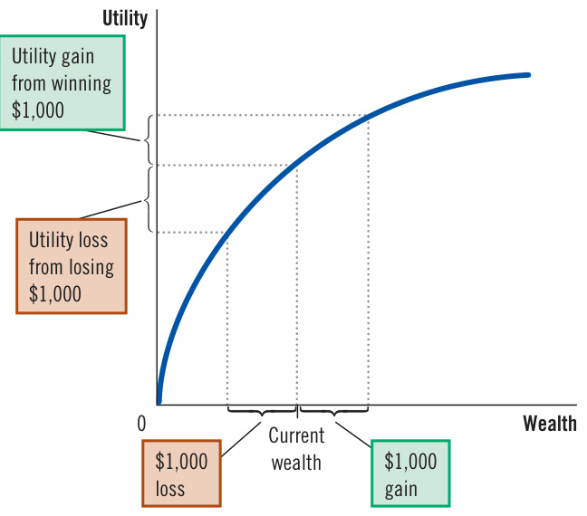
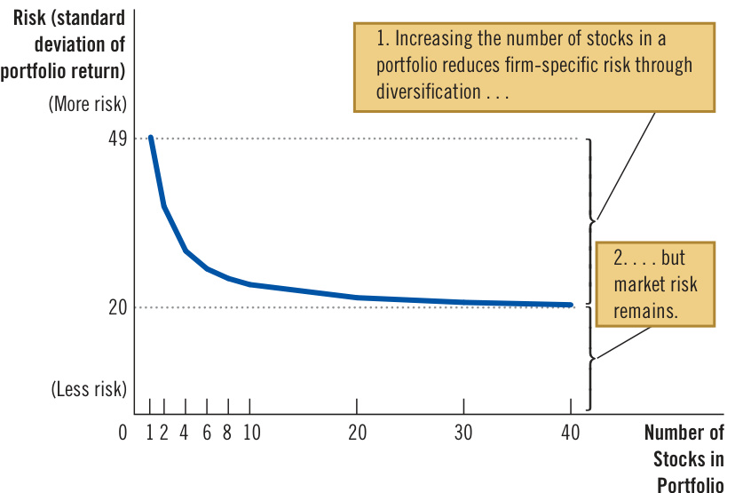
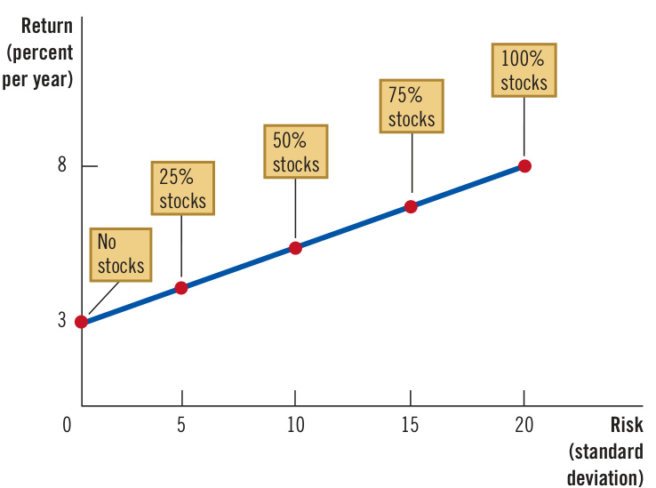
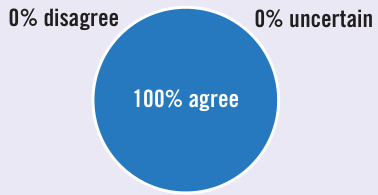

# Ch28 The Basic Tools of Finance  

A account, or you may take out a loan to cover tuition or buy tt asnot mine  ypoouinr tl,i fteh. e Yfoiun amncaiya l dseypstoesimt  yiso ubro suanvdi ntgos  bien  ia mbpaonrka house. After you have a job, your employer may start a retirement account for you, and you’ll be able to decide whether to invest the funds in stocks, bonds, or other financial instruments. If you invest on your own, you can choose whether to put your money in established companies such as Coca-Cola, newer ones such as Airbnb, or the entire stock market through an index fund. And in the media, you will hear reports about whether stocks are up or down, along with the often-feeble attempts to explain why the market behaves as it does.  

In almost all the financial decisions you will make during your life, you will encounter two related elements: time and risk. As the preceding two chapters showed, the financial system coordinates the economy’s saving and investment, which are crucial determinants of growth. Most fundamentally, the financial system concerns decisions and actions undertaken today that will affect our lives in  

  

## finance  

the field that studies how people make decisions regarding the allocation of resources over time and the handling of risk  

firms pick investment projects, their decisions are based on guesses about the likely results. The actual outcome could end up very different from what was expected.  

This chapter introduces some tools for understanding the financial decisions that people make. The field of finance develops these tools in detail, and you may later take courses that focus on this topic. But because the financial system is so important, many of the insights of finance are central to understanding how the economy works. The tools of finance can also help you think through some of the decisions that you will make in life.  

This chapter takes up three topics: how to compare sums of money from different points in time, how to manage risk, and how to determine the value of an asset such as a share of stock.  

## 28-1   Present Value: Measuring the Time Value of Money  

## present value  

the amount of money today needed to produce a future amount of money, given prevailing interest rates  

## future value  

the amount of money in the future that an amount of money today will yield, given prevailing interest rates  

## compounding  

the accumulation of a sum of money in, say, a bank account, where the interest earned remains in the account to earn additional interest in the future  

Imagine that someone offers to give you $\mathbb{S}100$ today or $\mathbb{S}100$ in 10 years. Which would you choose? This question is easy. Getting $\mathbb{S}100$ today is better because you can deposit the money in a bank, still have it in 10 years, and earn interest on the $\mathbb{S}100$ along the way. The lesson: Money today is more valuable than the same amount of money in the future.  

Now consider a harder question. Imagine that someone offers you $\mathbb{S}100$ today or $\mathbb{S}200$ in 10 years. Which would you choose? To answer this question, you need some way to compare sums of money from different points in time. Economists do this with a concept called present value. The present value of any future sum of money is the amount of money that, given current interest rates, would be needed today to produce that future sum.  

To learn how to use the concept of present value, let’s work through a couple of simple examples:  

Question: If you put $\mathbb{S}100$ in a bank account today, how much will it be worth in $N$ years? That is, what will be the future value of this $\mathbb{S}100?$  

Answer: Use $r$ to denote the interest rate expressed in decimal form (so an interest rate of 5 percent means $r=0.05)$ ). Suppose that interest is paid annually and that it remains in the bank account to earn more interest—a process called compounding. Then the $\mathbb{S}100$ will become  

$$
{\begin{array}{r l r}&{(1+r)\times\S100}&{{\mathrm{after~}}1}\\ &{(1+r)\times(1+r)\times\S100=(1+r)^{2}\times\S100}&{{\mathrm{after~}}2}\\ &{(1+r)\times(1+r)\times(1+r)\times\S100=(1+r)^{3}\times\S100}&{{\mathrm{after~}}3}\\ &{(1+r)^{N}\times\S100}&{{\mathrm{after~}}N}\end{array}}
$$  

For example, if we invest at an interest rate of 5 percent for 10 years, then the future value of the $\mathbb{S}100$ will be $(1.05)^{10}\times\Phi100,$ or $\mathbb{S}163$ .  

Question: Now suppose you are going to be paid $\mathbb{S}200$ in $N$ years. What is the present value of this future payment? That is, how much would you have to deposit in a bank right now to yield $\mathbb{S}200$ in $N$ years?  

Answer: To answer this question, turn the previous answer on its head. In the last question, we computed a future value from a present value by multiplying by the factor $(1+r)^{N}.$ To compute a present value from a future value, divide by the factor $(1+r)^{N}.$ . The present value of $\mathbb{S}200$ to be paid in $N$ years is $\S200/(1+r)^{N}.$ If that amount is deposited in a bank today, after $N$ years it will become $(1+r)^{N}\times[\Phi200/(1+r)^{N}],$ which equals $\mathbb{S}200$ . For instance, if the interest rate is 5 percent, the present value of $\mathbb{S}200$ to be paid in 10 years is $\mathbb{S}200/(1.05)^{10},$ , or $\mathbb{S}123$ . This means that $\mathbb{S}123$ deposited today in a bank account earning 5 percent interest would be worth $\mathbb{S}200$ after 10 years.  

This illustrates the general formula:  

•  If $r$ is the interest rate, then an amount $X$ to be received in $N$ years has a present value of $X/(1+r)^{N}$ .  

Because the possibility of earning interest reduces the present value below the amount $X,$ the process of finding the present value of a future sum of money is called discounting. This formula shows precisely how much future sums should be discounted.  

Let’s now return to our initial question: Should you choose $\mathbb{S}100$ today or $\mathbb{S}200$ in 10 years? Based on the present value calculation using an interest rate of 5 percent, you should prefer the $\mathbb{S}200$ in 10 years. The future $\mathbb{S}200$ has a present value of $\mathbb{S}123$ , which is greater than $\mathbb{S}100$ . You are better off waiting for the future sum.  

Notice that the answer to our question depends on the interest rate. If the interest rate were 8 percent, then the $\mathbb{S}200$ in 10 years would have a present value of $\Phi200/(1.08)^{10},$ , which is only $\mathbb{5}93.$ In this case, you should take the $\mathbb{5}100$ today. Why should the interest rate matter? Because the higher the interest rate, the more you can earn by depositing your money in a bank, so the more attractive getting $\mathbb{S}100$ today becomes.  

At this point, a curious reader might ask: Which interest rate should be used in these calculations—the real or the nominal? These differ when the price level is changing. The answer is, it depends. If the future sum being discounted is stated in nominal terms (that is, as a specified number of dollars), the nominal interest rate is called for. But if the future sum is stated in real terms (that is, as a specified number of inflation-adjusted dollars, measured in terms of today’s prices), the real interest rate is the right one to use. Discounting and present value apply in both cases, but the calculation must be done consistently.  

The concept of present value is useful in many applications, including the decisions that companies face when evaluating investment projects. For instance, imagine that General Motors is thinking about building a new factory. Suppose that the factory will cost $\mathbb{S}100$ million today and will yield the company $\mathbb{S}200$ million in 10 years. Should General Motors undertake the project? This decision is exactly like the one we have been studying. To make its choice, the company should compare the present value of the $\mathbb{S}200$ million return with the $\mathbb{S}100$ million cost.  

The decision, therefore, will depend on the interest rate. If the interest rate is 5 percent, then the present value of the $\mathbb{S}200$ million return from the factory is $\mathbb{S}123$ million, and the company should choose to pay the $\mathbb{S}100$ million cost. But if the interest rate is 8 percent, then the present value of the return is only $\mathbb{S}93$ million, and the company should forgo the project. The concept of present value helps explain why investment— and the quantity of loanable funds demanded—declines when the interest rate rises.  

Here is another application of present value: Suppose you win a million-dollar lottery and are given a choice between $\mathbb{S}20{,}000$ a year for 50 years (totaling $^{\mathbb{S}1,000,000},$ or an immediate payment of $^\mathrm{\textregistered}_{}500,000$ . Which is more valuable? You need to calculate the present value of the stream of payments. Suppose the interest rate is 5 percent. After performing 50 calculations like those above (one for each payment) and adding up the results, you would learn that the present value of this million-dollar prize at a 5 percent interest rate is only $^{\Phi383,000}$ . The immediate payment of $^\mathrm{\textregistered}_{}500,\!000$ is the better choice. The million dollars may seem like more money, but the future cash flows, once discounted to the present, are worth far less.  

uppose one country has an average growth rate of 1 percent per year, while another has an average growth rate of 3 percent per year. At first, this gap might not seem like a big deal. What difference can 2 percent make?  

The answer is: a big difference. Growth rates that seem small when written in percentage terms are large after they are compounded for many years.  

Consider an example. Suppose that two college graduates—William and Sarah—both take their first jobs at the age of 22 with an annual salary of $^{\S50,000}$ . William lives in an economy where all incomes grow at 1 percent per year, and Sarah lives in one where incomes grow at 3 percent per year. Straightforward calculations show what happens. Forty years later, when both are 62 years old, William earns $\mathfrak{S}74\mathrm{,000}$ a year, while Sarah earns $\mathbb{\S}{163},000$ . Because of that difference of 2 percentage points in the growth rate, Sarah’s salary is more than twice William’s.  

An old rule of thumb, called the rule of 70, clarifies the effects of compounding. According to the rule of 70, if some amount grows at a rate of $\boldsymbol{X}$ percent per year, then that amount doubles in approximately  

$70/x$ years. In William’s economy, incomes grow at 1 percent per year, so it takes about 70 years for incomes to double. In Sarah’s economy, incomes grow at 3 percent per year, so it takes about 70/3, or 23, years for incomes to double.  

The rule of 70 applies not only to a growing economy but also to a growing savings account. Here is an example: In 1791, Ben Franklin died and left $^{\S5,000}$ to be invested for a period of 200 years to benefit medical students and scientific research. If this money had earned 7 percent per year (which would, in fact, have been possible), the investment would have doubled in value every 10 years. Over 200 years, it would have doubled 20 times. At the end of 200 years of compounding, the investment would have been worth $2^{20}\times\mathfrak{F}5,000$ , which is about $\mathfrak{S5}$ billion. (In fact, Franklin’s $^{\S5,000}$ grew to only $\mathfrak{S}2$ million over 200 years because some money was spent along the way.)  

Franklin understood compounding, which he described as follows: “Money makes money. And the money that money makes, makes money.” If this process continues for many years, it can lead to spectacular results.  

## QuickQuiz  

1. If the interest rate is zero, then $\Phi100$ to be paid in 10 years has a present value that is  

a. less than $\Phi100$ . b. exactly $\mathbb{S}100$ . c. more than $\mathbb{S}100$ d. indeterminate.  

2. If the interest rate is 10 percent, then the future value in 2 years of $\Phi100$ today is  

a. $\Phi80$ .   
b. $\Phi83$ .   
c. $\mathbb{S}120$ .   
d. $\mathbb{S}121$ .  

3. If the interest rate is 10 percent, then the present value of $\Phi100$ to be paid in 2 years is  

a. $\Phi80$ .   
b. $\Phi83$ .   
c. $\Phi120$ .   
d. $\mathbb{S}121$ .  

## 28-2 Managing Risk  

Life is full of gambles. When you go skiing, you risk breaking your leg. When you drive somewhere, you risk getting into a car accident. When you put some of your savings in the stock market, you risk losing your money from a fall in stock prices. The rational response to risk is not to avoid it at any cost but to take it into account in your decision making. Let’s consider how you might do that as you make financial decisions.  

Most people are risk averse. This means more than that people dislike bad things happening to them. It means that they dislike bad things more than they like comparable good things.  

a dislike of uncertainty  

For example, suppose your friend Felicity offers you the following deal. She will toss a coin. If it comes up heads, Felicity will pay you $^\mathrm{\Phi1,000}$ . But if it comes up tails, you will have to pay her $^\mathrm{\Phi1,000}$ . Would you accept the bargain? You wouldn’t if you were risk averse. For a risk-averse person, the pain of losing the $^\mathrm{\Phi1,000}$ would exceed the pleasure of winning $^\mathrm{\Phi1,000}$ . Because the two outcomes are equally likely, you would be worse off on average.  

Economists have developed models of risk aversion using the concept of utility, which is a person’s subjective measure of well-being or satisfaction. As the utility function in Figure 1 shows, every level of wealth provides a certain amount of utility. But the utility function gets flatter as wealth increases, meaning it exhibits the property of diminishing marginal utility: The more wealth a person has, the less utility each additional dollar yields. Because of this, the utility forfeited from losing the $^\mathrm{\Phi1,000}$ bet exceeds the utility gained from winning it. In other words, diminishing marginal utility is the reason most people are risk averse.  

Risk aversion helps explain many things in the economy. Let’s consider three of them: insurance, diversification, and the risk-return trade-off.  

## 28-2b  The Markets for Insurance  

Buying insurance is one way to deal with risk. With insurance contracts, a person facing a risk pays a fee to an insurance company, which agrees to accept all or part of the risk. Insurance takes many forms: Car insurance covers the risk of an auto accident, fire insurance covers the risk of your house burning down, health insurance covers the risk of needing expensive medical treatment, and life insurance covers the risk of dying young and leaving your family without enough money. There is also insurance against the risk of outliving your resources: For a fee paid today, an insurance company will pay you an annuity—a regular income for the rest of your life.  

## Figure 1  

## The Utility Function  

Utility, a subjective measure of satisfaction, depends on wealth. As wealth rises, the utility function becomes flatter, reflecting the property of diminishing marginal utility. Because of diminishing marginal utility, a $\mathbb{S}1{,}000$ loss decreases utility by more than a $\mathbb{S}1{,}000$ gain increases it.  

  

In a sense, every insurance contract is a gamble. It is possible that you will not be in an auto accident, that your house will not burn down, and that you will not need expensive medical treatment. In most years, you will pay the insurance company the premium and get nothing in return except peace of mind. The insurance company is counting on most people not making claims on their policies; otherwise, it couldn’t pay out large claims to the unlucky few and still stay in business.  

For the overall economy, the role of insurance is not to eliminate the risks inherent in life but to spread them around more efficiently. Consider fire insurance. Buying it does not reduce the risk of losing your home in a fire. But if that unlucky event occurs, the insurance company compensates you. The risk, rather than being borne by you alone, is shared among thousands of insurance-company shareholders.  

## diversification  

the reduction of risk achieved by replacing a single risk with a large number of smaller, imperfectly correlated risks  

The markets for insurance suffer from two problems that impede their ability to spread risk. One problem is adverse selection: High-risk people benefit more from insurance protection and, therefore, are more likely to buy insurance than low-risk people. A second problem is moral hazard: After people buy insurance, they have less incentive to be careful about risky behavior because the insurance company will cover much of their losses. Insurance companies are aware of these pitfalls, but they cannot entirely avoid them. An insurance company cannot perfectly distinguish between high-risk and low-risk customers, and it cannot monitor all of its customers’ risky behaviors. The price of insurance reflects the expected risks that the insurance company will face after the insurance is bought. The high price of insurance is why some people, especially those who know themselves to be low risk, decide against buying it and, instead, endure life’s uncertainty on their own.  

## 28-2c  Diversification of Firm-Specific Risk  

In 2001, Enron, a large and once widely respected company, went bankrupt amid accusations of fraud and accounting irregularities. Several of the company’s top executives were prosecuted and ended up in prison. The saddest part of the story, however, involved Enron’s thousands of lower-level employees. Not only did they lose their jobs, but many lost their life savings as well. The employees had put about two-thirds of their retirement funds in Enron stock, which became worthless.  

If there is one piece of practical advice that finance offers risk-averse people, it is the following: “Don’t put all your eggs in one basket.” You may have heard this folk wisdom before, but finance has turned it into a science. It is called diversification.  

The market for insurance is an example of diversification. Imagine a town with 10,000 homeowners, each facing the risk of a house fire. If someone starts an insurance company and each person becomes both a shareholder and a policyholder of the company, they all reduce their risk through diversification. It is better to face $1/10{,}00\bar{0}$ of the risk of 10,000 possible fires rather than the entire risk of a single fire in your own home. Unless the entire town catches fire at once, the downside that each person faces is much smaller.  

When people use their savings to buy financial assets, they can reduce risk through diversification. A person who buys stock in a company is betting on that company’s future profitability. That bet is inherently risky because it is hard to predict the long-term profitability of any single company. Microsoft evolved from a start-up by some geeky teenagers into one of the world’s most valuable companies in only a few years; Enron went from one of the world’s most respected companies to an almost worthless one in only a few months. Happily, shareholders need not tie their own fortunes to that of any single company. Risk can be reduced by placing many small, imperfectly correlated bets rather than a small number of large ones.  

Figure 2 shows how the risk of a stock portfolio depends on how many stocks it contains. Risk is measured here by a statistic called the standard deviation, which you may have learned about in a math or statistics class. The standard deviation measures the volatility of a variable—that is, how much the variable can be expected to fluctuate. When the standard deviation of a portfolio’s return is large, the return is likely to be volatile, and people holding the portfolio face a sizable risk that the return will fall well below what they expected.  

The figure shows that the risk of a stock portfolio falls substantially as the number of stocks increases. For a portfolio with a single stock, the standard deviation is 49 percent. Going from 1 stock to 10 stocks eliminates about half the risk. Going from 10 stocks to 20 stocks reduces the risk by another 10 percent. As the number of stocks continues to increase, the risk continues to fall, although the reductions in risk beyond 20 to 30 stocks are small.  

Notice that it is impossible to eliminate all risk by increasing the number of stocks in the portfolio. Diversification can eliminate firm-specific risk—the uncertainty associated with a specific company. But it cannot eliminate market risk—the uncertainty associated with the entire stock market. For example, when the economy goes into a recession, most companies experience falling sales, reduced profit, and lower stock returns. Diversification reduces the risk of holding stocks but does not eliminate it.  

firm-specific risk   
risk that affects only a   
single company   
market risk   
risk that affects all   
companies in the stock   
market  

## 28-2d  The Trade-Off between Risk and Return  

One of the Ten Principles of Economics in Chapter 1 is that people face trade-offs. The most relevant of these for understanding financial decisions is the trade-off between risk and return.  

As we have seen, holding stocks is inherently risky, even in a diversified portfolio. But risk-averse people are willing to accept this uncertainty because they are compensated for doing so. Historically, stocks have offered much higher rates of return than alternative financial assets such as bonds and bank savings accounts.  

## Diversification Reduces Risk  

This figure shows how the risk of a portfolio, measured here by a statistic called the standard deviation, depends on the number of stocks in the portfolio. Investors are assumed to put an equal amount in each of the stocks. Increasing the number of stocks reduces but does not eliminate the portfolio risk.  

  
Figure 2  

Source: Adapted from Meir Statman, “How Many Stocks Make a Diversified Portfolio?” Journal of Financial and Quantitative Analysis 22 (September 1987): 353–364.  

Over the past two centuries, stocks have generated an average real return of about 8 percent per year, while short-term government bonds have paid a real return of only 3 percent per year.  

When allocating their savings, people choose how much risk they are willing to accept to earn a higher expected return. For example, consider a person allocating a portfolio between two asset classes:  

The first asset class is a diversified group of risky stocks with an average annual return of 8 percent and a standard deviation of 20 percent. You may recall from a math or statistics class that a normal random variable stays within 2 standard deviations of its average about 95 percent of the time. Here, 2 standard deviations mean fluctuations of $\pm40$ percent. Thus, while returns are centered around 8 percent, they vary between a 48 percent gain to a 32 percent loss 95 percent of the time. (And 5 percent of the time, the gain or loss is larger.) The second asset class is a safe alternative with an annual return of 3 percent and a standard deviation of zero. That is, this asset always pays exactly 3 percent. The safe alternative can be either a bank savings account or a government bond.  

Figure 3 illustrates the trade-off between risk and return. Each point in this figure represents a particular allocation of a portfolio between risky stocks and the safe asset. The figure shows that the more a person puts into stocks, the greater both the risk and the return.  

Acknowledging the risk-return trade-off does not, by itself, tell us what a person should do. The choice of a particular combination of risk and return depends on a person’s risk aversion, which is a matter of individual preference. But it is important for stockholders to recognize that the higher expected return comes at the price of higher risk.  

## Figure 3  

## The Trade-Off between Risk and Return  

When people increase the percentage of their savings invested in stocks, they increase the return they can expect to earn along with the risks they can expect to face.  

  

4. The ability of insurance to spread risk is limited by a. risk aversion and moral hazard. b. risk aversion and adverse selection. c. moral hazard and adverse selection. d. risk aversion only.   
5. The benefit of diversification when constructing a portfolio is that it can eliminate a. adverse selection. b. risk aversion. c. firm-specific risk. d. market risk.  

6. The extra return that stocks earn over bonds (on average) compensates stockholders for a. the greater market risk that stockholding entails. b. the greater firm-specific risk that stockholding entails. c. the higher taxes levied on stockholders. d. the higher brokerage costs incurred buying stocks.  

Answers are at the end of the chapter.  

## 28-3 Asset Valuation  

With a basic understanding of the two building blocks of finance—time and risk— let’s apply this knowledge. This section considers a simple question: What determines the price of a share of stock? As for most prices, the answer is supply and demand. But that is not the end of the story. To understand stock prices, we need to think more deeply about what determines a person’s willingness to pay for a share of stock.  

## 28-3a  Fundamental Analysis  

Imagine that you have decided to put 60 percent of your savings into stock and that, to achieve diversification, you want to buy 20 different stocks. If you check the stock listings, you will find thousands of stocks. How should you pick the 20 for your portfolio?  

When you buy stock, you are buying shares in a business. To decide which businesses you want to own, it is natural to consider two things: the value of that share of the business and the price at which the shares are being sold. If the price is more than the value, the stock is said to be overvalued. If the price and the value are equal, the stock is said to be fairly valued. And if the price is less than the value, the stock is said to be undervalued. Undervalued stocks are a bargain because you pay less than the business is worth. When choosing 20 stocks for your portfolio, you should look for undervalued stocks.  

But that is easier said than done. Learning the price of the company’s stock is easy: You can just look it up. Determining the value of the company is the hard part. The term fundamental analysis refers to the detailed study of a company to estimate its value. Many Wall Street firms hire stock analysts to conduct fundamental analysis and offer advice about which stocks to buy.  

The value of a stock to stockholders is what they get from owning it, which includes the present value of the stream of dividend payments and the final sale price. Recall that dividends are the cash payments that a company makes to its shareholders. A company’s ability to pay dividends, as well as the value of the stock when stockholders sell their shares, depends on the company’s ability to earn profits. Its profitability, in turn, depends on many factors: the demand for its product, the amount and kinds of capital it has in place, the degree of competition it confronts, the extent of unionization of its workers, the loyalty of its customers,  

## fundamental analysis  

the study of a company’s accounting statements and future prospects to determine its value  

Wthherne ef oklelyo wniunmg btehres . sTthoecske  onf uam cboerms paarne yr, eypoour tesdh oinu lsdo kmeee pn eawns peayep eorns  

Price. The single most important piece of information about a stock is the price of a share. News services usually present several prices. The “last” price is the price at which the stock more recently traded. The “previous close” is the price of the last transaction that occurred by the close of the previous day of trading. A news service may also give the “high” and “low” prices over the past day of trading and, sometimes, over the past week, month, or year. It may also report the change from the previous day’s closing price.  

Dividend. Corporations pay out some of their profits to their stockholders; this amount is called the dividend. (Profits not paid out are called retained earnings, which corporations can use to finance capital investments, increase cash reserves, or buy back their own shares.) News services often report the dividend paid over the previous year for each share of stock. They sometimes report the dividend yield, which is the dividend expressed as a percentage of the stock’s price.  

Price-earnings ratio. A corporation’s earnings, or accounting profit, is the amount of revenue it receives for the sale of its products minus its costs of production as measured by its accountants. Earnings per share is the company’s total earnings divided by the number of shares of stock outstanding. The price-earnings ratio, often called the P/E, is the price of one share of a corporation’s stock divided by the corporation’s earnings per share over the past year. Historically, priceearnings ratios have averaged about 16, though they often deviate substantially from this norm. A high P/E indicates that a corporation’s stock is expensive relative to its recent earnings, suggesting either that people expect earnings to rise in the future or that the stock is overvalued. Conversely, a low P/E indicates that a corporation’s stock is cheap relative to its recent earnings, suggesting either that people expect earnings to fall or that the stock is undervalued.  

Why do financial services report all these data? Many people who invest their savings in stock follow these numbers closely when deciding which stocks to buy and sell. By contrast, other stockholders follow a buy-andhold strategy: They buy the stock of well-run companies, hold it for long periods, and do not respond to daily fluctuations.  

## efficient markets hypothesis  

the theory that asset prices reflect all publicly available information about the value of an asset  

the government regulations and taxes it faces, and so on. The goal of fundamental analysis is to take these factors into account to determine how much a share of stock in the company is worth.  

If you want to rely on fundamental analysis to pick a stock portfolio, there are three ways to do it. One way is to do all the necessary research yourself by, for instance, reading the companies’ annual reports. A second way is to rely on the advice of Wall Street analysts. A third is to buy shares in a mutual fund, which has a manager who makes decisions for you.  

## 28-3b  The Efficient Markets Hypothesis  

There is another way to choose 20 stocks for your portfolio: Pick them randomly by, say, putting the stock pages on your bulletin board and throwing darts at them. This approach may sound crazy, but there is reason to believe that it won’t lead you too far astray. That reason is called the efficient markets hypothesis.  

To understand this theory, the starting point is to realize that each company listed on a major stock exchange is followed closely by numerous portfolio managers who run mutual funds, pension funds, and university endowments and who are actively seeking the best return. Every day, these managers monitor news stories and conduct fundamental analysis to try to determine a stock’s value. Their job is to buy a stock when its price falls below its fundamental value and to sell it when its price rises above its fundamental value.  

The second piece to the efficient markets hypothesis is that the equilibrium of supply and demand sets the market price. This means that, at the market price, the number of shares being offered for sale exactly equals the number of shares that people want to buy. In other words, at the market price, the number of people who think the stock is overvalued exactly balances the number who think it’s undervalued. As judged by the typical person in the market, then, all stocks are fairly valued all the time.  

According to this theory, the stock market exhibits informational efficiency: It reflects all available information about the value of an asset. Stock prices change when information changes. When good news about a company’s prospects becomes known, the company’s value and stock price both rise. When a company’s prospects deteriorate, its value and price both fall. But at any moment, the market price is the best guess of the company’s value based on available information.  

One implication of the efficient markets hypothesis is that stock prices should follow a random walk, meaning that, unless you have inside information, changes in stock prices should be impossible to predict. If, based on publicly available information, a person could predict that a stock price would rise by 10 percent tomorrow, the stock market must be failing to incorporate that information today. According to the theory, the only thing that can move a company’s stock price is news that changes the market’s perception of the company’s value. But news is inherently unpredictable—otherwise, it wouldn’t really be news. As a result, changes in stock prices should be unpredictable as well.  

If the efficient markets hypothesis is correct, then there is little point in spending many hours studying the business page to decide which 20 stocks to add to your portfolio. If prices reflect all available information, no stock is a better buy than any other. The best you can do is to buy a diversified portfolio.  

## Random Walks and Index Funds  

The efficient markets hypothesis is a theory about how financial markets work. The theory may not be completely true: As the next section explains, there is reason to doubt that stockholders are always rational and that stock prices are informationally efficient at every moment. Nonetheless, the efficient markets hypothesis describes the world much better than you might expect.  

There is much evidence that stock prices follow, even if not exactly a random walk, something close to it. For example, you might be tempted to buy stocks that have recently risen and avoid stocks that have recently fallen (or perhaps just the opposite). But statistical studies have shown that following such trends (or bucking them) fails to systematically outperform the market. The correlation between how well a stock does one year and how well it does the following year is about zero.  

## informational efficiency  

the description of asset prices that rationally reflect all available information  

## random walk  

the path of a variable whose changes are impossible to predict  

  

Some of the best evidence for the efficient markets hypothesis comes from   
the performance of index funds. An index fund is a mutual fund that buys all   
the stocks in a stock index. The performance of these funds can be compared   
with that of actively managed mutual funds, where professional portfolio   
managers pick stocks based on extensive research and supposed expertise. In   
essence, index funds buy all stocks and offer investors the return on the average stock, while actively managed funds seek to buy only the best stocks and outperform the market averages.  

  

## Diversified Investing  

“In general, absent any inside information, an equity investor can expect to do better by holding a well-diversified, low-fee, passive index fund than by holding a few stocks.”  

  
What do economists say?  

Source: IGM Economic Experts Panel, January 28, 2019.  

In practice, however, active managers usually fail to beat index funds. For example, in the 15-year period ending December 31, 2021, 86 percent of stock mutual funds performed worse than a broadly based index fund holding all stocks traded on U.S. stock exchanges. Over this period, the average annual return on stock funds fell short of the return on the index fund by 1.07 percentage points. Most active portfolio managers trail the market because they trade more frequently, incurring more trading costs, and because they charge greater fees to compensate for their research and expertise.  

What about the 14 percent of managers who did beat the market? Perhaps they are smarter than average, or perhaps they were luckier. If 5,000 people each flip a coin ten times, on average, about five people will flip ten heads. These five might claim an exceptional coin-flipping skill, but they would have trouble replicating the feat. Similarly, studies have shown that mutual  

## The Perils of Investing with a Y Chromosome  

Overconfidence is bad when investing, and this problem is especially common among men.  

Women May Be Better Investors Than Men. Let Me Mansplain Why.  

## By Ron Lieber  

MeGrorlidllm wana?s  Aa  dguudye, , aanndd  sSoa cwhas sa Ls ywncelhl.. Hutton. Gordon Gekko was an alpha male. And Jordan Belfort, the Wolf of Wall Street? Total bro.  

Heroes or villains, winners or losers, real or imagined, our iconic investors are very, very male. But that’s a mistake—because it turns out that women are often better at investing. Fidelity offered up the latest evidence this month: Over a 10-year period, its female customers earned, on average, 0.4 percentage points more annually than their male counterparts. That may not seem like a lot, but over a few decades, it can add up to tens of thousands of dollars or more.  

“Invest like a woman is what you learn from this,” said Lorna Kapusta, head of women investors and customer engagement at Fidelity.  

This isn’t the first time that researchers have found women to be the better investors.  

The surprising thing about this phenomenon, however, is that neither women nor men seem to be aware of it—and they end up depriving themselves of some lessons that might help both genders invest better.  

Fidelity’s analysis covered 5.2 million customer accounts (some people had more than one), from 2011 to 2020. It looked at individual retirement accounts, 529 plans and basic brokerage accounts that individuals (not financial advisers) controlled, but not workplace accounts like 401(k)s. No strategies were excluded: Those who traded individual stocks were tracked along with those who stuck to mutual funds.  

The source of women’s superior returns is the way they trade. Or, rather, how they don’t.  

fund managers with a history of superior performance usually fail to maintain it in subsequent periods.  

The efficient markets hypothesis says that it is impossible to beat the market over the long haul. Many studies confirm that beating the market is, at best, extremely difficult. The efficient markets hypothesis may not describe the world perfectly, but it offers a useful perspective. ●  

## 28-3c  Market Irrationality  

The efficient markets hypothesis assumes that people buying and selling stock rationally process the information they have about the stock’s underlying value. But are participants in the stock market really that rational? Or do stock prices sometimes deviate from reasonable expectations of their true value?  

There is a long tradition suggesting that fluctuations in stock prices are partly psychological. In the 1930s, the economist John Maynard Keynes suggested that asset markets are driven by the “animal spirits” of investors—irrational waves of optimism and pessimism. In the 1990s, as the stock market soared to new heights, Fed Chair Alan Greenspan questioned whether the boom reflected “irrational exuberance.” Stock prices did subsequently fall sharply, but whether the exuberance of the 1990s was irrational given the information available at the time remains open to debate. When the price of an asset rises far above what appears to be its fundamental value, the market is said to be experiencing a speculative bubble.  

The possibility of speculative bubbles in the stock market arises in part because the value of the stock to a stockholder depends not only on the stream of dividend  

Female Fidelity customers bought and sold half as much as male customers. Vanguard saw similar patterns over the same decadelong period when examining workplace retirement accounts that it manages; at least 50 percent more men traded in them than women did every year during that time.  

This is very bad. In a now  classic paper that appeared in The Journal of Finance in 2000, titled “Trading Is Hazardous to Your Wealth,” two professors, Brad M. Barber and Terrance Odean, proved just that. From 1991 to 1996, individual investors who traded the most earned an annual return that was 6.5 percentage points worse than the overall performance of the stock market.  

The following year, the two professors tackled trading and gender in a different paper called “Boys Will Be Boys.” Sure, women traded more than they should too, and from 1991 to 1997,  

their trading reduced their net returns by 1.72 percentage points per year. But the even more frequent buying and selling men engaged in caused them to take a 2.65 percentage point hit—more than twice the male underperformance that Fidelity found years later.   
Why do men trade too much? Professors Barber and Odean chalked it up to overconfidence. And where does overconfidence come from? William J. Bernstein, a neurologist who turned his attention to investing years ago, points to testosterone.   
The hormone causes three problems for investors: It decreases fear, increases greed and very much contributes to overconfidence. “It does wonderful things for muscle mass and reflex time but doesn’t do much for judgment,” he said.   
If you fear too little, you’re more likely to get hit hard when markets fall, since you’ll have  

too much money in the wrong kinds of investments. Similarly, too much greed can lead to too much risk.  

As for overconfidence, Mr. Bernstein, who is the author of books, including “The Investor’s Manifesto,” suggests a self-administered test question: How certain am I of what I’m doing? “In finance, if you’re certain of anything, you’re out of your mind,” he said.  

## Questions to Discuss  

1. In your personal experience, do you find that men are more likely than women to be overconfident?   
2. How might investors protect themselves from their own overconfidence?  

payments but also on its final sale price. Some people might be willing to pay more than a stock is worth today if they expect others to pay even more for it tomorrow. From this perspective, when evaluating a stock, you are less concerned about the true value of the business than about what other people will think the business is worth in the future.  

Economists disagree about the frequency and importance of departures from rational pricing. Believers in market irrationality point out (correctly) that the stock market often moves in ways that are hard to explain based on news that might alter a rational valuation. Believers in the efficient markets hypothesis point out (correctly) that it is hard to know the true, rational valuation of a company, so one should not quickly jump to the conclusion that any particular valuation is irrational. Moreover, if the market were irrational, a rational person might be able to take advantage of this fact and beat the market; yet as the previous case study discussed, beating the market over sustained periods is nearly impossible.  

## QuickQuiz  

7. The goal of fundamental analysis is to  

a. determine the true value of a company.   
b. put together a diversified portfolio.   
c. predict changes in investor irrationality.   
d. eliminate investor risk aversion.  

8. According to the efficient markets hypothesis,  

a. excessive diversification can reduce an investor’s expected portfolio returns.   
b. changes in stock prices are impossible to predict from public information.   
c. actively managed mutual funds should generate higher returns than index funds.   
d. the stock market moves based on the changing animal spirits of investors.  

9. Historically, index funds have had than most actively managed mutual funds.  

a. higher fees b. less diversification c. larger tax burdens d. better returns  

Answers are at the end of the chapter.  

## 28-4 Conclusion  

This chapter has developed some of the basic tools that people should (and often do) use to make financial decisions. The concept of present value tells us that a dollar tomorrow is less valuable than a dollar today, and it provides a way to compare sums of money at different points in time. The theory of risk management says that the future is uncertain and that risk-averse people can take precautions to guard against this uncertainty. The study of asset valuation tells us that the stock price of any company should reflect its expected future profitability.  

Most tools of finance are well established, but there is controversy about the validity of the efficient markets hypothesis and whether stock prices are, in reality, rational estimates of a company’s true value. Rational or not, large movements in stock prices have important macroeconomic implications. Stock market fluctuations often go hand in hand with fluctuations in the economy more broadly. We revisit the stock market when we study economic fluctuations later in the book.  

Because savings can earn interest, a sum of money today is more valuable than the same sum in the future. A person can compare sums from different times using the concept of present value. The present value of any future sum is the amount that would be needed today, given prevailing interest rates, to produce that future sum.  

Because of diminishing marginal utility, most people are risk averse. Risk can be reduced by buying insurance, diversifying holdings, and choosing a portfolio with lower risk and lower return.  

The value of an asset equals the present value of the cash flows the owner will receive. For a share of stock, these cash flows include the stream of dividends and the final sale price. According to the efficient markets hypothesis, financial markets process available information rationally, so a stock price always equals the best estimate of the value of the underlying business. Some economists question the efficient markets hypothesis, however, and say that irrational psychological factors influence asset prices.  

## Key Concepts  

finance, p. 576   
present value, p. 576   
future value, p. 576   
compounding, p. 576   
risk aversion, p. 579   
diversification, p. 580   
firm-specific risk, p. 581   
market risk, p. 581   
fundamental analysis, p. 583   
efficient markets hypothesis, p. 584   
informational efficiency, p. 585   
random walk, p. 585  

## Questions for Review  

1.  The interest rate is 7 percent. Use the concept of present value to compare $\mathbb{S}200$ to be received in 10 years and $\mathbb{S}300$ to be received in 20 years.   
2. What benefit do people get from the market for insurance? What two problems impede the insurance market from working perfectly?   
3. What is diversification? Does a stockholder get a greater benefit from diversification when going from 1 stock to 10 stocks or when going from 100 stocks to 120 stocks?  

4. Between stocks and government bonds, which type of asset has more risk? Which pays a higher average return? 5. What factors should a stock analyst think about in determining the value of a share of stock? 6. Describe the efficient markets hypothesis, and give a piece of evidence consistent with this hypothesis. 7. Explain the view of those economists who are skeptical of the efficient markets hypothesis.  

## Problems and Applications  

1. According to an old myth, Native Americans sold the island of Manhattan about 400 years ago for $\mathbb{S}24$ . If they had invested this amount at an interest rate of 7 percent per year, how much, approximately, would they have today?  

2. A company has an investment project that would cost $\mathbb{S}10$ million today and yield a payoff of $\mathbb{S}15$ million in 4 years.  

a. Should the firm undertake the project if the interest rate is 11 percent? 10 percent? 9 percent? 8 percent?   
b. Can you figure out the exact interest rate at which the firm would be indifferent between undertaking and forgoing the project? (This interest rate is called the project’s internal rate of return.)  

3. Bond A pays $^\mathrm{\Phi8,000}$ in 20 years. Bond B pays $^\mathrm{\Phi8,000}$ in 40 years. (To keep things simple, assume that these are zero-coupon bonds, meaning the $^\mathrm{\Phi8,000}$ is the only payment the bondholder receives.) a. If the interest rate is 3.5 percent, what is the value of each bond today? Which bond is worth more? Why? (Hint: You can use a calculator, but the rule of 70 should make the calculation easy.) b. If the interest rate increases to 7 percent, what is the value of each bond? Which bond has a larger percentage change in value? c. Based on the example above, fill in the two blanks in this sentence: “The value of a bond [rises/falls] when the interest rate increases, and bonds with a longer time to maturity are [more/less] sensitive to changes in the interest rate.”  

4. Your bank account pays an interest rate of 8 percent. You are considering buying a share of stock in XYZ Corporation for $\mathbb{S}110$ . After 1, 2, and 3 years, it will pay a dividend of $\mathbb{S5}$ . You expect to sell the stock after 3 years for $\mathbb{S}120$ . Is XYZ a good investment? Support your answer with calculations.  

5. For each of the following kinds of insurance, give an example of behavior that reflects moral hazard and another example of behavior that reflects adverse selection.  

a. health insurance b. car insurance c. life insurance  

6. Which kind of stock would you expect to pay the higher average return: stock in an industry that is very sensitive to economic conditions (such as an automaker) or stock in an industry that is relatively insensitive to economic conditions (such as a water company)? Why?  

7. A company faces two kinds of risk. A firm-specific risk is that a competitor might enter its market and take some of its customers. A market risk is that the economy might enter a recession, reducing sales. Which of these two risks would more likely cause the company’s shareholders to demand a higher return? Why?  

8. When company executives buy and sell stock based on private information that they obtain as part of their jobs, they are engaged in insider trading. a. Give an example of inside information that might be useful for buying or selling stock.  

b. Those who trade stocks based on inside information usually earn very high rates of return. Does this fact violate the efficient markets hypothesis?   
c. Insider trading is illegal. Why do you suppose that is?  

9.  Jamal has a utility function $U=W^{1/2},$ where $W$ is his wealth in millions of dollars, and $U$ is the utility he obtains from that wealth. In the final stage of a game show, the host offers Jamal a choice between (A) $\mathbb{S4}$ million for sure and (B) a gamble that pays $\mathbb{S}1$ million with a probability of 0.6 and $^{\Phi9}$ million with a probability of 0.4.  

a. Graph Jamal’s utility function. Is he risk averse? Explain.   
b. Does A or B offer Jamal the higher expected prize? Explain your reasoning with appropriate calculations. (Hint: The expected value of a random variable is the weighted average of the possible outcomes, where the probabilities are the weights.)   
c. Does A or B offer Jamal the higher expected utility? Again, show your calculations.  

d. Should Jamal pick A or B? Why?  

## QuickQuiz Answers  

1. b 2. d 3. b 4. c 5. c 6. a 7. a 8. b 9. d  

