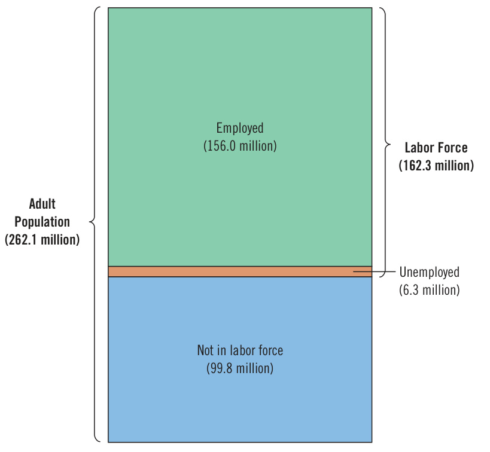
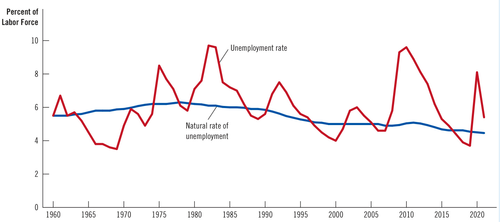
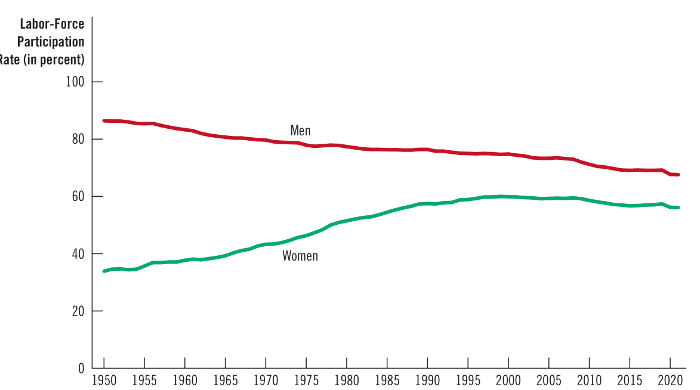
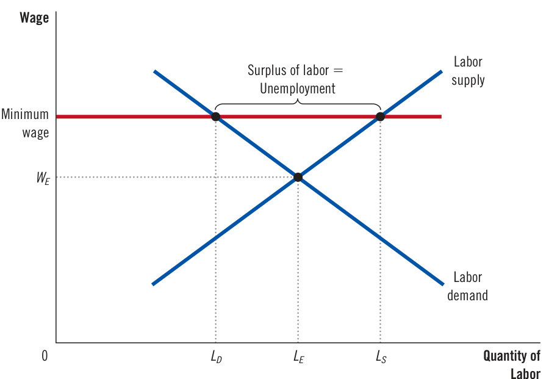
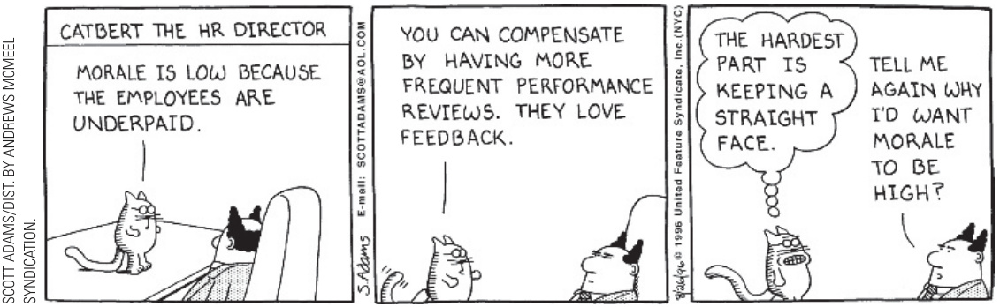

# Ch29 Unemployment  

Losing a job can be the most distressing economic event in a person’s life. Most people count on their paychecks to maintain their standard of living, and many get a sense of personal accomplishment from their work. A job loss may mean immediate financial trouble, anxiety about the future, and reduced self-esteem. Understandably enough, when politicians campaign for office, they often claim that their proposed policies will create jobs.  

Unemployment can be not only a personal tragedy but also a macroeconomic one. Previous chapters discussed some of the forces that influence the level and growth of a country’s standard of living, such as saving and investment, the rule of law, political stability, educational attainment, openness to trade, and technological progress. Another critical determinant of a country’s standard of living is the degree of unemployment it experiences. People who want to work but can’t find a job are not producing goods and services. Unemployment is a drag on economic prosperity.  

  

Economists divide the problem of joblessness into two pieces—one that persists in the long run and one that occurs in the short run. The natural rate of unemployment is the term for the amount of unemployment that the economy normally experiences. Cyclical unemployment refers to the year-to-year fluctuations in unemployment around its natural rate and is closely associated with short-run fluctuations in economic activity. We examine cyclical unemployment when we study shortrun fluctuations later in this book. This chapter focuses on the determinants of an economy’s natural rate of unemployment. As we will see, the label natural does not mean that this rate of unemployment is desirable. Nor does it mean that it is constant over time or across places or that it is impervious to economic policy. It just means that this unemployment does not go away on its own, even in the long run.  

The chapter begins with three questions about unemployment data: How does the government measure the economy’s rate of unemployment? What problems arise in interpreting these data? How long are the unemployed typically out of work?  

It then discusses why economies always have some unemployment and how policymakers can help the unemployed. We consider four explanations for the natural rate of unemployment: job search, minimum-wage laws, unions, and efficiency wages. Long-run unemployment does not arise from a single cause but, instead, reflects a variety of related forces. As a result, there is no easy recipe for policymakers to reduce the natural rate of unemployment and alleviate the hardships of the unemployed. But the study of unemployment clarifies the available options and the trade-offs that policymakers face.  

## 29-1 Identifying Unemployment  

Let’s start by examining more precisely what the term unemployment means.  

## 29-1a  How Is Unemployment Measured?  

In the United States, measuring unemployment is the job of the Bureau of Labor Statistics (BLS), a part of the Department of Labor. Every month, the BLS produces data on unemployment and other aspects of the labor market, including types of employment, length of the average workweek, and the duration of unemployment. These data come from a survey of about 60,000 households, called the Current Population Survey.  

Based on the answers to the survey questions, the BLS places each adult (age 16 and older) in surveyed households into one of three categories:  

• Employed: This category includes those who worked as paid employees, worked in their own business, or worked without pay in a family member’s business. Both full-time and part-time workers are counted. Those who had jobs from which they were temporarily absent because of vacation, illness, bad weather, or similar reasons also fall within this category. Unemployed: Those who were not employed, were available for work, and had tried to find employment during the previous four weeks are in this group. It also includes those waiting to be recalled to a job after a temporary layoff. Not in the labor force: This category includes those who fit into neither of the first two categories, such as full-time students, homemakers, and retirees.  

Figure 1 shows the breakdown into these categories for December 2021.  

Once the BLS has categorized everyone in the survey, it computes statistics to summarize the state of the labor market. The BLS defines the labor force as the sum of the employed and the unemployed:  

The BLS calculates unemployment rates for the entire adult population and for demographic groups defined by race, gender, and so on.  

The BLS uses the same survey to produce data on labor-force participation. The labor-force participation rate measures the percentage of the total adult population of the United States that is in the labor force:  

$$
\mathrm{Labor-force\;participation\;rate\;=\;\frac{Labor\;force}{A d u l t\;p o p u l a t i o n}\;\times\;100.}
$$  

This statistic tells us the fraction of the population that participates in the labor market. The labor-force participation rate, like the unemployment rate, is computed for both the entire adult population and specific groups.  

labor force   
the total number of   
workers, including   
both the employed and   
unemployed  

The unemployment rate is the percentage of the labor force that is unemployed:  

$$
\mathrm{Unemployment~rate}={\frac{\mathrm{Number~of~unemployed}}{\mathrm{Labor~force}}}\,\times100.
$$  

unemployment rate the percentage of the labor force that is unemployed  

labor-force participation rate the percentage of the adult population that is in the labor force  

## Figure 1  

## The Breakdown of the Population in December 2021  

The Bureau of Labor Statistics divides the adult population into three categories: employed, unemployed, and not in the labor force.  

Source: Bureau of Labor Statistics.  

  

To see how these data are calculated, consider the figures for December 2021. At that time, 156.0 million people were employed, and 6.3 million people were unemployed. The labor force was  

$$
{\mathrm{Labor~force}}=156.0\,+\,6.3=162.3{\mathrm{~million}}.
$$  

The unemployment rate was  

Unemployment rate $=(6.3/162.3)\times100=3.9$ percent.  

natural rate of unemployment the normal rate of unemployment around which the unemployment rate fluctuates  

cyclical unemployment   
the deviation of   
unemployment from   
its natural rate  

Because the adult population was 262.1 million, the labor-force participation rate was  

Labor-force participation rate $=(162.3/262.1)\times100=61.9$ percent.  

Hence, in December 2021, 61.9 percent of the U.S. adult population were participating in the labor market, and 3.9 percent of those labor-market participants were without work.  

The BLS data on the labor market allows economists and policymakers to monitor changes in the economy over time. Figure 2 shows the unemployment rate in the United States since 1960. The figure shows that the economy always has some unemployment and that the amount changes from year to year. As noted earlier, the normal rate of unemployment around which the unemployment rate fluctuates is called the natural rate of unemployment, and the deviation of unemployment from its natural rate is called cyclical unemployment. The natural rate of unemployment  

## Figure 2  

Unemployment Rate since 1960  

This graph uses annual data on the U.S. unemployment rate to show the percentage of the labor force without a job. The natural rate of unemployment is the normal level of unemployment around which the unemployment rate fluctuates. Source: U.S. Department of Labor, Congressional Budget Office.  

  

shown in the figure is a series produced by economists at the Congressional Budget Office. For 2021, they estimated a natural rate of 4.5 percent, compared with the actual unemployment rate of 5.4 percent. The rest of this chapter ignores short-run fluctuations in unemployment around its natural rate and examines why there is always some unemployment.  

## Labor-Force Participation of Women and Men in the U.S. Economy  

The past century has seen a dramatic transformation in women’s role in American society. This change has many causes. In part, it is attributable to the mass adoption of new technologies, such as the washing machine, clothes dryer, refrigerator, freezer, and dishwasher, which reduced the time required for routine household tasks. In part, it is attributable to improved birth control, which reduced the number of children born to the typical family. And in part, it is attributable to shifting political and social attitudes, which in turn were facilitated by the advances in technology and birth control. Together, these developments have had a profound impact on society in general and on the economy in particular.  

  
Figure 3  

That impact is clear in the data on labor-force participation. Figure 3 shows the labor-force participation rates of men and women in the United States since 1950. Just after World War $\mathrm{II},$ men and women had very different experiences. Only 33 percent of women were working or looking for work, compared with 87 percent of  

Labor-Force Participation Rates for Men and Women since 1950  

This figure shows the percentage of adult men and women who are members of the labor force. It shows that, over the past several decades, women have entered the labor force, and men have left it.  

Source: U.S. Department of Labor.  

  

men. Since then, this difference in participation rates has gradually diminished, as growing numbers of women have entered the labor force and some men have left it. Data for 2021 show that 56 percent of women were in the labor force, compared with 68 percent of men. As measured by labor-force participation, men and women are now playing more equal roles in the economy.  

The increase in women’s labor-force participation is easy to explain, but the fall in men’s may seem puzzling. There are several reasons for this decline. First, young men stay in school longer than their fathers and grandfathers did. Second, older men are enjoying longer periods of retirement. Third, with more women employed, more fathers stay at home to raise their children. Full-time students, retirees, and stay-at-home dads are all counted as being out of the labor force. ●  

## 29-1b   Does the Unemployment Rate Measure What We Want It to Measure?  

Measuring the amount of unemployment in the economy is not straightforward. It is easy to distinguish between people who work full-time and those who don’t work at all. But among those who are not working, it is hard to tell who is unemployed and who is not in the labor force.  

Movements into and out of the labor force are common. More than one third of the unemployed are recent entrants into the labor force. These entrants include young workers looking for their first jobs. They also include, in greater numbers, people who had left the labor force but have now returned to look for work. Moreover, not all unemployment ends with the job seeker finding work. Almost half of all spells of unemployment end when the jobless person stops looking for work and leaves the labor force.  

Because people move into and out of the labor force so often, statistics on unemployment are difficult to interpret. On the one hand, some of those who report being unemployed may not be trying hard to find a job. They may be calling themselves unemployed because they want to qualify for a government program that gives financial assistance to the unemployed or because they are working but are paid “under the table” to avoid taxes on their earnings. (This may have been especially important in 2020 and much of 2021, when government assistance programs during the pandemic gave some people extra incentives to call themselves unemployed.) It may be more accurate to view these individuals as out of the labor force or, in some cases, employed. On the other hand, some of those who report being out of the labor force may want to work. These individuals may have given up looking for a job after an unsuccessful search. Such individuals, called discouraged workers, do not show up in unemployment statistics, even though they are truly prospective workers without jobs.  

discouraged workers individuals who would like to work but have given up looking for a job  

Because of these and other problems, the BLS calculates several measures of labor underutilization, which are presented in Table 1. In the end, it is best to view the official unemployment rate as a useful but imperfect measure of joblessness.  

## 29-1c  How Long Are the Unemployed without Work?  

In judging how serious the problem of unemployment is, one question to consider is whether unemployment is typically a short-term or long-term condition. If unemployment is short-term, one might conclude that it is not a big problem. Workers may require a few weeks between jobs to find the openings that best suit their tastes and skills. Yet if unemployment is long-term, one might conclude that it is serious indeed. Workers unemployed for many months are more likely to suffer economic and psychological hardship.  

## Table 1  

Measures of Labor Underutilization The table shows various measures of joblessness for the U.S. economy. The data are for December 2021.  

Source: U.S. Department of Labor.  

<html><body><table><tr><td colspan="2">Measure and Description</td><td>Rate</td></tr><tr><td>U-1</td><td>Persons unemployed 15 weeks or longer, as a percent of the civilian labor force (includes only very long- term unemployed)</td><td>1.7%</td></tr><tr><td>U-2</td><td>Job losers and persons who have completed temporary jobs, as a percent of the civilian labor force (excludes job leavers)</td><td>1.9</td></tr><tr><td>U-3</td><td>Total unemployed, as a percent of the civilian labor force (official unemployment rate)</td><td>3.9</td></tr><tr><td>U-4</td><td>Total unemployed, plus discouraged workers, as a percent of the civilian labor force plus discouraged workers</td><td>4.3</td></tr><tr><td>U-5</td><td>Total unemployed plus all marginally attached workers,as a percent of the civilian labor force plus all marginally attached workers</td><td>4.9</td></tr><tr><td>U-6</td><td>Total unemployed, plus all marginally attached workers,plustotal employedpart-timeforeconomic reasons, as a percent of the civilian labor force plus all marginally attached workers</td><td>7.3</td></tr></table></body></html>  

Note: The Bureau of Labor Statistics defines terms as follows.  

• Marginally attached workers are people neither working nor looking for work but indicate that they want and are available for a job and have looked for work sometime in the recent past.   
• Discouraged workers are marginally attached workers who have given a job-market-related reason for not currently looking for a job.   
• Persons employed part-time for economic reasons are those who want and are available for full-time work but have had to settle for a part-time schedule.  

Economists have devoted much energy to studying data on the duration of unemployment spells. In this work, they have uncovered a result that is important, subtle, and seemingly contradictory: Most spells of unemployment are short, but most unemployment observed at any given time is long-term.  

To see how this statement can be true, consider an example. Suppose that you visited the government’s unemployment office every week for a year to survey the unemployed. Each week you find four unemployed workers. Three are the same individuals for the whole year, while the fourth person changes every week. Based on this experience, would you say that unemployment is typically short-term or long-term?  

Simple calculations help answer this question. In this example, you meet a total of 55 unemployed people over the course of a year, 52 who are unemployed for one week and 3 who are unemployed for the full year. This means that 52/55, or 95 percent, of unemployment spells end in one week. Yet whenever you walk into the unemployment office, three of the four people you meet will be unemployed for the entire year. So, even though 95 percent of unemployment spells end in one week, 75 percent of the unemployment observed at any moment is attributable to those who are unemployed for a full year. In this example, as in the world, most spells of unemployment are short, but most unemployment observed at any time is long-term.  

This subtle conclusion implies that economists and policymakers must be careful when interpreting data on unemployment and when designing policies to help the unemployed. Most people who become unemployed will soon find jobs. Yet most of the economy’s unemployment problem is attributable to the relatively few workers who are jobless for long periods.  

## 29-1d  Why Are There Always Some People Unemployed?  

We have discussed the measurement of unemployment, the problems that arise in interpreting unemployment statistics, and the duration of unemployment. Yet we have not explained why economies experience unemployment in the first place.  

Let’s go back to supply and demand. In the standard model of a competitive market, as introduced in Chapter 4, the goods being sold are all the same, and the price adjusts to bring the quantity supplied and the quantity demanded into balance. For some purposes, this model can be applied to the labor market: Labor is the good, and the price is the wage. But like all models, this one has its limitations. It cannot fully describe the labor market because, at the model’s equilibrium, there is no unemployment.  

In the world, there are always some workers without jobs, even when the economy is doing well. Unemployment never falls to zero but, instead, fluctuates around its natural rate. To explain unemployment, the remaining sections of this chapter consider why actual labor markets depart from the benchmark model of supply and demand.  

To preview the conclusions, there are four explanations for unemployment. The first emphasizes that workers and jobs are diverse, so it takes time for workers to find the jobs that best suit them and for firms to find the workers that best  

## The Jobs Number  

hen the Bureau of Labor Statistics announces the unemployment rate at the beginning of every month, it also gives the number of jobs that the economy gained or lost in the previous month. As an indicator of short-run economic trends, the jobs number gets as much attention as the unemployment rate.  

Where does the jobs number come from? You might guess that it comes from the same survey of 60,000 households that yields the unemployment rate. And indeed, the household survey does produce data on total employment. The jobs number that gets the most attention, however, comes from a separate survey of 160,000 business establishments that have over 40 million workers on their payrolls. The results of the establishment survey are announced at the same time as the results of the household survey.  

Both surveys yield information about total employment, but the results are not always the same. One reason is that the establishment survey has a larger sample, which makes it more reliable. Another is that the surveys are not measuring exactly the same thing. For example, a person who has two part-time jobs at different companies is counted as one employed person in the household survey but as two jobs in the establishment survey. As another example, people running their own small businesses are counted as employed in the household survey but do not show up at all in the establishment survey because it counts only employees on business payrolls.  

The establishment survey is closely watched for its data on jobs, but it says nothing about unemployment. To measure the number of unemployed, we need to know how many people without jobs are trying to find them. The household survey is the only source of that information. ■  

fill their needs. The unemployment that results from the search process is called frictional unemployment, and it is often thought to explain relatively short spells of unemployment.  

The next three explanations have a common theme: Unemployment arises when, in some labor markets, the number of jobs available is less than the number of people looking for work. In an ideal labor market, this never occurs because wages equilibrate supply and demand. But sometimes wages are stuck above the equilibrium level, and the quantity of labor supplied exceeds the quantity demanded. Unemployment of this sort is called structural unemployment, and it is usually thought to explain longer spells of unemployment.  

We will discuss three reasons for above-equilibrium wages: minimum-wage laws, unions, and efficiency wages. Wages are set above the equilibrium level by the government in the first case, by workers in the second, and by firms in the third.  

## frictional unemployment  

unemployment that results because it takes time for workers to search for the jobs that best suit their tastes and skills  

structural unemployment unemployment that results because the number of jobs available in some labor markets is insufficient to provide a job for everyone who wants one  

## QuickQuiz  

1. The population of Ectenia is 100 people: 40 work full-time, 20 work half-time but would prefer to work full-time, 10 are looking for a job, 10 would like to work but are so discouraged that they have given up looking, 10 are not interested in working because they are full-time students, and 10 are retired. What is the number of unemployed?  

a. 10   
b. 20   
c. 30   
d. 40  

2. Using the numbers in the preceding question, what is the size of Ectenia’s labor force?  

a. 50   
b. 60   
c. 70   
d. 80  

## 29-2 Job Search  

One reason economies experience unemployment is job search, the process of workers finding appropriate jobs. If all workers and all jobs were the same, identifying a good match would be quick and easy. But workers differ in their tastes and skills, jobs differ in their attributes, and information about job candidates and job vacancies disseminates slowly among the economy’s many firms and households. As this process unfolds, some people spend time unemployed.  

## 29-2a  Why Some Frictional Unemployment Is Inevitable  

The labor market is in a constant state of churn. As firms experience rising and falling fortunes, their demand for labor shifts, resulting in frictional unemployment. For example, when consumers decide that they prefer cars from Tesla over those from Ford, Tesla increases employment, and Ford lays off workers. The former Ford workers must now look for new jobs, and Tesla must decide which workers to hire to fill its vacancies. The result of this transition is a period of unemployment for some workers.  

Similarly, employment can rise in one region while it falls in another. Consider what happens when the price of oil declines in world markets. Oil-producing firms  

## job search  

the process by which workers find appropriate jobs given their tastes and skills  

in Texas and North Dakota respond to the lower price by cutting back production and employment. Meanwhile, cheaper gasoline spurs car sales, so auto-producing firms in Michigan and Ohio expand production and employment. The opposite happens when the price of oil rises. Changes in the composition of demand among industries or regions are called sectoral shifts. Because it takes time for workers to search for jobs in the new sectors, sectoral shifts cause unemployment.  

Changing patterns of international trade can also lead to frictional unemployment. Chapter 3 explained that nations export goods for which they have a comparative advantage and import goods for which other nations have an advantage. Comparative advantage, however, need not be stable over time. As the world economy evolves, nations may find themselves importing and exporting different goods than they have in the past. Workers will need to move among industries. As they make this transition, they may find themselves unemployed for a while.  

Frictional unemployment is inevitable because the economy is always changing. For example, in the U.S. economy from 2010 to 2020, employment fell by 235,000 in newspaper and book publishing, 238,000 in the hotel industry, and 534,000 in state and local government. During the same period, employment rose by 650,000 in manufacturing, 1.8 million in construction, and 3.0 million in healthcare. This churning of the labor force is normal in a well-functioning, dynamic economy. Because workers tend to move toward industries in which they are most valuable, the long-run result for the overall economy is higher productivity and living standards. But along the way, workers in declining industries find themselves out of work and searching for new jobs. The result is frictional unemployment.  

## 29-2b  Public Policy and Job Search  

Even if frictional unemployment is inevitable, the precise amount is not. The faster information spreads about job openings and worker availability, the more rapidly the economy can match workers and firms. The Internet, for instance, may help facilitate job search and reduce frictional unemployment. In addition, public policy may be able to reduce the time it takes unemployed workers to find new jobs, thereby lowering the economy’s natural rate of unemployment.  

Government programs try to facilitate job search in various ways. One is through government-run employment agencies, which give out information about job vacancies. Another is through training programs, which aim to ease workers’ transition from declining to growing industries and help disadvantaged groups escape poverty. Advocates of these programs believe that they make the economy operate more efficiently by keeping the labor force more fully employed and that they reduce the inequities inherent in a constantly changing market economy.  

Critics of these programs question whether the government should play a role in the process of job search. They argue that it is better to let the private market match workers and jobs and that the government is no better—and most likely worse—at disseminating the right information to the right workers and deciding what kinds of worker training would be most valuable. In fact, most job search in the U.S. economy takes place without government intervention. Newspaper ads, online job sites, college career offices, headhunters, and word of mouth all help spread information about job openings and job candidates. Similarly, much worker education is done privately, through schools or on-the-job training.  

unemploymen insurance a government program that partially protects the incomes of workers who become unemployed  

## 29-2c  Unemployment Insurance  

One government program that increases the amount of frictional unemployment, without intending to do so, is unemployment insurance. This program offers workers partial protection against job loss. The unemployed who quit their jobs, were fired for cause, or just entered the labor force are not eligible. Benefits are paid only to the unemployed who were laid off because their previous employers no longer needed their skills. The terms of the program vary over time and across states, but typical workers covered by unemployment insurance in the United States receive 50 percent of their former wages for 26 weeks. This insurance is often increased in national downturns, and that was especially true during the coronavirus pandemic of 2020–2021.  

While unemployment insurance reduces the hardship of unemployment, it also increases the amount of unemployment. The explanation is based on one of the Ten Principles of Economics in Chapter 1: People respond to incentives. Because unemployment benefits stop when a worker takes a new job, the unemployed may devote less effort to job search and may be more likely to turn down unattractive job offers. In addition, because unemployment insurance makes unemployment less onerous, workers may be less likely to seek guarantees of job security when they negotiate with employers over the terms of their employment.  

Many studies by labor economists have analyzed the incentive effects of unemployment insurance. One study examined an experiment run by the state of Illinois in 1985. When unemployed workers applied to collect unemployment insurance benefits, the state randomly selected some of them and offered each a $\mathbb{S}500$ bonus if they found new jobs within 11 weeks. This group was then compared with a control group that did not receive the incentive. The average spell of unemployment for the group offered the bonus was 7 percent shorter than the average spell for the control group. This experiment shows that the design of the unemployment insurance system influences the effort that the unemployed devote to job search.  

Several other studies examined search effort by following a group of workers over time. Unemployment insurance benefits, rather than lasting forever, usually run out after six months or one year. These studies found that when the unemployed become ineligible for benefits, the probability of them finding a new job rises markedly. This suggests that receiving unemployment insurance benefits reduces the search effort of the unemployed.  

Even though unemployment insurance has been shown to reduce search effort and raise unemployment, we should not necessarily conclude that the policy is ill advised. The program achieves its primary goal of reducing the income uncertainty that workers face. In addition, when workers turn down unattractive job offers, they can look for jobs that better suit their tastes and skills. Some economists argue that unemployment insurance improves the ability of the economy to match each worker with the most appropriate job.  

## QuickQuiz  

3. The main policy goal of unemployment insurance is to reduce the a. search effort of the unemployed. b. income uncertainty that workers face. c. role of unions in wage setting. d. amount of frictional unemployment.  

4. One unintended consequence of unemployment insurance is that it reduces the a. search effort of the unemployed. b. income uncertainty that workers face. c. role of unions in wage setting. d. amount of frictional unemployment.  

While frictional unemployment results from the process of job search, structural unemployment occurs when the number of jobs is insufficient for the number of workers.  

To understand structural unemployment, let’s begin by recalling how minimumwage laws can cause unemployment. Minimum wages are not the main reason for unemployment in the U.S. economy, but their analysis is a good starting point because it can be used to understand the other reasons for structural unemployment.  

Figure 4 reviews how a minimum wage affects the outcome in a competitive labor market. When a minimum wage is binding, it forces the wage to remain above the level that balances supply and demand. Compared with the equilibrium that would otherwise prevail, the quantity of labor supplied is higher, and the quantity of labor demanded is lower. There is a surplus of labor. Because more workers are willing to work than there are jobs, some workers are unemployed.  

In the U.S. economy, minimum-wage laws affect a small percentage of the labor force. Most workers have wages well above the legal minimum, so the law does not prevent their wages from adjusting to balance supply and demand. Minimumwage laws matter most for those with low levels of skill and experience, such as teenagers. Because their equilibrium wages are more likely to fall below the legal minimum, it is mainly among these workers that minimum-wage laws help explain unemployment.  

Yet Figure 4 illustrates a more general lesson: If the wage is kept above the equilibrium level for any reason, unemployment results. The remaining two sections of this chapter consider two reasons beyond minimum-wage laws for above-equilibrium wages: unions and efficiency wages. The basic economics in these cases is similar to that shown in Figure 4, but these explanations of structural unemployment apply to many more workers.  

## Unemployment from a Wage above the Equilibrium Level  

In this labor market, supply and demand are balanced at the wage $W_{\varepsilon}.$ At this equilibrium wage, the quantity of labor supplied and the quantity of labor demanded both equal $L_{\varepsilon}.$ But if the wage is forced to remain above the equilibrium level, perhaps because of a minimum-wage law, the quantity of labor supplied rises to $L_{s},$ and the quantity of labor demanded falls to $L_{D}.$ The resulting surplus of labor, LS – LD, represents unemployment.  

  
Figure 4  

Before moving on, however, note the key difference between structural and frictional unemployment. Structural unemployment arises from an above-equilibrium wage, while frictional unemployment arises from the process of job search. The need for job search is not due to the failure of wages to balance labor supply and labor demand but instead follows from the great diversity of workers and jobs. When unemployment is frictional, workers are searching for the jobs that best suit their tastes and skills. By contrast, when unemployment is structural, the quantity of labor supplied exceeds the quantity demanded, and workers are waiting for jobs to open up.  

## Who Earns the Federal Minimum Wage?  

In 2021, the Department of Labor released a study showing what kinds of workers reported earnings at or below the federal minimum wage in 2020, when it was $\mathbb{S}7.25$ per hour. (A reported wage below the minimum wage is possible because some workers are exempt from the statute, because enforcement is imperfect, and because some workers round down when reporting their wages on surveys.) Here is a summary of the findings:  

•  In 2020, 73 million workers were paid at hourly rates (as opposed to being salaried or self-employed), representing 55 percent of the labor force. Among hourly paid workers, about 1.5 percent reported wages at or below the prevailing federal minimum. Overall, the federal minimum wage directly affects about 0.8 percent of all workers.   
Minimum-wage workers tend to be young. Among employed teenagers (ages 16 to 19) paid by the hour, about 5 percent earned the minimum wage or less, compared with 1 percent of hourly paid workers age 25 and older.   
Minimum-wage workers tend to be less educated. Among hourly paid workers age 16 and older, about 2 percent of those without a bachelor’s degree earned the minimum wage or less, compared with about 1 percent of those with a bachelor’s degree.   
Minimum-wage workers are more likely to be working part-time. Among part-time workers (those who usually work less than 35 hours per week), 4 percent were paid the minimum wage or less, compared with 1 percent of full-time workers.   
The industry with the highest proportion of workers with reported hourly wages at or below the minimum wage was leisure and hospitality (8 percent). About three-fifths of all workers paid at or below the minimum wage were employed in this industry, primarily in restaurants and other food services. For many of these workers, tips supplement their hourly wages.   
• The percentage of hourly paid workers earning the prevailing federal minimum wage or less has changed substantially over time. It has declined from 13.4 percent in 1979, when data collection first began on a regular basis, to 1.5 percent in 2020. One reason for this change is that the federal minimum wage has not kept up with inflation. If it had, the minimum wage in 2020 would have been about $\mathbb{S}10$ rather than $\mathbb{S}7.25$ per hour. At a higher level, the minimum wage becomes a binding price floor for more workers.  

Finally, note that about half of the U.S. states have minimum wages above the federal one, sometimes substantially so. For workers in these states, the state minimum wage is the more relevant one. ●  

5. In a competitive labor market, an increase in the minimum wage results in a(n) in the quantity of labor supplied and a(n) in the quantity of labor demanded. a. increase; increase b. increase; decrease c. decrease; increase d. decrease; decrease  

6. Approximately what percent of U.S. workers are directly affected by the federal minimum wage?  

a. 1   
b. 6   
c. 12   
d. 25  

Answers are at the end of the chapter.  

## 29-4 Unions and Collective Bargaining  

## union  

a worker association that bargains with employers over wages, benefits, and working conditions  

collective bargaining the process by which unions and firms agree on the terms of employment  

## strike  

the organized withdrawal of labor from a firm by a union  

A union is a worker association that bargains with employers over wages, benefits, and working conditions. In the 1940s and 1950s, when union membership in the United States was at its peak, about 33 percent of the U.S. labor force was unionized. Today, less than 11 percent of U.S. workers belong to unions. In many European countries, however, unions play a large role. In Belgium, Norway, and Sweden, more than 50 percent of workers belong to unions. In France, Italy, and Germany, most workers have wages set by collective bargaining by law, even though only some of these workers are themselves union members. In these cases, wages are not determined by the equilibrium of supply and demand in competitive labor markets.  

## 29-4a  The Economics of Unions  

The word “cartel” is usually applied to a combination of firms that join forces to limit competition, but in many ways, it applies to unions as well. Like any cartel, a union is a group of sellers acting together with the goal of exerting their joint market power. Most workers in the U.S. economy deal with their employers as individuals on issues like wages, benefits, and working conditions. By contrast, workers in a union do so collectively so they have more influence over the outcome. The process by which unions and firms agree on the terms of employment is called collective bargaining.  

When a union bargains with a firm, it asks for higher wages, better benefits, and better working conditions than the firm might offer in the absence of a union. If the union and the firm do not reach an agreement, the union can organize a withdrawal of labor from the firm, called a strike. Because a strike reduces production, sales, and profit, a firm facing a strike threat is likely to agree to pay higher wages than it otherwise would. Economists who study the effects of unions typically find that union workers earn about 10 to 20 percent more than similar workers who do not belong to unions.  

When a union raises the wage above the equilibrium level, it increases the quantity of labor supplied and reduces the quantity of labor demanded, resulting in unemployment. Workers who are employed at the higher wage are better off. Those who would otherwise be employed but are now unemployed are worse off. For this reason, unions are often thought to create conflict between different groups of workers—between the insiders who benefit from high union wages and the outsiders who do not get the union jobs.  

The outsiders can respond to their status in one of two ways. Some remain unemployed and wait for the chance to become insiders and earn the high union wage. Others take jobs in firms that are not unionized. Thus, when unions raise wages in one part of the economy, the supply of labor increases in other parts of the economy. This increase in labor supply, in turn, reduces wages in industries that are not unionized. In other words, workers in unions reap the benefit of collective bargaining, while workers not in unions bear some of the cost.  

The role of unions in the economy depends in part on the laws that govern union organization and collective bargaining. Normally, explicit agreements among members of a cartel are illegal. When firms that sell similar products agree to set high prices, the agreement is considered a “conspiracy in restraint of trade,” and the government prosecutes the firms for violating the antitrust laws. Unions, however, are exempt from these laws. The policymakers who wrote the antitrust and labor laws believed that workers needed greater market power as they bargained with employers. Indeed, various laws are designed to encourage the formation of unions. The National Labor Relations Act (enacted in 1935 and subsequently amended) prohibits employers from interfering in certain ways with workers trying to organize unions, and in unionized companies, it requires employers and unions to bargain in good faith when negotiating the terms of employment.  

Legislation affecting the market power of unions is a perennial topic of political debate. For instance, state lawmakers sometimes debate right-to-work laws, which bar a union and employer from requiring workers to financially support the union. Absent such laws, a union can seek an agreement during collective bargaining that requires all employees to pay union dues (for union members) or an agency fee (for nonmembers) as a condition of employment. As of 2021, about half of the U.S. states had right-to-work laws, and some members of Congress have proposed national right-to-work legislation. Lawmakers in Washington have also considered laws that would either make strikes more possible or prohibit them in some situations. For example, one proposal would prevent firms from hiring permanent replacements (as opposed to temporary replacements) for workers on strike. If such a law were enacted, striking workers would no longer face the threat of losing their jobs to permanent replacements, making strikes more viable and thereby increasing unions’ market power. Another proposal would bar strikes in the airline and railroad industries by requiring unions and employers at the end of collective bargaining to resolve their remaining disagreements through arbitration. How these policy debates are resolved will help determine the future of the union movement.  

## 29-4b  Are Unions Good or Bad for the Economy?  

Economists disagree about whether unions are good or bad for the economy as a whole. Let’s consider both sides of the debate.  

Critics argue that unions have the downsides of any cartel. When unions raise wages above the level that would prevail in competitive markets, they reduce the quantity of labor demanded, cause some workers to be unemployed, and reduce the wages in the rest of the economy. The resulting allocation of labor, critics say, is both inefficient and inequitable. It is inefficient because high union wages reduce employment in unionized firms below the efficient, competitive level. It is inequitable because some workers benefit at the expense of other workers.  

  

“Gentlemen, nothing stands in the way of a final accord except that management wants profit maximization and the union wants more moola.”  

Advocates contend that unions are a necessary antidote to the market power of the firms that hire workers. The extreme case of this market power is the “company town,” where a single firm does most of the hiring in a geographical region. In a company town, if workers do not accept the wages and working conditions that the firm offers, they have little choice but to move or stop working and suffer the consequences. In the absence of a union, therefore, the firm could use its market power to pay lower wages and offer worse working conditions than it would if it had to compete with other firms for the same workers. In this case, a union may be necessary to check the firm’s market power and protect the workers from being at the mercy of the firm’s owners.  

Advocates of unions also claim that unions help firms respond efficiently to workers’ concerns. When a worker takes a job, the worker and the firm must agree on many attributes of the job in addition to the wage: hours of work, overtime, vacations, sick leave, health benefits, promotion schedules, job security, and so on. By representing workers’ views on these issues, unions help firms provide the right mix of job attributes. Even if unions have the adverse effect of pushing wages above the equilibrium level and causing unemployment, they have the benefit of ensuring that firms have a content and productive workforce.  

In the end, there is no consensus about the overall impact of unions on the economy. Like many institutions, their influence is probably beneficial in some circumstances and adverse in others.  

## QuickQuiz  

7. In the United States, unionized workers are paid about percent more than similar nonunion workers.  

a. 2   
b. 5   
c. 15   
d. 40  

8. In many European nations, unions a. are considered cartels in violation of antitrust laws. b. conspire with firms to keep wages below competitive levels. c. are social clubs without any economic impact. d. play a much larger role than they do in the United States.  

Answers are at the end of the chapter.  

Mismatch as a Source of Structural Unemployment nemployment is sometimes said to result from a mismatch between the kinds of workers that are seeking jobs and the kinds that firms are looking to hire. If the available workers are trained as truck drivers but firms want computer technicians, that is a mismatch. If the available workers stopped their educations before completing high school but firms want workers with college degrees, that is also a mismatch. If the available workers live in Texas but firms are hiring in Florida, that is a mismatch as well.  

In an ideal labor market governed by supply and demand, wages would adjust to these mismatches. Wages would fall for truck drivers, high school dropouts, and Texans, and rise for computer technicians, college graduates, and Floridians. Sufficient wage adjustment would restore equilibrium without unemployment.  

In the real world, wages don’t always adjust quickly and fully to supply and demand. As a result, when mismatches arise, the quantity of labor supplied can exceed the quantity demanded in some labor markets. In our examples, there would be a surplus of truck drivers, dropouts, and Texans. This is a type of structural unemployment. It occurs when supply or demand shifts and, for various reasons, some wages are stuck above the equilibrium level. ■  

In addition to job search, minimum-wage laws, and unions, the theory of efficiency wages suggests a fourth reason that economies experience some unemployment. According to this theory, firms operate more efficiently if wages are above the equilibrium level. Therefore, it may be profitable for firms to keep wages high despite a surplus of labor.  

In some ways, the unemployment that arises from efficiency wages is like the unemployment that arises from minimum-wage laws and unions. In all three cases, unemployment is the result of wages above the level that balances supply and demand. Yet there is also an important difference. Minimum-wage laws and unions prevent firms from lowering wages in the presence of a surplus of workers. Efficiency-wage theory states that such a constraint on firms is unnecessary because, in some cases, firms may want to keep wages above the equilibrium level.  

Why might a firm prefer high wages? Normally, profit-maximizing firms want to keep costs—and therefore wages—as low as possible. The novel insight of efficiencywage theory is that higher wages can make a firm more profitable by increasing the efficiency of its workers.  

There are several types of efficiency-wage theory. Each suggests a different mechanism for how wages affect worker efficiency.  

## 29-5a Worker Health  

The first and simplest type of efficiency-wage theory emphasizes the link between wages and worker health. Better-paid workers eat a more nutritious diet, and workers who eat a better diet are healthier and more productive. A firm may find it profitable to pay high wages to ensure its workers are healthy and productive.  

This type of efficiency-wage theory can be relevant for explaining aboveequilibrium wages and unemployment in less developed countries where inadequate nutrition is a problem. In these countries, firms may fear that cutting wages would adversely influence their workers’ health and productivity. Worker health concerns are less relevant for firms in rich countries such as the United States, where the equilibrium wages for most workers are well above the level needed for an adequate diet.  

## 29-5b Worker Turnover  

A second type of efficiency-wage theory emphasizes the link between wages and worker turnover. Workers quit jobs for many reasons: to take jobs at other firms, to move to other parts of the country, to leave the labor force, and so on. The frequency with which they quit depends on the entire set of incentives they face, including the benefits of leaving and the benefits of staying. The more a firm pays its workers, the less often its workers will choose to leave. A firm can reduce turnover by paying higher wages.  

Firms care about turnover because hiring and training new workers is costly. Moreover, even after they are trained, new workers are not as productive as experienced ones. Higher turnover, therefore, tends to increase production costs. Firms may find it profitable to pay wages above the equilibrium level to reduce worker turnover.  

## 29-5c  Worker Quality  

A third type of efficiency-wage theory emphasizes the link between wages and worker quality. All firms want workers who are talented. But because firms cannot perfectly gauge the quality of applicants, hiring has a degree of randomness to it.  

## efficiency wages  

above-equilibrium wages paid by firms to increase worker productivity  

  

When a firm pays high wages, it attracts a better pool of workers to apply for its jobs and thereby increases the quality of its workforce. If the firm responded to a surplus of labor by reducing the wage, the most competent applicants—who are more likely to have better opportunities than less competent applicants—may choose not to apply. If this influence of the wage on worker quality is strong enough, it may be profitable for the firm to pay a wage above the level that balances supply and demand.  

## 29-5d  Worker Effort  

A fourth type of efficiency-wage theory emphasizes the link between wages and worker effort. In many jobs, workers have discretion over how hard to work, and some may choose to work as little as possible. Because workplace monitoring is costly and imperfect, firms cannot quickly catch all shirkers.  

One way to deter shirking is to pay wages above the equilibrium level. High wages make workers more eager to keep their jobs and motivate them to put forward their best effort. If the wage were at the level that balanced supply and demand, workers would have less reason to work hard because if they were fired, they could quickly find new jobs at the same wage. Therefore, firms may raise wages above the equilibrium level to incentivize workers not to shirk their responsibilities.  

## 29-5e Worker Morale  

A fifth and final type of efficiency-wage theory suggests that high wages improve worker morale and that content workers are more productive. This version deviates from economists’ standard concept of rationality and is based on social norms and people’s sense of fair play. Workers may consider it fair for a profitable firm to share its good fortune with its employees, even if that means paying an above-equilibrium wage. A firm may share that sense of fairness. Or it may simply recognize that its workers are less productive if they think they are being treated unfairly. If so, paying a high wage can be in the firm’s best interest.  

## Henry Ford and the Amazing $\pmb{55}$ -a-Day Wage  

Henry Ford was a complex man. Historians tell us that he was a racist and anti-Semite, but he was also an industrial visionary. As founder of the Ford Motor Company, he introduced modern techniques of production. Rather than building cars with small teams of skilled craftsmen, Ford built cars on assembly lines in which unskilled workers were taught to perform the same simple tasks repeatedly. The output of this assembly process was the Model T Ford, often considered the first affordable automobile, which made car travel accessible to middle-class families.  

In 1914, Ford introduced another innovation: the $\mathbb{S5}$ workday. This might not seem like much today, but back then, $\mathbb{55}$ was about twice the going wage. It was also far above the wage that balanced supply and demand. When the new $\mathbb{S5}$ -a-day wage was announced, long lines of job seekers formed outside the Ford factories. The number of workers willing to work at this wage far exceeded the number that Ford needed.  

Ford’s high-wage policy had many of the effects predicted by efficiency-wage theory. Turnover fell, absenteeism fell, and productivity rose. Workers were so much more efficient that Ford’s production costs declined despite higher wages. Thus, paying a wage above the equilibrium level was profitable for the firm. A historian of the early Ford Motor Company wrote, “Ford and his associates freely declared on many occasions that the high-wage policy turned out to be good business. By this, they meant that it had improved the discipline of the workers, given them a more loyal interest in the institution, and raised their personal efficiency.” Ford himself called the $\mathbb{S}5.$ -a-day wage “one of the finest cost-cutting moves we ever made.”  

Why did it take a Henry Ford to introduce this efficiency wage? Why were other firms not already taking advantage of this seemingly profitable business strategy? According to some analysts, Ford’s decision was linked to his early use of the assembly line. Workers organized in an assembly line are highly interdependent. If one worker is absent or works slowly, others are less able to complete their own tasks. While assembly lines made production more efficient, they also increased the importance of low worker turnover, high worker quality, and high worker effort. Paying efficiency wages may have been a better strategy for the Ford Motor Company than for other businesses at the time.  

Above-equilibrium wages, however, are not unique to Ford. According to a 2018 article in The California Sun, the fast-food chain In-N-Out Burger paid its store managers on average more than $^{\Phi160,000}$ a year, about triple the industry average. Why? Denny Warnick, vice president of operations, said that the policy dated back to the company’s founders, who wanted to make quality service a central focus. “Paying their associates well was just one way to help maintain that focus, and those beliefs remain firmly in place with us today,” he said. Like Henry Ford, the owners of In-N-Out Burger seem to pay high wages to promote worker efficiency. ●  

## QuickQuiz  

9. According to the theory of efficiency wages, a. firms may find it profitable to pay aboveequilibrium wages. b. an excess supply of labor puts downward pressure on wages. c. sectoral shifts are the main source of frictional unemployment. d. right-to-work laws reduce the bargaining power of unions.  

10. When a firm pays an efficiency wage, it may a. have trouble attracting enough workers. b. have to monitor its workers more closely. c. experience declines in worker quality. d. find that its workers quit less frequently.  

During the Covid recession of 2020, many companies cut or froze employees’ pay. But research shows that paying workers more can sometimes boost the bottom line.  

## How Higher Wages Can Increase Profits  

## By Ray Fisman and Michael Luca  

ay cuts and salary freezes have become an unfortunate hallmark of the Covid-19 recession. Over seven million employees have seen their wages drop since March, and a great many others have had their pay frozen. But a handful of companies have bucked this trend and increased pay despite the economic crisis. In November, yogurt maker Chobani announced that it was raising its workers’ lowest hourly wage from $\mathbb{5}13$ to $\mathbb{5}15$ ; the floor was set at $\mathbb{S}18$ in high-cost centers like New York. E-furniture retailer Wayfair followed suit last week with a $\mathbb{5}15$ minimum.  

These and other companies present such wage hikes as enlightened capitalism—a way to help employees during difficult times while also buying loyalty and goodwill that translate into higher productivity and lower turnover. It’s the latest entry in a century-old debate over whether companies can improve productivity and profits by paying their workers more. Economists refer to this possibility as the efficiency-wage theory: the idea that wages increased to above market level can effectively pay for themselves through increased worker motivation and retention. There is increasing evidence that efficiency-wage proponents may be right: Higher wages can at times boost the bottom line and—crucially for the current moment—pay cuts can elicit employee backlash and even sabotage.  

The simple economics of efficiency wages were intuited by Henry Ford in 1914 with his idea of the $\mathfrak{S5}$ daily wage—more than double the pay at neighboring factories—for an eighthour shift (down from the then-standard nine hours). Ford expected the high wages to make employees more engaged and harder-working, and if they couldn’t meet his exacting standards, there was a long line of job-seekers outside the Highland Park, Mich., plant waiting to take their place.  

Modern efficiency-wage theory is more subtle. For example, Nobel laureate George  

Akerlof (husband of incoming Treasury Secretary Janet Yellen, herself a pioneer in the study of efficiency wages) introduced the notion of “gift exchange”: If employers are “nicer” than they need to be—by paying above-market wages, for example—workers will reciprocate by being more productive than is required merely to keep their jobs.  

Some of the best evidence for the benefits of higher pay appears in a recently released working paper by Harvard University doctoral students Natalia Emanuel and Emma Harrington that examined wages and productivity among warehouse workers at a Fortune 500 online retailer (kept anonymous in the study). The researchers looked at the effects of a 2019 pay increase that looks a lot like the ones recently announced by Chobani and Wayfair—from about $\mathfrak{S}16$ an hour to $\mathfrak{S}18.$ Prior to the increase, employees moved an average of 4.92 boxes per hour. $\mathsf{A}\,\mathbb{S}\mathsf{1}$ pay increase boosted this figure by a third of a box. Higher wages also led to a large drop in employee turnover: a $\mathfrak{S}1$ increase reduced the quit rate by $19\%$ .  

Given the cost savings from not having to hire and train new employees, combined with improved productivity, the raise more than paid  

## 29-6 Conclusion  

This chapter discussed how unemployment is measured and why economies always experience some degree of unemployment. We have seen how job search, minimumwage laws, unions, and efficiency wages can help explain why some workers do not have jobs. Which of these four explanations for the natural rate of unemployment are the most relevant for the U.S. economy and other economies around the world? There is no easy way to tell. Economists differ in which of these explanations of unemployment they emphasize.  

The analysis in this chapter yields an important lesson: Although the economy will always have some unemployment, its natural rate changes over time. Many events and policies can alter the amount of unemployment the economy typically experiences. As the information revolution changes the process of job search, as Congress and state legislatures adjust the minimum wage, as workers form or quit unions, and as firms change their reliance on efficiency wages, the natural rate of unemployment evolves. Unemployment is not a simple problem with a simple solution. But how we choose to organize our society can profoundly influence how prevalent a problem it is.  

for itself, boosting the company’s bottom line in addition to improving employees’ lives. The result wasn’t only true for warehouse workers: The study found similar productivity and turnover improvements from higher wages for the company’s customer service representatives as well.  

The win-win of higher wages for this particular company suggests that pay had been set inefficiently low prior to the 2019 pay hike. If this mistake could be made by a Fortune 500 business, other businesses might do well to consider whether they could benefit from a similar policy.  

Other research has found that the impact of pay increases depends in part on how they are communicated to employees. In work by one of us published in the journal Management Science in 2016 (with coauthors Duncan Gilchrist and Deepak Malhotra ), we set out to understand why such pay raises have the potential to increase productivity. In an experiment conducted via the freelancing platform oDesk (now called Upwork), we found that workers hired for $\mathfrak{S4}$ an hour worked no harder than those hired for $\mathfrak{S}3$ an hour. (At the time, oDesk drew its largest share of freelancers from India, and both rates in the experiment were high compared to similar jobs on the platform.) However, giving employees an unexpected raise from $\mathfrak{S}3$ an hour to $\mathfrak{S4}$ after they were hired elicited greater effort.  

For managers who are tempted to take advantage of slack in the labor market to cut wages to the bare minimum, it’s worth considering evidence on the effects of pay cuts. A forthcoming paper in Management Science by Jason Sandvik, Richard Saouma, Nathan Seegert and Christopher Stanton looks at one company’s decision to rebalance compensation in a way that ended up cutting pay for a subset of employees at one division. Other divisions did not rebalance their compensation at the same time and thus acted as a “control group” in the study.  

The researchers obtained the human resources records of over 2,033 sales agents at the company (again kept anonymous by the researchers). Consistent with the findings of the Harvard study on warehouse workers, the authors found that employees who received pay cuts were more likely to leave the company. More troubling for company profits, the ones who left had been the most productive salespeople. So just as higher pay can pay for itself, lowering pay may have costs that offset much or all of the savings.  

A recent working paper by Decio Coviello, Erika Deserranno and Nicola Persico offered evidence that pay cuts may even lead employees to be deliberately unproductive. The researchers found that phone sales representatives at a large U.S. retailer reacted to a 2014 pay cut by peddling items that customers didn’t really want. How did they know? Because the drop in pay was accompanied by an increase in sales of items that were ultimately returned for refunds. Whether it was due to carelessness or sabotage, company revenues suffered.  

Of course, not all firms can raise their wages in 2021. For businesses that are struggling to stay afloat, like the many mom-and-pop shops that have been hit hard by the Covid-19 recession, pay cuts may ultimately be the only option. And some businesses might choose to rely on extensive monitoring or complicated performance contracts to motivate workers instead.  

But when times are tough, it’s especially important to think carefully about both the costs and the benefits of higher wages. There’s been considerable discussion about the moral case for higher wages, but there is a strong business case as well, since high wages have the potential to increase productivity and ultimately profits. In the transition to the new economic normal after the pandemic, doing what’s right may also be what’s best for the bottom line.  

Mr. Fisman is a professor of economics at Boston University. Mr. Luca is a professor of business administration at Harvard Business School.  

Source: The Wall Street Journal, January 23, 2021.  

## Chapter in a Nutshell  

The unemployment rate is the percentage of those who would like to work but don’t have jobs. The Bureau of Labor Statistics calculates this statistic monthly based on a survey of thousands of households. The unemployment rate is an imperfect measure of joblessness. Some people who call themselves unemployed may actually not want to work, and some who would like to work are not counted as unemployed because they have left the labor force after an unsuccessful search. In the U.S. economy, most people who become unemployed find work within a short period of time. Nonetheless, most unemployment observed at any given time is attributable to the few people who are unemployed for long periods. One reason for unemployment is the time it takes workers to search for jobs that best suit their tastes and skills. Unemployment insurance, a government policy designed to protect the incomes of workers who lose their jobs, increases frictional unemployment by reducing the search effort of the unemployed. A second reason the economy always has some unemployment is minimum-wage laws. By raising the wage of unskilled and inexperienced workers above the equilibrium level, these laws increase the quantity of labor supplied and reduce the quantity  

demanded. The resulting surplus of labor represents unemployment.   
A third reason for unemployment is the market power of unions. When unions push the wages in unionized industries above the equilibrium level, they create a surplus of labor.  

A fourth reason for unemployment is suggested by the theory of efficiency wages. According to this theory, firms find it profitable to pay wages above the equilibrium level. Higher wages can improve worker health, reduce worker turnover, raise worker quality, increase worker effort, and boost worker morale.  

## KKeeyy  CCoonncceeppttss  

labor force, p. 593   
unemployment rate, p. 593   
labor-force participation rate, p. 593   
natural rate of unemployment, p. 594   
cyclical unemployment, p. 594   
discouraged workers, p. 596   
frictional unemployment, p. 599   
structural unemployment, p. 599   
job search, p. 599   
unemployment insurance, p. 600   
union, p. 604   
collective bargaining, p. 604   
strike, p. 604   
efficiency wages, p. 607  

## Questions for Review  

1. What are the three categories into which the Bureau of Labor Statistics divides everyone? How does the BLS compute the labor force, the unemployment rate, and the labor-force participation rate?   
2. Is unemployment typically short-term or long-term? Explain.   
3. Why is frictional unemployment inevitable? How might the government reduce the amount of frictional unemployment?   
4. Are minimum-wage laws a better explanation for structural unemployment among teenagers or among college graduates? Why?   
5. How do unions affect the natural rate of unemployment?   
6. What claims do advocates of unions make to argue that unions are good for the economy?   
7. Explain five ways in which a firm might increase its profits by raising the wages it pays.  

## Problems and Applications  

1. In April 2020, at the trough of the Covid-19 recession, the Bureau of Labor Statistics announced that of all adult Americans, 133,320,000 were employed, 23,038,000 were unemployed, and 103,538,000 were not in the labor force. Use this information to calculate: a. the adult population. b. the labor force. c. the labor-force participation rate. d. the unemployment rate.  

2. Explain whether each of the following events increases, decreases, or has no effect on the unemployment rate and the labor-force participation rate. a. After a long search, Jon finds a job. b. Tyrion, a full-time college student, graduates and is immediately employed. c. After an unsuccessful job search, Arya gives up looking and retires. d. Daenerys quits her job to become a stay-at-home mom.  

e. Sansa has a birthday, becomes an adult, but has no interest in working.   
f. Jaime has a birthday, becomes an adult, and starts looking for a job.   
g. Cersei dies while enjoying retirement.   
h. Jorah dies working long hours at the office.  

3. Go to the website of the Bureau of Labor Statistics (http://www.bls.gov). What is the national unemployment rate right now? Find the unemployment rate for the demographic group that best fits a description of you (for example, based on age, sex, and race). Is it higher or lower than the national average? Why do you think this is so?  

4. Between January 2012 and January 2019, U.S. employment increased by 17.3 million workers, but the number of unemployed workers declined by only 6.3 million. How are these numbers consistent with each other? Why might one expect a reduction in the number of people counted as unemployed to be smaller than the increase in the number of people employed?  

5. Economists use labor-market data to evaluate how well an economy is using its most valuable resource—its people. Two closely watched statistics are the unemployment rate and the employment– population ratio (calculated as the percentage of the adult population that is employed). Explain what happens to each of these statistics in the following scenarios. In your opinion, which statistic is the more meaningful gauge of how well the economy is doing? a. An auto company goes bankrupt and lays off its work ers, who immediately start looking for new jobs. b. After an unsuccessful search, some of the laid-off workers quit looking for new jobs. c. Numerous students graduate from college but cannot find work. d. Numerous students graduate from college and immediately begin new jobs. e. A stock market boom induces newly enriched 60-year-old workers to take early retirement. f. Advances in healthcare prolong the life of many retirees.   
6. Are the following workers more likely to experience short-term unemployment or long-term unemployment? Explain. a. a construction worker who is laid off because of bad weather b. a manufacturing worker who loses a job at a plant in an isolated area c. a stagecoach-industry worker who is laid off because of competition from railroads d. a short-order cook who loses a job when a new restaurant opens across the street e. an expert welder with little formal education who loses a job when the company installs automatic welding machinery   
7. Using a diagram of the labor market, show the effect of an increase in the minimum wage on the wage paid to  

workers, the number of workers supplied, the number of workers demanded, and the amount of unemployment.  

8. Consider an economy with two labor markets—one for manufacturing workers and one for service workers. Suppose initially that neither is unionized. a. If manufacturing workers formed a union, what would you expect to happen to the wages and employment in manufacturing? b. How would these changes in the manufacturing labor market affect the supply of labor in the  

market for service workers? What would happen to the equilibrium wage and employment in this labor market?  

9. Structural unemployment is sometimes said to result from a mismatch between the job skills that employers want and the job skills that workers have. To explore this idea, consider an economy with two industries: auto manufacturing and aircraft manufacturing. a. If workers in these two industries require similar amounts of training, and if workers at the beginning of their careers can choose which industry to train for, what would you expect to happen to the wages in these two industries? How long would this process take? Explain. b. Suppose that one day, the economy opens itself to international trade and, as a result, starts importing autos and exporting aircraft. What would happen to the demand for labor in these two industries? c. Suppose that workers in one industry cannot be quickly retrained for the other. How would these shifts in demand affect equilibrium wages both in the short run and in the long run? d. If, for some reason, wages fail to adjust to the new equilibrium levels, what would occur?  

0. Suppose that Congress passes a law requiring employers to provide employees some benefit (such as healthcare) that raises the cost of an employee by $\mathbb{54}$ per hour. a. What effect does this employer mandate have on the demand for labor? (In answering this and the following questions, be quantitative when you can.) b. If employees place a value on this benefit exactly equal to its cost, what effect does this employer mandate have on the supply of labor? c. If the wage can freely adjust to balance supply and demand, how does this law affect the wage and the level of employment? Are employers better or worse off? Are employees better or worse off? d. Suppose that, before the mandate, the wage in this market was $\Phi3$ above the minimum wage. In this case, how does the employer mandate affect the wage, the level of employment, and the level of unemployment? e. Now suppose that workers do not value the mandated benefit at all. How does this alternative assumption change your answers to parts (b) and (c)?  

1. a 2. c 3. b 4. a 5. b 6. a 7. c 8. d 9. a 10. d  

