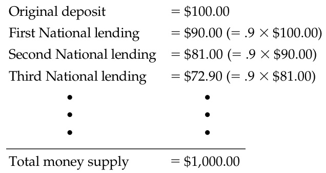

# Ch30 The Monetary System  

W shoenm eythoiun gb uoyf  va almueea—l a atf ulRl ossiteo’sm aRcehs. taTuor apnat,y  yfooru  tghiest service, you might hand Rosie several worn-out pieces of greenish paper decorated with strange symbols, government buildings, and the portraits of famous dead Americans. Or you might hand her a single piece of paper with a bank’s name and your autograph. Or you may compensate Rosie using a plastic card or a cell phone app. Whether you pay by cash, check, debit card, or mobile transfer, the restaurateur is happy to work hard to satisfy your gastronomical desires in exchange for these tokens of value, which, in and of themselves, are worthless.  

Anyone who has lived in a modern economy is familiar with this social custom. Even though paper currency and digital debits have no intrinsic value, Rosie is confident that, in the future, some third person will accept them in exchange for something that she does value. And that third person is confident that some fourth person will accept the money, with the knowledge that yet a fifth person will accept the money, and so on. To Rosie and other people, your cash, check, debit card charge, or electronic payment represents a claim to goods and services in the future.  

  

The social custom of using money for transactions is extraordinarily useful. Imagine, for a moment, that an economy had no item widely accepted in exchange for goods and services. People would have to rely on barter—the exchange of one good or service for another—to obtain the things they need. To get a meal at Rosie’s Restaurant, for instance, you would have to offer Rosie something of immediate value to her. You could offer to wash some dishes, mow her lawn, or give her your family’s secret recipe for meatloaf. An economy that relies on barter has trouble allocating its scarce resources efficiently. In such an economy, trade requires the double coincidence of wants—the unlikely occurrence that two people each have a good or service that the other wants.  

The existence of money makes trade much easier. Rosie does not care whether you can produce a valuable good or service for her. She is happy to accept your money, knowing that other people will do the same for her. This convention allows trade to be roundabout. Rosie accepts your money and uses it to pay Tony, her chef; Tony uses his paycheck to send his daughter Ava to day care; the day care center uses Ava’s tuition to pay Mira, a teacher; and Mira hires you to mow her lawn. As money flows from person to person, it facilitates production and trade, allowing people to specialize in what they do best and raising everyone’s standard of living.  

This chapter begins to examine the role of money in an economy. We discuss what money is, the forms that money takes, how the banking system helps create money, and how the government controls the quantity of money in circulation. The rest of this book devotes much effort to studying how changes in the quantity of money affect various economic variables, including inflation, interest rates, production, and employment. Consistent with the long-run focus of the previous four chapters, the next chapter examines the long-run effects of changes in the quantity of money. The short-run effects of monetary changes are a more complex topic, which we take up later. This chapter builds the foundation for this further analysis.  

## 30-1 The Meaning of Money  

What is money? This might seem like an odd question. When you read that Jeff Bezos has a lot of money, you know what that means: He is so rich that he can buy almost anything he wants. In this sense, the term money is used to mean wealth.  

## money  

the set of assets in an economy that people regularly use to buy goods and services  

Economists, however, use the word in a more specific sense: Money is the set of assets in the economy that people regularly use to buy goods and services from each other. The cash in your wallet is money because you can use it to buy a meal at a restaurant or a shirt at a store. By contrast, the large share of Amazon that makes up much of Jeff Bezos’s wealth is not considered a form of money. Mr. Bezos could not buy a meal or a shirt with this wealth without first obtaining some cash. According to the economist’s definition, money includes only those few types of wealth that sellers regularly accept in exchange for goods and services.  

medium of exchange an item that buyers give to sellers when they want to purchase goods and services  

## 30-1a  The Functions of Money  

Money has three functions: It is a medium of exchange, a unit of account, and a store of value. These functions together distinguish money from other assets, such as stocks, bonds, real estate, art, and even baseball cards. Let’s examine each of these three functions.  

A medium of exchange is an item that buyers give to sellers when they purchase goods and services. When you buy a shirt, the store gives you the shirt, and you give the store some money. This transfer of money from buyer to seller allows the transaction to take place. When you go shopping, you are confident that stores will accept your money for the items they sell because money is the commonly accepted medium of exchange.  

A unit of account is the yardstick people use to post prices and record debts. When you shop, you might find that a shirt costs $\updownarrow60$ and a hamburger costs $\mathbb{S}6.$ It would be accurate to say that a shirt costs 10 hamburgers and a hamburger costs $1/10$ of a shirt, but prices are rarely quoted in this way. Similarly, if you borrow from a bank, your future loan repayments will be set in dollars, not in a quantity of goods and services. When most people want to measure and record economic value, they use money as the unit of account.  

## unit of account  

the yardstick people use to post prices and record debts  

A store of value is an item that people can use to transfer purchasing power from the present to the future. When sellers accept money today in exchange for goods and services, they can hold the money and become buyers at another time. Money is not the only store of value in the economy: A person can also transfer purchasing power from the present to the future by holding nonmonetary assets such as stocks and bonds. The term wealth refers to the total of all stores of value, including both monetary and nonmonetary assets.  

## store of value  

an item that people can use to transfer purchasing power from the present to the future  

Economists use the term liquidity to describe the ease with which an asset can be converted into the economy’s medium of exchange. Because money is the economy’s medium of exchange, it is the most liquid asset available. Other assets vary widely in liquidity. Most stocks and bonds can be sold easily at a low cost, so they are relatively liquid assets. By contrast, selling a house, a Rembrandt painting, or a 1948 Joe DiMaggio baseball card requires more time and effort, so these assets are less liquid.  

When people decide how to allocate wealth, they balance the liquidity of each possible asset against the asset’s usefulness as a store of value. Money is the most liquid asset, but it is far from perfect as a store of value. When prices rise, the value of money falls. In other words, when goods and services become more expensive, a dollar buys less. This link between the price level and the value of money is key to understanding how money affects the economy, a topic we start to explore in the next chapter.  

## liquidity  

the ease with which an asset can be converted into the economy’s medium of exchange  

## 30-1b  The Kinds of Money  

When money takes the form of a commodity with intrinsic value, it is called commodity money. The term intrinsic value means that the item would have value even if it were not used as money. An example of commodity money is gold. Gold has intrinsic value because it is used in industry and for making jewelry. Today, we no longer use gold as money, but historically, gold was a common form of money because it is relatively easy to carry, measure, and verify for impurities. When an economy uses gold as money (or uses paper money that is convertible into a specific amount of gold on demand), it is said to be operating under a gold standard.  

Another example of commodity money is cigarettes. In prisoner-of-war camps during World War II, prisoners traded goods and services with one another using cigarettes as the store of value, unit of account, and medium of exchange. Similarly, as the Soviet Union was breaking up in the late 1980s, cigarettes sometimes replaced the ruble as the preferred currency in Moscow. In both cases, nonsmokers accepted cigarettes in an exchange, knowing they could use them to buy other goods and services.  

commodity money money that takes the form of a commodity with intrinsic value  

Money without intrinsic value is called fiat money. A fiat is an order or decree, and fiat money is established as money by government decree. For example, compare the paper dollars in your wallet (printed by the U.S. government) with the paper dollars from a game of Monopoly (printed by the Hasbro game company). Why can you use the first to pay your bill at a restaurant but not the second?  

## fiat money  

money without intrinsic value that is used as money by government decree  

## Cryptocurrencies: A Fad or the Future?  

n recent years, the world has seen a proliferation of a new kind of money called cryptocurrencies. These currencies rely on cryptography—the science of encoding information—to create a medium of exchange that exists only in electronic form. They use a technology called blockchain to maintain a public ledger that records transactions.  

The first of these cryptocurrencies, introduced in 2009, was bitcoin. It was conceived by a person or group who used the name Satoshi Nakamoto. Nakamoto authored and circulated a white paper establishing the bitcoin protocol, but Nakamoto’s identity is otherwise unknown. According to the protocol, people create bitcoins by using computers to solve complex mathematical problems. The number of bitcoins that can be “mined” in this way is supposedly limited to 21 million units. Once created, bitcoins can be used in exchange. They can be bought and sold for U.S. dollars on organized bitcoin exchanges, where supply and demand determine the dollar price of a bitcoin. People can hold bitcoins as a store of value, and they can use bitcoins to buy things from any vendor who is willing to accept them. In essence, Nakamoto created a virtual asset from nothing at all and ensured holders of it that its supply would be forever limited.  

Bitcoins are neither commodity money nor fiat money. Unlike commodity money, they have no intrinsic value. You can’t use bitcoins for anything other than exchange. Unlike fiat money, they are not created by government decree. Fans of bitcoin embrace this new form of money because it exists apart from government. Some bitcoin users are engaged in illicit transactions such as the drug trade and benefit from the anonymity that bitcoin transactions offer.  

During bitcoin’s brief history, its dollar value has fluctuated wildly. In 2010, the price of a bitcoin ranged between 5 cents to 39 cents. The price rose above $\mathfrak{S}1$ in 2011 and above $^{\S1,000}$ in 2013 before falling below $\mathbb{8500}$ in 2014. Over the following years, the dollar value of a bitcoin skyrocketed, though the ride was bumpy. Bitcoin reached $^{\S60,000}$ in April 2021, fell back to $\mathbb{\S}31{,}000$ in July 2021, rose to $\mathbb{S}67,000$ in November 2021, and then fell again to $\mathbb{\hat{S}}20{,}000$ in July 2022. Meanwhile, other cryptocurrencies were introduced, such as Ethereum, Litecoin, Ripple, and Zcash, providing competition for bitcoin. These other cryptocurrencies differ from bitcoin in the details of their protocols, but like bitcoin, they have all exhibited large price swings. Some newer cryptocurrencies, known as stablecoin, are pegged to the dollar. Yet sometimes the peg has been impossible to sustain.  

The long-term success of cryptocurrencies depends on whether they succeed in performing the functions of money: a store of value, a unit of account, and a medium of exchange. Many economists are skeptical. The great volatility of the dollar prices of most cryptocurrencies makes them a risky way to hold wealth and an inconvenient measure in which to post prices. Few retailers accept them in exchange, at least so far. As a result, cryptocurrencies have been excluded from standard measures of the quantity of money.  

Cryptocurrencies may be the money of the future or a passing fad. Or they may become just a new niche asset class.  

The answer is that the U.S. government has declared its dollars to be valid money. Each paper dollar in your wallet reads: “This note is legal tender for all debts, public and private.”  

Although the government is central to establishing and regulating a system of fiat money (by prosecuting counterfeiters, for example), other factors are also required for the success of a monetary system. To a large extent, the acceptance of an asset as money depends as much on expectations and social convention as on government decree. The Soviet government in the 1980s didn’t abandon the ruble as the official currency. Yet the people of Moscow often preferred American dollars or cigarettes because they believed that these alternative monies were more reliable stores of value and would continue to be accepted as mediums of exchange.  

## 30-1c  Money in the U.S. Economy  

As we will see, the quantity of money circulating in the economy, called the money stock, has a powerful influence on many economic variables. But first, we need to ask a basic question: What is the quantity of money? Suppose you were given the task of measuring how much money there is in the U.S. economy. What would you include in your measure?  

The most obvious asset to include is currency—the paper bills and coins in public hands. Currency is still the most widely accepted medium of exchange in our economy. There is no doubt that it is part of the money stock.  

Yet currency is not the only asset that you can use to buy goods and services. Many businesses also accept personal checks. Wealth held in your checking account is almost as convenient for buying things as wealth held in your wallet. To measure the money stock, therefore, you might want to add demand deposits—balances in bank accounts that depositors can access on demand simply by writing a check or swiping a debit card.  

Once you include balances in checking accounts in the money stock, you are led to consider other accounts held at banks and other financial institutions. Bank depositors usually cannot write checks against the balances in their savings accounts, but they can easily transfer funds from savings into checking accounts. In addition, depositors in money market mutual funds can often write checks against their balances or use them to pay bills electronically, though the number and size of these payments may be limited. Arguably, these other accounts should be counted as part of the U.S. money stock.  

In a complex economy, it is hard to clearly distinguish between assets that can be called “money” and those that cannot. Without a doubt, the coins in your pocket are part of the money stock, and the Empire State Building is not. But many assets lie between these extremes, making the choice less clear. Because different analysts can reasonably disagree about where to draw the line between monetary and nonmonetary assets, various measures of the money stock are available.  

For the U.S. economy, the two most widely followed measures of the money stock are M1 and M2. M1 includes currency, demand deposits at banks, and some other liquid deposits such as the balances in savings accounts. M2 includes everything in M1 plus small time deposits and money market funds (except those held in restricted retirement accounts). For the purposes of this book, the differences between the various measures of money aren’t crucial. The important point is that the money stock includes not only currency but also deposits in banks and other financial institutions that can be readily accessed and used to buy goods and services.  

## currency  

the paper bills and coins in the hands of the public  

## demand deposits  

balances in bank accounts that depositors can access on demand by writing a check  

## FYI Why Credit Cards Aren’t Money  

t might seem natural to include credit cards as part of the economy’s stock of money. After all, people often use credit cards to make purchases. Aren’t credit cards, therefore, a medium of exchange?  

At first, this argument may seem persuasive, but credit cards are   
excluded from all measures of the quantity of money. The reason is that   
credit cards are not really a method of payment but rather a way of   
deferring payment. When you buy a meal with a credit card, the bank   
that issued the card pays the restaurant what it is due. At a later date,   
you will repay the bank (perhaps with interest). When the time comes to   
pay your credit card bill, you will probably do so by writing a check against   
your checking account or by drawing money from it electronically. The   
balance in this checking account is part of the economy’s stock of money. Notice that despite their physical similarity, credit cards are different  

from debit cards, which automatically withdraw funds from a bank account to pay for items bought. Rather than allowing the user to postpone payment for a purchase, a debit card gives the user immediate access to deposits in a bank account. In this sense, a debit card is more like a check than a credit card. The account balances that lie behind debit cards are included in measures of the quantity of money.  

Even though credit cards are not considered a form of money, they are important for analyzing the monetary system. People who have credit cards can pay many of their bills together at the end of the month rather than sporadically as they make purchases. As a result, people with credit cards probably hold less money on average than those without credit cards. The wide availability of credit cards—along with the electronic payment systems often linked to them—may reduce the amount of money that people choose to hold. ■  

## Where Is All the Currency?  

One puzzle about the money stock of the U.S. economy concerns the amount of currency. In November 2021, there was $\mathbb{S}2.1$ trillion of currency outstanding. To put this number in perspective, we can divide it by 262 million, the number of adults (age 16 and older) in the United States. This calculation implies that there is more than $^\mathrm{\Phi8,000}$ of currency per adult. Most people are surprised by this figure because they carry far less in their wallets.  

Who is holding all this currency? No one knows for sure, but there are two plausible explanations.  

The first is that much of the currency is held abroad. In foreign countries without a stable monetary system, people often prefer U.S. dollars to domestic assets. Estimates suggest that more than half of U.S. dollars circulate outside the United States.  

The second explanation is that much of the currency is held by drug dealers, tax evaders, and other criminals. For most people in the U.S. economy, currency is not a particularly good way to hold wealth: Not only can currency be lost or stolen, but it also does not earn interest, whereas a bank deposit does. Thus, most people hold only small amounts of currency. But criminals find currency more appealing. They may avoid putting their money in banks, for instance, because a bank deposit gives police a paper trail they can use to trace illegal activities. For criminals, currency may be the best store of value available.  

## QuickQuiz  

## 1. Fiat money is  

a. a type of money with intrinsic value.   
b. a type of money set by government decree.   
c. any asset used as the medium of exchange.   
d. any asset used as the unit of account.  

2. The money stock includes all of the following EXCEPT  

a. metal coins.   
b. paper currency.   
c. lines of credit accessible with credit cards.   
d. bank balances accessible with debit cards.  

Answers are at the end of the chapter.  

## 30-2 The Federal Reserve System  

Federal Reserve (Fed) the central bank of the United States  

## central bank  

an institution designed to oversee the banking system and regulate the quantity of money in the economy  

Whenever an economy uses a system of fiat money, as the U.S. economy does, some agency must be responsible for managing the system. In the United States, that entity is the Federal Reserve, often simply called the Fed. If you look at the top of a dollar bill, you will see that it is called a “Federal Reserve Note.” The Fed is an example of a central bank—an institution designed to oversee the banking system and regulate the quantity of money. Other major central banks around the world include the Bank of England, the Bank of Japan, and the European Central Bank.  

## 30-2a  The Fed’s Organization  

The Federal Reserve was created in 1913 after a series of bank failures in 1907 convinced Congress that the United States needed a central bank to ensure the health of the nation’s banking system. Today, the Fed is run by its Board of Governors, which has up to seven members appointed by the president and confirmed by the Senate. The governors have 14-year terms. Just as federal judges are given lifetime appointments to insulate them from politics, Fed governors are given long terms to give them independence from short-term political pressures when they formulate monetary policy.  

Among the members of the Board of Governors, the most important is the chair. The chair directs the Fed staff, presides over board meetings, and testifies regularly about Fed policy in front of congressional committees. The president appoints the chair to a 4-year term. As this book was going to press, the chair of the Fed was Jerome Powell, who was nominated to the job by President Donald Trump in 2017 and reappointed by President Joe Biden in 2021.  

The Federal Reserve System consists of the Federal Reserve Board in Washington, D.C., and twelve regional Federal Reserve Banks located in major cities around the country. The presidents of the regional banks are chosen by each bank’s board of directors, whose members are typically drawn from the region’s banking and business community.  

The Fed has two related jobs. The first is to regulate banks and ensure the health of the banking system. In particular, the Fed monitors each bank’s financial condition and facilitates bank transactions by clearing checks. It also acts as a bank’s bank. That is, the Fed makes loans to banks when banks themselves need funds. The Fed acts as a lender of last resort—a lender to those who cannot borrow anywhere else—to maintain stability in the overall banking system.  

The Fed’s second job is to control the quantity of money available in the economy, called the money supply, which in the short run is closely connected to the level of interest rates. Decisions by policymakers concerning the money supply and interest rates constitute monetary policy. At the Federal Reserve, monetary policy is made by the Federal Open Market Committee (FOMC). The FOMC meets about every six weeks in Washington, D.C., to discuss the condition of the economy and consider changes in monetary policy.  

## 30-2b  The Federal Open Market Committee  

The Federal Open Market Committee consists of the members of the Board of Governors and five of the twelve regional bank presidents. All twelve regional presidents attend each FOMC meeting, but only five get to vote. Voting rights rotate among the twelve regional presidents. The president of the New York Fed always gets a vote, however, because New York is the country’s traditional financial center and because all Fed purchases and sales of government bonds are conducted at the New York Fed’s trading desk.  

Through the decisions of the FOMC, the Fed has the power to increase or decrease the number of dollars in the economy. In simple metaphorical terms, imagine the Fed expanding the money supply by printing dollar bills and dropping them around the country from a helicopter. Similarly, imagine it reducing the money supply with a giant vacuum cleaner that sucks dollar bills out of people’s wallets. In reality, the Fed’s methods for changing the money supply are complex and subtle, but the helicoptervacuum metaphor is a good first step to an understanding of monetary policy.  

Later, this chapter discusses the many ways the Fed can influence the money supply without using a helicopter or vacuum, but it is worth noting here that the Fed’s primary tool has historically been the open-market operation—the purchase and sale of U.S. government bonds. Recall that a U.S. government bond is a certificate of indebtedness of the federal government. To increase the money supply, the Fed can create dollars and use them to buy government bonds from the public in the bond markets. After the purchase, these dollars are in public hands. In this way, the Fed’s open-market purchase of bonds increases the money supply. Conversely, to decrease the money supply, the Fed can sell government bonds from its portfolio  

## money supply  

the quantity of money available in the economy monetary policy the setting of the money supply by policymakers in the central bank  

to the public in the bond markets. After the sale, the dollars the Fed receives for the bonds are out of public hands. The Fed’s open-market sale of bonds thereby decreases the money supply. In recent years, the Fed has relied less on open-market operations and more on other tools of monetary policy, as we will see.  

Central banks are important institutions because changes in the money supply can profoundly affect the economy. One of the Ten Principles of Economics in Chapter 1 is that prices rise when the government prints too much money. Another of the Ten Principles of Economics is that society faces a short-run trade-off between inflation and unemployment. The power of the Fed rests on these principles. For reasons discussed more fully in coming chapters, the Fed’s policy decisions are key determinants of inflation in the long run and employment and production in the short run. The Fed chair has been called the second most powerful person in the United States.  

## QuickQuiz  

3. Which of the following is NOT true about the Federal Reserve?  

a. It was established by the U.S. Constitution.   
b. It regulates the banking system.   
c. It lends to banks.   
d. It can own government bonds.  

4. If the Fed wants to increase the money supply, it can a. raise income tax rates.  

b. reduce income tax rates.   
c. buy bonds in open-market operations.   
d. sell bonds in open-market operations.  

Answers are at the end of the chapter.  

## 30-3 Banks and the Money Supply  

So far, we have introduced the concept of “money” and discussed how the Fed controls the money supply. This explanation is correct, but it is incomplete because it omits the key role that banks play in the monetary system.  

  

Recall that the money you hold includes both currency (the bills in your wallet and coins in your pocket) and demand deposits (the balance in your checking account). Because demand deposits are held in banks, the behavior of banks can influence the quantity of demand deposits and, therefore, the money supply. This section examines how banks affect the money supply and complicate the Fed’s job of controlling the money supply.  

“I’ve heard a lot about money, and now I’d like to try some.”  

## reserves  

deposits that banks have received but have not loaned out  

## 30-3a  The Simple Case of 100-Percent-Reserve Banking  

To see how banks influence the money supply, let’s first imagine a world without any banks at all. In this simple world, currency is the only form of money. To be concrete, suppose that the total quantity of currency is $\mathbb{S}100$ . The supply of money is, therefore, $\mathbb{S}100$ .  

Now suppose that someone opens a bank, appropriately called First National Bank. First National Bank is only a depository institution—that is, it accepts deposits but does not make loans. The purpose of the bank is to give depositors a safe place to keep their money. Whenever people make a deposit, the bank keeps the money in its vault until the depositors withdraw it, write checks, or use a debit card to access their balances. Deposits that banks have received but have not loaned out are called reserves. In this imaginary economy, all deposits are held as reserves, so this system is called 100-percent-reserve banking.  

We can express the financial position of First National Bank with a T-account, which is a simplified accounting statement that shows a bank’s assets and liabilities. Here is the T-account for First National Bank if the economy’s entire $\mathbb{S}100$ of money is deposited in the bank:  

<html><body><table><tr><td colspan="3">First National Bank</td></tr><tr><td colspan="2">Assets</td></tr><tr><td>Reserves $100.00</td><td>Liabilities Deposits $100.00</td></tr></table></body></html>  

On the left side of the T-account are the bank’s assets of $\mathbb{S}100$ (the reserves it holds in its vaults). On the right side are the bank’s liabilities of $\mathbb{S}100$ (the amount it owes to its depositors). Because the assets and liabilities balance, this accounting statement is called a balance sheet.  

Now consider this economy’s money supply. Before the start of First National Bank, it is the $\mathbb{S}100$ of currency that people are holding. After the bank opens and people deposit their currency, the money supply is the $\mathbb{S}100$ of demand deposits. (There is no longer any currency outstanding because it is all in the bank vault.) Each deposit reduces currency and raises demand deposits by exactly the same amount, leaving the money supply unchanged. Thus, if banks hold all deposits in reserve, banks do not influence the supply of money.  

## 30-3b  Money Creation with Fractional-Reserve Banking  

Eventually, the people who run First National Bank may reconsider their policy of 100-percent-reserve banking. Leaving all that money idle in their vaults seems unnecessary. Why not lend some of it out and earn a profit by charging interest on the loans? Families buying houses, firms building new factories, and students paying for college would all be willing to pay interest to borrow some of that money for a while. First National Bank has to keep some reserves so that currency is available if depositors want to make withdrawals. But if the flow of new deposits is roughly the same as the flow of withdrawals, First National needs to keep only a fraction of its deposits in reserve. And so First National adopts a system called fractional‑reserve banking.  

The fraction of total deposits that a bank holds as reserves is called the reserve ratio. This ratio is determined by a combination of government regulation and bank policy. As the chapter will discuss more fully later, the Fed traditionally set a minimum amount of reserves that banks must hold, called a reserve requirement. In addition, banks may hold reserves above the legal minimum, called excess reserves, so they can be more confident that they will not run short of cash. For our purpose here, we take the reserve ratio as given to examine how fractional-reserve banking influences the money supply.  

Suppose that First National has a reserve ratio of $1/10,$ or 10 percent. This means that it keeps 10 percent of its deposits in reserve and lends out the rest. Now look again at the bank’s T-account:  

First National Bank   

<html><body><table><tr><td colspan="2">Assets</td><td colspan="2">Liabilities</td></tr><tr><td>Reserves</td><td>$10.00</td><td>Deposits</td><td>$100.00</td></tr><tr><td>Loans</td><td>90.00</td><td></td><td></td></tr></table></body></html>  

## fractional‑reserve banking  

a banking system in which banks hold only a fraction of deposits as reserves  

reserve ratio   
the fraction of deposits   
that banks hold as   
reserves  

First National still has $\mathbb{S}100$ in liabilities because making the loans did not alter the bank’s obligation to its depositors. But now, the bank has two kinds of assets: $\mathbb{S}10$ of reserves in its vault and $\mathbb{S}90$ of loans. (These loans are liabilities of the people borrowing from First National, but they are assets of the bank because the borrowers will repay the loans.) In total, First National’s assets still equal its liabilities.  

Once again, consider the economy’s supply of money. Before First National makes any loans, the money supply is the $\mathbb{S}100$ of deposits. Yet when First National lends out some of these deposits, the money supply increases. The depositors still have demand deposits totaling $\mathbb{S}100$ , but now the borrowers hold $\mathbb{S}90$ in currency. The money supply (which equals currency plus demand deposits) equals $\mathbb{S}190$ . Thus, when banks hold only a fraction of deposits in reserve, the banking system creates money.  

At first, this creation of money by fractional-reserve banking may seem too good to be true: It appears that the bank has created money out of thin air. To make this feat seem less miraculous, note that when First National Bank lends out some of its reserves and creates money, it does not create any wealth. Loans from First National give the borrowers some currency, which augments their ability to buy goods and services. Yet the borrowers are also incurring debts, so the loans do not make them richer. In other words, as a bank creates the asset of money, it also creates a corresponding liability for those who borrowed the created money. At the end of this process of money creation, the economy is more liquid in the sense that there is more of the medium of exchange, but the economy is no wealthier than before.  

## 30-3c  The Money Multiplier  

The creation of money does not stop with First National Bank. Suppose the borrower from First National uses the $\mathbb{S}90$ to buy something from someone who then deposits the currency in Second National Bank. Here is the T-account for Second National Bank:  

<html><body><table><tr><td colspan="4">Second National Bank</td></tr><tr><td>Assets</td><td></td><td>Liabilities</td><td></td></tr><tr><td>Reserves</td><td>9.00</td><td>Deposits</td><td>$90.00</td></tr><tr><td>Loans</td><td>81.00</td><td></td><td></td></tr></table></body></html>  

After the deposit, Second National has liabilities of $\mathbb{590}$ . If Second National also has a reserve ratio of 10 percent, it keeps assets of $^{\Phi9}$ in reserve and makes $\mathbb{S}81$ in loans. In this way, Second National creates an additional $\mathbb{S}81$ of money. If this $\mathbb{S}81$ is eventually deposited in Third National Bank, which also has a reserve ratio of 10 percent, Third National keeps $\mathbb{S}8.10$ in reserve and makes $\mathbb{S}72.90\$ in loans. Here is the T-account for Third National Bank:  

<html><body><table><tr><td colspan="3">ThirdNational Bank</td></tr><tr><td>Assets</td><td>Liabilities</td><td></td></tr><tr><td>Reserves $ 8.10</td><td>Deposits</td><td>$81.00</td></tr><tr><td>Loans</td><td>72.90</td><td></td></tr></table></body></html>  

The process goes on and on. Each time that money is deposited and a bank loan is made, more money is created.  

After all this money creation, how much money is there in this economy? Let’s add it up:  

  

It turns out that even though this process of money creation can continue forever, it does not create an infinite amount of money. If you laboriously add the infinite sequence of numbers in the preceding example, you find that the $\mathbb{S}100$ of reserves generates $^\mathrm{\Phi1,000}$ of money. The amount of money that results from each dollar of reserves is called the money multiplier. In this economy, where the $\mathbb{S}100$ of reserves generates $^\mathrm{\Phi1,000}$ of money, the money multiplier is 10.  

What determines the size of the money multiplier? It turns out the answer is simple: The money multiplier is the reciprocal of the reserve ratio. If $R$ is the reserve ratio for all banks in the economy, then each dollar of reserves generates $1/R$ dollars of money. In our example, $R=1/10,$ so the money multiplier is 10.  

Consider why this reciprocal formula for the money multiplier makes sense. If a bank holds $^\mathrm{\Phi1,000}$ in deposits, then a reserve ratio of $1/10$ (10 percent) means that the bank must hold $\mathbb{S}100$ in reserves. The money multiplier turns this idea around: If the banking system as a whole holds a total of $\mathbb{S}100$ in reserves, it can have only $^\mathrm{\Phi1,000}$ in deposits. In other words, if $R$ is the ratio of reserves to deposits at each bank (that is, the reserve ratio), then the ratio of deposits to reserves in the banking system (that is, the money multiplier) must be $1/R$ .  

This formula shows how the amount of money banks create depends on the reserve ratio. If the reserve ratio were only $1/20$ (5 percent), then the banking system would have 20 times as much in deposits as in reserves, implying a money multiplier of 20. Each dollar of reserves would generate $\mathbb{S}20$ of money. Similarly, if the reserve ratio were $1/4$ (25 percent), deposits would be 4 times reserves, the money multiplier would be 4, and each dollar of reserves would generate $\mathbb{S4}$ of money. The higher the reserve ratio, the less of each deposit banks loan out, and the smaller the money multiplier. In the special case of 100-percent-reserve banking, the reserve ratio is 1, the money multiplier is 1, and banks do not make loans or create money.  

## 30-3d   Bank Capital, Leverage, and the Financial Crisis of 2008–2009  

The previous sections presented a simplified explanation of how banks work. The reality of modern banking is more complex, and this complexity played an important role in the financial crisis of 2008 and 2009. To understand such financial crises, we need a bit more background about how banks actually function.  

In the bank balance sheets examined so far, a bank accepts deposits and either uses those deposits to make loans or holds them as reserves. More realistically, though, a bank gets financial resources not only from accepting deposits but also, like other companies, from issuing equity and debt. The resources that a bank obtains from  

## money multiplier  

the amount of money that results from each dollar of reserves  

## bank capital  

the resources a bank’s owners have put into the institution  

issuing equity to its owners are called bank capital. A bank uses these financial resources in a variety of ways to generate profit for its owners. In addition to making loans and holding reserves, it can buy financial securities, such as stocks and bonds. Here is a somewhat more realistic example of a bank’s balance sheet:  

More Realistic National Bank   

<html><body><table><tr><td colspan="2">Assets</td><td colspan="2">Liabilitiesand Owners Equity</td></tr><tr><td>Reserves</td><td>$200</td><td>Deposits</td><td>$800</td></tr><tr><td>Loans</td><td>700</td><td>Debt</td><td>150</td></tr><tr><td>Securities</td><td>100</td><td>Capital (owners' equity)</td><td>50</td></tr></table></body></html>  

On the right side of this balance sheet are the bank’s liabilities and capital (also called owners’ equity). This bank obtained $\mathbb{S}50$ in capital from its owners. It also issued $\mathbb{S}150$ of debt and took in $\mathbb{S}800$ of deposits. It used the total of $^\mathrm{\Phi1,000}$ in three ways, listed on the left side of the balance sheet, which shows the bank’s assets. This bank held $\mathbb{S}200$ in reserves, made $\mathbb{S}700$ in loans, and used $\mathbb{S}100$ to buy financial securities, such as government or corporate bonds. The bank decides how to allocate its resources among asset classes based on their risk and return as well as on any regulations that restrict its choices.  

By the rules of accounting, the reserves, loans, and securities on the left side of the balance sheet always equal, in total, the deposits, debt, and capital on the right side. There is no magic in this equality. It occurs because the value of the owners’ equity is, by definition, the value of the bank’s assets (reserves, loans, and securities) minus the value of its liabilities (deposits and debt). Therefore, the left and right sides of the balance sheet always sum to the same total.  

## leverage  

the use of borrowed money to supplement existing funds for investment purposes leverage ratio the ratio of assets to bank capital  

Many businesses rely on leverage, the use of borrowed money to supplement existing funds for the purposes of investment. Whenever a business uses debt to finance an investment project, it is applying leverage. For banks, leverage is particularly important because borrowing and lending are at the heart of what they do. To better understand banking, let’s look more closely at how leverage works.  

The leverage ratio is the ratio of the bank’s total assets to bank capital. In this example, the leverage ratio is $\mathbb{S}1,000/\mathbb{S}50,$ or 20. A leverage ratio of 20 means that for every dollar of capital the bank owners have contributed, the bank has $\mathbb{S}20$ of assets. Of the $\mathbb{S}20$ of assets, $\mathbb{S}19$ are financed with borrowed money—either by taking in deposits or issuing debt.  

You may have learned in a science class that a lever can amplify a force: A boulder you cannot move with your arms alone will move more easily if you use a lever. A similar amplification occurs with bank leverage. To see how, suppose that the bank’s assets increase in value by 5 percent because, say, some of the securities held by the bank rise in price. The $^\mathrm{\Phi1,000}$ of assets is now worth $^\mathrm{\Phi1,050}$ . Because the depositors and debt holders are still owed $\mathbb{S}950$ , bank capital increases from $\mathbb{S}50$ to $\mathbb{S}100$ $(\mathbb{S}1050-\mathbb{S}950)$ . Thus, when the leverage ratio is 20, a 5-percent appreciation in asset values increases the owners’ equity by 100 percent.  

The same principle works on the downside but with troubling consequences. Suppose that some people who borrowed from the bank default on their loans, reducing the value of the bank’s assets by 5 percent to $\mathbb{S}950$ . Once again, the depositors and debt holders are still owed $\mathbb{S}950$ , so the value of the owners’ equity falls to zero $(\mathbb{S}950-\mathbb{S}950)$ . Thus, when the leverage ratio is 20, a 5-percent fall in the value of the bank’s assets leads to a 100-percent fall in bank capital. If the value of assets were to fall by more than 5 percent, the bank’s assets would fall below its liabilities. In this case, the bank would be insolvent, and it would be unable to pay off its debt holders and depositors in full.  

Bank regulators require banks to hold a certain amount of capital. The goal of such a capital requirement is to ensure that banks will be able to pay off their depositors (without having to resort to government-provided deposit insurance funds). The amount of capital required depends on the kind of assets a bank holds. Other things being equal, a bank that holds risky assets such as loans to borrowers whose credit is of dubious quality is required to hold more capital than a bank that holds safe assets such as government bonds.  

Economic turmoil can result when banks find themselves with too little capital to satisfy capital requirements. An example of this phenomenon arose in 2007 and 2008, when many banks incurred sizable losses on some of their assets—specifically, mortgage loans and securities backed by mortgage loans. The capital shortage induced banks to reduce lending, a phenomenon called a credit crunch, which contributed to a severe downturn in economic activity. (Chapter 34 discusses this event more fully.) To address the problem, the U.S. Treasury, working with the Fed, put many billions of dollars of public funds into the banking system to increase bank capital. As a result, the U.S. taxpayer temporarily became a part owner of many banks. The goal of this unusual policy was to recapitalize the banking system so that lending could return to a more normal level. And, in fact, by late 2009, it did.  

capital requirement a government regulation specifying a minimum amount of bank capital  

## QuickQuiz  

5. Isabella takes $\Phi100$ of currency from her wallet and deposits it into her checking account. If the bank adds the entire $\mathbb{S}100$ to reserves, the money supply , but if the bank lends out some of the  

$\mathbb{S}100$ , the money supply a. increases; increases even more b. increases; increases by less c. is unchanged; increases d. decreases; decreases by less  

6. If the reserve ratio is $\%$ and the central bank increases the quantity of reserves in the banking system by $\mathbb{S}120$ , the money supply increases by  

a. $\mathbb{S}90$ .   
b. $\mathbb{S}150$ .   
c. $\mathbb{5}160$ .   
d. $\Phi480$ .  

7. A bank has capital of $\mathbb{5}200$ and a leverage ratio of 5. If the value of the bank’s assets declines by 10 percent, then its capital will be reduced to  

a. $\mathbb{S}100$ .   
b. $\mathbb{S}150$ .   
c. $\mathbb{S}180$ .   
d. $\mathbb{S}185$ .  

## 30-4 The Fed’s Tools of Monetary Control  

The Federal Reserve is responsible for controlling the supply of money, and it carries out this job in subtle and evolving ways. Because banks create money in a system of fractional-reserve banking, the Fed’s control of the money supply is indirect. When the Fed decides to change the money supply, it must consider how its actions will work through the banking system.  

The Fed has a variety of tools in its monetary toolbox, and, over time, its use of them changes. We can group the tools into two groups: those that influence the quantity of reserves and those that influence the reserve ratio and thereby the money multiplier.  

## 30-4a  How the Fed Influences the Quantity of Reserves  

The first way the Fed can alter the money supply is by changing the quantity of reserves. The Fed does this by conducting open-market operations or by lending to banks.  

open‑market   
operations   
the purchase and sale of   
U.S. government bonds   
by the Fed  

Open-Market Operations  As noted earlier, the Fed conducts open‑market operations when it buys or sells government bonds. To increase the money supply, it instructs its bond traders at the New York Fed to buy bonds from the public in the nation’s bond markets. By paying for the bonds with newly created dollars, the Fed increases the number of dollars in the economy. Some of these new dollars are held as currency, and some are deposited in banks. Each new dollar held as currency increases the money supply by exactly $\mathbb{S}1$ . Each new dollar deposited in a bank increases the money supply by more than a dollar because it increases reserves and thereby increases the amount of money that the banking system can create.  

To reduce the money supply, the Fed does just the opposite: It sells government bonds in the nation’s bond markets. The public pays for these bonds with its holdings of currency and bank deposits, directly reducing the amount of money in circulation. In addition, as people make withdrawals from banks to buy these bonds from the Fed, banks find themselves with a smaller quantity of reserves. In response, banks reduce the amount of lending, and the process of money creation reverses itself.  

Open-market operations are easy to conduct. In fact, the Fed’s purchases and sales of government bonds in the nation’s bond markets are like the transactions that people might undertake for their own investment portfolios. There is, however, an important difference: When two individuals engage in a trade with each other, money changes hands, but the amount of money in circulation remains the same. By contrast, when the Fed is a party in the transaction, the money supply changes. Open-market operations are the tool of monetary policy that the Fed has historically used most often.  

Fed Lending to Banks  The Fed can also increase the quantity of reserves by lending reserves to banks. Banks borrow from the Fed when they do not have enough reserves on hand either to satisfy bank regulators, meet depositor withdrawals, make new loans, or for some other business reason.  

## discount rate  

the interest rate on the loans that the Fed makes to banks  

There are several ways for banks to borrow from the Fed. Traditionally, they borrow from the Fed’s discount window and pay an interest rate on that loan called the discount rate. When the Fed makes such a loan to a bank, the banking system has more reserves than it otherwise would, and these additional reserves allow the banking system to create more money.  

The Fed can alter the money supply by changing the discount rate. A higher discount rate discourages banks from borrowing from the Fed, decreasing the quantity of reserves in the banking system and, in turn, the money supply. Conversely, a lower discount rate encourages banks to borrow from the Fed, increasing the quantity of reserves and the money supply.  

At times, the Fed has set up other mechanisms for banks to borrow from it. For example, from 2007 to 2010, under the Term Auction Facility, the Fed set a quantity of funds it wanted to lend to banks, and eligible banks then bid to borrow those funds. The loans went to the highest eligible bidders—that is, to the banks that had acceptable collateral and offered to pay the highest interest rate. Unlike at the discount window, where the Fed sets the price of a loan and the banks determine the quantity of borrowing, at the Term Auction Facility, the Fed set the quantity of borrowing, and competitive bidding among banks determined the price. The more funds the Fed made available, the greater the quantity of reserves and the larger the money supply.  

The Fed lends to banks not only to control the money supply but also to help financial institutions when they are in trouble. For example, when the stock market crashed by 22 percent on October 19, 1987, many Wall Street brokerage firms found themselves temporarily in need of funds to finance the high volume of stock trading. The next morning, before the stock market opened, Fed Chair Alan Greenspan announced the Fed’s “readiness to serve as a source of liquidity to support the economic and financial system.” Many economists believe that Greenspan’s reaction to the stock crash was an important reason it had few repercussions.  

Similarly, in 2008 and 2009, a fall in housing prices throughout the United States led to a sharp rise in the number of homeowners defaulting on their mortgage loans, and many financial institutions holding those mortgages ran into trouble. In an attempt to prevent these events from having broader economic ramifications, the Fed provided many billions of dollars in loans to financial institutions in distress.  

Once again, early in 2020, when the stock and bond markets tumbled in response to the coronavirus pandemic, the Fed acted as the lender of last resort and embarked on new programs to add liquidity to the economy. Fed Chair Jerome Powell pledged to support banks and the economy “until we are confident that we are solidly on the road to recovery.”  

## 30-4b  How the Fed Influences the Reserve Ratio  

In addition to influencing the quantity of reserves, the Fed changes the money supply by influencing the reserve ratio and the money multiplier. The Fed can influence the reserve ratio either through regulating the quantity of reserves banks must hold or through the interest rate that the Fed pays banks on their reserves.  

Reserve Requirements  One way the Fed can influence the reserve ratio is by altering reserve requirements, the regulations that set the minimum amount of reserves that banks must hold against their deposits. An increase in reserve requirements means that banks must hold more reserves and can lend out less of each dollar of deposits, reducing how much money the banking system can create. In other words, an increase in reserve requirements raises the reserve ratio, lowers the money multiplier, and reduces the money supply. Conversely, a decrease in reserve requirements lowers the reserve ratio, raises the money multiplier, and increases the money supply.  

This policy tool became less relevant after 2008 because banks began to hold substantial reserves above the required level. In March 2020, the Fed set required reserves to zero, in effect eliminating reserve requirements. It is necessary to be aware of reserve requirements, nonetheless. They have been historically important and could be again in the future.  

reserve requirements regulations on the minimum amount of reserves that banks must hold against deposits  

interest on reserves the interest rate paid to banks on the reserves held in deposit at the Fed  

Interest on Reserves  Traditionally, bank reserves did not earn interest. In October 2008, however, this changed, and the Fed began paying interest on reserves. That is, when banks deposit their reserves at the Fed, the Fed pays them interest on these deposits, much like a bank might pay you interest on your savings account. This change in policy explains why reserve requirements are no longer necessary: Once reserves became an interest-bearing asset, banks were more willing to hold them without being required to do so.  

As a result, the Fed has another tool with which to influence the economy. The higher the interest rate on reserves, the more reserves banks choose to hold. An increase in the interest rate on reserves tends to increase the reserve ratio, reduce the money multiplier, and reduce the money supply. Conversely, a decrease in the interest rate on reserves tends to reduce the reserve ratio, increase the money multiplier, and increase the money supply.  

Since interest on reserves was introduced in 2008, it has become one of the most important tools of monetary policy. As we will see, recent Fed policy has emphasized a short-term target for the federal funds rate, an interest rate on overnight loans between banks. The interest rate the Fed pays on reserves is an especially useful tool for achieving its target for the federal funds rate.  

## 30-4c  Problems in Controlling the Money Supply  

The Fed’s various tools—open-market operations, bank lending, reserve requirements, and interest on reserves—have powerful effects on the money supply. Yet the Fed’s control of the money supply is not precise. The Fed has at times wrestled with two problems, each of which arises because much of the money supply is created through fractional-reserve banking.  

The first problem is that the Fed does not control the amount of money that households choose to hold as deposits in banks. The more money households deposit, the more reserves banks have, and the more money the banking system can create. The less money households deposit, the less reserves banks have, and the less money the banking system can create. To see why this is a problem, suppose that one day, people lose confidence in the banking system and withdraw some of their deposits to hold more currency. When this happens, the banking system loses reserves and creates less money. The money supply falls, even without any Fed action.  

The second problem of monetary control is that the Fed does not control the amount that bankers choose to lend. When money is deposited in a bank, it creates more money only when the bank loans it out. Because banks can choose to hold excess reserves instead, the Fed cannot be sure how much money the banking system will create. For instance, suppose that one day, bankers become more cautious about economic conditions and decide to make fewer loans and hold greater reserves. In this case, the banking system creates less money than it otherwise would. Because of the bankers’ decision, the money supply falls.  

That’s why, in a system of fractional-reserve banking, the amount of money in the economy depends partly on the behavior of depositors and bankers. Because the Fed cannot control or perfectly predict this behavior, it cannot precisely control the money supply. Yet if the Fed is vigilant, these problems need not be large. The Fed collects data on deposits and reserves from banks every week, so it quickly becomes aware of changes in depositor or banker behavior and can respond accordingly.  

Moreover, as we will discuss shortly, the Fed has recently conducted policy by setting a target for interest rates rather than a target for the money supply. This approach automatically alters the quantity of reserves to accommodate the changing attitudes of bankers and bank depositors.  

when depositors fear that a bank may be having financial troubles and $\mathbf{\Pi}^{\prime\prime}\mathbf{run}^{\prime\prime}$ to the bank to withdraw their deposits. The United States has not seen a major bank run since the Great Depression of the 1930s, but in the United Kingdom, a bank called Northern Rock experienced a run in 2007 and was eventually taken over by the government.  

Bank runs are a problem for banks under fractional-reserve banking. Because a bank holds only a fraction of its deposits in reserve, it cannot satisfy withdrawal requests from all depositors if they occur simultaneously. Even if the bank is solvent (meaning that its assets exceed its liabilities), it will not have enough cash on hand to allow all depositors immediate access to all their money. When a run occurs, the bank is forced to close its doors until some bank loans are repaid or until some lender of last resort (such as the Fed) provides it with the currency it needs to satisfy depositors.  

Bank runs complicate the control of the money supply. Consider what happened in the early 1930s. After a wave of bank runs and bank closings, households and bankers became more cautious. Households withdrew their deposits from banks, preferring to hold their money as currency. This decision reversed the process of money creation, as bankers responded to falling reserves by reducing bank loans. At the same time, bankers increased their reserve ratios so they would have enough cash on hand to meet their depositors’ demands in future bank runs. The higher reserve ratio reduced the money multiplier and thereby further reduced the money supply. From 1929 to 1933, the money supply fell by 28 percent without the Fed taking any deliberate contractionary action. Many economists point to this massive fall in the money supply to explain the high unemployment and falling prices that prevailed during this period. (Future chapters examine the mechanisms by which changes in the money supply affect employment and prices.)  

Today, bank runs are not a major problem for the U.S. banking system, partly because of reforms enacted after the crisis of the 1930s. The federal government now guarantees the safety of deposits at most banks, primarily through the Federal Deposit Insurance Corporation (FDIC). Depositors do not make runs on their banks because they are confident that, even if their bank goes bankrupt, the FDIC will make good on the deposits.  

Yet panicky investors sometimes flee other financial institutions that lack government deposit insurance, leading to events that resemble bank runs. For example, in 2008 and again in 2020, people started to doubt the soundness of money market mutual funds, which are technically not banks but have some bank-like characteristics. The Fed was concerned that massive withdrawals from these funds would disrupt their lending, roil financial markets, and depress economic activity. In both cases, the Fed stepped in to add liquidity and restore stability.  

The policy of government deposit insurance has been successful in maintaining the public’s confidence in the banking system, but it has downsides as well. Bankers whose deposits are guaranteed may have too little incentive to avoid bad credit risks when lending. They may think, “Heads the bank wins, tails the taxpayers lose.” That’s why regulators keep a close eye on the riskiness of banks’ assets. As for bank runs, most people now see them only in the movies.  

  
A not-so-wonderful bank run  

## 30-4d  The Federal Funds Rate  

If you read about U.S. monetary policy in the news, you will find much discussion of the federal funds rate. This raises several questions:  

federal funds rate the interest rate at which banks make overnight loans to one another  

Q:  What is the federal funds rate?   
A:   The federal funds rate is the short-term interest rate that banks charge one another for loans. If a bank finds itself short of reserves, it can borrow reserves from another bank. The loans are temporary—typically overnight. The price of the loan is the federal funds rate.   
Q:   How does the federal funds rate differ from the interest rate paid on reserves?  

  

## A Trip to Jekyll Island  

Here’s the story of how the Federal Reserve came into being.  

## The stranger-than-fiction story of how the Fed was created  

## By Roger Lowenstein  

ccording to opinion surveys, no institution save the Internal Revenue Service is held in lower regard than the Federal Reserve. It’s also a font of conspiracy theories stoked by radical libertarians, who insist the Fed is debauching the currency and will ultimately bankrupt the country.  

The Fed’s unpopularity would make sense if it had, say, failed to intervene and save the system during the 2008 financial crisis. But, in fact, the Fed did rescue the economy….  

Nonetheless, dissatisfaction is alive in Congress, where various bills would strip the Fed’s autonomy and subject sensitive monetary decisions to the scrutiny of elected politicians. Some bills would go even further and explore a return to the gold standard.  

For central bank watchers, this dynamic— effective policy rewarded with populist scorn— is nothing new. In America, it has always been thus.  

At Alexander Hamilton’s urging, Congress first chartered a national bank—the ur-Fed— in 1791. However, Thomas Jefferson, who famously mistrusted banks (he thought agriculture more virtuous), and who was fearful of a strong central government, opposed this development. After 20 years, the Jeffersonians won and Congress let the charter expire.  

This decision led to disaster: ruinous inflation. So Congress chartered a Second Bank of the United States, which began in 1817, providing the growing country with a better, more uniform currency and improved its public finances. But success couldn’t save it. Andrew Jackson despised the Second Bank as a tool of East Coast elites, and it too was abolished.  

For most of the 19th century, the U.S., unlike most nations in Europe, did not have a lender of last resort. Frequent panics and credit shortages were the result. Yet some of the very people who could have benefited most from a central bank, such as farmers who were starved for credit, preferred the status quo. Like Jackson and Jefferson before them, they were fearful that a government bank would tyrannize the people, perhaps in cahoots with Wall Street.  

After a financial panic in 1907 virtually shut down the banking system, reformers began to press once more for a central bank. But popular mistrust remained so pronounced that they were afraid to go public.  

This is the point—105 years ago—when the story seems to have been hijacked by a future Hollywood scriptwriter.  

On a November evening in 1910, a powerful senator, Rhode Island Republican Nelson W. Aldrich, boarded his private rail car near New York. A light snow was falling, muting the hushed, conspiratorial tones of his guests, which is exactly how Aldrich wanted it.  

The reform-minded banker Paul Warburg, one of his guests, was toting a hunting rifle, but he had no interest in hunting. The party also included a member of the powerful Morgan bank, as well as an assistant U.S. Treasury  

A:   The interest rate on reserves is the interest rate the Fed pays banks for holding reserves on deposit at the Fed. Lending reserves to another bank in the federal funds market is an alternative to holding reserves at the Fed, and a bank will typically do whichever pays more. As a result, these two interest rates are usually close to each other.   
Q:  Does the federal funds rate matter only for banks?   
A:   Not at all. Only banks borrow directly in the federal funds market, but the economic impact of this market is much broader. Because different parts of the financial system are highly interconnected, interest rates on different kinds of loans are strongly correlated with one another. So when the federal funds rate rises or falls, other interest rates typically move in the same direction.   
Q:  What does the Fed have to do with the federal funds rate?   
A:   In recent years, the Fed has set a target for the federal funds rate. When the Federal Open Market Committee meets about every six weeks, it decides whether to raise or lower that target.  

secretary, and Frank Vanderlip, head of the country’s largest bank, National City.  

”On what sort of errand are we going?” Vanderlip inquired.  

”It may be a wild-goose chase; it may the biggest thing you and I ever did,” Warburg replied.  

Masquerading as duck hunters, they disembarked in Brunswick, Ga., and traveled by launch to Jekyll Island, home of an exclusive club surrounded by pine and palmetto groves. Over the course of a week, Aldrich and his bankers mapped out a draft of what was to become the Federal Reserve Act, changing the U.S. economy forever.  

Congress was never told that Aldrich’s bill had been drafted by Wall Street moguls. His bill did not pass, but it was the basis of a successor bill, the Federal Reserve Act, which Woodrow Wilson signed in 1913. Years later, when the Jekyll trip was revealed to the public, extremists seized on this stranger-than-fiction episode to bolster their claim that the Fed was a bankers’ plot against the American people. For conspiracy theorists, the bankers’ conclave on Jekyll became a metaphor for the Fed itself. The obvious irony is that, fearing Americans’  

  

Senator Nelson Aldrich irrational suspicion of central banking, Aldrich and his crew resorted to a plot that, ultimately, deepened the country’s paranoia.  

Despite their clandestine tactics, the financiers’ motives were actually patriotic. Aldrich had visited Europe and studied its central banks. He wanted expert help to draft an American equivalent. And in between sumptuous meals featuring wild turkey and freshly scalloped oysters, his group of wealthy bankers earnestly wrestled with issues that still provoke us today: How should power over the economy be apportioned between Washington and localities? How should the central bank set interest rates and the money supply?  

The Federal Reserve today is not perfect. But it is more transparent than ever, thanks to reforms instituted by the previous chairman, Ben S. Bernanke, and it is no less necessary than was a central bank in 1791. Americans’ paranoia is unjustified, just as it has always been.  

## Questions to Discuss  

Why do you think Senator Aldrich wanted to keep the meeting on Jekyll Island a secret? In your view, was this secrecy justified? 2. Most people do not understand what the Federal Reserve does. How do you suppose this lack of understanding affects the job of central bankers?  

Mr. Lowenstein is the author of America’s Bank: The Epic Struggle to Create the Federal Reserve.  

Q:   How can the Fed make the federal funds rate hit the target it sets?   
A:   Although the actual federal funds rate is determined by supply and demand in the market for loans among banks, the Fed can use the tools of monetary policy to influence that market. Most directly, if the Fed raises the interest rate it pays on reserves, banks will charge other banks more in the federal funds markets. And if the Fed reduces the interest rate it pays on reserves, banks will be more eager to lend in the federal funds market, driving down the federal funds rate.   
Q:  But don’t these Fed actions affect the money supply?   
A:   Yes, absolutely. When the Fed announces a target for the federal funds rate, it is committing itself to using its tools to hit that target, and these policy actions affect the supply of money. Changes in the federal funds target and changes in the money supply are two sides of the same coin. Other things being equal, a decrease in the target for the federal funds rate means an expansion in the money supply, and an increase in the target for the federal funds rate means a contraction in the money supply.  

## QuickQuiz  

8. Which of the following actions by the Fed would tend to increase the money supply?  

a. an open-market sale of government bonds b. a decrease in reserve requirements c. an increase in the interest rate paid on reserves d. an increase in the discount rate on Fed lending  

9. If the Fed raises the interest rate it pays on reserves, it will the money supply by increasing  

a. decrease; the money multiplier b. decrease; excess reserves c. increase; the money multiplier d. increase; excess reserves  

10. In a system of fractional-reserve banking, even without any action by the central bank, the money supply declines if households choose to hold currency or if banks choose to hold  

a. more; more b. more; less c. less; more d. less; less  

## 30-5 Conclusion  

Some years ago, a book made the best-seller list with the title Secrets of the Temple: How the Federal Reserve Runs the Country. Though no doubt an exaggeration, this title highlighted the important role of the monetary system in our daily lives. Whenever we buy or sell anything, we are relying on the extraordinarily useful social convention called “money.” Now that we know what money is and what determines its supply, we can examine how changes in the quantity of money affect the economy. The next chapter begins to address that topic.  

The term money refers to assets that people regularly use to buy goods and services.   
Money serves three functions. As a medium of exchange, it is the item used to make transactions. As a unit of account, it provides a measure with which to record prices and other economic values. As a store of value, it offers a way to transfer purchasing power from the present to the future.   
Commodity money, such as gold, is money that has intrinsic value: It would be valued even if it were not used as money. Fiat money, such as paper dollars, is money without intrinsic value: It would be worthless if it were not used as money.   
In the U.S. economy, money takes the form of currency and various types of bank deposits, such as checking accounts.   
The Federal Reserve, the central bank of the United States, is responsible for overseeing the U.S. monetary system. The Fed chair is appointed by the president and confirmed by the Senate. The chair is the head of the Federal Open Market Committee, which sets monetary policy.   
When people deposit money in banks and banks use a fraction of these deposits to make loans to the public, the quantity of money in the economy increases. Because the banking system affects the money supply  

in this way, the Fed’s control of the money supply is imperfect.  

Bank owners provide the resources necessary to start a bank, called bank capital. Because of leverage (the use of borrowed funds for investment), a small change in the value of a bank’s assets can lead to a large change in the value of its capital. To protect depositors, regulators require banks to hold a certain minimum amount of capital.  

The Fed has several tools it can use to influence the money supply. It can expand the money supply by buying bonds in open-market operations, reducing the discount rate, increasing its lending to banks, lowering reserve requirements, or decreasing the interest rate on reserves. It can contract the money supply by selling bonds in open-market operations, increasing the discount rate, reducing its lending to banks, raising reserve requirements, or increasing the interest rate on reserves. Historically, open-market operations were the Fed’s primary tool, but since 2008, it has relied more on the interest rate it pays on reserves.  

In recent years, the Fed has conducted monetary policy by setting a target for the federal funds rate, a shortterm interest rate at which banks lend to one another. As the Fed pursues its target, it adjusts the money supply.  

## Key Concepts  

money, p. 616   
medium of exchange, p. 616   
unit of account, p. 617   
store of value, p. 617   
liquidity, p. 617   
commodity money, p. 617   
fiat money, p. 617   
currency, p. 619   
demand deposits, p. 619   
Federal Reserve (Fed), p. 620   
central bank, p. 620   
money supply, p. 621   
monetary policy, p. 621   
reserves, p. 622   
fractional-reserve banking, p. 623   
reserve ratio, p. 623   
money multiplier, p. 625   
bank capital, p. 625   
leverage, p. 626   
leverage ratio, p. 626   
capital requirement, p. 627   
open-market operations, p. 628   
discount rate, p. 628   
reserve requirements, p. 629   
interest on reserves, p. 630   
federal funds rate, p. 632  

## Questions for Review  

1. What distinguishes money from other assets in the economy?   
2. What is commodity money? What is fiat money? Which kind do we use?  

3. What are demand deposits, and why should they be included in the stock of money? 4. Who is responsible for setting monetary policy in the United States? How is this group chosen?  

5. If the Fed wants to increase the money supply with open-market operations, what does it do?  

6. Why don’t banks hold 100-percent reserves? How is the amount of reserves banks hold related to the amount of money that exists in the economy?  

7. Bank A has a leverage ratio of 10, while Bank B has a leverage ratio of 20. Similar losses on bank loans at the two banks cause the value of their assets to fall by 7 percent. Which bank shows a larger change in bank capital? Does either bank remain solvent? Explain.  

8. What is the discount rate? What happens to the money supply when the Fed raises the discount rate? 9. What are reserve requirements? What happens to the money supply when the Fed raises reserve requirements?  

10. Why can’t the Fed control the money supply perfectly?  

## Problems and Applications  

1. Which of the following are considered money in the U.S. economy? Which are not? Explain your answers by discussing each of the three functions of money. a. a U.S. penny b. a Mexican peso c. a Picasso painting d. a plastic credit card  

2. Explain whether each of the following events increases or decreases the money supply. a. The Fed buys bonds in open-market operations. b. The Fed reduces the reserve requirement. c. The Fed increases the interest rate it pays on reserves. d. Citibank repays a loan it had previously taken from the Fed. e. After a rash of pickpocketing, people decide to hold less currency. f. Fearful of bank runs, bankers decide to hold more reserves. g. The FOMC increases its target for the federal funds rate.  

3. Your uncle repays a $\mathbb{S}100$ loan from Tenth National Bank (TNB) by writing a $\mathbb{S}100$ check from his TNB checking account. Use T-accounts to show the effect of this transaction on your uncle and on TNB. Has your uncle’s wealth changed? Explain.  

4. Beleaguered State Bank (BSB) holds $\mathbb{S}250$ million in deposits and maintains a reserve ratio of 10 percent. a. Show a T-account for BSB. b. Now suppose that Daddy Warbucks, BSB’s largest depositor, withdraws $\mathbb{S}10$ million in cash from his account and that BSB decides to restore its reserve ratio by reducing the amount of loans outstanding. Show its new T-account. c. Explain what effect BSB’s action will have on other banks. d. Why might it be difficult for BSB to take the action described in part (b)? Discuss another way for BSB to return to its original reserve ratio.  

5. You take $\mathbb{S}100$ you had kept under your mattress and deposit it in your bank account. If this $\mathbb{S}100$ stays in the banking system as reserves and if banks hold reserves equal to 10 percent of deposits, by how much does the total amount of deposits in the banking system increase? By how much does the money supply increase?  

6. Happy Bank starts with $\mathbb{S}200$ in bank capital. It then accepts $\boldsymbol{\Phi}800$ in deposits. It keeps 12.5 percent (1/8th) of deposits in reserve. It uses the rest of its assets to make bank loans. a. Show the balance sheet of Happy Bank. b. What is Happy Bank’s leverage ratio? c. Suppose some borrowers from Happy Bank default so the value of the bank loans declines by 10 percent. Show the bank’s new balance sheet. d. By what percentage do the bank’s total assets decline? By what percentage does the bank’s capital decline? Which change is larger? Why?  

7. In an open-market operation, the Fed buys $\mathbb{S}10$ million of government bonds from individual investors. If the required reserve ratio is 10 percent, what are the largest and smallest possible increases in the money supply that could result? Explain.  

8. Assume that the reserve requirement is 5 percent. All other things being equal, will the money supply expand more if the Fed buys $^\mathrm{\textregistered}_{}2{,}000$ worth of bonds or if someone deposits in a bank $^\mathrm{\Phi}_{\Phi2,000}$ that had been hidden in a cookie jar? If one of these actions creates more money than the other, how much more does it create? Support your thinking.  

9. Suppose that the reserve requirement for checking deposits is 10 percent and that banks do not hold any excess reserves. a. If the Fed sells $\mathbb{S}1$ million of government bonds, what is the effect on the economy’s reserves and money supply? b. Now suppose that the Fed lowers the reserve requirement to 5 percent but that banks choose to hold another 5 percent of deposits as excess reserves. Why might banks do so? What is the overall change in the money multiplier and the money supply as a result of these actions?  

10. Assume that the banking system has total reserves of $\mathbb{S}100$ billion. Assume also that required reserves are 10 percent of checking deposits, banks hold no excess reserves, and households hold no currency. a. What is the money multiplier? What is the money supply? b. If the Fed now raises required reserves to 20 percent of deposits, what are the change in reserves and the change in the money supply?  

11. Assume that the reserve requirement is 20 percent. Also assume that banks do not hold excess reserves and that the public does not hold any cash. The Fed decides that it wants to expand the money supply by $\mathbb{S}40$ million.  

a. If the Fed is using open-market operations, will it buy or sell bonds?   
b. What quantity of bonds does the Fed need to buy or sell to accomplish the goal? Explain your reasoning.  

2. The economy of Elmendyn contains $2,\!000\,\mathbb{5}1$ bills. a. If people hold all money as currency, what is the quantity of money? b. If people hold all money as demand deposits and banks maintain 100 percent reserves, what is the quantity of money? c. If people hold equal amounts of currency and demand deposits and banks maintain 100 percent reserves, what is the quantity of money? d. If people hold all money as demand deposits and banks maintain a reserve ratio of 10 percent, what is the quantity of money? e. If people hold equal amounts of currency and demand deposits and banks maintain a reserve ratio of 10 percent, what is the quantity of money?  

<html><body><table><tr><td colspan="13">QuickQuiz Answers</td></tr><tr><td>1. b</td><td>2.c</td><td>3.a</td><td>4.c</td><td>5.c</td><td>6.d</td><td>7.a</td><td></td><td>8.b 9.b 10.a</td><td></td></tr></table></body></html>  

