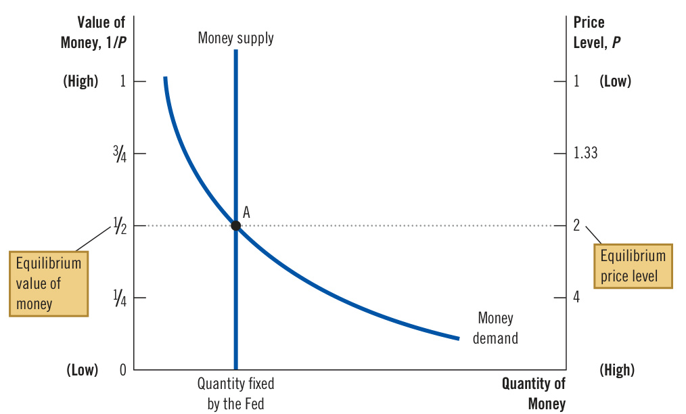
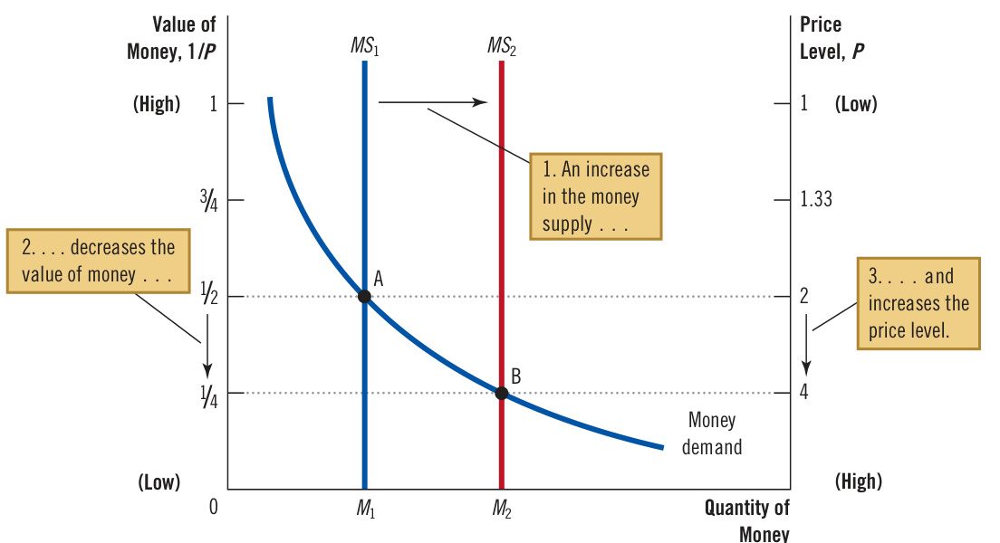
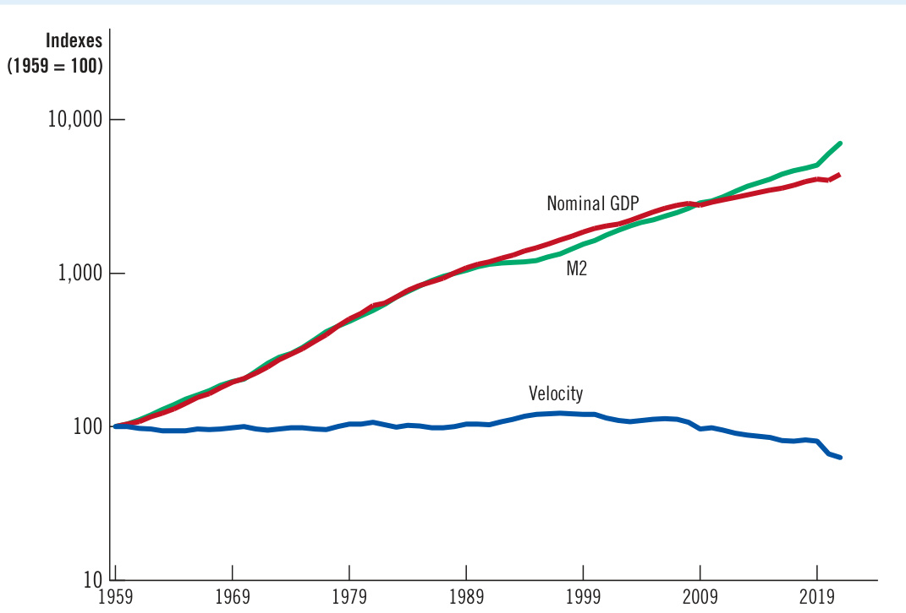
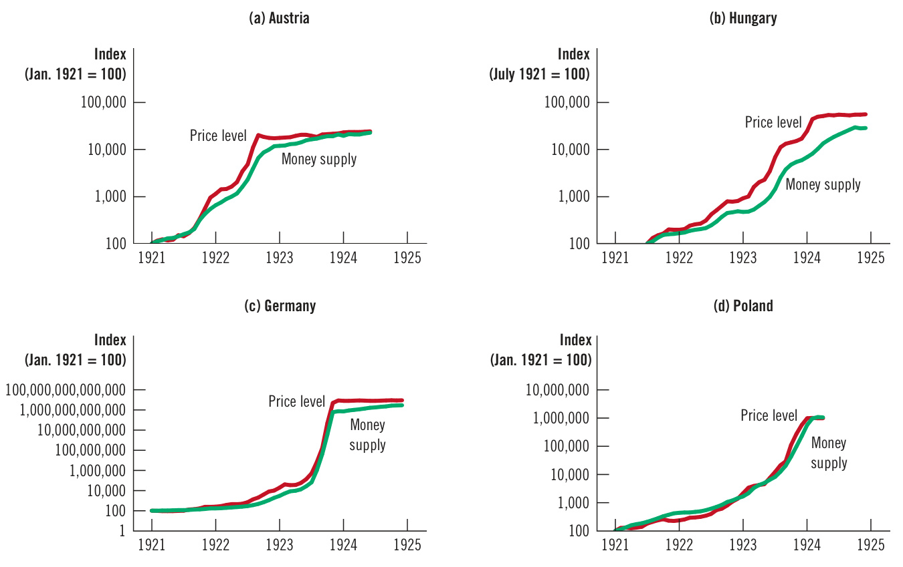
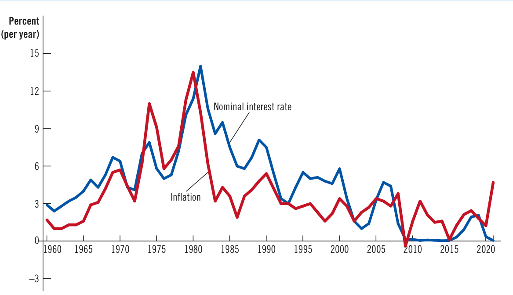

# Ch31 Money Growth and Inflation  

oday, if you want to buy an ice-cream cone, you need at least a couple of dollars. But that has not always been the case. In the 1930s, my grandmother ran a sweet shop in Trenton, New Jersey, where she sold ice-cream cones in two sizes. A cone with a small scoop of ice cream cost 3 cents. Hungry customers could buy a large scoop for a nickel.  

This increase in the price of ice cream, and of most things sold in the 1930s, is typical of modern economies, where prices tend to rise over time. Such an increase in the overall level of prices is called inflation. An earlier chapter discussed how economists measure the inflation rate as the percentage change in the consumer price index (CPI), the GDP deflator, or some other index of the overall price level. The CPI shows that in the United States from 1935 to 2021, prices rose, on average, 3.5 percent per year. Accumulated over so many years, a 3.5 percent annual inflation rate amounts to a nearly twenty-fold increase in the price level.  

Inflation may seem natural to a person living in the United States during recent decades, but in fact, it is not inevitable. There were long periods in the 19th century during which most prices fell—a phenomenon called deflation. The average level of prices in the U.S. economy was 23 percent lower in 1896 than in 1880, and this deflation was a major issue in the presidential election of 1896. Farmers, who had accumulated large debts, suffered when declines in crop prices reduced their incomes and their ability to pay off their debts. They advocated government policies to reverse the deflation.  

Although inflation has been the norm in more recent U.S. history, there has been substantial variation in the rate at which prices rise. From 1970 to 1980, prices rose by 7.8 percent per year, which meant that the price level more than doubled over the decade. By contrast, from 2010 to 2020, inflation averaged only 1.7 percent per year. But in early 2022, as the nation struggled to recover from the coronavirus pandemic, the inflation rate rose above 7 percent to the highest rate in four decades, and observers wondered whether this surge would be transitory or more persistent.  

International data show a broad range of inflation experiences. In 2020, while the inflation rate was 1.2 percent in the United States, it was zero in Japan, 3.4 percent in Mexico, 11 percent in Nigeria, and 12 percent in Turkey. And even the high inflation rates in Nigeria and Turkey were moderate by some standards. In 2018, inflation in Venezuela reached about 1 million percent per year, equivalent to an increase in prices of about 2.5 percent per day. Such an extraordinarily high rate of inflation is called hyperinflation.  

What determines whether an economy experiences inflation and, if so, how much? Many forces can affect the price level in the short run, as later chapters will discuss. But to explain substantial or persistent inflation, economists most often turn to the quantity theory of money, the main topic of this chapter. One of the Ten Principles of Economics in Chapter 1 summarizes the basic insight: Prices rise when the government prints too much money. The quantity theory can explain moderate inflations, such as those experienced in the United States, as well as hyperinflations.  

This chapter also addresses a related question: Why is inflation a problem? At first glance, the answer may seem obvious: It’s a problem because people don’t like it. In the 1970s, when the United States experienced relatively high inflation, opinion polls placed inflation as the most important issue facing the nation. President Ford echoed this sentiment in 1974 when he called inflation “public enemy number one” and wore a “WIN” button on his lapel—for Whip Inflation Now. And in 2021, when inflation surged in the late stages of the Covid-19 pandemic, President Biden said it was “one of the most pressing economic concerns of the American people.”  

But what, exactly, are the costs that inflation imposes on a society? The answer may surprise you. Identifying the costs of inflation is not as straightforward as it first appears. All economists decry hyperinflation, but some argue that the costs of moderate inflation are not nearly as large as much of the public believes.  

## 31-1 The Classical Theory of Inflation  

The quantity theory of money is classical in the sense that it was developed by some of the earliest economic thinkers. According to some historians, the theory originated in the 16th century with the Renaissance polymath Nicolaus Copernicus, who is most famous for his sun-centered model of the solar system. Proponents of the quantity theory include many great economists: David Hume in the 18th century, John Stuart Mill in the 19th century, and Irving Fisher and Milton Friedman in the 20th century. Today, most economists rely on the quantity theory to explain the long-run determinants of the price level and inflation rate.  

Suppose the price of an ice-cream cone rises from a nickel to a dollar over some period. What conclusion should we draw from the willingness of people to give up so much more money in exchange for a cone? It’s possible that they have come to enjoy ice cream more (perhaps because someone has come up with a miraculous new flavor). But it is more likely that people’s enjoyment of ice cream has stayed roughly the same and that, over time, the money used to buy it has become less valuable. In most cases, inflation is more about the value of money than about the value of goods.  

This insight points the way toward a theory of inflation. When the consumer price index and other measures of the price level rise, it is tempting to look at the individual prices that make up these price indexes. A typical news outlet might report, “The CPI rose by 3 percent last month, led by a 20 percent increase in the price of fresh fruits and vegetables and a 30 percent increase in the price of motor fuel.” This approach contains some useful information about what’s happening, but it misses a key point: Inflation is an economy-wide phenomenon that concerns, first and foremost, the value of the economy’s medium of exchange.  

The economy’s overall price level can be seen in two ways. So far, we have viewed it as the price of a basket of goods and services. When the price level rises, people must pay more for what they buy. Alternatively, we can view the price level as a measure of money’s value. A rise in the price level means a lower value of money because each dollar in your wallet or checking account buys fewer goods and services.  

It may help to express these ideas mathematically. Suppose $P$ is the price level as measured by the consumer price index or the GDP deflator. Then $P$ measures the number of dollars needed to buy a basket of goods and services. Now turn this idea around: The quantity of goods and services that can be bought with $\mathbb{S}1$ equals $1/P$ . In other words, if $P$ is the price of goods and services measured in terms of money, $1/P$ is the value of money measured in terms of goods and services.  

This math is simplest to grasp for an economy with one good—say, ice-cream cones. In that case, $P$ is the price of a cone. When the price of a cone $(P)$ is $\mathbb{S}2,$ the value of a dollar $(1/P)$ is half a cone. When the price $(P)$ rises to $\mathbb{S}3,$ , the value of a dollar $(1/P)$ falls to a third of a cone. The actual economy produces thousands of goods and services, so in practice, we use a price index rather than the price of a single good. But the logic is the same: When the price level rises, the value of money falls.  

  
“So what’s it going to be? The same size as last year or the same price as last year?”  

## 31-1b   Money Supply, Money Demand, and Monetary Equilibrium  

What determines the value of money? The answer is supply and demand, as it is for so many other questions in economics. Just as the supply and demand for bananas determines the price of bananas, the supply and demand for money determines the value of money. But what factors influence money supply and money demand?  

First, consider money supply. The preceding chapter discussed how the Federal Reserve, together with the banking system, influences the supply of money. To do so, the Fed uses a variety of tools. It can increase the money supply by buying government bonds in open-market operations or by reducing the interest rate it pays banks for the reserves they hold. It can contract the money supply by selling bonds or by increasing the interest rate on reserves. These policy actions affect the money supply by working through the system of fractional-reserve banking. For the purposes of this chapter, however, these details about the banking system and money creation can be put aside. We simplify matters by taking the quantity of money supplied as a policy variable that the Fed controls.  

Now consider money demand. Most fundamentally, the demand for money reflects how much wealth people want to hold in liquid form. Many factors influence the quantity of money demanded. The amount of currency that people hold in their wallets, for instance, depends on how much they rely on credit cards and how easily they can find an automatic teller machine. And as we will emphasize in Chapter 35, the quantity of money demanded depends on the interest rate that a person could earn by using the money to buy an interest-bearing bond rather than leaving it in his wallet or low-interest checking account.  

Although many variables affect the demand for money, one is particularly important: the average level of prices in the economy. People hold money because it is the medium of exchange. Unlike other assets, such as bonds or stocks, people can use money to buy the goods and services on their shopping lists. How much money they choose to hold for this purpose depends on the prices of those goods and services. The higher the prices are, the more money the typical transaction requires, and the more money people will choose to hold in their wallets and checking accounts. That is, a higher price level (a lower value of money) increases the quantity of money demanded.  

What ensures that the quantity of money the Fed supplies balances the quantity of money people demand? The answer depends on the time horizon being considered. Later in this book, we examine the short-run answer and learn that interest rates play a key role. The long-run answer, however, is much simpler. In the long run, money supply and money demand are brought into equilibrium by the overall level of prices. If the price level is above the equilibrium level, people will want to hold more money than the Fed has created, so the price level must fall to balance supply and demand. If the price level is below the equilibrium level, people will want to hold less money than the Fed has created, and the price level must rise to balance supply and demand. At the equilibrium price level, the quantity of money that people want to hold exactly balances the quantity of money supplied by the Fed.  

Figure 1 illustrates these ideas. The horizontal axis of this graph shows the quantity of money. The left vertical axis shows the value of money $1/P,$ and the right vertical axis shows the price level $P$ . Notice that the price-level axis on the right is inverted: A low price level is shown near the top of this axis, and a high price level is shown near the bottom. This inverted axis illustrates that when the value of money is high (as shown near the top of the left axis), the price level is low (as shown near the top of the right axis).  

The two curves in this figure are the supply and demand curves for money. The supply curve is vertical because the Fed has fixed the quantity of money available. The demand curve for money slopes downward, indicating that when the value of money is low (and the price level is high), people demand a larger quantity of money to buy goods and services. At the equilibrium, shown in the figure as point A, the quantity of money demanded balances the quantity of money supplied. This equilibrium of money supply and money demand determines the value of money and the price level.  

## 31-1c  The Effects of a Monetary Injection  

Consider the effects of a change in monetary policy. To do so, imagine that the economy is in equilibrium and then, suddenly, the Fed doubles the supply of money by printing dollar bills and dropping them around the country from helicopters.  

## How the Supply and Demand for Money Determine the Equilibrium Price Level  

The horizontal axis shows the quantity of money. The left vertical axis shows the value of money, and the right vertical axis shows the price level. The supply curve for money is vertical because the quantity of money supplied is fixed by the Fed. The demand curve for money slopes downward because people want to hold a larger quantity of money when each dollar buys less. At the equilibrium, point A, the value of money (on the left axis) and the price level (on the right axis) have adjusted to bring the quantity of money supplied and the quantity of money demanded into balance.  

  

(More realistically, the Fed alters the money supply using the tools discussed in the previous chapter, but the helicopter metaphor is simpler and more vivid.) What happens after such a monetary injection? How does the new equilibrium compare with the old one?  

Figure 2 shows what happens. The monetary injection shifts the supply curve to the right from ${M S}_{1}$ to $\boldsymbol{M}\boldsymbol{S}_{2},$ and the equilibrium moves from point A to point B. As a result, the value of money (shown on the left axis) decreases from $\%$ to $^{1\!}/\!\!4,$ and the equilibrium price level (shown on the right axis) increases from 2 to 4. In other words, when an increase in the money supply makes dollars more plentiful, the result is an increase in the price level and a decrease in the value of each dollar.  

This explanation of how the price level is determined and why it might change over time is called the quantity theory of money. According to the quantity theory, the quantity of money available in an economy determines the value of money, and growth in the quantity of money is the primary cause of inflation. As the economist Milton Friedman once put it, “Inflation is always and everywhere a monetary phenomenon.”  

## quantity theory of money  

## 31-1d  A Brief Look at the Adjustment Process  

a theory asserting that the quantity of money available determines the price level and that the growth rate in the quantity of money available determines the inflation rate  

So far, we have compared the old and new equilibrium after an injection of money. How does the economy move from one to the other? A complete answer requires an understanding of short-run economic fluctuations, which we examine later in  

When the Fed increases the supply of money, the money supply curve shifts from ${M S}_{\mathrm{1}}$ to ${M S}_{2}$ . The value of money (on the left axis) and the price level (on the right axis) adjust to bring supply and demand back into balance. The equilibrium moves from point A to point B. Thus, when an increase in the money supply makes dollars more plentiful, the price level increases, making each dollar less valuable.  

  

this book. Here, let’s briefly consider the adjustment process that occurs after a change in the money supply.  

The immediate effect of a monetary injection is to create an excess supply of money. Before the injection, the economy was in equilibrium (point A in Figure 2). At the prevailing price level, people were holding exactly as much of the medium of exchange as they wanted. But after the helicopters drop the new money and people pick it up off the streets, their wallets are bulging with more dollars than they need for their planned transactions. At the prevailing price level, the quantity of money supplied now exceeds the quantity demanded.  

People try to get rid of this excess supply of money in various ways. They might use it to buy more goods and services. Or they might use this excess money to make loans to others by buying bonds or by depositing the money in a bank savings account. These loans allow other people to buy more goods and services. In either case, the injection of money increases the demand for goods and services.  

The economy’s ability to supply goods and services, however, has not changed. As we saw in the chapter on production and growth, the economy’s output of goods and services is determined by the available labor, physical capital, human capital, natural resources, and technological knowledge. The injection of money alters none of these.  

That’s why the greater demand for goods and services causes the prices of goods and services to rise. The increase in the price level, in turn, increases the quantity of money demanded because people use more dollars for every transaction. Eventually, the economy reaches a new equilibrium (point B in Figure 2) at which the quantity of money demanded again equals the quantity of money supplied. In this way, the overall price level adjusts to bring money supply and money demand back into balance.  

## 31-1e  The Classical Dichotomy and Monetary Neutrality  

We have seen how changes in the money supply lead to changes in the average level of prices of goods and services. How do monetary changes affect other variables, such as production, employment, wages, and interest rates? This question has long intrigued economists.  

Economic variables can be divided into two groups. The first group consists of nominal variables—variables measured in monetary units. The second group consists of real variables—variables measured in physical units. For example, the income of corn farmers is a nominal variable because it is expressed in dollars, while the quantity of corn they produce is a real variable because it is expressed in bushels. Nominal GDP measures the dollar value of the economy’s output of goods and services; real GDP measures the total quantity of goods and services and is not influenced by the current prices of those goods and services. The separation of real and nominal variables is called the classical dichotomy. A dichotomy is a division into two groups, and classical refers to the early economic thinkers who first proposed this division.  

Applying the classical dichotomy is tricky for prices. Most prices are quoted in units of money and, therefore, are nominal variables. When we say that the price of corn is $\mathbb{S}2$ a bushel or that the price of wheat is $\mathbb{S}1$ a bushel, both prices are nominal variables. But what about a relative price—the price of one thing in terms of another? In this example, we could say that the price of a bushel of corn is 2 bushels of wheat, a relative price that is not measured in terms of money. When comparing the prices of any two goods, the dollar signs cancel, and the resulting number is expressed in physical units. Thus, while dollar prices are nominal variables, relative prices are real variables.  

This has many applications. For instance, the real wage (the dollar wage adjusted for inflation) is a real variable because it measures the rate at which people exchange a unit of labor for goods and services. Similarly, the real interest rate (the nominal interest rate adjusted for inflation) is a real variable because it measures the rate at which people exchange goods and services today for goods and services in the future. One clue, of course, is the powerful word “real.” When it appears before a variable, that variable has been adjusted for inflation and is, therefore, measured in physical units.  

Why separate variables into these groups? The classical dichotomy is useful because different forces influence real and nominal variables. According to classical analysis, nominal variables are influenced by developments in the economy’s monetary system, but real variables are not.  

This idea was implicit in our discussion of the real economy in the long run. Previous chapters examined the determinants of production, saving, investment, real interest rates, and unemployment without mentioning the effects of money. In that analysis, the economy’s output of goods and services depends on technology and factor supplies, the real interest rate balances the supply and demand for loanable funds, the real wage balances the supply and demand for labor, and unemployment results when the real wage is above the equilibrium level. These conclusions have nothing to do with the quantity of money supplied.  

Changes in the supply of money, according to classical theory, affect nominal variables but not real ones. When the central bank doubles the money supply, the  

nominal variables variables measured in monetary units  

real variables variables measured in physical units  

classical dichotomy the theoretical separation of nominal variables and real variables  

monetary neutrality the proposition that changes in the money supply do not affect real variables  

velocity of money the rate at which money changes hands  

price level doubles, the dollar wage doubles, and all other dollar values double. Real variables, such as production, employment, real wages, and real interest rates, are unchanged. The irrelevance of monetary changes to real variables is called rality  

An analogy helps explain monetary neutrality. As the unit of account, money is the yardstick used to measure economic transactions. When a central bank doubles the money supply, all prices double, and the value of the unit of account falls by half. A similar change would occur if the government were to reduce the length of the yard from 36 to 18 inches: With the new, shorter yardstick, all measured distances (nominal variables) would double, but the actual distances (real variables) would remain the same. The dollar, like the yard, is merely a unit of measurement, so a change in its value should not have real effects.  

Is monetary neutrality realistic? Not completely. A change in the length of the yard from 36 to 18 inches might not matter in the long run, but in the short run, it would lead to confusion and mistakes. Similarly, most economists today believe that over short periods of time—within the span of a year or two—monetary changes affect real variables. (The classical economists themselves, most notably David Hume, also doubted that monetary neutrality would apply in the short run.) We will study short-run non-neutrality later in the book, and this topic will help explain why the Fed adjusts the money supply over time.  

Yet classical analysis may be fundamentally right about the economy in the long run. Over the course of a decade, monetary changes have significant effects on nominal variables (such as the price level) but appear to have negligible effects on real variables (such as real GDP). When studying long-run changes in the economy, the neutrality of money offers a reasonably good description of how the world works.  

## 31-1f  Velocity and the Quantity Equation  

For another perspective on the quantity theory of money, consider the following question: How many times per year is the typical dollar bill used to pay for a newly produced good or service? The answer is given by a variable called the velocity of money. In physics, the term velocity refers to the speed at which an object travels. In economics, the velocity of money refers to the speed at which the typical dollar travels around the economy from person to person.  

The velocity of money is calculated by dividing the nominal value of output (nominal GDP) by the quantity of money. If $P$ is the price level (the GDP deflator), $Y$ is the quantity of output (real GDP), and $M$ is the quantity of money, then velocity is  

$$
V=(P\times Y)/M.
$$  

To see why this makes sense, imagine a simple economy that produces only pizza. Suppose that the economy produces 100 pizzas in a year, a pizza sells for $\mathbb{S}10,$ and the quantity of money in the economy is $\mathbb{S}50$ . Then the velocity of money is  

$$
\begin{array}{c}{{V=(\Phi10\times100)/\Phi50}}\\ {{=20.}}\end{array}
$$  

In this economy, people spend a total of $^\mathrm{\Phi1,000}$ per year on pizza. For this $^\mathrm{\Phi1,000}$ of spending to take place with only $\mathbb{S}50$ of money, each dollar must change hands, on average, 20 times per year.  

With slight algebraic rearrangement, this equation can be rewritten as  

$$
M\times V=P\times Y.
$$  

This equation states that the quantity of money $(M)$ times the velocity of money $(V)$ equals the price of output $(P)$ times the amount of output $(Y)$ . It is called the quantity equation because it relates the quantity of money $(M)$ to the nominal value of output $(P\times Y)$ . The quantity equation shows that an increase in the quantity of money in an economy must be reflected in one of the other three variables: The price level must rise, the quantity of output must rise, or the velocity of money must fall.  

In many cases, it turns out that the velocity of money is relatively stable, at least compared with other economic variables. For example, Figure 3 shows nominal GDP, the quantity of money (as measured by M2), and the velocity of money for the U.S. economy since 1959. During this period, the money supply and nominal GDP both increased more than fortyfold. By contrast, the velocity of money, although not exactly constant, has not changed nearly as much. For some purposes, the assumption of constant velocity is a good approximation.  

quantity equation the equation $M\times V=$ $P\times Y,$ which relates the quantity of money, the velocity of money, and the dollar value of the economy’s output of goods and services  

## Figure 3  

Nominal GDP, the Quantity of Money, and the Velocity of Money  

This figure shows the nominal value of output as measured by nominal GDP, the quantity of money as measured by M2, and the velocity of money as measured by their ratio. For comparability, all three series have been scaled to equal 100 in 1959. Notice that nominal GDP and the quantity of money have grown substantially over this period, while velocity has been relatively stable.  

Source: U.S. Department of Commerce; Federal Reserve Board.  

  

We now have all the elements necessary to explain the equilibrium price level and inflation rate. They are as follows:  

1. The velocity of money is relatively stable over time.   
2. Because velocity is stable, when the central bank changes the quantity of money $(M)_{\!}$ , it causes proportionate changes in the nominal value of output $(P\times Y)$ .   
3. The economy’s output of goods and services $(Y)$ is determined by factor supplies (labor, physical capital, human capital, and natural resources) and the available production technology. In particular, since money is neutral, money does not affect output.   
4. Because output $(Y)$ is fixed by factor supplies and technology, when the central bank alters the money supply $(M)$ and induces a proportional change in the nominal value of output $(P\times Y)$ , this change is reflected in a change in the price level $(P)$ .   
5. Therefore, when the central bank increases the money supply rapidly, the result is a high rate of inflation.  

These five points are the essence of the quantity theory of money. In short, the theory says that inflation results from “too much money chasing too few goods.”  

## Money and Prices during Four Hyperinflations  

  

Earthquakes can wreak havoc on a society, but they provide much useful data for seismologists. These data can shed light on alternative the  

ories and help society predict and deal with future threats. Similarly, hyperinflations are terrible to live through (more on this later), but they offer economists a natural experiment to study the effects of money on the economy.  

Hyperinflations are interesting for a simple reason: The changes in the money supply and price level are enormous. Hyperinflation is generally defined as inflation that exceeds 50 percent per month, which amounts to more than a hundredfold increase in the price level over the course of a year. Returning to our ice-cream example, this rate of inflation would mean that a $\mathbb{52}$ cone you bought in the summer of 2023 would cost $\mathbb{S}260$ in the summer of 2024.  

Four classic hyperinflations occurred during the 1920s in Austria, Hungary, Germany, and Poland in the aftermath of World War I. In Austria, for example, the price level roughly doubled from July 1922 to August 1922 and then doubled again the next month. “One cannot even talk about prices,” a visitor to Vienna said. “Before one’s sentence has ended, they have increased again.”  

The data on these hyperinflations show a clear link between the quantity of money and the price level. Figure 4 shows the quantity of money in the economy and an index of the price level for each of these economies. The slope of the money line represents the rate at which the quantity of money was growing, and the slope of the price line represents the inflation rate. The steeper the lines, the higher the rates of money growth or inflation.  

Notice that in each graph, the quantity of money and the price level are almost parallel. In each instance, growth in the quantity of money is moderate at first, and so is inflation. But over time, the quantity of money in the economy starts growing faster and faster. At about the same time, inflation also takes off. Then, when the quantity of money stabilizes, the price level stabilizes as well. These episodes illustrate one of the Ten Principles of Economics: Prices rise when the government prints too much money.  

## Money and Prices during Four Hyperinflations  

This figure shows the quantity of money and the price level during four hyperinflations. (Note that because these variables are graphed on logarithmic scales, equal vertical distances on the graph represent equal percentage changes in the variable.) In each case, the quantity of money and the price level move closely together. The strong association between these two variables is consistent with the quantity theory of money, which states that growth in the money supply is the primary cause of inflation.  

Source: Adapted from Thomas J. Sargent, “The End of Four Big Inflations,” in Robert Hall, ed., Inflation (Chicago: University of Chicago Press, 1983), pp. 41–93. Each series is normalized to equal 100 for the initial observation.  

  

## 31-1g  The Inflation Tax  

If inflation is so easy to explain, why do countries experience hyperinflation? That is, why do the central banks of these countries print so much money that its value is certain to fall rapidly?  

The answer is that the governments of these countries are using money creation to pay for their spending. When governments want to build roads or schools, pay the salaries of public employees, or give transfer payments to the disadvantaged or politically powerful, they first must raise the necessary funds. Normally, they do this by levying taxes, such as income and sales taxes, and by borrowing from the public by selling government bonds. Yet in an economy with a system of fiat money, a government can also pay for spending simply by printing the money it needs.  

When the government raises revenue by printing money, it is said to levy an inflation tax. The inflation tax is not exactly like other taxes, however, because the government doesn’t send anyone a bill for this tax. Instead, the inflation tax is subtler. When the  

## inflation tax  

the revenue the government raises by creating money  

government prints money, the price level rises, and the dollars in your wallet become less valuable. Thus, the inflation tax is like a tax on everyone who holds money.  

The importance of the inflation tax varies from country to country and over time. In the United States, in recent years, the inflation tax has been a minor source of revenue: It has accounted for less than 3 percent of federal receipts. During the 1770s, however, the Continental Congress of the fledgling United States relied heavily on the inflation tax to pay for military spending. Because the new government had a limited ability to raise funds through regular taxes or borrowing, printing dollars was the easiest way to compensate the soldiers fighting for independence. As the quantity theory predicts, the result was a high rate of inflation: Prices measured in terms of the continental dollar rose more than a hundredfold over a few years.  

Almost all hyperinflations follow the same pattern as the hyperinflation during the American Revolution. The government has high spending, inadequate tax revenue, and limited capacity to borrow. To pay for its spending, it turns to the printing press. The massive increases in the quantity of money then lead to massive inflation. The hyperinflation ends when the government institutes fiscal reforms—such as cuts in government spending—that eliminate the need for the inflation tax.  

## 31-1h  The Fisher Effect  

According to the principle of monetary neutrality, an increase in the rate of money growth raises the rate of inflation but does not affect any real variable. An important application concerns the effect of money on interest rates. Macroeconomists are especially concerned about interest rates because they link the economy of the present and the economy of the future through their effects on saving and investment.  

To understand the relationship among money, inflation, and interest rates, recall the distinction between the nominal interest rate and the real interest rate. The nominal interest rate is the interest rate you hear about at your bank. If you have a savings account, for instance, the nominal interest rate tells you how fast the number of dollars in your account will rise over time. The real interest rate corrects the nominal interest rate for the effect of inflation to tell you how fast the purchasing power of your savings account will rise over time. The real interest rate is the nominal interest rate minus the inflation rate:  

Real interest rate $=$ Nominal interest rate2Inflation rate.  

For example, if the bank posts a nominal interest rate of 7 percent per year and the inflation rate is 3 percent per year, then the real value of the deposits grows by 4 percent per year.  

We can rewrite this equation to show that the nominal interest rate is the sum of the real interest rate and the inflation rate:  

Nominal interest rate $=$ Real interest rate $^+$ Inflation rate.  

This way of looking at the nominal interest rate is useful because different forces determine each of the two terms on the right side of this equation. As an earlier chapter discussed, the supply and demand for loanable funds determine the real interest rate. And according to the quantity theory of money, growth in the money supply determines the inflation rate.  

So how does growth in the money supply affect interest rates? In the long run, over which money is neutral, a change in money growth should not affect the real interest rate. The real interest rate is, after all, a real variable. For the real interest rate to remain unchanged, a change in the inflation rate must result in a one-for-one change in the nominal interest rate. Thus, when a central bank increases the rate of money growth, the long-run result is an equal increase in the inflation rate and the nominal interest rate. This adjustment of the nominal interest rate to the inflation rate is called the Fisher effect, after Irving Fisher (1867–1947), the economist who first studied it.  

Keep in mind that this analysis of the Fisher effect has maintained a long-run perspective. The Fisher effect need not hold in the short run because inflation may be unanticipated. A nominal interest rate is a payment on a loan, and it is typically set when the loan is first made. If a jump in inflation catches the borrower and lender by surprise, the nominal interest rate they agreed on will fail to reflect the higher inflation. But if inflation remains high, people will eventually come to expect it, and the nominal interest rates set in loan agreements will reflect this expectation. To be precise, therefore, the Fisher effect states that the nominal interest rate adjusts to expected inflation. Expected inflation moves with actual inflation in the long run but not necessarily in the short run.  

The Fisher effect is crucial for understanding changes in the nominal interest rate over time. Figure 5 shows the nominal interest rate and the inflation rate in the U.S. economy since 1960. The close association between these two variables is clear. The nominal interest rate rose from the early 1960s through the 1970s because inflation was also rising during this time. Similarly, the nominal interest rate fell from the early 1980s through the 1990s because the Fed got inflation under control. In the 2010s, both the nominal interest rate and the inflation rate were low by historical standards.  

## Fisher effect  

the one-for-one adjustment of the nominal interest rate to the inflation rate  

## Figure 5  

## The Nominal Interest Rate and the Inflation Rate  

This figure uses annual data since 1960 to show the nominal interest rate on threemonth Treasury bills and the inflation rate as measured by the consumer price index. The close association between these two variables provides evidence for the Fisher effect: When the inflation rate rises, so does the nominal interest rate.  

Source: U.S. Department of Treasury; U.S. Department of Labor.  

  

1. The classical principle of monetary neutrality states that changes in the money supply do not influence variables, and it is thought to be most applicable in the run.  

a. nominal; short b. nominal; long c. real; short d. real; long  

2. If nominal GDP is $\Phi400$ , real GDP is $\mathbb{5}200$ , and the money supply is $\Phi100$ , then  

a. the price level is $\%$ , and velocity is 2.   
b. the price level is $\%$ , and velocity is 4.   
c. the price level is 2, and velocity is 2.   
d. the price level is 2, and velocity is 4.  

3. According to the quantity theory of money, which variable in the quantity equation is most stable over long periods of time?  

a. money b. velocity c. price level d. output  

4. Hyperinflation occurs when the government runs a large budget , which the central bank finances with a substantial monetary  

a. deficit; contraction b. deficit; expansion c. surplus; contraction d. surplus; expansion  

5. According to the quantity theory of money and the Fisher effect, if the central bank increases the rate of money growth, then  

a. inflation and the nominal interest rate both increase.   
b. inflation and the real interest rate both increase.   
c. the nominal interest rate and the real interest rate both increase.   
d. inflation, the real interest rate, and the nominal interest rate all increase.  

Answers are at the end of the chapter.  

## 31-2 The Costs of Inflation  

In the late 1970s, when the U.S. inflation rate reached about 10 percent per year, inflation dominated debates over economic policy. And even when inflation is low, it remains a closely watched macroeconomic variable. One study found that inflation is the economic term mentioned most often in U.S. newspapers (ahead of second-place finisher unemployment and third-place finisher productivity).  

Inflation is closely watched and widely discussed because it is thought to be a serious economic problem. But is that true? And if so, why?  

## 31-2a  A Fall in Purchasing Power? The Inflation Fallacy  

If you ask most people why inflation is bad, they will tell you that the answer is obvious: Inflation robs them of the purchasing power of their hard-earned dollars. When prices rise, each dollar of income buys fewer goods and services. So it might seem that inflation directly lowers living standards.  

Yet further thought reveals a fallacy in this answer. When prices rise, buyers of goods and services pay more for what they buy. At the same time, however, sellers of goods and services get more for what they sell. Because most people earn their incomes by selling their services, such as their labor, inflation in incomes goes hand in hand with inflation in prices. Inflation does not in itself reduce people’s real purchasing power.  

People believe the inflation fallacy because they do not appreciate the principle of monetary neutrality. Workers who receive an annual raise of 10 percent tend to view that raise as a reward for their talent and effort. When an inflation rate of 6 percent reduces the real value of that raise to only 4 percent, the workers might feel cheated. In fact, as the chapter on production and growth discussed, real incomes are determined by real variables, such as physical capital, human capital, natural resources, and the available production technology. Nominal incomes are determined by a combination of those factors and the overall price level. If the Fed lowered the inflation rate from 6 percent to zero, the workers’ annual raise would fall from 10 percent to 4 percent. They might feel less robbed by inflation, but their real income would not rise more quickly.  

If nominal incomes tend to keep pace with rising prices in the long run, why then is inflation a problem? It turns out that there is no single answer. Instead, economists have identified several costs of inflation. Each of these costs shows some way in which persistent growth in the money supply does, in fact, have some adverse effect on real variables.  

## 31-2b  Shoeleather Costs  

As we have seen, inflation is like a tax on the holders of money. The tax itself is not a cost to society: It is only a transfer of resources from households to the government. Yet most taxes give people an incentive to alter their behavior to avoid paying the tax, and this distortion of incentives causes deadweight losses. This is true for the inflation tax as well. It causes deadweight losses because people waste scarce resources trying to escape it.  

How can a person avoid paying the inflation tax? Because inflation erodes the real value of money, you can avoid the inflation tax by holding less money. One way to do this is to go to the bank more often. For example, rather than withdrawing $\mathbb{S}200$ every four weeks, you might withdraw $\mathbb{S}50$ once a week. By making more frequent trips to the bank, you can keep more of your wealth in your interest-bearing savings account and less in your wallet, where inflation erodes its value.  

The cost of reducing your money holdings is called the shoeleather cost of inflation because making more frequent trips to the bank causes your shoes to wear out more quickly. Of course, this term is not to be taken literally: The actual cost of reducing your money holdings is not the wear and tear on your shoes but the time and convenience you must sacrifice to keep less money on hand than you would if there were no inflation.  

The shoeleather costs of inflation have been trivial in the U.S. economy, which usually has only moderate inflation. But this cost is magnified in countries with hyperinflation. Here is a description of one person’s experience in Bolivia during its hyperinflation (as reported in the August 13, 1985, issue of The Wall Street Journal):  

When Edgar Miranda gets his monthly teacher’s pay of 25 million pesos, he hasn’t a moment to lose. Every hour, pesos drop in value. So, while his wife rushes to market to lay in a month’s supply of rice and noodles, he is off with the rest of the pesos to change them into black-market dollars.  

Mr. Miranda is practicing the First Rule of Survival amid the most out-of-control inflation in the world today. Bolivia is a case study of how runaway inflation undermines a society. Price increases are so huge that the figures build up  

## shoeleather costs  

the resources wasted when inflation encourages people to reduce their money holdings  

almost beyond comprehension. In one six-month period, for example, prices soared at an annual rate of 38,000 percent. By official count, however, last year’s inflation reached 2,000 percent, and this year’s is expected to hit 8,000 percent— though other estimates range many times higher. In any event, Bolivia’s rate dwarfs Israel’s 370 percent and Argentina’s 1,100 percent—two other cases of severe inflation.  

It is easier to comprehend what happens to the thirty-eight-year-old Mr. Miranda’s pay if he doesn’t quickly change it into dollars. The day he was paid 25 million pesos, a dollar cost 500,000 pesos. So he received $\mathbb{S}50$ . Just days later, with the rate at 900,000 pesos, he would have received $\mathbb{S}27$ .  

As this story shows, the shoeleather costs of inflation can be large. With the high inflation rate, Mr. Miranda does not have the luxury of holding the local money as a store of value. Instead, he is forced to convert his pesos quickly into goods or into U.S. dollars, which offer a more stable store of value. The time and effort that Mr. Miranda expends to reduce his money holdings are wasted resources. If the monetary authority pursued a low-inflation policy, Mr. Miranda would be happy to hold pesos, and he could put his time and effort to more productive use. In fact, shortly after this article was written, the inflation rate in Bolivia fell substantially as a result of a more restrictive monetary policy.  

## 31-2c  Menu Costs  

Most firms do not change the prices of their products every day. Instead, firms often announce prices and leave them unchanged for weeks, months, or even years. One survey found that the typical U.S. firm changes its prices about once a year.  

Firms change prices infrequently because there are costs to changing prices. Costs of price adjustment are called menu costs, a term derived from a restaurant’s cost of printing a new menu. Menu costs include the costs of deciding on new prices, printing new price lists and catalogs, sending these new price lists and catalogs to dealers and customers, advertising the new prices, and even dealing with customer annoyance over price changes.  

Inflation increases the menu costs that firms must bear. In the low-inflation environment that has usually prevailed in the modern U.S. economy, annual price adjustment is an appropriate business strategy for many firms. But when high inflation makes firms’ costs rise rapidly, annual price adjustment is impractical. During hyperinflations, for example, firms must change their prices daily or even more often just to keep up with all the other prices in the economy.  

## 31-2d   Relative-Price Variability and the Misallocation of Resources  

Suppose that the Eatabit Eatery prints a new menu with new prices every January and then leaves its prices unchanged for the rest of the year. If there is no inflation, Eatabit’s relative prices—the prices of its meals compared with other prices in the economy—would be constant over the course of the year. But if the inflation rate is 12 percent per year, Eatabit’s relative prices will automatically fall by 1 percent each month. The restaurant’s relative prices will be highest in the early months of the year, just after it has printed a new menu, and lowest in the later months. And the higher the inflation rate, the greater this swing in relative prices will be. Thus, because prices change only once in a while, inflation causes relative prices to vary more than they otherwise would.  

Why does this matter? The reason is that market economies rely on relative prices to allocate scarce resources. Consumers decide what to buy by comparing the quality and prices of various goods and services. Through these decisions, they determine how the scarce factors of production are allocated among industries and firms. When inflation distorts relative prices, consumer decisions are distorted, and markets are less able to allocate resources to their best use.  

## 31-2e  Inflation-Induced Tax Distortions  

Most taxes distort incentives, cause people to alter their behavior, and lead to a less efficient allocation of the economy’s resources. In the presence of inflation, many taxes become even more problematic. The reason is that lawmakers often fail to take inflation into account when writing the tax laws. Economists who have studied the tax code conclude that inflation tends to raise the tax burden on income earned from savings.  

One example of how inflation discourages saving is the tax treatment of capital gains—the profits made by selling an asset for more than its purchase price. Suppose that, in 1975, you used some of your savings to buy one share of IBM stock for $\mathbb{S}10$ and that you sold it for $\mathbb{S}110$ in 2020. According to the tax law, you have earned a capital gain of $\mathbb{S}100$ , which you must include in your income when figuring out how much income tax you owe. But because the overall price level increased fivefold from 1975 to 2020, the $\mathbb{S}10$ you invested in 1975 is equivalent (in terms of purchasing power) to $\mathbb{S}50$ in 2020. So when you sell your stock for $\mathbb{S}110.$ , you have a real gain (an increase in purchasing power) of only $\S60$ $(\mathbb{S}110-\mathbb{S}50)$ . The tax code, however, ignores inflation and taxes you on a gain of $\mathbb{S}100$ . In this way, inflation exaggerates the size of capital gains and inadvertently increases the tax burden on this type of income.  

Another example is the tax treatment of interest income. The income tax treats the nominal interest earned on savings as income, even though part of the nominal interest rate merely compensates for inflation. To see the effects, consider the numerical example in Table 1. The table compares two economies, both of which tax interest income at a rate of 25 percent. In Economy A, inflation is zero, and  

## Table 1  

## How Inflation Raises the Tax Burden on Saving  

In the presence of zero inflation, a 25 percent tax on interest income reduces the real interest rate from 4 percent to 3 percent. In the presence of 8 percent inflation, the same tax reduces the real interest rate from 4 percent to 1 percent.  

<html><body><table><tr><td></td><td>EconomyA (zero inflation)</td><td>EconomyB (high inflation)</td></tr><tr><td>Realinterestrate</td><td>4%</td><td>4%</td></tr><tr><td>Inflation rate</td><td>0</td><td>8</td></tr><tr><td>Nominalinterestrate (real interest rate + inflation rate)</td><td>4</td><td>12</td></tr><tr><td>Reducedinterestdue to25percenttax (0.25 × nominal interest rate)</td><td>1</td><td>3</td></tr><tr><td>After-taxnominalinterestrate (0.75 × nominal interest rate)</td><td>3</td><td>9</td></tr><tr><td>After-tax real interest rate (after-tax nominal interest rate -inflation rate)</td><td>3</td><td>1</td></tr></table></body></html>  

the nominal and real interest rates are both 4 percent. In this case, the 25 percent tax on interest income reduces the real interest rate from 4 percent to 3 percent. In Economy B, the real interest rate is again 4 percent, but the inflation rate is 8 percent. As a result of the Fisher effect, the nominal interest rate is 12 percent. Because the income tax treats this entire 12 percent interest as income, the 25 percent tax leaves an after-tax nominal interest rate of only 9 percent and, after correcting for 8 percent inflation, an after-tax real interest rate of only 1 percent. In this case, the 25 percent tax on interest income reduces the real interest rate from 4 percent to 1 percent. Because the after-tax real interest rate provides the incentive to save, saving is much less attractive in the economy with inflation (Economy B) than in the economy with stable prices (Economy A).  

The taxes on nominal capital gains and on nominal interest income are two examples of how the tax code interacts with inflation. There are many others. Because of these inflation-induced tax changes, higher inflation tends to discourage people from saving. Recall that the economy’s saving provides the resources for investment, which, in turn, is important to long-run economic growth. When inflation raises the tax burden on saving, it tends to depress the economy’s longrun growth rate. There is, however, no consensus among economists about the size of this effect.  

One solution to this problem, other than eliminating inflation, is to index the tax system. That is, the tax laws could be revised to account for the effects of inflation. In the case of capital gains, for example, the tax code could adjust the purchase price using a price index and assess the tax only on the real gain. In the case of interest income, the government could tax only real interest income by excluding that portion of the interest income that merely compensates for inflation. To some extent, the tax laws have moved in the direction of indexation. For example, the income levels at which income tax rates change are adjusted automatically each year based on changes in the consumer price index. Yet many other aspects of the tax laws—such as the tax treatment of capital gains and interest income—are not indexed.  

In an ideal world, the tax laws would be written so that inflation would not alter anyone’s real tax liability. In the real world, however, tax laws are far from perfect. More complete indexation would probably be desirable, but it would further complicate a tax code that many people already consider onerous.  

## 31-2f  Confusion and Inconvenience  

Imagine that we took a poll and asked the following question: “This year, a yard is 36 inches. How long do you think it should be next year?” If we could get people to take us seriously, they would tell us that a yard should stay the same length— 36 inches. Anything else would just complicate life needlessly.  

What does this have to do with inflation? Recall that money, as the economy’s unit of account, is what we use to quote prices and record debts. Money is the yardstick with which we measure economic transactions. The Federal Reserve is a bit like the Bureau of Standards: Its job is to ensure the reliability of a commonly used unit of measurement. When the Fed creates inflation, it erodes the real value of the unit of account.  

It is difficult to judge the costs of the confusion and inconvenience that arise from inflation. As noted earlier, the tax code incorrectly measures real incomes in the presence of inflation. Similarly, accountants have difficulty measuring firms’ earnings when prices are rising over time. Because inflation causes dollars at different times to have different real values, computing a firm’s profit—the difference between its revenue and costs—is more complicated in an economy with rapid inflation. Therefore, to some extent, inflation can make it harder to sort successful from unsuccessful firms, impeding the financial system as it aims to allocate the economy’s capital to its best uses.  

## $\mathbf{31-2g}$ A Special Cost of Unexpected Inflation: Arbitrary Redistributions of Wealth  

The costs of inflation discussed so far occur even if the change in the price level is steady and predictable. Inflation has another cost, however, when it comes as a surprise. Unexpected inflation redistributes wealth in a way that has nothing to do with either merit or need. These redistributions occur because many loans in the economy are specified in terms of the unit of account—money.  

Consider an example. Suppose that Sophie Student takes out a $^\mathrm{\Phi50,000}$ loan at a 7 percent interest rate from Bigbank to attend college. In 10 years, the loan will come due. After her debt has compounded for 10 years at 7 percent, Sophie will owe Bigbank $^{\mathbb{S}100,000}$ . But the real value of this debt will depend on inflation over the decade. If Sophie is lucky, the economy will have a hyperinflation. In this case, wages and prices will rise so high that Sophie will be able to pay the $^{\mathbb{S}100,000}$ debt out of pocket change. (The hyperinflation may, however, hurt Sophie in other ways.) By contrast, if the economy goes through a major deflation, then wages and prices will fall, and Sophie will find the $^{\mathbb{S}100,000}$ debt a greater burden than anticipated.  

This example shows that unexpected changes in prices redistribute wealth among debtors and creditors. High inflation enriches Sophie at the expense of Bigbank because it diminishes the real value of the debt; Sophie can repay the loan in dollars that are less valuable than she expected. Deflation enriches Bigbank at Sophie’s expense because it increases the real value of the debt; in this case, Sophie must repay the loan in dollars that are more valuable. If inflation were predictable, then Bigbank and Sophie could take inflation into account when setting the nominal interest rate on the loan. (Recall the Fisher effect.) But if inflation is hard to predict, it imposes risk on Sophie and Bigbank that both would prefer to avoid.  

This cost of unexpected inflation is important to consider together with another tendency: Inflation is especially volatile and uncertain when the average rate of inflation is high. This is evident in comparisons among different countries. Countries with low average inflation, such as Germany in the late 20th century, tend to have stable inflation. Countries with high average inflation, such as many countries in Latin America, tend to have unstable inflation. There are no known examples of economies with high, stable inflation. This relationship between the level and volatility of inflation points to another cost of inflation. If a country pursues a high-inflation monetary policy, it will have to bear not only the costs of high expected inflation but also the arbitrary redistributions of wealth associated with unexpected inflation.  

## 31-2h  Inflation Is Bad, but Deflation May Be Worse  

In recent U.S. history, inflation has been the norm. But the level of prices has fallen at times, such as during the late 19th century and early 1930s. From 1998 to 2012, Japan experienced a 4-percent decline in its overall price level. So as we conclude our discussion of the costs of inflation, the costs of deflation are worth considering as well.  

Some economists have suggested that a small and predictable amount of deflation may be desirable. Milton Friedman pointed out that deflation would lower the nominal interest rate (via the Fisher effect) and that a lower nominal interest rate would reduce the cost of holding money. The shoeleather costs of holding money would, he argued, be minimized by a nominal interest rate close to zero, which in turn would require deflation equal to the real interest rate. This prescription for moderate deflation is called the Friedman rule.  

Yet there are also costs of deflation. Some of these mirror the costs of inflation. For example, just as a rising price level induces menu costs and relative-price variability, so does a falling price level. Moreover, in practice, deflation is rarely as steady and predictable as Friedman recommended. More often, it comes as a surprise, resulting in the redistribution of wealth toward creditors and away from debtors. Because debtors tend to be poorer, these redistributions in wealth are especially painful.  

Perhaps most important, deflation often arises from broader macroeconomic difficulties. As we will see in future chapters, falling prices result when some event, such as a monetary contraction, reduces the overall demand for goods and services. This fall in aggregate demand can lead to falling incomes and rising unemployment. In other words, deflation is often a symptom of deeper economic problems.  

## The Wizard of Oz and the Free-Silver Debate  

  

The movie The Wizard of $O z,$ based on a children’s book written in 1900, has been a staple of television and video streaming for decades. The movie and book tell the familiar story of a young girl, Dorothy, who finds herself lost in a strange land far from home. You may not know, though, that some scholars believe that the story is an allegory about U.S. monetary policy in the late 19th century, a period of severe deflation.  

From 1880 to 1896, the price level in the U.S. economy fell by 23 percent. Because this event was unanticipated, it led to an acute redistribution of wealth. Most farmers in the west were debtors. Their creditors were the bankers in the east. When the price level fell, the real value of these debts rose, enriching the bankers at the expense of the farmers.  

According to Populist politicians of the time, the solution to the farmers’ problem was the free coinage of silver. During this period, the United States was operating with a gold standard. The quantity of gold determined the money supply and the price level. Free-silver advocates wanted silver, in addition to gold, to be used as money. This would have increased the money supply sharply, pushing up the price level and reducing the burden of farmers’ debts.  

The debate over silver was heated, and it was central to the politics of the 1890s. A Populist election slogan was “We Are Mortgaged. All but Our Votes.” One prominent advocate of free silver was William Jennings Bryan, the Democratic nominee for president in 1896. He is remembered in part for a spellbinding speech at the Democratic Party’s nominating convention in which he said, “You shall not press down upon the brow of labor this crown of thorns. You shall not crucify mankind upon a cross of gold.” Rarely since then have politicians waxed so poetic about alternative approaches to monetary policy. Nonetheless, Bryan lost the election to Republican William McKinley, and the United States remained on the gold standard.  

L. Frank Baum, author of the book The Wonderful Wizard of $O z,$ was a Midwestern journalist. When he sat down to write a story that was ostensibly for children, he made the characters represent protagonists in the major political battle of his time. Here is how the economic historian Hugh Rockoff, writing in the Journal of Political Economy in 1990, interprets the story:  

Dorothy: Traditional American values Toto: Prohibitionist party, also called the Teetotalers Scarecrow: Farmers Tin Woodsman: Industrial workers Cowardly Lion: William Jennings Bryan Munchkins: Citizens of the East   
Wicked Witch of the East: Grover Cleveland   
Wicked Witch of the West: William McKinley Wizard: Marcus Alonzo Hanna, chairman of the Republican Party Oz: Abbreviation for ounce of gold Yellow Brick Road: Gold standard  

At the end of Baum’s story, Dorothy finds her way home, but it is not by just following the yellow brick road. After a long and perilous journey, she learns that the wizard is incapable of helping her. Instead, Dorothy discovers the magical power of her silver slippers. (When the book became a movie in 1939, Dorothy’s slippers were changed from silver to ruby. The Hollywood filmmakers were more interested in showing off the new technology of Technicolor than in telling a story about 19th-century monetary policy.)  

The Populists didn’t achieve the free coinage of silver, but they eventually got the monetary expansion and inflation they wanted. In 1898, prospectors discovered gold near the Klondike River in the Canadian Yukon. Increased gold supplies also arrived from the mines of South Africa. As a result, the money supply and the price level started to rise in the United States and in other countries operating on the gold standard. Within 15 years, prices in the United States returned to the levels that had prevailed in the 1880s, and farmers were better able to handle their debts.  

  
An early debate over monetary policy  

## QuickQuiz  

6. Ongoing inflation does not automatically reduce most people’s incomes because  

a. the tax code is fully indexed for inflation.   
b. people respond to inflation by holding less money.   
c. wage inflation goes together with price inflation.   
d. higher inflation lowers real interest rates.  

7. If an economy always has inflation of 10 percent per year, which of the following costs of inflation will it NOT suffer?  

a. shoeleather costs from reduced holdings of money b. menu costs from more frequent price adjustment c. distortions from the taxation of nominal capital gains d. arbitrary redistributions between debtors and creditors  

8. Because most loans are written in terms, an unexpected increase in inflation hurts  

a. real; creditors b. real; debtors c. nominal; creditors d. nominal; debtors  

The costs of inflation are most apparent when inflation becomes extreme.  

## What 52,000 Percent Inflation Can Do to a Country  

## By Brook Larmer  

walked into the empty restaurant in Managua carrying a backpack stuffed with cash, thick stacks of Nicaraguan córdobas bound by rubber bands. The waiter, as expected, asked me to hand over the entire stash. It may have looked like an illicit transaction. But this was Nicaragua, in 1990, at the end of its war with the American-trained contra rebels, and I was only trying to buy a meal before my money lost its value. A decade of guerrilla war and deficit spending had whipped up a maelstrom of hyperinflation and shortages. Only two items on the menu were available, and prices had doubled in a matter of weeks. With inflation surging past 13,000 percent annually, the restaurant now demanded payment upfront—to ensure that the staff had enough time to tally it. As I ate my rice and beans, two waiters at another table counted every bill. I finished before they did, even though the meal—and all those millions of córdobas—added up to less than $\mathfrak{S}10$ .  

Hyperinflation is a mercurial phenomenon, a rupture that occurs when a government persistently spends (or prints) money that it doesn’t have, and the public loses confidence in the process. The distortions that emerge—like the backpack full of soon-to-be-worthless cash— can seem absurd, even laughable. Yet there is nothing amusing about the damage that hyperinflation can inflict on the lives of people and nations. “If you can’t trust the money the government issues, then you can’t trust anything,” says Steve Hanke, a professor of applied economics at Johns Hopkins University and a leading expert on hyperinflation (which he has defined as 50 percent monthly inflation sustained for at least 30 days). Hanke has studied the 58 cases of hyperinflation that have been recorded, from Germany’s Weimar Republic to the episode I witnessed in Nicaragua, each one an earthquake that caused people to lose faith in the very foundation—the value of money— on which their lives depended.  

The newest addition to the ignominious list, and a cause for alarm in Washington, is the crisis in Venezuela. Even with the world’s mostabundant oil fields, Venezuela has mismanaged its way to economic disaster. Hyperinflation and its common companion, chronic shortages of food and medicine, have impoverished almost all of the country’s 31 million people. Nine out of 10 Venezuelans do not earn enough money to buy sufficient food, according to a recent survey. Over all, Venezuelans have lost an average of 24 pounds each. Malaria is on the rise, as is crime. Those who can are getting out: More than 2.3 million Venezuelans have fled the country, including more than half of the nation’s doctors.  

The situation is still out of control. Venezuela’s economy shrank by 35 percent between 2013 and 2017, and economists forecast another 18 percent drop in 2018. Oil production, crippled by the lack of maintenance and investment, fell in July to its lowest point in nearly seven decades. According to Hanke, the rate of inflation over the last 12 months was 52,000 percent. The chaos poses a risk for the entire region. “Venezuela has sparked the most serious economic, humanitarian and political crisis in the Americas in decades,” says the Brazilian economist Monica de Bolle, the director of Latin American studies at the Johns Hopkins University School for Advanced International Studies. “There has never been a crisis quite like this in the region, and we’ve had plenty.”  

Nearly a century ago, Vladimir Lenin was quoted in The New York Times saying that hyperinflation was “the simplest way to exterminate the very spirit of capitalism.” If a country were flooded with high face-value notes untethered to anything of real value, he reasoned, “men will cease to covet and hoard [money] so soon as they discover it will not buy anything, and  

## 31-3 Conclusion  

This chapter discussed the causes and costs of inflation. The primary cause of substantial or persistent inflation is growth in the quantity of money. When the central bank creates money in large quantities, the value of money falls quickly. To maintain stable prices, the central bank must limit growth in the money supply.  

The costs of inflation are more subtle. They include shoeleather costs, menu costs, increased variability of relative prices, unintended changes in tax liabilities, confusion and inconvenience, and arbitrary redistributions of wealth. Are these costs, in total, large or small? All economists agree that they become huge during  

the great illusion of the value and power of money, on which the capitalist state is based, will have been definitely destroyed.”  

Lenin’s dark musings seemed almost prophetic in the jittery aftermath of World War I. Weimar Germany had gambled, badly, in financing its losing war effort with borrowed funds. Buried in debt and forced, in 1921, to pay reparations to the victorious Allies, Germany printed bank notes and ignited the most infamous bout of hyperinflation. By late 1923, prices were doubling roughly every three and a half days, and at one point a single American dollar was worth 6.7 trillion German marks. An even more severe hyperinflation followed the end of World War II, when Hungary printed notes of ever-higher value to finance its recovery. The fastest-ever recorded hyperinflation resulted: At its peak in July 1946, prices doubled every 15 hours.  

War has often played a catalytic role in hyperinflation, but it rarely acts alone. In the early 1990s, the phenomenon stalked countries in Eastern Europe (Yugoslavia, BosniaHerzegovina, Armenia) that were confronting wars and the fall of the Soviet Union. A decade later in Zimbabwe, despite a long slide in agricultural output, Robert Mugabe’s regime printed money to pay the bloated bureaucracy and to line its own pockets. By the time Mugabe declared inflation illegal in 2007, people had lost belief in their currency. Within a year, inflation shot up to 79.6 billion percent, so high that even the government’s $\mathbb{\S}{\mathrm{100}}$ trillion bills became useless souvenirs soon after they were printed.  

Hyperinflation is not, as some might assume, just inflation gone bad. It’s a different beast altogether, driven by politics and psychology as much as economics. A government’s decision to continue spending (or printing money) far beyond its means is political, whether done to finance war, win an election or assuage its populace. Such monetary incontinence, unchecked, leads to a spiral of food shortages, price hikes and currency devaluations. Those hit hardest are not the rich (whose wealth is in property, stocks and commodities) but the middle class, which depends on localcurrency salaries, savings and pensions whose value is siphoned off by hyperinflation.  

No conflict or natural calamity can be blamed for Venezuela’s descent into chaos. Its leaders did this on their own. With proven oil reserves of 300 billion barrels—surpassing even Saudi Arabia’s—Venezuela should be rich. But the country’s early oil boom, led largely by foreign companies, yielded only spotty development. When Hugo Chávez won the presidency in 1998, he vowed to give power and wealth to the people. Buoyed by a sustained rise in oil prices, he nationalized companies and funneled oil revenues into welfare programs and food imports. Poverty and unemployment rates fell by half. When oil prices cratered in 2008, Chávez kept spending as if nothing had changed. Since his death in 2013, his successor, Nicolás Maduro, has doubled down on Chávez’s policies, even as he has violently repressed the opposition. . . .  

A new era isn’t likely to begin as long as Maduro remains in power. He has shown no interest in taking steps that might restore economic balance, like cutting spending and tying the bolívar to a solid foreign currency. Washington murmurs about regime change. But the biggest threat to Maduro now may be a series of civil cases in American courts against Citgo. The Venezuela-owned company is the regime’s biggest generator of hard currency, the only asset creditors can go after. If these cases succeed in claiming damages for being nationalized by the Chávez regime, Maduro’s main lifeline could be cut off. “If the money disappears,” de Bolle says, “so does his support, and the regime crumbles.” Only then, it seems, will Venezuelans be able to escape a nightmare in which they can’t trust the money in their hands. ■  

## Questions to Discuss  

The article mentions that Venezuela’s hyperinflation coincided with a shrinking economy. How does declining output contribute to hyperinflation? How does hyperinflation contribute to declining output? 2. Why do you think politicians pursue policies that lead to hyperinflation?  

Source: New York Times, November 4, 2018.  

hyperinflation. But during periods of moderate inflation—when prices rise by less than 10 percent per year—the size of these costs is more open to debate.  

This chapter presented many of the most important lessons about inflation, but the analysis is incomplete. When the central bank reduces the rate of money growth, prices rise less rapidly, as the quantity theory suggests. Yet as the economy makes the transition to the lower inflation rate, the change in monetary policy will likely disrupt production and employment. That is, even though monetary policy is neutral in the long run, it has profound effects on real variables in the short run. Later in this book, we will examine the reasons for short-run monetary non-neutrality to enhance our understanding of the causes and effects of inflation.  

The overall level of prices in an economy adjusts to bring money supply and money demand into balance. When the central bank increases the supply of money, it causes the price level to rise. Persistent growth in the quantity of money leads to continuing inflation. The principle of monetary neutrality asserts that changes in the quantity of money influence nominal variables but not real variables. Most economists believe that monetary neutrality approximately describes the behavior of the economy in the long run. A government can pay for some of its spending simply by printing money. When countries rely heavily on this “inflation tax,” the result is hyperinflation. One application of the principle of monetary neutrality is the Fisher effect: When the expected inflation rate increases, the nominal interest rate increases by the same amount so the real interest rate remains the same. Many people think that inflation makes them poorer by raising the cost of what they buy. This view is a fallacy because inflation also raises nominal incomes. Economists have identified six costs of inflation: shoeleather costs associated with reduced money holdings, menu costs associated with more frequent adjustment of prices, increased variability of relative prices, unintended changes in tax liabilities because of nonindexation of the tax code, confusion and inconvenience resulting from a changing unit of account, and arbitrary redistributions of wealth between debtors and creditors. Many of these costs are large during hyperinflation, but the size of these costs for moderate inflation is less clear.  

## Key Concepts  

quantity theory of money, p. 643   
nominal variables, p. 645   
real variables, p. 645   
classical dichotomy, p. 645   
monetary neutrality, p. 646   
velocity of money, p. 646   
quantity equation, p. 647   
inflation tax, p. 649   
Fisher effect, p. 651   
shoeleather costs, p. 653   
menu costs, p. 654  

## Questions for Review  

1. Explain how an increase in the price level affects the real value of money.   
2. According to the quantity theory of money, what is the effect of an increase in the quantity of money?   
3. Explain the difference between nominal variables and real variables and give two examples of each. According to the principle of monetary neutrality, which variables are affected by changes in the quantity of money?   
4. In what sense is inflation like a tax? How does thinking about inflation as a tax help explain hyperinflation?   
5. According to the Fisher effect, how does an increase in the inflation rate affect the real interest rate and the nominal interest rate?   
6. What are the costs of inflation? Which of these costs do you think are most important for the U.S. economy?   
7. If inflation is less than expected, who benefits— debtors or creditors? Explain.  

## Problems and Applications  

1. Suppose that this year’s money supply is $\mathbb{S}500$ billion, nominal GDP is $\mathbb{S}10$ trillion, and real GDP is $\mathbb{S5}$ trillion. a. What is the price level? What is the velocity of money? b. Suppose that velocity is constant, and the economy’s output of goods and services rises by  

5 percent each year. What will happen to nominal GDP and the price level next year if the Fed keeps the money supply constant?   
c. What money supply should the Fed set next year if it wants to keep the price level stable?   
d. What money supply should the Fed set next year if it wants inflation of 10 percent?  

2. Suppose that changes in bank regulations expand the availability of credit cards so that people can hold less cash. a. How does this event affect the demand for money? b. If the Fed does not respond to this event, what will happen to the price level? c. If the Fed wants to keep the price level stable, what should it do?  

3. It is sometimes suggested that the Fed should try to achieve zero inflation. If we assume that velocity is constant, does this zero-inflation goal require that the rate of money growth equal zero? If yes, explain why. If no, explain what the rate of money growth should equal.  

4. Suppose that a country’s inflation rate increases sharply. What happens to the inflation tax on the holders of money? Why is wealth held in savings accounts not subject to a change in the inflation tax? Can you think of any way in which holders of savings accounts are hurt by the increase in inflation?  

5. Consider the effects of inflation in an economy composed of only two people: Bob, a bean farmer, and Rita, a rice farmer. Bob and Rita both always consume equal amounts of rice and beans. In 2022, the price of beans was $\mathbb{S}1_{.}$ , and the price of rice was $\Phi3$ . a. Suppose that in 2023, the price of beans was $\mathbb{S}2.$ , and the price of rice was $\mathbb{56}$ . What was inflation? Did the price changes leave Bob better off, worse off, or unaffected? What about Rita? b. Now suppose that in 2023, the price of beans was $\mathbb{S}2.$ , and the price of rice was $\mathbb{54}$ . What was inflation? Did the price changes leave Bob better off, worse off, or unaffected? What about Rita? c. Finally, suppose that in 2023, the price of beans was $\mathbb{S}2,$ and the price of rice was $\mathbb{S}1.50$ . What was inflation? Did the price changes leave Bob better off, worse off, or unaffected? What about Rita? d. What matters more to Bob and Rita—the overall inflation rate or the relative price of rice and beans?  

6. Assuming a tax rate of 40 percent, compute the before-tax real interest rate and the after-tax real interest rate for each of the following cases. a. The nominal interest rate is 10 percent, and the inflation rate is 5 percent. b. The nominal interest rate is 6 percent, and the inflation rate is 2 percent. c. The nominal interest rate is 4 percent, and the inflation rate is 1 percent.  

7. Recall that money serves three functions in the economy. What are those functions? How does inflation affect the ability of money to serve each of these functions?  

8. Suppose that people expect inflation to be 3 percent but that, in fact, prices rise by 5 percent. Describe how this unexpectedly high inflation would help or hurt the following: a. the government b. a homeowner with a fixed-rate mortgage c. a union worker in the second year of a labor contract d. a college that has invested some of its endowment in government bonds  

9. Explain whether the following statements are true, false, or uncertain. a. “Inflation hurts borrowers and helps lenders because borrowers must pay a higher rate of interest.” b. “If prices change in a way that leaves the overall price level unchanged, then no one is made better or worse off.” c. “Inflation does not reduce the purchasing power of most workers.”  

## QuickQuiz Answers  

1. d 2. d 3. b 4. b 5. a 6. c 7. d 8. c  

