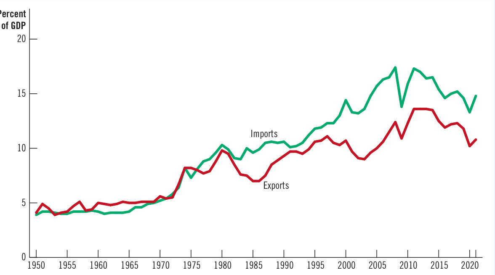
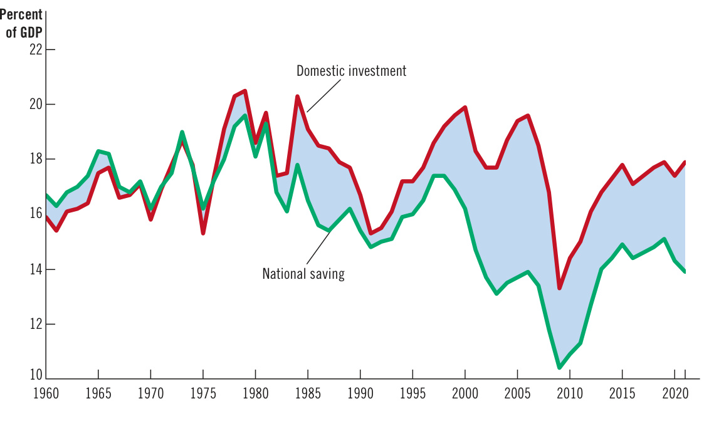
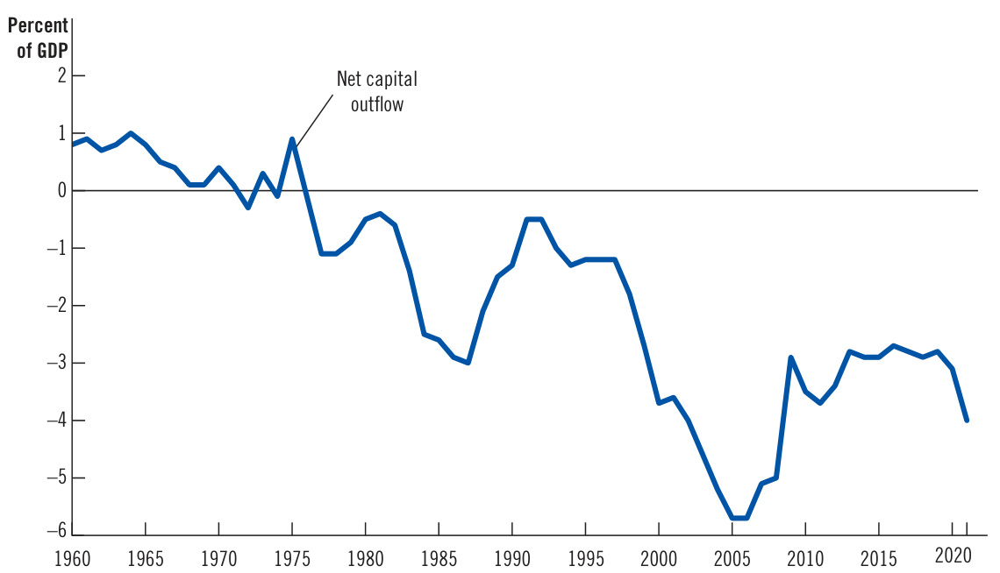
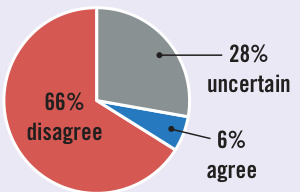
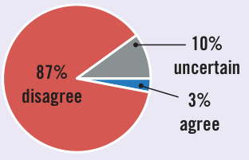
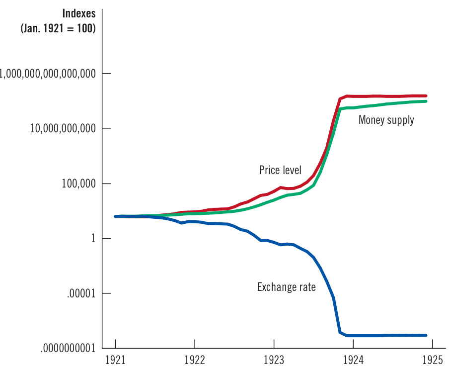

# Ch32 Open-Economy Macroeconomics: Basic Concepts  

W hen you shop for a car, you may compare the latest models from Ford and Toyota. When you take a vacation, you may consider spending it on a beach in Florida   
or in Mexico. When you save for retirement, you may choose   
between a mutual fund that buys stock in U.S. companies and   
one that buys stock in foreign companies. In all these cases, you   
are participating not just in the U.S. economy but also in econo  
mies around the world.  

International trade yields clear benefits: Trade allows people to focus on what they do best and to consume goods and services from around the world. That’s why one of the Ten Principles of Economics in Chapter 1 is that trade can make everyone better off. International trade can raise living standards in all countries by allowing each country to specialize in producing the goods and services for which it has a comparative advantage.  

So far, our study of macroeconomics has largely ignored the domestic economy’s interaction with the rest of the world. For most questions in macroeconomics, international issues are peripheral. For instance, for a basic discussion of frictional unemployment  

closed economy an economy that does not interact with other economies in the world open economy an economy that interacts freely with other economies around the world  

or the quantity theory of money, the effects of international trade can safely be ignored. Indeed, to simplify their models, macroeconomists often assume a closed economy—an economy that does not interact with other economies.  

Yet when macroeconomists study an open economy—one that interacts freely with other economies around the world—they encounter a whole set of new issues. This chapter and the next introduce open-economy macroeconomics. We first discuss the key macroeconomic variables that describe an open economy’s interactions in world markets. You may have heard of these variables—exports, imports, the trade balance, and exchange rates—from the news. This chapter explains what these data mean. The next chapter develops a model of how these variables are determined and how government policies affect them.  

## 32-1  The International Flows of Goods and Capital  

An open economy interacts with other economies in two ways: It buys and sells goods and services in world product markets, and it buys and sells capital assets such as stocks and bonds in world financial markets. Here we discuss these two activities and the close relationship between them.  

exports goods and services produced domestically and sold abroad  

imports goods and services produced abroad and sold domestically  

net exports the value of a nation’s exports minus the value of its imports; also called the trade balance  

trade balance   
the value of a nation’s   
exports minus the value   
of its imports; also called   
net exports   
trade surplus   
an excess of exports over   
imports   
trade deficit   
an excess of imports over   
exports  

balanced trade a situation in which exports equal imports  

## 32-1a  The Flow of Goods: Exports, Imports, and Net Exports  

Exports are goods and services that are produced domestically and sold abroad, and imports are goods and services that are produced abroad and sold domestically. When Boeing, the U.S. aircraft manufacturer, builds a plane and sells it to Air France, the sale is an export for the United States and an import for France. When Fiat, the Italian car company, makes a car and sells it to a U.S. resident, the sale is an import for the United States and an export for Italy.  

The net exports of any country are the difference between the value of its exports and the value of its imports:  

Net exports $=$ Value of country’s exports2Value of country’s imports.  

The Boeing sale raises U.S. net exports, and the Fiat sale reduces them. Because net exports tell us whether a country is, in sum, a seller or a buyer in world markets for goods and services, net exports are also called the trade balance. If a country’s net exports are positive, its exports exceed its imports, indicating that the country sells more goods and services abroad than it buys from other countries. In this case, the country is said to run a trade surplus. If a country’s net exports are negative, its exports are less than its imports, indicating that it sells fewer goods and services abroad than it buys from other countries. In this case, the country is said to run a trade deficit. If a country’s net exports are zero, its exports and imports are equal, and the country is said to have balanced trade.  

The next chapter develops a theory that explains an economy’s trade balance, but even at this early stage, it is easy to think of many factors that might influence a country’s exports, imports, and net exports. They include:  

●  Consumer tastes for domestic and foreign goods   
●  The prices of goods at home and abroad   
● The exchange rates at which people can use domestic currency to buy foreign currencies  

●  The incomes of consumers at home and abroad ●  The cost of transporting goods from country to country ● Government policies toward international trade  

  

## The Increasing Openness of the U.S. Economy  

A significant change in the U.S. economy over the past seven decades has been an increase in the importance of international trade and finance. It is illustrated in Figure 1, which shows the total value of goods and services exported and imported expressed as a percentage of GDP. Despite some short-term drops, such as during the pandemic of 2020, the general trend is upward. In the 1950s, imports and exports were typically between 4 and 5 percent of GDP. In recent years, they have been about two or three times that level. The trading partners of the United States include a diverse group of countries. As of 2021, the largest trading partners, as measured by the sum of imports and exports, were Mexico, Canada, and China, each of which represented about 14 percent of total U.S. trade, followed by Japan, Germany, South Korea, and the United Kingdom.  

“But we’re not just talking about buying a car—we’re talking about confronting this country’s trade deficit with Japan.”  

## Figure 1  

The Internationalization of the U.S. Economy  

This figure shows exports and imports of the U.S. economy as a percentage of U.S. GDP since 1950. The substantial increases over time show the increasing importance of international trade and finance.   
Source: U.S. Department of Commerce  

  

The tendency for international trade to increase during the past several decades is partly due to improvements in transportation. In 1950, the average merchant ship carried less than 10,000 tons of cargo; today, many ships carry more than 100,000 tons. The long-distance jet was introduced in 1958 and the wide-body jet in 1967, making air transport far cheaper than it had been previously. These developments have allowed goods that once had to be produced locally to be traded around the world. Cut flowers grown in Israel are flown to the United States to be sold. Fresh fruits and vegetables that can grow in the United States only in the summer can now be consumed there in the winter because they can be shipped from the Southern Hemisphere.  

Advances in telecommunications have also facilitated the increase in international trade by allowing businesses to reach overseas customers more easily. For example, the first transatlantic telephone cable was not laid until 1956. As recently as 1966, the technology allowed only 138 simultaneous conversations between North America and Europe. Today, thanks to e-mail and videoconferencing, it is often as easy to communicate with a customer across the world as it is to communicate with one across town.  

Technological progress has also fostered trade by changing the kinds of goods that economies produce. When bulky raw materials (such as steel) and perishable goods (such as foodstuffs) were a large part of the world’s output, transporting goods was often costly and sometimes impossible. By contrast, goods produced with modern technology are often light and easy to transport. Consumer electronics, for instance, have low weight for every dollar of value, making them easy to produce in one country and sell in another. An even more extreme example is the film industry. Once a studio in Hollywood makes a movie, it can send the film to audiences abroad at almost zero cost. And indeed, movies are a major export of the United States.  

For most of this period, governments’ trade policies were also a factor in increasing international trade. As we learned earlier in this book, economists have long believed that free trade between countries is mutually beneficial. Over time, most policymakers around the world have come to accept these conclusions. International agreements have gradually lowered tariffs, import quotas, and other trade barriers. These pacts include the General Agreement on Tariffs and Trade (GATT); the North American Free Trade Agreement (NAFTA), along with its successor, the United States–Mexico–Canada Agreement (USMCA); and many agreements between the United States and individual countries, such as Australia, Chile, Colombia, Panama, Singapore, and South Korea. Thus, the pattern of increasing trade shown in Figure 1 is a phenomenon that most policymakers have endorsed and encouraged.  

During his presidency, Donald Trump challenged these trends. He said that the United States failed to benefit from past trade agreements, and he used his authority to impose tariffs on many foreign goods. As this book was going to press, the intentions of the Biden administration were not yet entirely clear, though some reductions in the tariffs imposed by President Trump were underway. ●  

## 32-1b  The Flow of Financial Resources: Net Capital Outflow  

Residents of open economies participate not only in world markets for goods and services but also in world financial markets. A U.S. resident with $^{\S30,000}$ could use that money to buy a car from Toyota or stock in the Toyota Corporation. The first transaction would be a flow of goods, while the second would be a flow of capital.  

Net capital outflow $=$ Purchase of foreign assets by domestic residents 2Purchase of domestic assets by foreigners.  

When a U.S. resident buys stock in Petrobras, the Brazilian energy company, the purchase increases the first term on the right side of this equation and, therefore, increases U.S. net capital outflow. When a resident of Japan buys a bond issued by the U.S. government, the purchase increases the second term on the right side of this equation and, therefore, decreases U.S. net capital outflow.  

The flow of capital between the U.S. economy and the rest of the world takes two forms: foreign direct investment and foreign portfolio investment. An example of foreign direct investment is McDonald’s opening a fast-food outlet in Russia. An example of foreign portfolio investment is an American buying stock in a Russian corporation. In the first case, the American owner (McDonald’s Corporation) actively manages the investment, while in the second case, the American owner (the stockholder) has a more passive role. In both cases, U.S. residents are buying assets located in another country, so both purchases increase U.S. net capital outflow.  

The net capital outflow (sometimes called net foreign investment) can be either positive or negative. When it is positive, domestic residents are buying more foreign assets than foreigners are buying domestic assets, and capital is said to be flowing out of the country. When the net capital outflow is negative, domestic residents are buying fewer foreign assets than foreigners are buying domestic assets, and capital is said to be flowing into the country. That is, when net capital outflow is negative, a country is experiencing a capital inflow.  

The next chapter develops a theory to explain net capital outflow. In the meantime, let’s briefly consider some of the variables that influence it:  

●  The real interest rates paid on foreign assets   
●  The real interest rates paid on domestic assets   
●  The perceived economic and political risks of holding assets abroad The government policies that affect foreign ownership of domestic assets  

For example, consider U.S. investors deciding whether to buy Mexican government bonds or U.S. government bonds. (Recall that a bond is, in essence, an IOU of the issuer.) To make this decision, U.S. investors compare the real interest rates offered on the two bonds. The higher a bond’s real interest rate, the more attractive it is. While making this comparison, however, U.S. investors must also take into account the risk that one of these governments might default on its debt (that is, not pay interest or principal when it is due), as well as any restrictions that the Mexican government has imposed, or might impose in the future, on foreign investors in Mexico.  

## 32-1c  The Equality of Net Exports and Net Capital Outflow  

We have seen that an open economy interacts with the rest of the world in two ways—in markets for goods and services and in financial markets. Net exports and net capital outflow each measure a type of imbalance in these markets. Net exports measure an imbalance between a country’s exports and its imports. Net capital outflow measures an imbalance between the amount of foreign assets bought by domestic residents and the amount of domestic assets bought by foreigners.  

An important but subtle fact of accounting states that, for an economy as a whole, net capital outflow (NCO) equals net exports $(N X)$ :  

## $N C O=N X.$  

This equation holds because every transaction that affects one side of this equation affects the other side by the same amount. This equation is an identity—an equation that must hold because of how the variables in the equation are defined and measured.  

To see why this accounting identity is true, consider an example. Imagine that you are a computer programmer in the United States. One day, you write some software and sell it to a Japanese consumer for 10,000 yen. The sale of software is an export of the United States, so it increases U.S. net exports. What else happens to ensure that this identity holds? The answer depends on what you do with the 10,000 yen you are paid.  

First, suppose that you simply stuff the yen in your mattress. (We might say you have a yen for yen.) In this case, you are using some of your income to invest in the Japanese economy. That is, a domestic resident (you) has acquired a foreign asset (the Japanese currency). The increase in U.S. net exports is matched by an increase in the U.S. net capital outflow.  

But if you want to invest in the Japanese economy, you probably won’t do so by holding on to Japanese currency. More likely, you will use the 10,000 yen to buy stock in a Japanese corporation, or you might buy a Japanese government bond. Yet, from the standpoint of economic accounting, the result of your decision is much the same: A domestic resident ends up acquiring a foreign asset. The increase in U.S. net capital outflow (the purchase of the Japanese stock or bond) equals the increase in U.S. net exports (the sale of software).  

Now suppose that instead of using the 10,000 yen to buy a Japanese asset, you use it to buy a good made in Japan, such as a Sony TV. Because of your TV purchase, U.S. imports increase. Together, the software export and the TV import represent balanced trade. Because exports and imports increase by the same amount, net exports are unchanged. In this case, no American ends up acquiring a foreign asset, and no foreigner ends up acquiring a U.S. asset, so there is also no impact on U.S. net capital outflow.  

A final possibility is that you go to a local bank to exchange your 10,000 yen for U.S. dollars. But this decision doesn’t change the situation because the bank must now do something with the 10,000 yen. It can buy Japanese assets (a U.S. net capital outflow), it can buy a Japanese good (a U.S. import), or it can sell the yen to another American who wants to make such a transaction. In the end, U.S. net exports must equal U.S. net capital outflow.  

This example started with a U.S. programmer selling some software abroad, but the story is much the same when Americans buy goods and services from other countries. For example, if Walmart buys $\mathbb{S}50$ million of clothing from China and sells it to American consumers, something must happen to that $\mathbb{S}50$ million. China could invest the $\mathbb{S}50$ million in the U.S. economy. This capital inflow from China might take the form of Chinese purchases of U.S. government bonds. In this case, the purchase of the clothing reduces U.S. net exports, and the sale of bonds reduces U.S. net capital outflow. Alternatively, China could use the $\mathbb{S}50$ million to buy a plane from Boeing, the U.S. aircraft manufacturer. In this case, the U.S. import of clothing balances the U.S. export of aircraft, so net exports and net capital outflow are both unchanged. In all cases, the transactions have the same effect on net exports and net capital outflow.  

When a nation is running a trade surplus $(N X>0)$ ), it is selling more goods and services to foreigners than it is buying from them. What is it doing with the foreign currency it receives from the net sale of goods and services abroad? It must be using it to buy foreign assets. Capital is flowing out of the country $(N C O>0)$ ). When a nation is running a trade deficit $(N X<0)$ ), it is buying more goods and services from foreigners than it is selling to them. How is it financing the net purchase of these goods and services in world markets? It must be selling assets abroad. Capital is flowing into the country $(N C O<0)$ ).  

The international flow of goods and services and the international flow of capital are two sides of the same coin.  

## 32-1d   Saving, Investment, and Their Relationship to International Flows  

A nation’s saving and investment are crucial to its long-run economic growth. As an earlier chapter explained, in a closed economy, saving equals investment. But matters are not as simple in an open economy. We now consider how saving and investment are related to the international flows of goods and capital as measured by net exports and net capital outflow.  

As you may recall, the term net exports appeared earlier in the book when we introduced gross domestic product. The economy’s GDP (denoted Y) is divided among four components: consumption $(C)$ , investment $(I)$ , government purchases $(G)_{\cdot}$ , and net exports (NX). We write this as  

$$
\begin{array}{r}{Y=C+I+G+N X.}\end{array}
$$  

The total expenditure on the economy’s output of goods and services is the sum of expenditure on consumption, investment, government purchases, and net exports. Because each dollar of expenditure is placed into one of these four components, this equation is an accounting identity: It must be true because of the way the variables are defined and measured.  

Recall that national saving is the income of the nation that is left after paying for current consumption and government purchases. National saving (S) equals $Y-C-G.$ . If we rearrange the equation to reflect this fact, we obtain  

$$
\begin{array}{r}{Y-C-G=I+N X}\\ {S=I+N X.}\end{array}
$$  

Because net exports $(N X)$ also equal net capital outflow (NCO), we can write this equation as  

$$
\begin{array}{c}{{S\,=\,\qquad I\qquad+\quad N C O}}\\ {{\mathrm{Saving}=\,\mathrm{Domestic}\qquad}}\\ {{\mathrm{Saving}=\qquad\mathrm{investment}\qquad\mathrm{outflow}}}\end{array}
$$  

This equation states that a nation’s saving must equal its domestic investment plus its net capital outflow. In other words, when a U.S. household saves a dollar of its income for the future, that dollar can be used to finance either the accumulation of domestic capital or the purchase of foreign capital.  

This equation may look familiar. Earlier in the book, when analyzing the financial system, we saw this identity for the special case of a closed economy. In a closed economy, net capital outflow is zero $(N C O=0)$ ), so saving equals investment $\left[S=I\right]$ . By contrast, an open economy has two uses for its saving: domestic investment and net capital outflow.  

As before, the financial system can be seen as standing between the two sides of this identity. For example, suppose the Garcia family decides to save some of its income for retirement. This decision contributes to national saving, the left side of the equation. If the Garcias deposit their saving in a mutual fund, the fund may use some of the deposit to buy stock issued by General Motors, which uses the proceeds to build a factory in Ohio. In addition, the mutual fund may use some of the Garcias’ deposit to buy stock issued by Toyota, which uses the proceeds to build a factory in Osaka. These transactions show up on the right side of the equation. From the standpoint of U.S. accounting, the General Motors expenditure on the factory is domestic investment, and the purchase of Toyota stock by a U.S. resident is net capital outflow. Thus, all saving in the U.S. economy shows up as investment in the U.S. economy or as U.S. net capital outflow.  

The bottom line is that saving, investment, and international capital flows are inextricably linked. When a nation’s saving exceeds its domestic investment, its net capital outflow is positive, indicating that the nation is using some of its saving to buy assets abroad. When a nation’s domestic investment exceeds its saving, its net capital outflow is negative, indicating that foreigners are financing some of this investment by purchasing domestic assets.  

## 32-1e  Summing Up  

Table 1 summarizes many of these ideas. It describes the three possibilities for an open economy: a country with a trade deficit, a country with balanced trade, and a country with a trade surplus.  

Consider first a country with a trade surplus. By definition, a trade surplus means that the value of exports exceeds the value of imports. Because net exports are exports minus imports, net exports, NX, are positive. As a result, income, $\begin{array}{r}{Y=C+I+G+N X,}\end{array}$ exceeds domestic spending, $C+I+G$ . But if income, $\boldsymbol{Y},$ is more than spending, $C+I+G,$ then saving, $S=Y-C-G,$ must be more than investment, $I.$ Because the country is saving more than it is investing, it must be sending some of its saving abroad. That is, the net capital outflow must be positive.  

International Flows of Goods and Capital: Summary This table shows the three possible outcomes for an open economy.  

Table 1   

<html><body><table><tr><td>TradeDeficit</td><td>BalancedTrade</td><td>Trade Surplus</td></tr><tr><td>Exports <Imports</td><td>Exports = Imports</td><td>Exports >| Imports</td></tr><tr><td>NetE Exports< 0</td><td>NetE Exports =0</td><td>NetE Exports ></td></tr><tr><td>Y<C+I+G</td><td>Y=C+/+G</td><td>Y>C+/+G</td></tr><tr><td>Saving <Investment</td><td>Saving = Investment</td><td>Saving > Investment</td></tr><tr><td>Net Capital Outflow<O</td><td>Net Capital Outflow = 0</td><td>Net Capital Outflow> O</td></tr></table></body></html>  

Similar logic applies to a country with a trade deficit (such as the U.S. economy in recent years). By definition, a trade deficit means that the value of exports is less than the value of imports. Because net exports are exports minus imports, net exports, $N X,$ are negative. Thus, income, $\begin{array}{r}{Y=C+I+G+N X,}\end{array}$ must be less than domestic spending, $C+I+G$ . But if income, $\boldsymbol{Y},$ is less than spending, $C+I+G,$ then saving, $S=Y-C-G,$ must be less than investment, I. Because the country is investing more than it is saving, it must be financing some domestic investment by selling assets abroad. That is, the net capital outflow must be negative.  

A country with balanced trade falls between these cases. Exports equal imports, so net exports are zero. Income equals domestic spending, and saving equals investment. The net capital outflow equals zero.  

## Is the U.S. Trade Deficit a National Problem?  

You may have heard the United States called “the world’s largest debtor.” It earned that description by borrowing heavily in world financial markets during the past four decades to finance large trade deficits. Why did the United States do this, and should this practice give Americans reason to worry?  

To answer these questions, let’s see what the macroeconomic accounting identities tell us about the U.S. economy. Panel (a) of Figure 2 shows national saving and domestic investment as a percentage of GDP since 1960. Panel (b) shows net capital outflow (that is, the trade balance) as a percentage of GDP. Notice that, as the identities require, net capital outflow always equals national saving minus domestic investment. The figure shows that both national saving and domestic investment as a percentage of GDP fluctuate substantially over time. Before 1980, they tended to fluctuate together, so the net capital outflow was typically small—between $-1$ and 1 percent of GDP. Since 1980, national saving has often fallen well below domestic investment, leading to sizable trade deficits and substantial inflows of capital. That is, in recent decades, the net capital outflow has often been a large negative number.  

The fluctuations in Figure 2 may seem bewildering. They have been the source of much controversy in American politics. To reach a deeper understanding, we need to go beyond these data and discuss the policies and events that influence national saving and domestic investment. History shows that there is no single cause of trade deficits. Rather, they can arise under a variety of circumstances. Here are four historical episodes.  

Unbalanced fiscal policy: From 1980 to 1987, the flow of capital into the United States went from 0.5 to 2.9 percent of GDP. This 2.4 percentage point change is largely attributable to a fall in national saving of 2.7 percentage points. The decline in national saving, in turn, is often explained by the reduction in public saving— that is, the increase in the government budget deficit. These budget deficits arose because President Ronald Reagan cut taxes and increased defense spending without enacting his proposed cuts in nondefense spending.  

An investment boom: A different story explains the trade deficits that arose during the next decade. From 1991 to 2000, the capital flow into the United States went from 0.5 to 3.7 percent of GDP. None of this 3.2 percentage point change is attributable to a decline in saving; in fact, saving increased over this time as the government’s budget switched from deficit to surplus. But investment went from 15.3 to 19.9 percent of GDP as information technology saw tremendous advances, and many firms were eager to make high-tech investments.  

## Figure 2  

## National Saving, Domestic Investment, and Net Capital Outflow  

Panel (a) shows national saving and domestic investment as a percentage of GDP. Panel (b) shows net capital outflow as a percentage of GDP. You can see from the figure that national saving has been lower since 1980 than it was before 1980. This fall in national saving has been reflected primarily in reduced net capital outflow rather than in reduced domestic investment.  

Source: U.S. Department of Commerce.  

  
(b) Net Capital Outflow (as a percentage of GDP)  

  

An economic downturn and recovery: From 2000 to 2019, the capital flow into the United States remained large. The consistency of this variable, however, stands in stark contrast to the remarkable changes in saving and investment. From 2000 to 2009, both fell by about 6 percentage points. Investment dropped because tough economic times made capital accumulation less profitable, while national saving declined because the government began running extraordinarily large budget deficits in response to the recession of 2008–2009. From 2009 to 2019, as the economy recovered, these forces reversed themselves, and both saving and investment increased by more than 4 percentage points.  

Pandemic spending: From 2019 to 2021, the U.S. trade deficit and capital inflow increased by 1.2 percentage points. This change is entirely attributable to a decline in national saving. During this time, the federal government vastly increased government spending in response to the Covid-19 pandemic, leading to large budget deficits and lower national saving.  

Are these trade deficits and international capital flows a problem for the U.S. economy? There is no easy answer. One must evaluate the circumstances and possible alternatives.  

Consider first a trade deficit induced by a fall in saving, as occurred during the 1980s. Lower saving means that the nation is putting away less income to provide for the future. Once national saving has fallen, however, there is no reason to deplore the resulting trade deficits. If national saving fell without inducing a trade deficit, investment in the United States would have to fall. This fall in investment, in turn, would adversely affect the growth in the capital stock, labor productivity, and real wages. In other words, once U.S. saving has declined, it is better to have foreigners invest in the U.S. economy than no one at all.  

Now consider a trade deficit induced by an investment boom, like the trade deficits of the 1990s. In this case, the economy is borrowing from abroad to finance the purchase of new capital goods. If this additional capital provides a good return in the form of higher production of goods and services, then the economy should be able to handle the debts it has accumulated. On the other hand, if the investment projects fail to yield the expected returns, the debts will look less desirable, at least with the benefit of hindsight.  

Just as an individual can go into debt in either a prudent or a profligate manner, so can a nation. A trade deficit is not a problem in itself, but it can sometimes be a symptom of a problem.  

“A typical country can increase its citizens’ welfare by enacting policies that would increase its trade surplus (or decrease its trade deficit).”  

  
What do economists say?  

“An important reason why many workers in Michigan and Ohio have lost jobs in recent years is because U.S. presidential administrations over the past 30 years have not been tough enough in trade negotiations.”  

  
What do economists say?  

## QuickQuiz  

1. As a percentage of U.S. GDP, exports are now and imports are now than they were in 1950.  

a. higher; higher b. lower; lower c. higher; lower d. lower; higher  

2. In an open economy, national saving equals domestic investment  

a. plus the government’s budget deficit.   
b. minus the net exports of goods and services.   
c. plus the net outflow of capital.   
d. minus foreign portfolio investment.  

3. If the value of a nation’s imports exceeds the value of its exports, which of the following is NOT true?  

a. Net exports are negative.   
b. GDP is less than the sum of consumption, investment, and government purchases.   
c. Domestic investment exceeds national saving.   
d. The nation is experiencing a net outflow of capital.  

## 32-2   The Prices for International Transactions: Real and Nominal Exchange Rates  

So far, we have discussed measures of the flow of goods and services and the flow of capital across a nation’s border. In addition to these quantity variables, macroeconomists also study the prices at which these international transactions take place. Just as the price in any market coordinates buyers and sellers, international prices coordinate consumers, producers, and investors as they interact in world markets. Two of the most important of these international prices are the nominal and real exchange rates.  

## 32-2a  Nominal Exchange Rates  

nominal exchange rate the rate at which a person can trade the currency of one country for the currency of another  

The nominal exchange rate tells you how much you will receive if you trade the currency of one country for the currency of another. For example, when you go to a bank, you might see a posted exchange rate of 80 yen per dollar. If you give the bank 1 U.S. dollar, you will receive 80 Japanese yen in return, and if you give the bank 80 Japanese yen, you will receive 1 U.S. dollar. (In actuality, the bank posts slightly different prices for buying and selling yen. The difference compensates the bank for offering this service. For our purposes, we can ignore this detail.)  

An exchange rate can always be expressed in two ways. If the exchange rate is 80 yen per dollar, it is also $1/80$ ( $\mathrm{\Delta=0.0125}$ ) dollar per yen. This book expresses the nominal exchange rate as units of foreign currency per U.S. dollar, such as 80 yen per dollar.  

## appreciation  

an increase in the value of a currency as measured by the amount of foreign currency it can buy  

## depreciation  

a decrease in the value of a currency as measured by the amount of foreign currency it can buy  

If the exchange rate changes so a dollar buys more foreign currency, that change is called an appreciation of the dollar. If the exchange rate changes so a dollar buys less foreign currency, that is a depreciation of the dollar. For example, when the exchange rate rises from 80 to 90 yen per dollar, the dollar is said to appreciate. At the same time, because a Japanese yen now buys less of the U.S. currency, the yen is said to depreciate. When the exchange rate falls from 80 to 70 yen per dollar, the dollar is said to depreciate, and the yen is said to appreciate.  

At times, you may have heard that the dollar is either “strong” or “weak.” These descriptions usually refer to recent changes in the nominal exchange rate. When a currency appreciates, it is said to strengthen because it can then buy more foreign currency. Similarly, when a currency depreciates, it is said to weaken. Perhaps because the word “strong” is more stirring than the word “weak,” government officials are prone to say that they favor a strong currency. From an economist’s standpoint, however, exchange rates are just prices, and there is nothing inherently better about them being high or low.  

For any country, there are many nominal exchange rates. The U.S. dollar can be used to buy Japanese yen, British pounds, Mexican pesos, and so on. When economists study changes in the exchange rate, they often use indexes that average these rates. Just as the consumer price index turns the vast number of prices in the economy into a single measure of the price level, an exchange-rate index turns many exchange rates into a single measure of a currency’s international value. So when economists talk about the dollar appreciating or depreciating, they often are referring to an exchange-rate index that includes many individual exchange rates.  

ou may have once heard of, or perhaps even seen, a French franc, a German mark, or an Italian lira. These former national currencies no longer function as money. During the 1990s, many European nations decided to give up their national currencies and instead use a common currency called the euro. The euro started circulating on January 1, 2002, when 12 nations began using it as their official money. As of 2021, the euro is used in about two dozen nations, encompassing 340 million people. A number of other European countries, however, have kept their own currencies, including the United Kingdom, Norway, Sweden, Denmark, Bulgaria, and the Czech Republic.  

Monetary policy for the euro area is set by the European Central Bank (ECB), which brings together representatives from all the participating countries. The ECB issues the euro and controls the supply of this money, much as the Federal Reserve controls the supply of dollars in the U.S. economy.  

Why did these countries adopt a common currency? One benefit is that it makes trade easier. Imagine if each of the 50 U.S. states had a different currency. Every time you crossed a state border, you would need to change your money. And when comparing prices in different states, you would have to perform the kind of exchange-rate calculations discussed in the text. This would be inconvenient, and it might deter you from buying goods and services outside your own state. The countries of Europe decided that as their economies became more integrated, it would be better to avoid this inconvenience.  

  

To some extent, the adoption of a common currency in Europe was a political decision that went beyond economic concerns. Some advocates of the euro wanted to reduce nationalistic feelings and to make Europeans appreciate more fully their shared history and destiny. A single money for most of the continent, they argued, would help achieve this goal. There are, however, costs to adopting a common currency. When nations use the same money, they are committing to sharing a single monetary policy. If they disagree about what monetary policy is best, they will have to compromise, rather than each country going its own way. Because a common currency has both  

benefits and costs, economists differ on whether Europe’s adoption of the euro has been a good decision.  

From 2010 to 2015, the question of the euro as a pan-European currency heated up as several European nations dealt with economic difficulties. Greece, in particular, had run up a large government debt and found itself facing possible default. As a result, it had to raise taxes and cut back government spending substantially. Some observers suggested that dealing with these problems would have been easier if the Greek government had had an additional tool—a national monetary policy. The possibility of Greece leaving the euro area and reintroducing its own currency was discussed, but in the end, that outcome did not occur. ■  

## 32-2b  Real Exchange Rates  

The real exchange rate is the rate at which you can trade the goods and services of one country for those of another. For example, if you go shopping and find that a pound of Swiss cheese is twice as expensive as a pound of American cheese, the real exchange rate is $\%$ pound of Swiss cheese per pound of American cheese. Notice that, like the nominal exchange rate, the real exchange rate is expressed as units of the foreign item per unit of the domestic item. But in this instance, the item is a good rather than a currency.  

Real and nominal exchange rates are closely related. For example, suppose that a bushel of American rice sells for $\mathbb{S}100$ , and a bushel of Japanese rice sells for 16,000 yen. What is the real exchange rate between American and Japanese rice? To answer this question, we must first use the nominal exchange rate to convert the prices into a common currency. If the nominal exchange rate is 80 yen per dollar,  

## real exchange rate  

the rate at which a person can trade the goods and services of one country for the goods and services of another  

then the price for American rice of $\mathbb{S}100$ per bushel is equivalent to 8,000 yen per bushel. American rice is half as expensive as Japanese rice. The real exchange rate is $\%$ bushel of Japanese rice per bushel of American rice.  

We can summarize this calculation for the real exchange rate with the following formula:  

## Using the numbers in our example, the formula applies as follows:  

$$
\begin{array}{r l}&{\mathrm{Real\;exchange\;rate=\frac{\displaystyle(80\;yen/\mathrm{dollar})\times(\xi\mathrm{\&}100/\mathrm{bushel\;of\;American\;rice})}{\displaystyle16,000\;y e n/\mathrm{bushel\;of\;Japanese\;rice}}}\\ &{\,\,\,\,\,\,\,\,\,\,\,\,\,\,\,\,\,\,\,\,\,\,\,\,\,\,\,\,\,\,\,\,\,\,\,\,\,\,\,\,\,\,\,\,\,\,\,=\frac{\displaystyle8,000\;y e n/b u s h e l\;o f\;A m e r i c a n\;r i c e}{\displaystyle16,000\;y e n/b u s h e l\;o f\;\mathrm{Japanese\;rice}}}\\ &{\,\,\,\,\,\,\,\,\,\,\,\,\,\,\,\,\,\,\,\,\,\,\,\,\,\,\,=\mathcal{N}_{2}\;\mathrm{bushel\;of\;Japanese\;rice}/\mathrm{bushel\;of\;American\;rice}.}\end{array}
$$  

Thus, the real exchange rate depends on the nominal exchange rate and on the prices of goods in the two countries measured in the local currencies.  

The real exchange rate is a key determinant of how much a country exports and imports. When Ben’s Original is deciding whether to buy U.S. rice or Japanese rice to put into its boxes, it will ask which rice is cheaper. The real exchange rate gives the answer. As another example, imagine that you are deciding whether to take a seaside vacation in Miami, Florida, or in Cancún, Mexico. You might ask your travel agent the price of a hotel room in Miami (measured in dollars), the price of a hotel room in Cancún (measured in pesos), and the exchange rate between pesos and dollars. If you decide where to vacation by comparing costs, you are basing your decision on the real exchange rate.  

When studying an economy as a whole, macroeconomists focus on overall prices rather than the prices of individual items. That is, to measure the real exchange rate, they use price indexes, such as the consumer price index, which measure the price of a basket of goods and services. By using a price index for a U.S. basket $(P)$ , a price index for a foreign basket $(P^{*})$ , and the nominal exchange rate between the U.S. dollar and foreign currencies $(e)$ , we can compute the overall real exchange rate between the United States and other countries as follows:  

$$
{\mathrm{Real}}\operatorname{exchange}{\mathrm{rate}}=(e\times P)/P^{*}.
$$  

This real exchange rate measures the price of a basket of goods and services available domestically relative to a basket of goods and services available abroad.  

As the next chapter will discuss more fully, a country’s real exchange rate is a key determinant of its net exports of goods and services. A depreciation (fall) in the U.S. real exchange rate means that U.S. goods have become cheaper compared with foreign goods. This change encourages consumers both at home and abroad to buy more from the United States and less from other countries. As a result, U.S. exports rise, and U.S. imports fall. Both of these changes increase U.S. net exports. Conversely, an appreciation (rise) in the U.S. real exchange rate means that U.S. goods have become more expensive compared with foreign goods, so U.S. net exports decline.  

4. If a nation’s currency doubles in value on foreign exchange markets, the currency is said to reflecting a change in the exchange rate.  

a. appreciate; nominal b. appreciate; real c. depreciate; nominal d. depreciate; real  

5. If the U.S. dollar appreciates and prices remain the same at home and abroad, foreign goods become expensive relative to American goods, pushing the U.S. trade balance toward  

a. more; surplus b. more; deficit c. less; surplus d. less; deficit  

6. The dollar-yen exchange rate falls from 100 to 80 yen per dollar. At the same time, the price level in the United States rises from 180 to 200, and the price level in Japan remains the same. As a result, a. American goods have become more expensive relative to Japanese goods. b. American goods have become less expensive relative to Japanese goods. c. the relative price of American and Japanese goods has not changed. d. both American and Japanese goods have become relatively less expensive.  

## 32-3   A First Theory of Exchange-Rate Determination: Purchasing-Power Parity  

Exchange rates vary substantially over time. In 1970, a U.S. dollar could buy 3.65 German marks or 627 Italian lira. In 1998, as both Germany and Italy were getting ready to adopt the euro as their common currency, a U.S. dollar could buy 1.76 German marks or 1,737 Italian lira. In other words, over this period, the value of the dollar fell by more than half compared with the mark, while it more than doubled compared with the lira.  

What explains these large and opposite changes? Economists have developed many models to explain how exchange rates are determined, each emphasizing some of the forces at work. Here we consider a simple theory, called purchasing-power parity, which is generally believed to describe the forces that influence exchange rates in the long run. It states that a unit of any given currency should be able to buy the same quantity of goods in all countries. Let’s consider the theory’s logic as well as its implications and limitations.  

## 32-3a  The Basic Logic of Purchasing-Power Parity  

The theory of purchasing-power parity is based on a principle called the law of one price. This law asserts that a good must sell for the same price in all locations. Otherwise, there would be opportunities for profit left unexploited. For example, suppose that coffee beans sold for less in Seattle than in Dallas. A person could buy coffee in Seattle for, say, $\mathbb{S4}$ a pound and then sell it in Dallas for $\mathbb{55}$ a pound, making a profit of $\mathbb{S}1$ per pound from the difference in price. The process of taking advantage of price differences for the same item in different markets is called arbitrage. In this example, as people took advantage of the arbitrage opportunity, they would increase the demand for coffee in Seattle and increase the supply in Dallas. The price of coffee would rise in Seattle (in response to greater demand) and fall in Dallas (in response to greater supply). This process would continue until, eventually, the prices were the same in the two markets.  

## purchasing-power parity  

a theory of exchange rates that says a unit of any given currency should be able to buy the same quantity of goods in all countries  

Now consider how the law of one price applies to the international marketplace. If a dollar (or any other currency) could buy more coffee in the United States than in Japan, international traders could profit by buying coffee in the United States and selling it in Japan. This export of coffee from the United States to Japan would drive up the U.S. price of coffee and drive down the Japanese price. Conversely, if a dollar could buy more coffee in Japan than in the United States, traders could buy coffee in Japan and sell it in the United States. This import of coffee into the United States from Japan would drive down the U.S. price of coffee and drive up the Japanese price. In the end, the law of one price tells us that a dollar must buy the same amount of coffee in all countries.  

This logic leads to the theory of purchasing-power parity. According to this theory, a currency must have the same purchasing power in all countries. That is, a U.S. dollar must buy the same quantity of goods in the United States and Japan, and a Japanese yen must buy the same quantity of goods in Japan and the United States. The name of this theory describes it well. Parity means equality, and purchasing power refers to the value of money in terms of the quantity of goods it can buy. Purchasing-power parity states that a unit of a currency must have the same real value in every country.  

## 32-3b  Implications of Purchasing-Power Parity  

What does the theory of purchasing-power parity say about exchange rates? It tells us that the nominal exchange rate between the currencies of two countries depends on the price levels in those countries. If a dollar buys the same quantity of goods in the United States (where prices are measured in dollars) as in Japan (where prices are measured in yen), then the number of yen per dollar must reflect the prices of goods in the United States and Japan. For example, if a pound of coffee costs 500 yen in Japan and $\mathbb{S5}$ in the United States, then the nominal exchange rate must be 100 yen per dollar (500 yen/ $^{\prime}\mathbb{S}5=100$ yen per dollar). Otherwise, the purchasing power of the dollar would not be the same in the two countries.  

To see more fully how this works, it is helpful to use just a bit of mathematics. Suppose that $P$ is the price of a basket of goods in the United States (measured in dollars), $P^{*}$ is the price of a basket of goods in Japan (measured in yen), and $e$ is the nominal exchange rate (the number of yen a dollar can buy). Now consider the quantity of goods a dollar can buy at home and abroad. At home, the price level is $P.$ , so the purchasing power of $\mathbb{S}1$ at home is $1/P$ . That is, a dollar can buy $1/P$ units of goods. Abroad, a dollar can be exchanged into $e$ units of foreign currency, which in turn have purchasing power $e/P^{*}$ . For the purchasing power of a dollar to be the same in the two countries, it must be the case that  

$$
1/P=e/P^{*}.
$$  

With rearrangement, this equation becomes  

$$
1=e P/P^{*}.
$$  

Notice that the left side of this equation is a constant, and the right side is the real exchange rate. If the purchasing power of the dollar is always the same at home and abroad, then the real exchange rate—the relative price of domestic and foreign goods—cannot change.  

To see the implication of this analysis for the nominal exchange rate, we can rearrange the last equation to solve for the nominal exchange rate:  

$$
e=P^{*}/P.
$$  

That is, the nominal exchange rate equals the ratio of the foreign price level (measured in units of the foreign currency) to the domestic price level (measured in units of the domestic currency). According to the theory of purchasing-power parity, the nominal exchange rate between the currencies of two countries must reflect the price levels in those countries.  

A key implication of purchasing-power parity is that nominal exchange rates change when price levels change. As the preceding chapter explained, the price level in any country adjusts to bring the quantity of money supplied and the quantity of money demanded into balance. Because the nominal exchange rate depends on the price levels, it also depends on the money supply and demand in each country. When a central bank in any country increases the money supply and causes the price level to rise, it also causes that country’s currency to depreciate relative to other currencies in the world. In other words, when the central bank prints large quantities of money, that money loses value both in terms of the goods and services it can buy and in terms of the amount of other currencies it can buy.  

We can now answer the question that began this section: Why did the U.S. dollar lose value compared with the German mark and gain value compared with the Italian lira? The answer is that Germany pursued a less inflationary monetary policy than the United States, and Italy pursued a more inflationary monetary policy. From 1970 to 1998, inflation in the United States was 5.3 percent per year. By contrast, inflation was 3.5 percent in Germany and 9.6 percent in Italy. As U.S. prices rose relative to German prices, the value of the dollar fell relative to the mark. Similarly, as U.S. prices fell relative to Italian prices, the value of the dollar rose relative to the lira.  

Germany and Italy now have a common currency—the euro. Sharing a currency means that the two countries share a single monetary policy and, as a result, have similar inflation rates. But the historical lessons of the lira and the mark will apply to the euro as well. Whether the U.S. dollar buys more or fewer euros 20 years from now than it does today depends on whether the European Central Bank generates more or less inflation in Europe than the Federal Reserve does in the United States.  

## The Nominal Exchange Rate during a Hyperinflation  

Macroeconomists can only rarely conduct controlled experiments.  

Most often, they must glean what they can from the natural experiments that history gives them. One natural experiment is   
hyperinflation—the high inflation that arises when a government turns to the   
printing press to pay for large amounts of government spending. Because hyperin  
flations are so extreme, they illustrate some basic economic principles with clarity. Consider the German hyperinflation of the early 1920s. Figure 3 shows the   
German money supply, the German price level, and the nominal exchange rate   
(measured as U.S. cents per German mark) for that period. Notice that these series   
move closely together. When the supply of money starts growing quickly, the price   
level also takes off, and the German mark depreciates. When the money supply   
stabilizes, so do the price level and the exchange rate. The pattern shown in this figure appears during every hyperinflation. It leaves  

no doubt that there is a fundamental link among money, prices, and the nominal exchange rate. The quantity theory of money discussed in the previous chapter explains how the money supply affects the price level. The theory of purchasingpower parity discussed here explains how the price level affects the nominal exchange rate. ●  

## Figure 3  

## Money, Prices, and the Nominal Exchange Rate during the German Hyperinflation  

This figure shows the money supply, the price level, and the nominal exchange rate (measured as U.S. cents per mark) for the German hyperinflation from January 1921 to December 1924. Notice how similarly these three variables move. When the quantity of money started growing quickly, the price level followed, and the mark depreciated relative to the dollar. When the German central bank stabilized the money supply, the price level and exchange rate stabilized as well.  

Source: Adapted from Thomas J. Sargent, “The End of Four Big Inflations,” in Robert Hall, ed., Inflation (Chicago: University of Chicago Press, 1983), pp. 41–93.  

  

## 32-3c  Limitations of Purchasing-Power Parity  

Purchasing-power parity provides a simple model of how exchange rates are determined. For understanding many economic phenomena, the theory works well. In particular, it can explain some important long-term trends, such as the depreciation of the U.S. dollar against the German mark and the appreciation of the U.S. dollar against the Italian lira. It can also explain the major changes in exchange rates that occur during hyperinflations.  

Yet the theory of purchasing-power parity is not completely accurate. That is, exchange rates do not always move to ensure that a dollar has the same real value in all countries all the time. There are two reasons the theory of purchasing-power parity does not always hold in practice.  

The first is that many goods are not easily traded. Imagine, for instance, that haircuts are more expensive in Paris than in New York. International travelers might avoid getting their haircuts in Paris, and some haircutters might move from New York to Paris. Yet such arbitrage would be too limited to eliminate the differences in prices. The deviation from purchasing-power parity might persist, and a dollar (or euro) would continue to buy less of a haircut in Paris than in New York.  

The second reason that purchasing-power parity does not always hold is that even tradable goods are not always perfect substitutes when they are produced in different countries. For example, some consumers prefer German cars, and others prefer American cars. Moreover, consumer tastes can change over time. If German cars suddenly become more popular, the increase in demand will drive up the price of German cars relative to American cars. Despite this difference in prices in the two markets, there might be no opportunity for profitable arbitrage because consumers do not view the two country’s cars as equivalent.  

Both because some goods are not tradable and because some tradable goods are not perfect substitutes for their foreign counterparts, purchasing-power parity is not a perfect theory of exchange-rate determination. For these reasons, real exchange rates fluctuate over time. Nonetheless, the theory of purchasing-power parity does provide a useful first step in understanding exchange rates. The basic logic is persuasive: As the real exchange rate drifts from the level predicted by purchasing-power parity, people have a greater incentive to move goods across national borders. Even if the forces of purchasing-power parity do not completely fix the real exchange rate, they provide a reason to expect that changes in the real exchange rate are most often small or temporary. As a result, large and persistent movements in nominal exchange rates typically reflect changes in price levels at home and abroad.  

## The Hamburger Standard  

  

When economists apply the theory of purchasing-power parity to explain exchange rates, they need data on the prices of a basket of goods available in different countries. One analysis of this sort is conducted by The Economist, an international news magazine. The magazine occasionally collects data on a basket of goods consisting of “two all-beef patties, special sauce, lettuce, cheese, pickles, onions, on a sesame seed bun.” It’s called the ${}^{\prime\prime}{\mathrm{Big~Mac}}^{\prime\prime}$ and is sold by McDonald’s around the world.  

Once we have the prices of Big Macs in two countries denominated in the local currencies, we can compute the exchange rate predicted by the theory of purchasing-power parity. The predicted exchange rate is the one that makes the cost of a Big Mac the same in the two countries. For instance, if the price of a Big Mac is $\mathbb{55}$ in the United States and 500 yen in Japan, purchasing-power parity would predict an exchange rate of 100 yen per dollar.  

How well does purchasing-power parity work when applied using Big Mac prices? Here are some examples from July 2021, when the price of a Big Mac was $\mathbb{S}5.65\$ in the United States:  

  

You can find a Big Mac almost anywhere you look.  

<html><body><table><tr><td>Country</td><td>Price of a Big Mac</td><td>Predicted Exchange Rate</td><td>Actual ExchangeRate</td></tr><tr><td>Indonesia</td><td>34,000rupiah</td><td>6,018 rupiah/$</td><td>14,517 rupiah/$</td></tr><tr><td>South Korea</td><td>4,600 won</td><td>814 won/$</td><td>1,150 won/$</td></tr><tr><td>Japan</td><td>390 yen</td><td>69 yen/$</td><td>110 yen/$</td></tr><tr><td>Mexico</td><td>64 pesos</td><td>11.3 pesos/$</td><td>20.1 pesos/$</td></tr><tr><td>Sweden</td><td>54 krona</td><td>9.6 krona/$</td><td>8.7 krona/$</td></tr><tr><td>China</td><td>22.4renminbi</td><td>4.0 renminbi/$</td><td>6.5 renminbi/$</td></tr><tr><td>Euroarea</td><td>4.27 euros</td><td>0.76 euros/$</td><td>0.85euros/$</td></tr><tr><td>Britain</td><td>3.49 9pounds</td><td>0.62 pounds/$</td><td>0.73 pounds/$</td></tr></table></body></html>  

You can see that the predicted and actual exchange rates are not exactly the same. After all, international arbitrage in Big Macs is not easy. Yet the two exchange rates are often in the same ballpark. The theory predicts, for example, that a dollar can buy the most rupiahs and the fewest pounds, and that is the case. Purchasingpower parity is far from a precise theory of exchange rates, but it can provide a reasonable first approximation. ●  

7. If a cup of coffee costs 2 euros in Paris and $\mathbb{56}$ in New York and purchasing-power parity holds, what is the exchange rate?  

a. 1/4 euro per dollar b. 1/3 euro per dollar c. 3 euros per dollar d. 4 euros per dollar  

8. The theory of purchasing-power parity says that higher inflation in a nation causes the nation’s currency to , leaving the exchange rate unchanged.  

a. appreciate; nominal b. appreciate; real c. depreciate; nominal d. depreciate; real  

Answers are at the end of the chapter.  

## 32-4 Conclusion  

This chapter introduced some basic concepts that macroeconomists use to study open economies. You should now understand what a nation’s trade balance represents and how, in an open economy, domestic investment can differ from national saving. You should understand why a nation with a trade surplus must be sending capital abroad and why a nation with a trade deficit must be experiencing a capital inflow. You should also understand the meaning of nominal and real exchange rates as well as the implications and limitations of purchasing-power parity as a theory of exchange rates.  

The macroeconomic variables introduced here provide a starting point for analyzing an open economy’s interactions with the rest of the world. The next chapter develops a model to explain what determines these variables. We can then discuss how events and policies affect an economy’s trade balance and the rates at which nations make exchanges in world markets.  

## Chapter in a Nutshell  

Net exports are the value of domestic goods and services sold abroad (exports) minus the value of foreign goods and services sold domestically (imports). Net capital outflow is the acquisition of foreign assets by domestic residents (capital outflow) minus the acquisition of domestic assets by foreigners (capital inflow). Because every export is balanced either with an import or with the acquisition of a capital asset, an economy’s net exports always equal its net capital outflow. An economy’s saving can be used either to finance investment at home or to buy assets abroad. Thus, national saving equals domestic investment plus net capital outflow. The nominal exchange rate is the relative price of the currency of two countries, and the real exchange rate is the relative price of the goods and services of two countries. When the nominal exchange rate changes so each dollar buys more foreign currency, the dollar is said to appreciate or strengthen. When the nominal exchange rate changes so each dollar buys less foreign currency, the dollar is said to depreciate or weaken.  

According to the theory of purchasing-power parity, a dollar (or a unit of any other currency) should be able to buy the same quantity of goods in all countries. This theory implies that the nominal exchange rate between the currencies of two countries should reflect the price levels in those countries. As a result, countries with relatively high inflation should have depreciating currencies, and countries with relatively low inflation should have appreciating currencies.  

closed economy, p. 666   
open economy, p. 666   
exports, p. 666   
imports, p. 666   
net exports, p. 666   
trade balance, p. 666   
trade surplus, p. 666   
trade deficit, p. 666   
balanced trade, p. 666   
net capital outflow, p. 669   
nominal exchange rate, p. 676   
appreciation, p. 676   
depreciation, p. 676   
real exchange rate, p. 677   
purchasing-power parity, p. 679  

## Questions for Review  

1. Define net exports and net capital outflow. Explain how and why they are related.   
2. Explain the relationship among saving, investment, and net capital outflow.   
3.  If a Japanese car costs 1,500,000 yen, a similar American car costs $^{\mathbb{S}30,000,}$ , and a dollar can buy 100 yen, what are the nominal and real exchange rates?   
4. Describe the economic logic behind the theory of purchasing-power parity.   
5.  If the Fed started printing large quantities of U.S. dollars, what would happen to the number of Japanese yen a dollar could buy? Why?  

## Problems and Applications  

1. How would the following transactions affect U.S. exports, imports, and net exports? a. An American art professor spends the summer touring museums in Europe. b. Students in Paris flock to see the latest movie from Hollywood. c. Your uncle buys a new Fiat. d. The student bookstore at Oxford University in England sells a copy of this textbook. e. A Canadian citizen shops at a store in northern Vermont to avoid Canadian sales taxes.  

2. Would each of the following transactions be included in U.S. net exports or in U.S. net capital outflow? Indicate whether it would represent an increase or a decrease in that variable. a. An American buys a Sony TV. b. An American buys a share of Sony stock. c. The Sony pension fund buys a bond from the U.S. Treasury. d. A worker at a Sony plant in Japan buys some Georgia peaches from an American farmer.  

3. Describe the difference between foreign direct investment and foreign portfolio investment. Who is more likely to engage in foreign direct investment—a corporation or an individual investor? Who is more likely to engage in foreign portfolio investment?  

4. Explain how the following transactions would affect U.S. net capital outflow. For each transaction, state whether it represents direct investment or portfolio investment. a. An American cellular phone company establishes an office in the Czech Republic. b. Harrods of London sells stock to the General Motors pension fund. c. Honda expands its factory in Marysville, Ohio. d. A Fidelity mutual fund sells its Toyota stock to a French investor.   
5. Would each of the following groups be happy or unhappy if the U.S. dollar appreciated? Explain. a. Dutch pension funds holding U.S. government bonds b. U.S. manufacturing industries c. Australian tourists planning a trip to the United States d. an American firm trying to purchase property overseas   
6. What is happening to the U.S. real exchange rate in each of the following situations? Explain. a. The U.S. nominal exchange rate is unchanged, but prices rise faster in the United States than abroad. b. The U.S. nominal exchange rate is unchanged, but prices rise faster abroad than in the United States. c. The U.S. nominal exchange rate declines, and prices are unchanged in the United States and abroad. d. The U.S. nominal exchange rate declines, and prices rise faster abroad than in the United States.  

7. A can of soda costs $\mathbb{S}1.25$ in the United States and 25 pesos in Mexico. What is the peso–dollar exchange rate (measured in pesos per dollar) if purchasingpower parity holds? If a monetary expansion causes all prices in Mexico to double so a soda now costs 50 pesos, what happens to the peso–dollar exchange rate?  

8. A case study in the chapter analyzed purchasingpower parity using the prices of Big Macs in several countries. Here are data for a few more countries:  

<html><body><table><tr><td>Country</td><td>Priceofa Big Mac</td><td>Predicted Exchange Rate</td><td>Actual Exchange Rate</td></tr><tr><td>Chile</td><td>2,990 pesos</td><td>pesos/$</td><td>759pesos/$</td></tr><tr><td>Hungary</td><td>900forints</td><td>forints/$</td><td>305forints/$</td></tr><tr><td>Czech Republic</td><td>89korunas</td><td>korunas/$</td><td>21.8korunas/$</td></tr><tr><td>Brazil</td><td>22.9real</td><td>real/$</td><td>5.25real/$</td></tr><tr><td>Canada</td><td>6.77 C$</td><td>C$/$</td><td>1.27 C$/$</td></tr></table></body></html>  

a. For each country, compute the predicted exchange rate in terms of the local currency per U.S. dollar. (Recall that the U.S. price of a Big Mac was $\mathbb{S}5.65.$ )   
b. According to purchasing-power parity, what is the predicted exchange rate between the Chilean peso and the Canadian dollar? What is the actual exchange rate?  

c. How well does the theory of purchasing-power parity explain exchange rates?  

9. Purchasing-power parity holds between the nations of Ectenia and Wiknam, where the only commodity is Spam. a. Right now, a can of Spam costs 4 dollars in Ectenia and 24 pesos in Wiknam. What is the exchange rate between Ectenian dollars and Wiknamian pesos? b. Over the next 20 years, inflation is expected to be 3.5 percent per year in Ectenia and 7 percent per year in Wiknam. If this inflation comes to pass, what will the price of Spam and the exchange rate be in 20 years? (Hint: Recall the rule of 70 from Chapter 28.) c. Which of these two nations will likely have a higher nominal interest rate? Why? d. A friend of yours suggests a get-rich-quick scheme: Borrow from the nation with the lower nominal interest rate, invest in the nation with the higher nominal interest rate, and profit from the interest-rate differential. Do you see any potential problems with this idea? Explain.  

## QuickQuiz Answers  

