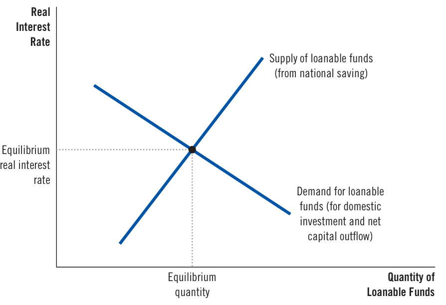
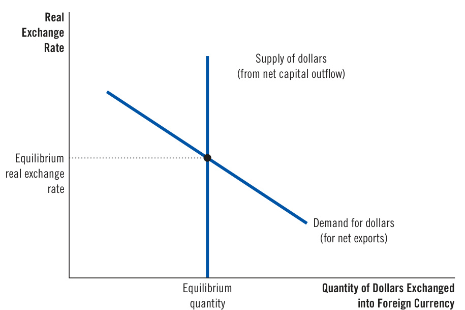
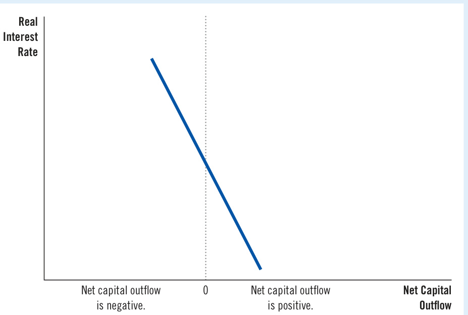
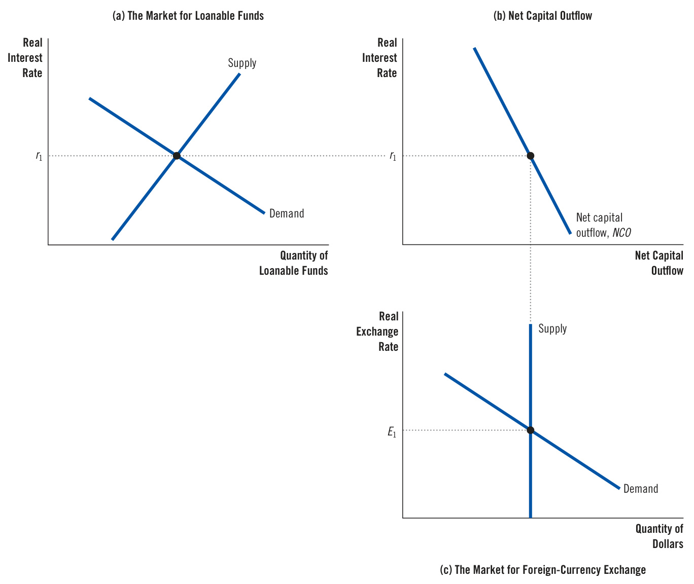
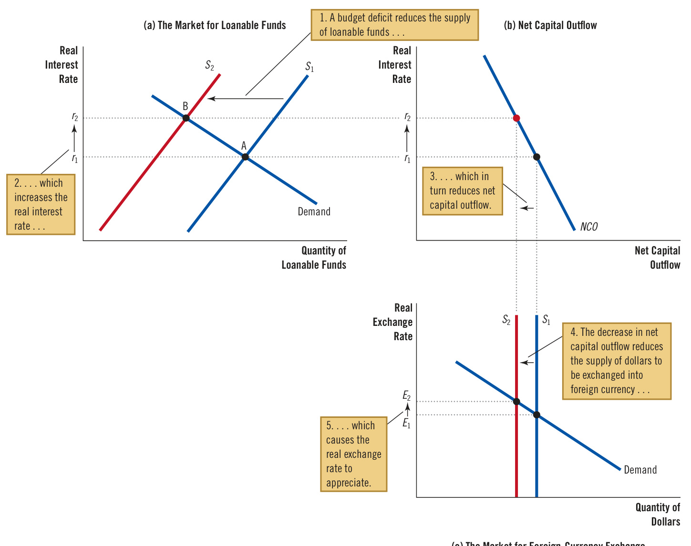
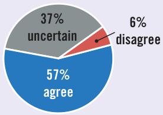
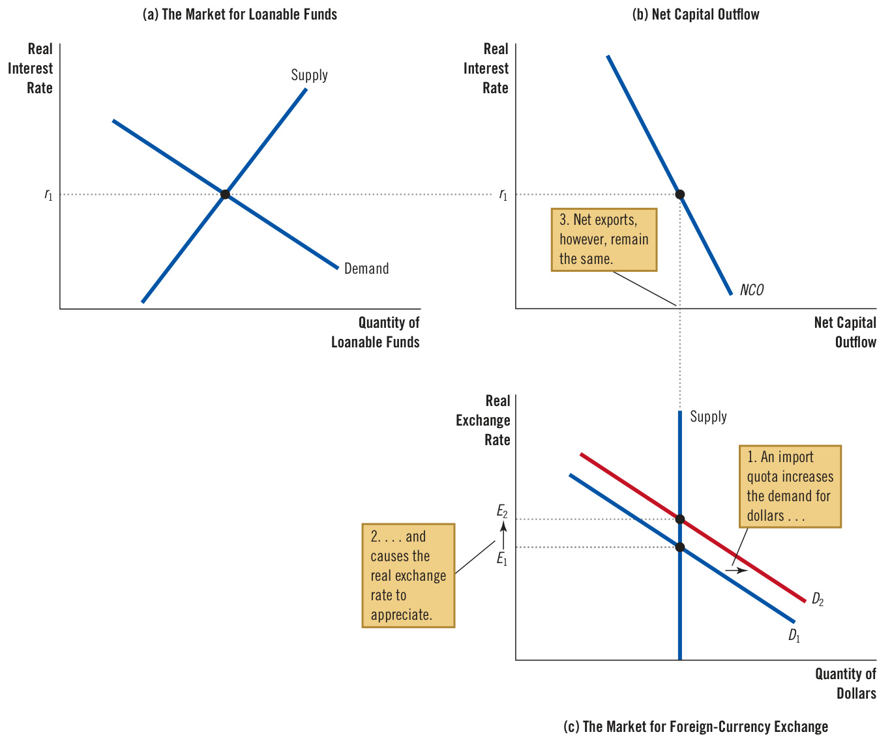
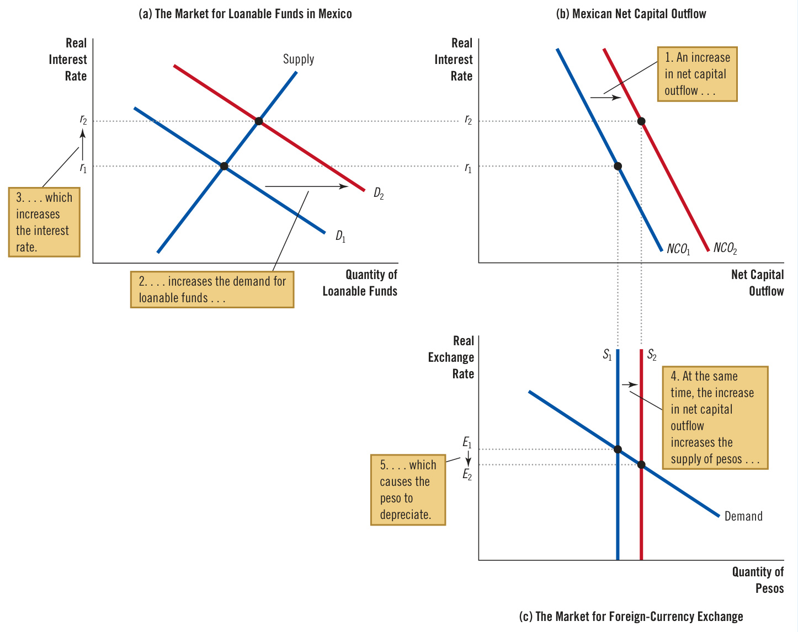
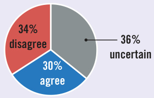

# Ch33 A Macroeconomic Theory of the Open Economy  

ver the past few decades, the United States has consistently imported more goods and services than it has exported. That is, U.S. net exports have been negative. While   
economists debate whether these trade deficits are a problem for   
the U.S. economy, the nation’s business community often has a   
strong opinion. Many business leaders claim that the trade defi  
cits reflect unfair competition: Foreign firms are allowed to sell   
their products in U.S. markets, they contend, while foreign gov  
ernments impede U.S. firms from selling U.S. products abroad.  

Imagine that you are the president, and you want to end these trade deficits. What should you do? Should you limit imports, perhaps by imposing a quota on European steel or a tariff on Chinese smartphones? Or should you address the nation’s trade deficit in some other way?  

To understand what determines a country’s trade balance and how government policies can affect it, we need a macroeconomic exports, net capital outflow, and the real and nominal exchange rates. This chapter develops a model that identifies the forces that influence these variables and explains how these variables are related to one another.  

  

To develop this macroeconomic model of an open economy, we build on our previous analysis in two ways. First, the model takes the economy’s GDP as given. We assume that the economy’s output of goods and services, as measured by real GDP, is determined by the quantities of the factors of production and by the available production technology that turns these inputs into output. Second, the model takes the economy’s price level as given. We assume that the price level adjusts to balance the supply and demand for money. In other words, this chapter starts with the lessons from previous chapters about the economy’s output and price level and focuses on the forces that determine the economy’s trade balance and exchange rate.  

In one sense, the model is simple: It applies the tools of supply and demand to an open economy. Yet it is also more complex than others we have seen because it involves the simultaneous equilibrium in two related markets: the market for loanable funds and the market for foreign-currency exchange. After developing the model, we use it to examine how events and policies affect an economy’s trade balance and exchange rate. We can then say which government policies are likely to reverse the trade deficits that the U.S. economy has experienced in recent years.  

## 33-1 Supply and Demand for Loanable Funds and for Foreign-Currency Exchange  

To understand the forces at work in an open economy, we focus on supply and demand in two markets. The first is the market for loanable funds, which coordinates national saving, domestic investment, and the flow of loanable funds to be invested abroad (called the net capital outflow). The second is the market for foreign-currency exchange, which coordinates people who want to trade domestic and foreign monies. This section discusses supply and demand in each of these markets separately. The next section puts them together to explain an open economy’s overall equilibrium.  

## 33-1a  The Market for Loanable Funds  

Our model of the open economy makes the simplifying assumption that the financial system has only one market, the market for loanable funds. All savers go to this market to deposit their saving, and all borrowers go there to get their loans. In this market, there is one interest rate, which is both the return to saving and the cost of borrowing.  

To understand the market for loanable funds in an open economy, let’s start with the identity from the preceding chapter:  

$$
\begin{array}{c c}{S}&{=\begin{array}{c c}{I}&{+\qquad N C O}\\ {\mathrm{Domestic}}&{+\mathrm{\mathrm{~Net~capital}}}\end{array}}\\ {\mathrm{~investment}}&{\mathrm{~outflow}}\end{array}
$$  

When a nation saves a dollar of its income, it can use that dollar to finance the purchase of domestic capital or to finance the purchase of an asset abroad. The two sides of this identity represent the two sides of the market for loanable funds. The supply of loanable funds comes from national saving (S), and the demand for loanable funds comes from domestic investment (I) and net capital outflow (NCO).  

Loanable funds in this model represent the domestically generated flow of resources available for capital accumulation. The purchase of a capital asset adds to the demand for loanable funds, regardless of whether that asset is located at home (I) or abroad (NCO). Net capital outflow can be positive or negative, so it can add to or subtract from the demand for loanable funds that arises from domestic investment. When $N C O>0,$ , the country has a net outflow of capital; the net purchase of capital overseas adds to the demand for domestically generated loanable funds. When $N C O<0.$ , the country has a net inflow of capital; the capital resources coming from abroad reduce the demand for domestically generated loanable funds.  

Recall that the quantity of loanable funds supplied and the quantity of loanable funds demanded depend on the real interest rate. A higher real interest rate means a higher return to saving, which encourages people to save and therefore raises the quantity of loanable funds supplied. A higher interest rate also means a higher cost of borrowing to finance capital projects, which discourages investment and reduces the quantity of loanable funds demanded.  

In addition to influencing national saving and domestic investment, a country’s real interest rate affects its net capital outflow. To see why, consider two mutual funds—one in the United States and one in Germany—deciding whether to buy a U.S. bond or a German bond. Each mutual fund manager would make this decision in part by comparing the real interest rates in the two countries. When the U.S. real interest rate rises, the U.S. bond becomes more attractive, discouraging Americans from buying foreign assets and encouraging foreigners to buy U.S. assets. For both reasons, a rise in the U.S. real interest rate reduces U.S. net capital outflow.  

The familiar supply-and-demand diagram in Figure 1 illustrates the market for loanable funds. As in our earlier analysis of the financial system, the supply curve slopes upward because a higher interest rate increases the quantity of loanable funds supplied, and the demand curve slopes downward because a higher interest rate decreases the quantity of loanable funds demanded. Unlike the situation in our previous discussion, however, the demand side of the market now represents both domestic investment and net capital outflow. That is, in an open economy, the demand for loanable funds comes not only from those who want loanable funds to buy domestic capital goods but also from those who want loanable funds to buy foreign assets.  

The interest rate adjusts to bring the supply and demand for loanable funds into balance. If the interest rate were below the equilibrium level, the quantity of loanable funds supplied would be less than the quantity demanded. The resulting shortage of loanable funds would push the interest rate upward. Conversely, if the interest rate were above the equilibrium level, the quantity of loanable funds supplied would exceed the quantity demanded. The surplus of loanable funds would drive the interest rate downward. At the equilibrium interest rate, the supply exactly balances the demand. In other words, at the equilibrium interest rate, the amount that people want to save exactly balances the desired quantities of domestic investment and net capital outflow.  

## The Market for Loanable Funds  

The interest rate in an open economy, as in a closed economy, is determined by the supply and demand for loanable funds. National saving is the source of the supply of loanable funds. Domestic investment and net capital outflow are the sources of the demand for loanable funds. At the equilibrium interest rate, the amount that people want to save balances the amount that people want to borrow for the purpose of buying domestic capital and foreign assets.  

  

## 33-1b  The Market for Foreign-Currency Exchange  

The second market in this model of the open economy is the market for foreigncurrency exchange. Participants in the market trade U.S. dollars in exchange for foreign currencies. The analysis starts with another identity from the last chapter:  

$$
\begin{array}{c c}{{N C O}}&{{=}}&{{N X}}\\ {{\mathrm{Net~capital~outflow}=\mathrm{Net~exports}.}}&{{}}\end{array}
$$  

This identity states that the imbalance between the purchase and sale of capital assets abroad (NCO) equals the imbalance between exports and imports of goods and services (NX). For example, when the U.S. economy is running a trade surplus $(N X>0)$ ), foreigners are buying more U.S. goods and services than Americans are buying foreign goods and services. What are Americans doing with the foreign currency they are getting from this net sale of goods and services abroad? They must be buying foreign assets, so U.S. capital is flowing abroad $(N C O>0)$ ). Conversely, if the United States is running a trade deficit $(N X<0)$ ), Americans are spending more on foreign goods and services than they are earning from selling goods and services abroad. Some of this spending must be financed by selling American assets abroad, so foreign capital is flowing into the United States $(N C O<0)$ ).  

This model of the open economy treats the two sides of the identity as representing the two sides of the market for foreign-currency exchange. Net capital outflow represents the quantity of dollars supplied for the purpose of buying foreign assets. For example, when a U.S. mutual fund buys a Japanese bond, it must first change dollars into yen, so it supplies dollars in the market for foreign-currency exchange. Net exports represent the quantity of dollars demanded for the purpose of buying  

U.S. net exports of goods and services. For example, when a Japanese airline buys a plane from Boeing, it must first change its yen into dollars, so it demands dollars in the market for foreign-currency exchange.  

What price balances the supply and demand in the market for foreign-currency exchange? The answer is the real exchange rate. As the preceding chapter discussed, the real exchange rate is the relative price of domestic and foreign goods and a key determinant of net exports. When the U.S. real exchange rate appreciates, U.S. goods become more expensive relative to foreign goods, making U.S. goods less attractive to consumers at home and abroad. As a result, exports from the United States fall, and imports into the United States rise. Both changes reduce net exports. Hence, an appreciation of the real exchange rate reduces the quantity of dollars demanded in the market for foreign-currency exchange.  

Figure 2 shows supply and demand in the market for foreign-currency exchange. The demand curve slopes downward for the reason just discussed: A higher real exchange rate makes U.S. goods more expensive and reduces the quantity of dollars demanded to buy those goods. The supply curve is vertical because the quantity of dollars supplied for net capital outflow does not depend on the real exchange rate. (As discussed earlier, net capital outflow depends on the real interest rate. When considering the market for foreign-currency exchange, the real interest rate and net capital outflow are given.)  

## Figure 2  

The Market for Foreign-Currency Exchange  

The real exchange rate is determined by the supply and demand for foreign-currency exchange. The supply of dollars to be exchanged into foreign currency comes from net capital outflow. Because net capital outflow does not depend on the real exchange rate, the supply curve is vertical. The demand for dollars comes from net exports. Because a lower real exchange rate stimulates net exports (and increases the quantity of dollars demanded to pay for these net exports), the demand curve slopes downward. At the equilibrium real exchange rate, the number of dollars supplied to buy foreign assets exactly balances the number of dollars demanded to buy net exports.  

  

It might seem strange that, in this model, net capital outflow does not depend on the exchange rate. After all, a higher exchange value of the U.S. dollar not only makes foreign goods less expensive for American buyers but also makes foreign assets less expensive. A stronger dollar would make foreign assets more attractive, or so it might seem. But that is not necessarily the case. An American investor will eventually want to turn the foreign asset, as well as any profits earned on it, back into dollars. For example, an increase in the value of the dollar makes it less expensive for an American to buy stock in a Japanese company. But any dividends that the stock pays will be in yen. As these yen are exchanged for dollars, the higher value of the dollar means that the dividends will buy fewer dollars than before. Changes in the exchange rate influence not only the cost of buying foreign assets but also the benefit of owning them, and these two effects offset each other. For this reason, our model of the open economy posits that net capital outflow does not depend on the real exchange rate, as represented by the vertical supply curve in Figure 2.  

The real exchange rate moves to ensure equilibrium in this market. It adjusts to balance the supply and demand for dollars just as the price of any good adjusts to balance supply and demand for it. If the real exchange rate were below the equilibrium level, the quantity of dollars supplied would be less than the quantity demanded. The resulting shortage of dollars would push the value of the dollar upward. Conversely, if the real exchange rate were above the equilibrium level, the quantity of dollars supplied would exceed the quantity demanded. The surplus of dollars would drive the value of the dollar downward. At the equilibrium real exchange rate, the demand for dollars by foreigners arising from the U.S. net exports of goods and services balances the supply of dollars from Americans arising from U.S. net capital outflow.  

## Purchasing-Power Parity as a Special Case  

n alert reader of this book might ask: Why are we developing a theory of the exchange rate here? Didn’t we already do that in the preceding chapter?  

Well, yes, we discussed a theory of the exchange rate called purchasingpower parity. It asserts that, because of international arbitrage, a dollar (or any other currency) must buy the same quantity of goods and services in every country. As a result, the real exchange rate is fixed, and all changes in the nominal exchange rate between two currencies reflect changes in the price levels in the two countries.  

The model of the exchange rate developed here is related to the theory of purchasing-power parity. According to purchasing-power parity, international trade responds quickly to international price differences. If goods were cheaper in one country than in another, they would be exported from the first country and imported into the second until the price difference disappeared. In other words, the theory of purchasing-power parity assumes that net exports are highly responsive to small changes in the real exchange rate. If net exports were, in fact, so responsive, the demand curve in Figure 2 would be horizontal.  

Thus, the theory of purchasing-power parity can be viewed as a special case of the model considered here. In that special case, the demand curve for foreign-currency exchange, instead of sloping downward, is horizontal at the level of the real exchange rate that ensures parity of purchasing power at home and abroad.  

This special case is a good starting point for explaining exchange rates, but it’s not the last word. In practice, because of transport costs and the imperfect substitutability of foreign and domestic goods, purchasingpower parity sometimes fails to hold. This chapter, therefore, assumes that the demand curve for foreign-currency exchange slopes downward. This assumption allows for the possibility that the real exchange rate changes over time as, in fact, it does in the real world. ■  

1. Holding other things constant, an increase in a nation’s interest rate reduces a. national saving and domestic investment. b. national saving and the net capital outflow. c. domestic investment and the net capital outflow. d. national saving only.  

2. Holding other things constant, an appreciation of a nation’s currency causes a. exports to rise and imports to fall. b. exports to fall and imports to rise. c. both exports and imports to rise. d. both exports and imports to fall.  

## 33-2 Equilibrium in the Open Economy  

So far, we have discussed supply and demand in the market for loanable funds and in the market for foreign-currency exchange. Let’s now consider how these markets are connected.  

## 33-2a   Net Capital Outflow: The Link between the Two Markets  

We begin by recapping what we’ve learned so far in this chapter. We have been discussing how the economy coordinates four important macroeconomic variables: national saving (S), domestic investment $(I)_{\ast}$ , net capital outflow (NCO), and net exports (NX). These are related through the following identities:  

$$
S=I+N C O
$$  

and  

$$
N C O=N X.
$$  

In the market for loanable funds, supply comes from national saving (S), demand comes from domestic investment $(I)$ and net capital outflow (NCO), and the real interest rate balances supply and demand. In the market for foreign-currency exchange, supply comes from net capital outflow (NCO), demand comes from net exports (NX), and the real exchange rate balances supply and demand.  

Net capital outflow is the variable that links the two markets. In the market for loanable funds, net capital outflow is part of demand. An American who wants to buy an asset abroad must finance this purchase by obtaining resources in the U.S. market for loanable funds. In the market for foreign-currency exchange, net capital outflow is the source of supply. An American who wants to buy an asset in another country must supply dollars to exchange them for the currency of that country.  

The key determinant of net capital outflow, as we have discussed, is the real interest rate. An increase in the U.S. interest rate makes U.S. assets more attractive and lowers the U.S. net capital outflow. Figure 3 shows this negative relationship between the interest rate and net capital outflow. This net-capital-outflow curve is the link between the market for loanable funds and the market for foreign-currency exchange.  

## Figure 3  

## How Net Capital Outflow Depends on the Interest Rate  

Because a higher domestic real interest rate makes domestic assets more attractive, it reduces net capital outflow. Note the position of zero on the horizontal axis: Net capital outflow can be positive or negative. A negative value of net capital outflow means that the economy has a net inflow of capital.  

  

## 33-2b  Simultaneous Equilibrium in Two Markets  

Figure 4 puts all the pieces of our model together. It shows how the market for loanable funds and the market for foreign-currency exchange jointly determine the important macroeconomic variables of an open economy.  

Panel (a) of the figure shows the market for loanable funds (taken from Figure 1). As before, national saving is the source of the supply of loanable funds. Domestic investment and net capital outflow are the sources of the demand for loanable funds. The equilibrium real interest rate $(r_{\mathrm{_{1}}})$ brings the quantity of loanable funds supplied and demanded into balance.  

Panel (b) of the figure shows net capital outflow (taken from Figure 3). The interest rate comes from panel (a) and determines net capital outflow. A higher interest rate at home makes domestic assets more attractive, reducing net capital outflow. Therefore, the net-capital-outflow curve in panel (b) slopes downward.  

Panel (c) of the figure shows the market for foreign-currency exchange (taken from Figure 2). Because foreign assets must be purchased with foreign currency, the quantity of net capital outflow from panel (b) determines the supply of dollars to be exchanged into foreign currencies. The real exchange rate does not affect net capital outflow, so the supply curve is vertical. The demand for dollars comes from net exports. Because a depreciation of the real exchange rate increases net exports, the demand curve for foreign-currency exchange slopes downward. The equilibrium real exchange rate $(E_{\mathrm{_{1}}})$ brings into balance the quantity of dollars supplied and the quantity of dollars demanded in the market for foreign-currency exchange.  

The two markets shown in Figure 4 determine two relative prices: the real interest rate and the real exchange rate. The real interest rate determined in panel (a) is the price of goods and services in the present relative to goods and  

In panel (a), the supply and demand for loanable funds determine the real interest rate. In panel (b), the interest rate determines net capital outflow, which provides the supply of dollars in the market for foreign-currency exchange. In panel (c), the supply and demand for dollars in the market for foreign-currency exchange determine the real exchange rate.  

  

services in the future. The real exchange rate determined in panel (c) is the price of domestic goods and services relative to foreign goods and services. These two relative prices adjust simultaneously to balance supply and demand in these two markets. As they do so, they determine national saving, domestic investment, net capital outflow, and net exports. We can use this model to see how all these variables change when some policy or event causes one of these curves to shift.  

uppose the owners of an apple orchard decide to consume some of their own apples. Does this decision represent an increase in the demand for apples or a decrease in the supply? Either answer is defensible, and if we are careful in our subsequent analysis, nothing important will hinge on the answer we choose. Sometimes how we divide things between supply and demand is a bit arbitrary.  

In the macroeconomic model of the open economy developed in this chapter, the division of transactions between “supply” and “demand” is also a bit arbitrary—both in the market for loanable funds and in the market for foreign-currency exchange.  

Consider first the market for loanable funds. The model treats the net capital outflow as part of the demand for loanable funds. Yet instead of writing $S=I+N C O,$ , we could just as easily have written $S-N C O=$ $I.$ When the equation is rewritten in this way, a capital outflow looks like a reduction in the supply of loanable funds. Either way works. The first interpretation $:S=\ I+\ N C O\,$ emphasizes loanable funds generated domestically, whether used at home or abroad. The second interpretation $(S-N C O=\,I)$ emphasizes loanable funds available for domestic investment, whether generated at home or abroad. The difference is more semantic than substantive.  

Similarly, consider the market for foreign-currency exchange. In our model, net exports are the source of the demand for dollars, and net capital outflow is the source of the supply. When a U.S. resident imports a car made in Japan, our model treats that transaction as a decrease in the quantity of dollars demanded (because net exports fall) rather than an increase in the quantity of dollars supplied. Similarly, when a Japanese citizen buys a U.S. government bond, our model treats that transaction as a decrease in the quantity of dollars supplied (because net capital outflow falls) rather than an increase in the quantity of dollars demanded. This definition of terms may seem somewhat unnatural at first, but it will prove useful when analyzing the effects of various policies. ■  

## QuickQuiz  

3. In the model just developed, two markets determine two prices, which are a. the nominal exchange rate and the nominal interest rate. b. the nominal exchange rate and the real interest rate. c. the real exchange rate and the nominal interest rate. d. the real exchange rate and the real interest rate.  

4. Other things being equal, an increase in the U.S. net capital outflow the demand for loanable funds and the supply of dollars in the market for foreign currency exchange.  

a. increases; increases b. increases; decreases c. decreases; increases d. decreases; decreases  

Answers are at the end of the chapter.  

## 33-3   How Policies and Events Affect an Open Economy  

Let’s now use this model of the open economy to analyze how changes in policy and other events alter the economy’s equilibrium. Keep in mind that this model is just supply and demand in two markets: the market for loanable funds and the market for foreign-currency exchange. When using the model to analyze any event, apply the three steps introduced in Chapter 4. First, determine which of the supply and demand curves the event affects. Second, determine the direction in which the curves shift. Third, use the supply-and-demand diagrams to compare the old equilibrium with the new one.  

## 33-3a  Government Budget Deficits  

Earlier in this book, when we applied the loanable-funds model to a closed economy, we examined the effects of government budget deficits, which occur when government spending exceeds government revenue. Because a government budget deficit represents negative public saving, it reduces national saving (the sum of public and private saving). We concluded that a government budget deficit reduces the supply of loanable funds, drives up the interest rate, and crowds out investment.  

Now let’s consider the effects of a budget deficit in an open economy. First, which curve in our model shifts? As in a closed economy, the initial impact of the budget deficit is on national saving and, therefore, on the supply curve for loanable funds. Second, in which direction does this supply curve shift? Again, as in a closed economy, a budget deficit represents negative public saving, so it reduces national saving and shifts the supply curve for loanable funds to the left. This result is shown as the shift from $S_{\mathrm{{1}}}$ to $S_{{2}}$ in panel (a) of Figure 5.  

Finally, compare the old and new equilibria. Panel (a) shows the effect of a budget deficit on the market for loanable funds. Because fewer funds are available for borrowers in financial markets, the interest rate rises from $r_{\mathrm{{1}}}$ to $r_{2}$ to balance supply and demand. Faced with a higher interest rate, borrowers choose to borrow less. In other words, the quantity of loanable funds demanded falls. This change is represented in the figure as the movement along the demand curve from point A to point B. With reduced borrowing comes a decline in the purchase of capital goods by households and firms. As in a closed economy, the budget deficit crowds out domestic investment.  

In an open economy, however, the reduced supply of loanable funds has additional effects. Panel (b) shows that the increase in the interest rate from $r_{\mathrm{{1}}}$ to $r_{_2}$ reduces net capital outflow. [This fall in net capital outflow is also part of the decrease in the quantity of loanable funds demanded in the movement from point A to point B in panel (a).] Because savings kept at home now earn higher rates of return, investing abroad is less attractive, and domestic residents buy fewer foreign assets. Higher interest rates also attract foreign investors who want to earn the higher returns on U.S. assets. Thus, when the budget deficit increases the interest rate, both domestic and foreign behavior cause net capital outflow to decline.  

Panel (c) shows how the budget deficit affects the market for foreign-currency exchange. Because net capital outflow is reduced, domestic residents need less foreign currency to buy foreign assets and, therefore, supply fewer dollars in the market for foreign-currency exchange. The supply curve for dollars shifts leftward from $S_{\mathrm{{1}}}$ to $S_{{}_{2}}$ . The reduced supply of dollars causes the real exchange rate to appreciate from $E_{\mathrm{{1}}}$ to $E_{2}$ . That is, the dollar becomes more valuable relative to foreign currencies. This appreciation, in turn, makes domestic goods more expensive compared with foreign goods. People both at home and abroad respond to this change in relative prices, so exports fall and imports rise. For both reasons, net exports fall.  

To sum up: In an open economy, government budget deficits raise real interest rates, crowd out domestic investment, cause the currency to appreciate, and push the trade balance toward deficit.  

An example of this lesson occurred in the United States in the 1980s. Shortly after Ronald Reagan was elected president in 1980, the fiscal policy of the U.S. federal government radically changed. The president and Congress enacted large tax cuts but did not reduce government spending by nearly as much. The result was a large budget deficit. Our model of the open economy predicts that such a policy should have led to a trade deficit, and, in fact, it did, as we saw in a case study in the preceding chapter. Because the budget deficit and trade deficit during this period were so closely related in both theory and practice, they were nicknamed the twin deficits. It would be a mistake to view these twins as identical, however, because many factors beyond fiscal policy can influence the trade deficit.  

The Effects of a Government Budget Deficit  

When the government runs a budget deficit, it reduces the supply of loanable funds from $S_{\mathrm{1}}$ to $S_{2}$ in panel (a). The interest rate rises from $r_{\mathrm{1}}$ to $r_{2}$ to balance the supply and demand for loanable funds. In panel (b), the higher interest rate reduces net capital outflow. That reduced net capital outflow, in turn, reduces the supply of dollars in the market for foreign-currency exchange from $S_{\mathrm{{1}}}$ to $S_{_2}$ in panel (c). The fall in the supply of dollars causes the real exchange rate to appreciate from $E_{\mathrm{{1}}}$ to $E_{2}$ . The appreciation of the exchange rate pushes the trade balance toward deficit.  

  
(c) The Market for Foreign-Currency Exchange  

## trade policy  

government policy that directly influences the quantity of goods and services that a country imports or exports  

## 33-3b  Trade Policy  

Trade policy is government policy that directly influences the quantity of goods and services that a country imports or exports. Trade policy takes various forms, usually with the purpose of supporting a particular domestic industry. One common trade policy is a tariff, a tax on imported goods. Another is an import quota, a limit on the quantity of a good produced abroad that can be sold domestically.  

Consider the macroeconomic impact of trade policy. Suppose that the U.S. steel industry, concerned about competition from European producers, convinces the U.S. government to impose a quota on the amount of steel that can be imported from Europe. In making their case, lobbyists for the steel industry assert that the trade restriction would shrink the size of the U.S. trade deficit. Are they right? Our model, illustrated in Figure 6, offers an answer.  

The first step in analyzing the trade policy is to determine which curve shifts. The initial impact of the import restriction is, not surprisingly, on imports. Because net exports equal exports minus imports, the policy also affects net exports. And because net exports are the source of demand for dollars in the market for foreign-currency exchange, the policy affects the demand curve in this market.  

The second step is to determine the direction in which this demand curve shifts. Because the quota restricts the amount of European steel sold in the United States, it reduces imports at any given real exchange rate. Net exports, which equal exports minus imports, will therefore rise for any given real exchange rate. Because foreigners need dollars to buy U.S. net exports, the rise in net exports increases the demand for dollars in the market for foreign-currency exchange. This increase in the demand for dollars is shown in panel (c) of Figure 6 as the shift from $D_{\mathrm{{1}}}$ to $D_{2}$ .  

The third step is to compare the old and new equilibria. As we can see in panel (c), the increase in the demand for dollars causes the real exchange rate to appreciate from $E_{\mathrm{{1}}}$ to $E_{2}$ . Because nothing has happened in the market for loanable funds in panel (a), the real interest rate remains the same. Because there is no change in the real interest rate, there is also no change in net capital outflow, shown in panel (b). And because there is no change in net capital outflow, there can be no change in net exports, even though the import quota has reduced imports.  

It might seem puzzling that net exports stay the same while imports fall. This puzzle is resolved by noting the change in the real exchange rate: When the dollar appreciates in the market for foreign-currency exchange, domestic goods become more expensive compared with foreign goods. This appreciation encourages imports and discourages exports, and both changes offset the direct increase in net exports due to the import quota. In the end, an import quota reduces both imports and exports, but net exports (exports minus imports) are unchanged.  

We have thus arrived at a surprising result: Trade policies do not affect the trade balance. That is, policies that directly influence exports or imports do not alter net exports. This conclusion seems less surprising if one recalls the accounting identity:  

$$
N X=N C O=S-I.
$$  

Net exports equal net capital outflow, which equals national saving minus domestic investment. Trade policies do not alter the trade balance because they do not alter national saving or domestic investment. For given levels of national saving and domestic investment, the real exchange rate adjusts to keep the trade balance the same, regardless of the trade policies the government puts in place.  

Although trade policies do not affect a country’s overall trade balance, they affect specific firms, industries, and countries. When the U.S. government imposes an “If the United States reduced its fiscal deficit, then its trade deficit would also shrink.”  

  
What do economists say?   
Source: IGM Economic Experts Panel, June 21, 2017.  

When the U.S. government imposes a quota on the import of European steel, nothing happens in the market for loanable funds in panel (a) or to net capital outflow in panel (b). The only effect is a rise in net exports (exports minus imports) for any given real exchange rate. As a result, the demand for dollars in the market for foreign-currency exchange rises, as shown by the shift from $D_{\mathrm{{1}}}$ to $D_{2}$ in panel (c). This increase in the demand for dollars causes the value of the dollar to appreciate from $E_{\mathrm{{1}}}$ to $E_{z}$ . This appreciation of the dollar tends to reduce net exports, offsetting the direct effect of the import quota on the trade balance.  

  

import quota on European steel, the U.S. Steel Corporation faces less competition from abroad and will likely sell more steel and make greater profits. At the same time, because the dollar has appreciated, U.S. farmers find their products more expensive on world markets and will sell less of them to, say, China. In this case, the import quota on European steel increases net exports of steel and decreases net exports of agricultural products. In addition, it pushes the trade balance between the United States and Europe toward surplus, and it pushes the trade balance between the United States and China toward deficit. The overall trade balance of the U.S. economy, however, stays the same.  

The effects of trade policies are, therefore, more microeconomic than macroeconomic. Although advocates of trade policies sometimes suggest (contrary to what our model predicts) that these policies can alter a country’s trade balance, they are usually more motivated by concerns about specific firms or industries. One should not be surprised, for instance, to hear an executive from U.S. Steel advocating import quotas on steel from Europe. But economists usually oppose such trade policies. Free trade may hurt some workers and firms, but it allows economies to specialize in doing what they do best, increasing prosperity in all countries. Trade restrictions interfere with these gains from trade.  

## 33-3c  Political Instability and Capital Flight  

In 1994, political instability in Mexico, including the assassination of a prominent political leader, made world financial markets nervous. The nation suddenly seemed like a riskier place to invest. People decided to pull some of their assets out of Mexico and move these funds to the United States and other “safe havens.” Such a large and sudden movement of funds out of a country is called capital flight. To see the implications of capital flight for the Mexican economy, let’s follow our three steps for analyzing a change in equilibrium. But this time, we apply our model from the Mexican perspective.  

Consider first which curves are affected by capital flight. When investors around the world observe political problems in Mexico, they decide to sell some of their Mexican assets and use the proceeds to buy U.S. assets. This increases Mexican net capital outflow and, therefore, affects both markets in our model. Most obviously, it affects the net-capital-outflow curve, and this change in net capital outflow, in turn, influences the supply of pesos in the market for foreign-currency exchange. In addition, because the demand for loanable funds comes from both domestic investment and net capital outflow, capital flight affects the demand curve in the Mexican market for loanable funds.  

Now consider the direction in which these curves shift. When net capital outflow increases, there is greater demand for loanable funds to finance these purchases of capital assets abroad. As panel (a) of Figure 7 shows, the demand curve for loanable funds shifts to the right from $D_{\mathrm{{1}}}$ to $D_{2}$ . In addition, because net capital outflow is higher for any interest rate, the net-capital-outflow curve also shifts to the right from $N C O_{1}$ to $N C O_{2^{\prime}}$ as in panel (b).  

To see the effects of capital flight on the Mexican economy, compare the old and new equilibria. Panel (a) of Figure 7 shows that the increased demand for loanable funds causes the interest rate in Mexico to rise from $r_{\mathrm{{1}}}$ to $r_{2}$ . Panel (b) shows that Mexican net capital outflow increases. (The rise in the interest rate makes Mexican assets more attractive, but this change only partly offsets the impact of capital flight on net capital outflow.) Panel (c) shows that the increase in net capital outflow raises the supply of pesos in the market for foreign-currency exchange from $S_{\mathrm{{1}}}$ to $S_{2}$ . That is, as people try to get out of Mexican assets, there is a large supply of pesos to be converted into dollars. This increase in supply causes the peso to depreciate from $E_{\mathrm{{1}}}$ to $E_{2}$ Thus, capital flight from Mexico increases Mexican interest rates and decreases the value of the Mexican peso in the market for foreign-currency exchange. This is exactly what happened in 1994. From November 1994 to March 1995, the interest rate on short-term Mexican government bonds rose from 14 percent to 70 percent, and the peso depreciated from 29 to 15 U.S. cents per peso.  

## capital flight  

a large and sudden reduction in the demand for assets located in a country  

If people decide that Mexico is a risky place to keep their savings, they will move their funds to safe havens such as the United States, resulting in an increase in Mexican net capital outflow. Consequently, the demand for loanable funds in Mexico rises from $D_{1}$ to $D_{2}$ , as shown in panel (a), driving up the Mexican real interest rate from $r_{\mathrm{{1}}}$ to $r_{2}$ . Because net capital outflow is higher for any interest rate, that curve also shifts to the right from $N C O_{1}$ to $N C O_{2}$ in panel (b). At the same time, in the market for foreign-currency exchange, the supply of pesos rises from $S_{\mathrm{1}}$ to $S_{2},$ , as shown in panel (c). This increase in the supply of pesos causes the peso to depreciate from $E_{\mathrm{{1}}}$ to $E_{2}$ , so the peso becomes less valuable relative to other currencies.  

  

The price changes that result from capital flight influence key macroeconomic quantities. The depreciation of the currency makes exports cheaper and imports more expensive, pushing the trade balance toward surplus. At the same time, the increase in the interest rate reduces domestic investment, slowing capital accumulation and economic growth.  

Capital flight has its largest impact on the country from which capital is fleeing, but it also affects other countries. When capital flows out of Mexico into the United States, for instance, it has the opposite effect on the U.S. economy as it has on the Mexican economy. In particular, the rise in Mexican net capital outflow coincides with a fall in U.S. net capital outflow. As the peso depreciates and Mexican interest rates rise, the dollar appreciates, and U.S. interest rates fall. The impact on the U.S. economy is small, however, because the economy of the United States is much larger than that of Mexico.  

The events that we have been describing in Mexico could happen to any economy, and, in fact, they do from time to time. In 1997, the world learned that the banking systems of several Asian economies, including Thailand, South Korea, and Indonesia, were at or near the point of bankruptcy, and this news induced capital to flee from these nations. In 1998, the Russian government defaulted on its debt, prompting international investors to take whatever money they could and run. A similar (but more complicated) set of events unfolded in Argentina in 2002 and again in 2019 and 2020. In each of these cases of capital flight, the results were much as our model predicts: rising interest rates and a depreciating currency.  

## Capital Flows from China  

According to our analysis of capital flight, a nation that experiences an outflow of capital sees its currency weaken in foreign exchange markets, and this depreciation, in turn, increases its net exports. The country into which the capital is flowing sees its currency strengthen, and this appreciation pushes its trade balance toward deficit.  

With these lessons in mind, consider this question: Suppose a nation’s government, as a matter of policy, encourages capital to flow to another country, perhaps by making foreign investments itself. What effects would this policy have? The answer is much the same: Other things being equal, it leads to a weaker currency and a trade surplus for the nation encouraging the capital outflows and a stronger currency and a trade deficit for the recipient of those capital flows.  

This analysis sheds light on a long-running policy dispute between the United States and China. The Chinese government has, at times, tried to depress the value of its currency, the renminbi, in foreign exchange markets to promote its export industries. It did this by accumulating foreign assets, including substantial amounts of U.S. government bonds. From 2000 to 2014, China’s total reserves of foreign assets rose from $\mathbb{S}160$ billion to about $\mathbb{S4}$ trillion.  

The U.S. government often objected to China’s interventions in foreign exchange markets. By holding down the value of the renminbi, the policy made Chinese goods less expensive compared with American goods, pushing the U.S. trade balance toward deficit and hurting American producers who competed with imports from China. Because of these effects, the U.S. government tried to get China to stop influencing the exchange value of its currency using government-sponsored capital flows. Some members of Congress advocated tariffs on Chinese imports unless China ceased its “currency manipulation.” And during the Trump administration, the government enacted tariffs, sometimes citing this argument.  

Yet the impact of the Chinese policy on the U.S. economy was not all bad. American consumers of Chinese imports benefited from lower prices.  

Politicians on both the right and left often hold mistaken views about the role of international trade in a nation’s economic well-being.  

## Five Big Truths about Trade  

## By Alan S. Blinder  

nternational trade is, once again, a hot-button political issue, making this an unpropitious time for rational discourse about the subject. Nonetheless, here are five issues on which the overwhelming majority of economists, liberal and conservative, agree.  

1. Most job losses are not due to international trade. Every month roughly five million new jobs are created in the U.S. and almost that many are destroyed, leaving a small net increment. International trade accounts for only a minor share of that staggering job churn. Vastly more derives from the hurly-burly of competition and from technological change, which literally creates and destroys entire industries. Competition and technology are widely and correctly applauded—international trade is not so fortunate.  

2. Trade is more about efficiency— and hence wages—than about the number of jobs. You probably don’t sew your own clothes or grow your own food. Instead, you buy these things from others, using the wages you earn doing something you do better. Imagine how much lower your standard of living would be if you had to sew your own clothes, grow your own food . . . and a thousand other things. The case for international trade is no different. It’s not mainly about creating or destroying jobs. It’s about using labor more efficiently, which is one key to higher wages.  

But there is a catch: Whenever trade patterns change, some people will gain (either jobs or wages) but others will lose. The federal government could and should help them more, but it doesn’t. So Americans who do lose their jobs due to international trade have a legitimate gripe.  

3. Bilateral trade imbalances are inevitable and mostly uninteresting. Each month I run a trade deficit with Public Service Electric & Gas. They sell me gas and electricity; I sell them nothing. But I run a bilateral trade surplus with Princeton University, to which I sell teaching services but from which I buy little. Should I seek balanced trade with PSE&G or Princeton? Of course not. Neither should countries.  

4. Running an overall trade deficit does not make us “losers.” The U.S. multilateral trade balance—its balance with all of its trading partners—has been in deficit for decades. Does that mean that our country is in some sort of trouble? Probably not. For example, people who claim that our trade deficit kills jobs need to explain how the U.S. managed to achieve $4\%$ unemployment in 2000, when our trade deficit was larger, as a share of GDP, than it is today.  

A trade deficit means that foreigners send us more goods and services than we send them. To balance the books, they get our IOUs, which  

  

Currency Manipulation “Economic analysis can identify whether countries are using their exchange rates to benefit their own people at the expense of their trading partners’ welfare.”  

  
What do economists say?  

Source: IGM Economic Experts Panel, June 16, 2015.  

In addition, the inflow of capital from China reduced U.S. interest rates, increasing investment in the U.S. economy. To some extent, the Chinese government was financing U.S. economic growth. The Chinese policy of investing in the U.S. economy created winners and losers among Americans. All things considered, the net impact on the U.S. economy was probably small.  

The harder question concerns the motives behind the policy: Why were Chinese leaders during these years interested in producing for export and investing abroad rather than producing for domestic consumption and investment? One possibility is that China wanted to accumulate a reserve of foreign assets on which it could draw in emergencies—a kind of national “rainyday fund.” In any case, after 2014, as growth in the Chinese economy slowed, the Chinese government started to spend some of the fund. From 2014 to 2021, its reserves of foreign assets fell by almost $\mathbb{S}1$ trillion. ●  

means they wind up holding paper—U.S. Treasury bills, corporate bonds or other private debt instruments. That doesn’t sound so terrible for us, does it?  

One exceptional country—the U.S.—is the source of the world’s major international reserve currency, the U.S. dollar. Since everexpanding world commerce requires ever more dollars, the U.S. must run trade deficits regularly. That’s sometimes called our “exorbitant privilege,” since we get to import more than we export.  

5. Trade agreements barely affect a nation’s trade balance. Much of the political angst is directed not at trade in general, but at specific international trade agreements. The North American Free Trade Agreement allegedly shipped U.S. jobs to Mexico. . . .  

growing. Our trade with China has burgeoned in recent decades without a succession of trade agreements.  

Most fundamentally, but least understood, a nation’s overall trade balance is determined by its domestic decisions, not by trade deals. Think about the accounting involved here.  

As noted above, borrowing from abroad is the bookkeeping counterpart of running a trade deficit. One implies the other. The amount we borrow from abroad must equal the gap between our total spending as a nation (including government spending) and our total income (including the government’s income from taxation). Spendthrift nations like the U.S. have trade deficits because we don’t save much. But these saving decisions are domestic; they do not derive from trade agreements.  

American workers more productive and, presumably, better paid.  

Now, would someone please tell this to Bernie Sanders and Donald Trump?  

## Questions to Discuss  

Do you think running a trade deficit necessarily puts a nation at a disadvantage? Why or why not? According to the dictionary, the word deficit means “an excess of expenditure over revenue,” but another definition is “deficiency or disadvantage.” Might this dual meaning mislead pundits and policymakers into being more worried about trade deficits than Professor Blinder is?  

There is a grain of truth here. Some U.S. jobs were indeed destroyed when NAFTA liberalized trade with Mexico—and those people deserved better treatment from the government than they got. But NAFTA also created a number of new jobs in the U.S. (See No. 2.)  

America’s chronic trade deficits stem from the dollar’s international role and from Americans’ decisions not to save much, not from trade deals. Trade deficits are not a major cause of either job losses or job gains. But some people do lose their jobs from shifting trade patterns; and the government should do more to help them. Importantly, trade makes  

But there’s more. “Trade” and “trade agreements” are not synonyms. We traded with Mexico long before NAFTA, and that trade was  

2. How do you think the government should help workers who lose their jobs because of changing patterns of trade? Should these workers receive government assistance different from that given to workers who lose jobs for other reasons, such as changing technology?  

Mr. Blinder is a professor of economics at Princeton University.  

Source: The Wall Street Journal, April 22, 2016.  

## QuickQuiz  

5. The government in an open economy cuts spending to reduce the budget deficit. As a result, the interest rate , leading to a capital and a currency  

a. falls; outflow; appreciation b. falls; outflow; depreciation c. falls; inflow; appreciation d. rises; inflow; appreciation  

6. The nation of Elbonia has long banned the export of its highly prized puka shells. A newly elected president, however, removes the export ban. This change in policy causes the nation’s currency to , making the goods Elbonia imports expensive.  

7. A civil war abroad causes foreign investors to move their funds to the safe haven of the United States, leading to U.S. interest rates and a U.S. dollar.  

a. depreciate; less b. depreciate; more c. appreciate; less d. appreciate; more a. higher; weaker b. higher; stronger c. lower; weaker d. lower; stronger  

8. If business leaders in Great Britain become more confident in their economy, they will increase investment, causing the British pound to and pushing the British trade balance toward  

a. appreciate; deficit b. appreciate; surplus c. depreciate; deficit d. depreciate; surplus  

International economics is a topic of increasing importance. In many nations, people buy large quantities of goods from abroad, and much of what they produce is sold overseas. Through mutual funds and other financial institutions, people borrow and lend in world financial markets. As a result, a full analysis of a modern economy requires an understanding of how it interacts with others around the world. This chapter has provided a basic model for thinking about the macroeconomics of open economies.  

The study of international economics is valuable, but we should be careful not to exaggerate its importance. In the United States and many other countries, policymakers and commentators are often quick to blame foreigners for economic problems. By contrast, economists typically view most problems as homegrown. For example, politicians are prone to see foreign competition as a threat to national living standards, while economists are more likely to lament excessive budget deficits and insufficient national saving. Low saving impedes growth in capital, productivity, and living standards, regardless of whether the economy is open or closed. Foreigners are a convenient target for politicians because blaming foreigners is a way to avoid responsibility without insulting any domestic constituency. When you hear popular discussions of international trade and finance, it is important to distinguish myth from reality. The tools you have learned in this chapter and previous ones should help in that endeavor.  

## Chapter in a Nutshell  

Two markets are central to the macroeconomics of open economies: the market for loanable funds and the market for foreign-currency exchange. In the market for loanable funds, the real interest rate adjusts to balance the supply of loanable funds (from national saving) and the demand for loanable funds (for domestic investment and net capital outflow). In the market for foreign-currency exchange, the real exchange rate adjusts to balance the supply of dollars (from net capital outflow) and the demand for dollars (for net exports). Because net capital outflow contributes to the demand for loanable funds and also provides the supply of dollars for foreign-currency exchange, it is the variable that connects these two markets.  

A policy that reduces national saving, such as a government budget deficit, reduces the supply of loanable funds and drives up the interest rate. The higher interest rate causes the net capital outflow to decline, reducing the supply of dollars in the market for foreign-currency exchange. The dollar appreciates, and net exports fall.  

Although restrictive trade policies, such as tariffs or quotas on imports, are sometimes advocated as a way to alter the trade balance, they do not necessarily have that effect. A trade restriction increases net exports for any given exchange rate and, therefore, increases the demand for dollars in the market for foreign-currency exchange. As a result, the dollar appreciates, making domestic goods more expensive relative to foreign goods. This appreciation offsets the initial impact of the trade restriction on net exports. When investors change their attitudes about holding assets of a country, the ramifications for the country’s economy can be profound. In particular, political instability can lead to capital flight, which tends to increase interest rates and cause the currency to depreciate.  

## Key Concepts  

trade policy, p. 698 capital flight, p. 701  

1. Describe supply and demand in the market for loanable funds and in the market for foreign-currency exchange. How are these markets linked?   
2. Why are budget deficits and trade deficits sometimes called the twin deficits?   
3. Suppose that a textile workers’ union encourages people to buy only American-made clothes. What  

would this policy do to the trade balance and the real exchange rate? What is the impact on the textile industry? What is the impact on the auto industry?  

4. What is capital flight? When a country experiences capital flight, what is the effect on its interest rate and exchange rate?  

## Problems and Applications  

1. Japan generally runs a significant trade surplus. Do you think this surplus is most related to high foreign demand for Japanese goods, low Japanese demand for foreign goods, a high Japanese saving rate relative to Japanese investment, or structural barriers against imports into Japan? Explain your answer.  

2. Suppose that Congress is considering an investment tax credit, which subsidizes domestic investment. a. How does this policy affect national saving, domestic investment, net capital outflow, the interest rate, the exchange rate, and the trade balance? b. Representatives of several large exporters oppose the policy. Why might that be the case?  

3. The chapter notes that the rise in the U.S. trade deficit during the 1980s was largely due to the rise in the U.S. budget deficit. On the other hand, the popular press sometimes claims that the increased trade deficit resulted from a decline in the quality of U.S. products relative to foreign products. a. Assume that U.S. products did decline in relative quality during the 1980s. How did this decline affect net exports at any given exchange rate? b. Draw a three-panel diagram to show the effect of this shift in net exports on the U.S. real exchange rate and trade balance. c. Is the claim in the popular press consistent with the model in this chapter? Does a decline in the quality of U.S. products have any effect on the U.S. standard of living? (Hint: When a country sells its goods to foreigners, what does it receive in return?)  

4. An economist discussing trade policy in The New Republic wrote, “One of the benefits of the United States removing its trade restrictions [is] the gain to U.S. industries that produce goods for export. Export industries would find it easier to sell their goods abroad—even if other countries didn’t follow our example and reduce their trade barriers.” Explain in words why U.S. export industries would benefit from a reduction in restrictions on imports to the United States.  

5. Suppose the French suddenly develop a strong taste for California wines. Answer the following questions in words and with a diagram.  

a. What happens to the demand for dollars in the market for foreign-currency exchange?   
b. What happens to the value of the dollar in the market for foreign-currency exchange?   
c. What happens to U.S. net exports?  

6. Senator Blowhard renounces his past support for protectionism: “The U.S. trade deficit must be reduced, but import quotas only annoy our trading partners. If we subsidize U.S. exports instead, we can reduce the deficit by increasing our competitiveness.” Using a three-panel diagram, show the effect of an export subsidy on net exports and the real exchange rate. Do you agree with the senator?  

7. Suppose the United States decides to subsidize the export of U.S. agricultural products, but it does not increase taxes or decrease any other government spending to offset this expenditure. Using a threepanel diagram, show what happens to national saving, domestic investment, net capital outflow, the interest rate, the exchange rate, and the trade balance. Also explain in words how this U.S. policy affects the amount of imports, exports, and net exports.  

8.  Suppose that real interest rates increase across Europe. Explain how this development affects U.S. net capital outflow. Then explain how it affects U.S. net exports by using a formula from the chapter and by drawing a diagram. What happens to the U.S. real interest rate and real exchange rate?  

9. Suppose that Americans decide to increase their saving. a. If the elasticity of U.S. net capital outflow with respect to the real interest rate is very high, will  

this increase in private saving have a large or small effect on U.S. domestic investment? b. If the elasticity of U.S. exports with respect to the real exchange rate is very low, will this increase in private saving have a large or small effect on the U.S. real exchange rate?  

## QuickQuiz Answers  

1. c 2. b 3. d 4. a 5. b 6. c 7. d 8. a  

