# Ch34 Aggregate Demand and Aggregate Supply  

tchoen opmriocd auccttiivoitny  folfu cgtouoatdess  farnodm  syeeravri tcoe s yeraisr.e sI.n  Bmeocsat uysee arosf, advances in technological knowledge, the economy can produce more and more over time. This growth allows people to enjoy a higher standard of living. On average, over the past half century, the production of the U.S. economy as measured by real GDP has grown by about 3 percent per year.  

In some years, however, instead of expanding, the economy contracts. Firms find themselves unable to sell all the goods and services they have to offer, so they reduce production. Workers are laid off, unemployment becomes widespread, and factories are left idle. With the economy producing fewer goods and services, real GDP and other measures of income decline. Such a period of  

  

## recession  

a period of declining real incomes and rising unemployment  

depression a severe recession  

falling incomes and rising unemployment is called a recession. When it is severe, it is sometimes called a depression.  

In 2008 and 2009, the U.S. economy experienced a downturn that is now called “The Great Recession.” From the fourth quarter of 2007 to the second quarter of 2009, real GDP fell by 4.0 percent. The unemployment rate rose from 4.4 percent in May 2007 to 10.0 percent in October 2009, the highest level in more than a quarter century, and it remained above 8 percent for the next three years. Not surprisingly, for students graduating during this time, good jobs were hard to find.  

The next recession occurred in 2020 during the coronavirus pandemic, and it was quicker and steeper. Real GDP fell by 10 percent from the fourth quarter of 2019 to the second quarter of 2020. Unemployment rose from 3.5 percent in February 2020 to 14.8 percent just two months later. This time, the economy rebounded quickly. In December 2021, the unemployment rate was back to 3.9 percent, and the number of job openings reached a record high.  

What causes short-run fluctuations in economic activity? What, if anything, can public policy do to prevent periods of falling incomes and rising unemployment? When downturns occur, how can policymakers reduce their length and severity? We now take up these questions.  

The variables at the center of our analysis are familiar from previous chapters. They include GDP, unemployment, interest rates, and the price level. Also familiar are the policy instruments of government spending, taxes, and the money supply. What differs from our earlier discussions is the time horizon. So far, our goal has been to explain the behavior of these variables in the long run. Our goal now is to explain their short-run deviations from long-run trends. In other words, instead of focusing on the forces that explain economic growth from generation to generation, we are now interested in the forces that explain economic fluctuations from year to year.  

Economists debate how best to explain short-run fluctuations, but most use the model of aggregate demand and aggregate supply. This chapter introduces the model’s two pieces: the aggregate-demand curve and the aggregate-supply curve. But first, let’s look at some facts that describe the ups and downs of the economy.  

## 34-1  Three Key Facts about Economic Fluctuations  

Short-run fluctuations in economic activity have occurred in all countries throughout history. Three facts are most important in describing these fluctuations.  

## 34-1a   Fact 1: Economic Fluctuations Are Irregular and Unpredictable  

Fluctuations in the economy are often called the business cycle. As this term suggests, economic fluctuations correspond to changes in business conditions. When real GDP grows rapidly, business is good. During such expansionary periods, most firms find that customers are plentiful and profits are growing. But when real GDP falls during recessions, businesses have trouble. During periods of economic contraction, most firms experience declining sales and dwindling profits.  

The term business cycle is somewhat misleading, however. It suggests that economic fluctuations follow a regular, predictable pattern, like a sine wave or a heartbeat. In fact, fluctuations in economic activity are not at all regular, and they are almost impossible to predict with much accuracy.  

Panel (a) of Figure 1 shows real GDP for the U.S. economy since 1972. The shaded areas represent recessions, and you can see that they don’t come at regular intervals.  

## Figure 1  

## A Look at Short-Run Economic Fluctuations  

This figure shows real GDP in panel (a), investment spending in panel (b), and unemployment in panel (c) for the U.S. economy. Recessions are shown as the shaded areas. Notice that real GDP and investment spending decline during recessions, while unemployment rises.  

Source: U.S. Department of Commerce; U.S. Department of Labor.  

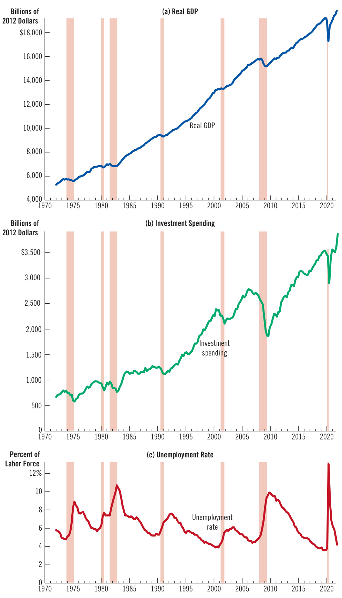  

Sometimes recessions are close together, such as those of 1980 and 1982. Sometimes the economy goes many years without a recession. The longest period in U.S. history without a recession lasted 128 months. It began in June 2009 and ended in February 2020, when the coronavirus recession began.  

## 34-1b Fact 2: Most Macroeconomic Quantities Fluctuate Together  

  

Real GDP is the variable most commonly used to monitor short-run changes in the economy because it is the most comprehensive measure of economic activity. It measures the value of all final goods and services produced within a given period of time as well as the total income (adjusted for inflation) of everyone in the economy.  

It turns out, however, that for monitoring short-run fluctuations, it does not really matter which measure of economic activity you use. Most macroeconomic variables that measure some type of income, spending, or production fluctuate closely together. When real GDP falls in a recession, so do personal income, corporate profits, consumer spending, investment spending, industrial production, retail sales, home sales, auto sales, and so on. Because recessions are economy-wide phenomena, they appear in many sources of macroeconomic data.  

Although many macroeconomic variables fluctuate together, they move by different amounts. In particular, as panel (b) of Figure 1 shows, investment spending varies greatly over the business cycle. Investment averages only about one-sixth of GDP, but it accounts for about twothirds of the fall in GDP during recessions. In other words, when the economy contracts, much of the decline is due to reduced spending on new factories, housing, and inventories.  

## 34-1c  Fact 3: As Output Falls, Unemployment Rises  

Changes in the economy’s output of goods and services are strongly correlated with changes in the utilization of the economy’s labor force. In other words, when real GDP declines, the unemployment rate rises. This fact is hardly surprising: When firms choose to reduce production, they lay off workers, expanding the pool of unemployed.  

Panel (c) of Figure 1 shows the unemployment rate in the U.S. economy since 1972. Once again, the shaded areas indicate recessions. The figure shows that, in each recession, the unemployment rate rises substantially. When the recession ends and real GDP starts to expand, the unemployment rate gradually declines. Because there are always some workers between jobs, the unemployment rate is never zero. Instead, it fluctuates around its natural rate of about 5 percent.  

## QuickQuiz  

1. When the economy goes into a recession, real GDP and unemployment  

a. rises; rises b. rises; falls c. falls; rises d. falls; falls  

2. Recessions occur a. regularly, about every 3 years. b. regularly, about every 7 years. c. regularly, about every 12 years. d. irregularly.  

Describing what happens to economies as they fluctuate is easy. Explaining why these fluctuations occur is more difficult. Compared with the topics in previous chapters, the theory of economic fluctuations remains controversial. This chapter begins to develop the model that most economists use to explain short-run fluctuations in economic activity.  

## 34-2a  The Assumptions of Classical Economics  

Previous chapters developed theories to explain what determines most important macroeconomic variables in the long run. Chapter 26 explained the level and growth of productivity and real GDP. Chapters 27 and 28 explained how the financial system works and how the real interest rate adjusts to balance saving and investment. Chapter 29 explained why there is always some unemployment in the economy. Chapters 30 and 31 explained the monetary system and how changes in the money supply affect the price level, the inflation rate, and the nominal interest rate. Chapters 32 and 33 extended this analysis to open economies to explain the trade balance and the exchange rate.  

This previous analysis was based on two related ideas: the classical dichotomy and monetary neutrality. Recall that the classical dichotomy is the separation of variables into real variables (those that measure quantities or relative prices) and nominal variables (those measured in terms of money). According to classical macroeconomic theory, changes in the money supply affect nominal variables but not real variables. As a result of this monetary neutrality, we were able to examine the determinants of real variables (real GDP, the real interest rate, and unemployment) without introducing nominal variables (the money supply and the price level).  

In a sense, money does not matter in a classical world. If the quantity of money in the economy were to double, everything would cost twice as much, and everyone’s income would be twice as high. But so what? The change would be nominal (by the standard meaning of “nearly insignificant”). The things that people really care about—whether they have a job, how many goods and services they can afford, and so on—would be exactly the same.  

This classical view is sometimes described by the saying, “Money is a veil.” That is, nominal variables may be the first things we see when we observe an economy because economic variables are often expressed in units of money. But more important are the real variables and the forces that determine them. According to classical theory, to understand these real variables, we need to look behind the veil.  

## 34-2b  The Reality of Short-Run Fluctuations  

Do these assumptions of classical macroeconomic theory apply to the world in which we live? The answer to this question is central to understanding how the economy works. Most economists believe that classical theory describes the world in the long run but not in the short run.  

Consider again the impact of money on the economy. Most economists believe that, beyond a period of several years, changes in the money supply affect prices and other nominal variables but do not affect real GDP, unemployment, and other real variables—just as classical theory says. When studying year-to-year changes in the economy, however, the assumption of monetary neutrality is no longer appropriate. In the short run, real and nominal variables are highly intertwined, and changes in the money supply can temporarily push real GDP away from its long-run trend.  

model of aggregate demand and aggregate supply the model that most economists use to explain short-run fluctuations in economic activity around its long-run trend  

## aggregate-demand curve  

a curve that shows the quantity of goods and services that households, firms, the government, and customers abroad want to buy at each price level  

## aggregate-supply curve  

a curve that shows the quantity of goods and services that firms choose to produce and sell at each price level  

## Aggregate Demand and Aggregate Supply  

Economists use the model of aggregate demand and aggregate supply to analyze economic fluctuations. On the vertical axis is the overall level of prices. On the horizontal axis is the economy’s total output of goods and services. Output and the price level adjust to the point at which the aggregate-supply and aggregatedemand curves intersect.  

Even classical economists, such as David Hume, realized that monetary neutrality did not hold in the short run. From his vantage point in 18th-century England, Hume observed that when the money supply expanded after gold discoveries, it took some time for prices to rise and that, in the meantime, the economy enjoyed higher employment and production.  

To understand how the economy works in the short run, we need a new model. It can be built using many of the tools developed in previous chapters, but it must abandon the classical dichotomy and the neutrality of money. We can no longer separate the analysis of real variables such as output and employment from the analysis of nominal variables such as money and the price level. Our new model focuses on how real and nominal variables interact.  

## 34-2c  The Model of Aggregate Demand and Aggregate Supply  

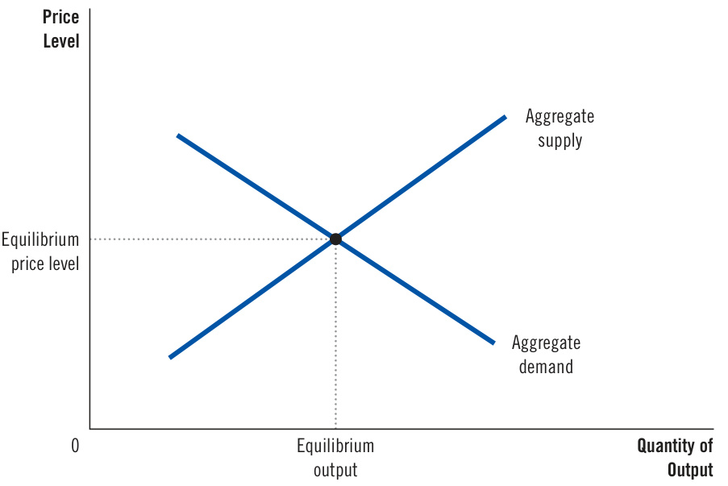  
Figure 2  

Our model of short-run economic fluctuations focuses on the behavior of two variables. The first is the economy’s output of goods and services, as measured by real GDP. The second is the average level of prices, as measured by the CPI or the GDP deflator. Notice that output is a real variable, and the price level is a nominal variable. By focusing on the relationship between these two variables, we are departing from the classical assumption that real and nominal variables can be studied separately.  

We analyze fluctuations in the economy as a whole using the model of aggregate demand and aggregate supply, which is illustrated in Figure 2. On the vertical axis is the overall price level in the economy. On the horizontal axis is the overall quantity of goods and services produced in the economy. The aggregate-demand curve shows the quantity of goods and services that households, firms, the government, and customers abroad want to buy at each price level. The aggregate-supply curve shows the quantity of goods and services that firms produce and sell at each price level. According to this model, the price level and the quantity of output adjust to bring aggregate demand and aggregate supply into balance.  

It is tempting to view the model of aggregate demand and aggregate supply as nothing more than a large version of the model of market demand and market supply introduced in Chapter 4. But, in fact, this model is quite different. When we consider demand and supply in the market for a specific good—ice cream, for instance—the behavior of buyers and sellers depends on the ability of resources to move from one market to another. When the price of ice cream rises, the quantity demanded falls because buyers can use their incomes to buy products other than ice cream. Similarly, a higher price of ice cream raises the quantity supplied because firms that produce ice cream can increase production by hiring workers from other parts of the economy. This microeconomic substitution from one market to another is impossible for the economy as a whole. After all, the quantity that our model is trying to explain—real GDP—measures the total quantity of goods and services produced by all firms in all markets. To understand why the aggregate-demand curve slopes downward and why the aggregate-supply curve slopes upward, we need a macroeconomic theory that explains the total quantity of goods and services demanded and the total quantity of goods and services supplied. Developing such a theory is our next task.  

## QuickQuiz  

3. According to classical macroeconomic theory and monetary neutrality, changes in the money supply affect a. the unemployment rate. b. real GDP. c. the GDP deflator. d. none of the above.   
4. Most economists believe that classical macroeconomic theory a. is valid only in the long run. b. is valid only in the short run. c. is always valid. d. is never valid.  

5. In the model of aggregate demand and aggregate supply, the quantity of is on the horizontal axis, and the is on the vertical axis. a. output; interest rate b. output; price level c. money; interest rate d. money; price level  

Answers are at the end of the chapter.  

## 34-3  The Aggregate-Demand Curve  

The aggregate-demand curve depicts the quantity of all goods and services demanded in the economy at any price level. As Figure 3 illustrates, the aggregate-demand curve slopes downward. Other things being equal, a decrease in the economy’s overall level of prices (from, say, $P_{\mathrm{{_{1}}}}$ to $P_{2}$ raises the quantity of goods and services demanded (from $Y_{\mathrm{{1}}}$ to $Y_{2},$ . Conversely, an increase in the price level reduces the quantity of goods and services demanded.  

## 34-3a  Why the Aggregate-Demand Curve Slopes Downward  

Why does a change in the price level move the quantity of goods and services demanded in the opposite direction? To answer this question, it is useful to recall that an economy’s GDP (which we denote as $Y$ ) is the sum of its consumption (C), investment $(I)$ , government purchases (G), and net exports (NX):  

## The Aggregate-Demand Curve  

A fall in the price level from $P_{1}$ to $P_{2}$ increases the quantity of goods and services demanded from $\mathsfit{Y}_{\mathrm{1}}$ to $Y_{_2}$ . There are three reasons for this negative relationship. As the price level falls, real wealth rises, interest rates fall, and the exchange rate depreciates. These effects stimulate spending on consumption, investment, and net exports. Increased spending on any or all of these components of output means a larger quantity of goods and services demanded.  

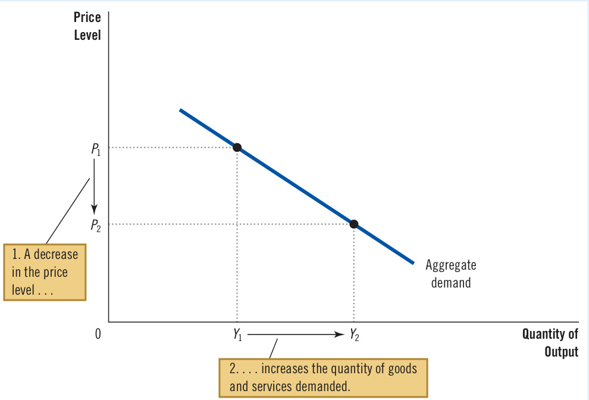  

Each of these four components contributes to the aggregate demand for goods and services. For now, we assume that government spending is fixed by policy. The other three components of spending—consumption, investment, and net exports—depend on economic conditions and, in particular, on the price level. To understand the downward slope of the aggregate-demand curve, we must examine how the price level affects the quantity of goods and services demanded for consumption, investment, and net exports.  

The Price Level and Consumption: The Wealth Effect  Consider the money you hold in your wallet and bank account. The nominal value of this money is fixed: One dollar is always worth one dollar. Yet the real value of a dollar can change. If a candy bar costs one dollar, then a dollar is worth one candy bar. If the price of a candy bar falls to 50 cents, one dollar is worth two candy bars. Thus, when the price level falls, the dollars you hold rise in value, increasing your real wealth and your ability to buy goods and services.  

This logic provides the first reason the aggregate-demand curve slopes downward. A decrease in the price level raises the real value of money and makes consumers wealthier, encouraging them to spend more. The increase in consumer spending means a larger quantity of goods and services demanded. Conversely, an increase in the price level reduces the real value of money and makes consumers poorer, reducing consumer spending and the quantity of goods and services demanded.  

The Price Level and Investment: The Interest-Rate Effect  The price level is one determinant of the quantity of money demanded. When the price level is lower, people do not need to hold as much money to buy the goods and services they want. Therefore, when the price level falls, people try to reduce their money holdings by lending some of it out. For instance, they might use their excess money to buy interest-bearing bonds. Or they might deposit the excess money in an interestbearing savings account, and the bank would lend out these funds. In either case, as people try to convert some of their money into interest-bearing assets, they drive down interest rates. (The next chapter analyzes this process in more detail.)  

Interest rates, in turn, affect spending on goods and services. Because a lower interest rate makes borrowing less expensive, it encourages firms to borrow more to invest in new plants and equipment, and it encourages households to borrow more to invest in new housing. (A lower interest rate might also stimulate consumer spending, especially spending on large, durable purchases such as cars, which are often bought on credit.) In short, a lower interest rate increases the quantity of goods and services demanded.  

This logic provides the second reason the aggregate-demand curve slopes downward. A lower price level reduces the interest rate, encourages spending on investment goods, and increases the quantity of goods and services demanded. Conversely, a higher price level raises the interest rate, discourages investment spending, and decreases the quantity of goods and services demanded.  

The Price Level and Net Exports: The Exchange-Rate Effect  For the reasons just discussed, a lower price level in the United States lowers the U.S. interest rate. In response to the lower interest rate, some investors will seek higher returns by moving their assets out of the United States. For instance, as the interest rate on American bonds falls, a mutual fund might sell American bonds to buy German bonds. As the mutual fund tries to convert its dollars into euros to buy the German bonds, it increases the supply of dollars in the market for foreign-currency exchange.  

The increased supply of dollars to be exchanged for euros causes the dollar to depreciate relative to the euro. This alters the real exchange rate—the relative price of domestic and foreign goods. Because each dollar buys fewer units of foreign currencies, foreign goods become more expensive compared with domestic goods.  

The change in relative prices affects spending at home and abroad. Because foreign goods are more expensive, Americans buy less from other countries, reducing U.S. imports of goods and services. At the same time, because U.S. goods have become relatively cheap, foreigners buy more from the United States, increasing U.S. exports. Net exports equal exports minus imports, so both of these changes cause U.S. net exports to increase. In this way, the depreciation of the dollar leads to an increase in the quantity of goods and services demanded.  

This logic yields the third reason the aggregate-demand curve slopes downward. When a fall in the U.S. price level causes U.S. interest rates to fall, the real value of the dollar declines in foreign exchange markets. This depreciation stimulates U.S. net exports and increases the quantity of goods and services demanded. Conversely, when the U.S. price level rises and causes U.S. interest rates to rise, the real value of the dollar increases, and this appreciation reduces U.S. net exports and the quantity of goods and services demanded.  

Summing Up  There are three distinct but related reasons a fall in the price level increases the quantity of goods and services demanded:  

1. Consumers become wealthier, stimulating the demand for consumption goods. 2. Interest rates fall, stimulating the demand for investment goods. 3. The currency depreciates, stimulating the demand for net exports.  

The same three effects work in reverse: When the price level rises, decreased wealth depresses consumer spending, higher interest rates depress investment spending, and currency appreciation depresses net exports.  

Here is a thought experiment to hone your intuition about these effects. Imagine that one day you wake up and notice that, for some mysterious reason, the prices of all goods and services have fallen by half, so the dollars you are holding are worth twice as much. In real terms, you now have twice as much money as you had when you went to bed the night before. What would you do with the extra money? You could spend it at your favorite restaurant, increasing consumer spending. You could lend it out (by buying a bond or depositing it in a bank), reducing interest rates and increasing investment spending. Or you could invest it overseas (by buying shares in an international mutual fund), reducing the real exchange value of the dollar and increasing net exports. No matter which of these options you choose, the fall in the price level leads to an increase in the quantity of goods and services demanded. This relationship is what the downward slope of the aggregate-demand curve represents.  

Keep in mind that the aggregate-demand curve (like all demand curves) is drawn holding “other things equal.” In particular, these three explanations of the downward-sloping aggregate-demand curve assume that the money supply is fixed. That is, we have been considering how a change in the price level affects the demand for goods and services, holding the amount of money in the economy constant. As we will see, a change in the quantity of money shifts the aggregate-demand curve. At this point, just remember that the aggregate-demand curve is drawn for a given quantity of the money supply.  

## 34-3b  Why the Aggregate-Demand Curve Might Shift  

The downward slope of the aggregate-demand curve shows that a fall in the price level increases the overall quantity of goods and services demanded. Many other factors also affect the quantity of goods and services demanded. When one of these other factors changes, the quantity of goods and services demanded at every price level changes, and the aggregate-demand curve shifts.  

Here are examples of events that shift aggregate demand. We can group them according to the component of spending that is most directly affected.  

Shifts Arising from Changes in Consumption  Suppose Americans suddenly become more concerned about saving for retirement and, as a result, reduce current consumption. Because the quantity of goods and services demanded at any price level is now lower, the aggregate-demand curve shifts to the left. Conversely, imagine that a stock market boom makes people wealthier and less concerned about saving. The resulting increase in consumer spending means a greater quantity of goods and services demanded at any price level, so the aggregate-demand curve shifts to the right.  

Any event that changes how much people want to consume at a given price level shifts the aggregate-demand curve. One policy variable that has this effect is taxation. When the government cuts taxes, it encourages people to spend more, so the aggregate-demand curve shifts to the right. When the government raises taxes, people cut back on their spending, and the aggregate-demand curve shifts to the left.  

Shifts Arising from Changes in Investment  Any event that changes how much firms want to invest at a given price level also shifts the aggregate-demand curve. For instance, imagine that the computer industry introduces a faster line of computers, and many firms decide to invest in new computer systems. Because the quantity of goods and services demanded at any price level is higher, the aggregate-demand curve shifts to the right. Conversely, if firms become pessimistic about future business conditions, they may cut back on investment spending, shifting the aggregatedemand curve to the left.  

Tax policy can also influence aggregate demand through investment. For example, other things being equal, an investment tax credit (a tax rebate tied to a firm’s investment spending) increases the quantity of investment goods that firms want to buy and therefore shifts the aggregate-demand curve to the right. The repeal of an investment tax credit reduces investment and shifts the aggregate-demand curve to the left.  

Another policy variable that can influence investment and aggregate demand is the money supply. As the next chapter explains, an increase in the money supply lowers the interest rate in the short run. This decrease in the interest rate makes borrowing less costly, stimulating investment spending and shifting the aggregate-demand curve to the right. Conversely, a decrease in the money supply raises the interest rate, discourages investment spending, and shifts the aggregate-demand curve to the left. Many economists believe that throughout U.S. history, changes in monetary policy have been an important source of shifts in aggregate demand.  

Shifts Arising from Changes in Government Purchases The most direct way that policymakers shift the aggregate-demand curve is through government purchases. For example, suppose Congress decides to reduce purchases of new weapons systems. Because the quantity of goods and services demanded at any price level is lower, the aggregate-demand curve shifts to the left. Conversely, if state governments start building more highways, the result is a greater quantity of goods and services demanded at any price level, so the aggregate-demand curve shifts to the right.  

Shifts Arising from Changes in Net Exports  Any event that changes net exports for a given price level also shifts aggregate demand. For instance, when Europe has a recession, it buys fewer goods from the United States. U.S. net exports decline at every price level, shifting the aggregate-demand curve for the U.S. economy to the left. When Europe recovers from its recession, it buys more U.S. goods, and the aggregate-demand curve shifts to the right.  

Net exports can also change because international speculators affect the exchange rate. Suppose, for instance, that these speculators lose confidence in foreign economies and want to move wealth into the U.S. economy. In doing so, they bid up the value of the U.S. dollar in the foreign exchange market. This appreciation of the dollar makes U.S. goods more expensive relative to foreign goods, depressing net exports and shifting the aggregate-demand curve to the left. Conversely, speculation that causes a depreciation of the dollar stimulates net exports and shifts the aggregate-demand curve to the right.  

Summing Up The next chapter analyzes the aggregate-demand curve in more detail. There, we examine more precisely how the tools of monetary and fiscal policy can shift aggregate demand and when policymakers should use these tools for that purpose. For now, you should have some understanding of why the aggregatedemand curve slopes downward and what kinds of events and policies can shift this curve. Table 1 summarizes what we have learned so far.  

## Table 1  

The Aggregate-Demand Curve: Summary  

## Why Does the Aggregate-Demand Curve Slope Downward?  

1. The Wealth Effect: A lower price level increases real wealth, stimulating spending on consumption.   
2. The Interest-Rate Effect: A lower price level reduces the interest rate, stimulating spending on investment.   
3. The Exchange-Rate Effect: A lower price level causes the real exchange rate to depreciate, stimulating spending on net exports.  

## Why Might the Aggregate-Demand Curve Shift?  

1. Shifts Arising from Changes in Consumption: An event that causes consumers to spend more at a given price level (a tax cut, a stock market boom) shifts the aggregate-demand curve to the right. An event that causes consumers to spend less at a given price level (a tax hike, a stock market decline) shifts the curve to the left.  

2. Shifts Arising from Changes in Investment: An event that causes firms to invest more at a given price level (optimism about the future, a fall in interest rates due to an increase in the money supply) shifts the aggregate-demand curve to the right. An event that causes firms to invest less at a given price level (pessimism about the future, a rise in interest rates due to a decrease in the money supply) shifts the curve to the left.  

3. Shifts Arising from Changes in Government Purchases: An increase in government purchases of goods and services (greater spending on defense or highway construction) shifts the aggregate-demand curve to the right. A decrease in government purchases of goods and services (a cutback in defense or highway spending) shifts the curve to the left.  

4. Shifts Arising from Changes in Net Exports: An event that raises spending on net exports at a given price level (a boom overseas, speculation that causes a currency depreciation) shifts the aggregate-demand curve to the right. An event that reduces spending on net exports at a given price level (a recession overseas, speculation that causes a currency appreciation) shifts the curve to the left.  

## QuickQuiz  

6. The aggregate-demand curve slopes downward because a fall in the price level causes  

a. real wealth to decrease.   
b. the interest rate to decline.   
c. the currency to appreciate.   
d. all of the above.  

7. Which of the following would shift the aggregatedemand curve to the left?  

a. a decline in the stock market   
b. an increase in taxes   
c. a decrease in government spending   
d. all of the above  

Answers are at the end of the chapter.  

## 34-4  The Aggregate-Supply Curve  

The aggregate-supply curve shows the total quantity of goods and services that firms produce and sell at any price level. Unlike the aggregate-demand curve, which always slopes downward, the slope of the aggregate-supply curve depends on the time horizon being examined. In the long run, the aggregate-supply curve is vertical, while in the short run, it slopes upward. This section explains both the long-run aggregate-supply curve and the short-run aggregate-supply curve. In doing so, it shows why the economy can, in the short run, deviate from the long-run equilibrium described by classical theory.  

## 34-4a Why the Aggregate-Supply Curve Is Vertical in the Long Run  

What determines the quantity of goods and services supplied in the long run? We implicitly answered this question earlier in the book when discussing economic growth. In the long run, an economy’s production of goods and services (its real GDP) depends on its supplies of labor, capital, and natural resources and on the available technology used to turn these factors of production into goods and services.  

When we analyzed the forces that govern long-run growth, we did not mention the overall level of prices. The price level was explained in a separate chapter, which developed the quantity theory of money. We learned that if two economies were identical in every way except that one had twice as much money in circulation as the other, the price level would be twice as high in the economy with more money. But because the amount of money does not affect technology or the supplies of labor, capital, and natural resources, the output of goods and services in the two economies would be the same.  

Because the price level does not affect the long-run determinants of real GDP, the long-run aggregate-supply curve is vertical, as in Figure 4. In other words, in the long run, the economy’s labor, capital, natural resources, and technology determine the total quantity of goods and services supplied, and this quantity supplied is the same regardless of the price level.  

The vertical long-run aggregate-supply curve is a graphical representation of the classical dichotomy and monetary neutrality. As we have discussed, classical  

## Figure 4 The Long-Run AggregateSupply Curve  

In the long run, the quantity of output supplied depends on the economy’s quantities of labor, capital, and natural resources and on the technology for turning these inputs into output. Because the quantity supplied does not depend on the overall price level, the long-run aggregatesupply curve is vertical at the natural level of output.  

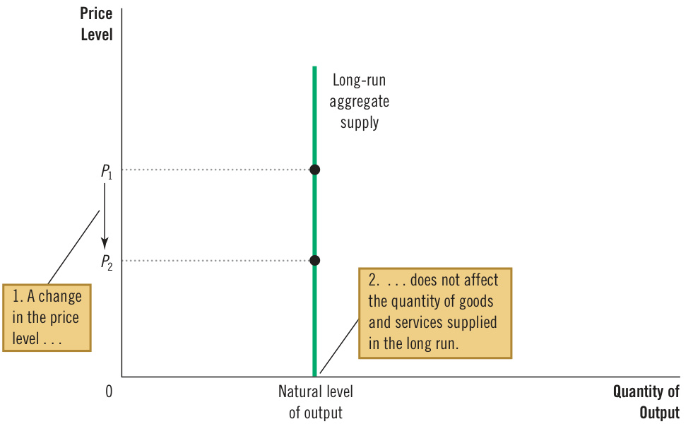  

macroeconomic theory is based on the assumption that real variables do not depend on nominal variables. The long-run aggregate-supply curve is consistent with this idea because it implies that the quantity of output (a real variable) does not depend on the level of prices (a nominal variable). As noted earlier, most economists believe this principle works well when studying the economy over a period of many years but not for year-to-year changes. For this reason, the aggregate-supply curve is vertical only in the long run.  

## 34-4b  Why the Long-Run Aggregate-Supply Curve Might Shift  

natural level of output the production of goods and services that an economy achieves in the long run when unemployment is at its normal rate  

Because classical macroeconomic theory describes the quantity of goods and services produced by an economy in the long run, it also explains the position of the long-run aggregate-supply curve. The long-run level of production is sometimes called potential output or full-employment output. To be more precise, we call it the natural level of output because it shows what the economy produces when unemployment is at its natural, or normal, rate. The natural level of output is the rate of production toward which the economy gravitates in the long run.  

Any change in the economy that alters the natural level of output shifts the long-run aggregate-supply curve. Because output in the classical model depends on labor, capital, natural resources, and technological knowledge, we can categorize shifts in the long-run aggregate-supply curve as arising from these four sources.  

Shifts Arising from Changes in Labor  Imagine that an economy experiences an increase in immigration. Because this increase results in a greater number of workers, the quantity of goods and services supplied would also increase. As a result, the long-run aggregate-supply curve would shift to the right. Conversely, if many workers left the economy to go abroad, the long-run aggregate-supply curve would shift to the left.  

The position of the long-run aggregate-supply curve also depends on the natural rate of unemployment, so any change in this rate shifts the long-run aggregatesupply curve. For example, if Congress made unemployment insurance substantially more generous, unemployed workers might not search as hard for new jobs, increasing the natural rate of unemployment and reducing the economy’s production of goods and services. As a result, the long-run aggregate-supply curve would shift to the left. Conversely, if Congress enacted a successful job training program for unemployed workers, the natural rate of unemployment would fall, and the longrun aggregate-supply curve would shift to the right.  

Shifts Arising from Changes in Capital  An increase in the economy’s capital stock raises productivity, thereby increasing the quantity of goods and services supplied. As a result, the long-run aggregate-supply curve shifts to the right. Conversely, a decrease in the economy’s capital stock reduces productivity and the quantity of goods and services supplied, shifting the long-run aggregate-supply curve to the left.  

Notice that the same logic applies regardless of whether we are discussing physical capital such as machines and factories or human capital such as college degrees. An increase in either type of capital will raise the economy’s ability to produce goods and services and shift the long-run aggregate-supply curve to the right.  

Shifts Arising from Changes in Natural Resources  An economy’s production depends on its natural resources, including its land, minerals, and weather. The discovery of a new mineral deposit shifts the long-run aggregate-supply curve to the right. A change in weather patterns that makes farming more difficult shifts the long-run aggregate-supply curve to the left.  

In many countries, crucial natural resources are imported. A change in the availability of these resources can also shift the aggregate-supply curve. For example, as we discuss later in this chapter, developments in the world oil market have historically been an important source of shifts in aggregate supply for oil-importing nations.  

Shifts Arising from Changes in Technological Knowledge  Perhaps the most important reason that the economy today produces more than it did a generation ago is that technological knowledge has advanced. The development of industrial robots, for instance, has allowed firms to produce more goods and services from any given amount of labor, capital, and natural resources. As robot use has spread, it has shifted the long-run aggregate-supply curve to the right.  

Although not precisely technological, many other events act like changes in technology. For instance, opening up international trade has effects similar to inventing new production processes because it allows a country to specialize in higher-productivity industries; therefore, it also shifts the long-run aggregatesupply curve to the right. Conversely, if the government passes new regulations preventing firms from using some production methods, perhaps to address worker safety or environmental concerns, the result is a leftward shift in the long-run aggregate-supply curve.  

Summing Up  Because the long-run aggregate-supply curve reflects the classical model, it provides a new way to express the analysis in earlier chapters. Any policy or event that raised real GDP in previous chapters can be described as increasing the quantity of goods and services supplied and shifting the long-run aggregatesupply curve to the right. Any policy or event that lowered real GDP in previous chapters can be said to reduce the quantity of goods and services supplied and to shift the long-run aggregate-supply curve to the left.  

## 34-4c Using Aggregate Demand and Aggregate Supply to Depict Long-Run Growth and Inflation  

Having introduced the economy’s aggregate-demand curve and the longrun aggregate-supply curve, we have a new way to describe the economy’s long-run trends. Figure 5 illustrates the changes that occur in an economy from decade to decade. Notice that both curves are shifting. Although many forces influence the economy in the long run and can, in theory, cause such shifts, the two most important forces in practice are technology and monetary policy. Technological progress enhances an economy’s ability to produce goods and services, and the resulting increases in output are reflected in continual shifts of the long-run aggregate-supply curve to the right. At the same time, because the Fed increases the money supply over time, the aggregate-demand curve also shifts to the right. As the figure shows, the result is continuing growth in output (as shown by increasing $Y$ ) and continuing inflation (as shown by increasing $P$ ). This is just another way of representing the classical analysis of growth and inflation conducted in earlier chapters.  

The purpose of developing the model of aggregate demand and aggregate supply, however, is not to dress our previous long-run conclusions in new clothing. Instead, it is to provide a framework for short-run analysis, as we will see in a moment. As we develop the short-run model, we simplify the analysis by omitting the ongoing growth  

Long-Run Growth and Inflation in the Model of Aggregate Demand and Aggregate Supply  

As the economy becomes better able to produce goods and services, primarily because of technological progress, the long-run aggregate-supply curve shifts to the right. At the same time, as the Fed increases the money supply, the aggregate-demand curve also shifts to the right. In this figure, output grows from $Y_{2000}$ to $Y_{2010}$ and then to $Y_{2020}$ , and the price level rises from $P_{_{2000}}$ to $P_{2010}$ and then to $P_{_{2020}}$ . Thus, the model of aggregate demand and aggregate supply offers a new way to describe the classical analysis of growth and inflation.  

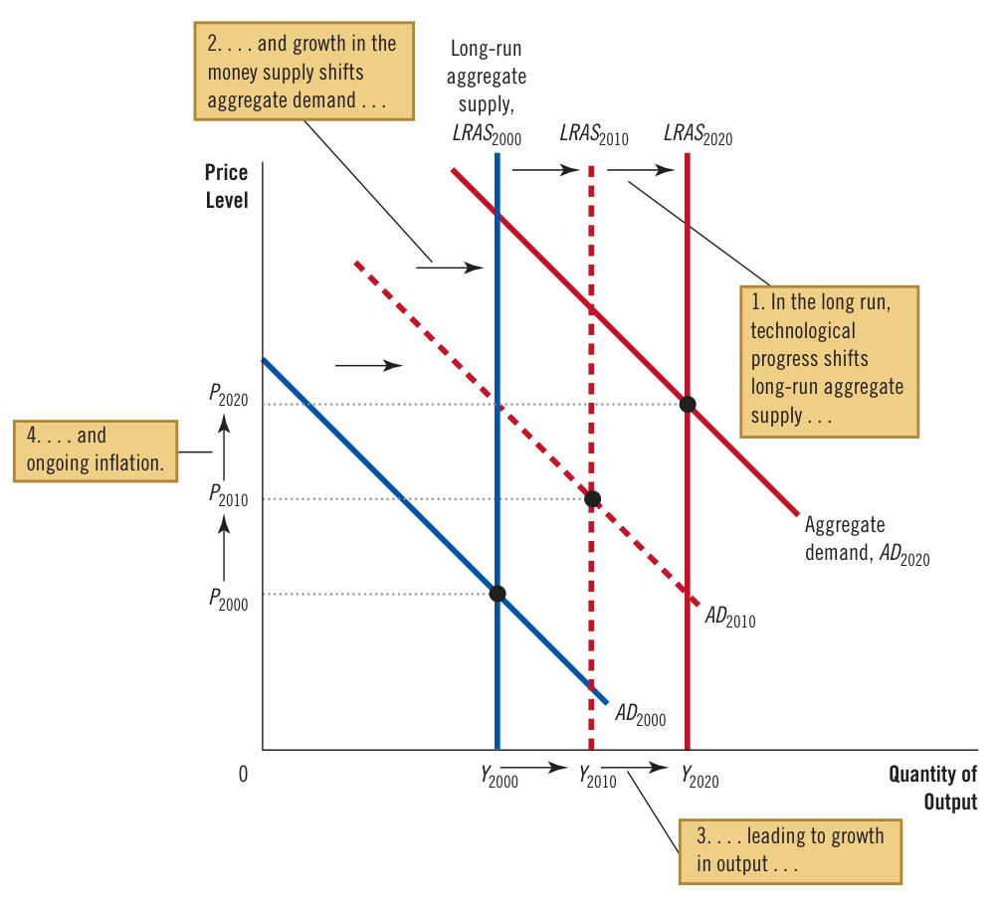  

and inflation shown by the shifts in Figure 5. But always remember that long-run trends are the background on which short-run fluctuations are superimposed. The short-run fluctuations in output and the price level that we will be studying should be viewed as deviations from the long-run trends of output growth and inflation.  

## 34-4d Why the Aggregate-Supply Curve Slopes Upward in the Short Run  

The key difference between the economy in the short run and in the long run is the behavior of aggregate supply. The long-run aggregate-supply curve is vertical because, in the long run, the overall level of prices does not affect the economy’s ability to produce goods and services. By contrast, in the short run, the price level does affect the economy’s output. That is, over a period of a year or two, an increase in the price level tends to increase the quantity of goods and services supplied, and a decrease in the price level tends to reduce the quantity of goods and services supplied. As a result, the short-run aggregate-supply curve slopes upward, as in Figure 6.  

## Figure 6  

## The Short-Run AggregateSupply Curve  

In the short run, a fall in the price level from $P_{1}$ to $P_{2}$ reduces the quantity of output supplied from $\mathsfit{Y}_{\mathrm{1}}$ to $Y_{_2}$ . This positive relationship could be due to sticky wages, sticky prices, or misperceptions. Over time, wages, prices, and perceptions adjust, so this positive relationship is only temporary.  

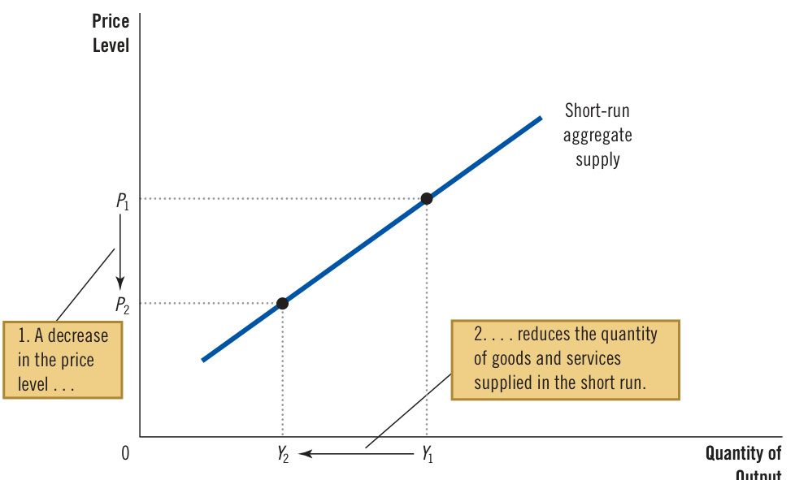  

Why do changes in the price level affect output in the short run? Macroeconomists have proposed three theories for the upward slope of the short-run aggregatesupply curve. In each one, some market imperfection causes the supply side of the economy to behave differently in the short run than it does in the long run. The theories differ in their details but share a common theme: in a word, surprise. The quantity of output supplied deviates from its long-run, or natural, level when the actual price level in the economy deviates from the price level that people expected. When the price level rises above the expected level, output rises above its natural level, and when the price level falls below the expected level, output falls below its natural level.  

The Sticky-Wage Theory  The first explanation for the upward slope of the shortrun aggregate-supply curve is the sticky-wage theory. This theory is the simplest of the three approaches to aggregate supply, and some economists believe it highlights the most important reason why the short run and long run differ. This theory of short-run aggregate supply is one emphasized in this book.  

According to this theory, the short-run aggregate-supply curve slopes upward because nominal wages are slow to adjust to changing economic conditions. In other words, wages are “sticky” in the short run. To some extent, the slow adjustment of nominal wages is attributable to long-term contracts between workers and firms that fix nominal wages, sometimes for as long as three years. This gradual adjustment may also be attributable to slowly changing social norms and notions of fairness, which can influence wage setting.  

An example can help explain how sticky nominal wages can result in a shortrun aggregate-supply curve that slopes upward. Imagine that a year ago, a firm expected the price level today to be at a certain level: We’ll call it 100. Based on this expectation, it signed a contract with its workers agreeing to pay them, say, $\mathbb{S}30$ an hour. In fact, the price level turns out to be only 95. Because prices have fallen below expectations, the firm gets 5 percent less than expected for each unit of the product that it sells. The cost of labor used to make the output, however, is stuck at $\mathbb{S}30$ per hour. Production is now less profitable, so the firm hires fewer workers and reduces the quantity of output supplied. Over time, the labor contract will expire, and the firm can renegotiate with its workers for a lower nominal wage (which they may accept because prices are lower), but in the meantime, employment and production will remain below their long-run levels.  

The same logic works in reverse. Suppose the price level turns out to be 105 and the nominal wage remains stuck at $\mathbb{S}30$ . The firm sees that the amount it is paid for each unit sold is up by 5 percent, while its labor costs are not. In response, it hires more workers and increases the quantity of output supplied. Eventually, the workers will demand higher nominal wages to compensate for the higher price level. But for a while, the firm can take advantage of the profit opportunity by increasing employment and production above their long-run levels.  

In short, according to the sticky-wage theory, the short-run aggregate-supply curve slopes upward because nominal wages are based on expected prices and do not respond immediately when the actual price level turns out to be different from what was expected. This wage stickiness gives firms an incentive to produce less output when the price level turns out lower than expected and to produce more when the price level turns out higher than expected.  

The Sticky-Price Theory  Some economists have advocated another approach to explaining the upward slope of the short-run aggregate-supply curve, called the sticky-price theory. While the sticky-wage theory emphasizes that nominal wages adjust slowly over time, the sticky-price theory focuses on the prices of some goods and services, which also adjust sluggishly in response to changing economic conditions. This slow adjustment occurs in part because there are costs to changing prices, called menu costs. These menu costs include the expense of printing and distributing catalogs, the time required to change price tags, and even the managerial effort needed to decide on new prices. Because of these costs, prices as well as wages may be sticky in the short run.  

To see how sticky prices explain the aggregate-supply curve’s upward slope, suppose that each firm in the economy announces its prices in advance based on the economic conditions it expects for the coming year. Suppose further that after prices are announced, the economy experiences an unexpected contraction in the money supply, which (as we have learned) reduces the overall price level in the long run. What happens in the short run? Some firms reduce their prices quickly in response to the change in economic conditions, but many others want to avoid additional menu costs and temporarily lag behind in cutting prices. Because these lagging firms’ prices are too high, their sales decline. Declining sales, in turn, cause them to cut back production and employment. In other words, an unexpected fall in the price level leaves some firms with higher-than-desired prices, which depress their sales and induce them to reduce the quantity of goods and services they produce.  

Similar reasoning applies when the money supply and price level turn out to be higher than what firms expected when they set their prices. Some firms raise prices quickly in response to the new environment, but others lag behind. Their low prices attract customers, inducing these firms to increase employment and production. Again, for the overall economy, there is a positive association between an unexpected movement in the price level and the quantity of output produced. The upward slope of the short-run aggregate-supply curve reflects this positive association.  

The Misperceptions Theory  A third approach to explaining the upward slope of the short-run aggregate-supply curve is the misperceptions theory. It holds that changes in the overall price level can temporarily mislead suppliers about what is happening in the markets in which they sell their output. Because of these shortrun misperceptions, suppliers respond to changes in the level of prices, leading to an upward-sloping aggregate-supply curve.  

To see how this might work, suppose the overall price level falls below the level that suppliers expected. When suppliers see the prices of their products fall, they may mistakenly believe that their relative prices have fallen; that is, they may believe that their prices have fallen compared with other prices in the economy. For example, wheat farmers may notice a fall in the price of wheat before they notice a fall in the prices of the many items they buy as consumers. They may infer that the reward for producing wheat is temporarily low, and they may respond by reducing the quantity of wheat they supply. Similarly, workers may notice a fall in their nominal wages before they notice that the prices of the goods they buy are also falling. They may infer that the reward for working is temporarily low and respond by working less. In both cases, a lower price level causes misperceptions about relative prices, and these misperceptions induce suppliers to respond to the lower price level by reducing the quantity of goods and services supplied.  

Similar misperceptions arise when the price level is above what was expected. Suppliers of goods and services may notice the price of their output rising and infer, mistakenly, that their relative prices are rising. They would conclude that it is a good time to produce more. Until their misperceptions are corrected, they respond to the higher price level by increasing the quantity of goods and services supplied. This behavior results in a short-run aggregate-supply curve that slopes upward.  

Summing Up  There are three explanations for the upward slope of the short-run aggregate-supply curve: (1) sticky wages, (2) sticky prices, and (3) misperceptions about relative prices. Economists debate which of these theories is correct, and it is possible that each contains an element of truth. For our purposes, the similarities of the theories are more important than the differences. All three suggest that output deviates in the short run from its natural level when the actual price level deviates from the price level that people had expected. We can express this mathematically as follows:  

Quantity Natural Actual Expected of output $=$ level of 1 a price price supplied output level level  

where $a$ is a number that determines how much output responds to unexpected changes in the price level.  

Notice that each of the three theories of short-run aggregate supply emphasizes a problem that is likely to be temporary. Whether the upward slope of the aggregatesupply curve is attributable to sticky wages, sticky prices, or misperceptions, these conditions will not last forever. Over time, nominal wages and prices will become unstuck, and misperceptions about relative prices will be corrected. It is reasonable to assume that, in the long run, wages and prices are flexible rather than sticky, and people accurately perceive relative prices. Each of the three theories explains not only a short-run aggregate-supply curve that slopes upward but also a long-run aggregate-supply curve that is vertical.  

The short-run aggregate-supply curve depicts the quantity of goods and services supplied in the short run for any level of prices. It is similar to the long-run aggregatesupply curve, but it is upward-sloping rather than vertical because of sticky wages, sticky prices, and misperceptions. When thinking about what shifts the short-run aggregate-supply curve, we have to consider all the variables that shift the long-run aggregate-supply curve, plus an additional one: the expected price level. It influences the wages that are stuck, the prices that are stuck, and the perceptions about relative prices that may be flawed.  

Let’s start with what we know about the long-run aggregate-supply curve. As we have discussed, shifts in the long-run aggregate-supply curve normally arise from changes in labor, capital, natural resources, or technological knowledge. These variables also shift the short-run aggregate-supply curve. For example, when an increase in the capital stock raises productivity, the economy can produce more output, so both the long-run and short-run aggregate-supply curves shift to the right. When large sectoral shifts raise the natural rate of unemployment, the economy has fewer employed workers and produces less output, so both the long-run and short-run aggregate-supply curves shift to the left.  

The new variable that affects the position of the short-run aggregate-supply curve is the price level that people expected to prevail. As we have discussed, the quantity of goods and services supplied depends, in the short run, on sticky wages, sticky prices, and misperceptions. Yet wages, prices, and perceptions are set based on the expected price level. So when the expected price level changes, the short-run aggregate-supply curve shifts.  

For example, the sticky-wage theory says that workers and firms agree on a level of nominal wages based on their expectations about the price level. The expected price level, therefore, affects firms’ costs and, for any actual price level, the quantity of goods and services supplied. When the expected price level rises, wages are set higher, costs increase, and firms produce a smaller quantity of goods and services at any actual price level. Thus, the short-run aggregate-supply curve shifts to the left. Conversely, when the expected price level falls, wages are set lower, costs decline, firms increase output at any actual price level, and the short-run aggregate-supply curve shifts to the right.  

A similar logic applies in each of the theories of aggregate supply. The general lesson is the following: An increase in the expected price level reduces the quantity of goods and services supplied and shifts the short-run aggregate-supply curve to the left. A decrease in the expected price level raises the quantity of goods and services supplied and shifts the short-run aggregate-supply curve to the right.  

As the next section shows, the influence of expectations on the position of the short-run aggregate-supply curve plays a key role in explaining how the economy makes the transition from the short run to the long run. In the short run, expectations are fixed, and the economy finds itself at the intersection of the aggregatedemand curve and the short-run aggregate-supply curve. Over time, if the price level differs from what people expected, expectations change, and the short-run aggregate-supply curve shifts. This shift ensures that, in the long run, the economy moves to the intersection of the aggregate-demand curve and the long-run aggregate-supply curve.  

Table 2 summarizes what we’ve learned about the short-run aggregate-supply curve.  

## Table 2  

The Short-Run AggregateSupply Curve: Summary  

## Why Does the Short-Run Aggregate-Supply Curve Slope Upward?  

1. The Sticky-Wage Theory: An unexpectedly low price level, for given nominal wages, causes firms to hire fewer workers and produce a smaller quantity of goods and services.  

2. The Sticky-Price Theory: An unexpectedly low price level leaves some firms with higher-than-desired prices, depressing their sales and leading them to cut back production.  

3. The Misperceptions Theory: An unexpectedly low price level leads some suppliers to think their relative prices have fallen, inducing a fall in production.  

Why Might the Short-Run Aggregate-Supply Curve Shift?  

1. Shifts Arising from Changes in Labor: An increase in the quantity of labor available (perhaps due to a fall in the natural rate of unemployment) shifts the aggregate-supply curve to the right. A decrease in the quantity of labor available (perhaps due to a rise in the natural rate of unemployment) shifts the aggregate-supply curve to the left.  

2. Shifts Arising from Changes in Capital: An increase in physical or human capital shifts the aggregate-supply curve to the right. A decrease in physical or human capital shifts the aggregate-supply curve to the left.  

3. Shifts Arising from Changes in Natural Resources: An increase in the availability of natural resources shifts the aggregate-supply curve to the right. A decrease in the availability of natural resources shifts the aggregate-supply curve to the left.  

4. Shifts Arising from Changes in Technology: An advance in technological knowledge shifts the aggregate-supply curve to the right. A decrease in the available technology (perhaps due to government regulation) shifts the aggregate-supply curve to the left.  

5. Shifts Arising from Changes in the Expected Price Level: A decrease in the expected price level shifts the short-run aggregate-supply curve to the right. An increase in the expected price level shifts the short-run aggregate-supply curve to the left.  

## QuickQuiz  

8. One reason the short-run aggregate-supply curve slopes upward is that a higher price level  

a. raises nominal wages if real wages are sticky.   
b. reduces nominal wages if real wages are sticky.   
c. raises real wages if nominal wages are sticky.   
d. reduces real wages if nominal wages are sticky.  

9. A change in which of the following would shift the short-run aggregate-supply curve but not the long-run aggregate-supply curve?  

a. the labor force b. the capital stock c. the state of technology d. the expected price level  

Answers are at the end of the chapter.  

## 34-5  Two Causes of Economic Fluctuations  

Let’s now use the model of aggregate demand and aggregate supply to examine the two basic causes of short-run fluctuations: shifts in aggregate demand and shifts in aggregate supply.  

## The Long-Run Equilibrium  

To keep things simple, assume the economy begins in long-run equilibrium, as shown in Figure 7. Output and the price level are determined in the long run by the intersection of the aggregate-demand curve and the long-run aggregatesupply curve, shown as point A in the figure. At this point, output is at its natural level. Because the economy is always in a short-run equilibrium, the short-run aggregate-supply curve passes through this point as well, indicating that the expected price level has adjusted to this long-run equilibrium. That is, when an economy is in its long-run equilibrium, the expected price level equals the actual price level so the intersection of aggregate demand with short-run aggregate supply is the same as the intersection of aggregate demand with long-run aggregate supply.  

Suppose that a wave of pessimism overtakes the economy. The cause might be a scandal in the White House, a crash in the stock market, or the outbreak of war overseas. Whatever the specific reason, many people lose confidence in the future and alter their plans. Households cut back on their spending and delay major purchases, and firms put off buying new equipment.  

## 34-5a  The Effects of a Shift in Aggregate Demand  

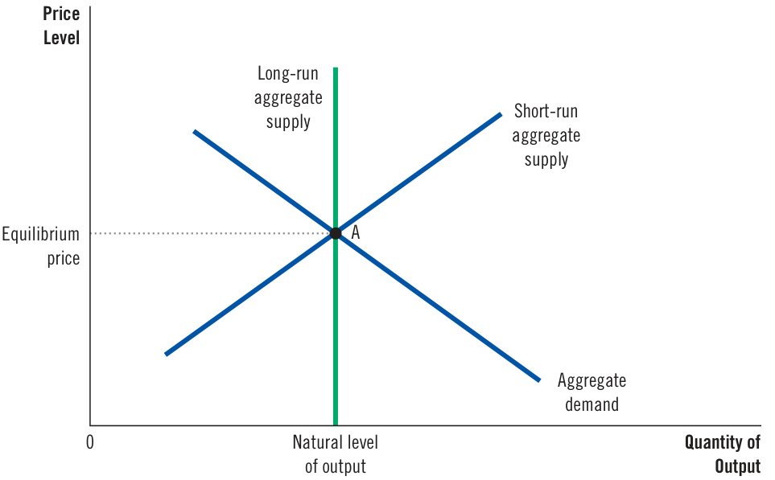  
Figure 7  

What is the macroeconomic impact of such a wave of pessimism? To answer this question, let’s follow the three steps introduced in Chapter 4 for analyzing supply and demand. First, determine whether the event affects aggregate demand or aggregate supply. Second, determine the direction in which the curve shifts. Third, use the diagram of aggregate demand and aggregate supply to compare the initial and new equilibria. The new wrinkle is that we need to add a fourth step: We have to keep track of a new short-run equilibrium, a new long-run equilibrium, and the transition between them. Table 3 summarizes the four steps for analyzing economic fluctuations.  

The long-run equilibrium of the economy is found where the aggregate-demand curve crosses the long-run aggregatesupply curve (point A). When the economy reaches this longrun equilibrium, the expected price level will have adjusted to equal the actual price level. As a result, the short-run aggregate-supply curve crosses this point as well.  

## Table 3  

Four Steps for Analyzing Macroeconomic Fluctuations  

1. Decide whether the event shifts the aggregate-demand curve or the aggregate-supply curve (or perhaps both).   
2. Decide the direction in which the curve shifts.   
3. Use the diagram of aggregate demand and aggregate supply to determine the impact on output and the price level in the short run.   
4. Use the diagram of aggregate demand and aggregate supply to analyze how the economy moves from its new short-run equilibrium to its new long-run equilibrium.  

The first two steps are straightforward. First, because the wave of pessimism affects spending plans, it affects the aggregate-demand curve. Second, because households and firms now want to buy a smaller quantity of goods and services for any price level, the event reduces aggregate demand. As Figure 8 shows, the aggregate-demand curve shifts to the left from $A D_{1}$ to $A D_{2}$ .  

Using this figure, we can perform step three: By comparing the initial and new equilibria, we can see the effects of the fall in aggregate demand. In the short run, the economy moves along the initial short-run aggregate-supply curve, $A S_{\mathrm{{1^{\prime}}}}$ going from point A to point B. As the economy moves between these two points, output falls from $Y_{\mathrm{{1}}}$ to $Y_{_{2^{\prime}}}$ and the price level falls from $P_{\mathrm{{_{1}}}}$ to $P_{_2}$ . The decline in output indicates that the economy is in a recession. Although not shown in the  

## Figure 8  

## A Contraction in Aggregate Demand  

A fall in aggregate demand is represented by a leftward shift in the aggregate-demand curve from $A D_{1}$ to $A D_{2}$ . In the short run, the economy moves from point A to point B. Output falls from $Y_{1}$ to $Y_{_2}$ , and the price level falls from $P_{1}$ to $P_{2}$ . But as the expected price level adjusts, the short-run aggregate-supply curve shifts to the right from $A S_{\mathrm{{1}}}$ to $A S_{_2}$ , and the economy reaches point C, where the new aggregate-demand curve crosses the long-run aggregate-supply curve. In the long run, the price level falls to $P_{3}$ , and output returns to its natural level, $Y_{1}$ .  

## 2. . . . causes output to fall in the short run . .  

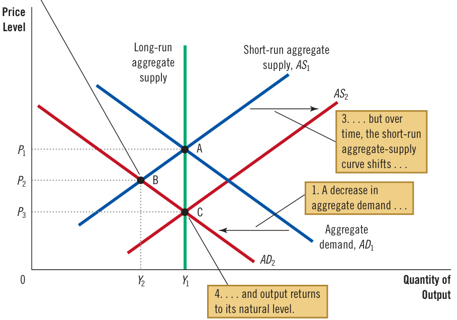  

figure, firms respond to lower sales and production by reducing employment. The pessimism that caused the shift in aggregate demand is, to some extent, self-fulfilling: Pessimism about the future leads to falling incomes and rising unemployment.  

Now comes step four—the transition from the short-run equilibrium to the new long-run equilibrium. Because of the reduction in aggregate demand, the price level initially falls from $P_{_{1}}$ to $P_{_2}$ . The price level is below the level that people were expecting $(\boldsymbol{P}_{1})$ before the sudden fall in aggregate demand. People can be surprised in the short run, but they will not remain surprised forever. Eventually, their expectations catch up with the new reality. The expected price level falls, altering wages, prices, and perceptions, and these changes, in turn, affect the position of the short-run aggregate-supply curve. For example, according to the sticky-wage theory, once workers and firms come to expect a lower level of prices, they agree on lower nominal wages; the reduction in labor costs encourages firms to hire more workers and expand production at any level of prices. In this way, the fall in the expected price level shifts the short-run aggregate-supply curve to the right from $A S_{\mathrm{{1}}}$ to $A S_{_2}$ in Figure 8. This shift allows the economy to approach point $C,$ where the new aggregate-demand curve $(A D_{2})$ crosses the long-run aggregate-supply curve.  

In the new long-run equilibrium, point $C,$ output is back to its natural level. The economy has corrected itself: The decline in output is reversed in the long run, even without action by policymakers. Although the wave of pessimism has reduced aggregate demand, the price level has fallen sufficiently (to $P_{3}$ to offset the shift in the aggregate-demand curve, and people have come to expect this new lower price level as well. In the long run, the shift in aggregate demand is reflected fully in the price level and not at all in the level of output. In other words, the long-run effect of a shift in aggregate demand is a nominal change (the price level is lower) but not a real change (output is the same).  

What should policymakers do when faced with a sudden fall in aggregate demand? This analysis assumed they did nothing. But another possibility is that, as soon as the economy heads into recession (moving from point A to point B), policymakers take action to increase aggregate demand. As we noted earlier, an increase in government spending or an increase in the money supply would increase the quantity of goods and services demanded at any price and thereby shift the aggregate-demand curve to the right. If policymakers act with sufficient speed and precision, they can offset the initial shift in aggregate demand, return the aggregate-demand curve to $A D_{_{1^{\prime}}}$ and bring the economy back to point A. If the policy is successful, the painful period of depressed output and employment can be reduced in length and severity. The next chapter discusses in more detail the ways in which monetary and fiscal policy influence aggregate demand, as well as some of the practical difficulties in using these policy instruments.  

To sum up, this story about shifts in aggregate demand has three important lessons:  

●  In the short run, shifts in aggregate demand cause fluctuations in the economy’s output of goods and services.   
In the long run, shifts in aggregate demand affect the overall price level but do not affect output.   
Because policymakers influence aggregate demand, they can potentially mitigate the severity of economic fluctuations.  

ccording to classical economic theory, money is neutral. That is, changes in the quantity of money affect nominal variables such as the price level but not real variables such as output. Earlier in this chapter, we noted that most economists accept this conclusion as a description of how the economy works in the long run but not in the short run. Using the model of aggregate demand and aggregate supply, we can explain this conclusion more fully.  

Suppose that the Fed reduces the quantity of money in the economy. What effect does this change have? As discussed, the money supply is one determinant of aggregate demand. The reduction in the money supply shifts the aggregate-demand curve to the left.  

The analysis looks just like Figure 8. Even though the cause of the shift in aggregate demand is different, we would observe the same effects on output and the price level. In the short run, both output and the price level fall. The economy has a recession. But over time, the expected price level falls as well. Firms and workers respond to their new expectations by, for instance, agreeing to lower nominal wages. As they do so, the short-run aggregate-supply curve shifts to the right. Eventually, the economy finds itself back on the long-run aggregate-supply curve.  

Figure 8 shows when money matters for real variables and when it does not. In the long run, money is neutral, as represented by the movement of the economy from point A to point C. But in the short run, a change in the money supply has real effects, as represented by the movement of the economy from point A to point B. An old saying summarizes the analysis: “Money is a veil, but when the veil flutters, real output sputters.”  

## Two Big Shifts in Aggregate Demand: The Great Depression and World War II  

This chapter began by establishing three facts about economic fluctuations using data since 1972. Let’s now take a longer look at U.S.  

economic history. Figure 9 shows data since 1900 on the percentage change in real GDP over the previous three years. In an average 3-year period, real GDP grows about 10 percent—a bit more than 3 percent per year. The business cycle, however, causes fluctuations around this average. Two episodes jump out from this figure as being particularly significant: the large drop in real GDP in the early 1930s and the large increase in the early 1940s. Shifts in aggregate demand caused both of these events.  

The economic calamity of the early 1930s is called the Great Depression, and it is by far the largest economic downturn in U.S. history. Real GDP fell by 26 percent from 1929 to 1933, and unemployment rose from 3 percent to 25 percent. At the same time, the price level fell by 22 percent over these four years. Many other countries experienced similar declines in output and prices during this period.  

Economic historians continue to debate the causes of the Great Depression, but most explanations center on a large decline in aggregate demand. What caused aggregate demand to contract? Here is where the disagreement arises.  

Many economists place primary blame on the decline in the money supply: From 1929 to 1933, it fell by 28 percent. As you may recall from our discussion of the monetary system, this decline in the money supply stemmed from problems in the banking system. As households withdrew their money from financially shaky banks and bankers became more cautious and started holding greater reserves, the process of money creation under fractional-reserve banking went into reverse. The Fed, meanwhile, failed to offset this fall in the money multiplier with expansionary open-market operations, so the money supply declined. Many economists blame the Fed’s inaction for the Great Depression’s severity.  

Over the course of U.S. economic history, two fluctuations stand out as especially large. During the early 1930s, the economy endured the Great Depression, when the production of goods and services plummeted. During the early 1940s, the United States entered World War II, and production rose rapidly. Both events are usually explained by large shifts in aggregate demand.  

Source: Louis D. Johnston and Samuel H. Williamson, “What Was GDP Then?” http://www.measuringworth.com/usgdp/; Department of Commerce.  

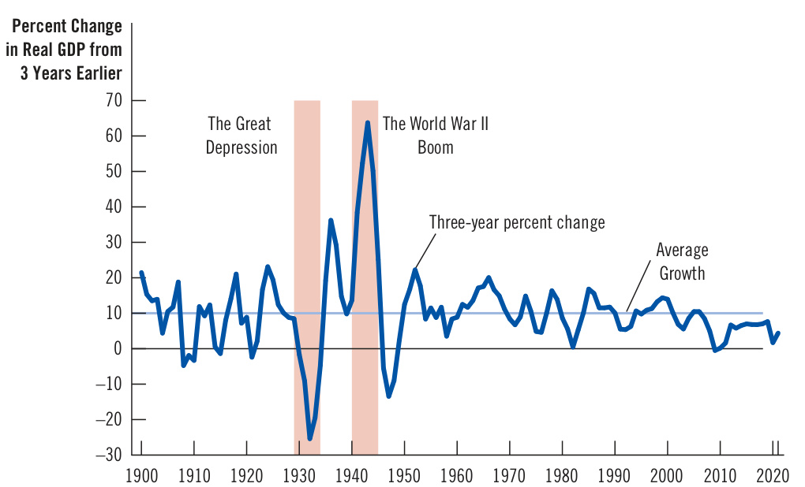  

  
The outcome of a massive decrease in aggregate demand  

Some economists have suggested other reasons for the collapse in aggregate demand. For example, stock prices fell about 90 percent during this period, depressing household wealth and consumer spending. In addition, the banking problems may have prevented some firms from obtaining the financing they wanted for new projects and business expansions, reducing investment spending. It is possible that all these forces acted together to contract aggregate demand.  

The second significant episode in Figure 9—the rapid economic expansion of the early 1940s—is easier to explain. World War II caused the boom. As the United States entered the war overseas, the federal government devoted more resources to the military. Government purchases of goods and services increased almost fivefold from 1939 to 1944. This huge expansion in aggregate demand almost doubled the economy’s production of goods and services and led to a 20 percent increase in the price level (although government price controls limited the rise in prices). Unemployment fell from 17 percent in 1939 to about 1 percent in 1944—the lowest level in U.S. history. ●  

## The Great Recession of 2008–2009  

In 2008 and 2009, the U.S. economy experienced a financial crisis and severe downturn in economic activity. In many ways, it was the worst macroeconomic event in more than half a century.  

The story of this downturn begins a few years earlier with a boom in the housing market that was partly fueled by low interest rates. In the aftermath of the recession of 2001, the Fed dropped rates to historically low levels. These low interest rates helped the economy recover, but by making it less expensive to get a mortgage and buy a home, they contributed to a rise in house prices.  

In addition to low interest rates, changes in the mortgage market made it easier for subprime borrowers—those with a higher risk of default based on their income and credit history—to get loans to buy homes. One development was securitization, the process by which a financial institution (specifically, a mortgage originator) makes loans and then (with the help of an investment bank) bundles them together into financial instruments called mortgage-backed securities. These mortgagebacked securities were then sold to other institutions (such as banks and insurance companies), which may not have fully appreciated the risks in these securities. Some economists blame inadequate regulation for these high-risk loans. Others blame government policies that encouraged this lending to make homeownership more attainable for low-income families. Together, these forces drove up housing demand and house prices. From 1995 to 2006, average house prices in the United States more than doubled.  

Those prices proved unsustainable. From 2006 to 2009, house prices nationwide fell about 30 percent. Such price fluctuations are not necessarily a problem in a market economy. After all, price movements are how markets equilibrate supply and demand. In this case, however, the price decline had two repercussions that led to a large fall in aggregate demand.  

The first was a rise in mortgage defaults and home foreclosures. During the housing boom, many people bought their homes with mostly borrowed money and minimal down payments. When house prices declined, these homeowners were underwater (they owed more on their mortgages than their homes were worth). Many of these homeowners stopped repaying their loans. The banks servicing the mortgages responded to these defaults by taking the houses away in foreclosure procedures and then selling them off. The banks’ goal was to recoup whatever they could from the bad loans. But the increase in the supply of houses for sale exacerbated the downward spiral of house prices. As house prices fell, spending on residential construction collapsed.  

A second repercussion was that financial institutions that owned mortgagebacked securities suffered large losses. In essence, by borrowing large sums to buy high-risk mortgages, these companies had bet that house prices would keep rising; when this bet turned bad, they found themselves at or near bankruptcy. Because of these losses, many financial institutions did not have funds to loan out, and the ability of the financial system to channel resources to those who could best use them was impaired. Even creditworthy customers found themselves unable to borrow to finance investment spending. Such an event is called a credit crunch.  

As a result of the residential investment collapse and credit crunch, the economy experienced a contractionary shift in aggregate demand. Real GDP and employment both fell sharply. The figures cited in this chapter’s introduction are worth repeating: Real GDP declined by 4.0 percent between the fourth quarter of 2007 and the second quarter of 2009, and the rate of unemployment rose from 4.4 percent in May 2007 to 10.0 percent in October 2009. This experience served as a vivid reminder that deep economic downturns and the personal hardship they cause are not relics of history but a constant risk in the modern economy.  

As the crisis unfolded, the U.S. government responded in various ways. Three policy actions—all aimed in part at returning aggregate demand to its previous level—are most noteworthy.  

First, the Fed cut its target for the federal funds rate from 5.25 percent in September 2007 to about zero in December 2008. In addition, in a policy called quantitative easing, the Fed started buying mortgage-backed securities and other long-term debt in open-market operations. The goals of quantitative easing were to lower long-term interest rates and to provide the financial system with additional funds so banks would make loans more readily available.  

Second, in an even more unusual move in October 2008, Congress appropriated $\mathbb{S}700$ billion for the Treasury to use to rescue the financial system. Much of this money was injected into banks as capital. That is, the Treasury put funds into the banking system, which the banks could use to make loans and otherwise continue normal operations; in exchange for these funds, the U.S. government became a part owner of these banks, at least temporarily. The policy’s goal was to stem the crisis on Wall Street and make it easier for businesses and individuals to borrow.  

Finally, when Barack Obama became president in January 2009, his first major initiative was a large increase in government spending. After a brief congressional debate, he signed a $\mathbb{S}787$ billion stimulus bill on February 17, 2009.  

The recovery from this recession began in June 2009, but it was meager by historical standards. Over the next seven years, real GDP growth averaged only 2.2 percent per year, well below the average rate of growth over the past half century of about 3 percent. The unemployment rate did not fall below 5.0 percent until 2016.  

Which of the policy moves were most important for ending the recession? What other policies might have promoted a more robust recovery? Macroeconomic historians continue to debate these questions. ●  

## 34-5b  The Effects of a Shift in Aggregate Supply  

Imagine once again an economy in long-run equilibrium. Now suppose that the costs of production suddenly increase for some firms. For example, bad weather in farm states might destroy crops, driving up the cost of food products. Or a war in the Middle East might interrupt the shipping of crude oil, driving up the cost of oil-intensive goods.  

To analyze the macroeconomic impact of such an increase in production costs, follow the same four steps as always. First, which curve is affected? Because production costs affect the firms that supply goods and services, changes in production costs alter the position of the aggregate-supply curve. Second, in which direction does the curve shift? Because higher production costs make selling goods and services less profitable, firms now supply a smaller quantity of output for any price level. As Figure 10 shows, the short-run aggregate-supply curve shifts to the left, from $A S_{_{1}}$ to $A S_{_2}$ . (Depending on the event, the long-run aggregatesupply curve might also shift. To keep things simple, however, we will assume that it does not.)  

The figure allows us to perform step three of comparing the initial and new equilibria. In the short run, the economy goes from point A to point B, moving along the existing aggregate-demand curve. The output of the economy falls from $Y_{\mathrm{{1}}}$ to $Y_{_{2^{\prime}}}$ and the price level rises from $P_{_{1}}$ to $P_{_2^{\cdot}}$ Because the economy is experiencing both stagnation (falling output) and inflation (rising prices), such an event is sometimes called stagflation.  

stagflation a period of falling output and rising prices  

Now consider step four—the transition from the short-run equilibrium to the long-run equilibrium. According to the sticky-wage theory, the key issue is how stagflation affects nominal wages. Firms and workers may, at first, respond to the higher level of prices by raising their expectations of the price level and  

## An Adverse Shift in Aggregate Supply  

When some event increases firms’ costs, the short-run aggregate-supply curve shifts to the left from $A S_{\mathrm{{1}}}$ to $A S_{_2}$ . The economy moves from point A to point B. The result is stagflation: Output falls from $\mathsfit{Y}_{\mathrm{1}}$ to $Y_{2},$ and the price level rises from $P_{1}$ to $P_{2}$ .  

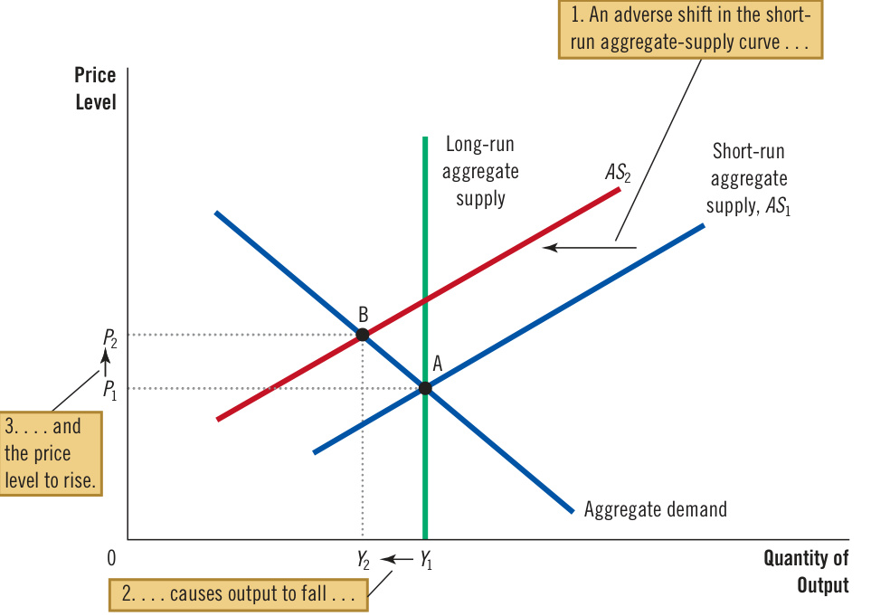  

setting higher nominal wages. In this case, firms’ costs will rise yet again, and the short-run aggregate-supply curve will shift farther to the left, making the problem of stagflation even worse. This phenomenon of higher prices leading to higher wages, which in turn leads to even higher prices, is sometimes called a wage-price spiral.  

At some point, the spiral of ever-rising wages and prices will slow. The low level of output and employment will put downward pressure on wages because workers have less bargaining power when unemployment is high. As nominal wages fall, producing goods and services becomes more profitable, and the short-run aggregate-supply curve shifts to the right. As it shifts back toward $A S_{\mathrm{{1^{\prime}}}}$ the price level falls, and the quantity of output approaches its natural level. In the long run, the economy returns to point A, where the aggregate-demand curve crosses the long-run aggregate-supply curve.  

This transition back to the initial equilibrium assumes, however, that aggregate demand is held constant throughout the process. In the real world, that may not be the case. Monetary and fiscal policymakers might attempt to offset some of the effects of the shift in the short-run aggregate-supply curve by shifting the aggregate-demand curve. This possibility is shown in Figure 11. In this case, changes in policy shift the aggregate-demand curve to the right, from $A{D}_{1}$ to $A{D}_{_{2}}$ —exactly enough to prevent the shift in aggregate supply from affecting output. The economy moves directly from point A to point C. Output remains at its natural level, and the price level rises from $P_{\mathrm{{_{1}}}}$ to $P_{3}$ . In this case, policymakers are said to accommodate the shift in aggregate supply. An accommodative policy accepts a permanently higher level of prices to maintain a higher level of output and employment.  

## Figure 11  

## Accommodating an Adverse Shift in Aggregate Supply  

Faced with an adverse shift in aggregate supply from $A S_{\mathrm{1}}$ to $A S_{_2}$ , policymakers who can influence aggregate demand might try to shift the aggregate-demand curve to the right from $A D_{1}$ to $A D_{2}$ . The economy would move from point A to point C. This policy would prevent the supply shift from reducing output in the short run, but the price level would permanently rise from $P_{1}$ to $P_{3}$ .  

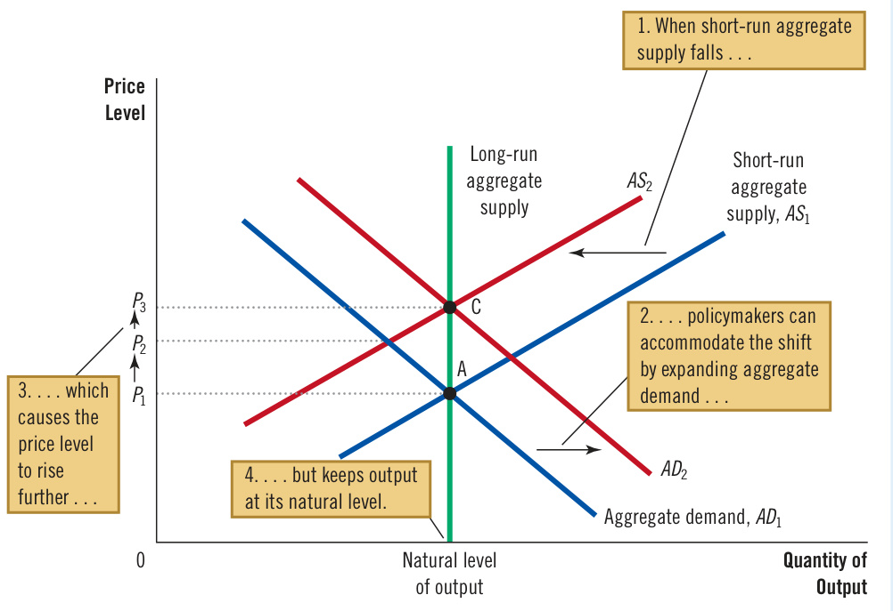  

To sum up, this story about shifts in aggregate supply has two important lessons:  

Shifts in aggregate supply can cause stagflation—a combination of recession (falling output) and inflation (rising prices). Policymakers who can influence aggregate demand can mitigate the adverse impact on output but only at the cost of exacerbating the problem of inflation.  

## Oil and the Economy  

Some of the largest economic fluctuations in the U.S. economy since 1970 originated in the oil fields of the Middle East. Crude oil is an input into the production of many goods and services, and much of the world’s oil comes from Saudi Arabia, Kuwait, and other Middle Eastern countries. When some event (often political in origin) reduces the supply of crude oil flowing from this region, the price of oil rises around the world. Firms in the United States that produce gasoline, tires, and many other products experience rising costs, so they find it less profitable to supply their output of goods and services at any price level. The result is a leftward shift in the aggregate-supply curve, which, in turn, leads to stagflation.  

The first episode of this sort occurred in the mid-1970s. The countries with large oil reserves started to exert their influence on the world economy as members of OPEC, the Organization of the Petroleum Exporting Countries. OPEC is a cartel— a group of sellers that attempts to thwart competition and reduce production to raise prices. And indeed, oil prices rose substantially. From 1973 to 1975, oil approximately doubled in price. Oil-importing countries around the world experienced simultaneous inflation and recession. The U.S. inflation rate as measured by the CPI exceeded 10 percent for the first time in decades. Unemployment rose from 4.9 percent in 1973 to 8.5 percent in 1975.  

Almost the same thing happened a few years later. In the late 1970s, the OPEC countries again restricted the supply of oil. From 1978 to 1981, the price of oil more than doubled. Once again, the result was stagflation. Inflation, which had subsided somewhat after the first OPEC event, again rose above 10 percent per year. But because the Fed was not willing to accommodate such a large rise in inflation, a recession soon followed. Unemployment rose from about 6 percent in 1978 and 1979 to about 10 percent a few years later.  

Developments in the world market for oil can also be a source of favorable   
shifts in aggregate supply. In 1986, squabbling broke out among members of   
OPEC. Member countries reneged on their agreements to restrict oil production. 1t balf Tbis fal1  

In the world market for crude oil, prices fell by about half. This fall in oil prices reduced costs to U.S. firms, which now found it more profitable to supply goods and services at any price level. As a result, the aggregate-supply curve shifted to the right. The U.S. economy experienced the opposite of stagflation: Output grew rapidly, unemployment fell, and the inflation rate reached its lowest level in many years.  

In recent years, developments in the world oil market have not been as important a source of fluctuations for the U.S. economy. One reason is that conservation efforts, advancing technology, and the increased availability of alternative energy sources have reduced the economy’s dependence on oil. The amount of oil used to produce a unit of real GDP has declined by more than 60 percent since the OPEC shocks of the 1970s. As a result, the impact of any change in oil prices on the U.S. economy is smaller today than it was in the past. ●  

  
Changes in Middle East oil production are one source of U.S. economic fluctuations.  

## YI aTnhde  AOgriggriengsa toef  tShuep pMlyodel of Aggregate Demand  

ow that we have seen the model of aggregate demand and aggregate supply, let’s step back and consider its history. How did this model of short-run fluctuations develop? The answer is that this model is largely a by-product of the Great Depression of the 1930s. Economists and policymakers at the time were puzzled about what had caused this calamity and were uncertain about how to deal with it.  

In 1936, the economist John Maynard Keynes published The General Theory  

John Maynard Keynes  

of Employment, Interest, and Money, a landmark book that attempted to explain short-run economic fluctuations in general and the Great Depression in particular. Keynes’s main message was that recessions and depressions can occur because of inadequate aggregate demand for goods and services.  

  

Keynes had long been a critic of classical economic theory because it could explain only the long-run effects of policies. A few years before offering The General Theory, Keynes had written the following about classical economics:  

The long run is a misleading guide to current affairs. In the long run we are all dead. Economists set themselves too easy, too useless a task if in tempestuous seasons they can only tell us when the storm is long past, the ocean will be flat.  

Keynes’s message was aimed at policymakers as well as economists. As the world’s economies suffered from high unemployment, Keynes advocated policies to increase aggregate demand, including government spending on public works.  

The next chapter examines in detail how policymakers can use the tools of monetary and fiscal policy to influence aggregate demand. The analysis in that chapter, as well as in this one, owes much to the legacy of John Maynard Keynes.  

## The Covid Recession of 2020  

In 2020, the U.S. economy and most others around the world experienced a downturn with three unusual features.  

The first was its cause: the Covid-19 pandemic. This infectious and dangerous virus initially appeared in China in late 2019 and then in the United States in early 2020. To slow its spread, health experts advised people to avoid close interactions with others. Elected leaders ordered large segments of the economy to be closed, including movie theaters, sporting events, concerts, restaurants (except for take-out), and non-essential retail stores. Commercial air travel stopped almost completely.  

The second unusual feature of the 2020 downturn was its speed and depth. From February 2020 to April 2020, employment in the United States fell from 61.1 percent of the adult population to 51.3 percent—by far the largest two-month drop ever recorded. The unemployment rate in April 2020 was 14.8 percent, the highest level since the Great Depression.  

The third unusual feature of this downturn was that, in a sense, it was intentional. Most recessions are accidents: Some unexpected event shifts aggregate  

  

## The Strange Downturn of 2020  

The economic events that resulted from the Covid-19 pandemic were not at all typical.  

## The Unusual Covid Recession  

## By Austan Goolsbee  

mericans everywhere remain concerned about getting past what feels like a neverending litany of Covid-19-induced economic problems, from out-of-stock products to inflation and continued fears of exposure to illness when going out. When will it finally end?  

Professional economic forecasters are struggling to answer this question.  

Many are turning to previous recessions as a guide to how things will go. But one of the most important things to understand is that while the pandemic created a collapse—and for some even an economic disaster—it really wasn’t a recession in the normal sense.  

That sounds strange. Indeed, the arbiter of these things, the National Bureau of Economic Research, declared that the United States had a two-month recession in March and April 2020.  

But past business cycles look nothing like what the United States has gone through in the pandemic, so they are the wrong place to find lessons for where things are going now.  

The causes of recessions vary, but they follow a basic pattern: The hardest-hit industries are the cyclically sensitive sectors where demand dries up. Those sectors include sales of big-ticket items like furniture, construction materials, appliances and cars, as the Bureau of Labor Statistics and others have documented. These are purchases that can be delayed when times are bad. Recoveries begin when demand returns to these cyclical industries, when prices fall enough or interest rates get cut enough or pent-up needs build sufficiently for demand to return.  

Recessions have much smaller impacts on noncyclical industries like hospitals, nursing care, gas and electric utilities, and the like. Demand there is steady regardless of the cycle. Some service sector industries, like education, see demand rise in recessions.  

None of these familiar patterns held during the pandemic economic collapse. Spending on consumer durables went up. Indeed, sales of TVs with screens larger than 65 inches rose 77 percent from April to June 2020, compared to the year before, as the bottom dropped out of the economy. Watching TV was one of the few things people could still do during lockdown. Demand for other cyclical industry goods like housing and construction materials boomed too.  

During the pandemic downturn, Americans also reversed a decades-long trend toward spending on services rather than goods. For 75 years, consumers in the United States have been spending less and less of their money on physical goods (from 60 percent of spending in the 1940s to 31 percent in 2019). Counter to this trend (and contrasting with previous  

supply or aggregate demand, reducing production and employment. When this occurs, policymakers usually want to return the economy to normal levels of production and employment as quickly as possible. By contrast, the 2020 downturn was a recession by design. To curb the Covid-19 pandemic, policymakers compelled changes in behavior that reduced production and employment. Of course, the pandemic itself was neither intended nor desired. But given the circumstances, a large, temporary decline in economic activity was arguably the best possible outcome.  

The economic downturn of 2020 can be interpreted using the model of aggregate supply and aggregate demand. Consider first aggregate demand. Starting in March 2020, many places where people normally buy things, such as restaurants and retail stores, were closed by government decree. And people avoided many businesses that remained open to reduce the risk of infection. As a result, the quantity of goods and services demanded was lower at every price level. The aggregate demand curve shifted to the left.  

Now consider aggregate supply. When the health crisis caused many businesses to temporarily shut down, it caused a sudden, massive reduction in the quantity of goods and services supplied at every price level. The aggregate supply curve  

recessions), the share of consumer spending on physical goods actually jumped during the pandemic to the highest level in 17 years and among the biggest jumps ever recorded.  

In other words, this was a recession like no other in recent memory. The pandemic downturn was driven by all those industries that are supposed to be recession-proof—trips to the dentist, electricity usage in offices and malls, and so on. And the normally countercyclical education sector had big enrollment drops despite the bad economy.  

Of course, this was because of the coronavirus. But it means that the recovery from past recessions doesn’t really say much about how the recovery will go now. Everyone is trying to predict when there will be a rebound in service sector industries that normally don’t decline, like health care, child care and education. That’s really more of a question about how quickly we can control the spread of the virus than it is about recession fundamentals.  

At the same time, the unusually large demand for physical goods in the United States and other rich countries has exceeded supply, driving up inflation and leading to shortages. So the most important thing to watch if you want to understand the economy is, as has been the case for a year and half now, the progress made against the virus. Related, and also worth watching, is how much Americans spend on goods relative to services. (It was 31 percent in 2019 and has risen to 35 percent now.) While economic growth in the United States was disappointing in the third quarter of 2021, it could easily turn around if coronavirus case numbers improve. The U.S. employment numbers released on Friday were encouraging. New Covid-19 cases are down significantly and millions of children are now eligible for vaccination, which could reduce infection rates even further.  

Looking beyond the coming months, though, the most interesting questions aren’t really about recession and recovery. They center on whether any of the pandemic changes will last. Some companies, for example, are now trying to hold more inventory and keep their supply chains local to avoid disruption. Many people are working partly from home and some have moved to the exurbs. But how long before they rediscover why we ended up with lean manufacturing and a global supply chain in the first place? And Americans are already moving back to cities.  

My view is that reversals of longstanding economic trends are not likely to become permanent. Once the economic memory of the pandemic has faded, the old lessons from the regular business cycle will probably become relevant once more. Until that happens, though, best to get in line for a vaccine booster and keep your eye on the case numbers. ■  

## Questions to Discuss  

1. How did your family’s spending change during the coronavirus pandemic?   
2. In your opinion, what economic policies should the government have pursued during the pandemic?  

Mr. Goolsbee is a professor of economics at the University of Chicago.  

shifted to the left. The simultaneous shifts in aggregate demand and aggregate supply led to a sharp reduction in production and employment.  

Once the enormity of the downturn became clear, policymakers responded swiftly. On March 27, 2020, the Coronavirus Aid, Relief, and Economic Security (CARES) Act was signed into law. Together with other legislation enacted around the same time, it authorized a combination of spending increases and tax reductions of about $\mathbb{S}2$ trillion, roughly 10 percent of GDP, making it the largest fiscal response to a recession in history. The CARES Act is sometimes called a stimulus bill, but the goal was not actually to end the recession by stimulating the economy. The recession was inevitable, given the pandemic. The policy’s goal was to alleviate the hardship people faced and to prevent the downturn from leaving permanent scars on the economy.  

A large part of the policy response might be called social insurance or disaster relief. All households, except those with high incomes, were given tax rebates of $^{\Phi1,200}$ per adult and $\mathbb{S}500$ per child. Eligibility for unemployment insurance was expanded, and benefits were temporarily increased by $\mathbb{S}600$ per week. Small businesses were offered loans that would be forgiven and turned into grants if they did not lay off any workers for the next two months.  

To prevent permanent damage from the recession, the CARES Act had various provisions to promote business continuity. This was part of the motivation for the forgivable loans to small businesses. Not only did workers continue getting paychecks, but they stayed connected to their employers, so normal business could quickly resume when the crisis passed. The CARES Act also provided funds that enabled the Federal Reserve, working with the Treasury, to lend to larger businesses, states, and municipalities, expanding the Fed’s role as lender of last resort. At the same time, the Fed cut its target for the federal funds rate to near zero.  

In the United States, the number of daily deaths from Covid-19 peaked in late April 2020 and then started to slowly decline. By June 2020, many restrictions on economic activity were relaxed, leading to a quick economic rebound. The unemployment rate, after increasing from 3.5 percent in February 2020 to 14.8 percent in April 2020, declined to 6.9 percent in October 2020.  

The pandemic, however, was not over. Cases surged in January 2021 and then again in October 2021 and January 2022.  

As the pandemic persisted, subsequent legislation continued and expanded the relief offered by the CARES Act. President Trump signed a $\mathbb{S}900$ billion relief package in December 2020, and President Biden signed a $\mathbb{S}1.9$ trillion package in March 2021.  

Some economists—most notably the former Treasury Secretary Lawrence Summers—suggested that the fiscal response was excessive. They worried that, together with supply-chain disruptions from the pandemic, these monetary and fiscal policies might lead to excessive inflation. As measured by the CPI, the 12-month inflation rate rose to 7.5 percent in January 2022—the highest level in 40 years. Policymakers initially believed that this inflation surge would prove temporary. But in March 2022, the Fed started raising interest rates to contain inflationary pressures.  

The eventual solution to this economic downturn came more from microbiology than from macroeconomics. Economic activity started to return to normal after several vaccines were developed and distributed in 2021. But the hesitancy of large segments of the U.S. population to get vaccinated, along with the appearance of the new Omicron variant of the virus, delayed the pandemic’s end and slowed the pace of economic recovery. ●  

10. A sudden increase in business pessimism shifts the aggregate- curve, leading to output.  

a. supply; lower b. supply; higher c. demand; lower d. demand; higher  

11. An increase in the aggregate demand for goods and services has a larger impact on output and a larger impact on the price level a. in the short run; in the long run b. in the long run; in the short run  

c. in the short run; also in the short run d. in the long run; also in the long run  

12. Stagflation is caused by a  

a. leftward shift in the aggregate-demand curve.   
b. rightward shift in the aggregate-demand curve.   
c. leftward shift in the aggregate-supply curve.   
d. rightward shift in the aggregate-supply curve.  

## 34-6 Conclusion  

This chapter had two goals. First, it discussed some of the important facts about short-run fluctuations in economic activity. Second, it introduced a basic model to explain those fluctuations, called the model of aggregate demand and aggregate supply. We continue our study of this model in the next chapter to understand more fully what causes economic fluctuations and how policymakers might respond to them.  

## Chapter in a Nutshell  

All societies experience short-run economic fluctuations around long-run trends. These fluctuations are irregular and largely unpredictable. When recessions occur, real GDP and other measures of income, spending, and production fall, while unemployment rises.  

Classical economic theory is based on the assumption that nominal variables such as the money supply and the price level don’t influence real variables such as output and employment. Most economists believe that this assumption is accurate in the long run but not in the short run. Economists analyze short-run economic fluctuations using the model of aggregate demand and aggregate supply. According to this model, the output of goods and services and the overall level of prices adjust to balance aggregate demand and aggregate supply.  

The aggregate-demand curve slopes downward for three reasons. The first is the wealth effect: A lower price level raises the real value of households’ money holdings, stimulating consumer spending. The second is the interest-rate effect: A lower price level reduces the quantity of money households demand. As households try to convert money into interest-bearing assets, interest rates fall, stimulating investment spending. The third is the exchange-rate effect: As a lower price level reduces interest rates, the dollar depreciates in the market for foreign-currency exchange, stimulating net exports.  

Any event or policy that raises consumption, investment, government purchases, or net exports at any price level increases aggregate demand. Any event or policy that reduces consumption, investment, government purchases, or net exports at any price level decreases aggregate demand.   
The long-run aggregate-supply curve is vertical. In the long run, the quantity of goods and services supplied depends on the economy’s labor, capital, natural resources, and technology but not on the overall level of prices.   
Three theories have been proposed to explain the upward slope of the short-run aggregate-supply curve. According to the sticky-wage theory, an unexpected fall in the price level, for given nominal wages, induces firms to reduce employment and production.  

According to the sticky-price theory, an unexpected fall in the price level leaves some firms with prices that are temporarily too high, reducing their sales and causing them to cut back production. According to the misperceptions theory, an unexpected fall in the price level leads suppliers to mistakenly believe that their relative prices have fallen, inducing them to reduce production. All three theories imply that output deviates from its natural level when the actual price level deviates from the price level that people expected.  

Events that alter the economy’s ability to produce output, such as changes in labor, capital, natural resources, or technology, shift the short-run aggregate-supply curve (and may shift the long-run aggregate-supply curve as well). In addition, the position of the short-run aggregate-supply curve depends on the expected price level.  

One possible cause of economic fluctuations is a shift in aggregate demand. When the aggregate-demand curve shifts to the left, for instance, output and prices fall in the short run. Over time, as a change in the expected price level causes wages, prices, and perceptions to adjust, the short-run aggregate-supply curve shifts to the right. This shift returns the economy to its natural level of output at a new, lower price level. A second possible cause of economic fluctuations is a shift in aggregate supply. When the short-run aggregate-supply curve shifts to the left, the effect is falling output and rising prices—a combination called stagflation. Over time, as wages, prices, and perceptions adjust, the short-run aggregate-supply curve shifts back to the right, returning the price level and output to their original levels.  

## Key Concepts  

recession, p. 710   
depression, p. 710   
model of aggregate demand and aggregate supply, p. 714  

aggregate-demand curve, p. 714   
aggregate-supply curve, p. 714   
natural level of output, p. 722   
stagflation, p. 736  

## Questions for Review  

1. Name two macroeconomic variables that decline when the economy goes into a recession. Name one macroeconomic variable that rises during a recession.   
2. Draw a diagram showing aggregate demand, shortrun aggregate supply, and long-run aggregate supply. Be careful to label the axes correctly.   
3. List and explain the three reasons the aggregatedemand curve slopes downward.   
4. Explain why the long-run aggregate-supply curve is vertical.   
5. List and explain the three theories for why the shortrun aggregate-supply curve slopes upward.   
6. What might shift the aggregate-demand curve to the left? Use the model of aggregate demand and aggregate supply to trace the short-run and long-run effects of such a shift on output and the price level.   
7. What might shift the aggregate-supply curve to the left? Use the model of aggregate demand and aggregate supply to trace the short-run and long-run effects of such a shift on output and the price level.  

## Problems and Applications  

1. Suppose the economy is in a long-run equilibrium. a. Draw a diagram to illustrate the state of the economy. Be sure to show aggregate demand, short-run aggregate supply, and long-run aggregate supply. b. Now suppose that a stock market crash causes aggregate demand to fall. Use your diagram to show what happens to output and the price  

level in the short run. What happens to the unemployment rate? c. Use the sticky-wage theory of aggregate supply to explain what happens to output and the price level in the long run (assuming no change in policy). What role does the expected price level play in this adjustment? Be sure to illustrate your analysis in a graph.  

2. Explain whether each of the following events increases, decreases, or has no effect on long-run aggregate supply. a. The United States experiences a wave of immigration. b. Congress raises the minimum wage to $\mathbb{S}15$ per hour. c. Intel invents a new and more powerful computer chip. d. A severe hurricane damages factories along the East Coast.   
3. Suppose an economy is in long-run equilibrium. a. Use the model of aggregate demand and aggregate supply to illustrate the initial equilibrium (call it point A). Be sure to include both short-run aggregate supply and long-run aggregate supply. b. The central bank raises the money supply by 5 percent. Use your diagram to show what happens to output and the price level as the economy moves from the initial equilibrium to the new short-run equilibrium (call it point B). c. Now show the new long-run equilibrium (call it point C). What causes the economy to move from point B to point C? d. According to the sticky-wage theory of aggregate supply, how do nominal wages at point A compare with nominal wages at point B? How do nominal wages at point A compare with nominal wages at point C? e. According to the sticky-wage theory of aggregate supply, how do real wages at point A compare with real wages at point B? How do real wages at point A compare with real wages at point C? f. Judging by the impact of the money supply on nominal and real wages, is this analysis consistent with the proposition that money has real effects in the short run but is neutral in the long run?   
4. In 1939, with the U.S. economy not yet fully recovered from the Great Depression, President Franklin Roosevelt proclaimed that Thanksgiving would fall a week earlier than usual so that the shopping period before Christmas would be longer. (The policy was dubbed “Franksgiving.”) Explain what President Roosevelt might have been trying to achieve, using the model of aggregate demand and aggregate supply.   
5. Explain why the following statements are false. a. “The aggregate-demand curve slopes downward because it is the horizontal sum of the demand curves for individual goods.” b. “The long-run aggregate-supply curve is vertical because economic forces do not affect long-run aggregate supply.” c. “If firms adjusted their prices every day, then the short-run aggregate-supply curve would be horizontal.” d. “Whenever the economy enters a recession, its long-run aggregate-supply curve shifts to the left.”   
6. For each of the three theories for the upward slope of the short-run aggregate-supply curve, carefully explain the following: a. how the economy recovers from a recession and returns to its long-run equilibrium without any policy intervention b. what determines the speed of that recovery   
7. The economy begins in long-run equilibrium. Then, one day, the president appoints a new Fed chair, who is well known for holding the view that inflation is not a major problem for an economy. a. How would this news affect the price level that people expect to prevail? b. How would this change in the expected price level affect the nominal wage that workers and firms agree to in their new labor contracts? c. How would this change in the nominal wage affect the profitability of producing goods and services at any price level? d. How would this change in profitability affect the short-run aggregate-supply curve? e. If aggregate demand is held constant, how would this shift in the aggregate-supply curve affect the price level and the quantity of output produced? f. Do you think appointing this Fed chair was a good decision?   
8. Explain whether each of the following events shifts the short-run aggregate-supply curve, the aggregatedemand curve, both, or neither. For each event that does shift a curve, draw a diagram to illustrate the effect on the economy. a. Households decide to save a larger share of their income. b. Florida orange groves suffer a prolonged period of below-freezing temperatures. c. Increased job opportunities overseas cause many people to leave the country.   
9. For each of the following events, explain the shortrun and long-run effects on output and the price level, assuming policymakers take no action. a. The stock market declines sharply, reducing consumers’ wealth. b. The federal government increases spending on national defense. c. A technological improvement raises productivity. d. A recession overseas causes foreigners to buy fewer U.S. goods.  

10. Suppose firms become optimistic about future business conditions and invest heavily in new capital equipment. a. Draw an aggregate-demand/aggregate-supply diagram to show the short-run effect of this optimism on the economy. Label the new levels of prices and real output. Explain in words why the aggregate quantity of output supplied changes. b. Now use the diagram from part (a) to show the new long-run equilibrium of the economy. (For  

now, assume there is no change in the long-run aggregate-supply curve.) Explain in words why the aggregate quantity of output demanded changes between the short run and the long run. c. How might the investment boom affect the longrun aggregate-supply curve? Explain.  

## QuickQuiz Answers  

<html><body><table><tr><td>1. c</td><td>2.d</td><td>3.c</td><td>4.a</td><td>5.b</td><td>6. b</td><td>7. d</td><td>8.d</td><td>9.d</td><td>10.c</td><td>11. a</td><td>12.c</td></tr></table></body></html>  

