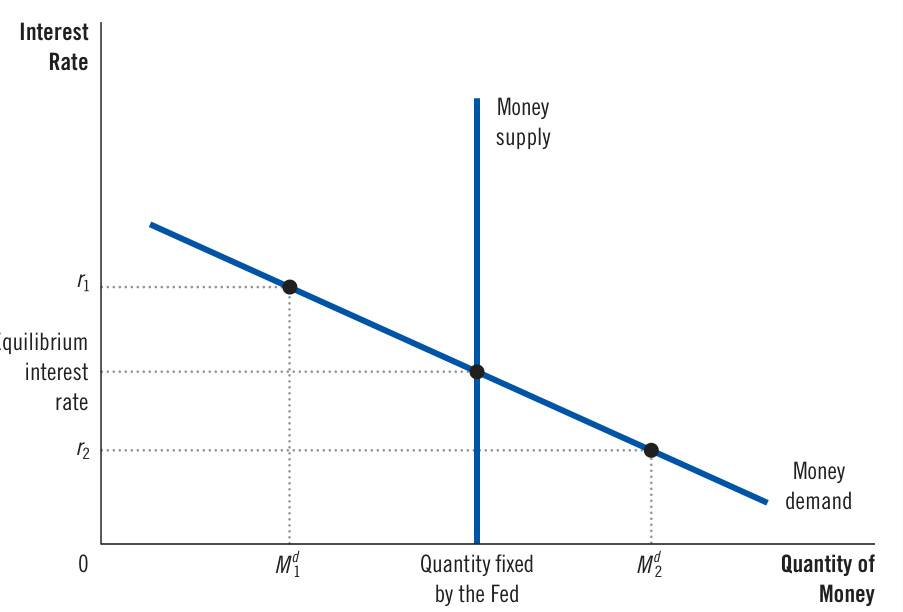
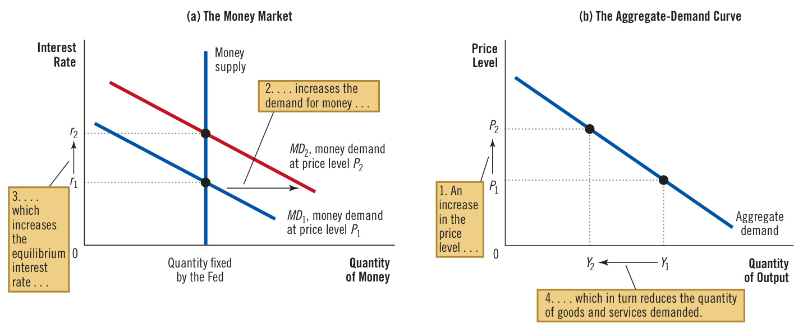
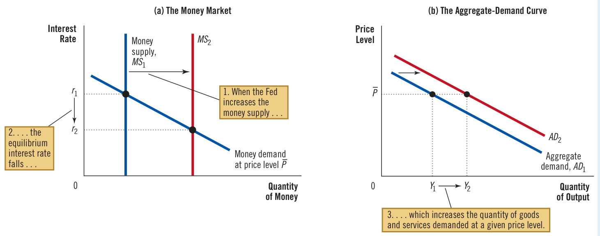
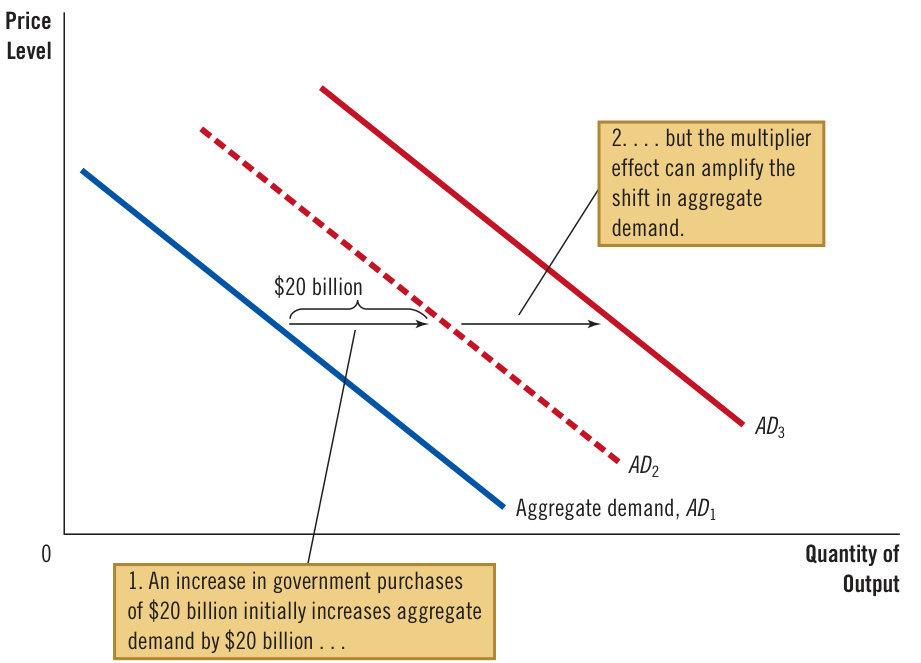
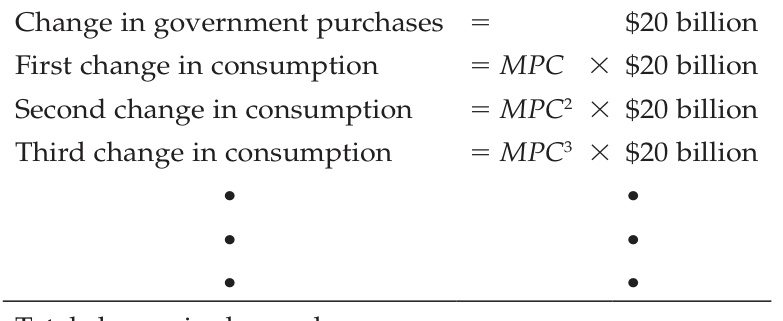
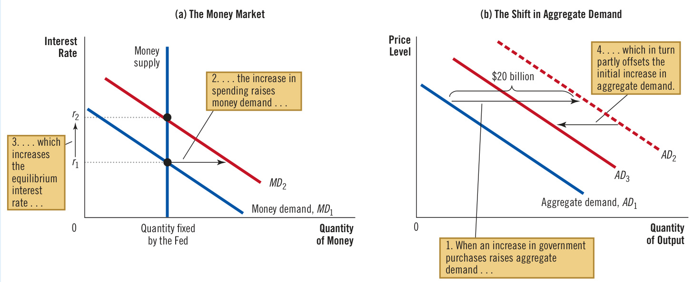
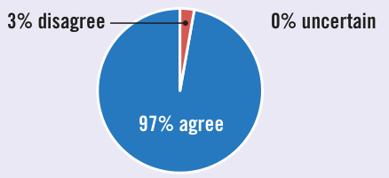
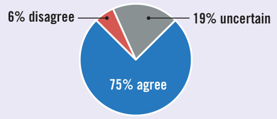

# Ch35 The Influence of Monetary and Fiscal Policy on Aggregate Demand  

magine that you are a member of the Federal Open Market Committee, the group at the Federal Reserve that sets monetary policy. You observe that the president and Congress are raising taxes to reduce the budget deficit. How should the Fed respond to this change in fiscal policy? Should monetary policy be expansionary, contractionary, or unchanged?  

To answer this question, we will need to consider the impact of monetary and fiscal policy on the economy. The preceding chapter used the model of aggregate demand and aggregate supply to explain short-run economic fluctuations. We saw that shifts in the aggregate-demand curve or the aggregate-supply curve cause fluctuations in the overall output of goods and services and the level of prices. As we noted, both monetary and fiscal policy influence aggregate demand, so a change in one of these policies can lead to short-run fluctuations in output and prices. Policymakers may want to adjust the other policy in response.  

This chapter examines in greater detail how government policy tools influence the position of the aggregate-demand curve. These tools include monetary policy (the open-market operations conducted by the central bank and the interest rate it pays on reserves) and fiscal policy (the levels of government spending and taxation set by the president and Congress). We have already discussed the long-run effects of these policies. Chapters 26 and 27 showed how fiscal policy affects saving, investment, and long-run economic growth. Chapters 30 and 31 examined how monetary policy influences the price level in the long run. Now we will see how these policy tools can shift the aggregate-demand curve and affect macroeconomic variables in the short run.  

Many factors aside from monetary and fiscal policy influence aggregate demand. Among them is the desired spending by households and firms. When desired spending changes, aggregate demand shifts, and if policymakers don’t respond, such shifts cause short-run fluctuations in output and employment. Policymakers sometimes use the policy levers at their disposal to try to offset these effects and stabilize the economy. The theory behind these policy actions, together with the difficulties that arise when using this theory in practice, is the focus of this chapter.  

## 35-1  How Monetary Policy Influences Aggregate Demand  

The aggregate-demand curve shows the total quantity of goods and services demanded in the economy for any price level. The preceding chapter discussed three reasons for the curve’s downward slope:  

•  The wealth effect: A lower price level raises the real value of households’ money holdings, which are part of their wealth. Higher real wealth stimulates consumer spending and thus increases the quantity of goods and services demanded.   
• The interest-rate effect: A lower price level reduces the amount of money people want to hold. As people try to lend out their excess money, the interest rate falls. The lower interest rate stimulates investment spending and thus increases the quantity of goods and services demanded. The exchange-rate effect: When a lower price level reduces the interest rate, investors move some of their funds overseas in search of higher returns. This movement causes the real value of the domestic currency to fall in the market for foreign-currency exchange. Domestic goods become less expensive relative to foreign goods. This change in the real exchange rate stimulates spending on net exports and thus increases the quantity of goods and services demanded.  

These three effects work simultaneously to increase the quantity of goods and services demanded when the price level falls. And the opposite occurs when the price level rises.  

While all three of these effects help explain the downward slope of the aggregatedemand curve, they are not of equal importance. Because money holdings are a small part of household wealth, the wealth effect is the least important. In addition, because exports and imports represent only a small fraction of U.S. GDP, the exchange-rate effect is not large for the U.S. economy. (It is more important for smaller countries, which typically export and import a larger fraction of their GDP.) For the U.S. economy, the most important reason for the downward slope of the aggregate-demand curve is the interest-rate effect.  

theory of liquidity   
preference   
Keynes’s theory that   
the interest rate adjusts   
to bring money supply   
and money demand into   
balance  

For that reason, we now examine the short-run determination of interest rates in more detail, developing what is known as the theory of liquidity preference. This theory of interest rates helps explain the downward slope of the aggregate-demand curve as well as how monetary and fiscal policy can shift the curve. It is useful in analyzing the causes of short-run fluctuations and the possible policy responses.  

In his book The General Theory of Employment, Interest, and Money, John Maynard Keynes proposed the theory of liquidity preference to explain the factors that determine an economy’s interest rate. The theory is, in essence, an application of supply and demand. According to Keynes, the interest rate adjusts to balance the supply of and demand for money.  

You may recall that economists distinguish between two interest rates: The nominal interest rate is the interest rate as usually reported, while the real interest rate is the interest rate corrected for the effects of inflation. When there is no inflation, the two rates are the same. But when borrowers and lenders expect prices to rise over the term of the loan, they agree to a nominal interest rate that exceeds the real interest rate by the expected rate of inflation. The higher nominal interest rate compensates for the expectation that the loan will be repaid in less valuable dollars.  

Which interest rate are we trying to explain with the theory of liquidity preference? The answer is both. In the analysis that follows, we hold constant the expected rate of inflation. This assumption is reasonable for studying the economy in the short run because expected inflation is typically stable over short periods. In this case, nominal and real interest rates differ by a constant: When the nominal interest rate rises or falls, the real interest rate that people expect to earn rises or falls by the same amount. For the rest of this chapter, changes in the interest rate refer to both the real interest rate and the nominal interest rate.  

Now, let’s develop the theory of liquidity preference by considering the supply and demand for money.  

Money Supply  The first piece of the theory of liquidity preference is the supply of money. As Chapter 30 discussed, the Federal Reserve controls the money supply in the United States. Historically, the Fed has altered the money supply primarily by changing the quantity of reserves in the banking system through the purchase and sale of government bonds in open-market operations. When the Fed buys government bonds, the dollars it pays for them are typically deposited in banks and added to bank reserves. When the Fed sells government bonds, the dollars it receives for them are withdrawn from the banking system, and bank reserves fall. These changes in bank reserves, in turn, lead to changes in banks’ ability to make loans and create money. In this way, the Fed can alter the money supply.  

In addition to open-market operations, the Fed can influence the money supply using various other tools. One option used more recently is for the Fed to change the interest rate it pays on reserves. For example, a decrease in the interest rate paid on reserves discourages banks from holding them, increasing bank lending and, in turn, the money supply. Conversely, an increase in the interest rate paid on reserves encourages banks to hold them, reducing bank lending and the money supply. The Fed can also alter the money supply by changing reserve requirements (the amount of reserves banks must hold against deposits) or the discount rate (the interest rate the Fed charges banks for borrowing reserves from it).  

These details about monetary control are important for the implementation of Fed policy, but they are not crucial for the analysis in this chapter. The goal here is to examine how changes in the money supply affect the aggregate demand for goods and services. Toward that end, the theory of liquidity preference makes the simplifying assumption that the Fed controls the money supply directly.  

Because the quantity of money supplied in the economy is fixed at whatever level the Fed decides to set it, it does not depend on the prevailing interest rate. We represent a fixed money supply with a vertical supply curve, as in Figure 1.  

Equilibrium in the Money Market  

According to the theory of liquidity preference, the interest rate adjusts to bring the quantity of money supplied and the quantity of money demanded into balance. If the interest rate is above the equilibrium level (such as at $r_{\mathrm{{1}}})$ , the quantity of money people want to hold $(M_{1}^{d})$ is less than the quantity the Fed has created, and this surplus puts downward pressure on the interest rate. Conversely, if the interest rate is below the equilibrium level (such as at $r_{{}_{2}})$ , the quantity of money people want to hold $(M_{2}^{d})$ exceeds the quantity the Fed has created, and this shortage puts upward pressure on the interest rate. In this manner, the theory says, the forces of supply and demand in the market for money push the interest rate toward the equilibrium interest rate at which people are content holding the quantity of money the Fed has created.  

  

Money Demand  The second piece of the theory of liquidity preference is the demand for money. Recall that an asset’s liquidity refers to the ease with which it can be converted into the economy’s medium of exchange. Because money is the economy’s medium of exchange, it is the most liquid asset available. This liquidity explains why there is always some demand for money: People choose to hold money instead of other assets that offer higher rates of return because they can use it to buy goods and services.  

Although many factors determine the quantity of money demanded, the theory of liquidity preference emphasizes the interest rate because it represents the opportunity cost of holding money. That is, when you hold wealth as cash rather than as an interest-bearing bond or bank deposit, you lose the interest you could have earned. An increase in the interest rate raises the cost of holding money and, as a result, reduces the quantity of money demanded. Conversely, a decrease in the interest rate reduces the cost of holding money and raises the quantity demanded. That’s why, as Figure 1 shows, the money demand curve slopes downward.  

Equilibrium in the Money Market  According to the theory of liquidity preference, the interest rate adjusts to balance the supply and demand for money. There is one interest rate, called the equilibrium interest rate, at which the quantity of money demanded exactly balances the quantity supplied. If the interest rate is at any other level, people will try to adjust their portfolios of money and nonmonetary assets and drive the interest rate toward the equilibrium.  

For example, suppose that the interest rate is above the equilibrium level, such as $r_{\mathrm{{1}}}$ in Figure 1. In this case, the quantity of money that people want to hold, $M_{1}^{d},$ is less than the quantity that the Fed has supplied. Those people who are holding the surplus of money will try to get rid of it by buying interest-bearing bonds or by depositing it in interest-bearing bank accounts. Because bond issuers and banks prefer to pay lower interest rates, they respond to this surplus of money by lowering the rates they offer. As the interest rate falls, people become more willing to hold money until, at the equilibrium interest rate, people are happy to hold exactly the amount the Fed has supplied.  

Conversely, at interest rates below the equilibrium level, such as $r_{{}_{2}}$ in Figure 1, the quantity of money that people want to hold, $M_{2}^{d},$ exceeds the quantity that the Fed has supplied. As a result, people try to increase their holdings of money by reducing their holdings of bonds and other interest-bearing assets. As people cut back on their holdings of bonds, bond issuers find that they have to offer higher interest rates to attract buyers. Ultimately, the interest rate rises until it reaches the equilibrium level.  

## FYI Interest Rates in the Long Run and the Short Run  

n earlier chapter said that the interest rate adjusts to balance the supply of loanable funds (national saving) and the demand for loanable funds (desired investment). But we just said that the interest rate adjusts to balance the supply of and demand for money. How can these two theories be reconciled?  

To answer this question, we need to focus on three macroeconomic variables: the economy’s output of goods and services, the interest rate, and the price level. According to the classical macroeconomic theory developed earlier in the book, these variables are determined as follows:  

price level cannot, by itself, move to balance the supply of and demand for money. This stickiness of the price level requires the interest rate to move to bring the money market into equilibrium. These changes in the interest rate, in turn, affect the aggregate demand for goods and services. As aggregate demand fluctuates, the economy’s output of goods and services moves away from the level determined by factor supplies and technology. When thinking about the economy in the short run (day to day, week to week, month to month, or quarter to quarter), apply the following logic:  

1. The price level is stuck at some level (based on previously formed expectations) and, in the short run, is relatively unresponsive to changing economic conditions. 2. For any given (stuck) price level, the interest rate adjusts to balance the supply of and demand for money. 3. The interest rate that balances the money market influences the quantity of goods and services demanded and thereby the level of output.  

1. Output is determined by the supplies of capital and labor and the available production technology for turning capital and labor into output. (We call this the natural level of output.)   
2. For any given level of output, the interest rate adjusts to balance the supply and demand for loanable funds.   
3. Given output and the interest rate, the price level adjusts to balance the supply and demand for money. Changes in the money supply lead to proportionate changes in the price level.  

Notice that this logic reverses the order of analysis used to study the economy in the long run.  

These are three of the essential propositions of classical economic theory. Most economists believe that these propositions do a good job of describing how the economy works in the long run.  

Yet these propositions do not hold in the short run. As we learned in the preceding chapter, many prices are slow to adjust to changes in the money supply. This is reflected in a short-run aggregate-supply curve that is upward-sloping rather than vertical. As a result, in the short run, the overall  

The two different theories of the interest rate are useful for different purposes. When thinking about the long-run determinants of the interest rate, it is best to keep in mind the loanable-funds theory, which highlights the importance of an economy’s saving propensities and investment opportunities. But when thinking about the short-run determinants of the interest rate, it is best to keep in mind the liquidity-preference theory, which highlights the importance of monetary policy. ■  

## 35-1b  The Downward Slope of the Aggregate-Demand Curve  

Having seen how the theory of liquidity preference explains the economy’s equilibrium interest rate, we now consider the theory’s implications for the aggregate demand for goods and services. As a warm-up exercise, let’s first use the theory to reexamine a topic we have already covered—the interest-rate effect and the downward slope of the aggregate-demand curve. In particular, suppose that the overall level of prices in the economy rises. What happens to the interest rate that balances the supply and demand for money, and how does that change affect the quantity of goods and services demanded?  

As Chapter 31 discussed, the price level is one determinant of the quantity of money demanded. At higher prices, more money is exchanged every time a good or service is sold, so people will choose to hold a larger quantity of money. That means a higher price level increases the quantity of money demanded for any interest rate. This is shown in panel (a) of Figure 2: An increase in the price level from $P_{_{1}}$ to $P_{_2}$ shifts the money demand curve to the right from $M D_{1}$ to $M D_{2}$ .  

This shift in money demand affects the equilibrium in the money market. As the figure shows, the interest rate must rise to balance money supply and money demand. Because the higher price level has increased the amount of money people want to hold, it has shifted the money demand curve to the right. Yet the quantity of money supplied is fixed, so the interest rate must rise from $r_{\mathrm{{1}}}$ to $r_{{}_{2}}$ to forestall the additional demand.  

This increase in the interest rate has ramifications not only for the money market but also for the quantity of goods and services demanded, as shown in panel (b).  

  
Figure 2 The Money Market and the Slope of the AggregateDemand Curve  

An increase in the price level from $P_{1}$ to $P_{2}$ shifts the money demand curve to the right, as in panel (a). This increase in money demand causes the interest rate to rise from $r_{\mathrm{{1}}}$ to $r_{2}$ . Because the interest rate is the cost of borrowing, the increase in the interest rate reduces the quantity of goods and services demanded from $\mathsfit{Y}_{\mathrm{1}}$ to $Y_{_2}$ . This negative relationship between the price level and quantity demanded is represented by a downward-sloping aggregate-demand curve, as in panel (b).  

At a higher interest rate, the cost of borrowing and the return to saving are greater. Fewer households choose to borrow to buy a new house, and those who do buy smaller houses, so the demand for residential investment falls. Fewer firms choose to borrow to build new factories and buy new equipment, so business investment falls. Thus, when the price level rises from $P_{_{1}}$ to $P_{_2{^\prime}}$ increasing money demand from $M D_{1}$ to $M D_{2}$ and raising the interest rate from $r_{\mathrm{{1}}}$ to $r_{2},$ the quantity of goods and services demanded falls from $Y_{\mathrm{{1}}}$ to $Y_{2}$ .  

The interest-rate effect can be summarized in three steps: (1) A higher price level raises money demand. (2) Higher money demand leads to a higher interest rate. (3) A higher interest rate reduces the quantity of goods and services demanded. The same logic works for a decline in the price level: A lower price level reduces money demand, leading to a lower interest rate and a larger quantity of goods and services demanded. The result of this analysis is a negative relationship between the price level and the quantity of goods and services demanded, as illustrated by a downward-sloping aggregate-demand curve.  

## 35-1c  Changes in the Money Supply  

So far, we have used the theory of liquidity preference to explain more fully how the total quantity of goods and services demanded in the economy changes as the price level changes. That is, we have examined movements along a downwardsloping aggregate-demand curve. The theory also sheds light, however, on some of the other events that alter the quantity of goods and services demanded. Whenever the quantity of goods and services demanded changes for any price level, the aggregate-demand curve shifts.  

One important variable that shifts the aggregate-demand curve is monetary policy. To see how, suppose that the Fed increases the money supply by buying government bonds in open-market operations. (Why the Fed might do this will become clear later.) Let’s consider how this monetary injection influences the equilibrium interest rate for a given price level. This will reveal what the injection does to the position of the aggregate-demand curve.  

As panel (a) of Figure 3 shows, an increase in the money supply shifts the money supply curve to the right from $M S_{1}$ to ${M S}_{2}$ . Because the money demand curve has not changed, the interest rate falls from $r_{\mathrm{{1}}}$ to $r_{{}_{2}}$ to balance money supply and money demand. That is, the interest rate must fall to induce people to hold the additional money the Fed has created, restoring equilibrium in the money market.  

Once again, the interest rate influences the quantity of goods and services demanded, as shown in panel (b) of Figure 3. The lower interest rate reduces the cost of borrowing and the return to saving. Households spend more on new homes, stimulating the demand for residential investment. Firms spend more on new factories and new equipment, stimulating business investme_nt. As a result, the quantity of goods and services de_manded at a given price level, $\overline{{P}}_{.}$ , rises from $Y_{\mathrm{{1}}}$ to $Y_{_2}$ . There is nothing special about $\overline{P}$ : The monetary injection raises the quantity of goods and services demanded at every price level. Thus, the entire aggregate-demand curve shifts to the right.  

To sum up: When the Fed increases the money supply, it lowers the interest rate and increases the quantity of goods and services demanded for any price level, shifting the aggregate-demand curve to the right. Conversely, when the Fed contracts the money supply, it raises the interest rate and reduces the quantity of goods and services demanded for any price level, shifting the aggregate-demand curve to the left.  

In panel (a), an increase in the money supply from ${M S}_{\mathrm{1}}$ to ${M S}_{2}$ reduces the equilibrium interest rate from $r_{\mathrm{{1}}}$ to $r_{2}$ . When the interest rate falls, the cost of borrowing drops, raising the quantity of goods and services demanded at a given price level from $\mathsfit{Y}_{\mathrm{1}}$ to $Y_{z}$ . In panel (b), therefore, the aggregate-demand curve shifts to the right from $A D_{1}$ to $A D_{2}$ .  

  

## 35-1d  The Role of Interest-Rate Targets in Fed Policy  

How does the Federal Reserve affect the economy? So far, this book has treated the money supply as the Fed’s policy instrument. For example, when the Fed buys government bonds in open-market operations, it increases the money supply and expands aggregate demand. When the Fed sells government bonds in open-market operations, it decreases the money supply and contracts aggregate demand.  

Focusing on the money supply is a good starting point, but another perspective is useful when thinking about recent policy. In the past, the Fed has, at times, set a target for the money supply, but that is no longer the case. The Fed now conducts policy in large part by setting a target for the federal funds rate—the interest rate that banks charge one another for short-term loans. This target is reevaluated every six weeks at meetings of the Federal Open Market Committee.  

There are several related reasons for the Fed’s decision to target the federal funds rate. One is that the money supply is hard to measure precisely. Another is that money demand fluctuates. For any given money supply, these fluctuations can lead to changes in interest rates, aggregate demand, and output. But when the Fed targets the federal funds rate, it essentially accommodates the day-to-day shifts in money demand by adjusting the money supply accordingly.  

The Fed’s decision to target an interest rate does not fundamentally alter our analysis of monetary policy. The theory of liquidity preference establishes an important principle: Monetary policy can be described either in terms of the money supply or in terms of the interest rate. When the Fed sets a target for the federal funds rate of, say, 4 percent, it commits itself to adjusting the money supply to make the equilibrium in the money market hit that target.  

As a result, changes in monetary policy can be viewed either as changing the interest rate target or as changing the money supply. When you read in the news that “the Fed has reduced the target for the federal funds rate from 4 to 3 percent,” understand that money supply is being adjusted to hit the target. When the Fed reduces the federal funds target, it increases the money supply and reduces the equilibrium interest rate (just as in Figure 3). Conversely, when the Fed raises the target, it decreases the money supply and raises the equilibrium interest rate.  

This link between the Fed’s interest-rate target and the money supply has become nearly automatic since 2008, when the Fed introduced interest on reserves as a policy tool. The rate at which banks will lend in the federal funds market is closely tied to what they can earn by holding reserves at the Fed. When the Fed reduces its federal funds target, it also reduces the interest rate it pays on reserves, which increases the money supply because banks lend more to the public. And when the Fed raises the federal funds target, it also raises the interest rate on reserves, which reduces the money supply because banks cut back on lending.  

The bottom line is simple: Changes in monetary policy aimed at expanding aggregate demand can be described either as increasing the money supply or as reducing the interest rate. Changes in monetary policy aimed at contracting aggregate demand can be described either as decreasing the money supply or as raising the interest rate.  

## Why the Fed Watches the Stock Market (and Vice Versa)  

“The stock market has predicted nine out of the past five recessions.” So said Paul Samuelson, the distinguished economist (and textbook author). Samuelson was entirely right about the stock market’s unimpressive fortune-telling powers. The stock market is highly volatile and often gives the wrong signals about the future of economic activity.  

But stock prices sometimes reflect broader economic developments. The economic boom of the 1990s, for example, appeared not only in rapid GDP growth and falling unemployment but also in rising stock prices, which increased about fourfold during this decade. Similarly, the Great Recession of 2008 and 2009 was reflected in falling stock prices: From November 2007 to March 2009, the stock market lost about half its value. And the severe economic downturn during the 2020 pandemic was mirrored by a 34-percent decline in stock prices from February 14 to March 23 of that year.  

How should the Fed respond to stock-market fluctuations? It has no reason to care about stock prices in themselves, but it does have the job of monitoring and responding to developments in the overall economy, and the stock market is a piece of that puzzle. When the stock market booms, households become wealthier, and this increased wealth stimulates consumer spending. In addition, a rise in stock prices makes it more attractive for firms to sell new shares, increasing investment spending. For both reasons, a booming stock market expands the aggregate demand for goods and services.  

As we discuss more fully later in this chapter, one of the Fed’s goals is to stabilize aggregate demand, which, in turn, means greater stability in output and the price level. To promote stability, the Fed might respond to a stock-market boom by keeping the money supply lower and interest rates higher than it otherwise would. The contractionary effects of tighter monetary policy would offset the expansionary effects of higher stock prices. In fact, the Fed kept real interest rates high by historical standards during the stock-market boom of the late 1990s.  

The opposite occurs when the stock market falls. At such moments, spending on consumption and investment tends to decline, depressing aggregate demand and pushing the economy toward recession. To stabilize aggregate demand, the Fed might increase the money supply and lower interest rates. On October 19, 1987, for example, the stock market fell by 22.6 percent—one of the biggest one-day drops in history. The Fed responded to the market crash by reducing the federal funds rate from 7.7 percent at the beginning of October to 6.6 percent at the end of the month. In part because of the Fed’s quick action, the economy avoided a recession. Similarly, as the preceding chapter discussed, the Fed also reduced interest rates during the economic downturn and stock-market decline of 2008 and 2009, but this time, monetary policy was not sufficient to avert a deep recession. And it cut interest rates substantially during the pandemic-induced stock decline of 2020.  

While the Fed watches the stock market, participants in the stock market also watch the Fed. Changes in monetary policy can influence stock valuations. For example, when the Fed raises interest rates, stock prices typically fall. Because interest-bearing bonds are an alternative to stocks, a higher interest rate reduces the present value of any future cash flows associated with stock ownership. In addition, tighter monetary policy depresses the demand for goods and services, reducing economic activity and firms’ profits. ●  

## 35-1e  The Zero Lower Bound  

So monetary policy works through interest rates. This raises a question: What if the Fed’s target interest rate has fallen as far as it can? In the Great Recession of 2008 and 2009 and again during the coronavirus recession of 2020, the federal funds rate fell to about zero. In this situation, what, if anything, can monetary policy do to stimulate the economy?  

Some economists describe this situation as a liquidity trap. According to the theory of liquidity preference, expansionary monetary policy works by reducing interest rates and stimulating investment spending. But if interest rates have already fallen to around zero, monetary policy may no longer be effective. Nominal interest rates cannot fall much below zero: Rather than making a loan at a negative nominal interest rate, a person would just hold cash. In this environment, expansionary monetary policy raises the supply of money, making the public’s asset portfolio more liquid, but because interest rates can’t fall further, the extra liquidity might not have any effect. Aggregate demand, production, and employment may be “trapped” at low levels.  

Other economists are skeptical about the relevance of liquidity traps and believe that a central bank continues to have tools to expand the economy, even after its interest rate target hits its lower bound of zero. One option is to have the central bank commit itself to keeping interest rates low for an extended period. Such a policy is sometimes called forward guidance. Even if the central bank’s current target for the interest rate cannot fall any further, the promise that interest rates will remain low may help stimulate investment spending.  

A second option is to have the central bank conduct expansionary open-market operations using a larger variety of financial instruments. Normally, the Fed conducts expansionary open-market operations by buying short-term government bonds. But it could also buy mortgage-backed securities and longer-term government bonds to lower the interest rates on these kinds of loans. This type of unconventional monetary policy is sometimes called quantitative easing because it increases the quantity of bank reserves. During both the Great Recession and the coronavirus recession, the Fed engaged in forward guidance and quantitative easing.  

Some economists have suggested that the possibility of hitting the zero lower bound for interest rates justifies setting the target rate of inflation well above zero. Under zero inflation, the real interest rate, like the nominal interest rate, can never fall below zero. But if the normal rate of inflation is, say, 4 percent, then the central bank can easily push the real interest rate to negative 4 percent by lowering the nominal interest rate to zero. A higher inflation target gives monetary policymakers more room to stimulate the economy when needed, reducing the risk of hitting the zero lower bound and falling into a liquidity trap.  

## QuickQuiz  

1. According to the theory of liquidity preference, an economy’s interest rate adjusts a. to balance the supply and demand for loanable funds. b. to balance the supply and demand for money. c. one-for-one to changes in expected inflation. d. to equal the interest rate prevailing in world financial markets.   
2. If the central bank wants to contract aggregate demand, it can the money supply and thereby the interest rate. a. increase; increase b. increase; decrease c. decrease; increase d. decrease; decrease  

3. The Fed’s target for the federal funds rate a. is an extra policy tool for the central bank in addition to and independent of the money supply. b. commits the Fed to set a particular money supply so that it hits the announced target. c. is a goal that is rarely achieved because the Fed can determine only the money supply. d. matters to banks that borrow and lend federal funds but does not influence aggregate demand.  

## 35-2 How Fiscal Policy Influences Aggregate Demand  

The government can influence the behavior of the economy not only with monetary policy but also with fiscal policy. Fiscal policy refers to the government’s choices regarding the overall levels of government purchases and taxes. Earlier in the book, we examined how fiscal policy influences saving, investment, and growth in the long run. In the short run, however, the primary effect of fiscal policy is on the aggregate demand for goods and services.  

## 35-2a  Changes in Government Purchases  

When policymakers change the money supply or the level of taxes, they shift the aggregate-demand curve indirectly by influencing the spending decisions of firms or households. By contrast, when the government alters its own purchases of goods and services, it shifts the aggregate-demand curve directly.  

Suppose, for instance, that the U.S. Department of Defense places a $\mathbb{S}20$ billion order for new fighter planes with Boeing, the aircraft manufacturer. This order raises the demand for the output produced by Boeing, inducing the company to hire more workers and increase production. For the overall economy, the increase in the demand for Boeing planes means an increase in the total quantity of goods  

## fiscal policy  

the setting of the levels of government spending and taxation by government policymakers  

and services demanded at each price level. As a result, the aggregate-demand curve shifts to the right.  

By how much does this $\mathbb{S}20$ billion order from the government shift the aggregatedemand curve? You might guess that the aggregate-demand curve shifts to the right by exactly $\mathbb{S}20$ billion. It turns out, however, that this is not the case. Two macroeconomic effects cause the size of the shift in aggregate demand to differ from the change in government purchases. The first—the multiplier effect—suggests the shift in aggregate demand could be larger than $\mathbb{S}20$ billion. The second—the crowding-out effect—suggests the shift in aggregate demand could be smaller than $\mathbb{S}20$ billion. We discuss these two effects in turn.  

## 35-2b  The Multiplier Effect  

When the government buys $\mathbb{S}20$ billion of goods from Boeing, that purchase has repercussions. The immediate impact is to raise employment and profits at Boeing. Then, as the workers see higher earnings and the firm’s owners see higher profits, they respond to this increase in income by raising their own spending on consumer goods. As a result, the government purchase from Boeing raises the demand for the products of many other firms in the economy. Because each dollar spent by the government can raise the aggregate demand for goods and services by more than a dollar, government purchases are said to have a multiplier effect on aggregate demand.  

## multiplier effect  

the additional shifts in aggregate demand that result when expansionary fiscal policy increases income and thereby increases consumer spending  

This multiplier effect continues even after this first round. When consumer spending rises, the firms that produce these consumer goods hire more people and experience higher profits. Higher earnings and profits stimulate consumer spending once again and so on. A positive feedback loop develops, as higher demand leads to higher income, which in turn leads to even higher demand. Once all these effects are added together, the total impact on the quantity of goods and services demanded can be much larger than the initial boost from higher government spending.  

Figure 4 illustrates the multiplier effect. The increase in government purchases of $\mathbb{S}20$ billion initially shifts the aggregate-demand curve to the right from $A D_{1}$ to $A{D}_{2}$ by exactly $\mathbb{S}20$ billion. But once consumers respond by increasing their spending, the aggregate-demand curve shifts still farther to $A{D}_{3}$ .  

The multiplier effect arising from the response of consumer spending can be strengthened by the response of investment to higher levels of demand. For instance, Boeing might react to the higher demand for planes by deciding to buy more equipment or build another plant. In this case, higher government demand spurs higher demand for investment goods. The positive influence of demand on investment is sometimes called the investment accelerator.  

## 35-2c  A Formula for the Spending Multiplier  

Simple algebra allows us to derive a formula for the size of the multiplier effect that arises when an increase in government purchases induces increases in consumer spending. An important concept, and one that appears in this formula, is the marginal propensity to consume (MPC)—the fraction of extra income that a household consumes rather than saves. For example, suppose that the marginal propensity to consume is $\%$ . This means that for every extra dollar a household earns, the household spends $\mathbb{S}0.75$ $\%$ of the dollar) and saves $\mathbb{S}0.25$ . With an MPC of $\%,$ when the workers and owners of Boeing earn $\mathbb{S}20$ billion from the government contract, they increase their consumer spending by $\%\times\mathbb{5}20$ billion, or $\mathbb{S}15$ billion.  

To gauge the impact of a change in government purchases on aggregate demand, we follow the effects step-by-step. The process begins when the government  

## The Multiplier Effect  

An increase in government purchases of $\mathbb{S}20$ billion can shift the aggregate-demand curve to the right by more than $\mathbb{S}20$ billion. This multiplier effect arises because increases in aggregate income stimulate additional spending by consumers.  

  

spends $\mathbb{S}20$ billion and, as a result, increases national income (earnings and profits) by the same amount. With an extra $\mathbb{S}20$ billion of income, consumers increase spending by $M P C\times\mathbb{S}20$ billion. This additional consumer spending raises the income for the workers and owners of the firms that produce the consumption goods by the same amount. With this second increase in income, consumers increase spending again, this time by $M P C\times(M P C\times\Phi20\$ billion). These feedback effects go on and on.  

To determine the total impact on the demand for goods and services, we add up all these effects:  

  

Total change in demand $=(1+\bar{M}P C+M P C^{2}+M P C^{3}+\cdot\cdot\cdot)\times\Phi20$ billion.  

Here “. . .” represents an infinite number of similar terms. We can write the multiplier as follows:  

$$
\mathrm{Multiplier}=1+M P C+M P C^{2}+M P C^{3}+\cdot\cdot\cdot\cdot
$$  

This multiplier tells us the demand for goods and services that each dollar of government purchases generates.  

To simplify this equation for the multiplier, recall from math class that this expression is an infinite geometric series. For $x$ between $-1$ and $+1$ ,  

$$
1+x+x^{2}+x^{3}+\cdot\cdot\cdot=1/(1-x).
$$  

In our case, $x=M P C$ . Thus,  

$$
\mathrm{Multiplier}=1/(1-M P C).
$$  

For example, if MPC is $\%,$ the multiplier is $1/(1-\mathit{\Omega}^{3}\!/\!_{4}),$ which is 4. In this case, the $\mathbb{S}20$ billion of government spending generates $\S80$ billion of demand for goods and services.  

This formula shows that the size of the multiplier depends on the marginal propensity to consume. While an MPC of $\%$ leads to a multiplier of $^{4,}$ an MPC of $^{1\!}/\!_{2}$ leads to a multiplier of only 2. Thus, a higher MPC means a larger multiplier. To see why, remember that the multiplier arises because higher income induces greater consumer spending. The higher the MPC, the more consumption responds to a change in income, and the larger the multiplier.  

## 35-2d  Other Applications of the Multiplier Effect  

Because of the multiplier effect, a dollar of government purchases can generate more than a dollar of aggregate demand. The logic of the multiplier effect, however, is not restricted to changes in government purchases. Instead, it applies to any event that alters spending on any component of GDP—consumption, investment, government purchases, or net exports.  

For example, suppose that a recession overseas reduces the demand for U.S. net exports by $\mathbb{S}10$ billion. This reduced spending on U.S. goods and services depresses U.S. national income and, in turn, reduces spending by U.S. consumers. If the marginal propensity to consume is $\%$ and the multiplier is 4, then the $\mathbb{S}10$ billion fall in net exports leads to a $\Phi40$ billion contraction in aggregate demand.  

As another example, suppose that a stock-market boom increases household wealth and stimulates spending on goods and services by $\mathbb{S}20$ billion. This extra consumer spending increases national income and, in turn, generates even more consumer spending. If the marginal propensity to consume is $\%$ and the multiplier is 4, then the initial increase of $\mathbb{S}20$ billion in consumer spending translates into an $\S80$ billion increase in aggregate demand.  

The multiplier is an important concept in macroeconomics because it shows how the economy can amplify the impact of changes in spending. A small initial change in consumption, investment, government purchases, or net exports can end up having a large effect on aggregate demand and, therefore, the economy’s production of goods and services.  

## 35-2e  The Crowding-Out Effect  

The multiplier effect seems to suggest that when the government buys $\mathbb{S}20$ billion of planes from Boeing, the resulting expansion in aggregate demand is necessarily larger than $\mathbb{S}20$ billion. Yet another force works in the opposite direction. While an increase in government purchases stimulates the aggregate demand for goods and services, it also causes the interest rate to rise, reducing investment spending and putting downward pressure on aggregate demand. The reduction in aggregate demand that results when a fiscal expansion raises the interest rate is called the crowding-out effect.  

To see why crowding out occurs, consider what happens in the money market when the government buys planes from Boeing. The increase in demand raises the incomes of the workers and owners of this firm (and, because of the multiplier effect, of other firms as well). As incomes rise, households plan to buy more goods and services and so choose to hold more of their wealth in liquid form. That is, the increase in income caused by the fiscal expansion raises the demand for money, and this may have consequences.  

The effect of the increase in money demand is shown in panel (a) of Figure 5. If the Fed does not change the money supply, the vertical supply curve remains the same. When the higher level of income shifts the money demand curve to the right from $M D_{1}$ to $M D_{_{2^{\prime}}}$ the interest rate must rise from $r_{\mathrm{{1}}}$ to $r_{2}$ to keep supply and demand in balance.  

The increase in the interest rate, in turn, reduces the quantity of goods and services demanded. In particular, because borrowing is more expensive, the demand for residential and business investment goods declines. In other words, as the increase in government purchases increases the demand for goods and services, it may also crowd out investment. This crowding-out effect partially offsets the impact of government purchases on aggregate demand, as illustrated in panel (b) of Figure 5.  

## crowding-out effect  

the offset in aggregate demand that results when expansionary fiscal policy raises the interest rate and thereby reduces investment spending  

## Figure 5 The Crowding-Out Effect  

Panel (a) shows the money market. When the government increases its purchases of goods and services, income increases, raising the demand for money from $M D_{1}$ to $M D_{2}$ and increasing the equilibrium interest rate from $r_{\mathrm{{1}}}$ to $r_{2}$ . Panel (b) shows the effects on aggregate demand. The initial impact of the increase in government purchases shifts the aggregate-demand curve from $A D_{1}$ to $A D_{2}$ . Yet because the interest rate is the cost of borrowing, the increase in the interest rate tends to reduce the quantity of goods and services demanded, particularly for investment goods. This crowding out of investment partially offsets the impact of the fiscal expansion on aggregate demand. In the end, the aggregate-demand curve shifts only to $A D_{3}$ .  

  

The increase in government purchases initially shifts the aggregate-demand curve from $A D_{1}$ to $A D_{2^{\prime}}$ but once crowding out takes place, the aggregate-demand curve drops back to AD3.  

To sum up: When the government increases its purchases by $\pmb{\mathbb{S}20}$ billion, the aggregate demand for goods and services could rise by more or less than $\mathbb{S}20$ billion depending on the sizes of the multiplier and crowding-out effects. The multiplier effect makes the shift in aggregate demand greater than $\mathbb{S}20$ billion. The crowding-out effect pushes the aggregate-demand curve in the opposite direction and can, if large enough, result in an aggregate-demand shift of less than $\mathbb{S}20$ billion.  

## 35-2f  Changes in Taxes  

The other important instrument of fiscal policy, besides government purchases, is taxation. When the government cuts personal income taxes, for instance, it increases households’ take-home pay. Households will save some of this additional income, but they will also spend some on consumer goods. Because the tax cut increases consumer spending, it shifts the aggregate-demand curve to the right. Similarly, a tax increase depresses consumer spending and shifts the aggregate-demand curve to the left.  

The size of the shift in aggregate demand resulting from a tax change is also affected by the multiplier and crowding-out effects. When the government cuts taxes and stimulates consumer spending, earnings and profits rise, stimulating additional spending. This is the multiplier effect. At the same time, the increase in income raises money demand, which, other things being equal, tends to increase interest rates. Higher interest rates mean a higher cost of borrowing and less investment spending. This is the crowding-out effect. Depending on the sizes of the multiplier and crowding-out effects, the shift in aggregate demand could be larger or smaller than the tax change that causes it.  

In addition to the multiplier and crowding-out effects, there is another important determinant of the size of the shift in aggregate demand that results from a tax change: people’s perceptions about whether the tax change is permanent or temporary. For example, suppose that the government announces a tax cut of $^\mathrm{\Phi1,000}$ per person. In deciding how much of this $^\mathrm{\Phi1,000}$ to spend, people must ask themselves how long this extra income will last. If they expect the tax cut to be permanent, they will view it as adding substantially to their financial resources and may, therefore, increase their spending by a large amount. In this case, the tax cut is likely to have a large impact on aggregate demand. But if people expect the tax change to be temporary, they will view it as adding only slightly to their financial resources and may increase their spending by only a small amount. In this case, the tax cut is likely to have a small impact on aggregate demand.  

An extreme example of a temporary tax cut was the one announced in 1992. In that year, President George H. W. Bush faced a lingering recession and an upcoming reelection campaign. He responded to these circumstances by reducing the amount of income tax that the federal government would withhold from workers’ paychecks. Because legislated income tax rates did not change, however, every dollar of reduced withholding in 1992 meant an extra dollar of taxes due on April 15, 1993, when income tax returns for 1992 were to be filed. This “tax cut” was really only a short-term loan from the government. Its impact on consumer spending and aggregate demand was relatively small.  

o far, this discussion has stressed how changes in government purchases and in taxes influence the quantity of goods and services demanded. Most economists believe that the short-run macroeconomic effects of fiscal policy work primarily through aggregate demand. Yet fiscal policy can potentially influence the quantity of goods and services supplied as well.  

For instance, consider the effects of tax changes on aggregate supply. One of the Ten Principles of Economics in Chapter 1 is that people respond to incentives. When government policymakers cut tax rates, workers get to keep more of each dollar they earn, so they have a greater incentive to work and produce goods and services. If they respond to this incentive, the quantity of goods and services supplied will be greater at each price level, and the aggregate-supply curve will shift to the right.  

Economists who stress the importance of tax policy for aggregate supply rather than aggregate demand are sometimes called supply siders. At times, some supply siders have argued that the influence of taxes on aggregate supply is so large that a cut in tax rates will stimulate enough additional production and income to increase tax revenue. This outcome is a theoretical possibility, but most economists do not consider it the normal case. While the supply-side effects of taxes are important to consider, they are rarely large enough to cause tax revenue to rise when tax rates fall.  

Like changes in taxes, changes in government purchases can also affect aggregate supply. Suppose, for instance, that the government increases expenditure on a form of government-provided capital, such as roads or the nation’s railroad network. Roads and railroads are used by private businesses to make deliveries to their customers, so an increase in the quantity or quality of this infrastructure increases these businesses’ productivity. When the government spends more on roads and rails, it increases the quantity of goods and services supplied at any price level, shifting the aggregatesupply curve to the right. This effect on aggregate supply is probably more important in the long run than in the short run, however, because it takes time for the government to build infrastructure and put it into use. ■  

## QuickQuiz  

4. If the government wants to expand aggregate demand, it can government purchases or taxes.  

a. increase; increase b. increase; decrease c. decrease; increase d. decrease, decrease  

5. With the economy in a recession because of inadequate aggregate demand, the government increases its purchases by $\Phi1,200$ . Suppose the central bank adjusts the money supply to hold the interest rate constant, investment spending remains unchanged, and the marginal propensity to consume is ${^2}/_{3}$ . How large is the increase in aggregate demand?  

a. $\Phi400$   
b. $\Phi800$ c. $\Phi1,\!800$   
d. $\Phi3,600$  

6. If the central bank in the preceding question had instead held the money supply constant and allowed the interest rate to adjust, the change in aggregate demand resulting from the increase in government purchases would have been  

a. larger.   
b. the same.   
c. smaller but still positive.   
d. negative.  

## 35-3 Using Policy to Stabilize the Economy  

The influence of monetary and fiscal policy on the aggregate demand for goods and services raises some important questions: Should policymakers use these instruments to control aggregate demand and stabilize the economy? If so, when? If not, why not?  

Let’s return to the question that began this chapter: When the president and Congress raise taxes to reduce a budget deficit, how should the Federal Reserve respond? We have seen that the level of taxation is one determinant of the position of the aggregate-demand curve. When the government raises taxes, aggregate demand falls, depressing production and employment in the short run. If the Fed wants to prevent this adverse effect of the fiscal policy, it can expand aggregate demand by increasing the money supply. A monetary expansion would reduce interest rates, stimulate investment spending, and expand aggregate demand. If monetary policy is set appropriately, the combined changes in monetary and fiscal policy could leave the aggregate demand for goods and services unaffected.  

This analysis is exactly the sort followed by members of the Federal Open Market Committee (FOMC). They know that monetary policy is an important determinant of aggregate demand. They also know that there are other important determinants as well, including fiscal policy set by the president and Congress. As a result, the FOMC watches the debates over fiscal policy with a keen eye.  

This response of monetary policy to the change in fiscal policy is an example of a more general phenomenon: the use of policy instruments to stabilize aggregate demand and, in turn, production and employment. Economic stabilization has been an explicit goal of U.S. policy since the Employment Act of 1946. This act states that “it is the continuing policy and responsibility of the federal government to . . . promote full employment and production.” In essence, this law and others hold the government accountable for short-run macroeconomic performance.  

The Employment Act has two implications. First, the government should avoid being a cause of economic fluctuations. Unless a crisis requires it, most economists advise against large and sudden changes in monetary and fiscal policy because such changes are likely to cause sizable shifts in aggregate demand. Moreover, when large changes do occur, it is important that monetary and fiscal policymakers respond to each others’ actions.  

Second, the government should, as much as possible, respond to changes in the private economy to stabilize aggregate demand. The Employment Act was passed not long after the publication of Keynes’s The General Theory of Employment, Interest, and Money, one of the most influential books ever written about economics. In it, Keynes emphasized the key role of aggregate demand in explaining short-run fluctuations. Keynes said the government should actively stimulate the economy when aggregate demand was insufficient to maintain production at its full-employment level.  

Keynes (and his many followers) said that aggregate demand fluctuates because of largely irrational waves of pessimism and optimism. He used the term “animal spirits” to refer to these changes in attitude. When pessimism reigns, households reduce consumption spending, and firms reduce investment spending. The result is reduced aggregate demand, lower production, and higher unemployment. Conversely, when optimism reigns, households and firms increase spending. The result is higher aggregate demand, higher production, and inflationary pressure. Notice that these changes in attitude are, to some extent, self-fulfilling.  

In principle, the government can adjust its monetary and fiscal policy in response to these waves of optimism and pessimism and, thereby, stabilize the economy. For example, when people are excessively pessimistic, the Fed can expand the money supply to lower interest rates and expand aggregate demand. When they are excessively optimistic, it can contract the money supply to raise interest rates and dampen aggregate demand. Former Fed Chairman William McChesney Martin described this view of monetary policy very simply: “The Federal Reserve’s job is to take away the punch bowl just as the party gets going.”  

## Keynesians in the White House  

When a reporter in 1961 asked President John F. Kennedy why he advocated a tax cut, Kennedy replied, “To stimulate the economy. Don’t you remember your Economics $101?^{\prime\prime}$ Kennedy’s policy was, in fact, based on the theory of fiscal policy analyzed in this chapter. His goal was to raise consumer spending, expand aggregate demand, and increase the economy’s production and employment.  

In proposing a tax cut, Kennedy was relying on a group of eminent economic advisers. In addition to Paul Samuelson, who tutored Kennedy informally, they included James Tobin, Robert Solow, and Kenneth Arrow, all of whom would later win Nobel Prizes for their contributions to the field. As students in the 1940s, these economists had closely studied Keynes’s General Theory, which was then only a few years old. Kennedy’s proposal put Keynes’s ideas into action.  

While tax changes have a potent influence on aggregate demand, they can also alter the aggregate supply of goods and services, as discussed earlier in an  

FYI box. Part of the Kennedy proposal was an investment tax credit that gave a tax break to firms that invested in new capital. Higher investment would not only stimulate aggregate demand immediately but also increase the economy’s productive capacity over the long run. When the tax cut Kennedy proposed was finally enacted in 1964, it helped usher in a period of robust growth.  

Since the 1964 tax cut, policymakers have, from time to time, used fiscal policy as a tool for influencing aggregate demand. For example, when President Barack Obama moved into the Oval Office in 2009, he faced an economy in the midst of a recession. One of his first policy initiatives was a stimulus bill called the American Recovery and Reinvestment Act (ARRA), which included substantial increases in government spending. A central aim of this legislation was to increase aggregate demand and speed up the recovery. And again, in 2020 and 2021, the federal government under both President Trump and President Biden engaged in fiscal stimulus in part to restore aggregate demand and mitigate the lingering effects of the coronavirus recession. ●  

35-3b  The Case against Active Stabilization Policy Some economists argue that the government should avoid active use of monetary and fiscal policy to try to stabilize the economy. They say that these policy instruments should be set to achieve long-run goals, such as robust economic growth and low inflation, and that the economy should deal with most short-run fluctuations on its own. These economists may admit that monetary and fiscal policy can stabilize the economy in theory, but they doubt whether it can do so in practice.  

The main argument against active monetary and fiscal policy is that these policies operate with a long lag. As we have seen, “Because of the American Recovery and Reinvestment Act of 2009, the U.S. unemployment rate was lower at the end of 2010 than it would have been without the stimulus bill.”  

  

  
What do economists say?  

“Taking into account all of the ARRA’s economic consequences—including the economic costs of raising taxes to pay for the spending, its effects on future spending, and any other likely future effects—the benefits of the stimulus will end up exceeding its costs.”  

  
What do economists say?  

Source: IGM Economic Experts Panel, July 29, 2014.  

monetary policy works by changing interest rates, which, in turn, influence investment spending. But many firms make investment plans far in advance. Most economists believe that it takes at least six months for changes in monetary policy to have much effect on output and employment. Moreover, once these effects occur, they can last for several years. Critics of stabilization policy say that because of this lag, the Fed should not try to fine-tune the economy. They claim that the Fed often reacts to changing circumstances too late and, as a result, ends up causing rather than curing economic fluctuations. These critics advocate a passive monetary policy, such as slow and steady growth in the money supply.  

Fiscal policy also works with a lag, one that is largely caused by the political process. In the United States, most big changes in government spending and taxes must go through congressional committees in both the House and the Senate, be passed by both legislative bodies, and then be signed by the president. Completing this process can take months or, in some cases, years. By the time the change in fiscal policy is ready to be implemented, the condition of the economy may have changed.  

These lags in monetary and fiscal policy are problematic because economic forecasting is so imprecise. If it were possible to accurately predict the condition of the economy a year in advance, monetary and fiscal policymakers could look ahead when making policy decisions. With enough lead time, policymakers could choose the appropriate short-run policy despite the lags they face. In practice, however, recessions and depressions arrive without much advance warning. The best that policymakers can do is to respond to economic changes as they occur.  

  

All economists—both advocates and critics of stabilization policy—agree that the lags in implementation reduce the efficacy of policy as a tool for short-run stabilization. The economy would be more stable, therefore, if policymakers could find a way to avoid some of these lags. In fact, they have. Automatic stabilizers are changes in fiscal policy that stimulate aggregate demand when the economy goes into a recession but that occur without policymakers having to take any deliberate action.  

The most important automatic stabilizer is the tax system. When the economy enters a recession, the government’s tax collections decline automatically because almost all taxes are closely tied to economic activity. The personal income tax depends on households’ incomes, the payroll tax depends on workers’ earnings, and the corporate income tax depends on firms’ profits. Because incomes, earnings, and profits all fall in a recession, the government’s tax revenue falls as well. This automatic tax cut stimulates aggregate demand and reduces the magnitude of economic fluctuations.  

Some government spending also acts as an automatic stabilizer. When the economy goes into a recession and workers are laid off, more people become eligible for unemployment insurance benefits, welfare benefits, and other forms of income support. This automatic increase in government spending stimulates aggregate demand when demand is insufficient to maintain full employment. When the unemployment insurance system was first enacted in the 1930s, the economists who advocated this policy recognized its power as an automatic stabilizer.  

The automatic stabilizers in the U.S. economy are not sufficiently strong to prevent recessions completely. Nonetheless, without them, output and employment would likely be more volatile than they are. For this reason, while some politicians have proposed a constitutional amendment requiring the federal government to always run a balanced budget, economists generally oppose it. When the economy experiences a recession, taxes fall, government spending rises, and the government’s budget moves toward deficit. If the government faced a strict balanced-budget rule, it would be forced to look for ways to raise taxes or cut spending at the worst possible time. In other words, a strict balanced-budget rule would undercut the automatic stabilizers inherent in the current system of taxes and government spending.  

## automatic stabilizers  

changes in fiscal policy that stimulate aggregate demand when the economy goes into a recession but that occur without policymakers having to take any deliberate action  

## QuickQuiz  

7. Suppose a wave of negative “animal spirits” overruns the economy, and people become pessimistic about the future. To stabilize aggregate demand, the Fed could its target for the federal funds rate or Congress could taxes. a. increase; increase b. increase; decrease c. decrease; increase d. decrease; decrease  

a. for central banks to make policy changes. b. to change the money supply after a policy decision has been made.  

c. for a change in the money supply to affect interest rates. d. for a change in interest rates to affect investment spending. 9. Which of the following is an example of an automatic stabilizer? When the economy goes into a recession, a. more people become eligible for unemployment insurance benefits. b. stock prices decline, particularly for firms in cyclical industries. c. Congress begins hearings about a possible stimulus package. d. the Fed changes its target for the federal funds rate.  

Before policymakers make any change in policy, they need to consider all the effects of their decisions. Earlier, this book examined classical models of the economy, which describe the long-run effects of monetary and fiscal policy. These models showed how fiscal policy influences saving, investment, and long-run growth and how monetary policy affects the price level and the inflation rate.  

This chapter examined the short-run effects of monetary and fiscal policy. We saw how these policy instruments influence the aggregate demand for goods and services. Changes in aggregate demand can, in the short run, alter the economy’s production and employment.  

Both time horizons are important. When Congress alters government spending or taxes, it needs to consider both the long-run effects on growth and the short-run effects on employment. When the Fed changes the money supply and interest rates, it must recognize the long-run effect on inflation as well as the short-run effect on production. In all parts of government, policymakers must keep in mind both longrun and short-run goals.  

## Chapter in a Nutshell  

In his work on short-run economic fluctuations, Keynes proposed the theory of liquidity preference to explain   
the determinants of the interest rate. According to this theory, the interest rate adjusts to balance the supply   
and demand for money.   
An increase in the price level raises money demand   
and increases the interest rate that brings the money market into equilibrium. Because the interest rate represents the cost of borrowing, a higher interest rate reduces investment spending and thereby reduces the quantity of goods and services demanded. The down  
ward-sloping aggregate-demand curve expresses this negative relationship between the price level and the quantity demanded.   
Policymakers can influence aggregate demand using   
monetary policy. An increase in the money supply   
reduces the equilibrium interest rate for any price level. Because a lower interest rate stimulates invest  
ment spending, the aggregate-demand curve shifts to the right. Conversely, a decrease in the money supply   
raises the equilibrium interest rate for any price level   
and shifts the aggregate-demand curve to the left.   
Policymakers can also influence aggregate demand   
using fiscal policy. An increase in government purchases or a cut in taxes shifts the aggregate-demand curve to the right. A decrease in government purchases or an increase in taxes shifts the aggregate-demand curve to the left.   
When the government alters spending or taxes, the resulting shift in aggregate demand can be larger or smaller than the fiscal change. The multiplier effect tends to amplify the effects of fiscal policy on aggregate demand. The crowding-out effect tends to dampen those effects.   
Because monetary and fiscal policy can influence aggregate demand, the government sometimes uses these policy instruments to stabilize the economy. Economists disagree about how actively the government should do this. Advocates of active stabilization policy say that changes in attitudes by households and firms shift aggregate demand and that, if the government does not respond, the result is undesirable and unnecessary fluctuations in output and employment. Advocates of more passive policy say that monetary and fiscal policy work with such long lags that attempts at stabilizing the economy often end up being destabilizing.  

## Key Concepts  

theory of liquidity preference, p. 748   
fiscal policy, p. 757   
multiplier effect, p. 758   
crowding-out effect, p. 761  

1. What is the theory of liquidity preference? How does it help explain the downward slope of the aggregatedemand curve?   
2. Use the theory of liquidity preference to explain how a decrease in the money supply affects the aggregatedemand curve.   
3. The government spends $\Phi3$ billion to buy police cars. Explain why aggregate demand might increase by more or less than $\mathbb{S}3$ billion.  

4. Suppose that survey measures of consumer confidence indicate a wave of pessimism is sweeping the country. If policymakers do nothing, what will happen to aggregate demand? What should the Fed do if it wants to stabilize aggregate demand? If the Fed does nothing, what might Congress do to stabilize aggregate demand? Explain your reasoning.  

5. Give an example of a government policy that acts as an automatic stabilizer. Explain why the policy has this effect.  

## Problems and Applications  

1. Explain how each of the following developments would affect the supply of money, the demand for money, and the interest rate. Use diagrams to illustrate your answers. a. The Fed’s bond traders buy bonds in open-market operations. b. An increase in credit-card availability reduces the amount of cash people want to hold. c. The Fed reduces the interest rate it pays on reserves. d. Households decide to hold more money to use for holiday shopping. e. A wave of optimism boosts business investment and expands aggregate demand.   
2. The Fed expands the money supply by 5 percent. a. Use the theory of liquidity preference to illustrate in a graph the impact of this policy on the interest rate. b. Use the model of aggregate demand and aggregate supply to illustrate the impact of this change in the interest rate on output and the price level in the short run. c. When the economy makes the transition from its short-run equilibrium to its new long-run equilibrium, what happens to the price level? d. How does this change in the price level affect the demand for money and the equilibrium interest rate? e. Is this analysis consistent with the proposition that money has real effects in the short run but is neutral in the long run?   
3. Suppose a computer virus disables automatic teller machines and disrupts online payment systems. As a result, people want to keep more cash on hand, increasing the demand for money. a. Assume the Fed does not change the money supply. According to the theory of liquidity preference, what happens to the interest rate? What happens to aggregate demand? b. If, instead, the Fed wants to stabilize aggregate demand, how should it change the money supply? c. If the Fed wants to accomplish this change in the money supply using open-market operations, what should it do?   
4. Consider two policies—a tax cut that lasts for only one year and a tax cut that is expected to be permanent. Which policy will stimulate greater spending by consumers? Which policy will have the greater impact on aggregate demand? Explain.   
5. The economy is in a recession with high unemployment and low output. a. Draw a graph of aggregate demand and aggregate supply to illustrate the current situation. Be sure to include the aggregate-demand curve, the shortrun aggregate-supply curve, and the long-run aggregate-supply curve. b. Identify an open-market operation that would restore the economy to its natural rate. c. Draw a graph of the money market to illustrate the effect of this open-market operation. Show the resulting change in the interest rate. d. Draw a graph similar to the one in part (a) to show the effect of the open-market operation on output and the price level. Explain in words why the policy has the effect you have shown in the graph.   
6. In the 1970s and early 1980s, new legislation allowed banks to pay interest on certain checking deposits, which they could not do previously. a. If we define money to include checking deposits, what effect did this legislation have on money demand? Explain. b. If the Fed had maintained a constant money supply in the face of this change, what would have happened to the interest rate? What would  

have happened to aggregate demand and aggregate output? c. If the Fed had maintained a constant market interest rate (the interest rate on nonmonetary assets) in the face of this change, what change in the money supply would have been necessary? What would have happened to aggregate demand and aggregate output?  

7. Suppose economists observe that an increase in government spending of $\mathbb{S}10$ billion raises the total demand for goods and services by $\mathbb{S}30$ billion. a. If these economists ignore the possibility of crowding out, what would they estimate the marginal propensity to consume (MPC) to be? b. Now suppose the economists allow for crowding out. Would their new estimate of the MPC be larger or smaller than their initial one?  

8. An economy is producing output $\mathbb{}{\mathbb{S}}400$ billion less than the natural level of output, and fiscal policymakers want to close this recessionary gap. The central bank agrees to adjust the money supply to hold the interest rate constant, so there is no crowding out. The marginal propensity to consume is $^{4}/5,$ and the price level is completely fixed in the short run. In what direction and by how much must government spending change to close the recessionary gap? Explain your thinking.  

9. Suppose government spending increases. Would the effect on aggregate demand be larger if the Fed held the money supply constant in response or if the Fed committed to maintaining a fixed interest rate? Explain.  

10. Is expansionary fiscal policy more likely to lead to a short-run increase in investment a. when the investment accelerator is large or when it is small? Explain. b. when the interest sensitivity of investment is large or when it is small? Explain.  

11. Consider an economy described by the following equations:  

$$
\begin{array}{r l}&{Y=C+I+G}\\ &{C=100+0.75(Y-T)}\\ &{I=500-50r}\\ &{G=125}\\ &{T=100}\end{array}
$$  

where $Y$ is GDP, $C$ is consumption, $I$ is investment, $G$ is government purchases, $T$ is taxes, and $r$ is the interest rate. If the economy were at full employment (that is, at its natural level of output), GDP would be 2,000.  

a. Explain the meaning of each of these equations.   
b. What is the marginal propensity to consume in this economy?   
c. Suppose the central bank adjusts the money supply to maintain the interest rate at 4 percent, so $r=4$ . Solve for GDP. How does it compare to the full-employment level?   
d. Assuming no change in monetary policy, what change in government purchases would restore full employment?   
e. Assuming no change in fiscal policy, what change in the interest rate would restore full employment?  

## QuickQuiz Answers  

1. b 2. c 3. b 4. b 5. d 6. c 7. d 8. d 9. a  

