# Ch36 The Short-Run Trade-Off between Inflation and Unemployment  

nflation and unemployment are two of the most closely watched indicators of economic performance. When the Bureau of Labor Statistics releases data on these variables each month, policymakers, stock and bond traders, and journalists often consider it big news. Some commentators have added together the inflation rate and the unemployment rate to produce a misery index, which they use to gauge the health of the economy.  

How are these two measures of economic performance related? Earlier in the book, we discussed the long-run determinants of unemployment and inflation. The natural rate of unemployment depends on various features of the labor market, such as job search, minimum-wage laws, union power, and efficiency wages. By contrast, the inflation rate depends primarily on growth in the money supply, which a nation’s central bank controls. In the long run, inflation and unemployment are largely unrelated problems.  

In the short run, though, the opposite is true. One of the Ten Principles of Economics in Chapter 1 is that society faces a shortrun trade-off between inflation and unemployment. If monetary and fiscal policymakers expand aggregate demand and move the economy up along the short-run aggregate-supply curve, they can expand output and reduce unemployment for a while, but only at the cost of a more rapidly rising price level. If policymakers contract aggregate demand and move the economy down the short-run aggregate-supply curve, they can reduce inflation, but only at the cost of temporarily lower output and higher unemployment.  

This chapter examines the inflation–unemployment trade-off more closely. The relationship between inflation and unemployment has attracted economists’ attention for many years. The best way to understand this relationship is to see how their thinking about it has evolved. As we will see, the history of thought regarding inflation and unemployment since the 1950s is inextricably connected to the history of the U.S. economy. These two histories show why the trade-off between inflation and unemployment holds in the short run, why it does not hold in the long run, and what issues the trade-off raises for policymakers.  

## 36-1 The Phillips Curve  

Phillips curve a curve that shows the short-run trade-off between inflation and unemployment  

“Probably the single most important macroeconomic relationship is the Phillips curve.” These are the words of the economist George Akerlof from the lecture he gave when he received the Nobel Prize in 2001. The Phillips curve is the short-run relationship between inflation and unemployment. Our story begins with the discovery of the Phillips curve and its migration to America.  

## 36-1a Origins of the Phillips Curve  

In 1958, the economist A. W. Phillips published an article in the British journal Economica that would make him famous. The article was titled “The Relationship between Unemployment and the Rate of Change of Money Wages in the United Kingdom, 1861–1957.” For the period he studied, Phillips showed a negative correlation between the rate of unemployment and the rate of inflation. That is, Phillips showed that years with low unemployment tend to have high inflation, and years with high unemployment tend to have low inflation. (Phillips examined inflation in nominal wages rather than inflation in prices. For our purposes, the distinction is not important because these two measures of inflation usually move together.) Phillips concluded that two important macroeconomic variables— inflation and unemployment—were linked in a way that economists had not previously appreciated.  

Phillips’s discovery was based on data for the United Kingdom, but researchers quickly extended his finding to other countries. Two years after Phillips published his article, the economists Paul Samuelson and Robert Solow published an article in the American Economic Review called “Analytics of Anti-Inflation Policy” in which they showed a similar negative correlation between inflation and unemployment in data for the United States. They reasoned that this correlation arose because low unemployment was associated with high aggregate demand, which in turn put upward pressure on wages and prices throughout the economy. Samuelson and Solow dubbed the negative association between inflation and unemployment the Phillips curve. Figure 1 shows an example of a Phillips curve like the one found by Samuelson and Solow.  

As the title of their paper suggests, Samuelson and Solow believed that Phillips’s discovery held crucial lessons for policymakers. The Phillips curve, they suggested, was a menu of possible economic outcomes. By altering monetary and fiscal policy to influence aggregate demand, policymakers could choose any point on this curve.  

## The Phillips Curve  

The Phillips curve illustrates a negative association between the inflation rate and the unemployment rate. At point A, inflation is low, and unemployment is high. At point B, inflation is high, and unemployment is low.  

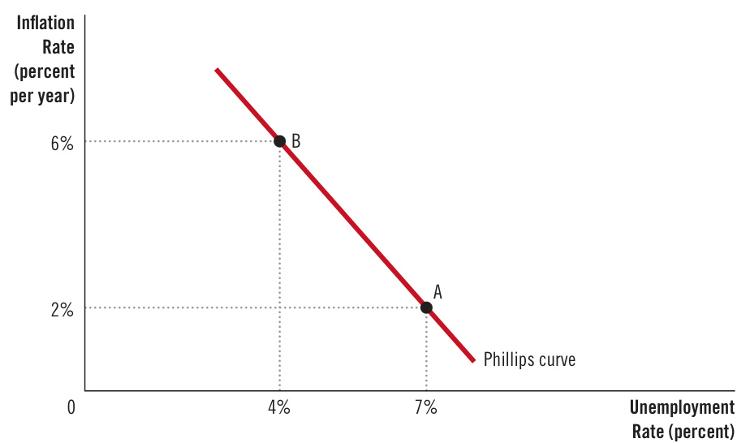  

Point A offers high unemployment and low inflation. Point B offers low unemployment and high inflation. Policymakers might prefer both low inflation and low unemployment, but the historical data summarized by the Phillips curve indicated that this combination was unattainable. According to Samuelson and Solow, policymakers face a trade-off between inflation and unemployment, and the Phillips curve illustrates that trade-off.  

## 36-1b Aggregate Demand, Aggregate Supply, and the Phillips Curve  

The menu of possible outcomes described by the Phillips curve can be explained by the model of aggregate demand and aggregate supply. The Phillips curve shows the combinations of inflation and unemployment that arise in the short run as shifts in the aggregate-demand curve move the economy along the short-run aggregate-supply curve. The previous two chapters showed that an increase in the aggregate demand for goods and services leads, in the short run, to a larger output of goods and services and a higher price level. Larger output means greater employment and a lower rate of unemployment. In addition, a higher price level translates into a higher rate of inflation. Thus, shifts in aggregate demand push inflation and unemployment in opposite directions in the short run—a relationship illustrated by the Phillips curve.  

To see more fully how this works, consider an example. To keep the numbers simple, imagine that the price level (as measured, for instance, by the consumer price index) equals 100 in the year 2025. Figure 2 shows two possible outcomes that might occur in the year 2026 depending on the strength of aggregate demand. One outcome occurs if aggregate demand is high, and the other occurs if aggregate demand is low. Panel (a) shows these two outcomes using the model of aggregate demand and aggregate supply. Panel (b) shows the same two outcomes using the Phillips curve.  

## Figure 2  

How the Phillips Curve Is Related to the Model of Aggregate Demand and Aggregate Supply  

This figure assumes a price level of 100 for the year 2025 and charts possible outcomes for the year 2026. Panel (a) shows the model of aggregate demand and aggregate supply. If aggregate demand is low, the economy is at point A. Output is low (15,000), and the price level is low (102). If aggregate demand is high, the economy is at point B. Output is high (16,000), and the price level is high (106). Panel (b) shows the implications for the Phillips curve. Point A, which arises when aggregate demand is low, has high unemployment (7 percent) and low inflation (2 percent). Point B, which arises when aggregate demand is high, has low unemployment (4 percent) and high inflation (6 percent).  

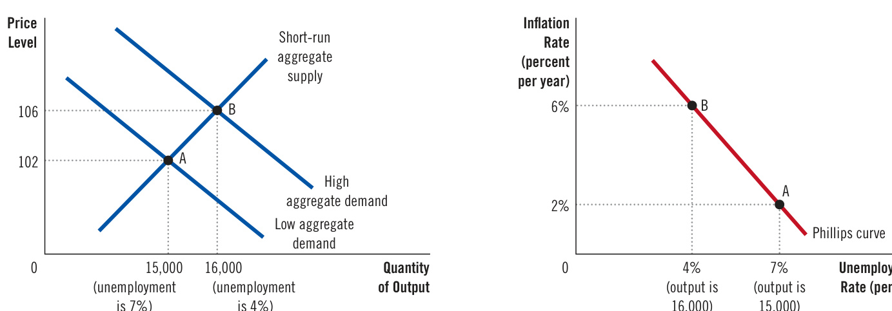  
(a) The Model of Aggregate Demand and Aggregate Supply   
(b) The Phillips Curve  

Panel (a) of the figure shows what happens to output and the price level in the year 2026. If the aggregate demand for goods and services is low, the economy experiences outcome A. The economy produces output of 15,000, and the price level is 102. By contrast, if aggregate demand is high, the economy experiences outcome B. Output is 16,000, and the price level is 106. This is an example of a familiar conclusion: Higher aggregate demand moves the economy to an equilibrium with higher output and a higher price level.  

Panel (b) shows what these two possible outcomes mean for unemployment and inflation. Because firms need more workers when they produce a greater output of goods and services, unemployment is lower in outcome B than in outcome A. In this example, when output rises from 15,000 to 16,000, unemployment falls from 7 percent to 4 percent. Moreover, because the price level is higher at outcome B than at outcome A, the inflation rate (the percentage change in the price level from the previous year) is also higher. In this case, the price level was 100 in the year 2025, so outcome A has an inflation rate of 2 percent, and outcome B has an inflation rate of 6 percent. The two possible outcomes for the economy can be compared either in terms of output and the price level (using the model of aggregate demand and aggregate supply) or in terms of unemployment and inflation (using the Phillips curve).  

Because monetary and fiscal policy can shift the aggregate-demand curve, they can move an economy along the Phillips curve. Increases in the money supply, increases in government spending, or cuts in taxes expand aggregate demand and move the economy to a point on the Phillips curve with higher inflation and lower unemployment. Decreases in the money supply, cuts in government spending, or increases in taxes contract aggregate demand and move the economy to a point on the Phillips curve with lower inflation and higher unemployment. In this sense, the Phillips curve offers policymakers a menu of combinations of inflation and unemployment.  

##  

QuickQuiz 1. The Phillips curve started as an observed 2. When the Federal Reserve increases the money supcorrelation between the inflation rate and the ply and expands aggregate demand, it moves the economy along the Phillips curve to a point with a. positive; nominal interest rate inflation and unemployment. b. positive; unemployment rate a. higher; higher c. negative; nominal interest rate b. higher; lower d. negative; unemployment rate c. lower; higher d. lower; lower  

## 36-2 Shifts in the Phillips Curve: The Role of Expectations  

The Phillips curve seems to offer policymakers a menu of inflation–unemployment outcomes, but this raises a question: Does this set of possible choices remain constant over time? In other words, is the downward-sloping Phillips curve a stable relationship on which policymakers can rely? Economists took up this issue in the late 1960s, shortly after Samuelson and Solow introduced the Phillips curve into the macroeconomic policy debate.  

## 36-2a  The Long-Run Phillips Curve  

In 1968, the economist Milton Friedman published a paper in the American Economic Review based on an address he had recently given as president of the American Economic Association. The paper, titled “The Role of Monetary Policy,” contained sections on “What Monetary Policy Can Do” and “What Monetary Policy Cannot Do.” Friedman argued that one thing monetary policy cannot do, other than for a short time, is lower unemployment by raising inflation. At about the same time, another economist, Edmund Phelps, reached the same conclusion. Like Friedman, Phelps published a paper denying the existence of a long-run trade-off between inflation and unemployment.  

Both Friedman and Phelps based their conclusions on classical principles of macroeconomics. Classical theory points to growth in the money supply as the primary determinant of inflation. But classical theory also states that monetary growth does not affect real variables such as output and employment; it merely alters all prices and nominal incomes proportionately. In particular, monetary growth does not influence the factors that determine the economy’s unemployment rate, such as job search and efficiency wages. Friedman and Phelps concluded that, in the long run, the rate of inflation and the rate of unemployment would not be related.  

Here, in his own words, is Friedman’s view about what the Federal Reserve can hope to accomplish for the economy in the long run:  

The monetary authority controls nominal quantities—directly, the quantity of its own liabilities [currency plus bank reserves]. In principle, it can use this control to peg a nominal quantity—an exchange rate, the price level, the nominal level of national income, the quantity of money by one definition or another— or to peg the change in a nominal quantity—the rate of inflation or deflation, the rate of growth or decline in nominal national income, the rate of growth of the quantity of money. It cannot use its control over nominal quantities to peg a real quantity—the real rate of interest, the rate of unemployment, the level of real national income, the real quantity of money, the rate of growth of real national income, or the rate of growth of the real quantity of money.  

According to Friedman, monetary policymakers face a long-run Phillips curve that is vertical, as in Figure 3. If the Fed increases the money supply slowly, the inflation rate is low, and the economy finds itself at point A. If the Fed increases the money supply quickly, the inflation rate is high, and the economy finds itself at point B. In either case, the unemployment rate tends toward its normal level, called the natural rate of unemployment. The vertical long-run Phillips curve illustrates the conclusion that unemployment does not depend on money growth and inflation in the long run.  

The vertical long-run Phillips curve is, in essence, an expression of the classical idea of monetary neutrality. Previously, we expressed monetary neutrality with a vertical long-run aggregate-supply curve. Figure 4 shows that the vertical long-run Phillips curve and the vertical long-run aggregate-supply curve are two sides of the same coin. In panel (a) of this figure, an increase in the money supply shifts the aggregate-demand curve to the right from $A D_{1}$ to $A{D}_{2}$ . Because of this shift, the long-run equilibrium moves from point A to point B. The price level rises from $P_{_{1}}$ to $P_{_2{^\prime}}$ but because the aggregate-supply curve is vertical, output remains the same. In panel (b), more rapid growth in the money supply raises the inflation rate by  

## The Long-Run Phillips Curve  

According to Friedman and Phelps, there is no trade-off between inflation and unemployment in the long run. Growth in the money supply determines the inflation rate. Regardless of the inflation rate, the unemployment rate gravitates toward its natural rate. As a result, the long-run Phillips curve is vertical.  

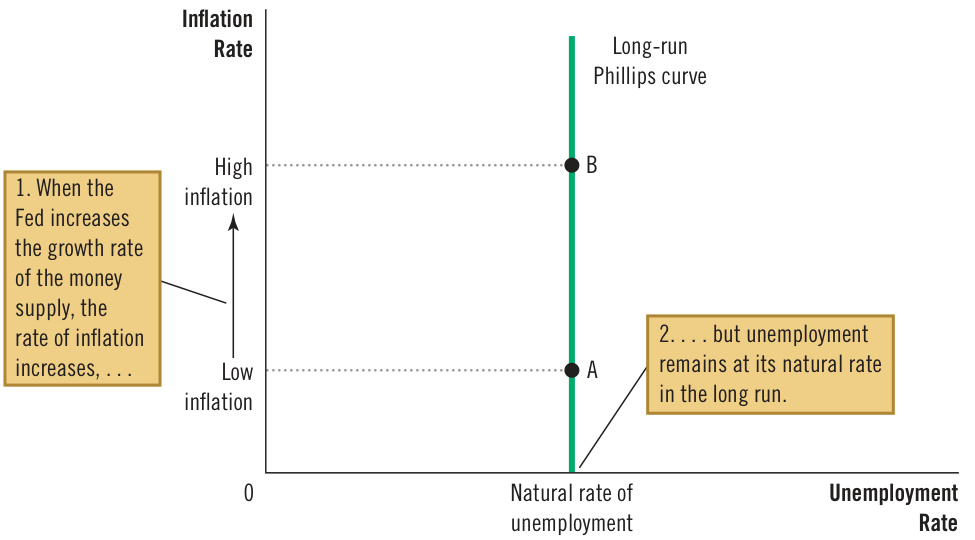  
Figure 3  

## Figure 4  

How the Long-Run Phillips Curve Is Related to the Model of Aggregate Demand and Aggregate Supply  

Panel (a) shows the model of aggregate demand and aggregate supply with a vertical aggregate-supply curve. When expansionary monetary policy shifts the aggregatedemand curve to the right from $A D_{\mathrm{_{1}}}$ to $A D_{2}$ , the equilibrium moves from point A to point B. The price level rises from $P_{1}$ to $P_{_2!}$ , while output remains the same. Panel (b) shows the long-run Phillips curve, which is vertical at the natural rate of unemployment. In the long run, expansionary monetary policy moves the economy from lower inflation (point A) to higher inflation (point B) without changing the rate of unemployment.  

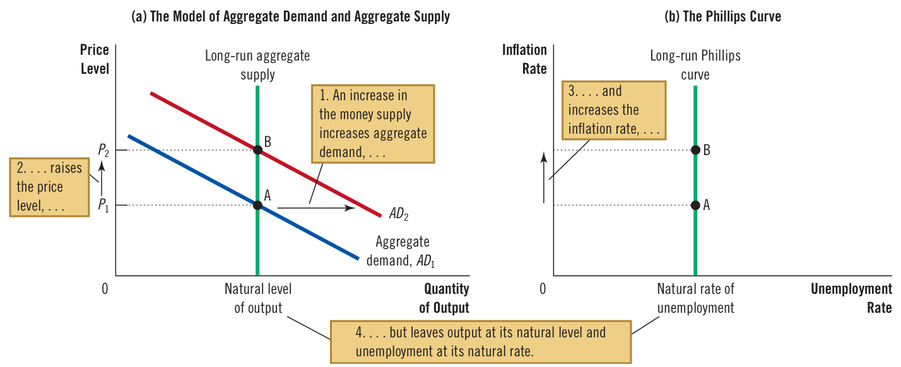  

moving the economy from point A to point B. But because the Phillips curve is vertical, the rate of unemployment is the same at these two points. Both the vertical long-run aggregate-supply curve and the vertical long-run Phillips curve imply that monetary policy influences nominal variables (the price level and the inflation rate) but not real ones (output and unemployment). In the long run, regardless of the monetary policy pursued by the Fed, output is at its natural level, and unemployment is at its natural rate.  

## 36-2b  The Meaning of “Natural”  

What is so “natural” about the natural rate of unemployment? Friedman and Phelps used this adjective to describe the unemployment rate toward which the economy gravitates in the long run. Yet the natural rate of unemployment is not necessarily the socially desirable rate of unemployment. Nor is the natural rate of unemployment constant over time.  

For example, suppose that a newly formed union uses its market power to raise the real wages of some workers above the equilibrium level. The result is an excess supply of workers and a higher natural rate of unemployment. This unemployment is natural not because it is good but because it is beyond the influence of monetary policy. More rapid money growth would reduce neither the market power of the union nor the level of unemployment; it would lead only to more inflation.  

Although monetary policy cannot influence the natural rate of unemployment, other types of policy can. To reduce the natural rate of unemployment, policymakers might look to policies that improve the functioning of the labor market. Earlier in the book, we discussed how various labor-market policies, such as minimum-wage laws, collective-bargaining laws, unemployment insurance, and job-training programs, can affect the natural rate of unemployment. A policy change that reduces the natural rate of unemployment would shift the long-run Phillips curve to the left. In addition, because lower unemployment means more workers are producing goods and services, the quantity of goods and services supplied would be larger at any given price level, and the long-run aggregate-supply curve would shift to the right. The economy could then enjoy lower unemployment and higher output for any given rate of money growth and inflation.  

## 36-2c  Reconciling Theory and Evidence  

At first, Friedman and Phelps’s conclusion that there is no long-run trade-off between inflation and unemployment might not seem convincing. Their argument was based on an appeal to theory, specifically classical theory’s prediction of monetary neutrality. By contrast, the negative correlation between inflation and unemployment documented by Phillips, Samuelson, and Solow was based on actual evidence from the real world. Why should anyone believe that policymakers faced a vertical Phillips curve when the world seemed to offer a downwardsloping one? Shouldn’t the findings of Phillips, Samuelson, and Solow lead us to reject monetary neutrality?  

Friedman and Phelps were aware of these questions, and they offered a way to reconcile classical macroeconomic theory with the finding of a downwardsloping Phillips curve in data from the United Kingdom and the United States. They claimed that a negative relationship between inflation and unemployment exists in the short run but that it cannot be used by policymakers as a menu of outcomes in the long run. Policymakers can pursue expansionary monetary policy to achieve lower unemployment for a while, but eventually, unemployment will return to its natural rate. In the long run, more expansionary monetary policy leads only to higher inflation.  

Friedman and Phelps’s work was the basis of our discussion of the difference between the short-run and long-run aggregate-supply curves in Chapter 34. As you may recall, the long-run aggregate-supply curve is vertical, indicating that the price level does not influence quantity supplied in the long run. But the short-run aggregate-supply curve slopes upward, indicating that an increase in the price level raises the quantity of goods and services that firms supply. According to the stickywage theory of aggregate supply, for instance, nominal wages are set in advance based on the price level that workers and firms expect to prevail. When prices turn out to be higher than expected, firms have an incentive to increase production and employment; when prices are lower than expected, firms reduce production and employment. Yet because the expected price level and nominal wages will eventually adjust, the positive relationship between the actual price level and quantity supplied exists only in the short run.  

Friedman and Phelps applied this same logic to the Phillips curve. Just as the aggregate-supply curve slopes upward only in the short run, the trade-off between inflation and unemployment holds only in the short run. And just as the long-run aggregate-supply curve is vertical, the long-run Phillips curve is also vertical. Once again, expectations are the key to understanding how the short run and the long run are related.  

Friedman and Phelps introduced a new variable into the analysis of the inflation–unemployment trade-off: expected inflation. Expected inflation measures how much people expect the overall price level to change. Because the expected price level affects nominal wages, expected inflation is one factor that determines the position of the short-run aggregate-supply curve. In the short run, the Fed can take expected inflation (and the short-run aggregate-supply curve) as already determined. When the money supply changes, the aggregate-demand curve shifts, and the economy moves along a given short-run aggregate-supply curve. In the short run, therefore, monetary changes lead to unexpected fluctuations in output, prices, unemployment, and inflation. In this way, Friedman and Phelps explained the downward-sloping Phillips curve that Phillips, Samuelson, and Solow had documented.  

The Fed’s ability to create unexpected inflation by increasing the money supply exists only in the short run. In the long run, people come to expect whatever inflation rate the Fed chooses to produce, and nominal wages will adjust to keep pace with inflation. As a result, the long-run aggregate-supply curve is vertical. Changes in aggregate demand, such as those caused by changes in monetary policy, affect neither the economy’s output of goods and services nor the number of workers that firms need to hire to produce those goods and services. Friedman and Phelps concluded that unemployment returns to its natural rate in the long run.  

## 36-2d  The Short-Run Phillips Curve  

The analysis of Friedman and Phelps can be summarized by the following equation:  

$$
{\begin{array}{r l l}{{\mathrm{Unemployment}}}&{=}&{{\mathrm{Natural~rate~of}}}\\ {{\mathrm{rate}}}&{=}&{{\mathrm{unemployment}}}&{-\ a{\left(\begin{array}{l l l}{{\mathrm{Actual}}}&{-}&{{\mathrm{Expected}}}\\ {{\mathrm{inflation}}}&{-}&{{\mathrm{inflation}}}\end{array}\right)}.}\end{array}}
$$  

This equation relates the unemployment rate to the natural rate of unemployment, actual inflation, and expected inflation. It is, in essence, another expression of the aggregate-supply equation we have seen previously. In the short run, expected inflation is given, so higher actual inflation is associated with lower unemployment. (The variable $a$ is a parameter that measures how much unemployment responds to unexpected inflation.) In the long run, people come to expect whatever inflation the Fed produces, so actual inflation equals expected inflation, and unemployment is at its natural rate.  

This equation implies there can be no stable short-run Phillips curve. Each shortrun Phillips curve reflects a particular expected rate of inflation. (To be precise, if you graph the equation, you’ll find that the downward-sloping short-run Phillips curve intersects the vertical long-run Phillips curve at the expected rate of inflation.) When expected inflation changes, the short-run Phillips curve shifts.  

According to Friedman and Phelps, it is dangerous to view the Phillips curve as a menu of options available to policymakers. To see why, imagine an economy that starts with low inflation, with an equally low rate of expected inflation, and with unemployment at its natural rate. In Figure 5, the economy is at point A. Now suppose that policymakers try to take advantage of the trade-off between inflation and unemployment by using monetary or fiscal policy to expand aggregate demand. In the short run, when expected inflation is given, the economy goes from point A to point B. Unemployment falls below its natural rate, and the actual inflation rate rises above expected inflation. As the economy moves from  

## Figure 5  

## How Expected Inflation Shifts the Short-Run Phillips Curve  

The higher the expected rate of inflation, the higher the curve representing the short-run trade-off between inflation and unemployment will be. At point A, expected inflation and actual inflation are equal at a low rate, and unemployment is at its natural rate. If the Fed pursues an expansionary monetary policy, the economy moves from point A to point B in the short run. At point B, expected inflation is still low, but actual inflation is high. Unemployment is below its natural rate. In the long run, expected inflation rises, and the economy moves to point C. At point C, expected inflation and actual inflation are both high, and unemployment is back to its natural rate.  

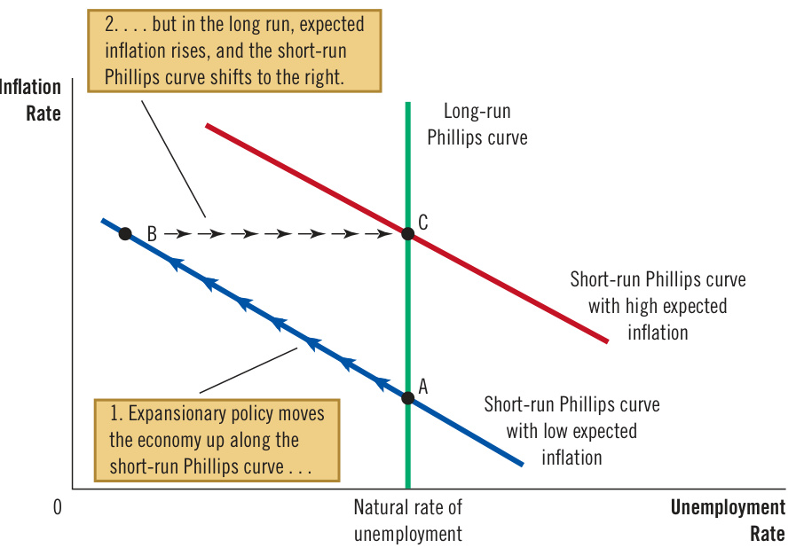  

## natural-rate hypothesis  

the claim that unemployment eventually returns to its normal, or natural, rate, regardless of the rate of inflation  

point A to point B, policymakers might think they have achieved permanently lower unemployment at the cost of higher inflation—a bargain that, if possible, might be worth making.  

This situation, however, will not persist. Over time, people get used to this higher inflation rate and raise their expectations of inflation. When expected inflation rises, firms and workers start taking higher inflation into account when setting wages and prices. The short-run Phillips curve then shifts to the right, as shown in the figure. The economy ends up at point $C,$ with higher inflation than at point A but with the same level of unemployment. Thus, Friedman and Phelps concluded that policymakers face only a temporary trade-off between inflation and unemployment. In the long run, expanding aggregate demand more rapidly will yield higher inflation without any reduction in unemployment.  

## 36-2e   The Natural Experiment for the Natural-Rate Hypothesis  

Friedman and Phelps made a bold prediction in 1968: If policymakers try to take advantage of the Phillips curve by choosing higher inflation to reduce unemployment, they will succeed at reducing unemployment only temporarily. This view— that unemployment eventually returns to its natural rate regardless of the rate of inflation—is called the natural-rate hypothesis. A few years after Friedman and Phelps proposed this hypothesis, monetary and fiscal policymakers inadvertently tested it in a natural experiment. Their laboratory was the U.S. economy.  

Before examining the outcome of this test, let’s look at the data that Friedman and Phelps were seeing when they made their prediction in 1968. Figure 6 shows the unemployment and inflation rates from 1961 to 1968. These data trace out an almost perfect Phillips curve. As inflation rose over these eight years, unemployment fell. The economic data from this era seemed to confirm that policymakers faced a trade-off between inflation and unemployment.  

## The Phillips Curve in the 1960s  

This figure uses annual data from 1961 to 1968 on the unemployment rate and on the inflation rate (as measured by the GDP deflator) to show the negative relationship between inflation and unemployment.  

Source: U.S. Department of Labor; U.S. Department of Commerce.  

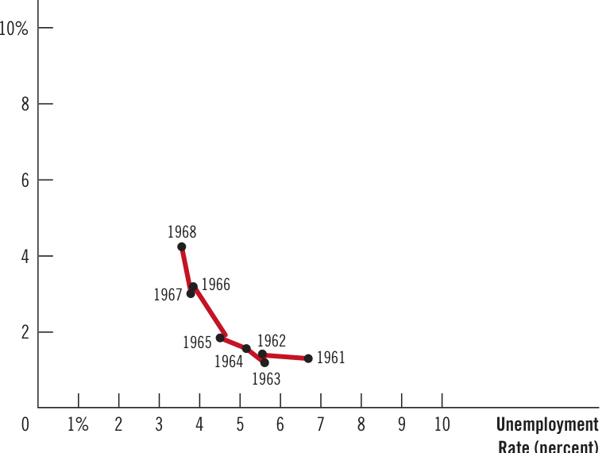  
Inflation Rate (percent per year)  

The apparent success of the Phillips curve in the 1960s made the prediction of Friedman and Phelps all the bolder. In 1958, Phillips suggested a negative association between inflation and unemployment. In 1960, Samuelson and Solow showed that it existed in U.S. data. Another decade of data confirmed the relationship. To some economists at the time, it seemed ridiculous to claim that the reliable Phillips curve would start shifting once policymakers tried to take advantage of it.  

But that is exactly what happened. Beginning in the late 1960s, government policies expanded the aggregate demand for goods and services. In part, this expansion was due to fiscal policy: Government spending rose as the Vietnam War heated up. In part, it was due to monetary policy: Because the Fed tried to hold down interest rates in the face of expansionary fiscal policy, the money supply (as measured by M2) rose about 13 percent per year from 1970 to 1972, compared with 7 percent per year in the early 1960s. As a result, inflation stayed high (about 5 to 6 percent per year in the late 1960s and early 1970s, compared with about 1 to 2 percent per year in the early 1960s). But as Friedman and Phelps had predicted, unemployment did not stay low.  

Figure 7 displays the history of inflation and unemployment from 1961 to 1973. It shows that the simple negative relationship between these two variables started to break down around 1970. As inflation remained high in the early 1970s, people’s expectations of inflation caught up with reality, and the unemployment rate reverted to the 5 percent to 6 percent range that had prevailed in the early 1960s. Notice that the history illustrated in Figure 7 resembles the theory of a shifting short-run Phillips curve shown in Figure 5. By 1973, policymakers learned that Friedman and Phelps were right: There is no trade-off between inflation and unemployment in the long run.  

## Figure 7  

## The Breakdown of the Phillips Curve  

This figure shows annual data from 1961 to 1973 on the unemployment rate and on the inflation rate (as measured by the GDP deflator). The Phillips curve of the 1960s breaks down in the early 1970s, just as Friedman and Phelps had predicted. Notice that the points labeled A, B, and C in this figure correspond roughly to the points in Figure 5.  

Source: U.S. Department of Labor; U.S. Department of Commerce.  

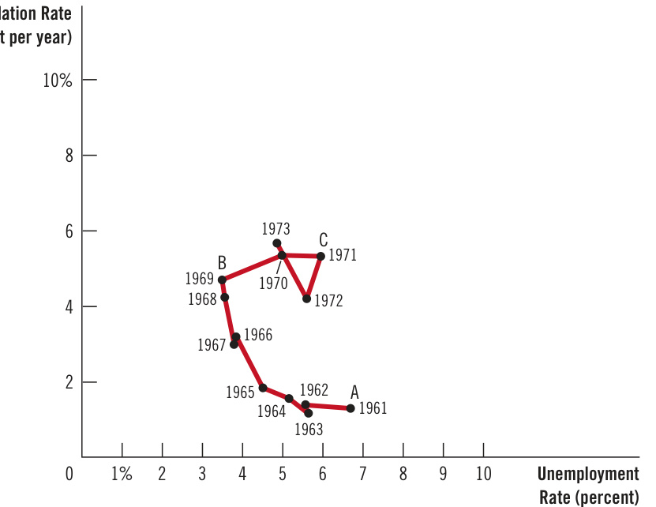  

## QuickQuiz  

3. The natural rate of unemployment is  

a. the socially optimal level of joblessness.   
b. the level of joblessness the economy reaches in the short run.   
c. the amount of joblessness that cannot be reduced by public policies.   
d. the normal level of joblessness, regardless of inflation.  

4. If the Federal Reserve reduces the rate of money growth and maintains it at the new lower rate, eventually, expected inflation will _, and the short-run Phillips curve will shift  

a. decrease; downward b. decrease; upward c. increase; downward d. increase; upward  

Answers are at the end of the chapter.  

## 36-3   Shifts in the Phillips Curve: The Role of Supply Shocks  

Friedman and Phelps suggested in 1968 that changes in expected inflation shift the short-run Phillips curve, and the experience of the early 1970s convinced most economists that Friedman and Phelps were right. Within a few years, however, the economics profession would turn its attention to a different source of shifts in the short-run Phillips curve: shocks to aggregate supply.  

This time, the impetus for the change came not from two economics professors but from an oil cartel. In 1974, the Organization of Petroleum Exporting Countries (OPEC) began to exert its market power. The OPEC countries, including Saudi Arabia, Kuwait, and Iraq, restricted the amount of crude oil they pumped and sold on world markets. Within a few years, this reduction in supply caused the world price of oil to almost double.  

A large increase in the world price of oil is an example of a supply shock, an event that directly affects firms’ costs of production and the prices they charge. Supply shocks shift the economy’s aggregate-supply curve and, as a result, the Phillips curve. For example, when a cartel increases the price of crude oil, it raises the cost of producing gasoline, heating oil, tires, and other products, reducing the quantity of goods and services supplied at any given price level. As panel (a) of Figure 8 shows, this reduction in supply is represented by the leftward shift in the aggregate-supply curve from $A S_{\mathrm{1}}$ to $A S_{_2}$ . Output falls from $Y_{\mathrm{{1}}}$ to $Y_{_{2^{\prime}}}$ and the price level rises from $P_{\mathrm{{_{1}}}}$ to $P_{2}$ The economy experiences stagflation—a pernicious combination of falling output (stagnation) and rising prices (inflation).  

This shift in aggregate supply is associated with a similar shift in the short-run Phillips curve, shown in panel (b). Because firms need fewer workers to produce the smaller output, employment falls, and unemployment rises. And because the price level is higher, the inflation rate—the percentage change in the price level from the previous year—is also higher. Thus, the shift in aggregate supply leads to higher unemployment and higher inflation. The short-run trade-off between inflation and unemployment shifts to the right from $P C_{1}$ to $P C_{2}$ .  

Confronted with an adverse shift in aggregate supply, policymakers face a difficult choice between fighting inflation and fighting unemployment. If they contract aggregate demand to fight inflation, they will raise unemployment further. If they expand aggregate demand to fight unemployment, they will raise inflation further. In other words, policymakers face a less favorable trade-off between inflation and unemployment than they did before the shift in aggregate supply: They have  

## supply shock  

an event that directly alters firms’ costs and prices, shifting the economy’s aggregatesupply curve and thus the Phillips curve  

## Figure 8  

## An Adverse Shock to Aggregate Supply  

Panel (a) shows the model of aggregate demand and aggregate supply. When the aggregate-supply curve shifts to the left from $A S_{\mathrm{1}}$ to $A S_{2}$ , the equilibrium moves from point A to point B. Output falls from $\mathsfit{Y}_{\mathrm{1}}$ to $Y_{_2}$ and the price level rises from $P_{1}$ to $P_{2}$ . Panel (b) shows the short-run trade-off between inflation and unemployment. The adverse shift in aggregate supply moves the economy from a point with lower unemployment and lower inflation (point A) to a point with higher unemployment and higher inflation (point B). The short-run Phillips curve shifts to the right from $P C_{\mathrm{{1}}}$ to $P C_{2}$ . Policymakers now face a worse set of options for inflation and unemployment.  

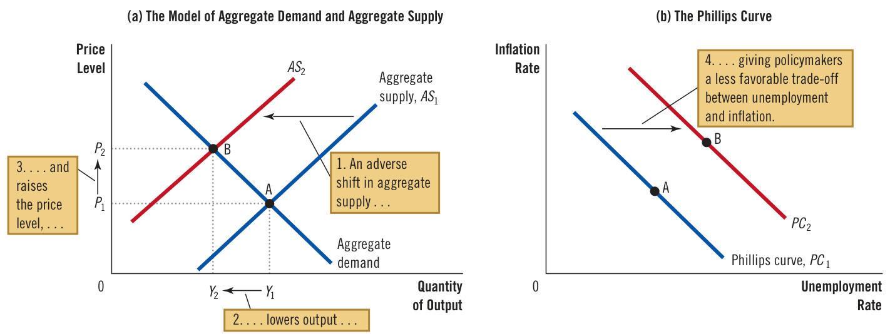  

to live with a higher rate of inflation for a given rate of unemployment, a higher rate of unemployment for a given rate of inflation, or some combination of higher unemployment and higher inflation.  

Faced with such an adverse shift in the Phillips curve, policymakers will ask whether the shift is temporary or permanent. The answer depends on how people adjust their expectations of inflation. If people view the rise in inflation from the supply shock as a temporary aberration, expected inflation will not change, and the Phillips curve will soon revert to its former position. But if people believe the shock will lead to a new era of higher inflation, then expected inflation will rise, and the Phillips curve will remain at its new, less desirable position.  

In the United States during the 1970s, expected inflation did rise substantially. This rise in expected inflation was partly attributable to the Fed’s decision to accommodate the supply shock with higher money growth. (Recall that policymakers are said to accommodate an adverse supply shock when they respond to it by increasing aggregate demand in an effort to keep output from falling.) Because of this policy decision, the recession that resulted from the supply shock was smaller than it otherwise might have been, but the U.S. economy faced an unfavorable trade-off between inflation and unemployment for many years. The problem was compounded in 1979 when OPEC once again started to exert its market power, more than doubling the price of oil. Figure 9 shows inflation and unemployment in the U.S. economy during this period.  

In 1980, after two OPEC supply shocks, the U.S. economy had an inflation rate of more than 9 percent and an unemployment rate of about 7 percent. This combination of inflation and unemployment was not at all near the trade-off that seemed possible in the 1960s. Back then, the Phillips curve suggested that an unemployment rate of 7 percent would be associated with an inflation rate of only 1 percent; inflation of more than 9 percent was unthinkable. With the misery index in 1980 near a historic high, many people were unhappy with the economy’s performance. Something had to be done, and soon it would be.  

## The Supply Shocks of the 1970s  

This figure shows annual data from 1972 to 1981 on the unemployment rate and on the inflation rate (as measured by the GDP deflator). In the periods 1973–1975 and 1978–1981, increases in world oil prices led to higher inflation and higher unemployment.  

Source: U.S. Department of Labor; U.S. Department of Commerce.  

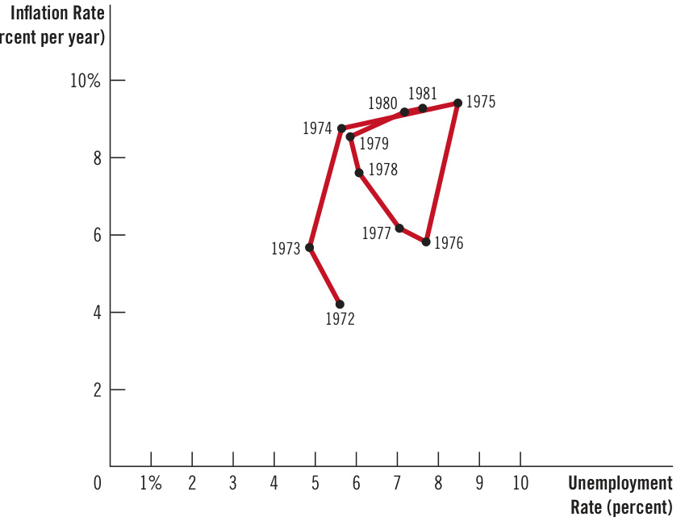  
Figure 9  

5. When an adverse supply shock shifts the short-run aggregate-supply curve to the left, it also a. moves the economy along the short-run Phillips curve to a point with higher inflation and lower unemployment. b. moves the economy along the short-run Phillips curve to a point with lower inflation and higher unemployment. c. shifts the short-run Phillips curve to the right. d. shifts the short-run Phillips curve to the left.   
6. From one year to the next, inflation falls from 5 to 4 percent, while unemployment rises from 6 to 7 percent. Which of the following events could be responsible for this change? a. The central bank increases the growth rate of the money supply. b. The government cuts spending and raises taxes to reduce the budget deficit.   
c. Newly discovered oil reserves cause world oil prices to plummet.   
d. The appointment of a new Fed chair increases expected inflation.   
From one year to the next, inflation falls from 5 to   
4 percent, while unemployment falls from 7 to   
6 percent. Which of the following events could be   
responsible for this change?   
a. The central bank increases the growth rate of the money supply.   
b. The government cuts spending and raises taxes to reduce the budget deficit.   
c. Newly discovered oil reserves cause world oil prices to plummet.   
d. The appointment of a new Fed chair increases expected inflation.  

## 36-4  The Cost of Reducing Inflation  

In October 1979, as OPEC was imposing adverse supply shocks on the world’s economies for the second time in a decade, Paul Volcker, then the Federal Reserve chair, decided that the time for action had come. Volcker had been appointed by President Carter only two months earlier, and he had taken the job knowing that inflation had reached unacceptable levels. As guardian of the nation’s monetary system, he felt he had little choice but to pursue a policy of disinflation. Disinflation is a reduction in the rate of inflation, and it should not be confused with deflation, a reduction in the price level. To draw an analogy to a car’s motion, disinflation is like slowing down, whereas deflation is like going in reverse. Volcker wanted the economy’s rising level of prices to slow down.  

He had no doubt that the Fed could use the tools of monetary policy to reduce inflation. But what would be the short-run cost? The answer to this question was much less certain.  

## 36-4a  The Sacrifice Ratio  

To reduce the inflation rate, the Fed has to pursue contractionary monetary policy. Figure 10 shows some of the effects of such a decision. Other things being equal, when the Fed slows growth in the money supply, it contracts aggregate demand. A fall in aggregate demand, in turn, reduces the quantity of goods and services that firms produce, leading to a rise in unemployment. The economy begins at point A in the figure and moves along the short-run Phillips curve to point B, which has lower inflation and higher unemployment. Over time, as people come to understand that prices are rising more slowly, expected inflation falls, and the short-run Phillips curve shifts downward. The economy moves from point B to point C. Inflation is lower than it was initially at point A, and unemployment is back at its natural rate.  

## Figure 10  

## Disinflationary Monetary Policy in the Short Run and Long Run  

When the Fed pursues contractionary monetary policy to reduce inflation, the economy moves along a short-run Phillips curve from point A to point B. Over time, expected inflation falls, and the short-run Phillips curve shifts downward. When the economy reaches point C, unemployment is back at its natural rate.  

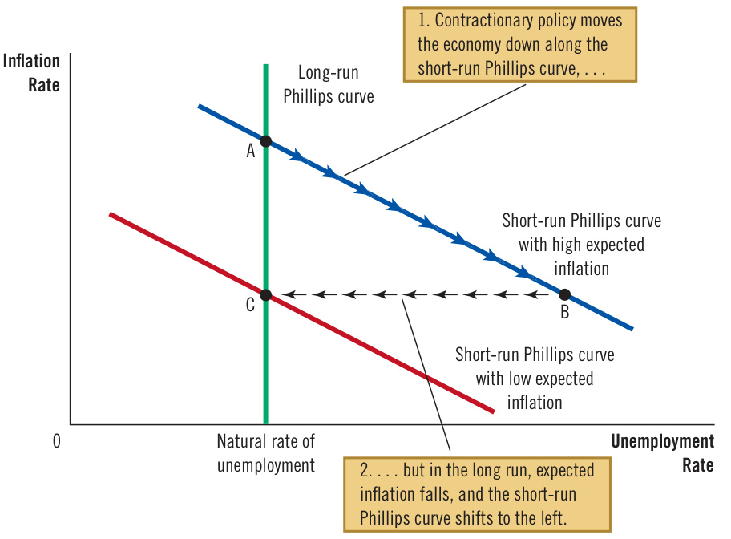  

Thus, if a nation wants to reduce inflation, it must endure a period of high unemployment and low output. In Figure 10, this cost is represented by the movement of the economy through point B as it travels from point A to point C. The size of this cost depends on the slope of the Phillips curve and how quickly expectations of inflation adjust to the new monetary policy.  

## sacrifice ratio  

the number of percentage points of annual output lost in the process of reducing inflation by 1 percentage point  

Many studies have examined the data on inflation and unemployment to estimate the cost of reducing inflation. The findings of these studies are often summarized in a statistic called the sacrifice ratio. The sacrifice ratio is the number of percentage points of annual output lost in the process of reducing inflation by 1 percentage point. A typical estimate of the sacrifice ratio is 5. That is, for each percentage point that inflation is reduced, 5 percent of annual output must be sacrificed in the transition.  

Such estimates surely must have made Volcker apprehensive as he confronted the task of reducing inflation. Inflation was running at almost 10 percent per year. To reach moderate inflation of, say, 4 percent per year would mean reducing inflation by 6 percentage points. If each percentage point costs 5 percent of the economy’s annual output, then reducing inflation by 6 percentage points would require sacrificing 30 percent of annual output.  

According to studies of the Phillips curve and the cost of disinflation, this sacrifice could be paid in various ways. An immediate reduction in inflation would depress output by 30 percent for a single year, an outcome that was surely too harsh even for an inflation hawk like Volcker. It would be better, many argued, to spread out the cost over several years. If the reduction in inflation took place over five years, for instance, then output would have to average only 6 percent below trend during that period to add up to a sacrifice of 30 percent. An even more gradual approach would be to reduce inflation slowly over a decade so that output would have to be only 3 percent below trend. Whatever path was chosen, however, it seemed that reducing inflation would not be easy.  

Just as Volcker was pondering how costly reducing inflation might be, a group of economics professors was leading an intellectual revolution that would challenge the conventional wisdom on the sacrifice ratio. This group included such prominent economists as Robert Lucas, Thomas Sargent, and Robert Barro. Their revolution was based on a new approach to economic theory and policy called rational expectations. According to the theory of rational expectations, people optimally use all the information they have, including information about government policies, when forecasting the future.  

This approach has had profound implications for many areas of macroeconomics, but none is more important than its application to the trade-off between inflation and unemployment. As Friedman and Phelps had first emphasized, expected inflation is an important variable that explains why there is a trade-off between inflation and unemployment in the short run but not in the long run. How quickly the short-run trade-off disappears depends on how quickly people adjust their expectations of inflation. Proponents of rational expectations expanded upon the Friedman-Phelps analysis to argue that when economic policies change, people adjust their expectations of inflation accordingly. The studies of inflation and unemployment that had tried to estimate the sacrifice ratio had failed to take account of the direct effect of the policy regime on expectations. As a result, estimates of the sacrifice ratio were, according to the rational-expectations theorists, unreliable guides for policy.  

In a 1981 paper titled “The End of Four Big Inflations,” Sargent described this new view as follows:  

An alternative “rational expectations” view denies that there is any inherent momentum to the present process of inflation. This view maintains that firms and workers have now come to expect high rates of inflation in the future and that they strike inflationary bargains in light of these expectations. However, it is held that people expect high rates of inflation in the future precisely because the government’s current and prospective monetary and fiscal policies warrant those expectations. . . . An implication of this view is that inflation can be stopped much more quickly than advocates of the “momentum” view have indicated and that their estimates of the length of time and the costs of stopping inflation in terms of forgone output are erroneous. . . . This is not to say that it would be easy to eradicate inflation. On the contrary, it would require more than a few temporary restrictive fiscal and monetary actions. It would require a change in the policy regime. . . . How costly such a move would be in terms of forgone output and how long it would be in taking effect would depend partly on how resolute and evident the government’s commitment was.  

According to Sargent, the sacrifice ratio could be much smaller than suggested by previous estimates. Indeed, in the most extreme case, it could be zero. The key question was the credibility of the government and central bank. If policymakers were sufficiently credible in their commitment to a policy of low inflation, people would lower their expectations of inflation immediately. The short-run Phillips curve would shift downward, and the economy would reach low inflation quickly without the cost of temporarily high unemployment and low output.  

## 36-4c  The Volcker Disinflation  

As we have seen, when Volcker faced the prospect of reducing inflation from its peak of about 10 percent, the economics profession offered two conflicting predictions. One group of economists offered estimates of the sacrifice ratio and concluded that  

## rational expectations  

the theory that people optimally use all the knowledge they have, including information about government policies, when forecasting the future  

reducing inflation would have great costs in terms of lost output and high unemployment. Another group offered the theory of rational expectations and concluded that reducing inflation could be much less costly and, perhaps, could even have no cost at all. Who was right?  

Figure 11 shows inflation and unemployment from 1979 to 1987. As you can see, Volcker did succeed at reducing inflation. It came down from almost 10 percent in 1980 and 1981 to about 4 percent in 1983 and 1984. Credit for this reduction in inflation goes completely to monetary policy. Fiscal policy at this time was acting in the opposite direction: The increases in the budget deficit during the Reagan administration expanded aggregate demand, which tends to raise inflation. The fall in inflation from 1981 to 1984 is attributable to the tough anti-inflation policies of the dogged Fed chair.  

The figure shows that the Volcker disinflation came at the cost of high unemployment. In 1982 and 1983, the unemployment rate was about 10 percent—about 4 percentage points above its level when Volcker was appointed Fed chair. The Volcker disinflation produced a recession that was then the deepest the United States had experienced since the Great Depression of the 1930s.  

Does this episode refute the rational-expectations theory of costless disinflation? Some economists have argued that the answer to this question is a resounding yes. Indeed, the pattern of disinflation shown in Figure 11 is like the pattern predicted in Figure 10. As the economy transitioned from high inflation (point A in both figures) to low inflation (point C), it experienced a painful period of high unemployment (point B).  

Yet there are two reasons not to reject the conclusions of the rational-expectations theorists so quickly. First, even though the Volcker disinflation did impose a cost of temporarily high unemployment, the cost was not as large as many economists had predicted. Most estimates of the sacrifice ratio based on the Volcker disinflation  

## The Volcker Disinflation  

This figure shows unemployment and inflation from 1979 to 1987. The reduction in inflation (as measured by the GDP deflator) came at the cost of very high unemployment in 1982 and 1983. Note that the points labeled A, B, and C in this figure correspond roughly to the points in Figure 10.  

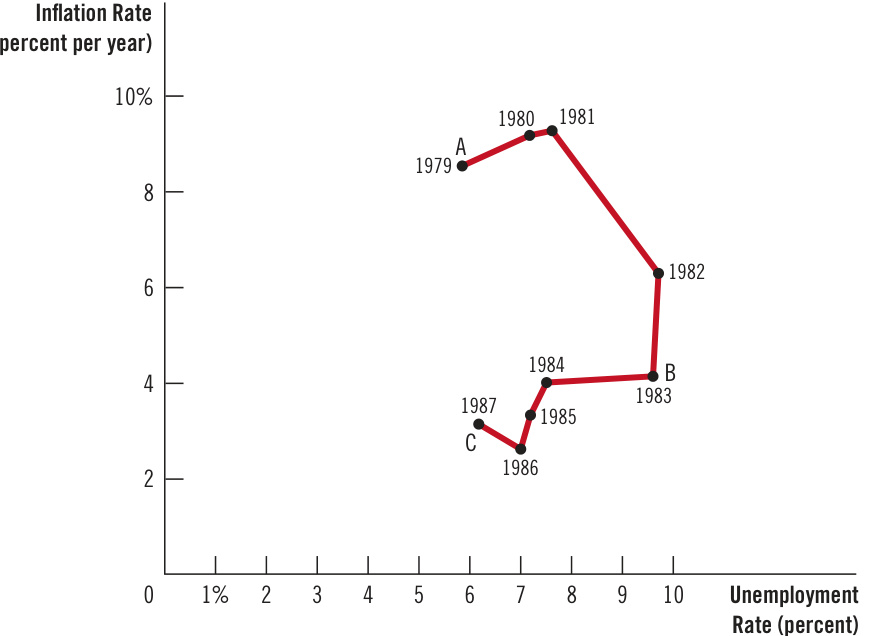  
Figure 11  

Source: U.S. Department of Labor; U.S. Department of Commerce.  

are smaller than estimates that had been obtained from previous data. Perhaps Volcker’s tough stand on inflation did have a direct effect on expectations, as the rational-expectations theorists claimed.  

Second, and more importantly, even though Volcker announced that he would aim monetary policy to lower inflation, much of the public did not believe him. Because few people thought Volcker would reduce inflation as quickly as he did, expected inflation did not fall immediately; as a result, the short-run Phillips curve did not shift down as quickly as it might have. Some evidence for this hypothesis comes from the forecasts made by commercial forecasting firms: Their forecasts of inflation fell more slowly in the 1980s than did actual inflation. For that reason, the Volcker disinflation does not necessarily refute the rational-expectations view that credible disinflation can be costless. It does show, however, that policymakers cannot count on people to immediately believe them when they announce a policy of disinflation, especially if it marks a major departure from the policy that preceded it. Rational people may doubt policymakers’ commitment to low inflation without concrete evidence, which Volcker ultimately provided with his relentless determination.  

## QuickQuiz  

8. Reducing inflation will tend to be costly if a. policymakers are credibly committed to low inflation. b. wages and prices are not very sticky. c. expectations of inflation are slow to adjust. d. central bankers exhibit a strong dislike of inflation.  

9. Advocates of the theory of rational expectations believe that a. the sacrifice ratio can be much smaller if policymakers make a credible commitment to low inflation. b. if disinflation catches people by surprise, it will have minimal impact on unemployment. c. wage and price setters never expect the central bank to follow through on its announcements. d. expected inflation depends on the rates of inflation that people have recently observed.  

Answers are at the end of the chapter.  

## 36-5 Recent History  

More recent history can be divided into three periods: the Greenspan era, the Great Recession, and the pandemic.  

## 36-5a  The Greenspan Era  

After the OPEC inflation of the 1970s and the Volcker disinflation of the 1980s, the U.S. economy experienced relatively mild fluctuations in inflation and unemployment. Figure 12 shows inflation and unemployment from 1984 to 2005. This can be called the Greenspan era after Alan Greenspan, who, in 1987, followed Paul Volcker as chair of the Federal Reserve and remained in that position for more than 18 years.  

This period began with a favorable supply shock. In 1986, OPEC members argued over production levels, and their agreement to restrict supply broke down. Oil prices fell by about half. As the figure shows, this favorable supply shock led to a fall in inflation and unemployment from 1984 to 1986.  

Throughout the Greenspan era, the Fed was careful to avoid repeating the mistakes of the 1960s, when excessive aggregate demand pushed unemployment below  

## The Greenspan Era  

This figure shows annual data from 1984 to 2005 on the unemployment rate and on the inflation rate (as measured by the GDP deflator). During most of this period, Alan Greenspan was chair of the Federal Reserve. Fluctuations in inflation and unemployment were relatively small.  

Source: U.S. Department of Labor; U.S. Department of Commerce.  

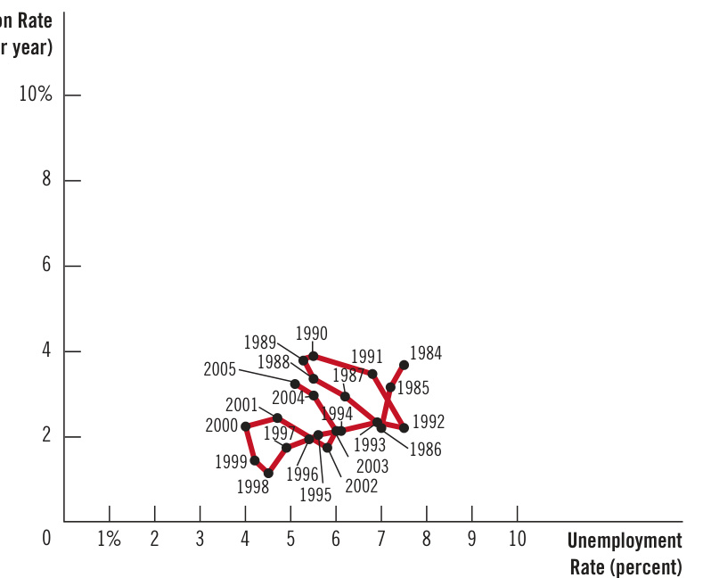  

the natural rate and raised inflation. When unemployment fell and inflation rose in 1989 and 1990, the Fed raised interest rates and contracted aggregate demand, leading to a small recession in 1991 and 1992. Unemployment rose above most estimates of the natural rate, and inflation fell once again.  

The rest of the 1990s witnessed a technological boom and a period of economic prosperity. Inflation gradually drifted downward, approaching zero by the end of the decade. Unemployment also fell, leading many observers to believe that the natural rate of unemployment had fallen. Part of the credit for this good economic performance went to Greenspan and his colleagues at the Fed, for low inflation can be achieved only with prudent monetary policy. But good luck in the form of favorable supply shocks was also part of the story.  

In 2001, however, the economy ran into problems. The end of the dot-com stock market bubble, the 9/11 terrorist attacks, and corporate accounting scandals all depressed aggregate demand. Unemployment rose during the first recession in a decade. But a combination of expansionary monetary and fiscal policies helped end the downturn, and by early 2005, unemployment was close to most estimates of the natural rate.  

In 2005, President Bush nominated Ben Bernanke to succeed Alan Greenspan as Fed chair. Bernanke was sworn in on February 1, 2006. In 2009, Bernanke was reappointed by President Obama. At the time of his initial nomination, Bernanke said, “My first priority will be to maintain continuity with the policies and policy strategies established during the Greenspan years.”  

## 36-5b  The Great Recession  

Bernanke may have hoped to continue the policies of the Greenspan era and to enjoy the relative calm of those years, but his wishes would not be fulfilled. During his first few years on the job, the new Fed chair faced some daunting challenges.  

As previous chapters discussed, the main problems arose in the housing market and financial system. From 1995 to 2006, the U.S. housing market boomed, and average U.S. house prices more than doubled. But the boom was unsustainable, and from 2006 to 2009, house prices plummeted by about one-third. This large fall led to declines in household wealth and difficulties for many financial institutions that had bet (through the purchase of mortgage-backed securities) that house prices would continue to rise. It set off a financial crisis that resulted in a large decline in aggregate demand and a steep increase in unemployment.  

We have previously looked at the story of the crisis and the policy responses to it, but Figure 13 shows what these events meant for inflation and unemployment. From 2007 to 2010, as the decline in aggregate demand raised unemployment from less than 5 percent to about 10 percent, it also reduced the rate of inflation from 3 percent in 2006 to less than 1 percent in 2009, the lowest inflation in more than a half-century. In essence, the economy rode down the short-run Phillips curve.  

After 2010, the economy slowly recovered from the Great Recession, and the job of Fed chair passed from Bernanke to Janet Yellen in 2014 and then to Jerome Powell in 2018. Unemployment gradually declined, while the rate of inflation remained between 1 and 2 percent. By 2018 and 2019, the unemployment rate had fallen to less than 4 percent, and inflation had risen slightly to about 2 percent—the Fed’s announced target.  

One notable feature of this period was the absence of sizeable shifts in the short-run Phillips curve. The very low inflation of 2009 and 2010 appears not to have substantially reduced expected inflation, which might have shifted the short-run Phillips curve downward. Similarly, the low unemployment during 2018 and 2019 increased inflation somewhat, but it did not increase expected inflation, which could have shifted the short-run Phillips curve upward. Instead, expected inflation remained steady at about 2 percent, keeping the short-run Phillips curve relatively stable.  

## The Phillips Curve during and after the Recession of 2008–2009  

This figure shows annual data from 2006 to 2019 on the unemployment rate and on the inflation rate (as measured by the GDP deflator). A financial crisis caused aggregate demand to plummet, leading to much higher unemployment and pushing inflation down to a very low level.  

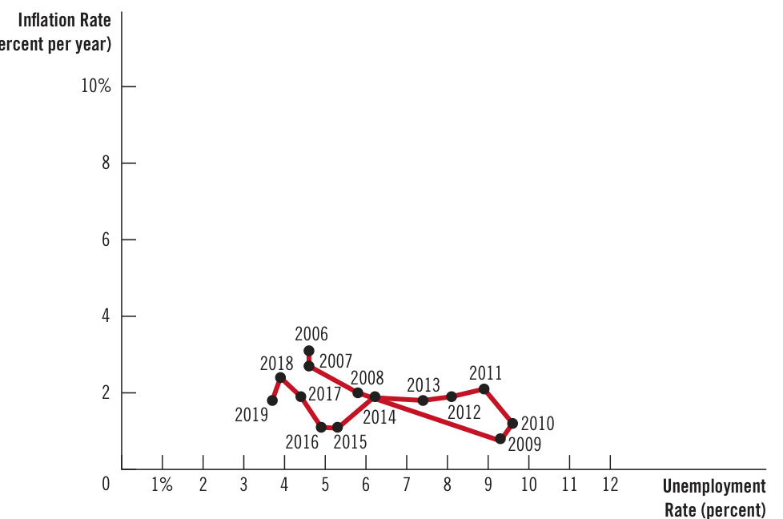  
Figure 13  

Source: U.S. Department of Labor; U.S. Department of Commerce.  

“The supply bottlenecks that are currently contributing to rising prices can be reasonably expected to abate without causing inflation over the longer term to be above the Fed’s target.”  

A common explanation for this stability is that since Volcker’s success in fighting inflation, the Federal Reserve had established substantial credibility in its commitment to keep inflation at about 2 percent. This credibility kept expected inflation well-anchored. As a result, the position of the short-run Phillips curve reacted less to short-run events.  

## 36-5c  The Pandemic  

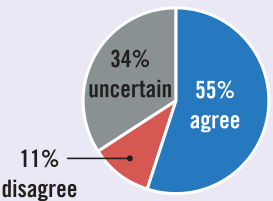  
What do economists say?  

“The current combination of U.S. fiscal and monetary policy poses a serious risk of prolonged higher inflation.”  

The long expansion after the recession of 2008–2009 was cut short in 2020 when the coronavirus pandemic led to a sharp recession, as discussed earlier in the book. The pandemic affected both aggregate demand and aggregate supply as well as both inflation and unemployment.  

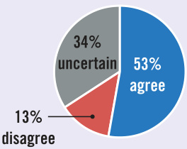  
What do economists say?  

The initial impact on aggregate demand was contractionary. People were told to avoid shopping, eating at restaurants, flying for business or personal reasons, and other economic activities that require close personal contact. From February to April of 2020, the unemployment rate jumped from 3.5 to 14.8 percent. The consumer price index fell by 1 percent over those two months, indicating a brief period of deflation.  

“A significant factor behind today’s higher US inflation is dominant corporations in uncompetitive markets taking advantage of their market power to raise prices in order to increase their profit margins.”  

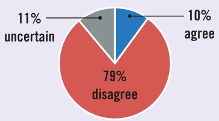  
What do economists say?  

Source: IGM Economic Experts Panel, November 23, 2021, January 11, 2022.  

But aggregate demand recovered quickly. The recovery was partly attributable to the relaxation of restrictions. It was also partly attributable to expansionary monetary and fiscal policies. The Fed cut interest rates to about zero, and Congress passed a series of relief bills under Presidents Trump and Biden.  

The pandemic’s impact on aggregate supply was consistently adverse. Early in the pandemic, many non-essential businesses were told to close. Even after the restrictions were relaxed, many people were reluctant to return to work. For example, the number of retirements in 2020 was twice that in 2019. The labor-force participation rate for those 55 and older declined by about 2 percentage points early in the pandemic and had not recovered by the end of 2021. At the same time, the pandemic disrupted global supply chains. The inability of some businesses to obtain critical inputs further contracted aggregate supply.  

By the end of 2021, the unemployment rate was back below 5 percent, but the combination of the adverse supply shocks and the expansion in aggregate demand from monetary and fiscal policy increased inflation. The 12-month inflation rate, as measured by the consumer price index, rose to 7.5 percent in January 2022, the highest rate in 40 years.  

Policymakers initially said that the inflation surge would be transitory. They thought that inflation would subside as supply-chain disruptions were fixed. Some economists, however, worried that the monetary and fiscal expansion had been excessive and that inflation would not soon return to the Fed’s target of 2 percent.  

The outcome was unclear as this book was going to press. Part of the resolution would come from the behavior of expected inflation. If the Fed maintained the credibility it had earned since Volcker, the high inflation might indeed be short-lived. But if expectations became unanchored, the Phillips curve might shift, leading to a persistently less favorable trade-off between inflation and unemployment.  

10. The financial crisis of 2008–2009 that led to the Great Recession reduced aggregate , which tends to the Phillips curve. a. supply; shift b. supply; move the economy along c. demand; shift d. demand; move the economy along  

11. The increase in retirements during the pandemic of 2020 reduced aggregate , which tends to inflation.  

a. supply; increase b. supply; decrease c. demand; increase d. demand; decrease  

## 36-6 Conclusion  

This chapter has examined how economists’ thinking about inflation and unemployment has evolved. We have discussed the ideas of many of the best economists of the $20\mathrm{th}$ century: from the Phillips curve of Phillips, Samuelson, and Solow, to the natural-rate hypothesis of Friedman and Phelps, to the rational-expectations theory of Lucas, Sargent, and Barro. Six members of this group won Nobel Prizes for their work in economics.  

The trade-off between inflation and unemployment has generated much intellectual turmoil, but certain principles command consensus. Here is how Milton Friedman expressed the relationship between inflation and unemployment in 1968:  

There is always a temporary tradeoff between inflation and unemployment; there is no permanent tradeoff. The temporary tradeoff comes not from inflation per se, but from unanticipated inflation, which generally means, from a rising rate of inflation. The widespread belief that there is a permanent tradeoff is a sophisticated version of the confusion between “high” and “rising” that we all recognize in simpler forms. A rising rate of inflation may reduce unemployment, a high rate will not.  

But how long, you will say, is “temporary”? . . . I can at most venture a personal judgment, based on some examination of the historical evidence, that the initial effects of a higher and unanticipated rate of inflation last for something like two to five years.  

Today, more than a half-century later, this statement still reflects the view of most macroeconomists.  

## Chapter in a Nutshell  

The Phillips curve describes a negative relationship between inflation and unemployment. By expanding aggregate demand, policymakers can choose a point on the Phillips curve with higher inflation and lower unemployment. By contracting aggregate demand, policymakers can choose a point with lower inflation and higher unemployment. The trade-off between inflation and unemployment described by the Phillips curve holds only in the short run. In the long run, expected inflation adjusts to changes in actual inflation, and the short-run Phillips curve shifts. As a result, the long-run Phillips curve is vertical at the natural rate of unemployment. The short-run Phillips curve also shifts because of shocks to aggregate supply. An adverse supply shock, such as an increase in world oil prices, gives policymakers a less favorable trade-off between inflation and unemployment. That is, after an adverse supply shock, policymakers have to accept a higher rate of inflation for any given rate of unemployment or a higher rate of unemployment for any given rate of inflation. When the Fed contracts growth in the money supply to reduce inflation, it moves the economy along the short-run Phillips curve, resulting in temporarily high unemployment. The cost of disinflation depends on how quickly expectations of inflation fall. Some economists argue that a credible commitment to low inflation can reduce the cost of disinflation by inducing a quick adjustment of expectations.  

## Key Concepts  

Phillips curve, p. 772   
natural-rate hypothesis, p. 780   
supply shock, p. 783   
sacrifice ratio, p. 786  

rational expectations, p. 787  

## Questions for Review  

1. Draw the short-run trade-off between inflation and unemployment. How might the Fed move the economy from one point on this curve to another?   
2. Draw the long-run trade-off between inflation and unemployment. Explain how the short-run and longrun trade-offs are related.   
3. What is “natural” about the natural rate of unemployment? Why might the natural rate of unemployment differ across countries?   
4. Suppose a drought destroys farm crops and drives up the price of food. What is the effect on the short-run trade-off between inflation and unemployment?   
5. The Fed decides to reduce inflation. Use the Phillips curve to show the short-run and long-run effects of this policy. How might the short-run costs be reduced?  

## Problems and Applications  

1. Suppose the natural rate of unemployment is 6 percent. On one graph, draw two Phillips curves that describe the four situations listed here. Label the point that shows the position of the economy in each case. a. Actual inflation is 5 percent, and expected inflation is 3 percent. b. Actual inflation is 3 percent, and expected inflation is 5 percent. c. Actual inflation is 5 percent, and expected inflation is 5 percent. d. Actual inflation is 3 percent, and expected inflation is 3 percent.   
2. Illustrate the effects of the following developments on both the short-run and long-run Phillips curves. Give the economic reasoning underlying your answers.  

a. a rise in the natural rate of unemployment b. a decline in the price of imported oil c. a rise in government spending d. a decline in expected inflation  

. Suppose that a fall in consumer spending causes a recession. a. Illustrate the immediate change in the economy using both an aggregate-supply/aggregatedemand diagram and a Phillips-curve diagram. On both graphs, label the initial long-run equilibrium as point A and the resulting short-run equilibrium as point B. What happens to inflation and unemployment in the short run? b. Now suppose that over time, expected inflation changes in the same direction that actual inflation changes. What happens to the position of the short-run Phillips curve? After the recession is  

over, does the economy face a better or worse set of inflation–unemployment combinations? Explain.  

. Suppose the economy is in a long-run equilibrium. a. Draw the economy’s short-run and long-run Phillips curves. b. Suppose a wave of business pessimism reduces aggregate demand. Show the effect of this shock on your diagram from part (a). If the Fed undertakes expansionary monetary policy, can it return the economy to its original inflation rate and original unemployment rate? c. Now suppose the economy is back in long-run equilibrium, and then the price of imported oil rises. Show the effect of this shock with a new diagram like that in part (a). If the Fed undertakes expansionary monetary policy, can it return the economy to its original inflation rate and original unemployment rate? If the Fed undertakes contractionary monetary policy, can it return the economy to its original inflation rate and original unemployment rate? Explain why this situation differs from that in part (b).  

5. The inflation rate is 10 percent, and the central bank is considering slowing the rate of money growth to reduce inflation to 5 percent. Economist Milton believes that expectations of inflation change quickly in response to new policies, whereas economist James believes that expectations are very sluggish. Which economist is more likely to favor the proposed change in monetary policy? Why?  

6. Suppose the Federal Reserve’s policy is to maintain low and stable inflation by keeping unemployment at its natural rate. However, the Fed believes that the natural rate of unemployment is 4 percent when the actual natural rate is 5 percent. If the Fed based its policy decisions on its belief, what would happen to the economy? How might the Fed come to realize that its belief about the natural rate was mistaken?  

7. Suppose the Federal Reserve announced that it would pursue contractionary monetary policy to reduce inflation. For each of the following conditions, explain whether it would make the ensuing recession more or less severe.  

a. Wage contracts have short durations.   
b. There is little confidence in the Fed’s determination to reduce inflation.   
c. Expectations of inflation adjust quickly to actual inflation.  

8. In 2008, the Federal Reserve faced a decrease in aggregate demand caused by the housing and financial crises and a decrease in short-run aggregate supply caused by rising commodity prices. a. Starting from a long-run equilibrium, illustrate the effects of these two changes using both an aggregate-supply/aggregate-demand diagram and a Phillips-curve diagram. On both diagrams, label the initial long-run equilibrium as point A and the resulting short-run equilibrium as point B. For each of the following variables, state whether it rises or falls or whether the impact is ambiguous: output, unemployment, the price level, the inflation rate. b. Suppose the Fed responds quickly to these shocks and adjusts monetary policy to keep unemployment and output at their natural rates. What action would it take? On the same set of graphs from part (a), show the results. Label the new equilibrium as point C.  

c. Why might the Fed choose not to pursue the course of action described in part (b)?  

<html><body><table><tr><td colspan="7">QuickQuiz Answers</td></tr><tr><td>1. d</td><td>2.b</td><td>3.d</td><td>4.a</td><td>5.c 6.b</td><td></td><td>7.c 8.c 9.a 10.d</td><td>11. a</td></tr></table></body></html>  

