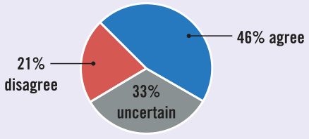

# Ch37 Six Debates over Macroeconomic Policy  

P colhiatincigaens si na encdo neodmitiocr ipaol licwyr. itTehres  parrees icdoennst tsahnotluyl da rdavisoec taatixnegs to reduce the budget deficit, or she should stop worrying about the budget deficit. The Federal Reserve should cut interest rates to stimulate a flagging economy, or it should raise interest rates to fight inflation. Congress should reform the tax system to promote faster economic growth, or it should reform the tax system to achieve a more equal distribution of income. Such economic issues are central to the ongoing political debate in the United States and other countries around the world.  

Previous chapters explored the tools that economists use to analyze the behavior of the economy and the effects of economic policies. This final chapter considers six classic questions about macroeconomic policy. Economists have long debated them and are likely to continue doing so for years to come. The knowledge you have gleaned in this course provides a foundation for discussing these important, unsettled issues. It should help you choose a side in these debates or, at least, help you see why choosing a side is so difficult.  

The preceding three chapters discussed how changes in aggregate demand and aggregate supply can lead to short-run fluctuations in production and employment and how monetary and fiscal policy can shift aggregate demand and influence these fluctuations. But even if policymakers can influence short-run economic fluctuations, does that mean they should? Our first debate concerns how active monetary and fiscal policymakers should be in attempting to smooth the ups and downs of the business cycle.  

## 37-1a  The Case for Robust Stabilization Policy  

Left on their own, economies fluctuate. When households and firms become pessimistic, for instance, they cut back on spending, thereby reducing the aggregate demand for goods and services. The decline in aggregate demand, in turn, reduces the production of goods and services. Firms lay off workers, and the unemployment rate rises. Real GDP and other measures of income fall. Rising unemployment and falling income help confirm the pessimism that initially generated the economic downturn.  

Such a recession has no benefit for society—it represents a sheer waste of resources. Workers who lose their jobs because of declining aggregate demand would rather be working. Business owners whose factories are idle would rather be producing goods and services and selling them at a profit.  

There is no good reason for society to suffer through the booms and busts of the business cycle. Macroeconomic theory shows policymakers how to reduce the severity of economic fluctuations. By “leaning against the wind” of economic change, monetary and fiscal policy can stabilize aggregate demand, production, and employment. When aggregate demand is inadequate to ensure full employment, policymakers should boost government spending, cut taxes, expand the money supply, and reduce interest rates. When aggregate demand is excessive, risking higher inflation, policymakers should cut government spending, raise taxes, reduce the money supply, and increase interest rates. Such policy actions put macroeconomic theory to its best use by leading to a more stable economy, which benefits everyone.  

## 37-1b  The Case for Modest Stabilization Policy  

Monetary and fiscal policy can be used to stabilize the economy in theory, but there are substantial obstacles in practice.  

One problem is that monetary and fiscal policies do not affect the economy immediately but instead work with a long lag. Monetary policy affects aggregate demand primarily by changing interest rates, which in turn affect spending, particularly on residential and business investment. But because many households and firms set their most important spending plans far in advance, it takes time for changes in interest rates to alter aggregate demand. Studies indicate that changes in monetary policy have little effect on aggregate demand until about six months after the change is made.  

Fiscal policy works with a lag because of the long political process for changing taxes and government spending. To make a substantial change in fiscal policy in the United States, a bill must go through congressional committees, pass both the House and the Senate, and be signed by the president. It can take years to propose, pass, and implement a major shift in fiscal policy.  

  

Because of these long lags, policymakers who want to stabilize the economy need to look ahead to economic conditions that will prevail when their actions take effect. Unfortunately, economic forecasting is imprecise, in part because macroeconomics is such a primitive science and in part because the shocks that cause economic fluctuations are intrinsically unpredictable. This means that when policymakers change monetary or fiscal policy, they must rely on no more than educated guesses about future conditions.  

Too often, policymakers who try to stabilize the economy end up having the opposite effect. Conditions can easily change from the time a policy action begins to the time it takes effect. As a result, policymakers can inadvertently aggravate the business cycle rather than smoothing it. Some economists claim that many major downturns, including the Great Depression of the 1930s, can be traced to destabilizing policy actions.  

Early in their training, physicians learn the rule “first, do no harm.” The human body has natural restorative powers. Confronted with a sick patient and an uncertain diagnosis, often a doctor should do nothing but leave the patient alone. Intervening without reliable knowledge risks making matters worse.  

The same can be said about treating an ailing economy. It might be desirable for policymakers to eliminate all fluctuations, but such a goal is not realistic given the limits of macroeconomic knowledge and the inherent unpredictability of world events. It is reasonable for monetary and fiscal policymakers to intervene when an economic downturn is deep or protracted, but they cannot be expected to prevent every recession. In most cases, they should be content if they do no harm.  

1. Approximately how long does it take for a change in monetary policy to influence aggregate demand?  

a. one month b. six months c. two years d. five years  

Fiscal policy has a long lag mainly because   
a. policymakers at the Federal Reserve do not meet frequently.   
b. firms making investments are slow to respond to changes in interest rates.   
c. the political process is slow to enact changes in government spending or taxes.   
d. consumers are slow to respond to changes in their after-tax incomes.  

## 37-2 Should the Government Fight Recessions with Spending Hikes or Tax Cuts?  

When George W. Bush became president in 2001, the economy was slipping into a recession. He responded by cutting tax rates. When Barack Obama became president in 2009, the economy was in the middle of the Great Recession, the worst economic downturn in many decades. He responded with a stimulus package that offered some tax reductions but also included substantial increases in government spending. The contrast between these two policies illustrates a classic question of macroeconomics: Which instrument of fiscal policy—government spending or taxes—is a better tool for reducing the severity of economic downturns?  

## 37-2a  The Case for Fighting Recessions with Spending Hikes  

John Maynard Keynes transformed economics when he wrote The General Theory of Employment, Interest, and Money during the Great Depression of the 1930s, the worst downturn in U.S. history. Since then, economists have understood that the fundamental problem during recessions is inadequate aggregate demand. When firms can’t sell enough goods and services, they reduce production and employment. The key to ending recessions is restoring aggregate demand to a level consistent with full employment.  

Monetary policy is often the first line of defense against economic downturns. By increasing the money supply, the central bank reduces interest rates. Lower interest rates reduce the cost of borrowing to finance investment projects, such as new factories and new housing. Increased investment spending adds to aggregate demand and helps to restore normal levels of production and employment.  

Fiscal policy provides an additional tool to combat recessions. When the government cuts taxes, it increases households’ disposable income, encouraging them to increase spending on consumption. When the government buys goods and services, it adds directly to aggregate demand. Moreover, these fiscal actions can have multiplier effects: Higher aggregate demand leads to higher incomes, higher incomes lead to additional consumer spending, and additional consumer spending leads to further increases in aggregate demand.  

Fiscal policy is particularly useful when monetary policy loses its effectiveness. For example, during the Great Recession of 2008 and 2009 and the coronavirus recession of 2020, the Federal Reserve cut its target interest rate to about zero. Though some central banks have targeted interest rates that are slightly negative, interest rates can’t go much below zero because, at some point, people would rather hold onto their cash than lend it out. When the target interest rate hits this effective lower bound, the Fed loses its best tool for stimulating the economy. Unconventional monetary policy, such as quantitative easing and forward guidance, may be useful, but it is arguably less effective. In this circumstance, it is natural for the government to turn to fiscal policy—government spending and taxes—to prop up aggregate demand.  

Traditional Keynesian analysis indicates that increases in government purchases are a more potent tool than decreases in taxes. When households get extra disposable income from a tax cut, they will likely save some of that additional income rather than spend it all (especially if households view the tax reduction as temporary rather than permanent). The fraction of the extra income saved does not contribute to the aggregate demand for goods and services. By contrast, when the government spends a dollar buying a good or service, that dollar immediately and fully adds to aggregate demand.  

In 2009, economists in the Obama administration used a conventional macroeconomic model to calculate the magnitude of these effects. According to their model simulations, each dollar of tax cuts increases GDP by $\mathbb{S}0.99_{}$ , while each dollar of government purchases increases GDP by $91.59$ . Because increases in government spending offer a bigger “bang for the buck” than decreases in taxes, the policy response in 2009 featured fewer federal tax cuts and more spending.  

Policymakers focused on three kinds of spending. First, there was spending on “shovel-ready” projects. These were public works projects such as repairs to highways and bridges on which construction could begin immediately, putting the unemployed back to work. Second, there was federal aid to state and local governments. Because many of these governments are constitutionally required to run balanced budgets, falling tax revenues during recessions can make it necessary for them to lay off teachers, police, and other public workers; federal aid prevented that outcome or, at least, reduced its severity. Third, there were increased payments to the jobless through the unemployment insurance system. Because the unemployed are often financially stretched, they were thought to be likely to spend rather than save this extra income. These transfer payments were thought to contribute more to aggregate demand—and, in turn, to production and employment—than tax cuts would. According to the macroeconomic model used by the Obama administration, the $\mathbb{S}800$ billion stimulus package would create or save more than 3 million jobs by the end of the president’s second year in office.  

It is impossible to know for sure what effect the stimulus, in fact, had. Because there is only one run at history, no one knows what would have happened without the stimulus package. Yet one thing is clear: While the economic downturn of 2008–2009 was severe, it could have been worse. In the Great Depression of the 1930s, real GDP fell by 27 percent, and unemployment reached 25 percent. In the Great Recession, real GDP fell by only 4 percent, and unemployment reached only 10 percent. As judged by either GDP or unemployment, the Great Recession did not approach the magnitude of the Great Depression.  

## 37-2b  The Case for Fighting Recessions with Tax Cuts  

There is a long tradition of using tax policy to stimulate a moribund economy. President Kennedy proposed a tax reduction as one of his major economic initiatives; it eventually passed under President Johnson in 1964. President Reagan also signed into law significant tax cuts when he became president in 1981. Both of these tax reductions were soon followed by strong economic growth.  

Tax cuts have a powerful influence on both aggregate demand and aggregate supply. They increase aggregate demand by increasing households’ disposable income, as emphasized in traditional Keynesian analysis. But they can also increase aggregate demand by altering incentives. For example, if the tax reductions take the form of an expanded investment tax credit, they can induce increased spending on investment goods. Because investment spending is the most volatile component of GDP over the business cycle, stimulating investment is a key to ending recessions. Policymakers can target investment using welldesigned tax policy.  

While tax cuts increase aggregate demand, they can also increase aggregate supply. When the government reduces marginal tax rates, workers keep a higher fraction of any income they earn. That gives the unemployed a greater incentive to search for jobs and the employed a greater incentive to work longer hours. Increased aggregate supply, along with the increased aggregate demand, means that the production of goods and services can expand without putting upward pressure on inflation.  

Increasing government spending during recessions entails various problems. First of all, rational consumers understand that higher government spending, together with the government borrowing needed to finance it, will likely lead to higher future taxes. The anticipation of future taxes induces those consumers to reduce spending today. Moreover, like most taxes, future taxes are likely to cause deadweight losses. As businesses look ahead to a more highly distorted future economy, they may reduce their expectations of future profits and reduce investment spending. Because of these effects, government-spending multipliers may be smaller than is conventionally believed.  

It is also far from clear whether the government can spend money both wisely and quickly. Large government spending projects often require years of planning, as policymakers and voters weigh the projects’ costs and benefits. But when unemployment soars during recessions, the need for additional aggregate demand is immediate. If the government tries to be careful in planning its expenditures, it may fail to increase aggregate demand in a timely fashion. If, however, the government increases spending quickly, it may end with ill-conceived public projects that create temporary employment but produce little lasting value and leave future taxpayers with a legacy of government debt.  

Tax cuts have the advantage of decentralizing spending decisions rather than relying on a centralized and cumbersome political process. Households spend their disposable income on things they value, and firms spend their investment dollars on projects they expect to be profitable. This suggests that tax cuts may be the better weapon to combat economic downturns.  

## 37-3 Should Monetary Policy Be Made by Rule or Discretion?  

As we learned in the chapter on the monetary system, the Federal Open Market Committee sets monetary policy in the United States. The committee meets about every six weeks to evaluate the state of the economy and decide whether to raise, lower, or leave unchanged its target for the federal funds rate. In some circumstances, it may also opt for unconventional monetary actions, such as quantitative easing and forward guidance.  

The Federal Open Market Committee operates with substantial discretion over how to conduct monetary policy. The laws that created the Fed gave the institution limited guidance about what goals it should pursue. A 1977 amendment to the 1913 Federal Reserve Act said the Fed “shall maintain long run growth of the monetary and credit aggregates commensurate with the economy’s long run potential to increase production, so as to promote effectively the goals of maximum employment, stable prices, and moderate long-term interest rates.” But the act does not specify how to weigh these various goals, nor does it tell the Fed how to pursue whatever objective it might choose.  

Some economists are critical of this institutional design. Our next debate over macroeconomic policy focuses on whether the Fed should have its discretionary powers reduced and, instead, be committed to following a rule for how it conducts monetary policy.  

## 37-3a  The Case for Rule-based Monetary Policy  

Discretion in the conduct of monetary policy entails two problems. First, it does not limit incompetence and abuse of power. When the government sends police into a community to maintain civic order, it gives them strict guidelines about how to carry out their job. Because police have great power, allowing them to exercise that power however they wanted would be dangerous. (And, even so, disputes over policing are all too common.) Yet when the government gives central bankers the authority to maintain economic order, it gives them few guidelines. Monetary policymakers are allowed undisciplined discretion.  

One example of the abuse of power is that central bankers are sometimes tempted to use monetary policy to affect the outcome of elections. Suppose that the vote for the incumbent president is based on economic conditions at the time of reelection. A central banker sympathetic to the incumbent might be tempted to pursue expansionary policies just before the election to stimulate production and employment, knowing that the resulting inflation will not show up until after the election. When central bankers ally themselves with politicians, discretionary policy can lead to economic fluctuations that reflect the electoral calendar. Economists call such fluctuations the political business cycle. Before the election of 1972, for instance, President Richard Nixon pressured Fed Chair Arthur Burns to pursue a more expansionary monetary policy, presumably to bolster Nixon’s reelection chances.  

The second and subtler problem with discretionary monetary policy is that it might lead to higher inflation than is desirable. Consider the issue from the perspective of Frida, a hypothetical Fed chair. Frida knows that there is no long-run trade-off between inflation and unemployment, and she thinks inflation is costly, so she announces that the Fed will aim for zero inflation. Yet once the public has formed inflation expectations, Frida faces a short-run trade-off between inflation and unemployment. She is tempted to renege on her promise of price stability to reduce unemployment. This discrepancy between announcements (what policymakers say they will do) and actions (what they actually do) is called the time inconsistency of policy. Because policymakers can be time inconsistent, people are skeptical when central bankers say they will reduce inflation. In other words, people may expect higher inflation than central bankers claim they are trying to achieve. Higher expectations of inflation, in turn, shift the short-run Phillips curve upward, making the short-run trade-off between inflation and unemployment less favorable than it otherwise might be.  

One way to avoid these two problems with discretionary policy is to commit the central bank to a policy rule. For example, suppose that Congress passed a law requiring the Fed to increase the money supply by exactly 3 percent per year. (Why 3 percent? Because real GDP grows, on average, about 3 percent per year, and because money demand grows with real GDP, 3 percent growth in the money supply is roughly the rate necessary to produce long-run price stability.) Such a law would eliminate incompetence and abuse of power on the part of the Fed, and it would make the political business cycle impossible. In addition, policy could no longer be time inconsistent. People would now believe the Fed’s announcement of low inflation because the Fed would be legally required to pursue a low-inflation monetary policy. With low expected inflation, the economy would face a more favorable short-run trade-off between inflation and unemployment.  

Other rules for monetary policy are also possible. A more active rule might allow some feedback from the state of the economy to changes in monetary policy. For example, a more active rule might require the Fed to increase monetary growth by 1 percentage point for every percentage point that unemployment rises above its natural rate. Regardless of the precise form of the rule, committing the Fed to some rule would yield advantages by limiting incompetence, abuse of power, and time inconsistency in the conduct of monetary policy.  

## 37-3b  The Case for Discretionary Monetary Policy  

Discretionary monetary policy may have some drawbacks, but it has an important advantage: flexibility. The Fed confronts ever-changing circumstances, not all of which can be foreseen. In the 1930s, banks failed in record numbers. In the 1970s, the world price of oil skyrocketed. In October 1987, the stock market fell by 22 percent in a single day. From 2007 to 2009, house prices dropped, and home foreclosures soared, sending the financial system into disarray. In 2020, a pandemic closed large segments of the economy. The Fed must decide how to respond to these shocks. A designer of a policy rule could not possibly imagine all the contingencies and specify in advance the right policy response. It is better to appoint good people to conduct monetary policy and give them the freedom to do the best they can.  

Moreover, the alleged problems with discretion are largely hypothetical. The practical importance of the political business cycle, for instance, is far from clear. While Nixon did pressure Burns in 1972, it is not clear that he succeeded in altering monetary policy: Interest rates rose during the election year. Moreover, in some cases, just the opposite seems to occur. President Jimmy Carter appointed Paul Volcker to head the Federal Reserve in 1979. Nonetheless, in October of that year, Volcker switched to a contractionary monetary policy to combat the high inflation that he had inherited from his predecessor. The predictable result of Volcker’s decision was a recession, and the predictable result of the recession was a decline in Carter’s popularity. Rather than using monetary policy to help the president who had appointed him, Volcker took actions he thought were in the national interest, even though they contributed to Carter’s defeat by Ronald Reagan in the November 1980 election.  

The practical importance of time inconsistency is also far from clear. Although people are often skeptical of central-bank announcements, central bankers can achieve credibility over time by backing up their words with actions. In the 1990s and 2000s, the Fed achieved and maintained a low rate of inflation, despite the everpresent temptation to take advantage of the short-run trade-off between inflation and unemployment. This experience shows that low inflation does not require that the Fed be committed to a policy rule.  

Any attempt to replace discretion with a rule must confront the difficult task of specifying a precise rule. Despite much research examining the costs and benefits of alternative rules, economists have not reached consensus about what a good rule would be. Until there is consensus, society has little choice but to give central bankers discretion to conduct monetary policy as they see fit.  

## FYI Inflation Targeting  

ver the past few decades, many central banks around the world have Oadopted a policy called inflation targeting. Sometimes, a central bank announces its intentions regarding the inflation rate over the next few years. At other times, this policy takes the form of a national law that specifies an inflation goal for the central bank.  

Inflation targeting is not a commitment to an ironclad rule. In all the countries that have adopted it, central banks still have a fair amount of discretion. Inflation targets are often set as a range—an inflation rate of 1 to 3 percent, for example—rather than a single number, so the central bank can choose where in the range it wants to be. Moreover, the central bank is sometimes allowed to adjust its target for inflation, at least temporarily, if some event (such as a shock to world oil prices) pushes inflation outside the target range.  

Although inflation targeting leaves the central bank with some discretion, the policy does constrain how that discretion is used. When a central bank is told simply to “do the right thing,” it is hard to hold the central bank accountable because people can argue forever about what is right. By contrast, when a central bank has an inflation target, it is easier to judge whether the central bank is meeting its goals. Inflation targeting does not tie the bank’s hands, but it increases the transparency and accountability of monetary policy. In a sense, inflation targeting is a compromise in the debate over rules versus discretion.  

Compared with other central banks around the world, the Federal Reserve was slow to adopt a policy of inflation targeting, although some commentators had long suggested that the Fed had an implicit inflation target of about 2 percent. In January 2012, the Federal Open Market Committee made the policy more explicit. Its press release read as follows:  

The inflation rate over the longer run is primarily determined by monetary policy, and hence the Committee has the ability to specify a longer-run goal for inflation. The Committee judges that inflation at the rate of 2 percent, as measured by the annual change in the price index for personal consumption expenditures, is most consistent over the longer run with the Federal Reserve’s statutory mandate. Communicating this inflation goal clearly to the public helps keep longer-term inflation expectations firmly anchored, thereby fostering price stability and moderate long-term interest rates and enhancing the Committee’s ability to promote maximum employment in the face of significant economic disturbances.  

Inflation targeting in the United States is an evolving policy. In August 2020, the Fed said it sought an “average” inflation rate of 2 percent rather than a firm target of 2 percent. It did not say over what time horizon the average would be calculated. This change built greater leeway into the Fed’s policymaking. ■  

5. Advocates for setting monetary policy by rule rather than discretion often argue that a. central bankers with discretion are tempted to renege on their announced commitments to low inflation. b. central bankers following a rule will be more responsive to the needs of the political process. c. fiscal policy is better than monetary policy as a tool for economic stabilization. d. it is sometimes useful to give the economy a burst of surprise inflation.  

6. A policy of inflation targeting a. removes the need for discretionary decision making by central bankers. b. frees central bankers from having to respond to shocks to aggregate demand. c. makes central bank policy more transparent and accountable. d. has been abandoned by most central banks around the world.  

## 37-4 Should the Central Bank Aim for an Inflation Rate Near Zero?  

One of the Ten Principles of Economics in Chapter 1 is that prices rise when the government prints too much money. Another is that society faces a short-run tradeoff between inflation and unemployment. These principles were developed more fully over the course of this book. Together, they raise a question for policymakers: What rate of inflation should a central bank aim for?  

## 37-4a  The Case for Near-Zero Inflation  

Inflation confers no benefit on society but imposes several costs. Economists have identified six of them:  

●  Shoeleather costs from reduced money holdings   
Menu costs from more frequent adjustment of prices Increased variability of relative prices   
Unintended changes in tax liabilities due to non-indexation of the tax code Confusion and inconvenience resulting from a changing unit of account   
Arbitrary redistributions of wealth associated with dollar-denominated debts  

Some economists argue that these costs are small, but others claim they can be substantial, even during periods of moderate inflation. Moreover, many people undoubtedly dislike inflation. In 2021, for example, when inflation rose to about 6 percent, opinion polls identified inflation as the nation’s leading economic problem.  

The benefits of low inflation must be weighed against the costs of achieving it. Reducing inflation often requires a period of high unemployment and low output, as illustrated by the short-run Phillips curve. But this disinflationary recession is only temporary. Once people come to understand that policymakers are aiming for low inflation, expectations of inflation will fall, and the short-run trade-off will improve. Because expectations adjust, there is no trade-off between inflation and unemployment in the long run.  

Reducing inflation is, therefore, a policy with temporary costs and permanent benefits. Once the disinflationary recession is over, the benefits of low inflation persist into the future. If policymakers are farsighted, they should be willing to incur the temporary costs for the permanent benefits. This was precisely the calculation made by Paul Volcker in the early 1980s when he tightened monetary policy and reduced inflation from about 10 percent in 1980 to about 4 percent in 1983. Although unemployment in 1982 reached its highest level since the Great Depression, the economy eventually recovered from the recession, leaving a legacy of low inflation. Today, Volcker is considered a hero among central bankers.  

Moreover, the costs of reducing inflation need not be as large as some economists claim. If the Fed announces a credible commitment to low inflation, it can directly influence expectations of inflation. Such a change in expectations can improve the short-run trade-off between inflation and unemployment, allowing the economy to reach lower inflation at a reduced cost. The key to this strategy is credibility: People must believe that the Fed is going to carry through on its announced policy. Congress could help by passing legislation that makes price stability the Fed’s primary goal. Such a law would decrease the cost of achieving low inflation without reducing any of the resulting benefits.  

## 37-4b  The Case for Living with Moderate Inflation  

The benefits of achieving an inflation rate near zero—rather than, say, 4 percent per year—are small, while the costs can be large. Estimates of the sacrifice ratio suggest that reducing inflation by 1 percentage point requires giving up about 5 percent of one year’s output. Reducing inflation from 4 percent to zero requires a loss of 20 percent of a year’s output. People might dislike inflation of 4 percent, but it is not clear that they would (or should) be willing to pay 20 percent of a year’s income to get rid of it.  

The social costs of disinflation are even larger than this 20 percent figure suggests because the lost income is not spread equitably throughout the population. When the economy goes into recession, all incomes do not fall proportionately. Instead, the fall in aggregate income is concentrated on those who lose their jobs. The vulnerable workers are often those with the least skills and experience. Hence, much of the cost of reducing inflation is borne by those who can least afford to pay it.  

Economists list several costs of inflation, but there is no consensus that these costs are substantial. The shoeleather costs, menu costs, and others that economists have identified do not seem great, at least for moderate rates of inflation. Yes, many people dislike inflation, but they may be misled into believing the inflation fallacy—the view that inflation inevitably erodes living standards. Economists understand that long-run living standards depend on productivity, not monetary policy. Because inflation in nominal incomes typically goes hand in hand with inflation in prices, reducing inflation with tighter monetary policy would not cause real incomes to rise more rapidly.  

Moreover, policymakers can lessen many of the costs of inflation without actually reducing inflation. They can eliminate the problems associated with the non-indexed tax system by rewriting the tax laws to account for the effects of inflation. They can reduce the arbitrary redistributions of wealth between creditors and debtors caused by unexpected inflation by issuing indexed government bonds, which the U.S. Treasury has done since the Clinton administration introduced them in 1997. Promoting more widespread use of such bonds would insulate holders of government debt from inflation.  

Reducing inflation might be desirable if it could be done at no cost, as some economists argue is possible. Yet this trick is hard to carry out in practice. When nations  

Two economists argue that the Federal Reserve should limit its focus.  

## The Fed’s Duty Is to the Economy, Not ‘Equity’  

By Michael T. Belongia and Peter N. Ireland  

he Federal Reserve Bank of St. Louis is in the early stages of creating an Institute for Economic Equity “to support an economy in which everyone can benefit regardless of race, ethnicity, gender, or where they live,” with an emphasis on “economic outcomes experienced by historically marginalized groups.” The Federal Reserve Banks of Boston, Atlanta and Minneapolis have their own initiatives in the works. Sen. Pat Toomey (R., Pa.) has rightly asked regional presidents: Should banks consider social justice and equity in monetary policy decisions?  

To put these new initiatives in context, consider the Fed’s mission and independence. The Federal Reserve Act directs the Fed to conduct monetary policy in a manner that will “promote effectively the goals of maximum employment, stable prices, and moderate long-term interest rates.” Each goal is expressed as an outcome for the economy, rather than the benefit of a particular segment of the economy or prices of individual goods.  

Put another way, the tools of monetary policy don’t exist to reduce unemployment in the auto or steel industries. The goal isn’t to keep gasoline prices low but to maintain a modest, stable rate of increase in the average value of a basket of commodities.  

All central banks have confronted this tension between the economy’s general performance and the welfare of particular interests. The long recent period of historically low interest rates, for instance, reduces the rate of return earned by savers. At the same time, lower interest rates reduce the cost of purchasing a home, car and other durable goods.  

A low value of the dollar benefits U.S. exporters by making their goods less expensive to foreign buyers. But it also harms U.S. consumers by increasing the prices of imported goods. If the Fed considered these trade-offs rather than  

reduce inflation, they almost always experience a period of high unemployment and low output. It is risky to believe that the central bank could achieve credibility so quickly that disinflation would be painless.  

Indeed, a disinflationary recession can leave permanent scars on the economy. Firms in all industries reduce their spending on new plant and equipment substantially during recessions, making investment the most volatile component of GDP. Even after the recession is over, the smaller capital stock reduces productivity, incomes, and living standards below the levels they otherwise would have achieved. In addition, when workers become unemployed in downturns, they lose job skills, permanently reducing their value as workers.  

A little bit of inflation may even be a good thing. Some economists believe that inflation “greases the wheels” of the labor market. Because workers resist cuts in nominal wages, a fall in real wages is more easily accomplished when the price level is rising. Inflation thus makes it easier for real wages to adjust to changes in labor-market conditions.  

In addition, inflation allows for the possibility of negative real interest rates. Nominal interest rates cannot fall much below zero because lenders can always hold on to their money rather than lending it out at a negative return. If inflation is zero, real interest rates can also never be negative. But if inflation is, say, 4 percent, then a cut in nominal interest rates can produce real interest rates of negative 4 percent. Sometimes, the economy may need deeply negative real interest rates to provide sufficient stimulus to aggregate demand—an option ruled out by zero inflation.  

In light of all these arguments, why should policymakers put the economy through a costly and inequitable disinflationary recession to achieve zero inflation?  

general economic performance, would it choose to ease or tighten monetary policy knowing full well that any action will benefit some and harm others? Regrettable or not, the conduct of monetary policy inevitably will have distributional consequences that are secondary to pursuing the best outcome for the whole.  

This tension between the general and the particular helps explain the argument that central banks should be “independent” institutions so their policies are insulated from political pressure. But independence doesn’t mean a central bank is free to set its own goals, which are usually established by a legislative body.  

The Fed isn’t free to choose its own monetarypolicy objectives, but it has wide latitude and independence to choose a strategy to achieve those goals. While the Fed might choose to set a target for an interest rate or growth of the money supply, these are merely functional ways to pursue the goals set by Congress. Lawmakers can then hold the Fed accountable for its performance in achieving its mandate.  

But how can the Fed pursue new goals for “equity” while staying committed to its legislated mandate to achieve “maximum employment, stable prices, and moderate long-term interest rates?”  

In pursuit of equity, does the Fed plan to   
become more involved in the allocation of credit?   
What tools does the Fed plan to use? Will the   
new goal of equity for “historically marginalized   
groups” require changes in the distributional   
effects monetary policy has on savers, borrow  
ers, exporters and consumers? Perhaps most   
fundamental, how will the Fed define “equity?” The Fed’s new initiatives expose the central   
bank to political pressures that are inconsis  

tent with an independent institution. If the Fed wants to lose its independence, it is taking steps to assure that outcome.  

## Questions to Discuss  

Do you agree with the authors that the Fed should not concern itself with issues of social equity? Why or why not? 2. If the Fed follows the authors’ advice, what other institutions should focus on social equity? Why might these institutions be better equipped for the task?  

Mr. Belongia is a professor of economics at the University of Mississippi. Mr. Ireland is a professor of economics at Boston College.  

The Wall Street Journal, June 10, 2021.  

The economist Alan Blinder, who was once vice chairman of the Fed, argued in his book Hard Heads, Soft Hearts that policymakers should not make this choice:  

The costs that attend the low and moderate inflation rates experienced in the United States and in other industrial countries appear to be quite modest— more like a bad cold than a cancer on society. . . . As rational individuals, we do not volunteer for a lobotomy to cure a head cold. Yet, as a collectivity, we routinely prescribe the economic equivalent of lobotomy (high unemployment) as a cure for the inflationary cold.  

Blinder concludes that it is better to learn to live with moderate inflation.  

## QuickQuiz  

7. Which of the following is NOT an argument for a zero rate of inflation?  

a. It eliminates distortions from a non-indexed tax code.   
b. It encourages people to hold a greater quantity of money.   
c. It reduces the menu costs that firms have to incur.   
d. It stops real wages from falling if nominal wages cannot be cut.  

8. Which of the following is NOT an argument for a positive rate of inflation? a. It permits real interest rates to be negative. b. It increases the variability of relative prices. c. It allows real wages to fall without cuts in nominal wages. d. It would be costly to reduce inflation to zero.  

Government debt is the subject of a persistent macroeconomic debate. Whenever the government spends more than it collects in tax revenue, it finances this budget deficit by issuing government debt. Our study of financial markets showed how budget deficits affect saving, investment, and interest rates. But how big a problem are budget deficits? The next debate concerns whether fiscal policymakers should make balancing the government’s budget a high priority.  

## 37-5a  The Case for a Balanced Budget  

The U.S. federal government is far more indebted today than it was four decades ago. In 1980, the federal debt was $\mathbb{S}712$ billion; in 2021, it was $\mathbb{S}22.4$ trillion. If we divide today’s debt by the size of the population, we learn that each person’s share of the government debt is about $^{\Phi68,000}$ .  

The government debt places a burden on future taxpayers. When these debts and accumulated interest come due, these people will face difficult choices. They can embrace a combination of higher taxes and less government spending to make resources available to pay off the debt and accumulated interest. Or they can delay the day of reckoning and borrow once again to pay off the old debt and interest, making the debt burden even larger. In essence, when the government runs a budget deficit and issues debt, it allows current taxpayers to pass the bill for some of their government spending on to future taxpayers. Inheriting such a large debt will lower the living standard of future generations.  

In addition, budget deficits have macroeconomic effects. Because these deficits represent negative public saving, they lower national saving (the sum of private and public saving), causing real interest rates to rise and investment to fall. Reduced investment leads to a smaller stock of capital, which reduces labor productivity, real wages, and the production of goods and services. In short, when the government increases its debt, future generations are born into an economy with lower incomes as well as higher taxes.  

There are, nevertheless, situations in which running a budget deficit is justifiable. Historically, war is the most common cause of large increases in government debt. Financing short-term military spending by borrowing makes sense because otherwise, taxes would rise precipitously in wartime. Such high tax rates would lead to large deadweight losses. They would also be unfair to current citizens who are making the sacrifice of fighting the war to ensure security and freedom not only for themselves but also for future generations.  

Similarly, it is reasonable to allow a budget deficit during economic downturns. Tax revenue automatically declines during recessions because payroll and income taxes are levied on measures of income. And government spending automatically rises as more people become eligible for programs such as unemployment insurance. If the government tried to balance its budget during recessions, it would have to raise taxes or cut spending when unemployment is high. Such a policy would tend to depress aggregate demand when it needs to be stimulated and, therefore, could make downturns more severe.  

Yet not all budget deficits can be justified because of war or recession. In 2021, the Congressional Budget Office (CBO) projected that, if current policies are maintained, U.S. government debt as a percentage of GDP would increase from 102 percent in 2021 to 195 percent in 2040. Moreover, the CBO made the optimistic assumption the nation will experience neither a major military conflict nor a major economic downturn during this period. The government was projected to run sizable budget deficits simply because presidents and Congresses had committed the federal government to a variety of spending programs without passing the taxes necessary to fund them.  

This projected policy is unsustainable. Eventually, the government will need to enact measures to bring spending in line with tax revenue. The open question is whether the fiscal adjustment should take the form of reduced spending, increased taxes, or a combination of the two. Compared with the alternative of ongoing budget deficits, a balanced budget means greater national saving, increased capital accumulation, and faster economic growth. It means that people in the future will live in a more prosperous economy.  

## 37-5b  The Case against a Balanced Budget  

The problem of government debt is often exaggerated. Although it represents a tax burden on younger generations, that burden is not large compared with the average person’s lifetime income. The debt of the U.S. federal government is about $^{\Phi68,000}$ per person. Someone who works 40 years for $^\mathrm{\Phi50,000}$ a year will earn $\mathbb{S}2$ million. In other words, the government debt represents only 3.4 percent of a typical person’s lifetime resources.  

It is also misleading to consider a budget deficit in isolation. The deficit is just one piece of a larger picture of how the government raises and spends money. When setting fiscal policy, policymakers affect different generations of taxpayers in many ways. The government’s budget deficit or surplus should be evaluated along with these policies.  

For example, suppose the government reduces the budget deficit by cutting spending on public investments, such as education. Does this policy make younger generations better off? The government debt will be smaller, reducing their tax burden. Yet if they are less educated than they otherwise would be, their productivity and incomes will be lower. Many studies find that the return to schooling (the wage increase that results from an additional year in school) is large. Reducing the budget deficit by cutting education spending could, all things considered, hurt future generations.  

Single-minded concern about the budget deficit is dangerous because it draws attention away from other policies that redistribute income across generations. For example, in the 1960s and 1970s, the U.S. federal government raised Social Security benefits for the elderly. It financed this higher spending by increasing the payroll tax on the working-age population. This policy redistributed income away from younger generations toward older generations, even though it did not affect the government debt. Whether this was good or bad is the subject of another debate. What’s relevant here is that the budget deficit is only a small part of the larger issue of how government policy affects the welfare of different generations.  

To some extent, forward-looking parents can reverse the adverse effects of government debt. Suppose the government cuts taxes and runs a budget deficit. Parents can offset the impact of the deficit simply by saving their tax cut and investing in their children, perhaps by leaving them a bequest. Doing so would enhance the children’s ability to bear the burden of the future taxes implied by the greater government debt. If everyone behaved this way, higher private saving by parents would offset the public dissaving of budget deficits, and deficits would not affect the economy. Most economists doubt that parents are so farsighted, but some people may act this way, and anyone could. The point is that deficits give people the opportunity to consume at their children’s expense but don’t require parents to do so. If the government debt were actually a great problem facing future generations, some parents would help to solve it.  

  

“What?!? My share of the government debt is \$68,000?”  

Critics of budget deficits sometimes assert that the government debt cannot continue to rise forever, but in fact, it can. Just as a bank evaluating a loan application would compare a person’s debts to his income, we should judge the burden of the government debt relative to the size of the nation’s income. Because of population growth and technological progress, the total income of the U.S. economy grows over time. As a result, the nation’s ability to pay the interest on the government debt grows as well. As long as the government debt grows more slowly than the nation’s income, there is nothing to prevent the government debt from growing forever.  

Some numbers can put this into perspective. The CBO projects that the output of the U.S. economy will grow by about 2 percent per year. If inflation also averages 2 percent per year, as the Fed is targeting, nominal income will grow at about 4 percent per year. The government debt can, therefore, rise by 4 percent per year without increasing the ratio of debt to income. In 2021, the federal government debt was $\mathbb{S}22.4$ trillion; 4 percent of this figure is about $\mathbb{S}900$ billion. As long as the federal budget deficit is smaller than $\mathbb{S}900$ billion, the policy is sustainable.  

To be sure, large budget deficits cannot persist forever. The $\mathbb{S}2.7$ trillion budget deficits experienced in 2020 and 2021 during the coronavirus pandemic would not be sustainable over the long term. But zero is the wrong target for fiscal policymakers. As long as the deficit is moderate in size, there will never be a day of reckoning that forces government borrowing to end or the economy to collapse.  

## QuickQuiz  

9. Throughout U.S. history, what has been the most common cause of substantial increases in government debt? a. pandemics b. wars c. infrastructure spending d. tax cuts  

10. Other things being equal, when the government runs a large budget deficit, it national saving and thereby capital formation and productivity growth. a. increases; increases b. increases; decreases c. decreases; increases d. decreases; decreases  

Answers are at the end of the chapter.  

## 37-6  Should the Tax Laws Be Reformed to Encourage Saving?  

A nation’s standard of living depends on its ability to produce goods and services. This was one of the Ten Principles of Economics in Chapter 1. As we saw in the chapter on production and growth, a nation’s productive capability is determined partly by how much it saves and invests. Our last debate is whether policymakers should reform the tax laws to encourage saving.  

## 37-6a  The Case for Promoting Saving through Tax Reform  

A nation’s saving rate is a key determinant of its long-run prosperity. When the saving rate is higher, more resources are available for investment in new plant and equipment, which in turn raises the capital stock, labor productivity, wages, and incomes. Another of the Ten Principles of Economics in Chapter 1 is that people respond to incentives. This lesson applies to people’s decisions about how much to save. If a nation’s laws make saving attractive, people will save more of their incomes, and this higher saving will lead to a more prosperous future.  

Unfortunately, the U.S. tax system discourages saving by heavily taxing the return to saving. For example, consider Willa Worker, a 25-year-old who saves $^\mathrm{\Phi1,000}$ of her income to have a more comfortable retirement at the age of 70. If she buys a bond that pays an interest rate of 6 percent, the $^\mathrm{51,000}$ will accumulate at the end of 45 years to $^\mathrm{\Phi}_{\Phi}13{,}800$ in the absence of taxes on interest. But suppose Willa faces a marginal tax rate on interest income of 40 percent, which is typical for many workers once federal and state income taxes are added together. In this case, her after-tax interest rate is only 3.6 percent, and the $^\mathrm{\Phi1,000}$ will accumulate at the end of 45 years to only $^\mathrm{\Phi4,900}$ . That is, accumulated over this long span of time, the tax rate on interest income reduces the benefit of saving $^\mathrm{\Phi1,000}$ from $^\mathrm{\Phi}_{\Phi}13{,}800$ to $^{\mathbb{S}4,900}$ —or by about 64 percent.  

The tax code further discourages saving by taxing some forms of capital income twice. Suppose Willa uses some of her saving to buy stock in a corporation. When the corporation earns a profit from its capital investments, it first pay tax on this profit in the form of the corporate income tax. If the corporation pays out the rest of the profit to Willa and other stockholders in the form of dividends, they pay tax on this income a second time in the form of the individual income tax. This double taxation substantially reduces the return to stockholders, reducing the incentive to save.  

The tax laws again discourage saving if Willa wants to leave her accumulated wealth to her children or other relatives rather than consuming it during her lifetime. People can bequeath some money tax-free, but for large bequests, the estate tax rate (federal and state combined) can be as high as 50 percent. Concern about national saving is mainly motivated by a desire to ensure prosperity for future generations. It is odd, therefore, that the tax laws impede the most direct way in which one generation can help the next.  

In addition to the tax code, many other policies and institutions reduce the incentive for Willa to save. Some government benefits, such as welfare and Medicaid, are means-tested: They are reduced for those who have saved in the past and accumulated some wealth. Similarly, colleges and universities grant financial aid based on the wealth of students and their parents. Such a policy, like a tax on wealth, deters saving.  

There are many ways in which tax reform could encourage saving, or at least reduce the disincentive that Willa now faces. Already, the tax laws give preferential treatment to some types of saving. When a taxpayer puts income into an Individual Retirement Account (IRA), for instance, that income and the interest it earns are not taxed until the funds are withdrawn at retirement. A similar tax advantage is given to retirement accounts with other names, such as 401(k), 403(b), and profitsharing plans. Tax-favored accounts are also available for saving earmarked for college tuition. There are, however, limits on who is eligible for these plans and on how much an eligible person can put into them. Moreover, these plans provide little incentive for other types of saving, such as saving to build an emergency fund, buy a house or car, or pay for a vacation or home improvement. A small step toward encouraging saving would be to expand the ability of households to use tax-advantaged accounts for a broader range of goals.  

A more comprehensive approach would be to reconsider the entire basis by which the government collects revenue. The centerpiece of the U.S. tax system is the income tax. A dollar earned is taxed at the same rate whether it is spent or saved. An alternative endorsed by many economists is a consumption tax, under which a household pays taxes based on what it spends. Income that is saved is exempt from taxation until the saving is later withdrawn and spent on consumption goods. In essence, a consumption tax automatically puts all saving into a tax-advantaged savings account, much like an IRA. A switch from income taxation to consumption taxation would increase Willa’s incentive to save.  

## Ask the Taxing Capital Experts and Labor  

“One drawback of taxing capital income at a lower rate than labor income is that it gives people incentives to relabel income that policymakers find hard to categorize as ‘capital’ rather than ‘labor’.”  

## 37-6b   The Case against Promoting Saving through Tax Reform  

Greater saving may be desirable, but it is not the only goal of tax policy. Policymakers also must be sure to distribute the tax burden fairly. The problem with proposals to increase the incentive to save is that they increase the tax burden on those who can least afford it.  

  
What do economists say?  

It is undeniable that households with high incomes save a larger fraction of their income than households with low incomes. As a result, any tax change that favors people who save will tend to favor people with high incomes. Policies such as tax-advantaged retirement accounts may seem appealing, but they lead to a less egalitarian society. By reducing the tax burden on the wealthy who can take advantage of these accounts, they force the government to raise the tax burden on families with lower incomes.  

“Despite relabeling concerns, taxing capital income at a permanently lower rate than labor income would result in higher average long-term prosperity, relative to an alternative that generated the same amount of tax revenue by permanently taxing capital and labor income at equal rates instead.”  

  
What do economists say?  

Moreover, tax policies designed to encourage saving may not be effective at achieving that goal. Economic theory does not give a clear prediction about whether a higher rate of return would increase saving. The outcome depends on the relative size of two conflicting forces called the substitution effect and the income effect. On the one hand, a higher rate of return raises the benefit of saving: Each dollar saved today produces more consumption in the future. This substitution effect tends to increase saving. On the other hand, a higher rate of return lowers the need for saving: A household has to save less to achieve any target level of consumption in the future. This income effect tends to reduce saving. If the substitution and income effects approximately cancel each other, as some studies suggest, then saving will not change when lower taxation of capital income raises the rate of return.  

“Although they do not always agree about the precise likely effects of different tax policies, another reason why economists often give disparate advice on tax policy is because they hold differing views about choices between raising average prosperity and redistributing income.”  

There are ways to increase national saving other than by giving tax breaks to the rich. National saving is the sum of private and public saving. Instead of trying to alter the tax code to encourage greater private saving, policymakers can simply raise public saving by reducing the budget deficit, perhaps by raising taxes on the wealthy. This approach offers a direct way of raising national saving and increasing prosperity for future generations.  

  
What do economists say?  

Source: IGM Economic Experts Panel, October 9, 2012.  

Indeed, once public saving is taken into account, tax provisions to encourage saving might backfire. Tax changes that reduce the taxation of capital income reduce government revenue and thereby lead to a larger budget deficit. To increase national saving, such changes in the tax code must increase private saving by more than they decrease public saving. If they fail to do so, so-called saving incentives can potentially make matters worse.  

11. Advocates of taxing consumption rather than income argue that a. the current tax code discourages people from saving. b. the rich consume a higher fraction of income than the middle class. c. a consumption tax is a better automatic stabilizer. d. taxing consumption does not cause any deadweight losses.  

2. Critics of taxing consumption rather than income argue that a. switching to a consumption tax would benefit the rich. b. private saving does not respond much to tax incentives. c. reducing the budget deficit is a better way to raise national saving. d. All of the above.  

Answers are at the end of the chapter.  

## 37-7 Conclusion: Economic Policy and Shades of Gray  

This chapter discussed six classic debates over macroeconomic policy. For each, it began with a policy question and then offered the arguments on both sides. If you find it hard to pick a side, you may find some comfort in the fact that you are not alone. The study of economics does not always make it easy to choose among alternative policies. Indeed, by clarifying the trade-offs that policymakers face, it can make choices more difficult.  

Calvin, the boy in the following cartoon strip, could well have been reading this textbook:  

  

Hobbes, the tiger, was wise enough to distrust Calvin’s unschooled confidence.  

Difficult choices have no right to seem easy. When you hear politicians and other men and women of action proposing something that sounds too good to be true, it probably is. If they appear to be offering you a free lunch, look for the hidden price tag. Few policies come with benefits and no costs. By helping you see through the fog of rhetoric so common in political discourse, the study of economics should make you a better participant in our national debates.  

Advocates of active monetary and fiscal policy view the economy as inherently unstable and believe that policy can manage aggregate demand to offset the instability. Critics of active monetary and fiscal policy emphasize that policy affects the economy with a lag and that our ability to forecast future economic conditions is poor. As a result, attempts to stabilize the economy can end up being destabilizing.  

Advocates of increased government spending to fight recessions argue that because the extra income from tax cuts may be saved rather than spent, direct government spending provides a greater boost to aggregate demand, which is key to promoting production and employment. Critics of spending hikes argue that tax cuts can expand both aggregate demand and aggregate supply and that hasty increases in government spending may lead to wasteful public projects.  

Advocates of rules for monetary policy argue that discretionary policy can suffer from incompetence, the abuse of power, and time inconsistency. Critics of rules for monetary policy argue that discretionary policy is more flexible in responding to changing economic circumstances. Advocates of a zero-inflation target emphasize that inflation has many costs and few benefits. Moreover, the cost of eliminating inflation—depressed output and increased unemployment—is only temporary. Even this cost can be reduced if the central bank credibly commits to reduce inflation, thereby directly lowering inflation expectations. Critics of a zero-inflation target claim that moderate inflation imposes only small costs on society and that the recession necessary to reduce inflation to zero is quite costly. The critics also point out two benefits to moderate inflation: It facilitates real-wage adjustment, and it allows real interest rates to be negative when necessary.  

Advocates of a balanced government budget argue that budget deficits impose an unjustifiable burden on future generations by raising their taxes and lowering their incomes. Critics of a balanced government budget argue that the deficit is only one small piece of fiscal policy. Single-minded concern about the budget deficit can obscure the many ways in which policy, including various spending programs, affects different generations.  

Advocates of tax incentives for saving point out that society discourages saving in many ways, such as by heavily taxing capital income and reducing benefits for those who have accumulated wealth. They endorse reforming the tax laws to encourage saving, perhaps by switching from an income tax to a consumption tax. Critics of tax incentives for saving argue that many proposed changes to stimulate saving would primarily benefit the wealthy, who do not need a tax break. They also argue that such changes might have only a small effect on private saving. Raising public saving by reducing the government’s budget deficit would provide a more direct and equitable way to increase national saving.  

## Questions for Review  

1. What causes the lags in the effect of monetary and fiscal policy on aggregate demand? What are the implications of these lags for the debate over active versus passive policy?   
2. According to traditional Keynesian analysis, why does a tax cut have a smaller effect on GDP than a similarly sized increase in government spending? Why might the opposite be the case?   
3. What might motivate a central banker to cause a political business cycle? What does the political business cycle imply for the debate over policy rules?   
4. Explain how credibility might affect the cost of reducing inflation.   
5. Why are some economists against a target of zero inflation?   
6. Explain two ways in which a government budget deficit hurts a future worker.   
7. What are two situations in which most economists view a budget deficit as justifiable?   
8. Some economists say that the government can continue running a budget deficit forever. How is that possible?   
9. Some income from capital is taxed twice. Explain.   
10. What adverse effect might be caused by tax incentives to increase saving?  

1. The chapter suggests that the economy, like the human body, has “natural restorative powers.” a. Illustrate the short-run effect of a fall in aggregate demand using an aggregate-demand/aggregatesupply diagram. What happens to total output, income, and employment? b. If the government does not use stabilization policy, what happens to the economy over time? Illustrate this adjustment on your diagram. Does it generally occur in a matter of months or a matter of years? c. Do you think the “natural restorative powers” of the economy mean that policymakers should be passive in response to the business cycle?  

2. Policymakers who want to stabilize the economy must decide how much to change the money supply, government spending, or taxes. Why is it difficult for policymakers to choose the appropriate strength of their actions?  

3. The problem of time inconsistency applies to fiscal policy as well as to monetary policy. Suppose the government announced a reduction in taxes on income from capital investments, like new factories. a. If investors believed that capital taxes would remain low, how would the government’s action affect the level of investment? b. After investors have responded to the announced tax reduction, does the government have an incentive to renege on its policy? Explain. c. Given your answer to part (b), would investors believe the government’s announcement? What can the government do to increase the credibility of announced policy changes? d. Explain why this situation is similar to the time-inconsistency problem faced by monetary policymakers.  

4. Chapter 2 explains the difference between positive analysis and normative analysis. In the debate about whether the central bank should aim for zero inflation, which areas of disagreement involve positive statements, and which involve normative judgments?  

5. Why are the benefits of reducing inflation permanent and the costs temporary? Why are the costs of increasing inflation permanent and the benefits temporary? Use Phillips-curve diagrams in your answer.  

6. Suppose the federal government cuts taxes and increases spending, raising the budget deficit to 12 percent of GDP. If nominal GDP is rising 5 percent per year, are such budget deficits sustainable forever? Explain. If budget deficits of this size are maintained for 20 years, what is likely to happen to your taxes and your children’s taxes in the future? Can you personally do something today to offset this future effect?  

7. Explain how each of the following policies redistributes income across generations. Is the redistribution from young to old or from old to young?  

a. an increase in the budget deficit b. more generous subsidies for education loans c. greater investments in highways and bridges d. an increase in Social Security benefits  

8. What is the fundamental trade-off that society faces if it chooses to save more? How might the government increase national saving?  

<html><body><table><tr><td>1. b</td><td>2.c</td><td>3.c</td><td>4.a</td><td>5.a</td><td>6.c</td><td>7.d</td><td>8.b</td><td>9. b</td><td>10. d</td><td>11. a</td><td>12. d</td></tr></table></body></html>  

