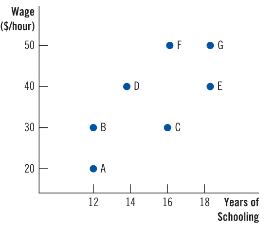
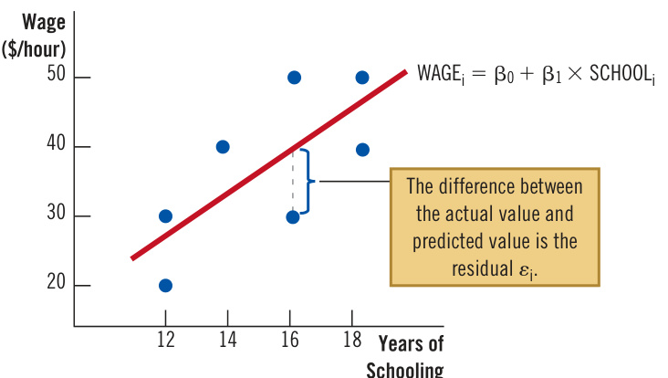

# Ch38 Appendix: How Economists Use Data  

IID amtaa!k eD batriac! kDs awtait!”h oSuht ecrllaoyc.k”  AHso lumsueas l,o tnhcee  ficcrtiieodn. a“l Id ceatenc’-t tive was right: To solve a mystery, or to understand any other aspect of the world, we need data. Theories and principles are critically important, but only after observing what’s happening around us can we be sure we know what is true and what is not. The term data refers to factual information that provides the basis for reasoning and discussion. In economics, data are often quantitative, such as a person’s income, a firm’s profit, the market price of ice cream, the amount of ice cream sold, or a nation’s gross domestic product. Data allow us to attach real numbers to the conceptual variables found in economic theory.  

## data  

factual information, often quantitative, that provides the basis for reasoning and discussion  

Data analysis is increasingly central to modern economics. Over the past half century, advances in computing power have enabled economists to analyze ever larger data sets, and research based on data has become increasingly important. Compared with economists of the past, modern economists base their beliefs and policy advice less on pure theory and casual observation and more on the hardheaded analysis of data.  

## econometrics  

the subfield of economics that develops tools to analyze data  

A subfield of economics, called econometrics, is devoted to developing tools for data analysis. In essence, econometrics is the study of the statistical methods that are useful for understanding the economy. Many colleges offer courses in econometrics, and students majoring in economics are often required to take one as part of their training. This appendix chapter offers a brief introduction.  

We address three issues. First, we consider the kinds of data that economists use. Second, we discuss what economists aim to achieve through data analysis. Third, we examine some of the challenges that arise when drawing inferences from data and the methods that econometricians have devised to meet those challenges.  

## 38-1  The Data That Economists Gather and Study  

Let’s begin by discussing the sources and types of data that economists use most often.  

## 38-1a Experimental Data  

## randomized controlled trial  

an experiment in which a researcher randomly divides subjects into groups, treats the groups differently, and compares their outcomes  

Sometimes data come from randomized controlled trials. A randomized controlled trial is an experiment in which a researcher randomly divides subjects into groups, treats the groups differently, and compares how the groups respond to their treatments.  

For example, suppose a pharmaceutical company comes up with a new drug to treat a disease. Before regulators allow the company to market the drug, it must prove that the drug is safe and effective. The company’s researchers start by recruiting a sample of, say, 200 people who have the disease. Half of the patients are randomly assigned to the treatment group and given the drug. The other half are assigned to the control group and given a placebo (a harmless but ineffective pill that looks like the actual drug). The researchers then follow the health of the two groups. If the patients in the treatment group fare better than those in the control group, the drug is deemed safe and effective. Otherwise, the drug is declared unsafe, ineffective, or both.  

## experimental data  

data that come from a researcher running a randomized controlled trial  

Data gathered from randomized controlled trials are called experimental data. In many cases, controlled trials are the most reliable way to draw inferences about things we want to learn. If the number of trial participants is large enough and the assignment to the treatment and control groups is truly random, we can be sure that the only important difference between the two groups is their exposure to the treatment.  

Randomized controlled trials are sometimes used in the social sciences. (The case study below presents an example.) But their usefulness is limited in economics. The problem is often one of feasibility. Experiments can be expensive to run, and policymakers may object to the unfairness of treating people differently. And sometimes, the economic cost of running the experiment would be too large. For example, to study the effects of monetary policy, a central bank could set its policy randomly from year to year and then observe the consequences. This experiment might advance the cause of social science, but it would have such an adverse impact on a nation’s welfare that no one would seriously consider conducting it.  

The researchers recruited several thousand low-income families living in neighborhoods experiencing high levels of poverty to participate in the experiment. By lottery, the families were divided into a treatment group and two control groups. Families in the treatment group received vouchers that subsidized rent if they moved to more affluent neighborhoods. In one control group, families received rental vouchers without any restriction on where they could live. In the second control group, families received nothing at all. The researchers compared the subsequent life outcomes, such as earnings and educational attainment, for the family members in the three groups.  

Some of the results were disappointing. Even though many in the treatment group used the vouchers to leave high-poverty neighborhoods, the adults in the three groups did not exhibit significant differences in economic outcomes. The average incomes of the adult family members were about the same in the treatment and control groups, though health outcomes were somewhat better for those in the treatment group. Similarly, there were no significant differences in the measured life outcomes for older children (ages 13 to 18) in the treatment group.  

Yet the program had a significant, positive impact on children who were below the age of 13 when their families received the vouchers. Younger children in the treatment group did not perform better in school than those in the control groups, as measured by test scores in reading and math. But later in their lives, they had significantly higher rates of college attendance, lower rates of single motherhood, and higher incomes as adults. These results show that young children enjoy longterm benefits if their families leave high-poverty neighborhoods.  

## 38-1b  Observational Data  

Because experimental data are not always available, economists often rely on observational data, which are obtained not from conducting an experiment but from simply observing the world as it is. Observational data can come from surveys of households and firms and from administrative records, such as tax returns. Compared with experimental data, observational data have the advantage of being more easily produced and more widely available, but they present two challenges to data analysts.  

The first is the problem of confounding variables. A confounding variable is a variable that is omitted from the analysis but, because it is related to the variables being measured and studied, can lead the researcher to an incorrect conclusion.  

For example, suppose you want to know whether reducing class size in grade school improves learning. You might be tempted to estimate the impact of class size by comparing the average test scores of students in large and small classes. That strategy would be fine if students and teachers were placed into the classes randomly, as is the case with experimental data. But with observational data, because the placement of students and teachers is probably not random, other variables related to class size may enter the picture and bias the results. Small classes, for instance, might be more common in towns with better-educated and higher-income populations. If parental education affects student performance, it is a confounding variable that makes the impact of small classes seem larger than  

observational data data that come from a researcher observing the world as it presents itself confounding variable an omitted variable that can mislead the researcher because it is related to the variables of interest  

it actually is. The benefits of parental education could be incorrectly attributed to class size. Or perhaps school principals assign less-experienced teachers to smaller classes. If teacher experience affects student performance, it is a confounding variable that makes the impact of small classes appear smaller than it actually is. The disadvantages of having a less experienced teacher could mask the benefits of small classes. Because many variables can be correlated with one another in observational data, researchers need to carefully distinguish the effects of one variable from the effects of another.  

reverse causality a situation in which a researcher confuses the direction of influence between two variables cross-sectional data data that present information about multiple subjects (such as people, firms, or nations) at a given time  

## time-series data  

data that present information about a single subject (such as a person, firm, or nation) at various times  

## panel data  

data that present information about multiple subjects (such as people, firms, or nations) at various times  

The second challenge presented by observational data is the problem of reverse causality. Reverse causality describes a situation in which a researcher believes that one variable influences a second variable, when, in fact, it is the second variable that influences the first.  

For example, suppose you observe that the quantity consumed of some food is positively correlated with a person’s body mass index (BMI), an indicator of obesity. Should you conclude that the consumption of that food causes an increase in BMI? That inference would be correct if food consumption were set randomly, as in a controlled trial, but problems can arise with observational data. If the food in question were ice cream, the direction of causality might indeed run from food consumption to BMI: Eating a lot of ice cream may cause weight gain. The positive correlation does not prove this, but the hypothesis is at least plausible. On the other hand, if the food were diet soft drinks, a different interpretation might be in order. Maybe people with a high BMI are trying to lose weight and therefore choose to consume diet soft drinks. That is, rather than the consumption of diet soft drinks causing a high BMI, a high BMI may cause the consumption of diet soft drinks. This example illustrates a general lesson: Sorting out what is cause and what is effect is often tricky when using observational data.  

Despite these problems, observational data can be useful if the data analyst is careful. Later, this chapter introduces some of the methods econometricians have devised to deal with confounding variables and to determine causal effects.  

## 38-1c  Three Types of Data  

Whether data are experimental or observational, they can come in three types: cross-sectional, time-series, and panel.  

Cross-sectional data show the characteristics of multiple subjects (such as people, firms, or nations) at a given time. For example, we might survey a group of workers and ask each of them to report their wage, education, age, experience, profession, race, gender, and so on. We can use these data to see how these variables are related to one another. For example, we can examine how much wages differ by race or gender after adjusting for differences in education, age, experience, and profession.  

Time-series data show the characteristics of a single subject (one person, firm, or nation) at various times. For example, we might measure a nation’s unemployment rate (the percent of the labor force that is jobless) and its GDP (gross domestic product, a measure of production and income) every year over a 60-year period. We can use these data to study how fluctuations in unemployment and GDP are related.  

Panel data combine the elements of cross-sectional and time-series data to show the characteristics of multiple subjects (such as people, firms, or nations) at various times. This type of data, also known as longitudinal data, is useful for examining how changes in one variable affect another. For example, we could study how winning the lottery affects a person’s labor-force participation by comparing the changing behavior over time of lottery winners and losers.  

1. In a randomized controlled trial, subjects are placed into treatment and control groups based on a. willingness to pay. b. income. c. estimated benefit from treatment. d. chance.  

Observational data has the advantage of a. solving the problem of reverse causality.   
b. being widely available.   
c. avoiding confounding variables.   
d. coming from randomized controlled trials.  

## 38-2 What Economists Do with Data  

Having seen how economists gather data (from experiments or observations) and the types of data they gather (cross-sectional, time-series, or panel), let’s consider what economists hope to achieve through data analysis.  

## 38-2a  Describing the Economy  

Economic data are often interesting in themselves as quantitative descriptions of the world. For example:  

●  You may have heard that most people devote a large fraction of their spending to housing, but you might not know how large it is. The data show that average consumers in the United States spend 42 percent of their budgets on housing.   
You know that, by definition, a household at the 90th percentile of the U.S. income distribution has higher income than a household at the 10th percentile, but you might not know how different their incomes are. The data show that the rich household has about 12 times the income of the poor household. You probably know that the United States has higher income per person than Mexico, but you might not know how much higher it is. The data show that average income per person in the United States is about three times that in Mexico.   
You may have read that spending on healthcare has risen as a share of total spending in the economy, but you might not know by how much. The data show that U.S. healthcare spending has risen from 5 percent of GDP in 1960 to 18 percent in 2019.  

These kinds of facts are useful to know. As we develop theories to understand how the world works and consider policies to improve it, keeping an eye on the data gives us a better sense of the world as it is.  

## 38-2b  Quantifying Relationships  

Economic theory often suggests that certain variables are related, but it rarely tells us how strongly they are related. Often, we need a sense of those magnitudes. That is, we need estimates of a model’s parameters, the numerical values that govern the strength of the relationships among variables.  

Consider an example. Suppose policymakers are considering a tax on luxury cars. They might want to know whether the burden of the tax will fall more on the buyers or the sellers of the cars. The incidence of a tax depends on the price  

## parameters  

the numerical values that govern the strength of the relationships among variables in a model  

elasticities of supply and demand, which measure the responsiveness of quantity supplied and quantity demanded to changes in the good’s price. If demand is more elastic than supply, sellers bear most of the burden; if supply is more elastic than demand, buyers bear most of the burden.  

This theoretical conclusion takes us only so far. To answer the policymakers’ question, we need estimates of the parameters, which here are the price elasticities of supply and demand. To come up with those estimates, researchers would collect data on the luxury car market. A careful analysis of the data can establish quantitatively the determinants of quantity supplied and quantity demanded. In particular, it would yield estimates of the price elasticities, which can be used to project the incidence of the proposed tax.  

## 38-2c  Testing Hypotheses  

Economic theories attempt to describe the world in which we live. Like all theories in science, an economic theory is just a hypothesis, an educated guess about how the world works. To confirm or refute the hypothesis, we need to turn to data.  

For example, consider the impact of schooling on wages. Economist Betsey thinks that education is a great way to increase a worker’s wage. She believes that the human capital produced in school makes workers more productive, and more productive workers are paid more. Economist Justin thinks education is a waste of time. He believes that most things taught in school are useless in most jobs and that people are better off getting job experience than wasting time in the classroom.  

No amount of theorizing can settle the debate between Betsey and Justin. Their disagreement is empirical: It can be addressed only by the facts, not by sheer logic. In this case, we need to turn to data on wages, education, and job experience to decide which of their hypotheses is correct. (Spoiler alert: Most economists side with Betsey.)  

## 38-2d  Predicting the Future  

“It’s tough to make predictions, especially about the future.” Yogi Berra was a wise man, yet economists are often asked to predict the future. A microeconomist might be asked how the upcoming merger between two firms will affect prices in the market for their products. A macroeconomist might be asked how quickly a sudden spike in inflation will subside.  

Sometimes, you can make forecasts simply by finding patterns in the data and extrapolating them into the future. For example, suppose you observe that when married couples trade in their compact cars for minivans, they usually have a new baby a few months later. If your neighbors come home with a minivan one day, you might reasonably predict that a baby is on the way. Economists call this relationship between minivans and babies an empirical regularity, and it might be useful for forecasting for a while. But the relationship is not reliably stable. If a car company introduced a new line of family-friendly SUVs, for instance, minivan purchases might become a less useful tool for predicting births.  

To make reliable predictions, economists often turn to models, which are mathematical representations of the forces at work in a given situation. For a model to be useful in making quantitative predictions, economists need to quantify each relationship within it. They do so using the relevant data to estimate the model’s parameters. Once the estimated model is in hand, they can use it to make predictions.  

the main macroeconomic elements of the U.S. economy, including the relationships among key variables such as GDP, inflation, unemployment, and interest rates. The central bank uses the model for forecasting and policy analysis.  

The FRB/US model includes hundreds of equations, each describing a piece of the economy. Many of these equations are identities—equations that must be true because of how the variables in the equation are defined. An identity does not have any parameters that need to be estimated. (An example is the national income accounts identity $\begin{array}{r}{Y=C+I+G+N X,}\end{array}$ which states that GDP is the sum of consumption, investment, government purchases, and net exports.) But about 60 equations in the FRB/US model are equations that describe how households or firms respond to economic conditions, and these equations include crucial parameters. For example, an equation for consumption would show how households’ spending on consumer goods and services depends on their current income, expected future income, wealth, interest rates, and so on. The relative importance of these determinants of consumption is reflected in the parameters of the consumption equation. Economists at the Federal Reserve estimate these parameters by applying econometric techniques to the time-series data on the U.S. economy.  

With the estimated FRB/US model in hand, Fed economists use the model for two purposes. The first is forecasting. Based on current policy and economic conditions, they project the most likely outcome for the future. The projection is based on simultaneously solving the hundreds of equations in the model. This task might seem impossible, and it would be if they had to rely on pencil and paper. Fortunately, computer algorithms are available to solve such large-scale models.  

The second purpose for which Fed economists use the FRB/US model is policy analysis. They ask how the future would be different from their baseline projection if the Fed changed monetary policy in some way. The result is a set of alternative policy scenarios. They show what would happen to key economic variables—GDP, unemployment, inflation, and so on—if the Fed tightened or loosened monetary policy. The members of the Federal Open Market Committee, who set monetary policy, can use this menu of scenarios as a guide for choosing a direction for policy.  

How reliable are the forecasts presented by the Fed economists? Studies find that they are as good as or better than those provided by most private economic forecasters, but they are far from perfect. Because the reliability of the forecasts depends on the accuracy of the FRB/US model, Fed economists are always looking for ways to improve it. Some improvements come from new conceptual insights, such as better economic theory. Others come from more data that arrive as time passes and from new statistical insights as econometricians devise better ways to use data.

## QuickQuiz  

3. Economists use data to a. describe the economy. b. estimate parameters.  

c. test hypotheses.   
d. All of the above.  

Having discussed the kinds of data that economists use and what they hope to achieve using the data, let’s consider some of the methods that econometricians have developed for data analysis.  

## 38-3a  Finding the Best Estimate  

According to the theory of human capital, when workers become more educated, they become more productive, and their wages increase. That statement is qualitative: It addresses the nature of the relationship between education and wages but not the strength of it. Suppose you wanted to go beyond this qualitative statement and ask the quantitative question, “By how much does an extra year of schooling increase a worker’s wage?” This question is empirical. You can only answer it using data.  

You begin by surveying a number of workers and collecting data on their wages and education. It would look like Table 1. (You would likely want your sample to include more than seven workers, but for purposes of illustration, seven is sufficient.) The data in Table 1 are an example of cross-sectional data.  

As you look over the data, you see that more educated workers do, in fact, tend to earn more. The two workers with 12 years of schooling, presumably high school graduates, earn an average of $\mathbb{S}25$ an hour. The two workers with 16 years of schooling, perhaps college graduates, earn an average of $\mathbb{S}40$ an hour. And the two workers with 18 years of schooling, who may have done some study in graduate school, earn an average of $\mathbb{S}45$ an hour.  

Yet wages do not always rise with education. Chloe has four more years of schooling than Brooke, but they earn the same wage. Emma has two more years of schooling than Flynn, but she earns $\mathbb{S}10$ per hour less than he does. Education may be one determinant of a worker’s wage, but there must be other important factors as well.  

One way to start understanding these data is to graph them, as in Figure 1. Each point represents one observation. The figure shows the positive correlation between wages and education: Points to the right (indicating more years of schooling) tend to also be higher in the graph (indicating higher wages). Yet the points do not lie along a straight line or even a simple curve. They resemble a cloud, suggesting that there are factors beyond years of schooling that affect wages.  

## Table 1  

Data on Wages and Education  

<html><body><table><tr><td>Worker</td><td>Wage ($/hour)</td><td>YearsofSchooling</td></tr><tr><td>Andy</td><td>20</td><td>12</td></tr><tr><td>Brooke</td><td>30</td><td>12</td></tr><tr><td>Chloe</td><td>30</td><td>16</td></tr><tr><td>Diego</td><td>40</td><td>14</td></tr><tr><td>Emma</td><td>40</td><td>18</td></tr><tr><td>Flynn</td><td>50</td><td>16</td></tr><tr><td>Gina</td><td>50</td><td>18</td></tr></table></body></html>  

## Figure 1  

## A Scatterplot of the Data  

Plotting data on wages and education shows the positive correlation between these two variables. That is, they tend to move in the same direction.  

  

To determine how much each year of schooling increases a worker’s wage, an economist will turn to a statistical model—a mathematical representation of the process that generates the data. The simplest such model is the following:  

$$
\mathrm{WAGE_{\mathrm{i}}}=\mathsf{\vec{B}}_{0}+\mathsf{\vec{B}}_{1}\times\mathrm{SCHOOL}_{\mathrm{i}}+\mathsf{\vec{e}}_{\mathrm{i}}
$$  

where $\upbeta_{\mathrm{o}}$ and $\upbeta_{\mathrm{{1}}}$ are parameters that measure how the variables are related. According to this model, person i’s wage (WAGE) depends on years of schooling (SCHOOL) and is influenced by a random variable (´). The variable on the left-hand side, $\mathrm{WAGE_{i^{\prime}}}$ is called the dependent variable; it is the variable being explained. The measured variable on the right-hand side, $\mathrm{SCHOOL_{\mathrm{i}}},$ is called the independent variable; it is the variable taken as given. The term $\mathbf{\deltaE}_{\mathrm{i}}$ is called the residual. It represents the many forces, such as experience and cognitive ability, that influence wages but are excluded from the model. The residual is assumed to be zero on average and uncorrelated with the independent variable. (We will discuss the role of this assumption later, but for now, let’s just go with it.)  

This statistical model is called a linear regression. In essence, this model draws a line through the cloud of points, as shown in Figure 2. The line shows the best guess of a worker’s wage based on years of schooling. The residual represents the deviation of the actual wage from the wage predicted by the line, acknowledging that the model will not fit the data perfectly.  

The key parameter of interest is $\upbeta_{\mathrm{{1^{\prime}}}}$ which tells us how much each year of schooling increases a person’s wage. The other parameter, $\mathsf{\beta}_{\mathsf{0}^{\prime}}$ determines the intercept of the line. Taken literally, $\upbeta_{\mathrm{o}}$ would be the average wage for a person with zero years of schooling. But because our sample does not include anyone with no education at all, it is best to avoid that literal interpretation. Our focus is on $\upbeta_{\mathrm{r}}$ .  

## linear regression  

a statistical model in which the dependent variable is linearly related to one or more independent variables plus a random residual  

The question we now face is how to best estimate the parameters from the data we have. We could just try to draw a well-fitting line through the cloud of points by hand, but that approach is too inexact (and not easily generalized to more complex cases discussed in a moment). The standard method for finding the best-fitting line is called ordinary least squares, or OLS. We won’t go into the details of OLS in this chapter, but the intuition is simple. OLS aims to determine the parameters  

ordinary least squares a statistical method for estimating parameter values by minimizing the sum of squared residuals  

## Figure 2  

## Estimating the Best-Fitting Line  

A statistical model posits that wages are a linear function of education plus a residual representing other random influences on wages. The parameters of the model ( ${\mathfrak{f}}_{0}$ and $\upbeta_{\mathrm{1}}$ can be estimated by ordinary least squares (OLS), which yields the line that fits best as gauged by the sum of squared residuals.  

  

${\big.}{\big\vert}\beta_{0}$ and ${\upbeta}_{1},$ ) representing the line that is closest to the data points. Closeness here is measured by the squared residuals. Squaring the residuals ensures that both positive and negative residuals are deemed to detract from the goal of closeness. OLS finds the parameters that minimize the sum of squared residuals.  

When OLS is applied to the seven data points in Table 1, it yields the following result:  

$$
\mathrm{WAGE_{i}=-10.7+3.16\times S C H O O L_{i}}.
$$  

According to the estimated model, each year of schooling increases a worker’s wage by $\mathbb{53.16}$ per hour. That is the answer to our question.  

This example illustrates a general lesson: Economists often want to go beyond qualitative theoretical insights (education increases wages) to quantitative conclusions (how much each year of schooling increases wages). This leap requires data. The economists find the data relevant for the issue at hand, posit a statistical model that can plausibly explain the data, and estimate the model’s parameters using a method such as ordinary least squares. Using the estimated model, they can reach quantitative conclusions.  

## 38-3b Gauging Uncertainty  

Economists use data to estimate key quantities (such as the wage benefit of a year of schooling in the previous section). Often, they want to know not only the best estimate but also how reliable that estimate is. That is, they want to know whether their estimate is precise or a rough guess.  

Before returning to our model of wages and education, let’s take a detour to consider a simpler example. Suppose you are interested in the height of the average person in New York City. One way to find that number is to get data on the height of every New Yorker. You then compute the average (also called the mean) by adding up all their heights and dividing by the number of people. Because your calculation includes the entire population, you arrive at the precisely correct answer. But there is a problem: New York has about 9 million people, so this approach is not practical.  

Fortunately, there is an easier way if you are content with an answer that is not completely precise. Instead of trying to get data on the entire population, you can choose a random sample of, say, 100 people. The meaning of “random” is that every person in the population has an equal chance of being chosen. Because of the randomness, the sample is likely to be representative of the population. You can estimate the height of the population by computing the average height of these 100 randomly chosen people.  

Let’s say that the average height of the 100 people in your sample is 66 inches. So far, so good. But you might start wondering how reliable this estimate is. Because the sample was chosen randomly, there is no reason to think that the sample average of 66 inches is too high or too low an estimate of the average height of the population. But it could be either. You could have gotten unlucky by randomly choosing a sample with a few more tall people or a few more short people than normal. This uncertainty comes from what statisticians call sampling variation—the variability that arises because different random samples lead to somewhat different estimates.  

Statisticians have developed ways not only to estimate parameter values but also to gauge the uncertainty associated with parameter estimates resulting from sampling variation. The details of this process are beyond the scope of this chapter, but the basic idea can be gleaned from our example. Here is how it works.  

First, after computing the mean height of the 100 people in your sample, you compute the standard deviation of heights. The standard deviation is a measure of variability across observations, and you may have learned about it in a math or statistics class. In our example, let’s say you compute that the standard deviation of heights is 4 inches.  

What is a standard deviation? Technically, it is the square root of the average squared deviation from the mean. That is a mouthful, but there is a more intuitive way to think about it. For a normal bell-shaped distribution, about 95 percent of observations fall within two standard deviations of the mean. In our example, the mean is 66 inches, and the standard deviation is 4 inches (making two standard deviations 8 inches). So, if you pick a New Yorker at random, the probability that this individual’s height lies between 58 and 74 inches is 95 percent.  

Next, using the standard deviation and the sample size, you can compute a measure of your estimate’s reliability called the standard error. According to a formula developed by statisticians, the standard error of the sample mean as an estimate of the population mean is the standard deviation divided by the square root of the sample size. In this case, the standard error of your estimate is $4/\sqrt{100}=4/10=$ 0.4. This number can be used to gauge the degree of sampling variation in your estimate. Just as the standard deviation measures the variability in the height of individual New Yorkers, the standard error measures the variability in the mean height of samples of New Yorkers.  

Here is a useful rule of thumb: The true value of a parameter lies within two standard errors of the estimated value about 95 percent of the time. In this example, the estimate is 66 inches, and the standard error is 0.4 inches. Two standard errors equal 0.8 inches. So you can be 95 percent confident that the true mean height of the population is between 65.2 inches and 66.8 inches.  

Based on this rule of thumb, twice the standard error is sometimes called the margin of error. Journalists often use this term when reporting results from public opinion polls. For example, you might hear that, according to a poll of 400 people, 57 percent favor a particular candidate, with a margin of error of 5 percent. That means you can be 95 percent confident that the true support for that candidate lies between 52 and 62 percent.  

Standard errors are useful not only in simple examples like estimating a population mean but also in other contexts. Depending on the circumstances, the formulas  

standard error a measure of the uncertainty associated with a parameter estimate that results from sampling variation  

to calculate standard errors can be complex. Fortunately, most statistical software used to produce parameter estimates automatically gives the standard errors associated with the estimates.  

For the data on wages and education in Table 1, the estimated equation produced by Microsoft Excel, along with the standard errors in parentheses, is the following:  

$$
\mathrm{WAGE_{i}=-10.7+3.16\times S C H O O L_{i}}.
$$  

It turns out that the estimate of $\mathbb{53.16}$ for each year of schooling is not very precise. Two standard errors are $2\times1.35=2.70.$ Thus, we can be 95 percent confident that the true wage benefit of a year of schooling lies between $\mathbb{S}0.46$ and $\mathbb{S}5.86$ . That is a large range. But we should not expect much precision when estimating a parameter using only seven data points. If we had 700 data points similar to these, the standard error would be 0.135, and the 95-percent confidence interval would lie between $\mathbb{S}2.89$ and $\mathbb{S}3.43,$ which is a smaller range. Estimated parameters become more precise with larger samples.  

## 38-3c  Accounting for Confounding Variables  

In many situations, the dependent variable is a function of more than one other variable. Wages, for example, depend not only on education but also on experience, cognitive ability, job characteristics, and so on. If data analysts are not careful, they can mistakenly confuse the effects of one variable with the effects of another. Fortunately, statistical methods are available to help avoid this problem of confounding variables. As an example, let’s continue with our statistical model of wages and education:  

$$
\mathrm{WAGE_{i}}=\mathsf{\mathbb{B}}_{0}+\mathsf{\mathbb{B}}_{1}\times\mathrm{SCHOOL}_{\mathrm{i}}+\mathsf{\mathbb{\varepsilon}}_{\mathrm{i}}.
$$  

Earlier, we assumed that the residual $\mathbf{\deltaE}_{\mathrm{i}}$ had a zero mean and was uncorrelated with the independent variable $\mathrm{SCHOOL}_{\mathrm{i}}$ . The assumption of a zero mean is not crucial: If the mean is not zero, it will alter only the estimate of the constant term $\upbeta_{\mathrm{o}}$ Because the constant term is not the key parameter of interest, we are not led astray.  

The assumption that the residual is uncorrelated with the independent variable, however, is fraught with potential problems. The residual reflects all the forces that influence wages other than years of schooling. If those other forces are correlated with schooling, OLS will yield an incorrect estimate of the effect of schooling on wages. The problem is one of confounding variables.  

For example, suppose that some people are simply smarter than others. Cognitive ability is another plausible determinant of a worker’s wage. If ability is unmeasured, it will be reflected in the residual. That is not a problem as long as ability and schooling are not correlated. Estimating the model above would, on average, give the correct estimate of the benefit of schooling. In the language of statistics, the estimate of $\upbeta_{\mathrm{{1}}}$ would be unbiased.  

But suppose that people with greater ability get more years of schooling than people with less ability. In this case, the residual (which includes ability) would be positively correlated with the independent variable (schooling). The value of $\upbeta_{\mathrm{{1}}}$ estimated by OLS would reflect not only the effect of schooling but also, to some degree, the effect of cognitive ability. In other words, OLS would confound the effect of the independent variable, schooling, with the effect of a related omitted variable, ability. As a result, the estimate of $\upbeta_{\mathrm{{1}}}$ would be biased upward. That is, it would indicate that schooling has a more powerful effect on wages than it really does.  

What is to be done? One approach is to find some way to measure the confounding variable. Suppose we return to our seven workers and find that, as children, they each took an IQ (intelligence quotient) test, a measure of cognitive ability. Table 2 shows the expanded data. As expected, IQ and schooling are positively correlated: Higher IQ workers tend to have more years of schooling. If IQ might have its own direct effect on wages, beyond its indirect effect through schooling, then our previous estimate of $\upbeta_{\mathrm{{1}}}$ is suspect.  

All is not lost, however. We can expand our statistical model as follows:  

$$
\mathrm{WAGE_{i}=\beta_{0}+\beta_{1}\times S C H O O L_{i}+\beta_{2}\times I Q_{i}+\varepsilon_{i}}.
$$  

In this new statistical model, a worker’s wage depends on education and ability as measured by IQ. Because this statistical model has more than one independent variable, it is called a multiple regression.  

We can again apply ordinary least squares to estimate the model’s parameters. OLS will now choose $\mathsf{\beta}\mathsf{\beta}\beta_{0},\,\upbeta_{1},$ and $\upbeta_{2}$ to minimize the sum of squared residuals. OLS yields unbiased estimates of the parameters as long as the residual is uncorrelated with all the independent variables (schooling and IQ in this example). And the results will be reliable even though the independent variables are correlated with each other. In this case, a multiple regression estimated by OLS lets us sort out the relative importance of schooling and IQ in determining wages.  

Estimating this model using the data in Table 2 yields the following results (with standard errors to gauge parameter uncertainty in parentheses):  

multiple regression a linear regression model with more than one independent variable  

$$
\mathrm{WAGE_{i}=-49.1+1.86\times S C H O O L_{i}+0.57\times I Q_{i}}.
$$  

As we expected, once we control for IQ, the estimated effect of schooling decreases. The new estimate suggests that each year of schooling increases a worker’s wage by $\mathbb{S}1.86$ per hour rather than $\mathbb{53.16}$ per hour as estimated when we did not include IQ in the model.  

To sum up: When an omitted variable (ability as measured by IQ in our example) directly influences the dependent variable (wages), and the omitted variable is correlated with the independent variable (schooling), OLS yields misleading results.  

## Table 2  

Data on Wages, Education, and IQ  

<html><body><table><tr><td>Worker</td><td>Wage ($/hour)</td><td>YearsofSchooling</td><td>IQ</td></tr><tr><td>Andy</td><td>20</td><td>12</td><td>90</td></tr><tr><td>Brooke</td><td>30</td><td>12</td><td>100</td></tr><tr><td>Chloe</td><td>30</td><td>16</td><td>90</td></tr><tr><td>Diego</td><td>40</td><td>14</td><td>105</td></tr><tr><td>Emma</td><td>40</td><td>18</td><td>105</td></tr><tr><td>Flynn</td><td>50</td><td>16</td><td>100</td></tr><tr><td>Gina</td><td>50</td><td>18</td><td>120</td></tr></table></body></html>  

The OLS estimate confounds the effect of the independent variable with the effect of the omitted variable. One way to deal with this problem is to include the previously omitted variable in a multiple regression.  

natural experiment a chance event that causes variation in the data similar to that generated by a randomized controlled trial  

Multiple regression, however, is not the only way to handle the problem of confounding variables. The next section considers another approach.  

## 38-3d  Establishing Causal Effects  

Data analysts are often interested in the causal effect of one variable on another. For instance, if workers get one more year of schooling, what change in their wages will that cause? If people double their intake of a particular food, what change in their body mass index will that cause? The estimation of causal effects using observational data is difficult due to both the potential omission of confounding variables and the possibility of reverse causality.  

Sometimes, these problems can be addressed by exploiting a natural experiment. A natural experiment is a chance event that generates variation in the data as if a randomized controlled trial had been conducted.  

Consider an example. Imagine that one day, Phyllis Philanthropist gives a talk at a high school and makes a surprise announcement: Phyllis will pay four years of college tuition for all the students who graduate from that school and go on to college. This is great news for those students, more of whom will likely continue their education. Across town, there is another high school, much the same as the first but without a generous philanthropist. This situation offers a natural experiment. The first high school is the treatment group, and the second is the control group. By comparing the years of schooling and subsequent wages of the two groups, we can measure the causal effect of extra schooling.  

Economists have developed a statistical approach to measure causal effects in data from natural experiments like this one and in similar situations. It is called the instrumental variables method, and you will study it if you take a course in econometrics. The key to this method is to find some random variable, called the instrument, that meets two conditions:  

1. The instrument is correlated with the independent variable of interest. 2. The instrument does not affect the dependent variable other than through its effect on the independent variable.  

In our example, the instrument is Phyllis’s generosity in the first high school and its absence in the other. This random act increases the schooling of those in the treatment group (condition 1), but it does not affect their subsequent wages other than by increasing their schooling (condition 2). Under these conditions, we can use the instrumental variables method to identify the causal effect of schooling on wages.  

For a numerical example, let’s return to the workers in Table 1. Suppose Chloe, Emma, and Flynn attended the high school that received Phyllis’s offer, while Andy, Brooke, Diego, and Gina attended the high school that did not. Simple calculation shows that the treatment group (Chloe, Emma, and Flynn) has average schooling of 16.7 years and an average wage of $\Phi40$ per hour, while the control group (Andy, Brooke, Diego, and Gina) has average schooling of 14 years and an average wage of $\mathbb{5}35$ per hour. Apart from exposure to the treatment (Phyllis’s generosity), the two high schools are assumed to be the same. Because the treatment group has 2.7 more years of schooling and earns $\mathbb{S5}$ per hour more than the control group, we estimate that each year of schooling increases wages by $\mathbb{S}5/2.7,$ or $\mathbb{S}1.85$ per hour.  

The use of natural experiments always raises thorny questions about whether the experiment is as random and easily interpreted as it seems. In our example, the key question is whether the two high schools really are the same aside from Phyllis’s offer. In reality, the students might not have been sorted into the two schools randomly. Maybe student placement was based on residence, and one side of town has a richer and better-educated population than the other. Maybe Phyllis made her offer to the one school because its students seemed especially hardworking or especially in need. Such differences could bias the results. Whenever researchers rely on natural experiments, they need to consider whether the process generating the data differs from a randomized controlled trial and whether these differences could contaminate their findings.  

Despite these caveats, finding a natural experiment is often the best way to estimate the causal effect of one variable on another, as the following case study shows.  

## How Military Service Affects Civilian Earnings  

What is the effect of a period of military service on a person’s subsequent earnings as a civilian? This question is important both for personal decision making and for public policy toward the military.  

There are plausible arguments in both directions. One might argue that civilian earnings would be higher for those with some military service on their résumés because the military teaches discipline, teamwork, and valuable job skills. Alternatively, one might argue that civilian earnings would be lower for those with military service because the military takes time away from the private-sector experience and on-the-job training that a civilian job would provide. Either of these hypotheses could be true. Only the data can decide.  

Consider how we can use data to address the issue. A starting point might be to compare workers with past military service and those without. The difference between the average earnings of the two groups might be taken to be the effect of military service.  

That approach, however, has a problem. The difference in earnings might result from the personal characteristics of people who join the military rather than from a causal effect of military experience. Perhaps people who join the military are already more disciplined and good at teamwork than those who forgo the experience. In this case, those with military service would earn more even if the military service had no effect. Or perhaps those who join the military do so because they don’t have the skills for well-paid civilian jobs. In this case, those with military service would earn less even if the military service had no effect. Because there are many omitted variables, military service cannot be interpreted as the cause of the difference in average earnings between these groups.  

So how can we answer the question? A randomized controlled trial would do the trick. We could randomly divide the population into two groups: one that is forced into a period of military service and one that is prohibited from it. We then compare the subsequent civilian earnings of the two groups. The difference must reflect the causal effect of military service because the randomization ensures that the two groups are otherwise the same.  

We cannot conduct exactly that experiment, but historically, the U.S. government has done something close. In the early 1970s, during the Vietnam War, young men were drafted into the military based on a lottery. If a young man had a low lottery number, he was likely to be drafted. If he had a high lottery number, he would likely avoid military service. To be sure, the lottery number was not the only determinant of military service: The rich and well-connected could more easily avoid the draft, and those with high lottery numbers could nonetheless volunteer. But the lottery number itself was completely random.  

In an important study, the economist Joshua Angrist noted that the draft lottery number is an ideal variable for applying the instrumental variables method. The lottery number satisfies the two conditions discussed earlier. It affected military service (condition 1). And it did not affect subsequent earnings other than through its effect on military service (condition 2).  

What did Angrist learn from studying this natural experiment? Here is his bottom line: “In the early 1980s, long after their service in Vietnam had ended, the earnings of white veterans were approximately 15 percent less than the earnings of comparable nonveterans.” Serving your country in the military can be a noble act, perhaps even more so once we recognize the long-term economic cost to many of those who serve.  

In 2021, Angrist won the Nobel Prize for his “methodological contributions to the analysis of causal relationships.”  

## QuickQuiz  

4. Ordinary least squares is a statistical technique to a. find the best fitting parameters. b. avoid the problem of reverse causality. c. identify the smallest rectangle that includes all the data. d. turn observational data into experimental data.  

5. Standard errors are used to  

a. categorize common mistakes.   
b. gauge the reliability of estimates.   
c. avoid confounding variables.   
d. provide more accurate forecasts.  

6. Multiple regression is used  

a. to avoid the problem of reverse causality.   
b. to avoid the problem of large standard errors.   
c. when a statistical model has two or more independent variables.   
d. when a statistical model has two or more dependent variables.  

7. The technique of instrumental variables is used a. to avoid the problem of reverse causality. b. to avoid the problem of large standard errors. c. when there is an excessive amount of data. d. when there is an insufficient amount of data.  

Answers are at the end of the chapter.  

## 38-4 Conclusion  

This chapter has been a whirlwind tour of the large and often technical field of econometrics. It discussed the kinds of data that economists use, what they aim to achieve with their data analysis, and how various statistical methods help in drawing reliable inferences from the data. But to feel ready to apply the tools of econometrics yourself, you will need to take a full course on the topic. The brief introduction in this chapter provides a foundation for that future study.  

Economists use two kinds of data to study how the world works: experimental data obtained from randomized controlled trials and observational data obtained from surveys and administrative records. Interpreting observational data requires extra care due to the problems of confounding variables and reverse causality.   
There are three types of data. Cross-sectional data present information about multiple subjects (such as people, firms, or nations) at a given point in time. Time-series data present information about a single subject over time. Panel data present information about multiple subjects over time.   
Economists usually have one of four goals when using data: describing the economy, quantifying relationships among variables, testing hypotheses, or predicting the future.  

To quantify relationships, statistical methods are used to find parameter estimates that best fit the data. One such method is ordinary least squares. Statistical methods not only estimate parameters but also determine the uncertainty associated with those estimates that arises from sampling variation. An estimate’s standard error is a measure of that uncertainty. Data analysts can be led astray if a confounding variable is correlated with the independent variable and omitted from the statistical model. One approach to dealing with this problem is to add the confounding variable to the model and use multiple regression to estimate the true effect of the independent variable of interest. To estimate the causal effect of one variable on another, data analysts need to be careful about confounding variables and reverse causality. One approach is to look for natural experiments.  

## Key Concepts  

data, p. 819   
econometrics, p. 820   
randomized controlled trial, p. 820   
experimental data, p. 820   
observational data, p. 821   
confounding variable, p. 821   
reverse causality, p. 822   
cross-sectional data, p. 822   
time-series data, p. 822   
panel data, p. 822   
parameters, p. 823   
linear regression, p. 827   
ordinary least squares, p. 827   
standard error, p. 829   
multiple regression, p. 831   
natural experiment, p. 832  

## Questions for Review  

1. Explain the difference between experimental and observational data.   
2. Why don’t economists always use experimental data?   
3. What two problems arise in the analysis of observational data?   
4. Explain the difference between cross-sectional data and time-series data, and give an example of each.   
5. How does ordinary least squares choose the parameter values of a statistical model?   
6. What does the standard error of a parameter estimate measure?   
7. Explain the problem of confounding variables, and describe two methods for solving the problem.  

## Problems and Applications  

1. Choose the right words to complete this summary of a hypothetical research project. a. Ellie, an economist, wants to study how population growth affects national income. She collects data on 50 countries, measuring each country’s population growth rate and national income per person. This is an example of [crosssectional, time-series] data.  

b. She posits a statistical model in which national income depends on population growth. She plots the data and draws the best-fitting line through the points using [randomized controlled trials, ordinary least squares].   
c. There is a negative relationship: Countries with higher population growth tend to have lower incomes. She concludes that this finding is not due to sampling variation because she has a small [sample size, standard error].   
d. Ellie recognizes that her data is [experimental, observational]…   
e. …because it was not generated by a [randomized controlled trial, multiple regression].   
f. She worries that a country’s average educational attainment might affect both its income and population growth, leading to the problem of [confounding variables, linear regression].   
g. She finds data on educational attainment in each country and adds it to her statistical model using [panel data, multiple regression].   
h. Ellie also worries that the level of income may affect the availability of birth control and thereby population growth, leading to the problem of [reverse causality, standard errors].   
i. She learns that some countries benefited from a UN program disseminating birth control while others did not and that the choice of countries enrolled in the program was random. She recognizes that this policy provides a [natural experiment, linear regression].   
j. She can now estimate the causal impact of population growth on income using the technique of [ordinary least squares, instrumental variables].  

## QuickQuiz Answers  

1. d 2. b 3. d 4. a 5. b 6. c 7. a
